# 强化学习的数学原理

赵世钰 著

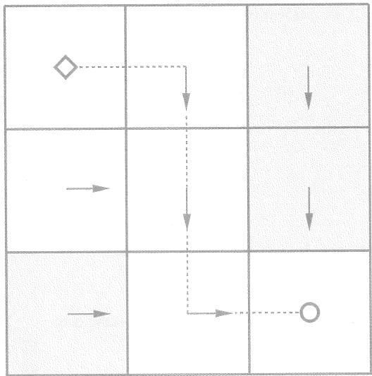

# 内容简介

本书从强化学习最基本的概念开始介绍，将介绍基础的分析工具，包括贝尔曼方程和贝尔曼最优方程，然后推广到基于模型的和无模型的强化学习算法，最后推广到基于值函数和策略函数的强化学习方法。本书强调从数学的角度引入概念、分析问题、分析算法。本书不要求读者具备任何关于强化学习的知识背景，仅要求读者具备一定的概率论和线性代数的知识。如果读者已经具备强化学习的学习基础，本书可以帮助读者更深入地理解一些问题并提供新的视角。

本书面向对强化学习感兴趣的本科生、研究生、研究人员和企业或研究所的从业者。

版权所有，侵权必究。举报：010-62782989，beiqinquan@tup.tsinghua.edu.cn。

# 图书在版编目（CIP）数据

强化学习的数学原理/ 赵世钰著.--北京：清华大学出版社，2025.4.--ISBN 978-7-302-68567-8

I. TP181

中国国家版本馆CIP数据核字第2025MF6035号

责任编辑：郭赛

封面设计：杨玉兰

责任校对：郝美丽

责任印制：杨艳

出版发行：清华大学出版社

网 址：https://www.tup.com.cn,https://www.wqxuetang.com

地址：北京清华大学学研大厦A座

邮 编：100084

社总机：010-83470000

邮购：010-62786544

投稿与读者服务：010-62776969，c-service@tup.tsinghua.edu.cn

质量反馈：010-62772015，zhiliang@tup.tsinghua.edu.cn

课件下载：https://www.tup.com.cn,010-83470236

印装者：小森印刷（北京）有限公司

经销：全国新华书店

开 本： $203\mathrm{mm}\times 260\mathrm{mm}$

印 张：18.5

字数：372

版 次：2025年4月第1版

印次：2025年4月第1次印刷

定价：108.00元

# 中文版自序

本教材的英文版已于2022年8月发布在GitHub上，供国内外读者免费下载阅读，其纸质版分别于2024年底和2025年初由清华大学出版社和施普林格自然出版社在国内外发行。自上线以来，本教材得到了许多关注，我也收到了不少反馈。其中有一些有意思的故事，借着这次机会，我想和大家分享一下。

这个自序可能有点长，我想和大家分享的东西不少，大家可以把它当作学习之余的休闲。

# 为什么要做这个教程？

曾经有小伙伴在我的线上课程视频下留言，原文是：“您是怎么学得这么透彻的呢，学习路线是什么样子的呢？”我回复的原文是“这个问题有点意思：如果一开始就能顺利而透彻地学习，我又怎么会呕心沥血去做这样一个教程呢？强化学习有多难学透，局中人才了解。”

我为什么要花大量时间来做这个教程呢？虽然国内外已经有很多关于强化学习的书籍和课程，但是我自己学习强化学习的过程是十分痛苦的。现有的教程大部分比较偏向直观，也有一些是比较偏向控制理论的。直观的解释往往难以令人透彻理解，而偏向控制理论的教程则需要专业背景。所以，我觉得现有教程中存在一个鸿沟。我想做一个新的教程，既能通过数学解释让读者“透彻理解”，又能通过创新体系架构和直观例子让读者“快速理解”。

我做这个教程的另一个原因在于自己的学习习惯。多年的研究经历让我有了一个习惯：打破砂锅问到底。对于一个算法，许多人可能知道怎么用就行了，但是我必须知道为什么，否则心里没有安全感，所以会一直往下挖，等所有的来龙去脉都搞清楚了，我才会安心。因此，我在学习过程中积累了大量的笔记资料，后来就想把这些资料整理后分享出来。

做这个教程的更深原因可能来源于早些年种在我内心中的一颗种子。虽然我是一名科研人员，但是一直觉得教学也能产生很大的影响力。为什么这么说呢？因为我自己就被深深地影响过！虽然我在本科期间上过线性代数的课程，但是在读博士时又自学了一遍，当时用的是MIT的Gilbert Strang教授的线性代数教材，我相信很多人都读过这本书。他在2023年退休了，当时网上还有一些讨论和感慨。他的书给我留下了很多的印象，感觉自己能够沉醉其中，并且在读的时候不禁感叹“太优美了”，有时候自己还能够会心一笑，我现在还清晰地记得当时读那本书会心一笑的场景。这个可能是种在我心里的一颗种子，希望有机会我也能写一本能帮助很多人的教材。如果你在读我的教程时也能够会心一笑，这将是我至高无上的荣幸。

# 究竟花了多少时间？

如果当初知道要花这么多时间，我可能就不会去做这个教程了。但是好在人生没有那么多“如果”，否则也不会有那么多惊喜了。

我究竟花了多少时间来做这个教程呢？这个很难统计，不过我简单算了一下。这本教材约300页，所有内容都由我亲自开发，包括数学推导、例子设计、仿真绘图、语言组织等。如果平均一天工作八小时，那么能不能写出来一页呢？我想了想，答案是不能。本质原因是现在没有一本类似的教材可以供我参考，我需要从零开始去开发。例如，我需要首先从大量文献中把分散的内容挖掘出来，之后用合适的方式将这些内容有机地组织在一起，再配上严格的数学推导和直观的例子说明，最后一遍又一遍地不断优化结构和文字。这些事情耗费的时间是难以想象的。所以，大家现在看到的10小时的课程视频，是我花了几百倍的时间浓缩而成的作品。如果你觉得好，那一定是有原因的。我经常去参观一些博物馆，当看到一些好物件，例如瓷器或手工艺品时，我经常会感叹“好东西啊好东西”。很多东西一看就知道当初那个工匠在这上面花了很多时间和心血，我自己也一直比较推崇工匠精神。

开发这个教程的过程中的酸甜苦辣，一般人是体会不了的。因为我还有很多其他事情要处理，中间有好几次想过放弃。不过随着投入的时间越来越多，后来想放弃也越来越困难，好在最后还是咬牙坚持下来了。值得庆幸的是，我经过多年的科研训练，学习能力还处于巅峰的状态，科技写作的经验也相对丰富，这些对我最终完成这个教程起到了重要的作用。有不少同学留言问我能不能做其他课程或者知识点的教学视频，虽然我很感谢大家的信任，但是我的统一回复都是：实在“肝”不动了。

# 这么做值得吗？

对于一个大学老师来说，花费如此巨大的精力和时间值得吗？当很多同学和老师和我说我的教程给了他们很大帮助时，我觉得是值得的！

截至2025年3月，教材在GitHub已经收获7000+星，课程视频在B站等平台播放总和超过130万次，它也是中国大学MOOC上的第一个强化学习课程。此外，有很多热心读者在网上发布了他们学习我的课程的笔记，单单这些笔记就已经得到了很多关注。还有一些读者把我的教程里面所有的例子都自己动手编程复现了出来，也有读者录制了视频来重新解读我的课程，我都很受触动。这些笔记和代码等资料的链接我都已经放到了GitHub的主页上。

我自己也收到了很多国内外邮件来信，其中一些给我留下了深刻的印象。例如，有一个在美国加州留学的中国学生给我写邮件，很坦诚地说他一般只看西方的教材和课程视频，因为他觉得西方的质量更高，但是他说我的课程是一个“反例”，给他带来了很大的帮助。这个同学给我留下了很深的印象，因为我觉得只要我们中国人愿意用心去做一件事情，那就一定能做好！此外，我也收到了一些国内外大学老师的来信，希望把我的教材或者课件用在他们的教学上，我一般都会非常开心地支持。

# 该怎么学习强化学习？

在大家都推崇“快速入门”和“无痛学习”的情况下，为什么我会反其道而行之，竟然要介绍数学原理呢？

我们要回答的第一个问题是：真的有必要学习数学吗？其实一门课究竟该怎么教或学，不完全取决于我们的主观想法，而是应该基于这门课的客观特点。强化学习具有两个特点：一个是数学性，另一个是系统性。很多读者觉得强化学习比其他人工智能领域更难入门，这与其数学性和系统性有很大关系。

数学性：强化学习从其诞生之初就有很强的数学性。虽然近些年在与深度学习结合之后，强化学习的工程性和实验性越来越强，但是理解强化学习的基础原理始终是入门的关键一步，这对于将来正确使用已有算法或者研发新型算法都十分必要。我们必须要面对的事实是：如果想透彻地理解强化学习，其数学原理是不可回避的。如果不讲背后的数学，而只是通过文字直观解释，那么很多时候看似懂了，但是经常会有云里雾里、似懂非懂的感觉。相反，如果我们从数学的角度去学习，便能够

更加透彻地理解很多算法的本质，而且学习效率可能更高，花费的时间可能更短。我相信许多读者都有过这样的体验：一个数学公式胜过千言万语的文字描述。

此外，数学其实并不总是令人生畏的。只要通过富有逻辑的方式呈现，掌握好数学知识的深度和广度，完全可以写出一本既适合入门又能揭示强化学习本质的书籍。在我的教程里面，我也不是一味地堆砌公式，因为那没有意义，关键是怎样从读者的角度去帮助读者更好地理解。我把很多数学内容放到了灰色的方框里面，明确告诉读者这些是选学内容，大家可以根据自己的情况选择性阅读。在教程视频里面，我对许多数学证明也尽量点到为止，让感兴趣的读者去书中自学。不过，有许多读者会很细致地阅读书中的数学推导并且给我反馈，这出乎我的意料也让我很欣慰，起码我写的一些很细节的东西还是帮助到了大家。

系统性：强化学习的系统性很强，许多概念一环扣一环。要想深入地理解强化学习，就要从最基础的概念出发，一点一滴地学习。这也是我建议大家放弃“速成”想法的一个重要原因。如果大家上来就学习Q-learning或者Actor-Critic的方法，连基本的概念都没有搞清楚，那么往往会一知半解。这个教程的一个新颖之处就是对现有方法的梳理：大家可以看书里的第一张图，这张图明确指出了不同方法之间的逻辑关系，也明确指出了应该先学什么、后学什么。

在了解了这两个特点之后，我们对该如何学习也就很清楚了。大家可以回想一下自己之前是怎么学习高等数学的。我们从不奢望能够在短时间内“速成”高等数学，因为我们知道必须脚踏实地一步一步来。我们必须先学会什么是极限，才能知道什么是导数，之后才能学习怎么求积分。如果还没有学习导数就想求积分，即使把积分的公式记下来了，也不意味着能够很好地理解和应用。

基础打得不牢，将来“楼”盖得越高，越会感觉乏力。一步一步地吃透强化学习中的数学原理看似是一个笨办法，实则是真正高效的捷径。

# 这个教程适合你吗？

大家可以快速判断一下本教程是否适合自己。

第一，本教程介绍的是“深度”强化学习吗？我想大部分读者都会对这个问题感兴趣，不过许多小伙伴可能还不清楚什么是深度强化学习。深度强化学习有两种含义。第一种含义是在强化学习中引入全连接神经网络，作为值函数或者策略函数的逼近器，这在本教程中已经涵盖。我觉得这个不是深度强化学习，但是大家一般也都称之为深度强化学习，即使这个网络并不深。第二种含义是把深度学习和强化学习相结合。一个简单的例子是输入是图像、输出是动作，或者最近流行的视觉-语

言-动作模型，这时就需要将用于处理图像或语言的深度学习方法与强化学习相结合。

大家可以自己判断一下你要学习的是哪一种。如果你对强化学习还不熟悉，你要学习的是第一种，而不是第二种，因为第二种是一种结合体，需要你对强化学习原理已经有一些了解。如果你要学习的是第一种，那么本教程就是合适的。

$\diamond$ 第二，本教程不要求读者有任何强化学习的背景知识，因为它会从最基本的概念开始介绍。只要你有决心系统而深入地学习，相信本教程一定能让你高效入门且“知其然并知其所以然”。如果读者已经有了一定的强化学习的背景，相信本教程也能给你带来新的视角和理解。  
第三，本教程会涉及高等数学、线性代数、概率论中的一些基础知识，读者最好学过这些课程。如果没有学过，可以参考本教程附录中给出的基础知识。我在介绍的时候也会循序渐进、逐步深入、配以例子，所以大家不用太担心这门教程过于数学化。  
第四，本教程更适合那些希望深入了解强化学习的同学，特别是未来需要进行学术研究或创新的同学。如果你未来要以此为生，强化学习就是你的“饭碗”，那么这个碗饭你要端得很牢才可以。相反，如果你只是想浅浅地了解一些名词和概念，那么你可能会发现本教程的深度超出了你的预期。  
第五，本教程侧重于原理而不是编程。如果你对编程感兴趣，那么可以参考许多其他优秀的资料。如果你想了解强化学习的原理，那么这个教程就是合适的。

# “四宫格”集齐

到目前为止，整套教程的“四宫格”已经集齐：中文版的教材；中文版的视频；英文版的教材；英文版的视频。详细信息请参见https://github.com/MathFoundationRL/Book-Mathematical-Foundation-of-Reinforcement-Learning，这是本教程在GitHub上的主页，大家也可以自行在网上搜索。

最初的教材是英文的，这一方面是因为我的所有学习笔记都是英文的，另一方面是因为我想写一本能够让国内外读者都能阅读的教材。那为什么我又要把英文教材翻译成中文呢？主要还是应读者的呼吁，对于一个不熟悉的领域，直接用母语阅读确实会更方便。不过翻译成中文要花费太多的时间，好在随着大语言模型的出现，现在的翻译工作也变得相对容易了。不过目前大语言模型翻译的文稿还有很多问题，还是需要我花费大量时间一遍遍地优化修改。

最初的课程视频是中文的，后来我把中文视频转成了英文。国内的读者可能不会

太关注英文视频，因为大家可以看中文视频，不过我觉得这是很有意义的一件事情，因为我们中国人做的课程在国际上还是很少的。那怎么去做英文课程视频呢？重新录视频真的是太花时间了，因为要非常流畅清晰而且中间不能出错，想一遍录制下来其实是很难的，大家看到的我的视频一般是录制了很多遍后才得到的。因此，这次转成英文视频的时候，我们利用了一些最近兴起的AI工具，例如声音克隆等。不过现在AI工具的输出还有大量的错误和问题，也需要我做仔细的修改和校对。

# 致谢

我要感谢清华大学出版社的郭赛编辑对我中英文教材的大力支持。在教材翻译的过程中，我实验室的吕嘉玲、徐璐峰、季文康等同学做了许多琐碎但是重要的工作，在此表示感谢。最后，要感谢关注这本书、帮助我改进这本书的天南海北的小伙伴，你们的认真学习是对我时间和精力付出的最好回报。希望这个教程能够扎扎实实地帮助到大家，让更多的读者进入生机勃勃的强化学习领域。

赵世钰

2025年3月

于中国杭州

# 英文版前言(中文翻译)

本书旨在成为一本数学但是友好的教材，能帮助读者“从零开始”实现对强化学习原理的“透彻理解”。本书的特点如下所述。

第一，从数学的角度讲故事，让读者不仅了解算法的流程，更能理解为什么一个算法最初设计成这个样子、为什么它能有效地工作等基本问题。  
$\diamond$ 第二，数学的深度被控制在恰当的水平，数学内容也以精心设计的方式呈现，从而确保本书的易读性。读者可以根据自己的兴趣选择性地阅读灰色方框中的数学材料。  
第三，提供了大量例子，能够帮助读者更好地理解概念和算法。特别是本书广泛使用了网格世界的例子，这个例子非常直观，对理解概念和算法非常有帮助。  
第四，在介绍算法时尽可能将其核心思想与一些不太重要但是可能让算法看起来很复杂的东西分离开来。通过这种方式，读者可以更好地把握算法的核心思想。  
第五，本书采用了新的内容组织架构，脉络清晰，易于建立宏观理解，内容层层递进，每一章都依赖于前一章且为后续章节奠定基础。

本书适合对强化学习感兴趣的高年级本科生、研究生、科研人员和工程技术人员阅读。由于本书会从最基本的概念开始介绍，因此不要求读者有任何强化学习的背景。当然，如果读者已经有一些强化学习的背景，我相信本书可以帮助大家更深入地理解一些问题或者提供不同的视角。此外，本书要求读者具备一些概率论和线性代数的知识，这些知识在本书附录中已经给出。

自2019年以来，我一直在教授研究生的强化学习课程，我要感谢课程中的学生对我的教学提出的反馈建议。自2022年8月把这本书的草稿在线发布在GitHub，到目前为止我收到了许多读者的宝贵反馈，在此对这些读者表示衷心感谢。此外，我还要感谢我的团队成员吕嘉玲在编辑书稿和课程视频方面所做的大量琐碎但是重要的工作；感谢助教李佳楠和米轶泽在我的教学中的勤恳工作；感谢我的博士生郑灿伦在设计书中图片方面的帮助，以及我的家人的大力支持。

最后，我要感谢清华大学出版社的郭赛编辑和施普林格自然出版社的常兰兰博士，他们对于书稿的顺利出版给予了大力支持。

我真诚地希望这本书能够帮助读者顺利进入强化学习这一激动人心的领域。

赵世钰

# 本书概览

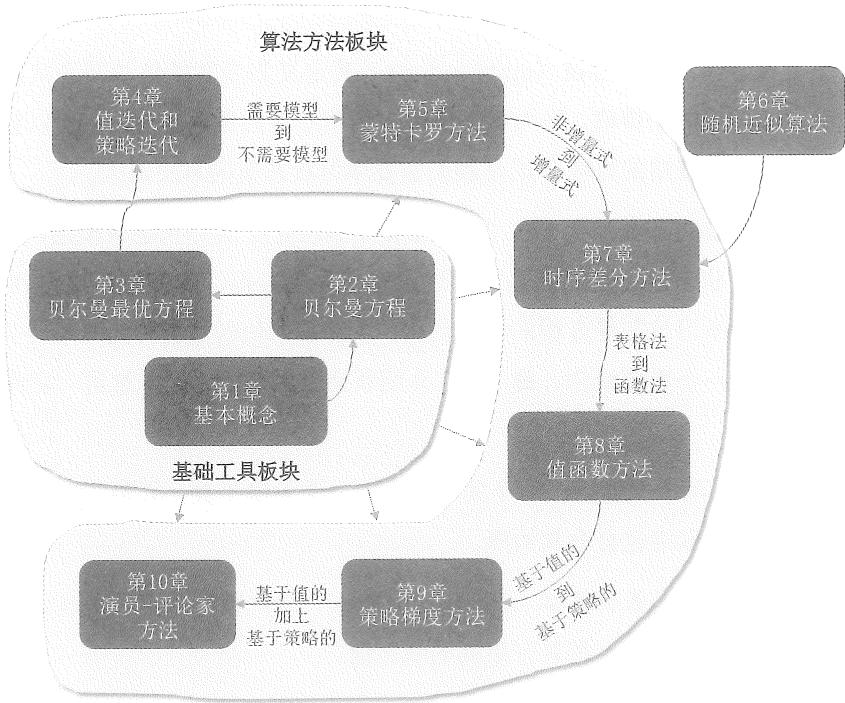  
图1 本书的内容结构图。

在开始强化学习的旅程之前，有必要先了解一下本书的内容结构（图1）。本书包含10章，可以分为两部分：第一部是关于基础工具，第二部分是关于算法方法。这10章之间密切相关、互为依托，前面的章节是后面章节的基础。

接下来，请随我快速浏览这10章的内容。我将介绍每一章的两个方面：一是每章的内容，二是每章与前后章的关系。这个概述的目的是让读者快速了解整个强化学习原理的脉络。如果其间读者遇到了很多陌生的概念，完全没有关系。只要读者在阅读完下面的概述之后能制定出适合自己的学习计划，那么这个概述的目的就达到了。当然，读者也可以在学完全书后再来看这个概述，到时候你一定能对强化学习的脉络和

内容有更好的理解。

$\diamond$ 第1章介绍了强化学习中最基础的概念，包括状态、动作、奖励、回报、策略等。这些概念在后续章节会有广泛应用。这一章首先通过网格世界的例子来介绍这些概念。在这个网格世界中，一个智能体的任务是制定出合适的策略，从某一个位置出发，到达指定位置。这个例子非常直观，有助于帮助初学者快速理解。之后，这些概念在基于马尔可夫决策过程（Markov decision processes, MDPs）的框架下以更加正式的方式介绍出来。

$\diamond$ 第2章介绍了两个关键点：一个关键概念，一个关键工具。只要明白了这两个关键点，这一章的脉络就会非常清晰。

一个关键概念指的是状态值（state value）。其定义为当智能体从某个状态出发时所能获得的回报的期望值。因为状态值越大说明对应的策略就越好，所以状态值可以用来评估一个策略的好坏，这是我们需要学习状态值的本质原因。

一个关键工具指的是贝尔曼方程（Bellman equation）。用一句话来概述，贝尔曼方程描述了所有状态值之间的关系。通过求解贝尔曼方程，我们就可以得到状态值，这是我们需要学习贝尔曼方程的本质原因。求解状态值的过程称为策略评价，这是强化学习中的一个重要概念。最后，在介绍状态值的基础上，本章进一步介绍动作值的概念。

◇ 第3章也介绍了两个关键点：一个关键概念，一个关键工具。只要明白了这两个关键点，这一章的脉络也会非常清晰。

一个关键概念指的是最优策略（optimal policy）。最优策略的定义是该策略相比其他任意策略在所有状态上都具有更高的状态值。

一个关键工具指的是贝尔曼最优方程（Bellman optimality equation）。顾名思义，贝尔曼最优方程是一种特殊的贝尔曼方程，之所以称其为“最优”，是因为这个方程对应了最优策略。本章涉及一个非常基础的问题：强化学习的终极目标是什么？我在线下授课时会告诉学生：当你听到这个问题的时候，一定要非常清晰地回答出强化学习的终极目标是寻找最优策略。贝尔曼最优方程之所以重要是因为它可以用来刻画最优策略。虽然初学者可能需要花一些时间去理解这个方程，但是一旦理解，你就会发现它是一个十分优雅和强大的工具，能够帮助我们深入理解许多基本问题和算法。

前3章构成了本书的第一个板块：基础工具。这个板块为后续章节奠定了必要的基础。本书从第4章开始将介绍能够得到最优策略的各式各样的算法。

$\diamond$ 第4章介绍了三种算法：值迭代（value iteration）、策略迭代（policy iteration）、截断策略迭代（truncated policy iteration）。这三种算法关系密切、相辅相成。第一，值迭代算法实际上就是第3章给出的用于求解贝尔曼最优方程的算法。第二，策略迭代算法是值迭代算法的推广，它也是第5章将介绍的蒙特卡罗方法的直接基础。第三，截断策略迭代算法是更加一般化的算法：值迭代和策略迭代是它的两个特殊情况。

这三种算法具有类似的结构，即每次迭代都有两个步骤：一个步骤用来更新值，另一个步骤用来更新策略。这种在更新值和更新策略之间不断切换的思想被称为广义策略迭代（generalized policy iteration，GPI），该思想广泛存在于各式各样的强化学习算法中。

本章介绍的算法实际上可以归类为动态规划（dynamic programming）算法。这些算法需要预先知道系统模型。本书后续章节中介绍的算法都不再需要模型。理解好本章介绍的“有模型”算法对于理解后面介绍的“无模型”算法至关重要。

$\diamond$ 第5章给出了本书第一个无模型（model-free）的强化学习算法。之后所有章节介绍的算法都不再依赖于模型。

由于这是本书第一次介绍无模型算法，因此这里有一个知识鸿沟需要填补：怎么样在没有模型的情况下学习最优策略？其基本思路非常简单：可以使用大量数据来估计状态值进而改进策略。如果没有模型，我们必须要有数据；如果没有数据，必须要有模型。如果两者都没有，那什么也做不了。“数据”在强化学习中指的是智能体与环境交互产生的经验样本（experience sample）。

具体来说，本章介绍三种基于蒙特卡罗的算法，这些算法能够从经验样本中学习最优策略。第一个也是最简单的算法称为MC Basic。该算法就是把第4章介绍的策略迭代算法中“需要模型”的模块替换成“不需要模型”的模块。理解MC Basic算法对于理解蒙特卡罗方法的基本思想非常重要。通过扩展这一算法，我们可以得到更复杂但更高效的算法。此外，探索（exploration）与利用（exploitation）之间的平衡是强化学习非常基础的问题，本章也将对该问题进行讨论。

到目前为止，读者可能已经注意到强化学习的“系统性”非常强，不同章节之间的关系非常密切。例如，如果我们想学习第5章中无模型的蒙特卡罗算法，那么必须先理解第4章中的策略迭代算法。如果想理解策略迭代算法，则必须首先学习值迭代算法。如果要学习值迭代算法，那么要先理解第3章的贝尔曼最优方程。要理解贝尔曼最优方程，则要先学习第2章中的贝尔曼方程。因此，如果读者是从零开始入门，我强烈建议从前往后逐章学习，否则后面章节的内容可能会一知半解、似懂非懂。

$\diamond$ 第7章将介绍时序差分方法，然而在从第5章跳到第7章时存在一个知识鸿沟：第7章中的算法是增量式的（incremental），而第5章中的算法则是非增量式的（non-incremental）。如果不很好地填补这个鸿沟，那么读者很容易感到迷惑。因此，我们在第6章通过介绍随机近似（stochastic approximation）理论来填补这一知识鸿沟。

随机近似指的是用随机迭代算法求解方程或者优化问题的过程。经典的随机梯度下降算法和Robbins-Monro算法都是特殊的随机近似算法。尽管这一章没有介绍任何强化学习算法，但是它却十分重要，因为它为第7章奠定了必要的基础。

$\diamond$ 第7章介绍了时序差分（temporal-difference，TD）算法。有了第6章的准备，相信读者在看到这一章的时序差分算法时就不会感到意外了。实际上，时序差分算法可以被视为求解贝尔曼方程或贝尔曼最优方程的随机近似算法。

时序差分方法也是无模型的。由于其增量形式，它相比蒙特卡罗方法具有一定优势，例如它可以在线学习：每次接收到经验样本时，它可以立即用于更新值和策略。本章将介绍一些具体的时序差分算法，包括Sarsa和Q-learning等。此外，同策略（on-policy）和异策略（off-policy）的概念也将在本章介绍。

$\diamond$ 第8章介绍了值函数（value function）方法。事实上，这一章仍然在介绍时序差分方法，只不过它采用了不同的方式来表示状态值和动作值。在本章之前，状态值和动作值都是通过表格表示的。虽然表格方法易于理解，但是难以高效处理大型状态或动作空间。为此，可以用函数来表示值。理解这种方法的关键是理解其三个步骤：第一步是选择合适的目标函数，第二步是推导目标函数的梯度，第三步是用基于梯度的方法来优化目标函数。值函数方法很重要，因为现在它已经成为表示值的标准方法，而且这也是将人工神经网络作为函数逼近器引入强化学习的切入点。著名的深度Q-learning算法也将在本章介绍。

$\diamond$ 第9章介绍了策略梯度（policy gradient）方法，这是许多现代强化学习算法的基础。在本章之前，策略都是通过表格表示的，而本章采用函数来表示策略（注意第8章是用函数来表示值的）。

策略梯度方法的基本思想非常简单：第一，选择一个合适的目标函数；第二，求解目标函数对策略参数的梯度；第三，应用基于梯度的算法来优化目标函数。策略梯度方法有众多优势，例如它可以更加高效地处理大型状态和动作空间，也具有更强的泛化能力。

◇ 第10章介绍了演员-评论家（actor-critic）方法。从一个角度来说，演员-评论家方法是第9章中策略梯度方法和第8章中值函数方法的结合体。从另一个角度来说，

演员-评论家方法仍然是第9章中的策略梯度方法，只不过其中估计值的时候使用了第8章中值函数的方法。因此，在学习第10章之前，需要先理解第8章和第9章的内容。

至此，我们概述了本书的所有内容，这是一个“名词大全”和“脉络大全”。虽然大家目前还不清楚里面的很多概念，但是没有关系，只要大家了解了本书的脉络，并且能据此制定一个适合自己的学习计划，那这个概述的目的就达到了。

# 目录

# 第1章 基本概念 1

1.1 网格世界例子 2  
1.2 状态和动作 2  
1.3 状态转移 3   
1.4 策略 5  
1.5奖励 7   
1.6 轨迹、回报、回合 9  
1.7 马尔可夫决策过程 11  
1.8 总结 13  
1.9 问答 13

# 第2章 状态值与贝尔曼方程 15

2.1 启发示例1：为什么回报很重要？ 16  
2.2 启示例2：如何计算回报？ 17  
2.3 状态值 19   
2.4 贝尔曼方程 20  
2.5 示例 22  
2.6 矩阵向量形式 25  
2.7 求解状态值 27

2.7.1 方法1：解析解 27  
2.7.2 方法2：数值解 27  
2.7.3 示例 28

2.8 动作值 30

2.8.1 示例 31

2.8.2 基于动作值的贝尔曼方程 32  
2.9 总结 32  
2.10 问答 33

# 第3章 最优状态值与贝尔曼最优方程 35

3.1 启发示例：如何改进策略？ 36  
3.2 最优状态值和最优策略 37

3.3 贝尔曼最优方程 38

3.3.1 方程右侧的优化问题 39  
3.3.2 矩阵-向量形式 40  
3.3.3 压缩映射定理 41  
3.3.4 方程右侧函数的压缩性质 44

3.4 从贝尔曼最优方程得到最优策略 46  
3.5 影响最优策略的因素 49  
3.6 总结 54  
3.7 问答 54

# 第4章 值迭代与策略迭代 57

4.1 值迭代算法 58

4.1.1 展开形式和实现细节 59  
4.1.2 示例 59

4.2 策略迭代算法 62

4.2.1 算法概述 62  
4.2.2 算法的展开形式 65  
4.2.3 示例 66

4.3 截断策略迭代算法 68

4.3.1 对比值迭代与策略迭代 68  
4.3.2 截断策略迭代算法 71

4.4 总结 73  
4.5 问答 73

# 第5章 蒙特卡罗方法 77

5.1 启发示例：期望值估计 78

5.2 MC Basic: 最简单的基于蒙特卡罗的算法 ..... 80

5.2.1 将策略迭代算法转换为无需模型 80  
5.2.2 MC Basic 算法 81  
5.2.3 示例 82

5.3 MC Exploring Starts算法 86

5.3.1 更高效地利用样本 86  
5.3.2 更高效地更新策略 87  
5.3.3 算法描述 87

5.4 MC $\epsilon$ -Greedy 算法 ..... 88

5.4.1 $\epsilon$ -Greedy 策略 ..... 89  
5.4.2 算法描述 89  
5.4.3 示例 91

5.5 探索与利用：以 $\epsilon$ -Greedy 策略为例 ..... 91  
5.6 总结 96  
5.7 问答 96

# 第6章 随机近似算法 99

6.1 启发示例：期望值估计 100   
6.2 罗宾斯-门罗算法 ..... 101

6.2.1 收敛性质 103  
6.2.2 在期望值估计问题中的应用 106

6.3 Dvoretzky定理 107

6.3.1 Dvoretzky定理的证明 108  
6.3.2 应用于分析期望值估计算法 109  
6.3.3 应用于证明罗宾斯-门罗定理 110  
6.3.4 Dvoretzky定理的推广 111

6.4 随机梯度下降 112

6.4.1 应用于期望值估计 113  
6.4.2 随机梯度下降的收敛模式 114  
6.4.3 随机梯度下降的另一种描述 116  
6.4.4 小批量梯度下降 117  
6.4.5 随机梯度下降的收敛性 118

6.5 总结 120

6.6 问答 120

# 第7章 时序差分方法 ..... 123

7.1 状态值估计：最基础的时序差分算法 ..... 124

7.1.1 算法描述 124  
7.1.2 性质分析 126  
7.1.3 收敛性证明 127

7.2 动作值估计：Sarsa 130

7.2.1 算法描述 131  
7.2.2 学习最优策略 132

7.3 动作值估计： $n$ StepSarsa 135  
7.4 最优动作值估计：Q-learning 137

7.4.1 算法描述 137  
7.4.2 Off-policy and On-policy 138   
7.4.3 算法实现 140   
7.4.4 示例 141

7.5 时序差分算法的统一框架 ..... 142  
7.6 总结 145  
7.7 问答 145

# 第8章 值函数方法 149

8.1 价值表示：从表格到函数 ..... 150  
8.2 基于值函数的时序差分算法：状态值估计 153

8.2.1 目标函数 154  
8.2.2 优化算法 ..... 159  
8.2.3 选择值函数 160  
8.2.4 示例 161  
8.2.5 理论分析 165

8.3 基于值函数的时序差分：动作值估计 175

8.3.1 基于值函数的Sarsa 176  
8.3.2 基于值函数的Q-learning 177

8.4 深度Q-learning 178

8.4.1 算法描述 179

8.4.2 示例 180  
8.5 总结 183  
8.6 问答 183

# 第9章 策略梯度方法 187

9.1 策略表示：从表格到函数 188  
9.2 目标函数：定义最优策略 189  
9.3 目标函数的梯度 194

9.3.1 推导策略梯度：有折扣的情况 195   
9.3.2 推导策略梯度：无折扣的情况 200

9.4 蒙特卡罗策略梯度（REINFORCE） 206  
9.5 总结 208  
9.6 问答 209

# 第10章 演员-评论家方法 211

10.1 最简单的演员-评论家算法：QAC 212  
10.2 优势演员-评论家 213

10.2.1 基准不变性 213  
10.2.2 算法描述 215

10.3 异策略演员-评论家 217

10.3.1 重要性采样 217  
10.3.2 Off-policy 策略梯度定理 220  
10.3.3 算法描述 221

10.4 确定性演员-评论家 223

10.4.1 确定性策略梯度定理 223  
10.4.2 算法描述 229

10.5 总结 230  
10.6 问答 231

# 附录A 概率论基础 233

# 附录B 测度概率论 239

附录C 序列的收敛性 247

C.1 确定性序列的收敛性 248  
C.2 随机序列的收敛性 250

附录D 梯度下降方法 255

符号 261  
索引 262  
参考文献 265

# 第1章

# 基本概念

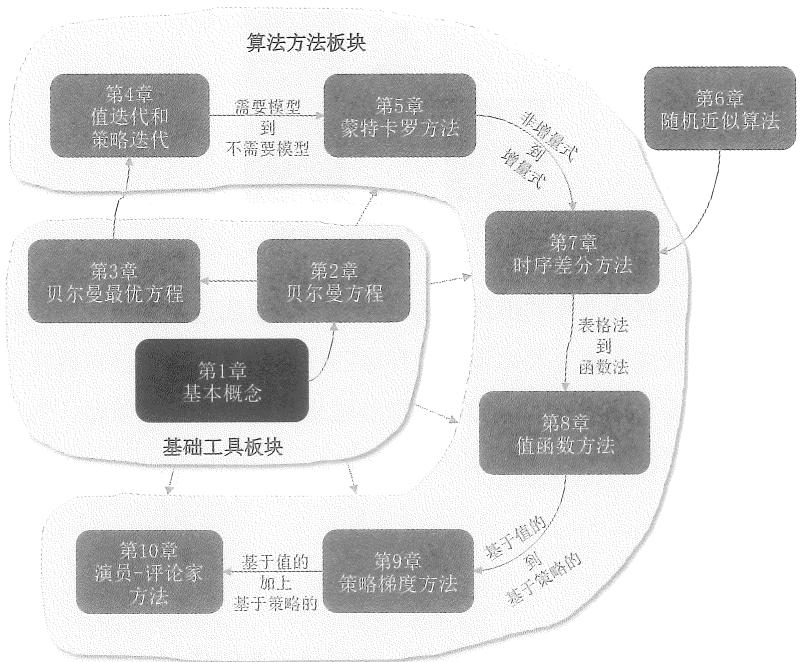  
图1.1 本章在全书中的位置。

本章介绍强化学习中最基本的概念，这些概念将在本书中广泛使用。本章首先通过网格世界的例子引出这些概念，之后会在马尔可夫决策过程的框架中对它们进行更加正式的介绍。

# 1.1 网格世界例子

图1.2展示了一个网格世界（grid world）的例子。其中有一个智能体（agent）在网格中移动。在每个时刻，智能体只能占据一个单元格。白色单元格代表可以进入的区域，橙色单元格代表禁止进入的区域，蓝色单元格代表目标区域。智能体的任务是从一个初始区域出发，最终到达目标区域。这个网格世界的例子非常直观，能够很好地解释许多新概念、新算法，将在本书中广泛使用。

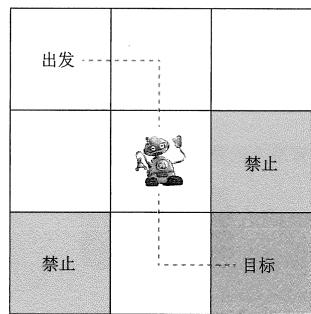  
图1.2 网格世界的示例。

如果智能体知道网格世界的地图，那么规划一条能到达目标单元格的路径其实并不难。然而，如果智能体事先不知道有关环境的任何信息，这个任务就变得有挑战性了。此时智能体需要与环境交互，通过获取经验来找到一个好的策略。为了能够描述这样一个过程，我们需要学习一系列的基本概念。

# 1.2 状态和动作

本书介绍的第一个概念是状态（state），它描述了智能体与环境的相对状况。具体到网格世界的例子中，状态对应了智能体所在单元格的位置。如图1.3(a)所示，这个网格有9个单元格，因此也对应了9个状态，它们被表示为 $s_1, s_2, \ldots, s_9$ 。所有状态的集合被称为状态空间（state space），表示为 $\mathcal{S} = \{s_1, s_2, \ldots, s_9\}$ 。我们通常用花括号{}来表示一个集合。

我们介绍的第二个概念是动作（action）。具体到网格世界的例子中，智能体在每一个状态有5个可选的动作：向上移动、向右移动、向下移动、向左移动、保持不动。这5

个动作分别表示为 $a_1, a_2, \ldots, a_5$ （图1.3(b)）。所有动作的集合被称为动作空间（action space），表示为 $\mathcal{A} = \{a_1, a_2, \ldots, a_5\}$ 。

值得注意的是，不同的状态可以有不同的动作空间。例如，我们可以设置状态 $s_1$ 的动作空间为 $\mathcal{A}(s_1) = \{a_2, a_3, a_5\}$ ，即可以把那些明显不合理的动作（即向上或向左移动）从动作空间中删除。不过在本书中，我们考虑最一般的情况，即所有的状态都对应 5 个动作。即使其中有我们认为不合理的动作，我们也并不人为避开，而是要通过算法学习到哪些动作好、哪些动作不好。此时，对任意状态 $s \in S$ ，有 $\mathcal{A}(s) = \mathcal{A} = \{a_1, a_2, \ldots, a_5\}$ 。

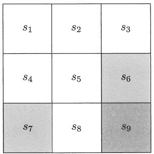  
(a) 状态

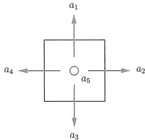  
(b) 动作  
图1.3 状态和动作的示例。(a)该网格有9个状态： $\{s_1,s_2,\dots ,s_9\}$ 。(b)每个状态有5个可能的动作： $\{a_{1},a_{2},a_{3},a_{4},a_{5}\}$ 。

# 1.3 状态转移

当执行一个动作时，智能体可能从一个状态转移到另一个状态，这样的过程被称为状态转移（state transition）。例如，如果智能体当前时刻处在状态 $s_1$ 并且执行动作 $a_2$ （即向右移动），那么智能体会在下个时刻移动到状态 $s_2$ ，这个过程可以表示为

$$
s _ {1} \xrightarrow {a _ {2}} s _ {2}.
$$

下面我们考虑两个特殊但重要的情况。

当智能体试图越过网格世界的边界时，它下一个时刻应该转移到什么状态呢？例如，在状态 $s_1$ 采取动作 $a_1$ （即向上移动）时，因为智能体不可能跳出状态空间，所以智能体会被弹回到某一个状态。这里我们设置智能体会被弹回到原来的状态，即 $s_1$ 。这样一个状态转移的过程可以表示为 $s_1 \xrightarrow{a_1} s_1$ 。

有的读者可能会问：智能体有没有可能被弹回到其他状态呢？答案是有可能的。因为这个网格世界是一个仿真环境，所以我们可以根据自己的喜好任意设置其状态转移过程。然而，如果是在现实世界中，那么状态转移需要服从物理规律，不再能

任意设置。

当智能体试图进入禁止区域时，它下一个时刻应该转移到什么状态呢？例如，在状态 $s_5$ 采取动作 $a_2$ （向右移动）。此时可能遇到两种情况。在第一种情况中，虽然 $s_6$ 是禁止区域，但它仍然是“可进入”的，只不过进入的时候会受到惩罚。此时，下一个状态是 $s_6$ 。这个状态转移的过程可以表示为 $s_5 \xrightarrow{a_2} s_6$ 。在第二种情况中， $s_6$ 是“不可进入”的，例如它四周被墙壁包围了起来。在这种情况下，智能体会被弹回到 $s_5$ ，此时的状态转移过程是 $s_5 \xrightarrow{a_2} s_5$ 。

我们究竟应该考虑哪种情况呢？因为这是一个仿真环境，所以我们可以随意选择。在本书中，我们选择第一种情况，即认为禁止区域仍然是可以进入的，只是智能体会受到惩罚。这种情况更为一般化并且更加有趣，例如之后我们会看到智能体可能会“冒险”穿过禁止区域，从而能更快地到达目标区域。

每一个状态的每一个动作都会对应一个状态转移过程。这些过程可以用一个表格来描述，如表1.1所示。在这个表格中，每一行对应一个状态，每一列对应一个动作。每个单元格给出了智能体会转移到的下一个状态。

表 1.1 状态转移过程可以用表格来表示。  

<table><tr><td></td><td>a1(向上)</td><td>a2(向右)</td><td>a3(向下)</td><td>a4(向左)</td><td>a5(不动)</td></tr><tr><td>s1</td><td>s1</td><td>s2</td><td>s4</td><td>s1</td><td>s1</td></tr><tr><td>s2</td><td>s2</td><td>s3</td><td>s5</td><td>s1</td><td>s2</td></tr><tr><td>s3</td><td>s3</td><td>s3</td><td>s6</td><td>s2</td><td>s3</td></tr><tr><td>s4</td><td>s1</td><td>s5</td><td>s7</td><td>s4</td><td>s4</td></tr><tr><td>s5</td><td>s2</td><td>s6</td><td>s8</td><td>s4</td><td>s5</td></tr><tr><td>s6</td><td>s3</td><td>s6</td><td>s9</td><td>s5</td><td>s6</td></tr><tr><td>s7</td><td>s4</td><td>s8</td><td>s7</td><td>s7</td><td>s7</td></tr><tr><td>s8</td><td>s5</td><td>s9</td><td>s8</td><td>s7</td><td>s8</td></tr><tr><td>s9</td><td>s6</td><td>s9</td><td>s9</td><td>s8</td><td>s9</td></tr></table>

在数学上，状态转移过程可以通过条件概率来描述。例如，状态 $s_1$ 和动作 $a_2$ 对应的状态转移可以用如下条件概率描述：

$$
\begin{array}{l} p \left(s _ {1} \mid s _ {1}, a _ {2}\right) = 0, \\ p \left(s _ {2} \mid s _ {1}, a _ {2}\right) = 1, \\ p \left(s _ {3} \mid s _ {1}, a _ {2}\right) = 0, \\ p \left(s _ {4} \mid s _ {1}, a _ {2}\right) = 0, \\ p \left(s _ {5} \mid s _ {1}, a _ {2}\right) = 0. \\ \end{array}
$$

该条件概率告诉我们：当在状态 $s_1$ 采取动作 $a_2$ 时，智能体转移到状态 $s_2$ 的概率是1,

而转移到其他任意状态的概率是0。因此，在 $s_1$ 采取 $a_2$ 一定会导致智能体转移到 $s_2$ 。条件概率以及基本的概率知识已经在附录A中给出，供读者参考。

虽然直观，但是表格只能描述确定性的（deterministic）状态转移过程。其实状态转移也可以是随机性的（stochastic），此时需要用条件概率分布来描述。什么是随机性的状态转移过程呢？假设网格世界中有随机的阵风吹过。如果在状态 $s_1$ 采取动作 $a_2$ ，智能体可能被阵风吹到 $s_5$ 而不是 $s_2$ 。在这种情况下，我们有 $p(s_5 | s_1, a_2) > 0$ ，即下一个状态具有不确定性。不过简单起见，在本书网格世界的例子中，我们只考虑确定性的状态转移过程。

# 1.4 策略

策略（policy）会告诉智能体在每一个状态应该采取什么样的动作。

在直观上，策略可以通过箭头来描述（图1.4(a)）。如果智能体执行某一个策略，那么它会从初始状态生成一条轨迹（图1.4(b)）。

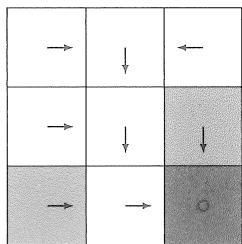  
(a) 一个确定性策略

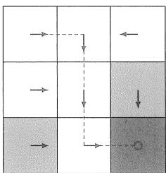

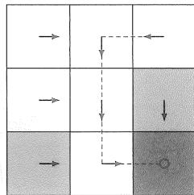

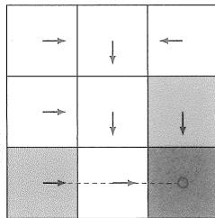  
(b) 从不同状态出发得到的轨迹  
图1.4 一个确定性策略和对应的轨迹。

在数学上，策略可以通过条件概率来描述。我们常用 $\pi(a|s)$ 来表示在状态 $s$ 采取动作 $a$ 的概率（注意这里的 $\pi$ 不是圆周率）。这个概率对每一个状态和每一个动作都有定义。在图1.4所示的例子中，状态 $s_1$ 对应的策略是

$$
\begin{array}{l} \pi \left(a _ {1} \mid s _ {1}\right) = 0, \\ \pi \left(a _ {2} \mid s _ {1}\right) = 1, \\ \pi \left(a _ {3} \mid s _ {1}\right) = 0, \\ \pi \left(a _ {4} \mid s _ {1}\right) = 0, \\ \pi \left(a _ {5} \mid s _ {1}\right) = 0. \\ \end{array}
$$

该条件概率表明在状态 $s_1$ 采取动作 $a_2$ 的概率为1，而采取其他任意动作的概率都为0。其他状态 $\{s_2, s_3, \ldots, s_9\}$ 都可以用类似的条件概率来描述其对应的策略。

上面例子中的策略是确定性的。策略也可能是随机性的。例如，图1.5中给出了一个随机策略：在状态 $s_1$ ，智能体有0.5的概率采取向右的动作，有0.5的概率采取向下的动作。此时在状态 $s_1$ 的策略是

$$
\begin{array}{l} \pi \left(a _ {1} \mid s _ {1}\right) = 0, \\ \pi \left(a _ {2} \mid s _ {1}\right) = 0. 5, \\ \pi \left(a _ {3} \mid s _ {1}\right) = 0. 5, \\ \pi \left(a _ {4} \mid s _ {1}\right) = 0, \\ \pi (a _ {5} | s _ {1}) = 0. \\ \end{array}
$$

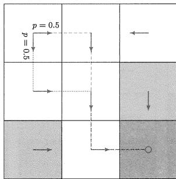  
图1.5 一个随机性策略和对应的轨迹。在状态 $s_1$ ，智能体各有0.5的概率向右或向下移动。

除了用条件概率，策略也可以用表格来描述。例如，表1.2展示了图1.5中描绘的随机策略。其中第 $i$ 行和第 $j$ 列的元素对应了在第 $i$ 个状态采取第 $j$ 个动作的概率。这样的方法被称为表格表示法（tabular representation）。这种表格表示法是非常基础的，对于理解众多强化学习中的概念和算法至关重要。

表 1.2 用表格来表示一个策略。  

<table><tr><td></td><td>a1(向上)</td><td>a2(向右)</td><td>a3(向下)</td><td>a4(向左)</td><td>a5(不动)</td></tr><tr><td>s1</td><td>0</td><td>0.5</td><td>0.5</td><td>0</td><td>0</td></tr><tr><td>s2</td><td>0</td><td>0</td><td>1</td><td>0</td><td>0</td></tr><tr><td>s3</td><td>0</td><td>0</td><td>0</td><td>1</td><td>0</td></tr><tr><td>s4</td><td>0</td><td>1</td><td>0</td><td>0</td><td>0</td></tr><tr><td>s5</td><td>0</td><td>0</td><td>1</td><td>0</td><td>0</td></tr><tr><td>s6</td><td>0</td><td>0</td><td>1</td><td>0</td><td>0</td></tr><tr><td>s7</td><td>0</td><td>1</td><td>0</td><td>0</td><td>0</td></tr><tr><td>s8</td><td>0</td><td>1</td><td>0</td><td>0</td><td>0</td></tr><tr><td>s9</td><td>0</td><td>0</td><td>0</td><td>0</td><td>1</td></tr></table>

# 1.5 奖励

奖励（reward）是强化学习中最独特的概念之一。

在一个状态执行一个动作后，智能体会获得奖励 $r$ 。 $r$ 是一个实数，它是状态 $s$ 和动作 $a$ 的函数，可以写成 $r(s, a)$ 。其值可以是正数、负数或零。不同的奖励值对智能体最终学习到的策略有不同的影响。一般来说，正的奖励表示我们鼓励智能体采取相应的动作；负的奖励表示我们不鼓励智能体采取该动作。另外，如果 $r$ 是负数，此时称之为“惩罚”更为合适，不过我们一般不加区分地统一称之为“奖励”。

在之前提到的网格世界的例子中，我们可以设置如下奖励：

如果智能体试图越过四周边界，设 $r_{\mathrm{boundary}} = -1$   
如果智能体试图进入禁止区域，设 $r_{\mathrm{forbidden}} = -1$   
如果智能体到达了目标区域，设 $r_{\mathrm{target}} = +1$   
在其他情况下，智能体获得的奖励为 $r_{\mathrm{other}} = 0$

值得提醒读者的是，当智能体到达目标状态 $s_9$ 之后，它也许会持续执行策略，进而持续获得奖励。例如，如果智能体在 $s_9$ 采取动作 $a_5$ （保持不动），下一个状态依然是 $s_9$ ，此时会继续获得奖励 $r_{\text{target}} = +1$ 。如果智能体在 $s_9$ 执行动作 $a_2$ （向右移动），会试图越过右侧边界，因此会被反弹回来，此时下一个状态也是 $s_9$ ，但奖励是 $r_{\text{boundary}} = -1$ 。

奖励实际上是人机交互的一个重要手段：我们可以设置合适的奖励来引导智能体按照我们的预期来运动。例如，通过上述奖励设置，智能体会尽可能避免越过边界、避免进入禁止区域、力争进入目标区域。设计合适的奖励来实现我们的意图是强化学习中的一个重要环节。然而对于复杂的任务，这一环节可能并不简单，它需要用户能很

好地理解所给定的任务。尽管如此，奖励的设计可能仍然比使用其他专业工具来设计策略更容易，这也是强化学习受众比较广的原因之一。

奖励的过程可以直观地表示为一个表格，如表1.3所示。表格的每一行对应一个状态，每一列对应一个动作。表格中每个单元格的值是在该状态采取该动作后可以获得的奖励。初学者可能会问一个问题：如果已知这个奖励表格，我们是否可以通过简单地选择对应最大奖励的动作来找到好的策略呢？答案是否定的。这是因为这些奖励只是即时奖励（immediate reward），即在采取一个动作后可以立刻获得的奖励。如果要寻找一个好的策略，那么必须考虑更长远的总奖励（total reward）（更多信息将在第1.6节中给出）。具有最大即时奖励的动作不一定能带来最大的总奖励。

表 1.3 奖励可以用表格来表示。  

<table><tr><td></td><td>a1(向上)</td><td>a2(向右)</td><td>a3(向下)</td><td>a4(向左)</td><td>a5(不动)</td></tr><tr><td>s1</td><td>rboundary</td><td>0</td><td>0</td><td>rboundary</td><td>0</td></tr><tr><td>s2</td><td>rboundary</td><td>0</td><td>0</td><td>0</td><td>0</td></tr><tr><td>s3</td><td>rboundary</td><td>rboundary</td><td>rforbidden</td><td>0</td><td>0</td></tr><tr><td>s4</td><td>0</td><td>0</td><td>rforbidden</td><td>rboundary</td><td>0</td></tr><tr><td>s5</td><td>0</td><td>rforbidden</td><td>0</td><td>0</td><td>0</td></tr><tr><td>s6</td><td>0</td><td>rboundary</td><td>rtarget</td><td>0</td><td>rforbidden</td></tr><tr><td>s7</td><td>0</td><td>0</td><td>rboundary</td><td>rboundary</td><td>rforbidden</td></tr><tr><td>s8</td><td>0</td><td>rtarget</td><td>rboundary</td><td>rforbidden</td><td>0</td></tr><tr><td>s9</td><td>rforbidden</td><td>rboundary</td><td>rboundary</td><td>0</td><td>rtarget</td></tr></table>

虽然直观，但是表格表示只能描述确定性的奖励过程。为了描述更加一般化的奖励过程，我们可以使用条件概率： $p(r|s,a)$ 表示在状态 $s$ 采取动作 $a$ 得到奖励 $r$ 的概率。在前述的例子中，对状态 $s_1$ ，有

$$
p (r = - 1 | s _ {1}, a _ {1}) = 1, \quad p (r \neq - 1 | s _ {1}, a _ {1}) = 0.
$$

该条件概率表明在 $s_1$ 采取 $a_1$ 得到 $r = -1$ 的概率是1，而得到任何其他奖励值的概率是0。这个奖励是确定性的，因此既可以用表格也可以用条件概率来描述。然而，如果奖励过程是随机的，那么表格法将不再适用，而只能使用条件概率。例如， $p(r = -1|s_1, a_1) = 0.5$ ， $p(r = -2|s_1, a_1) = 0.5$ ，即各有0.5的概率获得-1或者-2的奖励。值得强调的是，本书中的网格世界的例子都只考虑确定性的奖励过程。这里只给出一个简单的例子，读者可以感受一下为什么奖励可能是随机的。例如，如果一个学生努力学习，他或她一般会得到正面的奖励（例如考试成绩好），不过奖励的具体数值（例如考试成绩）可能是不确定的，可能是100分，也可能是90分，这个过程受到了很多因素的影响。

# 1.6 轨迹、回报、回合

一条轨迹（trajectory）指的是一个“状态-动作-奖励”的链条。例如，根据图1.6(a)所示的策略，智能体从 $s_1$ 出发会得到如下轨迹：

$$
s _ {1} \xrightarrow [ r = 0 ]{a _ {2}} s _ {2} \xrightarrow [ r = 0 ]{a _ {3}} s _ {5} \xrightarrow [ r = 0 ]{a _ {3}} s _ {8} \xrightarrow [ r = 1 ]{a _ {2}} s _ {9}.
$$

沿着一条轨迹，智能体会得到一系列的即时奖励，这些即时奖励之和被称为回报（return）。例如，上述轨迹对应的回报是

$$
\text {r e t u r n} = 0 + 0 + 0 + 1 = 1. \tag {1.1}
$$

回报由即时奖励（immediate reward）和未来奖励（future reward）组成。这里，即时奖励是在初始状态执行动作后立刻获得的奖励；未来奖励指的是离开初始状态后获得的奖励之和。例如，上述轨迹对应的即时奖励是0，但是未来奖励是1，因此总奖励是1。另外，回报也可以被称为总奖励（total reward）或累积奖励（cumulative reward）。

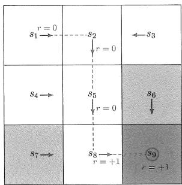  
(a) 策略1及其轨迹

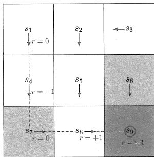  
(b) 策略2及其轨迹  
图1.6 两种策略及其对应的轨迹。

回报可以用于评价一个策略的“好坏”。例如，对于图1.6中的两个策略，我们可以分别计算两条轨迹对应的回报，进而判断哪个策略更好。具体来说，如果按照图1.6中左边的策略，从 $s_1$ 开始所获得的回报等于1，计算过程已经在式(1.1)中给出。如果按照图1.6中右边的策略，从 $s_1$ 开始则得到如下轨迹：

$$
S _ {1} \xrightarrow [ r = 0 ]{a _ {3}} S _ {4} \xrightarrow [ r = - 1 ]{a _ {3}} S _ {7} \xrightarrow [ r = 0 ]{a _ {2}} S _ {8} \xrightarrow [ r = + 1 ]{a _ {2}} S _ {9}.
$$

相应的回报为

$$
\text {r e t u r n} = 0 - 1 + 0 + 1 = 0. \tag {1.2}
$$

根据式(1.1)和式(1.2)计算得到的回报，我们知道左边的策略相比右边的策略能得到更大的回报，因此也更好。这个数学结论与我们的直觉是一致的：右侧的策略更差，因为

它会经过禁止区域。关于策略的好坏以及评价，我们将在第2章和第3章进行详细介绍。

刚刚我们提到的轨迹都是有限长的，实际上轨迹也可以无限长。例如，图1.6中的轨迹在到达 $s_9$ 后可能并不会停止，而是继续执行策略。具体来说，这里的策略是在到达 $s_9$ 后保持不动，因此智能体会不断得到 $+1$ 的奖励，所对应的轨迹也是无限长的：

$$
s _ {1} \xrightarrow [ r = 0 ]{a _ {2}} s _ {2} \xrightarrow [ r = 0 ]{a _ {3}} s _ {5} \xrightarrow [ r = 0 ]{a _ {3}} s _ {8} \xrightarrow [ r = 1 ]{a _ {2}} s _ {9} \xrightarrow [ r = 1 ]{a _ {5}} s _ {9} \xrightarrow [ r = 1 ]{a _ {5}} s _ {9} \ldots
$$

此时，如果我们直接把这条轨迹上所有的奖励求和来计算回报，那么得到的是

$$
\mathrm {r e t u r n} = 0 + 0 + 0 + 1 + 1 + 1 + \dots = \infty .
$$

这里因为轨迹是无限长的，所以计算的回报会发散到无穷。此时，我们需要引入折扣回报（discounted return）的概念。令 $\gamma \in (0,1)$ 为折扣因子（discount rate）。折扣回报是所有折扣奖励的总和，即为不同时刻得到的奖励添加相应的折扣再求和：

$$
\text {d i s c o u n t e d} = 0 + \gamma 0 + \gamma^ {2} 0 + \gamma^ {3} 1 + \gamma^ {4} 1 + \gamma^ {5} 1 + \dots \tag {1.3}
$$

由于 $\gamma \in (0,1)$ ，式(1.3)中的折扣回报的值不再是无穷了，而是一个有限值：

$$
\mathrm {d i s c o u n t e d r e t u r n} = \gamma^ {3} (1 + \gamma + \gamma^ {2} + \dots) = \gamma^ {3} \frac {1}{1 - \gamma}.
$$

折扣因子的引入具有以下用途。第一，它允许考虑无限长的轨迹，而不用担心回报会发散到无穷；第二，折扣因子可以用来调整对近期或远期奖励的重视程度。具体来说，如果 $\gamma$ 接近0，则智能体会更加重视近期奖励，最后所得到的策略也会比较短视。如果 $\gamma$ 接近1，则智能体会更加重视远期奖励，最后所得到的策略也会更具有远见，例如敢于冒险在近期获得负面奖励来获得更大的未来奖励。这些结论将在第3.5节通过例子详细展示。

当执行一个策略进而与环境交互时，智能体从初始状态开始到终止状态（terminal state）停止的过程被称为一个回合（episode）或尝试（trial）。这里的Episode有多种翻译，例如回合、情节、集、轮等，其中“回合”能比较好地描述其内涵。不过，它应该与神经网络训练过程中的回合（epoch）加以区分。

回合和轨迹在概念上非常类似：回合通常被认为是一条有限长的轨迹。如果一个任务最多有有限步，那么这样的任务称为回合制任务（episodic task）。如果一个任务没有终止状态，则意味着智能体与环境的交互永不停止，这种任务被称为持续性任务（continuing task）。为了在数学上可以不加区分地对待这两种任务，我们可以把回合制任务转换为持续性任务。为此，我们只需要合理定义智能体在到达终止状态后的状态和动作等元素即可。具体来说，在回合制任务中到达终止状态后，我们有如下两种方式将其转换为持续性任务。

$\diamond$ 第一，我们可以将终止状态视为一个特殊状态，即专门设计其动作空间或状态转移，从而使智能体永远停留在此状态，这样的状态被称为吸收状态（absorbing state），即一旦达到这样的状态就会一直停留在该状态。例如，对于目标状态 $s_9$ ，我们可以指定其动作空间为 $\mathcal{A}(s_9) = \{a_5\}$ ，即到达这个状态后唯一可执行的动作就是原地不动。  
$\diamond$ 第二，我们可以将终止状态视为一个普通状态，即将其与其他状态一视同仁，此时智能体可能会离开该状态并再次回来。由于每次到达 $s_9$ 都可以获得 $r = 1$ 的正奖励，可以预期的是智能体最终会学会永远停留在 $s_9$ 以获得更多的奖励。值得注意的是，将回合制任务转换为持续性任务需要使用折扣因子，以避免回报趋于无穷。

本书将考虑第二种情况，即将目标状态视为一个普通状态，其动作空间为 $\mathcal{A} = \{a_1, a_2, \ldots, a_5\}$ 。由于智能体到达这个状态之后仍然允许离开这个状态，因此这是一种更加一般化的情况，我们需要让智能体学习到在到达这个状态之后能够保持原地不动。

# 1.7 马尔可夫决策过程

前面几节通过例子直观地介绍了强化学习中的基本概念。本节将在马尔可夫决策过程（Markov decision process, MDP）的框架下以更加正式的方式介绍这些概念。

马尔可夫决策过程是描述随机动态系统的一般框架，它并不局限于强化学习，而是强化学习需要依赖于这个框架。马尔可夫决策过程涉及以下关键要素。

集合：

- 状态空间：所有状态的集合，记为 $\mathcal{S}$ 。  
- 动作空间：与每个状态 $s \in S$ 相关联的所有动作的集合，记为 $\mathcal{A}(s)$ 。  
- 奖励集合：与 $(s, a)$ 相关联的所有奖励的集合，记为 $\mathcal{R}(s, a)$ 。

模型：

- 状态转移概率：在状态 $s$ 采取动作 $a$ 时，智能体转移到状态 $s'$ 的概率为 $p(s'|s,a)$ 。对于任意 $(s,a)$ ，都有 $\sum_{s' \in S} p(s'|s,a) = 1$ 。  
- 奖励概率：在状态 $s$ 采取动作 $a$ 时，智能体获得奖励 $r$ 的概率是 $p(r|s,a)$ 。对于任意 $(s,a)$ ，都有 $\sum_{r\in \mathcal{R}(s,a)}p(r|s,a) = 1$ 成立。

$\diamond$ 策略：在状态 $s$ ，智能体采取动作 $a$ 的概率是 $\pi (a|s)$ 。对于任意 $s\in S$ ，都有 $\sum_{a\in \mathcal{A}(s)}$ $\pi (a|s) = 1$ 。

马尔可夫性质：马尔可夫性质（Markov property）指的是随机过程中的无记忆性质，它在数学上表示为

$$
\begin{array}{l} p \left(s _ {t + 1} \mid s _ {t}, a _ {t}, s _ {t - 1}, a _ {t - 1}, \dots , s _ {0}, a _ {0}\right) = p \left(s _ {t + 1} \mid s _ {t}, a _ {t}\right), \\ p \left(r _ {t + 1} \mid s _ {t}, a _ {t}, s _ {t - 1}, a _ {t - 1}, \dots , s _ {0}, a _ {0}\right) = p \left(r _ {t + 1} \mid s _ {t}, a _ {t}\right), \tag {1.4} \\ \end{array}
$$

其中 $t$ 表示当前时刻， $t + 1$ 表示下一个时刻。式(1.4)表示下一个状态和奖励仅依赖于当前时刻的状态和动作，而与之前时刻的状态和动作无关。

在马尔可夫决策过程中， $p(s'|s,a)$ 和 $p(r|s,a)$ 被称为模型（model）或者动态（dynamics）。模型可以是平稳的（stationary）或非平稳的（nonstationary）：平稳模型不会随时间变化，而非平稳模型会随时间变化。例如，在网格世界例子中，如果一个禁区时而出现时而消失，那么所对应的状态转移或者奖励就会随时间变化，此时系统是非平稳的。本书只考虑平稳的情况。

读者可能还听说过马尔可夫过程（Markov process，MP）。那么“马尔可夫过程”与“马尔可夫决策过程”有什么区别与联系呢？答案很简单：一旦在马尔可夫决策过程中的策略确定下来了，马尔可夫决策过程就退化成了一个马尔可夫过程。例如，图1.7中网格世界的策略已经给定，此时整个系统可以被抽象为一个马尔可夫过程。最后，本书主要考虑有限的马尔可夫决策过程，即状态和动作的数量都是有限的。初学者应该首先透彻地理解这一最简单的情况，再学习更加复杂的情况。

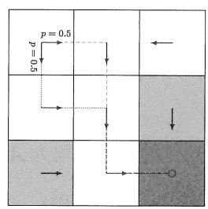

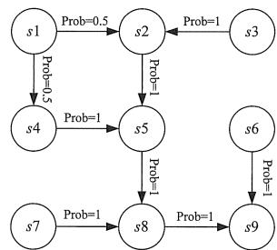  
图1.7 将一个网格世界的例子抽象成马尔可夫过程。右图中的圆圈代表状态，箭头代表状态转移。

强化学习的过程涉及智能体与环境的交互，智能体之外的一切都被视为环境（environment）。第一，智能体是一个感知者，例如具有眼睛能够感知并理解当前的状态；第二，智能体是一个决策者，例如具有大脑能够做出决策，知道在什么状态应该采取什么行动；第三，智能体是一个执行者，例如具有操作机构来执行策略所指示的动作，从而改变状态并得到奖励。

# 1.8 总结

本章介绍了强化学习中的基本概念，这些概念将在本书后面广为使用。我们首先使用网格世界的例子来直观地介绍这些概念，进而在马尔可夫决策过程的框架中对它们进行了正式的介绍。关于马尔可夫决策过程的更多信息，读者可以参考文献[1,2]。

# 1.9 问答

提问：奖励为正数一定代表鼓励，奖励为负数一定代表惩罚吗？

回答：本章提到正奖励会鼓励智能体采取相应动作，而负奖励会鼓励智能体不要采取相应动作。知道这一点对于初学者已经足够了。不过，这种说法并不严谨。

严格来说，是奖励的相对值而不是绝对值决定了鼓励或惩罚。例如，这一章设定了 $r_{\mathrm{boundary}} = -1$ ， $r_{\mathrm{forbidden}} = -1$ ， $r_{\mathrm{target}} = +1$ ， $r_{\mathrm{other}} = 0$ 。我们也可以在这些值加上一个常数而不改变最终的最优策略，例如给所有奖励加上-2从而得到 $r_{\mathrm{boundary}} = -3$ ， $r_{\mathrm{forbidden}} = -3$ ， $r_{\mathrm{target}} = -1$ ， $r_{\mathrm{other}} = -2$ 。虽然此时的奖励都是负数，但最终的最优策略仍然不变。从直观上来说，由于 $r_{\mathrm{target}} = -1$ 相比 $r_{\mathrm{forbidden}} = -3$ 惩罚得更少，因此 $r_{\mathrm{target}} = -1$ 已经算是鼓励了。这里就不展开介绍细节了，更多信息可以参见第3.5节中的定理3.6。

提问：奖励是下一个状态的函数吗？

回答：本章提到了奖励 $r$ 是状态 $s$ 和动作 $a$ 的函数，但是并没有提及 $r$ 是下一个状态 $s'$ 的函数。从直观上来说，下一个状态是与奖励息息相关的。例如，当下一个状态是目标区域时，通常设置奖励为正数；当下一个状态是禁止区域时，通常设置奖励为负数。那么一个自然的问题是：奖励是否是下一个状态的函数？这个问题的数学描述是：我们是否应该使用 $p(r|s, a, s')$ （其中 $s'$ 代表下一个状态）而不是 $p(r|s, a)$ ? 这个问题的答案是： $r$ 实际上依赖于 $s$ 、 $a$ 、 $s'$ 这三者。然而，因为 $s'$ 也依赖于 $s$ 和 $a$ ，所以我们可以等效地将 $r$ 写为 $s$ 和 $a$ 的函数： $p(r|s, a) = \sum_{s'} p(r|s, a, s') p(s'|s, a)$ 。通过这种方式，我们在第2章中可以轻易地建立起贝尔曼方程。

# 第2章

# 状态值与贝尔曼方程

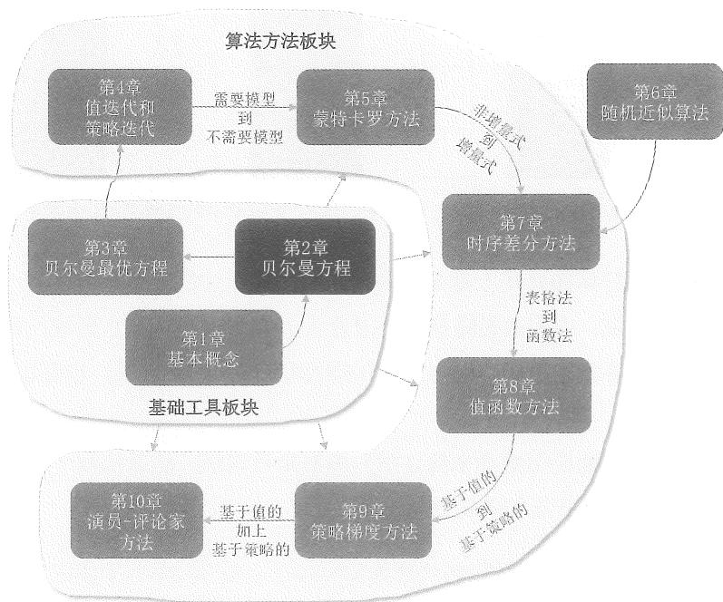  
图2.1 本章在全书中的位置。

本章介绍一个核心概念和一个核心工具。抓住这两个核心就能很好地掌握本章的内容。这个核心概念是状态值，它很重要是因为它可以作为评价一个策略好坏的指标。既然状态值这么重要，那么我们怎么分析它呢？答案就是使用一个核心工具：贝尔曼方程。贝尔曼方程描述了所有状态值之间的关系：通过求解贝尔曼方程，我们就可以得到状态值，进而评价一个策略的好坏。

# 2.1 启发示例1：为什么回报很重要？

回报这个概念已经在第1章介绍过了，它在强化学习中扮演着重要的角色，这是因为它可以用来评价一个策略的好坏。我们通过下面的例子来说明这一点。图2.2给出了三个策略：这三个策略在状态 $s_1$ 是不同的，在其他状态是相同的。那么这三个策略哪一个是最好的、哪一个是最差的呢？

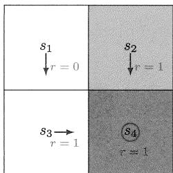

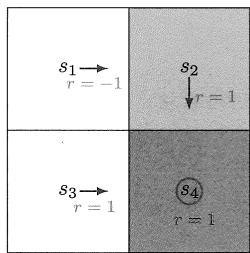

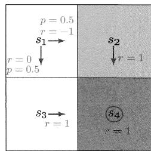  
图2.2 用于说明回报重要性的三个例子。这三个例子中的策略在 $s_1$ 中是不同的。

这三个策略的好坏在直观上是很容易判断的：最左边的策略是最好的，因为从 $s_1$ 出发会避开禁止区域；中间的策略最差，因为从 $s_1$ 出发会进入禁止区域；最右边的策略相比前面两个既不好也不坏，因为它有 0.5 的概率避开禁止区域，也有 0.5 的概率进入禁止区域。

上面的直观判断能否用数学来描述呢？答案是可以的，这就依赖于“回报”这个概念。具体来说，假设智能体的初始状态是 $s_1$ 。

如果按照最左边的策略，得到的轨迹是 $s_1 \to s_3 \to s_4 \to s_4 \cdots$ ，相应的折扣回报是

$$
\begin{array}{l} \mathrm {r e t u r n} _ {1} = 0 + \gamma 1 + \gamma^ {2} 1 + \dots \\ = \gamma (1 + \gamma + \gamma^ {2} + \dots) \\ = \frac {\gamma}{1 - \gamma}, \\ \end{array}
$$

其中 $\gamma \in (0,1)$ 是折扣因子。

如果按照中间的策略，得到的轨迹是 $s_1 \to s_2 \to s_4 \to s_4 \cdots$ ，相应的折扣回报是

$$
\begin{array}{l} \mathrm {r e t u r n} _ {2} = - 1 + \gamma 1 + \gamma^ {2} 1 + \dots \\ = - 1 + \gamma (1 + \gamma + \gamma^ {2} + \dots) \\ = - 1 + \frac {\gamma}{1 - \gamma}. \\ \end{array}
$$

如果按照最右边的策略，可能得到两条轨迹：一条是 $s_1 \to s_3 \to s_4 \to s_4 \cdots$ ，另一条是 $s_1 \to s_2 \to s_4 \to s_4 \cdots$ 。这两条轨迹发生的概率都是0.5。那么从 $s_1$ 开始可以获得的平均回报是

$$
\begin{array}{l} \mathrm {r e t u r n} _ {3} = 0. 5 \left(- 1 + \frac {\gamma}{1 - \gamma}\right) + 0. 5 \left(\frac {\gamma}{1 - \gamma}\right) \\ = - 0. 5 + \frac {\gamma}{1 - \gamma}. \\ \end{array}
$$

通过比较上面计算出来的三个策略的回报，我们知道

$$
\operatorname {r e t u r n} _ {1} > \operatorname {r e t u r n} _ {3} > \operatorname {r e t u r n} _ {2} \tag {2.1}
$$

这个不等式表明：第一个策略是最好的，因为它的回报最大；第二个策略是最差的，因为它的回报最小。这个数学结论与前面的直观判断是一致的：第一个策略是最好的，因为它可以避免进入禁止区域；而第二个策略是最差的，因为它会进入禁止区域。

上面的例子说明了一个重要结论：回报可以用来评价策略的好坏。不过值得注意的是，这里的 $\mathrm{return}_3$ 并没有严格遵守回报的定义：回报的定义只是针对一条轨迹，而 $\mathrm{return}_3$ 是两条轨迹回报的平均值。稍后我们就会知道 $\mathrm{return}_3$ 实际上就是本章要介绍的状态值。

# 2.2 启发示例2：如何计算回报？

上一节展示了回报的重要性。既然回报这么重要，那么如何计算回报呢？有的读者可能会疑惑：回报可以基于它的定义来计算，为什么还要问这个问题？实际上，有两种计算回报的方法。

第一种计算回报的方法就是根据其定义：回报等于沿轨迹收集的所有奖励的折扣总和。这种方法我们已经比较熟悉了。下面以图2.3为例再次介绍。令 $v_{i}$ 表示从 $s_{i}$ 开始得到的回报，其中 $i = 1,2,3,4$ 。那么从这些状态出发得到的回报是

$$
v _ {1} = r _ {1} + \gamma r _ {2} + \gamma^ {2} r _ {3} + \dots ,
$$

$$
v _ {2} = r _ {2} + \gamma r _ {3} + \gamma^ {2} r _ {4} + \dots , \tag {2.2}
$$

$$
v _ {3} = r _ {3} + \gamma r _ {4} + \gamma^ {2} r _ {1} + \dots ,
$$

$$
v _ {4} = r _ {4} + \gamma r _ {1} + \gamma^ {2} r _ {2} + \dots .
$$

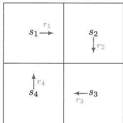  
图2.3 用于说明如何计算回报的例子。简单起见，这个例子不含目标区域和禁止区域。

第二种方法是本节重点关注的自举法（bootstrapping）。具体来说，通过观察方程(2.2)中回报的表达式，可以将它们重写为

$$
\begin{array}{l} v _ {1} = r _ {1} + \gamma (r _ {2} + \gamma r _ {3} + \dots) = r _ {1} + \gamma v _ {2}, \\ v _ {2} = r _ {2} + \gamma \left(r _ {3} + \gamma r _ {4} + \dots\right) = r _ {2} + \gamma v _ {3}, \tag {2.3} \\ v _ {3} = r _ {3} + \gamma (r _ {4} + \gamma r _ {1} + \dots) = r _ {3} + \gamma v _ {4}, \\ v _ {4} = r _ {4} + \gamma (r _ {1} + \gamma r _ {2} + \dots) = r _ {4} + \gamma v _ {1}. \\ \end{array}
$$

方程(2.3)展示了一个有趣的现象：从不同状态出发的回报值是彼此依赖的。具体来说， $v_{1}$ 依赖于 $v_{2}$ ， $v_{2}$ 依赖于 $v_{3}$ ， $v_{3}$ 依赖于 $v_{4}$ ，而 $v_{4}$ 又依赖于 $v_{1}$ 。这反映了自举的思想： $v_{1}, v_{2}, v_{3}, v_{4}$ 可以从其自身 $v_{2}, v_{3}, v_{4}, v_{1}$ 得到。

乍一看，自举是一个无解的循环，这是因为一个未知量的计算依赖于另一个未知量。但是如果从数学的角度来看，自举则非常容易理解。具体来说，方程(2.3)可以被重新整理成一个矩阵-向量形式的线性方程：

$$
\underbrace {\left[ \begin{array}{l} v _ {1} \\ v _ {2} \\ v _ {3} \\ v _ {4} \end{array} \right]} _ {v \in \mathbb {R} ^ {4}} = \left[ \begin{array}{l} r _ {1} \\ r _ {2} \\ r _ {3} \\ r _ {4} \end{array} \right] + \left[ \begin{array}{l} \gamma v _ {2} \\ \gamma v _ {3} \\ \gamma v _ {4} \\ \gamma v _ {1} \end{array} \right] = \underbrace {\left[ \begin{array}{l} r _ {1} \\ r _ {2} \\ r _ {3} \\ r _ {4} \end{array} \right]} _ {r \in \mathbb {R} ^ {4}} + \gamma \underbrace {\left[ \begin{array}{l l l l} 0 & 1 & 0 & 0 \\ 0 & 0 & 1 & 0 \\ 0 & 0 & 0 & 1 \\ 1 & 0 & 0 & 0 \end{array} \right]} _ {P \in \mathbb {R} ^ {4 \times 4}} \underbrace {\left[ \begin{array}{l} v _ {1} \\ v _ {2} \\ v _ {3} \\ v _ {4} \end{array} \right]} _ {v \in \mathbb {R} ^ {4}}, \tag {2.4}
$$

上式可以简化为

$$
v = r + \gamma P v.
$$

如果大家学过线性代数，相信不难求解出上面方程的解： $v = (I - \gamma P)^{-1}r$ ，其中 $I \in \mathbb{R}^{4 \times 4}$ 是单位矩阵。有的读者可能会问 $(I - \gamma P)$ 一定是可逆的吗？答案是肯定的，具体证明会在第2.7.1节中给出。

事实上，方程(2.3)就是这个简单例子对应的贝尔曼方程，而方程(2.4)是这个贝尔曼方程的矩阵-向量形式。尽管很简单，但方程(2.3)展示了贝尔曼方程的核心思想：从一个状态出发获得的回报依赖于从其他状态出发时获得的回报。这个思想对于理解后

面介绍的贝尔曼方程至关重要。

# 2.3 状态值

虽然前面提到了回报可以用来评价策略，但是回报并不适用于一般化的随机情况，因为从一个状态出发可能会得到不同的轨迹和回报。为此，我们需要引入状态值的概念。

首先，我们需要引入一些符号。在时刻 $t = 0,1,2,\ldots$ ，智能体处于状态 $S_{t}$ ，按照策略 $\pi$ 采取动作 $A_{t}$ ，转移到的下一个状态是 $S_{t + 1}$ ，获得的即时奖励是 $R_{t + 1}$ 。这个过程可以简洁地表达为

$$
S _ {t} \xrightarrow {A _ {t}} S _ {t + 1}, R _ {t + 1}.
$$

这里 $S_{t}, S_{t+1} \in \mathcal{S}$ ， $A_{t} \in \mathcal{A}(S_{t})$ ， $R_{t+1} \in \mathcal{R}(S_{t}, A_{t})$ 。请注意，这里 $S_{t}, S_{t+1}, A_{t}, R_{t+1}$ 都是随机变量（random variables）。本书一般用大写字母表示随机变量。

从时刻 $t$ 开始，我们可以得到一条包含一系列“状态-动作-奖励”的轨迹：

$$
S _ {t} \xrightarrow {A _ {t}} S _ {t + 1}, R _ {t + 1} \xrightarrow {A _ {t + 1}} S _ {t + 2}, R _ {t + 2} \xrightarrow {A _ {t + 2}} S _ {t + 3}, R _ {t + 3}, \dots
$$

根据定义，沿这个轨迹得到的折扣回报是

$$
G _ {t} \doteq R _ {t + 1} + \gamma R _ {t + 2} + \gamma^ {2} R _ {t + 3} + \dots ,
$$

其中 $\gamma \in (0,1)$ 是折扣因子。请注意， $G_{t}$ 也是一个随机变量，因为它是 $R_{t + 1}, R_{t + 2}, \ldots$ 这些随机变量组合得到的。

由于 $G_{t}$ 是一个随机变量，因此我们可以计算它的期望值（expectation或expected value）为

$$
\upsilon_ {\pi} (s) \doteq \mathbb {E} [ G _ {t} | S _ {t} = s ]. \tag {2.5}
$$

这里 $v_{\pi}(s)$ 称为状态值函数（state-value function）。一般简称为状态值或状态价值（state value）。下面是对状态值的一些说明。

$\diamond$ 第一， $v_{\pi}(s)$ 的值依赖于 $s$ ，即不同状态的状态值一般是不同的。这是因为 $v_{\pi}(s)$ 在(2.5)中的定义是一个条件期望，而其中的条件是 $S_{t} = s$ 。关于条件期望的介绍可以参见附录A。  
$\diamond$ 第二， $v_{\pi}(s)$ 的值依赖于 $\pi$ ，即不同策略对应的状态值一般是不同的。这是因为轨迹是根据策略 $\pi$ 得到的，不同的策略可能导致不同的轨迹。  
第三， $v_{\pi}(s)$ 并不依赖于 $t$ 。虽然 $v_{\pi}(s)$ 在(2.5)中的定义涉及到时刻 $t$ ，但是不论 $t$ 选取

什么值得到的结果都是相同的，这本质上是因为系统是平稳的，不会随着时间变化。

“状态值”与“回报”是什么关系呢？当策略和系统模型都是确定性时，从一个状态出发始终会得到相同的轨迹。此时，从一个状态出发得到的回报就等于状态值。相反，当策略或系统模型是随机的时，从一个状态出发可能产生不同的轨迹。此时，不同轨迹的回报是不同的，而状态值就是这些回报的期望值。因此，状态值比回报更加一般化，能够同时处理确定性和随机性的情况。因此，虽然我们在第2.1节提到回报可以用来评价策略，但是更一般化地应该用状态值来评价策略：能产生更高状态值的策略更好。

正因为状态值能够用于评价策略，所以它是强化学习中的一个核心概念。既然状态值这么重要，那么该如何计算状态值呢？这个问题将在下一节回答。

# 2.4 贝尔曼方程

本节将介绍大名鼎鼎的贝尔曼方程（Bellman equation），它是用于分析状态值的核心工具。用一句话概述：贝尔曼方程描述了所有状态值之间的关系。

下面我们详细推导贝尔曼方程。首先， $G_{t}$ 可以重写为

$$
\begin{array}{l} G _ {t} = R _ {t + 1} + \gamma R _ {t + 2} + \gamma^ {2} R _ {t + 3} + \dots \\ = R _ {t + 1} + \gamma \left(R _ {t + 2} + \gamma R _ {t + 3} + \dots\right) \\ = R _ {t + 1} + \gamma G _ {t + 1}, \\ \end{array}
$$

其中 $G_{t + 1} = R_{t + 2} + \gamma R_{t + 3} + \ldots$ 。该方程建立了 $G_{t}$ 和 $G_{t + 1}$ 之间的关系。因此，状态值可以写成

$$
\begin{array}{l} v _ {\pi} (s) = \mathbb {E} \left[ G _ {t} \mid S _ {t} = s \right] \\ = \mathbb {E} \left[ R _ {t + 1} + \gamma G _ {t + 1} \mid S _ {t} = s \right] \\ = \mathbb {E} \left[ R _ {t + 1} \mid S _ {t} = s \right] + \gamma \mathbb {E} \left[ G _ {t + 1} \mid S _ {t} = s \right]. \tag {2.6} \\ \end{array}
$$

下面我们分别分析式(2.6)中的两项。

$\diamond$ 第一项 $\mathbb{E}[R_{t + 1}|S_t = s]$ 是即时奖励的期望值。基于全期望（total expectation）的性质（参见附录A），这一项可以化为

$$
\begin{array}{l} \mathbb {E} \left[ R _ {t + 1} \mid S _ {t} = s \right] = \sum_ {a \in \mathcal {A}} \pi (a \mid s) \mathbb {E} \left[ R _ {t + 1} \mid S _ {t} = s, A _ {t} = a \right] \\ = \sum_ {a \in \mathcal {A}} \pi (a | s) \sum_ {r \in \mathcal {R}} p (r | s, a) r. \tag {2.7} \\ \end{array}
$$

这里 $\mathcal{A}$ 和 $\mathcal{R}$ 分别是可能的动作和可能的奖励的集合。对于不同的状态， $\mathcal{A}$ 可能是不同的；此时 $\mathcal{A}$ 可以表示为 $\mathcal{A}(s)$ 。类似地， $\mathcal{R}$ 也可能依赖于 $(s, a)$ 。

$\diamond$ 第二项 $\mathbb{E}[G_{t + 1}|S_t = s]$ 是未来奖励的期望值。它可以计算为

$$
\begin{array}{l} \mathbb {E} [ G _ {t + 1} | S _ {t} = s ] = \sum_ {s ^ {\prime} \in \mathcal {S}} \mathbb {E} [ G _ {t + 1} | S _ {t} = s, S _ {t + 1} = s ^ {\prime} ] p (s ^ {\prime} | s) \\ = \sum_ {s ^ {\prime} \in \mathcal {S}} \mathbb {E} [ G _ {t + 1} | S _ {t + 1} = s ^ {\prime} ] p (s ^ {\prime} | s) \quad (\text {由 于 马 尔 可 夫 性 质}) \\ = \sum_ {s ^ {\prime} \in \mathcal {S}} v _ {\pi} \left(s ^ {\prime}\right) p \left(s ^ {\prime} \mid s\right) \\ = \sum_ {s ^ {\prime} \in \mathcal {S}} v _ {\pi} \left(s ^ {\prime}\right) \sum_ {a \in \mathcal {A}} p \left(s ^ {\prime} \mid s, a\right) \pi (a \mid s). \tag {2.8} \\ \end{array}
$$

上述推导过程中使用了 $\mathbb{E}[G_{t + 1}|S_t = s,S_{t + 1} = s'] = \mathbb{E}[G_{t + 1}|S_{t + 1} = s']$ 的结果，该结果成立是由于马尔可夫性质，即未来的奖励仅依赖于当前状态，而与先前的状态无关。

将式(2.7) $\sim$ (2.8)代入式(2.6)可得

$$
\begin{array}{l} v _ {\pi} (s) = \mathbb {E} [ R _ {t + 1} | S _ {t} = s ] + \gamma \mathbb {E} [ G _ {t + 1} | S _ {t} = s ] \\ = \underbrace {\sum_ {a \in \mathcal {A}} \pi (a | s) \sum_ {r \in \mathcal {R}} p (r | s , a) r} _ {\text {即 时 奖 励 的 期 望}} + \underbrace {\gamma \sum_ {a \in \mathcal {A}} \pi (a | s) \sum_ {s ^ {\prime} \in \mathcal {S}} p \left(s ^ {\prime} \mid s , a\right) v _ {\pi} \left(s ^ {\prime}\right)} _ {\text {未 来 奖 励 的 期 望}} \\ = \sum_ {a \in \mathcal {A}} \pi (a | s) \left[ \sum_ {r \in \mathcal {R}} p (r | s, a) r + \gamma \sum_ {s ^ {\prime} \in \mathcal {S}} p \left(s ^ {\prime} \mid s, a\right) v _ {\pi} \left(s ^ {\prime}\right) \right], \quad s \in \mathcal {S}. \tag {2.9} \\ \end{array}
$$

上式就是大名鼎鼎的贝尔曼方程，它描述了不同状态值之间的关系，是设计和分析强化学习算法的基本工具。

贝尔曼方程乍一看似乎很复杂，但实际上它的结构非常清晰。下面是对该方程的解释说明。

$\diamond$ $v_{\pi}(s)$ 和 $v_{\pi}(s')$ 是需要计算的状态值，是未知量。如果单独看式(2.9)，因为状态值存在于等式的两边，读者可能难以理解如何求解。必须要注意的是，每一个状态 $s \in S$ 都对应了式(2.9)，所以我们有一组这样的式子。如果我们将这些式子联立，如何计算所有状态值就变得很清晰了。详细内容将在第2.7节中给出。  
$\diamond$ $\pi(a|s)$ 是一个给定的策略，是已知量。贝尔曼方程一定是对应了一个特定的策略。求解贝尔曼方程从而得到状态值是一个策略评价（policy evaluation）的过程，这是许多强化学习算法中的核心步骤。  
$\diamond$ $p(r|s,a)$ 和 $p(s'|s,a)$ 代表系统模型，这是已知量还是未知量呢？在本书中，我们将

首先研究模型已知的情况，例如在第2.7节给出模型已知情况下如何计算状态值。在本书后面的章节中，我们会慢慢推广到不需要模型的情况。

除了式(2.9)中的表达式外，读者在文献中还可能见到过贝尔曼方程的其他表达形式。接下来我们介绍三种常见的等价形式。

第一个等价形式是

$$
v _ {\pi} (s) = \sum_ {a \in \mathcal {A}} \pi (a | s) \sum_ {s ^ {\prime} \in \mathcal {S}} \sum_ {r \in \mathcal {R}} p \left(s ^ {\prime}, r | s, a\right) \left[ r + \gamma v _ {\pi} \left(s ^ {\prime}\right) \right].
$$

这实际上是文献[3]使用的表达式。这个式子可以通过将下面的全概率公式（参见附录A）代入式(2.9)得到：

$$
\begin{array}{l} p (s ^ {\prime} | s, a) = \sum_ {r \in \mathcal {R}} p (s ^ {\prime}, r | s, a), \\ p (r | s, a) = \sum_ {s ^ {\prime} \in \mathcal {S}} p \left(s ^ {\prime}, r | s, a\right). \\ \end{array}
$$

$\diamond$ 第二个常见的等价形式是贝尔曼期望方程（Bellman expectation equation）：

$$
v _ {\pi} (s) = \mathbb {E} \left[ R _ {t + 1} + \gamma v _ {\pi} (S _ {t + 1}) | S _ {t} = s \right], \quad s \in \mathcal {S}.
$$

这是因为 $\mathbb{E}[G_{t + 1}|S_t = s] = \sum_a\pi (a|s)\sum_{s'}p(s'|s,a)v_\pi (s') = \mathbb{E}[v_\pi (S_{t + 1})|S_t = s]$ 将其代入(2.6)即可得到贝尔曼期望方程。

$\diamond$ 第三，奖励 $r$ 在某些问题中可能仅依赖于下一个状态 $s'$ ，即奖励可以写成 $r(s')$ 。此时我们有 $p(r(s')|s, a) = p(s'|s, a)$ ，将其代入(2.9)可得另外一个表达式

$$
v _ {\pi} (s) = \sum_ {a \in \mathcal {A}} \pi (a | s) \sum_ {s ^ {\prime} \in \mathcal {S}} p \left(s ^ {\prime} \mid s, a\right) \left[ r \left(s ^ {\prime}\right) + \gamma v _ {\pi} \left(s ^ {\prime}\right) \right].
$$

# 2.5 示例

本节将使用两个例子来演示如何得到贝尔曼方程进而求解状态值。建议读者仔细阅读这些例子，它们能很好地帮助大家理解贝尔曼方程。

例子1：图2.4给出了一个确定性的策略。我们下面一步一步地写出贝尔曼方程，然后求解状态值。

首先，考虑状态 $s_1$ ，其对应的策略是 $\pi (a = a_{3}|s_{1}) = 1$ 和 $\pi (a\neq a_3|s_1) = 0$ ；对应的 状态转移概率为 $p(s^{\prime} = s_{3}|s_{1},a_{3}) = 1$ 和 $p(s^{\prime}\neq s_{3}|s_{1},a_{3}) = 0$ ；对应的奖励概率为

$p(r = 0|s_1,a_3) = 1$ 和 $p(r\neq 0|s_1,a_3) = 0$ 。将这些概率代入(2.9)可以得到

$$
v _ {\pi} \left(s _ {1}\right) = 0 + \gamma v _ {\pi} \left(s _ {3}\right). \tag {2.10}
$$

有趣的是，虽然(2.9)中贝尔曼方程的表达式看起来很复杂，但是(2.10)却非常简单。式(2.9)之所以那么复杂是为了能够描述所有一般情况。

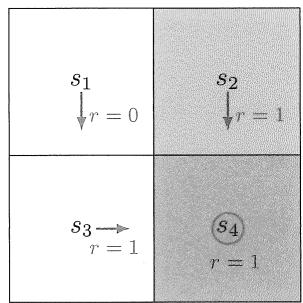  
图2.4 用于演示贝尔曼方程的例子。这个例子中的策略是确定性的。

由于这个例子非常简单，我们也可以直接根据贝尔曼方程的基本思想快速写出(2.10)，而不用使用复杂的(2.9)。具体来说，从 $s_1$ 出发的回报（这里是 $v_{\pi}(s_1)$ ）等于即时奖励（这里是0）加上从下一个状态出发的回报（这里是 $v_{\pi}(s_3)$ ），这样可以直接写出来(2.10)。

类似的，对其他状态可以得到

$$
v _ {\pi} (s _ {2}) = 1 + \gamma v _ {\pi} (s _ {4}),
$$

$$
v _ {\pi} \left(s _ {3}\right) = 1 + \gamma v _ {\pi} \left(s _ {4}\right),
$$

$$
v _ {\pi} (s _ {4}) = 1 + \gamma v _ {\pi} (s _ {4}).
$$

下一步我们可以从这些方程中解出状态值。由于这些方程非常简单，因此我们可以手动求解。更复杂的方程可以通过第2.7节中介绍的算法来求解。为简单起见，我们直接给出结果：

$$
v _ {\pi} (s _ {4}) = \frac {1}{1 - \gamma},
$$

$$
v _ {\pi} (s _ {3}) = \frac {1}{1 - \gamma},
$$

$$
v _ {\pi} (s _ {2}) = \frac {1}{1 - \gamma},
$$

$$
v _ {\pi} (s _ {1}) = \frac {\gamma}{1 - \gamma}.
$$

进一步将 $\gamma = 0.9$ 代入上式可得

$$
v _ {\pi} (s _ {4}) = \frac {1}{1 - 0 . 9} = 1 0,
$$

$$
v _ {\pi} (s _ {3}) = \frac {1}{1 - 0 . 9} = 1 0,
$$

$$
v _ {\pi} (s _ {2}) = \frac {1}{1 - 0 . 9} = 1 0,
$$

$$
v _ {\pi} (s _ {1}) = \frac {0 . 9}{1 - 0 . 9} = 9.
$$

例子2：图2.5中的策略稍微复杂了一些，因为它是随机的。接下来，我们写出贝尔曼方程，然后从中求解状态值。

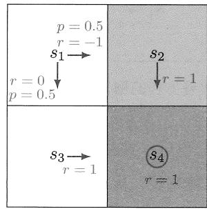  
图2.5 用于演示贝尔曼方程的例子。这个例子中的策略是随机的。

首先，在状态 $s_1$ ，策略向右或向下移动的概率都是0.5，即 $\pi (a = a_{2}|s_{1}) = 0.5$ 和 $\pi (a = a_3|s_1) = 0.5$ ；状态转移概率是 $p(s^{\prime} = s_{3}|s_{1},a_{3}) = 1$ 和 $p(s^{\prime} = s_{2}|s_{1},a_{2}) =$ 1；奖励的概率是 $p(r = 0|s_1,a_3) = 1$ 和 $p(r = -1|s_1,a_2) = 1$ 。将这些概率值代入(2.9)可得

$$
v _ {\pi} \left(s _ {1}\right) = 0. 5 \left[ 0 + \gamma v _ {\pi} \left(s _ {3}\right) \right] + 0. 5 \left[ - 1 + \gamma v _ {\pi} \left(s _ {2}\right) \right].
$$

类似地，对其他状态可得

$$
v _ {\pi} (s _ {2}) = 1 + \gamma v _ {\pi} (s _ {4}),
$$

$$
v _ {\pi} (s _ {3}) = 1 + \gamma v _ {\pi} (s _ {4}),
$$

$$
v _ {\pi} \left(s _ {4}\right) = 1 + \gamma v _ {\pi} \left(s _ {4}\right).
$$

状态值可以从上述方程中求解得到：

$$
v _ {\pi} (s _ {4}) = \frac {1}{1 - \gamma},
$$

$$
v _ {\pi} (s _ {3}) = \frac {1}{1 - \gamma},
$$

$$
v _ {\pi} (s _ {2}) = \frac {1}{1 - \gamma},
$$

$$
\begin{array}{l} v _ {\pi} \left(s _ {1}\right) = 0. 5 \left[ 0 + \gamma v _ {\pi} \left(s _ {3}\right) \right] + 0. 5 \left[ - 1 + \gamma v _ {\pi} \left(s _ {2}\right) \right], \\ = - 0. 5 + \frac {\gamma}{1 - \gamma}. \\ \end{array}
$$

进一步将 $\gamma = 0.9$ 代入上式可得

$$
\begin{array}{l} v _ {\pi} (s _ {4}) = 1 0, \\ v _ {\pi} (s _ {3}) = 1 0, \\ v _ {\pi} (s _ {2}) = 1 0, \\ v _ {\pi} (s _ {1}) = - 0. 5 + 9 = 8. 5. \\ \end{array}
$$

最后，如果我们比较上述例子中两个策略的状态值，可以看出

$$
v _ {\pi_ {1}} (s _ {i}) \geqslant v _ {\pi_ {2}} (s _ {i}), \quad i = 1, 2, 3, 4.
$$

这说明图2.4中的策略更好，因为它具有更高的状态值。这个数学结论与直觉是一致的：直觉上第一种策略也是更好的，因为当智能体从 $s_1$ 出发时，它会避开禁止区域。因此，上述两个例子也说明了状态值可以用来评价策略的好坏。

# 2.6 矩阵向量形式

由于每一个状态都对应了式(2.9)中的方程，因此我们可以联立所有这些方程进而得到简洁的矩阵-向量形式（matrix-vector form），该形式对理解和分析贝尔曼方程有重要作用。

为了推导出矩阵-向量形式，首先将式(2.9)中的贝尔曼方程重写为

$$
v _ {\pi} (s) = r _ {\pi} (s) + \gamma \sum_ {s ^ {\prime} \in \mathcal {S}} p _ {\pi} \left(s ^ {\prime} \mid s\right) v _ {\pi} \left(s ^ {\prime}\right), \tag {2.11}
$$

其中

$$
r _ {\pi} (s) \doteq \sum_ {a \in \mathcal {A}} \pi (a | s) \sum_ {r \in \mathcal {R}} p (r | s, a) r,
$$

$$
p _ {\pi} \left(s ^ {\prime} | s\right) \doteq \sum_ {a \in \mathcal {A}} \pi (a | s) p \left(s ^ {\prime} | s, a\right).
$$

这里 $r_{\pi}(s)$ 表示即时奖励的期望值，而 $p_{\pi}(s'|s)$ 代表在策略 $\pi$ 下从状态 $s$ 经过一步转移到状态 $s'$ 的概率。

为了写成矩阵-向量形式，需要对状态进行编号。如果有 $n = |\mathcal{S}|$ 个状态，那么给这个 $n$ 个状态编号为 $\{s_1,s_2,\ldots ,s_n\}$ 。对于状态 $s_i$ ，(2.11)可以写成

$$
v _ {\pi} \left(s _ {i}\right) = r _ {\pi} \left(s _ {i}\right) + \gamma \sum_ {s _ {j} \in \mathcal {S}} p _ {\pi} \left(s _ {j} \mid s _ {i}\right) v _ {\pi} \left(s _ {j}\right). \tag {2.12}
$$

定义 $v_{\pi} = [v_{\pi}(s_1), \ldots, v_{\pi}(s_n)]^{\mathrm{T}} \in \mathbb{R}^n$ ， $r_{\pi} = [r_{\pi}(s_1), \ldots, r_{\pi}(s_n)]^{\mathrm{T}} \in \mathbb{R}^n$ ，以及 $P_{\pi} \in \mathbb{R}^{n \times n}$ ，其中 $P_{\pi}$ 满足 $[P_{\pi}]_{ij} = p_{\pi}(s_j|s_i)$ 。此时(2.12)可以用下列矩阵-向量形式来表示：

$$
v _ {\pi} = r _ {\pi} + \gamma P _ {\pi} v _ {\pi}, \tag {2.13}
$$

这里 $v_{\pi}$ 是待解的未知量，而 $\gamma, r_{\pi}, P_{\pi}$ 是已知量。

矩阵 $P_{\pi}$ 有一些有趣的性质。第一，它是一个非负矩阵（non-negative matrix），即它所有元素都大于或等于0。这个性质可以表示为 $P_{\pi} \geqslant 0$ ，其中0表示具有适当维度的零矩阵。在本书中，“ $\geqslant$ ”或“ $\leqslant$ ”代表两个矩阵或者向量元素间的比较。第二， $P_{\pi}$ 是一个随机矩阵（stochastic matrix），即每一行所有元素之和等于1。这个性质的数学表示为 $P_{\pi} \mathbf{1} = \mathbf{1}$ ，其中 $\mathbf{1} = [1, \ldots, 1]^{\mathrm{T}}$ 是一个具有合适维度的所有元素都是1的向量。

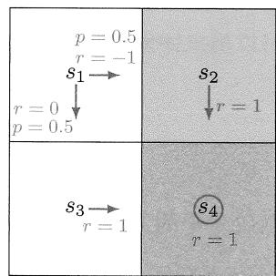  
图2.6 用于说明贝尔曼方程矩阵-向量形式的例子。

下面考虑图2.6中给出的具体例子，其贝尔曼方程的矩阵-向量形式如下：

$$
\underbrace {\left[ \begin{array}{c} v _ {\pi} (s _ {1}) \\ v _ {\pi} (s _ {2}) \\ v _ {\pi} (s _ {3}) \\ v _ {\pi} (s _ {4}) \end{array} \right]} _ {v _ {\pi}} = \underbrace {\left[ \begin{array}{c} r _ {\pi} (s _ {1}) \\ r _ {\pi} (s _ {2}) \\ r _ {\pi} (s _ {3}) \\ r _ {\pi} (s _ {4}) \end{array} \right]} _ {r _ {\pi}} + \gamma \underbrace {\left[ \begin{array}{c c c c} p _ {\pi} (s _ {1} | s _ {1}) & p _ {\pi} (s _ {2} | s _ {1}) & p _ {\pi} (s _ {3} | s _ {1}) & p _ {\pi} (s _ {4} | s _ {1}) \\ p _ {\pi} (s _ {1} | s _ {2}) & p _ {\pi} (s _ {2} | s _ {2}) & p _ {\pi} (s _ {3} | s _ {2}) & p _ {\pi} (s _ {4} | s _ {2}) \\ p _ {\pi} (s _ {1} | s _ {3}) & p _ {\pi} (s _ {2} | s _ {3}) & p _ {\pi} (s _ {3} | s _ {3}) & p _ {\pi} (s _ {4} | s _ {3}) \\ p _ {\pi} (s _ {1} | s _ {4}) & p _ {\pi} (s _ {2} | s _ {4}) & p _ {\pi} (s _ {3} | s _ {4}) & p _ {\pi} (s _ {4} | s _ {4}) \end{array} \right]} _ {P _ {\pi}} \underbrace {\left[ \begin{array}{c} v _ {\pi} (s _ {1}) \\ v _ {\pi} (s _ {2}) \\ v _ {\pi} (s _ {3}) \\ v _ {\pi} (s _ {4}) \end{array} \right]} _ {v _ {\pi}}.
$$

将具体值代入上述方程式可得

$$
\left[ \begin{array}{c} v _ {\pi} (s _ {1}) \\ v _ {\pi} (s _ {2}) \\ v _ {\pi} (s _ {3}) \\ v _ {\pi} (s _ {4}) \end{array} \right] = \left[ \begin{array}{c} 0. 5 (0) + 0. 5 (- 1) \\ 1 \\ 1 \\ 1 \end{array} \right] + \gamma \left[ \begin{array}{c c c c} 0 & 0. 5 & 0. 5 & 0 \\ 0 & 0 & 0 & 1 \\ 0 & 0 & 0 & 1 \\ 0 & 0 & 0 & 1 \end{array} \right] \left[ \begin{array}{c} v _ {\pi} (s _ {1}) \\ v _ {\pi} (s _ {2}) \\ v _ {\pi} (s _ {3}) \\ v _ {\pi} (s _ {4}) \end{array} \right].
$$

可以看出， $P_{\pi}$ 满足 $P_{\pi} \mathbf{1} = \mathbf{1}$

# 2.7 求解状态值

给定一个策略，在得到其对应的贝尔曼方程后，我们可以从中求解出所有状态值。求解一个策略对应的状态值是强化学习中的一个基本问题，这个问题通常被称为策略评价。本节将给出两种求解贝尔曼方程的方法。

# 2.7.1 方法1：解析解

由于 $v_{\pi} = r_{\pi} + \gamma P_{\pi}v_{\pi}$ 是一个简单的线性方程，我们不难得到其解析解：

$$
v _ {\pi} = \left(I - \gamma P _ {\pi}\right) ^ {- 1} r _ {\pi}.
$$

下面给出矩阵 $(I - \gamma P_{\pi})^{-1}$ 的几个性质。

$\diamond$ 第一， $I - \gamma P_{\pi}$ 是可逆的。证明如下。根据圆盘定理（Gershgorin circle theorem）[4]， $I - \gamma P_{\pi}$ 的每个特征值都至少位于一个Gershgorin圆盘内。具体来说，第 $i$ 个Gershgorin圆盘的中心位于 $[I - \gamma P_{\pi}]_{ii} = 1 - \gamma p_{\pi}(s_i|s_i)$ ，半径等于 $\sum_{j\neq i}[I - \gamma P_{\pi}]_{ij} = -\sum_{j\neq i}\gamma p_{\pi}(s_j|s_i)$ 。因为 $\gamma < 1$ ，所以其半径小于该圆中心距离原点的距离：

$\sum_{j \neq i} \gamma p_{\pi}(s_j | s_i) < 1 - \gamma p_{\pi}(s_i | s_i)$ 。因此，所有 Gershgorin 圆盘都不包含原点，进而可知 $I - \gamma P_{\pi}$ 没有等于 0 的特征值。

$\diamond$ 第二， $(I - \gamma P_{\pi})^{-1}\geqslant I$ ，即矩阵 $(I - \gamma P_{\pi})^{-1}$ 的每个元素都是大于或等于0的，并且进一步来说是大于或等于单位矩阵 $I$ 中的相应元素。这是因为 $P_{\pi}$ 的元素是非负的，考虑矩阵逆的级数展开可得 $(I - \gamma P_{\pi})^{-1} = I + \gamma P_{\pi} + \gamma^{2}P_{\pi}^{2} + \dots \geqslant I\geqslant 0$ 。  
$\diamond$ 第三，对于任何向量 $r \geqslant 0$ ，有 $(I - \gamma P_{\pi})^{-1}r \geqslant r \geqslant 0$ 。这个性质可由第二个性质推论得出，因为 $[(I - \gamma P_{\pi})^{-1} - I]r \geqslant 0$ 。类似的，如果 $r_1 \geqslant r_2$ ，则有 $(I - \gamma P_{\pi})^{-1}r_1 \geqslant (I - \gamma P_{\pi})^{-1}r_2$ 。

# 2.7.2 方法2：数值解

虽然解析解对于理论分析非常有用，但是因为它涉及矩阵逆运算，因此仍然需要复杂的数值算法来计算。实际上，我们可以直接使用如下数值迭代算法从贝尔曼方程中求解出状态值：

$$
v _ {k + 1} = r _ {\pi} + \gamma P _ {\pi} v _ {k}, \quad k = 0, 1, 2, \dots \tag {2.14}
$$

从一个初始猜测 $v_0 \in \mathbb{R}^n$ 出发，该算法会给出一个序列 $\{v_0, v_1, v_2, \ldots\}$ ，并且该序列会逐渐收敛到真实的状态值，即

$$
v _ {k} \rightarrow v _ {\pi} = \left(I - \gamma P _ {\pi}\right) ^ {- 1} r _ {\pi}, \quad \text {随 着} k \rightarrow \infty . \tag {2.15}
$$

式(2.15)的证明在方框2.1中给出。

# 方框2.1：证明 (2.15)

定义误差为 $\delta_{k} = v_{k} - v_{\pi}$ 。我们只需要证明 $\delta_{k}\rightarrow 0$ 。将 $v_{k + 1} = \delta_{k + 1} + v_{\pi}$ 和 $v_{k} = \delta_{k} + v_{\pi}$ 代入 $v_{k + 1} = r_{\pi} + \gamma P_{\pi}v_{k}$ 可得

$$
\delta_ {k + 1} + v _ {\pi} = r _ {\pi} + \gamma P _ {\pi} (\delta_ {k} + v _ {\pi}).
$$

上式可以变换为

$$
\begin{array}{l} \delta_ {k + 1} = - v _ {\pi} + r _ {\pi} + \gamma P _ {\pi} \delta_ {k} + \gamma P _ {\pi} v _ {\pi}, \\ = \gamma P _ {\pi} \delta_ {k} - v _ {\pi} + \left(r _ {\pi} + \gamma P _ {\pi} v _ {\pi}\right), \\ = \gamma P _ {\pi} \delta_ {k}. \\ \end{array}
$$

由上式进一步可得

$$
\delta_ {k + 1} = \gamma P _ {\pi} \delta_ {k} = \gamma^ {2} P _ {\pi} ^ {2} \delta_ {k - 1} = \dots = \gamma^ {k + 1} P _ {\pi} ^ {k + 1} \delta_ {0}.
$$

由于 $P_{\pi}$ 的每个元素都大于或等于0并且小于或等于1，我们有 $0 \leqslant P_{\pi}^{k} \leqslant 1$ 对任何 $k$ 都成立。另一方面，因为 $\gamma < 1$ ，所以当 $k \to \infty$ 时有 $\gamma^{k} \to 0$ 。因此，当 $k \to \infty$ 时有 $\delta_{k+1} = \gamma^{k+1} P_{\pi}^{k+1} \delta_{0} \to 0$ 。

# 2.7.3 示例

下面我们用前两个小节介绍的算法来求解一些例子的状态值。具体求解过程不再展示，这里重点关注求解得到的状态值具有什么样的规律。

图2.7中橙色的单元格表示禁止区域，蓝色的单元格代表目标区域。奖励设置为 $r_{\mathrm{boundary}} = r_{\mathrm{forbidden}} = -1$ ， $r_{\mathrm{target}} = 1$ 。折扣因子选取为 $\gamma = 0.9$ 。

图2.7(a)给出了两个“好”的策略及其对应的状态值。虽然这两个策略有相同的状态值，但是在第四列的前两个状态的策略是不同。因此，我们知道不同的策略可能拥有相同的状态值。

图2.7(b)展示了两个“不好”的策略及其对应的状态值。这两个策略之所以不好，是因为许多状态对应的策略从直觉上就是不合理的。而这种直觉与我们计算得到的状

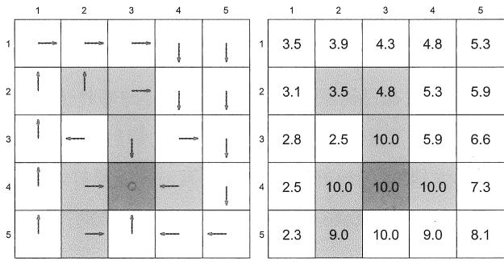

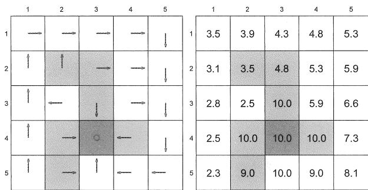  
(a) 两个“好”的策略及其对应的状态值。这两个策略的状态值相同，但是它们在第四列的前两个状态是不同的。

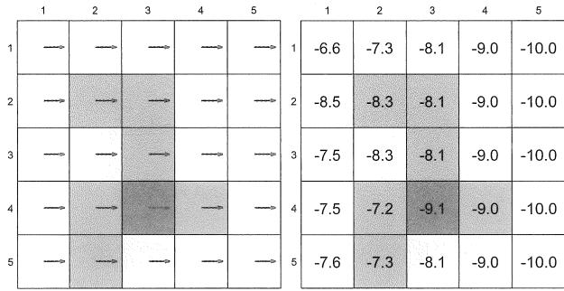

图2.7 策略及其对应的状态值的示例。  
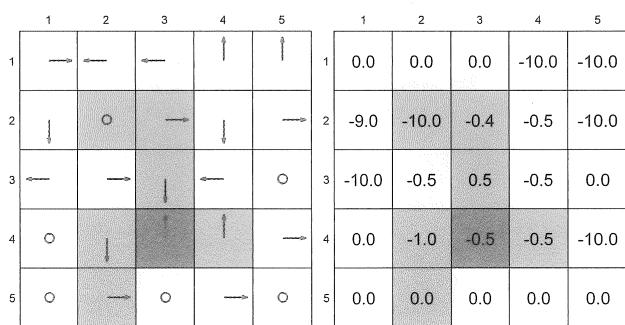  
(b) 两个“不好”的策略及其对应的状态值。这两个策略的状态值比上面两个“好”策略的状态值要小。

态值是一致的，例如这两个策略的状态值都是负的，比图2.7(a)中“好”策略的状态值都要小。

# 2.8 动作值

到目前为止，本章一直在讨论状态值。下面我们转向动作值或称动作价值（action value）。动作值这个概念非常重要，但之所以在本章的最后一节才介绍它，是因为它依赖于状态值的概念：我们要首先很好地理解状态值，才能很好地理解动作值。

针对一个状态-动作配对（state-action pair） $(s,a)$ ，其动作值定义为

$$
q _ {\pi} (s, a) \doteq \mathbb {E} [ G _ {t} | S _ {t} = s, A _ {t} = a ].
$$

上式表明动作值被定义为在一个状态采取一个动作之后获得的回报的期望值。值得指出的是， $q_{\pi}(s, a)$ 依赖于一个状态-动作配对 $(s, a)$ ，而不仅仅是一个动作。因此，或许称这个值为状态-动作值会更严谨，但简便起见，通常称之为动作值。

动作值与状态值有什么关系呢？

首先，根据条件期望的性质可得

$$
\underbrace {\mathbb {E} [ G _ {t} | S _ {t} = s ]} _ {v _ {\pi} (s)} = \sum_ {a \in \mathcal {A}} \underbrace {\mathbb {E} [ G _ {t} | S _ {t} = s , A _ {t} = a ]} _ {q _ {\pi} (s, a)} \pi (a | s).
$$

上式可简化为

$$
\begin{array}{l} v _ {\pi} (s) = \sum_ {a \in \mathcal {A}} \pi (a | s) q _ {\pi} (s, a) \\ = \mathbb {E} _ {A _ {t} \sim \pi (s)} \left[ q _ {\pi} (s, A _ {t}) \right]. \tag {2.16} \\ \end{array}
$$

由上式可以看出，状态值是该状态对应的动作值的期望值。

$\diamond$ 第二，因为状态值具有如下表达式

$$
v _ {\pi} (s) = \sum_ {a \in \mathcal {A}} \pi (a | s) \left[ \sum_ {r \in \mathcal {R}} p (r | s, a) r + \gamma \sum_ {s ^ {\prime} \in \mathcal {S}} p \left(s ^ {\prime} | s, a\right) v _ {\pi} \left(s ^ {\prime}\right) \right].
$$

将其与(2.16)进行比较，可得

$$
\begin{array}{l} q _ {\pi} (s, a) = \sum_ {r \in \mathcal {R}} p (r | s, a) r + \gamma \sum_ {s ^ {\prime} \in \mathcal {S}} p \left(s ^ {\prime} \mid s, a\right) v _ {\pi} \left(s ^ {\prime}\right) \\ = \mathbb {E} \left[ R _ {t + 1} + \gamma v _ {\pi} \left(S _ {t + 1}\right) \mid S _ {t} = s, A _ {t} = a \right]. \tag {2.17} \\ \end{array}
$$

由上式可以看出，动作值是一个包含状态值的变量的期望值。

式(2.16)和式(2.17)是“一个硬币的两个面”：式(2.16)展示了如何从动作值获得状态值，而式(2.17)展示了如何从状态值获得动作值。

# 2.8.1 示例

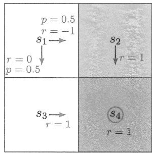  
图2.8 用于展示动作值的示例。

接下来，我们通过一个例子展示如何计算动作值，并特别指出一个初学者常犯的错误。

考虑图2.8中的随机策略。我们下面仅考察状态 $s_1$ 对应的动作值，其他状态是类似的。策略在 $s_1$ 可能会采取两个动作 $a_2$ 或者 $a_3$ 。首先， $(s_1, a_2)$ 的动作值为

$$
q _ {\pi} \left(s _ {1}, a _ {2}\right) = - 1 + \gamma v _ {\pi} \left(s _ {2}\right),
$$

其中 $s_2$ 是下一个状态。类似地， $(s_1, a_3)$ 的动作值是

$$
q _ {\pi} (s _ {1}, a _ {3}) = 0 + \gamma v _ {\pi} (s _ {3}).
$$

关于动作值，初学者常犯的一个错误是：因为图2.8中的策略在 $s_1$ 会选择 $a_2$ 或者 $a_3$ ，而并不会选择 $a_1, a_4, a_5$ ，所以我们不需要计算 $a_1, a_4, a_5$ 的动作值，或者它们的动作值是0。这是错误的！

$\diamond$ 首先，即使一个动作不会被策略选择，它依然具有动作值。在这个例子中，尽管策略 $\pi$ 在 $s_1$ 不会选取 $a_1$ ，我们仍然可以计算“假如”采取这一动作后将获得的回报。具体来说，在 $s_1$ 选取 $a_1$ 后，智能体会被弹回 $s_1$ （因此立即奖励是-1)，然后从 $s_1$ 开始按照 $\pi$ 移动（因此未来奖励是 $\gamma v_{\pi}(s_1)$ )。综上， $(s_1,a_1)$ 的动作值为

$$
q _ {\pi} \left(s _ {1}, a _ {1}\right) = - 1 + \gamma v _ {\pi} \left(s _ {1}\right).
$$

类似地，对于 $a_4$ 和 $a_5$ 有

$$
q _ {\pi} \left(s _ {1}, a _ {4}\right) = - 1 + \gamma v _ {\pi} \left(s _ {1}\right),
$$

$$
q _ {\pi} (s _ {1}, a _ {5}) = 0 + \gamma v _ {\pi} (s _ {1}).
$$

。 第二，为什么我们要关心策略不会选择的动作？尽管有些动作可能不会被策略选择，这并不意味着这些动作就不好。相反，这个动作可能是最好的动作，只是因当

前的策略不够好而没有选择这个动作罢了。强化学习的目的是寻找最优策略，因此我们必须探索所有动作，从而找到每个状态下的最优动作。

# 2.8.2 基于动作值的贝尔曼方程

我们之前介绍的贝尔曼方程都是基于状态值的。实际上，贝尔曼方程也可以用动作值来表达，只是该形式并不常见。不感兴趣的读者可以跳过本节，这并不影响后续的学习。

具体来说，将式(2.16)代入式(2.17)可以得到

$$
q _ {\pi} (s, a) = \sum_ {r \in \mathcal {R}} p (r | s, a) r + \gamma \sum_ {s ^ {\prime} \in \mathcal {S}} p (s ^ {\prime} | s, a) \sum_ {a ^ {\prime} \in \mathcal {A} (s ^ {\prime})} \pi (a ^ {\prime} | s ^ {\prime}) q _ {\pi} (s ^ {\prime}, a ^ {\prime}).
$$

这也是一个贝尔曼方程，只不过它只包含动作值而没有状态值。这个方程对每一个状态-动作配对都是成立的。如果我们将所有这些方程都放在一起，则可以得到它们的矩阵-向量形式：

$$
q _ {\pi} = \tilde {r} + \gamma P I I q _ {\pi}, \tag {2.18}
$$

其中 $q_{\pi}$ 是一个动作值向量，它对应 $(s,a)$ 的元素是 $[q_{\pi}]_{(s,a)} = q_{\pi}(s,a)$ ； $\tilde{r}$ 是由 $(s,a)$ 索引的即时奖励向量 $[\tilde{r}]_{(s,a)} = \sum_{r\in \mathcal{R}}p(r|s,a)r$ ；矩阵 $P$ 是概率转移矩阵，其每一行对应一个状态-动作配对，每一列对应一个状态 $[P]_{(s,a),s'} = p(s'|s,a)$ ； $\varPi$ 是一个块对角矩阵(block diagonal matrix)，其中每个块是一个 $1\times |\mathcal{A}|$ 维的向量： $\varPi_{s',(s',a')} = \pi (a'|s')$ ，而 $\varPi$ 的其他元素都为0。

相比基于状态值的贝尔曼方程，基于动作值的贝尔曼方程具有一些独特的性质。例如， $\tilde{r}$ 和 $P$ 不依赖于策略，仅由系统模型确定，而策略仅被包含在 $\Pi$ 中。更多性质可以参见文献[5]。

# 2.9 总结

本章介绍的最重要的概念是状态值。数学上，状态值是智能体从一个状态出发所能获得的回报的期望值。

不同状态的值是彼此相关的。例如，状态 $s$ 的值依赖于一些其他状态的值，而其他这些状态的值可能又依赖于更多其他状态或者状态 $s$ 的值。这种关系可能是对初学者来说最困惑的一点，它涉及一个自举的重要概念。“自举”的英文翻译是 bootstrapping，它在不同历史时期有不同的含义。从字面上来讲，它指的是鞋后边能够帮助更好地穿鞋的带子，后来它用于讽刺那些异想天开的想法，如自己想通过双手拉着自己鞋上的

两个带子让自己的双脚离地；它的现代引申意义指的是自迭代算法，即从一个初始值出发不断迭代计算。

虽然从直觉上来看自举是比较令人困惑的，但是从数学上来看，贝尔曼方程清晰地描述了不同状态值之间的关系，以及如何通过迭代的方式求解状态值。此外，由于状态值可用于评价策略的优劣，因此根据贝尔曼方程求解某一策略的状态值的过程称为策略评价。正如本书后面介绍的，策略评价是强化学习算法中的重要步骤。

本章介绍的另一个重要概念是动作值，它可以描述在某个状态采取某个动作的价值。正如本书后面会介绍的，当我们尝试寻找最优策略时，动作值相比状态值将发挥更直接的作用。

最后，贝尔曼方程并不局限于强化学习领域，它在许多领域如控制理论和运筹学中都有广泛应用。在不同领域，贝尔曼方程可能有不同的表达形式。本书是在离散马尔可夫决策过程的框架下介绍贝尔曼方程的，更多的信息可以参见文献[2]。

# 2.10 问答

提问：状态值和回报之间的关系是什么？

回答：一个状态的状态值是智能体从该状态出发可以获得的回报的期望值。

提问：我们为什么要关心状态值？它为什么重要？

回答：状态值可以用来评价策略的好坏。在下一章我们将看到，最优策略就是基于状态值来定义的。

提问：我们为什么要关心贝尔曼方程？它为什么重要？

回答：贝尔曼方程描述了所有状态值之间的关系，它是分析和求解状态值的核心工具。

提问：为什么求解贝尔曼方程的过程被称为策略评价？

回答：求解贝尔曼方程得到的是状态值，由于状态值可以用来评价策略，因此求解贝尔曼方程的过程可以被理解为评价相应的策略。

提问：我们为什么需要研究贝尔曼方程的矩阵-向量形式？

回答：贝尔曼方程是为所有状态建立的一组线性方程。为了求解所有状态值，我们有必要联立这些方程，而其矩阵-向量形式则是这些方程联立之后的简洁表达式。

提问：状态值与动作值之间的关系是什么？

回答：它们的关系可以通过式(2.16)和式(2.17)清晰地阐述，它们相互依赖，可以相互转换。

提问：我们为什么关心一个给定策略不会选择的动作的价值？

回答：尽管一个给定的策略可能不会选择某些动作，但是这并不意味着这些动作是不好的。相反，有可能是因给定的策略不够好而错过了最好的动作。因此，为了寻找更好的策略，我们要探索所有动作，即使其中一些可能不会被当前给定策略选择，这一点在后面介绍基于蒙特卡罗的强化学习算法时会更加明显，读者现在只需要有一个大概的理解即可。

# 第3章

# 最优状态值与贝尔曼最优方程

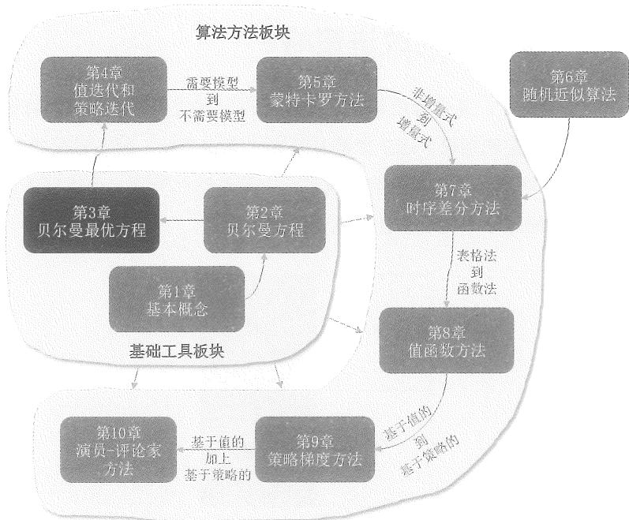  
图3.1 本章在全书中的位置。

强化学习的终极目标究竟是什么？在线下的授课中，我告诉我的学生：如果你听到了这个问题，你一定要能够非常快速地回答出来，强化学习的终极目标是寻找最优策略。因此，最优策略是强化学习中非常基础且重要的概念。

本章将介绍一个核心概念和一个核心工具：这个核心概念是最优状态值，基于此，我们可以定义最优策略；这个核心工具是贝尔曼最优方程，基于此，我们可以求解最优状态值和最优策略。

本章与前后两章关系密切：第2章介绍了贝尔曼方程；本章将介绍的贝尔曼最优方程是一个特殊的贝尔曼方程；第3章将介绍的“值迭代”算法就用于求解本章介绍的贝尔曼最优方程。因此，本章起到了承上启下的关键作用。

本章的数学内容相比之前两章会稍微多一些，因此读者可能需要耐心地学习。即使多花一些时间也是非常值得的，因为这些数学内容能够非常清晰地解答许多基本问题，这对于透彻理解后面章节的内容至关重要。此外，这些数学内容以合理的方式呈现了出来，相信大家只要耐心学习，就不会觉得特别困难。

# 3.1 启发示例：如何改进策略？

考虑图3.2中的例子，其中橙色和蓝色的单元格分别代表禁止区域和目标区域。图中的箭头代表一个给定的策略。这个策略从直观上来说不好，因为它在状态 $s_1$ 选择 $a_2$ （向右）会进入禁止区域。那么我们能否改进这个策略进而得到一个更好的策略呢？答案是可以的。下面通过一个例子来介绍改进策略的思路。

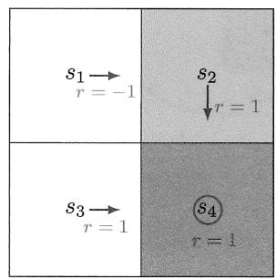  
图3.2 用于说明如何改进策略的一个例子。

$\diamond$ 第一，直觉。直觉告诉我们：如果在 $s_1$ 选择 $a_3$ （向下）而不是 $a_2$ （向右），那么策略会更好，这是因为向下移动能够避免进入禁止区域。  
$\diamond$ 第二，数学。上面的直觉可以基于状态值和动作值的计算来得到验证。

首先，计算给定策略的状态值。根据第2章的内容，不难写出这一策略对应的贝尔

曼方程为

$$
v _ {\pi} (s _ {1}) = - 1 + \gamma v _ {\pi} (s _ {2}),
$$

$$
v _ {\pi} (s _ {2}) = + 1 + \gamma v _ {\pi} (s _ {4}),
$$

$$
v _ {\pi} (s _ {3}) = + 1 + \gamma v _ {\pi} (s _ {4}),
$$

$$
v _ {\pi} (s _ {4}) = + 1 + \gamma v _ {\pi} (s _ {4}).
$$

如果设 $\gamma = 0.9$ ，可以求出

$$
v _ {\pi} (s _ {1}) = 8, \qquad v _ {\pi} (s _ {2}) = v _ {\pi} (s _ {3}) = v _ {\pi} (s _ {4}) = 1 0.
$$

然后，计算给定策略的动作值。针对状态 $s_1$ ，其对应的动作值是

$$
q _ {\pi} \left(s _ {1}, a _ {1}\right) = - 1 + \gamma v _ {\pi} \left(s _ {1}\right) = 6. 2,
$$

$$
q _ {\pi} (s _ {1}, a _ {2}) = - 1 + \gamma v _ {\pi} (s _ {2}) = 8,
$$

$$
q _ {\pi} (s _ {1}, a _ {3}) = 0 + \gamma v _ {\pi} (s _ {3}) = 9,
$$

$$
q _ {\pi} (s _ {1}, a _ {4}) = - 1 + \gamma v _ {\pi} (s _ {1}) = 6. 2,
$$

$$
q _ {\pi} \left(s _ {1}, a _ {5}\right) = 0 + \gamma v _ {\pi} \left(s _ {1}\right) = 7. 2.
$$

上式表明动作 $a_3$ 具有最大的动作值，即

$$
q _ {\pi} (s _ {1}, a _ {3}) \geqslant q _ {\pi} (s _ {1}, a _ {i}), \quad \text {对 所 有} i \neq 3.
$$

因此，为了得到最大的回报，新的策略应该在 $s_1$ 选择 $a_3$ （向下移动），这个数学结论与前面的直觉是一致的。

上面这个例子说明了：如果我们更新策略从而使之选择具有最大动作值的动作，就有望得到一个更好的策略。

这个例子非常简单，因为给定的策略只是在 $s_1$ 不好，而在其他状态已经很好了。如果策略在其他状态也不好，此时在 $s_1$ 选择最大动作值还能否得到更好的策略呢？这个问题看似简单，其实想回答清楚并不容易。此外还有很多问题，例如是否总是存在最优策略、最优策略看起来是什么样子等。我们将在本章回答这些问题。

# 3.2 最优状态值和最优策略

首先，我们需要定义什么是最优策略（optimal policy）。

考虑两个给定的策略 $\pi_1$ 和 $\pi_2$ 。如果对于任意状态 $s\in S$ ， $\pi_1$ 的状态值都大于或等

于 $\pi_{2}$ 的状态值，即

$$
v _ {\pi_ {1}} (s) \geqslant v _ {\pi_ {2}} (s), \quad \text {对 任 意} s \in S,
$$

那么我们说 $\pi_1$ 比 $\pi_2$ 更好。而如果一个策略比所有其他策略都更好，那么这个策略就是最优策略，其正式定义如下所述。

定义3.1 (最优策略与最优状态值)。考虑策略 $\pi^{*}$ ，如果对任意的状态 $s \in S$ 和其他任意策略 $\pi$ ，都有 $v_{\pi^{*}}(s) \geqslant v_{\pi}(s)$ ，那么 $\pi^{*}$ 是一个最优策略，并且 $\pi^{*}$ 对应的状态值是最优状态值。

上述定义表明：一个最优策略在每一个状态都有比所有其他策略更高的状态值。这个定义可能也引出了读者的许多问题。

$\diamond$ 存在性：这样的最优策略存在吗？  
$\diamond$ 唯一性：这样的最优策略唯一吗？  
随机性：最优策略是随机性的还是确定性的？  
$\diamond$ 算法：有什么算法能够让我们得到最优策略和最优状态值？

这几个问题非常基础和重要。例如，关于最优策略的存在性，如果最优策略根本不存在，那么我们就不需要费尽心机去设计算法来寻找它们了。本章将逐一解答这些问题。

# 3.3 贝尔曼最优方程

为了分析和求解最优策略，下面介绍大名鼎鼎的贝尔曼最优方程（Bellman optimality equation，BOE）。首先直接给出其表达式，然后详细分析它的性质。

对于每个 $s \in S$ ，贝尔曼最优方程的表达式如下所示：

$$
\begin{array}{l} v (s) = \max  _ {\pi (s) \in I I (s)} \sum_ {a \in \mathcal {A}} \pi (a | s) \left(\sum_ {r \in \mathcal {R}} p (r | s, a) r + \gamma \sum_ {s ^ {\prime} \in \mathcal {S}} p \left(s ^ {\prime} \mid s, a\right) v \left(s ^ {\prime}\right)\right) \\ = \max  _ {\pi (s) \in \Pi (s)} \sum_ {a \in \mathcal {A}} \pi (a | s) q (s, a), \tag {3.1} \\ \end{array}
$$

其中

$$
q (s, a) \doteq \sum_ {r \in \mathcal {R}} p (r | s, a) r + \gamma \sum_ {s ^ {\prime} \in \mathcal {S}} p \left(s ^ {\prime} | s, a\right) v \left(s ^ {\prime}\right).
$$

这里 $v(s), v(s')$ 是待求解的未知量； $\pi(s)$ 表示状态 $s$ 的策略； $\Pi(s)$ 是在状态 $s$ 所有可能策略的集合。

贝尔曼最优方程是一个优美且强大的工具，它能清晰地解释许多基础且重要的问题。不过，初学者乍一看到这个式子会有很多疑问。例如，这个方程有两类未知量：一类是值 $v$ ，另一类是策略 $\pi$ 。如何从一个方程中同时求解两类未知量呢？此外，下面这些问题也需要回答。

存在性：这个贝尔曼最优方程有解吗？  
$\diamond$ 唯一性：贝尔曼最优方程的解是唯一的吗？  
$\diamond$ 算法：如何求解贝尔曼最优方程？   
最优性：贝尔曼最优方程的解与最优策略有何关系？

最后，贝尔曼最优方程与贝尔曼方程是什么关系？为什么说它是一个特殊的贝尔曼方程？

这些问题都是非常基础且重要的。如果能回答这些问题，我们就能清楚地理解最优状态值和最优策略；反之，如果这些问题回答得不清楚，我们的理解一定是一知半解或者云里雾里。然而，想回答这些问题不能一蹴而就。下面带领大家一步步地学习，只要能静下心来稳扎稳打，相信大家能一劳永逸地透彻掌握。

# 3.3.1 方程右侧的优化问题

贝尔曼最优方程(3.1)的右侧嵌套了一个优化问题，这可能是让初学者最感到迷惑的一点。我们通过下面的例子来解释其求解思路。

例子3.1 假设两个未知变量 $x, y \in \mathbb{R}$ 满足如下方程：

$$
x = \max _ {y \in \mathbb {R}} (2 x - 1 - y ^ {2}).
$$

这个方程乍一看比较奇怪：它包含两个未知数，并且右侧嵌套了一个优化问题。实际上这个方程的求解并不困难，可以通过两步求解。第一步是求解方程右侧的优化问题 $\max_{y\in \mathbb{R}}(2x - 1 - y^2)$ 。具体来说，不管 $x$ 的值是什么，在 $y = 0$ 时 $(2x - 1 - y^{2})$ 达到最大值，此时 $\max_y(2x - 1 - y^2) = 2x - 1$ 。第二步是求解 $x$ ，如果把 $y = 0$ 代入方程，那么方程变为 $x = 2x - 1$ ，此时很容易求解出 $x = 1$ 。因此， $y = 0$ 和 $x = 1$ 是该方程的解。

明白了上面这个例子，再来看贝尔曼最优方程就会简单很多：式(3.1)可以简写为

$$
v (s) = \max _ {\pi (s) \in \Pi (s)} \sum_ {a \in \mathcal {A}} \pi (a | s) q (s, a), \quad s \in \mathcal {S}.
$$

受到示例3.1的启发，我们首先要解决方程右边的优化问题。怎么做呢？我们再来看一个简单的例子。

例子3.2 给定 $q_{1}, q_{2}, q_{3} \in \mathbb{R}$ ，我们希望找到 $c_{1}, c_{2}, c_{3}$ 的最优值，从而求解下面的优化问题：

$$
\max  _ {c _ {1}, c _ {2}, c _ {3}} \sum_ {i = 1} ^ {3} c _ {i} q _ {i} = \max  _ {c _ {1}, c _ {2}, c _ {3}} \left(c _ {1} q _ {1} + c _ {2} q _ {2} + c _ {3} q _ {3}\right),
$$

其中要求 $c_{1} + c_{2} + c_{3} = 1$ 且 $c_{1},c_{2},c_{3}\geqslant 0$

求解这个问题的思路如下。首先， $q_{1}, q_{2}, q_{3}$ 中一定存在一个最大值。不失一般性，假设 $q_{3} \geqslant q_{1}, q_{2}$ 。那么，最优解是 $c_{3}^{*} = 1, c_{1}^{*} = c_{2}^{*} = 0$ 。为什么呢？这是因为

$$
q _ {3} = \left(c _ {1} + c _ {2} + c _ {3}\right) q _ {3} = c _ {1} q _ {3} + c _ {2} q _ {3} + c _ {3} q _ {3} \geqslant c _ {1} q _ {1} + c _ {2} q _ {2} + c _ {3} q _ {3}
$$

对任何 $c_{1}, c_{2}, c_{3}$ 都成立。

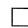

受到上述示例的启发，由于 $\sum_{a}\pi (a|s) = 1$ ，我们有

$$
\sum_ {a \in \mathcal {A}} \pi (a | s) q (s, a) \leqslant \sum_ {a \in \mathcal {A}} \pi (a | s) \max  _ {a \in \mathcal {A}} q (s, a) = \max  _ {a \in \mathcal {A}} q (s, a),
$$

即 $\sum_{a\in \mathcal{A}}\pi (a|s)q(s,a)$ 的最大值是 $\max_{a\in \mathcal{A}}q(s,a)$ ，而且等于最大值的条件是

$$
\pi (a | s) = \left\{ \begin{array}{l l} 1, & a = a ^ {*}, \\ 0, & a \neq a ^ {*}. \end{array} \right.
$$

其中 $a^* = \arg \max_a q(s, a)$ 。因此，最优策略 $\pi(s)$ 应该选择具有最大 $q(s, a)$ 的动作。在解决了右侧的优化问题之后，式(3.1)就变成了 $v(s) = \max_{a \in \mathcal{A}(s)} q(s, a)$ 。

# 3.3.2 矩阵-向量形式

方程(3.1)是对任意状态都成立的，将所有状态对应的这些方程联立，可以获得一个简洁的矩阵-向量形式。该形式在本章中将被广泛使用，对于分析贝尔曼最优方程将发挥重要作用。

具体来说，假设有 $n$ 个状态 $\{s_1,s_2,\ldots ,s_n\}$ 。类似于第2章推导贝尔曼方程的矩阵-向量形式，我们可以得到贝尔曼最优方程的矩阵-向量形式为

$$
v = \max  _ {\pi \in \Pi} \left(r _ {\pi} + \gamma P _ {\pi} v\right), \tag {3.2}
$$

其中 $v = [v(s_1), v(s_2), \ldots, v(s_n)]^{\mathrm{T}} \in \mathbb{R}^n$ 是待求解的未知量。上式中的 $\max_{\pi}$ 是以逐元素的方式执行的。例如，对于一个向量 $[*, *]$ ，其中的元素用“*”表示，那么有 $\max_{\pi}[*, *] = [\max_{\pi}, \max_{\pi}]$ 。此外，上式中 $r_{\pi}$ 和 $P_{\pi}$ 与贝尔曼方程的矩阵-向量形式中的相同：

$$
\left[ r _ {\pi} \right] _ {s} \doteq \sum_ {a \in \mathcal {A}} \pi (a | s) \sum_ {r \in \mathcal {R}} p (r | s, a) r, \quad \left[ P _ {\pi} \right] _ {s, s ^ {\prime}} = p \left(s ^ {\prime} | s\right) \doteq \sum_ {a \in \mathcal {A}} \pi (a | s) p \left(s ^ {\prime} | s, a\right).
$$

这里我们不再赘述将式(3.1)转换为式(3.2)的详细过程，这个过程与第2章中将贝尔曼

方程转换成矩阵向量形式的过程是类似的。

由于 $\pi$ 的最优值由 $v$ 决定，(3.2)的右侧实际上是 $v$ 的函数，因此可以用一个函数 $f(v)$ 表示为

$$
f (v) \doteq \max  _ {\pi \in \Pi} (r _ {\pi} + \gamma P _ {\pi} v).
$$

然后，贝尔曼最优方程(3.2)可以简洁地表达为

$$
v = f (v). \tag {3.3}
$$

在本节的剩余部分，我们将介绍如何求解方程(3.3)。

# 3.3.3 压缩映射定理

为了分析 $v = f(v)$ ，本小节将首先介绍压缩映射定理（contraction mapping theorem）[6]。压缩映射定理是分析非线性方程的强大工具，它也被称为不动点定理。如果读者已经了解这个定理，则可以跳过这一小节；否则，建议读者仔细学习该定理，因为它是分析贝尔曼最优方程的关键工具。

考虑一个函数 $f(x)$ ，其中 $x\in \mathbb{R}^d$ 且 $f:\mathbb{R}^d\to \mathbb{R}^d$ 。如果一个点 $x^{*}$ 满足

$$
f (x ^ {*}) = x ^ {*},
$$

那么称之为不动点（fixed point）。之所以称之为“不动点”，是因为 $x^{*}$ 的映射还是其自身。

如果存在 $\gamma \in (0,1)$ 使得

$$
\left\| f \left(x _ {1}\right) - f \left(x _ {2}\right) \right\| \leqslant \gamma \| x _ {1} - x _ {2} \|
$$

对于任意的 $x_{1}, x_{2} \in \mathbb{R}^{d}$ 都成立，那么函数 $f$ 被称为压缩映射（contraction mapping）。上面不等式中的 $\|\cdot\|$ 表示向量或矩阵的范数。

下面通过三个简单的例子来解释不动点和压缩映射。

例子3.3 三个简单例子。

例1： $x = f(x) = 0.5x$ ， $x\in \mathbb{R}$ 。

首先，很容易验证 $x = 0$ 是一个不动点，因为 $0 = 0.5 \cdot 0$ 。其次， $f(x) = 0.5x$ 是一个压缩映射，因为 $\|0.5x_1 - 0.5x_2\| = 0.5\|x_1 - x_2\| \leqslant \gamma \|x_1 - x_2\|$ 对任何 $\gamma \in [0.5,1)$ 都成立。

例2： $x = f(x) = Ax$ ，其中 $x\in \mathbb{R}^n,A\in \mathbb{R}^{n\times n}$ 且 $\| A\| \leqslant \gamma <  1$

首先，很容易验证 $x = 0$ 是一个不动点，因为 $0 = A0$ 。其次， $f(x) = Ax$ 是一个压缩映射，因为 $\|Ax_1 - Ax_2\| = \|A(x_1 - x_2)\| \leqslant \|A\|\|x_1 - x_2\| \leqslant \gamma\|x_1 - x_2\|$ 。

例3： $x = f(x) = 0.5\sin x,x\in \mathbb{R}$

首先，很容易验证 $x = 0$ 是一个不动点，因为 $0 = 0.5\sin 0$ 。其次，根据中值定理[7,8]可知

$$
\left| \frac {0 . 5 \sin x _ {1} - 0 . 5 \sin x _ {2}}{x _ {1} - x _ {2}} \right| = | 0. 5 \cos x _ {3} | \leqslant 0. 5, \quad x _ {3} \in [ x _ {1}, x _ {2} ].
$$

上式可以等价为 $|0.5\sin x_1 - 0.5\sin x_2| \leqslant 0.5|x_1 - x_2|$ ，因此 $f(x) = 0.5\sin x$ 是一个压缩映射。

有了上面的准备，下面给出经典的压缩映射定理。

定理3.1 (压缩映射定理)。对于方程 $x = f(x)$ ，其中 $x$ 和 $f(x)$ 是实数向量。如果 $f$ 是一个压缩映射，则下面所有性质都成立。

存在性：一定存在一个不动点 $x^{*}$ 满足 $f(x^{*}) = x^{*}$ 。  
唯一性：不动点 $x^{*}$ 是唯一的。  
$\diamond$ 算法：考虑迭代算法

$$
x _ {k + 1} = f (x _ {k}),
$$

其中 $k = 0,1,2,\ldots$ 。给定任意一个初始值 $x_0$ ，当 $k\to \infty$ 时， $x_{k}\rightarrow x^{*}$ ，且收敛过程具有指数收敛速度。

压缩映射定理之所以强大，是因为它不仅能告诉我们该方程的解是否存在、是否唯一，还能给出一个数值求解算法。该定理的证明见方框3.1。本书中凡是放到灰色方框中的内容都是选学内容，感兴趣的读者可以阅读，不感兴趣的读者可以跳过，并不会对整体学习造成影响。

下面的示例展示了如何使用压缩映射定理给出的迭代算法来求解方程。

例子3.4再次考虑前面提到过的三个简单例子： $x = 0.5x$ ， $x = Ax$ ， $x = 0.5\sin x$ 。前面我们已经提到 $x^{*} = 0$ 是一个不动点，并且方程右边的函数都是压缩映射。现在根据压缩映射定理，我们知道这个不动点 $x^{*} = 0$ 是唯一的解。因为这三个方程很简单，所以可以用很多方式求解得到 $x^{*} = 0$ 。这里假设我们不知道如何求解，那么根据压缩映射定理，其解可以通过以下迭代算法得到：

$$
\begin{array}{l} x _ {k + 1} = 0. 5 x _ {k}, \\ x _ {k + 1} = A x _ {k}. \\ \end{array}
$$

$$
x _ {k + 1} = 0. 5 \sin x _ {k},
$$

其中初始值 $x_0$ 可以是任意值。例如，考虑算法 $x_{k + 1} = 0.5x_{k}$ ，如果初始值是 $x_0 = 10$ 那么可得 $x_{1} = 5,x_{2} = 2.5,x_{3} = 1.25,x_{4} = 0.625,\ldots$ 。可以看到， $x_{k}$ 会逐渐接近真实解 $x^{*} = 0$ □

# 方框3.1：压缩映射定理的证明

第1步：证明序列 $\{x_{k} = f(x_{k - 1})\}_{k = 1}^{\infty}$ 是收敛的。

该证明依赖于柯西序列（Cauchy sequence）。如果一个序列 $x_{1}, x_{2}, \cdots \in \mathbb{R}$ 满足如下条件就被称为柯西序列：对于任何小的 $\varepsilon > 0$ ，存在 $N$ 使得所有的 $m, n > N$ 都有 $\|x_{m} - x_{n}\| < \varepsilon$ 。该条件的直观解释是存在一个有限整数 $N$ ，使得 $N$ 之后的所有元素彼此足够接近。柯西序列很重要，因为它保证了序列会收敛到一个极限，它的收敛性将被用来证明压缩映射定理。值得注意的是， $\|x_{m} - x_{n}\| < \varepsilon$ 必须对所有 $m, n > N$ 都成立。如果仅有 $\|x_{n+1} - x_{n}\| < \varepsilon$ ，那么不足以说明该序列是一个柯西序列。例如，对于 $x_{n} = \sqrt{n}$ ，虽然有 $x_{n+1} - x_{n} \to 0$ ，但显然 $x_{n} = \sqrt{n}$ 并不收敛。

下面证明 $\{x_{k} = f(x_{k - 1})\}_{k = 1}^{\infty}$ 是一个柯西序列。首先，由于 $f$ 是一个压缩映射，有

$$
\left\| x _ {k + 1} - x _ {k} \right\| = \left\| f \left(x _ {k}\right) - f \left(x _ {k - 1}\right) \right\| \leqslant \gamma \| x _ {k} - x _ {k - 1} \|.
$$

由上式可得

：

$$
\begin{array}{l} \left\| x _ {k + 1} - x _ {k} \right\| \leqslant \gamma \| x _ {k} - x _ {k - 1} \| \\ \leqslant \gamma^ {2} \| x _ {k - 1} - x _ {k - 2} \| \\ \leqslant \gamma^ {k} \| x _ {1} - x _ {0} \|. \\ \end{array}
$$

由于 $\gamma < 1$ ，对任意的 $x_{1}, x_{0}$ ，我们都有 $\| x_{k + 1} - x_k\|$ 会随着 $k \to \infty$ 以指数速度收敛到0。值得注意的是， $\{\| x_{k + 1} - x_k\|\}$ 的收敛不足以证明 $\{x_k\}$ 的收敛。因此，我们需要进一步考虑 $\| x_m - x_n\|$ （其中 $m > n$ ）：

$$
\begin{array}{l} \left\| x _ {m} - x _ {n} \right\| = \left\| x _ {m} - x _ {m - 1} + x _ {m - 1} - \dots - x _ {n + 1} + x _ {n + 1} - x _ {n} \right\| \\ \leqslant \left\| x _ {m} - x _ {m - 1} \right\| + \dots + \left\| x _ {n + 1} - x _ {n} \right\| \\ \end{array}
$$

$$
\begin{array}{l} \leqslant \gamma^ {m - 1} \| x _ {1} - x _ {0} \| + \dots + \gamma^ {n} \| x _ {1} - x _ {0} \| \\ = \gamma^ {n} \left(\gamma^ {m - 1 - n} + \dots + 1\right) \| x _ {1} - x _ {0} \| \\ \leqslant \gamma^ {n} (1 + \dots + \gamma^ {m - 1 - n} + \gamma^ {m - n} + \dots) \| x _ {1} - x _ {0} \| \\ = \frac {\gamma^ {n}}{1 - \gamma} \| x _ {1} - x _ {0} \|. \tag {3.4} \\ \end{array}
$$

上式表明，对任意的 $\varepsilon$ ，我们总是可以找到 $N$ 使得对所有 $m, n > N$ 都有 $\| x_m - x_n\| < \varepsilon$ 。

因此， $\{x_{k} = f(x_{k - 1})\}_{k = 1}^{\infty}$ 是一个柯西序列。根据柯西序列的性质，它会收敛到一个极限值，记作 $x^{*} = \lim_{k\to \infty}x_{k}$ 。

第2步：证明极限 $x^{*} = \lim_{k\to \infty}x_{k}$ 是一个不动点。

由于

$$
\| f (x _ {k}) - x _ {k} \| = \| x _ {k + 1} - x _ {k} \| \leqslant \gamma^ {k} \| x _ {1} - x _ {0} \|,
$$

我们知道 $\| f(x_{k}) - x_{k}\|$ 以指数速度趋近于0。因此，在极限情况下有 $f(x^{*}) = x^{*}$ 。

第3步：证明该不动点是唯一的。

假设存在另一个不动点 $x^{\prime}$ 满足 $f(x^{\prime}) = x^{\prime}$ 。那么，

$$
\| x ^ {\prime} - x ^ {*} \| = \| f \left(x ^ {\prime}\right) - f \left(x ^ {*}\right) \| \leqslant \gamma \| x ^ {\prime} - x ^ {*} \|.
$$

由于 $\gamma < 1$ ，这个不等式成立当且仅当 $\| x' - x^{*}\| = 0$ 。因此， $x^{\prime} = x^{*}$ 。

第4步：证明 $x_{k}$ 以指数速度收敛到 $x^{*}$ 。

根据式(3.4)，我们有 $\| x_{m} - x_{n}\| \leqslant \frac{\gamma^{n}}{1 - \gamma}\| x_{1} - x_{0}\|$ 。由于 $m$ 可以是任意大的，我们可以选取 $m = \infty$ ，此时 $x_{\infty} = x^{*}$ 。因此，

$$
\| x ^ {*} - x _ {n} \| = \lim  _ {m \rightarrow \infty} \| x _ {m} - x _ {n} \| \leqslant \frac {\gamma^ {n}}{1 - \gamma} \| x _ {1} - x _ {0} \|.
$$

由于 $\gamma < 1$ ，随着 $n\to \infty$ ，误差以指数速度收敛到0。

# 3.3.4 方程右侧函数的压缩性质

下面证明贝尔曼最优方程(3.3)右侧的函数 $f(v)$ 是一个压缩映射，之后就可以利用前一小节介绍的压缩映射定理来分析该方程。

定理3.2 $(f(v)$ 的压缩性质)。贝尔曼最优方程(3.3)右侧的函数 $f(v)$ 是一个压缩映射，

即对于任意的 $v_{1}, v_{2} \in \mathbb{R}^{|S|}$ ，有

$$
\left\| f \left(v _ {1}\right) - f \left(v _ {2}\right) \right\| _ {\infty} \leqslant \gamma \| v _ {1} - v _ {2} \| _ {\infty},
$$

其中 $\gamma \in (0,1)$ 是折扣率， $\| \cdot \|_{\infty}$ 是最大值范数，即向量中所有元素的最大绝对值。

这个定理很重要，因为它可以帮助我们很透彻地分析贝尔曼最优方程。该定理的证明见方框3.2，感兴趣的读者可以阅读。

# 方框3.2：定理3.2的证明

考虑任意两个向量 $v_{1}, v_{2} \in \mathbb{R}^{|S|}$ ，假设 $\pi_1^* \doteq \operatorname{argmax}_{\pi}(r_{\pi} + \gamma P_{\pi}v_{1})$ 和 $\pi_2^* \doteq \operatorname{argmax}_{\pi}(r_{\pi} + \gamma P_{\pi}v_{2})$ 。那么，

$$
f (v _ {1}) = \max _ {\pi} (r _ {\pi} + \gamma P _ {\pi} v _ {1}) = r _ {\pi_ {1} ^ {*}} + \gamma P _ {\pi_ {1} ^ {*}} v _ {1} \geqslant r _ {\pi_ {2} ^ {*}} + \gamma P _ {\pi_ {2} ^ {*}} v _ {1},
$$

$$
f (v _ {2}) = \max _ {\pi} (r _ {\pi} + \gamma P _ {\pi} v _ {2}) = r _ {\pi_ {2} ^ {*}} + \gamma P _ {\pi_ {2} ^ {*}} v _ {2} \geqslant r _ {\pi_ {1} ^ {*}} + \gamma P _ {\pi_ {1} ^ {*} v _ {2}},
$$

其中“ $\geqslant$ ”是逐元素比较。因此，

$$
\begin{array}{l} f (v _ {1}) - f (v _ {2}) = r _ {\pi_ {1} ^ {*}} + \gamma P _ {\pi_ {1} ^ {*}} v _ {1} - (r _ {\pi_ {2} ^ {*}} + \gamma P _ {\pi_ {2} ^ {*}} v _ {2}) \\ \leqslant r _ {\pi_ {1} ^ {*}} + \gamma P _ {\pi_ {1} ^ {*}} v _ {1} - \left(r _ {\pi_ {1} ^ {*}} + \gamma P _ {\pi_ {1} ^ {*}} v _ {2}\right) \\ = \gamma P _ {\pi_ {1} ^ {*}} (v _ {1} - v _ {2}). \\ \end{array}
$$

类似地，可以证明 $f(v_{2}) - f(v_{1})\leqslant \gamma P_{\pi_{2}^{*}}(v_{2} - v_{1})$ 。因此，

$$
\gamma P _ {\pi_ {2} ^ {*}} \left(v _ {1} - v _ {2}\right) \leqslant f \left(v _ {1}\right) - f \left(v _ {2}\right) \leqslant \gamma P _ {\pi_ {1} ^ {*}} \left(v _ {1} - v _ {2}\right).
$$

定义

$$
z \doteq \max  \left\{\left| \gamma P _ {\pi_ {2} ^ {*}} (v _ {1} - v _ {2}) \right|, \left| \gamma P _ {\pi_ {1} ^ {*}} (v _ {1} - v _ {2}) \right| \right\} \in \mathbb {R} ^ {| S |},
$$

其中 $\max (\cdot)$ 和 $|\cdot|$ 也是逐元素操作。根据定义， $z \geqslant 0$ 。一方面，由上面两式可以得到

$$
- z \leqslant \gamma P _ {\pi_ {2} ^ {*}} (v _ {1} - v _ {2}) \leqslant f (v _ {1}) - f (v _ {2}) \leqslant \gamma P _ {\pi_ {1} ^ {*}} (v _ {1} - v _ {2}) \leqslant z,
$$

这意味着

$$
\left| f \left(v _ {1}\right) - f \left(v _ {2}\right) \right| \leqslant z.
$$

进而可以推出

$$
\left\| f \left(v _ {1}\right) - f \left(v _ {2}\right) \right\| _ {\infty} \leqslant \| z \| _ {\infty}, \tag {3.5}
$$

另一方面，假设 $z_{i}$ 是 $z$ 的第 $i$ 个元素， $p_{i}^{\mathrm{T}}$ 和 $q_{i}^{\mathrm{T}}$ 分别代表 $P_{\pi_1^*}$ 和 $P_{\pi_2^*}$ 的第 $i$ 行，那么有

$$
z _ {i} = \max  \left\{\gamma \left| p _ {i} ^ {\mathrm {T}} \left(v _ {1} - v _ {2}\right) \right|, \gamma \left| q _ {i} ^ {\mathrm {T}} \left(v _ {1} - v _ {2}\right) \right| \right\}.
$$

由于 $p_i$ 中所有元素都大于或等于0且所有元素之和等于1，因此可以得到

$$
\left| p _ {i} ^ {\mathrm {T}} \left(v _ {1} - v _ {2}\right) \right| \leqslant p _ {i} ^ {\mathrm {T}} \left| v _ {1} - v _ {2} \right| \leqslant \left\| v _ {1} - v _ {2} \right\| _ {\infty}.
$$

同理可得 $|q_i^{\mathrm{T}}(v_1 - v_2)| \leqslant \| v_1 - v_2\|_{\infty}$ 。因此，我们有 $z_{i} \leqslant \gamma \| v_{1} - v_{2}\|_{\infty}$ ，进而可得

$$
\left\| z \right\| _ {\infty} = \max  _ {i} \left| z _ {i} \right| \leqslant \gamma \left\| v _ {1} - v _ {2} \right\| _ {\infty}.
$$

将此不等式代入式(3.5)可得

$$
\left\| f \left(v _ {1}\right) - f \left(v _ {2}\right) \right\| _ {\infty} \leqslant \gamma \| v _ {1} - v _ {2} \| _ {\infty}.
$$

至此就完成了对 $f(v)$ 的压缩性质的证明。

# 3.4 从贝尔曼最优方程得到最优策略

有了前面的充分准备，下面求解贝尔曼最优方程，从而得到最优状态值 $v^{*}$ 和最优策略 $\pi^{*}$ 。

$\diamond$ 求解最优状态值 $v^{*}$ ：如果 $v^{*}$ 是贝尔曼最优方程的解，那么它满足

$$
v ^ {*} = f (v ^ {*}) = \max  _ {\pi \in \Pi} \left(r _ {\pi} + \gamma P _ {\pi} v ^ {*}\right).
$$

显然， $v^{*}$ 是一个不动点。根据压缩映射定理，有如下重要结论。

定理3.3(存在性、唯一性、算法)。贝尔曼最优方程 $v = f(v) = \max_{\pi \in \Pi}(r_{\pi} + \gamma P_{\pi}v)$ 始终存在唯一解 $v^{*}$ ，该解可以通过如下迭代算法求解：

$$
v _ {k + 1} = f (v _ {k}) = \max  _ {\pi \in I I} (r _ {\pi} + \gamma P _ {\pi} v _ {k}), \quad k = 0, 1, 2, \dots .
$$

对任意给定的 $v_{0}$ ，当 $k \to \infty$ 时， $v_{k}$ 以指数速度收敛至 $v^{*}$ 。

因为 $f(v)$ 是一个压缩映射，所以上面的定理可以直接由压缩映射定理得到。上面的定理很重要，因为它能回答一系列重要的基础问题。

- 存在性：贝尔曼最优方程的解总是存在的。

- 唯一性：贝尔曼最优方程的解总是唯一的。  
- 算法：贝尔曼最优方程可以通过定理3.3中的迭代算法求解。此迭代算法有一个名字——值迭代。该算法的具体实施步骤将在第4章详细介绍，本章主要关注贝尔曼最优方程的基本性质。

$\diamond$ 求解最优策略 $\pi^{*}$ ：一旦得到了 $v^{*}$ 的值，就可以通过下式求解得到一个最优策略：

$$
\pi^ {*} = \arg \max  _ {\pi \in I I} \left(r _ {\pi} + \gamma P _ {\pi} v ^ {*}\right). \tag {3.6}
$$

$\pi^{*}$ 的具体形式将在定理3.5中给出。现在将式(3.6)代入贝尔曼最优方程中可得

$$
v ^ {*} = r _ {\pi^ {*}} + \gamma P _ {\pi^ {*}} v ^ {*}.
$$

因此， $v^{*} = v_{\pi^{*}}$ 是策略 $\pi^{*}$ 的状态值。从上式可以看出，贝尔曼最优方程是一个特殊的贝尔曼方程，其对应的策略是 $\pi^{*}$ 。

虽然上面提到了 $v^{*}$ 是最优值、 $\pi^{*}$ 是最优策略，但是仍然没有证明它们的最优性，只是说明了 $v^{*}$ 和 $\pi^{*}$ 是贝尔曼最优方程的解而已。下面的定理证明了贝尔曼最优方程的解的最优性。

定理3.4 $(v^{*}$ 和 $\pi^{*}$ 的最优性)。如果 $v^{*}$ 和 $\pi^{*}$ 是贝尔曼最优方程的解，那么 $v^{*}$ 是最优状态值，而 $\pi^{*}$ 是最优策略，即对于任意策略 $\pi$ 都有

$$
v ^ {*} = v _ {\pi^ {*}} \geqslant v _ {\pi},
$$

其中 $v_{\pi}$ 是策略 $\pi$ 的状态值，“ $\geqslant$ ”是逐元素比较。

上面这个定理很重要。正因为贝尔曼最优方程的解具有最优性，所以才需要学习它。该定理的证明在方框3.3中给出，感兴趣的读者可以阅读。

# 方框3.3：定理3.4的证明

假设 $\pi$ 是任意一个策略，其贝尔曼方程为

$$
v _ {\pi} = r _ {\pi} + \gamma P _ {\pi} v _ {\pi}.
$$

由于

$$
v ^ {*} = \max _ {\pi} (r _ {\pi} + \gamma P _ {\pi} v ^ {*}) = r _ {\pi^ {*}} + \gamma P _ {\pi^ {*}} v ^ {*} \geqslant r _ {\pi} + \gamma P _ {\pi} v ^ {*},
$$

因此有

$$
\begin{array}{l} v ^ {*} - v _ {\pi} \geqslant \left(r _ {\pi} + \gamma P _ {\pi} v ^ {*}\right) - \left(r _ {\pi} + \gamma P _ {\pi} v _ {\pi}\right) \\ = \gamma P _ {\pi} \left(v ^ {*} - v _ {\pi}\right). \\ \end{array}
$$

反复应用上述不等式可得

$$
v ^ {*} - v _ {\pi} \geqslant \gamma P _ {\pi} \left(v ^ {*} - v _ {\pi}\right) \geqslant \gamma^ {2} P _ {\pi} ^ {2} \left(v ^ {*} - v _ {\pi}\right) \geqslant \dots \geqslant \gamma^ {n} P _ {\pi} ^ {n} \left(v ^ {*} - v _ {\pi}\right).
$$

由此可以推出

$$
v ^ {*} - v _ {\pi} \geqslant \lim  _ {n \rightarrow \infty} \gamma^ {n} P _ {\pi} ^ {n} (v ^ {*} - v _ {\pi}) = 0.
$$

上式右侧等于0是因为 $\gamma < 1$ 且 $P_{\pi}^{n}$ 所有元素都大于或等于0且小于或等于1。最后，因为 $v^{*} \geqslant v_{\pi}$ 对于任何策略 $\pi$ 都成立，所以 $\pi^{*}$ 是最优策略且 $v^{*}$ 是最优状态值。

虽然上面反复提到了最优策略 $\pi^{*}$ ，但是它长什么样子呢？它是确定性策略还是随机性策略呢？下面的定理将回答这些问题。

定理3.5 (贪婪最优策略)。假设 $v^{*}$ 是贝尔曼最优方程的最优状态值解，那么下面的确定性贪婪策略是一个最优策略：

$$
\pi^ {*} (a | s) = \left\{ \begin{array}{l l} 1, & a = a ^ {*} (s), \\ 0, & a \neq a ^ {*} (s), \end{array} \quad s \in \mathcal {S}, \right. \tag {3.7}
$$

其中

$$
a ^ {*} (s) = \arg \max _ {a} q ^ {*} (a, s),
$$

且

$$
q ^ {*} (s, a) \doteq \sum_ {r \in \mathcal {R}} p (r | s, a) r + \gamma \sum_ {s ^ {\prime} \in \mathcal {S}} p \left(s ^ {\prime} | s, a\right) v ^ {*} \left(s ^ {\prime}\right).
$$

# 方框3.4：定理3.5的证明

最优策略的矩阵-向量形式是 $\pi^{*} = \arg \max_{\pi}(r_{\pi} + \gamma P_{\pi}v^{*})$ ，其按元素展开的形式为

$$
\pi^ {*} (s) = \arg \max _ {\pi \in \Pi} \sum_ {a \in \mathcal {A}} \pi (a | s) \underbrace {\left(\sum_ {r \in \mathcal {R}} p (r | s , a) r + \gamma \sum_ {s ^ {\prime} \in \mathcal {S}} p (s ^ {\prime} | s , a) v ^ {*} (s ^ {\prime})\right)} _ {q ^ {*} (s, a)}, \quad s \in \mathcal {S}.
$$

为了最大化 $\sum_{a\in \mathcal{A}}\pi (a|s)q^{*}(s,a)$ , 策略 $\pi (s)$ 应该选择对应最大 $q^{*}(s,a)$ 的动作, 这

是因为

$$
\sum_ {a \in \mathcal {A}} \pi (a | s) q ^ {*} (s, a) \leqslant \sum_ {a \in \mathcal {A}} \pi (a | s) \max  _ {a \in \mathcal {A}} q ^ {*} (s, a) = \max  _ {a \in \mathcal {A}} q ^ {*} (s, a).
$$

定理3.5指出总是存在一个确定性的贪婪策略是最优的。式(3.7)中的策略之所以被称为贪婪（greedy），是因为它选择了具有最大 $q^{*}(s,a)$ 值的动作。

最后，我们再强调最优策略 $\pi^{*}$ 的两个重要属性。

最优策略的唯一性：尽管 $v^{*}$ 的值是唯一的，但对应于 $v^{*}$ 的最优策略可能并不唯一，这可以通过反例验证。例如，图3.3中的两个策略都是最优的。

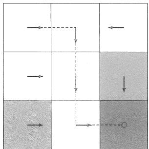

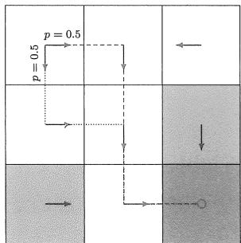  
图3.3上面两个策略都是最优的，因此最优策略可能不是唯一的，而且可能是确定性的，也可能是随机性的。

- 最优策略的随机性：最优策略可以是随机的或确定的，如图3.3所示。然而，根据定理3.5，可以肯定地说，总是存在一个确定性的最优策略。

# 3.5 影响最优策略的因素

一个系统中有哪些因素会影响其最优策略呢？这个问题乍一看似乎不着边际，不知从何说起，但是有了贝尔曼最优方程这个工具之后，就可以很轻松地回答这个问题。具体来说，贝尔曼最优方程的元素展开形式是

$$
v (s) = \max  _ {\pi (s) \in \Pi (s)} \sum_ {a \in \mathcal {A}} \pi (a | s) \left(\sum_ {r \in \mathcal {R}} p (r | s, a) r + \gamma \sum_ {s ^ {\prime} \in \mathcal {S}} p \left(s ^ {\prime} \mid s, a\right) v \left(s ^ {\prime}\right)\right), \quad s \in \mathcal {S}.
$$

这里的未知量是 $v^{*}$ 和 $\pi^{*}$ ，已知量包括即时奖励 $r$ 、折扣因子 $\gamma$ 、系统模型 $p(s'|s,a)$ ， $p(r|s,a)$ 。显然，这里的未知量（即最优策略和最优状态值）是由这些已知量决定的。如果系统模型是给定的，那么最优策略会受到 $r$ 和 $\gamma$ 的影响，下面我们讨论当改变 $r$ 和 $\gamma$ 时最优策略会如何变化。本节给出的所有最优策略都是由定理3.3中的算法得到的，具

体计算过程不再给出，该算法的细节将在第4章给出，这里主要关注最优策略的基本性质。

# 基准示例

考虑图3.4中的示例。奖励设置为 $r_{\mathrm{boundary}} = r_{\mathrm{forbidden}} = -1, r_{\mathrm{target}} = 1$ 。另外，智能体每移动一步都会获得 $r_{\mathrm{other}} = 0$ 的奖励。折扣因子选取为 $\gamma = 0.9$ 。

图3.4(a)给出了在上述参数下的最优策略和最优状态值。有趣的是，此时的最优策略会选择穿过禁区达到目标区域。例如，从(行 $= 4$ ，列 $= 1$ )的状态开始，智能体有两种可能的策略到达目标区域。第一种策略是绕开所有禁区，走较长的路程到达目标区域；第二种策略是穿过禁区，走较短的路程到达目标区域。虽然第二种策略在进入禁区时会获得负奖励，但是其总的折扣回报更高，反而是优于第一种策略的。实际上，这个例子中 $\gamma$ 的值较大，因此其最优策略是有远见的，智能体会愿意“冒险”。

# 折扣因子的影响

如果我们将折扣因子从 $\gamma = 0.9$ 变为 $\gamma = 0.5$ 并保持其他参数不变，那么最优策略将变为图3.4(b)中所示的策略。有趣的是，智能体不再敢于冒险：它会避开所有禁区，绕行较长路程到达目标。这是由于 $\gamma$ 较小，最优策略变得目光短浅。

在极端情况下，当 $\gamma = 0$ 时，相应的最优策略如图3.4(c)所示。此时智能体无法到达目标区域，这是因为每个状态的最优策略都是极其目光短浅的，只选择最大的即时奖励对应的动作。

有的读者可能会问：图3.4(c)中的策略明显是不合理的，它连目标区域都无法达到，为什么还说它是“最优”的呢？这里需要注意数学上的“最优”和直观上的“好”不一定一致。在数学上，最优策略是在给定参数下求解贝尔曼最优方程得到的。如果我们认为得到的策略“不好”，则可以调整折扣因子或者奖励值来得到更符合我们需求的策略，但是在给定参数下求解出来的策略从数学上来说都是最优的。

此外，图3.4中所有最优状态值的空间分布也呈现一个有趣的现象：靠近目标的状态具有更高的状态值，而远离目标的状态具有较低的值。这个现象可以通过折扣因子来解释：如果从某个状态出发需要沿更长的轨迹到达目标，由于折扣因子的原因，其得到的回报会较小。

# 奖励值的影响

我们可以通过调整奖励值来改变最优策略。例如，如果想让智能体不要进入任何禁区，则可以增加其进入禁区的惩罚。例如，当 $r_{\text{forbidden}}$ 从 -1 变为 -10 时，得到的最

优策略可以避开所有禁区（图3.4(d)）。

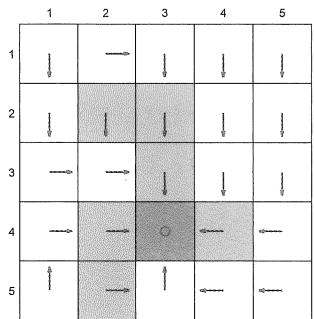

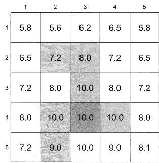  
(a) 基准示例： $r_{\mathrm{boundary}} = r_{\mathrm{forbidden}} = -1$ ， $r_{\mathrm{target}} = 1$ ， $\gamma = 0.9$ 。

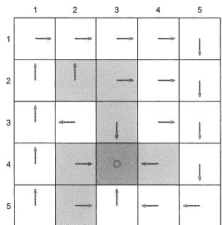

  
(b) 折扣因子改为 $\gamma = 0.5$ ，其他参数与(a)保持一致。

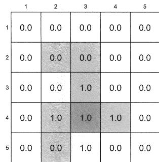  
(c) 折扣因子改为 $\gamma = 0$ ，其他参数与(a)保持一致。

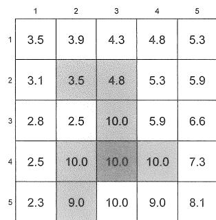  
(d) $r_{\text{forbidden}}$ 从 $-1$ 改为 $-10$ ，其他参数与 (a) 保持一致。  
图3.4 不同参数值下的最优策略和最优状态值。

然而，改变奖励并不总会导致不同的最优策略。一个重要的性质是：最优策略对奖励的仿射变换是保持不变的。换句话说，如果我们对所有奖励进行同比例缩放或加减相同的值，那么最优策略仍然保持不变。下面的定理严格刻画了这个性质。

定理3.6 (最优策略的不变性)。考虑一个马尔可夫决策过程，假设 $v^{*} \in \mathbb{R}^{|S|}$ 为最优状态值，即满足 $v^{*} = \max_{\pi \in \Pi}(r_{\pi} + \gamma P_{\pi}v^{*})$ 。如果每个奖励 $r$ 都通过仿射变换变成 $\alpha r + \beta$ ，其中 $\alpha, \beta \in \mathbb{R}$ 且 $\alpha > 0$ ，那么相应的最优状态值 $v'$ 也是 $v^{*}$ 的一个仿射变换：

$$
v ^ {\prime} = \alpha v ^ {*} + \frac {\beta}{1 - \gamma} \mathbf {1}, \tag {3.8}
$$

这里 $\gamma \in (0,1)$ 是折扣因子； $\mathbf{1} = [1,\dots,1]^{\mathrm{T}}$ 。 $v'$ 对应的最优策略与 $v^{*}$ 对应的最优策略相同。

定理3.6告诉我们：真正决定最优策略的不是奖励的绝对值，而是奖励的相对值。该定理的证明在方框3.5中给出，感兴趣的读者可以阅读。

# 方框3.5：定理3.6的证明

对于任意策略 $\pi$ ，定义 $r_{\pi} = [\dots ,r_{\pi}(s),\dots ]^{\mathrm{T}}$ ，其中

$$
r _ {\pi} (s) = \sum_ {a \in \mathcal {A}} \pi (a | s) \sum_ {r \in \mathcal {R}} p (r | s, a) r, \quad s \in \mathcal {S}.
$$

如果 $r\to \alpha r + \beta$ ，则 $r_{\pi}(s)\rightarrow \alpha r_{\pi}(s) + \beta$ ，因此 $r_{\pi}\rightarrow \alpha r_{\pi} + \beta 1$ ，这里 $\mathbf{1} = [1,\dots ,1]^{\mathrm{T}}$ 此时贝尔曼最优方程变为

$$
v ^ {\prime} = \max  _ {\pi \in \Pi} \left(\alpha r _ {\pi} + \beta \mathbf {1} + \gamma P _ {\pi} v ^ {\prime}\right). \tag {3.9}
$$

下面证明式(3.9)的解是 $v^{\prime} = \alpha v^{*} + c\mathbf{1}$ ，其中 $c = \beta /(1 - \gamma)$ 。

具体来说，把 $v^{\prime} = \alpha v^{*} + c\mathbf{1}$ 代入式(3.9)可得

$$
\alpha v ^ {*} + c \mathbf {1} = \max  _ {\pi \in \Pi} (\alpha r _ {\pi} + \beta \mathbf {1} + \gamma P _ {\pi} (\alpha v ^ {*} + c \mathbf {1})) = \max  _ {\pi \in \Pi} (\alpha r _ {\pi} + \beta \mathbf {1} + \alpha \gamma P _ {\pi} v ^ {*} + c \gamma \mathbf {1}).
$$

上式中第二个等号是因为 $P_{\pi} \mathbf{1} = \mathbf{1}$ 。上述方程可以重组为

$$
\alpha v ^ {*} = \max  _ {\pi \in \Pi} \left(\alpha r _ {\pi} + \alpha \gamma P _ {\pi} v ^ {*}\right) + \beta \mathbf {1} + c \gamma \mathbf {1} - c \mathbf {1}.
$$

由于 $v^{*} = \max_{\pi \in \Pi}(r_{\pi} + \gamma P_{\pi}v^{*})$ ，上式等价于

$$
\beta \mathbf {1} + c \gamma \mathbf {1} - c \mathbf {1} = 0.
$$

由于 $c = \beta /(1 - \gamma)$ ，上述方程是成立的。因此， $v^{\prime} = \alpha v^{*} + c\mathbf{1}$ 是式(3.9)的解。由

于式(3.9)是贝尔曼最优方程，因此 $v^{\prime}$ 也是其唯一解。

最后，由于 $v^{\prime}$ 是 $v^{*}$ 的仿射变换，动作价值之间的相对关系保持不变，因此从 $v^{\prime}$ 导出的贪婪最优策略与从 $v^{*}$ 导出的相同，即 $\arg \max_{\pi \in \Pi}(r_{\pi} + \gamma P_{\pi}v^{\prime})$ 与 $\arg \max_{\pi}(r_{\pi} + \gamma P_{\pi}v^{*})$ 相同。

关于最优策略的不变性，感兴趣的读者可以进一步参考文献[9]。

大家可能还记得第1章介绍基本概念时提到过：“奖励”实际上是人机交互的一个工具，因为我们可以通过调整奖励来得到想要的策略。而本章所介绍的贝尔曼最优方程从数学上对这一点进行了呼应：它可以透彻地解释当我们调解奖励时最优策略会发生怎样改变。

# 避免无意义的绕路

下面考虑一个有趣但很容易让人迷惑的问题。在网格世界中，我们希望智能体尽可能避免没有意义的绕路，从而尽可能快地到达目标区域。如图3.5所示，当从右上角的状态出发时，我们希望策略如左图所示，而不要像右图所示。

为了实现这个目标，常见的一个想法是为每一步添加一个负奖励来作为惩罚。这么做是否有用呢？经过前面小节的讨论，我们已经知道如果对每一步都增加一个额外的负奖励，这实际上是对奖励做了一个仿射变换，那么最后所对应的最优策略是不变的。所以加或者不加这个负奖励所得到的策略是没有区别的。

那么，如何才能避免智能体没有意义的绕路呢？答案是：最优策略已经会避免绕路了，而不需要我们做额外的设置。例如，图3.5(a)给出的就是最优策略。此时，虽然在白色区域之间移动的奖励为0，但是最优策略并不会进行无意义的绕路。

为什么没有对每一步的惩罚也能避免绕路而尽快到达目标呢？答案在于折扣因子 $\gamma$ 。例如，从右上角的状态出发，图3.5(b)的策略在到达目标区域之前绕了一个远路。如果我们考虑折扣回报，那么绕远路会降低折扣回报。具体来说，此时的折扣回报是

$$
\mathrm {r e t u r n} = 0 + \gamma 0 + \gamma^ {2} 1 + \gamma^ {3} 1 + \dots = \gamma^ {2} / (1 - \gamma) = 8. 1.
$$

相比之下，如果采用图3.5(a)的策略，则其折扣回报是

$$
\mathrm {r e t u r n} = 1 + \gamma 1 + \gamma^ {2} 1 + \dots = 1 / (1 - \gamma) = 1 0.
$$

很明显，达到目标所用的轨迹越长，折扣回报就越小。因此，最优策略会自然地避免选择这样的轨迹。

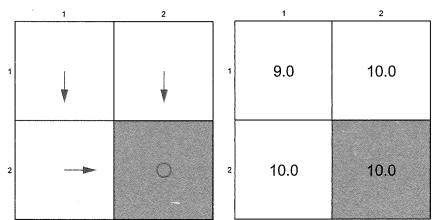  
(a) 无绕路的策略。

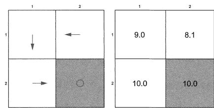  
(b) 有绕路的策略。  
图3.5有绕路和无绕路的策略及其对应的状态值。在右上角的状态，这两个策略是不同的。这个例子中，右下角的蓝色单元格代表目标区域。进入目标区域会得到 $+1$ 的奖励，在白色区域之间移动的奖励为0。

# 3.6 总结

本章介绍的核心概念包括最优策略和最优状态值，它们是密切相关的：最优状态值是最优策略的状态值；最优策略是可以基于最优状态值得到的。本章介绍的核心工具是贝尔曼最优方程。我们可以利用压缩映射定理来分析这个方程，从而回答一系列关于最优策略的基础问题。

本章的内容对于彻底理解强化学习的许多基本思想非常重要。例如，定理3.3提出了一个用于求解贝尔曼最优方程的迭代算法，这个算法正是将在第4章详细介绍的值迭代算法。

# 3.7 问答

提问：最优策略的定义是什么？

回答：如果一个策略对应的状态值大于或等于任何其他策略，那么这个策略就是最优的。

值得注意的是，这个最优性的定义只是针对基于表格的情况。当使用函数来表示值或者策略时，需要使用不同的指标来定义最优策略，具体将在第8章和第9章介绍。

提问：为什么贝尔曼最优方程很重要？

回答：因为它刻画了最优策略和最优状态值，进而能够帮助我们回答一系列基础问题。详情请见正文，这里不再赘述。

提问：贝尔曼最优方程是贝尔曼方程吗？

回答：是的。贝尔曼最优方程是一个特殊的贝尔曼方程。每一个贝尔曼方程都对应了一个策略。作为一个特殊的贝尔曼方程，贝尔曼最优方程对应的策略是最优

策略。

提问：分析贝尔曼最优方程主要依赖的关键性质是什么？

答：贝尔曼最优方程的右侧函数是一个压缩映射。基于这个关键性质，我们可以用压缩映射定理来分析。

提问：贝尔曼最优方程的解是唯一的吗？

回答：贝尔曼最优方程有两个未知变量：一个值和一个策略。这个值的解即最优状态值是唯一的。然而，这个策略的解即最优策略可能不是唯一的。

提问：最优策略存在吗？

回答：存在。根据贝尔曼最优方程的分析，最优策略总是存在的。

提问：最优策略是唯一的吗？

回答：不是。可能存在多个甚至无穷个最优策略，它们都具有相同的最优状态值。

提问：最优策略是随机性的还是确定性的？

回答：最优策略可以是确定性的也可以是随机性的，不过总是存在确定性贪婪的最优策略。

提问：如何获得最优策略？

回答：使用定理3.3建议的迭代算法可以得到最优策略。该迭代算法的详细实现过程将在第4章给出。值得注意的是，所有强化学习算法都旨在获得最优策略，只是它们有不同的思路或者条件。例如第4章介绍的算法需要事先知道系统模型，而之后的章节不再需要知道系统模型。

提问：如果降低折扣因子的值，对最优策略有什么影响？

回答：当降低折扣因子时，最优策略会变得更加“短视”。例如，智能体不敢冒险得到负的即时奖励，尽管它之后可能会获得更大的回报。

提问：如果将折扣因子设置为0，会发生什么？

回答：得到的最优策略将变得“极端短视”：智能体只会选择那些即时奖励最大的动作，即使这些动作从长远来看并不好。

提问：如果将所有的奖励增加相同的数值，最优策略会改变吗？最优状态值会改变吗？

回答：将所有奖励增加相同的数值是对奖励的一个仿射变换，这不会影响最优策略。然而，最优状态值会增加，如式(3.8)所示。

提问：如果希望最优策略可以避免无意义的绕路从而尽可能快地到达目标，那么是否应该在每一步加入负奖励？

回答：首先，对每一步引入额外的负奖励是对奖励的仿射变换，这不会改变最优策略；其次，折扣因子已经可以鼓励智能体避免绕路而尽可能快地到达目标，这是因为无意义的绕路会增加轨迹长度，从而减少折扣回报。

# 第4章

# 值迭代与策略迭代

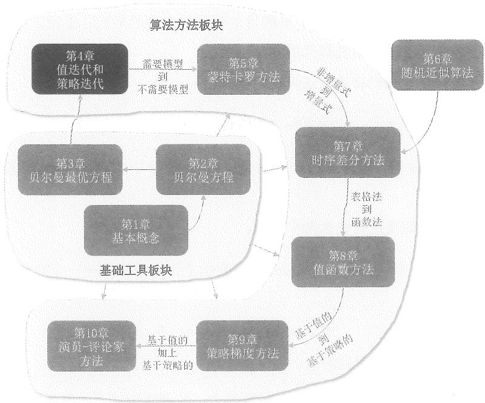  
图4.1 本章在全书中的位置。

本书的前三章都是在介绍基础工具。从本章开始，我们将介绍用于求解最优策略的算法。本章将介绍三个密切相关的方法。第一，值迭代（value iteration）算法。该算法实际上就是第3章中压缩映射定理给出的求解贝尔曼最优方程的算法，其具体细节将在本章给出。第二，策略迭代（policy iteration）算法。该算法的基本思想在强化学习中有广泛应用。第三，截断策略迭代（truncated policy iteration）算法。值迭代和策略迭代是该算法的两个特殊情况，因此截断策略迭代更加一般化。

本章介绍的算法需要事先知道系统模型，这些算法也被称为动态规划（dynamic programming）[10, 11]。从第5章开始，我们将介绍无模型的算法。不过，读者需要先透彻理解需要模型的算法，才能理解无模型的算法。例如，如果读者理解了本章介绍的策略迭代算法，那么就可以很轻松地理解第5章介绍的无需模型的蒙特卡罗方法。

# 4.1 值迭代算法

下面介绍全书第一个能够求解最优策略的算法——值迭代（value iteration）。该算法实际上是定理3.3中给出的用于求解贝尔曼最优方程的算法。不过，第3章并没有过多介绍该算法，下面介绍其具体的实施细节。

为了方便阅读，我们将该算法再次写出来：

$$
v _ {k + 1} = \max _ {\pi \in \Pi} (r _ {\pi} + \gamma P _ {\pi} v _ {k}), \quad k = 0, 1, 2, \ldots
$$

定理3.3已经告诉我们，随着 $k$ 趋向无穷大， $v_{k}$ 和 $\pi_{k}$ 分别收敛于最优状态值和最优策略。

该迭代算法的每次迭代包含两个步骤。

$\diamond$ 第一步是策略更新（policy update）。在数学上，它旨在找到一个能解决以下优化问题的策略：

$$
\pi_ {k + 1} = \arg \max  _ {\pi} (r _ {\pi} + \gamma P _ {\pi} v _ {k}),
$$

其中 $v_{k}$ 是上一次迭代得到的值。

$\diamond$ 第二步是值更新（value update）。在数学上，它通过下式来计算新的值 $v_{k + 1}$

$$
v _ {k + 1} = r _ {\pi_ {k + 1}} + \gamma P _ {\pi_ {k + 1}} v _ {k}, \tag {4.1}
$$

其中 $v_{k + 1}$ 将用于下一次迭代。

上述算法是以矩阵向量形式呈现的。为了编程实现这个算法，我们需要进一步分析其按元素展开形式（elementwise form）。在此之前，先回答一个问题：式(4.1)中的 $v_{k}$ 是否是状态值？答案是否定的。尽管当 $k$ 趋于无穷时 $v_{k}$ 会收敛到最优状态值，但是

当 $k$ 有限时， $v_{k}$ 可能并不满足任何一个贝尔曼方程，因此也不是某一个策略的状态值。

# 4.1.1 展开形式和实现细节

在第 $k$ 次迭代中，状态 $s$ 对应的策略更新和值更新的步骤的细节如下所示。

$\diamond$ 策略更新： $\pi_{k + 1} = \arg \max_{\pi}(r_{\pi} + \gamma P_{\pi}v_{k})$ 的按元素展开形式为

$$
\pi_ {k + 1} (s) = \arg \operatorname * {m a x} _ {\pi} \sum_ {a} \pi (a | s) \underbrace {\left(\sum_ {r} p (r | s , a) r + \gamma \sum_ {s ^ {\prime}} p (s ^ {\prime} | s , a) v _ {k} (s ^ {\prime})\right)} _ {q _ {k} (s, a)}, \quad s \in \mathcal {S}.
$$

上述优化问题的最优解为

$$
\pi_ {k + 1} (a | s) = \left\{ \begin{array}{l l} 1, & a = a _ {k} ^ {*} (s), \\ 0, & a \neq a _ {k} ^ {*} (s), \end{array} \right. \tag {4.2}
$$

其中 $a_{k}^{*}(s) = \arg \max_{a}q_{k}(s,a)$ 。这个最优解已经在第3.3.1节中有详细分析。此外，如果有多个动作的值都相同并且最大，那么可以选择其中任意一个动作。

值更新： $v_{k + 1} = r_{\pi_{k + 1}} + \gamma P_{\pi_{k + 1}}v_k$ 的按元素展开形式是

$$
v _ {k + 1} (s) = \sum_ {a} \pi_ {k + 1} (a | s) \underbrace {\left(\sum_ {r} p (r | s , a) r + \gamma \sum_ {s ^ {\prime}} p (s ^ {\prime} | s , a) v _ {k} (s ^ {\prime})\right)} _ {q _ {k} (s, a)}, \quad s \in \mathcal {S}.
$$

将式(4.2)代入上式可得

$$
v _ {k + 1} (s) = \max _ {a} q _ {k} (s, a).
$$

即新的值等于状态 $s$ 对应的最大 $q$ 值。

上面两个步骤可以概述为如下形式：

$v_{k}(s)\rightarrow$ 计算 $q_{k}(s,a)\rightarrow$ 计算新策略 $\pi_{k + 1}(s)\rightarrow$ 计算新值 $v_{k + 1}(s) = \max_a q_k(s,a)$

上述算法的伪代码参见算法4.1。

# 4.1.2 示例

下面通过一个简单的例子来详细介绍值迭代算法的实现过程。如图4.2所示，这个例子是一个 $2 \times 2$ 的网格世界，其中有一个禁止区域和一个目标区域。参数设置为 $r_{\text{boundary}} = -1, r_{\text{forbidden}} = -1, r_{\text{target}} = 1, \gamma = 0.9$ 。

# 算法4.1：值迭代算法

初始化：已知模型，即任意 $(s,a)$ 对应的 $p(r|s,a)$ 和 $p(s'|s,a)$ 。初始值 $v_{0}$ 。

目标：求解最优状态值和最优策略。

当 $v_{k}$ 尚未收敛时（例如 $\| v_{k} - v_{k - 1}\|$ 大于给定阈值时），进行如下迭代

对每个状态 $s \in S$

对每个动作 $a\in \mathcal{A}(s)$

计算 $q$ 值： $q_{k}(s,a) = \sum_{r}p(r|s,a)r + \gamma \sum_{s^{\prime}}p(s^{\prime}|s,a)v_{k}(s^{\prime})$

最大价值动作： $a_{k}^{*}(s) = \arg \max_{a}q_{k}(s,a)$

策略更新： $\pi_{k+1}(a|s) = 1$ 如果 $a = a_k^*$ ；否则 $\pi_{k+1}(a|s) = 0$

值更新： $v_{k + 1}(s) = \max_a q_k(s,a)$

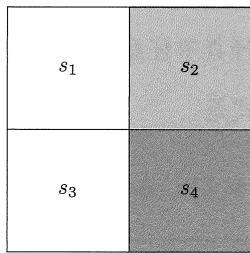

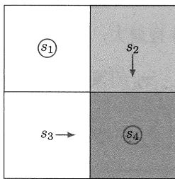

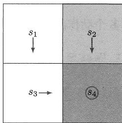  
图4.2 用于展示值迭代算法过程的例子。

首先，我们可以建立一个 $q$ -table，如表4.1所示，其中每一个元素展示了如何从 $v$ 值计算出 $q$ 值。

表 4.1 图4.2所示例子对应的 $q$ -table。  

<table><tr><td>q-table</td><td>a1</td><td>a2</td><td>a3</td><td>a4</td><td>a5</td></tr><tr><td>s1</td><td>-1 + γv(s1)</td><td>-1 + γv(s2)</td><td>0 + γv(s3)</td><td>-1 + γv(s1)</td><td>0 + γv(s1)</td></tr><tr><td>s2</td><td>-1 + γv(s2)</td><td>-1 + γv(s2)</td><td>1 + γv(s4)</td><td>0 + γv(s1)</td><td>-1 + γv(s2)</td></tr><tr><td>s3</td><td>0 + γv(s1)</td><td>1 + γv(s4)</td><td>-1 + γv(s3)</td><td>-1 + γv(s3)</td><td>0 + γv(s3)</td></tr><tr><td>s4</td><td>-1 + γv(s2)</td><td>-1 + γv(s4)</td><td>-1 + γv(s4)</td><td>0 + γv(s3)</td><td>1 + γv(s4)</td></tr></table>

下面详细给出每一次迭代的过程。

$$
\begin{array}{c c} \diamond & k = 0: \end{array}
$$

初始值 $v_{0}$ 可以任意选择，这里不失一般性地选择 $v_{0}(s_{1}) = v_{0}(s_{2}) = v_{0}(s_{3}) = v_{0}(s_{4}) = 0$ 。

计算 $q$ 值：将 $v_{0}(s_{i})$ 代入表4.1，得到的 $q$ 值如表4.2所示。

表 4.2 $k = 0$ 时的 $q$ -table。  

<table><tr><td>q-table</td><td>a1</td><td>a2</td><td>a3</td><td>a4</td><td>a5</td></tr><tr><td>s1</td><td>-1</td><td>-1</td><td>0</td><td>-1</td><td>0</td></tr><tr><td>s2</td><td>-1</td><td>-1</td><td>1</td><td>0</td><td>-1</td></tr><tr><td>s3</td><td>0</td><td>1</td><td>-1</td><td>-1</td><td>0</td></tr><tr><td>s4</td><td>-1</td><td>-1</td><td>-1</td><td>0</td><td>1</td></tr></table>

策略更新：每个状态的策略应更新为选择具有最大 $q$ 值的动作。基于此，通过表4.2可以看出新的策略为

$$
\pi_ {1} (a _ {5} | s _ {1}) = 1, \quad \pi_ {1} (a _ {3} | s _ {2}) = 1, \quad \pi_ {1} (a _ {2} | s _ {3}) = 1, \quad \pi_ {1} (a _ {5} | s _ {4}) = 1.
$$

在状态 $s_1$ ，由于动作 $a_3$ 和 $a_5$ 的 $q$ 值是相等的，因此可以随机选择其中一个值，这里我们选择的是 $a_5$ 。图4.2的中间图展示了上面得到的新策略。

值更新：每个状态的 $v$ 值应更新为其最大 $q$ 值，由此可得如下新值：

$$
v _ {1} (s _ {1}) = 0, \quad v _ {1} (s _ {2}) = 1, \quad v _ {1} (s _ {3}) = 1, \quad v _ {1} (s _ {4}) = 1.
$$

不难看出，这次迭代得到的策略还不是最优的，因为它在 $s_1$ 时选择保持不动。下面继续迭代。

$k = 1$

计算 $q$ 值：将 $v_{1}(s_{i})$ 代入表4.1，得到表4.3中的 $q$ 值。

表 4.3 $k = 1$ 时对应的 $q$ -table。  

<table><tr><td>q-table</td><td>a1</td><td>a2</td><td>a3</td><td>a4</td><td>a5</td></tr><tr><td>s1</td><td>-1 + γ0</td><td>-1 + γ1</td><td>0 + γ1</td><td>-1 + γ0</td><td>0 + γ0</td></tr><tr><td>s2</td><td>-1 + γ1</td><td>-1 + γ1</td><td>1 + γ1</td><td>0 + γ0</td><td>-1 + γ1</td></tr><tr><td>s3</td><td>0 + γ0</td><td>1 + γ1</td><td>-1 + γ1</td><td>-1 + γ1</td><td>0 + γ1</td></tr><tr><td>s4</td><td>-1 + γ1</td><td>-1 + γ1</td><td>-1 + γ1</td><td>0 + γ1</td><td>1 + γ1</td></tr></table>

策略更新：每个状态的策略应更新为选择具有最大 $q$ 值的动作。因此，通过表4.3可以看出新的策略为

$$
\pi_ {2} (a _ {3} | s _ {1}) = 1, \quad \pi_ {2} (a _ {3} | s _ {2}) = 1, \quad \pi_ {2} (a _ {2} | s _ {3}) = 1, \quad \pi_ {2} (a _ {5} | s _ {4}) = 1.
$$

图4.2中的右图展示了上面得到的新策略。

值更新：每个状态的 $v$ 值应更新为其最大 $q$ 值，由此可得如下新值：

$$
v _ {2} (s _ {1}) = \gamma 1, v _ {2} (s _ {2}) = 1 + \gamma 1, v _ {2} (s _ {3}) = 1 + \gamma 1, v _ {2} (s _ {4}) = 1 + \gamma 1.
$$

如果需要，则可以继续迭代。

$k = 2,3,4,\ldots$

值得注意的是，如图4.2的右图所示，策略 $\pi_{2}$ 已经是最优的。因此，在这个简单的例子中，我们只需要两次迭代就能得到最优策略。当然，对于更复杂的例子，我们需要运行更多轮的迭代，直到 $v_{k}$ 收敛（例如 $\| v_{k + 1} - v_k\|$ 小于一个很小的数）。

# 4.2 策略迭代算法

本节介绍另一个非常重要的算法——策略迭代（policy iteration）。策略迭代与值迭代有着密切的联系，不过它并非像值迭代那样直接求解贝尔曼最优方程，而是在策略评价和策略改进之间来回切换，这种思想在强化学习算法中广泛存在。

# 4.2.1 算法概述

策略迭代也是一种迭代算法，每次迭代包含两个步骤。具体来说，第 $k$ 次迭代的两个步骤如下所述。

$\diamond$ 第一步是策略评价（policy evaluation）。顾名思义，这个步骤是用来评估上一次迭代得到的策略 $\pi_{k}$ 。从数学上来说，该步骤就是求解下面的贝尔曼方程，从而得到 $\pi_{k}$ 的状态值：

$$
v _ {\pi_ {k}} = r _ {\pi_ {k}} + \gamma P _ {\pi_ {k}} v _ {\pi_ {k}}, \tag {4.3}
$$

其中 $\pi_{k}$ 是上一次迭代中得到的策略， $v_{\pi_k}$ 是该策略对应的状态值， $r_{\pi_k}$ 和 $P_{\pi_k}$ 可以根据系统模型得到。

$\diamond$ 第二步是策略改进（policy improvement）。顾名思义，这个步骤是用来改进策略从而得到更好的新策略。从数学上来说，在第一步得到 $v_{\pi_k}$ 之后，此步骤会利用下式得到新的策略 $\pi_{k + 1}$

$$
\pi_ {k + 1} = \arg \max  _ {\pi} (r _ {\pi} + \gamma P _ {\pi} v _ {\pi_ {k}}).
$$

为了透彻理解该算法，我们需要回答下面三个问题。

在策略评价步骤中，如何计算状态值 $v_{\pi_k}$ ？

在策略改进步骤中，新策略 $\pi_{k + 1}$ 为什么比 $\pi_{k}$ 更好？

为什么这个算法最终能够收敛到最优策略？

下面逐一回答这些问题。

在策略评价步骤中，如何计算状态值 $v_{\pi_k}$ ？

计算状态值 $v_{\pi_k}$ 的过程就是求解贝尔曼方程。第2章已经介绍了两种求解贝尔曼方程(4.3)的方法，下面简要回顾这两种方法。第一种方法能直接给出解析解： $v_{\pi_k} = (I - \gamma P_{\pi_k})^{-1}r_{\pi_k}$ 。这个解析解对于理论分析很有用，但在实际应用中计算效率较低，这是因为需要使用其他数值算法来计算逆矩阵。第二种方法是利用如下数值迭代算法：

$$
v _ {\pi_ {k}} ^ {(j + 1)} = r _ {\pi_ {k}} + \gamma P _ {\pi_ {k}} v _ {\pi_ {k}} ^ {(j)}, \quad j = 0, 1, 2, \dots . \qquad (4. 4)
$$

其中 $v_{\pi_k}^{(j)}$ 表示对 $v_{\pi_k}$ 第 $j$ 次的估计值。我们知道，从任意初始值 $v_{\pi_k}^{(0)}$ 开始，随着 $j$ 趋向于无穷大， $v_{\pi_k}^{(j)}$ 会收敛到 $v_{\pi_k}$ （详情参见第2.7节）。

在策略迭代中，我们会采用上面的第二种方法。此时，策略迭代就成了一个嵌套了另一个迭代算法的迭代算法：即策略迭代本身是一个迭代算法，而每次迭代中的策略评价步骤需要调用另一个迭代算法(4.4)。

在理论上，算法(4.4)需要无限步（即 $j \to \infty$ ）才能收敛到真实的状态值 $v_{\pi_k}$ 。在实际中，算法不可能执行无限步，而只能执行有限步，例如当 $\| v_{\pi_k}^{(j+1)} - v_{\pi_k}^{(j)}\|$ 小于一个很小的数值或者 $j$ 超过某个预设值时，迭代就会终止。有的读者会问：如果无法执行无限次迭代，那么只能得到 $v_{\pi_k}$ 的一个近似值，将这个近似值用于后续的策略改进是否会导致无法找到最优策略呢？答案是不会。至于为什么，稍后大家在第4.3节学习截断策略迭代算法的时候就会清楚。

在策略改进步骤中，为什么 $\pi_{k + 1}$ 比 $\pi_{k}$ 更好？

下面的引理解释了为什么 $\pi_{k + 1}$ 比 $\pi_{k}$ 更好。

引理4.1（策略改进）。如果 $\pi_{k + 1} = \arg \max_{\pi}(r_{\pi} + \gamma P_{\pi}v_{\pi_k})$ ，那么 $v_{\pi_{k + 1}}\geqslant v_{\pi_k}$ 。

上述引理中，“ $\geqslant$ ”是逐元素的比较，即 $v_{\pi_{k+1}} \geqslant v_{\pi_k}$ 意味着对任意状态 $s$ 有 $v_{\pi_{k+1}}(s) \geqslant v_{\pi_k}(s)$ 。因此， $\pi_{k+1}$ 优于 $\pi_k$ 。

# 方框4.1：证明引理4.1

由于 $v_{\pi_{k + 1}}$ 和 $v_{\pi_k}$ 都是状态值，它们分别满足下面的贝尔曼方程：

$$
v _ {\pi_ {k + 1}} = r _ {\pi_ {k + 1}} + \gamma P _ {\pi_ {k + 1}} v _ {\pi_ {k + 1}},
$$

$$
v _ {\pi_ {k}} = r _ {\pi_ {k}} + \gamma P _ {\pi_ {k}} v _ {\pi_ {k}}.
$$

由于 $\pi_{k + 1} = \arg \max_{\pi}(r_{\pi} + \gamma P_{\pi}v_{\pi_k})$ ，因此

$$
r _ {\pi_ {k + 1}} + \gamma P _ {\pi_ {k + 1}} v _ {\pi_ {k}} \geqslant r _ {\pi_ {k}} + \gamma P _ {\pi_ {k}} v _ {\pi_ {k}}.
$$

因此

$$
\begin{array}{l} v _ {\pi_ {k}} - v _ {\pi_ {k + 1}} = \left(r _ {\pi_ {k}} + \gamma P _ {\pi_ {k}} v _ {\pi_ {k}}\right) - \left(r _ {\pi_ {k + 1}} + \gamma P _ {\pi_ {k + 1}} v _ {\pi_ {k + 1}}\right) \\ \leqslant \left(r _ {\pi_ {k + 1}} + \gamma P _ {\pi_ {k + 1}} v _ {\pi_ {k}}\right) - \left(r _ {\pi_ {k + 1}} + \gamma P _ {\pi_ {k + 1}} v _ {\pi_ {k + 1}}\right) \\ \leqslant \gamma P _ {\pi_ {k + 1}} \left(v _ {\pi_ {k}} - v _ {\pi_ {k + 1}}\right). \\ \end{array}
$$

反复调用上式可得

$$
\begin{array}{l} v _ {\pi_ {k}} - v _ {\pi_ {k + 1}} \leqslant \gamma^ {2} P _ {\pi_ {k + 1}} ^ {2} \left(v _ {\pi_ {k}} - v _ {\pi_ {k + 1}}\right) \leqslant \dots \leqslant \gamma^ {n} P _ {\pi_ {\pi_ {k + 1}}} ^ {n} \left(v _ {\pi_ {k}} - v _ {\pi_ {k + 1}}\right) \\ \leqslant \lim  _ {n \rightarrow \infty} \gamma^ {n} P _ {\pi_ {k + 1}} ^ {n} \left(v _ {\pi_ {k}} - v _ {\pi_ {k + 1}}\right) = 0. \\ \end{array}
$$

上式最右端极限等于0是因为 $\gamma^n\to 0$ 且 $P_{\pi_{k + 1}}^n$ 的每一个元素都在[0,1]区间。因此， $v_{\pi_k} - v_{\pi_{k + 1}}\leqslant 0$ 说明了 $\pi_{k + 1}$ 比 $\pi_{k}$ 更优。

# 为什么策略迭代算法能收敛到最优策略？

策略迭代算法会生成两个序列。第一个是策略序列 $\{\pi_0, \pi_1, \dots, \pi_k, \dots\}$ ，第二个是状态值序列 $\{v_{\pi_0}, v_{\pi_1}, \dots, v_{\pi_k}, \dots\}$ 。假设 $v^*$ 是最优状态值，那么对于所有 $k$ 都有 $v_{\pi_k} \leqslant v^*$ 。根据引理4.1，我们知道策略会越来越好，因此有

$$
v _ {\pi_ {0}} \leqslant v _ {\pi_ {1}} \leqslant v _ {\pi_ {2}} \leqslant \dots \leqslant v _ {\pi_ {k}} \leqslant \dots \leqslant v ^ {*}.
$$

由于 $v_{\pi_k}$ 单调递增并且有上界 $v^{*}$ ，根据单调收敛定理（参见附录C和文献[12]），当 $k$ 趋于无穷大时， $v_{\pi_k}$ 会收敛到一个常数，记为 $v_{\infty}$ 。那么，收敛值 $v_{\infty}$ 是否等于最优值 $v^{*}$ 呢？下面的定理回答了这个问题。

定理4.1 (策略迭代的收敛性)。由策略迭代算法生成的状态值序列 $\{v_{\pi_k}\}_{k=0}^{\infty}$ 收敛于最优状态值 $v^*$ 。因此，策略序列 $\{\pi_k\}_{k=0}^{\infty}$ 收敛于一个最优策略。

本定理的证明见方框4.2。该证明不仅展示了策略迭代算法的收敛性，还揭示了策略迭代算法与值迭代算法之间的关系：值迭代的收敛性可以推出策略迭代的收敛性，换句话说，策略迭代比值迭代的收敛性更强。

# 方框4.2：证明定理4.1

为了证明 $\{v_{\pi_k}\}_{k = 0}^{\infty}$ 的收敛性，我们引入另一个序列 $\{v_{k}\}_{k = 0}^{\infty}$ ，该序列由下面的迭代算法产生：

$$
v _ {k + 1} = f (v _ {k}) = \max _ {\pi} (r _ {\pi} + \gamma P _ {\pi} v _ {k}).
$$

这个迭代算法实际上就是值迭代算法。我们已经知道，给定任意的初始值 $v_0$ ， $v_k$ 会收敛到 $v^*$ 。

对任意的 $\pi_0$ ，总是能找到 $v_{0}$ 使得 $v_{0} \leqslant v_{\pi_{0}}$ 。下面用递归法证明 $v_{k} \leqslant v_{\pi_{k}} \leqslant v^{*}$ 对任意 $k \geqslant 1$ 都成立。

假设 $v_{\pi_k} \geqslant v_k$ 对某一个 $k$ 成立，那么对于 $k + 1$ 可得

$$
\begin{array}{l} v _ {\pi_ {k + 1}} - v _ {k + 1} = \left(r _ {\pi_ {k + 1}} + \gamma P _ {\pi_ {k + 1}} v _ {\pi_ {k + 1}}\right) - \max _ {\pi} (r _ {\pi} + \gamma P _ {\pi} v _ {k}) \\ \geqslant \left(r _ {\pi_ {k + 1}} + \gamma P _ {\pi_ {k + 1}} v _ {\pi_ {k}}\right) - \operatorname * {m a x} _ {\pi} (r _ {\pi} + \gamma P _ {\pi} v _ {k}) \\ \end{array}
$$

（因为 $v_{\pi_{k + 1}} \geqslant v_{\pi_k}$ 并且 $P_{\pi_{k + 1}} \geqslant 0$ ）

$$
= \left(r _ {\pi_ {k + 1}} + \gamma P _ {\pi_ {k + 1}} v _ {\pi_ {k}}\right) - \left(r _ {\pi_ {k} ^ {\prime}} + \gamma P _ {\pi_ {k} ^ {\prime}} v _ {k}\right)
$$

（令 $\pi_k^\prime = \arg \max_{\pi}(r_\pi +\gamma P_\pi v_k)$

$$
\geqslant \left(r _ {\pi_ {k} ^ {\prime}} + \gamma P _ {\pi_ {k} ^ {\prime}} v _ {\pi_ {k}}\right) - \left(r _ {\pi_ {k} ^ {\prime}} + \gamma P _ {\pi_ {k} ^ {\prime}} v _ {k}\right)
$$

（因为 $\pi_{k + 1} = \arg \max_{\pi}(r_{\pi} + \gamma P_{\pi}\upsilon_{\pi_k})$ ）

$$
= \gamma P _ {\pi_ {k} ^ {\prime}} (v _ {\pi_ {k}} - v _ {k}).
$$

由于 $v_{\pi_k} - v_k \geqslant 0$ 并且 $P_{\pi_k'}$ 非负，我们有 $P_{\pi_k'}(v_{\pi_k} - v_k) \geqslant 0$ ，因此 $v_{\pi_{k+1}} - v_{k+1} \geqslant 0$ 。

由于 $v_{\pi_k} \geqslant v_k$ 对于 $k = 0$ 成立，那么通过递归可知 $v_{\pi_k} \geqslant v_k$ 对任意 $k \geqslant 0$ 成立。最后，因为 $v_k$ 能收敛到 $v^*$ ，所以 $v_{\pi_k}$ 也必定能收敛到 $v^*$ 。

# 4.2.2 算法的展开形式

为了编程实现策略迭代算法，我们需要学习其按元素展开的形式。

第一，策略评价步骤利用迭代算法(4.4)来求解贝尔曼公式从而得到 $v_{\pi_k}$ 。算法(4.4)的元素展开形式为

$$
v _ {\pi_ {k}} ^ {(j + 1)} (s) = \sum_ {a} \pi_ {k} (a | s) \left(\sum_ {r} p (r | s, a) r + \gamma \sum_ {s ^ {\prime}} p \left(s ^ {\prime} \mid s, a\right) v _ {\pi_ {k}} ^ {(j)} \left(s ^ {\prime}\right)\right), \quad s \in \mathcal {S},
$$

其中 $j = 0,1,2,\ldots$

$\diamond$ 第二，策略改进步骤是求解 $\pi_{k + 1} = \arg \max_{\pi}(r_{\pi} + \gamma P_{\pi}v_{\pi_k})$ ，该式的元素展开形式为

$$
\pi_ {k + 1} (s) = \arg \max _ {\pi} \sum_ {a} \pi (a | s) \underbrace {\left(\sum_ {r} p (r | s , a) r + \gamma \sum_ {s ^ {\prime}} p (s ^ {\prime} | s , a) v _ {\pi_ {k}} (s ^ {\prime})\right)} _ {q _ {\pi_ {k}} (s, a)}, \quad s \in \mathcal {S}.
$$

其中 $q_{\pi_k}(s,a)$ 是策略 $\pi_{k}$ 对应的动作值。令 $a_{k}^{*}(s) = \arg \max_{a}q_{\pi_{k}}(s,a)$ 为最大值动作，那么上述优化问题的解是

$$
\pi_ {k + 1} (a | s) = \left\{ \begin{array}{l l} 1, & a = a _ {k} ^ {*} (s), \\ 0, & a \neq a _ {k} ^ {*} (s). \end{array} \right.
$$

上述算法的伪代码参见算法4.2。

# 算法4.2：策略迭代算法

初始化：已知模型，即任意 $(s,a)$ 对应的 $p(r|s,a)$ 和 $p(s'|s,a)$ ，初始策略 $\pi_0$ 。

目标：寻找最优状态值和最优策略。

当 $v_{\pi_k}$ 未收敛时，进行第 $k$ 次迭代

策略评价：

选择初始值 $v_{\pi_k}^{(0)}$

当 $v_{\pi_k}^{(j)}$ 未收敛时，进行第 $j$ 次迭代

对每一个状态 $s \in S$

$$
v _ {\pi_ {k}} ^ {(j + 1)} (s) = \sum_ {a} \pi_ {k} (a | s) \left[ \sum_ {r} p (r | s, a) r + \gamma \sum_ {s ^ {\prime}} p (s ^ {\prime} | s, a) v _ {\pi_ {k}} ^ {(j)} (s ^ {\prime}) \right]
$$

策略改进：

对每一个状态 $s \in S$

对每一个动作 $a \in \mathcal{A}$

$$
q _ {\pi_ {k}} (s, a) = \sum_ {r} p (r | s, a) r + \gamma \sum_ {s ^ {\prime}} p \left(s ^ {\prime} \mid s, a\right) v _ {\pi_ {k}} \left(s ^ {\prime}\right)
$$

$$
a _ {k} ^ {*} (s) = \arg \max  _ {a} q _ {\pi_ {k}} (s, a)
$$

$$
\pi_ {k + 1} (a | s) = 1 \text {如 果} a = a _ {k} ^ {*}; \text {否 则} \pi_ {k + 1} (a | s) = 0
$$

# 4.2.3 示例

# 一个简单例子

考虑图4.3中的例子，其中有两个状态，每个状态有三个可能的动作： $\mathcal{A} = \{a_{\ell}, a_0, a_T\}$ ，这三个动作分别代表向左移动、保持不动、向右移动。参数设置为 $r_{\mathrm{boundary}} =$

$$
- 1, r _ {\text {t a r g e t}} = 1, \gamma = 0. 9 。
$$

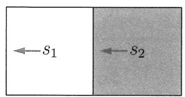  
(a)

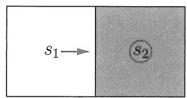  
(b)   
图4.3 用于展示策略迭代算法的例子。(a)为初始策略，(b)为迭代一次后得到的策略。

当 $k = 0$ 时，初始策略如图4.3(a)所示，很显然这个策略并不好。下面演示如何使用策略迭代算法来得到最优策略。

第一，策略评价步骤是求解贝尔曼方程。该例子对应的贝尔曼方程为

$$
v _ {\pi_ {0}} (s _ {1}) = - 1 + \gamma v _ {\pi_ {0}} (s _ {1}),
$$

$$
v _ {\pi_ {0}} (s _ {2}) = 0 + \gamma v _ {\pi_ {0}} (s _ {1}).
$$

由于该方程比较简单，因此可以直接手工求解得到

$$
v _ {\pi_ {0}} (s _ {1}) = - 1 0, \quad v _ {\pi_ {0}} (s _ {2}) = - 9.
$$

我们也可以使用迭代算法(4.4)来求解。例如，选择初始值为 $v_{\pi_0}^{(0)}(s_1) = v_{\pi_0}^{(0)}(s_2) = 0$ ，根据算法(4.4)可得

$$
\left\{ \begin{array}{l} v _ {\pi_ {0}} ^ {(1)} (s _ {1}) = - 1 + \gamma v _ {\pi_ {0}} ^ {(0)} (s _ {1}) = - 1, \\ v _ {\pi_ {0}} ^ {(1)} (s _ {2}) = 0 + \gamma v _ {\pi_ {0}} ^ {(0)} (s _ {1}) = 0, \end{array} \right.
$$

$$
\left\{ \begin{array}{l} v _ {\pi_ {0}} ^ {(2)} (s _ {1}) = - 1 + \gamma v _ {\pi_ {0}} ^ {(1)} (s _ {1}) = - 1. 9, \\ v _ {\pi_ {0}} ^ {(2)} (s _ {2}) = 0 + \gamma v _ {\pi_ {0}} ^ {(1)} (s _ {1}) = - 0. 9, \end{array} \right.
$$

$$
\left\{ \begin{array}{l} v _ {\pi_ {0}} ^ {(3)} (s _ {1}) = - 1 + \gamma v _ {\pi_ {0}} ^ {(2)} (s _ {1}) = - 2. 7 1, \\ v _ {\pi_ {0}} ^ {(3)} (s _ {2}) = 0 + \gamma v _ {\pi_ {0}} ^ {(2)} (s _ {1}) = - 1. 7 1, \end{array} \right.
$$

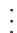

最后可以得到 $v_{\pi_0}^{(j)}(s_1)\to v_{\pi_0}(s_1) = -10$ 且 $v_{\pi_0}^{(j)}(s_2)\to v_{\pi_0}(s_2) = -9.$

$\diamond$ 第二，策略改进步骤的关键在于计算每个状态-动作配对的 $q$ 值。表4.4中的 $q$ -table可以用来辅助完成这一过程。

表 4.4 图4.3中的例子对应的 $q$ -table。  

<table><tr><td>qπk(s,a)</td><td>aℓ</td><td>a0</td><td>ar</td></tr><tr><td>s1</td><td>-1 + γvπk(s1)</td><td>0 + γvπk(s1)</td><td>1 + γvπk(s2)</td></tr><tr><td>s2</td><td>0 + γvπk(s1)</td><td>1 + γvπk(s2)</td><td>-1 + γvπk(s2)</td></tr></table>

将上一步得到的值函数 $v_{\pi_0}(s_1) = -10, v_{\pi_0}(s_2) = -9$ 代入表4.4可得表4.5。

表 4.5 $k = 0$ 时的 $q$ -table。  

<table><tr><td>qπ0(s,a)</td><td>aℓ</td><td>a0</td><td>ar</td></tr><tr><td>s1</td><td>-10</td><td>-9</td><td>-7.1</td></tr><tr><td>s2</td><td>-9</td><td>-7.1</td><td>-9.1</td></tr></table>

在每一个状态，新的策略应该选择最大价值动作，由此可得新策略 $\pi_1$ ：

$$
\pi_ {1} (a _ {r} | s _ {1}) = 1, \quad \pi_ {1} (a _ {0} | s _ {2}) = 1.
$$

这个策略在图4.3(b)中展示出来了，直观上可以看出这个策略是最优的。

由于上面的例子很简单，因此一次迭代就足以找到最优策略。更复杂的情况往往需要更多次的迭代。

# 一个更复杂的例子

下面通过一个更复杂的例子（图4.4）来展示策略迭代算法给出的策略的演化过程。参数设置为 $r_{\mathrm{boundary}} = -1, r_{\mathrm{forbidden}} = -10, r_{\mathrm{target}} = 1, \gamma = 0.9$ 。

从初始策略（图4.4(a)）开始，策略迭代算法能够逐渐收敛到最优策略（图4.4(h)）。如果我们观察策略的演变，会发现两个有趣的现象。

第一，接近目标区域的状态能更早地找到最优策略。实际上，要想从远离目标的状态出发到达目标，必须要求接近目标的状态先找到正确的策略。  
$\diamond$ 第二，接近目标区域的状态的状态值更高。这是因为如果从较远的状态出发到达目标，所得到的回报会被打很大的折扣，因此状态值较小。

# 4.3 截断策略迭代算法

本节介绍一个更一般化的算法——截断策略迭代（truncated policy iteration）。我们将看到，前面介绍的值迭代和策略迭代是截断策略迭代的两个特例。

# 4.3.1 对比值迭代与策略迭代

下面再次回顾值迭代和策略迭代算法，进而明确这两个算法的区别与联系。

◇ 策略迭代算法：选择任意的初始策略 $\pi_0$ 。在第 $k$ 次迭代中，执行以下两个步骤。

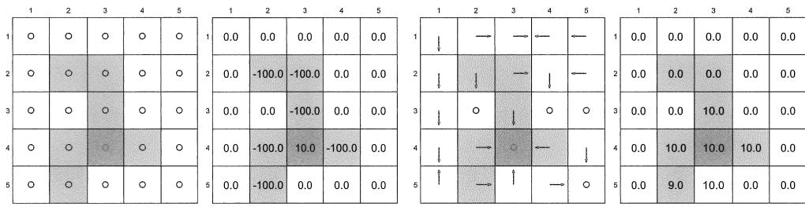  
(a) $\pi_0$ 和 $v_{\pi_0}$

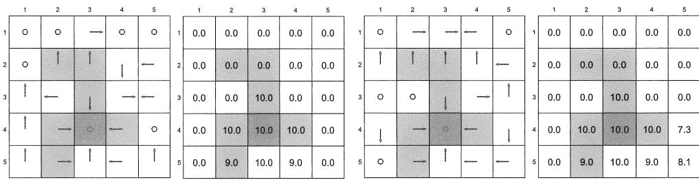  
(c) $\pi_2$ 和 $v_{\pi_2}$

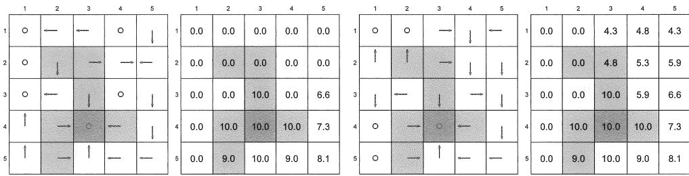  
(e) $\pi_4$ 和 $v_{\pi_4}$

  
(g) $\pi_9$ 和 $v_{\pi_9}$   
(h) $\pi_{10}$ 和 $v_{\pi_{10}}$   
图4.4 策略迭代算法在不同次迭代中得到的策略。

- 第一步：策略评价（policy evaluation，PE）。根据策略 $\pi_{k}$ ，求解下面的贝尔曼方程从而得到 $v_{\pi_k}$

$$
v _ {\pi_ {k}} = r _ {\pi_ {k}} + \gamma P _ {\pi_ {k}} v _ {\pi_ {k}}.
$$

- 第二步：策略改进（policy improvement, PI）。根据上一步得到的 $v_{\pi_k}$ ，求解下

面的优化问题从而得到新策略 $\pi_{k + 1}$

$$
\pi_ {k + 1} = \arg \max  _ {\pi} (r _ {\pi} + \gamma P _ {\pi} v _ {\pi_ {k}}).
$$

值迭代算法：选择任意的初始值 $v_{0}$ 。在第 $k$ 次迭代中，执行以下两个步骤。

- 第一步：策略更新（policy update，PU）。根据 $v_{k}$ ，求解下面的优化问题从而得到新策略 $\pi_{k+1}$

$$
\pi_ {k + 1} = \arg \max  _ {\pi} (r _ {\pi} + \gamma P _ {\pi} v _ {k}).
$$

- 第二步：值更新（value update，VU）。根据 $\pi_{k+1}$ ，利用下式计算出新的值 $v_{k+1}$

$$
v _ {k + 1} = r _ {\pi_ {k + 1}} + \gamma P _ {\pi_ {k + 1}} v _ {k}.
$$

上面介绍的两个算法的步骤可以直观地展示如下：

策略迭代算法： $\pi_0\xrightarrow{PE}v_{\pi_0}\xrightarrow{PI} \pi_1\xrightarrow{PE}v_{\pi_1}\xrightarrow{PI} \pi_2\xrightarrow{PE}v_{\pi_2}\xrightarrow{PI}\dots$

值迭代算法： $v_{0}\xrightarrow{PU}\pi_{1}^{\prime}\xrightarrow{VU}v_{1}\xrightarrow{PU}\pi_{2}^{\prime}\xrightarrow{VU}v_{2}\xrightarrow{PU}\ldots$

乍一看这两个算法几乎一样，下面介绍它们的重要区别。为了比较这两个算法，我们让它们从相同的初始条件开始，即选择 $v_{0} = v_{\pi_{0}}$ （如果不从相同的初始条件开始，则无法定量比较）。这两个算法的后续步骤如表4.6所示。在前三个步骤中，这两个算法产生的结果是完全相同的。从第四步开始，它们开始表现出不同。具体来说，在第四步，值迭代算法计算了 $v_{1} = r_{\pi_{1}} + \gamma P_{\pi_{1}}v_{0}$ ，这是仅需一步的计算；相比之下，策略迭代算法则需要求解方程 $v_{\pi_1} = r_{\pi_1} + \gamma P_{\pi_1}v_{\pi_1}$ ，而这是需要多次迭代的计算。

表 4.6 策略迭代和值迭代算法的步骤对比。  

<table><tr><td></td><td>策略迭代算法</td><td>值迭代算法</td><td>补充说明</td></tr><tr><td>策略</td><td>π0</td><td>无</td><td></td></tr><tr><td>值</td><td>vπ0=rπ0+γPπ0vπ0</td><td>v0÷vπ0</td><td></td></tr><tr><td>策略</td><td>π1=arg maxπ(rπ+γPπvπ0)</td><td>π1=arg maxπ(rπ+γPπv0)</td><td>这两个策略是相同的</td></tr><tr><td>值</td><td>vπ1=rπ1+γPπ1vπ1</td><td>v1=rπ1+γPπ1v0</td><td>vπ1≥v1因为vπ1≥vπ0</td></tr><tr><td>策略</td><td>π2=arg maxπ(rπ+γPπvπ1)</td><td>π2&#x27;=arg maxπ(rπ+γPπv1)</td><td></td></tr><tr><td>:</td><td>:</td><td>:</td><td>:</td></tr></table>

针对关键的第四步，下面详细写出策略迭代算法在该步求解 $v_{\pi_1} = r_{\pi_1} + \gamma P_{\pi_1}v_{\pi_1}$ 的过程。这里选取初值为 $v_{\pi_1}^{(0)} = v_0$ ，后续的迭代过程如下所示：

$$
v _ {\pi_ {1}} ^ {(0)} = v _ {0}
$$

值迭代算法 $\leftarrow v_{1}\leftarrow$ $v_{\pi_1}^{(1)} = r_{\pi_1} + \gamma P_{\pi_1}v_{\pi_1}^{(0)}$

$$
v _ {\pi_ {1}} ^ {(2)} = r _ {\pi_ {1}} + \gamma P _ {\pi_ {1}} v _ {\pi_ {1}} ^ {(1)}
$$

：

截断策略迭代算法 $\leftarrow \bar{v}_{1}\longleftarrow v_{\pi_{1}}^{(j)} = r_{\pi_{1}} + \gamma P_{\pi_{1}}v_{\pi_{1}}^{(j - 1)}$

：

策略迭代算法 $\leftarrow v_{\pi_1}\gets$ $v_{\pi_1}^{(\infty)} = r_{\pi_1} + \gamma P_{\pi_1}v_{\pi_1}^{(\infty)}$

从上面的迭代过程可以得到以下结论。

如果迭代运行一次，那么 $v_{\pi_1}^{(1)}$ 等于 $v_{1}$ ，这与值迭代算法相同。  
如果迭代运行无限次，那么 $v_{\pi_1}^{(\infty)}$ 等于 $v_{\pi_1}$ ，这与策略迭代算法相同。  
如果迭代运行有限次（例如 $j_{\mathrm{truncate}}$ 次），那么这种算法被称为截断策略迭代。之所以称为截断，是因为从 $j_{\mathrm{truncate}}$ 到 $\infty$ 的后续迭代被省略了。

由此可知一个重要结论：值迭代和策略迭代算法可以被视为截断策略迭代算法的两个极端情况。如果在 $j_{\text{truncated}} = 1$ 次迭代后停止，截断策略迭代就变成了值迭代；如果在 $j_{\text{truncated}} = \infty$ 次迭代后停止，截断策略迭代就变成了策略迭代。

需要注意的是，尽管上述比较具有启发性，但需要 $v_{0} = v_{\pi_{0}}$ 和 $v_{\pi_1}^{(0)} = v_0$ 这两个条件。如果没有这两个条件，这两个算法是不能直接量化比较的。

# 4.3.2 截断策略迭代算法

截断策略迭代算法的伪代码参见算法4.3，它与前面介绍的策略迭代算法的唯一区别在于它在策略评价步骤中只运行了有限次迭代。

值得注意的是，算法中的 $v_{k}$ 或 $v_{k}^{(j)}$ 并非状态值，这是因为在策略评价步骤中后面的迭代被截断了，所以它们只是对状态值的近似。有的读者可能会问：这种截断是否会影响算法的收敛性？从直观上来说，截断策略迭代是介于值迭代和策略迭代之间的算法（图4.5）。一方面，它比值迭代算法收敛得更快，因为它在策略评价中计算了多次迭代（而非一次）；另一方面，它比策略迭代算法收敛得更慢，因为它只计算了有限次迭代（而非无穷次）。这种直观与下面的数学分析是一致的。

命题4.1 在截断策略迭代算法中，嵌套在其策略评价步骤中的迭代算法为

$$
v _ {\pi_ {k}} ^ {(j + 1)} = r _ {\pi_ {k}} + \gamma P _ {\pi_ {k}} v _ {\pi_ {k}} ^ {(j)}, \quad j = 0, 1, 2,...
$$

如果初始值选为 $v_{\pi_k}^{(0)} = v_{\pi_{k - 1}}$ ，则对于 $j = 0,1,2,\ldots$ 有

$$
v _ {\pi_ {k}} ^ {(j + 1)} \geqslant v _ {\pi_ {k}} ^ {(j)}.
$$

  
图4.5 值迭代、策略迭代、截断策略迭代算法收敛速度示意图。

# 算法4.3：截断策略迭代算法

初始化：已知模型，即任意 $(s,a)$ 对应的 $p(r|s,a)$ 和 $p(s'|s,a)$ 。初始策略 $\pi_0$ 。

目标：寻找最优状态值和最优策略。

当 $v_{k}$ 未收敛时，进行第 $k$ 次迭代

策略评价：

选择初始值为 $v_{k}^{(0)} = v_{k - 1}$ 。设置最大迭代次数为 $j_{\mathrm{truncate}}$ 。

当 $j <   j_{\mathrm{truncate}}$ 时

对每一个状态 $s \in S$

$$
v _ {k} ^ {(j + 1)} (s) = \sum_ {a} \pi_ {k} (a | s) \left[ \sum_ {r} p (r | s, a) r + \gamma \sum_ {s ^ {\prime}} p \left(s ^ {\prime} \mid s, a\right) v _ {k} ^ {(j)} \left(s ^ {\prime}\right) \right]
$$

令 $v_{k} = v_{k}^{(j_{\mathrm{truncate}})}$

策略改进：

对每一个状态 $s \in S$

对每一个动作 $a \in \mathcal{A}(s)$

$$
q _ {k} (s, a) = \sum_ {r} p (r | s, a) r + \gamma \sum_ {s ^ {\prime}} p \left(s ^ {\prime} \mid s, a\right) v _ {k} \left(s ^ {\prime}\right)
$$

$$
a _ {k} ^ {*} (s) = \arg \max  _ {a} q _ {k} (s, a)
$$

$\pi_{k + 1}(a|s) = 1$ 如果 $a = a_k^*$ ；否则 $\pi_{k + 1}(a|s) = 0$

命题4.1表明了在策略评价步骤中，进行的迭代次数越多，值被提升得越多。该命题需要条件 $v_{\pi_k}^{(0)} = v_{\pi_{k-1}}$ 。虽然这一条件在实际中无法满足（因为无法获得 $v_{\pi_{k-1}}$ 而只能得到 $v_{k-1}$ ），但是命题4.1仍然对截断策略迭代算法的收敛性提供了启发，更多信息可参见[2, 第6.5节]。

# 方框4.3：证明命题4.1

第一，因为 $v_{\pi_k}^{(j)} = r_{\pi_k} + \gamma P_{\pi_k}v_{\pi_k}^{(j - 1)}$ 且 $v_{\pi_k}^{(j + 1)} = r_{\pi_k} + \gamma P_{\pi_k}v_{\pi_k}^{(j)}$ ，所以有

$$
v _ {\pi_ {k}} ^ {(j + 1)} - v _ {\pi_ {k}} ^ {(j)} = \gamma P _ {\pi_ {k}} \left(v _ {\pi_ {k}} ^ {(j)} - v _ {\pi_ {k}} ^ {(j - 1)}\right) = \dots = \gamma^ {j} P _ {\pi_ {k}} ^ {j} \left(v _ {\pi_ {k}} ^ {(1)} - v _ {\pi_ {k}} ^ {(0)}\right). \tag {4.5}
$$

第二，因为 $v_{\pi_k}^{(0)} = v_{\pi_{k - 1}}$ ，所以有

$$
v _ {\pi_ {k}} ^ {(1)} = r _ {\pi_ {k}} + \gamma P _ {\pi_ {k}} v _ {\pi_ {k}} ^ {(0)} = r _ {\pi_ {k}} + \gamma P _ {\pi_ {k}} v _ {\pi_ {k - 1}} \geqslant r _ {\pi_ {k - 1}} + \gamma P _ {\pi_ {k - 1}} v _ {\pi_ {k - 1}} = v _ {\pi_ {k - 1}} = v _ {\pi_ {k}} ^ {(0)},
$$

其中的不等号是因为 $\pi_k = \arg \max_{\pi}(r_\pi + \gamma P_\pi v_{\pi_{k-1}})$ 。将 $v_{\pi_k}^{(1)} \geqslant v_{\pi_k}^{(0)}$ 代入(4.5)可得 $v_{\pi_k}^{(j+1)} \geqslant v_{\pi_k}^{(j)}$ 。

到目前为止，截断策略迭代算法的优势已经明确。与策略迭代算法相比，它在策略评价步骤中仅需要有限次迭代（而非无限次），因此计算效率更高。与值迭代算法相比，它在策略评价步骤中运行了多次迭代（而非一次），因此可以得到更好的估计值。

# 4.4 总结

本章在全书中第一次介绍了可以得到最优策略的三个算法。

第一，值迭代算法。该算法就是求解贝尔曼最优方程的算法，它的每次迭代包含两个步骤：值更新和策略更新。  
$\diamond$ 第二，策略迭代算法。该算法每次迭代也包含两个步骤：策略评价和策略改进。  
第三，截断策略迭代算法。值迭代和策略迭代算法可以被视为截断策略迭代的两个极端情况。

这三种算法的共同特点是每一轮迭代都包含两个步骤：一个是关于值的更新，另一个是关于策略的更新。在值和策略之间不断切换的思想在强化学习算法中非常普遍，这种理念也被称为广义策略迭代（generalized policy iteration）[3]。

最后，本章介绍的算法需要事先知道系统模型。从下一章开始，我们将学习无需模型的强化学习算法，届时我们将看到无模型的算法可以通过对本章介绍的有模型的算法进行简单修改得到，因此本章的内容十分重要。

# 4.5 问答

提问：值迭代算法是否能确保得到最优策略？

回答：是的，这是因为值迭代算法正是上一章给出的求解贝尔曼最优方程的算法，该算法的收敛性可以由压缩映射定理保证。

提问：值迭代算法迭代过程中生成的值是状态值吗？

回答：不是，这些值并不能确保满足任何一个贝尔曼方程。

提问：策略迭代算法包含哪些步骤？

回答：策略迭代算法的每一次迭代包含两个步骤：策略评价和策略改进。在策略评价步骤中，算法求解贝尔曼方程从而得到策略的状态值。在策略改进步骤中，算法改进策略从而使得新策略选择最大价值动作。

提问：在策略迭代算法中是否嵌入了另一种迭代算法？

回答：是的。在其策略评价步骤中，需要使用另一个迭代算法来求解当前策略对应的贝尔曼方程。

提问：策略迭代算法在迭代过程中生成的值是状态值吗？

回答：是的，因为这些值是当前策略对应的贝尔曼方程的解。

提问：策略迭代算法是否一定能找到最优策略？

回答：是的。本章给出了其收敛性的严格证明。

提问：截断策略迭代算法与策略迭代算法之间的关系是什么？

回答：顾名思义，截断策略迭代算法在策略评价步骤中仅执行有限次迭代，而策略迭代算法则需要执行无穷步。

提问：截断策略迭代算法与值迭代算法之间的关系是什么？

回答：值迭代算法可以看作截断策略迭代算法的特殊情况，它在策略评价步骤中只进行一次迭代。

提问：截断策略迭代算法在迭代过程中生成的值是状态值吗？

回答：不是。在理论上，只有在策略评价步骤中运行无限次迭代，才能得到真正的状态值。如果只运行了有限次迭代，则只能得到真正状态值的近似值。

提问：当使用截断策略迭代算法时，在策略评价步骤中究竟应该运行多少次迭代？

回答：一般建议运行几次，因为少量迭代可以得到更准确的状态值估计，从而加快整体收敛速度。然而，过多的迭代不会显著提高状态值估计精度，反而会带来更多的计算量。

提问：什么是广义策略迭代？

回答：广义策略迭代不是一个特定的算法，而是指算法在值和策略之间不断切换的思路，这个思路来源于策略迭代算法。本书介绍的强化学习算法都属于广义策略迭代的范畴。

提问：什么是基于模型的和无需模型的强化学习？

回答：虽然本章介绍的算法可以得到最优策略，但是由于它们需要系统模型，因此通常被称为动态规划算法。强化学习算法可以分为两类：基于模型的和无需模型的。这里的“基于模型”与本章介绍的“需要模型”略有不同：基于模型的强化学习往往特指利用数据估计系统模型，并在学习过程中使用这个模型。相比之下，无模型强化学习在学习过程中不估计模型。更多关于基于模型的强化学习的信息可以参考[13-16]。

__________

__________

__________

__________

# 第5章

# 蒙特卡罗方法

  
图5.1 本章在全书中的位置。

上一章介绍了基于系统模型求解最优策略的算法，本章将介绍无需模型（model-free）的强化学习算法。如何在没有模型的情况下找到最优策略？实际上，其思路很简单：如果没有模型，则必须有数据；如果没有数据，则必须要有模型；如果两者都没有，那么就无法找到最优策略。在强化学习中，“数据”通常指的是智能体与环境交互的经验。

在本章中，我们首先介绍一个期望值估计的例子，理解这个例子对于理解“从数据中学习”的基本思想至关重要。接着，我们将介绍基于蒙特卡罗方法的三种强化学习算法。这些算法能够从数据中学习到最优策略。第一个也是最简单的算法被称为MC Basic，该算法可以通过修改上一章介绍的策略迭代算法得到。理解MC Basic算法对于掌握基于蒙特卡罗的强化学习非常重要。通过进一步扩展这个算法，我们可以得到另外两个更复杂但更高效的算法。

# 5.1 启发示例：期望值估计

接下来我们将通过例子来展示如何利用蒙特卡罗（Monte Carlo，MC）方法来解决一个期望值估计问题。蒙特卡罗方法是使用随机样本解决估计问题的一种通用方法。读者可能会问我们为什么要关心“期望值估计”这个问题，这是因为状态值和动作值的定义都是期望值，所以估计状态值或动作值实际上是期望值估计问题。通过本节，我们将知道如何使用“数据而非模型”来估计期望值。

考虑一个随机变量 $X$ ，它可以在一个有限的实数集合内取值，令该集合为 $\mathcal{X}$ 。我们的目标是计算 $X$ 的期望值 $\mathbb{E}[X]$ ，有两种计算 $\mathbb{E}[X]$ 的方法。

$\diamond$ 第一种方法是基于模型的。这里的模型指的是 $X$ 的概率分布。如果模型已知，那么期望值可以根据其定义直接计算得到：

$$
\mathbb {E} [ X ] = \sum_ {x \in \mathcal {X}} p (x) x.
$$

第二种方法是无模型的。当 $X$ 的概率分布（即模型）未知时，如果我们有一些 $X$ 的样本 $\{x_{1}, x_{2}, \ldots, x_{n}\}$ ，那么这些样本可以被用于估计期望值：

$$
\mathbb {E} [ X ] \approx \bar {x} = \frac {1}{n} \sum_ {j = 1} ^ {n} x _ {j}.
$$

当 $n$ 很小时，这种近似可能不够准确。然而，随着 $n$ 的增大，近似会变得越来越准确。当 $n \to \infty$ 时，我们有 $\bar{x} \to \mathbb{E}[X]$ 。这实际上就是大数定律（Law of large numbers），详情参见方框5.1。

# 方框5.1：大数定律

对于一个随机变量 $X$ ，假设 $\{x_{i}\}_{i = 1}^{n}$ 是独立同分布的样本。设 $\bar{x} = \sum_{i = 1}^{n}x_{i} / n$ 为样本的平均值。那么有

$$
\begin{array}{l} \mathbb {E} [ \bar {x} ] = \mathbb {E} [ X ], \\ \operatorname {v a r} [ \bar {x} ] = \frac {1}{n} \operatorname {v a r} [ X ]. \\ \end{array}
$$

由上面两式可知： $\bar{x}$ 是 $\mathbb{E}[X]$ 的无偏估计，并且随着 $n$ 增加到无穷大，其方差会减小到零，这就是大数定律（Law of large numbers）。为什么上面两式成立？以下是证明。

第一， $\mathbb{E}[\bar{x} ] = \mathbb{E}\big[\sum_{i = 1}^{n}x_{i} / n\big] = \sum_{i = 1}^{n}\mathbb{E}[x_{i}] / n = \mathbb{E}[X]$ ，其中最后一个等号成立是因为样本是同分布的，即 $\mathbb{E}[x_i] = \mathbb{E}[X]$ 。

第二，我们有 $\operatorname{var}(\bar{x}) = \operatorname{var}\left[\sum_{i=1}^{n} x_i / n\right] = \sum_{i=1}^{n} \operatorname{var}[x_i] / n^2 = (n \operatorname{var}[X]) / n^2 = \operatorname{var}[X] / n$ ，其中第二个等号成立是因为样本是独立的，第三个等号是因为样本是同分布的，即 $\operatorname{var}[x_i] = \operatorname{var}[X]$ 。

下面通过投掷硬币的例子来解释上面两种方法。在投掷硬币的游戏中，令随机变量 $X$ 表示硬币最后朝上的那一面。 $X$ 有两个可能的值：当正面朝上时， $X = 1$ ；当反面朝上时， $X = -1$ 。假设 $X$ 的真实概率分布（即模型）是

$$
p (X = 1) = 0. 5, \quad p (X = - 1) = 0. 5.
$$

如果这个概率分布是已知的，我们可以直接用定义来计算期望值：

$$
\mathbb {E} [ X ] = 0. 5 \cdot 1 + 0. 5 \cdot (- 1) = 0.
$$

如果这个概率分布是未知的，那么我们可以多次投掷硬币并记录采样结果 $\{x_{i}\}_{i = 1}^{n}$ 。通过计算这些样本的平均值，可以得到期望值的估计。随着样本数量的增加，估计的期望值将变得越来越准确（参见图5.2）。

值得指出的是，用于期望值估计的样本必须是独立同分布（independent and identically distributed, i.i.d. 或 iid），否则可能无法正确估计期望值。例如，假设所有样本与第一个样本强相关，一个极端的情况是所有样本与第一个样本完全相同，此时无论我们使用多少样本，样本的平均值总是等于第一个样本值，而无法接近真实的期望值。

  
图5.2 用于展示大数定律的例子。这里样本是从 $\{+1, -1\}$ 中按照均匀分布抽取的。随着样本数量的增加，样本的平均值逐渐收敛于0，即真实的期望值。

# 5.2 MC Basic: 最简单的基于蒙特卡罗的算法

本节将介绍第一个基于蒙特卡罗的强化学习算法。第一，这个算法很简单，它可以通过修改上一章介绍的策略迭代算法得到，即将其中的基于模型的策略评价模块替换为一个无需模型的策略评价模块；第二，这个算法很重要，它可以很好地帮助我们理解究竟怎么用数据代替模型来实现强化学习，它也是本章后续算法的直接基础。

# 5.2.1 将策略迭代算法转换为无需模型

蒙特卡罗方法是以策略迭代算法为基础的，后者已经在第4.2节有过详细介绍，这里不再赘述。

策略迭代算法的每次迭代有两个步骤。第一步是策略评估，旨在通过求解贝尔曼方程 $v_{\pi_k} = r_{\pi_k} + \gamma P_{\pi_k}v_{\pi_k}$ 以得到 $v_{\pi_k}$ ；第二步是策略改进，旨在计算贪婪策略 $\pi_{k+1} = \arg \max_{\pi}(r_{\pi} + \gamma P_{\pi}v_{\pi_k})$ 以得到一个更好的策略。具体来说，策略改进步骤的元素展开形式是

$$
\begin{array}{l} \pi_ {k + 1} (s) = \arg \max _ {\pi} \sum_ {a} \pi (a | s) \left[ \sum_ {r} p (r | s, a) r + \gamma \sum_ {s ^ {\prime}} p (s ^ {\prime} | s, a) v _ {\pi_ {k}} (s ^ {\prime}) \right] \\ = \arg \max _ {\pi} \sum_ {a} \pi (a | s) q _ {\pi_ {k}} (s, a), \quad s \in \mathcal {S}. \\ \end{array}
$$

从上式能看出，动作值 $q_{\pi_k}(s,a)$ 是策略迭代算法的核心：第一步策略评估就是在计算状态值进而得到动作值；第二步策略改进就是选取动作值最大的动作作为新策略。

在明白动作值的核心作用之后，让我们重新审视计算动作值的方法，实际上有两种方法。

$\diamond$ 第一，基于模型的方法。首先求解贝尔曼方程得到状态值 $v_{\pi_k}$ ，然后基于下式得到动作值 $q_{\pi_k}(s,a)$ ：

$$
q _ {\pi_ {k}} (s, a) = \sum_ {r} p (r | s, a) r + \gamma \sum_ {s ^ {\prime}} p \left(s ^ {\prime} \mid s, a\right) v _ {\pi_ {k}} \left(s ^ {\prime}\right). \tag {5.1}
$$

这种方法需要知道模型 $\{p(r|s,a),p(s'|s,a)\}$ 。策略迭代算法采用的就是这种方法。

$\diamond$ 第二，无需模型的方法。让我们回忆一下动作价值的原始定义：

$$
\begin{array}{l} q _ {\pi_ {k}} (s, a) = \mathbb {E} [ G _ {t} | S _ {t} = s, A _ {t} = a ] \\ = \mathbb {E} [ R _ {t + 1} + \gamma R _ {t + 2} + \gamma^ {2} R _ {t + 3} + \dots | S _ {t} = s, A _ {t} = a ], \\ \end{array}
$$

值得注意的是，因为 $q_{\pi_k}(s,a)$ 是一个期望值，所以可以通过蒙特卡罗方法用数据来估计。具体怎么做呢？从 $(s,a)$ 开始，智能体可以执行策略 $\pi_{k}$ ，进而获得 $n$ 个回合，假设第 $i$ 个回合的回报是 $g_{\pi_k}^{(i)}(s,a)$ 。那么，这些回合的回报的平均值可以用来近似 $q_{\pi_k}(s,a)$ ，即

$$
q _ {\pi_ {k}} (s, a) = \mathbb {E} [ G _ {t} | S _ {t} = s, A _ {t} = a ] \approx \frac {1}{n} \sum_ {i = 1} ^ {n} g _ {\pi_ {k}} ^ {(i)} (s, a). \tag {5.2}
$$

根据大数定律，如果 $n$ 足够大，上面的近似将会足够精确。

基于蒙特卡罗的强化学习的基本思想就是使用(5.2)来估计动作值，从而代替策略迭代算法中需要模型的模块。

# 5.2.2 MC Basic 算法

有了上一节的准备，下面介绍MC Basic算法。

从初始策略 $\pi_0$ 开始，该算法在第 $k$ 次迭代（ $k = 0,1,2,\ldots$ ）中有两个步骤。

步骤1：策略评估。这一步用于估算所有 $(s,a)$ 的 $q_{\pi_k}(s,a)$ 。具体来说，对于每个 $(s,a)$ ，收集足够多的回合进而求其回报的平均值（记作 $q_{k}(s,a)$ ）来近似 $q_{\pi_k}(s,a)$ 。  
步骤2：策略改进。这一步通过 $\pi_{k + 1}(s) = \arg \max_{\pi}\sum_{a}\pi (a|s)q_{k}(s,a)$ 得到所有 $s\in S$ 的新策略，即 $\pi_{k + 1}(a_k^* |s) = 1$ ，其中 $a_{k}^{*} = \arg \max_{a}q_{k}(s,a)$ 。

MC Basic 算法的伪代码在算法 5.1 中给出，它与策略迭代算法非常相似，唯一的区别在于它是利用经验样本估计动作值的，而策略迭代算法需要用模型先计算状态值再计算动作值。值得指出的是，MC Basic 算法是直接估计动作值，而不是像策略迭代算法一样先估计状态值再估计动作值。否则，如果它先估计状态值，那么仍然需要利用 (5.1) 将状态值转换到动作值，而 (5.1) 还是需要模型的。因此，MC Basic 是直接估计动作值。

<table><tr><td>算法5.1: MC Basic (策略迭代算法的无模型版本)</td></tr><tr><td>初始化: 初始策略 π0</td></tr><tr><td>目标: 寻找最优策略。</td></tr><tr><td>对于第k次迭代 (k=0,1,2,...)</td></tr><tr><td>对于每个状态 s∈S</td></tr><tr><td>对于每个动作 a∈A(s)</td></tr><tr><td>执行 πk收集从 (s,a)开始的足够多的回合</td></tr><tr><td>策略评估:</td></tr><tr><td>qπk(s,a)≈qk(s,a)=所有从 (s,a)开始的回合的回报的平均值</td></tr><tr><td>策略改进:</td></tr><tr><td>ak*(s)=arg maxa qk(s,a)</td></tr><tr><td>如果a=ak*,则πk+1(a|s)=1;否则πk+1(a|s)=0</td></tr></table>

由于策略迭代是收敛的，因此在给定足够样本的情况下，MC Basic算法是可以确保收敛的。也就是说，对于每一个 $(s,a)$ ，假设从 $(s,a)$ 开始有足够多的回合，那么这些回合的回报的平均值可以准确地近似 $(s,a)$ 的动作价值。实际中，通常无法对每一个 $(s,a)$ 收集足够多的回合，此时动作价值的近似可能不准确，不过该算法还是可以工作的。这与截断策略迭代或者广义策略迭代（generalized policy iteration）的思想类似：每一个动作值不需要非常准确地估计。

最后，读者在其他资料里应该看不到MC Basic这个算法，这是因为这是本书特意总结出来的一个算法，以帮助读者理解蒙特卡罗方法的核心思想。本书这么做的原因有两点。第一，MC Basic算法建立了和上一章策略迭代算法的关系，能够让读者明白为什么要先学习策略迭代算法，以及为什么要先学习基于模型的算法；第二，MC Basic算法非常“淳朴”，它没有复杂的技巧性的东西，可以直接展示无模型蒙特卡罗方法最核心的思想。不过也正因为如此，它效率是比较低的，不太实用。不过后面我们会看到通过推广MC Basic算法可以轻易地得到更复杂也更高效的算法，届时读者就会明白：很多算法最核心的思想其实是很简单的，只是添加了很多技巧性的东西让其看起来很复杂。

# 5.2.3 示例

# 一个简单示例：算法细节

下面通过一个例子来演示MC Basic算法的细节。该例子中，奖励为 $r_{\mathrm{boundary}} = r_{\mathrm{forbidden}} = -1, r_{\mathrm{target}} = 1$ 。折扣因子为 $\gamma = 0.9$ 。初始策略 $\pi_0$ 如图5.3所示，这个初始

策略在 $s_1$ 和 $s_3$ 不是最优的。

  
图5.3 用于演示MCBasic算法的例子。

下面只展示如何得到状态 $s_1$ 对应的所有动作值，其他状态是类似的。在 $s_1$ ，有五个可能的动作 $a_1,\ldots ,a_5$ 。我们需要分别从 $(s_{1},a_{1}),(s_{1},a_{2}),\ldots ,(s_{1},a_{5})$ 开始执行当前策略 $\pi_0$ ，得到足够多且足够长的回合。不过因为这个示例是确定性的，多次运行将得到相同的回合，因此只需要对每个动作收集一个回合。

从 $(s_1, a_1)$ 开始，得到的回合是 $s_1 \xrightarrow{a_1} s_1 \xrightarrow{a_1} s_1 \xrightarrow{a_1} \ldots$ 。对应的动作值等于该回合的折扣回报：

$$
q _ {\pi_ {0}} (s _ {1}, a _ {1}) = - 1 + \gamma (- 1) + \gamma^ {2} (- 1) + \dots = \frac {- 1}{1 - \gamma}.
$$

从 $(s_1, a_2)$ 开始，得到的回合是 $s_1 \xrightarrow{a_2} s_2 \xrightarrow{a_3} s_5 \xrightarrow{a_3} \ldots$ 。对应的动作值等于该回合的折扣回报：

$$
q _ {\pi_ {0}} (s _ {1}, a _ {2}) = 0 + \gamma 0 + \gamma^ {2} 0 + \gamma^ {3} (1) + \gamma^ {4} (1) + \dots = \frac {\gamma^ {3}}{1 - \gamma}.
$$

从 $(s_{1},a_{3})$ 开始，得到的回合是 $s_1\xrightarrow{a_3}s_4\xrightarrow{a_2}s_5\xrightarrow{a_3}\ldots$ 。对应的动作值等于该回合的折扣回报：

$$
q _ {\pi_ {0}} (s _ {1}, a _ {3}) = 0 + \gamma 0 + \gamma^ {2} 0 + \gamma^ {3} (1) + \gamma^ {4} (1) + \dots = \frac {\gamma^ {3}}{1 - \gamma}.
$$

从 $(s_1, a_4)$ 开始，得到的回合是 $s_1 \xrightarrow{a_4} s_1 \xrightarrow{a_1} s_1 \xrightarrow{a_1} \ldots$ 。对应的动作值等于该回合的折扣回报：

$$
q _ {\pi_ {0}} (s _ {1}, a _ {4}) = - 1 + \gamma (- 1) + \gamma^ {2} (- 1) + \dots = \frac {- 1}{1 - \gamma}.
$$

从 $(s_1, a_5)$ 开始，得到的回合是 $s_1 \xrightarrow{a_5} s_1 \xrightarrow{a_1} s_1 \xrightarrow{a_1} \ldots$ 。对应的动作值等于该回合的折扣回报：

$$
q _ {\pi_ {0}} (s _ {1}, a _ {5}) = 0 + \gamma (- 1) + \gamma^ {2} (- 1) + \dots = \frac {- \gamma}{1 - \gamma}.
$$

通过比较上面五个动作值，我们知道

$$
q _ {\pi_ {0}} (s _ {1}, a _ {2}) = q _ {\pi_ {0}} (s _ {1}, a _ {3}) = \frac {\gamma^ {3}}{1 - \gamma}
$$

相比其他动作值是最大值。因此，新的策略是选择 $a_2$ 或者 $a_3$

$$
\pi_ {1} (a _ {2} | s _ {1}) = 1 \quad {\text {或}} \quad \pi_ {1} (a _ {3} | s _ {1}) = 1.
$$

很明显，在 $s_1$ 选择 $a_2$ 或 $a_3$ 是最优策略。因此，对这个简单例子，我们仅使用一次迭代就可以成功得到最优策略。更复杂的场景则需要更多次的迭代。

# 一个综合示例：回合长度和稀疏奖励

下面考虑一个更复杂的例子。在这个例子中，我们不再关注算法的实施过程，而是讨论MC Basic算法得到的结果的有趣性质。该例子是一个 $5 \times 5$ 的网格世界（图5.4）。奖励设置为 $r_{\mathrm{boundary}} = -1, r_{\mathrm{forbidden}} = -10, r_{\mathrm{target}} = 1$ 。折扣因子为 $\gamma = 0.9$ 。

首先，回合的长度能极大地影响最优策略。图5.4展示了MC Basic算法在使用不同回合长度时得到的最终结果。其中状态值是通过MC Basic算法给出的动作值计算得来的。当设置的回合的长度过短时，用MC Basic算法得到的策略和价值都不是最优的（图 $5.4(a)\sim (d)$ ）。如果考虑当回合长度为1时的极端情况，此时仅与目标相邻的状态有非零值，所有其他状态的值都为0（图5.4(a)）。这是因为每个回合太短而无法到达目标从而获得正奖励。随着回合长度的增加，得到的策略和价值逐渐接近最优（图5.4(h)）。

其次，随着回合长度的增加，出现了一个有趣的现象：靠近目标的状态比远离目标的状态更早地拥有非零值。其原因如下：从一状态出发，智能体必须行走一定的步数才能到达目标状态；如果回合的长度小于所需的最少步数，那么回报肯定是0，估计的状态值也是0。在此例中，回合长度应不少于15，即从左下角状态到达目标状态所需的最小步数，否则得到的状态值估计是0。虽然每个回合必须足够长，但也不需要无限长。如图5.4(g)所示，当长度为30时，该算法已经可以找到最优策略，尽管此时价值估计还不是最优的。

上述分析涉及一个重要的奖励设计问题：稀疏奖励。稀疏奖励指的是除非到达目标状态，否则无法获得任何正奖励。稀疏奖励要求回合必须到达目标。当状态空间比较大或者系统随机性比较强时，一个回合到达目标的概率是比较低的。因此，稀疏奖励降低了学习效率。解决这个问题的一个简单方法是设计非稀疏奖励或者稠密奖励。例如，在上述网格世界中，我们可以重新设计奖励，使得智能体在靠近目标时就可以获得少量的正奖励。通过这种方式，可以在目标周围形成一个“吸引场”，从而更容易地找到目标。感兴趣的读者可以查看更多关于稀疏奖励的文献[17-19]。

  
(a) 回合长度为 1 时得到的价值和策略  
(b) 回合长度为2时得到的价值和策略

  
(c) 回合长度为3时得到的价值和策略  
(d) 回合长度为4时得到的价值和策略

  
(e) 回合长度为14时得到的价值和策略  
(f) 回合长度为15时得到的价值和策略

  
(g) 回合长度为 30 时得到的价值和策略  
(h) 回合长度为 100 时得到的价值和策略  
图5.4当使用不同回合长度时，MCBasic算法得到的策略和价值。

# 5.3 MC Exploring Starts算法

下面通过推广MC Basic算法来介绍另一个基于蒙特卡罗的强化学习算法：MC Exploring Starts。这个算法稍微复杂一些，但它的效率更高。

# 5.3.1 更高效地利用样本

假设我们通过执行策略 $\pi$ 获得了一系列样本：

$$
s _ {1} \xrightarrow {a _ {2}} s _ {2} \xrightarrow {a _ {4}} s _ {1} \xrightarrow {a _ {2}} s _ {2} \xrightarrow {a _ {3}} s _ {5} \xrightarrow {a _ {1}} \dots \tag {5.3}
$$

上式中 $s$ 和 $a$ 的下标指的是状态和动作的索引，而不是时间步数。如果一个状态-动作配对在一个回合中出现了一次，那么我们称该状态-动作被访问（visit）一次。有多种方法来利用这些访问。

第一种也是最简单的方法是：一个回合仅用于估计该回合最开始访问的状态-动作的价值。例如在式(5.3)中，这个回合最开始访问的是 $(s_1, a_2)$ ，那么回合只是被用来估计 $(s_1, a_2)$ 的动作价值。前面介绍的MC Basic的算法就是基于这种方法的。

虽然这种方法很简单，但是它没有充分利用样本，因为回合还访问了许多其他的状态-动作，例如 $(s_2, a_4), (s_2, a_3), (s_5, a_1)$ 。实际上，一个回合也可以被用于估计其他状态-动作的价值。例如，我们可以将式(5.3)中的回合分解成多个子回合：

$$
\begin{array}{l} s _ {1} \xrightarrow {a _ {2}} s _ {2} \xrightarrow {a _ {4}} s _ {1} \xrightarrow {a _ {2}} s _ {2} \xrightarrow {a _ {3}} s _ {5} \xrightarrow {a _ {1}} \dots \quad [ \text {原 始 回 合} ] \\ s _ {2} \xrightarrow {a _ {4}} s _ {1} \xrightarrow {a _ {2}} s _ {2} \xrightarrow {a _ {3}} s _ {5} \xrightarrow {a _ {1}} \ldots \quad [ \mathrm {从} (s _ {2}, a _ {4}) \mathrm {开 始 的 子 回 合} ] \\ s _ {1} \xrightarrow {a _ {2}} s _ {2} \xrightarrow {a _ {3}} s _ {5} \xrightarrow {a _ {1}} \dots \quad [ \text {从} (s _ {1}, a _ {2}) \text {开 始 的 子 回 合} ] \\ s _ {2} \xrightarrow {a _ {3}} s _ {5} \xrightarrow {a _ {1}} \dots \quad [ \text {从} (s _ {2}, a _ {3}) \text {开 始 的 子 回 合} ] \\ s _ {5} \xrightarrow {a _ {1}} \dots \quad [ \text {从} (s _ {5}, a _ {1}) \text {开 始 的 子 回 合} ] \\ \end{array}
$$

如上式所示，一个长的回合可以被看成很多个从不同状态-动作出发的子回合，因此可以估计多个不同状态-动作的价值。通过这种方式，一个回合中的样本可以被更有效地利用。

在一个回合中，一个状态-动作可能会被多次访问。例如，在式(5.3)中的回合里， $(s_1, a_2)$ 被访问了两次。如果我们只考虑第一次访问，这种方法被称为首次访问（first visit）。例如，以第一次出现的 $(s_1, a_2)$ 为开始的子回合会被用来估计 $(s_1, a_2)$ 的动作值。如果我们考虑每一次访问，则这种方法被称为每次访问（every visit）[20]。例如，每次出现 $(s_1, a_2)$ 时，以其为开始的子回合会被用来估计其动作值。

在样本使用效率方面，每次访问都利用的方法效率是最高的。如果一个回合足够

长，以至于它可以多次访问所有状态-动作，那么这一个回合就足以估计所有的状态-动作价值，此时则需要使用每次访问的方法。然而，通过这种方法获得的回报样本是相关的，因为从第二次访问开始的轨迹只是从第一次访问开始的轨迹的一部分。尽管如此，如果两次访问在轨迹中相隔很远，那么相关性也不会很强。

# 5.3.2 更高效地更新策略

除了上节介绍的高效利用样本，我们还可以更高效地更新策略。有两种更新策略的方法。

第一种方法：在策略评价步骤中，收集从某一个状态-动作开始的所有回合，然后使用所有回合的平均回报来近似动作值，进而再更新策略。  
这种方法已经在MC Basic算法中被采用。它的一个缺点是智能体必须等到所有回合都被收集完毕后才能估计动作值。  
第二种方法：在策略评价步骤中，收集从某一个状态-动作开始的单个回合，然后使用这个单个回合的回报来近似动作值，进而再立即更新策略。这样的好处是不需要等到收集完所有回合，而是可以在得到一个回合后立即更新值和策略。

由于单个回合的回报不能准确地近似相应的动作值，因此读者可能会怀疑第二种方法是否合适。实际上，这种方法的思想属于上一章介绍的广义策略迭代的范畴。也就是说，即使价值估计不够准确，我们仍然可以基于其更新策略。

# 5.3.3 算法描述

将第5.3.1节和第5.3.2节介绍的技巧融合到MC Basic算法中，我们可以得到效率更高的称为MC Exploring Starts的新算法。

算法5.2给出了MC Exploring Starts的详细流程。该算法利用了回合中的每次访问。其中有另一个提高效率的技巧：在计算从每个状态-动作开始获得的回报时，采用“回溯”的方式，即先从回合最后的状态-动作开始，慢慢推回最初的状态-动作，这样可以使算法更高效，具体细节大家可以自己体会。

MC Exploring Starts 算法有一个条件，即 Exploring Starts 条件：对每一个状态-动作，都要有足够多的回合从它出发（这里“每一个”对应了 Exploring，“出发”对应了 Starts）。只有这样，我们才能准确估计每一个状态-动作的价值，进而成功找到最优策略。否则，如果存在一个状态-动作，所有的回合都没有从它出发，那么我们无法估计出该状态-动作的价值。即使这个动作确实是最优的，但是因为它没有被访问过，所以

可能刚好被错过。

算法5.2：MC Exploring Starts 算法（MC Basic算法的推广）

初始化：初始策略 $\pi_0(a|s)$ ，所有 $(s,a)$ 的初始价值 $q(s,a)$ 。 $\mathrm{Return}(s,a) = 0$ 和 $\mathrm{Number}(s,a) = 0$ 适用于所有 $(s,a)$ 。

目标：寻找一个最优策略。

对每个回合

回合生成：选择一个起始状态-动作 $(s_0, a_0)$ （确保所有状态-动作都可能被选中，这就是Exploring Starts条件）。按照当前策略，生成一个长度为 $T$ 的回

合： $s_0,a_0,r_1,\ldots ,s_{T - 1},a_{T - 1},r_T$ 。

每个回合的初始化： $g\gets 0$

对回合中的每一步 $t = T - 1, T - 2, \ldots, 0$

$$
g \gets \gamma g + r _ {t + 1}
$$

$$
\begin{array}{l} \operatorname {R e t u r n} \left(s _ {t}, a _ {t}\right) \leftarrow \operatorname {R e t u r n} \left(s _ {t}, a _ {t}\right) + g \\ \operatorname {N u m b e r} \left(s _ {t}, a _ {t}\right) \leftarrow \operatorname {N u m b e r} \left(s _ {t}, a _ {t}\right) + 1 \\ \end{array}
$$

策略评价：

$$
q \left(s _ {t}, a _ {t}\right) \leftarrow \operatorname {R e t u r n} \left(s _ {t}, a _ {t}\right) / \operatorname {N u m b e r} \left(s _ {t}, a _ {t}\right)
$$

策略改进：

对 $a = \arg \max_{a}q(s_{t},a)$ ， $\pi (a|s_t) = 1$ ；对其他 $a$ ， $\pi (a|s_t) = 0$

MC Basic 和 MC Exploring Starts 都需要 Exploring Starts 这个条件。然而，这个条件在许多应用中很难满足，因为我们难以确保有足够多的回合从每一个状态-动作出发。实际上，如果只是为了确保每一个状态-动作都被访问到，那么可以用下面介绍的软策略的方法。

# 5.4 MC $\epsilon$ -Greedy算法

下面进一步推广MC Exploring Starts，使其不再依赖于Exploring Starts这个不合理的条件。为此，我们需要引入软策略(soft policy)。如果一个策略能在任意状态下有非零概率选择任意动作，那么该策略称为软策略。给定一个软策略，即使只有一个回合，只要这个回合足够长，它就会多次访问每个状态-动作。此时，我们不再需要从不同状态-动作出发的很多回合，而Exploring Starts这个条件就可以避免了。

# 5.4.1 $\epsilon$ -Greedy 策略

一种常见的软策略是 $\epsilon$ -Greedy 策略。具体来说，假设 $\epsilon \in [0,1]$ 。相应的 $\epsilon$ -Greedy 策略具有以下形式：

$$
\pi (a | s) = \left\{ \begin{array}{l l} 1 - \frac {\epsilon}{| \mathcal {A} (s) |} (| \mathcal {A} (s) | - 1), & \text {对 于 最 大 价 值 动 作} \\ \frac {\epsilon}{| \mathcal {A} (s) |}, & \text {对 于 其 他} | \mathcal {A} (s) | - 1 \text {个 动 作} \end{array} \right.
$$

其中 $|\mathcal{A}(s)|$ 表示与 $s$ 相关联的动作数量。从上式可以看出， $\epsilon$ -Greedy 是随机性策略，它选择具有最大价值的动作的概率最高，而选择其他所有动作的概率都相同。在上式中，选择最大价值动作的概率始终大于选择其他动作的概率，这是因为

$$
1 - \frac {\epsilon}{| \mathcal {A} (s) |} (| \mathcal {A} (s) | - 1) = 1 - \epsilon + \frac {\epsilon}{| \mathcal {A} (s) |} \geqslant \frac {\epsilon}{| \mathcal {A} (s) |}
$$

对于任意 $\epsilon \in [0,1]$ 都成立。

当 $\epsilon = 0$ 时， $\epsilon$ -Greedy 变为普通的贪婪策略，此时策略的探索性最弱，因为只会选择最大价值动作。当 $\epsilon = 1$ 时，所有动作被选择的概率都等于 $1 / |\mathcal{A}(s)|$ ，此时策略的探索性最强。

由于 $\epsilon$ -Greedy策略是随机性的，那么如何根据这样的策略选择动作呢？我们可以首先按照均匀分布在[0,1]生成一个随机数 $x$ 。如果 $x \geqslant \epsilon$ ，那么选择最大价值动作；如果 $x < \epsilon$ ，那么按照相同的概率 $\frac{1}{|\mathcal{A}(s)|}$ 选择任意一个动作（此时可能再次选择到最大价值动作）。通过这种方式，选择最大价值动作的总概率是 $1 - \epsilon + \frac{\epsilon}{|\mathcal{A}(s)|}$ ，而选择任何其他动作的概率是 $\frac{\epsilon}{|\mathcal{A}(s)|}$ 。

# 5.4.2 算法描述

下面将 $\epsilon$ -Greedy 策略融合到 MC Exploring Starts 算法中，可以得到新的 MC $\epsilon$ -Greedy 算法，该算法已经不再依赖于 Exploring Starts 的条件。

为此，我们需要将MC Exploring Starts算法中的Greedy策略改为 $\epsilon$ -Greedy。具体来说，在MC Exploring Starts算法中，策略改进的步骤是选择如下的Greedy策略：

$$
\pi_ {k + 1} (s) = \arg \max  _ {\pi \in I I} \sum_ {a} \pi (a | s) q _ {\pi_ {k}} (s, a), \tag {5.4}
$$

其中 $\varPi$ 表示所有可能策略的集合。我们知道(5.4)的最优解是一个贪婪策略：

$$
\pi_ {k + 1} (a | s) = \left\{ \begin{array}{l l} 1, & a = a _ {k} ^ {*}, \\ 0, & a \neq a _ {k} ^ {*}, \end{array} \right.
$$

其中 $a_{k}^{*} = \arg \max_{a}q_{\pi_{k}}(s,a)$

现在，策略改进步骤需要改成

$$
\pi_ {k + 1} (s) = \arg \max  _ {\pi \in \Pi_ {e}} \sum_ {a} \pi (a | s) q _ {\pi_ {k}} (s, a), \tag {5.5}
$$

其中 $\Pi_{\epsilon}$ 表示所有 $\epsilon$ -Greedy策略的集合，这里 $\epsilon$ 值是给定的。通过这种方式，我们强制把策略限制为 $\epsilon$ -Greedy。方程(5.5)的解不难得到：

$$
\pi_ {k + 1} (a | s) = \left\{ \begin{array}{l l} 1 - \frac {| \mathcal {A} (s) | - 1}{| \mathcal {A} (s) |} \epsilon , & a = a _ {k} ^ {*}, \\ \frac {1}{| \mathcal {A} (s) |} \epsilon , & a \neq a _ {k} ^ {*}, \end{array} \right.
$$

其中 $a_{k}^{*} = \arg \max_{a}q_{\pi_{k}}(s,a)$

基于上述改变，我们得到了另一种称为MC $\epsilon$ -Greedy的算法。由于 $\epsilon$ -Greedy策略具有一定的探索性，这样就不需要有多个回合从每一个状态-动作出发了。算法5.3给出了其伪代码。

# 算法5.3：MC $\epsilon$ -Greedy算法（MC Exploring Starts算法的推广）

初始化：初始策略 $\pi_0(a|s)$ ，所有 $(s,a)$ 的初始值 $q(s,a)$ 。 $\mathrm{Return}(s,a) = 0$ 和 $\mathrm{Number}(s,a) = 0$ 对于所有 $(s,a)$ 。 $\epsilon \in (0,1]$

目标：寻找最优策略。

对每个回合

回合生成：选择一个初始状态-动作 $(s_0, a_0)$ （不需要每一个状态-动作都被选到）。执行当前策略，生成长度为 $T$ 的回合： $s_0, a_0, r_1, \ldots, s_{T-1}, a_{T-1}, r_T$ 。

每个回合的初始化： $g\gets 0$

对回合的每一步 $t = T - 1, T - 2, \ldots, 0$

$$
g \gets \gamma g + r _ {t + 1}
$$

$$
\operatorname {R e t u r n} \left(s _ {t}, a _ {t}\right) \leftarrow \operatorname {R e t u r n} \left(s _ {t}, a _ {t}\right) + g
$$

$$
\operatorname {N u m b e r} \left(s _ {t}, a _ {t}\right) \leftarrow \operatorname {N u m b e r} \left(s _ {t}, a _ {t}\right) + 1
$$

策略评估：

$$
q \left(s _ {t}, a _ {t}\right) \leftarrow \operatorname {R e t u r n} \left(s _ {t}, a _ {t}\right) / \operatorname {N u m b e r} \left(s _ {t}, a _ {t}\right)
$$

策略改进：

如果 $a^* = \arg \max_a q(s_t, a)$ ，那么

$$
\pi (a | s _ {t}) = \left\{ \begin{array}{l l} 1 - \frac {| \mathcal {A} (s _ {t}) | - 1}{| \mathcal {A} (s _ {t}) |} \epsilon , & a = a ^ {*} \\ \frac {1}{| \mathcal {A} (s _ {t}) |} \epsilon , & a \neq a ^ {*} \end{array} \right.
$$

如果在策略改进步骤中将Greedy策略限制为 $\epsilon$ -Greedy策略，我们还能保证获得最优策略吗？当有足够多的样本时，算法总是能收敛到在集合 $\Pi_{\epsilon}$ 中最优的策略。不过，该策略仅在 $\Pi_{\epsilon}$ 中是最优的，而在 $\Pi$ 中可能不是最优的（ $\Pi_{\epsilon}$ 是 $\Pi$ 的一个子集）。所以，

$\epsilon$ 的引入实际上是增加了策略的探索性，而牺牲了策略的最优性。不过，如果 $\epsilon$ 足够小，那么 $\Pi_{\epsilon}$ 中的最优策略与 $\varPi$ 中的最优策略是非常接近的。

# 5.4.3 示例

考虑图5.5所示的网格世界例子。这里的目标是为每个状态找到最优策略。在MC $\epsilon$ -Greedy算法的每轮迭代中，生成一个包含一百万步的回合。这里考虑仅有一个回合的极端情况，来展示单个回合也是可以得到最优策略的。设置 $r_{\mathrm{boundary}} = r_{\mathrm{forbidden}} = -1, r_{\mathrm{target}} = 1, \gamma = 0.9$ 。

如图5.5所示，初始策略是一个均匀策略，即选取任何动作的概率都是0.2。 $\epsilon = 0.5$ 的最优 $\epsilon$ -Greedy策略可以在两轮迭代后获得。尽管每轮迭代仅使用一个回合，但因为所有的状态-动作都在这个回合中访问到了，所以它们的价值可以被准确估计。

  
(a) 初始策略

  
(b) 经过第一轮迭代

  
(c) 经过第二轮迭代  
图5.5 基于单个回合的MC $\epsilon$ -Greedy算法给出的策略的演变过程。

# 5.5 探索与利用：以 $\epsilon$ -Greedy 策略为例

探索（exploration）与利用（exploitation）是强化学习中的一个重要权衡。“探索”意味着策略会尝试尽可能多的动作，从而使得所有动作都能被良好地评估；“利用”意味着策略会尽可能选取价值高的动作，从而充分利用当前价值评估的结果。从另一个角度来理解，“探索”是为了更好地评估，防止错过高价值的动作；“利用”是为了更好地利用评估的结果，否则难以得到最优的策略；这里“权衡”的核心在于：当前的价值评估可能是不好的，我们要通过探索更好地评估价值。如果策略具有过多的探索性，则没有很好地利用评估结果，因此也离最优策略比较远；如果策略过多地利用当前的评估结果，则具有较少的探索性，难以全面评估所有动作。

上面的解释可能比较抽象，下面结合 $\epsilon$ -Greedy策略来解释会更加直观。一方面， $\epsilon$ -Greedy策略赋予最大价值动作最高的概率，因此可以充分“利用”当前的价值估计。

另一方面， $\epsilon$ -Greedy策略也赋予其他所有动作非零的概率，因此也可以充分“探索”其他动作。 $\epsilon$ -Greedy策略通过设置合适的 $\epsilon$ 的值来平衡探索和利用： $\epsilon$ 越大，策略的探索性越强，利用性越弱； $\epsilon$ 越小，策略的探索性越弱，利用性越强。此外，“利用”与最优性（optimality）相关：如果策略“利用”得越充分，即越“贪婪”，它就越接近最优，这是因为我们已经在MC Basic算法中知道贪婪策略是最优的。 $\epsilon$ -Greedy策略的基本理念是通过牺牲最优性来增强探索。

下面通过一些有趣的例子来进一步讨论这种权衡。这里的例子是在一个 $5 \times 5$ 的网格世界。奖励设置是 $r_{\text{boundary}} = -1, r_{\text{forbidden}} = -10, r_{\text{target}} = 1, \gamma = 0.9$ 。

# $\epsilon$ Greedy 策略的最优性

接下来展示 $\epsilon$ -Greedy 策略的最优性随着 $\epsilon$ 的变化。

$\diamond$ 图5.6给出了一系列 $\epsilon$ -Greedy策略。这些策略有一个共同点：它们在每一个状态赋予最大概率的动作是相同的。这样的策略称为一致的（consistent）。

从 $(\mathrm{a})\sim (\mathrm{d})$ 图可以看出，随着 $\epsilon$ 的增加，这些 $\epsilon$ -Greedy策略的状态值不断下降，即最优性不断变差。这是因为当 $\epsilon$ 较大时，在每一个状态选取不合理动作的概率也变大了，因此收到的奖励变小了。

$\diamond$ 图5.7给出了一系列最优的 $\epsilon$ -Greedy策略（这里“最优”指的是在给定 $\epsilon$ 的情况下，该策略是在 $\Pi_{\epsilon}$ 中是最优的，即相比 $\Pi_{\epsilon}$ 中其他策略有最大的状态值）。当 $\epsilon = 0$ 时，该最优策略是在所有策略的集合 $\Pi$ 中是最优的。值得注意的是，当 $\epsilon$ 比较小，例如等于0.1时，最优的 $\epsilon$ -Greedy策略与最优Greedy策略是一致的（即最大概率动作相同）。然而，当 $\epsilon$ 增加到0.2时，求得的最优的 $\epsilon$ -Greedy策略与最优Greedy策略不再一致。因此，如果我们想要得到与最优Greedy策略一致的 $\epsilon$ -Greedy策略， $\epsilon$ 的值应该足够小。

当 $\epsilon$ 较大时，为什么最优 $\epsilon$ -Greedy 策略与最优 Greedy 策略不一致呢？我们可以以目标状态为例来直观地解释。目标状态的最优策略是保持原地不动从而获得正奖励。然而，当 $\epsilon$ 较大时，进入禁止区域进而获得负奖励的概率很大，此时在目标状态最优的策略是逃离，而不是原地不动。

# $\epsilon$ -Greedy 策略的探索能力

下面讨论 $\epsilon$ 的值如何影响 $\epsilon$ -Greedy 策略的探索能力。

考虑一个 $\epsilon = 1$ 的 $\epsilon$ -Greedy策略（图5.5(a)）。该策略在任意状态下采取任意动作的概率为0.2，具有较强的探索性。图5.8(a)~(c)给出了从 $(s_1, a_1)$ 开始由该策略生成

  
(a) 一个给定的 $\epsilon$ -Greedy 策略及其状态值: $\epsilon = 0$

  
(b) 一个给定的 $\epsilon$ -Greedy 策略及其状态值： $\epsilon = 0.1$

  
(c) 一个给定的 $\epsilon$ -Greedy 策略及其状态值: $\epsilon = 0.2$

  
(d) 一个给定的 $\epsilon$ -Greedy 策略及其状态值: $\epsilon = 0.5$   
图5.6 一些 $\epsilon$ -Greedy策略及其状态值。这些 $\epsilon$ -Greedy策略有一个共同点：它们在每一个状态赋予最大概率的动作都是一致的。从状态值可以看出，当 $\epsilon$ 的值增加时， $\epsilon$ -Greedy策略的状态值降低、最优性变差。

的不同长度的轨迹。可以看到，当回合足够长时，这个回合可以多次访问所有的状态-动作，具有很强的探索能力。此外，所有状态-动作被访问的次数也接近均

匀（图5.8(d)）。

  
(a) 最优 $\epsilon$ -Greedy 策略及其状态值： $\epsilon = 0$

  
(b) 最优 $\epsilon$ -Greedy 策略及其状态值： $\epsilon = 0.1$

  
(c) 最优 $\epsilon$ -Greedy 策略及其状态值： $\epsilon = 0.2$

  
(d) 最优 $\epsilon$ -Greedy 策略及其状态值: $\epsilon = 0.5$   
图5.7 给定不同的 $\epsilon$ 值，最优的 $\epsilon$ -Greedy策略及其相应的状态值。可以看到，当 $\epsilon$ 值增加时，最优的 $\epsilon$ -Greedy策略不再与(a)中的最优策略一致。

考虑一个 $\epsilon = 0.5$ 的 $\epsilon$ -Greedy策略（图5.6(d)）。该策略的探索能力比 $\epsilon = 1$ 时更弱。

  
(a) $\epsilon = 1$ ：轨迹长100步

  
(e) $\epsilon = 0.5$ ：轨迹长100步

  
(b) $\epsilon = 1$ ：轨迹长1000步

  
(f) $\epsilon = 0.5$ ：轨迹长1000步

  
(c) $\epsilon = 1$ ：轨迹长10000步

  
(g) $\epsilon = 0.5$ ：轨迹长10000步

  
(d) $\epsilon = 1$ ：轨迹长1000000步时，不同动作被访问的次数

  
(h) $\epsilon = 0.5$ ：轨迹长1000000步时，不同动作被访问的次数  
图5.8 $\epsilon$ -Greedy策略在不同 $\epsilon$ 值下的探索能力。

图5.8(e)~(g)给出了从 $(s_1, a_1)$ 开始由该策略生成的不同步数的轨迹。可以看到，当轨迹比较短时，很多状态-动作并没有被访问到。虽然当轨迹足够长时每一个动作都可以被访问到，但是访问的次数可能极不均匀。例如，当轨迹有一百万步时，有些动作被访问超过250000次，而大多数动作仅被访问几百甚至几十次（图5.8(h)）。

通过对比上述两个例子可以看出，当 $\epsilon$ 减少时， $\epsilon$ -Greedy策略的探索能力减弱。使用 $\epsilon$ -Greedy策略一个常见的技巧是，初期选取较大的 $\epsilon$ 从而获得较强的探索性，末期选取较小的 $\epsilon$ 从而获得较好的最优性[21-23]。

# 5.6 总结

本章是全书中第一次介绍无需模型的强化学习算法。我们首先通过一个期望值估计的问题介绍了蒙特卡罗的思想，之后介绍了三种基于蒙特卡罗的算法。

MC Basic: 这是最简单的基于蒙特卡罗的强化学习算法。该算法与上一章介绍的策略迭代算法有密切关系：只要把策略迭代算法中需要模型的策略评估模块替换为无需模型的蒙特卡罗估计模块，就能得到 MC Basic 算法。  
MC Exploring Starts: 此算法是 MC Basic 算法的推广。只要将一些提高样本使用效率和更新策略效率的技巧引入 MC Basic，就能得到 MC Exploring Starts 算法。  
MC $\epsilon$ -Greedy: 此算法是 MC Exploring Starts 算法的推广。只要将 MC Exploring Starts 算法中的策略从 Greedy 改为 $\epsilon$ -Greedy, 就可以得到 MC $\epsilon$ -Greedy 算法。通过这种方式增强了策略的探索能力, 因此可以移除 Exploring Starts 的条件。

这三个算法紧密相连，前一个是后一个的基础，后一个是前一个的推广。

在本章的最后，我们讨论了探索与利用这个重要的权衡问题，并且通过 $\epsilon$ -Greedy 策略进行了直观的解读。

# 5.7 问答

提问：什么是蒙特卡罗估计？

回答：蒙特卡罗估计指的是使用随机样本来解决近似问题的一类通用方法。

提问：什么是期望值估计问题？

回答：期望值估计问题指的是使用随机样本来近似随机变量的期望值。

提问：如何解决期望值估计问题？

回答：有两种方法——基于模型的和无需模型的。如果随机变量的概率分布已知，则可以根据期望值的定义直接计算。如果随机变量的概率分布未知，但是有很多样本，则可以用样本的平均值来近似期望值。根据大数定律，样本数量越大，这种近似越准确。

提问：为什么期望值估计问题对于强化学习很重要？

回答：状态值和动作值的定义都是期望值。因此，对状态或动作价值的估计本质上是期望值估计问题。

提问：基于蒙特卡罗的无模型强化学习的核心思想是什么？

回答：其核心思想是将策略迭代算法中需要模型的模块替换成不需要模型的模块。这就是我们为什么要先学习需要模型的策略迭代算法，再学习不需要模型的蒙特卡罗算法。否则，读者可能会有很多问题，例如为什么有策略评估和策略改进步骤等问题。

提问：什么是初始访问、首次访问和每次访问？

回答：它们是利用一个回合中的样本的不同方法。一个回合可能访问许多状态-动作。初始访问方法仅使用整个回合来估计初始状态-动作的价值。相比之下，每次访问和首次访问方法可以更好地利用样本估计回合中出现的很多其他状态-动作的价值。

提问：什么是ExploringStarts？

回答：Exploring Starts要求从每个状态-动作开始生成足够多的回合。该条件的重要性在于，只有当每个动作都被充分访问之后，我们才能准确地评估所有动作价值，进而正确地选择最优的动作。

$\diamond$ 提问：避免ExploringStarts条件的基本思路是什么？

回答：基本思路是使用软策略。由于软策略是随机性的，其生成的回合理论上可以访问所有状态-动作，这样就不需要从每个状态-动作出发生成大量回合。正如我们通过例子介绍的，即使一个回合也可能充分访问每一个状态-动作。

提问：如果我们仅考虑 $\epsilon$ -Greedy 策略，还能找到最优策略吗？

回答：如果给定足够的样本，MC $\epsilon$ -Greedy算法可以收敛到 $\Pi_{\epsilon}$ 中的最优策略（即在 $\Pi_{\epsilon}$ 中具有最大的状态值）。然而，除非 $\epsilon$ 等于0，否则 $\epsilon$ -Greedy策略一般在 $\Pi$ （即所有策略的集合）中不是最优的。

提问：是否有可能使用一个回合访问所有状态-动作？

回答：这是可能的，例如使用 $\epsilon$ -Greedy 策略生成一个足够长的回合。

提问：MC Basic、MC Exploring Starts、MC $\epsilon$ -Greedy 三个算法之间的关系是什么？回答：这三个算法紧密相连，前一个是后一个的基础，后一个是前一个的推广。MC Basic 是最简单的基于蒙特卡罗的强化学习算法，它的重要性在于揭示了无模型强化学习的基本思想。MC Exploring Starts 是 MC Basic 的一个推广，具有更高的样本使用效率和策略更新效率。MC $\epsilon$ -Greedy 是 Exploring Starts 的一个推广，它通过引入 $\epsilon$ -Greedy 策略避免了 Exploring Starts 条件。

# 第6章

# 随机近似算法

  
图6.1 本章在全书中的位置。

上一章介绍了基于蒙特卡罗的无需模型的强化学习算法，下一章（第7章）将介绍另一种无需模型的强化学习算法——时序差分。然而，在开始介绍下一章的内容之前，我们需要按下暂停键，先学习本章关于随机近似算法的内容。为什么要这么做呢？我们到目前为止学习的算法都是非增量式的（non-incremental）。然而，时序差分算法是增量式的（incremental），它与我们之前学习过的算法看起来非常不同。许多读者在第一次看到时序差分算法时会有很多问题，例如这些算法为什么设计成这个样子、它们为什么能有效工作等。为了让大家能更容易地理解时序差分算法，我们在本章先来介绍随机近似算法。时序差分算法可以被视为特殊的随机近似算法；经典的随机梯度下降也是特殊的随机近似算法。

# 6.1 启发示例：期望值估计

期望值估计问题已经在上一章讨论过一次。下面我们从另一个角度再次研究这个问题，并且介绍如何用“增量式”的方法解决这个问题。

考虑一个随机变量 $X$ ，它取值于有限集 $\mathcal{X}$ 。我们的目标是估计期望值 $\mathbb{E}[X]$ 。假设有一个独立同分布的样本序列 $\{x_{i}\}_{i = 1}^{n}$ 。那么 $X$ 的期望值可以通过这些样本的平均值来近似：

$$
\mathbb {E} [ X ] \approx \bar {x} \doteq \frac {1}{n} \sum_ {i = 1} ^ {n} x _ {i}. \tag {6.1}
$$

式(6.1)就是蒙特卡罗估计的基本思想，并且大数定律告诉我们，当 $n\to \infty$ 时， $\bar{x}\rightarrow$ $\mathbb{E}[X]$ 。这些已经在第5章介绍过了。

有两种方法可以计算平均值 $\bar{x}$ 。第一种是非增量式的（non-incremental）：首先收集所有样本，然后计算平均值。这种方法的缺点是如果样本数量很大，可能需要等待很久才能把所有样本收集完毕。第二种是增量式的（incremental）。具体来说，令

$$
w _ {k + 1} \doteq \frac {1}{k} \sum_ {i = 1} ^ {k} x _ {i}, \quad k = 1, 2, \ldots
$$

类似地

$$
w _ {k} = \frac {1}{k - 1} \sum_ {i = 1} ^ {k - 1} x _ {i}, \quad k = 2, 3, \ldots
$$

实际上， $w_{k + 1}$ 可以用 $w_{k}$ 表示：

$$
w _ {k + 1} = \frac {1}{k} \sum_ {i = 1} ^ {k} x _ {i} = \frac {1}{k} \left(\sum_ {i = 1} ^ {k - 1} x _ {i} + x _ {k}\right) = \frac {1}{k} ((k - 1) w _ {k} + x _ {k}) = w _ {k} - \frac {1}{k} (w _ {k} - x _ {k}).
$$

因此，我们得到如下增量式算法：

$$
w _ {k + 1} = w _ {k} - \frac {1}{k} \left(w _ {k} - x _ {k}\right). \tag {6.2}
$$

该算法可以以增量的方式计算均值 $\bar{x}$ 。

为了验证该算法，我们可以计算出 $k = 1,2,\ldots$ 次迭代的结果：

$$
w _ {1} = x _ {1},
$$

$$
w _ {2} = w _ {1} - \frac {1}{1} (w _ {1} - x _ {1}) = x _ {1},
$$

$$
w _ {3} = w _ {2} - \frac {1}{2} (w _ {2} - x _ {2}) = x _ {1} - \frac {1}{2} (x _ {1} - x _ {2}) = \frac {1}{2} (x _ {1} + x _ {2}),
$$

$$
w _ {4} = w _ {3} - \frac {1}{3} (w _ {3} - x _ {3}) = \frac {1}{3} (x _ {1} + x _ {2} + x _ {3}),
$$

：

$$
w _ {k + 1} = \frac {1}{k} \sum_ {i = 1} ^ {k} x _ {i}. \tag {6.3}
$$

可以看出，由这个增量式算法得到的 $w_{k + 1}$ 确实是 $\{x_i\}_{i = 1}^k$ 的平均值。这里 $w_{1} = x_{1}$ 是初始值。

算法(6.2)的优势在于，每次接收到一个样本时，平均值就可以立即计算出来，进而近似 $\mathbb{E}[X]$ 。由于样本不足，开始时近似可能不够准确，不过这总比没有好。随着获取更多样本，估计的准确度会逐渐提高。此外，我们也可以定义 $w_{k + 1} = \frac{1}{1 + k}\sum_{i = 1}^{k + 1}x_i$ 和 $w_{k} = \frac{1}{k}\sum_{i = 1}^{k}x_{i}$ 。在这种情况下，相应的迭代算法是 $w_{k + 1} = w_{k} - \frac{1}{1 + k} (w_{k} - x_{k + 1})$ 。

最后，我们可以把(6.2)推广得到一个更一般化的算法：

$$
w _ {k + 1} = w _ {k} - \alpha_ {k} \left(w _ {k} - x _ {k}\right). \tag {6.4}
$$

与(6.2)相比，上式将系数 $1 / k$ 替换为 $\alpha_{k} > 0$ 。由于这里 $\alpha_{k}$ 的表达式未给出，因此无法像(6.3)中那样给出 $w_{k}$ 的显式表达式，不过我们仍然可以分析其收敛性，具体将在下一节介绍。

算法(6.4)非常重要，且在本章经常出现。我们在第7章将看到时序差分算法与(6.4)非常类似，这也是我们介绍该算法的主要原因，理解该算法将有助于理解时序差分算法。

# 6.2 罗宾斯-门罗算法

随机近似（stochastic approximation）指的是一大类用于求解方程或者优化问题的随机迭代算法[24]。罗宾斯-门罗（Robbins-Monro，RM）算法是随机近似领域的开创

性工作[24-27]。著名的随机梯度下降算法是RM算法的一种特殊形式（参见第6.4节）。下面介绍RM算法。假设我们想要求解如下方程：

$$
g (w) = 0,
$$

其中 $w \in \mathbb{R}$ 是未知变量， $g: \mathbb{R} \to \mathbb{R}$ 是一个函数。许多问题都可以描述为上面的方程求根问题。例如，如果 $J(w)$ 是一个需要优化的目标函数，这个优化问题可以转换为求解方程 $g(w) \doteq \nabla_w J(w) = 0$ 。另外，如果方程右边有一个常数，例如 $f(w) = c$ ，此时仍然可以转化为上式的形式，例如 $g(w) \doteq f(w) - c = 0$ 。

如果 $g$ 表达式是已知的，那么有很多数值算法可以用来求解 $g(w) = 0$ 。然而，我们面临的问题是函数 $g$ 的表达式是未知的，我们只知道该函数的输入和输出。具体来说，当输入 $w$ 时，我们可以观测其输出值，而且该输出值可能还包含观测噪声：

$$
\tilde {g} (w, \eta) = g (w) + \eta ,
$$

其中 $\eta \in \mathbb{R}$ 是观测噪声，而且可能不是高斯分布的。总而言之，该函数是一个黑盒系统，例如是一个人工神经网络（图6.2）。此时，我们就可以用RM算法来求解。

  
图6.2 函数 $g(w)$ 的示意图：输入是 $w$ ，含噪声的输出是 $\tilde{g}$ 。

求解 $g(w) = 0$ 的RM算法是

$$
w _ {k + 1} = w _ {k} - a _ {k} \tilde {g} \left(w _ {k}, \eta_ {k}\right), \quad k = 1, 2, 3, \dots \tag {6.5}
$$

其中 $w_{k}$ 是第 $k$ 次方程解的估计值， $\tilde{g} (w_k,\eta_k)$ 是输入 $w_{k}$ 后输出的观测值， $a_{k}$ 是一个正系数。可以看到，RM算法不需要关于函数表达式的任何信息，而仅需要输入和输出。

在分析该算法的理论性质之前，我们先看一个直观的例子以更好地理解RM算法。考虑方程 $g(w) = w^{3} - 5$ ，其真实的解是 $w = 5^{1 / 3} \approx 1.71$ 。现在我们只能观测输入 $w$ 和输出 $\tilde{g}(w) = g(w) + \eta$ ，其中假设 $\eta$ 是独立同分布的，并且服从均值为0且标准差为1的正态分布。初始值是 $w_{1} = 0$ ，系数是 $a_{k} = 1 / k$ 。 $w_{k}$ 的演变过程如图6.3所示。尽管观测值受到 $\eta_{k}$ 的噪声干扰，但估计的 $w_{k}$ 仍然可以收敛到真实的解。值得指出的是，如果初始值 $w_{1}$ 选择的不合适，RM算法可能会发散，这是由函数 $g(w) = w^{3} - 5$ 的一些性质决定的。RM算法的收敛性将在下一节详细介绍。

  
图6.3 用RM算法求解 $g(w) = w^3 - 5$ 的过程。

# 6.2.1 收敛性质

为什么(6.5)中的RM算法能找到 $g(w) = 0$ 的根呢？下面通过一个例子来直观地解释，之后再提供严格的收敛性分析。

在图6.4所示的例子中， $g(w) = \tanh (w - 1)$ 。因为这个例子很简单，可以知道 $g(w) = 0$ 的真实解是 $w^{*} = 1$ 。下面看RM算法能否成功得到这个解。选取为 $w_{1} = 3$ 和 $a_{k} = 1 / k$ 。为了更好地说明收敛的原因，我们考虑最简单的没有观测噪声的情况： $\eta_{k}\equiv 0$ ，即 $\tilde{g} (w_k,\eta_k) = g(w_k)$ 。此时，RM算法变为 $w_{k + 1} = w_{k} - a_{k}g(w_{k})$ 。图6.4展示了由该算法生成的 $\{w_{k}\}$ 。可以看出， $w_{k}$ 最终成功收敛到 $w^{*} = 1$ 。这个简单的例子能从直观上解释为什么RM算法会收敛。

  
图6.4 用RM算法求解 $g(w) = \tanh (w - 1) = 0$ 的过程。

当 $w_{k} > w^{*}$ 时，有 $g(w_{k}) > 0$ 。此时 $w_{k + 1} = w_{k} - a_{k}g(w_{k}) <   w_{k}$ 。如果 $a_{k}$ 足够小，我们有 $w^{*} <   w_{k + 1} <   w_{k}$ 。因此 $w_{k + 1}$ 比 $w_{k}$ 更接近 $w^{*}$ 。  
当 $w_{k} <   w^{*}$ 时，有 $g(w_{k}) <   0$ 。此时 $w_{k + 1} = w_{k} - a_{k}g(w_{k}) > w_{k}$ 。如果 $a_{k}$ 足够小，

我们有 $w^{*} > w_{k + 1} > w_{k}$ 。因此 $w_{k + 1}$ 比 $w_{k}$ 更接近 $w^{*}$ 。

总而言之，因为 $w_{k + 1}$ 总是比 $w_{k}$ 更接近于 $w^{*}$ ，所以从直观上可以知道 $w_{k}$ 收敛于 $w^{*}$ 。

上面的例子很简单，并没有考虑观测误差。在一般情况下，当有观测误差时，下面的定理给出了严格的收敛性结果。

定理6.1(罗宾斯-门罗定理)。在(6.5)的RM算法中，如果下面三个条件全部成立：

(a) 存在两个常数 $c_{1}, c_{2} > 0$ ，使得 $0 < c_{1} \leqslant \nabla_{w} g(w) \leqslant c_{2}$ 对于所有的 $w$ 成立；  
(b) $\sum_{k=1}^{\infty} a_k = \infty$ 且 $\sum_{k=1}^{\infty} a_k^2 < \infty$ ;   
(c) $\mathbb{E}[\eta_k|\mathcal{H}_k] = 0$ 且 $\mathbb{E}[\eta_k^2 |\mathcal{H}_k] < \infty$ ，其中 $\mathcal{H}_k = \{w_k,w_{k - 1},\ldots \}$

那么 $w_{k}$ 几乎必然收敛到 $g(w^{*}) = 0$ 的根 $w^{*}$ 。

罗宾斯-门罗定理（简称RM定理）涉及几乎必然（almost surely）收敛的概念，相关概念在附录B有详细介绍。这个定理的证明并非一蹴而就，我们将在第6.3.3节给出详细证明。下面首先讨论如何理解该定理中的三个条件。

在条件(a)中， $0 < c_{1}\leqslant \nabla_{w}g(w)$ 要求 $g(w)$ 是一个单调递增的函数。这个条件确保 $g(w) = 0$ 的根存在并且是唯一的。

如果 $g(w)$ 是一个目标函数 $J(w)$ 的梯度，即 $g(w) \doteq \nabla_w J(w)$ ，那么 $c_1 \leqslant \nabla_w g(w)$ 等价于 $c_1 \leqslant \nabla_w^2 J(w)$ ，这意味着 $J(w)$ 是凸的（convex），这是在优化问题中经常采用的假设，也说明该条件是比较宽松的。此外，如果 $g(w)$ 是单调递减的，我们可以简单地将 $-g(w)$ 视为一个新的单调递增的函数。

不等式 $\nabla_{w}g(w)\leqslant c_{2}$ 表明 $g(w)$ 的梯度不能趋于无穷。 $g(w) = \tanh (w - 1)$ 是满足这个条件的，但是前面提到过的一个例子 $g(w) = w^{3} - 5$ 则不满足这个条件。因此，当我们用RM算法求解 $g(w) = w^3 -5 = 0$ 时，需要选取合适的初始值，否则可能发散。

$\diamond$ 条件(b)是关于 $a_{k}$ 的，我们经常在强化学习算法中看到类似的条件。其中 $\sum_{k=1}^{\infty} a_{k}^{2}< \infty$ 意味着 $\lim_{n \to \infty} \sum_{k=1}^{n} a_{k}^{2}$ 是有上界的，这要求 $a_{k}$ 随着 $k \to \infty$ 收敛到0。条件 $\sum_{k=1}^{\infty} a_{k} = \infty$ 意味着 $\lim_{n \to \infty} \sum_{k=1}^{n} a_{k}$ 是无限大的，这要求 $a_{k}$ 不能太快地收敛到0。这些条件很有意思，稍后将做详细分析。  
$\diamond$ 条件(c)是关于噪声 $\eta_{k}$ 的，它并不要求观测误差 $\eta_{k}$ 是高斯分布的。该条件成立的一个重要特例是 $\{\eta_k\}$ 是一个独立同分布的随机序列，因此满足 $\mathbb{E}[\eta_k] = 0$ 且 $\mathbb{E}[\eta_k^2 ] < \infty$ 。此时，因为 $\eta_{k}$ 与 $\mathcal{H}_k$ 是独立的，所以 $\mathbb{E}[\eta_k|\mathcal{H}_k] = \mathbb{E}[\eta_k] = 0$ 且 $\mathbb{E}[\eta_k^2 |\mathcal{H}_k] = \mathbb{E}[\eta_k^2 ]$

下面更加细致地讨论定理6.1中的条件(b)，即关于 $a_{k}$ 的条件。

为什么条件(b)对RM算法的收敛是必要的？

当然，我们稍后给出的定理的严格证明可以很自然地回答这个问题。不过，我们先简要介绍一下其基本思想。

第一，条件 $\sum_{k=1}^{\infty} a_k^2 < \infty$ 要求随着 $k \to \infty$ 时 $a_k \to 0$ 。这个条件为什么重要呢？由于

$$
w _ {k + 1} - w _ {k} = - a _ {k} \tilde {g} (w _ {k}, \eta_ {k}),
$$

如果 $a_{k}\to 0$ ，那么 $a_{k}\tilde{g} (w_{k},\eta_{k})\to 0$ （假设 $\tilde{g} (w_k,\eta_k)$ 总是有界的）。因此， $w_{k + 1} - w_{k}\rightarrow$ 0,即当 $k\to \infty$ 时 $w_{k + 1}$ 与 $w_{k}$ 非常接近。反过来说，如果 $a_{k}$ 不会收敛到0，那么 $w_{k + 1}$ 可能不会与 $w_{k}$ 很近，因此 $w_{k}$ 会一直波动而无法收敛。

第二，条件 $\sum_{k=1}^{\infty} a_k = \infty$ 表明 $a_k$ 不能太快收敛到0。这个条件为什么重要呢？如果我们把RM算法的每一步写出来，可得 $w_2 - w_1 = -a_1 \tilde{g}(w_1, \eta_1)$ ， $w_3 - w_2 = -a_2 \tilde{g}(w_2, \eta_2)$ ， $w_4 - w_3 = -a_3 \tilde{g}(w_3, \eta_3)$ ，…。把这些式子两边分别相加可以得到

$$
w _ {1} - w _ {\infty} = \sum_ {k = 1} ^ {\infty} a _ {k} \tilde {g} \left(w _ {k}, \eta_ {k}\right).
$$

我们用反证法。假设 $\sum_{k=1}^{\infty} a_k < \infty$ ，进而 $|\sum_{k=1}^{\infty} a_k \tilde{g}(w_k, \eta_k)|$ 也是有上界的，令 $b$ 表示这个上界。因此可以得到

$$
\left| w _ {1} - w _ {\infty} \right| = \left| \sum_ {k = 1} ^ {\infty} a _ {k} \tilde {g} \left(w _ {k}, \eta_ {k}\right) \right| \leqslant b. \tag {6.6}
$$

此时，如果我们选取的初始值 $w_{1}$ 离方程的解 $w^{*}$ 很远，以至于 $\left|w_{1} - w^{*}\right| > b$ ，那么(6.6)告诉我们 $w_{\infty} = w^{*}$ 是不可能的，所以在这种情况下RM算法无法找到 $w^{*}$ 。因此，为了确保选取任意初始值时RM算法都能收敛，条件 $\sum_{k=1}^{\infty} a_{k} = \infty$ 是必需的。

$\diamond$ 什么样的序列 $\{a_{k}\}_{k = 1}^{\infty}$ 满足 $\sum_{k = 1}^{\infty}a_{k} = \infty$ 且 $\sum_{k = 1}^{\infty}a_k^2 <  \infty$ 呢？

一个典型的序列是

$$
a _ {k} = \frac {1}{k}.
$$

一方面， $\{a_{k} = 1 / k\}$ 满足

$$
\lim  _ {n \to \infty} \left(\sum_ {k = 1} ^ {n} \frac {1}{k} - \ln n\right) = \kappa ,
$$

其中 $\kappa \approx 0.577$ 称为欧拉-马歇罗尼常数（Euler-Mascheroni constant）或欧拉常数（Euler's constant）[28]。上式表明 $\sum_{k=1}^{n} \frac{1}{k}$ 与 $\ln n$ 在 $n \to \infty$ 时的误差是一个很小的

常数。由于当 $n\to \infty$ 时 $\ln n\rightarrow \infty$ ，因此

$$
\sum_ {k = 1} ^ {\infty} \frac {1}{k} = \infty .
$$

实际上， $\sum_{k=1}^{n} \frac{1}{k}$ 在数论中有一个专门的名字：调和数（harmonic number）。更多信息可参见 [29]。

另一方面， $\{a_{k} = 1 / k\}$ 满足

$$
\sum_ {k = 1} ^ {\infty} \frac {1}{k ^ {2}} = \frac {\pi^ {2}}{6} <   \infty .
$$

为什么上式成立呢？求解 $\sum_{k=1}^{\infty} \frac{1}{k^2}$ 的值的问题被称为巴塞尔问题（Basel problem），更多信息可参见 [30]。

综上所述，序列 $\{a_{k} = 1 / k\}$ 满足定理6.1中的条件(b)。值得注意的是，对条件(b)稍加修改（例如 $a_{k} = 1 / (k + 1)$ 或 $a_{k} = 10 / k$ ）仍然可以满足条件(b)。

值得一提的是， $a_{k}$ 在实际中常常会被选择为一个小的正数。此时，条件 $\sum_{k=1}^{\infty} a_{k} = \infty$ 仍然成立，但是条件 $\sum_{k=1}^{\infty} a_{k}^{2} < \infty$ 不再成立。这样选择 $a_{k}$ 的原因是它能够很好地利用后面（ $k$ 比较大时）得到的样本。否则，如果 $a_{k}$ 逐渐收敛到0，那么当 $k$ 较大时，得到的数据对 $w_{k}$ 的影响已经微乎其微了。实际上，当 $a_{k}$ 恒等于一个正数时，算法仍然可以在某种意义上收敛，详情参见[24, 第1.5节]。实际中，我们之所以希望 $k$ 比较大时样本数据仍然有效，其本质原因是这可以应对时变系统（例如函数 $g(w)$ 随时间缓慢变化）。

# 6.2.2 在期望值估计问题中的应用

第6.1节已经对增量式期望值估计算法有过讨论。我们先简要回忆一下。式(6.4)给出了一个迭代算法： $w_{k + 1} = w_k + \alpha_k(x_k - w_k)$ 。当 $\alpha_{k} = 1 / k$ 时，可以得到 $w_{k + 1}$ 的解析表达式为 $w_{k + 1} = 1 / k\sum_{i = 1}^{k}x_{i}$ 。然而，当 $\alpha_{k}$ 取一般值时，我们将无法得到 $w_{k + 1}$ 的解析表达式。此时这个算法仍然能求解期望值估计问题吗？

下面展示算法(6.4)实际上是一个特殊的RM算法，因此其收敛性也可以得到保证。具体来说，定义如下函数：

$$
g (w) \doteq w - \mathbb {E} [ X ].
$$

此时，求解期望值 $\mathbb{E}[X]$ 的问题可以转换成求解方程 $g(w) = 0$ 的问题。由于我们能得到 $X$ 的随机样本 $x$ ，对任意给定的 $w$ 值，我们能获得的带噪声的观测值为 $\tilde{g} \doteq w - x$ 。

$\tilde{g}$ 可以进一步写成

$$
\begin{array}{l} \tilde {g} (w, \eta) = w - x \\ = w - x + \mathbb {E} [ X ] - \mathbb {E} [ X ] \\ = (w - \mathbb {E} [ X ]) + (\mathbb {E} [ X ] - x) \dot {=} g (w) + \eta , \\ \end{array}
$$

其中 $\eta \doteq \mathbb{E}[X] - x$ 。这样我们就把期望值估计的问题转换为一个可以用RM算法求解的问题。相应的RM算法是

$$
w _ {k + 1} = w _ {k} - \alpha_ {k} \tilde {g} (w _ {k}, \eta_ {k}) = w _ {k} - \alpha_ {k} (w _ {k} - x _ {k}).
$$

上式正是(6.4)中的算法。根据定理6.1，如果 $\sum_{k=1}^{\infty} \alpha_k = \infty$ 且 $\sum_{k=1}^{\infty} \alpha_k^2 < \infty$ ，并且 $\{x_k\}$ 是独立同分布的，那么 $w_k$ 将几乎必然收敛到 $\mathbb{E}[X]$ 。值得一提的是，该收敛性质不依赖于 $X$ 的分布假设。

# 6.3 Dvoretzky定理

下面证明定理6.1从而证明RM算法的收敛性。为此，我们首先介绍一个重要的结果：Dvoretzky定理[31, 32]。这是随机近似领域的一个经典结果，该结果可以用来分析RM算法以及许多强化学习算法的收敛性。

值得提醒大家的是，本节有较多的数学内容。如果大家对随机近似算法的收敛分析感兴趣，推荐阅读本节；否则可以跳过这一节，并不会影响后续章节的学习。

定理6.2 (Dvoretzky定理)。考虑如下的随机过程：

$$
\Delta_ {k + 1} = \left(1 - \alpha_ {k}\right) \Delta_ {k} + \beta_ {k} \eta_ {k},
$$

其中 $\{\alpha_{k}\}_{k = 1}^{\infty},\{\beta_{k}\}_{k = 1}^{\infty},\{\eta_{k}\}_{k = 1}^{\infty}$ 是随机序列，且 $\alpha_{k}\geqslant 0,\beta_{k}\geqslant 0$ 。如果以下条件成立，那么 $\Delta_{k}$ 将几乎必然收敛到0：

(a) $\sum_{k=1}^{\infty} \alpha_k = \infty$ , $\sum_{k=1}^{\infty} \alpha_k^2 < \infty$ , $\sum_{k=1}^{\infty} \beta_k^2 < \infty$ 一致几乎必然成立;  
(b) $\mathbb{E}[\eta_k|\mathcal{H}_k] = 0$ 并且 $\mathbb{E}[\eta_k^2 |\mathcal{H}_k]\leqslant C$ 几乎必然成立。

其中 $\mathcal{H}_k = \{\Delta_k,\Delta_{k - 1},\ldots ,\eta_{k - 1},\ldots ,\alpha_{k - 1},\ldots ,\beta_{k - 1},\ldots \}$

在证明这个定理之前，我们首先解释该定理中的一些条件。

在RM算法中，序列 $\{a_k\}$ 是确定性的。在Dvoretzky定理中， $\{\alpha_{k}\}$ 和 $\{\beta_{k}\}$ 可

以是依赖 $\mathcal{H}_k$ 的随机变量，这更加一般化，可以处理 $\alpha_{k}$ 和 $\beta_{k}$ 是 $\Delta_{k}$ 的函数的情况。

Dvoretzky定理的第一个条件涉及“一致几乎必然”（uniformly almost surely），这是因为当 $\alpha_{k}$ 和 $\beta_{k}$ 是随机变量时，其极限的定义必须是在随机意义上的。第二个条件也提到了“几乎必然”。这是因为 $\mathcal{H}_k$ 是随机变量，此时条件期望 $\mathbb{E}[\eta_k|\mathcal{H}_k]$ 和 $\mathbb{E}[\eta_k^2 |\mathcal{H}_k]$ 也是随机变量，其定义是在“几乎必然”意义上的。详情可参见附录B。  
$\diamond$ 定理6.2的表述与[32]略有不同：其第一个条件不要求 $\sum_{k=1}^{\infty} \beta_k = \infty$ ，这是因为当 $\sum_{k=1}^{\infty} \beta_k < \infty$ ，特别是在极端情况下 $\beta_k = 0$ 时，序列仍然可以收敛。

# 6.3.1 Dvoretzky定理的证明

Dvoretzky定理的证明有多种方法，其原始证明在1956年给出[31]。下面给出一种基于准鞅（quasi-martingale）的证明。利用准鞅的收敛性性质，Dvoretzky定理的证明会更加容易。关于准鞅的更多信息可参见附录C。

证明：[证明Dvoretzky定理]设 $h_k\dot{=}\Delta_k^2$ 。那么，

$$
\begin{array}{l} h _ {k + 1} - h _ {k} = \Delta_ {k + 1} ^ {2} - \Delta_ {k} ^ {2} \\ = \left(\Delta_ {k + 1} - \Delta_ {k}\right) \left(\Delta_ {k + 1} + \Delta_ {k}\right) \\ = (- \alpha_ {k} \Delta_ {k} + \beta_ {k} \eta_ {k}) [ (2 - \alpha_ {k}) \Delta_ {k} + \beta_ {k} \eta_ {k} ] \\ = - \alpha_ {k} (2 - \alpha_ {k}) \Delta_ {k} ^ {2} + \beta_ {k} ^ {2} \eta_ {k} ^ {2} + 2 (1 - \alpha_ {k}) \beta_ {k} \eta_ {k} \Delta_ {k}. \\ \end{array}
$$

对上式两边取期望可得

$$
\mathbb {E} \left[ h _ {k + 1} - h _ {k} \mid \mathcal {H} _ {k} \right] = \mathbb {E} \left[ - \alpha_ {k} \left(2 - \alpha_ {k}\right) \Delta_ {k} ^ {2} \mid \mathcal {H} _ {k} \right] + \mathbb {E} \left[ \beta_ {k} ^ {2} \eta_ {k} ^ {2} \mid \mathcal {H} _ {k} \right] + \mathbb {E} \left[ 2 \left(1 - \alpha_ {k}\right) \beta_ {k} \eta_ {k} \Delta_ {k} \mid \mathcal {H} _ {k} \right]. \tag {6.7}
$$

首先，由于 $\Delta_{k}$ 被包含在 $\mathcal{H}_k$ 中，因此可以从条件期望中提取出来（参见Lemma B.1的性质(e))。其次，假设 $\alpha_{k},\beta_{k}$ 可由 $\mathcal{H}_k$ 确定，此假设在 $\{\alpha_k\}$ 和 $\{\beta_k\}$ 是确定性序列或者是 $\Delta_{k}$ 的函数时是成立的。此时，它们也可以从条件期望中提取出来。这样(6.7)就变成了

$$
\mathbb {E} \left[ h _ {k + 1} - h _ {k} \mid \mathcal {H} _ {k} \right] = - \alpha_ {k} \left(2 - \alpha_ {k}\right) \Delta_ {k} ^ {2} + \beta_ {k} ^ {2} \mathbb {E} \left[ \eta_ {k} ^ {2} \mid \mathcal {H} _ {k} \right] + 2 \left(1 - \alpha_ {k}\right) \beta_ {k} \Delta_ {k} \mathbb {E} \left[ \eta_ {k} \mid \mathcal {H} _ {k} \right]. \tag {6.8}
$$

对于第一项，因为 $\sum_{k=1}^{\infty} \alpha_k^2 < \infty$ 可以推出 $\alpha_k \to 0$ 是几乎必然的，所以存在一个有限的 $n$ 使得几乎必然对所有 $k \geqslant n$ 有 $\alpha_k \leqslant 1$ 。不失一般性，我们只考虑 $k \geqslant n$ 即 $\alpha_k \leqslant 1$ 的情况。此时， $-\alpha_k (2 - \alpha_k) \Delta_k^2 \leqslant 0$ 。对于第二项，根据定理中的条件，我们有 $\beta_k^2 \mathbb{E}[\eta_k^2 | \mathcal{H}_k] \leqslant \beta_k^2 C$ 。第三项等于 0，这可以由定理中的条件 $\mathbb{E}[\eta_k | \mathcal{H}_k] = 0$ 得到。因此，(6.8)变为

$$
\mathbb {E} \left[ h _ {k + 1} - h _ {k} \mid \mathcal {H} _ {k} \right] = - \alpha_ {k} \left(2 - \alpha_ {k}\right) \Delta_ {k} ^ {2} + \beta_ {k} ^ {2} \mathbb {E} \left[ \eta_ {k} ^ {2} \mid \mathcal {H} _ {k} \right] \leqslant \beta_ {k} ^ {2} C, \tag {6.9}
$$

即

$$
\sum_ {k = 1} ^ {\infty} \mathbb {E} [ h _ {k + 1} - h _ {k} | \mathcal {H} _ {k} ] \leqslant \sum_ {k = 1} ^ {\infty} \beta_ {k} ^ {2} C <   \infty .
$$

上式中的第二个小于号是因为 $\sum_{k=1}^{\infty} \beta_k^2 < \infty$ 。基于附录C中的准鞅收敛定理，我们得出 $h_k$ 是几乎必然收敛的。

下面确定 $\Delta_{k}$ 会收敛到什么值。根据(6.9)可得

$$
\sum_ {k = 1} ^ {\infty} \alpha_ {k} (2 - \alpha_ {k}) \Delta_ {k} ^ {2} = \sum_ {k = 1} ^ {\infty} \beta_ {k} ^ {2} \mathbb {E} [ \eta_ {k} ^ {2} | \mathcal {H} _ {k} ] - \sum_ {k = 1} ^ {\infty} \mathbb {E} [ h _ {k + 1} - h _ {k} | \mathcal {H} _ {k} ].
$$

根据定理中的条件，上式右侧第一项是有界的，第二项也是有界的，这是因为 $h_k$ 是收敛的，从而 $h_{k+1} - h_k$ 是可求和的。因此，等式左边的 $\sum_{k=1}^{\infty} \alpha_k (2 - \alpha_k) \Delta_k^2$ 也是有界的。由于我们考虑的是 $\alpha_k \leqslant 1$ 的情况，可得

$$
\infty > \sum_ {k = 1} ^ {\infty} \alpha_ {k} (2 - \alpha_ {k}) \Delta_ {k} ^ {2} \geqslant \sum_ {k = 1} ^ {\infty} \alpha_ {k} \Delta_ {k} ^ {2} \geqslant 0.
$$

因此 $\sum_{k=1}^{\infty} \alpha_k \Delta_k^2$ 是有界的。由于 $\sum_{k=1}^{\infty} \alpha_k = \infty$ ，可得 $\Delta_k \to 0$ 是几乎必然的。

# 6.3.2 应用于分析期望值估计算法

对于期望值估计算法 $w_{k + 1} = w_k + \alpha_k(x_k - w_k)$ ，我们已经在第6.2.2节使用RM定理分析了其收敛性。下面展示其收敛性也可以直接通过Dvoretzky定理来证明。

证明：设 $w^{*} = \mathbb{E}[X]$ 。期望值估计算法 $w_{k + 1} = w_{k} + \alpha_{k}(x_{k} - w_{k})$ 可以重写为

$$
w _ {k + 1} - w ^ {*} = w _ {k} - w ^ {*} + \alpha_ {k} (x _ {k} - w ^ {*} + w ^ {*} - w _ {k}).
$$

令 $\Delta \doteq w - w^{*}$ 。那么上式可写成

$$
\begin{array}{l} \Delta_ {k + 1} = \Delta_ {k} + \alpha_ {k} \left(x _ {k} - w ^ {*} - \Delta_ {k}\right) \\ = (1 - \alpha_ {k}) \Delta_ {k} + \alpha_ {k} \underbrace {(x _ {k} - w ^ {*})} _ {\eta_ {k}}. \\ \end{array}
$$

由于 $\{x_{k}\}$ 是独立同分布的，我们有 $\mathbb{E}[x_k|\mathcal{H}_k] = \mathbb{E}[x_k] = w^*$ 。因此， $\mathbb{E}[\eta_k|\mathcal{H}_k] = \mathbb{E}[x_k - w^* |\mathcal{H}_k] = 0$ ，并且 $\mathbb{E}[\eta_k^2 |\mathcal{H}_k] = \mathbb{E}[x_k^2 |\mathcal{H}_k] - (w^*)^2 = \mathbb{E}[x_k^2 ] - (w^*)^2$ 在 $x_{k}$ 的方差有限的情况下是有界的。根据Dvoretzky定理，可知 $\Delta_{k}$ 几乎必然收敛至0，因此 $w_{k}$ 几乎必然收敛至 $w^{*} = \mathbb{E}[X]$ 。

# 6.3.3 应用于证明罗宾斯-门罗定理

之前我们在给出罗宾斯-门罗定理（RM定理）时并没有给出其证明，下面使用Dvoretzky定理来证明RM定理。

证明：[证明RM定理]RM算法旨在求解 $g(w) = 0$ 。假设其真实解是 $w^{*}$ ，即 $g(w^{*}) = 0$ 。RM算法的表达式为

$$
\begin{array}{l} w _ {k + 1} = w _ {k} - a _ {k} \tilde {g} \left(w _ {k}, \eta_ {k}\right) \\ = w _ {k} - a _ {k} \left[ g \left(w _ {k}\right) + \eta_ {k} \right]. \\ \end{array}
$$

在上式两边同减去 $w^{*}$ 可得

$$
w _ {k + 1} - w ^ {*} = w _ {k} - w ^ {*} - a _ {k} \left[ g \left(w _ {k}\right) - g \left(w ^ {*}\right) + \eta_ {k} \right].
$$

根据中值定理[7,8]可得 $g(w_{k}) - g(w^{*}) = \nabla_{w}g(w_{k}^{\prime})(w_{k} - w^{*})$ ，其中 $w_{k}^{\prime}\in [w_{k},w^{*}]$ 。如果进一步设 $\Delta_k\dot{=} w_k - w^*$ ，则上述方程变为

$$
\begin{array}{l} \Delta_ {k + 1} = \Delta_ {k} - a _ {k} \left[ \nabla_ {w} g \left(w _ {k} ^ {\prime}\right) \left(w _ {k} - w ^ {*}\right) + \eta_ {k} \right] \\ = \Delta_ {k} - a _ {k} \nabla_ {w} g \left(w _ {k} ^ {\prime}\right) \Delta_ {k} + a _ {k} (- \eta_ {k}) \\ = [ 1 - \underbrace {a _ {k} \nabla_ {w} g (w _ {k} ^ {\prime})} _ {\alpha_ {k}} ] \Delta_ {k} + a _ {k} (- \eta_ {k}). \\ \end{array}
$$

首先，RM定理中的条件 $c_{1}\leqslant \nabla_{w}g(w)\leqslant c_{2}$ 表明 $\nabla_w g(w)$ 是有界的。此外，由定理中的条件 $\sum_{k = 1}^{\infty}a_k = \infty$ 和 $\sum_{k = 1}^{\infty}a_k^2 <  \infty$ ，可得 $\sum_{k = 1}^{\infty}\alpha_{k} = \infty$ 和 $\sum_{k = 1}^{\infty}\alpha_{k}^{2} <   \infty$ 。因此，Dvoretzky定理中的条件都是满足的，进而可知 $\Delta_{k}$ 几乎必然收敛到0。

通过证明RM定理，我们知道了Dvoretzky定理是一个更加一般化的定理。例

如，虽然上述证明中的 $\alpha_{k}$ 是一个依赖于 $w_{k}$ 的随机序列，而并不是一个确定性序列，但是Dvoretzky定理仍然适用。

# 6.3.4 Dvoretzky定理的推广

下面我们进一步推广Dvoretzky定理，从而得到一个能够处理多变量的更加一般化的定理，可用于分析诸如Q-learning等随机迭代算法的收敛性。

定理6.3。给定一个有限实数集合 $S$ 。对 $s \in S$ 有如下随机过程：

$$
\Delta_ {k + 1} (s) = (1 - \alpha_ {k} (s)) \Delta_ {k} (s) + \beta_ {k} (s) \eta_ {k} (s).
$$

如果对于所有 $s \in S$ 下面的条件都成立，那么 $\Delta_k(s)$ 几乎必然收敛到 0：

(a) $\begin{array}{rl} & {\sum_{k}\alpha_{k}(s) = \infty ,\sum_{k}\alpha_{k}^{2}(s) <   \infty ,\sum_{k}\beta_{k}^{2}(s) <   \infty ,\text{并且}\mathbb{E}[\beta_{k}(s)|\mathcal{H}_{k}]\leqslant}\\ & {\mathbb{E}[\alpha_{k}(s)|\mathcal{H}_{k}] \end{array}$ 一致几乎必然成立；  
(b) $\| \mathbb{E}[\eta_k(s)|\mathcal{H}_k]\|_{\infty}\leqslant \gamma \| \Delta_k\|_{\infty}$ ，其中 $\gamma \in (0,1)$   
(c) $\operatorname{var}[\eta_k(s)|\mathcal{H}_k] \leqslant C(1 + \| \Delta_k(s)\|_\infty)^2$ ，这里C是一个常数。

其中 $\mathcal{H}_k = \{\Delta_k, \Delta_{k-1}, \dots, \eta_{k-1}, \dots, \alpha_{k-1}, \dots, \beta_{k-1}, \dots\}$ 代表历史信息， $\|\cdot\|_{\infty}$ 代表最大范数。

该定理可以基于Dvoretzky定理得到证明，详细信息可参见[32]。下面给出一些关于该定理的解释。

$\diamond$ 首先澄清定理中的一些符号。变量 $s$ 可以被视为一个索引。在强化学习中，它可以是状态的索引。最大范数 $\|\cdot\|_{\infty}$ 是定义在一个集合上的。例如， $\|\mathbb{E}[\eta_k(s)]\mathcal{H}_k\|_{\infty} \doteq \max_{s \in S} |\mathbb{E}[\eta_k(s)|\mathcal{H}_k]$ ， $\|\Delta_k(s)\|_{\infty} \doteq \max_{s \in S} |\Delta_k(s)|$ 。这与向量的 $L^{\infty}$ 范数类似但不完全相同。  
$\diamond$ 该定理比Dvoretzky定理更加一般化。首先，它通过使用最大范数 $\| \cdot \|_{\infty}$ 可以处理多个变量，即证明多个变量对应的随机过程都收敛。这对于处理涉及多个状态的强化学习问题很重要。其次，Dvoretzky定理要求 $\mathbb{E}[\eta_k(s)|\mathcal{H}_k] = 0$ 且 $\mathrm{var}[\eta_k(s)|\mathcal{H}_k]\leqslant C$ ，而该定理仅要求期望和方差由误差 $\Delta_{k}$ 界定。  
$\diamond$ 值得注意的是， $\Delta (s)$ 的收敛性要求定理中的条件对每一个 $s\in S$ 都是成立的。因此，在应用此定理来证明强化学习算法的收敛性时，我们需要证明该定理中的条件对每个状态（或状态-动作对）都是成立的。

# 6.4 随机梯度下降

本节将介绍在机器学习领域广为使用的随机梯度下降（stochastic gradient descent, SGD）算法。而且我们将会知道：随机梯度下降算法是一种特殊的RM算法，而前面介绍过的期望值估计算法是一种特殊的随机梯度下降算法。

考虑如下优化问题：

$$
\min  _ {w} J (w) = \mathbb {E} [ f (w, X) ], \tag {6.10}
$$

其中 $w$ 是需要优化的参数， $X$ 是一个随机变量，这里期望值是针对 $X$ 的。这里 $w$ 和 $X$ 可以是标量或者向量，而函数 $f(\cdot)$ 是一个标量。

解决(6.10)的常见方法是梯度下降（gradient descent）。由于 $\mathbb{E}[f(w,X)]$ 的梯度是 $\nabla_w\mathbb{E}[f(w,X)] = \mathbb{E}[\nabla_w f(w,X)]$ ，相应的梯度下降算法是

$$
w _ {k + 1} = w _ {k} - \alpha_ {k} \nabla_ {w} J (w _ {k}) = w _ {k} - \alpha_ {k} \mathbb {E} [ \nabla_ {w} f (w _ {k}, X) ]. \tag {6.11}
$$

梯度下降算法在一些条件下（例如 $f$ 是凸函数）可以找到全局最优解 $w^{*}$ 。关于梯度下降算法的更多信息可参见附录D。

梯度下降算法需要依赖于期望值 $\mathbb{E}[\nabla_{w}f(w_{k},X)]$ 。我们知道有两种获取期望值的方法（见第5.1节）。第一种方法是基于模型的方法，即利用 $X$ 的概率分布和期望值的定义直接计算，然而 $X$ 的概率分布可能是难以得到的；第二种方法是基于数据的方法，即利用独立同分布的样本 $\{x_{i}\}_{i = 1}^{n}$ 来计算：

$$
\mathbb {E} [ \nabla_ {w} f (w _ {k}, X) ] \approx \frac {1}{n} \sum_ {i = 1} ^ {n} \nabla_ {w} f (w _ {k}, x _ {i}).
$$

此时(6.11)变为

$$
w _ {k + 1} = w _ {k} - \frac {\alpha_ {k}}{n} \sum_ {i = 1} ^ {n} \nabla_ {w} f \left(w _ {k}, x _ {i}\right). \tag {6.12}
$$

算法(6.12)的问题在于它在每次迭代中都需要所有样本。如果样本是逐个得到的，则可以用下面的算法：

$$
w _ {k + 1} = w _ {k} - \alpha_ {k} \nabla_ {w} f \left(w _ {k}, x _ {k}\right). \tag {6.13}
$$

其中 $x_{k}$ 是在时刻 $k$ 得到的样本。上式就是著名的随机梯度下降算法，它之所以被称为随机梯度下降，是因为它用一个基于单个随机样本得到的随机梯度 $\nabla_{w}f(w_{k},x_{k})$ 来替换梯度下降算法中的真实梯度 $\mathbb{E}[\nabla_w f(w_k,X)]$ 。

由于随机梯度 $\nabla_{w}f(w_{k},x_{k})$ 不等于真实梯度 $\mathbb{E}[\nabla_{w}f(w,X)]$ ，那么替换后该算法能否确保当 $k\to \infty$ 时 $w_{k}\rightarrow w^{*}$ 呢？答案是可以的。下面我们先给出一个直观的解释，之

后在第6.4.5节给出严格的证明。具体来说，随机梯度可以重新写成

$$
\begin{array}{l} \nabla_ {w} f (w _ {k}, x _ {k}) = \mathbb {E} [ \nabla_ {w} f (w _ {k}, X) ] + \left(\nabla_ {w} f (w _ {k}, x _ {k}) - \mathbb {E} [ \nabla_ {w} f (w _ {k}, X) ]\right) \\ \dot {=} \mathbb {E} [ \nabla_ {w} f (w _ {k}, X) ] + \eta_ {k}. \\ \end{array}
$$

上式表明随机梯度等于真实梯度加一个噪声项 $\eta_{k}$ 。将该式代入(6.13)可得

$$
w _ {k + 1} = w _ {k} - \alpha_ {k} \mathbb {E} [ \nabla_ {w} f (w _ {k}, X) ] - \alpha_ {k} \eta_ {k}.
$$

因此，随机梯度下降算法与常规的梯度下降算法的差异仅仅是一个噪声项 $\alpha_{k}\eta_{k}$ 。由于 $\{x_{k}\}$ 是独立同分布的，我们有 $\mathbb{E}_{x_k}[\nabla_w f(w_k,x_k)] = \mathbb{E}_X[\nabla_w f(w_k,X)]$ 。因此， $\eta_{k}$ 的期望值等于0：

$$
\mathbb {E} [ \eta_ {k} ] = \mathbb {E} \left[ \nabla_ {w} f (w _ {k}, x _ {k}) - \mathbb {E} \left[ \nabla_ {w} f (w _ {k}, X) \right] \right] = \mathbb {E} _ {x _ {k}} \left[ \nabla_ {w} f (w _ {k}, x _ {k}) \right] - \mathbb {E} _ {X} \left[ \nabla_ {w} f (w _ {k}, X) \right] = 0.
$$

在直观上，由于噪声的均值等于0，因此它应该不会对收敛性造成太大的危害。更严格的证明将在第6.4.5节中给出。

# 6.4.1 应用于期望值估计

下面我们用随机梯度下降算法来解决期望值估计问题，我们将看到前面式(6.4)给出的期望值估计算法是一个特殊的随机梯度下降算法。

首先，将期望值估计问题描述为一个优化问题：

$$
\min  _ {w} J (w) = \mathbb {E} \left[ \frac {1}{2} \| w - X \| ^ {2} \right] \doteq \mathbb {E} [ f (w, X) ], \tag {6.14}
$$

其中 $f(w,X)\doteq \| w - X\| ^2 /2$ ，其梯度为 $\nabla_w f(w,X) = w - X$ 。通过求解 $\nabla_wJ(w) = 0$ 可以知道该优化问题的最优解是 $w^{*} = \mathbb{E}[X]$ 。因此，该优化问题等价于期望值估计问题。

$\diamond$ 用于求解(6.14)的梯度下降算法是

$$
\begin{array}{l} w _ {k + 1} = w _ {k} - \alpha_ {k} \nabla_ {w} J (w _ {k}) \\ = w _ {k} - \alpha_ {k} \mathbb {E} \left[ \nabla_ {w} f \left(w _ {k}, X\right) \right] \\ = w _ {k} - \alpha_ {k} \mathbb {E} [ w _ {k} - X ]. \\ \end{array}
$$

该梯度下降算法无法直接使用，因为其右侧的 $\mathbb{E}[w_k - X]$ 或 $\mathbb{E}[X]$ 是未知的。实际上， $\mathbb{E}[X]$ 正是我们需要求解的。

用于求解(6.14)的随机梯度下降算法是

$$
w _ {k + 1} = w _ {k} - \alpha_ {k} \nabla_ {w} f (w _ {k}, x _ {k}) = w _ {k} - \alpha_ {k} (w _ {k} - x _ {k}),
$$

其中 $x_{k}$ 是在时刻 $k$ 获得的样本。这个随机梯度下降算法与(6.4)给出的期望值估计算法是一模一样的。因此，(6.4)是一个用于求解期望值估计的随机梯度下降算法。

# 6.4.2 随机梯度下降的收敛模式

随机梯度下降算法的思想是用随机梯度替代真实梯度。由于随机梯度是随机的，读者可能会问其收敛速度是不是很慢或者很随机。实际上，随机梯度下降算法通常可以高效收敛。一个有趣的模式是：当估计值 $w_{k}$ 远离最优解 $w^{*}$ 时，随机梯度下降的收敛与常规梯度下降算法类似；只有当 $w_{k}$ 接近 $w^{*}$ 时，随机梯度下降的收敛才会表现出更多的随机性。下面是对这一收敛模式的分析和示例。

分析。定义随机梯度与真实梯度之间的相对误差：

$$
\delta_ {k} \doteq \frac {\left| \nabla_ {w} f \left(w _ {k} , x _ {k}\right) - \mathbb {E} \left[ \nabla_ {w} f \left(w _ {k} , X\right) \right] \right|}{\left| \mathbb {E} \left[ \nabla_ {w} f \left(w _ {k} , X\right) \right] \right|}.
$$

简单起见，考虑 $w$ 和 $\nabla_{w}f(w,x)$ 都是标量的情况。由于 $w^{*}$ 是最优解，因此有 $\mathbb{E}[\nabla_w f(w^*,X)] = 0$ 。此时，上式可以重新写为

$$
\delta_ {k} = \frac {\left| \nabla_ {w} f \left(w _ {k} , x _ {k}\right) - \mathbb {E} \left[ \nabla_ {w} f \left(w _ {k} , X\right) \right] \right|}{\left| \mathbb {E} \left[ \nabla_ {w} f \left(w _ {k} , X\right) \right] - \mathbb {E} \left[ \nabla_ {w} f \left(w ^ {*}, X\right) \right] \right|} = \frac {\left| \nabla_ {w} f \left(w _ {k} , x _ {k}\right) - \mathbb {E} \left[ \nabla_ {w} f \left(w _ {k} , X\right) \right] \right|}{\left| \mathbb {E} \left[ \nabla_ {w} ^ {2} f \left(\tilde {w} _ {k} , X\right) \left(w _ {k} - w ^ {*}\right) \right] \right|}. \tag {6.15}
$$

上式中第二个等号是根据中值定理[7,8]得出的，其中 $\tilde{w}_k\in [w_k,w^* ]$ 。假设 $f$ 是严格凸的，即对任意 $w$ 和 $X$ 有 $\nabla_w^2 f\geqslant c > 0$ 。此时(6.15)的分母变为

$$
\begin{array}{l} \left| \mathbb {E} [ \nabla_ {w} ^ {2} f (\tilde {w} _ {k}, X) (w _ {k} - w ^ {*}) ] \right| = \left| \mathbb {E} [ \nabla_ {w} ^ {2} f (\tilde {w} _ {k}, X) ] \right| \left| (w _ {k} - w ^ {*}) \right| \\ \geqslant c \left| w _ {k} - w ^ {*} \right|. \\ \end{array}
$$

将上述不等式代入(6.15)中可得

$$
\delta_ {k} \leqslant \frac {\overbrace {| \nabla_ {w} f (w _ {k} , x _ {k}) - \overbrace {\mathbb {E} [ \nabla_ {w} f (w _ {k} , X) ]} ^ {\text {随 机 梯 度}} |} ^ {\text {真 实 梯 度}}}{\underbrace {c | w _ {k} - w ^ {*} |} _ {\text {估 计 的 绝 对 误 差}}}.
$$

上式表明了梯度的相对误差 $\delta_{k}$ 与估计的绝对误差 $|w_{k} - w^{*}|$ 呈反比。当 $|w_{k} - w^{*}|$ 较大时， $\delta_{k}$ 较小，此时随机梯度和真实梯度差不多，因此随机梯度下降算法的表现类似于梯度下降算法，进而 $w_{k}$ 会迅速接近 $w^{*}$ ，这是我们希望看到的良好性质。当 $|w_{k} - w^{*}|$ 较小时，梯度的相对误差 $\delta_{k}$ 可能会很大，此时随机梯度下降算法的表现相比梯度下降会有更大的随机性，这是使用随机样本难以避免的问题，可以通过使用更多的数据和较小的学习率来缓解随机性问题。

$\diamond$ 示例。下面我们以期望值估计为例来展示上述的收敛模式。考虑式(6.14)中的期望值估计问题。当 $w$ 和 $X$ 都是标量时，我们有 $f(w, X) = |w - X|^2 / 2$ ，进而可得

$$
\nabla_ {w} f (w, x _ {k}) = w - x _ {k},
$$

$$
\mathbb {E} \left[ \nabla_ {w} f \left(w, x _ {k}\right) \right] = w - \mathbb {E} [ X ] = w - w ^ {*}.
$$

此时可以计算得到梯度的相对误差为

$$
\begin{array}{l} \delta_ {k} = \frac {\left| \nabla_ {w} f \left(w _ {k} , x _ {k}\right) - \mathbb {E} \left[ \nabla_ {w} f \left(w _ {k} , X\right) \right] \right|}{\left| \mathbb {E} \left[ \nabla_ {w} f \left(w _ {k} , X\right) \right] \right|} \\ = \frac {| (w _ {k} - x _ {k}) - (w _ {k} - \mathbb {E} [ X ]) |}{| w _ {k} - w ^ {*} |} \\ = \frac {| \mathbb {E} [ X ] - x _ {k} |}{| w _ {k} - w ^ {*} |}. \\ \end{array}
$$

从上式可知两个有意思的性质。第一， $\delta_{k}$ 与 $|w_{k} - w^{*}|$ 呈反比，这与前面的分析是一致的，即当 $w_{k}$ 离 $w^{*}$ 比较远时，随机梯度下降和梯度下降的行为是类似的。第二， $\delta_{k}$ 与 $|\mathbb{E}[X] - x_{k}|$ 呈正比，这也是一个有意思的性质。实际上， $|\mathbb{E}[X] - x_{k}|$ 与 $X$ 的方差有关，这是因为方差的定义是 $\operatorname{var}(X) = \mathbb{E}[(\mathbb{E}[X] - X)^2]$ 。因此，当方差很小时， $|\mathbb{E}[X] - x_{k}|$ 的值是比较小的，进而 $\delta_{k}$ 是比较小的，此时随机梯度下降的行为会更加接近梯度下降算法。

图6.5给出了一个期望值估计的例子。这里 $X \in \mathbb{R}^2$ 代表一个边长为20的正方形区域内的一个随机位置，其分布是均匀的，且其真实期望值在原点。该估计过程依赖于100个独立同分布的样本。可以看出，虽然初始估计距离真实值很远，但是随机梯度下降能很快接近原点。当估计值接近原点时，收敛过程会表现出一定的随机性。这些现象与前面的理论分析是一致的。

  
图6.5 对比随机梯度下降和（小批量）梯度下降算法。其中 $\alpha_{k} = 1 / k$ 。随机变量 $X\in \mathbb{R}^2$ 随机均匀分布在一个以原点为中心、边长为20的正方形区域内。估计过程依赖于100个独立同分布的样本。

# 6.4.3 随机梯度下降的另一种描述

式(6.13)描述的随机梯度下降是涉及随机变量的。有的读者可能会在其他资料中看到另一种描述随机梯度下降算法的方式，而其中并不显式地涉及任何随机变量。

具体来说，考虑一组实数 $\{x_{i}\}_{i = 1}^{n}$ ，其中 $x_{i}$ 并非任何随机变量的样本。这里要解决的优化问题是最小化平均值：

$$
\min  _ {w} J (w) = \frac {1}{n} \sum_ {i = 1} ^ {n} f (w, x _ {i}), \tag {6.16}
$$

其中 $f(w,x_{i})$ 是一个参数化的函数。解决这个问题的梯度下降算法是

$$
w _ {k + 1} = w _ {k} - \alpha_ {k} \nabla_ {w} J (w _ {k}) = w _ {k} - \alpha_ {k} \frac {1}{n} \sum_ {i = 1} ^ {n} \nabla_ {w} f (w _ {k}, x _ {i}).
$$

如果集合 $\{x_{i}\}_{i = 1}^{n}$ 很大，并且我们每次只能获取一个元素，此时可以用下式来更新 $w_{k}$

$$
w _ {k + 1} = w _ {k} - \alpha_ {k} \nabla_ {w} f \left(w _ {k}, x _ {k}\right). \tag {6.17}
$$

注意这里的 $x_{k}$ 是在时刻 $k$ 得到的值，并非集合 $\{x_{i}\}_{i = 1}^{n}$ 中的第 $k$ 个元素。

读者可能已经注意到(6.17)中的算法与随机梯度下降非常相似。然而，其问题描述看起来与之前介绍的随机梯度下降非常不同，这是因为它并不涉及任何随机变量或期望值。因此，许多问题也随之而来。例如，这个算法是随机梯度下降吗？我们应该如何合理地从 $\{x_{i}\}_{i = 1}^{n}$ 中抽取元素？是应该按某种顺序对这些数字排序后一个接一个地使用它们，还是应该从集合中随机抽取？

这些问题看似复杂，但实际上很简单。上述描述中确实没有涉及随机变量，不过我们可以通过人为引入随机变量，将上述表述转换为一个我们熟悉的涉及随机变量的描述。具体来说，设 $X$ 为定义在集合 $\{x_{i}\}_{i = 1}^{n}$ 上的随机变量。假设其概率分布是均匀的，即 $p(X = x_i) = 1 / n$ 。此时，式(6.16)中的优化问题就变成了

$$
\min  _ {w} J (w) = \frac {1}{n} \sum_ {i = 1} ^ {n} f (w, x _ {i}) = \mathbb {E} [ f (w, X) ].
$$

上式中的第二个等号是严格成立的而不是近似。因此，(6.17)中的算法确实是求解上面这个优化问题的随机梯度下降算法。而且从理论上来说，由于 $x_{k}$ 应该是独立同分布的，这要求每次获得 $x_{k}$ 应该独立同分布地从 $\{x_{i}\}_{i = 1}^{n}$ 中采样，因此不能将这些数字按照一定顺序排序进而一个一个地使用。此外，由于是随机采样，因此有可能会重复取到 $\{x_{i}\}_{i = 1}^{n}$ 中的同一个值。

# 6.4.4 小批量梯度下降

随机梯度下降在每次迭代中仅使用一个样本。下面介绍小批量梯度下降（mini-batch gradient descent，MBGD)，它在每次迭代中会使用更多的样本。如果每次迭代使用所有样本，那么该算法被称为批量梯度下降（batch gradient descent，BGD）。

具体来说，我们的目标是最小化目标函数 $J(w) = \mathbb{E}[f(w,X)]$ 。我们有一组 $X$ 的随机样本 $\{x_{i}\}_{i = 1}^{n}$ 。解决这个优化问题的BGD、MBGD、SGD算法分别是

$$
w _ {k + 1} = w _ {k} - \alpha_ {k} \frac {1}{n} \sum_ {i = 1} ^ {n} \nabla_ {w} f \left(w _ {k}, x _ {i}\right), \quad (\text {B G D})
$$

$$
w _ {k + 1} = w _ {k} - \alpha_ {k} \frac {1}{m} \sum_ {j \in \mathcal {I} _ {k}} \nabla_ {w} f (w _ {k}, x _ {j}), \quad (\text {M B G D})
$$

$$
w _ {k + 1} = w _ {k} - \alpha_ {k} \nabla_ {w} f (w _ {k}, x _ {k}). \quad \mathrm {(S G D)}
$$

第一，BGD算法在每一次迭代中都用到了所有样本，因此 $(1 / n)\sum_{i = 1}^{n}\nabla_{w}f(w_{k},x_{i})$ 也更加接近于真实梯度 $\mathbb{E}[\nabla_w f(w_k,X)]$ 。第二，MBGD算法在每次迭代中仅使用一小批样本，这批样本的集合记作 $\mathcal{I}_k$ ，这批样本也是独立同分布的，样本数量记作 $|\mathcal{I}_k| = m$ 。第三，SGD算法在每次迭代中仅用到一个样本 $x_{k}$ ，它是在时刻 $k$ 随机从 $\{x_i\}_{i = 1}^n$ 中采样得到的。

MBGD可以被视为SGD和BGD之间的中间版本。与SGD相比，MBGD的随机性较小，收敛速度通常更快，因为它使用的样本比SGD更多。与BGD相比，MBGD不需要在每次迭代中使用所有样本，因此更加灵活。如果 $m = 1$ ，那么MBGD变成SGD。然而，如果 $m = n$ ，MBGD仍然与BGD有细微区别，这是因为MBGD使用 $n$ 个随机获取的样本，这些样本可能重复从而无法涵盖 $\{x_{i}\}_{i = 1}^{n}$ 的所有值，而BGD使用了 $\{x_{i}\}_{i = 1}^{n}$ 中的所有值。

下面再次考虑期望值估计问题，并以此来例证上面的分析。具体来说，给定 $\{x_{i}\}_{i = 1}^{n}$ 我们的目标是计算均值 $\bar{x} = \sum_{i = 1}^{n}x_{i} / n$ 。这个问题可以等价地表述为以下优化问题：

$$
\underset {w} {\min} J (w) = \frac {1}{2 n} \sum_ {i = 1} ^ {n} \| w - x _ {i} \| ^ {2}.
$$

通过求解 $\nabla J(w) = 0$ 不难得到其最优解为 $w^{*} = \bar{x}$ 。下面我们用BGD、MBGD、SGD来解决这个优化问题：

$$
w _ {k + 1} = w _ {k} - \alpha_ {k} \frac {1}{n} \sum_ {i = 1} ^ {n} (w _ {k} - x _ {i}) = w _ {k} - \alpha_ {k} (w _ {k} - \bar {x}), \quad (\mathrm {B G D})
$$

$$
w _ {k + 1} = w _ {k} - \alpha_ {k} \frac {1}{m} \sum_ {j \in \mathcal {I} _ {k}} (w _ {k} - x _ {j}) = w _ {k} - \alpha_ {k} \left(w _ {k} - \bar {x} _ {k} ^ {(m)}\right), \qquad (\mathrm {M B G D})
$$

$$
w _ {k + 1} = w _ {k} - \alpha_ {k} (w _ {k} - x _ {k}), \qquad \mathrm {(S G D)}
$$

其中 $\bar{x}_k^{(m)} = \sum_{j\in \mathcal{I}_k}x_j / m$ 。如果进一步令 $\alpha_{k} = 1 / k$ ，上述算法变成

$$
w _ {k + 1} = \frac {1}{k} \sum_ {j = 1} ^ {k} \bar {x} = \bar {x}, \quad (\text {B G D})
$$

$$
w _ {k + 1} = \frac {1}{k} \sum_ {j = 1} ^ {k} \bar {x} _ {j} ^ {(m)}, \quad (\text {M B G D})
$$

$$
w _ {k + 1} = \frac {1}{k} \sum_ {j = 1} ^ {k} x _ {j}. \quad (\text {S G D})
$$

上式的推导与(6.3)类似，在此省略。从上式可以看出，因为BGD在每次迭代中都使用了所有样本，所以它迭代一次就能得到最优解 $w^{*} = \bar{x}$ 。相比之下，MBGD和SGD则需要更多次的迭代。

仿真示例参见前面给出的图6.5。如图6.5所示，不同批量大小的MBGD算法都能收敛到最优值，不过 $m = 50$ 时收敛最快，而 $m = 1$ 时收敛最慢。这与上述分析一致。即便如此，SGD的收敛依然是高效的，特别是当 $w_{k}$ 远离 $w^{*}$ 的时候。

# 6.4.5 随机梯度下降的收敛性

在介绍完随机梯度下降的众多性质之后，我们给出其收敛性的证明。

定理6.4 (随机梯度下降的收敛性)。对于(6.13)中的随机梯度下降算法，如果下列条件都成立，那么 $w_{k}$ 几乎必然收敛到 $\nabla_w\mathbb{E}[f(w,X)] = 0$ 的解：

(a) $0 < c_{1} \leqslant \nabla_{w}^{2} f(w, X) \leqslant c_{2}$ 对任意 $X$ 都成立；  
(b) $\sum_{k = 1}^{\infty}a_{k} = \infty$ ， $\sum_{k = 1}^{\infty}a_k^2 <  \infty$   
(c) $\{x_{k}\}_{k = 1}^{\infty}$ 是独立同分布的。

下面讨论定理6.4中的三个条件。

$\diamond$ 条件 (a) 要求 $f$ 是凸的，并且其二阶导数是有上下界的。这里 $w$ 和 $\nabla_{w}^{2} f(w, X)$ 都是标量。当然，这个条件也可以推广到向量情况：当 $w$ 是一个向量时， $\nabla_{w}^{2} f(w, X)$ 是海森（Hessian）矩阵。  
$\diamond$ 条件(b)与RM算法一致。值得一提的是，实践中 $a_{k}$ 常被选择为一个很小的正数，此时 $\sum_{k = 1}^{\infty}a_k^2 < \infty$ 不再成立。这么做的原因可参见第6.2.1节中最后的讨论。  
$\diamond$ 条件(c)是一个常见的假设条件。

# 方框6.1：定理6.4的证明

下面首先证明随机梯度下降是一种特殊的RM算法，之后其收敛性可以直接从RM定理得到。

SGD要解决的问题是最小化 $J(w) = \mathbb{E}[f(w,X)]$ 。这个问题可以等价为求解方程 $\nabla_w J(w) = \mathbb{E}[\nabla_w f(w,X)] = 0$ 。令

$$
g (w) \doteq \nabla_ {w} J (w) = \mathbb {E} [ \nabla_ {w} f (w, X) ].
$$

下面证明求解 $g(w) = 0$ 的RM算法就是SGD算法。具体来说，我们能够得到的观测量是 $\tilde{g} = \nabla_{w}f(w,x)$ ，其中 $x$ 是 $X$ 的样本。将 $\tilde{g}$ 重写为

$$
\begin{array}{l} \tilde {g} (w, \eta) = \nabla_ {w} f (w, x) \\ = \mathbb {E} [ \nabla_ {w} f (w, X) ] + \underbrace {\nabla_ {w} f (w , x) - \mathbb {E} [ \nabla_ {w} f (w , X) ]} _ {\eta}. \\ \end{array}
$$

用于解决 $g(w) = 0$ 的RM算法为

$$
w _ {k + 1} = w _ {k} - a _ {k} \tilde {g} \left(w _ {k}, \eta_ {k}\right) = w _ {k} - a _ {k} \nabla_ {w} f \left(w _ {k}, x _ {k}\right).
$$

上式与(6.13)中的SGD算法一模一样。因此，SGD算法是一种特殊的RM算法。下面说明RM定理（定理6.1）中的三个条件是成立的。

因为 $\nabla_w g(w) = \nabla_w \mathbb{E}[\nabla_w f(w, X)] = \mathbb{E}[\nabla_w^2 f(w, X)]$ ，所以 $c_1 \leqslant \nabla_w^2 f(w, X) \leqslant c_2$ 可以推出 $c_1 \leqslant \nabla_w g(w) \leqslant c_2$ 。因此，RM定理中的第一个条件成立。  
$\diamond$ RM定理中的第二个条件与此定理中的第二个条件相同。  
$\diamond$ RM定理中的第三个条件要求 $\mathbb{E}[\eta_k|\mathcal{H}_k] = 0$ 和 $\mathbb{E}[\eta_k^2 |\mathcal{H}_k] < \infty$ 。由于 $\{x_{k}\}$ 是独立同分布的，我们有 $\mathbb{E}_{x_k}[\nabla_wf(w,x_k)] = \mathbb{E}[\nabla_wf(w,X)]$ 对所有 $k$ 都成立。因此，

$$
\mathbb {E} [ \eta_ {k} | \mathcal {H} _ {k} ] = \mathbb {E} [ \nabla_ {w} f (w _ {k}, x _ {k}) - \mathbb {E} [ \nabla_ {w} f (w _ {k}, X) ] | \mathcal {H} _ {k} ].
$$

由于从 $\mathcal{H}_k = \{w_k, w_{k-1}, \ldots\}$ 可知 $x_k$ 与 $\mathcal{H}_k$ 无关，上式右侧的第一项变为 $\mathbb{E}[\nabla_w f(w_k, x_k)|\mathcal{H}_k] = \mathbb{E}_{x_k}[\nabla_w f(w_k, x_k)]$ 。上式右侧第二项可以写成 $\mathbb{E}[\mathbb{E}[\nabla_w f(w_k, X)]|\mathcal{H}_k] = \mathbb{E}[\nabla_w f(w_k, X)]$ ，这是因为 $\mathbb{E}[\nabla_w f(w_k, X)]$ 是 $w_k$ 的函数。因此，

$$
\mathbb {E} [ \eta_ {k} | \mathcal {H} _ {k} ] = \mathbb {E} _ {x _ {k}} [ \nabla_ {w} f (w _ {k}, x _ {k}) ] - \mathbb {E} [ \nabla_ {w} f (w _ {k}, X) ] = 0.
$$

类似地可以证明，如果 $|\nabla_{w}f(w,x)| < \infty$ 对所有 $w$ 和 $x$ 都成立，则 $\mathbb{E}[\eta_k^2 |\mathcal{H}_k] < \infty$ 。

由于RM定理中的三个条件成立，因此SGD算法的收敛性得到证明。

# 6.5 总结

本章并没有介绍新的强化学习算法，而是介绍了诸如RM算法和SGD算法这样的随机近似算法。与许多其他求解方程的算法不同，RM算法不需要知道目标函数的表达式。我们也证明了SGD算法实际上是一种特殊的RM算法。此外，本章频繁讨论的一个重要问题是期望值估计。现在我们知道了式(6.4)中的期望值估计算法也是一个特殊的SGD算法。我们将在第7章看到，时序差分学习算法具有相似的表达式，到那时候大家就不会再困惑为什么时序差分算法会被设计成那个样子了。最后，“随机近似”这个名字最初由Robbins和Monro在1951年使用[25]。有关随机近似的更多信息可参见文献[24]。

# 6.6 问答

提问：什么是随机近似？

回答：随机近似是指用于求解方程或者优化问题的一类广泛的随机迭代算法。

提问：为什么我们需要学习随机近似？

回答：这是因为第7章介绍的时序差分算法可以被视为特殊的随机近似算法。通过本章的学习，我们可以为下一章做好准备，当我们看到时序差分算法时，就不会感到突兀或者困惑了。

提问：为什么我们在这一章经常讨论期望值估计问题？

回答：这是由于状态和动作值的定义就是随机变量（即回报）的期望值，而因为估计状态或动作值是强化学习中的重要问题，所以我们经常讨论期望值估计问题。

提问：RM算法相较于其他寻根算法有什么优势？

回答：与许多其他寻根算法相比，RM算法的强大之处在于它不需要目标函数表达式或其导数的表达式，而只需要知道函数的输入和输出。著名的SGD算法就是一种特殊的RM算法。

提问：SGD的基本思想是什么？

回答：SGD旨在解决涉及随机变量的优化问题。当随机变量的概率分布未知时，SGD仅通过使用样本就可以解决优化问题。在数学上，SGD算法用随机梯度替换

了梯度下降算法中的真实梯度。

提问：随机梯度下降能高效收敛吗？

回答：随机梯度下降有一个有趣的收敛模式：当估计值离最优解较远时，随机梯度和真实梯度的相对误差较小，SGD和梯度下降算法的收敛速度是类似的；当估计值接近于最优解时，SGD的收敛速度会减缓。

提问：什么是MBGD？它相对于SGD和BGD有什么优势？

回答：MBGD可以被看作SGD和BGD之间的版本。与SGD相比，它的随机性更小、收敛速度更快，这是因为它使用的样本数量比SGD多。与BGD相比，它不需要在每次迭代都使用所有样本，因此更加灵活。