# 第7章

# 时序差分方法

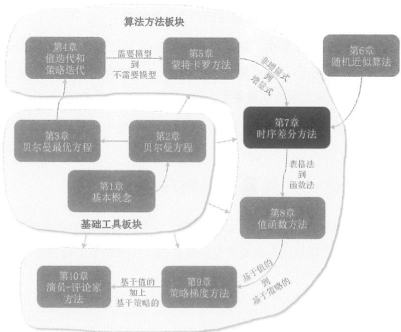  
图7.1 本章在全书中的位置。

在第5章，我们介绍了全书第一类无需模型的强化学习算法：蒙特卡罗（Monte Carlo，MC）。在本章，我们将介绍全书第二类无需模型的强化学习算法：时序差分(temporal difference, TD)。与MC算法相比，TD算法最大的不同在于它是增量式的。许多读者第一次看到TD算法时会有很多疑惑，例如这些算法为什么设计成这个样子。不过在学习了第6章的随机近似算法后，相信读者能更加轻松地掌握TD算法，这是因为TD算法本质上是求解贝尔曼方程或者贝尔曼最优方程的随机近似算法。

由于本章将介绍多种TD算法，为了帮助读者更好地学习，我们首先梳理这些算法之间的关系。

$\diamond$ 第7.1节介绍最基本也是最核心的TD算法。该算法可以估计一个给定策略的状态值。掌握这个算法对于学习后面的TD算法是非常有必要的。  
$\diamond$ 第7.2节介绍Sarsa算法。该算法可以估计给定策略的动作值。实际上，将第7.1节的TD算法中的状态值替换为动作值，就可以得到Sarsa算法。  
$\diamond$ 第7.3节介绍 $n$ -StepSarsa算法，这是Sarsa算法的一种推广。我们将会看到Sarsa算法和MC算法是 $n$ -StepSarsa算法的两个特殊情况。  
$\diamond$ 第7.4节介绍Q-learning算法，这是经典的强化学习算法之一。Q-learning算法和Sarsa算法的区别在于：Sarsa算法是在求解一个给定策略的贝尔曼方程，而Q-learning算法是直接求解贝尔曼最优方程。  
$\diamond$ 第7.5节总结本章介绍的所有TD算法，并提供一个统一的描述框架。

# 7.1 状态值估计：最基础的时序差分算法

本节将介绍最基础的TD算法，它可以估计一个给定策略的状态值。后面的章节会进一步推广这个TD算法从而得到更复杂的算法，因此本节的内容非常重要。

# 7.1.1 算法描述

给定一个策略 $\pi$ ，我们的目标是估计所有 $s\in S$ 的状态值 $v_{\pi}(s)$ 。假设我们有一些由 $\pi$ 生成的经验样本 $(s_0,r_1,s_1,\ldots ,s_t,r_{t + 1},s_{t + 1},\ldots)$ ，其中 $t = 0,1,2,\dots$ 表示采样时刻。下面的TD算法可以使用这些样本来估计状态值：

$$
v _ {t + 1} \left(s _ {t}\right) = v _ {t} \left(s _ {t}\right) - \alpha_ {t} \left(s _ {t}\right) \left[ v _ {t} \left(s _ {t}\right) - \left(r _ {t + 1} + \gamma v _ {t} \left(s _ {t + 1}\right)\right) \right], \tag {7.1}
$$

$$
v _ {t + 1} (s) = v _ {t} (s), \quad \text {当} s \neq s _ {t}, \tag {7.2}
$$

其中 $v_{t}(s_{t})$ 是在 $t$ 时刻对 $v_{\pi}(s_t)$ 的估计， $\alpha_{t}(s_{t})$ 是在 $t$ 时刻对于状态 $s_t$ 的学习率（learning rate）。

在 $t$ 时刻，只有当时正在被访问的状态 $s_t$ 的估计值会被更新（如式(7.1)所示）；而所有其他未被访问的状态的估计值保持不变（如式(7.2)所示）。通常情况下，式(7.2)会被省略，但是我们应该知道该式子的存在。该式可以帮助我们更好地理解TD算法，如果没有这个式子，该TD算法在数学上也是不完整的。

许多读者在第一次看到(7.1)中的TD算法时会问为什么它要设计成这个样子？实际上，该算法是一个用于求解贝尔曼方程的随机近似算法。要理解这一点，我们首先回顾状态值的定义：

$$
v _ {\pi} (s) = \mathbb {E} \big [ R _ {t + 1} + \gamma G _ {t + 1} | S _ {t} = s \big ], \quad s \in \mathcal {S}. \tag {7.3}
$$

式(7.3)可以重写为

$$
v _ {\pi} (s) = \mathbb {E} \big [ R _ {t + 1} + \gamma v _ {\pi} (S _ {t + 1}) | S _ {t} = s \big ], \quad s \in \mathcal {S}. \tag {7.4}
$$

这是因为 $\mathbb{E}[G_{t + 1}|S_t = s] = \sum_a\pi (a|s)\sum_{s'}p(s'|s,a)v_\pi (s') = \mathbb{E}[v_\pi (S_{t + 1})|S_t = s]$ 。式(7.4)是贝尔曼方程的另一种表达，它有时被称为贝尔曼期望方程（Bellman expectation equation）。如果我们应用第6章介绍的罗宾斯-门罗算法来求解式(7.4)，相应的算法就是TD算法。感兴趣的读者可以参见方框7.1。

# 方框7.1：推导时序差分算法

下面展示如何使用RM算法来求解(7.4)从而获得(7.1)中的TD算法。

对于状态 $s_t$ ，定义函数：

$$
g (v _ {\pi} (s _ {t})) \doteq v _ {\pi} (s _ {t}) - \mathbb {E} \big [ R _ {t + 1} + \gamma v _ {\pi} (S _ {t + 1}) | S _ {t} = s _ {t} \big ].
$$

这样式(7.4)中的贝尔曼方程可以写成

$$
g (v _ {\pi} (s _ {t})) = 0.
$$

我们的目标是求解上述方程来得到 $v_{\pi}(s_t)$ 。因为我们可以获取 $r_{t+1}$ 和 $s_{t+1}$ ，而它们是 $R_{t+1}$ 和 $S_{t+1}$ 的样本，所以对 $g(v_{\pi}(s_t))$ 含有噪声的观测是

$$
\begin{array}{l} \tilde {g} \left(v _ {\pi} \left(s _ {t}\right)\right) = v _ {\pi} \left(s _ {t}\right) - \left[ r _ {t + 1} + \gamma v _ {\pi} \left(s _ {t + 1}\right) \right] \\ = \underbrace {\left(v _ {\pi} (s _ {t}) - \mathbb {E} \left[ R _ {t + 1} + \gamma v _ {\pi} (S _ {t + 1}) | S _ {t} = s _ {t} \right]\right)} _ {g (v _ {\pi} (s _ {t}))} \\ \end{array}
$$

$$
+ \underbrace {\left(\mathbb {E} \left[ R _ {t + 1} + \gamma v _ {\pi} (S _ {t + 1}) | S _ {t} = s _ {t} \right] - \left[ r _ {t + 1} + \gamma v _ {\pi} (s _ {t + 1}) \right]\right)} _ {\eta}.
$$

此时用来求解 $g(v_{\pi}(s_t)) = 0$ 的RM算法是

$$
\begin{array}{l} v _ {t + 1} (s _ {t}) = v _ {t} (s _ {t}) - \alpha_ {t} (s _ {t}) \tilde {g} (v _ {t} (s _ {t})) \\ = v _ {t} \left(s _ {t}\right) - \alpha_ {t} \left(s _ {t}\right) \left(v _ {t} \left(s _ {t}\right) - \left[ r _ {t + 1} + \gamma v _ {\pi} \left(s _ {t + 1}\right) \right]\right), \tag {7.5} \\ \end{array}
$$

其中 $v_{t}(s_{t})$ 是在时刻 $t$ 对 $v_{\pi}(s_t)$ 的估计，而 $\alpha_{t}(s_{t})$ 是学习率。算法(7.5)的由来可参见第6.2节，这里不再赘述。

式(7.5)与式(7.1)中的TD算法非常相似。唯一的区别是式(7.5)的右手边包含 $v_{\pi}(s_{t + 1})$ ，而式(7.1)包含 $v_{t}(s_{t + 1})$ 。这个区别是因为式(7.5)是在假设其他状态的状态值已知的情况下来估计 $s_t$ 的状态值。如果我们也想同时估计其他所有状态的状态值，则右手边的 $v_{\pi}(s_{t + 1})$ 应该被替换为 $v_{t}(s_{t + 1})$ 。此时，式(7.5)就与式(7.1)完全相同了。当然，读者可能会问这样的直接替换是否仍能保证收敛呢？答案是可以的，严格的证明将在定理7.1中给出。

# 7.1.2 性质分析

下面讨论TD算法(7.1)的一些重要性质。

第一，我们先介绍TD算法中每一项的含义。具体如下所示：

$$
\underbrace {v _ {t + 1} \left(s _ {t}\right)} _ {\text {新 的 估 计 值}} = \underbrace {v _ {t} \left(s _ {t}\right)} _ {\text {当 前 估 计 值}} - \alpha_ {t} \left(s _ {t}\right) \left[ \overbrace {v _ {t} \left(s _ {t}\right) - \left(\underbrace {r _ {t + 1} + \gamma v _ {t} \left(s _ {t + 1}\right)} _ {\text {T D 目 标}}\right)} ^ {\text {T D 误 差}} \right], \tag {7.6}
$$

其中

$$
r _ {t + 1} + \gamma v _ {t} \left(s _ {t + 1}\right) \dot {=} \bar {v} _ {t}
$$

被称为TD目标（TD target），而

$$
v _ {t} (s _ {t}) - \left(r _ {t + 1} + \gamma v _ {t} \left(s _ {t + 1}\right)\right) = v \left(s _ {t}\right) - \bar {v} _ {t} \doteq \delta_ {t}
$$

被称为TD误差（TD error）。显然，新的估计值 $v_{t + 1}(s_t)$ 是当前估计值 $v_{t}(s_{t})$ 和TD误差 $\delta_t$ 的组合。

为什么 $\bar{v}_t$ 被称为TD目标？

这是因为该算法在数学上就是让 $v(s_{t})$ 的值更加接近 $\bar{v}_{t}$ ，即 $\bar{v}_{t}$ 是 $v(s_{t})$ 的目标值。为了理解这一点，我们在(7.6)两边同时减去 $\bar{v}_{t}$ 可得

$$
v _ {t + 1} (s _ {t}) - \bar {v} _ {t} = \left[ v _ {t} (s _ {t}) - \bar {v} _ {t} \right] - \alpha_ {t} (s _ {t}) \big [ v _ {t} (s _ {t}) - \bar {v} _ {t} \big ]
$$

$$
= \left[ 1 - \alpha_ {t} \left(s _ {t}\right) \right] \left[ v _ {t} \left(s _ {t}\right) - \bar {v} _ {t} \right].
$$

上式两边取绝对值后可得

$$
\left| v _ {t + 1} \left(s _ {t}\right) - \bar {v} _ {t} \right| = \left| 1 - \alpha_ {t} \left(s _ {t}\right) \right| \left| v _ {t} \left(s _ {t}\right) - \bar {v} _ {t} \right|.
$$

如果 $\alpha_{t}(s_{t})$ 是一个足够小的正数，则有 $0 < 1 - \alpha_{t}(s_{t}) < 1$ 。因此，由上式可以推出

$$
\left| v _ {t + 1} \left(s _ {t}\right) - \bar {v} _ {t} \right| <   \left| v _ {t} \left(s _ {t}\right) - \bar {v} _ {t} \right|.
$$

这个不等式很清晰地说明了新的值 $v_{t+1}(s_t)$ 比旧的值 $v_t(s_t)$ 更接近 $\bar{v}_t$ 。因此，这个算法在数学上使 $v_t(s_t)$ 接近 $\bar{v}_t$ ，这就是为什么 $\bar{v}_t$ 被称为TD目标。

如何理解TD误差？

TD误差被称为“TD”（时序差分）的原因是 $\delta_{t} = v_{t}(s_{t}) - (r_{t + 1} + \gamma v_{t}(s_{t + 1}))$ 反映了时刻 $t$ 和 $t + 1$ 之间的差异。TD误差被称为“误差”的原因是它不仅反映了两个时刻之间的差异，更重要的是反映了估计值 $v_{t}$ 与真实状态值 $v_{\pi}$ 之间的差异。如果估计值是准确的，那么TD误差在期望意义上应该等于0。为了理解这一点，当 $v_{t} = v_{\pi}$ 时，TD误差的期望值为

$$
\begin{array}{l} \mathbb {E} [ \delta_ {t} | S _ {t} = s _ {t} ] = \mathbb {E} \big [ v _ {\pi} (S _ {t}) - (R _ {t + 1} + \gamma v _ {\pi} (S _ {t + 1})) | S _ {t} = s _ {t} \big ] \\ = v _ {\pi} (s _ {t}) - \mathbb {E} \left[ R _ {t + 1} + \gamma v _ {\pi} (S _ {t + 1}) | S _ {t} = s _ {t} \right] \\ = 0. \quad (\text {由 于 式} (7. 3)) \\ \end{array}
$$

从另一个角度来说，TD误差可以被理解为新息（innovation），即代表从经验样本 $(s_{t},r_{t + 1},s_{t + 1})$ 中得到的新的信息，这个新的信息可以用来纠正当前估计值，从而使其更准确。新息在很多估计方法例如卡尔曼滤波[33,34]中都是非常关键的量。

第二，(7.1)中的TD算法只能估计某一给定策略的状态值，而不能直接用于寻找最优策略。不过该TD算法对于理解本章其他算法非常重要。例如，我们将在第7.2节推广(7.1)从而得到能估计动作值的TD算法，进而结合策略改进步骤来得到最优策略。

第三，TD算法和MC算法都是无模型的，它们有什么不同呢？为了方便读者阅读，我们把答案总结在表7.1中。虽然这个表中有一些算法如Sarsa稍后才会介绍，但是并不影响目前的理解。

# 7.1.3 收敛性证明

式(7.1)中TD算法的收敛性分析如下。

表 7.1 TD 方法和 MC 方法的对比。  

<table><tr><td>TD方法</td><td>MC方法</td></tr><tr><td>增量式：它可以在得到一个经验样本后立即更新估计值。</td><td>非增量式：它必须等到一个回合（episode）结束之后，才能用所有经验样本来更新估计值，这是因为它需要计算从某一状态到回合最后的折扣回报。</td></tr><tr><td>持续任务：由于TD算法是增量式的，因此它可以处理回合制（episodic）和持续性（continuing）的任务。</td><td>回合制任务：由于MC算法是非增量式的，因此它只能处理回合制任务，这些任务会在有限步后结束。</td></tr><tr><td>自举：TD算法依赖于自举（bootstrapping），因为状态值/动作值的更新依赖于其先前估计值。因此，TD算法需要初始值。</td><td>非自举：MC算法不是自举的，因为它可以直接估计状态值/动作值，而无需初始值。</td></tr><tr><td>低估计方差：TD算法的估计方差较低，这是因为它涉及的随机变量较少。例如，要估计动作值qπ(st,at)，Sarsa只需要三个随机变量Rt+1、St+1、At+1的样本。</td><td>高估计方差：MC算法的估计方差较高，这是因为它涉及许多随机变量。例如，要估计动作值qπ(st,at)，MC算法需要Rt+1+γRt+2+γ2Rt+3+...的样本。假设每个回合的步数为L，并且每个状态的动作数等于|A|。那么，一个随机性的软策略可能有|A|L种可能的轨迹。如果我们只用少数几个回合来估计，那么估计方差较高也就不足为奇了。</td></tr></table>

定理7.1 (TD算法的收敛性)。给定一个策略 $\pi$ ，基于式(7.1)中的TD算法，如果对所有 $s \in S$ 都有 $\sum_{t} \alpha_{t}(s) = \infty$ 和 $\sum_{t} \alpha_{t}^{2}(s) < \infty$ ，则 $v_{t}(s)$ 随着 $t \to \infty$ 几乎必然收敛到 $v_{\pi}(s)$ 。

在给出该定理的证明之前，我们先讨论其中关于 $\alpha_{t}$ 的条件。第一，条件 $\sum_{t} \alpha_{t}(s) = \infty$ 和 $\sum_{t} \alpha_{t}^{2}(s) < \infty$ 应该对所有 $s \in S$ 都成立。值得注意的是，在 $t$ 时刻，如果状态 $s$ 被访问，则 $\alpha_{t}(s) > 0$ ；否则， $\alpha_{t}(s) = 0$ 。因此，条件 $\sum_{t} \alpha_{t}(s) = \infty$ 在理论上要求状态 $s$ 被访问无限次（实际中访问足够多次即可）。所以该条件实际上是要求有足够多的经验数据。第二，学习率 $\alpha_{t}$ 在实际中常常被选择为一个小的正数。此时，条件 $\sum_{t} \alpha_{t}(s) = \infty$ 仍然成立，但是条件 $\sum_{t} \alpha_{t}^{2}(s) < \infty$ 不再成立。这样选择 $\alpha_{t}$ 的原因是它能够很好地利用后面（ $t$ 比较大时）得到的数据。否则，如果 $\alpha_{t}$ 逐渐收敛到 0，那么当 $t$ 较大时得到的数据对估计的影响已经微乎其微了。当 $\alpha_{t}$ 恒等于一个正数时，算法仍然可以在某种意义上收敛，详情参见文献[24, 第1.5节]。实际中，我们之所以希望 $t$ 比较大时数据仍然有效，其本质原因是这样可以应对时变系统（例如策略或环境缓慢变化）。

# 方框7.2：证明定理7.1

本证明基于第6章的定理6.3。为此，我们需要先构建一个类似于定理6.3中那样的随机过程。考虑状态 $s \in S$ ，在 $t$ 时刻，式(7.1)为

$$
v _ {t + 1} (s) = v _ {t} (s) - \alpha_ {t} (s) \left(v _ {t} (s) - \left(r _ {t + 1} + \gamma v _ {t} \left(s _ {t + 1}\right)\right)\right), \quad \text {如 果} s = s _ {t}, \tag {7.7}
$$

或者

$$
v _ {t + 1} (s) = v _ {t} (s), \quad \text {如 果} s \neq s _ {t}. \tag {7.8}
$$

定义估计误差为

$$
\Delta_ {t} (s) \doteq v _ {t} (s) - v _ {\pi} (s),
$$

其中 $v_{\pi}(s)$ 是在策略 $\pi$ 下 $s$ 的状态值。

在(7.7)的两边减去 $v_{\pi}(s)$ 可得

$$
\begin{array}{l} \Delta_ {t + 1} (s) = (1 - \alpha_ {t} (s)) \Delta_ {t} (s) + \alpha_ {t} (s) (\underbrace {r _ {t + 1} + \gamma v _ {t} (s _ {t + 1}) - v _ {\pi} (s)} _ {\eta_ {t} (s)}) \\ = (1 - \alpha_ {t} (s)) \Delta_ {t} (s) + \alpha_ {t} (s) \eta_ {t} (s), \qquad s = s _ {t}. \tag {7.9} \\ \end{array}
$$

在(7.8)的两边减去 $v_{\pi}(s)$ 可得

$$
\Delta_ {t + 1} (s) = \Delta_ {t} (s) = (1 - \alpha_ {t} (s)) \Delta_ {t} (s) + \alpha_ {t} (s) \eta_ {t} (s), \quad s \neq s _ {t}.
$$

其中 $\alpha_{t}(s) = 0, \eta_{t}(s) = 0$ 。上式与(7.9)的表达式完全相同。因此，无论 $s = s_{t}$ 与否，我们都可以得到如下统一表达式：

$$
\Delta_ {t + 1} (s) = \left(1 - \alpha_ {t} (s)\right) \Delta_ {t} (s) + \alpha_ {t} (s) \eta_ {t} (s).
$$

上式与定理6.3中的随机过程一致。

下面，我们的目标是证明定理6.3中的三个条件成立，从而得到收敛性。第一个条件与定理7.1中的条件相同。下面证明第二个条件成立，即对于所有 $s \in S$ 有 $\|\mathbb{E}[\eta_t(s)|\mathcal{H}_t]\|_{\infty} \leqslant \gamma \| \Delta_t(s)\|_{\infty}$ 。这里， $\mathcal{H}_t$ 表示历史信息（参见定理6.3中的定义）。由于马尔可夫性质，一旦 $s$ 给定，不论 $\eta_t(s) = r_{t+1} + \gamma v_t(s_{t+1}) - v_\pi(s)$ 或者 $\eta_t(s) = 0$ 都不依赖历史信息。因此，有 $\mathbb{E}[\eta_t(s)|\mathcal{H}_t] = \mathbb{E}[\eta_t(s)]$ 。更进一步，当 $s \neq s_t$ 时，我们有 $\eta_t(s) = 0$ ，进而

$$
\left| \mathbb {E} \left[ \eta_ {t} (s) \right] \right| = 0 \leqslant \gamma \| \Delta_ {t} (s) \| _ {\infty}. \tag {7.10}
$$

当 $s = s_{t}$ 时，我们有

$$
\begin{array}{l} \mathbb {E} \left[ \eta_ {t} (s) \right] = \mathbb {E} \left[ \eta_ {t} \left(s _ {t}\right) \right] \\ = \mathbb {E} \left[ r _ {t + 1} + \gamma v _ {t} \left(s _ {t + 1}\right) - v _ {\pi} \left(s _ {t}\right) \mid s _ {t} \right] \\ = \mathbb {E} \left[ r _ {t + 1} + \gamma v _ {t} \left(s _ {t + 1}\right) \mid s _ {t} \right] - v _ {\pi} (s _ {t}). \\ \end{array}
$$

将 $v_{\pi}(s_t) = \mathbb{E}[r_{t + 1} + \gamma v_{\pi}(s_{t + 1})|s_t]$ 代入上式可得

$$
\begin{array}{l} \mathbb {E} \left[ \eta_ {t} (s) \right] = \gamma \mathbb {E} \left[ v _ {t} \left(s _ {t + 1}\right) - v _ {\pi} \left(s _ {t + 1}\right) \mid s _ {t} \right] \\ = \gamma \sum_ {s ^ {\prime} \in \mathcal {S}} p \left(s ^ {\prime} \mid s _ {t}\right) \left[ v _ {t} \left(s ^ {\prime}\right) - v _ {\pi} \left(s ^ {\prime}\right) \right]. \\ \end{array}
$$

对上式两边求绝对值有

$$
\begin{array}{l} \left| \mathbb {E} [ \eta_ {t} (s) ] \right| = \gamma \left| \sum_ {s ^ {\prime} \in \mathcal {S}} p \left(s ^ {\prime} \mid s _ {t}\right) \left[ v _ {t} \left(s ^ {\prime}\right) - v _ {\pi} \left(s ^ {\prime}\right) \right] \right| \\ \leqslant \gamma \sum_ {s ^ {\prime} \in \mathcal {S}} p \left(s ^ {\prime} \mid s _ {t}\right) \max  _ {s ^ {\prime} \in \mathcal {S}} \left| v _ {t} \left(s ^ {\prime}\right) - v _ {\pi} \left(s ^ {\prime}\right) \right| \\ = \gamma \max  _ {s ^ {\prime} \in \mathcal {S}} | v _ {t} (s ^ {\prime}) - v _ {\pi} (s ^ {\prime}) | \\ = \gamma \| v _ {t} (s ^ {\prime}) - v _ {\pi} (s ^ {\prime}) \| _ {\infty} \\ = \gamma \| \Delta_ {t} (s) \| _ {\infty}. \tag {7.11} \\ \end{array}
$$

根据(7.10)和(7.11)，不论 $s$ 是否等于 $s_t$ ，都有 $|\mathbb{E}[\eta_t(s)]| \leqslant \gamma \| \Delta_t(s)\|_\infty$ ，因此

$$
\| \mathbb {E} [ \eta_ {t} (s) ] \| _ {\infty} \leqslant \gamma \| \Delta_ {t} (s) \| _ {\infty}.
$$

这是定理6.3中的第二个条件。最后，关于定理6.3中的第三个条件，当 $s \neq s_t$ 时， $\operatorname{var}[\eta_t(s) | \mathcal{H}_t] = 0$ 。当 $s = s_t$ 时， $\operatorname{var}[\eta_t(s) | \mathcal{H}_t] = \operatorname{var}[r_{t+1} + \gamma v_t(s_{t+1}) - v_\pi(s_t) | s_t] = \operatorname{var}[r_{t+1} + \gamma v_t(s_{t+1}) | s_t]$ 。由于 $r_{t+1}$ 是有界的，因此第三个条件不难证明。上述证明是受到 [32] 的启发得到的。

# 7.2 动作值估计：Sarsa

本节将介绍另一种TD算法，简称Sarsa。该算法不是估计状态值，而是估计动作值。将上一节介绍的TD算法中的状态值替换为动作值就能得到Sarsa算法。

# 7.2.1 算法描述

给定一个策略 $\pi$ ，我们的目标是估计其动作值。如果有一些由 $\pi$ 生成的经验样本： $(s_0, a_0, r_1, s_1, a_1, \ldots, s_t, a_t, r_{t+1}, s_{t+1}, a_{t+1}, \ldots)$ ，那么可以使用下面的Sarsa算法来估计动作值：

$$
q _ {t + 1} \left(s _ {t}, a _ {t}\right) = q _ {t} \left(s _ {t}, a _ {t}\right) - \alpha_ {t} \left(s _ {t}, a _ {t}\right) \left[ q _ {t} \left(s _ {t}, a _ {t}\right) - \left(r _ {t + 1} + \gamma q _ {t} \left(s _ {t + 1}, a _ {t + 1}\right)\right) \right], \tag {7.12}
$$

$$
q _ {t + 1} (s, a) = q _ {t} (s, a), \quad \text {当} (s, a) \neq (s _ {t}, a _ {t}),
$$

其中 $q_{t}(s_{t},a_{t})$ 是 $q_{\pi}(s_t,a_t)$ 的估计值， $\alpha_{t}(s_{t},a_{t})$ 是学习率。在 $t$ 时刻，只有 $(s_t,a_t)$ 的动作值被更新，而其他的动作值保持不变。

下面讨论Sarsa算法的一些重要性质。

为什么这个算法被称为“Sarsa”？这是因为算法每次迭代需要的经验样本是 $(s_t, a_t, r_{t+1}, s_{t+1}, a_{t+1})$ ，这些字母的缩写就是 Sarsa（state-action-reward-state-action）。Sarsa 算法最初在 [35] 中提出，其名称来自于 [3]。  
为什么Sarsa被设计成这样？读者可能已经注意到Sarsa与(7.1)中的TD算法非常相似。实际上，如果把(7.1)中的状态值简单替换为动作值，就得到了Sarsa算法。  
Sarsa在数学上做了什么？与(7.1)类似，Sarsa是一个用于求解如下所示的贝尔曼方程的随机近似算法：

$$
q _ {\pi} (s, a) = \mathbb {E} \left[ R + \gamma q _ {\pi} \left(S ^ {\prime}, A ^ {\prime}\right) | s, a \right], \quad \text {对 任 意} (s, a). \tag {7.13}
$$

方程(7.13)是一个贝尔曼方程，只不过它不是基于状态值而是基于动作值的，更多讨论请见方框7.3。

# 方框7.3：证明(7.13)是贝尔曼方程

在第2.8.2节中，我们介绍过用动作值表示的贝尔曼方程：

$$
\begin{array}{l} q _ {\pi} (s, a) = \sum_ {r} r p (r | s, a) + \gamma \sum_ {s ^ {\prime}} \sum_ {a ^ {\prime}} q _ {\pi} (s ^ {\prime}, a ^ {\prime}) p (s ^ {\prime} | s, a) \pi (a ^ {\prime} | s ^ {\prime}) \\ = \sum_ {r} r p (r | s, a) + \gamma \sum_ {s ^ {\prime}} p \left(s ^ {\prime} \mid s, a\right) \sum_ {a ^ {\prime}} q _ {\pi} \left(s ^ {\prime}, a ^ {\prime}\right) \pi \left(a ^ {\prime} \mid s ^ {\prime}\right). \tag {7.14} \\ \end{array}
$$

这个方程建立了不同动作值之间的关系。因为

$$
p \left(s ^ {\prime}, a ^ {\prime} \mid s, a\right) = p \left(s ^ {\prime} \mid s, a\right) p \left(a ^ {\prime} \mid s ^ {\prime}, s, a\right)
$$

$$
\begin{array}{l} = p \left(s ^ {\prime} \mid s, a\right) p \left(a ^ {\prime} \mid s ^ {\prime}\right) \quad (\text {由 于 马 尔 可 夫 性 质}) \\ \dot {=} p \left(s ^ {\prime} | s, a\right) \pi \left(a ^ {\prime} | s ^ {\prime}\right), \\ \end{array}
$$

所以(7.14)可以重写为

$$
q _ {\pi} (s, a) = \sum_ {r} r p (r | s, a) + \gamma \sum_ {s ^ {\prime}} \sum_ {a ^ {\prime}} q _ {\pi} \left(s ^ {\prime}, a ^ {\prime}\right) p \left(s ^ {\prime}, a ^ {\prime} \mid s, a\right).
$$

根据期望值的定义，上式可以写成(7.13)。因此，(7.13)是贝尔曼方程。

Sarsa是否收敛？由于Sarsa是由(7.1)推广而来，因此其收敛性与定理7.1类似。

定理7.2 (Sarsa的收敛性)。给定一个策略 $\pi$ ，基于式(7.12)中的Sarsa算法，如果 $\sum_{t}\alpha_{t}(s,a) = \infty$ 且 $\sum_{t}\alpha_{t}^{2}(s,a) < \infty$ 对于所有的 $(s,a)$ 都成立，那么 $q_{t}(s,a)$ 随着 $t\to \infty$ 会几乎必然收敛到 $q_{\pi}(s,a)$ 。

上述定理中关于 $\alpha_{t}$ 的条件与定理7.1是类似的。例如，条件 $\sum_{t} \alpha_{t}(s, a) = \infty$ 和 $\sum_{t} \alpha_{t}^{2}(s, a) < \infty$ 应当对于所有 $(s, a)$ 都成立，并且 $\sum_{t} \alpha_{t}(s, a) = \infty$ 要求了每个状态-动作必须被访问无限次。其中，如果 $(s, a) = (s_{t}, a_{t})$ ，那么 $\alpha_{t}(s, a) > 0$ ；否则， $\alpha_{t}(s, a) = 0$ 。该定理的证明类似于定理7.1，不再赘述。

# 7.2.2 学习最优策略

式(7.12)中的Sarsa算法只能估计一个给定策略的动作值。要想得到最优策略，我们需要将其与“策略改进步骤”相结合，结合之后的算法通常也称为Sarsa。

算7.1给出了伪代码。可以看到，每次迭代有两个步骤：第一步是值更新，即更新被访问的状态-动作的估计值；第二步是策略更新，即新的策略要选取最大价值的动作。值得注意的是，在值被更新之后， $s_t$ 的策略会被立即更新，而并不是在更新策略之前充分地评估当时的策略，这也是基于广义策略迭代的思想。此外，在策略更新后，该策略立即被用来生成下一个经验样本。这里的策略是 $\epsilon$ -Greedy 的，因此具有一定的探索性。

图7.2展示了一个Sarsa的仿真示例。

$\diamond$ 仿真设置：值得注意的是，这个例子中的任务和本书之前介绍的任务都不同。之前的任务是要学习每一个状态的最优策略，而这里的任务是要学习从特定状态出发到达目标状态的最优策略。前者的任务更难，因为它要找到所有状态的最优策略；后者的任务更简单，因为它只要找到部分状态的最优策略即可。这种任务在实际中也经常遇到，例如起始位置是住所，目标位置是学校，我们只需要学习那些每天上

下学可能经过的位置的最优策略即可，而不需要关心十万八千里之外的位置的策略是什么。

# 算法7.1：用Sarsa学习最优策略

初始化：对于所有 $(s,a)$ 和所有 $t$ ，选取 $\alpha_{t}(s,a) = \alpha >0$ 。 $\epsilon \in (0,1)$ 。所有 $(s,a)$ 的初始值 $q_{0}(s,a)$ 。从 $q_{0}$ 导出的初始 $\epsilon$ -Greedy策略 $\pi_0$ 。

目标：学习最优策略从而使智能体能从给定状态 $s_0$ 出发到达目标状态。

对于每个回合

在 $s_0$ ，根据 $\pi_0(s_0)$ ，得到 $a_0$

在时刻 $t$ , 如果 $s_{t}$ 不是目标状态

收集经验样本 $(s_{t},a_{t},r_{t + 1},s_{t + 1},a_{t + 1})$ ：在 $s_t$ ，执行 $a_{t}$ ，通过与环境交互生成 $r_{t + 1},s_{t + 1}$ ，再根据 $\pi_t(s_{t + 1})$ 生成 $a_{t + 1}$

更新 $(s_t, a_t)$ 的值：

$$
q _ {t + 1} \left(s _ {t}, a _ {t}\right) = q _ {t} \left(s _ {t}, a _ {t}\right) - \alpha_ {t} \left(s _ {t}, a _ {t}\right) \left[ q _ {t} \left(s _ {t}, a _ {t}\right) - \left(r _ {t + 1} + \gamma q _ {t} \left(s _ {t + 1}, a _ {t + 1}\right)\right) \right]
$$

更新 $s_t$ 的策略：

$\pi_{t + 1}(a|s_t) = 1 - \frac{\epsilon}{|\mathcal{A}(s_t)|} (|\mathcal{A}(s_t)| - 1)$ , 如果 $a = \arg \max_{a}q_{t + 1}(s_t,a)$

$\pi_{t + 1}(a|s_t) = \frac{\epsilon}{|\mathcal{A}(s_t)|}$ , 如果 $a \neq \arg \max_a q_{t + 1}(s_t, a)$

$$
s _ {t} \gets s _ {t + 1}, a _ {t} \gets a _ {t + 1}
$$

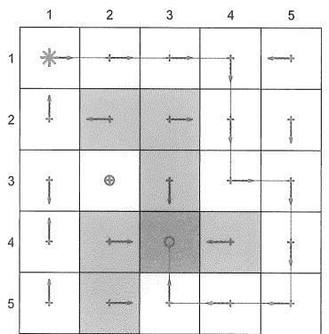

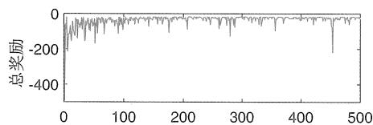

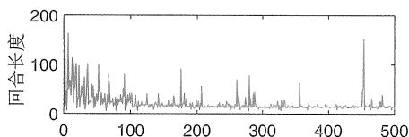  
回合次数  
图7.2 用Sarsa学习最优策略的过程。这里的任务是寻找从左上角状态到目标状态的最优路径。左图给出了Sarsa学习到的最终策略。右图显示了每个回合的回报和长度的变化过程。

在仿真中，所有回合都从左上角的状态开始，并在目标状态结束。奖励设置为 $r_{\mathrm{target}} = 0, r_{\mathrm{forbidden}} = r_{\mathrm{boundary}} = -10, r_{\mathrm{other}} = -1$ 。选取 $\epsilon = 0.1$ 。对所有 $t$ 设 $\alpha_{t}(s,a) = 0.1$ 。对所有 $(s,a)$ ，选取初始值为 $q_{0}(s,a) = 0$ 。由初始值导出的初始

策略是均匀分布的，即对所有 $s, a$ 有 $\pi_0(a|s) = 0.2$ 。

学习到的策略：图7.2中的左图展示了Sarsa学习到的最终策略。如果考虑在每个状态以最大概率选取的动作，那么这个策略可以成功地将智能体从初始状态引导至目标状态。然而，其他一些状态的策略可能不是最优的（例如第三行第一列），这是因为这些状态没有被充分探索。  
每个回合的回报：图7.2中的右上方子图展示了每个回合的回报逐渐变化的过程。可以看到，每个回合的回报在逐渐增加，这是因为初始策略不好，因此经常得到负奖励。随着策略变好，回报会逐渐增加。有的读者可能注意到大概在第460个回合时回报突然降低，这是因为这个策略是 $\epsilon$ -Greedy 的，因此还是有概率选择不好的动作。  
每个回合的长度：图7.2中的右下方子图展示了每个回合的长度逐渐变化的过程。初始回合的长度很长，这是因为初始策略不好，智能体在到达目标之前可能多次绕路。随着策略逐渐变好，轨迹的长度逐渐变短。类似地，大概在第460个回合时回合的长度突然增加，这也是因为策略是 $\epsilon$ -Greedy 的，存在选择非最优动作的可能性。解决这个问题的一个简单方法是使用衰减的 $\epsilon$ ，即初始时 $\epsilon$ 比较大，以使得策略有较强的探索性；随后 $\epsilon$ 逐渐趋近于0，从而增加策略的最优性，减少探索性。

最后，Sarna算法也有一些变体，如Expected Sarna算法，感兴趣的读者可以参见方框7.4。

# 方框7.4: ExpectedSarsa算法

给定一个策略 $\pi$ ，如下所示的ExpectedSarsa算法可以估计该策略的动作值：

$$
q _ {t + 1} \left(s _ {t}, a _ {t}\right) = q _ {t} \left(s _ {t}, a _ {t}\right) - \alpha_ {t} \left(s _ {t}, a _ {t}\right) \left[ q _ {t} \left(s _ {t}, a _ {t}\right) - \left(r _ {t + 1} + \gamma \mathbb {E} \left[ q _ {t} \left(s _ {t + 1}, A\right) \right]\right) \right],
$$

$$
q _ {t + 1} (s, a) = q _ {t} (s, a), \quad \text {当} (s, a) \neq (s _ {t}, a _ {t}).
$$

上式中

$$
\mathbb {E} [ q _ {t} (s _ {t + 1}, A) ] = \sum_ {a} \pi_ {t} (a | s _ {t + 1}) q _ {t} (s _ {t + 1}, a) \doteq v _ {t} (s _ {t + 1})
$$

是在策略 $\pi_t$ 下 $q_{t}(s_{t + 1},a)$ 的期望值。也正因为如此，该算法被称为ExpectedSarsa。

ExpectedSarsa算法与Sarsa非常相似，它们只是在TD目标上不同。具体来说，ExpectedSarsa中的TD目标是 $r_{t + 1} + \gamma \mathbb{E}[q_t(s_{t + 1},A)]$ ，而Sarsa的TD目标是 $r_{t + 1} + \gamma q_t(s_{t + 1},a_{t + 1})$ 。这里引入期望值会略微增加计算复杂度，不过它对减少估

计方差是有益的，这是因为它将Sarsa涉及的随机变量 $\{s_t, a_t, r_{t+1}, s_{t+1}, a_{t+1}\}$ 减少到了 $\{s_t, a_t, r_{t+1}, s_{t+1}\}$ 。

与(7.1)中的TD算法类似，ExpectedSarsa算法可以被看作求解下面方程的随机近似算法：

$$
q _ {\pi} (s, a) = \mathbb {E} \Big [ R _ {t + 1} + \gamma \mathbb {E} [ q _ {\pi} (S _ {t + 1}, A _ {t + 1}) | S _ {t + 1} ] \Big | S _ {t} = s, A _ {t} = a \Big ]. \qquad (7. 1 5)
$$

该方程乍一看可能很奇怪，但它实际上是贝尔曼方程的另一种表达形式。为了理解这一点，可以将

$$
\mathbb {E} [ q _ {\pi} (S _ {t + 1}, A _ {t + 1}) | S _ {t + 1} ] = \sum_ {A ^ {\prime}} q _ {\pi} (S _ {t + 1}, A ^ {\prime}) \pi (A ^ {\prime} | S _ {t + 1}) = v _ {\pi} (S _ {t + 1})
$$

代入(7.15)，进而得到

$$
q _ {\pi} (s, a) = \mathbb {E} \Big [ R _ {t + 1} + \gamma v _ {\pi} (S _ {t + 1}) | S _ {t} = s, A _ {t} = a \Big ].
$$

不难看出上式就是贝尔曼方程。

最后，ExpectedSarsa的具体实现流程与Sarsa类似，这里不再赘述，更多信息可参见[3,36,37]。

# 7.3 动作值估计： $n$ -Step Sarsa

本节介绍 $n$ -Step Sarsa，它是Sarsa的一种推广。我们将看到Sarsa和蒙特卡罗算法是 $n$ -Step Sarsa的两种极端情况。

首先回顾一下动作值的定义：

$$
q _ {\pi} (s, a) = \mathbb {E} \left[ G _ {t} \mid S _ {t} = s, A _ {t} = a \right], \tag {7.16}
$$

其中 $G_{t}$ 是折扣回报：

$$
G _ {t} = R _ {t + 1} + \gamma R _ {t + 2} + \gamma^ {2} R _ {t + 3} + \dots .
$$

实际上， $G_{t}$ 可以被写成不同的表达式：

$$
\mathrm {S a r s a} \longleftarrow G _ {t} ^ {(1)} = R _ {t + 1} + \gamma q _ {\pi} (S _ {t + 1}, A _ {t + 1}),
$$

$$
G _ {t} ^ {(2)} = R _ {t + 1} + \gamma R _ {t + 2} + \gamma^ {2} q _ {\pi} (S _ {t + 2}, A _ {t + 2}),
$$

。

$$
n \text {- s t e p} \mathrm {S a r s a} \longleftarrow G _ {t} ^ {(n)} = R _ {t + 1} + \gamma R _ {t + 2} + \dots + \gamma^ {n} q _ {\pi} (S _ {t + n}, A _ {t + n}),
$$

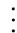

蒙特卡罗 $\longleftarrow$ $G_{t}^{(\infty)} = R_{t + 1} + \gamma R_{t + 2} + \gamma^{2}R_{t + 3} + \gamma^{3}R_{t + 4}\ldots .$

上式中 $G_{t}^{(1)}, G_{t}^{(2)}, \ldots, G_{t}^{(n)}$ 的上标仅表示 $G_{t}$ 的不同分解方式，它们本质上是相等的： $G_{t} = G_{t}^{(1)} = G_{t}^{(2)} = G_{t}^{(n)} = G_{t}^{(\infty)}$ 。将 $G_{t}$ 的不同分解方式代入(7.16)中的 $q_{\pi}(s,a)$ 会得到如下不同的算法。

当 $n = 1$ 时，我们有

$$
q _ {\pi} (s, a) = \mathbb {E} [ G _ {t} ^ {(1)} | s, a ] = \mathbb {E} [ R _ {t + 1} + \gamma q _ {\pi} (S _ {t + 1}, A _ {t + 1}) | s, a ].
$$

求解这个方程的随机近似算法是

$$
q _ {t + 1} \left(s _ {t}, a _ {t}\right) = q _ {t} \left(s _ {t}, a _ {t}\right) - \alpha_ {t} \left(s _ {t}, a _ {t}\right) \left[ q _ {t} \left(s _ {t}, a _ {t}\right) - \left(r _ {t + 1} + \gamma q _ {t} \left(s _ {t + 1}, a _ {t + 1}\right)\right) \right].
$$

上式就是(7.12)中的Sarsa算法。

当 $n = \infty$ 时，我们有

$$
q _ {\pi} (s, a) = \mathbb {E} [ G _ {t} ^ {(\infty)} | s, a ] = \mathbb {E} [ R _ {t + 1} + \gamma R _ {t + 2} + \gamma^ {2} R _ {t + 3} + \dots | s, a ].
$$

求解这个方程的随机近似算法是

$$
q _ {t + 1} \left(s _ {t}, a _ {t}\right) = g _ {t} \dot {=} r _ {t + 1} + \gamma r _ {t + 2} + \gamma^ {2} r _ {t + 3} + \dots ,
$$

其中 $g_{t}$ 是 $G_{t}$ 的一个样本。上式实际上就是蒙特卡罗方法，它使用从 $(s_t,a_t)$ 开始的回报来近似 $(s_t,a_t)$ 的动作值。

当 $n$ 取一般的自然数时，我们有

$$
q _ {\pi} (s, a) = \mathbb {E} [ G _ {t} ^ {(n)} | s, a ] = \mathbb {E} [ R _ {t + 1} + \gamma R _ {t + 2} + \ldots + \gamma^ {n} q _ {\pi} (S _ {t + n}, A _ {t + n}) | s, a ].
$$

求解这个方程的随机近似算法是

$$
\begin{array}{l} q _ {t + 1} \left(s _ {t}, a _ {t}\right) = q _ {t} \left(s _ {t}, a _ {t}\right) \\ \left. - \alpha_ {t} \left(s _ {t}, a _ {t}\right) \left[ q _ {t} \left(s _ {t}, a _ {t}\right) - \left(r _ {t + 1} + \gamma r _ {t + 2} + \dots + \gamma^ {n} q _ {t} \left(s _ {t + n}, a _ {t + n}\right)\right) \right]. \right. \tag {7.17} \\ \end{array}
$$

这个算法被称为 $n$ -step Sarsa。

总而言之， $n$ -Step Sarna 是一个更一般化的算法：当 $n = 1$ 时，它就变成了 Sarna 算法；当 $n = \infty$ 时，它就变成了蒙特卡罗算法（需要设置 $\alpha_{t} = 1$ ）。由于 $n$ -Step Sarna 包含 Sarna 和蒙特卡罗这两个极端情况，因此其性能也介于 Sarna 和蒙特卡罗之间。如果

$n$ 较大， $n$ -StepSarsa接近于蒙特卡罗：其估计具有较小的偏差（bias）但较大的方差。如果 $n$ 较小， $n$ -StepSarsa接近于Sarsa：其估计具有较小的方差但较大的偏差。

最后，这里介绍的 $n$ -Step Sarsa 仅可用于评价一个给定的策略。为了得到最优策略，它需要与策略改进步骤结合，具体流程类似于 Sarsa，这里不再赘述，更多信息可参见[3, 第9章]。值得注意的是，在实现 $n$ -Step Sarsa 算法时，我们需要经验样本 $(s_t, a_t, r_{t+1}, s_{t+1}, a_{t+1}, \ldots, r_{t+n}, s_{t+n}, a_{t+n})$ 。由于我们在 $t$ 时刻还无法拿到样本 $(r_{t+n}, s_{t+n}, a_{t+n})$ ，因此必须等到 $t + n$ 时刻才能更新 $(s_t, a_t)$ 的 $q$ 值。为此，式(7.17)可以被重新写为

$$
\begin{array}{l} q _ {t + n} (s _ {t}, a _ {t}) = q _ {t + n - 1} (s _ {t}, a _ {t}) \\ - \alpha_ {t + n - 1} (s _ {t}, a _ {t}) \Big [ q _ {t + n - 1} (s _ {t}, a _ {t}) \\ \left. - \left(r _ {t + 1} + \gamma r _ {t + 2} + \ldots + \gamma^ {n} q _ {t + n - 1} (s _ {t + n}, a _ {t + n})\right) \right], \\ \end{array}
$$

其中 $q_{t + n}(s_t,a_t)$ 是在 $t + n$ 时刻对 $q_{\pi}(s_t,a_t)$ 的估计。

# 7.4 最优动作值估计：Q-learning

本节将介绍Q-learning算法，这是经典的强化学习算法之一[38, 39]。前面介绍的Sarsa只能估计给定策略的动作值，必须结合策略改进步骤才能得到最优策略。相比之下，Q-learning可以直接估计最优动作值进而找到最优策略。

# 7.4.1 算法描述

Q-learning算法如下所示：

$$
\begin{array}{l} q _ {t + 1} (s _ {t}, a _ {t}) = q _ {t} (s _ {t}, a _ {t}) - \alpha_ {t} (s _ {t}, a _ {t}) \left[ q _ {t} (s _ {t}, a _ {t}) - \left(r _ {t + 1} + \gamma \max _ {a \in \mathcal {A}} q _ {t} (s _ {t + 1}, a)\right) \right], \quad (7. 1 8) \\ q _ {t + 1} (s, a) = q _ {t} (s, a), \quad \text {当} (s, a) \neq (s _ {t}, a _ {t}), \\ \end{array}
$$

其中 $t = 0,1,2,\ldots$ 。这里 $q_{t}(s_{t},a_{t})$ 是对 $(s_t,a_t)$ 的最优动作值的估计，而 $\alpha_{t}(s_{t},a_{t})$ 是学习率。

Q-learning的表达式与Sarsa非常类似，它们的区别在于TD目标：Q-learning的TD目标是 $r_{t + 1} + \gamma \max_a q_t(s_{t + 1},a)$ ，而Sarsa的TD目标则是 $r_{t + 1} + \gamma q_t(s_{t + 1},a_{t + 1})$ 。因此，如果当前的状态-动作是 $(s_t,a_t)$ ，Sarsa算法的更新需要样本 $(r_{t + 1},s_{t + 1},a_{t + 1})$ ，而Q-learning只需要 $(r_{t + 1},s_{t + 1})$ 。

为什么Q-learning被设计成(7.18)中的表达式？它在数学上做了什么呢？实际上，

Q-learning 是一个求解如下贝尔曼最优方程的随机近似算法：

$$
q (s, a) = \mathbb {E} \left[ R _ {t + 1} + \gamma \max  _ {a} q \left(S _ {t + 1}, a\right) \mid S _ {t} = s, A _ {t} = a \right]. \tag {7.19}
$$

上面这个方程是基于动作值的贝尔曼最优方程，证明见方框7.5。Q-learning的收敛性分析与定理7.1类似，这里不再赘述，更多信息可参见[32, 39]。

# 方框7.5：证明(7.19)是贝尔曼最优方程

根据期望的定义，(7.19)可以重写为

$$
q (s, a) = \sum_ {r} p (r | s, a) r + \gamma \sum_ {s ^ {\prime}} p \left(s ^ {\prime} \mid s, a\right) \max  _ {a \in \mathcal {A} \left(s ^ {\prime}\right)} q \left(s ^ {\prime}, a\right).
$$

对方程的两边取最大值可得

$$
\max  _ {a \in \mathcal {A} (s)} q (s, a) = \max  _ {a \in \mathcal {A} (s)} \left[ \sum_ {r} p (r | s, a) r + \gamma \sum_ {s ^ {\prime}} p \left(s ^ {\prime} \mid s, a\right) \max  _ {a \in \mathcal {A} \left(s ^ {\prime}\right)} q \left(s ^ {\prime}, a\right) \right].
$$

通过定义 $v(s) \doteq \max_{a \in \mathcal{A}(s)} q(s, a)$ ，上面的方程可重写为

$$
\begin{array}{l} v (s) = \max  _ {a \in \mathcal {A} (s)} \left[ \sum_ {r} p (r | s, a) r + \gamma \sum_ {s ^ {\prime}} p \left(s ^ {\prime} \mid s, a\right) v \left(s ^ {\prime}\right) \right] \\ = \max _ {\pi} \sum_ {a \in \mathcal {A} (s)} \pi (a | s) \left[ \sum_ {r} p (r | s, a) r + \gamma \sum_ {s ^ {\prime}} p (s ^ {\prime} | s, a) v (s ^ {\prime}) \right]. \\ \end{array}
$$

上式就是用状态值表示的贝尔曼最优方程，这已经在第3章有详细讨论。

# 7.4.2 Off-policy和On-policy

接下来介绍两个重要概念：Off-policy（异策略）和On-policy（同策略）。之所以在介绍Q-learning时引入这两个概念，是因为Q-learning相比前面的TD算法有一点特殊：Q-learning是Off-policy的，而前面介绍的算法如Sarsa都是On-policy的。

任何一个强化学习算法都会涉及两种策略：一种是行为策略（behavior policy），另一种是目标策略（target policy）。行为策略用于生成经验样本，而目标策略不断更新，从而收敛至最优策略。当行为策略与目标策略相同时，该算法被称为On-policy的，中文为同策略（因为两个策略相同）；当它们不同时，该算法被称为Off-policy的，中文为异策略（因为两个策略不同）。

Off-policy算法的优势在于它可以使用由其他策略生成的经验样本来学习最优策略。一个常见的情况是使用探索性较强的行为策略生成的经验数据。例如，如果我们

想要估计所有动作值，则必须生成多次访问每个状态-动作的轨迹，此时可以使用 $\epsilon$ -Greedy策略来生成轨迹。尽管Sarsa也使用 $\epsilon$ -Greedy策略来保持一定的探索能力，但是为了保证最优性，其 $\epsilon$ 的值通常很小，因此探索能力有限。相比之下，如果我们能使用一个具有较强探索能力的策略（例如 $\epsilon = 1$ ）来生成经验数据，然后使用Off-policy算法来学习最优策略，效率将显著提高。后面将给出一个例子来说明这一点。

如何确定一个算法是On-policy还是Off-policy呢？如果一个算法可以使用任何其他策略生成的经验数据来得到最优策略，那么这个算法就是Off-policy的；反之，则是On-policy的。当然，这并不是真正意义上的回答，而是基于Off-policy和On-policy的定义。为了真正回答这个问题，我们可以考察算法的两方面：第一个方面是算法旨在解决的数学问题，第二个方面是算法所需的经验样本。

Sarsa是On-policy的。

原因如下。Sarsa在每次迭代中有两个步骤。第一步是通过求解贝尔曼方程来评价当前策略 $\pi$ 。为此我们需要由 $\pi$ 生成的样本，因此 $\pi$ 是行为策略。第二步是基于对 $\pi$ 的估计值获得一个改进的策略， $\pi$ 不断更新并最终收敛到最优策略，因此 $\pi$ 也是目标策略，所以Sarsa中的行为策略和目标策略是相同的。

从另一个角度来看，我们可以考察算法所需的样本。Sarsa在每次迭代中所需的样本是 $(s_t, a_t, r_{t+1}, s_{t+1}, a_{t+1})$ 。这些样本的生成过程如下所示：

$$
s _ {t} \xrightarrow {\pi_ {b}} a _ {t} \xrightarrow {\mathrm {m o d e l}} r _ {t + 1}, s _ {t + 1} \xrightarrow {\pi_ {b}} a _ {t + 1}
$$

此过程中，行为策略 $\pi_{b}$ 用于在 $s_t$ 产生 $a_{t}$ 且在 $s_{t + 1}$ 产生 $a_{t + 1}$ 。Sarsa用这个经验数据来估计 $q_{\pi_b}(s_t,a_t)$ ，并基于此改进得到新的策略。换句话说，Sarsa评价进而改进的策略（即目标策略）就是用来生成样本的策略，因此Sarsa是On-policy的。

Q-learning是Off-policy的。

其本质的数学原因在于Q-learning是求解贝尔曼最优方程，而Sarsa是求解用于生成经验数据的策略对应的贝尔曼方程。求解贝尔曼方程只能评价对应的策略，而求解贝尔曼最优方程则可以直接得到最优策略。

具体来说，Q-learning在每次迭代中所需的样本是 $(s_t, a_t, r_{t+1}, s_{t+1})$ 。这些样本的生成过程如下所示：

$$
s _ {t} \xrightarrow {\pi_ {b}} a _ {t} \xrightarrow {\mathrm {m o d e l}} r _ {t + 1}, s _ {t + 1}
$$

在此过程中，行为策略 $\pi_{b}$ 用于在 $s_t$ 产生 $a_{t}$ 。Q-learning算法的目的是估计 $(s_t,a_t)$ 的最优动作值，这一过程依赖于样本 $(r_{t + 1},s_{t + 1})$ 。产生 $(r_{t + 1},s_{t + 1})$ 的过程完全由系统模型（即通过与环境的交互）决定。因此， $(s_t,a_t)$ 的最优动作值的估计不再涉

及 $\pi_{b}$ 。

$\diamond$ 蒙特卡罗方法是On-policy的。其原因与Sarsa相似：要评估和改进的策略与生成样本的策略是相同的。

最后，有的读者可能会问On-policy/Off-policy与Online/Offline（在线/离线）的区别是什么？在线学习是指智能体在与环境交互的同时用生成的数据来更新值和策略。离线学习是指智能体不与环境交互，而是使用预先收集的数据来更新值和策略。如果算法是On-policy的，那么它可以实现在线学习，但不能实现离线学习，因为它无法使用预先收集的其他策略生成的数据。如果算法是Off-policy的，那么它既可以在线学习，也可以离线学习。

# 7.4.3 算法实现

由于Q-learning是Off-policy的，所以它在编程实现时有两种模式。

第一，On-policy模式，即行为策略和目标策略相同。算法7.2给出了伪代码。这种方式与算法7.1中的Sarsa类似，因为此时行为策略与目标策略相同，都是一个 $\epsilon$ -Greedy的策略。此外，该算法是在线学习的，即智能体一边与环境交互以获得数据，一边更新值和策略。

# 算法7.2：Q-learning（On-policy模式）

初始化：对所有 $(s,a)$ 和所有 $t$ ， $\alpha_{t}(s,a) = \alpha >0$ 。 $\epsilon \in (0,1)$ 。所有 $(s,a)$ 的初始值 $q_0(s,a)$ 。从 $q_{0}$ 导出的初始 $\epsilon$ -Greedy策略 $\pi_0$ 。

目标：学习最优策略从而使智能体能从给定状态 $s_0$ 出发到达目标状态。

对于每个回合

在 $t$ 时刻，如果 $s_t$ 不是目标状态

收集经验样本 $(a_{t},r_{t + 1},s_{t + 1})$ ：在 $s_t$ ，根据 $\pi_t(s_t)$ 产生 $a_{t}$ ，通过与环境互动生成 $r_{t + 1},s_{t + 1}$ 。

更新 $(s_t, a_t)$ 的值：

$$
q _ {t + 1} (s _ {t}, a _ {t}) = q _ {t} (s _ {t}, a _ {t}) - \alpha_ {t} (s _ {t}, a _ {t}) \Big [ q _ {t} (s _ {t}, a _ {t}) - (r _ {t + 1} + \gamma \max _ {a} q _ {t} (s _ {t + 1}, a)) \Big ]
$$

更新 $s_t$ 的策略：

$$
\pi_ {t + 1} (a | s _ {t}) = 1 - \frac {\epsilon}{| \mathcal {A} (s _ {t}) |} (| \mathcal {A} (s _ {t}) | - 1), \text {如 果} a = \operatorname {a r g m a x} _ {a} q _ {t + 1} (s _ {t}, a)
$$

$$
\pi_ {t + 1} (a | s _ {t}) = \frac {\epsilon}{| \mathcal {A} (s _ {t}) |}, \text {如 果} a \neq \operatorname {a r g m a x} _ {a} q _ {t + 1} (s _ {t}, a)
$$

第二，Off-policy模式，即行为策略和目标策略不同。算法7.3给出了伪代码。其中行为策略 $\pi_{b}$ 可以是任意策略，只要它能生成足够的经验数据。因此，行为策略最好具有一定的探索性。在此算法中，目标策略 $\pi_{T}$ 是Greedy的而不是 $\epsilon$ -Greedy的，这是因为它不用生成经验数据，因此不需要具有探索性。此外，该算法是离线学习的，即先收集所有经验样本，然后再学习。

# 算法7.3：Q-learning（Off-policy模式）

初始化：所有 $(s,a)$ 的初始值 $q_{0}(s,a)$ 。所有 $(s,a)$ 的行为策略 $\pi_b(a|s)$ 。对所有 $(s,a)$ 和所有 $t$ ， $\alpha_{t}(s,a) = \alpha >0$ 。

目标：使用 $\pi_{b}$ 生成的经验数据，学习所有状态的最优策略 $\pi_{T}$ 。

对 $\pi_b$ 生成的每个回合 $\{s_0, a_0, r_1, s_1, a_1, r_2, \ldots\}$

对回合中的每一步 $t = 0,1,2,\ldots$

更新 $(s_t, a_t)$ 的值：

$$
q _ {t + 1} \left(s _ {t}, a _ {t}\right) = q _ {t} \left(s _ {t}, a _ {t}\right) - \alpha_ {t} \left(s _ {t}, a _ {t}\right) \left[ q _ {t} \left(s _ {t}, a _ {t}\right) - \left(r _ {t + 1} + \gamma \max  _ {a} q _ {t} \left(s _ {t + 1}, a\right)\right) \right]
$$

更新 $s_t$ 的目标策略：

$$
\pi_ {T, t + 1} (a \mid s _ {t}) = 1 \text {, 如 果} a = \operatorname {a r g m a x} _ {a} q _ {t + 1} \left(s _ {t}, a\right)
$$

$$
\pi_ {T, t + 1} (a | s _ {t}) = 0 \text {, 如 果} a \neq \operatorname {a r g m a x} _ {a} q _ {t + 1} (s _ {t}, a)
$$

# 7.4.4 示例

下面来看一些例子。

第一个例子如图7.3所示，它展示了算法7.2中On-policy模式的Q-learning。这里的目标是从给定的状态出发找到达到目标状态的最优路径。参数设置在图7.3的标题中给出。如该图所示，Q-learning最终能找到一个最优路径。在迭代过程中，每个回合的长度逐渐缩短，而每个回合的回报逐渐增加。

第二组例子在图7.4和图7.5中给出，它们展示了算法7.3中Off-policy模式的Q-learning。这里的任务是找到所有状态的最优策略。参数设置为 $r_{\mathrm{boundary}} = r_{\mathrm{forbidden}} = -1$ ， $r_{\mathrm{target}} = 1$ ， $\gamma = 0.9$ ， $\alpha = 0.1$ 。

最优策略：为了验证 Q-learning 的有效性，我们首先使用之前介绍的需要模型的策略迭代算法求解出真实的最优策略和最优状态值，如图7.4(a)~(b)所示。  
经验样本：行为策略在任意状态下采取任意动作的概率是相同的，都等于0.2（图7.4(c)）。我们使用该行为策略生成一个包含100000步的回合（图7.4(d)）。由于

该行为策略具有良好的探索能力，这一个回合就能多次访问每个状态-动作。

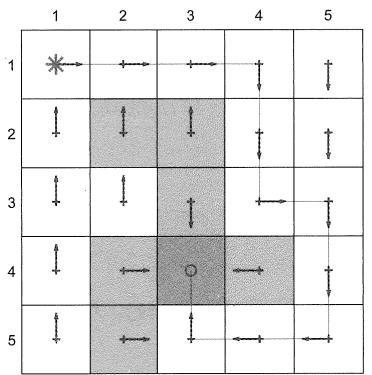

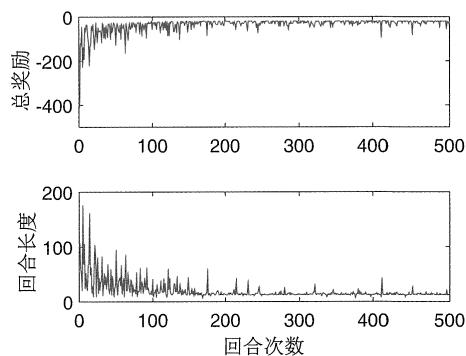  
图7.3 用于展示算法7.2的例子。所有回合都从左上角的状态开始，并在到达目标状态后终止。目的是找到从起始状态到目标状态的最优路径。左图显示了算法得到的最终策略。右图显示了每个回合的回报和长度的变化。参数设置为 $r_{\mathrm{target}} = 0$ ， $r_{\mathrm{forbidden}} = r_{\mathrm{boundary}} = -10$ ， $r_{\mathrm{other}} = -1$ ， $\alpha = 0.1$ ， $\epsilon = 0.1$ 。

学习到的策略：Q-learning最终学到的目标策略如图7.4(e)所示。这个策略是最优的，因为估计误差收敛到了0（图7.4(f)）。此外，有的读者可能注意到Q-learning学到的最优策略与图7.4(a)中的最优策略不完全相同。实际上，这两个都是最优策略，它们对应相同的最优状态值。  
不同的初始值：由于Q-learning采用自举方法，算法需要选取合适的初始动作值估计。如果初始估计靠近真实值，则估计过程收敛较快，例如在约10000步内收敛（图7.4(g)）。否则，估计过程收敛较慢（图7.4(h)）。  
不同的行为策略：当行为策略的探索性较差时，学习的效果显著下降。例如，图7.5给出了一些探索性较差的行为策略。虽然它们是 $\epsilon$ -Greedy，但是因为 $\epsilon = 0.5$ 或0.1较小，所以探索性较差。结果表明，当 $\epsilon$ 从1减少到0.5，然后再减少到0.1时，学习速度显著降低，这是因为行为策略的探索能力较弱，导致经验样本不合理。

# 7.5 时序差分算法的统一框架

到目前为止，我们已经介绍了几个不同的TD算法，如Sarsa、 $n$ -Step Sarsa和Q-learning。下面介绍一个统一的框架来描述这些TD算法甚至蒙特卡罗算法。

具体来说，用于动作值估计的TD算法可以写成一个统一的表达式：

$$
q _ {t + 1} \left(s _ {t}, a _ {t}\right) = q _ {t} \left(s _ {t}, a _ {t}\right) - \alpha_ {t} \left(s _ {t}, a _ {t}\right) \left[ q _ {t} \left(s _ {t}, a _ {t}\right) - \bar {q} _ {t} \right], \tag {7.20}
$$

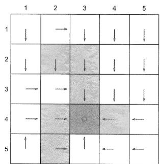  
(a) 最优策略

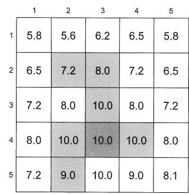  
(b) 最优状态值

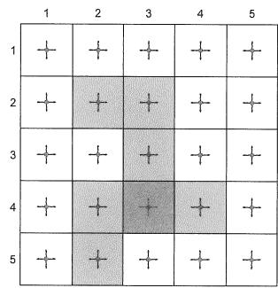  
(c) 行为策略

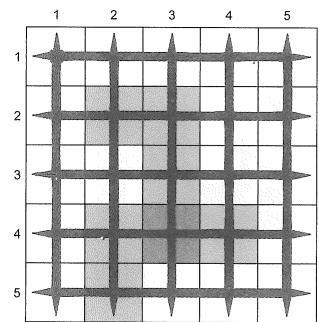  
(d)生成的回合

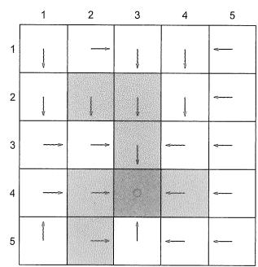  
(e) 学习到的策略

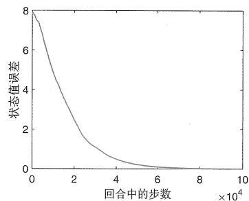  
(f) 最优状态值估计误差： $q_{0}(s,a) = 0$

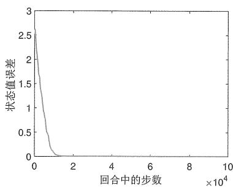  
(g) 最优状态值估计误差: $q_{0}(s, a) = 10$

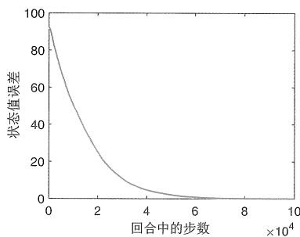  
(h) 最优状态值估计误差: $q_{0}(s, a) = 100$   
图7.4 用于展示Off-policy模式的Q-learning的例子。图(a)和(b)展示了最优策略和最优状态值。图(c)和(d)展示了行为策略和生成的回合。图(e)和(f)展示了学习到的策略和估计误差的收敛过程。图(g)和(h)展示了具有不同初始值的情况。

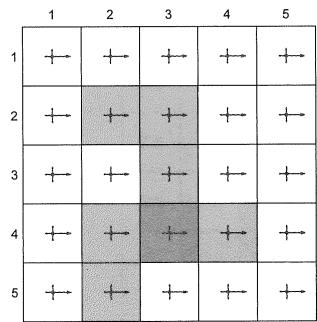

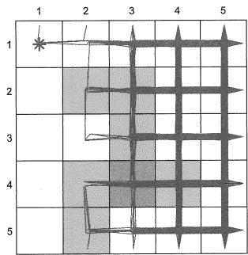

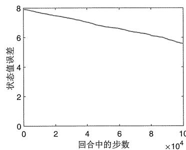  
(a) $\epsilon = 0.5$

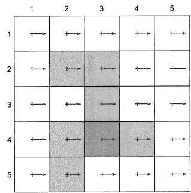

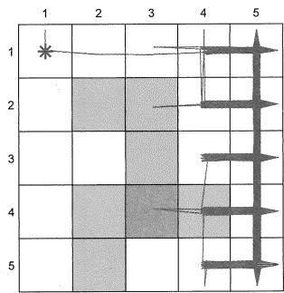

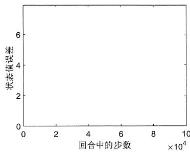  
(b) $\epsilon = 0.1$

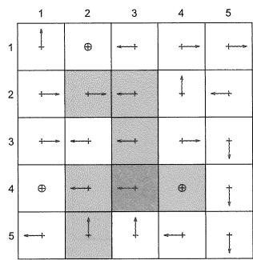

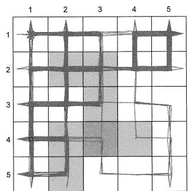

  
(c) $\epsilon = 0.1$   
图7.5 当行为策略探索性较弱时，学习的效果会下降。左列的图展示了不同的行为策略。中间列的图展示了由相应行为策略生成的回合，每个回合有100000步。右列的图展示了最优状态值估计误差的演变过程。

其中 $\bar{q}_t$ 是TD目标。所有的TD算法都可以用(7.20)来描述，只是不同的TD算法有不同的TD目标 $\bar{q}_t$ ，请见表7.2。蒙特卡罗算法也可以被视为(7.20)的一种特殊情况：如果设置 $\alpha_t(s_t, a_t) = 1$ ，那么(7.20)就变成了 $q_{t+1}(s_t, a_t) = \bar{q}_t$ ，这实际上就是蒙特卡罗算法。

算法(7.20)可以被视为用于求解一个统一方程 $q(s, a) = \mathbb{E}[\bar{q}_t | s, a]$ 的随机近似算法，这个方程有不同的表达方式，请见表7.2。可以看出，所有算法本质上都是求解贝尔曼方程，只有Q-learning是求解贝尔曼最优方程。

表7.2时序差分方法的统一框架。这里BE和BOE分别代表贝尔曼方程和贝尔曼最优方程。   

<table><tr><td>算法</td><td>式(7.20)中TD目标q_t的表达式</td></tr><tr><td>Sarsa</td><td>q_t = rt+1 + γqt(st+1, at+1)</td></tr><tr><td>n-step Sarsa</td><td>q_t = rt+1 + γrt+2 + ··· + γ^nqt(st+n, at+n)</td></tr><tr><td>Q-learning</td><td>q_t = rt+1 + γmax_qt(st+1, a)</td></tr><tr><td>Monte Carlo</td><td>q_t = rt+1 + γrt+2 + γ^2rt+3 + ···</td></tr><tr><td>算法</td><td>求解的数学方程</td></tr><tr><td>Sarsa</td><td>BE: qπ(s, a) = E[Rt+1 + γqπ(ST+1, At+1)|St = s, At = a]</td></tr><tr><td>n-step Sarsa</td><td>BE: qπ(s, a) = E[Rt+1 + γrt+2 + ··· + γ^nqπ(ST+n, At+n)|St = s, At = a]</td></tr><tr><td>Q-learning</td><td>BOE: q(s, a) = E[Rt+1 + γmax_q(ST+1, a)|St = s, At = a]</td></tr><tr><td>Monte Carlo</td><td>BE: qπ(s, a) = E[Rt+1 + γrt+2 + γ^2Rt+3 + ··· |St = s, At = a]</td></tr></table>

# 7.6 总结

本章介绍了多种时序差分算法，所有这些算法都可以被视为求解贝尔曼方程或贝尔曼最优方程的随机近似算法。

本章介绍的TD算法，除了Q-learning外，都是用于评价某个给定策略的，即从一些经验样本中估计给定策略的状态/动作值，它们需要结合策略改进步骤才能得到最优策略。此外，这些算法是On-policy的，因为它们的目标策略和行为策略相同。

Q-learning与其他算法相比有一点特殊，因为它是Off-policy的，其目标策略可以与行为策略不同。Q-learning是Off-policy的根本原因是它旨在求解贝尔曼最优方程，而不是某一个给定策略的贝尔曼方程。

值得一提的是，有一些方法可以将On-policy算法转换为Off-policy算法。重要性采样就是其中一个广泛使用的方法[3,40]，该方法将在第10章介绍。最后，TD算法有一些变体和扩展[41-45]。例如， $\mathrm{TD}(\lambda)$ 方法提供了一个更加通用和统一的框架，更多信息可参见[3,20,46]。

# 7.7 问答

提问：如何理解时序差分方法中的“时序差分”？

回答：每个TD算法都有一个TD误差，该误差代表新样本和当前估计之间的差异。由于这种差异是在不同时刻之间计算的，因此被称为时序差分。

提问：如何理解用时序差分方法来“学习”最优策略？

回答：从数学的角度看，“学习”意味着“估计”，即从样本中估计状态值/动作值，

进而基于估计值获得策略。

提问：貌似Sarsa算法只能估计给定策略的动作值，那么它是如何用于学习最优策略的呢？

回答：要获得一个最优策略，值估计应该与策略改进不断交替进行。为什么这样结合就能得到最优策略呢？这实际上就是广义策略迭代的思想。该思想已经在前面的值迭代与策略迭代算法以及蒙特卡罗方法中有了详细解释，因此在我们介绍TD算法时就不再赘述。这也再次说明了强化学习的系统性：首先理解前面章节的内容对学习后续章节至关重要。

提问：为什么Sarsa改进策略时要使用 $\epsilon$ -Greedy策略呢？

回答：这是因为该策略会进一步产生用于值估计的经验样本，因此它应该具有探索性以生成足够的经验样本。这个思想在前面介绍蒙特卡罗算法MC $\epsilon$ -Greedy时有详细的介绍。

提问：定理7.1和7.2要求学习率 $\alpha_{t}$ 逐渐趋向于0，为什么在实践中要将学习率设置为一个小的常数？

回答：根本原因是所评估的策略是持续变化的（或称为非平稳的）。具体来说，像Sarsa这样的TD算法旨在估计某一个给定策略的动作值。如果该给定策略是固定的，那么使用递减的学习率是没有问题的。然而，在最优策略学习过程中，Sarsa要评估的策略在每次迭代后都会变化。如果此时的学习率是递减的，那么后面得到的样本实际上就不发挥作用了，也无法有效评估不断变化的策略。反之，如果此时的学习率是一个常数，那么后面得到的样本和前面的样本一样会发挥积极的作用，从而有效评估不断变化的策略。最后，尽管常数学习率的一个缺点是价值估计可能最终会波动，但只要该常数足够小，这种波动就可以忽略不计。

提问：我们应该学习到所有状态的最优策略，还是只需要学习某一部分状态的最优策略？

回答：这取决于任务。读者可能已经注意到，本章考虑的一些任务（例如图7.2）并不需要找到所有状态的最优策略。因为这些任务只需要找到从一个给定状态出发到目标状态的最优路径，所以只需要学习与这个路径相近的状态的最优策略即可，此时所需要的数据会更少，任务也相对简单。值得指出的是，由于没有得到所有状态的最优策略，最后获得的路径不能保证是全局最优的。不过只要有足够的数据，我们仍然可以找到一个好的或局部最优的路径。

提问：为什么Q-learning是Off-policy的，而本章中的其他TD算法都是On-policy的？

回答：根本原因是Q-learning旨在求解贝尔曼最优方程，而其他TD算法旨在求解某一给定策略的贝尔曼方程。详细信息可参见第7.4.2节。

$\diamond$ 提问：为什么Q-learning的Off-policy模式可以更新策略为Greedy而不是 $\epsilon$ -Greedy？

回答：这是因为目标策略不会用于生成经验样本，因此它不需要具有探索性。

# 第8章

# 值函数方法

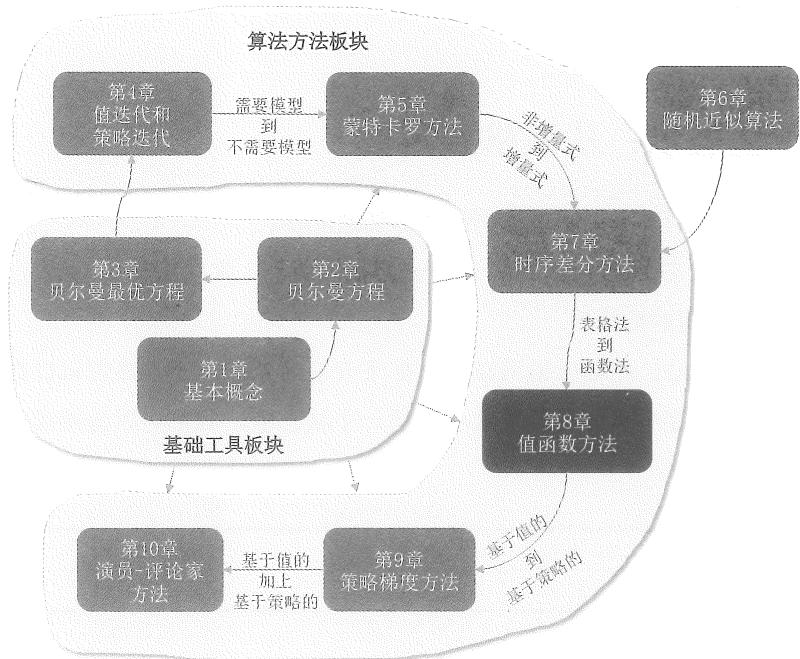  
图8.1 本章在全书中的位置。

本章将继续介绍时序差分方法，不过我们将使用不同的方法来表示状态值/动作值。到目前为止，本书中所有的状态值/动作值都是通过表格来表示的。虽然表格形式易于理解，但是在处理大型状态空间或动作空间时效率不高。本章将用函数来表示状态值/动作值，这种方法已经成为目前强化学习的主流方法。由于人工神经网络是很好的函数近似器，因此这也是人工神经网络进入强化学习的原因。本章将用函数来表示值，下一章将用函数来表示策略。

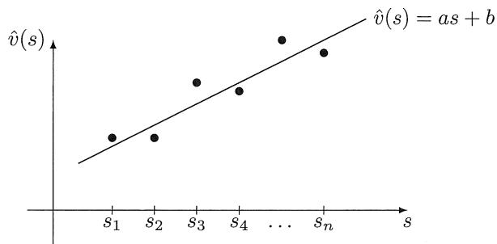  
图8.2 用函数来描述状态值的示意图。横轴和纵轴分别对应 $s$ 和 $\hat{v} (s)$ 。

# 8.1 价值表示：从表格到函数

下面通过一个例子来说明表格和函数方法的区别。

假设有 $n$ 个状态 $\{s_i\}_{i = 1}^n$ 。对于一个给定的策略 $\pi$ ，其状态值为 $\{v_{\pi}(s_i)\}_{i = 1}^{n}$ 。设 $\{\hat{v} (s_i)\}_{i = 1}^n$ 为状态值的估计值。

如果使用表格法，则估计值可以通过如下表格表示。这个表格可以以数组或者向量的形式存储在内存中。如果要检索或更新一个状态值，我们可以直接读取或重写表格中的相应元素。

<table><tr><td>状态</td><td>s1</td><td>s2</td><td>...</td><td>sn</td></tr><tr><td>估计的状态值</td><td>ˆv(s1)</td><td>ˆv(s2)</td><td>...</td><td>ˆv(sn)</td></tr></table>

如果使用函数法，注意到 $\{(s_i,\hat{v} (s_i))\}_{i = 1}^n$ 是一组点（图8.2），这些点可以通过一条曲线来拟合或近似。最简单的曲线是一条直线，可以描述为

$$
\hat {v} (s, w) = a s + b = \underbrace {[ s , 1 ]} _ {\phi^ {\mathrm {T}} (s)} \underbrace {\left[ \begin{array}{l} a \\ b \end{array} \right]} _ {w} = \phi^ {\mathrm {T}} (s) w. \tag {8.1}
$$

其中 $\hat{v}(s, w)$ 是用来近似 $v_{\pi}(s)$ 的函数，它由状态 $s$ 和参数向量 $w \in \mathbb{R}^2$ 共同决定。 $\hat{v}(s, w)$

有时被写成 $\hat{v}_w(s)$ 。另外， $\phi (s)\in \mathbb{R}^2$ 被称为 $s$ 的特征向量（feature vector）。

相比表格法，函数法的不同在于如何检索和更新值。

如何检索一个状态值：当用表格描述值时，如果想检索一个状态的值，我们可以直接读取表格中相应的元素。然而，当用函数描述值时，如果想检索一个状态的值，我们要将状态 $s$ 输入到函数中，然后计算函数的值（图8.3）。例如，针对(8.1)中的例子，我们需要首先计算特征向量 $\phi(s)$ ，然后计算 $\phi^{\mathrm{T}}(s)w$ 从而得到值。如果函数是用一个人工神经网络表示的，那么需要完成一次从输入到输出的前向传播，从而得到值。

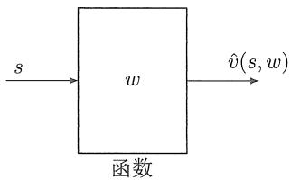  
图8.3 使用函数检索 $s$ 对应的值的过程。

得益于上述检索方式，函数法在存储方面更为高效。例如，表格法需要存储 $n$ 个值，而函数法只需要存储一个低维参数向量 $w$ ：如果 $w$ 是2维的，那么只需要存储两个值，因此存储效率显著提高。然而，这种好处是有代价的，其代价就是函数可能无法准确描述所有状态值。如图8.2所示，真实的值并非严格落在一条直线上，所以一条直线无法准确拟合所有的值，这就是为什么这种方法也被称为“函数近似”。从数学本质上来说，函数法是用一个低维向量（即函数参数向量）来描述一个高维向量（即所有状态的值）。此时，一定会有一些信息被丢失。因此，函数法是通过牺牲准确性来提高存储效率的。

如何更新一个值：当用表格描述值时，如果想要更新一个值，我们可以直接重写表格中对应的元素。然而，当用函数描述值时，更新一个值的方式会完全不同：我们必须更新函数的参数 $w$ 从而间接地改变值，而不能像表格法那样直接修改某个状态的值。至于如何更新 $w$ ，本书将在后面详细讨论。

得益于上述更新方式，函数法在泛化能力方面比表格法更强。具体来说，当使用表格法时，如果某一个状态被访问过，那么我们可以根据后续轨迹的回报来更新它的值。如果一个状态从来没有被访问过，它的值当然无法更新。然而，当使用函数法时，我们需要通过更新 $w$ 来更新一个状态的值。 $w$ 的改变当然也会影响其他一些状态的值，即使那些状态从来没有在经验数据中被访问过。因此，一个状态的经验样本可以泛化到改变其他一些状态的值。

上述关于泛化性的分析在图8.4中直观地展示了出来。图中有三个状态 $\{s_1, s_2, s_3\}$ 。假设我们有一个针对 $s_3$ 的经验样本，并想要更新 $\hat{v}(s_3)$ 。当使用表格法时，我们只能更新 $\hat{v}(s_3)$ ，而不改变 $\hat{v}(s_1)$ 或 $\hat{v}(s_2)$ ，参见图8.4(a)。当使用函数法时，我们需要更新 $w$ 从而更新 $\hat{v}(s_3)$ ，而 $w$ 的更新还会改变 $\hat{v}(s_1)$ 和 $\hat{v}(s_2)$ ，参见图8.4(b)。因此， $s_3$ 的经验样本可以帮助我们估计其邻近状态的值。

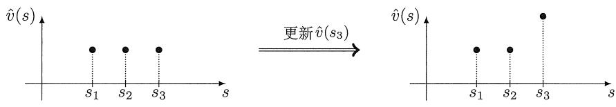  
(a) 表格法：当更新 $\hat{v}(s_3)$ 时，其他值保持不变。

图8.4 函数法和表格法如何更新值。  
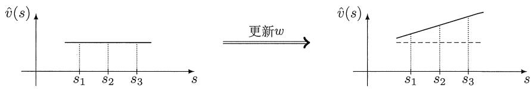  
(b) 函数法：为了更新 $\hat{v}(s_3)$ ，需要修改 $w$ ，此时其他值也会被改变。

另外，我们也可以使用比直线更高阶的曲线来拟合，例如下面的二阶曲线：

$$
\hat {v} (s, w) = a s ^ {2} + b s + c = \underbrace {[ s ^ {2} , s , 1 ]} _ {\phi^ {\mathrm {T}} (s)} \underbrace {\left[ \begin{array}{l} a \\ b \\ c \end{array} \right]} _ {w} = \phi^ {\mathrm {T}} (s) w. \tag {8.2}
$$

随着曲线阶数的增加，其拟合精度会更高，但参数向量的维度也会增加，需要更多的存储和计算资源。

值得注意的是，式(8.1)或(8.2)中的 $\hat{v}(s, w)$ 是关于 $w$ 的线性函数（尽管它对 $s$ 可能是非线性的）。因此，这种方法被称为线性函数近似（linear function approximation），这也是最简单的值函数方法。要实现线性函数近似，我们需要选择合适的特征向量 $\phi(s)$ 。例如，我们必须人为事先确定应该使用一阶直线还是二阶曲线来拟合。选择合适的特征向量并非易事，这需要我们对给定任务有较丰富的先验知识：我们对任务了解得越多，就可以选择越合适的特征向量。例如，如果我们知道图8.2中的点大致位于一条直线上，那么用直线拟合就是很好的选择，不过这样的先验知识在实际中常常难以得到。如果没有任何先验知识，一种流行的方法是使用人工神经网络来作为非线性函数的近

似器。

最后，如果使用线性函数来做拟合，那么如何找到最优参数向量呢？当我们知道 $\{v_{\pi}(s_i)\}_{i=1}^{n}$ 时，这就是一个简单的最小二乘问题，可以通过优化如下目标函数来获得最优参数：

$$
\begin{array}{l} J _ {1} = \sum_ {i = 1} ^ {n} \left(\hat {v} (s _ {i}, w) - v _ {\pi} (s _ {i})\right) ^ {2} = \sum_ {i = 1} ^ {n} \left(\phi^ {\mathrm {T}} (s _ {i}) w - v _ {\pi} (s _ {i})\right) ^ {2} \\ = \left\| \left[ \begin{array}{c} \phi^ {\mathrm {T}} (s _ {1}) \\ \vdots \\ \phi^ {\mathrm {T}} (s _ {n}) \end{array} \right] w - \left[ \begin{array}{c} v _ {\pi} (s _ {1}) \\ \vdots \\ v _ {\pi} (s _ {n}) \end{array} \right] \right\| ^ {2} \doteq \| \Phi w - v _ {\pi} \| ^ {2}, \\ \end{array}
$$

其中

$$
\Phi \doteq \left[ \begin{array}{c} \phi^ {\mathrm {T}} (s _ {1}) \\ \vdots \\ \phi^ {\mathrm {T}} (s _ {n}) \end{array} \right] \in \mathbb {R} ^ {n \times 2}, \qquad v _ {\pi} \doteq \left[ \begin{array}{c} v _ {\pi} (s _ {1}) \\ \vdots \\ v _ {\pi} (s _ {n}) \end{array} \right] \in \mathbb {R} ^ {n}.
$$

不难验证，这个最小二乘问题的最优解是

$$
w ^ {*} = (\Phi^ {\mathrm {T}} \Phi) ^ {- 1} \Phi v _ {\pi}.
$$

有关最小二乘问题的更多信息可以参见[47, 第3.3节]和[48, 第5.14节]。

综上所述，本节介绍的曲线拟合的例子直观地展示了值函数方法的基本思想。值函数方法的具体细节将从下节正式开始介绍。

# 8.2 基于值函数的时序差分算法：状态值估计

下面介绍如何将值函数与时序差分（temporal difference，TD）方法相结合，实现对一个给定策略的状态值的估计。

本节包含许多小节和内容。在正式开始介绍之前，有必要先简要梳理一下这些内容。

值函数法实际上将状态值估计问题描述成了一个优化问题。这个优化问题的目标函数将在第8.2.1节介绍，用于优化此目标函数的TD算法将在第8.2.2节介绍。  
值函数法需要选择合适的特征向量，该问题将在第8.2.3节介绍。  
$\diamond$ 第8.2.4节将给出示例，以展示基于值函数的TD算法的效果，以及不同特征向量的影响。  
$\diamond$ 第8.2.5节将讨论值函数法的理论性质，这个小节包含大量数学推导，读者可以根据自己的兴趣选读。

# 8.2.1 目标函数

令 $v_{\pi}(s)$ 和 $\hat{v} (s,w)$ 分别代表状态 $s\in S$ 的真实状态值和估计状态值。我们的任务是找到一个最优的 $w$ ，从而使得 $\hat{v} (s,w)$ 能够最好地近似每一个 $s$ 的 $v_{\pi}(s)$ 。具体来说，目标函数是

$$
J (w) = \mathbb {E} \left[ \left(v _ {\pi} (S) - \hat {v} (S, w)\right) ^ {2} \right], \tag {8.3}
$$

其中 $S \in S$ 是随机变量。由于 $S$ 是一个随机变量，那么它的概率分布是什么呢？这是本书第一次将状态描述成随机变量并且需要刻画其概率分布，这也是使用值函数时要解决的重要问题。

有下面几种方法来定义 $S$ 的概率分布。

$\diamond$ 第一种方法是使用均匀分布（uniform distribution），即每个状态的概率设为 $1 / n$ ，此时所有状态视为同等重要。在这种情况下，式(8.3)中的目标函数变为

$$
J (w) = \frac {1}{n} \sum_ {s \in S} \left(v _ {\pi} (s) - \hat {v} (s, w)\right) ^ {2}. \tag {8.4}
$$

这是所有状态的估计误差的平均值。这种方法的问题是没有考虑在给定策略下马尔可夫过程的真实动态。例如，某些状态可能很少被访问，此时一视同仁地对待所有状态可能是不合理的。

第二种方法是使用平稳分布（stationary distribution），这也是本章介绍的重点。平稳分布描述了马尔可夫决策过程的长期行为。更具体地说，当智能体执行一个给定策略足够长的时间后，智能体位于任意一个状态的概率都可以由这个平稳分布来描述。

具体来说，设 $\{d_{\pi}(s)\}_{s\in S}$ 为在策略 $\pi$ 下的平稳分布，即经过相当长的时间后，智能体在状态 $s$ 的概率是 $d_{\pi}(s)$ ，根据定义有 $\sum_{s\in S}d_{\pi}(s) = 1$ 。此时，式(8.3)中的目标函数可以重写为

$$
J (w) = \sum_ {s \in \mathcal {S}} d _ {\pi} (s) \left(v _ {\pi} (s) - \hat {v} (s, w)\right) ^ {2}. \tag {8.5}
$$

这是所有状态的估计误差的加权平均值，那些有更高概率被访问到的状态被赋予了更大的权重。

求解 $d_{\pi}(s)$ 的具体值并非易事，因为它需要知道状态转移概率矩阵 $P_{\pi}$ ，感兴趣的读者可参见方框8.1。幸运的是，我们不需要计算 $d_{\pi}(s)$ 的具体值就可以最小化上面这个目标函数，具体细节将在下一小节讨论。

最后，目标函数(8.4)和(8.5)是针对离散和有限个状态的情况。当状态空间是连续的

时，我们需要用积分替换求和。

# 方框8.1：马尔可夫决策过程的平稳分布

分析平稳分布的核心工具是矩阵 $P_{\pi} \in \mathbb{R}^{n \times n}$ ，即在给定策略 $\pi$ 下的状态转移概率矩阵。具体来说，如果有 $n$ 个状态 $s_1, \ldots, s_n$ ，那么 $[P_{\pi}]_{ij}$ 是智能体在策略 $\pi$ 下从 $s_i$ 用一步转移到 $s_j$ 的概率。 $P_{\pi}$ 的定义已经在第2.6节给出。

对 $P_{\pi}^{k}$ 的解读（ $k = 1,2,3,\ldots$ ）

我们有必要首先解读 $P_{\pi}^{k}$ 中元素的含义。用

$$
p _ {i j} ^ {(k)} = \operatorname * {P r} (S _ {t _ {k}} = j | S _ {t _ {0}} = i)
$$

表示智能体用 $k$ 步从 $s_i$ 转移到 $s_j$ 的概率。其中 $t_0$ 和 $t_k$ 分别代表初始时刻和 $k$ 时刻。那么根据 $P_{\pi}$ 的定义可得

$$
\left[ P _ {\pi} \right] _ {i j} = p _ {i j} ^ {(1)},
$$

即 $[P_{\pi}]_{ij}$ 是智能体用一步从 $s_i$ 转移到 $s_j$ 的概率。

对于 $P_{\pi}^{2}$ , 有

$$
[ P _ {\pi} ^ {2} ] _ {i j} = [ P _ {\pi} P _ {\pi} ] _ {i j} = \sum_ {q = 1} ^ {n} [ P _ {\pi} ] _ {i q} [ P _ {\pi} ] _ {q j}.
$$

因为 $[P_{\pi}]_{iq}[P_{\pi}]_{qj}$ 等于从 $s_i$ 到 $s_q$ 再从 $s_q$ 到 $s_j$ 的联合转移概率，所以 $[P_{\pi}^{2}]_{ij}$ 是用两步从 $s_i$ 转移到 $s_j$ 的概率，即

$$
[ P _ {\pi} ^ {2} ] _ {i j} = p _ {i j} ^ {(2)}.
$$

类似地，可得

$$
[ P _ {\pi} ^ {k} ] _ {i j} = p _ {i j} ^ {(k)},
$$

即 $[P_{\pi}^{k}]_{ij}$ 是使用恰好 $k$ 步从 $s_i$ 转移到 $s_j$ 的概率。

平稳分布的定义

设 $d_{0} \in \mathbb{R}^{n}$ 是一个向量, 代表初始时刻状态的概率分布。例如, 如果智能体初始时刻总是从状态 $s$ 出发, 那么 $d_{0}(s) = 1$ 而 $d_{0}$ 的其他元素都为 0 。设 $d_{k} \in \mathbb{R}^{n}$

是从 $d_{0}$ 开始经过恰好 $k$ 步后得到的概率分布向量。那么

$$
d _ {k} \left(s _ {i}\right) = \sum_ {j = 1} ^ {n} d _ {0} \left(s _ {j}\right) \left[ P _ {\pi} ^ {k} \right] _ {j i}, \quad i = 1, 2, \dots \tag {8.6}
$$

上式的含义是智能体在 $k$ 时刻转移到 $s_i$ 的概率等于从 $\{s_j\}_{j=1}^n$ 使用 $k$ 步转移到 $s_i$ 的概率之和。式(8.6)的矩阵-向量形式是

$$
d _ {k} ^ {\mathrm {T}} = d _ {0} ^ {\mathrm {T}} P _ {\pi} ^ {k}. \tag {8.7}
$$

考虑马尔可夫过程的长期行为。在某些条件下（稍后会讨论），下式成立：

$$
\lim  _ {k \rightarrow \infty} P _ {\pi} ^ {k} = \mathbf {1} _ {n} d _ {\pi} ^ {\mathrm {T}}, \tag {8.8}
$$

其中 $\mathbf{1}_n = [1,\dots ,1]^{\mathrm{T}}\in \mathbb{R}^n$ ，因此 $\mathbf{1}_nd_{\pi}^{\mathrm{T}}$ 是一个所有行都等于 $d_{\pi}^{\mathrm{T}}$ 的常数矩阵。将(8.8)代入(8.7)可得

$$
\lim  _ {k \rightarrow \infty} d _ {k} ^ {\mathrm {T}} = d _ {0} ^ {\mathrm {T}} \lim  _ {k \rightarrow \infty} P _ {\pi} ^ {k} = d _ {0} ^ {\mathrm {T}} \mathbf {1} _ {n} d _ {\pi} ^ {\mathrm {T}} = d _ {\pi} ^ {\mathrm {T}}, \tag {8.9}
$$

其中最后一个等号成立是因为 $d_0^{\mathrm{T}}\mathbf{1}_n = 1$

式(8.9)意味着状态分布 $d_{k}$ 会最终收敛到一个常值 $d_{\pi}$ ，该收敛值称为极限分布（limit distribution）。极限分布依赖于系统模型和策略 $\pi$ ，但是与初始分布 $d_{0}$ 无关。也就是说，无论从哪个状态开始，智能体在足够长的时间后的概率分布总是可以由极限分布来描述。

$d_{\pi}$ 的值可以通过以下方法计算。对等式 $d_k^{\mathrm{T}} = d_{k - 1}^{\mathrm{T}}P_{\pi}$ 两边取极限可得

$$
d _ {\pi} ^ {\mathrm {T}} = d _ {\pi} ^ {\mathrm {T}} P _ {\pi}. \tag {8.10}
$$

上式表明 $d_{\pi}$ 是矩阵 $P_{\pi}$ 的一个左特征向量，其对应的特征值是1。方程(8.10)的解被称为平稳分布，它满足 $\sum_{s\in S}d_{\pi}(s) = 1$ 且 $d_{\pi}(s) > 0$ 对所有 $s\in S$ 成立。至于为什么 $d_{\pi}(s) > 0$ 而不是 $d_{\pi}(s)\geqslant 0$ ，将在稍后解释。

$\diamond$ 平稳分布的唯一性条件

方程(8.10)的解 $d_{\pi}$ 通常被称为平稳分布，而(8.9)的 $d_{\pi}$ 被称为极限分布。这两者的区别和联系是什么呢？首先，(8.9)可以推出来(8.10)，但反之可能不成立。其次，不可约（irreducible）的马尔可夫过程具有唯一稳态分布，常规（regular）的马尔可夫过程具有唯一极限分布。下面给出了一些基础的定义，更多的细节可参见[49, 第IV章]。

- 如果存在一个有限自然数 $k$ 使得 $[P_{\pi}]_{ij}^{k} > 0$ ，则称从状态 $s_i$ 出发可达（accessible）状态 $s_j$ ，即智能体从 $s_i$ 出发有概率能在有限次转移后到达 $s_j$ 。  
- 如果两个状态 $s_i$ 和 $s_j$ 相互可达，则这两个状态称为互通（communicate）的。  
- 如果所有状态之间都互通, 则这个马尔可夫过程被称为不可约 (irreducible) 的。在直观上, 智能体从任意一个状态出发总是有概率在有限步内到达任意其他状态。在数学上, 对于任意 $s_i$ 和 $s_j$ , 存在 $k \geqslant 1$ 使得 $[P_{\pi}^{k}]_{ij} > 0$ (不同的 $i, j$ 可能对应不同的 $k$ 值)。  
如果存在 $k \geqslant 1$ 使得对所有的 $i, j$ 都有 $[P_{\pi}^{k}]_{ij} > 0$ （即不同的 $i, j$ 对应相同的 $k$ 值），则该马尔可夫过程被称为常规（regular）的，即任意状态的概率都能在最多 $k$ 步内从其他任何状态到达。一个等价的定义是存在 $k \geqslant 1$ 使得 $P_{\pi}^{k} > 0$ （这里“>”是逐元素比较的）。常规马尔可夫过程也是不可约的，但反之则不成立。不过，如果一个马尔可夫过程是不可约的，并且存在 $i$ 使得 $[P_{\pi}]_{ii} > 0$ ，那么它也是常规的。此外，如果 $P_{\pi}^{k} > 0$ ，那么对于任何 $k' \geqslant k$ ，都有 $P_{\pi}^{k'} > 0$ ，这是由于 $P_{\pi} \geqslant 0$ 。此时由式(8.9)可知， $d_{\pi}(s) > 0$ （而不是 $d_{\pi}(s) \geqslant 0$ ）对于每个 $s$ 都成立。

# $\diamond$ 可能有唯一平稳分布的策略

策略一旦给定，马尔可夫决策过程就变成了马尔可夫过程，其长期行为由给定的策略和系统模型共同决定。此时一个重要的问题是：什么类型的策略能产生常规马尔可夫过程？答案是探索性的策略，例如 $\epsilon$ -Greedy 策略。这是因为探索性策略在任意状态下都有概率采取任意动作，因此当系统模型允许时，所有状态之间就可以互通。这当然只是一个直观的解读，具体的还需要根据上面的定义来分析。

# 示例

图8.5给出了一个例子来解释平稳分布。这个例子中的策略是 $\epsilon$ -Greedy 的，其中 $\epsilon = 0.5$ 。状态为 $s_1, s_2, s_3, s_4$ ，分别对应网格中的左上角、右上角、左下角、右下角的单元格。

我们展示了两种计算平稳分布的方法。第一种方法是通过求解(8.10)得到 $d_{\pi}$ 的理论值。第二种方法是迭代数值求解 $d_{\pi}$ ：从任意初始状态出发，按照给定的策略生成一个足够长的回合，之后可以通过计算访问每个状态的次数与回合总长度的比例来估计 $d_{\pi}$ 。回合越长，估计结果越准确。

下面分别来看一下理论结果和数值结果。

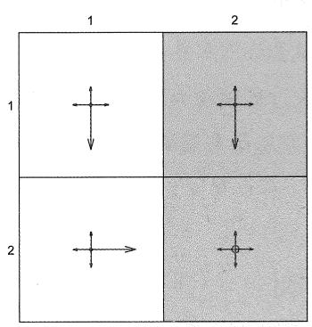

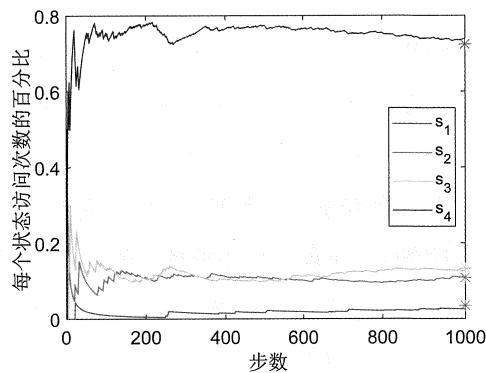  
图8.5 $\epsilon$ -Greedy策略对应的平稳分布。其中 $\epsilon = 0.5$ 。右图中的星号表示 $d_{\pi}$ 中元素的理论值。

- $d_{\pi}$ 的理论值：由该策略得到的马尔可夫过程是不可约的也是常规的，具体原因如下。首先，由于所有状态都是相通的，所以得到的马尔可夫过程是不可约的。其次，由于每个状态都可以转移到自身，因此马尔可夫过程也是常规的。从图8.5可以看出

$$
P _ {\pi} ^ {\mathrm {T}} = \left[ \begin{array}{c c c c} 0. 3 & 0. 1 & 0. 1 & 0 \\ 0. 1 & 0. 3 & 0 & 0. 1 \\ 0. 6 & 0 & 0. 3 & 0. 1 \\ 0 & 0. 6 & 0. 6 & 0. 8 \end{array} \right].
$$

通过计算可得 $P_{\pi}^{\mathrm{T}}$ 的特征值为 $\{-0.0449, 0.3, 0.4449, 1\}$ 。 $P_{\pi}^{\mathrm{T}}$ 对应于特征值1的右特征向量为 $[0.0463, 0.1455, 0.1785, 0.9720]^{\mathrm{T}}$ 。将这个向量缩放从而使所有元素的总和等于1后，可得 $d_{\pi}$ 的理论值为

$$
d _ {\pi} = \left[ \begin{array}{c} 0. 0 3 4 5 \\ 0. 1 0 8 4 \\ 0. 1 3 3 0 \\ 0. 7 2 4 1 \end{array} \right].
$$

其中 $d_{\pi}$ 的第 $i$ 个元素对应于智能体访问到 $s_i$ 的概率。

- $d_{\pi}$ 的估计值：下面通过在仿真中执行策略足够多次来得到 $d_{\pi}$ 的估计值。具体来说，选择 $s_1$ 作为起始状态并按照策略运行1000步。图8.5展示了在此过程中每个状态被访问次数的比例。可以看出，这些比例在几百步后逐渐收敛到 $d_{\pi}$ 的理论值。

# 8.2.2 优化算法

为了最小化(8.3)中的目标函数 $J(w)$ ，我们可以使用梯度下降算法：

$$
w _ {k + 1} = w _ {k} - \alpha_ {k} \nabla_ {w} J (w _ {k}),
$$

其中的梯度是

$$
\begin{array}{l} \nabla_ {w} J (w _ {k}) = \nabla_ {w} \mathbb {E} [ (v _ {\pi} (S) - \hat {v} (S, w _ {k})) ^ {2} ] \\ = \mathbb {E} [ \nabla_ {w} (v _ {\pi} (S) - \hat {v} (S, w _ {k})) ^ {2} ] \\ = 2 \mathbb {E} [ (v _ {\pi} (S) - \hat {v} (S, w _ {k})) (- \nabla_ {w} \hat {v} (S, w _ {k})) ] \\ = - 2 \mathbb {E} [ (v _ {\pi} (S) - \hat {v} (S, w _ {k})) \nabla_ {w} \hat {v} (S, w _ {k}) ]. \\ \end{array}
$$

将上面的梯度表达式代入梯度下降算法可得

$$
w _ {k + 1} = w _ {k} + 2 \alpha_ {k} \mathbb {E} \left[ \left(v _ {\pi} (S) - \hat {v} (S, w _ {k})\right) \nabla_ {w} \hat {v} (S, w _ {k}) \right], \tag {8.11}
$$

其中 $\alpha_{k}$ 前面的系数2可以在不失一般性的情况下合并到 $\alpha_{k}$ 中。

式(8.11)中的算法是无法直接使用的，因为它需要真实期望值，而真实期望值在实际中难以得到。此时，我们可以用随机梯度代替真实梯度，这是随机梯度下降算法的思想。那么(8.11)将变为

$$
w _ {t + 1} = w _ {t} + \alpha_ {t} \left(v _ {\pi} \left(s _ {t}\right) - \hat {v} \left(s _ {t}, w _ {t}\right)\right) \nabla_ {w} \hat {v} \left(s _ {t}, w _ {t}\right), \tag {8.12}
$$

其中 $s_t$ 是 $t$ 时刻得到的 $S$ 的一个样本。

式(8.12)中的算法仍然是无法直接使用的，因为它需要真实的状态价值 $v_{\pi}$ ，这是未知的也正是我们需要估计的。此时，我们可以用一个近似值替换 $v_{\pi}(s_t)$ ，具体来说有下面两种方法。

$\diamond$ 蒙特卡罗方法：如果我们有一个从 $s_t$ 开始的回合数据，设 $g_t$ 为从 $s_t$ 开始的折扣回报，那么 $g_t$ 可以用作 $v_{\pi}(s_t)$ 的近似值。此时，式(8.12)中的算法变为

$$
w _ {t + 1} = w _ {t} + \alpha_ {t} \left(g _ {t} - \hat {v} \left(s _ {t}, w _ {t}\right)\right) \nabla_ {w} \hat {v} \left(s _ {t}, w _ {t}\right).
$$

这是基于值函数的蒙特卡罗算法。

时序差分方法：根据时序差分的思想，我们可以用TD误差 $r_{t + 1} + \gamma \hat{v} (s_{t + 1},w_t) -$ $\hat{v} (s_t,w_t)$ 来代替真实误差 $v_{\pi}(s_t) - \hat{v} (s_t,w_t)$ 。此时，式(8.12)中的算法变为

$$
w _ {t + 1} = w _ {t} + \alpha_ {t} \left[ r _ {t + 1} + \gamma \hat {v} \left(s _ {t + 1}, w _ {t}\right) - \hat {v} \left(s _ {t}, w _ {t}\right) \right] \nabla_ {w} \hat {v} \left(s _ {t}, w _ {t}\right). \tag {8.13}
$$

这就是基于值函数的TD算法。详细流程见算法8.1。

# 算法8.1：基于值函数的TD算法（用于状态值估计）

初始化：参数可微的值函数 $\hat{v} (s,w)$ 。初始参数 $w_{0}$

目标：估计一个给定策略 $\pi$ 的状态值。

对于由 $\pi$ 生成的每个回合 $\{(s_t, r_{t+1}, s_{t+1})\}_t$

对于每个样本 $(s_t,r_{t + 1},s_{t + 1})$

对于一般值函数： $w_{t + 1} = w_t + \alpha_t[r_{t + 1} + \gamma \hat{v} (s_{t + 1},w_t) - \hat{v} (s_t,w_t)]\nabla_w\hat{v} (s_t,w_t)$

对于线性值函数： $w_{t + 1} = w_t + \alpha_t\big[r_{t + 1} + \gamma \phi^{\mathrm{T}}(s_{t + 1})w_t - \phi^{\mathrm{T}}(s_t)w_t\big]\phi (s_t)$

理解(8.13)中的TD算法对于理解本章中的其他算法至关重要。值得注意的是，(8.13)是用于估计状态值的，我们将在第8.3.1节和第8.3.2节中推广到动作值估计。

# 8.2.3 选择值函数

为了应用(8.13)中的TD算法，我们需要选择合适的值函数 $\hat{v}(s, w)$ 。目前最常见的是使用人工神经网络：神经网络的输入是状态 $s$ ，输出是 $\hat{v}(s, w)$ ，网络参数是 $w$ 。下面重点介绍历史上早期使用较广泛的线性函数，其优势是具有较强的理论可解释性，其劣势是具有较弱的近似能力，并且实际中往往难以选取合适的特征向量（feature vector）。不过作为最简单的情况，它对于我们理解基于值函数的TD方法非常重要。

具体来说，一个线性函数具有如下形式：

$$
\hat {v} (s, w) = \phi^ {\mathrm {T}} (s) w,
$$

其中 $\phi(s) \in \mathbb{R}^m$ 是状态 $s$ 的特征向量。 $\phi(s)$ 和 $w$ 的维度等于 $m$ ，而 $m$ 通常远小于状态的个数。例如，如果函数对应的是一阶直线或者二阶曲线（参见(8.1)和(8.2))，那么对应的 $m$ 等于 2 或者 3。值得注意的是，这里的“线性函数”指的是函数对 $w$ 呈线性，而并非对 $s$ 呈线性。例如(8.2)中的函数不是 $w$ 的线性函数，而是 $s$ 的二次非线性函数。

线性函数的梯度非常简单：

$$
\nabla_ {w} \hat {v} (s, w) = \phi (s).
$$

将上式代入(8.13)可得

$$
w _ {t + 1} = w _ {t} + \alpha_ {t} \left[ r _ {t + 1} + \gamma \phi^ {\mathrm {T}} \left(s _ {t + 1}\right) w _ {t} - \phi^ {\mathrm {T}} \left(s _ {t}\right) w _ {t} \right] \phi \left(s _ {t}\right). \tag {8.14}
$$

这是基于线性值函数的TD算法，我们将其简称为TD-Linear。

线性情况比非线性情况具有更强的理论可解释性。然而，它的近似能力较弱，而且选择合适的特征向量也并非易事。相比之下，人工神经网络作为通用非线性函数近似

器，能够近似更加复杂的函数，而且由于不需要选择特征向量，使用起来也更为方便。

尽管如此，学习线性情况仍然是有意义的。第一，基于表格的TD算法可以被视为一种特殊的基于线性值函数的TD算法。这个结论非常重要，一方面，它统一了表格和值函数两种方法；另一方面，也说明了线性值函数方法的强大。关于这个结论的更多细节可参见方框8.2。第二，理解线性情况可以帮助读者更好地掌握值函数方法的思想。第三，对于简单的网格世界任务，线性情况已经足够了（参见第8.2.4节给出的例子）。

# 方框8.2：基于表格的TD算法是基于线性值函数的TD算法的特殊情况

下面展示第7章式(7.1)给出的基于表格的TD算法是(8.14)中给出的TD-Linear算法的一个特殊情况。

对任意状态 $s \in S$ ，构造如下特殊的特征向量：

$$
\phi (s) = e _ {s} \in \mathbb {R} ^ {n}.
$$

这里 $e_{s}$ 是一个向量，其中与 $s$ 对应的元素为1，其他元素为0。此时，线性函数的表达式是

$$
\hat {v} (s, w) = e _ {s} ^ {\mathrm {T}} w = w (s),
$$

其中 $w(s)$ 是参数向量 $w$ 中与 $s$ 对应的元素。将上式代入(8.14)中的TD-Linear算法可得

$$
w _ {t + 1} = w _ {t} + \alpha_ {t} \left(r _ {t + 1} + \gamma w _ {t} \left(s _ {t + 1}\right) - w _ {t} \left(s _ {t}\right)\right) e _ {s _ {t}}.
$$

由于 $e_{s_t}$ 中只有对应 $s_t$ 的元素等于 1 而其他元素都等于 0，因此上式只是更新了 $w$ 中对应于 $s_t$ 的那个元素，而其他元素不变。为了更清楚地看到这一点，对上式两边同时乘以 $e_{s_t}^{\mathrm{T}}$ 可得

$$
w _ {t + 1} (s _ {t}) = w _ {t} (s _ {t}) + \alpha_ {t} \big (r _ {t + 1} + \gamma w _ {t} (s _ {t + 1}) - w _ {t} (s _ {t}) \big).
$$

这正是式(7.1)中给出的基于表格的TD算法。

总而言之，通过选择特征向量为 $\phi(s) = e_s$ ，基于线性值函数的TD-Linear算法就可以变成基于表格的TD算法。

# 8.2.4 示例

下面通过一些例子来展示如何使用(8.14)中的TD-Linear算法来估计一个策略的状态值。同时，我们也将展示如何选择特征向量。

图8.6给出了一个网格世界的例子。图8.6(a)展示的是一个给定的策略，它在任意状态下采取任意动作的概率都是0.2。我们的任务是估计此策略的状态值。首先，通过求解贝尔曼方程的方式可得真实状态值，参见图8.6(b)。这些状态值以3D曲面的形式在图8.6(c)中给出。

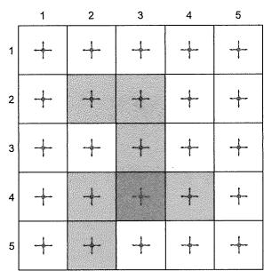  
(a)

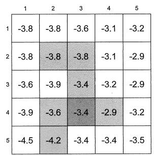  
(b)

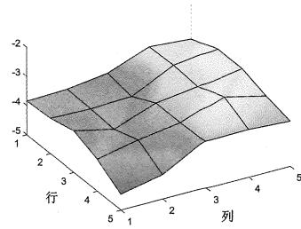  
(c)   
图8.6 (a) 一个给定的策略。(b) 表格形式的真实状态值。(c) 3D曲面形式的真实状态值。

该例子中一共有25个状态，因此有25个状态值。下面展示如何用具有少于25个参数的线性函数来近似状态值。仿真设置如下。由给定策略生成500个回合，每个回合有500步，并从一个按均匀分布随机选择的状态-动作开始。此外，在每次仿真中，参数向量 $w$ 被随机初始化，其中每个元素都从均值为0且标准差为1的正态分布中采样得到。设定 $r_{\text{forbidden}} = r_{\text{boundary}} = -1, r_{\text{target}} = 1, \gamma = 0.9$ 。

为了应用TD-Linear算法，首先需要选择特征向量 $\phi (s)$ 。有多种方法来选择特征向量。

$\diamond$ 基于多项式的特征向量。在网格世界的例子中，一个状态 $s$ 对应一个二维的位置。令 $x$ 和 $y$ 分别代表状态 $s$ 的列索引和行索引。为了避免数值问题，对 $x$ 和 $y$ 进行归一化，使它们的值在 $[-1, +1]$ 区间内。为方便起见，归一化后的值也用 $x$ 和 $y$ 表示。那么，最简单的特征向量是

$$
\phi (s) = \left[ \begin{array}{c} x \\ y \end{array} \right] \in \mathbb {R} ^ {2}.
$$

此时对应的线性函数是

$$
\hat {v} (s, w) = \phi^ {\mathrm {T}} (s) w = [ x, y ] \left[ \begin{array}{l} w _ {1} \\ w _ {2} \end{array} \right] = w _ {1} x + w _ {2} y.
$$

如果 $w$ 固定而 $x, y$ 是自变量，那么 $\hat{v}(s, w) = w_1 x + w_2 y$ 代表一个通过原点的二维平面。由于状态值近似对应的平面可能不经过原点，因此需要引入一个偏置从而更

好地近似状态值。因此，如下的三维特征向量更为合理：

$$
\phi (s) = \left[ \begin{array}{c} 1 \\ x \\ y \end{array} \right] \in \mathbb {R} ^ {3}. \tag {8.15}
$$

此时值函数是

$$
\hat {v} (s, w) = \phi^ {\mathrm {T}} (s) w = [ 1, x, y ] \left[ \begin{array}{l} w _ {1} \\ w _ {2} \\ w _ {3} \end{array} \right] = w _ {1} + w _ {2} x + w _ {3} y.
$$

如果 $w$ 固定而 $x, y$ 是自变量，那么 $\hat{v}(s, w)$ 对应于一个可以不经过原点的平面。另外， $\phi(s)$ 也可以定义为 $\phi(s) = [x, y, 1]^{\mathrm{T}}$ ，其元素的顺序没有关系。

基于(8.15)中的特征向量，如果我们使用TD-Linear算法，最后得到的值函数如图8.7(a)所示。尽管估计误差会随着更多回合而逐渐收敛，但是由于2D平面的近似能力有限，因此误差不能收敛到0。

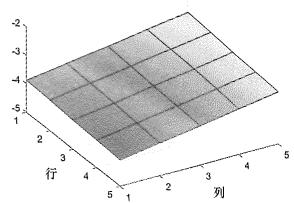

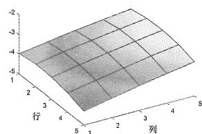

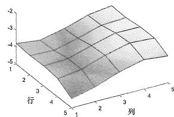

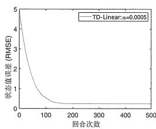  
(a) $\phi (s)\in \mathbb{R}^3$

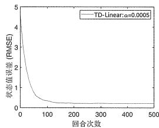  
(b) $\phi (s)\in \mathbb{R}^6$

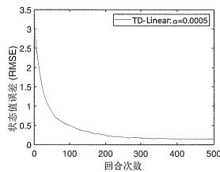  
(c) $\phi (s)\in \mathbb{R}^{10}$   
图8.7 基于(8.15)、(8.16)、(8.17)中的多项式特征向量，利用TD-Linear算法得到的结果。

为了增强近似能力，可以增加特征向量的维度，例如使用如下六维特征向量：

$$
\phi (s) = [ 1, x, y, x ^ {2}, y ^ {2}, x y ] ^ {\mathrm {T}} \in \mathbb {R} ^ {6}. \tag {8.16}
$$

此时，线性值函数的表达式是 $\hat{v}(s, w) = \phi^{\mathrm{T}}(s)w = w_1 + w_2x + w_3y + w_4x^2 + w_5y^2 + w_6xy$ ，这对应了一个三维曲面。当然，我们还可以进一步增加特征向量的维度：

$$
\phi (s) = \left[ 1, x, y, x ^ {2}, y ^ {2}, x y, x ^ {3}, y ^ {3}, x ^ {2} y, x y ^ {2} \right] ^ {\mathrm {T}} \in \mathbb {R} ^ {1 0}. \tag {8.17}
$$

当使用(8.16)和(8.17)中的特征向量时，TD-Linear的估计结果如图8.7(b)和(c)所示。可以看出，特征向量维数越高，状态值的近似就越精确。然而，在这三种情况下估计误差都不能收敛到0，这是因为这些线性函数的近似能力仍然有限。

除了基于多项式的特征向量，还有许多其他类型的特征向量，如傅里叶基（Fourier basis）和平铺编码（tile coding）[3, 第9章]。具体来说，首先将每个状态的 $x$ 和 $y$ 归一化到 $[0,1]$ 区间，基于傅里叶基的特征向量是

$$
\phi (s) = \left[ \begin{array}{c} \vdots \\ \cos (\pi (c _ {1} x + c _ {2} y)) \\ \vdots \end{array} \right] \in \mathbb {R} ^ {(q + 1) ^ {2}}. \tag {8.18}
$$

这里 $\pi$ 表示圆周率而不是策略。上式中的 $c_{1}, c_{2}$ 可以在 $\{0, 1, \ldots, q\}$ 中取值，其中 $q$ 是用户指定的整数。因此， $(c_{1}, c_{2})$ 一共有 $(q + 1)^{2}$ 种可能的取值，所以 $\phi(s)$ 的维度是 $(q + 1)^{2}$ 。例如，如果 $q = 1$ ，那么特征向量是

$$
\phi (s) = \left[ \begin{array}{c} \cos \big (\pi (0 x + 0 y) \big) \\ \cos \big (\pi (0 x + 1 y) \big) \\ \cos \big (\pi (1 x + 0 y) \big) \\ \cos \big (\pi (1 x + 1 y) \big) \end{array} \right] = \left[ \begin{array}{c} 1 \\ \cos (\pi y) \\ \cos (\pi x) \\ \cos (\pi (x + y)) \end{array} \right] \in \mathbb {R} ^ {4}.
$$

如果选取 $q = 1,2,3$ ，那么使用TD-Linear算法获得的结果如图8.8所示。在这三种情况中，特征向量的维度分别为4,9,16。可以看出，特征向量的维度越高，状态值的近似越精确。

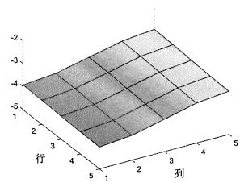

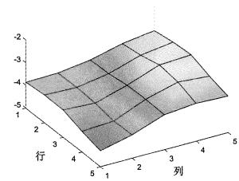

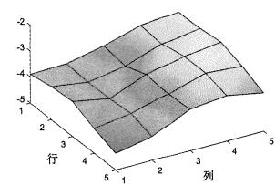

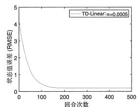  
(a) $q = 1$ ，此时 $\phi (s)\in \mathbb{R}^4$

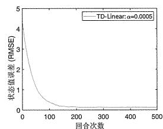  
(b) $q = 2$ ，此时 $\phi (s)\in \mathbb{R}^9$

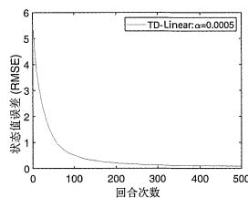  
(c) $q = 3$ ，此时 $\phi (s)\in \mathbb{R}^{16}$   
图8.8基于(8.18)中的傅里叶基函数特征向量使用TD-Linear算法得到的结果。

# 8.2.5 理论分析

前面几个小节介绍了基于值函数的TD算法。我们介绍的思路始于(8.3)中的目标函数。为了优化这个目标函数，我们引入了(8.12)中的随机梯度算法。后来，该算法中未知的真实状态值被一个近似值替代，从而产生了(8.13)中的TD算法。

这个介绍思路非常直观易懂，不过它在数学上并不严谨。例如，(8.13)中的算法实际上并不是在优化(8.3)中的目标函数。不过对于大部分读者来说，了解这个思路脉络已经足够了。

下面我们对(8.13)中的TD算法进行严格的理论分析，以揭示该算法为何能有效工作以及究竟解决了什么数学问题。由于非线性值函数难以分析，因此这部分只考虑线性值函数的情况。这部分内容涉及大量的数学内容，建议读者根据自己的兴趣选读，直接跳过本小节不会影响后续学习。

# 收敛性分析

为了研究算法(8.13)的收敛性质，我们首先考虑如下算法：

$$
w _ {t + 1} = w _ {t} + \alpha_ {t} \mathbb {E} \left[ \left(r _ {t + 1} + \gamma \phi^ {\mathrm {T}} \left(s _ {t + 1}\right) w _ {t} - \phi^ {\mathrm {T}} \left(s _ {t}\right) w _ {t}\right) \phi \left(s _ {t}\right) \right], \tag {8.19}
$$

其中的期望是针对三个随机变量 $s_t, s_{t+1}, r_{t+1}$ 。算法(8.19)是确定性的，因为所有随机变量在计算期望后都消失了。

为什么我们要考虑(8.19)中这个确定性算法呢？首先，该确定性算法的收敛性更容易分析（尽管其分析也并非一蹴而就）。更重要的是，该确定性算法的收敛性能够推导出算法(8.13)的收敛性，这是因为(8.13)可以被视为(8.19)的随机梯度下降版本。因此，我们只需要分析该确定性算法的收敛性。

尽管算法(8.19)的表达式乍一看很复杂，但实际上可以大大简化。假设 $s_t$ 服从平稳分布 $d_{\pi}$ （平稳分布在方框8.1中已经有详细介绍）。定义

$$
\Phi = \left[ \begin{array}{c} \vdots \\ \phi^ {\mathrm {T}} (s) \\ \vdots \end{array} \right] \in \mathbb {R} ^ {n \times m}, D = \left[ \begin{array}{c c c} \ddots & & \\ & d _ {\pi} (s) & \\ & & \ddots \end{array} \right] \in \mathbb {R} ^ {n \times n}, (8. 2 0)
$$

其中矩阵 $\Phi$ 的每一行对应一个状态的特征向量，对角阵 $D$ 的对角线元素是平稳分布向量中的元素。基于这两个矩阵，我们可以把(8.19)大大简化。

引理8.1。式(8.19)中的期望可以重写为

$$
\mathbb {E} \Big [ \big (r _ {t + 1} + \gamma \phi^ {\mathrm {T}} (s _ {t + 1}) w _ {t} - \phi^ {\mathrm {T}} (s _ {t}) w _ {t} \big) \phi (s _ {t}) \Big ] = b - A w _ {t},
$$

其中

$$
A \doteq \Phi^ {\mathrm {T}} D (I - \gamma P _ {\pi}) \Phi \in \mathbb {R} ^ {m \times m},
$$

$$
b \doteq \Phi^ {\mathrm {T}} D r _ {\pi} \in \mathbb {R} ^ {m}. \tag {8.21}
$$

这里 $P_{\pi}, r_{\pi}$ 是贝尔曼方程 $v_{\pi} = r_{\pi} + \gamma P_{\pi} v_{\pi}$ 中的两个量，而 $I$ 是具有合适维度的单位矩阵。

该引理的证明在方框8.3中给出。

根据引理8.1中的表达式，(8.19)中的算法可以重写为

$$
w _ {t + 1} = w _ {t} + \alpha_ {t} (b - A w _ {t}). \tag {8.22}
$$

这是一个确定性迭代算法，其收敛性分析如下所示。

第一，我们先回答一个问题：假设 $w_{t}$ 会收敛到一个常值 $w^{*}$ ，那么 $w^{*}$ 是什么？如果已经收敛，那么(8.22)中的 $w_{t}, w_{t + 1}$ 就变为 $w^{*}$ ，所以有 $w^{*} = w^{*} + \alpha_{\infty}(b - Aw^{*})$ ，进而可得 $b - Aw^{*} = 0$ ，因此

$$
w ^ {*} = A ^ {- 1} b.
$$

关于这个收敛值，下面给出几点说明。

$\diamond$ $A$ 是否可逆？答案是可逆的。事实上， $A$ 不仅可逆，还是（非对称）正定的，即对于任意具有合适维度的非零向量 $x$ 都有 $x^{\mathrm{T}}Ax > 0$ 。证明可见方框8.4。  
$\diamond$ $w^{*} = A^{-1}b$ 究竟是什么？它实际上是最小化投影贝尔曼误差（projected Bellman error）的最优解。详细内容将稍后介绍。  
我们已经在方框8.2介绍过：如果选择特殊的特征向量，基于值函数的TD-Linear算法就退化成为基于表格的TD算法。下面我们把这个特殊的特征向量代入 $w^{*}$ ，看能够得到什么有意思的结论。具体来说，选择特征向量为 $\phi(s) = [0, \ldots, 1, \ldots, 0]^{\mathrm{T}}$ （其中与 $s$ 相对应的元素为1，其他都为0），将其代入(8.21)可得

$$
w ^ {*} = A ^ {- 1} b = v _ {\pi}. \tag {8.23}
$$

上式表明，该TD-Linear算法学习的参数就是真实的状态值。因为基于表格的TD算法就是在估计状态值，所以上式再次印证了基于表格的TD算法是TD-Linear算法的一个特例。下面给出(8.23)的证明。首先，不难看出此时 $\Phi = I$ 。因此， $A = \Phi^{\mathrm{T}}D(I - \gamma P_{\pi})\Phi = D(I - \gamma P_{\pi})$ ， $b = \Phi^{\mathrm{T}}Dr_{\pi} = Dr_{\pi}$ ，进而有 $w^{*} = A^{-1}b = (I - \gamma P_{\pi})^{-1}D^{-1}Dr_{\pi} = (I - \gamma P_{\pi})^{-1}r_{\pi} = v_{\pi}$ 。

第二，下面证明算法(8.22)中的 $w_{t}$ 会随着 $t\to \infty$ 收敛到 $w^{*} = A^{-1}b$ 。由于(8.22)是一个确定性迭代算法，因此可以通过多种方式证明。我们提供如下两种证明。

证明1：定义收敛误差为 $\delta_t \doteq w_t - w^*$ ，我们只需要证明 $\delta_t$ 能收敛到0。具体来说，将 $w_t = \delta_t + w^*$ 代入(8.22)可得

$$
\delta_ {t + 1} = \delta_ {t} - \alpha_ {t} A \delta_ {t} = (I - \alpha_ {t} A) \delta_ {t}.
$$

因此可以得到

$$
\delta_ {t + 1} = (I - \alpha_ {t} A) \dots (I - \alpha_ {0} A) \delta_ {0}.
$$

考虑一个简单情况：对所有 $t$ 有 $\alpha_{t} = \alpha$ 。对上面等式两边求范数可得

$$
\left\| \delta_ {t + 1} \right\| _ {2} \leqslant \left\| I - \alpha A \right\| _ {2} ^ {t + 1} \left\| \delta_ {0} \right\| _ {2}.
$$

当 $\alpha > 0$ 足够小时，可得 $\|I - \alpha A\|_2 < 1$ ，因此随着 $t \to \infty$ 可知 $\delta_t \to 0$ 。这里之所以 $\|I - \alpha A\|_2 < 1$ 成立是因为 $A$ 是正定的，即对于任何 $x$ 有 $x^{\mathrm{T}}(I - \alpha A)x < 1$ 。

证明2：定义 $g(w) \doteq b - Aw$ 。由于 $w^{*}$ 是 $g(w) = 0$ 的根，因此这个问题可以被描述成一个求解方程的问题，而式(8.22)实际上是第6章介绍的罗宾斯-门罗（RM）算法。虽然原始的RM算法是为随机过程设计的，但它也可以应用于确定性情况。RM算法的收敛性可以揭示 $w_{t+1} = w_t + \alpha_t (b - Aw_t)$ 的收敛性，即当 $\sum_t \alpha_t = \infty$ 并且 $\sum_t \alpha_t^2 < \infty$ 时， $w_t$ 收敛于 $w^{*}$ 。

证明1和证明2给出了算法(8.22)收敛的两种条件。证明1说明了，当 $\alpha_{t}$ 是一个足够小的常数时，算法收敛。证明2说明了，当 $\alpha_{t}$ 满足 $\sum_{t}\alpha_{t} = \infty$ 和 $\sum_{t}\alpha_{t}^{2} < \infty$ 时，算法收敛。这两个条件在第6章介绍随机近似算法时也经常见到。

至此，我们证明了(8.22)的收敛性。由于(8.13)可以被视为(8.19)的随机梯度下降版本，因此其收敛性也可以得到。

# 方框8.3：证明引理8.1

假设 $s_t$ 服从平稳分布 $d_{\pi}$ 。通过使用总期望定律（Law of total expectation）可以得到

$$
\begin{array}{l} \mathbb {E} \Big [ r _ {t + 1} \phi (s _ {t}) + \phi (s _ {t}) \big (\gamma \phi^ {\mathrm {T}} (s _ {t + 1}) - \phi^ {\mathrm {T}} (s _ {t}) \big) w _ {t} \Big ] \\ = \sum_ {s \in \mathcal {S}} d _ {\pi} (s) \mathbb {E} \Big [ r _ {t + 1} \phi (s _ {t}) + \phi (s _ {t}) \big (\gamma \phi^ {\mathrm {T}} (s _ {t + 1}) - \phi^ {\mathrm {T}} (s _ {t}) \big) w _ {t} | s _ {t} = s \Big ] \\ = \sum_ {s \in \mathcal {S}} d _ {\pi} (s) \mathbb {E} \Big [ r _ {t + 1} \phi (s _ {t}) \big | s _ {t} = s \Big ] + \sum_ {s \in \mathcal {S}} d _ {\pi} (s) \mathbb {E} \Big [ \phi (s _ {t}) \big (\gamma \phi^ {\mathrm {T}} (s _ {t + 1}) - \phi^ {\mathrm {T}} (s _ {t}) \big) w _ {t} \big | s _ {t} = s \Big ]. \\ \end{array}
$$

(8.24)

第一，考虑(8.24)中的第一项。由于

$$
\mathbb {E} \Big [ r _ {t + 1} \phi (s _ {t}) \big | s _ {t} = s \Big ] = \phi (s) \mathbb {E} \Big [ r _ {t + 1} \big | s _ {t} = s \Big ] = \phi (s) r _ {\pi} (s),
$$

其中 $r_{\pi}(s) = \sum_{a}\pi (a|s)\sum_{r}rp(r|s,a)$ ，因此(8.24）中的第一项可以重写为

$$
\sum_ {s \in \mathcal {S}} d _ {\pi} (s) \mathbb {E} \left[ r _ {t + 1} \phi \left(s _ {t}\right) \mid s _ {t} = s \right] = \sum_ {s \in \mathcal {S}} d _ {\pi} (s) \phi (s) r _ {\pi} (s) = \Phi^ {\mathrm {T}} D r _ {\pi}, \tag {8.25}
$$

其中 $r_{\pi} = [\dots ,r_{\pi}(s),\dots ]^{\mathrm{T}}\in \mathbb{R}^{n}$

第二，考虑(8.24)中的第二项。由于

$$
\begin{array}{l} \mathbb {E} \Big [ \phi (s _ {t}) \big (\gamma \phi^ {\mathrm {T}} (s _ {t + 1}) - \phi^ {\mathrm {T}} (s _ {t}) \big) w _ {t} \big | s _ {t} = s \Big ] \\ = - \mathbb {E} \Big [ \phi (s _ {t}) \phi^ {\mathrm {T}} (s _ {t}) w _ {t} | s _ {t} = s \Big ] + \mathbb {E} \Big [ \gamma \phi (s _ {t}) \phi^ {\mathrm {T}} (s _ {t + 1}) w _ {t} | s _ {t} = s \Big ] \\ = - \phi (s) \phi^ {\mathrm {T}} (s) w _ {t} + \gamma \phi (s) \mathbb {E} \Big [ \phi^ {\mathrm {T}} (s _ {t + 1}) \big | s _ {t} = s \Big ] w _ {t} \\ = - \phi (s) \phi^ {\mathrm {T}} (s) w _ {t} + \gamma \phi (s) \sum_ {s ^ {\prime} \in \mathcal {S}} p (s ^ {\prime} | s) \phi^ {\mathrm {T}} (s ^ {\prime}) w _ {t}, \\ \end{array}
$$

因此(8.24)中的第二项变为

$$
\begin{array}{l} \sum_ {s \in \mathcal {S}} d _ {\pi} (s) \mathbb {E} \left[ \phi \left(s _ {t}\right) \left(\gamma \phi^ {\mathrm {T}} \left(s _ {t + 1}\right) - \phi^ {\mathrm {T}} \left(s _ {t}\right)\right) w _ {t} \mid s _ {t} = s \right] \\ = \sum_ {s \in \mathcal {S}} d _ {\pi} (s) \left[ - \phi (s) \phi^ {\mathrm {T}} (s) w _ {t} + \gamma \phi (s) \sum_ {s ^ {\prime} \in \mathcal {S}} p \left(s ^ {\prime} \mid s\right) \phi^ {\mathrm {T}} \left(s ^ {\prime}\right) w _ {t} \right] \\ = \sum_ {s \in \mathcal {S}} d _ {\pi} (s) \phi (s) \Big [ - \phi (s) + \gamma \sum_ {s ^ {\prime} \in \mathcal {S}} p (s ^ {\prime} | s) \phi (s ^ {\prime}) \Big ] ^ {\mathrm {T}} w _ {t} \\ = \Phi^ {\mathrm {T}} D (- \Phi + \gamma P _ {\pi} \Phi) w _ {t} \\ = - \Phi^ {\mathrm {T}} D (I - \gamma P _ {\pi}) \Phi w _ {t}. \tag {8.26} \\ \end{array}
$$

将(8.25)与(8.26)结合可得

$$
\begin{array}{l} \mathbb {E} \Big [ \big (r _ {t + 1} + \gamma \phi^ {\mathrm {T}} (s _ {t + 1}) w _ {t} - \phi^ {\mathrm {T}} (s _ {t}) w _ {t} \big) \phi (s _ {t}) \Big ] = \Phi^ {\mathrm {T}} D r _ {\pi} - \Phi^ {\mathrm {T}} D (I - \gamma P _ {\pi}) \Phi w _ {t} \\ \dot {=} b - A w _ {t}, \tag {8.27} \\ \end{array}
$$

其中 $b \doteq \Phi^{\mathrm{T}} D r_{\pi}$ 且 $A \doteq \Phi^{\mathrm{T}} D (I - \gamma P_{\pi}) \Phi$ 。

方框8.4：证明矩阵 $A = \Phi^{\mathrm{T}}D(I - \gamma P_{\pi})\Phi$ 可逆且正定

正定矩阵的定义是：如果 $x^{\mathrm{T}}Ax > 0$ 对于任意维数合适的非零向量 $\mathcal{X}$ 都成立，那么矩阵 $A$ 是正定的。正定或负定分别表示为 $A\succ 0$ 、 $A\prec 0$ 。这里“>”和“<”应与“ $>$ ”和“ $<$ ”区分开来，后者表示元素间的比较。注意， $A$ 可能不是对称的。尽管正定矩阵通常指的是对称矩阵，但非对称矩阵也可以是正定的。一个常见的非对称正定矩阵就是旋转角度小于90度的旋转矩阵，感兴趣的读者可以自己思考一下原因。

下面证明 $A\succ 0$ 。证明的基本思路是先证明如下矩阵正定：

$$
D (I - \gamma P _ {\pi}) \dot {=} M \succ 0. \tag {8.28}
$$

因为 $A = \Phi^{\mathrm{T}}M\Phi\succ 0$ ，其中 $\Phi$ 是一个列满秩的高矩阵（假设特征向量是线性独立的），所以 $M\succ 0$ 可以推出 $A\succ 0$ 。

为了证明 $M\succ 0$ ，首先注意到

$$
M = \frac {M + M ^ {\mathrm {T}}}{2} + \frac {M - M ^ {\mathrm {T}}}{2}.
$$

由于 $M - M^{\mathrm{T}}$ 是斜对称的（skew symmetric），因此对于任何 $x$ 有 $x^{\mathrm{T}}(M - M^{\mathrm{T}})x = 0$ 。所以我们知道 $M\succ 0$ 当且仅当 $M + M^{\mathrm{T}}\succ 0$ 。对 $M + M^{\mathrm{T}}\succ 0$ 的证明将基于如下结论：严格对角占优矩阵是正定的[4]。下面证明 $M$ 是严格对角占优的。

首先，我们要证明

$$
(M + M ^ {\mathrm {T}}) \mathbf {1} _ {n} > 0, \tag {8.29}
$$

其中 $\mathbf{1}_n = [1,\dots ,1]^{\mathrm{T}}\in \mathbb{R}^n$ 。式(8.29)的证明如下所述。一方面，由于 $P_{\pi}\mathbf{1}_n = \mathbf{1}_n$ ，我们有 $M\mathbf{1}_n = D(I - \gamma P_\pi)\mathbf{1}_n = D(\mathbf{1}_n - \gamma \mathbf{1}_n) = (1 - \gamma)d_\pi$ 。另一方面， $M^{\mathrm{T}}\mathbf{1}_n = (I-\gamma P_{\pi}^{\mathrm{T}})D\mathbf{1}_n = (I - \gamma P_{\pi}^{\mathrm{T}})d_{\pi} = (1 - \gamma)d_{\pi}$ ，其中最后一个等式成立是因为 $P_{\pi}^{\mathrm{T}}d_{\pi} = d_{\pi}$ 。联合这两方面可得

$$
(M + M ^ {\mathrm {T}}) \mathbf {1} _ {n} = 2 (1 - \gamma) d _ {\pi}.
$$

由于 $d_{\pi}$ 的所有元素都是正的（见方框8.1)，可知 $(M + M^{\mathrm{T}})\mathbf{1}_n > 0$ 。

其次，(8.29)的元素展开形式是

$$
\sum_ {j = 1} ^ {n} \left[ M + M ^ {\mathrm {T}} \right] _ {i j} > 0, \quad i = 1, \dots , n.
$$

上式可以进一步写成

$$
[ M + M ^ {\mathrm {T}} ] _ {i i} + \sum_ {j \neq i} [ M + M ^ {\mathrm {T}} ] _ {i j} > 0.
$$

根据 $M = D(I - \gamma P_{\pi})$ 可知， $M$ 的对角线元素是正的，而 $M$ 的非对角线元素是非正的。因此，上面的不等式可以重写为

$$
\left| \left[ M + M ^ {\mathrm {T}} \right] _ {i i} \right| > \sum_ {j \neq i} \left| \left[ M + M ^ {\mathrm {T}} \right] _ {i j} \right|.
$$

这表明了 $M + M^{\mathrm{T}}$ 中第 $i$ 个对角线元素大于同行中所有非对角线的绝对值之和。因此， $M + M^{\mathrm{T}}$ 是严格对角占优的，证明完毕。

# TD-Linear算法优化的是投影贝尔曼误差

上一节我们证明了TD-Linear算法收敛于 $w^{*} = A^{-1}b$ 。下面我们将证明TD-Linear算法实际上是在最小化投影贝尔曼误差，而 $w^{*}$ 就是最优解。为此，我们先梳理三个目标函数。

第一个目标函数是

$$
J _ {E} (w) = \mathbb {E} [ (v _ {\pi} (S) - \hat {v} (S, w)) ^ {2} ].
$$

本章最开始就是使用这个目标函数来介绍值函数方法的思路的。该目标函数也可以等价地写成一个矩阵-向量形式：

$$
J _ {E} (w) = \| \hat {v} (w) - v _ {\pi} \| _ {D} ^ {2},
$$

其中 $v_{\pi}$ 是真实状态值向量，而 $\hat{v} (w)$ 是估计的值向量，这两个向量的每一个元素都对应一个状态。这里 $\| \cdot \| _D^2$ 是加权范数： $\| x\| _D^2 = x^{\mathrm{T}}Dx = \| D^{1 / 2}x\| _2^2$ ，其中 $D$ 已经在(8.20)中给出。

该目标函数是我们能想到的最简单的目标函数之一。然而，这个目标函数涉及未知的真实状态值，所以直接优化它是无法得到可行的算法的。因此，我们必须考虑其他目标函数。

第二个目标函数是贝尔曼误差（Bellman error）。具体来说，由于 $v_{\pi}$ 满足贝尔曼方程 $v_{\pi} = r_{\pi} + \gamma P_{\pi} v_{\pi}$ ，因此估计值 $\hat{v}(w)$ 也应尽可能满足此方程。贝尔曼误差的定义为

$$
J _ {B E} (w) = \| \hat {v} (w) - \left(r _ {\pi} + \gamma P _ {\pi} \hat {v} (w)\right) \| _ {D} ^ {2} \doteq \| \hat {v} (w) - T _ {\pi} (\hat {v} (w)) \| _ {D} ^ {2}. \tag {8.30}
$$

上式中 $T_{\pi}(\cdot)$ 是贝尔曼算子：对任意 $x \in \mathbb{R}^n$ 有

$$
T _ {\pi} (x) \doteq r _ {\pi} + \gamma P _ {\pi} x.
$$

最小化贝尔曼误差是一个标准的最小二乘问题，具体细节这里不再赘述。

该目标函数可能无法被最小化到0，这是因为函数的近似能力有限，不一定能准确刻画所有状态值，从而无法严格满足一个贝尔曼方程。

$\diamond$ 第三个目标函数是投影贝尔曼误差（projected Bellman error）[50-54]，其定义为

$$
J _ {\mathrm {P B E}} (w) = \left\| \hat {v} (w) - M T _ {\pi} (\hat {v} (w)) \right\| _ {D} ^ {2},
$$

其中 $M \in \mathbb{R}^{n \times n}$ 是一个正交投影矩阵，它在几何上可将任意向量投影到函数能够近似的值空间上。矩阵 $M$ 的表达式将在(8.31)给出。

实际上，在(8.13)中的TD算法旨在最小化投影贝尔曼误差 $J_{\mathrm{PBE}}$ ，而不是 $J_{\mathrm{E}}$ 或 $J_{\mathrm{BE}}$ 。而且 $J_{\mathrm{PBE}}$ 一定可以被最小化到0。严格的数学证明见方框8.5，直观原因如下所述。在线性情况下， $\hat{v} (w) = \Phi w$ ，其中 $\Phi$ 已经在(8.20)中给出。 $\Phi$ 的列空间（range space）是该线性函数所有可能取值的集合。此时，

$$
M = \Phi \left(\Phi^ {\mathrm {T}} D \Phi\right) ^ {- 1} \Phi^ {\mathrm {T}} D \in \mathbb {R} ^ {n \times n} \tag {8.31}
$$

是一个可以将任意向量投影到 $\Phi$ 的列空间的投影矩阵。由于 $\hat{v}(w)$ 在 $\Phi$ 的列空间中，因此我们总能找到一个 $w$ 使得 $J_{\mathrm{PBE}}(w)$ 最小化至0。可以证明，最小化 $J_{\mathrm{PBE}}(w)$ 的解就是 $w^{*} = A^{-1}b$ ，即

$$
w ^ {*} = A ^ {- 1} b = \arg \min _ {w} J _ {\mathrm {P B E}} (w).
$$

具体证明见方框8.5。

方框8.5：证明 $J_{\mathrm{PBE}}(w)$ 的最优解是 $w^{*} = A^{-1}b$

由于 $J_{\mathrm{PBE}}(w) = 0$ 等价于 $\hat{v} (w) - MT_{\pi}(\hat{v} (w)) = 0$ ，因此我们只需要求解

$$
\hat {v} (w) = M T _ {\pi} (\hat {v} (w)).
$$

在线性情况下，将 $\hat{v} (w) = \Phi w$ 和 $M$ 在(8.31)中的表达式代入上式可得

$$
\Phi w = \Phi (\Phi^ {\mathrm {T}} D \Phi) ^ {- 1} \Phi^ {\mathrm {T}} D (r _ {\pi} + \gamma P _ {\pi} \Phi w). \tag {8.32}
$$

假设 $\Phi$ 列满秩，对于任意向量 $x, y$ ，我们有 $\Phi x = \Phi y \Leftrightarrow x = y$ 。因此由 (8.32) 可得

$$
\begin{array}{l} w = \left(\Phi^ {\mathrm {T}} D \Phi\right) ^ {- 1} \Phi^ {\mathrm {T}} D \left(r _ {\pi} + \gamma P _ {\pi} \Phi w\right) \\ \Longleftrightarrow \Phi^ {\mathrm {T}} D (r _ {\pi} + \gamma P _ {\pi} \Phi w) = (\Phi^ {\mathrm {T}} D \Phi) w \\ \Longleftrightarrow \Phi^ {\mathrm {T}} D r _ {\pi} + \gamma \Phi^ {\mathrm {T}} D P _ {\pi} \Phi w = (\Phi^ {\mathrm {T}} D \Phi) w \\ \Longleftrightarrow \Phi^ {\mathrm {T}} D r _ {\pi} = \Phi^ {\mathrm {T}} D (I - \gamma P _ {\pi}) \Phi w \\ \Longleftrightarrow w = \left(\Phi^ {\mathrm {T}} D (I - \gamma P _ {\pi}) \Phi\right) ^ {- 1} \Phi^ {\mathrm {T}} D r _ {\pi} = A ^ {- 1} b, \\ \end{array}
$$

其中 $A, b$ 在(8.21)中给出。因此， $w^{*} = A^{-1}b$ 是最小化 $J_{\mathrm{PBE}}(w)$ 的最优解。

由于TD-Linear算法旨在最小化 $J_{\mathrm{PBE}}$ 而并非 $J_{\mathrm{E}}$ ，我们自然会问：算法最终得到的最优估计值与真正的状态值 $v_{\pi}$ 是否很接近？在线性情况下，最小化 $J_{\mathrm{PBE}}$ 的最优估计值是 $\hat{v} (w^{*}) = \Phi w^{*}$ ，其与真正的状态值 $v_{\pi}$ 的误差满足如下不等式：

$$
\left\| \Phi w ^ {*} - v _ {\pi} \right\| _ {D} \leqslant \frac {1}{1 - \gamma} \min  _ {w} \| \hat {v} (w) - v _ {\pi} \| _ {D} = \frac {1}{1 - \gamma} \min  _ {w} \sqrt {J _ {\mathrm {E}} (w)}. \tag {8.33}
$$

该不等式的证明可参见方框8.6。不等式(8.33)表明 $\hat{v} (w^{*})$ 与 $v_{\pi}$ 之间的误差小于 $J_{\mathrm{E}}(w)$ 的最小值，因此在一定程度上说明了优化 $J_{\mathrm{PBE}}$ 得到的最优估计值与真实状态值是接近的。不过它给出的上界并不紧致，尤其是当 $\gamma$ 接近于1时，因此其价值主要体现在理论上。

# 方框8.6：证明(8.33)中的误差上界

首先，

$$
\begin{array}{l} \left\| \Phi w ^ {*} - v _ {\pi} \right\| _ {D} = \left\| \Phi w ^ {*} - M v _ {\pi} + M v _ {\pi} - v _ {\pi} \right\| _ {D} \\ \leqslant \left\| \Phi w ^ {*} - M v _ {\pi} \right\| _ {D} + \left\| M v _ {\pi} - v _ {\pi} \right\| _ {D} \\ = \| M T _ {\pi} \left(\Phi w ^ {*}\right) - M T _ {\pi} \left(v _ {\pi}\right) \| _ {D} + \| M v _ {\pi} - v _ {\pi} \| _ {D}, \tag {8.34} \\ \end{array}
$$

其中最后一个等号成立是因为 $\Phi w^{*} = MT_{\pi}(\Phi w^{*})$ 且 $v_{\pi} = T_{\pi}(v_{\pi})$ 。将

$$
\begin{array}{l} M T _ {\pi} \left(\Phi w ^ {*}\right) - M T _ {\pi} \left(v _ {\pi}\right) = M \left(r _ {\pi} + \gamma P _ {\pi} \Phi w ^ {*}\right) - M \left(r _ {\pi} + \gamma P _ {\pi} v _ {\pi}\right) \\ = \gamma M P _ {\pi} \left(\Phi w ^ {*} - v _ {\pi}\right) \\ \end{array}
$$

代入(8.34)可得

$$
\begin{array}{l} \left\| \Phi w ^ {*} - v _ {\pi} \right\| _ {D} \leqslant \left\| \gamma M P _ {\pi} \left(\Phi w ^ {*} - v _ {\pi}\right) \right\| _ {D} + \left\| M v _ {\pi} - v _ {\pi} \right\| _ {D} \\ \leqslant \gamma \| M \| _ {D} \| P _ {\pi} (\Phi w ^ {*} - v _ {\pi}) \| _ {D} + \| M v _ {\pi} - v _ {\pi} \| _ {D} \\ = \gamma \| P _ {\pi} (\Phi w ^ {*} - v _ {\pi}) \| _ {D} + \| M v _ {\pi} - v _ {\pi} \| _ {D} \qquad (\mathrm {因 为} \| M \| _ {D} = 1) \\ \leqslant \gamma \| \Phi w ^ {*} - v _ {\pi} \| _ {D} + \| M v _ {\pi} - v _ {\pi} \| _ {D}. \quad (\text {因 为 对 于 所 有} x \text {有} \| P _ {\pi} x \| _ {D} \leqslant \| x \| _ {D}) \\ \end{array}
$$

至于为什么 $\| M\| _D = 1$ 以及 $\| P_{\pi}x\| _D\leqslant \| x\| _D$ 成立，这些证明会在方框最后给出。由上述不等式可以推出

$$
\begin{array}{l} \left\| \Phi w ^ {*} - v _ {\pi} \right\| _ {D} \leqslant \frac {1}{1 - \gamma} \left\| M v _ {\pi} - v _ {\pi} \right\| _ {D} \\ = \frac {1}{1 - \gamma} \operatorname * {m i n} _ {w} \left\| \hat {v} (w) - v _ {\pi} \right\| _ {D}, \\ \end{array}
$$

其中最后一个等号成立是因为 $Mv_{\pi}$ 是 $v_{\pi}$ 正交投影到所有可能的 $\hat{v} (w)$ 组成的集合。

最后，上面的证明中用到了一些小的结论，下面统一证明。

$\diamond$ 第一，证明加权范数的基本性质。根据定义， $\| x\| _D = \sqrt{x^{\mathrm{T}}Dx} = \| D^{1 / 2}x\| _2,$ 其对应的矩阵范数是 $\| A\| _D = \max_{x\neq 0}\| Ax\| _D / \| x\| _D = \| D^{1 / 2}AD^{-1 / 2}\| _2$ 。对于维度合适的矩阵 $A,B$ ，我们有 $\| ABx\| _D\leqslant \| A\| _D\| B\| _D\| x\| _D$ ，该式成立是因为 $\| ABx\| _D = \| D^{1 / 2}ABx\| _2 = \| D^{1 / 2}AD^{-1 / 2}D^{1 / 2}BD^{-1 / 2}D^{1 / 2}x\| _2\leqslant \| D^{1 / 2}$ $AD^{-1 / 2}\| _2\| D^{1 / 2}BD^{-1 / 2}\| _2\| D^{1 / 2}x\| _2 = \| A\| _D\| B\| _D\| x\| _D.$   
$\diamond$ 第二, 证明 $\| M \|_D = 1$ 。该式成立是因为 $\| M \|_D = \| \Phi (\Phi^{\mathrm{T}} D \Phi)^{-1} \Phi^{\mathrm{T}} D \|_D = \| D^{1/2} \Phi (\Phi^{\mathrm{T}} D \Phi)^{-1} \Phi^{\mathrm{T}} D D^{-1/2} \|_2 = 1$ , 其中最后的等号成立是因为 $L_2$ 范数中的矩阵是一个正交投影矩阵, 而任意正交投影矩阵的 $L_2$ 范数都等于 1。  
第三，证明 $\| P_{\pi}x\| _D\leqslant \| x\| _D$ 对任意 $x\in \mathbb{R}^n$ 成立。首先，

$$
\begin{array}{l} \left\| P _ {\pi} x \right\| _ {D} ^ {2} = x ^ {\mathrm {T}} P _ {\pi} ^ {\mathrm {T}} D P _ {\pi} x = \sum_ {i, j} x _ {i} \left[ P _ {\pi} ^ {\mathrm {T}} D P _ {\pi} \right] _ {i j} x _ {j} \\ = \sum_ {i, j} x _ {i} \left(\sum_ {k} \left[ P _ {\pi} ^ {\mathrm {T}} \right] _ {i k} [ D ] _ {k k} \left[ P _ {\pi} \right] _ {k j}\right) x _ {j}. \\ \end{array}
$$

重新组织上式最右侧的项可得

$$
\left\| P _ {\pi} x \right\| _ {D} ^ {2} = \sum_ {k} [ D ] _ {k k} \Big (\sum_ {i} [ P _ {\pi} ] _ {k i} x _ {i} \Big) ^ {2}
$$

$\leqslant \sum_{k}[D]_{kk}\Bigl (\sum_{i}[P_{\pi}]_{ki}x_{i}^{2}\Bigr)$ （由于Jensen不等式[55，56])

$= \sum_{i}[D]_{ii}x_{i}^{2}$ （由于 $d_{\pi}^{\mathrm{T}}P_{\pi} = d_{\pi}^{\mathrm{T}}$

$$
\begin{array}{l} = \sum_ {i} \left(\sum_ {k} [ D ] _ {k k} [ P _ {\pi} ] _ {k i}\right) x _ {i} ^ {2} \\ = \| x \| _ {D} ^ {2}. \\ \end{array}
$$

# 最小二乘时序差分算法

下面介绍一种称为最小二乘TD（least-squaresTD，LSTD）的算法[57]。与TD-Linear算法一样，LSTD也旨在最小化投影贝尔曼误差，不过它相较TD-Linear算法有一些优势，详情如下所述。

前面已经介绍过：能最小化投影贝尔曼误差的最优参数是 $w^{*} = A^{-1}b$ ，其中 $A = \Phi^{\mathrm{T}}D(I - \gamma P_{\pi})\Phi ,b = \Phi^{\mathrm{T}}Dr_{\pi}$ 。从(8.27)可以看出， $A$ 和 $b$ 也可以写成

$$
\begin{array}{l} A = \mathbb {E} \left[ \phi (s _ {t}) \left(\phi (s _ {t}) - \gamma \phi (s _ {t + 1})\right) ^ {\mathrm {T}} \right], \\ b = \mathbb {E} \left[ r _ {t + 1} \phi (s _ {t}) \right]. \\ \end{array}
$$

上式中的期望是针对随机变量 $s_t$ 、 $s_{t+1}$ 、 $r_{t+1}$ 而言的。

LSTD 的思路非常简单：既然我们已经知道最优解的表达式为 $w^{*} = A^{-1}b$ ，那么可以使用随机样本直接估计 $A$ 和 $b$ ，假设得到的估计值为 $\hat{A}$ 和 $\hat{b}$ ，之后可以直接得到最优参数的估计 $w^{*} \approx \hat{A}^{-1}\hat{b}$ 。这个思路的核心是充分利用我们对最优解的理论知识。一般来说，对问题理解得越深入，能设计的算法就越好。

具体来说，假设 $(s_0, r_1, s_1, \ldots, s_t, r_{t+1}, s_{t+1}, \ldots)$ 是根据给定策略 $\pi$ 获得的轨迹。令 $\hat{A}_t, \hat{b}_t$ 分别为 $t$ 时刻 $A, b$ 的估计值，它们可以通过计算样本的平均值得到：

$$
\begin{array}{l} \hat {A} _ {t} = \sum_ {k = 0} ^ {t - 1} \phi (s _ {k}) \left(\phi (s _ {k}) - \gamma \phi (s _ {k + 1})\right) ^ {\mathrm {T}}, \\ \hat {b} _ {t} = \sum_ {k = 0} ^ {t - 1} r _ {k + 1} \phi \left(s _ {k}\right). \tag {8.35} \\ \end{array}
$$

因此，在 $t$ 时刻最优参数的估计值为

$$
w _ {t} = \hat {A} _ {t} ^ {- 1} \hat {b} _ {t}.
$$

有的读者可能会问：式(8.35)右侧只有求和，是否需要除以 $t$ 才能得到平均值？实际上，

如果 $\hat{A}_t$ 和 $\hat{b}_t$ 都除以 $t$ ，由于 $w_t$ 会对 $\hat{A}_t$ 求逆，因此最后得到的结果和不除以 $t$ 是一样的。此外，矩阵 $\hat{A}_t$ 可能是不可逆的，特别是在 $t$ 较小样本比较少的时候。为此，可以向 $\hat{A}_t$ 添加一个小的常数矩阵 $\sigma I$ 再来求逆（这里 $\sigma$ 是一个小的正数）。

LSTD 的优势在于它使用经验样本更高效，并且比 TD-Linear 收敛得更快。这是因为该算法是基于最优解表达式的知识专门设计的。LSTD 的缺点如下：第一，它只能估计状态值，相比之下，前面介绍的基于值的 TD 算法可以推广到估计动作值（如下一节所示）；第二，LSTD 只适用于线性函数，而无法适用于非线性函数，这是因为该算法是基于线性情况下最优解 $w^{*}$ 的表达式专门设计的；第三，LSTD 计算量较高，因为需要在每个更新步骤中计算一个 $m \times m$ 的矩阵，并且需要计算 $\hat{A}_{t}$ 的逆，其计算复杂度为 $O(m^{3})$ 。解决这个问题的常见方法是直接更新 $\hat{A}_{t}$ 的逆，而不是更新 $\hat{A}_{t}$ 。具体来说， $\hat{A}_{t+1}$ 可以通过如下迭代计算得到：

$$
\begin{array}{l} \hat {A} _ {t + 1} = \sum_ {k = 0} ^ {t} \phi (s _ {k}) \left(\phi (s _ {k}) - \gamma \phi (s _ {k + 1})\right) ^ {\mathrm {T}} \\ = \sum_ {k = 0} ^ {t - 1} \phi (s _ {k}) \left(\phi (s _ {k}) - \gamma \phi (s _ {k + 1})\right) ^ {\mathrm {T}} + \phi (s _ {t}) \left(\phi (s _ {t}) - \gamma \phi (s _ {t + 1})\right) ^ {\mathrm {T}} \\ = \hat {A} _ {t} + \phi (s _ {t}) \left(\phi (s _ {t}) - \gamma \phi (s _ {t + 1})\right) ^ {\mathrm {T}}. \\ \end{array}
$$

上式将 $\hat{A}_{t + 1}$ 拆分成了两个矩阵的和。因此，根据矩阵和的逆的性质[58]，可以计算得到

$$
\begin{array}{l} \hat {A} _ {t + 1} ^ {- 1} = \left(\hat {A} _ {t} + \phi (s _ {t}) \big (\phi (s _ {t}) - \gamma \phi (s _ {t + 1}) \big) ^ {\mathrm {T}}\right) ^ {- 1} \\ = \hat {A} _ {t} ^ {- 1} + \frac {\hat {A} _ {t} ^ {- 1} \phi (s _ {t}) \left(\phi (s _ {t}) - \gamma \phi (s _ {t + 1})\right) ^ {\mathrm {T}} \hat {A} _ {t} ^ {- 1}}{1 + \left(\phi (s _ {t}) - \gamma \phi (s _ {t + 1})\right) ^ {\mathrm {T}} \hat {A} _ {t} ^ {- 1} \phi (s _ {t})}. \\ \end{array}
$$

这样我们可以直接存储和更新 $\hat{A}_t^{-1}$ ，以避免计算矩阵的逆。这种递归算法不需要步长，不过它需要设置 $\hat{A}_0^{-1}$ 的初始值，一般该初始值可选为 $\hat{A}_0^{-1} = \sigma I$ ，其中 $\sigma$ 是一个较小的正数。关于迭代最小二乘法，感兴趣的读者可以参见[59]。

# 8.3 基于值函数的时序差分：动作值估计

上一节介绍了状态值估计，本节将推广到动作值估计，具体将介绍基于值函数的Sarsa和基于值函数的Q-learning。读者将看到本节的介绍非常简洁，这是因为许多内容可以直接由上一节的内容推广而来，因此读者应该首先对上一节的内容有比较好的理解。

# 8.3.1 基于值函数的Sarsa

如果将算法(8.13)中的状态值替换为动作值，那么可以立即得到基于值函数的Sarsa算法。

具体来说，设 $\hat{q}(s, a, w)$ 为动作值函数，用于近似 $q_{\pi}(s, a)$ 。将(8.13)中的 $\hat{v}(s, w)$ 替换为 $\hat{q}(s, a, w)$ 可得

$$
w _ {t + 1} = w _ {t} + \alpha_ {t} \left[ r _ {t + 1} + \gamma \hat {q} \left(s _ {t + 1}, a _ {t + 1}, w _ {t}\right) - \hat {q} \left(s _ {t}, a _ {t}, w _ {t}\right) \right] \nabla_ {w} \hat {q} \left(s _ {t}, a _ {t}, w _ {t}\right). \tag {8.36}
$$

对(8.36)的分析可以非常丰富，不过因为与(8.13)非常类似，这里不再赘述。当使用线性函数时，我们有

$$
\hat {q} (s, a, w) = \phi^ {\mathrm {T}} (s, a) w,
$$

其中 $\phi (s,a)$ 是一个特征向量，此时 $\nabla_w\hat{q} (s,a,w) = \phi (s,a)$ 。

算法(8.36)只用来估计状态值，即做策略评价。我们可以将其与策略改进步骤相结合，从而学习最优策略。详细步骤在算法8.2中给出。这里需要注意的是，准确估计某一给定策略的动作值需要执行(8.36)足够多的次数。不过算法8.2在仅执行一次(8.36)后就立即切换到策略改进步骤，这是广义策略迭代（generalized policy iteration）的思想，与表格式Sarsa算法是类似的。此外，算法8.2旨在寻找从预设状态出发到达目标

# 算法8.2：基于值函数的Sarsa

初始化：初始参数 $w_0$ 。初始策略 $\pi_0$ 。对所有 $t$ ，设置 $\alpha_{t} = \alpha > 0$ 。 $\epsilon \in (0,1)$ 。

目标：学习最优策略从而使智能体能从给定状态 $s_0$ 出发到达目标状态。

对于每个回合

在 $s_0$ ，根据 $\pi_0(s_0)$ ，得到 $a_0$

在时刻 $t$ ，如果 $s_t$ 不是目标状态

收集经验样本 $(s_{t},a_{t},r_{t + 1},s_{t + 1},a_{t + 1})$ ：在 $s_t$ ，执行 $a_{t}$ ，通过与环境交互生成 $r_{t + 1},s_{t + 1}$ ，再根据 $\pi_t(s_{t + 1})$ 生成 $a_{t + 1}$

更新值:

$$
w _ {t + 1} = w _ {t} + \alpha_ {t} \left[ r _ {t + 1} + \gamma \hat {q} \left(s _ {t + 1}, a _ {t + 1}, w _ {t}\right) - \hat {q} \left(s _ {t}, a _ {t}, w _ {t}\right) \right] \nabla_ {w} \hat {q} \left(s _ {t}, a _ {t}, w _ {t}\right)
$$

更新策略：

$\pi_{t + 1}(a|s_t) = 1 - \frac{\epsilon(|\mathcal{A}(s_t)| - 1)}{|\mathcal{A}(s_t)|}$ , 如果 $a = \arg \max_{a\in \mathcal{A}(s_t)}\hat{q} (s_t,a,w_{t + 1})$

$\pi_{t + 1}(a|s_t) = \frac{\epsilon}{|\mathcal{A}(s_t)|}$ , 如果 $a \neq \arg \max_{a \in \mathcal{A}(s_t)} \hat{q}(s_t, a, w_{t + 1})$

$$
s _ {t} \leftarrow s _ {t + 1}, a _ {t} \leftarrow a _ {t + 1}
$$

状态的最优策略，因此它并不需要为每个状态找到最优策略。当然，也可以稍微修改该算法以得到所有状态的最优策略。

图8.9展示了一个例子，其中的任务是找到从左上角状态出发到目标状态的最优策略。如图所示，随着策略的不断改进，每个回合的奖励回报逐渐增加，而且每个回合的长度也逐渐缩短。在这个例子中，选取的线性特征向量是阶数为5的傅里叶基函数，其表达式可参见(8.18)。

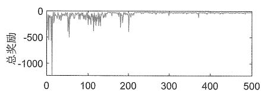

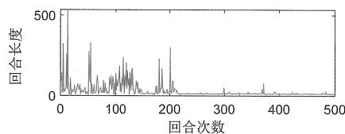

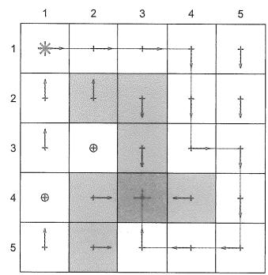  
图8.9 基于值函数的Sarsa算法。参数设置为 $\gamma = 0.9, \epsilon = 0.1, r_{\mathrm{boundary}} = r_{\mathrm{forbidden}} = -10, r_{\mathrm{target}} = 1, \alpha = 0.001$ 。

# 8.3.2 基于值函数的Q-learning

基于表格的Q-learning也可以推广到基于函数的Q-learning算法：

$$
w _ {t + 1} = w _ {t} + \alpha_ {t} \left[ r _ {t + 1} + \gamma \max  _ {a \in \mathcal {A} (s _ {t + 1})} \hat {q} \left(s _ {t + 1}, a, w _ {t}\right) - \hat {q} \left(s _ {t}, a _ {t}, w _ {t}\right) \right] \nabla_ {w} \hat {q} \left(s _ {t}, a _ {t}, w _ {t}\right). \tag {8.37}
$$

该算法与(8.36)中的Sarsa算法非常类似，区别仅在于(8.36)中的 $\hat{q}(s_{t+1}, a_{t+1}, w_t)$ 被换成了 $\max_{a \in \mathcal{A}(s_{t+1})} \hat{q}(s_{t+1}, a, w_t)$ 。

与表格情形类似，(8.37)也是Off-policy的，因此可以按照On-policy的模式或者Off-policy的模式来实现。算法8.3给出了一个On-policy的版本。Off-policy的版本将在下一节介绍深度Q-learning时展示。

图8.10给出了一个例子，其中的任务是找到从左上角状态到目标状态的最优策略。如图所示，基于线性函数的Q-learning能够成功学习到最优策略。该例子使用了5阶的傅里叶基函数。

一些读者可能注意到了，在算法8.2和算法8.3中，尽管值以函数形式表示，但是策略 $\pi (a|s)$ 仍然以表格形式表示。因此，需要假设状态和动作的数量是有限的。在第9章中，我们将看到策略也可以被表示为函数，以便处理连续的状态和动作空间。

# 算法8.3：基于值函数的Q-learning（On-policy模式）

初始化：初始参数 $w_0$ 。初始策略 $\pi_0$ 。对于所有 $t$ ，设置 $\alpha_{t} = \alpha > 0$ 。 $\epsilon \in (0,1)$ 。

目标：学习最优策略从而使智能体能从给定状态 $s_0$ 出发到达目标状态。

对每一个回合

在 $t$ 时刻，如果 $s_t$ 不是目标状态

收集经验样本 $(s_t, a_t, r_{t+1}, s_{t+1})$ ：在 $s_t$ ，根据 $\pi_t(s_t)$ 产生 $a_t$ ，通过与环境互动生成 $r_{t+1}, s_{t+1}$

更新值:

$$
w _ {t + 1} = w _ {t} + \alpha_ {t} \Big [ r _ {t + 1} + \gamma \max _ {a \in \mathcal {A}} \hat {q} (s _ {t + 1}, a, w _ {t}) - \hat {q} (s _ {t}, a _ {t}, w _ {t}) \Big ] \nabla_ {w} \hat {q} (s _ {t}, a _ {t}, w _ {t})
$$

更新策略：

$$
\pi_ {t + 1} (a | s _ {t}) = 1 - \frac {\epsilon (| \mathcal {A} (s _ {t}) | - 1)}{| \mathcal {A} (s _ {t}) |}, \text {如 果} a = \arg \max  _ {a \in \mathcal {A} (s _ {t})} \hat {q} (s _ {t}, a, w _ {t + 1})
$$

$$
\pi_ {t + 1} (a | s _ {t}) = \frac {\epsilon}{| \mathcal {A} (s _ {t}) |}, \mathrm {如 果} a \neq \arg \max  _ {a \in \mathcal {A} (s _ {t})} \hat {q} (s _ {t}, a, w _ {t + 1})
$$

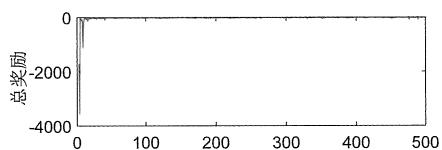

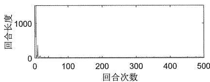

  
图8.10 基于线性函数的Q-learning。其中 $\gamma = 0.9, \epsilon = 0.1, r_{\mathrm{boundary}} = r_{\mathrm{forbidden}} = -10, r_{\mathrm{target}} = 1, \alpha = 0.001$ 。

# 8.4 深度Q-learning

我们可以将深度神经网络整合到Q-learning中，以获得一种称为深度Q-learning（deep Q-learning）或深度Q网络（deep Q-network, DQN) [22, 60, 61]的方法。深度Q-learning是最早和最成功的深度强化学习算法之一。对于简单的任务，神经网络并不需要很深。例如，对于网格世界这样的简单任务，具有2层甚至1层隐藏层的网络可能就足够了。深度Q-learning可以被视为(8.37)中算法的扩展，不过它的数学表达和实现细节有许多不同，详见下文。

# 8.4.1 算法描述

从数学上讲，深度Q-learning旨在最小化如下目标函数：

$$
J = \mathbb {E} \left[ \left(R + \gamma \max  _ {a \in \mathcal {A} (S ^ {\prime})} \hat {q} \left(S ^ {\prime}, a, w\right) - \hat {q} (S, A, w)\right) ^ {2} \right], \tag {8.38}
$$

其中 $(S, A, R, S')$ 是随机变量，分别表示状态、动作、即时奖励、下一个状态。

如何理解这个目标函数呢？实际上，它对应了贝尔曼最优误差：当 $\hat{q}(S, A, w)$ 等于最优动作值时， $R + \gamma \max_{a \in \mathcal{A}(S')} \hat{q}(S', a, w) - \hat{q}(S, A, w)$ 在期望意义上应等于 0。这可以由下面的贝尔曼最优方程看出：

$$
q (s, a) = \mathbb {E} \left[ R _ {t + 1} + \gamma \max  _ {a \in \mathcal {A} (S _ {t + 1})} q (S _ {t + 1}, a) \Big | S _ {t} = s, A _ {t} = a \right], \quad {\text {对 所 有}} s, a.
$$

上式是贝尔曼最优方程（证明见方框7.5）。从该式可以看出，当 $\hat{q}(S, A, w)$ 等于最优动作值时， $R + \gamma \max_{a \in A(S')} \hat{q}(S', a, w) - \hat{q}(S, A, w)$ 在期望意义上等于0。

如何最小化(8.38)中的目标函数呢？可以使用梯度下降算法。为此，我们需要计算 $J$ 关于 $\boldsymbol{w}$ 的梯度。值得注意的是，参数 $\boldsymbol{w}$ 不仅出现在 $\hat{q}(S, A, w)$ 中，也出现在 $y \doteq R + \gamma \max_{a \in \mathcal{A}(S')} \hat{q}(S', a, w)$ 中，其梯度的计算并非易事。因此，可以假设 $y$ 中 $\boldsymbol{w}$ 的值在短时间内是固定不变的，这样就可以比较容易地计算梯度。具体来说，引入两个网络：一个是用于表示 $\hat{q}(s, a, w)$ 的主网络（main network），另一个是用于表示 $\hat{q}(s, a, w_{\mathrm{T}})$ 的目标网络（target network）。此时，目标函数变为

$$
J = \mathbb {E} \left[ \left(R + \gamma \max _ {a \in \mathcal {A} (S ^ {\prime})} \hat {q} (S ^ {\prime}, a, w _ {\mathrm {T}}) - \hat {q} (S, A, w)\right) ^ {2} \right],
$$

当 $w_{\mathrm{T}}$ 固定不变时，容易计算出 $J$ 的梯度为

$$
\nabla_ {w} J = - \mathbb {E} \left[ \left(R + \gamma \max _ {a \in \mathcal {A} (S ^ {\prime})} \hat {q} (S ^ {\prime}, a, w _ {\mathrm {T}}) - \hat {q} (S, A, w)\right) \nabla_ {w} \hat {q} (S, A, w) \right], \qquad (8. 3 9)
$$

上式省略了一些不重要的常数系数。

为了使用(8.39)中的梯度来最小化目标函数，我们需要注意以下技巧。

第一个技巧是使用两个网络：一个主网络和一个目标网络。虽然前面已经提到了这一点，但下面会再介绍实施的一些细节。令 $w$ 和 $w_{\mathrm{T}}$ 分别表示主网络和目标网络的参数，它们的初始值相同。

每次迭代会从回放缓冲区（replay buffer）抽取一小批次的样本 $\{(s, a, r, s')\}$ （回放缓冲区稍后会介绍）。主网络的输入是 $s$ 和 $a$ ，输出 $y = \hat{q}(s, a, w)$ 是估计的 $q$ 值，输出的目标值是 $y_{\mathrm{T}} \doteq r + \gamma \max_{a \in \mathcal{A}(s')} \hat{q}(s', a, w_{\mathrm{T}})$ 。主网络更新是为了最小化样本 $\{(s, a, y_{\mathrm{T}})\}$ 上的TD误差（也称为损失函数） $\sum (y - y_{\mathrm{T}})^2$ 。

更新主网络参数并不是显式地使用(8.39)中的梯度。相反，它需要小批量的样本并基于现有的神经网络训练工具来更新参数，这是和不使用神经网络的一个显著区别。

虽然每次迭代中都会更新主网络，但是目标网络并非每次都更新，而是隔一定数量的迭代后更新为与主网络相同的参数。这样就可以满足计算(8.39)中的梯度时 $w_{\mathrm{T}}$ 是固定不变的假设。

$\diamond$ 第二个技巧是经验回放（experience replay）[22, 60, 62]。在收集了一些经验样本后，我们不会按照它们被收集的顺序使用这些样本，而是将它们存储在一个称为回放缓冲区的集合中。例如，设 $(s, a, r, s')$ 为一个经验样本， $\mathcal{B} \doteq \{(s, a, r, s')\}$ 为回放缓冲区。每次更新主网络时，从回放缓冲区抽取小批量的经验样本，这个过程被称为经验回放。抽取经验样本时应该服从均匀分布。

为什么在深度Q-learning中需要经验回放？为什么经验回放应该服从均匀分布？答案在于(8.38)中的目标函数。具体来说，为了定义该目标函数，我们必须指定 $S$ 、A、 $R$ 、 $S^{\prime}$ 的概率分布。当 $(S,A)$ 给定时， $R$ 和 $S^{\prime}$ 的分布由系统模型确定。因此，我们只需要指定 $(S,A)$ 的分布。如果我们没有对采样过程的先验知识，那么最简单的方法是假设它是均匀分布的。然而，实际中对 $(S,A)$ 的采样很可能不是均匀分布的，因此为了满足均匀分布的假设，需要打破序列中样本之间的相关性。为此，可以使用经验回放技术，按照均匀分布从回放缓冲区随机抽取样本，这是经验回放的必要性和为什么服从均匀分布的理论原因。最后，经验回放的另一个好处是每个经验样本可能会被多次使用，可以提高数据利用率。

算法8.3给出了深度Q-learning的实施过程。该算法采用了Off-policy模式，即使用其他策略收集得到的经验数据来学习最优策略。当然，如果需要，也不难修改得到On-policy模式。

# 8.4.2 示例

图8.11中的例子展示了算法8.4，其任务是得到每一个状态-动作的最优动作值，进而得到最优策略。

行为策略如图8.11(a)所示，该行为策略是探索性的，它在所有状态下采取任意动作的概率都是相同的。由该行为策略生成的一个有1000步的回合如图8.11(b)所示。尽管该回合只有1000步，但由于行为策略有较强的探索能力，因此几乎所有的状态-动作在这个回合中都被访问到了。回放缓冲区包含1000个经验样本。每次训练的批量大小都是100，即每次从重放缓冲区中均匀抽取100个样本。

# 算法8.4：深度Q-learning（Off-policy模式）

初始化：一个主网络和一个目标网络，它们具有相同的初始参数。

目标：得到一个目标网络，能从给定行为策略 $\pi_{b}$ 生成的经验样本中学习最优动作值，进而得到最优策略。

将 $\pi_b$ 生成的经验样本存储在回放缓冲区 $\mathcal{B} = \{(s, a, r, s')\}$

对于每次迭代

从 $\mathcal{B}$ 中均匀抽取一小批量样本

对于每个样本 $(s, a, r, s')$ ，计算目标值 $y_{\mathrm{T}} = r + \gamma \max_{a \in \mathcal{A}(s')} \hat{q}(s', a, w_{\mathrm{T}})$ ，

其中 $w_{\mathrm{T}}$ 是目标网络的参数

使用小批量样本更新主网络，以最小化 $(y_{\mathrm{T}} - \hat{q} (s,a,w))^{2}$

每 $C$ 次迭代更新 $w_{\mathrm{T}}$ 为 $w_{\mathrm{T}} = w$

  
(a) 行为策略

  
(b) 一个有1000步的回合

  
(c) 最终学习到的策略

  
(d) 损失函数逐渐收敛到0

  
(e) 最优值的估计误差逐渐收敛到0  
图8.11 利用深度Q-learning学习最优策略。其中 $\gamma = 0.9, r_{\text{boundary}} = r_{\text{forbidden}} = -10, r_{\text{target}} = 1$

主网络和目标网络具有相同的结构：仅包含一层隐藏层的全连接网络，隐藏层有100个神经元（层数和神经元数量可以调整）。该网络有三个输入和一个输出。前两个

输入是状态对应的归一化后的行和列的索引，第三个输入是归一化后的动作索引。这里“归一化”指的是将所有值都转换到[0,1]区间。该网络的输出是估计的最优值。有的读者可能会问：为什么网络的输入是状态对应的行和列，而不是状态的索引？这是因为我们知道状态对应于网格中的二维位置。在设计神经网络时使用的关于状态的先验信息越多，学习的效果越好。当然，网络也可以有其他设计方式。例如，它可以有2个输入和5个输出，其中2个输入是归一化的行和列，输出是输入状态对应的5个动作值的估计[22]。

基于上述网络，学习的过程如图8.11(d)~(e)所示。其中损失函数对应每个小批量的平均TD误差的平方，可以看到损失函数逐渐收敛到0，这意味着网络可以很好地拟合训练样本。另外，值估计误差也收敛到0，这意味着最后的值估计足够准确，进而得到的贪婪策略是最优的。

  
(a) 行为策略

  
(b) 一个有100步的回合

  
(c) 最终学习到的策略

  
(d) 损失函数逐渐收敛到0

  
(e) 最优值的估计误差无法收敛到0  
图8.12 利用深度Q-learning学习最优策略：经验数据不足的例子。其中 $\gamma = 0.9, r_{\text{boundary}} = r_{\text{forbidden}} = -10, r_{\text{target}} = 1$ 。

这个例子展示了深度 Q-learning 的高效性：从一个仅有 1000 步的回合就足以学习到最优策略。相比之下，基于表格的 Q-learning 需要 10000 步的回合才能收敛（参见图7.4）。其高效的原因是值函数法相比表格法具有更强的泛化能力，此外，经验样本

也可以被反复使用，具有较高的数据使用效率。

最后，我们考虑一个有趣的例子。图8.12展示了一个仅有100步的回合。基于深度Q-learning，网络可以很好地训练（即损失函数收敛到0），但是值估计误差不能收敛到0（参见图8.12(e)）。虽然网络可以正确地拟合给定的经验样本，但是由于经验样本太少，因此无法准确估计最优值。

# 8.5 总结

本章仍然是在介绍TD算法，只不过从表格法转向了函数法。理解值函数法的关键是要将其描述为一个优化问题。其中最简单的目标函数是真实值和估计值之间的误差。此外还有其他目标函数，例如贝尔曼误差和投影贝尔曼误差。在算法方面，我们首先介绍了用于估计状态值的算法，进而推广到Sarsa和Q-learning。

值函数法重要的一个原因是它能将人工神经网络与强化学习结合起来。例如，深度Q-learning是早期最成功的深度强化学习算法之一。尽管神经网络已被广泛用作非线性函数近似器，但本章仍然对历史上早期研究比较多的线性函数情况进行了全面介绍。这一方面是因为充分理解线性情况对于更好地理解非线性情况至关重要，另一方面是因为基于表格的TD算法可以被视为一种特殊的基于线性值函数的TD算法。感兴趣的读者可以参考[63]以深入学习基于值函数的TD算法。关于深度Q-learning的更多理论讨论可以参见[61]。

此外，本章还介绍了一个重要概念：平稳分布。这个概念在定义目标函数时扮演了重要的角色。在下一章，我们将看到这个概念在使用策略函数时也会起到关键作用。关于这个概念的更多内容可以参见[49,第IV章]。最后，本章的一些数学内容重度依赖于矩阵分析，一些结果未经解释即使用，相关基础知识可以参见[4,48]。

# 8.6 问答

提问：表格法与值函数法的区别是什么？

回答：两者最直接的区别在于值的检索方式和更新方式。

检索方式：在表格法中，如果我们想要检索一个值，可以直接读取表格中的相应元素。然而在值函数法中，我们需要将状态输入到函数中并计算一次函数值。

更新方式：在表格法中，如果我们想要更新一个值，可以直接重写表格中的相应元素。然而在值函数法中，我们需要通过更新函数参数的方式来改变那个值。

提问：值函数法相比表格法有什么优势？

回答：由于值的检索方式不同，因此值函数法的存储效率更高。例如，表格法需要存储所有状态/动作对应的值，而值函数法只需要存储一个参数向量，而且其维度通常远小于状态/动作的个数。

由于值的更新方式不同，值函数法的泛化能力更强。具体来说，在表格法中，更新一个值不会改变其他值。然而，在值函数法中，针对一个状态/动作更新函数参数会影响其他值，因此一个状态/动作的经验样本可以泛化到其他状态值/动作值的估计。

提问：我们能将表格法和值函数法统一吗？

回答：可以。表格法可以被视为值函数法的一个特殊情况，通过选择线性函数和特殊的特征向量，值函数法可以退化成表格法。相关细节可参见方框8.2。

提问：什么是平稳分布？为什么它很重要？

回答：平稳分布描述了马尔可夫决策过程的长期行为。具体来说，当智能体执行一个给定的策略足够长的时间后，智能体访问任一状态的概率可以由这个平稳分布来描述。更多信息参见方框8.1。

这个概念之所以重要是因为我们在定义目标函数时需要描述状态的分布。平稳分布不仅对于值函数法重要，它在第9章介绍的基于策略函数的方法中也很重要。

值得指出的是，虽然该概念非常基础和重要，但是它通常不会出现在算法表达式中，因此大部分读者只需要知道这个概念的存在就足够了。

提问：线性值函数法有哪些优点和缺点？

回答：线性函数是值函数法最简单的情况，我们可以透彻分析其理论性质，因此学习线性情况可以帮助读者更好地掌握值函数法的思想。更为重要的是，之前介绍的表格法是一个特殊的线性情况，因此线性情况也是十分重要的。然而，线性函数的近似能力有限，另外在复杂任务中选择合适的特征向量也并非易事。相比之下，人工神经网络可以作为非线性函数的通用近似器，使用更为友好。

提问：为什么深度Q-learning需要经验回放？

回答：原因在于方程(8.38)中的目标函数。具体来说，为了有效地定义目标函数，我们必须指定 $S$ 、 $A$ 、 $R$ 、 $S^{\prime}$ 的概率分布，其中一旦给定 $(S,A)$ ， $R$ 和 $S^{\prime}$ 的分布就由系统模型决定，因此我们只需要指定状态-动作 $(S,A)$ 的分布，其最简单的方式是假设它是均匀分布的。然而，实际中的状态-动作样本可能不是均匀分布的。为了满足均匀分布的假设，有必要打破序列中样本之间的相关性。为此，可以使用经验回

放技术，通过从回放缓冲区均匀抽取样本来近似满足这一假设。此外，经验回放的一个好处是每个样本可能被多次使用，从而增加数据效率。

提问：基于表格的Q-learning能使用经验回放吗？

回答：尽管基于表格的Q-learning不必须使用经验回放，但它也可以使用经验回放而不会带来什么问题。这是因为Q-learning是Off-policy算法，对样本是如何获取的没有特别要求。

提问：为什么深度Q-learning需要两个网络？

回答：本质原因是简化式(8.38)的梯度计算。具体来说，参数 $w$ 不仅出现在 $\hat{q}(S, A, w)$ 中，还出现在 $R + \gamma \max_{a \in \mathcal{A}(S')} \hat{q}(S', a, w)$ 中。因此，计算关于 $w$ 的梯度并非易事。如果在短时间内固定 $R + \gamma \max_{a \in \mathcal{A}(S')} \hat{q}(S', a, w)$ 中的 $w$ ，则梯度计算可以大大简化（参见式(8.39)）。这种梯度计算方法需要两个网络：主网络的参数在每次迭代中都会更新，而目标网络的参数在一段时间内是固定的，每隔一段时间更新一次。

提问：如果基于人工神经网络来实现函数近似，应该如何更新其参数？

回答：此时我们不应该直接使用诸如式(8.37)的算法来更新神经网络的参数，该算法更多的是给予原理上的支撑。在具体编程时，应通过指定损失函数并利用成熟的神经网络训练工具来实现参数的更新。

__________

__________

__________

__________

__________

__________

# 第9章

# 策略梯度方法

  
图9.1 本章在全书中的位置。

上一章介绍了用函数表示值的方法，本章将介绍用函数表示策略的方法。当用函数表示策略时，我们可以选择一个目标函数，进而优化该目标函数以得到最优策略。这种方法被称为策略梯度（policy gradient）。策略梯度方法是基于策略的（policy-based），而本书之前的所有章节介绍的方法都是基于值的（value-based）。这两者有什么区别呢？其本质区别在于基于策略的方法是直接优化关于策略参数的目标函数，从而得到最优策略；而基于值的方法是通过先估计值再得到最优策略的。具体的区别大家学完本章就会清楚了。

# 9.1 策略表示：从表格到函数

在本书之前的章节中，策略都是用表格来表示的：所有状态的动作概率都存储在一个表格中，参见表9.1。实际上，策略也可以用函数来表示，记为 $\pi(a|s, \theta)$ ，其中 $\theta \in \mathbb{R}^m$ 是参数向量。该策略函数也可以写成其他形式，如 $\pi_\theta(a|s)$ 、 $\pi_\theta(a,s)$ 、 $\pi(a,s,\theta)$ 。

表 9.1 用表格来表示策略。  

<table><tr><td></td><td>a1</td><td>a2</td><td>a3</td><td>a4</td><td>a5</td></tr><tr><td>s1</td><td>π(a1|s1)</td><td>π(a2|s1)</td><td>π(a3|s1)</td><td>π(a4|s1)</td><td>π(a5|s1)</td></tr><tr><td>:</td><td>:</td><td>:</td><td>:</td><td>:</td><td>:</td></tr><tr><td>s9</td><td>π(a1|s9)</td><td>π(a2|s9)</td><td>π(a3|s9)</td><td>π(a4|s9)</td><td>π(a5|s9)</td></tr></table>

我们首先说明表格法和函数法之间的区别。

第一，定义最优策略的方式不同。

当用表格描述策略时，最优策略的定义是它能够最大化所有状态的状态值，即其状态值大于或等于其他任意策略的状态值。当用函数描述策略时，最优策略的定义是它能够最大化一个标量目标函数。至于是什么标量目标函数，后面将详细介绍。

$\diamond$ 第二，更新策略的方式不同。

当用表格描述策略时，可以通过直接改变表格中的元素来直接更新选择某些动作的概率。当用函数描述策略时，不能再以这种方式更新策略，而只能通过改变函数参数 $\theta$ 来间接更新选择某些动作的概率。

第三，查看动作概率的方式不同。

当用表格描述策略时，可以通过查看表格中相应的元素直接获得某个动作的概率。  
当用函数描述策略时，我们需要将 $(s, a)$ 输入到函数中，通过计算函数值来获得其

概率（见图9.2(a)）。当然，函数的结构可能多种多样。例如，我们也可以输入一个状态，然后输出所有动作的概率（见图9.2(b)）。

  
(a)

  
(b)   
图9.2 用函数来表示策略。这些函数可能有不同的结构。

由于上面的几点不同，使用函数表示策略具有诸多优势，例如它在处理大型状态-动作空间时更加高效，也具有更强的泛化能力。其原因与用函数表示值是类似的，这里不再赘述。

当用函数表示策略时，我们的任务是最大化一个标量目标函数 $J(\theta)$ ，其中 $\theta$ 代表策略函数的参数。不同参数对应不同的目标函数值，因此我们需要找到最优的参数从而优化该目标函数。最简单的优化方法是梯度上升：

$$
\theta_ {t + 1} = \theta_ {t} + \alpha \nabla_ {\theta} J (\theta_ {t}),
$$

其中 $\nabla_{\theta}J$ 是 $J$ 相对于 $\theta$ 的梯度， $\alpha >0$ 是步长。

这实际上就是策略梯度方法的基本思想。虽然这个基本思想非常简单，但是想要理解其中的细节还是要花一些功夫的。我们将在本章剩余部分详细回答以下三个问题。

第一，应该使用什么目标函数？（第9.2节）  
$\diamond$ 第二，如何计算目标函数的梯度？（第9.3节）  
第三，如何使用经验样本来计算梯度并优化目标函数？（第9.4节）

# 9.2 目标函数：定义最优策略

在策略梯度方法中，用于定义最优策略的目标函数有如下两种。

# 目标函数1：平均状态值

第一个常见的目标函数是平均状态值，其定义为

$$
\bar {v} _ {\pi} = \sum_ {s \in \mathcal {S}} d (s) v _ {\pi} (s),
$$

其中 $d(s)$ 是状态 $s$ 的权重，它满足对任何 $s \in S$ 有 $d(s) \geqslant 0$ 且 $\sum_{s \in S} d(s) = 1$ 。因此，权重 $d(s)$ 也可以理解为状态 $s$ 的概率分布，那么该目标函数可以重写为

$$
\bar {v} _ {\pi} = \mathbb {E} _ {S \sim d} [ v _ {\pi} (S) ].
$$

顾名思义， $\bar{v}_{\pi}$ 是所有状态值的加权平均。不同的 $\theta$ 值将导致不同的 $\bar{v}_{\pi}$ 值。我们的任务是找到一个最优策略（即最优的 $\theta$ ）来最大化 $\bar{v}_{\pi}$ 。

在该目标函数中，如何选择概率分布 $d(s)$ 呢？有如下两种常见情况。

$\diamond$ 第一， $d$ 与策略 $\pi$ 无关，此时该目标函数对策略参数求梯度不需要考虑 $d$ ，因此这种情况最为简单。在此情况下，我们特别地用 $d_0$ 来代替 $d$ ，用 $\bar{v}_{\pi}^{0}$ 来代替 $\bar{v}_{\pi}$ ，以表明该概率分布与策略无关。

例如，如果我们认为所有状态的重要性相同，那么可以选择 $d_0(s) = 1 / |\mathcal{S}|$ 。如果我们只对某个特定状态 $s_0$ 感兴趣（例如智能体始终从 $s_0$ 出发），那么可以设计

$$
d _ {0} (s _ {0}) = 1, \quad d _ {0} (s \neq s _ {0}) = 0.
$$

此时 $\bar{v}_{\pi} = v_{\pi}(s_0)$ ，优化该目标函数就是优化从 $s_0$ 出发的回报期望值。

$\diamond$ 第二， $d$ 与策略 $\pi$ 有关。此时常见的选择是将 $d$ 设为 $d_{\pi}$ ，即在 $\pi$ 下的平稳分布。如何理解这一选择呢？平稳分布反映了在给定策略下马尔可夫决策过程的长期行为。如果一个状态在长期内经常被访问，则其重要性高，应该有更高的权重；如果一个状态很少被访问，则其重要性低，应该有较低的权重。

$d_{\pi}$ 的一个基本性质是 $d_{\pi}^{\mathrm{T}}P_{\pi} = d_{\pi}^{\mathrm{T}}$ 。其中 $P_{\pi}$ 是状态转移概率矩阵。我们已经详细介绍过平稳分布了，更多信息可参见方框8.1。

下面介绍 $\bar{v}_{\pi}$ 的两个等价表达式。特别是第一个表达式，大家在文献中会经常遇到。

等价表达式1：假设智能体根据给定策略 $\pi (\theta)$ 收集了一个奖励序列 $\{R_{t + 1}\}_{t = 0}^{\infty}$ 。大家会经常在文献中看到如下目标函数：

$$
J (\theta) = \lim  _ {n \rightarrow \infty} \mathbb {E} \left[ \sum_ {t = 0} ^ {n} \gamma^ {t} R _ {t + 1} \right] = \mathbb {E} \left[ \sum_ {t = 0} ^ {\infty} \gamma^ {t} R _ {t + 1} \right]. \tag {9.1}
$$

虽然这个目标函数乍一看难以理解，但它实际上就是平均状态值 $\bar{v}_{\pi}$ ，这是因为

$$
\begin{array}{l} \mathbb {E} \left[ \sum_ {t = 0} ^ {\infty} \gamma^ {t} R _ {t + 1} \right] = \sum_ {s \in \mathcal {S}} d (s) \mathbb {E} \left[ \sum_ {t = 0} ^ {\infty} \gamma^ {t} R _ {t + 1} | S _ {0} = s \right] \\ = \sum_ {s \in \mathcal {S}} d (s) v _ {\pi} (s) \\ = \bar {v} _ {\pi}. \\ \end{array}
$$

上式中的第一个等号是根据总期望定律（law of total expectation），第二个等号是根据状态值的定义。

等价表达式2：目标函数 $\bar{v}_{\pi}$ 也可以重写为两个向量的内积。令

$$
v _ {\pi} = [ \dots , v _ {\pi} (s), \dots ] ^ {\mathrm {T}} \in \mathbb {R} ^ {| S |},
$$

$$
d = [ \dots , d (s), \dots ] ^ {\mathrm {T}} \in \mathbb {R} ^ {| \mathcal {S} |}.
$$

那么有

$$
\bar {v} _ {\pi} = d ^ {\mathrm {T}} v _ {\pi}.
$$

这个表达式在分析其梯度时十分有用。

# 目标函数2：平均奖励

第二个常见的目标函数是平均奖励（average reward）[2, 64, 65]。它的定义是

$$
\begin{array}{l} \bar {r} _ {\pi} \doteq \sum_ {s \in \mathcal {S}} d _ {\pi} (s) r _ {\pi} (s) \\ = \mathbb {E} _ {S \sim d _ {\pi}} [ r _ {\pi} (S) ], \tag {9.2} \\ \end{array}
$$

其中 $d_{\pi}$ 是平稳分布，另外

$$
r _ {\pi} (s) \doteq \sum_ {a \in A} \pi (a | s, \theta) r (s, a) = \mathbb {E} _ {A \sim \pi (s, \theta)} [ r (s, A) | s ] \tag {9.3}
$$

是从状态 $s$ 出发的（单步）即时奖励的期望值。这里 $r(s, a) \doteq \mathbb{E}[R|s, a] = \sum_{r} r p(r|s, a)$ 。

下面介绍 $\bar{r}_{\pi}$ 的两个等价表达式。特别是第一个表达式，大家在文献中会经常遇到。

等价表达式1：假设智能体根据给定策略 $\pi (\theta)$ 收集到一个奖励序列 $\{R_{t + 1}\}_{t = 0}^{\infty}$ 。大家可能经常在文献中看到如下目标函数：

$$
J (\theta) = \lim  _ {n \rightarrow \infty} \frac {1}{n} \mathbb {E} \left[ \sum_ {t = 0} ^ {n - 1} R _ {t + 1} \right]. \tag {9.4}
$$

虽然这个目标函数乍一看很复杂，特别是其中还涉及求极限，但它实际上就是平均奖励 $\bar{r}_{\pi}$ ，这是因为

$$
\lim  _ {n \rightarrow \infty} \frac {1}{n} \mathbb {E} \left[ \sum_ {t = 0} ^ {n - 1} R _ {t + 1} \right] = \sum_ {s \in \mathcal {S}} d _ {\pi} (s) r _ {\pi} (s) = \bar {r} _ {\pi}. \tag {9.5}
$$

式(9.5)的证明可参见方框9.1。

等价表达式2：平均奖励 $\bar{r}_{\pi}$ 也可以表示为两个向量的内积。令

$$
r _ {\pi} = \left[ \dots , r _ {\pi} (s), \dots \right] ^ {\mathrm {T}} \in \mathbb {R} ^ {| \mathcal {S} |},
$$

$$
d _ {\pi} = \left[ \dots , d _ {\pi} (s), \dots \right] ^ {\mathrm {T}} \in \mathbb {R} ^ {| S |},
$$

其中 $r_{\pi}(s)$ 在式(9.3)中给出。不难看出

$$
\bar {r} _ {\pi} = \sum_ {s \in \mathcal {S}} d _ {\pi} (s) r _ {\pi} (s) = d _ {\pi} ^ {\mathrm {T}} r _ {\pi}.
$$

这个表达式在分析其梯度时将会很有用。

# 方框9.1：证明平均奖励的等价表达式(9.5)

第一步，证明以下方程对任何起始状态 $s_0 \in S$ 都是成立的：

$$
\bar {r} _ {\pi} = \lim  _ {n \rightarrow \infty} \frac {1}{n} \mathbb {E} \left[ \sum_ {t = 0} ^ {n - 1} R _ {t + 1} \mid S _ {0} = s _ {0} \right]. \tag {9.6}
$$

为此，首先注意到

$$
\begin{array}{l} \operatorname * {l i m} _ {n \to \infty} \frac {1}{n} \mathbb {E} \left[ \sum_ {t = 0} ^ {n - 1} R _ {t + 1} | S _ {0} = s _ {0} \right] = \operatorname * {l i m} _ {n \to \infty} \frac {1}{n} \sum_ {t = 0} ^ {n - 1} \mathbb {E} \left[ R _ {t + 1} | S _ {0} = s _ {0} \right] \\ = \lim  _ {t \rightarrow \infty} \mathbb {E} \left[ R _ {t + 1} \mid S _ {0} = s _ {0} \right], \tag {9.7} \\ \end{array}
$$

其中最后一个等号是根据 Cesaro 均值的性质（也称为 Cesaro 求和）。具体来说，如果 $\{a_k\}_{k=1}^{\infty}$ 是一个收敛序列并且极限 $\lim_{k \to \infty} a_k$ 存在，那么 $\{1/n \sum_{k=1}^{n} a_k\}_{n=1}^{\infty}$ 也是一个收敛序列，并且有 $\lim_{n \to \infty} 1/n \sum_{k=1}^{n} a_k = \lim_{k \to \infty} a_k$ 。

下面分析式(9.7)中的 $\mathbb{E}\left[R_{t + 1}|S_0 = s_0\right]$ 。根据总期望定律可得

$$
\begin{array}{l} \mathbb {E} \left[ R _ {t + 1} | S _ {0} = s _ {0} \right] = \sum_ {s \in \mathcal {S}} \mathbb {E} \left[ R _ {t + 1} | S _ {t} = s, S _ {0} = s _ {0} \right] p ^ {(t)} (s | s _ {0}) \\ = \sum_ {s \in \mathcal {S}} \mathbb {E} \left[ R _ {t + 1} | S _ {t} = s \right] p ^ {(t)} (s | s _ {0}) \\ = \sum_ {s \in \mathcal {S}} r _ {\pi} (s) p ^ {(t)} (s | s _ {0}), \\ \end{array}
$$

其中 $p^{(t)}(s|s_0)$ 表示从 $s_0$ 开始后恰好使用 $t$ 步转移到 $s$ 的概率。上式中的第二个等号是由于马尔可夫性质：下一时刻获得的奖励只依赖于当前状态而与之前的状态无关。根据平稳分布的定义可得

$$
\lim _ {t \to \infty} p ^ {(t)} (s | s _ {0}) = d _ {\pi} (s).
$$

上式表明不论从哪个状态出发，最终转移到 $s$ 的概率都是 $d_{\pi}(s)$ 。因此，我们有

$$
\lim _ {t \to \infty} \mathbb {E} \left[ R _ {t + 1} | S _ {0} = s _ {0} \right] = \lim _ {t \to \infty} \sum_ {s \in \mathcal {S}} r _ {\pi} (s) p ^ {(t)} (s | s _ {0}) = \sum_ {s \in \mathcal {S}} r _ {\pi} (s) d _ {\pi} (s) = \bar {r} _ {\pi}.
$$

将上式代入式(9.7)可得式(9.6)。

第二步，考虑任意的状态分布向量 $d$ 。根据总期望定律有

$$
\begin{array}{l} \operatorname * {l i m} _ {n \to \infty} \frac {1}{n} \mathbb {E} \left[ \sum_ {t = 0} ^ {n - 1} R _ {t + 1} \right] = \operatorname * {l i m} _ {n \to \infty} \frac {1}{n} \sum_ {s \in \mathcal {S}} d (s) \mathbb {E} \left[ \sum_ {t = 0} ^ {n - 1} R _ {t + 1} | S _ {0} = s \right] \\ = \sum_ {s \in \mathcal {S}} d (s) \lim  _ {n \rightarrow \infty} \frac {1}{n} \mathbb {E} \left[ \sum_ {t = 0} ^ {n - 1} R _ {t + 1} | S _ {0} = s \right]. \\ \end{array}
$$

将式(9.6)代入上述方程可得

$$
\lim  _ {n \to \infty} \frac {1}{n} \mathbb {E} \left[ \sum_ {t = 0} ^ {n - 1} R _ {t + 1} \right] = \sum_ {s \in \mathcal {S}} d (s) \bar {r} _ {\pi} = \bar {r} _ {\pi}.
$$

上式中第二个等号是因为 $\sum_{s\in S}d(s) = 1$ 。证明完毕。

# 小结

到目前为止，我们介绍了两种目标函数： $\bar{v}_{\pi}$ 和 $\bar{r}_{\pi}$ 。每种目标函数都有几种不同但等价的表达式，见表9.2。另外，我们有时用 $\bar{v}_{\pi}$ 特指状态分布是稳定分布 $d_{\pi}$ 的情况，而用 $\bar{v}_{\pi}^{0}$ 特指分布 $d_{0}$ 与 $\pi$ 无关的情况。下面是对这些目标函数的一些补充说明。

表 9.2 $\bar{v}_{\pi}$ 和 $\bar{r}_{\pi}$ 的不同但等价的表达式。  

<table><tr><td>目标函数</td><td>表达式1</td><td>表达式2</td><td>表达式3</td></tr><tr><td>vπ</td><td>∑s∈Sd(s)vπ(s)</td><td>ES~d[vπ(S)]</td><td>limn→∞E[∑t=0nγtRt+1]</td></tr><tr><td>rπ</td><td>∑s∈Sdπ(s)rπ(s)</td><td>ES~dπ[rπ(S)]</td><td>limn→∞1/nE[∑t=0n-1Rt+1]</td></tr></table>

第一，所有这些目标函数都是 $\pi$ 的函数。由于 $\pi$ 是由 $\theta$ 参数化的，因此这些目标函数是 $\theta$ 的函数。不同的 $\theta$ 值会得到不同的目标函数值，我们的任务是寻找最优的 $\theta$ 来最大化这些目标函数，这就是策略梯度方法的基本思想。  
$\diamond$ 第二，这两个目标函数 $\bar{v}_{\pi}$ 和 $\bar{r}_{\pi}$ 在 $\gamma < 1$ 的情况下是等价的，这是因为

$$
\bar {r} _ {\pi} = (1 - \gamma) \bar {v} _ {\pi}.
$$

上式表明这两个目标函数可以同时被最大化，因此我们不需要纠结究竟选用哪个

目标函数。为什么上式成立？证明见后面的引理9.1。不过，当 $\gamma = 1$ 时，情况会比较复杂，后面也会有详细介绍。

# 9.3 目标函数的梯度

为了最大化上一节介绍的目标函数，可以使用梯度上升的方法。为此，需要首先计算这些目标函数的梯度。下面的定理给出了目标函数梯度的表达式，它也是本章最重要的理论结果。

定理9.1 (策略梯度定理)。 $J(\theta)$ 的梯度是

$$
\nabla_ {\theta} J (\theta) = \sum_ {s \in \mathcal {S}} \eta (s) \sum_ {a \in \mathcal {A}} \nabla_ {\theta} \pi (a | s, \theta) q _ {\pi} (s, a), \tag {9.8}
$$

其中 $\eta$ 是状态的概率分布， $\nabla_{\theta}\pi$ 是 $\pi$ 关于 $\theta$ 的梯度。此外，式(9.8)有如下等价的形式：

$$
\nabla_ {\theta} J (\theta) = \mathbb {E} _ {S \sim \eta , A \sim \pi (S, \theta)} \left[ \nabla_ {\theta} \ln \pi (A | S, \theta) q _ {\pi} (S, A) \right], \tag {9.9}
$$

其中 $\ln$ 是自然对数。

下面是关于定理9.1的一些重要说明。

$\diamond$ 第一，需要特别注意的是，定理9.1是对定理9.2、定理9.3、定理9.5的汇总。虽然这三个定理是针对不同场景的，但是因为这些不同场景中的梯度的表达式都类似，所以为了方便阅读汇总得到了定理9.1。其中 $J(\theta)$ 和 $\eta$ 的具体表达式并没有给出，而是分别在定理9.2、定理9.3、定理9.5中给出。不同定理中， $J(\theta)$ 和 $\eta$ 可能不同，例如 $J(\theta)$ 可以是 $\bar{v}_{\pi}^{0}$ 、 $\bar{v}_{\pi}$ 或 $\bar{r}_{\pi}$ ，而且式(9.8)可能变成严格的等式或一个近似。

推导目标函数的梯度是策略梯度方法中最复杂的部分。对于大部分读者来说，熟悉定理9.1中的基本结论已经足够了，而不需要了解其证明过程。特别感兴趣的读者可以详细阅读9.3.1节和9.3.2节，其中数学推导和分析较多，建议读者根据自己的兴趣有选择性地学习。

$\diamond$ 第二，表达式(9.9)比式(9.8)往往更受欢迎。这是因为它是以期望形式表达的，后面我们将看到这个带有期望的真实的梯度可以通过随机梯度来近似。

为什么式(9.8)可以等价写成式(9.9)? 证明如下。根据期望的定义, (9.8)可以重写为

$$
\begin{array}{l} \nabla_ {\theta} J (\theta) = \sum_ {s \in \mathcal {S}} \eta (s) \sum_ {a \in \mathcal {A}} \nabla_ {\theta} \pi (a | s, \theta) q _ {\pi} (s, a) \\ = \mathbb {E} _ {S \sim \eta} \left[ \sum_ {a \in \mathcal {A}} \nabla_ {\theta} \pi (a | S, \theta) q _ {\pi} (S, a) \right]. \tag {9.10} \\ \end{array}
$$

考虑函数 $\ln \pi (a|s,\theta)$ ，其梯度是

$$
\nabla_ {\theta} \ln \pi (a | s, \theta) = \frac {\nabla_ {\theta} \pi (a | s , \theta)}{\pi (a | s , \theta)}.
$$

上式可写成

$$
\nabla_ {\theta} \pi (a | s, \theta) = \pi (a | s, \theta) \nabla_ {\theta} \ln \pi (a | s, \theta). \tag {9.11}
$$

将式(9.11)代入式(9.10)可得

$$
\begin{array}{l} \nabla_ {\theta} J (\theta) = \mathbb {E} \left[ \sum_ {a \in \mathcal {A}} \pi (a | S, \theta) \nabla_ {\theta} \ln \pi (a | S, \theta) q _ {\pi} (S, a) \right] \\ = \mathbb {E} _ {S \sim \eta , A \sim \pi (S, \theta)} \Big [ \nabla_ {\theta} \ln \pi (A | S, \theta) q _ {\pi} (S, A) \Big ]. \\ \end{array}
$$

$\diamond$ 第三，自然对数 $\ln$ 要求 $\pi (a|s,\theta)$ 对所有 $(s,a)$ 都满足 $\pi (a|s,\theta) > 0$ （而不能出现 $\pi (a|s,\theta) = 0$ ），因此这个策略必须是随机且探索性的，这可以通过使用Softmax函数来实现：

$$
\pi (a | s, \theta) = \frac {e ^ {h (s , a , \theta)}}{\sum_ {a ^ {\prime} \in \mathcal {A}} e ^ {h (s , a ^ {\prime} , \theta)}}, \quad a \in \mathcal {A}, \tag {9.12}
$$

其中 $h(s,a,\theta)$ 是一个特征函数，表示在状态 $s$ 选择动作 $a$ 的优先度。式(9.12)中的策略满足 $\pi (a|s,\theta)\in (0,1)$ 并且 $\sum_{a\in \mathcal{A}}\pi (a|s,\theta) = 1$ 对任何 $s\in S$ 都成立。这个策略可以通过神经网络实现：网络的输入是 $s$ ，输出层是一个Softmax层，因此网络输出所有动作的概率为 $\pi (a|s,\theta)$ ，并且输出的总和等于1，参见图9.2(b)。

# 9.3.1 推导策略梯度：有折扣的情况

下面开始推导目标函数的梯度。首先我们考虑有折扣的情况，即 $\gamma \in (0,1)$ ，这也是到目前为止本书一直考虑的情况。此时，状态值和动作值的定义是

$$
v _ {\pi} (s) = \mathbb {E} [ R _ {t + 1} + \gamma R _ {t + 2} + \gamma^ {2} R _ {t + 3} + \dots | S _ {t} = s ],
$$

$$
q _ {\pi} (s, a) = \mathbb {E} [ R _ {t + 1} + \gamma R _ {t + 2} + \gamma^ {2} R _ {t + 3} + \dots | S _ {t} = s, A _ {t} = a ].
$$

并且它们满足 $v_{\pi}(s) = \sum_{a\in \mathcal{A}}\pi (a|s,\theta)q_{\pi}(s,a)$

第一，我们证明 $\bar{v}_{\pi}(\theta)$ 是与 $\bar{r}_{\pi}(\theta)$ 等价的目标函数。

引理9.1 $(\bar{v}_{\pi}(\theta)$ 与 $\bar{r}_{\pi}(\theta)$ 等价)。在有折扣的情况下，即当 $\gamma \in (0,1)$ 时，有

$$
\bar {r} _ {\pi} = (1 - \gamma) \bar {v} _ {\pi}. \tag {9.13}
$$

因此， $\bar{v}_{\pi}(\theta)$ 和 $\bar{r}_{\pi}(\theta)$ 可以被同时最大化。

证明：注意到 $\bar{v}_{\pi}(\theta) = d_{\pi}^{\mathrm{T}}v_{\pi}$ 并且 $\bar{r}_{\pi}(\theta) = d_{\pi}^{\mathrm{T}}r_{\pi}$ ，其中 $v_{\pi}, r_{\pi}$ 满足贝尔曼方程 $v_{\pi} = r_{\pi} +$

$\gamma P_{\pi}v_{\pi}$ 。在贝尔曼方程两边同乘以 $d_{\pi}^{\mathrm{T}}$ 可得

$$
\bar {v} _ {\pi} = \bar {r} _ {\pi} + \gamma d _ {\pi} ^ {\mathrm {T}} P _ {\pi} v _ {\pi} = \bar {r} _ {\pi} + \gamma d _ {\pi} ^ {\mathrm {T}} v _ {\pi} = \bar {r} _ {\pi} + \gamma \bar {v} _ {\pi}.
$$

上式可推出(9.13).

第二，下面的引理给出了任意一个状态值对策略的梯度。

引理9.2(状态值的梯度)。在有折扣的情况下，即当 $\gamma \in (0,1)$ 时，对于任意 $s\in S$ 都有

$$
\nabla_ {\theta} v _ {\pi} (s) = \sum_ {s ^ {\prime} \in \mathcal {S}} \Pr_ {\pi} \left(s ^ {\prime} \mid s\right) \sum_ {a \in \mathcal {A}} \nabla_ {\theta} \pi \left(a \mid s ^ {\prime}, \theta\right) q _ {\pi} \left(s ^ {\prime}, a\right), \tag {9.14}
$$

其中

$$
\Pr_ {\pi} \left(s ^ {\prime} \mid s\right) \doteq \sum_ {k = 0} ^ {\infty} \gamma^ {k} \left[ P _ {\pi} ^ {k} \right] _ {s s ^ {\prime}} = \left[ \left(I _ {n} - \gamma P _ {\pi}\right) ^ {- 1} \right] _ {s s ^ {\prime}}
$$

是在策略 $\pi$ 下从状态 $s$ 转移到状态 $s^{\prime}$ 的折扣总概率。这里 $[\cdot]_{ss^{\prime}}$ 表示矩阵的第 $s$ 行和第 $s^{\prime}$ 列的元素。 $[P_{\pi}^{k}]_{ss^{\prime}}$ 等于在策略 $\pi$ 下恰好用 $k$ 步从 $s$ 转移到 $s^{\prime}$ 的概率。

# 方框9.2：证明引理9.2

首先，对任意 $s \in S$ 有

$$
\begin{array}{l} \nabla_ {\theta} v _ {\pi} (s) = \nabla_ {\theta} \left[ \sum_ {a \in \mathcal {A}} \pi (a | s, \theta) q _ {\pi} (s, a) \right] \\ = \sum_ {a \in \mathcal {A}} \left[ \nabla_ {\theta} \pi (a | s, \theta) q _ {\pi} (s, a) + \pi (a | s, \theta) \nabla_ {\theta} q _ {\pi} (s, a) \right], \tag {9.15} \\ \end{array}
$$

其中动作值 $q_{\pi}(s,a)$ 的表达式为

$$
q _ {\pi} (s, a) = r (s, a) + \gamma \sum_ {s ^ {\prime} \in \mathcal {S}} p (s ^ {\prime} | s, a) v _ {\pi} (s ^ {\prime}).
$$

在上式两边求对 $\theta$ 的梯度可得

$$
\nabla_ {\theta} q _ {\pi} (s, a) = 0 + \gamma \sum_ {s ^ {\prime} \in \mathcal {S}} p \left(s ^ {\prime} \mid s, a\right) \nabla_ {\theta} v _ {\pi} \left(s ^ {\prime}\right).
$$

上式中 $r(s,a) = \sum_{r}rp(r|s,a)$ 对 $\theta$ 的梯度等于0，这是因为这一项与 $\theta$ 无关。将上式代入(9.15)可得

$$
\nabla_ {\theta} v _ {\pi} (s) = \sum_ {a \in \mathcal {A}} \left[ \nabla_ {\theta} \pi (a | s, \theta) q _ {\pi} (s, a) + \pi (a | s, \theta) \gamma \sum_ {s ^ {\prime} \in \mathcal {S}} p \left(s ^ {\prime} | s, a\right) \nabla_ {\theta} v _ {\pi} \left(s ^ {\prime}\right) \right]
$$

$$
= \sum_ {a \in \mathcal {A}} \nabla_ {\theta} \pi (a | s, \theta) q _ {\pi} (s, a) + \gamma \sum_ {a \in \mathcal {A}} \pi (a | s, \theta) \sum_ {s ^ {\prime} \in \mathcal {S}} p \left(s ^ {\prime} | s, a\right) \nabla_ {\theta} v _ {\pi} \left(s ^ {\prime}\right). \tag {9.16}
$$

我们的任务是推导 $\nabla_{\theta} v_{\pi}$ 的表达式，值得注意的是它出现在上式的两边。为了求解该项，一种常见的方法是使用铺开技术（unrolling technique）[64]。不过，这里使用另一种基于矩阵-向量形式的方法，该方法相比铺开技术更加直观。首先，设

$$
u (s) \doteq \sum_ {a \in \mathcal {A}} \nabla_ {\theta} \pi (a | s, \theta) q _ {\pi} (s, a).
$$

其次，有

$$
\sum_ {a \in \mathcal {A}} \pi (a | s, \theta) \sum_ {s ^ {\prime} \in \mathcal {S}} p (s ^ {\prime} | s, a) \nabla_ {\theta} v _ {\pi} (s ^ {\prime}) = \sum_ {s ^ {\prime} \in \mathcal {S}} p (s ^ {\prime} | s) \nabla_ {\theta} v _ {\pi} (s ^ {\prime}) = \sum_ {s ^ {\prime} \in \mathcal {S}} [ P _ {\pi} ] _ {s s ^ {\prime}} \nabla_ {\theta} v _ {\pi} (s ^ {\prime}),
$$

因此，式(9.16)的矩阵-向量形式为

$$
\underbrace {\left[ \begin{array}{c} \vdots \\ \nabla_ {\theta} v _ {\pi} (s) \\ \vdots \end{array} \right]} _ {\nabla_ {\theta} v _ {\pi} \in \mathbb {R} ^ {m n}} = \underbrace {\left[ \begin{array}{c} \vdots \\ u (s) \\ \vdots \end{array} \right]} _ {u \in \mathbb {R} ^ {m n}} + \gamma (P _ {\pi} \otimes I _ {m}) \underbrace {\left[ \begin{array}{c} \vdots \\ \nabla_ {\theta} v _ {\pi} (s ^ {\prime}) \\ \vdots \end{array} \right]} _ {\nabla_ {\theta} v _ {\pi} \in \mathbb {R} ^ {m n}}.
$$

其中 $n = |\mathcal{S}|$ 是状态的个数， $m$ 是参数向量 $\theta$ 的维度。上式出现了克罗内克积（Kronecker product） $\otimes$ ，这是因为 $\nabla_{\theta}v_{\pi}(s)$ 是一个向量。上式可以更简洁地写为

$$
\nabla_ {\theta} v _ {\pi} = u + \gamma \left(P _ {\pi} \otimes I _ {m}\right) \nabla_ {\theta} v _ {\pi}.
$$

显然上式是关于 $\nabla_{\theta} v_{\pi}$ 的一个线性方程，其解为

$$
\begin{array}{l} \nabla_ {\theta} v _ {\pi} = \left(I _ {n m} - \gamma P _ {\pi} \otimes I _ {m}\right) ^ {- 1} u \\ = \left(I _ {n} \otimes I _ {m} - \gamma P _ {\pi} \otimes I _ {m}\right) ^ {- 1} u \\ = \left[ \left(I _ {n} - \gamma P _ {\pi}\right) ^ {- 1} \otimes I _ {m} \right] u. \tag {9.17} \\ \end{array}
$$

式(9.17)给出了 $\nabla_{\theta}v_{\pi}$ 的向量形式，其针对状态 $s$ 的展开形式为

$$
\begin{array}{l} \nabla_ {\theta} v _ {\pi} (s) = \sum_ {s ^ {\prime} \in \mathcal {S}} \left[ \left(I _ {n} - \gamma P _ {\pi}\right) ^ {- 1} \right] _ {s s ^ {\prime}} u (s ^ {\prime}) \\ = \sum_ {s ^ {\prime} \in \mathcal {S}} \left[ \left(I _ {n} - \gamma P _ {\pi}\right) ^ {- 1} \right] _ {s s ^ {\prime}} \sum_ {a \in \mathcal {A}} \nabla_ {\theta} \pi (a | s ^ {\prime}, \theta) q _ {\pi} \left(s ^ {\prime}, a\right). \tag {9.18} \\ \end{array}
$$

如何解读上式中的 $\left[(I_n - \gamma P_\pi)^{-1}\right]_{ss'}$ 呢？它的解读如下所示。由于 $(I_n - \gamma P_\pi)^{-1} =$

$I + \gamma P_{\pi} + \gamma^{2}P_{\pi}^{2} + \dots$ ，我们有

$$
\left[ \left(I _ {n} - \gamma P _ {\pi}\right) ^ {- 1} \right] _ {s s ^ {\prime}} = [ I ] _ {s s ^ {\prime}} + \gamma [ P _ {\pi} ] _ {s s ^ {\prime}} + \gamma^ {2} [ P _ {\pi} ^ {2} ] _ {s s ^ {\prime}} + \dots = \sum_ {k = 0} ^ {\infty} \gamma^ {k} [ P _ {\pi} ^ {k} ] _ {s s ^ {\prime}}.
$$

注意， $[P_{\pi}^{k}]_{ss^{\prime}}$ 是从 $s$ 出发恰好用 $k$ 步转移到 $s^{\prime}$ 的概率（见方框8.1）。因此， $\left[(I_n - \gamma P_\pi)^{-1}\right]_{ss^{\prime}}$ 是从 $s$ 转移到 $s^{\prime}$ 的总概率。通过令 $\left[(I_n - \gamma P_\pi)^{-1}\right]_{ss^{\prime}} \doteq \operatorname{Pr}_{\pi}(s'|s)$ ，方程(9.18)变为(9.14)。

基于引理9.2，下面推导 $\bar{v}_{\pi}^{0}$ 的梯度。正如前面提到的，这里的上标“0”表示该目标函数中的状态概率分布与策略 $\pi$ 无关。

定理9.2 (有折扣的情况下 $\bar{v}_{\pi}^{0}$ 的梯度)。在有折扣的情况下，即当 $\gamma \in (0,1)$ 时， $\bar{v}_{\pi}^{0} = d_{0}^{\mathrm{T}} v_{\pi}$ 的梯度是

$$
\nabla_ {\theta} \bar {v} _ {\pi} ^ {0} = \mathbb {E} \left[ \nabla_ {\theta} \ln \pi (A | S, \theta) q _ {\pi} (S, A) \right],
$$

其中 $S\sim \rho_{\pi},A\sim \pi (S,\theta)$ 而且

$$
\rho_ {\pi} (s) = \sum_ {s ^ {\prime} \in \mathcal {S}} d _ {0} \left(s ^ {\prime}\right) \Pr_ {\pi} \left(s \mid s ^ {\prime}\right), \quad s \in \mathcal {S}, \tag {9.19}
$$

其中 $\operatorname{Pr}_{\pi}(s|s') = \sum_{k=0}^{\infty} \gamma^{k}[P_{\pi}^{k}]_{s's} = [(I - \gamma P_{\pi})^{-1}]_{s's}$ 是在策略 $\pi$ 下从 $s'$ 到 $s$ 的折扣总概率。

# 方框9.3：证明定理9.2

对 $\bar{v}_{\pi}^{0} = d_{0}^{\mathrm{T}}v_{\pi}$ 两边求梯度。由于 $d_0(s)$ 与 $\pi$ 无关，可得

$$
\nabla_ {\theta} \bar {v} _ {\pi} ^ {0} = \nabla_ {\theta} \sum_ {s \in \mathcal {S}} d _ {0} (s) v _ {\pi} (s) = \sum_ {s \in \mathcal {S}} d _ {0} (s) \nabla_ {\theta} v _ {\pi} (s).
$$

将引理9.2中 $\nabla_{\theta}v_{\pi}(s)$ 的表达式代入上式可得

$$
\begin{array}{l} \nabla_ {\theta} \bar {v} _ {\pi} ^ {0} = \sum_ {s \in \mathcal {S}} d _ {0} (s) \nabla_ {\theta} v _ {\pi} (s) = \sum_ {s \in \mathcal {S}} d _ {0} (s) \sum_ {s ^ {\prime} \in \mathcal {S}} \Pr_ {\pi} (s ^ {\prime} | s) \sum_ {a \in \mathcal {A}} \nabla_ {\theta} \pi (a | s ^ {\prime}, \theta) q _ {\pi} (s ^ {\prime}, a) \\ = \sum_ {s ^ {\prime} \in \mathcal {S}} \left(\sum_ {s \in \mathcal {S}} d _ {0} (s) \Pr_ {\pi} \left(s ^ {\prime} | s\right)\right) \sum_ {a \in \mathcal {A}} \nabla_ {\theta} \pi (a | s ^ {\prime}, \theta) q _ {\pi} \left(s ^ {\prime}, a\right) \\ \dot {=} \sum_ {s ^ {\prime} \in \mathcal {S}} \rho_ {\pi} (s ^ {\prime}) \sum_ {a \in \mathcal {A}} \nabla_ {\theta} \pi (a | s ^ {\prime}, \theta) q _ {\pi} (s ^ {\prime}, a) \\ \end{array}
$$

$$
\begin{array}{l} = \sum_ {s \in S} \rho_ {\pi} (s) \sum_ {a \in \mathcal {A}} \nabla_ {\theta} \pi (a | s, \theta) q _ {\pi} (s, a) \quad (\text {将} s ^ {\prime} \text {换 为} s) \\ = \sum_ {s \in \mathcal {S}} \rho_ {\pi} (s) \sum_ {a \in \mathcal {A}} \pi (a | s, \theta) \nabla_ {\theta} \ln \pi (a | s, \theta) q _ {\pi} (s, a) \\ = \mathbb {E} \left[ \nabla_ {\theta} \ln \pi (A | S, \theta) q _ {\pi} (S, A) \right], \\ \end{array}
$$

其中 $S\sim \rho_{\pi},A\sim \pi (S,\theta)$ 。证明完毕。

根据引理9.1和引理9.2，我们可以推导出 $\bar{v}_{\pi}$ 和 $\bar{r}_{\pi}$ 的梯度。与定理9.2不同，下面定理中目标函数的状态概率分布与策略 $\pi$ 相关。

定理9.3 (有折扣的情况下 $\bar{v}_{\pi}$ 和 $\bar{r}_{\pi}$ 的梯度)。在有折扣的情况下，即当 $\gamma \in (0,1)$ 时， $\bar{v}_{\pi}$ 和 $\bar{r}_{\pi}$ 的梯度为

$$
\begin{array}{l} \nabla_ {\theta} \bar {r} _ {\pi} = (1 - \gamma) \nabla_ {\theta} \bar {v} _ {\pi} \approx \sum_ {s \in \mathcal {S}} d _ {\pi} (s) \sum_ {a \in \mathcal {A}} \nabla_ {\theta} \pi (a | s, \theta) q _ {\pi} (s, a) \\ = \mathbb {E} \left[ \nabla_ {\theta} \ln \pi (A | S, \theta) q _ {\pi} (S, A) \right], \\ \end{array}
$$

其中 $S\sim d_{\pi},A\sim \pi (S,\theta)$ 。当 $\gamma$ 接近1时，上面的近似更加准确。

# 方框9.4：证明定理9.3

对 $\bar{v}_{\pi} = \sum_{s\in \mathcal{S}}d_{\pi}(s)v_{\pi}(s)$ 两边求梯度可得

$$
\begin{array}{l} \nabla_ {\theta} \bar {v} _ {\pi} = \nabla_ {\theta} \sum_ {s \in \mathcal {S}} d _ {\pi} (s) v _ {\pi} (s) \\ = \sum_ {s \in \mathcal {S}} \nabla_ {\theta} d _ {\pi} (s) v _ {\pi} (s) + \sum_ {s \in \mathcal {S}} d _ {\pi} (s) \nabla_ {\theta} v _ {\pi} (s). \tag {9.20} \\ \end{array}
$$

我们首先分析上式中的第二项 $\sum_{s\in S}d_{\pi}(s)\nabla_{\theta}v_{\pi}(s)$ 。将式(9.17)中的 $\nabla_{\theta}v_{\pi}$ 代入第二项中可得

$$
\begin{array}{l} \sum_ {s \in S} d _ {\pi} (s) \nabla_ {\theta} v _ {\pi} (s) = (d _ {\pi} ^ {\mathbf {T}} \otimes I _ {m}) \nabla_ {\theta} v _ {\pi} \\ = \left(d _ {\pi} ^ {\mathrm {T}} \otimes I _ {m}\right) \left[ \left(I _ {n} - \gamma P _ {\pi}\right) ^ {- 1} \otimes I _ {m} \right] u \\ = \left[ d _ {\pi} ^ {T} \left(I _ {n} - \gamma P _ {\pi}\right) ^ {- 1} \right] \otimes I _ {m} u. \tag {9.21} \\ \end{array}
$$

注意到下式成立：

$$
d _ {\pi} ^ {\mathrm {T}} (I _ {n} - \gamma P _ {\pi}) ^ {- 1} = \frac {1}{1 - \gamma} d _ {\pi} ^ {\mathrm {T}}.
$$

该式可以通过两边乘以 $(I_n - \gamma P_{\pi})$ 得到证明。将上式代入式(9.21)可得

$$
\begin{array}{l} \sum_ {s \in \mathcal {S}} d _ {\pi} (s) \nabla_ {\theta} v _ {\pi} (s) = \frac {1}{1 - \gamma} d _ {\pi} ^ {\mathrm {T}} \otimes I _ {m} u \\ = \frac {1}{1 - \gamma} \sum_ {s \in \mathcal {S}} d _ {\pi} (s) \sum_ {a \in \mathcal {A}} \nabla_ {\theta} \pi (a | s, \theta) q _ {\pi} (s, a). \\ \end{array}
$$

虽然式(9.20)有两项，但是由于第二项包含一个缩放因子 $\frac{1}{1 - \gamma}$ ，当 $\gamma \rightarrow 1$ 时，第二项起到主导作用，第一项可以忽略。此时，

$$
\nabla_ {\theta} \bar {v} _ {\pi} \approx \frac {1}{1 - \gamma} \sum_ {s \in \mathcal {S}} d _ {\pi} (s) \sum_ {a \in \mathcal {A}} \nabla_ {\theta} \pi (a | s, \theta) q _ {\pi} (s, a).
$$

上述推导过程中的近似要求第一项在 $\gamma \rightarrow 1$ 时不会趋向无穷大。更多信息可参见文献[66,第4节]。另外，根据 $\bar{r}_{\pi} = (1 - \gamma)\bar{v}_{\pi}$ 可知

$$
\begin{array}{l} \nabla_ {\theta} \bar {r} _ {\pi} = (1 - \gamma) \nabla_ {\theta} \bar {v} _ {\pi} \approx \sum_ {s \in \mathcal {S}} d _ {\pi} (s) \sum_ {a \in \mathcal {A}} \nabla_ {\theta} \pi (a | s, \theta) q _ {\pi} (s, a) \\ = \sum_ {s \in \mathcal {S}} d _ {\pi} (s) \sum_ {a \in \mathcal {A}} \pi (a | s, \theta) \nabla_ {\theta} \ln \pi (a | s, \theta) q _ {\pi} (s, a) \\ = \mathbb {E} \left[ \nabla_ {\theta} \ln \pi (A | S, \theta) q _ {\pi} (S, A) \right]. \\ \end{array}
$$

证明完毕。

# 9.3.2 推导策略梯度：无折扣的情况

下面继续介绍目标函数梯度的推导，不过这次我们考虑无折扣的情况，即 $\gamma = 1$ 。到目前为止，本书只考虑了有折扣的情况，为什么现在突然开始考虑无折扣的情况呢？目标函数 $\bar{r}_{\pi}$ 的定义对有折扣和无折扣的情况都是成立的。在有折扣的情况下， $\bar{r}_{\pi}$ 的梯度是一种近似（定理9.3）。在无折扣的情况下，我们将看到其梯度的推导更加严格且优美。

# 状态值和泊松方程

在无折扣的情况下，我们需要重新定义状态值和动作值。由于奖励的直接求和 $\mathbb{E}[R_{t + 1} + R_{t + 2} + R_{t + 3} + \ldots |S_t = s]$ 可能发散，因此状态值和动作值需要以一种特殊

的方式来定义[64]：

$$
v _ {\pi} (s) \doteq \mathbb {E} [ (R _ {t + 1} - \bar {r} _ {\pi}) + (R _ {t + 2} - \bar {r} _ {\pi}) + (R _ {t + 3} - \bar {r} _ {\pi}) + \ldots | S _ {t} = s ],
$$

$$
q _ {\pi} (s, a) \doteq \mathbb {E} [ (R _ {t + 1} - \bar {r} _ {\pi}) + (R _ {t + 2} - \bar {r} _ {\pi}) + (R _ {t + 3} - \bar {r} _ {\pi}) + \dots | S _ {t} = s, A _ {t} = a ],
$$

其中 $\bar{r}_{\pi}$ 是平均奖励。文献中对 $v_{\pi}(s)$ 有不同的称呼，如差分奖励（differential reward）[65]或偏置（bias）[2, 第8.2.1节]。不难验证，上述状态值满足下式：

$$
v _ {\pi} (s) = \sum_ {a} \pi (a | s, \theta) \left[ \sum_ {r} p (r | s, a) \left(r - \bar {r} _ {\pi}\right) + \sum_ {s ^ {\prime}} p \left(s ^ {\prime} \mid s, a\right) v _ {\pi} \left(s ^ {\prime}\right) \right]. \tag {9.22}
$$

此外，通过对比上式和 $v_{\pi}(s) = \sum_{a\in \mathcal{A}}\pi (a|s,\theta)q_{\pi}(s,a)$ ，可以得到动作值的表达式为 $q_{\pi}(s,a) = \sum_r p(r|s,a)(r - \bar{r}_\pi) + \sum_{s'}p(s'|s,a)v_{\pi}(s')$ 。将式(9.22)写成矩阵-向量形式可得

$$
v _ {\pi} = r _ {\pi} - \bar {r} _ {\pi} \mathbf {1} _ {n} + P _ {\pi} v _ {\pi}, \tag {9.23}
$$

其中 $\mathbf{1}_n = [1,\dots ,1]^{\mathrm{T}}\in \mathbb{R}^n$ 。读者可能注意到了方程(9.22)和(9.23)与贝尔曼方程很类似，两者唯一的区别是多了 $\bar{r}_{\pi}$ 这一项。实际上，它们有一个特定的名称：泊松方程（Poisson equation）[65, 67]。

如何从泊松方程中求解 $v_{\pi}$ ？答案将在下面的定理中给出。

定理9.4 (泊松方程的解)。令

$$
v _ {\pi} ^ {*} \doteq \left(I _ {n} - P _ {\pi} + \mathbf {1} _ {n} d _ {\pi} ^ {\mathrm {T}}\right) ^ {- 1} r _ {\pi}. \tag {9.24}
$$

那么 $v_{\pi}^{*}$ 是式(9.23)中泊松方程的一个解，且泊松方程的任意解具有以下形式：

$$
v _ {\pi} = v _ {\pi} ^ {*} + c \mathbf {1} _ {n},
$$

其中 $c\in \mathbb{R}$ 。

上述定理表明泊松方程的解可能是不唯一的。

# 方框9.5：证明定理9.4

证明分为三步。

$\diamond$ 第1步：证明 $v_{\pi}^{*}$ 是泊松方程的一个解。

令

$$
A \doteq I _ {n} - P _ {\pi} + \mathbf {1} _ {n} d _ {\pi} ^ {\mathrm {T}}.
$$

那么 $v_{\pi}^{*} = A^{-1}r_{\pi}$ 。A的可逆性将在第3步中证明。将 $v_{\pi}^{*} = A^{-1}r_{\pi}$ 代入式(9.23)

可得

$$
A ^ {- 1} r _ {\pi} = r _ {\pi} - \mathbf {1} _ {n} d _ {\pi} ^ {\mathrm {T}} r _ {\pi} + P _ {\pi} A ^ {- 1} r _ {\pi}.
$$

我们只需要证明上式是成立的，从而证明 $v_{\pi}^{*}$ 是泊松方程的一个解。具体来说，上式等价为 $(-A^{-1} + I_n - 1_n d_{\pi}^{\mathrm{T}} + P_{\pi} A^{-1}) r_{\pi} = 0$ 。该式可以重写为

$$
\left(- I _ {n} + A - \mathbf {1} _ {n} d _ {\pi} ^ {\mathrm {T}} A + P _ {\pi}\right) A ^ {- 1} r _ {\pi} = 0.
$$

上式是成立的，因为左侧括号内的项等于0，即 $-I_{n} + A - \mathbf{1}_{n}d_{\pi}^{\mathrm{T}}A + P_{\pi} = -I_{n} + (I_{n} - P_{\pi} + \mathbf{1}_{n}d_{\pi}^{\mathrm{T}}) - \mathbf{1}_{n}d_{\pi}^{\mathrm{T}}(I_{n} - P_{\pi} + \mathbf{1}_{n}d_{\pi}^{\mathrm{T}}) + P_{\pi} = 0$ 。所以， $v_{\pi}^{*}$ 是泊松方程的一个解。

$\diamond$ 第2步：证明任意解的表达式。

将 $\bar{r}_{\pi} = d_{\pi}^{\mathrm{T}}r_{\pi}$ 代入式(9.23)可得

$$
v _ {\pi} = r _ {\pi} - \mathbf {1} _ {n} d _ {\pi} ^ {\mathrm {T}} r _ {\pi} + P _ {\pi} v _ {\pi}. \tag {9.25}
$$

上式可以化为

$$
\left(I _ {n} - P _ {\pi}\right) v _ {\pi} = \left(I _ {n} - \mathbf {1} _ {n} d _ {\pi} ^ {\mathrm {T}}\right) r _ {\pi}. \tag {9.26}
$$

注意 $I_{n} - P_{\pi}$ 是奇异的，这是因为对于任何策略 $\pi$ 都有 $(I_n - P_\pi)\mathbf{1}_n = 0$ 。因此，式(9.26)的解不是唯一的：如果 $v_{\pi}^{*}$ 是一个解，那么对于任意的 $x\in \mathrm{Null}(I_n - P_{\pi})$ 可知 $v_{\pi}^{*} + x$ 也是一个解。更进一步，如果 $P_{\pi}$ 不可约（irreducible)，那么 $\mathrm{Null}(I_n - P_\pi) = \mathrm{span}\{\mathbf{1}_n\}$ 。此时，泊松方程的任意解都可以写成 $v_{\pi}^{*} + c\mathbf{1}_{n}$ ，其中 $c\in \mathbb{R}$ 是任意实数。

$\diamond$ 第3步：证明 $A = I_{n} - P_{\pi} + \mathbf{1}_{n}d_{\pi}^{\mathrm{T}}$ 是可逆的。

前面用到了 $A$ 的可逆性，下面来证明该性质。

引理9.3。矩阵 $I_{n} - P_{\pi} + \mathbf{1}_{n}d_{\pi}^{\mathrm{T}}$ 是可逆的，其逆矩阵是

$$
\left[ I _ {n} - \left(P _ {\pi} - \mathbf {1} _ {n} d _ {\pi} ^ {\mathrm {T}}\right) \right] ^ {- 1} = \sum_ {k = 1} ^ {\infty} \left(P _ {\pi} ^ {k} - \mathbf {1} _ {n} d _ {\pi} ^ {\mathrm {T}}\right) + I _ {n}.
$$

证明：首先我们不加证明地给出一些基本知识。设 $\rho(M)$ 为矩阵 $M$ 的谱半径。如果 $\rho(M) < 1$ ，那么 $I - M$ 是可逆的。此外， $\rho(M) < 1$ 当且仅当 $\lim_{k \to \infty} M^k = 0$ 。

接下来我们展示 $\lim_{k\to \infty}\left(P_{\pi} - \mathbf{1}_{n}d_{\pi}^{\mathrm{T}}\right)^{k}\to 0$ ，进而证明 $I_{n} - (P_{\pi} - \mathbf{1}_{n}d_{\pi}^{\mathrm{T}})$ 的可

逆性。具体来说，注意到

$$
\left(P _ {\pi} - \mathbf {1} _ {n} d _ {\pi} ^ {\mathrm {T}}\right) ^ {k} = P _ {\pi} ^ {k} - \mathbf {1} _ {n} d _ {\pi} ^ {\mathrm {T}}, \quad k \geqslant 1. \tag {9.27}
$$

上式可以通过归纳法证明。例如，当 $k = 1$ 时，很明显等式成立。当 $k = 2$ 时，我们有

$$
\begin{array}{l} \left(P _ {\pi} - \mathbf {1} _ {n} d _ {\pi} ^ {\mathrm {T}}\right) ^ {2} = \left(P _ {\pi} - \mathbf {1} _ {n} d _ {\pi} ^ {\mathrm {T}}\right) \left(P _ {\pi} - \mathbf {1} _ {n} d _ {\pi} ^ {\mathrm {T}}\right) \\ = P _ {\pi} ^ {2} - P _ {\pi} \mathbf {1} _ {n} d _ {\pi} ^ {\mathrm {T}} - \mathbf {1} _ {n} d _ {\pi} ^ {\mathrm {T}} P _ {\pi} + \mathbf {1} _ {n} d _ {\pi} ^ {\mathrm {T}} \mathbf {1} _ {n} d _ {\pi} ^ {\mathrm {T}} \\ = P _ {\pi} ^ {2} - \mathbf {1} _ {n} d _ {\pi} ^ {\mathrm {T}}, \\ \end{array}
$$

其中最后一个等号是由于 $P_{\pi}\mathbf{1}_n = \mathbf{1}_n, d_{\pi}^{\mathrm{T}}P_{\pi} = d_{\pi}^{\mathrm{T}}, d_{\pi}^{\mathrm{T}}\mathbf{1}_n = 1$ 。 $k \geqslant 3$ 的情况可以类似地证明。

由于 $d_{\pi}$ 是平稳分布，故满足 $\lim_{k\to \infty}P_{\pi}^{k} = d_{\pi}^{\mathrm{T}}\mathbf{1}_{n}$ （见方框8.1）。对式(9.27)两边求极限可得

$$
\lim _ {k \to \infty} \left(P _ {\pi} - \mathbf {1} _ {n} d _ {\pi} ^ {\mathrm {T}}\right) ^ {k} = \lim _ {k \to \infty} P _ {\pi} ^ {k} - d _ {\pi} ^ {\mathrm {T}} \mathbf {1} _ {n} = 0.
$$

因此有 $\rho (P_{\pi} - \mathbf{1}_n d_{\pi}^{\mathrm{T}}) < 1$ ，进而有 $I_{n} - (P_{\pi} - \mathbf{1}_{n}d_{\pi}^{\mathrm{T}})$ 是可逆的，且其逆矩阵是

$$
\begin{array}{l} \left(I _ {n} - \left(P _ {\pi} - \mathbf {1} _ {n} d _ {\pi} ^ {\mathrm {T}}\right)\right) ^ {- 1} = \sum_ {k = 0} ^ {\infty} (P _ {\pi} - \mathbf {1} _ {n} d _ {\pi} ^ {\mathrm {T}}) ^ {k} \\ = I _ {n} + \sum_ {k = 1} ^ {\infty} (P _ {\pi} - \mathbf {1} _ {n} d _ {\pi} ^ {\mathrm {T}}) ^ {k} \\ = I _ {n} + \sum_ {k = 1} ^ {\infty} (P _ {\pi} ^ {k} - \mathbf {1} _ {n} d _ {\pi} ^ {\mathrm {T}}) \\ = \sum_ {k = 0} ^ {\infty} (P _ {\pi} ^ {k} - \mathbf {1} _ {n} d _ {\pi} ^ {\mathrm {T}}) + \mathbf {1} _ {n} d _ {\pi} ^ {\mathrm {T}}. \\ \end{array}
$$

证明完毕。

引理9.3的证明受到了文献[66]的启发。然而，文献[66]在其中公式(16)中给出的结论 $(I_{n} - P_{\pi} + \mathbf{1}_{n}d_{\pi}^{\mathrm{T}})^{-1} = \sum_{k = 0}^{\infty}(P_{\pi}^{k} - \mathbf{1}_{n}d_{\pi}^{\mathrm{T}})$ 是不准确的，这因为 $\sum_{k = 0}^{\infty}(P_{\pi}^{k} - \mathbf{1}_{n}d_{\pi}^{\mathrm{T}})$ 是奇异的（例如 $\sum_{k = 0}^{\infty}(P_{\pi}^{k} - \mathbf{1}_{n}d_{\pi}^{\mathrm{T}})\mathbf{1}_{n} = 0$ ），因此它不可能是一个矩阵的逆矩阵。引理9.3纠正了这个不准确之处。

# 梯度的推导

虽然定理9.4表明在无折扣的情况下 $v_{\pi}$ 的值不是唯一的，但是 $\bar{r}_{\pi}$ 的值是唯一的。具体来说，将 $v_{\pi} = v_{\pi}^{*} + c\mathbf{1}_{n}$ 代入泊松方程可得

$$
\begin{array}{l} \bar {r} _ {\pi} \mathbf {1} _ {n} = r _ {\pi} + \left(P _ {\pi} - I _ {n}\right) v _ {\pi} \\ = r _ {\pi} + \left(P _ {\pi} - I _ {n}\right) \left(v _ {\pi} ^ {*} + c \mathbf {1} _ {n}\right) \\ = r _ {\pi} + \left(P _ {\pi} - I _ {n}\right) v _ {\pi} ^ {*}. \\ \end{array}
$$

注意其中 $c$ 被抵消了，因此 $\bar{r}_{\pi}$ 的值是唯一的，所以我们可以在无折扣的情况下计算 $\bar{r}_{\pi}$ 的梯度。

定理9.5 (无折扣情况下 $\bar{r}_{\pi}$ 的梯度)。在无折扣的情况下，平均奖励 $\bar{r}_{\pi}$ 的梯度是

$$
\begin{array}{l} \nabla_ {\theta} \bar {r} _ {\pi} = \sum_ {s \in \mathcal {S}} d _ {\pi} (s) \sum_ {a \in \mathcal {A}} \nabla_ {\theta} \pi (a | s, \theta) q _ {\pi} (s, a) \\ = \mathbb {E} \left[ \nabla_ {\theta} \ln \pi (A | S, \theta) q _ {\pi} (S, A) \right], \tag {9.28} \\ \end{array}
$$

其中 $S\sim d_{\pi},A\sim \pi (S,\theta)$

与前面有折扣的情况下的结果相比（定理9.3）， $\bar{r}_{\pi}$ 在无折扣的情况下的梯度在数学上更为优美，这是因为式(9.28)是严格成立的。

# 方框9.6：证明定理9.5

首先，对 $v_{\pi}(s) = \sum_{a\in \mathcal{A}}\pi (a|s,\theta)q_{\pi}(s,a)$ 两边求梯度可得

$$
\begin{array}{l} \nabla_ {\theta} v _ {\pi} (s) = \nabla_ {\theta} \left[ \sum_ {a \in \mathcal {A}} \pi (a | s, \theta) q _ {\pi} (s, a) \right] \\ = \sum_ {a \in \mathcal {A}} \left[ \nabla_ {\theta} \pi (a | s, \theta) q _ {\pi} (s, a) + \pi (a | s, \theta) \nabla_ {\theta} q _ {\pi} (s, a) \right], \tag {9.29} \\ \end{array}
$$

其中 $q_{\pi}(s,a)$ 是动作值，满足

$$
\begin{array}{l} q _ {\pi} (s, a) = \sum_ {r} p (r | s, a) (r - \bar {r} _ {\pi}) + \sum_ {s ^ {\prime}} p \left(s ^ {\prime} \mid s, a\right) v _ {\pi} \left(s ^ {\prime}\right) \\ = r (s, a) - \bar {r} _ {\pi} + \sum_ {s ^ {\prime}} p \left(s ^ {\prime} \mid s, a\right) v _ {\pi} \left(s ^ {\prime}\right). \\ \end{array}
$$

对上式两边求导，由于 $r(s,a) = \sum_{r}rp(r|s,a)$ 不依赖于 $\theta$ ，可得

$$
\nabla_ {\theta} q _ {\pi} (s, a) = 0 - \nabla_ {\theta} \bar {r} _ {\pi} + \sum_ {s ^ {\prime} \in \mathcal {S}} p (s ^ {\prime} | s, a) \nabla_ {\theta} v _ {\pi} (s ^ {\prime}).
$$

将上式代入式(9.29)可得

$$
\begin{array}{l} \dot {\nabla_ {\theta} v _ {\pi}} (s) = \sum_ {a \in \mathcal {A}} \left[ \nabla_ {\theta} \pi (a | s, \theta) q _ {\pi} (s, a) + \pi (a | s, \theta) \left(- \nabla_ {\theta} \bar {r} _ {\pi} + \sum_ {s ^ {\prime} \in \mathcal {S}} p (s ^ {\prime} | s, a) \nabla_ {\theta} v _ {\pi} (s ^ {\prime})\right) \right] \\ = \sum_ {a \in \mathcal {A}} \nabla_ {\theta} \pi (a | s, \theta) q _ {\pi} (s, a) - \nabla_ {\theta} \bar {r} _ {\pi} + \sum_ {a \in \mathcal {A}} \pi (a | s, \theta) \sum_ {s ^ {\prime} \in \mathcal {S}} p \left(s ^ {\prime} | s, a\right) \nabla_ {\theta} v _ {\pi} \left(s ^ {\prime}\right). \tag {9.30} \\ \end{array}
$$

设

$$
u (s) \doteq \sum_ {a \in \mathcal {A}} \nabla_ {\theta} \pi (a | s, \theta) q _ {\pi} (s, a).
$$

由于 $\sum_{a\in \mathcal{A}}\pi (a|s,\theta)\sum_{s'\in \mathcal{S}}p(s'|s,a)\nabla_{\theta}v_{\pi}(s') = \sum_{s'\in \mathcal{S}}p(s'|s)\nabla_{\theta}v_{\pi}(s')$ ，方程(9.30)可以写成矩阵-向量形式：

$$
\underbrace {\left[ \begin{array}{c} \vdots \\ \nabla_ {\theta} v _ {\pi} (s) \\ \vdots \end{array} \right]} _ {\nabla_ {\theta} v _ {\pi} \in \mathbb {R} ^ {m n}} = \underbrace {\left[ \begin{array}{c} \vdots \\ u (s) \\ \vdots \end{array} \right]} _ {u \in \mathbb {R} ^ {m n}} - \mathbf {1} _ {n} \otimes \nabla_ {\theta} \bar {r} _ {\pi} + (P _ {\pi} \otimes I _ {m}) \underbrace {\left[ \begin{array}{c} \vdots \\ \nabla_ {\theta} v _ {\pi} (s ^ {\prime}) \\ \vdots \end{array} \right]} _ {\nabla_ {\theta} v _ {\pi} \in \mathbb {R} ^ {m n}},
$$

其中 $n = |\mathcal{S}|$ ， $m$ 是向量 $\theta$ 的维数， $\otimes$ 是克罗内克积。上述方程可以简洁地写为

$$
\nabla_ {\theta} v _ {\pi} = u - \mathbf {1} _ {n} \otimes \nabla_ {\theta} \bar {r} _ {\pi} + (P _ {\pi} \otimes I _ {m}) \nabla_ {\theta} v _ {\pi},
$$

进而可得

$$
\mathbf {1} _ {n} \otimes \nabla_ {\theta} \bar {r} _ {\pi} = u + \left(P _ {\pi} \otimes I _ {m}\right) \nabla_ {\theta} v _ {\pi} - \nabla_ {\theta} v _ {\pi}.
$$

在上式两边同时乘以 $d_{\pi}^{\mathrm{T}} \otimes I_m$ 可得

$$
\begin{array}{l} \left(d _ {\pi} ^ {T} \mathbf {1} _ {n}\right) \otimes \nabla_ {\theta} \bar {r} _ {\pi} = d _ {\pi} ^ {T} \otimes I _ {m} u + \left(d _ {\pi} ^ {T} P _ {\pi}\right) \otimes I _ {m} \nabla_ {\theta} v _ {\pi} - d _ {\pi} ^ {T} \otimes I _ {m} \nabla_ {\theta} v _ {\pi} \\ = d _ {\pi} ^ {\mathrm {T}} \otimes I _ {m} u. \\ \end{array}
$$

由于 $d_{\pi}^{\mathrm{T}}\mathbf{1}_n = 1$ ，由上式可得

$$
\nabla_ {\theta} \bar {r} _ {\pi} = d _ {\pi} ^ {\mathrm {T}} \otimes I _ {m} u
$$

$$
\begin{array}{l} = \sum_ {s \in S} d _ {\pi} (s) u (s) \\ = \sum_ {s \in \mathcal {S}} d _ {\pi} (s) \sum_ {a \in \mathcal {A}} \nabla_ {\theta} \pi (a | s, \theta) q _ {\pi} (s, a). \\ \end{array}
$$

证明完毕。

最后，由于 $v_{\pi}$ 不是唯一的，因此 $\bar{v}_{\pi}$ 也不是唯一的，所以我们这里不关注 $\bar{v}_{\pi}$ 的梯度。对于感兴趣的读者，值得一提的是我们可以通过增加更多的约束来唯一确定 $v_{\pi}$ 。例如，假设存在一个循环状态（recurrent state），这个循环状态的状态值可以确定下来[65, 第II节]，进而可以唯一确定 $c$ 。当然，还有其他方式可以唯一确定 $v_{\pi}$ ，参见文献[2]中的方程(8.6.5)~(8.6.7)。

# 9.4 蒙特卡罗策略梯度（REINFORCE）

有了定理9.1中给出的目标函数的梯度，我们就可以利用如下的梯度上升算法来最大化目标函数以获得最佳策略：

$$
\begin{array}{l} \theta_ {t + 1} = \theta_ {t} + \alpha \nabla_ {\theta} J (\theta_ {t}) \\ = \theta_ {t} + \alpha \mathbb {E} \left[ \nabla_ {\theta} \ln \pi (A | S, \theta_ {t}) q _ {\pi} (S, A) \right], \tag {9.31} \\ \end{array}
$$

其中 $\alpha > 0$ 是学习率。由于算法(9.31)中的真实梯度含有期望，而这在实际中是未知的，因此我们可以用随机梯度替换真实梯度，从而得到如下算法：

$$
\theta_ {t + 1} = \theta_ {t} + \alpha \nabla_ {\theta} \ln \pi \left(a _ {t} \mid s _ {t}, \theta_ {t}\right) q _ {t} \left(s _ {t}, a _ {t}\right), \tag {9.32}
$$

其中 $q_{t}(s_{t},a_{t})$ 是对 $q_{\pi}(s_t,a_t)$ 在 $t$ 时刻的估计值。

算法(9.32)非常重要，因为许多其他策略梯度算法都可以通过推广该算法得到。从其表达式可以看出，策略参数 $\theta_t$ 的更新依赖于对动作值的估计 $q_t(s_t, a_t)$ 。到目前为止，本书介绍了两种估计值的方法，一种是蒙特卡罗方法，另一种是时序差分方法。如果 $q_t(s_t, a_t)$ 是通过蒙特卡罗估计得到的，那么该算法被称为蒙特卡罗策略梯度（Monte Carlo policy gradient）或者 REINFORCE[68]，这是最早和最简单的策略梯度算法之一。如果 $q_t(s_t, a_t)$ 是通过时序差分方法得到的，那么相应的算法实际上就是 Actor-Critic 方法，这将在下一章介绍。

下面我们更仔细地分析算法(9.32)。由于

$$
\nabla_ {\theta} \ln \pi (a _ {t} | s _ {t}, \theta_ {t}) = \frac {\nabla_ {\theta} \pi (a _ {t} | s _ {t} , \theta_ {t})}{\pi (a _ {t} | s _ {t} , \theta_ {t})},
$$

算法(9.32)可重写为

$$
\theta_ {t + 1} = \theta_ {t} + \alpha \underbrace {\left(\frac {q _ {t} (s _ {t} , a _ {t})}{\pi (a _ {t} | s _ {t} , \theta_ {t})}\right)} _ {\beta_ {t}} \nabla_ {\theta} \pi (a _ {t} | s _ {t}, \theta_ {t}).
$$

上式可简写为

$$
\theta_ {t + 1} = \theta_ {t} + \alpha \beta_ {t} \nabla_ {\theta} \pi \left(a _ {t} \mid s _ {t}, \theta_ {t}\right). \tag {9.33}
$$

从上面这个方程可以得到两方面的重要结论。

第一，由于式(9.33)是一个梯度上升算法，我们可以得到如下结论。

- 如果 $\beta_{t} \geqslant 0$ ，则在 $s_{t}$ 选择 $a_{t}$ 的概率会增大，即

$$
\pi \left(a _ {t} \mid s _ {t}, \theta_ {t + 1}\right) \geqslant \pi \left(a _ {t} \mid s _ {t}, \theta_ {t}\right).
$$

- 如果 $\beta_{t} < 0$ ，则在 $s_{t}$ 选择 $a_{t}$ 的概率会降低，即

$$
\pi \left(a _ {t} \mid s _ {t}, \theta_ {t + 1}\right) <   \pi \left(a _ {t} \mid s _ {t}, \theta_ {t}\right).
$$

为什么上面的结论成立呢？当 $\theta_{t + 1} - \theta_t$ 足够小时，根据一阶泰勒展开可知

$$
\begin{array}{l} \pi (a _ {t} | s _ {t}, \theta_ {t + 1}) \approx \pi (a _ {t} | s _ {t}, \theta_ {t}) + (\nabla_ {\theta} \pi (a _ {t} | s _ {t}, \theta_ {t})) ^ {\mathrm {T}} (\theta_ {t + 1} - \theta_ {t}) \\ = \pi (a _ {t} | s _ {t}, \theta_ {t}) + \alpha \beta_ {t} (\nabla_ {\theta} \pi (a _ {t} | s _ {t}, \theta_ {t})) ^ {\mathrm {T}} (\nabla_ {\theta} \pi (a _ {t} | s _ {t}, \theta_ {t})) \quad (\mathrm {代 入} (9. 3 3)) \\ = \pi (a _ {t} | s _ {t}, \theta_ {t}) + \alpha \beta_ {t} \| \nabla_ {\theta} \pi (a _ {t} | s _ {t}, \theta_ {t}) \| _ {2} ^ {2}. \\ \end{array}
$$

很明显，当 $\beta_{t} \geqslant 0$ 时， $\pi(a_{t}|s_{t}, \theta_{t+1}) \geqslant \pi(a_{t}|s_{t}, \theta_{t})$ ；当 $\beta_{t} < 0$ 时， $\pi(a_{t}|s_{t}, \theta_{t+1}) < \pi(a_{t}|s_{t}, \theta_{t})$ 。

$\diamond$ 第二，根据上述第一个结论和 $\beta_{t}$ 的表达式，我们可以知道该算法可以平衡探索（exploration）和利用（exploitation）。注意 $\beta_{t}$ 的表达式为

$$
\beta_ {t} = \frac {q _ {t} (s _ {t} , a _ {t})}{\pi (a _ {t} | s _ {t} , \theta_ {t})}.
$$

一方面， $\beta_{t}$ 与 $q_{t}(s_{t},a_{t})$ 呈正比。如果 $q_{t}(s_{t},a_{t})$ 较大，那么 $\pi (a_t|s_t,\theta_t)$ 将增大，即下一个时刻选择 $a_{t}$ 的概率会增大，因此该算法倾向于利用具有更大价值的动作。另一方面，当 $q_{t}(s_{t},a_{t}) > 0$ 时， $\beta_{t}$ 与 $\pi (a_t|s_t,\theta_t)$ 呈反比。此时，如果 $\pi (a_t|s_t,\theta_t)$ 较小，即选择 $a_{t}$ 的概率较小，那么 $\pi (a_t|s_t,\theta_t)$ 将增大，即下一个时刻选择 $a_{t}$ 的概率会增大，因此该算法会探索那些之前概率低的动作。

此外，由于式(9.32)需要使用随机样本来近似式(9.31)中的真实梯度，那么该如何进行随机采样呢？

$\diamond$ 第一，如何采样 $S?$ 真实梯度 $\mathbb{E}[\nabla_{\theta}\ln \pi (A|S,\theta_t)q_{\pi}(S,A)]$ 中的 $S$ 应服从概率分布 $\eta$ 这是平稳分布 $d_{\pi}$ 或者式(9.19)给出的分布 $\rho_{\pi}$ 。无论是哪一个分布，都代表在策略 $\pi$ 下的长期行为。  
$\diamond$ 第二，如何采样 $A$ ？真实梯度 $\mathbb{E}[\nabla_{\theta}\ln \pi (A|S,\theta_t)q_{\pi}(S,A)]$ 中的 $A$ 应服从概率分布 $\pi (A|S,\theta)$ 。采样 $A$ 的理想方式是按照 $\pi (a|s_t,\theta_t)$ 采样得到 $a_{t}$ 。

然而，实际中往往不会严格按照上述理论采样 $S$ 和 $A$ ，这主要是因为实际中的样本可能是稀缺的，例如我们不太可能等到策略运行了很久并进入平稳态之后才使用其经验样本来学习。

算法9.1给出了具体实现式(9.32)的流程。在这个算法中，首先利用 $\pi (\theta)$ 生成一个回合，然后使用回合中的每一个经验样本对 $\theta$ 进行多次更新。

# 算法9.1：蒙特卡罗策略梯度（REINFORCE）

初始化：初始参数 $\theta$ ； $\gamma \in (0,1)$ ； $\alpha > 0$ 。

目标：学习一个最优策略从而最大化 $J(\theta)$ 。

对于每个回合

根据 $\pi (\theta)$ 生成 $\{s_0,a_0,r_1,\ldots ,s_{T - 1},a_{T - 1},r_T\}$ 。

对于 $t = 0,1,\ldots ,T - 1$

价值更新： $q_{t}(s_{t},a_{t}) = \sum_{k = t + 1}^{\mathrm{T}}\gamma^{k - t - 1}r_{k}$

策略更新： $\theta \leftarrow \theta +\alpha \nabla_{\theta}\ln \pi (a_{t}|s_{t},\theta)q_{t}(s_{t},a_{t})$

# 9.5 总结

本章介绍了策略梯度方法，这是许多现代强化学习算法的基础。策略梯度方法是基于策略的，而之前章节中的所有方法都是基于值的。策略梯度方法的基本思想很简单，那就是选择一个合适的标量目标函数，然后通过梯度上升算法来优化它。

策略梯度方法中最复杂的部分是目标函数梯度的推导过程。为了推导梯度，我们必须区分具有不同目标函数、有无折扣等情况。幸运的是，不同情况下梯度的表达式是相似的，因此我们在定理9.1中总结了统一的梯度表达式，这是本章中最重要的理论结果。对于许多读者来说，了解这个定理就已经足够了；对于该定理的证明，读者可以有选择性地学习。

读者应该很好地理解策略梯度算法(9.32)，因为它是许多更复杂的策略梯度算法的

基础。在下一章中，这个算法将被推广得到Actor-Critic的方法。

# 9.6 问答

提问：策略梯度方法的基本思想是什么？

回答：其基本思想很简单。第一，定义合适的标量目标函数。第二，推导该目标函数的梯度。第三，利用梯度上升算法来优化这个目标函数。第四，由于真实梯度难以获得，因此可以用随机梯度来近似真实梯度。

提问：策略梯度方法中最复杂的部分是什么？

回答：虽然策略梯度方法的基本思想很简单，但是其中梯度的推导过程相当复杂，这是因为我们必须区分众多不同的情况。

提问：策略梯度方法有哪些目标函数？

回答：本章介绍了两类目标函数：平均状态值和平均奖励。具体涉及三个目标函数： $\bar{v}_{\pi}, \bar{v}_{\pi}^{0}, \bar{r}_{\pi}$ 。由于它们对应的梯度是类似的，因此它们都可以在策略梯度方法中被采用。值得一提的是，式(9.1)和式(9.4)中的目标函数表达式在文献中经常遇到。

提问：为什么策略梯度的表达式包含一个自然对数？

回答：引入自然对数是为了将梯度表达式写成一个期望值。通过这种方式，我们可以用一个随机梯度来近似真实梯度。

提问：为什么在推导策略梯度时需要考虑无折扣的情况？

回答：平均奖励 $\bar{r}_{\pi}$ 的定义对有折扣和无折扣的情况都是成立的。在有折扣的情况下， $\bar{r}_{\pi}$ 的梯度是一个近似值，但是在无折扣的情况下，其梯度更为严格和优美。

提问：策略梯度算法(9.32)在数学上究竟在做什么事情？

回答：为了更好地理解这个算法，建议读者关注其在式(9.33)中的简洁表达式，该式清楚地展示了它是一个用于更新 $\pi (a_t|s_t,\theta_t)$ 的梯度上升算法，即一个样本要么使得 $\pi (a_{t}|s_{t},\theta_{t + 1})\geqslant \pi (a_{t}|s_{t},\theta_{t})$ ，要么使得 $\pi (a_{t}|s_{t},\theta_{t + 1}) <   \pi (a_{t}|s_{t},\theta_{t})$ 。

__________   
  
  
__________   
__________   
  
  
__________   
__________   
  
__________

# 第10章

# 演员-评论家方法

  
图10.1 本章在全书中的位置。

本章将介绍Actor-Critic方法，该方法的中文翻译一般为“演员-评论家”。从一个角度来看，Actor-Critic指的是一种结构，它融合了基于策略和基于价值的两类方法。这里的“Actor”对应的是策略更新。之所以称之为Actor，是因为它对应生成动作的策略。这里的“Critic”指的是价值更新。之所以称之为Critic，是因为它会评估策略相应的价值。从另一个角度看，Actor-Critic本质上仍然是策略梯度的方法，它可以通过推广第9章介绍的策略梯度方法得到。在学习本章之前，读者应该确保已经比较好地了解了第8章和第9章的内容，否则学习本章时会遇到诸多挑战。

# 10.1 最简单的演员-评论家算法：QAC

本节将介绍最简单的Actor-Critic算法。我们可以通过推广式(9.32)中的策略梯度算法很容易地得到该算法。

首先，让我们回想一下。策略梯度方法的基本思想是通过最大化一个目标函数 $J(\theta)$ 来得到最优策略。用于最大化 $J(\theta)$ 的梯度上升算法是

$$
\begin{array}{l} \theta_ {t + 1} = \theta_ {t} + \alpha \nabla_ {\theta} J (\theta_ {t}) \\ = \theta_ {t} + \alpha \mathbb {E} _ {S \sim \eta , A \sim \pi} \left[ \nabla_ {\theta} \ln \pi (A | S, \theta_ {t}) q _ {\pi} (S, A) \right], \tag {10.1} \\ \end{array}
$$

其中 $\eta$ 是状态的分布（更多信息可参见定理9.1）。由于真实的梯度是无法得到的，我们可以使用随机梯度来近似：

$$
\theta_ {t + 1} = \theta_ {t} + \alpha \nabla_ {\theta} \ln \pi \left(a _ {t} \mid s _ {t}, \theta_ {t}\right) q _ {t} \left(s _ {t}, a _ {t}\right). \tag {10.2}
$$

这就是上一章式(9.32)中给出的算法。

式(10.2)非常重要，因为它清楚地展示了如何融合基于策略的方法和基于价值的方法。一方面，它是一个基于策略的算法，因为它直接更新策略参数。另一方面，它的更新需要知道 $q_{t}(s_{t},a_{t})$ ，这是动作值 $q_{\pi}(s_t,a_t)$ 的估计量，需要另一个基于价值的算法来得到 $q_{t}(s_{t},a_{t})$ 。

到目前为止，本书介绍了两种估计动作值的方法：第一种是基于蒙特卡罗的方法，第二种是时序差分的方法。

如果 $q_{t}(s_{t}, a_{t})$ 是通过蒙特卡罗方法来估计的，那么相应的算法被称为 REINFORCE 或者蒙特卡罗策略梯度。该算法已经在第9章介绍过了。  
如果 $q_{t}(s_{t},a_{t})$ 是通过时序差分方法来估计的，那么相应的算法通常被称为Actor-Critic。换句话说，当我们把基于时序差分的价值估计引入到策略梯度方法时，就得到了Actor-Critic方法。

算法10.1给出了最简单的Actor-Critic算法。其中Actor对应于式(10.2)给出的策略更新步骤；Critic对应于式(8.36)给出的Sarsa算法，用于估计策略对应的值，其中动作值由函数 $q(s,a,w)$ 表示。这种Actor-Critic算法有时被称为QActor-Critic（QAC）。尽管它很简单，但QAC揭示了Actor-Critic算法的核心思想。我们在本章后面看到的许多高级算法都可以通过推广QAC得到。

# 算法10.1：最简单的Actor-Critic算法（QAC）

初始化：一个策略函数 $\pi (a|s,\theta_0)$ ，其中 $\theta_0$ 是初始参数。一个价值函数 $q(s,a,w_0)$ 其中 $w_{0}$ 是初始参数。 $\alpha_w,\alpha_\theta >0$ 。

目标：学习一个最优策略来最大化 $J(\theta)$

在每个回合中的 $t$ 时刻

根据 $\pi (a|s_t,\theta_t)$ 产生 $a_{t}$ ，观测 $r_{t + 1},s_{t + 1}$ ，然后根据 $\pi (a|s_{t + 1},\theta_t)$ 生成 $a_{t + 1}$

Actor（策略更新）：

$$
\theta_ {t + 1} = \theta_ {t} + \alpha_ {\theta} \nabla_ {\theta} \ln \pi \left(a _ {t} \mid s _ {t}, \theta_ {t}\right) q \left(s _ {t}, a _ {t}, w _ {t}\right)
$$

Critic（价值更新）：

$$
w _ {t + 1} = w _ {t} + \alpha_ {w} \big [ r _ {t + 1} + \gamma q (s _ {t + 1}, a _ {t + 1}, w _ {t}) - q (s _ {t}, a _ {t}, w _ {t}) \big ] \nabla_ {w} q (s _ {t}, a _ {t}, w _ {t})
$$

# 10.2 优势演员-评论家

下面介绍优势演员-评论家（advantage actor-critic，A2C）算法。这个算法的核心思想是引入一个基准来减少估计的方差。

# 10.2.1 基准不变性

策略梯度有一个重要性质：它对额外的基准（baseline）是不变的，即

$$
\mathbb {E} _ {S \sim \eta , A \sim \pi} \left[ \nabla_ {\theta} \ln \pi (A | S, \theta_ {t}) q _ {\pi} (S, A) \right] = \mathbb {E} _ {S \sim \eta , A \sim \pi} \left[ \nabla_ {\theta} \ln \pi (A | S, \theta_ {t}) \left(q _ {\pi} (S, A) - b (S)\right) \right], \tag {10.3}
$$

其中 $b(S)$ 是基准函数，它是 $S$ 的一个标量函数。上式表明了添加或去掉基准函数 $b(S)$ 不会影响策略梯度。下面回答两个重要问题。

第一，为什么式(10.3)是成立的？

式(10.3)成立的充分必要条件是下式成立：

$$
\mathbb {E} _ {S \sim \eta , A \sim \pi} \left[ \nabla_ {\theta} \ln \pi (A | S, \theta_ {t}) b (S) \right] = 0.
$$

而该式成立的原因如下所示：

$$
\begin{array}{l} \mathbb {E} _ {S \sim \eta , A \sim \pi} \left[ \nabla_ {\theta} \ln \pi (A | S, \theta_ {t}) b (S) \right] = \sum_ {s \in \mathcal {S}} \eta (s) \sum_ {a \in \mathcal {A}} \pi (a | s, \theta_ {t}) \nabla_ {\theta} \ln \pi (a | s, \theta_ {t}) b (s) \\ = \sum_ {s \in \mathcal {S}} \eta (s) \sum_ {a \in \mathcal {A}} \nabla_ {\theta} \pi (a | s, \theta_ {t}) b (s) \\ = \sum_ {s \in \mathcal {S}} \eta (s) b (s) \sum_ {a \in \mathcal {A}} \nabla_ {\theta} \pi (a | s, \theta_ {t}) \\ = \sum_ {s \in \mathcal {S}} \eta (s) b (s) \nabla_ {\theta} \sum_ {a \in \mathcal {A}} \pi (a | s, \theta_ {t}) \\ = \sum_ {s \in \mathcal {S}} \eta (s) b (s) \nabla_ {\theta} 1 = 0. \\ \end{array}
$$

$\diamond$ 第二，为什么我们要引入基准函数？它有什么用？

基准函数之所以有用，是因为它能够在我们使用随机样本近似真实梯度时减少近似的方差。具体来说，定义

$$
X (S, A) \dot {=} \nabla_ {\theta} \ln \pi (A | S, \theta_ {t}) [ q _ {\pi} (S, A) - b (S) ]. \tag {10.4}
$$

此时真实的梯度是 $\mathbb{E}[X(S,A)]$ 。由于我们需要使用一个随机样本 $x$ 来近似 $\mathbb{E}[X]$ 的值，我们希望方差 $\operatorname{var}(X)$ 越小越好。如果 $\operatorname{var}(X)$ 接近0，那么任何样本 $x$ 都可以准确地近似 $\mathbb{E}[X]$ 。相反，如果 $\operatorname{var}(X)$ 很大，样本 $x$ 的值可能和 $\mathbb{E}[X]$ 有较大差距，此时用 $x$ 来近似 $\mathbb{E}[X]$ 可能很不准确。

虽然 $\mathbb{E}[X]$ 对于基准是不变的，但是方差 $\operatorname{var}(X)$ 是会随着基准变化的。因此，我们可以设计一个好的基准从而最小化 $\operatorname{var}(X)$ 。在REINFORCE和QAC的算法中，我们实际上设置了 $b = 0$ ，而这不一定是一个好的基准函数。

事实上，能够最小化 $\operatorname{var}(X)$ 的最优基准是

$$
b ^ {*} (s) = \frac {\mathbb {E} _ {A \sim \pi} \left[ \| \nabla_ {\theta} \ln \pi (A | s , \theta_ {t}) \| ^ {2} q _ {\pi} (s , A) \right]}{\mathbb {E} _ {A \sim \pi} \left[ \| \nabla_ {\theta} \ln \pi (A | s , \theta_ {t}) \| ^ {2} \right]}, \quad s \in \mathcal {S}. \tag {10.5}
$$

详细的证明可参见方框10.1。

尽管式(10.5)中的基准是最优的，但它太复杂，无法在实际中使用。如果从式(10.5)中移除权重 $\| \nabla_{\theta}\ln \pi (A|s,\theta_t)\|^2$ ，就可以得到一个次优的基准，它有一个简洁的表达式：

$$
b ^ {\dagger} (s) = \mathbb {E} _ {A \sim \pi} \left[ q _ {\pi} (s, A) \right] = v _ {\pi} (s), \quad s \in \mathcal {S}.
$$

值得注意的是，这个次优的基准函数就是状态值函数。

方框10.1：证明式(10.5)中的 $b^{*}(s)$ 是最优基准

令 $\bar{x} \doteq \mathbb{E}[X]$ 。如果 $X$ 是一个向量，那么其方差 $\operatorname{var}(X)$ 是一个矩阵。通常可以选择其迹（trace）作为优化的标量目标函数：

$$
\begin{array}{l} \operatorname {t r} [ \operatorname {v a r} (X) ] = \operatorname {t r} \mathbb {E} \left[ \left(X - \bar {x}\right) \left(X - \bar {x}\right) ^ {\mathrm {T}} \right] \\ = \operatorname {t r} \mathbb {E} \left[ X X ^ {\mathrm {T}} - \bar {x} X ^ {\mathrm {T}} - X \bar {x} ^ {\mathrm {T}} + \bar {x} \bar {x} ^ {\mathrm {T}} \right] \\ = \mathbb {E} [ X ^ {\mathrm {T}} X - X ^ {\mathrm {T}} \bar {x} - \bar {x} ^ {\mathrm {T}} X + \bar {x} ^ {\mathrm {T}} \bar {x} ] \\ = \mathbb {E} \left[ X ^ {\mathrm {T}} X \right] - \bar {x} ^ {\mathrm {T}} \bar {x}. \tag {10.6} \\ \end{array}
$$

在导出上式时，我们使用了迹的性质 $\operatorname{tr}(AB) = \operatorname{tr}(BA)$ ，其中 $A, B$ 是两个方阵。如果 $\bar{x}$ 是不变的，那么式(10.6)表明我们只需要最小化 $\mathbb{E}[X^{\mathrm{T}}X]$ 就可以最小化 $\operatorname{tr}[\operatorname{var}(X)]$ 。

把 $X$ 在式(10.4)中的表达式代入 $\mathbb{E}[X^{\mathrm{T}}X]$ 可得

$$
\begin{array}{l} \mathbb {E} \left[ X ^ {\mathrm {T}} X \right] = \mathbb {E} \left[ (\nabla_ {\theta} \ln \pi) ^ {\mathrm {T}} (\nabla_ {\theta} \ln \pi) (q _ {\pi} (S, A) - b (S)) ^ {2} \right] \\ = \mathbb {E} \left[ \| \nabla_ {\theta} \ln \pi \| ^ {2} \left(q _ {\pi} (S, A) - b (S)\right) ^ {2} \right], \\ \end{array}
$$

其中 $\pi (A|S,\theta)$ 简写为 $\pi$ 。由于 $S\sim \eta$ 且 $A\sim \pi$ ，上述方程可以改写为

$$
\mathbb {E} [ X ^ {\mathrm {T}} X ] = \sum_ {s \in \mathcal {S}} \eta (s) \mathbb {E} _ {A \sim \pi} \left[ \| \nabla_ {\theta} \ln \pi \| ^ {2} (q _ {\pi} (s, A) - b (s)) ^ {2} \right].
$$

目标函数最优的必要条件是 $\nabla_{b}\mathbb{E}[X^{\mathrm{T}}X] = 0$ 。为确保 $\nabla_{b}\mathbb{E}[X^{\mathrm{T}}X] = 0$ ，对任意 $s\in S$ ， $b(s)$ 应满足

$$
\mathbb {E} _ {A \sim \pi} \big [ \| \nabla_ {\theta} \ln \pi \| ^ {2} (b (s) - q _ {\pi} (s, A)) \big ] = 0.
$$

不难求解上述方程进而得到最优基准函数：

$$
b ^ {*} (s) = \frac {\mathbb {E} _ {A \sim \pi} [ \| \nabla_ {\theta} \ln \pi \| ^ {2} q _ {\pi} (s , A) ]}{\mathbb {E} _ {A \sim \pi} [ \| \nabla_ {\theta} \ln \pi \| ^ {2} ]}, \qquad s \in \mathcal {S}.
$$

关于策略梯度方法中最优基准的更多讨论可参见[69,70]。

# 10.2.2 算法描述

当 $b(s) = \upsilon_{\pi}(s)$ 时，式(10.1)中的梯度上升算法变成了

$$
\begin{array}{l} \theta_ {t + 1} = \theta_ {t} + \alpha \mathbb {E} \left[ \nabla_ {\theta} \ln \pi (A | S, \theta_ {t}) [ q _ {\pi} (S, A) - v _ {\pi} (S) ] \right] \\ \dot {=} \theta_ {t} + \alpha \mathbb {E} \left[ \nabla_ {\theta} \ln \pi (A | S, \theta_ {t}) \delta_ {\pi} (S, A) \right]. \tag {10.7} \\ \end{array}
$$

其中

$$
\delta_ {\pi} (S, A) \doteq q _ {\pi} (S, A) - v _ {\pi} (S)
$$

被称为优势函数（advantage function），它反映了一个动作相对于其他动作的优势。具体来说，由于状态值 $v_{\pi}(s) = \sum_{a \in \mathcal{A}} \pi(a|s) q_{\pi}(s, a)$ 是平均动作值，因此 $\delta_{\pi}(s, a) > 0$ 意味着相应的动作值大于均值，具有一定的优势。

如果把式(10.7)中的真实梯度替换成随机梯度，可以得到

$$
\begin{array}{l} \theta_ {t + 1} = \theta_ {t} + \alpha \nabla_ {\theta} \ln \pi (a _ {t} | s _ {t}, \theta_ {t}) [ q _ {t} (s _ {t}, a _ {t}) - v _ {t} (s _ {t}) ] \\ = \theta_ {t} + \alpha \nabla_ {\theta} \ln \pi (a _ {t} | s _ {t}, \theta_ {t}) \delta_ {t} (s _ {t}, a _ {t}). \qquad (1 0. 8) \\ \end{array}
$$

其中 $s_t, a_t$ 是在 $t$ 时刻 $S, A$ 的样本。这里 $q_t(s_t, a_t)$ 和 $v_t(s_t)$ 分别是 $q_{\pi(\theta_t)}(s_t, a_t)$ 和 $v_{\pi(\theta_t)}(s_t)$ 的估计值。值得指出的是，算法(10.8)是基于 $q_t - v_t$ 这个相对值更新策略的，而不是基于其绝对值。这在直观上是合理的，因为当我们在一个状态选择一个动作时，我们只关心哪个动作相对于其他动作具有更大的价值，而并不关心其绝对动作值。

如果 $q_{t}(s_{t},a_{t})$ 和 $v_{t}(s_{t})$ 是通过蒙特卡罗方法估计的，那么式(10.8)中的算法被称为带基准的REINFORCE（REINFORCE with baseline）。如果 $q_{t}(s_{t},a_{t})$ 和 $v_{t}(s_{t})$ 是通过时序差分方法估计的，那么这种算法通常被称为Advantage Actor-Critic（A2C）。算法10.2给出了A2C算法的流程。应该注意的是，算法10.2中的优势函数是通过时序差分误差近似的，即

$$
q _ {t} (s _ {t}, a _ {t}) - v _ {t} (s _ {t}) \approx r _ {t + 1} + \gamma v _ {t} (s _ {t + 1}) - v _ {t} (s _ {t}).
$$

这个近似是合理的原因是

$$
q _ {\pi} (s _ {t}, a _ {t}) - v _ {\pi} (s _ {t}) = \mathbb {E} \Big [ R _ {t + 1} + \gamma v _ {\pi} (S _ {t + 1}) - v _ {\pi} (S _ {t}) | S _ {t} = s _ {t}, A _ {t} = a _ {t} \Big ].
$$

上式是基于 $q_{\pi}(s_t, a_t)$ 的原始定义得到的。使用时序差分误差的一个优势是我们只需要使用一个神经网络来表征 $v_{\pi}(s)$ 。相反，如果我们使用 $\delta_t = q_t(s_t, a_t) - v_t(s_t)$ ，则需要维护两个网络来分别表示 $v_{\pi}(s)$ 和 $q_{\pi}(s, a)$ 。当我们使用时序差分误差时，该算法也被称为TD Actor-Critic。此外，值得注意的是， $\pi(\theta_t)$ 是一个随机策略，因此它具有一定的探索性，所以它可以直接用来生成经验样本，而不需要诸如 $\epsilon$ -Greedy之类的技巧。A2C还有一些变体，例如A3C（asynchronous advantage actor-critic）等。感兴趣的读者可以参考文献[71, 72]。

# 算法10.2：Advantage Actor-Critic（A2C）或TD Actor-Critic

初始化：策略函数 $\pi (a|s,\theta_0)$ ，其中 $\theta_0$ 是初始参数。价值函数 $v(s,w_0)$ ，其中 $w_{0}$ 是初始参数。 $\alpha_w,\alpha_\theta >0$ 。

目标：学习最优策略以最大化 $J(\theta)$

在每个回合中的 $t$ 时刻

根据 $\pi (a|s_t,\theta_t)$ 生成 $a_{t}$ ，然后得到 $r_{t + 1},s_{t + 1}$

优势函数（时序差分误差）：

$$
\delta_ {t} = r _ {t + 1} + \gamma v \left(s _ {t + 1}, w _ {t}\right) - v \left(s _ {t}, w _ {t}\right)
$$

Actor（策略更新）：

$$
\theta_ {t + 1} = \theta_ {t} + \alpha_ {\theta} \delta_ {t} \nabla_ {\theta} \ln \pi \left(a _ {t} \mid s _ {t}, \theta_ {t}\right)
$$

Critic（价值更新）：

$$
w _ {t + 1} = w _ {t} + \alpha_ {w} \delta_ {t} \nabla_ {w} v (s _ {t}, w _ {t})
$$

# 10.3 异策略演员-评论家

迄今为止，我们介绍的策略梯度方法，包括REINFORCE、QAC、A2C都是同策略（on-policy）的，其原因可以从真实梯度的表达式中看出：

$$
\nabla_ {\theta} J (\theta) = \mathbb {E} _ {S \sim \eta , A \sim \pi} \Big [ \nabla_ {\theta} \ln \pi (A | S, \theta_ {t}) (q _ {\pi} (S, A) - v _ {\pi} (S)) \Big ].
$$

为了使用随机梯度来近似这个真实梯度，我们必须按照 $\pi (\theta)$ 生成动作样本。因此， $\pi (\theta)$ 是行为策略。因为 $\pi (\theta)$ 也是我们要改进的目标策略，所以策略梯度方法是On-policy的。

如果我们已经有一些由其他行为策略生成的样本，那么策略梯度方法仍然可以使用这些样本来得到最优策略，此时的方法就变成了异策略（off-policy），不过此时需要采用一种称为重要性采样（importance sampling）的技术。值得一提的是，重要性采样并不仅限于强化学习领域，它是通过使用根据某一个概率分布得到的样本来估计另一个概率分布的期望值的一种通用技术。

# 10.3.1 重要性采样

考虑一个随机变量 $X \in \mathcal{X}$ 。假设 $p_0(X)$ 是一个概率分布，我们的目标是估计 $\mathbb{E}_{X \sim p_0}[X]$ 。假设我们有一些独立同分布的样本 $\{x_i\}_{i=1}^n$ 。

第一个场景：样本 $\{x_{i}\}_{i = 1}^{n}$ 是根据 $p_0$ 生成的。此时，平均值 $\bar{x} = \frac{1}{n}\sum_{i = 1}^{n}x_{i}$ 可以用来近似 $\mathbb{E}_{X\sim p_0}[X]$ 。这是因为 $\bar{x}$ 是 $\mathbb{E}_{X\sim p_0}[X]$ 的无偏估计，并且估计的方差随着 $n\to \infty$ 收敛到0。更多信息请参见方框5.1中的大数定律。  
$\diamond$ 第二个场景：样本 $\{x_{i}\}_{i = 1}^{n}$ 不是根据 $p_0$ 生成的，而是根据另一个概率分布 $p_1$ 生成的。我们是否仍然可以使用这些样本来近似 $\mathbb{E}_{X\sim p_0}[X]$ 呢？答案是可以的。然而，我们不能再使用 $\bar{x} = \frac{1}{n}\sum_{i = 1}^{n}x_{i}$ 来近似 $\mathbb{E}_{X\sim p_0}[X]$ ，这是因为 $\bar{x}\approx \mathbb{E}_{X\sim p_1}[X]$ 而非 $\mathbb{E}_{X\sim p_0}[X]$ 。

在第二个场景中，我们就需要使用重要性采样的技术来估计 $\mathbb{E}_{X\sim p_0}[X]$ 。具体来说， $\mathbb{E}_{X\sim p_0}[X]$ 满足下式：

$$
\mathbb {E} _ {X \sim p _ {0}} [ X ] = \sum_ {x \in \mathcal {X}} p _ {0} (x) x = \sum_ {x \in \mathcal {X}} p _ {1} (x) \underbrace {\frac {p _ {0} (x)}{p _ {1} (x)}} _ {f (x)} x = \mathbb {E} _ {X \sim p _ {1}} [ f (X) ]. \tag {10.9}
$$

上式表明，估计 $\mathbb{E}_{X\sim p_0}[X]$ 被转换为估计 $\mathbb{E}_{X\sim p_1}[f(X)]$ 的问题。此时，令

$$
\bar {f} \doteq \frac {1}{n} \sum_ {i = 1} ^ {n} f (x _ {i}).
$$

因为 $\bar{f}$ 可以有效地近似 $\mathbb{E}_{X\sim p_1}[f(X)]$ ，所以由式(10.9)可知

$$
\mathbb {E} _ {X \sim p _ {0}} [ X ] = \mathbb {E} _ {X \sim p _ {1}} [ f (X) ] \approx \bar {f} = \frac {1}{n} \sum_ {i = 1} ^ {n} f \left(x _ {i}\right) = \frac {1}{n} \sum_ {i = 1} ^ {n} \underbrace {\frac {p _ {0} \left(x _ {i}\right)}{p _ {1} \left(x _ {i}\right)}} _ {\text {重 要 性}} x _ {i}. \tag {10.10}
$$

式(10.10)表明 $\mathbb{E}_{X\sim p_0}[X]$ 可以通过 $x_{i}$ 的加权平均来近似，而这里的权重就是 $\frac{p_0(x_i)}{p_1(x_i)}$ ，它被称为重要性权重（importance weight）。当 $p_1 = p_0$ 时，重要性权重等于1， $\bar{f}$ 就变成了 $\bar{x}$ 。当 $p_0(x_i)\geqslant p_1(x_i)$ 时，这意味着 $x_{i}$ 可以在 $p_0$ 下更频繁地被采样到，而在 $p_1$ 下较少地被采样到。此时重要性权重大于1，突出了这个样本的重要性。

一些读者可能会提出下面的问题：为了计算 $\mathbb{E}_{X\sim p_0}[X]$ ，式(10.10)需要知道 $p_0(x)$ ；如果我们已经知道了 $p_0(x)$ ，为什么不直接使用期望值的定义 $\mathbb{E}_{X\sim p_0}[X] = \sum_{x\in \mathcal{X}}p_0(x)x$ 来计算呢？这个问题具有一定的迷惑性。答案如下所述。实际上，如果要使用定义来计算 $\mathbb{E}_{X\sim p_0}[X]$ ，我们需要知道 $p_0$ 的解析表达式或者对于每一个 $x\in \mathcal{X}$ 的 $p_0(x)$ 的值。然而，当分布是由一个神经网络表示时，我们难以获得 $p_0$ 的解析表达式；或者当 $\mathcal{X}$ 很大时，也难以获得对于每一个 $x\in \mathcal{X}$ 的 $p_0(x)$ 的值。相比之下，式(10.10)仅需要一些样本的 $p_0(x_i)$ 的值，因此在实践中更容易实施。

下面来看一个例子，从而更好地理解重要性抽样。考虑 $X \in \mathcal{X} \doteq \{+1, -1\}$ ，即每次采样只能得到 $+1$ 或者 $-1$ 的样本。假设一个概率分布 $p_0$ 满足

$$
p _ {0} (X = + 1) = 0. 5, \quad p _ {0} (X = - 1) = 0. 5.
$$

根据期望值的定义，我们知道 $X$ 在 $p_0$ 上的真实期望值是

$$
\mathbb {E} _ {X \sim p _ {0}} [ X ] = (+ 1) \cdot 0. 5 + (- 1) \cdot 0. 5 = 0.
$$

假设另一个概率分布 $p_1$ 满足

$$
p _ {1} (X = + 1) = 0. 8, \quad p _ {1} (X = - 1) = 0. 2.
$$

根据期望值的定义，我们知道 $X$ 在 $p_1$ 上的真实期望值是

$$
\mathbb {E} _ {X \sim p _ {1}} [ X ] = (+ 1) \cdot 0. 8 + (- 1) \cdot 0. 2 = 0. 6.
$$

假设我们有一些样本 $\{x_{i}\}$ ，这些样本是根据 $p_1$ 采样得到的，此时我们的任务是利用这些样本来估计 $\mathbb{E}_{X\sim p_0}[X]$ 。图10.2展示了采集到的样本，其中 $+1$ 的样本数量远多于 $-1$ ，这是因为 $p_1(X = +1) = 0.8 > p_1(X = -1) = 0.2$ 。此时如果我们直接计算样本的平均值，那么这个值会收敛到 $\mathbb{E}_{X\sim p_1}[X] = 0.6$ （见图10.2中的虚线）。如果我们利用式(10.10)计算加权平均值，那么这个值可以成功地收敛到 $\mathbb{E}_{X\sim p_0}[X] = 0$ （见图10.2中的实线）。

  
图10.2 用于演示重要性采样的例子。这里 $X \in \{+1, -1\}$ 且 $p_0(X = +1) = p_0(X = -1) = 0.5$ 。样本根据 $p_1$ 生成，其中 $p_1(X = +1) = 0.8$ 且 $p_1(X = -1) = 0.2$ 。样本的平均值收敛于 $E_{X \sim p_1}[X] = 0.6$ ，但是式(10.10)计算的加权平均值成功收敛于 $E_{X \sim p_0}[X] = 0$ 。

最后值得指出的是，由于式(10.10)中 $p_1(x)$ 位于分母，因此用于生成样本的分布 $p_1$ 必须满足当 $p_0(x) \neq 0$ 时 $p_1(x) \neq 0$ 。否则，如果 $p_1(x) = 0$ 而 $p_0(x) \neq 0$ ，估计结果可能会有问题。例如，假设

$$
p _ {1} (X = + 1) = 1, \quad p _ {1} (X = - 1) = 0,
$$

此时根据 $p_1$ 生成的样本只可能是 $+1$ ： $\{x_{i}\} = \{+1, + 1,\dots , + 1\}$ 。显然，这些样本无法正确估计 $\mathbb{E}_{X\sim p_0}[X] = 0$ ，因为无论 $n$ 有多大都会有

$$
\frac {1}{n} \sum_ {i = 1} ^ {n} \frac {p _ {0} (x _ {i})}{p _ {1} (x _ {i})} x _ {i} = \frac {1}{n} \sum_ {i = 1} ^ {n} \frac {p _ {0} (+ 1)}{p _ {1} (+ 1)} 1 = \frac {1}{n} \sum_ {i = 1} ^ {n} \frac {0 . 5}{1} 1 \equiv 0. 5.
$$

# 10.3.2 Off-policy策略梯度定理

利用重要性采样，我们可以推导出Off-policy策略梯度定理。假设 $\beta$ 是一个行为策略，我们的目标是使用由 $\beta$ 生成的样本来得到一个目标策略 $\pi$ ，从而最大化下面的目标函数：

$$
J (\theta) = \sum_ {s \in \mathcal {S}} d _ {\beta} (s) v _ {\pi} (s) = \mathbb {E} _ {S \sim d _ {\beta}} [ v _ {\pi} (S) ],
$$

其中 $d_{\beta}$ 是在策略 $\beta$ 下的平稳分布， $v_{\pi}$ 是在策略 $\pi$ 下的状态值。这个目标函数的梯度在下述定理中给出。

定理10.1(Off-policy策略梯度定理)。如果 $\gamma \in (0,1)$ ，那么 $J(\theta)$ 的Off-policy梯度为

$$
\nabla_ {\theta} J (\theta) = \mathbb {E} _ {S \sim \rho , A \sim \beta} \left[ \underbrace {\frac {\pi (A \mid S , \theta)}{\beta (A \mid S)}} _ {\text {重 要 性}} \nabla_ {\theta} \ln \pi (A \mid S, \theta) q _ {\pi} (S, A) \right], \tag {10.11}
$$

其中状态分布 $\rho$ 为

$$
\rho (s) \doteq \sum_ {s ^ {\prime} \in \mathcal {S}} d _ {\beta} (s ^ {\prime}) \Pr_ {\pi} (s | s ^ {\prime}), \qquad s \in \mathcal {S}.
$$

这里 $\operatorname{Pr}_{\pi}(s|s') = \sum_{k=0}^{\infty} \gamma^{k}[P_{\pi}^{k}]_{s's} = [(I - \gamma P_{\pi})^{-1}]_{s's}$ 是在策略 $\pi$ 下从 $s'$ 到 $s$ 的折扣总概率。

式(10.11)中的Off-policy梯度与定理9.1中的On-policy梯度相似，但有两个区别。第一个区别是重要性权重，第二个区别是 $A \sim \beta$ 而不是 $A \sim \pi$ ，因此我们可以使用由 $\beta$ 采样得到的样本来近似真实梯度。该定理的证明在方框10.2中给出。

# 方框10.2：证明定理10.1

由于 $d_{\beta}$ 独立于 $\theta$ ，因此 $J(\theta)$ 的梯度满足

$$
\nabla_ {\theta} J (\theta) = \nabla_ {\theta} \sum_ {s \in \mathcal {S}} d _ {\beta} (s) v _ {\pi} (s) = \sum_ {s \in \mathcal {S}} d _ {\beta} (s) \nabla_ {\theta} v _ {\pi} (s). \tag {10.12}
$$

根据引理9.2， $\nabla_{\theta}v_{\pi}(s)$ 的表达式为

$$
\nabla_ {\theta} v _ {\pi} (s) = \sum_ {s ^ {\prime} \in \mathcal {S}} \Pr_ {\pi} \left(s ^ {\prime} \mid s\right) \sum_ {a \in \mathcal {A}} \nabla_ {\theta} \pi \left(a \mid s ^ {\prime}, \theta\right) q _ {\pi} \left(s ^ {\prime}, a\right), \tag {10.13}
$$

其中 $\operatorname{Pr}_{\pi}(s'|s) \doteq \sum_{k=0}^{\infty} \gamma^{k}[P_{\pi}^{k}]_{ss'} = \left[(I_{n} - \gamma P_{\pi})^{-1}\right]_{ss'}$ 。将(10.13)代入(10.12)得

$$
\begin{array}{l} \nabla_ {\theta} J (\theta) = \sum_ {s \in \mathcal {S}} d _ {\beta} (s) \nabla_ {\theta} v _ {\pi} (s) = \sum_ {s \in \mathcal {S}} d _ {\beta} (s) \sum_ {s ^ {\prime} \in \mathcal {S}} \Pr_ {\pi} \left(s ^ {\prime} \mid s\right) \sum_ {a \in \mathcal {A}} \nabla_ {\theta} \pi (a \mid s ^ {\prime}, \theta) q _ {\pi} \left(s ^ {\prime}, a\right) \\ = \sum_ {s ^ {\prime} \in \mathcal {S}} \left(\sum_ {s \in \mathcal {S}} d _ {\beta} (s) \Pr_ {\pi} \left(s ^ {\prime} \mid s\right)\right) \sum_ {a \in \mathcal {A}} \nabla_ {\theta} \pi (a \mid s ^ {\prime}, \theta) q _ {\pi} \left(s ^ {\prime}, a\right) \\ \dot {=} \sum_ {s ^ {\prime} \in \mathcal {S}} \rho (s ^ {\prime}) \sum_ {a \in \mathcal {A}} \nabla_ {\theta} \pi (a | s ^ {\prime}, \theta) q _ {\pi} (s ^ {\prime}, a) \\ = \sum_ {s \in \mathcal {S}} \rho (s) \sum_ {a \in \mathcal {A}} \nabla_ {\theta} \pi (a | s, \theta) q _ {\pi} (s, a) \quad (\text {将} s ^ {\prime} \text {换 为} s) \\ = \mathbb {E} _ {S \sim \rho} \left[ \sum_ {a \in \mathcal {A}} \nabla_ {\theta} \pi (a | S, \theta) q _ {\pi} (S, a) \right]. \\ \end{array}
$$

利用重要性采样，上式可以转换为

$$
\begin{array}{l} \mathbb {E} _ {S \sim \rho} \left[ \sum_ {a \in \mathcal {A}} \nabla_ {\theta} \pi (a | S, \theta) q _ {\pi} (S, a) \right] = \mathbb {E} _ {S \sim \rho} \left[ \sum_ {a \in \mathcal {A}} \beta (a | S) \frac {\pi (a | S , \theta)}{\beta (a | S)} \frac {\nabla_ {\theta} \pi (a | S , \theta)}{\pi (a | S , \theta)} q _ {\pi} (S, a) \right] \\ = \mathbb {E} _ {S \sim \rho} \left[ \sum_ {a \in \mathcal {A}} \beta (a | S) \frac {\pi (a | S , \theta)}{\beta (a | S)} \nabla_ {\theta} \ln \pi (a | S, \theta) q _ {\pi} (S, a) \right] \\ = \mathbb {E} _ {S \sim \rho , A \sim \beta} \left[ \frac {\pi (A | S , \theta)}{\beta (A | S)} \nabla_ {\theta} \ln \pi (A | S, \theta) q _ {\pi} (S, A) \right]. \\ \end{array}
$$

证明完毕。上述证明类似于定理9.1的证明。

# 10.3.3 算法描述

基于Off-policy策略梯度定理，下面介绍Off-policy Actor-Critic算法。由于Off-policy Actor-Critic与On-policy Actor-Critic有许多共同之处，因此只重点介绍一些关键步骤。

第一，Off-policy策略梯度对额外的基准函数 $b(s)$ 也是不变的。具体来说，因为 $\mathbb{E}\left[\frac{\pi(A|S,\theta)}{\beta(A|S)}\nabla_{\theta}\ln \pi (A|S,\theta)b(S)\right] = 0$ ，我们有

$$
\nabla_ {\theta} J (\theta) = \mathbb {E} _ {S \sim \rho , A \sim \beta} \left[ \frac {\pi (A | S , \theta)}{\beta (A | S)} \nabla_ {\theta} \ln \pi (A | S, \theta) \big (q _ {\pi} (S, A) - b (S) \big) \right].
$$

第二，为了降低估计方差，我们可以选择基准函数为 $b(S) = v_{\pi}(S)$ 。此时策略梯度为

$$
\nabla_ {\theta} J (\theta) = \mathbb {E} \left[ \frac {\pi (A | S , \theta)}{\beta (A | S)} \nabla_ {\theta} \ln \pi (A | S, \theta) \left(q _ {\pi} (S, A) - v _ {\pi} (S)\right) \right].
$$

第三，此时对应的随机梯度算法是

$$
\theta_ {t + 1} = \theta_ {t} + \alpha_ {\theta} \frac {\pi \left(a _ {t} \mid s _ {t} , \theta_ {t}\right)}{\beta \left(a _ {t} \mid s _ {t}\right)} \nabla_ {\theta} \ln \pi \left(a _ {t} \mid s _ {t}, \theta_ {t}\right) \left(q _ {t} \left(s _ {t}, a _ {t}\right) - v _ {t} \left(s _ {t}\right)\right),
$$

其中 $\alpha_{\theta} > 0$ 。第四，类似于On-policy的情况，优势函数 $q_{t}(s,a) - v_{t}(s)$ 可以被时序差分误差所替代，即

$$
q _ {t} \left(s _ {t}, a _ {t}\right) - v _ {t} \left(s _ {t}\right) \approx r _ {t + 1} + \gamma v _ {t} \left(s _ {t + 1}\right) - v _ {t} \left(s _ {t}\right) \doteq \delta_ {t} \left(s _ {t}, a _ {t}\right).
$$

此时，该算法变成了

$$
\theta_ {t + 1} = \theta_ {t} + \alpha_ {\theta} \frac {\pi (a _ {t} | s _ {t} , \theta)}{\beta (a _ {t} | s _ {t})} \nabla_ {\theta} \ln \pi (a _ {t} | s _ {t}, \theta) \delta_ {t} (s _ {t}, a _ {t}).
$$

其具体步骤在算法10.3中给出。可以看出该算法与A2C算法相似，唯一的区别是在策略更新和值更新步骤都加入了额外的重要性权重。值得注意的是，除了策略更新之外，值更新也通过重要性采样变成了Off-policy的。实际上，重要性采样是一种通用技术，可以应用于诸多基于策略或基于值的算法。最后，算法10.3可以推广得到更多算法，例如可以引入Eligibility trace等[73]。

# 算法10.3：基于重要性采样的Off-policyActor-Critic算法

初始化：给定一个行为策略 $\beta (a|s)$ 。一个目标策略 $\pi (a|s,\theta_0)$ ，其中 $\theta_0$ 是初始参数。一个值函数 $v(s,w_0)$ ，其中 $w_{0}$ 是初始参数。 $\alpha_w,\alpha_\theta >0$

目标：学习一个最优策略以最大化 $J(\theta)$ 。

在每个回合中的 $t$ 时刻

按照 $\beta (s_t)$ 生成 $a_{t}$ ，然后得到 $r_{t + 1},s_{t + 1}$

优势函数（时序差分误差）：

$$
\delta_ {t} = r _ {t + 1} + \gamma v \left(s _ {t + 1}, w _ {t}\right) - v \left(s _ {t}, w _ {t}\right)
$$

Actor (策略更新):

$$
\theta_ {t + 1} = \theta_ {t} + \alpha_ {\theta} \frac {\pi (a _ {t} | s _ {t} , \theta_ {t})}{\beta (a _ {t} | s _ {t})} \delta_ {t} \nabla_ {\theta} \ln \pi (a _ {t} | s _ {t}, \theta_ {t})
$$

Critic (值更新):

$$
w _ {t + 1} = w _ {t} + \alpha_ {w} \frac {\pi (a _ {t} | s _ {t} , \theta_ {t})}{\beta (a _ {t} | s _ {t})} \delta_ {t} \nabla_ {w} v (s _ {t}, w _ {t})
$$

# 10.4 确定性演员-评论家

到目前为止，我们介绍的策略梯度算法都是基于随机策略的，即 $\pi (a|s,\theta) > 0$ 对每一个 $(s,a)$ 都成立。实际上，确定性策略也可以在策略梯度方法中使用。这里，“确定性”指的是对于任何一个状态，策略选择某一个动作的概率是1，而选择其他动作的概率都是0。

基于确定性策略的Actor-Critic方法被称为确定性Actor-Critic（deterministic actor-critic）或者确定性策略梯度（deterministic policy gradient）。该方法非常重要，因为它天然就是Off-policy的，并且可以有效处理连续动作空间。

具体来说，之前我们一直使用 $\pi (a|s,\theta)$ 来表示一个策略，这个策略可以是随机性的或确定性的。在本节中，我们使用

$$
a = \mu (s, \theta)
$$

来专门表示一个确定性的策略。 $\mu$ 是从 $S$ 到 $\mathcal{A}$ 的一个映射，因此会直接输出一个动作。这与之前的 $\pi$ 不同： $\pi$ 输出的是某一个动作的概率。这种确定性策略也可以由神经网络来实现：例如输入是状态 $s$ ，输出是动作 $a$ ，参数是 $\theta$ 。简单起见，我们通常将 $\mu (s,\theta)$ 简写为 $\mu (s)$ 。

# 10.4.1 确定性策略梯度定理

第9章介绍的策略梯度定理仅适用于随机策略。如果我们要求策略必须为确定性的，那么需要推导新的策略梯度定理。下面首先给出确定性策略梯度定理，再解释如何得到这个定理。

定理10.2 (确定性策略梯度定理)。 $J(\theta)$ 的梯度是

$$
\begin{array}{l} \nabla_ {\theta} J (\theta) = \sum_ {s \in S} \eta (s) \nabla_ {\theta} \mu (s) \big (\nabla_ {a} q _ {\mu} (s, a) \big) | _ {a = \mu (s)} \\ = \mathbb {E} _ {S \sim \eta} \left[ \nabla_ {\theta} \mu (S) \big (\nabla_ {a} q _ {\mu} (S, a) \big) | _ {a = \mu (S)} \right], \qquad \qquad (1 0. 1 4) \\ \end{array}
$$

其中 $\eta$ 是状态的分布。

定理10.2实际上是后面定理10.3和定理10.4的汇总。由于定理10.3和定理10.4中的结果具有相似的形式，我们在定理10.2中以统一的方式呈现。具体的细节诸如 $J(\theta)$ 和 $\eta$ 的表达式将在定理10.3和定理10.4中给出。

确定性策略梯度方法是Off-policy的。这一点可以从式(10.14)中的梯度表达式看出来。与随机策略情况不同，式(10.14)所示的梯度并不涉及动作随机变量 $A$ 。因此，当

我们使用样本来近似该真实梯度时无需动作样本，自然也就不需要关心动作样本是哪个策略产生的，所以生成样本的策略可以和目标策略不同。

另外，一些读者可能会好奇为什么 $\left(\nabla_{a}q_{\mu}(S,a)\right)|_{a = \mu (S)}$ 不能被写作 $\nabla_{a}q_{\mu}(S,\mu (S))?$ 这样看起来不是更简洁吗？如果我们这样做，就看不出来为什么 $q_{\mu}(S,\mu (S))$ 是变量 $a$ 的函数了。当然，我们也可以使用另一个简洁而不会引起混淆的表达式： $\nabla_{a}q_{\mu}(S,a =$ $\mu (S))$ 。

在本节的剩余部分，我们将给出定理10.2的推导细节。我们会推导两个常见目标函数的梯度：第一个目标函数是平均状态值，第二个目标函数是平均奖励值。由于这两个目标函数已经在第9.2节详细讨论过，因此我们有时会不加说明地使用它们的一些性质。

对于大多数读者而言，只要熟悉定理10.2的结论就足够了，而并不需要了解其推导细节。对推导细节感兴趣的读者可以有选择性地阅读本节后面的内容。

# 目标函数1：平均状态值

我们首先推导平均状态值的梯度。平均状态值的表达式是

$$
J (\theta) = \mathbb {E} [ v _ {\mu} (s) ] = \sum_ {s \in \mathcal {S}} d _ {0} (s) v _ {\mu} (s), \tag {10.15}
$$

其中 $d_0$ 是状态的概率分布。简单起见，我们可以假设 $d_0$ 是一个与策略 $\mu$ 独立的分布，这样 $d_0$ 对 $\theta$ 的梯度等于 0。 $d_0$ 的选择有两种特殊但重要的情形。第一种情形是选择 $d_0(s_0) = 1$ 且 $d_0 (s \neq s_0) = 0$ ，其中 $s_0$ 是一个我们感兴趣的特定状态。在这种情况下，学习到的策略旨在最大化从 $s_0$ 出发获得的回报。第二种情形是选择 $d_0$ 为一个给定的行为策略的分布，该行为策略可以与目标策略不同。

为了计算 $J(\theta)$ 的梯度，我们需要首先计算对任意状态 $s \in S$ 的状态值 $v_{\mu}(s)$ 的梯度。

引理10.1 $(v_{\mu}(s)$ 的梯度)。当 $\gamma \in (0,1)$ ，对于任意 $s\in S$ 有

$$
\nabla_ {\theta} v _ {\mu} (s) = \sum_ {s ^ {\prime} \in \mathcal {S}} \Pr_ {\mu} \left(s ^ {\prime} | s\right) \nabla_ {\theta} \mu \left(s ^ {\prime}\right) \left(\nabla_ {a} q _ {\mu} \left(s ^ {\prime}, a\right)\right) | _ {a = \mu \left(s ^ {\prime}\right)}, \tag {10.16}
$$

其中

$$
\operatorname * {P r} _ {\mu} (s ^ {\prime} | s) \doteq \sum_ {k = 0} ^ {\infty} \gamma^ {k} [ P _ {\mu} ^ {k} ] _ {s s ^ {\prime}} = \left[ (I - \gamma P _ {\mu}) ^ {- 1} \right] _ {s s ^ {\prime}}
$$

是在策略 $\mu$ 下从状态 $s$ 转移到状态 $s^{\prime}$ 的折扣总概率。这里 $[\cdot]_{ss^{\prime}}$ 代表矩阵中 $s$ 行 $s^{\prime}$ 列的元素。

# 方框10.3：证明引理10.1

由于策略 $\mu$ 是确定性的，我们有

$$
v _ {\mu} (s) = q _ {\mu} (s, \mu (s)).
$$

由于 $q_{\mu}$ 和 $\mu$ 都是 $\theta$ 的函数，我们有

$$
\nabla_ {\theta} v _ {\mu} (s) = \nabla_ {\theta} q _ {\mu} (s, \mu (s)) = (\nabla_ {\theta} q _ {\mu} (s, a)) | _ {a = \mu (s)} + \nabla_ {\theta} \mu (s) (\nabla_ {a} q _ {\mu} (s, a)) | _ {a = \mu (s)}. \tag {10.17}
$$

根据动作价值的定义，对于任何给定的 $(s, a)$ ，我们有

$$
q _ {\mu} (s, a) = r (s, a) + \gamma \sum_ {s ^ {\prime} \in \mathcal {S}} p (s ^ {\prime} | s, a) v _ {\mu} (s ^ {\prime}),
$$

其中 $r(s,a) = \sum_{r}rp(r|s,a)$ 。由于 $r(s,a)$ 不依赖 $\mu$ ，进而可以得到

$$
\nabla_ {\theta} q _ {\mu} (s, a) = 0 + \gamma \sum_ {s ^ {\prime} \in \mathcal {S}} p (s ^ {\prime} | s, a) \nabla_ {\theta} v _ {\mu} (s ^ {\prime}).
$$

将上式代入式(10.17)可以得到

$$
\nabla_ {\theta} v _ {\mu} (s) = \gamma \sum_ {s ^ {\prime} \in \mathcal {S}} p (s ^ {\prime} | s, \mu (s)) \nabla_ {\theta} v _ {\mu} (s ^ {\prime}) + \underbrace {\nabla_ {\theta} \mu (s) \left(\nabla_ {a} q _ {\mu} (s , a)\right) | _ {a = \mu (s)}} _ {u (s)}, \quad s \in \mathcal {S}.
$$

由于上述方程对所有 $s \in S$ 都成立，因此我们可以将这些方程联立从而得到一个矩阵-向量形式：

$$
\underbrace {\left[ \begin{array}{c} \vdots \\ \nabla_ {\theta} v _ {\mu} (s) \\ \vdots \end{array} \right]} _ {\nabla_ {\theta} v _ {\mu} \in \mathbb {R} ^ {m n}} = \underbrace {\left[ \begin{array}{c} \vdots \\ u (s) \\ \vdots \end{array} \right]} _ {u \in \mathbb {R} ^ {m n}} + \gamma (P _ {\mu} \otimes I _ {m}) \underbrace {\left[ \begin{array}{c} \vdots \\ \nabla_ {\theta} v _ {\mu} (s ^ {\prime}) \\ \vdots \end{array} \right]} _ {\nabla_ {\theta} v _ {\mu} \in \mathbb {R} ^ {m n}},
$$

其中 $n = |\mathcal{S}|$ ，参数向量 $\theta$ 的维数为 $m$ ， $P_{\mu}$ 是状态转移矩阵， $[P_{\mu}]_{ss'} = p(s'|s, \mu(s))$ ， $\otimes$ 是克罗内克积。上述矩阵-向量形式可以简洁地写为

$$
\nabla_ {\theta} v _ {\mu} = u + \gamma (P _ {\mu} \otimes I _ {m}) \nabla_ {\theta} v _ {\mu}.
$$

由于这是 $\nabla_{\theta}v_{\mu}$ 的一个线性方程，我们可以求解得到

$$
\begin{array}{l} \nabla_ {\theta} v _ {\mu} = \left(I _ {m n} - \gamma P _ {\mu} \otimes I _ {m}\right) ^ {- 1} u \\ = \left(I _ {n} \otimes I _ {m} - \gamma P _ {\mu} \otimes I _ {m}\right) ^ {- 1} u \\ \end{array}
$$

$$
= \left[ \left(I _ {n} - \gamma P _ {\mu}\right) ^ {- 1} \otimes I _ {m} \right] u. \tag {10.18}
$$

式(10.18)按元素展开的形式为

$$
\begin{array}{l} \nabla_ {\theta} v _ {\mu} (s) = \sum_ {s ^ {\prime} \in \mathcal {S}} \left[ (I - \gamma P _ {\mu}) ^ {- 1} \right] _ {s s ^ {\prime}} u (s ^ {\prime}) \\ = \sum_ {s ^ {\prime} \in \mathcal {S}} \left[ (I - \gamma P _ {\mu}) ^ {- 1} \right] _ {s s ^ {\prime}} \left[ \nabla_ {\theta} \mu \left(s ^ {\prime}\right) \left(\nabla_ {a} q _ {\mu} \left(s ^ {\prime}, a\right)\right) | _ {a = \mu \left(s ^ {\prime}\right)} \right]. \tag {10.19} \\ \end{array}
$$

其中 $\left[(I - \gamma P_{\mu})^{-1}\right]_{ss'}$ 的概率解释如下所述。由于 $(I - \gamma P_{\mu})^{-1} = I + \gamma P_{\mu} + \gamma^{2}P_{\mu}^{2}+$ …，我们有

$$
\left[ (I - \gamma P _ {\mu}) ^ {- 1} \right] _ {s s ^ {\prime}} = [ I ] _ {s s ^ {\prime}} + \gamma [ P _ {\mu} ] _ {s s ^ {\prime}} + \gamma^ {2} [ P _ {\mu} ^ {2} ] _ {s s ^ {\prime}} + \dots = \sum_ {k = 0} ^ {\infty} \gamma^ {k} [ P _ {\mu} ^ {k} ] _ {s s ^ {\prime}}.
$$

因为 $[P_{\mu}^{k}]_{ss^{\prime}}$ 是正好使用 $k$ 步从 $s$ 转移到 $s^{\prime}$ 步的概率（更多信息可参见方框8.1），所以 $\left[(I - \gamma P_{\mu})^{-1}\right]_{ss^{\prime}}$ 是使用任意步数从 $s$ 转移到 $s^{\prime}$ 的折扣总概率。通过令 $\left[(I - \gamma P_{\mu})^{-1}\right]_{ss^{\prime}} \doteq \operatorname{Pr}_{\mu}(s^{\prime}|s)$ ，由式(10.19)可以推出式(10.16)。

有了引理10.1，下面可以推导 $J(\theta)$ 的梯度。

定理10.3 (有折扣的情况下的确定性策略梯度定理)。在折扣因子 $\gamma \in (0,1)$ 的情况下，式(10.15)中给出的 $J(\theta)$ 的梯度是

$$
\begin{array}{l} \nabla_ {\theta} J (\theta) = \sum_ {s \in \mathcal {S}} \rho_ {\mu} (s) \nabla_ {\theta} \mu (s) \left(\nabla_ {a} q _ {\mu} (s, a)\right) | _ {a = \mu (s)} \\ = \mathbb {E} _ {S \sim \rho_ {\mu}} \left[ \nabla_ {\theta} \mu (S) \big (\nabla_ {a} q _ {\mu} (S, a) \big) | _ {a = \mu (S)} \right], \\ \end{array}
$$

其中状态分布 $\rho_{\mu}$ 是

$$
\rho_ {\mu} (s) = \sum_ {s ^ {\prime} \in \mathcal {S}} d _ {0} (s ^ {\prime}) \Pr_ {\mu} (s | s ^ {\prime}), \qquad s \in \mathcal {S}.
$$

这里 $\operatorname{Pr}_{\mu}(s|s') = \sum_{k=0}^{\infty} \gamma^{k}[P_{\mu}^{k}]_{s's} = [(I - \gamma P_{\mu})^{-1}]_{s's}$ 是在策略 $\mu$ 下从 $s'$ 转移到 $s$ 的折扣总概率。

# 方框10.4：定理10.3的证明

由于 $d_{0}$ 与 $\mu$ 无关， $d_{0}$ 对 $\theta$ 的导数为 0。因此，我们有

$$
\nabla_ {\theta} J (\theta) = \sum_ {s \in \mathcal {S}} d _ {0} (s) \nabla_ {\theta} v _ {\mu} (s).
$$

将引理10.1中给出的 $\nabla_{\theta}v_{\mu}(s)$ 的表达式代入上式可得

$$
\begin{array}{l} \nabla_ {\theta} J (\theta) = \sum_ {s \in \mathcal {S}} d _ {0} (s) \nabla_ {\theta} v _ {\mu} (s) \\ = \sum_ {s \in \mathcal {S}} d _ {0} (s) \sum_ {s ^ {\prime} \in \mathcal {S}} \Pr_ {\mu} \left(s ^ {\prime} | s\right) \nabla_ {\theta} \mu \left(s ^ {\prime}\right) \left(\nabla_ {a} q _ {\mu} \left(s ^ {\prime}, a\right)\right) | _ {a = \mu \left(s ^ {\prime}\right)} \\ = \sum_ {s ^ {\prime} \in \mathcal {S}} \left(\sum_ {s \in \mathcal {S}} d _ {0} (s) \Pr_ {\mu} \left(s ^ {\prime} | s\right)\right) \nabla_ {\theta} \mu \left(s ^ {\prime}\right) \left(\nabla_ {a} q _ {\mu} \left(s ^ {\prime}, a\right)\right) | _ {a = \mu \left(s ^ {\prime}\right)} \\ \dot {=} \sum_ {s ^ {\prime} \in \mathcal {S}} \rho_ {\mu} (s ^ {\prime}) \nabla_ {\theta} \mu (s ^ {\prime}) \left(\nabla_ {a} q _ {\mu} (s ^ {\prime}, a)\right) | _ {a = \mu (s ^ {\prime})} \\ = \sum_ {s \in \mathcal {S}} \rho_ {\mu} (s) \nabla_ {\theta} \mu (s) \left(\nabla_ {a} q _ {\mu} (s, a)\right) | _ {a = \mu (s)} \quad (\text {将} s ^ {\prime} \text {更 改 为} s) \\ = \mathbb {E} _ {S \sim \rho_ {\mu}} \left[ \nabla_ {\theta} \mu (S) \left(\nabla_ {a} q _ {\mu} (S, a)\right) | _ {a = \mu (S)} \right]. \\ \end{array}
$$

证明完毕。上述证明与文献[74]中的定理1的证明一致。这里我们考虑状态和动作个数有限的情况。当它们是连续的时，证明是类似的，不过此时求和应该换成积分[74]。

# 目标函数2：平均奖励值

下面推导平均奖励值的梯度。平均奖励值的定义是

$$
\begin{array}{l} J (\theta) = \bar {r} _ {\mu} = \sum_ {s \in \mathcal {S}} d _ {\mu} (s) r _ {\mu} (s) \\ = \mathbb {E} _ {S \sim d _ {\mu}} \left[ r _ {\mu} (S) \right], \tag {10.20} \\ \end{array}
$$

其中

$$
r _ {\mu} (s) = \mathbb {E} [ R | s, a = \mu (s) ] = \sum_ {r} r p (r | s, a = \mu (s))
$$

是即时奖励的期望值。该目标函数已经在第9.2节有详细介绍，这里不再赘述。

下面的定理给出了 $J(\theta)$ 的梯度。

定理10.4 (无折扣的情况下的确定性策略梯度定理)。在无折扣的情况下，式(10.20)所示的 $J(\theta)$ 的梯度为

$$
\begin{array}{l} \nabla_ {\theta} J (\theta) = \sum_ {s \in \mathcal {S}} d _ {\mu} (s) \nabla_ {\theta} \mu (s) \big (\nabla_ {a} q _ {\mu} (s, a) \big) | _ {a = \mu (s)} \\ = \mathbb {E} _ {S \sim d _ {\mu}} \left[ \nabla_ {\theta} \mu (S) \big (\nabla_ {a} q _ {\mu} (S, a) \big) | _ {a = \mu (S)} \right], \\ \end{array}
$$

其中 $d_{\mu}$ 是在策略 $\mu$ 下状态的平稳分布。

# 方框10.5：证明定理10.4

由于策略是确定性的，我们有

$$
v _ {\mu} (s) = q _ {\mu} (s, \mu (s)).
$$

由于 $q_{\mu}$ 和 $\mu$ 都是 $\theta$ 的函数，我们有

$$
\nabla_ {\theta} v _ {\mu} (s) = \nabla_ {\theta} q _ {\mu} (s, \mu (s)) = (\nabla_ {\theta} q _ {\mu} (s, a)) | _ {a = \mu (s)} + \nabla_ {\theta} \mu (s) (\nabla_ {a} q _ {\mu} (s, a)) | _ {a = \mu (s)}. \tag {10.21}
$$

在无折扣的情况下，根据动作值的定义（参见第9.3.2节），我们有

$$
\begin{array}{l} q _ {\mu} (s, a) = \mathbb {E} [ R _ {t + 1} - \bar {r} _ {\mu} + v _ {\mu} (S _ {t + 1}) | s, a ] \\ = \sum_ {r} p (r | s, a) \left(r - \bar {r} _ {\mu}\right) + \sum_ {s ^ {\prime}} p \left(s ^ {\prime} | s, a\right) v _ {\mu} \left(s ^ {\prime}\right) \\ = r (s, a) - \bar {r} _ {\mu} + \sum_ {s ^ {\prime}} p (s ^ {\prime} | s, a) v _ {\mu} (s ^ {\prime}). \\ \end{array}
$$

由于 $r(s,a) = \sum_{r}rp(r|s,a)$ 不依赖于 $\theta$ ，我们有

$$
\nabla_ {\theta} q _ {\mu} (s, a) = 0 - \nabla_ {\theta} \bar {r} _ {\mu} + \sum_ {s ^ {\prime}} p \left(s ^ {\prime} \mid s, a\right) \nabla_ {\theta} v _ {\mu} \left(s ^ {\prime}\right).
$$

将上式代入式(10.21)可得

$$
\nabla_ {\theta} v _ {\mu} (s) = - \nabla_ {\theta} \bar {r} _ {\mu} + \sum_ {s ^ {\prime}} p (s ^ {\prime} | s, \mu (s)) \nabla_ {\theta} v _ {\mu} (s ^ {\prime}) + \underbrace {\nabla_ {\theta} \mu (s) \big (\nabla_ {a} q _ {\mu} (s , a) \big) | _ {a = \mu (s)}} _ {u (s)}, s \in \mathcal {S}.
$$

因为上述方程对所有 $s \in S$ 都成立，所以我们可以将这些方程联立从而得到一个矩阵-向量形式：

$$
\underbrace {\left[ \begin{array}{c} \vdots \\ \nabla_ {\theta} v _ {\mu} (s) \\ \vdots \end{array} \right]} _ {\nabla_ {\theta} v _ {\mu} \in \mathbb {R} ^ {m n}} = - \mathbf {1} _ {n} \otimes \nabla_ {\theta} \bar {r} _ {\mu} + \left(P _ {\mu} \otimes I _ {m}\right) \underbrace {\left[ \begin{array}{c} \vdots \\ \nabla_ {\theta} v _ {\mu} \left(s ^ {\prime}\right) \\ \vdots \end{array} \right]} _ {\nabla_ {\theta} v _ {\mu} \in \mathbb {R} ^ {m n}} + \underbrace {\left[ \begin{array}{c} \vdots \\ u (s) \\ \vdots \end{array} \right]} _ {u \in \mathbb {R} ^ {m n}},
$$

其中 $n = |\mathcal{S}|$ ，参数向量 $\theta$ 的维度为 $m$ ， $P_{\mu}$ 是状态转换矩阵， $[P_{\mu}]_{ss'} = p(s'|s, \mu(s))$ ， $\otimes$ 是克罗内克积。上述矩阵-向量形式可以简写为

$$
\nabla_ {\theta} v _ {\mu} = u - \mathbf {1} _ {n} \otimes \nabla_ {\theta} \bar {r} _ {\mu} + (P _ {\mu} \otimes I _ {m}) \nabla_ {\theta} v _ {\mu}.
$$

上式可转换为

$$
\mathbf {1} _ {n} \otimes \nabla_ {\theta} \bar {r} _ {\mu} = u + \left(P _ {\mu} \otimes I _ {m}\right) \nabla_ {\theta} v _ {\mu} - \nabla_ {\theta} v _ {\mu}. \tag {10.22}
$$

因为 $d_{\mu}$ 是平稳分布，所以它满足 $d_{\mu}^{\mathrm{T}}P_{\mu} = d_{\mu}^{\mathrm{T}}$ 。在式(10.22)两边同时乘以 $d_{\mu}^{\mathrm{T}} \otimes I_{m}$ 可得

$$
\begin{array}{l} \left(d _ {\mu} ^ {\mathrm {T}} \mathbf {1} _ {n}\right) \otimes \nabla_ {\theta} \bar {r} _ {\mu} = d _ {\mu} ^ {\mathrm {T}} \otimes I _ {m} u + \left(d _ {\mu} ^ {\mathrm {T}} P _ {\mu}\right) \otimes I _ {m} \nabla_ {\theta} v _ {\mu} - d _ {\mu} ^ {\mathrm {T}} \otimes I _ {m} \nabla_ {\theta} v _ {\mu} \\ = d _ {\mu} ^ {\mathrm {T}} \otimes I _ {m} u + d _ {\mu} ^ {\mathrm {T}} \otimes I _ {m} \nabla_ {\theta} v _ {\mu} - d _ {\mu} ^ {\mathrm {T}} \otimes I _ {m} \nabla_ {\theta} v _ {\mu} \\ = d _ {\mu} ^ {\mathrm {T}} \otimes I _ {m} u. \\ \end{array}
$$

因为 $d_{\mu}^{\mathrm{T}} \mathbf{1}_n = 1$ ，上述方程可以变换为

$$
\begin{array}{l} \nabla_ {\theta} \bar {r} _ {\mu} = d _ {\mu} ^ {\mathrm {T}} \otimes I _ {m} u \\ = \sum_ {s \in \mathcal {S}} d _ {\mu} (s) u (s) \\ = \sum_ {s \in \mathcal {S}} d _ {\mu} (s) \nabla_ {\theta} \mu (s) \left(\nabla_ {a} q _ {\mu} (s, a)\right) | _ {a = \mu (s)} \\ = \mathbb {E} _ {S \sim d _ {\mu}} \left[ \nabla_ {\theta} \mu (S) \big (\nabla_ {a} q _ {\mu} (S, a) \big) | _ {a = \mu (S)} \right]. \\ \end{array}
$$

证明完毕。

# 10.4.2 算法描述

基于定理10.2中给出的梯度，我们可以应用梯度上升算法来最大化 $J(\theta)$

$$
\theta_ {t + 1} = \theta_ {t} + \alpha_ {\theta} \mathbb {E} _ {S \sim \eta} \left[ \nabla_ {\theta} \mu (S) \big (\nabla_ {a} q _ {\mu} (S, a) \big) | _ {a = \mu (S)} \right].
$$

相应的随机梯度上升算法是

$$
\left. \theta_ {t + 1} = \theta_ {t} + \alpha_ {\theta} \nabla_ {\theta} \mu (s _ {t}) \big (\nabla_ {a} q _ {\mu} (s _ {t}, a) \big) \right| _ {a = \mu (s _ {t})}.
$$

具体的实施步骤可参见算法10.4。下面是对该算法的一些解释说明。

第一，该算法是Off-policy的，这是因为行为策略 $\beta$ 可能与目标策略 $\mu$ 不同。具体来说，这里Actor是Off-policy的，我们在介绍定理10.2时已经解释过原因；这里Critic也是Off-policy的。有的读者可能会问为什么这里Critic是Off-policy却不需要重要性采样呢？这是因为Critic需要的经验样本是 $(s_t, a_t, r_{t+1}, s_{t+1}, \tilde{a}_{t+1})$ ，其中 $\tilde{a}_{t+1} = \mu(s_{t+1})$ 。这个经验样本的生成涉及两个策略：第一个是在 $s_t$ 生成 $a_t$ 的策略，第二个是在 $s_{t+1}$ 生成 $\tilde{a}_{t+1}$ 的策略。其中生成 $a_t$ 的策略是行为策略，因为 $a_t$ 用于与环境交互；而生成 $\tilde{a}_{t+1}$ 的策略是目标策略 $\mu$ ，它也是Critic要评价的策略。值得注意的是， $\tilde{a}_{t+1}$ 不会在下一个

时刻执行，因此 $\mu$ 不是行为策略。综上所述，这里Critic是Off-policy的。

第二，如何选择函数 $q(s, a, w)$ ？最初提出确定性策略梯度方法的工作[74]采用了线性函数 $q(s, a, w) = \phi^{\mathrm{T}}(s, a)w$ ，其中 $\phi(s, a)$ 是特征向量。目前主流的做法是使用神经网络来表示 $q(s, a, w)$ ，例如深度确定性策略梯度（deep deterministic policy gradient, DDPG）算法[75]。

第三，如何选择行为策略 $\beta$ ？它可以是任何探索性策略，也可以是通过给 $\mu$ 添加噪声获得的随机策略[75]。

# 算法10.4：确定性策略梯度（确定性Actor-Critic）

初始化：给定的行为策略 $\beta (a|s)$ 。确定性目标策略 $\mu (s,\theta_0)$ ，其中 $\theta_0$ 是初始参数。  
价值函数 $q(s,a,w_0)$ ，其中 $w_{0}$ 是初始参数。 $\alpha_w,\alpha_\theta >0$ 。

目标：学习一个最优策略以最大化 $J(\theta)$

在每个回合的 $t$ 时刻

根据 $\beta$ 生成 $a_{t}$ ，然后观察 $r_{t+1}, s_{t+1}$

时序差分误差：

$$
\delta_ {t} = r _ {t + 1} + \gamma q \left(s _ {t + 1}, \mu \left(s _ {t + 1}, \theta_ {t}\right), w _ {t}\right) - q \left(s _ {t}, a _ {t}, w _ {t}\right)
$$

Actor（策略更新）：

$$
\theta_ {t + 1} = \theta_ {t} + \alpha_ {\theta} \nabla_ {\theta} \mu \left(s _ {t}, \theta_ {t}\right) \left(\nabla_ {a} q \left(s _ {t}, a, w _ {t}\right)\right) | _ {a = \mu \left(s _ {t}\right)}
$$

Critic（价值更新）：

$$
w _ {t + 1} = w _ {t} + \alpha_ {w} \delta_ {t} \nabla_ {w} q \left(s _ {t}, a _ {t}, w _ {t}\right)
$$

# 10.5 总结

本章介绍了多种Actor-Critic算法。

$\diamond$ 第10.1节介绍了一种称为QAC的最简单的Actor-Critic算法。该算法与上一章介绍的策略梯度算法REINFORCE非常类似，唯一的区别在于QAC中的 $q$ 值的估计依赖于时序差分方法，而REINFORCE依赖于蒙特卡罗方法。  
$\diamond$ 第10.2节将QAC推广到了优势Actor-Critic算法。我们证明了当引入额外的基准函数时策略梯度是不变的，然后给出了最优的基准函数，从而可以减小估计的方差。  
$\diamond$ 第10.3节将优势Actor-Critic算法扩展到了Off-policy的情况。为了做到这一点，我们介绍了一种称为重要性采样的重要技术。  
之前介绍的策略梯度算法都依赖于随机策略，而第10.4节展示了策略梯度方法中的

策略也可以被强制限制为确定性的。我们推导了相应的确定性策略梯度，并且给出了确定性策略梯度算法。

策略梯度和Actor-Critic方法在现代强化学习中被广泛使用。文献中有许多先进的算法，如SAC[76, 77]、TRPO[78]、PPO[79]、TD3[80]等。此外，单智能体情况也可以扩展到多智能体强化学习情况（multi-agent reinforcement learning, MARL）[81-85]。经验样本也可用于估计系统模型，从而实现基于模型的强化学习（model-based reinforcement learning, MBRL）[15, 86, 87]。分布式强化学习（distributional reinforcement learning）提供了一个与传统强化学习不同的视角[88, 89]。强化学习与控制理论之间的关系在[90-95]中有讨论。本书无法涵盖所有主题，不过相信本书能为读者未来的学习和研究奠定良好的基础。

# 10.6 问答

提问：Actor-Critic算法与策略梯度算法之间的关系是什么？

回答：Actor-Critic算法实际上就是策略梯度方法。任何策略梯度算法在更新策略的同时也需要估计状态值或者动作值。此时，如果我们使用基于值函数的时序差分算法，那么这样的算法被称为Actor-Critic。“Actor-Critic”这个名称强调了算法的结构，说明了其结合了策略更新（actor）和价值更新（critic）的模块。实际上，策略更新和价值更新也是所有强化学习算法的两大基本模块，只不过不同算法中这两者的具体实现有所不同。

提问：为什么在Actor-Critic方法需要引入额外的基准函数呢？

回答：由于引入额外的基准函数并不会改变策略梯度，因此我们可以利用该基准函数来减少估计的方差，由此产生的算法称为优势 Actor-Critic。

提问：除了基于策略的算法外，重要性采样可以应用到基于值的算法中吗？

答案：可以的。这是因为重要性采样是一种通用技术，它可以使用由一个概率分布得到的样本来估计另一个概率分布的期望值。实际上，强化学习中的许多问题本质上都是期望值估计问题。例如，在基于值的方法中，动作值或状态值被定义为期望值；在基于策略的方法中，真实策略梯度也是一个期望值。因此，重要性采样可以用在基于值或基于策略的算法中。实际上，它已经在算法10.3中被应用于价值更新了。

提问：为什么确定性策略梯度方法是Off-policy的？

回答：如果策略是确定性的，那么相应的策略梯度并不涉及动作的随机变量。因此，当我们使用样本来近似真实梯度时，就不需要动作样本。详细解释可以参见正文。

# 附录A

# 概率论基础

概率论是强化学习的重要基础。下面给出本书经常使用的一些概念和结论。

随机变量（random variable）

顾名思义，“变量”表示它可以从一个数值集合中取值，“随机”表示其取值必须服从一个概率分布。

随机变量通常用大写字母表示，而一个具体样本值通常用小写字母表示。例如， $X$ 是一个随机变量， $x$ 是 $X$ 的一个具体样本值。随机变量可以是标量，也可以是向量。与普通变量一样，随机变量可以进行数学运算，例如求和、乘积、绝对值等。如果 $X$ 、 $Y$ 是两个随机变量，我们可以计算 $X + Y$ 、 $X + 1$ 、 $XY$ 等。

随机序列（stochastic sequence）

我们可能经常遇到对一个随机变量 $X$ 采样得到的随机序列 $\{x_{i}\}_{i = 1}^{n}$ 。例如，如果投掷一枚骰子 $n$ 次，设 $x_{i}$ 为第 $i$ 次投掷获得的值，那么 $\{x_{1},x_{2},\ldots ,x_{n}\}$ 是一个随机序列或者随机过程，其中 $x_{i}$ 被认为也是一个随机变量。

初学者可能会感到困惑： $x_{i}$ 只是随机变量的一个具体的样本值，为什么这里认为它是一个随机变量？实际上，如果样本序列已经确定下来了，例如是 $\{1,6,3,5,\ldots\}$ ，那么这个序列不是一个随机序列，因为所有样本值都已经确定了。然而，如果我们使用变量 $x_{i}$ 来代表样本值，那么它是一个随机变量，这是因为它的取值服从了一个概率分布。这里虽然 $x_{i}$ 是小写字母，但它仍然代表一个随机变量。

$\diamond$ 概率（probability）

符号 $p(X = x)$ 或 $p_{X}(x)$ 描述了随机变量 $X$ 取值 $x$ 的概率。当上下文明确时， $p(X = x)$ 通常简写为 $p(x)$ 。

联合概率（joint probability）

符号 $p(X = x, Y = y)$ 或 $p(x, y)$ 描述了随机变量 $X$ 取值 $x$ 并且 $Y$ 取值 $y$ 的概率。一个有用的公式为

$$
\sum_ {y} p (x, y) = p (x).
$$

$\diamond$ 条件概率（conditional probability）

符号 $p(X = x|A = a)$ 描述了在随机变量 $A$ 已经取值 $a$ 的条件下，随机变量 $X$ 取值 $x$ 的概率。我们常常将 $p(X = x|A = a)$ 简写为 $p(x|a)$ 。

关于联合概率和条件概率，下面的等式成立：

$$
p (x, a) = p (x \mid a) p (a)
$$

且

$$
p (x | a) = \frac {p (x , a)}{p (a)}.
$$

由于 $p(x) = \sum_{a} p(x, a)$ ，我们有

$$
p (x) = \sum_ {a} p (x, a) = \sum_ {a} p (x | a) p (a),
$$

这被称为全概率公式（formula of total probability）。

独立性（independence）

如果两个随机变量的取值互不影响，那么这两个随机变量是独立的。从数学上讲，如果 $X$ 和 $Y$ 独立，则

$$
p (x, y) = p (x) p (y).
$$

由于 $p(x,y) = p(x|y)p(y)$ ，由上式可进一步推出

$$
p (x | y) = p (x).
$$

条件独立（conditional independence）

设 $X$ 、 $A$ 、 $B$ 为三个随机变量。如果给定 $B$ 时有

$$
p (X = x | A = a, B = b) = p (X = x | B = b),
$$

那么我们说 $X$ 与条件 $A$ 独立。

该性质在强化学习中有重要应用。具体来说，考虑三个连续时刻的状态： $s_{t}, s_{t+1}, s_{t+2}$ 。虽然直观上看 $s_{t+2}$ 与 $s_{t+1}$ 和 $s_{t}$ 都有关系，但是如果 $s_{t+1}$ 已经给定，那么 $s_{t+2}$ 条件独立于 $s_{t}$ ，即有

$$
p \left(s _ {t + 2} \mid s _ {t + 1}, s _ {t}\right) = p \left(s _ {t + 2} \mid s _ {t + 1}\right).
$$

这实际上就是马尔可夫过程的无记忆性质。

全概率公式（formula of total probability）

前面介绍条件概率时，我们已经提到了全概率公式。由于它很重要，下面再次单独列出它：

$$
p (x) = \sum_ {y} p (x, y) = \sum_ {y} p (x | y) p (y).
$$

链式规则（chain rule）

根据条件概率的定义可知

$$
p (a, b) = p (a | b) p (b).
$$

此式可推广至

$$
p (a, b, c) = p (a | b, c) p (b, c) = p (a | b, c) p (b | c) p (c).
$$

上式可进一步推出 $p(a, b, c) / p(c) = p(a, b|c) = p(a|b, c)p(b|c)$ 。由公式 $p(a, b|c) = p(a|b, c)p(b|c)$ 可推出

$$
p (x | a) = \sum_ {b} p (x, b | a) = \sum_ {b} p (x | b, a) p (b | a).
$$

期望/期望值/均值（expectation/expected value/mean value）

假设 $X$ 是一个随机变量，其取值 $x$ 的概率是 $p(x)$ ，那么 $X$ 的期望值定义为

$$
\mathbb {E} [ X ] = \sum_ {x} p (x) x.
$$

期望值具有线性性质：

$$
\begin{array}{l} \mathbb {E} [ X + Y ] = \mathbb {E} [ X ] + \mathbb {E} [ Y ], \\ \mathbb {E} [ a X ] = a \mathbb {E} [ X ]. \\ \end{array}
$$

上面第二个等式可以简单地通过定义证明。上面第一个等式的证明如下：

$$
\begin{array}{l} \mathbb {E} [ X + Y ] = \sum_ {x} \sum_ {y} (x + y) p (X = x, Y = y) \\ = \sum_ {x} x \sum_ {y} p (x, y) + \sum_ {y} y \sum_ {x} p (x, y) \\ = \sum_ {x} x p (x) + \sum_ {y} y p (y) \\ = \mathbb {E} [ X ] + \mathbb {E} [ Y ]. \\ \end{array}
$$

此外，由于线性的性质可得

$$
\mathbb {E} \left[ \sum_ {i} a _ {i} X _ {i} \right] = \sum_ {i} a _ {i} \mathbb {E} [ X _ {i} ].
$$

类似地，可以证明

$$
\mathbb {E} [ A X ] = A \mathbb {E} [ X ],
$$

其中 $A \in \mathbb{R}^{n \times n}$ 是一个确定性矩阵， $X \in \mathbb{R}^n$ 是一个随机向量。

$\diamond$ 条件期望（conditional expectation）

条件期望的定义是

$$
\mathbb {E} [ X | A = a ] = \sum_ {x} x p (x | a).
$$

与全概率公式类似，我们有全期望公式（formula of total expectation）：

$$
\mathbb {E} [ X ] = \sum_ {a} \mathbb {E} [ X | A = a ] p (a).
$$

上式的证明如下：

$$
\begin{array}{l} \sum_ {a} \mathbb {E} [ X | A = a ] p (a) = \sum_ {a} \left[ \sum_ {x} p (x | a) x \right] p (a) \\ = \sum_ {x} \sum_ {a} p (x | a) p (a) x \\ = \sum_ {x} \left[ \sum_ {a} p (x | a) p (a) \right] x \\ = \sum_ {x} p (x) x \\ = \mathbb {E} [ X ]. \\ \end{array}
$$

在强化学习中经常会用到全期望公式。

此外，条件期望也满足

$$
\mathbb {E} [ X | A = a ] = \sum_ {b} \mathbb {E} [ X | A = a, B = b ] p (b | a).
$$

上式在推导贝尔曼方程时会用到。我们可以利用链式法则（如 $p(x|a,b)p(b|a) = p(x,b|a)$ ）来证明该式，具体证明在此省略。

最后值得注意的是， $\mathbb{E}[X|A = a]$ 与 $\mathbb{E}[X|A]$ 不同。前者是一个值，而后者是一个随机变量。实际上， $\mathbb{E}[X|A]$ 是随机变量 $A$ 的函数，此时需要用更严格的概率论来定义 $\mathbb{E}[X|A]$ ，这会在附录B中讨论。

期望的梯度（gradient of expectation）

设 $f(X, \beta)$ 是随机变量 $X$ 和确定性参数向量 $\beta$ 的标量函数。那么，

$$
\nabla_ {\beta} \mathbb {E} [ f (X, \beta) ] = \mathbb {E} [ \nabla_ {\beta} f (X, \beta) ].
$$

证明：由于 $\mathbb{E}[f(X,\beta)] = \sum_{x}f(x,a)p(x)$ ，我们有 $\nabla_{\beta}\mathbb{E}[f(X,\beta)] = \nabla_{\beta}\sum_{x}f(x,a)p(x) =$ $\sum_{x}\nabla_{\beta}f(x,a)p(x) = \mathbb{E}[\nabla_{\beta}f(X,\beta)]$ 。

$\diamond$ 方差、协方差、协方差矩阵（variance、covariance、covariance matrix）

一个随机变量 $X$ 的方差定义为 $\operatorname{var}(X) = \mathbb{E}[(X - \bar{x})^2]$ ，其中 $\bar{x} = \mathbb{E}[X]$ 。两个随机变量 $X$ 、 $Y$ 的协方差定义为 $\operatorname{cov}(X, Y) = \mathbb{E}[(X - \bar{x})(Y - \bar{y})]$ 。对于一个随机向量 $X = [X_1, \ldots, X_n]^{\mathrm{T}}$ ，其协方差矩阵定义为 $\operatorname{var}(X) \doteq \Sigma = \mathbb{E}[(X - \bar{x})(X - \bar{x})^{\mathrm{T}}] \in \mathbb{R}^{n \times n}$ 。 $\Sigma$ 的第 $ij$ 项是 $[\Sigma]_{ij} = \mathbb{E}[[X - \bar{x}]_i[X - \bar{x}]_j] = \mathbb{E}[(X_i - \bar{x}_i)(X_j - \bar{x}_j)] = \operatorname{cov}(X_i, X_j)$ 。一个

基本的性质是：如果 $a$ 是确定性的，那么 $\operatorname{var}(a) = 0$ 。此外，可以验证 $\operatorname{var}(AX + a) = \operatorname{var}(AX) = A\operatorname{var}(X)A^{\mathrm{T}} = A\Sigma A^{\mathrm{T}}$ 。

下面总结了一些关于方差的有用性质。

性质1： $\mathbb{E}[(X - \bar{x})(Y - \bar{y})] = \mathbb{E}[XY] - \bar{x}\bar{y} = \mathbb{E}[XY] - \mathbb{E}[X]\mathbb{E}[Y]$

证明： $\mathbb{E}[(X - \bar{x})(Y - \bar{y})] = \mathbb{E}[XY - X\bar{y} -\bar{x} Y + \bar{x}\bar{y}] = \mathbb{E}[XY] - \mathbb{E}[X]\bar{y} -\bar{x}\mathbb{E}[Y] + \bar{x}\bar{y} =$ $\mathbb{E}[XY] - \mathbb{E}[X]\mathbb{E}[Y] - \mathbb{E}[X]\mathbb{E}[Y] + \mathbb{E}[X]\mathbb{E}[Y] = \mathbb{E}[XY] - \mathbb{E}[X]\mathbb{E}[Y].$

- 性质2：如果 $X, Y$ 是独立的，那么 $\mathbb{E}[XY] = \mathbb{E}[X]\mathbb{E}[Y]$ 。

证明： $\mathbb{E}[XY] = \sum_{x}\sum_{y}p(x,y)xy = \sum_{x}\sum_{y}p(x)p(y)xy = \sum_{x}p(x)x\sum_{y}p(y)y =$ $\mathbb{E}[X]\mathbb{E}[Y]$ 。

- 性质3：如果 $X, Y$ 是独立的，那么 $\operatorname{cov}(X, Y) = 0$ 。

证明：当 $X, Y$ 是独立的时候， $\operatorname{cov}(X, Y) = \mathbb{E}[XY] - \mathbb{E}[X]\mathbb{E}[Y] = \mathbb{E}[X]\mathbb{E}[Y] - \mathbb{E}[X]\mathbb{E}[Y] = 0$ 。

# 附录B

# 测度概率论

本附录将简要介绍测度概率论（measure-theoretic probability theory），它也被称为严格概率论（rigorous probability theory）。我们仅介绍其中一些基本概念和结论，更多介绍可参见文献[96-98]。测度概率论需要一些测度理论的基础知识，本附录没有涵盖，感兴趣的读者可以参考文献[99]。

读者可能会问：为了学习强化学习有必要理解测度概率论吗？如果读者对涉及随机序列收敛性的理论分析感兴趣，那么就是有必要的。例如，我们在第6章和第7章经常遇到几乎必然（almost surely）收敛的概念，这一概念就来源于测度概率论。如果读者对这些理论分析不感兴趣，则可以跳过这些部分，而不会影响学习其他内容。

# 概率三元组

概率三元组（probability triple）是建立测度概率论的基础，它也被称为概率空间或概率测度空间（probability space/probability measure space）。一个概率三元组包含如下三要素。

$\diamond$ $\Omega$ ：这是一个集合，称为样本空间（sample space）或者结果空间（outcome space）。 $\Omega$ 中的任一元素称为一个结果（outcome），记为 $\omega$ 。这个集合包含随机采样所有可能的结果。

例子：当玩掷骰子游戏时，我们有6个可能的结果 $\{1,2,3,4,5,6\}$ 。因此， $\Omega = \{1,2,3,4,5,6\}$ 。

$\diamond$ $\mathcal{F}$ ：这是一个集合，称为事件空间（event space）。它是 $\Omega$ 的一个 $\sigma$ -代数（ $\sigma$ -algebra）或称为 $\sigma$ -域（ $\sigma$ -field）。 $\sigma$ -代数的定义见方框B.1。 $\mathcal{F}$ 中的任一元素称为一个事件（event），表示为 $A$ 。样本空间 $\Omega$ 中的每一个结果只是一个基本事件（elementary event），而一个事件可能是一个或多个基本事件的组合。

例子：当玩掷骰子游戏时，一个基本事件的例子是“你得到的数字是 $i$ ”，其中 $i \in \{1, \ldots, 6\}$ 。一个非基本事件的例子是“你得到的数字大于3”，这个事件的数学表示为 $A = \{\omega \in \Omega : \omega > 3\}$ 。由于 $\Omega = \{1, 2, 3, 4, 5, 6\}$ ，因此可知 $A = \{4, 5, 6\}$ ，即 $A$ 是包含三个基础事件的集合。

$\diamond$ $\mathbb{P}$ ：这是一个从 $\mathcal{F}$ 到[0,1]的映射，代表概率测度（probability measure）。任何 $A\in \mathcal{F}$ 是一个包含 $\Omega$ 中一些元素的集合，而 $\mathbb{P}(A)$ 则是这个集合的概率测度。

例子：如果 $A = \Omega$ ，则 $\mathbb{P}(A) = 1$ ；如果 $A = \varnothing$ （空集)，则 $\mathbb{P}(A) = 0$ 。在掷骰子的游戏中，考虑事件“你得到的数字大于3”，该事件可以写为 $A = \{\omega \in \Omega : \omega > 3\}$ 。由于 $\Omega = \{1,2,3,4,5,6\}$ ，可知 $A = \{4,5,6\}$ ，所以 $\mathbb{P}(A) = 1 / 2$ 。也就是说，我们掷出一个大于3的数字的概率是 $1 / 2$ 。这里“概率”在数学上指的是“测度”。

# 方框B.1： $\sigma-$ 代数的定义

$\Omega$ 的一个代数（algebra）是满足某些条件的 $\Omega$ 的一些子集的集合，而 $\sigma$ -代数（ $\sigma$ -algebra）是一种特殊但重要的代数。具体来说，用 $\mathcal{F}$ 表示一个 $\sigma$ -代数，那么它必须满足以下条件。

$\diamond$ $\mathcal{F}$ 包含 $\varnothing$ 和 $\Omega$   
$\diamondsuit$ $\mathcal{F}$ 对补集封闭；  
$\diamond$ $\mathcal{F}$ 对可数并集和交集封闭。

$\Omega$ 的 $\sigma$ -代数不是唯一的。根据上面三个条件， $\mathcal{F}$ 可能包含 $\Omega$ 的所有子集，也可能只包含一部分子集。此外，这三个条件并不是相互独立的。例如，如果 $\mathcal{F}$ 包含 $\Omega$ 并且对补集封闭，那么它自然包含 $\varnothing$ 。更多信息可参见文献[96-98]。

例子：在玩掷骰子游戏时，我们有 $\Omega = \{1,2,3,4,5,6\}$ 。 $\mathcal{F} = \{\Omega ,\emptyset ,\{1,2,3\} ,$ $\{4,5,6\} \}$ 是一个 $\sigma$ -代数，因为它满足上述三个条件（原因留给读者验证）。当然也还有其他的 $\sigma$ -代数，例如 $\{\Omega ,\emptyset ,\{1,2,3,4,5\} ,\{6\} \}$ 。此外，如果 $\Omega$ 仅包含有限个元素，那么由其所有子集组成的集合是一个 $\sigma$ -代数。

# 随机变量

基于概率三元组的概念，我们可以正式定义随机变量。虽然它被称为“变量”，但它实际上是一个“函数”。具体来说，它是一个从 $\Omega$ 到 $\mathbb{R}$ 的映射： $X(\omega):\Omega \to \mathbb{R}$ ，即 $X(\omega)$ 为 $\Omega$ 中的每个元素分配了一个数值。

并非所有从 $\Omega$ 到 $\mathbb{R}$ 的映射都是随机变量。如果一个映射 $X:\Omega \to \mathbb{R}$ 对于所有 $x\in \mathbb{R}$ 都满足

$$
A = \{\omega \in \Omega | X (\omega) \leqslant x \} \in \mathcal {F},
$$

那么 $X$ 被称为一个随机变量。这个定义要求对任意的 $x$ ， $X(\omega) \leqslant x$ 必须是 $\mathcal{F}$ 中的一个事件。更多信息可参见文献[96, 第3.1节]。

# 随机变量的期望

随机变量的期望的定义比较复杂，这里仅考虑特殊但重要的简单随机变量的期望。

具体来说，如果 $X(\omega)$ 能取的值的个数是有限的，那么该随机变量是简单的（simple）。令 $\mathcal{X}$ 代表 $X$ 的所有取值的集合。简单随机变量就是如下映射： $X(w): \Omega \to \mathcal{X}$ 。该映射可以写成如下解析式：

$$
X (\omega) \doteq \sum_ {x \in \mathcal {X}} x \mathbb {1} _ {A _ {x}} (\omega),
$$

其中

$$
A _ {x} = \{\omega \in \Omega | X (\omega) = x \} \doteq X ^ {- 1} (x)
$$

并且

$$
\mathbb {1} _ {A _ {x}} (\omega) \doteq \left\{ \begin{array}{l l} 1, & \omega \in A _ {x}, \\ 0, & \omega \notin A _ {x}. \end{array} \right. \tag {B.1}
$$

这里 $\mathbb{1}_{A_x}(\omega)$ 是一个指示函数（indicator function）： $\mathbb{1}_{A_x}(\omega): \Omega \to \{0, 1\}$ 。如果 $\omega$ 被映射到 $x$ ，那么该指示函数等于1；否则它等于0。 $\Omega$ 中的多个 $\omega$ 可能映射到 $\mathcal{X}$ 中的同一个值，但是 $\Omega$ 中的一个 $\omega$ 不能同时映射到 $\mathcal{X}$ 中的多个值。

有了上述准备，简单随机变量的期望定义为

$$
\mathbb {E} [ X ] \doteq \sum_ {x \in \mathcal {X}} x \mathbb {P} \left(A _ {x}\right), \tag {B.2}
$$

其中

$$
A _ {x} = \{\omega \in \Omega | X (\omega) = x \}.
$$

大家还记得在概率论基础中介绍的期望的定义吗？其定义为 $\mathbb{E}[X] = \sum_{x\in \mathcal{X}}xp(x)$ 。这个定义与式(B.2)非常类似，只是后者更加正式。

作为一个典型例子，下面我们计算式(B.1)中指示函数的期望值。值得注意的是，指示函数也是一个随机变量，它将 $\Omega$ 映射到 $\{0,1\}$ [96, 命题3.1.5]，因此我们可以计算它的期望值。具体来说，考虑指示函数 $\mathbb{1}_A$ ，其中 $A$ 表示一个事件。那么我们有

$$
\mathbb {E} [ \mathbb {1} _ {A} ] = \mathbb {P} (A).
$$

该式的证明如下：

$$
\begin{array}{l} \mathbb {E} [ \mathbb {1} _ {A} ] = \sum_ {z \in \{0, 1 \}} z \mathbb {P} (\mathbb {1} _ {A} = z) \\ = 0 \cdot \mathbb {P} (\mathbb {1} _ {A} = 0) + 1 \cdot \mathbb {P} (\mathbb {1} _ {A} = 1) \\ = \mathbb {P} \left(\mathbb {1} _ {A} = 1\right) \\ = \mathbb {P} (A). \\ \end{array}
$$

更多关于指示函数的性质可参见文献[100, 第24章]。

# 随机变量的条件期望

式(B.2)中的期望将随机变量映射到一个特定的值。下面介绍一种将随机变量映射到另一个随机变量的条件期望。

假设 $X$ 、Y、Z都是随机变量。考虑下面三种情况，后一种情况是前一种的扩展。

第一，考虑 $\mathbb{E}[X|Y = 2]$ 或 $\mathbb{E}[X|Y = 5]$ 这样的条件期望，它们都是具体的数值。  
$\diamond$ 第二，考虑 $\mathbb{E}[X|Y = y]$ ，其中 $y$ 是一个变量。由于不同 $y$ 值会得到不同的期望值，因此不难看出这个条件期望是 $y$ 的函数。  
$\diamond$ 第三，考虑 $\mathbb{E}[X|Y]$ ，其中 $Y$ 是一个随机变量。这个条件期望也是 $Y$ 的函数。然而，因为 $Y$ 是一个随机变量，所以 $\mathbb{E}[X|Y]$ 也是一个随机变量。由于 $\mathbb{E}[X|Y]$ 是一个随机变量，我们可以像对待普通随机变量一样对待它，例如计算它的期望值。

这里我们重点关注第三种情况中的期望，因为它经常出现在随机序列的收敛性分析中，其严格的定义可参见文献[96,第13章]，下面仅介绍一些有用的结论[101]。

引理B.1(基本性质)。设 $X$ 、 $Y$ 、 $Z$ 是随机变量，则以下性质成立。

(a) $\mathbb{E}[a|Y] = a$ ，其中 $a$ 是一个确定的数值。  
(b) $\mathbb{E}[aX + bZ|Y] = a\mathbb{E}[X|Y] + b\mathbb{E}[Z|Y]$   
(c) 如果 $X$ 、 $Y$ 是独立的，那么 $\mathbb{E}[X|Y] = \mathbb{E}[X]$ 。  
(d) $\mathbb{E}[Xf(Y)|Y] = f(Y)\mathbb{E}[X|Y]$   
(e) $\mathbb{E}[f(Y)|Y] = f(Y)$   
(f) $\mathbb{E}[X|Y, f(Y)] = \mathbb{E}[X|Y]$ 。  
(g) 如果 $X \geqslant 0$ ，那么 $\mathbb{E}[X|Y] \geqslant 0$ 。  
(h) 如果 $X \geqslant Z$ ，那么 $\mathbb{E}[X|Y] \geqslant \mathbb{E}[Z|Y]$ 。

证明：下面只证明两个有代表性的性质，其他性质的证明是类似的。

为了证明性质(a)中的 $\mathbb{E}[a|Y] = a$ ，我们只需要证明 $\mathbb{E}[a|Y = y] = a$ 对任意 $Y$ 可能取的数值 $y$ 都成立即可，而这显然是成立的。

为了证明性质(d)，我们只需要证明 $\mathbb{E}[Xf(Y)|Y = y] = f(Y = y)\mathbb{E}[X|Y = y]$ 对任意 $Y$ 可能取的数值 $y$ 都成立即可，而此式成立是因为 $\mathbb{E}[Xf(Y)|Y = y] = \sum_{x}xf(y)$

$$
p (x | y) = f (y) \sum_ {x} x p (x | y) = f (y) \mathbb {E} [ X | Y = y ] 。
$$

由于 $\mathbb{E}[X|Y]$ 是一个随机变量，我们可以计算它的期望。下面给出了相关的一些性质，这些性质对于分析随机序列的收敛性十分有用。

引理B.2。设 $X$ 、 $Y$ 、 $Z$ 为随机变量，则以下性质成立。

(a) $\mathbb{E}\big[\mathbb{E}[X|Y]\big] = \mathbb{E}[X]$   
(b) $\mathbb{E}\left[\mathbb{E}[X|Y,Z]\right] = \mathbb{E}[X]$

(c) $\mathbb{E}\left[\mathbb{E}[X|Y]|Y\right] = \mathbb{E}[X|Y]$

证明：为了证明性质(a)，我们只需要证明 $\mathbb{E}\big[\mathbb{E}[X|Y = y]\big] = \mathbb{E}[X]$ 对所有 $Y$ 可能取的值 $y$ 都成立即可。为此，由于 $\mathbb{E}[X|Y]$ 是 $Y$ 的函数，我们可以将其表示为 $f(Y)\doteq \mathbb{E}[X|Y]$ 。那么有

$$
\begin{array}{l} \mathbb {E} \left[ \mathbb {E} [ X | Y ] \right] = \mathbb {E} \left[ f (Y) \right] = \sum_ {y} f (Y = y) p (y) \\ = \sum_ {y} \mathbb {E} [ X | Y = y ] p (y) \\ = \sum_ {y} \left(\sum_ {x} x p (x | y)\right) p (y) \\ = \sum_ {x} x \sum_ {y} p (x | y) p (y) \\ = \sum_ {x} x \sum_ {y} p (x, y) \\ = \sum_ {x} x p (x) \\ = \mathbb {E} [ X ], \\ \end{array}
$$

对性质 (b) 的证明是类似的：

$$
\mathbb {E} \left[ \mathbb {E} [ X | Y, Z ] \right] = \sum_ {y, z} \mathbb {E} [ X | y, z ] p (y, z) = \sum_ {y, z} \sum_ {x} x p (x | y, z) p (y, z) = \sum_ {x} x p (x) = \mathbb {E} [ X ].
$$

性质(c)可以直接由引理B.1中的性质(e)推出。具体来说，如果 $f(Y)\doteq \mathbb{E}[X|Y]$ ，那么 $\mathbb{E}[\mathbb{E}[X|Y]|Y] = \mathbb{E}[f(Y)|Y] = f(Y) = \mathbb{E}[X|Y]$ □

# 随机序列收敛性的定义

我们关注测度概率论的一个重要原因是它能严格描述随机序列的收敛性。

考虑随机序列 $\{X_{k}\} \doteq \{X_{1},X_{2},\ldots ,X_{k},\ldots \}$ 。这个序列中的每一个元素都是在三元组 $(\Omega ,\mathcal{F},\mathbb{P})$ 上定义的随机变量。当我们说 $\{X_k\}$ 收敛时，我们应该非常小心，因为存在许多不同类型的收敛。

$\diamond$ 必然收敛（sure convergence）

定义：如果下式成立，那么 $\{X_{k}\}$ 必然（surely）或处处（everywhere）或逐点（pointwise）收敛到 $X$ ：

$$
\lim  _ {k \rightarrow \infty} X _ {k} (\omega) = X (\omega), \quad {\text {对 任 意}} \omega \in \Omega .
$$

这意味着对于 $\Omega$ 中的所有元素， $\lim_{k\to \infty}X_k(\omega) = X(\omega)$ 都是成立的。该定义也可

以等价地描述为

$$
A = \Omega \quad {\text {其 中}} \quad A = \left\{\omega \in \Omega : \lim  _ {k \to \infty} X _ {k} (\omega) = X (\omega) \right\}.
$$

$\diamond$ 几乎必然收敛（almost sure convergence）

定义：如果下式成立，那么 $\{X_{k}\}$ 几乎必然（almost surely）或几乎处处（almost everywhere）或以概率1（with probability 1，w.p.1）收敛到 $X$ ：

$$
\mathbb {P} (A) = 1 \quad {\text {其 中}} \quad A = \left\{\omega \in \Omega : \lim  _ {k \rightarrow \infty} X _ {k} (\omega) = X (\omega) \right\}. \tag {B.3}
$$

这意味着对于 $\Omega$ 中的几乎所有元素， $\lim_{k\to \infty}X_k(\omega) = X(\omega)$ 都是成立的。而那些无法让这个极限成立的元素构成了一个测度为0的集合。简单起见，式(B.3)通常写为

$$
\mathbb {P} \left(\lim _ {k \to \infty} X _ {k} = X\right) = 1.
$$

几乎必然收敛可以表示为 $X_{k}\xrightarrow{\mathrm{a.s.}}X$

$\diamond$ 概率收敛（convergence in probability）

定义：如果对于任何 $\epsilon > 0$ 下式都成立，那么 $\{X_k\}$ 概率收敛到 $X$

$$
\lim  _ {k \rightarrow \infty} \mathbb {P} (A _ {k}) = 0 \quad \text {其 中} \quad A _ {k} = \left\{\omega \in \Omega : | X _ {k} (\omega) - X (\omega) | > \epsilon \right\}. \tag {B.4}
$$

简单起见式(B.4)可以写成

$$
\lim _ {k \to \infty} \mathbb {P} (| X _ {k} - X | > \epsilon) = 0.
$$

概率收敛和（几乎）必然收敛的区别如下。（几乎）必然收敛首先评估在 $\Omega$ 中每个点的收敛性，然后检查这些点的测度。概率收敛首先检查满足 $|X_{k} - X| > \epsilon$ 的点，然后评估其测度是否会随着 $k\to \infty$ 收敛到0。

均值收敛（convergence in mean）

定义：如果下式成立，那么 $\{X_{k}\}$ 以 $r$ 次均值（或 $L^r$ 范数）收敛到 $X$

$$
\lim  _ {k \to \infty} \mathbb {E} [ | X _ {k} - X | ^ {r} ] = 0.
$$

最常见的情况是 $r = 1$ 和 $r = 2$ 。值得一提的是，均值收敛并不等同于 $\lim_{k\to \infty}\mathbb{E}[X_k - X] = 0$ 或 $\lim_{k\to \infty}\mathbb{E}[X_k] = \mathbb{E}[X]$ ，因为可能 $\mathbb{E}[X_k]$ 收敛但方差不收敛。

$\diamond$ 分布收敛（convergence in distribution）

定义：假设 $X_{k}$ 的累积分布函数（cumulative distribution function）是 $\mathbb{P}(X_k\leqslant a)$

其中 $a \in \mathbb{R}$ 。如果累积分布函数满足下式，那么 $\{X_{k}\}$ 以分布收敛到 $X$ ：

$$
\lim  _ {k \to \infty} \mathbb {P} (X _ {k} \leqslant a) = \mathbb {P} (X \leqslant a), \quad {\text {对 所 有}} a \in \mathbb {R}.
$$

上式可以另写为

$$
\lim  _ {k \to \infty} \mathbb {P} (A _ {k}) = \mathbb {P} (A),
$$

其中

$$
A _ {k} \doteq \left\{\omega \in \Omega : X _ {k} (\omega) \leqslant a \right\}, \quad A \doteq \left\{\omega \in \Omega : X (\omega) \leqslant a \right\}.
$$

上述不同收敛类型之间的关系如下所示：

几乎必然收敛 $\Rightarrow$ 概率收敛 $\Rightarrow$ 分布收敛

均值收敛 $\Rightarrow$ 概率收敛 $\Rightarrow$ 分布收敛

几乎必然收敛和平均收敛相互之间不能推出，更多信息可参见文献[102]。

# 附录C

# 序列的收敛性

下面介绍一些关于确定性序列（deterministic sequence）和随机序列（stochastic sequence）收敛性的结果，这些结果对于分析第6章和第7章的强化学习算法的收敛性十分有用。

# C.1 确定性序列的收敛性

# 单调序列的收敛性

考虑一个序列 $\{x_{k}\} \doteq \{x_{1}, x_{2}, \ldots, x_{k}, \ldots\}$ ，其中 $x_{k} \in \mathbb{R}$ 。这个序列是确定性的，即 $x_{k}$ 不是随机变量。关于确定性序列，最著名的收敛性结论之一是关于单调序列。

定理C.1（单调序列的收敛性)。如果序列 $\{x_{k}\}$ 是非递增的并且有下界：

$\diamond$ 非增：对所有的 $k$ ，有 $x_{k + 1}\leqslant x_k$   
下界：对所有的 $k$ ，有 $x_{k}\geqslant \alpha$

那么当 $k \to \infty$ 时， $x_{k}$ 会收敛到一个极限，该极限是 $\{x_{k}\}$ 的下确界。

类似地，如果 $\{x_{k}\}$ 是非递减的并且有上界，那么该序列也是收敛的。

# 非单调序列的收敛性

接下来介绍非单调序列的收敛性。为此，首先引入下面的算子[103]。对任意 $z \in \mathbb{R}$ ，定义

$$
z ^ {+} \doteq \left\{ \begin{array}{l l} z, & \quad z \geqslant 0, \\ 0, & \quad z <   0, \end{array} \right.
$$

$$
z ^ {-} \doteq \left\{ \begin{array}{l l} z, & z \leqslant 0, \\ 0, & z > 0. \end{array} \right.
$$

显然， $z^{+}\geqslant 0$ 且 $z^{-}\leqslant 0$ 对任意 $z$ 都成立。此外，

$$
z = z ^ {+} + z ^ {-}
$$

也对所有 $z \in \mathbb{R}$ 都成立。

下面分析 $\{x_{k}\}$ 的收敛性。将 $x_{k}$ 重写为

$$
\begin{array}{l} x _ {k} = x _ {k} - x _ {k - 1} + x _ {k - 1} - x _ {k - 2} + \dots - x _ {2} + x _ {2} - x _ {1} + x _ {1} \\ = \sum_ {i = 1} ^ {k - 1} \left(x _ {i + 1} - x _ {i}\right) + x _ {1} \\ \dot {=} S _ {k} + x _ {1}, \tag {C.1} \\ \end{array}
$$

其中 $S_{k}\doteq \sum_{i = 1}^{k - 1}(x_{i + 1} - x_{i})$ 。这里 $S_{k}$ 可以分解为

$$
S _ {k} = \sum_ {i = 1} ^ {k - 1} \left(x _ {i + 1} - x _ {i}\right) = S _ {k} ^ {+} + S _ {k} ^ {-},
$$

其中

$$
S _ {k} ^ {+} = \sum_ {i = 1} ^ {k - 1} (x _ {i + 1} - x _ {i}) ^ {+} \geqslant 0, \quad S _ {k} ^ {-} = \sum_ {i = 1} ^ {k - 1} (x _ {i + 1} - x _ {i}) ^ {-} \leqslant 0.
$$

下面给出 $S_{k}^{+}$ 和 $S_{k}^{-}$ 的一些有用性质。

$\diamond$ $\{S_k^+ \geqslant 0\}$ 是一个非递减序列，因为对于所有的 $k$ 都有 $S_{k + 1}^{+} \geqslant S_{k}^{+}$ 。  
$\diamond$ $\{S_k^- \leqslant 0\}$ 是一个非递增序列，因为对于所有的 $k$ 都有 $S_{k + 1}^{-} \leqslant S_{k}^{-}$ 。  
如果 $S_{k}^{+}$ 有上界，则 $S_{k}^{-}$ 有下界，这是因为 $S_{k}^{-} \geqslant -S_{k}^{+} - x_{1}$ 成立，而该不等式可由 $S_{k}^{-} + S_{k}^{+} + x_{1} = x_{k} \geqslant 0$ 推出。

有了上面的准备，我们给出如下结果。

定理C.2 (非单调序列的收敛性)。对于任意非负序列 $\{x_{k} \geqslant 0\}$ ，如果

$$
\sum_ {k = 1} ^ {\infty} \left(x _ {k + 1} - x _ {k}\right) ^ {+} <   \infty , \tag {C.2}
$$

那么当 $k \to \infty$ 时， $\{x_{k}\}$ 收敛。

证明：首先，令 $S_{k}^{+} = \sum_{i=1}^{k-1}(x_{i+1} - x_{i})^{+}$ 。条件 $\sum_{k=1}^{\infty}(x_{k+1} - x_{k})^{+}<\infty$ 表明对于所有的 $k$ ， $S_{k}^{+}$ 都具有有限上界。由于 $\{S_{k}^{+}\}$ 是非递减的， $\{S_{k}^{+}\}$ 的收敛性立即可以从定理C.1得出。设 $S_{*}^{+}$ 为 $S_{k}^{+}$ 的收敛值。

其次， $S_{k}^{+}$ 的有界性意味着 $S_{k}^{-}$ 是下界有限的，这是因为 $S_{k}^{-} \geqslant -S_{k}^{+} - x_{1}$ 。由于 $\{S_{k}^{-}\}$ 是非递增的， $\{S_{k}^{-}\}$ 的收敛性立即可以从定理C.1得出。设 $S_{*}^{-}$ 为 $S_{k}^{-}$ 的收敛值。

最后，因为 $x_{k} = S_{k}^{+} + S_{k}^{-} + x_{1}$ （如式(C.1)所示)，所以由 $S_{k}^{+}$ 和 $S_{k}^{-}$ 的收敛性可知 $\{x_{k}\}$ 能收敛到 $S_{*}^{+} + S_{*}^{-} + x_{1}$ 。

定理C.2比定理C.1更为一般化，因为它允许 $\{x_{k}\}$ 是非单调的。反过来说，定理C.1是定理C.2的一个特殊情况。这是因为在单调情况下定理C.2仍然是适用的。具体来说，如果 $0\leqslant x_{k + 1}\leqslant x_k$ ，那么 $\sum_{k = 1}^{\infty}(x_{k + 1} - x_k)^+ = 0$ ，此时(C.2)仍然成立。

我们该如何理解条件(C.2)呢？该条件的直观意义是 $(x_{k + 1} - x_k)^+$ 是逐渐收敛到0的，因此虽然 $\{x_{k}\}$ 不是递减的，但是当 $k$ 很大时这个序列已经接近递减序列了。换句话说，条件(C.2)要求序列的递增变化是逐渐被抑制的。

定理C.2针对的是一般化的序列。下面考虑一个特殊但重要的序列。假设 $\{x_{k} \geqslant 0\}$ 是一个非负序列并且满足

$$
x _ {k + 1} \leqslant x _ {k} + \eta_ {k}.
$$

如果 $\eta_{k} = 0$ ，那么 $x_{k + 1}\leqslant x_{k}$ ，此时序列是单调的。如果 $\eta_{k}\geqslant 0$ ，那么该序列不是单调的，因为 $x_{k + 1}$ 有可能大于 $x_{k}$ 。此时我们能得到其收敛性条件吗？答案是肯定的，下面的结果表明当 $\eta_{k}$ 满足一些条件时就能确保 $\{x_{k}\}$ 的收敛，这个结果是定理C.2的直接推论。

推论C.1。假设一个非负序列 $\{x_{k}\geqslant 0\}$ 满足

$$
x _ {k + 1} \leqslant x _ {k} + \eta_ {k}.
$$

如果 $\{\eta_k\geqslant 0\}$ 满足

$$
\sum_ {k = 1} ^ {\infty} \eta_ {k} <   \infty ,
$$

那么 $\{x_{k}\geqslant 0\}$ 收敛。

证明：由于 $x_{k + 1}\leqslant x_k + \eta_k$ ，因此对所有的 $k$ 都有 $(x_{k + 1} - x_k)^+ \leqslant \eta_k$ ，由此可得

$$
\sum_ {k = 1} ^ {\infty} \left(x _ {k + 1} - x _ {k}\right) ^ {+} \leqslant \sum_ {k = 1} ^ {\infty} \eta_ {k} <   \infty .
$$

因此式(C.2)中的条件成立，所以根据定理C.2可以得出该序列的收敛性。

如何从直观上理解推论C.1呢？从直观上来说， $\sum_{k = 1}^{\infty}\eta_k < \infty$ 意味着 $\eta_{k}$ 逐渐收敛到0，因此 $\{x_{k}\}$ 最终逐渐变成了单调序列。

# C.2 随机序列的收敛性

下面考虑随机序列。虽然附录B已经给出了随机序列收敛性的多种定义，但是还没有介绍如何确定一个随机序列是否收敛。下面介绍一类重要的随机序列，称为Martingale（鞅）。如果一个序列能够被归为Martingale（或其变体之一），那么其收敛性往往不难证明。

# 鞅序列的收敛

定义：一个随机序列 $\{X_{k}\}_{k = 1}^{\infty}$ 被称为Martingale，如果 $\mathbb{E}[|X_k|] < \infty$ 并且

$$
\mathbb {E} \left[ X _ {k + 1} \mid X _ {1}, \dots , X _ {k} \right] = X _ {k} \tag {C.3}
$$

对任意 $k$ 几乎必然成立。注意，这里 $\mathbb{E}[X_{k + 1}|X_1,\ldots ,X_k]$ 是随机变量，而不是一个确定值，这也是为什么需要说该式“几乎必然”的原因。另外， $\mathbb{E}[X_{k + 1}|X_1,\ldots ,X_k]$ 通常简写为 $\mathbb{E}[X_{k + 1}|\mathcal{H}_k]$ ，其中 $\mathcal{H}_k = \{X_1,\dots ,X_k\}$ 表示序列过去的“历史”，而且 $\mathcal{H}_k$ 还有一个特定的名字：Filtration，更多信息可参见[96,第14章]和[104]。

例子：能够形象地说明Martingale的一个例子是随机游走（random walk），这是描述一个点随机移动的随机过程。具体来说，令 $X_{k}$ 表示一个点 $k$ 时刻的位置。从 $X_{k}$ 开始，如果单步位移的平均值等于0，那么下一个时刻的位置 $X_{k + 1}$ 的期望等于 $X_{k}$ ，此时有 $\mathbb{E}[X_{k + 1}|X_1,\ldots ,X_k] = X_k$ ，所以 $\{X_k\}$ 是一个Martingale。

Martingale 的一个基本性质是

$$
\mathbb {E} \left[ X _ {k + 1} \right] = \mathbb {E} \left[ X _ {k} \right]
$$

对任意 $k$ 都成立。由此可得

$$
\mathbb {E} \left[ X _ {k} \right] = \mathbb {E} \left[ X _ {k - 1} \right] = \dots = \mathbb {E} \left[ X _ {2} \right] = \mathbb {E} \left[ X _ {1} \right].
$$

这个结果可以通过对(C.3)的两边求期望进而应用引理B.2中的性质(b)加以证明。

注意，Martingale的期望是不变的常数。下面我们将其扩展到两类更一般化的变体：Submartingale和Supermartingale，它们的期望是单调变化的。

定义：一个随机序列 $\{X_{k}\}$ 被称为 Submartingale（次鞅），如果 $\mathbb{E}[|X_k|] < \infty$ 并且

$$
\mathbb {E} \left[ X _ {k + 1} \mid X _ {1}, \dots , X _ {k} \right] \geqslant X _ {k} \tag {C.4}
$$

对所有 $k$ 成立。

对式(C.4)的两边求期望值可得 $\mathbb{E}[X_{k + 1}] \geqslant \mathbb{E}[X_k]$ , 这是因为 $\mathbb{E}[\mathbb{E}[X_{k + 1}|X_1, \ldots, X_k]] = \mathbb{E}[X_{k + 1}]$ (引理B.2中的性质(b))。由此可得

$$
\mathbb {E} \left[ X _ {k} \right] \geqslant \mathbb {E} \left[ X _ {k - 1} \right] \geqslant \dots \geqslant \mathbb {E} \left[ X _ {2} \right] \geqslant \mathbb {E} \left[ X _ {1} \right].
$$

因此，Submartingale的期望是递增的。

值得一提的是，当我们比较两个随机变量 $X$ 和 $Y$ 时， $X \leqslant Y$ 意味着对所有 $\omega \in \Omega$ 都有 $X(\omega) \leqslant Y(\omega)$ ，而并不意味着 $X$ 的最大值小于 $Y$ 的最小值。

定义：一个随机序列 $\{X_{k}\}$ 被称为Supermartingale（超鞅），如果 $\mathbb{E}[|X_k|] < \infty$ 并且

$$
\mathbb {E} \left[ X _ {k + 1} \mid X _ {1}, \dots , X _ {k} \right] \leqslant X _ {k} \tag {C.5}
$$

对所有的 $k$ 成立。

类似地，对(C.5)两边取期望可得 $\mathbb{E}[X_{k + 1}]\leqslant \mathbb{E}[X_k]$ ，进而可得

$$
\mathbb {E} \left[ X _ {k} \right] \leqslant \mathbb {E} \left[ X _ {k - 1} \right] \leqslant \dots \leqslant \mathbb {E} \left[ X _ {2} \right] \leqslant \mathbb {E} \left[ X _ {1} \right].
$$

因此，Supermartingale的期望是递减的。

Submartingale和Supermartingale分别对应期望递增和期望递减的情况。为了方便初学者区分它们，下面介绍一个简单技巧。“Supermartingale”中有一个字母“p”向下指，因此其期望是递减的；“Submartingale”中有一个字母“b”向上指，因此其期望是递增的[104]。

为了方便理解，读者可以将 Submartingale 和 Supermartingale 与确定性序列中的单调情况相类比。针对确定性单调序列的收敛性已经在定理 C.1 中给出，下面给出针对随机序列的一个类似的结果。

定理C.3(鞅的收敛性)。如果 $\{X_{k}\}$ 是Submartingale或Supermartingale，那么存在一个有限的随机变量 $X$ ，使得 $X_{k}$ 几乎必然收敛于 $X$ 。

上述定理的证明省略。关于鞅的介绍可参见文献[96,第14章]和[104]。

# 准鞅序列的收敛

接下来介绍Quasimartingale（准鞅），它的期望值不是单调的。为了方便理解，读者可以将其与确定性序列中的非单调情况相类比。Quasimartingale的严格定义和收敛是比较复杂的，下面仅列出一些有用的性质。

定义事件 $A_{k}$ 为 $A_{k} \doteq \{\omega \in \Omega : \mathbb{E}[X_{k + 1} - X_{k}|\mathcal{H}_{k}] \geqslant 0\}$ ，其中 $\mathcal{H}_k = \{X_1, \ldots, X_k\}$ 。

事件 $A_{k}$ 对应了 $X_{k + 1}$ 的期望大于 $X_{k}$ 的情况。设 $\mathbb{1}_{A_k}$ 是一个指示函数：

$$
\mathbb {1} _ {A _ {k}} = \left\{ \begin{array}{l l} 1, & \mathbb {E} [ X _ {k + 1} - X _ {k} | \mathcal {H} _ {k} ] \geqslant 0, \\ 0, & \mathbb {E} [ X _ {k + 1} - X _ {k} | \mathcal {H} _ {k} ] <   0. \end{array} \right.
$$

指示函数的一个基本性质是对于任意事件 $A$ 有

$$
\mathbb {1} _ {A} + \mathbb {1} _ {A ^ {c}} = 1.
$$

其中 $A^c$ 表示 $A$ 的补事件（complementary event）。因此，对于任意随机变量都有

$$
X = \mathbb {1} _ {A} X + \mathbb {1} _ {A ^ {\circ}} X.
$$

尽管Quasimartingale的期望并不是单调的，不过在一些条件下仍然能保证其收敛性。

定理C.4(准鞅的收敛性)。对于一个非负的随机序列 $\{X_{k}\geqslant 0\}$ ，如果

$$
\sum_ {k = 1} ^ {\infty} \mathbb {E} \left[ \left(X _ {k + 1} - X _ {k}\right) \mathbb {1} _ {A _ {k}} \right] <   \infty ,
$$

那么 $\sum_{k=1}^{\infty} \mathbb{E}\left[(X_{k+1} - X_k) \mathbb{1}_{A_k^c}\right] > -\infty$ 并且存在一个有限的随机变量 $X$ 使得当 $k \to \infty$ 时， $X_k$ 几乎必然收敛于 $X$ 。

为了方便理解，定理C.4可以被视为定理C.2的类比，后者是针对非单调的确定性序列。定理C.4的证明可参见文献[105,命题9.5]。注意，这里的 $X_{k}$ 应该是非负的，因此 $\sum_{k = 1}^{\infty}\mathbb{E}[(X_{k + 1} - X_k)\mathbb{1}_{A_k}]$ 的有界性可以推出 $\sum_{k = 1}^{\infty}\mathbb{E}[(X_{k + 1} - X_k)\mathbb{1}_{A_k^c}]$ 的有界性。

# 梳理与比较

前面介绍了不少关于序列收敛性的内容，为了方便读者理解，下面对这些内容进行梳理。

# $\diamond$ 确定性序列

- 单调序列：如定理C.1所示，如果一个序列是单调且有界的，那么它一定收敛。  
- 非单调序列：如定理C.2所示，即使一个序列是非单调的，但如果非单调的变化是被抑制的（例如 $\sum_{k=1}^{\infty}(x_{k+1} - x_k)^{+} < \infty$ ），那么它仍然收敛。

# 随机序列

- Submartingale或Supermartingale：如定理C.3所示，由于Submartingale和Supermartingale的期望是单调变化的，因此该序列几乎必然收敛。  
- Quasimartingale: 如定理C.4所示, 即使Quasimartingale的期望是非单调的, 但如果非单调的变化是被抑制的（例如 $\sum_{k=1}^{\infty} \mathbb{E}[(X_{k+1} - X_k) \mathbf{1}_{\mathbb{E}[X_{k+1} - X_k | \mathcal{H}_k] > 0}] < \infty$ ），那么它仍然收敛。

为了方便读者理解，表C.1汇总了不同种类的鞅的期望值的单调性。

表 C.1 不同种类的鞅的期望值的单调性总结。  

<table><tr><td>鞅的变体</td><td>期望的单调性</td></tr><tr><td>鞅（Martingale）</td><td>常数：E[Xk+1] = E[Xk]</td></tr><tr><td>次鞅（Submartingale）</td><td>递增：E[Xk+1] ≥ E[Xk]</td></tr><tr><td>超鞅（Supermartingale）</td><td>递减：E[Xk+1] ≤ E[Xk]</td></tr><tr><td>准鞅（Quasimartingale）</td><td>非单调</td></tr></table>

# 附录D

梯度下降方法

梯度下降方法是最常用的优化方法之一，它也是第6章介绍的随机梯度下降方法的基础。

# 凸性

定义

- 凸集：假设 $\mathcal{D}$ 是 $\mathbb{R}^n$ 的一个子集。如果对于任意的 $x, y \in \mathcal{D}$ 以及任意 $c \in [0,1]$ 都有 $z \doteq cx + (1 - c)y \in \mathcal{D}$ ，那么这个集合是凸集（convex set）。

- 凸函数：假设 $f: \mathcal{D} \to \mathbb{R}$ ，其中 $\mathcal{D}$ 是凸的。如果

$$
f (c x + (1 - x) y) \leqslant c f (x) + (1 - c) f (y)
$$

对所有 $x, y \in \mathcal{D}$ 和 $c \in [0,1]$ 都成立，那么 $f(x)$ 是凸函数（convex function）。

判别条件

- 一阶条件：考虑函数 $f: \mathcal{D} \to \mathbb{R}$ ，其中 $\mathcal{D}$ 是凸的。如果

$$
f (y) - f (x) \geqslant \nabla f (x) ^ {\mathrm {T}} (y - x) \tag {D.1}
$$

对所有 $x, y \in \mathcal{D}$ 都成立，那么 $f$ 是凸的[106, 第3.1.3节]。当 $x$ 是标量时， $\nabla f(x)$ 表示 $f(x)$ 在 $x$ 的切线斜率，此时(D.1)的几何解释是点 $(y, f(y))$ 总是位于切线之上。

- 二阶条件：考虑函数 $f: \mathcal{D} \to \mathbb{R}$ ，其中 $\mathcal{D}$ 是凸的。如果

$$
\nabla^ {2} f (x) \succeq 0
$$

对所有 $x\in \mathcal{D}$ 都成立，那么 $f$ 是凸的。这里 $\nabla^2 f(x)$ 是海森矩阵（Hessian matrix）。

凸度

不同凸函数的凸度（degree of convexity）可能是不同的。后面我们将看到凸度可能影响梯度下降算法中步长的选择。海森矩阵是描述凸度的一个有效工具。具体来说，如果在某一点海森矩阵 $\nabla^2 f(x)$ 接近奇异，那么该函数在该点周围是平坦的，因此是弱凸的。相反，如果 $\nabla^2 f(x)$ 的最小奇异值是正的且较大，那么该函数在该点周围是弯曲的，因此是强凸的。

$\nabla^2 f(x)$ 的下界和上界在表征函数凸性方面起着重要作用。

- $\nabla^2 f(x)$ 的下界：如果 $\nabla^2 f(x) \succeq \ell I_n$ 对所有 $x$ 都成立（其中 $\ell > 0$ ），那么该函数被称为强凸或严格凸（strictly convex）。

- $\nabla^2 f(x)$ 的上界：如果 $\nabla^2 f(x) \preceq LI_n$ 对所有 $x$ 都成立（其中 $L > 0$ ），那么该函数在任意一点的凸度不可能任意大。换句话说，一阶导数 $\nabla f(x)$ 不可能任意快的变化，因为其变化率是有上界的，该上界条件可以由 $\nabla f(x)$ 的利普希茨（Lipschitz）条件导出，如下所示。

引理D.1。假设 $f$ 是一个凸函数。如果 $\nabla f(x)$ 是利普希茨连续的并且利普希茨常数为 $L$ ，即

$$
\| \nabla f (x) - \nabla f (y) \| \leqslant L \| x - y \|, \quad \text {对 任 意} x, y,
$$

那么 $\nabla^2 f(x) \preceq LI_n$ 对任意 $x$ 都成立。这里 $\|\cdot\|$ 表示欧几里得范数。

# 梯度下降算法

考虑如下优化问题：

$$
\min  _ {x} f (x)
$$

其中 $x\in \mathcal{D}\subseteq \mathbb{R}^n,f:\mathcal{D}\to \mathbb{R}$ 。可用于求解该优化问题的梯度下降算法是

$$
x _ {k + 1} = x _ {k} - \alpha_ {k} \nabla f (x _ {k}), \quad k = 0, 1, 2, \dots \tag {D.2}
$$

其中 $\alpha_{k}$ 被称为步长（step size），它可以固定不变，也可以不断变化。下面是关于(D.2)的一些解释说明。

$\diamond$ 变化的方向： $\nabla f(x_{k})$ 是一个向量，指向 $f(x)$ 在 $x_{k}$ 附近增加最快的方向。因此， $-\nabla f(x_{k})$ 是 $f(x)$ 在 $x_{k}$ 附近减小最快的方向。  
$\diamond$ 变化的幅度： $x_{k}$ 的变化量等于 $-\alpha_{k} \nabla f(x_{k})$ ，该量的幅值由步长 $\alpha_{k}$ 和 $\nabla f(x_{k})$ 的幅值共同决定。

- $\nabla f(x_{k})$ 的幅值

当 $x_{k}$ 离最优解 $x^{*}$ 比较近时，由于 $\nabla f(x^{*}) = 0$ ，因此 $\| \nabla f(x_k)\|$ 的幅值比较小， $x_{k}$ 的变化幅值较小。这是合理的，因为此时已经接近最优解，应避免大幅度改变 $x$ 从而错过最优解。

当 $x_{k}$ 离最优解 $x^{*}$ 比较远时， $\nabla f(x_{k})$ 的幅值可能较大，此时 $x_{k}$ 的变化幅值也较大。这也是合理的，因为我们希望能尽快接近最优解。

- 步长 $\alpha_{k}$ 的大小

如果 $\alpha_{k}$ 较小，那么 $-\alpha_{k} \nabla f(x_{k})$ 的幅值也较小，因此收敛过程缓慢。如果 $\alpha_{k}$ 太大，那么 $x_{k}$ 的变化较为激进，这可能加快收敛速度，也可能导致发散。

我们应该如何选择 $\alpha_{k}$ 呢？ $\alpha_{k}$ 的选择应该依赖于 $f(x_{k})$ 的凸度。如果函数在最优解附近比较弯曲（即凸度强），那么步长 $\alpha_{k}$ 应该较小，从而保证收敛。如果函数在最优解附近比较平坦（即凸度弱），那么步长可以较大，从而快速接近最优解。

# 收敛性分析

下面给出梯度下降算法(D.2)的收敛性分析，即证明 $x_{k}$ 能够收敛到最优解 $x^{*}$ ，该最优解满足 $\nabla f(x^{*}) = 0$ 。首先，我们做一些假设。

$\diamond$ 假设1： $f(x)$ 是强凸的，从而有

$$
\nabla^ {2} f (x) \succeq \ell I,
$$

其中 $\ell >0$ 。

$\diamond$ 假设2： $\nabla f(x)$ 是利普希茨连续的。由引理D.1可得

$$
\nabla^ {2} f (x) \preceq L I _ {n}.
$$

收敛性证明如下所示。

证明：对于任意的 $x_{k + 1}$ 和 $x_{k}$ ，根据文献[106, 第9.1.2节]，我们有

$$
f \left(x _ {k + 1}\right) = f \left(x _ {k}\right) + \nabla f \left(x _ {k}\right) ^ {\mathrm {T}} \left(x _ {k + 1} - x _ {k}\right) + \frac {1}{2} \left(x _ {k + 1} - x _ {k}\right) ^ {\mathrm {T}} \nabla^ {2} f \left(z _ {k}\right) \left(x _ {k + 1} - x _ {k}\right), \tag {D.3}
$$

其中 $z_{k}$ 是 $x_{k}$ 和 $x_{k + 1}$ 的一个凸组合（convex combination）。根据假设条件 $\nabla^2 f(z_k)\triangleq LI_n$ ，可得 $\| \nabla^{2}f(z_{k})\| \leqslant L$ 。那么从式(D.3)可以推出

$$
\begin{array}{l} f (x _ {k + 1}) \leqslant f (x _ {k}) + \nabla f (x _ {k}) ^ {\mathrm {T}} (x _ {k + 1} - x _ {k}) + \frac {1}{2} \| \nabla^ {2} f (z _ {k}) \| \| x _ {k + 1} - x _ {k} \| ^ {2} \\ \leqslant f (x _ {k}) + \nabla f (x _ {k}) ^ {\mathrm {T}} \left(x _ {k + 1} - x _ {k}\right) + \frac {L}{2} \| x _ {k + 1} - x _ {k} \| ^ {2}. \\ \end{array}
$$

将 $x_{k + 1} = x_k - \alpha_k\nabla f(x_k)$ 代入上述不等式得

$$
\begin{array}{l} f (x _ {k + 1}) \leqslant f (x _ {k}) + \nabla f (x _ {k}) ^ {\mathrm {T}} (- \alpha_ {k} \nabla f (x _ {k})) + \frac {L}{2} \| \alpha_ {k} \nabla f (x _ {k}) \| ^ {2} \\ = f (x _ {k}) - \alpha_ {k} \| \nabla f (x _ {k}) \| ^ {2} + \frac {\alpha_ {k} ^ {2} L}{2} \| \nabla f (x _ {k}) \| ^ {2} \\ = f \left(x _ {k}\right) - \underbrace {\alpha_ {k} \left(1 - \frac {\alpha_ {k} L}{2}\right)} _ {\eta_ {k}} \| \nabla f \left(x _ {k}\right) \| ^ {2}. \tag {D.4} \\ \end{array}
$$

下面证明如果选择

$$
0 <   \alpha_ {k} <   \frac {2}{L}, \tag {D.5}
$$

那么序列 $\{f(x_k)\}_{k=1}^{\infty}$ 收敛于 $f(x^*)$ ，其中 $\nabla f(x^*) = 0$ 。第一，由式(D.5)可知 $\eta_k > 0$ ，进而由式(D.4)可知 $f(x_{k+1}) \leqslant f(x_k)$ ，所以 $\{f(x_k)\}$ 是一个递减序列。第二，由于 $f(x_k) \geqslant f(x^*)$ 对所有 $x_k$ 成立，根据单调收敛定理C.1，可知 $\{f(x_k)\}$ 随着 $k \to \infty$ 收敛。假设其收敛值为 $f^*$ ，在式(D.4)的两边取极限可得

$$
\begin{array}{l} \lim  _ {k \rightarrow \infty} f (x _ {k + 1}) \leqslant \lim  _ {k \rightarrow \infty} f (x _ {k}) - \lim  _ {k \rightarrow \infty} \eta_ {k} \| \nabla f (x _ {k}) \| ^ {2} \\ \Leftrightarrow f ^ {*} \leqslant f ^ {*} - \lim  _ {k \rightarrow \infty} \eta_ {k} \| \nabla f (x _ {k}) \| ^ {2} \\ \Leftrightarrow 0 \leqslant - \lim _ {k \rightarrow \infty} \eta_ {k} \| \nabla f (x _ {k}) \| ^ {2}. \\ \end{array}
$$

由于 $\eta_{k}\| \nabla f(x_{k})\|^{2}\geqslant 0$ ，上述不等式表明 $\lim_{k\to \infty}\eta_k\| \nabla f(x_k)\| ^2 = 0$ 。如果 $\eta_{k}$ 不接近于0，那么 $\nabla f(x)$ 收敛到0，因此 $x$ 收敛到 $x^{*}$ 。证明完毕。以上证明受到[107]启发。

不等式(D.5)告诉了我们该如何选择 $\alpha_{k}$ 。如果函数较平坦（即 $L$ 较小），那么步长可以大一点；如果函数较弯曲（即 $L$ 较大），那么步长必须足够小才能确保收敛。当然，还有许多其他方法可以证明梯度下降算法的收敛性，例如收缩映射定理[108, 引理3]，更全面的介绍可以参见文献[106]。

__________   
  
__________   
__________   
__________   
__________   
  
  
  
  
__________   
__________   
__________   
__________

# 符号

在本书中，矩阵、随机变量通常由大写字母表示；向量、标量、样本值通常由小写字母表示。本书常用的数学符号如下所述。

等于

$\approx$ 近似

定义

$\geqslant , > , \leqslant , <$ 向量或者矩阵元素间的比较

$\in$ 属于

向量的欧几里得范数或相应的诱导矩阵范数

向量的无穷范数或相应的诱导矩阵范数

自然对数

$\mathbb{R}$ 实数集合

$\mathbb{R}^n$ 由所有 $n$ 维实数向量组成的集合

$\mathbb{R}^{n\times m}$ 由所有 $n\times m$ 维实数矩阵组成的集合

$A\succeq 0(A\succ 0)$ 矩阵 $A$ 是半正定的（正定的）

$A\preceq 0(A\succ 0)$ 矩阵 $A$ 是半负定的（负定的）

实数 $x$ 的绝对值

集合S中元素的个数

$\nabla_{x}f(x)$ 标量函数 $f(x)$ 对向量 $\mathcal{X}$ 的梯度，有时简写为 $\nabla f(x)$

$[A]_{ij}$ 矩阵 $A$ 中第 $i$ 行第 $j$ 列的元素

$[x]_i$ 向量 $x$ 的第 $i$ 个元素

$X\sim p$ 随机变量 $X$ 的概率分布是 $p$

$p(X = x),\operatorname *{Pr}(X = x)$ $X = x$ 的概率，常简写为 $p(x)$ 或 $\operatorname *{Pr}(x)$

$p(x|y)$ 条件概率

$\mathbb{E}_{X\sim p}[X]$ 随机变量 $X$ 的期望值；当 $X$ 的分布明确时，常简写为 $\mathbb{E}[X]$

$\operatorname {var}(X)$ 随机变量 $X$ 的方差

$\arg \max_{x}f(x)$ 使得 $f(x)$ 达到最大值的最优 $x$

1n 元素全为1的向量；当其维数明确时，常简写为1

$I_{n}$ $n\times n$ 的单位矩阵；当其维数明确时，常简写为 $I$

# 索引

$\epsilon$ -Greedy 策略, 88

$n$ StepSarsa算法，135

Dvoretzky定理,107

ExpectedSarsa算法，134

Off-policy演员-评论家算法, 217

伪代码, 222

策略梯度定理，220

重要性采样, 217

Off-policy 策略梯度定理, 220

Q-learning算法（基于值函数），177

伪代码, 177

深度Q-learning,178

Q-learning算法（基于表格），137

伪代码, 140

示例, 141

异策略, 138

QAC算法，213

REINFORCE算法,206

Sarsa算法（基于值函数），176

伪代码, 176

Sarsa算法（基于表格），130

$n$ StepSarsa算法，135

ExpectedSarsa算法，134

伪代码, 132

同策略, 139

学习最优策略，132

收敛性分析, 132

不动点, 41

优势演员-评论家算法, 213

伪代码, 216

基准不变性, 213

时序差分误差，216

最优基准函数, 214

值函数法

最小二乘TD算法（LSTD），174

深度Q-learning,178

状态值估计，153

理论分析，165

贝尔曼误差, 170

Q-learning算法，177

Sarsa算法，176

投影贝尔曼误差，171

示例, 161

线性函数, 153, 160

值迭代算法

伪代码, 59

动作, 3

动作值（无折扣的情况），200

示例, 31

动作值（有折扣的情况），30

与状态值的关系, 30

动作空间, 3

压缩映射, 41

压缩映射定理，42

同策略, 138

回合, 10

回合制任务，10

回报, 9

回放缓冲区，180

在线学习, 128

期望值估计, 78

增量形式算法, 100

罗宾斯-门罗算法，106

随机梯度下降, 113

大数定律, 79

奖励, 7

平稳分布

值函数法, 154

策略梯度方法的目标函数, 189

异策略，138

截断策略迭代算法

伪代码, 72

与值迭代和策略迭代的比较, 73

投影贝尔曼误差，171

折扣回报，10

折扣因子, 10

探索与利用，91,207

时序差分方法，123,149,187,211

$n$ StepSarsa算法，135

ExpectedSarsa算法，134

Q-learning算法，137

Sarsa算法，130

与蒙特卡罗方法比较, 127

值函数法，150

状态值的估计, 124

统一框架, 142

时序差分目标, 126

时序差分误差，126

时序差分目标，126

时序差分误差，126

智能体，12

最优状态值, 37

最优策略, 37

奖励设置的影响, 50

折扣因子的影响, 50

贪婪策略，48

最小二乘TD算法（LSTD），174

递归最小二乘, 175

柯西序列, 43

模型, 12

泊松方程, 201

深度Q-learning,178

伪代码，180

回放缓冲区，180

示例, 180

经验回放，180

主网络, 179

目标网络，179

演员-评论家方法，212

Off-policy演员-评论家算法, 217

优势演员-评论家算法, 213

确定性Actor-Critic算法, 223

确定性策略梯度算法, 223

QAC算法，213

特征向量, 151

状态, 2

状态值（无折扣的情况），200

状态值（有折扣的情况），19

与动作值的关系, 30

函数表示，150

状态空间, 2

状态转移, 3

环境, 12

确定性Actor-Critic算法，223

伪代码，230

确定性策略梯度定理, 223

确定性策略梯度算法, 223

确定性策略梯度定理, 223

离线学习，128

策略, 5

函数表示, 188

确定性策略，6

表格表示法, 6

随机性策略，6

策略梯度定理, 194

确定性情形，223

策略梯度方法

目标函数的不同表达式, 193

目标函数：平均奖励，191

目标函数：平均状态值，189

REINFORCE算法,206

探索与利用, 207

策略梯度定理, 194

策略评价

求解贝尔曼方程, 27

示例, 17

策略迭代算法, 62

伪代码, 66

经验回放，180

网格世界，2

罗宾斯-门罗算法, 101

应用于期望值估计，106

收敛性分析, 104

自举法, 18

蒙特卡罗方法, 78

MC $\epsilon$ -Greedy算法, 89

MC Basic算法，81

MC Exploring Starts算法, 86

同策略，140

蒙特卡罗策略梯度算法, 206

贝尔曼方程, 20

元素展开形式, 21

基于动作值的表达式, 32

矩阵-向量形式, 26

示例, 22

等价表达式, 22

策略评价，27

解析解，27

迭代解，27

贝尔曼最优方程, 38

元素展开形式, 38

压缩性质, 45

最优状态值, 47

最优策略, 47

求解定理，46

矩阵-向量形式，40

贝尔曼期望方程, 125

贝尔曼误差，170

轨迹, 9

重要性采样，217

示例, 218

重要性权重, 218

随机梯度下降，112

与批量梯度下降的对比, 117

应用于期望值估计, 113

收敛性分析, 118

收敛模式, 114

确定性表述, 116

马尔可夫决策过程, 11

平稳分布, 155

马尔可夫性质, 12

马尔可夫过程, 12

# 参考文献

[1] M. Pinsky and S. Karlin, An introduction to stochastic modeling (3rd Edition). Academic Press, 1998.   
[2] M. L. Puterman, Markov decision processes: Discrete stochastic dynamic programming. John Wiley & Sons, 2014.   
[3] R. S. Sutton and A. G. Barto, Reinforcement learning: An introduction (2nd Edition). MIT Press, 2018.   
[4] R. A. Horn and C. R. Johnson, Matrix analysis. Cambridge University Press, 2012.   
[5] D. P. Bertsekas and J. N. Tsitsiklis, Neuro-dynamic programming. Athena Scientific, 1996.   
[6] H. K. Khalil, Nonlinear systems (3rd Edition). Patience Hall, 2002.   
[7] G. Strang, *Calculus*. Wellesley-Cambridge Press, 1991.   
[8] A. Besenyei, “A brief history of the mean value theorem,” 2012, Lecture notes.   
[9] A. Y. Ng, D. Harada, and S. Russell, “Policy invariance under reward transformations: Theory and application to reward shaping,” in International Conference on Machine Learning, vol. 99, 1999, pp. 278-287.   
[10] R. E. Bellman, Dynamic programming. Princeton University Press, 2010.   
[11] R. E. Bellman and S. E. Dreyfus, Applied dynamic programming. Princeton University Press, 2015.   
[12] J. Bibby, “Axiomatisations of the average and a further generalisation of monotonic sequences,” Glasgow Mathematical Journal, vol. 15, no. 1, 1974, pp. 63-65.   
[13] A. S. Polydoros and L. Nalpantidis, "Survey of model-based reinforcement learning: Applications on robotics," Journal of Intelligent & Robotic Systems, vol. 86, no. 2, 2017, pp. 153-173.   
[14] T. M. Moerland, J. Broekens, A. Plaat, and C. M. Jonker, "Model-based reinforcement learning: A survey," Foundations and Trends in Machine Learning, vol. 16, no. 1, 2023, pp. 1-118.   
[15] F.-M. Luo, T. Xu, H. Lai, X.-H. Chen, W. Zhang, and Y. Yu, “A survey on model-based reinforcement learning,” arXiv:2206.09328, 2022.   
[16] X. Wang, Z. Zhang, and W. Zhang, "Model-based multi-agent reinforcement learning: Recent progress and prospects," arXiv:2203.10603, 2022.   
[17] M. Riedmiller, R. Hafner, T. Lampe, et al., “Learning by playing solving sparse reward tasks from scratch,” in International Conference on Machine Learning, 2018, pp. 4344-

4353.   
[18] J. Ibarz, J. Tan, C. Finn, M. Kalakrishnan, P. Pastor, and S. Levine, “How to train your robot with deep reinforcement learning: Lessons we have learned,” *The International Journal of Robotics Research*, vol. 40, no. 4-5, 2021, pp. 698-721.   
[19] S. Narvekar, B. Peng, M. Leonetti, J. Sinapov, M. E. Taylor, and P. Stone, “Curriculum learning for reinforcement learning domains: A framework and survey,” *The Journal of Machine Learning Research*, vol. 21, no. 1, 2020, pp. 7382-7431.   
[20] C. Szepesvári, Algorithms for reinforcement learning. Springer, 2010.   
[21] A. Maroti, “RBED: Reward based epsilon decay,” arXiv:1910.13701, 2019.   
[22] V. Mnih, K.Kavukcuoglu, D.Silver, “Human-level control through deep reinforcement learning,” Nature, vol. 518, no. 7540, 2015, pp. 529-533.   
[23] W. Dabney, G. Ostrovski, and A. Barreto, “Temporally-extended epsilon-greedy exploration,” arXiv:2006.01782, 2020.   
[24] H.-F. Chen, Stochastic approximation and its applications. Springer Science & Business Media, 2006, vol. 64.   
[25] H. Robbins and S. Monro, “A stochastic approximation method,” The Annals of Mathematical Statistics, 1951, pp. 400-407.   
[26] J. Venter, “An extension of the Robbins-Monro procedure,” The Annals of Mathematical Statistics, vol. 38, no. 1, 1967, pp. 181-190.   
[27] D.Ruppert, "Efficient estimations from a slowly convergent Robbins-Monro process," Cornell University Operations Research and Industrial Engineering, Tech. Rep., 1988.   
[28] J. Lagarias, “Euler’s constant: Euler’s work and modern developments,” Bulletin of the American Mathematical Society, vol. 50, no. 4, 2013, pp. 527-628.   
[29] J. H. Conway and R. Guy, The book of numbers. Springer Science & Business Media, 1998.   
[30] S. Ghosh, “The Basel problem,” arXiv:2010.03953, 2020.   
[31] A. Dvoretzky, “On stochastic approximation,” in The Third Berkeley Symposium on Mathematical Statistics and Probability, 1956.   
[32] T. Jaakkola, M. I. Jordan, and S. P. Singh, "On the convergence of stochastic iterative dynamic programming algorithms," Neural Computation, vol. 6, no. 6, 1994, pp. 1185-1201.   
[33] T. Kailath, A. H. Sayed, and B. Hassibi, Linear estimation. Prentice Hall, 2000.   
[34] C. K. Chui and G. Chen, Kalman filtering. Springer, 2017.   
[35] G. A. Rummery and M. Niranjan, On-line $Q$ -learning using connectionist systems. Technical Report, Cambridge University, 1994.   
[36] H. Van Seijen, H. Van Hasselt, S. Whiteson, and M. Wiering, “A theoretical and empirical analysis of Expected Sarsa,” in IEEE Symposium on Adaptive Dynamic Pro

gramming and Reinforcement Learning, 2009, pp. 177-184.   
[37] M. Ganger, E. Duryea, and W. Hu, “Double Sarsa and double expected Sarsa with shallow and deep learning,” Journal of Data Analysis and Information Processing, vol. 4, no. 4, 2016, pp. 159-176.   
[38] C. J. C. H. Watkins, “Learning from delayed rewards,” Ph.D. dissertation, King’s College, 1989.   
[39] C. J. Watkins and P. Dayan, “Q-learning,” Machine learning, vol. 8, no. 3-4, 1992, pp. 279-292.   
[40] T. C. Hesterberg, Advances in importance sampling. PhD Thesis, Stanford University, 1988.   
[41] H. Hasselt, “Double Q-learning,” Advances in Neural Information Processing Systems, vol. 23, 2010.   
[42] H. Van Hasselt, A. Guez, and D. Silver, “Deep reinforcement learning with double Q-learning,” in AAAI Conference on Artificial Intelligence, vol. 30, 2016.   
[43] C. Dann, G. Neumann, and J. Peters, “Policy evaluation with temporal differences: A survey and comparison,” Journal of Machine Learning Research, vol. 15, 2014, pp. 809-883.   
[44] J. Clifton and E. Laber, “Q-learning: Theory and applications,” Annual Review of Statistics and Its Application, vol. 7, 2020, pp. 279-301.   
[45] B. Jang, M. Kim, G. Harerimana, and J. W. Kim, “Q-learning algorithms: A comprehensive classification and applications,” IEEE Access, vol. 7, 2019, pp. 133-653-133-667.   
[46] R. S. Sutton, “Learning to predict by the methods of temporal differences,” Machine Learning, vol. 3, no. 1, 1988, pp. 9-44.   
[47] G. Strang, Linear algebra and its applications (4th Edition). Belmont, CA: Thomson, Brooks/Cole, 2006.   
[48] C. D. Meyer and I. Stewart, Matrix analysis and applied linear algebra. SIAM, 2023.   
[49] M. Pinsky and S. Karlin, An introduction to stochastic modeling. Academic Press, 2010.   
[50] M. G. Lagoudakis and R. Parr, “Least-squares policy iteration,” *The Journal of Machine Learning Research*, vol. 4, 2003, pp. 1107-1149.   
[51] R. Munos, “Error bounds for approximate policy iteration,” in International Conference on Machine Learning, vol. 3, 2003, pp. 560-567.   
[52] A. Geramifard, T. J. Walsh, S. Tellex, G. Chowdhary, N. Roy, and J. P. How, “A tutorial on linear function approximators for dynamic programming and reinforcement learning,” Foundations and Trends in Machine Learning, vol. 6, no. 4, 2013, pp. 375-451.   
[53] B. Scherrer, “Should one compute the temporal difference fix point or minimize the

Bellman residual? the unified oblique projection view," in International Conference on Machine Learning, 2010.   
[54] D. P. Bertsekas, Dynamic programming and optimal control: Approximate dynamic programming (Volume II). Athena Scientific, 2011.   
[55] S. Abramovich, G. Jameson, and G. Sinnamon, “Refining Jensen's inequality,” Bulletin mathématique de la Société des Sciences Mathématiques de Roumanie, 2004, pp. 3-14.   
[56] S. S. Dragomir, “Some reverses of the Jensen inequality with applications,” Bulletin of the Australian Mathematical Society, vol. 87, no. 2, 2013, pp. 177-194.   
[57] S. J. Bradtke and A. G. Barto, “Linear least-squares algorithms for temporal difference learning,” Machine Learning, vol. 22, no. 1, 1996, pp. 33-57.   
[58] K. S. Miller, “On the inverse of the sum of matrices,” Mathematics Magazine, vol. 54, no. 2, 1981, pp. 67-72.   
[59] S. A. U. Islam and D. S. Bernstein, “Recursive least squares for real-time implementation,” IEEE Control Systems Magazine, vol. 39, no. 3, 2019, pp. 82-85.   
[60] V. Mnih, K.Kavukcuogle, D.Silver, “Playing Atari with deep reinforcement learning,” arXiv preprint arXiv:1312.5602, 2013.   
[61] J. Fan, Z. Wang, Y. Xie, and Z. Yang, “A theoretical analysis of deep Q-learning,” in Learning for Dynamics and Control, 2020, pp. 486-489.   
[62] L.-J. Lin, Reinforcement learning for robots using neural networks. 1992, Technical report.   
[63] J. N. Tsitsiklis and B. Van Roy, “An analysis of temporal-difference learning with function approximation,” IEEE Transactions on Automatic Control, vol. 42, no. 5, 1997, pp. 674-690.   
[64] R. S. Sutton, D. McAllester, S. Singh, and Y. Mansour, “Policy gradient methods for reinforcement learning with function approximation,” Advances in Neural Information Processing Systems, vol. 12, 1999.   
[65] P. Marbach and J. N. Tsitsiklis, "Simulation-based optimization of Markov reward processes," IEEE Transactions on Automatic Control, vol. 46, no. 2, 2001, pp. 191-209.   
[66] J. Baxter and P. L. Bartlett, “Infinite-horizon policy-gradient estimation,” Journal of Artificial Intelligence Research, vol. 15, 2001, pp. 319-350.   
[67] X.-R. Cao, “A basic formula for online policy gradient algorithms,” IEEE Transactions on Automatic Control, vol. 50, no. 5, 2005, pp. 696-699.   
[68] R. J. Williams, "Simple statistical gradient-following algorithms for connectionist reinforcement learning," Machine Learning, vol. 8, no. 3, 1992, pp. 229-256.   
[69] J. Peters and S. Schaal, “Reinforcement learning of motor skills with policy gradients,” Neural Networks, vol. 21, no. 4, 2008, pp. 682-697.

[70] E. Greensmith, P. L. Bartlett, and J. Baxter, “Variance reduction techniques for gradient estimates in reinforcement learning,” Journal of Machine Learning Research, vol. 5, no. 9, 2004.   
[71] V. Mnih, A.P.Badia, M.Mirza, “Asynchronous methods for deep reinforcement learning,” in International Conference on Machine Learning, 2016, pp. 1928-1937.   
[72] M. Babaeizadeh, I. Frosio, S. Tyree, J. Clemons, and J. Kautz, “Reinforcement learning through asynchronous advantage actor-critic on a GPU,” arXiv:1611.06256, 2016.   
[73] T. Degris, M. White, and R. S. Sutton, “Off-policy actor-critic,” arXiv:1205.4839, 2012.   
[74] D. Silver, G. Lever, N. Heess, T. Degris, D. Wierstra, and M. Riedmiller, “Deterministic policy gradient algorithms,” in International Conference on Machine Learning, 2014, pp. 387-395.   
[75] T. P. Lillicrap, J.J.Hunt, A.Pritzel, “Continuous control with deep reinforcement learning,” arXiv:1509.02971, 2015.   
[76] T. Haarnoja, A. Zhou, P. Abbeel, and S. Levine, “Soft actor-critic: Off-policy maximum entropy deep reinforcement learning with a stochastic actor,” in International Conference on Machine Learning, 2018, pp. 1861-1870.   
[77] T. Haarnoja, A.Zhou, K.Hartikaimen, “Soft actor-critic algorithms and applications,” arXiv:1812.05905, 2018.   
[78] J. Schulman, S. Levine, P. Abbeel, M. Jordan, and P. Moritz, “Trust region policy optimization,” in International Conference on Machine Learning, 2015, pp. 1889-1897.   
[79] J. Schulman, F. Wolski, P. Dhariwal, A. Radford, and O. Klimov, “Proximal policy optimization algorithms,” arXiv:1707.06347, 2017.   
[80] S. Fujimoto, H. Hoof, and D. Meger, “Addressing function approximation error in actor-critic methods,” in International Conference on Machine Learning, 2018, pp. 1587-1596.   
[81] J. Foerster, G. Farquhar, T. Afouras, N. Nardelli, and S. Whiteson, “Counterfactual multi-agent policy gradients,” in AAAI Conference on Artificial Intelligence, vol. 32, 2018.   
[82] R. Lowe, Y. I. Wu, A. Tamar, J. Harb, O. Pieter Abbeel, and I. Mordatch, “Multiagent actor-critic for mixed cooperative-competitive environments,” Advances in Neural Information Processing Systems, vol. 30, 2017.   
[83] Y. Yang, R. Luo, M. Li, M. Zhou, W. Zhang, and J. Wang, “Mean field multi-agent reinforcement learning,” in International Conference on Machine Learning, 2018, pp. 5571-5580.   
[84] O. Vinyals, I.Babuschkin, W.M.Czarnecki, “Grandmaster level in StarCraft II using multi-agent reinforcement learning,” Nature, vol. 575, no. 7782, 2019, pp. 350-354.   
[85] Y. Yang and J. Wang, “An overview of multi-agent reinforcement learning from game theoretical perspective,” arXiv:2011.00583, 2020.

[86] S. Levine and V. Koltun, “Guided policy search,” in International Conference on Machine Learning, 2013, pp. 1-9.   
[87] M. Janner, J. Fu, M. Zhang, and S. Levine, "When to trust your model: Model-based policy optimization," Advances in Neural Information Processing Systems, vol. 32, 2019.   
[88] M. G. Bellemare, W. Dabney, and R. Munos, “A distributional perspective on reinforcement learning,” in International Conference on Machine Learning, 2017, pp. 449-458.   
[89] M. G. Bellemare, W. Dabney, and M. Rowland, Distributional Reinforcement Learning. MIT Press, 2023.   
[90] H. Zhang, D. Liu, Y. Luo, and D. Wang, Adaptive dynamic programming for control: algorithms and stability. Springer Science & Business Media, 2012.   
[91] F. L. Lewis, D. Vrabie, and K. G. Vamvoudakis, “Reinforcement learning and feedback control: Using natural decision methods to design optimal adaptive controllers,” IEEE Control Systems Magazine, vol. 32, no. 6, 2012, pp. 76-105.   
[92] F. L. Lewis and D. Liu, Reinforcement learning and approximate dynamic programming for feedback control. John Wiley & Sons, 2013.   
[93] Z.-P. Jiang, T. Bian, and W. Gao, “Learning-based control: A tutorial and some recent results,” Foundations and Trends in Systems and Control, vol. 8, no. 3, 2020, pp. 176-284.   
[94] S. Meyn, Control systems and reinforcement learning. Cambridge University Press, 2022.   
[95] S. E. Li, Reinforcement learning for sequential decision and optimal control. Springer, 2023.   
[96] J. S. Rosenthal, First look at rigorous probability theory (2nd Edition). World Scientific Publishing Company, 2006.   
[97] D. Pollard, A user's guide to measure theoretic probability. Cambridge University Press, 2002.   
[98] P. J. Spreij, “Measure theoretic probability,” UvA Course Notes, 2012.   
[99] R. G. Bartle, The elements of integration and Lebesgue measure. John Wiley & Sons, 2014.   
[100] M. Taboga, *Lectures on probability theory and mathematical statistics* (2nd Edition). CreateSpace Independent Publishing Platform, 2012.   
[101] T. Kennedy, “Theory of probability,” 2007, Lecture notes.   
[102] A. W. Van der Vaart, Asymptotic statistics. Cambridge University Press, 2000.   
[103] L. Bottou, "Online learning and stochastic approximations," Online Learning in Neural Networks, vol. 17, no. 9, 1998, p. 142.   
[104] D. Williams, Probability with martingales. Cambridge University Press, 1991.

[105] M. Métivier, Semimartingales: A course on stochastic processes. Walter de Gruyter, 1982.   
[106] S. Boyd, S. P. Boyd, and L. Vandenberghe, Convex optimization. Cambridge University Press, 2004.   
[107] S. Bubeck et al., “Convex optimization: Algorithms and complexity,” Foundations and Trends in Machine Learning, vol. 8, no. 3-4, 2015, pp. 231-357.   
[108] A. Jung, “A fixed-point of view on gradient methods for big data,” Frontiers in Applied Mathematics and Statistics, vol. 3, p. 18, 2017.