#

核心原理与强化学习优化

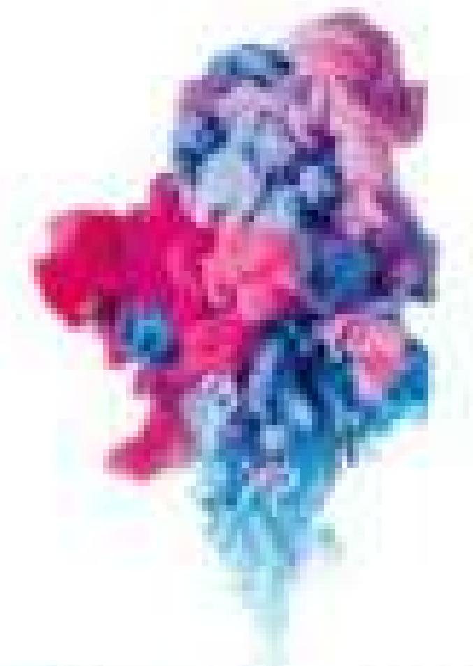


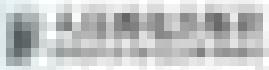

# 目 录

版权信息

内容提要

前言

资源与支持

第1章起源：扩散模型简介

1.1 生成模型的发展史  
1.2 扩散模型核心思想介绍   
1.3 条件扩散模型  
1.4 扩散模型加速采样方法

参考文献

第2章 基石：扩散模型与轨迹优化问题

2.1 离线强化学习  
2.2 第一个基于扩散模型的决策智能体：Plan Diffuser  
2.3 条件生成决策模型的集大成者：Decision Diffuser   
2.4 代码实战

参考文献

第3章 基石：扩散模型与价值函数的结合

3.1 强化学习中基于价值函数的策略优化  
3.2 Diffusion-QL：高效建模离线数据集中的行为策略  
3.3 CEP和QGPO：借助能量函数设计新的引导器  
3.4 LDCQ：扩散模型约束下的Q-learning

参考文献

第4章基石：扩散模型训练技巧指南

4.1 如何设计去噪网络  
4.2 如何设计训练方案  
4.3 如何选择扩散模型的类型  
4.4 代码实战

参考文献

第5章扩展：多任务泛化

5.1 离线元强化学习   
5.2 MetaDiffuser

# 参考文献

# 第6章 扩展：世界模型建模

6.1 世界模型简介  
6.2 基于RNN的世界模型  
6.3 基于Transformer的世界模型  
6.4 基于扩散模型的世界模型

# 参考文献

# 第7章 反转：用强化学习来优化扩散模型

7.1 引言  
7.2 DDPO：将去噪过程建模为序列决策过程   
7.3 Diffusion-DPO：运用于扩散模型的直接偏好优化  
7.4 DRaFT：通过可微分奖励函数直接优化扩散模型  
7.5 代码实战

# 参考文献

# 第8章 扩展：扩散模型在决策问题上的新进展

8.1 基于生成模型的强化学习策略  
8.2 决策基模型中的扩散模型  
8.3 总结与展望

# 参考文献

# 版权信息

书名：扩散模型：核心原理与强化学习优化

编著：陈云 牛雅哲 张金欧文

排版：林妹

出版社：人民邮电出版社

出版时间：2025-11-01

ISBN：9787115676122

您购买的人民邮电出版社电子书仅供您个人使用，未经授权，不得以任何方式复制和传播本书内容。

我们愿意相信读者具有这样的良知和觉悟，与我们共同保护知识产权。

如果购买者有侵权行为，我们可能对该用户实施包括但不限于关闭该帐号等维权措施，并可能追究法律责任。

# 内容提要

本书通过系统化的理论讲解与实战导向的案例分析，帮助读者掌握扩散模型与强化学习的结合应用，探索其针对实际问题的解决方案。书中首先介绍了生成模型的发展史，特别是扩散模型的起源和核心思想，为读者学习后续章节奠定基础；然后深入探讨了扩散模型在构建决策智能体、结合价值函数等方面的应用，还详细讲解了如何利用扩散模型解决轨迹优化和策略优化等问题；接下来探索了扩散模型在多任务泛化和世界模型建模方面的扩展应用，展示了其在复杂环境中的适应性和灵活性；最后讨论了利用强化学习优化扩散模型的新进展，以及扩散模型在决策问题上的前沿研究方向。

通过本书的学习，读者不仅能够理解扩散模型和强化学习的理论基础，还能掌握将其应用于实际问题的技巧和方法。无论你是人工智能领域的研究者，还是希望在实际项目中应用这些技术的工程师，本书都将为你提供有价值的参考和指导。

# 前言

# 编写背景

生成式人工智能技术正以前所未有的发展速度推动学科前沿和实际应用的革新浪潮。其中，扩散模型（DiffusionModel）在深度学习、自然语言处理、图像生成、强化学习等领域展现出卓越的能力和灵活性。不同于以往生成模型单纯的“捕捉数据分布”工作方式，扩散模型以独到的“逐步加噪/去噪”机制，实现了对复杂高维数据的逼真合成与创新变换，成为生成建模领域的“明星技术”。

与此同时，强化学习和智能决策技术也在不断突破理论与应用的边界。在机器学习、机器人控制、自动驾驶、元学习等复杂任务中，如何高效地利用离线数据进行学习、如何实现多任务的泛化能力，成为业界与学界关注的核心难题。近年来，关于扩散模型与强化学习深度融合的研究不断涌现：将扩散模型视作通用策略分布建模工具、将强化学习引入扩散模型的目标优化乃至构建具备泛化能力的“世界模型”……一系列创新性框架极大丰富了人工智能的研究和应用内涵。

这本书，既是作者多年参与深度应用扩散模型、强化学习和生成建模相关工作的总结，也是作者就阅读、学习和实践过程中所产生的各种疑问和困惑的自我回应。尽管扩散模型的相关研究和应用突飞猛进，但国内系统梳理“扩散模型 $+ i$ 智能决策/强化学习”相关主题的图书等学习资料依然匮乏。许多有志于深入生成建模与智能决策一线的学习者，在面对工程难题时，仅靠庞杂的论文、碎片化的教程，很难快速构建完整的知识脉络和实践路径。

与其说本书是作者总结近年来的所学、所思与所得，不如说是为更多正在学习、探索和奋斗于人工智能前沿的同行铺就了一条相对平整的路，使大家能够得到更多启发，少走弯路。诚挚希望每一位读者，不仅能在书中找到技术解答，而且能体会到创新的乐趣和学以致用的成就感，并对人工智能未来的无限可能充满信心。

# 本书的主要内容

本书内容分为多个层次，从理论基础到算法实践，从模型设计到多领域应用，覆盖了扩散模型的“全技术脉络”。

● 全面梳理生成模型的发展史，包括早期的概率模型、变分自编码器（VariationalAuto-Encoder，VAE）、生成对抗网络（Generative Adversarial Network，GAN）、扩散模型等范式，为读者勾画出技术演进的背景。  
● 系统阐述扩散模型的数学机制，其中涉及加噪/去噪过程、数学原理、训练方法、条件采样与加速采样方法等关键技术环节。  
● 深入介绍扩散模型在强化学习与决策问题中的开创性应用，如轨迹优化与离线强化学习、与价值函数结合的Diffusion-QL、CEP/QGPO、LDCQ等算法，剖析其创新点与实际效果。  
● 探讨扩散模型在多任务泛化、世界模型建模（如基于RNN/Transformer/扩散模型的世界模型框架）以及机器人控制、自动驾驶、高维数据分布建模等复杂场景下的前沿进展与瓶颈。  
● 展示如何反向利用强化学习算法优化扩散模型，推动生成模型与人类偏好的深度对齐与目标导向进化。  
● 提供大量贴合实际的代码实例、算法流程与实验配置，便于读者将理论知识应用到具体工程实践和研究探索之中。

# 本书的特点和读者对象

本书在内容设计和表达方式上具有如下鲜明特色。

● 理论与工程兼顾：既重视数理基础和方法体系，又紧密结合算法实现、实验评测与应用案例，帮助读者形成“原理—实现—系统”的全景认知。  
● 前沿交叉、脉络明晰：全书紧跟最新学术进展，系统梳理扩散模型与强化学习、世界模型等领域的交叉创新成果，构筑体系化的技术脉络。  
● 示例丰富、直观易懂：提供足够多的代码、伪代码与实验配置，辅以丰富的可视化示意图，并采用多种对比手法进行讲解，力求让复杂原理与算法一目了然、易于上手。  
● 注重应用与未来展望：不仅解析现有成果的优势与局限，也对未来机器人、自动驾驶、智能体等领域的扩展潜力提出洞见与展望。

本书适合以下读者。

● 对生成模型、深度学习、决策优化、强化学习、机器人学等方向感兴趣的高校学生、研究人员。  
● 从事AI系统开发、数据建模、算法研究等工作的产业工程师和产品经理。

● 关注人工智能前沿发展、希望深度理解并实践扩散模型与智能决策融合的学习者。  
● 有一定机器学习/深度学习基础、希望系统提升工程和理论能力的相关从业者。

扩散模型处在人工智能技术新的风口，是数智世界构建与创新的重要推手。愿本书能够成为你探索生成模型前沿与复杂智能决策问题的有力助手，助你在这片“蓝海”中不断超越、突破自我！

陈云

2025年6月

# 资源与支持

# 资源获取

本书提供如下资源：

● 配套代码文件；  
● 本书思维导图；

要获得以上资源，您可以扫描右侧二维码，根据指引领取。


# 提交勘误信息

作者和编辑尽最大努力来确保书中内容的准确性，但难免会存在疏漏。欢迎您将发现的问题反馈给我们，帮助我们提升图书的质量。

当您发现错误时，请登录异步社区（https://www.epubit.com），按书名搜索，进入本书页面，单击“发表勘误”，输入错误信息，单击“提交勘误”按钮即可（见下图）。本书的作者和编辑会对您提交的错误信息进行审核，确认并接受后，您将获赠异步社区的100积分。积分可用于在异步社区兑换优惠券、样书或奖品。


# 与我们联系

我们的联系邮箱是contact@epubit.com.cn。

如果您对本书有任何疑问或建议，请您发邮件给我们，并在邮件标题中注明本书书名，以便我们更高效地做出反馈。

如果您有兴趣出版图书、录制教学视频，或者参与图书翻译、技术审校等工作，可以发邮件给我们。

如果您所在的学校、培训机构或企业想批量购买本书或异步社区出版的其他图书，也可以发邮件给我们。

如果您在网上发现有针对异步社区出品图书的各种形式的盗版行为，包括对图书全部或部分内容的非授权传播，请您将怀疑有侵权行为的链接通过邮件发送给我们。您的这一举动是对作者权益的保护，也是我们持续为您提供有价值的内容的动力之源。

# 关于异步社区和异步图书

“异步社区” 是由人民邮电出版社创办的IT专业图书社区，于2015年8月上线运营，致力于优质内容的出版和分享，为读者提供高品质的学习内容，为作译者提供专业的出版服务，实现作译者与读者在线交流互动，以及传统出版与数字出版的融合发展。

“异步图书” 是异步社区策划出版的精品IT图书的品牌，依托于人民邮电出版社在计算机图书领域四十余年的发展与积淀。异步图书面向各行业的信息技术用户。

# 第1章

# 起源：扩散模型简介

# 1.1 生成模型的发展史

生成模型（Generative Model）是机器学习的一个重要分支，它的核心目标是从数据中学习其潜在结构，并生成与真实数据相似的新样本。生成模型的发展历程可以分为几个重要的阶段，每个阶段都推动了生成模型的能力提升与广泛应用。从早期的概率模型，到近年来深度学习的爆发式增长，再到多模态生成的前沿探索，生成模型正逐渐成为数据科学与人工智能领域的重要技术。以下是生成模型发展的历史演变。

# 1.早期的生成模型（二十世纪八九十年代）

生成模型的起源可以追溯到二十世纪八九十年代，当时许多概率模型为生成模型后来的发展奠定了基础。

隐马尔可夫模型

隐马尔可夫模型（Hidden Markov Model，HMM）是最早的生成模型之一，广泛应用于语音识别和自然语言处理（Natural Language Processing，NLP）等序列数据任务。HMM通过隐藏状态的序列，建模了观测数据的生成过程。其强大的序列建模能力使得HMM在早期成为生成模型的重要工具。

高斯混合模型

高斯混合模型（Gaussian Mixture Model，GMM）是另一种经典的生成模型，其通过多个高斯分布的线性组合来近似复杂的数据分布。GMM已广泛应用于聚类和模式识别任务，如语音信号处理和图像分割。它在解决非线性可分数据的问题上具有明显优势，是早期生成模型的代表之一。

# 2.深度学习的兴起（2000—2010年）

随着计算能力的增强和数据量的爆炸式增长，深度学习逐渐成为主流，生成模型也随之进入新的发展阶段。

深度信念网络

深度信念网络（Deep Belief Network，DBN） [1] 是由Geoffrey Hinton等人提出的生成模型，通过多层受限玻尔兹曼机（Restricted Boltzmann Machine，RBM）堆叠而成。DBN的多

层结构使得它能够从高维数据中提取有意义的特征，并且能够以无监督方式学习数据的隐含分布。

# 变分自编码器

变分自编码器（Variational Auto-Encoder，VAE） [2]是一种概率生成模型，它先通过编码器将数据映射到潜空间，再通过解码器生成新的数据样本。VAE不仅能够生成与输入数据相似的样本，还能够进行潜空间的连续操作，从而在生成过程中提供更大的灵活性和可解释性。VAE在图像和文本生成以及其他任务中表现出色。

# 3.生成对抗网络（2014年至今）

# GAN的提出

生成对抗网络（Generative Adversarial Network，GAN） [3] 由Ian Goodfellow等人在2014年提出，它通过生成器和判别器的对抗性训练，使生成器能够产生逼真的样本。

GAN的提出标志着生成模型领域的一次革命性进展。GAN凭借其对抗训练的机制，显著提升了生成模型的质量和多样性。

GAN的工作原理如下：生成器试图生成与真实数据无法区分的新数据，而判别器则努力将真实数据与生成数据区分开来。通过这样的对抗训练，生成器不断改进，最终生成高质量的样本。

# GAN的变体

随着时间的推移，研究人员提出了多种GAN的变体，以提升其生成能力和稳定性。例如，条件GAN（CGAN）引入了标签信息，使生成器能够生成特定类别的样本；深度卷积GAN（DCGAN）利用卷积神经网络提升了所生成图像的质量；风格GAN（StyleGAN）更是通过风格控制的方式，生成了高度细腻且控制精细的图像。这些GAN变体在图像生成、视频生成、超分辨率等领域取得显著的成果。

# 4.自回归模型（2010年至今）

自回归模型通过逐个生成数据点的方式，成为生成模型中的重要一类，特别是在图像和文本生成领域表现出色。

# PixelRNN/PixelCNN

PixelRNN和PixelCNN [4]是两种典型的自回归图像生成模型，它们通过逐个像素生成图像内容，确保生成的每个像素都依赖于之前的像素。这种逐像素生成的方式尽管计算开销较大，却能精确捕捉图像的局部结构和细节。

Transformer架构

Transformer架构最初用于NLP任务，后来也广泛应用于图像生成任务。OpenAI提出的DALL-E模型通过将Transformer架构应用于图像生成，来根据文本描述生成逼真的图像。同样，Google的Imagen也通过Transformer架构在生成任务中取得显著突破。

# 5.扩散模型（2015年至今）

扩散模型是一种基于噪声添加与去噪的生成模型，近年来在图像生成领域取得巨大成功。

扩散概率模型

扩散概率模型通过逐步添加噪声将数据扰乱，然后通过学习逆过程生成清晰的图像。扩散概率模型的关键在于去噪过程的精确性和控制力，这使得它在高质量图像生成领域备受瞩目。OpenAI的DALL-E 2和Google的Imagen基于这种技术，能够生成极为精细的图像。

# 6. 结合多种技术的混合模型（2010年至今）

为了充分发挥不同生成模型的优势，研究人员开始探索多种技术的融合。

VAE-GAN

VAE-GAN是将VAE的概率解释性与GAN的高质量生成能力相结合的一种混合模型。这种混合模型能够同时利用VAE的潜空间结构和GAN的对抗性学习，从而生成更加多样化且逼真的数据。

多模态生成模型

随着数据形式变得多样化，生成模型逐渐向多模态领域扩展。例如，OpenAI提出的CLIP和DALL-E模型不仅能够理解文本与图像之间的关系，还能够根据文本描述生成图像。

多模态生成模型的出现标志着生成模型应用场景的进一步扩大，尤其是在跨领域数据生成与理解上展现出巨大的潜力。

生成模型从最早的统计学模型，到深度学习的蓬勃发展，再到近年来的多模态生成模型，经历了多次技术革命。每一次技术的进步都极大地拓宽了生成模型的应用范围。如今，生成模型不仅在学术研究中扮演着重要角色，更是在图像生成、内容创作、医疗健康等领域展现出广阔的应用前景。

# 1.2 扩散模型核心思想介绍

扩散模型是一种将扩散过程（Diffusion Process）的逆过程（Inverse Process）作为其生成过程的流生成模型（Flow-based Generative Model）。

# 1.2.1 扩散过程及其逆过程

扩散过程在自然界中广泛存在，比如热量的传导、气体分子的布朗运动、溶液密度的变化，以及更广泛意义上，诸如人类社会中的知识、技术、观点、注意力的传播和平衡过程等。扩散的本质是任何一种事物从较高密度区域向较低密度区域的随机运动，可以描述为一种随机过程（Stochastic Process）。

从布朗运动的视角来看，如果在扩散过程中，空间中的每一个位置附近都存在足以满足统计规律的粒子，则它们的运动轨迹可以用如下随机微分方程来描述：

$$
\mathrm {d} x = f (x _ {t}, t) \mathrm {d} t + g (t) \mathrm {d} w _ {1} \tag {1.1}
$$

在式（1.1）中， $x _ { t }$ 为粒子的位置， $_ t$ 为时刻， $f ( x _ { t } , t )$ 为 $\mathbf { X }$ 位置的粒子在 t 时刻的运动的漂移速度， $g ( t )$ 为 t 时刻的粒子的扩散系数，反映了 t 时刻的扩散程度， $w _ { t }$ 为一个标准维纳过程（Wiener Process）。

为了进一步简化运动轨迹的类型，仅考虑由线性随机微分方程控制的运动轨迹：

$$
\mathrm {d} x = f (t) x _ {t} \mathrm {d} t + g (t) \mathrm {d} w _ {t} \tag {1.2}
$$

在式（1.2）中， $f ( t )$ 为 t 时刻的漂移系数。

对于这类运动轨迹，从单一粒子的视角来看，在初始时刻， $\scriptstyle t = 0$ ， $x _ { 0 }$ 位置的粒子在未来某一时刻 $_ t$ 的位置 $p ( x _ { t } )$ 服从如下形式的高斯分布：

$$
p \left(x _ {t} \mid x _ {0}\right) \sim \mathcal {N} \left(x _ {t} \mid \alpha (t) x _ {0}, \sigma^ {2} (t) I\right) \tag {1.3}
$$

在式（1.3）中， $\alpha ( t )$ 为 t 时刻的平均位置与初值位置之间的比例，称为比例（Scale）系数， $\sigma ( t )$ 为 t 时刻的粒子位置的标准差。

在拟定粒子运动方程的漂移系数 与扩散系数 之后，它们的数值满足如下数学关系：

$$
f (t) = \frac {\mathrm {d} \log \alpha (t)}{\mathrm {d} t} \tag {1.4}
$$

$$
g ^ {2} (t) = \frac {\mathrm {d} \sigma^ {2} (t)}{\mathrm {d} t} - 2 \frac {\mathrm {d} \log \alpha (t)}{\mathrm {d} t} \sigma^ {2} (t)
$$

在每一个时刻，空间中全体粒子的分布可以视为一种概率分布。其概率密度函数 $p ( x _ { t } )$ 作为空间和时间的函数，可以由福克-普朗克-柯尔莫哥洛夫方程（Fokker-Planck KolmogorovEquation）确定：

$$
\frac {\partial p \left(x _ {t}\right)}{\partial t} = - \nabla_ {x _ {t}} \cdot \left(p \left(x _ {t}\right) f \left(x _ {t}, t\right) + \Delta_ {x _ {t}} \left(\frac {g ^ {2} (t)}{2} p \left(x _ {t}\right)\right) \right. \tag {1.5}
$$

可以将式（1.5）转换为连续性方程（Continuity Equation）的形式：

$$
\frac {\partial p \left(x _ {t}\right)}{\partial t} = - \nabla_ {x _ {t}} \cdot \left(p \left(x _ {t}\right) \left(f \left(x _ {t}, t\right) - \frac {g ^ {2} (t)}{2} \nabla_ {x} \log p \left(x _ {t}\right)\right)\right) \tag {1.6}
$$

对于一个不存在掺混的粒子运动过程，它的流动过程可以用一个常微分方程来描述：

$$
\mathrm {d} x = v \left(x _ {t}, t\right) \mathrm {d} t \tag {1.7}
$$

其粒子的平均速度 $\nu ( x _ { t } , t )$ 与每个粒子的漂移速度 $f ( x _ { t } , t )$ 相同。因此，其连续性方程遵循：

$$
\frac {\partial p \left(x _ {t}\right)}{\partial t} = - \nabla_ {x _ {t}} \cdot \left(p \left(x _ {t}\right) v \left(x _ {t}, t\right)\right) \tag {1.8}
$$

对于存在掺混的扩散过程，假设它与一个不存在掺混的粒子运动过程具有相同的概率密度分布 $p ( x , t )$ ，则这个不存在掺混的粒子运动过程的平均速度 $\nu ( x _ { t } , t )$ 需要具有以下形式：

$$
v (x _ {t}, t) = f (x _ {t}, t) - \frac {g ^ {2} (t)}{2} \nabla_ {x} \log p (x _ {t}) \tag {1.9}
$$

与此同时，我们可以将扩散过程的平均速度定义为上述形式。在式（1.9）中，概率密度函数的对数关于随机变量的梯度场 $\nabla _ { x _ { t } } \log { p ( x _ { t } ) }$ 称为得分函数（Score Function）。

扩散的本质是将高密度分布 $p ( x _ { t } | t = 0 )$ 转换为某种低密度分布 $p ( x _ { t } | t = T )$ ，比如高斯分布$\mathcal { N } ( x , \mu , \Sigma )$ 。保持扩散过程中每个时刻的整体概率密度分布不变，从时间维度逆转上述运动过程，即可通过扩散过程的逆过程，将某种低密度分布 $p ( x _ { t } | t = T )$ 转换为高密度分布 $p ( x _ { t } | t = 0 )$ 。

由此可见，扩散模型是一种将扩散过程的逆过程作为其生成过程的流生成模型。

我们可以将扩散模型建模为得分函数模型 $\nabla _ { x _ { t } } \log { p _ { \theta } ( x _ { t } , t ) }$ 、速度模型 $\nu _ { \theta } ( x _ { t } , t )$ 、噪声模型 $\epsilon _ { \theta } ( x _ { t } , t )$ 等任意多种形式，它们有如下变换关系：

$$
v _ {\theta} \left(x _ {t}, t\right) = f \left(x _ {t}, t\right) - \frac {g ^ {2} (t)}{2} \nabla_ {x _ {t}} \log p _ {\theta} \left(x _ {t}\right) \tag {1.10}
$$

$$
\epsilon_ {\theta} \left(x _ {t}, t\right) = - \sigma (t) \nabla_ {x _ {t}} \log p _ {\theta} \left(x _ {t}\right) \tag {1.11}
$$

可以看到，由于每一个扩散模型都有一个确定的扩散过程与之对应，即数值确定的漂移速度 $f ( x , t )$ 与扩散系数 $g ( t )$ ，因此对于同一个数据集，不同建模方式的扩散模型的数学本质是等价的。

# 1.2.2 扩散模型的训练

生成模型的训练一般基于对数据集 $X$ 的 最 大 似 然 估 计 （ Maximum LikelihoodEstimation，MLE）。假如模型的建模参数是 $\theta$ ，那么优化模型的目标为最大化 $p ( X )$ ，一般使用以下形式的目标方程来实现：

$$
\mathcal {L} (\theta) = - \mathbb {E} [ \log p _ {\theta} (x) ] \tag {1.12}
$$

然而，对扩散模型直接使用上面的训练目标等价于训练一个连续正则化流（ContinuousNormalizing Flow）模型，需要使用连续变量转换公式（Instantaneous Change of VariablesFormula），积分和求解对数似然函数在流动过程中的变化量，且训练过程常常陷入不稳定的情形。而为了有效且稳定地训练，需要使用一系列正则化技巧，详见论文 [5]“How to trainyour neural ODE：the world of Jacobian and kinetic regularization”。

为了规避这一点，扩散模型采用了一种以扩散过程的逆过程为固定生成过程的设计。当数据固定时，扩散过程的类型固定，扩散过程的逆过程虽然未知，但其存在且唯一。这样一来，扩散模型的训练就有了一个固定的监督学习目标，而不必直接计算对数似然函数 $\log p _ { \theta } ( x )$ ，也不会受到不稳定的训练过程的干扰。恰恰相反，这样的训练目标非常稳定。具体来说，扩散模型的主流训练方法有两种，分别为得分匹配（Score Matching）算法与流匹配（FlowMatching）算法。

得分匹配算法计算以下形式的训练目标函数，又称显式得分匹配（Explicit ScoreMatching）算法：

$$
\mathcal {L} (\theta) = \mathbb {E} _ {t \sim p (t)} \left[ \mathbb {E} _ {x _ {t} \sim p (x _ {t})} \left[ \lambda (t) \left\| \nabla_ {x _ {t}} \log p _ {\theta} (x _ {t}) - \nabla_ {x _ {t}} \log p (x _ {t}) \right\| ^ {2} \right] \right] \tag {1.13}
$$

可以看到，得分匹配算法计算一个加权的均方差损失函数并将其作为扩散模型的训练目标函数。其中 为不同类型的加权系数。在式（1.13）中，由于真实的得分函数 $\nabla _ { x _ { t } } \log { p ( x _ { t } ) }$ 未知，因此无法直接计算。Pascal Vincent在论文  [6] “A connection between score matching anddenoising autoencoders”中提出了效果等价于显式得分匹配算法的降噪得分匹配（DenoisingScore Matching）算法，形式如下：

$$
\mathcal {L} (\theta) = \mathbb {E} _ {t \sim p (t)} \left[ \mathbb {E} _ {x _ {t} \sim p (x _ {t}, x _ {0})} \left[ \lambda (t) \left\| \nabla_ {x _ {t}} \log p _ {\theta} (x _ {t}) - \nabla_ {x _ {t}} \log p _ {\theta} (x _ {t} | x _ {0}) \right\| ^ {2} \right] \right] \tag {1.14}
$$

在式（1.14）中，条件得分函数 $\nabla _ { x _ { t } } \log { p _ { \theta } ( x _ { t } | x _ { 0 } ) }$ 在扩散过程中是可解析的：

$$
\nabla_ {x _ {t}} \log p _ {\theta} \left(x _ {t} \mid x _ {0}\right) = - \frac {x _ {t} - x _ {0}}{\sigma^ {2} (t)} \tag {1.15}
$$

与得分匹配算法的思路相近，流匹配算法旨在监督训练模型的速度场，并计算以下形式的训练目标函数：

$$
\mathcal {L} (\theta) = \mathbb {E} _ {t \sim p (t)} \left[ \mathbb {E} _ {x _ {t} \sim p (x _ {t})} \left[ \| v _ {\theta} (x _ {t}) - v (x _ {t}) \| ^ {2} \right] \right] \tag {1.16}
$$

从式（1.16）中可以看到，流匹配算法一般不再引入随时间变化的加权系数，而希望全局一致地按照概率流的密度分布监督学习整个流场的速度。Yaron Lipman等人在论文 [7]“Flowmatching for generative modeling” 中 率 先 给 出 了 以 高 斯 分 布 为 先 验 的 流 匹 配 算 法 ， 而 后Alexander Tong 等 人 在 论 文  [8] “Improving and generalizing flow-based generative models withminibatch optimal transport”中将该算法推广到了可以将任意分布作为先验的更通用形式，称为条件流匹配（Conditional Flow Matching）算法：

$$
\mathcal {L} (\theta) = \mathbb {E} _ {t \sim p (t)} \left[ \mathbb {E} _ {x _ {t} \sim p \left(x _ {t}, x _ {0}, x _ {1}\right)} \left[ \left\| v _ {\theta} \left(x _ {t}\right) - v \left(x _ {t} \mid x _ {0}, x _ {1}\right) \right\| ^ {2} \right] \right] \tag {1.17}
$$

在式（1.17）中， $x _ { 0 }$ 为来自先验分布 $p ( x _ { 0 } )$ 的样本，而 $x _ { 1 }$ 为来自数据分布 $p ( x _ { 1 } )$ 的样本。

# 1.2.3 扩散模型的推断

扩散模型的推断过程是对扩散过程的逆过程的演绎。逆向回溯扩散过程需要使用与正向过程拥有相同概率密度分布的某种逆过程。

可以直接使用由福克-普朗克-柯尔莫哥洛夫方程给定的常微分方程作为生成路径：

$$
\mathrm {d} x = v _ {\theta} \left(x _ {t}, t\right) \mathrm {d} t = \left(f \left(x _ {t}, t\right) - \frac {g ^ {2} (t)}{2} \nabla_ {x _ {t}} \log p _ {\theta} \left(x _ {t}\right)\right) \mathrm {d} t \tag {1.18}
$$

该常微分方程也称概率流常微分方程（Probability Flow ODE）。

也可以在逆向过程的生成路径中注入一定规模的高斯噪声，此时对应相同概率密度分布的逆向过程的生成路径可以使用一种随机微分过程来描述：

$$
\mathrm {d} x = v _ {\theta} \left(x _ {t}, t\right) \mathrm {d} t + g ^ {\prime} (t) \mathrm {d} w _ {t} ^ {\prime} = \left(f \left(x _ {t}, t\right) - \frac {g ^ {2} (t) + g ^ {\prime 2} (t)}{2} \nabla_ {x _ {t}} \log p _ {\theta} \left(x _ {t}\right)\right) \mathrm {d} t + g ^ {\prime} (t) \mathrm {d} w _ {t} ^ {\prime} \tag {1.19}
$$

在式（1.19）中， $g ^ { \prime } ( t ) \mathrm { d } w _ { t } ^ { \prime }$ 为采样过程中额外注入的高斯噪声，其幅值 $g ^ { \prime } ( t )$ 理论上不受任何限制，但一般可以选取和扩散过程的前向过程（又称前向扩散过程）相同的加噪方案，即$g ( t ) = g ^ { \prime } ( t )$ 。此时，式（1.19）变化为

$$
\mathrm {d} x = v _ {\theta} \left(x _ {t}, t\right) \mathrm {d} t + g (t) \mathrm {d} w _ {t} ^ {\prime} = \left(f \left(x _ {t}, t\right) - g ^ {2} (t) \nabla_ {x _ {t}} \log p _ {\theta} \left(x _ {t}\right)\right) \mathrm {d} t + g (t) \mathrm {d} w _ {t} ^ {\prime} \tag {1.20}
$$

论文 [9]“Elucidating the design space of diffusion-based generative models”详细论述了在生成过程中额外注入高斯噪声所带来的效果及其机制。如果扩散模型的建模和训练是理想的，则理论上使用任意一种生成路径所得到的采样分布将是一致且有效的。但在具体实践中，扩散模型的建模不可能是完美的，训练无法完全做到收敛和正确，在生成过程中注入噪声等价于破坏前期生成路径中的相关信息，从而后期必须在生成路径中使用更强的来自得分函数的引导。假如前期生成路径的得分函数训练不充分，而后期生成路径的得分函数训练充分，则在生成过程中添加一定的噪声可以有效地纠正生成路径。

# 1.2.4 扩散模型的评价指标

扩散模型作为一种生成模型，隐式地建模了数据的概率分布，因此具备评估生成结果的概率密度的能力。为了在数值上易于分析，我们将其表示为负对数似然（Negative Log-Likelihood，NLL），并以每维度比特作为计量单位：

$$
\mathrm {N L L} = - \frac {\log p (x)}{d \cdot \log 2} \quad (1. 2 1)
$$

一个已训练的扩散模型的似然函数 $p ( x )$ 可以使用瞬时变量变换定理（InstantaneousChange of Variable Theorem）来计算：

$$
\frac {\partial \log p (x (t))}{\partial t} = - \operatorname {T r} \left(\frac {\partial v (x (t) , t)}{\partial x}\right) \tag {1.22}
$$

对式（1.22）进行定积分，可以得到：

$$
\log p (x) = \log p (x (0)) = \log p (x (1)) - \int_ {t = 1} ^ {t = 0} - \operatorname {T r} \left(\frac {\partial v (x (t) , t)}{\partial x}\right) \tag {1.23}
$$

除了负对数似然之外，扩散模型也可以从生成质量的效果来评价。对于输出对象为图像的扩散模型，可以使用计算机视觉（Computer Vision，CV）领域的通用评价指标，比如FID（Frechet Inception Distance）与IS（Inception Score）。它们是基于Google的预训练网络Inception Net-V3进行相关生成质量评估的指标。在强化学习领域，当使用扩散模型建模策略函数时，可以直接通过该策略在评估场景时的总回报，来评估扩散模型的训练质量。

# 1.2.5 扩散模型的类型

虽然所有的扩散模型都使用同一个定义式，但不同扩散模型具体的加噪方式与构造形式不同。我们可以通过安排不同形式的比例系数 $\alpha ( t )$ 和噪声方差 $\sigma ^ { 2 } ( t )$ 来确定具体的扩散轨迹。

$$
p \left(x _ {t} \mid x _ {0}\right) \sim \mathcal {N} \left(x _ {t} \mid \alpha (t) x _ {0}, \sigma^ {2} (t) I\right) \tag {1.24}
$$

只需要满足式（1.24）即可。换言之，只需要满足当 $\scriptstyle t = 0$ 时 $\begin{array} { r } { \operatorname* { l i m } _ { t  0 } \alpha ( t ) = 1 } \end{array}$ 且 $\begin{array} { r } { \operatorname* { l i m } _ { t  0 } \sigma ( t ) = 0 } \end{array}$ ，以及当 $\scriptstyle t = 1$ 时 $\scriptstyle \operatorname* { l i m } _ { t \to 1 } \alpha ( t ) = 0$ 的边界条件即可。

对于扩散模型，比例系数 $\alpha ( t )$ 和噪声方差 $\sigma ^ { 2 } ( t )$ 与漂移系数 $f ( t )$ 和扩散系数 $g ( t )$ 之间存在确定的数学关系：

$$
f (t) = \frac {\mathrm {d} \log \alpha_ {t}}{\mathrm {d} t} \tag {1.25}
$$

$$
g ^ {2} (t) = \frac {\mathrm {d} \sigma_ {t} ^ {2}}{\mathrm {d} t} - 2 \frac {\mathrm {d} \log \alpha_ {t}}{\mathrm {d} t} \sigma_ {t} ^ {2}
$$

连续时间扩散模型

连续时间扩散模型一般将扩散过程设定在[0,1]连续区间，并让其训练和推断在整个连续区间内进行。

常见的连续时间扩散模型及对应系数如表1.1所示。

表1.1　常见的连续时间扩散模型及对应系数  

<table><tr><td rowspan="2">连续时间扩散模型</td><td colspan="2">对应系数</td></tr><tr><td>α(t)</td><td>σ(t)</td></tr><tr><td>方差守恒型扩散模型</td><td>exp(-1/2∫_0^tβ(s)ds)</td><td>√1- exp(-∫_0^tβ(s)ds)</td></tr><tr><td>方差爆炸型扩散模型</td><td>1</td><td>√(σ(1)/σ(0))2σ2(0)-σ2(0)</td></tr><tr><td>线性扩散模型</td><td>1-t</td><td>t</td></tr><tr><td>广义方差守恒型扩散模型</td><td>cos(1/2πt)</td><td>sin(1/2πt)</td></tr></table>

方差守恒型（Variance-Preserving）扩散模型都遵循 $\alpha ^ { 2 } ( t ) + \sigma ^ { 2 } ( t ) = 1$ ，这样就可以将扩散过程始终约束在一定范围内。

根据式（1.25），反向计算即可得到方差守恒型扩散模型的漂移系数 $f ( t )$ 和扩散系数的表达式：

$$
f (t) = - \frac {1}{2} \beta (t) \tag {1.26}
$$

$$
g ^ {2} (t) = \beta (t)
$$

根据扩散过程定义式（1.2），可以得到方差守恒型扩散模型的扩散过程的数学形式：

$$
\mathrm {d} x = - \frac {1}{2} \beta (t) x \mathrm {d} t + \sqrt {\beta (t)} \mathrm {d} w _ {t} \tag {1.27}
$$

后续章节将详细介绍这几种连续时间扩散模型的建模与训练方法。

离散时间扩散模型

早期的扩散模型也可以离散时间点的形式给出。比如设定 T个时间点，然后在每个整数时间点上进行采样和训练，这样的扩散模型称为离散时间扩散模型。

设定数据的分布为 $q ( x _ { 0 } )$ ，扩散模型建模从 $x _ { 0 }$ 到 $x _ { T }$ 的隐变量的联合分布［即 $p _ { \theta } ( x _ { 0 : T } )$ ］作为生成过程，得到扩散过程逆过程的数学形式。假设扩散过程的终态为一个标准高斯分布［即$p ( x _ { T } ) = \mathcal { N } ( x _ { T } | 0 , I )$ ］，则扩散过程的逆过程可以描述为一种概率分布转移：

$$
p _ {\theta} \left(x _ {0: T}\right) = p \left(x _ {T}\right) \prod_ {i = 1} ^ {T} p \left(x _ {i - 1} \mid x _ {i}\right) \tag {1.28}
$$

扩散过程逆过程的概率分布转移可以描述和建模为

$$
p \left(x _ {t - 1} \mid x _ {t}\right) = \mathcal {N} \left(x _ {t - 1} \mid \mu_ {\theta} \left(x _ {t}, t\right), \Sigma_ {\theta} \left(x _ {t}, t\right) I\right) \tag {1.29}
$$

扩散过程的前向过程则定义为 $q ( x _ { 1 : T } | x _ { 0 } )$ ，它遵循某种设定的规则：

$$
q \left(x _ {1 T} \mid x _ {0}\right) = \prod_ {i = 1} ^ {T} q \left(x _ {i} \mid x _ {i - 1}\right) \tag {1.30}
$$

以DDPM（Denoising Diffusion Probabilistic Model，去噪扩散概率模型） [10] 为例，其前向过程的概率分布转移 $q ( x _ { t } | x _ { t - 1 } )$ 可以使用一组参数 $[ \beta _ { 0 } , \cdots , \beta _ { r } ]$ 描述为

$$
q \left(x _ {t} \mid x _ {t - 1}\right) = \mathcal {N} \left(x _ {t} \mid \sqrt {1 - \beta_ {t}} x _ {t - 1}, \beta_ {t} I\right) \tag {1.31}
$$

假如标记累乘 的参数为 $\overline { { \alpha } } _ { t }$ ，则DDPM前向过程的概率分布转移可以描述为

$$
q \left(x _ {t} \mid x _ {0}\right) = \mathcal {N} \left(x _ {t} \mid \sqrt {\bar {\alpha} _ {t}} x _ {0}, (1 - \bar {\alpha} _ {t}) I\right) \tag {1.32}
$$

对比式（1.24）和式（1.32），可以看到，DDPM前向过程的概率分布转移与连续时间扩散模型的概率分布转移是等价的，它们都采用高斯分布的形式。

观察表1.1，可以看到，DDPM前向过程的概率分布转移与方差守恒型扩散模型的概率分布转移是等价的：

$$
\exp \left(- \int_ {0} ^ {t} \beta (s) d s\right) = \bar {\alpha} t \tag {1.33}
$$

需要注意的是，DDPM的 $\beta _ { t }$ 与方差守恒型扩散模型的 $\beta ( t )$ 的含义比较相似，但本质不完全相同，它们的物理意义是不同的。比如对于DDPM，当 $\operatorname* { l i m } T \to \infty$ $\beta \to 0$ 时，根据式（1.32），可得：

$$
x _ {t} = \sqrt {1 - \beta_ {t}} x _ {t - 1} + \sqrt {\beta_ {t}} \epsilon \approx \left(1 - \frac {1}{2} \beta_ {t}\right) x _ {t - 1} + \sqrt {\beta_ {t}} \epsilon \tag {1.34}
$$

$$
x _ {t} - x _ {t - 1} \approx - \frac {1}{2} \beta_ {t} x _ {t - 1} + \sqrt {\beta_ {t}} \epsilon
$$

假如将DDPM的 $\beta _ { t }$ 表示为 $\beta ( t )  { \mathrm { d } } t$ ，根据布朗运动的定义，有 $\sqrt { \mathrm { d } t } \epsilon = \mathrm { d } w _ { t }$ ，于是可以将式（1.34）转换为

$$
\mathrm {d} x \approx - \frac {1}{2} \beta (t) x \mathrm {d} t + \sqrt {\beta (t)} \mathrm {d} w _ {t} \tag {1.35}
$$

这恰好是方差守恒型扩散模型的扩散过程的数学形式［见式（1.27）］。

# 1.3 条件扩散模型

根据1.2节对扩散模型的介绍，我们可以利用扩散模型建模一个数据集中数据的分布。但这尚不足以将扩散模型应用于实际问题，因为我们往往希望生成结果的类别或其他属性是可控的。本节讨论赋予扩散模型条件采样能力的两种技术：分类器引导采样和无分类器引导采样。最后讨论用以建模更复杂条件信息的ControlNet。

# 1.3.1 分类器引导采样和无分类器引导采样

实际上为了控制生成结果，最简单的做法是以 为样本，通过式（1.36）最大化条件似然，得到最终的条件扩散模型。但这么做的一个问题在于需要针对想要采样的每种条件重新训练它们。

$$
\max  \mathbb {E} _ {(c, x) \sim \mathcal {D}} - \log p (x | c) \tag {1.36}
$$

分类器引导采样

分类器引导采样通过利用预先训练好的分类器来控制生成过程。根据贝叶斯公式，可以得到：

$$
\log p (x \mid c) = \log p (c \mid x) + \log p (x) - \log p (c) \tag {1.37}
$$

在式（1.37）的两边对 x 求梯度，你会发现条件得分函数可以表达为

$$
\nabla_ {x} \log p (x \mid c) = \nabla_ {x} \log p (c \mid x) + \nabla_ {x} \log p (x) \tag {1.38}
$$

注意与1.2.1小节提到的得分函数不同，这里采用条件得分函数进行采样。式（1.38）可以进一步拓展为

$$
\nabla_ {x} \log p _ {\omega} (x \mid c) = \nabla_ {x} \log p (c \mid x) + \omega \nabla_ {x} \log p (x) \omega > 1 \tag {1.39}
$$

这样就可以通过控制参数 $\pmb { \omega }$ 的大小，控制采样结果与条件 c 的相关性。

在实践中，每一步的分类器引导采样可以描述为

$$
x _ {t - 1} \sim \mathcal {N} (\mu + \omega \Sigma g, \Sigma) \tag {1.40}
$$

其中 $\mu = \mu _ { \theta } ( x _ { t } , t )$ 、 $\Sigma = \Sigma _ { \theta } ( x _ { t } , t )$ ${ \boldsymbol { g } } = \nabla _ { { \boldsymbol { x } } _ { t } }$ logp,(c|x)。

# 无分类器引导采样

遗憾的是，分类器引导采样需要的图像分类器 $p ( c | x _ { t } )$ 作为一个判别模型会忽略掉 $x _ { t }$ 中的大量细节，这种方法无法采样出难以用标签描述的结果（比如想要生成一张包含各种动物的图片）。另外，理想的 $p ( c | x _ { t } )$ 需要能够在任意一个时间步描述 $x _ { t }$ 属于每个类别的概率，这对于被噪声破坏过的图片 $x _ { t }$ 是难以训练的。容易想到的一个极端情况是，对于服从标准高斯分布的 $x _ { T } , ~ p ( y | x _ { T } )$ 为均匀分布，即 $x _ { T }$ 属于每个类别的概率相等。

一种不需要分类器的技术被提出，名为无分类器引导采样（Classifier-Free Guidance，CFG）。由贝叶斯公式，我们可以得到一个隐式的分类器：

$$
\log p (c \mid x) = \log p (x \mid c) + \log p (x) - \log p (c) \tag {1.41}
$$

但这要求预先训练两个生成模型，分别为 $p ( x | c )$ 和 $p ( x )$ 。然而在实践中，我们可以采用共享同一个扩散模型参数的方法来拟合 $p ( x | c )$ 和 $p ( x )$ ，要做到这一点，只需要在训练过程中将条件 $^ { c }$ 随机置 $\varnothing$ 即可。训练结束后，我们可以利用这个隐式的分类器得到如下修正后的得分函数：

$$
\begin{array}{l} \nabla_ {x} [ \log p (x | c) + \omega \log p (c | x) ] = \nabla_ {x} [ \log p (x | c) + \omega (\log p (x | c) - \log p (x)) ] \\ = \nabla_ {x} [ (1 + w) \log p (x \mid c) - \omega \log p (x) ] \\ \end{array}
$$

（1.42）

同样，我们也可以通过控制参数 $\pmb { \omega }$ 的大小，控制采样结果与条件 c 的相关性。

# 1.3.2 ControlNet

# 1.宏观概念

以T2I生成模型为例，有时候用单纯的文字难以描述我们想要生成的图像。比如我们想要精细地控制所生成人像的姿态，最好能够精细到五指摆放位置或发丝飘动方向的程度。这一点是难以用文字叙述清楚的，并且训练时的文本数据亦难以具备如此精细程度的描述。ControlNet[11]旨在解决这一问题。下面详细介绍ControlNet的原理及背后的思想，最后展示一些ControlNet生成结果。

ControlNet是一种通过引入空间定位和特定任务图像条件来增强大型T2I生成模型的神经网络架构。与条件采样方法运用场景不同，在运用ControlNet之前需要先训练扩散模型。

ControlNet的核心思想如图1.1所示。ControlNet会向神经网络模块注入额外的条件信息。

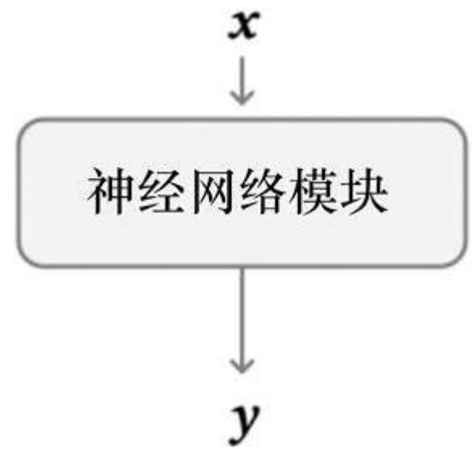  
（a）应用ControlNet之前

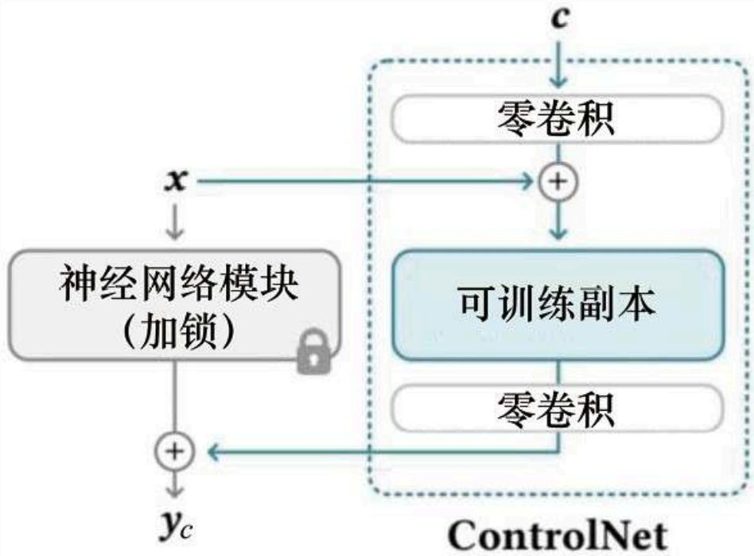  
（b）应用ControlNet之后  
图1.1 ControlNet的核心思想 [11]

在此，我们使用术语神经网络模块指代一组神经网络层，它们通常链接在一起形成一个神经网络单元，如resnet模块、conv-bn-relu模块、multi-head attention模块以及transformer 模块等。如图1.1（a）所示，假设一个训练收敛的神经网络模块可以形式化为 $\mathcal { F } ( \cdot \Theta )$ ，网络模块参数为 ，则使用 $\mathcal { F } ( \cdot \Theta )$ 将输入特征图 $\pmb { x }$ 变换为另一个特征图 $\pmb { y }$ 的操作可以形式化为

$$
\boldsymbol {y} = \mathcal {F} (\boldsymbol {x}; \Theta) \tag {1.43}
$$

如图1.1（b）所示，ControlNet会复制神经网络模块 $\Theta _ { c }$ ，并在该神经网络模块输入前和输出后分别连接一个权重（Weight）和偏置（Bias）初始化为0、卷积核大小为 $1 \times 1$ 的卷积层。在训练过程中，冻结原本的网络模块参数 。ControlNet从输入到输出的变换可以形式化为

$$
\mathcal {Y} _ {c} = \mathcal {F} (\mathbf {x}; \Theta) + \mathbf {Z} \left(\mathcal {F} (\mathbf {x} + \mathcal {Z} (c, \Theta_ {z 1}); \Theta_ {c}); \Theta_ {z 2}\right) \tag {1.44}
$$

通过这样的设计，在ControlNet训练开始时，有害的噪声不会影响到可训练副本的隐藏层。此外，由于 $\mathcal { Z } ( c ; \Theta _ { z 1 } ) = 0$ 且可训练副本仅接收输入特征图 $\pmb { x }$ ，这个可训练副本具有完整的功能，保留了大型预训练模型的能力，可作为进一步学习的强大骨干。零卷积则通过消除在初始训练步骤中作为梯度的随机噪声来保留主干网络的信息。

# 2.将ControlNet具体应用于T2I生成模型

下面我们具体以SD1.5 U-Net为例来展示ControlNet如何将条件控制添加到一个大型的预训练扩散模型中。稳定扩散本质上是一个带有一个编码器、一个中间块和一个跳过连接解码器的U-Net 。编码器和解码器都包含12个块，完整的模型包含25个块，包括中间块。在这25个块中，8个块是下采样或上采样卷积层，而其他17个块是主块，每个主块包含4个残差网络层和2个视觉Transformer（ViT）。每个ViT都包含几种交叉注意力和自注意力机制。例如，如图1.2（a）所示，“SD Encoder Block A”包含4个ResNet 层和2个ViT，而“ $\times 3$ ”表示该块重复了3次。对于文本提示采用CLIP文本编码器，并且扩散时间戳采用一个使用位置编码的时间编码器编码。如图1.2（b）所示，可将ControlNet应用于SD1.5 U-Net的每个编码器级别。ControlNet创建了12个编码块和1个稳定扩散中间块的可训练副本。12个编码块有4个分辨率（ $6 4 { \times } 6 4$ 、 $3 2 \times 3 2$ 、 $1 6 \times 1 6$ 和 $1 8 \times 8$ ），每个编码块重复3次。输出则被添加到SD1.5 U-Net的12个残差连接块和1个中间块中。

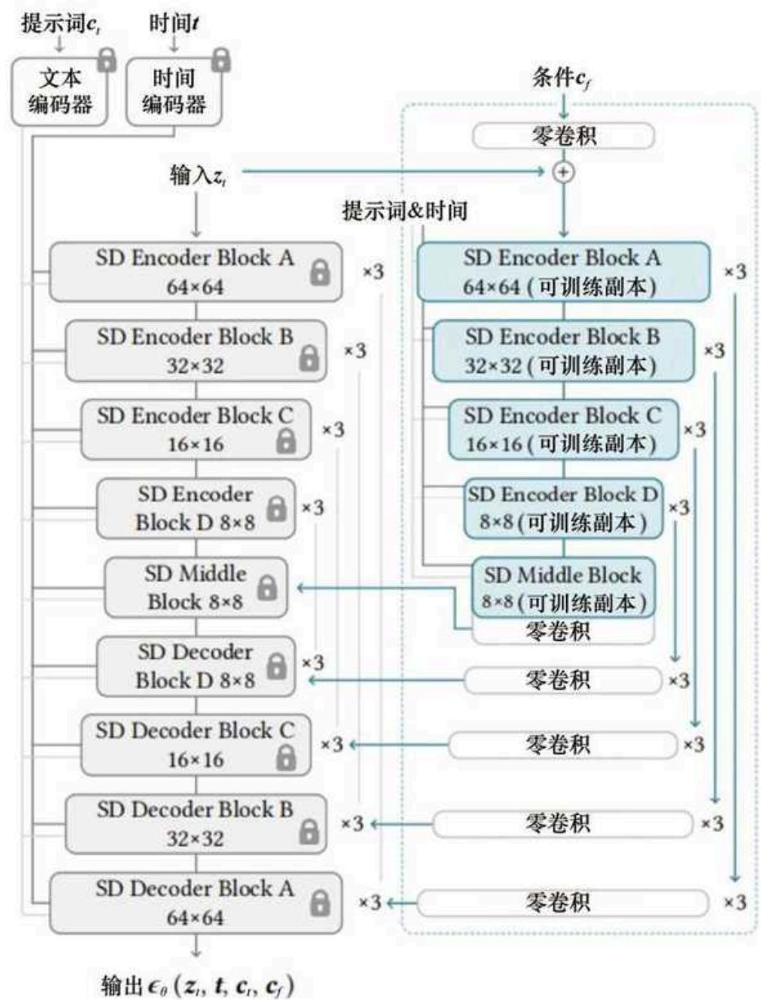  
（a）稳定扩散（b）ControlNet  
图1.2　将ControlNet应用于SD1.5 U-Net [11]

一些ControlNet生成结果如图1.3所示。

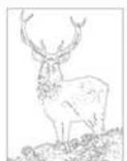  
输入图像边缘

  
默认


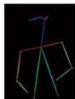  
输入人体资势


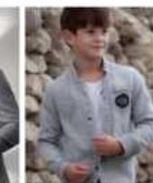


  
“厨师在厨房里”   
“林肯雕像”

图1.3　一些ControlNet生成结果 [11]

# 1.4 扩散模型加速采样方法

自DDPM问世以来，扩散模型在文生图领域迅速崭露头角，其创新性和应用潜力受到学术界和工业界的广泛关注。然而，生成速度问题一直是扩散模型面临的一大挑战。在DDPM框架下，生成一幅高质量的图像往往需要Denoiser进行数千次的迭代推断，这一过程无疑增加了生成图像的时间成本。

在过去两年中，学术界和工业界围绕如何提升扩散模型采样效率这一核心问题，展开了深入的研究和探索。众多研究者提出了一系列创新的方法和策略，旨在缩短图像生成的时间，提高扩散模型的实用性和效率。本节旨在对这些研究成果进行系统的梳理和总结，以期为读者提供一个清晰的视角来了解当前扩散模型采样加速领域的最新进展和背后的原理。

通过深入分析和评估这些加速方法，我们可以看到，尽管挑战依然存在，但通过不断的技术创新和优化，扩散模型在图像生成速度上已经有了显著的提升。这不仅推动了扩散模型在实际应用中的广泛部署，也为扩散模型未来的研究和开发提供了宝贵的经验和启示。

扩散模型的应用可以分为两个相互解耦的阶段：训练和推断。根据加速方法是否需要改变扩散模型的标准训练过程（如DDPM的标准训练过程），这些加速方法可以分为两类：training-free加速采样方法和training-based加速采样方法。

# 1.4.1 training-free加速采样方法

training-free加速采样方法独立于扩散模型的训练过程，即仅改变标准扩散模型的推断采样过程。本节首先介绍DPM-Solver [12] ，它通过将推断过程由随机微分方程（StochasticDifferential Equation，SDE）转换为常微分方程（Ordinary Differential Equation，ODE），并通过平衡ODE求解精度和采样速度，实现采样过程的加速。你会发现，扩散模型采样加速的开山之作DDIM [13] 就是一阶DPM-Solver。

# 1.DPM-Solver

下面首先介绍扩散模型的采样过程可以用什么样的SDE和ODE来描述，然后介绍DPM-Solver是如何近似求解采样过程ODE的，最后展示DPM-Solver的加速采样效果。

让我们从连续时间扩散模型出发，每一时刻下带噪声的图像的分布可以用一个高斯分布来刻画：

$$
q \left(x _ {t} \mid x _ {0}\right) = \mathcal {N} \left(x _ {t} \mid \alpha (t) x _ {0}, \sigma^ {2} (t) I\right) \tag {1.45}
$$

根据Song等人的工作，连续时间扩散模型的扩散过程和逆过程可以分别用如下两个SDE来刻画：

$$
\mathrm {d} x _ {t} = f (t) x _ {t} \mathrm {d} t + g (t) \mathrm {d} w _ {t}, x _ {0} \sim q _ {0} \left(x _ {0}\right) \tag {1.46}
$$

$$
\mathrm {d} x _ {t} = \left[ f (t) x _ {t} - g ^ {2} (t) \nabla_ {x} \log q _ {t} \left(x _ {t}\right) \right] \mathrm {d} t + g (t) \mathrm {d} \bar {w} _ {t}, x _ {T} \sim q _ {T} \left(x _ {T}\right) \tag {1.47}
$$

其中 $w _ { t }$ 和 $\overline { { w } } _ { t }$ 是两个相互独立的标准维纳过程，且函数 $f , g$ 和变量 $_ { \alpha }$ $\sigma$ 之间存在如下关系：

$$
f (t) = \frac {\mathrm {d} \log \alpha_ {t}}{\mathrm {d} t}, g ^ {2} (t) = \frac {\mathrm {d} \sigma_ {t} ^ {2}}{\mathrm {d} t} - 2 \frac {\mathrm {d} \log \alpha_ {t}}{\mathrm {d} t} \sigma_ {t} ^ {2} \tag {1.48}
$$

此外，DDPM中的去噪函数 $\epsilon _ { \theta }$ 实际上拟合的就是 $- \sigma _ { t } \nabla _ { x } \log { q _ { t } ( x _ { t } ) }$ ，因此连续时间扩散模型的采样过程（逆过程）SDE也可以表达为

$$
\mathrm {d} x _ {t} = \left[ f (t) x _ {t} + \frac {g ^ {2} (t)}{\sigma_ {t}} \epsilon_ {\theta} (x _ {t}, t) \right] \mathrm {d} t + g (t) \mathrm {d} \bar {w} _ {t}, x _ {T} \sim q _ {T} (x _ {T}) \tag {1.49}
$$

DDPM的标准采样过程则可以看作式（1.49）的一阶SDE求解器。

事实上，Song等人证明了式（1.47）所表达的SDE与式（1.50）所表达的概率流ODE是对应的，两种过程中每一时刻 $x _ { t }$ 下的边缘分布 $q _ { t } ( x _ { t } )$ 完全相等：

$$
\frac {\mathrm {d} x _ {t}}{\mathrm {d} t} = f (t) x _ {t} - \frac {1}{2} g ^ {2} (t) \nabla_ {x} \log q _ {t} (x _ {t}), x _ {T} \sim q _ {T} (x _ {T}) \tag {1.50}
$$

同样，用去噪函数 $\epsilon _ { \theta }$ 替换 $- \sigma _ { t } \nabla _ { x } \log { q _ { t } ( x _ { t } ) }$ ，可以得到如下ODE：

$$
\frac {\mathrm {d} x _ {t}}{\mathrm {d} t} = f (t) x _ {t} + \frac {g ^ {2} (t)}{2 \sigma_ {t}} \epsilon_ {\theta} (x _ {t}, t), x _ {T} \sim q _ {T} (x _ {T}) \tag {1.51}
$$

式（1.47） 所表达的SDE和式（1.50）所表达的概率流ODE都能采样出真正的图像分布$q _ { 0 } ( x _ { 0 } )$ ，但相比求解SDE，求解ODE更容易。DPM-Solver的核心工作便是利用现成的数学工具快速求解ODE。

事实上，式（1.50）所表达的概率流ODE又称半线性ODE，这是因为式（1.50）右边的前一半 $f ( t ) x _ { t }$ 与 $x _ { t }$ 成线性关系，而后一半包含 $\epsilon _ { \theta }$ 所表达的非线性函数。利用现成的求解半线性ODE的技巧——常数变易法，可以精确计算出式（1.50）所表达的概率流ODE 的解，其中$T \geq t > s \geq 0$ ：

$$
x _ {t} = \mathrm {e} ^ {\int_ {s} ^ {t} f (\tau) \mathrm {d} \tau} x _ {s} + \int_ {s} ^ {t} \left(\mathrm {e} ^ {\int_ {r} ^ {t} f (r) \mathrm {d} r} \frac {g ^ {2} (\tau)}{2 \sigma_ {\tau}} \epsilon_ {\theta} (x _ {\tau}, \tau)\right) \mathrm {d} \tau \tag {1.52}
$$

通过换元 $\lambda _ { t } : = \log ( \alpha _ { t } / \sigma _ { t } )$ 并代入式（1.48），可以将式（1.52）化简为

$$
x _ {t} = \frac {\alpha_ {t}}{\alpha_ {s}} x _ {s} - \alpha_ {t} \int_ {\lambda_ {s}} ^ {\lambda_ {t}} \mathrm {e} ^ {- \lambda} \hat {\epsilon} _ {\theta} (\hat {x} _ {\lambda}, \lambda) \mathrm {d} \lambda \tag {1.53}
$$

其中 $\hat { \epsilon _ { \theta } } ( \hat { x } _ { \lambda } , \lambda ) : = \epsilon _ { \theta } ( x _ { t _ { \lambda } ( \lambda ) } , t _ { \lambda } ( \lambda ) ) ,$ $t _ { \lambda } ( \lambda )$ 表示 $\lambda _ { t }$ 的下标时刻 t （因为 $\lambda _ { t }$ 是单调递减函数，所以每个可能的 $\lambda$ 都有唯一对应的 t ）。

根据式（1.53），对于给定的某个时刻 $s$ 下的去噪结果 $x _ { s }$ ，如果能对 $\hat { \epsilon } _ { \theta }$ 积分，便能精确计算出 $\pmb { t }$ 时刻下的去噪结果 $x _ { t }$ 。可惜无法对 $\hat { \epsilon } _ { \theta }$ 积分，因此只能近似估计式（1.53）右边的后一半。

假设从连续去噪时间 中选取 $M + 1$ 个时间戳，表示为 $\{ t _ { i } \} _ { i = 0 } ^ { M }$ ，其中 $t _ { 0 } = T , \ t _ { M } = 0$ ；则给定 $t _ { i - 1 }$ 的去噪结果 $x _ { t _ { i - 1 } }$ ，根据式 $t _ { i }$ 时刻下的去噪结果可以表达为

$$
x _ {t _ {i - 1} \rightarrow t _ {i}} = \frac {\alpha_ {t _ {i}}}{\alpha_ {t _ {i - 1}}} x _ {t _ {i - 1}} - \alpha_ {t _ {i}} \int_ {\lambda_ {t _ {i - 1}}} ^ {\lambda_ {t _ {i}}} \mathrm {e} ^ {- \lambda} \hat {\epsilon} _ {\theta} (\hat {x} _ {\lambda}, \lambda) \mathrm {d} \lambda \tag {1.54}
$$

对 $\hat { \epsilon } _ { \theta }$ 进行 $\mathrm { k \Omega }$ 阶泰勒展开，可以得到如下近似结果：

$$
x _ {t _ {i - 1} \rightarrow t _ {i}} = \frac {\alpha_ {t _ {i}}}{\alpha_ {t _ {i - 1}}} x _ {t _ {i - 1}} - \alpha_ {t _ {i}} \sum_ {n = 0} ^ {k - 1} \hat {\epsilon} _ {\theta} ^ {(n)} \left(\hat {x} _ {\lambda_ {t _ {i - 1}}}, \lambda_ {t _ {i - 1}}\right) \int_ {\lambda_ {t _ {i - 1}}} ^ {\lambda_ {t _ {i}}} \mathrm {e} ^ {- \lambda} \frac {\left(\lambda - \lambda_ {t _ {i - 1}}\right) ^ {n}}{n !} \mathrm {d} \lambda + \mathcal {O} \left(h _ {i} ^ {k + 1}\right) \tag {1.55}
$$

$$
\hat {\epsilon} _ {\theta} ^ {(n)} (\hat {x} _ {\lambda}, \lambda) = \frac {\mathrm {d} ^ {n} \hat {\epsilon} _ {\theta} (\hat {x} _ {\lambda} , \lambda)}{\mathrm {d} \lambda^ {n}} \text {且} h _ {i} := \lambda_ {t _ {i}} - \lambda_ {t _ {i - 1}} 。
$$

Cheng等人证明了通过应用 $\mathbf { n }$ 次分部积分法，式（1.55）中的 $\int \limits _ { n _ { i + 1 } } ^ { 2 } c ^ { - \lambda } \frac { ( \lambda - \lambda _ { i - 1 } ) ^ { n } } { n ! } d \lambda$ 可以解析并计算出来，问题的关键在于如何计算 $\hat { \epsilon } _ { \theta } ^ { ( n ) } ( \hat { x } _ { \lambda } , \lambda )$ 。已经有人研究过这个问题，他们通过利用刚性阶条件（Stiff Order Condition），得到了 $\hat { \epsilon } _ { \theta } ^ { ( n ) } ( \hat { x } _ { \lambda } , \lambda )$ 的近似结果。

关于如何近似计算 $\hat { \epsilon } _ { \theta } ^ { ( n ) } ( \hat { x } _ { \lambda } , \lambda )$ ，见参考文献[14]。

在这里，给定任意时刻 s 下的去噪结果，便可以依据式（1.55）近似求解出 s 之后任一时刻 t 的去噪结果 $x _ { t }$ 。当然， s 与 t 的 时间间隔越大，式（1.55）所示的泰勒展开阶数越低，计算出的 $x _ { t }$ 就越不精确。

DDIM：一阶DPM-Solver

在式（1.55）中， $k = 1$ 时可以得到一阶DPM-Solver。将 $k = 1$ 代入式（1.55）可以得到采样公式：

$$
x _ {t _ {i - 1} \rightarrow t _ {i}} = \frac {\alpha_ {t _ {i}}}{\alpha_ {t _ {i - 1}}} x _ {t _ {i - 1}} - \sigma_ {t _ {i}} \left(\mathrm {e} ^ {h _ {i}} - 1\right) \epsilon_ {\theta} \left(x _ {t _ {i - 1}}, t _ {i - 1}\right) + \mathcal {O} \left(h _ {i} ^ {2}\right) \tag {1.56}
$$

忽略误差项 后，可以发现式（1.56）等价于DDIM的采样公式，因此DDIM是一阶DPM-Solver。

二阶和三阶DPM-Solver的采样伪代码如图1.4所示 [12]。

算法1：DPM-Solver-2

Requireinitialvaluetimesteps{t}，odel

1:xt←xT   
2:fori←1toMdo   
  
  
  
6:end for   
7:returnt.

算法2：DPM-Solver-3

Require:initial valuex,timesteps{t}，model∈θ

1:t←x.T1←r←   
2:fori1toMdo   
  
  
  
6:   
  
  
9:end for   
10:retur𝑡

图1.4　二阶和三阶DPM-Solver的采样伪代码 [12]

图1.5展示了DPM-Solver的性能，横轴NFE表示迭代采样时 $\epsilon _ { \theta }$ 的推断次数，可在固定NFE的前提下比较DPM-Solver和其他采样算法的性能。

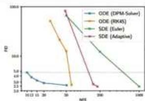  
（a）CIFAR-10（连续）

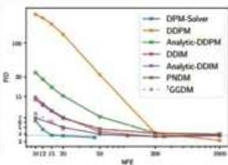  
（b）CIFAR-10（离散）

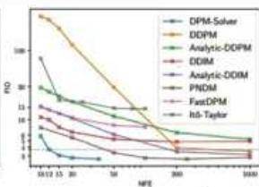  
（c）CelebA64×64（离散）

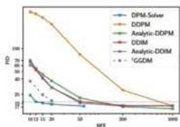  
(d）ImageNet64×64（离散）

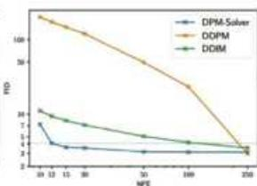  
（e）ImageNet128×128（离散）

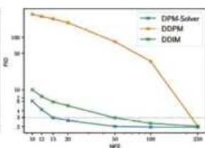  
（f)LSUNbedroom 256×256（离散）  
图1.5 DPM-Solver与其他采样算法的性能比较，对于固定的NFE， DPM-Solver的FID低于其他采用算法 [12]

观察DPM-Solver-2和DPM-Solver-3算法的伪代码，不难发现这两种算法在采样下一个时间戳的结果时， $\epsilon _ { \theta }$ 分别需要推断2次和3次，而DPM-Solver-1算法只需要推断一次。DPM-Solver的作者做了以下实验。

● 假设 $\mathrm { N F E } = K$ ，对于前 $K / 3$ 次采样，采用DPM-Solver-3算法迭代去噪；对于最后一次采样，则根据剩余NFE约束采用DPM-Solver-1或DPM-Solver-2算法迭代去噪。

● 对于时间戳的选择，将 $[ \lambda _ { T } , \lambda _ { 0 } ]$ 均匀划分为 $M = ( [ K / 3 ] + 1 )$ 等份，即$\lambda _ { t _ { i } } = \lambda _ { T } + \frac { i } { M } ( \lambda _ { 0 } - \lambda _ { T } )$ $i { = } 0 , \cdots , M$ 。每个时间步 $t _ { i }$ 对应于 $\lambda _ { \tau _ { i } }$ 。

实验表明，这种时间戳的选择相比均匀划分 可以带来较大的性能提升。

# 2.连续扩散时间最优离散化

均匀划分 $[ \lambda _ { T } , \lambda _ { 0 } ]$ 相比直接均匀划分 可以带来较大的性能提升。观察 的定义$\lambda _ { t } : = \log ( \alpha _ { t } / \sigma _ { t } )$ ，不难发现它就是信噪比对数的二分之一。因此这种划分方式会导致在 区间上，时间戳更密集地靠近0和 T 的位置。而早在DPM-Solver被提出以前，Google的研究员便讨论过什么才是DDPM的最优分割方式 [15]。通过阅读接下来的内容，读者可以了解到为什么均匀划分 $[ \lambda _ { T } , \lambda _ { 0 } ]$ 相比直接均匀划分 可以带来较大的性能提升。

扩散模型的训练和推断过程是解耦的，假设训练阶段的扩散过程由 T 个时间戳分割：$0 = t _ { 0 } < t _ { 1 } < \cdots < t _ { T } = 1$ ，采样时可以选择其中的一个子集 $0 = t _ { 0 } ^ { \prime } < t _ { 1 } ^ { \prime } < \cdots < t _ { K } ^ { \prime } = 1$ 作为 $K ( K \leqslant T )$ 个采样时间戳。事实上，可以通过估算以这一套采样时间戳采样得到的 $\textbf { X } _ { 0 }$ 分布的ELBO（EvidanceLower BOund，证据下界）来评价这套采样时间戳设计的好坏。根据ELBO的分解性，这套采样时间戳 $0 = t _ { 0 } ^ { \prime } < t _ { 1 } ^ { \prime } < \cdots < t _ { K } ^ { \prime } = 1$ 的优劣可以用以下损失函数来量化：

$$
- L _ {\mathrm {E L B O}} = \mathbb {E} _ {q} D _ {\mathrm {K L}} \left(q \left(x _ {1} \mid x _ {0}\right) \| p _ {\theta} \left(x _ {1}\right)\right) + \sum_ {i = 1} ^ {K} L \left(t _ {i} ^ {\prime}, t _ {i - 1}\right) \tag {1.57}
$$

其中：

$$
L (t, s) = \left\{ \begin{array}{l l} - \mathbb {E} _ {q} \log p _ {\theta} \left(x _ {t} \mid x _ {0}\right), & s = 0 \\ \mathbb {E} _ {q} D _ {\mathrm {K L}} \left(q \left(x _ {s} \mid x _ {t}, x _ {0}\right) \| p _ {\theta} \left(x _ {s} \mid x _ {t}\right)\right), & s > 0 \end{array} \right. \tag {1.58}
$$

观察式（1.57）和式（1.58）可以发现，寻找最优采样时间戳方案其实可以转换为求解最短路径问题。每两个时间戳 t 和 s 之间的距离便由 $L ( t , s )$ 给出。实际上， 可以采用蒙特卡洛采样来估计每一个可能的 $L ( t , s )$ ，因此在近似得到每个 $L ( t , s )$ 之后，可以采用Dijkstra算法求得最短路径并确定最优采样时间戳方案。

在参考文献[12]中，DPM-Solver的作者通过实验对每个固定的 K 值，展示了最优采样时间戳方案的可视化结果，如图1.6所示。

图1.6的左图展示了基于DDPM损失函数 $L _ { \mathrm { s i m p l e } }$ 在CIFAR10数据集上训练完成的最优采样时间戳方案的可视化结果。横轴表示训练时间戳从1到1 000，纵轴表示 K 值。采样时间戳主要集中在接近 $x _ { 0 }$ 的区域。图1.6的右图则展示了基于参考文献[16]提出的损失函数 $L _ { \mathrm { h y b r i d } }$ 在ImageNet $6 4 { \times } 6 4$ 数据集上训练完成的最优采样时间戳方案的可视化结果。可以看到，采样时间戳主要集中在接近0和 T 的区域。这一现象与DPM-Solver实验中的结果相吻合。

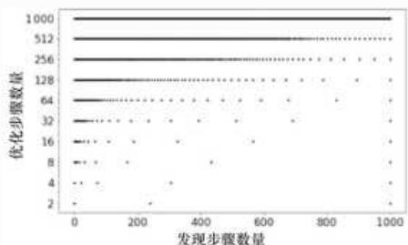

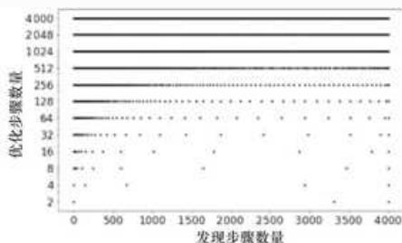  
图1.6　最优采样时间戳方案的可视化结果[15]

接近0的采样步骤很重要，因为这些采样步骤可以捕捉到更精细的图像细节。此外，算法会额外分配一些采样时间戳在靠近 T 的位置，这可能是为了在采样早期更好地突破分布模态，采样到一些低概率的模态，从而带来更多的ELBO收益。

# 3.小结

本小节从两个角度介绍了training-free加速采样方法。DPM-Solver旨在利用ODE建模扩散模型的采样过程，并通过近似求解ODE来获得最终采样结果，经典的加速采样算法DDIM就是一阶DPM-Solver。在DPM-Solver算法执行过程中，两个时间戳距离越近（采样轮次越多），DPM-Solver阶数越高（Denoiser推断次数越多），对下一步的采样结果估计越准确，但速度越慢。部分参考文献还补充了对采样时间戳选择方面的考虑。笔者猜测结合部分参考文献中的最优采样时间戳方案，DPM-Solver的性能或许可以得到进一步提升。

# 1.4.2 training-based加速采样方法

与training-free加速采样方法不同，training-based加速采样方法往往修改了扩散模型的训练阶段。本小节将介绍近年来出现的比较有效的training-based加速采样方法。

# 1.ES-DDPM

这种加速采样方法出自参考文献[17]，它的出发点很简单：另外两类生成模型VAE和GAN虽然不能像扩散模型一样精细地建模高维数据分布，但它们的采样仅需要推断一次Decoder或Generator。或许可以利用这一点来加速扩散模型采样。原作者将这种加速采样方法命名为Early-Stopped DDPM（简称ES-DDPM），ES-DDPM原理示意如图1.7所示。

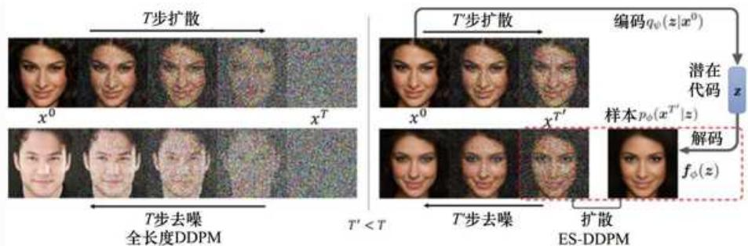  
图1.7 ES-DDPM原理示意 [17]

ES-DDPM截断了扩散模型的训练，生成过程和采样过程仅考虑区间 ，使得原本的扩散模型训练损失函数变为

$$
L _ {\text {s i m p l e}} ^ {\prime} = \mathbb {E} _ {x _ {0}, \epsilon , t - [ T ^ {\prime}, T ]} \left[ \left\| \varepsilon - \epsilon_ {\theta} \left(\sqrt {\bar {\alpha} _ {t}} x _ {0} + \sqrt {1 - \bar {\alpha} _ {t}} \epsilon , t\right) \right\| ^ {2} \right] \tag {1.59}
$$

但采样时会出现问题，因为不知道初始分布 $q ( x _ { T ^ { \prime } } )$ 是什么。ES-DDPM考虑在原本的图像数据集上训练一个VAE，这样就可以用 $p _ { \phi } ( x _ { 0 } )$ 粗略地建模原始数据集分布 $q ( x _ { 0 } )$ 。其中VAE损失函数如下：

$$
L (\phi) = - \mathbb {E} _ {q _ {\phi} (z | x)} [ \log p _ {\phi} (x | z) ] + D _ {\mathrm {K L}} [ q _ {\phi} (z | x) \| p (z) ] \tag {1.60}
$$

之后通过对 $p _ { \phi } ( x _ { 0 } )$ 的采样结果执行扩散过程，就可以得到分布 $p _ { \phi } ( x _ { T ^ { \prime } } )$ 以近似分布 $q ( x _ { T ^ { \prime } } )$ 。这样采样时便可以将原本扩散模型从 T 到 T '的采样过程合并为对VAE Decoder的一次推断，从而达到加速效果。

# 2.Progressive Distillation

这种加速采样方法出自参考文献[18]，旨在针对预训练的扩散模型进行多阶段蒸馏，以使最终蒸馏后的模型能够基于更少的采样步数采样出与原始扩散模型相似的输出分布。原作者将这种加速采样方法命名为“Progressive Distillation”。

Progressive Distillation原理示意如图1.8所示，蒸馏前的模型记作 $f ( z ; \eta )$ ，它只需要4个采样步即可从初始噪声中采样出 $x _ { 0 }$ 。在每一阶段蒸馏过程中，会将相邻的两个采样步合并为一个采样步，这样两阶段蒸馏后的模型 $f ( z ; \theta )$ 便仅需要一个采样步。

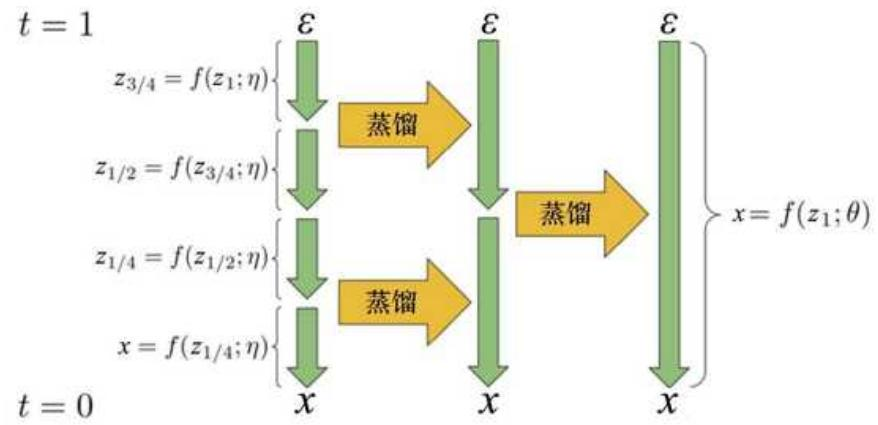  
图1.8 “Progressive Distillation”原理示意，此处展示了多阶段蒸馏的过程 [18]

标准扩散模型训练伪代码和“Progressive Distillation”训练伪代码如图1.9所示，相比标准扩散模型训练过程，“Progressive Distillation”额外增加了绿色部分的内容。从伪代码中可以看出，模型会经过 K 个阶段的蒸馏，每一阶段结束后，就会得到采样步数为原先一半的采样器，并作为下一轮蒸馏的“教师模型”。在每一阶段蒸馏过程中，可利用DDIM采样得到“教师模型”两步去噪后的目标，然后训练“学生模型”去预测这一目标，直至“学生模型”收敛。

实际上，与DPM-Solver相比，“Progressive Distillation”稍显过时。因为根据前面对DPM-Solver的介绍，DDIM本身采样质量（ODE求解精度）要弱于高阶DPM-Solver，并且基于DDIM训练“Progressive Distillation”得到的蒸馏模型会丢失预训练扩散模型的许多信息（比如无法像预训练扩散模型一样预测每一步的噪声或分数）。此外，相比training-free加速采样方法，“Progressive Distillation”需要额外的训练开销。不过这种多阶段蒸馏的方法是值得关注的，或许在其他场景下可以考虑采用这种蒸馏方法。

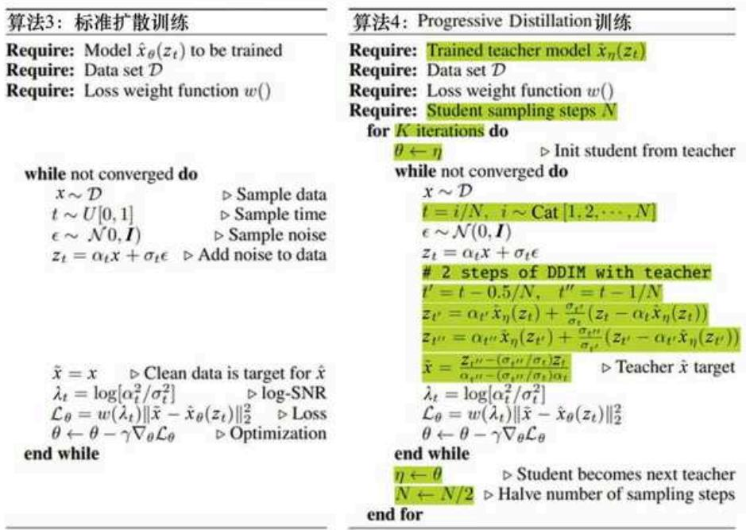  
图1.9　标准扩散模型训练伪代码和“Progressive Distillation”训练伪代码 [18]

# 3.其他方法

除了上述提到的加速采样方法，training-based加速采样方法还有很多。比如参考文献[19]利用傅里叶积分算子构建时态卷积块，训练后的模型能够直接输出整个采样轨迹。再比如，参考文献[20]通过学习沿着直线路径传输分布的ODE模型（与DDPM不同，这是一种新的分布变换过程），并利用并行解码和优化的路径选择来显著加快采样过程。

# 参考文献

[1] HINTON G E. Deep belief networks[J]. Scholarpedia, 2009, 4(5): 5947.   
[2] KINGMA D P, WELLING M. Auto-Encoding Variational Bayes[EB/OL]. arXiv: 1312.6114.   
[3] GOODFELLOW I, POUGET-ABADIE J, MIRZA M, et al. Generative adversarial networks[J]. Communications of the ACM, 2020, 63(11): 139-144.   
[4] VAN DEN OORD A, KALCHBRENNER N, VINYALS O, et al. Conditional image generation with PixelCNN decoders[C] //Advances in Neural Information Processing Systems, 2016.   
[5] FINLAY C, JACOBSEN J H, NURBEKYAN L, et al. How to train your neural ODE: The world of Jacobian and kinetic regularization[C]//International Conference on Machine Learning. 2020: 3154-3164.   
[6] VINCENT P. A connection between score matching and denoising autoencoders[J]. Neural Computation, 2011, 23(7): 1661-1674.   
[7] LIPMAN Y, CHEN R T Q, BEN-HAMU H, et al. Flow matching for generative modeling[EB/OL]. arXiv: 2210.02747.   
[8] TONG A, FATRAS K, MALKIN N, et al. Improving and generalizing flow-based generative models with minibatch optimal transport[EB/OL]. arXiv: 2302.00482.   
[9] KARRAS T, AITTALA M, AILA T, et al. Elucidating the design space of diffusion-based generative models[C]// Advances in Neural Information Processing Systems. 2022, 35: 26565- 26577.   
[10] HO J, JAIN A, ABBEEL P. Denoising diffusion probabilistic models[C]//Advances in Neural Information Processing Systems. 2020, 33: 6840-6851.   
[11] ZHANG L, RAO A, AGRAWALA M. Adding conditional control to text-to-image diffusion models[C]//Proceedings of the IEEE/CVF International Conference on Computer Vision. 2023: 3836-3847.   
[12] LU C, ZHOU Y, BAO F, et al. DPM-Solver: A fast ODE solver for diffusion probabilistic model sampling in around 10 steps[C]//Advances in Neural Information Processing Systems. 2022,

35: 5775-5787.   
[13] SONG J, MENG C, ERMON S. Denoising diffusion implicit models[EB/OL]. arXiv: 2010.02502.   
[14] HOCHBRUCK M, OSTERMANN A. Explicit exponential runge-kutta methods for semilinear parabolic problems[J]. SIAM Journal on Numerical Analysis, 2005, 41(2): 786-803.   
[15] WATSON D, HO J, NOROUZI M, et al. Learning to efficiently sample from diffusion probabilistic models[EB/OL]. arXiv: 2106.03802.   
[16] NICHOL A, DHARIWAL P. Improved denoising diffusion probabilistic models[EB/OL]. arXiv: 2102.09672.   
[17] LYU Z, XU X, YANG C, et al. Accelerating diffusion models via early stop of the diffusion process[EB/OL]. arXiv: 2205.12524.   
[18] SALIMANS T, HO J. Progressive distillation for fast sampling of diffusion models[EB/OL]. arXiv: 2202.00512.   
[19] ZHENG H, NIE W, VAHDAT A, et al.Fast sampling of diffusion models via operator learning[EB/OL]. arXiv: 2211.13449.   
[20] LIU X, GONG C, LIU Q. Flow straight and fast: Learning to generate and transfer data with rectified flow[EB/OL]. arXiv: 2209.03003.

# 第2章

# 基石：扩散模型与轨迹优化问题

本章介绍扩散模型在强化学习领域最经典的应用：解决轨迹优化问题。

# 2.1 离线强化学习

作为一种机器学习方法，强化学习旨在让智能体通过与环境的交互学习最优策略，以实现特定的目标。传统的强化学习方法通常基于在线学习，这类强化学习方法称为在线强化学习（Online Reinforcement Learning，Online RL）。在这类强化学习方法下，智能体通过与环境的实时交互来获取样本数据，并根据反馈信号不断优化策略。然而，这种实时交互在某些场景下可能存在困难或带来难以接受的成本。

为了克服在线强化学习的限制，近年来出现了一种新的强化学习方法，称为离线强化学习（Offline Reinforcement Learning，Offline RL）。离线强化学习通过利用已经收集好的离线数据集，不需要与环境进行实时交互，就可以学习和改进策略。这种强化学习方法在许多实际应用中具有重要意义，涵盖机器人控制、金融交易和医疗决策等领域。这些领域的特点是，由于与环境交互的成本极为高昂，因此需要与环境实时交互以改进策略的在线强化学习是难以落地的。

然而，离线强化学习也面临一些挑战，其中最大的挑战在于如何有效地利用有限的离线数据来学习一个鲁棒且高效的策略。纵观离线强化学习近几年的发展，可以看到这个领域的研究人员在不断做出努力。比较知名的离线强化学习算法如下 [1]。

● BCQ（Batch-Constrained Q-learning）：BCQ是一种基于Q-learning的离线强化学习算法。它通过在离线数据集上进行反事实学习来提高策略的性能。BCQ算法背后的核心思想是利用离线数据集中的状态转换，对当前策略进行评估和改进。它使用一个辅助的生成器网络来生成与离线数据集中的状态转换相似的样本，从而进行更准确的策略评估和改进。  
● CQL（Conservative Q-Learning） [2]：CQL是一种保守型强化学习算法，旨在解决离线强化学习中的偏差问题。CQL算法背后的核心思想是通过在策略优化过程中引入一个保守的正则化项来约束策略的改进。这样可以有效地降低在离线数据集上学习的策略与真实最优策略之间的差异，提高策略的性能和鲁棒性。  
● IQL（Implicit Q-Learning） [3]：IQL算法背后的核心思想是通过进行状态条件期望上限的估计来隐式地改进策略，避免对数据集中未出现动作的直接评估，同时利用期望回归和优势加权行为克隆技术，实现高效的离线强化学习与策略提取。

这些离线强化学习算法依赖于传统在线强化学习的工具。由于与时序差分（TemporalDifference，TD）学习的思想相符，它们很容易受到函数逼近、异策略学习和自举等因素所带来的许多不稳定性的影响，这三个因素也称致命三角。此外，由于必须在有限的数据量下

运作，它们依赖于各种工程技巧和启发式方法来保持策略在数据集分布范围内。这些挑战使得现有的离线强化学习算法难以扩展或应用于实际问题。

近年来，扩散模型强大的建模高维数据分布的能力，使其受到强化学习相关研究人员的重视，催生出Plan Diffuser [4] 、Decision Diffuser [5] 等成果。从思想上，这些成果抛弃了传统离线强化学习拟合价值函数的做法，直接将轨迹片段看作样本点，并利用扩散模型来建模离线数据集中轨迹片段的分布。Plan Diffuser和Decision Diffuser为离线强化学习带来了新的可能性和潜力，令人惊喜的是，它们不仅可以提高学习效率和决策质量，而且具有一些独特而有用的规划特性。

本章将详细介绍Plan Diffuser和Decision Diffuser背后的原理；然后探讨这种条件采样范式为策略带来的独特能力；最后深入代码层面，以一个简单的例子展示Decision Diffuser中的条件采样是如何实现的。

# 2.2 第一个基于扩散模型的决策智能体：Plan Diffuser

在强化学习领域，假设有一个包含各式各样轨迹的数据集T，且轨迹长度固定，离线强化学习的目标便是从数据集T中挖掘构造出一个性能优异的智能体，我们希望能够将它直接部署至环境并获得不错的收益。从传统离线强化学习的角度，工作的核心集中在如何更加准确地估计每个可能的状态-动作对的 Q 值，特别地，我们可能还会查询数据集分布外的状态-动作对。在这类算法结束后，一般情况下，我们会得到一个显式的或隐式的策略，对于给定的任意环境状态，它会返回一个可以与环境交互的动作。

诸如BCQ、CQL等算法往往没有利用数据集T中轨迹的连续性，而只是将每一条轨迹分割成数个状态转移片段 ，并将每一个这样的片段作为一个独立的样本点进行后续的训练。实际上，我们可以从一个全新的角度来看待数据集T，并将整条轨迹视为一个样本点，从而将目标转变为建模整条轨迹的分布。最终我们可以将轨迹的累积回报值作为条件变量，从分布中采样轨迹。

近年来，扩散模型大放异彩，相比其他生成模型，如VAE、GAN等，扩散模型具有更强的建模复杂分布的能力，因此有研究人员开始尝试利用扩散模型来建模数据集T中的轨迹分布。

# 2.2.1 以轨迹片段为对象的扩散模型

第1章对扩散模型的原理做了详细说明，这里我们将数据对象替换为轨迹片段来形式化描述扩散模型的原理。轨迹片段可以描述为 $\tau$ ，轨迹片段的生成过程则可以看作一个迭代的去噪过程 $p _ { \theta } ( \tau ^ { i - 1 } | \tau ^ { i } )$ 。作为去噪过程的逆过程，也就是前向扩散过程 $q ( \tau ^ { i } \mid \tau ^ { i - 1 } )$ ，则通过迭代地添加噪声来缓慢地破坏数据的结构。以轨迹为对象的扩散过程及其逆过程如图2.1所示。

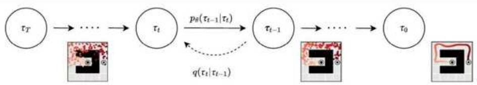  
图2.1　以轨迹为对象的扩散过程及其逆过程

由扩散模型引出的数据分布如下：

$$
p _ {\theta} (\tau^ {0}) = \int p (\tau^ {N}) \prod_ {i = 1} ^ {N} p _ {\theta} (\tau^ {i - 1} | \tau^ {i}) d \tau^ {1 N} \tag {2.1}
$$

其中 $p ( \tau ^ { N } )$ 是一个标准高斯先验分布，而 $\tau ^ { 0 }$ 表示无噪声的数据。可通过最小化 $\tau ^ { 0 }$ 的似然估计的负对数来优化参数 $\theta$ ，得到：

$$
\theta^ {*} = \arg \min  _ {\theta} - \mathbb {E} _ {\tau^ {0}} [ \log p _ {\theta} (\tau^ {0}) ] \tag {2.2}
$$

去噪过程中的每一步都涉及从一个参数化的高斯分布中采样，此高斯分布一般具有固定的依赖时间步的协方差（同DDPM [3]）：

$$
p _ {\theta} \left(\tau^ {i - 1} \mid \tau^ {i}\right) = \mathcal {N} \left(\tau^ {i - 1} \mid \mu_ {\theta} \left(\tau^ {i}, i\right), \Sigma^ {i}\right) \tag {2.3}
$$

而前向扩散过程 $q ( \tau ^ { i } \mid \tau ^ { i - 1 } )$ 通常是预先指定的。

注意有两个“时间步” ：扩散过程中的时间步（简称扩散时间步）和规划轨迹中的时间步（简称规划时间步）。这里用上标（未指定时的 ）来表示扩散时间步，用下标（未指定时的）来表示规划时间步。例如， $s _ { t } ^ { 0 }$ 表示一条无噪声的轨迹中的第 $_ t$ 步状态。当上下文中无明确说明时，无噪声量的上标被省略： $\boldsymbol { \tau } = \boldsymbol { \tau } ^ { 0 }$ 。将轨迹 $\tau$ 中的第 步状态（或动作）记为 $\tau _ { s _ { t } }$ （或 $\tau _ { a _ { r } }$ ）。

# 2.2.2 Plan Diffuser的建模与优化

本小节将深入讨论如何将扩散模型应用于轨迹采样的具体过程。Plan Diffuser的作者Janner将其构建的基于扩散模型的轨迹采样器命名为“Diffuser”[8]，但为了区别于著名的文生图开源库“Diffusers”，本书称前者为“Plan Diffuser”。

# 1.轨迹表示

对于扩散模型处理的对象，将一条轨迹片段（实践中作为Plan Diffuser的输入输出）的每一步状态和动作拼接，表达为如下二维数组：

$$
\tau = \left[ \begin{array}{l l l l} s _ {0} & s _ {1} & \dots & s _ {T} \\ a _ {0} & a _ {1} & \dots & a _ {T} \end{array} \right] \tag {2.4}
$$

# 2.时间局部性

关于轨迹中每个状态转移片段之间的时间依赖关系，Plan Diffuser没有强调自回归 [1]或马尔可夫性质 [2]，而对时间局部性做了更宽松的假设。

Plan Diffuser迭代地采样轨迹的过程示意如图2.2所示。Plan Diffuser通过对包含可变数量的状态-动作对迭代去噪来采样轨迹。在一步去噪过程中，较小的感受野（Receptive Field）会约束模型依据轨迹中的相邻帧来推断去噪结果。

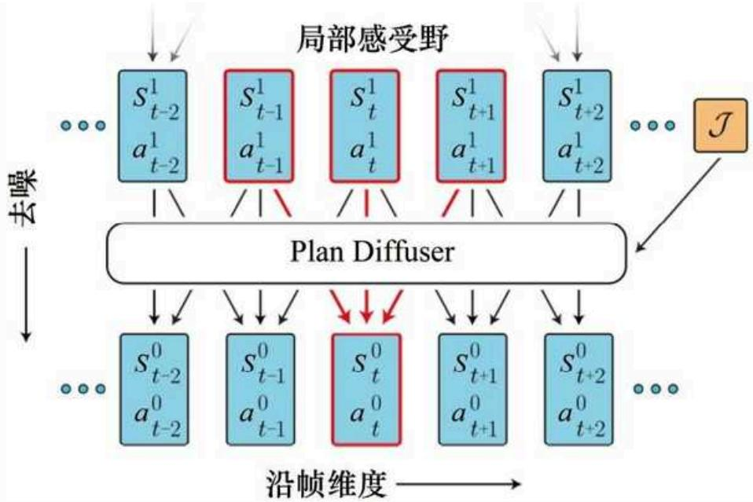  
图2.2 Plan Diffuser迭代地采样轨迹的过程示意。在单个去噪步骤中，较小的感受野（红色区域）加强了局部一致性 [4]

通过多步去噪，这种时间局部相关性可以逐渐拓展到全局相关性。因此不同于自回归或马尔可夫性质，最终轨迹的当前帧 $( s _ { t } ^ { i } , a _ { t } ^ { i } )$ 的去噪结果不仅依赖于过去的帧，也取决于未来的帧。

# 3.结构设计

通过前面的假设，我们可以得到一些设计模型结构时需要满足的前提条件。

● 不通过自回归的形式（而是通过感受野的形式）预测一条完整的轨迹。  
● 去噪过程的每一步应当具有时间局部相关性。  
● 轨迹表示应考虑沿帧维度的等方差（Equivariance），而非考虑状态和动作特征间的等方差。

Plan Diffuser网络结构如图2.3所示，Plan Diffuser使用由重复（时序）卷积残差块组成的模型来满足以上前提条件。最终结构主要借鉴了图像扩散模型中常用的U-Net，但是用一维时序卷积替换了二维空间卷积。由于模型是全卷积的，因此预测结果的视野（Horizon）不是由模型结构决定的，而由输入维度决定；如果需要的话，视野可以在规划过程中动态改变。

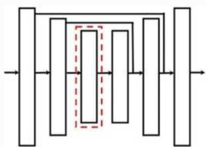

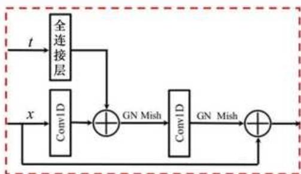  
图2.3 Plan Diffuser网络结构，其中包含一系列卷积残差块，每个卷积残差块由时序卷积（Temporal Convolution）、群归一化（Group Normalization）、Mish激活等计算单元构成 [4]

# 其PyTorch实现如下：

class Conv1dBlock(nnModule):   
" Conv1d --> GroupNorm --> Mish   
" def __init__(self, inp_channels, out_channels, kernel_size,\ngroups=8): super().__init() self.block = nn Sequential( nn.Conv1d(inp_channels, out_channels, kernel_size,\ padding $\equiv$ kernel_size//2), Rearrange('batch_channels horizon->\ batch_channels 1 horizon'), nn.GroupNorm(n_groups, out_channels), Rearrange('batch_channels 1 horizon->\ batch_channels horizon'), nn.Mish(), def forward(self,x): return self.block(x)   
class ResidualTemporalBlock(nnModule): def __init__(self, inp_channels, out_channels, embed_dim,\ horizon,kernel_size=5): super().__init() self.block $=$ nnModuleList([ Conv1dBlock(inp_channels, out_channels, kernel_size), Conv1dBlock(out_channels, out_channels, kernel_size), ]) self.time_mlp $=$ nnSequential( nn.Mish(), nn.Linear(embed_dim,out_channels), Rearrange('batch t -> batch t 1'), self.residual_conv $=$ nn.Conv1d(inp_channels,out_channels,1)\ if inp_channels !=out_channels else nn.Identity()   
def forward(self,x,t): x:[ batch_size x inp_channels x horizon] t:[ batch_size x embed_dim ] returns: out:[ batch_size x out_channels x horizon ] out $=$ self.batchs[0](x)+self.time_mlp(t) out $=$ self.batchs[1](out) return out + self.residual_conv(x)

# 4.训练过程

有了上述模型结构，便可以将模型形式化为函数 $\epsilon _ { \theta } ( \tau ^ { i } , i )$ ，然后用简化的优化目标来训练噪声模型 $\epsilon _ { \theta }$ ：

$$
\mathcal {L} (\theta) = \mathbb {E} _ {i, \epsilon , \tau^ {0}} [ \| \epsilon - \epsilon_ {\theta} (\tau^ {i}, i) \| ^ {2} ] \tag {2.5}
$$

其中 $i \sim \mathcal { U } \{ 1 , 2 , \cdots , N \}$ 是扩散时间步， $\epsilon \sim \mathcal { N } ( 0 , I )$ 是目标噪声， $\tau ^ { i }$ 是轨迹 $\tau ^ { 0 }$ 被噪声 $\epsilon$ 破坏后的结果。逆过程中的协方差 $\Sigma ^ { i }$ 与参考文献[14]中的余弦时间表设定保持一致。

# 余弦时间表的PyTorch实现如下：

```python
def cosine_beta_schedule(timesteps, s=0.008, dtype=torch.float32):
    steps = timesteps + 1
    x = np.linspace(0, steps, steps)
    alphas_cumprod = np.cos((x / steps) + s) / (1 + s) * np.pi *
0.5) ** 2 
```

# 5.引导采样式强化学习

参考文献[8]做了一些假设，并依据假设设计了Plan Diffuser的具体构造。Plan Diffuser继承了之前的扩散模型优化方法。至此，针对轨迹数据集T，Plan Diffuser训练收敛后，便可以看作一个轨迹采样器。在输入一个服从标准高斯分布的噪声 $\tau ^ { r }$ 后，通过迭代去噪过程，便可以采样出服从轨迹数据集T分布的轨迹 $\tau ^ { 0 }$ 。

换个角度，我们得到了 $\tau$ 的先验分布 $p _ { \theta } ( \tau )$ 。但这还远远不够，因为轨迹数据集T中不仅包含达成任务目标的高质量轨迹，还充斥着未达成任务目标的低质量轨迹。我们需要建模 $\tau$ 的条件概率分布 $p ( \tau | \mathcal { O } _ { { \nu } } = 1 )$ ，这样便可以轨迹最优性为条件，采样出最优轨迹。

Plan Diffuser的作者使用控制即推断图模型（control-as-inference graphical model）来获得最优性定义，如图2.4所示。

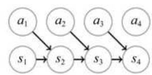  
（a）包含状态和动作的图模型

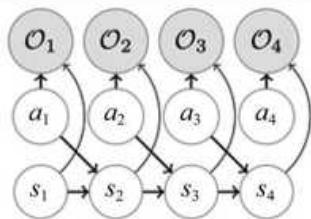  
（b）包含最优性变量的图模型  
图2.4　使用控制即推断图模型获得最优性定义

令 $\mathcal { O } _ { \iota }$ 为一个二元随机变量，它表示轨迹于 t 时刻的最优性，根据Levine所做的设定，$p ( \mathcal { O } _ { t } = 1 ) = \exp ( r ( s _ { t } , a _ { t } ) )$ 。由贝叶斯公式，可以得到 $p ( \tau | \mathcal { O } _ { \mathrm { { r } } } = 1 )$ 具有如下形式：

$$
p (\tau \mid \mathcal {O} _ {1: T} = 1) \propto p (\tau) p (\mathcal {O} _ {1: T} = 1 | \tau) \tag {2.6}
$$

至此，强化学习问题被转换为条件采样问题。虽然难以直接从上述分布中采样，但Sohl-Dickstein等人证明了可以通过高斯分布来近似 $p ( \tau ^ { i } | \tau ^ { i + 1 } , \mathcal { O } _ { 1 \tau } )$ 。与图像扩散模型中的分类器引导技术一致，接下来我们回顾此推导。

扩散模型使用高斯分布从 $\tau ^ { i + 1 }$ 预测下一步去噪结果 $\tau ^ { i }$ ：

$$
p _ {\theta} \left(\tau^ {i} \mid \tau^ {i + 1}\right) = \mathcal {N} (\mu , \Sigma)
$$

$$
\log p _ {\theta} \left(\tau^ {i} \mid \tau^ {i + 1}\right) = - \frac {1}{2} \left(\tau^ {i} - \mu\right) ^ {T} \Sigma^ {- 1} \left(\tau^ {i} - \mu\right) + C \tag {2.7}
$$

假设 $\log p ( \mathcal { O } _ { \boldsymbol { \kappa } } | \tau ^ { i } )$ 相比 $\Sigma ^ { - 1 }$ 具有低曲率，这个假设在无限扩散步的设定下是合理的，因为$\| \Sigma \| \to 0$ 。在此假设下，可以在 $\tau ^ { i } = \mu$ 处进行泰勒展开以近似 $p ( \mathcal { O } _ { { \vert { T } } } = 1 \vert \tau ^ { i } )$ ：

其中：

$$
\begin{array}{l} g = \nabla_ {\tau^ {i}} \log p (\mathcal {O} _ {1: T} | \tau^ {i}) \bigg | _ {\tau^ {i} = \mu} \\ = \sum_ {t = 0} ^ {T} \nabla_ {s _ {t}, a _ {t}} r \left(s _ {t}, a _ {t}\right) | _ {\left(s _ {t}, a _ {t}\right) = \mu_ {1}} \tag {2.9} \\ = \nabla \mathcal {J} (\mu) \\ \end{array}
$$

进一步地：

$$
\begin{array}{l} \log p \left(\left(\tau^ {i} \mid \tau^ {i + 1}\right) p \left(\mathcal {O} _ {1: T} \mid \tau^ {i}\right)\right) \approx - \frac {1}{2} \left(\tau^ {i} - \mu\right) ^ {T} \Sigma^ {- 1} \left(\tau^ {i} - \mu\right) + \left(\tau^ {i} - \mu\right) g + C _ {2} \\ = - \frac {1}{2} \left(\tau^ {t} - \mu - \Sigma g\right) ^ {T} \Sigma^ {- 1} \left(\tau^ {t} - \mu - \Sigma g\right) + \frac {1}{2} g ^ {T} \Sigma g + C _ {2} \\ = - \frac {1}{2} \left(\tau^ {i} - \mu - \Sigma g\right) ^ {T} \Sigma^ {- 1} \left(\tau^ {i} - \mu - \Sigma g\right) + C _ {3} \\ = \log p (z) + C _ {4}, z \sim \mathcal {N} (\mu + \Sigma g, \Sigma) \tag {2.10} \\ \end{array}
$$

接下来训练一个扩散模型以拟合轨迹数据的先验分布 $p _ { \theta } ( \tau )$ ，并训练一个额外的模型 $\mathcal { I } _ { \phi }$ （实际上模型 $\mathcal { I } _ { \phi }$ 可以通过各种方式获得，对 $\mu$ 可微即可，未必需要训练神经网络）以预测扩散后轨迹 $\tau ^ { i }$ 的累积回报。

通过上述公式，可以利用模型 $\mathcal { I } _ { \phi }$ 的梯度来修正期望 $\mu$ 以引导轨迹采样过程。采样出来的轨迹 $\tau \sim p ( \tau | \mathcal { O } _ { \nu } = 1 )$ 的第一个动作会在环境中执行，执行后再次采样新的轨迹。Plan Diffuser引导采样算法的伪代码如图2.5所示。

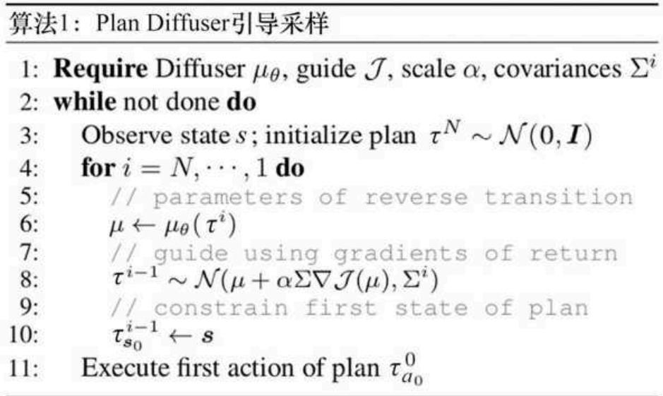  
图2.5 Plan Diffuser引导采样算法的伪代码

通俗地讲，在算法1执行前，我们需要一个训练收敛的扩散模型 $\mu _ { \theta }$ 以计算每一步采样所服从的高斯分布的期望 $\mu$ ，还需要一个用于预测轨迹回报的函数 $\mathcal { I }$ 。函数 $\mathcal { I }$ 可以用神经网络来拟合，这样其训练就是一个回归问题，旨在回归每一个可能的 $\tau ^ { i }$ 的累积回报。回顾上述推导，我们需要的是 $\nabla \mathcal { I } ( \mu )$ 或 $\sum _ { t = 0 } ^ { T } \nabla _ { s _ { t } , a _ { t } } r ( s _ { t } , a _ { t } ) | _ { ( s _ { t } , a _ { t } ) = \mu _ { t } }$ ，因此如果得到环境回报函数 $r ( s _ { t } , a _ { t } )$ 的具体定义且其对$s _ { t } , ~ a _ { t }$ 可微，则无须通过训练神经网络来拟合函数 $\mathcal { I }$ 。

# 6.将基于目标的强化学习视作修复问题

基于目标的强化学习（Goal-Conditioned RL）通常建模为约束满足问题而不是奖励最大化问题，问题的目标是给出任何满足约束的轨迹，比如要求轨迹终止于某个目标位置。

根据前面描述的轨迹表示，Goal-Conditioned RL可以转换为修复问题。轨迹中被限定的状态和动作可以类比为图像修复问题中已经被观察到的、填充完成的像素点。如算法1的第10行所示（见图2.5），在采样时将观察到的状态替换到采样轨迹中即可。

# 2.2.3 Plan Diffuser的特性

下面展示Plan Diffuser的一些重要特性，这些特性在单步动力学模型或非自回归轨迹预测中并不常见。

# 1.可学习长视野规划

图2.6展示了长视野轨迹去噪过程的可视化结果，Plan Diffuser可以在稀疏奖励的场景下生成可行的轨迹，这一直是shooting-based类方法（如交叉熵方法）难以达到的。

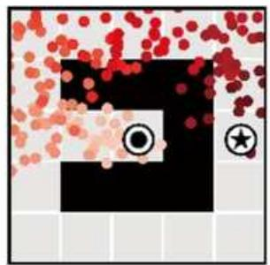

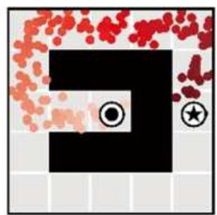

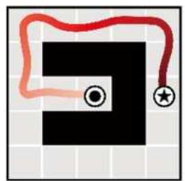

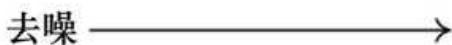  
图2.6　长视野轨迹去噪过程的可视化结果[4]

# 2.时序组合性

由于Plan Diffuser迭代地提升局部一致性，因此可以将相似的轨迹子序列以一种新颖的方式组合起来，最终不只生成分布内（In-Distribution）的轨迹，也生成泛化到分布外（Out-of-Distribution）的轨迹。如图2.7所示，尽管是在直线轨迹数据集上训练Plan Diffuser，却最终能够生成倒V字形轨迹。

# 3.可变长度规划

由于Plan Diffuser在其预测的水平维度上是全卷积的（见图2.3，卷积运算后没有全连接层），因此输出的规划长度取决于输入长度而非模型结构。Plan Diffuser可以生成不同长度的轨迹，如图2.8所示。

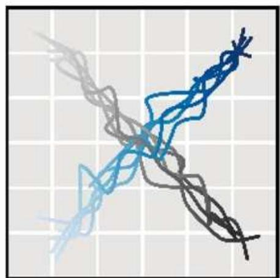  
数据

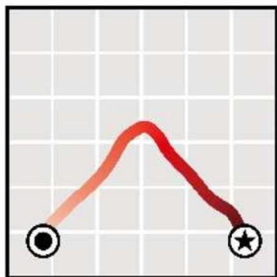  
轨迹   
图2.7　时序组合性示意，Plan Diffuser可以生成两种类型数据的组合决策轨迹 [4]

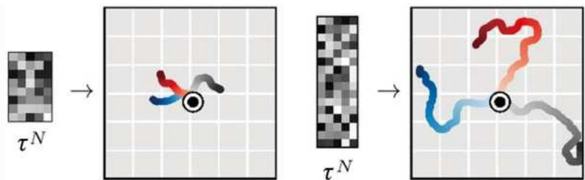  
图2.8　可变长度规划示意 [4]

# 4.任务组合

$p _ { \theta } ( \tau )$ 虽然包含了环境动力学模型和数据集策略的信息，但它独立于奖励函数，因此采样规划时可以被不同的奖励函数甚至不同的奖励函数组合所引导。可通过在采样规划时引入训练中不曾见过的奖励函数来验证这一点。

# 2.2.4 从实验中解析Plan Diffuser

下面介绍原论文对Plan Diffuser所做的实验评估，我们希望Plan Diffuser具备以下能力。

● 不用手动设计复杂奖励的长视野多任务规划能力。  
● 泛化到训练阶段未见过的目标任务的能力。  
● 从不同质量的异构数据中构建出一个有效控制器的能力。

原论文在Maze2D环境中评估了上述第一项能力。Maze2D环境要求智能体移动到目标位置，除了到达目标位置会有值为1的奖励外，其他情形下的奖励都为0。Plan Diffuser的作者对此奖励机制没有做任何修改。此环境所需的规划视野足够大，往往需要采取数百步动作才能到达目标位置。就连目前最好的model-free算法IQL都难以可靠地到达目标位置。Plan Diffuser去噪采样过程的可视化结果如图2.9所示。

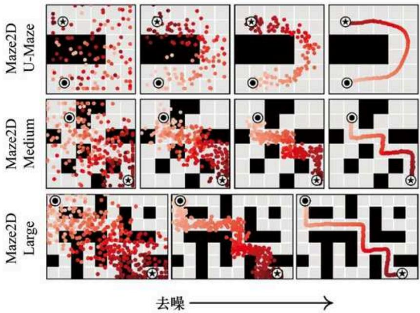  
图2.9 Plan Diffuser去噪采样过程的可视化结果。固定初始点和目标点后，使用Plan Diffuser修复轨迹的中间状态 [4]

长视野多任务规划实验结果如表2.1所示，single-task表示评估时目标位置总是固定的，而multi-task表示在每个episode开始时随机初始化目标位置（在表2.1中标记为Multi2D）。

表2.1　长视野多任务规划实验结果  

<table><tr><td>环流</td><td>MPPI</td><td>CQL</td><td>IQL</td><td>Plan Diffuser</td></tr><tr><td>Maze2D U-Maze</td><td>33.2</td><td>5.7</td><td>47.4</td><td>113.9±3.1</td></tr><tr><td>Maze2D Medium</td><td>10.2</td><td>5.0</td><td>34.9</td><td>121.5±2.7</td></tr><tr><td>Maze2D Large</td><td>5.1</td><td>12.5</td><td>58.6</td><td>123.0±8.4</td></tr><tr><td>single-task 平均分</td><td>16.2</td><td>7.7</td><td>47.0</td><td>119.5</td></tr><tr><td>Multi2D U-Maze</td><td>41.2</td><td>-</td><td>24.8</td><td>128.9±1.8</td></tr><tr><td>Multi2D Medium</td><td>15.4</td><td>-</td><td>12.1</td><td>127.2±3.4</td></tr><tr><td>Multi2D Large</td><td>8.0</td><td>-</td><td>13.9</td><td>132.1±5.8</td></tr><tr><td>Multi2D平均分</td><td>21.5</td><td>-</td><td>16.9</td><td>129.4</td></tr></table>

在single-task中，Plan Diffuser相比最好的model-free算法IQL，性能有了大幅提升。

# 2.2.5 灵活的测试目标

为了评估Plan Diffuser泛化到新的测试目标的能力，原论文根据以下三个设定构造了一系列机械臂堆叠方块的任务。

● Unconditional Stacking：在这项任务中，目标是尽可能高地堆叠方块。  
● Conditional Stacking：这项任务指定了方块的堆叠顺序。  
● Rearrangement：在这项任务中，目标是以训练时未见过的排列顺序堆叠方块。

原论文基于PDDLStream生成的10 000条示例轨迹来训练各种算法。在成功堆叠后回报为1，其他情况下回报为0。这些算法在测试时将面临训练时未见过的初始状态。Plan Diffuser的作者用同一个扩散模型训练所有任务的先验采样器 $p _ { \theta } ( \tau )$ ，而对于不同的任务则采用不同的引导函数。对于Unconditional Stacking任务，直接用 $p _ { \theta } ( \tau )$ 来仿真PDDLStream控制器，而不采用任何引

导信号；对于Conditional Stacking和Rearrangement任务，则组合使用两个引导函数来偏置采样结果，第一个引导函数用于最大化轨迹最终状态匹配目标的似然估计，第二个引导函数用于在堆叠期间引导末端执行器和立方体之间的接触在约束范围内。

Plan Diffuser采样轨迹的可视化结果如图2.10所示。

对Plan Diffuser与两个model-free算法BCQ和CQL进行对比，Test-Time Flexibility实验结果如表2.2所示。

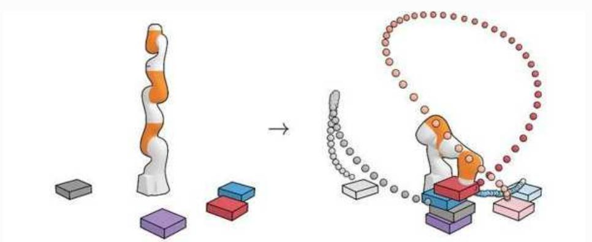  
图2.10 Plan Diffuser采样轨迹的可视化结果 [5]

表2.2 Test-Time Flexibility实验结果  

<table><tr><td>环境</td><td>BCQ</td><td>CQL</td><td>Plan Diffuser</td></tr><tr><td>Unconditional Stacking任务环境</td><td>0.0</td><td>24.4</td><td>58.7±2.5</td></tr><tr><td>Conditional Stacking任务环境</td><td>0.0</td><td>0.0</td><td>45.6±3.1</td></tr><tr><td>Rearrangement任务环境</td><td>0.0</td><td>0.0</td><td>58.9±3.4</td></tr><tr><td>平均分</td><td>0.0</td><td>8.1</td><td>54.4</td></tr></table>

# 2.2.6 离线强化学习

为了验证Plan Diffuser能够从不同质量的异构数据中构建出一个有效的控制器，原论文在包含各种质量数据的异构数据集D4RL中测试算法的有效性。除了训练一个先验采样器 $p _ { \theta } ( \tau )$ ，还额外训练一个回报预测器 $\mathcal { I } _ { \phi }$ 以引导采样过程。用于训练 $\mathcal { I } _ { \phi }$ 的轨迹数据同 $p _ { \theta } ( \tau )$ 。Hopper轨迹的采样可视化结果如图2.11所示。

原论文比较了各种数据驱动的控制算法，其中包括model-free 算法CQL和IQL，return-conditioning 算 法 Decision Transformer （ DT ） ， 以 及 model-based 算 法 Trajectory Transformer（TT）、MOPO、MOReL和MBOP，D4RL（MuJoCo）上的性能对比结果如表2.3所示。

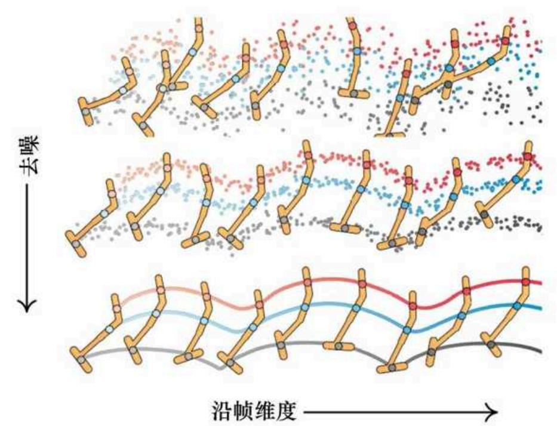  
图2.11 Hopper轨迹的采样可视化结果 [5]

表2.3 D4RL（MuJoCo）上的性能对比结果  

<table><tr><td rowspan="2">数据集</td><td rowspan="2">环境</td><td colspan="9">算法</td></tr><tr><td>BC</td><td>CQL</td><td>IQL</td><td>OT</td><td>TT</td><td>MOPO</td><td>MORel</td><td>MBOP</td><td>Plan Diffuser</td></tr><tr><td>Medium-Expert</td><td>HalfCheetah</td><td>55.2</td><td>91.6</td><td>86.7</td><td>86.8</td><td>95.0</td><td>63.3</td><td>53.3</td><td>105.9</td><td>88.9±0.3</td></tr><tr><td>Medium-Expert</td><td>Hopper</td><td>52.5</td><td>105.4</td><td>91.5</td><td>107.6</td><td>110.0</td><td>23.7</td><td>108.7</td><td>55.1</td><td>103.3±1.3</td></tr><tr><td>Medium-Expert</td><td>Walker2d</td><td>107.5</td><td>108.8</td><td>109.6</td><td>108.1</td><td>101.9</td><td>44.6</td><td>95.6</td><td>70.2</td><td>106.9±0.2</td></tr><tr><td>Medium</td><td>HalfCheetah</td><td>42.6</td><td>44.0</td><td>47.4</td><td>42.6</td><td>46.9</td><td>42.3</td><td>42.1</td><td>44.6</td><td>42.8±0.3</td></tr><tr><td>Medium</td><td>Hopper</td><td>52.9</td><td>58.5</td><td>66.3</td><td>67.6</td><td>61.1</td><td>28.0</td><td>95.4</td><td>48.8</td><td>74.3±1.4</td></tr><tr><td>Medium</td><td>Walker2d</td><td>75.3</td><td>72.5</td><td>78.3</td><td>74.0</td><td>79.0</td><td>17.8</td><td>77.8</td><td>41.0</td><td>79.6±0.55</td></tr><tr><td>Medium-Replay</td><td>HalfCheetah</td><td>36.6</td><td>45.5</td><td>44.2</td><td>36.6</td><td>41.9</td><td>53.1</td><td>40.2</td><td>42.3</td><td>37.7±0.5</td></tr><tr><td>Medium-Replay</td><td>Hopper</td><td>18.1</td><td>95.0</td><td>94.7</td><td>82.7</td><td>91.5</td><td>67.5</td><td>93.6</td><td>12.4</td><td>93.6±0.4</td></tr><tr><td>Medium-Replay</td><td>Walker2d</td><td>26.0</td><td>77.2</td><td>73.9</td><td>66.6</td><td>82.6</td><td>39.0</td><td>49.8</td><td>9.7</td><td>70.6±1.6</td></tr><tr><td colspan="2">平均分</td><td>51.9</td><td>77.6</td><td>77.0</td><td>74.7</td><td>78.9</td><td>42.1</td><td>72.9</td><td>47.8</td><td>77.5</td></tr></table>

# 2.2.7 扩散模型热启动

Plan Diffuser有一个很大的限制，就是在开环控制（Open-Loop Control ，控制论中的概念，这里指轨迹的生成不会因为收到环境反馈而做出调整）中，每一步执行后都需要多步去噪以重新生成一条轨迹，这是非常低效的。为了提高Plan Diffuser的执行速度，可以重复利用之前的生成结果以热启动（Warm-Start）下一步子序列轨迹的生成。下面详细介绍扩散模型热启动过程。为了达到加速效果，可以对之前的生成结果运行有限数量的扩散过程，再运行相同数量的去噪过程以重新生成一条更新后的轨迹。

[1] 指轨迹中时刻 t 的状态 s t的分布可以根据全部前序状态和动作（ $\mathrm { ~ s ~ } _ { 0 } , \mathrm { ~ a ~ } _ { 0 } , . . . , \mathrm { ~ s ~ } _ { \mathrm { t } - 1 } , \mathrm { ~ a ~ } _ { \mathrm { t } - 1 } )$ ）完全确定。  
[2] 指轨迹中时刻 t 的状态 s t的分布可以根据上一时刻的状态和动作（ $\mathbf { s } _ { \mathrm { \scriptsize ~ t - 1 } } , \mathbf { a } _ { \mathrm { \scriptsize ~ t - 1 } }$ ）完全确定。

# 2.3 条件生成决策模型的集大成者：Decision Diffuser

论文“Is Conditional Generative Modeling all you need for Decision-Making?”对利用扩散模型解决离线强化学习问题进行了更深入的探索。Plan Diffuser仅以轨迹最优性作为条件变量，从而采样出最优轨迹。Ajay等人提出的Decision Diffuser则通过考虑另外两个条件变量——约束和技能，进一步证明了将策略建模为条件扩散模型的优势。此外，原论文还进行了一系列消融实验以验证Decision Diffuser中的一些有别于Plan Diffuser的设计是有效的。

# 2.3.1 Decision Diffuser的建模与优化

通过前面的介绍，我们可以粗略判断Decision Diffuser是通过优化以下损失函数来得到条件概率模型 $p _ { \theta } ( \tau | c )$ 的：

$$
\mathcal {L} (\theta) = \mathbb {E} _ {i, \epsilon , \tau^ {\circ}} [ (1 - p _ {\text {u n c o n d}}) \| \epsilon - \epsilon_ {\theta} (\tau^ {i}, c, i) \| ^ {2} + p _ {\text {u n c o n d}} \| \epsilon - \epsilon_ {\theta} (\tau^ {i}, \emptyset , i) \| ^ {2} ] \tag {2.11}
$$

其中条件变量 $^ { c }$ 可以是关于轨迹 $\tau ^ { i }$ 的任何信息函数 $y ( \tau ^ { i } )$ ，比如轨迹 $\tau ^ { i }$ 的最终收益、 $\tau ^ { i }$ 所满足的约束或者 $\tau ^ { i }$ 中所展现出的技能。

下面我们将围绕Decision Diffuser的具体实现细节展开说明。

# 1.轨迹表示

与Plan Diffuser不同，Decision Diffuser进行扩散或采样的对象（长度为 $H$ 的轨迹）仅包含状态，即

$$
\tau = \left[ \begin{array}{l l l l} s _ {t} & s _ {t + 1} & \dots & s _ {t + H - 1} \end{array} \right] \tag {2.12}
$$

强化学习中的状态通常是连续且平滑变化的，而动作则更具离散性且多样化。此外，动作序列（如关节扭矩）的变化频率很高且更不平滑，这增加了对其预测和建模的难度，Decision Diffuser因此未将动作纳入轨迹表示。

# 2.基于逆动力学模型的动作提取

Decision Diffuser最终作为一个能够与环境交互的控制器，仅采样出上述定义的轨迹是远远不够的。实际上，我们可以基于离线轨迹数据集训练得到一个环境逆动力学模型：$a _ { t } : = f _ { \phi } ( s _ { t } , s _ { t + 1 } )$ 。以连续动作空间为例， $f _ { \phi }$ 的训练可以作为一个回归任务来完成，损失函数如下：

$$
\mathcal {L} (\phi) = \mathbb {E} _ {(s, a, s ^ {\prime}) \in \mathcal {D}} [ \| a - f _ {\phi} (s, s ^ {\prime}) \| ^ {2} ] \tag {2.13}
$$

此后针对采样得到的 $\tau$ ，取其中任意相邻的两个状态，便可以通过 $f _ { \phi }$ 预测出从状态 $s _ { t }$ 达到状态 $s _ { t + 1 }$ 所需采取的动作 $a _ { t }$ ，进而用于和环境交互决策。

# 3.低温采样

在扩散模型的每一轮迭代采样过程中，Decision Diffuser的作者发现引入超参数 $\alpha \in [ 0 , 1 )$ 的采样过程 $\tau ^ { i - 1 } \sim \mathcal { N } ( \tau ^ { i - 1 } | \mu _ { \theta } ( \tau ^ { i } , i ) , \alpha \Sigma ^ { i } )$ 相比原本的采样过程 $\tau ^ { i - 1 } \sim \mathcal { N } ( \tau ^ { i - 1 } | \mu _ { \theta } ( \tau ^ { i } , i ) , \Sigma ^ { i } )$ 能够采样出更高质量的轨迹。

# 4.算法流程和模型结构

至此，若通过前面介绍的优化方法得到了 $\epsilon _ { \theta }$ 和 $f _ { \phi }$ ，便可引出一种与Plan Diffuser不同的轨迹采样算法。Decision Diffuser引导采样算法的伪代码如图2.12所示。

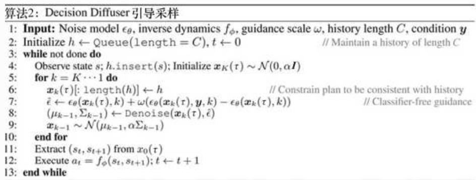  
图2.12 Decision Diffuser引导采样算法的伪代码

Decision Diffuser运行过程架构如图2.13所示，图中实线蓝框表示当前Decision Diffuser与环境交互完毕的前 t 步，接下来进行图2.12中第 $5 \sim 1 0$ 行的 K 步采样，得到预测轨迹，每一步采样都会用前 t 步真实轨迹的状态替换 $\tau ^ { i }$ 的前 t 步，且每一步采样都使用有别于Plan Diffuser的无分类器引导采样和低温采样。在得到预测轨迹中的 $s _ { t + 1 }$ 后，利用 $f _ { \phi }$ 得到作用于环境的 $a _ { t }$ ，在与环境交互后得到 $s _ { t + 1 }$ ，从而进行下一轮迭代。

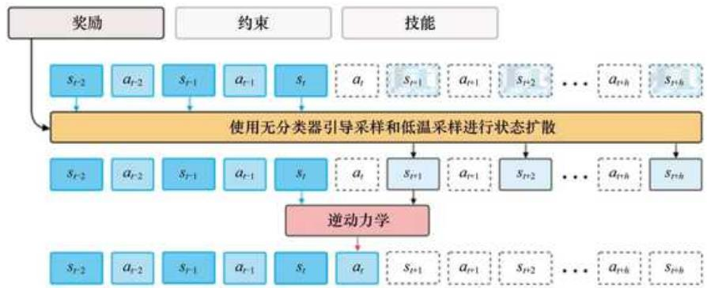  
表2.4 D4RL（ MuJoCo）上的性能对比结果

图2.13 Decision Diffuser运行过程架构。给定当前状态和条件，Decision Diffuser 使用无分类器引导采样和低温采样生成一系列未来状态，然后使用逆动力学模型提取并执行导致这些未来状态的动作 [5]

Decision Diffuser的神经网络模型结构基本继承了Plan Diffuser的U-Net设计，但有以下三个变化。

● 轨迹 $\tau ^ { i }$ 仅包含状态。  
● 条件变量 $y ( \tau ^ { i } )$ 作为标量或独热编码向量，经过MLP编码为变量 $z \in \mathbb { R } ^ { h }$ ［当 $y ( \tau ^ { i } ) = \emptyset$ 时，将 $z$ 全部置为0］，之后与扩散时间步 拼接，进行后续计算。  
● $f _ { \phi }$ 已参数化为一个独立的MLP。

# 2.3.2 回报以外的条件变量

除了轨迹 $\tau ^ { i }$ 的最终收益（Plan Diffuser解决的核心问题）， $\tau ^ { i }$ 所满足的约束或者 $\tau ^ { i }$ 中所展现出的技能也可以作为条件变量 $y ( \tau ^ { i } )$ 训练条件采样模型 $\epsilon _ { \theta } ( \tau ^ { i } , y ( \tau ^ { i } ) , i )$ 。下面详细讨论这三种条件变量的实现细节和相关实验。

# 1.最大化回报

为了生成具有最大回报的轨迹，以轨迹回报为条件可以得到 $\epsilon _ { \theta } ( \tau ^ { i } , y ( \tau ^ { i } ) , i ) = \epsilon _ { \theta } ( \tau ^ { i } , R ( \tau ^ { i } ) , i )$ 。在训练过程中，原论文将回报归一化，使得条件变量 $R ( \tau ^ { i } ) \in [ 0 , 1 ]$ ，这样在采样时，仅需将条件设为1即可采样出具有高回报的轨迹。

原论文对Decision Diffuser（DD）在D4RL数据集上与算法BC、CQL、IQL、DT（Decision Transformer）、TT（Trajectory Transformer）、MOReL以及Plan Diffuser做了性能对比，D4RL （MuJoCo）上的性能对比结果如表2.4所示。

<table><tr><td rowspan="2">数据集</td><td rowspan="2">环境</td><td colspan="8">算法</td></tr><tr><td>BC</td><td>CQL</td><td>IQL</td><td>DT</td><td>TT</td><td>MOREl</td><td>Plan Diffuser</td><td>DO</td></tr><tr><td>Med-Expert</td><td>HalfCheetah</td><td>55.2</td><td>91.6</td><td>86.7</td><td>86.8</td><td>95</td><td>53.3</td><td>79.8</td><td>90.6±1.3</td></tr><tr><td>Med-Expert</td><td>Hopper</td><td>52.5</td><td>105.4</td><td>91.5</td><td>107.6</td><td>110.0</td><td>108.7</td><td>107.2</td><td>111.8±1.8</td></tr><tr><td>Med-Expert</td><td>Walker2d</td><td>107.5</td><td>108.8</td><td>109.6</td><td>108.1</td><td>101.9</td><td>95.6</td><td>108.4</td><td>108.8±1.7</td></tr><tr><td>Medium</td><td>HalfCheetah</td><td>42.6</td><td>44.0</td><td>47.4</td><td>42.6</td><td>46.9</td><td>42.1</td><td>44.2</td><td>49.1±1.0</td></tr><tr><td>Medium</td><td>Hopper</td><td>52.9</td><td>58.5</td><td>66.3</td><td>67.6</td><td>61.1</td><td>95.4</td><td>59.5</td><td>79.3±3.6</td></tr><tr><td>Medium</td><td>Walker2d</td><td>75.3</td><td>72.5</td><td>78.3</td><td>74.0</td><td>79</td><td>77.8</td><td>79.7</td><td>82.5±1.4</td></tr><tr><td>Med-Replay</td><td>HalfCheetah</td><td>36.6</td><td>45.5</td><td>44.2</td><td>36.6</td><td>41.9</td><td>40.2</td><td>42.2</td><td>39.3±4.1</td></tr><tr><td>Med-Replay</td><td>Hopper</td><td>18.1</td><td>95</td><td>94.7</td><td>82.7</td><td>91.5</td><td>93.6</td><td>96.8</td><td>100±0.7</td></tr><tr><td>Med-Replay</td><td>Walker2d</td><td>26.0</td><td>77.2</td><td>73.9</td><td>66.6</td><td>82.6</td><td>49.8</td><td>61.2</td><td>75±4.3</td></tr><tr><td colspan="2">平均分</td><td>51.9</td><td>77.6</td><td>77</td><td>74.7</td><td>78.9</td><td>72.9</td><td>75.3</td><td>81.8</td></tr><tr><td>Mixed</td><td>Kitchen</td><td>51.5</td><td>52.4</td><td>51</td><td>-</td><td>-</td><td>-</td><td>-</td><td>65±2.8</td></tr><tr><td>Partial</td><td>Kitchen</td><td>38</td><td>50.1</td><td>46.3</td><td>-</td><td>-</td><td>-</td><td>-</td><td>57±2.5</td></tr><tr><td colspan="2">平均分</td><td>44.8</td><td>51.2</td><td>48.7</td><td>-</td><td>-</td><td>-</td><td>-</td><td>61</td></tr></table>

# 2.约束满足

有些实际问题需要规划出的轨迹满足一些约束，比如达到一个确切目标、以一种固定顺序访问一系列状态或是避开状态空间中的某些部分。将第 i 种约束记为变量 $\mathcal { C } _ { i }$ ，便可以用一个独热编码来表示轨迹 $\tau ^ { i }$ 所满足的约束。此时 $\epsilon _ { \theta } ( \tau ^ { i } , y ( \tau ^ { i } ) , i ) = \epsilon _ { \theta } ( \tau ^ { i } , 1 ( \tau ^ { i } \in \mathcal { C } _ { i } ) , i )$ 。

虽然Decision Diffuser使用离线数据集训练，其中的轨迹只满足一种可用的约束，但在推理时，其可以同时满足多种约束。下面用一个简单的例子形象地展示Decision Diffuser的这一特性，一个简单的同时满足两种约束的例子如图2.14所示。

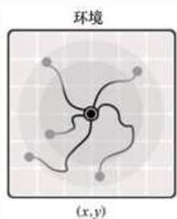

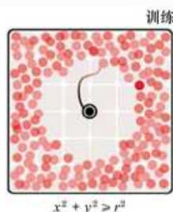

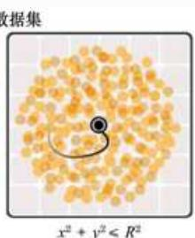

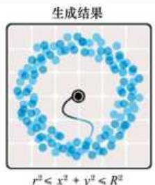  
图2.14　一个简单的同时满足两种约束的例子 [5]

原论文还对Decision Diffuser在更复杂的Kuka Block Stacking环境中与算法BCQ、ICQ以及Plan Diffuser做了性能对比。

Kuka Block Stacking环境示意如图2.15所示，共有4个方块被随机堆叠为一个或多个塔。

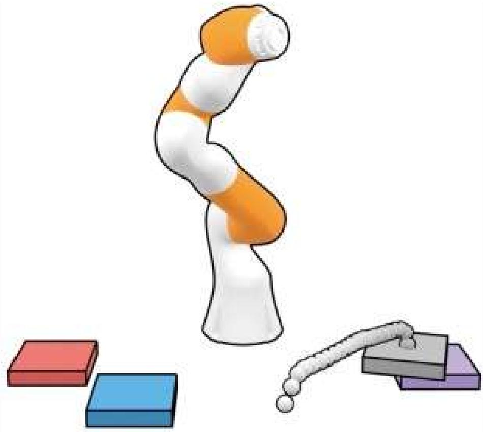  
图2.15 Kuka Block Stacking环境示意 [5]

将一种可能的约束表示为BlockHeight( i )>BlockHeight( j )，意思是方块 i 必须高于方块 j。Decision Diffuser用10 000条专家轨迹训练，每条专家轨迹都满足其中一种约束。然后在测试时将方块随机打乱，并在以下两种任务上测试算法性能。

● 要求生成的轨迹满足一种训练时见过的约束。  
● 要求生成的轨迹同时满足一组约束，比如BlockHeight( i )>BlockHeight( j )>BlockHeight( k )，而这组约束是训练时未曾见过的。

经测试，算法BCQ、CQL所输出的轨迹满足约束的成功率都为0。下面仅展示DecisionDiffuser（DD）和Plan Diffuser的对比结果，Kuka Block Stacking环境约束满足任务实验的对比结果如表2.5所示。

表2.5 Kuka Block Stacking环境约束满足任务实验的对比结果  

<table><tr><td>环境</td><td>Plan Diffuser</td><td>OO</td></tr><tr><td>Single Constraint-Stacking</td><td>45.6±3.1</td><td>58.0±3.1</td></tr><tr><td>Single Constraint-Rearrangement</td><td>58.9±3.4</td><td>62.7±3.1</td></tr><tr><td>平均分</td><td>52.3</td><td>60.4</td></tr><tr><td>Multiple Constraints-Stacking</td><td>—</td><td>60.3±3.1</td></tr><tr><td>Multiple Constraints-Rearrangement</td><td>—</td><td>67.2±3.1</td></tr><tr><td>平均分</td><td>—</td><td>63.8</td></tr></table>

# 3.技能组合

可以用一组示例轨迹 $\boldsymbol { B } _ { k }$ 来明确一种技能 k 。假设有一组机器狗运动的轨迹数据，其中机器狗小跑的轨迹集合中的轨迹带有技能“小跑”，而机器人踱步的轨迹集合中的轨迹带有技能“踱步”。用一个独热编码表示生成轨迹所携带技能的条件变量，此时 $\epsilon _ { \theta } ( \tau ^ { i } , y ( \tau ^ { i } ) , i ) = \epsilon _ { \theta } ( \tau ^ { i } , 1 ( \tau ^ { i } \in \mathcal { B } _ { i } ) , i$ ）。假设算法从带有 n 种不同的条件变量的数据分布 $q ( x _ { 0 } ( \tau ) | y ^ { 1 } ( \tau ) ) , \cdots , q ( x _ { 0 } ( \tau ) | y ^ { n } ( \tau ) )$ 中学习。与之前的情况有些不同，Decision Diffuser通过以下公式计算 $\tilde { \epsilon }$ 并进行采样：

$$
\tilde {\epsilon} := \epsilon_ {\theta} (\tau^ {i}, \emptyset , i) + w \sum_ {k = 1} ^ {n} \left(\epsilon_ {\theta} (\tau^ {i}, y ^ {k} (\tau^ {i}), i) - \epsilon_ {\theta} (\tau^ {i}, \emptyset , i)\right) \tag {2.14}
$$

这种采样方式假设 $\{ y ^ { k } ( \tau ) \} _ { k = 1 } ^ { n }$ 条件独立于 $\tau ^ { 0 }$ ，但实际上因为技能组合的条件变量是灵活的，所以这个假设是不能严格满足的。

最后让我们来看看Decision Diffuser是如何把不同的技能组合在一起的。原论文在一个四足机器人环境中进行实验，训练数据包含了这个四足机器人运动的各种步态，如跳跃、踱步和小跑。对于每种步态，训练数据含有2 500条示例轨迹。测试时，通过式（2.14）采样包含多种技能的轨迹。图2.16展示了技能组合最终采样得到的轨迹的可视化结果。采样时，要求四足机器人包含跳跃和踱步技能便可采样出前半段跳跃但后半段踱步的轨迹。

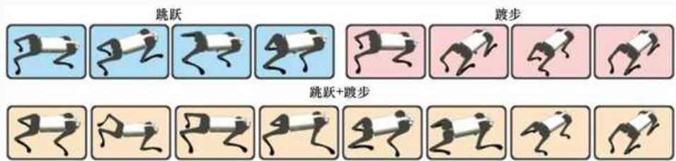  
图2.16　技能组合最终采样得到的轨迹的可视化结果[5]

原论文还量化了不同步态被组合的质量。Decision Diffuser的作者训练了一个分类器以预测轨迹中每一帧的步态。训练数据与训练Decision Diffuser的数据一致，这个分类器的输入定义为四足机器人在一段固定时间内的关节状态，即长度为10的状态子序列，标签是该状态子序列中展示的步态。

Decision Diffuser的作者以两种方式应用此分类器。

首先通过Decision Diffuser以三种不同的条件（跳跃、踱步、跳跃 $^ +$ 踱步）采样出3条轨迹。对于其中的每一条轨迹，画出分类器对轨迹中的每一个状态转移段的分类概率，结果如图2.17所示。

可以看出在“跳跃 $^ +$ 踱步”条件下，四足机器人的步态会交替进行，这与之前观察到的现象一致。

原论文还尝试了技能组合的“非”运算。假设想要从分布 $q ( \tau | \mathrm { N O T } y ^ { j } ( \tau ) )$ 中采样，则可以通过式（2.15）计算扰动噪声：

$$
\begin{array}{l} \tilde {\epsilon} := \epsilon_ {\theta} (\tau^ {i}, \emptyset , i) + w \sum_ {k \neq j} \left(\epsilon_ {\theta} \left(\tau^ {i}, y ^ {k} (\tau^ {i}), i\right) - \epsilon_ {\theta} \left(\tau^ {i}, \emptyset , i\right)\right) - \\ \left(\epsilon_ {\theta} \left(\tau^ {i}, y ^ {j} \left(\tau^ {i}\right), i\right) - c _ {\theta} \left(\tau^ {i}, \varnothing , i\right)\right) \\ \end{array}
$$

（2.15）

Decision Diffuser 的 作 者 （ 后 文 简 称 原 作 者 ） 测 试 了 约 束 BlockHeight $( i ) >$ BlockHeight(j)AND(NOT BlockHeight() $>$ BlockHeight( i ))以验证Decision Diffuser支持技能组合的“非”运算。

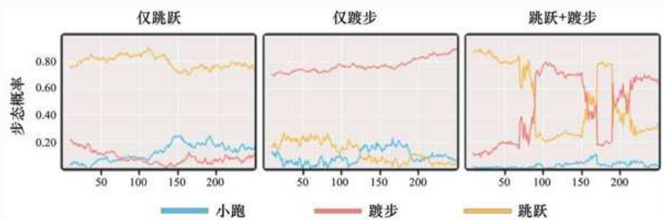  
图2.17　不同状态转移段的分类结果

实际上关于技能组合，Decision Diffuser仅支持“与”运算和“非”运算而不支持“或”运算，这是由于Decision Diffuser没有为每个条件变量提供显式的密度估计，从而不能原生地支持技能组合的“或”运算。

# 4.消融实验

为 了 证 明 无 分 类 器 引 导 采 样 的 重 要 性 ， 原 作 者 在 D4RL Hopper 环 境 中 设 计 了CondDiffuser。CondDiffuser在很多方面与Plan Diffuser完全一致（轨迹中同时纳入了状态和动作），除了没有使用分类器引导采样而使用无分类器引导采样。结果表明在3个环境中，有2个 环 境 CondDiffuser 要 优 于 Plan Diffuser ， 但 Decision Diffuser 在 3 个 环 境 中 都 优 于CondDiffuser，因此可以推断轨迹仅包含状态的思想以及逆动力学模型的引入是十分有效的。同时原作者也对比了CondMLPDiffuser，它的输出动作不通过逆动力学模型，而通过扩散模型去噪得到，结果表明它比其他几种算法表现都要糟糕。D4RL Hopper环境中的消融实验对比结果如表2.6所示。

原论文进一步分析了为什么引入逆动力学模型更加有效。原作者在Block Push环境中进行了实验（Block Push环境的可视化示意如图2.18所示），这个环境中的状态由关节角、夹持器的速度、夹持器的质心以及红色方块的位置共10维向量表示。任务目标是将红色方块推至绿色圆球处。此环境有两种控制模式。

表2.6 D4RL Hopper环境中的消融实验对比结果  

<table><tr><td>Hopper.*</td><td>Plan Diffuser</td><td>CondDiffuser</td><td>CondMLPDiffuser</td><td>Decision Diffuser</td></tr><tr><td>Med-Expert</td><td>107.6</td><td>111.3</td><td>105.6</td><td>118.8±1.6</td></tr><tr><td>Medium</td><td>58.5</td><td>66.3</td><td>54.1</td><td>79.3±3.6</td></tr><tr><td>Med-Replay</td><td>96.8</td><td>76.5</td><td>66.5</td><td>100±0.7</td></tr></table>

● 扭矩控制模式：智能体需要控制关节扭矩（共3维）。  
● 位姿控制模式：智能体需要控制夹持器的质心位置以及夹持器空间方向的角度变化(△x,△y△）。

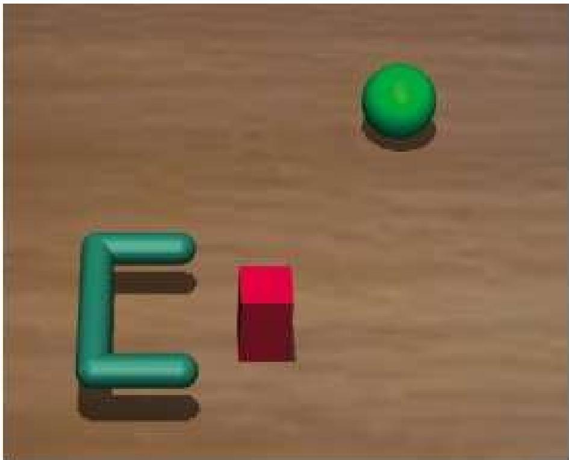  
图2.18 Block Push环境的 可视化示意 [5]

原作者在以上两种控制模式下比较了算法BC、CondDiffuser和Decision Diffuser的性能表现，结果如表2.7所示。

表2.7　两种控制模式下各算法的性能表现  

<table><tr><td rowspan="2">控制模式</td><td rowspan="2">BC</td><td colspan="2">算法</td></tr><tr><td>CondDiffuser</td><td>Decision Diffuser</td></tr><tr><td>位数控制模式</td><td>57.3±1.2</td><td>87.3±3.1</td><td>87.8±2.8</td></tr><tr><td>矩阵控制模式</td><td>55.2±1.5</td><td>71.8±3.4</td><td>84.7±2.2</td></tr></table>

事实上，夹持器的运动轨迹中，位姿（质心位置和空间方向）的变化会更加平滑，而扭矩的变化含有更高的频率分量（包含更多高频振动或高频振荡等变化很快的成分）。原作者用实验结果证实了引入逆动力学模型的合理性。位姿控制更平滑，因此动作轨迹数据更易于通过扩散模型来采样（CondDiffuser和Decision Diffuser的性能表现在位姿控制模式下差别不大），而变化更剧烈的扭矩使得Decision Diffuser的性能表现明显好于CondDiffuser。

# 2.4 代码实战

下面以一种二维数据分布为例，基于Python一步步实现扩散模型对二维数据分布的训练和采样。在本节中，我们将解释其中的关键步骤，详细的可运行代码见本书配套资源。

# 2.4.1 导入第三方库

首先导入必要的第三方库，代码如下，值得注意的是，GenerativeRL库包含各种扩散模型和流模型的实现。

```python
import random   
import matplotlib   
import numpy as np   
from easydict import EasyDict   
from richProgress import track   
matplotlib.use("Agg")   
import matplotlib.pyplot as plt   
%matplotlib inline   
import torch   
from easydict import EasyDict   
from grl.generator_models.diffusion_model.diffusion_model\import DiffusionModel   
from grl.utils import set(seed   
from grl.utils.log import log 
```

# 2.4.2 准备数据集

接下来构造一个以二维数据为样本的数据集，其中的每个样本用横、纵坐标表示。一共采样出2 000 000个点，并通过拒绝接受采样方法，确保这些点都处于左、右两个圆内。其中左圆圆心坐标为 ，右圆圆心坐标为 ，两个圆半径都为1。此外，将所有样本分为三个集合—— $C _ { \mathrm { l e f f } } \ , \ C _ { \mathrm { a n d } } , \ C _ { \mathrm { r i g h t } }$ ，其中 $C _ { \mathrm { l e f t } }$ 为属于左圆且不属于右圆的样本的集合， $C _ { \mathrm { a n d } }$ 为两圆交集， $C _ { \mathrm { { \dot { n } } b u } }$ 为属于右圆且不属于左圆的样本的集合。

定义函数generate_samples，用于采样出上述2 000 000个样本，并将它们分好类，然后返回三个样本集合。定义函数visualize_samples，用于可视化样本集合。定义函数visualize_samples_separate，用于可视化不同条件下扩散模型的采样结果。代码如下：

```python
def generate_samples(radius, num_samples, x.bias = 0.5):
    ...
def visualize_samples(samples_np_array, color, marker, label):
    ...
def visualize_samples Separate(samples_list, colors, markers, labels):
    ... 
```

执行以下代码，构造包含2 000 000个样本的数据集，按照前面的要求，将整个数据集划分为三个集合，得到的可视化结果见图2.19。

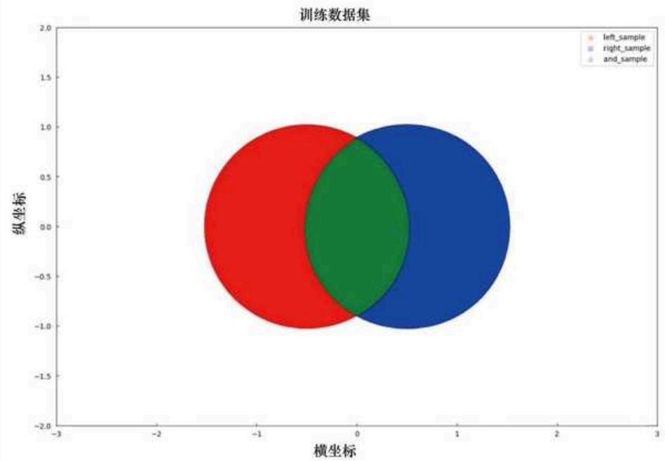  
图2.19　扩散模型训练数据集的可视化结果

samples_num $= 2000000$ left_sample,right_sample,and_sample $\equiv$ . generate_samples(1,samples_num,0.5)   
plt.figure(figsiz=(15,10))   
plt.xlim((-3,3))   
plt.ylim(-2,2))   
visualize_samples(left_sample,'red','o','Left_sample') visualize_samples(right_sample,'blue','s','Right_sample') visualize_samples(and_sample,'green', $\sim ,$ 'And_sample')   
plt.legend()   
plt.show()

将属于集合 $C _ { \mathrm { l e f l } }$ 的样本标记为红色圆形，将属于集合 $C _ { \mathrm { a n d } }$ 的样本标记为绿色三角形，而将属于集合 $C _ { \mathrm { { \mathrm { n g h t } } } }$ 的样本标记为蓝色正方形。

执行以下代码，为每一个样本赋予标签，集合 $C _ { \mathrm { l e f t } }$ 中的样本标记为[1,0]，集合 $C _ { \mathrm { a n d } }$ 中的样本标记为 ，而集合 $C _ { \mathrm { i g h t } }$ 中的样本标记为 。之后将整个数据集整理为一个 $2 0 0 0 0 0 0 0 \times 4$ 大小的数组，其中第二维的前两列表示样本坐标，后两列表示样本标签。

condition $=$ np.zeros((samples_num,2))   
condition[:left_sample.shape[0],0] $= 1$ condition(left_sample.shape[0]:\ left_sample.shape[0] $^+$ right_sample.shape[0],1] $= 1$ condition(left_sample.shape[0] $^+$ right_sample.shape[0] $\cdot ] = 1$ train_data $=$ np.vstack((left_sample,right_sample,and_sample))   
train_data $=$ np.hstack((train_data,condition))

# 2.4.3 配置扩散模型

定义扩散模型的配置字典，代码如下，其中包含扩散模型的各种细节，比如时间戳和标签的编码器、采样方法、扩散过程、残差网络参数规模等。扩散模型配置字典中每个字段的具体含义请参考GenerativeRL库中的说明。

device $=$ torchdevice("cuda:0")if\torch.cuda.is-available()elsetorch_device("cpu")  
x_size $= 2$ t_embedding_dim $= 32$ tEncoder $=$ dict(  
...   
）   
cEncoder $=$ dict(  
...   
）   
config $=$ EasyDict(  
dict( device $\equiv$ device, diffusion_model $\equiv$ dict(  
... )， model $\equiv$ dict(  
... )，  
), parameter $\equiv$ dict(  
...   
）   
def get_train_data(dataloader): while True: yield from dataloader

# 2.4.4 实例化扩散模型

执行以下代码，实例化上述扩散模型。此外，实例化优化器，并将训练数据加载至PyTorch的DataLoader。

seed_value $=$ set(seed()   
log.infof("start exp with seed value{seed_value}.")   
diffusion_model $=$ DiffusionModel(config=config.diffusion_model).to( config.diffusion_modeldevice   
)   
diffusion_model $=$ torch.compile(diffusion_model)   
optimizer $=$ torch.optim.Adam( diffusion_model.params(), lr $\equiv$ configparameter.lr, ）   
dataloader $=$ torch.utils.data.DataLoader( train_data,batch_size $\equiv$ config.parameter.batch_size，shuffle $\equiv$ True ）   
data_generation $=$ get_train_data(dataloader)

# 2.4.5 训练条件扩散模型

执行以下代码，训练条件扩散模型，在进行2 000次迭代后，条件扩散模型的参数达到收敛。

$\mathrm{p\_uncon} = 0.5$ gradient_sum = 0.0  
loss_sum = 0.0  
counter = 0

iteration $= 0$ for iteration in track(range(config.parameter_iterations),\ description="Training"): batch_data $\equiv$ next(data_generator) batch_data $\equiv$ batch_data.to(config_device).float() diffusion_model.train() loss $= (1 - p_{-}$ uncon \* diffusion_model.score_MATCHing_loss\ (batch_data[:,2],batch_data[:,2]）+p_uncon \* diffusion_model.score_MATCHing_loss\ (batch_data[:,2],torch.zeros_like(batch_data[:,2]）.to(batch_data)) optimizer.zero_grad() loss.backup( gradien_norm $\equiv$ torch.nn.utils.clip_grad_norm_ ( diffusion_model.params(), config.parameterclip_grad_norm   
) optimizer step() gradient_sum $+ =$ gradien_norm.item() loss_sum $+ =$ loss.item() counter $+ = 1$

# 2.4.6 条件采样

扩散模型训练结束后，给定不同的条件，我们期望扩散模型能够采样出属于不同集合的样本。在下面的代码中，我们以4种标签为条件，在每一种条件下采样出4 000个样本，并渲染采样结果。

```prolog
num = 4000  
con_00 = torch.zeros((num, 2))  
con_01 = torch.zeros((num, 2))  
con_10 = torch.zeros((num, 2))  
con_11 = torch.zeros((num, 2))  
con_01[:, 1] = 1  
con_10[:, 0] = 1  
con_11 += 1  
diffusion_model.eval()  
t spans = torch.linspace(0.0, 1.0, 1000)  
x_t = (  
    diffusion_model.sample_forward_process(t spans=t_spans, \ condition=con_00.to(config_device).float())  
    .cpu()  
    .detach()  
)  
res_00 = x_t.cpu().numpy()[-1]  
t_spans = torch.linspace(0.0, 1.0, 1000)  
x_t = (  
    diffusion_model.sample_forward_process(t_spans=t_spans, \ condition=con_01.to(config_device).float()))  
    .cpu()  
    .detach()  
)  
res_01 = x_t.cpu().numpy()[-1]  
t_spans = torch.linspace(0.0, 1.0, 1000)  
x_t = (  
    diffusion_model/sample_forward_process(t_spans=t_spans, \ condition=con_10.to(config_device).float()))  
    .cpu()  
    .detach()  
)  
res_10 = x_t.cpu().numpy()[-1]  
t_spans = torch.linspace(0.0, 1.0, 1000)  
x_t = (  
    diffusion_model.sample_forward_process(t_spans=t_spans, \ condition=con_11.to(config_device).float())) .cpu()  
    .detach() 
```

```python
res_11 = x_t.cpu().numpy()-1]  
visualize_samples_separate([res_00, res_01, res_10, res_11], ['purple','b', 'r', 'g'], ['*', 's', 'o', '~'], ['OR', 'RIGHT', 'LEFT', 'AND']) 
```

最终扩散模型在4种条件下的采样结果如图2.20所示。

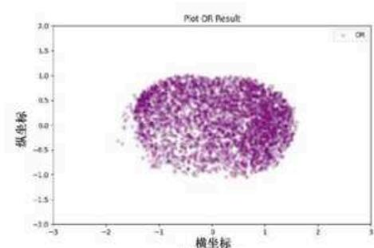

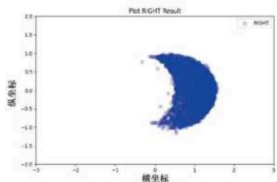

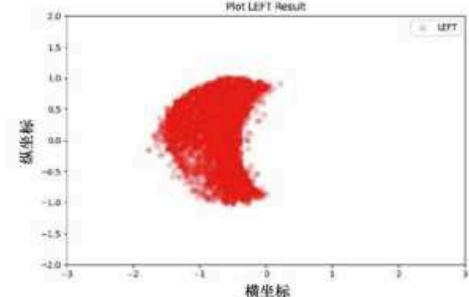

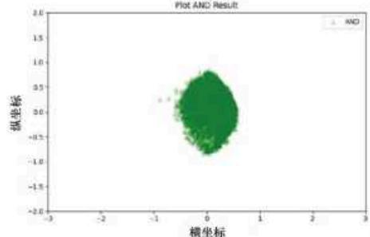  
图2.20　最终扩散模型在4种条件下的采样结果

# 参考文献

[1] LE H, VOLOSHIN C, YUE Y. Batch policy learning under constraints[C]//International Conference on Machine Learning. 2019: 3703-3712.   
[2] KUMAR A, ZHOU A, TUCKER G, et al. Conservative Q-learning for offline reinforcement learning[C]// Advances in Neural Information Processing Systems. 2020, 33: 1179-1191.   
[3] KOSTRIKOV I, NAIR A, LEVINE S. Offline reinforcement learning with implicit Qlearning[EB/OL]. arXiv: 2110.06169.   
[4] JANNER M, DU Y, TENENBAUM J B, et al. Planning with diffusion for flexible behavior synthesis[EB/OL]. arXiv: 2205.09991.   
[5] AJAY A, DU Y, GUPTA A, et al. Is conditional generative modeling all you need for decision-making?[EB/OL]. arXiv: 2211.15657.

# 第3章

# 基石：扩散模型与价值函数的结合

# 3.1 强化学习中基于价值函数的策略优化

强化学习算法的目的是产出最优决策策略。一般来说，我们需要根据某种规则来优化建模的策略，从而渐进提升策略的质量。强化学习算法中的主流算法是基于价值函数来优化策略的。价值函数是对价值的估计建模，因此首先需要定义“价值”。在强化学习算法中，为了预估状态 $s$ 或状态-动作对 $^ { ( s , a ) }$ 在某个策略 $\pi$ 下的价值，即状态 s 在策略 $\pi$ 下未来奖励 $r$ 的贴现，或状态 s 下的动作 a 在策略 $\pi$ 下未来奖励 r 的贴现，需要引入状态价值函数 $V ( s )$ 或状态动作价值函数 $Q ( s , a )$ (也称 Q 函数）。它们的定义如下（以下定义中引入了扩散时间 t）：

$$
\begin{array}{l} V (s _ {t}) = \mathbb {E} _ {\pi} \left[ \sum_ {i = t} ^ {i = \text {c e n d}} \gamma^ {t} r _ {i} \right] (3.1) \\ Q \left(s _ {t}, a _ {t}\right) = \mathbb {E} _ {\pi} \left[ r \left(s _ {t}, a _ {t}\right) + \sum_ {i = t + 1} ^ {i = \text {e n d}} \gamma^ {t} r _ {i} \right] (3.2) \\ \end{array}
$$

从式（3.1）与式（3.2）可以看出，使用价值函数可以对未来的奖励进行建模。价值函数的大小是对未来所有奖励的期望。尤其当环境本身的奖励 $\textstyle r ( s , a )$ 是一个存在且仅可通过交互来获知的数时，对价值进行建模可以有效地指导策略本身的优化。从强化学习算法的目的出发，最优决策策略需要产出最大的奖励的期望。

$$
\pi = \arg \max  _ {\pi} \mathbb {E} [ R ] = \arg \max  _ {\pi} \mathbb {E} [ \sum r ] \tag {3.3}
$$

价值函数是对未来奖励的建模近似。因此，使用价值函数引导策略函数进行优化本质上等价于计算

$$
\pi (a \mid s) = \arg \max  _ {\pi} \mathbb {E} [ Q (s, a) ] \tag {3.4}
$$

这类算法在强化学习领域称为策略梯度优化（Policy Gradient Optimization）算法。在深度强化学习算法中，可以使用神经网络来近似价值函数 $V ( s )$ 和 $Q ( s , a )$ ，并通过进行神经网络的梯度下降来优化策略函数 [1] 。这类强化学习算法的代表中 [2] ，涉及在线强化学习的有DDPG（Deep Deterministic Policy Gradient，深度确定性策略梯度）、PPO（Proximal PolicyOptimization，近端策略优化）、TRPO（Trust Region Policy Optimization，置信域策略优化）[3] 等，涉及离线强化学习的有AWR（Advantage Weighted Regression，优势加权回归） [4] 等。它们分别在不同的场景下，对价值函数的建模和策略函数的优化进行了不同的设计。例如，TRPO算法通过对策略函数的KL散度进行约束，来保证策略函数的更新不会过大，从而保证策略函数在训练过程中的稳定性。

接下来介绍如何将扩散模型与价值函数结合起来设计新的强化学习算法。

# 3.2 Diffusion-QL：高效建模离线数据集中的行为策略

Diffusion-QL[5]是一种基于价值函数的扩散模型策略优化算法，它的核心思想是使用扩散模型来建模策略函数，并使用价值函数来引导扩散模型生成价值更高的决策策略。

Diffusion-QL使用DDPM建模策略函数 $\pi _ { \theta } ( s , a )$ ，因此在训练模型时，Diffusion-QL会使用DDPM的训练目标，即基于噪声方程建模的得分函数匹配目标，来训练策略函数 $\pi _ { \theta } ( s , a )$ 。

另外，Diffusion-QL还会使用 Q 函数 $Q ( s , a )$ 来引导DDPM生成更优的策略函数，并使用超参数 $\beta$ 来控制 Q 函数对DDPM的影响。因此，Diffusion-QL的目标函数如下：

$$
\mathcal {L} (\theta) = \mathbb {E} _ {s, a \sim \mathcal {D}, a _ {t}} [ - \beta Q (s, a ^ {*}) + \| \nabla_ {a _ {t}} \log \pi_ {\theta} (a _ {t} | s) - \nabla_ {a _ {t}} \log \pi (a _ {t} | s, a) \| ^ {2} ] \tag {3.5}
$$

在式（3.5）中， $_ { \mathcal { D } }$ 是离线数据集合， $^ { a }$ 与 $s$ 分别是来自该离线数据集合的状态和动作， $a _ { t }$ 是动作 $^ { a }$ 引入扩散过程带来的噪声后的经过扰动的动作， $a ^ { * }$ 是通过DDPM生成的动作，需要保持生成过程支持梯度传播。从式（3.5）可以看出，通过使用超参数 $\beta$ ，Diffusion-QL可以控制 Q 函数对DDPM的影响。当 $\beta = 0$ 时，Diffusion-QL退化为DDPM；当 $\beta$ 很大时，Diffusion-QL中得分函数匹配目标的影响会被相对抑制。

Diffusion-QL使用了Double Q-Learning的设计，即使用两个价值函数 $Q _ { 1 } ( s , a )$ 和 $Q _ { 2 } ( s , a )$ 来估计状态-动作对 $^ { ( s , a ) }$ 的价值，这样可以降低价值函数估计过程中的过估计（Overestimation）风险。

Diffusion-QL的价值函数使用了经典的贝尔曼更新公式，其更新目标如下：

$$
Q _ {1} (s, a) = r (s, a) + \gamma \min  \left(Q _ {2} \left(s ^ {\prime}, a ^ {\prime}\right), Q _ {1} \left(s ^ {\prime}, a ^ {\prime}\right)\right) \tag {3.6}
$$

在式（3.6）中， $s$ 和 $^ { a }$ 分别是状态和动作， $s ^ { \prime }$ 和 $\acute { a }$ 分别是状态 $s$ 下的下一个状态和动作， $\textstyle r ( s , a )$ 是状态 $\pmb { s }$ 下采取动作 $^ { a }$ 的奖励， 是贴现因子。需要指出的是， 和 $s ^ { \prime }$ 都来自离线数据集合 $_ { \mathcal { D } }$ ，而 $\acute { a }$ 是通过对扩散模型建模的策略函数 $\pi _ { \theta } ( s , a )$ 采样得到的。因此，动作价值函数的训练需要基于扩散模型建模的策略，而扩散模型建模的策略的更新则需要基于动作价值函数的优化。在Diffusion-QL中，这两个过程是互相耦合的。

Diffusion-QL算法的训练流程如图3.1所示。

我们对Diffusion-QL在D4RL数据集上进行了基线实验，并取得了较好的效果。DiffusionQL的优势在于可以使用扩散模型来建模策略函数，从而可以高效地建模离线数据集合中的行为策略，并利用对行为策略的建模来约束策略函数的优化，使其不至于偏离太远。同时，Diffusion-QL也可以利用对扩散模型建模更合适的策略函数来引导价值函数的更新，甚至从某种程度上可以限制离线强化学习价值函数的过估计风险。

但Diffusion-QL也有一些局限性，比如需要在训练过程中对扩散模型的策略函数和价值函数进行交替更新，并且需要对扩散模型进行采样，这会增加训练的复杂度，并且由于扩散模型的采样计算量较大，还会增加训练的时间。另外，Diffusion-QL的超参数选择也会影响算法的性能，因此需要进行一定的调参，不同的超参数选择会导致实验结果产生较大的差异。

# 算法1：Diffusion-QL算法的训练流程

1:初始化扩散模型建模的策略函数 $\pi _ { \theta } ( s , a )$ 和价值函数 $Q ( s , a )$ ，离线数据集合为D  
  
$\mathcal { D }$   
4:通过扩散模型建模的策略函数 $\pi _ { \theta } ( s , a )$ 采样得到动作 $a ^ { * }$   
根据式（3.5），计算扩散模型的策略函数 $\pi _ { \theta } ( s , a )$ 的梯度，并使用随机梯度下降法更新策略函数 $\pi _ { \theta } ( s , a )$   
6:通过扩散模型建模的策略函数 $\pi _ { \theta } ( s , a )$ 采样得到动作a  
根据式（3.6），计算价值函数 $Q ( s , a )$ 的梯度，并使用随机梯度下降法更新价值函数  
更新扩散模型的策略函数 $\pi _ { \theta } ( s , a )$ 和价值函数Q（s,a）

图3.1 Diffusion-QL算法的训练流程

# 3.3 CEP和QGPO：借助能量函数设计新的引导器

Diffusion-QL提出了一种基于价值函数引导的扩散模型精调方法，从而可以有效地引导策略模型以更高的概率生成更大价值的动作。然而，从式（3.5）可以看出，Diffusion-QL的训练方法与扩散模型的训练方法是分离的：后者基于匹配法，例如得分函数匹配或流匹配，是一种基于匹配目标的最小平方误差的训练方法；前者则基于对采样过程的策略梯度法，在优化过程中，回传的梯度将反向遍历整个生成过程。因此，很难说使用Diffusion-QL优化后的策略模型在定义上依然是一个扩散模型。虽然它依然是一个连续时间生成模型，即连续正则化流模型，但由于它的训练方法与生成轨迹已经与狭义的扩散模型不同，因此其性状也会有所不同。

是否可以构造一种基于价值函数作为条件的扩散模型，即在扩散模型的基础上引入一个引导器，来设计一种训练方法，使得训练后的策略模型依然是一个（条件）扩散模型呢？论文 [6]“Contrastive Energy Prediction for Exact Energy-Guided Diffusion Sampling in Offline ReinforcementLearning”提出了一种新的条件扩散模型的引导器设计方法，即对比能量预测（ContrastiveEnergy Prediction，CEP）法，来实现这样的条件扩散模型。基于对比能量预测法的扩散模型策略函数的离线强化学习训练称为基于 Q 价值函数引导的策略优化（Q-value Guided PolicyOptimization，QGPO）。

# 3.3.1 对比能量预测法

对比能量预测法是一种基于能量函数的条件扩散模型的引导器设计方法。它并不局限于强化学习训练，而是适用于任何以能量函数为条件的扩散模型的训练。

# 1.对比能量预测法的基本思想

让我们简单回顾一下条件扩散模型的建模，参考第1章中的相关内容，一般有下列三种建模方式：直接建模、分类器引导建模和无分类器引导建模。

直接建模： 直接建模 $p _ { \theta } ( x | c )$ 意味着通过将条件 $^ { c }$ 作为模型的直接输入，建模扩散模型的得分函数或其等价函数，如噪声函数、速度函数等。

分类器引导建模： 分类器引导建模则通过构造一个分类器 $p _ { \phi } ( c | x )$ ，并让这个分类器输出条件 $^ { c }$ 的概率分布，来间接地引导扩散模型的生成过程，根据贝叶斯公式：

$$
p _ {\theta} (x \mid c) = \frac {p _ {\theta} (x) p _ {\phi} (c \mid x)}{p _ {\phi} (c)} \tag {3.7}
$$

用对数形式表示，则有

$$
\log p _ {\theta} (x \mid c) = \log p _ {\theta} (x) + \log p _ {\phi} (c \mid x) - \log p _ {\phi} (c) \tag {3.8}
$$

求式（3.8）关于 $x$ 的微分形式，获得得分函数的形式：

$$
\nabla_ {x} \log p _ {\theta} (x | c) = \nabla_ {x} \log p _ {\theta} (x) + \nabla_ {x} \log p _ {\phi} (c | x) \tag {3.9}
$$

假设分类器 $p _ { \phi } ( c | x )$ 关于 $x$ 的微分可以计算，即 $\nabla _ { x } \log p _ { \phi } ( c | x )$ 可以计算，则可以通过联合使用分类器和预训练的无条件扩散模型 $p _ { \theta } ( x )$ ，来引导扩散模型的生成过程。

无分类器引导建模： 无分类器引导建模将条件扩散模型和无条件扩散模型的得分函数建模在同一个模型中，即

$$
s _ {\theta} \left(x _ {t}, c\right) = \nabla_ {x _ {t}} \log p \left(x _ {t} \mid c\right)
$$

$$
s _ {\theta} \left(x _ {t}, c = \text {N u l l}\right) = \nabla_ {x _ {t}} \log p \left(x _ {t}\right)
$$

并使用强化系数 ，增强了贝叶斯公式中的条件对应的似然函数 $p ( c | x )$ 的强度，从而得到一个相比原条件分布 $p ( x | c )$ 锐度更大的新条件分布 $p ( \tilde { x } | c )$ ，即

$$
p (\tilde {x} \mid c) \propto p (c \mid x) ^ {(w + 1)} p (x)
$$

求上式对于 $_ { x }$ 的微分形式，用得分函数的形式可以表示为

$$
\begin{array}{l} \nabla_ {x} \log p (\tilde {x} | c) = (1 + w) \nabla_ {x} \log p (c | x) + \nabla_ {x} \log p (x) \\ = (1 + w) \left(\nabla_ {x} \log p (x \mid c) - \nabla_ {x} \log p (x)\right) + \nabla_ {x} \log p (x) \\ = (1 + w) \nabla_ {x} \log p (x | c) - w \nabla_ {x} \log p (x) \\ \end{array}
$$

从某种角度来说，可以将其视为一种锐度强化后的直接建模条件生成模型，当强化系数$w = 0$ 时，上述公式退化为直接建模条件生成模型。

除了以上三种主要的建模方式，还有一种较为重要的建模方式，即为能量方程引导建模，具体如下。

能量方程引导建模： 对比能量预测法中的分类器是以能量函数 $\varepsilon ( x )$ 的形式出现的。而能量函数的输入是 $x$ ，输出是一个标量值，表示 $x$ 位置的能量，而非条件 $^ { c }$ 的概率分布，因此能量函数可以视为一种隐式的分类器，即

$$
p (x \mid c) \propto p (x) \exp (- \varepsilon (x)) \tag {3.10}
$$

由式（3.10）可知，能量越大，条件概率越小，这也是一般意义上的基于能量方程的生成模型（Energy-Based Generative Model，EBM）的定义。在统计力学和数学中，这种形式称为玻尔兹曼分布或吉布斯分布。

在实际应用中，作为条件的能量函数 $\varepsilon ( x )$ 一般是已知的，或是可以通过神经网络来建模并训练的。然而，对于一个连续时间生成模型，仅仅使用能量函数 $\varepsilon ( x )$ 作为条件是不够的，还需要将生成过程中间态的能量方程作为引导器，来引导扩散模型的生成过程。

中间态的能量方程的定义与原理推导： 将原来的无条件扩散模型的分布记为 $p ( x _ { t } )$ ，扩散时间为 $\textstyle t \in [ 0 , 1 ]$ ，扩散过程如下：

$$
x _ {t} = \alpha_ {t} x _ {0} + \sigma_ {t} \epsilon , \epsilon \sim \mathcal {N} (0, I) \tag {3.11}
$$

将正则系数记为 $Z$ ，初始态能量方程为 $\varepsilon ( x _ { 0 } )$ ，它们之间的关系如下：

$$
Z = \int p (x _ {0}) \exp (- \varepsilon (x _ {0})) d x _ {0} \tag {3.12}
$$

将初始态的条件分布记为 $p ( x _ { 0 } | c )$ ，它可以表示为

$$
p \left(x _ {0} \mid c\right) = \frac {p \left(x _ {0}\right) \exp (- \varepsilon \left(x _ {0}\right))}{Z} \tag {3.13}
$$

假设条件扩散模型和无条件扩散模型对应的扩散过程相同，即它们拥有相同的漂移系数 $\alpha _ { t }$ 和扩散系数 $\sigma _ { t }$ ：

$$
p \left(x _ {t} \mid x _ {0}, c\right) = p \left(x _ {t} \mid x _ {0}\right) = \mathcal {N} \left(x _ {t} \mid \alpha_ {t} x _ {0}, \sigma_ {t} ^ {2} I\right) \tag {3.14}
$$

当扩散时刻为 $_ t$ 时，即 $x _ { 0 } \to x _ { t }$ ，中间态的条件分布为 $p ( x _ { t } \vert c )$ ，无条件的分布为 $p ( x _ { t } )$ 。使用初始态 $x _ { 0 }$ 的分布与扩散过程，计算中间态 $x _ { t }$ 的分布。无条件的分布可以计算为

$$
p \left(x _ {t}\right) = \int p \left(x _ {t} \mid x _ {0}\right) p \left(x _ {0}\right) d x _ {0} \tag {3.15}
$$

中间态的条件分布可以计算为

$$
\begin{array}{l} p \left(x _ {t} \mid c\right) = \int p \left(x _ {t} \mid x _ {0}, c\right) p \left(x _ {0} \mid c\right) d x _ {0} \\ = \int p \left(x _ {t} \mid x _ {0}, c\right) \frac {p \left(x _ {0}\right) \exp \left(- \varepsilon \left(x _ {0}\right)\right)}{Z} d x _ {0} \\ = \int \frac {p \left(x _ {0} \mid x _ {t}\right) p \left(x _ {t}\right) \exp \left(- \varepsilon \left(x _ {0}\right)\right)}{Z} d x _ {0} \tag {3.16} \\ = p \left(x _ {t}\right) \int \frac {p \left(x _ {0} \mid x _ {t}\right) \exp \left(- \varepsilon \left(x _ {0}\right)\right)}{Z} d x _ {0} \\ \end{array}
$$

因此，只要定义中间态的能量方程 $\varepsilon _ { t } ( x _ { t } )$ 满足以下形式：

$$
\exp \left(- \varepsilon_ {t} \left(x _ {t}\right)\right) = \int p \left(x _ {0} \mid x _ {t}\right) \exp \left(- \varepsilon \left(x _ {0}\right)\right) d x _ {0} = \mathbb {E} _ {p \left(x _ {0} \mid x _ {t}\right)} [ \exp (- \varepsilon \left(x _ {0}\right)) ] \tag {3.17}
$$

就可以获得一个在任意时刻都满足能量方程引导的中间态的边缘分布：

$$
p \left(x _ {t} \mid c\right) = \frac {p \left(x _ {t}\right) \exp \left(- \varepsilon_ {t} \left(x _ {t}\right)\right)}{Z} \tag {3.18}
$$

理想状态下，随着扩散过程充分进行，即 $\scriptstyle \operatorname* { l i m } _ { t \to 1 } x ,$ ，中间态的能量方程 $ { \varepsilon } _ { t } ( x _ { t } )$ 的数值差异会越来越小，直至达到一种均衡状态，如图3.2所示。

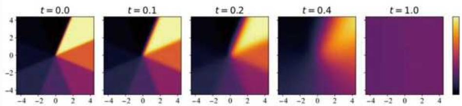  
图3.2　中间态能量扩散示意图。色彩的亮度代表能量的强度， 可以看到随着扩散的加深，中间态的能量逐渐弥散至均衡

# 2.对比能量预测法的建模

通过上述分析可以看出，基于能量函数的条件扩散模型有两个组件：除了需要像常规扩散模型那样建模得分函数 $\nabla _ { x _ { t } } \log { p _ { \theta } ( x _ { t } ) }$ ，还需要建模中间态的能量引导 $\nabla _ { x _ { t } } \varepsilon _ { t } ( x _ { t } )$ 。后者是扩散过程中间态能量 $\varepsilon _ { t } ( x _ { t } )$ 的梯度，用于引导扩散模型的生成过程：

$$
\nabla_ {x _ {t}} \log p _ {\theta} (x _ {t} \mid x _ {0}) = \nabla_ {x _ {t}} \log p _ {\theta} (x _ {t}) - \nabla_ {x _ {t}} \varepsilon_ {t} (x _ {t}) \tag {3.19}
$$

建模时，需要使用神经网络 $f _ { \phi } ( x _ { t } , t )$ 建模能量函数 $\varepsilon _ { t } ( x _ { t } )$ ，并使用对比能量预测法训练这个神经网络。它有两个输入，一个是中间态 $x _ { t }$ ，另一个是时刻 $_ t$ ，输出是一个标量值，表示 $_ t$ 时刻处于 $x _ { t }$ 位置的能量大小。采样时，对这个能量函数进行微分，以获得梯度 $\nabla _ { x _ { t } } \varepsilon _ { t } ( x _ { t } )$ ，用于引导扩散模型的生成过程。

# 3.对比能量预测法的训练方法

为了训练中间态的能量所对应的神经网络 $f _ { \phi } ( x _ { t } , t )$ ，需要找到一个能够还原中间态能量性质的表达式：

$$
\exp \left(- \varepsilon_ {t} \left(x _ {t}\right)\right) = \int p \left(x _ {0} \mid x _ {t}\right) \exp \left(- \varepsilon \left(x _ {0}\right)\right) d x _ {0} = \mathbb {E} _ {p \left(x _ {0} \mid x _ {t}\right)} [ \exp (- \varepsilon \left(x _ {0}\right)) \tag {3.20}
$$

观察式（3.20），可以发现，等式最左端的 $\exp ( - \varepsilon _ { t } ( x _ { t } ) )$ 代表某种未知的未正则化的概率分布，为方便起见，可以记为 $p _ { \phi }$ ；而等式最右端的 $\mathbb { E } _ { p ( x _ { 0 } | x _ { t } ) } [ \exp ( - \varepsilon ( x _ { 0 } ) ) ]$ 则代表一个已知的初态能量分布，为方便起见，可以记为 $p _ {  { \varepsilon } , t }$ 。

为了让 $p _ { \phi }$ 符合 $p _ { \varepsilon , t }$ 的 分 布 ， 论 文 “Contrastive Energy Prediction for Exact Energy- GuidedDiffusion Sampling in Offline Reinforcement Learning”提出了使用对比能量预测法训练扩散过程的中间态能量，训练目标如下：

$$
\arg \min  _ {\phi} \mathbb {E} _ {t \sim p (t), x _ {0} ^ {1 \kappa} \sim p \left(x _ {0}\right), \epsilon^ {1 \kappa} \sim N (0, I)} \left[ - \sum_ {i = 1} ^ {K} \frac {\exp \left(- \varepsilon \left(x _ {0} ^ {i}\right)\right)}{\sum_ {j = 1} ^ {K} \exp \left(- \varepsilon \left(x _ {0} ^ {j}\right)\right)} \log \left(\frac {\exp \left(- f _ {\phi} \left(x _ {t} ^ {i} , t\right)\right)}{\sum_ {j = 1} ^ {K} \exp \left(- f _ {\phi} \left(x _ {t} ^ {j} , t\right)\right)}\right) \right] \tag {3.21}
$$

按照上述目标训练的最优模型 $f _ { \phi } ( x _ { t } , t )$ 符合中间态能量的分布，即两者具有相同的梯度（仅在数值上存在偏置差异）：

$$
\nabla_ {x _ {t}} f _ {\phi^ {*}} (x _ {t}, t) = \nabla_ {x _ {t}} \varepsilon_ {t} (x _ {t}) \tag {3.22}
$$

因此CEP算法的执行包含两个步骤。首先，将扩散模型在不添加任何能量条件的情况下，使用得分匹配法进行充分预训练，使得扩散模型能够生成符合全体数据分布的样本。

$$
\mathcal {L} (\theta) = \mathbb {E} _ {t \sim p (t)} \left[ \mathbb {E} _ {x _ {t} \sim p \left(x _ {t}, x _ {0}\right)} [ \lambda (t) \| \nabla_ {x _ {t}} \log p _ {\theta} \left(x _ {t}\right) - \nabla_ {x _ {t}} \log p _ {\theta} \left(x _ {t} \mid x _ {0}\right) \| ^ {2} ] \right] \tag {3.23}
$$

然后，使用对比能量预测法，训练中间态的神经网络 $f _ { \phi } ( x _ { t } , t )$ ，使它的梯度与中间态的能量函数 $\varepsilon _ { t } ( x _ { t } )$ 的梯度尽可能一致。

# 3.3.2 基于Q价值函数引导的策略优化

# 1.QGPO算法的基本思想与定义

基于对比能量预测法的扩散模型策略函数的离线强化学习训练称为基于Q价值函数引导的策略优化（Q-value Guided Policy Optimization，QGPO）。它通过将策略模型建模为一种能量引导的扩散模型，从而借助扩散模型的表达优势，更有效地建模复杂的策略分布。

QGPO算法中有三个独立的模型：建模行为策略 $\mu ( a | s )$ 的扩散模型 $\varepsilon _ { \theta } ( a _ { t } | s , t )$ 、动作价值模型$\mathcal { Q } _ { \psi } ( a , s )$ ，以及中间态的能量模型 $f _ { \phi } ( a _ { t } , s , t )$ 。

记扩散时间为 $t \in [ 0 , 1 ]$ ，扩散后 $_ t$ 时刻的策略为 $\pi _ { t }$ ，则策略的生成过程可以写为

$$
\nabla_ {a _ {t}} \log \pi_ {t} (a _ {t} | s) = \nabla_ {a _ {t}} \log \mu_ {t} (a _ {t} | s) - \nabla_ {a _ {t}} \varepsilon (a _ {t}, s) \tag {3.24}
$$

中间态的能量 $ { \varepsilon } _ { t } ( a _ { t } , s )$ 可以使用 Q 函数定义为

$$
\varepsilon_ {t} \left(a _ {t}, s\right) = \log \mathbb {E} _ {\mu_ {\mathrm {o r}} \left(a _ {0} \mid a _ {t}, s\right)} [ \exp (- \beta Q _ {\psi} \left(a _ {0}, s\right)) ] \tag {3.25}
$$

实践中可以使用具体的神经网络来建模 $\varepsilon _ { t } ( a _ { t } , s ) \approx f _ { \phi } ( a _ { t } , s , t )$ 。

# 2.QGPO算法的训练方法

QGPO算法由三个训练阶段组成：策略模型的预训练、价值函数的训练，以及条件策略模型的训练。需要先进行策略模型的预训练，以使策略模型能够生成符合全体数据分布的样本。完成后，第二个训练阶段和第三个训练阶段会交替进行，从而获得最优的价值函数和策略模型。

策略模型的预训练： 使用离线数据集合 $\mathcal { D } _ { \mu }$ 从零开始训练行为策略 $\mu ( a | s )$ 的扩散模型，此扩散模型一般可以使用得分匹配法来训练，以使策略模型能够生成符合全体数据分布的样本。

为了减少后面两个训练阶段耗费的时间，可以在第一个训练阶段结束后，使用行为策略采样多组数据集中各个状态 $s$ 和下一个状态 $s ^ { \prime }$ 所对应的动作 $^ { a }$ 与 $\boldsymbol { a ^ { \prime } }$ ，并将它们作为训练数据集$\mathcal { D } _ { \mu }$ 的数据加以增强。

价值函数的训练： 为了训练一个准确的价值函数 $\mathcal { Q } _ { \psi } ( a , s )$ ，一般来说，在强化学习算法中，需要使用基于贝尔曼方程的训练目标。

$$
\mathcal {T} Q _ {\psi} (a, s) = r (a, s) + \gamma \mathbb {E} _ {s ^ {\prime} \sim P \left(s ^ {\prime} \mid a, s\right), a ^ {\prime} \sim \pi \left(a ^ {\prime} \mid s ^ {\prime}\right)} \left[ Q _ {\psi} \left(a ^ {\prime}, s ^ {\prime}\right) \right] \tag {3.26}
$$

由于QGPO算法使用扩散模型作为策略函数，因此计算上述公式会十分耗时。为了节省时间，可以在策略模型 $\mu _ { \theta } ( a | s )$ 中使用训练数据集 $\mathcal { D } _ { \mu }$ 并将其作为生成动作 $^ { a }$ 的支撑，即

$$
\begin{array}{l} T Q _ {\psi} (a, s) = r (a, s) + \gamma \mathbb {E} _ {s ^ {\prime} \sim \mathcal {D} _ {\mu}, a ^ {\prime} \sim \mu (a ^ {\prime} | s ^ {\prime})} \left[ \frac {\pi \left(a ^ {\prime} \mid s ^ {\prime}\right)}{\mu \left(a ^ {\prime} \mid s ^ {\prime}\right)} Q _ {\psi} \left(a ^ {\prime}, s ^ {\prime}\right) \right] \\ \approx r (a, s) + \gamma \left[ \frac {\sum_ {i = 1} ^ {N} \exp \left(\beta Q _ {\psi} \left(a _ {i} ^ {\prime} , s ^ {\prime}\right)\right) Q _ {\psi} \left(a _ {i} ^ {\prime} , s ^ {\prime}\right)}{\sum_ {i = 1} ^ {N} \exp \left(\beta Q _ {\psi} \left(a _ {i} ^ {\prime} , s ^ {\prime}\right)\right)} \right] \tag {3.27} \\ \end{array}
$$

条件策略模型的训练： 为了获得基于 Q 函数引导的策略模型，需要训练中间态的能量模型$f _ { \phi } ( a _ { t } , s , t )$ ，使它的梯度与中间态的能量函数 $ { \varepsilon } _ { t } ( a _ { t } , s )$ 的梯度尽可能一致。使用对比能量预测法训练中间态的能量模型 $f _ { \phi } ( a _ { t } , s , t )$ ，训练目标如下：

$$
\begin{array}{l} \phi^ {*} = \arg \min  _ {\phi} \mathbb {E} _ {t, s, \varepsilon^ {1 \kappa} a ^ {1 \kappa} - \mu (a | s)} \left[ - \sum_ {i = 1} ^ {K} \frac {\exp (- \varepsilon \left(a ^ {i} , s\right))}{\sum_ {j = 1} ^ {K} \exp (- \varepsilon \left(a ^ {j} , s\right))} \log \left(\frac {\exp \left(- f _ {\phi} \left(a _ {t} ^ {i} , s , t\right)\right)}{\sum_ {j = 1} ^ {K} \exp \left(- f _ {\phi} \left(a _ {t} ^ {j} , s , t\right)\right)}\right) \right] \\ = \arg \min  _ {\phi} \mathbb {E} _ {t, s, \varepsilon^ {1 x} a ^ {1 x} \sim \mu (a | s)} \left[ - \sum_ {i = 1} ^ {K} \frac {\exp \left(\beta Q _ {\psi} \left(a ^ {i} , s\right)\right)}{\sum_ {j = 1} ^ {K} \exp \left(\beta Q _ {\psi} \left(a ^ {j} , s\right)\right)} \log \left(\frac {\exp \left(- f _ {\phi} \left(a _ {t} ^ {i} , s , t\right)\right)}{\sum_ {j = 1} ^ {K} \exp \left(- f _ {\phi} \left(a _ {t} ^ {j} , s , t\right)\right)}\right) \right] \\ \end{array}
$$

（3.28）

QGPO算法的训练流程如图3.3所示。

算法2：QGPO算法的训练流程

1初始化策略模型 $\mu _ { \theta } ( a | s ) _ { \bf { S } }$ 价值函数 $Q _ { \psi } ( a , s )$ 和中间态的能量模型 $f _ { \phi } ( a _ { t } , s , t )$   
2:for每个epoch do   
3:使用得分匹配法训练策略模型μe(a|s)  
$\mu _ { \theta } ( a | s )$ $a \sim \mu ( a | s ) , a ^ { \prime } \sim \mu ( a ^ { \prime } | s ^ { \prime } )$   
5:while未收敛do   
6:for每个epoch do   
$Q _ { \psi } ( a , s )$   
$f _ { \phi } ( a _ { t } , s , t )$

图3.3 QGPO算法的训练流程

# 3.QGPO代码实战

为了让读者更好地理解QGPO算法的原理，把握其中的算法设计细节，下面给出QGPO算法的具体实现。

QGPO算法的核心是一个基于能量的扩散模型，在GenerativeRL框架中，构造一个名为EnergyConditionalDiffusionModel的类来实现这种功能。与常规扩散模型不同，除了需要定义一个得分模型或速度模型，还需要引入一个能量引导模型。在GenerativeRL框架中，构造一个名为EnergyGuidance的类来实现这种功能。EnergyGuidance类的构造函数如下：

class EnergyGuidance(nnModule):   
def __init__(self, config:EasyDict): super().__init_( self.config $\equiv$ config self.model $=$ IntrinsicModel(self.config)   
def forward( self, t: torch.Tensor, x: torch.Tensor, condition:torch.Tensor $\equiv$ None, )->torch.Tensor: return self.model(t,x,condition) def calculate_energy-guidance( self, t: torch.Tensor, x:torch.Tensor, condition:torch.Tensor $\equiv$ None, guidance_scale: float $= 1.0$ - $\succ$ torch.Tensor: with torch.enabled_grad(: xrequires_grad(True) $\mathrm{x\_t} =$ self.forward(t,x,condition) guidance $=$ guidance_scale\*torch.autograd.grad(torch.sum(x_t),x)[0] return guidancedetach()

随后我们可以实现一个基于能量方程作为条件的扩散模型，它的大部分代码复用了GenerativeRL框架源代码中的DiffusionModel类，但在初始化阶段需要从外部指定一个能量方程，并初始化一个能量引导模型。此外，还需要重写一个用于采样的基于能量引导的得分函数，以及一个用于训练的能量引导模型的损失函数。在隐藏了大部分无关的代码后，其余相关代码如下：

class EnergyConditionalDiffusionModel(nnModule):   
def_init_( self, config:EasyDict, energy_model:torch.nnModule, )->None: super().__init_( self.config $=$ config self.gaussian_generator $\equiv$ gaussian_random_variable(config.x_ size, config_device) self.path $\equiv$ GaussianConditionalProbabilityPath(config.path) self.model $\equiv$ IntrinsicModel(config.model.args) self.diffusion_process $\equiv$ DiffusionProcess(self.path) self.energy_model $\equiv$ energy_model self.energy GUIDance $\equiv$ EnergyGuidance(self.config.energy_ guidance) pass   
def sample( self, tSpan:torch.Tensor $\equiv$ None, batch_size: Union[torch.Size,int,Tuple[int],List[int]] $=$ None, x_0:torch.Tensor $\equiv$ None, condition:torch.Tensor $\equiv$ None, guidance_scale:float $= 1.0$ with_grad:bool $\equiv$ False, solver_config:EasyDict $\equiv$ None,   
): pass

def score_function(   
self,   
t: torch.Tensor,   
x: torch.Tensor,   
condition: torch.Tensor = None,   
) -> torch.Tensor: return self.score_function_forward(self.model, t, x condition)   
def score_function_with_energy.Guidance(   
self,   
t: torch.Tensor,   
x: torch.Tensor,   
condition: torch.Tensor = None,   
guidance_scale: float = 1.0,   
) -> torch.Tensor:   
return self.score_function_forward(   
self.model, t, x, condition $) +$ self.energy.Guidancecalculate_energy.Guidance(   
t, x, condition, guidance_scale   
)   
def score_MATCHing_loss(   
self,   
x: torch.Tensor,   
condition: torch.Tensor = None   
)->torch.Tensor:   
pass   
def energy.Guidance_loss(   
self,   
x: torch.Tensor,   
condition: torch.Tensor = None,   
):   
eps $= 1$ e-3   
t_random $=$ torch rand((x.shape[0]), device $\equiv$ selfdevice) \* (1.0 - eps) $^+$ eps   
t_random $=$ torch.stack([t_random] \* x.shape[1], dim=1)   
if condition is not None: conditionrepeat $=$ torch.stack([condition] \* x.shape [1], axis=1) conditionrepeatreshape $=$ conditionrepeat.reshape( conditionRepeat.shape[0] \* conditionRepeat.shape[1], *conditionRepeat.shape[2:] ) xreshape $=$ x.reshape(x.shape[0] \* x.shape[1], \*x.shape[2:]) energy $=$ self.energy_model(xreshape, conditionRepeat_ reshape).detach()   
energy $=$ energy.reshape(x.shape[0], x.shape[1].squeeze(dim=-1)   
else:   
xreshape $=$ x.reshape(x.shape[0] \* x.shape[1], \*x.shape[2:]) energy $=$ self.energy_model(xreshape).detach() energy $=$ energy.reshape(x.shape[0], x.shape[1]).squeeze(dim=-1)   
xt_t = self.diffusion_process.direct_sample(t_random, x, condition)   
if condition is not None:   
condition_stack([condition] \* x_t.shape[1], axis=1)   
condition_stack[] conditionstack[] conditionstack[] conditionstack[] conditionstack[] conditionstack[] conditionstack[] conditionstack[] conditionstack[] conditionstack[] conditionstack[] conditionstack[] conditionstack[] conditionstack[] conditionstack[] conditionstack[] conditionstack[] conditionstack[] conditionstack[] conditionstack[] conditionstack[] conditionstack[] conditionstack[] conditionstack[] conditionstack[] conditionstack[] conditionstack[] conditionstack[] conditionstack[] conditionstack[] conditionstack[] conditionstack[] conditionstack[] conditionstack[] conditionstack] conditionstack[]) squeeze(dim=-1)   
else:   
xt_treshape $=$ x_treshape(x_t.shape[0] \* x_t.shape[1], \*x_t.shape[2:])   
t_randomreshape $=$ t_random.reshape(t_random.shape[0] \* t_random.shape[1]) xt_energy.Guidance $=$ self.energy.Guidance( t_randomreshape, x_treshape, condition_repeatreshape   
xt_energy.Guidance $=$ xt_energy.Guidance reshape( x_t.shape[0], x_t.shape[1] ).squeeze(dim=-1)   
else:   
xt_treshape $=$ x_treshape(x_t.shape[0] \* x_t.shape[1], \*xt_t.shape[2:]) t_randomreshape $=$ t_random.reshape(t_random.shape[0] \* t_random.shape[1]) xt_energy.Guidance $=$ self.energy.Guidance(t_randomreshape, x_

treshape) xt_energy.Guidance $\equiv$ xt_energy.Guidance.reshape( x_t.shape[0],x_t.shape[1] ).squeeze(dim=-1) log_xt(relative_energy $\equiv$ nn.LogSoftmax(dim=1)(xt_energy.Guidance) x0(relative_energy $\equiv$ nnSoftmax(dim=1)(energy\*self.alpha) loss $=$ -torch.mean( torch.sum(x0(relative_energy\*log_xt(relative_energy, axis=-1) ） return loss

# 接下来定义QGPO算法所需使用的评价器，代码如下：

class QGPOCritic(nnModule):   
def __init__(self, config: EasyDict): super().__init_( self.config = config self.q_alpha = config.q_alpha self.q = DoubleQNetwork(config.DoubleQNetwork) self.q_target = copy.deepcopy(self.q).requires_grad__(False) def forward( self, action: torch,Tensor, state: torch.Tensor $=$ None, ) -> torch.Tensor: return self.q(action,state)   
def compute-double_q( self, action: torch.Tensor, state: torch.Tensor $=$ None, ) -> Tuple[torch.Tensor,torch.Tensor]: return self.q.compute-double_q(action,state)   
def q_loss( self, action: torch.Tensor, state: torch.Tensor, reward: torch.Tensor, next_state: torch.Tensor, done: torch.Tensor, fake_next_action: torch.Tensor, discount_factor: float $= 1.0$ -   
) -> torch.Tensor: with torch.no_grad(): softmax $=$ nnSoftmax(dim $\coloneqq 1$ next_energy $=$ ( self.q_target( fake_next_action, torch.stack([next_state] \* fake_next_action. shape[1], axis $\coloneqq 1$ ), .detach() .squeeze(dim=-1) next_v $=$ torch.sum( softmax(self.q_alpha \* next_energy) \* next_energy, dim=-1, keepdim=True # Update Q function targets $=$ reward $^+$ (1.0 - done.float()) \* discount_factor \* next_vdetach() q0,q1 $=$ self.q COMPUTe-double_q(action,state) q_loss $=$ ( torch.nn.Functional.mse_loss(q0,target) +torch.nn.Functional.mse_loss(q1,target))   
/2 return q_loss

通过依次调用这些类，我们可以实现QGPO算法的一个完整的训练过程，详细的代码实现可以参考GenerativeRL框架源代码中的QGPOAlgorithm类。下面提供一个简单的QGPO算法的训

练入口，用于训练来自LunarLanderContinuous-v2环境的离线数据，代码如下：

import gym   
from grl.algorithms.qgpo import QGPOAlgorithm   
from grl.datasets import QGPOCustomizedTensorDictDataset   
from grl.util.log import log   
from grl_pipelines.diffusion_model.configurations.lunarlander_ continuous_qgpo import config   
def qgpopipeline(config): qgpo $=$ QGPOAlgorithm( config,dataset $\equiv$ QGPOCustomizedTensorDictDataset(numpy_data_ path $\coloneqq$ "/data.npz") ） qgpo.train() agent $=$ qgpo deploy() env $=$ gym.make(config deploy/env_env_id) observation $=$ env.reset() for_in range(config deploy.numDeploy_steps): env.render() observation,reward,done, $\underline{\mathbf{\alpha}} =$ env_STEP(agent.act(observation))   
if_name $= =$ "main": log.info("config:\n{).format(config)) qgpopipeline(config)

读者可以参考GenerativeRL框架教程来安装必要的依赖代码库和数据集，然后通过运行上述代码来训练QGPO算法，以获得一个能够在LunarLanderContinuous-v2环境中运行的智能体。

# 3.4 LDCQ：扩散模型约束下的Q-learning

与Plan Diffuser和Decision Diffuser将离线强化学习问题建模为条件生成问题的做法不同，本节将要介绍的LDCQ算法则让我们回归到Q-learning体系中。在基于Q-learning的离线强化学习中，如何有效地对静态数据集中的次优轨迹进行拼接是一项关键挑战（关于轨迹拼接，图3.4提供了一个很好的示例）。此外，我们还需要避免由于缺乏与环境交互获得的反馈而产生外推误差。为了缓解外推误差，许多基于Q-learning的离线强化学习算法（如BCQ算法）从两方面考虑策略优化：在进行策略提升的同时，约束当前正在学习的策略与服从数据集分布的行为策略之间的差异。与BCQ算法的出发点一致，本节将要介绍的LDCQ算法同样约束了待优化策略与数据集分布之间的差异。LDCQ的核心在于利用扩散模型学到的数据集先验来约束策略优化，从而缓解外推误差。在优化范式上，LDCQ提供了一种全新的视角，将Q-learning和扩散模型巧妙地结合在了一起。

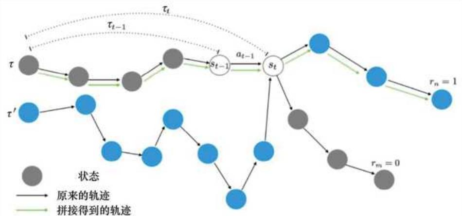  
图3.4 轨迹拼接示例 [6] 。数据集中存在灰色和蓝色两条轨迹，其中灰色轨迹虽然最终收益为0，但强化学习算法可以将灰色轨迹的前一段（相比蓝色轨迹的前一段更短）和蓝色轨迹的后一段拼接在一起，从而得到一条比数据集中两条现有轨迹更优的轨迹

# 3.4.1 背景知识

# 1.外推误差

外推误差是一种对异策略（Off-Policy）进行值估计所出现的误差，由数据集和当前策略下状态-动作对的访问概率不匹配所引发。如图3.5所示，在 Q 函数更新的过程中，目标策略如果在状态 $s ^ { \prime }$ 下选择了动作 $\acute { a }$ ，且数据集中不存在 $( s ^ { \prime } , a ^ { \prime } )$ ，则对TD目标的不准确估计就会使 $\mathcal { Q }$ 函数的更新受到影响。

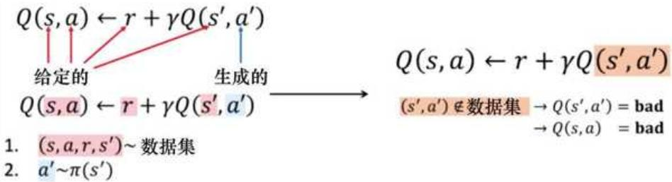  
图3.5　直接利用离线数据集中的状态转移段进行Q-learning所带来的问题

根据参考文献[7]，外推误差归因于以下三个方面。

# （1）数据的缺失

当数据集在 $( s ^ { \prime } , \pi ( s ^ { \prime } ) )$ 附近没有足够的数据时，对 $Q _ { \theta } ( s ^ { \prime } , \pi ( s ^ { \prime } ) )$ 的估计可能就会相当不准确。

# （2）模型偏差

当利用固定数据集 $_ B$ 进行异策略Q-learning时，算法会从固定数据集 $_ B$ 中采样若干状态转移段 $( s , a , r , s ^ { \prime } )$ 来估计 $s ^ { \prime }$ 的期望回报以近似贝尔曼算子 $\mathcal { T } ^ { \pi }$ 的更新操作：

$$
T ^ {\pi} Q (s, a) \approx \mathbb {E} _ {s ^ {\prime} \sim B} [ r + \gamma Q (s ^ {\prime}, \pi (s ^ {\prime})) ]
$$

从上式可以看出：

● 在随机性MDP（Markov Decision Process，马尔可夫决策过程）的情况下，无法对状态-动作对进行无限访问的蒙特卡洛方法本身会引入一个偏差；  
● $s ^ { \prime } \sim \mathcal { B }$ 不是真正的环境动力学，因此会引入另一个偏差。

# （3）训练的不匹配

即使拥有足够的数据，在DQN算法体系下，状态转移段也会从固定数据集 $_ B$ 中被均匀地采样，时序差分损失函数可通过以状态转移段在数据集中的概率为权重加权得到（但实际上我们希望权重与状态转移段在当前策略下采样到的概率成比例）：

$$
\mathcal {L} (\theta) \approx \sum_ {(s, a, r, s ^ {\prime}) \in B} \| r + \gamma Q _ {\theta^ {\prime}} (s ^ {\prime}, \pi (s ^ {\prime})) - Q _ {\theta} (s, a) \| ^ {2} \tag {3.29}
$$

当数据集中状态转移段的分布与当前策略下的分布不一致时，TD损失权重可能会给 Q 函数的更新带来糟糕的影响（这在使用多个策略收集数据集的情况下是很常见的，如D4RLMedium-Expert，因为数据集中体现的多峰行为策略更加难以建模）。

# 2.batch-constrained 强化学习

为了避开外推误差，对于状态-动作对的访问概率，策略应当服从数据集中状态-动作对的分布。参考文献[3]将满足这种性质的策略定义为batch-constrainted 策略（这里的batch容易让人联想到训练时从数据集中采样到的batch，实际上这里的batch指的是固定数据集 $_ B$ ）。关于给定数据集下batch-constrainted策略的优化（既要保持batch-constrainted的性质，又要提升 Q 值），参考文献[3]指出应当将以下三点作为优化目标。

● 最小化所选动作与batch中数据的距离。  
● 在策略执行的过程中，应当更倾向于选择那些能够导致熟悉状态（数据集中存在或相似的状态）的动作。  
● 最大化当前策略下的 Q 函数。

根据对外推误差的分析，可以发现目标 a 的重要性高于其他目标。因为如果无法访问数据集中存在的状态转移段，价值函数和对未来状态的估计就会变得很差。因此，对于待优化的策略，我们需要将其输出的动作约束在数据集存在的范围内［即策略输出的动作不应当过于偏离数据集中的条件分布 ］。LDCQ通过利用条件扩散模型使策略在优化过程中保持了batch-constrainted的性质。

# 3.4.2 隐空间扩散强化学习

与第2章利用扩散模型进行轨迹采样的思路不同，LDCQ [8] （Latent Diffusion-ConstrainedQ-learning，称为隐空间扩散强化学习）并没有完全抛弃Q-learning，而是利用扩散模型使得更新策略在保持batch-constrained性质的同时进行Q-learning，这样可以极大缓解直接将Q-learning用于离线强化学习所带来的外推误差问题。

LDCQ的核心步骤如下。

● 首先，执行一个两阶段训练过程，从而获得一个用于底层交互的策略，以及一个对轨迹片段做了高级抽象表征的隐空间扩散先验模型。  
● 其次，基于这个隐空间扩散先验模型进行Q-learning，从而缓解外推误差并进行策略提升。

# 阶段一：轨迹片段隐空间表征和底层策略

第一阶段的训练是为了学到一个轨迹片段表征的隐空间 $z \in \mathbb { R } ^ { d }$ 和一个底层策略 $\pi _ { \theta }$ 。这意味着在给定一个长度为 H 的轨迹片段集合 $\mathcal { D }$ 后（其中每个轨迹片段 $\tau _ { H }$ 可以表示为状态和动作的序列 $s _ { 0 } , a _ { 0 } , s _ { 1 } , a _ { 1 } , \cdots , s _ { H - 1 } , a _ { H - 1 } )$ ，这一阶段需要学习得到一个编码器 $q _ { \phi }$ ，它能够将 $\tau _ { H }$ 编码为一个隐空间向量。以 $z$ 和 $\tau _ { H }$ 中的任意状态 $s$ 为条件，底层策略 $\pi _ { \theta }$ 能够采样出下一步动作 $^ { a }$ 。

$q _ { \phi }$ 和 $\pi _ { \theta }$ 是通过利用 $\beta$ 变分自编码器技术一并优化的，其中作为最大化目标的损失函数形式如下：

$$
\mathcal {L} (\theta , \phi , \omega) = \mathbb {E} _ {t ^ {\prime \prime} \sim \mathcal {D}} \left[ \sum_ {t = 0} ^ {H - 1} \log \pi_ {\theta} \left(a _ {t} \mid s _ {t}, z\right) - \beta D _ {\mathrm {K L}} \left(q _ {\phi} \left(z \mid \tau_ {H}\right) \| p _ {\omega} (z \mid s _ {0})\right) \right] \tag {3.30}
$$

与一般情况下的ELBO不同，这里采用了一个一并训练的先验模型 $p _ { \omega }$ 而不是标准高斯分布。先前采用的是高斯分布，但这里为了确保 $q _ { \phi }$ 能够被很好地正则化而提高了KL散度的系数$\beta$ ，这样处理会限制隐空间 $z \in \mathbb { R } ^ { d }$ 的信息容量，从而限制隐空间向量所能捕获的轨迹行为变化。这里采用先验模型 $p _ { \omega }$ 是为了提供对隐空间更宽松的正则化约束。

# 阶段二：隐空间扩散先验模型

上一阶段的训练完成后，基于轨迹数据集 $\mathcal { D }$ 和编码器 $\begin{array} { r } { q _ { \phi } ( z | \tau ^ { H } ) } \end{array}$ ，可以构造出状态-轨迹片段编码对数据集。将其中的每个元素表示为 $^ { ( s _ { 0 } , z ) }$ ，其中 $z \sim q _ { \phi } ( z | \tau ^ { H } )$ 、 $\tau ^ { H } \sim \mathcal { D }$ 且 $s _ { 0 }$ 是 $\tau ^ { H }$ 的第一个状态。

这一阶段需要建立先验模型 $p ( z \vert s _ { 0 } )$ ，我们希望它能够以初始状态 $s _ { 0 }$ 为条件，采样出轨迹数据集 $\mathcal { D }$ 中接下来所有可能发生的行为（轨迹片段）在隐空间中的向量表示。

原作者选用条件扩散模型来建模 $p ( z \vert s _ { 0 } )$ ，并通过学习去噪函数 $\mu _ { \psi } ( z _ { t } , s _ { 0 } , t )$ 来优化扩散模型$p _ { \psi } ( z | s _ { 0 } )$ 。

与参考文献[6]和[7]一致，原作者在实践时发现：以 $z _ { 0 }$ 的第 t 步扩散结果 $z _ { t }$ 、初始状态 $s _ { 0 }$ 以及扩散时间步 作为输入，直接预测最终采样结果 $z _ { 0 }$ 的效果要好于之前学习去噪函数的方式。此外，原作者采用Min-SNR- 策略对优化目标重新赋权。具体而言， $\mu _ { \psi } ( z _ { t } , s _ { 0 } , t )$ 的损失函数如下：

$$
\mathcal {L} (\psi) = \mathbb {E} _ {t - [ 1, T ], \tau^ {\prime \prime} - \mathcal {D}, z _ {0} - q _ {\phi} (z | \tau^ {\prime \prime}), z _ {t} - q (z _ {t} | z _ {0})} [ \min  \{\mathrm {S N R} (t), \gamma \} (\| z _ {0} - \mu_ {\psi} (z _ {t}, s _ {0}, t) \| ^ {2}) ] \tag {3.31}
$$

实际上，与Decision Diffuser一致，条件扩散模型 $p _ { \psi } ( z | s _ { 0 } )$ 的训练也采用了无分类器引导技术，只不过在式（3.31）中省略了对条件 $s _ { 0 }$ 的替换。上述训练完成后，通过式（3.32）迭代生成最终的采样结果 $z _ { 0 }$ 。

$$
\hat {z} = \mu_ {\psi} (z _ {t}, \phi , t) + \omega (\mu_ {\psi} (z _ {t}, s _ {t + H}, t) - \mu_ {\psi} (z _ {t}, \phi , t)) \tag {3.32}
$$

增大超参数 $w$ 会减少采样结果的多样性，模型更偏好条件概率密度更高的样本。

# 阶段三：基于隐空间扩散先验模型进行Q-learning

在许多离线强化学习数据集中，行为策略的分布是多峰的，这可能是因为数据集中的动作方向并不唯一，或者因为行为策略实际上是多个单模态策略的混合，这使得过去使用的生成模型（如VAE）很难从分布中准确采样。这种多模态性会随着隐空间中编码轨迹长度的增长而加剧。相比其他生成模型，扩散模型更适合建模这种隐空间的多模态分布。通过两阶段训练，我们得到了轨迹片段编码器 $q _ { \phi }$ ，它能够将轨迹片段编码至隐空间 $z \in \mathbb { R } ^ { d }$ 。此外，底层策略 $\pi _ { \theta }$ 能够以 为输入，复原出 $_ z$ 所表征的轨迹片段中状态 $s$ 后的下一个动作 $^ { a }$ 。最后，我们得到了一个扩散模型 $p _ { \psi }$ ，它能够以 $s _ { 0 }$ 作为条件，采样出若干以 $s _ { 0 }$ 作为初始状态的轨迹片段的隐空间表征，且这些轨迹片段服从轨迹数据集 $\mathcal { D }$ 中的分布。有了这些条件，LDCQ的下一步便是进行Q-learning。不过在LDCQ中，Q-learning的目标不是估计策略在状态 $s$ 下执行某个具体动作 $^ { a }$ 的未来收益的期望，而是估计在状态 $s$ 下采样某个轨迹片段的未来收益的期望，即需要学习 $Q ( s , z )$ 。有了这么多不同功能的模型，接下来展示怎么使用这些模型与环境交互［假设 $Q ( s , z )$ 训练收敛］，并详细说明 的训练过程。

假设已经有了一个很好的 $Q ( s , z )$ ，那么在测试时，便可以构建如下管线。

● 首先根据扩散模型 $p _ { \psi }$ 和当前状态 $s$ ，采样出若干条轨迹片段，这些轨迹片段都存在于数据集中，执行这样的轨迹片段可以保证策略满足batch-constrainted性质。  
● 其次根据 $Q ( s , z )$ ，从这些候选的轨迹片段中选择 Q 值最大的轨迹片段。  
● 最后根据底层策略 $\pi _ { \theta }$ ，将 Q 值最大的轨迹片段中每一步的动作解码出来并执行。

下面介绍 $Q ( s , z )$ 的训练过程。还记得前面训练扩散模型时构造的数据集吗？这里对其进一步扩充，有别于轨迹数据集 $\mathcal { D }$ ，将这里的数据集记为 $_ B$ ，并将其中的每一个元素表示为一个四元组 $( s _ { t } , z , r _ { t : t + H } , s _ { t + H } )$ 。其中 $s _ { t }$ 是 $z$ 所表征的轨迹片段 $\tau ^ { H }$ 中的第一个状态； $r _ { t : t + H }$ 则表示 $\tau ^ { H }$ 的折扣奖励之和，即 $r _ { t i + l l } = \sum _ { i = 0 } ^ { l l - 1 } \gamma ^ { i } r _ { t + i }$ 对 Q 函数使用时序差分法进行迭代更新，但TD目标的计算需要依靠先验扩散模型 $p _ { \psi } ( z | s _ { t + H } )$ 。假设从数据集 $_ B$ 中采样得到一个样本 $( s _ { t } , z , r _ { t : t + H } , s _ { t + H } )$ ，则 $Q ( s , z )$ 的更新可以总结如下：

$$
Q \left(s _ {t}, z\right) \leftarrow r _ {t: t + H} + \gamma^ {H} Q \left(s _ {t + H}, \underset {z _ {i} \sim P _ {\psi} (z | s _ {t + H})} {\arg \max } \left(Q \left(s _ {t + H}, z _ {i}\right)\right)\right) \tag {3.33}
$$

可以看到，TD 目标的计算只对行为策略（轨迹数据集 $\mathcal { D }$ ）支持下的隐空间轨迹片段进行采样。以这些建模到隐空间的轨迹片段为对象，Q-learning更新后的隐式策略［即$\pi ( s ) = \arg \operatorname* { m a x } _ { z } Q ( s , z ) ~ ]$ ］倾向于选择 $z _ { i } \sim p _ { \psi } ( z | s _ { t + H } )$ 中预期回报更大的轨迹片段，因此这样的做法能使更新后的策略以更好的方式拼接轨迹数据集 $\mathcal { D }$ 中的轨迹片段。

在训练算法的具体实现中，原作者采用了Clipped Double Q-learning技术以减轻训练过程中过估计引起的偏差，还采用了优先经验回放（Prioritized Experience Replay）技术以加速一些稀疏奖励任务（如AntMaze任务和FrankaKitchen基准测试）的训练。

具体而言，在训练 Q 函数前，需要有一个构造好的数据集 $_ B$ 、轨迹片段长度 $H$ 、目标网络更新比例 $\rho$ 、batch大小 $N$ 、采样的候选隐空间向量数目 $\pmb { n }$ 、最大迭代次数 $M$ 、贴现因子 $\gamma$ 、隐空间扩散先验模型的去噪函数 $\mu _ { \psi }$ ，以及扩散模型中的变量时间表（即扩散模型的超参数） $\alpha _ { 1 } , \cdots , \alpha _ { T } , \overline { { { \alpha } } } _ { 1 } , \cdots , \overline { { { \alpha } } } _ { T } , \beta _ { 1 } , \cdots , \beta _ { T }$ 。有了这些条件后，先对两个Q网络和它们各自的目标网络进行初始化，再对Q网络迭代更新 $M$ 次。在每次更新中，先从数据集 $\boldsymbol { \mathscr { B } }$ 中采样一个batch，再从标准高斯分布中采样 $_ n$ 个噪声用于扩散模型迭代去噪。接下来进行扩散模型的迭代去噪，这一步结束后，即可获得 $_ n$ 个轨迹片段的隐空间向量表示。最后对Q网络及其目标网络进行更新。

# 3.4.3 以目标为条件的隐空间扩散模型

Plan Diffuser将某些导航问题建模为序列修复任务，其中采样期间扩散轨迹的最后状态被设置为目标。类似地，作为对LDCQ面向以目标为条件强化学习任务的补充，LDGC（LatentDiffusion Goal Conditioning，称为以目标为条件的隐空间扩散模型）将目标状态变量 $s _ { g }$ 作为条件，以使扩散模型采样出能够迈向目标状态的隐空间轨迹。原本的扩散模型 $p _ { \psi } ( z | s _ { 0 } )$ 被重新形式化为 $p _ { \psi } ( z | s _ { 0 } , s _ { g } )$ 。因为两阶段训练中 $( q _ { \phi } , \pi _ { \theta } )$ 和 $p _ { \psi }$ 的训练是分离的，所以这里可以直接复用$( q _ { \phi } , \pi _ { \theta } )$ ；而对于扩散模型的训练和采样，仍使用引导器引导方法，只是多了一个条件变量输入$s _ { g }$ 。不同于Plan Diffuser需要目标状态存在于规划轨迹的视野中（这是由于Plan Diffuser将GoalConditioningRL建模为修复任务），LDGC可以用在任意长度的规划任务中。

# 3.4.4 实验与分析

参考文献[8]中的实验主要围绕以下三点进行：

● 研究轨迹片段的时序抽象对隐空间的影响；  
● 理解扩散模型对建模隐空间的必要性；  
● 评估各种强化学习算法在离线强化学习基准环境D4RL中的表现。

# 1.引发隐空间多模态性质的时序抽象

原论文 [8]研究了轨迹片段长度是如何影响隐空间的，并为学习长视野隐空间表征提供经验依据。

在这项实验中，考虑离线强化学习基准环境D4RL中的kitchen-mixed-v0任务。该任务的目标是利用一个具有9个关节的机械臂去操控多个目标物品（如微波炉、水壶、燃气灶上的开关等）。在每一轮次（episode）中，只有当每个物品达到任务要求的目标状态时，智能体才会获得一个数值为1的奖励，其他情况下奖励都为0。

在这个任务的离线数据集中，演示轨迹是高度多模态的，主要原因如下：为使各个物品达到目标状态，演示轨迹中的物品操作顺序是随机的。因此，在达成最终目标前，策略应当隐含地选择那些要操作的物品并给出能使它们达到目标状态的动作。给定一个状态后，数据集中可能包含很多行为模式，对这些行为模式取平均的结果往往是一条次优轨迹。因此，能够区分这些行为模式的不同正是算法所期望的。

如果行为模式在隐空间 $z \in \mathbb { R } ^ { d }$ 中被编码为一个特征向量，则随着轨迹片段长度的增加，我们期望不同行为模式的特征向量展现出逐渐分离的趋势（长度越长，越能区分轨迹的不同）。如图3.6所示，原作者展示了数据集中轨迹片段经过编码后，利用主成分分析（PCA）投影到二维空间的可视化结果。这些轨迹都从同一个初始状态出发，但轨迹片段长度从1逐渐提升到20。可以发现随着轨迹长度的增加，三种行为模式（优先操纵水壶、微波炉还是燃气灶开关）的轨迹片段逐渐分离并各自聚集，这说明算法能够捕捉一定长度轨迹中动作序列的潜在变化。对轨迹片段的良好抽象可以为后续更好地优化扩散模型和实现batch-constraintedQ-learning打下基础。

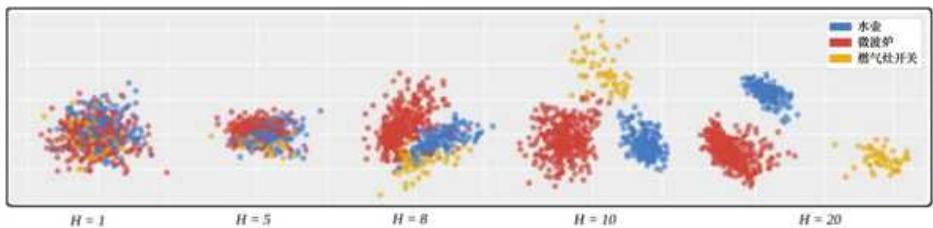  
图3.6 不同轨迹片段长度下的隐空间PCA可视化结果。隐空间编码器 对轨迹片段行为模式的分辨能力随着轨迹片段长度的增加而提升 [8]

# 2.使用LDM解决隐空间中的多模态问题

原论文 [8]经验性地证明了两阶段训练中的第二个训练阶段对于多模态分布的建模，隐空间扩散模型是优于自编码器（VAE）的。

在这项实验中，依旧选择kitchen-mixed-v0任务。如图3.7所示，原作者展示了以同样的初始状态为条件，使用条件扩散模型、条件自编码器采样出的轨迹片段（长度为20）隐空间表征在PCA下的可视化结果。此外，原作者还提取出数据集中以上述状态为初始状态的轨迹片段（长度为20），经过 $q _ { \phi }$ 编码后，用PCA可视化并作为Ground truth。

从可视化结果可以看出，扩散先验模型能够有效地从Ground truth隐空间分布中采样所有行为模式，而VAE先验模型则会混淆这三种行为模式。使用VAE先验模型采样出的样本可能在Groundtruth隐空间分布之外，这就可能造成后续Q-learning的外推误差。

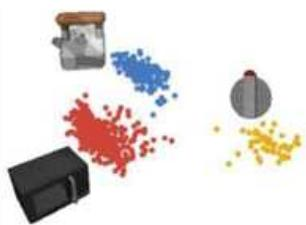  
（a）Ground truth

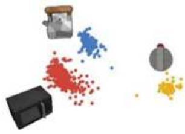  
（b）扩散先验模型

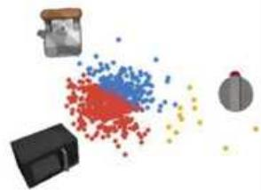  
（c）VAE先验模型  
图3.7 不同条件先验模型与Ground truth的隐空间PCA可视化结果。相比自编码器， 扩散模型对隐空间的建模与Ground truth更接近 [8]

# 3.时序抽象下的性能提升

原论文 [8]对LDCQ与BCQ算法的变体进行了比较。原作者对原本的BCQ算法做了少许修改，以使其能够支持轨迹片段的时序抽象（在原本的BCQ算法下， $H = 1$ ，现在 $H > 1$ ），这里将修改后的BCQ算法命名为 。实验结果如图3.8所示，原作者发现随着轨迹片段长度的增加，两种算法的性能都有所提升，且LDCQ持续好于BCQ-H。当 $H = 1$ 时，隐空间中的先验分布近似于高斯分布，这与BCQ算法中VAE的高斯先验一致，因此两者表现出相似的性能。但随着轨迹片段长度的增加，两种算法的性能最终会饱和并退化。关于这一点，原作者认为这可能是VAE解码器（在LDCQ中是指 $\pi _ { \theta }$ ）的容量限制导致的。

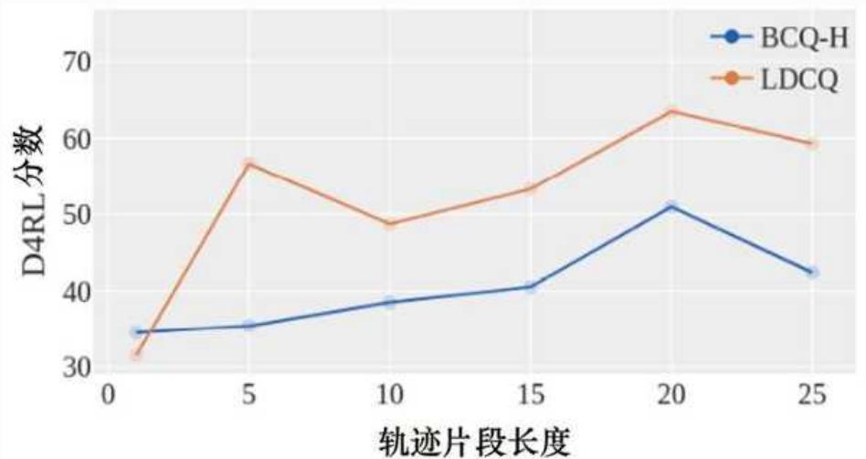  
图3.8 LDCQ和BCQ-H在不同轨迹片段长度下的D4RL 分数

# 4.离线强化学习基准实验

原作者将LDCQ、LDGC与算法BC、BCQ、CQL、IQL、DT，以及Plan Diffuser、Decision Diffuser做了性能比较。针对不同的任务，仅需要调整超参数 H ，LDCQ和LDGC便能达到超越其他算法的性能。实验结果见表3.1。

表3.1　包含多峰策略分布的环境（例如要求long-horizon轨迹拼接）中各个算法的性能比较，其中LDGC参与评估的是基于目标的任务环境

<table><tr><td rowspan="2">任务环境</td><td colspan="9">算法</td></tr><tr><td>BC</td><td>BCQ</td><td>CQL</td><td>IQL</td><td>DT</td><td>Plan Diffuser</td><td>DD</td><td>LOCQ</td><td>LOGC</td></tr><tr><td>maze2d-large-v1</td><td>5.0</td><td>6.2</td><td>12.5</td><td>58.6</td><td>18.1</td><td>123.0</td><td>-</td><td>150.1±2.9</td><td>206.8±3.1</td></tr><tr><td>antmaze-medium-diverse-v2</td><td>0.0</td><td>0.0</td><td>53.7</td><td>70.0</td><td>0.0</td><td>45.5</td><td>24.6</td><td>68.9±0.7</td><td>75.6±0.9</td></tr><tr><td>antmaze-large-diverse-v2</td><td>0.0</td><td>2.2</td><td>14.9</td><td>47.5</td><td>0.0</td><td>22.0</td><td>7.5</td><td>57.7±1.8</td><td>73.6±1.3</td></tr><tr><td>kitchen-partial-v0</td><td>38.0</td><td>31.7</td><td>50.1</td><td>46.3</td><td>42.0</td><td>-</td><td>57.0</td><td>67.8±0.8</td><td>-</td></tr><tr><td>kitchen-mixed-v0</td><td>51.5</td><td>34.5</td><td>52.4</td><td>51.0</td><td>50.7</td><td>-</td><td>65.0</td><td>62.3±0.5</td><td>-</td></tr></table>

此外，原作者还比较了LDCQ与其他算法在D4RL locomotion suite和Adroit robotics suite环境中的性能表现。相比表3.1中的任务环境，在这些任务环境中，轨迹拼接带来的优势没有那么明显，但LDCQ还是能够表现出与其他算法相媲美的性能，实验结果见表3.2和表3.3。

表3.2 D4RL locomotion suite环境中各个算法的性能比较  

<table><tr><td rowspan="2">任务环境</td><td colspan="8">算法</td></tr><tr><td>BC</td><td>BCQ</td><td>CQL</td><td>IQL</td><td>DT</td><td>Plan Diffuser</td><td>DD</td><td>LDCQ</td></tr><tr><td>halfcheetah-medium-expert-v2</td><td>55.2</td><td>64.7</td><td>91.6</td><td>86.7</td><td>86.8</td><td>88.9</td><td>90.6</td><td>90.2±0.9</td></tr><tr><td>walker2d-medium-expert-v2</td><td>107.5</td><td>57.5</td><td>108.8</td><td>109.6</td><td>108.1</td><td>106.9</td><td>108.8</td><td>109.3±0.4</td></tr><tr><td>hopper-medium-expert-v2</td><td>52.5</td><td>110.9</td><td>105.4</td><td>91.5</td><td>107.6</td><td>103.3</td><td>111.8</td><td>111.3±0.2</td></tr><tr><td>halfcheetah-medium-v2</td><td>42.6</td><td>40.7</td><td>44.0</td><td>47.4</td><td>42.6</td><td>42.8</td><td>49.1</td><td>42.8±0.7</td></tr><tr><td>walker2d-medium-v2</td><td>75.3</td><td>53.1</td><td>72.5</td><td>78.3</td><td>74.0</td><td>79.6</td><td>82.5</td><td>69.4±3.5</td></tr><tr><td>hopper-medium-v2</td><td>52.9</td><td>54.5</td><td>58.5</td><td>66.3</td><td>67.6</td><td>74.3</td><td>79.3</td><td>66.2±1.7</td></tr><tr><td>halfcheetah-medium-replay-v2</td><td>36.6</td><td>38.2</td><td>45.5</td><td>44.2</td><td>36.6</td><td>37.7</td><td>39.3</td><td>41.8±0.4</td></tr><tr><td>walker2d-medium-replay-v2</td><td>26.0</td><td>15.0</td><td>77.2</td><td>73.9</td><td>66.6</td><td>70.6</td><td>75.0</td><td>68.5±4.3</td></tr><tr><td>hopper-medium-replay-v2</td><td>18.1</td><td>33.1</td><td>95.0</td><td>94.7</td><td>82.7</td><td>93.6</td><td>100.0</td><td>86.2±2.5</td></tr></table>

表3.3 Adroit robotics suite环境中各个算法的性能比较   

<table><tr><td rowspan="2">任务环境</td><td colspan="8">算法</td></tr><tr><td>BC</td><td>BCQ</td><td>CQL</td><td>IQL</td><td>DT</td><td>Plan Diffuser</td><td>DD</td><td>LOCQ</td></tr><tr><td>pen-human</td><td>34.4</td><td>68.9</td><td>37.5</td><td>71.5</td><td>-</td><td>-</td><td>-</td><td>74.1</td></tr><tr><td>hammer-human</td><td>1.2</td><td>0.3</td><td>4.4</td><td>1.4</td><td>-</td><td>-</td><td>-</td><td>1.5</td></tr><tr><td>door-human</td><td>0.5</td><td>0.0</td><td>9.9</td><td>4.3</td><td>-</td><td>-</td><td>-</td><td>11.8</td></tr><tr><td>relocate-human</td><td>0.0</td><td>-0.1</td><td>0.2</td><td>0.1</td><td>-</td><td>-</td><td>-</td><td>0.3</td></tr><tr><td>pen-cloned</td><td>37.0</td><td>44.0</td><td>39.2</td><td>37.3</td><td>-</td><td>-</td><td>-</td><td>47.7</td></tr><tr><td>hammer-cloned</td><td>0.6</td><td>0.4</td><td>2.1</td><td>2.1</td><td>-</td><td>-</td><td>-</td><td>2.8</td></tr><tr><td>door-cloned</td><td>0.0</td><td>0.0</td><td>0.4</td><td>1.6</td><td>-</td><td>-</td><td>-</td><td>1.1</td></tr><tr><td>relocate-cloned</td><td>-0.3</td><td>-0.3</td><td>-0.1</td><td>-0.2</td><td>-</td><td>-</td><td>-</td><td>-0.2</td></tr></table>

# 3.4.5 局限性与展望

LDCQ也存在一些缺陷，具体如下。

● LDCQ采用了DDPM的采样方式，在推断过程中速度是很慢的，或许可以借助其他需要更少采样步骤的方法（如DDIM）来加速推断。  
● 通过上述实验可以发现，LDCQ能够从Maze2D等稀疏奖励环境中取得极高的收益，但对于D4RL locomotion suite环境只能取得一般的收益。原作者怀疑这是因为D4RL locomotionsuite环境中智能体的步态周期性很强，所以给轨迹片段的时序抽象带来的收益并不大。  
● LDCQ没有像BCQ算法那样采用扰动函数，因而很难从中下等水平策略采样到的数据集中提升策略。采用扰动函数时需要小心地微调参数以避免外推误差，并且收敛后的 Q 函数不一定符合那种高收益的策略。这就是为什么其他离线强化学习算法在训练时会在线地与环

境交互以评估当前性能，从而动态地选择性能最好的策略，只有这样才能平衡扰动函数带来的收益和外推误差。相反，LDCQ只有在训练完成后才会与环境交互并评估当前性能。

● LDCQ和LDGC的另一个短板在于超参数 $\mathrm { H }$ ，超参数 $\mathrm { H }$ 一旦确定，在整个实验过程中就不会再变了，原作者期望能够在后续的工作中将超参数 H 作为动态可变参数以提升算法性能。

# 参考文献

[1] LILLICRAP T P, HUNT J J, PRITZEL A, et al. Continuous control with deep reinforcement learning[EB/OL]. arXiv: 1509.02971.   
[2] SCHULMAN J, WOLSKI F, DHARIWAL P, et al. Proximal policy optimization algorithms[EB/OL]. arXiv: 1707.06347.   
[3] SCHULMAN J, LEVINE S, ABBEEL P, et al. Trust region policy optimization[C]//International Conference on Machine Learning. 2015: 1889-1897.   
[4] PENG X B, KUMAR A, ZHANG G, et al. Advantage-weighted regression: Simple and scalable off-policy reinforcement learning[EB/OL]. arXiv:1910.00177.   
[5] WANG Z, HUNT J J, ZHOU M. Diffusion policies as an expressive policy class for offline reinforcement learning[EB/OL]. arXiv: 2208.06193.   
[6] LU C, CHEN H, CHEN J, et al. Contrastive energy prediction for exact energy-guided diffusion sampling in offline reinforcement learning[C]//International Conference on Machine Learning. 2023: 22825-22855.   
[7] LE H, VOLOSHIN C, YUE Y. Batch policy learning under constraints[C]//International Conference on Machine Learning. 2019: 3703-3712.   
[8] VENKATRAMAN S, KHAITAN S, AKELLA R T, et al. Reasoning with latent diffusion in offline reinforcement learning[EB/OL]. arXiv: 2309.06599.

# 第4章

# 基石：扩散模型训练技巧指南

# 4.1 如何设计去噪网络

前面在介绍扩散模型的技术演进时，简单提到了扩散模型中的网络设计。本节详细探讨文生图（Text-to-Image，T2I）扩散模型的两类架构U-Net和DiT及其衍生架构，还对T2I扩散模型中的文本编码器做了简单分析。

神经网络的架构设计和用于优化神经网络的损失函数息息相关，回顾无分类器引导的训练损失函数：

$$
\mathcal {L} (\theta) = \left(1 - p _ {\text {u n c o n d}}\right) \mathbb {E} _ {x _ {t}, t} \| \epsilon_ {\theta} (x _ {t}, t, c) - \epsilon \| ^ {2} + p _ {\text {u n c o n d}} \mathbb {E} _ {x _ {t}, t} \| \epsilon_ {\theta} (x _ {t}, t, \phi) - \epsilon \| ^ {2} \tag {4.1}
$$

这里需要利用神经网络建模去噪函数 $\epsilon _ { \theta } ( x _ { t } , t , c )$ ，其中 $\boldsymbol { x } _ { t } = \alpha \boldsymbol { x } _ { 0 } + \sigma \boldsymbol { \epsilon }$ 是针对训练集图片 $x _ { \mathbf { 0 } }$ 扩散后的结果，可将 $\pmb { t }$ 和 $^ { c }$ 作为条件变量来确定当前扩散时间步和生成结果 $x _ { 0 }$ 的条件属性。如何建模 $x _ { t } , ~ t , ~ c$ 到 $\epsilon$ 的映射？这是个没有明确答案却很值得探索的问题。因为糟糕的神经网络架构设计会使训练难度加大，甚至会导致训练崩溃，而合适的神经网络架构设计在保持数值稳定性的同时，还具有服从尺度定律（scaling law）等有用的性质。

# 4.1.1 U-Net

作为将扩散模型应用于图像生成领域的开篇作，DDPM主要借用PixelCNN $^ { + + }$ 的主干结构以建模 $\epsilon _ { \theta } ( x _ { t } , t )$ （注意DDPM尚未考虑条件生成）。PixelCNN++[2]的主干结构如图4.1所示，其设计基于Wide ResNet [1] 和U-Net [2] 。

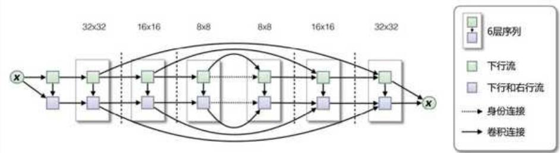  
图4.1 PixelCNN++的主干结构 [2]

在上述架构的基础上，DDPM将其中的权重归一化 [12] 替换成了组归一化 [13] ，并且在U-Net的中间部分，还加入了空间自注意力模块。此外，对于条件变量 t 的建模，DDPM通过将

U-Net中的每个残差块与条件变量 t 的正弦位置编码相加来实现。值得一提的是，对于这些结构上的设计，原作者并未做消融实验以进一步分析这些设计所带来的性能影响。

论文“Diffusion Models Beat GANs on Image Synthesis”提出可以通过消融实验来研究U-Net架构中的一些设计选择，实验结果如表4.1所示。对实验结果感兴趣的读者可查看原论文，这里不再赘述。

表4.1 U-Net架构的消融实验结果  

<table><tr><td>网络宽度</td><td>网络深度</td><td>头的数量</td><td>注意力分辨率</td><td>BigGAN
上采样/下采样</td><td>观测块的缩放</td><td>FID70万</td><td>FID120万</td></tr><tr><td>160</td><td>2</td><td>1</td><td>16</td><td>*</td><td>×</td><td>15.33</td><td>13.21</td></tr><tr><td>128</td><td>4</td><td></td><td></td><td></td><td></td><td>-0.21</td><td>-0.48</td></tr><tr><td></td><td></td><td>4</td><td></td><td></td><td></td><td>-0.54</td><td>-0.82</td></tr><tr><td></td><td></td><td></td><td>32、16、8</td><td></td><td></td><td>-0.72</td><td>-0.66</td></tr><tr><td></td><td></td><td></td><td></td><td>√</td><td></td><td>-1.20</td><td>-1.21</td></tr><tr><td></td><td></td><td></td><td></td><td></td><td>√</td><td>0.16</td><td>0.25</td></tr><tr><td>160</td><td>2</td><td>4</td><td>32、16、8</td><td>√</td><td>*</td><td>-3.14</td><td>-3.00</td></tr></table>

# U-Net设计要点

● 主干结构借鉴了PixelCNN++的网络结构，包含下采样、上采样以及U形跨层连接的设计。  
● 放弃PixelCNN $^ { + + }$ 中的权重归一化，改用组归一化作为归一化层。  
● 对于条件变量 t ，使用正弦位置编码将其编码为定长向量，并在每个ResNet块中与特征图相加，融合时间步信息。  
● 在U-Net的中间部分，加入空间自注意力模块，以捕获长程依赖关系。  
● 原论文还进一步分析了网络宽度、ResNet块数等超参数的选择。

# 4.1.2 DiT

Sora的火爆使得另一种以Transformer为核心的架构DiT [3]引起大众的关注。与U-Net仅在卷积网络提取出的深层特征空间引入自注意力机制的做法不同，DiT放弃了多层卷积网络的结构，使得注意力层始终可以在更细粒度的尺度上实现全局的卷积和信息提取。下面详细介绍DiT的前向传播过程。

如图4.2所示，DiT的前向传播过程如下：首先对 $x _ { t }$ 进行patchify操作并对条件变量进行编码操作；然后经过 N 个DiT 块；最后经过层归一化和线性缩放，得到输出结果 $\epsilon$ 和采样 $x _ { t - 1 }$ 的高斯分布的协方差矩阵 $\Sigma$ （实际上协方差矩阵 $\Sigma$ 可以是可训练参数或是预先固定的数值）。

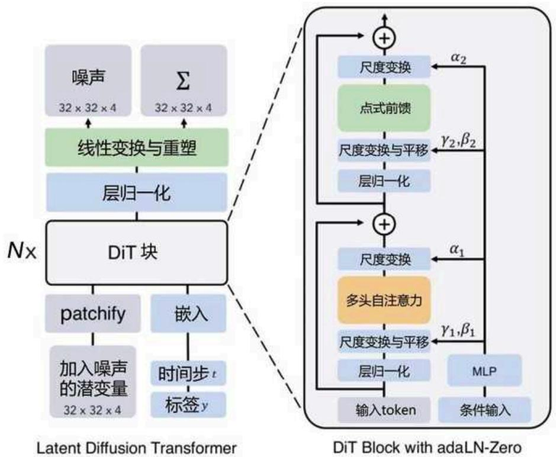  
图4.2 DiT的网络架构 [3]

patchify操作旨在将图片划分为一个个小块（patch），之后每个patch经过一层卷积网络（卷积核的大小就是patch的大小）被映射为一个token，将这样的一组token作为后续DiT块的输入。

DiT条件变量 t 和 c 的编码器就是简单的MLP。DiT块是DiT的核心，原作者尝试了三种DiT 块架构，除了最终使用的DiT Block with adaLN-Zero，还尝试了DiT Block with Cross-Attention和DiT Block with In-Context Conditioning。原作者通过消融实验发现DiT Block withadaLN-Zero的效果最好。DiT的另外两种条件特征融合方式如图4.3所示。

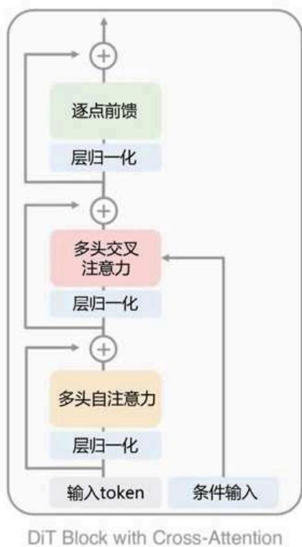

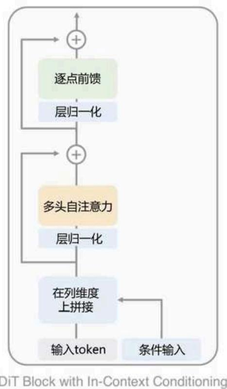  
图4.3 DiT的另外两种条件特征融合方式 [3]

可以看到，这三种DiT块架构的主要区别在于如何将条件变量的特征融合至主线数据流。DiT Block with adaLN-Zero通过采用FILM架构设计来融合条件信息，即利用条件信息对$x _ { t }$ 的深层特征进行平移和尺度变换；DiT Block with Cross-Attention将条件信息作为注意力机制中的 Q （query），与 $x _ { t }$ 编码得到的 K （key）和 $V$ （value）进行注意力运算；DiT Blockwith In-Context Conditioning则采用最普通的做法，直接将条件信息与输入token拼接作为后续注意力层的输入。

如图4.4所示，消融结果显示DiT Block with adaLN-Zero的效果最好。DiT Block withadaLN-Zero与DiT Block with adaLN的区别在于，DiT Block with adaLN-Zero会将进行条件编码的MLP参数初始化，从而消除训练初始阶段条件信息的影响。

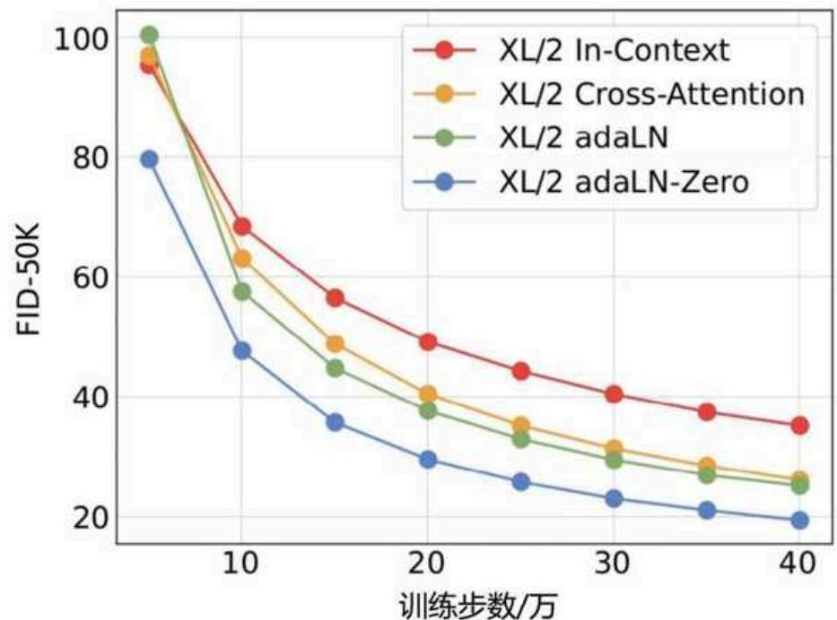  
图4.4　三种DiT块架构的消融实验结果，可以看到 DiT Block with adaLN-Zero的效果最好

原作者还测试了模型大小和patch 大小带来的影响。关于DiT模型大小，原作者设定了4种实验尺寸，如表4.2所示。关于patch大小，原作者尝试了patch大小分别为2、4、8的情况。实验结果如图4.5所示。

表4.2 DiT实验所选的模型大小  

<table><tr><td>模型</td><td>层数N</td><td>隐藏层大小d</td><td>头的数量</td><td>GFLOPS (h=32, p=4)</td></tr><tr><td>DIT-S</td><td>12</td><td>384</td><td>6</td><td>1.4</td></tr><tr><td>DIT-B</td><td>12</td><td>768</td><td>12</td><td>5.6</td></tr><tr><td>DIT-L</td><td>24</td><td>1024</td><td>16</td><td>19.7</td></tr><tr><td>DIT-XL</td><td>28</td><td>1152</td><td>16</td><td>29.1</td></tr></table>

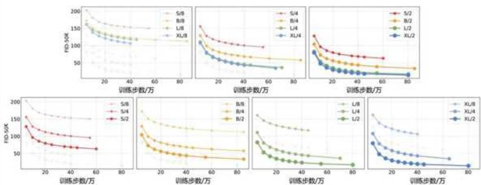  
图4.5 DiT消融实验结果，可以发现模型越大、patch 越小时的效果越好

在固定patch大小的情况下，模型越大效果越好（充分体现了DiT服从尺度定律的性质）。在固定模型大小的情况下，patch越小效果越好。不同模型大小和patch大小下的采样结果如图4.6所示。

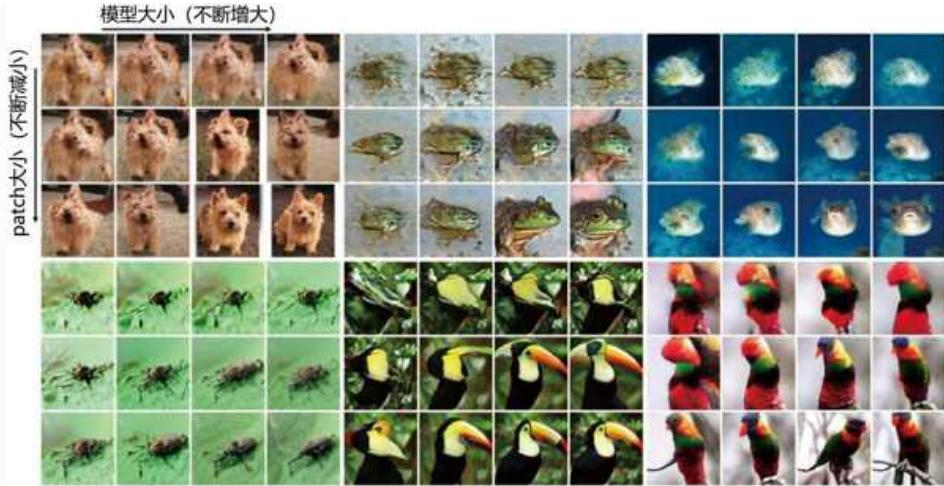  
图4.6　不同模型大小和patch 大小下的采样结果 [3]

论文“All are Worth Words： A ViT Backbone for Diffusion Models”中提出的U-ViT的出发点和DiT一致，都基于Transformer架构建模 $\epsilon _ { \theta } ( x _ { t } , t , c )$ 。U-ViT的网络架构如图4.7所示，可以发现与DiT相比，最主要的区别在于U-ViT的残差连接方式与U-Net一致，而DiT的残差连接仅发生在每个DiT 块的内部。此外，U-ViT直接将条件信息与 $x _ { t }$ 拼接在一起。

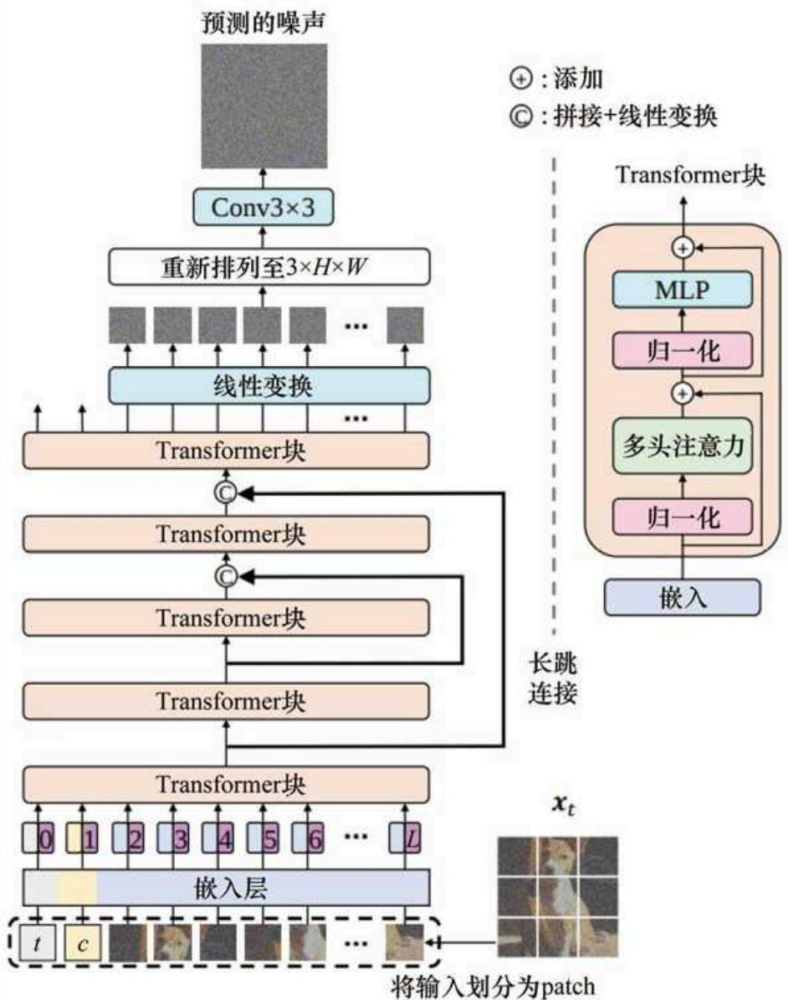  
图4.7 U-ViT的网络架构，可以发现U-ViT的残差连接方式和特征融合方式与DiT不同 [5]

DiT之后的T2I扩散模型PixArt- [4] 沿用了DiT的设计，此外还结合LDM（LatentDiffusion Model）的思想，利用VAE将图像编码至隐空间，并在隐空间中进行扩散和生成。如图4.8所示，PixArt- $_ { \pmb { \alpha } }$ 针对条件变量 保留了FILM的特征融合方式，而对文本特征采用了交叉注意力机制。PixArt- $_ { \pmb { \alpha } }$ 的 作者后续又发表了两个改进版本PixArt-  [10] 和PixArt-  [11]，感兴趣的读者可查看原论文，这里不再赘述。

开源社区中最新出炉的Stable Diffusion 3在DiT 块的基础上进一步设计出MM-DiT块。整个去噪架构中引入了更多的细节，如图4.9所示。

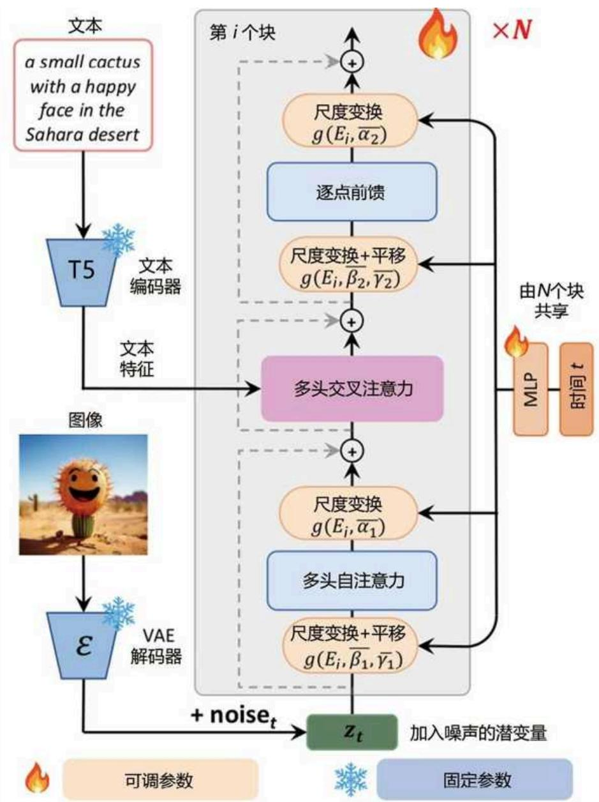  
图4.8 PixArt- α 的网络架构

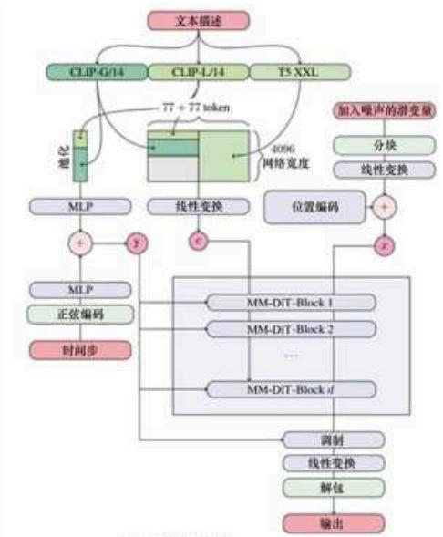  
（a）整体架构

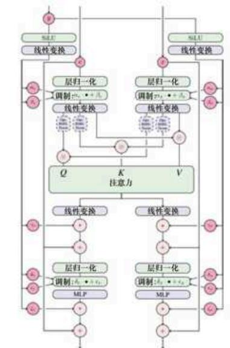  
（b）MM-DiT块的内部细节  
图4.9 Stable Diffusion 3模型架构

通过图4.10中的消融实验结果，Stable Diffusion 3证明了MM-DiT相比之前介绍的U-ViT和DiT更有效。

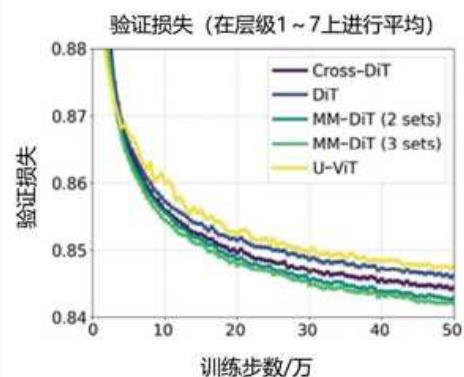

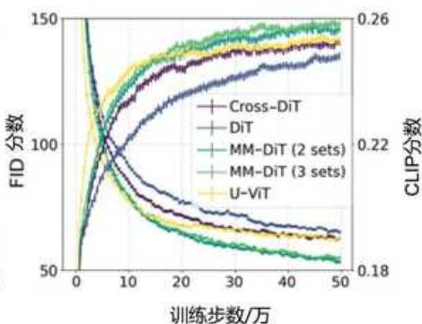  
图4.10 MM-DiT与其他网络架构的比较，可以发现MM-DiT的性能更加优越

# DiT设计要点

● DiT首先将输入图像划分为一个个patch，然后将每个patch通过卷积层映射为一个token，组成token序列作为Transformer模块的输入。  
● DiT使用MLP对条件变量 t 和语义条件 c 分别进行编码，获取条件嵌入。  
● DiT的核心是DiT 块，它是包含了多头自注意力、前馈网络等的标准Transformer模块。DiT块基于FILM思想，利用条件嵌入对归一化层的平移和尺度变换操作进行调节。  
● DiT实验表明，在固定patch 大小时，模型越大效果越好（遵从尺度定律）；而在固定模型大小时，patch越小效果越好。  
● DiT在Block之后使用层归一化，最后通过线性层输出噪声和协方差矩阵。

# 4.1.3 文本编码器

对于T2I扩散模型，前面主要关注图像的生成质量。作为以文本为条件变量的扩散模型，还需要重点关注对文本的编码（糟糕的文本编码器可能会导致图像生成结果精美却与文本语义不符）。常见的做法是直接利用现成的文本预训练模型来编码文本信息，但在训练过程中不更新文本编码器的参数（冻结文本编码器的参数）。

例如，PixArt- $_ \alpha$ 采用的是预训练模型T5 [5] ，而Stable Diffusion 1.5采用的是CLIP [6] 。

实际上，CLIP和预训练模型T5虽然都基于Transformer架构，但它们各自训练的核心逻辑存在区别。

● CLIP采用对比学习的方式，通过图像-文本对最大化相似度，对视觉语义有较好的表征能力。  
● 而预训练模型T5使用非自回归的方式预测被掩盖的词元。

由于训练集中图像所对应文本信息的缺失，CLIP可能会弱化文本中的空间信息，比如物体朝向、位姿，而过于强调物体本身的特征，如类别、颜色。预训练模型T5所编码的文本嵌入则会更大程度地保留所有文本信息，并且对于一些生僻/细粒度的词理解得更好。

参考文献[7]通过实验对比了BERT[8]、CLIP和预训练模型T5， 结果表明使用预训练模型T5确实能带来更好的效果。

# 4.2 如何设计训练方案

关于扩散模型的训练优化，可以从若干角度进行系统的探讨。

# 4.2.1 连续时间扩散模型的训练

早期的扩散模型，比如DDPM、NCSN等，使用一种离散的时间形式来记录扩散过程，即是一个整数， ，将其作为每一个求解阶段的索引：

$$
q \left(x _ {i} \mid x _ {i + 1}\right) = \mathcal {N} \left(\tilde {\mu} _ {i}, \tilde {\beta} _ {i} I\right) \tag {4.2}
$$

论文 [9]“Score-based Generative Modeling through Stochastic Differential Equations”最早统一了离散时间和连续时间扩散模型的数学形式之间的内在联系。在连续时间扩散模型中，一般会将扩散过程的时长区间设定为 ，并且使用一个连续的时间变量 来表示扩散过程的进程。

理论上对于连续时间扩散模型的训练方法是否具有比离散时间扩散模型的训练方法更好的性能，目前还没有基于严格证明的确切结论。但论文“Elucidating the Design Space ofDiffusion-based Generative Models”揭示了扩散模型的时间区间的数学含义——本质上是扩散后噪声幅值的重参数化。因此，对于扩散模型而言，时间步 $t$ 即噪声 $\sigma _ { t }$ 。由于扩散过程的噪声传播本质上是连续的，客观上要求模型在各个噪声幅值下都能习得重建数据的方法，因此需要在连续的时间中优化扩散模型，并在连续的时间中采样生成。这样一来，诸如得分函数匹配等算法就可以在每一个时间步进行求解，而不是在每一个离散的时间步进行求解，从而使得模型的训练更加连续和平滑，这有利于提高训练后的模型质量。

一些研究中也有可以作为佐证的实验案例，比如论文“SiT：Exploring Flow and Diffusion-based Generative Models with Scalable Interpolant Transformers”的作者在一个较大的DiT模型中，对比了使用离散时间建模的DDPM模型和使用连续时间建模的VP-SDE模型在充分训练后的生成效果。结果表明，VP-SDE模型在生成效果上优于DDPM 模型，且FID指标更小。

# 4.2.2 扩散过程的设计与选择

根据扩散过程的定义（ $x _ { t } \mid x _ { \mathrm { d a t a } } : = \alpha _ { t } x _ { \mathrm { d a t a } } + \sigma _ { t } \epsilon$ ）可知， $\alpha _ { t }$ 与 $\sigma _ { t }$ 的数学形式决定了扩散过程的类型。论文“Elucidating the Design Space of Diffusion-based Generative Models”最早统一了不同类

型的扩散过程的数学形式，它揭示了所有类型的扩散过程都是同一个过程： $\mathrm { d } x = \sqrt { 2 t } \mathrm { d } w _ { t }$ 在时间上的重参数化 $[ \sigma : = t \to \sigma : = \sigma ( t ) ]$ 以及在数值上的缩放［ $x _ { i } \to { \frac { x _ { i } } { s ( t ) } } \mathbb { 1 }$ ］。

$$
\mathrm {d} x _ {t} = \frac {s ^ {\prime} (t)}{s (t)} x _ {t} \mathrm {d} t + s (t) \sqrt {2 \sigma_ {t} ^ {\prime} \sigma_ {t}} \mathrm {d} w _ {t} \tag {4.3}
$$

虽然可以认为不同类型的扩散过程在本质上都是同一个过程，并不存在绝对数学意义上的优劣之分，但不同的参数化形式还是会在经验意义上影响训练的稳定性和生成的质量。早期的扩散模型，比如DDPM或其连续时间形式VP-SDE，是一种方差守恒（Variance-Preserving，VP）的扩散模型，它们使用如下参数化形式的 $\alpha _ { t }$ 与 $\sigma _ { t }$ ：

$$
\begin{array}{l} \alpha_ {t} = \mathrm {e} ^ {- \frac {1}{2} \int_ {0} ^ {t} \beta (s) \mathrm {d s}} \tag {4.4} \\ \sigma_ {t} = \sqrt {1 - e ^ {- \int_ {0} ^ {t} \beta (s) d s}} \\ \end{array}
$$

默认数据正则化后， $\mathbb { V } [ x _ { 0 } ] = 1$ ，因此扩散过程中的方差是守恒的：

$$
\mathbb {V} [ x _ {t} ] = \alpha_ {t} ^ {2} \mathbb {V} [ x _ {0} ] + \sigma_ {t} ^ {2} = 1 \tag {4.5}
$$

论文 [11]“Stochastic Interpolants： A Unifying Framework for Flows and Diffusions”中论述了可以通过更自由地定义 $\alpha _ { t }$ 与 $\sigma _ { t }$ ，获得更多形式灵活的随机插值器作为扩散过程。为此，只需要保证 $\alpha _ { t }$ 与 $\sigma _ { t }$ 是连续可微的，且保证 $\alpha _ { \mathrm { _ 1 } } = \sigma _ { \mathrm { _ 0 } } = 0$ 、 $\sigma _ { 1 } = \alpha _ { 0 } = 1$ 即可。比如，可以设计一种线性的扩散过程（Linear SDE），这是一种最简易的扩散过程，它的参数化形式如下：

$$
\begin{array}{r l} \alpha_ {t} & = 1 - t \\ \sigma_ {t} & = t \end{array} \tag {4.6}
$$

再比如，也可以利用三角函数的数学性质改进方差守恒扩散过程，让其形式更自然，论文  [12] “SiT ： Exploring Flow and Diffusion-based Generative Models with Scalable InterpolantTransformers”中称这种形式的扩散过程为广义方差守恒扩散过程（Generalized VP-SDE，GVP）：

$$
\begin{array}{l} \alpha_ {t} = \cos \left(\frac {1}{2} \pi t\right) \tag {4.7} \\ \sigma_ {t} = \sin \left(\frac {1}{2} \pi t\right) \\ \end{array}
$$

论 文  [12] “SiT ： Exploring Flow and Diffusion-based Generative Models with ScalableInterpolant Transformers”中的实验表明，线性的扩散过程或广义方差守恒扩散过程（GVP）相比VP-SDE有更短的流线长度，如图4.11所示。

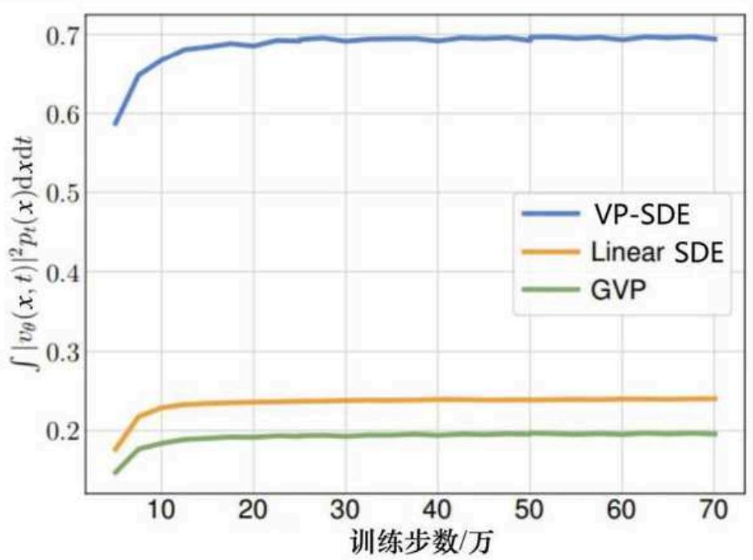  
图4.11　不同扩散过程的流线长度统计图 [12]

这意味着Linear SDE和GVP的生成路径更平滑、更直，速度场的变化量更小，模型的建模更容易，因而采样时求解器的数值误差或许会更小，它们在基线实验中的表现明显好于VP-SDE。

# 4.2.3 扩散模型建模目标与训练方式的选择

扩散模型的表现除了受到扩散过程的数学形式的影响外，也会受到扩散模型训练方式的影响，具体来说，包括建模方式和模型训练目标。

# 1．建模方式

扩散模型有多种建模方式，比如建模得分函数 $s _ { \theta } ( x _ { t } , t )$ ：

$$
s _ {\theta} \left(x _ {t}, t\right) := \nabla_ {x _ {t}} \log p \left(x _ {t}, t\right) \tag {4.8}
$$

或者建模噪声函数 $\epsilon _ { \theta } ( x _ { t } , t )$ ，它的数值大小近似于高斯噪声 $\epsilon$ ：

$$
\epsilon_ {\theta} (x _ {t}, t) := - \sigma_ {t} \nabla_ {x _ {t}} \log p (x _ {t}, t) \tag {4.9}
$$

抑或建模流场的速度模型 $\nu _ { \theta } ( x _ { t } , t )$ ：

$$
v _ {\theta} (x _ {t}, t) := f (x _ {t}, t) - \frac {g ^ {2} (t)}{2} \nabla_ {x _ {t}} \log p (x _ {t}, t) \tag {4.10}
$$

论文“Elucidating the Design Space of Diffusion-based Generative Models”中则使用了降噪器模型 $\mathcal { D } _ { \theta } ( x _ { t } , \sigma _ { t } )$ ，它的数值大小近似于扩散过程中的 $x _ { t }$ ：

$$
\mathcal {D} _ {\theta} \left(\frac {x _ {t}}{s (t)}, \sigma_ {t}\right) := \sigma_ {t} ^ {2} \nabla_ {x _ {t}} \log p \left(x _ {t}\right) + \frac {x _ {t}}{s (t)} \tag {4.11}
$$

定义好一种扩散过程之后，不同的建模对象之间便存在着确定性的数学转换关系。因此，不同的建模类型虽然没有数学本质上的差异，但会在神经网络的建模数值稳定性和拟合精度上产生差别，毕竟任何神经网络的拟合能力都是有限的。

# 2．训练方式

扩散模型的训练大体可以分为得分函数匹配（Score Matching）和流匹配（FlowMatching）两种方式。它们分别与建模方式有着一定的对应关系。得分函数匹配一般对应建模得分函数或噪声函数，而流匹配一般对应建模流场的速度模型。不同的建模和训练方式会对扩散模型的训练稳定性和生成质量产生影响。若建模噪声函数并采用得分函数匹配的训练方式，则无法计算 $\scriptstyle t = 0$ 时刻的训练目标，因此需要额外的技巧来处理这个问题。通常可以采用一个缩放的区间，比如 $t \in [ 0 . 0 0 1 , 1 ]$ ，来避免这个问题。

对于得分函数匹配，在不同的实践中可能需要使用关于时间 的权重系数 来侧重训练不同时间点的函数权重，通常而言这个系数默认设置为1。

此外，一些学者还发现，相比简单一阶得分函数匹配法的训练目标，使用更高阶的得分函数匹配法可以改善扩散模型的训练稳定性和生成质量。比如论文 [13]“Maximum LikelihoodTraining for Score-based Diffusion ODEs by High-Order Denoising Score Matching”的作者尝试构建了二阶和三阶的得分函数匹配法，并在CIFAR-10等标准数据集上取得了更好的生成效果。在图4.12所示棋盘形状的概率分布重建示例中，可以发现使用高阶的得分函数匹配法训练出的扩散模型所生成的概率分布不仅更平滑，也更接近真实分布。

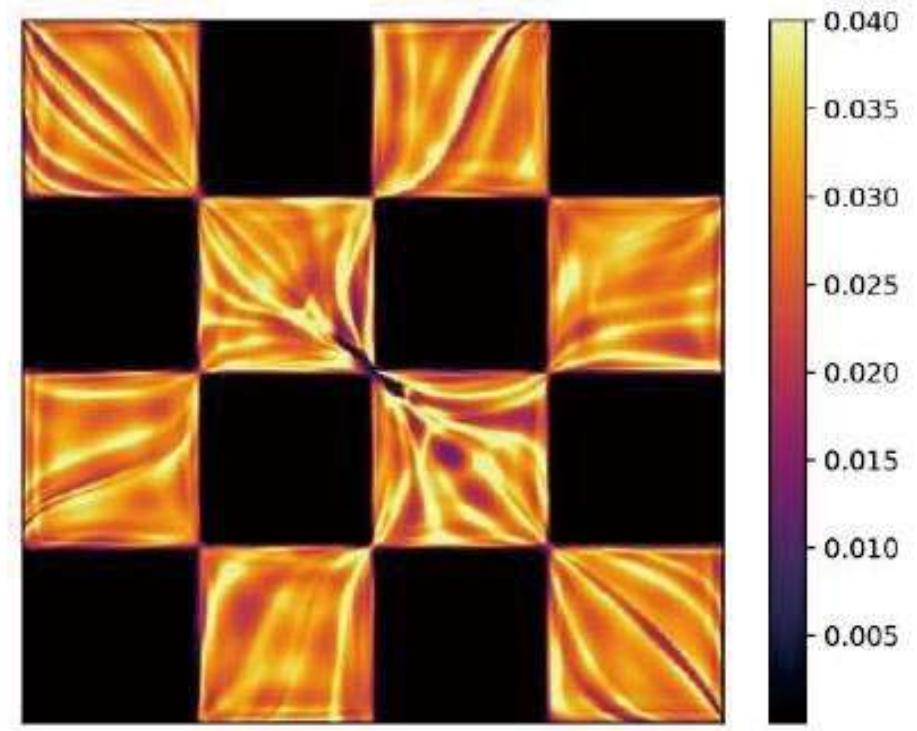  
（a）一阶的得分函数匹配法

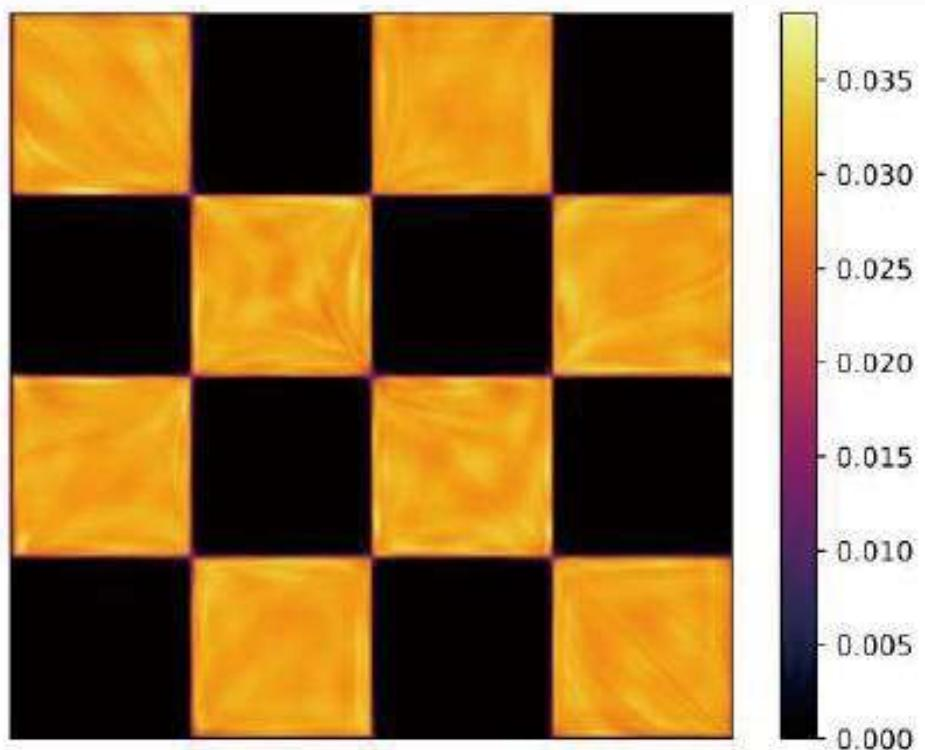  
（b）二阶的得分函数匹配法

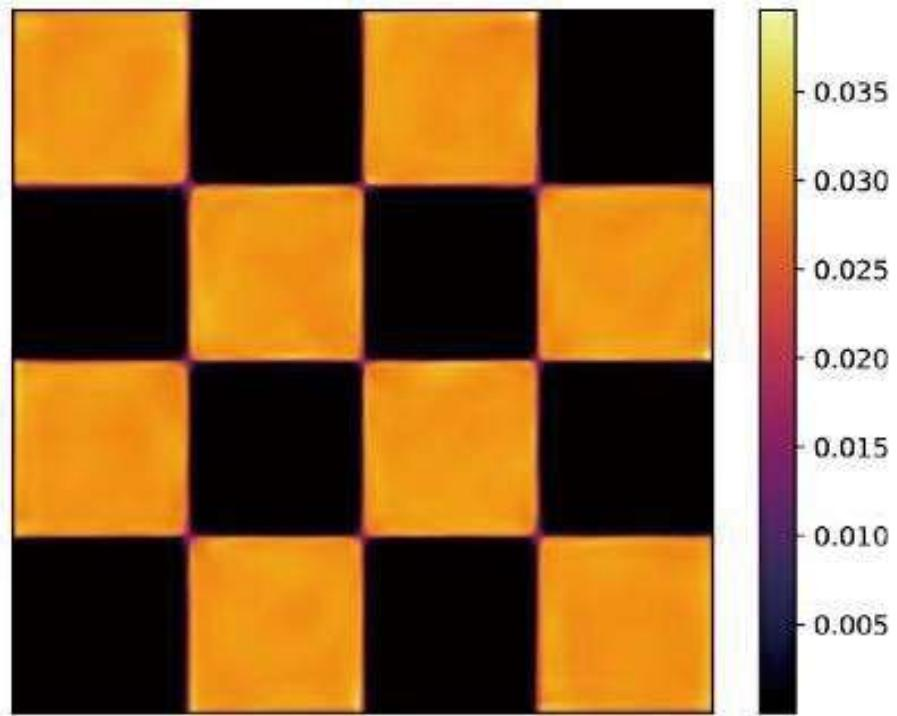  
（c）三阶的得分函数匹配法  
图4.12　使用一阶、二阶和三阶的得分函数匹配法训练出的扩散模型重建棋盘形状的概率分布

# 4.3 如何选择扩散模型的类型

回顾第1章，从定义扩散模型的SDE形式开始，我们对扩散模型的采样方法、训练目标、噪声水平参数化等的推导，往往都尽可能直接基于理论框架。然而，这种从理论出发的一整套扩散模型方案（如DDPM、VP-SDE等）有模糊可用设计空间的风险——所提出的扩散模型可能以紧密耦合的形式出现，修改单个组件便可能对整个系统造成破坏。论文“Elucidating theDesign Space of Diffusion-based Generative Models”从理论和实践的角度阐述了扩散模型设计空间中某些模块的影响。

# 4.4 代码实战

本节将基于PyTorch从头搭建一个DiT架构的神经网络模型，并针对Minecraft图片数据集进行训练和采样。详细的可执行代码见本书配套资源。

回顾图4.2，DiT模型作为噪声函数，会在图片潜空间尺度上进行噪声预测。类FinalLayer2D的作用便是将潜空间中的去噪结果解码回图片尺度：

```python
classFinalLayer2D(nnModule): def_init_( self, hidden_size:int, patch_size:Union[int,List[int],Tuple[int]], out_channels: Union[int,List[int],Tupl[e[int]]], .. defforward(self,x:torch,Tensor,c:torch,Tensor): 
```

类Patchify2D则对应图4.2的左下角，其作用是将潜在表征转换为一个个patch：

```python
class Patchify2D(nnModule): def __init__(self, channel_size: Union[int, List[int]] = [3], data_size: List[int] = [32, 32], patch_size: List[int] = [2, 2], hidden_size: int = 768, bias: bool = False, convolved: bool = False), def forward(self, x: torch.Tensor) -> torch.Tensor: 
```

最后，类DiT2D则实现了DiT网络架构中的每一个操作，其中不仅包含了 n 个DiT 块，还封装了条件编码模块和patchify/unpatchify等操作。

```python
class DiT2D(nnModule): def init_(self, patch_block_size: Union[List[int], Tuple[int]] = [32, 32], patch_size: Union[int, List[int], Tuple[int]] = 2, in_channels: Union[int, List[int], Tuple[int]] = 4, hidden_size: int = 1152, depth: int = 28, num_heads: int = 16, mlp_ratio: float = 4.0, convolved: bool = False), def initializeweights(self): #初始化模型权重 def unpatchify(self, x): 
```

```python
#将patch序列重新拼接为一个潜在表征  
...  
def forward(  
    self,  
    t: torch.Tensor,  
    x: torch.Tensor,  
    condition: Optional[torchTensor] = None):  
    #作为噪声函数进行一次推断
```

# 参考文献

[1] ZAGORUYKO S, KOMODAKIS N. Wide residual networks[EB/OL]. arXiv: 1605.07146.   
[2] RONNEBERGER O, FISCHER P, BROX T. U-Net: Convolutional networks for biomedical image segmentation[C]//In International Conference on Medical Image Computing and Computer-Assisted Intervention. 2015: 234-241.   
[3] PEEBLES W, XIE S. Scalable diffusion models with transformers[C]//Proceedings of the IEEE/CVF International Conference on Computer Vision. 2023: 4195-4205.   
[4] CHEN J, YU J, GE C, et al. PixArt-α: Fast training of diffusion transformer for photorealistic text-to-image synthesis[EB/OL]. arXiv: 2310.00426.   
[5] RAFFEL C, SHAZEER N, ROBERTS A, et al. Exploring the limits of transfer learning with a unified text-to-text transformer[J]. JMLR, 2020, 21(140).   
[6] RADFORD A, KIM J W, HALLACY C, et al. Learning transferable visual models from natural language supervision[C]//International Conference on Machine Learning. 2021.   
[7] SAHARIA C, CHAN W, SAXENA S, et al. Photorealistic text-to-image diffusion models with deep language understanding[C]//Advances in Neural Information Processing Systems. 2022, 35: 36479-36494.   
[8] DEVLIN J, CHANG M, LEE K, et al. BERT: Pre-training of deep bidirectional transformers for language understanding[EB/OL].arXiv: 1810.04805.   
[9] SONG Y, SOHL-DICKSTEIN J, KINGMA D P, et al. Score-based generative modeling through stochastic differential equations[EB/OL]. arXiv: 2011.13456.   
[10] TONG A, FATRAS K, MALKIN N, et al. Improving and generalizing flow-based generative models with minibatch optimal transport[EB/OL]. arXiv: 2302.00482.   
[11] ALBERGO M S, BOFFI N M, VANDEN-EIJNDEN E. Stochastic interpolants: A unifying framework for flows and diffusions[EB/OL]. arXiv: 2303.08797.   
[12] MA N, GOLDSTEIN M, ALBERGO M S, et al. SiT: Exploring flow and diffusion-based generative models with scalable interpolant transformers[C]//European Conference on Computer

Vision. 2024: 23-40.

[13] LU C, ZHENG K, BAO F, et al. Maximum likelihood training for score-based diffusion ODEs by high order denoising score matching[C]//International Conference on Machine Learning. 2022: 14429-14460.

# 第5章

# 扩展：多任务泛化

# 5.1 离线元强化学习

离线强化学习的目的是从离线轨迹数据（并不一定是专家数据，而可能包含次优轨迹数据）中学习好的策略，以期在训练和测试同样的任务时有不错的表现。而离线元强化学习的目标则是学习如何快速地适应以前没有遇到过的新任务。在标准马尔可夫决策过程定义$\mathcal { M } = ( S , \mathcal { A } , T , \rho , \mathcal { R } )$ 的基础上，离线元强化学习将其所研究的问题建模为一组任务 $\boldsymbol { \tau }$ ，其中每一个任务 $\mathcal { T } _ { i } \in \mathcal { T }$ 会被定义为 $( \mathcal { M } _ { i } , \pi _ { i } )$ ，即包含一个 $\mathrm { { \bf M D P } } \mathcal { M } _ { \bar { \imath } }$ 和一个行为策略 $\pi _ { i }$ 。每一个任务 $\mathcal { T } _ { i }$ 还包含一个预先由策略 $\pi _ { i }$ 收集的数据集 $\mathcal { D } _ { i }$ 。对于智能体，需要根据 $\boldsymbol { \tau }$ 的子集 ${ \mathcal { T } } ^ { \mathrm { t r a i n } }$ 进行训练优化，并期望其在训练收敛后，能够在与训练任务 ${ \mathcal { T } } ^ { \mathrm { t r a i n } }$ 不重叠的测试任务 $\mathcal { T } ^ { \mathrm { t e s t } }$ 上找到最优策略。训练任务与测试任务整体上是相似的，但奖励函数模型和环境动力学模型在不同任务之间可能不一致。图5.1形象地展示了 $T ^ { \mathrm { t r a i n } }$ 和 $\mathcal { T } ^ { \mathrm { t e s t } }$ 的区别，其中训练任务和测试任务都是操作工业机器人插入插头，只是机器人的型号存在差别。

# 5.2 MetaDiffuser

MetaDiffuser是一种新型的离线元强化学习框架 [1]，它利用条件扩散模型进行面向任务的轨迹生成，进而泛化到未曾见过的任务。如图5.1所示，整个学习过程可以显式地分为两个阶段：云训练（meta-training）和云测试（meta-testing）。

在meta-training阶段，我们将训练得到上下文编码器、环境动力学模型、奖励函数模型以及以任务标签为条件的扩散模型MetaDiffuser 。在meta-testing阶段，则捕获任务信息，得到任务表征 z ，用于后续的轨迹生成过程。

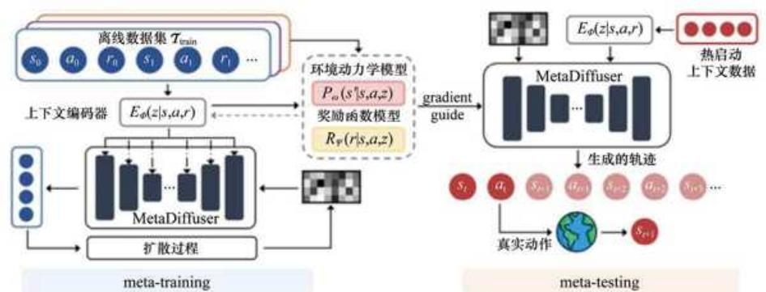  
图5.1 MetaDiffuser框架示意图 [1]

在meta-training阶段，为了向轨迹子序列生成提供标识任务的条件标签，首先需要预训练一个准确的上下文编码器以捕获轨迹中奖励函数和动力学函数的变化，然后将通过上下文编码器推断得到的紧凑任务表征作为上下文标签注入到扩散模型采样过程中。在meta-testing阶段，通过提供少量的热启动上下文数据，使条件扩散模型生成针对测试任务的轨迹。另外，为了缩小生成的轨迹与测试环境中的真实轨迹之间的差异，可以将先前训练的奖励函数模型和环境动力学模型用作采样轨迹评估器，通过gradient guide的方式指导生成过程，从而生成累积回报更高、动力学一致性更强的轨迹。

# 5.2.1 面向任务的上下文编码器

为了生成与任务高度相关的轨迹，需要建立一个轨迹到其所属上下文标签的准确映射。考虑到任务之间的区别主要在于奖励函数模型和环境动力学模型的变化，MetaDiffuser旨在找到一种统一的学习目标，以使上下文编码器能够完全区分这两种任务环境的变化。在图5.1中，上下文编码器记为 $E _ { \phi }$ ，奖励函数模型和环境动力学模型则分别记为 $R _ { \psi }$ 和 $P _ { \omega }$ 。下面详细说明这三个模型的训练过程。首先给定一个多任务离线数据集 $\mathcal { D }$ ，其中包含的轨迹

$\tau ^ { M } = \{ ( s _ { t } , a _ { t } , r _ { t } , s _ { t + 1 } ) \} _ { t = 1 } ^ { K }$ 长度为 K ，并且都属于训练任务，即 ${ \mathcal { M } } { \sim } T ^ { \mathrm { t r a i n } }$ 。对于每条轨迹，可通过随机选取起始时间 $_ t$ 来采样出一个长度为 $^ { h }$ 的轨迹片段 $\tau _ { t } ^ { \mathcal { M } } = \{ ( s _ { t + i } , a _ { t + i } , r _ { t + i } , s _ { t + i + 1 } ) \} _ { i = 0 } ^ { h }$ 。将 $\tau _ { t } ^ { \mathcal { M } }$ 作为 $E _ { \phi }$ 的输入，$E _ { \phi }$ 会输出当前轨迹所属任务的潜在表征 $z _ { t } = E _ { \phi } ( \tau _ { t } ^ { \mathcal { M } } )$ 。以 $z _ { t }$ 作为条件变量，我们期望 $R _ { \psi }$ 和 $P _ { \omega }$ 能够正确预测出奖励和下一帧状态。由于 $R _ { \psi }$ 和 $P _ { \omega }$ 以 $E _ { \phi }$ 的输出为条件变量，通过最大化 $R _ { \phi }$ 和 $P _ { \omega }$ 的似然估计，参数 $\phi$ 可以与 $\psi \mathcal { \bar { H } } \Delta \omega$ 一并得到优化。损失函数如下：

$$
\begin{array}{l} \mathcal {L} _ {\phi , \psi , \omega} = - \mathbb {E} _ {(s _ {i}, a _ {i}, r _ {i}, s _ {i + 1}) - \tau M; M \sim T ^ {\mathrm {t e x t}}} \\ \left. \left[ \mathbb {E} _ {z _ {t} = E _ {\varphi} (z _ {t} | \tau^ {M})} \left[ \log P _ {\omega} \left(\hat {s} _ {t + 1} \mid s _ {t}, a _ {t}, z _ {t}\right) + \log R _ {\psi} \left(\hat {r} _ {t} \mid s _ {t}, a _ {t}, z _ {t}\right) \right] \right] \right. \tag {5.1} \\ \end{array}
$$

作为训练 $E _ { \phi }$ 的副产物， $R _ { \psi }$ 和 $P _ { \omega }$ 将在基于分类器引导的轨迹采样过程中用作引导分类器。

# 5.2.2 条件扩散模型架构

与Plan Diffuser中的设计类似，MetaDiffuser轨迹中的状态和动作会被一并扩散或去噪，轨迹片段的形式化定义如下：

$$
x _ {k} (\tau) = \left(s _ {t}, a _ {t}, s _ {t + 1}, a _ {t + 1}, \dots , s _ {t + H - 1}, a _ {t + H - 1}\right) _ {k} \tag {5.2}
$$

预训练的上下文编码器用于推断当前轨迹的任务标签。至此，离线元强化学习可以形式化为条件生成模型的优化问题：

$$
\theta^ {*} = \arg \max  _ {\theta} \mathbb {E} _ {\tau \sim D} [ \log p _ {\theta} (x _ {0} (\tau) | y = E _ {\phi} (\tau)) ] \tag {5.3}
$$

扩散过程和去噪过程可以形式化为

$$
q \left(x _ {k + 1} (\tau) \mid x _ {k} (\tau)\right), p _ {\theta} \left(x _ {k - 1} (\tau) \mid x _ {k} (\tau), y = E _ {\phi} (\tau)\right) \tag {5.4}
$$

对于条件变量 $y = E _ { \phi } ( \tau )$ ，MetaDiffuser采用的是无分类器引导技术，即在训练噪声模型$\epsilon _ { \theta } ( x _ { k } ( \tau ) , y ( \tau ) , k )$ 时以概率 $\beta$ 将条件变量置为 $\varnothing$ ，其损失函数如下：

$$
\mathcal {L} (\theta) = \mathbb {E} _ {k, \tau \sim \mathcal {D}} [ \| \epsilon - \epsilon_ {\theta} (x _ {k} (\tau), (1 - \beta) E _ {\phi} (\tau) + \beta \emptyset , k) \| ^ {2} ] \tag {5.5}
$$

训练收敛后，采样时在每一个去噪时间步以式（5.6）计算扰动噪声：

$$
\hat {\epsilon} = \omega \epsilon_ {\theta} (x _ {k} (\tau), y, k) + (1 - \omega) \epsilon_ {\theta} (x _ {k} (\tau), \emptyset , k) \tag {5.6}
$$

与Plan Diffuser等方法一致，生成轨迹的第一个动作会被应用到环境中执行。这个过程会在一个标准的滚动域控制循环（Receding-Horizon Control Loop）中重复进行。

# 5.2.3 双引导增强规划器

回顾Plan Diffuser，它通过训练一个额外的回报预测器 $\mathcal { I }$ 并应用分类器引导技术，来引导生成结果偏向具有高回报的轨迹。但在MetaDiffuser框架的meta-testing阶段，由于面向的是训练时未曾见过的任务，仅采用回报预测器 $\mathcal { I }$ 来引导采样容易导致生成结果不遵从环境动力学而仅偏向具有高回报的轨迹。因此，MetaDiffuser提出了一种双重引导机制，旨在增强生成轨迹的动力学一致性，同时鼓励轨迹偏向高回报。

这种双重引导实际上是对两种分类器引导的加权。回顾Plan Diffuser，引导梯度 $g = \nabla \mathcal { I } ( x _ { k } ( \tau ) )$ 。双重引导则纳入了环境动力学一致性方面的考虑，即

$$
g = \nabla \mathcal {J} (x _ {k} (\tau)) + \lambda \nabla \zeta (x _ {k} (\tau))
$$

$$
\mathcal {J} \left(x _ {k} (\tau)\right) = \sum_ {t = 0} ^ {T} R _ {\psi} \left(s _ {t}, a _ {t}, z _ {t}\right) \tag {5.7}
$$

$$
\zeta (x _ {k} (\tau)) = \sum_ {t = 0} ^ {T} \| s _ {t + 1} - P _ {\omega} (\hat {s} _ {t + 1} | s _ {t}, a _ {t}, z _ {t}) \| ^ {2}
$$

可以看出 $\zeta$ 充当评判生成轨迹可达性以及与环境动力学一致性的角色。下面用一个简单的示例展示双重引导所带来的影响。

如图5.2中的Hopper环境所示，第1行和第3行分别是未采用和采用双重引导的生成结果。第2行和第4行是两种采样方法在实际控制中真实轨迹的状态变化。从图5.2中可以看出，未采用双重引导的生成轨迹更激进，但与实际执行结果相去甚远（因为采样结果不符合当前任务的环境动力学），这造成生成的规划过程与执行过程是脱节的。而采用双重引导的生成轨迹则与实际执行结果更加一致。

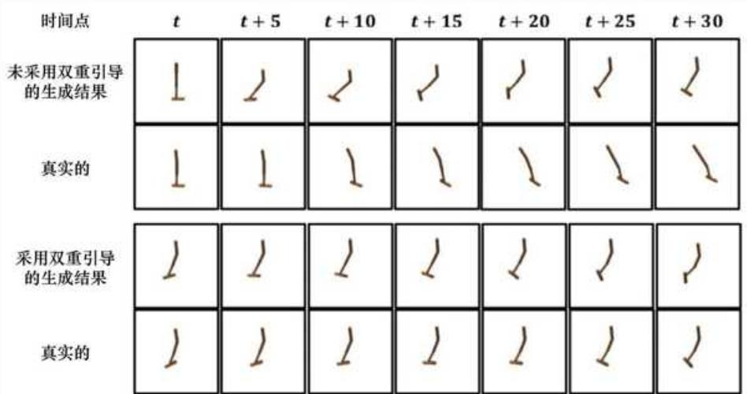  
图5.2　一个展示双重引导有何作用的简单例子[1]

回顾图5.1，在meta-training阶段，训练得到上下文编码器 $E _ { \phi }$ 、环境动力学模型 $P _ { \omega }$ 、奖励函数模型 $R _ { \psi }$ 以及以任务标签为条件的扩散模型MetaDiffuser。在meta-testing阶段，通过热启动上下文数据， $E _ { \phi }$ 可以生成这些数据所属测试任务的表征标签。MetaDiffuser以这些标签为条件，通过双重引导方法便能够采样出针对测试任务的回报高且可达性强的轨迹。采样时若使用了双重引导方法，则去噪过程可以形式化地拓展为

$$
\hat {\epsilon} := \underbrace {\omega \epsilon_ {\theta} (x _ {k} (\tau) , y , k) + (1 - \omega) \epsilon_ {\theta} (x _ {k} (\tau) , \phi , k)} _ {\text {无 分 类 器 引 导}} - \underbrace {\sqrt {1 - \bar {\alpha} _ {t}} \nabla_ {x _ {k} (\tau)} [ \mathcal {J} (x _ {k} (\tau)) + \lambda \nabla \zeta (x _ {k} (\tau)) ]} _ {\text {分 类 器 引 导}}
$$

# 参考文献

[1] NI F, HAO J, MU Y, et al. MetaDiffuser: Diffusion model as conditional planner for offline meta-rl[C]//International Conference on Machine Learning. 2023: 26087-26105.

# 第6章

# 扩展：世界模型建模

# 6.1 世界模型简介

深度学习中的世界模型概念最初由Ha和Schmidhuber在他们于2018年发表的论文中提出，如图6.1所示，他们开启了这一研究领域的新篇章。此后，世界模型迅速发展，极大地推动了AGI的研究进程。同时，在计算机视觉（Computer Vision，CV）和自然语言处理（NaturalLanguage Processing，NLP）领域，ChatGPT等大语言模型（Large Language Model，LLM）的发展也达到前所未有的高度。然而，正如图灵奖得主LeCun所指出的，这些大语言模型由于依赖自回归式生成进行训练，在规划和推理能力方面存在局限性，而学习预测性的世界模型成为一种可能的关键途径。

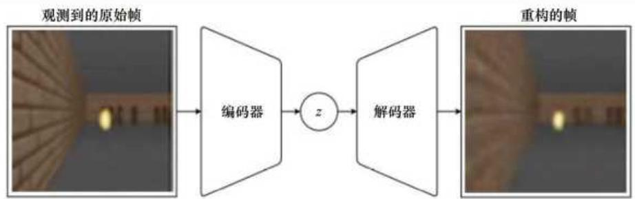  
图6.1　世界模型

业界提出世界模型的动机在于，现有的在线强化学习算法需要不断地与环境交互，利用收集到的大量“经验”来优化策略。这限制了各种经典强化学习算法的实际应用，因为现实任务中往往试错成本极高。基于这一点，强化学习领域后续出现了诸多分支来弥补数据上的缺陷。比如离线强化学习，便是在固定数据集的约束下优化策略，而无须与真实环境产生新的交互。在世界模型被提出之前，强化学习的应用者往往需要自行构建仿真器，并尽可能地模拟实际问题的动力学。但构造仿真器需要开发者对真实环境的动力学具备完备的先验知识，即使如此，仿真器与真实环境依然可能存在难以弥补的差距。而世界模型的提出使得研究人员不需要解析定义真实环境的动力学模型，而是基于真实环境的状态转移数据来拟合动力学模型。

从形式上，世界模型可以形式化为条件分布 $p ( s _ { t + 1 } , r _ { t } \mid s _ { t } , a _ { t } )$ 。可以看到，对于给定的环境当前状态 $s _ { t }$ 和动作 $a _ { t }$ ，世界模型需要预测下一帧状态 $s _ { t + 1 }$ 和奖励值 $r _ { t }$ 的分布。在本章中，我们将以世界模型核心架构的选择为依据，将世界模型分为三类：基于RNN的世界模型、基于Transformer的世界模型以及基于扩散模型的世界模型。

# 6.2 基于RNN的世界模型

# 6.2.1 论文“World Models”

作为基于模型的强化学习算法的起源，论文 [1]“World Models”的作者为强化学习环境构建了一种生成式神经网络模型，即世界模型，该模型能够通过无监督学习迅速学习环境的空间和时间压缩表征。通过使用世界模型提取的特征作为输入，可以训练出一个紧凑且简洁的策略，以完成指定任务。具体来说，原作者设计了一个简化的框架来实验性地展示世界模型的关键概念，并探讨如何有效地将这些概念应用于各种强化学习环境。在此框架中，世界模型包含如下组件。

● 视觉组件：基于变分自编码器，将观测数据压缩成表征向量。  
● 记忆组件：基于RNN，依据历史信息预测未来的编码 。  
● 决策组件：仅根据视觉组件和记忆组件生成的表征来选择动作 。

论文“World Models”的实验部分仅在CarRacing和VizDoom两个相对简单的任务中进行了测试，这使得研究者可以仅依靠从随机策略中收集的数据集来训练出一个有效的世界模型。然而在更复杂的环境中，智能体必须学会策略性地探索其所处的世界，才能获得对该环境更全面的理解。对于这些复杂的任务，原作者提出了一个迭代式训练程序。该程序要求智能体持续探索其周围环境，并收集新的观测数据以不断优化和细化其世界模型。具体的迭代训练过程可以概括为以下4个步骤。

（1）使用随机模型参数，初始化记忆组件和决策组件。  
（2）在实际环境中展开 N 次实验，记录所有动作和观察结果。  
（3）训练记忆组件以模拟环境 $P ( x _ { t + 1 } , r _ { t + 1 } , a _ { t + 1 } , d _ { t + 1 } \mid x _ { t } , a _ { t } , h _ { t } )$ ，同时训练决策组件以优化记忆组件中的预期奖励。  
（4）如果任务未达到预期目标，返回步骤（2）重复执行。

论文“World Models”表明，在简单任务中，这种训练循环的一次迭代就足以取得成功。对于更具挑战性的任务，原作者强调决策组件需要在步骤（2）中积极探索对改进世界模型有益的环境部分，并重复迭代过程多次。可见，世界模型的三个组成部分的学习是一个相对独立的过程，这可能导致表征与决策的不一致，并出现样本效率和扩展性等方面的问题。

# 6.2.2 DreamerV3

Dreamer [2]系列算法在世界模型的构建与学习，以及基于Actor-Critic范式优化值函数和策略函数方面进行了系统性的探索。DreamerV3作为Dreamer系列算法的集大成者，在保持超参数不变的情况下，在多个领域超越了以往的算法，展现出卓越的通用性和可扩展性。

通用智能体需要在多个领域完成任务。目前，强化学习算法展现出了实现这一目标的潜力，然而针对新任务的调整仍受限于领域知识。针对此问题，DreamerV3被提出，这是一种基于世界模型的通用且可扩展的算法，它在保持超参数不变的情况下，在多个领域超越了以往的算法，涵盖了连续与离散动作、视觉与低维输入、二维与三维环境，以及不同的数据预算、奖励频率及奖励规模等方面。DreamerV3的扩展性特征极为有利，较大的模型能够直接提高数据效率和最终性能。DreamerV3还是一种无需人类数据或预设课程，从零开始在Minecraft中成功采集钻石的算法，这一成就标志着人工智能领域的一大突破。预期类似的通用算法能极大地推动强化学习的广泛应用，并使其能够扩展到更复杂的决策问题中。

下面首先介绍DreamerV3采用的几个关键技术，然后系统介绍DreamerV3的算法流程。

# 1.对称对数预测

在重建输入的同时预测奖励与价值，可能会面临挑战，因为它们的规模在不同领域可能有所不同。使用平方损失预测大目标可能导致发散（因为平方损失较大时，梯度也会增大），而使用绝对值损失和Huber损失则可能导致学习停滞（因为损失较小时，梯度会很小）。另外，基于运行统计量的归一化目标可能引入优化的非平稳性（因为当网络学习后，用于归一化的running scale和running shift无法立刻随之变化）。

原作者建议采用对称对数预测技术来解决这一难题。具体而言，就是让一个具有输入 $_ x$ 和参数 $\theta$ 的神经网络 $f ( x , \theta )$ 学习预测其目标 y 的变换版本 。对网络输出应用逆变换即可得到对原始目标的预测值 $\hat { y }$ 。

$$
\mathcal {L} (\theta) \doteq \frac {1}{2} (f (x, \theta) - \operatorname {s y m l o g} (y)) ^ {2} \quad \hat {y} \doteq \operatorname {s y m e x p} (f (x, \theta)) \tag {6.1}
$$

使用对数作为变换时，不能预测负值目标。因此，原作者采用了一个名为symlog的双对称对数函数，其逆函数为symexp函数：

$$
\operatorname {s y m l o g} (x) \doteq \operatorname {s i g n} (x) \ln (| x | + 1) \quad \operatorname {s y m e x p} (x) \doteq \operatorname {s i g n} (x) (\exp (| x |) - 1) \tag {6.2}
$$

symlog函数可以压缩大的正值和负值的幅度。与普通的对数函数不同，symlog函数在原点附近是对称的，并保留了输入的符号。这使得优化过程在需要时能快速将网络预测调整到大值。而在原点附近，symlog函数近似为恒等函数，因此它不会影响对已经足够小的目标的学习。在Actor-Critic范式中，虽然之前已经提出了更复杂的变换，但原作者发现这种方法在

不同领域的整体平均效果更佳。DreamerV3在解码器、奖励预测器和Actor-Critic范式中使用对数预测技术，并且使用symlog函数压缩编码器的输入。尽管方法简单，却能够在多样化的环境中稳健且迅速地学习。采用对数预测技术，无须截断大的奖励，也无须引入奖励归一化的非平稳性，更无须在检测到新的极端值时调整网络权重。

# 2.RSSM

如图6.2所示，世界模型将每一时刻的状态描述为两个变量 $h _ { t }$ 和 $s _ { t }$ 。其中 $h _ { t }$ 是确定性变量，在 $a _ { t - 1 } , h _ { t - 1 } , s _ { t - 1 }$ 确定的情况下， $h _ { t }$ 也是确定的。而 $s _ { t }$ 是随机变量，服从以 $h _ { t }$ 为条件的条件分布。变量 $a _ { t }$ 表示对世界模型执行的动作， $o _ { t }$ 表示世界模型对外界输出的观测。

从形式上，RSSM将世界模型具体构建为一个函数模型和三个分布模型，如图6.2所示。

● 确定性状态模型： $h _ { t } = f ( h _ { t - 1 } , s _ { t - 1 } , a _ { t - 1 } )$ 。  
● 随机性状态模型： $s _ { t } \sim p ( s _ { t } | h _ { t } )$ 。  
● 观测模型： $o _ { t } \sim p ( o _ { t } | h _ { t } , s _ { t } )$ 。  
● 奖励模型： $\boldsymbol { r } _ { t } \sim p ( \boldsymbol { r } _ { t } | h _ { t } , \boldsymbol { s } _ { t } )$ 。

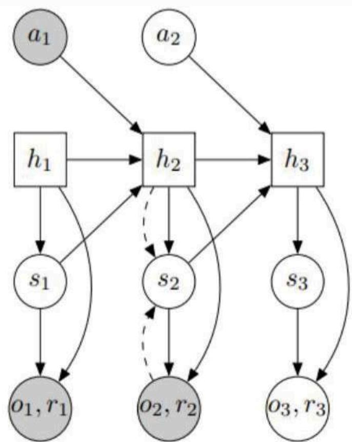  
图6.2 RSSM

# 3.Free bits

传统的变分自编码器存在后验崩溃的现象。观察VAE的最大化目标函数，即

$$
\operatorname {E L B O} (\theta , \phi) = \mathbb {E} _ {z \sim q _ {\phi} (z | x)} [ \log p _ {\theta} (x | z) ] - \operatorname {K L} (q _ {\phi} (z | x) \| p (z)) \tag {6.3}
$$

后验崩溃是指在实践中，如果解码器能力足够强，就会出现训练后期 $\mathrm { K L } ( q _ { \phi } ( z | x ) | | p ( z ) )$ 趋近于0而 $p _ { \theta } ( x | z ) = p _ { \mathcal D } ( x )$ 的情况。在这种情况下，VAE的编码器输出的分布几乎与先验分布 $p ( z )$ 一致，而解码器对于每种可能的编码输入 $_ z$ ，都能够采样出服从数据集分布的样本。后来出现了很多技术用于减缓后验崩溃，Free bits便是其中一种。

假设编码输入 $z$ 由 $\mathbf { m }$ 维组成，可将 $\mathrm { K L } ( q _ { \phi } ( z | x ) | | p ( z ) )$ 分解为

$$
\sum_ {i = 1} ^ {m} D _ {\mathrm {K L}} \left(q _ {\phi} \left(z _ {i} \mid x\right) \| p _ {\theta} \left(z _ {i}\right)\right) \tag {6.4}
$$

其中 $z _ { i }$ 表示 $z$ 的第 i 维变量，虽然可以用Hinge损失替换它，但这样做会丢弃某些低于目标压缩率 $\lambda$ 的维度的优化：

$$
\sum_ {i = 1} ^ {m} \max  (\lambda , D _ {\mathrm {K L}} (q _ {\phi} (z _ {i} | x) \| p _ {\theta} (z _ {i}))) \tag {6.5}
$$

因此，KL散度足够小的位（bit）是“免费的”（free），因为模型不需要根据先验知识来“支付”编码它们的代价。

# 4.Categorical VAE

Categorical VAE是一种对数据进行离散编解码的方法。假设我们将编码器形式化为 $\varepsilon$ ，给定输入 $\varepsilon$ 能够输出形状为 $m \times n$ 的logits。Categorical VAE会对logits逐行进行softmax运算，得到 $\pmb { n }$ 维的概率向量。之后对每行进行采样，得到独热向量，组成 $m \times n$ 的0/1编码结果。Categorical VAE的训练旨在借助straight-through方法，使梯度能够从解码器传播回编码器。

# 5.DreamerV3的算法流程

有了上面这些技术，我们就可以正式梳理DreamerV3的算法流程了。整个DreamerV3算法的优化围绕三个神经网络构成的组件进行：基于RSSM的世界模型用于预测给定动作后的潜在状态变化，并输出下一帧奖励和观测；Critic用于判断当前帧的预期收益；Actor则用于选择能够带来最大预期收益的动作。当智能体与环境交互时，这三个组件会通过收集到的重放体验一并被训练。为了在多个领域取得成功，这些组件不仅需要能够适应不同的信号强度，还需要能够稳健地平衡目标中的各个分量。处理这一挑战性任务并非易事，因为DreamerV3的目标并非仅仅在同一领域处理类似的任务，它还需要能够基于同一套超参数在不同领域稳健地学习。

DreamerV3的世界模型可以具体构建为如下6个模型。

● 序列模型： $h _ { t } = f ( h _ { t - 1 } , s _ { t - 1 } , a _ { t - 1 } )$ 。  
● 编码器： $z _ { t } \sim p ( z _ { t } | h _ { t } , x _ { t } )$ 。  
● 动力学预测器： $\hat { z } _ { t } \sim p ( \hat { z } _ { t } | h _ { t } )$ 。  
● 奖励预测器： $\hat { r } _ { t } \sim p ( \hat { r } _ { t } | h _ { t } , z _ { t } )$ 。  
● 延续预测器： $\hat { c } _ { t } \sim p _ { \phi } ( \hat { c } _ { t } | h _ { t } , z _ { t } )$ 。  
● 解码器： $\hat { x } _ { t } \sim p _ { \phi } ( \hat { x } _ { t } | h _ { t } , z _ { t } )$ 。

注意在RSSM的基础上，DreamerV3又额外引入了一个分布模型用于建模一个episode的终止信号。如图6.3所示，对于随机状态编码，DreamerV3则采用了Categorical VAE。不过需要注意的是，原作者将Categorical VAE的编码器输出的分布与均匀分布按照99∶1的比例混合，从而确保状态编码 $z _ { t }$ 的采样永远是随机的。

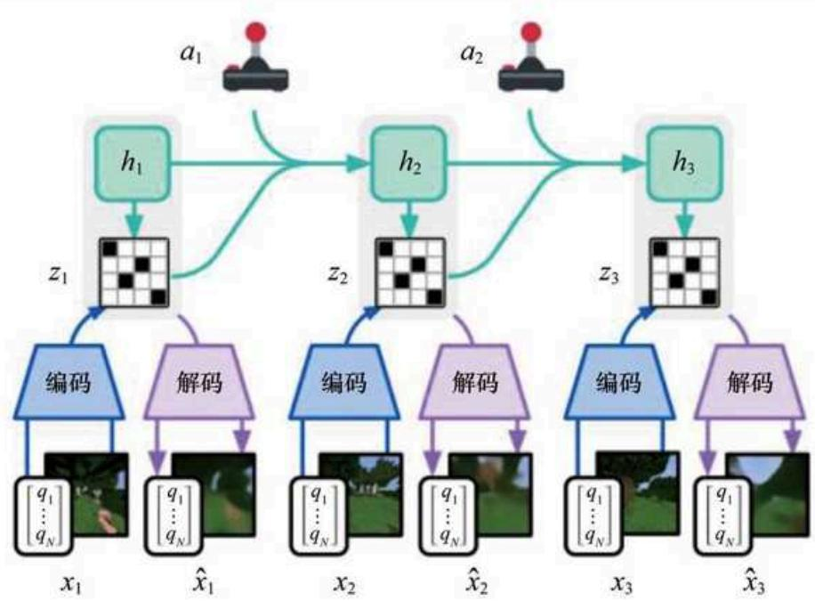  
图6.3　对于随机状态编码，DreamerV3采用了Categorical VAE [2]

# 这一操作的代码实现如下：

class OneHotDist(torchd.one-hot_categorical.OneHotCategorical): def init_self, logits $\equiv$ None, probs $\equiv$ None, unimix_ratio $= 0.0$ .. if logits is not None and unimix_ratio $>0.0$ .. probs $=$ F散热max(logits, dim=-1) probs $=$ probs \* (1.0 -unimix_ratio) $^+$ unimix_ratio / probsshape[-1] logits $=$ torch.log(probs) super().init_(logits $\equiv$ logits, probs $\equiv$ None) else: super().init_(logits $\equiv$ logits, probs $\equiv$ probs)   
def mode(self): _mode $=$ F.onehot( torch.argmax(.logits, axis=-1), super().logits. shape[-1]

return_modedetach() $^+$ super().logits - super().logits. detach()   
def sample(self, sample_shape $\equiv$ (，seed=None): if seed is not None: raise ValueError("need to check") sample $=$ super().sample(sample_shape) probsb $=$ super().probs while len(probs.shape) $<  <   _{\mathrm{len}}$ (sample.shape): probsb $=$ probsb[None] sample $+ =$ probsb-probsdetach(

总而言之，整个世界模型的优化可以归纳为如下损失函数：

$$
\mathcal {L} (\phi) = \mathbb {E} _ {q _ {n}} \left[ \sum_ {t = 1} ^ {T} \left(\beta_ {\text {p r e d}} \mathcal {L} _ {\text {p r e d}} \left(\phi + \beta_ {\text {d y n}} \mathcal {L} _ {\text {d y n}} \left(\phi + \beta_ {\text {r e p}} \mathcal {L} _ {\text {r e p}} (\phi) \right. \right. \right] \right. \tag {6.6}
$$

其中：

$$
\mathcal {L} _ {\text {p r e d}} (\phi) = - \ln p _ {\phi} \left(x _ {t} \mid z _ {t}, h _ {t}\right) - \ln p _ {\phi} \left(r _ {t} \mid z _ {t}, h _ {t}\right) - \ln p _ {\phi} \left(c _ {t} \mid z _ {t}, h _ {t}\right)
$$

$$
\mathcal {L} _ {\mathrm {d y n}} (\phi) = \max  (1, \mathrm {K L} [ \operatorname {s g} \left(q _ {\phi} \left(z _ {t} \mid h _ {t}, x _ {t}\right)\right) \| p _ {\phi} \left(z _ {t} \mid h _ {t}\right) ]) \tag {6.7}
$$

$$
\mathcal {L} _ {\text {r e p}} (\phi) = \max  (1, \mathrm {K L} [ q _ {\phi} (z _ {t} \mid h _ {t}, x _ {t}) \| \operatorname {s g} (p _ {\phi} (z _ {t} \mid h _ {t})) ])
$$

可以看到， $\mathcal { L } _ { \mathrm { p r e d } }$ 会最大化训练数据给出的 $x _ { t } , ~ r _ { t } , ~ c _ { t }$ 的似然估计，而 $\mathcal { L } _ { \mathrm { d y n } }$ 和 $\mathcal { L } _ { \mathrm { r e p } }$ 在约束分布$q _ { \phi } ( z _ { t } \mid h _ { t } , x _ { t } )$ 和 $p _ { \phi } ( z _ { t } | h _ { t } ) \dot { { \mathbb H } } ^ { \sharp } { \mathbb K } \mathrm { L }$ 距离的同时，也会利用Free bits减缓后验崩溃。另外， $p _ { \phi } ( r _ { t } | z _ { t } , h _ { t } )$ 中的 $r _ { t }$ 是原始环境的奖励值经过对称对数变换得到的结果。

# 6.Actor与Critic

对于Actor和Critic的训练，则直接从世界模型中收集数据并学习。将Actor和Critic分别形式化为

$$
\text {A c t o r}: a _ {t} \sim \pi_ {\theta} \left(a _ {t} \mid s _ {t}\right) \quad \text {C r i t i c}: v _ {\psi} \left(R _ {t} \mid s _ {t}\right) \tag {6.8}
$$

对Critic的训练旨在基于最大似然估计损失函数预测累积回报的分布：

$$
\mathcal {L} (\psi) = - \sum_ {t = 1} ^ {T} \ln p _ {\psi} \left(R _ {t} ^ {\lambda} \mid s _ {t}\right) \tag {6.9}
$$

其中累积回报 $R _ { t } ^ { \lambda }$ 的计算则基于GAE估计方法：

$$
R _ {t} ^ {\lambda} = r _ {t} + \gamma c _ {t} ((1 - \lambda) v _ {t} + \lambda R _ {t + 1} ^ {\lambda}), R _ {T} ^ {\lambda} = v _ {T} \tag {6.10}
$$

对于Actor的学习，则遵循如下损失函数，进行带有熵正则项的Reinforce估计：

$$
\mathcal {L} (\theta) = - \sum_ {t = 1} ^ {T} \operatorname {s g} \left(\left(R _ {t} ^ {\lambda} - v _ {\psi} (s _ {t})\right) / \max  (1, S)\right) \log \pi_ {\theta} \left(a _ {t} \mid s _ {t}\right) + \eta H \left[ \pi_ {\theta} \left(a _ {t} \mid s _ {t}\right) \right]
$$

（6.11）

如图6.4所示，可以看到Critic和Actor的训练数据（即 $s _ { t } \mathcal { \bar { H } } \mathbb { 1 } r _ { t }$ ）均来自世界模型。

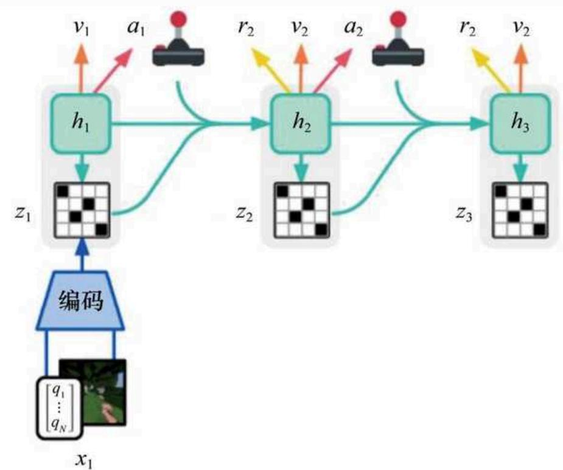  
图6.4 Critic和Actor的训练数据均来自世界模型 [2]

# 6.3 基于Transformer的世界模型

大语言模型（LLM）的出现证实了Transformer对序列建模的强大潜力，由此出现了许多以Transformer参数化建模世界模型的智能体。本节主要介绍IRIS、TWM和STORM，它们都基于Transformer建模世界模型，并且策略的学习也都使用了DreamerV3的方法。

# 6.3.1 IRIS

在想象的环境中学习无疑是十分吸引人的，因为可以从世界模型中无限地取用这些数据，但训练世界模型所需的真实数据也是十分庞大的。Dreamer系列算法中的DreamerV2为了在Atari环境中达到最好的效果，需要与真实Atari环境交互收集200万帧图像，这与提升数据利用效率的初衷背道而驰。受到Transformer在序列建模任务中大获成功的启发，原作者引入了IRIS [4] — —一个在由离散自编码器和自回归Transformer组成的世界模型中学习的高效数据智能体。在Atari 100k基准测试中（仅能采集10万帧图像，相当于两小时的游戏时间），IRIS取得1.046的人类标准化得分，并在26个游戏的10个游戏中超过了人类，为不支持前向搜索的方法设立了新的SOTA。

如图6.5所示，IRIS包含如下组件。

● 策略：作为函数 $\pi$ 由紫色箭头表示，旨在基于世界模型“想象”的状态 $x _ { t }$ 输出相应动作。  
● 离散自编码器：绿色箭头对应于VQ-VAE中的编码器和解码器，目的是用学习到的符号语言表征原始图像帧，并且潜在表征将会作为Transformer的token使用。  
● 世界模型主干 G ：由一个类似GPT的Transformer实现，用蓝色箭头表示。对于策略 $\pi$ 采取的每一个动作，世界模型主干 $G$ 会模拟环境动力学，并通过自回归预测得到新的图像帧所对应的token，这些token可以被解码器 $D$ 解码为图像。此外，世界模型主干 $G$ 还能够预测奖励和回合终止。

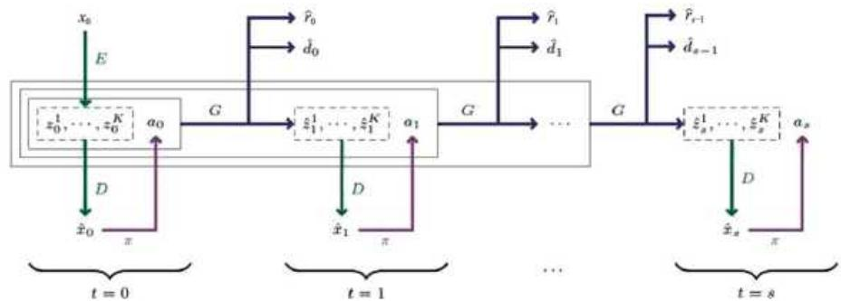  
图6.5 IRIS组件

由于策略 $\pi$ 的训练与DreamerV3一致，这里重点关注离散自编码器和世界模型主干 $G$ 的训练。

# 1.将图像转换为token

对于离散自编码器，编码器 $E : \mathbb { R } ^ { h \times w \times 3 } \to \{ 1 , \cdots , N \} ^ { K }$ 用于将 $h \times w$ 大小的RGB图像转换为 K 个token。令 $\mathcal { E } = \{ e _ { i } \} _ { i = 1 } ^ { N } \in \mathbb { R } ^ { N \times d }$ 表示大小为 N 的字典，其中每一个可能的值为 d 维向量。具体做法是将编码器 $E$ 实例化为一个卷积神经网络，输入图像 $x _ { t }$ ，得到输出 $y _ { t } \in \mathbb { R } ^ { K \times d }$ 。最后得到的 K 个token可以表达为 $\boldsymbol { z } _ { t } = ( z _ { t } ^ { 1 } , \cdots , z _ { t } ^ { K } ) \in \{ 1 , \cdots , N \} ^ { K }$ ，其中 $z _ { t } ^ { k } = \arg \operatorname* { m i n } _ { i } \lVert y _ { t } ^ { k } - e _ { i } \rVert ^ { 2 }$ 。同理，将解码器 $D$ 也实例化为一个卷积神经网络，它能够将 K 个token解码为图像。

通过预先收集到的图像帧训练这个离散自编码器，并利用三个权重相同的损失函数（ $L _ { ☉ }$ 重建损失函数、commitment损失函数和感知损失函数）进行训练优化，最终可以得到能够顺利将图像编码为token的编码器，以及能够将token映射回图像的解码器。

# 2.进行环境动力学建模

从宏观角度，可以利用上一步的编码器 $E$ 将时间序列的图像逐个编码为token，世界模型主干 G 所做的事情便是自回归地预测下一帧token。

具体而言，给定输入序列 $( z _ { 0 } ^ { 1 } , \cdots , z _ { 0 } ^ { K } , a _ { 0 } , z _ { 1 } ^ { 1 } , \cdots , z _ { 1 } ^ { K } , a _ { 1 } , \cdots , z _ { t } ^ { 1 } , \cdots , z _ { t } ^ { K } , a _ { t } )$ ，在每一个时间步 ，世界模型主干$G$ 会建模如下三个分布。

● 状态转移分布： $\hat { z } _ { t + 1 } \sim p _ { G } ( \hat { z } _ { t + 1 } | z _ { \leqslant t } , a _ { \leqslant t } )$ ，其中 $\hat { z } _ { t + 1 } ^ { k } \sim p _ { G } ( \hat { z } _ { t + 1 } ^ { k } | z _ { \leqslant t } , a _ { \leqslant t } , z _ { t + 1 } ^ { < k } )$ 。  
● 奖励分布： $\hat { r } _ { t } \sim p _ { G } ( \hat { r } _ { t } | z _ { \leqslant t } , a _ { \leqslant t } )$ 。  
● 终止条件分布： $\hat { d } \sim p _ { G } ( \hat { d } _ { t } | z _ { \leqslant t } , a _ { \leqslant t } )$ 。

可通过自监督方式训练世界模型主干 $G$ ，其间采用交叉熵损失函数训练世界模型主干 $G$ 以预测状态和终止条件。至于奖励值的预测，如果是 稀疏奖励，则采用交叉熵损失函数，否则采用均方误差损失函数。

# 6.3.2 TWM

作为与IRIS同时期出现的智能体，TWM [5] 与IRIS背后的思想如出一辙。如图6.6所示，TWM采用Transformer-XL作为世界模型主干架构，并且采用与DreamerV2一样的方法将观测$o _ { t }$ 编码为随机离散状态token $ { \boldsymbol { z } } _ { t }$ 。与IRIS不同，TWM假设过去一个时间步的状态变量 $z _ { t - t + }$ 、动作变量 $a _ { t - t - t }$ 和 个奖励值 $r _ { t - l : t - 1 }$ 可以映射为一个隐藏状态 $h _ { t }$ 。之后可以基于 $h _ { t }$ 对奖励 $r _ { t }$ 、贴现因子 $\gamma _ { t }$ 和下一步的离散状态编码 $\boldsymbol { z } _ { t + 1 }$ 进行预测。需要注意的是，TWM仅保留输入 $a _ { t }$ 所对应的输出模态作为 $h _ { t }$ （图6.6中的橙色部分），而忽略其他两个输出模态（图6.6中的灰色部分）。

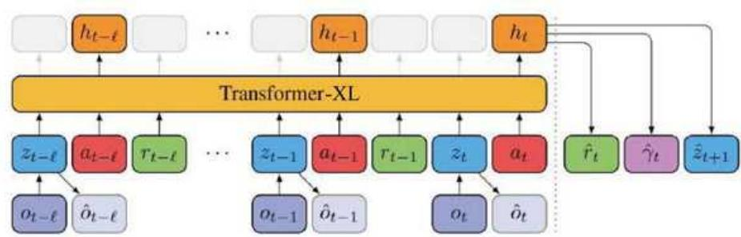  
图6.6 TWM采用Transformer-XL作为世界模型主干架构 [5]

# 6.3.3 STORM

STORM [6] 的诞生要比IRIS和TWM晚几个月，它结合了Transformer强大的序列建模和生成能力与变分自编码器的随机特性。STORM在Atari 100k基准测试中取得的人类标准化得分创下了不使用前向搜索技术的最高纪录。此外，使用一块NVIDIA GeForce RTX 3090 显卡，仅需4.3小时即可在100K ENV 步骤的经验（约等于1.85小时的实时交互经验）上训练一个智能体，相较于以往的方法，展现出更高的效率。

参考文献[6]分析了IRIS和TWM可能存在的缺点：IRIS在时空结构上对大量的token进行注意力运算，这可能造成训练速度的大幅下降；而TWM将观测、动作以及奖励视作等价的token输入，在不同类型的数据上进行自注意力运算，这可能会对性能产生负面影响，并且token数量的增加会大大减慢训练速度。

STORM核心架构如图6.7所示，STORM与IRIS和TWM的主要区别如下。

● IRIS将一帧图像转换为多个token，而STORM仅使用一个随机潜变量表征一帧图像。  
● TWM采用了Transformer-XL架构，而STORM采用最普通的Transformer架构。  
● 对于序列建模，在输入给Transformer之前，STORM将观测和动作融合为一个token，而TWM将观测、动作和奖励视为三个分离且重要性一致的token。

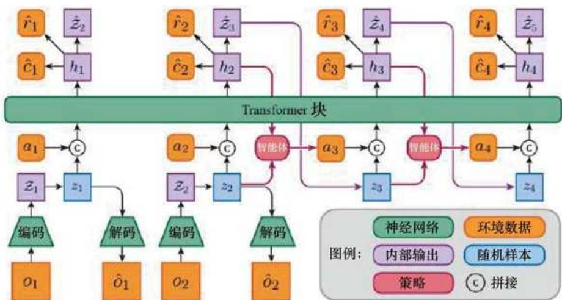  
图6.7 STORM核心架构 [6]

# 6.4 基于扩散模型的世界模型

实际上，近年来建模世界模型的方法往往将环境动力学建模为一个序列的离散潜变量。潜空间的离散化有助于避免在多步时间范围内产生更复杂的误差。但这种编码方法可能会丢失信息，导致模型在泛化和重建质量上性能下降。对于现实任务中的情况，这可能是有问题的，在更真实的情况下，任务所需的信息定义不太明确，例如训练自动驾驶汽车。此时，每一帧中的每一个像素都可能是对决策至关重要的信息，比如交通信号灯或与人行横道的距离。在这种情况下，能够良好建模高维多模态分布的扩散模型可能是实现世界模型的一个不错选择。

本节将介绍第一个基于扩散模型建模世界模型的智能体DIAMOND[7] ，DIAMOND分析了使扩散模型适合建模世界模型所需的关键设计选择，并证明了改进的视觉细节的确改善了策略的性能。

# 6.4.1 扩散范式的最佳实践

下面介绍DIAMOND实践中选择的扩散过程及其逆过程，并展示如何利用扩散模型建模世界模型的动力学。

与前面大多数智能体直接采用DDPM的做法不同，DIAMOND选择采用EDM建模世界模型，原作者还通过实验验证了选择EDM的优越性。

# 1.EDM

事实上，EDM设定扩散过程的漂移系数和扩散系数分别为 $f ( t ) = 0$ 和 $g ( t ) = \sqrt { 2 \dot { \sigma } ( t ) \sigma ( t ) }$ 。在这样的设定下，任意扩散时间步 t 下的加噪数据都服从分布 $p ( x _ { t } \mid x _ { 0 } ) = \mathcal { N } ( x _ { t } \mid x _ { 0 } , \sigma ^ { 2 } ( t ) I )$ 。

与DDPM利用神经网络建模去噪器的做法不同，EDM建模的是另一个函数。回顾第1章对降噪得分匹配算法的介绍，可知如果建模得分函数，则得分函数的训练损失函数如下：

$$
\mathcal {L} (\theta) = \mathbb {E} [ \| s _ {\theta} (x _ {t}, t) - \nabla_ {x _ {t}} \log p (x _ {t} | x _ {0}) \| ^ {2} ], \nabla_ {x _ {t}} \log p (x _ {t} | x _ {0}) = - \frac {x _ {t} - x _ {0}}{\sigma^ {2} (t)}
$$

（6.12）

EDM则建模函数 $D _ { \theta } ( x _ { t } , t ) = s _ { \theta } ( x _ { t } , t ) \sigma ^ { 2 } ( t ) + x _ { t }$ ，将其代入式（6.12），可以得到训练损失函数为

$$
\mathcal {L} (\theta) = \mathbb {E} [ \| D _ {\theta} (x _ {t}, t) - x _ {0} \| ^ {2} ] \tag {6.13}
$$

直接利用神经网络建模 $s _ { \theta }$ 存在一个缺点，当噪声水平 $\sigma$ 较大时，神经网络需要非常精细地调整其输出，以完全抵消现有的噪声，并在正确的尺度上给出输出。这意味着如果噪声较大，神经网络就必须非常精确地预测以消除噪声的影响。注意神经网络所犯的任何错误都会被 $\sigma$ 这个因子放大。因此，EDM认为直接预测期望的输出 $D _ { \theta } ( x _ { t } , t )$ 似乎更容易。

对于 $D _ { \theta } ( x _ { t } , t )$ 的具体建模，EDM建议使用一种依赖于 $\sigma$ 的跳跃连接来预处理神经网络，这种连接允许神经网络估计 $x _ { t }$ （目标信号）或 $\epsilon$ （噪声），或者它们之间的某种组合。本质上， $D _ { \theta } ( x _ { t } , t )$ 在EDM中被处理为一个残差网络。

$$
D _ {\theta} \left(x _ {t}, t\right) = c _ {\text {s k i p}} (\sigma (t)) x _ {t} + c _ {\text {o u t}} (\sigma (t)) F _ {\theta} \left(c _ {\text {i n}} (\sigma (t)) x _ {t}, c _ {\text {n o i s e}} (\sigma (t))\right) \tag {6.14}
$$

其中参数 $c _ { \mathrm { i n } }$ 和 $c _ { \mathrm { { o u t } } }$ 由噪声水平确定，用于确保在任意时间步 $_ t$ 下，神经网络 $F _ { \theta }$ 的输入输出保持单位方差。而 $c _ { \mathrm { s k i p } }$ 用于调节跳跃连接的权重，且 $c _ { \mathrm { s k i p } } = { \sigma _ { \mathrm { d a t a } } ^ { 2 } } / \left( \sigma _ { \mathrm { d a t a } } ^ { 2 } + \sigma ^ { 2 } ( t ) \right)$ ； $c _ { \mathrm { n o i s e } }$ 用于将当前噪声水平映射到作为条件变量的输入。

根据式（6.13），可以得到神经网络 $F _ { \theta }$ 的损失函数为

$$
\mathcal {L} (\theta) = \mathbb {E} \left[ \| F _ {\theta} \left(c _ {\text {i n}} (\sigma (t) x _ {t}, c _ {\text {n o i s e}} (\sigma (t))) - \frac {1}{c _ {\text {o u t}} (\sigma (t))} \left(x _ {0} - c _ {\text {s k i p}} (\sigma (t)) x _ {t} \right\| ^ {2}\right) \right] \tag {6.15}
$$

注意神经网络 $F _ { \theta }$ 的拟合目标会依据噪声水平适应性地混合 $x _ { 0 }$ 与噪声 $\epsilon$ 。当 $\sigma ( t )$ 远远大于 $\sigma _ { \mathrm { { d a t a } } }$ 时， $c _ { \mathrm { s k i p } }  0$ ，这意味着拟合目标会由未加噪的样本 $x _ { 0 }$ 所主导。当噪声水平很低时，$\sigma ( t )  0$ ，有 $c _ { \mathrm { s k i p } }  0$ ，这时拟合目标变为 $x _ { 0 }$ 与 $x _ { t }$ 的差异，即对 $x _ { 0 }$ 增加的高斯噪声。这种设计会使低噪声水平的训练变得不那么“容易”，注意当 $t \to 0$ 时， $\sigma ( t ) \to 0 , x _ { t } \to x _ { 0 }$ 。如果此时 $c _ { \mathrm { s k i p } } = 0$ ，则神经网络 $F _ { \theta }$ 容易忽略条件变量 $c _ { \mathrm { n o i s e } } ( \sigma ( t ) )$ ，而将所有输入 $x _ { t }$ 拟合到 $x _ { 0 }$ 。

实践中EDM根据经验选择从对数正态分布中采样噪声水平，以便将训练集中在中等噪声区域周围。

# 2.世界模型训练目标及模型设定

回到DIAMOND，根据EDM训练损失函数，容易得到DIAMOND训练损失函数为

$$
\mathcal {L} (\theta) = \mathbb {E} [ \| F _ {\theta} \left(c _ {\text {i n}} ^ {i} x _ {t} ^ {i}, y _ {i} ^ {i}\right)) - \frac {1}{c _ {\text {o u t}} ^ {i}} \left(x _ {t} ^ {0} - c _ {\text {s k i p}} ^ {i} x _ {t} ^ {i} \| ^ {2} \right] \tag {6.16}
$$

其中 $y _ { t } ^ { i } = ( c _ { \mathrm { n o i s e } } ^ { i } , x _ { \leqslant t } ^ { 0 } , a _ { \leqslant t } )$ ，为方便起见，这里将 $c _ { * } ( \sigma ( i ) )$ 记作 。我们沿用Plan Diffuser的记法，表示轨迹时间戳， $_ i$ 表示扩散时间戳。

至于神经网络 $F _ { \theta }$ 的建模，则采用标准的二维U-Net架构。DIAMOND会保存过去 L步的观测和动作，将观测按照图像通道维度拼接起来作为输入，并将动作通过适应性群归一化层（Adaptive Group Normalization Layer）输入U-Net残差网络。

除了神经网络 $F _ { \theta }$ ，DIAMOND还包含一个分离的、由CNN和LSTM构成的奖励模型 $R _ { \psi }$ ，用于预测奖励值和终止条件。强化学习智能体遵循Actor-Critic范式，由共享底层CNN-LSTM表征架构的 $\pi _ { \phi }$ 和 $V _ { \phi }$ 构成。

# 3.DIAMOND算法流程

DIAMOND算法流程如图6.8所示，可以看到整个循环包含4部分：collect_experience、update_diffusion_model 、 update_reward_end_model 和 update_actor_critic 。 其 中collect_experience会调用 $\pi _ { \phi }$ 与真实环境互动以收集经验；update_diffusion_model则基于收集到的真实数据训练 $D _ { \theta }$ ；update_reward_end_model用于训练 $R _ { \psi }$ ；而在update_actor_critic中，智能体完全与世界模型进行交互，并利用收集到的“想象的”经验更新策略和价值函数。

算法1：DIAMOND   
Procedure training_loop(): for epochs do collect_experience(steps_collect) for steps_diffusion_model do update_diffusion_model() for steps Reward_end_model do update Reward_end_model() for stepsActor_critic do updateActor_critic()   
Procedure collect_experience(n): $x_0^0\gets \mathrm{env}\cdot \mathrm{reset}()$ for $t = 0$ to $n - 1$ do Sample $a_{t}\sim \pi_{\phi}(a_{t}|x_{t}^{0})$ $x_{t + 1}^{0},r_{t},d_{t}\gets \mathrm{env}\cdot \mathrm{step}(a_{t})$ $\mathcal{D}\gets \mathcal{D}\cup \{x_t^0,a_t,r_t,d_t\}$ if $d_{t} = 1$ then $\begin{array}{rl}{\left[\begin{array}{l}{x_{t + 1}^{0}}\end{array}\right]}\leftarrow\mathrm{env}\cdot\mathrm{reset}()\end{array}$

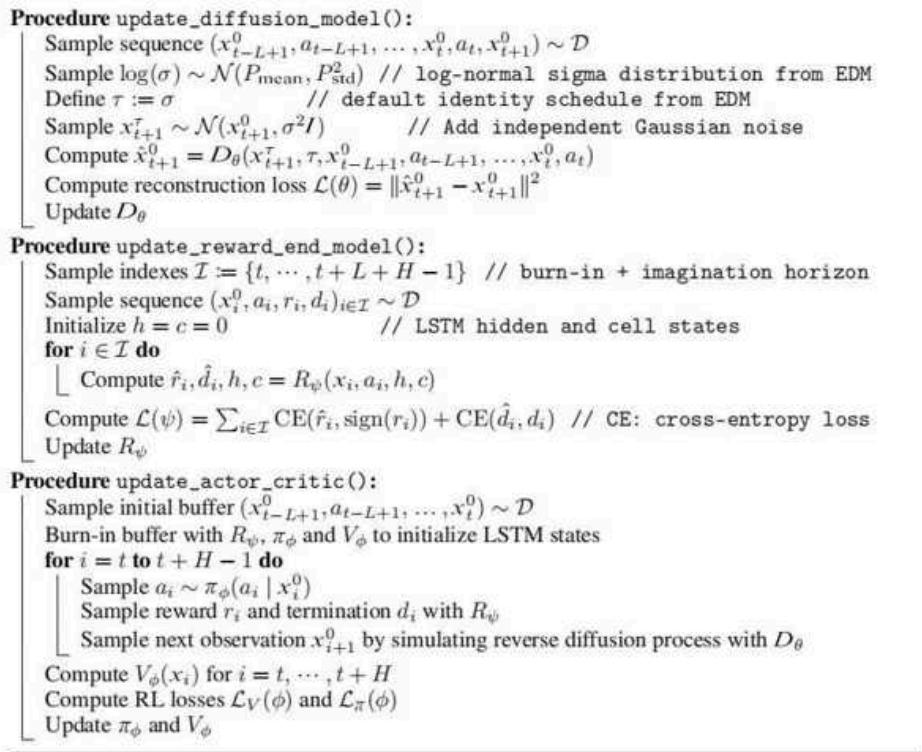  
图6.8 DIAMOND算法流程

# 6.4.2 实验结果

# 1.扩散范式的选择

DIAMOND通过实验验证了选择采用EDM的效果确实优于作为常规选择的DDPM，见表6.1。为了公平比较，可以让EDM和DDPM采用完全相同的网络结构，并基于专家策略对DIAMOND进行训练（训练在从游戏Breakout中收集的含有100 000帧静态图像的数据集上进行）。此外，为了在计算上与其他世界模型基线具有可比性（例如IRIS，每个时间步需要16个NFE），DIAMOND最多需要几十个NFE。遗憾的是，如果去噪步骤的数量设置得太少，视觉质量就会下降，导致复合错误。

表6.1　实验结果

<table><tr><td>游族</td><td>Random</td><td>Human</td><td>SimPLE</td><td>TWM</td><td>IRIS</td><td>DreamerV3</td><td>STORM</td><td>DIAMOND</td></tr><tr><td>Alien</td><td>227.8</td><td>7 127.7</td><td>616 716</td><td>674.6</td><td>420.0</td><td>959.0</td><td>983.6</td><td>724.1</td></tr><tr><td>Amidar</td><td>5.8</td><td>1 719.5</td><td>74.3</td><td>121.8</td><td>143.0</td><td>139.0</td><td>204.8</td><td>225.8</td></tr><tr><td>Assault</td><td>2 224</td><td>742.0</td><td>527.2</td><td>682.6</td><td>1 524.4</td><td>706.0</td><td>801.0</td><td>1 526.4</td></tr><tr><td>Asterix</td><td>210.0</td><td>8 503.3</td><td>1 128.3</td><td>1 116.6</td><td>853.6</td><td>932.0</td><td>1 028.0</td><td>3 698.5</td></tr><tr><td>BankHeist</td><td>14.2</td><td>753.1</td><td>34.2</td><td>46.7</td><td>53.1</td><td>649.0</td><td>641.2</td><td>19.7</td></tr><tr><td>BattCzonic</td><td>236.0</td><td>37 187.5</td><td>4 031.2</td><td>5 068.0</td><td>1 3074.0</td><td>12 250.0</td><td>13 540.0</td><td>4 772.0</td></tr><tr><td>Boxing</td><td>0.1</td><td>12.1</td><td>7.8</td><td>77.5</td><td>70.1</td><td>78.0</td><td>79.7</td><td>86.9</td></tr><tr><td>Breakout</td><td>1.7</td><td>30.5</td><td>16.4</td><td>20.0</td><td>83.7</td><td>31.0</td><td>15.9</td><td>132.5</td></tr><tr><td>ChopperCommand</td><td>811.0</td><td>7 387.8</td><td>979.4</td><td>1 697.4</td><td>1 565.0</td><td>420.0</td><td>1 888.0</td><td>1 369.8</td></tr><tr><td>CrazyClimber</td><td>10 780.5</td><td>35 829.4</td><td>62 583.6</td><td>71 820.4</td><td>59 324.2</td><td>97 190.0</td><td>66 776.0</td><td>99 167.8</td></tr><tr><td>DemonAttack</td><td>152.1</td><td>1 971.0</td><td>208.1</td><td>350.2</td><td>2 034.4</td><td>303.0</td><td>164.6</td><td>288.1</td></tr><tr><td>Freeway</td><td>0.0</td><td>29.6</td><td>16.7</td><td>24.3</td><td>35.1</td><td>0.0</td><td>33.5</td><td>37.3</td></tr><tr><td>Frostbite</td><td>65.2</td><td>4 334.7</td><td>236.9</td><td>1 475.6</td><td>259.1</td><td>909.0</td><td>1 316.0</td><td>274.1</td></tr><tr><td>Gopher</td><td>257.6</td><td>2 412.5</td><td>596.8</td><td>1 674.8</td><td>2 236.1</td><td>3 730.0</td><td>8 239.6</td><td>5 897.9</td></tr><tr><td>Hero</td><td>1 027.0</td><td>30 826.4</td><td>2 656.6</td><td>7 254.0</td><td>7 037.4</td><td>11 161.0</td><td>1 104.3</td><td>5 621.8</td></tr><tr><td>Jamesbond</td><td>29.0</td><td>302.8</td><td>100.5</td><td>362.4</td><td>462.7</td><td>445.0</td><td>509.0</td><td>427.4</td></tr><tr><td>Kangaroo</td><td>520</td><td>3 035.0</td><td>51.2</td><td>1 240.0</td><td>838.2</td><td>4 098.0</td><td>4 208.0</td><td>5 382.2</td></tr><tr><td>Knull</td><td>1 598.0</td><td>2 665.5</td><td>2 204.8</td><td>6 349.2</td><td>6 616.4</td><td>7 782.0</td><td>6 412.6</td><td>8 610.1</td></tr><tr><td>KungFuMaster</td><td>258.5</td><td>22 736.3</td><td>14 862.5</td><td>24 554.6</td><td>21 759.8</td><td>21 420.0</td><td>26 182.0</td><td>18 713.6</td></tr><tr><td>MsPacman</td><td>307.3</td><td>6 951.6</td><td>1 480.0</td><td>1 588.4</td><td>999.1</td><td>1 327.0</td><td>2 673.5</td><td>1 958.2</td></tr><tr><td>Pong</td><td>-20.7</td><td></td><td>12.8</td><td>18.8</td><td>14.6</td><td>18.0</td><td>11.3</td><td>20.4</td></tr><tr><td>PrivateEye</td><td>24.9</td><td>6 957.3</td><td>35.0</td><td>86.6</td><td>100.0</td><td>882.0</td><td>7 781.0</td><td>114.3</td></tr><tr><td>Qbert</td><td>163.9</td><td>13 455.0</td><td>1 288.8</td><td>3 330.8</td><td>745.7</td><td>3 405.0</td><td>4 522.5</td><td>4 499.3</td></tr><tr><td>RaalRunnea</td><td>11.5</td><td>7 845.0</td><td>5 640.6</td><td>9 109.0</td><td>9 614.6</td><td>15 565.0</td><td>17 564.0</td><td>20 673.2</td></tr><tr><td>Seaquest</td><td>68.4</td><td>42 054.7</td><td>683.3</td><td>774.4</td><td>661.3</td><td>618.0</td><td>525.2</td><td>551.2</td></tr><tr><td>UpDown</td><td>533.4</td><td>11 693.2</td><td>33 503</td><td>15 981.7</td><td>3 546.2</td><td>9 234.0</td><td>7 985.0</td><td>3 856.3</td></tr><tr><td>*SSuperhuman (T)</td><td></td><td></td><td></td><td></td><td></td><td></td><td>10</td><td>11</td></tr><tr><td>Mean (T)</td><td>0.000</td><td>1.000</td><td>0.332</td><td>0.958</td><td>1.046</td><td>1.097</td><td>1.266</td><td>1.459</td></tr><tr><td>IQM (T)</td><td>0.000</td><td>1.000</td><td>0.130</td><td>0.459</td><td>0.501</td><td>0.497</td><td>0.636</td><td>0.641</td></tr></table>

为了研究这两种扩散范式的稳定性，图6.9展示了自动回归生成的想象轨迹，最高可达 t$= 1 ~ 0 0 0$ 个时间步。可以看到，在这种设定下使用DDPM会导致严重的复合错误，导致世界模型迅速偏离分布［见图6.9（a）］。相比之下，基于EDM的扩散世界模型在很长一段时间内似乎要稳定得多［见图6.9（b）］，即使对于一个单一的去噪步骤也是如此。

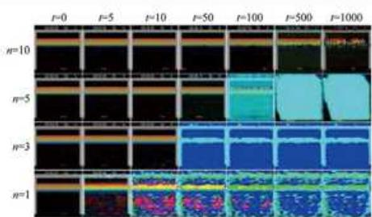  
（a）基于DDPM的世界模型轨迹

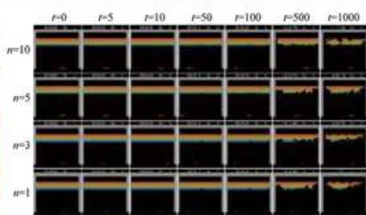  
（b）基于EDM的世界模型轨迹  
图6.9　自动回归生成的想象轨迹[7]

# 2.去噪步数的选择

虽然像Breakout这样的游戏具有确定性的状态转移，可以通过单个去噪步骤进行准确建模，但在其他游戏中，部分可观测性会产生多模态观测分布。在这种情况下，需要一个迭代的求解器来将采样过程推向分布中的一种特定模式。DIAMOND建议在所有实验中设置 $\scriptstyle n = 3$ 。

在Breakout游戏中，黑色拳击手的动作是不可预测的，因此单步去噪会在可能的结果和模糊的预测结果之间进行插值。相比之下，多步采样通过将采样过程推向特定模式来产生清晰的图像。有趣的是，动作输入控制着白色拳击手，因此其行为是世界模型所熟知的。此信息消除了任何歧义，因此可以观察到单步和多步采样都能正确预测白色拳击手的位置。

# 3.与IRIS的视觉质量对比

从图6.9中可以看到，与IRIS生成的轨迹相比，DIAMOND生成的轨迹通常具有更高的视觉质量，并且更符合真实环境。特别是，IRIS生成的轨迹包含帧之间的视觉不一致。这些不一致可能只代表生成图像中的几个像素，但它们可能会对强化学习产生重大影响。例如，由于智能体通常应该瞄准奖励并避开敌人，这些小的视觉差异可能会使学习最佳策略更具挑战性。

最后注意，这种改进不仅仅是计算量增加的结果。DIAMOND和IRIS使用相同的分辨率（ $6 4 { \times } 6 4$ 渲染帧），DIAMOND每帧只需要3个NFE，而IRIS每帧需要16个NFE。与IRIS相比，DIAMOND的参数要少得多，并且训练时间也更短。

# 参考文献

[1] HA D, SCHMIDHUBER J. World models[EB/OL]. arXiv: 1803.10122.   
[2] HAFNER D, PASUKONIS J, BA J, et al. Mastering diverse domains through world models[EB/OL]. arXiv: 2301.04104.   
[3] HAFNER D, LILLICRAP T, FISCHER I, et al. Learning latent dynamics for planning from pixels[C]//International Conference on Machine Learning. 2019: 2555-2565.   
[4] MICHELI V, ALONSO E, FLEURET F. Transformers are sample efficient world models[EB/OL]. arXiv: 2209.00588.   
[5] ROBINE J, HOFTMANN M, UELWER T, et al. Transformer-based world models are happy with 100k interactions[EB/OL]. arXiv: 2303.07109.   
[6] ZHANG W, WANG G, SUN J, et al. STORM: Efficient stochastic transformer based world models for reinforcement learning[EB/OL]. arXiv: 2310.09615.   
[7] ALONSO E, JELLEY A, MICHELI V, et al. Diffusion for world modeling: Visual details matter in atari[C]// Advances in Neural Information Processing Systems. 2024, 37: 58757-58791.

# 第7章反转：用强化学习来优化扩散模型

本章介绍如何将强化学习算法应用于扩散模型。

# 7.1 引言

前面探究了如何利用扩散模型强大的分布建模能力来解决一些传统强化学习算法难以解决的序列决策问题。扩散模型通过学习数据分布，能够高质量地生成我们想要的数据。然而在某些问题中，由于扩散模型主要以最大似然估计为目标进行训练，因此未必能优化我们真正关心的评估指标。

在扩散模型最广为人知的应用场景——文生图场景中，我们往往更关注输出的质量，例如流畅性、相关性、多样性等。因此，如何将这些期望的评估指标直接纳入模型优化目标，是提升生成质量的关键。本章将详细介绍如何利用强化学习算法，将人类主观反馈或其他评估指标作为奖励函数，以端到端的方式优化文本生成和图像生成扩散模型。通过本章的学习，读者将掌握如何使用强化学习算法来优化扩散模型，提高生成结果的质量。

# 7.2 DDPO：将去噪过程建模为序列决策过程

现如今，成熟的条件扩散模型已经可以较好地根据输入文本生成对应的图像，那么扩散模型还有哪些进一步的优化空间呢？回顾条件扩散模型的优化目标：

$$
\theta^ {*} = \underset {\theta} {\arg \min } - \mathbb {E} _ {x _ {0}, c} [ \log p _ {\theta} (x _ {0} \mid c) ] \tag {7.1}
$$

我们优化的是图像数据 $x _ { 0 }$ 在文本条件 $^ { c }$ 下似然估计的负对数。但在实践中，用户有时不会很在意训练数据的对数似然这一指标，而更在意生成结果的其他属性，比如人类感知的图像质量（Human-Perceived Image Quality，即使上述优化目标完成得很好，生成的图像也还是不能和提示词很好地对应）或者药物有效性（Drug Effectiveness，扩散模型也会被用在药物设计问题上）。除此之外，用户还可能有各式各样的需求，这些需求可以形式化为一个奖励模型 $r ( x _ { 0 } , c )$ ，它量化了生成结果对用户需求的满足程度。

为了让扩散模型直接满足任意目标函数（最大化任意奖励模型的输出），而不是仅仅建模匹配训练数据集的分布，专门针对扩散模型的调优算法DDPO（Denoising Diffusion PolicyOptimization）被提出。

让我们提前感受一下DDPO给扩散模型带来的影响。DDPO算法的作用如图7.1所示，如果我们直接使用现成的Stable Diffusion 1.4 并输入提示词“a raccoon washing dishes”，就会采样出最左边浣熊喝水的图片，这与我们期望的结果并不相符。但经过DDPO算法的训练，生成结果会逐渐与“浣熊洗碗”的含义对齐。

  
图7.1 DDPO算法的作用 [1]

DDPO算法需要两个前提条件：一个预训练好的扩散模型 $\mu _ { \theta } ( x _ { t } , c , t )$ 以及一个前文提到的奖励模型 $r ( x _ { 0 } , c )$ 。如式（7.2）所示，DDPO的目标便是最大化奖励模型的输出。

$$
\mathcal {J} _ {\mathrm {D D R L}} (\theta) = \mathbb {E} _ {c \sim p (c), x _ {0} \sim p _ {\theta} (x _ {0} | c)} [ r (x _ {0}, c) ] \tag {7.2}
$$

DDPO算法的设计基于两个方面：首先将图像去噪过程建模为一个多步MDP；然后利用成熟的策略优化算法优化扩散模型。

# 7.2.1 将扩散模型建模为多步MDP

作为一个六元组，MDP可以形式化为 $( S , \mathcal { A } , \rho _ { 0 } , P , R )$ 。其中 $s$ 是状态空间， $\boldsymbol { A }$ 是动作空间， $\rho _ { 0 }$ 是初始状态分布， $\pmb { P }$ 是状态转移矩阵， $R$ 是奖励函数。强化学习的优化目标便是最大化策略的累积收益：

$$
\mathcal {J} _ {\mathrm {R L}} (\pi) = \mathbb {E} _ {\tau \sim p (\tau | \pi)} \left[ \sum_ {t = 0} ^ {T} R \left(s _ {t}, a _ {t}\right) \right] \tag {7.3}
$$

DDPO按照如下方式将扩散模型的多步去噪过程与MDP联系了起来。

● $s _ { t } \triangleq ( c , t , x _ { t } )$ 。每一步的状态被定义为一个元组，其中包含条件变量、去噪时间步以及当前时间步的去噪结果。  
● $\pi ( a _ { t } \mid s _ { t } ) \triangleq p _ { \theta } ( x _ { t - 1 } \mid x _ { t } , \mathbf { c } )$ 。自然地，策略便是在给定当前状态情况下的下一步去噪结果的条件分布。  
● $a _ { t } \triangleq x _ { t - 1 }$ 。动作则是下一步的去噪结果。  
● $P ( s _ { t + 1 } | s _ { t } , a _ { t } ) \triangleq ( \delta _ { c } , \delta _ { t - 1 } , \delta _ { x _ { t + 1 } } )$ 。在去噪过程中，在采样出下一步去噪结果 $x _ { t - 1 }$ 后，状态的转移便是确定性的。因此，这里用三个 $\delta$ 分布来表示状态转移概率。  
● $\rho _ { 0 } ( s _ { 0 } ) \triangleq ( p ( c ) , \delta _ { T } , \mathcal { N } ( 0 , I ) )$ 。对于初始状态分布，条件变量 $^ { c }$ 服从其先验分布，时间步 $T$ 是确定的， $x _ { T }$ 则服从标准高斯噪声分布。  
$R ( s _ { t } , a _ { t } ) \triangleq { \left\{ \begin{array} { l l } { r ( x _ { 0 } , c ) , } & { t = 0 } \\ { 0 , } & { { \mathrm { ~ j t } } \backslash { \mathrm { ~ } } t { \mathrm { ~ i f } } } \end{array} \right. }$ 。在去噪过程中，只有最终的去噪结果会依据前文提到的奖励模型获得一个分数，去噪过程中的奖励值则定义为0。

注意，上述 的时间戳是从0到 $T$ ，对应去噪过程的时间戳则是从 $T$ 到0。

至此，我们完成了扩散模型去噪过程与MDP的对齐，从而使优化目标 $\mathcal { I } _ { \mathrm { D D R I . } }$ 等价于 ${ \mathcal { I } } _ { \mathbb { R } }$ 。接下来介绍如何将强化学习领域成熟的策略梯度算法应用到扩散模型的优化过程中。

# 7.2.2 策略梯度估计

为了优化 $\mathcal { I } _ { \mathrm { D D R I } }$ ，我们需要估计它的梯度 $\nabla _ { \boldsymbol { \theta } } \mathcal { I } _ { \mathrm { D D R L } ^ { \circ } }$ 原论文中对 $\nabla _ { \boldsymbol { \theta } } \mathcal { I } _ { \mathrm { D D R L } }$ 的估计源于强化学习领域两个十分经典的算法：REINFORCE和PPO。相应地，也就有了两个版本的DDPO，分别称为 $\mathrm { D D P O _ { S F } }$ 和 $\mathrm { \ D D P O _ { 1 s } }$ 。

$\mathrm { D D P O } _ { \mathrm { S F } }$ 对 $\mathcal { I } _ { \mathrm { D D R I . } }$ 梯度的估计如下：

$$
\nabla_ {\theta} \mathcal {J} _ {\mathrm {D D R L}} = \mathbb {E} \left[ \nabla_ {\theta} \log p _ {\theta} \left(x _ {t - 1} \mid x _ {t}, c\right) r \left(x _ {0}, c\right) \right] \tag {7.4}
$$

这里假设读者对策略梯度定理已有所了解，它的推导过程源于算法REINFORCE。注意式（7.4）中的 $r ( x _ { 0 } , c ) = \sum _ { t = 0 } ^ { T } R ( s _ { t } , a _ { t } )$ 。

$\mathrm { \ D D P O _ { 1 s } }$ 对 $\mathcal { I } _ { \mathrm { D D R I } }$ 梯度的估计如下：

$$
\nabla_ {\theta} \mathcal {I} _ {\mathrm {D D R L}} = \mathbb {E} \left[ \operatorname {c l i p} \left(\frac {p _ {\theta} \left(x _ {t - 1} \mid x _ {t} , c\right)}{p _ {\theta_ {m}} \left(x _ {t - 1} \mid x _ {t} , c\right)}, 1 - \epsilon , 1 + \epsilon\right) \nabla_ {\theta} \log p _ {\theta} \left(x _ {t - 1} \mid x _ {t}, c\right) r \left(x _ {0}, c\right) \right] \tag {7.5}
$$

Schulman等人于2015年提出的TRPO算法，以及于2017年提出的PPO算法，是对策略梯度估计一类强化学习算法的重大改进。通过重要性采样和信赖域（Trust Region）约束，PPO/TRPO算法相比REINFORCE算法极大地提高了采样效率。

得到 $\nabla _ { \boldsymbol { \theta } } \mathcal { I } _ { \mathrm { D D R L } }$ 的估计值以后，通过应用各种梯度下降算法，便可以优化扩散模型的神经网络参数，以最大化 $\mathcal { I } _ { \mathrm { D D R I . } }$ 。

# 7.2.3 各种奖励模型下的采样表现

下面展示在以各种指标作为奖励函数的情况下，经过DDPO算法优化后的T2I扩散模型的采样表现。

# 1.压缩性和反压缩性

T2I扩散模型的能力受到文本和图像在其训练分布中共同出现次数的限制。举个例子，对于扩散模型预训练的训练集，与图像相匹配的文本（也就是图像的标题文件名）很少带有图像大小的信息。这就导致在使用扩散模型生成图像时，很难通过提供文件大小的提示词采样出相应大小的图像。预训练模型的这一限制使得基于文件大小的奖励函数成为一个方便的研究示例：图像大小易于计算，但无法通过最大化似然估计和提示工程的传统方法控制采样结果。

之后的实验基于预训练模型Stable Diffusion 1.4，其中U-Net输出大小固定为 $5 1 2 { \times } 5 1 2$ 。这里读者可能有些疑惑，网络结构已经决定了图像大小， 难道还能改变输出大小？事实上，这里图像大小的量化指标不是像素数量，而是 $5 1 2 \times 5 1 2$ 大小的图像经过 压缩算法压缩后的文件大小。至于JPEG压缩算法，读者可以简单理解为图像细节越丰富（而不是像素数量越多），压缩后的文件越大，“图像大小”越大。

基于图像大小，DDPO定义了两种任务。

● 压缩性任务：采样结果经过JPEG压缩算法压缩后的文件越小越好。

● 反压缩性任务：采样结果经过JPEG压缩算法压缩后的文件越大越好。

如图7.2所示，随着DDPO算法针对图像的压缩性进行优化，采样结果会逐渐丢失各种不必要的细节。

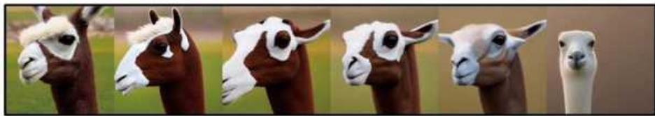  
图7.2　随着DDPO算法针对图像的压缩性进行优化，生成结果包含的细节越来越少，最后仅保留“羊驼”的含义 [1]

如图7.3所示，随着DDPO算法针对图像的反压缩性进行优化，采样结果会逐渐增加各种细节。

  
图7.3　随着DDPO算法针对图像的反压缩性进行优化，生成结果会包含更多的背景细节 [1]

# 2.艺术性

下面介绍一个比较实用的奖励模型，名为LAION aesthetics predictor。它是以CLIP图片编码为输入的一个线性模型，基于17 600张由人类打分的图片训练而成。训练集中各图片分数从1到10，其中评分较高的往往是艺术作品。之后的实验会对扩散模型的采样结果进行评分，分数越高，图片的艺术性越强。若以LAION aesthetics predictor作为DDPO奖励模型，预计调优后的采样结果更具艺术性。图7.4展示了定性描述RLfinetune在不同奖励函数下的影响。

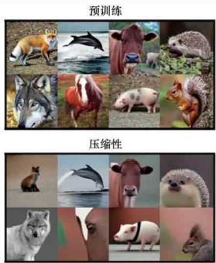

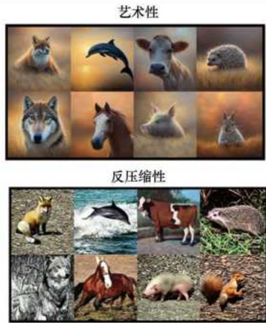  
图7.4　定性描述RL finetune在不同奖励函数下的影响 [1]

DDPO将自然图像转换为更具艺术性的图片，以最大限度地提高艺术性，以及删除背景内容并应用前景平滑以最大限度地提高压缩性，同时添加高频噪声以最大限度地提高反压缩性。

# 3.自动生成提示词与视觉语言模型对齐

用于训练T2I扩散模型的一个非常通用的奖励函数旨在实现提示文本与图像的对齐。然而，定义提示文本与图像是否对齐的奖励是困难的，通常需要进行大规模的人工标记。可选择现有的VLM（Vision-Language Model，视觉语言模型）来取代额外的人工注释。

如图7.5所示，可选用SOTA模型LLaVA来描述图片中的内容。此外，用来调优扩散模型的奖励出自BERTSore模型，它通过对比扩散模型的提示文本与LLaVA输出的描述文本间的语义相似性，对包含提示文本的所有细节的采样结果给出了更高的奖励。

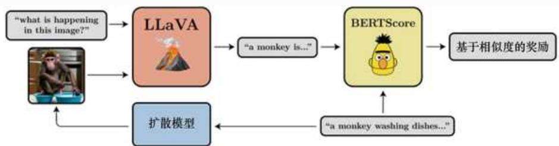  
图7.5　基于VLM的文本提示与图像对齐奖励函数示意图 [1]

LLaVA提供了生成图像的简短描述；奖励则代表这个描述和原始文本提示之间的相似度，由BERTScore度量。

# 7.3 Diffusion-DPO：运用于扩散模型的直接偏好优化

7.2节介绍了利用强化学习优化T2I扩散模型的DDPO，并展示了DDPO在各种奖励模型下的优化效果，如提升生成图像的压缩性、艺术性以及和提示文本的对齐程度。但是针对文本图像对齐（Text-To-Image Alignment）问题，DDPO仍存在不足。

为了借助DDPO对扩散模型进行优化，需要找到一种方法来度量扩散模型生成的图像内容是否与给定的文本提示相符。在DDPO原论文中，原作者开发了一条很长的管线用于定义奖励函数。如图7.5所示，给定文本提示“a monkey washing dishes…”，扩散模型会生成一张“猴子洗碗”的图片，之后需要借助预训练的视觉语言模型LLaVA来描述图片的内容。接下来借助BERTScore模型来判断LLaVA给出的描述与刚开始的文本提示“a monkey washingdishes…”是否一致。红框所示的部分可以形式化为一个奖励函数 $r ( c , x _ { 0 } )$ ，输入为文本提示和图片，输出为图像与文本提示一致性的某种度量。在DDPO算法中， $r ( c , x _ { 0 } )$ 作为奖励函数用于优化扩散模型，从而最终使扩散模型生成的图像内容与文本提示更加相符。

可以看到，这种文本图像对齐的优化需要两个额外的预训练模型LLaVA和BERTScore，这使得优化结果严重依赖于LLaVA和BERTScore的质量。有时候甚至存在reward hacking的现象，导致模型性能变得更差。

所谓reward hacking，是指某些情况下图片 $x _ { 0 }$ 与文本提示 c 实际上并不相符，但由于奖励函数 $r ( c , x _ { 0 } )$ 不够完美，以至于给出较高的奖励，使得扩散模型向着更差的方向优化。

近 年 来 ， 在 大 语 言 模 型 的 人 类 偏 好 对 齐 领 域 ， 一 种 名 为 DPO （ Direct PreferenceOptimization）的算法被提出。与RLHF（Reinforcement Learning from Human Feedback，基于人类反馈的强化学习）算法相比，DPO算法在某些实验中展现出更优异的性能。本节的核心内容出自论文 [2] “Diffusion Model Alignment Using Direct Preference Optimization”，旨在借助DPO算法更好地解决文本图像对齐问题，此处针对文本图像对齐问题的DPO被原作者命名为Diffusion-DPO。

# 7.3.1 从RLHF到DPO

# 1.RLHF

作为一种应用于大语言模型的人类偏好对齐领域的技术，RLHF包含如下两个阶段。

● 奖励建模：使用经过指令微调（Supervised Fine-Tuning，SFT）训练后的语言模型 $\pi ^ { \mathrm { s F T } }$ 生成回答对 $( y _ { 1 } , y _ { 2 } ) \sim \pi ^ { \mathrm { S F T } } ( y \vert x )$ ，然后通过人类标注者表达的偏好来拟合一个奖励模型 $r ( y , x )$ 。这个奖励模型反映了人类对不同回答的偏好。  
● 强化学习优化：使用强化学习算法［如PPO（Proximal Policy Optimization）］优化语言模型，使其生成的回答能够获得更高的奖励，同时又不偏离原始模型 $\pi ^ { \mathrm { s F T } }$ 太远。

# 2.DPO

作为一种新的偏好对齐方法，DPO依据人类偏好数据集直接优化语言模型，无须显式地建立奖励模型，省去了强化学习优化过程。

在大语言模型领域，语言模型可以形式化为 $\pi ( y | x )$ ， $_ x$ 为用户输入的问题， $y$ 为语言模型输出的答案。通过人工标注可以得到数据集 $\mathcal { M } = \{ ( x , y ^ { w } , y ^ { l } ) \}$ ，其中的每个样本包含两个答案，答案 $y ^ { w }$ 要好于答案 $y ^ { l }$ 。无论是RLHF还是DPO，优化的都是 $\pi ( y \vert x )$ ，目的是使其相较于答案$y ^ { l }$ 以更高概率输出答案 $y ^ { w }$ 。实际上这两种优化手段完全可以迁移到扩散模型领域以解决文本图像对齐问题，只需要进行如下符号转换即可。

● 问题到文本提示： $x \to c$ 。  
● 回答到生成的图片： $y  x _ { 0 }$   
● 语言模型到扩散模型： $\pi ( y \mid x ) \to p ( x _ { 0 } \mid c )$ 。  
● 对回答的偏好数据到对图片的偏好数据： $\mathcal { M } = \{ ( x , y ^ { w } , y ^ { l } ) \}  \mathcal { D } = \{ ( c , x _ { 0 } ^ { w } , x _ { 0 } ^ { l } ) \}$ 。

# 7.3.2 将RLHF用于文本图像对齐

RLHF包含奖励建模和强化学习优化两个阶段。

# 1.奖励建模

假设有一个人类偏好数据集 $\mathcal { D } = \{ ( c , x _ { 0 } ^ { w } , x _ { 0 } ^ { l } ) \}$ ，其中的每一个样本被形式化为 $( c , x _ { 0 } ^ { w } , x _ { 0 } ^ { l } )$ 。 $^ { c }$ 表示文本提示， $x _ { 0 } ^ { w }$ 和 $x _ { 0 } ^ { l }$ 表示一对图片，相比图片 $x _ { 0 } ^ { l }$ ，人类认为图片 $x _ { 0 } ^ { w }$ 的内容与文本提示 $^ { c }$ 更加相符。假设有一个待优化的奖励模型 $r _ { \phi } ( c , x _ { 0 } )$ ，根据 $r _ { \phi } ( c , x _ { 0 } )$ 可以建模出一个二分类模型：

$$
p _ {\mathrm {B T}} \left(x _ {0} ^ {w} > x _ {0} ^ {l} \mid c\right) = \sigma \left(r _ {\phi} \left(c, x _ {0} ^ {w}\right) - r _ {\phi} \left(c, x _ {0} ^ {l}\right)\right) \tag {7.6}
$$

其中 $\sigma$ 表示sigmoid函数。可以看到，输入一个样本 $( c , x _ { 0 } ^ { w } , x _ { 0 } ^ { l } ) , ~ p _ { \mathrm { B T } }$ $p _ { \mathtt { B T } }$ 能够输出图片 $x _ { 0 } ^ { w }$ 优于图片$x _ { 0 } ^ { l }$ 的概率。根据已经标好的数据集 $\mathcal { D } = \{ ( c , x _ { 0 } ^ { w } , x _ { 0 } ^ { l } ) \}$ ，容易想到可以通过优化二分类模型 $p _ { \mathrm { B T } }$ 来优化奖励函数 $r _ { \phi } ( c , x )$ 。根据二分类问题的交叉熵损失函数，可以得到 $r _ { \phi } ( c , x )$ 的优化目标为

$$
\mathcal {L} _ {\mathrm {B T}} (\phi) = - \mathbb {E} _ {c, x _ {0} ^ {w}, x _ {0} ^ {l}} [ \log \sigma (r _ {\phi} (c, x _ {0} ^ {w}) - r _ {\phi} (c, x _ {0} ^ {l})) ] \tag {7.7}
$$

但是，要想用人类偏好数据集 $\mathcal { D }$ 直接优化扩散模型 $p _ { \theta } ( x _ { 0 } \mid c )$ ，而不是显式地建模 $r _ { \phi } ( c , x )$ ，则需要推导出 $p _ { \theta } ( x _ { 0 } \mid c )$ 与 $r _ { \phi } ( c , x )$ 之间的关系。这样就可以用 $p _ { \theta } ( x _ { 0 } \mid c )$ 替换式（7.7）中的 $r _ { \phi } ( c , x )$ ，从而直接优化 $p _ { \theta }$ 了。

# 2.强化学习优化

RLHF的目标是优化条件分布 $p _ { \theta } ( x _ { 0 } \mid c )$ ，从而最大化下列目标函数：

$$
\mathbb {E} _ {c \sim \mathcal {D} _ {c}, x _ {0} \sim p _ {\theta} (x _ {0} | c)} [ r (c, x _ {0}) ] - \beta \mathbb {D} _ {\mathrm {K L}} [ p _ {\theta} (x _ {0} | c) \| p _ {\text {r e f}} (x _ {0} | c) ] \tag {7.8}
$$

式（7.8）的前半部分为最大化 $p _ { \theta } ( x _ { 0 } \mid c )$ 条件分布下奖励值的期望，对于文本图像对齐而言，就是希望优化后的扩散模型所生成的图像与文本提示更加相符；式（7.8）后半部分的KL散度正则项则约束了条件分布 $p _ { \theta } ( x _ { 0 } \mid c )$ 与某个先验分布的差别不要过大，对于文本图像对齐而言，可以理解为希望 $p _ { \theta } ( x _ { 0 } \mid c )$ 和优化前的扩散模型（如SDXL）差别不要过大；参数 $\beta$ 用来控制正则化程度。按照RLHF的做法，接下来需要调用PPO算法优化 $p _ { \theta }$ 以最大化式（7.8）所示的目标函数。

# 7.3.3 将DPO用于文本图像对齐

相较于RLHF，DPO无须显式地建立奖励模型，也无须调用PPO算法。下面详细介绍DPO技术原理。

实际上，最优 $p _ { \theta }$ 具有如下形式：

$$
p _ {\theta} ^ {*} \left(x _ {0} \mid c\right) = p _ {\text {r e f}} \left(x _ {0} \mid c\right) \exp \left(r \left(c, x _ {0}\right) / \beta\right) Z (c) \tag {7.9}
$$

其中 $\begin{array} { r } { Z ( c ) { = } \sum _ { x _ { 0 } } p _ { \mathrm { r e f } } ( x _ { 0 } | c ) { \exp ( r ( c , x _ { 0 } ) / \beta ) } } \end{array}$ 作为一个以 $^ { c }$ 为自变量的函数，保证了 $p _ { \theta } ^ { * } ( x _ { 0 } | c )$ 对 $x _ { 0 }$ 积分为1。

根据式（7.9），在给定奖励函数 $r ( c , x _ { 0 } )$ 后，可以得到最优 $p _ { \theta }$ 。反过来，给定条件分布$p _ { \theta } ^ { * } ( x _ { 0 } | c )$ ，可以得知它是某个 $r ( c , x _ { 0 } )$ 的最优 $p _ { \theta }$ ，且这个 $r ( c , x _ { 0 } )$ 由式（7.10）给出：

$$
r (c, x _ {0}) = \beta \log \frac {p _ {\theta} ^ {*} (x _ {0} \mid c)}{p _ {\mathrm {r e f}} (x _ {0} \mid c)} + \beta \log Z (c) \tag {7.10}
$$

因此，根据式（7.7），可以得到DPO的损失函数为

$$
\mathcal {L} _ {\mathrm {D P O}} (\theta) = - \mathbb {E} _ {c, x _ {i} ^ {*}, x _ {i} ^ {*}} \left[ \log \sigma \left(\beta \log \frac {p _ {\theta} \left(x _ {0} ^ {w} \mid c\right)}{p _ {\text {r e f}} \left(x _ {0} ^ {w} \mid c\right)} - \beta \log \frac {p _ {\theta} \left(x _ {0} ^ {j} \mid c\right)}{p _ {\text {r e f}} \left(x _ {0} ^ {j} \mid c\right)}\right) \right] \tag {7.11}
$$

可以看到，式（7.7）绕开了对 $r ( c , x _ { 0 } )$ 的参数化建模以及后续的强化学习过程，因而可以直接优化 $p _ { \theta } ( x _ { 0 } \vert c )$ 。

# 7.3.4 将DPO用于扩散模型优化

在将DPO技术应用于扩散模型时会带来一些挑战。观察式（7.11），可以发现其中的难点在于 $x _ { 0 }$ 的采样概率 $p _ { \theta } ( x _ { 0 } \vert c )$ 是不可计算的，因为计算 $p _ { \theta } ( x _ { 0 } \vert c )$ 需要对所有导向 $x _ { 0 }$ 的采样路径$( x _ { 1 } , \cdots , x _ { T } )$ 积分。为了克服这个问题，原论文转而优化目标函数的下界，即

$$
\arg \max  _ {p _ {\theta}} \mathbb {E} _ {c \sim \mathcal {D} _ {c}, x _ {0 T} \sim p _ {\theta} (x _ {0 T} | c)} [ r (c, x _ {0}) ] - \beta \mathbb {D} _ {\mathrm {K L}} [ p _ {\theta} (x _ {0: T} | c) \| p _ {\text {r e f}} (x _ {0: T} | c) ] \tag {7.12}
$$

可以看到，与围绕 $x _ { 0 }$ 的分布做优化相比，针对采样路径 $x _ { 0 : T }$ 的分布进行优化，可以进一步得到如下损失函数（后续推导中省略了条件变量 $^ { c }$ ）：

$$
\mathcal {L} _ {\text {D P O - D i f f u s i o n}} (\theta) = - \mathbb {E} _ {(x _ {0} ^ {w}, x _ {0} ^ {v}) \sim \mathcal {D}} \log \sigma \left(\beta \mathbb {E} _ {\substack {x _ {0} ^ {w} - P _ {0} (x _ {0} ^ {w}, | x _ {0} ^ {v}) , \\ x _ {0} ^ {v} - P _ {0} (x _ {0} ^ {v}, | x _ {0} ^ {v})}} \left[ \log \frac {p _ {\theta} (x _ {0 T} ^ {w})}{p _ {\text {r e f}} (x _ {0 T} ^ {w})} - \beta \log \frac {p _ {\theta} (x _ {0 T} ^ {I})}{p _ {\text {r e f}} (x _ {0 T} ^ {I})} \right]\right) \tag{7.13}
$$

推导到这里，又出现了两个难点。

●T往往很大（原论文设定 $\mathrm { { T } = 1 ~ 0 0 0 }$ ），这就导致利用蒙特卡洛采样方法估计损失函数时，对 $x _ { 1 : T }$ 采样不充分。  
● 而作为扩散模型 $p _ { \theta }$ 采样的逆过程， $p _ { \theta } ( x _ { 1 : T } )$ 在计算机数值精度上是无法计算的。 T 太大会导致 $p _ { \theta } ( x _ { 1 : T } ) = p _ { \theta } ( x _ { T } ) \Pi _ { t = 1 } ^ { T } p _ { \theta } ( x _ { t - 1 } | x _ { t } )$ 几乎等于0。

将式（7.13）中出现的联合分布 $p _ { \theta }$ 分解为 $p _ { \theta } ( x _ { 0 } \mid x _ { 1 } ) p _ { \theta } ( x _ { 1 } \mid x _ { 2 } ) \cdots p _ { \theta } ( x _ { T - 1 } \mid x _ { T } )$ $p _ { \theta } ( x _ { T - 1 } | x _ { T } )$ 的形式，利用詹森不等式和函数 $- \mathrm { l o g } \sigma$ 的凸性，可以得到 $\mathcal { L } _ { \mathrm { D P O - D i f f u s i o n } } ( \theta )$ 的上界：

$$
\begin{array}{l} \mathcal {L} _ {\text {D P O - D i f f u s i o n}} (\theta) \leqslant - \mathbb {E} _ {(x _ {0} ^ {w}, x _ {0} ^ {I}) \sim \mathcal {D}, t \sim u (0, T),} \\ x _ {t - 1, t} ^ {w} \sim P _ {\theta} \left(x _ {t - 1, t} ^ {w} \mid t _ {0} ^ {w}\right), x _ {t - 1, t} ^ {I} \sim P _ {\theta} \left(x _ {t - 1, t} ^ {I} \mid x _ {0} ^ {I}\right) \\ \log \sigma \left(\beta T \log \frac {p _ {\theta} \left(x _ {t - 1} ^ {w} \mid x _ {t} ^ {w}\right)}{p _ {\text {r e f}} \left(x _ {t - 1} ^ {w} \mid x _ {t} ^ {w}\right)} - \beta T \log \frac {p _ {\theta} \left(x _ {t - 1 , t} ^ {w} \mid x _ {t} ^ {w}\right)}{p _ {\text {r e f}} \left(x _ {t - 1} ^ {w} \mid x _ {t} ^ {w}\right)}\right) \end{array} \tag {7.14}
$$

现在可以对扩散模型每一次采样的分布参数计算梯度了。但观察式（7.14）中期望的下标，就会发现无法对扩散模型的逆过程采样，即无法获得 $x _ { t - 1 } , x _ { t } \sim p _ { \theta } ( x _ { t - 1 } , \ x _ { t } \mid x _ { 0 } , c )$ 。

原论文对此做出了让步，选择依据扩散过程 $q ( x _ { 1 : T } \mid x _ { 0 } )$ 进行采样以近似式（7.14）。将式（7.14）的期望下标替换为分布 ，经过一些推导整理，可以得到如下损失函数：

$$
\begin{array}{l} \mathcal {L} (\theta) = - \mathbb {E} _ {\left(x _ {0} ^ {w}, x _ {0} ^ {i}\right) \sim \mathcal {D}, t \sim u (0, T), x _ {t} ^ {w} \sim q \left(x _ {t} ^ {w} \mid x _ {0} ^ {w}\right), x _ {t} ^ {i} \sim q \left(x _ {t} ^ {i} \mid x _ {0} ^ {i}\right)} \log \sigma (- \beta T) \\ \mathbb {D} _ {\mathrm {K L}} \left(q \left(x _ {t - 1} ^ {w} \mid x _ {0, t} ^ {w}\right) \| p _ {\theta} \left(x _ {t - 1} ^ {w} \mid x _ {t} ^ {w}\right)\right) \\ \end{array}
$$

$$
\begin{array}{l} - \mathbb {D} _ {\mathrm {K L}} \left(q \left(x _ {t - 1} ^ {w} \mid x _ {0, t} ^ {w}\right) \| p _ {\text {r e f}} \left(x _ {t - 1} ^ {w} \mid x _ {t} ^ {w}\right)\right) \tag {7.15} \\ - \mathbb {D} _ {\mathrm {K L}} \left(q \left(x _ {t - 1} ^ {l} \mid x _ {0, t} ^ {l}\right) \| p _ {\theta} \left(x _ {t - 1} ^ {l} \mid x _ {t} ^ {l}\right)\right) \\ - \mathbb {D} _ {\mathrm {K L}} \left(q \left(x _ {t - 1} ^ {l} \mid x _ {0, t} ^ {l}\right) \| p _ {\text {r e f}} \left(x _ {t - 1} ^ {l} \mid x _ {t} ^ {l}\right)\right)) \\ \end{array}
$$

与推导扩散模型损失函数类似，可以进一步得到去噪网络 $\epsilon _ { \theta }$ 级别的损失函数：

$$
\begin{array}{l} \mathcal {L} (\theta) = - \mathbb {E} _ {\left(x _ {0} ^ {w}, x _ {0} ^ {j}\right) \sim \mathcal {D}, t \sim U (0, T), x _ {t} ^ {w} \sim q \left(x _ {t} ^ {w} \mid x _ {0} ^ {w}\right), x _ {t} ^ {j} \sim q \left(x _ {t} ^ {j} \mid x _ {0} ^ {j}\right)} \log \sigma (- \beta T w (\lambda_ {t}) \\ \left(\left\| \epsilon^ {w} - \epsilon_ {\theta} \left(x _ {t} ^ {w}, t\right) \right\| _ {2} ^ {2} - \left\| \epsilon^ {w} - \epsilon_ {\text {r e f}} \left(x _ {t} ^ {w}, t\right) \right\| _ {2} ^ {2}\right. \tag {7.16} \\ - \left(\left\| \epsilon^ {l} - \epsilon_ {\theta} \left(x _ {t} ^ {l}, t\right) \right\| _ {2} ^ {2} - \left\| \epsilon^ {l} - \epsilon_ {\text {r e f}} \left(x _ {t} ^ {l}, t\right) \right\| _ {2} ^ {2}\right)) \\ \end{array}
$$

其中 $\boldsymbol { x } _ { t } ^ { * } = \alpha _ { t } \boldsymbol { x } _ { 0 } ^ { * } + \sigma _ { t } \boldsymbol { \epsilon } ^ { * } , \boldsymbol { \epsilon } ^ { * } \sim \mathcal { N } ( 0 , \boldsymbol { I } )$ ，由前向扩散过程 $q ( x _ { t } ^ { * } | x _ { 0 } ^ { * } )$ 得到。 $\lambda _ { t } = \alpha _ { t } ^ { 2 } / \sigma _ { t } ^ { 2 }$ 是信噪比， $w ( \lambda _ { t } )$ 为调节权重的函数。

观察式（7.16）就会发现，训练时不会修改 $\epsilon _ { \mathrm { r e f } }$ ，因此对损失函数有影响的只有$\| \epsilon ^ { w } - \epsilon _ { \theta } ( x _ { t } ^ { w } , t ) \| _ { 2 } ^ { 2 }$ 和 $\| \epsilon ^ { l } - \epsilon _ { \theta } ( x _ { t } ^ { l } , t ) \| _ { 2 } ^ { 2 }$ ，其中 $\| \epsilon ^ { w } - \epsilon _ { \theta } ( x _ { t } ^ { w } , t ) \| _ { 2 } ^ { 2 }$ 越小的同时如果 $\| \epsilon ^ { l } - \epsilon _ { \theta } ( x _ { t } ^ { l } , t ) \| _ { 2 } ^ { 2 }$ 越大，则损失函数越小。可以定性地认为Diffusion-DPO的训练过程是在改善 $( x _ { 0 } ^ { w } , c )$ 的去噪过程，同时破坏 $( x _ { 0 } ^ { l } , c )$ 的去噪过程。

# 7.3.5 文本图像对齐实验

# 1.训练数据

原作者基于式（7.16）优化开源模型SDXL。选取的人类偏好数据集是Pick-a-Pic，其中包含由扩散模型SDXL-beta和Dreamlike（基于Stable Diffusion 1.5优化后的模型）生成的图片对。文本提示和“win/loss”标签来自Pick-a-Pic软件用户。剔除掉Pick-a-Pic数据集中大约 $12 \%$ 的图片对后（人类对这些图片对的偏好不够明显），剩余851 293个图片对，带有58 960个独一无二的文本提示。

# 2.评价指标

基于数据集PartiPrompt（包含1 632个文本提示）和HPSv2（包含3 200个文本提示），分别让SDXL和基于Diffusion-DPO技术优化后的DPO-SDXL生成这些文本提示所描述的图片。之后，原作者从Amazon MechanicalTurk雇用了数据标注员，基于三个指标评估模型生成的结果。

● General Preference：对于给定的文本提示，两张图片中你更喜欢哪张？  
● Visual Appeal：不考虑文本提示，两张图片中哪张更吸引你？  
● Prompt Alignment：两张图片中哪张更符合文本提示所描述的内容？

每个图片对由5个数据标注员参与投票，在每个指标下，投票大于或等于3票的图片被认为是更好的生成结果。

# 3.实验结果

实验结果如图7.6所示，可以看到在两种文本提示数据集和三种指标下，DPO-SDXL都是更好的一方。

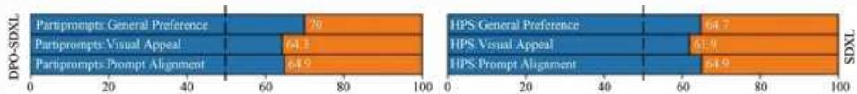  
图7.6 DPO-SDXL与SDXL在三种指标下的对比结果

图7.7展示了SDXL和DPO-SDXL的一些对比示例，DPO-SDXL的输出倾向于高对比度、鲜艳的颜色和更精细的细节，且更能捕捉到一些细微的文本细节。

  
图7.7 4种文本提示下，SDXL和DPO-SDXL的生成结果 [2]

如图7.8所示，与SDXL和SDXL+Refiner（一种基于SDXL的图生图模型，旨在提高生成结果的视觉质量，对于充满细节的背景和人像尤其有效）相比，对于人像生成，DPO-SDXL展示出更高质量的生成细节（牙齿、眼睛和手）。

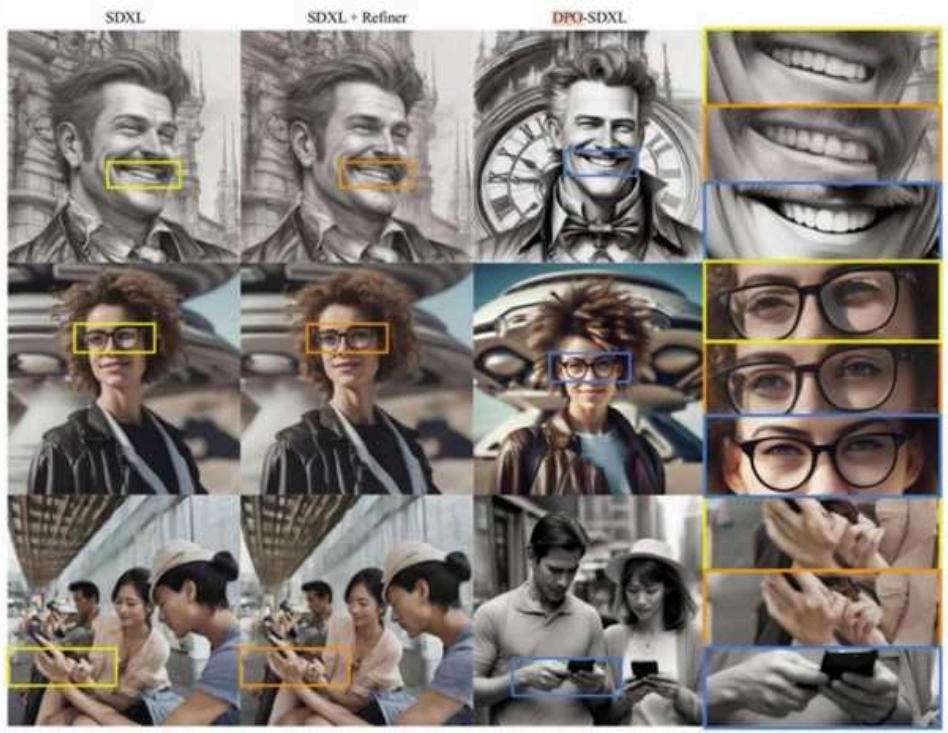  
图7.8　相比SDXL和SDXL+Refiner，DPO-SDXL能够更好地生成人像细节 [2]

# 7.3.6 从强化学习角度推导Diffusion-DPO

原论文没有直接比较Diffusion-DPO与其他文本图像对齐优化算法（如DDPO、DPOK）的性能，但原论文证明了可以继承DDPO中对MDP的设定，从多步异策略强化学习（multi-step off-policy RL）的角度推导出Diffusion-DPO的优化目标。与DDPO一致，Diffusion-DPO将扩散模型采样过程描述为如下MDP：

$$
s _ {t} \triangleq (c, x _ {t}, t)
$$

$$
a _ {t} \triangleq x _ {t}
$$

$$
\mathcal {P} \left(s _ {t + 1} \mid s _ {t}, a _ {t}\right) \triangleq \left(\delta_ {c}, \delta_ {t - 1}, \delta_ {x _ {t - 1}}\right) \tag {7.17}
$$

$$
\rho \left(s _ {0}\right) \triangleq \left(p (c), \delta_ {T}, \mathcal {N} (0, I)\right)
$$

$$
\mathcal {R} (s _ {t}, a _ {t}) = \left\{ \begin{array}{l l} r (c, x _ {0}), & \text {如 果} t = 0 \\ 0, & \text {其 他} \end{array} \right.
$$

不过，强化学习优化目标与DDPO不同，Diffusion-DPO会加入KL正则项，这与 一致：

$$
\mathbb {E} _ {c \sim \mathcal {D}, p _ {\theta}} \left[ \sum_ {t = T} ^ {0} r (c, x _ {t}) - \beta D _ {\mathrm {K L}} \left[ p _ {\theta} \left(x _ {t - 1} \mid x _ {t}, c\right) \| p _ {\text {r e f}} \left(x _ {t - 1} \mid x _ {t}, c\right) \right] \right] \tag {7.18}
$$

与论文“Control as Variational Inference”中的推导一致，我们可以得到式（7.19）～式（7.21）：

$$
Q ^ {*} \left(\left(x _ {t}, c\right), x _ {t - 1}\right) = r \left(c, x _ {t}\right) + V ^ {*} \left(x _ {t - 1}, c\right) \tag {7.19}
$$

$$
V ^ {*} (x _ {t - 1}, c) = \beta \log \mathbb {E} _ {p _ {\text {r e f}}} [ \mathrm {e} ^ {\mathcal {Q} ((x, c), x _ {t - 1}) / \beta} ] \tag {7.20}
$$

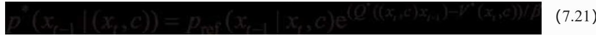

其中 $V ^ { * }$ 是最优值函数， $\boldsymbol { Q } ^ { * }$ 是最优动作价值函数，它们之间存在如下关系：

$$
r (c, x _ {t}) = V ^ {*} \left(x _ {t - 1}, c\right) - Q ^ {*} \left(\left(x _ {t}, c\right), x _ {t - 1}\right) \tag {7.22}
$$

根据式（7.20），可以得到：

$$
Q ^ {*} \left(\left(x _ {t}, c\right), x _ {t - 1}\right) - V ^ {*} \left(x _ {t}, c\right) = \log \frac {p ^ {*} \left(x _ {t - 1} \mid x _ {t} , c\right)}{p _ {\mathrm {r e f}} \left(x _ {t - 1} \mid x _ {t} , c\right)} \tag {7.23}
$$

将式（7.23）代入式（7.22），可以得到：

$$
r (c, x _ {t}) = V ^ {*} \left(x _ {t - 1}, c\right) + \log \frac {p ^ {*} \left(x _ {t - 1} \mid x _ {t} , c\right)}{p _ {\text {r e f}} \left(x _ {t - 1} \mid x _ {t} , c\right)} - V ^ {*} \left(x _ {t}, c\right) \tag {7.24}
$$

按照 t 从 T 到0代入式（7.24），可以得到 $T + 1$ 个等式，对等式的左右两边分别求和，可以得到：

$$
r (c, x _ {0}) = \sum_ {t = 0} ^ {T} \log \frac {p ^ {*} \left(x _ {t - 1} \mid x _ {t} , c\right)}{p _ {\text {r e f}} \left(x _ {t - 1} \mid x _ {t} , c\right)} - V ^ {*} \left(x _ {T}, c\right) \tag {7.25}
$$

可以看到，依据式（7.25），完全可以采用异策略强化学习算法优化得到 $p ^ { \star }$ 。

根据式（7.25），得到 $r ( c , x _ { 0 } ^ { w } )$ 和 ${ r } ( c , x _ { 0 } ^ { l } )$ 。将它们代入式（7.7），就可以得到DDPO的目标。再经过推导，便可以得到Diffusion-DPO的目标。但与DDPO和DPOK等同策略强化学习算法相比，Diffusion-DPO不再需要一条完整的采样轨迹 $( x _ { T } , \cdots , x _ { 0 } )$ ，而可以针对任意一步 $\scriptstyle t \sim u ( 0 , T )$ 的去噪过程优化模型，这极大简化了算法的优化逻辑。

# Diffusion-DPO损失函数伪代码

```python
def loss(model, ref_model, x_w, x_l, c, beta):
    # This is an example psuedo-code snippet for calculating the
    # Diffusion-DPO loss on a single image pair with corresponding
    # caption
model: Diffusion model that accepts prompt conditioning c and time conditioning t
    ref_model: Frozen initialization of model
    x_w: Preferred Image (latents in this work)
    x_l: Non-Preferred Image (latents in this work)
    c: Conditioning (text in this work)
    beta: Regularization Parameter
    returns: DPO loss value
    timestep = torch.randint(0, 1000)
    noise = torch.randn_like(x_w)
    noisy_x_w = add_noise(x_w, noise, t)
    noisy_x_l = add_noise(x_l, noise, t) 
```

```python
model_w_pred = model(noisy_x_w, c, t)  
model_1_pred = model(noisy_x_l, c, t)  
ref_w_pred = ref(noisy_x_w, c, t)  
ref_1_pred = ref(noisy_x_l, c, t)  
model_w_err = (model_w_pred - noise).norm().pow(2)  
model_1_err = (model_1_pred - noise).norm().pow(2)  
ref_w_err = (ref_w_pred - noise).norm().pow(2)  
ref_1_err = (ref_1_pred - noise).norm().pow(2)  
w_diff = model_w_err - ref_w_err  
l_diff = model_1_err - ref_1_err  
inside_term = -1 * beta * (w_diff - l_diff)  
loss = -1 * log(sigmoid(inside_term))  
return loss 
```

# 7.4 DRaFT：通过可微分奖励函数直接优化扩散模型

DRaFT能够基于给定的可微分奖励函数，直接优化扩散模型。由于能够直接端到端地计算扩散模型梯度，与DDPO相比，DRaFT具有更高的优化效率，但DRaFT要求奖励函数是可微分的。

# 7.4.1 DRaFT

DRaFT的目标是对预训练扩散模型的参数 $\theta$ 进行微调，以最大化可微分的奖励函数。目标函数如下：

$$
J (\theta) = \mathbb {E} _ {c \sim p _ {c}, x _ {T} \sim \mathcal {N} (0, I)} [ r (\text {s a m p l e} (\theta , c, x _ {T}), c) ] \tag {7.26}
$$

其中 $\operatorname { s a m p l e } ( \theta , c , x _ { T } )$ 表示给定提示文本 $^ { c }$ 下的采样过程（ $T \to 0$ ）。

首先考虑通过计算 $\nabla _ { \boldsymbol { \theta } } r ( \mathbf { s a m p l e } ( \boldsymbol { \theta } , c , x _ { T } ) , c )$ 并使用梯度上升优化式（7.26）所示的目标函数。计算这个梯度需要通过采样链中的多个扩散模型调用进行反向传播，类似于在递归神经网络中进行反向传播。回顾Diffusion-DPO，对于这个问题，Diffusion-DPO对原本的优化目标做了多次近似才得以优化到 $\theta$ 。与Diffusion-DPO不同，DRaFT采用两种技术来降低梯度计算的显存占用成本：低秩适应（Low-Rank Adaptation，LoRA）和梯度检查点。

# 1.LoRA

LoRA（低秩适应）不是对整个模型参数进行微调，而是冻结预训练模型的权重，并在原始模型的权重旁注入新的低秩权重矩阵，然后将其输出与预训练模型的输出相加以产生自适应的模型输出。数学上，对于具有权重矩阵 $W _ { 0 }$ 的层，将前向传播生成 $\pmb { h } = \pmb { W } _ { 0 } \pmb { x }$ ，LoRA适应层则是 $\pmb { h } = \pmb { W } _ { 0 } \pmb { x } + \pmb { B } \pmb { A } \pmb { x }$ ，其中 $\pmb { B A }$ 是一个低秩矩阵。LoRA极大减少了需要优化的参数数量，从而减少了微调的内存需求。另外，由于微调模型所学习到的信息包含在LoRA参数中，因此一方面可以通过采用LoRA参数的线性组合来组合多个奖励函数的优化效果。另一方面，通过缩放LoRA参数，我们可以获得预训练模型和微调模型之间的插值模型，从而方便地组合微调模型。

# 2.梯度检查点

梯度检查点通过只存储一部分激活值并动态重新计算其他激活值，降低了存储备份期间使用的激活值的显存占用成本。具体来说，就是只存储每个去噪步骤的潜在输入，并在反向传播期间重新计算U-Net激活值。

# 7.4.2 DRaFT-K

虽然梯度检查点可以在整个采样链中反向传播，但通过实验我们发现，仅通过最后 K 个采样步骤截断反向传播，可以显著提高优化速度和总体性能。原论文将这种方法命名为DRaFT-K，如图7.9所示。截断后，可通过减少通过U-Net的反向传播数量来减少每一步的计算开销。令人惊讶的是，这种方法还提高了每步的训练效率。对于较小的 K 值（例如， K$= 1$ ），展开的内存成本很小，因此不再需要梯度检查点。

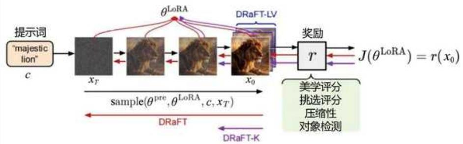  
图7.9 DRaFT-K技术原理 [3]

# 7.4.3 DRaFT-LV

原作者发现，简单地设置 $\mathrm { K } = 1$ （只通过最后一个采样步骤进行区分），即可在奖励和计算开销之间实现最好的权衡。在此，原作者提出了一种通过降低梯度估计的方差来进一步提高DRaFT-1效率的方法，并将这种低方差估计方法命名为DRaFT-LV。DRaFT-LV的核心思想是使用前向扩散过程产生额外的样本来训练，而非重新生成新的图像。具体来说，DRaFT-LV对生成的图像进行 n 次加噪，并将这些样本的奖励梯度相加。尽管DRaFT-LV通过U-Net和奖励模型添加了 n 个额外的前向和反向传播，但在实践中，与正常采样需要访问 T 次U-Net相比，这是相当小的开销。我们通过实验发现，设定 $\scriptstyle n = 2$ 的DRaFT-LV效率要比DRaFT-1高2倍左右，同时仅增加大约 $1 0 \%$ 的计算开销。

# 7.4.4 实验结果

如图7.10所示，可通过比较微调方法来提高LAION美学预测器给出的美学评分，该预测器被训练用于对图像进行美学评分。我们使用了从Black等人（2023年）那里得到的45个简单提示，其中每个提示都是一种常见动物的名字。横坐标表示奖励函数的访问次数，随着一次又一次地访问奖励函数并优化，这几种算法的奖励值都有所增加，并且可以观察到由于低方差梯度估计，DRaFT-LV相比DRaFT-1进一步提高了训练效率。而基于强化学习的DDPO却十分低效。

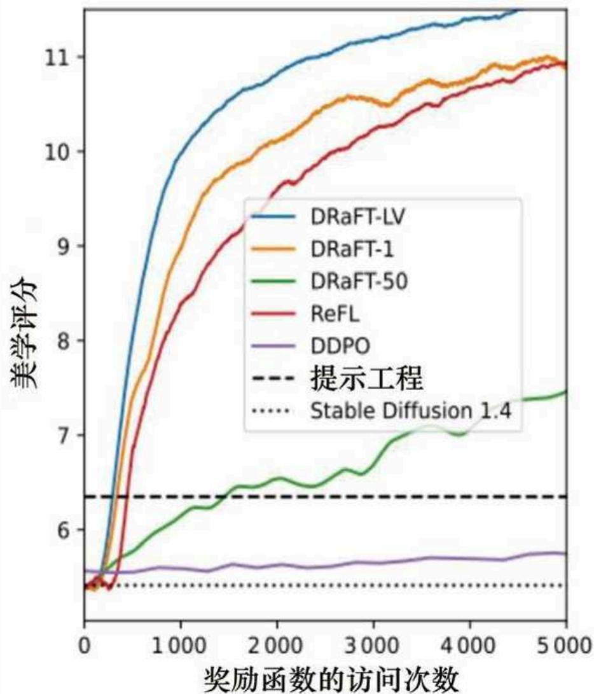  
图7.10　实验结果

此外，如图7.11所示，这些算法虽然最初产生了改进的图像，但最终却产生了非常相似的高回报图像，这呼应了7.3节介绍Diffusion-DPO时提及的reward hacking现象。

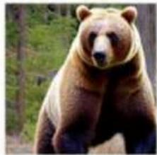  
奖励值为5.4（没有微调）

  
奖励值为7

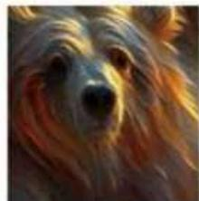  
奖励值为9

  
奖励值为11（奖励失效）


  
图7.11　经过LAION美学预测器微调后的采样结果 [3]

# 7.5 代码实战

回顾2.4节，我们实现了一个扩散模型，它能够依据不同条件采样出位于不同圆形区域的二维样本点。本节基于2.4节训练收敛后的扩散模型，采用两种方法微调扩散模型，并可视化微调后的采样结果，代码如下：

```python
import os  
import random  
import matplotlib  
import numpy as np  
from easydict import EasyDict  
from tqdm import tqdm  
from rich进步 import track 
```

```python
matplotlib.use("Agg")
import matplotlib.pyplot as plt
%matplotlib inline
import torch
from easydict import EasyDict 
```

```python
from grl.generator_models.diffusion_model.diffusion_model\ import DiffusionModel   
from grl.utils import set(seed   
from grl.utils.log import log 
```

```python
def visualize_samples(samples=np_array, color, marker, label):
    xCoords = samples=np_array[:, 0]
    yCoords = samples=np_array[:, 1]
    plt scatter(xCoords, yCoords, color=color,
                    marker=marker, label=label, alpha=0.2)
plt.title('Train DataSet')
plt.xlabel('X coordinate')
pltylabel('Y coordinate') 
```

```python
def calculate_rewards(batch_coordinates, target Coordinate): assert batch_coordinates.shape[1] == 2, "batch坐标应为二维" assert targetCoordinate.shape == (2,) "目标坐标应为二维" 
```

```txt
计算每个坐标与目标坐标的差值 differences = batch_coordinates - target_coordinates 
```

计算欧氏距离 distances $=$ torch(norm(differences, dim=1)

```txt
奖励函数  
rewards = torch.exp(- distances)  
return rewards
```

device $=$ torchdevice("cuda:0") if $\backslash$ torch.cuda.is-available() else torchdevice("cpu") $\mathrm{x\_size} = 2$ t_embedding_dim $= 32$ tEncoder $=$ dict( type $=$ "GaussianFourierProjectionTimeEncoder", args $\equiv$ dict( embed_dim $=$ t_embedding_dim, scale $= 30.0$ -

)   
c encoder $=$ dict( type="GaussianFourierProjectionEncoder", args $\equiv$ dict( embed_dim $\equiv$ t_embedding_dim, scale $= 30.0$ x_shape $= [2]$ ),   
)   
config $=$ EasyDict( dict device $\equiv$ device, diffusion_model $\equiv$ dict device $\equiv$ device, x_size=x_size, alpha $= 1.0$ solver $\equiv$ dict type $\equiv$ "ODESolver", args $\equiv$ dict ( library $\equiv$ "torchdyn", ), path $\equiv$ dict type $\equiv$ "linear_vp_sde", beta_0=0.1, beta_1=20.0, ), model $\equiv$ dict type $\equiv$ "noise_function", args $\equiv$ dict t Encoder $\equiv$ t Encoder, condition Encoder $=$ c Encoder, backbone $\equiv$ dict type $\equiv$ "TemporalSpatialResidualNet", args $\equiv$ dict hidden_sizes=[512,256,128], t_dim $\equiv$ t_embedding_dim, condition_dim $= 64$ condition Hidden_dim $= 32$ t_condition_hidwn_dim $= 256$ output_dim=x_size, ), ), parameter $\equiv$ dict( lr $= 1\mathrm{e - }4$ data_num $= 1000000$ iterations $= 10$ batch_size $= 4096$ clip_grad_norm $= 1.0$ eval_freq $= 500$ , checkpoint_freq $= 100$ , checkpoint_path $= "$ /checkpoint", video_save_path $= "$ /video", device $\equiv$ device, ),   
)   
)   
diffusion_model $=$ DiffusionModel(config $\equiv$ config.diffusion_model).to( config.diffusion_modeldevice   
diffusion_model $=$ torch.compile(diffusion_model)   
checkpoint_files $=$ [ f for f in os.listdir(config.parameter.checkpoint_path) if f.endsWith("\\.pt") ]

checkpoint $=$ torch.load( os.path.join(config.parameter.checkpoint_path, checkpoint_files[-1]), map_location $\equiv$ "cpu", ）   
diffusion_model.load_state_dict(checkpoint["model'])   
#optimizer.load_state_dict(checkpoint["optimizer")]   
optimizer $=$ torch.optim.Adam( diffusion_model.params(), lr $\equiv$ config.parameter.lr, ）   
last_iteration $=$ checkpoint["iteration"]   
num $= 4000$ con_00 $=$ torch.zeros((num,2))   
diffusion_model.eval()   
t spans $=$ torch.linspace(0.0,1.0,1000) $\mathrm{x\_t} = ( \begin{array}{l}\end{array} )$ diffusion_model.sample_forward_process(t.span $\coloneqq$ tSpan,\ condition $\equiv$ con_00.to(config_device).float()) .cpu() .detach()   
）   
res_00 $=$ x_t.cpu().numpy([-1]   
visualize_samples(res_00,'purple','*','OR')   
con_00 $=$ torch.zeros((64,2))   
t spans $=$ torch.linspace(0.0,1.0,1000)   
fig.axes $=$ plt.subplot(1, config_parameter_iterations,figsize=(40,4))   
for iteration in tqdm(range(config_parameterIterations)): x_t $=$ diffusion_model/sample_forward_process(t.span $\coloneqq$ tSpan,\ condition $\equiv$ con_00.to(config_device).float(), with_grad=True) $\mathrm{x\_0} = \mathrm{x\_t}[-1]$ #x_0,log_p $=$ diffusion_model/sample_with_log_prob(t-span $\equiv$ tSpan #condition $\equiv$ con_00.to(config_device).float(),with_grad=True) rewards $=$ calculate_rewards(x_0,torch.tensor([0,1.5]).to(x_0)) #print(-(\log_p\*rewards)) #loss $=$ -(\log_p\*rewards).mean()   
loss $=$ - rewards.mean() optimizer.zero_grad() loss.backup() print(loss) gradient_norm $=$ torch.nn.utils.clip_grad_norm_（ diffusion_model.params(), config_parameter.clip_grad_norm ） optimizer_STEP()   
num $= 4000$ diffusion_model.eval()   
t spans $=$ torch.linspace(0.0,1.0,1000)   
x_t $=$ ( diffusion_model.sample_forward_process(t.span $\coloneqq$ tSpan,\ condition $\equiv$ torch.zeros((num,2)).to(config_device).float())) .cpu() .detach() ）   
res_00 $=$ x_t.cpu().numpy([-1]   
axes[iteration].scatter(res_00[:0],res_00[:1],color $\coloneqq$ 'black'，s=10) axes[iteration].set_title(f'iteration {iteration}')   
plttight.layout()   
plt.show()

# 参考文献

[1] BLACK K, JANNER M, DU Y, et al. Training diffusion models with reinforcement learning[EB/OL]. arXiv: 2305.13301.   
[2] WALLACE B, DANG M, RAFAILOV R, et al. Diffusion model alignment using direct preference optimization[C]//Proceedings of the IEEE/CVF Conference on Computer Vision and Pattern Recognition. 2024: 8228-8238.   
[3] CLARK K, VICOL P, SWERSKY K, et al. Directly fine-tuning diffusion models on differentiable rewards[EB/OL]. arXiv: 2309.17400.

# 第8章

# 扩展：扩散模型在决策问题上的新进展

# 8.1 基于生成模型的强化学习策略

现如今，连续时间生成模型得到广泛的应用，本节介绍如何使用连续时间生成模型来设计和优化强化学习策略。

连续时间生成模型建模的强化学习策略与流模型一致，扩散模型是一种特殊的连续时间生成模型。除了使用扩散过程的逆过程作为连续时间生成模型的生成过程之外，一些学者也在尝试研究使用其他形式的生成路径。论文 [1] “Flow Matching for Generative Modeling”和 [2]“Flow Straight and Fast： Learning to Generate and Transfer Data with Rectified Flow”提出使用原分布采样点 $x _ { 0 } \sim p _ { r = 0 } ( x )$ 与目标分布采样点 $x _ { 1 } \sim p _ { r = 1 } ( x )$ 之间的直线路径的方向，作为流匹配的训练监督目标。

这 种 想 法 随 后 在 论 文  [3] “Improving and Generalizing Flow-based Generative Models withMinibatch Optimal Transport” 和  [4] “Multisample Flow Matching ： Straightening Flows withMinibatch Couplings”中得到进一步发展，更多类型的流匹配的监督目标被提出。比如基于小批量最优传输的流匹配等，它们取得了并不弱于扩散模型的生成效果，并在许多图像生成场景中得到应用。

在强化学习中，这类连续时间生成模型也可以用来设计和优化策略函数。这样做的好处已经在QGPO算法和Diffusion-QL算法中得到体现。只不过如何才能以一种更通用的方式来设计和优化这类策略函数，使之能够适用于这种包括扩散模型在内的更广义的连续时间生成模型，仍是一个值得探讨的问题。

现有的算法框架还不足以实现这一点，因为诸如QGPO算法等都是基于扩散模型的特定形式来设计的，无法直接推广到更广义的连续时间生成模型。尽管如此，我们还是可以借鉴其中的一些思想来设计更通用的连续时间生成模型的强化学习策略及其优化方法。

比如在离线强化学习中，策略优化经常表述为一种约束优化问题，并通过最大化回报来学习策略，同时使得策略的优化范围受到原行为策略的约束，这种约束通常可以通过KL散度来衡量：

$$
\pi^ {*} = \arg \max  _ {\pi} \mathbb {E} _ {s \sim \mathcal {D}, a \sim \pi (\cdot | s)} \left[ Q (s, a) - \frac {1}{\beta} \mathbb {D} _ {\mathrm {K L}} [ \pi (\cdot | s) \| \mu (\cdot | s) ] \right] \tag {8.1}
$$

这种方法可以确保学习到的策略尽可能不偏离原行为策略，从而避免外推误差降低性能。上述优化目标所对应的最优策略具有解析解：

$$
\pi^ {*} (a \mid s) = \frac {\mathrm {e} ^ {\beta (Q (s , a) - V (s))}}{Z (s)} \mu (a \mid s) \tag {8.2}
$$

其中 是归一化因子， $\beta$ 是温度系数。

实践中，我们可以构建一个参数化的神经网络策略 $\pi _ { \theta }$ 来近似最优策略 $\pi ^ { * }$ 。可以通过最小化KL散度来训练策略模型：

$$
\begin{array}{l} \mathcal {L} (\theta) = \mathbb {E} _ {s \sim \mathcal {D}} \left[ \mathbb {D} _ {\mathrm {K L}} \left[ \pi^ {*} (\cdot | s) \right| \mid \pi_ {\theta} (\cdot | s) \right] \\ = \mathbb {E} _ {s \sim \mathcal {D}, a \sim \mu (| s)} \left[ - \frac {\mathrm {e} ^ {\beta (Q (s , a) - V (s))}}{Z (s)} \log \pi_ {\theta} (a | s) \right] + C \tag {8.3} \\ \end{array}
$$

其中 $c$ 是一个不依赖于 $\theta$ 的常数。

也可以通过使用反向KL散度的形式来训练策略模型：

$$
\begin{array}{l} \mathcal {L} (\theta) = \mathbb {E} _ {s \rightarrow D} [ \mathbb {D} _ {\mathrm {K L}} [ \pi_ {\theta} (\cdot | s) \| \pi^ {*} (\cdot | s) ] ] \\ = \mathbb {E} _ {s \sim \mathcal {D}, a \sim \pi_ {\theta} (\cdot | s)} [ - \beta Q (s, a) + \mathbb {D} _ {\mathrm {K L}} [ \pi_ {\theta} (\cdot | s) \| \mu (\cdot | s) ] ] + C \tag {8.4} \\ \end{array}
$$

总的来说，QGPO算法具有正向KL散度的训练形式，它尝试通过对比能量预测法，对价值函数所对应的分布与生成策略的分布进行匹配。而Diffusion-QL算法具有反向KL散度的训练形式，它通过将其中的KL散度所对应的损失项直接替换为得分函数匹配的训练目标，让最终生成的策略在最大化 Q 函数的同时，也能够尽可能地匹配原行为策略。

# 1．基于优势函数加权回归的策略优化

使用连续时间生成模型作为策略函数建模，且基于正向KL散度的策略优化称为基于优势函数加权回归的策略优化，简称生成模型策略优化（Generative Model Policy Optimization，GMPO）。通过将优势函数的指数形式保留为重要性权重，并用生成模型的匹配损失替换对数似然项，可以推导出以下适用于包括扩散模型在内的所有连续时间生成模型的优势加权回归训练目标：

$$
\begin{array}{l} \mathcal {L} _ {\mathrm {G M P O}} (\theta) = \mathbb {E} _ {s \sim \mathcal {D}, a \sim \pi^ {*} (| s)} [ \mathcal {L} _ {\text {M a t c h i n g}} (\theta) ] \\ = \mathbb {E} _ {s \sim \mathcal {D}, a \sim \mu (\cdot | s)} \left[ \frac {\mathrm {e} ^ {\beta (Q (s , a) - V (s))}}{Z (s)} \mathcal {L} _ {\text {M a t c h i n g}} (\theta) \right] \tag {8.5} \\ \end{array}
$$

与QGPO不同的是，GMPO不一定需要对行为策略采集的数据进行增强，仅使用现有数据即可：

$$
\mathcal {L} _ {\mathrm {G M P O}} (\theta) = \mathbb {E} _ {(s, a) \sim \mathcal {D} _ {\mu}} \left[ \frac {\mathrm {e} ^ {\beta (Q (s , a) - V (s))}}{Z (s)} \mathcal {L} _ {\text {M a t c h i n g}} (\theta) \right] \tag {8.6}
$$

这可以免除策略的预训练阶段，并降低训练步骤的复杂性。

# 2．基于价值函数的策略梯度

使用连续时间生成模型作为策略函数建模，且基于反向KL散度的策略优化称为基于价值函数的策略梯度，简称生成模型策略梯度（Generative Model Policy Gradient，GMPG）。GMPG算法的训练目标可直接从式（8.4）推导得出。

作为原生的策略梯度方法，GMPG算法直接计算对数似然项，而不再像Diffusion-QL算法那样使用得分匹配损失替代对数似然项。

然而，由于扩散模型和流模型的前向采样过程均涉及在ODE求解器中求解初值问题，因此要在代码中高效计算梯度，就需要使用神经网络常微分方程（Neural ODE），并使用Hutchinson矩阵迹估计法来加速计算连续时间生成模型的策略的对数似然。

离线强化学习基线实验中的多个实验表明，GMPO与GMPG算法可以取得不弱于前沿主流算法的性能，而且它们还有着更为通用的模型适用范围与形式简洁性。

有关GMPO与GMPG算法的更多详细信息、基线实验与代码实践，请参阅GenerativeRL项目的GitHub仓库与说明文档。

# 8.2 决策基模型中的扩散模型

在人工智能领域，大语言模型的发展标志着自然语言处理技术的重大进步。这些大语言模型中的基模型，是构建复杂语言理解和生成系统的起点。在大语言模型中，基模型通常指的是预 训 练 的 语 言 模 型 ， 如 GPT （ Generative Pre-trained Transformer ） 系 列 模 型 和 BERT（Bidirectional Encoder Representations from Transformers）模型，它们通过大规模的文本数据集进行预训练，以学习语言的通用表示。

同样在计算机视觉领域，则有VGG、EfficientNet、CLIP等基模型。实践中除了直接微调，这些模型还会以各种方式被运用于其他任务，如提取输入图像的高级语义，以及直接利用模型的中间表示计算损失函数。此外，对于图像生成，基于各种扩散基模型并结合LoRA技术进行微调已经是很常见的手段。

对于决策任务场景，想要构建出一种能够适应某个决策场景下满足各种目标的基模型并不容易。需要怎样的训练数据集，如何设计策略模型，以及遵循怎样的训练策略，这些都是需要充分考虑的问题。现如今还未出现针对决策任务场景的基模型，但近年来有很多研究人员针对这一挑战性问题进行过尝试。特别是在扩散模型的广泛影响下，已有学者将扩散模型纳入决策基模型的设计中。本节将通过介绍三个来自DeepMind公司和加利福尼亚大学伯克利分校的研究成果，展示扩散模型在决策基模型中扮演的角色。

# 8.2.1 ViNT

实际上，ViNT[5]和8.2.2小节介绍的NoMaD都是加利福尼亚大学伯克利分校Levine团队的研究成果。

在构思ViNT前，Levine团队讨论了对于移动导航机器人，一个理想的基模型需要具备什么能力，并给出了机器人基模型的定义：

● 能够直接在一个新的、有效的场景下部署使用（比如不同的传感器、机器人型号、交互环境等）；  
● 能够适应下游的任务选择（比如不同的目标，以及不同的阐述目标的方式等）。

具体到基于视觉的移动导航机器人，一个通用的预训练机器人导航模型应该能够实现广泛的导航应用，随时允许对下游任务进行微调，并能够推广到广泛的环境和机器人型号。此外，这样的模型还应该提供一个广泛的导航策略，在此基础上可以构建特定领域的应用程序，新的机器人平台可以在使用少量数据进行微调后进一步改进。

对于ViNT，Levine团队给出了更清晰的任务定义：机器人需要导航至一个特定的位置，这个位置是通过一幅图像（即子目标图像）定义的。这幅图像代表了机器人在目标位置的观测结果。

进一步地，策略模型的输入和输出分别如下。

● 输入：当前帧和过去 P 帧的RGB图像观测值 $o _ { t } : o _ { t - P : t }$ 。  
● 输出：到达目标帧所需的步数，以及一个长度为 H 的向着目标帧前进的动作序列。

基于上述目标设计出的ViNT的策略模型如图8.1所示。可以看到，输入端存在两个EfficientNet，其中编码器 $\psi$ 负责将RGB图像观测值 $o _ { t } : o _ { t - P : t }$ 分别编码为一个个512维的token，而另一个编码器 $\phi$ 则将目标帧 $\sigma _ { g }$ 和当前帧 $o _ { t }$ 沿通道维度堆叠作为输入并得到目标token。之后目标token经过Transformer编码得到预测的到达步长和动作序列（图8.1中红色的输出方块表示到达步长，紫色方块表示动作序列）。

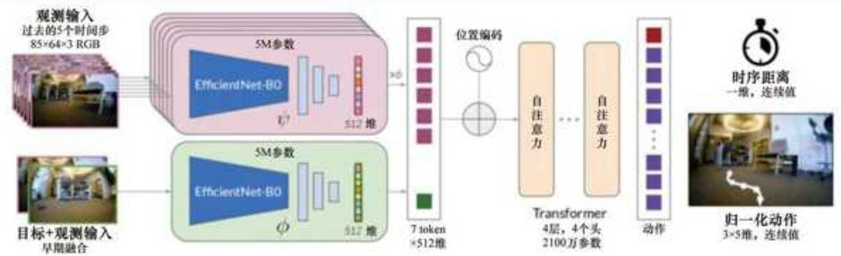  
图8.1 ViNT的策略模型 [5]

作为导航任务基模型，ViNT应当能够部署至任意型号的机器人，但不同型号的机器人所能执行的动作空间又不尽相同。因此，ViNT用相对路径点作为动作空间 $\hat { a }$ ，并通过根据机器人的最高速度缩放这些路径点来统一各型号机器人的动作空间。

ViNT的训练数据采用来自具有不同动态、行为和型号的机器人的异构导航轨迹，总共为100小时播放长度的机器人导航视频。

对于训练管线细节，则涉及如下步骤。

（1）从视频数据集 $D$ 中采样一个批次的轨迹 $\tau$ 。  
（2）随机选择 P 个相邻的观测，构成上下文观测序列 $o _ { t : t - P }$ 。  
（3）随机选择轨迹中位于 $o _ { t }$ 之后的观测作为目标观测 $o _ { g } \equiv o _ { t + d }$ ，其中 $d$ 从区间 $[ l _ { \mathrm { m i n } } , l _ { \mathrm { m a x } } ]$ 均匀随机采样。  
（4）将相应的 $o _ { t }$ 后续的 $\mathrm { H }$ 个动作 $\hat { a } : = a _ { r t + H }$ 和距离 $d$ 作为模型拟合的目标。  
（5）根据最大化似然估计得到如下损失函数，用于优化ViNT。

$$
\mathcal {L} _ {\mathrm {V I N T}} (\phi , \psi , f) = \mathbb {E} _ {t} \mathbb {E} _ {t} \mathbb {E} _ {d} [ \log p (\hat {a} | f (\phi (o) _ {t: t - P}, \phi (o _ {t}, o _ {s})) + \lambda \log p (d | f (\phi (o) _ {t: t - P}, \phi (o _ {t}, o _ {s})
$$

到了这里，读者可能会有如下疑问：预测到达目标观测所需的步长有什么用？实际上，这一信息是用于执行长距离导航任务的。上述策略模型经过训练后仅能支撑近距离导航任务，为了保证模型训练正常收敛以及模型大小方面的限制，模型预测输出的动作长度较短。实践中，Levine团队设定模型预测输出的动作长度为5。

为了解决长距离导航问题，考虑将一个可达目标的长距离导航任务拆分成一个个短距离导航任务，并假设这些短距离导航问题都是ViNT可解决的。于是问题集中于如何确定一个个短距离导航任务的子目标，并得到它们的图像帧，确保通过解决这些短距离导航问题就能够达到最终目标。实际上，Levine团队借助扩散模型和基于拓扑图的启发式最短距离算法实现了能够长距离导航的策略。

首先利用扩散模型对子目标条件分布进行建模。以数据集中某一图像帧为当前帧，将之后5$\sim 2 0$ 步的图像作为子目标帧，训练以图像为输入条件的扩散模型。具体来说，按照Saharia等人的做法，Levine团队将输入图像与每次去噪的对象按照通道维度简单拼接，整体作为U-Net的输入。ViNT扩散模型的U-Net结构如图8.2所示。

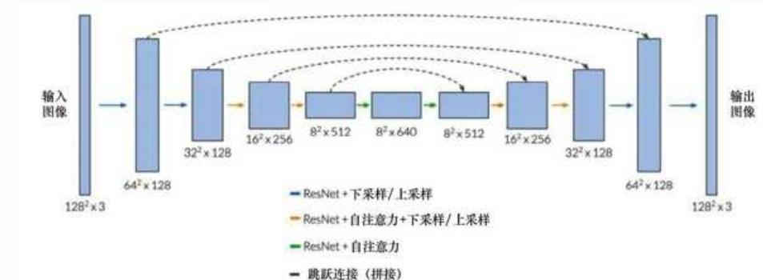  
图8.2 ViNT扩散模型的U-Net结构 [5]

基于ViNT扩散模型，我们可以通过图8.3鸟瞰整个算法流程。从中可以看出，首先给定当前帧，扩散模型会“想象”若干能够达到的子目标，并生成目标帧。之后ViNT作为下一个子模块会给出每一个可能达到的子目标的动作路径以及预测步长。最后调用一种启发式算法，对每一个子目标打分，最后选择分数最高的子目标执行ViNT输出的动作。下面简要介绍这种启发式算法基于启发式的拓扑规划 器 。

基于启发式的拓扑规划器可以抽象为一个打分函数 $h ( \boldsymbol { o } _ { t } , \boldsymbol { o } _ { s _ { i } } , G , \mathcal { M } , C )$ ，我们希望它能够针对选择的每一个子目标到达最终目标的可能性进行打分。其中 $o _ { t }$ 为当前帧， $o _ { s _ { i } } \in S$ 属于其中一个候选子目标。 $G$ 为最终目标位置， $\mathcal { M }$ 为一种拓扑图， $c$ 为一些其他的上下文信息（比如楼层平面图或卫星图像）。


拓扑图 $\mathcal { M }$ 是在算法执行过程中，随着机器人的不断探索而逐渐构造出来的。其中的点代表每一个独立的候选帧，两点间的有向边表示这两个观测点曾经通过ViNT抵达过，或是扩散模型预测的下一个可达的子目标。

$$
h \left(o _ {t}, o _ {s _ {i}}, G, \mathcal {M}, C\right) = d _ {\mathcal {M}} \left(o _ {t}, s ^ {-}\right) + d _ {\text {p r e d}} \left(s ^ {-}, s\right) + h (s, G, C) \tag {8.8}
$$

关于打分函数 $h ( o _ { t } , o _ { s _ { i } } , G , M , C )$ ，如式（8.8）所示，可从三个方面考虑一个候选子目标 $s$ 。其中$d _ { , i } ( o _ { t } , s ^ { - } )$ 度量的是 $o _ { t }$ 与 $s$ 的父节点 $s ^ { - }$ 之间的距离；而 $d _ { \mathrm { p r o d } } ( s ^ { - } , s )$ 度量的是ViNT预测的 $s ^ { - }$ 与 $s$ 之间的距离； $h ( s , G , C )$ 则根据不同的任务会有不同的设计。

● 覆盖式探索：在没有最终目标的情况下，我们希望机器人能够尽可能探索到所有未经过的地方，因此定义 $h \left( s \right) = 0$ 。  
● 二维坐标引导：对于户外GPS定位坐标或室内二维坐标，可以将 h ( s )定义为最终目标与子目标的欧几里得距离，即 $h ( s ) = \parallel s - G \parallel$ 。  
● 卫星地图引导：如果给定卫星地图这种上下文信息和最终目标位置，为每个候选子目标打分将更具有挑战性。Levine团队基于一种对比学习目标训练了一个卷积神经网络，用于预测子目标 $s$ 位于 $o _ { t }$ 到 $G$ 的路径中的概率。

这种基于拓扑图的长距离导航算法的伪代码如图8.4所示，类似于标准的A*算法的物理搜索，可通过维护一个可能的未访问子目标（由扩散模型生成）的开放集合 $\varOmega$ ，不断丰富拓扑图$\mathcal { M }$ 并最终到达目标位置 $G$ 。

算法1：基于拓扑图的长距离导航算法  
1: while goal $G$ not reached do  
2: $s \gets \min_f(\Omega)$ 3: $P \gets \text{ShortestPath}(\mathcal{M}, o_t, s^-)$ 4: for $(s, s')$ in $P$ do  
5: ViNT.GoToGoal(s');  
6: end for  
7: ViNT.GoToGoal(s)  
8: $o_t \gets \text{Observe}$ ;  
9: AddNode( $\mathcal{M}, o_t$ , parent: $s^-$ );  
10: Sample $s_i \sim g(s_i | o_t)$ ;  
11: Add( $\Omega, s_i$ );  
12: end while

图8.4　基于拓扑图的长距离导航算法的伪代码

# 8.2.2 NoMaD

NoMaD [6]与ViNT大体上非常相像。NoMaD的目标也是设计一个用于视觉导航的策略 $\pi$ ，将机器人当前和过去的RGB图像观测值 $o _ { t } : o _ { t - P x }$ 作为输入，输出机器人未来 H 步的动作 $\boldsymbol { a } _ { t } \mathrm { : = } \boldsymbol { a } _ { t + H }$ 。此外，策略 $\pi$ 还可以访问目标帧 $o _ { g }$ 的RGB图像，用于指定导航任务。当提供目标帧 $\sigma _ { g }$ 时，策略 $\pi$ 需要提供到达它的动作并最终成功抵达。在一个未见过的环境中，可能无法提供目标帧 $\sigma _ { g }$

，这时候策略 $\pi$ 需要采取安全合理的导航行动（例如避开障碍物、沿着走廊行动）来探索环境，并且需要提供对环境中的有效行为足够的覆盖范围。

NoMaD的策略模型如图8.5所示，前半部分结构与ViNT一致，输入端也由两个EfficientNet构成，分别形式化为 $\psi$ 和 $\phi$ 。两个图像编码模型分别负责将RBG图像观测值 $o _ { t } : o _ { t - P : t }$ 和目标帧 $o _ { g }$ 编码为token，作为Transformer的输入。与ViNT不同的是，NoMaD在训练时会以0.5的概率将目标帧 $\sigma _ { g }$ 置空，这么做的目的是让策略 $\pi$ 兼顾“目标导航”和“无目标探索” 。之后利用Transformer对7个token进行编码并平均池化，得到上下文编码信息 $c _ { t } = f ( \psi ( o _ { t } ) , \phi ( o _ { t } , o _ { g } ) , m )$ ，其中 $\pmb { m }$ 为掩码标记， $m = 1$ 表示将 $\phi ( o _ { t } , o _ { g } )$ 置零。

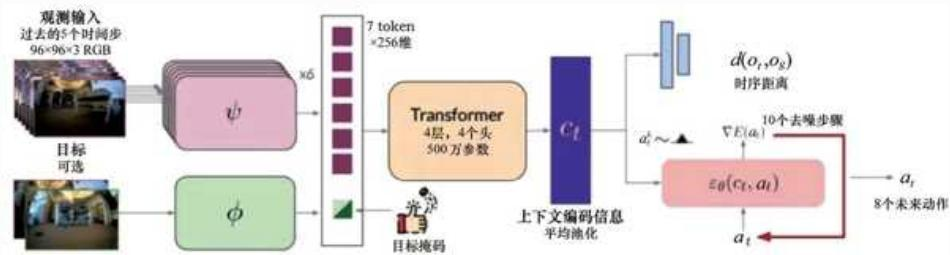  
图8.5 NoMaD的策略模型 [6]

虽然上述目标掩码方法允许以一种便利的方式将策略设置为目标图像，但由此产生的以目标图像为条件的动作条件分布可能非常复杂（特别是在没有提供目标的情况下）。例如，在一个交叉路口，该策略可能需要为左转弯和右转弯分配高概率，而为任何可能导致碰撞的动作分配低概率。想要训练一个单一的策略来模拟这种复杂的多模态分布是具有挑战性的。为了有效地模拟这种复杂的分布，NoMaD采用扩散模型来建模动作序列条件分布 $p ( a _ { t } | c _ { t } )$ 。ViNT则直接让Transformer输出动作。

观察NoMaD的策略模型，上下文编码信息 除了被用作后续扩散模型的条件输入，还被用于预测当前帧 $o _ { t }$ 与目标帧 $\sigma _ { g }$ 之间的距离。MoMaD采用MLP建模当前帧 $o _ { t }$ 与目标帧 $o _ { g }$ 直接的距离 $d ( o _ { t } , o _ { g } )$ 。这一点与ViNT一致，旨在为后续的长距离导航任务的启发式算法提供支持。

NoMaD是在GNM和SACSoN数据集的组合上进行训练的，这两个数据集是跨不同环境和机器人平台收集的大型异构数据集，其中包含大量行人的视频，视频播放长度超过100小时。NoMaD支持使用以下损失函数端到端地进行监督学习训练：

$$
\mathcal {L} _ {\text {N o M a D}} (\phi , \psi , f, \theta , f _ {d}) = \operatorname {M S E} \left(\epsilon^ {k}, \epsilon_ {\theta} \left(c _ {t}, a _ {t} ^ {0} + \epsilon^ {k}, k\right)\right) + \lambda \operatorname {M S E} \left(d \left(o _ {t}, o _ {g}\right), f _ {d} \left(c _ {t}\right)\right) \tag {8.9}
$$

其中 $f$ 表示Transformer， $\epsilon _ { \theta }$ 表示扩散模型，而 $f _ { d }$ 表示进行上述距离预测的神经网络层。则是一个控制时序距离损失的相对权重的超参数，实践中通常设定为 $1 0 ^ { - 4 }$ 。

回顾ViNT可以发现，NoMaD使用扩散模型的方式相比ViNT有很大的不同。ViNT训练了一个图像扩散模型（参数量为300M），它能够根据当前帧生成可抵达的子目标帧。而NoMaD没有生成子目标帧作为条件来产生动作，而是基于机器人的当前观测直接利用扩散模型建模动作。这样做的直接好处是模型参数量仅为ViNT的 ，作为一种更紧凑和有效的方法，NoMaD可以直接在搭载功能较弱的显卡（例如，NVIDIA Jetson Orin）的机器人上运行。

# 实验部分

除了ViNT，Levine团队还选择了其他几种算法用于对比分析。

● VIB：使用变分信息瓶颈来模拟以观测为条件的行动分布。  
● MaskedViNT：在ViNT的基础上，加入NoMaD的目标掩码技术，从而灵活地调整上下文编码信息 $c _ { t }$ 。MaskedViNT旨在预测以上下文编码信息 为条件的未来动作的点估计，而不是建模分布。  
●Autoregressive：在离散的动作空间中使用自回归预测来更好地表示多模态动作分布。实践中，可以将动作离散化，并基于分类建模动作分布。  
● Subgoal Diffusion：参数量是NoMaD的15倍。  
● Random Subgoals：Subgoal Diffusion的变体，旨在从训练集轨迹中随机采样一个候选子目标来代替子目标扩散模型，并将其传递给目标条件策略来预测探索行动。Random Subgoals不使用图像扩散模型，且具有与NoMaD相当的参数量。

图8.6直观地展示了以上算法在某具体场景下采样的动作序列。其中黄线表示这些算法在无目标情况下的采样结果，可以看到仅有NoMaD能够一致地表示多模态无向预测，同时避免与柱子或墙壁发生碰撞。蓝线和绿线则分别代表以上算法在两种目标图像下采样的动作路径，可以看到Subgoal Diffusion、Random Subgoals和Autoregressive只能执行单一模态的点估计，相当于学习策略的平均行动分布，导致采样出撞墙的动作序列。

作为主要实验，Levine团队比较了NoMaD和其他5个基线算法在6个具有挑战性的现实环境中探索和导航的性能。所有的实验都是在GNM和SACSoN数据集的组合上进行的，包含20个epoch的训练。测试时主要围绕策略模型的两种能力进行评价：

● 能够有效地探索一个新的环境，并寻找一个目标的位置；  
● 在之前探索过的环境中抵达一个由图像指示的目标，并且能够使用该策略创建一个拓扑图作为情景记忆。表8.1展示了NoMaD和其他5个基线算法的平均成功率和每轮实验的平均撞墙次数。

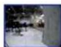  
目标1（左）

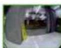  
目标2（右）

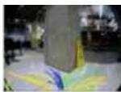

  
NoMaD

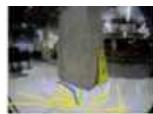

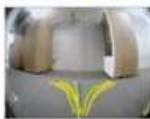  
Subgoal Diffusion

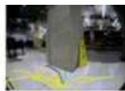

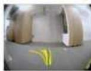  
RandomSubgoals

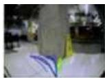

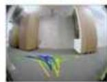  
Autoregressive   
图8.6　比较NoMaD和其他几种算法采样的动作序列 [6]

表8.1 NoMaD和其他5个基线算法的平均成功率和每轮实验的平均撞墙次数  

<table><tr><td rowspan="2">算法</td><td rowspan="2">参数量/万</td><td colspan="2">参数</td><td>导数</td></tr><tr><td>平均成功率</td><td>平均插值次数</td><td>平均成功率</td></tr><tr><td>Masked VINT</td><td>1500</td><td>50%</td><td>1.0</td><td>30%</td></tr><tr><td>ViB</td><td>600</td><td>30%</td><td>4.0</td><td>15%</td></tr><tr><td>Autoregressive</td><td>1900</td><td>90%</td><td>2.0</td><td>60%</td></tr><tr><td>Random Subgoats</td><td>3000</td><td>70%</td><td>2.7</td><td>90%</td></tr><tr><td>Subgoal Diffusion</td><td>33500</td><td>70%</td><td>1.7</td><td>90%</td></tr><tr><td>NoMaD</td><td>1900</td><td>98%</td><td>0.2</td><td>90%</td></tr></table>

从实验结果中可以看到，NoMaD始终优于所有基线算法，并能够产生平滑的、良好的策略。对于探索性目标发现，NoMaD在效率和避免碰撞方面都比最佳的基线算法（SubgoalDiffusion）高出 $2 5 \%$ 以上，并且在除最困难环境外的所有环境中都成功了。对于已知环境中的导航，通过使用拓扑图，NoMaD与最佳基线算法的性能差不多，同时仅需一个更小的模型，并且能够完全在边缘设备上运行（即不需要云平台或中心化服务器）。图8.7给出了NoMaD策略在搜索目标时探索未知的室内和室外环境的示例。

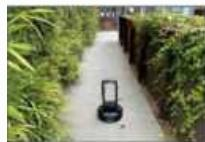

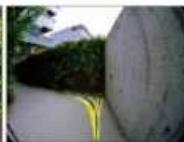

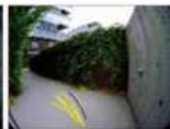

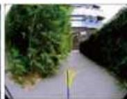

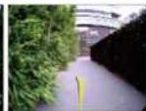

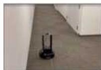

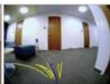


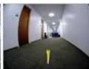

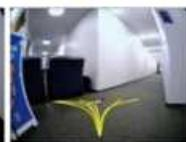  
图8.7 NoMaD策略示例 [6]

# 8.2.3 SuSIE

ViNT和NoMaD都是针对机器人导航的基模型，可以发现扩散模型在其中扮演着不同的角色。下面我们考虑扩散模型在机器人操作场景下的应用。

一个有用的多面手机器人必须能够像人一样识别和推理它以前从未遇到过的物体和场景。例如，假设指示机器人“递给我那个大号橙色蜡笔”，那么即使机器人以前从未与一个大号橙色蜡笔交互过，它也应当能够完成这一动作。换句话说，机器人不仅需要拥有操纵那个形状和大小的物体的物理能力，还需要拥有对其训练分布之外的物体进行推理的语义理解。尽管近年来机器人操作数据集越来越多，但它们不太可能包含每一个我们可以想到的对象和设置的实例，就像一个人的生活经历包含与每种类型的对象的物理交互一样。虽然这些数据集包含了足够多

的操纵细长圆柱形物体的例子，但它们缺乏广泛的语义知识，用于确定机器人在日常操作中将会遇到的特定物体。

作为一种机器人操作基模型，SuSIE [7]利用预先训练好的图像编辑模型来实现可推广的机器人操作。我们在视频数据上调整图像编辑模型，以便给定当前帧和当前任务的语言描述，SuSIE将生成一个“假想的”未来帧。这一方法并不要求模型精确理解机器人底层动力学的复杂性，因此有助于从其他数据源（例如人类视频）进行知识迁移，即便这些数据源中的底层物理交互和精确实体并不完全匹配。在测试阶段，SuSIE采用基于机器人数据训练的底层目标达成策略，来实现这一假想的未来帧；该策略只需要推断视觉-运动关系来确定正确的驱动行为，而无须理解上层语义。此外，这些子目标通过推断机械臂在中间子步骤中可能的姿态（例如抓取物体时的姿态，见图8.8），简化了任务。实验表明，即使现有方法具备足够的语义理解能力来解决任务，它们也常常因障碍物和物体的定位不精确而失败；遵循生成的子目标则使我们的方法在这些场景中表现出色。正如一个人在完成任务前先构建一个高层计划，再依靠肌肉记忆进行底层控制一样，SuSIE也可以视为先运行一个集成了语义推理和视觉理解的高层规划器，再交由底层控制器执行计划。

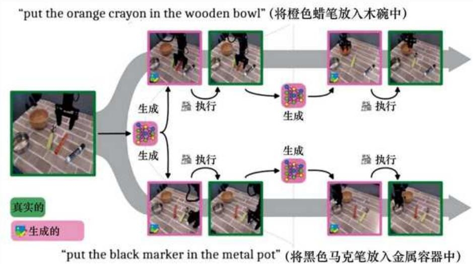  
图8.8 SuSIE技术原理 [7]

# 1.问题形式化定义

与机器人导航任务有所区别，SuSIE希望机器人能够完成一个用新的语言命令描述的任务。从训练数据集入手，现有的训练数据可以分为3类：第一类是带有语言标签的视频片段 $D _ { \iota }$ ，其中不包含机器人动作；第二类是同时包含语言标签和机器人动作的视频片段 $D _ { t , a }$ ；第三类是仅包含机器人动作的视频片段 $D _ { a }$ 。

形式上，将 $D _ { t , a }$ 定义为 $\{ ( \tau ^ { 1 } , l ^ { 1 } ) , ( \tau ^ { 2 } , l ^ { 2 } ) , \cdots , ( \tau ^ { N } , l ^ { N } ) \}$ ，其中每一个轨迹 $\tau ^ { n }$ 包含一个图像序列（或状态） $s _ { i } ^ { n } \in S$ ，以及一个收集数据时解析出来的动作序列 $a _ { i } ^ { n } \in { \mathcal { A } }$ ，比如 $\tau ^ { n } = \{ s _ { 0 } ^ { n } , a _ { 0 } ^ { n } , s _ { 1 } ^ { n } , a _ { 2 } ^ { n } , \cdots \}$ 。而 $l ^ { n }$ 表示语言命令，旨在描述轨迹所完成的任务。 $D _ { t }$ 和 $D _ { a }$ 的组织结构相似，但它们各自缺失了不同的元素： $D _ { t }$ 缺少机器人动作 $a _ { n }$ ，而 $D _ { a }$ 缺少语言标签 $l _ { n }$ 。在测试阶段，给定一个新的场景 $s _ { t } ^ { \mathrm { t e s t } }$ 和一个新的自然语言任务描述 $l _ { \mathrm { t e s t } }$ ，评估从这个新场景开始执行该任务的成功率。

# 2.思考与实现

SuSIE的最终目标是利用来自互联网的语义信息，提升语言引导的机器人在面对新的环境、场景和对象时的控制能力。当基于通用互联网数据训练的模型无法为选择底层动作提供指导时，该如何实现这一目标呢？SuSIE的核心思想在于，如果将机器人控制问题分解为两个阶段，就能有效利用预训练模型的能力：

● 生成为了成功完成任务所需达成的子目标；  
● 学习达成这些子目标的底层控制策略。

SuSIE在第一阶段通过在 $D _ { t } \cup D _ { t , a }$ 上微调一个文本引导的图像编辑模型，整合了来自互联网数据以及非机器人视频数据的语义信息。第二阶段则通过在 $D _ { t , a } \cup D _ { a }$ 上训练一个目标条件策略来实现。下面详细描述这两个阶段，并总结由此产生的算法。

阶段一，利用图像编辑模型生成子目标

阶段一的核心部分是一个生成模型，该生成模型在给定由自然语言指定的目标任务时，能够引导底层控制器达到推进任务的状态。实现这一点的一种方式是训练一个生成模型来生成下一个即时的子目标图像。宏观上，这个生成模型的作用与ViNT中的扩散模型类似。通过采用一个合适的预训练初始化模型，并在此基础上对包含机器人运行轨迹及其他网络视频的多样化、多任务视频数据进行微调，得以将互联网上的语义信息融入算法中。

那么，什么样的预训练初始化对这个生成模型来说是合适的呢？SuSIE对这一问题的回答是，完成一个任务相当于在语言指令规定的约束下“编辑”机器人工作空间的图像像素，因此一个好的预训练初始化可能由一个文本引导的图像编辑模型提供。SuSIE的作者采用InstructPix2Pix[8] 图像编辑模型来实例化这一方法，但也可以使用其他图像编辑模型。形式上，将该模型表示为 $p _ { \theta } ( s _ { \mathrm { o d i t d } } \mid s _ { \mathrm { o r i g } } , l )$ 。然后利用包含语言标签的视频片段和机器人轨迹的数据集 $D _ { l } \cup D _ { l , a }$ ，通过对 $p _ { \theta }$ 进行微调，得以在给定初始图像 $s _ { \mathrm { o n _ { B } } }$ 和语言标签 的情况下生成有效的子目标 $s _ { \mathrm { e d i t e d } }$ 。形式上，微调的训练目标由式（8.10）给出：

$$
\max  _ {\theta} \mathbb {E} _ {(\tau^ {n}, l ^ {n}) \sim D _ {l} \cup D _ {l, a}; s _ {i} ^ {n} \sim \tau^ {n}; j \sim q (j | i)} [ \log p _ {\theta} \left(s _ {j} ^ {n} \mid s _ {i} ^ {n}, l ^ {n}\right) ] \tag {8.10}
$$

其中 $q ( j | i )$ 这一条件分布可以有不同的选择，用于控制训练后的模型产生各种子目标的概率。SuSIE的作者希望扩散模型生成的子目标在未来与当前状态足够接近，接近到可以通过低级别策略达到，但又要够远，从而可以在任务中取得正向的进展。因此，考虑与数据集相关的超参数 $k _ { \mathrm { m i n } }$ 和 $k _ { \mathrm { m a x } }$ ，并建立条件分布 用于均匀地在未来的第 $k _ { \mathrm { m i n } }$ 步和第 $k _ { \mathrm { m a x } }$ 之间采样子目标：

$$
q (j \mid i) = U (j; [ i + k _ {\min }, i + k _ {\max } ]) \tag {8.11}
$$

阶段二，学习达成子目标的底层控制策略

为了利用精细的图像编辑模型来控制机器人，还需要训练一个底层的控制器来选择合适的机器人动作。下面介绍SuSIE底层控制器的设计。由于SuSIE中的图像编辑模型生成了基于自然语言任务描述的子目标，因此SuSIE的底层控制器仅仅是一个与语言无关的机器人控制策略。

如何训练底层控制器呢？首先将底层控制策略形式化为 $\pi _ { \phi } ( a | s _ { i } , s _ { j } )$ ，其中 $s _ { j }$ 是目标帧， $s _ { i }$ 是当前帧。测试时，因为阶段一的图像编辑模型被训练为在任何状态的 $k _ { \mathrm { m a x } }$ 步内产生子目标，所以需要底层控制策略熟练地到达距离当前状态 $k _ { \operatorname* { m a x } }$ 步内的状态。为了训练底层控制策略，SuSIE在机器人轨迹的数据集 $D _ { t , a } \cup D _ { a }$ 上执行目标条件行为克隆（Goal-Conditioned Behavioral Cloning，GCBC）。形式上，其训练目标由式（8.12）给出：

$$
\max  _ {\phi} \mathbb {E} _ {\tau^ {n} \sim D _ {t, a} \cup D _ {a}; \left(s _ {i} ^ {n}, a _ {i} ^ {n}\right) \sim \tau^ {n}; j \sim U ([ 0; k _ {\max } + k _ {\sigma} ])} \left[ \log \pi_ {\phi} \left(a _ {i} ^ {n} \mid s _ {i} ^ {n}, s _ {j} ^ {n}\right) \right] \tag {8.12}
$$

其中 $k _ { \sigma }$ 是另一个超参数。图像编辑模型并不完美，而且它并不总是能够产生在 $k _ { \mathrm { m a x } }$ 步内可达成的子目标，特别是对于机器人看不见的任务。

阶段三，基于 $\pi _ { \phi }$ 和 $p _ { \theta }$ 的测试时控制

经过上述两个阶段，可以得到子目标生成模型 $p _ { \theta }$ 和底层控制策略 $\pi _ { \phi }$ 。如图8.8所示，测试时可利用它们并基于用户指定的自然语言命令完成新的操作任务。给定一个新的测试场景 $s _ { 0 } ^ { \mathrm { t e s t } }$ 和一个语言命令 ，SuSIE试图通过迭代生成子目标并命令低级策略达成这些子目标来完成这个任务。首先，SuSIE采样第一个子目标 $\hat { s } _ { { \scriptscriptstyle + } } \sim p _ { \theta } ( s _ { { \scriptscriptstyle + } } | s _ { t } ^ { \mathrm { t e s t } } , l ^ { \mathrm { t e s t } } )$ 。然后，SuSIE基于 $\hat { s } _ { + } \mathcal { \bar { H } } \pi _ { \phi }$ 推出 $k _ { \mathrm { t e s t } }$ 步用于执行底层动作。在 $k _ { \mathrm { t e s t } }$ 步后，刷新当前状态并采样下一个子目标，之后则重复上述过程。实践中，SuSIE会将超参数 $k _ { \mathrm { t e s t } }$ 设置为与 $k _ { \mathrm { m a x } }$ 相近的数值，我们发现这足以获得良好的性能。整个测试时的控制流程由图8.9所示的算法给出。

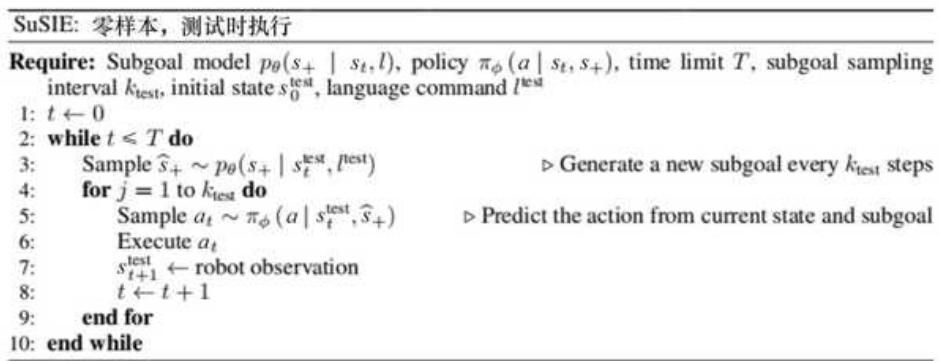  
图8.9 SuSIE测试时的控制算法

# 3.实验场景与比较

SuSIE的作者在WidowX 250机器人平台上进行了真实的机器人实验。使用的数据集是BridgeData V2，这是一个大型且多样化的机器人操作行为数据集，设计用于评估开放词汇表指令。该数据集包含超过60 000条的机器人轨迹，其中45 000条是有语言标签的，将其作为数据集$D _ { l , a }$ ，并将剩下的15 000条轨迹作为仅有机器人动作的数据集 $D _ { a }$ 。

仅包含视频片段的数据集 $D _ { \imath }$ 是Something-Something数据集——一个由人类操纵各种对象的短视频剪辑组成的数据集。SuSIE的作者选择Something-Something数据集是因为其中主要包含了使用静态相机框架的物体操作的例子，因此与其他包含大量以自我为中心运动的视频数据集相比，使用肩扛相机收集的机器人数据显示出更小的域差距。此外，SuSIE的作者删除了Something-Something数据集中包含以自我为中心运动或缺乏显著操作行为的轨迹，产生包含大约75 000个短视频剪辑的最终数据集。

如图8.10所示，SuSIE的评估呈现三个不同的场景，这些场景专门设计用于测试各种方法在不同程度的开放世界中的泛化能力。

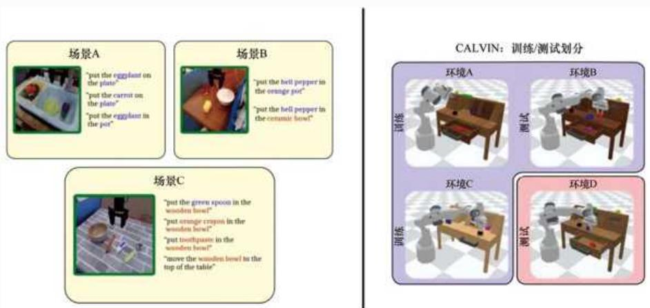  
表8.2 SuSIE在真实世界中评估的性能结果

图8.10 SuSIE的评估 [7]

场景A包含的环境和物体在数据集BridgeData V2中已有充分表现。

场景B设定在一个桌面上，但背景和干扰物是新的，机器人需要将已知的物体（甜椒）移动到可选的已知容器（橙色罐）或未知容器（陶瓷碗）中。

场景C的桌面纹理在数据集BridgeDataV2中未曾出现，要求机器人同时操控已知和未知的物体。

从语义角度看，场景C最具挑战性，因为机器人须精准地将语言指令与正确物体对应，同时还要克服对数据集中常见物体（如勺子）的偏好。场景B同样需要进行语义上的定位以区分已知和未知的容器，这增加了操作甜椒的难度——由于甜椒轻巧、光滑且与夹爪宽度相近，机器人抓握时须特别精确。

表8.2展示了SuSIE在真实世界中评估的性能结果。SuSIE在各方面均表现最佳，超越了RT-2-X——一个基于550亿参数、经大量机器人及互联网数据训练的模型。不出所料，所有方法在场景A中均表现出色，场景A在机器人数据中已有充分体现。SuSIE在场景B中的表现尤为突出，它是唯一能稳定抓取甜椒的方法。

<table><tr><td></td><td>任务</td><td>LCBC</td><td>MOO</td><td>UniPi</td><td>HT-2-X</td><td>SuSIE</td></tr><tr><td rowspan="4">场景A</td><td>&quot;Eggplant on plate&quot; (把茄子放在盘子里)</td><td>0.9</td><td>0.4</td><td>0.0</td><td>0.3</td><td>1.0</td></tr><tr><td>&quot;Carrot on plate&quot; (把胡萝卜放在盘子里)</td><td>0.4</td><td>0.3</td><td>0.0</td><td>0.6</td><td>0.9</td></tr><tr><td>&quot;Eggplant in pot&quot; (把茄子放入锅中)</td><td>0.6</td><td>0.7</td><td>0.0</td><td>0.4</td><td>0.7</td></tr><tr><td>平均分</td><td>0.63</td><td>0.47</td><td>0.0</td><td>0.43</td><td>0.87</td></tr><tr><td rowspan="3">场景B</td><td>&quot;Bell pepper in pot&quot; (把青椒放入锅中)</td><td>0.1</td><td>0.0</td><td>0.0</td><td>0.0</td><td>0.5</td></tr><tr><td>&quot;Bell pepper in bowl&quot; (把青椒放入碗中)</td><td>0.3</td><td>0.1</td><td>0.1</td><td>0.0</td><td>0.5</td></tr><tr><td>平均分</td><td>0.20</td><td>0.05</td><td>0.05</td><td>0.00</td><td>0.50</td></tr><tr><td rowspan="5">场景C</td><td>&quot;Toothpaste in bowl&quot; (把牙膏放入碗中)</td><td>0.0</td><td>0.0</td><td>0.0</td><td>0.5</td><td>0.6</td></tr><tr><td>&quot;Crayon in bowl&quot; (把鹅笔放入碗中)</td><td>0.0</td><td>0.0</td><td>0.0</td><td>0.9</td><td>1.0</td></tr><tr><td>&quot;Spoon in bowl&quot; (把勺子放入碗中)</td><td>0.1</td><td>0.3</td><td>0.1</td><td>0.7</td><td>0.9</td></tr><tr><td>&quot;Bowl to top&quot; (把碗移到顶部)</td><td>0.6</td><td>0.1</td><td>0.1</td><td>0.9</td><td>1.0</td></tr><tr><td>平均分</td><td>0.18</td><td>0.10</td><td>0.05</td><td>0.75</td><td>0.88</td></tr></table>

在场景C中，尽管SuSIE依然领先，但RT-2-X紧随其后，位列第二。这与场景B形成对比，场景C中的所有物体均易于抓取。因此，策略的底层精确度变得不那么关键，而这正是RT-2-X的主要短板。从定性观察来看，在场景C中，SuSIE和RT-2-X的失败案例几乎是操作不精确所致（如抓取失败或过早松开），而非语义理解错误；在蜡笔、甜椒、牙膏、勺子这4个物体中，牙膏最难抓取，因此其抓取成功率最低。也就是说，SuSIE和RT-2-X都解决了抓取任务中的语义理解部分，但SuSIE在底层精确度上的提升使其表现更胜一筹。

# 8.3 总结与展望

本章深入探讨了连续时间生成模型在强化学习策略设计和优化中的应用，特别是在离线强化学习场景下，如何通过优势函数加权回归和价值函数的策略梯度来提升强化学习策略的泛化能力和性能。此外，本章还详细介绍了扩散模型在机器人导航和操作任务中的创新应用，如ViNT、NoMaD和SuSIE，这些模型通过生成子目标或直接建模动作序列，显著提升了机器人在复杂环境中的导航和操作能力。

总结来看，连续时间生成模型和强化学习的结合使机器人学等领域有了新的突破。这些模型不仅能够处理复杂的语义理解任务，还能在物理世界中实现精确的控制和操作。经多个真实世界场景中的实验验证，这些模型展现出超越传统模型的性能，尤其是在处理开放世界和未见过的任务时。

展望未来，可以预见这些技术将在更多领域得到应用，如自动驾驶、智能制造和家庭服务机器人等。随着数据集的进一步丰富和模型架构的不断优化，未来的机器人将能够更好地理解和适应多样化的环境，执行更加复杂和精细的任务。同时，我们也需要关注这些技术在伦理和安全方面的影响，确保它们能够带来正面的社会效益。随着研究的深入和技术的进步，我们有理由相信，这些模型将在未来的机器人技术发展中扮演越来越重要的角色。

# 参考文献

[1] LIPMAN Y, CHEN R T Q, BEN-HAMU H, et al. Flow matching for generative modeling[EB/OL]. arXiv: 2210.02747.   
[2] LIU X, GONG C, LIU Q. Flow straight and fast: Learning to generate and transfer data with rectified flow[EB/OL]. arXiv: 2209.03003.   
[3] TONG A, FATRAS K, MALKIN N, et al. Improving and generalizing flow-based generative models with minibatch optimal transport[EB/OL]. arXiv: 2302.00482.   
[4] POOLADIAN A A, BEN-HAMU H, DOMINGO-ENRICH C, et al. Multisample flow matching: Straightening flows with minibatch couplings[EB/OL]. arXiv: 2304.14772.   
[5] SHAH D, SRIDHAR A, DASHORA N, et al. ViNT: A foundation model for visual navigation[EB/OL]. arXiv: 2306.14846.   
[6] SRIDHAR A, SHAH D, GLOSSOP C, et al. NoMaD: Goal masked diffusion policies for navigation and exploration[C]//2024 IEEE International Conference on Robotics and Automation (ICRA). 2024: 63-70.   
[7] BLACK K, NAKAMOTO M, ATREYA P, et al. Zero-shot robotic manipulation with pretrained image-editing diffusion models[EB/OL]. arXiv: 2310.10639.   
[8] BROOKS T, HOLYNSKI A, EFROS A A. InstructPix2Pix: Learning to follow image editing instructions[C]//Proceedings of the IEEE/CVF Conference on Computer Vision and Pattern Recognition. 2023: 18392-18402.