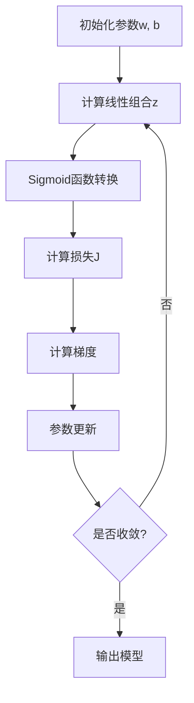

# 逻辑回归 学习文档

## 1. 算法基础认知

逻辑回归（Logistic Regression）是分类任务中最常用的算法之一，虽然名字中带有"回归"，但它实际上是一个**分类算法**。它通过Sigmoid函数将线性回归的输出映射为概率值，用于二分类问题。

**核心思想**：假设特征与类别标签之间存在线性关系，通过Sigmoid函数将线性组合转换为概率（0-1之间），根据概率阈值进行分类。

**应用场景**：
- 邮件分类（垃圾邮件vs正常邮件）
- 用户流失预测（流失vs不流失）
- 广告点击预测（点击vs未点击）
- 医疗诊断（患病vs健康）

## 2. 核心原理

### 2.1 数学基础

逻辑回归的数学基础是Sigmoid函数：

$$\sigma(z) = \frac{1}{1 + e^{-z}}$$

**性质**：
- 定义域：$(-\infty, +\infty)$
- 值域：$(0, 1)$
- 当$z > 0$时，$\sigma(z) > 0.5$
- 当$z < 0$时，$\sigma(z) < 0.5$
- Sigmoid函数是平滑的，有完美的梯度

### 2.2 模型公式

给定输入特征向量$x = [x_1, x_2, ..., x_n]$和权重向量$w = [w_1, w_2, ..., w_n]$，偏置$b$：

$$z = w^Tx + b$$
$$P(y=1|x) = \sigma(z) = \frac{1}{1 + e^{-(w^Tx+b)}}$$
$$P(y=0|x) = 1 - \sigma(z) = \frac{1}{1 + e^{w^Tx+b}}$$

**预测规则**：
- 如果$\sigma(w^Tx+b) > 0.5$，预测为类别1
- 如果$\sigma(w^Tx+b) \leq 0.5$，预测为类别0

## 3. 数学公式与推导

### 3.1 损失函数推导

使用最大似然估计（Maximum Likelihood Estimation）推导损失函数。

**似然函数**：
假设样本独立同分布，对于第$i$个样本，若$y_i = 1$，似然为$\sigma(w^Tx_i+b)$；若$y_i = 0$，似然为$1-\sigma(w^Tx_i+b)$。

整体似然函数：
$$L(w, b) = \prod_{i=1}^{n} \sigma(z_i)^{y_i} (1-\sigma(z_i))^{1-y_i}$$

**对数似然函数**（方便计算）：
$$\ell(w, b) = \ln L(w, b) = \sum_{i=1}^{n} [y_i \ln \sigma(z_i) + (1-y_i) \ln (1-\sigma(z_i))]$$

**损失函数**（负对数似然）：
$$J(w, b) = -\ell(w, b) = -\sum_{i=1}^{n} [y_i \ln \sigma(z_i) + (1-y_i) \ln (1-\sigma(z_i))]$$

**简化形式**：
由于$\sigma(z) = \frac{1}{1+e^{-z}}$，损失函数可以简化为：
$$J(w, b) = -\sum_{i=1}^{n} [y_i z_i - \ln (1+e^{z_i})]$$

### 3.2 梯度推导

对权重$w_j$求偏导：

$$\frac{\partial J}{\partial w_j} = \sum_{i=1}^{n} (y_i - \sigma(z_i)) x_{ij}$$

对偏置$b$求偏导：

$$\frac{\partial J}{\partial b} = \sum_{i=1}^{n} (y_i - \sigma(z_i))$$

**直观理解**：
- 如果$y_i = 1$且预测$\sigma(z_i)$接近1，误差接近0
- 如果$y_i = 1$且预测$\sigma(z_i)$很小，误差大，梯度指向增加$w_j$
- 如果$y_i = 0$且预测$\sigma(z_i)$很小，误差接近0
- 如果$y_i = 0$且预测$\sigma(z_i)$接近1，误差大，梯度指向减少$w_j$

### 3.3 梯度下降算法

```python
# 参数更新公式
w_j = w_j - \eta \cdot \frac{\partial J}{\partial w_j} = w_j - \eta \sum_{i=1}^{n} (y_i - \sigma(z_i)) x_{ij}
b = b - \eta \cdot \frac{\partial J}{\partial b} = b - \eta \sum_{i=1}^{n} (y_i - \sigma(z_i))
```

其中$\eta$是学习率。

## 4. 训练过程讲解

### 4.1 数据预处理

1. **缺失值处理**：填充或删除
2. **类别特征编码**：One-Hot Encoding
3. **标准化**：对连续特征标准化
4. **特征选择**：去除无关或重复特征

### 4.2 模型训练流程



### 4.3 收敛判断

1. **损失变化**：连续多次迭代损失变化小于阈值
2. **梯度接近零**：权重梯度绝对值很小
3. **性能稳定**：验证集性能不再提升

## 5. 应用场景

### 5.1 邮件垃圾分类

**输入特征**：
- 邮件主题长度
- 邮件正文长度
- 包含的关键词（"免费"、"中奖"等）
- 发件人地址（白名单/黑名单）
- 邮件频率

**输出**：
- 垃圾邮件（概率>0.5）
- 正常邮件

### 5.2 用户流失预测

**输入特征**：
- 用户年龄
- 历史使用时长
- 最近登录时间
- 交互频率
- 用户等级

**输出**：
- 流失用户（概率>0.5）
- 留存用户

### 5.3 广告点击预测

**输入特征**：
- 用户画像（年龄、性别、地域）
- 广告内容（文本、图片）
- 广告位置
- 展示时间
- 用户历史行为

**输出**：
- 点击广告（概率>0.5）
- 未点击

## 6. 优缺点分析

### 优点

1. **简单高效**：模型简单，计算速度快
2. **可解释性强**：权重系数直接反映特征重要性
3. **概率输出**：输出概率值，可设置不同阈值
4. **理论成熟**：有完善的数学理论基础
5. **易于实现**：scikit-learn等库支持良好

### 缺点

1. **线性假设**：无法捕捉复杂非线性关系
2. **对异常值敏感**：Sigmoid函数对异常值敏感
3. **类别不平衡**：对类别不平衡数据敏感
4. **特征选择依赖**：需要良好的特征工程
5. **只能线性分割**：只能处理线性可分问题

## 7. 调库实现（Python + scikit-learn）

```python
import numpy as np
from sklearn.linear_model import LogisticRegression
from sklearn.model_selection import train_test_split
from sklearn.preprocessing import StandardScaler
from sklearn.metrics import accuracy_score, precision_score, recall_score, f1_score, roc_auc_score, confusion_matrix
import matplotlib.pyplot as plt
import seaborn as sns

# 生成示例数据
np.random.seed(42)
n_samples = 1000

# 特征：2个特征
X = np.random.randn(n_samples, 2)

# 真实关系：y = 2*x0 + 3*x1 - 4，加噪声
y = (2 * X[:, 0] + 3 * X[:, 1] - 4 > 0).astype(int)
y += np.random.randint(0, 2, n_samples)  # 添加噪声

# 数据分割
X_train, X_test, y_train, y_test = train_test_split(X, y, test_size=0.2, random_state=42, stratify=y)

# 特征标准化
scaler = StandardScaler()
X_train_scaled = scaler.fit_transform(X_train)
X_test_scaled = scaler.transform(X_test)

# 初始化并训练模型
model = LogisticRegression(solver='lbfgs', random_state=42)
model.fit(X_train_scaled, y_train)

# 预测
y_pred = model.predict(X_test_scaled)
y_pred_proba = model.predict_proba(X_test_scaled)[:, 1]

# 评估
accuracy = accuracy_score(y_test, y_pred)
precision = precision_score(y_test, y_pred)
recall = recall_score(y_test, y_pred)
f1 = f1_score(y_test, y_pred)
auc = roc_auc_score(y_test, y_pred_proba)

print(f"准确率: {accuracy:.4f}")
print(f"精确率: {precision:.4f}")
print(f"召回率: {recall:.4f}")
print(f"F1分数: {f1:.4f}")
print(f"AUC: {auc:.4f}")

# 混淆矩阵
cm = confusion_matrix(y_test, y_pred)
plt.figure(figsize=(8, 6))
sns.heatmap(cm, annot=True, fmt='d', cmap='Blues')
plt.xlabel('预测标签')
plt.ylabel('真实标签')
plt.title('混淆矩阵')
plt.show()

# ROC曲线
from sklearn.metrics import roc_curve, auc

fpr, tpr, thresholds = roc_curve(y_test, y_pred_proba)
roc_auc = auc(fpr, tpr)

plt.figure(figsize=(8, 6))
plt.plot(fpr, tpr, color='darkorange', lw=2, label=f'ROC曲线 (AUC = {roc_auc:.4f})')
plt.plot([0, 1], [0, 1], color='navy', lw=2, linestyle='--')
plt.xlabel('假阳性率 (FPR)')
plt.ylabel('真阳性率 (TPR)')
plt.title('ROC曲线')
plt.legend(loc="lower right")
plt.show()

# 权重系数可视化
feature_names = ['特征1', '特征2']
coefficients = model.coef_[0]
intercept = model.intercept_[0]

plt.figure(figsize=(10, 6))
plt.bar(feature_names, coefficients)
plt.xlabel('特征')
plt.ylabel('权重系数')
plt.title('逻辑回归权重系数')
plt.axhline(y=0, color='r', linestyle='--')
plt.show()

print(f"\n权重系数: {coefficients}")
print(f"截距: {intercept:.4f}")
```

## 8. 手工代码实现（核心算法手写 + 注释）

```python
import numpy as np
from sklearn.model_selection import train_test_split
from sklearn.preprocessing import StandardScaler

class LogisticRegressionManual:
    """手动实现逻辑回归模型"""

    def __init__(self, learning_rate=0.01, n_iterations=1000, regularization=None, alpha=0.1):
        """
        初始化参数

        参数:
        learning_rate: 学习率
        n_iterations: 迭代次数
        regularization: 正则化类型 ('l1', 'l2', None)
        alpha: 正则化强度
        """
        self.learning_rate = learning_rate
        self.n_iterations = n_iterations
        self.regularization = regularization
        self.alpha = alpha
        self.weights = None
        self.bias = None
        self.loss_history = []

    def sigmoid(self, z):
        """Sigmoid函数"""
        return 1 / (1 + np.exp(-z))

    def compute_loss(self, y, y_pred):
        """
        计算交叉熵损失

        参数:
        y: 真实标签
        y_pred: 预测概率

        返回:
        loss: 交叉熵损失
        """
        # 防止log(0)错误
        epsilon = 1e-15
        y_pred = np.clip(y_pred, epsilon, 1 - epsilon)

        # 交叉熵损失
        loss = -np.mean(y * np.log(y_pred) + (1 - y) * np.log(1 - y_pred))

        # 添加正则化项
        if self.regularization == 'l1':
            loss += (self.alpha / 2) * np.sum(np.abs(self.weights))
        elif self.regularization == 'l2':
            loss += (self.alpha / 2) * np.sum(self.weights ** 2)

        return loss

    def compute_gradients(self, X, y, y_pred):
        """
        计算梯度

        参数:
        X: 特征矩阵
        y: 真实标签
        y_pred: 预测概率

        返回:
        dw: 权重梯度
        db: 偏置梯度
        """
        n_samples = X.shape[0]

        # 计算误差
        error = y_pred - y

        # 权重梯度
        dw = (1 / n_samples) * np.dot(X.T, error)

        # 偏置梯度
        db = (1 / n_samples) * np.sum(error)

        # 添加正则化梯度
        if self.regularization == 'l1':
            dw += self.alpha * np.sign(self.weights)
        elif self.regularization == 'l2':
            dw += self.alpha * self.weights

        return dw, db

    def fit(self, X, y):
        """
        训练模型

        参数:
        X: 训练特征矩阵, shape (n_samples, n_features)
        y: 训练标签, shape (n_samples,)
        """
        n_samples, n_features = X.shape

        # 1. 初始化参数
        self.weights = np.zeros(n_features)
        self.bias = 0.0

        # 2. 梯度下降优化
        for i in range(self.n_iterations):
            # 前向传播
            linear = np.dot(X, self.weights) + self.bias
            y_pred = self.sigmoid(linear)

            # 计算损失
            loss = self.compute_loss(y, y_pred)
            self.loss_history.append(loss)

            # 反向传播 - 计算梯度
            dw, db = self.compute_gradients(X, y, y_pred)

            # 参数更新
            self.weights -= self.learning_rate * dw
            self.bias -= self.learning_rate * db

            # 打印损失变化
            if i % 100 == 0:
                print(f"Iteration {i}, Loss: {loss:.4f}")

        print("训练完成!")
        return self

    def predict_proba(self, X):
        """
        预测概率

        参数:
        X: 特征矩阵, shape (n_samples, n_features)

        返回:
        y_pred_proba: 预测概率, shape (n_samples,)
        """
        linear = np.dot(X, self.weights) + self.bias
        return self.sigmoid(linear)

    def predict(self, X, threshold=0.5):
        """
        预测类别

        参数:
        X: 特征矩阵
        threshold: 阈值

        返回:
        y_pred: 预测类别, shape (n_samples,)
        """
        y_pred_proba = self.predict_proba(X)
        return (y_pred_proba >= threshold).astype(int)

    def get_weights(self):
        """获取权重系数"""
        return self.weights

    def get_bias(self):
        """获取偏置项"""
        return self.bias

    def plot_loss(self):
        """绘制损失下降曲线"""
        import matplotlib.pyplot as plt
        plt.figure(figsize=(10, 6))
        plt.plot(self.loss_history)
        plt.xlabel('迭代次数')
        plt.ylabel('损失值')
        plt.title('损失函数下降曲线')
        plt.show()

    def plot_decision_boundary(self, X, y):
        """
        绘制决策边界

        参数:
        X: 特征矩阵
        y: 标签
        """
        h = 0.02  # 步长
        x_min, x_max = X[:, 0].min() - 1, X[:, 0].max() + 1
        y_min, y_max = X[:, 1].min() - 1, X[:, 1].max() + 1
        xx, yy = np.meshgrid(np.arange(x_min, x_max, h),
                             np.arange(y_min, y_max, h))

        # 计算整个网格的预测值
        Z = self.predict_proba(np.c_[xx.ravel(), yy.ravel()])
        Z = Z.reshape(xx.shape)

        # 绘制决策边界
        plt.figure(figsize=(10, 8))
        plt.contourf(xx, yy, Z, alpha=0.8, cmap=plt.cm.RdBu)
        plt.scatter(X[:, 0], X[:, 1], c=y, edgecolors='k', cmap=plt.cm.RdBu)
        plt.xlabel('特征1')
        plt.ylabel('特征2')
        plt.title('逻辑回归决策边界')
        plt.show()

# ===== 测试代码 =====
if __name__ == "__main__":
    # 生成测试数据
    np.random.seed(42)
    n_samples = 1000

    # 生成两个类别的数据
    X_class0 = np.random.randn(500, 2) + np.array([0, 0])
    X_class1 = np.random.randn(500, 2) + np.array([2, 2])
    X = np.vstack([X_class0, X_class1])

    y = np.array([0] * 500 + [1] * 500)

    # 数据分割
    X_train, X_test, y_train, y_test = train_test_split(
        X, y, test_size=0.2, random_state=42, stratify=y
    )

    # 初始化模型（带L2正则化）
    model = LogisticRegressionManual(
        learning_rate=0.1,
        n_iterations=2000,
        regularization='l2',
        alpha=0.1
    )

    # 训练模型
    model.fit(X_train, y_train)

    # 打印模型参数
    print("\n模型参数:")
    print(f"权重系数: {model.get_weights()}")
    print(f"截距: {model.get_bias():.4f}")

    # 可视化损失下降
    model.plot_loss()

    # 可视化决策边界
    model.plot_decision_boundary(X_train, y_train)

    # 在测试集上评估
    y_pred = model.predict(X_test)
    y_pred_proba = model.predict_proba(X_test)

    from sklearn.metrics import accuracy_score, precision_score, recall_score, f1_score, roc_auc_score

    accuracy = accuracy_score(y_test, y_pred)
    precision = precision_score(y_test, y_pred)
    recall = recall_score(y_test, y_pred)
    f1 = f1_score(y_test, y_pred)
    auc = roc_auc_score(y_test, y_pred_proba)

    print(f"\n测试集评估:")
    print(f"准确率: {accuracy:.4f}")
    print(f"精确率: {precision:.4f}")
    print(f"召回率: {recall:.4f}")
    print(f"F1分数: {f1:.4f}")
    print(f"AUC: {auc:.4f}")

    # 与sklearn的对比
    from sklearn.linear_model import LogisticRegression as SklearnLR

    model_sklearn = SklearnLR(solver='lbfgs', penalty='l2', C=1/0.1, random_state=42)
    model_sklearn.fit(X_train, y_train)

    print(f"\nSklearn权重系数: {model_sklearn.coef_[0]}")
    print(f"Sklearn截距: {model_sklearn.intercept_[0]:.4f}")
    print(f"我的权重系数: {model.get_weights()}")
    print(f"我的截距: {model.get_bias():.4f}")
```

## 9. 可视化与结果理解

### 9.1 决策边界可视化

逻辑回归可以绘制出清晰的决策边界：

```python
import matplotlib.pyplot as plt
import numpy as np

def plot_decision_boundary_manual(X, y, model, feature_names=['特征1', '特征2']):
    """绘制决策边界"""
    # 设置网格
    h = 0.02  # 步长
    x_min, x_max = X[:, 0].min() - 1, X[:, 0].max() + 1
    y_min, y_max = X[:, 1].min() - 1, X[:, 1].max() + 1
    xx, yy = np.meshgrid(np.arange(x_min, x_max, h),
                         np.arange(y_min, y_max, h))

    # 预测整个网格
    Z = model.predict_proba(np.c_[xx.ravel(), yy.ravel()])
    Z = Z.reshape(xx.shape)

    # 绘制
    plt.figure(figsize=(10, 8))
    plt.contourf(xx, yy, Z, alpha=0.8, cmap=plt.cm.RdBu)
    plt.scatter(X[:, 0], X[:, 1], c=y, edgecolors='k', cmap=plt.cm.RdBu)
    plt.xlabel(feature_names[0])
    plt.ylabel(feature_names[1])
    plt.title('逻辑回归决策边界')
    plt.show()
```

### 9.2 ROC曲线分析

```python
from sklearn.metrics import roc_curve, auc

def plot_roc_curve(y_test, y_pred_proba):
    """绘制ROC曲线"""
    fpr, tpr, _ = roc_curve(y_test, y_pred_proba)
    roc_auc = auc(fpr, tpr)

    plt.figure(figsize=(10, 8))
    plt.plot(fpr, tpr, color='darkorange', lw=2,
             label=f'ROC曲线 (AUC = {roc_auc:.4f})')
    plt.plot([0, 1], [0, 1], color='navy', lw=2, linestyle='--')
    plt.xlabel('假阳性率 (FPR)')
    plt.ylabel('真阳性率 (TPR)')
    plt.title('ROC曲线')
    plt.legend(loc="lower right")
    plt.grid(True)
    plt.show()
```

### 9.3 概率分布可视化

```python
def plot_probability_distribution(y_test, y_pred_proba):
    """绘制预测概率分布"""
    # 分离正负样本的预测概率
    pos_proba = y_pred_proba[y_test == 1]
    neg_proba = y_pred_proba[y_test == 0]

    plt.figure(figsize=(10, 6))
    plt.hist(neg_proba, bins=30, alpha=0.5, label='负样本', color='red')
    plt.hist(pos_proba, bins=30, alpha=0.5, label='正样本', color='blue')
    plt.xlabel('预测概率')
    plt.ylabel('样本数')
    plt.title('预测概率分布')
    plt.legend()
    plt.axvline(x=0.5, color='black', linestyle='--', label='阈值')
    plt.grid(True)
    plt.show()
```

**结果理解**：
- 模型对正样本的预测概率应集中在0.5以上
- 模型对负样本的预测概率应集中在0.5以下
- 两个类别的概率分布有明显重叠表明模型区分能力有限

## 10. 模型评估

### 10.1 分类评估指标

1. **准确率（Accuracy）**：
   $$Accuracy = \frac{TP + TN}{TP + TN + FP + FN}$$

2. **精确率（Precision）**：
   $$Precision = \frac{TP}{TP + FP}$$

3. **召回率（Recall）**：
   $$Recall = \frac{TP}{TP + FN}$$

4. **F1分数**：
   $$F1 = 2 \cdot \frac{Precision \cdot Recall}{Precision + Recall}$$

### 10.2 ROC-AUC评估

**ROC曲线**：
- 横轴：假阳性率（FPR）= FP / (FP + TN)
- 纵轴：真阳性率（TPR）= TP / (TP + FN)

**AUC**：ROC曲线下的面积，范围[0, 1]
- AUC = 0.5：随机猜测
- AUC = 1：完美分类

### 10.3 混淆矩阵分析

```
            预测
         真正例  假正例
真实   真正例    TP    FP
  例   假正例    FN    TN
```

**优缺点**：
- 混淆矩阵直观显示分类效果
- 适合不平衡数据（如医疗诊断）
- 不能单独用于评估

## 11. 常见问题与易错点

### 11.1 数据问题

1. **类别不平衡**：一个类别样本远多于另一个
   - 解决：使用平衡采样或调整类别权重

2. **特征尺度不一致**：未标准化导致训练不稳定
   - 解决：使用StandardScaler标准化

3. **共线性**：特征间高度相关
   - 解决：使用PCA或去除冗余特征

### 11.2 模型问题

1. **线性假设限制**：无法处理复杂非线性关系
   - 解决：使用多项式特征或核方法

2. **梯度消失**：当特征维度很高时
   - 解决：使用梯度裁剪或归一化

3. **过拟合**：模型在训练集表现好，测试集差
   - 解决：增加正则化、使用Dropout

### 11.3 实现问题

1. **除零错误**：log(0)或预测概率为0或1
   - 解决：添加epsilon防止log(0)

2. **学习率选择**：过大导致发散，过小收敛慢
   - 解决：使用学习率调度器

3. **特征选择不当**：包含无关特征
   - 解决：使用特征选择方法

## 12. 学习总结

逻辑回归是分类任务的基础算法：

1. **线性与非线性**：通过Sigmoid将线性关系转换为概率
2. **梯度下降**：通过梯度下降优化损失函数
3. **评估指标**：AUC、F1、精确率、召回率等
4. **正则化**：L1/L2防止过拟合

**与线性回归的区别**：
- 线性回归输出连续值，逻辑回归输出概率
- 线性回归用MSE损失，逻辑回归用交叉熵损失
- 线性回归直接预测，逻辑回归通过阈值分类

**与其他算法的关系**：
- 是神经网络的简化版
- 是支持向量机的基础
- 是许多高级算法的基线

## 13. 练习题与思考题（含答案）

### 13.1 练习题

**Q1: 为什么逻辑回归使用交叉熵损失而不是MSE？**

**答案**：
1. 梯度更新更稳定：交叉熵的梯度与误差成正比，MSE的梯度受sigmoid饱和影响
2. 概率输出更自然：交叉熵直接优化概率，MSE输出偏离会导致大梯度
3. 收敛更快：交叉熵的梯度与激活函数无关，MSE需要乘以sigmoid的导数

**Q2: 如何解决类别不平衡问题？**

**答案**：
1. 重采样：过采样少数类或欠采样多数类
2. 类别权重：给少数类更高权重
3. 改变阈值：降低预测阈值，让模型预测更多少数类
4. 评估指标：使用AUC而非准确率

**Q3: 逻辑回归中的正则化为什么有用？**

**答案**：
1. 防止过拟合：限制权重大小，减少模型复杂度
2. 处理共线性：L2正则化降低相关特征权重
3. 提高泛化能力：在小数据集上表现更好
4. 特征选择：L1正则化产生稀疏解

**Q4: 为什么学习率很重要？**

**答案**：
1. 过大：可能导致参数震荡，无法收敛
2. 过小：收敛速度慢，可能陷入局部最优
3. 适当的值：平衡收敛速度和稳定性

**Q5: 如何判断模型是否过拟合？**

**答案**：
- 训练集准确率高，测试集准确率低
- 训练集损失远低于测试集损失
- 特征权重过大（说明模型过度拟合训练数据）

### 13.2 思考题

**Q1: 逻辑回归可以处理多分类问题吗？**

**答案**：
可以，有两种方法：
1. One-vs-Rest（OvR）：训练多个二元分类器，每个预测一个类别
2. Softmax回归：直接输出多类概率分布
   $$P(y=k|x) = \frac{e^{w_k^Tx+b_k}}{\sum_{j=1}^{K} e^{w_j^Tx+b_j}}$$

**Q2: 为什么逻辑回归的决策边界是线性的？**

**答案**：
因为逻辑回归的线性组合$s = w^Tx + b$，然后经过Sigmoid函数映射。Sigmoid是单调函数，保持线性关系的单调性，所以决策边界是线性超平面。

**Q3: 如何改进逻辑回归的缺点？**

**答案**：
1. 使用核技巧：将数据映射到高维空间
2. 添加多项式特征：捕获非线性关系
3. 使用集成方法：随机森林、梯度提升树
4. 使用神经网络：多层非线性变换

**Q4: 在推荐系统中，逻辑回归常用于什么任务？**

**答案**：
1. 特征重要性评估：权重系数反映特征重要性
2. 离线基线模型：快速验证特征工程效果
3. A/B测试：对比不同策略的效果
4. 简化模型：部署资源有限时的选择

**Q5: 为什么说逻辑回归可解释性强？**

**答案**：
1. 权重系数直接反映特征影响：正权重表示正向影响，负权重表示负向影响
2. 可以计算特征贡献度
3. 可以通过特征交互提升可解释性
4. 是许多高级算法的基石

## 14. 学习路径建议

1. **基础阶段**：
   - 理解Sigmoid函数
   - 掌握梯度下降
   - 学会交叉熵损失

2. **进阶阶段**：
   - 学习正则化（L1/L2）
   - 理解评估指标
   - 掌握模型调优

3. **应用阶段**：
   - 处理真实分类数据
   - 特征工程实践
   - 模型评估和调优

4. **拓展阶段**：
   - 学习Softmax回归（多分类）
   - 理解逻辑回归与神经网络的关系
   - 探索高级主题（核方法、集成学习）
