# 互联网大厂推荐算法面试百问

# 前言

随着业界推荐技术与大模型技术的深度融合，推荐算法岗位的竞争日益激烈。无论是头部大厂的校招/社招，还是新兴 AI 公司的技术岗，面试官对候选人的考核更加全面，也更加严格。

为帮助求职者系统化突破面试瓶颈，笔者结合多年一线面试经验（涵盖字节跳动、腾讯、阿里等大厂面经）与最新推荐算法行业趋势，精心打磨了这份《互联网大厂推荐算法面试百问》。

# 文档亮点

 全场景覆盖：从基础算法 深度模型，再到大模型赋能的推荐系统，构建推荐链路的完整知识架构。  
 面试真题：精选近两年高频面试题，涵盖常见基础八股算法原理、推荐链路各环节知识点、大模型推荐、生成式推荐、强化学习技术等，本文以面试真题问答形式展示，附参考答案与部分相关算法代码实现。  
 趋势前瞻：收录大模型在推荐中的工业界落地场景方案，如当前热门的生成式推荐、强化学习，贴合前沿推荐技术热点。

# 适用人群

 准备校招/社招的推荐算法求职者；  
 希望查漏补缺的在职算法工程师；  
 从事推荐算法行业的大厂面试官；  
 对推荐算法感兴趣的学习者。

# 写在最后

推荐算法的本质是“理解用户与内容的连接”，而面试的核心是“证明你具备构建这种连接的能力”。本文档不仅是题库，也是一套方法论——教会你如何将零散的推荐算法知识点进行串联，如何展现清晰的技术判断力。愿这份资料成为你职业跃迁的助推器。最后提醒一句：优秀的算法工程师，从来都是“既懂模型，也懂业务”——模型是工具，业务是核心，只有将技术与业务深度结合，才能真正发挥推荐算法的价值，在行业中走得更远、更稳。

# 备注：

 为确保本文内容的知识产权价值及权益，本文档已设置了禁止复制权限，请您谅解。  
 本文档将根据推荐算法行业趋势、大厂面试考点的变化，持续更新补充内容，确保资料的时效性和实用性，购买权限后可免费获取后续更新内容。  
 考虑较多同学有复制和打印的需求，可直接进入 pdf 版本（需购买本文档权限，如 pdf 成员不在本文档成员中，会直接清理）：互联网大厂推荐算法面试百问(PDF)

# 目录

互联网大厂推荐算法面试百问......   
前言 ......  
目录 ...

第一章：推荐系统概述.................. ..... 1

面试题：推荐系统有哪些核心链路？  
面试题：推荐系统与广告系统有什么区别？  
面试题：生成式推荐GR和传统推荐 DLRM的区别？GR收益点是什么？

第二章：特征与 EMBEDDING....

面试题：多模态 EMBEDDING 语义 ID 编码方法介绍..  
面试题：多模态 EMBEDDING 特征融合方法介绍.   
面试题：高基数类别特征的 EMBEDDING 维度如何确定？  
面试题：特征重要度评估有哪些方法？  
面试题：如何基于特征 SHUFFLE进行特征重要度评估？  
面试题：预训练 USER/ITEM EMB如何利用以提升精排模型性能？  
面试题：特征等距分桶和等频分桶的优缺点.

第三章：召回与粗排算法.

面试题：召回有哪些负采样方法？......  
面试题：介绍阿里 ESANS召回负采样方法.  
面试题：召回针对 RECALL@N 指标优化的 CROLOSS 介绍.  
面试题：粗排和精排打分一致率越高越好吗？ 3  
面试题：召回粗排双塔模型为什么最后一层要进行 LAYER NORMALIZATION？

第四章：精排模型算法....

4.1 特征交叉结构.

面试题：FFM 模型原理介绍....   
面试题：推荐算法 SENet（Squeeze-and-Excitation Network）算法详解  
面试题：DCN 和 DCN-v2 的原理与区别..  
面试题：Meta 的 Wukong 模型介绍.  
面试题：字节 RankMixer 模型介绍  
面试题：字节OneTrans模型介绍，高效整合序列建模和特征交互的大一统模型  
面试题：RankMixer 存在哪些问题？TokenMixer-Large 如何改进和进一步 Scaling.

4.2 注意力机制.

面试题：DIN原理介绍&带时间衰减的 DIN代码实现.  
面试题：GQA分组查询注意力原理及代码实现.  
面试题：Gated Attention 原理介绍（NeurIPS2025 最佳论文）

面试题：MLA、GQA、DSA 注意力机制全面对比

4.3 序列建模 .

面试题：用户超长行为序列建模主要有哪些方案？

面试题：阿里长序列建模 SIM方案原理介绍.

面试题：腾讯行为序列建模 TIN (Temporal Interest Network )介绍.

面试题：快手 KuaiFormer 如何建模长序列？

面试题：HSTU 和 Transformer 两种序列建模架构的对比 .

4.4 多任务&多场景建模.

面试题：多任务 Loss 权重如何平衡？

面试题：多任务模型 MMOE 和 PLE 原理与区别..

面试题：MMOE 极化现象的原理与解决方案.

面试题：个性化网络 PPNet、EPNet、PEPNet 对比.

4.5 因果推断与 UPLIFT .

面试题：有哪些常见的 Uplift 模型？

面试题：Uplift 深度模型介绍：DragonNet 和 DESCN ..

面试题：因果推断 AUUC指标介绍.

4.6 CVR 预估\LTV 预估模型 .

面试题：CVR样本稀疏问题如何解决？

面试题：CVR预估中的样本选择偏差问题？

面试题：CVR 延迟反馈建模 DFM 介绍 .

面试题：电商大促 CVR预估会出现性能显著下降是什么原因，如何优化?..

面试题：用户 LTV建模有哪些方案？

4.7 冷启动..

面试题：用户冷启动 POSO 论文原理介绍 .

面试题：广告冷启动与物品冷启动的区别.

第五章：损失函数&评估指标.

5.1 损失函数 .

面试题：KL 散度和交叉熵的区别是什么？

面试题：分类任务 Loss交叉熵与 MSE损失对比.

面试题：常见的对比学习 Loss有哪些？

面试题：InfoNCE Loss 原理详解与代码实现.

面试题：常见 Pairwise Loss 有哪些，有什么区别？ 5

面试题：Focal Loss 介绍与代码实现

5.2 评估指标 .

面试题：AUC 物理意义&计算公式&代码实现.

面试题：NDCG@K、Recall@K、Precision@K 和 HitRate $@ \mathsf { K }$ 评估指标介绍.

第六章：推荐基础八股算法 .....

6.1 树模型面试题.   
面试题：XGBoost 和 GBDT 有什么区别？  
面试题：XGBoost 和 LightGBM 的区别是什么？  
面试题：XGBoost 如何防止过拟合，如何处理缺失值？  
面试题：在表格数据中，为什么树模型（XGB\LGB）比深度学习模型的效果好？ 2  
6.2 TRANSFORMER 面试题.   
面试题：Transformer 参数量如何推导计算？  
面试题：Transformer 前馈层 FFN 的作用是什么？  
面试题：Transformer 包含哪两种 Mask机制，各自如何作用的？  
面试题：Pre-Norm 和 Post-Norm 各有什么优劣？主流大模型用的是哪一种？  
6.3 推荐算法八股面试题  
面试题：推荐模型的One Epoch 现象是什么原因导致？  
面试题：Self Attention 计算公式里为什么要除以根号 d_k?...  
面试题：Dropout 如何保证训练预测一致性？  
面试题：Adam 和 AdamW 优化器有什么区别？  
面试题：Adam 优化器的一阶矩估计与二阶矩估计介绍.  
面试题：Attention 层与全连接层的区别.  
面试题：BatchNorm 与 LayerNorm 的区别 .  
面试题：RMSNorm 和 LayerNorm 的区别，为什么主流大模型偏爱 RMSNorm？  
面试题：L1 正则化和 L2 正则化的区别 .  
面试题：离线 AUC提升在线 AB效果下降什么原因？  
面试题：模型融合减少的是方差还是偏差？  
面试题：模型参数初始化为 0有什么问题？  
面试题：神经网络有哪些常见的参数初始化方式？  
面试题：如何缓解模型过拟合问题？  
面试题：深度模型训练出现 NaN是什么原因？  
面试题：假设检验的常见指标介绍（A/B测试常用）  
第七章：推荐&大模型&强化学习.  
7.1 推荐 $^ +$ 大模型面试题：  
面试题：业界主流的生成式推荐方案梳理.   
面试题：生成式推荐有哪些样本组织方式？  
面试题：语义 ID 编码 RQ-VAE 原理介绍与代码实现.  
面试题：语义ID编码 RQ-VAE在训练过程中如何解决码本坍塌？  
面试题：美团生成式推荐 MTGR介绍——外卖推荐效果近 2年最大提升.  
面试题：快手生成式推荐 OneRec 模型原理介绍.   
面试题：快手生成式推荐 OneRec V2 技术原理介绍.   
面试题：快手生成式回归观看时长建模方案解析(WWW2025).

# 7.2 大模型面试题.

面试题：谷歌生成式推荐 TIGER 模型介绍.   
面试题：Meta 的SUM模型如何进行用户表征学习？  
面试题：Meta 的 HSTU 架构如何进行生成式推荐？  
面试题：业界首创的生成式推荐 HSTU原理详解（精读）  
面试题：快手 UniDex 介绍，一种基于语义 ID 的新型倒排索引技术.  
面试题：快手 UniSearch介绍，统一生成式搜索架构  
面试题：阿里 Qwen 大模型不同版本迭代的改进点？  
面试题：原生稀疏注意力 NSA解析与代码实现（ACL2025最佳论文）  
面试题：Deepseek 的 MTP（Multi-Token Prediction）原理介绍.  
面试题：大模型灾难性遗忘是什么，如何解决？  
面试题：大模型 MOE 架构 Expert 的 Token 负载均衡算法.  
面试题：旋转位置编码 RoPE 原理.  
面试题：BPE 和 Word Piece 分词方法的区别是什么？  
面试题：介绍检索增强生成 RAG 的原理与步骤 .  
面试题：MLA 多头潜在注意力介绍 .  
面试题：LoRA、AdaLoRA 和 QLoRA 的原理 .  
面试题：为什么大模型普遍采用 Decoder-only架构？  
面试题：大模型训练中FP16和BF16 的区别. 3  
面试题：DPO 算法的缺点有哪些？如何应对？  
面试题：大模型常见激活函数 GELU和 SwiGLU 介绍.

# 7.3 强化学习面试题：

面试题：基于价值、策略、Actor-Critic 三类分别介绍主流强化学习算法  
面试题：策略梯度（Policy Gradient）数学推导..  
面试题：介绍 RLHF 算法 PPO、DPO、GRPO，写下损失函数..  
面试题：强化学习 GRPO 算法原理介绍..   
面试题：强化学习中 on-policy 与 off-policy 有什么区别？  
面试题：强化学习 Q函数，奖励函数，价值函数，优势函数介绍  
面试题：强化学习中的马尔科夫决策过程是什么，通俗解释下？  
面试题：强化学习 DQN 模型原理详解 .   
面试题：DQN、Double DQN 和 Dueling DQN，三者原理与区别 3   
面试题：PPO 算法是 on-policy 还是 off-policy? .   
面试题：强化学习与序列建模结合开山之作：Decision Transformer介绍

# 第一章：推荐系统概述

# 面试题：推荐系统有哪些核心链路？

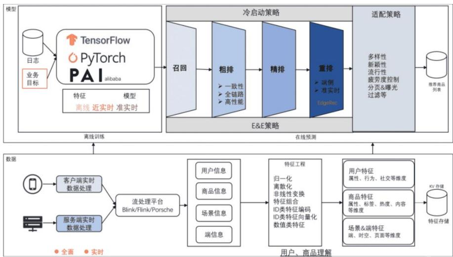

推荐系统的核心环节可分为以下六个主要阶段，涵盖从数据采集到最终展示的全链路流程，各环节相互协作以实现精准推荐：

# 数据收集与预处理

 通过日志系统、埋点技术收集用户行为数据（如点击、浏览、购买等）;  
 数据预处理包括清洗（去重、异常值处理）、归一化、标签化等操作，为后续建模提供高质量数据输入。

# 二、特征工程与用户画像构建

1. 特征提取：将原始数据转化为算法可理解的向量（Embedding），例如通过文本挖掘提取关键词，或利用图像识别技术生成商品视觉特征。  
2. 用户画像：基于用户行为聚类生成兴趣标签，或通过表示学习（Word2Vec、GNN）构建用户向量。  
3. 物品画像：结合多模态数据（文本、图像、视频）生成物品标签，例如使用 BERT 处理商品描述、CV 算法分析图像内容。

# 三、候选集召回

目标：从海量物品中快速筛选出潜在兴趣候选集（通常从百万级降至千级）。常用方法包括：

 Embedding 召回：通过矩阵分解（SVD、ALS）或深度学习（YouTube DNN）生成用户/物品向量，利用近似最近邻（ANN）算法检索。  
 规则召回：结合业务策略（如热门商品、新上架商品）补充多样性。   
 协同过滤：基于用户相似度（UserCF）或物品相似度（ItemCF）推荐。

# 四、排序（粗精排与重排）

 粗排：使用轻量模型初步过滤候选集，减少后续计算压力。  
 精排：采用复杂模型（如DeepFM、DIN）预测用户偏好分数，融合多维度特征（用户画像、场景上下文、实时行为）进行精准排序。

 重排：根据业务规则优化排序结果，例如去重（避免重复推荐）、多样性控制（平衡兴趣分布）、广告插入等。

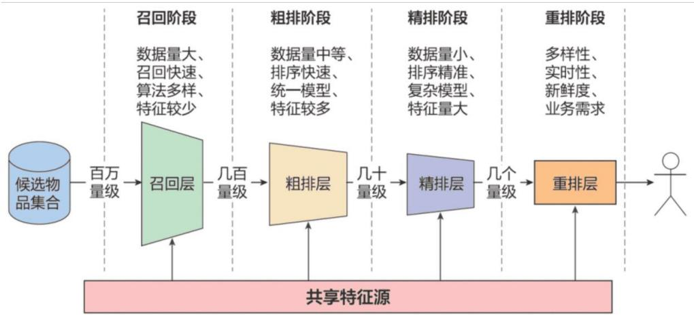

# 五、结果展示与反馈

 个性化展示：根据设备类型（移动端/PC 端）调整布局，分页加载提升用户体验。  
 实时反馈机制：记录用户对推荐结果的点击、停留时长等行为，用于在线模型更新（如 Flink 实时流处理）。

# 六、评估与迭代优化

 离线评估：通过 AUC、Recall@K、NDCG 等指标衡量模型效果。  
 在线 AB 测试：对比新旧策略的 CTR、GMV 等业务指标，验证优化效果。  
 冷启动优化：利用迁移学习（如跨域推荐）或基于人口统计信息的推荐解决新用户/物品冷启动问题。

推荐系统的核心链路是 “数据 $\longrightarrow$ 特征 召回→排序 展示 反馈” 的闭环流程，各环节需结合算法与工程优化（如实时计算、多模态融合）以应对大规模数据和高并发场景。实际应用中，不同业务场景（如电商、短视频）会针对链路中的特定环节进行定制化设计。

# 面试题：推荐系统与广告系统有什么区别？

推荐系统和广告系统是互联网领域两大核心信息过滤技术，虽然底层技术相似，但它们在根本目标、核心逻辑和系统设计上存在显著差异。下面这个表格对它们进行了对比：

<table><tr><td>维度</td><td>推荐系统(Recommender System)</td><td>广告系统(Advertising System)</td></tr><tr><td>根本目标</td><td>提升用户体验和参与度(如停留时长、互动率)</td><td>实现平台商业收入最大化</td></tr><tr><td>核心逻辑</td><td>“人找信息”与“信息找人”相结合,优化内容与用户的匹配</td><td>纯粹的“信息找人”,本质是竞价交易,平衡用户、广告主、平台三方利益</td></tr><tr><td>排序机制</td><td>综合CTR、用户兴趣、内容多样性、新颖性等多种因素</td><td>RankScore = 出价(Bid) × pCTR × pCVR</td></tr><tr><td>关键指标</td><td>点击率(CTR)、用户停留时长、转化率(CVR)等</td><td>预估CTR/CVR的准确性、千次展示收入(RPM)、广告主投资回报率(ROI)</td></tr><tr><td>系统复杂性</td><td>模型设计复杂,需考虑用户长期兴趣、探索与利用等问题</td><td>商业逻辑复杂,集成竞价、预算控制、实时计价等多个强耦合模块</td></tr></table>

# 一、核心目标与利益相关方不同

# 1. 广告系统：

直接目标是增加平台收入。通过精准匹配广告主与用户，最大化广告主的出价收益。例如，广告排序需综合预估点击率（CTR）、转化率（CVR）和广告主出价（如 eCPM=bid×CTR×CVR×1000）。

以广告收入为核心指标，兼顾 CTR、CVR、ROI 等。

# 2. 推荐系统：

直接目标是提升用户参与度 （如点击率、停留时长等），间接为平台创造长期价值。例如，电商推荐通过分析用户历史行为推荐商品，以提高用户留存和复购。

关注用户活跃度 （如点击率、停留时长）和转化率（如 GMV）。

# 二、利益相关方不同

1. 广告系统：需平衡用户、平台、广告主三方利益 。例如，广告主需要 ROI（投资回报率）保障，用户希望减少干扰，平台需权衡收入与体验。  
2. 推荐系统：仅需考虑用户与平台的双向需求，如用户兴趣匹配和平台流量分配效率。

# 三、排序机制差异

# 1. 广告系统：

a. 竞价机制：广告排序需结合用户兴趣（CTR/CVR预估）和广告主出价。例如，同一广告位可能因不同广告主的出价高低而展示不同内容。  
b. 扣费模式：采用 GSP（广义二价）或 VCG（博弈论）等竞价扣费规则。

# 2. 推荐系统：

a. 纯兴趣驱动：排序仅依赖用户兴趣模型（如深度学习），无需考虑第三方出价。  
b. 多样性约束：需平衡推荐列表的多样性和新颖性，避免重复内容。

# 四、数据与物料库限制

# 1. 广告系统：

 物料池受限：仅能召回广告主投放的素材，且需符合广告法要求（如特定商品禁止推广）。  
 定向策略：广告主可设置人群定向（如性别、地域），进一步缩小候选集。

# 2. 推荐系统：

 全量候选集：可调用平台所有商品或内容（如电商全量商品库、视频平台全量影片库）。  
 无外部限制：不受第三方定向策略约束，仅需符合平台内容规范。

# 五、技术侧重点差异

# 1. 广告系统：

 精准数值预估：需严格校准 CTR/CVR 的绝对值，确保出价计算的准确性。  
 相关模块复杂：包含预算控制（Budget Control）、流量分配（Pacing）等模块。

# 2. 推荐系统：

 长期兴趣建模：注重用户兴趣的连续性（如使用序列模型捕捉行为时序）。  
 探索与利用：需通过强化学习等策略挖掘用户潜在兴趣，避免陷入信息茧房。

# 小结：

 广告系统是商业化导向的流量变现工具，需在多方利益博弈中实现收益最大化；  
 推荐系统是用户体验导向的内容分发工具，侧重长期用户价值。  
 尽管两者均依赖机器学习模型，但广告系统因竞价机制和商业属性，复杂度更高。实际应用中，部分平台会将广告嵌入推荐系统（如信息流广告），形成混合模式。

# 面试题：生成式推荐 GR 和传统推荐 DLRM 的区别？GR 收益点是什么？

生成式推荐（GR）作为推荐系统新范式，与传统推荐模型（DLRM）存在显著差异，下面对比了其核心差异：

<table><tr><td>对比维度</td><td>传统DLRM推荐</td><td>生成式推荐（GR）</td></tr><tr><td>核心范式</td><td>判别式模型：从给定候选集中预测用户对某个物品的偏好概率（如点击率）</td><td>生成式模型：直接根据用户历史行为序列，自回归地生成下一个或N个最可能交互的物品</td></tr><tr><td>系统架构</td><td>多阶段级联：召回、粗排、精排、重排等阶段割裂，各阶段有独立模型和目标，存在误差传播和信息损耗</td><td>端到端一体化：趋向于使用单一模型统一完成从行为理解到结果生成的全过程，目标一致</td></tr><tr><td>物品表示</td><td>直接使用原始ID：依赖庞大且稀疏的Embedding表，易过拟合，泛化性差</td><td>语义ID（Semantic ID）：利用RQ-VAE等技术将item转为语义ID，提升泛化能力，提升冷启动效果</td></tr><tr><td>缩放定律</td><td>缩放收益递减：模型复杂化到一定程度后，效果提升的边际效益降低</td><td>缩放定律有效：已验证模型规模（参数、数据、序列长度）的增长能带来效果的持续提升，天花板更高</td></tr></table>

# 生成式推荐的核心收益

# ① 突破效果天花板（最根本的收益）

 scaling law的有效性意味可通过增加算力和数据持续提升模型效果，为推荐打开新的天花板。  
 生成式推荐善于利用超长用户行为序列，能更深入地捕捉用户兴趣的演变。  
 LLM内嵌的世界知识有助于理解物品间的隐含关联，可以显著改善冷启动问题。

# $\textcircled{2}$ 工程架构简化

 用一个端到端的统一模型替代传统复杂的多阶段系统。不仅避免级联架构中的目标冲突和误差放大，还能降低系统的整体复杂度和维护成本。

# $\textcircled{3}$ 提升推荐的智能水平

生成式推荐不再仅仅是“匹配”和“排序”，而是具备了初步的“推理”能力。它能根据复杂的用户行为序列推断出用户的深层意图或瞬时兴趣。该范式也天然支持推荐结果的多样性，因为它不是从固定候选集中做选择，而是“创造”列表，有助于打破信息茧房。

# 挑战：

 对推理延迟有极其苛刻的要求（需毫秒级响应）；  
 超大模型带来的存储与计算资源成本问题；  
 如何平滑地从现有 DLRM 系统迁移并验证其投入产出比（ROI）。

# 第二章：特征与 Embedding

# 面试题：多模态 Embedding 语义 ID 编码方法介绍

多模态 Embedding 语义 ID 编码的业界主流方法介绍如下：

# 一、 残差量化变分自编码器（RQ-VAE）

link：Enhancing Embedding Representation Stability in Recommendation Systems with Semantic ID

# 1. 核心原理

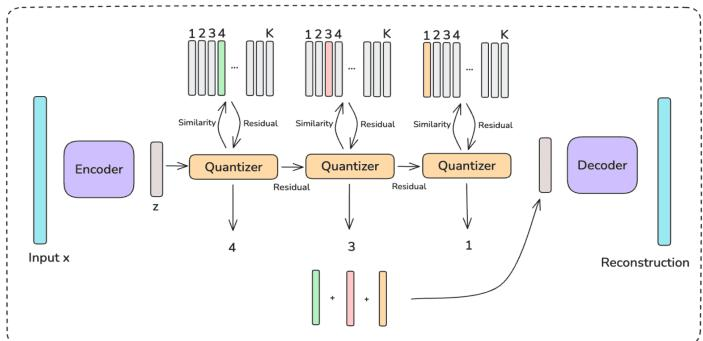  
Figure1 The RQVAE model with $L = 3$

通过分层向量量化将连续 Embedding 映射为离散语义ID序列，解决高基数 ID的嵌入不稳定问题

 输入：广告多模态 Embedding $\boldsymbol { x } \in \mathbb { R } ^ { d }$ （由文本/视觉模型生成）  
 分层量化：

$$
c _ {1} = \arg \min  _ {k \in [ 1, K ]} \| x - e _ {k} ^ {(1)} \|
$$

 第 1 层：

$$
r _ {l} = r _ {l - 1} - e _ {c _ {l - 1}} ^ {(l - 1)}, c _ {l} = \arg \min  _ {k} \| r _ {l} - e _ {k} ^ {(l)} \|
$$

 第 层残差：

 输出语义 ID： $S = ( c _ { 1 } , c _ { 2 } , \ldots , c _ { L } )$ ，其中 $L$ 为量化层数（比如 $L { = } 6$ ， $\scriptstyle K = 2 0 4 8$

# 2. 训练目标

$$
\mathcal {L} = \underbrace {\| x - \operatorname {D e c o d e r} (S) \| ^ {2}} _ {\text {重 建 损 失}} + \lambda \underbrace {\sum_ {l = 1} ^ {L} \| \mathrm {s g} [ r _ {l} ] - e _ {c _ {l}} ^ {(l)} \| ^ {2}} _ {\text {承 诺 损 失}} + \gamma \underbrace {\sum_ {l = 1} ^ {L} \| r _ {l} - \mathrm {s g} [ e _ {c _ {l}} ^ {(l)} ] \| ^ {2}} _ {\text {码 本 c o d e b o o k 损 失}}
$$

其中 sg[⋅] 为梯度截断操作， 为超参数。

# 3. 工业应用

Meta 广告系统：将广告文本 $^ { + }$ 视觉 Embedding 输入 RQ-VAE，生成 6 层语义 ID，在线服务时通过前缀组合映射到嵌入表，新广告 NDCG@100 提升 $0 . 3 3 \%$ ，长尾广告点击率方差降低 $4 3 \%$

# 二、 SentencePiece 动态子词编码（SPM-based）

Better Generalization with Semantic IDs: A Case Study in Ranking for Recommendations

# 1. 核心原理

将语义 ID 序列视为特殊语料，利用 BPE（Byte Pair Encoding）算法动态构建子词词表：

 输入：RQ-VAE 生成的语义 ID 序列 $S = ( c _ { 1 } , c _ { 2 } , \ldots , c _ { L } )$   
 合并策略：迭代合并最高频共现的 ID 对，直至词表大小 $V$ 达到预设值  
 输出：子词 ID 序列 $T = ( t _ { 1 } , t _ { 2 } , \dots , t _ { M } )$ ，其中 $M \ll L$

# 2. 数学表达

$\operatorname* { m a x } _ { V } \sum _ { ( t _ { i } , t _ { j } ) \in V } \mathrm { f r e q } ( t _ { i } , t _ { j } ) \cdot \mathbb { I } _ { ( t _ { i } , t _ { j } ) \in \mathrm { m e r g e } }$ freq(ti,tj)·I(t,t)merge词表构建目标函数： ，其中 为共现频率， 为指示函数。

# 3. 优势

 动态长度适配：高频语义 ID 组合被压缩为单一子词（如"手机-游戏"→单一 token）

# 三、快手 RQ-Kmeans

RQ-Kmeans 是快手 OneRec 针对海量物品高维多模态 embedding 设计的分层残差量化聚类方法，核心通过多层残差迭代量化 $^ +$ 平衡K-means将高维向量转化为分层离散语义ID，实现粗 细的语义空间建模。

# 核心算法流程

#  Step1 训练阶段（构建分层码本）

初始化 embedding 为初始残差，逐层对残差执行平衡 K-means（保证各簇样本量均衡，避免码本浪费），得到每层聚类中心（码本）；用当前层码本量化残差，计算新残差传递至下一层，直至完成所有层数训练，输出分层码本。

#  Step2 编码阶段（生成语义 ID）

以物品 embedding 为初始残差，逐层匹配对应层码本的最近聚类中心，记录中心索引作为语义 ID 片段；更新残差后进入下一层，最终拼接各层索引得到分层语义 ID 序列（前缀为粗语义，后缀为细语义）。

#  Step3 解码阶段（重建 embedding）

根据语义 ID 序列，从各层码本中提取对应聚类中心，求和得到量化后的重建 embedding，用于相似度计算或检索。

# 关键优化亮点

 平衡 K-means：解决普通 K-means 簇分布不均问题，提升码本利用率和检索效率；  
 分层残差：逐层拟合上一层量化残差，降低整体量化误差，同时保留粗 细语义结构，相似物品共享 ID 前缀；  
 轻量高效：无复杂模型训练，仅通过聚类 $^ +$ 残差迭代实现，适配十亿级物品的大规模工程化落地。

# 四、双通道级联表示（COBRA 框架）

# 1. 核心架构

百度提出融合语义 ID 与原始 Embedding 的级联表示

 输入：广告多模态 Embedding $_ x$   
 语义 ID 分支： $S = \mathrm { { R Q - V A E } } ( x ) _ {  }$ 嵌入向量 $e _ { s }$

 稠密向量分支：可训练编码器 $e _ { d } = \operatorname { E n c o d e r } ( x )$   
 级联输出： $e = [ e _ { s } ; e _ { d } ] \in \mathbb { R } ^ { d _ { s } + d _ { d } }$

# 2. 训练目标

$$
\mathcal {L} = \alpha \underbrace {\operatorname {C r o s s E n t r o p y} (\operatorname {D e c o d e r} (e) , S)} + \beta \quad \underbrace {\| x - e _ {d} \| ^ {2}}
$$

双任务联合优化：

ID重建损失

Embedding对齐损失

# 3. 工业效果

百度信息流广告：CVR 提升 $3 . 6 \%$ ，嵌入空间聚类紧密度提升 $4 1 \%$ 。推理速度比纯稠密模型快 3.2 倍（因语义 ID 提供先验筛选）。

# 一些 Trick：

1、跨模态对齐增强：在RQ-VAE输入前加入 CLIP式对比损失：

$$
\mathcal {L} _ {\text {a l i g n}} = - \log \frac {\exp (\sin (x _ {\text {t e x t}} , x _ {\text {i m a g e}}) / \tau)}{\sum_ {j} \exp (\sin (x _ {\text {t e x t}} , x _ {j}) / \tau)}
$$

2、动态码本更新：每 24 小时用新广告 Embedding 增量训练 RQ-VAE，解决广告内容频繁修改问题；  
3、图结构编码：将用户-广告交互建模为异构图，语义 ID作为节点属性注入 GNN。

# 面试题：多模态 Embedding 特征融合方法介绍

多模态 Embedding 特征融合介绍以下方法：

# 一、基础代数融合

通过简单运算实现特征交互，计算高效但表达能力有限。

# 1、向量拼接（Concatenation）

原理：将不同模态的 Embedding 向量首尾连接，形成高维联合特征。

公式： ， 后续接入全连接层进行分类或预测。

局限：忽略模态间交互，特征维度爆炸。

# 2、加权平均（Weighted Sum）

原理：对多模态 Embedding 加权求和，权重可学习或固定。

$$
\mathbf {z} = \sum_ {i} w _ {i} \cdot \mathbf {v} _ {i}, \quad \sum w _ {i} = 1
$$

适合各模态重要性明确的场景（如广告文本权重大于背景图）。

# 二、注意力机制融合

动态学习不同模态的重要性权重，解决特征贡献不平衡问题。

# 1、 跨模态注意力（Cross-Attention）

原理：以 Query 模态为基准，计算其对 Key 模态的注意力权重。

公式 （以文本-图像为例）：

$$
\operatorname {A t t e n t i o n} (\mathbf {Q}, \mathbf {K}, \mathbf {V}) = \operatorname {s o f t m a x} \left(\frac {\mathbf {Q} \mathbf {K} ^ {T}}{\sqrt {d _ {k}}}\right) \mathbf {V}
$$

$$
\mathbf {Q} = \mathbf {W} _ {q} \mathbf {v} _ {\text {t e x t}}, \quad \mathbf {K} = \mathbf {W} _ {k} \mathbf {v} _ {\text {i m a g e}}, \quad \mathbf {V} = \mathbf {v} _ {\text {i m a g e}}
$$

效果：增强相关特征（如广告文案文本中的“运动鞋”与图片中的鞋款像素特征对齐）。

# 2、门控多模态单元（Gated Multimodal Unit, GMU）

原理：学习不同模态的选择门控 Gate，通过 Gate 抑制噪声模态的贡献。

公式： $\mathbf { z } = g \cdot \mathbf { v } _ { \mathrm { t e x t } } + ( 1 - g ) \cdot \mathbf { v } _ { \mathrm { i m a g e } } , \quad g = \sigma ( \mathbf { W } _ { g } [ \mathbf { v } _ { \mathrm { t e x t } } ; \mathbf { v } _ { \mathrm { i m a g e } } ] )$

$\sigma$ 为 Sigmoid 函数， $g$ 控制文本与图像的融合比例。

# 三、动态自适应融合

1、FusionMamba（2025 SOTA） FusionMamba: Dynamic Feature Enhancement for Multimodal Image Fusion with

Mamba

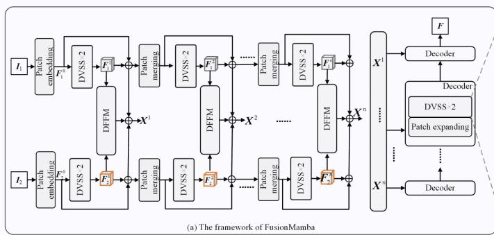

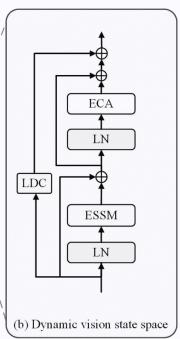

原理：在状态空间模型（SSM）中引入跨模态门控，实现隐空间动态融合。

 动态视觉状态空间模块（DVSS）：将图像分块映射为状态序列。  
 门控机制：调节文本对图像特征的增强强度。

公式： $\mathbf { h } _ { t + 1 } = \mathbf { A } \mathbf { h } _ { t } + \mathbf { B } \big ( \mathbf { v } _ { \mathrm { i m a g e } } \odot \sigma \big ( \mathbf { W } _ { c } \mathbf { v } _ { \mathrm { t e x t } } \big ) \big )$

其中， 为状态转移矩阵，⋅ 为逐元素乘。

优势：在 RGB-IR 目标检测任务中超越 Transformer，适合广告素材中的跨模态对齐（如商品图与描述文本）。

# 四、双线性池化（Bilinear Pooling）

捕捉模态间高阶交互，提升细粒度特征融合。

# 1、多模态紧凑双线性池化（MCB）Multimodal Compact Bilinear

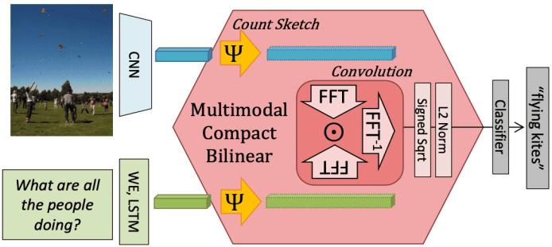

原理：将特征投影到高维空间后做外积，再通过 FFT 加速计算。

$\mathbf { \Sigma } _ { \Delta \mathbf { \bar { x } } \mathbf { \Xi } \mathbf { \bar { x } } } : \mathbf { z } = = = \mathrm { F F T } ^ { - 1 } ( \mathrm { F F T } ( \phi ( \mathbf { v _ { \mathrm { t e x t } } } ) ) \odot \mathrm { F F T } ( \phi ( \mathbf { v _ { \mathrm { i m a g e } } } ) ) )$ ， $\phi$ 为随机投影矩阵。

改进： MFB（多模态因子分解双线性池化），引入低秩分解降低计算量：

$$
\mathbf {z} = \mathbf {U} ^ {T} \left(\mathbf {v} _ {\mathrm {t e x t}} \otimes \mathbf {v} _ {\mathrm {i m a g e}}\right), \mathbf {U} \text {为 低 秩 投 影 矩 阵 。}
$$

# 面试题：高基数类别特征的 Embedding 维度如何确定？

高基数类别型特征（如用户 ID、商品ID等）的 Embedding维度确定需综合考虑特征基数、模型复杂度和任务需求，以下是embedding维度确定的主要方法：

# 1. 基于特征基数对数关系

 理论上，Embedding 维度应与特征基数（即唯一值数量 vocab_size）的对数成正比。例如，若特征基数为 100 万（如内容 ID），可选用约 20 维；而基数较小的特征（如性别、地域）则适合更低维度（如 4-8 维）。  
 公式参考：dim≈log(vocab_size)

其中 vocab_size 为特征唯一值数量。例如，若 vocab_size=1e6，则 $\mathsf { l o g } 2 ( 1 \mathsf { e } 6 ) { \approx } 2 0 _ { \ast }$

# 2. 平衡模型性能与计算资源

 高基数特征：若直接采用固定维度（如所有特征统一为 16维），可能导致大基数特征欠拟合（信息压缩不足）或小基数特征过拟合（冗余参数）。推荐采用动态维度分配，例如：

 对百万级特征使用 20-64 维；  
 对千级特征使用 8-16 维；  
 对百级以下特征使用 4-8 维。

 资源限制：在内存或计算资源受限时，可通过哈希分桶（如将百万级特征映射到 1 万桶）降低实际基数，再设置合理维度。

# 3. 高级方法参考

 变长 Embedding：使用矩阵变换（如线性投影）将不同维度统一到固定长度，或通过分块拼接/截断处理，兼顾灵活性与计算效率。  
 自动化方法：如谷歌的 DHE（Deep Hash Embeddings）[详见 https://arxiv.org/pdf/2010.10784v2]通过多层神经网络动态生成 Embedding，避免预设维度，适用于超大规模特征。

DHE 将嵌入生成分为编码阶段 （Encoding）和解码阶段 （Decoding）：

编码阶段：多哈希函数映射，使用多个（如 1024 个）哈希函数将特征值（如 ID）映射为一个高维稠密向量。每个哈希函数生成一个整数，并通过归一化转化为均匀分布或高斯分布的实数向量。  
解码阶段：深度神经网络（DNN）转换，将编码后的向量输入多层神经网络（如 MLP），通过非线性激活函数（如 Mish）生成最终嵌入向量。DNN 的参数规模与特征词表无关，显著降低内存消耗。

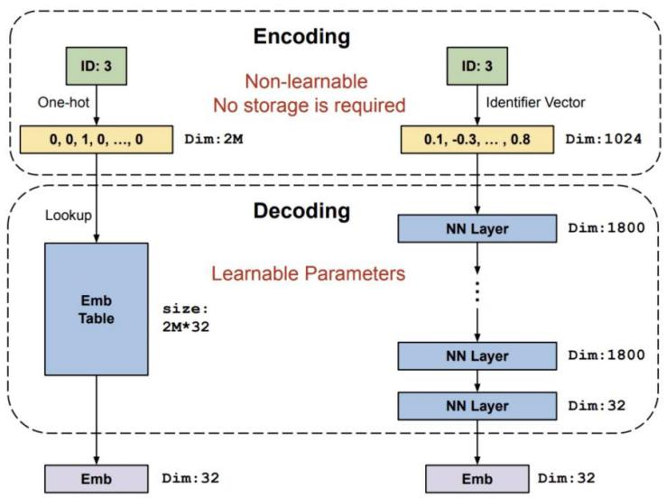  
（a) One-hot  
(b)Deep Hash Embedding (ours)

# 4. 实践建议

 初始设定：按 dim=log2(voc_size)作为基准，例如百万级特征设为 20 维，万级特征设为 16 维。然后，通过交叉验证测试不同维度的模型效果。例如，从较低维度（如 16 维）开始逐步增加，观察验证集性能变化，选择边际收益显著下降前的临界点。  
 动态调整：根据任务类型（分类/回归）和模型结构（如是否结合注意力机制）灵活调整，复杂交互任务需更高维度。

# 面试题：特征重要度评估有哪些方法？

在机器学习和深度学习中，特征重要度评估是特征工程、模型优化的核心环节。以下详细介绍几类主流的特征重要度计算方法：

# 一、基于统计的方法（较为传统，现在用的很少）

# 1. 相关系数法

 原理：通过计算特征与目标变量之间的线性相关性（如皮尔逊相关系数），衡量特征重要性。皮尔逊系数的计算公式为：

$$
r = \frac {\sum \left(x _ {i} - \bar {x}\right) \left(y _ {i} - \bar {y}\right)}{\sqrt {\sum \left(x _ {i} - \bar {x}\right) ^ {2} \cdot \sum \left(y _ {i} - \bar {y}\right) ^ {2}}} \text {, 取 值 范 围 为} [ - 1, 1 ], \text {绝 对 值 越 大 表 示 相 关 性 越 强 。}
$$

 适用场景：连续型特征与目标变量的线性关系分析，例如金融风控中的收入与违约率关联。  
 优缺点：计算高效，但仅能捕捉线性关系，无法处理非线性或高阶交互效应。

# 2. 卡方检验与互信息

 原理：

卡方检验：评估特征与目标变量的独立性，卡方值越大，独立性越低，特征越重要。

互信息：基于信息论，衡量特征与目标变量的信息共享程度，适用于非线性关系。

$$
I (X; Y) = \sum_ {x \in X} \sum_ {y \in Y} p (x, y) \log \frac {p (x , y)}{p (x) p (y)}
$$

 适用场景：分类任务中离散特征的重要性评估，如文本分类的词频筛选。  
 优缺点：无需依赖模型，但对高维数据敏感，互信息计算复杂度较高。

# 二、基于树模型的方法（树模型自带）

# 1. 随机森林

 原理：通过多棵决策树的平均特征重要性（如基尼指数减少量或平均精度下降）评估特征贡献。

$$
\text {I m p o r t a n c e} _ {i} = \frac {1}{N _ {\text {t r e e s}}} \sum_ {T} \sum_ {t \in T} \left(\Delta \operatorname {G i n i} _ {t} \cdot I (\text {s p l i t n o d e} = i)\right)
$$

 适用场景：复杂非线性关系下的特征选择，如医疗诊断中的多指标联合分析。  
 优缺点：抗过拟合能力强，但计算成本高，特征交互解释性弱。

# 2. 梯度提升树（GBDT）

 原理：通过特征在所有树中的分裂次数或信息增益总和计算重要性，常用于 XGBoost、LightGBM 等框架。

下面公式是基于损失函数梯度和二阶导数计算特征分裂的增益总和，来计算特征特重要度：

$$
\text {I m p o r t a n c e} _ {i} = \sum_ {\text {s p l i t s}} \left(\frac {\partial L}{\partial f}\right) ^ {2} \cdot \text {H e s s i a n}
$$

 适用场景：大规模数据下的特征优化，如广告点击率预测中的用户行为特征排序。  
 优缺点：精度高，支持缺失值处理，但训练时间长。

# 三、基于深度学习的方法

# 1. 基于扰动的方法

这种方法符合人类直觉：如果去掉某个特征后模型表现大幅下滑，就说明这个特征很重要。具体操作方法包括：

 特征置零/掩码（Mask）：在模型推理时，将待评估特征的全部值置为 0 或一个特殊值，然后观察模型评估集上 AUC 等指标的下降幅度（AUC Diff）。  
 排列重要性（Permutation Importance）：对验证集中某个特征的值进行随机打乱，破坏其与标签的关系，然后观察模型性能的下降程度。下降越多，特征越重要。

# 2. 基于模型内置权重的方法

 梯度与显著图（Saliency Maps）：对于深度学习模型，可以通过计算模型输出相对于输入特征的梯度。梯度绝对值越大，表明特征微小的变化对输出影响越大，其重要性可能越高。  
 注意力权重（Attention Weights）：如果模型结构中含有注意力机制（Attention Mechanism），那么注意力权重本身就可以直接解释为不同特征或特征交互的重要性。例如，在Transformer或FiBiNet 等模型中，注意力权重的高低直观反映了模型对不同特征的“关注”程度。  
 SENet（Squeeze-and-Excitation Network）：最初用于计算机视觉，后被引入推荐模型如 FiBiNet。SENet 通过“压缩”和“激励”两个步骤，自动学习每个特征域（Field）的重要性权重，然后对原始特征 Embedding 进行加权，从而放大重要特征的作用，抑制不重要或噪声特征。

PS：这类方法效率很高，但需要谨慎选择。例如，梯度的绝对值可能受特征数值尺度影响；自动学习的注意力权重有时可能并不完全可靠。

# 面试题：如何基于特征 Shuffle 进行特征重要度评估？

基于特征 Shuffle 的特征重要度评估算法（Permutation Importance）是一种模型无关的方法（该方法目前在大厂里用的比较多），通过破坏特征与目标变量的关联性来评估其对模型预测的影响。

# 一、算法步骤

$\textcircled{1}$ 训练基准模型

使用原始数据集（包含特征 $X _ { 1 } , X _ { 2 } , \ldots , X _ { n }$ 和目标变量 ）训练模型，并在测试集上评估基线性能指标（如 AUC，记为 AUC_origin）。

$\textcircled{2}$ 特征逐个打乱

特征扰动：对每个特征 $X _ { i }$ 独立进行随机打乱（Shuffle），破坏其与 的关联性，其他特征不变。

$\textcircled{3}$ 计算性能指标变化

Shuffle 特征后，评估模型在测试集上的 AUC（记为 AUC_shuffle）；

重要性得分【AUC_lift $=$ AUC_shuffle - AUC_origin】，一般来说，如果特征越重要，AUC_lift 负的更多。

$\textcircled{4}$ 排序与筛选

按重要性得分对特征排序，筛选出对模型影响显著的特征。

# 二、优点

 模型无关性：适用于任何模型（如神经网络、树模型等），无需依赖模型内部机制（如梯度或分裂次数）。  
 直观可解释：通过性能变化的绝对值量化重要性，结果易于理解（如“打乱年龄特征后 AUC 下降 $10 \% ^ { \prime \prime }$ ）。  
 捕捉非线性：即使特征与目标 呈非线性或存在交互作用，也能通过 AUC 变化间接反映其重要度。

# 三、缺点

 计算成本高：需对每个特征多次打乱并重新评估模型，高维数据场景下效率低。  
 高估冗余特征：若多个特征高度相关，单独打乱某一特征时，其他相关特征可能补偿其作用，导致特征重要性被低估。  
 破坏数据分布：打乱特征可能生成非现实数据（如将年龄替换为不合理的极端值），影响模型评估的可靠性。

# 四、改进方法

 并行化计算：利用多线程或分布式计算加速特征打乱过程。  
 特征分组打乱：对高度相关的特征组进行联合打乱，避免低估重要性。  
 稳定性验证：通过交叉验证多次运行算法，取重要性得分的均值以降低随机性影响。

# 面试题：预训练 User/Item Emb 如何利用以提升精排模型性能？

在推荐系统的精排模型中，如何有效利用预训练 User/Item Embedding 提升精排模型性能，介绍以下具体方法：

# 1. 直接拼接（Concatenation）

 方法：将 User Embedding 与 Item Embedding 直接拼接，输入 DNN 进行高阶隐式交叉（如 YouTube DNN、Wide &Deep 的 Deep 侧）。  
 优缺点：实现简单，适合快速验证 Embedding质量。依赖 DNN的隐式交叉能力，可能丢失显式特征交叉关联性。

# 2. 显式特征交叉（Explicit Feature Interaction）

 FM 交叉：通过内积计算 User 与 Item Embedding 的二阶交叉（如 DeepFM 的 FM 分支）。  
DCN 交叉：使用 Cross Layer 对 embedding 实现显式高阶交叉，如公式： $x _ { l + 1 } = x _ { 0 } \cdot x _ { l } ^ { T } w + b + x _ { l }$ 通过逐层叠加实现任意阶数特征组合。

# 3. Target Attention（DIN）

 原理：以候选 Item Embedding 为 Query，动态计算用户历史行为序列中各 Item 的注意力权重，加权生成用户兴趣表征。

$$
V _ {u} (A) = \sum_ {j = 1} ^ {H} a \left(e _ {j}, v _ {A}\right) e _ {j}
$$

 公式： ，其中 为注意力网络， $v _ { A }$ 为候选 Item Embedding。

实现“千物千面”，解决固定池化导致的信息损失问题。

# 4. Multi-Head Self Attention

 应用：在用户行为序列中，通过多头自注意力捕捉长期依赖（如 Transformer 结构）。  
 基于用户历史行为的预训练 item_embedding，做 multi-head self attention，得到最终融合历史行为的 user_embedding，可再和预训练用户 user_embedding 做拼接、交叉后输入基座模型。

# 5. RNN/GRU/Transformer 序列建模

 方法：将用户行为序列的 Item Embedding 输入 RNN/GRU/Transformer，生成时序敏感的 User Embedding（如 DIEN）。  
 优化：引入注意力门控机制，过滤部分用户的噪声行为。

# 6. Embedding 工程实践技巧

 Embedding 归一化：

 归一化：对 Embedding 进行归一化（LayerNorm 或 BatchNorm），避免向量长度差异影响相似度计算。

 动态特征选择（SENet/FiBiNet）

 SENet：通过通道注意力机制筛选重要特征，抑制噪声（如 SENet 模块）。  
 FiBiNet：结合 SENet与显式二阶交叉（哈达玛积），增强模型表达能力。

# 面试题：特征等距分桶和等频分桶的优缺点

在特征工程中，等距分桶 (Equal-Width Binning) 和 等频分桶 (Equal-Frequency Binning) 是两种基础且常用的连续特征离散化方法。

<table><tr><td>对比维度</td><td>等距分桶</td><td>等频分桶</td></tr><tr><td>核心思想</td><td>将特征的值域范围划分为若干个宽度相等的区间。</td><td>将数据划分为若干个样本数量大致相等的区间。</td></tr><tr><td>区间特点</td><td>每个桶的数值范围（Range=最大值-最小值）相同。</td><td>每个桶内包含的数据点数量相近，但数值范围可能差异很大。</td></tr><tr><td>对数据分布的敏感性</td><td>敏感。如果数据分布不均匀，可能导致各桶样本数差异巨大。</td><td>相对不敏感。能保证每个桶都有一定的数据量。</td></tr><tr><td>对异常值的处理</td><td>敏感。异常值会拉大值域，导致大部分数据聚集在少数几个桶中。</td><td>相对稳健。异常值通常会被归入头部或尾部的桶，对其他桶影响较小。</td></tr><tr><td>计算复杂度</td><td>低。只需知道特征的最小值、最大值和桶数量。</td><td>稍高。需要计算分位数点来确定切分位置。</td></tr><tr><td>结果直观性</td><td>高。桶边界是整齐的数值，易于业务解释。</td><td>较低。桶边界由数据分布决定，可能是不规则的数值。</td></tr></table>

# 原理与优缺点分析

# 等距分桶

操作步骤通常包括：首先确定需要划分的桶的数量 k，然后根据公式：

最大值－最小值桶宽度=k

计算每个桶的宽度，最后根据此宽度划分出多个左闭右开或左右皆闭的分桶区间。

 主要优点：

 简单直观：原理和实现都非常简单，生成的区间规则，便于业务理解和沟通。  
 易于实现：计算效率高，无需复杂的统计计算。

 主要缺点：

 对数据分布敏感：当数据分布高度偏斜时，容易导致某些桶内数据极少（甚至为空），而某些桶内数据过多，这会使桶的区分度下降，不利于模型学习有效的规律。  
 对异常值敏感：极端异常值会拉宽整个值域，导致绝大多数正常数据被挤压在少数几个桶中，损失了大量信息。

# 等频分桶

操作步骤通常包括：首先确定需要划分的桶的数量 k，然后找到数据的分位数点（例如，要将数据分为 4份，就需要找到 $2 5 \%$ 、 $50 \%$ 、 $7 5 \%$ 这三个分位数），这些分位数点即为桶的边界。

#  主要优点：

 缓解数据分布不均问题：能确保每个桶都拥有一定数量的样本，避免了空桶或样本数极少的桶出现，使桶的样本支撑更稳定。  
 对异常值更稳健：由于按样本数量划分，异常值通常只会影响其自身所在桶的边界，而不会像等距分桶那样“挤压”其他所有区间。

#  主要缺点：

 可能混合不同性质数据：为了保证数量相等，可能会将数值差异巨大、本不属于同一种模式的观测值放入同个桶中，这可能会引入噪声。  
 桶边界可能不规整：产生的桶边界是数据驱动的分位数点，可能是一些不规则的数值（如 0.123, 15.678），业务解释性不如等距分桶的整齐边界。

# ① 如何选择分桶方法

选择哪种分桶方法并非一成不变，需根据具体场景和目标而定。

 优先考虑等距分桶的情形：当数据分布相对均匀，或你对业务有深刻理解，需要生成规则、易于向非技术人员解释的区间时（如在信用评分模型中定义“300-500分”为低信用区间），等距分桶是个不错的选择。  
 优先考虑等频分桶的情形：当数据分布极度偏斜（如个人收入数据），或者你更关注每个区间是否有足够的样本量以  
 保证统计稳定性时，等频分桶通常能提供更可靠的结果。在特征分析阶段，也常使用等频分箱来观察特征与标签之间的关系。  
 此外，还有一些更高级的分桶方法可以作为备选方案，例如基于卡方检验、决策树或聚类的有监督/无监督分桶方法。这些方法能够更好地将特征分布与目标变量联系起来，从而可能产生区分能力更强的桶，当然其计算复杂度和实现难度也相对较高。

# 第三章：召回与粗排算法

# 面试题：召回有哪些负采样方法？

在互联网大厂推荐召回算法中，负样本采样是提升模型区分能力的关键技术。以下结合工业界实践详细介绍负采样的主要方法：

# 一、基础采样方法

# 1. 随机负采样（RNS）

原理：从全体候选池中随机抽取未交互样本作为负例。  
 特点：简单高效，符合线上候选池分布，但对热门物料敏感，可能无法区分细粒度差异。  
改进：热门打压（如Youtube策略）调整采样概率：

$P _ { n e g } ( i ) \propto$ 流行度 $( i ) ^ { 0 . 7 5 }$ ，通过降低热门物品的负采样概率，缓解头部效应。

# 2. 基于流行度的负采样

原理：根据物品曝光/点击频率调整采样权重，热门物品更易被选为负例。  
特点：抑制头部物料过曝，但可能过度打压长尾。

$$
P _ {n e g} (i) = \frac {\text {流 行 度} (i) ^ {\alpha}}{\sum_ {i} \text {流 行 度} (i) ^ {\alpha}}
$$

 数学公式： $\scriptstyle { \sum _ { j } }$ ，其中 $\alpha \in ( 0 , 1 )$ 用于平滑分布（常用 $\mathtt { 0 = 0 . 7 5 }$

# 二、进阶采样方法

# 3. 硬负采样（Hard Negative Sampling）

原理：选择与用户兴趣相近但未交互的样本，提升模型细粒度区分能力。  
典型方法：

 业务规则：如 Airbnb 选取同城未点击房源作为硬负样本。

 模型筛选：Facebook EBR 使用上一版模型召回结果中排名 101-500 的样本。

 选择相似度接近正样本但低于点击阈值的样本作为负例。

# 4. 混合采样策略

 原理：结合随机负样本（Easy Negative）与硬负样本（Hard Negative），平衡分布与难度。  
公式示例 （混合损失函数）：

$$
\mathcal {L} = \lambda \mathcal {L} _ {\mathrm {e a s y}} + (1 - \lambda) \mathcal {L} _ {\mathrm {h a r d}}, \text {其 中} \lambda \text {控 制 权 重 。}
$$

# 5. 动态自适应采样

原理：根据模型反馈动态调整采样分布。  
典型方法：

 DNS（动态负采样）：选择当前模型预测分数高的未交互样本作为负例。

 ESANS（阿里）：基于多模态嵌入和 RQ 分层聚类，通过线性插值生成困难样本。

插值公式： ${ \bf e } _ { \mathrm { i n t e r p } } = \beta { \bf e } _ { \mathrm { p o s } } + ( 1 - \beta ) { \bf e } _ { \mathrm { h a r d } }$ ，其中 β⋅[0,1] 控制插值强度。

# 三、采样相关优化

# 1. 采样偏差修正

问题：训练数据与线上分布不一致（SSB 问题）。  
解法：阿里 ESAM 通过迁移学习正则化损失函数：

$\mathcal { L } _ { \mathrm { E S A M } } = \mathcal { L } _ { \mathrm { b a s e } } + \gamma \Vert \theta _ { \mathrm { s o u r c e } } - \theta _ { \mathrm { t a r g e t } } \Vert ^ { 2 }$ ，其中 θ 为模型参数，γ 为权重。

# 2. 对比学习损失

应用场景：双塔模型中的 In-batch 采样。

$$
\mathcal {L} = - \log \frac {e ^ {\mathbf {q} ^ {T} \mathbf {k} ^ {+}}}{e ^ {\mathbf {q} ^ {T} \mathbf {k} ^ {+}} + \sum_ {i = 1} ^ {N} e ^ {\mathbf {q} ^ {T} \mathbf {k} _ {i} ^ {-}}}
$$

 公式：

其中 q 为用户向量， $\mathbf { k } +$ 为正样本， $\mathbf { k } _ { i } ^ { - }$ 为 Batch 内其他样本作为负例。

# 四、策略对比

<table><tr><td>方法</td><td>计算成本</td><td>样本难度</td><td>长尾覆盖</td><td>工业实践</td></tr><tr><td>随机负采样</td><td>低</td><td>简单负样本</td><td>高</td><td>初期基线（YouTube、小红书）</td></tr><tr><td>流行度负采样</td><td>低</td><td>中等难度</td><td>低</td><td>需热门打压场景（电商推荐）</td></tr><tr><td>硬负采样</td><td>高</td><td>困难负样本</td><td>中</td><td>Airbnb、Facebook EBR</td></tr><tr><td>混合采样</td><td>中</td><td>多难度混合</td><td>中高</td><td>多场景通用（MNS、CBNS）</td></tr><tr><td>动态自适应采样</td><td>高</td><td>自适应难度</td><td>高</td><td>阿里 ESANS、百度 Mobius</td></tr></table>

 初期：优先采用随机采样+流行度打压 （如 $P _ { n e g } ( i ) \propto$   
 中期：引入动态硬负采样 （如 DNS 或 ESANS 插值）。  
 复杂场景：结合业务规则（如地域/类目过滤）与模型筛选，提升个性化效果。

# 面试题：介绍阿里 ESANS 召回负采样方法

# 一、提出背景

在推荐系统召回阶段，负采样质量直接影响模型区分用户兴趣的能力。传统方法存在三大痛点

 随机采样（UNS）：易采样到与用户兴趣无关的“简单负样本”（如冷门商品），模型难以学习细粒度差异；  
 启发式规则采样 （如 Airbnb 同城未点击样本）：引入流行度偏差，导致长尾覆盖不足；  
 基于模型的硬负采样 （如 MixGCF）：计算成本高且易生成语义不完整的伪负样本（False Negatives）。

阿里 ESANS 的提出旨在通过多模态语义对齐和动态难度控制，解决上述问题，提升召回模型的语义理解能力和长尾覆盖效果。

论文地址：ESANS: Effective and Semantic-Aware Negative Sampling for Large-Scale Retrieval Systems

# 模型原理

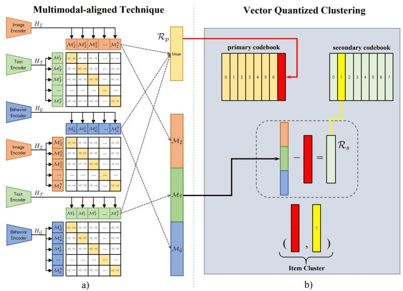

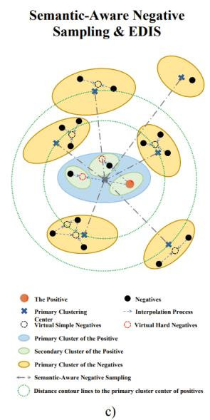  
Figure2:Our proposed ESANS framework.a)Multimodal-aligned Technique.b) Vector Quantized Clustering with Cascaded Codebooks.c) Semantic-Aware Negative Sampling & Effective Dense Interpolation Strategy (EDIS).

ESANS 框架包含三个核心模块：

# 1. 多模态对齐与分层聚类

 多模态对齐：融合文本（BERT）、图像（CLIP）、行为（GNN）三种模态特征，通过对比学习对齐语义空间：  
 分层残差量化（RQ）：

 一级码本：粗粒度聚类，基于多模态均值特征进行 K-means 划分；  
 二级码本：细粒度划分，对一级聚类残差（各模态特征与一级中心的差值拼接）再次聚类。

# 2. 语义感知负采样策略

 易负样本（Easy Negatives）：从其他一级簇中按相似度概率采样：

$$
P (C _ {j} | C _ {i}) \propto {\frac {1}{\mathrm {d i s t} (C _ {i} , C _ {j})}}, \quad {\text {归 一 化 为}}   {\frac {e ^ {- \mathrm {d i s t} (C _ {i} , C _ {j})}}{\sum_ {k} e ^ {- \mathrm {d i s t} (C _ {i} , C _ {k})}}}
$$

 硬负样本（Hard Negatives）：在同一一级簇内但不同二级簇中采样，确保语义相近但细节差异。

# 3. 高效密集插值（EDIS）

简单插值：在簇内样本间线性插值生成虚拟样本：

$$
\mathbf {e} _ {\text {v i r t u a l}} = \alpha \mathbf {e} _ {i} + (1 - \alpha) \mathbf {e} _ {j}, \quad \alpha \sim U (0, 1)
$$

困难插值：在正样本与硬负样本间插值，动态调整难度：

$$
\mathbf {e} _ {\text {h a r d - i n t e r p}} = \beta \mathbf {e} _ {\text {p o s}} + (1 - \beta) \mathbf {e} _ {\text {h a r d}}, \quad \beta \in [ - 0. 5, 1. 5 ]
$$

# 三、实验效果

# 1. 离线实验

 数据集：Amazon Electronics、Pixel-Rec 等；  
 指标：Recall@50 平均提升 $1 5 . 3 2 \%$ ，Recall@200 提升 $1 0 . 7 3 \%$ （见表 2）。

# 2. 在线 A/B 测试

 电商场景：广告收入 $+ 2 . 8 3 \%$ ， $\mathsf { C T R } { + } 1 . 1 9 \%$ ， $6 M V + 1 . 9 4 \%$

# 四、小结

 多模态语义对齐：消除单模态偏差，提升负样本语义相关性；  
 动态难度控制：通过插值策略平衡难/易样本比例；  
 长尾覆盖优化：分层聚类减少伪负样本，提升冷门商品召回率。

# 面试题：召回针对 Recall@N 指标优化的 CROLoss 介绍

# 一、CROLoss 背景

推荐系统中的召回模型常面临指标与损失函数不匹配的问题。传统损失函数（如交叉熵、BPR、Triplet Loss）主要优化分类或排序目标，而非直接针对召回率（Recal $@ \mathbb { N }$ ）这一核心指标。

CROLoss（Customized Recall-Optimized Loss）由 CIKM 2022 提出，旨在通过可定制的损失函数直接优化召回指标，并适配不同业务场景的检索规模需求。

论文地址：CROLoss: Towards a Customizable Loss for Retrieval Models in Recommender Systems

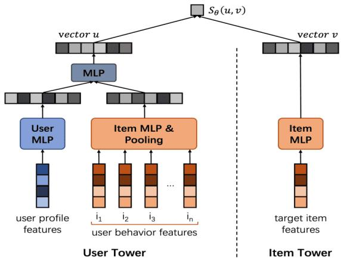

# 二、核心原理

# 1. 召回指标建模

CROLoss 将 Recall@N 转化为成对比较任务：对每个正样本，确保其与用户的相似度高于负样本。通过引入比较核函数（Comparison Kernel）和权重函数 （Weight Function），动态调整样本对的重要性。

# 2. 定制化能力

 比较核函数：定义正负样本得分差异的惩罚强度，支持 Sigmoid、Softplus、阶跃函数等。  
 权重函数：根据召回规模 N调整样本权重，例如当 N较小时，关注头部样本的区分度。

# 3. 与传统损失的关系

CROLoss 构建了一个统一损失空间，通过选择不同核函数可退化为：

 BPR Loss：选择 Sigmoid 核  
 Triplet Loss：选择 Hinge 核  
 交叉熵：选择 Softmax 核

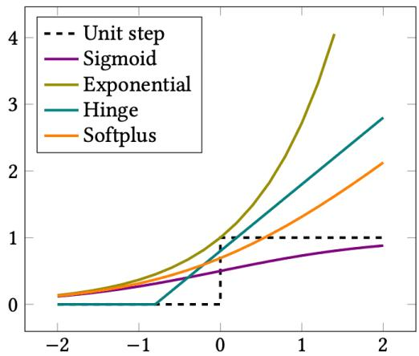  
Figure 2: Example of optional comparison kernel functions.

# 三、数学公式

# 1. 基本形式

$$
\mathcal {L} = \sum_ {(u, i ^ {+}, i ^ {-})} \phi (s (u, i ^ {-}) - s (u, i ^ {+})) \cdot w (N)
$$

 s(u,i)：用户-物品相似度得分  
 $\phi ( \bigtriangledown )$ ：比较核函数（如 Sigmoid、Softplus）  
 w(N)：权重函数，与 N 相关

# 2. Lambda 梯度优化

引入双核函数机制，分离梯度计算中的排序和权重调整角色：

 核函数 1（如 Sigmoid）：控制样本对的梯度方向  
 核函数 2（如 Softplus）：调整梯度幅值

# 四、实验效果

以下为 CRO Loss 与交叉熵损失、三元组损失、bpr 损失的实验对比结果

<table><tr><td>Datasets</td><td>Methods</td><td>R@50</td><td>R@100</td><td>R@200</td><td>R@500</td></tr><tr><td rowspan="5">Amazon</td><td>cross-entropy loss</td><td>9.68</td><td>13.24</td><td>17.46</td><td>24.26</td></tr><tr><td>triplet loss</td><td>7.53</td><td>11.21</td><td>15.93</td><td>24.11</td></tr><tr><td>BPR loss</td><td>8.24</td><td>12.08</td><td>16.96</td><td>25.21</td></tr><tr><td>CROLoss1</td><td>10.20</td><td>14.03</td><td>18.63</td><td>26.06</td></tr><tr><td>CROLoss-lambda2</td><td>10.17</td><td>14.07</td><td>18.81</td><td>26.20</td></tr><tr><td rowspan="5">Taobao</td><td>cross-entropy loss</td><td>4.71</td><td>6.59</td><td>9.01</td><td>13.13</td></tr><tr><td>triplet loss</td><td>2.46</td><td>3.71</td><td>5.43</td><td>8.84</td></tr><tr><td>BPR loss</td><td>2.89</td><td>4.33</td><td>6.35</td><td>10.25</td></tr><tr><td>CROLoss</td><td>4.75</td><td>6.65</td><td>9.06</td><td>13.13</td></tr><tr><td>CROLoss-lambda4</td><td>5.27</td><td>7.35</td><td>10.01</td><td>14.57</td></tr></table>

1.Use softplus as kernel and set $_ { \alpha }$ to 1.0.   
2. Use sigmoid as kernel 1 and softplus as kernel 2 and set $_ { \alpha }$ to 1.0.   
3.Use exponential askernel and set $_ { \alpha }$ to 1.4.   
4.Use sigmoid as kernel 1 and exponential as kernel 2 and set $_ { \alpha }$ to 1.4.

# 结论：

# 理想情况：一致性越高越好

理论上，粗排的目标是拟合精排的排序逻辑。若精排绝对精准，粗排与其完全一致可确保优质候选不被遗漏，提升系统整体效率。例如，通过模型蒸馏 （精排指导粗排）或特征共享可拉齐两者打分。

# 现实约束：一致性并非绝对要求

1. 精排的局限性：精排受特征稀疏性、模型复杂度限制，预估可能存在偏差（如高估热门、低估长尾）。此时粗排若完全对齐精排，可能放大错误，反而降低效果。  
2. 角色分工差异：两者目标不同，完全一致可能导致粗排过度筛选，牺牲多样性。

 粗排：更关注候选集的覆盖能力（Recall-oriented），需快速区分用户可能喜欢与不喜欢的物品。  
 精排：聚焦头部精准排序（Precision-oriented），深入分析用户-物品交互特征。

# 3. 不同场景的权衡：

 大流量场景：一致性更关键，精排可快速修正粗排输出。  
 小流量/冷启动场景：粗排需与召回配合，通过先验知识补充精排数据不足，此时一致性可适当放宽。

在推荐系统的多级链路（召回 粗排 精排 重排）中，粗排（Pre-Ranking）承担着承上启下的关键角色，其作用与精排（Ranking）的关系既紧密又存在微妙差异。

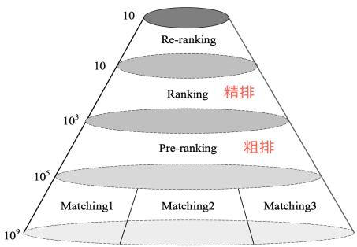

# 粗排的核心作用

# 1. 高效过滤与候选集缩减

a. 粗排的核心目标是从召回阶段的海量候选集（通常数千至百万级）中快速筛选出几百到几千条高质量候选，大幅降低精排的计算负担。  
b. 技术实现：采用轻量模型（如双塔 DNN）或规则策略（如热度过滤），单条请求处理时间控制在 n 毫秒以内，确保高并发场景的低延迟。

# 2. 平衡效率与多样性

粗排需兼顾相关性 （保留潜在用户兴趣物品）和多样性 （避免过度依赖热门内容，为冷门物品留机会），为后续精排提供丰富输入。例如，电商平台可能通过品类配额分配（流量池）确保各品类均有曝光机会。

# 3. 缓解样本选择偏差（SSB）

粗排面对的候选集包含大量未曝光样本，而训练数据仅来自精排曝光的子集。通过引入未曝光负样本（如全局随机采样或困难负样本），可减少离线训练与线上预测的分布差异。

# 二、粗精排不一致的正向和负向影响

<table><tr><td>影响类型</td><td>正向效果</td><td>负向风险</td></tr><tr><td>效果优化</td><td>粗排补充精排未覆盖的长尾候选(如高方差物品)</td><td>粗排高分但精排低分的候选挤压优质物品曝光</td></tr><tr><td>系统效率</td><td>粗排简化模型降低延迟，保障实时性</td><td>严重不一致导致精排输入质量下降，整体效果损失</td></tr><tr><td>业务目标</td><td>粗排独立引入多样性策略，打破信息茧房</td><td>商业规则（如广告插入）在精排阶段被破坏</td></tr></table>

# 三、业界的粗精排一致性优化相关实践

# 1. 动态一致性优化

 蒸馏技术：使用精排的 Soft Label 指导粗排训练，既吸收精排知识，又保留粗排灵活性。  
 特征工程：粗排复用精排的 Embedding 层，但限制交叉特征以平衡效果与性能。

# 2. 评估指标创新

淘宝提出 ASH (All-Scenario Hitrate)，用全场景正样本（如跨场景点击/购买）评估粗排的覆盖能力，取代传统 HitRate@K。可参考：https://arxiv.org/pdf/2305.13647

# 3. 样本构造升级

如 ASMOL 框架：训练时同时输入曝光样本、精排未曝光样本、粗排未曝光样本，通过多目标学习（曝光/点击/购买）缓解 SSB 问题。

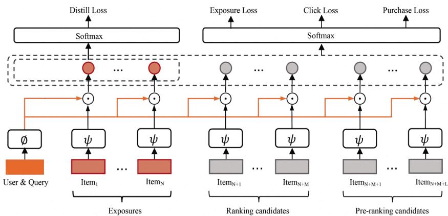  
Figure 3: The All-Scenario-based Multi-Objective Learning framework (ASMOL)in Taobao Search

# 面试题：召回粗排双塔模型为什么最后一层要进行 Layer Normalization？

# 回答总结：

在推荐系统的召回粗排双塔模型中，最后一层应用 Layer Normalization (LayerNorm) 是一项关键优化。

Layer Normalization 在双塔模型中的主要作用有如下四点：

<table><tr><td>作用方面</td><td>具体说明</td></tr><tr><td>保持训练稳定</td><td>归一化层输入，缓解内部协变量偏移，加速收敛。</td></tr><tr><td>相似度计算一致性</td><td>使点积等价于余弦相似度，并与向量检索引擎兼容。</td></tr><tr><td>防止模型坍塌</td><td>约束模长，鼓励模型学习均匀分布的表示，提升泛化能力。</td></tr><tr><td>与温度系数协同</td><td>将相似度得分缩放至合适范围，使损失函数能有效关注困难负样本。</td></tr></table>

# 1. 稳定训练与加速收敛

LayerNorm 通过对每个样本的特征维度进行归一化，使神经网络各层的输入分布保持稳定，从而缓解内部协变量偏移问题。具体来说，对于输入向量 x（即双塔最后一层的输出），LayerNorm 的计算步骤如下：

 计算均值和方差：

$$
\mu = \frac {1}{d} \sum_ {i = 1} ^ {d} x _ {i}, \quad \sigma^ {2} = \frac {1}{d} \sum_ {i = 1} ^ {d} (x _ {i} - \mu) ^ {2} \quad ,   \text {其 中} d \text {是 嵌 入 向 量 的 维 度}.
$$

 归一化：

$$
\hat {x} _ {i} = \frac {x _ {i} - \mu}{\sqrt {\sigma^ {2} + \epsilon}} \text {, 这 里} \epsilon \text {是 一 个 很 小 的 常 数 (例 如 1 e - 1 2) , 用 于 防 止 除 以 零 。}
$$

 缩放和平移：

$y _ { i } = \gamma \hat { x } _ { i } + \beta$ ，其中 γ 和 $\beta$ 是可学习的参数，用于恢复模型的表现力。

这种操作使得每个特征维度的数值分布更加稳定，有利于梯度在反向传播时更平稳地流动，从而加速模型收敛并提高训练稳定性。

# 2. 统一向量尺度与相似度计算

在双塔模型中，User Embedding 和 Item Embedding 的相似度通常通过点积或余弦相似度计算。LayerNorm 通过 L2Norm 将向量投影到单位超球面上，带来关键好处：

 点积与余弦相似度等价：对向量 u 和 v 进行 L2 归一化后，点积等价于余弦相似度：

$$
\operatorname {c o s i n e} (u, v) = \frac {u \cdot v}{| | u | | \cdot | | v | |} = \hat {u} \cdot \hat {v}
$$

其中 $\hat { u }$ 和 $\hat { v }$ 是归一化后的向量。

 与向量检索引擎兼容：主流的向量检索引擎（如 FAISS）通常支持内积或欧氏距离作为度量。归一化后，点积计算更高效，且欧氏距离与余弦相似度可以相互转化（因为当向量模长为 1 时，欧氏距离与余弦相似度存在单调关系）。这确保了训练与推理阶段的一致性。

# 3. 防止模型坍塌与提升表示质量

在对比学习框架下，LayerNorm 有助于防止“模型坍塌”（即所有样本的嵌入坍塌到同一个点）。一个好的对比学习系统应兼顾：

 Alignment：正样本对在投影空间中距离应尽可能接近。  
 Uniformity：所有样本在投影空间中的分布应尽可能均匀，以保留个性化信息。

LayerNorm 通过约束向量的模长，迫使模型更专注于学习向量间的角度差异，而非依靠增大向量模长来简单降低损失。这有助于模型学习到更均匀分布的表示，避免坍塌。

如果没有归一化，模型容易“走捷径”：频繁出现的物品（如热门商品）其嵌入向量的模长会被学习得很大，以简单扩大点积值，但这会损害模型对细粒度语义信息的学习能力。

# 4. 与温度系数协同工作

在对比损失（如 InfoNCE Loss）中，温度系数 $\tau$ 与 LayerNorm 协同工作，对模型效果至关重要：

 温度系数的作用：损失函数公式为：

$$
L o s s = - \log \frac {\exp (\sin (u , v _ {+}) / \tau)}{\sum_ {v \in \{v _ {+} \cup V _ {-} \}} \exp (\sin (u , v) / \tau)}
$$

$\tau$ 调节对困难负样本的关注程度。较小的 会使损失更关注那些与正样本相似度较高的困难负样本。

 与 LayerNorm 的协同：LayerNorm 将相似度得分限制在 [−1,1]范围内。若不使用温度系数进行缩放，Softmax 函数的响应会不够敏感，模型难以有效学习。温度系数（通常取 0.01 到 0.1 之间）将相似度得分放大回一个适合 Softmax 函数敏感区间的范围，使梯度更新更具区分性。

# 第四章：精排模型算法

# 4.1 特征交叉结构

面试题：FFM 模型原理介绍

链接: https://www.csie.ntu.edu.tw/~r01922136/slides/ffm.pdf

# 一、原理与核心思想

FFM（Field-aware Factorization Machine）是 FM（Factorization Machine）的改进版， 核心创新在于引入“Field（域）”概念，将特征按业务逻辑分组，使每个特征在与不同域的特征交互时使用不同的隐向量，从而提升特征交叉的精细度。

 FM 的局限性：FM 中每个特征仅有一个隐向量，无法区分不同域特征交互的差异（如“用户年龄”与“电影类型”的交互和“用户年龄”与“价格”的交互使用相同隐向量）。  
 稀疏数据下的特征交互：在推荐系统中，特征高度稀疏（如用户行为、商品类别），FFM 通过域感知隐向量，更精准地捕捉跨域特征组合（如用户性别与电影类型的交互）。

# 1. Field 定义

 同一类特征（如用户域特征、电影域特征等）归为一个 Field，例如：

Field 示例：

User（用户域）: 年龄、性别、职业

Movie（电影域）: 类型、导演、主演

# 2. 模型公式

 FFM 的预测公式为：

$$
\hat {y} (x) = w _ {0} + \sum_ {i = 1} ^ {n} w _ {i} x _ {i} + \sum_ {i = 1} ^ {n} \sum_ {j = i + 1} ^ {n} \left\langle \mathbf {v} _ {i, f _ {j}}, \mathbf {v} _ {j, f _ {i}} \right\rangle x _ {i} x _ {j}
$$

 $w _ { 0 }$ ：全局偏置项， $w _ { i }$ ：一阶特征权重  
$\mathbf { v } _ { i , f _ { j } }$ ：特征 i 针对特征 j 所属域 的隐向量  
 ${ \bf v } _ { j , f _ { i } }$ ：特征 j 针对特征 i 所属域 $f _ { i }$ 的隐向量

# 3. 参数规模

 隐向量维度为 $k$ ，域数量为 F 时，FFM 参数总量为 $\scriptstyle { n \times F \times k }$ ，远高于 FM 的 $\scriptstyle n \times k _ { \circ }$

# 二、优缺点

# 1. 优点

 精细特征交互：通过filed 域感知隐向量，区分不同场景下的特征组合，使某一特征与不同特征做交互是，可发挥不同的重要性，提升模型表达能力；  
可解释性：可解释性强，可提供某些特征组合的重要性。

# 2. 缺点

 复杂度高：时间复杂度为 $O ( k n ^ { 2 } )$ （FM 为 $O ( k n )$ ），特征数 $n$ 较大时训练耗时。模型参数量为 $\scriptstyle { n \times F \times k }$ ，存储和计算资源消耗大，易过拟合（需强正则化）。  
域划分依赖：域划分不合理会导致性能下降，需结合业务经验调整。

# 三、与 FM 的对比

<table><tr><td>维度</td><td>FM</td><td>FFM</td></tr><tr><td>隐向量</td><td>每个特征1个隐向量</td><td>每个特征针对不同域有多个隐向量</td></tr><tr><td>时间复杂度</td><td>O(kn)</td><td>O(kn2)</td></tr><tr><td>参数数量</td><td>n×k</td><td>n×F×k</td></tr><tr><td>适用场景</td><td>中小规模特征</td><td>高维稀疏特征（需强正则化）</td></tr></table>

# 一、背景与动机

 在推荐系统中，特征通常由大量的稀疏特征（如用户 ID、物品 ID、类目等）经过 Embedding 后拼接而成。然而，不同特征域（field）对最终预测的重要性是不同的，而且这种重要性会随着不同的输入样本动态变化。例如，对于某个用户，"年龄"特征可能比"城市"更重要；而对另一个用户则可能相反。  
 传统的 CTR 模型（如 DeepFM、DCN）通常对所有特征域一视同仁地拼接后送入 DNN，缺乏对特征域重要性的动态建模能力。  
 SENet（Squeeze-and-Excitation Network）最早在计算机视觉领域提出（用于通道注意力），后被引入推荐系统，用于对特征域级别的重要性进行动态加权。

# 二、核心思想

SENet 的核心是一个三步操作：Squeeze Excitation Re-Weight，实现对每个特征域 embedding 的自适应重要性缩放。

输入EMBEDDING矩阵

$$
\mathbf {E} = \left[ \mathbf {e} _ {1}, \mathbf {e} _ {2}, \dots , \mathbf {e} _ {f} \right] \in \mathbb {R} ^ {f \times k}
$$

STEP1:SQUEEZE-均值池化

$$
z _ {i} = \frac {1}{k} \sum_ {j = 1} ^ {k} e _ {i, j}, \quad \mathbf {z} = [ z _ {1}, z _ {2}, \dots , z _ {f} ] \in \mathbb {R} ^ {f}
$$

STEP2:EXCITATION-两层FC瓶颈网络

$$
\mathbf {A} = \sigma \left(\mathbf {W} _ {2} \cdot \operatorname {R e L U} \left(\mathbf {W} _ {1} \cdot \mathbf {z}\right)\right), \quad \mathbf {W} _ {1} \in \mathbb {R} ^ {[ f / r ] \times f}, \quad \mathbf {W} _ {2} \in \mathbb {R} ^ {f \times [ f / r ]}
$$

$$
\mathbf {v} _ {i} = a _ {i} \cdot \mathbf {e} _ {i}, \quad \mathbf {V} = [ \mathbf {v} _ {1}, \mathbf {v} _ {2}, \dots , \mathbf {v} _ {f} ] \in \mathbb {R} ^ {f \times k}
$$

# 2.1 输入表示

假设模型有 $f$ 个特征域（fields），每个特征域经过 Embedding 层后得到一个 $k$ 维向量：

$$
\mathbf {E} = \left[ \mathbf {e} _ {1}, \mathbf {e} _ {2}, \dots , \mathbf {e} _ {f} \right], \quad \mathbf {e} _ {i} \in \mathbb {R} ^ {k}
$$

# 2.2 Squeeze（压缩）

对每个特征域的 embedding 向量进行统计量提取，将其压缩为一个标量，形成一个 $f$ 维的全局描述向量。最常用的方式是均值池化（Mean Pooling）：

$$
z _ {i} = \frac {1}{k} \sum_ {j = 1} ^ {k} e _ {i, j}, \quad \mathbf {z} = [ z _ {1}, z _ {2}, \dots , z _ {f} ] \in \mathbb {R} ^ {f}
$$

这一步的目的是将每个域的 embedding 浓缩为一个全局统计量，为后续的注意力计算提供输入。

# 2.3 Excitation（激励）

用一个两层全连接网络（bottleneck 结构）来学习特征域之间的非线性依赖关系，输出每个域的重要性权重：

$$
\mathbf {A} = \sigma \left(\mathbf {W} _ {2} \cdot \operatorname {R e L U} \left(\mathbf {W} _ {1} \cdot \mathbf {z}\right)\right)
$$

其中：

 $\mathbf { W } _ { 1 } \in \mathbb { R } ^ { f / r \times f }$ 是降维矩阵， 是压缩比（reduction ratio），用于控制瓶颈层的维度  
$\mathbf { W } _ { 2 } \in \mathbb { R } ^ { f \times f / r }$ 是升维矩阵，恢复到原始域数  
 $\sigma$ 是 Sigmoid 激活函数，将权重限制在 (0, 1)  
 $\mathbf { A } = [ a _ { 1 } , a _ { 2 } , \dotsc , a _ { f } ] \in \mathbb { R } ^ { f }$ 是学到的各域注意力权重

# 2.4 Re-Weight（重加权）

将学到的注意力权重作用回原始 embedding，对每个特征域的 embedding 进行逐元素缩放：

$$
\mathbf {v} _ {i} = a _ {i} \cdot \mathbf {e} _ {i}, \quad \mathbf {V} = [ \mathbf {v} _ {1}, \mathbf {v} _ {2}, \dots , \mathbf {v} _ {f} ]
$$

这样，重要的特征域会被放大，不重要的特征域会被抑制。

# 三、优势与总结

<table><tr><td>优势</td><td>说明</td></tr><tr><td>动态性</td><td>不同样本获得不同的特征域权重，而非静态的特征选择</td></tr><tr><td>轻量级</td><td>仅引入两个小型全连接层，参数量极小 O(f^2/r)</td></tr><tr><td>即插即用</td><td>可嵌入任何基于 Embedding 拼接的 CTR 模型中</td></tr><tr><td>可解释性</td><td>输出的注意力权重 ai 可直接反映各域重要性</td></tr></table>

# 四、代码示例（PyTorch）

```python
import torch
import torch(nn as nn
class SENet(nnModule):
    """推荐系统中的 SENet: 特征域级别的注意力模块''
    def __init__(self, field_num: int, reduction_ratio: int = 2):
        super().__init()
        reduced = max(1, field_num // reduction_ratio)
        selfexcitation = nn.Sequential(
            nn.Linear(state_num, reduced, bias=False),
            nn.ReLU(inplace=True),
            nn.Linear(reduced, field_num, bias=False),
            nn.Sigmoid()
        )
    def forward(self, embeddings: torch.Tensor) -> torch.Tensor:
        # Squeeze: 均值池化 → (batch, field_num)
        z = embeddings.mean(dim=-1)
        # Excitation: 两层 FC → (batch, field_num)
        a = self.excitation(z)
        # Re-Weight: 逐域缩放 → (batch, field_num, emb_dim)
        return embeddings * a unsqueeze(-1)
    # --- -- 快速验证 ---
if __name__ == "_main":
    batch, fields, dim = 4, 8, 16
    x = torch randn(batch, fields, dim)
    senet = SENet(state_num=fields, reduction_ratio=2)
    out = senet(x)
    print(f"输入: {x.shape} → 输出: {out.shape}") # (4, 8, 16)
    print(f"各域权重示例: {senet.excitation(x.mean(dim=-1)) [0].detach().numpy().round(3)}) 
```

# 面试题：DCN 和 DCN-v2 的原理与区别

以下是 DCN（Deep & Cross Network）与 DCN-v2 模型的原理详解及对比分析：

# 一、 DCN 模型原理

论文地址：Deep & Cross Network for Ad Click Predictions

核心思想：DCN 模型通过显式交叉网络（Cross Network） 与深度网络（Deep Network） 结合，实现特征的高阶交叉和非线性学习，主要用于推荐系统的点击率预测（CTR）任务。

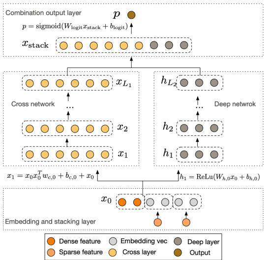  
Figure 1: The Deep & Cross Network

# 1. 交叉网络（Cross Network）

 数学公式：第 $l + 1$ 层的交叉计算为： $x _ { l + 1 } = x _ { 0 } \odot \left( w _ { l } \cdot x _ { l } \right) + x _ { l } + b _ { l }$

其中 $x _ { 0 }$ 是初始输入特征向量， $w _ { l }$ 是权重向量，⋅ 表示逐元素相乘。通过逐层叠加，交叉网络可显式构造最高 $l + 1$ 阶的特征交叉。

 特点：

 参数高效：每层仅增加 $d \times 2$ 参数（ $^ d$ 为特征维度）。  
显式特征交互：通过外积实现特征交叉，避免人工特征工程。

# 2. 深度网络（Deep Network）

由多层全连接层（MLP）构成，学习非线性特征组合，与交叉网络并行或串行输出结果。

# 3. 优势

 结合显式高阶交叉与隐式深度学习，适用于稀疏特征场景。  
 相比传统 Wide&Deep 模型，交叉网络更高效地捕捉特征交互。

# 二、DCN-v2 模型原理

核心改进：DCN-v2 在 DCN 基础上通过矩阵化交叉权重、低秩分解和 MoE（混合专家）结构提升表达能力与效率。

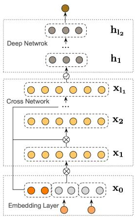  
(a) Stacked

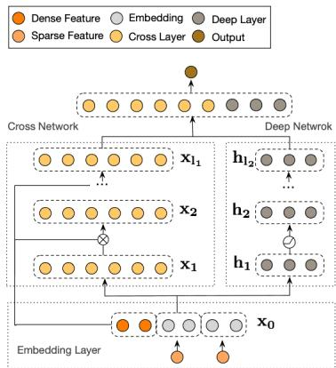  
(b) Parallel

# 1. 交叉网络改进

 矩阵化权重：将权重向量 扩展为矩阵 $W _ { l } \in \mathbb { R } ^ { d \times d }$ ，增强特征交叉的灵活性和表达能力。公式更新为：

$$
x _ {l + 1} = x _ {0} \odot \left(W _ {l} \cdot x _ {l}\right) + x _ {l} + b _ {l}
$$

 低秩分解：对矩阵 $W _ { l }$ 进行低秩分解（如 $W _ { l } = U _ { l } V _ { l } ^ { T }$ ，其中 $U _ { l } , V _ { l } \in \mathbb { R } ^ { d \times r }$ ），减少参数量同时保持性能。

# 2. 引入 MoE 结构

使用多个专家（Experts）学习不同子空间的特征交叉，公式为： $\boldsymbol { x } _ { l + 1 } = \sum _ { i = 1 } ^ { K } G _ { i } ( \boldsymbol { x } _ { l } ) \times U _ { l , i } ( V _ { l , i } ^ { T } \boldsymbol { x } _ { l } ) \odot \boldsymbol { x } _ { 0 }$

其中 $G _ { i } ( x _ { l } )$ 为门控函数，动态分配不同专家的权重，提升模型对不同交叉模式的适应性。

# 3. 模型组合方式

 并行结构：交叉网络与深度网络并行输出（类似 DCN-v1）。  
 堆叠结构 （Stacking）：交叉网络输出作为深度网络的输入，实现更深的特征融合。

# 4. 优势

 参数效率提升 $30 \%$ 以上，且效果优于 DCN。  
 在 Criteo 数据集上，AUC 提升 $0 . 5 \% { - } 1 \%$ 。

# 三、DCN 与 DCN-v2 的区别对比

<table><tr><td>维度</td><td>DCN</td><td>DCN-v2</td></tr><tr><td>交叉网络参数</td><td>权重为向量 (wl ∈ Rd)</td><td>权重为矩阵 (Wl ∈ Rd×d)</td></tr><tr><td>计算复杂度</td><td>低（每层O(d)）</td><td>高（矩阵运算O(d²)），但可通过低秩分解优化</td></tr><tr><td>特征交叉能力</td><td>显式但表达能力有限</td><td>支持子空间交叉与非线性变换，表达能力更强</td></tr><tr><td>模型结构</td><td>仅支持并行结构</td><td>新增堆叠结构（交叉网络→深度网络）</td></tr><tr><td>工业落地</td><td>适合中等规模数据</td><td>通过低秩和MoE支持超大规模数据（如十亿级样本）</td></tr></table>

标题：Wukong: Towards a Scaling Law for Large-Scale Recommendation

链接：https://arxiv.org/pdf/2403.02545.pdf

单位：Meta 公司

会议：ICML2024

Meta 公司的 Wukong 模型是一种针对大规模推荐系统设计的深度学习架构，旨在解决传统推荐模型缺乏缩放定律（ScalingLaw）的问题。

# 一、核心原理

Wukong 通过 Dense 扩展（Dense Scaling）而非传统推荐模型的稀疏扩展（如扩大嵌入表），结合高阶特征交叉和结构化堆叠，首次在推荐领域实现了模型效果与复杂度的正相关缩放规律。

# 1 特征交互机制

 因子分解机块（FMB）：堆叠多层 FM 模块，显式捕获特征间二阶交互，并通过 MLP 转换为高阶交叉（如三阶、四阶）。  
 线性压缩块（LCB）：线性重组输入特征，保留当前阶数交叉信息，避免信息丢失。  
 残差连接与层归一化：稳定训练过程，缓解梯度消失问题。

# 2 缩放定律设计

 分层扩展策略：优先增加交互堆叠层数（捕获更高阶交叉），再扩展嵌入数量、MLP宽度等参数，确保模型容量与效果同步提升。  
 低秩分解优化：通过矩阵降维（如将 FM 的 $n { \times } n$ 输出压缩为 $n { \times } k$ ，k⋅n）降低计算复杂度。

# 二、实现方法

# 1 模型结构

Wukong 由三部分组成：

 嵌入层（Embedding Layer）：根据特征重要性分配动态维度（如重要特征分配更多维度），通过池化聚合。  
 交互堆叠（Interaction Stack）：多层“Wukong Layer”串联，每层包含并行的 FMB 和 LCB 模块，输出拼接后经残差连接传递至下一层。  
 MLP 预测层：将交互结果映射为最终预测值（如点击率）。

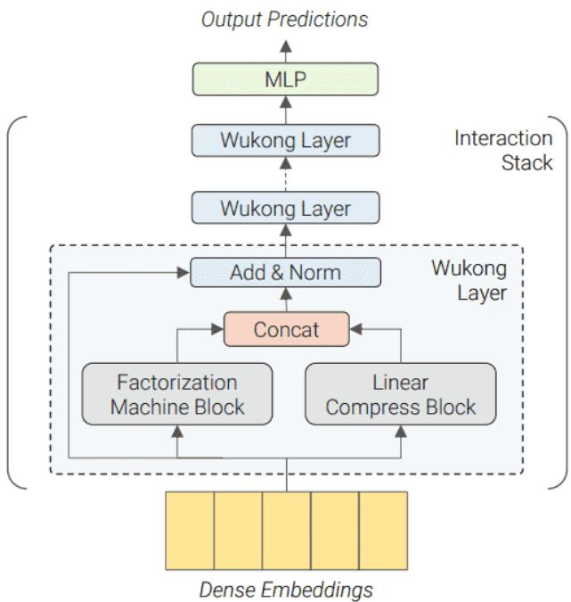

# 2. 关键技术细节

 因子分解机模块 FMB计算流程：

$$
F M B (X) = M L P \left(L a y e r N o r m \left(F l a t t e n (F M (X))\right)\right)
$$

其中 FM 模块实现特征间两两交叉，MLP 提升非线性表达能力。

 线性压缩模块 LCB作用：通过权重矩阵W 压缩特征维度（如X⋅W），保留当前阶数信息。  
 自适应训练：嵌入层使用 Rowwise Adagrad 优化器，Dense 层使用 Adam，支持千亿级参数训练。

# 三、解决的问题

# 1 传统推荐模型缺乏 Scaling Raw

此前推荐模型（如 DLRM、DCNv2）仅通过扩大嵌入表参数（稀疏扩展）提升效果，但参数增长与效果提升不成正比。Wukong 通过密集扩展实现两个数量级的缩放定律（计算量每翻两番，效果提升 $0 . 1 \%$ ）。

# 2 高阶特征交互不足

传统模型依赖 MLP 隐式学习交叉特征，而 Wukong 通过显式堆叠 FM 模块捕获任意阶交互（实验显示高阶交叉对复杂任务至关重要）。

# 3 计算效率与硬件适配

 低秩分解技术将 FM 复杂度从 O(n2)降至 $O ( n k )$ ，适配 GPU 并行计算。  
 残差结构减少训练波动，支持千卡级分布式训练（如使用 128-256 块 H100 GPU）。

# 四、实际效果

 公开数据集：在 Frappe、MovieLens 等 6 个数据集上，AUC 提升 $0 . 5 \% { - 2 . 3 \% }$ ，显著优于 $\mathsf { A F N + }$ 、xDeepFM 等基线模型。  
 Meta 内部场景：在 1460 亿条目的广告推荐任务中，训练计算量从 1 GFLOP/example 扩展至 100 GFLOP/example（相当于 GPT-3规模），效果持续提升且未饱和。

# 面试题：字节 RankMixer 模型介绍

五分钟了解字节推荐大模型 RankMixer，大幅提升业务效果，且推理成本不变~

ByteDance 提出的 RankMixer 是一个面向工业级推荐系统的排序模型架构，它通过一系列创新设计，成功将模型参数量提升至十亿级别，同时保证了推理效率。

论文：RankMixer: Scaling Up Ranking Models in Industrial Recommenders

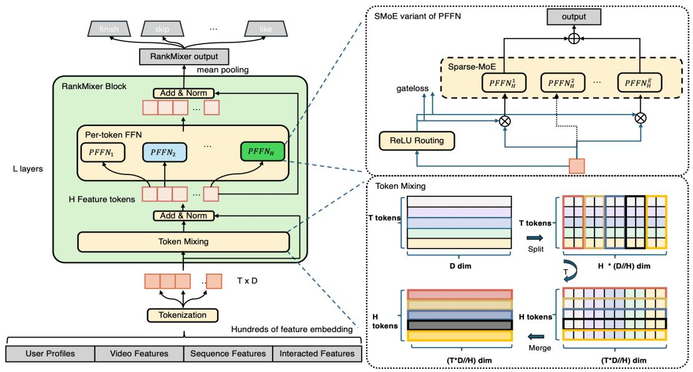

# 1. 特征令牌化（Feature Tokenization）

RankMixer 首先将传统的特征输入转换为类似于 Transformer 的令牌（Token）序列，以解决推荐系统中特征异构、维度不一的问题。

 输入特征分组：基于业务先验知识，将数百个特征（用户画像、视频属性、行为序列等）按语义划分为若干组，每组特征拼接成一个长向量：

$e _ { \mathrm { i n p u t } } = [ e _ { 1 } ; e _ { 2 } ; \ldots ; e _ { N } ]$ ，其中 $e _ { i }$ 代表第 $j$ 个特征组的嵌入表示。

 维度对齐与切片：将拼接后的超长向量通过线性投影或等距切分为 T 个固定维度 D 的 Token：

$$
x _ {i} = \operatorname {P r o j} \left(e _ {\text {i n p u t}} [ d \cdot (i - 1): d \cdot i ]\right), \quad i = 1, \dots , T
$$

其中，每个 token 代表一个语义一致的特征子空间，便于后续并行处理。

# 2. Token 混合模块（Token Mixing）

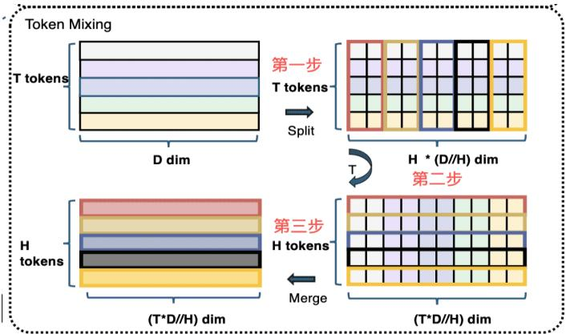

该模块替代了 Transformer 中的自注意力机制，实现无参数的特征交互，显著提升计算效率。

 多头拆分与重组：将每个令牌的 $D$ 维向量拆分为 $H$ 个头（head），每个头维度为 D/H。随后，将不同令牌在相同头位置上的子向量拼接，形成新的混合 Token：

$$
\operatorname {T o k e n M i x} (X) = \operatorname {C o n c a t} _ {\text {h e a d} = 1} ^ {H} \left(\operatorname {C o n c a t} _ {t = 1} ^ {T} \left(x _ {t} ^ {\text {h e a d}}\right)\right)
$$

这一操作类似张量的重排，实现跨特征的信息交换。最后输出的是一个[H, T*D/H]的 tensor。

 残差连接与归一化：将混合后的结果与原始 Token 相加，并通过 LayerNorm 稳定训练：

$$
X _ {\text {o u t}} = \operatorname {L a y e r N o r m} (X + \operatorname {T o k e n M i x} (X))
$$

与自注意力相比，Token Mixing 避免了计算二次复杂度的注意力矩阵，更适合异构特征空间。

# 3. Per-Token 前馈网络（Per-Token FFN）

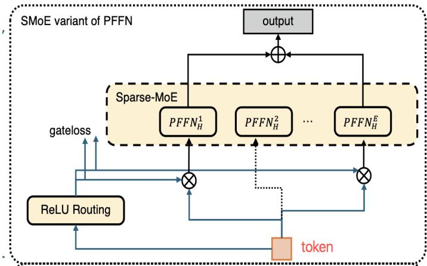

为每个 Token 分配独立的前馈网络（FFN），增强模型容量并避免高频特征主导。

 独立参数设计 ：每个令牌 $x _ { i }$ 经过其专属的 FFN 进行非线性变换：

$$
y _ {i} = \sigma \left(W _ {i} ^ {(2)} \cdot \sigma \left(W _ {i} ^ {(1)} x _ {i} + b _ {i} ^ {(1)}\right) + b _ {i} ^ {(2)}\right)
$$

其中 $\sigma$ 是激活函数（如 Gelu）， Wk） $W _ { i } ^ { ( k ) }$ 和 b(𝑘） $b _ { i } ^ { ( k ) }$ 是第 i个Token的私有参数。

 扩展为稀疏 MoE：为进一步提升参数规模，将 FFN 替换为稀疏混合专家（Sparse MoE）结构。通过门控机制动态选

择专家：

$$
y _ {i} = \sum_ {j = 1} ^ {E} G \left(x _ {i}\right) _ {j} \cdot \operatorname {E x p e r t} _ {j} \left(x _ {i}\right)
$$

其中门控权重 $G ( x _ { i } )$ 通过 ReLU 路由实现稀疏激活，训练时采用密集路由（Dense Training），推理时转为稀疏（SparseInference）以提升效率。

# 4. 整体架构与输出

RankMixer 由多个上述模块堆叠而成（L 层），最终输出通过mean-pooling 聚合所有令牌，并输入到多目标预测层（如完播率、快滑率、点赞率等）。

核心创新总结：  

<table><tr><td>模块</td><td>传统方法问题</td><td>RankMixer 解决方案</td></tr><tr><td>特征输入</td><td>特征异构、维度不一，处理碎片化</td><td>语义分组+Token 化，统一维度并行处理</td></tr><tr><td>特征交互（Token Mixing）</td><td>自注意力计算复杂度高，不适于异构特征</td><td>无参数 Token 混合，高效实现跨特征信息交换</td></tr><tr><td>非线性变换（FFN）</td><td>共享参数导致高频特征主导，长尾信号丢失</td><td>每 Token 独立 FFN/MoE，提升容量与泛化能力</td></tr></table>

# 效果：

 模型效率：参数量从 16M 扩展到 1B（70倍），但通过优化 GPU 利用率（MFU 从 $4 . 5 \%$ 提升至 $45 \%$ ），推理延迟保持稳定（14ms）。  
 业务指标：在抖音推荐场景中，用户日均活跃天数提升 $0 . 3 \%$ ，使用时长增长 $1 . 0 8 \%$ ；广告场景 AUC 提升 $0 . 7 3 \%$ ，广告主价值 advv $+ 3 . 9 \%$ 。

# 面试题：字节 OneTrans 模型介绍，高效整合序列建模和特征交互的大一统模型

字节跳动提出的 OneTrans 模型，通过一个统一的 Transformer 架构，有效地将推荐系统中两个核心任务——用户行为序列建模和非序列特征交互——进行了整合。

<table><tr><td></td><td>内容</td></tr><tr><td>论文标题</td><td>OneTrans: Unified Feature Interaction and Sequence Modeling with One Transformer in Industrial Recommender</td></tr><tr><td>论文链接</td><td>https://arxiv.org/abs/2510.26104</td></tr><tr><td>背景问题</td><td>传统推荐系统排序模型将序列建模（如DIN）和特征交互（如DCNv2）作为独立模块，限制了双向信息流动，且不利于统一优化和扩展，存在以下局限：
·信息流动受阻：序列特征和非序列特征之间的信息无法进行双向、充分的交互。例如，用户的静态画像（如年龄）难以直接影响对其行为序列的解读。
·优化与扩展困难：分离的模块导致模型结构碎片化，难以应用大语言模型（LLM）中成熟的优化技术（如KV缓存），也阻碍了模型的统一扩展。</td></tr><tr><td>核心目标</td><td>提出一个统一的Transformer骨干网络，同时处理序列建模和特征交互，促进信息双向交换，并借鉴大语言模型（LLM）的优化技术实现高效训练和推理。</td></tr><tr><td>关键创新点</td><td>1. 统一Tokenizer 处理多源特征
2. 混合参数化（序列Token共享参数，非序列Token独有参数）
3. 金字塔堆叠结构渐进式压缩信息
4. 跨请求KV缓存等LLM优化技术</td></tr><tr><td>实验效果</td><td>离线实验：CTR预测AUC提升1.53%，CVR预测UAUC提升3.23%。
线上A/B：在TikTok电商场景下，用户人均订单数提升4.35%，人均GMV提升5.68%，同时推理延迟有所降低。</td></tr></table>

# ① 1 背景：从“分治”到“统一”的架构演进

在推荐系统的精排阶段，理解用户兴趣主要依赖两方面信息：

 一是用户的历史行为序列（如点击、购买记录），  
 二是非序列特征（如用户画像、商品属性、上下文信息）。

传统方法采用“先编码后交互”的范式：先用一个模块（如DIN）从行为序列中学习用户兴趣表示，再将这个表示与非序列特征拼接，送入另一个模块（如 DCNv2）进行高阶特征交叉。

这种“分治”策略存在明显瓶颈：

 信息流动壁垒：序列建模模块无法利用用户画像、当前场景等非序列特征来辅助理解历史行为；反之，特征交互模块也难以在早期获得序列信息的滋养。  
 系统效率低下：模块分立导致计算图碎片化，无法应用 LLM的高效优化技术（如 KV缓存），增加了推理时延，也阻碍了模型的统一缩放。

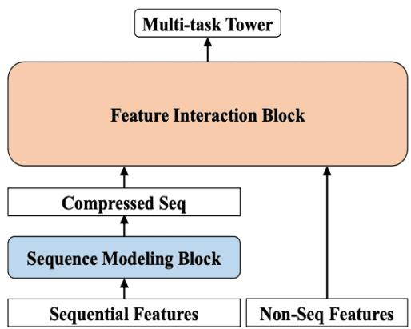  
(a) Conventional Approach

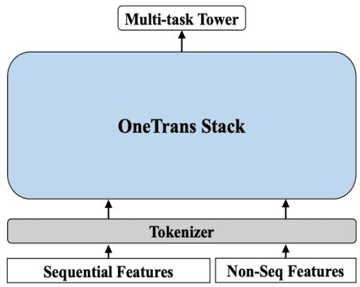  
(b) OneTrans

OneTrans 的核心思想就是拆掉这堵“模块墙”，用一个统一的 Transformer 模型来协同完成这两项任务。

# ① 2 模型原理

OneTrans 的框架主要包含以下几个关键设计：

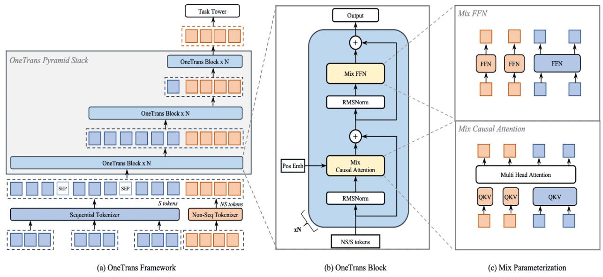

# 1. 统一特征 Token 化

模型首先将异构的输入特征映射到统一的 Token 空间。

 非序列特征 Token 化：对于用户画像、商品属性、上下文等上百个非序列特征，OneTrans 采用了 Auto-Split Tokenizer。该方法将所有特征拼接后通过一个共享的 MLP，再分割成固定数量的 Token。这种方法相比按语义分组处理的 Group-wiseTokenizer 更直接高效。  
 序列特征 Token 化：对于多种类型的行为序列（点击、加购等），先将每个行为项通过 MLP 投影，然后融合。融合策略上，时间戳感知融合（按真实发生时间交错混合所有行为）被证明优于按行为重要性排序的策略。

# 2. OneTrans 块与混合参数化

统一的Token序列（序列Token在前，非序列Token在后）被送入堆叠的 OneTrans块中。这是模型最具创新性的部分，它采用了混合参数化策略来应对Token的异质性：

 序列 Token：所有代表历史行为的序列 Token 共享一套 Q、K、V 投影矩阵和 FFN 的权重。这种共享机制提升了计算效率，并促进了跨时间步的泛化。  
 非序列 Token：每个代表特定静态特征的非序列Token都拥有自己专属的Q、K、V和FFN权重。这保留了非序列特征的独特语义，使模型能精细学习特征间的交叉。

在注意力机制上，采用因果注意力掩码：序列 Token 只能关注其之前的序列 Token，而非序列 Token 可以关注所有序列Token及它之前的非序列Token，从而实现了两类特征间的双向、受控交互。

# 3. 金字塔堆叠与信息蒸馏

为了高效处理长序列，OneTrans 引入了金字塔式结构。随着网络层数的加深，每一层只保留最近的一部分序列 Token 作为Query，而 Key 和 Value 则基于完整的序列计算。这样做有两个好处：

信息蒸馏：迫使模型将长序列中的信息逐步浓缩、提炼到后续的 Token 和非序列 Token 中。  
 计算效率：显著减少了需要计算的 Query 数量，降低了注意力机制的计算复杂度，节约了内存和计算资源。

# 4. 借鉴 LLM 的优化技术

OneTrans 巧妙地借鉴了LLM的成熟优化技术，这对于工业部署至关重要：

 跨请求 KV缓存：在一个请求内，用户的行为序列（序列Token）对于所有候选商品是共享的。OneTrans 采用两阶段计算：先计算并缓存序列 Token的键值对；对于每个候选商品，只需计算其非序列 Token，再与缓存的历史序列信息进行交叉注意力计算。这使序列计算复杂度从 O(L)降至O(ΔL)（ΔL是新行为数量）。  
其他优化：同时集成 FlashAttention-2 和混合精度训练，进一步降低了训练内存消耗并提升了推理速度。

# ① 实验效果与性能表现

# 离线实验

在字节跳动的大规模工业数据集上，OneTrans 与多种强基线模型进行了对比。

 OneTrans-S（91M 参数）：在 CTR 任务上 AUC 相对提升 $1 . 1 3 \%$ ，CVR 任务上 AUC 相对提升 $0 . 9 0 \%$ 。  
 OneTrans-L（330M 参数）：提升更为显著，CTR AUC 相对提升 $1 . 5 3 \%$ ，CVR 的用户级 AUC 相对提升 $3 . 2 3 \%$

消融实验验证了其关键设计的有效性：Auto-Split Tokenizer 优于分组方式，时间戳感知融合最优，为非序列 Token 分配特定参数至关重要等。

<table><tr><td rowspan="2">Type</td><td rowspan="2">Model</td><td colspan="2">CTR</td><td colspan="2">CVR (order)</td><td colspan="2">Efficiency</td></tr><tr><td>AUC↑</td><td>UAUC↑</td><td>AUC↑</td><td>UAUC↑</td><td>Params (M)</td><td>TFLOPs</td></tr><tr><td>(1) Base model</td><td>DCNv2 + DIN (base)*</td><td>0.79623</td><td>0.71927</td><td>0.90361</td><td>0.71955</td><td>10</td><td>0.06</td></tr><tr><td rowspan="3">(2) Feature-interaction</td><td>Wukong + DIN</td><td>+0.08%</td><td>+0.11%</td><td>+0.14%</td><td>+0.11%</td><td>28</td><td>0.54</td></tr><tr><td>HiFormer + DIN</td><td>+0.11%</td><td>+0.18%</td><td>+0.23%</td><td>-0.20%</td><td>108</td><td>1.35</td></tr><tr><td>RankMixer + DIN*</td><td>+0.27%</td><td>+0.36%</td><td>+0.43%</td><td>+0.19%</td><td>107</td><td>1.31</td></tr><tr><td rowspan="3">(3) Sequence-modeling</td><td>RankMixer + StackDIN</td><td>+0.40%</td><td>+0.37%</td><td>+0.63%</td><td>-1.28%</td><td>108</td><td>1.43</td></tr><tr><td>RankMixer + LONGER</td><td>+0.49%</td><td>+0.59%</td><td>+0.47%</td><td>+0.44%</td><td>109</td><td>1.87</td></tr><tr><td>RankMixer + Transformer*</td><td>+0.57%</td><td>+0.90%</td><td>+0.52%</td><td>+0.75%</td><td>109</td><td>2.51</td></tr><tr><td rowspan="2">(4) Unified framework</td><td>ONETRANSS*</td><td>+1.13%</td><td>+1.77%</td><td>+0.90%</td><td>+1.66%</td><td>91</td><td>2.64</td></tr><tr><td>ONETRANSL (default)*</td><td>+1.53%</td><td>+2.79%</td><td>+1.14%</td><td>+3.23%</td><td>330</td><td>8.62</td></tr></table>

# 线上 A/B 测试

在 TikTok 电商的真实场景中，OneTrans-L 与参数量约 100M 的先进基线（RankMixer+Transformer）进行对比，取得了显著的业务增长：

 信息流场景：人均订单数提升 $4 . 3 5 \%$ ，人均 GMV 提升 $5 . 6 8 \%$ 。  
 商城场景：人均订单数提升 $2 . 5 8 \%$ ，人均 GMV提升 $3 . 6 7 \%$ 。  
系统效率：在取得效果提升的同时，模型推理延迟还降低了约 $3 \%$ ，展示其优异的工程优化水平。

# 总结

 OneTrans 模型的核心贡献在于，它成功地将推荐系统中的【序列建模】和【特征交互】两个关键任务统一到了一个简洁、强大的 Transformer 架构中。  
 它通过混合参数化策略巧妙解决了特征异质性难题，并通过金字塔堆叠和跨请求 KV 缓存等设计，在保证模型性能的同时，极大地提升了计算效率，满足了工业应用对低延迟和高吞吐的严苛要求。  
 该工作不仅提升了推荐效果，更重要的是为推荐模型的设计提供了一个新的、可扩展的范式，标志着推荐系统向“大一统”的架构演进迈出了关键一步。

 论文标题：《TokenMixer-Large: Scaling Up Large Ranking Models in Industrial Recommenders》   
 论文链接：https://arxiv.org/abs/2602.06563  
 发表单位&年份：字节跳动，2026  
 关键词：大模型 Scaling Up、精排模型、推荐系统、TokenMixer、混合专家 (MoE)、工业部署

# 一、 研究背景

推荐系统是互联网生态的核心，但其深度学习模型在扩展时面临瓶颈。早期的扩展尝试往往只增加模型宽度或参数，缺乏对架构的深思熟虑。后续一些工作（如Wukong、HiFormer、DHEN）改进了结构，但常忽视硬件协同设计，导致硬件利用率不足、性能不优。

此前提出的 TokenMixer 架构（即 RankMixer）用轻量级的 Token 混合算子替代 Transformer 中的自注意力，平衡了效果与效率，但在更深的配置中遇到了瓶颈：

# RankMixer 存在的问题：

 次优的残差设计：残差连接中，混合前后的Token 维度与语义可能不匹配，阻碍信息传播。  
 模型架构不“纯”：历史遗留了许多碎片化算子，计算强度低但内存开销高，拉低整体硬件利用率。  
 深层模型梯度更新不足：原TokenMixer 通常较浅（如 2层），增加深度后难以稳定训练和获得增益。  
 MoE 稀疏化不充分：RankMixer 使用“稠密训练，稀疏推理”的 MoE 范式，无法降低训练成本，且激活的专家数动态变化，对推理不友好。  
 扩展探索有限：受框架和训练效率限制，参数规模仅达到约 10 亿。

TokenMixer-Large 的目标就是通过系统性的架构演进，设计一个面向极大规模推荐的模型，解决上述问题。

# 二、 TokenMixer-Large 核心技术

模型整体架构包含三部分：Token 化、TokenMixer-Large 模块、稀疏化 Per-token 混合专家。

# 1. Token 化

 将高维稀疏特征（用户、物品、行为序列、交叉特征等）通过嵌入层映射为低维稠密向量。  
 考虑到特征异构性，模型按语义对嵌入分组，每组分别用不同的 MLP 压缩对齐为固定维度的语义 Token。  
 此外，引入一个全局 Token 来聚合全局信息（类似 BERT 的[CLS]），并与各语义 Token 拼接，形成模型的输入。

# 2. TokenMixer-Large 模块

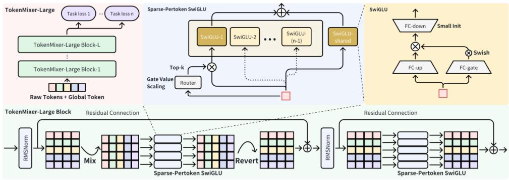

这是模型的核心，采用堆叠结构。每个模块包含三个关键部分：

#  混合与还原：

 这是解决原 TokenMixer 维度不匹配问题的核心。原方法在一次混合后 Token 数量会变化，导致残差连接断裂。  
 TokenMixer-Large 采用对称的两层结构：第一层混合原始 Token 间信息，第二层专门将混合后的 Token 还原回原始维度。这确保了输入输出维度一致，建立了稳定的残差通路。

#  Per-token SwiGLU：

 将 RankMixer 中的 Per-token FFN 升级为 Per-token SwiGLU 激活函数。  
 pSwiGLU(x) $=$ FC_down(Swish(FC_gate(x)) ⋅ FC_up(x))，其中权重矩阵是每个 Token 独立的，以建模 Token 间的特征异质性。

#  残差连接与归一化：

 标准残差：采用 Pre-Norm 设计（将 LayerNorm 置于残差分支计算前）替换原有的 Post-Norm，以提升训练稳定性。同时，用更轻量的 RMSNorm 替代 LayerNorm。  
 层间残差与辅助损失：除了标准残差，每隔几层添加层间残差连接，将底层特征直接传到高层，缓解梯度消失。同时，计算底层输出与高层输出的联合损失，形成辅助损失，迫使底层学习“预测高层特征的偏差”，增强其表征能力，确保深层网络中所有参数都得到充分训练。

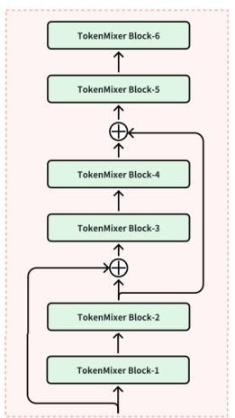  
Internal Residual

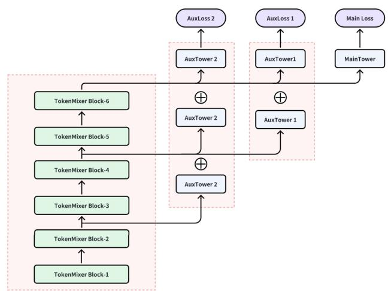  
Auxiliary Loss

# 3. 稀疏化 Per-token 混合专家

为了在扩大规模时保持高性价比，设计了 Sparse-Pertoken MoE。

 策略：采用“先扩大，后稀疏”的迭代策略。先设计出性能最佳的全激活稠密模型，再将每个Token的SwiGLU精细化为多个子专家，并进行稀疏激活，实现“稀疏训练，稀疏服务”，大幅降低训练和推理成本。

#  关键设计：

 共享专家：引入一个始终被激活的共享专家，以提高训练稳定性和效果。  
 门控值缩放：在路由器 g(·) 的输出前乘以一个常数缩放因子 $\mathtt { a _ { \circ } }$ 。由于稀疏激活，每个专家被更新的概率降低，此操作可放大激活专家的梯度，使其更新更充分。研究发现最佳 α值与稀疏率成反比。  
 下行矩阵小初始化：将 SwiGLU 中最后的下投影矩阵 FC_down 的初始化标准差设为 FC_up/FC_gate 的 1/100（如0.01）。这使得训练早期 $\mathsf { F } ( \mathsf { x } ) { + } \mathsf { x }$ 更接近恒等映射，提升了深层模型的训练稳定性。

# 三、 工程优化

为了支持超大规模模型的高效训练和服务，论文提出了一系列工程优化：

 高性能自定义算子：开发了 MoEPermute、MoEGroupedFFN、MoEUnpermute 等一系列融合算子，减少调度开销，提高设备利用率。  
 FP8 量化：推理时使用 FP8 E4M3 进行后训练量化，在几乎无损精度的情况下实现了 1.7 倍加速。  
 Token 并行：一种专为 TokenMixer-Large 架构设计的模型并行策略。它将模型参数和计算按 Token 维度划分到多个设备，通过对计算流的精心设计，将每层的通信次数从 4次减少到 2次，显著提高了训练和推理吞吐量。

# 四、 实验结果

论文在抖音的电商、信息流广告、直播等多个真实业务场景进行了大规模实验。

# 1. 效果与效率对比：

a. 在参数量约 5 亿的模型对比中，TokenMixer-Large 在 CTCVR 任务上相对 DLRM-MLP 基线取得了 $+ 0 . 9 4 \%$ 的 AUC提升，优于所有基线模型（如 Wukong, DHEN, RankMixer 等）。  
b. 稀疏化Per-token MoE在仅激活一半参数的情况下，性能与稠密模型相当，显著提升了模型的投资回报率。

# 2. Scaling Law 验证：

a. TokenMixer-Large 的性能随参数/FLOPs 增加而提升，且其收益曲线比 RankMixer 更陡峭。  
b. 超越 10 亿参数后，需要平衡地增加模型宽度、深度和缩放因子，才能获得更好回报。模型越大，需要更多训练数据才能完全收敛。  
c. 在离线实验中，模型在广告、电商、直播场景分别成功扩展至 150 亿、70 亿、40 亿参数。

# 3. 消融实验：

a. 验证了“混合与还原”、Per-token SwiGLU、残差连接、层间残差与辅助损失等核心组件的有效性。其中“混合与还原”和 Per-token SwiGLU 贡献最大。  
b. 验证了Sparse-Pertoken MoE中共享专家、门控值缩放、下行矩阵小初始化等设计的正向作用。

# 4. 在线性能：

模型已在字节跳动多个场景上线，服务数亿用户，取得了显著的线上业务指标提升：

 电商：订单量 $+ 1 . 6 6 \%$ ，人均预览支付 $G M V { + } 2 . 9 8 \%$ 。  
 广告：广告主满意度得分 $+ 2 . 0 \%$ 。  
直播：营收 $+ 1 . 4 \%$

# 五、 小结

TokenMixer-Large 是对原有 TokenMixer 架构的一次系统性升级。

 它通过混合与还原操作解决了深层模型的残差传播问题；  
 通过层间残差与辅助损失保障了深层网络的训练稳定性；  
 通过稀疏化 Per-token MoE 及配套的工程优化实现了极大规模下的高效扩展。

该工作不仅在多个业务场景中验证了其卓越的离线效果和线上收益，也为工业级推荐系统模型的架构设计与工程实现提供了重要参考。

# 4.2 注意力机制

# 面试题：DIN 原理介绍&带时间衰减的 DIN 代码实现

论文链接：Deep Interest Network

# 一、 DIN 核心原理

DIN 是阿里巴巴提出的动态兴趣建模网络，核心思想是通过注意力机制捕捉用户历史行为与当前候选商品的动态相关性。

# 1. 动态兴趣表征

 传统模型缺陷：Embedding+MLP 结构对用户历史行为进行平均池化或求和池化，导致兴趣表示过于静态（例如用户购买过泳衣和奶粉，推荐泳镜时无法区分两者的重要性）。  
 注意力机制：通过候选广告与历史行为的交互生成注意力权重，加权求和后得到候选 item 相关的用户兴趣向量，实现"千物千面"的个性化表征。公式如下：

$$
v _ {u} = \sum_ {i = 1} ^ {T} \alpha_ {i} e _ {i}, \quad \alpha_ {i} = \operatorname {M L P} \left(e _ {a} \oplus e _ {i} \oplus \left(e _ {a} \odot e _ {i}\right)\right)
$$

其中， $e _ { a }$ 为候选广告 emb， $e _ { i }$ 为历史行为 emb，⋅表示拼接，⋅表示哈达玛积。

# 2. 训练优化技巧

 Dice 激活函数：根据输入分布动态调整激活阈值，公式为：

$$
f (s) = p (s) \cdot s + (1 - p (s)) \cdot \alpha s, \quad p (s) = \frac {1}{1 + e ^ {- \frac {s - E [ s ]}{\sqrt {V a r [ s ]} + c}}}
$$

 小批量感知正则化：仅对当前 mini-batch 中出现的稀疏特征参数计算 L2 正则化，降低计算开销。

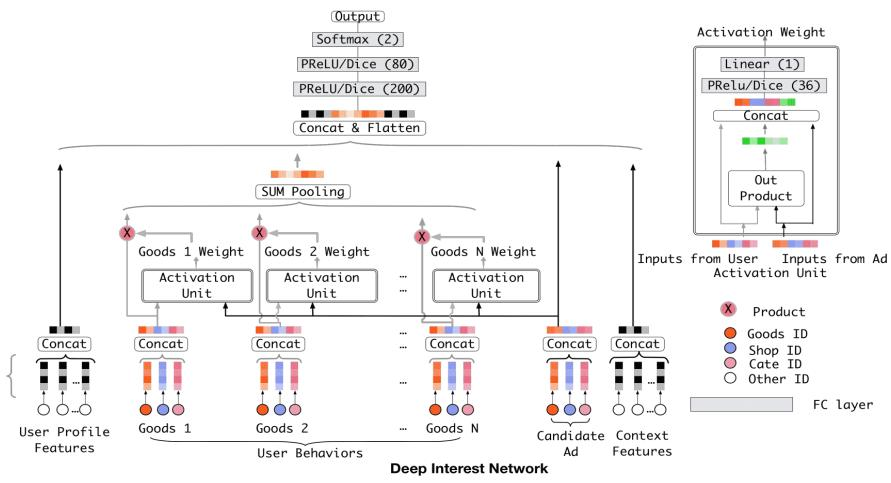

# 二、时间动态衰减的 DIN 改进设计

原始DIN未显式考虑用户兴趣随时间衰减的特性，可通过以下方式引入时间动态衰减：

# 1. 时间衰减因子

对用户历史行为的时间戳 $t _ { i }$ 计算衰减权重 $\beta _ { i }$ ：

$$
\beta_ {i} = \exp (- \lambda \cdot (t _ {\text {c u r r e n t}} - t _ {i}))
$$

其中 为衰减系数， $t _ { c u r r e n t }$ 为当前时间。

# 2. 改进注意力机制

将时间衰减因子融入注意力权重计算：

$$
\alpha_ {i} ^ {\prime} = \alpha_ {i} \cdot \beta_ {i} = \mathrm {M L P} \left(e _ {a} \oplus e _ {i} \oplus \left(e _ {a} \odot e _ {i}\right)\right) \cdot \exp (- \lambda \cdot \Delta t _ {i})
$$

此设计使近期行为对候选广告的权重更高，同时保留原始 DIN 的相关性建模能力。

# 3. 动态衰减的物理意义

 短期兴趣强化：近期点击/购买行为对当前推荐影响更大（如用户昨天浏览的手机比上月浏览的书籍更相关）。  
 长期兴趣保留：通过可学习参数 $\lambda$ 控制衰减速度，避免完全丢弃长期兴趣（如季节性购物习惯）。

# 三、代码实现（PyTorch）

```python
import torch
import torch.nn as nn
import numpy as np
class TimeDecayDIN(nnModule):
    def __init__(self, emb_dim=10000, feat_dim=64, hidden_dim=128):
        super().__init()
        #嵌入层：用户行为、候选广告等特征
        self_embedding = nn.Embedding(emb_dim, feat_dim)
        self.attn_net = nn.Sequential(
            nn.Linear(3*feat_dim, hidden_dim),
            nn.ReLU(),  #替换Dice激活函数
            nn.Linear(hidden_dim, 1))
        self.lambda Decay = nn.Parameter(torch.tensor(0.1))  #时间衰减系数
def forward(self, user_behaviors, candidate_ad, time_deltas):
    #嵌入转换
    e_a = selfembedding(candidate_ad)  #候选广告嵌入
    e_i = selfembedding(user_behaviors)  #历史行为嵌入
    #时间衰减计算
    beta = torch.exp(-self.lambda Decay * time_deltas)  #[bs, len]
    #注意力得分
    batch_size, seq_len, _ = e_i.shape
    e_a Expand = e_a unsqueeze(1).expand(-1, seq_len, -1)
    interaction = torch.cat([e_a Expand, e_i, e_a Expand * e_i], dim=-1)
    alpha = self.attn_net(interaction).squeeze(-1)  #[bs, s_len]
    alpha = alpha * beta  #融入时间衰减
    #动态兴趣向量
    v_u = (alpha softmax(dim=-1).unsqueeze(-1) * e_i).sum(dim=1)
    output = torch.cat([v_u, e_a], dim=-1)  #拼接其他特征并预测
    return output 
```

# 示例用法

```txt
model = TimeDecayDIN()
user_behaviors = torch.randint(0, 1000, (32, 50)) # bs=32, seq_len=50
candidate_ad = torch.randint(0, 1000, (32,))
time_deltas = torch Rand(32, 50) * 30 # 模拟时间差（天）
output = model(user_behaviors, candidate_ad, time_deltas)
print(output.shape) 
```

论文地址：GQA: Training Generalized Multi-Query Transformer Models from Multi-Head Checkpoints

# 一、 背景：为什么需要 GQA？

传统 Transformer 中的多头注意力（MHA）每个头独立计算键（Key）、值（Value）和查询（Query），导致：

 高计算开销：参数量为 O(num_heads $\times$ d_model)，推理时需缓存所有头的 KV，显存占用随序列长度线性增长。  
 解码延迟：自回归生成时，MHA 需重复计算 KV，拖累吞吐量。

多查询注意力（MQA）：通过所有头共享一组 KV，显著降低计算量，但牺牲表达能力，尤其对复杂任务精度下降明显。

分组查询注意力（GQA）的提出：在 MHA 和 MQA 间取得平衡——分组共享 KV，减少计算量同时保留多样性。

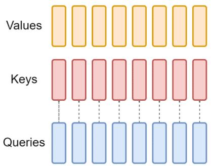  
Multi-head

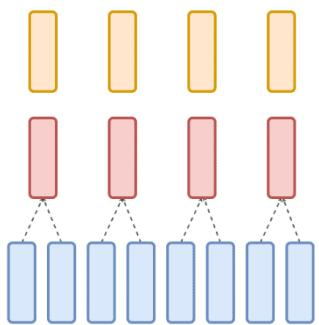  
Grouped-query

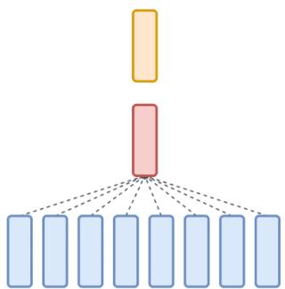  
Multi-query

# 二、核心原理与数学表达

# 1. 分组策略

 将 num_heads 个查询头分为 num_groups 组（每组含 num_heads $/$ num_groups 个头）。  
 每组共享一组键（K）和值（V） ，独立计算查询（Q）。

# 2. 计算流程

设输入序列长度 T，隐藏维度 d_model，每组注意力计算为：

$$
\operatorname {A t t e n t i o n} _ {g} \left(Q _ {g}, K _ {g}, V _ {g}\right) = \operatorname {s o f t m a x} \left(\frac {Q _ {g} K _ {g} ^ {T}}{\sqrt {d _ {k}}}\right) V _ {g}
$$

最终输出为各组输出的拼接：

$$
\text {O u t p u t} = \operatorname {C o n c a t} \left(\operatorname {A t t e n t i o n} _ {1}, \dots , \operatorname {A t t e n t i o n} _ {G}\right) W ^ {O}
$$

# 复杂度分析 ：

 计算量：从 MHA 的 O( ${ \mathsf { T } } ^ { \wedge } 2 \times$ num_heads) 降至 O(T^2 × num_groups)。  
 KV 缓存：缓存大小从 $2 \times \top \times$ num_heads $\times$ d_head 压缩至 $2 \times \top \times$ num_groups $\times$ d_head。

# 三、与其他注意力机制对比

<table><tr><td>特性</td><td>MHA (多头注意力)</td><td>MQA (多查询注意力)</td><td>GQA (分组查询注意力)</td></tr><tr><td>KV头数量</td><td>num_heads</td><td>1</td><td>num_groups (可配置)</td></tr><tr><td>计算效率</td><td>低(计算/显存开销大)</td><td>高</td><td>中高(接近 MQA)</td></tr><tr><td>模型质量</td><td>高(强表达能力)</td><td>低(共享 KV 导致信息损失)</td><td>接近 MHA (组内多样性保留)</td></tr><tr><td>适用场景</td><td>短文本、高精度任务</td><td>实时推理、低资源场景</td><td>长文本生成、大规模 LLM</td></tr><tr><td>代表模型</td><td>BERT, GPT-3</td><td>PaLM, StarCoder</td><td>LLaMA-2, Claude, Qwen</td></tr></table>

# ① 论文基本信息

 论文标题：Gated Attention for Large Language Models: Non-linearity, Sparsity, and Attention-Sink-Free   
 论文地址：https://arxiv.org/abs/2505.06708  
 代码地址：https://github.com/qiuzh20/gated_attention   
 获奖情况：NeurIPS 2025 最佳论文奖 (NeurIPS 2025 Best Paper Award)

该论文通过一个精巧的 Gate 设计，显著提升了大型语言模型的性能、稳定性和长上下文处理能力。以下是该论文的介绍。

# 标注注意力机制的问题：

表达能力的低秩瓶颈：在标准的多头注意力机制中，值（Value）和输出（Output）是两个连续的线性变换。当每个注意力头的维度（d_head）小于模型隐藏层维度（d_model）时，这两个线性层的复合会形成一个低秩线性映射，限制了模型的表达能力，使其难以拟合更复杂的函数。  
 注意力汇聚（Attention Sink）：由于 Softmax 函数要求所有注意力权重之和为 1，模型会倾向于将大量无关的注意力权重（平均高达 $4 6 . 7 \%$ ）分配给序列的第一个 token（如 BOS），挤压对其他相关上下文 token 的关注。  
 训练不稳定性：上述问题常伴随着训练过程中的“损失尖峰”（Loss Spike）和隐藏层的“巨量激活”（数值超 1000），在低精度（如 BF16）训练下易引发数值误差，导致训练崩溃。

# 创新方案：在注意力机制的关键位置加一扇“门”

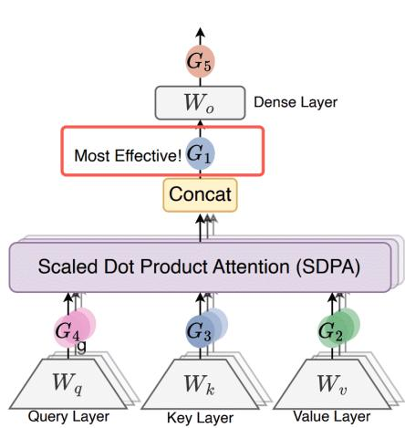

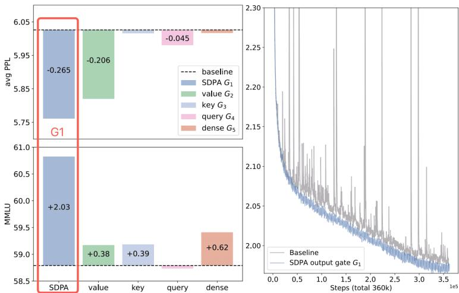

研究团队的核心创新在于系统性地探索了在标准注意力机制中引入简单门控的最佳位置和形式 。

# 1. 门控位置探索：

在注意力层的 5 个关键位置测试了门控操作（如上图所示），包括查询（Q）、键（K）、值（V）投影后，缩放点积注意力（SDPA）输出后（G1），以及最终输出投影后（G5）。

# 2. 最优方案发现：

大量实验证明，在 SDPA 输出后（G1 位置）施加一个头部专属、逐元素、基于 Sigmoid 函数的乘性门控，效果最为显著。其数学形式为：

$$
\mathbf {y} _ {i} = \operatorname {S o f t m a x} \left(\frac {\mathbf {q} _ {i} \mathbf {K} ^ {T}}{\sqrt {d _ {k}}}\right) \mathbf {V}
$$

其中， ${ \bf q } _ { i }$ 是当前第 i 个 token 的查询向量，K 和 V 分

标准缩放点积注意力（SDPA）：

别是键和值矩阵。

Gated Attention 在 SDPA 输出后引入门控，其核心公式为： $\mathbf { o } _ { i } = \mathbf { y } _ { i } \odot \sigma ( \mathbf { W } _ { g } \mathbf { x } _ { i } )$ ，

其中：

 $\mathbf { y } _ { i }$ 是 SDPA 的输出。  
 $\mathbf { x } _ { i }$ 是当前 token 在注意力层之前的隐藏状态（通常是 Pre-Norm 后的输出）。  
是一个可学习的线性投影权重。 $\mathbf { W } _ { g }$   
 $\sigma$ 是 Sigmoid 激活函数，将门控分数压缩到(0,1)区间。  
 $\odot$ 表示逐元素相乘（Hadamard 积）。

# 关键分析：门控为何如此有效？

#  引入非线性，突破表达能力瓶颈：

 标准的注意力机制中，Value 投影和输出投影是两个连续的线性变换，构成了一个低秩线性映射，限制了模型的表达能力。  
 G1 位置的门控恰好处在这两个线性层之间，引入了一个非线性操作，极大地增强了模型的表达能力。

#  引入查询依赖的稀疏性，主动过滤信息：

 G1 门控的分数由当前查询 token 计算得出，因此是查询依赖的。研究发现，这些门控分数具有高度稀疏性（平均值仅为0.116），使模型能动态判断并“忽略”对当前 token 无关的历史信息。  
 主动过滤机制从根本上解决了“注意力汇聚”问题，将首 token 的注意力占比从 $4 6 . 7 \%$ 降至 $4 . 8 \%$ ，让注意力分配更均匀合理。

# 效果与应用

该研究提出的门控注意力机制在实践中展现出多重优势：

<table><tr><td>维度</td><td>具体效果</td></tr><tr><td>性能提升</td><td>在多项基准测试（如MMLU、GSM8K）中，仅增加约1%的参数，即可实现困惑度（PPL）稳定降低0.2以上，MMLU得分提升约2分。</td></tr><tr><td>训练稳定性</td><td>门控机制显著平滑了训练损失曲线，减少了损失尖峰，使模型能够承受更大的学习率（如8e-3）和批量大小，从而可能加快训练速度并扩展超参空间。</td></tr><tr><td>长上下文泛化</td><td>由于消除了注意力汇聚，门控模型在长上下文外推任务中表现卓越。在使用YaRN方法将上下文扩展至128k时，其性能衰减远小于基线模型（仅下降6.89% vs 41.56%），展现了强大的长度外推能力。</td></tr><tr><td>实际应用</td><td>该技术已成功应用于Qwen3-Next系列模型。其在长文档处理（如法律、学术文本）和高效训练方面具有显著的工业落地潜力。</td></tr></table>

# 总结

Gated Attention 这项研究的意义在于，它通过严谨、大规模的实验，揭示了一个简单而深刻的道理：大模型的提升不一定需要复杂的架构革命，有时在关键位置添加一个精巧的“开关”，就能显著优化模型的核心行为。

三者均为针对传统 MHA（多头注意力）的优化方案，核心目标是解决长文本场景下 KV缓存显存占用过高、推理速度慢、计算复杂度平方级增长的痛点，但优化路径和适用场景有本质差异。

# 一、核心对比表

<table><tr><td>对比维度</td><td>GQA(分组查询注意力)</td><td>MLA(多头潜变量注意力)</td><td>DSA(DeepSeek 稀疏注意力)</td></tr><tr><td>核心设计思路</td><td>分组共享KV头,平衡MHA精度与MQA效率</td><td>低秩联合压缩KV到潜空间,极致降低KV缓存</td><td>基于MLA,动态筛选Top-K关键Token 做注意力,从稠密计算转为稀疏计算</td></tr><tr><td>核心优化对象</td><td>KV头的数量(减少KV头总数)</td><td>KV的特征维度(压缩单组KV的维度)</td><td>注意力计算的Token数量(减少参与计算的Token总数)</td></tr><tr><td>KV缓存开销</td><td>中等,约为MHA的1/4~1/8(取决于分组数)</td><td>极低,约为MHA的6%~10%</td><td>极致低,200K上下文下较MLA再降75%</td></tr><tr><td>计算复杂度</td><td>O(n²·g·d)(g为分组数,远小于总头数h)</td><td>O(n²·d_c)(d_c为压缩后的潜变量维度,远小于原维度d)</td><td>O(n·k·d)(k为选中的Top-K Token数,远小于序列长度n)</td></tr><tr><td>精度表现</td><td>接近MHA,差距&lt;1%,显著优于MQA</td><td>持平甚至超越MHA,无明显精度损失</td><td>长文本下与MLA基本持平,精度损失&lt;0.5%</td></tr><tr><td>长文本适配上限</td><td>支持128K以内,超过后KV缓存压力仍显著</td><td>支持128K~200K,显存压力大幅缓解</td><td>原生适配200K+超长上下文,推理成本断崖式下降</td></tr><tr><td>核心优势</td><td>实现简单,训练/推理兼容好,通用场景性价比最高</td><td>压缩比高,精度无损,推理速度快,长文本适配性优于GQA</td><td>彻底解决长文本O(n²)计算瓶颈,推理成本极低,不丢失跨全文关键信息</td></tr><tr><td>核心短板</td><td>分组数需手动调优,超长上下文场景收益有限</td><td>对训练优化要求高,算子适配有一定门槛</td><td>稀疏计算需定制算子,训练需两阶段适配,工程复杂度最高</td></tr><tr><td>代表落地模型</td><td>Llama 2/3、GPT-4、Qwen系列</td><td>DeepSeek V2/V3、GLM-5</td><td>DeepSeek V3.2、GLM-5</td></tr></table>

# 二、三者核心原理详解

1. GQA（Grouped-Query Attention，分组查询注意力）

GQA 是目前工业界最通用的折中方案，本质是 MHA（全多头）与 MQA（单 KV 头）的平衡产物。

核心逻辑：将所有 Query 头划分为 G 个组，每组内的所有 Query 头共享同一组 Key 和 Value 头。例如 32个 Query 头分为 4 组，每组 8 个 Query 头共享 1 组 KV 头，最终仅需存储 4 组 KV，KV 缓存直接降至MHA 的 1/8。  
核心特点：实现极简，无需修改注意力计算的核心逻辑，仅需调整 KV 头的数量；即使是用 MHA 预训练的模型，也可通过少量微调适配 GQA，兼容性极强。

2. MLA（Multi-Latent Attention，多头潜变量注意力）

MLA是 DeepSeek 提出的 KV压缩方案，解决了GQA/MQA“减少 KV头数会损失表达能力”的核心缺陷。

核心逻辑：与 GQA“减少 KV 头数”的思路完全不同，MLA 不减少 KV 头数，而是压缩单组 KV 的特征维度：将 KV 的表示拆分为两部分——用于计算注意力分数的低维潜变量（如将 512 维的 K 压缩到 128 维），和用于输出聚合的高维特征。KV 缓存仅需存储低维潜变量，在保留头间独立性的同时，极致降低显存占用。  
关键表现：官方测试中，MLA的 KV缓存仅为MHA的 $6 \% { \sim } 1 0 \%$ ，同时在主流基准测试上的表现全面优于原生 MHA；GLM-5 采用的 MLA-256 变体，将头维度从 192 调整至 256，头数减少 1/3，参数不变的前提下进一步提升了推理速度。

# 3. DSA（DeepSeek Sparse Attention，深度求索稀疏注意力）

DSA 是基于 MLA 的超长上下文优化方案，从根本上解决了注意力计算 ${ \mathsf { O } } ( { \mathsf { n } } ^ { 2 } )$ 的瓶颈。

核心逻辑：传统稠密注意力（MHA/GQA/MLA）要求每个 Token 与全序列所有历史 Token 计算注意力，序列越长，计算量平方级增长。DSA 的核心创新是基于内容动态筛选关键 Token：新增一个轻量级的“闪电索引器（Lightning Indexer）”，先快速扫描全序列历史 Token，选出与当前 Token 最相关的 Top-K 个（如 2048个），仅对这部分Token执行完整的MLA注意力计算，其余Token直接跳过。  
核心优势：与固定滑动窗口（仅看最近 N 个 Token）不同，DSA 是内容感知的动态选择，无论 Token 在序列的开头还是结尾，只要与当前任务相关就会被选中，不会丢失长距离关键信息（如合同核心条款、文档开头的指令）；通过“稠密预热 $\mapsto$ 稀疏过渡”的两阶段训练，可实现精度几乎无损的适配。

# 三、小结

三者是清晰的技术演进路径，适配不同的业务场景：

 通用场景首选GQA：实现简单、兼容性强，在 8K~32K常规上下文场景下，是精度与效率的最优平衡。  
 长文本场景首选 MLA：在 128K 左右的长文本场景下，相比 GQA 能大幅降低显存占用，同时不损失模型精度，适配长文档理解、代码库分析等任务。  
 超长文本场景首选 DSA+MLA：200K+超长上下文场景的最优解，从根本上降低计算与显存成本，适配书籍阅读、全量合同审核、Agent 长链路思考等场景，也是 GLM-5 的核心选型。

# 4.3 序列建模

面试题：用户超长行为序列建模主要有哪些方案？

在推荐系统中，超长用户行为序列建模旨在利用用户数月甚至数年的历史行为数据，以更精准地捕捉其长期且多样的兴趣。这对于提升推荐准确性、多样性和探索长尾兴趣至关重要。以下将详细介绍几种业界主流的落地方案。

<table><tr><td>方案</td><td>公司</td><td>核心思想</td><td>关键技术</td><td>论文链接</td></tr><tr><td>SIM</td><td>阿里巴巴</td><td>两阶段检索：先快速筛选相关行为，再精细建模</td><td>提出GSU（通用搜索单元）和ESU（精确搜索单元）的两阶段框架，有效处理万级以上序列</td><td>Search-based User Interest Modeling</td></tr><tr><td>MIMN</td><td>阿里巴巴</td><td>系统与算法协同设计：通过解耦的用户兴趣中心（UIC）和记忆网络，增量更新用户兴趣</td><td>引入UIC模块将高成本的长序列计算与实时推理分离，使用MIMN网络压缩历史信息</td><td>Practice on Long Sequential User Behavior Modeling</td></tr><tr><td>TWIN</td><td>快手</td><td>一致性建模：解决两阶段模型中检索（GSU）和精排（ESU）目标不一致的问题</td><td>GSU和ESU使用完全相同的目标注意力（TA）机制进行相关性计算，大幅提升检索准确率</td><td>TWIN: Two-stage Interest Network</td></tr><tr><td>LONGER</td><td>字节跳动</td><td>端到端GPU友好建模：通过令牌压缩和混合注意力机制，直接处理超长序列</td><td>采用全局令牌（Global Tokens）和令牌合并（Token Merge）技术，降低Transformer的二次计算复杂度</td><td>LONGER: Scaling Up Long Sequence Modeling</td></tr></table>

# 1 阿里巴巴：SIM

SIM 的核心创新在于其“先检索后建模”的两阶段框架，巧妙地平衡了效果和效率。

 通用搜索单元（GSU）：这是第一阶段，负责从用户上万条的终身行为序列中，快速筛选出与当前候选商品（Target Item）最相关的一个子集（例如 Top-100）。GSU 有两种实现方式：

 Hard Search：基于规则进行筛选，例如只选择与候选商品同类目的历史行为。这种方法非参数化、计算极快、易于线上部署，但精度较低。  
 Soft Search：基于模型进行筛选，例如通过计算行为商品嵌入（embedding）和候选商品嵌入的内积来评估相关性。这种方法更精细，但计算开销更大。

 精确搜索单元（ESU）：第二阶段会对 GSU 筛选出的短序列（如 100 条）进行精细建模。它借鉴了 DIN 等模型的思想，采用多头注意力机制，同时还会融入时间间隔信息，来动态计算每个历史行为对当前候选商品的重要性，最终生成用户的长期兴趣表示。

# 2 阿里巴巴：MIMN

MIMN 的独特之处在于其系统工程设计，它使模型能够处理理论上无限长的行为序列。

 用户兴趣中心（UIC）：这是一个独立于实时预测服务器的模块。UIC 的核心思想是解耦，它并不存储原始的用户行为序列，而是维护一个代表用户当前兴趣状态的记忆矩阵。这个矩阵的更新是由用户的实时行为触发事件驱动的，而非每次推荐请求。这使得主推荐引擎在推理时无需处理长序列，从而极大降低了延迟。  
 多通道用户兴趣记忆网络（MIMN）：这是在 UIC 内部运行的算法模型，灵感来源于神经图灵机（NTM）。它将用户每个新的行为增量式地写入一个外部的记忆矩阵中，并通过记忆利用正则化来避免热门物品主导记忆更新，以及记忆归纳单元（MIU） 来从记忆中提炼更高阶的用户兴趣。

# 3 快手：TWIN

TWIN 直击两阶段模型的一个核心痛点：GSU 的快速检索目标与 ESU 的精细建模目标不一致，导致检索出的 Top-K 行为可能并非 ESU认为最相关的。

 一致性保持的 GSU（CP-GSU）：TWIN 的创新在于让 GSU 阶段使用与 ESU 阶段完全相同的目标注意力（Target Attention）机制来计算行为相关性。这就保证了两个阶段是“双胞胎”，具有一致的兴趣衡量标准，使得 GSU 能更准确地检索出 ESU需要的关键行为。  
 工程优化：直接将复杂的注意力计算用于万级长序列成本极高。为此，TWIN 将行为特征拆分为物品固有特征（如视频 ID、作者）和用户-物品交叉特征（如播放时长、点击位置）。对固有特征进行预计算和缓存，对交叉特征则简化为注意力分数中的偏置项，从而大幅降低了计算开销，实现了线上可行。

# 4 字节跳动：LONGER

LONGER 探索了不同于两阶段检索的新路径，旨在通过改进模型架构本身，实现端到端的超长序列建模。

 全局令牌（Global Tokens）：在输入序列的开头加入候选商品、用户画像等全局信息令牌，作为注意力计算的锚点，有助于稳定长序列下的注意力分布。  
 令牌压缩（Token Merge）：将长序列中相邻的多个行为令牌（Token）合并成一个，从而显著缩短序列长度，降低标准Transformer 自注意力机制的二次计算复杂度。为了不丢失局部信息，在合并时还会使用一个轻量的 InnerTrans 模块在组内进行建模。  
 混合注意力与系统优化：结合交叉注意力和因果注意力，并采用全同步训练、混合精度、KV 缓存等工程优化技术，使模型能直接在 GPU上高效处理长达上万的行为序列。

# ① 如何选择适合的方案？

 追求稳定可靠与可部署性：SIM（特别是 Hard Search 版本）经过大规模实践验证，是很好的起点，技术相对成熟，线上服务稳定。  
 面临极致的性能瓶颈，对延迟要求极高：MIMN 的系统设计思路非常有启发性，通过解耦更新可以突破序列长度的限制。  
. 追求建模的最优效果：TWIN 解决了两阶段不一致的根本问题，在效果上通常有显著优势，但需要相应的工程能力实现其优化策略。  
 拥有强大的 GPU 算力，希望进行端到端优化：LONGER 代表了前沿方向，避免了两阶段的信息损失，但需要投入大量计算资源。

# 面试题：阿里长序列建模 SIM 方案原理介绍

SIM 论文链接：Search-based User Interest Modeling with Lifelong Sequential Behavior Data

# 1. 核心背景

在推荐系统中，用户行为序列长度直接影响兴趣建模的准确性。传统方法（如 DIN、DIEN）仅能处理数百量级长度的行为数据，而用户全生命周期行为可能长达数万次。直接建模全序列会导致计算复杂度爆炸（如 DIN 的注意力机制复杂度为O(BLd)，L 为序列长度），且在线服务时延无法满足实时性要求。

SIM（Search-based Interest Model）通过两阶段搜索范式，将序列长度从万级压缩至百级，同时精准捕捉候选 Item 相关的兴趣。

# 2. 两阶段架构设计

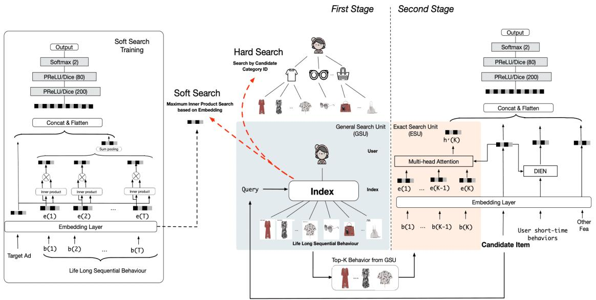

# 2.1 第一阶段：通用搜索单元（GSU）

目标：从原始长序列中快速筛选与候选 Item 相关的子序列（Top-K），将序列长度从万级降至百级。

实现方式：

 Hard Search（硬搜索）

基于规则的非参数化方法，通过类目匹配筛选行为。例如，候选 Item 为“连衣裙”，则仅保留用户历史中同类目的行为。优势是速度快、易部署，但可能损失跨类目相关性信息。

 Soft Search（软搜索）

参数化方法，通过 Embedding 内积相似度筛选。关键点包括：

 Embedding 优化：为避免长/短期行为分布差异，引入辅助 CTR 任务训练长期行为 Embedding，确保相似度与点击相关性一致。  
 近似检索：采用 ALSH（非对称局部敏感哈希）算法，实现次线性时间检索，支持大规模行为库快速匹配。

 索引结构：用户行为树（UBT）采用 Key-Key-Value 存储（一级 Key 为用户 ID，二级 Key 为类目），分布式部署支持高并发查询。

# 2.2 第二阶段：精确搜索单元（ESU）

目标：对GSU筛选的子序列进行精细化兴趣建模，支持复杂模型（如 DIN、DIEN）的深度计算。

关键技术：

 动态注意力机制：引入候选 Item与子序列的时间间隔特征，增强时间衰减效应。例如，近期行为赋予更高权重。  
 多头注意力优化：通过多组独立注意力头捕捉多样化兴趣，防止单一注意力头的信息偏置。  
 特征融合：将候选 Item 的 Embedding 与行为 Embedding 拼接，输入 MLP 层进行高阶特征交互。

# 3. 损失函数与训练策略

 联合训练：模型损失包括 GSU 和 ESU 两部分，通过超参数加权（公式：L = αL_GSU $^ +$ βL_ESU）。其中，Hard Search模式下 $\mathtt { q } = 0$ （无监督筛选），Soft Search 需同步优化辅助 CTR 任务的 Embedding 参数。  
 采样策略：训练时对原始长序列随机采样，保持数据分布一致性，降低计算开销。

# 4. 技术优势与效果

 效率突破：在线服务时延仅增加 5ms，支持最大 54,000 长度的行为序列（较 MIMN 提升 54 倍）。  
 效果提升：在阿里广告场景中，CTR 提升 $7 . 7 \%$ 、PRM 提升 $4 . 4 \%$ ，主要得益于噪声过滤与精准兴趣捕捉。  
 工程友好性：GSU 的索引结构可离线预计算，在线仅需百级序列的实时计算，降低存储与通信成本。

# 5. 局限性

 目标不一致性：GSU索引依赖预训练Embedding或类目标签，可能偏离实际CTR任务目标。后续ETA模型引入SimHash统一 Embedding 空间，缓解此问题。  
更新延迟：离线索引更新频率低于在线模型，动态兴趣捕捉受限。部分方案尝试结合增量更新与在线索引。

小结：

SIM 通过“粗筛+精算”的两阶段架构，平衡了长序列建模的效率与精度，成为工业级推荐系统的标杆方案。其核心思想——以候选Item 为锚点的相关性搜索——为后续长序列模型（如ETA、SDIM）提供了重要范式。

论文地址：Temporal Interest Network for User Response Prediction

# 一、论文背景

传统推荐模型（如 DIN、DIEN、SASRec）仅单独建模用户行为的语义相关性 （例如商品类别匹配）或时间相关性 （例如行为顺序），但未能有效结合两者。例如：

 语义相关性不足：用户近期点击的同类商品可能因时间间隔过长而失效。  
 时间建模粗粒度：仅依赖位置编码或简单时间衰减函数，无法捕捉真实场景中的复杂时序模式。

TIN 提出语义-时间四向交互，通过联合建模行为与目标的语义关联及动态时间衰减，解决上述问题。

# 二、 模型架构详解

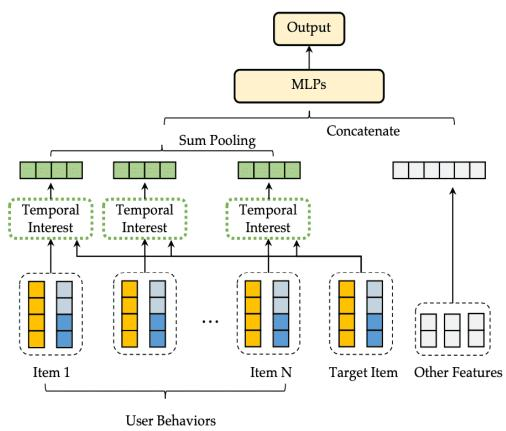  
(a) TIN Architecture

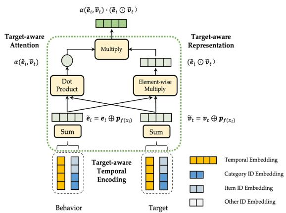  
(b) Temporal Interest Module

# 1. 核心模块设计

TIN 的核心是时间兴趣模块（Temporal Interest Module, TIM） ，包含以下关键组件：

 目标感知时间编码（Target-aware Temporal Encoding, TTE）

TTE-P（相对位置编码）：根据行为在序列中的位置（如倒数第 5 次点击）编码时间信息。

TTE-T（时间间隔编码）：基于行为与目标的时间差（如点击广告前 3 天）动态调整权重。

公式： $e _ { i } = { \mathrm { E m b e d } } ( x _ { i } ) + { \mathrm { T T E } } ( t _ { i } )$ ，其中， $x _ { i }$ 为行为语义特征， $t _ { i }$ 为时间特征。

 目标感知注意力（Target-aware Attention, TA）

使用缩放点积注意力（Scaled Dot-Product Attention）计算行为与目标的语义-时间相关性：

$$
\alpha_ {i} = \operatorname {S o f t m a x} \left(\frac {Q \cdot K _ {i}}{\sqrt {d}}\right)
$$

Q 为目标嵌入， $K _ { i }$ 为用户历史行为嵌入。

 目标感知表示（Target-aware Representation, TR）

通过元素级乘法显式融合行为与目标的嵌入：

$$
v _ {i} = e _ {i} \odot \operatorname {E m b e d} (y)
$$

其中 y 为候选目标特征。

#  四向交互

将 TA 的注意力权重与 TR 的融合表征相乘，实现语义-时间联合建模：

$$
\text {O u t p u t} = \sum \left(\alpha_ {i} \cdot v _ {i}\right)
$$

该操作同时捕捉了“行为语义×目标语义×行为时间×目标时间”的高阶交叉。

# 2. 模型优势

 动态时间衰减：在广告场景中，用户点击行为稀疏，时间间隔编码（TTE-T）比相对位置编码（TTE-P）更有效。  
 噪声过滤：通过硬搜索（Hard-Search）从万级长序列中筛选百级相关子序列，提升计算效率。

# 三、实验结果与落地效果

# 1. 离线实验

数据集：Amazon（商品评论）和 Alibaba（广告点击日志）。  
指标：GAUC（全局 AUC）和 LogLoss。

结果：TIN 相比最佳基线提升 $0 . 4 3 \%$ （Amazon）和 $0 . 5 1 \%$ （Alibaba）。

# 2. 在线应用

 腾讯微信朋友圈广告中，TIN 带来 $1 . 9 3 \%$ 的 GMV 提升，时间间隔嵌入的衰减效应显著强于相对位置。  
 支持最大 54,000 长度的行为序列，在线时延仅增加 5ms。

# 四、代码实现

1. 代码：GitHub 开源地址：https://github.com/zhouxy1003/TIN

# 2. 工程优化技巧

 长序列处理：采用类目分层采样（Category Stratified Sampling）保证稀疏行为的覆盖率。  
异构序列解耦：使用多组 TIN 分别建模广告域与内容域行为，通过门控机制融合。

# 一、模型原理

KuaiFormer 是快手提出的基于 Transformer 架构的召回模型，旨在通过 Next Action Prediction 范式重构短视频推荐系统的检索流程。其核心原理包括以下部分：

# 1、序列化用户行为建模

将用户历史交互行为（如观看、点赞、分享等）转化为序列数据，每条记录包含视频 ID 及附加属性（如观看时长、分类标签等）。通过离散特征嵌入 （视频 ID、标签）和连续特征分桶嵌入 （时长统计）。将用户行为序列编码为稠密向量，并输入 Transformer 骨干网络（基于 Llama 架构改进）进行序列建模。

# 2、层次化序列压缩机制

针对长序列计算效率问题，提出自适应序列压缩策略：将用户行为序列按时间划分为早、中、晚三部分，分别以 64和 16 的粒度进行分组聚合。早期序列通过单层无掩码 Transformer 压缩为单个表征，保留核心兴趣信息，最终将输入长度从 256 压缩至可处理范围，计算资源消耗降低至原方案的 $10 \%$ 。

# 3、多兴趣提取与生成式预测

引入多 Query Token 机制：在序列头部添加多个可学习的特殊 Token（类似 BERT 的[CLS]），通过自注意力机制生成用户的多维兴趣表征。预测阶段取多兴趣与候选视频的最大内积作为得分，实现多兴趣解耦与动态融合。

# 4、高效训练优化

 In-batch Softmax加速：采用批次内负采样替代全局 Softmax，解决数十亿候选视频的计算瓶颈。  
 LogQ 校正：对采样偏差进行修正，缓解热门视频作为负样本的过拟合问题。  
 标签平滑：因用户行为存在模糊性（如划走视频不代表不感兴趣），将硬标签 0/1 替换为平滑概率分布。

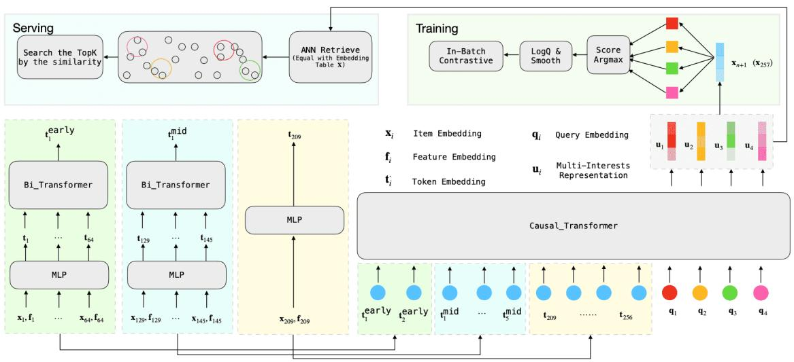

# 二、解决的痛点问题

KuaiFormer 针对工业级短视频推荐系统的三大痛点提出了解决方案：

# 1、动态候选库与计算效率矛盾

传统召回模型（如双塔结构）需维护数十亿视频的 Embedding 表，更新成本高。KuaiFormer 通过 Next Action Prediction范式直接生成候选表征，结合 GPU暴力检索（替代 ANN索引），实现分钟级在线更新与实时反馈。

# 2、长序列建模资源瓶颈

Transformer的复杂度（O(N²)）限制了长序列处理能力。通过层次化压缩策略，在保持 256长度序列建模能力的同时，将计算资源消耗降低至原方案的 $10 \%$ 。

# 3、用户兴趣多样性与实时性挑战

短视频场景中用户兴趣快速变化且呈现多样性。多 Query Token 机制可同时捕捉实时兴趣（近期行为）与长期偏好（压缩后的早期行为），相比传统多兴趣模型（如 ComiRec）NDCG $@ 1 0 0$ 提升 $2 5 \%$ 。

# 三、核心创新点

# 1. Next Action Prediction 范式重构

将传统 CTR 预估转化为序列生成任务，实现召回与排序目标一致性，同时支持端到端训练。

# 2. 自适应序列压缩

基于"早期行为记忆模糊"假设设计的分级压缩策略，兼顾长序列建模与计算效率，相比未压缩方案在 256长度下资源消耗减少 $8 3 \%$ 。

# 3. 多兴趣动态融合机制

通过可学习的多Query Token实现兴趣解耦，结合最大内积得分策略，在离线测试中相比单兴趣模型 $\mathsf { H R @ 1 0 0 }$ 提升$30 \%$ 。

# 4. 工业级训练优化组合

LogQ 校正+标签平滑的联合训练方案，缓解采样偏差与行为模糊性，线上 A/B 实验观看时长提升 $0 . 3 6 \% { - 0 . 4 1 \% }$ 。

# 面试题：HSTU 和 Transformer 两种序列建模架构的对比

Transformer 与 HSTU（Hierarchical Sequential Transduction Unit）是序列建模中的重要架构，但它们的设计目标、技术实现和适用场景存在显著差异。

 HSTU 论文链接：https://arxiv.org/pdf/2402.17152  
 Transformer 论文链接：https://arxiv.org/pdf/1706.03762

<table><tr><td></td><td>Transformer</td><td>HSTU</td></tr><tr><td>设计目标</td><td>通用序列建模（最初为NLP设计），捕捉全局依赖关系</td><td>专为大规模推荐系统优化，处理高基数、非平稳的动态流式数据</td></tr><tr><td>注意力机制</td><td>基于Softmax的缩放点积注意力，输出是值向量的概率加权和</td><td>基于Pointwise聚合注意力，摒弃Softmax，直接加权求和，以保留用户偏好强度信息</td></tr><tr><td>位置/时间编码</td><td>通常使用正弦位置编码或可学习的位置嵌入，主要编码绝对或相对位置信息</td><td>引入相对注意力偏置（RAB），同时编码位置（p）和时间（t）信息，对推荐场景至关重要</td></tr><tr><td>前馈网络（FFN）</td><td>编码器-解码器每层都包含一个独立的FFN子层</td><td>通过门控机制U(X)等设计，省去了显式的FFN层，结构更简洁</td></tr><tr><td>计算效率与优化</td><td>面临长序列计算平方复杂度挑战，依赖如FlashAttention等优化</td><td>针对推荐数据长尾分布，采用随机长度（SL）策略提高稀疏性；有高度优化的内核，训练效率更高</td></tr><tr><td>主要应用场景</td><td>NLP（机器翻译、文本生成）、CV（图像分类、目标检测）、多模态任务</td><td>工业级生成式推荐系统，涵盖召回与排序任务</td></tr></table>

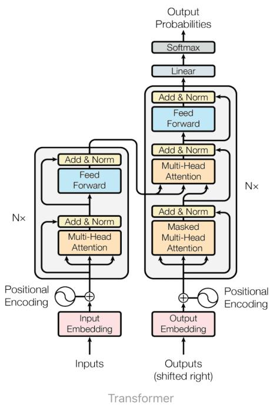

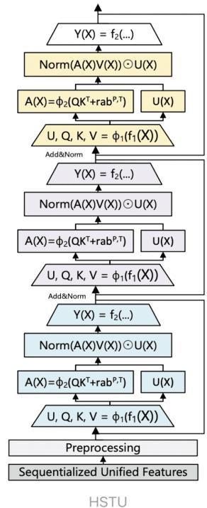

# ① 算法原理对比

两者最核心的区别体现在注意力机制的计算公式上。

# Transformer 的注意力公式

Transformer 采用标准的缩放点积注意力，其核心公式如下：

$$
\operatorname {A t t e n t i o n} (Q, K, V) = \operatorname {s o f t m a x} \left(\frac {Q K ^ {T}}{\sqrt {d _ {k}}}\right) V
$$

 Q(Query)、K(Key)、V(Value)：分别是输入序列经过线性变换得到的矩阵。  
$d _ { k }$ ：是 K 的维度，用于缩放点积，防止内积过大导致 Softmax 梯度消失。  
 Softmax：对注意力得分进行归一化，使得所有注意力权重之和为 1，形成一个概率分布。这有助于稳定训练，但也会归一化掉原始的强度信号。

# HSTU的注意力公式

HSTU 的注意力机制，称为 Pointwise 聚合注意力，其公式可以简化为以下形式：

$$
U (X), Q (X), K (X), V (X) = \operatorname {S p l i t} \left(\phi_ {1} \left(f _ {1} (X)\right)\right)
$$

$$
A (X) = \phi_ {2} (Q (X) K (X) ^ {T} + r a b ^ {p, t})
$$

$$
Y (X) = f _ {2} (\operatorname {N o r m} (A (X) V (X)) \odot U (X))
$$

 U(X), Q(X), K(X), V(X)：通过一个共享的基础映射（如 MLP） $f _ { 1 } ( X )$ 和 Split 函数一次性得到。其中 $U ( X )$ 是一个专门的门控权重。

 $r a b ^ { p , t }$ ：相对注意力偏置，直接加在 $Q K ^ { T }$ 之后，同时注入相对位置差和相对时间差的信息。  
 $\phi _ { 2 }$ ：非线性激活函数（如 SiLU），取代了 Softmax。这使得注意力权重不再被归一化，可以保留绝对值大小所代表的用户交互强度（如点击时长、评论深度等）。  
 $\operatorname { N o r m } ( . . . ) \odot U ( X ) )$ ：对注意力池化后的结果进行归一化，再与门控权重 $U ( X )$ 进行点乘，这一设计使其不再需要独立的 FFN 层。

# ① 各自适用的场景

基于上述根本性差异，两者的适用场景有明确划分：

#  Transformer 更适合于以下场景：

 自然语言处理任务：如机器翻译、文本摘要、对话生成等，其中语言的语法结构使得概率分布的归一化具有天然合理性。  
 计算机视觉任务：当图像被处理为序列数据（如 ViT）时，Transformer 能有效捕捉全局信息。  
 多模态学习：作为统一骨干网络处理文本、图像、音频等多种模态信息。  
 科研探索与通用架构原型：由于其通用性和普适性，常作为新想法的基线模型。

#  HSTU 更专注于以下场景：

 工业级大规模推荐系统：这是其设计的根本目标。特别擅长处理包含数十亿动态变化物品ID、长用户行为序列的场景。  
 对用户偏好强度敏感的任务：例如，需要区分用户“短暂停留”与“深度阅读”行为差异的排序任务，HSTU 能更好地利用这种强度信号。  
 计算效率和推理延迟要求极高的在线服务：其 M-FALCON 等推理优化算法，能大幅降低复杂模型的服务成本。研究表明，即使是 SASRec 等传统推荐模型，在引入 RAB 和调整残差连接后也能获得一定的可扩展性。

# 4.4 多任务&多场景建模

面试题：多任务 Loss 权重如何平衡？

在推荐系统多任务学习中，不同任务的损失函数（Loss）权重分配直接影响模型的优化方向和最终性能。

几种主流的 loss 权衡方法如下：

# 1. 固定权重加权平均

$$
L _ {t o t a l} = \sum_ {i} ^ {N} w _ {i} \cdot L _ {i}
$$

 原理：为每个任务的损失分配固定权重，通过人工经验或网格搜索确定权重组合。  
 公式： ，其中 $w _ { i }$ 为固定权重，需手动调整； $L _ { i }$ 为第 i 个任务的损失。  
 适用场景：任务间相关性高或先验知识明确的情况，依据人工经验拍定权重。  
 缺点：难以动态适应训练不同阶段的权重需求，易受任务量级差异影响。

# 2. 基于不确定性的权重调整（Uncertainty Weighting）

 原理：通过建模任务的不确定性动态调整权重。不确定性越大（任务噪声多或难度高），权重越小。

$$
L _ {t o t a l} = \sum_ {i = 1} ^ {N} \left(\frac {1}{2 \sigma_ {i} ^ {2}} L _ {i} + \log \sigma_ {i}\right)
$$

公式：

$\sigma _ { i }$ 为可学习参数，表示任务 i 的不确定性。

推导：假设每个任务的损失服从高斯分布，通过最大化似然估计推导出上述公式。在反向传播中， $\sigma _ { i }$ 会自适应调整。  
优势：无需人工干预，自动平衡分类与回归任务的权重。

# 3. 动态加权平均（DWA，Dynamic Weight Averaging）

 原理：根据任务的学习速度动态调整权重。Loss下降快的任务权重降低，反之权重增加。

$$
w _ {i} (t) = \frac {N \cdot e ^ {r _ {i} (t - 1) / T}}{\sum_ {k = 1} ^ {N} e ^ {r _ {k} (t - 1) / T}}, \quad r _ {i} (t - 1) = \frac {L _ {i} (t - 1)}{L _ {i} (t - 2)}
$$

公式：

$r _ { i }$ 表示任务 i 的损失下降速率；T 为温度参数，控制权重分布平滑度。

应用：适用于任务学习速度差异显著的场景（如点击率 CTR 与转化率 CVR 预测）。

# 4. 梯度标准化（GradNorm）

 原理：在原来的总损失以外，额外引入梯度标准化 Loss，通过平衡各任务梯度的 L2 范数，使所有任务以相近速度学习。

 步骤：

 计算梯度范数：对共享层参数 W，计算各任务梯度的 L2 范数 $G _ { i } ( t )$ 。  
定义目标梯度范数：

$$
\tilde {G} _ {i} (t) = \bar {G} (t) \cdot [ r _ {i} (t) ] ^ {\alpha}
$$

$$
\tilde {L} _ {i} (t) = \frac {L _ {i} (t)}{L _ {i} (0)}, \quad r _ {i} (t) = \frac {\tilde {L} _ {i} (t)}{E _ {\text {t a s k}} [ \tilde {L} _ {i} (t) ]}
$$

为平均梯度范数； 控制任务学习速度平衡强度。 $\bar { G } _ { i } ( t )$ $_ \alpha$

 优化梯度范数Loss：最小化实际梯度范数与目标梯度范数的差异：

$$
L _ {g r a d} = \sum_ {i} ^ {N} | G _ {i} (t) - \tilde {G} _ {i} (t) |
$$

优势：有效解决梯度冲突，尤其适用于任务复杂度差异大的场景。

# 5. 动态任务优先级（DTP，Dynamic Task Prioritization）

原理：根据任务的关键指标（KPI）动态调整权重，KPI 高的任务权重降低。

$$
w _ {i} (t) = \frac {\left(1 - k _ {i} (t) ^ {\gamma_ {i}}\right)}{\sum_ {j = 1} ^ {N} \left(1 - k _ {j} (t) ^ {\gamma_ {j}}\right)}
$$

为任务 i 在时间步 t 的 KPI（如准确率、AUC 等）； 为人工调节参数。 $\gamma _ { i }$

应用：推荐系统中任务重要性评估指标明确的情况。

不同方法对比：  

<table><tr><td>方法</td><td>优点</td><td>缺点</td><td>适用场景</td></tr><tr><td>固定权重加权平均</td><td>简单易实现</td><td>依赖人工调参，灵活性差</td><td>任务量级相近且相关性高</td></tr><tr><td>不确定性加权</td><td>自适应平衡分类/回归任务</td><td>需引入额外参数，可能训练不稳定</td><td>多任务类型混合（如CTR+CVR）</td></tr><tr><td>GradNorm</td><td>解决梯度冲突，平衡学习速度</td><td>计算复杂度高，需调参α</td><td>任务复杂度差异大</td></tr><tr><td>DWA</td><td>无需梯度计算，实现简单</td><td>对温度参数T敏感</td><td>任务学习速度差异显著</td></tr></table>

MMoE（Multi-gate Mixture-of-Experts）和 PLE（Progressive Layered Extraction）是多任务学习（MTL，Multi-Task Learning）中的两种代表性模型，它们的核心区别如下：

# 1. 核心结构设计对比

MMoE：通过动态调整共享专家权重实现多任务学习。所有任务共享同一组专家网络（Experts），每个任务通过独立的门控网络（Gate）计算专家权重，组合不同专家的输出作为任务输入。

对于任务 k，其输出 $_ { y _ { k } }$ 为：

$$
y _ {k} = h ^ {k} \left(f ^ {k} (x)\right), \quad f ^ {k} (x) = \sum_ {i = 1} ^ {n} g ^ {k} (x) _ {i} \cdot f _ {i} (x), \quad g ^ {k} (x) = \operatorname {s o f t m a x} \left(W _ {g k} x\right)
$$

 $f _ { i } ( x )$ ：第 i 个共享专家网络的输出。  
：任务 k 的门控网络，其输出是一个概率分布，表示该任务对每个共享专家的权重。门控网络的输 $g ^ { k } ( x )$ 入是原始特征 ${ \sf X } _ { \sf \circ }$ 。  
：任务 k 专用的 Tower 网络。 $h ^ { k } ( \cdot )$

PLE：采用分层提取机制，显式区分共享专家和任务专属专家。通过渐进式分层结构（多级 CGC网络），逐层分离共享特征与任务特定特征，减少任务间的参数干扰。

PLE 的结构更复杂，这里以单层 CGC（PLE 的基础模块）中任务 k 的融合过程为例：

$$
y _ {k} = h ^ {k} \left(f ^ {k} (x)\right)
$$

$$
f ^ {k} (x) = \sum_ {i = 1} ^ {m _ {k}} g ^ {k} (x) _ {i} \cdot E _ {(k, i)} (x) + \sum_ {j = 1} ^ {m _ {s}} g ^ {k} (x) _ {m _ {k} + j} \cdot E _ {(s, j)} (x)
$$

$$
g ^ {k} (x) = \operatorname {s o f t m a x} \left(W _ {g k} \cdot [ x; S ^ {k} (x) ]\right)
$$

：任务 k 的第 i 个任务专属专家的输出。 $E _ { \left( k , i \right) } ( x )$ $\mathsf { k }$   
， ：第 j 个共享专家的输出。 $E _ { ( s , j ) } ( x )$   
 ：任务 k 的门控网络的输入，它由所有任务专属专家和共享专家的输出拼接而成； $S ^ { k } ( x )$ $\mathsf { k }$   
 ：任务 k 的门控网络，其权重基于更丰富的输入（融合了原始特征和专家输出）计算得出，从而能 $g ^ { k } ( x )$ 更精准地分配权重。

# 2. 专家网络的配置

 MMoE：仅包含共享专家，所有任务共用同一组专家，缺乏任务专属参数空间。这可能导致任务冲突时专家被不同任

务“撕扯”，影响效果。

 PLE：引入共享专家+任务专属专家的双轨结构。例如，任务 A 的输入由其专属专家和共享专家共同组合而成，其他任务的专属专家不参与该任务计算，从而减少噪声。

# 3. 任务冲突处理机制

 MMoE：依赖门控网络的动态权重分配，但共享专家可能被多个任务争夺，导致跷跷板现象 （一个任务效果提升伴随另一任务下降）。  
 PLE：通过分层分离和参数隔离缓解冲突。底层允许共享与任务专属专家交互，高层逐步细化任务特定特征，实现更鲁棒的参数共享。

# 4. 门控网络的设计

MMoE：每个任务的门控网络仅基于原始输入特征计算权重，未考虑分层特征抽象。  
 PLE：门控网络在多层提取结构中工作，每一层的输入是前一层输出的抽象特征，从而学习更高级别的语义组合关系。

# 5. 适用场景与效果

 MMoE：适合任务相关性较弱的场景（如点击率与互动率预测），通过动态权重适配不同任务需求。  
 PLE：在任务相关性较强或冲突明显的场景（如电商中点击率与购买率）表现更优。实验表明，PLE 相比 MMoE 可显著提升多任务 AUC（例如腾讯实验中 PLE 对 3 个任务的 AUC 提升均超过 MMoE）。

总结对比表：  

<table><tr><td>特性</td><td>MMoE</td><td>PLE</td></tr><tr><td>专家类型</td><td>共享专家</td><td>共享专家 + 任务专属专家</td></tr><tr><td>门控机制</td><td>单层门控，基于原始输入特征</td><td>多层门控，基于分层抽象特征</td></tr><tr><td>任务冲突处理</td><td>动态调整权重，可能引发跷跷板</td><td>分层隔离参数，减少干扰</td></tr><tr><td>结构复杂度</td><td>单层专家组合</td><td>多层渐进式提取（多级CGC）</td></tr><tr><td>适用场景</td><td>任务相关性弱（如点击/互动）</td><td>任务相关性强或冲突明显</td></tr></table>

通过以上对比可以看出，PLE 通过更精细的专家分工和分层结构，在多任务复杂场景下实现了更强的鲁棒性，而 MMoE 更适合轻量级的多任务需求。实际应用中需根据任务相关性选择模型架构。

# 一、MMOE极化现象的原理

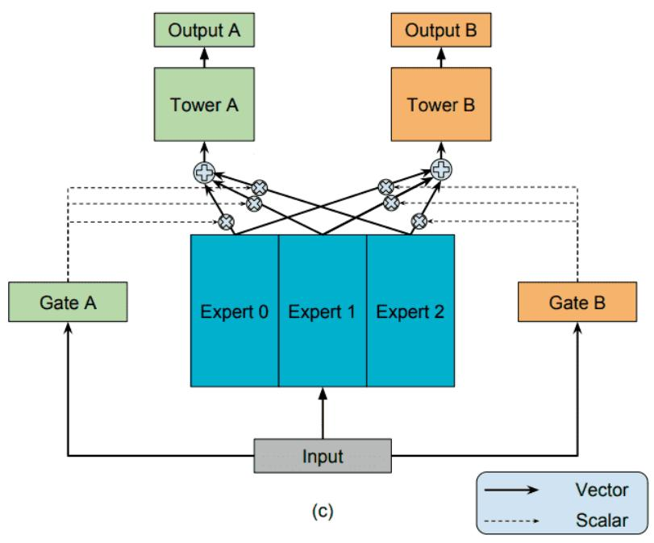

MMOE（Multi-gate Mixture-of-Experts）模型中的极化现象指在训练过程中，某些任务的门控网络（Gate）对专家网络（Expert）的权重分配出现极端分布，即某个专家权重接近 1，而其他专家权重接近 0。这种现象导致任务仅依赖单一专家网络，无法充分利用多专家模型的优势。具体原因如下：

# 1. 任务特异性与专家冗余

不同任务对底层特征的需求存在差异，若某些专家网络的特征表达能力显著优于其他专家，门控网络会通过梯度下降自动强化对优势专家的依赖，形成“赢者通吃”的局面。

# 2. 参数初始化与优化偏差

门控网络的权重初始化若存在偏差，叠加任务间的梯度冲突，会导致参数更新过程中某些专家权重被过度放大。例如，专家网络的初始权重差异可能通过 Softmax函数的指数放大效应加剧极化。

# 3. 模型容量与任务冲突

当专家数量过多或任务间差异较大时，模型可能因容量不足无法有效学习多专家协同机制，转而退化为单一专家模式以降低优化难度。

影响：极化现象会削弱 MMOE 的多任务协同能力，导致任务间干扰（负迁移）、泛化性能下降，且专家网络利用率低（部分专家未被激活）。

# 二、解决极化现象的方法

针对极化现象，可从模型设计、训练策略和后处理三方面进行优化：

# 1. 模型结构优化

#  门控网络复杂性增强

增加门控网络的层数或引入非线性激活函数（如 ReLU），提升其对任务差异性的建模能力。例如，将单层线性投影的门控网络改为两层 MLP，以捕捉更复杂的专家组合模式。

#  专家数量动态调整

根据任务相关性调整专家数量：对高冲突任务减少专家数量（如从 8个减至 4个），降低冗余；对低冲突任务增加专家数量以提升表达能力。

# 2. 训练策略改进

#  Dropout 正则化

在门控网络的 Softmax 输出前引入随机丢弃（如 $10 \%$ 概率 Mask 部分权重），强制模型分散对特定专家的依赖。Youtube实践表明，该方法可使专家利用率提升 $30 \%$ 。

#  权重约束与归一化

 L1/L2 正则化：对门控网络参数施加正则化惩罚，限制权重极端值。  
 Logit 缩放：对 Softmax 输入（Logit）进行归一化，例如将 Logit 除以最大值的平方根，缓解指数函数的放大效应。

# 3. 后处理与评估

#  专家贡献度监控

训练过程中统计各专家被门控网络选中的频率，若某专家长期未被激活（如频率 $\text{‰}$ ），可移除或重置其参数。

#  自适应权重融合

在推理阶段，对门控权重施加温度系数（Temperature Scaling），通过调整温度参数 τ控制权重分布的平滑度：

$$
w _ {i} = \frac {e ^ {z _ {i} / \tau}}{\sum_ {j = 1} ^ {N} e ^ {z _ {j} / \tau}}, \text {当} \tau > 1 \text {时 ， 权 重 分 布 更 均 匀 ；} \tau <   1 \text {时 更 尖 锐 。}
$$

# 三、实践建议

 任务相关性分析先行：使用任务间梯度相似性（如 GradNorm）评估任务冲突程度，高冲突任务组合需谨慎设计专家数量。  
 极化现象的双面性：若任务高度独立且存在显著优势专家，适度极化可能是合理选择，此时可减少专家数量以简化模型。  
 MMOE 极化现象的本质是任务需求与专家能力不匹配导致的模型退化。通过增强门控网络复杂性、引入随机丢弃和权重约束，可有效缓解极化问题。实际应用中需结合任务特性动态调整策略，平衡模型性能与计算效率。

# 一、模型解析与对比

# 1. PPNet（Parameter Personalized Network）

PPNet 主要针对多任务学习中的跷跷板效应 （不同任务目标相互冲突导致模型性能不平衡）。它通过动态调整 DNN 网络参数，实现用户粒度的任务个性化，缓解多任务稀疏性和依赖性问题。

创新点：

 参数级个性化：将用户 ID、物品 ID 等特征输入门控网络（Gate NU），生成动态权重作用于 DNN 每一层，实现参数动态选择。  
 梯度隔离：在训练时，Gate 网络对嵌入层（Embedding）的梯度进行隔离，避免干扰底层特征学习。

原理公式：

# 1.Gate NU 门控单元：

$$
g _ {t a s k} = \gamma \cdot \text {S i g m o i d} (R e L U (x W _ {1} + b _ {1}) W _ {2} + b _ {2})
$$

其中， 为输入特征（用户 ID/物品 ID 特征）， 为缩放因子，一般取 $\gamma = 2$ ，则门控单元的输出范围[0,2]。

# 2.DNN 参数调整：

$$
H ^ {(l + 1)} = f \left(\left(g _ {t a s k} ^ {(l)} \otimes H ^ {(l)}\right) W ^ {(l)} + b ^ {(l)}\right)
$$

$H ^ { ( l ) }$ 为第 层隐藏层输出， $\otimes$ 为逐元素乘法（哈达玛积）。

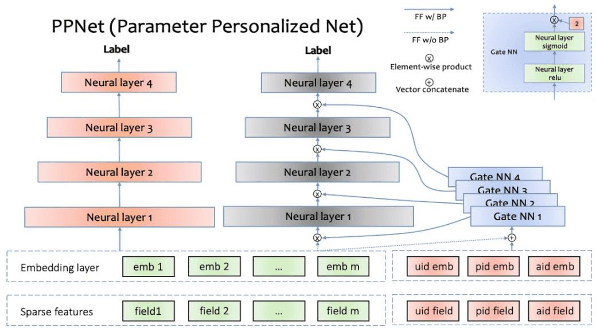  
PPNet结构图

# 2. EPNet（Embedding Personalized Network）

EPNet 针对多场景学习中的场景跷跷板效应 （不同场景特征分布差异导致的模型偏差）。它通过场景特征动态调整嵌入层，实现跨场景特征对齐。

创新点：

Embedding 级个性化：以场景 ID、场景统计特征为输入，生成场景门控权重，筛选重要特征嵌入。  
特征增强机制：通过缩放因子 $\gamma = 2$ 增强场景信号，强化与当前场景相关的特征。

# 原理公式：

# 1. 场景门控生成：

$$
g _ {t a s k} = \gamma \cdot S i g m o i d (R e L U ([ E (F _ {s c e n e}) ] [ E (F _ {s c e n e - s t a t}) ] W _ {1} + b _ {1}) W _ {2} + b _ {2})
$$

$F _ { s c e n e }$ 为场景 ID， $F _ { s c e n e \_ s t a t }$ 为场景统计特征。

# 2. 嵌入调整：

$$
O _ {e p} = g _ {\text {d o m a i n}} \otimes E (F _ {\text {g e n e r a l}})
$$

为通用特征 Embedding，通过门控网络调整 embeding 后用于后续网络。

# 3. PEPNet（Parameter and Embedding Personalized Network）

PEPNet 同时解决多任务与多场景的双重跷跷板问题 （即任务冲突与场景分布差异），实现全局个性化建模。

原理：整体结构为 EPNet 与 PPNet 的级联，具体结构如下图。最终任务塔输出为多场景多任务的联合预测。

# 创新点：

 分层个性化：EPNet 处理场景特征对齐，PPNet 处理任务参数调整，形成端到端联合优化。  
 工程优化策略：包括特征淘汰机制、嵌入与 DNN 分层优化（AdaGrad vs Adam）、在线学习同步策略。

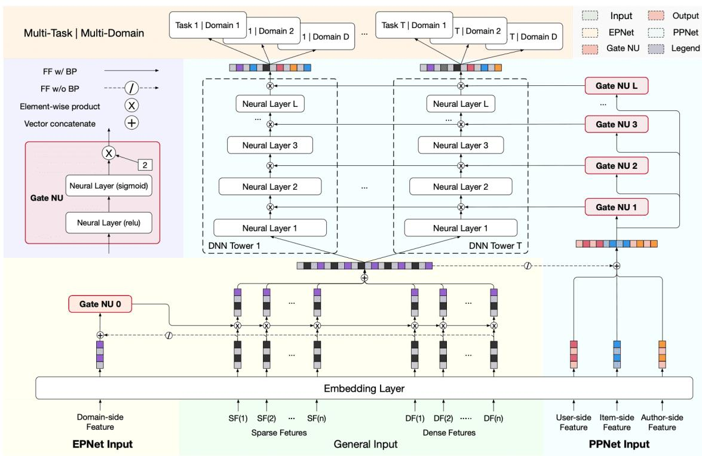

# 二、综合对比

<table><tr><td>维度</td><td>PPNet</td><td>EPNet</td><td>PEPNet</td></tr><tr><td>核心目标</td><td>多任务个性化参数调整</td><td>多场景个性化嵌入调整</td><td>多场景+多任务联合优化</td></tr><tr><td>输入特征</td><td>用户/物品ID、行为特征</td><td>场景ID、场景统计特征</td><td>用户、物品、场景特征</td></tr><tr><td>作用层级</td><td>DNN隐藏层参数</td><td>嵌入层(Embedding)</td><td>嵌入层+DNN参数</td></tr><tr><td>门控机制</td><td>用户粒度的任务门控</td><td>场景粒度的嵌入门控</td><td>场景+任务双层门控</td></tr><tr><td>主要创新</td><td>动态参数选择，梯度隔离</td><td>场景特征对齐，信号增强</td><td>分层个性化与工程优化</td></tr><tr><td>适用场景</td><td>多任务推荐（如点击/转化）</td><td>多场景推荐（如首页/搜索）</td><td>复杂多场景多任务联合建模</td></tr></table>

# 三、关键差异与选择建议

# 1. PPNet vs EPNet：

 PPNet 侧重任务粒度的参数动态化，适合目标稀疏但用户行为差异大的场景（如电商点击/加购/购买）。  
.  EPNet 侧重场景粒度的特征对齐，适合页面布局或用户意图差异大的场景（如短视频的推荐/朋友页）。

# 2. PEPNet 的优势：

 通过分层门控机制，同时捕捉场景共性与任务依赖性，例如在快手短视频推荐中，EPNet 解决“推荐页”与“朋友页”的特征分布差异，PPNet 解决“点赞”与“关注”的任务冲突。  
三者关系可概括为： EPNet 和 PPNet 是PEPNet 的核心组件，分别从 Embedding 层和参数层注入个性化先验，而 PEPNet 通过联合优化实现多场景多任务的全局最优。实际应用中，若仅需解决单一问题（如仅多任务或多场景），可独立使用 PPNet 或 EPNet；若需综合优化，PEPNet 是更优选择。

# 4.5 因果推断与 Uplift

面试题：有哪些常见的 Uplift 模型？

常见的 Uplift 模型可分为四类：差分响应模型、元学习器（Meta-Learner）、基于树的方法和深度学习模型。

# 一、差分响应模型（Two-Model Approach）

 核心思想：分别对实验组（T=1）和对照组（ $\scriptstyle { \mathsf { T } } = 0$ ）独立建模，预测用户响应概率，再计算差分值作为Uplift Score。

$$
\tau (x) = G _ {T} (x) - G _ {C} (x)
$$

其中， $G _ { T } ( x )$ 和 分别表示实验组和对照组的预测模型。

 适用场景：数据分布清晰、干预效应显著且样本充足。  
优点：实现简单，可复用传统分类模型（如 LR、XGBoost）。  
 缺点：误差累积导致精度低，无法直接优化 Uplift 目标。

# 二、元学习器（Meta-Learner）

# 1. S-Learner

 原理：将干预变量 T 作为特征输入单一模型，通过预测结果差分计算 Uplift：

$\tau ( x ) = G ( x , T = 1 ) - G ( x , T = 0 )$ ，其中模型 $G$ 可以是任意回归或分类模型。

 适用场景：干预变量与用户特征交互复杂，需全局建模。

# 2. T-Learner

 原理：分别训练实验组和对照组模型，类似 Two-Model 方法，但允许使用不同模型结构。

$$
\tau (x) = G _ {T} (x) - G _ {C} (x)
$$

# 3. X-Learner

 原理：结合反事实预测和伪效应加权：

 分别训练实验模型和对照模型： $G _ { T } ( x ) _ { \mp \perp } G _ { C } ( x )$ ；  
 计算对照组样本伪效应 $\tilde { \tau } _ { C } ( x ) = y _ { T } - G _ { C } ( x _ { T } )$ ，实验组样本伪效应 $\tilde { \tau } _ { T } ( x ) = G _ { T } ( x _ { C } ) - y _ { C }$ ；  
 训练两个新模型预测伪效应，加权合并结果：

$$
\tau (x) = g (x) \cdot \tilde {\tau} _ {T} (x) + (1 - g (x)) \cdot \tilde {\tau} _ {C} (x)
$$

其中 $g ( x )$ 为权重函数（如倾向得分）。

# 三、基于树的方法（Tree-Based）

# 1. Uplift Tree

 分裂标准：最大化子节点的 Uplift 差异。常用指标如下：

 KL 散度：衡量实验组与对照组的分布差异， KL=prlog $K L = p _ { T } l o g \frac { p _ { T } } { p _ { C } } + ( 1 - p _ { T } ) l o g \frac { 1 - p _ { T } } { 1 - p _ { C } }$ + (1-pr)log 1-pr 1-pc

 欧氏距离： $\triangle = \sum ( p _ { T } - p _ { C } ) ^ { 2 }$   
 Causal Tree：基于 Honest Estimation，分割数据用于树构建和效应估计。

# 2. Causal Forest

原理：通过集成多棵 Uplift Tree 提升鲁棒性，每棵树在随机子样本和集上训练。

# 四、深度学习模型（DNN-Based）

1. TARNet（Treatment-Agnostic Representation Network）

TARNet 通过共享特征编码层分离处理效应，构建双分支网络：

 共享表征层：将用户特征映射到高维空间，消除混杂变量（confounder）对干预变量的依赖；  
 处理效应分支：

针对干预组（ $\top = 1$ ）和对照组（ $\scriptstyle { \mathsf { T } } = 0$ ）分别构建预测头，通过差分计算个体处理效应（ITE）：

$$
\tau (x) = f (x, T = 1) - f (x, T = 0)
$$

Loss 函数为： $\mathcal { L } = \mathbb { E } [ ( y - f ( x , T ) ) ^ { 2 } ] + \lambda \cdot M M D ( z _ { T } , z _ { C } )$

其中，MMD（最大均值差异）用于约束处理组和对照组的表征分布相似性。

# 五、模型对比与适用场景

<table><tr><td>模型类型</td><td>优点</td><td>缺点</td><td>适用场景</td></tr><tr><td>差分响应模型</td><td>简单易实现，支持任意基模型</td><td>误差累积，无法直接优化Uplift</td><td>快速验证、小规模数据</td></tr><tr><td>S-Learner</td><td>全局建模，捕捉复杂交互</td><td>干预效应易被特征淹没</td><td>高维数据，干预与特征强交互</td></tr><tr><td>X-Learner</td><td>伪效应加权提升精度，适合异质效应</td><td>计算复杂，需额外训练伪效应模型</td><td>样本需高精度CATE估计</td></tr><tr><td>Uplift Tree</td><td>直接优化Uplift，可解释性强</td><td>对数据分布敏感，易过拟合</td><td>需透明决策（如金融风控）</td></tr><tr><td>TARNet</td><td>处理非线性关系，适合高维数据</td><td>需大量数据，训练成本高</td><td>图像、文本等复杂特征场景</td></tr></table>

# 一、DragonNet（Dragon Neural Network）

论文链接：https://arxiv.org/pdf/1906.02120

论文标题：《Adapting Neural Networks for the Estimation of Treatment Effects》

# 1.1 背景介绍

背景：在因果推断中，从观察数据估计处理效应至关重要，但存在混淆变量（同时影响处理分配和结果）的问题。传统方法分两步：先拟合条件预期结果 $\mathsf { Q } ( { \sf t } , { \sf x } ) { = } \mathsf { E } [ \mathsf { Y } \top { \sf t } , { \sf x } ]$ 和倾向得分 $\mathsf { g } ( \mathsf { x } ) { \mathsf { = } } \mathsf { P } ( \mathsf { T = } 1 \sqcup \mathsf { x } )$ ，然后插入下游估计器（如 ATE 估计器）。NN 因预测能力强被用于第一步，但精度高不一定保证因果估计质量。  
动机：核心问题是：如何改进神经网络的设计和训练，以提升处理效应估计的准确性？动机源于统计理论：倾向得分具有充分性（调整倾向得分即可估计因果效应），而神经网络可能过度拟合无关协变量，导致估计偏差。

论文提出两大创新：

Dragonnet 架构：基于倾向得分充分性，通过共享表示层耦合处理预测和结果预测，迫使网络专注于混淆相关变量。  
目标正则化（Targeted Regularization）：修改损失函数，使估计器满足非参数估计方程，从而具备渐近最优性（如双稳健性和高效性）。

# 1.2 模型架构

Dragonnet 是一个三头神经网络架构：

 共享表示层 $Z ( X )$ ：输入协变量 $X$ ，通过深度网络生成共享表示。  
输出头：

 倾向得分头：简单线性层（加 sigmoid）预测 $g ( x )$ 。  
 条件结果头：两个独立子网络分别预测 $Q ( 0 , x )$ 和 $Q ( 1 , x )$ ，对应处理 $\scriptstyle { \mathsf { T } } = 0$ 和 $\top = \uparrow$

 训练目标：最小化结合预测损失和倾向得分损失的复合函数。  
架构图：

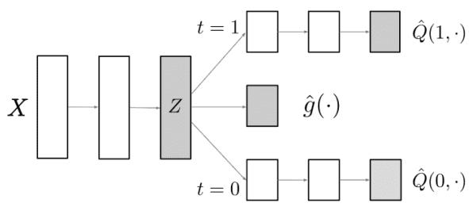

# 1.3 核心数学公式

基础损失函数：

$$
\hat {R} (\theta ; X) = \frac {1}{n} \sum_ {i} \left[ \left(Q ^ {n n} \left(t _ {i}, x _ {i}; \theta\right) - y _ {i}\right) ^ {2} + \alpha \cdot \text {C r o s s E n t r o p y} \left(g ^ {n n} \left(x _ {i}; \theta\right), t _ {i}\right) \right]
$$

其中 $\theta$ 是参数， $_ \alpha$ 是超参数，平衡结果预测和倾向得分预测的损失。

# 目标正则化：

 引 入 扰 动 参 数 $\varepsilon$ ， 定 义 修 正 结 果 $\tilde { Q } ( t _ { i } , x _ { i } ; \theta , \varepsilon ) = Q ^ { n n } ( t _ { i } , x _ { i } ; \theta ) + \varepsilon H ( t _ { i } , g ^ { n n } ( x _ { i } ; \theta ) )$ ， 其 中$H ( t , g ) = \frac { t } { g } - \frac { 1 - t } { 1 - g } ~ ,$ 1-g。

 正则化项： $\gamma ( y _ { i } , t _ { i } , x _ { i } ; \theta , \varepsilon ) = ( y _ { i } - \tilde { Q } ( t _ { i } , x _ { i } ; \theta , \varepsilon ) ) ^ { 2 } \nonumber _ { \circ }$ 。  
 最终目标： $\operatorname* { m i n } _ { \theta , \varepsilon } \left[ \hat { R } ( \theta ; X ) + \beta \frac { 1 } { n } \sum _ { i } \gamma ( y _ { i } , t _ { i } , x _ { i } ; \theta , \varepsilon ) \right]$ ，其中 $\beta$ 是超参数。  
 该设计确保估计器满足非参数估计方程，实现双稳健性。

# ATE估计器：

 简单估计器：

$$
\hat {\psi} ^ {Q} = \frac {1}{n} \sum_ {i} [ \hat {Q} (1, x _ {i}) - \hat {Q} (0, x _ {i}) ]
$$

 目标正则化估计器：

$$
\hat {\psi} ^ {\mathrm {t r e g}} = \frac {1}{n} \sum_ {i} \left[ \hat {Q} ^ {\mathrm {t r e g}} \left(1, x _ {i}\right) - \hat {Q} ^ {\mathrm {t r e g}} \left(0, x _ {i}\right) \right] \quad , \text {其 中} \hat {Q} ^ {\mathrm {t r e g}} = \tilde {Q} (\cdot , \cdot ; \hat {\theta}, \hat {\varepsilon}).
$$

# 1.4 输入输出形式

#  输入：

 协变量 X：用户特征（如年龄、历史购买行为）。  
 处理 T：二进制变量（如发券为 1，不发券为 0）。  
 结果 Y：连续或二进制结果（如购买金额或是否购买）。

#  输出：

 倾向得分 ${ \hat { g } } ( x )$ ：用户接收处理的概率。  
 条件预期结果 $\hat { Q } ( t , x )$ ：给定处理和控制下的预期结果。

# 1.5 样本组织形式（电商发券场景为例）

 场景：电商平台通过发券（如折扣券）提升用户购买率，需估计发券的 Uplift（即券对购买行为的净效应）。

#  样本组织：

 协变量 X：用户特征（如浏览历史、消费频次、地理位置）。  
 处理 T：发券（ $\top = \uparrow$ ）或不发券（ $\scriptstyle { \mathsf { T } } = 0$ ），基于观察数据（非随机实验）。  
 结果 Y：购买指标（如购买金额或二值购买事件）。

#  流程：

 收集历史数据：每个用户有 (X,T,Y)。  
 训练 Dragonnet：用数据拟合模型，输出 ${ \hat { g } } ( x )$ （发券概率）和 $\hat { Q } ( t , x )$ （预期购买）。

 估计 Uplift：计算 ATE $\hat { \psi }$ ，如 $\hat { \boldsymbol { \psi } } ^ { Q } = \frac { 1 } { n } \sum _ { i } [ \hat { Q } ( 1 , x _ { i } ) - \hat { Q } ( 0 , x _ { i } ) ]$ ，表示发券平均提升效果。

 优势：Dragonnet 通过倾向得分充分性，减少无关变量干扰，在有限数据下提升估计稳定性。

# 二、DESCN（Deep Entire Space Cross Networks）

论文链接：https://arxiv.org/pdf/2207.09920

DESCN（Deep Entire Space Cross Networks）是一种用于个体处理效应（ITE）估计的深度学习模型，由阿里巴巴团队提出，主要应用于电商优惠券发放等因果推断场景。

# 2.1 背景介绍

在因果推断中，个体处理效应（ITE）的准确估计是关键挑战。传统方法（如 T-Learner 或 S-Learner）存在两大问题：

处理偏差（Treatment Bias）：处理组（如收到优惠券的用户）和对照组（未收到优惠券的用户）的分布差异显著，导致模型难以学习无偏表示。  
样本不平衡（Sample Imbalance）：处理组和对照组的样本量可能极度不均衡（例如仅对少量用户发券），影响模型稳定性。

DESCN 通过全空间建模和交叉网络设计同时解决这两个问题。

 全空间网络（Entire Space Network, ESN）

 传统方法仅在处理组或对照组的子空间建模响应函数（如购买率），而 ESN 联合建模处理倾向评分、处理组响应和对照组响应，利用全样本空间的信息缓解处理偏差。  
 关键公式：

$$
\operatorname {E S T R} = P (Y, W = 1 \mid X) = \mu_ {1} (X) \cdot \pi (X),
$$

$$
\operatorname {E S C R} = P (Y, W = 0 \mid X) = \mu_ {0} (X) \cdot (1 - \pi (X)),
$$

其中 $\pi ( X )$ 是倾向评分， $\mu _ { 1 }$ 和 $\mu _ { 0 }$ 分别是处理组和对照组的响应函数。

 交叉网络（X-Network）

 引入伪处理效应（Pseudo Treatment Effect, PTE）作为中间变量，连接处理组和对照组的响应函数通过多任务学习平衡样本不平衡问题。  
 通过交叉计算反事实结果：

$$
\mu_ {1} ^ {\prime} = \sigma \left(\sigma^ {- 1} \left(\mu_ {0}\right) + \sigma^ {- 1} \left(\tau^ {\prime}\right)\right),
$$

$$
\mu_ {0} ^ {\prime} = \sigma \left(\sigma^ {- 1} \left(\mu_ {1}\right) - \sigma^ {- 1} \left(\tau^ {\prime}\right)\right),
$$

其中 $\tau ^ { \prime }$ 是伪处理效应， $\sigma$ 为 Sigmoid 函数。

# 2.2 模型架构

DESCN 由两部分组成：

 ESN 模块：

 输入：用户特征 。

 输出：倾向评分 $\pi ( X )$ 、处理组响应 $\mu _ { 1 } ( X )$ 、对照组响应 $\mu _ { 0 } ( X )$   
 通过乘法节点计算 ESTR 和 ESCR，损失函数包含 $L _ { \pi }$ $L _ { \mathrm { E S T R } }$ $L _ { \mathrm { E S C R } }$ 。

#  X-Network 模块：

 在 ESN 基础上增加 PTE 网络，生成伪处理效应 。 $\tau ^ { \prime } ( X )$   
 通过交叉计算得到 $\mu _ { 1 } ^ { \prime }$ 和 $\mu _ { 0 } ^ { \prime }$ ，损失函数增加 $L _ { \mathrm { C r o s s } \mathrm { T R } }$ 和 $L _ { \mathrm { C r o s s } } \mathrm { C R }$

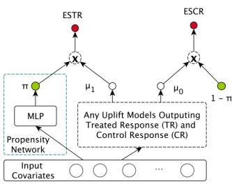  
(a) Entire Space Network (ESN)

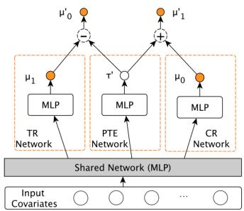  
(b) X-network

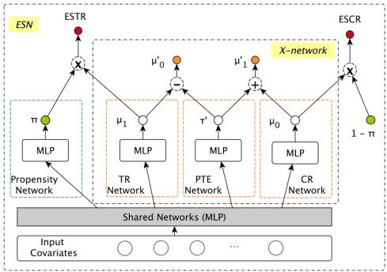  
(c) Deep Entire Space Cross Networks (DESCN)

# 2.3 核心数学公式

 ITE 定义：

$$
\tau (X) = \mathbb {E} [ Y (1) - Y (0) \mid X ] = \mu_ {1} (X) - \mu_ {0} (X)
$$

 损失函数：

DESCN 的总损失为加权和：

$$
\begin{array}{l} L _ {\text {D E S C N}} = \alpha L _ {\pi} + \beta_ {1} L _ {\text {E S T R}} + \beta_ {0} L _ {\text {E S C R}} \\ + \gamma_ {1} L _ {\text {C r o s s T R}} + \gamma_ {0} L _ {\text {C r o s s C R}}. \\ \end{array}
$$

<table><tr><td>倾向得分损失</td><td>Lπ = 1/n ∑i l(wi, π(xi))</td></tr><tr><td>全空间处理组响应损失</td><td>LESTR = 1/n ∑i l(yi&amp;wi, μ1(xi) · π(xi))</td></tr><tr><td>全空间对照组响应损失</td><td>LESCR = 1/n ∑i l(yi&amp;(1-wi), μ0(xi) · (1-π(xi)))</td></tr><tr><td>交叉处理组响应损失</td><td>LCrossTR = 1/T ∑i∈T l(yi, μ1&#x27;(xi))其中, μ1&#x27;(xi) = σ(σ-1(μ0(xi)) + σ-1(τ&#x27;(xi)))</td></tr><tr><td>交叉对照组响应损失</td><td>LCrossCR = 1/C ∑i∈C l(yi, μ0&#x27;(xi))其中, μ0&#x27;(xi) = σ(σ-1(μ1(xi)) - σ-1(τ&#x27;(xi)))</td></tr></table>

#  反事实估计：

通过 PTE连接双响应函数：

$$
\hat {\mu} _ {1} ^ {\prime} = \sigma \left(\sigma^ {- 1} \left(\hat {\mu} _ {0}\right) + \sigma^ {- 1} \left(\hat {\tau} ^ {\prime}\right)\right), \quad \hat {\mu} _ {0} ^ {\prime} = \sigma \left(\sigma^ {- 1} \left(\hat {\mu} _ {1}\right) - \sigma^ {- 1} \left(\hat {\tau} ^ {\prime}\right)\right)
$$

# 2.4 输入输出形式

 输入：用户特征 （如历史购买频次、活跃度）、处理指示 $W \in \{ 0 , 1 \} _ { \ L }$ （是否发券）、响应变量 $Y \in \{ 0 , 1 \}$ （是否购买）。  
输出：

 直接输出：倾向评分 ${ \hat { \pi } } ( X )$ 、处理组响应 $\hat { \mu } _ { 1 } ( X )$ 、对照组响应 ${ \hat { \mu } } _ { 0 } ( X )$ 。  
 最终目标：ITE 估计值 $\hat { \tau } ( X ) = \hat { \mu } _ { 1 } ( X ) - \hat { \mu } _ { 0 } ( X ) _ { \circ }$ 。

# 2.5 样本组织形式（电商发券场景为例）

#  训练数据：

1. 处理组（ $\pmb { W } \mathbf { = } \pmb { \mathrm { 1 } }$ ）：被发放优惠券的用户，特征 X 可能包含低活跃度等偏置特征。  
2. 对照组（ $\scriptstyle \pmb { W } = \pmb { 0 }$ ）：未收到优惠券的用户，通常样本量更大。  
3. 响应变量 Y：是否在活动期内购买。

 测试数据：使用随机实验（RCT）数据评估模型，避免选择偏置。  
 关键处理：训练集包含强处理偏置（如仅对不活跃用户发券），测试集为随机样本，模拟现实场景中“训练偏置、测试无偏”的需求。

# 三、DragonNet 和 DESCN 对比

<table><tr><td>对比维度</td><td>DragonNet</td><td>DESCN</td></tr><tr><td>核心创新</td><td>端到端的三头网络结构,联合预测倾向评分、处理组结果和对照组结果</td><td>全空间网络(ESN)+交叉网络(X-Network),通过多任务学习集成倾向评分、响应函数和伪处理效应</td></tr><tr><td>模型架构</td><td>共享底层表示,三个输出头分别对应倾向评分 (π)、处理组响应(μ1)和对照组响应(μ0)</td><td>分ESN和X-Network两部分:ESN联合建模π、μ1、μ0; X-Network引入伪处理效应(τ&#x27;)连接双响应函数</td></tr><tr><td>处理的关键问题</td><td>混淆变量偏置(通过倾向评分调整)、表示学习平衡</td><td>治疗偏差(因非随机分配导致分布差异)、样本不平衡(处理组/对照组大小不均)</td></tr><tr><td>数学基础</td><td>基于倾向加权的损失函数,最小化预测结果与真实结果的误差</td><td>全空间概率分解:ESTR=μ1·π,ESCR=μ0·(1-π);引入伪处理效应τ&#x27;进行反事实计算</td></tr><tr><td>输入形式</td><td>特征向量X,处理指示W,响应Y</td><td>同左</td></tr><tr><td>输出形式</td><td>直接输出π(X)、μ1(X)、μ0(X),ITE推导为τ=μ1-μ0</td><td>同左,但增加中间输出τ&#x27;(X),用于平衡学习</td></tr><tr><td>训练方式</td><td>端到端联合训练,损失函数结合倾向评分和结果预测</td><td>多任务学习,损失函数加权组合(含倾向评分、ESTR/ESCR、交叉响应损失)</td></tr></table>

# 面试题：因果推断 AUUC 指标介绍

AUUC（Area Under the Uplift Curve）是因果推断中 Uplift 模型的核心评估指标，用于衡量模型对样本的潜在处理效应（即施加干预与不施加干预的响应差值）的排序能力。

# 一、AUUC 的物理含义

# 1. 核心目标

AUUC 通过评估模型对样本潜在处理效应（即 uplift 值）的排序能力，量化模型在实际业务中的增益效果。

物理含义： 模型将高 uplift 值的样本排在前面时，累积的增量收益最大化。

# 2. 业务场景举例

例如在优惠券发放场景中，AUUC 衡量的是：若优先对模型预测转化率提升最大（uplift 高）的用户发放优惠券，实际带来的额外收益（相比不发放）的累积面积。

# 3. 与 ATE 的区别

ATE（Average Treatment Effect）是全体样本的平均处理效应，而 AUUC 关注的是模型对样本的分层能力，即能否通过排序将高价值群体优先识别出来。

# 二、AUUC 的计算步骤

# 1. 样本排序

将测试集样本按模型预测的 uplift 值从高到低排序。

# 2. 逐点计算累积增益

对每个分位点 k（如前 $10 \%$ 、 $2 0 \% . . . 1 0 0 \%$ 的样本），计算实验组（T）与对照组（C）的响应率差异：

$$
u (k) = \frac {R ^ {T} (D , k)}{N ^ {T} (D , k)} - \frac {R ^ {C} (D , k)}{N ^ {C} (D , k)}
$$

其中： $R ^ { T } ( D , k )$ ：前 $\mathsf { k }$ 个样本中实验组的响应总数

：前k 个样本中实验组的样本数 $N ^ { T } ( D , k )$

# 3. 绘制 Uplift 曲线

横轴为样本比例（ $k / n$ ），纵轴为累积增益 $\sum _ { i = 1 } ^ { k } u ( u )$ ，绘制曲线并计算曲线下面积（AUUC）。

# 4. 归一化处理

为消除数据规模影响，常将 AUUC 除以理论最大值 $n \cdot u ( n )$ ，公式为：

$$
A U U C _ {n o r m} = \frac {\sum_ {k = 1} ^ {n} u (k) \cdot (k / n)}{n \cdot u (n)}
$$

其中 $u ( n )$ 是全量样本的 ATE，如下， $R ^ { T } , R ^ { C }$ 为全量实验组/对照组的响应总数， $N ^ { T } , N ^ { C }$ 为对应样本量。

$$
A T E = \frac {R ^ {T}}{N ^ {T}} - \frac {R ^ {C}}{N ^ {C}}
$$

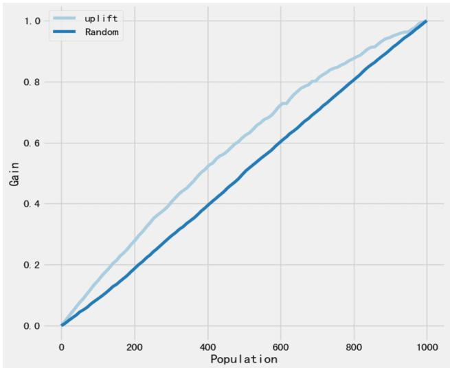

 理想模型：高 uplift 样本集中在前部，曲线快速上升，面积最大。  
 随机模型：曲线呈线性增长，面积接近 0.5（归一化后）。  
 负向模型：曲线低于随机线，面积可能为负（表示策略有害）。

# 三、Python 代码实现

```python
def calculate_auuc(y_true, treat, uplift_score):
    df = pd.DataFrame({'y': y_true, 'treat': treat, 'score': uplift_score})
    df = df.sort_values('score', ascending=False).reset_index.drop=True)
    n = len(df)
    cum_gain = []
    ate_total = (df[df['treat'] == 1][y'].mean() - df[df['treat'] == 0][y'].mean())
    for k in range(1, n+1):
        df_k = df.iiloc(:,k]
        r_t = df_k[df_k['treat'] == 1][y'].sum()
        n_t = df_k['treat'].sum()
        r_c = df_k[df_k['treat'] == 0][y'].sum()
        n_c = k - n_t
        u_k = (r_t/n_t - r_c/n_c) if n_t > 0 and n_c > 0 else 0
        cum_gain.append(u_k * k / n)
    auuc = np.sum(cum_gain) / (n * ate_total)
    return auuc 
```

# 4.6 CVR 预估\LTV 预估模型

面试题：CVR 样本稀疏问题如何解决？

在广告转化率（CVR）预估中，针对付费、下单等非常稀疏的转化样本问题，可通过多任务学习、对比学习、辅助建模等方法解决。

# 一、多任务学习与辅助建模

# 1. ESMM 全空间建模

核心思想：通过 CTR（点击率）和 CTCVR（点击后转化率）两个辅助任务联合建模 CVR，利用全量曝光样本而非仅点击样本，解决样本选择偏差和数据稀疏性。

# 实现方式：

 数学公式： $. p C T C V R = p C T R \times p C V R$ ，模型通过共享 Embedding 层从 CTR 任务中迁移特征表达，缓解 CVR任务样本稀疏的问题。  
 损失函数设计：仅优化 CTR 和 CTCVR 任务，避免直接处理 CVR 的稀疏 Label。

其他相关改进模型：Multi-IPW/DR、DCMT、ESCM²等。

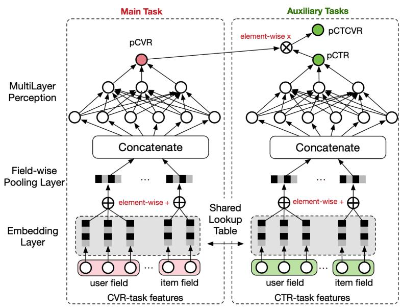

# 二、对比学习与特征增强

# 1. CL4CVR 论文框架

# 技术原理：

通过对比学习（如 Embedding Mask）生成增广样本，增强稀疏数据的特征表达。

给定给定锚点样本，可以将另一个增广样本作为正样本，而其他样本的增广样本作为负样本，在一个 batch 内，假设 batch_size $\mathrel { \mathop = } \mathsf { N }$ ，可以得到 2N个增广后的样本。可以构建经典的对比学习损失函数（NCE Loss）为下式，其中s(e_i, e_j)为余弦相似度， 是温度系数。

$$
L _ {0} = - \frac {1}{2 N} \sum_ {u = 1} ^ {2 N} \log \frac {\exp \left(s \left(e _ {i} , e _ {j}\right) / \tau\right)}{\sum_ {k \neq i} \exp \left(s \left(e _ {i} , e _ {k}\right)\right) / \tau}
$$

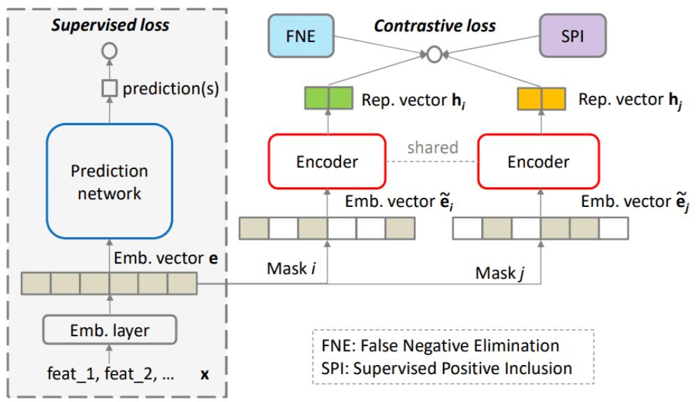

# CL4CVR 论文主要有以下 3 个组件：

# （1）Embedding Mask（EM）

方法：在特征嵌入(Embedding)维度随机 Mask 部分元素（非传统特征级 Mask），保留更多语义信息。EM对每个特征的嵌入随机遮蔽部分元素。可增强特征细粒度表达，避免破坏特征整体语义。

# （2）False Negative Elimination（FNE）

动机：用户行为存在不确定性（如多次点击同一商品但仅部分转化），相同特征可能对应不同 Label。

方法：在对比学习中排除与锚点样本特征相同但标签不同的样本。通过重复性指标判断特征是否相同，构建负样本集合时过滤特征冲突样本。

# （3）Supervised Positive Inclusion（SPI）

方法：转化标签稀疏但价值高，需充分利用。若锚点样本标签为转化（ $z = 1$ ），将同一批次内其他转化样本加入正样本集合，增强监督信号。

# 三、泛 Label 辅助建模优化

# 1. 泛化 Label 与辅助任务

例如，在飞猪高客单场景中，通过引入“用户在同类目商品购买”和“用户在同目的地商品购买”等泛化标签作为辅助任务，利用更丰富的辅助样本增强主任务学习。

通过共享 Embedding 层参数后，主任务 CVR 的稀疏性得到缓解，模型泛化能力提升。

# 稀疏场景下CVR模型优化-泛label建模

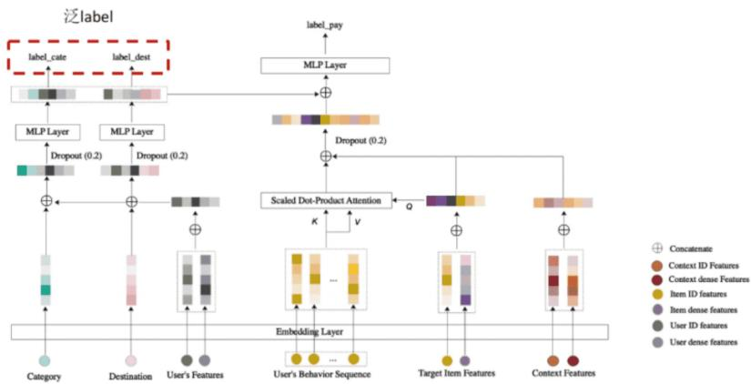


# 2. 层次化多任务建模（如 AutoHERI）

任务分解：将用户行为漏斗分解为“曝光 点击 商品详情页浏览 加购 $\longrightarrow$ 转化”多级任务。

层次聚合：通过多任务学习框架，自动学习前级任务（如 CTR、加购率）到后级任务（CVR）的特征聚合路径。利用前链路事件的任务（如 CTR、加购率）增强 CVR 建模。

面试题：CVR 预估中的样本选择偏差问题？

# 1. 样本选择偏差定义

在 CVR（转化率）预估中， 样本选择偏差（Sample Selection Bias, SSB）指训练数据与推理数据分布不一致的现象。CVR 模型通常基于点击后样本 （即用户点击了广告/商品后的行为数据）训练，而实际推理时需对所有曝光样本 （无论是否被点击）进行预测。

由于点击行为本身具有低概率特性（通常不足 $1 \%$ ），训练样本仅覆盖了整体曝光样本的极小子集，导致模型在训练阶段学习的分布与实际在线预测阶段的分布存在显著差异。

# 2. 具体表现

 分布偏移：点击样本的特征空间（如用户兴趣、商品属性）可能与未点击样本差异较大，模型无法泛化到未点击样本。   
 数据稀疏：点击样本量远小于曝光样本量，导致模型难以学习未点击样本的特征表示。   
 反事实偏差：未点击样本的真实转化行为未知，直接将其视为负样本会引入噪声。

# 3. 缓解样本选择偏差的算法模型

ESMM（Entire Space Multi-Task Model）

核心思想：通过多任务学习同时建模 CTR（点击率）和CTCVR（曝光后点击且转化的概率），间接推导 CVR，使训练数据覆盖全曝光样本空间。

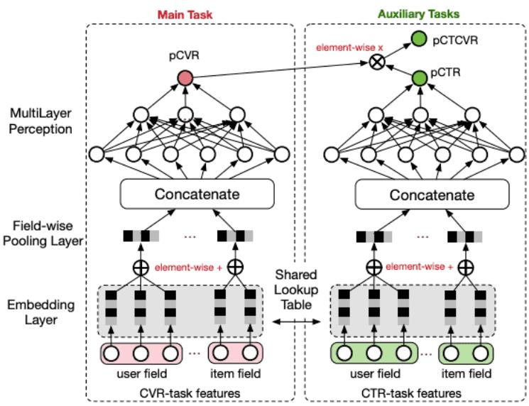

$$
\underbrace {p (y = 1 , z = 1 | \boldsymbol {x})} _ {p C T C V R} = \underbrace {p (y = 1 | \boldsymbol {x})} _ {p C T R} \times \underbrace {p (z = 1 | y = 1 , \boldsymbol {x})} _ {p C V R}.
$$

模型公式：

# 优点：

 全空间训练，消除 SSB。共享 Embedding 参数，缓解数据稀疏（DS）问题。

# 缺点：

 假设 CTR 和 CTCVR 独立，可能低估 CVR（PIP 问题）。  
 Potential Independance Priority（潜在独立先验），ESMM 分别建模 CTR 和 CVR，会忽视"转化"依赖于"点击"这一因果关系，即：ESMM 模型结构上 CVR 的预测是不依赖于 click 的，但真实情况是发生点击后，才会发生转化，是有依赖关系的，导致 CTCVR预估不准。

ESCM²（Entire Space Counterfactual Multi-Task Model）

论文链接：ESCM2: Entire Space Counterfactual Multi-Task Model for Post-Click Conversion Rate Estimation

# 核心思想：

 ESMM 主要解决样本选择偏差和数据稀疏问题，但存在固有估计偏差（IEB）和潜在独立性优先（PIP）问题；

 固有估计偏差（IEB）：CTCVR=CTR×CVR 的乘法假设在非独立场景下失效。  
 潜在独立性优先（PIP）：CTR 与 CVR 的联合优化可能掩盖因果关系。

 引入因果推断中的反事实学习，通过调整样本权重（如逆倾向加权 IPW）或双重稳健估计（ Doubly Robust，DR）解决SSB。

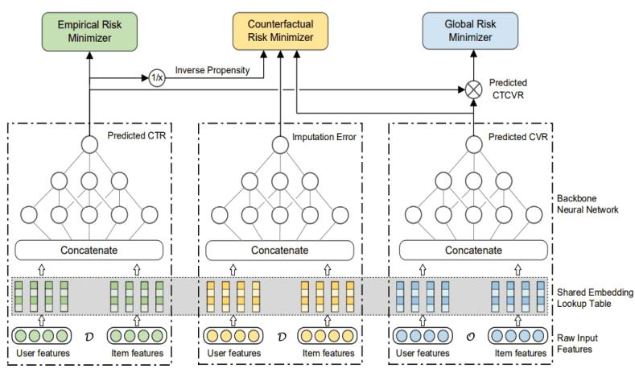

# 模型公式：

# 1. 逆倾向加权（Inverse Propensity Weighting, IPW）

通过 CTR预估值（倾向分）调整点击样本权重，消除选择偏差：

$$
\begin{array}{l} \mathcal {R} _ {\mathrm {I P S}} \left(\phi_ {\mathrm {C T R}}, \phi_ {\mathrm {C V R}}\right) = \mathbb {E} _ {(u, i) \in \mathcal {D}} \left[ \frac {\hat {o} _ {u , i} \delta \left(r _ {u , i} , \hat {r} _ {u , i} \left(x _ {u , i} ; \phi_ {\mathrm {C V R}}\right)\right)}{\hat {o} _ {u , i} \left(x _ {u , i} ; \phi_ {\mathrm {C T R}}\right)} \right] \\ = \frac {1}{| \mathcal {D} |} \sum_ {(u, i) \in \mathcal {D}} \frac {\mathcal {O} _ {u , i} \delta (r _ {u , i} , \hat {r} _ {u , i} (x _ {u , i} ; \phi_ {\mathrm {C V R}}))}{\hat {\sigma} _ {u , i} (x _ {u , i} ; \phi_ {\mathrm {C T R}})}, \\ \end{array}
$$

其中， $o _ { u , i }$ 表示是否点击， $\hat { o } _ { u , i }$ 表示 CTR 预估值， $\delta ( r _ { u , i } , \hat { r } _ { u , i } )$ 表示 CVR 预估值的 loss 误差(交叉熵)。

# 2. 双重稳健估计（Doubly Robust, DR）

 结合 IPW 与误差纠正模型（Imputation Model，IM），降低方差并提升稳健性，若倾向分或误差模型之一正确，则估计无偏。

$$
\begin{array}{l} \mathcal {R} _ {\mathrm {D R}} ^ {\text {e r r}} \left(\phi_ {\mathrm {C T R}}, \phi_ {\mathrm {C V R}}, \phi_ {\mathrm {I M P}}\right) \\ = \mathbb {E} _ {(u, i) \in \mathcal {D}} \left[ \hat {\delta} _ {u, i} (x _ {u, i}; \phi_ {\mathrm {I M P}}) + \frac {o _ {u , i} \hat {e} _ {u , i} (x _ {u , i} ; \phi_ {\mathrm {C V R}} , \phi_ {\mathrm {I M P}})}{\hat {\sigma} _ {u , i} (x _ {u , i} ; \phi_ {\mathrm {C T R}})} \right] \\ \end{array}
$$

其中， $\hat { e } _ { u , i } = \delta _ { u , i } - \hat { \delta } _ { u , i }$ 表示两者的差值，

$\hat { \delta } _ { u , i }$ 表示 Imputation Model 预估 CVR 误差（其 label $\boldsymbol { \mathfrak { H } } ^ { \delta ( r _ { u , i } , \hat { r } _ { u , i } ) }$ ，这点比较绕）。

 上述的 DR Loss，需加上如下 mse loss，减少真实 cvr loss 与 imputed cvr loss 之间的距离，保证 准确性：

$$
\begin{array}{l} \mathcal {R} _ {\mathrm {D R}} ^ {\mathrm {i m p}} \left(\phi_ {\mathrm {C T R}}, \phi_ {\mathrm {C V R}}, \phi_ {\mathrm {I M P}}\right) \\ = \mathbb {E} _ {(u, i) \in \mathcal {D}} \left[ \frac {o _ {u , i} \hat {e} _ {u , i} ^ {2} \left(x _ {u , i} ; \phi_ {\mathrm {C V R}} , \phi_ {\mathrm {I M P}}\right)}{\delta_ {u , i} \left(x _ {u , i} ; \phi_ {\mathrm {C T R}}\right)} \right] \\ \end{array}
$$

# 3. 损失函数设计

$$
\mathcal {L} = \lambda_ {C T R} \mathcal {L} _ {C T R} + \lambda_ {D R} \mathcal {R} _ {D R} + \lambda_ {C T C V R} \mathcal {L} _ {C T C V R}
$$

# 4. 模型优缺点：

优点：

 通过 IPW 或 DR 调整样本权重，减少 MNAR（缺失非随机）偏差。  
 结合误差修正 Imputation Model 模型，提升鲁棒性，IPW 和 Imputation Model 两者只要有一个准确，即可保证 CVRSSB 纠偏。

缺点：

 依赖 CTR 预测准确性，若 CTR 偏差较大，修正效果受限。  
 DR 方法需额外训练误差模型，增加 $30 \%$ 以上计算开销。

UKD（Uncertainty-regularized Knowledge Distillation）

论文：UKD: Debiasing Conversion Rate Estimation via Uncertainty-regularized Knowledge Distillation

# ESMM 类方法的局限性：

 乘法假设偏差：CTCVR=CTR×CVR 的独立性假设在非独立场景下失效。  
 未点击样本的梯度误导：ESMM 会将未点击样本的 CVR 向 0 优化（因 CTCVR 任务梯度恒正），但真实情况中未点击样本的转化标签应为未知而非 0。

# UKD 框架：基于知识蒸馏的去偏方法

UKD 通过教师-学生模型框架，结合对抗学习和不确定性正则化，解决样本选择偏差问题

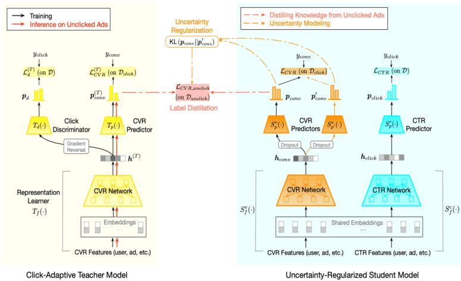

# 1. 教师模型：点击自适应表征与伪标签生成

目标：为未点击样本生成可靠的伪转化标签，使其能够参与全空间训练。

# 模型结构：

特征提取器：将输入特征映射为表征 $h _ { \circ }$   
 CVR 预测器：输出 CVR 预估值 p_conv 。  
域判别器：区分点击与未点击样本的表征分布。

关键思想：通过对抗训练混淆域判别器，使特征表征 $h$ 无法区分点击/未点击样本，从而生成点击自适应伪标签。

# 2. 学生模型：不确定性正则化知识蒸馏

目标：利用教师生成的伪标签训练学生模型，同时通过不确定性建模抑制噪声影响。

# 模型结构：

共享特征层：与 CTR 任务共享 Embedding。  
 双 CVR 预测器：独立预测 p_conv(1) 和 p_conv(2) ，通过 Dropout 增强差异性。  
 不确定性估计：KL 散度衡量两个预测器的不一致性： $u = D _ { K L } ( p _ { c o n v } ^ { ( 1 ) } | | p _ { c o n v } ^ { ( 2 ) } )$

# 动态权重调整：

未点击样本的 CVR损失根据不确定性动态加权：

$$
L _ {C V R - u n c l i c k} = \sum_ {i} \frac {1}{1 + \beta u _ {i}} \cdot \mathcal {L} _ {C V R} \left(p _ {c o n v}, \hat {y} _ {c o n v}\right)
$$

$\beta$ 为超参数，高不确定性样本权重降低，减少噪声干扰。

# 总损失函数：

$$
\mathcal {L} _ {\text {s t u d e n t}} = \lambda_ {C T R} \mathcal {L} _ {C T R} + \lambda_ {C V R} \left(\mathcal {L} _ {C V R - c l i c k} + \mathcal {L} _ {C V R - u n c l i c k}\right)
$$

其中 LCVR-click 为点击样本的真实 CVR 标签损失，LCVR-unclick 为未点击样本的 CVR 伪标签损失

# 关键创新点

领域自适应与对抗学习：教师模型通过对抗训练消除点击/未点击样本的表征差异，生成更可靠的伪标签。  
 不确定性正则化：双预测器设计量化伪标签噪声，动态调整损失权重，避免过拟合噪声样本。  
 全空间训练：学生模型同时利用点击样本（真实标签）和未点击样本（伪标签），直接优化全空间 CVR 预估

三者综合对比  

<table><tr><td>模型</td><td>核心问题</td><td>建模思想</td><td>理论支撑</td></tr><tr><td>ESMM</td><td>样本选择偏差（SSB）和数据稀疏性</td><td>通过多任务隐式建模全空间，利用CTR和CTCVR任务的乘积关系间接学习CVR，避免直接在点击空间训练CVR。</td><td>无理论无偏性证明，依赖乘法假设</td></tr><tr><td>ESCM²</td><td>ESMM的固有估计偏差（IEB）、潜在独立性假设失效（PIP）</td><td>引入因果推断中的反事实学习（IPW/DR），直接在全曝光空间建模CVR，通过逆倾向加权和双重稳健估计消除偏差。</td><td>双重稳健性理论（倾向分或误差模型准确即可无偏）</td></tr><tr><td>UKD</td><td>伪标签噪声与未点击样本利用不足</td><td>基于知识蒸馏框架，教师模型生成未点击样本的伪标签，学生模型通过不确定性正则化抑制噪声，实现全空间训练。</td><td>领域自适应与KL散度不确定性建模，无严格无偏证明</td></tr></table>

<table><tr><td>维度</td><td>ESMM</td><td>ESCM²</td><td>UKD</td></tr><tr><td>训练空间</td><td>隐式全空间（乘法假设）</td><td>显式全空间（IPW/DR纠偏）</td><td>显式全空间（伪标签蒸馏）</td></tr><tr><td>偏差处理</td><td>无法解决IEB和PIP</td><td>通过因果推断消除IEB和PIP</td><td>通过伪标签与噪声抑制缓解SSB</td></tr><tr><td>数据利用率</td><td>仅间接利用未点击样本</td><td>间接利用（倾向分加权）</td><td>直接利用未点击样本（伪标签）</td></tr><tr><td>计算复杂度</td><td>低</td><td>高（需误差模型和倾向分动态更新）</td><td>中等（对抗训练和双塔预测）</td></tr><tr><td>适用场景</td><td>粗排或低偏差场景（如内容推荐）</td><td>高精度CVR需求场景（如电商广告）</td><td>高噪声或未点击样本丰富场景</td></tr></table>

在 CVR 预估中，延迟反馈问题（Delayed Feedback）的经典解决方案是延迟反馈模型（Delayed Feedback Model, DFM）。

# 一、DFM 核心思想

DFM的核心是通过联合建模转化率（CVR）和转化延迟时间分布，解决因延迟反馈导致的假负样本问题。以下是其核心公式和推导过程：

# 1. 变量定义

 特征： $X$ （用户、广告特征）  
 隐变量： $C \in \{ 0 , 1 \}$ （最终是否转化）  
 观测变量： $Y \in \{ 0 , 1 \}$ （当前是否已观测到转化）  
 延迟时间： $D$ （点击到转化的时间间隔，若未转化则未定义）  
经过时间： $E$ （从点击到当前观测的时间）

# 2. 概率模型

 CVR 模型：预估最终转化概率

$$
p (C = 1 | X) = \sigma (w ^ {T} X) _ {(\text {逻 辑 回 归 形 式})}
$$

其中， $\sigma$ 为 sigmoid 函数， $w$ 为模型参数

 延迟时间模型：假设延迟时间 $D$ 服从指数分布

$$
p (D | X) = \lambda (X) e ^ {- \lambda (X) D}, \lambda (X) = e ^ {v ^ {T} X} \quad \text {其 中 ,} \lambda (X) \text {为 与 特 征 相 关 的 指 数 分 布 参 数}
$$

# 3. 联合概率分布

观测到转化（ $\forall = 1$ ）： $p ( Y = 1 , D | X ) = p ( C = 1 | X ) \cdot p ( D | X )$   
未观测到转化（ $\forall = \pmb { 0 }$ ，包含观测窗口以外的真实转化）：

$$
p (Y = 0 | X, E) = p (C = 0 | X) + p (C = 1 | X) \cdot p (D > E | X)
$$

其中，p(D>E|X)=e-(X)E $p ( D > E | X ) = e ^ { - \lambda ( X ) E }$ 为延迟时间超过观测窗口的概率。

# 4. 损失函数

基于最大似然估计（MLE），损失函数为负对数似然：

$$
\mathcal {L} = - \sum_ {Y = 1} \log p (Y = 1, D | X) - \sum_ {Y = 0} \log p (Y = 0 | X, E)
$$

具体展开后：

$$
\mathcal {L} = - \sum_ {Y = 1} [ \log \sigma (w ^ {T} X) + \log \lambda (X) - \lambda (X) D ] - \sum_ {Y = 0} \log [ 1 - \sigma (w ^ {T} X) + \sigma (w ^ {T} X) e ^ {- \lambda (X) E} ]
$$

该损失函数需同时对 $w$ （CVR 参数）和 $v$ （延迟参数）进行优化。

# 二、实现方法与训练流程

# 1. EM 算法迭代

DFM 通常通过 EM 算法交替优化 CVR 模型和延迟模型：

E 步：计算隐变量 C 的后验概率

$$
p (C = 1 | Y = 0, X, E) = \frac {\sigma \left(w ^ {T} X\right) e ^ {- \lambda (X) E}}{1 - \sigma \left(w ^ {T} X\right) + \sigma \left(w ^ {T} X\right) e ^ {- \lambda (X) E}}
$$

 M 步：固定隐变量后验分布，分别优化 w 和 $v$ 参数。

# 2. 梯度下降优化

实际工程中，常直接使用梯度下降联合优化：

import torch   
class DFM(torch(nnModule): def__init__(self，input_dim): super().__init_(） self.cvr_layer $=$ torch.mm.Linear(input_dim,1)#CVR模型 self.delay_layer $=$ torch.mm.Linear(input_dim,1)#延迟参数模型

```python
def forward(self, X, Y, D, E):
    cvr_logit = self.cvr_layer(X)
    lambda_logit = self.delay_layer(X)
    lambda_ = torch.exp( lambda_logit)
# 计算损失
loss_pos = -torch.log(torch.sigmoid(cvr_logit)) - \torch.log( lambda_ + lambda_ * D
loss_neg = -torch.log(1 - torch.sigmoid(cvr_logit) + \torch.sigmoid(cvr_logit) * torch.exp(-lambda_ * E))
total_loss = torch.sum(Y * loss_pos + (1 - Y) * loss_neg)
return total_loss 
```

# 三、优化与变体

# 1. 非参数延迟分布（NPDFM）

原始 DFM 假设延迟时间服从指数分布，但实际场景可能更复杂。非参数模型（如分位数回归或生存分析）可替代指数分布假设。

# 2. 在线学习（ES-DFM）

结合流式数据动态调整样本权重，缓解分布偏移问题：

$$
\mathcal {L} _ {E S - D F M} = \sum_ {i} \frac {1}{p \left(e _ {i} \mid X _ {i}\right)} \cdot \mathcal {L} \left(X _ {i}, Y _ {i}, D _ {i}, E _ {i}\right)
$$

其中， $p ( e | X )$ 为动态采样分布。

# 四、工程实践建议

# 1 数据预处理：

1. 对延迟时间 $D$ 进行归一化，避免数值不稳定。  
2. 对未转化样本（ $\mathsf { Y } { = } 0$ ）记录最大观测时间 E。

# 2 模型校准：

使用 Platt Scaling 或 Isotonic Regression 校准 CVR 预估值，减少因延迟假设引入的偏差。

# 3 线上部署：

3. 仅部署 CVR 模型，延迟模型仅用于训练阶段。  
4. 实时更新模型参数，适应延迟分布变化。

面试题：电商大促 CVR 预估会出现性能显著下降是什么原因，如何优化?

电商大促期间广告 CVR（转化率）预估模型性能显著下降的现象（AUC 大幅下降，CVR模型出现严重预估偏差），主要源于以下核心原因及对应的优化思路：

# 一、CVR 模型性能下降的原因

# 1. 用户行为突变导致的分布偏移

 大促期间用户购买行为呈现剧烈波动，例如促销前用户转化率骤降（等待折扣生效），促销爆发期转化率激增。  
 传统 CVR 模型基于 i.i.d 假设（训练数据与线上数据独立同分布），但大促期间数据分布突变导致该假设失效，模型难以准确捕捉动态变化。

# 2. 延迟反馈问题加剧

 与点击行为不同，用户转化可能延迟数天甚至数周发生（如预售订单）。在大促周期内，实时训练数据无法及时获取完整转化标签，导致模型短期内的预估严重低估真实 CVR。  
 例如，促销前点击的广告可能在大促正式开始后才转化，但模型无法预知这一未来行为。

# 3. 历史数据与当前场景的分布差异

 大促期间新增广告活动和商品品类可能从未在历史数据中出现，导致传统模型缺乏对新特征的适应能力。

# 二、模型优化方案

# 基于历史数据复用的智能建模 (HDR 算法)

论文链接：https://arxiv.org/pdf/2305.12837

参考链接：KDD'23 | 转化率预估新思路：基于历史数据复用的大促转化率精准预估

核心思路：在大促前，从历史数据中筛选与当前大促分布相似的周期（如往年双 11、618 数据），通过微调（Fine-tuning）提升 CVR 模型对新数据分布的适应能力。规避实时数据延迟问题，同时通过分布校正技术对齐历史与当前数据差异。框架包含以下模块：

# 1. 自动数据检索模块（Automated Data Retrieval）

# 销售日-特征向量化：

将历史大促日表示为特征向量，特征包括：前 3 天的 CVR 均值、当日前 10 小时各大商品的品类曝光占比（动态捕捉用户兴趣迁移）

# 相似度匹配：

使用近似最近邻搜索（ANN），计算当前大促特征向量与历史向量的相似度，选取 Top-K 相似历史大促日数据。

# 2. TransBlock 微调模块

#  分层参数更新：

 基础模型（Main Model）：固定大部分参数，仅用小学习率微调，保留日常模式知识。  
 新增 TransBlock 层：在基础模型顶部叠加轻量 MLP，使用大学习率快速适配大促模式。

#  双学习率策略：

基础模型学习率 LR=1e-6，TransBlock 层 LR=1e-3，平衡稳定性与适应性。

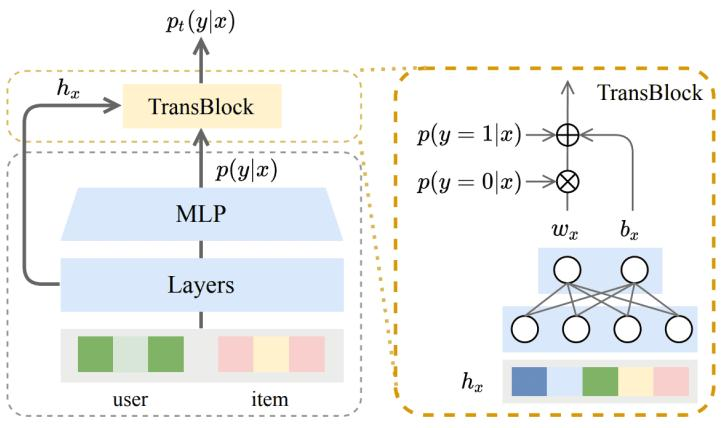

# 3. 分布偏移校正模块（Distribution Shift Correction）

# 重要性加权（Importance Weighting）：

基于重要性加权经验风险最小化框架（Importance-Weighted Empirical Risk Minimization 衡量历史样本与当前分布的差异，对检索到的样本重新加权，权重为：

$$
w (x) = \frac {\mathcal {B} _ {h} (y)}{\mathcal {B} _ {h} ^ {\prime} (y)}
$$

其中， $B _ { h } ^ { \prime } ( y )$ 代表历史数据对应当天前 10 小时的 CVR 均值，可以从历史数据中统计获得；而 $\boldsymbol { B } _ { h } ( y )$ 代表大促当天前 10 小时的真实 CVR 均值（不可实时获取），设计了一个简单的无监督预估方案对其进行估计（为了准确性，该估计不是样本级别，而是前 10 小时整体数据的 CVR，即期望）。

# 4. 在线部署

具体来说，保留原本模型的流式训练流程，在其训练完成后叠加一个微调过程，并将微调后的模型推送上线。

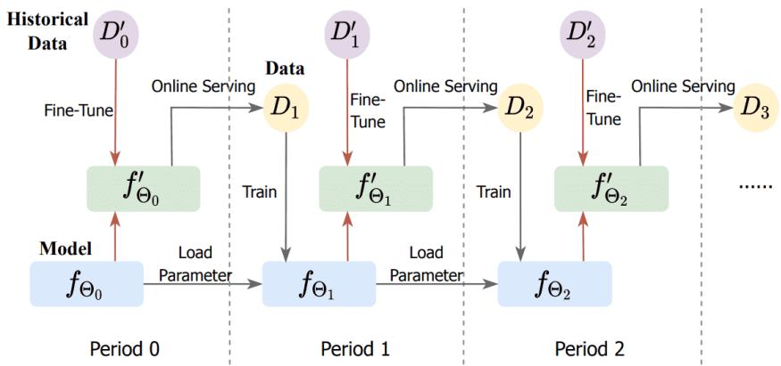

在线效果：双十一大促期间，智能数据复用方案在展示广告信息流主场景全量上线，全周期（10 月 23 日～11 月 11 日）为展示大盘信息流整体带来了 $R P M + 9 \%$ ， $C V R + 1 6 \%$ ， $R O | + 1 1 \%$ 的显著提升，创造可观营收增长的同时，提升了客户体验，达成了客户侧与平台侧的双赢。

# 面试题：用户 LTV 建模有哪些方案？

广告推荐中的用户 LTV（生命周期价值）建模旨在预测用户未来可能带来的收益（例如游戏付费金额），以优化广告投放策略。LTV 预估存在着数据稀疏、零膨胀（zero-inflated）和长尾分布（long-tailed distribution）等挑战，下面这个表格汇总了几个业界有代表性的 LTV 建模方案：

<table><tr><td>方案</td><td>机构</td><td>关键创新点</td><td>论文链接</td></tr><tr><td>ZILN (Zero-Inflated Lognormal)</td><td>Google, 2019</td><td>使用零膨胀对数正态分布拟合LTV，DNN输出分布参数，损失函数为负对数似然，端到端建模付费概率与金额。</td><td>https://arxiv.org/pd f/1912.07753</td></tr><tr><td>ODMN &amp; MDME</td><td>Kuaishou, 2022</td><td>ODMN建模多时间跨度LTV间的有序依赖；MDME用分而治之思想（分桶采样）处理极不平衡分布。</td><td>https://arxiv.org/pd f/2208.13358</td></tr><tr><td>ExpLTV</td><td>Tencent, 2023</td><td>创新性将大R识别（Game Whale Detection）作为门控网络，引导不同特质的用户进入专属的LTV专家进行预估。</td><td>https://arxiv.org/pd f/2308.12729</td></tr><tr><td>CMLTV (Contrastive Multi-view)</td><td>Huawei, 2023</td><td>对比学习多视角框架，集成多个异构回归器（分布/对数/分类），提升模型鲁棒性，为即插即用模块。</td><td>https://arxiv.org/pd f/2306.14400</td></tr></table>

# ZILN：概率化建模的开创者

ZILN模型为 LTV预估提供了一种优雅的概率化建模思路，其核心思想是对LTV的真实分布做出合理的概率假设。它认为 LTV数据来源于一个混合过程：大部分用户不付费（产生零值），而付费用户的金额服从对数正态分布。

 模型结构：一个深度神经网络（DNN）同时输出三个参数：付费概率 p、对数正态分布的均值 $\mu$ 和标准差 $\sigma _ { \mathfrak { c } }$ 。激活函数通常为 Sigmoid (for p), Identity (for μ), Softplus (for σ)。  
 损失函数：摒弃传统的 MSE 损失，采用基于 ZILN 分布的负对数似然损失。这使得模型训练更稳定，对高 LTV 的异常值不敏感。  
 预估值：预测时，使用付费概率乘以付费金额的期望，即 。 $p \cdot e ^ { ( \mu + \sigma ^ { 2 } / 2 ) }$   
 适用场景：付费行为相对规范、认可概率化建模的业务。其缺点在于依赖“付费金额服从对数正态分布”的强假设，在真实复杂场景中可能不总是成立。

# ODMN-MDME：工业级的 LTV 预估系统方案

快手的ODMN-MDME框架是针对超大规模用户场景下 LTV分布极度不平衡和多时间跨度预测一致性问题的一套系统性、工业级的解决方案。

 MDME (多分布多专家)：核心是“分而治之”。它将极度不平衡的 LTV分布先按值域切分为几个子分布（例如，零值、低价值、高价值），再在每个子分布内进行分桶，最后在桶内进行偏差回归。这种“分类 $^ +$ 排序 $^ +$ 回归”的级联结构极大降低了直接回归高难度长尾分布的复杂度。  
 ODMN (序依赖单调网络)：用于处理多时间跨度（如 ltv7, ltv30, ltv90）的预估。它通过一个单调单元显式地建模不同跨度任务间的有序依赖关系（即保证 $\hat { y } _ { 7 } \le \hat { y } _ { 3 0 } \le \hat { y } _ { 9 0 }$ ），利用更易预测的短期 LTV辅助长期 LTV的学习，并保证了业务逻辑上的严格一致性。

# ExpLTV：聚焦“大 R 用户”的价值挖掘

腾讯 ExpLTV 的核心洞察在于，极少数的“大 R 用户”贡献了绝大部分收入，而他们的行为模式与普通用户差异显著。传统单一模型难以同时处理好普通用户和大 R 用户的预估。

 专家路由与门控网络：模型创新地设计了一个大 R 用户检测器，该检测器作为一个门控网络，为每个用户计算其属于大R用户的概率。根据这个概率，模型动态地将用户路由到不同的“LTV专家”网络（例如，一个专家擅长处理普通用户，另一个专家专注处理大 R 用户）。  
 解决选择偏差与数据稀疏：通过构建“转化 购买 大 R用户”的行为序列，并引入购买率预测等辅助任务，在全量用户空间进行训练，有效缓解了传统方法只在付费用户上训练带来的样本选择偏差（SSB）和数据稀疏（DS）问题。

# CMLTV：集成与对比学习的视角

华为的 CMLTV 框架更像一个“即插即用”的增强模块，旨在通过模型集成和对比学习来提升基模型的鲁棒性和泛化能力。

 多视角预估：框架集成了三种异构的回归器：基于分布的（如伽马分布）、基于对数的、基于分类分桶的。它们从不同视角对样本的 LTV 进行分析建模，具有很强的互补性。  
 对比学习：在 Batch 样本间实施对比学习。例如，拉近高 LTV 用户与高付费概率用户的表征，拉远低 LTV 用户与高付费概率用户的表征，从而在批次内挖掘样本间的内在相关性，减轻对数据丰富性的依赖。

# LTV 评估指标

在评估模型时，除了通用的 NRMSE（归一化均方根误差），应特别关注排序能力指标：

 基尼系数（Gini）：源于洛伦兹曲线，是评估模型将高价值用户排在低价值用户之前的能力标准。其归一化版本（NormalizedGini）便于跨模型比较，取值为 0-1 之间，与 AUC 的换算关系 (1 + Norm_Gini) / 2 ≈ AUC。  
 互基尼系数（Mutual Gini）：快手提出的新指标，专门衡量预测值与真实值之间的分布差异，更能反映模型拟合不平衡分布的能力。

# 方案选择

 追求理论优雅与快速落地：ZILN 是一个非常好的起点，它提供了概率化框架，易于理解和实现。  
 应对超大规模数据与复杂业务逻辑：如果需要同时预测多个时间跨度且要求严格满足有序性，ODMN-MDME 是经过亿级用户验证的工业级方案之一。  
 业务中“大 R 用户”效应显著：在游戏、在线娱乐等大 R 用户贡献突出的行业，ExpLTV 的思路比较有借鉴意义，可以显著提升对高价值用户的识别和预估精度。  
 提升现有模型的泛化能力：可将 CMLTV 中的多视角和对比学习思路作为增强模块融入现有基线，或尝试模型集成。

# 4.7 冷启动

# 面试题：用户冷启动 POSO 论文原理介绍

论文地址：POSO: Personalized Cold Start Modules for Large-scale Recommender Systems

# 一、POSO 提出背景

POSO（Personalized Cold Start Modules）是快手提出针对推荐系统冷启动问题的创新算法，其背景源于以下挑战：

 用户冷启动难题：新用户行为数据稀疏，难以通过传统监督学习模型捕捉兴趣偏好，导致推荐效果差、用户留存率低。  
 样本分布极度不均衡：冷启动用户仅占全量样本约 $5 \%$ ，模型易被占主导地位的老用户样本主导，无法兼顾新用户特性。  
 行为模式差异：新用户与老用户的行为分布存在显著差异。例如，新用户更倾向点赞和完整观看短视频（新鲜感驱动），而老用户则偏好深度消费（兴趣驱动）。

传统方法（如元学习、ID Embedding 生成）未解决个性化淹没问题— 即冷启动用户的特征在训练过程中被淹没，导致模型无法有效区分用户群体。

# 二、POSO 算法原理

# 1. 核心思想

POSO 通过引入个性化门控模块，将模型参数分解为多个子模块，每个模块针对特定用户群体（如新/老用户）进行优化，并通过门控网络动态调整各模块权重，实现以下目标：

防止特征淹没：即使样本不均衡，各用户群体均有专属模块负责；  
灵活适配模型结构：兼容 MLP、MHA、MMoE 等主流推荐模型架构。

# 2. 算法公式

以 MLP层为例，POSO的改进公式： $\hat { \mathbf { x } } = C \cdot g \left( \mathbf { x } ^ { \mathrm { p c } } \right) \odot \sigma \left( W \mathbf { x } \right)$

 门控网络： $g ( \mathbf { x } ^ { p c } ) = s i g m o i d ( W _ { g } \cdot \mathbf { x } ^ { p c } )$ ，其中 $\mathbf { x } ^ { p c }$ 为个性化编码特征（如用户活跃度、是否新用户）；  
 模块加权：通过门控权重 $g$ 对不同子模块进行加权，动态调整特征重要性；  
 修正因子：引入 C 防止输出期望漂移（比如乘以 2 平衡 Sigmoid 期望值为 0.5 的影响）。

# 3. 模型结构

POSO 可嵌入多种模型：

 MLP：每层增加门控掩码，按元素粒度（element-wise）调整特征权重；  
MHA：对 Key 矩阵应用单头门控，Value 矩阵应用多头门控，保留序列特征信息；  
 MMoE：在专家网络前加入门控，实现任务与用户群体的双重适配。

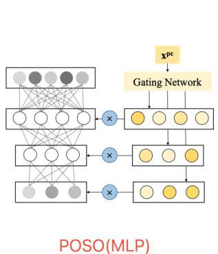  
(a)

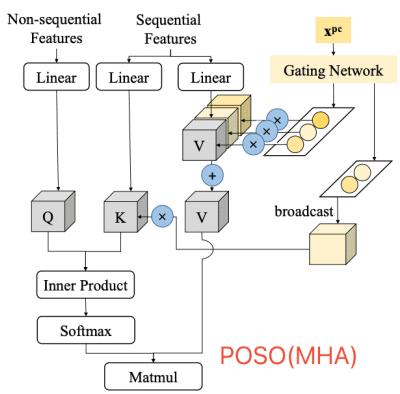  
(b)

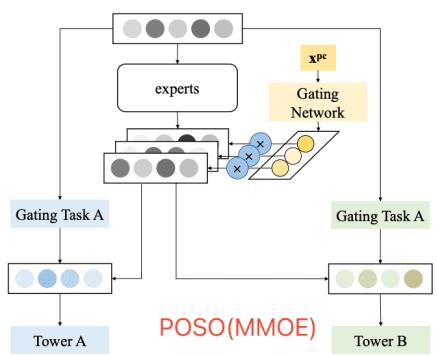  
(c)

# 三、适用场景

POSO 通过轻量级门控机制解决冷启动中的特征淹没问题，具有低计算开销 （仅增加约 $1 \%$ 参数量）、易部署 （兼容现有模型）的优势，适用于：1）新用户/新物品冷启动推荐；2）多场景适配（如不同活跃度用户）；3）长尾物料曝光提升。

# 四、代码实现

# 代码关键实现细节：

1. 门控输入：优先使用高度不平衡特征（如用户活跃度、UID），避免模型稀释个性化信号；  
2. 激活函数：门控输出采用 Sigmoid 而非 Softmax，保证各维度独立响应；  
3. 梯度优化：通过增加门控网络非线性层（如加入 ReLU）提升表达能力。

import torch   
import torch(nn as nn   
class POSO_MLP(nnModule): def __init__(self, input_dim, pc_dim, hidden_dims=[32, 64]): super().__init_( self.layers = nn.ModuleList() self.gates $=$ nn.ModuleList() dims $=$ [input_dim] $^+$ hidden_dims #构建门控网络与MLP层 for i in range(len(dims)-1): self.layers.append(nn.Linear(dims[i], dims[i+1])) self.gates.append(nn Sequential( nn.Linear(pc_dim, dims[i+1]), #输入为个性化编码特征 nn.Sigmoid()) def forward(self,x,x_pc): for layer, gate in zip(self.layers, self.gates): mask $=$ gate(x_pc)\*2 #修正期望缩放 $\mathbf{x} =$ torchrelu(layer(x)\*mask)#应用门控掩码 return x bn $=$ POSO_MLP(input_dim=8, pc_dim=8) out $=$ bn(torch rand(10, 8),torch rand(10, 8)) print(out.shape)

# 面试题：广告冷启动与物品冷启动的区别

广告系统的广告冷启动与推荐系统的物品冷启动虽然同属冷启动范畴，但由于业务场景、目标导向和实现逻辑的差异，存在以下核心区别：

# 一、核心目标对比

# 1. 广告冷启动

 目标：快速提升广告转化效率（如点击率 CTR、转化率 CVR）和广告主的 ROI，同时平衡平台流量分配效率。  
 优先级：商业化收益 $>$ 用户兴趣匹配，需在数小时至几天内完成模型验证，否则可能因超成本或消耗停滞被强制下架。  
 示例：新广告投放初期需通过高曝光快速积累转化数据，若 72 小时内转化数不足 10 个，可能被判定为冷启动失败。

# 2. 物品冷启动

 目标：提升新物品的曝光率和用户兴趣匹配度，避免“马太效应”（头部物品垄断流量）。  
 优先级：用户体验 > 短期转化，允许更长的探索周期（如抖音短视频需通过多轮流量池验证）。  
 示例：电商新品需通过知识图谱关联相似商品用户，短视频需通过内容标签匹配兴趣人群。

# 二、关键维度对比

<table><tr><td>维度</td><td>广告冷启动</td><td>物品冷启动</td></tr><tr><td>数据缺失</td><td>新广告无历史点击/转化数据，广告主 信息有限</td><td>新物品无用户交互数据，内容特征提取难度高</td></tr><tr><td>关键限制</td><td>预算约束、超成本风险、投放时效性</td><td>流量分配固化、同类物品竞争、新颖性需求</td></tr><tr><td>核心特征</td><td>广告属性（如行业、关键词）、出价策 略</td><td>物品内容（文本/图像特征）、标签/分类体系</td></tr><tr><td>核心指标</td><td>转化数、eCPM、ROI</td><td>曝光量、点击率、完播率（视频）、互动率</td></tr><tr><td>反馈时效性</td><td>实时调整（小时级出价/定向优化）</td><td>阶段性评估（如流量池分层验证）</td></tr><tr><td>冷启失败后果</td><td>广告下架、预算浪费</td><td>物品流量受限、生产者积极性下降</td></tr></table>

# 三、解决策略的差异

# 1. 广告冷启动的典型方法

 流量扶持：初期提高出价（如成本上浮 $2 0 \% - 5 0 \%$ ）、放宽定向范围（如使用“智能放量”）。  
 模型优化：迁移学习（跨行业广告数据复用）、Bias 特征增强（如广告主行业权重提升）。  
 失败处理：超成本阈值强制下架，或复用老广告模型数据（如“一键继承”）。

# 2. 物品冷启动的典型方法

 内容匹配：基于文本/图像特征提取（如 MetaEmbedding）、知识图谱关联（如关联品牌/类目用户）。  
 流量池机制：分阶段曝光（如抖音“倒三角流量池”），观察互动数据决定是否进入下一阶段。  
 多样性探索：随机曝光、跨领域推荐（如 EMCDR 算法迁移用户兴趣）。

# 第五章：损失函数&评估指标

# 5.1 损失函数

面试题：KL 散度和交叉熵的区别是什么？

# 一、核心原理与公式

# 1. KL 散度（Kullback-Leibler Divergence）

定义：衡量两个概率分布 $\pmb { P }$ （真实分布）和 Q（近似分布）之间的非对称差异，反映用 Q 近似 $P$ 时产生的信息损失。

公式：

 离散形式： $D _ { K L } ( P \parallel Q ) = \sum _ { x } P ( x ) \log \frac { P ( x ) } { Q ( x ) }$

$D _ { K L } ( P \parallel Q ) = \int P ( x ) \log { \frac { P ( x ) } { Q ( x ) } } d x$

性质：非对称性： $D _ { K L } ( P \parallel Q ) \neq D _ { K L } ( Q \parallel P ) .$ 、非负性（ $D _ { K L } \geq 0$ ）。

# 2. 交叉熵（Cross-Entropy）

定义：衡量用预测分布 Q 编码真实分布 $P$ 所需的平均信息量，常用于分类任务中计算预测误差。

公式：

基础形式： $H ( P , Q ) = - \sum _ { x } P ( x ) \log Q ( x )$

 分类任务简化形式（当 $P$ 为 one-hot 编码时）： $H ( P , Q ) = - \log Q ( x _ { \mathrm { t r u e } } )$

性质：非对称性： $H ( P , Q ) \neq H ( Q , P )$ ，但实际应用中常固定 $P$ 为真实标签 Label。

# 二、联系与区别

1. 数学关系：交叉熵是 KL 散度的组成部分：

$$
D _ {K L} (P \| Q) = H (P, Q) - H (P)
$$

其中 $H ( P )$ 是真实分布的熵。当 $P$ 固定时（如分类任务中的固定标签），最小化交叉熵等价于最小化 KL 散度。

核心区别对比：

<table><tr><td>维度</td><td>KL散度</td><td>交叉熵</td></tr><tr><td>本质</td><td>衡量分布的相对差异（信息损失）</td><td>衡量预测分布的绝对编码代价</td></tr><tr><td>对称性</td><td>非对称（方向敏感）</td><td>非对称（但实际应用中固定P单向优化）</td></tr><tr><td>取值范围</td><td>≥0，且仅当P=Q时为零</td><td>可能大于真实分布的熵，但优化时等价于KL散度</td></tr><tr><td>应用侧重点</td><td>分布差异量化、无监督学习</td><td>直接优化预测概率、监督学习分类任务</td></tr><tr><td>数值稳定性</td><td>需处理 Q(x)=0 的极端情况</td><td>计算更高效（仅需 logQ(x)）</td></tr></table>

# 2. 实际选择建议

#  优先使用 KL散度：

 需精确量化分布差异的场景（如 VAE 的正则化、知识蒸馏）。  
 需非对称性优化的任务（如防止模型过度拟合某个分布）。

#  优先使用交叉熵：

 监督学习分类任务（标签固定，优化目标明确）。  
 需要高效计算梯度时（如神经网络的反向传播）。

# 三、使用场景

# 1. KL 散度的典型应用

# 无监督学习：

 变分自编码器（VAE）中约束隐变量分布接近先验分布。  
 生成对抗网络（GAN）中评估生成分布与真实分布的差异。

# 模型对齐与优化：

 知识蒸馏中衡量教师模型与学生模型的输出差异。  
 变分推断中优化近似后验分布。

信息论：度量信息检索中的文档相关性或编码效率。

# 2. 交叉熵的核心应用

# 监督学习分类任务：

 图像分类（如 MNIST）、自然语言处理（如文本生成）中的损失函数。  
 二分类任务中的对数损失函数（Log Loss）。

概率校准：优化模型输出概率的置信度（如 Softmax输出）。

对抗训练：在GAN中稳定生成器的梯度更新。

# 面试题：分类任务 Loss 交叉熵与 MSE 损失对比

从梯度角度分析，二分类任务选择交叉熵损失函数（Cross-Entropy Loss）而非均方误差损失函数（MSE）的核心原因在于梯度更新效率和优化过程的稳定性。

# 一、损失函数定义对比

# 1. 交叉熵损失函数（Cross-Entropy Loss）

对于二分类问题，真实标签为 y⋅{0,1}，模型预测概率为 $\hat { y } = \sigma ( z ) = \frac { 1 } { 1 + e ^ { - z } }$ ，交叉熵损失定义为：

$$
L _ {C E} = - [ y \cdot \log (\hat {y}) + (1 - y) \cdot \log (1 - \hat {y}) ]
$$

特点：直接衡量预测分布与真实分布的差异，适用于概率输出场景。

# 2. 均方误差损失函数（MSE）

MSE 损失定义为预测值与真实值的平方误差：

$$
L _ {M S E} = \frac {1}{2} (\hat {y} - y) ^ {2}
$$

特点：假设误差服从高斯分布，常用于回归任务，但对分类问题存在局限性。

# 二、梯度推导对比

# 1. 交叉熵损失的梯度

通过链式法则计算梯度：

 对预测值 $\hat { y }$ 的导数： $\frac { \partial L _ { C E } } { \partial \hat { y } } = - ( \frac { y } { \hat { y } } - \frac { 1 - y } { 1 - \hat { y } } )$   
 对逻辑回归输出 $z$ （也叫 logit） 的导数， （结合Sigmoid 导数 $\frac { \partial \hat { y } } { \partial z } = \hat { y } ( 1 - \hat { y } )$ ）：

$$
\frac {\partial L _ {C E}}{\partial z} = \frac {\partial L _ {C E}}{\partial \hat {y}} \cdot \frac {\partial \hat {y}}{\partial z} = \hat {y} - y
$$

最终梯度仅与预测误差 $\left( { \hat { y } } - y \right)$ 相关，与激活函数的饱和区无关

# 2. MSE 损失的梯度

同样通过链式法则计算梯度：

$\frac { \partial L _ { M S E } } { \partial \hat { y } } = \hat { y } - y$ OLMSE1. 对预测值 $\hat { y }$ 的导数：

2. 对逻辑回归输出 $z$ 的导数 （需乘以 Sigmoid 的导数）：

$$
\frac {\partial L _ {M S E}}{\partial z} = \frac {\partial L _ {C E}}{\partial \hat {y}} \cdot \frac {\partial \hat {y}}{\partial z} = (\hat {y} - y) \cdot \hat {y} \cdot (1 - \hat {y})
$$

此时梯度包含 $\hat { y } \cdot ( 1 - \hat { y } )$ 项，当预测值 $\hat { y }$ 接近 0 或 1 时（Sigmoid 饱和区），梯度会趋近于 0，导致参数更新停滞（即梯度消失）。

# 三、两者 Loss 关键差异

# 1. 梯度消失问题

 交叉熵：梯度为 $\left( { \hat { y } } - y \right)$ ，即使预测值接近极端值（0 或 1），梯度仍保持显著，确保参数高效更新。  
 MSE：梯度包含 $\hat { y } \cdot \left( 1 - \hat { y } \right)$ 项，当预测值接近 0 或 1 时，梯度趋近于 0，导致参数更新缓慢甚至停滞。

# 2. 损失函数的凸性

 交叉熵：在逻辑回归中，交叉熵损失是凸函数，保证梯度下降能收敛到全局最优。  
 MSE：与Sigmoid函数结合后损失函数非凸，存在多个局部极小值，优化过程可能陷入次优解。

# 3. 误差敏感度

 交叉熵：对预测错误（如真实标签为 1 但预测接近 0）提供较大的梯度信号，加速模型修正。  
MSE：误差较小时梯度也较小，导致模型在接近真实值时收敛变慢。

面试题：常见的对比学习 Loss 有哪些？

在推荐系统中，对比学习通过构建正负样本对的相似性关系来优化特征表示，以下是常见的对比学习损失函数及其详细表达式：

1. InfoNCE Loss（噪声对比估计损失，最流行）

核心思想：最大化正样本对的相似度，同时最小化正样本与多个负样本的相似度。

表达式： $L _ { \mathrm { I n f o N C E } } = - \log { \frac { \exp ( s ( x , x ^ { + } ) / \tau ) } { \exp ( s ( x , x ^ { + } ) / \tau ) + \sum _ { x ^ { - } \in X ^ { - } } \exp ( s ( x , x ^ { - } ) / \tau ) } }$

$s ( x , y )$ ：样本 $x$ 和 $y$ 的相似度（如余弦相似度）；  
$x ^ { + }$ ：正样本， $x ^ { - }$ ：负样本集合；  
 $\tau$ ：温度参数，控制分布尖锐程度。

应用场景：推荐系统的用户-物品交互建模，如序列推荐中的正样本（点击）与负样本（未点击）对比。

# 2. Triplet Loss（三元组损失）

核心思想：通过锚点（Anchor）、正样本（Positive）、负样本（Negative）的相对距离优化表示。

表达式： $L _ { \mathrm { T r i p l e t } } = \operatorname* { m a x } ( 0 , d ( a , p ) - d ( a , n ) + \operatorname* { m a r g i n } )$

 ：锚点与正样本的距离（如欧氏距离）； $d ( a , p )$   
：锚点与负样本的距离； $d ( a , n )$   
margin：最小间隔阈值，确保区分性。

应用场景：推荐系统中的个性化排序，例如用户历史行为（正样本）与未交互物品（负样本）的对比。

# 3. Contrastive Loss（对比损失）

核心思想：直接区分正负样本对的相似性关系。

表达式：

$$
L _ {\text {C o n t r a s t i v e}} = y \cdot d \left(x _ {1}, x _ {2}\right) + (1 - y) \cdot \max  (\operatorname {m a r g i n} - d \left(x _ {1}, x _ {2}\right), 0)
$$

 y=1：正样本对（相似），需最小化距离 $d ( x _ { 1 } , x _ { 2 } )$ ；  
 $y = 0$ ：负样本对（不相似），若距离小于 margin 则施加惩罚。

应用场景：用户兴趣建模，如社交推荐中用户相似关系与不相关关系的区分。

# 4. N-Pair Loss（多负样本对比损失）

核心思想：Triplet Loss 的扩展，支持单正样本对多个负样本的对比。

表达式：

$$
L _ {\mathrm {N} - \text {P a i r}} = \log \left(1 + \sum_ {i = 1} ^ {N} \exp \left(s \left(x, x _ {i} ^ {-}\right) - s \left(x, x ^ {+}\right)\right)\right)
$$

$_ x$ ：锚点样本；  
$x ^ { + }$ ：正样本， $\boldsymbol { x } _ { i } ^ { - }$ ：第 $j$ 个负样本。

应用场景：大规模推荐场景，如电商中用户点击商品与海量未曝光商品的对比。

# 5. NCE Loss（噪声对比估计损失）

核心思想：通过采样负样本近似全量分布，降低计算复杂度。

表达式：

$$
L _ {\mathrm {N C E}} = - \log \frac {\exp (s (x , x ^ {+}))}{\exp (s (x , x ^ {+})) + \sum_ {x ^ {-} \in X ^ {-}} \exp (s (x , x ^ {-}))}
$$

与 InfoNCE 的区别：NCE Loss 不包含温度参数 τ，常用于语言模型和长尾推荐中的负采样优化。

总结与对比  

<table><tr><td>损失函数</td><td>核心特点</td><td>适用场景</td></tr><tr><td>InfoNCE</td><td>引入温度参数，支持多负样本对比</td><td>大规模推荐、跨模态对齐（如CLIP）</td></tr><tr><td>Triplet Loss</td><td>强调相对距离，需手动设定间隔阈值</td><td>精细化排序、用户兴趣建模</td></tr><tr><td>Contrastive Loss</td><td>显式控制正负样本距离，需预设间隔参数</td><td>有监督推荐</td></tr><tr><td>N-Pair Loss</td><td>单正样本对多负样本，提升训练效率</td><td>电商、广告推荐中的长尾物品处理</td></tr><tr><td>NCE Loss</td><td>简化采样复杂度，适合长尾分布数据</td><td>语言模型、点击率预测</td></tr></table>

# 面试题：InfoNCE Loss 原理详解与代码实现

InfoNCE Loss（Information Noise Contrastive Estimation Loss）是对比学习中的核心损失函数，广泛应用于自监督学习、多模态对齐和表示学习领域。

# 1. 背景

在无监督学习中，如何让模型学习到有判别性的特征表示是关键挑战。传统方法依赖人工标注，成本高昂。对比学习通过构建正负样本对，让模型自行学习区分相似与不相似样本，而InfoNCE Loss 是该过程的核心工具。

# InfoNCE Loss：

 定位：InfoNCE Loss 是自监督学习的基石，推动模型学习判别性特征表示。  
 特征对齐：使相似样本（正对）在嵌入空间中靠近，不相似样本（负对）远离。  
 避免表征坍缩：防止所有样本嵌入收敛到同一向量（如常数解）。  
 温度系数 $\tau$ ：平衡困难样本学习与训练稳定的关键，需依任务动态调整。  
 应用场景：广泛用于 CLIP（图文对齐）、SimCLR（图像增强对比）、推荐系统（用户-物品匹配）等。

# 2. 原理与公式表达

核心思想：通过最大化正样本对的互信息，同时最小化负样本对的相似度，驱动模型学习判别性特征。

# 数学公式：

给定锚点样本嵌入 ，正样本嵌入 ，负样本集合 $\{ z _ { k } ^ { - } \} _ { k = 1 } ^ { K }$ ，

InfoNCE Loss 定义为：

$$
\mathcal {L} _ {\text {I n f o N C E}} = - \log \frac {\exp (\sin (z _ {i} , z _ {j} ^ {+}) / \tau)}{\sum_ {k = 1} ^ {K} \exp (\sin (z _ {i} , z _ {k} ^ {-}) / \tau) + \exp (\sin (z _ {i} , z _ {j} ^ {+}) / \tau)}
$$

# 参数说明 ：

 ：相似度函数（通常为余弦相似度或点积）。 $\sin ( a , b )$   
 $\tau$ ： 温度系数 （超参数），控制相似度分布的平滑度。  
 K：负样本数量。

# 公式分解

 分子：鼓励正样本对的相似度 $\mathrm { s i m } ( z _ { i } , z _ { j } ^ { + } )$ 尽可能大。  
 分母：包含所有负样本的相似度之和，推动模型降低负样本相似度。

与交叉熵的联系：InfoNCE 等价于一个多分类交叉熵任务，正样本为“正确类”，负样本为“干扰类”。

# 3. 温度系数 $\tau$ 的作用与调节方法

作用 ： $\tau$ 控制模型对困难样本的敏感度：

 $\tau$ 较小（如 0.05）：

 相似度分布更“尖锐”，模型聚焦困难负样本 （相似度较高的负对）。

 风险：过度关注噪声样本，导致过拟合或训练不稳定

 $\tau$ 较大（如 1.0）：

 相似度分布更“平滑”，所有负样本被一视同仁。  
 风险：模型区分能力下降，收敛缓慢。

# 调节策略

 经验范围： $\tau \big \sqsupset [ 0 . 0 5 , 1 . 0 ]$ ，常用初始值 0.07（CLIP 等模型采用）。  
 动态调整：

 训练初期：用较大 $\tau$ （如 0.1）保证稳定性。  
 训练后期：减小 $\tau$ （如 0.05）提升判别力

 依赖 Batch_Size 批量大小：

 大批量训练时（如 Batch Size > 1024），需增大 $\tau$ 防止梯度爆炸。  
 小批量时，减小 $\tau$ 以增强对比强度。

# 4. 代码实现（PyTorch）

# 代码说明：

1. 动态负采样：若未提供负样本，自动将同批次其他样本作为负样本。  
2. 温度系数调节：通过 temperature 参数调整 τ 值。  
3. 数值稳定：使用余弦相似度避免嵌入向量尺度影响。

```python
import torch
import torch.nnfunctional as F
def info_nce_loss(query: torch.Tensor, positive: torch.Tensor,
						Negatives: torch.Tensor = None, temperature: float = 0.07):
						...
					(query: 锚点样本 [N, D]
						positive: 正样本 [N, D], negatives: 显式负样本 [N, K, D] (可选)
						...
						# === 1. 向量归一化（增强数值稳定性） ===
					(query = Fnormalize(query, p=2, dim=-1)
						positive = F normalize (positive, p=2, dim=-1)
						# === 2. 计算正样本相似度 ===
					 pos_sim = torch.sum(query * positive, dim=-1, keepdim=True) / temperature # [N, 1]
						# === 3. 负样本处理 ===
						if negatives is not None: # 如果提供了负样本
							Negatives = F normalize (negatives, p=2, dim=-1) # 显式负样本模式 [N, K, D]
							Neg_sim = torch.einsum('nd,nkd->nk', query, negatives) / temperature # [N, K]
						else:
							# 同批次负样本模式（默认）
							all_sim = torch.mm(query, query.t())
								mask = ~torch.eye(query.size(0), dtype=torch BOOL, device=query_device) # 排除自身对角线
								Neg_sim = all_sim[mask].view(query.size(0), -1) # [N, N-1]
								# === 4. 核心计算（原始公式实现） ===
																						/logits = torch.cat([pos_sim, neg_sim], dim=1) # 合并正负样本相似度 [N, 1 + K]
																							Neg_sum_exp = torch.logsumexp(logits, dim=1, keepdim=True) # 计算 log-sum-exp 的分母项, [N, 1]
																							# 原始公式：-log(exp(pos_sim) / (exp(pos_sim) + Σ exp(neg_sim))) 
																							loss = - (pos_sim - log_sum_exp) # 等价于 -log(exp(pos_sim)/分母)
																							# === 5. 返回平均损失 ===
																							return loss.mean()
N, D = 4, 128 # 测试验证
query, positive = torch.randn(N, D), torch.randn(N, D)
print("基础测试:", info_nce_loss(query, positive, temperature=0.1))
K = 10 # 显式负样本数量
negatives = torch.randn(N, K, D)
print("显式负样本:", info_nce_loss(query, positive, negatives))
# 理想情况测试（正样本与锚点相同）Loss 应该接近 0
print("正样本=锚点:", info_nce_loss(query, queryClone())) 
```

面试题：常见 Pairwise Loss 有哪些，有什么区别？

推荐算法中常见的 Pairwise Loss 主要包括以下四种核心方法，它们在优化相对排序关系时各有特点：

# 一、BPR Loss (Bayesian Personalized Ranking Loss)

原理：BPR Loss基于贝叶斯后验优化思想，强制正样本（用户交互过的物品）的预测得分高于随机采样的负样本。其核心是最大化正负样本得分差异的概率。

$$
\mathcal {L} _ {\mathrm {B P R}} = - \sum_ {(u, i ^ {+}, i ^ {-})} \log \sigma (s (u, i ^ {+}) - s (u, i ^ {-}))
$$

公式：

其中， $\sigma$ 为 Sigmoid 函数， $s ( u , i )$ 为用户-物品得分函数。

特点：

 隐式反馈优化：适用于点击、购买等隐式反馈数据，强调正样本的相对优先级。  
 高效负采样：通常采用随机负采样，但对困难负样本（Hard Negative）区分能力有限。

# 二、Triplet Loss (Margin Ranking Loss)

原理：通过三元组（anchor 锚样本 、正样本 $p$ 、负样本 $n$ ）引入边界（Margin），强制正样本与锚样本的距离比负样本近至少一个边距m。

$$
\mathcal {L} _ {\text {T r i p l e t}} = \sum_ {(a, p, n)} \max  (0, d (a, p) - d (a, n) + m)
$$

公式：

其中，d 为距离函数（如欧氏距离或余弦相似度）。

特点：

 边界控制：通过 $m$ 调节正负样本区分度，防止模型陷入局部最优。  
 困难样本挖掘：需在线采样困难负样本以提升效果（如 FaceNet 人脸识别）。

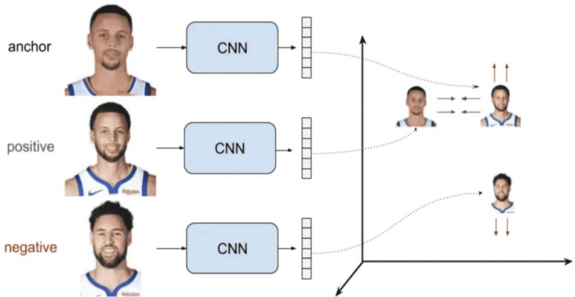

# 三、RankNet Loss

原理：

将排序问题转化为概率预测，通过交叉熵损失衡量正样本得分高于负样本的概率。其核心是定义两个物品的排序概率：

$$
\begin{array}{l} P _ {i j} = \frac {e ^ {s _ {i}}}{e ^ {s _ {i}} + e ^ {s _ {j}}} \\ \mathcal {L} _ {\text {R a n k N e t}} = - \sum \bar {P} _ {i j} \log P _ {i j} + (1 - \bar {P} _ {i j}) \log (1 - P _ {i j}) \\ \end{array}
$$

公式： ,j)

其中， $\bar { P } _ { i j }$ 为真实排序标签（1 表示 i 排在 j 前）。

特点：

概率化排序：输出具有可解释性的概率值，适用于需要置信度评估的场景。  
梯度平滑：相比 BPR，梯度更新更稳定，但计算复杂度较高。

# 四、Pairwise Logistic Loss

原理：与 RankNet 类似，但简化了概率计算，直接使用得分差异的对数损失。其本质是 RankNet 的一阶近似。

$$
\mathcal {L} _ {\text {L o g i s t i c}} = \sum_ {(i, j)} \log \left(1 + e ^ {s _ {j} - s _ {i}}\right)
$$

特点：

 计算高效：去除了 Sigmoid 函数，适合大规模数据训练。  
鲁棒性：对噪声标签敏感度低于 RankNet。

# 五、核心区别与选型建议

<table><tr><td>损失函数</td><td>优化目标</td><td>计算复杂度</td><td>适用场景</td></tr><tr><td>BPR Loss</td><td>隐式反馈的相对排序</td><td>低</td><td>电商推荐、社交网络</td></tr><tr><td>Triplet Loss</td><td>边界约束的硬样本区分</td><td>中</td><td>图像检索、冷启动用户</td></tr><tr><td>RankNet Loss</td><td>概率化排序关系</td><td>高</td><td>搜索排序、风险评估</td></tr><tr><td>Pairwise Logistic</td><td>高效的大规模排序</td><td>中</td><td>广告CTR、短视频流</td></tr></table>

# 选型建议：

1. 数据规模大且需快速迭代：优先选择 BPR 或 Pairwise Logistic Loss。  
2. 需精细化困难样本区分：使用 Triplet Loss 并配合在线困难样本挖掘。  
3. 要求概率输出或稳定性：选择 RankNet Loss。

# 一、Focal Loss 解决的问题

Focal Loss 主要用于解决以下两类问题：

# 1. 类别不平衡问题

在目标检测（尤其是 One-Stage 方法）中，正样本（前景目标）数量远少于负样本（背景），导致模型训练时被大量简单负样本主导，难以有效学习正样本特征。

# 2. 难易样本不均衡问题

易分类样本（如高置信度的背景）占比过高，而难分类样本（如模糊目标）的损失贡献被稀释，模型优化方向偏离实际需求。

Focal loss 论文：Focal Loss for Dense Object Detection

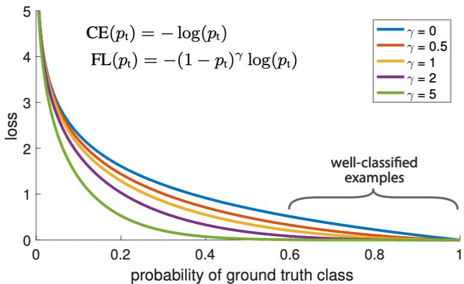  
Figure 1. We propose a novel loss we term the Focal Loss that adds a factor $( 1 - p _ { \mathrm { t } } ) ^ { \gamma }$ to the standard cross entropy criterion. Setting $\gamma > 0$ reduces the relative loss for well-classified examples $( p _ { \mathrm { t } } > . 5 )$ , putting more focus on hard, misclassified examples. As our experiments will demonstrate, the proposed focal loss enables training highly accurate dense object detectors in the presence of vast numbers of easy background examples.

# 二、原理与公式推导

Focal Loss 基于标准交叉熵（Cross Entropy, CE）改进，通过引入两个调节因子实现上述目标：

# 1. 标准交叉熵公式

对于二分类问题，交叉熵损失为：

$$
C E \left(p _ {t}\right) = - \log \left(p _ {t}\right)
$$

其中 $p _ { t }$ 表示模型对正确类别的预测概率： $p _ { t } = { \left\{ \begin{array} { l l } { p , } & { { \mathrm { i f ~ } } y = 1 } \\ { 1 - p , } & { { \mathrm { o t h e r w i s e } } } \end{array} \right. }$

# 2. 引入调节因子

Focal Loss 在 CE 基础上增加两个权重项

 α（类别平衡因子）：控制正负样本权重，通常正样本 $\pmb q$ 较小（如 0.25），负样本 1−α 较大。  
 （调制因子）：降低易分类样本的权重，γ（聚焦参数）越大，简单样本的损失衰减越强。 $( 1 - p _ { t } ) ^ { \gamma }$

最终公式：

$$
F L \left(p _ {t}\right) = - \alpha_ {t} \left(1 - p _ {t}\right) ^ {\gamma} \log \left(p _ {t}\right)
$$

展开形式（二分类）：

$$
F L (y, p) = \left\{ \begin{array}{l l} - \alpha (1 - p) ^ {\gamma} \log (p), & y = 1 \\ - (1 - \alpha) p ^ {\gamma} \log (1 - p), & y = 0 \end{array} \right.
$$

# 三、PyTorch 代码实现

以下是一个完整的 Focal Loss 实现，支持多标签分类

# 代码关键点说明：

1. 输入要求：

 inputs：未归一化的模型输出（Logits），形状为 (N, *)。  
 targets：与 inputs 同形状的 0-1 标签。

2. 调制因子计算：

会使高置信度样本（pt →1）的损失权重降低，反之保留难样本的高权重。 $( 1 - p _ { t } ) ^ { \gamma }$ $p t  1$

3. α 平衡：

对正负样本分别应用 $\pmb q$ 和 $\pmb { 1 - a }$ ，缓解类别数量不平衡。

import torch   
import torch(nn as nn   
import torch(nnfunctional as F   
class FocalLoss(nnModule): def__init__(self, alpha=0.25,gamma=2,reduction='mean'): super(FocalLoss,self).__init_(） self.alpha $=$ alpha #正样本权重（如0.25） self.gamma $=$ gamma #难易样本调节（常用2） self.reduce $=$ reduction #损失聚合方式（mean/sum）   
def forward(self，inputs,targets): #计算二元交叉熵（无需Sigmoid，因含Logits） BCE_loss $=$ F;binary CROSS_entropy_with_logits( inputs,targets,reduction $\coloneqq$ 'none') #计算概率pt（对正确类别的预测概率） pt $=$ torch.exp(-bce_loss)#pt $=$ p_t（公式中的p_t） #计算Focal Loss的核心调制因子 focal_term $\equiv$ (1-pt）\*\*self.gamma #应用 $\alpha$ 平衡：正样本乘 $\alpha$ ，负样本乘 $(1 - \alpha)$ alpha_factor $=$ targets\*self.alpha $+$ (1-tTargets)\* (1-self.alpha) #组合得到最终损失 fl_loss $=$ alpha_factor\*focal_term\*bce_loss return fl_loss.mean()   
labels $=$ torch.randint(0,2,(32,1)) $\ast 1.0$ preds $=$ torch RAND(32,1)   
fl $=$ FocalLoss() (preds,labels)   
print(fl)

# 5.2 评估指标

面试题：AUC 物理意义&计算公式&代码实现

# 一、AUC 的物理意义

AUC（Area Under the ROC Curve）是二分类模型的核心评估指标，其物理意义可从两个维度解读：

# 1. 概率视角：正负样本对的排序能力

AUC表示随机选择一个正样本和一个负样本时，模型对正样本的预测概率高于负样本的概率。

#  直观解释：

 若 ${ \mathsf { A } } { \mathsf { U } } { \mathsf { C } } { = } 1$ ，模型能完美区分正负样本；  
 若 ${ \sf A U C } = 0 . 5$ ，模型等同于随机猜测；  
 若 ${ \sf A U C } { < } 0 . 5$ ，模型预测方向错误，但反向使用可能有效。

#  实际意义：

在金融风控、医学诊断等场景中，AUC越高，模型对高风险用户或患病样本的排序能力越强。

# 2. 几何视角：ROC 曲线下的面积

AUC是 ROC曲线（横轴为假阳性率 FPR，纵轴为真阳性率 TPR）与坐标轴围成的面积，综合反映模型在所有分类阈值下的性能：

 ROC 曲线特性：曲线越靠近左上角（TPR 高、FPR 低），AUC 越大；  
 面积意义：通过积分或曼-惠特尼 U 统计量计算，几何上等同于正样本得分高于负样本的概率。

# 二、AUC 的计算公式

# 1. 基于概率比较的原始公式

通过统计所有正负样本对的得分关系：

$$
\mathrm {A U C} = \frac {\sum_ {i = 1} ^ {m} \sum_ {j = 1} ^ {n} I (P _ {\text {正} _ {i}} > P _ {\text {负} _ {j}})}{m \cdot n} + \frac {1}{2} \cdot \frac {\sum_ {i = 1} ^ {m} \sum_ {j = 1} ^ {n} I (P _ {\text {正} _ {i}} = P _ {\text {负} _ {j}})}{m \cdot n}
$$

 说明： $m$ 和 $n$ 为正负样本数量，I(⋅)为指示函数（得分高为 1，相等为 0.5，低为 0）；  
缺点：计算复杂度为 $O ( m n )$ ，不适合大规模数据。

# 2. 基于排序的优化公式

通过对样本预测值排序后计算秩次（Rank）：

$$
\mathrm {A U C} = \frac {\sum_ {i = 1} ^ {m} \mathrm {r a n k} _ {\text {正} _ {i}} - \frac {m (m + 1)}{2}}{m \cdot n}
$$

步骤：

 所有样本按预测值从小到大排序，rank 秩序从 1 排到 $m + n$ ；  
 计算正样本的 rank 秩次和，并减去调整项 $m ( m { + } 1 ) / 2$ ；  
 结果除以正负样本对数（ ${ \mathfrak { m } } \cdot { \mathfrak { n } }$ ）；  
优点：复杂度降为 O(nlogn)。

# 三、AUC 计算代码实现

方法：基于排序公式：  
import numpy as np   
from sklearn.metrics import roc_auc_score   
def manual_auc(y_true，y_pred): #合并标签和预测值，并按预测值升序排序 data $=$ sorted(zip(y_pred，y_true)，key $\equiv$ lambda x:x[0]) pred_sorted，labels_sorted $=$ zip(*data) #计算正样本的秩次（从1开始） ranks $= []$ fori，(pred，label）in enumerate(data): if label $= = 1$ ranks.append(i+1）#索引从0开始，秩次从1开始 #计算曼-惠特尼U统计量 m $=$ sum(labels_sorted） #正样本数 n $=$ len.labels_sorted)-m#负样本数 sum_ranks $=$ sum(ranks) auc $=$ (sum_ranks - m\*(m+1)/2)/ $(\textsf{m}\star \textsf{n})$ return auc

# 测试

y_true $= [0,0,1,1,0]$ y_pred $= [0.1,0.4,0.35,0.8,0.2]$ print(f"手动计算AUC:{manual_auc(y_true，y_pred):.4f}")   
print(f"sklearn计算AUC:{roc_auc_score(y_true，y_pred):.4f}")

面试题：NDCG@K、Recall@K、Precision@K 和 HitRate@K 评估指标介绍

推荐系统中，NDCG@K、Recall@K、Precision@K 和 HitRate $@ \mathsf { K }$ 这些指标能帮助我们从不同角度评估推荐列表的质量。下面这个表格汇总了它们的核心特点，方便快速了解：

<table><tr><td>评估指标</td><td>核心关注点</td><td>计算方式概述</td><td>适用场景</td></tr><tr><td>Precision@K</td><td>推荐准确性</td><td>前K个推荐中用户喜欢的物品比例</td><td>注重推荐结果准确性的场景，如电商商品推荐</td></tr><tr><td>Recall@K</td><td>兴趣覆盖度</td><td>用户喜欢的物品中被成功推荐的比例</td><td>注重挖掘用户潜在兴趣的场景，如内容发现</td></tr><tr><td>HitRate@K</td><td>简单命中率</td><td>推荐列表是否至少命中一个用户喜欢的物品</td><td>快速A/B测试、初步效果对比</td></tr><tr><td>NDCG@K</td><td>排名质量</td><td>考虑物品相关性和位置折扣的加权收益</td><td>对排序位置敏感的场景，如搜索引擎、列表页推荐</td></tr></table>

# 1. Precision@K：推荐准确性

 原理：Precision@K衡量的是在推荐系统给出的前 K个结果中，有多少是用户真正喜欢的（即相关的）。它只关注推荐列表本身，计算的是精度。  
 公式：

$$
P r e c i s i o n @ K = \frac {\text {前} K \text {个 推 荐 中 用 户 喜 欢 的 物 品 数 量}}{K}
$$

对所有用户计算后，通常再取平均得到整体的 Precision@K。

 场景：适用于高度重视推荐结果准确性的场景，例如电商商品推荐、付费广告推荐，希望用户点击或购买的物品尽可能都是他们感兴趣的。

# 2. Recall@K：兴趣覆盖度

 原理：Recall@K 衡量的是用户喜欢的物品中，有多少被推荐系统成功发掘并放在了前 K 个推荐里。它关注的是系统覆盖用户兴趣范围的能力。  
 公式：

$$
\operatorname {R e c a l l} @ K = (\text {前} K \text {个 推 荐 中 用 户 喜 欢 的 物 品 数 量}) / (\text {用 户 喜 欢 的 物 品 总 数})
$$

$$
R e c a l l @ K = \frac {\text {前} K \text {个 推 荐 中 用 户 喜 欢 的 物 品 数 量}}{\text {用 户 喜 欢 的 物 品 总 数}}, \text {同 样 需 要 对 所 有 用 户 平 均 。}
$$

 场景：适用于希望尽可能挖掘用户潜在兴趣、避免信息茧房的场景，例如新闻推荐、内容发现平台，旨在帮助用户发现更多他们可能感兴趣的新内容。

# 3. HitRate@K：简单命中率

 原理：HitRate@K 是一个非常直观的指标。它只关心推荐的前 K个物品中，是否至少有一个是用户喜欢的（即“命中”）。它计算的是命中发生的用户比例。  
公式：

$$
H i t R a t e @ K = \frac {\text {前} K \text {个 推 荐 至 少 命 中 一 个 喜 欢 物 品 的 用 户 数}}{\text {总 用 户 数}}
$$

 场景：常用于快速的 A/B测试初期，或作为一项简单直观的指标向非技术背景的伙伴解释模型效果。因为它无法区分命中一个和命中多个的差异，所以在深度评估中通常会结合其他指标。

# 4. NDCG@K：排名质量

 原理：NDCG@K (Normalized Discounted Cumulative Gain) 不仅考虑推荐物品是否相关，还考虑了相关物品在推荐列表中的位置。它认为排名越靠前的相关物品，其价值越高，因此会赋予更高的权重；排名越靠后，价值会因折损而降低。最后会通过归一化处理，使结果落在[0, 1]区间，便于比较。

 计算过程：

$$
C G @ K = \sum_ {i = 1} ^ {K} r e l _ {i}
$$

 CG@K (累计增益)：简单累加前 K 个物品的相关性分数（如喜欢为 1，不喜欢为 0）,  
 DCG@K (折损累计增益)：在 CG 的基础上，对每个物品的增益除以一个与其排名位置有关的折损因子（通常是

$$
D C G @ K = \sum_ {i = 1} ^ {K} \frac {\operatorname {r e l} _ {i}}{\log_ {2} (i + 1)}
$$

log⋅(i+1)），这使得排名靠前的物品贡献更大，

 IDCG@K (理想折损累计增益)：将所有物品按照真实相关性降序排列，计算前 K 个物品的 DCG，这是理论上可能达

到的最大值，

$$
I D C G @ K = \sum_ {i = 1} ^ {K} \frac {\operatorname {r e l} _ {i} ^ {\text {i d e a l}}}{\log_ {2} (i + 1)}
$$

 NDCG@K (归一化 DCG)：将 DCG 与 IDCG 相比进行归一化，消除了列表长度等因素的影响，便于不同排序列表间的比较。 $N D C G @ K = { \frac { D C G @ K } { I D C G @ K } }$

 场景：适用于对排序位置非常敏感的场景，例如搜索引擎的结果列表、流媒体音乐或视频应用的主页推荐，这些场景中排在最前面的几个结果至关重要

# 如何选择评估指标

选择哪些指标，主要取决于你的推荐目标和业务场景：

 追求极致准确：优先看 Precision@K。   
 希望全面覆盖用户兴趣：重点关注 Recall@K。  
 排序位置至关重要： NDCG@K 是最佳选择之一。  
 快速验证和直观展示：可以先用 HitRate@K。

# 第六章：推荐基础八股算法

# 6.1 树模型面试题

面试题：XGBoost 和 GBDT 有什么区别？

# 一、公式原理

1. GBDT（Gradient Boosting Decision Tree）

核心思想：通过迭代构建决策树，每棵树拟合前一棵树的负梯度，逐步减少损失函数。其目标是最小化损失函数$L ( y , F ( x ) )$ ，其中 $F ( x )$ 是模型预测值。  
 损失函数优化：使用一阶泰勒展开（梯度下降法），每次迭代计算负梯度方向：

$$
r _ {i} = - \frac {\partial L \left(y _ {i} , F _ {m - 1} \left(x _ {i}\right)\right)}{\partial F _ {m - 1} \left(x _ {i}\right)}
$$

新树 $h _ { m } ( x )$ 拟合负梯度 $r _ { i }$ ，并通过学习率 $\eta$ 加权更新模型： $F _ { m } ( x ) = F _ { m - 1 } ( x ) + \eta h _ { m } ( x )$

 特点：仅依赖一阶导数，未显式控制模型复杂度，易过拟合。

# 2. XGBoost（eXtreme Gradient Boosting）

 核心思想：在 GBDT 基础上引入二阶泰勒展开和正则化项，优化目标函数：

$$
O b j = \sum L \left(y _ {i}, \hat {y} _ {i}\right) + \sum \Omega \left(f _ {t}\right)
$$

其中正则项 $\Omega ( f _ { t } ) = \gamma T + \frac { 1 } { 2 } \lambda | | w | | ^ { 2 }$ ， $\tau$ 为叶子节点数，w 为节点权重。

 损失函数优化：利用二阶导数（Hessian矩阵）加速收敛：

增益 $( \mathrm { G a i n } ) = { \frac { G _ { L } ^ { 2 } } { H _ { L } + \lambda } } + { \frac { G _ { R } ^ { 2 } } { H _ { R } + \lambda } } - { \frac { ( G _ { L } + G _ { R } ) ^ { 2 } } { H _ { L } + H _ { R } + \lambda } } - \gamma$ H++

其中 G 和 $H$ 分别为一阶和二阶导数和。

叶子节点权重计算：

$$
w _ {j} = - \frac {G _ {j}}{H _ {j} + \lambda}
$$

相比 GBDT，增加了正则化约束，防止过拟合。

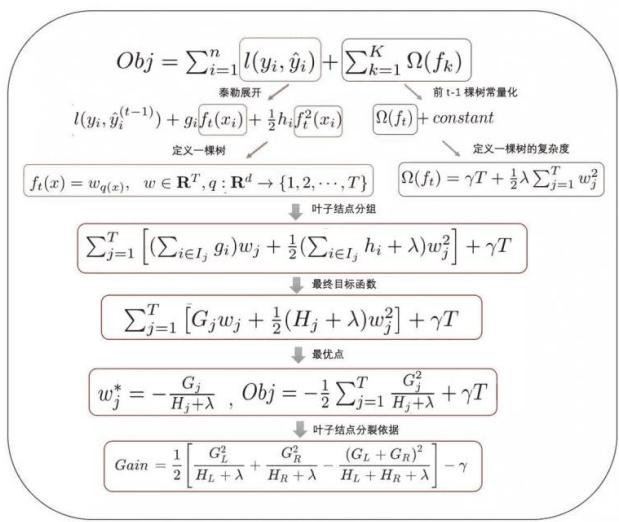

# 二、核心区别

<table><tr><td>维度</td><td>GBDT</td><td>XGBoost</td></tr><tr><td>优化方法</td><td>一阶梯度下降（残差拟合）</td><td>二阶泰勒展开（牛顿法），更快收敛</td></tr><tr><td>正则化</td><td>无显式正则化，依赖剪枝、早停等技巧</td><td>内置L1/L2正则化，控制模型复杂度</td></tr><tr><td>并行化</td><td>串行训练（无法并行）</td><td>支持特征级并行、预排序分块，提升训练速度</td></tr><tr><td>缺失值处理</td><td>需人工填充或删除</td><td>自动学习最优缺失值分配(左/右子树增益对比)</td></tr><tr><td>特征重要性</td><td>基于信息增益或基尼系数</td><td>内置特征评分（基于分裂增益、覆盖度等）</td></tr><tr><td>内存占用</td><td>较高（需存储预排序数据）</td><td>较低（直方图压缩、分块存储）</td></tr></table>

# 三、使用场景

# 1. GBDT 适用场景

 小规模数据集：样本量在万级以下时，GBDT 训练速度可接受，且模型稳定性较好。  
快速验证需求：对调参要求较低，适合快速验证模型可行性。  
特征工程简单：无需处理缺失值或高维稀疏特征（需人工预处理）。

# 2. XGBoost 适用场景

 大规模高维数据：支持分布式训练（如 Spark），适合百万级样本及高维特征（如推荐系统、广告 CTR 预测）。  
 复杂调参需求：需精细控制过拟合（如 L1/L2 正则化、列采样）的场景。  
 竞赛与工业应用：Kaggle 等竞赛中表现优异，适合对精度和效率要求高的任务。

# 四、总结

数学层面：XGBoost 通过二阶泰勒展开和正则化，提升了精度和泛化能力。  
 工程层面：XGBoost 的并行化、直方图优化使其在大数据场景下效率显著优于 GBDT。  
功能层面：XGBoost 支持缺失值自动处理、自定义损失函数，灵活性更高。

实际应用中，XGBoost在绝大多数场景（尤其是大规模数据）已取代传统GBDT，而GBDT 仍适用于小数据快速建模或教学演示。

面试题：XGBoost 和 LightGBM 的区别是什么？

# 1. 算法原理与实现差异

# （1）树生长策略

 XGBoost：采用 Level-wise（按层生长）策略，每一层所有节点同时分裂。这种方式生成平衡的树结构，但可能产生冗余分裂，导致计算量大。  
 LightGBM：采用 Leaf-wise（按叶子增益生长）策略，优先分裂增益最大的叶子节点。这种方式生成更深的树，拟合能力更强，但可能过拟合，需通过参数控制树深度。

# （2）特征分裂方式

 XGBoost：基于预排序（Pre-sorted）算法，遍历所有特征值寻找最优分裂点，精度高但计算复杂度为 O(特征数×样本数)，内存消耗大。  
 LightGBM：基于直方图算法，将连续特征离散化为桶（bin），通过统计直方图信息快速确定分裂点，复杂度降为 O(特征数×桶数)，内存占用减少 $50 \%$ 以上。

# （3）优化技术

XGBoost：

 正则化：通过 L1/L2 正则项和树复杂度（如 max_depth）控制过拟合。  
 稀疏感知：自动处理缺失值，支持并行计算。

LightGBM：

GOSS（梯度单边采样）：保留大梯度样本，对小梯度样本随机采样，减少计算量且保持数据分布。  
 EFB（互斥特征捆绑）：将稀疏特征合并为稠密特征，降低维度。

# 2. 性能对比

<table><tr><td>维度</td><td>XGBoost</td><td>LightGBM</td></tr><tr><td>训练速度</td><td>较慢（尤其在大数据集）</td><td>快 2-10 倍（直方图加速 + 并行优化）</td></tr><tr><td>内存占用</td><td>高（需存储预排序数据）</td><td>低（直方图压缩 + 稀疏特征处理）</td></tr><tr><td>类别特征</td><td>需手动编码（如 One-Hot）</td><td>原生支持类别特征，无需预处理</td></tr><tr><td>过拟合风险</td><td>较低（正则化灵活）</td><td>较高（Leaf-wise 可能生成过深树）</td></tr><tr><td>分布式支持</td><td>支持特征并行</td><td>支持特征并行 + 数据并行，适合超大规模数据</td></tr></table>

# 3. 适用场景

#  选择 XGBoost：

 中小规模数据 （样本量 $< 1 0$ 万）：正则化调参灵活，模型可解释性强。  
 高精度需求：如金融风控、Kaggle 竞赛（需精细优化参数）。  
 稠密特征：特征间关系复杂，需精确分裂点（如时间序列预测）。

#  选择 LightGBM：

 大规模数据 （样本量 $> 1 0 0$ 万）：直方图算法显著提升训练速度（如广告点击率预测）。  
 高维稀疏特征：如文本、用户行为数据（EFB 技术减少维度）。  
 实时性要求高：在线模型更新、快速迭代场景。

# 4. 参数调优差异

# XGBoost：

 关键参数：learning_rate（学习率）、max_depth（树深度）、subsample（采样率）、lambda（L2 正则）。  
 调优复杂：需平衡正则化项与树结构。

# LightGBM：

 关键参数：num_leaves（叶子数）、min_data_in_leaf（最小叶子样本数）、feature_fraction（特征采样率）。  
 防过拟合：通过 max_depth 限制树深度，min_gain_to_split 控制分裂增益。

# 总结

XGBoost 和 LightGBM 均基于 GBDT，但 LightGBM 通过算法创新（直方图、Leaf-wise、GOSS/EFB）实现了速度与内存的突破，更适合大数据和实时场景；而 XGBoost 凭借正则化灵活性和高精度在中规模数据中仍具优势。实际选型需结合数据规模、特征类型及硬件资源。

# 一、XGBoost 防止过拟合的方法

# 1. 正则化技术

XGBoost通过L1正则化（alpha）和L2正则化（lambda）在损失函数中引入惩罚项，限制叶子节点权重的大小，降低模型复杂度。例如，L2正则化公式为：

$$
\Omega (f _ {k}) = \gamma T _ {k} + \frac {1}{2} \lambda | | w _ {k} | | ^ {2}
$$

其中， $T _ { k }$ 为叶子节点数， $w _ { k }$ 为权重向量，γ 和 λ 控制正则化强度。

# 2. 树结构控制

 最大深度（max_depth）：限制树的深度（通常设为 3-10），防止模型过度学习噪声。  
 最小叶子权重（min_child_weight）：避免生成过小的叶子节点（如分类任务中样本梯度相关的权重和）。  
 分裂阈值（gamma）：仅当分裂带来的损失减少超过 gamma 时才会分裂节点，抑制无效分裂。

# 3. 随机采样

 行采样（subsample）：随机抽取部分样本训练每棵树（如 0.6-0.8 比例），减少对特定样本的依赖。  
 列采样（colsample_bytree）：按比例随机选择特征，增强模型的多样性。

# 4. 学习率与早停法

 学习率（eta）：降低学习率（如 0.01-0.2），配合增加树的数量（n_estimators），使模型更稳定。  
 早停法（early_stopping_rounds）：当验证集性能在指定轮次内无提升时提前终止训练，避免无效迭代。

# 二、特征缺失值处理方法

1. 自动处理缺失值 ：XGBoost 在训练阶段自动学习缺失值的最佳分裂方向。例如，在节点分裂时，缺失值会被动态分配到左/右子节点中损失减少更显著的方向，并记录该方向用于预测阶段。

# 2. 手动处理策略

 内置缺失值填充：XGBoost 的 DMatrix 接口默认支持缺失值（如 np.nan），无需预处理。  
 外部填充方法：若需手动处理，可采用均值、中位数填充。

3. 冗余特征处理：若特征高度冗余，XGBoost 的正则化和列采样机制可自动抑制噪声特征的权重，降低缺失值的影响。

# 总结与实践建议

# 1. 过拟合控制优先级：

推荐按顺序调整参数： 学习率 正则化参数→树深度 $\xrightarrow { }$ 采样比例 早停法。例如，先设置 eta=0.1 和 lambda=1，再限制 max_depth=5。

# 2. 缺失值处理选择：

 数据量充足时：依赖 XGBoost 的自动处理机制，无需额外填充。  
 数据量较少时：结合手动插补（如 XGBoost 的多重插补法）以提高稳定性。

面试题：在表格数据中，为什么树模型（XGB\LGB）比深度学习模型的效果好？

# 回答：

在表格数据集中，树模型（如 XGBoost、LightGBM）通常优于深度学习模型（如 MLP、ResNet），这一现象已被多项研究验证。以下是核心原因的分析：

# 1. 神经网络对非平滑函数的建模能力较弱

平滑性偏置问题：表格数据中的目标函数往往包含大量不规则、非平滑的模式（如阶跃式变化或局部突变）。

 神经网络（尤其是 MLP）倾向于学习平滑的决策边界（低频函数）。  
 树模型通过分段常数函数直接拟合这些不规则模式，无需平滑假设。

# 2. 树模型对噪音特征更具鲁棒性

特征选择机制：树模型在分裂节点时通过信息增益、基尼系数等指标自动筛选重要特征，天然忽略噪音特征（如随机噪声或无关特征列）。  
深度学习的敏感性：神经网络缺乏内置的特征选择机制，非信息特征会稀释模型的注意力。实验显示，当数据集中 $50 \%$ 的特征被随机替换后，ResNet 的准确率下降幅度远超 XGBoost。若主动移除噪音特征，神经网络与树模型的差距显著缩小。

# 3. 表格数据的旋转非不变性

旋转不变性的矛盾：神经网络具有旋转不变性（即对特征进行线性变换不影响模型性能），但真实表格数据的特征通常具有方向性（如某一列代表年龄，另一列代表收入）。旋转操作会破坏原始特征的物理意义，导致树模型性能下降，而神经网络保持不变。

旋转不变性在表格数据中反而成为劣势，因为它忽视了特征本身的统计特性，而树模型通过特征方向性感知更贴合实际数据结构。

参考论文：Why do tree-based models still outperform deep learning on tabular data?

# 6.2 Transformer 面试题

面试题：Transformer 参数量如何推导计算？

# 1. 单层 Transformer 的参数量组成

Transformer 的单层由 Multi-Head Attention 和 Feed-Forward Network（FFN） 两部分构成，具体参数包括：

Self-Attention 模块：

 Q/K/V 三个线性变换矩阵：每个矩阵的参数量为 $H { \times } H$ （ $H$ 是隐藏层维度），总计 3H²。  
 输出投影矩阵： $H { \times } H$ ，参数量 $H _ { \mathrm { ~ o ~ } } ^ { 2 }$   
 4 个偏置参数：4H。  
 总计： $4 H ^ { 2 } + 4 H _ { o }$

# Feed-Forward Network（FFN）：

 第一个全连接层：将输入从 $H$ 维映射到 4H 维，偏置参数为 4H，参数量 $4 H ^ { 2 } + 4 H _ { \circ }$   
 第二个全连接层：将 4H 维映射回 $H$ 维，偏置参数为 H，参数量 $4 H ^ { 2 } + H _ { o }$   
 总计： $8 H ^ { 2 } + 5 H _ { o }$

# Layer Normalization：

每个 LayerNorm 包含缩放参数（gamma）和平移参数（beta） ，每个参数量为 H。Self-Attention 和 FFN 各有一个 LayerNorm， 总计： $2 \times 2 H = 4 H _ { \circ }$ 。

综上，单层 Transformer 的参数量为：总参数量=12H²+13H

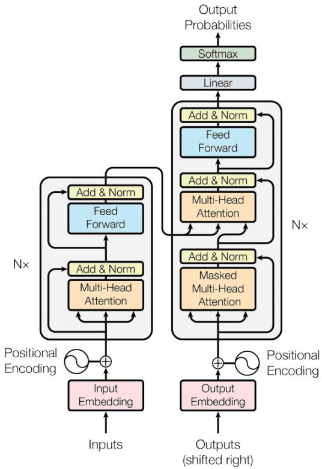

# 参数量 Check：

# 以基础版 BERT（BERT-Base）的参数量计算为例

# 基础版 BERT 的关键参数为：

 隐藏层维度 $\scriptstyle 1 = 7 6 8$   
 Transformer 层数 $_ { \perp = 1 2 }$   
 词表大小 $\scriptstyle \mathsf { V } = 3 0 , 5 2 2$

# 单层 Transformer 参数计算：

12H²+13H=12×768²+13×768=7,087,872，708 万左右

# 总参数量 （含词嵌入层）：

 Transformer 层总参数： $\mathsf { L } \times 7 , 0 8 7 , 8 7 2 = 1 2 \times 7 , 0 8 7 , 8 7 2 = 8 5 , 0 5 4 , 4 6 4$   
 词嵌入层参数： $\mathsf { V } \times \mathsf { H } = 3 0 , 5 2 2 \times 7 6 8 = 2 3 , 4 5 8 , 1 7 6$   
 位置编码参数：暂忽略，如采用绝对位置编码没有参数量

总计： $8 5 , 0 5 4 , 4 6 4 + 2 3 , 4 5 8 , 1 7 6 = 1 0 8 , 5 1 2 , 6 4 0 \approx 1 1 0 M$ ，与官方公布的 1.1 亿参数基本一致。

# 以 LLaMA 参数计算为例：

接下来，我们估计一下 LLaMA 的不同尺寸版本的参数量大小，基本符合上述规律：

L 层的 transformer 模型的总参数量为 $\mathsf { L } ^ { \star } ( 1 2 \mathsf { H } ^ { 2 } + 1 3 \mathsf { H } )$ ，当隐藏维度 h 较大时，可以忽略一次项，模型参数量可以近似为 12LH²。

<table><tr><td>模型版本</td><td>隐藏维度(h)</td><td>层数(L)</td><td>12Lh²</td></tr><tr><td>LLaMA-7B</td><td>4096</td><td>32</td><td>6,442,450,944</td></tr><tr><td>LLaMA-13B</td><td>5120</td><td>40</td><td>12,582,912,000</td></tr><tr><td>LLaMA-33B</td><td>6656</td><td>60</td><td>31,897,681,920</td></tr><tr><td>LLaMA-65B</td><td>8192</td><td>80</td><td>64,424,509,440</td></tr></table>

# 回答总结：FFN 主要解决以下关键问题：

 纯注意力层的线性局限：通过非线性激活增强模型表达能力；  
 深层网络的信息坍缩：维持表示空间的复杂度；  
 局部特征弱化：独立处理位置信息以补充全局注意力；  
 参数效率与计算成本：升维结构提升容量，降维保持计算可行性；  
 知识存储需求：通过隐式记忆机制支持复杂推理。

通过上述机制，FFN 与自注意力层形成功能互补，共同构建了 Transformer 强大的特征学习能力。实际应用中，FFN 的设计（如激活函数选择、中间维度调整）直接影响模型性能，需结合任务需求优化。

Transformer 中的前馈层（Feed-Forward Network，FFN）是模型的核心组件之一，公式原理如下：

$$
F F N (x) = W _ {2} \cdot \sigma \left(W _ {1} x + b _ {1}\right) + b _ {2}
$$

其中：

 $x \in \mathbb { R } ^ { d _ { m o d e l } }$ ：输入向量（自注意力层的输出）；  
 ：权重矩阵；  
 $b _ { 1 } \in \mathbb { R } ^ { d _ { f f } } , b _ { 2 } \in \mathbb { R } ^ { d _ { m o d e l } }$ ：偏置项；  
 $\sigma ( \cdot )$ ：非线性激活函数（比如 ReLU、GELU）；  
$d _ { f f }$ ：FFN 中间层的维度（通常 $d _ { f f } = 4 d _ { m o d e l }$ ）

FFN 作用可概括为以下五个方面，分别解决不同层面的问题：

# 一、引入非线性，突破线性模型的局限

 自注意力机制本质是线性变换的加权和（点积运算），仅能捕捉线性关系。  
 FFN通过两层全连接层间的非线性激活函数 （如 ReLU、GELU），赋予模型拟合复杂非线性函数的能力。  
 例如，在处理句子时，FFN 能捕捉词性、语义角色等非线性组合特征，这是纯注意力层无法实现的。

# 二、防止模型表示退化，维持模型复杂度

 实验表明，若仅使用自注意力层（无 FFN 和残差连接），随着层数增加，模型表示的秩（rank）会指数级下降，导致所有输出趋近于同一向量（信息坍缩）。  
 FFN通过升维-非线性-降维的操作，扩展了表示空间维度，维持了特征的多样性。

 例如，在升维阶段将 512 维输入映射到 2048 维，捕捉更细粒度的特征组合，再通过降维筛选关键信息。

# 三、独立处理每个位置特征，增强局部语义

FFN 对序列中每个位置的表示独立处理 （不依赖其他位置），与自注意力的全局交互形成互补：

 自注意力：捕捉全局依赖（如“猫”与“鱼”的关联）；  
 FFN：聚焦单个位置的深度加工（如提取“猫”的主语属性或动物类别特征）。这种分工使模型既能理解上下文关系，又能强化局部语义细节。

# 四、升维降维结构，平衡表达与效率

FFN 采用"扩展-压缩"结构 （如 $5 1 2 {  } 2 0 4 8 {  } 5 1 2 \ .$ ）：

 升维：增加参数规模（占模型总参数约 $60 \%$ ），提升模型容量；  
 非线性激活：过滤冗余信息（如 ReLU 去除负值）；  
 降维：保留关键特征并与残差连接兼容，避免后续计算量爆炸。例如，Llama2中FFN的中间维度扩展至输入维度的4 倍。

# 五、作为隐式记忆模块，存储知识

 研究表明，FFN 可视为一种键值记忆系统：第一层（升维）编码键（Key），第二层（降维）对应值（Value）。  
 例如，输入向量经第一层激活后，筛选出与任务相关的“键”，再通过第二层映射到对应的“值”（如实体关系或领域知识）。这种机制使 FFN 在模型推理中承担了部分知识存储功能。

面试题：Transformer 包含哪两种 Mask 机制，各自如何作用的？

Transformer 模型中包含两种关键的 Mask 机制：Padding Mask 和 Sequence Mask，它们在注意力计算中分别承担不同的作用，具体如下：

# 1、Padding Mask（填充掩码）

 作用：处理不同批次输入序列长度不一致的问题。通过将短序列末尾填充 0对齐长度，但模型需忽略这些无意义的填充位置。其核心目标是防止注意力机制关注无效的填充区域。

#  实现方式：

 在填充位置（值为0）加上一个极大的负数（如负无穷），经过 Softmax后这些位置注意力权重趋近于 0。  
 具体实现时，生成一个布尔型张量（True 表示填充 Padding 位置），扩展为与注意力矩阵相同的维度。

 应用场景：所有层的注意力计算（包括 Encoder 和 Decoder）均需使用 Padding Mask。

# 2. Sequence Mask（序列掩码）

 作用：仅用于Decoder的Self-Attention 层， 防止模型在训练时“窥见”未来信息。例如，解码第t个词时，只能依赖前t-1个词的输出，避免数据标签泄漏。

#  实现方式：

 生成一个上三角矩阵（对角线以上元素为 1，其余为 0），作用于序列。在计算注意力时，将未来位置（t 时刻之后）的权重设为负无穷，从而屏蔽这些位置的影响。  
 具体代码中，可通过 torch.triu 函数生成该矩阵，并设置 diagonal=1 以排除当前时间步自身。

 应用场景：仅用于 Decoder 的 Self-Attention 层，与 Padding Mask 叠加后共同作用于注意力计算。

# 两种Mask的叠加使用

 在 Decoder 的 Self-Attention 中，需同时处理填充位置和未来信息屏蔽。具体实现方式是将 Padding Mask 和 SequenceMask 相加，形成一个综合的掩码矩阵，再作用于注意力权重。其他情况下（如 Encoder 的 Self-Attention 或 Encoder-Decoder Attention），仅需使用 Padding Mask。

总结对比  

<table><tr><td>Mask 类型</td><td>作用</td><td>应用场景</td><td>实现方法</td></tr><tr><td>Padding Mask</td><td>忽略无效填充位置</td><td>所有注意力层</td><td>填充位置加负无穷</td></tr><tr><td>Sequence Mask</td><td>防止解码看到未来信息</td><td>Decoder Self-Attention 层</td><td>生成上三角矩阵，屏蔽未来位置</td></tr></table>

面试题：Pre-Norm 和 Post-Norm 各有什么优劣？主流大模型用的是哪一种？

Pre-Norm 和 Post-Norm 是 Transformer 架构中两种主流的层归一化（Layer Normalization）设计方式，其核心区别在于归一化层与残差连接的组合顺序。

参考论文：On Layer Normalization in the Transformer Architecture

# 1. 定义与结构差异

 Pre-Norm（前归一化）

归一化置于子层（自注意力/前馈网络）之前，公式为： $x _ { l + 1 } = x _ { l } + \mathrm { S u b l a y e r } ( \mathrm { L a y e r N o r m } ( x _ { l } ) )$

流程：输入 LayerNorm 子层计算 残差连接

 Post-Norm（后归一化）

归一化置于子层之后，公式为： $\boldsymbol { x } _ { l + 1 } = \mathrm { L a y e r N o r m } ( \boldsymbol { x } _ { l } + \mathrm { S u b l a y e r } ( \boldsymbol { x } _ { l } ) )$

流程：输入 子层计算 残差连接 LayerNorm。

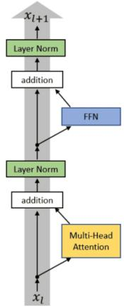  
(a)

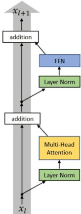  
(b)   
Figure 1:(a) Post-LN Transformer layer;(b) Pre-LN Transformer layer.

# 2. 核心区别与优劣对比

<table><tr><td>特性</td><td>Pre-Norm</td><td>Post-Norm</td></tr><tr><td>梯度稳定性</td><td>梯度传播更平稳，深层网络不易消失/爆炸</td><td>深层梯度易消失或爆炸，需精细调参</td></tr><tr><td>训练稳定性</td><td>高，支持深层（&gt;12层），无需学习率预热</td><td>低，依赖预热和小学习率，易震荡</td></tr><tr><td>收敛速度</td><td>稳定但略慢</td><td>初期可能更快，但后期易发散</td></tr><tr><td>表达能力</td><td>易出现表示塌陷，理论性能略弱</td><td>浅层模型泛化更强，最终性能潜力更高</td></tr><tr><td>深度扩展性</td><td>支持百层以上模型（如GPT-3、LLaMA）</td><td>仅适用浅层（&lt;8层），如原始Transformer</td></tr></table>

#  梯度稳定性差异：

 Post-Norm 的残差连接后归一化会削弱恒等路径（Identity Path）。数学上，每层输出被缩放约 1/√2，导致深层输入信号指数衰减（如 32 层时输入权重 ${ \approx } 0$ ），梯度回传受阻。  
 Pre-Norm 通过归一化前置，保持残差路径完整，梯度可通过恒等分支直达浅层，避免深度累积问题。

#  表达能力差异：

 Post-Norm 因强制每层输出归一化，各层学习更独立，模型容量利用更充分；  
 Pre-Norm 的等效深度“虚高”（如 L 层模型实际等效层数<L），因深层输入分布相似，导致部分层功能冗余（表示塌陷）。

# 3. 大模型（LLM）的选择

 主流方案：Pre-Norm 是绝对主流，几乎所有千亿级大模型均采用此设计，典型代表包括：GPT-3/4、LLaMA、PaLM、T5、Qwen、Baichuan 等

#  选择原因 ：

 训练稳定性是千亿参数模型的核心需求，Pre-Norm 无需预热即可支持百层训练；  
 结合 RMSNorm（去均值简化版 LayerNorm）进一步提升效率（如 LLaMA）；  
 Post-Norm 在深层场景调试成本过高，且收敛失败风险大

# 4. 混合方法

为结合两者优势，近期研究提出混合架构：

 DeepNorm ：改进 Post-Norm，引入缩放因子（如 $\mathtt { q } = 0 . 3$ ）扩大残差路径，在千层 Transformer 中实现稳定训练，兼顾性能；  
 Mix-LN/HybridNorm ：浅层用 Post-Norm 提升表达，深层用 Pre-Norm 保稳定，实验效果优于单一方案。

5. 实践建议  

<table><tr><td>场景</td><td>推荐方案</td><td>说明</td></tr><tr><td>深层大模型（&gt;12层）</td><td>Pre-Norm/RMSNorm</td><td>确保训练稳定，减少调参成本</td></tr><tr><td>浅层模型（≤8层）</td><td>Post-Norm</td><td>需配合学习率预热，可能获得更高性能</td></tr><tr><td>追求性能极限</td><td>混合架构（如DeepNorm）</td><td>需额外调试，但平衡稳定性和表达能力</td></tr></table>

# 6.3 推荐算法八股面试题

面试题：推荐模型的 One Epoch 现象是什么原因导致？

相关论文：Towards Understanding the Overfitting Phenomenon of Deep CTR Prediction

# 一、One Epoch 现象的定义

One Epoch 现象是指在深度点击率（CTR）预估模型的训练过程中，测试集 AUC（模型效果指标）在第一个 epoch 内逐步提升，但从第二个 epoch 开始突然剧烈下降的现象。这种现象在工业界（如阿里、快手等）的推荐系统中普遍存在，其核心特点是：

 时间点明确：恰好出现在第二个 epoch 开始时；  
 突发性：效果下降剧烈且迅速，而非缓慢过拟合。

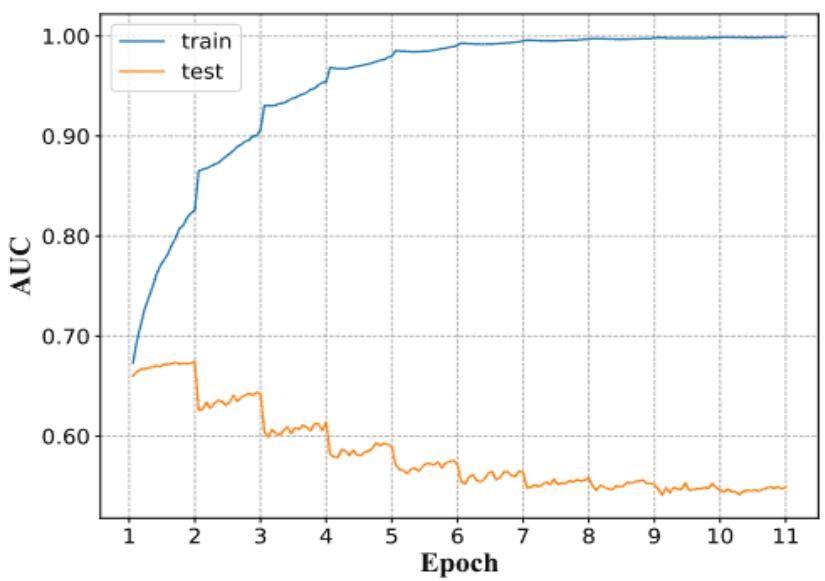

# 二、原理与机制

# 1. Embedding 与 MLP 层的联合分布适配

深度 CTR 模型通常采用Embedding+MLP 结构：Embedding 层将高维稀疏特征（如用户 ID、商品 ID）映射为低维向量，MLP层基于这些向量进行预测。

 在第一个 epoch 中，Embedding 层和 MLP 层共同学习训练数据的联合分布，模型逐渐收敛至较优状态；  
 进入第二个 epoch 时，MLP 层会快速适配已训练过的 Embedding 分布，导致对训练数据的过度拟合。此时，Embedding层参数相对稳定，但 MLP 层参数剧烈调整，使得模型无法泛化到未见过的测试数据。

# 2. 训练数据与非训练数据的分布差异

 推荐系统的特征具有高维稀疏性（如长尾 ID 特征），导致训练数据与非训练数据（如测试集或线上新数据）的 Embedding分布差异显著；  
 在第二个 epoch 中，模型重新接触训练数据时，MLP 层会优先适应已见过的 Embedding 分布，而非学习更泛化的模式，从而加剧过拟合。

# 三、核心原因分析

根据阿里团队的研究，One Epoch 现象主要由以下三方面因素共同作用引起：

# 1. 模型结构特性（Embedding+MLP）

a. Embedding 层的敏感性：稀疏 ID 特征的高维性导致 Embedding 层容易过拟合，尤其当特征出现频率低时（长尾 ID），Embedding 向量难以充分学习泛化表示；  
b. MLP 层的快速适应：MLP 层在第 2 个 epoch 迅速调整权重，优先拟合训练数据 Embedding 分布，而非学习真实特征关系。

# 2. 优化器的快速收敛特性

a. 使用 Adam、RMSprop 等强优化器或大学习率时，模型在第 1 个 epoch 内快速收敛至局部最优；  
b. 这种快速收敛导致模型在第二个 epoch 中缺乏继续探索能力，过度拟合训练数据。

# 3. 特征稀疏性与数据分布特性

a. 高维稀疏特征 （如用户 ID、商品 ID）是推荐系统的核心特征，但这些特征的稀疏性（尤其是长尾 ID）导致模型在第二个 epoch 中难以泛化；  
b. 实验表明，通过减少稀疏性 （如过滤低频 ID、哈希压缩）可显著缓解One Epoch现象，但会牺牲模型精度。

# 四、实验验证与结论

# 1. 关键实验发现

 模型结构对比：LR 模型无此现象，而 Embedding+MLP 结构的深度模型普遍存在 One Epoch 现象；  
 参数无关性：模型参数量、激活函数、Batch Size、正则化（如 Weight Decay、Dropout）等与现象无关；  
 稀疏性影响：减少特征稀疏性（如压缩ID空间）可缓解现象，但牺牲模型效果。2

# 2. 工业实践启示

 阿里、快手等公司主流方案是仅训练一个 epoch，或采用流式训练 （数据仅使用一次），以避免效果下降；  
 快手提出的 MEDA 方法 （每个 epoch 重新初始化 Embedding 层）通过数据增强缓解过拟合，但需权衡计算成本。

总结：One Epoch 现象的本质是深度 CTR 模型在高维稀疏特征下，因 Embedding 与 MLP 层的联合分布适配失衡导致的突发性过拟合。其解决需在模型结构、优化策略与特征工程间权衡，而工业界更倾向于通过单 epoch 训练或动态更新机制平衡效果与效率。

在 Self-Attention 的计算公式中，除以 $\sqrt { d _ { k } }$ 的核心目的是控制点积的数值范围，避免梯度消失并稳定训练过程。

# 1. 防止 Softmax输入过大导致梯度消失

 问题背景：当 $\mathsf Q$ 和 $\kappa$ 的点积值过大时，Softmax 函数会进入“饱和区”（即输入值过大时，输出的概率分布接近极端值0或1），此时Softmax的梯度趋近于 0，导致反向传播时参数更新困难。  
 数学推导：假设 Q 和 $\kappa$ 的维度为 $d _ { k }$ ，若每个元素的方差为 1，则点积 $Q K ^ { T }$ 的方差为 $d _ { k }$ ，标准差为 $\sqrt { d _ { k _ { \mathrm { o } } } }$ 。除以 $\sqrt { d _ { k } }$ 后，点积的方差被缩放为 1，数值范围更稳定，避免 Softmax 梯度消失。

# 2. 保持注意力分数的方差稳定

 统计假设：假设 $\mathsf Q$ 和 $\kappa$ 的元素是独立同分布的随机变量，均值为 0，方差为 1。QK 点积再除以 $\sqrt { d _ { k } }$ 的方差为：

$$
\operatorname {V a r} \left(\frac {Q \cdot K}{\sqrt {d _ {k}}}\right) = \frac {1}{d _ {k}} \sum_ {i = 1} ^ {d _ {k}} \operatorname {V a r} \left(Q _ {i} K _ {i}\right) = \frac {1}{d _ {k}} \left[ d _ {k} \cdot \operatorname {V a r} \left(Q _ {i}\right) \operatorname {V a r} \left(K _ {i}\right) \right] = 1
$$

因此，除以 $\sqrt { d _ { k } }$ 后点积结果的方差为 1，使注意力分数的分布更符合 Softmax 的输入要求。

# 3. 适应不同维度的嵌入空间

 维度影响：当嵌入维度 $d _ { k }$ 较高时（如 Transformer 中常见的 512 或 1024 维），点积的绝对值会随维度增加而显著增大。例如，在低维空间中点积可能为个位数，而在高维空间中可能达到数百甚至上千。缩放操作能统一不同维度的数值范围，确保模型在不同层和不同配置下的行为一致。  
 实验验证：通过对比不同维度下的点积方差（如 3 维和 512 维），可观察到高维点积的方差远大于低维，验证了缩放的必要性。

总结：除以 $\sqrt { d _ { k } }$ 的实质是一种数值稳定性设计，包含以下作用：

 避免 Softmax 梯度消失：控制输入范围，防止训练停滞。  
 统计归一化：使注意力分数的分布稳定（均值为 0，方差为 1）。  
 统一多维度场景：消除嵌入维度对数值范围的干扰。

面试题：Dropout 如何保证训练预测一致性？

Dropout 通过调整训练和预测阶段的神经元输出期望，确保两者一致性，实现方式主要有以下两种策略：

# 1. 训练阶段缩放（Inverted Dropout）

在训练时，随机失活部分神经元后， 对保留的神经元的输出进行缩放。具体来说，若神经元保留的概率为 $1 - p$ ，则将其输出值乘以 $1 / ( 1 - p )$ ，使得输出期望与未使用 Dropout 时一致。

# 数学推导：

 假设原始输出为 $_ x$ ，保留概率为 $1 - p$ ，则训练时输出期望为 $( 1 - p ) \cdot x$ 。  
x x 缩放后输出变为 $1 - p$ ，此时期望为 1-p =𝑥 ，与无 Dropout 时的期望一致。  
 测试阶段，无需调整神经元输出，直接使用完整网络。

# 2. 预测阶段缩放（Vanilla Dropout）

在训练时不调整输出，但在预测时将权重统一乘以保留概率 $1 - p .$ 。例如，若训练时以概率 $p = 0 . 5$ 随机失活神经元，测试时所有神经元的权重需乘以 0.5。

缺点：需在推理时修改模型参数，增加了部署复杂度。因此，现代框架（如 PyTorch）普遍采用 Inverted Dropout，将缩放操作集中在训练阶段。

# 3. Dropout 理论意义

 集成学习视角：Dropout相当于在每次迭代中训练不同的子网络，最终预测时通过期望一致性隐式地对这些子网络取平均。  
 正则化效果：通过破坏神经元间的固定依赖关系，迫使网络学习鲁棒特征，类似 L2 正则化。

# 4. 总结

无论是通过训练阶段还是预测阶段的缩放，Dropout 的核心都是保持输出期望的一致性。现代实现更倾向于 InvertedDropout（训练阶段缩放），因其简化了推理过程，且无需修改模型权重。

面试题：Adam 和 AdamW 优化器有什么区别？

Adam 与 AdamW 优化器的核心区别体现在权重衰减的实现机制上，这种差异影响了梯度计算、参数更新规则以及模型的泛化能力。

# 一、权重衰减的数学形式差异

# 1. Adam 的 L2 正则化耦合机制

在 Adam 中，权重衰减通过梯度叠加 L2 正则项实现： $g _ { t } = \nabla f ( \theta _ { t } ) + \lambda \theta _ { t }$

此时权重衰减被嵌入梯度计算，导致后续的动量计算（ $m _ { t } = \beta _ { 1 } m _ { t - 1 } + ( 1 - \beta _ { 1 } ) g _ { t }$ ）和二阶矩估计（ $v _ { t } = \beta _ { 2 } v _ { t - 1 } + ( 1 - \beta _ { 2 } ) g _ { t } ^ { 2 }$ ）均包含了正则化项。

mt这会导致自适应学习率（如 $\sqrt { v _ { t } } + \epsilon$ ）对权重衰减产生干扰。

# 2. AdamW 的解耦更新规则

$$
\theta_ {t + 1} = \theta_ {t} - \eta \cdot \frac {\hat {m} _ {t}}{\sqrt {\hat {v} _ {t}} + \epsilon} - \eta \lambda \theta_ {t}
$$

AdamW 将权重衰减从梯度计算中剥离，独立施加到参数更新步骤：

其中梯度 $g _ { t }$ 仅包含原始损失函数的梯度，权重衰减项 $\lambda \theta _ { t }$ 独立作用于参数。这使得动量与二阶矩估计仅反映原始梯度信息，不受正则化干扰。

# 二、参数更新过程的数学推导对比

<table><tr><td>步骤</td><td>Adam</td><td>AdamW</td></tr><tr><td>梯度计算</td><td>gt = ∇f + λθ</td><td>gt = ∇f (仅原始梯度)</td></tr><tr><td>动量计算</td><td>mt = β1mt-1 + (1 - β1)gt</td><td>同左(但gt不含L2项)</td></tr><tr><td>二阶矩估计</td><td>vt = β2vt-1 + (1 - β2)gt2</td><td>同左(但gt不含L2项)</td></tr><tr><td>参数更新</td><td>θt+1 = θt - η ·帽子/√hatt + ε</td><td>θt+1 = θt - η ·帽子/√hatt + ε - ηλθt</td></tr></table>

关键差异：Adam的正则化项被动量机制放大/缩小，而AdamW 的衰减项直接线性作用于参数，独立于自适应学习率。

# 三、理论影响与实验分析

1. 自适应学习率的干扰问题：Adam 中 L2 项会被 $v _ { t }$ 缩放，导致实际衰减强度与理论值 $\lambda$ 产生偏差。例如当梯度较小时， $v _ { t }$ 的缩小效应会放大衰减项，造成参数过度收缩。  
2. 泛化性能的理论保障：AdamW 符合解耦权重衰减理论 （Decoupled Weight Decay），其行为更接近 SGD withMomentum 的正则化效果。  
3. 收敛稳定性分析：AdamW 的独立衰减项使参数更新方向更稳定。以 LLaMA-2 7B 训练为例，AdamW 的损失曲线震荡幅度比 Adam 减少 $30 \%$ ，且达到相同精度所需的训练步数更少。

# 一、公式定义

1. 一阶矩估计（动量项）

$$
m _ {t} = \beta_ {1} \cdot m _ {t - 1} + (1 - \beta_ {1}) \cdot g _ {t}
$$

超参数： $\beta _ { 1 }$ 通常设为 0.9，控制历史梯度与当前梯度的权重分配。

含义：通过指数移动平均（EMA）计算当前梯度 $g _ { t }$ 的历史加权平均，类似于动量（Momentum）机制，用于平滑梯度方向。

2. 二阶矩估计（自适应学习率项）

$$
v _ {t} = \beta_ {2} \cdot v _ {t - 1} + (1 - \beta_ {2}) \cdot g _ {t} ^ {2}
$$

含义：通过梯度平方 的指数移动平均，估计梯度的方差，用于自适应调整每个参数的学习率。

超参数： $\beta _ { 2 }$ 设为 0.999，反映历史梯度平方的影响。

3. 偏差校正

由于初始时刻 $m _ { 0 }$ 和 $v _ { 0 }$ 初始化为 0，会导致早期估计偏向零，因此需进行修正：

$$
\hat {m} _ {t} = \frac {m _ {t}}{1 - \beta_ {1} ^ {t}}, \hat {v} _ {t} = \frac {v _ {t}}{1 - \beta_ {2} ^ {t}}
$$

作用：修正初期估计的偏差，使动量与方差估计更准确。例如在初始 时， $m _ { t } = g _ { t }$ ，但当 变的比较大时，$1 - \beta _ { 1 } ^ { t } \approx 1 _ { \circ }$

# 二、核心作用

 一阶矩估计的作用

 加速收敛：通过动量机制保留历史梯度方向，减少震荡，使参数更新更稳定。  
 捕捉梯度趋势：在非凸优化问题中，帮助模型避开局部极小值，向全局最优方向移动。

 二阶矩估计的作用

 自适应学习率：根据梯度方差调整步长。梯度变化大时，学习率自动减小（因 $v _ { t }$ 较大），防止震荡；梯度变化小时，学习率增大，加快收敛。  
 处理稀疏梯度：对稀疏数据（如自然语言处理任务）中的低频参数分配更大更新步长，提升训练效率。

# 三、模型参数更新公式

最终参数更新公式结合一阶矩和二阶矩的修正估计：

$$
\theta_ {t + 1} = \theta_ {t} - \alpha \cdot \frac {m _ {t}}{\sqrt {\hat {v} _ {t}} + \epsilon}
$$

$_ \alpha$ ：基础学习率，控制整体步长  
：极小常数（如 10−8），防止分母为零。

四、与其他优化器的对比  

<table><tr><td>特性</td><td>Adam</td><td>SGD/Momentum</td><td>RMSprop</td></tr><tr><td>动量机制</td><td>□ 一阶矩估计平滑梯度方向</td><td>□ 仅保留动量项</td><td>□ 仅依赖梯度平方平均</td></tr><tr><td>自适应学习率</td><td>□ 二阶矩估计动态调整步长</td><td>□ 固定学习率</td><td>□ 类似二阶矩但无偏差校正</td></tr><tr><td>计算复杂度</td><td>中等（需维护两动量项）</td><td>低</td><td>中等</td></tr><tr><td>适用场景</td><td>非凸优化、稀疏数据</td><td>小规模凸优化</td><td>非平稳目标函数</td></tr></table>

# 面试题：Attention 层与全连接层的区别

Attention 层与全连接层的核心区别在于动态权重分配机制与静态参数化连接的差异。

# 一、工作机制对比

# 1. 权重计算方式

 全连接层：使用固定的权重矩阵对输入进行线性变换，权重在训练中更新，但对所有输入位置共享（位置相关）。  
 Attention 层：根据输入内容动态计算权重。通过 Query 与 Key 的相似度生成注意力分数（Attention Score），再对Value加权求和，权重与输入内容直接相关（位置无关）。

# 2. 信息处理逻辑

 全连接层：将输入视为整体进行全局特征转换，可能忽略局部结构信息。  
 Attention 层：关注输入各部分的关系，通过加权聚焦关键信息，保留局部与全局关联。例如，在文本处理中，Attention能捕捉长距离依赖。

# 二、模型能力差异

# 1. 动态适应性与灵活性

 全连接层：参数固定，无法根据输入内容调整关注重点，适合处理静态特征（如图像分类）。  
 Attention 层：通过动态权重适应不同输入场景，擅长处理序列数据（如语言模型），减少冗余计算。  
 类比：全连接层像“凭记忆答题” ， 而 Attention 层像“开卷考试时快速查找答案”。

# 2. 长距离依赖处理

 全连接层：由于参数共享和固定结构，难以有效建模长距离依赖，易受梯度消失影响。  
 Attention层：通过全局相似度计算，直接关联任意距离的输入元素，解决长序列信息衰减问题。

# 三、计算复杂度与资源需求

# 1. 参数量

 全连接层：参数规模为输入维度 $\times$ 输出维度，大规模网络易导致参数爆炸（如 VGG16 的 FC 层有上亿参数）。  
 Attention 层：参数量主要来自 Q/K/V 的投影矩阵，通常更少。但自注意力的计算复杂度随序列长度平方增长。

# 2. 计算效率

 全连接层：计算密集但易于并行化，适合 GPU 加速。  
 Attention 层：通过矩阵运算实现并行，但长序列场景需优化（如稀疏 Attention 或分块计算）。

# 一、BatchNorm 原理与公式

核心思想：对每个特征维度跨批次样本进行归一化，使网络各层输入的分布更稳定。

公式推导：

1、计算批次统计量 （假设输入维度为[B, D]，B 为批次大小，D 为特征维度）：

 均值： $\mu _ { B } = \frac { 1 } { B } \sum _ { i = 1 } ^ { B } x _ { i }$

 方差： $\sigma _ { B } ^ { 2 } = \frac { 1 } { B } \sum _ { i = 1 } ^ { B } ( x _ { i } - \mu _ { B } ) ^ { 2 }$

2、归一化：

$$
\hat {x} _ {i} = \frac {x _ {i} - \mu_ {B}}{\sqrt {\sigma_ {B} ^ {2} + \epsilon}} (\epsilon \text {为 数 值 很 小 的 稳 定 性 常 数})
$$

3、缩放平移：

$y _ { i } = \gamma \cdot \hat { x } _ { i } + \beta$ （ $\gamma$ 和 $\beta$ 为可学习参数）

BatchNorm 适用场景：图像分类（CNN）、大批次训练。

# 二、LayerNorm 原理与公式

核心思想：对单个样本的所有特征进行归一化，消除批次依赖性。

# 公式推导：

1. 计算样本统计量 （输入维度 [B, D]）：

 均值：

$$
\mu_ {L} = \frac {1}{D} \sum_ {j = 1} ^ {D} x _ {j}
$$

$$
\sigma_ {L} ^ {2} = \frac {1}{D} \sum_ {j = 1} ^ {D} \left(x _ {j} - \mu_ {L}\right) ^ {2}
$$

2. 归一化与缩放平移变换：

$$
\hat {x} _ {j} = \frac {x _ {j} - \mu_ {L}}{\sqrt {\sigma_ {L} ^ {2} + \epsilon}}
$$

$$
y _ {j} = \gamma \cdot \hat {x} _ {j} + \beta
$$

LayerNorm 适用场景：自然语言处理（Transformer）、小批次/变长序列。

# 三、关键区别对比

<table><tr><td>维度</td><td>BatchNorm</td><td>LayerNorm</td></tr><tr><td>统计维度</td><td>跨批次样本的同一特征维度</td><td>单一样本的所有特征维度</td></tr><tr><td>训练推理</td><td>推理时使用训练阶段累积的移动平均统计</td><td>训练/推理行为一致，无需存储统计量</td></tr><tr><td>参数敏感</td><td>对批次大小 batch_size 敏感</td><td>与批次无关，适合任意大小输入</td></tr><tr><td>适用领域</td><td>图像处理（CV）</td><td>序列建模（NLP）</td></tr><tr><td>梯度稳定</td><td>可能受小批次影响</td><td>更适合长序列梯度传播</td></tr></table>

# 四、手动实现代码（基于 PyTorch）

# 1. BatchNorm 基础实现（2D 输入）

import torch   
class ManualBatchNorm: def__init__(self，num_features，eps $= 1\mathrm{e} - 5$ ，momentum $\coloneqq 0.1$ ： self.gamma $=$ torch.ones(num_features）#缩放参数 self.beta $=$ torch.zeros(num_features）#平移参数 self.eps $=$ eps self.momentum $=$ momentum selfrunning_mean $=$ torch.zeros(num_features）#推理时使用的均值 selfrunning_var $=$ torch.ones(num_features）#推理时使用的方差 def forward(self，x，training $\equiv$ True): #x形状：[B，D] if training: batch_mean $\equiv$ x.mean(dim $\equiv 0$ ） #按批次维度计算均值 batch_var $\equiv$ x.var(dim $\equiv 0$ ，unbiased $\equiv$ False）#计算方差 #更新移动平均值 self-running_mean $\equiv$ self.momentum \* selfrunning_mean + (1 - self.momentum) \* batch_mean selfrunning_var $=$ self.momentum \* selfrunning_var $+$ (1- self.momentum) \* batch_var else: batch_mean $=$ selfrunning_mean batch_var $=$ selfrunning_var x_hat $=$ (x-batch_mean)/torch.sqrt(batch_var $^+$ self.eps) return self.gamma \*x_hat $^+$ self.beta

# 2. LayerNorm 基础实现

class ManualLayerNorm: def __init__(self, normalized_shape, eps=1e-5): self.gamma = torch.ones(normalized_shape) #缩放参数 self.beta = torch.zeros(normalized_shape) #平移参数 self.eps = eps def forward(self, x): #x形状：[B，D] mean $=$ x.mean(dim=-1，keepdim=True） #沿特征维度求均值 var $=$ x.var(dim=-1，keepdim=True，unbiased=False）#计算方差 x_hat $=$ (x - mean)/torch.sqrt(var + self.eps) return self.gamma \* x_hat + self.beta

# 代码实现细节说明

1. BatchNorm 训练/推理模式：

 训练时动态计算批次统计量，并更新全局移动平均  
 推理时固定使用训练阶段累积的统计量，保证一致性

2. LayerNorm 维度处理：

 对最后一个特征维度（如词向量维度）进行归一化  
 通过keepdim=True 保持维度对齐，支持广播机制

3. 参数初始化：

 $\gamma$ 初始化为 1， $\beta$ 初始化为 0，保证初始状态下归一化等价于恒等变换

面试题：RMSNorm 和 LayerNorm 的区别，为什么主流大模型偏爱 RMSNorm？

RMSNorm 和 LayerNorm 是大模型架构中两种关键的归一化技术。下面这个表格对它们的核心差异进行对比。

<table><tr><td>对比维度</td><td>LayerNorm (层归一化)</td><td>RMSNorm (均方根归一化)</td></tr><tr><td>核心思想</td><td>对每个样本的特征进行归一化，使其均值为0，方差为1。</td><td>仅使用均方根值对特征进行缩放，不改变其中心位置（均值）。</td></tr><tr><td>均值处理</td><td>进行去均值处理 (Mean-Centering)</td><td>不进行去均值处理</td></tr><tr><td>数学公式</td><td>LayerNorm(x) = y * (x - μ) / σ + β</td><td>RMSNorm(x) = y * x / RMS(x)</td></tr><tr><td>可学习参数</td><td>两个：缩放参数 γ和偏移参数 β</td><td>一个：缩放参数 γ</td></tr><tr><td>计算复杂度</td><td>较高（需计算均值和方差）</td><td>较低（仅计算均方根）</td></tr></table>

数学公式介绍：

# 1. LayerNorm 公式

LayerNorm 对一个输入向量 $\boldsymbol { x } \in \mathbb { R } ^ { d }$ （例如一个 token 的嵌入表示）的计算步骤如下：

 计算均值与方差：

$$
\mu = \frac {1}{d} \sum_ {i = 1} ^ {d} x _ {i}, \quad \sigma = \sqrt {\frac {1}{d} \sum_ {i = 1} ^ {d} (x _ {i} - \mu) ^ {2} + \epsilon}
$$

 归一化与仿射变换：

$$
\operatorname {L a y e r N o r m} (x) = \gamma \cdot \frac {x - \mu}{\sigma} + \beta
$$

# 2. RMSNorm 公式

RMSNorm 对同一输入向量 x 的计算更为简洁：

 计算均方根值：

$$
\operatorname {R M S} (x) = \sqrt {\frac {1}{d} \sum_ {i = 1} ^ {d} x _ {i} ^ {2} + \epsilon}
$$

 缩放：

$$
\operatorname {R M S N o r m} (x) = \gamma \cdot \frac {x}{\operatorname {R M S} (x)}
$$

核心区别：LayerNorm 先将数据分布的中心平移到 0 附近，再进行缩放。而 RMSNorm 直接使用原数据相对于原点的“尺度”（即均方根）进行缩放，保留了数据的原始中心位置。

RMSNorm 通过省略均值计算和仿射变换中的偏移参数，简化计算过程。这正是 LLaMA、GPT-4、Gemma 等主流大模型选择 RMSNorm 而非 LayerNorm 的核心理由。具体来说有三点优势：

计算效率更高：RMSNorm 减少了约 $2 0 \% - 3 0 \%$ 的计算量，参数量减少一倍。这在大模型动辄上千亿参数的场景下，能显著加快训练速度并降低推理延迟。  
对低精度训练更友好：在使用 FP16 或 BF16 进行训练时，数值表示范围更小。RMSNorm 避免了均值减法操作，数值稳定性更好，有效降低了溢出等风险。  
性能相当且更节省资源：实践表明，在大模型训练中，RMSNorm 所能达到的模型性能（如困惑度）与 LayerNorm相当。同时，消耗的计算资源和内存更少，具有更优“性价比”。

L1 正则化（Lasso）和 L2 正则化（Ridge）是机器学习中常用的正则化方法，以下是两者对比分析：

# 一、原理与作用

# 1、L1 正则化

#  原理：

数学角度：优化目标中加入 ，导致梯度更新时引入符号函数（如 $s i g n ( w _ { i } )$ ），部分参数因梯度方向与符号冲突而快速归零。  
 概率角度：假设权重服从拉普拉斯分布（尖峰厚尾），倾向于稀疏解。

#  作用：

 特征选择：通过稀疏化权重，剔除对预测贡献小的特征，适用于高维稀疏数据。  
 防止过拟合：减少模型复杂度，避免对噪声过度敏感。  
 提升解释性：仅保留关键特征，模型更易解释。

# 2、L2 正则化

#  原理：

 数学角度：优化目标中加入 ，梯度更新时权重按比例衰减(如 $w _ { i } \gets w _ { i } - \eta \lambda w _ { i }$ )，形成较小但非零的参数。  
 概率角度：假设权重服从高斯分布（平滑分布），偏好均匀缩放的参数。

# 作用：

防止过拟合：通过约束权重幅度降低模型复杂度，提高泛化能力。  
 平滑权重：使相似特征权重接近，缓解多重共线性问题。  
 稳定训练：防止梯度爆炸，常用于深度学习模型。

# 二、核心区别

<table><tr><td>维度</td><td>L1正则化</td><td>L2正则化</td></tr><tr><td>数学形式</td><td>损失函数中增加权重的绝对值之和</td><td>损失函数中增加权重的平方和</td></tr><tr><td>参数影响</td><td>导致部分权重变为0，产生稀疏解</td><td>缩小所有权重但不归零，形成平滑解</td></tr><tr><td>几何解释</td><td>损失函数等高线与菱形（L1范数）相交时，解易出现在坐标轴上</td><td>损失函数等高线与圆形（L2范数）相交时，解位于圆内非轴上位置</td></tr><tr><td>梯度更新</td><td>梯度更新时添加固定符号项（±λ），导致参数快速向0靠近</td><td>梯度更新时线性缩放权重（乘以λ），参数逐渐衰减但不归零</td></tr><tr><td>特征选择能力</td><td>通过稀疏化自动筛选重要特征</td><td>无特征选择能力，保留所有特征但缩小权重</td></tr></table>

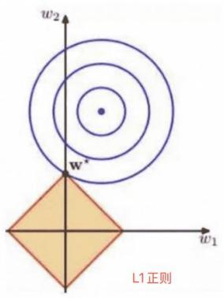

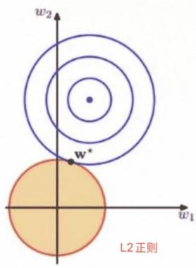

# 三、典型应用场景

# 1. L1 适用场景：

 高维数据特征选择（如广告点击率预测）。  
 需要模型轻量化的场景（如移动端部署）。

# 2. L2 适用场景：

 低维连续特征建模（如图像分类）。  
 需要处理共线性或提升模型稳定性的任务）。

CTR 模型离线 AUC 提升但在线 AB 测试效果下降，可能由以下原因导致：

# 一、特征不一致

代码逻辑差异：离线与在线特征抽取代码不同（例如离线处理用户近 50 个行为（不足进行 Padding 后 AvgPooling），在线用 ${ \mathsf { C } } { + } { + }$ 仅处理 30 个行为 AvgPooling），导致特征覆盖范围或计算方式不一致。  
 数据更新延迟：离线特征通常按天批量处理，而在线特征可能因延迟使用旧数据。例如，4 月 16 日 0-4 点的在线特征仍使用 4 月 14 日数据，但离线拼接样本时使用 4 月 15 日数据，导致特征分布差异。

# 二、数据泄露或穿越

标签相关特征泄漏：使用与标签强相关的特征（如用户点击后的行为统计），导致离线 AUC虚高，但线上无法获取此类特征。  
 时间穿越：训练集与测试集未按时间严格分割，例如用未来数据训练模型（如 7 号数据训练，测试集却包含 7 号样本），导致离线评估失真。

# 三、数据分布不一致（冰山效应）

 样本选择偏差：离线训练数据仅覆盖线上已曝光样本（水面上冰山可见部分），而线上需预测包含大量未曝光样本（水面下冰山底部）。新模型对未曝光数据预测能力不足，导致在线效果下降。

案例：新模型对历史未曝光的冷门商品预测不准，但离线 AUC 因老样本预测更准而提升，实际在线 CTR 因新样本效果差而下降。

# 四、评估指标与业务目标错位

 AUC 与 CTR 目标差异：AUC 反映全局排序能力，而在线 CTR 关注单次请求内的排序效果。若模型优化全局正负样本区分度（如提升高活跃用户预测准度），但未改善单次请求内的排序（如用户未点击的候选集排序混乱），则在线指标不涨。  
GAUC 未提升：若按用户分组的 GAUC 未同步提升，说明模型可能仅优化了用户间差异（如活跃与非活跃用户），而非用户内部兴趣排序，导致线上效果无增益。

# 解决方案建议

1. 特征一致性：统一离在线代码，在线实时落盘特征用于训练。  
2. 数据无偏处理：增加随机探索流量样本，探索水面下未曝光的样本，缓解冰山效应，但可能会带来一定的效益损失。  
3. 评估指标优化：结合 GAUC、NDCG 等贴近业务排序的指标，避免仅依赖 AUC。  
4. 在线监控：对比离在线预测均值，快速发现分布偏移。

若需进一步排查，可优先验证特征一致性及数据泄漏问题（占案例的 $60 \%$ 以上）。

# 面试题：模型融合减少的是方差还是偏差？

在机器学习中，模型融合对偏差（Bias）和方差（Variance）的减少效果取决于具体的融合策略。

# 一、模型融合的总体作用

模型融合通过组合多个模型的预测结果，可以同时优化偏差和方差，但不同方法侧重点不同：

偏差：反映模型预测与真实值的系统性偏离（欠拟合）。  
方差：反映模型对训练数据波动的敏感性（过拟合）。  
 目标：通过集成不同模型的优势，达到偏差与方差的平衡（Bias-Variance Trade-off）。

# 二、不同融合方法对偏差和方差的影响

# 1. Bagging（如随机森林）

 作用原理：通过自助采样（Bootstrap）生成多个子模型，对结果进行平均或投票。  
 减少的误差： 方差。

 原因：通过引入随机性（如数据子集、特征子集），增加模型多样性，降低对单一数据集的敏感性。  
 适用场景：高方差问题（如复杂模型过拟合时）。

# 2. Boosting（如 XGBoost）

 作用原理：顺序训练模型，每个模型关注前序模型的预测残差。  
 减少的误差： 偏差。

 原因：通过逐步修正错误样本的权重，提升对复杂模式的拟合能力。  
 适用场景：高偏差问题（如简单模型欠拟合时）。

# 3. Stacking（堆叠集成）

 作用原理：将基模型的输出作为元模型的输入，训练元模型进行最终预测。  
 减少的误差： 同时优化偏差和方差。

 原因：元模型可以学习如何组合不同基模型的优势，平衡全局偏差和方差。  
 适用场景：复杂任务需综合多模型优势时。

# 4. 平均法（如均值或加权平均）

 作用原理：对多个模型预测结果直接取平均。  
 减少的误差： 方差。

 原因：通过平均化不同模型的波动，降低预测的随机性。

# 三、核心总结

<table><tr><td>方法</td><td>主要减少误差</td><td>适用场景</td><td>典型算法</td></tr><tr><td>Bagging</td><td>方差</td><td>高方差（过拟合）</td><td>随机森林、极端随机树</td></tr><tr><td>Boosting</td><td>偏差</td><td>高偏差（欠拟合）</td><td>AdaBoost、XGBoost</td></tr><tr><td>Stacking</td><td>偏差+方差</td><td>复杂任务的全局优化</td><td>多层模型堆叠</td></tr><tr><td>平均法</td><td>方差</td><td>模型预测波动较大</td><td>简单平均、加权平均</td></tr></table>

# 四、实践建议

1. 高方差问题 （如模型在训练集表现好但测试集差）：优先选择 Bagging 或平均法。  
2. 高偏差问题 （如模型在训练集和测试集均表现差）：使用 Boosting 或引入更复杂的基模型。  
3. 综合优化：结合 Stacking 和交叉验证，避免元模型过拟合。

深度学习模型参数初始化为 0 会导致严重的训练问题，主要体现在以下方面：

# 一、参数对称性与神经元退化

# 1. 同层神经元输出一致

当所有权重初始化为 0 时，同一层的所有神经元在前向传播中会输出相同的激活值（例如隐藏层神经元输出均为 0）。即使反向传播时梯度不为 0，所有参数的更新幅度也会完全一致，导致神经元无法学习差异化特征。

# 2. 网络退化为单神经元效果

由于参数对称性，每一层相当于仅有一个有效神经元在起作用，其余神经元成为冗余计算单元，极大降低了模型的表达能力。

# 二、梯度消失与参数更新失效

# 1. 反向传播梯度趋零

在激活函数如 ReLU 的前向传播中，若输入为 0，其导数也为 0（如 ReLU 在负区间的导数为 0）。反向传播时梯度逐层衰减至 0，导致权重无法更新。例如，两层 ReLU 网络初始化为 0 时，所有梯度均为 0，参数完全停滞。

# 2. 偏置参数的局限性

即使偏置（bias）初始化为非零值，若权重矩阵为 0，前向传播的输出仍由偏置主导，无法有效传递输入信号的特征信息。

# 三、特殊情况下的例外

# 1. 无隐藏层的模型可初始化为 0

逻辑回归、单层感知机（如线性回归）等无隐藏层的模型，由于参数更新不受对称性影响，初始化为 0 仍可正常训练。例如逻辑回归的梯度更新依赖输入数据的差异性，参数可通过训练逐步分化。

# 2. 偏置参数的初始化策略

部分研究表明，偏置可单独初始化为 0 而不影响训练（如全连接层的偏置项），但需结合非零权重初始化。

面试题：神经网络有哪些常见的参数初始化方式？

# 1. 神经网络初始化的重要性

参数初始化是神经网络训练的起点，对模型能否有效收敛至关重要。

不当的初始化会导致两大核心问题：对称性破坏和梯度不稳定。

# 打破对称性

如果所有权重初始化为相同的值（如全零初始化），那么同一层内的所有神经元在前向传播过程中会计算出相同的输出，在反向传播时也会获得相同的梯度更新。这将导致所有神经元始终学习相同的特征，使得网络的表现力退化为仅相当于一个神经元，严重制约其学习能力。

#  控制梯度方差

在深层网络中，信号在前向传播和梯度在反向传播过程中会逐层传递。如果权重初始化不当，会导致激活值和梯度的方差在传播过程中指数级地缩小或放大。

 初始化过小：激活值方差逐层递减，导致梯度消失，参数更新缓慢甚至停滞。  
 初始化过大：激活值方差逐层递增，导致梯度爆炸，训练不稳定。

优秀的初始化方法旨在确保每一层的输入和输出的方差在传播过程中保持稳定，从而为训练提供一个良好的起点。

# 2. 主要初始化方法

# 2.1 Xavier/Glorot 初始化

Xavier 初始化由 Glorot 和 Bengio 提出，旨在保持 Sigmoid 和 Tanh 这类饱和型激活函数网络中各层激活值的方差一致。

 核心思想：使权重矩阵在前向传播中维持输入信号的方差，在反向传播中维持梯度的方差。

#  数学推导：

假设权重 W 来自均值为 0 的分布，且与输入 $_ x$ 独立。前向传播中，我们希望输出 $z = W x$ 的方差与输入 $_ x$ 的方差相等: $\mathrm { V a r } ( z ) = \mathrm { V a r } ( x )$ 。由于 $z$ 是多个随机变量的和，推导得出 $\operatorname { V a r } ( z ) = n _ { i n } \cdot \operatorname { V a r } ( W ) \cdot \operatorname { V a r } ( x )$ ，其中 $n _ { i n }$ 是输入神经元数量。

因此，要满足 $\mathrm { V a r } ( z ) = \mathrm { V a r } ( x )$ ，就需要 。同时考虑反向传播，最终取权衡值

$$
\operatorname {V a r} (W) = \frac {2}{n _ {i n} + n _ {o u t}}.
$$

# 具体公式：

$$
W \sim U \left(- \sqrt {\frac {6}{n _ {i n} + n _ {o u t}}}, \sqrt {\frac {6}{n _ {i n} + n _ {o u t}}}\right)
$$

 均匀分布：

 正态分布：

$$
W \sim \mathcal {N} \left(0, \frac {2}{n _ {i n} + n _ {o u t}}\right)
$$

# 2.2 He/Kaiming 初始化

He 初始化（也称 Kaiming 初始化）由何凯明提出，专门为 ReLU 及其变体这类非对称、非线性的激活函数设计。

 核心思想：ReLU 激活函数会将一半的神经元输出置零，这会使前向传播中信号的方差减半。He 初始化通过调整权重的方差来补偿这一变化。

 数 学 推 导 ： 考 虑 到 ReLU 的 作 用 ， 期 望 $E [ x ^ { 2 } ] = { \frac { 1 } { 2 } } \mathrm { V a r } ( x )$ 。 代 入 前 向 传 播 方 差 公 式$\operatorname { V a r } ( z ) = n _ { i n } \cdot \operatorname { V a r } ( W ) \cdot E [ x ^ { 2 } ]$ ，为保持方差稳定 $\mathrm { V a r } ( z ) = \mathrm { V a r } ( x )$ ，可推导出 $\mathrm { V a r } ( W ) = { \frac { 2 } { n _ { i n } } } .$ 。

具体公式：

 正态分 布： $W \sim \mathcal { N } \left( 0 , \sqrt { \frac { 2 } { n _ { i n } } } \right)$

 均匀分 布： $W \sim U \left( - \sqrt { \frac { 6 } { n _ { i n } } } , \sqrt { \frac { 6 } { n _ { i n } } } \right)$

# 2.3 LeCun 初始化

LeCun 初始化是 Xavier 初始化的前身，适用于如 SELU 之类的自归一化激活函数。

 核心思想：主要考虑前向传播中的方差稳定。

$$
W \sim \mathcal {N} \left(0, {\frac {1}{n _ {i n}}}\right) \text {或} W \sim U \left(- {\sqrt {\frac {3}{n _ {i n}}}}, {\sqrt {\frac {3}{n _ {i n}}}}\right)
$$

# 2.4 其他初始化方法

 随机初始化：从一个均值为 0、标准差为一个小值（如 0.01）的正态分布或均匀分布中采样。这是早期网络的简单方法，但在深层网络中容易引发梯度问题。  
 全零初始化： 强烈不推荐用于权重。它会导致严重的对称性问题，使得网络无法学习。但偏置项通常可以初始化为 0。  
 预训练初始化：在迁移学习场景中，使用在大数据集（如 ImageNet）上预训练好的模型参数作为初始值，通常能加速收敛并提升性能。

# 3. 初始化方法对比

下表总结了不同初始化方法的特点和适用场景：

<table><tr><td>初始化方法</td><td>核心公式（正态分布）</td><td>设计目标</td><td>适用激活函数</td><td>优点与缺点</td></tr><tr><td>Xavier/Glorot</td><td>W ~ N(0, 2/nin + nout)</td><td>保持输入/输出方差一致</td><td>Sigmoid, Tanh</td><td>对饱和激活函数有效；不适用于ReLU</td></tr><tr><td>He/Kaiming</td><td>W ~ N(0, √2/nin)</td><td>补偿ReLU的神经元“死亡”</td><td>ReLU, LeakyReLU, PReLU</td><td>解决ReLU网络的梯度消失；是当前最常用的方法之一</td></tr><tr><td>LeCun</td><td>W ~ N(0, 1/nin)</td><td>保持前向传播方差稳定</td><td>SELU, 自归一化网络</td><td>Tanh 的早期方案；在特定架构（如SELU网络）中表现良好</td></tr><tr><td>随机初始化</td><td>W ~ N(0, 0.01²)</td><td>简单打破对称性</td><td>任意（需谨慎调整）</td><td>实现简单；规模敏感，易导致梯度不稳定</td></tr></table>

# 面试题：如何缓解模型过拟合问题？

缓解模型过拟合问题需要从数据处理、模型结构和训练策略等多方面入手，以下是常见的解决方案：

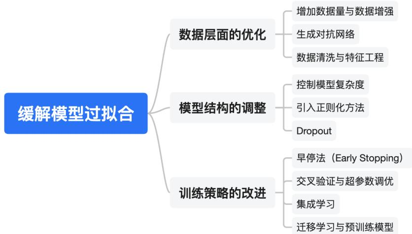

# 一、数据层面的优化

# 1. 增加数据量与数据增强

 直接扩充数据集：收集更多高质量的真实数据，尤其适用于图像、文本等任务。  
 数据增强技术：通过旋转、裁剪、翻转（图像）或同义词替换、句式变换（文本）生成等价数据，模拟更多样化的样本。  
 生成对抗网络（GAN）合成数据：利用生成模型创造符合原始数据分布的新样本。

# 2. 数据清洗与特征工程

 去除噪声样本和错误标签，避免模型学习无关特征。  
 通过特征选择/降维（如 PCA）减少冗余特征，保留关键信息。

# 二、模型结构的调整

# 3. 控制模型复杂度

 简化网络结构：减少神经网络层数、神经元数量，或限制决策树深度。  
 模型剪枝：删除权重接近零的神经元或连接，降低参数冗余。  
 低秩分解：将权重矩阵分解为低秩形式，压缩模型规模。

# 4. 引入正则化方法

 L1 正则化：通过权重绝对值之和的惩罚项，实现特征稀疏化。  
 L2 正则化 （权重衰减）：限制权重平方和，抑制参数过度增长。  
 Dropout：训练中随机屏蔽部分神经元，模拟多模型集成效果。

# 三、训练策略的改进

# 5. 早停法（Early Stopping）

监测验证集损失，当性能不再提升时提前终止训练，防止对噪声的过度拟合。

# 6. 交叉验证与超参数调优

 使用 K 折交叉验证评估模型稳定性，避免单次划分数据的偏差。  
 通过网格搜索、贝叶斯优化等方法调整学习率、正则化系数等超参数。

# 7. 集成学习

结合多个模型的预测结果（如随机森林、梯度提升树），通过投票或平均降低单一模型的过拟合风险。

# 8. 迁移学习与预训练模型

利用大规模数据集预训练的模型（LLM），通过微调适配新任务，减少对有限数据的依赖。

# 总结

实际应用中需根据任务特点组合上述方法。例如，图像分类可优先尝试数据增强 $\cdot ^ { + }$ Dropout+早停法；高维数据可结合特征选择+L1 正则化。此外，监控训练/验证集的性能差异（如准确率差距超过 $5 \%$ 可能提示过拟合）是诊断模型过拟合的关键。

面试题：深度模型训练出现 NaN 是什么原因？

深度模型训练中出现 NaN（Not a Number）通常由数值不稳定或计算错误导致，以下是常见原因分析：

# 一、数据问题

# 1. 输入数据含异常值

 原因：数据中存在 NaN、Inf 或极端值（如全零、极大/极小值），导致前向传播计算溢出。  
 解决：

 使用 numpy.isnan() 或 torch.isnan() 检查输入和标签数据。  
 确保数据预处理正确（如归一化、标准化），避免未处理的离群值。

# 2. 数据预处理缺陷

 原因：未归一化的数据（如图像未除以 255）或缺失值处理不当，引发激活值过大。  
 解决：

 对输入数据执行归一化（如缩放到 [0,1] 或 [-1,1]）。  
 对缺失值填充合理数值（如均值）或剔除异常样本。

# 二、模型问题

# 1. 梯度爆炸（Gradient Explosion）

 原因：反向传播时梯度指数级增长，导致权重更新后输出溢出。表现为 Loss 骤增后突变为 NaN，梯度值远超正常范围（如 >1e5）。  
 解决：

 梯度裁剪：限制梯度范数（如 PyTorch 的 clip_grad_norm_(max_norm=1.0)）。  
 降低学习率：初始学习率设为较小值（如 1e-4），或使用自适应优化器（Adam）。

# 2. 权重初始化不当

 原因：初始权重过大（如方差过大）或过小，引发激活值指数级变化。  
 解决：

 使用 Xavier （Tanh/Sigmoid）或 He 初始化 （ReLU）。  
 避免全零初始化导致对称性破坏。

# 三、训练策略问题

# 1. 混合精度训练问题

 原因：FP16 精度下数值范围小，易出现上/下溢出。  
 方案：启用梯度缩放（GradScaler in PyTorch），关键计算（如 Softmax）转为 FP32。

# 2. 学习率过高

 原因：过大学习率使权重更新剧烈，输出超出浮点范围。  
 调整：使用学习率调度器（如余弦退火、Warmup 等学习率调整策略）。

# 面试题：假设检验的常见指标介绍（A/B 测试常用）

# 一、假设检验核心概念解释

# 1. 显著性水平 (α，Significance Level)

定义：在假设检验中，我们愿意接受的犯第一类错误（Type I Error）的最大概率。

第一类错误：原假设（H⋅）是真的，但我们错误地拒绝了它（假阳性）。

常用的显著性水平  

<table><tr><td>显著性水平(a)</td><td>含义</td><td>适用场景</td><td>严格程度</td></tr><tr><td>0.01 (1%)</td><td>允许1%的假阳性概率</td><td>医学研究、高风险决策</td><td>非常严格</td></tr><tr><td>0.05 (5%)</td><td>允许5%的假阳性概率</td><td>行业标准、A/B测试</td><td>标准</td></tr><tr><td>0.10 (10%)</td><td>允许10%的假阳性概率</td><td>探索性研究</td><td>较宽松</td></tr><tr><td>0.20 (20%)</td><td>允许20%的假阳性概率</td><td>初步筛选、快速实验</td><td>宽松</td></tr></table>

选择建议：α越小，检验越严格，越难拒绝原假设；α越大，检验越宽松，越容易检测到差异 (但假阳性风险增加)。

#  原假设 (H⋅) 与备择假设 (H⋅/Hₐ)定义：

 H⋅ (原假设) 通常表示"无效应"、“无差异”，如：新方案和旧方案没有区别。  
 H⋅/Hₐ (备择假设)通常表示"有效应"、“有差异”，如：新方案比旧方案更好。

#  两类错误定义：

 Type I Error (第一类错误) H⋅ 为真时，错误地拒绝了 H⋅（假阳性），概率定位 α。  
 Type II Error (第二类错误) H⋅ 为假时，错误地接受了 H⋅（假阴性），概率定位 β。

# 2. 置信区间 (Confidence Interval, CI)

定义：一个区间估计，表示我们有一定的信心（置信水平）认为真实参数值落在这个区间内。

例如： $9 5 \%$ 置信区间 $[ 1 . 2 \%$ , $3 . 5 \% ]$ 表示我们有 $9 5 \%$ 的把握，真实值在 $1 . 2 \%$ 到 $3 . 5 \%$ 之间。

# 核心公式

$$
\text {置 信 区 间} = \text {点 估 计} \pm \mathrm {Z} _ {\alpha / 2} \times \text {标 准 误 差}
$$

$$
\text {下 界} = \mathrm {X} ^ {-} - \mathrm {Z} _ {\alpha / 2} \times \mathrm {S E}
$$

$$
\text {上 界} = \mathrm {X} ^ {-} + \mathrm {Z} _ {\alpha / 2} \times \mathrm {S E}
$$

# 置信水平与显著性水平的关系

$$
\text {置 信 水 平} = 1 - \alpha
$$

<table><tr><td>显著性水平(a)</td><td>置信水平(1-a)</td><td>解释</td></tr><tr><td>0.01</td><td>99%</td><td>有99%的把握真实值在区间内</td></tr><tr><td>0.05</td><td>95%</td><td>有95%的把握真实值在区间内</td></tr><tr><td>0.10</td><td>90%</td><td>有90%的把握真实值在区间内</td></tr><tr><td>0.20</td><td>80%</td><td>有80%的把握真实值在区间内</td></tr></table>

# 3. Z 分数 (Z-score)

定义：标准正态分布的分位数，表示一个值距离均值有多少个标准差。

用于将原始数据标准化，便于比较不同尺度的数据。

# 计算公式

$$
\mathbf {z} = \left(\mathbf {x} - \mu\right) / \sigma
$$

$$
\begin{array}{l} \mathrm {X} = \text {观 测 值} \\ \mu = \text {总 体 均 值} \\ \sigma = \text {总 体 标 准 差} \\ \end{array}
$$

# 显著性水平与Z分数对应表

<table><tr><td>显著性水平(a)</td><td>置信水平</td><td>Z分数 (Zα/2)</td><td>计算说明</td></tr><tr><td>0.01</td><td>99%</td><td>2.576</td><td>P(Z ≤ 2.576) = 0.995</td></tr><tr><td>0.05</td><td>95%</td><td>1.96</td><td>P(Z ≤ 1.96) = 0.975</td></tr><tr><td>0.10</td><td>90%</td><td>1.645</td><td>P(Z ≤ 1.645) = 0.95</td></tr><tr><td>0.20</td><td>80%</td><td>1.28</td><td>P(Z ≤ 1.28) = 0.90</td></tr></table>

记忆技巧：a越小 $ Z$ 分数越大 置信区间越宽 越难判断显著

# 4. P 值 (P-value)

 P 值定义：在原假设 H⋅ 为真的条件下，观察到当前样本结果（或更极端结果）的概率。  
 通俗理解：P 值越小，说明当前观察到的结果越"不寻常"，越有理由拒绝原假设。

# 判断规则

√P≤α:拒绝H。

结果具有统计显著性

有足够证据支持备择假设 H

XP>α:不能拒绝 H。

结果不具有统计显著性

没有足够证据拒绝原假设

# P值与显著性水平的关系

<table><tr><td>P值范围</td><td>在a=0.05下</td><td>在a=0.01下</td><td>在a=0.10下</td><td>常用表述</td></tr><tr><td>P&lt;0.001</td><td>显著✓</td><td>显著✓</td><td>显著✓</td><td>极其显著***</td></tr><tr><td>0.001≤P&lt;0.01</td><td>显著✓</td><td>显著✓</td><td>显著✓</td><td>非常显著**</td></tr><tr><td>0.01≤P&lt;0.05</td><td>显著✓</td><td>不显著×</td><td>显著✓</td><td>显著*</td></tr><tr><td>0.05≤P&lt;0.10</td><td>不显著×</td><td>不显著×</td><td>显著✓</td><td>边缘显著</td></tr><tr><td>P≥0.10</td><td>不显著×</td><td>不显著×</td><td>不显著×</td><td>不显著</td></tr></table>

A注意：P值不是"原假设为真的概率"！P值是在假设H。为真的前提下，观察到当前或更极端结果的概率。

# 5. 检验统计量 (Test Statistic)

检验统计量定义：根据样本数据计算出的一个数值，用于判断是否拒绝原假设。

# 常见检验方法：

<table><tr><td>检验方法</td><td>公式</td><td>适用条件</td></tr><tr><td>Z 检验</td><td>Z = (X-μθ) / (σ/√n)</td><td>大样本 (n≥30)
已知总体方差 σ²</td></tr><tr><td>t 检验</td><td>t = (X-μθ) / (s/√n)</td><td>小样本
未知总体方差</td></tr><tr><td>卡方检验</td><td>x² = Σ (O-E)² / E</td><td>分类变量
独立性/拟合优度检验</td></tr><tr><td>双样本 t 检验</td><td>t = (X̄ - X̅̄) / √(s1² / n1 + s2² / n2)</td><td>比较两组均值
A/B 测试常用</td></tr></table>

# 二、显著性水平与 Z 分数的对应关系

显著性水平、置信区间、Z分数对照表  

<table><tr><td>显著性水平(a)</td><td>置信水平</td><td>Z分数(双侧)</td><td>Z分数(单侧)</td><td>应用场景</td></tr><tr><td>0.01</td><td>99%</td><td>2.576</td><td>2.326</td><td>医学、高风险决策</td></tr><tr><td>0.05</td><td>95%</td><td>1.96</td><td>1.645</td><td>行业标准</td></tr><tr><td>0.10</td><td>90%</td><td>1.645</td><td>1.28</td><td>探索性研究</td></tr><tr><td>0.20</td><td>80%</td><td>1.28</td><td>0.84</td><td>快速筛选</td></tr></table>

# 三、A/B 测试中的应用示例

# 场景：A/B 测试-评估新推荐算法对GMV的影响

# I实验数据

·对照组 (A)：样本量 $n _ { 1 } = 1 0 0 0 0$ ，人均GMV=￥50.0，标准差 $\mathsf { s } _ { 1 } = \yen 30$   
·实验组 (B)：样本量 $n _ { 2 } = 1 0 0 0 0$ ，人均GMV $=$ ￥52.5，标准差 $S _ { 2 } = \yen 32$   
·提升率 $=$ (52.5- 50) $1 5 0 = 5 \%$

# Step 1:设定假设

H $\mathsf { \Pi } \mu \_ { - } \mathsf { B } = \mu \_ { - } \mathsf { A }$ (新算法无效果)

$\mathsf { H } _ { 1 } \colon \mathsf { H } \_ { \mathsf { B } } > \mathsf { \mu } \_ { \mathsf { A } }$ (新算法有正向效果)

# Step 2:选择显著性水平

$\mathtt { a } = 0 . 0 5$ $9 5 \%$ 置信水平)

# Step 3:计算检验统计量

$$
\mathrm {S E} = \sqrt {\left(\mathrm {s} _ {1} ^ {2} / \mathrm {n} _ {1} + \mathrm {s} _ {2} ^ {2} / \mathrm {n} _ {2}\right)} = \sqrt {(9 0 0 / 1 0 0 0 0 + 1 0 2 4 / 1 0 0 0 0)} = \sqrt {0 . 1 9 2 4} \approx 0. 4 3 9
$$

$$
Z = (X _ {-} B - X _ {-} A) / S E = (5 2. 5 - 5 0) / 0. 4 3 9 \approx 5. 6 9
$$

# Step 4:计算P值

查标准正态分布表： $\mathsf { P } ( Z > 5 . 6 9 ) \approx 0 . 0 0 0 0 0 0 1$

P值 $\mathbf { < 0 . 0 0 1 }$

# Step 5:计算置信区间 $( 9 5 \%$

$$
95 \% \mathrm {CI} = 2.5 \pm 1.96 \times 0.439 = [ 1.64, 3.36 ]
$$

# Step 6:做出决策

结论：由于 $\mathsf { P < } 0 . 0 5$ 且置信区间不包含0，拒绝原假设。

新推荐算法对GMV有显著正向影响，人均GMV提升约￥2.5（ $9 5 \%$ Cl: ?1.64~¥3.36)，提升率 $5 \%$

# 第七章：推荐&大模型&强化学习

# 7.1 推荐+大模型面试题：

# 面试题：业界主流的生成式推荐方案梳理

1、 谷歌 TIGER：https://arxiv.org/pdf/2305.05065

 核心思想：通过残差量化（RQ-VAE）为广告生成层次化语义 ID，实现语义可解释的离散化表征。  
 技术架构：

 编码阶段：使用预训练文本编码器提取广告标题/描述的特征，经 RQ-VAE 量化生成 3 级 ID（类目 品牌 产品）。  
 生成阶段：Transformer 序列到序列模型基于用户历史行为 ID 序列，自回归预测下一广告的语义 ID。

 创新点

 解决十亿级广告库的存储问题，ID 嵌入表内存占用仅为传统 Embedding 的 1/100。  
 语义碰撞具有可解释性（相似广告共享前缀 ID），冷启动广告召回率提升 $12 \%$ 。

# 2、 百度 COBRA：http://arxiv.org/pdf/2503.02453

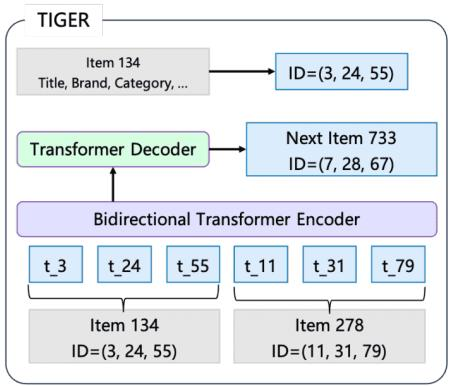

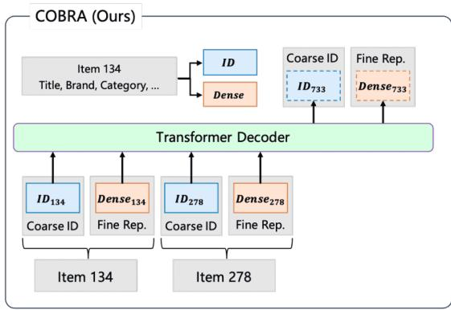

 核心思想：级联稀疏ID（粗粒度类目）与稠密向量（细粒度细节），实现由粗到精的生成推荐。  
 技术架构：

 级联表征：广告的稀疏 ID（RQ-VAE 生成）与动态稠密向量（Transformer 编码器输出）拼接输入。  
 交替预测：Causal Transformer 先预测稀疏 ID 定位大类，再生成稠密向量捕捉细节（如“运动鞋” $ ^ { \bullet }$ “透气网面”）。  
 推理优化：BeamFusion 算法融合 Beam Search 得分与 ANN 相似度，平衡精度与多样性。

 创新点：

端到端训练双目标损失：ID 交叉熵+向量对比损失，解决语义 gap 问题。  
 工业级效果：百度 Feed 流广告场景中，Recall@800 达 0.4466，在线 $C V R { + } 3 . 6 \%$ ，ARPU+4.15%。

# 3、 快手 OneRec：https://arxiv.org/pdf/2502.18965

 核心思想：MoE 架构统一召回与排序，直接生成整个推荐 Session。  
 技术架构：

 多模态量化：视频通过 3 级 Codebook 离散化为 Token 序列（如 a_99b_225c_67）。  
 Session 生成：T5 结构 Encoder-Decoder $^ +$ 稀疏 MoE，每层仅激活 $1 3 \%$ 参数，预测 N 个视频的 3 级 ID。  
 DPO 偏好对齐：Softmax-DPO 算法从 Beam Search 结果中筛选最优/最差 Session，通过奖励模型（预测观看时长）优化生成质量。  
 创新点：

 支持千候选视频的毫秒级推理，QPS 提升 5 倍（TensorRT-LLM 优化）。  
 在线 A/B 测试：用户观看时长 $+ 1 . 6 \%$ ，互动率 $+ 3 . 3 6 \%$ 。

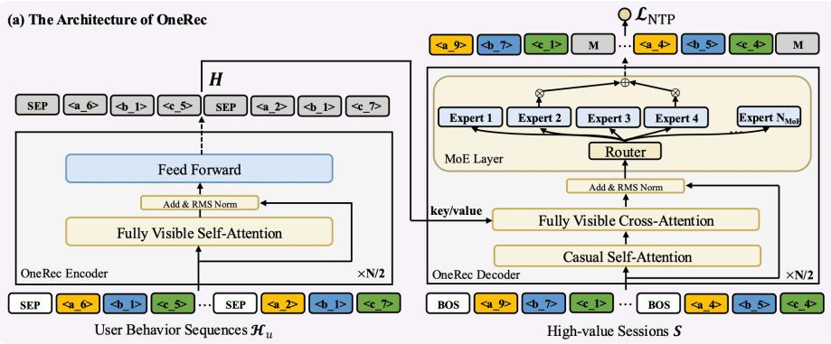

# 4、 Meta HSTU：https://arxiv.org/pdf/2402.17152

 核心思想：层次化序列转导单元（HSTU）压缩超长行为序列，突破Transformer 上下文限制。  
 技术架构：

 稀疏注意力：点式聚合注意力替代 Softmax，减少冗余计算。  
 动态压缩：随机长度采样（SL）算法移除 $80 \%$ 低价值历史行为（如 30 天前点击）。  
 推理加速：M-FALCON 算法微批处理候选广告，单卡吞吐量提升 2.99 倍。  
 创新点：

 支持 200 万 Token 上下文，训练速度比 FlashAttention-2 快 15.2 倍。  
 工业场景：在 285 倍复杂度模型下，推理 QPS 反升 2.48 倍。

# 5、 小红书 GenRank：https://arxiv.org/pdf/2505.04180

 核心思想：行为导向的生成式排序，将广告视为上下文，专注预测用户行为（点击/忽略）。  
 技术架构：

 Action-Oriented 组织：

输入序列 $=$ 时间嵌入 $^ +$ 位置嵌入 $^ +$ 广告嵌入 $^ +$ 行为嵌入（历史）/掩码（候选）。

GenRank 引入 Mask Action Embedding，仅允许历史行为与当前候选物品交互，屏蔽其他候选物品。

 轻量偏置编码：线性 I/O 的位置/时间编码替代复杂 Embedding，序列长度压缩 $50 \%$ 。  
 创新点：

 训练速度比 HSTU提升 $9 4 . 8 \%$ ，P99延迟降低 $2 5 \%$ 。在线指标：用户互动行为（点赞/收藏） $+ 1 . 2 5 \%$ ，7日留存$+ 0 . 1 5 \%$ 。

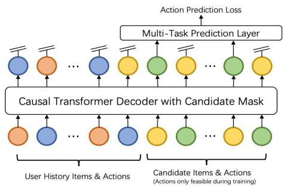  
(a) Existing Approach with Item-Oriented Organization

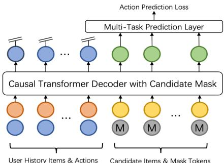  
(b) Our Approach with Action-Oriented Organization


History Item Embedding

$\bigcirc$ O History Action Embedding

$\textcircled{ M}$ Mask Embedding


Candidate Item Embedding

$\bigcirc$ Candidate Action Embedding

Stop Gradient Operation

主流模型对比分析：  

<table><tr><td>模型</td><td>核心架构</td><td>适用场景</td><td>效果提升</td><td>工业部署优势</td><td>技术局限</td></tr><tr><td>TIGER</td><td>RQ-VAE+Transformer</td><td>冷启动广告库</td><td>Recall@10+11.9%</td><td>内存占用减少99%</td><td>细粒度特征丢失</td></tr><tr><td>COBRA</td><td>稀疏-稠密级联生成</td><td>精细个性化推荐</td><td>CVR+3.6%</td><td>兼顾精度与多样性(BeamFusion)</td><td>双索引维护复杂</td></tr><tr><td>OneRec</td><td>MoE+Session生成</td><td>短视频流推荐</td><td>观看时长+1.6%</td><td>低推理延迟(TensorRT-LLM)</td><td>奖励模型依赖标注</td></tr><tr><td>HSTU</td><td>层次化序列压缩</td><td>超长用户行为序列</td><td>训练速度×15.2</td><td>支持200万Token上下文</td><td>历史行为信息损失</td></tr><tr><td>GenRank</td><td>行为导向排序</td><td>高实时性排序场景</td><td>互动率+1.25%</td><td>P99延迟降低25%</td><td>动态广告更新不灵活</td></tr></table>

# 面试题：生成式推荐有哪些样本组织方式？

# 一、样本组织：生成式推荐的基础

 传统推荐模型（如 DeepFM、DIN 等）通常采用 Pointwise 的样本组织方式，即每条样本独立地记录一次用户与物品的交互（如一次曝光或点击），模型的目标是为每个<用户, 物品>pair 预测一个得分。然而，这种范式难以有效捕捉用户行为序列中丰富的时序依赖和上下文信息。  
 在生成式推荐系统中，样本的组织方式发生了根本性变革。生成式推荐的核心思想是将推荐任务视为一个序列生成问题，即根据用户的历史行为序列，生成其未来可能交互的物品或行为。  
 因此，其样本组织也转向了序列化（Sequence-wise）或按组（Group-wise）的方式。业界主流的样本组织方式可以归纳为下表所示的几种类型：

<table><tr><td>样本组织方式</td><td>核心思想</td><td>序列结构示例</td><td>特点 &amp; 代表模型</td></tr><tr><td>Item-Oriented(物品导向)</td><td>将物品(Item)和其对应的动作(Action)作为序列的基本单元。</td><td>[Item□, Action□, Item□, Action□, ..., Item□, Action□]</td><td>序列长,计算冗余度高。代表:Meta的GRs(HSTU单元)。</td></tr><tr><td>Action-Oriented(行为导向)</td><td>以用户行为(Action)为序列核心,物品(Item)作为发生该行为的上下文或位置信息。</td><td>[Action□(Item□), Action□(Item□), ..., Mask(Item□)]</td><td>序列长度减半,效率极高。代表:小红书的GenRank。</td></tr><tr><td>语义ID序列</td><td>先将物品通过如RQ-VAE等技术转化为一串具有层次化语义的ID,然后将推荐转化为生成下一个语义ID。</td><td>[Semantic-ID□, Semantic-ID□, ..., Semantic-ID□]</td><td>词表大小固定,更适合生成范式。代表:Tiger、OneRec模型。</td></tr></table>

# 二、不同样本组织方式详细介绍

# 1. Item-Oriented 样本组织

参考论文：https://arxiv.org/pdf/2402.17152

这种方式将用户与系统的每次交互都拆解为“物品”和“动作”两个 token，并按时序交错排列。

 样本结构：一个样本即用户一段时间内的完整交互序列： $\Phi _ { 0 } , a _ { 0 } , \Phi _ { 1 } , a _ { 1 } , . . . , \Phi _ { n } , a _ { n }$ ，其中 $\Phi$ 代表物品， $a$ 代表动作action（如点击、点赞）。

<table><tr><td>Task</td><td></td><td>Specification (Inputs / Outputs)</td></tr><tr><td rowspan="2">Ranking</td><td>xs</td><td>Φ0, a0, Φ1, a1, ..., Φnc-1, anc-1</td></tr><tr><td>yi</td><td>a0, ∅, a1, ∅, ..., anc-1, ∅</td></tr><tr><td rowspan="3">Retrieval</td><td>xs</td><td>(Φ0, a0), (Φ1, a1), ..., (Φnc-1, anc-1)</td></tr><tr><td>yi</td><td>Φ&#x27;, Φ2&#x27;, ..., Φnc-1, ∅</td></tr><tr><td></td><td>(Φi&#x27; = Φi if ai is positive, otherwise ∅)</td></tr></table>

#  模型训练与损失函数：

 模型采用自回归（Autoregressive）的方式，以因果掩码（Causal Mask）确保在预测第 t 个位置时，只能看到前 t-1 个位置的信息。其训练目标是下一个 Token 预测（Next Token Prediction, NTP）。

$$
\mathcal {L} = - \frac {1}{L} \sum_ {t = 1} ^ {L} \log P (o _ {t} | o _ {<   t})
$$

 损失函数通常是标准的交叉熵损失：

其中，L 是序列长度， $o _ { t }$ 是第 个位置的真实 token。关键在于，损失仅计算在目标位置（例如，只计算在需要

预测下一个物品或下一个动作的位置），而非整个序列。在历史行为上计算损失已被实验证明会损害模型性能。

# 2. Action-Oriented 样本组织

参考论文：https://arxiv.org/pdf/2505.04180

这是小红书 GenRank 提出的创新方案，旨在解决 Item-Oriented 方式序列过长、计算效率低下的问题。

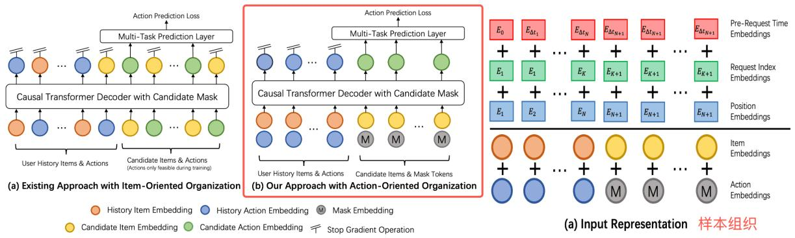

 样本结构：序列的基本单位是行为（Action）。每个位置的输入表征由五种嵌入相加而成：

$$
e _ {i} = E _ {i} ^ {\text {t i m e}} + E _ {i} ^ {\text {r e q}} + E _ {i} ^ {\text {p o s}} + \varphi (x _ {i}) + \phi (a _ {i})
$$

其中， ${ \mathcal { S } } ( x _ { i } )$ 是物品嵌入， ${ \bf \nabla } _ { \boldsymbol { r } } \phi ( { a } _ { i } )$ 是行为嵌入。对于需要预测的候选物品，其行为是未知的，因此使用一个可学习的 [MASK]嵌入来代替 $\phi \big ( a _ { i } \big )$ 。

#  模型训练与损失函数：

 模型的任务变为迭代地预测与每个物品相关联的行为。例如，给定历史行为序列，模型需要预测用户对下一个候选物品会执行什么动作（点击、不点击等）。  
 损失函数同样基于交叉熵，但预测目标更为集中：

$$
\mathcal {L} _ {\text {G e n R a n k}} = - \sum_ {j \in \text {C a n d i d a t e s}} \log P \left(a _ {j} \mid e _ {1}, e _ {2}, \dots , e _ {j - 1}, \varphi \left(x _ {j}\right) + M\right)
$$

这里，Candidates 代表一次请求中需要预测的所有候选物品集合。这种方式使模型更专注于学习行为模式，从而在排序任务中更高效。

# 3. 语义 ID序列组织

参考论文：https://arxiv.org/pdf/2305.05065

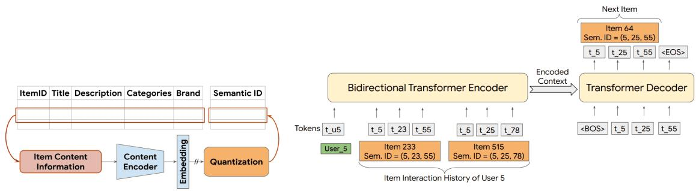

(a) Semantic ID generation for items using quantization of content embeddings.

(b) Transformer based encoder-decoder setup for building the sequence-to-sequence model used for generative retrieval.

这种方式不完全依赖原始的物品 ID，而是先将物品内容（如标题、图像特征）通过多模态编码器和量化技术（如 RQ-VAE）转化为一个简短的、具有语义的ID序列。

 样本结构：一个物品可能被表示为 (12, 214, 152)这样的语义 ID 元组。用户的交互历史就被组织成这些 ID 的序列。  
 模型训练与损失函数：

 训练分为两阶段。第一阶段训练 RQ-VAE来学习语义 ID的映射。第二阶段，使用标准的自回归语言模型方式，根据用户历史生成下一个物品的语义 ID 序列。  
 损失函数与语言模型相同，是序列生成任务的标准损失。其优势在于将推荐的词表从亿级的物品 ID 缩小到固定大小（如1024）的 codebook，避免了大规模负采样，真正实现了生成式检索。

# 三、在线推理的区别

不同的样本组织方式直接导致了在线推理策略的显著差异。

<table><tr><td>推理环节</td><td>Item-Oriented</td><td>Action-Oriented</td><td>语义ID序列</td></tr><tr><td>输入处理</td><td>将用户实时行为序列构建成 [item, action, item, action, ...]的长序列。</td><td>输入是行为序列,候选物品仅以其物品嵌入和 [MASK]嵌入表示,序列更短。</td><td>将用户历史交互物品映射为其语义ID序列。</td></tr><tr><td>推理机制</td><td>自回归解码。逐个预测序列中的下一个 token (可能是物品也可能是动作)。
● 精排:下一个 action 预估
● 召回:下一个 item 预估</td><td>行为预测。模型接收候选物品,直接输出用户对该物品执行目标动作(如点击)的概率,更像一个高效的判别器。</td><td>完全生成。像LLM一样,自回归地生成下一个语义ID,直到形成一个完整的ID元组,再通过查找表映射回具体的物品ID。</td></tr><tr><td>核心区别</td><td>需处理长序列,计算开销大。</td><td>序列短,推理速度快,更适合对延迟要求极高的精排场景。</td><td>不依赖预选候选集,是真正的“生成”,常用于召回以创造新的候选。</td></tr></table>

# 一、 残差量化变分自编码器原理（RQ-VAE）

Enhancing Embedding Representation Stability in Recommendation Systems with Semantic ID

# 1. 核心原理

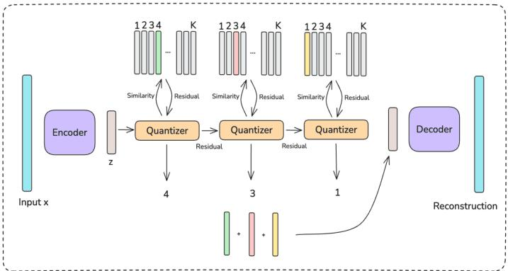  
Figure1 The RQVAE model with $L = 3$

通过分层向量量化将连续 Embedding 映射为离散语义 ID 序列，解决高基数 ID 的嵌入不稳定问题

 输入：广告多模态 Embedding $\boldsymbol { x } \in \mathbb { R } ^ { d }$ （由文本/视觉模型生成）  
 分层量化：

$c _ { 1 } = \arg \operatorname* { m i n } _ { k \in [ 1 , K ] } \| x - e _ { k } ^ { ( 1 ) } \|$ -e(1) 第1层的语义 ID（K为码本数量）：  
$r _ { l } = r _ { l - 1 } - e _ { c _ { l - 1 } } ^ { ( l - 1 ) } , c _ { l } = \arg \operatorname* { m i n } _ { k } \| r _ { l } - e _ { k } ^ { ( l ) } \|$ ec-1 第 层的残差向量&与语义 ID：  
 输出语义 ID 列表： $S = ( c _ { 1 } , c _ { 2 } , \ldots , c _ { L } )$ ，其中 $L$ 为量化层数（比如 L=6，K=2048）

# 2. 训练目标

三阶段损失函数：

$$
\mathcal {L} = \underbrace {\| x - \operatorname {D e c o d e r} (S) \| ^ {2}} _ {\text {重 建 损 失}} + \underbrace {\sum_ {l = 1} ^ {L} \| \mathrm {s g} [ r _ {l} ] - e _ {c _ {l}} ^ {(l)} \| ^ {2}} _ {\text {承 诺 损 失}} + \underbrace {\beta \sum_ {l = 1} ^ {L} \| r _ {l} - \mathrm {s g} [ e _ {c _ {l}} ^ {(l)} ] \| ^ {2}} _ {\text {码 本 c o d e b o o k 损 失}}
$$

其中 sg[⋅] 为梯度截断操作， $\beta$ 为超参数。

```python
import torch
import torch.nn as nn
import torch.optim as optim
import numpy as np
import matplotlib.pyplot as plt
from sklearn:datasets import makeblobs
from torch.utils.data import DataLoader, TensorDataset
#======== 1. 合成数据集生成*****
def generate_synthetic_data(num_samples=5000, latent_dim=32):
    '''生成具有层次结构的合成数据，模拟推荐系统物品特征''''
    # 第一阶段：生成粗粒度类别中心（4个大类）
    coarsecenters = np.array([[1, 1], [1, -1], [-1, 1], [-1, -1]])
    coarse_data, _ = makeblobs(
        n_samples=num_samples, #生成5000个数据点（默认值）
        centers=coarsecenters, #使用预定义的4个中心点
        cluster_std=0.8 #设置每个簇的标准差为0.8，控制数据点的分散程度)
    # 第二阶段：生成细粒度特征（每个大类含4个子类）
    fine_data = []
    for center in coarsecenters:
        subcenters = center + np.random.randint(4, 2) * 0.5
        sub_data, _ = makeblobs(
            n_samples=num_samples // 4,
            centers=subcenters,
            cluster_std=0.2)
        fine_data.append(sub_data)
    # 组合为层次化特征向量
    fine_data = np.vstack(fine_data)
    synthetic_data = np.hstack([coarse_data, fine_data]) # shape (5000, 4)
    return torch.tensor(synthetic_data, dtype=torch.float32)
```

# # 生成并标准化数据

```python
data = generate_synthetic_data()
data = (data - data.mean(0)) / data.std(0) # 标准化
dataloader = DataLoader(TensorDataset(data), batch_size=128, shuffle=True)
print(data.shape)
print(data)
#======== 2. RQ-VAE 模型定义 ____________
class ResidualQuantizer(nnModule):
    def __init__(self, codebook_size=128, latent_dim=8, num_layers=3):
        super().__init__()
        self.codebook = nn.Embedding(codebook_size, latent_dim)
        self.num_layers = num_layers
        nn.init.uniform__(self.codebook.weight, -1.0, 1.0) # 码本初始化
    def forward(self, z):
        residuals = _z 
```

# 运行结果：

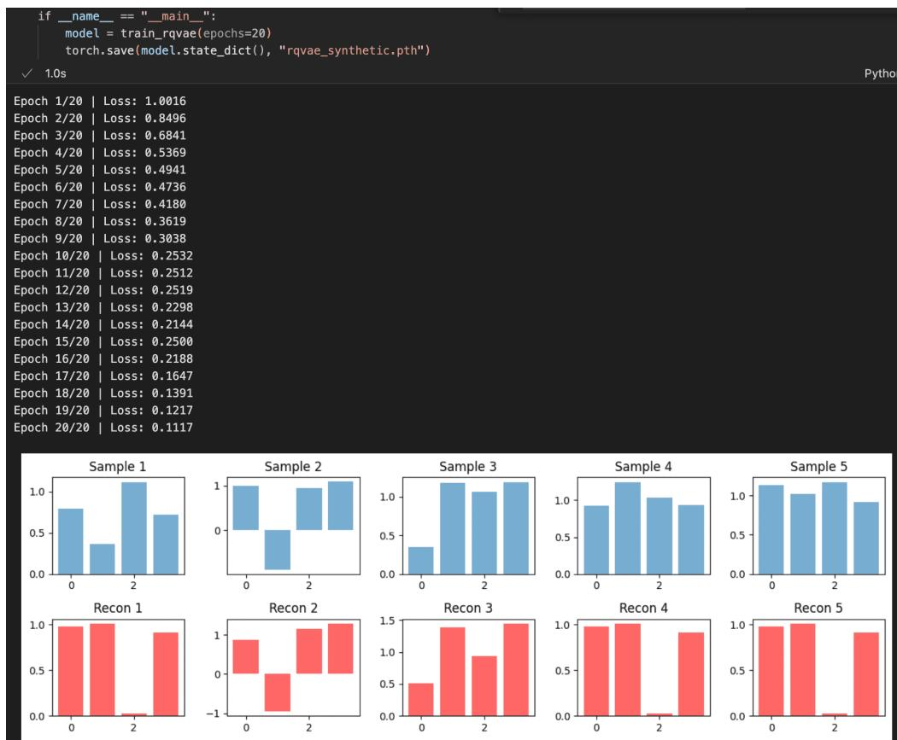

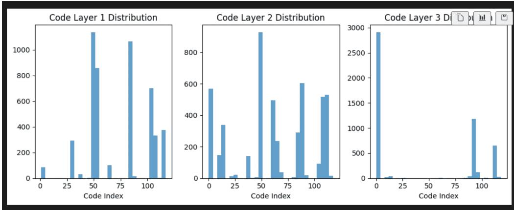

面试题：语义 ID 编码 RQ-VAE 在训练过程中如何解决码本坍塌？

在生成式推荐系统中，RQ-VAE（残差量化变分自编码器）通过分层量化机制显著缓解了码本坍塌（Codebook Collapse）问题，但训练中仍需针对性策略确保码本利用率。

# 一、码本坍塌的定义与成因

# 1. 什么是码本坍塌？

码本坍塌指训练过程中码本中大量嵌入向量未被激活，仅少数向量被频繁使用，导致模型表达能力下降的现象。例如，若码本含 1024 个向量，实际仅 $10 \%$ 被使用，其余 $90 \%$ 的向量因缺乏梯度更新而退化，无法有效表征数据多样性。

# 2. 产生原因

 特征垄断：高维特征易被少数主导向量垄断，尤其当码本容量不足时，相似特征被强制映射到同一向量。  
 训练波动：码本更新依赖局部批次数据，波动大导致部分向量因偶然未被选中而“失活”。

# 二、RQ-VAE的先天抗坍塌机制

RQ-VAE 通过残差分层量化降低坍塌风险：

 分层防御：将特征分解为多级残差（如 4 层），每层用小型共享码本（如 $K = 1 0 2 4$ ）量化局部残差，避免单一码本承载全局信息压力。  
 指数级容量：D 层量化等效码本容量为 $K ^ { D }$ （4 层 1024 码本等效于 $1 0 \land 1 2$ 向量），但实际仅训练 $\mathsf { K } \times \mathsf { D }$ 个向量，显著降低坍塌概率。

# 三、业界优化策略

# 1. 动态码本更新：指数移动平均（EMA）

 原理：基于历史梯度平滑更新码本向量，减少训练波动影响。更新公式：

$$
N _ {j} ^ {(t)} = \gamma \cdot N _ {j} ^ {(t - 1)} + (1 - \gamma) \sum_ {i} \mathbb {I} [ z _ {i} \in \mathcal {N} _ {j} ]
$$

$$
e _ {j} ^ {(t)} = \frac {\gamma \cdot m _ {j} ^ {(t - 1)} + (1 - \gamma) \sum \mathbb {I} [ z _ {i} \in \mathcal {N} _ {j} ] \cdot z _ {i}}{N _ {j} ^ {(t)}}
$$

其中 $\mathsf { v } { = } 0 . 9 9$ 为衰减率， ${ \mathcal { N } } _ { j }$ 为归属向量 $e _ { j }$ 的特征集合。

 效果：码本利用率提升至 $6 0 \% { \sim } 7 5 \%$ ，避免少数向量垄断。

# 2. 分层损失约束

 设计：每层独立计算量化损失，强制各层码本均被激活：

$$
\mathcal {L} _ {\text {q u a n t}} = \sum_ {d = 1} ^ {D} \left(\| \mathbf {z} - \operatorname {s g} (e (k _ {d})) \| ^ {2} + \beta \| \operatorname {s g} (\mathbf {z}) - e (k _ {d}) \| ^ {2}\right)
$$

其中 $\beta { = } 0 . 2 5$ 平衡编码器与码本优化，sg(⋅)为停止梯度操作。

 作用：防止深层码本因残差趋近零而退化，利用率达 $7 0 \% { \sim } 8 5 \%$ 。

# 3. 码本重置（Codebook Reset）

 触发机制：当监测到某层码本利用率低于阈值（如 $20 \%$ ），随机重置未使用向量为当前批次激活向量的均值。  
 案例：快手DAS系统结合 EMA与重置策略，码本利用率提升至 $92 \%$ ，冷启动广告 ID冲突率降低 $3 7 \%$ 。

# 4. 熵正则化（Entropy Regularization）

 目标扩展：在损失函数中加入码本分布熵项，鼓励向量均匀使用：

$$
\mathcal {L} _ {\text {t o t a l}} = \mathcal {L} _ {\text {r e c o n}} + \mathcal {L} _ {\text {q u a n t}} - \lambda \cdot H (\mathbf {p})
$$

其中 $H ( \mathbf { p } )$ 为码本使用概率的香农熵， 控制均衡强度。

 优势：提升码本多样性，利用率达 $7 5 \% { \sim } 8 8 \%$ ，尤其适合多码本系统（如 RQ-Transformer）。

# 四、业界优化策略对比

<table><tr><td>策略</td><td>训练开销</td><td>码本利用率</td><td>适用场景</td><td>典型案例</td></tr><tr><td>EMA 更新</td><td>低</td><td>60%~75%</td><td>基础稳定训练</td><td>VQ-VAE 基础框架</td></tr><tr><td>分层损失约束</td><td>中</td><td>70%~85%</td><td>RQ-VAE 核心架构</td><td>Kakao Brain 图像生成</td></tr><tr><td>码本重置</td><td>低</td><td>80%~92%</td><td>高动态数据（如广告）</td><td>快手 DAS 广告系统</td></tr><tr><td>熵正则化</td><td>中</td><td>75%~88%</td><td>多码本长序列生成</td><td>RQ-Transformer</td></tr></table>

# 面试题：美团生成式推荐 MTGR 介绍——外卖推荐效果近 2 年最大提升

美团 MTGR（Meituan Generative Recommendation）是一个工业级的生成式推荐框架，它成功地将 LLM 的缩放定律（ScalingLaw）应用于推荐系统，在美团核心的外卖推荐场景中取得了显著的效果提升和成本优化。

参考链接：https://tech.meituan.com/2025/05/19/meituan-generative-recommendation.html

<table><tr><td>特性维度</td><td>具体说明</td></tr><tr><td>提出背景</td><td>●传统DLRM模型在外卖场景遭遇效果瓶颈；●生成式推荐（GR）虽具扩展性但舍弃关键交叉特征。</td></tr><tr><td>核心目标</td><td>构建混合架构，兼顾生成式推荐的扩展性优势和传统DLRM的交叉特征优势</td></tr><tr><td>关键创新</td><td>数据组织方式：●用户粒度样本压缩●保留全部交叉特征模型架构组件：●Group LayerNorm●动态混合掩码策略</td></tr><tr><td>核心架构</td><td>基于改进的HSTU（分层序列转导单元）架构，使用Transformer编码器统一建模多种类型特征</td></tr><tr><td>业务收益</td><td>离线CTCVR GAUC提升+2.88pp，线上订单量+1.22%，PV_CTR+1.31%，推理资源节省12%</td></tr></table>

# ① 提出背景与待解难题

美团外卖推荐场景经过近十年的迭代，基于传统 DLRM模型进一步提升转化率变得十分困难，主要面临两大挑战 ：

 扩展瓶颈：传统方法通过增加模型复杂度来提升效果，但存在天花板。其推理成本会随候选物品数量线性增长，扩展性差。  
 特征取舍困境：纯粹的生成式推荐模型（如 Meta 的 GR）为追求扩展性而舍弃了人工交叉特征，但这对于外卖这类强依赖“用户-商家”交叉信息（如距离、历史点击率）的业务会造成严重的性能损失，且无法通过单纯扩大模型规模来弥补。

MTGR 的目标正是在于解决这一困境，探索一条融合之路。

# ① 核心模型架构

# 数据组织与特征处理

MTGR 对齐了 DLRM 的全部特征体系，包括用户画像、上下文环境、用户历史行为序列以及候选物品特征。其核心创新在于数据组织方式：

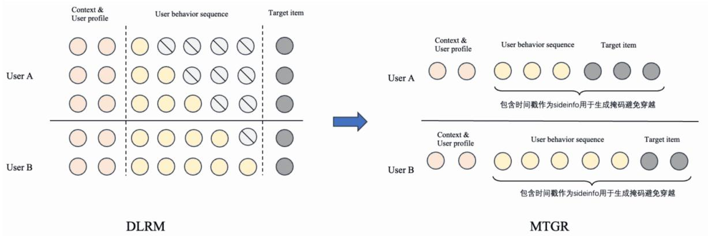

 用户粒度样本压缩：传统 DLRM 为每个（用户, 候选物品）对创建一行样本，导致同一用户特征被重复编码。MTGR 将同一用户在一个时间窗口内的所有曝光候选物品聚合为一个样本，极大减少了数据冗余，为后续的计算复用打下基础。  
 保留交叉特征：MTGR 将交叉特征作为候选物品的一部分进行嵌入和编码，确保了关键信息不丢失。消融实验表明，移除交叉特征会导致性能大幅下降，甚至抵消模型扩大带来的收益。

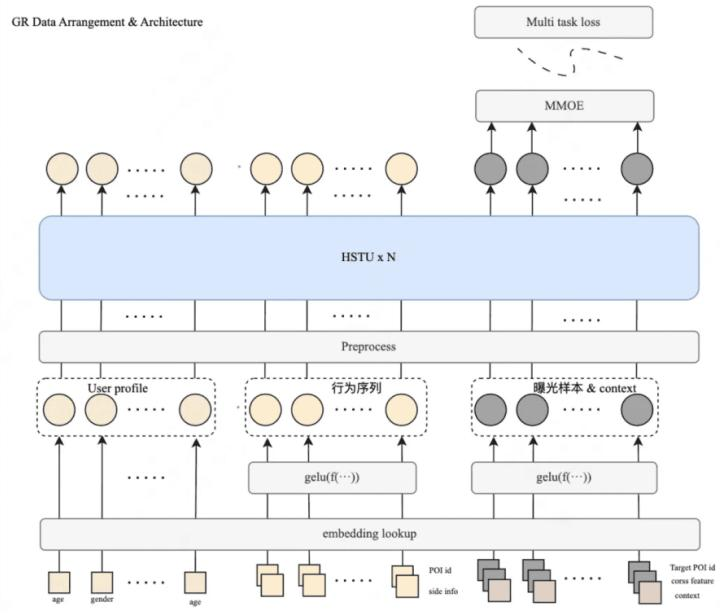

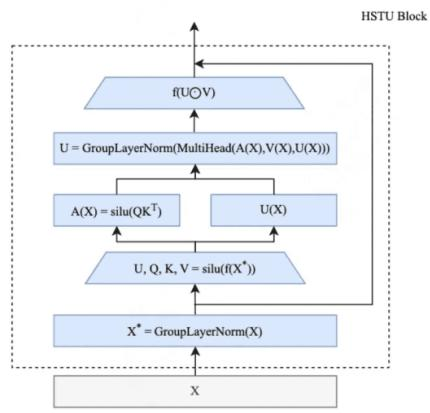

# 模型架构与关键组件

MTGR 采用改进的 HSTU 架构作为主干网络，并引入了两项核心创新 ：

 Group LayerNorm：针对推荐数据中不同特征（用户画像、历史行为、候选物品）语义空间不同的问题，MTGR 对不同类型的特征分组进行 LayerNorm，使用不同的参数进行归一化，这促进了不同语义空间下 Token 的对齐，提升了模型的表示能力。  
动态混合掩码策略：为防止信息泄露，MTGR 设计了精细的掩码策略。

 静态历史特征（用户画像、长期行为序列）：全局可见。  
 当日实时行为：遵循因果关系，每个 Token 仅对出现在其之后的 Token 可见。  
 候选物品：仅对自身可见。

这种策略确保了在复杂的外卖 Feed 流场景下建模的因果正确性。

# ① 工程实现：训练与推理优化

为了支撑千亿参数级别模型的大规模分布式训练与高效部署，美团构建了 MTGR-Training 和 MTGR-Inference 引擎。

 MTGR-Training 训练引擎：基于 TorchRec 构建，并进行了多项深度优化。

 动态哈希表：解决了流式训练中不断涌现的新用户和新物品的嵌入分配问题，避免了固定嵌入表的内存浪费或溢出风险。  
 变长序列负载均衡：根据用户序列的实际长度动态调整每个 GPU 的 batch size，使计算负载均衡，避免了因序列长尾分布导致的计算等待。  
 定制化计算内核：借鉴 Flash-Attention 思想，手写了融合的 HSTU 计算内核，支持变长序列输入且无需 padding，显著提升了计算效率。

 MTGR-Inference 推理引擎：尽管单样本计算量（FLOPs）增加了 65 倍，但凭借用户粒度样本压缩带来的计算复用，MTGR 通过 TensorRT 图优化、FP16 量化、合并传输（H2D）等技术，最终实现了推理资源节省 $12 \%$ 的效果。

# ① 实际业务收益

MTGR 在美团业务中取得了显著成效，并验证了推荐系统中的缩放定律 ：

 效果提升：离线核心指标CTCVR GAUC 提升2.88个百分点。在线 A/B测试显示，外卖首页列表订单量提升 $1 . 2 2 \%$ ，这是近两年单次迭代的最大收益。  
 验证缩放定律：通过设计 Small、Middle、Large 三种规模的模型，MTGR 清晰地展示了随着模型参数和计算量的增加，推荐效果持续提升的幂律关系，为后续发展指明了方向。

# 面试题：快手生成式推荐 OneRec 模型原理介绍

快手OneRec 是一种突破性的生成式推荐模型，其核心原理在于通过统一的端到端架构替代传统多阶段推荐流程，结合会话级生成与偏好对齐技术实现推荐系统的范式革新。

链接 OneRec: Unifying Retrieve and Rank with Generative Recommender and Preference Alignment

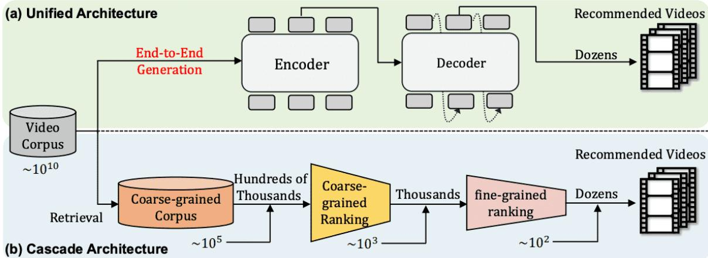

# 一、核心技术原理

# 1. 端到端生成架构

OneRec 采用 Encoder-Decoder 结构，直接输入用户历史行为序列（如观看、点赞记录），一次性输出完整推荐列表（Session）。

相比传统"召回→粗排 精排"级联架构，省去多阶段候选集筛选过程，消除信息传递损耗。

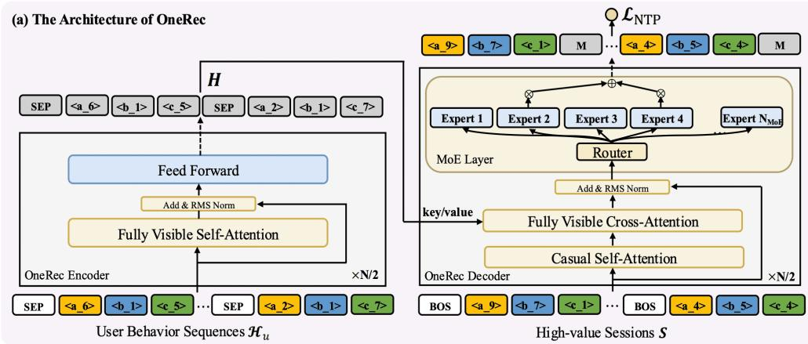

# 2. 语义 ID 表征体系

 通过残差量化编码将多模态视频特征转化为离散语义 ID，通过 Balanced K-means 算法避免传统 K-means 的"沙漏现象"。  
 视频特征经过层次化残差量化后生成形如[153,4092,7215]的语义 ID，分别对应【粗粒度类别 内容主题 $\xrightarrow { }$ 细粒度特

征】。

 输入序列组织为[BOS]分隔的多层级 token，增强上下文建模能力。

Algorithm 1: Balanced K-means Clustering  
Input: Item set $\mathcal{V}$ , number of clusters $K$ 1 Compute $w \gets |\mathcal{V}| / K$ 2 Initialize centroids $C_l = \{c_1^l, \dots, c_K^l\}$ with random selection;  
3 repeat  
4 Initialize unassigned set $\mathcal{U} \gets \mathcal{V}$ 5 for each cluster $k \in \{1, \dots, K\}$ do  
6 Sort $\mathcal{U}$ by ascending distance from centroid $c_k^l$ ;  
7 Assign $\mathcal{V}_k \gets \mathcal{U}[0 : w - 1]$ ;  
8 Update centroid $c_k^l \gets \frac{1}{w} \sum_{r^l \in \mathcal{V}_k} r^l$ ;  
9 Remove assigned items $\mathcal{U} \gets \mathcal{U} \setminus \mathcal{V}_k$ ;  
10 end  
11 until Assignment convergence;  
Output: Optimized codebook $C_l = \{c_1^l, \dots, c_K^l\}$

# 3. 混合专家扩展（MoE）

 在 Decoder 层引入稀疏 MoE 机制：前馈网络替换为 $_ { \mathsf { N } } = 2 4$ 个专家网络，每个 token 仅激活 Top-2 专家（计算量仅线性增加）。  
 通过负载均衡损失防止专家坍缩。

# 二、生成机制创新

# 1. 会话级生成策略

 定义标准：生成 5-10 个视频组成的 Session，需满足观看数≥5、总时长超阈值、存在互动行为  
 解码控制：

 温度采样策略：首视频温度系数 $\scriptstyle \mathtt { T } = 0 . 8$ （确定性高），末视频 $\tau { = } 1 . 2$ （探索性强）  
 多样性掩码：限制同类型视频重复出现概率

# 2. 迭代偏好对齐（Iteative Preference Alignment, IPA）

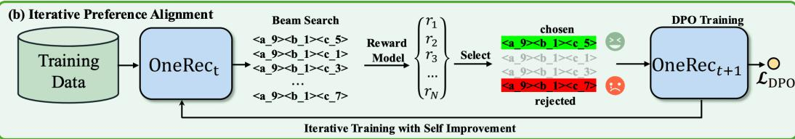

分两阶段优化生成质量：

 基础训练：最小化会话级 NTP (next token prediction)损失

$$
L _ {N T P} = - \sum_ {t = 1} ^ {T} \log P (x _ {t} | x _ {<   t})
$$

#  DPO 微调：

 奖励模型设计：多目标预测观看时长、完播率、点赞率等，结构采用 Self-Attention 融合会话特征  
 硬负采样：通过 Beam Search 生成候选，选择相似度 0.4-0.6 区间样本构建偏好对( $S _ { u } ^ { w } , S _ { u } ^ { l } )$   
 偏好优化公式：

$$
L _ {D P O} = - \log \mathfrak {Q} (\mathfrak {F} (\log \frac {\pi_ {\mathfrak {f}} (S ^ {w})}{\pi_ {\mathfrak {r e f}} (S ^ {w})} - \log \frac {\pi_ {\mathfrak {f}} (S ^ {l})}{\pi_ {\mathfrak {r e f}} (S ^ {l})}))
$$

# 三、工程优化策略

# 1. 训练体系

 混合精度训练：采用 bfloat16 格式，GradScaler 损失缩放系数初始值 8192  
 分阶段解冻：先训练语义 ID 层 解冻 MoE 层 联合优化 DPO 目标

# 2. 在线部署推理优化

 KV 缓存分块：内存占用降低 $6 3 \%$   
 MoE路由引擎：TensorRT 实现专用推理加速  
 动态早停机制：设置置信度阈值提前终止低质量候选

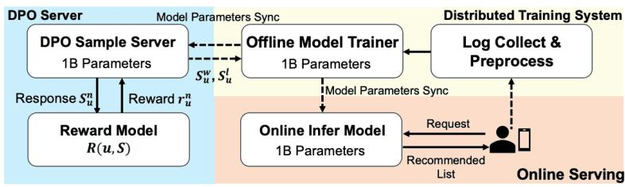  
Figure 3: Framework of Online Deployment of OneRec.

# 四、实验效果验证

Table 2: The absolute improvement of OneRec compared to the current multi-stage system in the online A/B testing setting.   

<table><tr><td>Model</td><td>Total Watch Time</td><td>Average View Duration</td></tr><tr><td>OneRec-0.1B</td><td>+0.57%</td><td>+4.26%</td></tr><tr><td>OneRec-1B</td><td>+1.21%</td><td>+5.01%</td></tr><tr><td>OneRec-1B+IPA</td><td>+1.68%</td><td>+6.56%</td></tr></table>

该模型在快手在线 AB 测试中，参数规模达 1B 时推理成本仅增加 $7 \%$ ，验证了工业级可行性。

当前局限主要在于低活跃用户场景表现不足，未来计划引入多模态特征增强冷启动

# 面试题：快手生成式推荐 OneRec V2 技术原理介绍

标题：OneRec-V2 Technical Report

链接：https://arxiv.org/pdf/2508.20900

# 1 提出背景：解决 OneRec V1的扩展性与效率瓶颈

OneRec-V1 作为快手端到端生成式推荐系统的初步尝试，采用了 Encoder-Decoder 架构，虽然相比传统级联推荐系统有显著改进，但在实际工业部署中仍面临两个核心挑战：

 计算资源分配严重低效：在 Encoder-Decoder 架构中，高达 97.66%的计算资源被用于处理非常长的用户行为序列（编码阶段），而非直接用于生成目标推荐项（解码阶段）。  
 强化学习方法的固有局限：V1 依赖一个额外的奖励模型来提供强化学习信号，这带来了两方面问题：

 采样效率有限（Sampling Efficiency），因为计算奖励需要额外开销，只能对部分用户样本进行近似；  
 奖励黑客问题（Reward Hacking），即模型可能学会利用奖励函数的设计缺陷来获得高分，而非真正学习到符合用户偏好的行为。

# 2 核心创新点

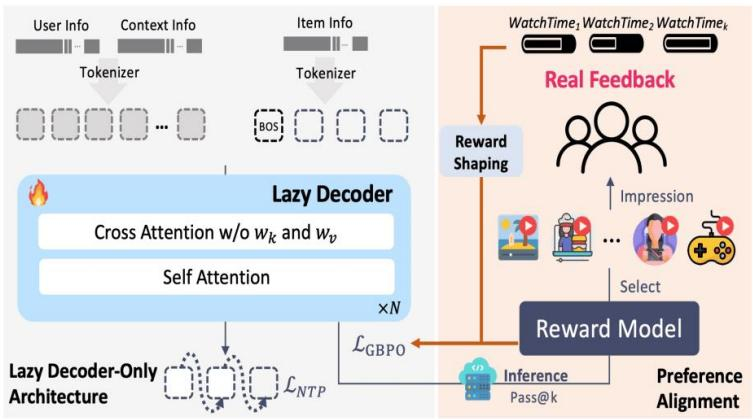

# 2.1 Lazy Decoder-Only 架构

V2 彻底移除了独立的 Encoder 部分，将其重构为一个 Lazy Decoder-Only 架构。其核心思想在于将用户的历史行为序列视为静态的上下文条件（Context），直接输入给 Decoder，而无需先经过一个庞大的 Encoder 进行编码。

 样本组织：采用 New Impression Only 方式。按曝光组织样本，只在 Target Item 上进行 next token prediction，避免了信息泄漏，并支持流式更新。  
 Context Processor（上下文处理器）：

 这是一个轻量化的模块，负责将异构的用户特征（静态特征、短期行为、长期行为）处理成统一的表示。  
 它使用分组共享策略（Group-Sharing）和分组查询注意力（GQA）来极大减少 Key-Value（KV）缓存的数量和计算量。

 Lazy Decoder Block：

 其“Lazy”（惰性）体现在对上下文 Key-Value 对的极致复用上。  
 传统的Cross-Attention中，K和V需要每层通过线性变换从上下文序列中投影得到。Lazy Decoder 移除了这些投影层，直接使用 Context Processor产生的统一 KV对，供所有 Decoder层共享。这意味着上下文只需计算一次，后续所有层和所有生成步骤都复用这一结果，避免了重复计算。

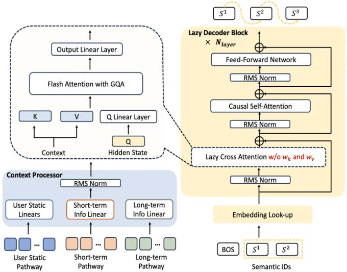

# 2.2 基于真实用户交互的偏好对齐

V2 摒弃了依赖奖励模型代理信号的做法，转向直接利用真实世界的用户反馈信号来进行偏好对齐。

 时长感知奖励塑造（Duration-Aware Reward Shaping）：

 直接使用播放时长作为奖励信号存在偏差（长视频天然时长更长）。  
 V2的解决方案是按视频时长分桶，对于一个视频，只有其播放时长在其所属的时长分桶中排名前 $2 5 \%$ ，才被认定为正样本。这样能更好剥离时长偏差，反映内容质量。

 自适应比率裁剪与 GBPO 算法 ：

 V2 提出了梯度有界策略优化（Gradient-Bounded Policy Optimization, GBPO）算法。  
 GBPO 不再使用粗暴的梯度裁剪（Clip），而是引入二元交叉熵（BCE）损失的梯度来动态约束和稳定 RL 训练的梯度，特别是在处理负样本（低奖励样本）时，能有效防止梯度爆炸和训练不稳定。

3 OneRec V2 与 V1 的对比  

<table><tr><td>对比维度</td><td>OneRec-V1</td><td>OneRec-V2</td><td>改进点总结</td></tr><tr><td>模型架构</td><td>Encoder-Decoder</td><td>Lazy Decoder-Only</td><td>移除 Encoder，计算集中于 Target Decoding</td></tr><tr><td>Scaling能力</td><td>受编码器瓶颈限制，难以扩展</td><td>支持扩展至 8B 参数（MoE 版 4B/0.5B 激活）</td><td>参数规模大幅提升，更遵循 Scaling Law</td></tr><tr><td>Cross-Attention</td><td>标准 Cross-Attention（每层计算 KV）</td><td>Lazy Cross-Attention（共享静态 KV）</td><td>移除 KV 投影层，复用 KV，内存和计算开销大幅降低</td></tr><tr><td>RL信号来源</td><td>依赖奖励模型（Reward Model）</td><td>直接使用真实用户反馈（如播放时长）</td><td>避免 Reward Hacking，信号更直接、稳定。</td></tr><tr><td>Reward设计</td><td>代理奖励（Proxy Reward）</td><td>时长感知奖励塑造（分位数归一化）</td><td>消除视频时长偏差，奖励更准确反映内容质量。</td></tr><tr><td>RL算法</td><td>ECPO（早期梯度裁剪）</td><td>GBPO（梯度有界，全样本利用）</td><td>训练更稳定，不丢弃负样本，鼓励多样化探索。</td></tr><tr><td>线上效果(主站)</td><td>停留时长 +0.269%</td><td>停留时长+0.467%，LT7+0.069%</td><td>核心用户指标提升显著。</td></tr></table>

# 面试题：快手生成式回归观看时长建模方案解析(WWW2025)

以下为快手团队提出的生成式回归观看时长建模方案（Generative Regression, GR）的技术解析，论文发表于

WWW2025Generative Regression Based Watch Time Prediction for Short-Video Recommendation

# 一、技术原理

# 1. 问题背景

 长尾分布：观看时长分布跨度大（0.1s~600s），直接回归易受极端值干扰  
 序关系敏感：预估误差相同时，高估比低估对推荐质量影响更大（如预测 3.5s vs 真实 3s优于预测2.5s）  
离散化偏差：传统序数回归（Ordinal Regression, OR）依赖固定分桶（如 CREAD/TPM），导致：

 桶边界人工设定敏感（e.g., 5s/10s 分界处预测跳变）  
 桶间条件依赖未被建模（e.g., 看完 10s 必然包含看完 5s）

# 2. GR 模型原理

核心思想：将连续值预测重构为条件依赖的序列生成任务，通过动态词汇表实现无损重建。

# 数学形式化表达：

连续值分解：观看时长 y 分解为时间槽序列 $\mathbf { s } = \{ s _ { 1 } , s _ { 2 } , \ldots , s _ { k } \}$ ，满足：

$$
y = \sum_ {i = 1} ^ {k} s _ {i}, \quad s _ {i} \in \mathcal {V}
$$

，其中 为动态构建的词汇表（每个 token 表示固定时长，如 5s、10s）

词汇表构建算法（动态百分位衰减）：

创新点：通过残差迭代和百分位衰减，平衡词汇表完整性 （覆盖长尾）与平衡性 （token 频率均匀）

```txt
输入：观看时长数据集Y，初始百分位q_start，衰减率α  
while reconstruction_error > ε:  
    z = percentile(Y, q) # 计算当前分位数值  
    if z == 0: break  
    V.append(z) # 添加新 token至词汇表  
    Y = [y - z if y > z else y for y in Y] # 更新残差  
    q = max(q * α, q_end) # 衰减百分位 
```

#  标签编码与解码：

 编码原则：

 正确性： $\left| y - \sum s _ { i } \right| < \delta$ （ 为重建误差阈值）  
k =arg min |sl 最短序列： k

 单调性： $s _ { i } \geq s _ { i + 1 }$ （降序排列减少搜索空间）

 贪心编码：从最大 token 开始匹配，逐步逼近目标值

#  模型架构：

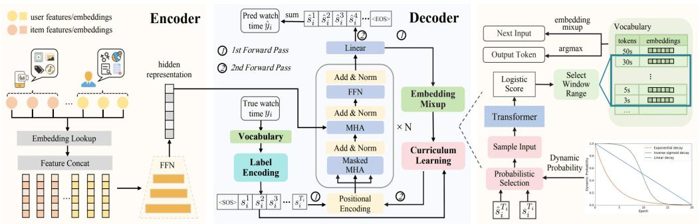  
Figure 2:Theframework of the GR model, whichadopts anencoder-decoderarchitecture.The encoder extracts userand videofeatures,whilethedecoderpredicts watch timeinanautoregresive mannerandemploysthecuriculumlearningwith embedding mixup (CLEM) strategyto alleviate training-and-inference inconsistency introduced by teacher forcing.

# 编码器-解码器结构：

 Encoder：FFN 提取用户/视频特征 $\mathbf { h } = \mathrm { F F N } ( \mathbf { x } _ { \mathrm { u s e r } } , \mathbf { x } _ { \mathrm { i t e m } } )$

（设计依据：观看时长预测不依赖历史行为序列， 故无需 RNN）

 Decoder：Transformer 自回归生成 token 序列：

$$
\mathbf {c} _ {t} = \operatorname {T r a n s f o r m e r} ([ \mathbf {s} _ {t - 1}; \mathbf {h} ], \mathbf {c} _ {t - 1})
$$

$$
P \left(s _ {t} \mid \mathbf {s} _ {<   t}\right) = \operatorname {S o f t m a x} \left(\mathbf {W c} _ {t} + \mathbf {b}\right)
$$

# 创新点：引入课程学习与嵌入混合（CLME）

gt 动态采样率：训练初期用真实标签 作为输入，后期逐步切换为模型预测 $\hat { \bf s } _ { t - 1 }$

 嵌入混合： $\mathbf { e } _ { t } = \beta \cdot \mathbf { e } ( \mathbf { s } _ { t - 1 } ^ { \mathrm { g t } } ) + ( 1 - \beta ) \cdot \mathbf { e } ( \hat { \mathbf { s } } _ { t - 1 } )$

（ $\beta$ 随训练轮次衰减，缓解 Teacher Forcing 导致的曝光偏差）

#  损失函数：多任务联合优化 Loss

$$
\mathcal {L} = \underbrace {\sum_ {t = 1} ^ {k} \mathrm {C E} (s _ {t} , \hat {s} _ {t})} _ {\text {序 列 分 类 损 失}} + \lambda \underbrace {\mathrm {H u b e r} (y , \sum \hat {s} _ {t})} _ {\text {连 续 值 回 归 损 失}}
$$

（Huber 损失增强对异常值的鲁棒性）

# 二、实验效果：离线与在线评估

# 1. 离线实验

Table 1: Performance comparison among different approaches on KuaiRec, CIKM16 and Indust dataset.   

<table><tr><td rowspan="2">Method</td><td colspan="3">KuaiRec (watch time)</td><td colspan="3">KuaiRec (watch ratio)</td><td colspan="3">CIKM16</td><td colspan="2">Indust</td></tr><tr><td>MAE ↓</td><td>XAUC ↑</td><td>XAUC Improv.</td><td>MAE ↓</td><td>XAUC ↑</td><td>XAUC Improv.</td><td>MAE ↓</td><td>XAUC ↑</td><td>XAUC Improv.</td><td>MAE ↓</td><td>XAUC ↑</td></tr><tr><td>VR</td><td>7.634</td><td>0.534</td><td>-</td><td>0.385</td><td>0.691</td><td>-</td><td>1.039</td><td>0.641</td><td>-</td><td>46.343</td><td>0.588</td></tr><tr><td>WLR [5]</td><td>6.047</td><td>0.545</td><td>2.059%</td><td>0.375</td><td>0.698</td><td>1.013%</td><td>0.998</td><td>0.672</td><td>4.836%</td><td>-</td><td>-</td></tr><tr><td>D2Q [42]</td><td>5.426</td><td>0.565</td><td>8.757%</td><td>0.371</td><td>0.712</td><td>3.039%</td><td>0.899</td><td>0.661</td><td>3.120%</td><td>-</td><td>-</td></tr><tr><td>CWM [44]</td><td>3.452</td><td>0.580</td><td>8.614%</td><td>0.368</td><td>0.725</td><td>4.920%</td><td>0.891</td><td>0.662</td><td>3.276 %</td><td>-</td><td>-</td></tr><tr><td>TPM [23]</td><td>3.456</td><td>0.571</td><td>6.929%</td><td>0.361</td><td>0.734</td><td>6.223%</td><td>0.850</td><td>0.676</td><td>5.460%</td><td>41.486</td><td>0.593</td></tr><tr><td>CREAD [31]</td><td>3.307</td><td>0.594</td><td>11.236%</td><td>0.369</td><td>0.738</td><td>6.802%</td><td>0.865</td><td>0.678</td><td>5.772%</td><td>39.979</td><td>0.597</td></tr><tr><td>GR (ours)</td><td>3.196</td><td>0.614</td><td>14.981%</td><td>0.333</td><td>0.753</td><td>8.972%</td><td>0.815</td><td>0.691</td><td>7.80%</td><td>38.528</td><td>0.604</td></tr></table>

eret opposite.Eachexperimentisrepeated5timesandtheaverageisreported.

MAE：平均绝对误差（秒），反映点预估精度。 XAUC：组间序一致性，衡量推荐列表质量

# 2. 在线 A/B Test

Table 2: Performance gain on online A/B testing.   

<table><tr><td rowspan="3">A/B test</td><td>APP Usage Time</td><td>+0.112% (p-value=0.01)</td></tr><tr><td>Average App Usage Per User</td><td>+0.087%</td></tr><tr><td>Video Consumption Time</td><td>+0.129%</td></tr></table>

In a stable video recommendation system, a $\mathbf { 0 . 1 \% }$ increase is significant.

总结：GR模型通过序列生成范式重构连续值预测，解决了传统方法的离散化偏差与序关系建模问题。其动态词汇表构建、课程学习策略及联合损失函数，在精度与工程效率间取得突破性平衡。

# 面试题：谷歌生成式推荐 TIGER 模型介绍

以下是谷歌生成式推荐模型 TIGER（Transformer Index for Generative Recommenders）的原理详解，综合其核心创新、技术实现及优势：

论文链接：https://arxiv.org/pdf/2305.05065

# 一、核心范式突破

TIGER提出了一种全新的生成式检索推荐范式，取代了传统推荐系统中“双塔模型 $\cdot ^ { + }$ 近似最近邻（ANN）搜索”的两阶段流程。

其核心思想是：通过自回归解码直接生成候选物品的语义 ID，而非依赖向量空间相似度匹配。这种范式将 Transformer 模型的参数视为隐式索引，实现端到端的推荐系统架构。

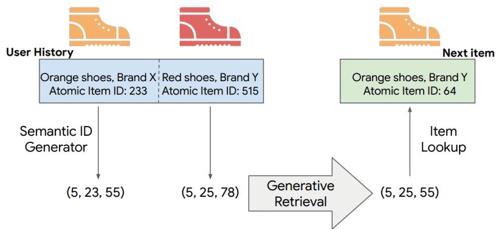

# 二、关键技术实现

# 1. 语义 ID 生成（Semantic ID）

目标：将物品内容信息（如文本描述）转化为层次化、可解释的标识符序列，使语义相似的物品具有重叠 ID 结构。

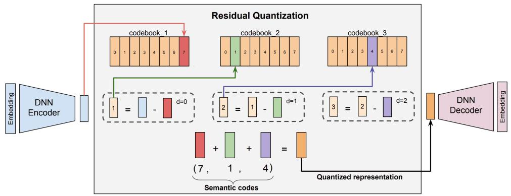

实现步骤：

1. 内容编码：使用预训练文本编码器（如 Sentence-T5 或 BERT）将物品文本描述映射为稠密向量 $x \square { \mathsf { R } } d _ { \circ }$   
2. 残差量化（RQ-VAE）：通过多级残差量化生成离散码字序列：

 编码与残差计算：编码器将 $x$ 映射为潜在表示 z，初始残差 $r _ { 0 } = z$   
 逐级量化：

 在每级 $d$ （共 $m$ 级）：从码本 $C _ { d }$ 中选取最邻近码字 $c _ { d } = \arg \operatorname* { m i n } _ { \boldsymbol { k } } | | \boldsymbol { r } _ { d } - \boldsymbol { e } _ { \boldsymbol { k } , d } | | ^ { 2 }$   
 更新残差 ${ \boldsymbol { r } } _ { d + 1 } = { \boldsymbol { r } } _ { d } - { \boldsymbol { e } } _ { c _ { d } , d }$

 重构与训练：量化后的表示

$$
\hat {z} = \sum_ {d = 0} ^ {m - 1} e _ {c _ {d}, d}
$$

输入解码器重构 $x$ ，损失函数包括重构损失和量化损失：

$$
L = \left\| x - \operatorname {D e c o d e r} (\hat {z}) \right\| ^ {2} + \beta \sum_ {d = 0} ^ {m - 1} \left\| \operatorname {s t o p} _ {-} \operatorname {g r a d i e n t} (r _ {d}) - e _ {c _ {d}, d} \right\| ^ {2} \tag {β=0.25}
$$

3. 碰撞处理：若多个物品映射到同一语义 ID，则在末尾追加唯一标识符（如哈希值）。

# 特点：

 层次化结构：高层码字表示粗粒度类别（如“美妆”），底层细化到子类（如“口红”）  
 语义泛化：相似物品 ID 前缀重叠，支持知识迁移

# 2. 生成式推荐模型

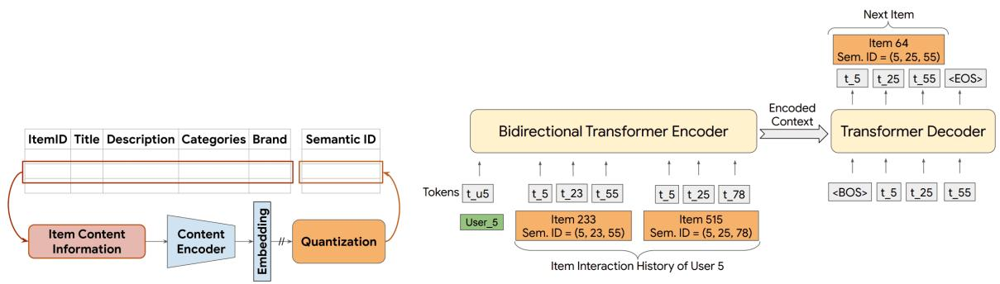  
(a) Semantic ID generation for items using quantization of content embeddings.   
(b) Transformer based encoder-decoder setup for building the sequence-to-sequence model used for generative retrieval.

# 模型架构：

 输入：用户历史交互序列 $\{ i _ { 1 } , i _ { 2 } , \ldots , i _ { t } \}$ ，每个物品 i 的语义 ID 展开为序列 $( c _ { 0 } ^ { ( i ) } , c _ { 1 } ^ { ( i ) } , \ldots , c _ { m - 1 } ^ { ( i ) } )$   
结构：基于 T5 的编码器-解码器 Transformer：

 编码器：处理用户历史序列，捕捉行为模式

 解码器：自回归生成目标物品的语义 ID 码字序列

# 训练与推理：

 训练目标：最大化目标码字的对数似然（交叉熵 Loss）  
 推理优化：

 Beam Search：生成 Top-K 候选 ID 序列  
 有效性过滤：剔除未注册的无效ID

# 三、核心优势

# 1. 内存效率：

 传统双塔模型需存储十亿级物品嵌入表（约 TB 级），TIGER 仅需维护小型码本（MB 级）  
 语义 ID 空间为 Km（ $\kappa$ 为码本大小， $m$ 为层级数），可覆盖百亿物品

# 2. 冷启动优化：

 新物品通过内容特征生成语义 ID，无需交互数据即可被推荐  
 语义碰撞（不同物品共享部分 ID）具有意义，缓解长尾问题

# 3. 性能优势：

 在 Amazon 数据集上，Recall@10 和 NDCG@10 指标超越 SOTA 模型（如 P5、Caser） $20 \small { - } 3 0 \%$   
 支持多样性控制：通过调整 Beam Search 宽度和温度参数平衡相关性与多样性

4. 可解释性：语义 ID 的层次结构提供推荐理由（如“运动鞋 跑步鞋 缓震系列”）

四、与传统范式的对比  

<table><tr><td>维度</td><td>传统双塔+ANN</td><td>TIGER生成式检索</td></tr><tr><td>索引方式</td><td>显式嵌入索引</td><td>Transformer参数隐式索引</td></tr><tr><td>检索逻辑</td><td>内积/余弦相似度</td><td>自回归语义ID生成</td></tr><tr><td>可扩展性</td><td>新增物品需重训练</td><td>动态生成新物品ID</td></tr><tr><td>内存消耗</td><td>高（TB级嵌入表）</td><td>低（MB级码本）</td></tr><tr><td>冷启动</td><td>依赖哈希或随机初始化</td><td>基于内容语义自然融入</td></tr></table>

面试题：Meta 的 SUM 模型如何进行用户表征学习？

Meta 的 SUM（Scaling User Modeling）模型是一种针对大规模在线广告个性化设计的用户表征框架，其核心目标是通过高效的嵌入学习和实时更新机制，解决传统推荐系统中的特征冗余、数据稀疏及模型定制化等问题。

# 一、提出的背景

# 业务需求与系统复杂性

Meta 的广告系统包含数百个不同规格的排序模型，每天需处理数千亿次用户请求。传统方法中，每个模型独立学习用户表征，导致以下问题：

 次优表征：模型独立学习用户特征时效果较差，难以捕捉全局用户兴趣；  
 特征冗余：不同模型重复处理相似用户特征，造成存储和计算资源浪费（如存储开销增加 $40 \%$ ）；  
 数据稀疏性：小众领域模型因训练数据不足，难以深入理解用户行为。

# 2. 工程约束

在线广告系统对延迟（如 30ms内响应）和吞吐量（千亿级请求）的严苛要求，限制了模型复杂性和实时更新能力。

# 二、解决的问题

SUM框架旨在：

 统一用户表征共享：通过上游模型生成紧凑的用户 embedding 嵌入，供下游数百个广告模型复用，避免重复特征处理；  
 动态特征适应：实时更新用户 embedding 以响应用户行为变化（如新用户 ID 引入）；  
平衡模型性能与效率：在有限延迟预算下，支持复杂用户建模。

# 三、核心创新点

# 1. 分层特征压缩与残差学习

 用户塔金字塔架构：通过多级交互模块（Interaction Module）逐步压缩上千维稀疏特征，结合残差连接保留原始信息（如稀疏 ID 特征压缩为低维密集嵌入）；  
 混合塔轻量化设计：仅接收用户塔输出的嵌入与广告特征交互，避免重复输入原始用户数据。

# 2. 异步在线服务系统（SOAP）

 写入-读取分离：用户请求触发 embedding 实时生成并存储，客户端异步读取历史 embedding，绕过复杂模型的延迟瓶颈；  
 缓存与动态更新：高频用户 embedding 缓存减少重复计算，同时支持用户特征动态更新（如每数小时循环训练）。

# 3. 多任务联合优化

结合点击率（CTR）、转化率（CVR）等多目标损失函数，动态调整任务权重以适配不同业务场景。

# 四、模型原理详解

# 1. 模型架构

SUM 基于双塔 DLRM 架构，分为用户塔（User Tower）和混合塔（Mix Tower）：

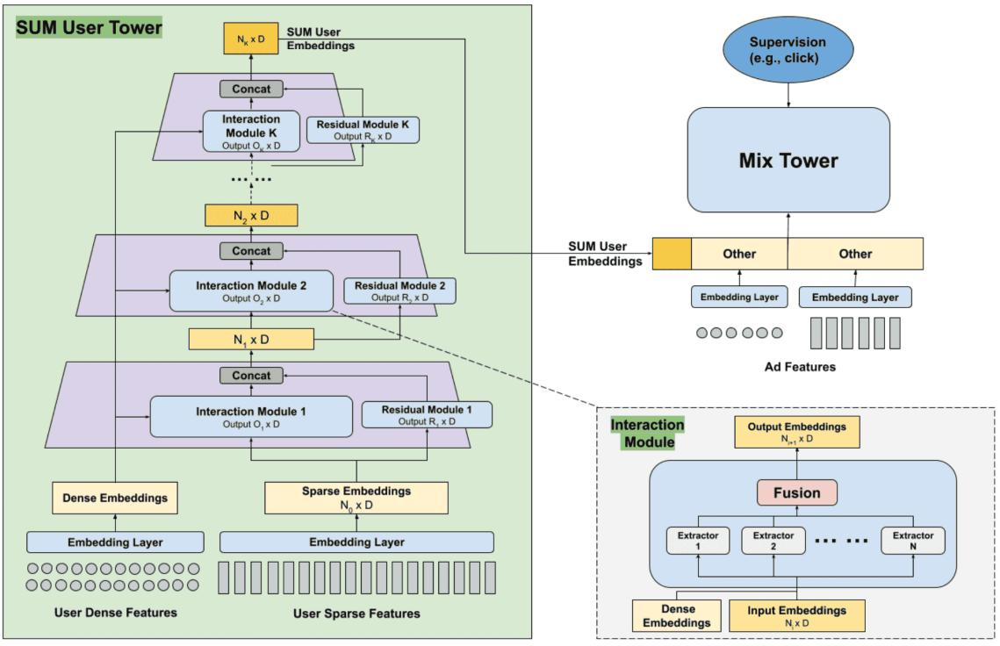

# 用户塔：

 输入特征处理：用户稀疏特征（如 ID、页面访问记录）和密集特征（如点击频率）分别嵌入后融合；  
 交互模块堆叠：通过金字塔结构逐步压缩特征（例如从1000维稀疏特征 $\multimap$ 维密集嵌入），每个模块包含注意力压缩、残差连接和多层感知机（MLP）；  
 输出：生成低维统一用户嵌入（如多个 32 维向量）。

# 混合塔：

 跨模态交互：将用户嵌入与广告特征输入深层交叉网络（DCN）或MLP-Mixer，捕捉高阶特征交互（如用户兴趣与广告内容的匹配度）；  
 监督信号：通过多任务交叉熵损失优化广告点击率等目标。

# 2. 训练与推理机制

增强循环训练：定期用平均池化聚合用户近期行为，更新嵌入以应对数据分布漂移；  
 在线推理（SOAP）：仅部署用户塔进行实时嵌入生成，混合塔离线预计算，确保 30ms 内响

# 总结：

SUM 通过分层特征压缩、异步服务系统和多任务联合优化，解决了大规模广告系统中用户表征共享与动态更新的核心难题，兼顾模型性能与工程效率，成为 Meta 广告生态的核心基础设施

面试题：Meta 的 HSTU 架构如何进行生成式推荐？

Meta 的 HSTU（Hierarchical Sequential Transduction Units）模型是一种面向生成式推荐系统的新型架构，旨在解决传统深度学习推荐模型（DLRMs）在工业级场景中的关键瓶颈问题。HSTU将推荐问题重新表述为序列转导任务，统一了 DLRMs中的异构特征空间，使检索和排序任务能以生成式方式训练，提高了训练效率和模型性能。

论文链接：https://arxiv.org/pdf/2402.17152

# 一、HSTU 的核心原理

# 1. 层次化序列转导设计

HSTU通过分层堆叠的序列处理单元统一推荐系统的异构特征空间，将用户行为序列（如点击、购买等）建模为生成式任务。其核心模块包括：

 点式投影（Point-wise Projection）：将输入特征映射到低维空间，消除特征异质性。  
空间聚合（Spatial Aggregation）：采用改进的点式聚合注意力机制 （非 Softmax），通过归一化因子动态捕捉用户偏好强度，避免传统注意力对非平稳词汇的敏感性问题。  
点式变换（Point-wise Transformation）：结合 SiLU 激活函数和残差连接，提升非线性表达能力。

# 2. 动态词汇与稀疏性优化

 非平稳词汇适配：传统推荐系统需处理数十亿级动态变化的候选内容（如新商品、短视频），HSTU通过随机长度算法动态截断用户行为序列，在保持模型性能的同时减少 $3 0 \% - 5 0 \%$ 的计算量。  
 GPU 内核融合：将注意力计算转化为分组矩阵乘法（GEMMs），优化内存访问模式，相比基于 FlashAttention2 的Transformer 提速 5.3-15.2 倍。

# 3. 生成式训练范式

 序列化特征统一：将分类特征（如用户ID、商品ID）压缩为单一主时间序列，舍弃传统 DLRMs 中难以序列化的数值特征（如点击率统计），通过模型自身能力隐式捕获 dense特征信息。  
因果自回归建模：将召回和排序任务统一为序列生成问题，输入为用户历史行为序列，输出为候选内容概率分布，支持多任务联合训练。

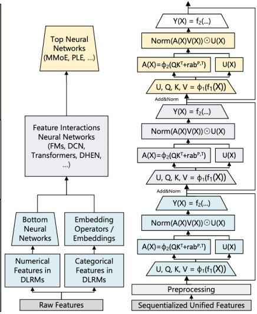

# 二、HSTU 解决的工业级推荐系统痛点

# 1. 特征结构缺失与异构性

传统 DLRMs 依赖人工设计特征交叉（如用户-商品 Embedding 拼接），而 HSTU 通过序列化建模自动统一异构特征（如高基数 ID、行为时序），消除特征工程复杂性

# 2. 动态词汇与计算成本

 动态候选库：传统模型需为新增内容重新训练 Embedding 表，HSTU 通过潜在空间映射直接生成候选表征，支持十亿级动态词汇的在线更新。  
 计算效率瓶颈：HSTU 的 M-FALCON 算法允许单次前向传播并行处理多个候选，在相同计算资源下支持模型复杂度提升 285 倍，推理吞吐量提高 1.5-2.99 倍。

# 3. 长序列建模与扩展性

 长序列处理：针对用户行为序列长度偏斜分布（部分用户历史行为达 8192 条），HSTU 通过分层稀疏注意力实现长程依赖捕获，相比传统 Transformer 内存占用降低 $60 \%$ 。  
 缩放定律验证：实验显示 HSTU 模型效果随参数量（最高 1.5T）和计算量呈幂律扩展，在广告推荐场景中，模型规模扩展至GPT-3级别时仍保持性能提升。

# 三、实际效果与意义

 性能指标：在公开数据集上，HSTU 的 NDCG@10 提升最高达 $6 5 . 8 \%$ ；Meta 内部广告推荐场景的在线 A/B 测试指标提升 $1 2 . 4 \%$ 。  
 范式革新：HSTU 首次验证了推荐系统遵循与 LLM 类似的缩放定律（Scaling Raw)，为构建万亿参数级推荐模型提供了方法论基础。

# 面试题：业界首创的生成式推荐 HSTU 原理详解（精读）

Meta 的 HSTU（Hierarchical Sequential Transduction Units）是工业级推荐系统的新一代创新架构，其设计旨在突破传统深度学习推荐模型（DLRM）的瓶颈。

HSTU 通过生成式重构、硬件感知架构和动态稀疏化，首次验证推荐系统的 Scaling Law，为万亿参数推荐模型提供可行路径。其意义不仅在于性能提升，更在于证明了推荐模型可像 LLM 一样通过堆叠计算持续进化，为下一代通用推荐基座模型奠定基础。

论文链接：Trillion-Parameter Sequential Transducers for Generative Recommendations

# 一、提出背景

# 1. 传统 DLRM 的局限性

 特征异构性：工业推荐系统依赖高基数（数十亿级）动态 ID 特征、数值特征（如 CTR）和序列特征，缺乏统一结构，难以高效建模。  
 计算瓶颈：用户行为序列长度可达 10万级，远超语言模型（通常≤8K），导致Transformer 的O(N2)注意力计算不可行。  
 模型扩展停滞：DLRM 依赖特征工程，参数规模在千亿级即饱和，无法受益于计算量增长（Scaling Law 失效）。

# 2. 生成式推荐（GR）的机遇

Meta 受 Transformer 启发，提出将推荐任务重构为序列生成问题 ：

 召回任务 预测下一个内容（Content）  
 排序任务 预测用户行为（Action）。

# 二、关键创新点

<table><tr><td>创新方向</td><td>核心技术</td><td>解决的核心问题</td></tr><tr><td>架构革新</td><td>HSTU分层序列转换单元</td><td>替代Transformer，支持超长序列建模</td></tr><tr><td>注意力机制</td><td>Pointwise聚合注意力（取代Softmax）</td><td>适应动态词表，捕获参与强度特征</td></tr><tr><td>稀疏性优化</td><td>随机长度采样+分组GEMM内核</td><td>提升长序列计算效率</td></tr><tr><td>推理加速</td><td>M-FALCON并行化候选集评估</td><td>降低285倍复杂度的推理延迟</td></tr><tr><td>训练策略</td><td>生成式训练（按用户序列长度采样）</td><td>复杂度从O(N3)降至O(N2)</td></tr></table>

# 三、模型原理

# 1. 特征统一与任务重构

#  特征编码 ：

 类别特征（如用户历史 Item）合并为主时间序列；

 数值特征（如 CTR）通过序列隐含捕获，显式删除以降低复杂度。

序列 $\mathbf { \Phi } = [ \phi _ { 0 } , a _ { 0 } , \phi _ { 1 } , a _ { 1 } , \dots , \phi _ { i } ]$ (:内容,ai：行为）

#  任务定义 ：

$\bigcirc$ 召回： $p \big ( \phi _ { i + 1 } \vert u _ { i } \big ) \ \xrightarrow { }$ 预测下一内容  
$\bigcirc$ 排序： $p \big ( a _ { i + 1 } \vert \phi _ { 0 } , a _ { 0 } , \ldots , \phi _ { i + 1 } \big ) \ \ldots$ 预测用户行为。

# 2. HSTU 核心结构

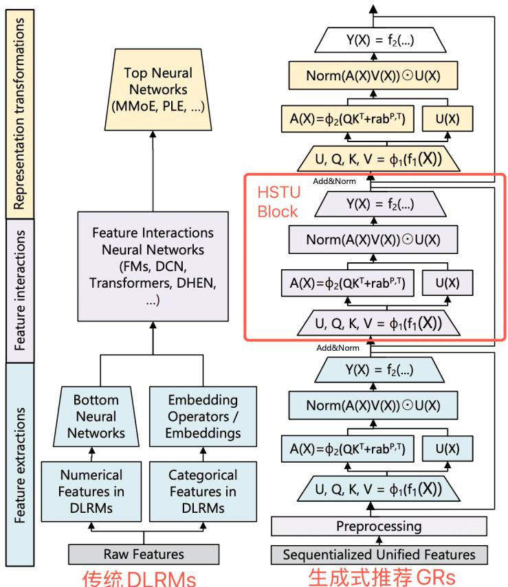  
Figure 3. Comparison of key model components: DLRMs vs GRs.

每层由三个子层构成（残差连接）：

 Pointwise 投影：对输入非线性变换，生成 $Q , K , V , U$

$$
[ Q, K, V, U ] = \operatorname {S i L U} (f _ {1} (X)) = \operatorname {S i L U} (W _ {1} X + b _ {1})
$$

 空间聚合：注意力权重与值交互

$\boldsymbol { A } ( \boldsymbol { X } ) = \mathrm { S i L U } \big ( \boldsymbol { Q } \boldsymbol { K } ^ { \intercal } + \boldsymbol { r } \boldsymbol { a } \boldsymbol { b } ^ { \boldsymbol { P } , T } \big )$ ，其中 $r a b ^ { P , T }$ 为位置-时间偏置编码

Pointwise 变换 ：

$$
\text {O u t p u t} = \text {L a y e r N o r m} (A (X) V (X)) \odot U (X)
$$

# HSTU 与传统 Transformer 区别 ：

 用 Pointwise 聚合替代 Softmax，避免归一化损失先验数据点数量信息；  
 引入门控权重 U 增强特征交互。

# 3. 关键优化技术（时间复杂度从 O(N²)降至 O(N)）

#  动态稀疏加载

 通过 seq_lens 指定每个 batch 的有效序列长度，跳过填充部分计算  
 Triton 内核根据 seq_lens 动态调整内存加载范围

#  分组 GEMM 融合

 使用 Triton 将 Q/K/V 投影合并为单次 GEMM，减少 GPU 内核启动次数  
 注意力计算与门控调制在同一个内核中完成，避免中间结果显存占用

随机长度采样（SL）：随机截取子序列，保持分布不变的同时降低平均长度

```python
工业级序列压缩（论文4.2节）  
def stochastic_length_sampleing(seq, max_len):  
    if len(seq) > max_len:  
        start = random.randint(0, len(seq) - max_len)  
        return seq[ start : start + max_len]  
    return seq
```

# 流式推理优化：减少 $8 3 \%$ CPU-GPU 通信开销

```python
使用 CUDA Graph 固化计算图  
graph = torch.cuda.CUDAGraph()  
with torch.cuda.graph(graph):  
    output = model(inputs, seqLens)
```

# 四、效果验证

<table><tr><td>评估维度</td><td>结果</td><td>对比基准</td></tr><tr><td>离线性能</td><td>NDCG提升65.8%（公开数据集）</td><td>超越SASRec等基线</td></tr><tr><td>计算效率</td><td>序列长8192时，训练提升5.3-15.2倍，推理提升5.6倍</td><td>FlashAttention-2</td></tr><tr><td>在线A/B测试</td><td>召回阶段+6.2%收益，排序阶段+12.4%收益</td><td>替代DLRM系统</td></tr><tr><td>Scaling Law</td><td>1.5万亿参数时持续提升，DLRM在2000亿饱和</td><td>验证推荐系统幂律特性</td></tr></table>

# 面试题：快手 UniDex 介绍，一种基于语义 ID 的新型倒排索引技术

 参考论文：https://arxiv.org/pdf/2509.24632  
 参考文章：https://mp.weixin.qq.com/s/e0-2svkQ2IaWT1u8LkzRDg  
 概要：快手提出的UniDex是一项对搜索引擎核心机制— 倒排索引— 进行彻底革新的技术。  
 核心思想：不再使用传统的关键词作为索引和检索的基本单位，而是利用大模型生成的语义 ID 来构建索引，让搜索系统能真正理解用户的意图，而不再只是进行字面匹配。  
 下表对比了传统搜索与 UniDex 的核心差异。

<table><tr><td>对比维度</td><td>传统关键词搜索</td><td>快手的UniDex</td></tr><tr><td>核心单位</td><td>词汇（Term）</td><td>语义ID</td></tr><tr><td>理解能力</td><td>依赖字面匹配，无法理解同义词、近义词</td><td>深度语义理解，能跨越词汇鸿沟</td></tr><tr><td>系统链路</td><td>复杂，依赖多路召回、同义词扩展等大量人工规则</td><td>简洁，统一由模型处理，大幅简化</td></tr><tr><td>资源消耗</td><td>高（存储、计算）</td><td>显著降低（响应速度提升25%，节省大量CPU和内存）</td></tr><tr><td>长尾查询处理</td><td>弱，依赖现有词表</td><td>强，基于语义泛化，效果显著改善</td></tr></table>

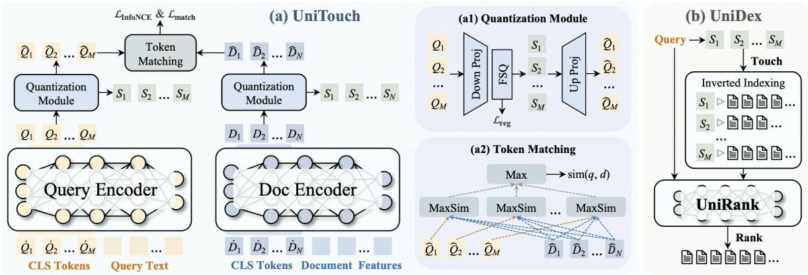

# ① 核心架构：两大模块的密切协作

UniDex 的成功关键在于其内部两个精密协作的核心模块：UniTouch（负责召回）和 UniRank（负责排序）。

#  UniTouch：语义召回

 UniTouch 的任务是将用户的查询（Query）和视频文档（Doc）映射到同一个语义空间中。它通过一个共享的编码器，为 Query 和 Doc 生成一组稠密的语义向量，然后通过创新的有限标量化（FSQ）技术，将这些连续向量离散化成一个个具体的、整数形式的语义 ID。例如，一个关于“猫咪”的视频和查询“可爱的猫”，即使字面不同，也可能被赋予相同或相似的一组语义ID。  
 在检索时，UniTouch采用 “Max-Max”匹配策略：只要用户Query产生的语义ID集合与视频 Doc 的语义ID集合中有一个能匹配上，该视频就会被召回。这很好地应对了用户查询意图的多样性。

#  UniRank：精排

 在 UniTouch 完成初步筛选后，UniRank 负责对召回的结果进行更精细的语义重排。它与 UniTouch 共享同一套语义编码框架，保证了两个阶段语义理解的一致性。  
 UniRank 的核心创新在于 Token 级别的细粒度交互。它会让 Query 的每一个语义 Token 都与视频的所有语义 Token

进行深度交互和匹配计算，最后综合得出一个更精确的相关性分数。这种方式比简单地计算整体向量的相似度能更好地捕捉复杂的语义关联。

# ① 关键创新：语义离散化

UniDex 最根本的突破在于语义离散化思路。它通过 FSQ 技术，将深度学习模型输出的连续、不易直接索引的语义向量，转换成了离散的语义 ID。这种做法的优势在于：

 兼容成熟生态：离散的语义 ID 可以直接接入工业界非常成熟、高效的倒排索引基础设施，享受其久经考验的性能和稳定性红利，避免了向量检索常面临的高成本和延迟问题。  
 可解释性：每个语义 ID 可以看作一个“语义格子”，为理解模型的匹配逻辑提供了一定线索。  
 灵活性：可以为简短、语义集中的 Query 分配较少的语义 ID（如 3 个），为内容丰富的视频分配更多的语义 ID（如 8 个），实现弹性的、与信息密度相匹配的语义表示。

# ① 实际效果

根据快手公开的实践数据，UniDex 在落地后取得了显著的效果：

 指标提升：UniDex 在 RS 数据集上，Recall@300 较基线 Sparse 模型提升 $1 4 . 1 8 \%$ ，MRR@10 提升 $1 0 . 0 2 \%$ 。  
 效率优化：系统响应时间降低了 $2 5 \%$ ，同时节省 2 万 CPU-Core 和 37TB 内存使用，实现了效果与效率的双赢。

<table><tr><td rowspan="2">UniDex</td><td>Sat.</td><td>CTR ↑ +0.185%</td><td>VPD ↑ +0.287%</td><td>LPC ↑ +0.352%</td><td>MRS ↑ +0.346%</td></tr><tr><td>Cost</td><td>Core ↓ -20550</td><td>Memory ↓ -37TB</td><td>Latency ↓ -25%</td><td></td></tr></table>

# 面试题：快手 UniSearch 介绍，统一生成式搜索架构

UniSearch 是快手在2025年提出的统一生成式搜索架构。它旨在用端到端的生成式模型，重构传统搜索“召回-粗排-精排”的级联链路，尤其在直播这类高动态场景中，实现更精准、更实时的搜索体验。

论文：https://arxiv.org/pdf/2509.06887  

<table><tr><td>方面</td><td>核心内容</td></tr><tr><td>提出背景</td><td>解决传统搜索在直播等高动态场景下语义理解不足、级联链路优化目标不一致、响应慢的问题。</td></tr><tr><td>核心创新</td><td>●真端到端联合训练：将视频编码器(Encoder)和搜索生成器(Generator)置于同一框架联合优化，解决目标不一致问题。
●残差渐进式语义ID：通过多层级语义ID（如动画类→儿童向→熊出没IP）模拟传统搜索的“召回→粗排→精排”漏斗结构。
●动态Trie树约束：实时维护在线内容的有效路径，确保生成结果必然存在，有效生成率达99.8%。
●在线偏好优化(SPO)：根据用户实时反馈持续优化模型，应用搜索业务感知的强化学习优化 Search Preference Optimization (SPO) 来进一步提升生成性能。</td></tr><tr><td>架构核心</td><td>●Search Generator(理解Query，生成语义ID序列)
●Video Encoder(将视频内容编码为语义ID)，通过联合损失函数统一优化。</td></tr><tr><td>关键原理</td><td>联合损失函数：
L = λ□·L Contrast (语义对齐) + λ□·L_Codebook (码本质量) + λ□·L_NTP (生成准确性)</td></tr><tr><td>效果</td><td>主要应用于快手直播搜索。上线后带来直播进间次数提升3.31%（近两年单实验最大收益），新用户贡献了近58.73%的增长，同时降低了系统资源消耗。</td></tr></table>

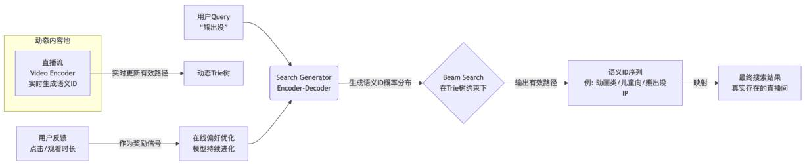

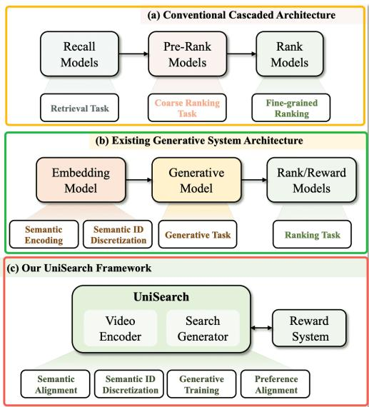

# 模型架构与原理

UniSearch 的架构设计，其核心在于将一个复杂的多阶段系统统一为一个可端到端学习和优化的整体。

# 核心组件：搜索生成器 $^ +$ 视频编码器协同

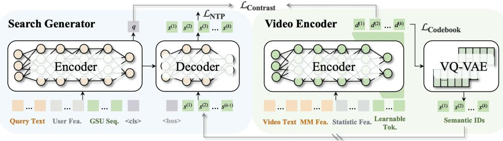  
(a) Model Architecture and Unified Pre-training

1 Search Generator（搜索生成器）：基于 Encoder-Decoder 的模型。  
 Encoder（编码器）：负责理解用户的搜索词（Query）、用户的历史行为以及搜索时的上下文信息，形成一个综合的意图表征。  
 Decoder（解码器）：以上述意图表征为条件，自回归地生成目标视频或直播间的语义 ID 序列。它不再是“检索”已有内容，而是直接“创造”一串指向理想结果的语义ID代码。

2 Video Encoder（视频编码器）：负责为平台上的每个视频/直播间创建独特的“身份证”——语义 ID。

 它利用 VQ-VAE 技术，将视频的标题、封面、画面内容等多模态信息编码成一个连续的向量，再通过“量化”过程，将其映射到一个离散的“码本”上，从而产生语义 ID。这相当于为视频内容生成了一个离散的、机器可读的语义 ID 摘要。

# 关键机制：动态Trie树+在线偏好优化

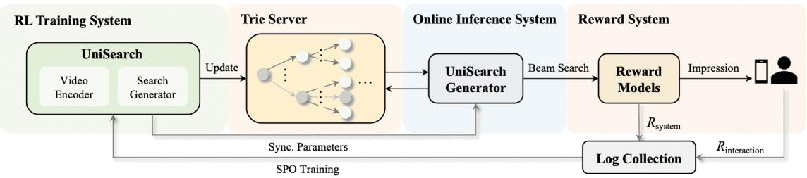  
(b) UniSearch Deployment and Online Post-training

# 1 动态 Trie 树约束：

 这是 UniSearch 能应用于直播等高动态场景的基石。直播内容瞬息万变，直播间随时开播、下播。  
 Trie 树是一种数据结构，可以实时监听所有在线直播间的语义 ID，形成一个不断更新的“有效路径地图”。  
 当 Search Generator 的 Decoder 一步步生成语义 ID 时，每一步都需向 Trie 树“咨询”下一步有哪些有效的选择。通过Beam Search算法，模型能在所有合法路径中找出最优的几个，从根本上杜绝了生成无效内容ID的可能性。

# 2 在线偏好优化（SPO）：

 UniSearch 不是一个静止的系统，而是一个能够持续进化的智能体。它会实时收集两方面的反馈信号：一是系统内部的评分（如精排模型的相关性判断），二是用户的真实行为（如点击、观看时长、关注等）。  
 这些信号被合成为一个奖励（Reward），然后通过类似于 GRPO 的强化学习算法，对模型参数进行微调。这意味着，如果系统发现用户普遍更喜欢“玩具开箱”类的直播，它就会在后续的生成中提高此类内容语义ID的生成概率。

# 联合损失函数：

UniSearch 的“真端到端”特性，数学上体现在其联合损失函数（Joint Loss Function）上：

$$
L = \lambda_ {1} \cdot L _ {\text {c o n t r a s t}} + \lambda_ {2} \cdot L _ {\text {c o d e b o o k}} + \lambda_ {3} \cdot L _ {\text {N T P}}
$$

这个公式将三个关键目标统一优化：

 $L _ { c o n t r a s t }$ （对比损失）：确保查询（Query）的语义和视频（Video）的语义在向量空间中对齐，即语义上相近的 Query 和Video，其向量表示也应接近。  
 $L _ { c o d e b o o k }$ （码本损失）：这是 VQ-VAE 特有的损失，用于优化码本的质量，让量化过程更精确，避免码本“坍塌”。  
 （Next Token 预估损失）：即生成模型标准的“下一个 Token 预测”损失，确保 Generator 能够准确地生成下一个语义 ID。

通过调整 $\lambda$ 超参数来平衡这三项损失，模型得以学习如何更好地理解内容、理解用户意图并生成准确的结果。

# 7.2 大模型面试题

面试题：阿里 Qwen 大模型不同版本迭代的改进点？

# 一、 Qwen 不同版本迭代详解

# 1. Qwen1.5（2024 年初）

#  基础架构：

 纯 Decoder 结构，采用 Rotary Positional Embeddings（RoPE）增强位置感知  
 首次引入分组查询注意力（GQA），仅在 32B/110B 模型应用，平衡 MHA 质量与 MQA 效率  
 MoE 版（14B-A2.7B）采用共享专家+专属专家混合路由

#  改进局限：

 MoE 层的专家负载不均衡，部分专家利用率低  
 上下文窗口仅 32K，长文本处理弱于竞品（如 GPT-4-128K）

# 2. Qwen2.5（2024 年 9 月）

#  架构升级：

 全系列 GQA 覆盖：从 0.5B 到 72B 均应用 GQA，KV 缓存减少 $40 \%$ ，推理吞吐提升 $30 \%$   
 上下文扩展至 128K：通过 Dual Chunk Attention（DCA）分块处理长序列，捕获块间依赖  
 MoE 路由优化：细粒度专家分割，引入任务感知的门控网络

# 训练策略革新：

#  三阶段预训练：

 S1：通用语料奠基（4K 上下文）  
 S2：注入数学/代码数据，通过课程学习逐步提升难度  
 S3：动态 NTK 扩展至 32K→128K，缓解长序列训练不稳定

#  两阶段 RLHF：

 离线RL：基于 DPO 优化数学/代码等确定性任务  
 在线RL：实时奖励模型对齐人类偏好（如无害性、简洁性）

# 性能表现：

 72B 模型在 MMLU、GSM8K、HumanEval 全面超越 Llama3-70B

# 3. Qwen3（2025 年 4 月）

#  架构突破：

 QK-Norm 替代QKV-bias：归一化Query-Key矩阵，缓解注意力头标准差问题，提升训练稳定性  
 MoE 专家独立化：取消共享专家，引入 Global-Batch Load Balancing Loss，均衡专家负载  
 动态思维模式：单模型支持思考模式（深度推理）与非思考模式（高效响应）动态切换

#  训练规模跃迁：

 预训练数据达 36T tokens（Qwen2.5 的 2 倍），覆盖 119 种语言  
 推出超大规模 MoE 模型：

 Qwen3-235B-A22B：总参 235B，激活 22B   
 Qwen3-Coder-480B-A35B：专精代码，总参 480B

#  关键能力提升：

 数学推理能力提升 $30 \%$ ，代码生成准确率提高 $2 5 \%$   
 支持 1M Token 上下文（通过 YaRN 扩展）

# 4. Qwen3-2507（2025 年 7 月）

#  架构分化：

 双模型独立部署（非动态切换）：

Thinking 版（Qwen3-235B-A22B-Thinking-2507）：深度逻辑链推理，适用数学/科学/伪科学辨析  
Non-thinking 版 （Qwen3-235B-A22B-Instruct-2507）：FP8 量化，响应速度优先，适用信息提取/格式化生成

 长文本再升级：支持 256K 上下文，超越 Claude 3（200K）

#  垂直模型发布：

 Qwen3-Coder：针对代码任务优化，GitHub 任务解决率超 DeepSeek-V3  
 Qwen-MT：低参数量高精度机器翻译模型

#  对齐能力强化：

 Arena-Hard 评测超越 Claude Opus4，人类偏好对齐提升显著

# 二、核心技术对比

<table><tr><td>技术点</td><td>Qwen1.5</td><td>Qwen2.5</td><td>Qwen3</td><td>Qwen3-2507</td></tr><tr><td>注意力机制</td><td>GQA 部分应用</td><td>全系列 GQA</td><td>QK-Norm 稳定训练</td><td>继承 QK-Norm</td></tr><tr><td>上下文长度</td><td>32K</td><td>128K (DCA)</td><td>1M (YaRN)</td><td>256K</td></tr><tr><td>MoE 架构</td><td>共享专家</td><td>细粒度专家</td><td>独立专家+均衡损失</td><td>独立专家+均衡损失</td></tr><tr><td>思维模式</td><td>无</td><td>无</td><td>动态切换</td><td>双模型分立</td></tr><tr><td>训练数据量</td><td>18T tokens</td><td>18T tokens</td><td>36T tokens</td><td>未公开(增量)</td></tr></table>

面试题：原生稀疏注意力 NSA 解析与代码实现（ACL2025 最佳论文）

以下是关于 ACL2025 最佳论文《Native Sparse Attention（NSA）》技术解析。

 文章题目：Native Sparse Attention: Hardware-Aligned and Natively Trainable Sparse Attention   
 原文链接：https://arxiv.org/pdf/2502.11089  
 源码链接：https://github.com/fla-org/native-sparse-attention

# 一、背景：长文本处理的算力瓶颈

传统 Transformer 的注意力机制计算复杂度为 $\scriptstyle \alpha ( n \pmb { \wedge } 2 )$ （n 为序列长度），在处理长文本时面临严重效率问题：

 64K Token 序列中，注意力计算占总延迟的 $70 \% { \sim } 8 0 \%$ ；  
 现有稀疏注意力方案（如局部窗口、KV 缓存淘汰）存在局限：

 硬件不友好：理论计算量减少 ≠ 实际加速（内存访问成瓶颈）；  
 训练不可行：仅优化推理阶段，预训练仍需全注意力计算。

 行业需求：深度推理、库级代码生成、医疗长文本分析等场景需处理百万 Token 上下文 。

# 二、NSA 的核心创新

NSA 通过动态分层稀疏策略 $^ +$ 硬件协同优化，实现性能与效率的双重突破：

1. 三重注意力分支协同   

<table><tr><td>分支</td><td>功能</td><td>计算复杂度</td><td>类比说明</td></tr><tr><td>压缩注意力</td><td>块级聚合（粗粒度全局语义）</td><td>O(n□m)</td><td>略读章节标题</td></tr><tr><td>选择注意力</td><td>动态筛选关键块（细粒度信息）</td><td>O(n□k)</td><td>精读核心段落</td></tr><tr><td>滑动窗口注意力</td><td>局部上下文保留</td><td>O(n□w)</td><td>细读当前句子</td></tr></table>

# 2. 硬件对齐的极速内核

 连续块内存访问：将随机索引转为 DMA 批量传输，内存带宽利用率提升 3.2 倍；  
 GQA 组共享加载：同组 Query 共享 KV 块，解码阶段内存占用降低 $64 \%$ ；  
 Triton 定制内核：通过网格调度器优化 GPU 计算流，算术强度逼近理论最优值。

# 3. 端到端可训练架构

 原生稀疏预训练：从预训练开始应用稀疏注意力，避免推理时剪枝导致的性能崩塌（传统方法保留 Top $20 \%$ 注意力仅恢复 $70 \%$ 性能）；  
 可微分稀疏操作：压缩（MLP）、选择（Top-K）、门控（Softmax）全程可导，支持梯度回传。

# 三、 NSA 的算法原理详解

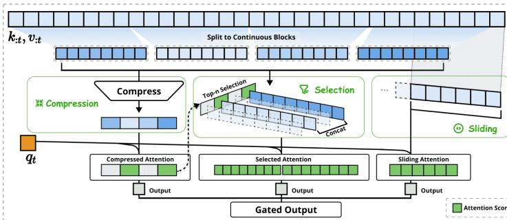

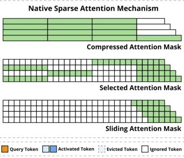

# 1. 压缩注意力（Compressed Attention）

 输入序列分块：将序列划分为长度为 的块，步长 $d$ （例 $_ { I = 3 2 , d = 1 6 }$ ）；  
 块级语义压缩： $\begin{array} { r } { K _ { \mathrm { c m p } } ^ { j } = \phi \Big ( \{ k _ { i } \} _ { i = ( j - 1 ) \cdot d } ^ { ( j - 1 ) \cdot d + l } \Big ) } \end{array}$ ，ϕ 为可学习 MLP，将块内所有 Key 压缩为 1 个向量。 $\phi$

# 2. 选择注意力（Selected Attention）

 块重要性评分：基于压缩注意力分数 $\boldsymbol { p } _ { t } ^ { \mathrm { c m p } }$ 选择 Top-N 块：

$$
p _ {t} ^ {\mathrm {c m p}} = \operatorname {S o f t m a x} \left(\frac {Q _ {t} \cdot K _ {\mathrm {c m p}}}{\sqrt {d _ {k}}}\right)
$$

$$
I _ {\text {t o p}} = \operatorname {T o p K - I n d i c e s} \left(p _ {t} ^ {\mathrm {c m p}}, N\right)
$$

 细粒度 token 保留：从选中块中提取原始 Key/Value。

# 3. 滑动窗口注意力（Sliding Attention）

 固定局部窗口 ：保留当前 Token 前后各 w/2 的上下文（w=512）。

# 四、实际效果：性能与效率双突破

 性能无损：通用任务超越全注意力，长文本任务显著领先；  
 效率革命：11.6 倍解码加速，使百万 Token 上下文成为可能；

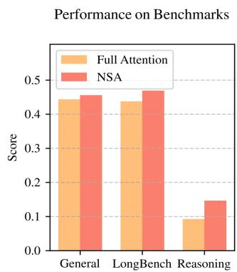

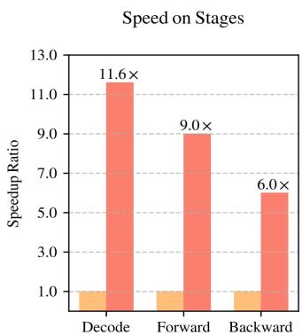

<table><tr><td>Model</td><td>MMLU Acc. 5-shot</td><td>MMLU-PRO Acc. 5-shot</td><td>CMMLU Acc. 5-shot</td><td>BBH Acc. 3-shot</td><td>GSM8K Acc. 8-shot</td><td>MATH Acc. 4-shot</td><td>DROP F1 1-shot</td><td>MBPP Pass@1 3-shot</td><td>HumanEval Pass@1 0-shot</td><td>Avg.</td></tr><tr><td>Full Attn</td><td>0.567</td><td>0.279</td><td>0.576</td><td>0.497</td><td>0.486</td><td>0.263</td><td>0.503</td><td>0.482</td><td>0.335</td><td>0.443</td></tr><tr><td>NSA</td><td>0.565</td><td>0.286</td><td>0.587</td><td>0.521</td><td>0.520</td><td>0.264</td><td>0.545</td><td>0.466</td><td>0.348</td><td>0.456</td></tr></table>

# 面试题：Deepseek 的 MTP（Multi-Token Prediction）原理介绍

MTP（Multi-Token Prediction，多词预测）是 DeepSeek 大模型（如 DeepSeek-V3/R1）的核心技术之一，旨在通过一次性预测多个未来词 （token）来提升训练效率、推理速度和模型的长上下文建模能力。以下从背景、原理、公式及算法步骤展开详细说明：

# 一、为什么需要 MTP？

传统自回归语言模型（如 GPT 系列）采用 Next-Token Prediction （逐词预测），即根据历史上下文预测下一个词，循环生成整个序列。这种方式存在以下瓶颈：

1. 训练效率低：每个位置仅计算一个 token 的损失，样本利用率低，模型收敛慢。  
2. 推理速度慢：生成 N 个 token 需执行 N 次前向计算，每次需加载 KV 缓存（显存访问瓶颈），尤其生成长文本时延迟显著。  
3. 局部视野局限：模型过度关注局部语法而非全局语义，长距离依赖学习不足，影响代码生成、逻辑推理等任务表现。

MTP通过并行预测多个未来token，在训练阶段注入更密集的监督信号，在推理阶段减少生成步数，从根源上突破上述限制。

下表对比了传统 NTP 与 MTP 的训练特性:

<table><tr><td>特性</td><td>传统单步预测(NTP)</td><td>MTP 多步预测</td></tr><tr><td>监督信号</td><td>稀疏(Sparse)</td><td>密集(Dense)</td></tr><tr><td>每个 Token的任务</td><td>预测1步未来</td><td>预测k+1步未来</td></tr><tr><td>接收的梯度</td><td>来自1个目标</td><td>来自k+1个目标</td></tr><tr><td>数据利用率</td><td>基础</td><td>提升k倍</td></tr></table>

# 二、MTP 的核心思想

MTP 在训练时要求模型同时预测当前位置后续的 D 个 token（如 $\scriptstyle \mathbf { D } = \mathbf { 4 }$ ），而非仅下一个 token。其核心架构包括：

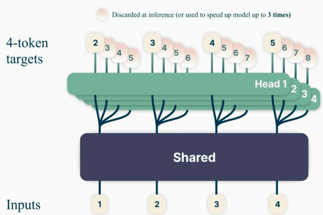

# 1. 共享主干 $^ +$ 独立预测头

 主干网络：共享的 Transformer Decoder，提取上下文特征。  
 预测头（Heads）：D 个独立模块，每个对应一个未来位置的预测（Head $\square  \{ + \}$ , Head⋅ $ \mathrm { t } + 2$ , ..., Head_D →$\mathtt { t } { + } \mathtt { D }$ ）。每个 Head 包含一个 Transformer 层（MHA $^ +$ FFN）。

# 2. 因果链保持

预测头之间保留序列依赖关系：Head⋅ 的输入依赖 Head⋅⋅⋅ 的输出，确保全局语义一致性。

# 3. 参数共享机制

 词嵌入层（Embedding）与所有预测头共享。  
 输出投影矩阵（Projection）与主干模型的输出层共享。

注：推理时仅保留主干网络，MTP 模块可移除，不影响模型功能。

# 三、算法步骤

# 1. 符号定义

 输入序列： $X = [ x _ { 1 } , x _ { 2 } , \dots , x _ { T } ]$   
 主干网络输出： $H ^ { \mathrm { m a i n } } \in \mathbb { R } ^ { T \times d _ { \mathrm { m o d e l } } }$   
 第 $k$ 个预测头输出： $H ^ { k } \in \mathbb { R } ^ { T \times d _ { \mathrm { m o d e l } } }$ （k=1,2,...,D）  
 共享词嵌入矩阵： $E \in \mathbb { R } ^ { V \times d _ { \mathrm { m o d e l } } }$ （V 为词表大小）

# 2. 关键算法公式

# (1) 预测头输入构造 （融合历史表示与未来嵌入）

第 k 个预测头在第 i 位置的输入 $h _ { i } ^ { k }$ 由两部分拼接后投影得到：

$$
h _ {i} ^ {k} = M \left[ \operatorname {R M S N o r m} \left(h _ {i} ^ {k - 1}\right) \oplus \operatorname {R M S N o r m} \left(E \left(x _ {i + k}\right)\right) \right], \text {其 中}:
$$

$h _ { i } ^ { k - 1 }$ ：第 $k { - } 1$ 头对位置 $j$ 的输出（ $k { = } 1$ 时， $h _ { i } ^ { 0 } = H _ { i } ^ { \operatorname* { m a i n } }$ ） )  
 ：目标位置 i+k 的词嵌入 $E ( x _ { i + k } )$ $j { + } k$   
 $M \in \mathbb { R } ^ { 2 d _ { \mathrm { m o d e l } } \times d _ { \mathrm { m o d e l } } }$ 为投影矩阵。

# (2) 预测头计算

通过一个轻量Transformer 层生成新表示： $\hat { h } _ { i } ^ { k } = \mathrm { T r a n s f o r m e r B l o c k } ( h _ { i } ^ { k } )$

# (3) 概率分布预测

共享输出投影矩阵 （与主干共享）： $W \in \mathbb { R } ^ { d _ { \mathrm { m o d e l } } \times V }$ $P _ { i , k } = \mathrm { S o f t m a x } ( \hat { h } _ { i } ^ { k } \cdot W ^ { T } )$

# (4) 损失函数

$$
\mathcal {L} _ {\mathrm {M T P}} = \frac {\lambda}{D} \sum_ {k = 1} ^ {D} \sum_ {i = 1} ^ {T} \text {C r o s s E n t r o p y} \left(P _ {i, k}, x _ {i + k}\right)
$$

所有预测头的交叉熵损失加权平均：

总损失为主干损失 $ { \mathcal { L } } _ { \mathrm { m a i n } }$ 与 ${ \mathcal { L } } _ { \mathrm { M T P } }$ 之和： ${ \mathcal { L } } _ { \mathrm { t o t a l } } = { \mathcal { L } } _ { \mathrm { m a i n } } + { \mathcal { L } } _ { \mathrm { M T P } }$

其中 $\lambda$ 为MTP损失权重（通常 λ<1）。

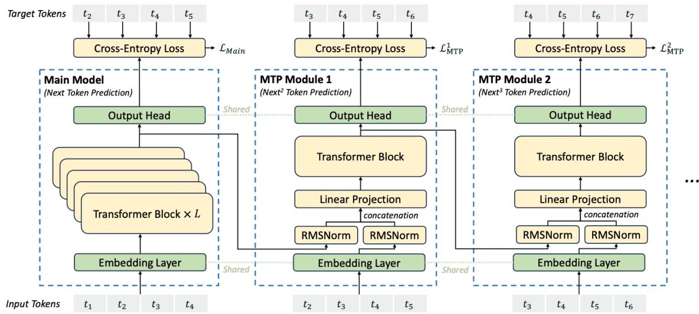

# 四、MTP 的创新与效果

# 1. 训练加速

单样本生成 D个监督信号，数据利用率提升 D倍，收敛速度提高 $30 \% +$ ，长文本任务（代码生成）准确率提升 $1 5 \%$ 。

# 2. 推理优化

 直接推理：移除MTP模块，主干模型性能更强。  
 推测解码 （可选）：用 MTP 模块生成候选序列，主干模型快速验证，提速 1.8–3 倍。

# 3. 全局建模能力

强制学习多步依赖，缓解短视预测问题。如 DeepSeek-V3 在代码任务中表现显著优于同规模模型。

面试题：大模型灾难性遗忘是什么，如何解决？

# 大模型灾难性遗忘的定义：

灾难性遗忘（Catastrophic Forgetting）：是指大语言模型（LLM）在学习新任务或适应新数据分布时，因参数更新导致对旧任务的知识快速丢失的现象。

例如，模型在微调医疗问答任务后，可能无法再正确生成代码或回答常识问题。这一问题的核心在于模型的全局参数共享机制：新任务的梯度更新会覆盖旧任务的关键权重，破坏原有知识结构。

# 主要成因：

 参数更新机制：梯度下降会因新任务的优化需求而大幅调整参数，导致旧任务依赖的权重被覆盖。  
 数据分布差异：持续学习场景中，新旧任务的数据分布差异显著，模型难以维持对旧任务的适应性。  
 模型容量限制：固定架构的模型在学习新任务时可能因容量不足而牺牲旧知识的存储空间。  
 任务相似性与顺序：任务间相似性低或训练顺序不合理会加剧遗忘程度。

# 解决灾难性遗忘的主要方法：

# 1. 正则化技术

 弹性权重巩固（Elastic Weight Consolidation, EWC）：通过计算旧任务参数的重要性（费舍尔信息矩阵），对关键参数施加正则化约束，限制其大幅调整。  
 学习不遗忘（Learning without Forgetting, LwF）：在新任务训练时，用旧任务输出作为伪标签，通过知识蒸馏保留原有知识。

# 2. 记忆回放

 经验回放（Rehearsal）：保存部分旧任务数据，与新任务数据混合训练，强制模型复习旧知识。例如，增量预训练时加入通用领域数据以防止泛化能力下降。

# 3. 参数隔离

 低秩适配（LoRA）：仅微调模型新增的低秩矩阵，冻结主干参数，最大限度保留预训练知识。例如，LoRAMoE方法通过混合专家（MoE）机制隔离新旧任务参数。  
 适配层（Adapter Layers）：在 Transformer 模块中插入小型可训练网络，限制参数更新范围。

# 4. 多任务训练

 多任务联合优化：同时训练新旧任务，平衡参数更新方向，但需权衡计算效率和任务数量  
 专家门模块（Expert Gating）：为不同任务分配独立子网络，通过路由机制动态选择激活路径。

# 面试题：大模型 MOE 架构 Expert 的 Token 负载均衡算法

MOE（Mixture of Experts）架构的核心挑战之一是确保不同专家（Expert）在处理输入Token时负载均衡。负载不均会导致部分专家过载（计算资源耗尽），而其他专家闲置，影响模型性能和训练效率。

# 一、门控机制优化与随机路由

# 1. 门控网络设计：

门控网络（Gating Network）负责根据输入Token的特征动态分配专家权重。通过以下策略优化路由：

 Top-K 稀疏路由：仅激活权重最高的前 K 个专家（如 $\mathsf { K } = 2$ ），降低计算开销。例如 GShard 采用 Top-2 路由策略。  
随机路由：在 Top-K 选择中引入随机性（如 GShard 在非 Top 专家中随机采样），避免过度依赖少数专家。  
专家选择（Expert Choice）：从“Token 选择专家”转变为“专家主动选择 Token”，通过专家反向筛选 Token 分配，缓解局部负载不均。

2. 噪声注入：在门控网络的 Logit 输出中引入可学习的噪声项（如Noisy Top-K Gating），增加路由的随机性，避免固定模式导致专家过载。

# 二、负载均衡损失函数

1. 重要性损失（Importance Loss）

计算每个专家在一个 Batch 内被分配 Token 的权重之和（即“流量”），通过变异系数（Coefficient of Variation，CV）衡量分布的离散程度，优化目标为最小化 CV，促使专家间的流量均等化。公式如下：

$$
L _ {\mathrm {i m p o r t a n c e}} = \operatorname {C V} (f _ {1}, f _ {2}, \dots , f _ {E}) \quad \text {其 中} f _ {i} = \sum_ {t = 1} ^ {N} g _ {i, t}
$$

其中， $f _ { i }$ 为专家 的权重总和，CV 为变异系数（标准差/均值）。

2. 负载损失（Load Loss）

直接约束专家接收的 Token 数量均衡。例如，计算每个专家的实际分配 Token 数 $\cdot L _ { i }$ 与理想平均值的均方差：

$$
L _ {\text {l o a d}} = \sum_ {i = 1} ^ {E} \left(l _ {i} - \frac {N}{E}\right) ^ {2}
$$

其中，N 为总 Token 数，E 为专家总数。

# 三、容量约束与动态调整

1. 专家容量因子（Capacity Factor）

每个专家设置最大处理 Token 数（Capacity），定义为：

${ \mathrm { C a p a c i t y } } = C \cdot { \frac { N } { E } }$ （C为超参数，通常设为1.252）

当 Token 分配超过容量时，Switch Transformer 等模型会丢弃溢出 Token 或通过残差路径传递至下一层。

# 2. 动态容量调整

DeepSpeed-MoE提出动态重分配机制：当某专家容量饱和时，溢出Token自动路由至其他空闲专家，而非直接丢弃，减少信息损失。

# 四、全局负载均衡策略

# 1. 局部均衡扩展至全局

传统方法仅关注单个 Batch 内的负载均衡（局部均衡），但阿里云通义大模型提出全局负载均衡：

 通过轻量级通信汇总跨 Batch 的专家负载信息，动态调整路由策略，避免专家因处理单一领域数据而过载。  
 实验显示，将均衡范围从 16 扩至 128 时，模型困惑度（PPL）显著降低，专家利用率提升。

# 2. 设备级负载均衡

分布式训练中，DeepSpeed-MoE 将专家分布到不同 GPU 设备，通过动态调整并行度，确保每个 GPU 处理相近数量的专家负载，缓解计算瓶颈。

# 五、残差连接与溢出处理

# 1. 残差 MOE（Residual-MoE）

DeepSpeed-MoE 引入残差路径：溢出 Token 不直接丢弃，而是与专家输出相加，保留原始特征并缓解容量限制的影响。公式为： $y = { \mathrm { E x p e r t } } ( x ) + { \mathrm { R e s i d u a l } } ( x )$

# 2. 分层路由与分组处理

GShard 提出本地分组（Local Groups） 策略：将输入Token 分组后路由，减少全局竞争带来的混乱，提升均衡性。

总结与效果对比  

<table><tr><td>方法</td><td>核心思想</td><td>优势</td><td>局限性</td></tr><tr><td>Top-K 路由+噪声</td><td>随机性与稀疏路由结合</td><td>计算高效，易实现</td><td>需精细调参，易受数据分布影响</td></tr><tr><td>全局负载均衡</td><td>跨Batch 均衡与设备级优化</td><td>专家利用率高，适合大规模训练</td><td>通信开销增加，需分布式框架支持</td></tr><tr><td>动态容量调整</td><td>溢出 Token 重分配而非丢弃</td><td>减少信息损失，提升模型性能</td><td>实现复杂，增加计算逻辑</td></tr></table>

# 实际效果：

 Switch Transformer：通过单专家路由（Top-1）和容量因子，推理速度提升 2 倍，但需牺牲部分专家多样性。  
 DeepSeek-MoE：采用辅助无损负载均衡策略，在保持模型性能（困惑度 9.5）的同时，MaxVIO（负载不均衡度）降低$40 \%$ 。  
 阿里云通义：全局均衡策略使 15B 参数模型的 PPL 降低 $12 \%$ ，专家特异性提升显著。

# 面试题：旋转位置编码 RoPE 原理

旋转位置编码（RoPE）是一种巧妙的位置编码方法，它通过旋转向量的方式将位置信息注入到查询（Query）和键（Key）中，使得注意力机制能够天然地捕捉相对位置信息。

下表对比了 RoPE 与两种传统位置编码方式的区别。

<table><tr><td>特点</td><td>绝对位置编码（如正弦编码）</td><td>可学习位置向量</td><td>旋转位置编码（RoPE）</td></tr><tr><td>核心思想</td><td>为每个绝对位置生成一个固定的编码向量，与词嵌入相加</td><td>为每个位置分配一个可学习的参数向量，与词嵌入相加</td><td>通过旋转矩阵对Q、K向量进行变换，将位置信息表示为角度</td></tr><tr><td>位置信息类型</td><td>绝对位置</td><td>绝对位置</td><td>相对位置</td></tr><tr><td>长度外推能力</td><td>差，难以泛化到训练时长度的序列</td><td>差，固定最大长度</td><td>强，能更好地处理长序列</td></tr><tr><td>关键优势</td><td>简单，无需学习</td><td>可适应训练数据</td><td>内积结果只依赖于相对位置，数学优雅，计算高效</td></tr></table>

# 一、理论原理

# 1 位置编码的本质

自注意力机制本身无法感知位置顺序，需通过位置编码引入序列信息。传统绝对位置编码（如 Sinusoidal）直接与词向量相加，但经过线性变换后，位置信息的远程衰减特性易被破坏。

# 2 RoPE 的核心思想

将位置编码转化为复数域的旋转操作：对查询（Query）和键（Key）向量分别施加旋转矩阵，使得它们的相对位置差通过旋转角度自然体现。这种操作等价于将词向量在复数空间中旋转特定角度，从而计算注意力分数时保留相对位置关系。

# 3 几何意义与优势

旋转不变性：旋转操作不改变向量模长，保持模型稳定性。  
 相对位置编码：通过旋转角度差直接编码相对位置，无需显式设计相对位置参数。  
 外推性：旋转矩阵的连续性使得模型在训练长度外也能保持位置感知能力

# 二、数学公式推导

# 1. 二维情形推导

假设词向量为二维复数 ${ \bf x } _ { m } = x _ { 0 } + i x _ { 1 }$ ，RoPE 通过旋转角度 $m \theta$ （其中 $m$ 为位置索引）构造位置编码：

$$
\mathbf {x} _ {m} ^ {\prime} = \mathbf {x} _ {m} \cdot e ^ {i m \theta}, \text {展 开 为 实 数 形 式 即}:
$$

$$
\left[ \begin{array}{c} x _ {0} ^ {\prime} \\ x _ {1} ^ {\prime} \end{array} \right] = \left[ \begin{array}{c c} \cos m \theta & - \sin m \theta \\ \sin m \theta & \cos m \theta \end{array} \right] \left[ \begin{array}{c} x _ {0} \\ x _ {1} \end{array} \right]
$$

该操作等价于将二维向量逆时针旋转 弧度。

# 2. 高维推广

对于 维词向量，将其分为 $d / 2$ 组，每组两两应用二维旋转变换：

$$
\mathbf {x} _ {m} ^ {\prime} = \bigoplus_ {k = 1} ^ {d / 2} \left[ \begin{array}{c c} \cos m \theta_ {k} & - \sin m \theta_ {k} \\ \sin m \theta_ {k} & \cos m \theta_ {k} \end{array} \right] \mathbf {x} _ {[ 2 k: 2 k + 1 ]}
$$

其中 $\theta _ { k } = 1 0 0 0 0 ^ { - 2 k / d }$ ，通过指数衰减调节不同维度的旋转频率。

# 3. 注意力计算融合

在自注意力机制中，对query ${ \bf q } _ { m }$ 和 key $\mathbf { k } _ { n }$ 分别施加旋转后计算内积：

$$
\operatorname {A t t e n t i o n} (m, n) = \operatorname {R e} \left[ \left(\mathbf {q} _ {m} e ^ {i m \theta}\right) \left(\mathbf {k} _ {n} e ^ {i n \theta}\right) ^ {*} \right]
$$

展开后包含相对位置项 $( m - n ) \theta$ ，显式编码相对距离信息。

# 三、核心特性与优势

# 1、远程衰减性

内积结果随相对距离增大呈震荡衰减趋势，符合自然语言中邻近词关联更强的特性：

$$
\langle \mathbf {q} _ {m}, \mathbf {k} _ {n} \rangle \propto \sum_ {k = 1} ^ {d / 2} \cos ((m - n) \theta_ {k})
$$

随着 q 和 k 的相对距离的增加，它们之间的内积分数呈现出远程衰减的性质。

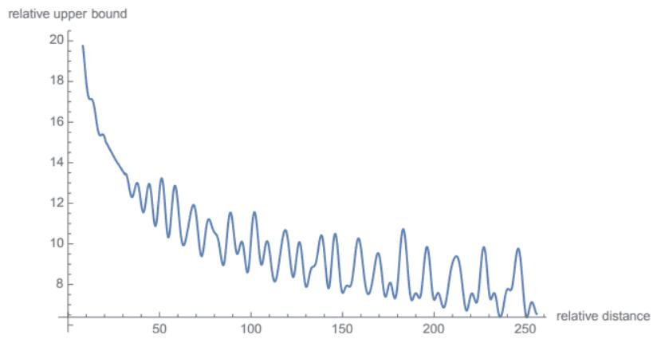

# 2、外推能力

旋转操作的周期性允许模型处理超过训练长度的序列，如训练使用 4k 长度，推理可扩展至 $3 2 \mathsf { k } _ { \circ }$

# 3、正交性保持

旋转矩阵是正交矩阵，保持向量模长不变，增强模型训练稳定性。

# 1. 主要应用场景

长文本建模：如 LLaMA、ChatGLM 等千亿参数模型采用 ROPE 处理长文档生成；  
高效线性 Attention：与线性 Attention 兼容，降低长序列计算复杂度；

多模态扩展：在视频、语音序列中验证位置感知有效性。

# 四、核心代码

```python
def precompute_freqs_cis(dim: int, seq_len: int, theta: float = 10000.0):
    # 计算旋转频率
    freqs = 1.0 / (theta ** (torch.arange(0, dim, 2) [:(dim // 2)].float() / dim))
    t = torch.arange(seq_len, device=freqs_device) # 位置索引
    freqs = torch.outer(t, freqs) # 外积生成位置-频率矩阵
    freqs_cis = torch.polar(torch.ones_like(freqs), freqs) # 转换为复数形式
    return freqs_cis
def apply_rotary_emb(xq: torch.Tensor,
xk: torchTensor,
freqs_cis: torch.Tensor,
):
    # 将向量转换为复数形式并旋转
    xq_ = torch.view_as_complex(xq.float().reshape(*xq.shape[: -1], -1, 2))
    xk_ = torch.view_as_complex(xk.float().reshape(*xk.shape[: -1], -1, 2))
    xq_out = torch.view_as_real(xq_ * freqs_cis). flatten(3)
    xk_out = torch.view_as_real(xk_ * freqs_cis). flatten(3)
    return xq_out.type_as(xq), xk_out.type_as(xk) 
```

# 面试题：BPE 和 Word Piece 分词方法的区别是什么？

Byte-Pair Encoding (BPE) 和 WordPiece 是现代自然语言处理中两种主流的子词分词算法，它们通过将单词拆分为更小的、有意义的子词单元，巧妙地平衡了词表大小与未登录词（OOV）问题。

<table><tr><td>特性</td><td>Byte-Pair Encoding (BPE)</td><td>WordPiece</td></tr><tr><td>核心思想</td><td>基于频率的贪婪合并</td><td>基于语言模型似然的合并</td></tr><tr><td>合并策略</td><td>迭代合并出现频率最高的相邻符号对</td><td>迭代合并能最大化训练数据似然的符号对</td></tr><tr><td>合并准则</td><td>频率驱动，选择最常出现的组合</td><td>利用互信息，选择关联性最强的组合</td></tr><tr><td>词表构建</td><td>自底向上，从字符开始合并</td><td>自底向上，从字符开始合并</td></tr><tr><td>典型应用</td><td>GPT 系列、RoBERTa</td><td>BERT 及其变体</td></tr><tr><td>子词表示</td><td>不强制使用特殊标记</td><td>常使用##前缀标记非词首子词</td></tr></table>

# BPE (Byte-Pair Encoding) 原理

BPE 的核心运作机制可以概括为 “合并频率最高的相邻符号对”。其本质是一种数据压缩算法，后被成功应用于 NLP领域。

 初始化：将训练语料中的每个单词分割成最基本的单元（例如字符或字节），并在单词末尾添加特殊的结束符（如</w>）以标记单词边界。此时，初始词表就是所有这些基本单元。  
 统计与合并：

 统计文本中所有相邻符号对（一开始是字符对）出现的频率。  
 找到出现频率最高的那一对符号（例如，连续的字符 "e"和 "s"）。  
 将语料中所有出现的这个符号对合并成一个新的、更大的符号（例如，将 "e"和 "s"合并为 "es"），并将这个新符号加入到词表中。

 迭代：不断重复“统计-合并”的过程，直到达到预设的词表大小或合并次数。

通过这个过程，像 "low"、"lower"、"newest"这样的单词，经过多轮合并后，可能会产生 "low"、"er"、"est"等有意义的子词单元。常见的单词（如 "the"）可能会被保留为完整 token，而罕见词（如 "unfamiliar"）则会被拆分成如 "un","fam", "iliar"这样的子词。

WordPiece 不再简单地选择最频繁的符号对，而是选择那个能最大程度提升语言模型在训练数据上似然概率的符号对进行合并。具体来说，它会计算每对相邻符号的互信息（点互信息 PMI）。互信息越高，表明这两个符号的关联性越强，合并后对语言模型似然值的提升就越大。

# 主要 Steps：

# 1. 初始化词汇表 (Initialization)

将训练语料中的每个单词拆分成更小的单元。最常见的做法是将单词拆分为字符（对于拉丁语系）或更小的单位（如字节），并在非词首的单元前添加一个特殊前缀（如 ##）以标识其在单词中的位置。所有这些基本单元构成了初始词汇表。

# 2. 迭代合并 (Iterative Merging)

 统计频率：基于当前词汇表和分词结果，统计语料中所有相邻符号对的出现频率。

freq_of_pair计算得分：对于每一个相邻符号对，使用公式 score freq_offirst_element $\times$ 计算其合并得分（即互信息 PMI）。  
选择与合并：选择得分最高的符号对进行合并。这个新的合并单元会被加入到词汇表中，并在语料中的所有出现位置用这个新单元替换原来的符号对。

# 3. 终止条件 (Termination Condition)

重复迭代合并步骤，直到词汇表大小达到预设的目标值，或者没有更多有意义的合并可以进行（例如，得分低于某个阈值）。

# ① 选型考量

综上所述，BPE 和 WordPiece 的主要区别在于合并准则：BPE 是频率驱动，而 WordPiece 是似然驱动。这使得WordPiece 在理论上更能捕捉到有意义的子词单元。在选择使用哪种方法时，可以考虑以下几点：

 任务类型：由于 BERT 类模型普遍使用 WordPiece，若需构建双向上下文理解模型或进行迁移学习，WordPiece 可能是更自然的选择。而对于自回归生成式任务（如文本生成），BPE 系列（尤其是 BBPE）应用更广。  
 语言特性：对于英语等空格分隔语言，两者都适用。但对于多语言混合或需要处理特殊符号（如代码、表情）的场景，BPE 的变种 Byte-level BPE (BBPE) 因其基于字节构建，具有更好的通用性。  
 实践建议：在大多数实际应用中，我们通常直接使用预训练模型（如 BERT、GPT）自带的分词器，而非从头开始训练。

# 面试题：介绍检索增强生成 RAG 的原理与步骤

检索增强生成（RAG）是一种将信息检索与大型语言模型的文本生成能力相结合的技术架构。

其核心思想是：让大模型在回答问题时，能够先从一个外部知识库中查找相关信息，然后基于这些信息生成答案，从而提升回答的准确性、相关性和时效性。下表展示了 RAG 的核心工作流程与关键要点。

<table><tr><td>阶段</td><td>核心任务</td><td>关键方法与技术</td><td>主要目标</td></tr><tr><td>1.索引(Indexing)</td><td>知识库准备与向量化</td><td>数据清洗、文档分块、向量嵌入、存入向量数据库</td><td>构建一个可供高效检索的外部知识源</td></tr><tr><td>2.检索(Retrieval)</td><td>查找相关信息</td><td>将用户查询向量化，在向量数据库中进行相似性搜索（如余弦相似度）</td><td>从知识库中找出与用户问题最相关的文档片段</td></tr><tr><td>3.增强(Augmentation)</td><td>构建提示词</td><td>将检索到的文档片段和用户原始查询一起填入预设的提示词模板中</td><td>为语言模型提供生成答案所需的全部上下文信息</td></tr><tr><td>4.生成(Generation)</td><td>产生最终答案</td><td>大型语言模型（LLM）读取增强后的提示词，并生成自然、流畅且基于上下文的答案</td><td>输出准确、可靠且可追溯的响应</td></tr></table>

# RAG检索增强生成工作流程

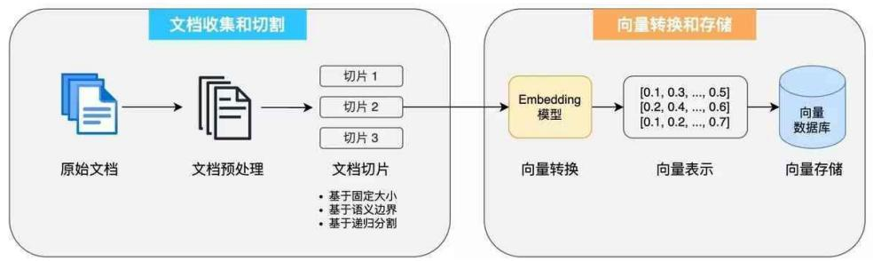  
建立索引

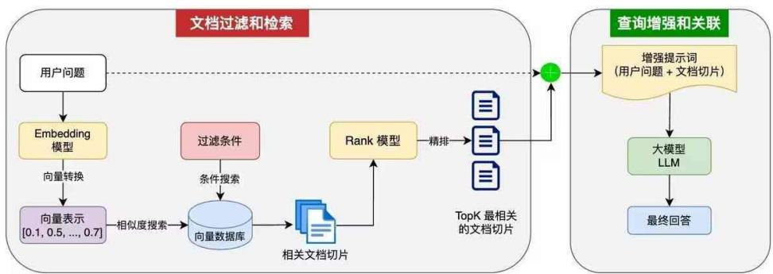  
检索生成

表：RAG算法关键步骤与核心技术选型概览  

<table><tr><td>关键步骤</td><td>核心任务</td><td>常见技术选型</td></tr><tr><td>数据预处理</td><td>文本分块、清洗</td><td>LangChain TextSplitter, 正则表达式</td></tr><tr><td>向量化</td><td>生成文本嵌入</td><td>Sentence-BERT, OpenAI text-embedding-ada-002</td></tr><tr><td>向量索引</td><td>存储与索引向量</td><td>FAISS, Chroma, Pinecone, Weaviate</td></tr><tr><td>检索器</td><td>相似度搜索</td><td>语义检索（FAISS），混合检索（BM25+向量）</td></tr><tr><td>重排序</td><td>优化检索结果</td><td>Cross-Encoder, Cohere rerank API</td></tr><tr><td>生成模型</td><td>生成最终答案</td><td>GPT系列, LLaMA 2, Claude</td></tr></table>

# $\sqsubset$ RAG 的架构演进

为了更好地应对复杂场景，RAG 架构也在不断演进，从最初的基础范式发展出更强大的形态：

 基础 RAG (Naive RAG)：即上述最基本的“检索-增强-生成”三步流程。其简单性也带来了检索质量不高、生成内容可能不准确等挑战。  
 高级 RAG (Advanced RAG)：在基础流程上增加了“检索前”和“检索后”的优化步骤。例如，在检索前对用户查询进行重写或扩展，或在检索后对结果进行重排序和过滤，以提升输入 LLM的信息质量。  
 模块化 RAG (Modular RAG)：将 RAG 系统拆分为像乐高积木一样可自由组合的功能模块（如查询理解、检索器、记忆模块等），提供了极大的灵活性，可以针对特定需求构建复杂的流水线，例如支持多轮对话或复杂推理。

# 面试题：MLA 多头潜在注意力介绍

MLA（多头潜在注意力）通过低秩压缩技术显著降低 KV Cache的存储需求，其核心在于将高维的 Key和Value矩阵投影到低维潜在空间，并通过重构机制保持注意力性能。

# 一、KV Cache 压缩原理

# 1. 低秩投影

MLA 引入可学习的低秩矩阵 $W _ { K } \in \mathbb { R } ^ { d \times k } \mathbf { \bar { \pi } } _ { \mathbb { H } } W _ { V } \in \mathbb { R } ^ { d \times k }$ 将原始 Key 和 Value 从维度 d 压缩到潜在空间维度 k（通常k=d/4）：

$$
K _ {\text {l a t e n t}} = K W _ {K}, \quad V _ {\text {l a t e n t}} = V W _ {V}
$$

这一步骤将 KV 的存储量从 2ndh 降为 2nkh（n 为序列长度，h 为头数），显存占用减少约 $7 5 \%$ 。

# 2. 注意力计算与重构

在潜在空间中计算注意力权重，并通过逆投影矩阵 $W _ { O } \in \mathbb { R } ^ { k \times d }$ 恢复原始维度：

$$
\text {A t t e n t i o n} = \operatorname {S o f t m a x} \left(\frac {Q K _ {\text {l a t e n t}} ^ {T}}{\sqrt {d}}\right) V _ {\text {l a t e n t}} W _ {O}
$$

此过程避免了直接存储高维 KV，仅需缓存低维的 $K _ { l a t e n t }$ 和 $V _ { l a t e n t }$

# 二、关键技术细节

1. 共享潜在空间：MLA 不同注意力头共享同一组低秩投影矩阵 $W _ { K }$ 和 $W _ { V }$ ，但保留独立的 Query 投影矩阵 $W _ { Q }$ 。此设计减少参数量的同时，保持多头的表达能力。  
2. 动态压缩与 RoPE位置编码：对 Key应用旋转位置编码（RoPE）时，直接作用于压缩后的潜在向量 $h _ { t }$ ，而非原始高维空间，这进一步优化了位置信息的计算效率。

# 3. 计算复杂度分析

 原始 MHA 复杂度： $O ( n ^ { 2 } d h )$   
 MLA 复杂度： $O ( n ^ { 2 } k h + n k d )$ 当 k⋅d，计算量显著降低，尤其适合长序列推理。

# 三、实际效果对比

1. 存储优化  

<table><tr><td>方法</td><td>KV Cache 大小</td><td>显存占用（示例）</td></tr><tr><td>传统 MHA</td><td>2ndh</td><td>20.97 GB（基准）</td></tr><tr><td>MLA</td><td>2nkh (k=d/4)</td><td>5.24 GB</td></tr></table>

# 2. 性能保持

在 DeepSeek-V2 模型中，MLA 将训练吞吐量提升 $30 \%$ ，KV Cache 减少 $7 5 \%$ ，而精度损失小于 $1 \%$ 。

面试题：LoRA、AdaLoRA 和 QLoRA 的原理

以下是关于 LoRA、AdaLoRA 和 QLoRA 的原理详解及对比分析，结合数学公式与实验特性展开说明：

# 一、LoRA（Low-Rank Adaptation）

# 核心原理：

通过低秩分解模拟参数更新量，仅训练新增的低秩矩阵，冻结原始模型权重。

对于预训练权重矩阵 $W _ { 0 } \in \mathbb { R } ^ { d \times k }$ ，引入低秩矩阵 $A \in \mathbb { R } ^ { r \times k }$ 和 $\boldsymbol { B } \in \mathbb { R } ^ { d \times r }$ $r \ll d , k )$ ，参数更新量为：

$$
\triangle W = B A \quad \rightarrow \quad W = W _ {0} + \triangle W = W _ {0} + B A
$$

训练时仅优化 $A$ 和 $B$ ，推理时将 $_ { B A }$ 合并到 $W _ { 0 }$ 中，无额外计算开销。

# 技术细节

 应用范围：主要作用于 Transformer 的 Attention 模块（如 $W _ { q } , W _ { k } , W _ { v } , W _ { o }$ ），实验表明同时微调 $W _ { q }$ 和 $W _ { v }$ 效果最佳。  
秩选择：通常 $r = 4 , 8 , 1 6$ ，极低秩（如 $r = 1$ ）也能接近全量微调性能。  
 优势：

 参数效率：GPT-3 175B 微调参数量仅需全量的 $0 . 0 1 \%$ ，显存消耗降低 $9 9 \%$ 。  
 无推理延迟：合并后与原始模型计算量一致。

# 二、AdaLoRA（Adaptive Low-Rank Adaptation）

核心原理：动态分配参数预算，根据矩阵重要性评分调整秩分配，优先优化关键权重。

使用奇异值分解（SVD）参数化增量更新：

$$
\triangle W = P \Sigma Q ^ {T}
$$

其中 $P \in \mathbb { R } ^ { d \times r }$ $Q \in \mathbb { R } ^ { k \times r }$ 为正交矩阵， $\boldsymbol { \Sigma } \in \mathbb { R } ^ { r \times r }$ 为对角矩阵。通过裁剪不重要奇异值（保留前 个）动态调整秩。

引入正交性惩罚项 $\lambda ( \| \ P ^ { T } P - I \| _ { F } ^ { 2 } + \| \ Q ^ { T } Q - I \| _ { F } ^ { 2 } )$ ，稳定训练并避免显式计算 SVD。

# 技术细节

 动态调整：基于梯度范数评估层重要性，为关键层分配更高秩（如 $r = 1 6$ ），非关键层降低至 $r = 4 _ { \circ }$   
实验表现：

GLUE 任务中，AdaLoRA 以 0.3M 参数达到 $8 7 . 3 6 \%$ 准确率（RTE 数据集），比 LoRA 高 $1 . 8 \%$ 。

# 三、QLoRA（Quantized Low-Rank Adaptation）

# 核心原理：

结合 4 位量化与 LoRA，进一步降低显存需求，支持单卡微调超大规模模型。

量化原始权重 $W _ { 0 }$ 为 4 位精度 $Q ( W _ { 0 } )$ ，再应用 LoRA：

$$
W = Q \left(W _ {0}\right) + B A
$$

其中量化采用 NF4（NormalFloat）格式，双量化技术压缩量化常数。

# 技术细节

# 显存优化：

 4 位量化：权重存储减少 $7 5 \%$ ，双量化额外节省 0.37 bits/参数。  
 分页优化器：利用 NVIDIA 统一内存管理，避免 GPU 内存溢出。

# 性能表现：

 65B Llama 模型微调显存需求从 780GB 降至 48GB，精度无损。  
 Guanaco 模型（QLoRA 实现）在 Vicuna 基准测试中达到 ChatGPT $9 9 . 3 \%$ 性能。

# 面试题：为什么大模型普遍采用 Decoder-only 架构？

# 一、Decoder-only 架构成为主流的原因

# 1. 生成任务的天然适配性

 自回归生成逻辑：Decoder-only 通过单向注意力机制（因果掩码）逐步预测下一个 Token，与人类语言生成的顺序逻辑一致，能保证文本的连贯性。  
 预训练目标对齐：Next token prediction 任务直接服务于生成目标，而 Encoder-Decoder 的掩码预测（如 T5）需额外学习编码-解码映射，增加了训练复杂度。

# 2. 训练与推理效率优势

 参数效率：省略 Encoder 使参数量减少 $3 0 \% - 5 0 \%$ 。例如，175B 参数的 GPT-3 若采用 Encoder-Decoder 结构需约 250B参数才能达到同等效果。  
 并行计算加速：单向注意力允许训练时全序列并行计算，而 Encoder-Decder 的注意力需顺序处理。实验表明，Decoder-only 训练速度比 Encoder-Decoder 快 1.5-2 倍。  
 KV-Cache 优化：推理时缓存历史 Key-Value 向量，32 轮对话场景下内存占用减少 $60 \%$ 。

# 3. 理论建模优势

 避免低秩退化：Encoder 的双向注意力矩阵秩约为序列长度的 1/10，而 Decoder-only 的因果注意力是满秩下三角矩阵，表达能力更强。  
 涌现能力激发：千亿参数级 Decoder-only 模型展现出更强的上下文学习（In-context Learning）能力，如 GPT-4 能通过简单提示完成代码生成 调试 优化的多步流程。

# 二、不同架构的核心差异对比

<table><tr><td>特性</td><td>Decoder-only</td><td>Encoder-only</td><td>Encoder-Decoder</td></tr><tr><td>核心功能</td><td>文本生成（对话、创作）</td><td>文本理解（分类、NER）</td><td>序列转换（翻译、摘要）</td></tr><tr><td>注意力机制</td><td>单向因果注意力</td><td>双向全局注意力</td><td>编码器双向+解码器单向</td></tr><tr><td>参数规模</td><td>参数量较少（无Encoder）</td><td>中等规模</td><td>参数量最大（双模块）</td></tr><tr><td>训练效率</td><td>高（全序列并行）</td><td>高</td><td>低（编码-解码耦合）</td></tr><tr><td>典型模型</td><td>GPT系列、LLaMA</td><td>BERT、RoBERTa</td><td>T5、BART</td></tr><tr><td>优势场景</td><td>开放式生成、Fewshot学习</td><td>短文本分类、实体识别</td><td>精确映射的任务（如翻译）</td></tr><tr><td>劣势</td><td>理解任务相对弱势</td><td>生成能力弱</td><td>训练复杂度高、推理延迟大</td></tr></table>

# 1. 任务适配性

 Decoder-only 擅长自回归生成 （如故事创作），其单向注意力强制模型仅依赖历史信息，与生成逻辑匹配。  
 Encoder-only 通过双向注意力捕获全局上下文，更适合需要深度理解的任务（如情感分析）。  
 Encoder-Decoder 在输入-输出强映射任务（如翻译任务）中表现更优，但需付出双倍参数代价。

# 2. 注意力矩阵特性

Decoder-only的因果注意力是严格的下三角矩阵（秩=序列长度），而Encoder 的双向注意力因Token间相互关联易出现低秩问题，限制模型表达能力。

# 3. 规模化效应

当参数量超过百亿时，Decoder-only 的涌现能力（如思维链推理）显著强于其他架构。实验显示，相同参数量下 Decoder-only 的 Zero-shot 准确率比 Encoder-Decoder 高 $1 5 \%$ 。

# 三、架构选择的实践建议

1. 优先 Decoder-only 场景：

 开放式生成（对话、代码生成）  
 资源有限需快速迭代  
 要求 Few-shot/Zero-shot 能力

2. 考虑 Encoder-only 场景：

 短文本分类、实体识别  
需高可解释性的风险评估任务

3. 选择 Encoder-Decoder 场景：

 严格序列转换（机器翻译）  
 输入输出存在明确对齐关系（如文本摘要）

关于大模型训练中 FP16 （Float16）和 BF16（Bfloat16）两种半精度浮点格式的核心区别：

# 一、结构与数值表示差异

<table><tr><td>特性</td><td>FP16</td><td>BF16</td></tr><tr><td>符号位</td><td>1位</td><td>1位</td></tr><tr><td>指数位</td><td>5位（范围：-14~15）</td><td>8位（范围：-126~127）</td></tr><tr><td>尾数位</td><td>10位（高精度）</td><td>7位（低精度）</td></tr><tr><td>动态范围</td><td>较小（最大约6.55×10^4）</td><td>更大（与FP32相同）</td></tr></table>

 FP16：牺牲动态范围换取更高尾数精度，适合需要精细小数计算的场景（如图像处理）。  
 BF16：牺牲尾数精度换取更大数值范围，能避免梯度更新时的溢出/下溢问题，更适合大模型训练。

# 二、训练稳定性对比

# 1. 梯度计算稳定性

 BF16 的指数范围与 FP32 一致，梯度计算时无需额外损失缩放（loss scaling），稳定性更高。  
 FP16因数值范围有限，梯度容易溢出或下溢，需配合混合精度训练（如动态损失缩放）。

# 2. 硬件兼容性

 FP16：广泛支持 NVIDIA GPU（如 V100、A100），在 Volta 架构后通过 Tensor Core 加速计算。  
 BF16：专为深度学习优化，在 Google TPU、NVIDIA A100 等硬件中直接支持，计算效率更高。

# 三、应用场景与性能优势

<table><tr><td>场景</td><td>FP16 优势</td><td>BF16 优势</td></tr><tr><td>显存占用</td><td>显存占用减半</td><td>显存占用减半</td></tr><tr><td>计算速度</td><td>适合小规模模型推理</td><td>大模型训练效率更高（TPU/A100）</td></tr><tr><td>适用任务</td><td>图像处理、科学计算</td><td>大规模语言模型（如GPT-3/BERT）</td></tr></table>

 FP16：适合显存受限场景，但数值稳定性需要调优。  
 BF16：已成为大模型训练的默认选择（如 BLOOM、Turing-NLG），兼顾显存效率和训练稳定性。

面试题：DPO 算法的缺点有哪些？如何应对？

DPO（Direct Preference Optimization，直接偏好优化）是一种用于对齐大型语言模型（LLM）与人类偏好的方法。它摒弃了传统强化学习从人类反馈（RLHF）中训练奖励模型的复杂流程，转而直接利用人类偏好数据优化模型策略。

# 一、DPO 原理与公式

DPO 的核心思想是通过人类对模型输出的偏好对比（如“优选回答” vs “较差回答”），直接优化模型参数，使其更倾向于生成符合人类偏好的内容，其关键组成部分包括：

# 1. 数据格式 ：

需求三元组 (prompt, chosen, rejected)，其中：

 chosen：人类偏好的回答（winning response）  
 rejected：被拒绝的回答（losing response）

示例数据格式（JSON）：

```json
{ "prompt": "解释气候变化的主要原因", "chosen": "气候变化主要由温室气体排放引起，如二氧化碳", "rejected": "气候变化是自然现象，与人类无关" }
```

# 2. 损失函数 ：

DPO 通过最大化偏好回答与拒绝回答的概率比值来优化模型。损失函数定义为：

$$
\mathcal {L} _ {\mathrm {D P O}} = - \mathbb {E} _ {(x, y _ {w}, y _ {l})} \left[ \log \sigma \left(\beta \log \frac {\pi_ {\theta} \left(y _ {w} x\right)}{\pi_ {\mathrm {r e f}} \left(y _ {w} x\right)} - \beta \log \frac {\pi_ {\theta} \left(y _ {l} x\right)}{\pi_ {\mathrm {r e f}} \left(y _ {l} x\right)}\right) \right] \text {, 其 中 :}
$$

 $\pi _ { \theta }$ ：待优化的当前模型  
 $\pi _ { \mathrm { r e f } }$ ：参考模型（通常为 SFT 模型）  
 $y _ { w } , y _ { l }$ ：分别为偏好回答、拒绝回答   
 $\beta$ ：温度参数，控制偏好强度（常取 0.1~0.5）  
 $\sigma$ ：sigmoid 函数

# 3. 隐式奖励建模 ：

DPO 实际上隐式地学习了一个奖励函数 $r ( x , y ) = \beta \log \frac { \pi _ { \theta } ( y x ) } { \pi _ { \mathrm { r e f } } ( y x ) }$ ，从而避免显式训练奖励模型。

# 二、DPO 的主要缺点及应对方法

尽管 DPO 简化了训练流程，但仍存在以下局限性：

# 1、对高质量偏好数据依赖性强

 问题：DPO 的效果高度依赖于偏好数据的质量和数量。数据不足或存在噪声时，模型性能会显著下降。  
 解决方法：

 数据增强：使用模型生成合成数据（如通过 ChatGPT 生成对比回答）并人工校验。  
 主动学习：优先标注模型不确定的样本（如低置信度预测）来提升数据效率。  
 集成多种数据源：结合多个开源偏好数据集（如 Anthropic HH-RLHF）以扩大覆盖范围。

# 2、过拟合风险高

 问题：DPO 容易过拟合训练集中的偏好对，导致在未见过的数据上泛化能力下降，甚至出现“奖励黑客”（rewardhacking）现象。

#  解决方法：

 正则化技术：在损失函数中加入 KL 散度项，约束优化后的模型不与参考模型 偏离太远

$$
\mathcal {L} _ {\text {T o t a l}} = \mathcal {L} _ {\text {D P O}} + \lambda \cdot \mathrm {K L} (\pi_ {\theta} \| \pi_ {\text {r e f}})
$$

 早停策略：监控验证集损失，当性能不再提升时提前终止训练。  
 改进算法：采用 IPO（Identity Preference Optimization）等 DPO 变体，其通过平方损失和正则项显式控制过拟合。

# 3、处理复杂任务的能力有限

 问题：DPO 依赖于简单的二元对比，对于需要多步推理、长期规划或多维评价的复杂任务（如数学推理、战略游戏），效果可能不如基于强化学习的方法（如 PPO）。

#  解决方法：

 分层优化：对复杂任务进行分解，先使用 DPO 对齐子任务，再用强化学习进行全局优化。  
 混合方法：结合 DPO 与 RLHF，利用 DPO 快速初始化模型，再用 PPO 进行精细调优  
 进阶算法：对于序列决策任务，可考虑 GRPO（Group Relative Policy Optimization）等多样本优化方法，它通过组内采样计算相对奖励，平衡稳定性与复杂度。

为了更直观地理解 DPO，以下是其核心特性的总结对比：

<table><tr><td>特性</td><td>DPO</td><td>RLHF (PPO)</td></tr><tr><td>训练流程</td><td>简单（单阶段）</td><td>复杂（两阶段：奖励模型+RL）</td></tr><tr><td>数据需求</td><td>高质量偏好对</td><td>标量奖励信号</td></tr><tr><td>稳定性</td><td>高（避免RL发散）</td><td>低（需精细调参）</td></tr><tr><td>过拟合风险</td><td>高</td><td>中低</td></tr><tr><td>复杂任务处理</td><td>较弱</td><td>较强</td></tr><tr><td>计算资源</td><td>较低</td><td>较高（需多个模型）</td></tr></table>

DPO 通过简化训练流程和提升稳定性，为大模型对齐提供了高效路径，但其对数据质量的依赖、过拟合倾向以及处理复杂任务时的局限性仍需关注。通过数据增强、正则化技术和混合算法策略，可在很大程度上缓解这些问题。在选择使用 DPO 还是RLHF 时，需根据任务复杂度、数据资源和计算预算进行权衡。

介绍在大型语言模型中常见的激活函数 GELU 和 SwiGLU，与经典的 ReLU 函数进行对比。

# 1、GELU (Gaussian Error Linear Unit)

GELU 的核心思想是基于输入的概率分布进行“随机门控”，而不是像 ReLU 那样使用固定的阈值（0）。

 数学原理：

GELU 将输入 x 与其在标准正态分布下的累积分布函数 $\Phi ( x )$ 相乘。 $\Phi ( x )$ 可以理解为 $_ x$ “被选中”或“被保留”的概率。当 $_ x$ 很大时，它被保留的概率接近 1；当 $_ x$ 很小时，被丢弃的概率接近 1。

 精确公式：

$$
G E L U (x) = x \Phi (x) = x \cdot \frac {1}{2} \left[ 1 + \operatorname {e r f} \left(\frac {x}{\sqrt {2}}\right) \right]
$$

其中，erf 是高斯误差函数。

 常用近似公式（便于计算）：

$$
G E L U (x) \approx 0. 5 x \left(1 + \tanh  \left[ \sqrt {\frac {2}{\pi}} \left(x + 0. 0 4 4 7 1 5 x ^ {3}\right) \right]\right)
$$

另一种近似是 $G E L U ( x ) \approx x \cdot \sigma ( 1 . 7 0 2 x )$ ，其中 $\sigma$ 是 Sigmoid 函数。

特点：GELU 是平滑且非单调的。它在负值区域不会直接截断为 0，而是进行平滑的抑制，这有助于梯度流动并防止神经元“死亡”。由于其平滑性和概率解释，GELU 被广泛应用于 BERT、GPT 系列等早期大模型中。

# 2、SwiGLU (Swish-Gated Linear Unit)

SwiGLU 属于门控线性单元（GLU）家族，通过引入门控机制来动态调节信息流，在多数情况下表现出比 GELU 和 ReLU更优的性能。

 数学原理：SwiGLU 结合了 Swish（或 SiLU）激活函数和 GLU 的门控思想。  
 Swish/SiLU 函数：

$$
\operatorname {S w i s h} (x) = x \cdot \sigma (x) = \frac {x}{1 + e ^ {- x}}
$$

当参数 $\beta = 1$ 时，Swish 函数即为 SiLU。

 SwiGLU 公式：

$$
\operatorname {S w i G L U} (x, W, V, b, c) = \operatorname {S w i s h} (x W + b) \otimes (x V + c)
$$

其中 $\otimes$ 表示逐元素相乘。在实际实现中，偏置项 b 和 c 常被省略，可写为SwiGLU(𝑥) = Swish(𝑥W)  (xV)

网络结构变化：使用 SwiGLU 的前馈网络（FFN）模块通常包含三个权重矩阵（W,V,W2），而标准 FFN（ReLU 或 GELU 激活）只有两个。为了保持参数量大致不变，中间层维度会相应调整。  
特点：门控机制让网络能学习何时、让多少信息通过。Swish 函数的平滑性也有利于优化。SwiGLU 已成为 LLaMA、PaLM 等许多现代大模型的首选。

3、ReLU、GELU、SwiGLU 三者特性对比  

<table><tr><td>特性</td><td>ReLU</td><td>GELU</td><td>SwiGLU</td></tr><tr><td>数学公式</td><td>max(0,x)</td><td>xΦ(x)</td><td>Swish(xW)□(xV)</td></tr><tr><td>平滑性</td><td>不连续（在0点不可导）</td><td>平滑</td><td>平滑</td></tr><tr><td>门控机制</td><td>无（硬性门控）</td><td>基于概率的随机门控</td><td>基于输入的自适应门控</td></tr><tr><td>负值处理</td><td>直接输出0</td><td>平滑抑制，输出负值很小</td><td>由门控信号动态调节</td></tr><tr><td>计算效率</td><td>高</td><td>中等（需计算tanh或erf）</td><td>较低（参数和计算量更多）</td></tr><tr><td>主要优势</td><td>计算简单 缓解梯度消失</td><td>平滑，有概率解释，性能优于ReLU</td><td>表达能力强，经验上性能最佳</td></tr><tr><td>常见模型</td><td>早期模型</td><td>BERT, GPT-3, Falcon</td><td>LLaMA, PaLM, ChatGLM</td></tr></table>

# 总结与选择建议

 ReLU：计算效率最高，是计算资源受限或需要引入稀疏性的不错选择。  
 GELU：平滑性和概率解释是其亮点，在许多任务中表现优于 ReLU，是视觉或多模态模型中常见的选择。  
 SwiGLU：通过门控机制提供了更强的表达能力，在大多数文本生成和语言理解任务中经验证性能最佳，是现代大模型（如LLaMA 系列）的默认选择，但计算成本也更高。  
 简单来说，从 ReLU 到 GELU 再到 SwiGLU，演化路径体现了从简单高效到平滑概率化，再到自适应门控的追求，性能一般逐步提升，但计算开销也相应增加。

# 7.3 强化学习面试题：

面试题：基于价值、策略、Actor-Critic 三类分别介绍主流强化学习算法

下面按照基于价值、基于策略和 Actor-Critic 这三类主流强化学习方法进行介绍。

# 基于价值的方法

基于价值的方法的核心思想是先学习一个价值函数（通常是动作价值函数Q-function），然后通过选择能够最大化价值的动作来间接地推导出最优策略。这类方法通常适用于离散动作空间。

# 1 Q-Learning

 核心公式：其核心是时序差分更新，通过不断迭代来逼近最优动作价值函数 $Q ^ { * } ( s , a )$ ：

$$
Q \left(s _ {t}, a _ {t}\right) \leftarrow Q \left(s _ {t}, a _ {t}\right) + \alpha \left[ r _ {t + 1} + \gamma \max  _ {a ^ {\prime}} Q \left(s _ {t + 1}, a ^ {\prime}\right) - Q \left(s _ {t}, a _ {t}\right) \right]
$$

其中， $_ \alpha$ 是学习率， 是折扣因子。目标 $r _ { t + 1 } + \gamma \operatorname* { m a x } _ { a ^ { \prime } } Q ( s _ { t + 1 } , a ^ { \prime } )$ 包含了当前奖励和对下一状态最大 Q 值的估计。

 场景：经典 Q-Learning 是表格型方法，适用于状态和动作空间小、可枚举的场景，如简单的网格世界。其思想是深度 Q网络等算法的基础。

# 2 SARSA

 核心公式：SARSA 的更新公式与 Q-Learning 相似但关键区别在于目标值的计算：

$$
Q \left(s _ {t}, a _ {t}\right) \leftarrow Q \left(s _ {t}, a _ {t}\right) + \alpha \left[ r _ {t + 1} + \gamma Q \left(s _ {t + 1}, a _ {t + 1}\right) - Q \left(s _ {t}, a _ {t}\right) \right]
$$

它使用当前策略（通常包含探索，如ε-greedy）实际选择的下一个动作 $a _ { t + 1 }$ 来计算目标，而不是直接使用最大Q值。

 场景：由于更新依赖于当前策略实际执行的动作，SARSA 更注重策略的安全性，适合需要考虑探索风险和高交互成本的场景，如机器人导航。

# 3 深度Q 网络及其变种

当状态空间是高维时（如图像），需要用神经网络来近似 Q 函数。

 DQN: 引入经验回放（打破数据相关性）和目标网络（稳定训练）。损失函数为：

$$
L (\theta) = \mathbb {E} _ {(s, a, r, s ^ {\prime}) \sim D} \left[ \left(r + \gamma \max  _ {a ^ {\prime}} Q _ {\text {t a r g e t}} (s ^ {\prime}, a ^ {\prime}; \theta^ {-}) - Q (s, a; \theta)\right) ^ {2} \right]
$$

 Double DQN: 解决 DQN 对 Q 值过高估计的问题，通过解耦动作选择与价值评估。   
 Dueling DQN: 将 Q 网络分解为状态价值函数 V 和优势函数 A，即

$$
Q (s, a) = V (s) + A (s, a) - \frac {1}{A} \sum_ {a ^ {\prime}} A (s, a ^ {\prime}) \quad , \text {使 网 络 能 更 高 效 地 学 习 状 态 的 价 值 。}
$$

场景：DQN 系列算法特别适合处理高维状态观测（如玩 Atari 游戏），但动作空间仍需是离散的。

# 基于策略的方法

基于策略的方法不依赖价值函数，而是直接参数化并优化策略函数 $\pi _ { \boldsymbol { \theta } } ( a | s )$ 。这种方法特别适用于连续动作空间，并能自

然地学习随机策略。

# 1 REINFORCE

 核心公式：REINFORCE是一种蒙特卡洛策略梯度算法，使用完整轨迹的回报 $G _ { t }$ 来估计梯度。其策略梯度更新公式为：$\nabla _ { \theta } J ( \theta ) = \mathbb { E } _ { \pi _ { \theta } } [ \nabla _ { \theta } \log \pi _ { \theta } ( a _ { t } | s _ { t } ) G _ { t } ]$ 参数更新为： $\theta  \theta + \alpha \nabla _ { \theta } J ( \theta ) ,$ 。  
 场景：REINFORCE是策略梯度的基础算法，实现简单，能直接处理连续动作空间。但由于使用完整回合的回报，估计的方差较高，收敛性可能较慢，更适合回合制任务。

# ① Actor-Critic 方法

Actor-Critic 框架结合了基于价值和基于策略方法的优点，通过两个组件进行学习：Actor（执行者，负责根据策略选择动作）和 Critic（评论者，负责评估当前策略的价值）。

# 1 A2C / A3C（异步优势 Actor-Critic）

 核心公式：该算法使用优势函数 A(s,a) 来替代 REINFORCE 中的回报 $G _ { t }$ ，从而减少方差。

优势函数衡量的是在状态 s 下采取动作 a 相对于平均情况有多好，表示为 $A ( s , a ) = Q ( s , a ) - V ( s ) _ { , }$ 。在实际中，常用时序差分误差来近似优势函数，即 $\delta _ { t } = r _ { t + 1 } + \gamma V ( s _ { t + 1 } ) - V ( s _ { t } ) ,$ 。策略梯度更新为：

$$
\nabla_ {\theta} J (\theta) = \mathbb {E} _ {\pi_ {\theta}} [ \nabla_ {\theta} \log \pi_ {\theta} (a _ {t} | s _ {t}) \delta_ {t} ]
$$

同时，Critic 网络会通过最小化时序差分误差来更新价值函数参数。

 场景：A3C 支持异步并行训练，效率较高。A2C 是其同步版本。这类算法在需要持续学习且探索性较强的环境中表现良好。

# 2 深度确定性策略梯度DDPG

 核心公式：DDPG 适用于连续动作空间。Actor 网络 $\mu ( s )$ 输出确定性动作，Critic 网络 $Q ( s , a )$ 评估动作价值。Critic 的更新类似 DQN，Actor 的更新则是最大化 Critic 评估的 Q 值：

$$
\nabla_ {\theta} J (\theta) \approx \mathbb {E} \left[ \left. \nabla_ {a} Q (s, a) \right| _ {a = \mu (s)} \nabla_ {\theta} \mu (s) \right]
$$

它也采用经验回放和目标网络来稳定训练。

 场景：适用于需要连续控制的任务，如机器人控制、自动驾驶中的方向盘控制等。

# 3 近端策略优化 PPO

 核心公式：PPO 通过限制策略更新的步长来确保训练稳定性。其核心目标函数（CLIP 版本）为：

$$
L ^ {\mathrm {C L I P}} (\theta) = \mathbb {E} _ {t} [ \min  (r _ {t} (\theta) A _ {t}, \operatorname {c l i p} (r _ {t} (\theta), 1 - \epsilon , 1 + \epsilon) A _ {t}) ]
$$

rt()= π(atst)其中 是新旧策略的概率比， $A _ { t }$ 是优势函数估计。clip 操作防止 过分偏离 1.0，从而约束更新幅度。

 场景：PPO 因其出色的稳定性、相对简单的实现和良好的性能，已成为目前强化学习实践中的首选算法之一，广泛应用于机器人、游戏 AI 等多种连续控制场景。

# 4 软演员-评论家 SAC

 核心公式：SAC 在标准的最大化累积奖励目标基础上，增加了一个熵正则项，以鼓励策略的探索性。其目标函数为：

$$
J (\pi) = \mathbb {E} _ {(s, a) \sim \pi} \left[ \sum_ {t} \gamma^ {t} \left(r \left(s _ {t}, a _ {t}\right) + \alpha \mathcal {H} \left(\pi \left(\cdot \mid s _ {t}\right)\right)\right) \right]
$$

其中 $\mathcal { H }$ 是策略的熵， $\alpha$ 是温度参数，用于平衡奖励和熵的重要性。

 场景：SAC 是一种离线策略算法，样本效率高，其鼓励探索的特性使其在需要大量探索的复杂连续控制任务中表现非常出色，但训练时间可能相对较长。

① 综合对比与选型指南  

<table><tr><td>算法</td><td>主要类型</td><td>核心思想</td><td>关键特征</td><td>典型适用场景</td></tr><tr><td>Q-Learning</td><td>价值</td><td>通过学习最优动作价值函数选择动作</td><td>离线策略，表格法</td><td>离散、低维状态/动作空间（如网格世界）</td></tr><tr><td>SARSA</td><td>价值</td><td>通过当前策略选择的动作更新动作价值函数</td><td>在线策略，更稳健</td><td>动态或高风险场景，强调安全性</td></tr><tr><td>DQN系列</td><td>价值</td><td>用神经网络近似Q函数，处理高维状态</td><td>经验回放，目标网络，离散动作</td><td>高维状态空间、离散动作空间（如Atari游戏）</td></tr><tr><td>REINFORCE</td><td>策略</td><td>直接优化策略，使用蒙特卡洛回报估计梯度</td><td>在线策略，高方差，实现简单</td><td>连续动作空间，回合制任务</td></tr><tr><td>A2C/A3C</td><td>Actor-Critic</td><td>使用优势函数降低策略梯度方差</td><td>在线策略，并行训练，降低方差</td><td>并行环境，需要高效探索的持续任务</td></tr><tr><td>DDPG</td><td>Actor-Critic</td><td>将DQN思想扩展至连续动作空间</td><td>离线策略，确定性策略，经验回放</td><td>高维状态和连续动作空间（如机器人连续控制）</td></tr><tr><td>PPO</td><td>Actor-Critic</td><td>在优化策略时限制更新幅度以保持稳定</td><td>在线策略，剪辑目标函数，稳定易用</td><td>大规模连续控制（机器人、游戏AI），实践首选</td></tr><tr><td>SAC</td><td>Actor-Critic</td><td>在最大化累积奖励的同时最大化策略熵</td><td>离线策略，随机策略，鼓励探索，样本效率高</td><td>复杂连续控制，需大量探索的任务</td></tr></table>

# 算法选型考量要点：

 动作空间类型：这是首要考量点。离散动作可选 Q-Learning、DQN 系列等；连续动作则优先考虑 DDPG、PPO、SAC、REINFORCE 等。  
 样本效率与稳定性：离线策略算法（如 DDPG, SAC, DQN）能重复利用历史数据，通常样本效率更高。PPO 等通过约束更新策略在稳定性和易用性上表现突出。  
 探索性需求：在需要智能体充分探索未知环境时，SAC的熵正则化或具有随机策略的算法更具优势。  
 问题复杂度与计算资源：对于简单、低维问题，表格法（如Q-Learning）或基础策略梯度可能足够。面对复杂、高维问题，深度强化学习算法（DQN, PPO, SAC）是更可行的选择，但同时需要更多的计算资源。

# 1. 策略梯度直观理解

策略梯度方法的核心思想非常直观：如果一个动作能够获得更高的回报，那么就增加这个动作被选择的概率；反之，如果一个动作带来的回报较低，就减少其概率。

这与基于价值的算法（如 Q-learning）不同。基于价值的算法先学习价值函数，再根据价值函数选择动作；而策略梯度方法直接基于参数化策略（例如用一个神经网络表示策略 $\pi _ { \boldsymbol { \theta } } ( a | s )$ ），并通过梯度上升来优化策略参数 $\theta$ ，以最大化期望回报。

# 2. 目标函数

强化学习的目标是最大化智能体在与环境交互中获得的期望累积回报。目标函数通常定义为：

$$
J (\theta) = \mathbb {E} _ {\tau \sim \pi_ {\theta}} [ R (\tau) ],
$$

其中 表示一条轨迹（trajectory）， $\tau = ( s _ { 0 } , a _ { 0 } , s _ { 1 } , a _ { 1 } , \dots , s _ { T } )$ $R ( \tau ) = { \sum _ { t = 0 } ^ { T } r ( s _ { t } , a _ { t } ) }$ 是轨迹 $\tau$ 的总回报。我们的目标是找到最优参数 $\theta ^ { * }$ ，使得 $J ( \theta )$ 最大： $\theta ^ { * } = \arg \operatorname* { m a x } _ { \theta } J ( \theta )$

# 3. 策略梯度定理推导

策略梯度定理告诉我们，目标函数 $J ( \theta )$ 关于参数 $\theta$ 的梯度可以表示为：

$$
\nabla_ {\theta} J (\theta) = \mathbb {E} _ {\tau \sim \pi_ {\theta}} \left[ \sum_ {t = 0} ^ {T} \nabla_ {\theta} \log \pi_ {\theta} \left(a _ {t} \mid s _ {t}\right) \cdot R (\tau) \right]
$$

# 推导过程主要步骤如下：

1. 梯度表达：首先，写出梯度的表达式：

$$
\nabla_ {\theta} J (\theta) = \nabla_ {\theta} \mathbb {E} _ {\tau \sim \pi_ {\theta}} [ R (\tau) ] = \nabla_ {\theta} \int p _ {\theta} (\tau) R (\tau) d \tau , \text {其 中} p _ {\theta} (\tau) \text {为 轨 迹} \tau \text {的 概 率}
$$

2. 似然比技巧：将梯度运算符移入积分，并应用似然比技巧 （Likelihood Ratio Trick），即使用恒等式$\nabla _ { \boldsymbol { \theta } } p _ { \boldsymbol { \theta } } ( \tau ) = p _ { \boldsymbol { \theta } } ( \tau ) \nabla _ { \boldsymbol { \theta } } \log { p _ { \boldsymbol { \theta } } ( \tau ) }$ ，那么：

$$
\begin{array}{l} \nabla_ {\theta} J (\theta) = \int \nabla_ {\theta} p _ {\theta} (\tau) R (\tau) d \tau \\ = \int p _ {\theta} (\tau) \nabla_ {\theta} \log p _ {\theta} (\tau) R (\tau) d \tau \\ = \mathbb {E} _ {\tau \sim \pi_ {\theta}} [ \nabla_ {\theta} \log p _ {\theta} (\tau) \cdot R (\tau) ] \\ \end{array}
$$

3. 分解轨迹概率：一条轨迹 $\tau$ 的概率 $p _ { \theta } ( \tau )$ 可以分解为：

$$
p _ {\theta} (\tau) = p \left(s _ {0}\right) \prod_ {t = 0} ^ {T} \pi_ {\theta} \left(a _ {t} \mid s _ {t}\right) p \left(s _ {t + 1} \mid s _ {t}, a _ {t}\right)
$$

其中 $p ( s _ { 0 } )$ 是初始状态分布， $p ( s _ { t + 1 } | s _ { t } , a _ { t } )$ 是环境的状态转移概率。

4. 取对数化简：对 $p _ { \theta } ( \tau )$ 取对数：

$$
\log p _ {\theta} (\tau) = \log p (s _ {0}) + \sum_ {t = 0} ^ {T} \left(\log \pi_ {\theta} \left(a _ {t} \mid s _ {t}\right) + \log p \left(s _ {t + 1} \mid s _ {t}, a _ {t}\right)\right)
$$

再对 $\theta$ 求梯度。注意 $\log p ( s _ { 0 } )$ 和 $\log p \big ( s _ { t + 1 } \big | s _ { t } , a _ { t } \big )$ 与策略参数 $\theta$ 无关，因此它们的梯度为零。于是：

$$
\nabla_ {\theta} \log p _ {\theta} (\tau) = \sum_ {t = 0} ^ {T} \nabla_ {\theta} \log \pi_ {\theta} (a _ {t} | s _ {t})
$$

5. 得到最终形式：将上式代回第2步的梯度表达式：

$$
\nabla_ {\theta} J (\theta) = \mathbb {E} _ {\tau \sim \pi_ {\theta}} \left[ \left(\sum_ {t = 0} ^ {T} \nabla_ {\theta} \log \pi_ {\theta} \left(a _ {t} \mid s _ {t}\right)\right) \cdot R (\tau) \right]
$$

在实际应用中，我们通常通过采样来近似这个期望。假设我们采样了 N 条轨迹，那么梯度可以近似为：

$$
\nabla_ {\theta} J (\theta) \approx \frac {1}{N} \sum_ {i = 1} ^ {N} \left[ \left(\sum_ {t = 0} ^ {T} \nabla_ {\theta} \log \pi_ {\theta} \left(a _ {t} ^ {(i)} \mid s _ {t} ^ {(i)}\right)\right) \cdot R \left(\tau^ {(i)}\right) \right]
$$

# ① 4. 减少方差：引入基线（Baseline）与奖励变换

原始的策略梯度的方差（Variance）较高，会导致训练不稳定。一些常见的改进如下：

引入基线：策略梯度定理可以推广为：

$$
\nabla_ {\theta} J (\theta) = \mathbb {E} _ {\tau \sim \pi_ {\theta}} \left[ \sum_ {t = 0} ^ {T} \nabla_ {\theta} \log \pi_ {\theta} (a _ {t} | s _ {t}) \cdot (R (\tau) - b) \right]
$$

其中 $b$ 是一个基线，通常选择为平均回报 $b = \frac { 1 } { N } \sum _ { i = 1 } ^ { N } R ( \tau ^ { ( i ) } )$ 。理论证明，减去一个基线不会改变梯度的期望值（无偏），但能有效降低方差。

 Advantage Function ： 一 个 更 精 细 的 方 法 是 使 用 优 势 函 数 （ Advantage Function ）$A ^ { \pi } ( s _ { t } , a _ { t } ) = Q ^ { \pi } ( s _ { t } , a _ { t } ) - V ^ { \pi } ( s _ { t } )$

优势函数衡量了在状态 $s _ { t }$ 下采取动作 $a _ { t }$ 比平均情况好多少。此时的梯度变为：

$$
\nabla_ {\theta} J (\theta) = \mathbb {E} _ {\tau \sim \pi_ {\theta}} \left[ \sum_ {t = 0} ^ {T} \nabla_ {\theta} \log \pi_ {\theta} \left(a _ {t} \mid s _ {t}\right) \cdot A ^ {\pi} \left(s _ {t}, a _ {t}\right) \right]
$$

使用优势函数可以显著降低方差，是 Actor-Critic 算法的基础。

 奖励变换：在原始公式中，轨迹上每个时刻的动作都用整个轨迹的总回报 $R ( \tau )$ 来加权，这并不合理，因为 时刻之后的动作不会影响 $t$ 时刻之前的回报。

因此，我们通常用从当前时刻到结束的累积奖励（Reward-to-go） $\begin{array} { r } { \hat { R } _ { t } = \sum _ { t ^ { \prime } = t } ^ { T } r \big ( s _ { t ^ { \prime } } , a _ { t ^ { \prime } } \big ) _ { \neq / \neq / \neq \pm } R ( \tau ) _ { \circ } } \end{array}$

结合以上两点，一个更优的梯度估计式为：

$$
\nabla_ {\theta} J (\theta) \approx \frac {1}{N} \sum_ {i = 1} ^ {N} \sum_ {t = 0} ^ {T} \nabla_ {\theta} \log \pi_ {\theta} \left(a _ {t} ^ {(i)} \mid s _ {t} ^ {(i)}\right) \cdot \left(\hat {R} _ {t} ^ {(i)} - b (s _ {t})\right)
$$

其中基线 $b ( s _ { t } )$ 也可以是状态相关的，例如常用状态价值函数 $V ^ { \pi } ( s _ { t } )$ 作为基线。

# 5. 与最大似然估计的比较

通过比较可以更好地理解策略梯度：

$$
\nabla_ {\theta} J _ {M L} (\theta) \approx \frac {1}{N} \sum_ {i = 1} ^ {N} \sum_ {t = 0} ^ {T} \nabla_ {\theta} \log \pi_ {\theta} \left(a _ {t} ^ {(i)} \mid s _ {t} ^ {(i)}\right)
$$

最大似然估计（MLE）的梯度为

，目标是最大化观察到动作的似然。

$$
\nabla_ {\theta} J (\theta) \approx \frac {1}{N} \sum_ {i = 1} ^ {N} \sum_ {t = 0} ^ {T} \nabla_ {\theta} \log \pi_ {\theta} \left(a _ {t} ^ {(i)} \mid s _ {t} ^ {(i)}\right) \cdot R \left(\tau^ {(i)}\right)
$$

策略梯度的表达式为：

可以看出，策略梯度相当于用累积回报 $R ( \tau )$ 给最大似然估计的梯度加了个权重。回报高的轨迹权重更大，模型会更大程度地增加这些轨迹中动作的概率；回报为负的轨迹则其动作概率会被抑制。

# 6. 策略梯度中的技巧与改进

<table><tr><td>改进方法</td><td>目的</td><td>说明</td></tr><tr><td>基线 (Baseline)</td><td>降低梯度估计的方差</td><td>常用平均回报或价值函数 V(s)作为基线。减去基线后变为 ∇θ log πθ(at st) · (R(τ) - b)，不影响无偏性。</td></tr><tr><td>Advantage 函数</td><td>更有效地衡量动作的相对好坏</td><td>A(st, at) = Q(st, at) - V(st)。梯度形式变为 ∇θ log πθ(at st) · A(st, at)，方差更低。</td></tr><tr><td>折扣因子</td><td>强调近期奖励，降低远期不确定性</td><td>在计算累积奖励时引入折扣因子γ，\(\hat{R}_{t}=\sum_{t&#x27;=t}^{T}\gamma^{t&#x27;-t}r\left(st&#x27;,at&#x27;\right)\)。</td></tr></table>

小结：Policy Gradient策略梯度定理是许多现代强化学习算法（如 Actor-Critic、PPO、TRPO）的基石。掌握其推导和理解其背后的直观含义（增加高回报动作的概率，减少低回报动作的概率），以及如何通过基线 Baseline、优势函数等方法降低方差，对于应对技术面试和深入理解强化学习都至关重要。

面试题：介绍 RLHF 算法 PPO、DPO、GRPO，写下损失函数

在大模型的 RLHF（基于人类反馈的强化学习）训练中，主流的强化学习算法包括 PPO（Proximal Policy

Optimization）、DPO（Direct Preference Optimization）和 GRPO（Group Relative Policy Optimization）。以下是详细说明：

# 1. PPO（近端策略优化）

# PPO (Proximal Policy Optimization) 2017 OpenAI

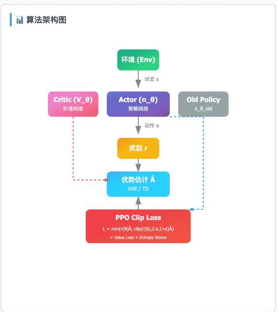

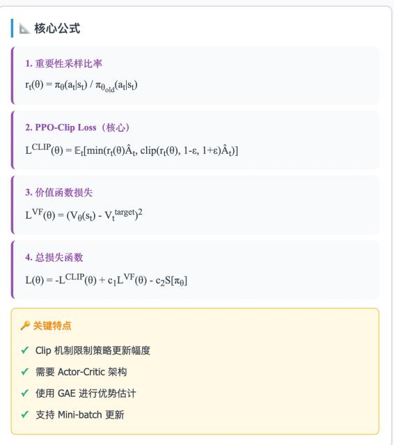

核心思想：通过约束策略更新的步长（避免突变），稳定训练过程。PPO 是 RLHF 中最广泛应用的算法（如InstructGPT/ChatGPT）。

# 损失函数表达式 ：

$$
\mathcal {L} _ {\mathrm {P P O}} (\theta) = \mathbb {E} _ {(x, y) \sim D _ {\pi_ {\theta}}} \left[ \min  \left(r _ {t} (\theta) \hat {A} _ {t}, \operatorname {c l i p} (r _ {t} (\theta), 1 - \epsilon , 1 + \epsilon) \hat {A} _ {t}\right) - \beta \cdot D _ {\mathrm {K L}} \left(\pi_ {\theta} (y | x) \| \pi_ {\text {b a s e}} (y | x)\right) \right]
$$

# 参数说明 ：

$r _ { t } ( \theta ) = { \frac { \pi _ { \theta } { \bigl ( } y | x { \bigr ) } } { \pi _ { \mathrm { o l d } } { \bigl ( } y | x { \bigr ) } } }$ ：新旧策略的概率比，用于衡量策略变化。

 ：优势函数（估计当前动作优于平均水平的程度）。 $\hat { A } _ { t }$   
 ：将概率比限制在 [1−ϵ, 1+ϵ] 内（ϵ ≈ 0.1），防止策略突变。 $[ 1 - \epsilon , 1 + \epsilon ]$ $\epsilon \approx 0 . 1$   
 $\beta \cdot D _ { \mathrm { K L } }$ ：KL 散度惩罚项，约束微调模型（ $\pi _ { \theta }$ ）与初始监督微调模型（ $\pi _ { \mathrm { b a s e } }$ ）的分布差异。

# 训练流程 ：

1. 采样生成回复 $y \sim \pi _ { \theta } ( \cdot | x )$ ；  
2. 奖励模型 RM 计算奖励 $r _ { \theta } ( x , y )$ ；  
3. 结合 KL 惩罚更新策略，确保生成文本的连贯性。

# 2. DPO（直接偏好优化）

# DPO (Direct Preference Optimization) 2023 Stanford


=算法架构图

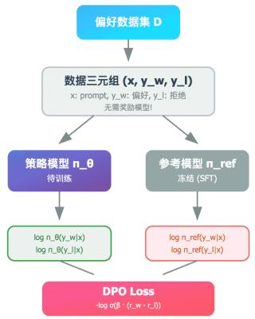


核心公式

$$
1. B r a d l e y - T e r r y \text {偏 好 模 型}
$$

$$
\mathrm {P} \left(\mathrm {y} _ {\mathrm {w}} > \mathrm {y} _ {1} \mid \mathrm {x}\right) = \sigma \left(\mathrm {r} \left(\mathrm {x}, \mathrm {y} _ {\mathrm {w}}\right) - \mathrm {r} \left(\mathrm {x}, \mathrm {y} _ {1}\right)\right)
$$

2.隐式奖励函数

$$
\mathrm {r} (\mathrm {x}, \mathrm {y}) = \beta \log \left(\pi_ {\theta} (\mathrm {y} | \mathrm {x}) / \pi_ {\text {r e f}} (\mathrm {y} | \mathrm {x})\right) + \beta \log Z (\mathrm {x})
$$

$$
\mathrm {L} _ {\mathrm {D P O}} = - \mathbb {E} _ {\left(\mathrm {x}, \mathrm {y} _ {\mathrm {w}}, \mathrm {y} _ {1}\right)} [ \log \sigma (\beta \cdot (\log (\pi_ {\theta} (\mathrm {y} _ {\mathrm {w}} | \mathrm {x}) / \pi_ {\text {r e f}} (\mathrm {y} _ {\mathrm {w}} | \mathrm {x})) - \log (\pi_ {\theta} (\mathrm {y} _ {1} | \mathrm {x}) / \pi_ {\text {r e f}} (\mathrm {y} _ {1} | \mathrm {x}))) ]
$$

$$
\mathrm {L} _ {\mathrm {D P O}} = - \mathbb {E} [ \log \sigma (\beta \cdot \Delta \mathrm {r}) ]
$$

$$
\text {其 中} \Delta \mathrm {r} = \mathrm {r} _ {\theta} (\mathrm {x}, \mathrm {y} _ {\mathrm {w}}) - \mathrm {r} _ {\theta} (\mathrm {x}, \mathrm {y} _ {\mathrm {f}})
$$


√无需训练独立奖励模型  
√无需强化学习采样  
√直接从偏好数据学习  
√β控制偏离参考策略程度  
√本质是监督学习问题

核心思想：省去奖励模型（RM）训练环节，直接用人类偏好数据优化策略，降低训练复杂度。

# 损失函数表达式 ：

$$
\mathcal {L} _ {\mathrm {D P O}} (\theta) = - \mathbb {E} _ {(x, y _ {w}, y _ {l}) \sim D} \left[ \log \sigma \left(\beta \log \frac {\pi_ {\theta} (y _ {w} | x)}{\pi_ {\mathrm {r e f}} (y _ {w} | x)} - \beta \log \frac {\pi_ {\theta} (y _ {l} | x)}{\pi_ {\mathrm {r e f}} (y _ {l} | x)}\right) \right]
$$

# 参数说明：

 $y _ { w } , y _ { l }$ ：人类标注的优/劣回复样本。  
 $\pi _ { \mathrm { r e f } }$ ：参考策略（通常为监督微调后的模型）。  
 β：温度系数，控制策略更新幅度。

# 优势 ：

 无需单独训练 RM，直接通过偏好数据驱动策略优化。  
 训练速度更快，资源消耗更低。

# 3. GRPO（群组相对策略优化）

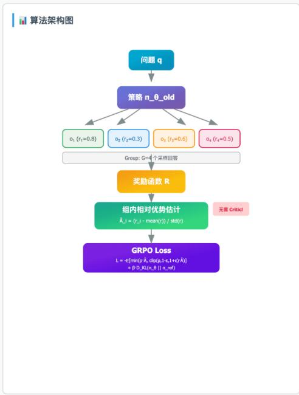  
GRPO (Group Relative Policy Optimization) 2024 DeepSeek

# 核心公式

2.组内相对优势(核心创新）

5.KL散度正则

#

√无需Critic/Value网络  
√组内相对奖励归一化  
√结合 PPO Clip 机制  
√适合大语言模型训练  
√显著降低内存占用

核心思想：通过组内样本的奖励归一化计算相对优势，替代传统价值网络。

# 损失函数表达式：

$$
\mathcal {L} _ {\mathrm {G R P O}} (\theta) = \mathbb {E} _ {q \sim Q} \left[ \frac {1}{G} \sum_ {i = 1} ^ {G} \min  \left(r _ {i, t} \hat {A} _ {i, t}, \operatorname {c l i p} \left(r _ {i, t}, 1 - \epsilon , 1 + \epsilon\right) \hat {A} _ {i, t}\right) - \beta D _ {\mathrm {K L}} \left(\pi_ {\theta} \| \pi_ {\text {r e f}}\right) \right]
$$

# 参数说明 ：

$\hat { A } _ { i , t } = \frac { r _ { i } - \mu } { \sigma }$ ：组内归一化优势（ $\mu , \sigma$ 为组内均值和标准差）；  
 $\beta D _ { \mathrm { K L } }$ ：KL 散度约束（防止偏离参考策略）。

特点：显存占用降低 $40 \%$ ，专精可验证任务（如数学推理、代码生成）。

# 二、算法对比分析

<table><tr><td>维度</td><td>PPO</td><td>DPO</td><td>GRPO</td></tr><tr><td>损失函数核心</td><td>裁剪概率比 + KL 惩罚 + 价值函数损失</td><td>偏好对的概率比对数差</td><td>组内归一化优势 + KL 约束</td></tr><tr><td>需奖励模型</td><td>是</td><td>否</td><td>否</td></tr><tr><td>计算复杂度</td><td>高（需 Actor-Critic 双网络）</td><td>低（监督学习式优化）</td><td>中（组采样增加开销）</td></tr><tr><td>训练效率</td><td>慢（两阶段训练）</td><td>快（提速 30%-50%）</td><td>中（依赖组大小 G）</td></tr><tr><td>稳定性</td><td>中等（依赖 RM 质量）</td><td>高（直接约束策略）</td><td>高（KL 显式约束）</td></tr><tr><td>适用场景</td><td>通用对齐（对话、创意生成）</td><td>快速迭代的偏好学习</td><td>可验证任务（数学、代码）</td></tr></table>

# 1. GRPO 算法的核心思想

GRPO（Group Relative Policy Optimization，群体相对策略优化） 是 DeepSeek 团队为提升大语言模型（如数学推理、复杂任务处理能力）训练效率而设计的强化学习算法。其核心思想是通过群组采样和相对奖励归一化，替代传统 PPO 算法中的价值网络（Critic），从而降低计算复杂度并提升训练稳定性。

# 关键特点：

 无需价值网络：直接通过组内样本的奖励对比计算优势函数，省去了价值模型的训练开销。  
群组采样：针对同一输入问题，生成多个输出序列，基于组内奖励分布进行归一化处理，作为优势估计的基准。  
 动态稳定性控制：结合裁剪机制（Clipping）和 KL 散度惩罚，防止策略更新偏离参考策略过远。

# 2. GRPO 的优势函数

GRPO 的优势函数通过以下步骤计算：

1. 群组采样：对每个输入问题，使用旧策略生成 G 个不同的输出序列（如 $\scriptstyle { \mathsf { G } } = 4 \sim 8$ ）。  
2. 奖励计算：对每个输出序列计算累积奖励（例如数学问题的答案正确性、格式规范性）。  
3. 奖励归一化：将组内奖励标准化（例如减去均值、除以标准差），得到归一化后的奖励值作为优势估计。

4. 优势函数：归一化后的奖励直接作为优势值，即：

$$
A _ {t} = \frac {\text {奖 励} - \mu_ {g r o u p}}{\sigma_ {g r o u p}}
$$

其中，μ_group 和 σ_group 分别为组内奖励的均值和标准差。

# 与传统 PPO 的对比：

 PPO 需通过价值网络估计优势函数，而 GRPO 仅依赖组内样本的统计特性，降低了计算复杂度。  
 归一化处理减少了奖励的绝对数值波动对策略更新的影响，提升了训练稳定性。

# 3. GRPO 的优化目标函数

GRPO 的优化目标函数由三部分组成：

$$
\mathcal {L} _ {\mathrm {G R P O}} (\theta) = \mathbb {E} _ {q \sim Q} \left[ \frac {1}{G} \sum_ {i = 1} ^ {G} \min  \left(r _ {i, t} \hat {A} _ {i, t}, \operatorname {c l i p} \left(r _ {i, t}, 1 - \epsilon , 1 + \epsilon\right) \hat {A} _ {i, t}\right) - \beta D _ {\mathrm {K L}} \left(\pi_ {\theta} \| \pi_ {\text {r e f}}\right) \right]
$$

 策略梯度项：鼓励模型生成高奖励的输出序列，基于归一化后的优势值计算。  
 裁剪项：限制新旧策略的概率比变化幅度（如裁剪范围 0.8,1.2），防止策略突变。  
 KL 散度惩罚项：约束新策略与参考策略（如 SFT 模型）的偏离程度，提升训练稳定性。

# 4. GRPO 的优势与局限性

# .  优势：

 高效性：省去价值网络，内存和计算开销降低约 $40 \%$ 。  
 稳定性：组内归一化和 KL 散度约束使训练中断率从 PPO 的 $1 7 \%$ 降至 $2 . 3 \%$ 。  
 适用性：特别适合数学推理、编程等需要精确答案的任务（如 DeepSeek-Math、DeepSeek-R1）。

#  局限性：

 依赖参考策略质量：初始参考策略（如 SFT 模型）需具备一定性能，否则影响优化效果。  
 超参数敏感：裁剪范围、KL 系数等需精细调参。

面试题：强化学习中 on-policy 与 off-policy 有什么区别？

强化学习中 on-policy 与 off-policy 的核心区别在于行为策略（生成数据的策略）与目标策略（被优化的策略）是否一致。

# 1. 基本定义

On-policy：

行为策略与目标策略完全一致，即智能体通过当前策略与环境交互生成数据，并直接使用这些数据更新同一策略。

示例：SARSA 算法中，下一动作 a′ 由当前策略选择，更新时使用 $Q ( s ^ { \prime } , \bar { a } ^ { \prime } )$

 Off-policy：行为策略与目标策略分离，即智能体通过其他策略（如历史策略、随机策略）生成数据，但用这些数据优化不同的目标策略。

示例：Q-learning 算法中，更新时采用最大 Q 值对应的动作（目标策略为贪婪策略），而数据可能来自 ε-greedy 策略（行为策略）。

# 2. 技术原理对比

<table><tr><td>维度</td><td>On-policy</td><td>Off-policy</td></tr><tr><td>策略更新</td><td>使用当前策略生成的轨迹 (s,a,r,s&#x27;,a&#x27;) 更新，如 SARSA</td><td>允许使用不同策略的轨迹，如 Q-learning</td></tr><tr><td>数学条件</td><td>策略生成的轨迹分布与目标策略分布一致</td><td>需满足覆盖性条件：目标策略的动作在行为策略中出现的概率非 0</td></tr><tr><td>重要性采样</td><td>无需调整数据分布</td><td>需通过重要性权重修正不同策略的分布差异</td></tr></table>

# 3. 优缺点分析

On-policy

优点：

 稳定性高：策略更新与数据生成同步，避免策略偏移（Policy Shift）；  
 实时适应性强：适合动态环境（如机器人实时控制）。

缺点：

 数据利用率低：旧数据因策略更新失效，需频繁重新采样；  
 探索受限：依赖当前策略，可能陷入局部最优。

Off-policy

 优点：

 数据复用性强：支持历史数据（如离线强化学习）与多策略数据融合（如经验回放）；  
 探索性更优：允许行为策略独立设计（如高风险探索）。

 缺点：

 训练不稳定：策略差异可能导致 Q 值高估或低估；  
 计算复杂度高：需处理重要性权重等额外计算。

# 4. 典型应用场景

On-policy：

 实时交互场景：如机器人导航、游戏实时对战（需快速适应环境变化）；  
 高安全要求任务：如自动驾驶（需避免策略突变带来的风险）。  
 典型算法：SARSA、A2C（Advantage Actor-Critic）、PPO（近端策略优化）。

Off-policy：

 离线学习：利用历史日志数据训练（如广告竞价策略优化）；  
 多策略协同：结合专家示范与随机探索（如机器人模仿学习）；  
 典型算法：Q-learning、DDPG（深度确定性策略梯度）、DQN（深度 Q 网络

# 总结：

本质差异：数据生成与策略优化的耦合性。  
 选择依据：若需高稳定性与实时性，选 On-policy；若需数据复用与灵活探索，选 Off-policy。  
 趋势：工业场景（如广告、推荐系统）更倾向 Off-policy（尤其是离线强化学习），因其能复用历史数据并降低在线探索成本。

面试题：强化学习 Q 函数，奖励函数，价值函数，优势函数介绍

我们把这些强化学习里的关键函数一次性讲清楚！它们就像打游戏时的不同决策工具，各有各的用处，但核心目标都是帮你“赢更多”。下面用最通俗的方式解释它们的区别、作用：

# 1. 奖励函数（Reward Function）

通俗解释：环境给你的“即时反馈”，像游戏里吃到金币 $+ 1$ 分、碰到敌人-1 血。  
 作用：告诉智能体“刚才的动作是好是坏”。比如自动驾驶中，安全行驶 $+ 0 . 1$ ，撞车-10。  
是否必需： 绝对必要！没有奖励，智能体就不知道目标是什么。  
 特点：

 只关注当前动作的瞬间效果；  
 可能是稀疏的（比如只有通关才给奖励）或带噪声的（奖励随机波动）。

# 2. 价值函数（Value Function, V 函数）

 通俗解释：预测“从当前状态出发，未来总共能拿多少分”。比如“现在站在第三关起点，预估通关能拿 500 分”。  
 作用：评估状态本身的长期价值，不关心具体动作。  
公式：V(s) $=$ E[未来所有奖励的折现和]。  
 是否必需： 不一定。纯策略梯度方法（如 REINFORCE）不用它，但 Actor-Critic 架构依赖它。  
例子：围棋中，V(s)判断当前棋盘局面是“优势”还是“劣势”。

# 3. 动作价值函数（Q 函数）

通俗解释：预测“在状态 s 下做了动作 a，之后一路最优发挥，总共能拿多少分”。  
作用： 直接指导动作选择— 选 Q值最高的动作就是最优决策！  
 公式：Q(s,a) $=$ E[即时奖励 + γ·未来最大 Q 值]。  
 是否必需： 在 Q-learning、DQN 中是核心，但在策略梯度（Policy Gradient）中可不用。  
例子：小鸟飞柱子游戏：Q(高度 $= 2 m$ , 动作 $\vdots = ^ { 6 }$ “拍翅膀”) $=$ 预估存活时间。

# 4. 优势函数（Advantage Function, A 函数）

通俗解释：衡量“动作 a比当前状态 s的平均表现好多少”。  
作用：减少训练波动，加速收敛。  
 公式：A(s,a) = Q(s,a) - V(s)

 若 $\mathsf { A } { > } 0$ ：动作 a 比平均水平好（鼓励多选）；

 若 $\mathsf { A } { < } 0$ ：动作 a 拖后腿（避免选择）。

是否必需： 非必需，但强烈推荐！用于 A2C、PPO 等算法，能显著提升训练效率。

例子：状态 s（整条美食街）的 $V ( \mathsf { s } ) \mathbf { = } 7 0$ 分；

 动作 a（进某餐厅）的 $\mathsf { Q } ( \mathsf { s } , \mathsf { a } ) { = } 8 5$ 分 $ \mathsf { A } ( \mathsf { s } , \mathsf { a } ) = 1 5$ 分（强烈推荐！）。

四者关系与区别总结  

<table><tr><td>函数</td><td>输入</td><td>输出</td><td>核心作用</td><td>是否必需</td></tr><tr><td>奖励函数 R</td><td>(s,a,s&#x27;) 或 s</td><td>即时奖励（标量）</td><td>环境反馈信号</td><td>□ 绝对必需</td></tr><tr><td>价值函数 V</td><td>状态 s</td><td>状态长期价值（标量）</td><td>评估状态好坏</td><td>□ 非必需（但常用）</td></tr><tr><td>Q 函数</td><td>状态 s + 动作 a</td><td>动作长期价值（标量）</td><td>直接选择最优动作</td><td>□ 非必需（DQN 必需）</td></tr><tr><td>优势函数 A</td><td>状态 s + 动作 a</td><td>动作相对优势（标量）</td><td>稳定训练，突显优质动
作</td><td>□ 非必需（推荐用）</td></tr></table>

# 通俗总结：

 奖励函数是“老师当场批改作业”——对错立刻知道；  
 价值函数是“预测期末总分”——看整体学习潜力；  
 Q 函数是“预测选某道题解法能得多少分”——针对具体选择；  
 优势函数是“这道题解法比全班平均分高多少”——突出相对优势。

# 这些函数都是必须的吗？

 奖励函数（R）：必须！没有奖励信号，学习就失去目标。  
 价值函数（V）：非必须，但在 Actor-Critic 等架构中用于稳定训练。  
 Q 函数：在 Q-learning、DQN 等基于价值的方法中必需，策略梯度类方法不用。  
优势函数： 非必需但强烈推荐，能显著提升策略梯度算法的效率和稳定性（如 PPO、A2C）。

# 关键点一句话记忆

 奖励 R $=$ 环境给你的“现实现金”；  
 价值 V $=$ 当前地段的“房价估值”；  
 Q 值 $=$ 买某套房并精装修后的“投资总回报”；  
 优势 A $=$ 这套房比同地段均价“多赚多少钱” 。

理解这些函数的区别，你就掌握了强化学习建模的钥匙⋅！ 它们共同构建了智能体“短期试错 $^ +$ 长期规划”的决策能力。

面试题：强化学习中的马尔科夫决策过程是什么，通俗解释下？

强化学习中的马尔可夫决策过程（Markov Decision Process, MDP） 是描述智能体与环境交互的数学框架，其核心在于用当前状态完全决定未来演化，无需依赖历史信息。下面从定义、性质、判断方法三方面通俗解析：

# 一、MDP 是什么？核心组成与通俗介绍

MDP 可简化为一个五元组：(S, A, P, R, γ)

1. 状态（State）：描述当前环境的信息（如机器人位置、游戏角色血量）。  
2. 动作（Action）：智能体可执行的操作（如前进、左转、攻击）。  
3. 状态转移概率（P）：执行动作后，环境跳到下一个状态的概率（如左转动作有 $90 \%$ 概率成功移动， $10 \%$ 概率卡住）。  
4. 奖励函数（R）：动作带来的即时反馈（如到达目标 $\yen 100$ ，撞墙-50）。  
5. 折扣因子（γ）：未来奖励的衰减系数（ $\scriptstyle \forall = 0 . 9$ 表示 1 步后的奖励只算当前价值的 $90 \%$ ）。

# 通俗类比：

将 MDP 视为一个决策游戏：

 你（智能体）在迷宫中（状态）  
 每步选择方向（动作）  
 可能成功移动或撞墙（转移概率）  
 到达出口得金币，撞墙扣血（奖励）  
 你更看重立刻到手的金币，而非未来的（折扣因子）

# 二、MDP的核心性质：马尔可夫性

马尔可夫性是MDP的基石，其核心表述为：“未来只取决于现在，与过去无关”

数学表达： $P ( s _ { t + 1 } , r _ { t + 1 } | s _ { t } , a _ { t } , s _ { t - 1 } , a _ { t - 1 } , . . . ) = P ( s _ { t + 1 } , r _ { t + 1 } | s _ { t } , a _ { t } )$

# 通俗解释：

 假设你在开车，下一个路口的拥堵情况只取决于当前位置和转向动作，与 10 分钟前的路线无关。  
 若决策需依赖历史（如“刚才已连续左转 3 次”），则不满足马尔可夫性。

# 三、如何判断一个场景是否满足MDP？

可通过以下问题快速检验：

# 1. 状态是否包含决策所需全部信息？

⋅ 是：如围棋棋盘状态包含所有棋子位置，无需记忆历史落子。  
⋅ 否：如股票预测需参考前 10 天 K 线图，则状态需扩展为历史序列（转化为 POMDP）。

# 2. 状态转移和奖励是否仅依赖当前状态与动作？

⋅ 是：如迷宫游戏中，移动结果仅由当前位置和方向决定。  
⋅ 否：若奖励依赖连续动作（如“连续 3 次正确操作才给奖励”），则需引入额外计时状态。

# 3. 环境反馈是否具有随机性？

⋅ 是：MDP 允许概率性转移（如 $80 \%$ 成功移动， $20 \%$ 失败）。  
⋅ 否：若完全确定（如解数学题），则退化为确定性决策问题（MDP 特例）。

# 四、MDP 的典型应用场景

符合 MDP 的问题通常具有以下特征：

多步决策：需连续交互（如机器人导航、游戏通关）。  
环境不确定性：动作结果非 $100 \%$ 可控（如自动驾驶受路况影响）。  
长期收益优化：需权衡即时与未来奖励（如投资理财）。

反例 （不满足 MDP）：

 单次决策问题：如图像分类（无序列依赖） 用监督学习。  
 完全历史依赖问题：如语言翻译（依赖整句上下文） 用序列模型（如 Transformer）。  
无奖励反馈：如聚类分析 用无监督学习。

通过 MDP 框架，强化学习将现实问题转化为状态→动作 $\longrightarrow$ 奖励的交互循环，最终学习最大化长期收益的策略（π: S→A）。理解 MDP 是掌握强化学习的第一块基石。

# 一、DQN模型核心原理

DQN 结合了 Q-learning 算法与深度神经网络，用神经网络替代 Q 值表来逼近动作价值函数 Q(s,a)，解决高维状态空间问题。其目标是学习最优策略 $\pi ^ { * }$ ，使得累积奖励最大化：

$$
Q ^ {*} (s, a) = \mathbb {E} \left[ r + \gamma \max  _ {a ^ {\prime}} Q ^ {*} \left(s ^ {\prime}, a ^ {\prime}\right) \right]
$$

其中：

$Q ^ { * }$ ：最优动作价值函数  
 $s , a , r , s ^ { \prime }$ ：当前状态、动作、即时奖励、下一状态   
 $\gamma$ ：折扣因子（未来奖励衰减系数）

# 二、关键技术

# 1. 经验回放（Experience Replay）

 机制：将智能体交互产生的经验 $( s _ { t } , a _ { t } , r _ { t } , s _ { t + 1 } ,$ 存入回放缓冲区 D，训练时随机采样批次数据。  
 作用：

 打破样本间的时间相关性，满足独立同分布假设；  
 提高样本利用率（单条经验可多次使用）；  
 减少训练震荡。

# 2. 目标网络（Target Network）

# 双网络结构：

 在线网络（Online Network）：参数 $\boldsymbol { \theta }$ ，实时更新并选择动作  
 目标网络（Target Network）：参数 $\theta ^ { - }$ ，定期从在线网络同步（ $\theta ^ { - }  \theta$ ）

作用：

 计算目标 Q 值时使用固定参数，减少目标值波动

 公式：目标Q值 $y _ { j } = r _ { j } + \gamma \operatorname* { m a x } _ { a ^ { \prime } } Q ( s _ { j + 1 } , a ^ { \prime } ; \theta ^ { - } )$

# 3. 损失函数与优化

均方误差损失： $L ( \theta ) = \mathbb { E } _ { ( s , a , r , s ^ { \prime } ) \sim D } \Big [ \big ( y _ { j } - Q ( s _ { j } , a _ { j } ; \theta ) \big ) ^ { 2 } \Big ]$   
 梯度下降：使用反向传播更新在线网络参数： $\theta \gets \theta - \alpha \cdot \nabla _ { \theta } L ( \theta )$ ，其中 $\alpha$ 为学习率。

# 4. 探索策略（ε-Greedy）

 以概率 ϵ 随机选择动作（探索），以概率 1−ϵ 选择最大 Q 值动作（利用）  
 ϵ 随时间衰减（如 $\epsilon \gets \epsilon \cdot 0 . 9 9 5$ ），逐步从探索转向利用。

# 三、训练流程

graphTD A[初始化在线网络 $\theta$ 和目标网络 $\theta^{-}]$ -->B[交互采样] B-->C[存储经验到回放缓冲区D] C-->D[随机抽取批次样本] D-->E[计算目标Q值： $y_{j} = r_{j} + \gamma \cdot \max Q(s_{j + 1},a^{\prime};\theta^{-})]$ E-->F[最小化损失：L(0）=（y-j-Q(s,a;θ))²] F-->G[更新在线网络 $\theta ]$ G-->H[定期同步目标网络 $\theta^{-}\gets \theta ]$ H-->I[收敛或达到最大步数？] I--否-->B I--是-->J[结束训练]

# 步骤详解：

1. 初始化：

 创建在线网络 $Q ( \theta )$ 和目标网络 $Q ( \theta ^ { - } )$ ，初始时 $\theta ^ { - } = \theta _ { \circ }$ 。  
 初始化回放缓冲区 $D$ （容量通常为 $1 0 ^ { 5 } \sim 1 0 ^ { 6 }$ ）。

2. 交互采样：

 使用 ε-greedy 策略选择动作 $a _ { t }$ ，执行后获取 $\left( s _ { t } , a _ { t } , r _ { t } , s _ { t + 1 } \right)$ 。  
 将经验存入 D。

3. 网络更新：

 从 D 随机采样批次数据（如 batch_size=32）。  
 计算目标 Q 值：

$$
y _ {j} = \left\{ \begin{array}{l l} r _ {j} & \text {若} s _ {j + 1} \text {是 终 止 状 态} \\ r _ {j} + \gamma \max  _ {a ^ {\prime}} Q \left(s _ {j + 1}, a ^ {\prime}; \theta^ {-}\right) & \text {否 则} \end{array} \right.
$$

 通过梯度下降最小化损失 $L ( \theta )$ ，更新在线网络。

4. 目标网络同步：

每 C 步（如 ${ \cal C } { = } 1 0 0 0 0$ ）将在线网络参数复制到目标网络： $\theta ^ { - }  \theta$ 。

5. 终止条件：

达到最大训练步数或 Q 值收敛（如平均奖励稳定）。

# 面试题：DQN、Double DQN 和 Dueling DQN，三者原理与区别

# 1 DQN

深度 Q 网络（Deep Q-Network, DQN）是深度强化学习的基础算法，其核心思想是用神经网络近似 Q-learning 中的动作价值函数（Q 函数），从而处理高维状态空间（如图像输入）的问题。

传统 Q-learning 在状态空间过大或连续时，无法通过表格方式存储 Q 值，DQN 通过参数化的函数 $Q _ { \theta }$ 来拟合最优 Q 值函数。

# 1.1 基本原理

 在 Q-learning 中，需要优化的目标函数为：

$$
\min  _ {\theta} J (\theta) = \mathbb {E} \left[ \left(R + \gamma \max  _ {a} Q \left(S ^ {\prime}, a; \theta\right) - Q (S, A; \theta)\right) \right]
$$

其中 R 表示即时奖励， $\gamma$ 为折扣因子，S 和 A 分别表示当前状态和动作， $S ^ { \prime }$ 表示下一状态。

 DQN 的 TD 目标（Temporal Difference Target）为：

$$
Y _ {t} ^ {D Q N} = R _ {t + 1} + \gamma \max  _ {a} Q \left(S _ {t + 1}, a; \theta^ {-}\right)
$$

其中 $\theta$ 是训练网络的参数， $\theta ^ { - }$ 是目标网络的参数。

# 1.2 主要创新

DQN引入了两个关键技术创新：

 经验回放（Experience Replay）：智能体与环境交互的经验 $( s , a , r , s ^ { \prime } , \mathrm { d o n e } )$ 被存储到经验池中，训练时从池中随机采样。这解决了数据间相关性带来的训练不稳定性问题，同时提高了样本利用率。  
 目标网络（Target Network）：DQN 使用两套网络——训练网络（参数 $\theta$ ）和目标网络（参数 $\theta ^ { - }$ ）。TD 目标的计算基于目标网络，定期将训练网络参数复制给目标网络（通常每 $\tau$ 步一次），极大提升了训练稳定性。

# 2 Double DQN

Double DQN（DDQN）是针对 DQN 存在的 Q 值过高估计（overestimation）问题提出的改进算法。传统 DQN 的 max 操 作会使 Q 值的估计越来越高于真实值，导致策略次优和训练不稳定。

# 2.1 过高估计问题及其解决

在传统 DQN 中，TD 目标为：

$$
Y _ {t} ^ {D Q N} = R _ {t + 1} + \gamma Q \left(S _ {t + 1}, \arg \max  _ {a} Q \left(S _ {t + 1}, a; \theta^ {-}\right); \theta^ {-}\right)
$$

这相当于使用同一套目标网络 θ−同时选择动作（argmax 操作）和评估价值（Q 值计算），导致估计偏差累积。

Double DQN 通过解耦动作选择与价值评估来解决这个问题：

$$
Y _ {t} ^ {D D Q N} = R _ {t + 1} + \gamma Q \left(S _ {t + 1}, \arg \max  _ {a} Q \left(S _ {t + 1}, a; \theta\right); \theta^ {-}\right)
$$

即利用训练网络 θ 选择动作（argmax），然后用目标网络 θ−评估该动作的价值。

# 2.2 数学推导

Double DQN 的优化目标函数变为：

$$
\min  _ {\theta} J (\theta) = \mathbb {E} \left[ \left(R + \gamma Q \left(S ^ {\prime}, \arg \max  _ {a ^ {\prime}} Q \left(S ^ {\prime}, a ^ {\prime}; \theta\right); \theta^ {-}\right) - Q (S, A; \theta)\right) \right]
$$

这样即使训练网络 θ 对某个动作存在过高估计，目标网络 $\theta ^ { - }$ 的评估也能抵消部分偏差，使 Q 值估计更接近真实值，提高算法稳定性和收敛性。

# 3 Dueling DQN

Dueling DQN 采用了网络结构创新，通过分解 Q 值函数为状态价值和动作优势两个部分，来更有效地评估状态和动作的价值。

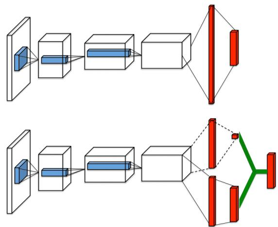  
Figure 1. A popular single stream $Q$ -network (top) and the dueling $Q$ -network (bottom). The dueling network has two streams to separately estimate (scalar) state-value and the advantages for each action; the green output module implements equation (9) to combine them. Both networks output $Q$ -values for each action.

# 3.1 价值函数与优势函数

Dueling DQN 的核心思想来源于优势函数（Advantage Function）的概念：

 状态价值函数 V(s)：衡量处于状态 s 的好坏程度  
 动作价值函数 Q(s,a)：衡量在状态 s 下选择动作 a 的长期回报  
优势函数 A(s,a)：定义为 A(s,a)=Q(s,a)−V(s)，表示动作 a 相对于平均水平的优势程度对优势函数取期望 $\mathbb { E } _ { a \sim \pi } [ A ( s , a ) ] = 0$ ，即优势函数在所有动作上的平均值为零。

# 3.2 网络架构与公式

Dueling DQN 将传统 DQN 的单一 Q 网络输出层分为两个分支：

 价值流（Value Stream）：输出标量 $V ( s ; \theta , \beta )$ ，表示状态价值

 优势流（Advantage Stream）：输出向量 $A ( s , a ; \theta , \alpha )$ ，表示每个动作的优势值

最终 Q 值的计算方式为：

$$
Q (s, a; \theta , \alpha , \beta) = V (s; \theta , \beta) + \left(A (s, a; \theta , \alpha) - \max  _ {a ^ {\prime} \in A} A (s, a ^ {\prime}; \theta , \alpha)\right)
$$

实践中也常使用均值形式：

$$
Q (s, a; \theta , \alpha , \beta) = V (s; \theta , \beta) + \left(A (s, a; \theta , \alpha) - \frac {1}{\mathcal {A}} \sum_ {a ^ {\prime}} A (s, a ^ {\prime}; \theta , \alpha)\right)
$$

这种结构强制优势函数零中心化，解决了辨识性问题（V和A的相对尺度不确定），同时使网络能更高效地学习状态价值表示。

# 4 三者对比与适用场景

<table><tr><td>特性</td><td>DQN</td><td>Double DQN</td><td>Dueling DQN</td></tr><tr><td>核心创新</td><td>基础算法：神经网络近似Q函数+经验回放+目标网络</td><td>解耦动作选择与价值评估</td><td>网络结构分离：
状态价值V+动作优势A</td></tr><tr><td>TD目标公式</td><td>Yt=r+γmaxaQ(s&#x27;,a;θ-)</td><td>Yt=r+γQ(s&#x27;,arg maxaQ(s&#x27;,a;θ);θ-)</td><td>与DQN或Double DQN相同，但Q网络结构不同</td></tr><tr><td>解决的问题</td><td>处理高维状态空间，稳定训练</td><td>减轻Q值过高估计</td><td>更好评估状态价值，尤其动作影响较小时</td></tr><tr><td>训练稳定性</td><td>相对较低，存在过高估计</td><td>较高，减轻了过高估计</td><td>较高，学习更鲁棒的状态表征</td></tr><tr><td>计算复杂度</td><td>较低</td><td>略高于DQN（需两次前向传播）</td><td>与DQN相当（分支结构增加参数不多）</td></tr><tr><td>适用动作空间</td><td>离散动作空间</td><td>离散动作空间</td><td>离散动作空间（尤其是动作数量较多时）</td></tr></table>

#  DQN 适用场景：

适用于中等复杂度环境、离散动作空间、作为基础学习算法。例如简单的 Atari游戏（如 Pong）、低维状态空间的决策问题。作为基础算法，适合初学者理解和实现深度强化学习的基本原理。

#  Double DQN 适用场景：

适用于需要减少 Q 值过高估计的环境，特别是那些奖励稀疏或需要长时间规划的任务。在许多 Atari 游戏（如 SpaceInvaders）中，Double DQN 相比 DQN 能取得更好的性能和稳定性。也适用于医疗诊断、金融交易等对估计准确性要求较高的领域。

#  Dueling DQN 适用场景：

适用于状态价值至关重要而单个动作影响相对较小的环境。例如自动驾驶中，环境状态（道路、交通情况）比具体动作（微小转向调整）更重要；或者资源分配问题中，状态（资源总量）比具体分配动作更关键。在动作空间较大的环境中，Dueling 结构能显著提高学习效率。

# 回答总结：

 PPO 是 on-policy 算法：其数据采集与优化策略严格一致，且无长期经验存储机制。  
 通过重要性采样提升效率：在单批次数据上多次更新（K-step），模拟 off-policy 的样本复用，但本质仍是 on-policy 框架。  
 工业应用定位：PPO 在 RLHF 等场景中作为 on-policy 优化器，依赖实时数据生成（如 GPT 对齐任务）。

PPO（Proximal Policy Optimization）算法本质上是 on-policy（同策略）方法，但通过重要性采样（Importance Sampling）技术实现了部分数据复用，使其在训练效率上接近 off-policy 方法。

# 1. 核心性质：On-Policy

 数据来源：PPO 使用当前策略 （当前参数化的策略网络）与环境交互收集数据，每次策略更新后需重新采样新数据。旧数据无法跨轮次复用，符合 on-policy 的定义。  
 策略一致性：训练优化的策略（Actor）与数据采集的策略是同一个，即“自己生成数据、自己学习”。

# 2. 重要性采样的作用：模拟 Off-Policy 效率

PPO 通过重要性采样在单次迭代内复用当前批次的数据，实现类似 off-policy 的样本效率：

#  技术原理：

用旧策略 $\pi _ { \theta _ { \mathrm { o l d } } }$ 采集的数据，计算新策略 $\pi _ { \theta }$ 的更新梯度：

$$
\nabla J (\theta) \approx \mathbb {E} _ {s, a \sim \pi_ {\mathrm {o l d}}} \left[ \frac {\pi_ {\theta} (a | s)}{\pi_ {\mathrm {o l d}} (a | s)} A ^ {\pi_ {\mathrm {o l d}}} (s, a) \right], \quad \text {其 中} \quad \frac {\pi_ {\theta}}{\pi_ {\mathrm {o l d}}} \quad \text {为 重 要 性 权 重}, \text {修 正 策 略 差 异}.
$$

 数据复用限制：重要性采样仅在单次迭代的 K 次小批量更新中复用数据（如 ${ \sf K } = 3 \sim 1 0$ 次），之后必须丢弃旧数据并重新采样， 无法长期存储经验。

# 3. 与典型 Off-Policy 方法的对比

<table><tr><td>特性</td><td>PPO</td><td>Off-Policy（如DDPG、SAC）</td></tr><tr><td>数据来源</td><td>当前策略采样，每次更新后丢弃</td><td>历史策略数据存储在经验回放池</td></tr><tr><td>数据复用</td><td>仅单批次内K次更新</td><td>长期复用任意历史数据</td></tr><tr><td>策略一致性</td><td>训练策略=采样策略</td><td>训练策略≠采样策略（如旧策略）</td></tr><tr><td>典型组件</td><td>无经验回放池</td><td>必需经验回放池</td></tr><tr><td>样本效率</td><td>中（依赖重复采样）</td><td>高（数据可复用）</td></tr></table>

⋅ 关键区别 ：PPO 的“伪 off-policy”特性仅限于单批次内的短期数据复用，而真正 off-policy 方法（如 DDPG）通过经验回放池长期跨轮次复用数据。

# 4. 设计动机：平衡稳定性与效率

 On-Policy的稳定性：直接使用当前策略数据，避免因策略差异导致的价值估计偏差（如 DDPG 需目标网络稳定训练）。  
 Clip 机制进一步约束 ：限制重要性权重 $r _ { t } ( \theta )$ 在 $\left[ 1 - \epsilon , 1 + \epsilon \right]$ 之间，防止新旧策略差异过大导致梯度失效，增强 on-policy 训练的稳定性。

# 1. 论文信息

 论文标题：Decision Transformer: Reinforcement Learning via Sequence Modeling   
 论文链接：https://arxiv.org/abs/2106.01345  
 官方代码：https://github.com/kzl/decision-transformer  
 作者机构：UC Berkeley, Facebook AI Research (FAIR), Google Brain

# 2. 提出背景

Decision Transformer（DT）的提出源于传统强化学习（RL）方法的几个固有挑战：

 长期信用分配困难：传统 RL 算法（如 DQN、PPO）在长时序任务中，由于依赖贝尔曼方程（Bellman equation）的迭代更新，对稀疏奖励或延迟奖励的处理效率较低，信用分配（Credit Assignment）效果不佳。  
 离线 RL 的稳定性问题：离线强化学习（Offline RL）中，智能体仅从固定数据集中学习，传统方法如 Q-learning 容易因价值函数高估（value overestimation）或分布外（OOD）动作导致训练不稳定。  
计算效率与框架复杂性：传统 RL 需设计复杂的价值函数或策略梯度优化框架，而 Transformer 在自然语言处理（NLP）领域已证明能有效建模长序列数据。DT 试图将 RL 问题重新定义为序列建模任务，利用 Transformer 的并行化能力简化流程。

DT 的核心目标是：通过序列建模替代动态规划，避免传统 RL 的"致命三要素"（函数逼近、自举、离线学习），同时实现更稳定的离线策略学习。

# 3. 主要创新点

 范式转变：将 RL 问题转化为条件序列生成任务，使用 Transformer 架构直接预测动作，而非依赖价值函数优化或策略梯度。  
 Return-to-Go 条件化：引入"剩余回报"（Return-to-Go）作为条件信号，使策略能根据目标回报调整行为（例如，高目标回报触发激进动作，低目标回报触发保守动作）。  
 完全监督学习框架：采用离线数据集进行监督训练，通过最大似然估计预测动作，避免传统 RL的在线交互探索。  
 长程依赖建模：利用 Transformer 的自注意力机制直接捕捉状态-动作-回报间的长期依赖，替代贝尔曼方程的逐步更新。

# 4. 数学原理与模型架构

# 4.1 轨迹表示

将轨迹表示为三元组序列，每个时间步包含：

$$
\hat {R} _ {t} = \sum_ {t ^ {\prime} = t} ^ {T} r _ {t ^ {\prime}}
$$

 剩余回报（Return-to-Go）： ，表示从时刻 $t$ 到轨迹结束的累积奖励。

状态（State）： $s _ { t } \in { \mathcal { S } } .$ 。  
动作（Action）： $a _ { t } \in \mathcal A _ { c }$ 。

轨迹形式为： $\tau = ( \hat { R } _ { 1 } , s _ { 1 } , a _ { 1 } , \hat { R } _ { 2 } , s _ { 2 } , a _ { 2 } , \dots , \hat { R } _ { T } , s _ { T } , a _ { T } )$

# 4.2 模型架构

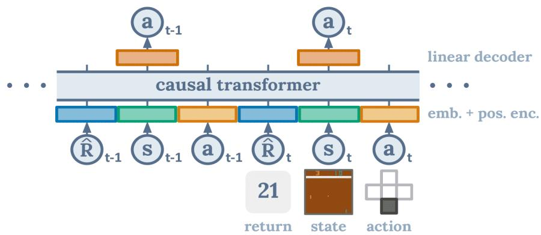

 输入编码：对每个模态（剩余回报、状态、动作）使用独立的线性嵌入层，将原始输入投影到向量空间。添加时间步编码（非标准位置编码）以保留序列顺序。  
 Transformer backbone：采用 GPT 风格的因果 Transformer 解码器，确保自回归生成时仅关注历史信息。  
 注意力机制：通过查询（Query）、键（Key）、值（Value）计算注意力权重，公式为：

$$
\operatorname {A t t e n t i o n} (Q, K, V) = \operatorname {s o f t m a x} \left(\frac {Q K ^ {T}}{\sqrt {d _ {k}}}\right) V
$$

# 4.3 训练目标

通过最小化预测动作与真实动作的差异进行训练：

$$
\mathcal {L} = - \sum_ {t} \log P \left(a _ {t} \mid \hat {R} _ {\leq t}, s _ {\leq t}, a _ {<   t}\right)
$$

离散动作：交叉熵损失

$$
\mathcal {L} = \frac {1}{T} \sum_ {t} | | a _ {t} - \hat {a} _ {t} | | ^ {2}
$$

连续动作：均方误差（MSE）损失

# 5. 算法步骤

# 训练阶段

1. 数据准备：从离线数据集中采样轨迹片段，计算每个时间步的 $\hat { R } _ { t _ { \circ } }$   
2. 输入构建：将最近的 K 个三元组 $( \hat { R } _ { i } , s _ { i } , a _ { i } )$ 作为输入，生成 3K 个令牌。  
3. 模型优化：使用梯度下降最小化动作预测损失，仅对动作输出计算损失。

# 推理阶段

1. 初始化：设定目标回报 $\hat { R } _ { \mathrm { t a r g e t } }$ （如专家级回报），获取初始状态 $s _ { 1 }$ 。  
2. 自回归生成：

a. 输入当前序列 $[ \hat { R } _ { t } , s _ { t } , a _ { < t } ]$ 到 Transformer。  
b. 模型输出动作 $\mathbf { } \mathbf { } \mathbf { } \mathbf { } \mathbf { } \mathbf { } \mathbf { } \mathbf { } \mathbf { } \mathbf { } \mathbf { } \mathbf { } \mathbf { } \mathbf { } \mathbf { } \mathbf { } \mathbf { } \mathbf { } \mathbf { } \mathbf { } \mathbf { } \mathbf { } \mathbf { } \mathbf { } \mathbf { } \mathbf { } \mathbf { } \mathbf { } \mathbf { } \mathbf { } \mathbf { } \mathbf { } \mathbf { } \mathbf { } \mathbf { } \mathbf { } \mathbf { } \mathbf { } \mathbf { } \mathbf { } \mathbf { } \mathbf { } \mathbf { } \mathbf { } \mathbf { } \mathbf { } \mathbf { } \mathbf { } \mathbf { } \mathbf { } \mathbf { } \mathbf { } \mathbf { } \mathbf { } \mathbf { } \mathbf { } \mathbf { } \mathbf { } \mathbf { } \mathbf { } \mathbf { } \mathbf { } \mathbf { } \mathbf { } \mathbf { } \mathbf { } \mathbf { } \mathbf { } \mathbf { } \mathbf { } \mathbf { } \mathbf { } \mathbf { } \mathbf { } \mathbf { } \mathbf { } \mathbf { } \mathbf { } \mathbf { } \mathbf { } \mathbf { } \mathbf { } \mathbf { } \mathbf { } \mathbf { } \mathbf { } \mathbf { } \mathbf { } \mathbf { } \mathbf { } \mathbf { } \mathbf { } \mathbf { } \mathbf { } \mathbf { } \mathbf { } \mathbf { } \mathbf { } \mathbf { } \mathbf \Psi \mathbf { } \mathbf { } \mathbf { } \mathbf { } \mathbf \Psi \mathbf { } \mathbf { } \mathbf \Psi \mathbf { } \mathbf { } \mathbf \Psi \mathbf { } \mathbf { } \mathbf \Psi \mathbf { } \mathbf \Psi \Psi \mathbf { } \mathbf \Psi \mathbf { } \mathbf \Psi \Psi \mathbf { } \mathbf \Psi \Psi \mathbf { } \mathbf \Psi \Psi \mathbf { } \mathbf \Psi \Psi \mathbf { } \mathbf \Psi \Psi \mathbf { } \mathbf \Psi \Psi \mathbf \Psi \Psi \Psi \mathbf { } \mathbf \Psi \Psi \mathbf \Psi \Psi \Psi \mathbf \Psi \Psi \Psi \mathbf \Psi \Psi \mathbf \Psi \Psi \Psi \mathbf \Psi \Psi \mathbf \Psi \Psi \mathbf \Psi \Psi \mathbf \Psi \Psi \mathbf \Psi \Psi \mathbf \Psi \mathbf \Psi \Psi \mathbf \Psi \Psi \mathbf \Psi \mathbf \Psi \Psi \mathbf \Psi \mathbf \Psi \mathbf \Psi \Psi \mathbf \Psi \mathbf \Psi \mathbf \Psi \mathbf \Psi \mathbf \Psi \mathbf \Psi \mathbf \Psi \mathbf \Psi \mathbf \Psi $ ，并与环境交互得到奖励 $r _ { t }$ 和下一状态 $s _ { t + 1 }$ 。  
c. 更新剩余回报： $\hat { R } _ { t + 1 } = \hat { R } _ { t } - r _ { t }$ 。  
d. 重复直至轨迹终止。

# 6. 与传统方法的比较

<table><tr><td>特性</td><td>Decision Transformer</td><td>传统 RL（如 CQL、PPO）</td></tr><tr><td>问题建模</td><td>序列生成（监督学习）</td><td>动态规划/策略优化</td></tr><tr><td>回报处理</td><td>目标回报作为条件输入</td><td>通过价值函数隐式建模</td></tr><tr><td>长期依赖</td><td>自注意力机制直接捕捉</td><td>依赖折扣因子或循环网络</td></tr><tr><td>离线学习</td><td>直接利用轨迹数据，无需交互</td><td>需重要性采样或约束优化</td></tr><tr><td>探索机制</td><td>依赖数据分布，无显式探索</td><td>ε-greedy、随机策略</td></tr></table>

# 7. 总结

Decision Transformer 通过将强化学习重构为条件序列建模问题，提供了一种简化且高效的替代方案。

其核心优势在于：

 规避了传统 RL 的稳定性问题（如"致命三要素"）。  
 在稀疏奖励和长程依赖任务中表现显著优于传统方法。  
 为融合大规模预训练模型（如 GPT）与决策任务奠定了基础。

不过也存在一定的局限性：

 计算开销：序列长度增加时，注意力机制计算复杂度呈平方增长。  
 外推能力有限：若最优动作未在数据集中出现，DT 难以生成超越数据质量的策略。  
随机性建模弱：Transformer 输出多为确定性动作，难以建模随机策略。