# 机器学习方法第2版

# （四）强化学习

李航 著

# 机器学习方法第2版

# （四）强化学习

李航著

# 内容简介

机器学习是以概率论、统计学、信息论、最优化理论、计算理论等为基础的计算机应用理论学科，也是人工智能、数据挖掘等领域的基础学科。本书全面系统地介绍了机器学习的主要方法，共分4篇。第1篇介绍监督学习的主要方法，包括线性回归、感知机、支持向量机、最大熵模型与逻辑斯谛回归、提升方法、隐马尔可夫模型和条件随机场等；第2篇介绍无监督学习的主要方法，包括聚类、奇异值分解、主成分分析、马尔可夫链蒙特卡罗法、EM算法、潜在语义分析、潜在狄利克雷分配等。第3篇介绍深度学习的主要方法，包括前馈神经网络、卷积神经网络、循环神经网络、Transformer、扩散模型、生成对抗模型等。第4篇介绍强化的主要方法，包括马尔可夫决策、多臂老虎机、近端策略优化、深度Q网络等。书中每章介绍一两种机器学习方法。详细叙述各个方法的模型、策略和算法。从具体例子入手，由浅入深，帮助读者直观地理解基本思路，同时从理论角度出发，给出严格的数学推导，严谨翔实，让读者更好地掌握基本原理和概念。目的是使读者能学会和使用这些机器学习的基本技术。为满足读者进一步学习的需要，书中还对各个方法的要点进行了总结，给出了一些习题，并列出了主要参考文献。

本书是机器学习及相关课程的教学参考书，适合人工智能、数据挖掘等专业的本科生、研究生使用，也可供计算机各个领域的专业研发人员参考。

本书封面贴有清华大学出版社防伪标签，无标签者不得销售。

版权所有，侵权必究。举报：010-62782989，beiqinquan@tup.tsinghua.edu.cn。

# 图书在版编目（CIP）数据

机器学习方法/李航著.--2版.--北京：清华大学出版社，2025.7.ISBN978-7-302-69646-9

I. TP181

中国国家版本馆CIP数据核字第2025QZ6971号

责任编辑：孙亚楠

封面设计：李祥榕

责任校对：王淑云

责任印制：宋林

出版发行：清华大学出版社

网 址：https://www.tup.com.cn，https://www.wqxuetang.com

地址：北京清华大学学研大厦A座 邮编：100084

社总机：010-83470000 邮购：010-62786544

投稿与读者服务：010-62776969，c-service@tup.tsinghua.edu.cn

质量反馈：010-62772015，zhiliang@tup.tsinghua.edu.cn

印装者：三河市东方印刷有限公司

经销：全国新华书店

开 本： $185\mathrm{mm}\times 260\mathrm{mm}$ 印张：51.75插页：4字数：1200千字

版次：2022年3月第1版 2025年7月第2版 印次：2025年7月第1次印刷

印 数： $1\sim 6000$

定价：198.00元（全4册）

# 目录

# 第1篇 监督学习

# 第1章 机器学习简介 3

1.1 机器学习的定义 3  
1.2 本书内容 ..... 5

# 第2章 监督学习简介 6

2.1 监督学习概述 6

2.1.1 监督学习的形式化 6  
2.1.2 监督学习三要素 8  
2.1.3 模型评估与模型选择 12  
2.1.4 正则化与交叉验证 17   
2.1.5 泛化能力 18

2.2 监督学习问题 21

2.2.1 分类问题 21  
2.2.2 回归问题 22  
2.2.3 序列标注问题 23

2.3 监督学习方法概述 24

2.3.1 生成方法与判别方法 ..... 25  
2.3.2 分类方法 25  
2.3.3 回归方法 28  
2.3.4 序列标注方法 29

本篇内容 29

继续阅读 30   
习题 30  
参考文献 30

# 第3章 线性回归 31

3.1 线性回归模型 31

3.1.1 模型定义 31  
3.1.2 概率模型表示 32  
3.1.3 基函数和模型的扩展 32

3.2 线性回归学习算法 34

3.2.1 最小二乘法 34  
3.2.2 正规方程 35  
3.2.3 梯度下降 36

3.3 岭回归和 Lasso 38

本章概要 40  
继续阅读 41   
习题 42  
参考文献 42

第4章 感知机 43

4.1 感知机模型 43  
4.2 感知机学习策略 44

4.2.1 数据集的线性可分性 44  
4.2.2 感知机学习策略 45

4.3 感知机学习算法 46

4.3.1 感知机学习算法的原始形式 46  
4.3.2 算法的收敛性 49  
4.3.3 感知机学习算法的对偶形式 ..... 50

本章概要 52  
继续阅读 53   
习题 53  
参考文献 54

第5章 $k$ 近邻法 55

5.1 $k$ 近邻算法 55  
5.2 $k$ 近邻模型 56

5.2.1 模型 56  
5.2.2 距离度量 57  
5.2.3 $k$ 值的选择 58   
5.2.4 决策规则 58

5.3 $k$ 近邻法的实现： $k$ -d 树 ..... 59

5.3.1 构建 $k$ -d 树 ..... 59   
5.3.2 搜索 $k$ -d 树 60

本章概要 62

继续阅读 62   
习题 63  
参考文献 63

# 第6章 朴素贝叶斯法 ..... 64

6.1 朴素贝叶斯模型 64

6.1.1 模型定义 64  
6.1.2 分类决策 66  
6.1.3 概率模型 66  
6.1.4 生成模型与判别模型 67

6.2 朴素贝叶斯学习 67

6.2.1 学习问题 67  
6.2.2 极大似然估计 67   
6.2.3 学习和分类算法 68  
6.2.4 贝叶斯估计 69

本章概要 71  
继续阅读 71   
习题 71  
参考文献 72

# 第7章 决策树 73

7.1 决策树模型与学习 ..... 73

7.1.1 决策树 73   
7.1.2 决策树模型 74  
7.1.3 决策树学习 75

7.2 特征选择 76

7.2.1 特征选择问题 ..... 76  
7.2.2 熵、条件熵和互信息 78  
7.2.3 信息增益与特征选择 ..... 79

7.3 分类树的生成 81  
7.4分类树的剪枝 82   
7.5 CART算法 83

7.5.1 CART 生成 ..... 84  
7.5.2 CART剪枝 88

本章概要 89

继续阅读 91   
习题 91  
参考文献 92

# 第8章 逻辑斯谛回归和最大熵模型 ..... 93

8.1 逻辑斯谛回归模型 ..... 93

8.1.1 逻辑斯谛分布 ..... 93  
8.1.2 二项逻辑斯谛回归 94

8.1.3 多项逻辑斯谛回归 96

8.2 最大熵模型 97

8.2.1 最大熵原理 97  
8.2.2 最大熵模型的定义 99  
8.2.3 最大熵模型的学习 100  
8.2.4 最大熵模型的极大似然估计 104  
8.2.5 与逻辑斯谛回归模型的关系 ..... 105  
8.2.6 与指数分布族的关系 ..... 105

8.3 学习算法 106

8.3.1 梯度下降 106   
8.3.2 拟牛顿法 108

本章概要 110

继续阅读 111

习题 111

参考文献 111

第9章 支持向量机 113

9.1 线性可分支持向量机与硬间隔最大化 113

9.1.1 线性可分支持向量机 113  
9.1.2 函数间隔和几何间隔 115  
9.1.3 间隔最大化 116  
9.1.4 对偶问题的算法 120

9.2 线性支持向量机与软间隔最大化 125

9.2.1 线性支持向量机 125  
9.2.2 对偶问题的算法 126  
9.2.3 支持向量 129  
9.2.4 无约束最优化算法 ..... 129

9.3 非线性支持向量机与核函数 133

9.3.1 核技巧 133   
9.3.2 正定核 136  
9.3.3 常用核函数 140  
9.3.4 非线性支持向量分类机 141

本章概要 142

继续阅读 144

习题 144

参考文献 145

第10章 提升方法 147

10.1 AdaBoost算法 147

10.1.1 基本想法 147  
10.1.2 算法 148  
10.1.3 AdaBoost的例子 150  
10.1.4 训练误差分析 152  
10.1.5 前向分步算法解释 153

# 10.2 梯度提升 157

10.2.1 基本想法 157  
10.2.2 GBDT用于回归 158  
10.2.3 GBDT算法 161

# 本章概要 163

# 继续阅读 165

# 习题 165

# 参考文献 166

# 第11章 隐马尔可夫模型 ..... 167

# 11.1 隐马尔可夫模型的基本概念 167

11.1.1 模型的定义 167  
11.1.2 模型的特点 169  
11.1.3 基本问题 171

# 11.2 概率计算算法 171

11.2.1 直接计算法 171  
11.2.2 前向算法 172  
11.2.3 后向算法 174  
11.2.4 前向-后向算法 176  
11.2.5 一些概率与期望值的计算 ..... 176

# 11.3 学习算法 177

11.3.1 监督学习方法 177  
11.3.2 Baum-Welch 算法 178  
11.3.3 模型参数估计 180

# 11.4 预测算法 181

11.4.1 近似算法 181  
11.4.2 维特比算法 181

# 本章概要 185

# 继续阅读 186

# 习题 187

# 参考文献 187

# 第12章 条件随机场 188

# 12.1 概率无向图模型 188

12.1.1 模型的定义 188  
12.1.2 概率无向图模型的因子分解 ..... 191  
12.1.3 概率无向图模型的例子 ..... 193

# 12.2 条件随机场的基本概念 194

12.2.1 模型的定义 194  
12.2.2 模型的形式 195  
12.2.3 基本问题 199

# 12.3 概率计算算法 200

12.3.1 前向算法 200  
12.3.2 后向算法 201  
12.3.3 前向-后向算法 201  
12.3.4 期望值的计算 202

# 12.4 学习算法 202

12.4.1 监督学习算法 203  
12.4.2 拟牛顿法 203

# 12.5 预测算法 204

本章概要 207

# 继续阅读 209

习题 209

参考文献 210

# 第13章 监督学习方法总结 211

# 第2篇 无监督学习

# 第14章 无监督学习简介 ..... 219

# 14.1 无监督学习问题 ..... 219

14.1.1 聚类问题 219  
14.1.2 降维问题 220  
14.1.3 话题分析问题 ..... 221  
14.1.4 概率模型估计问题 ..... 223

# 14.2 无监督学习方法概述 223

14.2.1 机器学习三要素 223  
14.2.2 聚类方法 224  
14.2.3 降维方法 224  
14.2.4 话题分析方法——非概率模型 ..... 225  
14.2.5 话题分析方法——概率模型 ..... 226  
14.2.6 概率模型估计方法 227

# 本篇内容 228

# 继续阅读 228

参考文献 228

# 第15章 聚类方法 ..... 229

15.1 聚类的基本概念 229

15.1.1 相似度或距离 229  
15.1.2 类或簇 232   
15.1.3 类与类之间的距离 233

15.2 层次聚类 234

15.3 $k$ 均值聚类 235

15.3.1 模型 236  
15.3.2 策略 236  
15.3.3 算法 237  
15.3.4 算法特性 238

本章概要 239

继续阅读 240   
习题 240  
参考文献 240

# 第16章 奇异值分解 242

16.1 奇异值分解的定义与性质 242

16.1.1 定义与定理 242  
16.1.2 紧奇异值分解与截断奇异值分解 246  
16.1.3 几何解释 248   
16.1.4 主要性质 250

16.2 奇异值分解的计算 251  
16.3 奇异值分解与矩阵近似 254

16.3.1 弗罗贝尼乌斯范数 254  
16.3.2 矩阵的最优近似 255  
16.3.3 矩阵的外积展开式 258

本章概要 260

继续阅读 261   
习题 261  
参考文献 262

# 第17章 主成分分析 263

17.1 总体主成分分析 263

17.1.1 基本想法 263  
17.1.2 定义和导出 265  
17.1.3 主要性质 266

17.1.4 主成分分析与降维 270  
17.1.5 规范化的总体主成分 273

# 17.2 样本主成分分析 274

17.2.1 定义和性质 274  
17.2.2 相关矩阵的特征值分解算法 276  
17.2.3 样本矩阵的奇异值分解算法 279

# 本章概要 280

# 继续阅读 282

# 习题 282

# 参考文献 283

# 第18章 EM算法和变分EM算法 284

# 18.1 EM算法 284

18.1.1 简单例子 285  
18.1.2 基本算法 287  
18.1.3 基本原理 288  
18.1.4 算法收敛性 290  
18.1.5 广义算法 291

# 18.2 高斯混合模型的EM算法 293

18.2.1 高斯混合模型 293  
18.2.2 EM算法 293  
18.2.3 与 $k$ 均值的关系 ..... 296

# 18.3 变分EM算法 297

18.3.1 变分贝叶斯方法 297  
18.3.2 基本算法 299  
18.3.3 EM算法和变分EM算法的比较 300

# 本章概要 300

# 继续阅读 302

# 习题 302

# 参考文献 303

# 第19章 马尔可夫链蒙特卡罗法 304

# 19.1 蒙特卡罗法 304

19.1.1 随机抽样 304   
19.1.2 数学期望估计 305

# 19.2 积分计算 307

# 19.3 马尔可夫链 308

19.3.1 基本定义 308  
19.3.2 离散状态马尔可夫链 309

19.3.3 连续状态马尔可夫链 314  
19.3.4 马尔可夫链的性质 315

# 19.4 马尔可夫链蒙特卡罗法 319

19.4.1 基本想法 319  
19.4.2 基本步骤 320

# 19.5 马尔可夫链蒙特卡罗法与机器学习 320

# 19.6 Metropolis-Hastings 算法 321

19.6.1 基本原理 321  
19.6.2 Metropolis-Hastings算法 324  
19.6.3 单分量Metropolis-Hastings算法 324

# 19.7 吉布斯抽样 325

19.7.1 基本原理 326  
19.7.2 吉布斯抽样算法 327  
19.7.3 抽样计算 328

# 本章概要 329

# 继续阅读 330

# 习题 331

# 参考文献 332

# 第20章 潜在语义分析和非负矩阵分解 333

# 20.1 单词向量空间与话题向量空间 333

20.1.1 单词向量空间 333  
20.1.2 话题向量空间 335

# 20.2 潜在语义分析算法 338

20.2.1 矩阵奇异值分解算法 338  
20.2.2 例子 340

# 20.3 非负矩阵分解算法 341

20.3.1 非负矩阵分解 341  
20.3.2 话题分析 342  
20.3.3 非负矩阵分解的形式化 342  
20.3.4 算法 343

# 本章概要 345

# 继续阅读 346

# 习题 346

# 参考文献 347

# 第21章 概率潜在语义分析 348

# 21.1 概率潜在语义分析模型 348

# 21.1.1 基本想法 348

21.1.2 生成模型 349  
21.1.3 共现模型 350  
21.1.4 模型性质 351

# 21.2 概率潜在语义分析的算法 353

本章概要 355

继续阅读 356

习题 356

参考文献 357

# 第22章 潜在狄利克雷分配 358

22.1 狄利克雷分布 358

22.1.1 分布定义 358  
22.1.2 共轭先验 361

22.2 潜在狄利克雷分配模型 362

22.2.1 基本想法 362  
22.2.2 模型定义 363  
22.2.3 概率图模型 365  
22.2.4 随机变量序列的可交换性 366  
22.2.5 概率公式 366

22.3 LDA的吉布斯抽样算法 367

22.3.1 基本想法 367  
22.3.2 算法的主要部分 368  
22.3.3 算法的后处理 370  
22.3.4 算法 370

22.4 LDA的变分EM算法 372

22.4.1 算法推导 372   
22.4.2 算法总结 378

本章概要 378

继续阅读 379

习题 379

参考文献 380

# 第23章 无监督学习方法总结 381

23.1 无监督学习方法的关系和特点 381

23.1.1 方法之间的关系 381  
23.1.2 无监督学习方法 ..... 381  
23.1.3 基础机器学习方法 382

23.2 话题模型之间的关系和特点 ..... 382

参考文献 383

# 第3篇 深度学习

# 第24章 深度学习简介 387

# 24.1 深度学习问题 ..... 387

24.1.1 监督学习问题 387  
24.1.2 无监督学习问题 389

# 24.2 深度学习方法概述 391

24.2.1 基本原理 391  
24.2.2 基本工具 391  
24.2.3 监督学习模型 395  
24.2.4 无监督学习模型 397  
24.2.5 基本算法 398  
24.2.6 预训练 398

# 24.3 深度学习应用 399

# 本篇内容 399

# 参考文献 400

# 第25章 前馈神经网络 401

# 25.1 前馈神经网络的模型 401

25.1.1 前馈神经网络定义 402  
25.1.2 前馈神经网络的例子 412  
25.1.3 前馈神经网络的表示能力 416

# 25.2 前馈神经网络的学习算法 419

25.2.1 前馈神经网络学习 419  
25.2.2 前馈神经网络学习的优化算法 421  
25.2.3 反向传播算法 424  
25.2.4 在计算图上的实现 427  
25.2.5 算法的实现技巧 431

# 25.3 前馈神经网络学习的正则化 436

25.3.1 深度学习中的正则化 436  
25.3.2 早停法 437  
25.3.3 暂退法 438

# 本章概要 441

# 继续阅读 443

# 习题 444

# 参考文献 444

# 第26章 卷积神经网络 446

# 26.1卷积神经网络的模型 446

# 26.1.1 背景 446

26.1.2 卷积 447  
26.1.3 汇聚 455   
26.1.4 卷积神经网络 458  
26.1.5 卷积神经网络性质 461

# 26.2 卷积神经网络的学习算法 463

26.2.1 卷积导数 463  
26.2.2 反向传播算法 464

# 26.3 图片分类中的应用 467

26.3.1 AlexNet 467   
26.3.2 残差网络 468

# 本章概要 472

# 继续阅读 474

# 习题 475

# 参考文献 476

# 第27章 循环神经网络 478

# 27.1 简单循环神经网络 478

27.1.1 模型 478  
27.1.2 学习算法 481

# 27.2 常用循环神经网络 485

27.2.1 长短期记忆网络 485  
27.2.2 门控循环单元网络 ..... 488  
27.2.3 深度循环神经网络 489  
27.2.4 双向循环神经网络 490

# 27.3 自然语言生成中的应用 491

27.3.1 词向量 ..... 491  
27.3.2 语言生成与语言模型 ..... 494

# 本章概要 496

# 继续阅读 498

# 习题 498

# 参考文献 499

# 第28章 Transformer 501

# 28.1 序列到序列基本模型 501

28.1.1 序列到序列 501  
28.1.2 基本模型 503

# 28.2 RNN Search 模型 ..... 504

28.2.1 注意力 504  
28.2.2 模型定义 506

28.2.3 模型特点 507

28.3 Transformer 模型 ..... 508

28.3.1 模型架构 508  
28.3.2 模型特点 515

本章概要 516

继续阅读 518

习题 518

参考文献 519

# 第29章 GPT和BERT 520

29.1 预训练语言模型 520  
29.2 GPT模型 522

29.2.1 模型和学习 522  
29.2.2 模型特点 526

29.3 BERT模型 526

29.3.1 模型和学习 526  
29.3.2 模型特点 531

本章概要 532  
继续阅读 533

习题 533

参考文献 534

# 第30章 变分自编码器 535

30.1 自编码器 535  
30.2 去噪自编码器 536  
30.3 变分自编码器 537

30.3.1 方法概述 537  
30.3.2 模型 538  
30.3.3 学习策略 540  
30.3.4 学习算法 542  
30.3.5 手写数字例 544

本章概要 545  
继续阅读 547   
习题 547  
参考文献 547

# 第31章 生成对抗网络 ..... 549

31.1 GAN基本模型 549

31.1.1 模型 549

31.1.2 学习算法 551  
31.1.3 理论分析 552

# 31.2 图片生成中的应用 553

31.2.1 转置卷积 554   
31.2.2 DCGAN 556

# 本章概要 558

# 继续阅读 559

# 习题 559

# 参考文献 560

# 第32章 扩散模型 561

32.1 去噪扩散概率模型 561

32.1.1 直观解释 562  
32.1.2 模型的定义和性质 562   
32.1.3 学习和生成算法 567

32.2 分数匹配加朗之万动力学 571

32.2.1 分数匹配 571  
32.2.2 朗之万动力学 573  
32.2.3 学习和生成算法 574

32.3 扩散模型之间的关系 577

32.3.1 分数函数学习 577  
32.3.2 随机微分方程 578

32.4 图像生成 580

32.4.1 扩散模型用于图像生成 580  
32.4.2 隐空间中的生成 581  
32.4.3 有条件的生成 ..... 582

本章概要 583

继续阅读 586

习题 586

参考文献 587

# 第33章 深度学习方法总结 588

33.1 深度学习的模型 588  
33.2 深度学习的算法 590  
33.3 深度学习的优缺点 592

# 参考文献 593

# 第4篇 强化学习

# 第34章 强化学习简介 597

34.1 强化学习问题 ..... 597

34.1.1 强化学习的定义 597  
34.1.2 相关问题 600

# 34.2 强化学习原理和方法 601

34.2.1 强化学习方法 601  
34.2.2 强化学习原理 601  
34.2.3 深度强化学习 602

# 34.3 强化学习应用 603

# 本篇内容 604

# 习题 605

# 参考文献 605

# 第35章 马尔可夫决策过程 606

# 35.1 马尔可夫决策过程定义 606

35.1.1 基本概念 606  
35.1.2 最优策略 610  
35.1.3 MDP例子 611

# 35.2 动态规划算法 614

35.2.1 规划问题 614  
35.2.2 贝尔曼方程 614  
35.2.3 策略评估 617   
35.2.4 策略迭代 620  
35.2.5 价值迭代 622  
35.2.6 算法的比较和扩展 625

# 本章概要 626

# 继续阅读 629

# 习题 629

# 参考文献 630

# 第36章 多臂老虎机 631

# 36.1 多臂老虎机概述 631

36.1.1 问题的定义 631  
36.1.2 探索和利用的权衡 633

# 36.2 基本算法 634

36.2.1 探索优先算法 634  
36.2.2 $\varepsilon$ 贪心算法 634  
36.2.3 UCB算法 636  
36.2.4 汤普森采样 638

# 本章概要 641

继续阅读 642

习题 642

参考文献 643

# 第37章 基于价值的方法 644

37.1 基于价值的方法概述 644  
37.2 模型无关预测 645

37.2.1 蒙特卡罗预测 645  
37.2.2 时序差分预测 648   
37.2.3 预测方法的总结 650

37.3 模型无关控制 652

37.3.1 蒙特卡罗控制 652  
37.3.2 SARSA算法 655  
37.3.3 Q学习 658   
37.3.4 在策略和离策略学习 660

37.4 基于价值的方法的总结 661

本章概要 662  
继续阅读 663   
习题 664  
参考文献 664

# 第38章 深度 $\mathbf{Q}$ 网络 665

38.1 价值函数近似法 665  
38.2 DQN方法 669

本章概要 671  
继续阅读 672

习题 672  
参考文献 672

# 第39章 基于策略的方法 673

39.1 基于策略的方法概述 673  
39.2 REINFORCE算法 675

39.2.1 REINFORCE 算法 675  
39.2.2 带基线的REINFORCE算法 678  
39.2.3 策略函数 680

39.3 演员-评论员算法 681  
39.4 策略梯度方法总结 683

39.4.1 一般形式 683  
39.4.2 策略梯度定理 684

39.5 策略梯度的应用例 686

本章概要 687

继续阅读 689

习题 689

参考文献 690

# 第40章 近端策略优化PPO 691

40.1 TRPO算法 691

40.1.1 背景和动机 691  
40.1.2 基本形式 692  
40.1.3 算法和理论推导 693   
40.1.4 具体算法 696

40.2 PPO算法 697

40.2.1 算法概述 697  
40.2.2 PPO-Clip 698   
40.2.3 具体算法 699

40.3 大语言模型的应用 700

40.3.1 LLM 概述 ..... 700   
40.3.2 预训练 701   
40.3.3 SFT 701   
40.3.4 RLHF 702   
40.3.5 LLM 的特点 703

本章概要 703

继续阅读 705

习题 705

参考文献 705

# 第41章 强化学习方法总结 706

41.1 强化学习的重要性 706

41.1.1 强化学习 706  
41.1.2 强化学习与监督学习 706  
41.1.3 强化学习与生物学习 707

41.2 强化学习方法之间的关系 707

41.2.1 强化学习方法 707  
41.2.2 基于模型、价值、策略的方法 709

41.3 其他强化学习问题和方法 710  
41.4 强化学习的机遇和挑战 710

参考文献 711

附录A 梯度下降法 712  
附录B 牛顿法和拟牛顿法 714  
附录C 拉格朗日对偶性 719  
附录D 矩阵空间 722  
附录E KL散度和狄利克雷分布 725  
附录F 深度学习中的偏导数 727  
附录G 深度学习的优化算法 729

# 第4篇 强化学习

__________

# 第34章 强化学习简介

本章简要地介绍强化学习的问题、强化学习的原理和方法以及强化学习的应用。为了方便理解，只给出强化学习常见的定义和基本方法的直观解释。

# 34.1 强化学习问题

强化学习，包括强化学习的问题、理论和方法，是与监督学习和无监督学习不同的机器学习范式。不过，监督学习也可以用于强化学习。强化学习与深度学习的结合所产生的深度强化学习使强化学习发展到新的阶段。

# 34.1.1 强化学习的定义

# 1. MDP

强化学习中有智能体（agent）与环境（environment）。智能体是主体，处于环境之中，环境是一个动态系统（dynamical system）。智能体与环境进行交互，智能体观察到环境的一个状态（state），对环境执行一个动作（action），得到环境的一个奖励（reward），环境进入下一个状态，不断重复，见图34.1。环境最初处于初始状态，过程中状态不断发生变化，直到进入终止状态。整个过程是智能体与环境交互的序列决策过程。智能体的目标是最大化最终累积的奖励，称作回报（return）。这里只考虑交互是有限的情况，也可以是无限的，分别称为有限期（finite horizon）和无限期（infinite horizon）。

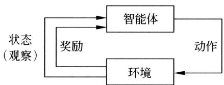  
图34.1 强化学习框架

强化学习假设上述序列决策过程是一个随机过程，由马尔可夫决策过程（Markov decision process, MDP）刻画。设状态的集合为 $s \in S$ ，动作的集合为 $a \in A$ 。在第 $t$ 时刻，环境处于状态 $S_{t} = s$ ，智能体根据策略函数 $P(a|s)$ 基于状态 $S_{t} = s$ 决定动作 $A_{t} = a$ ，环境根据状态转移分布 $P(a|s)$ 基于状态 $S_{t} = s$ 和动作 $A_{t} = a$ 决定第 $t + 1$ 时刻的状态 $S_{t + 1} = s'$ ，

环境根据奖励函数 $R(s, a)$ 基于状态 $S_{t} = s$ 和动作 $A_{t} = a$ 给出第 $t + 1$ 时刻的奖励 $R_{t + 1}$ ; 在第 $t + 1$ 时刻, 智能体再根据策略函数 $P(a'|s')$ 基于状态 $S_{t + 1} = s'$ 决定动作 $A_{t + 1} = a'$ , 依次循环。

智能体和环境的交互在离散时间 $t = 0,1,2,\dots T$ 上形成一个序列，称作轨迹（trajectory）。

$$
S _ {0}, A _ {0}, R _ {1}, S _ {1}, A _ {1}, \dots S _ {t}, A _ {t}, R _ {t + 1}, S _ {t + 1}, A _ {t + 1}, \dots , R _ {T}, S _ {T}
$$

其中， $S_{t}$ 是环境第 $t$ 时刻的状态， $A_{t}$ 是智能体第 $t$ 时刻的动作， $R_{t+1}$ 是环境给出的第 $t+1$ 时刻的奖励， $S_{t+1}$ 是环境第 $t+1$ 时刻的状态， $A_{t+1}$ 是智能体第 $t+1$ 时刻的动作， $S_{0}$ 是初始状态， $S_{T}$ 是终止状态。注意，针对第 $t$ 时刻的状态 $S_{t}$ 和动作 $A_{t}$ 的奖励 $R_{t+1}$ 是第 $t+1$ 时刻的，因为在更一般的定义中 $R_{t+1}$ 不仅由 $S_{t}$ 和 $A_{t}$ ，而且由 $S_{t+1}$ 决定。

MDP的轨迹数据又可以拆分为一个状态-动作的序列和一个奖励的序列。状态-动作的序列有时也称作轨迹。

$$
\tau = S _ {0}, A _ {0}, S _ {1}, A _ {1}, \dots S _ {t}, A _ {t}, S _ {t + 1}, A _ {t + 1} \dots , S _ {T}
$$

$$
R _ {1} R _ {2}, \dots , R _ {t + 1}, R _ {t + 2}, \dots , R _ {T}
$$

轨迹数据中的累积的奖励或回报是

$$
G _ {0} = \sum_ {t = 1} ^ {T} \gamma^ {t - 1} R _ {t}
$$

其中， $0 < \gamma \leqslant 1$ 是折扣因子。有限期时经常设 $\gamma = 1$

环境决定的是状态转移概率分布 $P(s'|s,a)$ 和奖励函数 $R(s,a)$ 。转移概率分布和奖励函数统称为模型 (model)。智能体决定的是策略函数（条件概率分布） $P_{\theta}(a|s)$ ，其中 $\theta$ 是参数。转移概率分布 $P(s'|s,a)$ 具有马尔可夫性，即满足

$$
P \left(S _ {t + 1} \mid S _ {t}, A _ {t}\right) = P \left(S _ {t + 1} \mid S _ {0}, A _ {0}, \dots S _ {t}, A _ {t}\right), t = 0, 1, \dots , T - 1 \tag {34.1}
$$

也就是说，当前时刻的状态 $S_{t}$ 和动作 $A_{t}$ 到下一个时刻的状态 $S_{t + 1}$ 的转移概率 $P(S_{t + 1}|S_t,A_t)$ 只依赖于 $S_{t}$ 和 $A_{t}$ 。

如果智能体的策略函数 $P(a|s)$ 和环境的状态转移分布 $P(s'|s,a)$ 确定，状态-动作序列的联合概率也就确定。

$$
\begin{array}{l} P (\tau) = P \left(S _ {0}, A _ {0}, S _ {1}, A _ {1} \dots S _ {t}, A _ {t}, S _ {t + 1}, A _ {t + 1}, \dots S _ {T}\right) \\ = P \left(S _ {0}\right) P \left(A _ {0} \mid S _ {0}\right) P \left(S _ {1} \mid S _ {0}, A _ {0}\right) P \left(A _ {1} \mid S _ {1}\right) \dots \\ P \left(S _ {t + 1} \mid S _ {t}, A _ {t}\right) P \left(A _ {t + 1} \mid S _ {t + 1}\right) \dots P \left(S _ {T} \mid S _ {T - 1}, A _ {T - 1}\right) \tag {34.2} \\ \end{array}
$$

如果奖励函数 $R(s,a)$ 确定，对应的奖励的序列也确定。

$$
R \left(S _ {0}, A _ {0}\right), R \left(S _ {1}, A _ {1}\right), \dots , R \left(S _ {t}, A _ {t}\right), R \left(S _ {t + 1}, A _ {t + 1}\right), \dots , R \left(S _ {T - 1}, A _ {T - 1}\right)
$$

以上的轨迹数据可以看作状态-动作序列的联合概率分布的一个样本。图34.2用一种概率图模型表示一个轨迹数据。

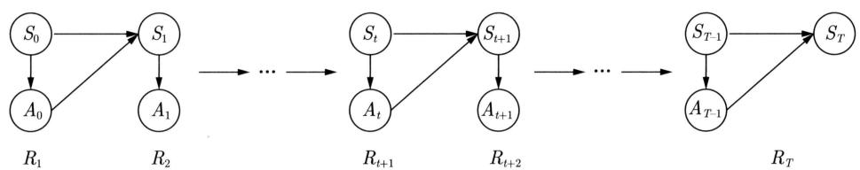  
图34.2 MDP轨迹数据的概率图模型表示

状态-动作序列的联合概率分布也可以写作

$$
\begin{array}{l} P (\tau) = P \left(S _ {0}, A _ {0}, S _ {1}, A _ {1} \dots S _ {t}, A _ {t}, S _ {t + 1}, A _ {t + 1}, \dots S _ {T}\right) \\ = P \left(S _ {0}, A _ {0}\right) P \left(S _ {1}, A _ {1} \mid S _ {0}, A _ {0}\right) \dots P \left(S _ {t + 1}, A _ {t + 1} \mid S _ {t}, A _ {t}\right) \dots P \left(S _ {T} \mid S _ {T - 1}, A _ {T - 1}\right) \tag {34.3} \\ \end{array}
$$

可以看出，当前时刻的状态 $S_{t}$ 和动作 $A_{t}$ 到下一个时刻的状态 $S_{t + 1}$ 和动作 $A_{t + 1}$ 的转移概率分布 $P(S_{t + 1},A_{t + 1}|S_t,A_t)$ 构成的随机过程也具有马尔可夫性。图34.3用另一种概率图模型表示一个轨迹数据。

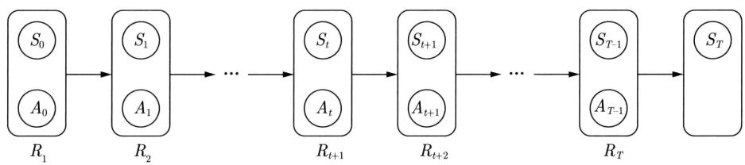  
图34.3 MDP轨迹数据的另一种概率图模型表示

# 2. 基于策略的强化学习

强化学习中环境对智能体来说是未知的，智能体的目标是通过与环境的交互，基于交互的轨迹数据，也称作经验数据，学习到最优策略 $\pi_{\theta_*}(a|s)$ 。最优策略是指使回报的期望最大的策略，这里 $\theta_*$ 表示最优策略函数的参数。从经验数据中学习是强化学习的重要特点。

针对一个轨迹数据，若其状态-动作的序列是 $\tau$ ，回报是 $G_{0}$ ，则回报的期望等于 $\mathrm{E}_{P_{\theta}(\tau)}[G_0]$ 。

$$
\mathbb {E} _ {P _ {\boldsymbol {\theta}} (\tau)} \left[ G _ {0} \right] = \mathbb {E} _ {P _ {\boldsymbol {\theta}} (\tau)} \left[ \sum_ {t = 0} ^ {T - 1} R \left(S _ {t}, A _ {t}\right) \right] \tag {34.4}
$$

智能体能控制的只有策略函数的参数 $\pmb{\theta}$ ，所以认为概率分布 $P(\tau)$ 只依赖于 $\pmb{\theta}$ 。强化学习可以形式化为回报期望 $\mathbb{E}_{P_{\pmb{\theta}}(\tau)}[G_0]$ 对参数 $\pmb{\theta}$ 的最优化问题。注意这里的最大化是针对期望值的。

$$
\boldsymbol {\theta} _ {*} = \underset {\boldsymbol {\theta}} {\operatorname {a r g m a x}} \mathbb {E} _ {P _ {\boldsymbol {\theta}} (\tau)} \left[ G _ {0} \right] = \underset {\boldsymbol {\theta}} {\operatorname {a r g m a x}} \mathbb {E} _ {P _ {\boldsymbol {\theta}} (\tau)} \left[ \sum_ {t = 0} ^ {T - 1} R \left(S _ {t}, A _ {t}\right) \right] \tag {34.5}
$$

这样，就可以通过优化学习一个最优的策略 $\pi_{\pmb{\theta}_{*}}(a|s)$ 。

# 3. 基于价值的强化学习

以上的强化学习定义基于策略函数，强化学习还可以基于价值函数定义。

设在一个具体策略 $\pi$ 下得到一个轨迹数据。状态-动作的序列是 $\tau$ ，回报是 $G_{0}$ 。状态 $S_{t}$ 的状态价值函数（state value function）是指在状态 $S_{t}$ 条件下，第 $t$ 时刻之后的回报的期望。

$$
V _ {\pi} \left(S _ {t}\right) = \mathbb {E} _ {\pi} \left[ \sum_ {t ^ {\prime} = t} ^ {T - 1} R \left(S _ {t ^ {\prime}}, A _ {t ^ {\prime}}\right) \mid S _ {t} \right], \quad t = 0, 1, \dots , T - 1 \tag {34.6}
$$

状态 $S_{t}$ 和动作 $A_{t}$ 的动作价值函数（action value function）或 $Q$ 函数是指在状态 $S_{t}$ 和动作 $A_{t}$ 条件下，第 $t$ 时刻之后的回报的期望。

$$
Q _ {\pi} \left(S _ {t}, A _ {t}\right) = \mathbb {E} _ {\pi} \left[ \sum_ {t ^ {\prime} = t} ^ {T - 1} R \left(S _ {t ^ {\prime}}, A _ {t ^ {\prime}}\right) \mid S _ {t}, A _ {t} \right], \quad t = 0, 1, \dots , T - 1 \tag {34.7}
$$

两种价值函数的关系是

$$
V _ {\pi} \left(S _ {t}\right) = \mathbb {E} _ {\pi \left(A _ {t} \mid S _ {t}\right)} \left[ Q _ {\pi} \left(S _ {t}, A _ {t}\right) \mid S _ {t} \right] \tag {34.8}
$$

将 $Q$ 函数表示为参数化函数 $Q_{\omega}(s,a)$ ，其中 $\omega$ 是参数。强化学习也可以形式化为 $Q_{\omega}(s,a)$ 对参数 $\omega$ 的最优化问题。用 $Q_{\omega}(s,a)$ 近似目标的动作价值函数 $Q_{\mathrm{target}}(S_t,A_t)$ 。

$$
\omega_ {*} = \underset {\omega} {\operatorname {a r g m i n}} \frac {1}{2} \left(Q _ {\text {t a r g e t}} \left(S _ {t}, A _ {t}\right) - Q _ {\omega} \left(S _ {t}, A _ {t}\right)\right) ^ {2} \tag {34.9}
$$

再用贝尔曼最优方程更新目标的动作价值函数 $Q_{\mathrm{target}}(S_t, A_t)$ :

$$
Q _ {\text {t a r g e t}} \left(S _ {t}, A _ {t}\right) = R \left(S _ {t}, A _ {t}\right) + \gamma \max  _ {A _ {t + 1}} Q _ {\omega} \left(S _ {t + 1}, A _ {t + 1}\right) \tag {34.10}
$$

其中， $R(S_{t},A_{t})$ 是奖励， $\gamma$ 是折扣因子。通过迭代的方式求解这个最优化问题，得到最优 $Q$ 函数 $Q_{\omega_{*}}(s,a)$ ，从中导出最优策略。最简单的方法是贪心算法，在状态 $s$ 下，选择 $Q_{\omega_{*}}(s,a)$ 最大的动作 $a$ 。

$$
\pi (s) = \underset {a} {\operatorname {a r g m a x}} Q _ {\omega_ {*}} (s, a) \tag {34.11}
$$

强化学习实际上是智能体通过与环境交互进行的试错学习。在一个具体状态下哪个动作最优，并无法直接学习，只能通过与环境的多次交互进行学习。每次交互在一个状态下选择一个动作，得到环境的一个奖励，持续进行交互（交互之间具有马尔可夫性），完成一个回合，从最终的累计奖励即回报中得到环境的反馈。利用大量的交互数据中的反馈信息学习最优策略。环境的反馈是稀疏的、延迟的，甚至是有噪声的，学习需要探索各种可能的路径（回合）。学习中要优化的是回报的期望即价值，而不是一个回合的回报。

# 34.1.2 相关问题

现实中有时智能体能观察到的只是环境的状态的一部分。这种情况下序列决策过程可以由部分可观察的马尔可夫决策过程（partially observable Markov decision process, POMDP）刻画。针对POMDP的强化学习本书不作介绍。

规划（planning）是与强化学习密切相关的另一问题。规划也以马尔可夫决策过程为框

架。假设智能体知道环境的模型，包括状态转移概率分布和奖励函数，目标是求解最优策略，过程中没有学习。规划通常通过动态规划方法基于贝尔曼方程实现。规划是传统控制理论的核心问题，强化学习是在其基础上建立起来的。

# 34.2 强化学习原理和方法

# 34.2.1 强化学习方法

强化学习分为模型无关（model-free）的方法和基于模型（model-based）的方法。模型无关的方法又有基于价值（value-based）的方法和基于策略（policy-based）的方法。基于模型的方法直接学习环境的模型，包括状态转移概率分布和奖励函数。模型无关的方法不直接学习环境的模型，而是采用基于价值的方法学习最优价值函数，或者采用基于策略的方法学习最优策略函数。演员-评论员结合基于策略的方法和基于价值的方法。图34.4给出强化学习方法之间的关系。

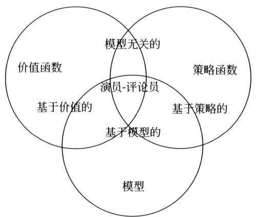  
图34.4 强化学习方法分类

# 34.2.2 强化学习原理

强化学习方法一般都由数据采样、策略评估、策略改进三个步骤的循环处理组成，如图34.5所示。基于策略的方法、基于价值的方法、基于模型的方法从不同角度，执行这个循环处理，求解最优策略。

因为环境是未知的，智能体只能根据一个策略通过与环境的交互获取数据，也就是进行数据采样。接着，智能体基于采样数据，对已有策略进行评估，然后进行改进。具体地，智能体首先计算已有策略的回报期望。然后，利用计算得到的回报期望对已有策略进行更新，使其回报期望更高，得到一个新的策略。智能体不断重复这个过程，直到找到最优策略。

基于策略的方法学习的是策略函数 $\pi_{\theta}(a|s)$ ，其中 $\theta$ 是参数。例如，在数据采样中，根据

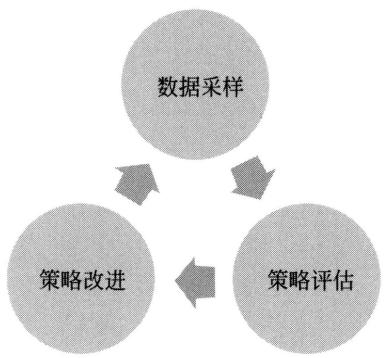  
图34.5 强化学习的过程由三个步骤的循环组成

当前的策略与环境交互得到轨迹数据。然后，在策略评估中，基于采样数据估计轨迹的回报期望。

$$
J (\boldsymbol {\theta}) \approx \mathbb {E} _ {P _ {\boldsymbol {\theta}} (\tau)} [ G _ {0} ] \tag {34.12}
$$

在策略改进中，利用随机梯度上升调节参数，得到新的策略。

$$
\boldsymbol {\theta} \leftarrow \boldsymbol {\theta} + \alpha \frac {\partial J (\boldsymbol {\theta})}{\partial \boldsymbol {\theta}} \tag {34.13}
$$

不断重复这个过程，直到收敛，学到最优策略。

基于价值的方法学习的是 $Q$ 函数 $Q_{\omega}(s,a)$ ，其中 $\omega$ 是参数。例如，在数据采样中，根据当前策略与环境交互得到轨迹数据。然后，在策略评估中，基于采样数据估计当前策略的 $Q$ 函数 $Q_{\omega}(s,a)$ 。在策略改进中，利用贪心算法，得到新的策略。

$$
\pi (s) = \underset {a} {\operatorname {a r g m a x}} Q _ {\omega} (s, a) \tag {34.14}
$$

不断重复这个过程，直到收敛，学到最优策略。

基于模型的方法学习的是模型，包括转移概率分布 $P_{\phi}(s'|s,a)$ 和奖励函数 $R(s,a)$ ，其中 $\phi$ 是参数。例如，在数据采样中，根据当前策略与环境交互得到轨迹数据。然后，基于采样数据估计模型 $P_{\phi}(s'|s,a)$ 和 $R(s,a)$ 。接着，计算当前策略的价值，改进当前的策略，得到新的策略。不断重复这个过程，直到收敛，学到最优策略。

# 34.2.3 深度强化学习

深度强化学习用神经网络表示策略、价值函数或者模型。例如，基于策略的方法使用图34.6上面的神经网络表示策略函数 $\pi_{\theta}(a|s)$ ，输入 $s$ 是由向量、矩阵或张量表示的状态，输出是状态给定条件下的动作的条件概率， $\pmb{\theta}$ 是神经网络的参数。基于价值的方法使用图34.6下面的神经网络 $Q_{\omega}(s,a)$ ，输入 $s$ 是由向量、矩阵或张量表示的状态，输出是状态给定条件下的动作的 $Q$ 函数值， $\omega$ 是神经网络的参数。

深度强化学习使得强化学习变得真正实用。现实的应用中环境往往是非常复杂的，观察到的状态通常由图像、语音、语言数据等组成，利用深度学习的强大表示学习能力，可以从这些数据中学到更好的状态、动作或模型表示，用于强化学习。

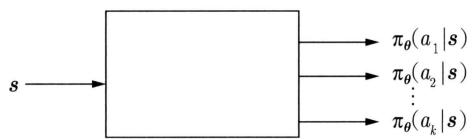  
表示策略函数的神经网络

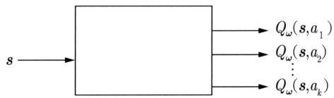  
表示价值函数的神经网络  
图34.6 深度强化学习中的神经网络

# 34.3 强化学习应用

强化学习已经应用到许多领域，如计算机游戏、计算机围棋、无人机控制、机器人控制、自动驾驶、库存管理、大语言模型等。下面介绍两个例子。

# 1. 计算机游戏

强化学习可以用于计算机游戏，比如，Atari 游戏。游戏的过程可以看作马尔可夫决策过程。这时计算机是智能体，游戏机是环境，如图 34.7 所示。游戏机的画面代表状态，游戏机的操作代表动作，游戏的分数是奖励。计算机通过强化学习学到最优的策略，能在给定的状态下选择最优的动作，使得最终的累积奖励或回报最大。

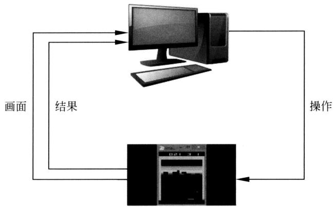  
图34.7 强化学习方法用于计算机游戏

深度强化学习方法深度 $Q$ 网络（deep $Q$ network,DQN）能在计算机模拟环境中自动学习Atari游戏的有效玩法。DQN学习旨在学到最优的动作价值函数即 $Q$ 函数，是基于价值的方法。实际使用一个卷积神经网络，输入是四个连续游戏画面，输出是各个游戏操作的 $Q$ 函数值，游戏的正分数和负分数分别定为 $+1$ 和 $-1$ 的奖励，其他情况是0奖励。 $Q$ 函数表示了在一个给定状态和动作下计算机在之后得到累积奖励的期望(34.7)。DQN通过成千上万

次游戏进行网络训练。游戏的每一步产生4元组 $(s, a, r, s')$ 数据，存入缓存，再在缓存中随机采样大量的已有4元组对神经网络的参数进行更新。等价于基于数据利用贝尔曼方程迭代地搜索最优 $Q$ 函数（最优神经网络），从中导出最优策略。这里 $s$ 表示当前状态， $a$ 表示当前动作， $r$ 表示当前奖励， $s'$ 表示后续状态。详细介绍见第38章。

# 2. 计算机围棋

强化学习可以用于计算机围棋，这时计算机是智能体，对手是环境，如图34.8所示。从计算机的角度看，对手的出棋是随机的，博弈过程可以看作马尔可夫决策过程。围棋的棋局表示状态，出棋表示动作。棋局下的出棋有奖励，最后一步的奖励表示胜负，最为重要。计算机旨在使用强化学习学到最优的出棋策略，拥有赢得围棋博弈的能力。

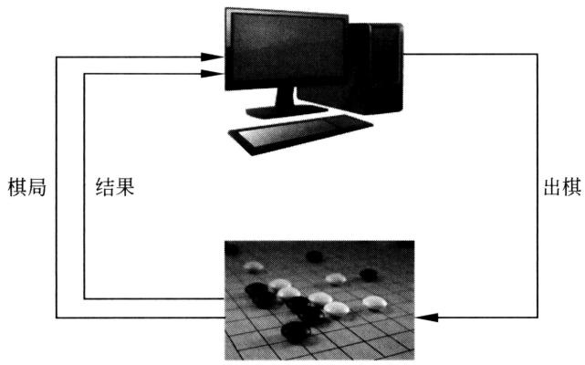  
图34.8 强化学习方法用于计算机围棋

深度强化学习系统阿尔法狗使用蒙特卡罗树搜索、策略网络、价值网络进行计算机围棋博弈。其中策略网络、价值网络利用强化学习获得。第39章有具体介绍，这里简单介绍其中的策略网络的学习。策略网络的输入是一个棋局，输出是各步出棋的概率，网络是卷积神经网络。首先，使用监督学习基于专家棋手的对弈数据估计策略网络的参数。然后，通过新旧策略网络的对弈，使用强化学习进一步学习新策略网络的参数。强化学习算法是策略梯度，是基于策略的方法。在每一回合，新策略网络与旧策略网络持续对弈，直到决出胜负。当中的每一步的奖励是0，最终一步的奖励是 $+1$ 或 $-1$ ，代表胜或负。新策略网络从当前回合的最终奖励计算出每一步的回报即累积奖励，取值是 $+1$ 或 $-1$ ，使用每一步的回报更新网络参数(34.13)。如果回报是 $+1$ ，则调整网络参数使其倾向采用这步棋；如果回报是 $-1$ ，则调整网络参数使其倾向不采用这步棋。

# 本篇内容

本篇主要讲解基本的且常用的强化学习方法。第35章介绍强化学习的基础马尔可夫决策过程，包括贝尔曼方程和动态规划。第36章叙述多臂老虎机学习，是强化学习的一种特殊情况，讲解UCB算法和汤普森采样算法。第37章讲述基于价值的强化学习方法，包括蒙特卡罗预测、TD(0)算法、蒙特卡罗控制、SARSA算法、 $Q$ 学习。第38章讲解基于价值的方法中有代表性的深度 $Q$ 网络。第39章讲述基于策略的强化学习方法，包括REINFORCE算

法、演员-评论员算法。第40章讲解基于策略的方法中有代表性的TRPO算法和PPO（近端策略优化）算法。第41章对强化学习方法进行总结。

本篇主要参考了Sutton和Barto的书籍[1]和Levine的视频[2]，符号体系主要基于前者。也参考了Silver和Abbeel的视频[3-4]，以及俞凯等和张伟楠等的书籍[5-6]。

# 习题

34.1 写出奖励、回报、价值（状态价值）的定义，比较三者之间的关系。  
34.2 证明状态-动作的转移概率分布也具有马尔可夫性(34.3)。  
34.3 证明两种价值函数之间的关系 (34.8)。

# 参考文献

[1] SUTTON R S, BARTO A G. Reinforcement learning: An introduction[M]. MIT press, 2018.   
[2] Deep reinforcement learning by Sergey Levine[Z/OL]. CS 285 at UC Berkeley, https:// rail.eecs.berkeley.edu/deeprlcourse/, 2020.   
[3] Introduction to reinforcement learning with David Silver[Z/OL]. https://deepmind.com/learning-resources/-introduction-reinforcement-learning-david-silver, 2015.   
[4] Foundations of deep RL in six lectures by Pieter Abbeel[Z/OL]. https://www.youtube.com/c/PieterAbbeel/features, 2021.   
[5] SUTTON, BARTO. 强化学习 [M]. 2 版. 俞凯, 等译. 北京: 电子工业出版社, 2019.  
[6] 张伟楠，沈键，俞勇．动手学强化学习[M].北京：人民邮电出版社，2022.

# 第35章 马尔可夫决策过程

马尔可夫决策过程 (Markov decision process, MDP) 是描述智能体和环境之间交互的随机过程。环境具有不同的状态，智能体可以执行不同的动作；智能体在当前状态下执行一个动作，环境随机决定下一个状态，并给予智能体一个奖励，不断重复。随机过程的下一个状态只依赖于当前的状态和动作，具有马尔可夫性。给定状态下的动作由某一个具体策略决定，智能体的目标是选择一个最优策略，以优化（最大化）累积折扣奖励的期望。动态规划（dynamic programming，DP）可以用于求解这个优化问题，也就是求解智能体的最优策略。MDP 是强化学习的基本框架，强化学习旨在从数据中自动学习 MDP 的最优策略。

Bellman 于 1950 年代研究了 MDP 和 DP，提出了贝尔曼方程（Bellman equation）。Howard 在其 1960 年出版的书中系统地总结了 MDP 和 DP。

本章介绍MDP及其DP算法。35.1节给出MDP的定义。35.2节介绍MDP的DP算法，包括策略评估、策略迭代和价值迭代算法。

# 35.1 马尔可夫决策过程定义

# 35.1.1 基本概念

# 1. MDP

马尔可夫决策过程（MDP）最初作为控制理论中的数学模型被提出。后来控制理论与动物学习（试错学习）结合发展出强化学习，MDP也成为强化学习的基本框架。强化学习本身具有更广泛的含义，但目前基本是基于MDP的机器学习。

考虑智能体（agent）和环境（environment）进行交互。环境是一个动态系统，两者之间的交互具有随机性，形成一个随机过程。环境处于一个状态(state)，假设智能体可以观察到环境的状态。智能体根据自己的策略(policy)基于状态选择并执行一个动作(action)。环境基于当前的状态和智能体的当前动作随机决定下一个状态，并且给出一个奖励(reward)。这个过程不断重复。MDP就是描述这个过程的数学模型。

这里给出离散时间的有限马尔可夫决策过程（finite Markov decision process）的定义。可以有多种扩展。

定义35.1（有限马尔可夫决策过程）有限马尔可夫决策过程主要由四元组 $\langle S, A, P, R \rangle$ 组成。

（1）状态有限集合 $S: s, s' \in S$ 。  
（2）动作有限集合 $\mathcal{A}$ ： $a\in \mathcal{A}$   
(3) 转移概率分布 $P: S \times \mathcal{A} \times S \to [0,1]$ , 定义为条件概率分布 $P(S' = s'|S = s, A = a)$ , $s, s' \in S$ , $a \in \mathcal{A}$ 。  
（4）奖励函数 $R: S \times \mathcal{A} \times S \to \mathcal{R}$ ，定义为函数 $R(S = s, A = a, S' = s')$ ， $s, s' \in S$ ， $a \in \mathcal{A}$ ，这里假设奖励函数的输出属于实数集合 $\mathcal{R}$ ，而且为了简单假设只取有限个值。

有时也包含其他元素：

（1）折扣因子（discount factor）： $0 \leqslant \gamma \leqslant 1$   
（2）初始状态集合： $S_0\subset S$   
（3）终止状态集合： $S_{T}\subset S$

智能体和环境的交互在离散时间 $t = 0,1,2,\dots$ 上形成一个序列，称为轨迹（trajectory）。

$$
S _ {0}, A _ {0}, R _ {1}, S _ {1}, A _ {1}, R _ {2}, \dots , S _ {t}, A _ {t}, R _ {t + 1}, S _ {t + 1}, A _ {t + 1}, \dots
$$

其中， $S_{t}$ 是环境第 $t$ 时刻的状态， $A_{t}$ 是智能体第 $t$ 时刻的动作，由后述策略 $\pi$ 决定， $R_{t+1}$ 是第 $t+1$ 时刻环境给出的奖励，由奖励函数 $R$ 决定， $S_{t+1}$ 是第 $t+1$ 时刻环境的状态，由转移概率分布 $P$ 决定。

假设第 $t + 1$ 时刻的奖励和状态由第 $t$ 时刻的状态和动作决定，并且在每一时刻都成立。

$$
P \left(R _ {t + 1} = r, S _ {t + 1} = s ^ {\prime} \mid S _ {t} = s, A _ {t} = a\right) = P \left(r, s ^ {\prime} \mid s, a\right), \forall s, s ^ {\prime} \in \mathcal {S}, a \in \mathcal {A} \tag {35.1}
$$

$$
\sum_ {s ^ {\prime} \in \mathcal {S}} \sum_ {r \in \mathcal {R}} P \left(s ^ {\prime}, r | s, a\right) = 1, \forall s \in \mathcal {S}, a \in \mathcal {A} \tag {35.2}
$$

因此，第 $t + 1$ 时刻的状态由第 $t$ 时刻的状态和动作决定，并且在每一时刻都成立。

$$
P \left(S _ {t + 1} = s ^ {\prime} \mid S _ {t} = s, A _ {t} = a\right) = P \left(s ^ {\prime} \mid s, a\right) = \sum_ {r \in \mathcal {R}} P \left(s ^ {\prime}, r \mid s, a\right), \forall s, s ^ {\prime} \in \mathcal {S}, a \in \mathcal {A} \tag {35.3}
$$

转移概率分布具有（齐次）马尔可夫性，下一个时刻的状态只依赖于当前时刻的状态和动作，并且在每一时刻都成立，即状态转移概率分布满足

$$
P \left(S _ {t + 1} \mid S _ {t}, A _ {t}\right) = P \left(S _ {t + 1} \mid S _ {t}, A _ {t}, S _ {t - 1}, A _ {t - 1}, \dots , S _ {0}, A _ {0}\right) \tag {35.4}
$$

奖励函数有几种形式。一般形式，假设奖励函数是随机的，第 $t + 1$ 时刻的奖励由第 $t$ 时刻的状态和动作及第 $t + 1$ 时刻的状态决定，并且在每一时刻都成立。第 $t + 1$ 时刻的奖励是

$$
\begin{array}{l} R \left(S _ {t} = s, A _ {t} = a, S _ {t + 1} = s ^ {\prime}\right) = \mathbb {E} \left(R _ {t + 1} = r \mid S _ {t} = s, A _ {t} = a, S _ {t + 1} = s ^ {\prime}\right) \\ = \sum_ {r \in \mathcal {R}} r \cdot P (r | s, a, s ^ {\prime}), \forall s, s ^ {\prime} \in \mathcal {S}, a \in \mathcal {A} \tag {35.5} \\ \end{array}
$$

一种常用形式，假设奖励函数是随机的，第 $t + 1$ 时刻的奖励只由第 $t$ 时刻的状态和动作决定。第 $t + 1$ 时刻的奖励是

$$
R \left(S _ {t} = s, A _ {t} = a\right) = \mathbb {E} \left(R _ {t + 1} = r \mid S _ {t} = s, A _ {t} = a\right) = \sum_ {r \in \mathcal {R}} r \cdot P (r \mid s, a), \forall s, s ^ {\prime} \in \mathcal {S}, a \in \mathcal {A} \tag {35.6}
$$

另一种常用形式，假设奖励函数是确定的，第 $t + 1$ 时刻的奖励只由第 $t$ 时刻的状态和动作决定。

$$
R \left(S _ {t} = s, A _ {t} = a\right) = r, \forall s \in \mathcal {S}, a \in \mathcal {A} \tag {35.7}
$$

MDP 又有有限期（finite horizon）和无限期（infinite horizon）之分，分别表示智能体和环境的交互是有限的还是无限的。有限期 MDP，状态含有终止状态，智能体和环境之间的交互在终止状态结束，也就是轨迹在有限的第 $T$ 时刻终止。从初始状态到终止状态的一系列交互称为一个回合（episode）。无限期 MDP，智能体和环境之间持续进行交互，轨迹可以延续到无穷时刻 $T = \infty$ 。

以上MDP可以有多种扩展。可以扩展为时间是连续的，状态集合是无限的，动作集合是无限的。表35.1给出MDP的各种可能扩展。

表 35.1 MDP 的各种可能扩展  

<table><tr><td>时间</td><td>离散时间</td><td>连续时间</td></tr><tr><td>期限</td><td>有限期</td><td>无限期</td></tr><tr><td>状态</td><td>有限</td><td>无限</td></tr><tr><td>动作</td><td>有限</td><td>无限</td></tr><tr><td>奖励</td><td>确定性</td><td>随机性</td></tr><tr><td>策略</td><td>确定性</td><td>随机性</td></tr></table>

MDP是马尔可夫链（Markov chain）的扩展，区别在于增加了动作和奖励。如果只有一个固定动作和一个固定奖励，MDP退化为马尔可夫链。

MDP中智能体与环境交互（即轨迹）部分在环境控制下，部分在智能体控制下。环境决定的是状态和奖励，其整体称为模型(model)，而智能体决定动作，可选择的是策略(policy)。策略表示的是给定状态下的动作。

# 2. 策略

定义35.2（策略） 称以下函数为策略函数。

策略函数 $\pi : S \times A \to [0,1]$ ，定义为条件概率分布 $P(A = a|S = s)$ 。

智能体根据策略函数在每一时刻基于当前状态决定一个动作。策略函数可以是随机的，也可以是确定的，前者是一般形式，后者是特殊形式。可以分别写作

随机性策略函数：

$$
P (A = a \mid S = s) = \pi (a \mid s), \forall s \in \mathcal {S}, a \in \mathcal {A} \tag {35.8}
$$

确定性策略函数：

$$
A = \pi (s) = a, \forall s \in S \tag {35.9}
$$

当模型和策略确定之后，随机过程就完全确定，可以计算环境与智能体交互的轨迹的概率。

$$
\begin{array}{l} P \left(S _ {0}, A _ {0}, R _ {1}, S _ {1}, A _ {1}, \dots , S _ {t}, A _ {t}, R _ {t + 1}, S _ {t + 1}, A _ {t + 1}, \dots\right) \\ = P \left(S _ {0}\right) P \left(A _ {0} \mid S _ {0}\right) P \left(R _ {1}, S _ {1} \mid S _ {0}, A _ {0}\right) P \left(A _ {1} \mid S _ {1}\right) \dots \\ P \left(A _ {t} \mid S _ {t}\right) P \left(R _ {t + 1}, S _ {t + 1} \mid S _ {t}, A _ {t}\right) P \left(A _ {t + 1} \mid S _ {t + 1}\right) \dots \tag {35.10} \\ \end{array}
$$

有时也称状态-动作序列为轨迹，轨迹的概率是

$$
\begin{array}{l} P \left(S _ {0}, A _ {0}, S _ {1}, A _ {1}, \dots , S _ {t}, A _ {t}, S _ {t + 1}, A _ {t + 1}, \dots\right) = P \left(S _ {0}\right) P \left(A _ {0} \mid S _ {0}\right) P \left(S _ {1} \mid S _ {0}, A _ {0}\right) P \left(A _ {1} \mid S _ {1}\right) \dots \\ P \left(A _ {t} \mid S _ {t}\right) P \left(S _ {t + 1} \mid S _ {t}, A _ {t}\right) P \left(A _ {t + 1} \mid S _ {t + 1}\right) \dots \tag {35.11} \\ \end{array}
$$

# 3. 回报和价值

智能体在与环境的交互中每次得到奖励，在整个交互过程中得到累积折扣奖励（cumulative discounted reward），称作回报（return）。

定义35.3（回报）有限期MDP（终止时刻 $T$ )的交互中，智能体在第 $t$ 时刻的回报是

$$
G _ {t} = R _ {t + 1} + \gamma R _ {t + 2} + \gamma^ {2} R _ {t + 3} + \dots + \gamma^ {T - t - 1} R _ {T} = \sum_ {k = 0} ^ {T - t - 1} \gamma^ {k} R _ {t + k + 1}, t = 0, 1, \dots , T - 1 \tag {35.12}
$$

表示第 $t$ 时刻之后的一个有限轨迹上获得的累积折扣奖励。其中 $0 \leqslant \gamma \leqslant 1$ 是折扣因子。注意第 $t$ 时刻的回报 $G_{t}$ 由第 $t + 1$ 时刻及之后的奖励 $R_{t + 1}, R_{t + 2}, \dots, R_{T}$ 决定。

无限期MDP的交互中，在第 $t$ 时刻的回报是

$$
G _ {t} = R _ {t + 1} + \gamma R _ {t + 2} + \gamma^ {2} R _ {t + 3} + \dots = \sum_ {k = 0} ^ {\infty} \gamma^ {k} R _ {t + k + 1}, t = 0, 1, 2, \dots \tag {35.13}
$$

表示第 $t$ 时刻之后的一个无限轨迹上获得的累积折扣奖励。其中 $0 \leqslant \gamma < 1$ 是折扣因子。

折扣因子决定随着时间的推移奖励对回报影响的大小。当 $\gamma = 0$ 时，只有下一个时刻的奖励影响回报。当 $\gamma = 1$ 时，奖励对回报的影响不随时间的推移衰减，一般只用于有限期MDP。当 $\gamma < 1$ 时，随着时间的推移奖励对回报的影响越来越小，因为 $\gamma^k$ 趋近于0，这在很多应用中是合理的。无限期MDP要求 $\gamma < 1$ ，以保证数学上的合理性，当时间趋于无穷时，回报仍然不是发散的。

回报 $G_{t}$ 和回报 $G_{t + 1}$ 之间有以下关系成立：

$$
G _ {t} = R _ {t + 1} + \gamma G _ {t + 1} \tag {35.14}
$$

智能体的目标是在与环境的交互中得到最大的回报的期望，回报的期望又称作价值。价值函数表示在一个策略下回报的期望值。价值函数分为状态价值函数（state-value function）和动作价值函数（action value function）。这里给出无限期MDP时的价值函数的定义，有限期MDP时的价值函数可以看作其特殊情况。

定义35.4（价值函数）状态价值函数的定义如下。智能体采用策略 $\pi$ 时，状态 $s$ 的价值是

$$
V _ {\pi} \left(S _ {t} = s\right) = \mathbb {E} _ {\pi} \left[ G _ {t} \mid S _ {t} = s \right] = \mathbb {E} _ {\pi} \left[ \sum_ {k = 0} ^ {\infty} \gamma^ {k} R _ {t + k + 1} \mid S _ {t} = s \right], \forall s \tag {35.15}
$$

表示根据策略 $\pi$ 从状态 $s$ 开始未来所有轨迹上的回报的期望值。

动作价值函数或 $Q$ 函数的定义如下。智能体采用策略 $\pi$ 时，状态 $s$ 和动作 $a$ 的价值是

$$
Q _ {\pi} \left(S _ {t} = s, A _ {t} = a\right) = \mathbb {E} _ {\pi} \left[ G _ {t} \mid S _ {t} = s, A _ {t} = a \right] = \mathbb {E} _ {\pi} \left[ \sum_ {k = 0} ^ {\infty} \gamma^ {k} R _ {t + k + 1} \mid S _ {t} = s, A _ {t} = a \right], \forall s, a \tag {35.16}
$$

表示根据策略 $\pi$ 从状态 $s$ 和动作 $a$ 开始未来所有轨迹上的回报的期望值。

状态价值函数基于状态，动作价值函数基于状态和动作，两者都依赖于具体的策略。并且，两个价值函数之间有以下关系成立。

$$
V _ {\pi} (s) = \sum_ {a} \pi (a | s) Q _ {\pi} (s, a), \forall s \tag {35.17}
$$

在一个策略下状态价值函数和动作价值函数存在且唯一。这是因为无限期 MDP 折扣因子满足 $\gamma < 1$ ，有限期 MDP 折扣因子满足 $\gamma \leqslant 1$ ，其回报都是有界的（证明留作习题）。

# 35.1.2 最优策略

智能体与环境的交互过程中，可能采用的策略很多，通常是无穷的。智能体的目标是求解价值函数最优（最大）的策略，即最优策略。

定义35.5（最优策略）满足以下条件的状态价值函数和动作价值函数是最优的。智能体的目标是选择最优的价值函数，以及对应的最优策略。

最优状态价值函数是

$$
V _ {*} (s) = \max  _ {\pi} V _ {\pi} (s), \forall s \tag {35.18}
$$

说明在所有策略中最优策略的价值函数值最大，而且对所有状态成立。对应的最优策略是

$$
\pi_ {*} = \underset {\pi} {\operatorname {a r g m a x}} V _ {\pi} (s), \forall s \tag {35.19}
$$

最优动作价值函数是

$$
Q _ {*} (s, a) = \max  _ {\pi} Q _ {\pi} (s, a), \forall s, a \tag {35.20}
$$

说明在所有策略中最优策略的价值函数值最大，而且对所有状态-动作成立。对应的最优策略是

$$
\pi_ {*} = \underset {\pi} {\operatorname {a r g m a x}} Q _ {\pi} (s, a), \forall s, a \tag {35.21}
$$

两个最优价值函数之间有以下关系成立。

$$
V _ {*} (s) = \max  _ {a} Q _ {*} (s, a), \forall s \tag {35.22}
$$

最优状态价值函数的值和最优动作价值函数的最大值相等，且对所有状态成立。最优价值函数存在且唯一，但最优策略并不一定唯一。

智能体的目标都是求解最优价值函数及最优策略。实际应用中，价值函数中的奖励和折扣因子的设计起着重要作用，决定了在应用问题的效果。奖励往往取正负值，正值表示正向的收益，负值表示负向的收益。折扣因子权衡短期收益和长期收益。

# 35.1.3 MDP例子

下面给出两个简单例子，讲解MDP的基本概念。一个是机器人的路径规划，另一个是机器人的行动规划。

例35.1 机器人的路径规划。机器人在移动中决定通过哪条路径从起点到达终点。如图35.1所示，环境由网格世界（grid world）表示，也就是说环境被划分为不同的区域，网格中的一个格点代表一个区域。机器人开始处在格点(1,1)，格点(4,3)有电源，格点(4,2)有楼梯。机器人的目标是移动到达电源充电，而避免掉下楼梯。可以用有限期MDP刻画机器人的移动过程。

图35.1 机器人路径规划的例子  
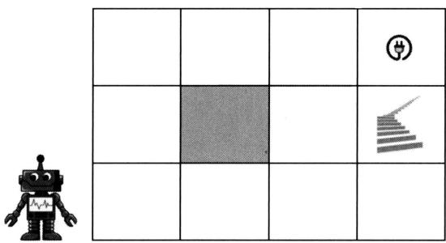  
动作

图35.2给出机器人移动的一个MDP模型。每一个格点表示一个状态。格点上有动作，分别是向东（east）、向西（west）、向南（south）、向北（north）移动。动作都是确定性的，在一个格点上的移动只能是四个方向中的一个。当前方是网格世界的边界不能向前移动时，执行向前移动动作后仍然停留在当前格点。奖励由移动进入的格点决定。图中显示进入各个格点的奖励。进入电源格点的奖励是1.0，进入楼梯格点的奖励是-1.0，进入其他格点的奖励是0。表示到达电源是期望的终止状态，跌下楼梯是不期望的终止状态。状态转移是随机的，向前移动时有0.8的概率移动到前方的格点，各有0.1的概率移动到旁边的两个格点。折扣因子是0.9。

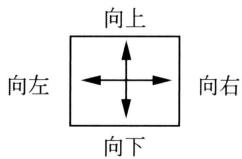  
状态转移

奖励   

<table><tr><td>0.0</td><td>0.0</td><td>0.0</td><td>1.0</td></tr><tr><td>0.0</td><td></td><td>0.0</td><td>-1.0</td></tr><tr><td>0.0</td><td>0.0</td><td>0.0</td><td>0.0</td></tr></table>

图35.2 机器人移动的MDP模型  
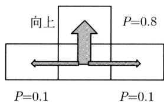  
折扣因子 $\gamma = 0.9$

假设MDP模型已知（转移概率和奖励如上所述），机器人的目标是做出最优的路径规划，也就是找出最优的移动策略。这个问题存在多个不同的策略。图35.3给出两个策略。

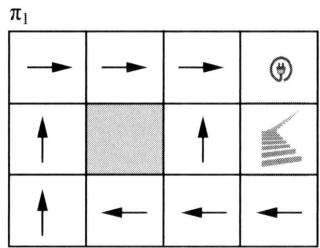

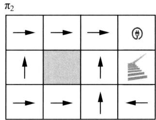  
图35.3 机器人移动的两个策略

考虑策略 $\pi_1$ 中的两个轨迹（两条从起点到终点的路径）：

轨迹 $t_1\colon (1,1)\to (1,2)\to (1,3)\to (2,3)\to (3,3)\to (4,3)$

轨迹 $t_2\colon (1,1)\to (1,2)\to (1,3)\to (2,3)\to (3,3)\to (3,2)\to (4,2)$

两个轨迹的概率和回报分别是

$$
P \left(t _ {1}\right) = 0. 8 ^ {5} = 0. 3 3
$$

$$
G \left(t _ {1}\right) = 0 + 0. 9 \times 0 + 0. 9 ^ {2} \times 0 + 0. 9 ^ {3} \times 0 + 0. 9 ^ {4} \times 0 + 0. 9 ^ {5} \times 1 = 0. 5 9
$$

$$
P \left(t _ {2}\right) = 0. 8 ^ {4} \times 0. 1 ^ {2} = 0. 0 0 4 1
$$

$$
G \left(t _ {2}\right) = 0 + 0. 9 \times 0 + 0. 9 ^ {2} \times 0 + 0. 9 ^ {3} \times 0 + 0. 9 ^ {4} \times 0 + 0. 9 ^ {5} \times 0 + 0. 9 ^ {6} \times (- 1) = - 0. 5 3
$$

也就是说，如果采用策略 $\pi_1$ ，轨迹 $t_1$ 有0.33的概率发生（最后到达电源），其回报是0.59。轨迹 $t_2$ 有0.0041的概率发生（最后掉下楼梯），其回报是-0.53。

考虑策略 $\pi_2$ 中的两个轨迹：

轨迹 $t_3\colon (1,1)\to (2,1)\to (3,1)\to (3,2)\to (3,3)\to (4,3)$

轨迹 $t_4\colon (1,1)\to (2,1)\to (3,1)\to (3,2)\to (4,2)$

两个轨迹的概率和回报分别是

$$
P \left(t _ {3}\right) = 0. 8 ^ {5} = 0. 3 3
$$

$$
G \left(t _ {3}\right) = 0 + 0. 9 \times 0 + 0. 9 ^ {2} \times 0 + 0. 9 ^ {3} \times 0 + 0. 9 ^ {4} \times 0 + 0. 9 ^ {5} \times 1 = 0. 5 9
$$

$$
P \left(t _ {4}\right) = 0. 8 ^ {3} \times 0. 1 ^ {1} = 0. 0 5 1
$$

$$
G \left(t _ {4}\right) = 0 + 0. 9 \times 0 + 0. 9 ^ {2} \times 0 + 0. 9 ^ {3} \times 0 + 0. 9 ^ {4} \times (- 1) = - 0. 6 6
$$

也就是说，如果采用策略 $\pi_{2}$ ，轨迹 $t_{3}$ 有0.33的概率发生（最后达到电源），其回报是0.59。轨迹 $t_{4}$ 有0.051的概率发生（最后掉下楼梯），其回报是-0.66。

所以明显策略 $\pi_{1}$ 比策略 $\pi_{2}$ 更优。后者机器人有更大的风险掉下楼梯。原理上，机器人需要计算每一个策略的所有轨迹上的回报的期望值，即每一个策略的价值函数，并且在所有策略中选出最优的策略。但实际上，策略是不能一一列举的，价值函数也不能直接计算，要借助动态规划的方法进行高效的计算。

35.2节叙述的动态规划算法可以高效地计算每一个策略的价值函数，也可以高效地计算

最优价值函数和最优策略。图35.4给出策略 $\pi_1$ 的价值函数，其实也是最优价值函数。因此策略 $\pi_1$ 是最优策略。策略 $\pi_2$ 的价值函数的计算留作习题。

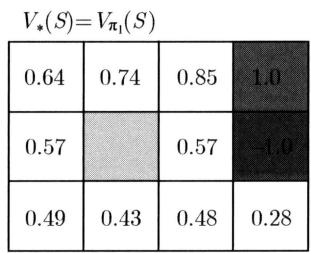

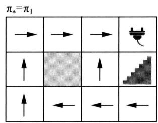  
图35.4 机器人路径规划的最优价值函数和最优策略

例35.2 机器人的行动规划。机器人在执行任务过程中需要做出行为的决策，具体地根据自己当前电量的情况，决定下面采取的行动是工作、待机还是充电。这个过程也可以通过无限期MDP模型刻画。状态有电量高、电量低，动作有工作、待机、充电。

经常用状态转移图表示 MDP 模型。图 35.5 是机器人行动的 MDP 模型的状态转移图，其中空心圆表示状态，实心圆表示动作，有向边上的数字分别表示状态转移概率和奖励。表 35.2 给出机器人行动的 MDP 模型的参数。注意在这个例子中，奖励函数是当前状态、当前动作、下一个状态三者的函数。同样是当前状态是电量高、动作是工作，下一个状态是电量高时的奖励与下一个状态是电量低时的奖励是不同的。期望的行动是电量高时工作，电量低时不工作而充电。后述价值迭代算法可以求出机器人行动的最优策略。

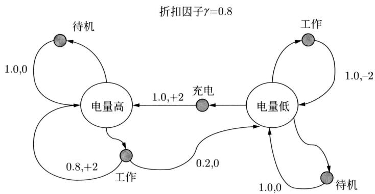  
图35.5 机器人行动的MDP模型的状态转移图

表 35.2 机器人行动的 MDP 模型的参数  

<table><tr><td>状态s</td><td>动作a</td><td>状态s&#x27;</td><td>转移概率P(s&#x27;|s,a)</td><td>奖励函数R(s,a,s&#x27;)</td></tr><tr><td>电量高</td><td>工作</td><td>电量高</td><td>0.8</td><td>+2</td></tr><tr><td>电量高</td><td>工作</td><td>电量低</td><td>0.2</td><td>0</td></tr><tr><td>电量高</td><td>待机</td><td>电量高</td><td>1.0</td><td>0</td></tr><tr><td>电量低</td><td>工作</td><td>电量低</td><td>1.0</td><td>-2</td></tr><tr><td>电量低</td><td>待机</td><td>电量低</td><td>1.0</td><td>0</td></tr><tr><td>电量低</td><td>充电</td><td>电量高</td><td>1.0</td><td>+2</td></tr></table>

# 35.2 动态规划算法

# 35.2.1 规划问题

MDP描述的是智能体与环境交互的过程。当MDP的模型（转移概率分布和奖励函数）确定以后，环境对智能体来说是已知的。智能体要做的是求解最优的策略，这就是规划（planning）要解决的问题。规划包括预测（prediction）和控制（control）。预测是给定MDP以及一个策略 $\pi$ ，求解其价值函数 $V_{\pi}(s)$ 或 $Q_{\pi}(s,a)$ 。控制是给定MDP，求解最优价值函数 $V_{*}(s)$ 或 $Q_{*}(s,a)$ 以及最优策略 $\pi_{*}$ 。规划没有学习过程，而通过学习求解最优策略是强化学习要解决的问题。

预测的算法有策略评估（policy evaluation），控制的算法有策略迭代（policy iteration）和价值迭代（value iteration）。这些都是动态规划（dynamic programming）在MDP上的应用，特点是使用贝尔曼期望方程和贝尔曼最优方程。表35.3总结规划问题和算法。

表 35.3 规划问题和算法  

<table><tr><td>问题</td><td>算法</td><td>原理</td></tr><tr><td>预测</td><td>策略评估</td><td>贝尔曼期望方程</td></tr><tr><td>控制</td><td>策略迭代</td><td>策略评估（贝尔曼期望方程）+策略改进</td></tr><tr><td>控制</td><td>价值迭代</td><td>贝尔曼最优方程</td></tr></table>

动态规划（dynamic programming）是递归地从子问题的最优解求解整体问题的最优解的最优化算法的统称。在控制中使用动态规划，是根据贝尔曼最优方程，把价值函数的最优化问题分解为当前价值计算和价值函数的最优化子问题，递归地求解。直接求解价值函数的最优化，其计算复杂度是指数级的，而用动态规划求解计算复杂度是平方级的。在预测中使用动态规划情况类似，使用贝尔曼期望方程。

# 35.2.2 贝尔曼方程

有两种贝尔曼方程，贝尔曼期望方程（Bellman expectation equation）和贝尔曼最优方程（Bellman optimality equation）。各自又有基于状态价值函数的形式和基于动作价值函数的形式。贝尔曼期望方程表示的是在一个策略下当前状态和后续状态的价值函数之间的关系。贝尔曼最优方程表示的是在最优策略下当前状态和后续状态的价值函数之间的关系。

# 1. 贝尔曼期望方程

策略 $\pi$ 的状态价值函数有以下关系成立：

$$
\begin{array}{l} V _ {\pi} (s) = \mathbb {E} _ {\pi} [ R _ {t + 1} + \gamma V _ {\pi} (S _ {t + 1}) | S _ {t} = s ] \\ = \sum_ {a} \pi (a | s) \sum_ {s ^ {\prime}, r} P \left(s ^ {\prime}, r | s, a\right) [ r + \gamma V _ {\pi} \left(s ^ {\prime}\right) ], \forall s \tag {35.23} \\ \end{array}
$$

策略和奖励都是确定性函数时有

$$
V _ {\pi} (s) = R (s, \pi (s)) + \gamma \sum_ {s ^ {\prime}} P \left(s ^ {\prime} \mid s, \pi (s)\right) V _ {\pi} \left(s ^ {\prime}\right), \forall s \tag {35.24}
$$

策略 $\pi$ 的动作价值函数有以下关系成立：

$$
\begin{array}{l} Q _ {\pi} (s, a) = \mathbb {E} \left[ R _ {t + 1} + \gamma Q _ {\pi} \left(S _ {t + 1}, A _ {t + 1}\right) \mid S _ {t} = s, A _ {t} = a \right] \\ = \sum_ {s ^ {\prime}, r} P \left(s ^ {\prime}, r \mid s, a\right) [ r + \gamma \sum_ {a ^ {\prime}} P \left(a ^ {\prime} \mid s ^ {\prime}\right) Q _ {\pi} \left(s ^ {\prime}, a ^ {\prime}\right) ], \forall s, a \tag {35.25} \\ \end{array}
$$

策略和奖励都是确定性函数时有

$$
Q _ {\pi} (s, a) = R (s, \pi (s)) + \gamma \sum_ {s ^ {\prime}} P \left(s ^ {\prime} \mid s, a\right) Q _ {\pi} \left(s ^ {\prime}, \pi \left(s ^ {\prime}\right)\right), \forall s, a \tag {35.26}
$$

以上公式推导留作习题。

# 2. 贝尔曼最优方程

最优策略 $\pi_{*}$ 的最优状态价值函数有以下关系成立：

$$
\begin{array}{l} V _ {*} (s) = \max  _ {a} \mathbb {E} \left[ R _ {t + 1} + \gamma V _ {*} \left(S _ {t + 1}\right) | S _ {t} = s \right] \\ = \max  _ {a} \sum_ {s ^ {\prime}, r} P \left(s ^ {\prime}, r \mid s, a\right) [ r + \gamma V _ {*} \left(s ^ {\prime}\right) ], \forall s \tag {35.27} \\ \end{array}
$$

策略和奖励都是确定性函数时有

$$
V _ {*} (s) = \max  _ {a} \left[ R (s, a) + \gamma \sum_ {s ^ {\prime}} P \left(s ^ {\prime} \mid s, a\right) V _ {*} \left(s ^ {\prime}\right) \right], \forall s \tag {35.28}
$$

最优策略 $\pi_{*}$ 的最优动作价值函数之间有以下关系成立：

$$
\begin{array}{l} Q _ {*} (s, a) = \mathbb {E} \left[ R _ {t + 1} + \gamma \max  _ {a ^ {\prime}} Q _ {*} (S _ {t + 1}, a ^ {\prime}) | S _ {t} = s, A _ {t} = a \right] \\ = \sum_ {s ^ {\prime}, r} P \left(s ^ {\prime}, r \mid s, a\right) \left[ r + \gamma \max  _ {a ^ {\prime}} Q _ {*} \left(s ^ {\prime}, a ^ {\prime}\right) \right], \forall s, a \tag {35.29} \\ \end{array}
$$

策略和奖励都是确定性函数时有

$$
Q _ {*} (s, a) = R (s, a) + \gamma \sum_ {s ^ {\prime}} P \left(s ^ {\prime} \mid s, a\right) \max  _ {a ^ {\prime}} Q _ {*} \left(s ^ {\prime}, a ^ {\prime}\right), \forall s, a \tag {35.30}
$$

贝尔曼最优方程的推导如下：

$$
\begin{array}{l} V _ {*} (s) = \max  _ {a} Q _ {*} (s, a) \\ = \max  _ {a} \mathbb {E} _ {\pi^ {*}} [ G _ {t} | S _ {t} = s, A _ {t} = a ] \\ = \max  _ {a} \mathbb {E} _ {\pi^ {*}} \left[ R _ {t + 1} + \gamma G _ {t + 1} \mid S _ {t} = s, A _ {t} = a \right] \\ \end{array}
$$

$$
\begin{array}{l} = \max  _ {a} \mathbb {E} \left[ R _ {t + 1} + \gamma V _ {*} \left(S _ {t + 1}\right) \mid S _ {t} = s, A _ {t} = a \right] \\ = \max  _ {a} \sum_ {s ^ {\prime}, r} P \left(s ^ {\prime}, r \mid s, a\right) \left[ r + \gamma V _ {*} \left(s ^ {\prime}\right) \right] \\ \end{array}
$$

$$
\begin{array}{l} Q _ {*} (s, a) = \mathbb {E} _ {\pi^ {*}} [ G _ {t} | S _ {t} = s, A _ {t} = a ] \\ = \mathbb {E} _ {\pi^ {*}} \left[ R _ {t} + \gamma G _ {t + 1} \mid S _ {t} = s, A _ {t} = a \right] \\ = \mathbb {E} \left[ R _ {t} + \gamma V _ {*} \left(S _ {t + 1}\right) \mid S _ {t} = s, A _ {t} = a \right] \\ = \mathbb {E} \left[ R _ {t} + \gamma \max  _ {a ^ {\prime}} Q _ {*} \left(S _ {t + 1}, a ^ {\prime}\right) \mid S _ {t} = s, A _ {t} = a \right] \\ = \sum_ {s ^ {\prime}, r} P \left(s ^ {\prime}, r \mid s, a\right) \left[ r + \gamma \max  _ {a ^ {\prime}} Q _ {*} \left(s ^ {\prime}, a ^ {\prime}\right) \right] \\ \end{array}
$$

注意这里数学期望 $\mathbb{E}$ 只依赖于模型，而不依赖于策略。

# 3. 直观理解

贝尔曼方程可以通过备份图（backup diagram）更好地理解。状态价值函数的备份图表示当前状态的价值和后续状态的价值之间的关系。备份图中空心圆表示状态，实心圆表示动作。图35.6(a)的备份图对应贝尔曼期望方程，图35.6(b)的备份图对应贝尔曼最优方程。

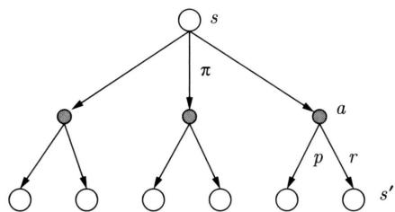

$$
\begin{array}{l} V (s) = \sum_ {a} \pi \sum_ {s ^ {\prime}, r} p \cdot [ r + \gamma \cdot V (s ^ {\prime}) ] \\ = \sum_ {a} \pi (a | s) \sum_ {s ^ {\prime}, r} P \left(s ^ {\prime}, r | s, a\right) [ r + \gamma \cdot V \left(s ^ {\prime}\right) ] \\ \end{array}
$$

(a) 贝尔曼期望方程

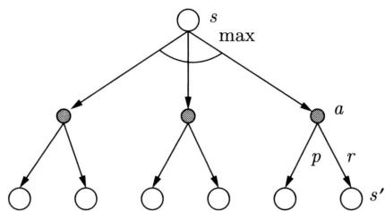  
图35.6 贝尔曼方程可以通过备份图理解

$$
\begin{array}{l} V ^ {*} (s) = \max  _ {a} \sum_ {s ^ {\prime}, r} p \cdot \left[ r + \gamma \cdot V \left(s ^ {\prime}\right) \right] \\ = \max  _ {a} \sum_ {s ^ {\prime}, r} P \left(s ^ {\prime}, r \mid s, a\right) \left[ r + \gamma \cdot V ^ {*} \left(s ^ {\prime}\right) \right] \\ \end{array}
$$

(b) 贝尔曼最优方程

图35.6(a)从根节点的当前状态 $s$ 出发，智能体根据其策略 $\pi$ 决定动作 $a$ ，得到中间节点，有三个可能的中间节点；环境根据模型在状态 $s$ 和动作 $a$ 条件下决定下一个状态 $s^{\prime}$ ，并给出奖励 $r$ ，得到叶节点，共有六个可能的叶节点。贝尔曼期望方程中，当前状态 $s$ 的价值由所有可能的下一个状态 $s^{\prime}$ 的价值计算。具体地，当前状态 $s$ 的价值等于此时得到的奖励加上下一个状态 $s^{\prime}$ 的折扣价值对状态转移分布和策略分布的期望值。图35.6(b)类似，不同点在于贝尔曼最优方程中计算的是状态的价值的最大值，而不是期望值。

称这样的图为备份图是因为在后述同步更新算法中，先将下一个状态 $s'$ 的价值进行备份，然后利用下一个状态 $s'$ 的价值更新当前状态 $s$ 的价值。注意下一个状态中 $s'$ 的集合包含当前状态 $s$ ，因为状态转移可能跳转到自己。

# 35.2.3 策略评估

策略评估算法，给定MDP模型和策略 $\pi$ ，计算策略 $\pi$ 的状态价值函数 $V_{\pi}(s)$ 或动作价值函数 $Q_{\pi}(s,a)$ 。这里只考虑前者。利用贝尔曼期望方程(35.23)，迭代计算各个状态的价值，直到收敛。

$$
\pi : V ^ {(0)} (s) \rightarrow V ^ {(1)} (s) \rightarrow \dots \rightarrow V ^ {(k)} (s) \rightarrow \dots \rightarrow V _ {\pi} (s)
$$

理论上能保证算法收敛到策略 $\pi$ 的状态价值函数 $V_{\pi}(s)$ 。

根据贝尔曼期望方程有以下迭代计算。第 $k$ 次迭代中计算当前状态 $s$ 的价值 $V^{(k)}(s)$ 此时利用第 $k - 1$ 次迭代得到的所有后续状态 $s^{\prime}$ 的价值 $V^{(k - 1)}(s^{\prime})$ 。图35.6(a)的备份图中，相当于将叶节点的价值向上传播，达到根节点，然后更新根节点的价值。迭代公式是

$$
V (s) \leftarrow \sum_ {a} \pi (a | s) \sum_ {s ^ {\prime}, r} P \left(s ^ {\prime}, r | s, a\right) [ r + \gamma V \left(s ^ {\prime}\right) ], \forall s \tag {35.31}
$$

策略和奖励都是确定性函数时有

$$
V (s) \leftarrow R (s, \pi (s)) + \gamma \sum_ {s ^ {\prime}} P \left(s ^ {\prime} \mid s, \pi (s)\right) V \left(s ^ {\prime}\right), \forall s \tag {35.32}
$$

迭代属于同步更新，每次迭代重新计算所有状态的价值。在备份图中首先备份所有叶节点的价值，然后更新根节点的价值。

# 算法35.1（策略评估）

输入：MDP模型、策略 $\pi$ 。

输出：价值函数 $V_{\pi}(s)$ 。

参数： $\varepsilon >0$

{对所有状态的价值初始化 $V(s) = 0$ while $(d\geqslant \varepsilon)\{$ 对所有状态的价值进行备份和更新 $U(s)\gets V(s)$ $V(s)\gets \sum_{a}\pi (a|s)\sum_{s^{\prime},r}P(s^{\prime},r|s,a)[r + \gamma U(s^{\prime})]$ 计算新旧价值的差异 $d = \max_{s}|U(s) - V(s)|$ $\}$ 返回 $V(s)$

策略和奖励都是确定性函数时，策略评估也可以通过求解线性方程组实现。状态转移概率可以由矩阵表示，奖励和价值可以由向量表示。

$$
\boldsymbol {P} = \left[ \begin{array}{c c c} p _ {1 1} & \dots & p _ {1 n} \\ \vdots & & \vdots \\ p _ {n 1} & \dots & p _ {n n} \end{array} \right], \quad \boldsymbol {V} = \left[ \begin{array}{c} v _ {1} \\ \vdots \\ v _ {n} \end{array} \right], \quad \boldsymbol {R} = \left[ \begin{array}{c} r _ {1} \\ \vdots \\ r _ {n} \end{array} \right]
$$

这里 $P$ 是转移矩阵， $V$ 和 $R$ 是价值向量和奖励向量， $n$ 是矩阵的大小。贝尔曼期望方程可以写作

$$
\boldsymbol {V} = \boldsymbol {R} + \gamma \boldsymbol {P V} \tag {35.33}
$$

对线性方程组求解，得到：

$$
\boldsymbol {V} = \left(\boldsymbol {I} - \gamma \boldsymbol {P}\right) ^ {- 1} \boldsymbol {R} \tag {35.34}
$$

逆矩阵 $(\mathbf{I} - \gamma \mathbf{P})^{-1}$ 一定存在，因为矩阵 $\mathbf{P}$ 是随机矩阵，其最大特征值等于1，而 $\gamma < 1$ ，所以 $\mathbf{I} - \gamma \mathbf{P}$ 的特征值均小于1。

解方程组的方法算法复杂度是 $O\left(n^{3}\right)$ ，现实中并不常用。事实上，策略评估算法可以看作以上线性方程组的迭代求解算法。

定理35.1（策略评估算法的收敛性）定义表示策略评估的算子 $H(\mathbf{V}) = \mathbf{R} + \gamma \mathbf{P}\mathbf{V}$ 则有

$$
\lim  _ {k \rightarrow \infty} H ^ {(k)} (\boldsymbol {V}) = \boldsymbol {V} _ {\pi}, \forall \boldsymbol {V} \tag {35.35}
$$

这里 $H^{(k)}(\mathbf{V})$ 是算子对向量 $\mathbf{V}$ 的 $k$ 次迭代后得到的向量， $\mathbf{V}_{\pi}$ 是策略 $\pi$ 的价值向量。说明策略评估算法对任意初始值均保证收敛到真值。

证明留作习题。

定理35.2 策略评估算法中，若第 $k$ 步迭代满足

$$
\| \boldsymbol {V} ^ {(k)} - \boldsymbol {V} ^ {(k - 1)} \| _ {\infty} <   \varepsilon
$$

其中， $\pmb{V}^{(k)}$ 是第 $k$ 步的向量， $\pmb{V}^{(k-1)}$ 是第 $k-1$ 步的向量。

则有

$$
\left\| \boldsymbol {V} ^ {(k)} - \boldsymbol {V} _ {\pi} \right\| _ {\infty} <   \frac {\varepsilon \gamma}{1 - \gamma} \tag {35.36}
$$

其中， $V_{\pi}$ 是策略 $\pi$ 的价值向量。

以上介绍的是基于状态价值函数的策略评估算法。也有基于动作价值函数的策略评估算法。前者利用贝尔曼期望方程 (35.23)，后者利用贝尔曼期望方程 (35.25)。

例35.3 机器人在环境中移动，目标是移动到终点。环境由如图35.7的网格世界表示。机器人移动的终点是格点(1,4)和格点(4,1)，起点可能是任意其他的格点。

定义一个有限期MDP模型。每一个格点是一个状态。格点上有动作，包括向东、向西、向南、向北移动。当前方是网格世界边界时，不能移动，停留在当前格点。当前格点和动作确定时下一个格点是确定的。奖励由移动进入的格点决定，进入终点格点的奖励是0，进入其他格点的奖励是-1.0，机器人目标是尽快到达终点。采用一个随机策略，在格点向东、向西、向南、向北移动的概率各是0.25。折扣因子是1.0。

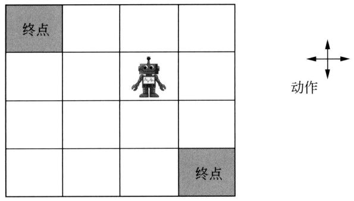  
图35.8 策略评估算法得到的各个状态的价值

图35.7 机器人移动的例子

使用策略评估算法，得到图35.8中的几步的计算结果。初始化 $(k = 0)$ ，每一个格点的价值是0。第一步 $(k = 1)$ ，每一个格点的价值等于进入该格点的奖励。之后的每一步，根据式(35.31)计算，直到收敛。

<table><tr><td>0.0</td><td>0.0</td><td>0.0</td><td>0.0</td></tr><tr><td>0.0</td><td>0.0</td><td>0.0</td><td>0.0</td></tr><tr><td>0.0</td><td>0.0</td><td>0.0</td><td>0.0</td></tr><tr><td>0.0</td><td>0.0</td><td>0.0</td><td>0.0</td></tr></table>

<table><tr><td>0.0</td><td>-1.0</td><td>-1.0</td><td>-1.0</td></tr><tr><td>-1.0</td><td>-1.0</td><td>-1.0</td><td>-1.0</td></tr><tr><td>-1.0</td><td>-1.0</td><td>-1.0</td><td>-1.0</td></tr><tr><td>-1.0</td><td>-1.0</td><td>-1.0</td><td>0.0</td></tr></table>

<table><tr><td>0.0</td><td>-1.8</td><td>-2.0</td><td>-2.0</td></tr><tr><td>-1.8</td><td>-2.0</td><td>-2.0</td><td>-2.0</td></tr><tr><td>-2.0</td><td>-2.0</td><td>-2.0</td><td>-1.8</td></tr><tr><td>-2.0</td><td>-2.0</td><td>-1.8</td><td>0.0</td></tr></table>

<table><tr><td>0.0</td><td>-2.4</td><td>-2.9</td><td>-3.0</td></tr><tr><td>-2.4</td><td>-2.9</td><td>-3.0</td><td>-2.9</td></tr><tr><td>-2.9</td><td>-3.0</td><td>-2.9</td><td>-2.4</td></tr><tr><td>-3.0</td><td>-2.9</td><td>-2.4</td><td>0.0</td></tr></table>

<table><tr><td>0.0</td><td>-6.1</td><td>-8.4</td><td>-9.0</td></tr><tr><td>-6.1</td><td>-7.7</td><td>-8.4</td><td>-8.4</td></tr><tr><td>-8.4</td><td>-8.4</td><td>-7.7</td><td>-6.1</td></tr><tr><td>-9.0</td><td>-8.4</td><td>-6.1</td><td>0.0</td></tr></table>

<table><tr><td>0.0</td><td>-14</td><td>-20</td><td>-22</td></tr><tr><td>-14</td><td>-18</td><td>-20</td><td>-20</td></tr><tr><td>-20</td><td>-20</td><td>-18</td><td>-14</td></tr><tr><td>-22</td><td>-20</td><td>-14</td><td>0.0</td></tr></table>

比如， $k = 2$ 时，格点(2,4)的价值是

$$
\begin{array}{l} V (2, 4) = 0. 2 5 \times (- 1. 0 + 0) + 0. 2 5 \times (- 1. 0 - 1. 0) + 0. 2 5 \times (- 1. 0 - 1. 0) + 0. 2 5 \times (- 1. 0 - 1. 0) \\ = - 1. 8 \\ \end{array}
$$

格点 (3,4) 的价值是

$$
\begin{array}{l} V (3, 4) = 0. 2 5 \times (- 1. 0 - 1. 0) + 0. 2 5 \times (- 1. 0 - 1. 0) + 0. 2 5 \times (- 1. 0 - 1. 0) + 0. 2 5 \times (- 1. 0 - 1. 0) \\ = - 2. 0 \\ \end{array}
$$

# 35.2.4 策略迭代

策略迭代算法给定MDP模型，迭代地求解最优策略 $\pi_{*}$ 。可以使用状态价值函数 $V_{\pi}(s)$ 或动作价值函数 $Q_{\pi}(s,a)$ 。这里只考虑前者。策略迭代有两个步骤，策略评估（policyevaluation）和策略改进（policy improvement)。在策略评估中，对当前策略利用策略评估算法（算法35.1）计算其价值函数。在策略改进中，求解比当前策略更优的策略。重复以上两个步骤，直到收敛。算法的计算过程如下：

$$
\pi_ {0} \xrightarrow {E} V ^ {(0)} (s) \xrightarrow {I} \pi_ {1} \xrightarrow {E} V ^ {(1)} (s) \xrightarrow {I} \pi_ {2} \xrightarrow {E} \dots \xrightarrow {I} \pi_ {*}
$$

其中， $E$ 表示策略评估， $I$ 表示策略改进。理论上能保证算法收敛到最优策略 $\pi_{*}$

策略改进中求解下一个更优策略 $\pi^{\prime}(s)$ 的当前状态 $s$ 的价值时，利用当前策略 $\pi$ 的所有后续状态 $s^{\prime}$ 的价值 $V_{\pi}(s^{\prime})$ 。

$$
\pi^ {\prime} (s) \leftarrow \operatorname {a r g m a x} _ {a} \sum_ {s ^ {\prime}, r} P \left(s ^ {\prime}, r \mid s, a\right) [ r + \gamma V _ {\pi} \left(s ^ {\prime}\right) ], \forall s \tag {35.37}
$$

策略和奖励都是确定性函数时有

$$
\pi^ {\prime} (s) \leftarrow \underset {a} {\operatorname {a r g m a x}} [ R (s, a) + \gamma \sum_ {s ^ {\prime}} P \left(s ^ {\prime} \mid s, a\right) V _ {\pi} \left(s ^ {\prime}\right) ], \forall s \tag {35.38}
$$

策略改进是同步更新，每次迭代重新计算所有状态的策略。

# 算法35.2（策略迭代）

输入：MDP。

输出：最优策略 $\pi_{*}$ 。

初始化策略 $\pi$ repeat{使用策略评估算法求策略 $\pi$ 的价值函数 $V$ 改进策略 $\pi$ ，得到新的策略 $\pi^{\prime}$ （204 $\pi^{\prime}(s)\gets \operatorname *{argmax}_{a}\sum_{s^{\prime},r}P(s^{\prime},r|s,a)[r + \gamma V(s^{\prime})],\forall s$ if( $\pi^{\prime} = \pi \}$ break1else{π←π'1} $\pi_{*} = \pi^{\prime}$ 返回最优策略 $\pi_{*}$

图35.9直观地显示了策略迭代算法的迭代过程。策略迭代首先从初始策略 $\pi_0$ 开始迭代，通过策略评估得到其价值函数 $V_{0}(s)$ ，再通过策略改进得到新的策略 $\pi_{1}$ ，不断重复，直到收敛。理论上保证收敛到最优价值函数 $V_{*}(s)$ 和最优策略 $\pi_{*}$ 。现实中，并不需要让策略评估完全收敛，只迭代若干步甚至一步就开始策略改进，仍然可以找到最优策略。这样的算法称为一般的策略迭代算法（generalized policy iteration）。

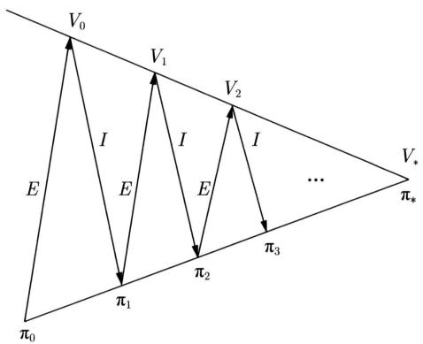  
图35.9 策略迭代算法的迭代过程示意图

定理35.3 策略迭代算法能收敛到最优策略。

证明

$$
\pi^ {\prime} (s) = \underset {a} {\operatorname {a r g m a x}} Q _ {\pi} (s, a), \forall s
$$

$$
Q _ {\pi} (s, \pi^ {\prime} (s)) = \max  _ {a} Q _ {\pi} (s, a) \geqslant Q _ {\pi} (s, \pi (s)) = V _ {\pi} (s), \forall s
$$

所以可以改进价值函数

$$
V _ {\pi^ {\prime}} (s) \geqslant V _ {\pi} (s), \forall s
$$

这是因为

$$
\begin{array}{l} V _ {\pi} (s) \leqslant Q _ {\pi} (s, \pi^ {\prime} (s)) = \mathbb {E} _ {\pi^ {\prime}} \left[ R _ {t + 1} + \gamma V _ {\pi} (S _ {t + 1}) | S _ {t} = s \right] \\ \leqslant \mathbb {E} _ {\pi^ {\prime}} \left[ R _ {t + 1} + \gamma Q _ {\pi} \left(S _ {t + 1}, \pi^ {\prime} \left(S _ {t + 1}\right)\right) \mid S _ {t} = s \right] \\ \leqslant \mathbb {E} _ {\pi^ {\prime}} \left[ R _ {t + 1} + \gamma R _ {t + 2} + \gamma^ {2} Q _ {\pi} \left(S _ {t + 2}, \pi^ {\prime} \left(S _ {t + 2}\right)\right) \mid S _ {t} = s \right] \\ \leqslant \mathbb {E} _ {\pi^ {\prime}} \left[ R _ {t + 1} + \gamma R _ {t + 2} + \dots | S _ {t} = s \right] = V _ {\pi^ {\prime}} (s) \\ \end{array}
$$

当迭代收敛时达到最优，满足贝尔曼最优方程。

$$
\begin{array}{l} Q _ {\pi} (s, \pi^ {\prime} (s)) = \max  _ {a} Q _ {\pi} (s, a) = Q _ {\pi} (s, \pi (s)) = V _ {\pi} (s), \forall s \\ V _ {\pi} (s) = \max  _ {a} Q _ {\pi} (s, a), \forall s \\ V _ {\pi} (s) = V _ {*} (s), \forall s \\ \end{array}
$$

例35.4 例35.3机器人移动的例子中，使用策略迭代算法求解最优策略。假设初始策略是以等概率朝四个方向移动的随机策略。调用策略评估算法计算得到各个状态的价值，就是图35.8的结果。

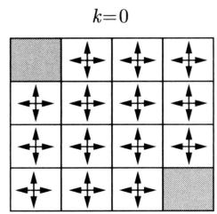

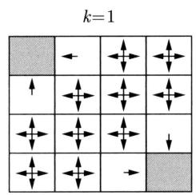

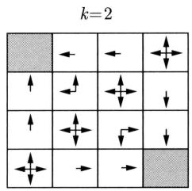

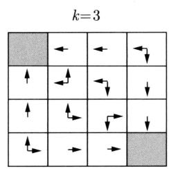

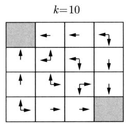

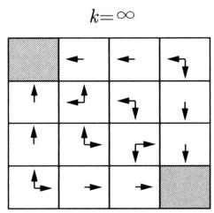  
图35.10 策略评估算法得到的各个状态的最优动作

如果在迭代的每一步，根据式(35.37)求解各个状态的价值最大（最优）的动作，得到图35.10的结果。比如， $k = 2$ 时，格点(2,4)的最优动作是

$$
a _ {*} (2, 4) = \underset {a} {\operatorname {a r g m a x}} \left\{- 1. 0 + 0, - 1. 0 - 1. 8, - 1. 0 - 2. 0, - 1. 0 - 2. 0 \right\} = \{\text {w e s t} \}
$$

格点 (3,4) 的最优动作是

$$
a _ {*} (3, 4) = \underset {a} {\operatorname {a r g m a x}} \left\{- 1. 0 - 1. 8, - 1. 0 - 2. 0, - 1. 0 - 2. 0, - 1. 0 - 2. 0 \right\} = \{\text {w e s t} \}
$$

所以，针对这个简单的例子，首先对随机策略进行一次策略评估，并不需要收敛（ $k \geqslant 3$ ），之后再进行一次策略改进，就可以得到最优策略。图35.10的结果可以帮助直观理解策略迭代。

# 35.2.5 价值迭代

价值迭代算法，给定MDP模型，求解最优状态价值函数 $V_{*}(s)$ 或最优动作价值函数 $Q_{*}(s,a)$ 及最优策略 $\pi_{*}$ 。这里只考虑前者。利用贝尔曼最优方程(35.27)，迭代计算各个状态的价值，直到收敛。

$$
V ^ {(0)} (s) \rightarrow V ^ {(1)} (s) \rightarrow \dots \rightarrow V ^ {(k)} (s) \rightarrow \dots \rightarrow V _ {*} (s)
$$

理论上能保证算法收敛到最优价值函数 $V_{*}(s)$ ，然后得到最优策略 $\pi_{*}$ 。

根据贝尔曼最优方程有以下迭代计算。第 $k$ 次迭代中计算当前状态 $s$ 的价值 $V^{(k)}(s)$ 此时利用第 $k - 1$ 次迭代得到的所有后续状态 $s^{\prime}$ 的价值 $V^{(k - 1)}(s^{\prime})$ 。图35.6(b)的备份图中，相当于将叶节点的价值向上传播，达到根节点，然后更新根节点的价值。迭代公式是

$$
V (s) \leftarrow \max  _ {a} \left[ \sum_ {s ^ {\prime}, r} P \left(s ^ {\prime}, r \mid s, a\right) [ r + \gamma V \left(s ^ {\prime}\right) ] \right], \forall s \tag {35.39}
$$

策略和奖励都是确定性函数时有

$$
V (s) \leftarrow \max  _ {a} [ R (s, a) + \gamma \sum_ {s ^ {\prime}} P \left(s ^ {\prime} \mid s, a\right) V \left(s ^ {\prime}\right) ], \forall s \tag {35.40}
$$

迭代属于同步更新，每次迭代重新计算所有状态的价值。在备份图中首先备份所有叶节点的价值，然后更新根节点的价值。

# 算法35.3（价值迭代）

输入：MDP模型。

输出：最优价值函数 $V_{*}(s)$ 及最优策略 $\pi_{*}$

参数： $\delta >0$

{对所有状态的价值初始化 $v(s) = 0$ while $(d\geqslant \delta)\{$ 对所有状态的价值进行备份和更新 $U(s)\gets V(s)$ $V(s)\gets \max_{a}\sum_{s^{\prime},r}P(s^{\prime},r|s,a)[r + \gamma U(s^{\prime})]$ 计算价值的差异 $d = \max_{s}|U(s) - V(s)|$ $\begin{array}{rl} & {\mathrm{~\textit~{~}}V_{*}(s)\leftarrow V(s)}\\ & {\mathrm{~\textit~{~}}\pi_{*}\leftarrow \underset {a}{\operatorname{argmax}}\sum_{s^{\prime},r}P(s^{\prime},r|s,a)[r + \gamma V(s^{\prime})]}\\ & {\mathrm{~\textit~{~}}\mathrm{~\textit~{~}}\mathrm{~\textit~{~}}\mathrm{~\textit~{~}}V_{*}(s)\mathrm{~\textit~{~}}\pi_{*}} \end{array}$ 返回 $V_{*}(s)$ 和 $\pi_{*}$

策略和奖励都是确定性函数时，贝尔曼最优方程也可以写作

$$
\boldsymbol {V} = \max  _ {a} \boldsymbol {R} _ {a} + \gamma \boldsymbol {P} _ {a} \boldsymbol {V} \tag {35.41}
$$

这里 $\mathbf{V}$ 是价值向量, $P_{a}$ 是转移矩阵, $R_{a}$ 是奖励向量, 后两者依赖于动作 $a$ 。不是线性方程组, 不能用线性代数的方法求解。价值迭代算法的另一个解释是通过迭代的方法求解贝尔曼最优方程。

下面介绍价值迭代算法收敛性相关的定理，先给出压缩映射（contraction mapping）的定义。

定义35.6（压缩映射）考虑作用于实数向量的算子 $T$ 。当算子 $T$ 满足以下条件时，称为压缩映射。对任意两个向量 $\pmb{U}$ 和 $\pmb{V}$

$$
\left\| T (\boldsymbol {U}) - T (\boldsymbol {V}) \right\| _ {\infty} \leqslant \gamma \| \boldsymbol {U} - \boldsymbol {V} \| _ {\infty} \tag {35.42}
$$

其中， $0 <   \gamma <  1$

定理35.4（价值迭代算法收敛性）定义表示价值迭代的算子 $H_{*}(\mathbf{V}) = \max_{a}\mathbf{R}_{a} + \gamma \mathbf{P}_{a}\mathbf{V}$ ，则有

$$
\lim  _ {k \rightarrow \infty} H _ {*} ^ {(k)} (\mathbf {V}) = \mathbf {V} _ {*}, \forall \mathbf {V} \tag {35.43}
$$

这里 $H_{*}^{(k)}(\mathbf{V})$ 是算子对向量 $\mathbf{V}$ 的 $k$ 次迭代得到的向量, $\mathbf{V}_{*}$ 是最优价值向量。即价值迭代算法对任意初始值均保证收敛到真值。

证明 首先证明算子 $H_{*}(\mathbf{V})$ 是压缩映射。

$$
\begin{array}{l} \left\| H _ {*} (\boldsymbol {U}) - H _ {*} (\boldsymbol {V}) \right\| _ {\infty} \\ = \left\| \max  _ {a} \left(R (s, a) + \gamma \sum_ {s ^ {\prime}} P \left(s ^ {\prime} \mid s, a\right) U \left(s ^ {\prime}\right)\right) - \max  _ {a} \left(R (s, a) + \gamma \sum_ {s ^ {\prime}} P \left(s ^ {\prime} \mid s, a\right) V \left(s ^ {\prime}\right)\right) \right\| _ {\infty} \\ \leqslant \left\| \max  _ {a} \left(R (s, a) + \gamma \sum_ {s ^ {\prime}} P \left(s ^ {\prime} \mid s, a\right) U \left(s ^ {\prime}\right) - R (s, a) - \gamma \sum_ {s ^ {\prime}} P \left(s ^ {\prime} \mid s, a\right) V \left(s ^ {\prime}\right)\right) \right\| _ {\infty} \\ = \left\| \max  _ {a} \left(\gamma \sum_ {s ^ {\prime}} P \left(s ^ {\prime} \mid s, a\right) \left(U \left(s ^ {\prime}\right) - V \left(s ^ {\prime}\right)\right)\right) \right\| _ {\infty} \\ \leqslant \left\| \max  _ {a} \left(\gamma \sum_ {s ^ {\prime}} P \left(s ^ {\prime} \mid s, a\right) \| U \left(s ^ {\prime}\right) - V \left(s ^ {\prime}\right) \| _ {\infty}\right) \right\| _ {\infty} \\ = \left\| \gamma \| U (s ^ {\prime}) - V (s ^ {\prime}) \| _ {\infty} \max  _ {a} \left(\sum_ {s ^ {\prime}} P (s ^ {\prime} | s, a)\right) \right\| _ {\infty} \\ = \gamma \| U (s ^ {\prime}) - V (s ^ {\prime}) \| _ {\infty} \\ \end{array}
$$

接着证明收敛性。根据定义有 $H_{*}(V_{*}) = V_{*}$ ，且 $\mathbf{V}_{*}$ 是固定向量。所以， $H_{*}$ 算子的 $k$ 次迭代满足

$$
\left\| H _ {*} ^ {(k)} (\mathbf {V}) - \mathbf {V} _ {*} \right\| _ {\infty} \leqslant \gamma \left\| H _ {*} ^ {(k - 1)} (\mathbf {V}) - \mathbf {V} _ {*} \right\| _ {\infty} \leqslant \dots \leqslant \gamma^ {k} \left\| \mathbf {V} - \mathbf {V} _ {*} \right\| _ {\infty}
$$

其中， $\pmb{V}$ 是任意初始向量。故

$$
\| H _ {*} ^ {(k)} (\mathbf {V}) - \mathbf {V} _ {*} \| _ {\infty} \leqslant \gamma^ {k} \| \mathbf {V} - \mathbf {V} _ {*} \| _ {\infty}
$$

$$
\lim  _ {k \rightarrow \infty} \| H _ {*} ^ {(k)} (\boldsymbol {V}) - \boldsymbol {V} _ {*} \| _ {\infty} = 0
$$

$$
\lim  _ {k \rightarrow \infty} H _ {*} ^ {(k)} (\boldsymbol {V}) = \boldsymbol {V} _ {*}, \forall \boldsymbol {V}
$$

定理35.5 价值迭代算法中，若第 $k$ 步迭代满足

$$
\| \boldsymbol {V} ^ {(k)} - \boldsymbol {V} ^ {(k - 1)} \| _ {\infty} <   \varepsilon
$$

其中， $\pmb{V}^{(k)}$ 是第 $k$ 步的向量， $\pmb{V}^{(k-1)}$ 是第 $k-1$ 步的向量。

则有

$$
\left\| \boldsymbol {V} ^ {(k)} - \boldsymbol {V} _ {*} \right\| _ {\infty} <   \frac {2 \varepsilon \gamma}{1 - \gamma} \tag {35.44}
$$

其中， $\pi_k$ 是第 $k$ 步迭代得到的策略， $\pmb{V}^{(k)}$ 是 $\pi_k$ 的价值向量， $\pmb{V}_*$ 是最优价值向量。

因为一般有 $\gamma < 1$ ，定理35.5说明只有当阈值 $\varepsilon$ 足够小时，才能保证价值迭代算法足够逼近真值。

以上介绍的是基于状态价值函数的价值迭代算法，也有基于动作价值函数的价值迭代算法。前者利用贝尔曼最优方程(35.27)，后者利用贝尔曼最优方程(35.29)。

# 例35.5 价值迭代算法例

将价值迭代算法应用于例35.1中的问题，得到图35.11中的结果。第一步 $(k = 1)$ ，每一个格点的价值等于该格点的奖励。第二步 $(k = 2)$ ，利用迭代公式进行一步迭代。不断迭代，直到收敛。

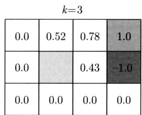

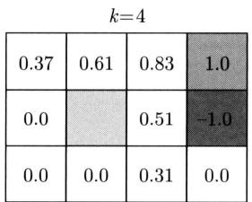

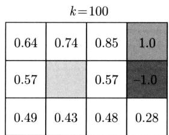

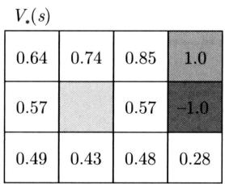

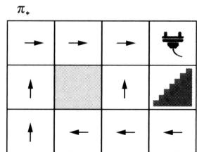  
图35.11 价值迭代算法计算结果

# 35.2.6 算法的比较和扩展

# 1. 算法的扩展

本章介绍的策略评估、策略迭代、价值迭代算法都基于状态价值函数，使用相关的贝尔曼方程 (35.23) 和 (35.27)，算法复杂度是 $O\left(n^{2}m\right)$ ，其中 $n$ 是状态数， $m$ 是动作数。基于动作价值函数的对应算法，使用相关的贝尔曼方程 (35.25) 和 (35.29)，算法复杂度是 $O\left(n^{2}m^{2}\right)$ 。

本章介绍的算法都使用同步更新（synchronous update），先对所有状态的价值进行备份，

然后同时更新所有状态的价值。还可以使用异步更新（asynchronous update），使算法更快收敛。比如，原地（in place）技巧，每次迭代中，不对状态的价值进行备份，依次对状态的价值进行更新。这时后续状态的价值有的已在这次迭代中更新，有的还没有更新，也能保证算法收敛而且收敛更快。

# 2. 算法的比较

策略评估算法和价值迭代算法分别用于预测和控制，但形式上非常相似。前者求解一个具体策略的价值函数，后者求解最优价值函数及最优策略。前者基于贝尔曼期望方程，计算求的是平均；后者基于贝尔曼最优方程，计算求的是最大（比较图35.6中的两个备份图）。

价值迭代算法和策略迭代算法都通过迭代的方式求解最优策略，形式有所不同，但是是对应的。价值迭代通过迭代求解价值函数的max进行，得到一个个价值函数，直到最优价值函数及最优策略。策略迭代通过迭代求解价值函数的argmax进行，得到一个个策略函数，直到最优策略及最优价值函数，在每一步重新计算策略的价值函数。

这一点可以在使用动作价值函数的策略迭代和价值迭代中看得更清楚，假设策略和奖励是确定性的。策略迭代进行以下策略评估和策略改进的两步，并不断重复。

$$
\begin{array}{l} Q _ {\pi} (s, a) \leftarrow R (s, a) + \gamma \sum_ {s ^ {\prime}} P (s ^ {\prime} | s, a) V _ {\pi} (s ^ {\prime}) \\ \pi \left(s ^ {\prime}\right) \leftarrow \operatorname * {a r g m a x} _ {a ^ {\prime}} Q _ {\pi} \left(s ^ {\prime}, a ^ {\prime}\right) \\ \end{array}
$$

对应地可以进行以下两步迭代，并不断重复，其中 $\arg\max$ 改为 $\max$ 。

$$
\begin{array}{l} Q _ {\pi} (s, a) \leftarrow R (s, a) + \gamma \sum_ {s ^ {\prime}} P \left(s ^ {\prime} \mid s, a\right) V _ {\pi} \left(s ^ {\prime}\right) \\ V _ {\pi} \left(s ^ {\prime}\right) \gets \max  _ {a ^ {\prime}} Q _ {\pi} \left(s ^ {\prime}, a ^ {\prime}\right) \\ \end{array}
$$

将两步合为一步就得到价值迭代。

$$
Q _ {\pi} (s, a) \leftarrow R (s, a) + \gamma \sum_ {s ^ {\prime}} P \left(s ^ {\prime} \mid s, a\right) \max  _ {a ^ {\prime}} Q _ {\pi} \left(s ^ {\prime}, a ^ {\prime}\right)
$$

# 本章概要

1. 马尔可夫决策过程是描述智能体和环境交互的随机过程。有限马尔可夫决策过程主要由四元组组成 $\langle S, A, P, R \rangle$ 。

（1）状态有限集合 $S: s, s' \in S$ 。  
（2）动作有限集合 $\mathcal{A}$ ： $a\in \mathcal{A}$ 。  
(3) 转移概率分布 $P: P(S' = s'|S = s, A = a), s, s' \in S, a \in \mathcal{A}$ 。  
(4) 奖励函数 $R: R(S = s, A = a, S' = s'), s, s' \in S, a \in \mathcal{A}$ 。

有时也包含

（1）折扣因子： $0\leqslant \gamma \leqslant 1$

（2）初始状态集合： $S_0\subset S$   
(3) 终止状态集合: $S_{T} \subset S$ 。

环境可以处于不同的状态，智能体可以执行不同的动作；智能体基于当前的状态执行一个动作，环境基于当前的状态和当前动作随机决定下一个状态，并且给出一个奖励；不断重复。智能体和环境的交互形成一个轨迹。

$$
S _ {0}, A _ {0}, R _ {1}, S _ {1}, \dots , S _ {t}, A _ {t}, R _ {t + 1}, S _ {t + 1}, A _ {t + 1}, R _ {t + 2}, S _ {t + 2}, \dots
$$

第 $t + 1$ 时刻的奖励和状态由第 $t$ 时刻的状态和动作决定：

$$
P \left(R _ {t + 1} = r, S _ {t + 1} = s ^ {\prime} \mid S _ {t} = s, A _ {t} = a\right) = P (r, s ^ {\prime} \mid s, a), \forall s, s ^ {\prime} \in \mathcal {S}, a \in \mathcal {A}
$$

转移概率分布具有马尔可夫性，下一时刻的状态只依赖于当前时刻的状态和动作：

$$
P \left(S _ {t + 1} \mid S _ {t}, A _ {t}\right) = P \left(S _ {t + 1} \mid S _ {t}, A _ {t}, S _ {t - 1}, A _ {t - 1}, \dots , S _ {0}, A _ {0}\right)
$$

奖励函数可以是随机的，比如，第 $t + 1$ 时刻的奖励由第 $t$ 时刻的状态和动作及第 $t + 1$ 时刻的状态决定：

$$
R \left(S _ {t} = s, A _ {t} = a\right) = \mathbb {E} \left(R _ {t + 1} = r | S _ {t} = s, A _ {t} = a\right) = \sum_ {r \in \mathcal {R}} r \cdot P (r | s, a), \forall s \in \mathcal {S}, a \in \mathcal {A}
$$

奖励函数也可以是确定的，比如，第 $t + 1$ 时刻的奖励只由第 $t$ 时刻的状态和动作决定：

$$
R \left(S _ {t} = s, A _ {t} = a\right) = r, \forall s \in \mathcal {S}, a \in \mathcal {A}
$$

MDP 还有有限期和无限期之分。对于有限期 MDP，轨迹在有限的第 $T$ 时刻终止。对于无限期 MDP，轨迹可以延续到无穷时刻 $T = \infty$ 。

2. MDP 中智能体与环境交互过程中，环境决定状态和奖励，其整体称为模型；智能体决定动作，可选择的是策略。策略函数可以是随机的：

$$
P (A = a | S = s) = \pi (a | s), \forall s \in \mathcal {S}, a \in \mathcal {A}
$$

也可以是确定的：

$$
A = \pi (S = s) = a, \forall s \in \mathcal {S}
$$

3. 智能体的目标是在未来的交互中得到最大的期望的累积折扣奖励，由回报或价值表示。对于有限期MDP，第 $t$ 时刻之后的一个有限轨迹的回报是

$$
G _ {t} = \sum_ {k = 0} ^ {T - t - 1} \gamma^ {k} R _ {t + k + 1}, t = 0, 1, \dots , T - 1
$$

对于无限期MDP，第 $t$ 时刻之后一个无限轨迹的回报是

$$
G _ {t} = \sum_ {k = 0} ^ {\infty} \gamma^ {k} R _ {t + k + 1}, t = 0, 1, \dots
$$

其中， $\gamma$ 是折扣因子。

状态价值函数，在策略 $\pi$ 下状态 $s$ 的价值表示针对未来所有轨迹的回报的期望值：

$$
V _ {\pi} (s) = \mathbb {E} _ {\pi} \left[ \sum_ {k = 0} ^ {\infty} \gamma^ {k} R _ {t + k + 1} | S _ {t} = s \right], \forall s
$$

动作价值函数，在策略 $\pi$ 下状态 $s$ 和动作 $a$ 的价值表示针对未来所有轨迹的回报的期望值：

$$
Q _ {\pi} (s, a) = \mathbb {E} _ {\pi} \left[ \sum_ {k = 0} ^ {\infty} \gamma^ {k} R _ {t + k + 1} | S _ {t} = s, A _ {t} = a \right], \forall s, a
$$

4. 智能体的目标是选择最优的价值函数，以及对应的最优策略。

最优状态价值函数是

$$
V _ {*} (s) = \max  _ {\pi} V _ {\pi} (s), \forall s
$$

对应的最优策略是

$$
\pi_ {*} = \underset {\pi} {\operatorname {a r g m a x}} V _ {\pi} (s), \forall s
$$

最优动作价值函数是

$$
Q _ {*} (s, a) = \max  _ {\pi} Q _ {\pi} (s, a), \forall s, a
$$

对应的最优策略是

$$
\pi_ {*} = \underset {\pi} {\operatorname {a r g m a x}} Q _ {\pi} (s, a), \forall s, a
$$

最优价值函数存在且唯一，但最优策略并不一定唯一。

5. MDP描述的是智能体与环境交互的过程，智能体目标是求解最优的策略，就是规划。规划包括预测和控制。预测是给定MDP及一个策略 $\pi$ ，求解其状态价值函数 $V_{\pi}(s)$ 或动作价值函数 $Q_{\pi}(s,a)$ 。控制是给定MDP，求解最优状态价值函数 $V_{*}(s)$ 或最优动作价值函数 $Q_{*}(s,a)$ ，以及最优策略 $\pi^{*}$ 。

预测的算法有策略评估，控制的算法有策略迭代和价值迭代，都是动态规划在MDP上的应用，核心是使用贝尔曼期望方程和贝尔曼最优方程。

6. 贝尔曼方程包括贝尔曼期望方程和贝尔曼最优方程。

贝尔曼期望方程，策略 $\pi$ 的状态价值函数有以下关系：

$$
V _ {\pi} (s) = \sum_ {a} \pi (a | s) \sum_ {s ^ {\prime}, r} P \left(s ^ {\prime}, r | s, a\right) [ r + \gamma V _ {\pi} \left(s ^ {\prime}\right) ], \forall s
$$

策略 $\pi$ 的动作价值函数有以下关系：

$$
Q _ {\pi} (s, a) = \sum_ {s ^ {\prime}, r} P \left(s ^ {\prime}, r \mid s, a\right) [ r + \gamma \sum_ {a ^ {\prime}} P \left(a ^ {\prime} \mid s ^ {\prime}\right) Q _ {\pi} \left(s ^ {\prime}, a ^ {\prime}\right) ], \forall s, a
$$

贝尔曼最优方程，最优状态价值函数有以下关系：

$$
V _ {*} (s) = \max  _ {a} \sum_ {s ^ {\prime}, r} P \left(s ^ {\prime}, r \mid s, a\right) [ r + \gamma V _ {*} \left(s ^ {\prime}\right) ], \forall s
$$

最优动作价值函数之间有以下关系：

$$
Q _ {*} (s, a) = \sum_ {s ^ {\prime}, r} P \left(s ^ {\prime}, r | s, a\right) \left[ r + \gamma \max  _ {a ^ {\prime}} Q _ {*} \left(s ^ {\prime}, a ^ {\prime}\right) \right], \forall s, a
$$

7. 策略评估算法，使用状态价值函数时，利用贝尔曼期望方程迭代计算各个状态的价值，直到收敛。

$$
V (s) \leftarrow \sum_ {a} \pi (a | s) \sum_ {s ^ {\prime}, r} P \left(s ^ {\prime}, r \mid s, a\right) [ r + \gamma V \left(s ^ {\prime}\right) ], \forall s
$$

理论上能保证策略评估算法收敛到给定策略 $\pi$ 的价值函数 $V_{\pi}(s)$ 。

8. 策略迭代算法有两个步骤：策略评估和策略改进。在策略评估中，对当前策略计算其价值函数。在策略改进中，求解比当前策略更优的策略。重复以上两个步骤，直到收敛。使用状态价值函数时，策略改进中有以下迭代公式。

$$
\pi^ {\prime} (s) \leftarrow \operatorname {a r g m a x} _ {a} \sum_ {s ^ {\prime}, r} P \left(s ^ {\prime}, r | s, a\right) [ r + \gamma V _ {\pi} \left(s ^ {\prime}\right) ], \forall s
$$

理论上能保证算法收敛到最优策略 $\pi_{*}(s)$ 。

9. 价值迭代算法，使用状态价值函数时，利用贝尔曼最优方程迭代计算各个状态的最优价值，直到收敛。

$$
V (s) \leftarrow \max  _ {a} \left[ \sum_ {s ^ {\prime}, r} P \left(s ^ {\prime}, r \mid s, a\right) [ r + \gamma V \left(s ^ {\prime}\right) ] \right], \forall s
$$

理论上能保证算法收敛到最优价值函数 $V_{*}(s)$ ，然后得到最优策略 $\pi_{*}(s)$ 。

# 继续阅读

Howard在他的书中首次总结了马尔可夫决策过程和动态规划[1]。Sutton和Barto书中的第3章~第4章[2]，以及Puterman书中也有详细介绍[3]。

# 习题

35.1 假设奖励属于有限集合 $R \in \mathcal{R}$ ，折扣因子 $\gamma$ 小于 1，证明回报一定有界。

$$
G _ {t} = \sum_ {k = 0} ^ {\infty} \gamma^ {k} R _ {t + k + 1}
$$

提示：利用以下关系。

$$
\sum_ {k = 0} ^ {\infty} \gamma^ {k} = \frac {1}{1 - \gamma}, \gamma <   1
$$

35.2 写出有限期MDP的一个轨迹上各个状态的回报的递归计算算法。

35.3 例35.1的问题中，计算策略是 $\pi_{2}$ 时的轨迹 $t_1$ 和 $t_2$ 的回报和概率。验证策略是 $\pi_{1}$ 时轨迹 $t_3$ 和 $t_4$ 不存在。  
35.4 推导贝尔曼期望方程的公式。  
35.5 证明关于策略评估的定理 35.1。提示：参考定理 35.4 的证明，利用算子 $H(\mathbf{V}) = \mathbf{R} + \gamma \mathbf{P}\mathbf{V}$ 的压缩映射性质。  
35.6 例35.1的问题中，用策略评估算法求策略 $\pi_1$ 和 $\pi_2$ 的价值函数，并做比较。  
35.7 图35.10中策略逐渐收敛到 $\pi_{\infty}$ ，用策略评估算法求策略 $\pi_{\infty}$ 的价值函数。  
35.8 例 35.1 的问题中, 从起点到终点的路径规划也可以用 $A^{*}$ 算法求解。比较与基于 MDP 的价值迭代算法的区别, 理解环境是确定和随机的意义。  
35.9 例35.1的问题中，假设状态的奖励如下图所示，其他条件不变。用价值迭代算法求解各个状态的最优价值。

<table><tr><td>-0.04</td><td>-0.04</td><td>-0.04</td><td>1.0</td></tr><tr><td>-0.04</td><td></td><td>-0.04</td><td>-1.0</td></tr><tr><td>-0.04</td><td>-0.04</td><td>-0.04</td><td>-0.04</td></tr></table>

35.10 使用价值迭代算法求例 35.2 中的机器人行动规划的最优价值函数和最优策略。状态的集合 $S = \{h, l\}$ ，动作的集合 $A = \{w, s, c\}$ ，其中 $h$ 表示电量高， $l$ 表示电量低， $w$ 表示工作， $s$ 表示待机， $c$ 表示充电。

<table><tr><td>转移概率 P(s′|s,a)</td><td>奖励函数 R(s,a,s&#x27;)</td></tr><tr><td>P(h|h,w)=0.8</td><td>R(h,w,h)=+2</td></tr><tr><td>P(l|h,w)=0.2</td><td>R(h,w,l)=0</td></tr><tr><td>P(h|h,s)=1.0</td><td>R(h,s,h)=0</td></tr><tr><td>P(l|l,w)=1.0</td><td>R(l,w,l)=-2</td></tr><tr><td>P(l|l,s)=1.0</td><td>R(l,s,l)=0</td></tr><tr><td>P(h|l,c)=1.0</td><td>R(l,c,h) = +2</td></tr></table>

35.11 写出使用动作价值函数的策略评估、策略迭代和价值迭代算法。

# 参考文献

[1] HOWARD R A. Dynamic programming and markov processes[M]. 1960.   
[2] SUTTON R S, BARTO A G. Reinforcement learning: An introduction[M]. MIT press, 2018.   
[3] PUTERMAN M L. Markov decision processes: discrete stochastic dynamic programming[M]. John Wiley & Sons, 2014.

# 第36章 多臂老虎机

多臂老虎机（multi-armed bandits）是强化学习的一种特殊情况。智能体在与环境交互过程中，执行一个动作，得到一个奖励，重复有限次；只有一个状态，没有状态之间的转移；目标是最大化总体奖励。多臂老虎机最初在统计学中被研究，被形式化为在多臂老虎机（一种赌博机器）上进行博弈的问题。更一般的问题是，有多个选项（动作），一次选择其中一个选项获得一次收益（奖励）；每一个选项的收益遵循一个概率分布，有收益的期望值，而事先不知道收益的概率分布；目标是通过有限次选择，得到有限次收益，最终最大化总体收益，过程中对各个选项的收益期望值进行估计。

探索和利用的权衡是多臂老虎机的核心问题。利用是指选择（估计的）期望奖励最大的动作，探索是指选择（估计的）期望奖励不确定的其他动作。

多臂老虎机的算法主要有 $\varepsilon$ 贪心（ $\varepsilon$ -greedy）、置信上界（upper confidence bound, UCB）、汤普森采样（Thompson sampling）。在实际应用中有更通用的上下文老虎机（contextual bandits）等。汤普森采样由 Thompson 于 1933 年提出，用于临床实验，是最早的多臂老虎机算法。Robbins 于 1952 年系统地研究了多臂老虎机问题。Auer 等基于前人的工作于 2002 年完善了 UCB 算法。

本章36.1节给出多臂老虎机的定义，36.2节讲解基本算法，特别是UCB算法和汤普森采样算法。

# 36.1 多臂老虎机概述

本节给出多臂老虎机的定义，指出探索与利用的权衡是多臂老虎机学习的核心问题。

# 36.1.1 问题的定义

多臂老虎机问题通过一个假想的赌博场景定义（见图36.1）。假设有 $K$ 台老虎机（slot machines 或 one-armed bandits），每台老虎机有一个手臂，拉动老虎机的手臂，老虎机会按照一个概率分布随机吐出一些奖币①。每一台老虎机的奖币分布不同。假设玩老虎机的轮数事先确定。玩家如果知道每一台老虎机的奖币分布，那么一定会选择获得奖币数的期望值最大的老虎机去玩，最终赢得最多的奖币。但实际情况是，玩家对老虎机的奖币分布一无所知，需要在玩的过程中进行估计。玩家需要采用一个好的策略，在每一轮尽量赢得更多的奖币，

并且不断对老虎机的奖币分布有更准确的估计，目标是结束时赢得最多的奖币。问玩家应该采用怎样的策略？

  
图36.1 多臂老虎机问题

多臂老虎机表示一类通用的决策和学习问题，玩家代表智能体，老虎机代表环境。有多个选项，每一个选项的收益未知，智能体与环境交互，目标是依次选择一个选项，最大化获得的总体收益。新闻推荐、在线广告、金融投资、医学治疗等许多问题都可以看作具体的应用。在新闻推荐中，推荐系统是智能体，用户群体是环境，文章是手臂，用户的点击是奖励。在在线广告中，广告系统是智能体，消费者群体是环境，广告是手臂，消费者的点击是奖励。在金融投资中，投资决策系统是智能体，金融市场是环境，投资项目是手臂，投资的回报是奖励。在医学治疗中，医疗决策系统是智能体，病人群体是环境，治疗方法是手臂，治疗的效果是奖励。

下面给出常用的多臂老虎机，也就是随机老虎机（stochastic bandits）的定义。本书只介绍随机老虎机，当提到多臂老虎机时，一般指随机老虎机。

定义36.1（随机老虎机） 随机老虎机的模型由三元组 $\langle A,\mathbb{R},P\rangle$ 组成。

- 手臂或动作的有限集合 $\mathcal{A}$ : $a\in \mathcal{A},K = |\mathcal{A}|$ 。  
- 奖励或奖币的集合 $\mathbb{R}$ : $r \in \mathbb{R}$ , 奖励 $r$ 是一个实数值。有时为了方便, 认为奖励是有界的, 如设 $r \in [0,1]$ 。  
- 奖励的概率分布 $P(r|a)$ : $\mathcal{A} \times \mathbb{R} \rightarrow [0,1], a \in \mathcal{A}, r \in \mathbb{R}$ , 选择手臂 $a$ 得到奖励 $r$ 的概率是 $P(r|a)$ 。

手臂 $a$ 的期望奖励，也称作手臂的价值，是

$$
Q (a) = \mathbb {E} [ r | a ] \tag {36.1}
$$

最优期望奖励是

$$
Q _ {*} = \max  _ {a} Q (a) \tag {36.2}
$$

最优手臂是

$$
a _ {*} = \underset {a} {\operatorname {a r g m a x}} Q (a) \tag {36.3}
$$

智能体知道所有可能的手臂，但不知道每个手臂的奖励的分布，只能通过与老虎机的交互

估计各个分布。因此，也不知道每个手臂的期望奖励 $Q(a)$ ，包括最优期望奖励 $Q_{*}$ 和最优手臂 $a_{*}$ 。

智能体和老虎机进行 $T$ 轮交互。在第 $t$ 轮交互中，智能体选择一个手臂 $A_{t}$ ，老虎机从对应的奖励分布 $P(r|A_{t})$ 中随机生成一个奖励 $R_{t}$ ，智能体获得奖励 $R_{t}$ 。这时，智能体选择一个手臂就意味着不选择其他手臂，无法得知如果选择其他手臂得到的奖励是多少。另外，智能体选择同一个手臂时，老虎机从对应的同一个奖励分布中独立地生成一个奖励，也就是说，选择同一个手臂得到的奖励数据是独立同分布的。

在 $T$ 轮交互中的总体奖励是

$$
G = \sum_ {t = 0} ^ {T - 1} R _ {t} \tag {36.4}
$$

智能体的目标是最大化总体奖励 $G$ 。以上问题称为多臂老虎机问题。

多臂老虎机是强化学习的特殊情况，模型是马尔可夫决策过程的特殊情况。只有一个状态，没有状态转移。奖励函数是奖励的概率分布。多臂老虎机问题中决策和学习是融合在一起的。智能体需要在与老虎机的交互中估计每个手臂的期望奖励。其目标是尽快识别最优手臂，之后持续选择最优手臂，以达到总体奖励最大化的目的。

多臂老虎机算法的分析中经常使用遗憾这个评价指标。智能体根据一个具体策略与老虎机进行交互。在 $T$ 轮交互中的遗憾（regret）定义为

$$
\gamma (T) = T \cdot Q _ {*} - \sum_ {t = 0} ^ {T - 1} Q \left(A _ {t}\right) \tag {36.5}
$$

其中， $Q_{*}$ 是最优期望奖励， $Q(A_{t})$ 是手臂 $A_{t}$ 的期望奖励。在 $T$ 轮交互中的期望遗憾是

$$
\mathbb {E} [ \gamma (T) ] = \mathbb {E} \left[ T \cdot Q _ {*} - \sum_ {t = 0} ^ {T - 1} Q \left(A _ {t}\right) \right] \tag {36.6}
$$

期望 $\mathbb{E}[·]$ 是针对所有 $T$ 轮交互的。期望遗憾表示了一个策略的期待总体奖励与最优总体奖励的差，也就是该策略与理想情况的差。期望遗憾越小，策略就越接近最优。

多臂老虎机除了随机老虎机以外，还有上下文老虎机（contextual bandits）、对抗老虎机（adversarial bandits）、非平稳老虎机（non-stationary bandits）等。上下文老虎机是随机老虎机的扩展。在一个特定的上下文（由特征向量表示），选择一个手臂，得到一个奖励，奖励是手臂和上下文的参数化函数，如线性函数或神经网络。

# 36.1.2 探索和利用的权衡

多臂老虎机需要考虑探索和利用的权衡(exploration and exploitation trade-off)，是多臂老虎机学习，更一般的强化学习，要解决的核心问题。

在每一轮交互中，已经有了对各个手臂的期望奖励的估计（可能估计得不准确）。这时，可以选择（估计的）期望奖励最大的手臂，以追求总体奖励最大的最终目标，这样的选择称为利用。也可以选择（估计的）期望奖励不确定的手臂，更准确地估计其期望奖励，以追求总

体奖励最大的最终目标，这样的选择称为探索。探索往往意味着牺牲短期收益，追求长期收益。是利用当前估计的期望奖励最大的手臂，还是探索期望奖励有可能最大的手臂，需要进行判断。

比如，在一轮交互中要对两个手臂进行选择，其中一个手臂的（估计的）期望奖励略大于另一个手臂的（估计的）期望奖励，但前者的估计值更确定，后者的估计值不确定。如果选择前者，有可能会有更大的短期收益。但是如果选择后者，能更准确地估计其期望奖励，有可能获得更大的长期收益。这时需要在探索和利用中做权衡。

探索和利用的判断要考虑当前期望奖励的估计值、估计的确定性、剩余的轮数等因素。

# 36.2 基本算法

本节先介绍探索优先算法、 $\varepsilon$ 贪心算法，然后讲解UCB算法和汤普森采样算法。从统计学角度，UCB基于频率推断，汤普森采样基于贝叶斯推断。

# 36.2.1 探索优先算法

先考虑一个简单的探索优先（exploration-first）算法。首先进行探索，选择每个手臂 $N$ 次，估计每个手臂的期望奖励；然后进行利用，基于估计的结果，始终选择期望奖励最大的手臂。这个算法的缺点是很难做好探索和利用的权衡，不是最优的。如果探索时间较长，即 $N$ 较大，探索中就会多次选择期望奖励不是最优的手臂，会使总体奖励减少，遗憾增大。如果探索时间较短，即 $N$ 较小，各个手臂的期望奖励的估计可能不准确，后续的利用中有可能选择不是最优的手臂，也有可能使总体奖励减少，遗憾增大。

# 36.2.2 $\varepsilon$ 贪心算法

$\varepsilon$ 贪心（ $\varepsilon$ -greedy）算法的基本想法是优先利用再加上随机探索，以更好地实现探索和利用的权衡。设在第 $t$ 轮交互中，每个手臂 $a$ 的估计的期望奖励是 $Q(a)$ 。以 $1 - \varepsilon$ 的概率选择期望奖励最大的手臂（如果有多个这样的手臂在其中随机选择一个）：

$$
A _ {t} = \underset {a} {\operatorname {a r g m a x}} Q (a) \tag {36.7}
$$

以 $\varepsilon$ 的概率随机选择任意一个手臂。也就是说，以 $1 - \varepsilon$ 的概率利用，以 $\varepsilon$ 的概率探索，而利用是贪心的。称这个算法为 $\varepsilon$ 贪心算法。选择手臂 $A_{t}$ 后，得到奖励 $R_{t}$ ，再重新估计该手臂的期望奖励。

数列均值的计算有一般的增量计算公式。设有数列 $x_{1}, x_{2}, \cdots, x_{t}, \cdots$ ，到各项为止的均值是 $\mu_{1}, \mu_{2}, \cdots, \mu_{t}, \cdots$ 。可以用以下公式增量地计算各个均值。

$$
\mu_ {t} = \frac {1}{t} \sum_ {i = 1} ^ {t} x _ {i}
$$

$$
\begin{array}{l} = \frac {1}{t} \left(x _ {t} + \sum_ {i = 1} ^ {t - 1} x _ {i}\right) \\ = \frac {1}{t} [ x _ {t} + (t - 1) \mu_ {t - 1} ] \\ = \mu_ {t - 1} + \frac {1}{t} \left(x _ {t} - \mu_ {t - 1}\right) \\ \end{array}
$$

利用以上公式增量地计算各个手臂的期望奖励。手臂 $A_{t}$ 的期望奖励 $Q(A_{t})$ 是

$$
Q \left(A _ {t}\right) \leftarrow Q \left(A _ {t}\right) + \frac {1}{N \left(A _ {t}\right)} \left[ R _ {t} - Q \left(A _ {t}\right) \right] \tag {36.8}
$$

其中， $A_{t}$ 是选择的手臂， $R_{t}$ 是得到的奖励， $N(A_{t})$ 是手臂 $A_{t}$ 被选择的次数。

算法36.1是 $\varepsilon$ 贪心算法。当 $N(a) = 0$ 时，无条件选择手臂 $a$ 。有多个可以选择的手臂时随机选择其中的一个。

# 算法36.1（ $\varepsilon$ 贪心算法）

输入：模型未知的多臂老虎机。

输出：总体奖励 $G$ ，各个手臂的期望奖励 $Q(a)$ 。

参数：总轮数 $T$ ，探索概率 $\varepsilon$ 。

{ #初始化所有手臂的奖励和计数 $Q(a)\gets 0$ （204 $N(a)\gets 0$ （20 $G\gets 0$ （20 $t = 0$ while $(t <   T)$ { 采用 $\varepsilon$ 贪心算法基于 $Q(a)$ 选择手臂 $A_{t}$ 得到奖励 $R_{t}$ #更新估计值 $N(A_{t})\leftarrow N(A_{t}) + 1$ $Q(A_{t})\leftarrow Q(A_{t}) + \frac{1}{N(A_{t})}$ $G\gets G + R_{t}$ （20 $t\gets t + 1$ }   
}

$\varepsilon$ 贪心算法探索的比例是固定的，没有根据已估计的奖励的期望值和确定性，动态地决定探索的比例，仍然有不必要的探索。这个算法在期望遗憾最小的意义上也不是最优的。

# 36.2.3 UCB算法

UCB（upper confidence bound，置信上界）算法的基本想法是利用期望奖励的估计值和置信区间（具体地置信上界），自适应地进行探索和利用的权衡。在期望遗憾最小的意义上近乎最优。

在第 $t$ 轮交互中各个手臂 $a$ 的期望奖励的估计值是 $Q(a)$ 。根据强大数定律，随着选择手臂 $a$ 的次数的增加，期望奖励的估计值将依概率收敛于真实值。同时，基于集中不等式，如Hoeffding不等式，可以推导得出，期望奖励以大概率存在于置信区间

$$
[ Q (a) - \Delta (a), Q (a) + \Delta (a) ]
$$

其中， $\Delta(a)$ 是置信区间的置信半径。 $Q(a) + \Delta(a)$ 称作置信上界， $Q(a) - \Delta(a)$ 称作置信下界。注意置信半径 $\Delta(a)$ 随着选择手臂 $a$ 的次数的增加而趋近于 0。置信区间的大小表示估计的不确定性的大小。置信区间越大估计的不确定性越大，置信区间越小估计的不确定性越小。

贪心算法选择期望奖励最大的手臂，这时只有利用，没有探索。

$$
A _ {t} = \underset {a} {\operatorname {a r g m a x}} [ Q (a) ]
$$

UCB 选择期望奖励的置信上界最大的手臂，兼顾利用和探索。这时，期望奖励值 $Q(a)$ 代表利用，置信半径 $\Delta(a)$ 代表探索。期望奖励值大说明值得利用，置信半径大说明值得探索，而两者之和的最大化代表了权衡。

$$
A _ {t} = \underset {a} {\operatorname {a r g m a x}} [ Q (a) + \Delta (a) ] \tag {36.9}
$$

UCB的策略被称为在不确定情况下的乐观主义。意味着“乐观地”认为选择比（估计的）期待奖励更大的上界能带来更大的收益。

图36.2的例子直观地解释选择置信上界最大的手臂的原理。假设有三个手臂。图中给出了三个手臂的期望奖励值和置信区间的两种不同情况。在两个图中，横轴表示手臂，纵轴表示期望奖励。左侧的图中，手臂 $a_2$ 的期望奖励的置信上界最大，所以UCB选择手臂 $a_2$ 。右侧的图中，手臂 $a_1$ 的期望奖励的置信上界最大，所以UCB选择手臂 $a_1$ ，虽然手臂 $a_1$ 的期望奖励不是最大的。置信区间大说明目前为止选择手臂 $a_1$ 的次数较少，有可能其期望奖励更大，所以选择手臂 $a_1$ 意味着更多的探索。

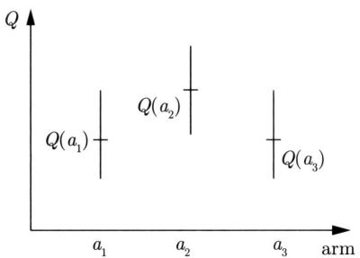

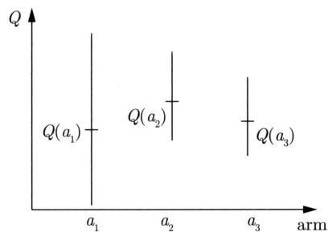  
图36.2 UCB的例子

多臂老虎机学习中，并不需要准确地估计所有手臂的期望奖励，只估计有可能成为期望奖励最大的手臂就足矣。如果有些手臂的估计的期望奖励很小，而且置信区间不大，可以不再考虑这些手臂。UCB通过最大化置信上界实现了这一点。这也是UCB算法比 $\varepsilon$ 贪心等算法更优的原因。

常用的UCB算法使用以下的置信上界。这里省略详细的推导。第 $t$ 轮手臂 $a$ 的置信上界是

$$
Q (a) + \Delta (a) = Q (a) + c \sqrt {\frac {\log t}{N (a)}} \tag {36.10}
$$

其中， $Q(a)$ 是第 $t$ 轮手臂 $a$ 的期望奖励， $\Delta(a)$ 是期望奖励的置信半径， $N(a)$ 是第 $t$ 轮为止手臂 $a$ 被选择的次数， $c$ 是系数，通常设 $c = \sqrt{2}$ 。

UCB算法在第 $t$ 轮交互中根据以下公式选择手臂：

$$
A _ {t} = \underset {a} {\operatorname {a r g m a x}} \left[ Q (a) + c \sqrt {\frac {\log t}{N (a)}} \right] \tag {36.11}
$$

算法36.2是UCB算法。当 $N(a) = 0$ 时，无条件选择手臂 $a$ 。有多个可以选择的手臂时随机选择其中的一个。

# 算法36.2（UCB算法）

输入：模型未知的多臂老虎机。

输出：总体奖励 $G$ ，各个手臂的期望奖励 $Q(a)$ 。

参数：总轮数 $T$ ，系数 $c$ 。

{ #初始化 $Q(a)\gets 0$ $N(a)\gets 0$ $G\gets 0$ （204 $t = 0$ while $(t <   T)$ { 计算各个手臂 $a$ 的置信上界 $Q(a) + c\sqrt{\frac{\log t}{N(a)}}$

$$
A _ {t} = \operatorname * {a r g m a x} _ {a} \left[ Q (a) + c \sqrt {\frac {\log t}{N (a)}} \right]
$$

选择手臂 $A_{t}$

得到奖励 $R_{t}$

# 更新估计值

$$
N (A _ {t}) \leftarrow N (A _ {t}) + 1
$$

$$
Q \left(A _ {t}\right) \leftarrow Q \left(A _ {t}\right) + \frac {1}{N \left(A _ {t}\right)} \left[ R _ {t} - Q \left(A _ {t}\right) \right]
$$

$$
G \leftarrow G + R _ {t}
$$

$t\gets t + 1$ }   
}

可以看出，每次选择一个手臂 $a$ ， $N(a)$ 就会加1，手臂 $a$ 的奖励期待的置信区间就会缩小，不确定性会减少。每增加一轮交互， $t$ 就会加1，没有被选择的其他手臂的奖励期待的置信区间就会相对扩大，不确定性会增加。

定理36.1（UCB）UCB的期望遗憾的上界是

$$
\mathbb {E} (\gamma (t)) = O \left(\sqrt {K t \log T}\right), \forall t \tag {36.12}
$$

定理36.2（期望遗憾下界） 对任意的多臂老虎机算法，期望遗憾的下界是

$$
\mathbb {E} (\gamma (T)) = \Omega (\sqrt {K T}) \tag {36.13}
$$

从以上两个定理可以看出，UCB算法近乎最优。

# 36.2.4 汤普森采样

汤普森采样（Thompson sampling）的基本想法是基于已有的交互数据，计算每个手臂的期望奖励的后验概率分布，根据后验概率分布采样，估计各个手臂的期望奖励，选取估计的期望奖励最大的手臂。

假设计算各个手臂的期望奖励对后验概率分布的期望，选择期望值最大的手臂，那就是只依赖于利用（这个算法是贪心算法）。这个计算还涉及复杂的积分运算。汤普森采样对期望奖励的后验概率分布进行若干次采样，得到多个期望奖励，并取其平均作为期望奖励的估计，实现利用和探索的权衡，同时解决复杂积分运算的问题。通常只进行一次采样，以加强探索，同时减少计算量。

在第 $t$ 轮交互中有手臂和奖励的历史数据

$$
D = \left\{A _ {1}, R _ {1}, A _ {2}, R _ {2}, \dots , A _ {t - 1}, R _ {t - 1} \right\}
$$

手臂 $a$ 的期望奖励由随机变量 $Q(a)$ 表示，期望奖励 $Q(a)$ 的先验概率分布是 $P(Q(a))$ ，在数据 $D$ 给定条件下的后验概率分布是 $P(Q(a)|D)$ 。

根据贝叶斯公式有

$$
P (Q (a) | D) = \frac {P (Q (a)) P (D | Q (a))}{P (D)}
$$

期望奖励对后验概率分布的期望是

$$
\mathbb {E} (Q (a)) = \int_ {Q} Q (a) \cdot P (Q (a) | D) d Q
$$

贝叶斯推断认为，这个期望值越大就越应该选择这个手臂。对手臂 $a$ 根据后验概率分布 $P(Q(a)|D)$ 采样 $s$ 次，得到期望奖励

$$
Q _ {1}, Q _ {2}, \dots , Q _ {s}
$$

取期望奖励的平均作为手臂 $a$ 的期望奖励的估计值 $\hat{Q}(a)$

$$
\hat {Q} (a) = \frac {1}{s} \sum_ {i = 1} ^ {s} Q _ {i} \tag {36.14}
$$

经常取

$$
s = 1
$$

在第 $t$ 轮交互中，对所有手臂进行以上计算，选择估计的期望奖励最大的手臂

$$
A _ {t} = \operatorname * {a r g m a x} _ {a} \left[ \hat {Q} (a) \right]
$$

以上对期望奖励 $Q(a)$ 的采样计算也可以扩展到奖励分布的其他参数。

采样是根据后验概率分布进行的，采到后验概率大的期望奖励的可能性大，代表利用，采样是随机的，采到后验概率不是很大的期望奖励的可能性也有，代表探索。采样的次数 $s$ 不易过大，这样才可以加强探索。 $s$ 值越大，越趋向利用； $s$ 值越小，越趋向探索。随着交互次数 $t$ 的增加，后验概率分布的估计越来越准确。 $t$ 值越大，越趋向利用； $t$ 值越小，越趋向探索。

算法36.3是汤普森采样算法。有多个可以选择的手臂时随机选择其中的一个。

# 算法36.3（汤普森采样）

输入：模型未知的多臂老虎机。

输出：总体奖励 $G$ ，各个手臂的后验概率分布 $P(Q(a)|D)$ 。

参数：总轮数 $T$ ，采样次数 $s$ 。

{ #初始化 $D\gets \{\}$ $G\gets 0$ （20 $t = 0$ while $(t <   T)$ {

计算各个手臂 $a$ 的期望奖励的后验概率分布 $P(Q(a) \mid D)$

对各个手臂根据 $P(Q(a)|D)$ 进行 $s$ 次采样，将平均值作为期望奖励 $\hat{Q}(a)$

$$
A _ {t} = \underset {a} {\operatorname {a r g m a x}} \left[ \hat {Q} (a) \right]
$$

选择手臂 $A_{t}$

得到奖励 $R_{t}$

# 更新历史数据集

$$
D \leftarrow D \cup \left\{A _ {t}, R _ {t} \right\}
$$

$$
G \leftarrow G + R _ {t}
$$

$t\gets t + 1$ }   
}

汤普森采样在特定条件下也是在期望遗憾最小的意义上近乎最优的。

定理36.3（汤普森采样）在一些具体问题中，例如，奖励是0-1，先验概率分布是均匀分布；或者奖励是标准高斯分布，先验概率分布也是标准高斯分布，汤普森采样的期望遗憾的上界是

$$
\mathbb {E} (\gamma (T)) = O \left(\sqrt {K T \log T}\right) \tag {36.15}
$$

例36.1 有两枚不均匀的硬币，不知道其正面出现的概率各自是多少。假设投掷两枚硬币共20次，使总体正面出现的次数尽可能最多，问该用什么样的方法。这其实就是一个多臂老虎机的问题，硬币就是手臂，手臂的个数 $K$ 是2，正面出现时奖励是1，反面出现时奖励是0。用汤普森采样求解。

假设已经进行了10次掷币，得到的结果如下。

$$
H _ {1}, T _ {2}, H _ {2}, H _ {1}, T _ {1}, T _ {1}, H _ {2}, T _ {2}, H _ {2}, T _ {1}
$$

其中 $H_{1}$ 和 $T_{1}$ 分别表示第1枚硬币的正面和反面； $H_{2}$ 和 $T_{2}$ 分别表示第2枚硬币的正面和反面。

两枚硬币正面出现的概率分布都是贝努利分布（0-1分布），这里采用贝叶斯推断，假设先验概率分布是贝塔分布，则后验概率分布也是贝塔分布。贝努利分布表示硬币正面出现的概率 $p$ 。这时，期望奖励等于概率 $p$ 。贝塔分布的密度函数是

$$
f (p; \alpha , \beta) = \frac {1}{\mathrm {B} (\alpha , \beta)} p ^ {\alpha - 1} (1 - p) ^ {\beta - 1}
$$

其中， $\alpha$ 和 $\beta$ 是超参数， $\mathrm{B}(\alpha ,\beta)$ 是贝塔函数。

假设先验概率分布的超参数满足 $\alpha = 1, \beta = 1$ 。掷10次硬币后，第1枚硬币的后验概率分布的超参数变成 $\alpha = 3, \beta = 4$ ，第2枚硬币的后验概率分布的超参数变成 $\alpha = 4, \beta = 3$ 。图36.3显示作为贝塔分布的先验概率分布和10次掷币后的两枚硬币的后验概率分布。

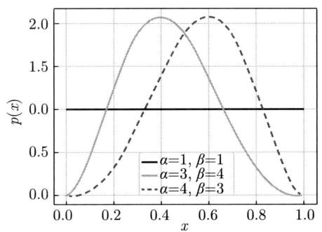  
图36.3 作为贝塔分布的先验概率分布和后验概率分布

在10次掷币后，根据两枚硬币的后验概率分布进行采样，得到两个概率值，然后选择概

率值大的硬币投掷，得到第11次掷币的结果。从图36.3中可以看出，第二枚硬币的后验概率分布的峰值比第一枚硬币的后验概率分布的峰值更靠右，所以第二枚硬币的采样概率值大于第一枚硬币的采样概率值的可能性更大。

汤普森采样重复上述计算，通过对后验分布的采样进行利用和探索的权衡，使得两枚硬币整体出现正面的次数更多。

UCB和汤普森采样都是常用算法。表36.1给出两个算法的比较。

表 36.1 UCB 算法和汤普森采样算法的比较  

<table><tr><td></td><td>UCB</td><td>汤普森采样</td></tr><tr><td>统计推断</td><td>频率推断</td><td>贝叶斯推断</td></tr><tr><td>奖励分布类型</td><td>不需假设</td><td>需要假设</td></tr><tr><td>估计期望奖励的方法</td><td>计算期望奖励的上界</td><td>对期望奖励的后验概率分布采样</td></tr></table>

# 本章概要

1. 多臂老虎机问题：多臂老虎机的模型由三元组 $\langle A, \mathbb{R}, P \rangle$ 组成，手臂的集合 $A: a \in A$ ，奖励的集合 $\mathbb{R}: r \in \mathbb{R}$ ，奖励的概率分布为 $P(r|a)$ 。智能体知道所有可能的手臂，但不知道各个手臂的奖励分布，只能通过与老虎机的交互估计各个手臂的奖励分布。

智能体和老虎机进行 $T$ 轮交互。在其中的第 $t$ 轮交互中，智能体选择一个手臂 $A_{t}$ ，老虎机从对应的奖励分布 $P(r|A_t)$ 中随机生成一个奖励 $R_{t}$ ，智能体获得奖励 $R_{t}$ 。在 $T$ 轮交互中的总体奖励是

$$
G = \sum_ {t = 0} ^ {T - 1} R _ {t}
$$

智能体的目标是最大化总体奖励 $G$ ，同时也估计到各个手臂 $a$ 的期望奖励

$$
Q (a) = \mathbb {E} [ r | a ]
$$

2. 多臂老虎机的核心问题是探索和利用的权衡。探索是指选择期望奖励不确定的手臂，利用是指选择期望奖励最大的手臂。最终目的是总体奖励最大，不能只利用不探索，也不能只探索不利用。多臂老虎机算法用不同的手段做两者的权衡。  
3. $\varepsilon$ 贪心算法是最简单的多臂老虎机算法。在第 $t$ 轮交互中，以 $1 - \varepsilon$ 的概率选择期望奖励最大的手臂

$$
A _ {t} = \underset {a} {\operatorname {a r g m a x}} Q (a)
$$

其中， $Q(a)$ 是第 $t$ 轮手臂 $a$ 的期望奖励；以 $\varepsilon$ 的概率随机选择任意一个手臂。也就是说，以 $1 - \varepsilon$ 的概率利用，以 $\varepsilon$ 的概率探索。

4. UCB算法选择期望奖励的置信上界最大的手臂，兼顾利用和探索。UCB在期望遗憾最小的意义上近乎最优。

在第 $t$ 轮交互中，选择置信上界最大的手臂。

$$
A _ {t} = \operatorname * {a r g m a x} _ {a} \left[ Q (a) + c \sqrt {\frac {\log t}{N (a)}} \right]
$$

其中， $Q(a)$ 是第 $t$ 轮手臂 $a$ 的期望奖励， $N(a)$ 是第 $t$ 轮为止手臂 $a$ 被选择的次数， $c$ 是系数。

5. 汤普森采样算法通过对期望奖励的后验概率分布的采样实现利用和探索的权衡。在第 $t$ 轮交互中，对手臂 $a$ 根据后验概率分布 $P(Q(a)|D)$ 采样 $s$ 次，得到期望奖励

$$
Q _ {1}, Q _ {2}, \dots Q _ {s}
$$

其中， $D$ 表示历史数据，取期望奖励的平均作为手臂 $a$ 的期望奖励的估计值 $\hat{Q}(a)$

$$
\hat {Q} (a) = \frac {1}{s} \sum_ {i = 1} ^ {s} Q _ {i}
$$

选择估计的期望奖励最大的手臂

$$
A _ {t} = \operatorname * {a r g m a x} _ {a} \left[ \hat {Q} (a) \right]
$$

汤普森采样在特定条件下也是在期望遗憾最小的意义上近乎最优的。

# 继续阅读

多臂老虎机的详细介绍参见文献 [1]。多臂老虎机遗憾下界的证明见文献 [2], UCB 遗憾上界的证明见文献 [3]。汤普森采样的介绍参见文献 [4] 和文献 [5]。上下文老虎机的代表算法有 LinUCB [6]。

# 习题

36.1 探索优先算法中首先对每个手臂 $a$ 进行 $N$ 次选择，得到估计的期望奖励 $\hat{Q}(a)$ ，然后一直选择估计的期望奖励最大的手臂，总轮数是 $T$ 。证明以下概率不等式成立。

$$
P \left[ \hat {Q} (a) \leqslant Q (a) + \sqrt {\frac {2 \log T}{N}} \right] \geqslant 1 - \frac {1}{T ^ {4}}
$$

其中， $Q(a)$ 是手臂 $a$ 真实的期望奖励。提示：使用Hoeffding不等式。

36.2 假设多臂老虎机有三个手臂，奖励取值都是0或1，分布都是伯努利分布，期望分别是 $Q(a_{1}) = 0.4, Q(a_{2}) = 0.5, Q(a_{3}) = 0.6$ 。与老虎机交互的总轮数是 $T = 10000$ 。通过模拟计算探索优先算法（ $N = 100$ ）、 $\varepsilon$ 贪心算法（ $\varepsilon = 0.2$ ）、UCB算法、汤普森采样算法在这个多臂老虎机的总体奖励。各自进行10次模拟后取平均。

UCB算法使用更紧的上界

$$
\frac {n (a)}{N (a)} + \sqrt {\frac {\frac {n (a)}{N (a)} \log t}{N (a)}} + \frac {\log t}{N (a)}
$$

其中， $t$ 是轮数， $N(a)$ 是手臂 $a$ 被选择的次数，是 $n(a)$ 中选择手臂结果为1的次数。

36.3 $\varepsilon$ 贪心算法中的探索概率 $\varepsilon$ 可以不是一个定量，而是一个随着轮数 $t$ 递减的变量 $\varepsilon_{t}$ 。设计一个 $\varepsilon_{t}$ 的函数，并观察这个 $\varepsilon$ 贪心算法在例题36.2中的效果。

36.4 解释为什么汤普森采样算法中 $s$ 值越小越趋向探索，而 $s$ 值越大越趋向利用。

# 参考文献

[1] SLIVKINS A. Introduction to multi-armed Bandits[J]. Foundations and Trends® in Machine Learning, 2019, 12(1-2): 1-286.   
[2] LAI T L, ROBBINS H. Asymptotically efficient adaptive allocation rules[J]. Advances in Applied Mathematics, 1985, 6(1): 4-22.   
[3] AUER P, CESA-BIANCHI N, FISCHER P. Finite-time analysis of the multiarmed bandit problem[J]. Machine Learning, 2002, 47(2): 235-256.   
[4] RUSSO D, ROY B, KAZEROUNI A, et al. A tutorial on Thompson sampling[J]. Foundations and Trends in Machine Learning, 2018, 11(1): 1-96.   
[5] CHAPELLE O, LI L. An empirical evaluation of Thompson sampling[J]. Advances in Neural Information Processing Systems, 2011, 24.   
[6] LI L, CHU W, LANGFORD J, et al. A contextual-bandit approach to personalized news article recommendation[C]//Proceedings of the 19th International Conference on World Wide Web. 2010: 661-670.

# 第37章 基于价值的方法

MDP 的模型已知时智能体可以通过动态规划求解最优策略，MDP 的模型未知时智能体需要通过与环境的交互求解最优策略，这就是强化学习要解决的问题。强化学习分为模型无关（model-free）的方法和基于模型（model-based）的方法。模型无关的方法又有基于价值（value-based）的方法和基于策略（policy-based）的方法。

本章讲解基于价值的强化学习方法，可以用于预测和控制，分别称为模型无关预测和模型无关控制。预测的方法有蒙特卡罗预测（Monte Carlo prediction）和时序差分预测（temporal difference prediction），控制的方法有蒙特卡罗控制（Monte Carlo control）和时序差分控制（temporal difference control）。时序差分预测代表性的算法是 $\mathrm{TD}(\lambda)$ ，包括其特殊情况的 $\mathrm{TD}(0)$ 。时序差分控制代表性的算法是SARSA算法和Q学习（Q learning）。所有这些方法用于大规模问题时都需要使用函数近似法。

Sutton于1988年发表了 $\mathrm{TD}(\lambda)$ 算法。Watkins于1989年提出了Q学习。Rummery和Niranjan于1994年提出了SARSA算法，该算法由Sutton命名。Minh等于2013年发表了深度Q网络。

37.1节给出基于价值的方法的概述；37.2节讲解模型无关预测的方法，包括蒙特卡罗预测、时序差分预测的TD(0)算法；37.3节讲解模型无关控制的方法，包括蒙特卡罗控制、时序差分控制的SARSA算法和Q学习；37.4节总结基于价值的方法。

# 37.1 基于价值的方法概述

强化学习的前提假设是智能体并不知道环境的模型，只能通过与环境的交互获得交互数据，即经验数据，这在实际应用中是非常普遍的。基于模型（model-based）的方法先从经验中学习环境的模型，然后基于模型使用动态规划求解最优策略。模型无关（model-free）的方法并不学习环境的模型，而是从经验数据中学习最优策略。其中，基于价值（value-based）的方法通过学习最优价值函数获得最优策略。

基于价值的方法整体也由数据采样、策略评估、策略改进三个部分组成。数据采样的手段有蒙特卡罗法（Monte Carlo method）和时序差分法（temporal diffrence method），可以用于预测和控制。预测有策略评估，控制有策略迭代和价值迭代（见第35章）。这样组合起来，形成使用蒙特卡罗法和时序差分法的预测和控制的强化学习方法。本章讲解表37.1中的有代表性的基于价值的方法：蒙特卡罗预测、TD(0)算法、蒙特卡罗控制、SARSA算法、Q学习。第38章介绍深度Q网络。图37.1给出方法之间的关系。

表 37.1 基于价值的强化学习方法  

<table><tr><td>问题</td><td>方法</td><td>学习原理</td></tr><tr><td>预测</td><td>蒙特卡罗预测</td><td>策略评估，蒙特卡罗法</td></tr><tr><td>预测</td><td>时序差分预测：TD(0)算法</td><td>策略评估，时序差分法</td></tr><tr><td>控制</td><td>蒙特卡罗控制</td><td>策略迭代，蒙特卡罗法</td></tr><tr><td>控制</td><td>时序差分控制：SARSA算法</td><td>策略迭代，时序差分法</td></tr><tr><td>控制</td><td>时序差分控制：Q学习</td><td>价值迭代，时序差分法</td></tr><tr><td>控制</td><td>时序差分控制：深度Q网络</td><td>价值迭代，时序差分法、函数近似法</td></tr></table>

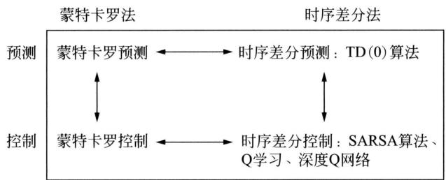  
图37.1 基于价值的方法之间的关系

蒙特卡罗法每次采样一个轨迹，作为一个样本；基于采样数据，根据价值函数的定义，估计各个状态的价值，或者各个状态和动作的价值，用于策略评估、策略迭代。时序差分法每次采样轨迹中的一步状态转移（或者多步状态转移），作为一个样本；基于采样数据，根据贝尔曼方程，估计各个状态的价值，或者各个状态和动作的价值，用于策略评估、策略迭代、价值迭代。蒙特卡罗法只能用于有限期MDP，而时序差分法既可以用于有限期MDP又可以用于无限期MDP。

所有的基于价值的方法都可以或者使用表格，或者使用函数近似来表示和学习价值函数，也就是利用表格法（tabular method）或函数近似法（function approximation method）。在大规模问题上尤其有必要采用函数近似法。函数近似法用参数化的函数，如线性函数或神经网络表示价值函数，以提高表示和学习效率。本章只介绍表格法，第38章介绍函数近似法。

# 37.2 模型无关预测

模型无关的预测方法包括蒙特卡罗预测、时序差分预测的TD(0)算法，都是从经验数据中学习给定策略的价值函数的方法。

# 37.2.1 蒙特卡罗预测

蒙特卡罗预测（Monte Carlo prediction）假设MDP是有限期的，模型未知，策略 $\pi$ 给定。基本想法是通过蒙特卡罗法从采样数据中学习策略 $\pi$ 的状态价值函数 $V_{\pi}(s)$ 或动作价值函数 $Q_{\pi}(s,a)$ 。这里只介绍前者（后者留作习题）。

根据定义，状态 $s$ 的价值 $V_{\pi}(s)$ 是该状态的回报 $G_{t}$ 的期望值，而期望依赖于策略 $\pi$ 。

$$
V _ {\pi} (s) = \mathbb {E} _ {\pi} \left(G _ {t} \mid S _ {t} = s\right) \tag {37.1}
$$

蒙特卡罗预测根据策略 $\pi$ 与环境交互得到的一个回合的轨迹数据，表示为

$$
\pi : S _ {0}, A _ {0}, R _ {1}, S _ {1}, A _ {1}, R _ {2}, S _ {2}, \dots , S _ {T}
$$

依次访问这个轨迹中的各个状态，根据式 (37.1)，增量地计算每一个状态的回报的均值，作为该状态的价值的估计值。

设状态 $S_{t}$ 的价值的估计值是 $V(S_{t})$ 。状态 $S_{t}$ 的回报是

$$
G _ {t} = R _ {t + 1} + \gamma R _ {t + 2} + \dots + \gamma^ {T - 1} R _ {T}
$$

对状态 $S_{t}$ 的价值的估计值 $V(S_{t})$ 进行更新。

$$
N \left(S _ {t}\right) \leftarrow N \left(S _ {t}\right) + 1
$$

$$
G \left(S _ {t}\right) \leftarrow G \left(S _ {t}\right) + G _ {t}
$$

$$
V \left(S _ {t}\right) = G \left(S _ {t}\right) / N \left(S _ {t}\right) \tag {37.2}
$$

其中， $N(S_{t})$ 是目前为止访问状态 $S_{t}$ 的次数， $G(S_{t})$ 是目前为止状态 $S_{t}$ 的回报的总和。

根据强大数定律，当访问状态 $s$ 的次数趋于无穷时，状态 $s$ 的价值估计值 $V(s)$ 以概率1收敛于真实值 $V_{\pi}(s)$ 。

$$
\lim  _ {N (s) \rightarrow \infty} V (s) = V _ {\pi} (s), \forall s \tag {37.3}
$$

使用数列均值的增量计算公式。设有数列 $x_{1}, x_{2}, \dots, x_{t}, \dots$ ，到各项为止的均值是 $\mu_{1}, \mu_{2}, \dots, \mu_{t}, \dots$ 。

$$
\mu_ {t} = \frac {1}{t} \sum_ {i = 1} ^ {t} x _ {i} = \mu_ {t - 1} + \frac {1}{t} (x _ {t} - \mu_ {t - 1})
$$

蒙特卡罗预测的价值的更新公式是

$$
V \left(S _ {t}\right) \leftarrow V \left(S _ {t}\right) + \frac {1}{N \left(S _ {t}\right)} \left(G _ {t} - V \left(S _ {t}\right)\right) \tag {37.4}
$$

一般的更新公式是

$$
V \left(S _ {t}\right) \leftarrow V \left(S _ {t}\right) + \alpha_ {k} \left(G _ {t} - V \left(S _ {t}\right)\right) \tag {37.5}
$$

其中， $\alpha_{k}$ 是第 $k$ 个回合的学习率（learning rate），比如可以取 $\alpha_{k} = \frac{1}{k}$ 。称 $G_{t}$ 为蒙特卡罗目标（Monte Carlo target）。蒙特卡罗目标是一个估计值，因为 $G_{t}$ 是样本中的一个回报。算法37.1是蒙特卡罗预测的算法。

# 算法37.1（蒙特卡罗预测）

输入：模型未知的有限期MDP，策略 $\pi$

输出：价值函数 $V_{\pi}(s)$ 。

参数：回合数 $K$ 。

初始化所有状态 $s$ 的价值估计值 $V(s)$ $k = 0$ while $(k <   K)$ {根据策略 $\pi$ 生成一个轨迹的数据确定轨迹的初始状态 $S_{0}$ while $(S_{t}\neq S_{T})$ {计算状态 $S_{t}$ 在当前轨迹的回报 $G_{t}$ #策略评估，学习率 $\alpha_{k}$ $V(S_{t})\gets V(S_{t}) + \alpha_{k}(G_{t} - V(S_{t})$ （20号 $t\gets t + 1$ 1 $k\gets k + 1$ 1  
输出价值函数 $V(s)$

在每一个回合的计算过程中可能多次访问同一个状态。可以只在第一次访问该状态时进行估计值的计算，得到的估计值称为第一次访问估计（first visit estimate）；也可以在每一次访问该状态时进行估计值的计算，得到的估计值称为每一次访问估计（every visit estimate）。

蒙特卡罗预测满足一致性，也就是说估计值以概率1收敛于真实值，无论是第一次访问估计还是每一次访问估计都是如此。第一次访问估计还满足无偏性，也就是估计值的期望与真实的期望值相等；而每一次访问估计不满足无偏性。通常一致性比无偏性更为重要。

例37.1 考虑图37.2中的机器人路径规划问题。状态集合是 $\mathcal{S} = \{s_1, s_2, s_3, s_4, s_5, s_6, s_7\}$ ，表示格点。动作集合是 $A = \{r, l\}$ ，表示向右或向左移动。奖励集合是 $\mathcal{R} = \{0, +1, -1\}$ 。初始状态是 $S_0 = \{s_4\}$ ，终止状态是 $S_T = \{s_1, s_7\}$ 。折扣因子为 $\gamma = 1.0$ 。MDP模型未知，即状态转移分布 $P(s'|s, a)$ 和奖励函数 $R(s, a)$ 未知。

策略 $\pi_{1}$ 是在每一个格点都向右移动。用蒙特卡罗预测估计策略 $\pi_{1}$ 在每一个状态的价值。

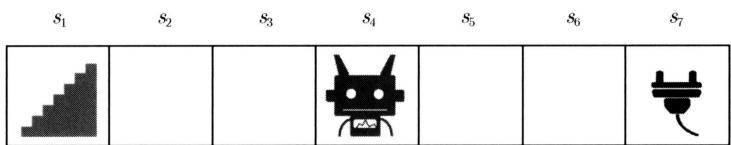  
图37.2 机器人路径规划的例子

解有7个状态，用向量表示其价值估计值。对估计值初始化

$$
V _ {0} = (0, 0, 0, 0, 0, 0, 0)
$$

假设通过随机采样依次得到 3 个轨迹 (注意模型是未知的, 所以状态转移概率分布未知, 奖励函数未知)。从第 2 个轨迹中可以得知, 即使策略是在当前格点都向右移动, 结果也有可能是停留在当前格点。

$$
\begin{array}{l} e _ {1}: s _ {4}, r, 0, s _ {5}, r, 0, s _ {6}, r, + 1, s _ {7} \\ e _ {2}: s _ {4}, r, 0, s _ {5}, r, 0, s _ {5}, r, 0, s _ {6}, r, + 1, s _ {7} \\ e _ {3}: s _ {4}, r, 0, s _ {5}, r, 0, s _ {6}, r, + 1, s _ {7} \\ \end{array}
$$

使用蒙特卡罗预测算法（算法37.1），依次得到在3个轨迹上的状态的价值估计值。

从第1个轨迹得到：

$$
\begin{array}{l} G _ {1} = (0, 0, 0, + 1, + 1, + 1, + 1) \\ V _ {1} = (0, 0, 0, + 1, + 1, + 1, + 1) \\ \end{array}
$$

接着从第2个轨迹得到：

$$
\begin{array}{l} G _ {2} = (0, 0, 0, + 1, + 1, + 1, + 1, + 1) \\ V _ {2} = (0, 0, 0, + 1, + 1, + 1, + 1) \\ \end{array}
$$

接着从第3个轨迹得到：

$$
\begin{array}{l} G _ {3} = (0, 0, 0, + 1, + 1, + 1, + 1) \\ V _ {3} = (0, 0, 0, + 1, + 1, + 1, + 1) \\ \end{array}
$$

输出状态的价值估计值：

$$
V = (0, 0, 0, + 1, + 1, + 1, + 1)
$$

在这个例子中，使用第一次访问估计和每一次访问估计得到的结果是相同的。

# 37.2.2 时序差分预测

时序差分（temporal difference，TD）是强化学习中的重要概念，许多算法都使用时序差分法。这里介绍时序差分预测的方法，特别是有代表性的 TD(0) 算法。TD(0) 算法是更一般的 TD( $\lambda$ ) 算法的一种特殊情况，对于 TD( $\lambda$ ) 这里不予介绍。

时序差分预测 $\mathrm{TD}(0)$ 算法假设MDP是有限期或无限期的，模型未知，策略 $\pi$ 给定。TD(0)算法的基本想法是通过时序差分法从采样数据中学习策略 $\pi$ 的状态价值函数 $V_{\pi}(s)$ 或动作价值函数 $Q_{\pi}(s,a)$ 。这里只介绍前者（后者留作习题）。

根据贝尔曼期望方程，状态价值函数 $V(S_{t})$ 有如下迭代公式。

$$
V \left(S _ {t}\right) \leftarrow R _ {t + 1} + \gamma \sum_ {S _ {t + 1}} P \left(S _ {t + 1} \mid S _ {t}, A _ {t}\right) V \left(S _ {t + 1}\right) \tag {37.6}
$$

TD(0) 基于时序差分的一次采样数据完成这个迭代。

TD(0) 算法每次访问一个状态 $S_{t}$ , 根据策略 $\pi$ 决定一个动作 $A_{t}$ , 得到奖励 $R_{t+1}$ 和后续状态 $S_{t+1}$ 。根据式 (37.6), 增量地计算每一个状态的价值的均值, 作为该状态的价值的估计

值。利用后续状态的价值计算当前状态的价值的手段称为自助（bootstrapping），所以 TD(0)算法使用自助（动态规划也利用自助）。

TD(0) 算法的价值的更新公式是

$$
V \left(S _ {t}\right) \leftarrow V \left(S _ {t}\right) + \frac {1}{N \left(S _ {t}\right)} \left(R _ {t + 1} + \gamma V \left(S _ {t + 1}\right) - V \left(S _ {t}\right)\right) \tag {37.7}
$$

其中， $\gamma$ 是折扣因子。一般的更新公式是

$$
V \left(S _ {t}\right) \leftarrow V \left(S _ {t}\right) + \alpha_ {k} \left(R _ {t + 1} + \gamma V \left(S _ {t + 1}\right) - V \left(S _ {t}\right)\right) \tag {37.8}
$$

其中， $\alpha_{k}$ 是第 $k$ 个回合的学习率，比如取 $\alpha_{k} = \frac{1}{k}$ 。称 $R_{t+1} + \gamma V(S_{t+1})$ 为时序差分目标（temporal difference target）。时序差分目标是一个估计值，因为 $R_{t+1}$ 是样本中的一个奖励， $V(S_{t+1})$ 是估计值而不是真实值。算法37.2是TD(0)的算法。

# 算法37.2（时序差分预测 $\mathbf{TD}(0)$ ）

输入：模型未知的MDP，策略 $\pi$

输出：价值函数 $V_{\pi}(s)$

参数：回合数 $K$ 。

初始化所有状态 $s$ 的价值估计值 $V(s)$ $k = 0$ while $(k <   K)$ {根据策略 $\pi$ 生成一个轨迹的数据确定轨迹的初始状态 $S_{0}$ while $(S_{t}\neq S_{T})$ {根据策略 $\pi$ 决定状态 $S_{t}$ 的动作 $A_{t}$ 从环境得到奖励 $R_{t + 1}$ 和状态 $S_{t + 1}$ #策略评估，学习率 $\alpha_{k}$ $V(S_{t})\gets V(S_{t}) + \alpha_{k}(R_{t + 1} + \gamma V(s))$ $\begin{array}{r}t\leftarrow t + 1\\ \} \\ k\leftarrow k + 1\\ \} \end{array}$ 输出价值函数 $V(s)$ 1

TD(0) 算法在一定条件下满足一致性，也就是说估计值以概率 1 收敛于真实值；但不满足无偏性，也就是说估计值的期望与真实值的期望值不一定相等。关于 TD(0) 算法的一致性有定理 37.1 成立。

定理37.1 TD(0)算法在以下条件下状态 $s$ 的价值估计值 $V_{k}(s)$ 以概率1收敛于真实

值 $V_{\pi}(s)$ 。

$$
\lim  _ {k \rightarrow \infty} V _ {k} (s) = V _ {\pi} (s), \forall s \tag {37.9}
$$

学习率 $\alpha_{k}$ 满足Robbins-Monro条件（Robbins-Monro conditions）。

$$
\sum_ {k = 1} ^ {\infty} \alpha_ {k} = \infty
$$

$$
\sum_ {k = 1} ^ {\infty} \alpha_ {k} ^ {2} <   \infty
$$

Robbins-Monro条件是一致性的充分条件，而非必要条件。第1个条件保证充分访问所有状态，第2个条件保证计算最终收敛。学习率可以定义为

$$
\alpha_ {k} = \frac {1}{k ^ {\tau}}, \quad 0. 5 <   \tau \leqslant 1
$$

例如，当 $\tau = 1$ 时，有

$$
\sum_ {k = 1} ^ {\infty} \frac {1}{k} = \infty
$$

$$
\sum_ {k = 1} ^ {\infty} \frac {1}{k ^ {2}} = \frac {\pi^ {2}}{6} <   \infty
$$

满足Robbins-Monro条件。

例37.2 例37.1中的机器人路径规划问题，假设通过随机采样得到同样的3个轨迹数据，用TD(0)算法求各个状态的价值。

解 对价值估计值初始化

$$
V _ {0} = (0, 0, 0, 0, 0, 0, 0)
$$

使用TD(0)算法（算法37.2)，依次得到在3个轨迹上的状态的价值估计值。

从第1个轨迹得到：

$$
V _ {1} = (0, 0, 0, 0, 0, 0, + 1)
$$

接着从第2个轨迹得到：

$$
V _ {2} = (0, 0, 0, 0, 0, + 1, + 1)
$$

接着从第3个轨迹得到：

$$
V _ {3} = (0, 0, 0, 0, + 1, + 1, + 1)
$$

输出状态的价值估计值：

$$
V = (0, 0, 0, 0, + 1, + 1, + 1)
$$

# 37.2.3 预测方法的总结

动态规划预测、蒙特卡罗预测、时序差分预测都是给定策略计算价值函数的方法。动态

规划假设模型已知，不需要进行学习，而蒙特卡罗预测和时序差分预测假设模型未知，需要利用数据采样进行学习。表37.2总结三种方法使用的手段。动态规划的预测只利用自助，蒙特卡罗预测只利用采样，时序差分既利用自助又利用采样。

表 37.2 预测方法使用的手段  

<table><tr><td></td><td>动态规划预测</td><td>蒙特卡罗预测</td><td>时序差分预测</td></tr><tr><td>自助</td><td>是</td><td>否</td><td>是</td></tr><tr><td>采样</td><td>否</td><td>是</td><td>是</td></tr></table>

图37.3～图37.5分别给出动态规划预测、蒙特卡罗预测、时序差分预测的备份图。空心圆表示状态，实心圆表示动作，实心方块表示终止状态。灰色区域覆盖一次计算包含的状态和动作。动态规划的一次计算涉及从当前状态到所有后续状态的转移（图37.3）。蒙特卡罗预测一次计算涉及从当前状态到一个终止状态的一条路径（图37.4）。时序差分预测 $\mathrm{TD}(0)$ 一次计算只涉及从当前状态到一个后续状态的一步转移（图37.5）。

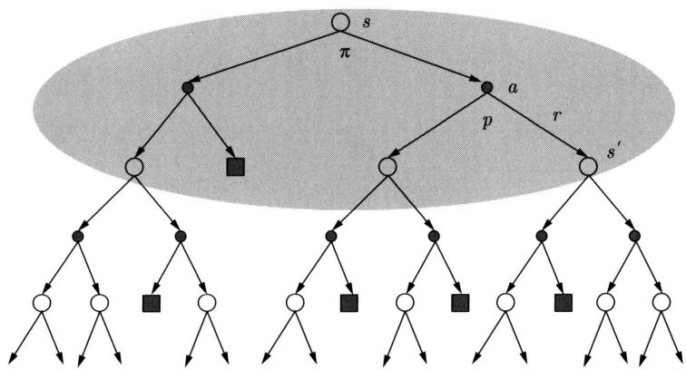  
图37.3 动态规划预测的备份图

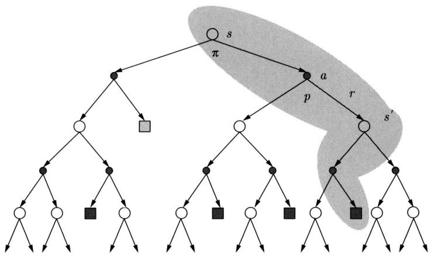  
图37.4 蒙特卡罗预测的备份图

表37.3给出蒙特卡罗预测和时序差分预测的比较。蒙特卡罗预测不依赖于马尔可夫假设，也就是说该方法在马尔可夫假设不成立的时候依然适用；而时序差分预测依赖于马尔可

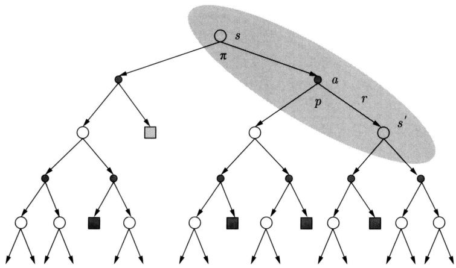  
图37.5 时序差分预测TD(0)的备份图

夫假设。蒙特卡罗预测对价值的初始值不敏感，而时序差分预测对价值的初始值敏感。经验上时序差分预测比蒙特卡罗预测收敛速度更快，学习效率更高。现实中时序差分预测更为常用。

表 37.3 蒙特卡罗预测和时序差分预测的比较  

<table><tr><td>特点</td><td>蒙特卡罗预测</td><td>时序差分预测</td></tr><tr><td>MDP类型</td><td>有限期MDP</td><td>有限期MDP和无限期MDP</td></tr><tr><td>每一次计算</td><td>需要达到终止状态</td><td>不需要达到终止状态</td></tr><tr><td>马尔可夫假设</td><td>可以不基于马尔可夫假设</td><td>基于马尔可夫假设</td></tr><tr><td>初始值</td><td>对初始值不敏感</td><td>对初始值敏感</td></tr><tr><td>收敛速度</td><td>较慢</td><td>较快</td></tr></table>

# 37.3 模型无关控制

模型无关的控制方法包括蒙特卡罗控制、时序差分控制的SARSA算法和Q学习，都是从经验中学习最优价值函数及最优策略的方法。

# 37.3.1 蒙特卡罗控制

蒙特卡罗控制（Monte Carlo control）假设MDP是有限期的，模型未知。基本想法是基于策略迭代原理，即策略评估加策略改进，通过蒙特卡罗法从采样数据中学习最优价值函数及最优策略。这时需要考虑两个问题，一个是使用的价值函数，另一个是策略改进的方法。蒙特卡罗控制针对前者使用动作价值函数，针对后者使用 $\varepsilon$ 贪心（ $\varepsilon$ -greedy）算法。

在策略改进中，针对一个策略 $\pi$ ，需要选择在给定状态 $s$ 下价值最大的动作。这时需要使用动作价值函数 $Q_{\pi}(s,a)$ ，而不是状态价值函数 $V_{\pi}(s)$ 。这是因为从状态价值函数 $V_{\pi}(s)$ 并不能直接计算出状态 $s$ 下的各个动作的价值。相反，从动作价值函数 $Q_{\pi}(s,a)$ 可以计算状态

$s$ 下的所有可能动作的价值，并在其中选择最大的。这称作贪心算法，定义为

$$
a _ {*} = \underset {a} {\operatorname {a r g m a x}} Q _ {\pi} (s, a)
$$

但是，直接使用贪心算法可能产生的结果是策略迭代只局限于选择当前估计的价值最大的动作，学习陷入局部最优。解决这个问题的办法是也适当探索其他的动作，采用扩展的 $\varepsilon$ 贪心算法。

假设有策略 $\pi$ ，其动作价值函数为 $Q_{\pi}(s,a)$ 。 $\varepsilon$ 贪心算法以 $1 - \varepsilon$ 的概率选取 $Q_{\pi}(s,a)$ 最大的动作，以 $\varepsilon$ 的概率从所有可能的动作中随机选取一个动作。 $\varepsilon$ 贪心算法的策略 $\pi^{\prime}$ 定义为

$$
\pi^ {\prime} (a | s) = \left\{ \begin{array}{c c} (1 - \varepsilon) + \frac {\varepsilon}{m}, & a = a _ {*} \\ \frac {\varepsilon}{m}, & a \neq a _ {*} \end{array} \right. \tag {37.10}
$$

其中， $m$ 是所有可能动作的个数，即动作集合的大小， $a_{*}$ 是价值最大的动作。

$$
a _ {*} = \underset {a} {\operatorname {a r g m a x}} Q _ {\pi} (s, a)
$$

因为以 $\varepsilon$ 的概率随机选取一个动作，所有的动作都有可能被选取， $\varepsilon$ 贪心算法可以实现探索和利用的权衡。

实现探索和利用权衡的另一个算法是玻耳兹曼探索（Boltzmann exploration）。策略 $\pi^{\prime}$ 定义为

$$
\pi^ {\prime} (a | s) = \frac {\exp \left(Q _ {\pi} (s , a) / T\right)}{\sum_ {a ^ {\prime}} \exp \left(Q _ {\pi} (s , a ^ {\prime}) / T\right)} \tag {37.11}
$$

其中， $T$ 是温度。根据 $\pi^{\prime}(a|s)$ 随机决定在状态 $s$ 下的动作 $a$ 。

蒙特卡罗控制使用蒙特卡罗法进行数据采样，基于采样数据对当前策略进行策略评估，使用 $\varepsilon$ 贪心（ $\varepsilon$ -greedy）算法进行策略改进（见图37.6），并不断重复。

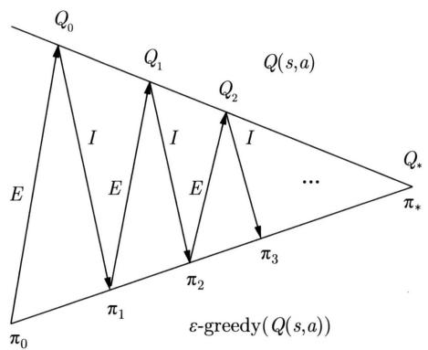  
图37.6 蒙特卡罗控制由策略评估和策略改进组成

根据定义，状态 $s$ 和动作的价值 $Q_{\pi}(s,a)$ 是该状态和动作的回报 $G_{t}$ 的期望值。

$$
Q _ {\pi} (s, a) = \mathbb {E} \left(G _ {t} \mid S _ {t} = s, A _ {t} = a\right) \tag {37.12}
$$

在策略评估中，根据当前策略与环境交互得到的一个回合的轨迹数据（一个样本）表示为

$$
S _ {0}, A _ {0}, R _ {1}, S _ {1}, A _ {1}, R _ {2}, S _ {2}, \dots , S _ {T}
$$

依次访问这个轨迹中的各个状态和动作。根据式 (37.12)，增量地计算每一个状态和动作的回报的均值，作为该状态和动作的价值的估计值。状态 $S_{t}$ 和动作 $A_{t}$ 的价值的更新公式是

$$
Q \left(S _ {t}, A _ {t}\right) \leftarrow Q \left(S _ {t}, A _ {t}\right) + \frac {1}{N \left(S _ {t} , A _ {t}\right)} \left(G _ {t} - Q \left(S _ {t}, A _ {t}\right)\right) \tag {37.13}
$$

一般的更新公式是

$$
Q \left(S _ {t}, A _ {t}\right) \leftarrow Q \left(S _ {t}, A _ {t}\right) + \alpha_ {k} \left(G _ {t} - Q \left(S _ {t}, A _ {t}\right)\right) \tag {37.14}
$$

其中， $\alpha_{k}$ 是第 $k$ 个回合的学习率。

算法37.3是蒙特卡罗控制的算法。

# 算法37.3（蒙特卡罗控制）

输入：模型未知的MDP。

输出：最优动作价值函数 $Q_{*}(s,a)$

参数：回合数 $K$ 。

初始化所有状态 $s$ 和动作 $a$ 的价值估计值 $Q(s,a)$ 使用 $\varepsilon$ 贪心算法基于 $Q(s,a)$ 决定初始策略 $\pi$ $k = 0$ while $(k < K)$ 根据策略 $\pi$ 生成一个轨迹的数据确定轨迹的初始状态 $S_{0}$ 和初始动作 $A_0$ while $(S_t\neq S_T)$ #策略评估，学习率 $\alpha_{k}$ 计算状态 $S_{t}$ 和动作 $A_{t}$ 在当前轨迹的回报 $G_{t}$ $Q(S_{t},A_{t})\gets Q(S_{t},A_{t}) + \alpha_{k}(G_{t} - Q(S_{t},A_{t}))$ #策略改进使用 $\varepsilon$ 贪心算法基于 $Q(S_{t},a)$ 决定新策略 $\pi$ （20号 $t\gets t + 1$ 1 $\begin{array}{l}\} \\ k\leftarrow k + 1\\ \} \end{array}$ 输出动作价值函数 $Q(s,a)$

理论上可以保证 $\varepsilon$ 贪心算法实现策略改进（定理37.2）。可以保证蒙特卡罗控制在一定条

件下动作价值的估计值以概率1收敛于最优值（定理37.3）。

定理37.2 对任意一个策略 $\pi$ ，对应于其动作价值 $Q_{\pi}(s,a)$ 的 $\varepsilon$ 贪心策略 $\pi^{\prime}$ 可以实现策略改进。

$$
V _ {\pi^ {\prime}} (s) \geqslant V _ {\pi} (s), \forall s \tag {37.15}
$$

证明

$$
\begin{array}{l} V _ {\pi^ {\prime}} (s) = Q _ {\pi} (s, \pi^ {\prime} (s)) = \sum_ {a} \pi^ {\prime} (a | s) Q _ {\pi} (s, a) \\ = \frac {\varepsilon}{m} \sum_ {a} Q _ {\pi} (s, a) + (1 - \varepsilon) \max  _ {a} Q _ {\pi} (s, a) \\ \geqslant \frac {\varepsilon}{m} \sum_ {a} Q _ {\pi} (s, a) + (1 - \varepsilon) \sum_ {a} \frac {\pi (a | s) - \frac {\varepsilon}{m}}{1 - \varepsilon} Q _ {\pi} (s, a) \\ = \frac {\varepsilon}{m} \sum_ {a} Q _ {\pi} (s, a) - \frac {\varepsilon}{m} \sum_ {a} Q _ {\pi} (s, a) + \sum_ {a} \pi (a | s) Q _ {\pi} (s, a) \\ = V _ {\pi} (s) \\ \end{array}
$$

不等式基于以下事实，有限个实数的以其概率分布为权重的加权平均，一定小于或等于其中最大的。

定理37.3 蒙特卡罗控制在以下条件下动作价值的估计值 $Q_{k}(s,a)$ 以概率1收敛于最优值 $Q_{*}(s,a)$ 。

$$
\lim  _ {k \rightarrow \infty} Q _ {k} (s, a) = Q _ {*} (s, a), \forall s, a \tag {37.16}
$$

策略序列 $\pi_k(a|s)$ 满足无限探索中的极限贪心（greedy in the limit with infinite exploration, GLIE）条件。

（1）每一个状态和动作 $(s,a)$ 都有无限次访问

$$
\lim  _ {k \rightarrow \infty} N (s, a) = \infty
$$

（2）策略序列 $\pi_k(a|s)$ 以概率1收敛于贪心策略

$$
\lim  _ {k \to \infty} \pi_ {k} (a | s) = 1, \quad a = \underset {a ^ {\prime}} {\operatorname {a r g m a x}} Q _ {k} \left(s, a ^ {\prime}\right)
$$

$\varepsilon$ 贪心算法第 $k$ 个回合取以下值时

$$
\varepsilon_ {k} = \frac {1}{k}
$$

满足GLIE条件。

# 37.3.2 SARSA 算法

时序差分控制有SARSA算法，是state-action-reward-state-action的缩写。SARSA算

法假设MDP是有限期或无限期的，模型未知。SARSA算法使用时序差分法和策略迭代学习最优动作价值函数及最优策略。利用时序差分法进行数据采样，采样的策略是 $\varepsilon$ 贪心算法，之后进行策略改进，也使用 $\varepsilon$ 贪心算法，再进行策略评估，并不断重复。图37.7给出SARSA算法的示意。SARSA属于在策略学习（on-policy learning）算法。

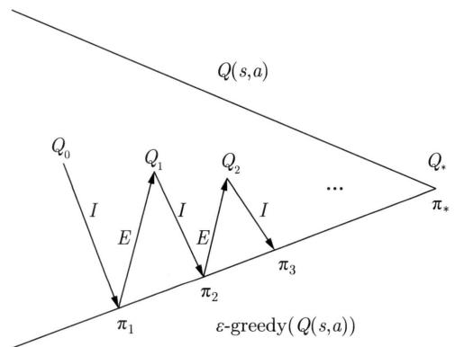  
图37.7 SARSA算法由策略评估和策略改进组成

在策略评估中，根据贝尔曼期望方程，动作价值函数 $Q(s, a)$ 有如下的迭代公式。

$$
Q (s, a) \leftarrow R _ {t + 1} + \gamma \sum_ {S _ {t + 1}} P \left(S _ {t + 1} \mid S _ {t}, A _ {t}\right) Q \left(S _ {t + 1}, A _ {t + 1}\right) \tag {37.17}
$$

SARSA基于时序差分的一次采样数据完成这个迭代。

SARSA算法在每一步，根据当前策略（ $\varepsilon$ 贪心算法）基于当前状态 $S_{t}$ 决定当前动作 $A_{t}$ ，得到奖励 $R_{t + 1}$ 和后续状态 $S_{t + 1}$ ；然后根据当前策略（ $\varepsilon$ 贪心算法）基于后续状态 $S_{t + 1}$ 决定后续动作 $A_{t + 1}$ ；再根据式(37.17)，增量地计算当前状态和动作的价值的均值，作为该状态和动作的价值的估计值。价值的更新公式是

$$
Q \left(S _ {t}, A _ {t}\right) \leftarrow Q \left(S _ {t}, A _ {t}\right) + \frac {1}{N \left(S _ {t} , A _ {t}\right)} \left(R _ {t + 1} + \gamma Q \left(S _ {t + 1}, A _ {t + 1}\right) - Q \left(S _ {t}, A _ {t}\right)\right) \tag {37.18}
$$

一般的更新公式是

$$
Q \left(S _ {t}, A _ {t}\right) \leftarrow Q \left(S _ {t}, A _ {t}\right) + \alpha_ {k} \left(R _ {t + 1} + \gamma Q \left(S _ {t + 1}, A _ {t + 1}\right) - Q \left(S _ {t}, A _ {t}\right)\right) \tag {37.19}
$$

其中， $\alpha_{k}$ 是第 $k$ 个回合的学习率。算法37.4是SARSA的算法。

算法37.4（SARSA）

输入：模型未知的MDP。

输出：最优动作价值函数 $Q_{*}(s,a)$

参数：回合数 $K$ 。

1

初始化所有状态 $s$ 和动作 $a$ 的价值估计值 $Q(s, a)$

$$
k = 0
$$

$$
\text {w h i l e} (k <   K) \left\{ \begin{array}{l} \end{array} \right.
$$

确定轨迹的初始状态 $S_0$

使用 $\varepsilon$ 贪心算法基于 $Q(S_0, a)$ 决定状态 $S_0$ 的动作 $A_0$

while $(S_{t}\neq S_{T})$

在状态 $S_{t}$ 执行动作 $A_{t}$

从环境得到奖励 $R_{t + 1}$ 和状态 $S_{t + 1}$

策略改进

使用 $\varepsilon$ 贪心算法基于 $Q(S_{t + 1},a^{\prime})$ 决定状态 $S_{t + 1}$ 的动作 $A_{t + 1}$

策略评估，学习率 $\alpha_{k}$

$$
Q \left(S _ {t}, A _ {t}\right) \leftarrow Q \left(S _ {t}, A _ {t}\right) + \alpha_ {k} \left(R _ {t + 1} + \gamma Q \left(S _ {t + 1}, A _ {t + 1}\right) - Q \left(S _ {t}, A _ {t}\right)\right)
$$

$t\gets t + 1$ 1 $\begin{array}{l}\} \\ k\leftarrow k + 1\\ \} \end{array}$

输出动作价值函数 $Q(s,a)$

}

理论上可以保证SARSA算法在一定条件下动作价值的估计值以概率1收敛于最优值（定理37.4）。

定理37.4SARSA算法在以下条件下动作价值的估计值 $Q_{k}(s,a)$ 以概率1收敛于最优值 $Q_{*}(s,a)$ 。

$$
\lim  _ {k \rightarrow \infty} Q _ {k} (s, a) = Q _ {*} (s, a), \forall s, a \tag {37.20}
$$

（1）策略序列 $\pi_k(a|s)$ 满足GLIE条件

（1.1）每一个状态动作对 $(s,a)$ 都有无限次访问

$$
\lim  _ {k \to \infty} N (s, a) = \infty
$$

（1.2）策略序列 $\pi_k(a|s)$ 以概率1收敛于贪心策略

$$
\lim  _ {k \rightarrow \infty} \pi_ {k} (a | s) = 1, \quad a = \underset {a ^ {\prime}} {\operatorname {a r g m a x}} Q _ {k} \left(s, a ^ {\prime}\right)
$$

（2）学习率 $\alpha_{k}$ 满足Robbins-Monro条件

$$
\begin{array}{l} \sum_ {k = 1} ^ {\infty} \alpha_ {k} = \infty \\ \sum_ {k = 1} ^ {\infty} \alpha_ {k} ^ {2} <   \infty \\ \end{array}
$$

$\varepsilon$ 贪心算法第 $k$ 个回合取以下值时

$$
\varepsilon_ {k} = \frac {1}{k}
$$

满足GLIE条件。

# 37.3.3 Q 学习

时序差分控制还有 Q 学习（Q learning）方法。Q 学习指 Q 函数，即动作价值函数的学习。Q 学习假设 MDP 是有限期或无限期的，模型未知。基本想法是使用时序差分法和价值迭代学习最优动作价值函数及最优策略。采样使用的策略称为行为策略（behavior policy），是 $\varepsilon$ 贪心算法，价值迭代使用的策略称为目标策略（target policy），是贪心算法。Q 学习属于离策略学习（off-policy learning）算法。

在价值迭代中，根据贝尔曼最优方程，动作价值函数 $Q(S_{t},A_{t})$ 有如下的迭代公式。

$$
Q \left(S _ {t}, A _ {t}\right) \leftarrow R _ {t + 1} + \gamma \sum_ {S _ {t + 1}} P \left(S _ {t + 1} \mid S _ {t}, A _ {t}\right) \max  _ {a ^ {\prime}} Q \left(S _ {t + 1}, a ^ {\prime}\right) \tag {37.21}
$$

Q 学习基于时序差分的一次采样数据完成这个迭代。

Q 学习在每一步，根据行为策略（ $\varepsilon$ 贪心算法）基于当前状态 $S_{t}$ 决定当前动作 $A_{t}$ ，得到奖励 $R_{t+1}$ 和后续状态 $S_{t+1}$ ；然后根据目标策略（贪心算法）基于后续状态 $S_{t+1}$ 决定后续动作 $A_{t+1}$ ；再根据式 (37.21)，增量地计算目标策略的每一个状态和动作的价值的均值，作为该状态和动作的价值的估计值。价值的更新公式是

$$
Q \left(S _ {t}, A _ {t}\right) \leftarrow Q \left(S _ {t}, A _ {t}\right) + \frac {1}{N \left(S _ {t} , A _ {t}\right)} \left(R _ {t + 1} + \gamma \max  _ {a ^ {\prime}} Q \left(S _ {t + 1}, a ^ {\prime}\right) - Q \left(S _ {t}, A _ {t}\right)\right) \tag {37.22}
$$

一般的更新公式是

$$
Q \left(S _ {t}, A _ {t}\right) \leftarrow Q \left(S _ {t}, A _ {t}\right) + \alpha_ {k} \left(R _ {t + 1} + \gamma \max  _ {a ^ {\prime}} Q \left(S _ {t + 1}, a ^ {\prime}\right) - Q \left(S _ {t}, A _ {t}\right)\right) \tag {37.23}
$$

其中， $\alpha_{k}$ 是第 $k$ 个回合的学习率。算法37.5是Q学习的算法。

# 算法37.5（Q学习）

输入：模型未知的MDP。

输出：最优动作价值函数 $Q_{*}(s,a)$

参数：回合数 $K$ 。

初始化所有状态 $s$ 和动作 $a$ 的价值估计值 $Q(s,a)$ $k = 0$ while $(k <   K)$ {确定轨迹的初始状态 $S_0$ while $(S_{t}\neq S_{T})$ {使用 $\varepsilon$ 贪心算法基于 $Q(S_{t},a)$ 决定状态 $S_{t}$ 的动作 $A_{t}$

执行动作 $A_{t}$ ，从环境得到奖励 $R_{t + 1}$ 和状态 $S_{t + 1}$

# 价值迭代，学习率 $\alpha_{k}$

$$
Q \left(S _ {t}, A _ {t}\right) \leftarrow Q \left(S _ {t}, A _ {t}\right) + \alpha_ {k} \left(R _ {t + 1} + \gamma \max  _ {a ^ {\prime}} Q \left(S _ {t + 1}, a ^ {\prime}\right) - Q \left(S _ {t}, A _ {t}\right)\right)
$$

$t\gets t + 1$ 1 $k\gets k + 1$ }输出动作价值函数 $Q(s,a)$ 1

理论上可以保证 Q 学习在一定条件下动作价值的估计值以概率 1 收敛于最优值（定理 37.5）。事实上，行为策略是任意一个策略时，比如随机策略，只要满足定理的条件，也能保证 Q 学习收敛到最优。

定理37.5 Q学习在以下条件下动作价值的估计值 $Q_{k}(s,a)$ 以概率1收敛于最优值 $Q_{*}(s,a)$ 。

$$
\lim  _ {k \rightarrow \infty} Q _ {k} (s, a) = Q _ {*} (s, a), \forall s, a \tag {37.24}
$$

学习率 $\alpha_{k}$ 满足Robbins-Monro条件

$$
\sum_ {k = 1} ^ {\infty} \alpha_ {k} = \infty
$$

$$
\sum_ {k = 1} ^ {\infty} \alpha_ {k} ^ {2} <   \infty
$$

例37.3 图37.8是一个简单的SARSA和Q学习的一步计算例子。图37.8给出状态 $s$ 、动作 $a$ 、奖励 $r$ 、后续状态 $s^{\prime}$ 、后续动作 $a^\prime$ 。动作包括向上 $\uparrow$ 和向下 $\downarrow$ 。

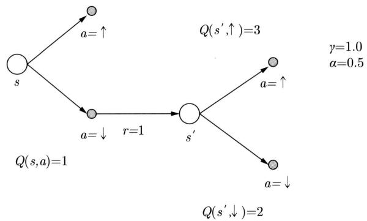  
图37.8 SARSA算法和Q学习的一步计算例

SARSA算法的一步计算如下，假设由 $\varepsilon$ 贪心算法决定在状态 $s^{\prime}$ 的动作是 $\downarrow$ 。

$$
Q (s, a) = Q (s, a) + \alpha (r + Q (s ^ {\prime}, \downarrow) - Q (s, a)) = 1 + 0. 5 \times (1 + 2 - 1) = 2. 0
$$

Q 学习的一步计算如下，在状态 $s'$ 由贪心算法决定的动作是↑。

$$
Q (s, a) = Q (s, a) + \alpha \left(r + \max  _ {a ^ {\prime}} Q \left(s ^ {\prime}, a ^ {\prime}\right) - Q (s, a)\right) = 1 + 0. 5 \times (1 + \max  (3, 2) - 1) = 2. 5
$$

可以看出，SARSA算法和Q学习的计算不同。

# 37.3.4 在策略和离策略学习

强化学习方法有在策略学习（on-policy learning）和离策略学习（off-policy learning）之分。强化学习一般由数据采样、策略评估、策略改进三部分组成。数据采样的策略称为行为策略 $\mu$ ，策略评估和策略改进的策略称为目标策略 $\pi$ 。在策略学习中目标策略和行为策略相同；而在离策略学习中，目标策略和行为策略不同。本章介绍的基于价值的方法中 Q 学习是离策略学习，其他方法是在策略学习，包括蒙特卡罗预测、蒙特卡罗控制、TD(0)、SARSA。这些在策略学习方法也有扩展到离策略学习的方法，本书不作介绍。

离策略学习方法可以使用不同的行为策略采样数据，用于学习目标策略，有更高的样本效率。这里说的样本效率是指学到最优策略所需要的样本量。例如，学习过程中，使用之前的策略（行为策略）采样数据进行当前策略（目标策略）的学习。相比，在策略学习使用相同的行为策略采样数据，当目标策略更新时，之前的采样数据就不能使用，样本效率不高。在策略学习通常可以直接基于采样数据进行策略评估和改进；而离策略学习则不然，需要利用特殊的动作价值函数更新方式，或者对采样数据进行适当的调权，然后进行策略评估和改进。

SARSA算法是在策略学习算法。行为策略和目标策略都是 $\varepsilon$ 贪心算法，基于同一个动作价值函数 $Q(S_{t},A_{t})$ 。每一步计算中涉及5元组 $(S_{t},A_{t},R_{t + 1},S_{t + 1},A_{t + 1})$ 。SARSA使用 $\varepsilon$ 贪心算法通过采样决定状态 $S_{t}$ 的动作 $A_{t}$ ，环境决定奖励 $R_{t + 1}$ 和状态 $S_{t + 1}$ ；然后使用 $\varepsilon$ 贪心算法通过采样决定状态 $S_{t + 1}$ 的动作 $A_{t + 1}$ ；再根据式(37.19)更新动作价值函数 $Q(S_{t},A_{t})$ 。接着，进入下一步计算。

Q学习是离策略学习算法。行为策略是 $\varepsilon$ 贪心算法，目标策略是贪心算法，基于同一个动作价值函数 $Q(S_{t},A_{t})$ 。每一步计算中涉及5元组 $(S_{t},A_{t},R_{t + 1},S_{t + 1},A_{t + 1})$ 。Q学习使用 $\varepsilon$ 贪心算法通过采样决定状态 $S_{t}$ 的动作 $A_{t}$ ，环境决定奖励 $R_{t + 1}$ 和状态 $S_{t + 1}$ ；然后使用贪心算法决定状态 $S_{t + 1}$ 的动作 $A_{t + 1}$ ；再根据式(37.23)更新动作价值函数 $Q(S_{t},A_{t})$ 。接着，进入下一步计算。  
Q学习是离策略学习算法，由于其特殊的动作价值函数的更新方式(37.23)。为改进目标策略，使用贪心算法决定状态 $S_{t + 1}$ 的动作 $A_{t + 1}$ ，需要的是根据行为策略产生的4元组 $(S_{t},A_{t},R_{t + 1},S_{t + 1})$ 数据，而产生4元组数据的行为策略可以是任意策略，不一定是目标策略。所以，Q学习可以使用之前策略的4元组 $(S_{t},A_{t},R_{t + 1},S_{t + 1})$ 数据更新当前目标策略，这正是后述深度Q网络所采用的方法。

# 37.4 基于价值的方法的总结

动态规划在策略迭代和价值迭代中的基本公式基于贝尔曼期望方程和贝尔曼最优方程。

$$
V (s) = R (s, a) + \gamma \sum_ {s ^ {\prime}} P \left(s ^ {\prime} \mid s, a\right) V \left(s ^ {\prime}\right) \tag {37.25}
$$

$$
Q (s, a) = R (s, a) + \gamma \sum_ {s ^ {\prime}} P \left(s ^ {\prime} \mid s, a\right) Q \left(s ^ {\prime}, a ^ {\prime}\right) \tag {37.26}
$$

$$
V (s) = \max  _ {a} \left(R (s, a) + \gamma \sum_ {s ^ {\prime}} P \left(s ^ {\prime} \mid s, a\right) V \left(s ^ {\prime}\right)\right) \tag {37.27}
$$

$$
Q (s, a) = R (s, a) + \gamma \sum_ {s ^ {\prime}} P \left(s ^ {\prime} \mid s, a\right) \max  _ {a ^ {\prime}} Q \left(s ^ {\prime}, a ^ {\prime}\right) \tag {37.28}
$$

TD(0)算法、SARSA算法、Q学习的基本公式也基于贝尔曼期望方程和贝尔曼最优方程。通过采样得到一步转移数据，首先计算后续状态的状态价值或动作价值，然后增量地计算当前状态的状态价值或动作价值的估计值。

$$
V (s) \leftarrow V (s) + \alpha \left(R (s, a) + \gamma V \left(s ^ {\prime}\right) - V (s)\right) \tag {37.29}
$$

$$
Q (s, a) \leftarrow Q (s, a) + \alpha \left(R (s, a) + \gamma Q \left(s ^ {\prime}, a ^ {\prime}\right) - Q (s, a)\right) \tag {37.30}
$$

$$
Q (s, a) \leftarrow Q (s, a) + \alpha \left(R (s, a) + \gamma \max  _ {a ^ {\prime}} Q \left(s ^ {\prime}, a ^ {\prime}\right) - Q (s, a)\right) \tag {37.31}
$$

分别与式 (37.25)、式 (37.26)、式 (37.28) 对应。式 (37.27) 目前没有对应的学习算法。这是因为右边最外侧是最大化，无法基于数据采样进行计算。

蒙特卡罗预测、蒙特卡罗控制使用蒙特卡罗法，其基本公式基于价值函数的定义。通过采样得到一个轨迹数据，首先计算轨迹上各个状态的回报，然后增量地计算各个状态的状态价值或动作价值的估计值。

$$
V (s) \leftarrow V (s) + \alpha (G - V (s)) \tag {37.32}
$$

$$
Q (s, a) \leftarrow Q (s, a) + \alpha (G - Q (s, a)) \tag {37.33}
$$

SARSA 算法和 Q 学习都使用时序差分法的控制方法，形式上非常相似，但基本原理不同。表 37.4 给出 SARSA 算法和 Q 学习的比较。SARSA 算法基于策略迭代，而 Q 学习基于价值迭代。

表 37.4 SARSA 算法和 Q 学习的比较  

<table><tr><td>特点</td><td>SARSA算法</td><td>Q学习</td></tr><tr><td>原理</td><td>策略迭代</td><td>价值迭代</td></tr><tr><td>贝尔曼方程</td><td>贝尔曼期望方程</td><td>贝尔曼最优方程</td></tr><tr><td>学习方式</td><td>在策略学习</td><td>离策略学习</td></tr></table>

SARSA算法是在策略学习，Q学习是离策略学习。Q学习比SARSA算法有更广泛的应用。

强化学习用于控制需要应对的一个重要问题是平衡利用和探索，防止学习陷入局部最优。蒙特卡罗控制和SARSA算法在策略改进中及Q学习在数据采样中，分别采用 $\varepsilon$ 贪心算法，保证在学习过程中同一个状态下的各个动作都有一定概率被选取。

# 本章概要

1. 基于价值的方法是模型无关的强化学习方法。其前提是智能体并不知道环境的模型，只能通过与环境的交互获得经验数据，并不估计环境的模型，而是从经验数据中学习最优价值函数，从而导出最优策略。  
基于价值的方法可以用于预测和控制，进行模型无关的预测和控制。预测的方法有蒙特卡罗预测和时序差分预测TD(0)算法，控制的方法有蒙特卡罗控制、时序差分控制的SARSA算法、Q学习。  
2. 基于价值的方法的数据采样手段主要有蒙特卡罗法和时序差分法。蒙特卡罗法每次采样一个轨迹，作为一个样本；基于采样数据，根据价值函数的定义，估计各个状态的价值，或者各个状态和动作的价值，用于策略评估、策略迭代。时序差分法每次采样轨迹中的一步转移，作为一个样本；基于采样数据，根据贝尔曼方程，估计各个状态的价值，或者各个状态和动作的价值，用于策略评估、策略迭代、价值迭代。  
3. 基于价值的方法价值函数的表示和学习手段主要有表格法和函数近似法。表格法属于基本方法，函数近似法用于大规模问题。表格法用表格记录所有可能的状态和动作的价值，在学习过程中通过查表更新价值函数。函数近似法用参数化的函数表示所有可能的状态的价值，或者所有可能的状态和动作的价值，在学习过程中通过参数更新学习价值函数。常用的参数化函数有线性函数和神经网络。

函数近似法的目标是在学习过程中最小化近似价值函数和真实价值函数之间的差异。在基于价值的方法的每一次计算中，可以得到状态到目标或状态-动作到目标的映射，即输入到输出的映射。函数近似法在学习过程中得到输入到输出的样本序列，使用随机梯度下降增量式地学习参数化的价值函数。

4. 蒙特卡罗预测假设MDP是有限期的，模型未知，策略给定。蒙特卡罗预测通过蒙特卡罗法从数据中学习策略的价值函数，是基于蒙特卡罗法的策略评估。根据给定策略与交互环境得到一个轨迹，依次访问这个轨迹中的各个状态，增量地计算每一个状态的价值的估计值。蒙特卡罗预测的价值更新公式是

$$
V \left(S _ {t}\right) \leftarrow V \left(S _ {t}\right) + \alpha_ {k} \left(G _ {t} - V \left(S _ {t}\right)\right)
$$

根据强大数定律，蒙特卡罗预测状态价值的估计值以概率1收敛于真实值。

5. 时序差分预测 TD(0) 算法假设 MDP 是有限期或无限期的，模型未知，策略给定。TD(0) 算法通过时序差分法从数据中学习策略的价值函数，是基于时序差分法的策略评估。TD(0) 算法根据给定策略与环境交互，过程中产生一个轨迹，依次访问这个轨迹中的各个状态，增量地计算每一个状态的价值的估计值。每一次计算时，只用当前状态到后续状态

的一步转移数据。TD(0) 算法的价值更新公式是

$$
V \left(S _ {t}\right) \leftarrow V \left(S _ {t}\right) + \alpha_ {k} \left(R _ {t + 1} + \gamma V \left(S _ {t + 1}\right) - V \left(S _ {t}\right)\right)
$$

TD(0) 算法在Robbins-Monro条件下状态价值的估计值以概率1收敛于真实值。

6. 蒙特卡罗控制假设 MDP 是有限期的，模型未知。蒙特卡罗控制采用蒙特卡罗法和策略迭代，通过采样从数据中学习最优动作价值函数及最优策略。在策略评估中，使用蒙特卡罗法根据当前策略与环境交互得到一个轨迹，依次访问这个轨迹中的各个状态和动作，增量地计算每一个状态和动作的价值的估计值。在策略改进中，使用 $\varepsilon$ 贪心算法改进当前策略。价值的更新公式是

$$
Q \left(S _ {t}, A _ {t}\right) \leftarrow Q \left(S _ {t}, A _ {t}\right) + \alpha_ {k} \left(G _ {t} - Q \left(S _ {t}, A _ {t}\right)\right)
$$

蒙特卡罗控制在GLIE条件下动作价值的估计值以概率1收敛于最优值。

7. 时序差分控制 SARSA 算法，假设 MDP 是有限期或无限期的，模型未知。SARSA 算法采用时序差分法和策略迭代，通过采样从数据中学习最优动作价值函数及最优策略。在策略评估中，使用 $\varepsilon$ 贪心算法与环境交互，过程中产生一个轨迹，依次访问这个轨迹中的各个状态和动作，增量地计算每一个状态和动作的价值的估计值。每一次计算时，只用当前状态到后续状态的一步转移数据。在策略改进中，使用 $\varepsilon$ 贪心算法改进当前策略，决定后续状态的动作。价值的更新公式是

$$
Q \left(S _ {t}, A _ {t}\right) \leftarrow Q \left(S _ {t}, A _ {t}\right) + \alpha_ {k} \left(R _ {t + 1} + \gamma Q \left(S _ {t + 1}, A _ {t + 1}\right) - Q \left(S _ {t}, A _ {t}\right)\right)
$$

SARSA算法在GLIE和Robbins-Monro条件下动作价值的估计值以概率1收敛于最优值。

8. 时序差分控制 Q 学习算法假设 MDP 是有限期或无限期的，模型未知。Q 学习采用时序差分法和价值迭代，通过采样从数据中学习最优动作价值函数及最优策略。属于离策略学习，以 $\varepsilon$ 贪心算法为行为策略，以贪心算法为目标策略。Q 学习在学习过程中，使用 $\varepsilon$ 贪心算法与环境交互，过程中产生一个轨迹，依次访问这个轨迹中的各个状态和动作，增量地计算每一个状态和动作的价值的估计值。每一次计算时，只用当前状态到后续状态的一步转移数据，而且使用贪心算法对后续状态的动作价值进行最大化。价值的更新公式是

$$
Q \left(S _ {t}, A _ {t}\right) \leftarrow Q \left(S _ {t}, A _ {t}\right) + \alpha_ {k} \left(R _ {t + 1} + \gamma \max  _ {a ^ {\prime}} Q \left(S _ {t + 1}, a ^ {\prime}\right) - Q \left(S _ {t}, A _ {t}\right)\right)
$$

Q 学习在Robbins-Monro条件下动作价值的估计值以概率1收敛于最优值。

9. 强化学习算法中有在策略学习和离策略学习。在策略学习中要学习的目标策略和学习中用于数据采样的行为策略相同，而离策略学习中，要学习的目标策略和学习中用于数据采样的行为策略不同。本章介绍的基于价值的方法中 Q 学习是离策略学习，其他方法是在策略学习。

# 继续阅读

进一步学习基于价值的强化学习方法可以阅读Sutton和Barto书籍的第5章~第6章和第9章[1]。时序差分算法 $\mathrm{TD}(\lambda)$ 的原始论文是文献[2], SARSA算法的原始论文是文献[3],

收敛性证明可见文献 [4]。Q 学习的原始论文是文献 [5], Q 学习的收敛性证明可见文献 [6]~文献 [7]。

# 习题

37.1 算法 37.1 的蒙特卡罗预测算法可以估计状态价值函数。还有一个对应的算法用于估计动作价值函数，写出该算法。  
37.2 例37.1的问题中，假设折扣因子 $\gamma = 0.9$ 。用蒙特卡罗预测估计策略 $\pi_{1}$ 在每一个状态的价值，这时分别使用第一次访问估计和每一次访问估计。  
37.3 例37.1的问题中，假设策略 $\pi_{2}$ 是在每一个格点都向左移动。用蒙特卡罗预测估计策略 $\pi_{2}$ 在每一个状态的价值。比较策略 $\pi_{1}$ 和策略 $\pi_{2}$ 的价值。  
37.4 算法 37.2 的 TD(0) 算法可以估计状态价值函数。还有一个对应的算法用于估计动作价值函数，写出该算法。  
37.5 在以下表中标出答案为“是”的部分。

<table><tr><td></td><td>动态规划</td><td>蒙特卡罗预测</td><td>时序差分预测</td></tr><tr><td>可用于模型无关的情况</td><td></td><td></td><td></td></tr><tr><td>可用于无限期 MDP</td><td></td><td></td><td></td></tr><tr><td>不依赖于马尔可夫假设</td><td></td><td></td><td></td></tr><tr><td>在极限收敛于真实值</td><td></td><td></td><td></td></tr><tr><td>可得到价值的无偏估计</td><td></td><td></td><td></td></tr></table>

37.6 比较蒙特卡罗预测算法、蒙特卡罗控制算法、TD(0) 算法、SARSA 算法、Q 学习的学习收敛的条件。注意这些条件都是充分条件而不是必要条件。

# 参考文献

[1] SUTTON R S, BARTO A G. Reinforcement learning: An introduction[M]. 2nd edition. MIT Press, 2018.   
[2] SUTTON R S. Learning to predict by the methods of temporal differences[J]. Machine Learning, 1988, 3(1): 9-44.   
[3] RUMMERY G A, NIRANJAN M. On-line Q-learning using connectionist systems[J]. Cambridge, England: University of Cambridge, Department of Engineering, 1994, 36: 20.   
[4] SINGH S, JAAKKOLA T, LITTMAN M L, et al. Convergence results for single-step on-policy reinforcement-learning algorithms[J]. Machine Learning, 2000, 38(3): 287-308.   
[5] WATKINS C J. Learning from delayed rewards[D]. University of Cambridge, 1989.   
[6] WATKINS C J, DAYAN P. Q-learning[J]. Machine Learning, 1992, 8(3-4): 279-292.   
[7] MELO F S. Convergence of Q-learning: A simple proof[J]. Institute of Systems and Robotics, Tech. Rep, 2001: 1-4.

# 第38章 深度Q网络

基于价值的方法中还有深度 Q 网络（deep Q network, DQN），是结合 Q 学习、函数近似和深度学习的方法。DQN 是基于价值的方法中有代表性的算法。

传统的 Q 学习使用表格存储 Q 函数的值，也就是状态-动作的价值。然而，当问题规模增大时，表格法就变得不实用。DQN 使用神经网络近似表示 Q 函数。神经网络的输入是状态，输出是动作的 Q 值。在训练过程中，DQN 利用与环境的交互产生的经验数据来更新网络参数，以最小化预测的 Q 值与实际获得的奖励和未来折扣奖励之和之间的误差。DQN 使用经验回放和固定目标这两个技巧，以应对学习不易收敛的问题。

Minh 等于 2013 年发表了 DQN，DQN 被成功地用于 Atari 游戏。38.1 节讲述价值函数近似法，38.2 节讲解深度 Q 网络。

# 38.1 价值函数近似法

基于价值的方法中，价值函数的表示可以使用表格法，也可以使用函数近似法。

第37章讲述的基于价值的方法都使用表格法（tabular method），用表格记录所有可能的状态和动作的价值，其中状态和动作由索引表示，在学习过程中通过查表更新价值函数。表格法属于基本方法，但是，当状态和动作规模很大时表格法变得不适用。

在大规模强化学习问题中，基于价值的方法需要采用函数近似法（function approximation method）。函数近似法用参数化的函数表示所有可能的状态的价值，或者所有可能的状态和动作的价值，在学习过程中通过参数更新学习价值函数。这里假设特征相似的状态具有相近的价值或者特征相似的状态和动作具有相近的价值。函数近似法实际对价值函数进行了泛化，是包含表格法的更一般的方法。

假设策略 $\pi$ 的状态价值函数和动作价值函数是 $V_{\pi}(s)$ 和 $Q_{\pi}(s,a)$ 。可以用参数化的函数 $\hat{V} (s;\pmb {w})$ 和 $\hat{Q} (s,a;\pmb {w})$ 对其分别进行近似：

$$
V _ {\pi} (s) \approx \hat {V} (s; \boldsymbol {w}) \tag {38.1}
$$

$$
Q _ {\pi} (s, a) \approx \hat {Q} (s, a; \boldsymbol {w}) \tag {38.2}
$$

其中， $\pmb{w}$ 是参数（简单起见用同一个符号表示两个函数的参数）， $s$ 和 $a$ 是状态和动作，可以是向量、矩阵或张量。对最优的价值函数 $V_{*}(s,a)$ 和 $Q_{*}(s,a)$ 也可以进行类似的近似。这就是函数近似法。

常用的参数化函数有线性函数和神经网络。当使用深度神经网络时，价值函数的学习就

变成了深度强化学习。近似函数是线性函数时有

$$
\hat {V} (s; \boldsymbol {w}) = \boldsymbol {x} ^ {\mathrm {T}} (s) \cdot \boldsymbol {w} \tag {38.3}
$$

$$
\hat {Q} (s, a; \boldsymbol {w}) = \boldsymbol {x} ^ {\mathrm {T}} (s, a) \cdot \boldsymbol {w} \tag {38.4}
$$

近似函数是神经网络时有

$$
\hat {V} (s; \boldsymbol {w}) = g (s; \boldsymbol {w}) \tag {38.5}
$$

$$
\hat {Q} (s, a; \boldsymbol {w}) = g (s, a; \boldsymbol {w}) \tag {38.6}
$$

函数近似法的优点是比表格法具有更高的学习效率，包括学习过程中的计算时间效率、计算空间效率、样本效率。表格法的参数量是 $O(n)$ 或者 $O(nm)$ ，其中 $n$ 是状态数， $m$ 是动作数。函数近似法的参数量是 $O(d)$ ，其中 $d$ 是近似函数的参数个数。通常前两者远大于后者。函数近似法的缺点是学习的收敛不一定能保证，学习得到的价值函数不一定好理解。

函数近似法的目标是在学习过程中最小化近似价值函数和真实价值函数之间的差异，具体地，最小化近似状态价值函数 $\hat{V}(s; \boldsymbol{w})$ 和真实状态价值函数 $V_{\pi}(s)$ 之间的平方损失。

$$
L (\boldsymbol {w}) = \frac {1}{2} \left(V _ {\pi} (s) - \hat {V} (s; \boldsymbol {w})\right) ^ {2} \tag {38.7}
$$

或者最小化近似动作价值函数 $\hat{Q}(s, a; \boldsymbol{w})$ 和真实动作价值函数 $Q_{\pi}(s, a)$ 之间的平方损失。

$$
L (\boldsymbol {w}) = \frac {1}{2} \left(Q _ {\pi} (s, a) - \hat {Q} (s, a; \boldsymbol {w})\right) ^ {2} \tag {38.8}
$$

理想情况，真实状态价值和动作价值是独立同分布数据，其中 $V_{\pi}(s)$ 和 $Q_{\pi}(s,a)$ 各是一个样本，那么可以用随机梯度下降的方法对两个损失函数进行优化，学习到近似状态价值函数和动作价值函数的参数。

$$
\nabla_ {\boldsymbol {w}} L = - \left(V _ {\pi} (s) - \hat {V} (s; \boldsymbol {w})\right) \nabla_ {\boldsymbol {w}} \hat {V} (s; \boldsymbol {w}) \tag {38.9}
$$

$$
\nabla_ {\boldsymbol {w}} L = - \left(Q _ {\pi} (s, a) - \hat {Q} (s, a; \boldsymbol {w})\right) \nabla_ {\boldsymbol {w}} \hat {Q} (s, a; \boldsymbol {w}) \tag {38.10}
$$

在实际的基于价值的方法中，无论是使用蒙特卡罗法还是时序差分法，每次访问一个状态，都对其状态价值或动作价值做一个估计，称为目标。这样得到状态和目标对或状态-动作和目标对的序列数据。假设这是监督学习数据（回归数据），学习从状态 $s$ 到目标 $u$ 的映射 $s \mapsto u$ ，或者从状态 $s$ 和动作 $a$ 到目标 $u$ 的映射 $s, a \mapsto u$ 。模型分别由参数化的状态价值函数 $\hat{V}(s; \boldsymbol{w})$ 和动作价值函数 $\hat{Q}(s, a; \boldsymbol{w})$ 表示。与上面同样，使用随机梯度下降迭代地学习模型的参数。

在每一次计算中，更新函数 $\hat{V}(s; \boldsymbol{w})$ 以及 $\hat{Q}(s, a; \boldsymbol{w})$ 的参数 $\boldsymbol{w}$ ，这时梯度函数分别是

$$
\nabla_ {\boldsymbol {w}} L = - \left(u - \hat {V} (s; \boldsymbol {w})\right) \nabla_ {\boldsymbol {w}} \hat {V} (s; \boldsymbol {w}) \tag {38.11}
$$

$$
\nabla_ {\boldsymbol {w}} L = - \left(u - \hat {Q} (s, a; \boldsymbol {w})\right) \nabla_ {\boldsymbol {w}} \hat {Q} (s, a; \boldsymbol {w}) \tag {38.12}
$$

特别是当近似函数是线性函数时有

$$
\nabla_ {\boldsymbol {w}} L = - \left(u - \hat {V} (s; \boldsymbol {w})\right) \boldsymbol {x} (s) \tag {38.13}
$$

$$
\nabla_ {\boldsymbol {w}} L = - \left(u - \hat {Q} (s, a; \boldsymbol {w})\right) \boldsymbol {x} (s, a) \tag {38.14}
$$

这个方法有两个近似，所以严格意义上不满足监督学习的条件。首先，样本是一个轨迹上的状态或状态-动作，不是独立的，而是相关的。其次，目标本身也依赖于模型，不是真正的定量，而是假想的定量。前者称为数据相关性问题，后者称为目标变动性问题。在后述深度D网络中两个问题都得以一定程度上解决。

蒙特卡罗预测中，每一次计算进行如下参数更新：

$$
\boldsymbol {w} \leftarrow \boldsymbol {w} + \alpha_ {k} \left(G _ {t} - \hat {V} \left(S _ {t}; \boldsymbol {w}\right)\right) \nabla_ {\boldsymbol {w}} \hat {V} (s; \boldsymbol {w}) \tag {38.15}
$$

其中， $G_{t}$ 是目标。TD(0)算法中，每一次计算进行如下参数更新：

$$
\boldsymbol {w} \leftarrow \boldsymbol {w} + \alpha_ {k} \left(R _ {t + 1} + \gamma \hat {V} \left(S _ {t + 1}; \boldsymbol {w}\right) - \hat {V} \left(S _ {t}; \boldsymbol {w}\right)\right) \nabla_ {\boldsymbol {w}} \hat {V} (s; \boldsymbol {w}) \tag {38.16}
$$

其中， $R_{t + 1} + \gamma \hat{v}\left(S_{t + 1};\boldsymbol {w}\right)$ 是目标。蒙特卡罗控制中，每一次计算进行如下参数更新：

$$
\boldsymbol {w} \leftarrow \boldsymbol {w} + \alpha_ {k} \left(G _ {t} - \hat {Q} \left(S _ {t}, A _ {t}; \boldsymbol {w}\right)\right) \nabla_ {\boldsymbol {w}} \hat {Q} (s, a; \boldsymbol {w}) \tag {38.17}
$$

其中， $G_{t}$ 是目标。SARSA算法中，每一次计算进行如下参数更新：

$$
\boldsymbol {w} \leftarrow \boldsymbol {w} + \alpha_ {k} \left(R _ {t + 1} + \gamma \hat {Q} \left(S _ {t + 1}, A _ {t + 1}; \boldsymbol {w}\right) - \hat {Q} \left(S _ {t}, A _ {t}; \boldsymbol {w}\right)\right) \nabla_ {\boldsymbol {w}} \hat {Q} (s, a; \boldsymbol {w}) \tag {38.18}
$$

其中， $R_{t + 1} + \gamma \hat{Q}\left(S_{t + 1},A_{t + 1};\boldsymbol {w}\right)$ 是目标。Q学习中，每一次计算进行如下参数更新：

$$
\boldsymbol {w} \leftarrow \boldsymbol {w} + \alpha_ {k} \left(R _ {t + 1} + \gamma \max  _ {a ^ {\prime}} \hat {Q} \left(S _ {t + 1}, a ^ {\prime}; \boldsymbol {w}\right) - \hat {Q} \left(S _ {t}, A _ {t}; \boldsymbol {w}\right)\right) \nabla_ {\boldsymbol {w}} \hat {Q} (s, a; \boldsymbol {w}) \tag {38.19}
$$

其中， $R_{t + 1} + \gamma \max_{a'}\hat{Q}\left(S_{t + 1},a';\boldsymbol {w}\right)$ 是目标。

在这些函数近似法中目标是定量，价值函数的参数是变量。目标含有参数时，也认为这些参数是固定的，比如，目标 $R_{t + 1} + \gamma \max_{a'}\hat{Q}\left(S_{t + 1},a';\boldsymbol {w}\right)$ 中的参数 $\pmb{w}$ 。

表格法可以看作函数近似法的特殊情况。比如，针对动作价值函数，近似函数是线性函数，特征向量是表示一个状态-动作对的独热向量时，函数近似法等价于表格法。

$$
\boldsymbol {x} (s, a) = \left( \begin{array}{c} \delta (s _ {1}, a _ {1}) \\ \delta (s _ {2}, a _ {2}) \\ \vdots \\ \delta (s _ {n}, a _ {m}) \end{array} \right)
$$

$$
\hat {Q} (s, a; \boldsymbol {w}) = \left( \begin{array}{c} \delta (s _ {1}, a _ {1}) \\ \delta (s _ {2}, a _ {2}) \\ \vdots \\ \delta (s _ {n}, a _ {m}) \end{array} \right) ^ {\mathrm {T}} \cdot \left( \begin{array}{c} w _ {1} \\ w _ {2} \\ \vdots \\ w _ {n m} \end{array} \right)
$$

其中， $\delta$ 是德尔塔函数。Q学习的价值更新公式变成

$$
\boldsymbol {w} \leftarrow \boldsymbol {w} + \alpha_ {k} \left(R _ {t + 1} + \gamma \max  _ {a ^ {\prime}} \hat {Q} \left(S _ {t + 1}, a ^ {\prime}; \boldsymbol {w}\right) - \hat {Q} \left(S _ {t}, A _ {t}; \boldsymbol {w}\right)\right) \cdot \boldsymbol {x} (S, A) \tag {38.20}
$$

可以看出，函数近似法与表格法相比，只是改变了价值更新公式。其他方法也是如此。算法38.1给出函数近似的Q学习算法。

# 算法38.1 Q学习（函数近似）

输入：模型未知的MDP。

输出：最优价值函数 $Q_{*}(s,a;\pmb{w})$ 。

参数：回合数 $K$ 。

初始化 $\hat{Q} (s,a;\pmb {w})$ 价值函数模型的参数 $\pmb{w}$ $k = 0$ while $(k <   K)$ {确定轨迹的初始状态 $S_{0}$ （2号 while $(S_{t}\neq S_{T})$ 使用 $\varepsilon$ 贪心算法基于 $\hat{Q} (S_t,a;\pmb {w})$ 决定状态 $S_{t}$ 的动作 $A_{t}$ 从环境得到奖励 $R_{t + 1}$ 和状态 $S_{t + 1}$ #价值迭代，学习率 $\alpha_{k}$ $\pmb {w}\gets \pmb {w} + \alpha_k\left(R_{t + 1} + \gamma \max_{a'}\hat{Q} (S_{t + 1},a';\pmb {w}) - \hat{Q} (S_t,A_t;\pmb {w})\right)$ $t\gets t + 1$ 1  
} $k\gets k + 1$ 输出动作价值函数 $\hat{Q} (s,a;\pmb {w})$

表38.1总结基于价值的方法的学习收敛性（概率收敛性）。使用非线性函数近似的方法，特别是Q学习，一般不能保证学习收敛。这里说的收敛并不一定是收敛到全局最优，也可能是收敛到局部最优。Q学习兼具函数近似、时序差分、离策略学习，而这三者的组合使学习更容易产生发散。因此，算法38.1的函数近似Q学习算法并不实用。

表 38.1 基于价值的方法的学习收敛性  

<table><tr><td></td><td>学习方式</td><td>表格</td><td>线性函数</td><td>非线性函数</td></tr><tr><td>蒙特卡罗预测</td><td>在策略</td><td>收敛</td><td>收敛</td><td>收敛</td></tr><tr><td>TD(0)</td><td>在策略</td><td>收敛</td><td>收敛</td><td>不收敛</td></tr><tr><td>蒙特卡罗控制</td><td>在策略</td><td>收敛</td><td>近似收敛</td><td>不收敛</td></tr><tr><td>SARSA算法</td><td>在策略</td><td>收敛</td><td>近似收敛</td><td>不收敛</td></tr><tr><td>Q学习</td><td>离策略</td><td>收敛</td><td>不收敛</td><td>不收敛</td></tr></table>

# 38.2 DQN 方法

深度Q网络（Deep Q Network, DQN）是为解决Q学习收敛性问题而开发的方法。

妨碍 Q 学习算法收敛的至少有两个原因——数据的相关性和目标的变动性。数据的相关性：在学习过程中，产生的数据是相关的，数据的分布也会发生变化，不是平稳分布。目标的变动性：在学习过程中，每一次计算会更新价值函数的参数，使当前状态的价值提高，但同时也会改变其他状态的价值，不能保证其他状态的价值不变，因此优化的目标有变动的可能。

DQN在函数近似的Q学习中导入两个新的技巧——经验回放（experience replay）和固定目标（fixed target），以应对学习不易收敛的问题。

DQN在时序差分法采样的每一步得到一个4元组，将4元组存入回放缓存（replay buffer)，缓存中只存储最新的4元组。经验回放，每次参数更新不是使用当前一步得到的4元组，而是从回放缓存中随机抽取小批量4元组，用这些数据对参数进行更新。因为参数更新基于历史经验中的小批量随机数据，可以平滑数据分布，在一定程度上解决数据相关性的问题。且使用的是历史经验数据，并不需要增加智能体与环境的交互，这部分的计算成本并没有增加。DQN是Q学习的一种，属于离策略学习，经验回放等于使用了历史上不同行为策略的数据。

固定目标使用两个神经网络，一个是表示要学习的 Q 网络（Q 函数），另一个是表示学习目标的目标网络（target network）。两个神经网络具有相同的架构。在学习过程中，每一阶段，固定目标网络的参数，更新 Q 网络的参数；进入新一阶段后，将 Q 网络的参数复制到目标网络；不断重复。因为在学习的每一阶段目标是固定的，所以可以在一定程度上解决目标变动性问题。

DQN的参数更新公式如下

$$
\boldsymbol {w} \leftarrow \boldsymbol {w} - \alpha_ {k} \left(r + \gamma \max  _ {a ^ {\prime}} \hat {Q} \left(s ^ {\prime}, a ^ {\prime}; \bar {\boldsymbol {w}}\right) - \hat {Q} (s, a; \bar {\boldsymbol {w}})\right) \nabla_ {\boldsymbol {w}} \hat {Q} (s, a; \boldsymbol {w}) \tag {38.21}
$$

其中， $\hat{Q}(s, a; \bar{w})$ 是目标网络， $\hat{Q}(s, a; w)$ 是 Q 网络。算法 38.2 是 DQN 的学习算法。

# 算法38.2（DQN）

输入：模型未知的MDP。

输出：最优价值函数 $Q_{*}(s,a;\pmb{w})$ 。

参数：回合数 $K$ ，阶段长度 $c$ ，回放规模 $d$ 。

初始化价值函数模型 $\hat{Q} (s,a;\pmb {w})$ 的参数 $\pmb{w}$ $k = 0$ while $(k <   K)$ {确定轨迹的初始状态 $S_0$ （2号 while $(S_{t}\neq S_{T})$ {使用 $\varepsilon$ 贪心算法基于 $\hat{Q} (S_t,a;\pmb {w})$ 决定状态 $S_{t}$ 的动作 $A_{t}$ 从环境得到奖励 $R_{t + 1}$ 和状态 $S_{t + 1}$

将得到的4元组 $(S_{t},A_{t},R_{t + 1},S_{t + 1})$ 存入回放缓存

# 经验回放  
从回放缓存中随机采样 $d$ 个4元组，得到集合 $\mathcal{T} = \{(s,a,r,s')\}$ for each $((s,a,r,s')\in \mathcal{T})$ { $\pmb{w}\gets \pmb{w} + \alpha_{k}\left(r + \gamma \max_{a'}\hat{Q} (s',a';\bar{\pmb{w}}) - \hat{Q} (s,a;\pmb{w})\right)\nabla_{\pmb{w}}\hat{Q} (s,a;\pmb{w})$ }  
# 目标网络更新  
If（Q网络更新次数是 $c$ 的倍数）{ $\bar{\pmb{w}}\gets \pmb{w}$ } $t\gets t + 1$ } $k\gets k + 1$ }  
输出动作价值函数 $\hat{Q}(s,a;\pmb{w})$

例38.1（Atari游戏）Atari（雅达利）是20世纪70年代流行的游戏机，有Pong、Breakout等许多款游戏。DQN在计算机模拟的Atari游戏中，自动学习每一款游戏玩法，其最终成绩在多款游戏上超过了人类玩家。

比如，Breakout是以小球撞击砖块的游戏。如图38.1所示，屏幕上方有多层砖块，屏幕下方有一个挡板。屏幕中有一个小球在飞动，小球撞击到墙壁、砖块、挡板时会反弹。玩家可以控制挡板，使其左右滑动，拦截飞落下来的小球，使其反弹到砖块，将砖块击落。当所有砖块被击落时，玩家获胜。但当小球掉落至屏幕底部时，游戏终止。

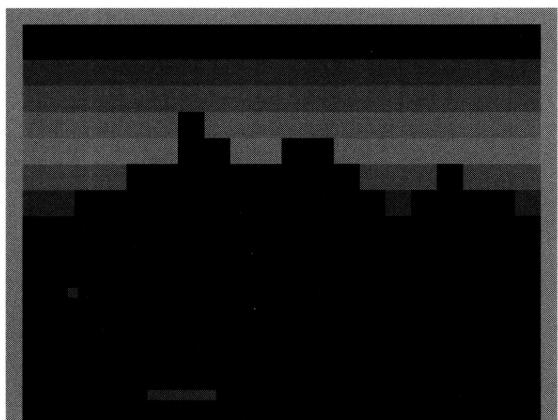  
图38.1 Breakout游戏画面

用于 Atari 游戏的 DQN 模型是一个卷积神经网络，使用 DQN 算法（算法 38.2）进行训练，输入是状态，状态由屏幕图像表示，输出是状态和动作的价值，可以从输出中选出价值最

大的动作，动作由游戏的操作表示。学好的DQN表示的是游戏的最优玩法。注意DQN没有使用任何关于游戏本身的知识。它只是从屏幕图像、得分和终止信号以及可能的操作中自动地学习Atari游戏的玩法，例如Breakout 的玩法。

DQN的卷积神经网络的架构见图38.2。输入由4帧屏幕图像表示，经过前处理后是 $84\times$ $84\times 4$ 的图像。第一层是卷积层，使用步幅为4的16个 $8\times 8$ 滤波器及整流线性函数。第二层也是卷积层，使用步幅为2的32个 $4\times 4$ 的滤波器及整流线性函数。第三层是全连接层，由256个神经元组成。输出层是线性层，输出每一个操作的价值。可能的操作的数量因游戏而异，由 $4\sim 18$ 个不等。DQN的训练中，回放缓存的规模是100万，小批量采样的规模是32，目标网络每1万次训练更新一次。

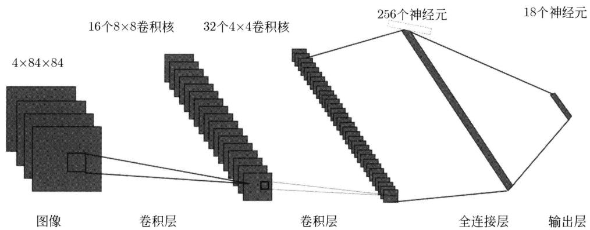  
图38.2 DQN的网络架构

# 本章概要

1. 基于价值的方法价值函数的表示和学习手段主要有表格法和函数近似法。表格法属于基本方法，函数近似法用于大规模问题。表格法用表格记录所有可能的状态和动作的价值，在学习过程中通过查表更新价值函数。函数近似法用参数化的函数表示所有可能的状态的价值，或者所有可能的状态和动作的价值，在学习过程中通过参数更新学习价值函数。常用的参数化函数有线性函数和神经网络。  
函数近似法的目标是在学习过程中最小化近似价值函数和真实价值函数之间的差异。在基于价值的方法的每一次计算中，可以得到状态到目标或状态-动作到目标的映射，即输入到输出的映射。函数近似法在学习过程中得到输入到输出的样本序列，使用随机梯度下降增量式地学习参数化的价值函数。  
2. 使用非线性函数近似的方法一般不能保证学习收敛，特别是 Q 学习。妨碍收敛有两个原因，数据的相关性和目标的可变性。深度 Q 网络（DQN）导入两个新的技巧，经验回放和固定目标，以解决这两个问题。经验回放在学习过程中将时序差分法采样得到的 4 元组 $(s, a, r, s')$ 缓存于回放缓存，每次参数更新从回放缓存中随机抽取小批量 4 元组，用这些数据对参数进行更新。固定目标使用两个神经网络，一个表示要学习的 Q 网络，另一个表示学习目标的目标网络。在学习过程中，每一阶段，固定目标网络的参数，更新 Q 网络的参数；进

入新一阶段后，将Q网络的参数复制到目标网络；不断重复。DQN的参数更新公式是

$$
\boldsymbol {w} \leftarrow \boldsymbol {w} - \alpha_ {k} \left(r + \gamma \max  _ {a ^ {\prime}} \hat {Q} \left(s ^ {\prime}, a ^ {\prime}; \bar {\boldsymbol {w}}\right) - \hat {q} (s, a; \boldsymbol {w})\right) \nabla_ {\boldsymbol {w}} \hat {Q} (s, a; \boldsymbol {w})
$$

DQN是深度强化学习中的有代表性的方法。

# 继续阅读

进一步学习基于价值的强化学习方法可以阅读Sutton和Barto书籍的第5章～第6章和第9章[1]。Q学习的原始论文是文献[2]，DQN的原始论文是文献[3]和文献[4]。

# 习题

38.1 写出函数近似的SARSA算法。  
38.2 假设使用函数近似的价值函数出现了过拟合或欠拟合现象，应该如何调整训练方法？  
38.3 比较DQN与传统Q学习算法的异同点，并分析DQN在处理大规模问题上的优势。

# 参考文献

[1] SUTTON R S, BARTO A G. Reinforcement learning: An introduction[M]. 2nd edition. MIT Press, 2018.   
[2] WATKINS C J. Learning from delayed rewards[D]. University of Cambridge, 1989.   
[3] MNIH V, KAVUKCUOGLU K, SILVER D, et al. Playing atari with deep reinforcement learning[Z/OL]. arXiv preprint arXiv:1312.5602, 2013.   
[4] MNIH V, KAVUKCUOGLU K, SILVER D, et al. Human-level control through deep reinforcement learning[J]. Nature, 2015, 518(7540): 529-533.

# 第39章 基于策略的方法

强化学习假设MDP的模型未知，智能体通过与环境的交互求解最优策略。强化学习方法分为模型无关（model-free）的方法和基于模型（model-based）的方法。模型无关的方法又有基于策略（policy-based）的方法和基于价值（value-based）的方法。

本章讲解基于策略的强化学习方法，特别是策略梯度（policy gradient）方法。策略梯度通常利用蒙特卡罗法进行数据采样；基于数据使用随机梯度上升法，以最大化回报的期望为目标更新策略函数。策略梯度方法中有代表性的是Williams于1992年提出的REINFORCE算法。策略梯度方法也用于许多应用系统，如Silver等开发的围棋博弈系统阿尔法狗（AlphaGo）也使用了策略梯度方法。

本章还讲解演员-评论员（actor-critic）算法，是扩展的策略梯度方法，既学习策略函数（演员）又学习价值函数（评论员）。演员-评论员通常利用蒙特卡罗法或时序差分法进行数据采样；基于数据使用随机梯度上升法，依据基于优势函数的梯度函数更新策略函数；同时基于数据使用随机梯度下降法更新价值函数，用以计算优势函数，指导策略参数的更新。演员-评论员算法的基本想法于1983年由Barto等提出。

39.1节给出基于策略的方法的概述，39.2节讲述REINFORCE算法、带基线的REINFORCE算法，39.3节讲述演员-评论员算法，39.4节对策略梯度方法进行总结，39.5节介绍策略梯度方法在阿尔法狗的应用。

# 39.1 基于策略的方法概述

基于价值的方法旨在学习最优的价值函数，在其基础上导出最优策略函数，但并不直接学习最优策略函数。基于策略的方法旨在直接学习最优的策略函数，有时使用价值函数进行辅助。因为是直接学习最优策略函数，基于策略的方法在学习的效果和效率上一般更具有优势。

基于策略的方法的基本原理是策略优化（policy optimization）和蒙特卡罗法。假设策略是随机性策略，取条件概率分布的形式 $\pi_{\theta}(a|s)$ ，其中 $s$ 是状态， $a$ 是动作， $\theta$ 是参数。策略优化通过最大化轨迹数据中的回报的期望得到最优策略函数。直观解释是一个轨迹的回报越大，这个轨迹的概率就应该越大，策略函数就越应该促使产生这个轨迹。策略优化需要基于数据采样，利用蒙特卡罗法，每一次采样得到一个轨迹的数据。

基于策略的方法主要有策略梯度（policy gradient），当策略函数可导时适用。当策略函数不可导时，可以使用有限差分法、爬山法等。策略梯度在策略优化的过程中使用随机梯度

上升学习最优策略函数。策略梯度有代表性的算法是REINFORCE。表39.1比较了基于策略的方法和基于价值的方法。

表 39.1 基于策略的方法和基于价值的方法的比较  

<table><tr><td></td><td>基于策略的方法</td><td>基于价值的方法</td></tr><tr><td>主要方法</td><td>策略梯度</td><td>时序差分控制</td></tr><tr><td>代表性算法</td><td>REINFORCE</td><td>SARSA、Q学习</td></tr><tr><td>学习对象</td><td>策略函数πθ(a|s)</td><td>价值函数Qw(s,a)</td></tr><tr><td>策略函数</td><td>随机性策略</td><td>确定性策略</td></tr><tr><td>学习原理</td><td>策略优化、蒙特卡罗法</td><td>策略迭代或价值迭代、时序差分法</td></tr></table>

基于策略的方法的优点是适用于学习随机性策略，而最优策略往往是随机性策略；策略函数是参数化的条件概率分布形式，可以表示状态下的动作的连续变化，决策不会产生跳跃；动作空间很大时（连续或高维）仍然适用；学习相对容易收敛，但不能保证收敛于全局最优。基于策略的方法的问题是学习中得到的样本（轨迹的回报）的方差较大。

相比于基于策略的方法，基于价值的方法的不足是更适合学习确定性策略，不一定是最优策略；通常使用贪心算法或 $\varepsilon$ 贪心算法，动作价值函数的很小的变化都有可能导致选择动作的很大的变化，也就是决策会产生跳跃；每一次计算中需要计算 $\arg\max$ ，当动作空间很大时效率不高，变得不适用；学习可能会产生振荡甚至发散，不容易收敛。表39.2比较了基于策略的方法和基于价值的方法的优缺点。

表 39.2 基于策略的方法和基于价值的方法的优缺点  

<table><tr><td></td><td>基于策略的方法</td><td>基于价值的方法</td></tr><tr><td>策略函数类型</td><td>学习随机性策略</td><td>学习确定性策略</td></tr><tr><td>策略函数特点</td><td>连续的策略函数，决策不容易产生跳跃</td><td>离散的策略函数，决策容易产生跳跃</td></tr><tr><td>动作空间特点</td><td>动作空间很大时依然适用</td><td>动作空间很大时（连续或高维）不适用</td></tr><tr><td>学习收敛性</td><td>相对容易收敛，但一般收敛于局部最优</td><td>不容易收敛，可能会产生振荡甚至发散</td></tr><tr><td>样本的方差</td><td>样本的方差较大</td><td></td></tr></table>

演员-评论员算法是基于策略的方法，也结合基于价值的方法。发挥两者的优点，避免两者的缺点。可以避免基于策略的方法回报的方差较大的问题，也可以避免基于价值的方法学习不容易收敛的问题。

演员-评论员算法既学习策略函数又学习状态价值函数，演员指策略函数，评论员指状态价值函数。基本框架与策略梯度相似。利用时序差分法或者蒙特卡罗法进行数据采样，在轨迹的每一步，使用随机梯度上升更新策略函数的参数，学习策略函数，其中的梯度函数基于优势函数，而优势函数由状态价值函数计算；同时使用随机梯度下降更新价值函数的参数，学习状态价值函数，用以计算优势函数，指导策略参数的更新。

基于策略的方法同样存在使用表格的方法和使用函数近似的方法。使用表格的方法通常适用于状态和动作空间较小的情况。而当状态和动作空间较大甚至是连续时，更适合使用函数近似的方法。通常使用神经网络表示策略函数。

# 39.2 REINFORCE 算法

本节讲解策略梯度方法中的REINFORCE算法、带基线的REINFORCE算法。讨论随机性策略函数的最优性。

# 39.2.1 REINFORCE 算法

REINFORCE 是有代表性的策略梯度算法。既可以用于有限期 MDP 或回合性任务，也可以用于无限期 MDP 或连续性任务。这里先考虑前者，后述策略梯度定理涵盖后者。

假设策略函数是随机性的策略函数，由条件概率分布 $\pi_{\theta}(a|s)$ 表示，其中 $a$ 表示动作， $s$ 表示状态， $\theta$ 表示参数。通常用神经网络表示策略函数，其中 $\theta$ 是神经网络的参数。

REINFORCE 算法的目标是最大化回报的期望，从而得到最优策略函数的参数 $\theta_{*}$ 。回报的期望是

$$
J (\boldsymbol {\theta}) = \mathbb {E} _ {P _ {\boldsymbol {\theta}} (\tau)} \left[ \sum_ {t = 0} ^ {T - 1} \gamma^ {t} R \left(S _ {t}, A _ {t}\right) \right] \tag {39.1}
$$

最优策略函数的参数是

$$
\boldsymbol {\theta} _ {*} = \underset {\boldsymbol {\theta}} {\operatorname {a r g m a x}} J (\boldsymbol {\theta}) = \underset {\boldsymbol {\theta}} {\operatorname {a r g m a x}} \mathbb {E} _ {P _ {\boldsymbol {\theta}} (\tau)} \left[ \sum_ {t = 0} ^ {T - 1} \gamma^ {t} R \left(S _ {t}, A _ {t}\right) \right] \tag {39.2}
$$

这里 $\tau$ 表示智能体与环境交互的一个轨迹, $P_{\theta}(\tau)$ 表示基于参数 $\theta$ 的轨迹 $\tau$ 的条件概率分布, 轨迹的起始和终止状态分别是 $S_{0}$ 和 $S_{T}, R\left(S_{t}, A_{t}\right)$ 是状态 $S_{t}$ 和动作 $A_{t}$ 时的奖励, $\gamma$ 是折扣因子。因为环境的状态转移概率分布已定 (但未知), 当策略函数确定时, 轨迹 $\tau$ 的概率分布就完全确定, 所以条件概率分布 $P_{\theta}(\tau)$ 只依赖于参数 $\theta$ 。

REINFORCE 算法采用蒙特卡罗法根据策略函数进行数据采样，采用随机梯度上升基于采样数据进行目标函数的最大化，更新策略函数的参数，并不断重复这个过程。

$$
\boldsymbol {\theta} \leftarrow \boldsymbol {\theta} + \alpha \nabla_ {\boldsymbol {\theta}} J (\boldsymbol {\theta}) \tag {39.3}
$$

其中， $\alpha$ 是学习率。

目标函数也可以简单地写作

$$
J (\boldsymbol {\theta}) = \mathbb {E} _ {P _ {\boldsymbol {\theta}} (\tau)} G (\tau) \tag {39.4}
$$

$$
G (\tau) = \sum_ {t = 0} ^ {T - 1} \gamma^ {t} R _ {t} \tag {39.5}
$$

其中， $G(\tau)$ 是轨迹 $\tau$ 整体的回报，也就是起始状态 $S_{0}$ 的回报， $R_{t} = R(S_{t},A_{t})$ 。

目标函数的梯度函数 $\nabla_{\pmb{\theta}}J(\pmb{\theta})$ 可以基于样本数据进行估计。原因是梯度函数 $\nabla_{\pmb{\theta}}J(\pmb{\theta})$ 可以写作以下函数的期望的形式：

$$
\nabla_ {\boldsymbol {\theta}} J (\boldsymbol {\theta}) = \mathbb {E} _ {P _ {\boldsymbol {\theta}} (\tau)} \left[ \nabla_ {\boldsymbol {\theta}} \log P _ {\boldsymbol {\theta}} (\tau) G (\tau) \right] \tag {39.6}
$$

具体推导如下：

$$
\begin{array}{l} \nabla_ {\boldsymbol {\theta}} J (\boldsymbol {\theta}) = \nabla_ {\boldsymbol {\theta}} \sum_ {\tau} P _ {\boldsymbol {\theta}} (\tau) G (\tau) \\ = \sum_ {\tau} \nabla_ {\boldsymbol {\theta}} P _ {\boldsymbol {\theta}} (\tau) G (\tau) \\ = \sum_ {\tau} P _ {\boldsymbol {\theta}} (\tau) \left(\frac {1}{P _ {\boldsymbol {\theta}} (\tau)} \nabla_ {\boldsymbol {\theta}} P _ {\boldsymbol {\theta}} (\tau)\right) G (\tau) \\ = \sum_ {\tau} P _ {\boldsymbol {\theta}} (\tau) \nabla_ {\boldsymbol {\theta}} \log P _ {\boldsymbol {\theta}} (\tau) G (\tau) \\ = \mathbb {E} _ {P _ {\boldsymbol {\theta}} (\tau)} \left[ \nabla_ {\boldsymbol {\theta}} \log P _ {\boldsymbol {\theta}} (\tau) G (\tau) \right] \\ \end{array}
$$

假设根据策略 $\pi_{\pmb{\theta}}(a|s)$ 采样，得到 $N$ 个轨迹数据：

$$
\tau_ {1}, \tau_ {2}, \dots , \tau_ {N}
$$

根据大数定律，可以计算梯度函数的估计：

$$
\nabla_ {\boldsymbol {\theta}} J (\boldsymbol {\theta}) \approx \frac {1}{N} \sum_ {n = 1} ^ {N} \left(\nabla_ {\boldsymbol {\theta}} \log P _ {\boldsymbol {\theta}} \left(\tau_ {n}\right) G \left(\tau_ {n}\right)\right) \tag {39.7}
$$

显然这个估计是无偏估计。注意期望 $\mathbb{E}_{P_{\theta}(\tau)}(\cdot)$ 也依赖于参数 $\pmb{\theta}$ 。策略梯度算法，包括REINFROCE，通过基于参数 $\pmb{\theta}$ 的策略与环境互动得到采样数据，使参数 $\pmb{\theta}$ 的影响反映在采样数据中，而梯度函数的估计使用采样数据进行，因此就跳过了期望的计算。这是策略梯度算法的精髓。

假设轨迹 $\tau$ 是

$$
\tau : S _ {0}, A _ {0}, R _ {1}, S _ {1}, A _ {1}, R _ {2}, S _ {2}, \dots , S _ {T}
$$

则有

$$
\begin{array}{l} \nabla_ {\boldsymbol {\theta}} \log P _ {\boldsymbol {\theta}} (\tau) = \nabla_ {\boldsymbol {\theta}} \log \left(P (S _ {0}) \prod_ {t = 0} ^ {T - 1} \pi_ {\theta} (A _ {t} | S _ {t}) P (S _ {t + 1} | S _ {t}, A _ {t})\right) \\ = \nabla_ {\boldsymbol {\theta}} \left(\log P (S _ {0}) + \sum_ {t = 0} ^ {T - 1} \log \pi_ {\boldsymbol {\theta}} \left(A _ {t} \mid S _ {t}\right) + \sum_ {t = 0} ^ {T - 1} \log P \left(S _ {t + 1} \mid S _ {t}, A _ {t}\right)\right) \\ = \sum_ {t = 0} ^ {T - 1} \nabla_ {\boldsymbol {\theta}} \log \pi_ {\boldsymbol {\theta}} \left(A _ {t} \mid S _ {t}\right) \tag {39.8} \\ \end{array}
$$

这是因为初始状态概率 $P(S_0)$ 和状态转移概率 $P(S_{t + 1}|S_t,A_t)$ 不依赖于策略函数的参数 $\pmb{\theta}$ 梯度函数 $\nabla_{\pmb{\theta}}J(\pmb{\theta})$ 变成

$$
\nabla_ {\boldsymbol {\theta}} J (\boldsymbol {\theta}) = \mathbb {E} _ {P _ {\boldsymbol {\theta}} (\tau)} \left[ \sum_ {t = 0} ^ {T - 1} \nabla_ {\boldsymbol {\theta}} \log \pi_ {\boldsymbol {\theta}} \left(A _ {t} \mid S _ {t}\right) G \left(\tau_ {n}\right) \right] \tag {39.9}
$$

梯度函数 $\nabla_{\theta}J(\theta)$ 的估计变成

$$
\nabla_ {\boldsymbol {\theta}} J (\boldsymbol {\theta}) \approx \frac {1}{N} \sum_ {n = 1} ^ {N} \left(\sum_ {t = 0} ^ {T - 1} \nabla_ {\boldsymbol {\theta}} \log \pi_ {\boldsymbol {\theta}} \left(A _ {n, t} \mid S _ {n, t}\right) G \left(\tau_ {n}\right)\right) \tag {39.10}
$$

梯度函数 $\nabla_{\pmb{\theta}}J(\pmb{\theta})$ 还可以进一步写作

$$
\nabla_ {\boldsymbol {\theta}} J (\boldsymbol {\theta}) = \mathbb {E} _ {P _ {\boldsymbol {\theta}} (\tau)} \left[ \sum_ {t = 0} ^ {T - 1} \nabla_ {\boldsymbol {\theta}} \log \pi_ {\boldsymbol {\theta}} \left(A _ {t} \mid S _ {n, t}\right) \left(G \left(\tau_ {0: t - 1}\right) + \gamma^ {t} G \left(\tau_ {t: T - 1}\right)\right) \right] \tag {39.11}
$$

其中， $G(\tau_{0:t-1})$ 和 $G(\tau_{t:T-1})$ 分别是起始状态 $S_{n,0}$ 到状态 $S_{n,t-1}$ 的回报和状态 $S_{n,t}$ 到终止状态 $S_{n,T}$ 的回报。 $G(\tau_{0:t-1})$ 是状态 $S_{n,t}$ 之前的回报，并不影响状态 $S_{n,t}$ 的策略学习，将其忽略。

$G(\tau_{t:T - 1})$ 称作剩余回报（reward to go）。

$$
\nabla_ {\boldsymbol {\theta}} J (\boldsymbol {\theta}) = \mathbb {E} _ {P _ {\boldsymbol {\theta}} (\tau)} \left[ \sum_ {t = 0} ^ {T - 1} \nabla_ {\boldsymbol {\theta}} \log \pi_ {\boldsymbol {\theta}} \left(A _ {t} \mid S _ {t}\right) G \left(\tau_ {t: T - 1}\right) \right] \tag {39.12}
$$

一般也去掉折扣因子 $\gamma^t$ 。从后续策略梯度定理中可以看到，即使保留折扣因子 $\gamma^t$ ，它也可以被包含在状态访问分布中，影响数据采样，对梯度函数的计算不起作用。

梯度函数 $\nabla_{\theta}J(\theta)$ 的估计变成

$$
\nabla_ {\boldsymbol {\theta}} J (\boldsymbol {\theta}) \approx \frac {1}{N} \sum_ {n = 1} ^ {N} \left(\sum_ {t = 0} ^ {T - 1} \nabla_ {\boldsymbol {\theta}} \log \pi_ {\boldsymbol {\theta}} \left(A _ {n, t} \mid S _ {n, t}\right) G \left(\tau_ {n, t: T - 1}\right)\right) \tag {39.13}
$$

算法39.1给出REINFORCE的算法。

# 算法39.1（REINFORCE）

输入：模型未知的MDP。

输出：估计的最优策略 $\hat{\pi}_{\pmb{\theta}}(a|s)$ 。

参数：回合数 $K$ ，学习率 $\alpha$ 。

初始化策略 $\pi_{\pmb{\theta}}(a|s)$ 的参数 $\pmb{\theta}^{(0)}$ $k = 0$ for $(k = 1,2,\dots ,K)$ do{ 根据策略 $\pi_{\pmb{\theta}^{(k)}}(a|s)$ 随机采样得到轨迹集合 $\{\tau_1,\tau_2,\dots \tau_N\}$ 计算每一个轨迹 $\tau_{n}$ 的每一个 $t$ 步的剩余回报 $\hat{G}_{n,t}$ 使用随机梯度上升法，更新策略函数的参数

$$
\boldsymbol {g} ^ {(k)} = \frac {1}{N} \sum_ {n = 1} ^ {N} \left(\sum_ {t = 0} ^ {T - 1} \nabla_ {\boldsymbol {\theta}} \log \pi_ {\boldsymbol {\theta}} \left(A _ {n, t} | S _ {n, t}\right) | _ {\boldsymbol {\theta} ^ {(k)}} \hat {G} _ {n, t}\right)
$$

$$
\boldsymbol {\theta} ^ {(k + 1)} = \boldsymbol {\theta} ^ {(k)} + \alpha \boldsymbol {g} ^ {(k)}
$$

}输出策略函数 $\hat{\pi}_{\pmb{\theta}}(a|s)$

如果使用极大似然估计法在以上的轨迹数据上进行参数估计，则梯度函数可以写作

$$
\nabla_ {\boldsymbol {\theta}} J ^ {\prime} (\boldsymbol {\theta}) = \frac {1}{N} \sum_ {n = 1} ^ {N} \left(\sum_ {t = 0} ^ {T - 1} \nabla_ {\boldsymbol {\theta}} \log \pi_ {\boldsymbol {\theta}} \left(A _ {n, t} \mid S _ {n, t}\right)\right) \tag {39.14}
$$

比较式(39.12)和式(39.14)可以看出，REINFORCE的梯度函数在似然函数基础上增加了回报。直观上，回报越大，轨迹的似然函数值（概率）就应该越大。REINFORCE在学习过程中持续更新策略函数的参数，目标使得产生回报大的轨迹的似然函数值持续增加。

以上介绍的REINFORCE是在策略学习算法，也有扩展的离策略学习算法，这里不作介绍。

# 39.2.2 带基线的REINFORCE算法

REINFORCE 算法的一个问题是学习中得到的回报的方差较大。一个重要的技巧是使用基线（baseline），对回报进行矫正，称为带基线的 REINFORCE 算法。

首先，梯度函数 $\nabla_{\theta}J(\theta)$ 有以下关系成立：

$$
\nabla_ {\boldsymbol {\theta}} J (\boldsymbol {\theta}) = \mathbb {E} _ {P _ {\boldsymbol {\theta}} (\tau)} \left[ \nabla_ {\boldsymbol {\theta}} \log P _ {\boldsymbol {\theta}} (\tau) (G (\tau)) \right] = \mathbb {E} _ {P _ {\boldsymbol {\theta}} (\tau)} \left[ \nabla_ {\boldsymbol {\theta}} \log P _ {\boldsymbol {\theta}} (\tau) (G (\tau) - B) \right] \tag {39.15}
$$

其中， $B$ 是基线。这是因为

$$
\begin{array}{l} \mathbb {E} _ {P _ {\boldsymbol {\theta}} (\tau)} \left[ \nabla_ {\boldsymbol {\theta}} \log P _ {\boldsymbol {\theta}} (\tau) B \right] = \sum_ {\tau} P _ {\boldsymbol {\theta}} (\tau) \nabla_ {\boldsymbol {\theta}} \log P _ {\boldsymbol {\theta}} (\tau) B \\ = \sum_ {\tau} \nabla_ {\boldsymbol {\theta}} P _ {\boldsymbol {\theta}} (\tau) B = B \nabla_ {\boldsymbol {\theta}} \sum_ {\tau} P _ {\boldsymbol {\theta}} (\tau) = B \nabla_ {\boldsymbol {\theta}} 1 = 0 \\ \end{array}
$$

因此，可以使用基线对回报进行矫正，产生新的梯度函数 $\nabla_{\theta}J(\theta)$ 的估计：

$$
\nabla_ {\boldsymbol {\theta}} J (\boldsymbol {\theta}) \approx \frac {1}{N} \sum_ {n = 1} ^ {N} \left(\nabla_ {\boldsymbol {\theta}} \log P _ {\boldsymbol {\theta}} (\tau) (G (\tau_ {n}) - B)\right) \tag {39.16}
$$

这个估计仍然是无偏估计，但方差有所减小，所以是更可取的。

有多种方法对基线 $B$ 进行估计。基线 $B$ 可以是回报的平均：

$$
B = \frac {1}{N} \sum_ {n = 1} ^ {N} G \left(\tau_ {n}\right) \tag {39.17}
$$

也可以是回报的加权平均（推导留作习题）：

$$
B = \frac {\sum_ {n = 1} ^ {N} \left(\nabla_ {\boldsymbol {\theta}} \log P \left(\tau_ {n} \mid \boldsymbol {\theta}\right)\right) ^ {2} G \left(\tau_ {n}\right)}{\sum_ {n = 1} ^ {N} \left(\nabla_ {\boldsymbol {\theta}} \log P \left(\tau_ {n} \mid \boldsymbol {\theta}\right)\right) ^ {2}} \tag {39.18}
$$

带基线的REINFORCE算法的基本想法是假设基线依赖于状态，由状态的价值函数决定：

$$
B \left(S _ {t}\right) = V _ {\pi_ {\theta}} \left(S _ {t}\right) \tag {39.19}
$$

利用蒙特卡罗法和函数近似法估计状态价值函数 $V_{\pi}(S_{n,t})$

$$
V _ {\pi_ {\boldsymbol {e}}} \left(S _ {n, t}\right) \approx \hat {V} _ {\boldsymbol {w}} \left(S _ {n, t}\right) \tag {39.20}
$$

用神经网络表示价值函数，其中 $\pmb{w}$ 是神经网络的参数。使用近似函数的蒙特卡罗预测方法估计状态价值函数（见第38章）。

$$
L (\boldsymbol {w}) \approx \frac {1}{N} \sum_ {n = 1} ^ {N} \left[ \sum_ {t = 0} ^ {T - 1} \frac {1}{2} \left(G \left(\tau_ {n, t: T - 1}\right) - \hat {V} _ {\boldsymbol {w}} \left(S _ {n, t}\right)\right) ^ {2} \right] \tag {39.21}
$$

$$
\nabla_ {\boldsymbol {w}} L (\boldsymbol {w}) \approx \frac {1}{N} \sum_ {n = 1} ^ {N} \left[ \sum_ {t = 0} ^ {T - 1} \left(G \left(\tau_ {n, t: T - 1}\right) - \hat {V} _ {\boldsymbol {w}} \left(S _ {n, t}\right)\right) \nabla_ {\boldsymbol {w}} \hat {V} _ {\boldsymbol {w}} \left(S _ {n, t}\right) \right] \tag {39.22}
$$

其中， $G(\tau_{n,t:T - 1})$ 是目标。使用随机梯度下降更新价值函数的参数 $\pmb{w}$ 。

有 $N$ 个轨迹数据时，梯度函数 $\nabla_{\theta}J(\theta)$ 的估计变成

$$
\nabla_ {\boldsymbol {\theta}} J (\boldsymbol {\theta}) \approx \frac {1}{N} \sum_ {n = 1} ^ {N} \left[ \sum_ {t = 0} ^ {T - 1} \nabla_ {\boldsymbol {\theta}} \log \pi_ {\boldsymbol {\theta}} \left(A _ {n, t} \mid S _ {n, t}\right) \left(G \left(\tau_ {n, t: T - 1}\right) - \hat {V} _ {\boldsymbol {w}} \left(S _ {n, t}\right)\right) \right] \tag {39.23}
$$

使用随机梯度上升更新策略函数的参数 $\theta$

算法39.2给出带基线的REINFORCE算法。在强化学习中当提及REINFORCE算法时通常是指带基线的。

# 算法39.2 REINFORCE（带基线）

输入：模型未知的MDP。

输出：估计的最优策略 $\hat{\pi}_{\pmb{\theta}}(a|s)$ 。

参数：回合数 $K$ ，学习率 $\alpha_{\pmb{w}}$ 和 $\alpha_{\pmb{\theta}}$ 。

{

初始化策略 $\pi_{\pmb{\theta}}(a|s)$ 的参数 $\pmb{\theta}^{(0)}$

初始化状态价值函数 $\hat{V}_{\pmb{w}}(s)$ 的参数 $\pmb{w}^{(0)}$

for $(k = 1,2,\dots ,K)$ do{

根据策略 $\pi_{\pmb{\theta}^{(k)}}(a|s)$ 随机采样得到轨迹集合 $\{\tau_1,\tau_2,\dots \tau_N\}$

计算每一个轨迹 $\tau_{n}$ 的每一个 $t$ 步的剩余回报 $G(\tau_{n,t:T - 1})$ 与价值函数 $\hat{V}_{\boldsymbol{w}}(S_{n,t})$ 的差

$$
\hat {\varepsilon} _ {n, t} = G \left(\tau_ {n, t: T - 1}\right) - \hat {V} _ {\boldsymbol {w}} \left(S _ {n, t}\right)
$$

使用随机梯度上升法，更新策略函数的参数

$$
\boldsymbol {g} _ {\boldsymbol {\theta}} ^ {(k)} = \frac {1}{N} \sum_ {n = 1} ^ {N} \left(\sum_ {t = 0} ^ {T - 1} \hat {\varepsilon} _ {n, t} \nabla_ {\boldsymbol {\theta}} \log \pi_ {\boldsymbol {\theta}} \left(A _ {n, t} | S _ {n, t}\right) | _ {\boldsymbol {\theta} ^ {(k)}}\right)
$$

$$
\boldsymbol {\theta} ^ {(k + 1)} = \boldsymbol {\theta} ^ {(k)} + \alpha_ {\boldsymbol {\theta}} \boldsymbol {g} _ {\boldsymbol {\theta}} ^ {(k)}
$$

使用随机梯度下降法，更新价值函数的参数

$\pmb{g}_{\pmb{w}}^{(k)} = \frac{1}{N}\sum_{n = 1}^{N}\left(\sum_{t = 0}^{T - 1}\hat{\varepsilon}_{n,t}\nabla_{\pmb{w}}\hat{V}_{\pmb{w}}(S_{n,t})|_{\pmb{w}^{(k)}}\right)$ $\pmb{w}^{(k + 1)} = \pmb{w}^{(k)} + \alpha_{\pmb{w}}\pmb{g}_{\pmb{w}}^{(k)}$ }输出估计的策略函数 $\hat{\pi}_{\pmb{\theta}}(a|s)$

# 39.2.3 策略函数

策略梯度方法学习的是随机性策略，由条件概率分布 $\pi_{\theta}(a|s)$ 表示。策略函数 $\pi_{\theta}(a|s)$ 可以由神经网络实现，神经网络的输出层是软最大化函数softmax。图39.1显示的是策略梯度的神经网络的架构，输入是状态 $s$ ，可以是向量、矩阵或张量，输出是状态 $s$ 下的各个动作 $a$ 的条件概率 $\hat{\pi}_{\theta}(a|s)$ 。

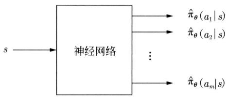  
图39.1 神经网络实现的策略函数

随机性策略函数有更强的表示能力。在实际问题中最优策略往往是随机性策略，可以通过例39.1看出。

例39.1 机器人的路径规划。如图39.2所示，网格世界每一个格点是一个状态。机器人开始处在格点 $s_1$ 或 $s_5$ ，格点 $s_7$ 有电源，格点 $s_6$ 和 $s_8$ 有楼梯。向东、向西、向南、向北移动分别是一个动作。机器人的目标是移动到达电源，而避免掉下楼梯。这个网格世界特殊的地方是机器人在灰色格点 $s_2$ 和 $s_4$ 必须执行同样的动作。

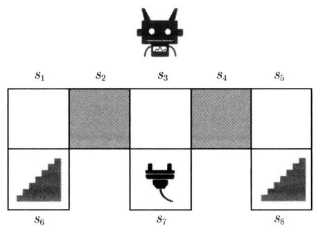  
图39.2 机器人路径规划问题

图39.3显示两个策略，左边是确定性策略，右边是随机性策略。假设从格点 $s_1$ 和 $s_5$ 出

发的概率各为0.5。可以看出，随机性策略比确定性策略更优。在确定性策略中，机器人在两个灰色格点 $s_2$ 和 $s_4$ 都向东移动。根据这个策略，从格点 $s_1$ 出发时可以直接到达电源，但从格点 $s_5$ 出发时就会在格点 $s_5$ 和 $s_4$ 之间徘徊。整体只有0.5的概率到达电源。换另一个确定性策略，在两个灰色格点 $s_2$ 和 $s_4$ 都向西移动，结果也是一样的。相反，在随机性策略中，机器人在两个灰色格点都各以0.5的概率向东和向西移动。根据这个策略，无论是从格点 $s_1$ 还是从格点 $s_5$ 出发，最终基本都会到达电源，其概率趋近于1。

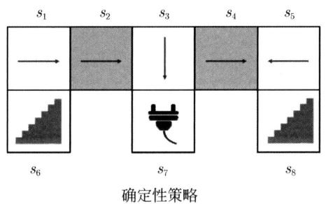

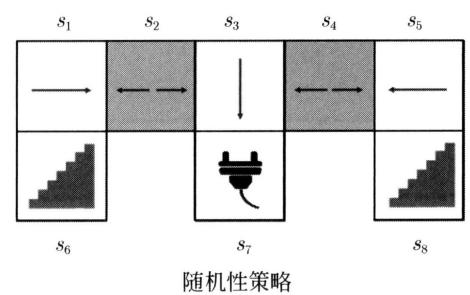  
图39.3 机器人路径规划中的确定性策略和随机性策略

当环境是部分可观察时，也就是模型是部分观察马尔可夫决策过程（POMDP）时，最优策略往往是随机性策略。例39.1可以说明这种情况，格点 $s_2$ 和 $s_4$ 被认为是相同的状态，由于环境是部分可观察的。

# 39.3 演员-评论员算法

演员-评论员（actor-critic）算法基本框架与策略梯度基本相同，同时学习策略函数（演员）和状态价值函数（评论员）。数据采样利用蒙特卡罗法或时序差分法，与带基线的REINFORCE类似地学习策略函数，与使用函数近似的蒙特卡罗法或时序差分法同样地学习状态价值函数，并将状态价值函数作为基线。这里只介绍用时序差分方法TD(0)采样的算法。

假设是有限期MDP，策略函数是条件概率分布 $\pi_{\pmb{\theta}}(a|s)$ ，其中 $\pmb{\theta}$ 是参数，动作价值函数是 $Q_{\pi_{\pmb{\theta}}}(s,a)$ ，状态价值函数是 $V_{\pi_{\pmb{\theta}}}(s)$ 。假设学习的目标函数写作 $J(\pmb{\theta})$ ，目标函数的梯度函数写作 $\nabla_{\pmb{\theta}}J(\pmb{\theta})$ 。不直接定义目标函数，而是定义目标函数的梯度函数：

$$
\nabla_ {\boldsymbol {\theta}} J (\boldsymbol {\theta}) = \mathbb {E} _ {P _ {\boldsymbol {\theta}} (\tau)} \left[ \sum_ {t = 0} ^ {T - 1} \nabla_ {\boldsymbol {\theta}} \log \pi_ {\boldsymbol {\theta}} (A _ {t} | S _ {t}) A _ {\pi_ {\boldsymbol {\theta}}} (S _ {t}, A _ {t}) \right]
$$

其中， (39.24)

$$
A _ {\pi_ {\theta}} \left(S _ {t}, A _ {t}\right) = Q _ {\pi_ {\theta}} \left(S _ {t}, A _ {t}\right) - V _ {\pi_ {\theta}} \left(S _ {t}\right)
$$

这个定义的合理性由后述策略梯度定理保证。期望的计算通过数据采样进行，梯度计算只在期望内部进行。

函数 $A_{\pi_\theta}(S_t, A_t)$ 称为优势函数（advantage function），表示在状态 $S_t$ 选择动作 $A_t$ 时

的价值增益。因为 $V_{\pi_\theta}(S_t)$ 表示在状态 $S_t$ 的平均价值，所以 $Q_{\pi_\theta}(S_t, A_t)$ 表示在状态 $S_t$ 选择动作 $A_t$ 的相对价值。如果动作 $A_t$ 的价值大于平均价值，则优势函数为正，应该朝着增加梯度的方向优化目标函数；否则，则优势函数为负，应该朝着降低梯度的方向优化目标函数。利用优势函数来指导策略更新的方式是演员-评论员算法的核心思想，可以有效地减少学习的方差。

与带基线的REINFORCE的梯度函数(39.15)相比，这里考虑的是从状态和动作之后所有可能轨迹的回报的平均。而带基线的REINFORCE使用的是从状态和动作之后一个轨迹的回报。

有 $N$ 个轨迹数据时，梯度函数的估计变成

$$
\nabla_ {\boldsymbol {\theta}} J (\boldsymbol {\theta}) \approx \frac {1}{N} \sum_ {n = 1} ^ {N} \left[ \sum_ {t = 0} ^ {T - 1} \nabla_ {\boldsymbol {\theta}} \log \pi_ {\boldsymbol {\theta}} \left(A _ {n, t} \mid S _ {n, t}\right) \left(Q _ {\pi} \left(S _ {n, t}, A _ {n, t}\right) - V _ {\pi_ {\theta}} \left(S _ {n, t}\right)\right) \right] \tag {39.25}
$$

可以与带基线的REINFORCE的梯度函数(39.15)作一比较。演员-评论员算法与带基线的REINFORCE类似。

将状态价值函数用价值函数 $\hat{V}_{\mathbf{w}}(S_{n,t})$ 近似：

$$
V _ {\pi \boldsymbol {\theta}} \left(S _ {n, t}\right) \approx \hat {V} _ {\boldsymbol {w}} \left(S _ {n, t}\right) \tag {39.26}
$$

用神经网络表示价值函数，其中 $w$ 是参数。可以计算动作价值函数的近似：

$$
Q _ {\pi_ {\theta}} \left(S _ {n, t}, A _ {n, t}\right) \approx R \left(S _ {n, t}, A _ {n, t}\right) + \gamma \hat {V} _ {\boldsymbol {w}} \left(S _ {n, t + 1}\right) \tag {39.27}
$$

以及优势函数的近似：

$$
A _ {\pi} \left(S _ {n, t}, A _ {n, t}\right) \approx R \left(S _ {n, t}, A _ {n, t}\right) + \gamma \hat {V} _ {\boldsymbol {w}} \left(S _ {n, t + 1}\right) - \hat {V} _ {\boldsymbol {w}} \left(S _ {n, t}\right) \tag {39.28}
$$

使用近似函数的蒙特卡罗预测方法可以估计状态价值函数（见38章）。

$$
\begin{array}{l} L (\boldsymbol {w}) \approx \frac {1}{N} \sum_ {n = 1} ^ {N} \left[ \sum_ {t = 0} ^ {T - 1} \frac {1}{2} \left(R \left(S _ {n, t}, A _ {n, t}\right) + \gamma \hat {V} _ {\boldsymbol {w}} \left(S _ {n, t + 1}\right) - \hat {V} _ {\boldsymbol {w}} \left(S _ {n, t}\right)\right) ^ {2} \right] (39.29) \\ \nabla_ {\boldsymbol {w}} L \left(\boldsymbol {w} ^ {(k)}\right) = \frac {1}{N} \sum_ {n = 1} ^ {N} \left[ \sum_ {t = 0} ^ {T - 1} \left(R \left(S _ {n, t}, A _ {n, t}\right) + \gamma \hat {V} _ {\boldsymbol {w}} \left(S _ {n, t + 1}\right) - \hat {V} _ {\boldsymbol {w}} \left(S _ {n, t}\right)\right) \nabla_ {\boldsymbol {w}} \hat {V} _ {\boldsymbol {w}} \left(S _ {n, t}\right) \right] (39.30) \\ \end{array}
$$

其中， $R(S_{n,t},A_{n,t}) + \gamma \hat{V}_{\boldsymbol{w}}(S_{n,t + 1})$ 是目标。用随机梯度下降更新状态价值函数的参数 $\pmb{w}$ 。

梯度函数 $\nabla_{\pmb{\theta}}J(\pmb{\theta})$ 的估计变成

$$
\nabla_ {\boldsymbol {\theta}} J (\boldsymbol {\theta}) \approx \frac {1}{N} \sum_ {n = 1} ^ {N} \left[ \sum_ {t = 0} ^ {T - 1} \nabla_ {\boldsymbol {\theta}} \log \pi_ {\boldsymbol {\theta}} \left(A _ {n, t} \mid S _ {n, t}\right) \left(R \left(S _ {n, t}, A _ {n, t}\right) + \gamma \hat {V} _ {\boldsymbol {w}} \left(S _ {n, t + 1}\right) - \hat {V} _ {\boldsymbol {w}} \left(S _ {n, t}\right)\right) \right] \tag {39.31}
$$

用随机梯度上升更新策略函数的参数 $\theta$ 。这样就得到了算法39.3的演员-评论员算法。

算法39.3（演员-评论员）

输入：模型未知的MDP。

输出：估计的最优策略 $\hat{\pi}_{\pmb{\theta}}(a|s)$ 。

参数：回合数 $K$ ，学习率 $\alpha_{\pmb{w}}$ 和 $\alpha_{\pmb{\theta}}$ 。

{

初始化策略 $\pi_{\pmb{\theta}}(a|s)$ 的参数 $\pmb{\theta}^{(0)}$

初始化状态价值函数 $\hat{V}_{\pmb{w}}(s)$ 的参数 $\pmb{w}^{(0)}$

for $(k = 1,2,\dots ,K)$ do{

根据策略 $\pi_{\pmb{\theta}^{(k)}}(a|s)$ 随机采样得到轨迹集合 $\{\tau_1,\tau_2,\dots \tau_N\}$

计算每一个轨迹 $\tau_{n}$ 的每一个 $t$ 步的优势函数

$$
\hat {\varepsilon} _ {n, t} = R \left(S _ {n, t}, A _ {n, t}\right) + \gamma \hat {V} _ {\boldsymbol {w} ^ {(k)}} \left(S _ {n, t + 1}\right) - \hat {V} _ {\boldsymbol {w} ^ {(k)}} \left(S _ {n, t}\right)
$$

使用随机梯度上升法，更新策略函数的参数

$$
\boldsymbol {g} _ {\boldsymbol {\theta}} ^ {(k)} = \frac {1}{N} \sum_ {n = 1} ^ {N} \left(\sum_ {t = 0} ^ {T - 1} \hat {\varepsilon} _ {n, t} \nabla_ {\boldsymbol {\theta}} \log \pi_ {\boldsymbol {\theta}} \left(A _ {n, t} | S _ {n, t}\right) | _ {\boldsymbol {\theta} ^ {(k)}}\right)
$$

$$
\boldsymbol {\theta} ^ {(k + 1)} = \boldsymbol {\theta} ^ {(k)} + \alpha_ {\boldsymbol {\theta}} \boldsymbol {g} _ {\boldsymbol {\theta}} ^ {(k)}
$$

使用随机梯度下降法，更新价值函数的参数

$$
\boldsymbol {g} _ {\boldsymbol {w}} ^ {(k)} = \frac {1}{N} \sum_ {n = 1} ^ {N} \left(\sum_ {t = 0} ^ {T - 1} \hat {\varepsilon} _ {n, t} \nabla_ {\boldsymbol {w}} \hat {V} _ {\boldsymbol {w}} (S _ {n, t}) | _ {\boldsymbol {w} ^ {(k)}}\right)
$$

$$
\boldsymbol {w} ^ {(k + 1)} = \boldsymbol {w} ^ {(k)} + \alpha_ {\boldsymbol {w}} \boldsymbol {g} _ {\boldsymbol {w}} ^ {(k)}
$$

输出估计的策略函数 $\hat{\pi}_{\pmb{\theta}}(a|s)$

演员-评论员算法使用优势函数指导对梯度函数的更新，可以避免基于策略的方法回报的方差较大的问题。

策略函数 $\pi_{\theta}(a|s)$ 和状态价值函数 $\hat{V}_{\mathbf{w}}(s)$ 的两个神经网络可以合为一个神经网络。也可以认为两个网络进行了参数共享。使用一个神经网络时，有更少的参数，可以用更少的样本学到模型；但有两个学习目标，学习不容易收敛。

以上介绍的演员-评论员算法是在策略学习算法，也有扩展的离策略学习算法，这里不作介绍。

# 39.4 策略梯度方法总结

# 39.4.1 一般形式

可以看出，作为强化学习方法，策略梯度也包含数据采样、策略评估、策略改进三个步骤。一般使用蒙特卡罗法基于当前策略进行数据采样，用多个不同方法基于采样数据对当

前策略进行评价，基于采样数据和对当前策略的评价，使用随机梯度上升法对策略进行更新（改进）。策略更新通过最大化目标函数实现，目标函数表示当前策略的期望回报或期望累积奖励。

目标函数的梯度函数 $\nabla_{\pmb{\theta}}J(\pmb{\theta})$ 拥有一般形式，都可以表示为

$$
\nabla_ {\boldsymbol {\theta}} J (\boldsymbol {\theta}) = \mathbb {E} _ {P _ {\boldsymbol {\theta}} (\tau)} \left[ \sum_ {t = 0} ^ {\infty} \nabla_ {\boldsymbol {\theta}} \log \pi_ {\boldsymbol {\theta}} \left(A _ {t} \mid S _ {t}\right) \Phi_ {t} \left(S _ {t}, A _ {t}\right) \right] \tag {39.32}
$$

其中， $\pi_{\theta}(a|s)$ 是策略函数， $\Phi_t(S_t, A_t)$ 是轨迹 $\tau$ 的第 $t$ 步在状态 $S_t$ 取动作 $A_t$ 的回报或价值， $P_{\theta}(\tau)$ 是基于参数 $\theta$ 的轨迹 $\tau$ 的条件概率分布。环境的模型可以是有限期MDP，也可以是无限期MDP。这里考虑无限期MDP。

当 $\Phi_t(S_t, A_t)$ 等于轨迹 $\tau$ 的回报时，

$$
\Phi_ {t} \left(S _ {t}, A _ {t}\right) = G (\tau) \tag {39.33}
$$

是最基本的策略梯度形式。当 $\varPhi_t(S_t, A_t)$ 等于轨迹 $\tau$ 的第 $t$ 步的剩余回报时，

$$
\Phi_ {t} \left(S _ {t}, A _ {t}\right) = G \left(\tau_ {t: T - 1}\right) \tag {39.34}
$$

算法成为REINFORCE算法。当 $\Phi_t(S_t, A_t)$ 等于轨迹 $\tau$ 的第 $t$ 步的剩余回报，并以第 $t$ 步的状态 $S_t$ 的价值函数为基线时，

$$
\Phi_ {t} \left(S _ {t}, A _ {t}\right) = \left(G \left(\tau_ {t: T - 1}\right) - V _ {\pi_ {\theta}} \left(S _ {t}\right)\right) \tag {39.35}
$$

算法成为带基线的REINFORCE算法。当 $\varPhi_t(S_t, A_t)$ 等于轨迹 $\tau$ 的第 $t$ 步在状态 $S_t$ 取动作 $A_t$ 的动作价值函数时，

$$
\Phi_ {t} \left(S _ {t}, A _ {t}\right) = Q _ {\pi_ {\theta}} \left(S _ {t}, A _ {t}\right) \tag {39.36}
$$

成为一种策略梯度算法。这个算法由后述策略梯度定理保证。当 $\Phi_t(S_t, A_t)$ 等于轨迹 $\tau$ 的第 $t$ 步在状态 $S_t$ 取动作 $A_t$ 的动作优势函数时，

$$
\Phi_ {t} \left(S _ {t}, A _ {t}\right) = A _ {\pi_ {\theta}} \left(S _ {t}, A _ {t}\right) \tag {39.37}
$$

算法成为演员-评论员算法。

所以，可以认为梯度策略算法的不同只在于其策略评价方法的不同。演员-评论员使用优势函数一般能使回报或价值的方差最小，是性能更好的算法。

# 39.4.2 策略梯度定理

定理39.1 策略梯度方法中的目标函数的梯度函数 $\nabla_{\theta}J(\theta)$ 满足以下关系。

$$
\nabla_ {\boldsymbol {\theta}} J (\boldsymbol {\theta}) = \mathbb {E} _ {\rho_ {\boldsymbol {\theta}} (s)} \left[ \mathbb {E} _ {\pi_ {\boldsymbol {\theta}} (a | s)} \left[ \nabla_ {\boldsymbol {\theta}} \log \pi_ {\boldsymbol {\theta}} (a | s) Q _ {\pi_ {\boldsymbol {\theta}}} (s, a) \right] \right] \tag {39.38}
$$

这里 $\pi_{\theta}(a|s)$ 是策略函数， $Q_{\pi_{\theta}}(s,a)$ 是这个策略的动作价值函数， $\rho_{\theta}(s)$ 是基于这个策略的状态的访问概率分布。假设MDP是无限期MDP，马尔可夫决策过程拥有平稳分布。当马尔可夫过程满足不可约、非周期性、正常返的条件时平稳分布唯一存在。

演员-评论员经常使用这个形式，特别是环境是无限期MDP时。使用动作价值函数进行策略评估。策略梯度定理有以下简洁的证明。

证明 首先，梯度函数可以写为以下基于动作价值函数的形式。

$$
\begin{array}{l} \nabla_ {\boldsymbol {\theta}} J (\boldsymbol {\theta}) = \mathbb {E} _ {P _ {\boldsymbol {\theta}} (\tau)} \left[ \sum_ {t = 0} ^ {\infty} \nabla_ {\boldsymbol {\theta}} \log \pi_ {\boldsymbol {\theta}} (A _ {t} | S _ {t}) G (\tau_ {t: \infty}) \right] \\ = \sum_ {t = 0} ^ {\infty} \mathbb {E} _ {P _ {\boldsymbol {\theta}} (\tau)} \left[ \nabla_ {\boldsymbol {\theta}} \log \pi_ {\boldsymbol {\theta}} \left(A _ {t} \mid S _ {t}\right) G \left(\tau_ {t: \infty}\right) \right] \\ = \sum_ {t = 0} ^ {\infty} \mathbb {E} _ {P _ {\boldsymbol {\theta}} \left(\tau_ {0: t - 1}\right)} \left[ \mathbb {E} _ {P _ {\boldsymbol {\theta}} \left(\tau_ {t: \infty}\right)} \left[ \nabla_ {\boldsymbol {\theta}} \log \pi_ {\boldsymbol {\theta}} \left(A _ {t} \mid S _ {t}\right) \gamma^ {t} G \left(\tau_ {t: \infty}\right) \right] \right] \\ = \sum_ {t = 0} ^ {\infty} \mathbb {E} _ {P _ {\boldsymbol {\theta}} (\tau_ {0: t - 1})} \left[ \nabla_ {\boldsymbol {\theta}} \log \pi_ {\boldsymbol {\theta}} \left(A _ {t} | S _ {t}\right) \gamma^ {t} \mathbb {E} _ {P _ {\boldsymbol {\theta}} (\tau_ {t: \infty})} G \left(\tau_ {t: \infty}\right) \right] \\ = \sum_ {t = 0} ^ {\infty} \mathbb {E} _ {P _ {\boldsymbol {\theta}} \left(\tau_ {0: t - 1}\right)} \left[ \nabla_ {\boldsymbol {\theta}} \log \pi_ {\boldsymbol {\theta}} \left(A _ {t} \mid S _ {t}\right) \gamma^ {t} Q _ {\pi_ {\boldsymbol {\theta}}} \left(S _ {t}, A _ {t}\right) \right] \tag {39.39} \\ \end{array}
$$

推导的第一步基于梯度函数定义。第二步根据数学期望的性质。第三步将期望拆分成第 $t$ 步之前和之后的两部分。第四步将梯度移至期望之外。第五步利用动作价值函数的定义。

接着，梯度函数可以从基于时间的形式转换为基于状态的形式。

$$
\begin{array}{l} \nabla_ {\boldsymbol {\theta}} J (\boldsymbol {\theta}) = \sum_ {t = 0} ^ {\infty} \mathrm {E} _ {P _ {\boldsymbol {\theta}} \left(\tau_ {0: t - 1}\right)} \left[ \nabla_ {\boldsymbol {\theta}} \log \pi_ {\boldsymbol {\theta}} \left(A _ {t} \mid S _ {t}\right) \gamma^ {t} Q _ {\pi_ {\boldsymbol {\theta}}} \left(S _ {t}, A _ {t}\right) \right] \\ = \sum_ {t = 0} ^ {\infty} \sum_ {s} \gamma^ {t} P _ {\boldsymbol {\theta}} (S _ {t} = s) \sum_ {a} \pi_ {\boldsymbol {\theta}} (a | s) \nabla_ {\boldsymbol {\theta}} \log \pi_ {\boldsymbol {\theta}} (a | s) Q _ {\pi_ {\boldsymbol {\theta}}} (s, a) \\ = \sum_ {s} \sum_ {t = 0} ^ {\infty} \gamma^ {t} P _ {\boldsymbol {\theta}} (S _ {t} = s) \sum_ {a} \pi_ {\boldsymbol {\theta}} (a | s) \nabla_ {\boldsymbol {\theta}} \log \pi_ {\boldsymbol {\theta}} (a | s) Q _ {\pi_ {\boldsymbol {\theta}}} (s, a) \\ = \sum_ {s} \rho_ {\boldsymbol {\theta}} (s) \sum_ {a} \pi_ {\boldsymbol {\theta}} (a | s) \nabla_ {\boldsymbol {\theta}} \log \pi_ {\boldsymbol {\theta}} (a | s) Q _ {\pi_ {\boldsymbol {\theta}}} (s, a) \tag {39.40} \\ \end{array}
$$

这里，状态访问概率分布定义如下：

$$
\rho_ {\boldsymbol {\theta}} (s) = P _ {\boldsymbol {\theta}} \left(S _ {0} = s\right) + \gamma P _ {\boldsymbol {\theta}} \left(S _ {1} = s\right) + \gamma^ {2} P _ {\boldsymbol {\theta}} \left(S _ {2} = s\right) + \dots \tag {39.41}
$$

这是非归一化的分布，根据需要可以将其归一化。

演员-评论员也经常使用以下形式，特别是当环境是无限期MDP时。

$$
\nabla_ {\boldsymbol {\theta}} J (\boldsymbol {\theta}) = \mathbb {E} _ {\rho_ {\boldsymbol {\theta}} (s)} \left[ \mathbb {E} _ {\pi_ {\boldsymbol {\theta}} (a | s)} \left(\nabla_ {\boldsymbol {\theta}} \log \pi_ {\boldsymbol {\theta}} (a | s) A _ {\pi_ {\boldsymbol {\theta}}} (s, a)\right) \right]
$$

使用优势函数 $A_{\pi_\theta}(s,a)$ 进行策略评估。可以与定理39.1类似地证明。

# 39.5 策略梯度的应用例

计算机围棋博弈可以形式化为强化学习问题。计算机系统是智能体，对手是环境。围棋博弈中，每一种棋局是一个状态，每一步出棋是一个动作。最终胜负的奖励是 $\pm 1$ ，其余情况奖励是0。从自己的角度看对手的出棋是随机的，博弈过程是马尔可夫决策过程。整体是一个回合性任务。阿尔法狗正是基于这样的想法构建了围棋博弈系统。这里对阿尔法狗的学习和推理过程进行简单介绍。

阿尔法狗通过使用蒙特卡罗树搜索（Monte Carlo tree search）、策略网络（policy network）、价值网络（value network）实现围棋博弈。阿尔法狗的学习分三个阶段，第一阶段从专家棋手的对弈数据中学习策略网络（监督学习）。第二阶段通过新旧策略网络之间的对弈，使用策略梯度方法进一步学习策略网络（强化学习）。第三阶段用学好的策略网络通过自我对弈学习价值网络（强化学习）。阿尔法狗的推理使用蒙特卡罗树搜索决定每一步的出棋，过程中使用已经学好的策略网络和价值网络。

阿尔法狗的后续版本AlphaGo Zero，不使用专家棋手的数据，只通过自己和自己的对弈，基于强化学习，就能不断提高能力，成为更强的围棋博弈系统。

# 1. 阿尔法狗的学习

第一阶段通过监督学习学习策略网络（见图39.4）。策略网络是一个多类分类的卷积神经网络。输入是表示当前棋局也就是当前状态的张量，共有48个 $19 \times 19$ 的矩阵，每一个矩阵表示棋盘 $19 \times 19$ 个位置的一种特征，比如该位置上棋子的状态（黑/白/空）。输出表示当前所有可能出棋也就是所有可能的动作的条件概率。棋盘共有 $19 \times 19 = 361$ 个位置，所以有361种可能的出棋及概率。卷积神经网络有6个卷积层包括卷积变换和整流线性变换，最后一层是软最大化层。使用专家棋手的3000万个棋局数据训练神经网络。用随机梯度上升优化神经网络的参数。第一阶段的策略网络由 $P_{\sigma}(a|s)$ 表示，其中 $s$ 表示状态， $a$ 表示动作， $\sigma$ 表示网络的参数。进行如下梯度更新：

$$
\sigma \leftarrow \sigma + \frac {\partial}{\partial \sigma} P _ {\sigma} (a | s)
$$

这样学到的网络只是模仿专家棋手的策略函数。

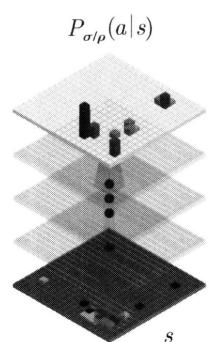

  
图39.4 阿尔法狗中的策略网络和价值网络

第二阶段通过策略梯度进一步学习策略网络。第二阶段的策略网络由 $P_{\rho}(a|s)$ 表示，其中 $s$ 表示状态， $a$ 表示动作， $\rho$ 表示网络的参数。第一阶段的策略网络 $P_{\sigma}(a|s)$ 的参数 $\sigma$ 就是第二阶段的策略网络 $P_{\rho}(a|s)$ 的参数 $\rho$ 的初始值。学习过程中，让当前的策略网络与随机选取的之前的策略网络进行对弈。这时作为对手的之前的策略网络成为环境。两个策略网络持续对弈，直到得出胜负，形成一个回合。回合中每一步，自己和对手根据各自的策略网络基于当前状态决定动作。每一步的奖励是 0，最后一步胜和负的奖励各自是 +1 和 -1，折扣因子是 1。因此，每一个状态的回报是 +1 或 -1，由最终的胜负结果决定。基于对弈的数据，使用随机梯度上升，对当前的策略网络的参数运行如下更新：

$$
\rho \leftarrow \rho + \frac {\partial}{\partial \rho} \log P _ {\rho} (a _ {t} | s _ {t}) z _ {t}
$$

其中， $s_t$ 是第 $t$ 步的状态， $a_t$ 是第 $t$ 步的动作， $z_t$ 是第 $t$ 步的回报。与之前的策略网络进行对弈的目的是防止过拟合。这样不断通过对弈，使用策略梯度逐步学习一个最优策略。

第三阶段使用策略网络学习价值网络（见图39.4）。价值网络是一个进行回归的卷积神经网络，除输出层以外，其他层与策略网络拥有相同的架构。价值网络由 $v_{\theta}(s)$ 表示，其中 $s$ 表示状态， $\theta$ 表示网络的参数。策略网络 $P_{\rho}(a|s)$ 可以对一个棋局进行决策，价值网络 $v_{\theta}(s)$ 可以对一个棋局进行评价。学习过程中，让策略网络与自己进行对弈，得到大量的对弈数据。从每一个回合中随机采样，得到一个状态和回报对 $(s,z)$ 。基于得到的3000万独立的状态和回报对数据（回归数据），使用随机梯度下降，对价值网络的参数进行如下更新：

$$
\boldsymbol {\theta} \leftarrow \boldsymbol {\theta} - \frac {\partial}{\partial \boldsymbol {\theta}} (v _ {\boldsymbol {\theta}} (s) - z)
$$

其中， $s$ 是状态， $z$ 是状态 $s$ 的回报。学到的价值网络是策略网络对棋局的评价。假设策略网络接近最优，其基础上的价值网络也接近最优。

# 2. 阿尔法狗的推理

原理上使用策略网络就可以直接进行对弈，但策略网络只代表通过深度强化学习得到的对弈能力，实际的场景更为复杂且不确定，直接使用策略网络实际对弈中并不是最理想的。

阿尔法狗在对弈中实际使用蒙特卡罗树搜索，并在其中使用策略网络和价值网络。蒙特卡罗树搜索是在棋类博弈中被广泛使用的方法，特别是在搜索空间非常大的棋类（围棋的搜索空间的规模是 $10^{171}$ ）。在阿尔法狗之前的围棋博弈系统基本都使用蒙特卡罗树搜索。蒙特卡罗树搜索结合树搜索和蒙特卡罗模拟，判断向前若干步的棋势，选择最优的出棋。

阿尔法狗在使用蒙特卡罗树搜索过程中，用策略网络进行每一步出棋的判断，用价值网络进行每一步出棋的评估。策略网络和价值网络的使用使得阿尔法狗能够大幅提高对弈能力，在比赛中取得卓越的成绩。阿尔法狗的蒙特卡罗树搜索实现的细节这里不予介绍。

# 本章概要

1. 基于策略的方法是模型无关的强化学习方法。其前提是智能体通过与环境的互动获得经验数据，从经验数据中直接学习最优策略。

基于策略的方法的基本原理是策略优化和蒙特卡罗法。假设策略是随机性策略，取参数化的条件概率分布形式，通过最大化目标函数得到最优策略函数，这里目标函数是轨迹数据中的回报的期望，使用蒙特卡罗法采样轨迹数据。

2. 基于策略的方法主要有策略梯度方法。策略梯度有以下特点：可以用于学习随机性策略；学习的是连续的策略函数，决策不容易产生跳跃；动作空间很大时依然适用；相对容易收敛，但不能保证收敛于全局最优；样本方差较大。

策略梯度有代表性的算法有REINFORCE、带基线的REINFORCE、演员-评论员算法。

3. REINFORCE 可以用于有限期 MDP 和无限期 MDP。REINFORCE 算法的目标是最大化回报的期望，从而得到最优策略函数的参数 $\theta^{*}$ 。目标函数是

$$
J (\boldsymbol {\theta}) = \mathbb {E} _ {P (\tau | \boldsymbol {\theta})} G (\tau)
$$

目标函数的梯度函数是

$$
\nabla_ {\boldsymbol {\theta}} J (\boldsymbol {\theta}) = \mathbb {E} _ {P _ {\boldsymbol {\theta}} (\tau)} \left[ \nabla_ {\boldsymbol {\theta}} \log P _ {\boldsymbol {\theta}} (\tau) G (\tau) \right]
$$

REINFORCE算法利用蒙特卡罗法进行数据采样，基于采样数据利用随机梯度上升实现目标函数的最大化。梯度函数可以简化为

$$
\nabla_ {\boldsymbol {\theta}} J (\boldsymbol {\theta}) = \mathbb {E} _ {P _ {\boldsymbol {\theta}} (\tau)} \left[ \sum_ {t = 0} ^ {T - 1} \nabla_ {\boldsymbol {\theta}} \log \pi_ {\boldsymbol {\theta}} \left(A _ {t} | S _ {t}\right) G \left(\tau_ {t: T - 1}\right) \right]
$$

基于样本数据的梯度函数的估计是

$$
\nabla_ {\boldsymbol {\theta}} J (\boldsymbol {\theta}) \approx \frac {1}{N} \sum_ {n = 1} ^ {N} \left(\sum_ {t = 0} ^ {T - 1} \nabla_ {\boldsymbol {\theta}} \log \pi_ {\boldsymbol {\theta}} \left(A _ {n, t} \mid S _ {n, t}\right) G \left(\tau_ {n, t: T - 1}\right)\right)
$$

4. REINFORCE 算法的一个问题是学习中得到的回报的方差较大。一个重要的技巧是使用基线，称为带基线的 REINFORCE 算法。梯度函数 $\nabla_{\theta} J(\theta)$ 的估计是

$$
\nabla_ {\boldsymbol {\theta}} J (\boldsymbol {\theta}) \approx \frac {1}{N} \sum_ {n = 1} ^ {N} \left[ \sum_ {t = 0} ^ {T - 1} \nabla_ {\boldsymbol {\theta}} \log \pi_ {\boldsymbol {\theta}} (A _ {n, t} | S _ {n, t}) \left(G (\tau_ {n, t: T - 1}) - \hat {V} _ {\boldsymbol {w}} (S _ {n, t})\right) \right]
$$

带基线的REINFORCE算法假设基线依赖于状态，由状态的价值函数决定。利用蒙特卡罗法和函数近似法估计状态的价值函数 $\hat{V}_{\boldsymbol{w}}(S_{n,t})$ 。

5. 演员-评论员是基于策略的方法，主要学习策略函数，但也同时学习价值函数。使用蒙特卡罗法或时序差分法进行数据采样。基于采样数据，使用随机梯度上升更新策略函数；同时使用随机梯度下降更新价值函数。定义学习的目标函数的梯度函数 $\nabla_{\theta}J(\theta)$

$$
\nabla_ {\pmb {\theta}} J (\pmb {\theta}) = \mathbb {E} _ {P _ {\pmb {\theta}} (\tau)} \left[ \sum_ {t = 0} ^ {T - 1} \nabla_ {\pmb {\theta}} \log \pi_ {\pmb {\theta}} (A _ {t} | S _ {t}) A _ {\pi_ {\pmb {\theta}}} (S _ {t}, A _ {t}) \right]
$$

其中， $A_{\pi_{\theta}}(S_t,A_t)$ 是优势函数。梯度函数 $\nabla_{\pmb{\theta}}J(\pmb{\theta})$ 的估计是

$$
\nabla_ {\boldsymbol {\theta}} J (\boldsymbol {\theta}) \approx \frac {1}{N} \sum_ {n = 1} ^ {N} \left[ \sum_ {t = 0} ^ {T - 1} \nabla_ {\boldsymbol {\theta}} \log \pi_ {\boldsymbol {\theta}} (A _ {n, t} | S _ {n, t}) (Q _ {\pi} (S _ {n, t}, A _ {n, t}) - V _ {\pi_ {\boldsymbol {\theta}}} (S _ {n, t})) \right]
$$

6. 策略梯度方法的目标函数的梯度函数 $\nabla_{\theta}J(\theta)$ 拥有一般形式，都可以表示为

$$
\nabla_ {\boldsymbol {\theta}} J (\boldsymbol {\theta}) = \mathbb {E} _ {P _ {\boldsymbol {\theta}} (\tau)} \left[ \sum_ {t = 0} ^ {\infty} \nabla_ {\boldsymbol {\theta}} \log \pi_ {\boldsymbol {\theta}} (A _ {t} | S _ {t}) \Phi_ {t} (S _ {t}, A _ {t}) \right]
$$

$\varPhi_{t}(S_{t},A_{t})$ 是第 $t$ 步的回报或价值。不同的算法使用不同的 $\varPhi_t(S_t,A_t)$ 。

7. 策略梯度定理，策略梯度方法中的目标函数的梯度函数 $\nabla_{\theta}J(\theta)$ 满足以下关系。

$$
\nabla_ {\boldsymbol {\theta}} J (\boldsymbol {\theta}) = \mathbb {E} _ {\rho_ {\boldsymbol {\theta}} (s)} \left[ \mathbb {E} _ {\pi_ {\boldsymbol {\theta}} (a | s)} \left[ \nabla_ {\boldsymbol {\theta}} \log \pi_ {\boldsymbol {\theta}} (a | s) Q _ {\pi_ {\boldsymbol {\theta}}} (s, a) \right] \right]
$$

MDP 可以是有限期也可以是无限期。

8. 阿尔法狗通过使用蒙特卡罗树搜索、策略网络、价值网络实现围棋博弈。阿尔法狗的学习分三个阶段，第一阶段利用从专家棋手的对弈数据中学习策略网络。第二阶段通过新旧策略网络之间的对弈，使用策略梯度方法进一步学习策略网络。第三阶段用学好的策略网络通过自我对弈学习价值网络。阿尔法狗的推理使用蒙特卡罗树搜索决定每一步的出棋，过程中使用已经学好的策略网络和价值网络。

# 继续阅读

策略梯度和演员-评论员算法的介绍可以参照文献[1]的第13章和文献[2]。策略梯度REINFORCE算法的经典论文有文献[3]和文献[4]。策略梯度的代表性算法还有TRPO[5]和PPO[6]。演员-评论员可以参照文献[4]和文献[7]。演员-评论员的代表性算法还有DDPG[8]和SAC[9]。优势函数相关的研究参见文献[10]。

# 习题

39.1 推导式 (39.18)。证明当 $\operatorname{Var}(\nabla_{\pmb{\theta}}\log \pi (\tau |\pmb {\theta})(G(\tau) - B)) = 0$ 时，基线 $B$ 满足以下条件。

$$
B = \frac {\mathbb {E} _ {\tau \sim \pi (\tau | \pmb {\theta})} \left(\nabla_ {\pmb {\theta}} \log \pi (\tau | \pmb {\theta})\right) ^ {2} G (\tau)}{\mathbb {E} _ {\tau \sim \pi (\tau | \pmb {\theta})} \left(\nabla_ {\pmb {\theta}} \log \pi (\tau | \pmb {\theta})\right) ^ {2}}
$$

提示：利用 $\operatorname{Var}(x) = \mathbb{E}\left[x^2\right] - \mathbb{E}\left[x\right]^2$ 。

39.2 解释为什么本章介绍的REINFORCE和演员-评论员是在策略学习算法，而不是离策略方法。考虑什么样的情况下需要离策略学习的REINFORCE和演员-评论员算法。

39.3 本章介绍的演员-评论员算法使用蒙特卡罗法进行数据采样，学习是小批量模式。试写出使用时间差分法进行数据采样，学习是在线模式的算法。

39.4 为什么演员-评论员算法直接定义目标函数的梯度函数，而不定义目标函数？请给出解释。

39.5 证明策略梯度定理在使用优势函数时仍然成立。

$$
\nabla_ {\boldsymbol {\theta}} J (\boldsymbol {\theta}) = \mathbb {E} _ {\rho_ {\boldsymbol {\theta}} (s)} \left[ \mathbb {E} _ {\pi_ {\boldsymbol {\theta}} (a | s)} \left[ \nabla_ {\boldsymbol {\theta}} \log \pi_ {\boldsymbol {\theta}} (a | s) A _ {\pi_ {\boldsymbol {\theta}}} (s, a) \right] \right]
$$

39.6 考虑为什么在阿尔法狗的学习中，策略网络的学习要通过新旧策略网络对弈，而价值网络的学习通过已学好的策略网络的自己对弈。

# 参考文献

[1] SUTTON R S, BARTO A G. Reinforcement learning: An introduction[M]. MIT press, 2018.   
[2] 张伟楠，沈键，俞勇．动手学强化学习[M].北京：人民邮电出版社，2022.  
[3] WILLIAMS R J. Simple statistical gradient-following algorithms for connectionist reinforcement learning[J]. Machine Learning, 1992, 8(3): 229-256.   
[4] SUTTON R S, MCALLESTER D A, SINGH S P, et al. Policy gradient methods for reinforcement learning with function approximation[J]. Advances in Neural Information Processing Systems, 2000: 1057-1063.   
[5] SCHULMAN J, LEVINE S, ABBEEL P, et al. Trust region policy optimization[C]//International Conference on Machine Learning, 2015: 1889-1897.   
[6] SCHULMAN J, WOLSKI F, DHARIWAL P, et al. Proximal policy optimization algorithms[Z/OL]. arXiv preprint arXiv:1707.06347, 2017.   
[7] KONDA V R, TSITSIKLIS J N. Actor-critic algorithms[J]. Advances in Neural Information Processing Systems, 2000: 1008-1014.   
[8] LILLICRAP T P, HUNT J J, PRITZEL A, et al. Continuous control with deep reinforcement learning[Z/OL]. arXiv preprint arXiv:1509.02971, 2015.   
[9] HAARNOJA T, ZHOU A, ABBEEL P, et al. Soft actor-critic: Off-policy maximum entropy deep reinforcement learning with a stochastic actor[C]//International Conference on Machine Learning, 2018: 1861-1870.   
[10] SCHULMAN J, MORITZ P, LEVINE S, et al. High-dimensional continuous control using generalized advantage estimation[Z/OL]. arXiv preprint arXiv:1506.02438, 2015.

# 第40章 近端策略优化PPO

策略梯度方法中，除了传统的算法以外，还有信任区域策略优化（trust region policy optimization, TRPO）算法和近端策略优化（proximal policy optimization, PPO）算法。TRPO和PPO的基本想法相同，都是将策略更新控制在确信的范围内，以保证学习的稳定性。PPO是TPRO的改进，具有TRPO的性能单调递增、训练稳定、样本使用效率高等优点的同时，也具有实现简单、训练效率高的优点。

传统的策略梯度算法存在训练不稳定问题。策略更新时，幅度过大有时会导致策略的性能急剧下降，后续无法学到更优的策略。就好像在登山的途中，原本沿着一条既定的路径向上攀登，却因为在某个时刻迈出的步子过大，结果偏离正确路径，跌落至悬崖之下。

TRPO 以新旧策略之间的 KL 散度定义信任区域，将策略更新限制在信任区间之内。基于旧策略进行数据采样，优势函数计算，对新策略进行更新。理论上保证在一定条件下策略性能的单调提升。

PPO与TRPO有相同的框架，不同的是，使用概率比值来衡量新旧策略之间的差异，通过设定概率比值的取值范围限制策略更新的幅度。经验上，也能取得与TRPO同等的效果。

Schulman等于2015年提出了TRPO算法，接着Schulman等于2017年提出了PPO算法。TRPO奠定了理论基础，PPO提供出了简单实现。目前PPO是强化学习中最常用的算法之一。已经应用于AI游戏、机器人控制、大语言模型微调等诸多问题。特别是ChatGPT等大语言模型使用PPO算法进行对齐。

本章讲述TRPO和PPO算法，特别是后者。40.1节讲述TRPO算法，40.2节讲述PPO算法，40.3节介绍PPO在大语言模型ChatGPT上的应用。

# 40.1 TRPO 算法

本节阐述TRPO算法要解决的问题，呈现算法的基本形式，给出算法的推导和理论支持。

# 40.1.1 背景和动机

基于策略的方法尝试直接学习最优策略，相比基于价值的方法，往往能更有效地达到学习的目的。如第39章所述，策略梯度是其中有代表性的方法，包括REINFORCE、带基线的REINFORCE、演员-评论员算法。演员-评论员使用优势函数评价策略的性能，在这些方法中

效果更好。

演员-评论员算法尝试通过迭代的方式不断提升策略函数的性能（见第39章）。在迭代过程中，使用当前策略 $\pi_{\theta}(a|s)$ 进行数据采样，计算当前策略的优势函数，通过随机梯度上升法来改进当前策略。形式化为一个优化问题，目标是更新策略函数，使得当前策略的回报期望最大。根据策略梯度定理，目标函数的梯度函数写作

$$
\nabla_ {\boldsymbol {\theta}} J (\boldsymbol {\theta}) = \mathbb {E} _ {\rho_ {\boldsymbol {\theta}} (s)} \left[ \mathbb {E} _ {\pi_ {\boldsymbol {\theta}} (a | s)} \left[ \nabla_ {\boldsymbol {\theta}} \log \pi_ {\boldsymbol {\theta}} (a | s) A _ {\pi_ {\boldsymbol {\theta}}} (s, a) \right] \right] \tag {40.1}
$$

其中， $\pi_{\theta}(a|s)$ 是当前策略的策略函数， $\rho_{\theta}(s)$ 是基于当前策略和环境的状态 $s$ 的访问分布， $A_{\pi_{\theta}}(s, a)$ 是优势函数。策略更新时基于采样样本估计梯度函数值。

传统的策略梯度算法包括演员-评论员算法，都存在学习不稳定和采样效率低的问题。

演员-评论员在随机梯度上升迭代的每一步，梯度函数决定了策略函数改进的方向，步长决定了策略函数改进的幅度。理想情况，步长在每一步是可变的，而不是不变的，因为策略函数的改进幅度需要根据学习状况决定。与监督学习不同，强化学习的数据不是固定的，而是通过随机采样（与环境交互的经验）得到的，因此是动态变化的。不同的策略从环境得到的观测（状态）和奖励不同，也就是得到的数据不同。如果选择的策略不当，进入不理想的区域采样，那么就无法学到性能很高的策略。步长过大，就有进入不理想的区域的风险。减小步长能降低这些风险，但迭代的步数会增加，学习的效率会降低。

采样效率不高是另一个问题。演员-评论员是在策略（on-policy）学习算法，使用随机梯度上升进行当前策略的改进，这时用当前策略采样得到数据，对数据进行一次遍历（one epoch），更新当前策略，得到下一步的策略。也就是说，目标策略和行为策略是一致的（是在策略学习）。在下一步，将数据丢弃，从下一步的策略继续进行学习。每一步采样得到的数据在学习中都没有被充分利用。此外，因为模型更新依赖于采样数据，采样和更新两个阶段无法并行进行，学习效率也不高。

# 40.1.2 基本形式

传统的策略梯度算法可能会因为策略更新幅度过大，无法学到最优策略。TRPO（trust region policy optimization）算法引入信任区域（trust region）的概念，在每一次策略更新中，用新旧策略之间的KL散度表示信任区域，将策略函数的更新幅度限制在信任区域内。

TRPO是策略梯度，特别是演员-评论员算法的改进，属于在策略学习算法。TRPO也遵循强化学习的一般原理，由数据采样、策略评估、策略改进三步组成。在迭代过程中，前一步的策略 $\pi_{\theta}(a|s)$ 称为旧策略，当前一步的策略称为新策略 $\pi_{\theta'}(a|s)$ 。首先使用旧策略进行数据采样，然后计算旧策略的优势函数，接着在此基础上通过随机梯度上升对新策略进行改进。策略改进形式化为有约束的优化问题。目标是更新新策略的参数，使得新旧策略比值与旧策略优势函数之积关于旧策略的期望最大。约束条件由新旧策略之间的KL散度表示。有约束的优化问题写作

$$
\begin{array}{l} \max  _ {\boldsymbol {\theta} ^ {\prime}} \left[ L \left(\boldsymbol {\theta} ^ {\prime}; \boldsymbol {\theta}\right) \right] = \max  _ {\boldsymbol {\theta} ^ {\prime}} \mathbb {E} _ {\rho_ {\boldsymbol {\theta}} (s)} \left[ \mathbb {E} _ {\pi_ {\boldsymbol {\theta}} (a | s)} \left[ \frac {\pi_ {\boldsymbol {\theta} ^ {\prime}} (a | s)}{\pi_ {\boldsymbol {\theta}} (a | s)} A _ {\pi_ {\boldsymbol {\theta}}} (s, a) \right] \right] \tag {40.2} \\ \forall s, \mathbb {E} _ {\rho_ {\boldsymbol {\theta}} (s)} \left[ \mathrm {K L} (\pi_ {\boldsymbol {\theta}} (a | s) | \pi_ {\boldsymbol {\theta} ^ {\prime}} (a | s)) \right] \leqslant \delta \\ \end{array}
$$

其中， $\pi_{\pmb{\theta}}(a|s)$ 是旧策略的策略函数， $\pi_{\pmb{\theta}'}(a|s)$ 是新策略的策略函数， $\rho_{\pmb{\theta}}(s)$ 是基于旧策略和环境的状态 $s$ 的访问分布， $A_{\pi_{\pmb{\theta}}}(s,a)$ 是旧策略的优势函数， $\delta$ 是超参数。模型既可以是有限期MDP，也可以是无限期MDP。

目标函数的梯度函数是

$$
\nabla_ {\boldsymbol {\theta} ^ {\prime}} L \left(\boldsymbol {\theta} ^ {\prime}; \boldsymbol {\theta}\right) = \mathbb {E} _ {\rho_ {\boldsymbol {\theta}} (s)} \left[ \mathbb {E} _ {\pi_ {\boldsymbol {\theta}} (a | s)} \left[ \frac {\pi_ {\boldsymbol {\theta} ^ {\prime}} (a | s)}{\pi_ {\boldsymbol {\theta}} (a | s)} \nabla_ {\boldsymbol {\theta} ^ {\prime}} \log \pi_ {\boldsymbol {\theta} ^ {\prime}} (a | s) A _ {\pi_ {\boldsymbol {\theta}}} (s, a) \right] \right] \tag {40.3}
$$

新旧策略的策略函数的比值写作

$$
r _ {\boldsymbol {\theta} ^ {\prime}} (s, a) = \frac {\pi_ {\boldsymbol {\theta} ^ {\prime}} (a | s)}{\pi_ {\boldsymbol {\theta}} (a | s)} \tag {40.4}
$$

比值 $r_{\theta^{\prime}}(s, a)$ 表示新策略 $\pi_{\theta^{\prime}}(a|s)$ 和旧策略 $\pi_{\theta}(a|s)$ 在状态 $s$ 下动作 $a$ 的概率的比值，取正值。如果这个比值大于 1，则新策略比旧策略在状态 $s$ 更倾向于采取动作 $a$ 。如果这个比值小于 1，则新策略比旧策略在状态 $s$ 更倾向于不采取动作 $a$ 。

优势函数 $A_{\pi_\theta}(s,a)$ 表示，基于旧策略与环境交互的经验，在状态 $s$ 下采取动作 $a$ 的价值变化，取实数值。如果 $A_{\pi_\theta}(s,a)$ 大于0，则采取动作 $a$ 有价值的增益。如果优势值小于0，则采取动作 $a$ 没有价值的增益。

当 $A_{\pi_\theta}(s,a)$ 大于0时，改变新策略 $\pi_{\pmb{\theta}^{\prime}}(a|s)$ 的参数，使比值 $r_{\pmb{\theta}^{\prime}}(s,a)$ 大于1，就能促使目标函数值提升，得到性能更高的策略。当 $A_{\pi_\theta}(s,a)$ 小于0时，改变新策略 $\pi_{\pmb{\theta}^{\prime}}(a|s)$ 的参数，使比值 $r_{\pmb{\theta}^{\prime}}(s,a)$ 小于1，就能抑制目标函数值降低，得到性能更高的策略。

如后面描述，目标函数包含重要性采样，用于校正新旧策略之间的分布差异的影响。这使得算法能够基于旧策略的采样数据，针对新策略进行策略改进。事实上，优化问题(40.2)中的新旧策略的比值来自重要性采样。

新旧策略之间的KL散度决定信任区域。优化的过程中，作为约束条件，保证新策略与旧策略的KL散度小于 $\delta$ ，也就是说，更新旧策略得到的新策略一定在信任区间之内。注意信任区间是定义在策略的概率分布空间，而不是在策略的参数空间。

演员-评论员和TRPO算法都是通过迭代方式尝试不断改进策略函数。TRPO能保证每次迭代性能都能得到提高，而演员-评论员并不能保证。在形式上两个算法也有很多不同。演员-评论员在每一步对当前策略进行改进，而TRPO在每一步利用前一步策略对当前策略进行改进。演员-评论员的数据采样和优势函数都基于当前策略，TRPO的数据采样和优势函数计算基于前一步策略。比较式(40.1)和式(40.3)可以看出，两个算法的梯度函数也不相同。但是，当 $\theta^{\prime} = \theta$ 时，TRPO退化成为演员-评论员，梯度函数成为

$$
\nabla_ {\boldsymbol {\theta}} \left[ L (\boldsymbol {\theta}; \boldsymbol {\theta}) \right] = \mathbb {E} _ {\rho_ {\boldsymbol {\theta}} (s)} \left[ \mathbb {E} _ {\pi_ {\boldsymbol {\theta}} (a | s)} \left[ \nabla_ {\boldsymbol {\theta}} \log \pi_ {\boldsymbol {\theta}} (a | s) A _ {\pi_ {\boldsymbol {\theta}}} (s, a) \right] \right]
$$

约束条件恒真。

# 40.1.3 算法和理论推导

下面讲述TRPO的算法推导、直观解释和理论保证。假设模型是无限期MDP。

策略梯度算法的目标是最大化价值函数，也就是回报的期望。价值函数表示策略的性能

高低。假设有两个策略，分别是新策略 $\pi_{\pmb{\theta}^{\prime}}(\tau)$ 和旧策略 $\pi_{\pmb{\theta}}(\tau)$ ，那么它们的价值函数分别定义为

$$
J \left(\boldsymbol {\theta} ^ {\prime}\right) = \mathbb {E} _ {\pi_ {\boldsymbol {\theta} ^ {\prime}} (\tau)} \left[ \sum_ {t = 0} ^ {\infty} \gamma^ {t} R \left(S _ {t}, A _ {t}\right) \right] = \mathbb {E} _ {P \left(S _ {0}\right)} \left[ V _ {\pi_ {\boldsymbol {\theta} ^ {\prime}}} \left(S _ {0}\right) \right] \tag {40.5}
$$

$$
J (\boldsymbol {\theta}) = \mathbb {E} _ {\pi_ {\boldsymbol {\theta}} (\tau)} \left[ \sum_ {t = 0} ^ {\infty} \gamma^ {t} R \left(S _ {t}, A _ {t}\right) \right] = \mathbb {E} _ {P \left(S _ {0}\right)} \left[ V _ {\pi_ {\boldsymbol {\theta}}} \left(S _ {0}\right) \right] \tag {40.6}
$$

如果

$$
J \left(\boldsymbol {\theta} ^ {\prime}\right) - J (\boldsymbol {\theta}) \geqslant 0
$$

成立，那么新策略就比旧策略的性能更高。事实上，TRPO算法保证在迭代的每一步这个条件都能得到满足，即性能是单调递增的。也就是说，可以将TRPO看作一种策略改进的方法。首先，关于 $J(\pmb{\theta}^{\prime}) - J(\pmb{\theta})$ 有以下引理成立。

引理40.1

$$
J \left(\boldsymbol {\theta} ^ {\prime}\right) - J (\boldsymbol {\theta}) = \mathbb {E} _ {\pi_ {\boldsymbol {\theta} ^ {\prime}} (\tau)} \left[ \sum_ {t = 0} ^ {\infty} \gamma^ {t} A _ {\pi_ {\boldsymbol {\theta}}} \left(S _ {t}, A _ {t}\right) \right] \tag {40.7}
$$

证明 从反方向推导

$$
\begin{array}{l} \mathbb {E} _ {\boldsymbol {\pi} _ {\boldsymbol {\theta} ^ {\prime}} (\tau)} \left[ \sum_ {t = 0} ^ {\infty} \gamma^ {t} A _ {\boldsymbol {\pi} _ {\boldsymbol {\theta}}} (S _ {t}, A _ {t}) \right] \\ = \mathbb {E} _ {\pi_ {\boldsymbol {\theta} ^ {\prime}} (\tau)} \left[ \sum_ {t = 0} ^ {\infty} \gamma^ {t} \left(R \left(S _ {t}, A _ {t}\right) + \gamma V _ {\pi_ {\boldsymbol {\theta}}} \left(S _ {t + 1}\right) - V _ {\pi_ {\boldsymbol {\theta}}} \left(S _ {t}\right)\right) \right] \\ = \mathbb {E} _ {\pi_ {\boldsymbol {\theta} ^ {\prime}} (\tau)} \left[ \sum_ {t = 0} ^ {\infty} \gamma^ {t} R (S _ {t}, A _ {t}) + \sum_ {t = 1} ^ {\infty} \gamma^ {t} V _ {\pi_ {\boldsymbol {\theta}}} (S _ {t}) - \sum_ {t = 0} ^ {\infty} \gamma^ {t} V _ {\pi_ {\boldsymbol {\theta}}} (S _ {t}) \right] \\ = \mathbb {E} _ {\pi_ {\boldsymbol {\theta} ^ {\prime}} (\tau)} \left[ \sum_ {t = 0} ^ {\infty} \gamma^ {t} R (S _ {t}, A _ {t}) - V _ {\pi_ {\boldsymbol {\theta}}} (S _ {0}) \right] \\ = \mathbb {E} _ {\boldsymbol {\pi} _ {\boldsymbol {\theta} ^ {\prime}} (\tau)} \left[ \sum_ {t = 0} ^ {\infty} \gamma^ {t} R (S _ {t}, A _ {t}) \right] - \mathbb {E} _ {\boldsymbol {\pi} _ {\boldsymbol {\theta} ^ {\prime}} (\tau)} \left[ V _ {\boldsymbol {\pi} _ {\boldsymbol {\theta}}} (S _ {0}) \right] \\ = \mathbb {E} _ {\pi_ {\boldsymbol {\theta} ^ {\prime}} (\tau)} \left[ \sum_ {t = 0} ^ {\infty} \gamma^ {t} R (S _ {t}, A _ {t}) \right] - \mathbb {E} _ {p (S _ {0})} \left[ V _ {\pi_ {\boldsymbol {\theta}}} (S _ {0}) \right] \\ = J \left(\boldsymbol {\theta} ^ {\prime}\right) - J (\boldsymbol {\theta}) \\ \end{array}
$$

第一步用到优势函数的定义和价值函数的性质。

$$
\begin{array}{l} A _ {\pi_ {\theta}} \left(S _ {t}, A _ {t}\right) = Q _ {\pi_ {\theta}} \left(S _ {t}, A _ {t}\right) - V _ {\pi_ {\theta}} \left(S _ {t}\right) \\ = R \left(S _ {t}, A _ {t}\right) + \gamma \mathbb {E} _ {P \left(S _ {t + 1} \mid S _ {t}, A _ {t}\right)} \left[ V _ {\pi_ {\boldsymbol {\theta}}} \left(S _ {t + 1}\right) \right] - V _ {\pi_ {\boldsymbol {\theta}}} \left(S _ {t}\right) \\ \end{array}
$$

接着，可以推导出 $J(\pmb{\theta}^{\prime}) - J(\pmb{\theta})$ 的以下关系。

$$
\begin{array}{l} J (\boldsymbol {\theta} ^ {\prime}) - J (\boldsymbol {\theta}) \\ = \mathbb {E} _ {\pi_ {\theta^ {\prime}} (\tau)} \left[ \sum_ {t = 0} ^ {\infty} \gamma^ {t} A _ {\pi_ {\theta}} \left(S _ {t}, A _ {t}\right) \right] \\ = \sum_ {t = 0} ^ {\infty} \mathbb {E} _ {\rho_ {\boldsymbol {\theta} ^ {\prime}} (S _ {t})} \left[ \mathbb {E} _ {\pi_ {\boldsymbol {\theta} ^ {\prime}} (A _ {t} | S _ {t})} \left[ \gamma^ {t} A _ {\pi_ {\boldsymbol {\theta}}} (S _ {t}, A _ {t}) \right] \right] \\ = \sum_ {t = 0} ^ {\infty} \mathbb {E} _ {\rho_ {\boldsymbol {\theta} ^ {\prime}} \left(S _ {t}\right)} \left[ \mathbb {E} _ {\pi_ {\boldsymbol {\theta}} \left(A _ {t} \mid S _ {t}\right)} \left[ \frac {\pi_ {\boldsymbol {\theta} ^ {\prime}} \left(A _ {t} \mid S _ {t}\right)}{\pi_ {\boldsymbol {\theta}} \left(A _ {t} \mid S _ {t}\right)} \gamma^ {t} A _ {\pi_ {\boldsymbol {\theta}}} \left(S _ {t}, A _ {t}\right) \right] \right] \tag {40.8} \\ \end{array}
$$

最后一步用到重要性采样。重要性采样是通过一个概率分布的采样计算关于另一个概率分布的函数期望的方法（参见第19章）。在这里，通过旧策略的采样计算关于新策略的（旧策略的）优势函数的期望。注意，内侧的期望是关于旧策略的分布的，外侧的期望是关于新策略的分布的。

另一方面，TRPO的目标函数是

$$
L \left(\boldsymbol {\theta} ^ {\prime}; \boldsymbol {\theta}\right) = \sum_ {t = 0} ^ {\infty} \mathbb {E} _ {\rho_ {\boldsymbol {\theta}} \left(S _ {t}\right)} \left[ \mathbb {E} _ {\pi_ {\boldsymbol {\theta}} \left(A _ {t} \mid S _ {t}\right)} \left[ \frac {\pi_ {\boldsymbol {\theta} ^ {\prime}} \left(A _ {t} \mid S _ {t}\right)}{\pi_ {\boldsymbol {\theta}} \left(A _ {t} \mid S _ {t}\right)} \gamma^ {t} A _ {\pi_ {\boldsymbol {\theta}}} \left(S _ {t}, A _ {t}\right) \right] \right] \tag {40.9}
$$

内侧的期望是关于旧策略的分布的，外侧的期望也是关于旧策略的分布的。

比较式 (40.8) 中的 $J(\pmb{\theta}^{\prime}) - J(\pmb{\theta})$ 和式 (40.9) 中的 $L(\pmb{\theta}^{\prime};\pmb{\theta})$ ，两者只有外侧的关于状态访问分布的期望不同。事实上，当新旧策略的策略函数 $\pi_{\pmb{\theta}^{\prime}}(A_t|S_t)$ 和 $\pi_{\pmb{\theta}}(A_t|S_t)$ 接近时，新旧策略的状态访问分布 $\rho_{\pmb{\theta}^{\prime}}(S_t)$ 和 $\rho_{\pmb{\theta}}(S_t)$ 也是接近的。因此，有以下关系成立：

$$
J \left(\boldsymbol {\theta} ^ {\prime}\right) - J (\boldsymbol {\theta}) \approx L \left(\boldsymbol {\theta} ^ {\prime}; \boldsymbol {\theta}\right)
$$

也就是说，在新旧策略接近的条件下最大化 $L(\pmb{\theta}'; \pmb{\theta})$ 等价于最大化 $J(\pmb{\theta}') - J(\pmb{\theta})$ ，这就是TRPO的直观解释。

理论上，TRPO的单调性由以下定理间接保证。

定理40.1 在约束条件下最大化目标函数 $L(\pmb{\theta}'; \pmb{\theta})$ （求解有约束的优化问题）。

$$
\left. \right. \max  _ {\boldsymbol {\theta} ^ {\prime}} \left[ L \left(\boldsymbol {\theta} ^ {\prime}; \boldsymbol {\theta}\right)\right] = \max  _ {\boldsymbol {\theta} ^ {\prime}} \left\{\sum_ {t = 0} ^ {\infty} \mathbb {E} _ {\rho_ {\boldsymbol {\theta}} \left(S _ {t}\right)} \left[ \mathbb {E} _ {\pi_ {\boldsymbol {\theta}} \left(A _ {t} \mid S _ {t}\right)} \left[ \frac {\pi_ {\boldsymbol {\theta} ^ {\prime}} \left(A _ {t} \mid S _ {t}\right)}{\pi_ {\boldsymbol {\theta}} \left(A _ {t} \mid S _ {t}\right)} \gamma^ {t} A _ {\pi_ {\boldsymbol {\theta}}} \left(S _ {t}, A _ {t}\right)\right]\right]\right\} \tag {40.10}
$$

$$
\max  _ {t} \mathrm {K L} \left[ \pi_ {\boldsymbol {\theta}} \left(A _ {t} \mid S _ {t}\right) \mid \pi_ {\boldsymbol {\theta} ^ {\prime}} \left(A _ {t} \mid S _ {t}\right) \right] \leqslant \delta
$$

可以保证使 $J(\pmb{\theta}^{\prime}) - J(\pmb{\theta})$ 增大。因为在约束条件下， $L(\pmb{\theta}^{\prime}; \pmb{\theta})$ 是 $J(\pmb{\theta}^{\prime}) - J(\pmb{\theta})$ 的下界。注意，这里约束条件中取KL散度的最大，而不是期望(40.2)。

TRPO在迭代过程中使用新旧两个策略，解决随机梯度方法中策略改进幅度过大所导致的训练不稳定的问题。 $J(\pmb{\theta}^{\prime}) - J(\pmb{\theta})$ 中的期望是关于新旧两个策略的，很难对其进行优化。相比，TRPO的目标函数 $L(\pmb{\theta}^{\prime};\pmb{\theta})$ 中的期望都是关于旧策略的，可以自然地对其进行优化。

# 40.1.4 具体算法

利用以下引理导出TRPO学习的优化问题(40.2)的具体形式。

引理40.2 两个概率分布 $p_{\theta}(\boldsymbol{x})$ 和 $p_{\theta'}(\boldsymbol{x})$ 的KL散度可以近似表示为

$$
\operatorname {K L} \left[ p _ {\boldsymbol {\theta}} (\boldsymbol {x}) \mid p _ {\boldsymbol {\theta} ^ {\prime}} (\boldsymbol {x}) \right] \approx \frac {1}{2} \left(\boldsymbol {\theta} ^ {\prime} - \boldsymbol {\theta}\right) ^ {\mathrm {T}} \boldsymbol {F} (\boldsymbol {\theta}) \left(\boldsymbol {\theta} ^ {\prime} - \boldsymbol {\theta}\right) \tag {40.11}
$$

其中， $F(\theta)$ 是费舍尔信息矩阵（Fisher information matrix）。

$$
\boldsymbol {F} (\boldsymbol {\theta}) = - \mathbb {E} _ {p _ {\boldsymbol {\theta}} (\boldsymbol {x})} \left[ \nabla_ {\boldsymbol {\theta}} ^ {2} \log p _ {\boldsymbol {\theta}} (\boldsymbol {x}) \right]
$$

证明 KL散度关于 $\theta^{\prime}$ 在 $\pmb{\theta}$ 的二阶泰勒展开是

$$
\operatorname {K L} \left[ p _ {\boldsymbol {\theta}} (\boldsymbol {x}) \mid p _ {\boldsymbol {\theta} ^ {\prime}} (\boldsymbol {x}) \right] \approx \operatorname {K L} \left[ p _ {\boldsymbol {\theta}} (\boldsymbol {x}) \mid p _ {\boldsymbol {\theta}} (\boldsymbol {x}) \right] + \left(\boldsymbol {\theta} ^ {\prime} - \boldsymbol {\theta}\right) ^ {\mathrm {T}} \nabla_ {\boldsymbol {\theta} ^ {\prime}} \operatorname {K L} \left[ p _ {\boldsymbol {\theta}} (\boldsymbol {x}) \mid p _ {\boldsymbol {\theta} ^ {\prime}} (\boldsymbol {x}) \right] \mid_ {\boldsymbol {\theta} ^ {\prime} = \boldsymbol {\theta}} +
$$

$$
\left(\boldsymbol {\theta} ^ {\prime} - \boldsymbol {\theta}\right) ^ {\mathrm {T}} \nabla_ {\boldsymbol {\theta} ^ {\prime}} ^ {2} \mathrm {K L} \left[ p _ {\boldsymbol {\theta}} (\boldsymbol {x}) \mid p _ {\boldsymbol {\theta} ^ {\prime}} (\boldsymbol {x}) \right] \mid_ {\boldsymbol {\theta} ^ {\prime} = \boldsymbol {\theta}} \left(\boldsymbol {\theta} ^ {\prime} - \boldsymbol {\theta}\right)
$$

第一项是同一分布之间的KL散度，其值为0。KL散度的一阶导数是

$$
\begin{array}{l} \nabla_ {\boldsymbol {\theta} ^ {\prime}} \operatorname {K L} [ p _ {\boldsymbol {\theta}} (\boldsymbol {x}) | p _ {\boldsymbol {\theta} ^ {\prime}} (\boldsymbol {x}) ] = \nabla_ {\boldsymbol {\theta} ^ {\prime}} \mathbb {E} _ {p _ {\boldsymbol {\theta}} (\boldsymbol {x})} [ \log p _ {\boldsymbol {\theta}} (\boldsymbol {x}) ] - \nabla_ {\boldsymbol {\theta} ^ {\prime}} \mathbb {E} _ {p _ {\boldsymbol {\theta}} (\boldsymbol {x})} [ \log p _ {\boldsymbol {\theta} ^ {\prime}} (\boldsymbol {x}) ] \\ = - \mathbb {E} _ {p _ {\boldsymbol {\theta}} (\boldsymbol {x})} \left[ \nabla_ {\boldsymbol {\theta} ^ {\prime}} \log p _ {\boldsymbol {\theta} ^ {\prime}} (\boldsymbol {x}) \right] \\ = - \int p _ {\boldsymbol {\theta}} (\boldsymbol {x}) \nabla_ {\boldsymbol {\theta} ^ {\prime}} \log p _ {\boldsymbol {\theta} ^ {\prime}} (\boldsymbol {x}) d x \\ \end{array}
$$

一阶导数在 $\pmb{\theta}^{\prime} = \pmb{\theta}$ 取值为0。

$$
\begin{array}{l} \nabla_ {\boldsymbol {\theta} ^ {\prime}} \mathrm {K L} [ p _ {\boldsymbol {\theta}} (\boldsymbol {x}) | p _ {\boldsymbol {\theta} ^ {\prime}} (\boldsymbol {x}) ] | _ {\boldsymbol {\theta} ^ {\prime} = \boldsymbol {\theta}} = - \int p _ {\boldsymbol {\theta}} (\boldsymbol {x}) \nabla_ {\boldsymbol {\theta}} \log p _ {\boldsymbol {\theta}} (\boldsymbol {x}) \mathrm {d} x \\ = - \int \nabla_ {\boldsymbol {\theta}} p _ {\boldsymbol {\theta}} (\boldsymbol {x}) \mathrm {d} x \\ = - \nabla_ {\boldsymbol {\theta}} \int p _ {\boldsymbol {\theta}} (\boldsymbol {x}) \mathrm {d} x \\ = - \nabla_ {\boldsymbol {\theta}} 1 = 0 \\ \end{array}
$$

KL散度的二阶导数是

$$
\nabla_ {\boldsymbol {\theta} ^ {\prime}} ^ {2} \operatorname {K L} [ p _ {\boldsymbol {\theta}} (\boldsymbol {x}) | p _ {\boldsymbol {\theta} ^ {\prime}} (\boldsymbol {x}) ] = - \int p _ {\boldsymbol {\theta}} (\boldsymbol {x}) \nabla_ {\boldsymbol {\theta} ^ {\prime}} ^ {2} \log p _ {\boldsymbol {\theta} ^ {\prime}} (\boldsymbol {x}) \mathrm {d} x
$$

二阶导数在 $\pmb{\theta}^{\prime} = \pmb{\theta}$ 取值为费舍尔信息矩阵：

$$
\begin{array}{l} \nabla_ {\boldsymbol {\theta} ^ {\prime}} ^ {2} \mathrm {K L} [ p _ {\boldsymbol {\theta}} (\boldsymbol {x}) | p _ {\boldsymbol {\theta} ^ {\prime}} (\boldsymbol {x}) ] | _ {\boldsymbol {\theta} ^ {\prime} = \boldsymbol {\theta}} = - \int p _ {\boldsymbol {\theta}} (\boldsymbol {x}) \nabla_ {\boldsymbol {\theta}} ^ {2} \log p _ {\boldsymbol {\theta}} (\boldsymbol {x}) \mathrm {d} x \\ = \boldsymbol {F} (\boldsymbol {\theta}) \\ \end{array}
$$

以上的结果代入泰勒展开式得到近似公式。

TRPO 的学习优化问题变成

$$
\max  _ {\boldsymbol {\theta} ^ {\prime}} \mathbb {E} _ {\rho_ {\boldsymbol {\theta}} (s)} \left[ \mathbb {E} _ {\pi_ {\boldsymbol {\theta}} (a | s)} \left[ \frac {\pi_ {\boldsymbol {\theta} ^ {\prime}} (a | s)}{\pi_ {\boldsymbol {\theta}} (a | s)} A _ {\pi_ {\boldsymbol {\theta}}} (s, a) \right] \right]
$$

$$
\mathbb {E} _ {\rho_ {\boldsymbol {\theta}} (s)} \left[ \frac {1}{2} \left(\boldsymbol {\theta} ^ {\prime} - \boldsymbol {\theta}\right) ^ {\mathrm {T}} \boldsymbol {F} (\boldsymbol {\theta}) \left(\boldsymbol {\theta} ^ {\prime} - \boldsymbol {\theta}\right) \right] \leqslant \delta \tag {40.12}
$$

$$
\boldsymbol {F} (\boldsymbol {\theta}) = - \mathbb {E} _ {\boldsymbol {\pi} _ {\boldsymbol {\theta}} (a | s)} \left[ \nabla_ {\boldsymbol {\theta}} ^ {2} \log \pi_ {\boldsymbol {\theta}} (a | s) \right]
$$

目标函数的梯度函数是

$$
\mathbb {E} _ {\rho_ {\boldsymbol {\theta}} (s)} \left[ \mathbb {E} _ {\pi_ {\boldsymbol {\theta}} (a | s)} \left[ \frac {\pi_ {\boldsymbol {\theta} ^ {\prime}} (a | s)}{\pi_ {\boldsymbol {\theta}} (a | s)} \nabla_ {\boldsymbol {\theta} ^ {\prime}} \log \pi_ {\boldsymbol {\theta} ^ {\prime}} (a | s) A _ {\pi_ {\boldsymbol {\theta}}} (s, a) \right] \right] \tag {40.13}
$$

这是一个二阶的优化问题，因为优化使用目标函数的一阶导数（梯度），以及约束条件的二阶导数（黑塞矩阵）。

自然梯度下降（natural gradient descent）可以用于这个优化问题的求解。自然梯度下降是一种考虑参数空间几何结构的优化方法，通过利用费舍尔信息矩阵的逆矩阵调整梯度方向，以提高优化的效率和收敛性。TRPO进一步使用共轭梯度法（conjugate gradient）提升计算效率。这里不作介绍。

TRPO比起传统的策略梯度算法有多个优点。首先，策略更新的每一步都能保证策略性能的提升。其次，由于策略更新是限制在信任区间之内的，学习的优化过程有很高的稳定性。还有，由于训练稳定，随机梯度上升可以对数据进行多次遍历，有更高的样本使用效率。

# 40.2 PPO 算法

PPO算法是TRPO算法的改进。PPO比TRPO更容易实现、有更高的计算效率，且经验上性能同等有效。本节概述PPO算法的基本想法，介绍PPO-Clip算法的具体实现。

# 40.2.1 算法概述

PPO 也是策略梯度，特别是演员-评论员算法的改进，也属于在策略学习算法。TRPO 算法使用二阶优化算法，实现复杂而且计算效率不高。PPO 算法改为用一阶优化算法进行优化，以解决计算效率问题。具体地，PPO 将原始的有约束最优化问题转换为无约束的最优化问题，用代理目标函数（surrogate objective function）代替目标函数，并且都通过随机梯度上升（一阶算法）进行优化。

PPO有两个变种，PPO-Penalty和PPO-Clip。前者在代理目标函数中使用惩罚项，后者在代理目标函数中使用截断函数，以近似表示优化约束条件。PPO-Penalty的优化问题是

$$
\max  _ {\boldsymbol {\theta} ^ {\prime}} \left[ L \left(\boldsymbol {\theta} ^ {\prime}; \boldsymbol {\theta}\right) \right] = \max  _ {\boldsymbol {\theta} ^ {\prime}} \mathbb {E} _ {\rho_ {\boldsymbol {\theta}} (s)} \left[ \mathbb {E} _ {\pi_ {\boldsymbol {\theta}} (a | s)} \left[ L _ {p} \left(\boldsymbol {\theta} ^ {\prime}; \boldsymbol {\theta}, s, a\right) \right] \right] \tag {40.14}
$$

$$
L _ {p} \left(\boldsymbol {\theta} ^ {\prime}; \boldsymbol {\theta}, s, a\right) = \frac {\pi_ {\boldsymbol {\theta} ^ {\prime}} (a | s)}{\pi_ {\boldsymbol {\theta}} (a | s)} A _ {\pi_ {\boldsymbol {\theta}}} (s, a) - \beta \operatorname {K L} \left(\pi_ {\boldsymbol {\theta} ^ {\prime}} (a | s) \mid \pi_ {\boldsymbol {\theta}} (a | s)\right)
$$

PPO-Clip 的优化问题是

$$
\max  _ {\boldsymbol {\theta} ^ {\prime}} \left[ L \left(\boldsymbol {\theta} ^ {\prime}; \boldsymbol {\theta}\right) \right] = \max  _ {\boldsymbol {\theta} ^ {\prime}} \mathbb {E} _ {\rho_ {\boldsymbol {\theta}} (s)} \left[ \mathbb {E} _ {\pi_ {\boldsymbol {\theta}} (a | s)} \left[ L _ {c} \left(\boldsymbol {\theta} ^ {\prime}; \boldsymbol {\theta}, s, a\right) \right] \right] \tag {40.15}
$$

$$
L _ {c} (\pmb {\theta} ^ {\prime}; \pmb {\theta}, s, a) = \min \left\{\frac {\pi_ {\pmb {\theta} ^ {\prime}} (a | s)}{\pi_ {\pmb {\theta}} (a | s)} A _ {\pi_ {\pmb {\theta}}} (s, a), \mathrm {c l i p} \left(\frac {\pi_ {\pmb {\theta} ^ {\prime}} (a | s)}{\pi_ {\pmb {\theta}} (a | s)}, 1 - \epsilon , 1 + \epsilon\right) A _ {\pi_ {\pmb {\theta}}} (s, a) \right\}
$$

其中，clip是截断函数。

PPO-Clip 实现更简单，经验上与 PPO-Penalty 性能同等有效，在现实中更常用。当提及 PPO 时一般指 PPO-Clip。下面只对 PPO-Clip 做讲解。

# 40.2.2 PPO-Clip

PPO-Clip 也是迭代算法，由数据采样、策略评估、策略改进三步组成。在迭代过程中，使用旧策略 $\pi_{\theta}(a|s)$ 和新策略 $\pi_{\theta'}(a|s)$ 。用旧策略进行数据采样，计算旧策略的优势函数，对新策略通过随机梯度上升进行改进。形式化为解有约束的优化问题，其中的目标函数是截断的目标函数。

截断的目标函数形式复杂，但概念并不复杂。其想法是对新策略的更新幅度进行限制，使得新旧策略的概率比值 $r_{\theta'}(s, a)$ 不会过大或过小，对应着TRPO的信任区间。

PPO-Clip算法在每一步使用随机梯度上升对目标函数(40.15)进行优化。对于截断函数clip，当输入 $r$ 在区间 $[1 - \epsilon, 1 + \epsilon]$ 内时，将其直接输出；当输入 $r$ 在区间外时，将其截断为 $1 + \epsilon$ 或 $1 - \epsilon$ 并输出。

$$
\operatorname {c l i p} (r, 1 - \epsilon , 1 + \epsilon) = \left\{ \begin{array}{l l} r, & 1 - \epsilon \leqslant r \leqslant 1 + \epsilon \\ 1 - \epsilon , & r <   1 - \epsilon \\ 1 + \epsilon , & r > 1 + \epsilon \end{array} \right.
$$

其中， $\epsilon$ 是超参数，经常取0.2。

表40.1给出截断的目标函数的函数表。图40.1给出截断的目标函数的函数图。

表 40.1 截断的目标函数  

<table><tr><td>比值r</td><td>优势A</td><td>目标Lc</td><td>是否截断</td><td>梯度 ∇Lc 是否为0</td></tr><tr><td>1-ε≤r≤1+ε</td><td>A≥0</td><td>rA</td><td>否</td><td>否</td></tr><tr><td>1-ε≤r≤1+ε</td><td>A&lt;0</td><td>rA</td><td>否</td><td>否</td></tr><tr><td>r&lt;1-ε</td><td>A≥0</td><td>rA</td><td>否</td><td>否</td></tr><tr><td>r&lt;1-ε</td><td>A&lt;0</td><td>(1-ε)A</td><td>是</td><td>是</td></tr><tr><td>r&gt;1+ε</td><td>A≥0</td><td>(1+ε)A</td><td>是</td><td>是</td></tr><tr><td>r&gt;1+ε</td><td>A&lt;0</td><td>rA</td><td>否</td><td>否</td></tr></table>

当优势函数大于等于0时，让新策略 $\pi_{\pmb{\theta}^{\prime}}(a|s)$ 对旧策略 $\pi_{\pmb{\theta}}(a|s)$ 的改进，其比值不超过上界 $1 + \epsilon$ ，新策略的策略函数不会变得过大；当优势函数小于零时，让新策略 $\pi_{\pmb{\theta}^{\prime}}(a|s)$ 对旧

  
图40.1 截断的目标函数

策略 $\pi_{\theta}(a|s)$ 的改进，其比值不超过下界 $1 - \epsilon$ ，新策略的策略函数不会变得过小。当目标函数被截断时，对应的梯度函数为0，对策略函数不做更新。

也就是说，PPO-Clip 实际只有两种情况。目标函数的计算只需要考虑这两种情况。当 $A \geqslant 0$ 时，

$$
L _ {c} \left(\boldsymbol {\theta} ^ {\prime}; \boldsymbol {\theta}, s, a\right) = \min  \left\{\frac {\pi_ {\boldsymbol {\theta} ^ {\prime}} (a | s)}{\pi_ {\boldsymbol {\theta}} (a | s)}, 1 + \epsilon \right\} A _ {\pi_ {\boldsymbol {\theta}}} (s, a) \tag {40.16}
$$

当 $A < 0$ 时，

$$
L _ {c} \left(\boldsymbol {\theta} ^ {\prime}; \boldsymbol {\theta}, s, a\right) = \max  \left\{\frac {\pi_ {\boldsymbol {\theta} ^ {\prime}} (a | s)}{\pi_ {\boldsymbol {\theta}} (a | s)}, 1 - \epsilon \right\} A _ {\pi_ {\boldsymbol {\theta}}} (s, a) \tag {40.17}
$$

# 40.2.3 具体算法

下面给出PPO-Clip的具体算法。假设模型是有限期MDP。

# 算法40.1（PPO-Clip）

输入：模型未知的有限期MDP。

输出：估计的最优策略 $\pi_{\hat{\pmb{\theta}}^{\prime}}(a|s)$

超参数：迭代次数 $K$ ，折扣因子 $\gamma$ 。

{

初始化策略函数 $\pi_{\pmb{\theta}^{\prime}}(a|s)$ 的参数 $\pmb{\theta}^{(0)}$

初始化价值函数 $V_{\phi}(s)$ 的参数 $\phi^{(0)}$

$$
\text {f o r} (k = 1, 2, \dots , K) \text {d o} \left\{\right.
$$

根据当前策略 $\pi_{\pmb{\theta}^{(k)}}(a|s)$ 与环境交互得到轨迹集合 $\mathcal{T}_k = \{\tau_1,\tau_2,\dots ,\tau_N\}$

计算轨迹 $\tau_{n}$ 的第 $t$ 步的剩余回报 $\hat{G}_{n,t}$

计算轨迹 $\tau_{n}$ 的第 $t$ 步的优势 $\hat{A}_{\pi_{\theta}}(S_{n,t},A_{n,t})$

$$
\hat {A} _ {\pi_ {\boldsymbol {\theta}}} \left(S _ {n, t}, A _ {n, t}\right) = R \left(S _ {n, t}, A _ {n, t}\right) + \gamma V _ {\phi^ {(k)}} \left(S _ {n, t + 1}\right) - V _ {\phi^ {(k)}} \left(S _ {n, t}\right)
$$

使用随机梯度上升法，更新策略函数的参数

$$
\boldsymbol {\theta} ^ {(k + 1)} = \arg \max  _ {\boldsymbol {\theta} ^ {\prime}} \frac {1}{N T} \sum_ {n = 1} ^ {N} \sum_ {t = 0} ^ {T - 1} L _ {c} \left(\boldsymbol {\theta} ^ {\prime}; \boldsymbol {\theta} ^ {(k)}, S _ {n, t}, A _ {n, t}\right)
$$

使用随机梯度下降法，更新价值函数的参数

$\phi^{(k + 1)} = \arg \min_{\phi}\frac{1}{NT}\sum_{n = 1}^{N}\sum_{t = 0}^{T - 1}(V_{\phi^{(k)}}(S_{n,t}) - \hat{G}_{n,t})^2$

PPO算法兼具TRPO算法的优点，同时比TRPO算法更简单，实现更容易，训练效率更高。

# 40.3 大语言模型的应用

# 40.3.1 LLM概述

2022年11月OpenAI公布的ChatGPT，以及后续的GPT4，还有其他公司和组织开发的各种大语言模型，在自然语言理解和自然语言生成等任务上展现出了接近或部分超过人类的能力，标志着人工智能进入了新的时代。

大语言模型（large language model, LLM）是概率生成模型，生成单词或词元（token）的序列。通常采用GPT模型架构，也就是Transformer的解码器；学习和预测都是自回归过程。将所有的自然语言处理任务都转换为词元序列生成问题，包括生成、问答、改写、摘要、翻译、分类、对话。所有这些任务的形式都是对给定的输入产生对应的输出，而输入和输出都由词元的序列表示。输入包括上下文（context）和指令（prompt），输出是反应（response）。上下文可以是系统指令、模型与用户多次交互的历史记录。为了简洁起见，以下介绍有时会省略对上下文的提及，仅提及指令本身。

LLM的训练一般分三个步骤：预训练(pre-training)、监督微调(supervised fine-tuning, SFT)、人类反馈强化学习(reinforcement learning from human feedback, RLHF)。有时在预训练后面加入持续学习（continual training）。

（1）预训练：用大规模无标注文本数据进行语言建模，主要学习语言的统计规律，语法、语义和语用知识。  
(2) 持续学习（可选）：在预训练的基础上，用特定任务或特定领域数据进一步训练模型，主要为了提高执行任务的能力和扩充领域的知识。  
(3) SFT: 用下游任务的高质量标注数据微调模型, 使其适应下游任务; 或者用高质量标注数据优化模型, 保证行为的安全和与人类偏好的对齐。  
(4) RLHF: 在SFT的基础上，通过人的反馈（如排序、打分）训练一个奖励模型，然后用这个奖励模型指导强化学习，例如PPO算法，进一步提升模型完成各种下游任务的能力，提高安全性和对齐能力。

# 40.3.2 预训练

LLM的预训练就是语言建模（自回归过程）的学习，与第29章介绍的GPT的预训练方法完全相同。学习是无监督学习，训练数据中的每一个词元序列对应一个句子或者一段文本，预测下一个词元的生成概率，计算整个词元序列的概率。通过最小化训练数据中所有词元序列的概率，优化模型的参数。也就是进行极大似然估计，等价于对词元序列进行数据压缩。

模型表示的词元序列的概率是

$$
P _ {\boldsymbol {\theta}} (\boldsymbol {w}) = \prod_ {t} P _ {\boldsymbol {\theta}} \left(w _ {t} \mid \boldsymbol {w} _ {<   t}\right) \tag {40.18}
$$

其中， $\pmb{w}$ 表示一个词元序列， $w_{t}$ 是第 $t$ 个位置的词元， $\pmb{w}_{< t}$ 是第 $t$ 个位置之前的词元序列， $\pmb{\theta}$ 是Transformer 的参数。目标是最小化负对数似然函数或交叉熵

$$
L (\boldsymbol {\theta}) = - \mathbb {E} _ {\boldsymbol {w} \sim P _ {\mathrm {d a t a}} (\boldsymbol {w})} \sum_ {t} \log P _ {\boldsymbol {\theta}} \left(w _ {t} \mid \boldsymbol {w} _ {<   t}\right) \tag {40.19}
$$

其中， $P_{\mathrm{data}}(\pmb {w})$ 是词元序列数据的分布。

LLM的预训练使用大量的语料。比如，GPT-3使用了包含4950亿词元的语料，有网页、书籍、百科等。模型的参数是1750亿。

# 40.3.3 SFT

SFT是指在预训练的基础上的模型的监督学习。这里把LLM看作强化学习的智能体。智能体与环境交互的过程就是词元序列生成的过程。词元序列生成对给定上下文和用户指令，产生系统的回复。自然语言处理的各种任务包括理解和生成都转化为词元序列生成。模型写作

$$
\pi_ {\boldsymbol {\theta}} (\boldsymbol {y} | \boldsymbol {x}) = \prod_ {t} \pi_ {\boldsymbol {\theta}} \left(y _ {t} | \boldsymbol {x}, \boldsymbol {y} _ {<   t}\right) \tag {40.20}
$$

其中， $\pmb{x}$ 表示指令， $\pmb{y}$ 表示回复， $y_{t}$ 是第 $t$ 个位置的词元， $\pmb{y}_{< t}$ 是第 $t$ 个位置之前的词元序列， $\pmb{\theta}$ 是Transformer的参数。

强化学习框架下，上下文和用户指令、目前为止已生成的词元序列表示状态，生成的下一个词元表示动作。生成词元时得到一个奖励，一般在生成最后一个词元也就是完成回复时得到一个实数值的奖励，而在其他生成时奖励为0，奖励值的大小表示回复的合理性。奖励函数的设计是应用时需要考虑的重要问题。策略是状态到动作的条件概率分布

$$
\pi : \left(\boldsymbol {x}, \boldsymbol {y} _ {<   t}\right)\rightarrow y _ {t}
$$

奖励是状态到动作的函数

$$
R: \left(\boldsymbol {x}, \boldsymbol {y} _ {<   t}\right)\rightarrow r _ {t}
$$

状态转移是确定性的

$$
P: \left(\boldsymbol {x}, \boldsymbol {y} _ {<   t}\right), y _ {t} \rightarrow \left(\boldsymbol {x}, \boldsymbol {y} _ {t}\right)
$$

这里 $x, y_{<t}$ 是指令和第 $t$ 个位置之前的词元序列， $y_t$ 是第 $t$ 个位置生成的词元， $x, y_t$ 是指令和第 $t$ 个位置为止的词元序列， $r_t$ 是在第 $t$ 个位置得到的奖励。

SFT相当于强化学习中的模仿学习或者行为克隆。学习通过最小化负对数似然函数进行：

$$
L (\boldsymbol {\theta}) = - \mathbb {E} _ {(\boldsymbol {x}, \boldsymbol {y} ^ {*}) \sim P _ {\text {d a t a}} (\boldsymbol {x}, \boldsymbol {y})} \sum_ {t} \log \pi_ {\boldsymbol {\theta}} \left(y _ {t} ^ {*} \mid \boldsymbol {x}, \boldsymbol {y} _ {<   t} ^ {*}\right) \tag {40.21}
$$

其中， $\pmb{y}^*$ 是人标注的回复， $P_{\mathrm{data}}(\pmb{x}, \pmb{y})$ 是指令和回复数据的分布。通过基于人的标注数据的训练可以使模型与人类偏好对齐。

# 40.3.4 RLHF

RLHF主要分两部分，奖励模型的学习和策略模型的学习，也就是LLM的微调。

# 1. 奖励模型学习

学习奖励模型RM，以引导强化学习训练。RM的质量对RLHF的效果有很大影响。一个好的RM应该能够较好地拟合人类偏好，给出合理的奖励值。

首先，标注偏好数据。给定一个指令，让模型生成 $k$ 个回复，然后让人对这些回复进行排序或打分。每 $k$ 个回复两两构建成多个四元组，表示为 $(\pmb{x},\pmb{y}_1,\pmb{y}_2,l)$ ，其中 $\pmb{x}$ 是指令， $\pmb{y}_1$ 和 $\pmb{y}_2$ 是两个回复， $l$ 是一个二元标签，如果 $\pmb{y}_1$ 比 $\pmb{y}_2$ 更合理，则 $l = 1$ ，否则 $l = 0$ 。

然后，使用训练数据学习一个二分类模型，作为RM。RM的输入是指令 $\pmb{x}$ 和回复 $\pmb{y}$ ，输出是标量 $r$ ，表示奖励。目标是最小化分类误差

$$
L (\phi) = - \frac {1}{\binom {k} {2}} \mathbb {E} _ {\boldsymbol {x} \sim P _ {\text {d a t a}} (\boldsymbol {x}), \left(\boldsymbol {y} _ {1}, \boldsymbol {y} _ {2}\right) \sim \pi_ {\boldsymbol {\theta}} (\boldsymbol {y} | \boldsymbol {x})} \left[ \log \sigma \left(R _ {\phi} \left(\boldsymbol {x}, \boldsymbol {y} _ {1}\right) - R _ {\phi} \left(\boldsymbol {x}, \boldsymbol {y} _ {2}\right)\right) \right] \tag {40.22}
$$

其中， $\binom{k}{2}$ 表示所有可能的回复对的数量， $P_{\mathrm{data}}(\pmb{x})$ 是指令数据分布， $\sigma$ 是S型函数， $R_{\phi}(\pmb{x}, \pmb{y}_1)$ 和 $R_{\phi}(\pmb{x}, \pmb{y}_2)$ 是奖励函数， $\phi$ 是RM的参数。假设 $\pmb{y}_1$ 比 $\pmb{y}_2$ 更合理。

# 2. 策略模型学习

学习策略模型，也就是进行LLM的微调，进一步提高LLM与人类偏好对齐的能力。一般使用PPO算法，也有DPO（direct preference optimization）等其他算法。

LLM 作为智能体与环境交互，并在交互中得到反馈。在每一轮交互中，LLM 基于给定的指令生成回复。这个过程通过多次调用 LLM 完成，每次生成一个词元，直到产生结束字符。在回复生成的每个位置，调用奖励模型评估并计算累积奖励。

学习的目标是最大化以下价值函数，以促使LLM生成合理的回复，同时学习的策略与基准策略不要偏离太远。

$$
J (\boldsymbol {\theta}) = \mathbb {E} _ {\boldsymbol {x} \sim P _ {\mathrm {d a t a}} (\boldsymbol {x}), \boldsymbol {y} \sim \pi_ {\boldsymbol {\theta}} (\boldsymbol {y} | \boldsymbol {x})} \left[ R _ {\boldsymbol {\phi}} (\boldsymbol {x}, \boldsymbol {y}) - \beta \log \frac {\pi_ {\boldsymbol {\theta}} (\boldsymbol {y} | \boldsymbol {x})}{\pi_ {\mathrm {s f t}} (\boldsymbol {y} | \boldsymbol {x})} \right] \tag {40.23}
$$

其中，第1项是奖励函数，第2项是正则化项，表示当前策略和SFT模型的策略的KL散度， $\beta$ 是系数。

一般使用PPO算法来完成策略模型的学习。这里省去细节的介绍。

# 40.3.5 LLM的特点

LLM的强大能力可以从三个方面理解：规模定律、语言建模技巧、强化学习框架。

规模定律（scaling law）是指随着模型规模的不断扩大，语言模型在预测下一个词元（生成下一个词元）的准确率也会不断提升的现象。LLM能够看似理解语言，其中一个非常关键的原因就是规模效应。它的能力是建立在海量数据、大规模模型和强大算力的基础之上的。语言理解能力的提升在很大程度上来自于规模效应。

语言模型的基本机制是给定上文产生最有可能的下文。事实上，对于特定的上下文和指令，可能的合理回复会局限在一定的范围之内，甚至是很小的范围内。上下文越长这个趋势就越明显。LLM在训练和使用过程中最大限度地利用了这一特点。LLM有效地使用Transformer架构、自回归生成机制、大规模模型、海量数据训练，当有充分的上下文时，一般能够生成合理的回答。因此，构建充分且有效的上下文成为训练和使用LLM时最关键的技巧。在训练过程中，需要做好数据工程，准备好高质量数据进行预训练、SFT和RLHF。在使用过程中，也需要提供有效的指令，进行细致的指令工程。

LLM 也是强化学习智能体，具体的是智能体的策略模型。其中，强化学习的动作就是 LLM 生成的回复，状态是迄今为止 LLM 与用户的对话内容，而奖励则表示对话的合理性。LLM 学习的目标是在与用户的对话中学习到最优策略，从而在对话中获得最大的期望累积奖励，也就是进行合理的对话。实际将对话数据看作强化学习的数据，将 SFT 视为行为克隆，将 RLHF 视为奖励模型和策略模型学习。在强化学习过程中，Transformer 的参数得到进一步调整，以产生从强化学习角度更优的模型。这时，语言建模和强化学习被统一在一起。

# 本章概要

1. 传统的策略梯度算法，包括演员-评论员算法，都存在学习不稳定和采样效率低的问题。策略更新的过程中，步长过大，就有进入不理想的区域的风险，有可能使学习到的策略的性能下降。在迭代的每一步，对数据进行一次遍历，更新当前策略，得到下一步的策略，然后将数据丢弃。

TRPO 算法和 PPO 算法是为解决以上问题，特别是学习不稳定的问题而开发的策略梯度算法。

2. TRPO由数据采样、策略评估、策略改进三步组成。在迭代过程中，用旧策略进行数据采样，计算旧策略的优势函数，并在其基础上对新策略进行改进。策略改进通过有约束的优化问题实现。

$$
\begin{array}{l} \max  _ {\boldsymbol {\theta} ^ {\prime}} \left[ L \left(\boldsymbol {\theta} ^ {\prime}; \boldsymbol {\theta}\right) \right] = \max  _ {\boldsymbol {\theta} ^ {\prime}} \mathbb {E} _ {\rho_ {\boldsymbol {\theta}} (s)} \left[ \mathbb {E} _ {\pi_ {\boldsymbol {\theta}} (a | s)} \left[ \frac {\pi_ {\boldsymbol {\theta} ^ {\prime}} (a | s)}{\pi_ {\boldsymbol {\theta}} (a | s)} A _ {\pi_ {\boldsymbol {\theta}}} (s, a) \right] \right] \\ \forall s, \mathbb {E} _ {\rho_ {\boldsymbol {\theta}} (s)} [ \mathrm {K L} (\pi_ {\boldsymbol {\theta}} (a | s) | \pi_ {\boldsymbol {\theta} ^ {\prime}} (a | s)) ] \leqslant \delta \\ \end{array}
$$

3. 新旧策略的价值函数的差满足

$$
J \left(\boldsymbol {\theta} ^ {\prime}\right) - J (\boldsymbol {\theta}) = \sum_ {t = 0} ^ {\infty} \mathbb {E} _ {\rho_ {\boldsymbol {\theta} ^ {\prime}} \left(S _ {t}\right)} \left[ \mathbb {E} _ {\pi_ {\boldsymbol {\theta}} \left(A _ {t} \mid S _ {t}\right)} \left[ \frac {\pi_ {\boldsymbol {\theta} ^ {\prime}} \left(A _ {t} \mid S _ {t}\right)}{\pi_ {\boldsymbol {\theta}} \left(A _ {t} \mid S _ {t}\right)} \gamma^ {t} A _ {\pi_ {\boldsymbol {\theta}}} \left(S _ {t}, A _ {t}\right) \right] \right]
$$

TRPO的目标函数是

$$
L (\boldsymbol {\theta} ^ {\prime}; \boldsymbol {\theta}) = \sum_ {t = 0} ^ {\infty} \mathbb {E} _ {\rho_ {\boldsymbol {\theta}} (S _ {t})} \left[ \mathbb {E} _ {\pi_ {\boldsymbol {\theta}} (A _ {t} | S _ {t})} \left[ \frac {\pi_ {\boldsymbol {\theta} ^ {\prime}} (A _ {t} | S _ {t})}{\pi_ {\boldsymbol {\theta}} (A _ {t} | S _ {t})} \gamma^ {t} A _ {\pi_ {\boldsymbol {\theta}}} (S _ {t}, A _ {t}) \right] \right]
$$

当新旧策略的策略函数接近时，

$$
\pi_ {\boldsymbol {\theta} ^ {\prime}} \left(A _ {t} \mid S _ {t}\right) \approx \pi_ {\boldsymbol {\theta}} \left(A _ {t} \mid S _ {t}\right)
$$

两者近似相等：

$$
J \left(\boldsymbol {\theta} ^ {\prime}\right) - J (\boldsymbol {\theta}) \approx L \left(\boldsymbol {\theta} ^ {\prime}; \boldsymbol {\theta}\right)
$$

在新旧策略接近的条件下最大化 $L(\pmb{\theta}'; \pmb{\theta})$ 等价于最大化 $J(\pmb{\theta}') - J(\pmb{\theta})$ ，这就是TRPO的直观解释。

理论上可以证明，TRPO算法保证在迭代的每一步以上条件都能得到满足，也就是说性能是单调递增的。

4. TRPO 的学习优化问题是

$$
\max  _ {\boldsymbol {\theta} ^ {\prime}} \mathbb {E} _ {\rho_ {\boldsymbol {\theta}} (s)} \left[ \mathbb {E} _ {\pi_ {\boldsymbol {\theta}} (a | s)} \left[ \frac {\pi_ {\boldsymbol {\theta} ^ {\prime}} (a | s)}{\pi_ {\boldsymbol {\theta}} (a | s)} A _ {\pi_ {\boldsymbol {\theta}}} (s, a) \right] \right]
$$

$$
\mathbb {E} _ {\rho_ {\boldsymbol {\theta}} (s)} \left[ \frac {1}{2} \left(\boldsymbol {\theta} ^ {\prime} - \boldsymbol {\theta}\right) ^ {\mathrm {T}} \boldsymbol {F} (\boldsymbol {\theta}) \left(\boldsymbol {\theta} ^ {\prime} - \boldsymbol {\theta}\right) \right] \leqslant \delta
$$

$\pmb{F}(\pmb{\theta})$ 是费舍尔信息矩阵。这是一个二阶的优化问题，TRPO使用共轭梯度法近似求解这个优化问题。

5. PPO算法是TRPO算法的改进。PPO比TRPO更容易实现、有更高的计算效率，且经验上性能同等有效。PPO算法用一阶优化算法进行优化，以解决TRPO算法的计算效率问题。

PPO-Clip 的优化问题中的截断目标函数是

$$
L _ {c} (\pmb {\theta} ^ {\prime}; \pmb {\theta}, s, a) = \min  \left\{\frac {\pi_ {\pmb {\theta} ^ {\prime}} (a | s)}{\pi_ {\pmb {\theta}} (a | s)} A _ {\pi_ {\pmb {\theta}}} (s, a), \mathrm {c l i p} \left(\frac {\pi_ {\pmb {\theta} ^ {\prime}} (a | s)}{\pi_ {\pmb {\theta}} (a | s)}, 1 - \epsilon , 1 + \epsilon\right) A _ {\pi_ {\pmb {\theta}}} (s, a) \right\}
$$

实际只有两种情况。当 $A \geqslant 0$ 时，

$$
L _ {c} (\boldsymbol {\theta} ^ {\prime}; \boldsymbol {\theta}, s, a) = \min  \left\{\frac {\pi_ {\boldsymbol {\theta} ^ {\prime}} (a | s)}{\pi_ {\boldsymbol {\theta}} (a | s)}, 1 + \epsilon \right\} A _ {\pi_ {\boldsymbol {\theta}}} (s, a)
$$

当 $A < 0$ 时，

$$
L _ {c} \left(\boldsymbol {\theta} ^ {\prime}; \boldsymbol {\theta}, s, a\right) = \max  \left\{\frac {\pi_ {\boldsymbol {\theta} ^ {\prime}} (a | s)}{\pi_ {\boldsymbol {\theta}} (a | s)}, 1 - \epsilon \right\} A _ {\pi_ {\boldsymbol {\theta}}} (s, a)
$$

6. 大语言模型（LLM）是概率生成模型，生成词元序列。通常采用GPT模型架构，也就

是 Transformer 的解码器；学习和预测都是自回归过程。将所有的自然语言处理任务都转换为词元序列生成问题，输入包括上下文和指令，输出是反应。上下文、指令、反应都由词元的序列表示。

LLM的训练一般分三个步骤：预训练、SFT、RLHF。预训练用大规模无标注文本数据进行语言建模。SFT用下游任务的高质量标注数据微调模型，使其适应下游任务。RLHF在SFT的基础上，通过人的反馈奖励模型，然后用这个奖励模型指导强化学习；一般使用PPO算法，进一步提升模型完成各种下游任务的能力。

# 继续阅读

TRPO 和 PPO 算法的原始论文分别是文献 [1] 和文献 [2]。TRPO 之前的相关工作有文献 [3] 和文献 [4]。LLM 的 PPO 算法实现参见文献 [5]。

# 习题

40.1 策略梯度算法 REINFORCE、带基线的 REINFORCE、演员-评论员、TRPO、PPO 是一步步发展而来的，总结每一个算法对之前算法的主要改进点。

40.2 费舍尔信息矩阵的一般定义是

$$
\boldsymbol {F} (\boldsymbol {\theta}) = \mathbb {E} _ {p _ {\boldsymbol {\theta}} (\boldsymbol {x})} \left[ \nabla_ {\boldsymbol {\theta}} \log p _ {\boldsymbol {\theta}} (\boldsymbol {x}) \left(\nabla_ {\boldsymbol {\theta}} \log p _ {\boldsymbol {\theta}} (\boldsymbol {x})\right) ^ {\mathrm {T}} \right]
$$

证明与引理40.2中的定义等价。

40.3 写出 PPO-Clip 算法实现中的计算公式 $(40.16) \sim (40.17)$ 的函数表，验证它与截断目标函数的等价性。

40.4 列出PPO和深度Q网络的不同点。

# 参考文献

[1] SCHULMAN J, LEVINE S, ABBEEL P, et al. Trust region policy optimization[C]//International Conference on Machine Learning, 2015.   
[2] SCHULMAN J, WOLSKI F, DHARIWAL P, et al. Proximal policy optimization algorithms[Z/OL]. arXiv preprint arXiv:1707.06347, 2017.   
[3] KAKADE S, LANGFORD J. Approximately optimal approximate reinforcement learning[C]// International Conference on Machine Learning, 2002.   
[4] PETERS J, SCHAAL S. Reinforcement learning of motor skills with policy gradients[J]. Neural Networks, 2008, 21(4): 682-697.   
[5] ZHENG R, DOU S, GAO S, et al. Secrets of RLHF in large language models part I: PPO[Z/OL]. arXiv preprint arXiv:2307.04964, 2023.

# 第41章 强化学习方法总结

# 41.1 强化学习的重要性

# 41.1.1 强化学习

人工智能的一个目标是构建合理行动的智能系统。事实证明，系统通过自主学习的方式得到合理行动能力是目前唯一可行的路径。强化学习是关于智能系统通过与环境的交互学习完成任务的机器学习理论和方法，因此它在人工智能领域拥有非常重要的地位。

也可以认为，强化学习是以马尔可夫决策过程为框架，基于机器学习的控制理论。马尔可夫决策过程形式化为智能体在环境中的序列决策过程，一般假设环境的模型是已知的，智能体通过动态规划的方法求解最优策略。但是现实许多问题中，环境的模型是未知的。强化学习通过数据驱动和机器学习解决这一问题。具体地，通过基于模型的、基于价值函数的或基于策略函数的方法从数据中学习最优策略。

强化学习与深度学习的结合，也就是深度强化学习使强化学习发展到了一个更高的阶段，成为人工智能的强大工具。深度学习具有强大的表示学习能力，可以用于从环境的图像、语言、语音等非结构化数据中学习状态或观察的表示，以及动作和模型的表示，应用于复杂的强化学习任务。

# 41.1.2 强化学习与监督学习

强化学习与监督学习和无监督学习属于不同的机器学习范式。可以认为，强化学习和监督学习都通过与环境的交互，进行训练，学习模型，但形式完全不同。强化学习的模型是策略函数，给定状态产生动作；监督学习的模型是分类器或回归器，给定实例产生类别或数值。强化学习通过与环境的一系列交互，对环境实施动作，得到环境的反馈，最后基于累积的反馈进行学习；而监督学习与环境的交互每一步都能得到反馈，反馈是独立同分布的；前者中反馈是延迟的反馈。在强化学习中，环境的反馈是评估性的，定义为奖励；而在监督学习中，环境的反馈是指导性的，如分类的类别。强化学习的目标是累积奖励的优化（最大化），而监督学习的目标是整体预测损失的优化（最小化）。强化学习，学习的过程是试错，因此探索和利用的权衡成为一个重要问题；监督学习并不需要考虑探索。表41.1给出强化学习与监督学习的比较。

表 41.1 强化学习与监督学习的比较  

<table><tr><td></td><td>强化学习</td><td>监督学习</td></tr><tr><td>模型</td><td>策略函数</td><td>分类器或回归器</td></tr><tr><td>优化问题</td><td>累积奖励的最大化</td><td>预测损失的最小化</td></tr><tr><td>用有延迟的反馈</td><td>是</td><td>否</td></tr><tr><td>反馈的特点</td><td>评估性</td><td>指导性</td></tr><tr><td>探索和利用</td><td>利用加探索</td><td>只有利用</td></tr></table>

# 41.1.3 强化学习与生物学习

强化学习作为一种受生物学习启发的机器学习范式，其核心理念和基本机制与人类和动物的学习过程存在着一定的相似之处[1-2]。

- 目标导向：强化学习、人类学习和动物学习都旨在实现特定的目标。在强化学习中，智能体学习如何采取行动以最大化累积奖励；在人类和动物中，学习通常是为了达成某个目的或满足某种需求。  
- 策略学习：强化学习旨在学习最优策略，对给定状态选择最优动作。人类和动物在学习过程中也会掌握在不同场景的策略和行为方式。  
- 奖励机制：强化学习依赖于奖励来指导学习，人类和动物的学习也常常受到奖励和惩罚的驱动。  
- 延迟反馈：在强化学习中，奖励是延迟的，智能体需要学习在长序列中的决策。类似地，在人类和动物的学习过程中，学习的效果通常也不会立即显现。  
- 试错过程：强化学习中智能体通过尝试不同的行为并从其结果中学习，这与人类和动物在面对新任务或环境时通过试错来学习的方式相似。  
- 探索和利用：强化学习中的探索与利用的权衡与人类和动物在面对未知和已知环境时的行为策略相似。

# 41.2 强化学习方法之间的关系

# 41.2.1 强化学习方法

图41.1给出强化学习的分类，包括规划和学习。规划假设马尔可夫决策过程（MDP）环境的模型已知，求解最优策略，其中没有学习的过程。学习假设MDP环境的模型未知，只能通过与环境的交互得到经验数据，基于经验数据学习模型、价值函数或策略函数，最终求得最优策略。

规划分预测和控制。预测有价值评估方法。价值评估利用动态规划，根据贝尔曼期望方程，迭代地求解给定策略的价值函数。控制有策略迭代方法和价值迭代方法。策略迭代交替进行策略评估和策略改进，最终得到最优策略，其中的策略评估利用预测。价值迭代利用动态规划，根据贝尔曼最优方程，迭代地求解最优的价值函数。

  
图41.1 强化学习方法之间的关系

强化学习有基于模型的和模型无关的方法。基于模型的方法首先基于与环境交互的经验数据使用监督学习估计转移概率分布和价值函数。之后比如使用策略迭代，求解最优策略。

模型无关的方法不直接学习环境的模型，而是从经验数据中学习最优价值函数或最优策略，有基于价值的方法和基于策略的方法，在不知道环境模型的情况下依然能学到最优策略。

基于价值的方法有用于预测的蒙特卡罗预测、时序差分预测的TD(0)，用于控制的蒙特卡罗控制、时序差分控制的SARSA、Q学习、深度Q网络。

蒙特卡罗预测针对一个策略，利用蒙特卡罗法采样得到轨迹数据，基于数据估计该策略的价值函数，并不断迭代。时序差分预测TD(0)针对一个策略，持续利用时序差分法采样得到轨迹的一步数据，基于数据利用贝尔曼期望方程估计该策略的价值函数，并不断迭代。

控制的方法使用动作价值函数，也就是 Q 函数。蒙特卡罗控制针对一个策略，利用蒙特卡罗法采样得到轨迹数据，基于数据估计该策略的动作价值函数，使用 $\varepsilon$ 贪心算法改进该策略，得到一个新策略，并不断迭代。时序差分控制的 SARSA 针对一个策略，持续利用时序差分法采样得到轨迹的一步数据，使用 $\varepsilon$ 贪心算法改进该策略，更新策略的动作价值函数值，得到一个新策略，并不断迭代。蒙特卡罗控制和 SARSA 实际是通过数据采样进行策略迭代。

时序差分控制的 Q 学习使用 Q 函数。持续利用时序差分法，使用 $\varepsilon$ 贪心算法（行为策略）得到轨迹的一步数据，使用贪心算法改进策略（目标策略），基于数据和改进策略更新 Q

函数值，并不断迭代。Q学习实际是通过数据采样进行价值迭代。深度Q网络是用神经网络表示价值函数的Q学习方法，使用经验回放和固定目标是主要特点。

基于价值的方法有表格法和函数近似法。表格法中动作价值函数由所有的状态和动作的索引表示。函数近似法中动作价值函数由参数化的函数，如神经网络表示。所有的基于价值的方法都有表格法和函数近似法的形式。函数近似法有更强的表示能力，在实际应用中更实用。使用函数近似的方法，价值函数的更新通过随机梯度下降进行。

基于策略的方法有策略梯度的REINFORCE，直接从经验数据中学习最优策略，往往在实际应用中更有效，是一个被广泛使用的方法。利用蒙特卡罗法采样得到一个轨迹数据，以最大化轨迹数据的回报期望为目标，利用随机梯度上升，更新策略函数的参数，并不断迭代，最终求得最优策略。

演员-评论员结合基于策略的方法和基于价值的方法。学习的目标是通过最大化回报的期望，学习最优策略函数，直接定义回报期望的梯度函数，而梯度函数依赖于价值函数。利用蒙特卡罗法或时序差分法进行数据采样，基于采样数据同时更新策略函数和价值函数，并不断迭代。

TRPO是策略梯度方法，特别是演员-评论员算法的改进。在策略更新过程中，通过新策略与旧策略之间的KL散度，控制策略的更新幅度，以保证学习过程中性能的单调上升。PPO是TRPO的简化版。在策略更新过程中，引入截断目标函数实现策略的更新幅度控制，以提高学习效率。

强化学习又分为在策略学习方法和离策略学习方法。“在策略学习”过程中，评估和改进的策略（目标策略）与数据采样的策略（行为策略）相同。“离策略学习”过程中，评估和改进的策略与数据采样的策略不同。离策略方法在数据使用方面更有优势，经常有更好的学习效果。本书介绍的蒙特卡罗预测、时序差分预测TD(0)、蒙特卡罗控制、SARSA、REINFORCE、演员-评论员、TRPO、PPO都是在策略学习方法，Q学习包括深度Q网络（DQN）是离策略学习方法。

多臂老虎机是强化学习的特殊情况，只有一个状态，没有状态之间的转移。UCB和汤普森采样是多臂老虎机的代表性算法，属于基于价值的强化学习方法。UCB和汤普森采样通过不同的手段实现探索和利用的权衡。

# 41.2.2 基于模型、价值、策略的方法

强化学习方法各自拥有特点，适合于不同的应用场景。基于模型的方法学习到的模型表示了智能体对环境的理解。其优点是学习容易收敛，样本效率较高，模型的可解释性更强。这里说的样本效率是指学到最优策略所需要的样本量。其缺点是不直接学习最优策略，而是通过模型学习和策略迭代或价值迭代求解最优策略，过程中有累积误差。学习到的内容未必都需要用于预测或控制。

基于价值的方法学习最优价值函数，从中导出最优策略，不直接学习最优策略。其优点是学习的是策略的评价指标，有坚实的理论支持。其缺点是学习不容易收敛，特别是使用函数近似的价值函数时，学习的目标也不是求解最优价值函数。基于价值的方法的样本效率介于基于模型的方法和基于策略的方法之间。

基于策略的方法从采样数据中直接学习最优策略。其优点是进行以目标为导向的学习，理论上能保证学习收敛（不一定是全局最优）。其缺点是学习需要大量采样数据，样本效率不高，学习过程中得到的样本回报的方差较大。

基于策略的方法可以更适合于学习随机性策略，而基于价值的方法更适合于学习确定性策略。基于价值的方法一般用于低维动作空间的场景，而基于策略的方法既可以用于低维动作空间的场景，又可以用于高维动作空间甚至是连续动作空间的场景。两种方法各有特点，在实际应用中需要根据情况判断具体使用哪种方法。

# 41.3 其他强化学习问题和方法

本书没有介绍的强化学习的重要问题有部分可观察马尔可夫决策过程和模仿学习。

部分可观察马尔可夫决策过程（partially observable Markov decision process, POMDP）假设智能体并不能观察到环境的状态的全部，而只能观察到其局部，是在此条件下的马尔可夫决策过程[3]。状态之间存在马尔可夫性，而观察之间不存在马尔可夫性。POMDP中策略是观测序列（或信念状态）到动作的函数。现实中很多应用状态是不可以完全观察的，所以POMDP是一个更通用的模型。POMDP的学习有基于模型的方法、基于价值和基于策略的方法。

模仿学习（imitation learning）是指从专家的演示数据（经验数据）中学习最优策略的机器学习[4]。模仿学习也以MDP为框架。专家演示数据通常是由状态-动作的序列组成，其中的每一个状态-动作表示在给定条件下的最优动作。比如，模仿学习用于自动驾驶时，演示数据是熟练驾驶员的驾驶数据，由前方道路图像和驾驶员操作的序列组成。模仿学习包括行为克隆（behavior cloning）和逆强化学习（inverse reinforcement learning）。行为克隆使用监督学习从专家演示数据中直接学习从状态到动作的函数，作为最优策略。逆强化学习从专家演示数据中学习奖励函数（注意不是价值函数），以此求解最优策略[5]。

# 41.4 强化学习的机遇和挑战

强化学习，特别是深度强化学习，在计算机围棋、机器人控制等应用取得了人工智能历史上里程碑的成果。相信强化学习在人工智能未来的发展中也将发挥极其重要的作用。

强化学习与监督学习相比，都得到环境的反馈，但是作为反馈的奖励通常是稀疏的、有噪声的而且是有延迟的，所以强化学习是更困难的学习任务。

如何平衡探索新策略和利用旧策略是一个关键问题。过多的探索可能导致学习效率降低，而过多的利用可能限制了策略的改进。

强化学习，特别是深度强化学习，在实际应用中的挑战是学习的成本会很高。一般需要使用大量的数据，利用大量的计算资源，学习往往比较耗时，学习不容易收敛。根本原因是无论是学习模型还是价值函数和策略函数，搜索的空间一般都非常大。

将强化学习应用到实际场景中的另一个挑战是如何定义奖励函数。如果奖励函数定义的合理，就能促使强化学习系统执行合理的行动。而在许多实际的场景，定义合理的奖励并非

易事。例如，推荐系统给用户推荐新闻，将用户的点击、停留时长等作为用户对内容的反馈是一种粗略的近似，获取用户的真实反馈实际是非常困难的。因此，如何定义合理的奖励表示用户的真实兴趣是强化学习应用于推荐系统时的一个有挑战的问题。

强化学习应用中的另一个挑战是如何在真实场景中进行训练。强化学习虽然可以在仿真环境进行模拟实验，但也需要在真实场景中实验，通过试错学习得到更优的策略。然而，在真实场景中试错的成本有时会很高。例如，采用强化学习训练自动驾驶系统，可以在仿真环境中进行模拟，但如果在真实的场景中进行训练，万一发生事故，要付出的代价是不可接受的。这也许是强化学习本身难于克服的挑战，需要有外在的其他机制来应对，将风险降到最低。

# 参考文献

[1] NIV Y. Reinforcement learning in the brain[J]. Journal of Mathematical Psychology, 2009, 53(3): 139-154.   
[2] SUTTON R S, BARTO A G. Reinforcement learning: An introduction[M]. MIT press, 2018.   
[3] SPAAN M T. Partially observable Markov decision processes[M]. Reinforcement Learning. Springer, 2012: 387-414.   
[4] OSA T, PAJARINEN J, NEUMANN G, et al. An algorithmic perspective on imitation learning[J]. Foundations and Trends® in Robotics, 2018, 7(1-2): 1-179.   
[5] ARORA S, DOSHI P. A survey of inverse reinforcement learning: challenges, methods and progress[J]. Artificial Intelligence, 2021, 297: 103500.

# 附录A 梯度下降法

梯度下降法（gradient descent）或最速下降法（steepest descent）是求解无约束最优化问题的一种最常用的方法，具有计算复杂度低、实现简单等优点。梯度下降法是迭代算法，每一步计算目标函数的梯度向量。

假设 $f(\pmb {x})$ 是 $\mathbb{R}^n$ 上具有一阶连续偏导数的函数。考虑无约束最优化问题

$$
\min  _ {\boldsymbol {x} \in \mathbb {R} ^ {n}} f (\boldsymbol {x}) \tag {A.1}
$$

其中， $f(\pmb {x})$ 是目标函数，设 $\pmb{x}^*$ 是 $f(x)$ 的极小点。

梯度下降法是一种迭代算法。选取适当的初值，更新 $\pmb{x}$ 的值，使目标函数 $f(\pmb{x})$ 减小，不断迭代，直到收敛。由于负梯度方向 $-\nabla f(\pmb{x})$ 是使目标函数 $f(\pmb{x})$ 下降最快的方向，在迭代的每一步，从负梯度方向更新 $\pmb{x}$ 的值，从而达到使目标函数 $f(\pmb{x})$ 减小的目的。

由于 $f(\pmb{x})$ 具有一阶连续偏导数，若第 $k$ 次迭代值为 $\pmb{x}^{(k)}$ ，则可将 $f(\pmb{x})$ 在 $\pmb{x}^{(k)}$ 附近进行一阶泰勒展开：

$$
f (\boldsymbol {x}) = f \left(\boldsymbol {x} ^ {(k)}\right) + \boldsymbol {g} _ {k} ^ {\mathrm {T}} \left(\boldsymbol {x} - \boldsymbol {x} ^ {(k)}\right) \tag {A.2}
$$

这里 $\pmb{g}_k = \nabla f(\pmb{x}^{(k)})$ 为 $f(\pmb{x})$ 在 $\pmb{x}^{(k)}$ 的梯度。

计算第 $k + 1$ 次迭代值 $\pmb{x}^{(k + 1)}$

$$
\boldsymbol {x} ^ {(k + 1)} \leftarrow \boldsymbol {x} ^ {(k)} + \lambda_ {k} \boldsymbol {p} _ {k} \tag {A.3}
$$

其中， $\pmb{p}_k$ 是更新方向，取负梯度方向 $\pmb{p}_k = -\nabla f(\pmb{x}^{(k)})$ ； $\lambda_k \geqslant 0$ 是步长。显然有

$$
f \left(\boldsymbol {x} ^ {(k + 1)}\right) \leqslant f \left(\boldsymbol {x} ^ {(k)}\right)
$$

步长由一维搜索确定，即求 $\lambda_{k}\geqslant 0$ 使得

$$
f \left(\boldsymbol {x} ^ {(k)} + \lambda_ {k} \boldsymbol {p} _ {k}\right) = \min  _ {\lambda \geqslant 0} f \left(\boldsymbol {x} ^ {(k)} + \lambda \boldsymbol {p} _ {k}\right) \tag {A.4}
$$

梯度下降法算法如下：

# 算法A.1（梯度下降法）

输入：目标函数 $f(\pmb {x})$ ，梯度 $\nabla f(\pmb {x})$ ，精度要求 $\varepsilon$

输出： $f(\pmb {x})$ 的极小点 $\pmb{x}^*$

（1）取初始值 $\pmb{x}^{(0)}$ ，置 $k = 0$   
（2）计算 $f(\pmb{x}^{(k)})$

（3）计算梯度 $\pmb{g}_k = \nabla f(\pmb{x}^{(k)})$ ，当 $\| \pmb{g}_k\| < \varepsilon$ 时，停止迭代，令 $\pmb{x}^* = \pmb{x}^{(k)}$ ；否则，令 $\pmb{p}_k = -\nabla f(\pmb{x}^{(k)})$ ，求 $\lambda_k$ ，使

$$
f \left(\boldsymbol {x} ^ {(k)} + \lambda_ {k} \boldsymbol {p} _ {k}\right) = \min  _ {\lambda \geqslant 0} f \left(\boldsymbol {x} ^ {(k)} + \lambda \boldsymbol {p} _ {k}\right)
$$

(4) 置 $\pmb{x}^{(k + 1)} = \pmb{x}^{(k)} + \lambda_k\pmb{p}_k$ ，计算 $f(\pmb{x}^{(k + 1)})$ 。当 $\| f(\pmb{x}^{(k + 1)}) - f(\pmb{x}^{(k)})\| < \varepsilon$ 或 $\|\pmb{x}^{(k + 1)} - \pmb{x}^{(k)}\| < \varepsilon$ 时，停止迭代，令 $\pmb{x}^* = \pmb{x}^{(k + 1)}$ 。  
（5）否则，置 $k = k + 1$ ，转步骤（3）。

当目标函数是凸函数时，梯度下降法的解是全局最优解。一般情况下，其解不保证是全局最优解。梯度下降法的收敛速度也未必是最快的。

# 附录B 牛顿法和拟牛顿法

牛顿法（Newton method）和拟牛顿法（quasi-Newton method）也是求解无约束最优化问题的常用方法，有收敛速度快的优点。牛顿法（又称为牛顿-拉弗森方法）是迭代算法，每一步计算目标函数的黑塞矩阵的逆矩阵，计算比较复杂。拟牛顿法用正定矩阵近似黑塞矩阵的逆矩阵或黑塞矩阵，简化这一计算。

# 1. 牛顿法

考虑无约束最优化问题

$$
\min  _ {\boldsymbol {x} \in \mathbb {R} ^ {n}} f (\boldsymbol {x}) \tag {B.1}
$$

其中， $f(\pmb {x})$ 是目标函数， $\pmb{x}^*$ 为目标函数的极小点。

假设 $f(\pmb{x})$ 在 $\mathbb{R}^n$ 上具有二阶连续偏导数，若第 $k$ 次迭代值为 $\pmb{x}^{(k)}$ ，则可将 $f(\pmb{x})$ 在 $\pmb{x}^{(k)}$ 附近进行二阶泰勒展开：

$$
f (\boldsymbol {x}) = f \left(\boldsymbol {x} ^ {(k)}\right) + \boldsymbol {g} _ {k} ^ {\mathrm {T}} \left(\boldsymbol {x} - \boldsymbol {x} ^ {(k)}\right) + \frac {1}{2} \left(\boldsymbol {x} - \boldsymbol {x} ^ {(k)}\right) ^ {\mathrm {T}} \boldsymbol {H} _ {k} \left(\boldsymbol {x} - \boldsymbol {x} ^ {(k)}\right) \tag {B.2}
$$

这里 $\pmb{g}_k = \nabla f(\pmb{x}^{(k)}) = \left(\frac{\partial}{\partial x_i}f(\pmb{x}^{(k)})\right)_n$ 是 $f(\pmb{x})$ 的梯度向量在点 $\pmb{x}^{(k)}$ 的值， $\pmb{H}_k$ 是 $f(\pmb{x})$ 的黑塞矩阵（Hessian matrix）在点 $\pmb{x}^{(k)}$ 的值。

$$
\boldsymbol {H} _ {k} = \boldsymbol {H} (\boldsymbol {x} ^ {(k)}) = \nabla^ {2} f (\boldsymbol {x} ^ {(k)}) = \left(\frac {\partial^ {2}}{\partial x _ {i} \partial x _ {j}} f (\boldsymbol {x} ^ {(k)})\right) _ {n \times n} \tag {B.3}
$$

函数 $f(\pmb{x})$ 有极值的必要条件是在极值点的一阶导数为 $\pmb{0}$ ，即梯度向量为 $\pmb{0}$ 。特别是当 $\pmb{H}(\pmb{x})$ 是正定矩阵时，函数 $f(\pmb{x})$ 的极值为极小值。牛顿法利用极小点的必要条件

$$
\nabla f (\boldsymbol {x}) = \boldsymbol {0} \tag {B.4}
$$

每次迭代中从点 $\pmb{x}^{(k)}$ 开始，求目标函数的极小点，作为第 $k + 1$ 次迭代值 $\pmb{x}^{(k + 1)}$ 。具体地，假设 $\pmb{x}^{(k + 1)}$ 满足

$$
\nabla f \left(\boldsymbol {x} ^ {(k + 1)}\right) = \boldsymbol {0} \tag {B.5}
$$

由式 (B.2) 有

$$
\nabla f (\boldsymbol {x}) = \boldsymbol {g} _ {k} + \boldsymbol {H} _ {k} \left(\boldsymbol {x} - \boldsymbol {x} ^ {(k)}\right) \tag {B.6}
$$

这样，式（B.5）成为

$$
\boldsymbol {g} _ {k} + \boldsymbol {H} _ {k} \left(\boldsymbol {x} ^ {(k + 1)} - \boldsymbol {x} ^ {(k)}\right) = 0 \tag {B.7}
$$

因此，

$$
\boldsymbol {x} ^ {(k + 1)} = \boldsymbol {x} ^ {(k)} - \boldsymbol {H} _ {k} ^ {- 1} \boldsymbol {g} _ {k} \tag {B.8}
$$

或者

$$
\boldsymbol {x} ^ {(k + 1)} = \boldsymbol {x} ^ {(k)} + \boldsymbol {p} _ {k} \tag {B.9}
$$

其中，

$$
\boldsymbol {p} _ {k} = - \boldsymbol {H} _ {k} ^ {- 1} \boldsymbol {g} _ {k} \tag {B.10}
$$

以式 (B.8) 作为迭代公式的算法就是牛顿法。

如果 $\pmb{H}_k$ 是正定的（ $\pmb{H}_k^{-1}$ 也是正定的），那么可以保证牛顿法更新方向 $\pmb{p}_k$ 是下降方向。这是因为更新方向是 $\pmb{p}_k = -\pmb{H}_k^{-1}\pmb{g}_k$ ，由式 (B.8) 定义

$$
\boldsymbol {x} = \boldsymbol {x} ^ {(k)} + \lambda \boldsymbol {p} _ {k} = \boldsymbol {x} ^ {(k)} - \lambda \boldsymbol {H} _ {k} ^ {- 1} \boldsymbol {g} _ {k} \tag {B.11}
$$

其中， $\lambda >0$ 。所以 $f(\pmb {x})$ 在 $\pmb{x}^{(k)}$ 的泰勒展开式(B.2)可以近似为

$$
f (\boldsymbol {x}) = f \left(\boldsymbol {x} ^ {(k)}\right) - \lambda \boldsymbol {g} _ {k} ^ {\mathrm {T}} \boldsymbol {H} _ {k} ^ {- 1} \boldsymbol {g} _ {k} \tag {B.12}
$$

因 $\pmb{H}_k^{-1}$ 正定，故有 $\pmb{g}_k^{\mathrm{T}}\pmb{H}_k^{-1}\pmb{g}_k > 0$ 。总有 $f(\pmb {x}) <   f(\pmb{x}^{(k)})$ ，也就是说 $\pmb {p}_k$ 是下降方向。

# 算法B.1（牛顿法）

输入：目标函数 $f(\pmb {x})$ ，梯度 $\nabla f(\pmb {x})$ ，黑塞矩阵 $\pmb {H}(\pmb {x})$ ，精度要求 $\varepsilon$ 。

输出： $f(\pmb {x})$ 的极小点 $\pmb{x}^*$

（1）取初始点 $\pmb{x}^{(0)}$ ，置 $k = 0$   
（2）计算 $\pmb{g}_k = \nabla f(\pmb{x}^{(k)})$ 。  
（3）若 $\| g_k\| <  \varepsilon$ ，则停止计算，得近似解 $x^{*} = x^{(k)}$   
(4) 计算 $\pmb{H}_k = \pmb{H}(\pmb{x}^{(k)})$ ，并求 $\pmb{p}_k$ ：

$$
\boldsymbol {p} _ {k} = - \boldsymbol {H} _ {k} ^ {- 1} \boldsymbol {g} _ {k}
$$

(5) 置 $\pmb{x}^{(k + 1)} = \pmb{x}^{(k)} + \pmb{p}_k$ 。  
（6）置 $k = k + 1$ ，转步骤（2）。

步骤（4）求 $\pmb{p}_k = -\pmb{H}_k^{-1}\pmb{g}_k$ ，要求解 $H_{k}^{-1}$ ，计算比较复杂，所以有许多改进方法。

# 2. 拟牛顿法的思路

在牛顿法的迭代中，需要计算黑塞矩阵的逆矩阵 $H_{k}^{-1}$ ，这一计算比较复杂，考虑用一个 $n$ 阶矩阵 $\pmb{G}_{k} = \pmb{G}(\pmb{x}^{(k)})$ 来近似 $\pmb{H}_{k}^{-1} = \pmb{H}^{-1}(\pmb{x}^{(k)})$ 。这就是拟牛顿法的基本想法。

先看牛顿法迭代中黑塞矩阵 $H_{k}$ 满足的条件。首先， $H_{k}$ 满足以下关系。在式 (B.6) 中取 $\pmb{x} = \pmb{x}^{(k + 1)}$ ，即得：

$$
\boldsymbol {g} _ {k + 1} - \boldsymbol {g} _ {k} = \boldsymbol {H} _ {k} \left(\boldsymbol {x} ^ {(k + 1)} - \boldsymbol {x} ^ {(k)}\right) \tag {B.13}
$$

记 $y_{k} = \pmb{g}_{k + 1} - \pmb{g}_{k}$ ， $\delta_{k} = x^{(k + 1)} - x^{(k)}$ ，则

$$
\boldsymbol {y} _ {k} = \boldsymbol {H} _ {k} \boldsymbol {\delta} _ {k} \tag {B.14}
$$

或

$$
\boldsymbol {H} _ {k} ^ {- 1} \boldsymbol {y} _ {k} = \boldsymbol {\delta} _ {k} \tag {B.15}
$$

式 (B.12) 或式 (B.13) 称为拟牛顿条件。

拟牛顿法将 $G_{k}$ 作为 $H_{k}^{-1}$ 的近似，要求矩阵 $G_{k}$ 满足牛顿法的条件。首先，每次迭代矩阵 $G_{k}$ 是正定的。其次， $G_{k}$ 满足拟牛顿条件。

$$
\boldsymbol {G} _ {k + 1} \boldsymbol {y} _ {k} = \boldsymbol {\delta} _ {k} \tag {B.16}
$$

或者，将 $B_{k}$ 作为 $H_{k}$ 的近似，要求矩阵 $B_{k}$ 满足牛顿法的条件。

在每次迭代中可以选择更新矩阵 $G_{k + 1}$ 或 $B_{k + 1}$

$$
\boldsymbol {G} _ {k + 1} = \boldsymbol {G} _ {k} + \Delta \boldsymbol {G} _ {k} \tag {B.17}
$$

$$
\boldsymbol {B} _ {k + 1} = \boldsymbol {B} _ {k} + \Delta \boldsymbol {B} _ {k} \tag {B.18}
$$

这种选择有一定的灵活性，因此有多种具体实现方法。下面介绍几个有代表性的拟牛顿法。

# 3. DFP 算法

DFP算法（Davidon-Fletcher-Powellalgorithm，DFPalgorithm）选择 $G_{k + 1}$ 的方法是假设每一步迭代中矩阵 $G_{k + 1}$ 是由 $G_{k}$ 加上两个附加项构成的，即

$$
\boldsymbol {G} _ {k + 1} = \boldsymbol {G} _ {k} + \boldsymbol {P} _ {k} + \boldsymbol {Q} _ {k} \tag {B.19}
$$

其中， $P_{k},Q_{k}$ 是待定矩阵。这时，

$$
\boldsymbol {G} _ {k + 1} \boldsymbol {y} _ {k} = \boldsymbol {G} _ {k} \boldsymbol {y} _ {k} + \boldsymbol {P} _ {k} \boldsymbol {y} _ {k} + \boldsymbol {Q} _ {k} \boldsymbol {y} _ {k} \tag {B.20}
$$

为使 $G_{k + 1}$ 满足拟牛顿条件，可使 $P_{k}$ 和 $Q_{k}$ 满足

$$
\boldsymbol {P} _ {k} \boldsymbol {y} _ {k} = \boldsymbol {\delta} _ {k} \tag {B.21}
$$

$$
\boldsymbol {Q} _ {k} \boldsymbol {y} _ {k} = - \boldsymbol {G} _ {k} \boldsymbol {y} _ {k} \tag {B.22}
$$

事实上，不难找出这样的 $P_{k}$ 和 $Q_{k}$ ，例如，取

$$
\boldsymbol {P} _ {k} = \frac {\boldsymbol {\delta} _ {k} \boldsymbol {\delta} _ {k} ^ {\mathrm {T}}}{\boldsymbol {\delta} _ {k} ^ {\mathrm {T}} \boldsymbol {y} _ {k}} \tag {B.23}
$$

$$
\boldsymbol {Q} _ {k} = - \frac {\boldsymbol {G} _ {k} \boldsymbol {y} _ {k} \boldsymbol {y} _ {k} ^ {\mathrm {T}} \boldsymbol {G} _ {k}}{\boldsymbol {y} _ {k} ^ {\mathrm {T}} \boldsymbol {G} _ {k} \boldsymbol {y} _ {k}} \tag {B.24}
$$

这样就可得到矩阵 $G_{k + 1}$ 的迭代公式：

$$
\boldsymbol {G} _ {k + 1} = \boldsymbol {G} _ {k} + \frac {\delta_ {k} \delta_ {k} ^ {\mathrm {T}}}{\delta_ {k} ^ {\mathrm {T}} \boldsymbol {y} _ {k}} - \frac {\boldsymbol {G} _ {k} \boldsymbol {y} _ {k} \boldsymbol {y} _ {k} ^ {\mathrm {T}} \boldsymbol {G} _ {k}}{\boldsymbol {y} _ {k} ^ {\mathrm {T}} \boldsymbol {G} _ {k} \boldsymbol {y} _ {k}} \tag {B.25}
$$

称为DFP算法。

可以证明，如果初始矩阵 $G_{0}$ 是正定的，则迭代过程中的每个矩阵 $G_{k}$ 都是正定的。

DFP算法如下。

# 算法B.2（DFP算法）

输入：目标函数 $f(\pmb {x})$ ，梯度 $\nabla f(\pmb {x})$ ，精度要求 $\varepsilon$

输出： $f(\pmb {x})$ 的极小点 $\pmb{x}^*$

（1）选定初始点 $\pmb{x}^{(0)}$ ，取 $G_{0}$ 为正定对称矩阵，置 $k = 0$   
(2) 计算 $G_{k} = \nabla f(\pmb{x}^{(k)})$ 。若 $\| \pmb{g}_{k}\| < \varepsilon$ ，则停止计算，得近似解 $\pmb{x}^{*} = \pmb{x}^{(k)}$ ；否则转步骤（3）。  
(3) 置 $\pmb{p}_k = -\pmb{G}_k\pmb{g}_k$ 。  
(4) 一维搜索: 求 $\lambda_{k}$ 使得

$$
f \left(\boldsymbol {x} ^ {(k)} + \lambda_ {k} \boldsymbol {p} _ {k}\right) = \min  _ {\lambda \geqslant 0} f \left(\boldsymbol {x} ^ {(k)} + \lambda \boldsymbol {p} _ {k}\right)
$$

(5) 置 $\pmb{x}^{(k + 1)} = \pmb{x}^{(k)} + \lambda_k\pmb{p}_k$ 。  
(6) 计算 $\pmb{g}_{k+1} = \nabla f(\pmb{x}^{(k+1)})$ , 若 $\|\pmb{g}_{k+1}\| < \varepsilon$ , 则停止计算, 得近似解 $\pmb{x}^* = \pmb{x}^{(k+1)}$ ; 否则, 按式 (B.24) 算出 $\pmb{G}_{k+1}$ 。  
（7）置 $k = k + 1$ ，转步骤（3）。

# 4. BFGS 算法

BFGS算法（Broyden-Fletcher-Goldfarb-Shanno algorithm，BFGSalgorithm）是最常用的拟牛顿算法。

可以考虑用 $G_{k}$ 逼近黑塞矩阵的逆矩阵 $\pmb{H}^{-1}$ ，也可以考虑用 $\pmb{B}_{k}$ 逼近黑塞矩阵 $H$ 。这时，相应的拟牛顿条件是

$$
\boldsymbol {B} _ {k + 1} \boldsymbol {\delta} _ {k} = \boldsymbol {y} _ {k} \tag {B.26}
$$

可以用同样的方法得到另一迭代公式。首先令

$$
\boldsymbol {B} _ {k + 1} = \boldsymbol {B} _ {k} + \boldsymbol {P} _ {k} + \boldsymbol {Q} _ {k} \tag {B.27}
$$

$$
\boldsymbol {B} _ {k + 1} \boldsymbol {\delta} _ {k} = \boldsymbol {B} _ {k} \boldsymbol {\delta} _ {k} + \boldsymbol {P} _ {k} \boldsymbol {\delta} _ {k} + \boldsymbol {Q} _ {k} \boldsymbol {\delta} _ {k} \tag {B.28}
$$

考虑使 $P_{k}$ 和 $Q_{k}$ 满足

$$
\boldsymbol {P} _ {k} \boldsymbol {\delta} _ {k} = \boldsymbol {y} _ {k} \tag {B.29}
$$

$$
\boldsymbol {Q} _ {k} \boldsymbol {\delta} _ {k} = - \boldsymbol {B} _ {k} \boldsymbol {\delta} _ {k} \tag {B.30}
$$

找出适合条件的 $P_{k}$ 和 $Q_{k}$ ，得到BFGS算法矩阵 $B_{k + 1}$ 的迭代公式：

$$
\boldsymbol {B} _ {k + 1} = \boldsymbol {B} _ {k} + \frac {\boldsymbol {y} _ {k} \boldsymbol {y} _ {k} ^ {\mathrm {T}}}{\boldsymbol {y} _ {k} ^ {\mathrm {T}} \boldsymbol {\delta} _ {k}} - \frac {\boldsymbol {B} _ {k} \boldsymbol {\delta} _ {k} \boldsymbol {\delta} _ {k} ^ {\mathrm {T}} \boldsymbol {B} _ {k}}{\boldsymbol {\delta} _ {k} ^ {\mathrm {T}} \boldsymbol {B} _ {k} \boldsymbol {\delta} _ {k}} \tag {B.31}
$$

可以证明，如果初始矩阵 $B_0$ 是正定的，则迭代过程中的每个矩阵 $B_k$ 都是正定的。

下面写出BFGS拟牛顿算法。

# 算法B.3（BFGS算法）

输入：目标函数 $f(\pmb {x}),\nabla f(\pmb {x})$ ，精度要求 $\varepsilon$ 。

输出： $f(\pmb {x})$ 的极小点 $\pmb{x}^*$

（1）选定初始点 $\pmb{x}^{(0)}$ ，取 $B_{0}$ 为正定对称矩阵，置 $k = 0$   
(2) 计算 $\pmb{g}_k = \nabla f(\pmb{x}^{(k)})$ 。若 $\| \pmb{g}_k\| < \varepsilon$ ，则停止计算，得近似解 $\pmb{x}^* = \pmb{x}^{(k)}$ ；否则转步骤（3）。  
(3) 由 $B_{k}p_{k} = -g_{k}$ 求出 $\pmb{p}_{k}$   
（4）一维搜索：求 $\lambda_{k}$ 使得

$$
f \left(\boldsymbol {x} ^ {(k)} + \lambda_ {k} \boldsymbol {p} _ {k}\right) = \min  _ {\lambda \geqslant 0} f \left(\boldsymbol {x} ^ {(k)} + \lambda \boldsymbol {p} _ {k}\right)
$$

(5) 置 $\pmb{x}^{(k + 1)} = \pmb{x}^{(k)} + \lambda_k\pmb{p}_k$ 。  
(6) 计算 $\pmb{g}_{k+1} = \nabla f(\pmb{x}^{(k+1)})$ ，若 $\| \pmb{g}_{k+1} \| < \varepsilon$ ，则停止计算，得近似解 $\pmb{x}^* = \pmb{x}^{(k+1)}$ ；否则，按式 (B.30) 算出 $\pmb{B}_{k+1}$ 。  
（7）置 $k = k + 1$ ，转步骤（3）。

# 5. Broyden 类算法

可以从BFGS算法矩阵 $B_{k}$ 的迭代公式(B.30)得到BFGS算法关于 $G_{k}$ 的迭代公式。事实上，若记 $G_{k} = B_{k}^{-1}$ ， $G_{k + 1} = B_{k + 1}^{-1}$ ，那么对式(B.30)两次应用Sherman-Morrison公式①即得：

$$
\boldsymbol {G} _ {k + 1} = \left(\boldsymbol {I} - \frac {\delta_ {k} \boldsymbol {y} _ {k} ^ {\mathrm {T}}}{\delta_ {k} ^ {\mathrm {T}} \boldsymbol {y} _ {k}}\right) \boldsymbol {G} _ {k} \left(\boldsymbol {I} - \frac {\delta_ {k} \boldsymbol {y} _ {k} ^ {\mathrm {T}}}{\delta_ {k} ^ {\mathrm {T}} \boldsymbol {y} _ {k}}\right) ^ {\mathrm {T}} + \frac {\delta_ {k} \delta_ {k} ^ {\mathrm {T}}}{\delta_ {k} ^ {\mathrm {T}} \boldsymbol {y} _ {k}} \tag {B.32}
$$

称为BFGS算法关于 $G_{k}$ 的迭代公式。

由DFP算法 $G_{k}$ 的迭代公式(B.23)得到的 $G_{k + 1}$ 记作 $G^{\mathrm{DFP}}$ ，由BFGS算法 $G_{k}$ 的迭代公式(B.31)得到的 $G_{k + 1}$ 记作 $G^{\mathrm{BFGS}}$ 。它们都满足拟牛顿条件式，所以它们的线性组合

$$
\boldsymbol {G} _ {k + 1} = \alpha \boldsymbol {G} ^ {\mathrm {D F P}} + (1 - \alpha) \boldsymbol {G} ^ {\mathrm {B F G S}} \tag {B.33}
$$

也满足拟牛顿条件式，而且是正定的。其中 $0 \leqslant \alpha \leqslant 1$ 。这样就得到了一类拟牛顿法，称为Broyden类算法（Broyden'salgorithm）。

# 附录C 拉格朗日对偶性

在约束最优化问题中，常常利用拉格朗日对偶性（Lagrange duality）将原始问题转换为对偶问题，通过解对偶问题得到原始问题的解。该方法应用在许多机器学习方法中，例如，最大熵模型与支持向量机。这里简要叙述拉格朗日对偶性的主要概念和结论。

# 1. 原始问题

假设 $f(\pmb {x}),c_i(\pmb {x}),h_j(\pmb {x})$ 是定义在 $\mathbb{R}^n$ 上的连续可导函数。考虑约束最优化问题：

$$
\min  _ {x \in R ^ {n}} f (x) \tag {C.1}
$$

$$
s. t. \quad c _ {i} (\boldsymbol {x}) \leqslant 0, \quad i = 1, 2, \dots , k \tag {C.2}
$$

$$
h _ {j} (\boldsymbol {x}) = 0, \quad j = 1, 2, \dots , l \tag {C.3}
$$

称此约束最优化问题为原始最优化问题或原始问题。

首先，引入拉格朗日函数（Lagrange function）：

$$
L (\boldsymbol {x}, \boldsymbol {\alpha}, \boldsymbol {\beta}) = f (\boldsymbol {x}) + \sum_ {i = 1} ^ {k} \alpha_ {i} c _ {i} (\boldsymbol {x}) + \sum_ {j = 1} ^ {l} \beta_ {j} h _ {j} (\boldsymbol {x}) \tag {C.4}
$$

这里， $\pmb {x} = (x^{(1)},x^{(2)},\dots ,x^{(n)})^{\mathrm{T}}\in \mathbb{R}^{n}$ ， $\alpha_{i}$ ， $\beta_{j}$ 是拉格朗日乘子。考虑 $\pmb{x}$ 的函数：

$$
T _ {P} (\boldsymbol {x}) = \max  _ {\boldsymbol {\alpha}, \boldsymbol {\beta}: \alpha_ {i} \geqslant 0} L (\boldsymbol {x}, \boldsymbol {\alpha}, \boldsymbol {\beta}) \tag {C.5}
$$

这里，下标 $P$ 表示原始问题。

假设给定某个 $\pmb{x}$ 。如果 $\pmb{x}$ 违反原始问题的约束条件，即存在某个 $i$ 使得 $c_{i}(\pmb{x}) > 0$ 或者存在某个 $j$ 使得 $h_j(\pmb{x}) \neq 0$ ，那么就有

$$
T _ {P} (\boldsymbol {x}) = \max  _ {\boldsymbol {\alpha}, \boldsymbol {\beta}: \alpha_ {i} \geqslant 0} \left[ f (\boldsymbol {x}) + \sum_ {i = 1} ^ {k} \alpha_ {i} c _ {i} (\boldsymbol {x}) + \sum_ {j = 1} ^ {l} \beta_ {j} h _ {j} (\boldsymbol {x}) \right] = + \infty \tag {C.6}
$$

因为若某个 $i$ 使约束 $c_{i}(\pmb {x}) > 0$ ，则可令 $\alpha_{i}\rightarrow +\infty$ ；若某个 $j$ 使 $h_j(\pmb {x})\neq 0$ ，则可令 $\beta_{j}$ 使 $\beta_{j}h_{j}(\pmb {x})\to +\infty$ ，而将其余各 $\alpha_{i}$ ， $\beta_{j}$ 均取为0。

相反地，如果 $\pmb{x}$ 满足约束条件式(C.2)和式(C.3)，则由式(C.5)和式(C.4)可知， $T_{P}(\pmb {x}) =$

$f(\pmb {x})$ 。因此，

$$
T _ {P} (\pmb {x}) = \left\{ \begin{array}{l l} {f (\pmb {x}),} & {x   \text {满 足 原 始 问 题 约 束}} \\ {+ \infty ,} & {\text {其 他}} \end{array} \right. \tag {C.7}
$$

所以如果考虑最小化问题：

$$
\min  _ {\boldsymbol {x}} T _ {P} (\boldsymbol {x}) = \min  _ {\boldsymbol {x}} \max  _ {\boldsymbol {\alpha}, \boldsymbol {\beta}: \alpha_ {i} \geqslant 0} L (\boldsymbol {x}, \boldsymbol {\alpha}, \boldsymbol {\beta}) \tag {C.8}
$$

它是与原始最优化问题(C.1) $\sim$ (C.3)等价的，即它们有相同的解。问题 $\min_{\boldsymbol{x}} \max_{\boldsymbol{\alpha}, \beta: \alpha_i \geqslant 0} L(\boldsymbol{x}, \boldsymbol{\alpha}, \beta)$ 称为拉格朗日函数的最小最大问题。这样一来，就把原始最优化问题表示为拉格朗日函数的最小最大问题。为了方便，定义原始问题的最优值

$$
p ^ {*} = \min  _ {\boldsymbol {x}} T _ {P} (\boldsymbol {x}) \tag {C.9}
$$

称为原始问题的值。

# 2. 对偶问题

定义

$$
T _ {D} (\boldsymbol {\alpha}, \boldsymbol {\beta}) = \min  _ {\boldsymbol {x}} L (\boldsymbol {x}, \boldsymbol {\alpha}, \boldsymbol {\beta}) \tag {C.10}
$$

这里，下标 $D$ 表示对偶问题。再考虑最大化 $T_{D}(\pmb{\alpha}, \pmb{\beta}) = \min_{\pmb{x}} L(\pmb{x}, \pmb{\alpha}, \pmb{\beta})$ ，即

$$
\max  _ {\boldsymbol {\alpha}, \boldsymbol {\beta}: \alpha_ {i} \geqslant 0} T _ {D} (\boldsymbol {\alpha}, \boldsymbol {\beta}) = \max  _ {\boldsymbol {\alpha}, \boldsymbol {\beta}: \alpha_ {i} \geqslant 0} \min  _ {\boldsymbol {x}} L (\boldsymbol {x}, \boldsymbol {\alpha}, \boldsymbol {\beta}) \tag {C.11}
$$

问题 $\max_{\alpha, \beta: \alpha_i \geqslant 0} \min_{\pmb{x}} L(\pmb{x}, \pmb{\alpha}, \pmb{\beta})$ 称为拉格朗日函数的最大最小问题。

可以将拉格朗日函数的最大最小问题表示为约束最优化问题：

$$
\max  _ {\boldsymbol {\alpha}, \boldsymbol {\beta}} T _ {D} (\boldsymbol {\alpha}, \boldsymbol {\beta}) = \max  _ {\boldsymbol {\alpha}, \boldsymbol {\beta}} \min  _ {\boldsymbol {x}} L (\boldsymbol {x}, \boldsymbol {\alpha}, \boldsymbol {\beta}) \tag {C.12}
$$

$$
\text {s . t .} \quad \alpha_ {i} \geqslant 0, \quad i = 1, 2, \dots , k \tag {C.13}
$$

称为原始问题的对偶问题。定义对偶问题的最优值

$$
d ^ {*} = \max  _ {\boldsymbol {\alpha}, \boldsymbol {\beta}: \alpha_ {i} \geqslant 0} T _ {D} (\boldsymbol {\alpha}, \boldsymbol {\beta}) \tag {C.14}
$$

称为对偶问题的值。

# 3. 原始问题和对偶问题的关系

下面讨论原始问题和对偶问题的关系。

定理C.1 若原始问题和对偶问题都有最优值，则

$$
d ^ {*} = \max  _ {\boldsymbol {\alpha}, \beta : \alpha_ {i} \geqslant 0} \min  _ {\boldsymbol {x}} L (\boldsymbol {x}, \boldsymbol {\alpha}, \boldsymbol {\beta}) \leqslant \min  _ {\boldsymbol {x}} \max  _ {\boldsymbol {\alpha}, \beta : \alpha_ {i} \geqslant 0} L (\boldsymbol {x}, \boldsymbol {\alpha}, \boldsymbol {\beta}) = p ^ {*} \tag {C.15}
$$

证明 由式(C.12)和式(C.5)知，对任意的 $\alpha, \beta$ 和 $x$ ，有

$$
T _ {D} (\boldsymbol {\alpha}, \boldsymbol {\beta}) = \min  _ {\boldsymbol {x}} L (\boldsymbol {x}, \boldsymbol {\alpha}, \boldsymbol {\beta}) \leqslant L (\boldsymbol {x}, \boldsymbol {\alpha}, \boldsymbol {\beta}) \leqslant \max  _ {\boldsymbol {\alpha}, \boldsymbol {\beta}: \alpha_ {i} \geqslant 0} L (\boldsymbol {x}, \boldsymbol {\alpha}, \boldsymbol {\beta}) = T _ {P} (\boldsymbol {x}) \tag {C.16}
$$

即

$$
T _ {D} (\boldsymbol {\alpha}, \boldsymbol {\beta}) \leqslant T _ {P} (\boldsymbol {x}) \tag {C.17}
$$

由于原始问题和对偶问题均有最优值，所以，

$$
\max  _ {\boldsymbol {\alpha}, \boldsymbol {\beta}: \alpha_ {i} \geqslant 0} T _ {\mathrm {D}} (\boldsymbol {\alpha}, \boldsymbol {\beta}) \leqslant \min  _ {\boldsymbol {x}} T _ {P} (\boldsymbol {x}) \tag {C.18}
$$

即

$$
d ^ {*} = \max  _ {\boldsymbol {\alpha}, \boldsymbol {\beta}: \alpha_ {i} \geqslant 0} \min  _ {x} L (\boldsymbol {x}, \boldsymbol {\alpha}, \boldsymbol {\beta}) \leqslant \min  _ {\boldsymbol {x}} \max  _ {\boldsymbol {\alpha}, \boldsymbol {\beta}: \alpha_ {i} \geqslant 0} L (\boldsymbol {x}, \boldsymbol {\alpha}, \boldsymbol {\beta}) = p ^ {*} \tag {C.19}
$$

推论C.1设 $\pmb{x}^{*}$ 和 $\alpha^{*},\beta^{*}$ 分别是原始问题(C.1) $\sim$ (C.3)和对偶问题(C.12) $\sim$ (C.13）的可行解，并且 $d^{*} = p^{*}$ ，则 $\pmb{x}^{*}$ 和 $\alpha^{*},\beta^{*}$ 分别是原始问题和对偶问题的最优解。

在某些条件下，原始问题和对偶问题的最优值相等， $d^{*} = p^{*}$ 。这时可以用解对偶问题替代解原始问题。下面以定理的形式叙述有关的重要结论而不予证明。

定理C.2 考虑原始问题 $(\mathrm{C}.1)\sim (\mathrm{C}.3)$ 和对偶问题 $(\mathrm{C}.12)\sim (\mathrm{C}.13)$ 。假设函数 $f(\pmb {x})$ 和 $c_{i}(\pmb {x})$ 是凸函数， $h_j(\pmb {x})$ 是仿射函数；并且假设不等式约束 $c_{i}(\pmb {x})$ 是严格可行的，即存在 $\pmb{x}$ 对所有 $i$ 有 $c_{i}(\pmb {x}) <   0$ ，则存在 $\pmb{x}^{*},\pmb{\alpha}^{*},\pmb{\beta}^{*}$ ，使 $\pmb{x}^*$ 是原始问题的解， $\alpha^{*},\beta^{*}$ 是对偶问题的解，并且

$$
p ^ {*} = d ^ {*} = L \left(\boldsymbol {x} ^ {*}, \boldsymbol {\alpha} ^ {*}, \boldsymbol {\beta} ^ {*}\right) \tag {C.20}
$$

定理C.3对原始问题 $(\mathrm{C}.1)\sim (\mathrm{C}.3)$ 和对偶问题 $(\mathrm{C}.12)\sim (\mathrm{C}.13)$ ，假设函数 $f(\pmb {x})$ 和 $c_{i}(\pmb {x})$ 是凸函数， $h_j(\pmb {x})$ 是仿射函数，并且不等式约束 $c_{i}(\pmb {x})$ 是严格可行的，则 $\pmb{x}^*$ 和 $\alpha^{*},\beta^{*}$ 分别是原始问题和对偶问题的解的充分必要条件是 $\pmb{x}^{*},\pmb{\alpha}^{*},\pmb{\beta}^{*}$ 满足下面的Karush-Kuhn-Tucker(KKT)条件：

$$
\nabla_ {\boldsymbol {x}} L \left(\boldsymbol {x} ^ {*}, \boldsymbol {\alpha} ^ {*}, \boldsymbol {\beta} ^ {*}\right) = \mathbf {0} \tag {C.21}
$$

$$
\alpha_ {i} ^ {*} c _ {i} \left(\boldsymbol {x} ^ {*}\right) = 0, \quad i = 1, 2, \dots , k \tag {C.22}
$$

$$
c _ {i} \left(\boldsymbol {x} ^ {*}\right) \leqslant 0, \quad i = 1, 2, \dots , k \tag {C.23}
$$

$$
\alpha_ {i} ^ {*} \geqslant 0, \quad i = 1, 2, \dots , k \tag {C.24}
$$

$$
h _ {j} \left(\boldsymbol {x} ^ {*}\right) = 0, \quad j = 1, 2, \dots , l \tag {C.25}
$$

特别指出，式(C.22)称为KKT的对偶互补条件。由此条件可知：若 $\alpha_{i}^{*} > 0$ ，则 $c_{i}(\pmb{x}^{*}) = 0$

# 附录D 矩阵空间

简要介绍本书用到的矩阵的基本子空间相关的定义和定理。

# 1. 向量空间的子空间

若 $S$ 是向量空间 $V$ 的非空子集，且 $S$ 满足以下条件：

（1）对任意实数 $a$ ，若 $\pmb {x}\in S$ ，则 $ax\in S$   
(2) 若 $\pmb{x} \in S$ 且 $\pmb{y} \in S$ , 则 $\pmb{x} + \pmb{y} \in S$ 。

则 $S$ 称为 $V$ 的子空间。

设 $\pmb{v}_1, \pmb{v}_2, \dots, \pmb{v}_n$ 为向量空间 $\pmb{V}$ 中的向量，则其线性组合

$$
a _ {1} \boldsymbol {v} _ {1} + a _ {2} \boldsymbol {v} _ {2} + \dots + a _ {n} \boldsymbol {v} _ {n}
$$

构成 $\pmb{V}$ 的子空间，称为 $\pmb{v}_1, \pmb{v}_2, \dots, \pmb{v}_n$ 张成（span）的子空间，或 $\pmb{v}_1, \pmb{v}_2, \dots, \pmb{v}_n$ 的张成，记作

$$
\operatorname {s p a n} \left(\boldsymbol {v} _ {1}, \boldsymbol {v} _ {2}, \dots , \boldsymbol {v} _ {n}\right)
$$

如果 $\operatorname{span}\{\pmb{v}_1, \pmb{v}_2, \dots, \pmb{v}_n\} = \pmb{V}$ ，就说 $\pmb{v}_1, \pmb{v}_2, \dots, \pmb{v}_n$ 张成 $\pmb{V}$ 。

# 2. 向量空间的基和维数

向量空间 $\pmb{V}$ 中的向量 $\pmb{v}_1, \pmb{v}_2, \dots, \pmb{v}_n$ 称为空间 $\pmb{V}$ 的基，如果满足条件

(1) $\pmb{v}_1, \pmb{v}_2, \dots, \pmb{v}_n$ 线性无关；  
(2) $\pmb{v}_1, \pmb{v}_2, \dots, \pmb{v}_n$ 张成 $\pmb{V}$ 。

反之亦然，则向量空间的基的个数即向量空间的维数。

# 3. 矩阵的行空间和列空间

设 $\mathbf{A}$ 为 $m \times n$ 矩阵。 $\mathbf{A}$ 的每一行可以看作 $\mathbb{R}^n$ 中的一个向量，称为 $\mathbf{A}$ 的行向量。类似地， $\mathbf{A}$ 的每一列可以看作 $\mathbb{R}^m$ 中的一个向量，称为 $\mathbf{A}$ 的列向量。

设 $\mathbf{A}$ 为 $m\times n$ 矩阵，则由 $\mathbf{A}$ 的行向量张成的 $\mathbb{R}^n$ 的子空间称为 $\mathbf{A}$ 的行空间；由 $\mathbf{A}$ 的列向量张成的 $\mathbb{R}^m$ 的子空间称为 $\mathbf{A}$ 的列空间。

矩阵 $\mathbf{A}$ 的行空间的维数等于列空间的维数。

一个矩阵的行空间的维数（等价地列空间的维数）称为矩阵的秩。

# 4. 矩阵的零空间

设 $\mathbf{A}$ 为 $m \times n$ 矩阵，令 $N(\mathbf{A})$ 为齐次方程组 $\mathbf{A}\mathbf{x} = \mathbf{0}$ 的所有解的集合，则 $N(\mathbf{A})$ 为 $\mathbb{R}^n$ 的一个子空间，称为 $\mathbf{A}$ 的零空间（null space），即

$$
N (\boldsymbol {A}) = \left\{\boldsymbol {x} \in \mathbb {R} ^ {n} \mid \boldsymbol {A} \boldsymbol {x} = \boldsymbol {\theta} \right\} \tag {D.1}
$$

一个矩阵的零空间的维数称为矩阵的零度。

秩-零度定理。设 $\mathbf{A}$ 为 $m\times n$ 矩阵，则 $\mathbf{A}$ 的秩与 $\mathbf{A}$ 的零度之和为 $n$ 。事实上，若 $\mathbf{A}$ 的秩为 $r$ ，则方程组 $Ax = 0$ 的独立变量的个数为 $r$ ，自由变量的个数为 $(n - r)$ 。 $N(A)$ 的维数等于自由变量的个数。所以定理成立。

# 5. 子空间的正交补

设 $X$ 和 $Y$ 为 $\mathbb{R}^n$ 的子空间，若对每一 $\pmb{x} \in X$ 和 $\pmb{y} \in Y$ 都满足 $\pmb{x}^{\mathrm{T}}\pmb{y} = 0$ ，则称 $X$ 和 $Y$ 是正交的，记作 $X \perp Y$ 。

令 $\pmb{Y}$ 为 $\mathbb{R}^n$ 的子空间， $\mathbb{R}^n$ 中与 $\pmb{Y}$ 中的每一向量正交的向量集合记作 $Y^{\perp}$ ，即

$$
\boldsymbol {Y} ^ {\perp} = \left\{\boldsymbol {x} \in \mathbb {R} ^ {n} \mid \boldsymbol {x} ^ {\mathrm {T}} \boldsymbol {y} = 0, \forall \boldsymbol {y} \in \boldsymbol {Y} \right\} \tag {D.2}
$$

集合 $Y^{\perp}$ 称为 $\pmb{Y}$ 的正交补。

可以证明，若 $\mathbf{Y}$ 是 $\mathbb{R}^n$ 的子空间，则 $\mathbf{Y}^{\perp}$ 也是 $\mathbb{R}^n$ 的子空间。

# 6. 矩阵的基本子空间

设 $\mathbf{A}$ 为 $m\times n$ 矩阵，可以将 $\mathbf{A}$ 看成是将 $\mathbb{R}^n$ 映射到 $\mathbb{R}^m$ 的线性变换。一个向量 $\pmb {z}\in \mathbb{R}^{m}$ 在 $\mathbf{A}$ 的列空间的充要条件是存在 $\pmb {x}\in \mathbb{R}^n$ ，使得 $\pmb {z} = \pmb {A}\pmb{x}$ 。这样 $\mathbf{A}$ 的列空间和 $\mathbf{A}$ 的值域是相同的。记 $\mathbf{A}$ 的值域为 $R(A)$ ，则

$$
\begin{array}{l} R (\boldsymbol {A}) = \left\{\boldsymbol {z} \in \mathbb {R} ^ {m} \mid \exists \boldsymbol {x} \in \mathbb {R} ^ {n}, \boldsymbol {z} = \boldsymbol {A} \boldsymbol {x} \right\} \\ = \boldsymbol {A} \text {的 列 空 间} \tag {D.3} \\ \end{array}
$$

类似地，一个向量 $\pmb{y} \in \mathbb{R}^n$ ， $\pmb{y}^{\mathrm{T}}$ 在 $A$ 的行空间的充要条件是存在 $\pmb{x} \in \mathbb{R}^m$ ，使得 $\pmb{y} = \pmb{A}^{\mathrm{T}}\pmb{x}$ 。这样 $\pmb{A}$ 的行空间和 $\pmb{A}^{\mathrm{T}}$ 的值域 $R(\pmb{A}^{\mathrm{T}})$ 是相同的。

$$
\begin{array}{l} R (\boldsymbol {A} ^ {\mathrm {T}}) = \left\{\boldsymbol {y} \in \mathbb {R} ^ {n} | \exists \boldsymbol {x} \in \mathbb {R} ^ {m}, \boldsymbol {y} = \boldsymbol {A} ^ {\mathrm {T}} \boldsymbol {x} \right\} \\ = \boldsymbol {A} \text {的 行 空 间} \tag {D.4} \\ \end{array}
$$

矩阵 $\mathbf{A}$ 有四个基本子空间：列空间、行空间、零空间、 $A$ 的转置零空间（左零空间）。有下面的定理成立。

定理D.1 若 $\mathbf{A}$ 为 $m\times n$ 矩阵，则 $N(\mathbf{A}) = R(\mathbf{A}^{\mathrm{T}})^{\perp}$ ，且 $N(\mathbf{A}^{\mathrm{T}}) = R(\mathbf{A})^{\perp}$ 。

证明 容易验证 $R(\mathbf{A}^{\mathrm{T}}) \bot N(\mathbf{A})$ 。由于 $R(\mathbf{A}^{\mathrm{T}}) \bot N(\mathbf{A})$ ，故得 $N(\mathbf{A}) \subset R(\mathbf{A}^{\mathrm{T}})^{\perp}$ 。另一方

面，若 $\pmb{x}$ 为 $R(A^{\mathrm{T}})^{\perp}$ 中的任何向量，则 $\pmb{x}$ 和 $A^{\mathrm{T}}$ 的每一个列向量正交。因此，可得 $Ax = 0$ 。于是 $\pmb{x}$ 必为 $N(A)$ 的元素，由此得到：

$$
N (\boldsymbol {A}) = R \left(\boldsymbol {A} ^ {\mathrm {T}}\right) ^ {\perp} \tag {D.5}
$$

类似可得：

$$
N (\boldsymbol {A} ^ {\mathrm {T}}) = R (\boldsymbol {A}) ^ {\perp} \tag {D.6}
$$

图D.1示意了矩阵的基本子空间之间的关系。

  
图D.1 矩阵的基本子空间之间的关系

# 附录E KL散度和狄利克雷分布

# 1. KL 散度

首先给出KL散度（Kullback-Leiblerdivergence，KLdivergence）的定义。KL散度是描述两个概率分布 $p(x)$ 和 $q(x)$ 相似度的一种度量，记作 $\mathrm{KL}(p\| q)$ 。对离散随机变量，KL散度定义为

$$
\operatorname {K L} (p \| q) = \sum_ {i} p (i) \log \frac {p (i)}{q (i)} \tag {E.1}
$$

对连续随机变量，KL散度定义为

$$
\operatorname {K L} (p \| q) = \int p (x) \log \frac {p (x)}{q (x)} \mathrm {d} x \tag {E.2}
$$

容易证明KL散度具有性质： $\mathrm{KL}(p\| q)\geqslant 0$ 。当且仅当 $p = q$ 时， $\mathrm{KL}(p\| q) = 0$ 。事实上，利用Jensen不等式即得：

$$
\begin{array}{l} - \operatorname {K L} (p \| q) = \int p (x) \log \frac {q (x)}{p (x)} d x \\ \leqslant \log \int p (x) \frac {q (x)}{p (x)} d x \\ = \log \int q (x) \mathrm {d} x = 0 \tag {E.3} \\ \end{array}
$$

KL散度是非对称的，也不满足三角不等式，不是严格意义上的距离度量。

# 2. 狄利克雷分布

设随机变量 $\pmb{\theta}$ 服从狄利克雷分布 $\pmb{\theta} \sim \mathrm{Dir}(\pmb{\theta}|\alpha)$ ，利用指数分布族性质，求函数 $\log \pmb{\theta}$ 的关于狄利克雷分布的数学期望 $E[\log \pmb{\theta}]$ 。

指数分布族是指概率分布密度可以写成如下形式的概率分布集合：

$$
p (\boldsymbol {x} | \boldsymbol {\eta}) = h (\boldsymbol {x}) \exp \left(\boldsymbol {\eta} ^ {\mathrm {T}} T (\boldsymbol {x}) - A (\boldsymbol {\eta})\right) \tag {E.4}
$$

其中， $\pmb{\eta}$ 是自然参数， $T(\pmb{x})$ 是充分统计量， $h(\pmb{x})$ 是潜在测度， $A(\pmb{\eta})$ 是对数规范化因子， $A(\pmb{\eta}) = \log \int h(\pmb{x}) \exp(\pmb{\eta}^{\mathrm{T}} T(\pmb{x})) \, \mathrm{d}\pmb{x}$ 。

指数分布族具有性质：对数规范化因子 $A(\eta)$ 对自然参数 $\pmb{\eta}$ 的导数等于充分统计量 $T(\pmb{x})$ 的数学期望。事实上，

$$
\begin{array}{l} \frac {\mathrm {d}}{\mathrm {d} \boldsymbol {\eta}} A (\boldsymbol {\eta}) = \frac {\mathrm {d}}{\mathrm {d} \boldsymbol {\eta}} \log \int h (\boldsymbol {x}) \exp \left(\boldsymbol {\eta} ^ {\mathrm {T}} T (\boldsymbol {x})\right) \mathrm {d} \boldsymbol {x} \\ = \frac {\int T (\boldsymbol {x}) \exp \left(\boldsymbol {\eta} ^ {\mathrm {T}} T (\boldsymbol {x})\right) h (\boldsymbol {x}) \mathrm {d} \boldsymbol {x}}{\int h (\boldsymbol {x}) \exp \left(\boldsymbol {\eta} ^ {\mathrm {T}} T (\boldsymbol {x})\right) \mathrm {d} \boldsymbol {x}} \\ = \int T (\boldsymbol {x}) \exp \left(\boldsymbol {\eta} ^ {\mathrm {T}} T (\boldsymbol {x}) - A (\boldsymbol {\eta})\right) h (\boldsymbol {x}) \mathrm {d} \boldsymbol {x} \\ = \int T (\boldsymbol {x}) p (x | \boldsymbol {\eta}) \mathrm {d} \boldsymbol {x} \\ = \mathbb {E} [ T (\boldsymbol {x}) ] \tag {E.5} \\ \end{array}
$$

狄利克雷分布属于指数分布族，因为其密度函数可以写成指数分布族的密度函数形式：

$$
\begin{array}{l} p (\boldsymbol {\theta} | \boldsymbol {\alpha}) = \frac {\Gamma \left(\sum_ {l = 1} ^ {K} \alpha_ {l}\right)}{\prod_ {k = 1} ^ {K} \Gamma (\alpha_ {k})} \prod_ {k = 1} ^ {K} \theta_ {k} ^ {\alpha_ {k} - 1} \\ = \exp \left[ \left(\sum_ {k = 1} ^ {K} \left(\alpha_ {k} - 1\right) \log \theta_ {k}\right) + \log \Gamma \left(\sum_ {l = 1} ^ {K} \alpha_ {l}\right) - \sum_ {k = 1} ^ {K} \log \Gamma \left(\alpha_ {k}\right) \right] \tag {E.6} \\ \end{array}
$$

自然参数是 $\eta_{k} = \alpha_{k} - 1$ ，充分统计量是 $T(\theta_k) = \log \theta_k$ ，对数规范化因子是 $A(\pmb {\alpha}) =$ $\sum_{k = 1}^{K}\log \Gamma (\alpha_{k}) - \log \Gamma \left(\sum_{l = 1}^{K}\alpha_{l}\right)$

利用性质 (E.5)，对数规范化因子对自然参数的导数等于充分统计量的数学期望，得到狄利克雷分布的数学期望 $\mathbb{E}_{p(\boldsymbol{\theta}|\boldsymbol{\alpha})}[\log \boldsymbol{\theta}]$ 的计算式：

$$
\begin{array}{l} \mathbb {E} _ {p (\boldsymbol {\theta} | \boldsymbol {\alpha})} [ \log \theta_ {k} ] = \frac {\mathrm {d}}{\mathrm {d} \alpha_ {k}} A (\boldsymbol {\alpha}) = \frac {\mathrm {d}}{\mathrm {d} \alpha_ {k}} \left[ \sum_ {k = 1} ^ {K} \log (\alpha_ {k}) - \log \left(\sum_ {l = 1} ^ {K} \alpha_ {l}\right) \right] \\ = \Psi \left(\alpha_ {k}\right) - \Psi \left(\sum_ {l = 1} ^ {K} \alpha_ {l}\right), \quad k = 1, 2, \dots , K \tag {E.7} \\ \end{array}
$$

其中， $\varPsi$ 是digamma函数，即对数伽马函数的一阶导数。

# 附录F 深度学习中的偏导数

# 1. 软最大化函数的偏导数

软最大化函数的定义是

$$
p _ {k} = \frac {\mathrm {e} ^ {z _ {k}}}{\sum_ {i = 1} ^ {l} \mathrm {e} ^ {z _ {i}}} \quad k = 1, 2, \dots , l \tag {F.1}
$$

其中， $z_{k}\in (-\infty , + \infty)$ ， $p_k\in (0,1)$ ，满足 $\sum_{k = 1}^{l}p_{k} = 1$

求其偏导数

$$
\frac {\partial p _ {k}}{\partial z _ {j}} = \frac {\partial}{\partial z _ {j}} \left(\frac {\mathrm {e} ^ {z _ {k}}}{\sum_ {i = 1} ^ {l} \mathrm {e} ^ {z _ {i}}}\right), \quad k, j = 1, 2, \dots , l
$$

当 $j = k$ 时，

$$
\begin{array}{l} \frac {\partial p _ {k}}{\partial z _ {j}} = \frac {\partial}{\partial z _ {j}} \left(\frac {\mathrm {e} ^ {z _ {j}}}{\sum_ {i = 1} ^ {l} \mathrm {e} ^ {z _ {i}}}\right) = \frac {\mathrm {e} ^ {z _ {j}} \left(\sum_ {i = 1} ^ {l} \mathrm {e} ^ {z _ {i}}\right) - \mathrm {e} ^ {z _ {j}} \mathrm {e} ^ {z _ {j}}}{\left(\sum_ {i = 1} ^ {l} \mathrm {e} ^ {z _ {i}}\right) ^ {2}} \\ = \frac {\mathrm {e} ^ {z _ {j}}}{\sum_ {i = 1} ^ {l} \mathrm {e} ^ {z _ {i}}} \left(1 - \frac {\mathrm {e} ^ {z _ {j}}}{\sum_ {i = 1} ^ {l} \mathrm {e} ^ {z _ {i}}}\right) = p _ {j} (1 - p _ {j}) \\ \end{array}
$$

当 $j\neq k$ 时，

$$
\begin{array}{l} \frac {\partial p _ {k}}{\partial z _ {j}} = \frac {\partial}{\partial z _ {j}} \left(\frac {\mathrm {e} ^ {z _ {k}}}{\sum_ {i = 1} ^ {l} \mathrm {e} ^ {z _ {i}}}\right) = \frac {- \mathrm {e} ^ {z _ {j}} \mathrm {e} ^ {z _ {k}}}{\left(\sum_ {i = 1} ^ {l} \mathrm {e} ^ {z _ {i}}\right) ^ {2}} \\ = - \frac {\mathrm {e} ^ {z _ {j}}}{\sum_ {i = 1} ^ {l} \mathrm {e} ^ {z _ {i}}} \frac {\mathrm {e} ^ {z _ {k}}}{\sum_ {i = 1} ^ {l} \mathrm {e} ^ {z _ {i}}} = - p _ {j} p _ {k} \\ \end{array}
$$

可统一表示为

$$
\frac {\partial p _ {k}}{\partial z _ {j}} = \left\{ \begin{array}{l l} p _ {j} (1 - p _ {j}), & j = k, \\ - p _ {j} p _ {k}, & j \neq k, \end{array} \right. \quad j, k = 1, 2, \dots , l \tag {F.2}
$$

# 2. 交叉熵损失函数的偏导数

交叉熵损失函数的定义是

$$
L = - \sum_ {k = 1} ^ {l} y _ {k} \log p _ {k} \tag {F.3}
$$

其中， $y_{k}\in \{0,1\} ,k = 1,2,\dots ,l$ ，满足 $\sum_{k = 1}^{l}y_{k} = 1;p_{k}\in (0,1),k = 1,2,\dots ,l$ ，满足 $\sum_{k = 1}^{l}p_{k} = 1$ 这里 $y_{k}$ 是常量， $p_k$ 是变量，由式(F.1)定义。

求其对变量 $z_{j}$ 的偏导数：

$$
\begin{array}{l} \frac {\partial L}{\partial z _ {j}} = - \sum_ {k = 1} ^ {l} y _ {k} \frac {\partial \log p _ {k}}{\partial z _ {j}} \\ = - \sum_ {k = 1} ^ {l} \frac {y _ {k}}{p _ {k}} \frac {\partial p _ {k}}{\partial z _ {j}}, \quad j = 1, 2, \dots , l \\ \end{array}
$$

代入式(F.2)，得到：

$$
\begin{array}{l} \frac {\partial L}{\partial z _ {j}} = - y _ {j} \left(1 - p _ {j}\right) + \sum_ {k = 1, k \neq j} ^ {l} y _ {k} p _ {j} \\ = p _ {j} \sum_ {k = 1} ^ {l} y _ {k} - y _ {j} \\ = p _ {j} - y _ {j}, \quad j = 1, 2, \dots , l \tag {F.4} \\ \end{array}
$$

# 附录G 深度学习的优化算法

深度学习的优化算法一般是随机梯度下降法（SGD）。随机梯度下降法在第 $t$ 步对参数进行如下更新（通常用小批量随机梯度下降）：

$$
\boldsymbol {\theta} _ {t} = \boldsymbol {\theta} _ {t - 1} - \eta \boldsymbol {g} _ {t} \tag {G.1}
$$

其中， $\pmb{\theta}_t$ 和 $\pmb{\theta}_{t-1}$ 分别是第 $t$ 步和第 $t-1$ 步的参数， $\pmb{g}_t$ 是第 $t$ 步的梯度， $\eta$ 是学习率。

基本的随机梯度下降法计算效率并不高，因为每一步的梯度更新（包括方向和大小）都是基于当前所在位置，整体收敛速度未必很快。有多个改进的算法，其中Adam是最常用的算法，是动量算法和RMSProp算法的组合。其核心想法是在每一步利用之前的所有步的梯度对当前的梯度进行调整。

# 1. 动量算法

动量（momentum）算法在第 $t$ 步对参数进行如下梯度更新：

$$
\boldsymbol {v} _ {t} = \beta_ {1} \boldsymbol {v} _ {t - 1} + (1 - \beta_ {1}) \boldsymbol {g} _ {t} \tag {G.2}
$$

$$
\boldsymbol {\theta} _ {t} = \boldsymbol {\theta} _ {t - 1} - \eta \boldsymbol {v} _ {t} \tag {G.3}
$$

其中， $\pmb{\theta}_{t}$ 和 $\pmb{\theta}_{t-1}$ 分别是第 $t$ 步和第 $t-1$ 步的参数， $\pmb{v}_{t}$ 和 $\pmb{v}_{t-1}$ 分别是第 $t$ 步和第 $t-1$ 步的中间变量， $\pmb{g}_{t}$ 是第 $t$ 步的梯度， $\beta_{1}$ 是系数 $(0 \leqslant \beta_{1} < 1)$ ， $\eta$ 是学习率。

设 $\pmb{v}_0 = \pmb{0}$ ，则在第 $t$ 步有

$$
\boldsymbol {v} _ {t} = \left(1 - \beta_ {1}\right) \sum_ {\tau = 1} ^ {t} \beta_ {1} ^ {t - \tau} \boldsymbol {g} _ {\tau} \tag {G.4}
$$

动量算法在第 $t$ 步计算迄今为止所有步的梯度的加权平均 $\pmb{v}_t$ ，并用 $\pmb{v}_t$ 进行参数的更新，其中权重从后往前指数性递减，称为指数加权移动平均（exponentially weighted moving average）。当 $\beta_1 = 0$ 时，动量算法回退到SGD。

下面给出动量算法的直观解释，图G.1是一个随机梯度下降（SGD）的例子。图中显示的是目标函数的等高线以及SGD的迭代轨迹。目标函数是一个凸的椭球面。SGD每步都从最陡的方向下降，形成的迭代轨迹在纵向上不断振荡，在横向上移动缓慢，并不能以最快的速度达到最小点。在动量算法的每一步，如果迄今为止梯度在某一个方向（图中纵向）上的值有正有负，其加权平均在这个方向上就会取一个小的值，那么就在这个方向上进行小幅度的

更新；如果迄今为止梯度在某一个方向（图中横向）上的值同正或同负，其加权平均在这个方向上就会取一个大的值，那么就在这个方向上进行大幅度的更新。这样就可以减轻SGD收敛不快的问题。

  
图G.1 随机梯度下降的例子

动量算法有物理解释，梯度加权平均 $\pmb{v}_t$ 表示速度，这里不予介绍。

# 2. RMSProp 算法

RMSProp（root mean square propagation）算法是AdaGrad算法的改进。在第 $t$ 步对参数进行如下更新：

$$
\boldsymbol {s} _ {t} = \beta_ {2} \boldsymbol {s} _ {t - 1} + (1 - \beta_ {2}) \boldsymbol {g} _ {t} \odot \boldsymbol {g} _ {t} \tag {G.5}
$$

$$
\boldsymbol {\theta} _ {t} = \boldsymbol {\theta} _ {t - 1} - \eta \frac {1}{\sqrt {\boldsymbol {s} _ {t} + \varepsilon}} \boldsymbol {g} _ {t} \tag {G.6}
$$

其中， $\theta_{t}$ 和 $\theta_{t-1}$ 分别是第 $t$ 步和第 $t-1$ 步的参数； $s_{t}$ 和 $s_{t-1}$ 分别是第 $t$ 步和第 $t-1$ 步的中间变量； $g_{t}$ 是第 $t$ 步的梯度； $\odot$ 表示向量的逐元素积； $\beta_{2}$ 是系数 $(0 \leqslant \beta_{2} < 1)$ ； $\varepsilon$ 是每一个元素都为正数 $\varepsilon$ 的向量，防止分母为 0； $\eta$ 是学习率。

设 $s_0 = 0$ ，则在第 $t$ 步有

$$
\boldsymbol {s} _ {t} = \left(1 - \beta_ {2}\right) \sum_ {\tau = 1} ^ {t} \beta_ {2} ^ {t - \tau} \boldsymbol {g} _ {\tau} \odot \boldsymbol {g} _ {\tau} \tag {G.7}
$$

RMSProp算法在第 $t$ 步计算迄今为止梯度的元素平方的加权平均 $\boldsymbol{s}_t$ ，并用 $\boldsymbol{s}_t$ 对当前梯度的元素进行归一化，然后进行参数的更新，其中加权平均是指数加权移动平均。当 $\beta_{2} = 0$ 时，RMSProp算法是SGD的近似，每一步对梯度的元素进行归一化。

RMSProp 算法也可以减轻 SGD 收敛不快的问题。在每一步，如果迄今为止梯度在某一个方向（图 G.1 中纵向）上的值都很大，梯度元素平方的加权平均就会很大，归一化的梯度在这个方向上就会取一个小的值，在这个方向上进行小幅度的更新；如果梯度在某一个方向（图 G.1 中横向）上的值都很小，梯度元素平方的加权平均就会很小，归一化的梯度在这个方向上就会取一个大的值，在这个方向上进行大幅度的更新。RMSProp 算法实际上是在每一步对梯度的每一个元素做自适应的调整。

# 3. Adam 算法

Adam算法（adaptive moment estimation algorithm）将动量算法和RMSProp算法的技巧结合，以提高迭代的收敛速度。在第 $t$ 步对参数依次进行如下更新：

$$
\boldsymbol {v} _ {t} = \beta_ {1} \boldsymbol {v} _ {t - 1} + (1 - \beta_ {1}) \boldsymbol {g} _ {t} \tag {G.8}
$$

$$
\boldsymbol {s} _ {t} = \beta_ {2} \boldsymbol {s} _ {t - 1} + (1 - \beta_ {2}) \boldsymbol {g} _ {t} \odot \boldsymbol {g} _ {t} \tag {G.9}
$$

$$
\boldsymbol {v} _ {t} = \frac {\boldsymbol {v} _ {t}}{1 - \beta_ {1} ^ {t}} \tag {G.10}
$$

$$
\boldsymbol {s} _ {t} = \frac {\boldsymbol {v} _ {t}}{1 - \beta_ {2} ^ {t}} \tag {G.11}
$$

$$
\boldsymbol {\theta} _ {t} = \boldsymbol {\theta} _ {t - 1} - \eta \frac {\boldsymbol {v} _ {t}}{\sqrt {\boldsymbol {s} _ {t} + \varepsilon}} \tag {G.12}
$$

在式 (G.10) 和式 (G.11) 对 $\pmb{v}_t$ 和 $\pmb{s}_t$ 进行矫正计算。超参数通常取 $\beta_{1} = 0.9$ ， $\beta_{2} = 0.999$ ， $\varepsilon = 10^{-8}$ 。

实验证明，Adam算法对不同的神经网络都有很好的学习收敛速度。

__________

__________

__________

# 作者简介

李航 ACM Fellow, ACL Fellow, IEEE Fellow。京都大学毕业，东京大学博士。曾就职于NEC公司中央研究所、微软亚洲研究院、华为诺亚方舟实验室，目前在字节跳动Seed部门工作。主要研究方向为自然语言处理、信息检索、机器学习、数据挖掘。