# 机器学习方法第2版

# （一）监督学习

李航 著

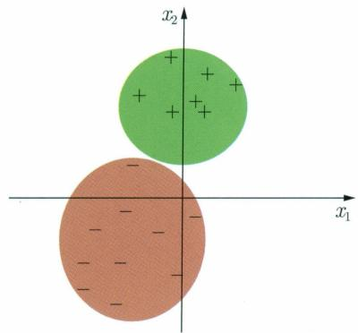  
图2.9 高斯朴素贝叶斯模型：绿色区域表示正例分布，橙色区域表示负例分布；“+”表示正例，“-”表示负例

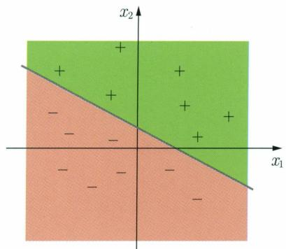  
图2.10 感知机模型：绿色区域表示正例区域，橙色区域表示负例区域；“+”表示正例，“-”表示负例

  
图2.11 决策树模型：绿色区域表示正例区域，橙色区域表示负例区域；“+”表示正例，“-”表示负例

  
图5.1 $k$ 近邻法的模型对应特征空间的一个划分。这是二维特征空间中的二类分类问题，使用最近邻法。图中 $\bullet$ 点是正例， $\times$ 点是负例。红色区域的实例都被分到正类，绿色区域的实例都被分到负类

  
图7.2 分类树模型

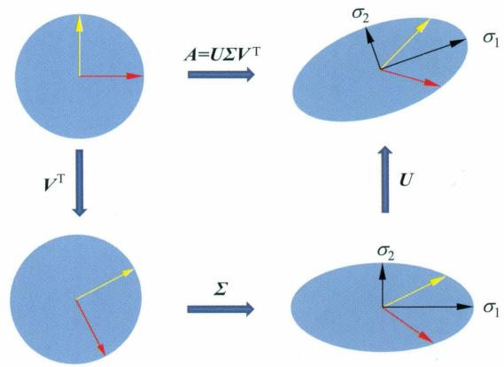  
图16.1 奇异值分解的几何解释

  
图21.1 概率潜在语义分析的直观解释

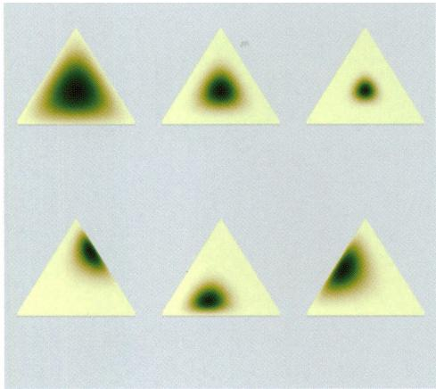  
图22.1 狄利克雷分布例

  
图22.3 LDA的文本生成过程

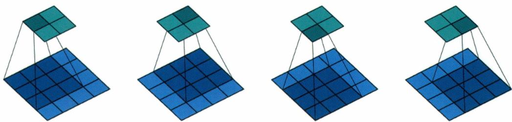  
图24.5 二维卷积例

  
图24.8 Transformer中的表示转换

  
图25.3 神经元的三维图形

  
图25.9 神经元的三维图形

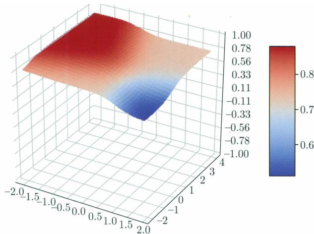  
图25.10 前馈神经网络例的三维图形

  
图25.12 XOR神经网络例的三维图形

  
图25.18 非凸优化问题

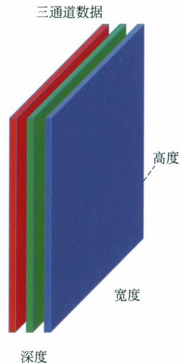

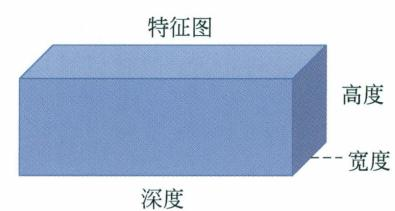

  
图26.6 用张量表示的三通道数据和特征图

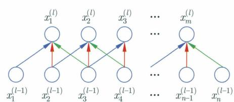  
图26.15 用卷积层代替全连接层  
图中显示的是一维卷积

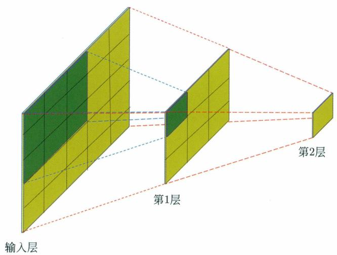  
图26.17 卷积神经网络中的感受野

  
图26.21 ResNet-18的架构

每一模块表示一层，有色模块是残差网络的卷积层，每一种颜色成一组，每一组有两个残差单元。数字是核的大小和步幅

  
图27.4 简单循环神经网络上的反向传播

  
图27.14 束搜索

# Head 8-10

- Direct objects attend to their verbs   
- $86.8\%$ accuracy at the obj relation

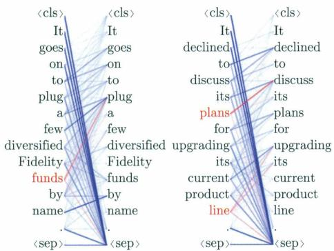

# Head 8-11

- Noun modifiers (e.g., determiners) attend to their noun   
- $94.3\%$ accuracy at the det relation

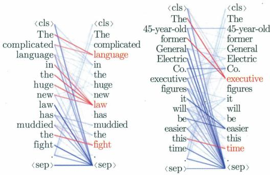

# Head 9-6

- Prepositions attend to their objects   
- $76.3\%$ accuracy at the poobj relation

# Head 5-4

- Coreferent mentions attend to their antecedents   
- $65.1\%$ accuracy at linking the head of a coreferent mention to the head of an antecedent

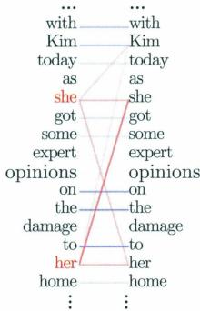

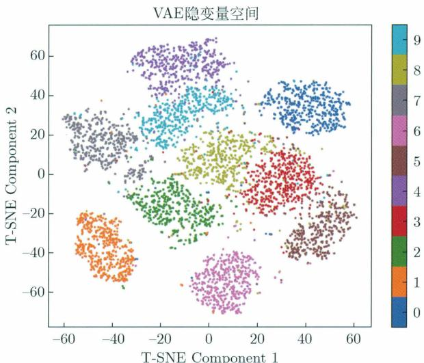  
图29.7 BERT模型中的注意力权重分布的例子可以表示词汇、语法、语义关系  
图30.7 手写数字数据在隐变量空间中的分布

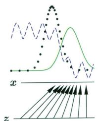  
(a)

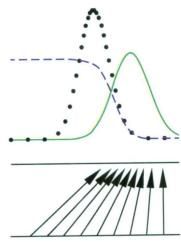  
(b)

  
(c)

  
(d)   
图31.2 GAN的学习过程

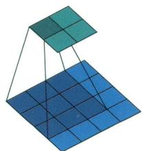

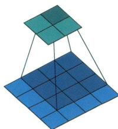

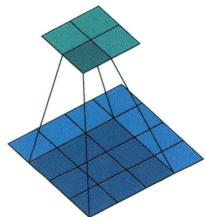

  
图31.3 卷积例

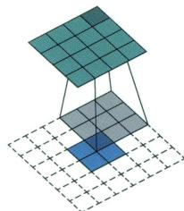  
图31.4 转置卷积例

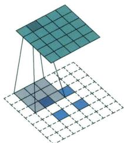

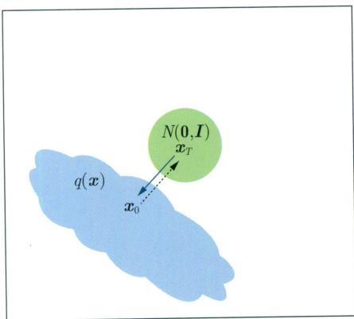  
图31.5 转置卷积例  
图32.2 扩散过程在样本空间中

# 机器学习方法第2版

# （一）监督学习

李航著

# 内容简介

机器学习是以概率论、统计学、信息论、最优化理论、计算理论等为基础的计算机应用理论学科，也是人工智能、数据挖掘等领域的基础学科。本书全面系统地介绍了机器学习的主要方法，共分4篇。第1篇介绍监督学习的主要方法，包括线性回归、感知机、支持向量机、最大熵模型与逻辑斯谛回归、提升方法、隐马尔可夫模型和条件随机场等；第2篇介绍无监督学习的主要方法，包括聚类、奇异值分解、主成分分析、马尔可夫链蒙特卡罗法、EM算法、潜在语义分析、潜在狄利克雷分配等。第3篇介绍深度学习的主要方法，包括前馈神经网络、卷积神经网络、循环神经网络、Transformer、扩散模型、生成对抗模型等。第4篇介绍强化的主要方法，包括马尔可夫决策、多臂老虎机、近端策略优化、深度Q网络等。书中每章介绍一两种机器学习方法。详细叙述各个方法的模型、策略和算法。从具体例子入手，由浅入深，帮助读者直观地理解基本思路，同时从理论角度出发，给出严格的数学推导，严谨翔实，让读者更好地掌握基本原理和概念。目的是使读者能学会和使用这些机器学习的基本技术。为满足读者进一步学习的需要，书中还对各个方法的要点进行了总结，给出了一些习题，并列出了主要参考文献。

本书是机器学习及相关课程的教学参考书，适合人工智能、数据挖掘等专业的本科生、研究生使用，也可供计算机各个领域的专业研发人员参考。

本书封面贴有清华大学出版社防伪标签，无标签者不得销售。

版权所有，侵权必究。举报：010-62782989，beiqinquan@tup.tsinghua.edu.cn。

# 图书在版编目（CIP）数据

机器学习方法/李航著.--2版.--北京：清华大学出版社，2025.7.

ISBN 978-7-302-69646-9

I. TP181

中国国家版本馆CIP数据核字第2025QZ6971号

责任编辑：孙亚楠

封面设计：李祥榕

责任校对：王淑云

责任印制：宋林

出版发行：清华大学出版社

网址：https://www.tup.com.cn，https://www.wqxuetang.com

地址：北京清华大学学研大厦A座 邮编：100084

社总机：010-83470000 邮购：010-62786544

投稿与读者服务：010-62776969，c-service@tup.tsinghua.edu.cn

质量反馈：010-62772015，zhiliang@tup.tsinghua.edu.cn

印装者：三河市东方印刷有限公司

经销：全国新华书店

开 本： $185\mathrm{mm}\times 260\mathrm{mm}$ 印张：51.75插页：4字数：1200千字

版次：2022年3月第1版 2025年7月第2版 印次：2025年7月第1次印刷

印 数： $1\sim 6000$

定价：198.00元（全4册）

# 献给我的母亲

# 序言

本书旨在全面而深入地介绍机器学习的核心技术，全书共分为4册（或4篇），对应监督学习、无监督学习、深度学习和强化学习4个主要分支。以方法为切入点，对机器学习技术加以梳理与总结，是本书的一大特点。在内容上，本书覆盖了传统机器学习（即统计机器学习）、深度学习以及强化学习领域中最为基础且最为广泛使用的方法，力求为读者呈现一幅完整且清晰的机器学习技术画卷。

近年来，机器学习领域取得了极大的发展，在人工智能的诸多领域应用中实现了重大突破。然而最基本、最常用的机器学习技术还是集中在一小部分核心内容上，例如，GBDT、EM算法、Transformer、扩散模型、PPO算法等。也正因如此，作者得以将这些关键技术梳理并总结，呈献给读者。

在每一篇的开头，先对本篇内容做一简单概述；然后在后面的章节中，详细讲解 $8\sim 10$ 个具体的方法，每章介绍一两个方法。在行文上力求严谨精练，尽量使用数学语言进行描述；同时也尽量给出直观的解释，并提供一些例子，帮助读者理解。每篇和每章都相对独立，读者可以全书阅读，也可以根据自己的情况选择性阅读。

本书主要定位为大学教材或辅助读物，以及专业人员的参考书。假设读者已具备一定的微积分、线性代数、概率统计和计算机科学知识。本书并不试图涵盖所有内容，而是希望对最基本、最常用的技术进行透彻的讲解和分析，帮助读者学习和掌握。希望本书不仅方便初学者了解与学习，而且也能供精通者复习总结并融会贯通。

自2012年《统计学习方法》（第1版）出版以来，受到广大读者的广泛好评。截至2024年12月1日，已发行35万册。不少大学将此书作为机器学习课程的教材。在B站等网站，有多位讲者对本书内容进行了详细讲解。在GitHub上，有多位开发者实现了本书介绍的机器学习算法，并且为书中的习题提供了解答。这些都为大家进一步学习提供了便利，也使笔者受到很大鼓舞和激励，持续利用业余时间写作，修改、完善、提高本书的内容。

在之前的三个版本（《统计学习方法》《统计学习方法（第2版)》《机器学习方法》）的基础之上，这一版本主要增加了第4篇强化学习；还增加了若干监督学习和深度学习方法，如线性回归、扩散模型；基于读者的反馈对监督学习的大部分内容和无监督学习的少部分内容做了大幅修改；删除了一部分目前已不常用的技术，如部分机器学习优化算法；整本书中尽量统一了符号用法；增加了习题；修改了大大小小几十处错误；重新绘制了几乎所有的插图。

本书初稿完成之后，徐佳锋、周奕、袁璟、张晓颖、郑在翔对部分章节提出了宝贵的修改意见。责任编辑孙亚楠为本书的出版做了大量的工作。在此对他们表示衷心的感谢。

本书这一版的质量相比前三个版本应该又有了大幅提升。由于笔者水平有限，虽然尽了

很大努力，在写作过程中力求准确和严谨，但仍然不能保证内容上完全无误。希望读者见谅并批评指正。

笔者有幸在20世纪90年代进入自然语言处理和机器学习领域，从事科学研究与技术开发。得益于导师和前辈的指导和帮助，以及合作者的支持和协作，在研究上取得了一些成果，并对该领域的技术有了一定的理解和掌握。也希望将自己学到的知识贡献给国家和全人类，为整个领域的未来发展尽一份绵薄之力。

李航

2024年12月

# 《机器学习方法》（第1版）序言

2012年《统计学习方法》(第1版)出版，内容涵盖监督学习的主要方法，2019年第2版出版，增加了无监督学习的主要方法，都属于传统机器学习。在这段时间里，机器学习领域发生了巨大变化，深度学习在人工智能各个方向取得了巨大突破，成为机器学习的主流技术，彻底改变了机器学习的面貌。有些读者希望能看到与之前风格相同的讲解深度学习的书籍，这也触发了作者在原来《统计学习方法》的基础上增加深度学习内容的想法（计划今后再增强化学习）。从2018年开始，历时3年左右，完成了深度学习的写作。

考虑到内容的变化，现将书名更改为《机器学习方法》。第1篇监督学习和第2篇无监督学习基本为原来的内容，增加第3篇深度学习，希望对读者有所裨益。传统机器学习是深度学习的基础，所以将这些内容放在一本书里讲述也有其合理之处。虽然深度学习目前是大家关注的重点，但传统机器学习仍然有其不容忽视的地位。事实上，传统机器学习和深度学习各自有更适合的应用场景，比如，深度学习长于大数据、复杂问题的预测，特别是人工智能的应用；传统机器学习善于小数据、相对简单问题的预测。

本书的定位是讲解机器学习的基本内容，并不完全是入门书。介绍的内容都是最基本的，在这种意义上适合初学者。但主旨是把最重要的原理和方法做系统的总结，方便大家经常阅读和复习。在写第3篇的时候也接受大家对第1篇和第2篇的反馈意见，在力求文字简练的同时，也确保叙述的详尽，以方便读者理解。在各章方法的导入部分适当增加了背景和动机的介绍。

第3篇中使用的数学符号与第1篇和第2篇有一定的对应关系，但由于深度学习的特点也有一些改变，也都能自成体系。将符号完全统一于一个框架内还需要做大量的工作，希望在增加第4篇强化学习之后再做处理。

对第3篇的原稿，郑诗源、张新松等帮助做了校阅，对一些章节的内容提出了宝贵的意见。责任编辑王倩、孙亚楠也为本书的出版做了大量工作。在此对他们表示衷心的感谢。

李航

2021年5月27日

# 《统计学习方法（第2版）》序言

《统计学习方法》（第1版）于2012年出版，讲述了统计机器学习方法，主要是一些常用的监督学习方法。第2版增加了一些常用的无监督学习方法，由此本书涵盖了传统统计机器学习方法的主要内容。

在撰写《统计学习方法》伊始，对全书内容做了初步规划。第1版出版之后，即着手无监督学习方法的写作。由于写作是在业余时间进行，常常被主要工作打断，历经6年多时间才使这部分工作得以完成。但犹未能加入深度学习和强化学习等重要内容，希望今后能够增补，完成整本书的写作计划。

《统计学习方法》（第1版）的出版正值大数据和人工智能的热潮，生逢其时，截至2019年4月本书共印刷25次，152000册，得到了广大读者的欢迎和支持。有许多读者指出本书对学习和掌握机器学习技术有极大的帮助，也有许多读者通过电子邮件、微博等指出书中的错误，提出改进的建议和意见。一些高校将本书作为机器学习课程的教材或参考书。有的同学在网上发表了读书笔记，有的同学将本书介绍的方法在计算机上实现。清华大学深圳研究生院袁春老师精心制作了第1版12章的课件，在网上公布，为大家提供教学之便。众多老师、同学、读者的支持和鼓励，让作者深受感动和鼓舞。在这里向所有的老师、同学、读者致以诚挚的谢意！

能为中国的计算机科学、人工智能领域做出一点微薄的贡献，感到由衷的欣慰，同时也感受到作为知识传播者的重大责任，让作者决意把本书写好。也希望大家今后不吝指教，多提宝贵意见，以帮助继续提高本书的质量。在写作中作者也深切体会到教学相长的道理，经常发现自己对基础知识的掌握不够扎实，通过写作得以对相关知识进行深入的学习，受益匪浅。

本书是一部机器学习的基本读物，要求读者拥有高等数学、线性代数和概率统计的基础知识。书中主要讲述统计机器学习的方法，力求系统全面又简明扼要地阐述这些方法的理论、算法和应用，使读者能对这些机器学习的基本技术有很好的掌握。针对每个方法，详细介绍其基本原理、基础理论、实际算法，给出细致的数学推导和具体实例，既帮助读者理解，也便于日后复习。

第2版增加的无监督学习方法，王泉、陈嘉怡、柴琛林、赵程绮等帮助做了认真细致的校阅，提出了许多宝贵意见，在此谨对他们表示衷心的感谢。清华大学出版社的薛慧编辑一直对本书的写作给予非常专业的指导和帮助，在此对她表示衷心的感谢！

由于本人水平有限，本书一定存在不少错误，恳请各位专家、老师和同学批评指正。

李航

2019年4月

# 《统计学习方法》（第1版）序言

计算机与网络已经融入人们的日常学习、工作和生活之中，成为人们不可或缺的助手和伙伴。计算机与网络的飞速发展完全改变了人们的学习、工作和生活方式。智能化是计算机研究与开发的一个主要目标。近几十年来的实践表明，统计机器学习方法是实现这一目标的最有效手段，尽管它还存在着一定的局限性。

本人一直从事利用统计学习方法对文本数据进行各种智能性处理的研究，包括自然语言处理、信息检索、文本数据挖掘。近20年来，这些领域发展之快，应用之广，实在令人惊叹！可以说，统计机器学习是这些领域的核心技术，在这些领域的发展及应用中起着决定性的作用。

本人在日常的研究工作中经常指导学生，并在国内外一些大学及讲习班上多次做过关于统计学习的报告和演讲。在这一过程中，同学们学习热情很高，希望得到指导，这使作者产生了撰写本书的想法。

国内外已出版了多本关于统计机器学习的书籍，比如，Hastie 等人的《统计学习基础》，该书对统计学习的诸多问题有非常精辟的论述，但对初学者来说显得有些深奥。统计学习范围甚广，一两本书很难覆盖所有问题。本书主要是面向将统计学习方法作为工具的科研人员与学生，特别是从事信息检索、自然语言处理、文本数据挖掘及相关领域的研究与开发的科研人员与学生。

本书力求系统而详细地介绍统计学习的方法。在内容选取上，侧重介绍那些最重要、最常用的方法，特别是关于分类与标注问题的方法。对其他问题及方法，如聚类等，计划在今后的写作中再加以介绍。在叙述方式上，每一章讲述一种方法，各章内容相对独立、完整；同时力图用统一框架来论述所有方法，使全书整体不失系统性，读者可以从头到尾通读，也可以选择单个章节细读。对每一种方法的讲述力求深入浅出，给出必要的推导证明，提供简单的实例，使初学者易于掌握该方法的基本内容，领会方法的本质，并准确地使用方法。对相关的深层理论，则予以简述。在每章后面，给出一些习题，介绍一些相关的研究动向和阅读材料，列出参考文献，以满足读者进一步学习的需求。本书第1章简要叙述统计学习方法的基本概念，最后一章对统计学习方法进行比较与总结。此外，在附录中简要介绍一些共用的最优化理论与方法。

本书可以作为统计机器学习及相关课程的教学参考书，适用于信息检索及自然语言处理等专业的大学生、研究生。

本书初稿完成后，田飞、王佳磊、武威、陈凯、伍浩铖、曹正、陶宇等人分别审阅了全部

或部分章节，提出了许多宝贵意见，对本书质量的提高有很大帮助，在此向他们表示衷心的感谢。在本书的写作和出版过程中，清华大学出版社的责任编辑薛慧给予了很多帮助，在此特向她致谢。

由于本人水平所限，书中难免有错误和不当之处，欢迎各位专家和读者给予批评指正。

李航

2011年4月23日

# 符号使用说明

本书在符号的使用上遵循两个原则：①尽量统一；②尽量与业界习惯保持一致。符号的使用规范如下，但有例外情况。

变量 $x,y,z$

向量：列向量 $a, b, x, y$

矩阵 $A,B,X,Y$

实例或特征向量

序列 $x = x_{1}x_{2}\dots x_{T}$ ，长度为 $T$

类别或数值 $y$

集合 $\mathcal{A},\mathcal{B},\mathcal{X},\mathcal{Y}$

函数 $f(\bullet),g(\bullet)$

实数空间 $\mathbb{R}^D$ ，维度为 $D$

概率密度函数 $p(\cdot),f(\cdot)$

概率分布或概率质量函数 $P(\cdot)$

数学期望 $\mathbb{E}[\bullet ]$

参数向量 $\theta ,\phi ,w$

# 目录

# 第1篇 监督学习

# 第1章 机器学习简介

1.1 机器学习的定义 3  
1.2 本书内容 ..... 5

# 第2章 监督学习简介 6

2.1 监督学习概述 6

2.1.1 监督学习的形式化 6  
2.1.2 监督学习三要素 8  
2.1.3 模型评估与模型选择 12  
2.1.4 正则化与交叉验证 17   
2.1.5 泛化能力 18

2.2 监督学习问题 21

2.2.1 分类问题 21  
2.2.2 回归问题 22  
2.2.3 序列标注问题 23

2.3 监督学习方法概述 24

2.3.1 生成方法与判别方法 ..... 25  
2.3.2 分类方法 25  
2.3.3 回归方法 28  
2.3.4 序列标注方法 29

本篇内容 29

继续阅读 30

习题 30

参考文献 30

# 第3章 线性回归 31

3.1 线性回归模型 31

3.1.1 模型定义 31  
3.1.2 概率模型表示 32  
3.1.3 基函数和模型的扩展 32

3.2 线性回归学习算法 34

3.2.1 最小二乘法 34  
3.2.2 正规方程 35  
3.2.3 梯度下降 36

3.3 岭回归和 Lasso 38

本章概要 40  
继续阅读 41   
习题 42  
参考文献 42

第4章 感知机 43

4.1 感知机模型 43  
4.2 感知机学习策略 44

4.2.1 数据集的线性可分性 44  
4.2.2 感知机学习策略 45

4.3 感知机学习算法 46

4.3.1 感知机学习算法的原始形式 46  
4.3.2 算法的收敛性 49  
4.3.3 感知机学习算法的对偶形式 50

本章概要 52  
继续阅读 53

习题 53  
参考文献 54

第5章 $k$ 近邻法 55

5.1 $k$ 近邻算法 55  
5.2 $k$ 近邻模型 56

5.2.1 模型 56  
5.2.2 距离度量 57  
5.2.3 $k$ 值的选择 58   
5.2.4 决策规则 58

5.3 $k$ 近邻法的实现： $k$ -d 树 ..... 59

5.3.1 构建 $k$ -d树 ..... 59   
5.3.2 搜索 $k$ -d 树 60

本章概要 62

继续阅读 62   
习题 63  
参考文献 63

# 第6章 朴素贝叶斯法 ..... 64

# 6.1 朴素贝叶斯模型 64

6.1.1 模型定义 64  
6.1.2 分类决策 66  
6.1.3 概率模型 66  
6.1.4 生成模型与判别模型 67

# 6.2 朴素贝叶斯学习 67

6.2.1 学习问题 67  
6.2.2 极大似然估计 67   
6.2.3 学习和分类算法 68  
6.2.4 贝叶斯估计 69

# 本章概要 71

# 继续阅读 71

# 习题 71

# 参考文献 72

# 第7章 决策树 73

# 7.1 决策树模型与学习 ..... 73

7.1.1 决策树 73   
7.1.2 决策树模型 74  
7.1.3 决策树学习 75

# 7.2 特征选择 76

7.2.1 特征选择问题 ..... 76  
7.2.2 熵、条件熵和互信息 78  
7.2.3 信息增益与特征选择 ..... 79

# 7.3 分类树的生成 81

# 7.4 分类树的剪枝 82

# 7.5 CART算法 83

7.5.1 CART 生成 ..... 84  
7.5.2 CART剪枝 88

# 本章概要 89

# 继续阅读 91

# 习题 91

# 参考文献 92

# 第8章 逻辑斯谛回归和最大熵模型 ..... 93

# 8.1 逻辑斯谛回归模型 ..... 93

8.1.1 逻辑斯谛分布 ..... 93  
8.1.2 二项逻辑斯谛回归 94

8.1.3 多项逻辑斯谛回归 96

8.2 最大熵模型 97

8.2.1 最大熵原理 ..... 97  
8.2.2 最大熵模型的定义 99  
8.2.3 最大熵模型的学习 100  
8.2.4 最大熵模型的极大似然估计 104  
8.2.5 与逻辑斯谛回归模型的关系 ..... 105  
8.2.6 与指数分布族的关系 ..... 105

8.3 学习算法 ..... 106

8.3.1 梯度下降 106   
8.3.2 拟牛顿法 108

本章概要 110  
继续阅读 111   
习题 111  
参考文献 111

第9章 支持向量机 113

9.1 线性可分支持向量机与硬间隔最大化 113

9.1.1 线性可分支持向量机 113  
9.1.2 函数间隔和几何间隔 115  
9.1.3 间隔最大化 116  
9.1.4 对偶问题的算法 120

9.2 线性支持向量机与软间隔最大化 ..... 125

9.2.1 线性支持向量机 125  
9.2.2 对偶问题的算法 126  
9.2.3 支持向量 129  
9.2.4 无约束最优化算法 ..... 129

9.3 非线性支持向量机与核函数 133

9.3.1 核技巧 133   
9.3.2 正定核 136  
9.3.3 常用核函数 140  
9.3.4 非线性支持向量分类机 141

本章概要 142

继续阅读 144   
习题 144  
参考文献 145

第10章 提升方法 ..... 147

10.1 AdaBoost算法 ..... 147

10.1.1 基本想法 147  
10.1.2 算法 148  
10.1.3 AdaBoost的例子 150  
10.1.4 训练误差分析 152  
10.1.5 前向分步算法解释 153

# 10.2 梯度提升 157

10.2.1 基本想法 157  
10.2.2 GBDT用于回归 158  
10.2.3 GBDT算法 161

# 本章概要 163

继续阅读 165   
习题 165  
参考文献 166

# 第11章 隐马尔可夫模型 ..... 167

11.1 隐马尔可夫模型的基本概念 167

11.1.1 模型的定义 167  
11.1.2 模型的特点 169  
11.1.3 基本问题 171

11.2 概率计算算法 171

11.2.1 直接计算法 171  
11.2.2 前向算法 172  
11.2.3 后向算法 174  
11.2.4 前向-后向算法 176  
11.2.5 一些概率与期望值的计算 ..... 176

11.3 学习算法 177

11.3.1 监督学习方法 177  
11.3.2 Baum-Welch 算法 ..... 178  
11.3.3 模型参数估计 180

11.4 预测算法 181

11.4.1 近似算法 181  
11.4.2 维特比算法 181

本章概要 185

继续阅读 186   
习题 187  
参考文献 187

# 第12章 条件随机场 188

12.1 概率无向图模型 ..... 188

12.1.1 模型的定义 188  
12.1.2 概率无向图模型的因子分解 191  
12.1.3 概率无向图模型的例子 193

# 12.2 条件随机场的基本概念 194

12.2.1 模型的定义 194  
12.2.2 模型的形式 195  
12.2.3 基本问题 199

# 12.3 概率计算算法 ..... 200

12.3.1 前向算法 200  
12.3.2 后向算法 201  
12.3.3 前向-后向算法 201  
12.3.4 期望值的计算 ..... 202

# 12.4 学习算法 202

12.4.1 监督学习算法 203  
12.4.2 拟牛顿法 203

# 12.5 预测算法 204

本章概要 207  
继续阅读 209   
习题 209  
参考文献 210

# 第13章 监督学习方法总结 211

# 第2篇 无监督学习

# 第14章 无监督学习简介 ..... 219

# 14.1 无监督学习问题 ..... 219

14.1.1 聚类问题 219  
14.1.2 降维问题 220  
14.1.3 话题分析问题 ..... 221  
14.1.4 概率模型估计问题 ..... 223

# 14.2 无监督学习方法概述 ..... 223

14.2.1 机器学习三要素 223  
14.2.2 聚类方法 224  
14.2.3 降维方法 224  
14.2.4 话题分析方法——非概率模型 ..... 225  
14.2.5 话题分析方法——概率模型 ..... 226  
14.2.6 概率模型估计方法 227

# 本篇内容 228

# 继续阅读 228

参考文献 228

# 第15章 聚类方法 ..... 229

15.1 聚类的基本概念 229

15.1.1 相似度或距离 229  
15.1.2 类或簇 232   
15.1.3 类与类之间的距离 233

15.2 层次聚类 234

15.3 $k$ 均值聚类 235

15.3.1 模型 236  
15.3.2 策略 236  
15.3.3 算法 237  
15.3.4 算法特性 238

本章概要 239

继续阅读 240

习题 240

参考文献 240

# 第16章 奇异值分解 242

16.1 奇异值分解的定义与性质 242

16.1.1 定义与定理 242  
16.1.2 紧奇异值分解与截断奇异值分解 246  
16.1.3 几何解释 248   
16.1.4 主要性质 250

16.2 奇异值分解的计算 251

16.3 奇异值分解与矩阵近似 ..... 254

16.3.1 弗罗贝尼乌斯范数 254  
16.3.2 矩阵的最优近似 255  
16.3.3 矩阵的外积展开式 258

本章概要 260

继续阅读 261

习题 261

参考文献 262

# 第17章 主成分分析 263

17.1 总体主成分分析 263

17.1.1 基本想法 263  
17.1.2 定义和导出 265  
17.1.3 主要性质 266

17.1.4 主成分分析与降维 270  
17.1.5 规范化的总体主成分 273

# 17.2 样本主成分分析 274

17.2.1 定义和性质 274  
17.2.2 相关矩阵的特征值分解算法 276  
17.2.3 样本矩阵的奇异值分解算法 279

# 本章概要 280

# 继续阅读 282

# 习题 282

# 参考文献 283

# 第18章 EM算法和变分EM算法 284

# 18.1 EM算法 284

18.1.1 简单例子 285  
18.1.2 基本算法 287  
18.1.3 基本原理 288  
18.1.4 算法收敛性 290  
18.1.5 广义算法 ..... 291

# 18.2 高斯混合模型的EM算法 293

18.2.1 高斯混合模型 293  
18.2.2 EM算法 293  
18.2.3 与 $k$ 均值的关系 ..... 296

# 18.3 变分EM算法 297

18.3.1 变分贝叶斯方法 297  
18.3.2 基本算法 299  
18.3.3 EM算法和变分EM算法的比较 300

# 本章概要 300

# 继续阅读 302

# 习题 302

# 参考文献 303

# 第19章 马尔可夫链蒙特卡罗法 304

# 19.1 蒙特卡罗法 304

19.1.1 随机抽样 304   
19.1.2 数学期望估计 305

# 19.2 积分计算 307

# 19.3 马尔可夫链 308

19.3.1 基本定义 308  
19.3.2 离散状态马尔可夫链 309

19.3.3 连续状态马尔可夫链 314  
19.3.4 马尔可夫链的性质 315

19.4 马尔可夫链蒙特卡罗法 319

19.4.1 基本想法 319  
19.4.2 基本步骤 320

19.5 马尔可夫链蒙特卡罗法与机器学习 320  
19.6 Metropolis-Hastings 算法 321

19.6.1 基本原理 321  
19.6.2 Metropolis-Hastings算法 324  
19.6.3 单分量Metropolis-Hastings算法 324

19.7 吉布斯抽样 325

19.7.1 基本原理 326  
19.7.2 吉布斯抽样算法 327  
19.7.3 抽样计算 328

本章概要 329  
继续阅读 330

习题 331

参考文献 332

# 第20章 潜在语义分析和非负矩阵分解 333

20.1 单词向量空间与话题向量空间 333

20.1.1 单词向量空间 333  
20.1.2 话题向量空间 335

20.2 潜在语义分析算法 338

20.2.1 矩阵奇异值分解算法 338  
20.2.2 例子 340

20.3 非负矩阵分解算法 341

20.3.1 非负矩阵分解 341  
20.3.2 话题分析 342  
20.3.3 非负矩阵分解的形式化 342  
20.3.4 算法 343

本章概要 345

继续阅读 346

习题 346

参考文献 347

# 第21章 概率潜在语义分析 348

21.1 概率潜在语义分析模型 348

21.1.1 基本想法 348

21.1.2 生成模型 349  
21.1.3 共现模型 350  
21.1.4 模型性质 351

# 21.2 概率潜在语义分析的算法 353

本章概要 355

继续阅读 356

习题 356

参考文献 357

# 第22章 潜在狄利克雷分配 358

22.1狄利克雷分布 358

22.1.1 分布定义 358  
22.1.2 共轭先验 361

22.2 潜在狄利克雷分配模型 362

22.2.1 基本想法 362  
22.2.2 模型定义 363  
22.2.3 概率图模型 365  
22.2.4 随机变量序列的可交换性 366  
22.2.5 概率公式 366

22.3 LDA的吉布斯抽样算法 367

22.3.1 基本想法 367  
22.3.2 算法的主要部分 368  
22.3.3 算法的后处理 370  
22.3.4 算法 370

22.4 LDA的变分EM算法 372

22.4.1 算法推导 372   
22.4.2 算法总结 378

本章概要 378

继续阅读 379

习题 379

参考文献 380

# 第23章 无监督学习方法总结 381

23.1 无监督学习方法的关系和特点 381

23.1.1 方法之间的关系 381  
23.1.2 无监督学习方法 381  
23.1.3 基础机器学习方法 382

23.2 话题模型之间的关系和特点 ..... 382

参考文献 383

# 第3篇 深度学习

# 第24章 深度学习简介 387

# 24.1 深度学习问题 387

24.1.1 监督学习问题 387  
24.1.2 无监督学习问题 ..... 389

# 24.2 深度学习方法概述 391

24.2.1 基本原理 391  
24.2.2 基本工具 391  
24.2.3 监督学习模型 395  
24.2.4 无监督学习模型 397  
24.2.5 基本算法 398  
24.2.6 预训练 398

# 24.3 深度学习应用 399

# 本篇内容 399

# 参考文献 400

# 第25章 前馈神经网络 401

# 25.1 前馈神经网络的模型 401

25.1.1 前馈神经网络定义 402  
25.1.2 前馈神经网络的例子 412  
25.1.3 前馈神经网络的表示能力 416

# 25.2 前馈神经网络的学习算法 419

25.2.1 前馈神经网络学习 419  
25.2.2 前馈神经网络学习的优化算法 421  
25.2.3 反向传播算法 424  
25.2.4 在计算图上的实现 427  
25.2.5 算法的实现技巧 431

# 25.3 前馈神经网络学习的正则化 436

25.3.1 深度学习中的正则化 436  
25.3.2 早停法 ..... 437  
25.3.3 暂退法 438

# 本章概要 441

# 继续阅读 443

# 习题 444

# 参考文献 444

# 第26章 卷积神经网络 446

# 26.1卷积神经网络的模型 446

# 26.1.1 背景 446

26.1.2 卷积 447  
26.1.3 汇聚 455   
26.1.4 卷积神经网络 458  
26.1.5 卷积神经网络性质 461

26.2 卷积神经网络的学习算法 463

26.2.1 卷积导数 463  
26.2.2 反向传播算法 464

26.3 图片分类中的应用 467

26.3.1 AlexNet 467   
26.3.2 残差网络 468

本章概要 472  
继续阅读 474   
习题 475  
参考文献 476

第27章 循环神经网络 478

27.1 简单循环神经网络 478

27.1.1 模型 478  
27.1.2 学习算法 481

27.2 常用循环神经网络 485

27.2.1 长短期记忆网络 485  
27.2.2 门控循环单元网络 ..... 488  
27.2.3 深度循环神经网络 489  
27.2.4 双向循环神经网络 490

27.3 自然语言生成中的应用 491

27.3.1 词向量 ..... 491  
27.3.2 语言生成与语言模型 ..... 494

本章概要 496

继续阅读 498

习题 498  
参考文献 499

第28章 Transformer 501

28.1 序列到序列基本模型 501

28.1.1 序列到序列 501  
28.1.2 基本模型 503

28.2 RNN Search 模型 ..... 504

28.2.1 注意力 504  
28.2.2 模型定义 506

28.2.3 模型特点 507

28.3 Transformer 模型 ..... 508

28.3.1 模型架构 508  
28.3.2 模型特点 515

本章概要 516

继续阅读 518

习题 518

参考文献 519

# 第29章GPT和BERT 520

29.1 预训练语言模型 520  
29.2 GPT模型 522

29.2.1 模型和学习 522  
29.2.2 模型特点 526

29.3 BERT模型 526

29.3.1 模型和学习 526  
29.3.2 模型特点 531

本章概要 532  
继续阅读 533

习题 533

参考文献 534

# 第30章 变分自编码器 535

30.1 自编码器 535  
30.2 去噪自编码器 536  
30.3 变分自编码器 537

30.3.1 方法概述 537  
30.3.2 模型 538  
30.3.3 学习策略 540  
30.3.4 学习算法 542  
30.3.5 手写数字例 544

本章概要 545  
继续阅读 547   
习题 547  
参考文献 547

# 第31章 生成对抗网络 ..... 549

31.1 GAN基本模型 549

31.1.1 模型 549

31.1.2 学习算法 551  
31.1.3 理论分析 552

# 31.2 图片生成中的应用 553

31.2.1 转置卷积 554   
31.2.2 DCGAN 556

# 本章概要 558

# 继续阅读 559

# 习题 559

# 参考文献 560

# 第32章 扩散模型 561

# 32.1 去噪扩散概率模型 561

32.1.1 直观解释 562  
32.1.2 模型的定义和性质 562   
32.1.3 学习和生成算法 567

# 32.2 分数匹配加朗之万动力学 571

32.2.1 分数匹配 571  
32.2.2 朗之万动力学 573  
32.2.3 学习和生成算法 574

# 32.3 扩散模型之间的关系 577

32.3.1 分数函数学习 577  
32.3.2 随机微分方程 578

# 32.4 图像生成 580

32.4.1 扩散模型用于图像生成 580  
32.4.2 隐空间中的生成 581  
32.4.3 有条件的生成 ..... 582

# 本章概要 583

# 继续阅读 586

# 习题 586

# 参考文献 587

# 第33章 深度学习方法总结 588

# 33.1 深度学习的模型 588

# 33.2 深度学习的算法 590

# 33.3 深度学习的优缺点 592

# 参考文献 593

# 第4篇 强化学习

# 第34章 强化学习简介 597

# 34.1 强化学习问题 ..... 597

34.1.1 强化学习的定义 597  
34.1.2 相关问题 600

# 34.2 强化学习原理和方法 601

34.2.1 强化学习方法 601  
34.2.2 强化学习原理 601  
34.2.3 深度强化学习 602

# 34.3 强化学习应用 603

本篇内容 604  
习题 605  
参考文献 605

# 第35章 马尔可夫决策过程 606

# 35.1 马尔可夫决策过程定义 606

35.1.1 基本概念 606  
35.1.2 最优策略 610  
35.1.3 MDP例子 611

# 35.2 动态规划算法 614

35.2.1 规划问题 614  
35.2.2 贝尔曼方程 614  
35.2.3 策略评估 617   
35.2.4 策略迭代 620  
35.2.5 价值迭代 622  
35.2.6 算法的比较和扩展 625

# 本章概要 626

继续阅读 629   
习题 629  
参考文献 630

# 第36章 多臂老虎机 631

# 36.1 多臂老虎机概述 631

36.1.1 问题的定义 631  
36.1.2 探索和利用的权衡 633

# 36.2 基本算法 634

36.2.1 探索优先算法 634  
36.2.2 $\varepsilon$ 贪心算法 634  
36.2.3 UCB算法 636  
36.2.4 汤普森采样 638

# 本章概要 641

继续阅读 642

习题 642

参考文献 643

# 第37章 基于价值的方法 644

37.1 基于价值的方法概述 644  
37.2 模型无关预测 645

37.2.1 蒙特卡罗预测 645  
37.2.2 时序差分预测 648   
37.2.3 预测方法的总结 650

37.3 模型无关控制 652

37.3.1 蒙特卡罗控制 652  
37.3.2 SARSA 算法 655  
37.3.3 Q学习 658   
37.3.4 在策略和离策略学习 660

37.4 基于价值的方法的总结 661

本章概要 662  
继续阅读 663   
习题 664  
参考文献 664

# 第38章 深度Q网络 665

38.1 价值函数近似法 665  
38.2 DQN 方法 669

本章概要 671  
继续阅读 672   
习题 672  
参考文献 672

# 第39章 基于策略的方法 673

39.1 基于策略的方法概述 673  
39.2 REINFORCE算法 675

39.2.1 REINFORCE算法 675  
39.2.2 带基线的REINFORCE算法 678  
39.2.3 策略函数 680

39.3 演员-评论员算法 681  
39.4 策略梯度方法总结 683

39.4.1 一般形式 683  
39.4.2 策略梯度定理 684

39.5 策略梯度的应用例 686  
本章概要 687  
继续阅读 689   
习题 689  
参考文献 690

# 第40章 近端策略优化PPO 691

40.1 TRPO算法 691

40.1.1 背景和动机 691  
40.1.2 基本形式 692  
40.1.3 算法和理论推导 693   
40.1.4 具体算法 696

40.2 PPO算法 697

40.2.1 算法概述 697  
40.2.2 PPO-Clip 698   
40.2.3 具体算法 699

40.3 大语言模型的应用 700

40.3.1 LLM概述 700   
40.3.2 预训练 701   
40.3.3 SFT 701   
40.3.4 RLHF 702   
40.3.5 LLM 的特点 703

本章概要 703

继续阅读 705

习题 705

参考文献 705

# 1章 强化学习方法总结 706

41.1 强化学习的重要性 706

41.1.1 强化学习 706  
41.1.2 强化学习与监督学习 706  
41.1.3 强化学习与生物学习 707

41.2 强化学习方法之间的关系 707

41.2.1 强化学习方法 707  
41.2.2 基于模型、价值、策略的方法 709

41.3 其他强化学习问题和方法 710  
41.4 强化学习的机遇和挑战 710

参考文献 711

附录A 梯度下降法 712  
附录B 牛顿法和拟牛顿法 714  
附录C 拉格朗日对偶性 719  
附录D 矩阵空间 722  
附录E KL散度和狄利克雷分布 725  
附录F 深度学习中的偏导数 727  
附录G 深度学习的优化算法 729

# 第1篇 监督学习

# 第1章 机器学习简介

本书从方法的角度系统详细地讲解和总结机器学习技术。本章简要地介绍机器学习的基本概念，旨在帮助读者对机器学习有初步了解，以便更好地理解全书内容，并在各个篇章之间建立联系。

# 1.1 机器学习的定义

机器学习（machine learning）是关于计算机系统利用数据和算法自动学习和改进，进而提升完成任务能力的一门学科。机器学习是人工智能、数据挖掘等领域的基础，有时也被认为是人工智能的一个子领域。

赫尔伯特·西蒙（Herbert A. Simon）曾对“学习”给出以下定义：“如果一个系统能够通过执行某个过程改进它的性能，这就是学习。”按照这一观点，机器学习就是计算机系统通过发现和使用数据的统计规律以提高自身性能的学习。

# 1. 机器学习的特点

机器学习的主要特点是：①机器学习以计算机系统为平台，是建立在计算机系统上的；②机器学习以数据为对象，是数据驱动的学科；③机器学习的目的是完成一定任务，如数据预测、分析和生成，智能体的序列决策（sequential decision）；④机器学习以方法为中心，机器学习方法是构建模型并应用模型完成任务的手段；⑤机器学习是概率论、统计学、信息论、控制论、计算理论、优化理论及计算机系统等多个领域的交叉学科，并且在发展中逐步形成独自的技术体系和方法论。

# 2. 机器学习的主要类别

机器学习是一个范围宽阔、内容丰富、应用广泛的领域，并不存在（至少目前不存在）一个统一的理论涵盖所有内容。

可以认为，机器学习由监督学习（supervised learning）、无监督学习（unsupervised learning）、深度学习（deep learning）、强化学习（reinforcement learning）等几个主要分支组成。

监督学习、无监督学习和强化学习是机器学习最基本的类别。几乎所有的机器学习方法都可以归入这三类之一或者是它们的组合。

深度学习是从另一个角度的分类。深度学习和传统机器学习，也就是深度学习之前的机器学习，都可以与以上三种机器学习结合。深度学习与三种机器学习的结合，形成深度监督

学习（deep supervised learning）、深度无监督学习（deep unsupervised learning）和深度强化学习（deep reinforcement learning）。2012年以来深度学习的快速发展改变了整个机器学习领域，给人工智能带来了巨大的革命性的进步。

# 3. 机器学习的对象

机器学习的对象是数据。它从数据出发，抽取数据的特征，学习数据的表示，估计数据的分布，又回到对数据的分析、预测与生成中去。作为机器学习的对象，数据是多样的，可以是存在于计算机系统上的各种数字、文本、图像、视频、音频、表格数据，也可以是智能体的序列决策数据。

本书只涉及利用数据构建模型的方法，对数据的收集、标注等问题不作讨论。在实际应用中数据的收集和标注也是非常重要的部分。

# 4. 机器学习的目的

机器学习的目的是提高自己完成一定任务的能力。监督学习从给定的数据学习，对新的数据进行预测，如分类、回归。无监督学习对给定的数据进行分析，如聚类、降维。无监督学习还可以从给定的数据学习分布，通过采样生成新的数据，如图像生成。强化学习从与环境的交互数据中学习最优策略，也就是最优的序列决策。

深度学习通常比传统机器学习拥有更强的学习能力。因此，它能更好地完成复杂的人工智能的学习任务。

# 5. 机器学习的方法

机器学习的核心是方法。方法指计算机系统使用算法从数据中学习最优模型以完成学习目的的具体手段。学习一般被形式化为优化问题，目标函数表示进行数据预测、分析、生成的损失函数或者智能体决策的回报的期望。通过最优化目标函数求解最优模型。

机器学习假设数据具有一定的统计规律，如独立同分布性、马尔可夫性，这是机器学习的前提。由于数据具有统计规律，所以可以从中学到模型。比如，可以用随机变量表示数据的特征，用概率分布表示数据的统计规律。

# 6. 机器学习的基础

机器学习是计算机科学的一个重要组成部分。计算机科学技术可以从三个维度进行审视：计算、信息和系统。机器学习主要接近信息和计算这两个维度，然而，它与系统也存在着紧密的联系。

机器学习的理论基础，一方面是概率论、统计学和信息论，强化学习再加上控制论；另一方面是计算理论。统计加计算是机器学习的重要特点，使它有别于传统的概率统计。

机器学习问题都被转换成最优化问题。优化理论也起着重要作用。深度学习经常需要进行大规模分布式训练，这时为了提高计算效率和稳定性，计算机系统技术变得至关重要。

# 7. 机器学习的应用

机器学习学科在科学技术中的重要性主要体现在它是数据挖掘、人工智能等的基础。

近几十年来，机器学习无论是在理论还是在应用方面都得到了巨大的发展，有许多重大突破，机器学习已被成功地应用到数据挖掘和人工智能的各个领域，包括自然语言处理、语音处理、计算机视觉、机器人技术、信息检索、生物信息学，并且成为这些领域的核心技术。

人们确信，机器学习将会在今后的科学和技术发展中发挥越来越重要的作用。原因至少有以下两个方面。

我们处于一个信息爆炸的时代，海量数据的处理与利用是人们必然的需求。现实中的数据不但规模大，而且常常具有不确定性，机器学习往往是有效处理海量数据的最强有力的工具。

智能化是计算机发展的必然趋势，也是计算机技术研究与开发的主要目标。近几十年来，人工智能等领域的研究证明，利用机器学习模仿人类智能的方法虽有一定的局限性，但是还是实现这一目标的最有效手段。

# 1.2 本书内容

机器学习一般包括监督学习、无监督学习、强化学习。深度学习可以和这些机器学习结合，与其对应的是传统机器学习。

本书第1篇讲述监督学习方法，第2篇讲述无监督学习方法，主要是传统的机器学习。第3篇讲述深度学习方法，包括深度监督学习和深度无监督学习。第4篇讲述强化学习方法，包括传统强化学习和深度强化学习。

监督学习和无监督学习的主要概念是模型、策略、算法，称为机器学习的三要素。不同的方法就意味着拥有不同的三要素。强化学习的主要概念是策略函数、价值函数以及模型。注意这里的模型是不同的概念。强化学习的方法分为基于模型的、基于价值的和基于策略的。这些监督学习、无监督学习、强化学习方法既包含传统机器学习方法，又包含深度学习方法。本书详细介绍最具有代表性和最常用的监督学习、无监督学习、深度学习和强化学习方法。

# 第2章 监督学习简介

本书第1篇讲述监督学习方法，特别是传统机器学习的监督学习方法。本章对监督学习做一简单介绍。为了帮助初学者，对机器学习的一些基本概念也给出详细讲解。

# 2.1 监督学习概述

# 2.1.1 监督学习的形式化

监督学习（supervised learning）是指从标注数据（labeled data）中学习预测模型的机器学习问题。在监督学习中，标注数据表示输入和输出的对应关系，预测模型对给定的输入产生对应的输出。监督学习的本质是学习输入到输出的映射的统计规律。

# 1. 输入空间、特征空间和输出空间

在监督学习中，将预测的输入与输出的所有可能取值的集合分别称为输入空间（input space）与输出空间（output space）。输入空间与输出空间可以是有限元素的集合，也可以是欧氏空间。输入空间与输出空间可以是同一个空间，也可以是不同的空间，但通常输出空间远远小于输入空间。

每一个输入是一个实例（instance），通常由特征向量（feature vector）表示。这时，所有特征向量存在的空间称为特征空间（feature space）。特征空间的每一维对应一个特征。特征空间也可以是有限元素的集合或欧氏空间。有时假设输入空间与特征空间为相同的空间，对它们不予区分；有时假设输入空间与特征空间为不同的空间，将实例从输入空间映射到特征空间。模型实际上都是定义在特征空间上的。

将预测的输入与输出看作定义在输入（特征）空间与输出空间上的随机变量的取值。习惯上输入变量写作 $x$ ，输出变量写作 $y$ 。变量可以是标量或向量。变量及其取值用相同字母表示。除特别声明外，本书中向量均为列向量。输入实例 $x$ 的特征向量记作

$$
\boldsymbol {x} = \left(x _ {1}, x _ {2}, \dots , x _ {i}, \dots , x _ {D}\right) ^ {\mathrm {T}}
$$

其中， $x_{i}$ 代表 $\pmb{x}$ 的第 $i$ 个特征。注意 $x_{i}$ 与 $\pmb{x}_{i}$ 不同， $\pmb{x}_{i}$ 表示多个实例中的第 $i$ 个实例（特征向量），具体表示为

$$
\boldsymbol {x} _ {i} = \left(x _ {i 1}, x _ {i 2}, \dots , x _ {i D}\right) ^ {\mathrm {T}}
$$

监督学习从训练数据（training data）学习模型，对测试数据（test data）进行预测。训练

数据由输入（或特征向量）与输出对组成，训练数据集通常表示为

$$
\mathcal {D} = \left\{\left(\boldsymbol {x} _ {1}, y _ {1}\right), \left(\boldsymbol {x} _ {2}, y _ {2}\right), \dots , \left(\boldsymbol {x} _ {N}, y _ {N}\right) \right\}
$$

测试数据也由输入与输出对组成。输入与输出对又称为样本(sample)或样本点(sample point)。

# 2. 联合概率分布

监督学习假设输入和输出的随机变量 $\pmb{x}$ 和 $y$ 遵循联合概率分布 $P(\pmb{x}, y)$ 。这里 $P(\pmb{x}, y)$ 表示分布质量函数或分布密度函数。注意在学习过程中，假定这一联合概率分布存在，但对学习系统来说，联合概率分布的具体定义是未知的。训练数据与测试数据被看作依联合概率分布 $P(\pmb{x}, y)$ 独立同分布产生的，这是监督学习关于数据的基本假设。

# 3. 假设空间

监督学习的目的在于学习一个由输入到输出的映射，这一映射由模型表示。换句话说，学习的目的就在于找到最优的这样的模型。模型属于由输入空间到输出空间的映射的集合，这个集合就是假设空间（hypothesis space）。假设空间的确定意味着学习的范围的确定。

监督学习的模型可以是概率模型或非概率模型，由条件概率分布 $P(y|\pmb{x})$ 或函数表示 $f(\pmb{x})$ ，随具体学习方法而定。对具体的输入进行对应的输出预测时，写作 $P(y|\pmb{x})$ 或 $y = f(\pmb{x})$ 。

输入变量 $x$ 和输出变量 $y$ 有不同的类型，可以是连续的，也可以是离散的。人们根据输入和输出变量的不同类型，对预测任务给予不同的名称：输入变量与输出变量均为连续变量的预测问题称为回归（regression）问题；输出变量为离散变量的预测问题称为分类（classification）问题，这时输入变量既可以是连续变量又可以是离散变量；输入变量与输出变量均为离散变量的序列的预测问题称为序列标注（sequential tagging）问题。

# 4. 问题的形式化

监督学习从训练数据集学习一个模型，再用模型对测试数据集进行预测。由于在这个过程中需要使用带标注的训练数据，而训练数据往往是人工给出的，所以称为监督学习①。监督学习由学习和预测两个过程组成，由学习系统与预测系统完成，可用图2.1来描述。

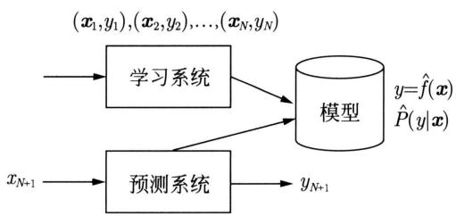  
图2.1 监督学习

首先给定一个训练数据集

$$
\mathcal {D} = \left\{\left(\boldsymbol {x} _ {1}, y _ {1}\right), \left(\boldsymbol {x} _ {2}, y _ {2}\right), \dots , \left(\boldsymbol {x} _ {N}, y _ {N}\right) \right\}
$$

其中， $(\pmb {x}_i,y_i)$ ， $i = 1,2,\dots ,N$ 为样本。 $\pmb {x}_i\in \mathcal{X}\subseteq \mathbb{R}^D$ 是输入或实例， $y_{i}\in \mathcal{V}$ 是输出。

在学习过程中，学习系统利用给定的训练数据集，通过学习（或训练）得到一个模型，表示为条件概率分布 $\hat{P}(y|\boldsymbol{x})$ 或函数 $y = \hat{f}(\boldsymbol{x})$ 。条件概率分布 $\hat{P}(y|\boldsymbol{x})$ 或函数 $y = \hat{f}(\boldsymbol{x})$ 描述输入与输出随机之间的映射关系。在预测过程中，预测系统对于给定的测试数据集中的输入 $\boldsymbol{x}_{N+1}$ ，由 $y_{N+1} = \arg\max_y \hat{P}(y|\boldsymbol{x}_{N+1})$ 或 $y_{N+1} = \hat{f}(\boldsymbol{x}_{N+1})$ 给出对应的输出 $y_{N+1}$ 。

在监督学习中，假设训练数据与测试数据是依同一个联合概率分布 $P(\pmb{x},\pmb{y})$ 独立同分布产生的。

学习系统（也就是学习算法）试图通过训练数据集中的样本学习模型。具体地说，对一个输入 $\boldsymbol{x}_i$ ，一个具体的模型 $y = \hat{f}(\boldsymbol{x})$ 可以产生一个输出 $\hat{f}(\boldsymbol{x}_i)$ ，而训练数据集中对应的输出是 $y_i$ 。如果这个模型有很好的预测能力，训练数据输出 $y_i$ 和模型输出 $\hat{f}(\boldsymbol{x}_i)$ 之间的差就应该足够小。学习系统通过不断地尝试，选取最好的模型，以便对训练数据有足够好的预测，同时对未知的测试数据的预测也有足够好的推广。

# 2.1.2 监督学习三要素

监督学习方法都是由模型、策略和算法组成，称为机器学习三要素，概括为

$$
\text {方 法} = \text {模 型} + \text {策 略} + \text {算 法}
$$

下面论述监督学习的三要素。可以说开发一种监督学习方法就是设计具体的三要素。

# 1. 模型

监督学习首要考虑的是学习什么样的预测模型。在学习过程中，预测模型就是所要学习的条件概率分布或函数。模型的假设空间（hypothesis space）包含所有可能的条件概率分布或函数。例如，假设函数是输入变量的线性函数，那么模型的假设空间就是所有线性函数构成的函数集合。假设空间中的模型一般有无穷多个。

假设空间可以定义为条件概率的集合：

$$
\mathcal {F} = \{P | P (y | \boldsymbol {x}) \} \tag {2.1}
$$

其中， $\pmb{x}$ 和 $y$ 是定义在输入空间 $\mathcal{X}$ 和输出空间 $\mathcal{Y}$ 上的随机变量。这时 $\mathcal{F}$ 通常是由一个参数向量决定的条件概率分布族：

$$
\mathcal {F} = \left\{P \mid P _ {\boldsymbol {\theta}} (y \mid \boldsymbol {x}), \boldsymbol {\theta} \in \mathbb {R} ^ {M} \right\} \tag {2.2}
$$

参数向量 $\pmb{\theta}$ 取值于 $M$ 维欧氏空间 $\mathbb{R}^M$ ，称为参数空间。

假设空间也可以定义为函数的集合：

$$
\mathcal {F} = \{f | y = f (\boldsymbol {x}) \} \tag {2.3}
$$

其中， $x$ 和 $y$ 是定义在输入空间 $\mathcal{X}$ 和输出空间 $\mathcal{Y}$ 上的变量。这时 $\mathcal{F}$ 通常是由一个参数向量决定的函数族：

$$
\mathcal {F} = \{f | y = f _ {\boldsymbol {\theta}} (\boldsymbol {x}), \boldsymbol {\theta} \in \mathbb {R} ^ {M} \} \tag {2.4}
$$

参数向量 $\pmb{\theta}$ 取值于 $M$ 维欧氏空间 $\mathbb{R}^M$ ，也称为参数空间（parameter space）。

监督学习的模型可以分为概率模型（probabilistic model）和非概率模型（non-probabilistic model）。概率模型取条件概率分布形式 $P(y|\boldsymbol{x})$ ，非概率模型取函数形式 $y = f(\boldsymbol{x})$ ，其中 $\boldsymbol{x}$ 是输入， $y$ 是输出。本篇介绍的朴素贝叶斯法、逻辑斯谛回归和最大熵模型、隐马尔可夫模型、条件随机场是概率模型。线性回归、感知机、 $k$ 近邻法、支持向量机、提升方法是非概率模型。线性回归、 $k$ 近邻法、决策树有概率模型的解释。二项逻辑斯谛回归模型有非概率模型的解释。

监督学习的模型还可以分为生成模型（generative model）和判别模型（discriminative model）。生成模型通过学习联合分布 $P(\boldsymbol{x}, y)$ ，导出条件概率分布 $P(y|\boldsymbol{x})$ ，用于预测，也可以用于数据生成。判别模型直接学习条件概率分布 $P(y|\boldsymbol{x})$ 或函数 $y = f(\boldsymbol{x})$ 用于预测，不考虑数据的生成。朴素贝叶斯法、隐马尔可夫模型是生成模型，线性回归、感知机、支持向量机、 $k$ 近邻法、决策树、逻辑斯谛回归和最大熵模型、支持向量机、提升方法、条件随机场是判别模型。2.3.1节中进一步对生成模型和判别模型做详细讲解。

概率模型的一种类型是概率图模型（probabilistic graphical model），概率图模型是可以由有向图或者无向图表示的概率模型，隐马尔可夫模型、条件随机场是概率图模型。

非概率模型有线性模型（linear model）和非线性模型（non-linear model）。如果函数 $y = f(\pmb{x})$ 是 $\pmb{x}$ 的线性函数，则称模型是线性模型，否则称模型是非线性模型。线性回归、感知机、线性支持向量机是线性模型， $k$ 近邻法、决策树、含核方法的支持向量机、提升方法是非线性模型。深度学习（deep learning）实际是复杂神经网络的学习，也就是复杂的非线性模型的学习。

监督学习模型又可以分为参数化模型（parametric model）和非参数化模型（non-parametric model）。参数化模型假设模型参数的维度固定，模型可以由有限维参数完全刻画；非参数化模型假设模型参数的维度不固定或者说无穷大，可能随着训练数据量的增加而增大。线性回归、感知机、朴素贝叶斯法、逻辑斯谛回归和最大熵模型、隐马尔可夫模型、条件随机场是参数化模型， $k$ 近邻法、决策树、支持向量机、提升方法是非参数化模型。

# 2. 策略

有了模型的假设空间，监督学习接着需要考虑的是按照什么样的准则学习或选择最优的模型。目标在于从假设空间中选取最优模型。

首先引入损失函数与风险函数的概念。损失函数度量模型一次预测的好坏，风险函数度量平均意义下模型预测的好坏。

监督学习问题是在假设空间 $\mathcal{F}$ 中选取函数 $f$ 作为模型，对于给定的输入 $\pmb{x}$ ，由 $f(\pmb{x})$ 给出对应的输出 $y$ ，这个输出的值 $f(\pmb{x})$ 与真实值 $y$ 可能一致也可能不一致，用一个损失函数（loss function）或代价函数（cost function）来度量预测错误的程度。损失函数是 $f(\pmb{x})$ 和 $y$ 的非负实值函数，记作 $L(y, f(\pmb{x}))$ 。

监督学习的常用损失函数有以下几种：

（1）0-1 损失函数（0-1 loss function）

$$
L (y, f (\boldsymbol {x})) = \left\{ \begin{array}{l l} 1, & y \neq f (\boldsymbol {x}) \\ 0, & y = f (\boldsymbol {x}) \end{array} \right. \tag {2.5}
$$

（2）平方损失函数（quadratic loss function）

$$
L (y, f (\boldsymbol {x})) = (y - f (\boldsymbol {x})) ^ {2} \tag {2.6}
$$

（3）绝对损失函数（absolute loss function）

$$
L (y, f (\boldsymbol {x})) = | y - f (\boldsymbol {x}) | \tag {2.7}
$$

（4）对数损失函数（logarithmic loss function）或负对数似然损失（negative log-likelihood loss function）

$$
L (y, P (y | \boldsymbol {x})) = - \log P (y | \boldsymbol {x}) \tag {2.8}
$$

（5）交叉熵损失函数（cross entropy loss function），是对数损失用于多类分类时的损失函数。

$$
L (\boldsymbol {y}, P (\boldsymbol {y} \mid \boldsymbol {x})) = - \sum_ {k = 1} ^ {K} y _ {k} \log P (y = c _ {k} \mid \boldsymbol {x}) \tag {2.9}
$$

假设有 $K$ 个类别 $\{c_{1}, c_{2}, \dots, c_{K}\}$ ， $\pmb{y} = (y_{1}, y_{2}, \dots, y_{K})^{\mathrm{T}}$ 表示实例属于 $K$ 个类别中的一个类别的独热向量（one-hot vector），其中一维取值为1，其他维取值为0。

损失函数值越小，模型就越好。由于模型的输入和输出 $(\pmb{x},y)$ 是随机变量，遵循联合分布 $P(\pmb{x},y)$ ，所以损失函数的期望是

$$
\begin{array}{l} R _ {\exp} (f) = \mathbb {E} _ {P (\boldsymbol {x}, y)} [ L (y, f (\boldsymbol {x})) ] \\ = \int_ {\mathcal {X} \times \mathcal {Y}} L (y, f (\boldsymbol {x})) P (\boldsymbol {x}, y) \mathrm {d} \boldsymbol {x} \mathrm {d} y \tag {2.10} \\ \end{array}
$$

这是理论上模型 $f(\pmb{x})$ 关于联合分布 $P(\pmb{x}, y)$ 的平均意义下的损失，称为期望风险（expected risk）或期望损失（expected loss）。

学习的目标就是选择期望风险最小的模型。由于联合分布 $P(\pmb{x},y)$ 是未知的， $R_{\mathrm{exp}}(f)$ 不能直接计算。实际上，如果知道联合分布 $P(\pmb{x},y)$ ，可以从联合分布直接推出条件概率分布 $P(y|\pmb{x})$ ，也就不需要学习了。正因为不知道联合概率分布，所以才需要进行学习。这样一来，一方面根据期望风险最小学习模型要用到联合分布，另一方面联合分布是未知的，所以监督学习就成为一个病态问题（ill-formed problem）。

给定一个训练数据集

$$
\mathcal {D} = \left\{\left(\boldsymbol {x} _ {1}, y _ {1}\right), \left(\boldsymbol {x} _ {2}, y _ {2}\right), \dots , \left(\boldsymbol {x} _ {N}, y _ {N}\right) \right\}
$$

模型 $f(\pmb{x})$ 关于训练数据集的平均损失称为经验风险（empirical risk）或经验损失（empirical loss），记作

$$
R _ {\mathrm {e m p}} (f) = \frac {1}{N} \sum_ {i = 1} ^ {N} L \left(y _ {i}, f \left(\boldsymbol {x} _ {i}\right)\right) \tag {2.11}
$$

期望风险 $R_{\mathrm{exp}}(f)$ 是模型关于联合分布的期望损失，经验风险 $R_{\mathrm{emp}}(f)$ 是模型关于训练数据集的平均损失。根据大数定律，当样本数量 $N$ 趋于无穷时，经验风险 $R_{\mathrm{emp}}(f)$ 趋于期望风险 $R_{\mathrm{exp}}(f)$ ，所以一个很自然的想法是用经验风险估计期望风险。但是，由于现实中训练样

本数量有限，甚至很小，所以用经验风险估计期望风险有时并不理想，要对经验风险进行一定的矫正。这就关系到监督学习的两个基本策略：经验风险最小化和结构风险最小化。

在假设空间、损失函数以及训练数据集确定的情况下，经验风险函数式(2.11)就可以确定。经验风险最小化（empirical risk minimization，ERM）的策略认为，经验风险最小的模型是最优的模型。根据这一策略，求最优模型就是求解最优化问题：

$$
\min  _ {f \in \mathcal {F}} \frac {1}{N} \sum_ {i = 1} ^ {N} L \left(y _ {i}, f \left(\boldsymbol {x} _ {i}\right)\right) \tag {2.12}
$$

当样本数量足够大时，经验风险最小化能保证有很好的学习效果，在现实中被广泛采用。比如，极大似然估计（maximum likelihood estimation）就是经验风险最小化的一个例子。当模型是条件概率分布、损失函数是对数损失函数时，经验风险最小化就等价于极大似然估计。但是，当样本数量很小时，经验风险最小化学习的效果就未必很好，容易产生2.1.3节介绍的过拟合（over-fitting）现象。

结构风险最小化（structural risk minimization，SRM）是为了防止过拟合而提出来的策略。结构风险最小化通过正则化（regularization）实现。具体地，在经验风险上加上表示模型复杂度的正则化项（regularizer）或罚项（penalty term），称之为结构风险，对其进行最小化。在假设空间、损失函数以及训练数据集确定的情况下，结构风险的定义是

$$
R _ {\mathrm {s r m}} (f) = \frac {1}{N} \sum_ {i = 1} ^ {N} L \left(y _ {i}, f \left(\boldsymbol {x} _ {i}\right)\right) + \lambda \Omega (f) \tag {2.13}
$$

其中, $\Omega(f)$ 为模型的复杂度, 是定义在假设空间 $\mathcal{F}$ 上的泛函。模型 $f$ 越复杂, 复杂度 $\Omega(f)$ 就越大; 反之, 模型 $f$ 越简单, 复杂度 $\Omega(f)$ 就越小。也就是说, 复杂度表示了对复杂模型的惩罚。 $\lambda \geqslant 0$ 是系数, 用以权衡经验风险和模型复杂度。结构风险小需要经验风险与模型复杂度同时小。结构风险小的模型往往对训练数据以及未知的测试数据都有较好的预测。

比如，贝叶斯估计中的最大后验概率估计（maximum posterior probability estimation，MAP）就是结构风险最小化的一个例子。当模型是条件概率分布、损失函数是对数损失函数、模型复杂度由模型的先验概率表示时，结构风险最小化就等价于最大后验概率估计。

结构风险最小化的策略认为结构风险最小的模型是最优的模型。根据这一策略，求最优模型就是求解最优化问题：

$$
\min  _ {f \in \mathcal {F}} \frac {1}{N} \sum_ {i = 1} ^ {N} L \left(y _ {i}, f \left(\boldsymbol {x} _ {i}\right)\right) + \lambda \Omega (f) \tag {2.14}
$$

这样，监督学习问题就变成了经验风险最小化问题(2.12)或期望风险最小化问题(2.14)。这时经验风险或期望风险是目标函数。

# 3. 算法

监督学习基于训练数据集，根据学习策略，从假设空间中选择最优模型，最后需要考虑用什么样的计算方法实现。这时，监督学习的算法成为求解最优化问题的算法。如果最优化问题有显式的解析解，这个最优化问题就比较简单。但通常解析解不存在，这就需要用数值计算或启发式算法求解。如何保证找到全局最优解，并使求解的过程非常高效，就成为

一个重要问题。监督学习有时采用通用的最优化算法，有时也使用针对特定问题的最优化算法。

监督学习的算法依据训练模式，可以分为在线学习（online learning）与批量学习（batch learning）。在线学习是指每次接收一个样本，进行预测，之后学习模型，并不断重复上述操作的学习模式。与之对应，批量学习一次接受所有数据，学习模型，之后进行预测。有些实际应用的场景要求学习必须是在线的。比如，数据依次达到无法存储，系统需要及时做出处理；数据规模很大，不可能一次处理所有数据；数据中的模式随时间动态变化，需要算法快速适应新的模式（不满足独立同分布假设）。批量学习算法更为常用，本篇介绍的方法基本都是批量学习算法。

监督学习方法之间的不同主要来自其模型、策略、算法的不同。确定了模型、策略、算法，监督学习的方法也就确定了。这就是将其称为机器学习方法三要素的原因。下面介绍监督学习的几个重要概念。

# 2.1.3 模型评估与模型选择

# 1. 训练误差与测试误差

监督学习的目的是使学到的模型不仅对已知数据而且对未知数据都能有很好的预测。不同的学习方法会给出不同的模型。当损失函数给定时，基于损失函数的模型的训练误差（training error）和模型的测试误差（test error）就自然成为学习方法评估的标准。

注意，训练时采用的损失函数未必是测试时使用的损失函数。当然，让两者一致是比较理想的。有时为了优化方便等原因，训练时使用与测试时不同的损失函数，称之为代理损失函数（surrogate loss function）。代理损失函数应该是测试损失函数的较好的近似，比如，是其上界。

假设学习到的模型是 $y = \hat{f}(\pmb{x})$ ，训练误差是模型关于训练数据集的平均损失：

$$
R _ {\mathrm {e m p}} (\hat {f}) = \frac {1}{N} \sum_ {i = 1} ^ {N} L \left(y _ {i}, \hat {f} \left(\boldsymbol {x} _ {i}\right)\right) \tag {2.15}
$$

其中， $N$ 是训练样本数量。

测试误差是模型关于测试数据集的平均损失：

$$
e _ {\text {t e s t}} = \frac {1}{N ^ {\prime}} \sum_ {i = 1} ^ {N ^ {\prime}} L \left(y _ {i}, \hat {f} \left(\boldsymbol {x} _ {i}\right)\right) \tag {2.16}
$$

其中， $N^{\prime}$ 是测试样本数量。

例如，当损失函数是0-1损失时，测试误差就变成了测试数据集上的错误率（error rate）：

$$
e _ {\text {t e s t}} = \frac {1}{N ^ {\prime}} \sum_ {i = 1} ^ {N ^ {\prime}} I \left(y _ {i} \neq \hat {f} \left(\boldsymbol {x} _ {i}\right)\right) \tag {2.17}
$$

这里 $I$ 是指示函数（indicator function），当 $y \neq \hat{f}(x)$ 时为1，否则为0。

测试数据集上的准确率（accuracy）为

$$
a _ {\text {t e s t}} = \frac {1}{N ^ {\prime}} \sum_ {i = 1} ^ {N ^ {\prime}} I \left(y _ {i} = \hat {f} \left(\boldsymbol {x} _ {i}\right)\right) \tag {2.18}
$$

显然，

$$
a _ {\text {t e s t}} + e _ {\text {t e s t}} = 1
$$

训练误差的大小对判断给定的问题是不是一个容易学习的问题是有意义的，但本质上不重要。测试误差反映了学习方法对未知的测试数据集的预测能力，是学习中的重要概念。显然，假设有两个学习方法，测试误差小的方法具有更好的预测能力，是性能更好的方法。通常将学习方法对未知数据的预测能力称为泛化能力（generalization ability），这个问题将在2.1.5节继续论述。

# 2. 模型选择

当假设空间含有不同复杂度（例如，不同的参数个数）的模型时，就要面临模型选择（model selection）的问题。我们希望选择或学习一个合适的模型。如果在假设空间中存在“真”的模型，那么随着训练数据的增加，所选择的模型应该逼近真的模型。具体地，所选择的模型与真的模型的参数个数相同，所选择的模型的参数向量与真的模型的参数向量相近。

如果一味追求提高对训练数据的预测性能，所选模型的复杂度往往会比真的模型更高，这种现象称为过拟合（over-fitting）。过拟合是指学习时选择的模型的复杂度过高，以致出现对已知数据预测得很好，但对未知数据预测得很差的现象。相反的称为欠拟合（under-fitting），指学习时选择的模型的复杂度过低，以致出现对已知和未知数据的预测都很差的现象。可以说模型选择旨在避免过拟合或欠拟合，从而提高模型的预测能力。

下面，以多项式函数拟合问题为例，说明模型选择。这是一个回归问题。

例2.1 假设给定一个训练数据集

$$
\mathcal {D} = \left\{\left(x _ {1}, y _ {1}\right), \left(x _ {2}, y _ {2}\right), \dots , \left(x _ {N}, y _ {N}\right) \right\}
$$

其中， $x_{i} \in \mathbb{R}$ 是输入 $x$ 的观测值， $y_{i} \in \mathbb{R}$ 是对应的输出 $y$ 的观测值， $i = 1,2,\dots,N$ 。多项式函数拟合的任务是假设给定数据由 $m$ 次多项式函数生成，但具体的 $m$ 未知。我们需要在 $0 \leqslant m \leqslant M$ 范围内，选择最有可能产生这些数据的 $m$ 次多项式函数，即确定最优的 $m^{*}$ 。

设 $m$ 次多项式为

$$
f _ {\boldsymbol {w}} (x) = w _ {0} + w _ {1} x + w _ {2} x ^ {2} + \dots + w _ {m} x ^ {m} = \sum_ {j = 0} ^ {m} w _ {j} x ^ {j} \tag {2.19}
$$

其中， $x$ 是单变量输入， $\pmb {w} = (w_0,w_1,\dots ,w_m)$ 是 $m + 1$ 个参数。

解决这一问题的方法可以是这样的：首先确定模型的复杂度，即确定多项式的次数 $m$ ；然后在给定的模型复杂度下，按照经验风险最小化的策略求解模型，即多项式的参数。具体地，求解以下最优化问题：

$$
L (\boldsymbol {w}) = \frac {1}{2} \sum_ {i = 1} ^ {N} \left(y _ {i} - f _ {\boldsymbol {w}} \left(x _ {i}\right)\right) ^ {2} \tag {2.20}
$$

这时，损失函数为平方损失，系数 $\frac{1}{2}$ 是为了计算方便。将模型(2.19)代入优化目标函数(2.20)中，有

$$
L (\boldsymbol {w}) = \frac {1}{2} \sum_ {i = 1} ^ {N} \left(\sum_ {j = 0} ^ {m} y _ {i} - w _ {j} x _ {i} ^ {j}\right) ^ {2}
$$

这一问题可用最小二乘法求得多项式系数的唯一解。求解过程这里不予叙述，读者可参阅第3章的线性回归介绍。针对所有的 $m$ 次多项式函数进行计算，最后选择最优的次数 $m^{*}$ 。

假设给定图 $2.2\sim$ 图2.3中所示的10个样本点，是依照二次函数 $f(x) = 0.5x^{2} - x - 2 + \epsilon$ 随机抽样得到的，其中函数的定义域是(0,6)， $\epsilon \sim N(0,0.5)$ 是高斯噪声。用多项式函数对这些样本数据进行拟合。

  
图2.2 多项式函数拟合：函数是线性函数（ $m = 1$ ）

  
图2.3 多项式函数拟合：函数是四次函数（ $m = 4$ ）

图2.2～图2.3给出了不同的多项式函数拟合情况。图2.2中 $m = 1$ ，函数是线性函数，图形是一条直线，数据拟合效果很差。相反，图2.3中 $m = 4$ ，函数是四次函数，图形是一条四次曲线，对数据有较好的拟合；但是，模型比较复杂，对未知数据的预测能力未必很好，有过拟合现象发生。图2.4中 $m = 2$ ，函数是二次函数，图形是一条二次曲线，对训练数据拟合效果足够好，模型较为简单，是一个较好的选择。注意“真”的模型就是二次函数。

在多项式函数拟合中可以看到，随着多项式次数（模型复杂度）的增大，训练误差会逐渐减小，然而测试误差并非如此。测试误差会随着多项式次数（模型复杂度）的增大先减小而后增大。学习的最终目的是使测试误差达到最小。因此，在多项式函数拟合中，需要选择合适的次数（模型复杂度）以实现这一目标。这一结论对于一般的模型选择同样成立。

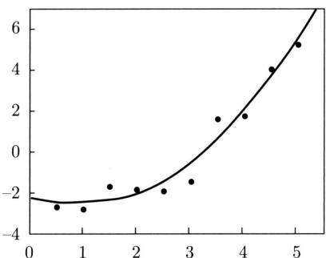  
图2.4 多项式函数拟合：函数是二次函数（ $m = 2$ ）

图2.5描述了训练误差和测试误差与模型复杂度之间的关系。当选择的模型复杂度增大时，训练误差会逐渐减小并趋近于0；而测试误差会先减小，达到最小值后又增大。当选择的模型复杂度过大时，过拟合现象就会发生。因此，在学习时要防止过拟合，进行最优的模型选择，即选择复杂度适当的模型，以达到使测试误差最小的学习目的。

  
图2.5 训练误差和测试误差与模型复杂度的关系

# 3.偏差和方差的权衡

偏差-方差权衡是机器学习中的一个重要概念，它描述了影响模型性能的两种因素之间的关系。可以从另一个角度对模型选择进行理解。

偏差（bias）表示学习到的模型与真实模型之间的差异。方差（variance）表示基于训练数据学习到的模型的波动。当模型简单时，模型无法较准确地刻画训练数据中的预测关系，偏差较高；但另一方面，学习到的模型的波动较小，方差较低。整体而言，模型在训练集和测试集上表现都较差，出现欠拟合现象。相反，当模型复杂时，模型可以较准确地刻画训练数据中的映射关系，偏差较低；但另一方面，学习到的模型的波动较大，方差较高。整体而言，模型在训练集上表现较好，但在测试集上的表现较差，出现过拟合现象。

学习中要实现偏差和方差之间的权衡，以提高模型预测的泛化能力。简单模型具有高偏差和低方差，复杂模型具有低偏差和高方差。偏差和方差之和最小的模型是最应该选择的模型。

偏差-方差的权衡可以针对回归问题做出具体的推导，这时期望损失函数是均方误差（mean squared error, MSE）、平方损失的期望。

$$
L (\hat {f} (\boldsymbol {x})) = \mathbb {E} \left[ (f (\boldsymbol {x}) + \epsilon) - \hat {f} (\boldsymbol {x}) \right] ^ {2} \tag {2.21}
$$

其中， $\epsilon$ 表示高斯噪声，满足 $\mathbb{E}(\epsilon) = 0$ ， $\mathrm{Var}(\epsilon) = \delta^2$ 。基于训练数据的模型估计的方差是

$$
\operatorname {V a r} (\hat {f} (\boldsymbol {x})) = \mathbb {E} \left[ \mathbb {E} [ \hat {f} (\boldsymbol {x}) ] - \hat {f} (\boldsymbol {x}) \right] ^ {2} \tag {2.22}
$$

学习到的模型的偏差是

$$
\operatorname {B i a s} (\hat {f} (\boldsymbol {x})) = \left[ f (\boldsymbol {x}) - \mathbb {E} [ \hat {f} (\boldsymbol {x}) ] \right] \tag {2.23}
$$

这里期望和方差都是针对训练数据的分布定义的，为了简单，期望写作 $\mathbb{E}$ 。

引理2.1告诉我们，均方误差可以写作偏差的平方、方差、固有误差之和的形式。使用均方误差作为损失函数有助于我们评估和优化模型的偏差和方差。因此，在回归问题的学习中，使用均方误差或平方损失是一个较好的选择。

引理2.1（偏差-方差分解）

$$
L (\hat {f} (\boldsymbol {x})) = \operatorname {B i a s} (\hat {f} (\boldsymbol {x})) ^ {2} + \operatorname {V a r} (\hat {f} (\boldsymbol {x})) + \epsilon^ {2} \tag {2.24}
$$

证明 展开均方误差的定义得到：

$$
\begin{array}{l} L (\hat {f} (\boldsymbol {x})) = \mathbb {E} \left[ (f (\boldsymbol {x}) + \epsilon - \hat {f} (\boldsymbol {x})) ^ {2} \right] \\ = \mathbb {E} \left[ (f (\boldsymbol {x}) - \hat {f} (\boldsymbol {x})) ^ {2} \right] + 2 \mathbb {E} \left[ (f (\boldsymbol {x}) - \hat {f} (\boldsymbol {x})) \epsilon \right] + \mathbb {E} \left(\epsilon^ {2}\right) \tag {2.25} \\ \end{array}
$$

式 (2.25) 右侧的第 2 项为 0:

$$
2 \mathbb {E} \left[ (f (\boldsymbol {x}) - \hat {f} (\boldsymbol {x})) \epsilon \right] = 2 \mathbb {E} \left[ (f (\boldsymbol {x}) - \hat {f} (\boldsymbol {x})) \right] \mathbb {E} [ \epsilon ] = 0
$$

式 (2.25) 右侧的第 1 项可以进一步展开：

$$
\begin{array}{l} \mathbb {E} \left[ (f (\boldsymbol {x}) - \hat {f} (\boldsymbol {x})) ^ {2} \right] = \mathbb {E} \left[ (f (\boldsymbol {x}) - \mathbb {E} [ \hat {f} (\boldsymbol {x}) ] + \mathbb {E} [ \hat {f} (\boldsymbol {x}) ] - \hat {f} (\boldsymbol {x})) ^ {2} \right] \\ = \mathbb {E} \left[ (f (\boldsymbol {x}) - \mathbb {E} [ \hat {f} (\boldsymbol {x}) ]) ^ {2} \right] + 2 \mathbb {E} \left[ (f (\boldsymbol {x}) - \mathbb {E} [ \hat {f} (\boldsymbol {x}) ]) (\mathbb {E} [ \hat {f} (\boldsymbol {x}) ] - \hat {f} (\boldsymbol {x})) \right] + \\ \end{array}
$$

$$
\mathbb {E} \left[ \left(\mathbb {E} [ \hat {f} (\boldsymbol {x}) ] - \hat {f} (\boldsymbol {x})) ^ {2} \right] \right. \tag {2.26}
$$

式 (2.26) 右侧的第 2 项为 0:

$$
\begin{array}{l} \mathbb {E} \left[ (f (\boldsymbol {x}) - \mathbb {E} [ \hat {f} (\boldsymbol {x}) ]) (\mathbb {E} [ \hat {f} (\boldsymbol {x}) ] - \hat {f} (\boldsymbol {x})) \right] = \mathbb {E} \left[ f (\boldsymbol {x}) \mathbb {E} [ \hat {f} (\boldsymbol {x}) ] - f (\boldsymbol {x}) \hat {f} (\boldsymbol {x}) - \mathbb {E} [ \hat {f} (\boldsymbol {x}) ] ^ {2} + \mathbb {E} [ \hat {f} (\boldsymbol {x}) ] \hat {f} (\boldsymbol {x}) \right] \\ = f (\boldsymbol {x}) \mathbb {E} [ \hat {f} (\boldsymbol {x}) ] - f (\boldsymbol {x}) \mathbb {E} [ \hat {f} (\boldsymbol {x}) ] - \mathbb {E} [ \hat {f} (\boldsymbol {x}) ] ^ {2} + \mathbb {E} [ \hat {f} (\boldsymbol {x}) ] ^ {2} \\ = 0 \\ \end{array}
$$

式 (2.26) 右侧的第 1 项可以改写为

$$
\begin{array}{l} \mathbb {E} \left[ (f (\boldsymbol {x}) - \mathbb {E} [ \hat {f} (\boldsymbol {x}) ] ^ {2} \right] = \mathbb {E} \left[ f (\boldsymbol {x}) ^ {2} - 2 f (\boldsymbol {x}) \mathbb {E} [ \hat {f} (\boldsymbol {x}) ] + \mathbb {E} [ \hat {f} (\boldsymbol {x}) ] ^ {2} \right] \\ = \left[ f (\boldsymbol {x}) ^ {2} - 2 f (\boldsymbol {x}) \mathbb {E} [ \hat {f} (\boldsymbol {x}) ] + \mathbb {E} [ \hat {f} (\boldsymbol {x}) ] ^ {2} \right] \\ = \left[ f (\boldsymbol {x}) - \mathbb {E} [ \hat {f} (\boldsymbol {x}) ] \right] ^ {2} \\ \end{array}
$$

代回式 (2.26)，再代回式 (2.25) 得到：

$$
L (\hat {f} (\boldsymbol {x})) = \left[ f (\boldsymbol {x}) - \mathbb {E} [ \hat {f} (\boldsymbol {x}) ] \right] ^ {2} + \mathbb {E} \left[ \left(\mathbb {E} [ \hat {f} (\boldsymbol {x}) ] - \hat {f} (\boldsymbol {x})\right) ^ {2} \right] + \mathbb {E} (\epsilon^ {2})
$$

其中，右侧第1项是偏差的平方，第2项是方差，第3项是固有误差（irreducible error）。

# 2.1.4 正则化与交叉验证

下面介绍两种常用的模型选择方法：正则化与交叉验证。

# 1. 正则化

模型选择的典型方法是正则化（regularization）。正则化是结构风险最小化策略的实现，是在经验风险上加一个正则化项（regularizer）或罚项（penalty term）。正则化项一般是模型复杂度的单调递增函数，模型越复杂，正则化值就越大。比如，正则化项可以是模型参数向量的范数。

正则化一般具有如下形式：

$$
\min  _ {f \in \mathcal {F}} \frac {1}{N} \sum_ {i = 1} ^ {N} L \left(y _ {i}, f \left(\boldsymbol {x} _ {i}\right)\right) + \lambda \Omega (f) \tag {2.27}
$$

其中第1项是经验风险，第2项是正则化项， $\lambda \geqslant 0$ 为权衡两者作用的系数。

正则化项可以取不同的形式。例如，在回归问题中，损失函数是平方损失，正则化项可以是参数向量的 $L_{2}$ 范数：

$$
L (\boldsymbol {w}) = \frac {1}{N} \sum_ {i = 1} ^ {N} \left(f _ {\boldsymbol {w}} \left(\boldsymbol {x} _ {i}\right) - y _ {i}\right) ^ {2} + \frac {\lambda}{2} \| \boldsymbol {w} \| _ {2} ^ {2} \tag {2.28}
$$

这里 $\| \pmb{w}\|$ 表示参数向量 $\pmb{w}$ 的 $L_{2}$ 范数。

正则化项也可以是参数向量的 $L_{1}$ 范数：

$$
L (\boldsymbol {w}) = \frac {1}{N} \sum_ {i = 1} ^ {N} \left(f _ {\boldsymbol {w}} \left(\boldsymbol {x} _ {i}\right) - y _ {i}\right) ^ {2} + \lambda \| \boldsymbol {w} \| _ {1} \tag {2.29}
$$

这里 $\| \pmb {w}\| _1$ 表示参数向量 $\pmb{w}$ 的 $L_{1}$ 范数。

第1项的经验风险较小的模型可能较复杂（有多个非零参数），这时第2项的模型复杂度会较大。正则化的作用是选择经验风险与模型复杂度同时较小的模型。

正则化符合奥卡姆剃刀（Occam's razor）原理。奥卡姆剃刀原理应用于模型选择时变为以下想法：在所有可能选择的模型中，能够很好地解释已知数据并且足够简单的模型是最好的模型，也就是应该选择的模型。从贝叶斯估计的角度来看，正则化项对应于模型的先验概率。可以假设复杂的模型有较小的先验概率，简单的模型有较大的先验概率。

# 2. 交叉验证

另一种常用的模型选择方法是交叉验证（cross validation）。

如果样本数据充足，进行模型选择的一种简单方法是用额外数据进行验证。随机地将数

据集切分成三部分，分别为训练集（training set）、验证集（validation set）和测试集（test set）。使用训练集训练不同的模型，用验证集来评估和比较这些模型的性能，进而选择性能最好的模型，最后用测试集来评估最终选定模型的泛化能力。由于验证集有足够多的数据，用它对模型进行选择是有效的。

但是，在许多实际应用中数据往往是不充足的。为了选择好的模型，可以采用交叉验证。交叉验证的基本思路是重复利用数据，将给定的数据进行切分，构建训练集与测试集，在此基础上反复进行训练、测试以及模型选择。

简单交叉验证方法如下：首先随机地将给定数据分为两部分，一部分作为训练集，另一部分作为测试集（例如， $70\%$ 的数据为训练集， $30\%$ 的数据为测试集）；然后用训练集在各种条件下（例如，不同的参数个数）训练模型，从而得到不同的模型；在测试集上评测各个模型的测试误差；重复上述过程多次，计算所有模型在所有测试集上的平均测试误差，选择平均预测误差最小的模型。

应用最多的是 $S$ 折交叉验证（ $S$ -fold cross validation），方法如下：首先随机地将已给数据切分为 $S$ 个互不相交、大小相同的子集；然后利用 $S - 1$ 个子集的数据训练模型，利用余下的子集测试模型；将这一过程对可能的 $S$ 种选择重复进行；最后选出 $S$ 次评测的平均测试误差最小的模型。

$S$ 折交叉验证的特殊情形是 $S = N$ ，称为留一交叉验证（leave-one-out cross validation），往往在数据缺乏的情况下使用。这里 $N$ 是给定数据集的容量。

交叉验证用于模型选择的一个具体做法是早停法（early stopping）。将数据分为训练集和验证集。用训练集学习模型，验证集评估学到的模型的性能。随着模型复杂度的增加，训练误差会逐渐降低，整体趋近于0；而验证误差也会先逐渐降低，但在某个点达到最小，然后逐渐上升。选择验证误差达到最小值时的模型作为学习的结果，而不是选择训练误差变得更小时的模型，所以，学习是提早停止的。

# 2.1.5 泛化能力

# 1. 泛化误差

监督学习方法的泛化能力（generalization ability）是指由该学习方法学习到的模型对未知数据的预测能力，是学习方法本质上重要的性质。现实中采用最多的办法是通过测试误差来评价学习方法的泛化能力。但这种评价是依赖于测试数据集的。因为测试数据集是有限的，很有可能由此得到的评价结果是不可靠的。机器学习理论试图从理论上对监督学习方法的泛化能力进行分析。

首先给出泛化误差的定义。如果学到的模型是 $\hat{f}$ ，那么用这个模型对未知数据预测的误差称为泛化误差（generalization error）：

$$
\begin{array}{l} R _ {\exp} (\hat {f}) = \mathbb {E} _ {P (\boldsymbol {x}, y)} [ L (y, \hat {f} (\boldsymbol {x})) ] \\ = \int_ {\mathcal {X} \times \mathcal {Y}} L (y, \hat {f} (\boldsymbol {x})) P (\boldsymbol {x}, y) \mathrm {d} \boldsymbol {x} \mathrm {d} y \tag {2.30} \\ \end{array}
$$

泛化误差反映了学习方法的泛化能力，如果一种方法学习的模型比另一种方法学习的模

型具有更小的泛化误差，那么这种方法就更有效。事实上，泛化误差就是所学习到的模型的期望风险。

泛化误差分析主要是针对传统机器学习进行的。现实中发现，深度监督学习与传统机器学习有很大的不同，深度监督学习中泛化误差分析不一定成立，其泛化能力需要新的理论来更好地分析和理解。

# 2. 泛化误差上界

学习方法的泛化能力分析往往是通过研究泛化误差的概率上界进行的，简称为泛化误差上界（generalization error bound）。具体来说，就是通过比较两种学习方法的泛化误差上界的大小来比较它们的优劣。泛化误差上界通常具有以下性质：它是样本数量的函数，当样本数量增加时，泛化误差上界趋于0；它也是假设空间容量（capacity of hypothesis space）的函数，假设空间容量越大，模型就越难学，泛化误差上界就越大。假设空间容量是衡量模型的复杂度的概念，有多种计算方法，如VC维（Vapnik-Chervonenkis dimension）。这里不做介绍。

下面给出一个简单的泛化误差上界的例子：二类分类问题的泛化误差上界，假设空间是函数的有限集合，策略是经验风险最小化。

考虑二类分类问题。已知训练数据集 $\mathcal{D} = \left\{\left(x_{1},y_{1}\right),\left(x_{2},y_{2}\right),\dots ,\left(x_{N},y_{N}\right)\right\}$ ， $N$ 是样本数量， $\mathcal{D}$ 是从联合概率分布 $P(\pmb {x},y)$ 独立同分布产生的， $\pmb {x}\in \mathbb{R}^{D}$ ， $y\in \{-1, + 1\}$ 。假设空间是函数的有限集合 $\mathcal{F} = \{f_1,f_2,\dots ,f_h\}$ ， $h$ 是函数个数。设 $f$ 是从 $\mathcal{F}$ 中选取的函数。损失函数是0-1损失。函数 $f$ 的期望风险和经验风险分别是

$$
R _ {\exp} (f) = \mathbb {E} _ {P (\boldsymbol {x}, y)} [ L (y, f (\boldsymbol {x})) ] \tag {2.31}
$$

$$
R _ {\text {e m p}} (f) = \frac {1}{N} \sum_ {i = 1} ^ {N} L \left(y _ {i}, f \left(\boldsymbol {x} _ {i}\right)\right) \tag {2.32}
$$

经验风险最小化得到：

$$
\hat {f} _ {N} = \arg \min  _ {f \in \mathcal {F}} R _ {\mathrm {e m p}} (f) \tag {2.33}
$$

$\hat{f}_N$ 依赖训练数据集的样本数量 $N$ 。我们更关心的是 $\hat{f}_N$ 的泛化能力

$$
R _ {\exp} (\hat {f} _ {N}) = \mathbb {E} _ {P (\boldsymbol {x}, y)} [ L (y, \hat {f} _ {N} (\boldsymbol {x})) ] \tag {2.34}
$$

下面讨论从有限集合 $\mathcal{F} = \{f_1, f_2, \dots, f_h\}$ 中任意选出的函数 $f$ 的泛化误差上界。

定理2.1（泛化误差上界）对二类分类问题，当假设空间是有限个函数的集合 $\mathcal{F} = \{f_1, f_2, \dots, f_h\}$ 时，对任意一个函数 $f \in \mathcal{F}$ ，至少以概率 $1 - \delta, 0 < \delta < 1$ ，以下不等式成立：

$$
R _ {\exp} (f) \leqslant R _ {\mathrm {e m p}} (f) + \varepsilon (h, N, \delta) \tag {2.35}
$$

其中，

$$
\varepsilon (h, N, \delta) = \sqrt {\frac {1}{2 N} \left(\log h + \log \frac {1}{\delta}\right)} \tag {2.36}
$$

不等式 (2.35) 左侧 $R_{\mathrm{exp}}(f)$ 是泛化误差，右侧为泛化误差上界。在泛化误差上界中，第 1

项 $R_{\mathrm{emp}}(f)$ 是训练误差，训练误差越小，泛化误差也越小。第2项 $\varepsilon (h,N,\delta)$ 是 $N$ 的单调递减函数，当 $N$ 趋于无穷时趋于0；同时它也是 $\sqrt{\log h}$ 阶的函数，代表了假设空间的容量，假设空间 $\mathcal{F}$ 包含的函数越多，其值越大。

证明 在证明中要用到Hoeffding不等式，先叙述如下。

设 $z_{1}, z_{2}, \dots, z_{N}$ 是独立随机变量，且 $z_{i} \in [a_{i}, b_{i}]$ ， $i = 1, 2, \dots, N$ ； $\bar{z}$ 是 $z_{1}, z_{2}, \dots, z_{N}$ 的经验均值，即 $\bar{z} = \frac{1}{N} \sum_{i=1}^{N} z_{i}$ ，则对任意 $\epsilon > 0$ ，以下不等式成立：

$$
P (\bar {z} - \mathbb {E} (\bar {z}) \geqslant \epsilon) \leqslant \exp \left[ - \frac {2 N ^ {2} \epsilon^ {2}}{\sum_ {i = 1} ^ {N} (b _ {i} - a _ {i}) ^ {2}} \right] \tag {2.37}
$$

$$
P \left(\mathbb {E} (\bar {z}) - \bar {z} \geqslant \epsilon\right) \leqslant \exp \left[ - \frac {2 N ^ {2} \epsilon^ {2}}{\sum_ {i = 1} ^ {N} \left(b _ {i} - a _ {i}\right) ^ {2}} \right] \tag {2.38}
$$

对任意函数 $f \in \mathcal{F}$ , $R_{\mathrm{emp}}(f)$ 是 $N$ 个独立的随机变量 $L(y_i, f(\pmb{x}_i))$ 的样本均值, $R_{\mathrm{exp}}(f)$ 是随机变量 $R_{\mathrm{emp}}(f)$ 的期望值。如果损失函数取值于区间 $[0,1]$ , 即对所有 $i$ , $[a_i, b_i] = [0,1]$ , 那么由Hoeffding不等式(2.38)不难得知, 对 $\varepsilon > 0$ , 以下不等式成立:

$$
P \left(R _ {\exp} (f) - R _ {\mathrm {e m p}} (f) \geqslant \varepsilon\right) \leqslant \exp \left(- 2 N \varepsilon^ {2}\right) \tag {2.39}
$$

由于 $\mathcal{F} = \{f_1, f_2, \dots, f_h\}$ 是一个有限集合，故

$$
\begin{array}{l} P (\exists f \in \mathcal {F}: R _ {\exp} (f) - R _ {\mathrm {e m p}} (f) \geqslant \varepsilon) = P \left(\bigcup_ {f \in \mathcal {F}} \left\{R _ {\exp} (f) - R _ {\mathrm {e m p}} (f) \geqslant \varepsilon \right\}\right) \\ \leqslant \sum_ {f \in \mathcal {F}} P \left(R _ {\exp} (f) - R _ {\mathrm {e m p}} (f) \geqslant \varepsilon\right) \\ \leqslant h \exp (- 2 N \varepsilon^ {2}) \\ \end{array}
$$

或者等价地，对任意 $f\in \mathcal{F}$ ，有

$$
P (R _ {\mathrm {e x p}} (f) - R _ {\mathrm {e m p}} (f) <   \varepsilon) \geqslant 1 - h \exp (- 2 N \varepsilon^ {2})
$$

令

$$
\delta = h \exp (- 2 N \varepsilon^ {2}) \tag {2.40}
$$

则

$$
P \left(R _ {\exp} (f) <   R _ {\mathrm {e m p}} (f) + \varepsilon\right) \geqslant 1 - \delta
$$

即至少以概率 $1 - \delta$ 有 $R_{\mathrm{exp}}(f) < R_{\mathrm{emp}}(f) + \varepsilon$ ，其中 $\varepsilon$ 由式 (2.40) 得到，即为式 (2.36)。

从泛化误差上界可知：

$$
R _ {\exp} \left(\hat {f} _ {N}\right) \leqslant R _ {\mathrm {e m p}} \left(\hat {f} _ {N}\right) + \varepsilon (h, N, \delta) \tag {2.41}
$$

其中 $\varepsilon (h,N,\delta)$ 由式(2.36)定义， $\hat{f}_N$ 由式(2.33)定义。

以上讨论的只是假设空间包含有限个函数情况下的泛化误差上界，对一般的假设空间要找到泛化误差上界就没有这么简单，这里不作介绍。

# 2.2 监督学习问题

监督学习的应用主要在三个方面：分类问题、回归问题和序列标注问题。

# 2.2.1 分类问题

分类是监督学习的主要问题。在监督学习中，当输出 $y$ 取有限个离散值时，预测问题便成为分类问题。这时，输入 $\pmb{x}$ 可以是离散的，也可以是连续的。监督学习从数据中学习一个分类模型，称为分类器（classifier）。分类器对新的输入对应的输出进行预测的过程称为分类（classification）。可能的输出称为类别（class）。分类的类别有多个时，称为多类分类；尤其当类别只有两个时，称为二类分类。

分类问题包括学习和分类两个过程。在学习过程中，从训练数据学习一个分类器；在分类过程中，利用学习的分类器对新的实例进行分类。分类问题可用图2.6描述。有训练数据集

$$
\mathcal {D} = \left(\boldsymbol {x} _ {1}, y _ {1}\right), \left(\boldsymbol {x} _ {2}, y _ {2}\right), \dots , \left(\boldsymbol {x} _ {N}, y _ {N}\right)
$$

这里 $\pmb{x}_i$ 是实例的特征向量， $y_i$ 是类别。学习系统由训练数据学习一个分类器 $\hat{P}(y|\pmb{x})$ 或 $y = \hat{f}(\pmb{x})$ ；分类系统通过学到的分类器 $\arg \max_y \hat{P}(y|\pmb{x})$ 或 $y = \hat{f}(\pmb{x})$ 对新的实例 $\pmb{x}_{N+1}$ 进行分类，即预测其类标记 $y_{N+1}$ 。

  
图2.6 分类问题

评价分类器性能的指标一般是分类准确率（accuracy），其定义是：对于给定的测试数据集，分类器正确分类的样本数与总样本数之比。也就是损失函数是0-1损失时测试数据集上的准确率（见式(2.18)）。

对于二类分类问题，常用的评价指标是精确率（precision）与召回率（recall）。通常以关注的类为正类，其他类为负类，分类器在测试数据集上的预测或正确或不正确，4种情况出现的总数分别记作：

TP——将正类预测为正类数；

FN——将正类预测为负类数；

FP——将负类预测为正类数；

TN——将负类预测为负类数。

精确率定义为

$$
P = \frac {\mathrm {T P}}{\mathrm {T P} + \mathrm {F P}} \tag {2.42}
$$

召回率定义为

$$
R = \frac {\mathrm {T P}}{\mathrm {T P} + \mathrm {F N}} \tag {2.43}
$$

此外，还有 $F_{1}$ ，是精确率和召回率的调和均值，即

$$
\frac {2}{F _ {1}} = \frac {1}{P} + \frac {1}{R} \tag {2.44}
$$

$$
F _ {1} = \frac {2 \mathrm {T P}}{2 \mathrm {T P} + \mathrm {F P} + \mathrm {F N}} \tag {2.45}
$$

精确率和召回率都高时， $F_{1}$ 值也会高。

许多监督学习方法可以用于分类，包括感知机、 $k$ 近邻法、朴素贝叶斯法、决策树、逻辑斯谛回归和最大熵模型、支持向量机、提升方法等。

分类在于根据数据特性对其“分门别类”，所以在许多领域都有广泛的应用。例如，在金融领域，可以构建一个客户分类模型，对客户按照贷款风险的大小进行分类；在网络安全领域，可以利用日志数据的分类对非法入侵进行检测；在图像处理中，分类可以用来检测图像中是否有人脸出现；在手写识别中，分类可以用于识别手写的数字；在互联网搜索中，网页的分类可以帮助更好地进行网页的抓取、索引与排序。

举一个分类应用的例子——文本分类（text classification）。这里的文本可以是新闻报道、网页、电子邮件、学术论文等。类别通常是关于文本内容的，如政治、经济、体育等；也可以是关于文本特点的，如正面意见、反面意见；还能够根据应用来确定，如垃圾邮件、非垃圾邮件等。文本分类是依据文本的特征将其分配到已有的类别中。其输入是文本的特征向量，输出是文本的类别。通常把文本中的单词定义为特征，每个单词对应一个特征。单词的特征可以是二值的，表示单词在文本中是否出现；也可以是多值的，表示单词在文本中出现的频率。直观上，如果“股票”“银行”“货币”这些词出现很频繁，那么这个文本可能属于经济类；如果“网球”“比赛”“运动员”这些词频繁出现，这个文本可能属于体育类。

# 2.2.2 回归问题

回归（regression）是监督学习的另一个重要问题。回归用于预测输入（自变量）与输出（因变量）之间的关系。回归模型正是表示从输入到输出之间映射的函数。回归问题的学习可以看作函数的发现，即选择一个函数，使其能够很好地预测已知数据，并且很好地预测未知数据（参照2.1.3节）。函数可以有简单的形式，如线性函数；也可以有复杂的形式，如回归树。

回归问题分为学习和回归两个过程，如图2.7所示。首先给定一个训练数据集

$$
\mathcal {D} = \left\{\left(\boldsymbol {x} _ {1}, y _ {1}\right), \left(\boldsymbol {x} _ {2}, y _ {2}\right), \dots , \left(\boldsymbol {x} _ {N}, y _ {N}\right) \right\}
$$

这里 $\pmb{x}_i$ 是实例的特征向量， $y_i$ 是对应的数值， $i = 1,2,\dots,N$ 。学习系统基于训练数据构建一个回归模型，即函数 $y = \hat{f}(\pmb{x})$ ；对新的实例 $\pmb{x}_{N+1}$ ，回归系统根据学习的回归模型 $y = \hat{f}(\pmb{x})$ 预测其对应的数值 $y_{N+1}$ 。

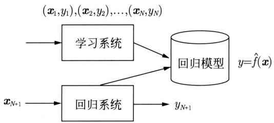  
图2.7 回归问题

回归问题按照输入变量（自变量）的个数，分为简单回归和多重回归；按照输入变量和输出变量之间的关系，分为线性回归和非线性回归。回归学习最常用的损失函数是平方损失或均方误差。用于回归的监督学习方法有线性回归、 $k$ 近邻法、回归树、提升方法。

许多领域的任务都可以形式化为回归问题。比如，回归可在商务领域用于市场趋势预测、产品质量管理、客户满意度调查以及投资风险分析。在此，以股价预测问题为例进行简单介绍。假设已知某一公司在过去不同时间点（例如每天）在市场上的股票价格（如股票日平均价格），以及在各个时间点之前可能影响该公司股价的信息（比如该公司前一周的营业额、利润），这些因素综合影响股价。例如，如果该公司前一周的营业额增长，那么有可能引发股价上涨。如果前一周消费指数上升，那么有可能引发股价下跌。目标是从过去的数据中学习一个模型，使其能够基于当前的信息预测该公司下一个时间点的股价。这个问题可以作为回归问题来解决。具体而言，将影响股价的信息视为自变量（输入的特征），而将股价视为因变量（输出的值）。以过去的数据作为训练数据，就可以学习一个回归模型，并对未来的股价进行预测。可以看出，这是一个困难的预测问题，因为影响股价的因素非常多，我们未必能判断出哪些信息（输入的特征）有用，也未必能得到这些信息。

# 2.2.3 序列标注问题

序列标注（sequential tagging）也是一个监督学习问题。可以认为序列标注问题是分类问题的一个推广，序列标注问题又是更复杂的结构预测（structure prediction）问题的简单形式。序列标注问题的输入是一个观测序列，输出是一个标记序列或状态序列。序列标注问题的目标在于学习一个标注模型，使它能够对观测序列给出标记序列作为预测。注意，可能的标记个数是有限的，但其组合所成的标记序列的个数是依序列长度呈指数级增长的。

序列标注问题分为学习和序列标注两个过程，如图2.8所示。首先给定一个训练数据集

$$
\mathcal {D} = \left\{\left(\boldsymbol {x} _ {1}, \boldsymbol {y} _ {1}\right), \left(\boldsymbol {x} _ {2}, \boldsymbol {y} _ {2}\right), \dots , \left(\boldsymbol {x} _ {N}, \boldsymbol {y} _ {N}\right) \right\}
$$

这里 $\pmb{x}_i = x_{i1}x_{i2}\dots x_{iT}$ 是观测序列， $\pmb{y}_i = y_{i1}y_{i2}\dots y_{iT}$ 是对应的标记序列， $i = 1,2,\dots ,N$ ； $T$ 是序列的长度，对不同样本可以有不同的值， $T\ll N$ 。学习系统基于训练数据集构建一个标注模型，表示为条件概率分布 $\hat{P} (\pmb {y}|\pmb {x})$ ，其中 $\pmb{x}$ 是观测序列， $\pmb{y}$ 是标记序列。序列标注系统按照学习得到的标注模型，对新的观测序列预测其对应的标记序列。具体地，对一个观测序列 $\pmb{x}_{N + 1} = x_{N + 1,1}x_{N + 1,2}\dots x_{N + 1,T}$ ，找到使条件概率 $P(\pmb {y}|\pmb {x})$ 最大的标记序列 $\pmb{y}_{N + 1}^{*} = y_{N + 1,1}^{*}y_{N + 1,2}^{*}\dots y_{N + 1,T}^{*}$

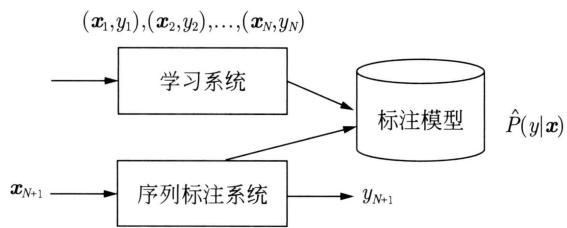  
图2.8 序列标注问题

评价序列标注的指标与评价分类的指标一样，常用的有序列标注准确率、精确率和召回率，其定义与分类相同。序列标注常用的监督学习方法有隐马尔可夫模型、条件随机场。

序列标注问题在数据挖掘、自然语言处理等领域被广泛应用，是这些领域的基本问题。例如，自然语言处理中的词性标注（part of speech tagging）就是一个典型的序列标注问题：给定一个由单词组成的句子，对这个句子中的每一个单词进行词性标注，即对一个单词序列预测其对应的词性标记序列。

举一个词性标注的例子。这是一个有歧义的句子，意思是“老人们掌管那只船”，而不是“那个老人那只船”（不成句子）。输入的单词序列（句子）和输出的词性标记序列如下。

输入：The old man the boat.

输出：The/(DT, article) old/(JJ, adjective) man/(VBP, verb) the/(DT, article) boat/(NN, noun)./(., punctuation)

单词“man”既可以是名词，又可以是动词，但前者的可能性远大于后者。一方面，尽管“man”本身是名词的概率很高，但在这个句子里，若“man”是名词，其后面的单词“the”一定为冠词，而名词与冠词连续出现的概率近乎为零，所以这种组合不可能成为词性序列的一部分，即“man”不可能是名词。另一方面，尽管“man”本身是动词的概率很低，但倘若“man”是动词，动词与冠词连续出现的概率较高，能够成为词性序列的一部分，整体成为一个符合语法统计规律的句子，所以，这里“man”应该是动词。由此可见，词性标注既要考虑单词属于不同词性的可能性，又要考虑不同词性顺序连接的可能性，而且后者更为重要。

# 2.3 监督学习方法概述

监督学习方法分为生成方法和判别方法。本节先给出生成方法和判别方法的定义，然后介绍分类、回归、序列标注问题中的生成方法和判别方法的主要路径。

# 2.3.1 生成方法与判别方法

监督学习的任务就是学习一个模型，并使用这一模型，对给定的输入预测对应的输出。这个模型的一般形式为函数：

$$
y = f (\boldsymbol {x})
$$

或者条件概率分布：

$$
P (y | \boldsymbol {x})
$$

监督学习方法又可以分为生成方法（generative approach）和判别方法（discriminative approach）。所学到的模型分别称为生成模型（generative model）和判别模型（discriminative model）。

生成方法原理上由数据学习联合概率分布 $P(\pmb{x},y)$ ，然后求出条件概率分布 $P(y|\pmb{x})$ 作为预测的模型，即生成模型

$$
P (y | \boldsymbol {x}) = \frac {P (\boldsymbol {x} , y)}{P (\boldsymbol {x})}
$$

这样的方法之所以称为生成方法，是因为模型可以用于数据样本的生成。典型的生成模型有朴素贝叶斯法和隐马尔可夫模型。

判别方法由数据直接学习函数 $f(\pmb{x})$ 或者条件概率分布 $P(y|\pmb{x})$ 作为预测的模型，即判别模型。判别方法关心的是对给定的输入 $\pmb{x}$ 正确地预测对应的输出 $y$ 。典型的判别模型包括线性回归、感知机、 $k$ 近邻法、决策树、逻辑斯谛回归和最大熵模型、支持向量机、提升方法和条件随机场。

在监督学习中，生成方法和判别方法各有优缺点，适合于不同条件下的学习问题。

生成方法不仅学习从输入到输出的映射，还学习输入和输出的分布特征，这有助于理解数据的本质。它可以依据学习到的联合分布 $P(\boldsymbol{x}, y)$ 生成新的数据样本。通过对数据分布进行假设，生成方法在训练数据较少时能具备更好的泛化能力。然而，生成方法学习联合分布 $P(\boldsymbol{x}, y)$ 通常比学习条件分布 $P(y|\boldsymbol{x})$ 更为复杂，尤其在高维数据或大规模数据上，计算量较大。此外，生成模型在拟合复杂数据时可能不如判别模型灵活，不利于捕捉复杂的预测模式。

判别方法直接学习条件概率分布 $P(y|\boldsymbol{x})$ ，通常在预测任务上表现更好。它能够使用复杂的函数形式，如神经网络、决策树等，灵活地拟合数据。判别方法不需要对数据的联合分布 $P(\boldsymbol{x},y)$ 做出假设，从而降低过强假设的风险。它还可以方便地进行特征选择、特征转换、特征组合等，提高模型的预测能力。然而，判别方法不能生成新的数据样本。此外，在模型复杂且训练数据不足的情况下，判别方法容易出现过拟合。

# 2.3.2 分类方法

有许多监督学习方法用于分类，它们的不同点主要在于模型的不同，以及相应的算法的不同。但可以分为几条路径，包括生成模型、分离超平面、特征空间划分、集成学习等。第一个路径属于生成方法，其他三个路径属于判别方法。为了方便，以二类分类为例说明，这些想法很多可以扩展到多类分类。

# 1. 生成模型

生成模型表示从训练数据中学习的，正类和负类的先验概率分布 $P(y)$ 、实例属于正类和负类的条件概率分布 $P(\pmb{x}|\pmb{y})$ 。有了这两个分布，就可以估计联合概率分布 $P(\pmb{x},\pmb{y})$ 以及后验概率分布 $P(y|\pmb{x})$ ，从而进行分类。条件概率分布 $P(\pmb{x}|\pmb{y})$ 实际上是定义在特征空间中的实例的分布。但条件概率分布 $P(\pmb{x}|\pmb{y})$ 本身的参数是指数级的，现实中不可以直接学习和计算，需要对它做一定的假设。

朴素贝叶斯法假设条件概率分布的各个维度相互独立，这样就大大降低了学习和计算的复杂度。图2.9示意高斯朴素贝叶斯模型，这时假设在给定类别的条件下，各个特征相互独立，且每个特征分别服从一元高斯分布。当模型学好以后，可以根据学到的联合概率分布 $P(\pmb{x},y)$ 随机抽样，产生新的数据。这是概率生成模型的特点。

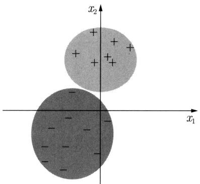  
图2.9 高斯朴素贝叶斯模型：绿色区域表示正例分布，橙色区域表示负例分布；“+”表示正例，“-”表示负例（见文前彩图）

# 2. 分离超平面

判别模型可以由特征空间的超平面表示，在二维特征空间中是直线。它将训练集中的正例和负例分开，这个超平面被称为分离超平面（separating hyperplane）。学习就是找到能将正例和负例正确分开的分离超平面，这时训练集的分类误差为零。感知机假设正例和负例线性可分，满足这个条件的分离超平面有无穷多个，学习时只需找到其中一个。图2.10示意感知机的模型。分离超平面表示为 $\boldsymbol{w} \cdot \boldsymbol{x} + b = 0$ ，模型由函数 $f(\boldsymbol{x}) = \boldsymbol{w} \cdot \boldsymbol{x} + b$ 表示。函数 $f(\boldsymbol{x})$ 实际表示的是实例 $\boldsymbol{x}$ 到超平面的带符号的未归一化的距离。如果函数值 $f(\boldsymbol{x})$ 大于等于

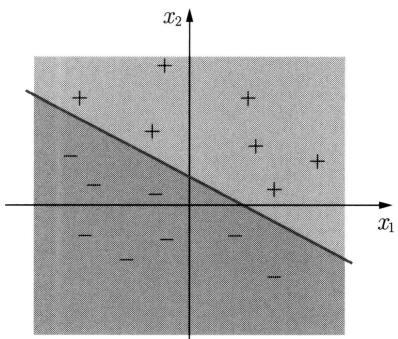  
图2.10 感知机模型：绿色区域表示正例区域，橙色区域表示负例区域；“+”表示正例，“-”表示负例（见文前彩图）

0，则实例 $\pmb{x}$ 被分到正类，即超平面正例一侧。如果函数值 $f(x)$ 小于0，则实例被分到负类，即超平面负例一侧。

线性可分是一个较强的假设，现实中的数据分布更为复杂，通常是线性不可分的。线性支持向量机假设分离超平面大致可以将正例和负例分开，但存在一些例外情况。在学习过程中，它试图找到对训练数据整体分类误差的上界最小的超平面。包含核方法（kernel method）的支持向量机将实例从输入空间通过非线性变换映射到高维特征空间，在高维特征空间中寻找对训练数据整体分类误差的上界最小的超平面。二类逻辑斯谛回归模型是一种“软的”分离超平面模型，它对线性函数 $w \cdot x + b$ 使用逻辑斯谛函数进行非线性变换，以表示实例属于正类和负类的概率。

# 3. 特征空间划分

决策树，具体是分类树，表示依照树形结构对实例进行分类的过程。一个决策树对应着对特征空间根据特征的取值顺序地进行的一个划分（partition）。每一个划分的每一个单元 $R$ 上有实例属于正类或负类的条件概率分布 $P(y|R)$ 。学习时找到最优分类树，也就是最优的划分，使得对训练集中的实例分类时的误差最小。理想情况下，训练数据集中的正例和负例都能被分到划分中的不同单元中，每个单元都由正例或者负例组成。图2.11示意分类树的模型。

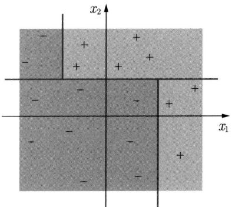  
图2.11决策树模型：绿色区域表示正例区域，橙色区域表示负例区域；“ $^+$ ”表示正例，“-”表示负例（见文前彩图）

$k$ 近邻法根据距离最近的 $k$ 个实例的类别，通过多数表决，决定给定实例 $\pmb{x}$ 的类别。这等价于基于训练数据对特征空间进行划分。划分中的每一个单元 $R$ 有条件概率分布 $P(y|R)$ ，其中的实例属于正类或属于负类的条件概率 $P(y|R)$ 大于等于0.5。

# 4. 集成学习

集成学习（ensemble learning）是将多个基本学习器（base learner）线性组合起来，构建更强的学习器的机器学习方法。分类中将多个基本分类器进行线性组合。其原理的直观解释就是“三个臭皮匠顶个诸葛亮”。可以从以下简单的理论分析理解。假设有 $M$ 个基本分类器，每个分类器的错误率相等，且小于0.5，而且 $M$ 个分类器的预测是相互独立的。如果 $M$ 个分类器进行多数表决，那么大多数分类器预测错误的概率，也就是最终分类的错误率 $e$ 是

$$
e = P \left(\# \operatorname {e r r} \geqslant \left\lfloor \frac {M}{2} + 1 \right\rfloor\right) = \sum_ {j = \left\lfloor \frac {M}{2} + 1 \right\rfloor} ^ {M} \binom {M} {j} \epsilon^ {j} (1 - \epsilon) ^ {M - j} \tag {2.46}
$$

这里 $\epsilon$ 是基本分类器的错误率， $M$ 是基本分类器的个数，#err 是多数表决中预测错误的基本分类器的个数。注意，在实际问题中，分类器的错误率可能不等，并且预测也不一定完全独立。

图2.12给出不同分类错误率 $\epsilon$ 下的分类器的个数 $M$ 与最终分类错误率 $e$ 的关系。可以看出， $\epsilon$ 越低，或者 $M$ 越大，最终分类错误率 $e$ 就越低。如果 $\epsilon = 0.2$ ，当 $M$ 增加到30时，就可以将最终分类错误率 $e$ 降到接近于0。即使 $\epsilon = 0.49$ ，预测比随机猜测略好一点，当 $M$ 增加时，也可以降低最终分类错误率 $e$ 。

  
图2.12 集成学习：在不同分类错误率 $\epsilon$ 下的，分类器的个数 $M$ 与最终分类错误率 $e$ 的关系

集成学习代表的方法有Bagging（自助聚集法）和Boosting（提升法）。Bagging的想法是，从训练数据集中进行有放回的采样，得到多个子集，从每一个子集并行独立地学习一个基本分类器，然后进行多数表决。Boosting的想法是依次学习基本分类器，给之前的基本分类器不能正确分类的训练样本增加权重，从加权的训练样本学习一个新的基本分类器，持续这个过程，直到达到预设的停止条件为止。最后对各个基本分类器的预测结果进行加权组合。

Boosting的基本分类器通常是简单的分类树。所以，Boosting的模型等价于将多个分类树的预测结果进行加权组合，模型具有很强的表示能力，能更好地拟合数据并且进行正确分类。Boosting中的GBDT在传统机器学习中是性能最好的方法之一。注意，Boosting的机制并非多数表决，而是由预测错误驱动的性能提升。不过，上述分析对理解Boosting还是有意义的。

# 2.3.3 回归方法

回归问题也有许多方法，基本的路径可以分为函数拟合、特征空间划分、集成学习等，都可以认为是判别方法。

回归可以通过函数拟合实现。事先假定函数的形式，如线性函数或非线性函数，然后针对训练数据集，从函数的集合中选择回归预测的误差最小的函数。例2.1就属于这种函数拟合。

另一条路径是对特征空间进行划分，假设每一个划分中的每一个单元有一个固定的预测数值。学习的目的是找出最优的划分，也就是对训练数据进行回归预测误差最小的划分。这就对应着 $k$ 近邻法和回归树的模型。

也可以将集成学习应用于回归，这时每个基本学习器是一个简单的回归模型，如回归树。GBDT-回归是传统机器学习中性能最好的回归方法之一。

对于线性回归和非线性回归模型，参数的个数是事先确定的，属于参数化模型。对于特征空间划分和集成学习的模型，参数的个数随训练数据而变化，属于非参数化模型。

# 2.3.4 序列标注方法

序列标注是观测序列到标记序列或状态序列的映射问题，可以认为是分类问题的一种扩展。给定观测序列，在每个位置上进行标注，相当于在每个位置上进行分类。这些标注是相互依存的，一环扣一环。序列标注的一个重要问题是如何高效地进行学习和预测。有代表性的生成方法和判别方法分别是隐马尔可夫模型和条件随机场。前者是在序列标注问题中的生成模型，后者是判别模型。

隐马尔可夫模型表示的是观测序列 $\boldsymbol{x} = x_{1}x_{2}\dots x_{T}$ 和状态序列 $z = z_{1}z_{2}\dots z_{T}$ 的联合分布 $P(\boldsymbol{x},\boldsymbol{z})$ ，是一种概率图模型，由概率有向图表示，如图2.13所示。隐马尔可夫模型假设状态序列由不可观测的马尔可夫链产生，也就是状态序列的状态之间存在单向的依存关系，既可以通过监督学习，又可以通过无监督学习构建模型。学到模型以后，可以对给定的观测序列求出概率最大的对应的状态序列。也可以通过抽样，生成新的状态序列和观测序列的数据。

  
图2.13 隐马尔可夫模型：有向图表示的概率模型

条件随机场，具体地线性链条件随机场，表示的是观测序列 $\pmb{x} = x_{1}x_{2}\dots x_{T}$ 和标记序列 $\pmb {y} = y_{1}y_{2}\dots y_{T}$ 的条件概率分布 $P(\pmb {y}|\pmb {x})$ ，也是一种概率图模型，但它由概率无向图表示，如图2.14所示。条件随机场假设标记序列中标记之间存在双向的依存关系。条件随机场一般通过监督学习构建模型。学到模型以后，可以对给定的观测序列求出概率最大的对应的标记序列。

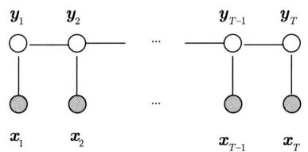  
图2.14 条件随机场模型：无向图表示的概率模型

# 本篇内容

本篇主要介绍监督学习中的分类、回归、序列标注方法。第3章讲述线性回归，是最基本和最简单的回归方法；第4章介绍感知机；第5章介绍 $k$ 近邻法；第6章介绍朴素贝叶斯

法；第7章介绍决策树，包括分类树和决策树，特别是有代表性的CART算法，这些方法是最基本和最简单的分类方法；第8章讲解逻辑斯谛回归和最大熵模型；第9章讲解支持向量机，包括线性支持向量机、包含核方法的非线性支持向量机；第10章讲解提升方法，包括有代表性的AdaBoost、GBDT算法，这些方法是传统机器学习中性能最好的方法；第11章讲述隐马尔可夫模型，第12章讲述条件随机场，这两个方法是有代表性的序列标注方法；第13章对以上监督学习方法进行总结和比较。

# 继续阅读

关于监督学习和监督学习方法一般介绍的书籍可以参阅文献[1]～文献[7]。

# 习题

2.1 说明伯努利模型的极大似然估计以及贝叶斯估计中的机器学习方法三要素。伯努利模型是定义在取值为0与1的随机变量上的概率分布。假设观测到伯努利模型 $n$ 次独立的数据生成结果，其中 $k$ 次的结果为1，这时可以用极大似然估计或贝叶斯估计来估计结果为1的概率。  
2.2 通过经验风险最小化推导极大似然估计。证明模型是条件概率分布，损失函数是对数损失函数时，经验风险最小化等价于极大似然估计。  
2.3 二分类模型学习中，往往精确率越高召回率就越低，试问为什么。  
2.4 分别举出一个在应用中的分类和回归的例子。

# 参考文献

[1] HASTIE T, TIBSHIRANI R, FRIEDMAN J. The elements of statistical learning: data mining, inference, and prediction[M]. 范明，柴玉梅，智红英，等译. Springer, 2001.   
[2] MACKAY D. Information theory, inference and learning algorithms[M]. Cambridge University Press, 2003.   
[3] BISHOP M. Pattern recognition and machine learning[M]. Springer, 2006.   
[4] KOLLER D, FRIEDMAN N. Probabilistic graphical models: principles and techniques[M]. MIT Press, 2009.   
[5] BARBER D. Bayesian reasoning and machine learning[M]. Cambridge University Press, 2012.   
[6] MITCHELL T. Machine learning[M]. 曾华军，张银奎，等译. McGraw-Hill Companies, Inc. 1997.   
[7] 周志华. 机器学习 [M]. 北京：清华大学出版社，2016.

# 第3章 线性回归

线性回归（linear regression）是回归的基本问题和方法，也是机器学习的基本问题和方法。给定实例的特征，线性回归模型预测实例的数值或者响应。线性回归模型是特征和参数的线性函数，参数包括权重和偏置。一般认为线性回归是非概率模型，但也有概率模型表示，假设实例的特征和数值数据产生于高斯条件分布，其均值由线性模型决定。一些回归问题可以通过使用基函数进行非线性变换，转换成为线性回归问题。

线性回归的学习使用最小二乘法，有解析算法包括正规方程和迭代算法包括梯度下降，后者更适合于数据规模大的情况。使用最小二乘法的线性回归相当于采用经验风险最小化原则。还可以采用结构风险最小化原则，在对数损失基础上加上 $L_{1}$ 范数和 $L_{2}$ 范数的平方，进行正则化，分别得到Lasso（least absolute shrinkage and selection operator）和岭回归（ridge regression）方法。

线性回归的研究可以回溯到19世纪的数学，在统计学中有深入的研究和广泛的应用，直至与机器学习的结合。Hoerl和Kennard于1970年提出了岭回归，Tibshirani于1996年提出了Lasso。

本章3.1节给出线性回归模型的定义和概率模型的表示，介绍基函数和模型的扩展。3.2节讲述线性回归学习的最小二乘算法，包括正规方程算法和梯度下降算法。3.3节讲解线性回归扩展的Lasso和岭回归。

# 3.1 线性回归模型

# 3.1.1 模型定义

首先给出线性回归模型的定义。

定义3.1（线性回归模型）假设输入空间或特征空间是 $\mathcal{X} \subseteq \mathbb{R}^M$ ，输出空间或数值空间是 $\mathcal{Y} \subseteq \mathbb{R}$ 。 $\pmb{x} \in \mathcal{X}$ 表示实例的特征向量； $y \in \mathcal{Y}$ 表示实例的数值。由特征向量到数值的如下仿射函数

$$
y = f (\boldsymbol {x}) = \boldsymbol {w} \cdot \boldsymbol {x} + b \tag {3.1}
$$

称为线性回归模型。其中， $\pmb{w}$ 和 $b$ 为模型参数， $\pmb{w} \in \mathbb{R}^{M}$ 称作权重向量（weight vector）， $b \in \mathbb{R}$ 称作偏置（bias）， $\pmb{w} \cdot \pmb{x}$ 表示 $\pmb{w}$ 和 $\pmb{x}$ 的内积。特征向量 $\pmb{x} = (x_{1}, x_{2}, \dots, x_{M})^{\mathrm{T}}$ 的每一维是

一个特征，权重向量 $\pmb{w} = (w_{1}, w_{2}, \dots, w_{M})^{\mathrm{T}}$ 的每一维是一个权重。也可以展开写作

$$
y = \sum_ {j = 1} ^ {M} w _ {j} x _ {j} + b \tag {3.2}
$$

可以用线性回归模型进行回归预测，即进行线性回归分析。给定实例的特征向量 $\pmb{x}$ ，根据模型 (3.1) 预测实例的数值 $y$ 。

当特征向量是一维时，称作简单线性回归（simple linear regression）；当特征向量是多维时，称作多重线性回归（multiple linear regression）。

多重线性回归模型对应着高维欧氏空间 $\mathbb{R}^{M + 1}$ 中的超平面。简单线性模型对应着二维欧氏空间 $\mathbb{R}^2$ 中的直线。

$$
y = \boldsymbol {w} \cdot \boldsymbol {x} + b \tag {3.3}
$$

为了方便，经常将特征向量和权重向量各自扩充一维，将模型表示为向量内积的形式。

$$
y = \boldsymbol {w} \cdot \boldsymbol {x} \tag {3.4}
$$

这时，特征向量是 $\pmb{x} = (x_{1}, x_{2}, \dots, x_{M}, 1)^{\mathrm{T}}$ ，权重向量是 $\pmb{w} = (w_{1}, w_{2}, \dots, w_{M}, b)^{\mathrm{T}}$ 。两种表示形式根据情况都会使用。

# 3.1.2 概率模型表示

一般认为线性回归模型是非概率模型，但也可以由条件概率分布 $P(y|\pmb{x},\pmb{\theta})$ 表示，其中随机变量 $\pmb{x}$ 表示实例的特征向量，随机变量 $y$ 表示实例的数值， $\pmb{\theta}$ 是参数向量。假设条件概率分布是高斯条件分布：

$$
\begin{array}{l} p (y | \boldsymbol {x}, \boldsymbol {\theta}) = N (y | (\boldsymbol {w} \cdot \boldsymbol {x} + b), \sigma^ {2}) \\ = \frac {1}{\sqrt {2 \pi} \sigma} \exp \left\{- \frac {[ y - (\boldsymbol {w} \cdot \boldsymbol {x} + b) ] ^ {2}}{2 \sigma^ {2}} \right\} \tag {3.5} \\ \end{array}
$$

其中，均值 $\mu$ 由线性模型 $\boldsymbol{w} \cdot \boldsymbol{x} + b$ 决定，方差 $\sigma^2$ 是超参数。随机变量 $y$ 和随机变量 $\boldsymbol{x}$ 之间有线性关系成立，有等价的模型

$$
y = \boldsymbol {w} \cdot \boldsymbol {x} + b + \epsilon , \quad \epsilon \sim N (0, \sigma^ {2}) \tag {3.6}
$$

其中，随机变量 $\epsilon$ 遵循高斯分布，表示高斯噪声。这里用到高斯分布的性质。若随机变量 $x$ 遵循高斯分布 $x \sim N(\mu, \sigma^2)$ ，则 $x$ 可以写作 $x = \mu + \sigma z$ ，其中随机变量 $z$ 遵循标准高斯分布 $z \sim N(0,1)$ 。

# 3.1.3 基函数和模型的扩展

线性回归不仅可以用于实例和数值之间存在线性关系的场合，也可以用于它们之间存在非线性关系的场合。假设事先知道两者之间的非线性关系，可以通过非线性变换将实例从输

入空间映射到特征空间，使得在特征空间里的特征和数值呈线性关系。这样就可以在特征空间里进行线性回归分析。实施这种非线性变换的函数称作基函数（base function）。

实例在输入空间由原始向量表示， $\pmb {x}\in \mathcal{X}\subseteq \mathbb{R}^{D}$ ，通过基函数 $\phi$ 映射到特征空间，表示为特征向量， $z\in \mathcal{Z}\subseteq \mathbb{R}^{M}$

$$
z = \phi (\boldsymbol {x})
$$

假设特征空间中有线性关系成立：

$$
y = \boldsymbol {w} \cdot \boldsymbol {z} + b \tag {3.7}
$$

特别是考虑简单线性回归，实例原始特征 $x$ 通过 $M$ 个基函数 $\phi_j$ 的变换成为 $M$ 维特征向量 $\mathbf{z} = (z_1, z_2, \dots, z_M)^{\mathrm{T}}$ :

$$
z _ {j} = \phi_ {j} (x), \quad j = 1, 2, \dots , M
$$

与 $M$ 维权重向量 $\pmb{w} = (w_{1}, w_{2}, \dots, w_{M})^{\mathrm{T}}$ 和偏置 $b$ 组成线性回归模型

$$
y = \sum_ {j = 1} ^ {M} w _ {j} \phi_ {j} (x) + b \tag {3.8}
$$

下面给出几种有代表性的基函数。基函数可以是多项式函数：

$$
z _ {j} = x ^ {p} \tag {3.9}
$$

（1）高斯函数

$$
z _ {j} = \exp \left[ - \frac {(x - \mu) ^ {2}}{2 s ^ {2}} \right] \tag {3.10}
$$

（2）S型（sigmoid）函数

$$
z _ {j} = \sigma \left(\frac {x - \mu}{s}\right), \quad \sigma (a) = \frac {1}{1 + \exp (- a)} \tag {3.11}
$$

这里设原始特征只有一维，用 $x$ 表示。图3.1给出这几种基函数的图形。基函数还可以基于傅里叶变换、小波变换。

  
图3.1 多项式基函数、高斯基函数、S型基函数的图形

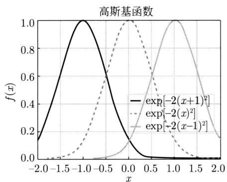

  
图3.1（续）

# 3.2 线性回归学习算法

# 3.2.1 最小二乘法

线性回归学习由训练数据集（实例的特征和数值）估计线性回归模型(3.1)，即估计模型参数 $\pmb{w}$ 和 $b$ 。设训练数据集是

$$
\mathcal {D} = \left\{\left(\boldsymbol {x} _ {1}, y _ {1}\right), \left(\boldsymbol {x} _ {2}, y _ {2}\right), \dots , \left(\boldsymbol {x} _ {N}, y _ {N}\right) \right\}
$$

其中， $\pmb {x}_i\in \mathbb{R}^M$ ， $y_{i}\in \mathbb{R}$ ， $i = 1,2,\dots ,N$ 。

因为也有概率模型表示，可以利用极大似然估计估计模型参数。训练数据是独立同分布的，所以对数损失可以写作

$$
\begin{array}{l} L (\boldsymbol {w}) = - \sum_ {i = 1} ^ {N} \log N (y _ {i} | (\boldsymbol {w} \cdot \boldsymbol {x} _ {i}), \sigma^ {2}) \\ = \frac {1}{2} \sum_ {i = 1} ^ {N} \log (2 \pi \sigma^ {2}) + \frac {1}{2 \sigma^ {2}} \sum_ {i = 1} ^ {N} \left[ y _ {i} - \left(\boldsymbol {w} \cdot \boldsymbol {x} _ {i}\right) \right] ^ {2} \tag {3.12} \\ \end{array}
$$

通过最小化这个损失，估计模型参数。这里，为了简单使用模型的扩充形式，假设高斯分布的方差 $\sigma^2$ 是常量，只需要考虑均方误差（mean squared error）。

$$
L (\boldsymbol {w}) = \frac {1}{2 N} \sum_ {i = 1} ^ {N} \left[ y _ {i} - \left(\boldsymbol {w} \cdot \boldsymbol {x} _ {i}\right) \right] ^ {2} \tag {3.13}
$$

最小化均方误差就是最小二乘法（least square method）。这个统计学的经典方法以最小化数据的残差的平方之和为目标，求解最优线性回归模型，其中残差是观测值和模型预测值之间的差。

$$
\arg \min  _ {\boldsymbol {w}} L (\boldsymbol {w}) = \arg \min  _ {\boldsymbol {w}} \frac {1}{2 N} \sum_ {i = 1} ^ {N} \left[ y _ {i} - \left(\boldsymbol {w} \cdot \boldsymbol {x} _ {i}\right) \right] ^ {2} \tag {3.14}
$$

# 3.2.2 正规方程

线性回归学习的最优化问题 (3.14) 有解析解。将训练数据中的实例的特征向量用矩阵表示，实例的数值用向量表示，得到以下的等价的最优化问题。

$$
\arg \min  _ {\boldsymbol {w}} L (\boldsymbol {w}) = \arg \min  _ {\boldsymbol {w}} \frac {1}{2} \left(\boldsymbol {y} - \boldsymbol {X} \boldsymbol {w}\right) ^ {\mathrm {T}} \left(\boldsymbol {y} - \boldsymbol {X} \boldsymbol {w}\right) \tag {3.15}
$$

这里，特征矩阵、数值向量、权重向量分别是

$$
\boldsymbol {X} = \left( \begin{array}{c} \boldsymbol {x} _ {1} ^ {\mathrm {T}} \\ \boldsymbol {x} _ {2} ^ {\mathrm {T}} \\ \vdots \\ \boldsymbol {x} _ {N} ^ {\mathrm {T}} \end{array} \right)
$$

其中， $\pmb {x}_i = (x_{i1},x_{i2},\dots ,x_{iM})^{\mathrm{T}}$ ， $i = 1,2,\dots ,N$ 。

$$
\boldsymbol {w} = \left( \begin{array}{c} w _ {1} \\ w _ {2} \\ \vdots \\ w _ {M} \end{array} \right)
$$

$$
\boldsymbol {y} = \left( \begin{array}{c} y _ {1} \\ y _ {2} \\ \vdots \\ y _ {N} \end{array} \right)
$$

求损失函数 $L(\pmb{w})$ 的一阶导数得到：

$$
\frac {\partial L (\boldsymbol {w})}{\partial \boldsymbol {w}} = - \boldsymbol {X} ^ {\mathrm {T}} \boldsymbol {y} + \boldsymbol {X} ^ {\mathrm {T}} \boldsymbol {X} \boldsymbol {w}
$$

令导数为0，求解方程，得到最优化问题的解析解：

$$
\boldsymbol {w} = \left(\boldsymbol {X} ^ {\mathrm {T}} \boldsymbol {X}\right) ^ {- 1} \boldsymbol {X} ^ {\mathrm {T}} \boldsymbol {y} \tag {3.16}
$$

假设矩阵 $\mathbf{X}^{\mathrm{T}}\mathbf{X}$ 可逆。称式(3.16)为正规方程（normal equation）。所以，最优化问题可以通过求解正规方程实现。也写作

$$
\boldsymbol {w} = \boldsymbol {X} ^ {\dagger} \boldsymbol {y}, \quad \boldsymbol {X} ^ {\dagger} = \left(\boldsymbol {X} ^ {\mathrm {T}} \boldsymbol {X}\right) ^ {- 1} \boldsymbol {X} ^ {\mathrm {T}} \tag {3.17}
$$

其中， $X^{\dagger}$ 称作Moore-Penrose伪逆矩阵，是定义在非方阵上的逆矩阵，是方阵的逆矩阵的扩展。

当矩阵 $\mathbf{X}^{\mathrm{T}}\mathbf{X}$ 可逆，即是非奇异矩阵时，式(3.16)有解。当矩阵 $\mathbf{X}$ 的列向量相互独立时， $\mathbf{X}^{\mathrm{T}}\mathbf{X}$ 一定是可逆的。

求损失函数 $L(\pmb{w})$ 的二阶导数或黑塞矩阵得到：

$$
\frac {\partial^ {2} L (\boldsymbol {w})}{\partial \boldsymbol {w} ^ {2}} = \boldsymbol {X} ^ {\mathrm {T}} \boldsymbol {X}
$$

矩阵 $\mathbf{X}^{\mathrm{T}}\mathbf{X}$ 是半正定阵，因此优化问题是凸优化问题，有全局最优解，但解可能不唯一。证明留作习题。

具体算法总结如下。

算法3.1（线性回归学习——正规方程）

输入：训练数据集 $\mathcal{D}$ 。

输出：线性回归模型 $f(\pmb {x})$ 。

（1）根据训练数据构建特征矩阵 $X$ 和数值向量 $\pmb{y}$

（2）求解正规方程

$$
\boldsymbol {w} = \left(\boldsymbol {X} ^ {\mathrm {T}} \boldsymbol {X}\right) ^ {- 1} \boldsymbol {X} ^ {\mathrm {T}} \boldsymbol {y}
$$

（3）得到方程的解 $\hat{\pmb{w}}$ ，构建线性回归模型

$$
f (\boldsymbol {x}) = \hat {\boldsymbol {w}} \cdot \boldsymbol {x}
$$

# 3.2.3 梯度下降

线性回归学习的最优化问题 (3.14) 可以通过迭代算法进行求解，常用的方法有梯度下降法。

损失函数或均方误差 $L(\pmb{w})$ 可以写作

$$
L (\boldsymbol {w}) = \frac {1}{2 N} \sum_ {i = 1} ^ {N} \left(y _ {i} - \boldsymbol {w} \cdot \boldsymbol {x} _ {i}\right) ^ {2} \tag {3.18}
$$

求损失函数 $L(\pmb{w})$ 的一阶导数，得到：

$$
\frac {\partial L (\boldsymbol {w})}{\partial \boldsymbol {w}} = \frac {1}{N} \sum_ {i = 1} ^ {N} (\boldsymbol {w} \cdot \boldsymbol {x} _ {i} - y _ {i}) \boldsymbol {x} _ {i}
$$

梯度下降法的介绍参见附录 A。其核心是通过迭代的方式不断更新参数，以达到优化目标函数的目的。在这个具体问题上，迭代公式是

$$
\boldsymbol {w} \leftarrow \boldsymbol {w} + \eta \frac {1}{N} \sum_ {i = 1} ^ {N} \left(y _ {i} - \boldsymbol {w} \cdot \boldsymbol {x} _ {i}\right) \boldsymbol {x} _ {i} \tag {3.19}
$$

其中， $\eta$ 是学习率。因为目标函数的黑塞矩阵是半正定阵，所以算法一定收敛到全局最优解。

有时数据中不同特征的取值相差较大，为了保证收敛速度，可以事先对各个特征进行尺度变换，使其取值分布在较小区间内。比如，对第 $i$ 个实例的第 $j$ 个特征进行如下尺度变换：

$$
\tilde {x} _ {i j} = \frac {x _ {i j} - \mu_ {j}}{s _ {j}}
$$

其中， $\mu_{j}$ 表示第 $j$ 个特征的均值， $s_{j}$ 表示第 $j$ 个特征的标准偏差。

算法3.2给出线性回归的梯度下降算法。

# 算法3.2（线性回归学习——梯度下降）

输入：训练数据集 $\mathcal{D}$ 。

输出：线性回归模型 $f(\pmb {x})$ 。

超参数：学习率 $\eta$ ，精度要求 $\epsilon$

（1）选取参数初值 $\pmb{w}^{(0)}$   
（2）基于训练数据集 $\mathcal{D}$ ，根据以下公式更新参数：

$$
\boldsymbol {w} ^ {(k + 1)} \leftarrow \boldsymbol {w} ^ {(k)} + \eta \frac {1}{N} \sum_ {i = 1} ^ {N} \left(y _ {i} - \boldsymbol {w} ^ {(k)} \cdot \boldsymbol {x} _ {i}\right) \boldsymbol {x} _ {i}
$$

(3) 置 $k = k + 1$ ，转至步骤 (2)，直至 $|\pmb{w}^{(k + 1)} - \pmb{w}^{(k)}| < \epsilon$ 。  
（4）置 $\hat{\pmb{w}} = \pmb{w}^{(k + 1)}$ ，构建线性回归模型

$$
f (\boldsymbol {x}) = \dot {\boldsymbol {w}} \cdot \boldsymbol {x}
$$

例3.1 表3.1给出简单线性回归的一个训练数据集，输入是特征 $x$ ，输出是对应的数值 $y$ 。数据是根据 $0.5x + 1.5 + \epsilon$ 随机生成的10个样本，其中 $\epsilon$ 表示均值为0、标准偏差为0.1的高斯噪声。图3.2显示这10个样本。用正规方程和梯度下降法分别求对应的线性回归模型。

表 3.1 线性回归的训练数据  

<table><tr><td>x</td><td>0.5</td><td>1.0</td><td>1.5</td><td>2.0</td><td>2.5</td><td>3.0</td><td>3.5</td><td>4.0</td><td>4.5</td><td>5.0</td></tr><tr><td>y</td><td>1.78</td><td>1.93</td><td>2.19</td><td>2.54</td><td>2.68</td><td>3.04</td><td>3.2</td><td>3.28</td><td>3.98</td><td>3.87</td></tr></table>

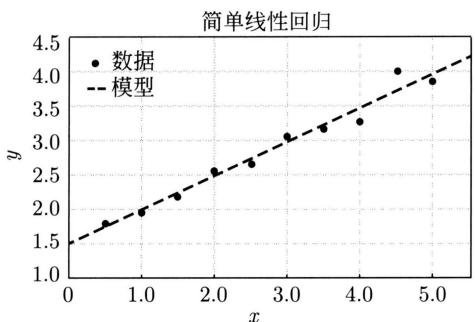  
图3.2 线性回归的训练数据

解 用正规方程（3.16）求解。通过求解伪逆矩阵可以得到权重向量。

$$
\hat {\boldsymbol {w}} = \left( \begin{array}{c} 0. 4 9 6 \\ 1. 4 8 4 \end{array} \right)
$$

图3.2中虚线表示对应的线性回归模型。

用梯度下降（算法3.2）求解。设初始值为 $\pmb{w}^{(0)} = (0,0)^{\mathrm{T}}$ ，学习率为 $\eta = 0.01$ ，通过1000

次迭代得到权重向量。

$$
\hat {\boldsymbol {w}} = \left( \begin{array}{c} 0. 4 9 5 \\ 1. 4 8 7 \end{array} \right)
$$

图3.2中虚线表示对应的线性回归模型。可以看出两个方法求出的模型与真实模型非常接近。

简单线性回归模型对应着直线 $y = w \cdot x + b$ ，其中 $w$ 表示斜率， $b$ 表示截距。这时梯度下降法对样本 $(x_i, y_i)$ 的更新公式变成以下形式。更新的作用直观上是容易理解的。

$$
\begin{array}{l} w \leftarrow w + \eta \cdot \delta \cdot x \\ b \leftarrow b + \eta \cdot \delta \\ \delta = y _ {i} - (w \cdot x _ {i} + b) \\ \end{array}
$$

这里 $\delta$ 表示的是样本的观测值与模型预测值之间的残差，也是样本点与直线之间的垂直距离（沿着 $y$ 轴方向的距离）。当 $\delta$ 等于0时，样本点在直线上；当 $\delta$ 大于0时，样本点在直线的上方；当 $\delta$ 小于0时，样本点在直线的下方。学习过程中，当 $\delta$ 等于0时，不调整直线的斜率 $w$ 和截距 $b$ 。当 $\delta$ 不等于0时，适当地增加或减少直线的斜率 $w$ 和截距 $b$ 。截距 $b$ 增加或减少的幅度与学习率 $\eta$ 和残差 $\delta$ 成正比。斜率 $w$ 增加或减少的幅度与学习率 $\eta$ 和残差 $\delta$ 成正比，也与输入 $x$ 成正比。

# 3.3 龄回归和 Lasso

线性回归学习中模型容易对数据产生过拟合。为解决这个问题，提高模型的泛化能力，可以对损失函数进行正则化，将学习问题形式化为结构风险最小化。常用的方法是将参数的 $L_{p}$ 范数的 $p$ 次方作为正则化项，加入学习的损失函数中。这时整体的损失函数是

$$
L (\boldsymbol {w}) = \frac {1}{2} \sum_ {i = 1} ^ {N} \left(y _ {i} - \boldsymbol {w} \cdot \boldsymbol {x} _ {i}\right) ^ {2} + \lambda | | \boldsymbol {w} | | _ {p} ^ {p} \tag {3.20}
$$

第二项是正则化项，其中的 $L_{p}$ 范数满足 $\left|\left|\boldsymbol {w}\right|\right|_p = \left(\left|w_1\right|^p +\left|w_2\right|^p +\dots +\left|w_M\right|^p\right)^{1 / p},\lambda \geqslant 0$ 是正则化系数，控制正则化作用的大小。学习的最优化问题成为

$$
\arg \min  _ {\boldsymbol {w}} L (\boldsymbol {w}) = \arg \min  _ {\boldsymbol {w}} \left[ \frac {1}{2} \sum_ {i = 1} ^ {N} \left(y _ {i} - \boldsymbol {w} \cdot \boldsymbol {x} _ {i}\right) ^ {2} + \lambda | | \boldsymbol {w} | | _ {p} ^ {p} \right] \tag {3.21}
$$

这个最优化问题与以下约束最优化问题等价，这时正则化项是约束条件，正则化系数 $\lambda$ 是拉格朗日乘子， $c$ 是常量。约束最优化问题的介绍见附录 C。

$$
\begin{array}{l} \arg \min  _ {\boldsymbol {w}} \frac {1}{2} \sum_ {i = 1} ^ {N} \left(y _ {i} - \boldsymbol {w} \cdot \boldsymbol {x} _ {i}\right) ^ {2} \tag {3.22} \\ \mathrm {s . t .} \| \boldsymbol {w} \| _ {p} ^ {p} \leqslant c \\ \end{array}
$$

当采用 $L_{2}$ 正则化项时，线性回归成为岭回归（ridge regression）。此时，整体损失函数可以写作

$$
L (\boldsymbol {w}) = \frac {1}{2} \sum_ {i = 1} ^ {N} \left(y _ {i} - \boldsymbol {w} \cdot \boldsymbol {x} _ {i}\right) ^ {2} + \frac {\lambda}{2} \sum_ {j = 1} ^ {M} w _ {j} ^ {2} \tag {3.23}
$$

正则化项是参数的平方之和。

岭回归的学习问题既可以用解析的方法求解，对应着正规方程，也可以用迭代的方法求解，如梯度下降。具体的解法与线性回归非常相似。岭回归的梯度下降算法留作习题。岭回归的正规方程的算法只要求解

$$
\boldsymbol {w} = \left(\lambda \boldsymbol {I} + \boldsymbol {X} ^ {\mathrm {T}} \boldsymbol {X}\right) ^ {- 1} \boldsymbol {X} ^ {\mathrm {T}} \boldsymbol {y} \tag {3.24}
$$

岭回归的一个优点是学到的模型的参数的绝对值更小，模型更简单，能更好地防止过拟合。另一个优点在计算方面，矩阵 $(\lambda I + X^{\mathrm{T}}X)$ 是非奇异的，一定可逆，所以方程一定存在解析解。事实上，岭回归是为解决可求解问题而被提出的。

当采用 $L_{1}$ 正则化项时，线性回归成为Lasso（least absolute shrinkage and selection operator）。此时，整体损失函数可以写作

$$
L (\boldsymbol {w}) = \frac {1}{2} \sum_ {i = 1} ^ {N} \left(y _ {i} - \boldsymbol {w} \cdot \boldsymbol {x} _ {i}\right) ^ {2} + \lambda \sum_ {j = 1} ^ {M} | w _ {j} | \tag {3.25}
$$

正则化项是参数的绝对值之和。

Lasso 的学习促使参数的绝对值之和尽量小，学到的模型是稀疏的（sparse），即模型的一些参数变为零。这样，学习既对模型做了缩减（shrinkage），提高了模型的泛化能力，又做了模型中的特征选择（selection），提高了模型的可解释性。机器学习的理论和实践都证明，简单的模型具有更好的泛化能力。模型中留下的特征（非零参数对应的特征）能更好地刻画回归问题的本质。相比之下，岭回归不会使模型变得稀疏，因此不适合做特征选择。

图3.3直观解释了岭回归和Lasso的区别：Lasso容易学到稀疏模型，而岭回归则不然。左侧显示的是岭回归在2维参数空间的等高线，右侧显示的是Lasso在2维参数空间的等高线。高度表示损失函数的大小，高度越小越好。左侧和右侧的同心圆表示两个方法损失函数的第1项的等高线。左侧围绕着原点的圆（高维空间中的超球面（hyper-sphere））表示岭回归的第2项（正则化项）的等高线，右侧的围绕着原点旋转 $45^{\circ}$ 的正方形（高维空间中的交

  
图3.3 岭回归和Lasso学习的直观解释

又多面体（cross-polytope）表示 Lasso 的第 2 项（正则化项）的等高线。两个方法都是当第 1 项和第 2 项的等高线相交的点产生最优化问题时的最优解（或者约束最优化问题的最优解）。Lasso 最优解的点更容易是正方形（交叉多面体）的顶点，这时参数的一些维度的值是零。相比之下，岭回归最优解的点更容易是圆（超球面）的任意一点，这时参数的各个维度的值往往都不为零。因此，Lasso 比岭回归更容易得到稀疏解。

Lasso 的学习问题一般用迭代的方法求解，如梯度下降。但是，这时参数的 $L_{1}$ 范数是连续的但不是处处可导的，通过计算和使用次梯度（sub-gradient）进行梯度下降。次梯度的计算公式如下：

$$
\frac {\partial L (\boldsymbol {w})}{\partial \boldsymbol {w}} = \sum_ {i = 1} ^ {N} \left(\boldsymbol {w} \cdot \boldsymbol {x} _ {i} - y _ {i}\right) \boldsymbol {x} _ {i} + \tilde {\boldsymbol {\lambda}} \tag {3.26}
$$

向量 $\tilde{\lambda}$ 的元素满足

$$
\tilde {\lambda} _ {j} = \left\{ \begin{array}{l l} - \lambda , & w _ {j} <   0 \\ [ - \lambda , \lambda ], & w _ {j} = 0, j = 1, 2, \dots , M \\ \lambda , & w _ {j} > 0 \end{array} \right. \tag {3.27}
$$

算法的整理留作习题。

# 本章概要

1. 线性回归模型是表示实例的特征到实例的数值的仿射函数。

$$
y = f (\boldsymbol {x}) = \boldsymbol {w} \cdot \boldsymbol {x} + b
$$

模型的参数有权重 $\boldsymbol{w}$ 和偏置 $b$ 。可以用线性回归模型进行回归预测，即进行线性回归分析。给定实例特征 $\boldsymbol{x}$ ，根据模型预测实例的数值 $y$ 。线性回归模型也可以通过扩充，写成特征向量与权重向量的内积形式。

2. 线性回归模型可以由条件概率分布 $P(y|\boldsymbol{x},\boldsymbol{\theta})$ 表示：

$$
p (y | \boldsymbol {x}, \boldsymbol {\theta}) = N (y | (\boldsymbol {w} \cdot \boldsymbol {x} + b), \sigma^ {2})
$$

或者

$$
y = \boldsymbol {w} \cdot \boldsymbol {x} + b + \epsilon , \quad \epsilon \sim N (0, \sigma^ {2})
$$

假设模型遵循高斯条件分布。

3. 可以通过非线性变换将实例从输入空间映射到特征空间，使得在特征空间里的特征和数值呈线性关系，用线性回归模型建模，用基函数进行非线性变换。

简单线性回归，实例原始特征 $x$ 通过 $M$ 个基函数 $\phi_j$ 的变换可以组成线性回归模型

$$
y = \sum_ {j = 1} ^ {M} w _ {j} \phi_ {j} (x) + b
$$

4. 线性回归模型学习是指给定训练数据，从中学习线性回归模型，即估计模型的参数，包括权重和偏置。

可以利用极大似然估计估计模型参数。就是最小二乘法，以最小化残差的平方之和为目标，求解最优化问题，得到线性回归模型。

$$
\arg \min  _ {\boldsymbol {w}} \frac {1}{2} \sum_ {i = 1} ^ {N} \left[ y _ {i} - \left(\boldsymbol {w} \cdot \boldsymbol {x} _ {i}\right) \right] ^ {2}
$$

5. 线性回归学习可以通过解析的方法求解。具体求解正规方程

$$
\boldsymbol {w} = \left(\boldsymbol {X} ^ {\mathrm {T}} \boldsymbol {X}\right) ^ {- 1} \boldsymbol {X} ^ {\mathrm {T}} \boldsymbol {y} \tag {3.28}
$$

假设矩阵 $X^{\mathrm{T}}X$ 可逆。解是全局最优解。

6. 线性回归学习也可以通过梯度下降求解。迭代公式是

$$
\boldsymbol {w} \leftarrow \boldsymbol {w} + \eta \sum_ {i = 1} ^ {N} \left(y _ {i} - \boldsymbol {w} \cdot \boldsymbol {x} _ {i}\right) \boldsymbol {x} _ {i}
$$

解是全局最优解。

7. 线性回归学习中，为了提高模型的泛化能力，对损失函数进行正则化，学习变成正则化的损失函数的最优化问题。

$$
L (\boldsymbol {w}) = \frac {1}{2} \sum_ {i = 1} ^ {N} \left(y _ {i} - \boldsymbol {w} \cdot \boldsymbol {x} _ {i}\right) ^ {2} + \lambda | | \boldsymbol {w} | | _ {p} ^ {p}
$$

这个最优化问题与约束最优化问题等价，这时正则化项是约束条件，正则化系数 $\lambda$ 是拉格朗日乘子。

岭回归学习的损失函数包含 $L_{2}$ 正则化项：

$$
L (\boldsymbol {w}) = \frac {1}{2} \sum_ {i = 1} ^ {N} \left(y _ {i} - \boldsymbol {w} \cdot \boldsymbol {x} _ {i}\right) ^ {2} + \frac {\lambda}{2} \sum_ {j = 1} ^ {M} w _ {j} ^ {2}
$$

Lasso学习的损失函数包含 $L_{1}$ 正则化项：

$$
L (\boldsymbol {w}) = \frac {1}{2} \sum_ {i = 1} ^ {N} \left(y _ {i} - \boldsymbol {w} \cdot \boldsymbol {x} _ {i}\right) ^ {2} + \lambda \sum_ {j = 1} ^ {M} | w _ {j} |
$$

岭回归的学习问题既可以用解析的方法求解，对应着正规方程，也可以用迭代的方法求解，如梯度下降。具体的解法与线性回归非常相似。Lasso 的学习问题一般用迭代的方法求解，如梯度下降，需要使用次梯度。

Lasso 的学习促使参数的绝对值之和尽量小，学到的模型是稀疏的，既提高了模型的泛化能力，又提高了模型的可解释性。

# 继续阅读

线性回归的介绍可参见文献[1]和文献[2], 岭回归的原始论文是文献[3]。Lasso 的原始论文是文献[4]。

# 习题

3.1 假设线性回归数据不是遵循高斯分布，而是拉普拉斯分布：

$$
p (y | \boldsymbol {x}, \boldsymbol {\theta}) = \frac {1}{2 b} \exp \left[ - \frac {| y - (\boldsymbol {w} \cdot \boldsymbol {x} + b) |}{b} \right]
$$

写出对应的模型学习的目标函数。

3.2 给出线性回归的正规方程算法的计算复杂度。  
3.3 证明正规方程(3.16)中的矩阵 $X^{\mathrm{T}}X$ 是半正定阵。  
3.4 实现线性回归学习算法（算法3.1和算法3.2），并将其用于从例3.1的数据的学习。  
3.5 实现基于线性回归的多项式函数拟合算法，并验证第2章中的例2.1的结果。  
3.6 写出岭回归的基于梯度下降的学习算法。  
3.7 写出 Lasso 的基于梯度下降的学习算法。  
3.8 图 3.3 直观解释了参数空间为 2 维空间时 Lasso 为什么容易有稀疏解。这时正则化项的等高线是旋转 $45^{\circ}$ 的正方形。参数空间是 3 维空间时，正则化项的等高线是八面体（octahedron）。解释这时为什么 Lasso 容易有稀疏解。特别讨论其中一维参数为 0、其他两维参数不为 0 的情况。

# 参考文献

[1] HASTIE T, TIBSHIRANI R, FRIEDMAN J. The elements of statistical learning: data mining, inference, and prediction[M]. 范明，柴玉梅，智红英，等译. Springer, 2001.   
[2] BISHOP M. Pattern recognition and machine learning[M]. Springer, 2006.   
[3] HOERL A E, KENNARD R W. Ridge regression: biased estimation for nonorthogonal problems[J]. Technometrics, 1970, 12(1): 55-67.   
[4] TIBSHIRANI R. Regression shrinkage and selection via the lasso[J]. Journal of the Royal Statistical Society Series B: Statistical Methodology, 1996, 58(1): 267-288.

# 第4章 感知机

感知机（perceptron）是二类分类的线性分类模型，其输入为实例的特征向量，输出为实例的类别，取 $+1$ 和 $-1$ 二值。感知机对应于输入空间（特征空间）中将实例划分为正负两类的分离超平面，属于判别模型。感知机学习旨在求出将训练数据进行线性划分的分离超平面，为此，导入基于误分类的损失函数，利用随机梯度下降法对损失函数进行最小化，求得感知机模型。感知机的学习算法分为原始形式和对偶形式。感知机预测是用学习得到的感知机模型对新的输入实例进行分类。

感知机在1957年由Rosenblatt提出，是神经网络与支持向量机的基础。感知机的学习算法具有实现简单的优点，但是，模型过于简单，不适合用于复杂的分类任务。

本章首先给出感知机模型的定义；然后讲述感知机的学习策略，特别是损失函数；最后讲解感知机学习算法，包括原始形式和对偶形式，并证明算法的收敛性。

# 4.1 感知机模型

定义4.1（感知机）假设输入空间或特征空间是 $\mathcal{X} \subseteq \mathbb{R}^D$ ，输出空间是 $\mathcal{Y} = \{+1, -1\}$ 。输入 $\pmb{x} \in \mathcal{X}$ 表示实例的特征向量，对应于输入空间或特征空间的点；输出 $y \in \mathcal{Y}$ 表示实例的类别，有正负两类。由输入空间到输出空间的如下仿射函数

$$
f (\boldsymbol {x}) = \boldsymbol {w} \cdot \boldsymbol {x} + b \tag {4.1}
$$

称为感知机模型。其中， $\pmb{w}$ 和 $b$ 为感知机模型参数， $\pmb{w} \in \mathbb{R}^{D}$ 称作权重向量（weight vector）， $b \in \mathbb{R}$ 称作偏置（bias）， $\pmb{w} \cdot \pmb{x}$ 表示 $\pmb{w}$ 和 $\pmb{x}$ 的内积。可以用感知机模型 (4.1) 对实例进行分类预测。如果 $f(\pmb{x}) \geqslant 0$ ，则将实例 $\pmb{x}$ 分到正类；如果 $f(\pmb{x}) < 0$ ，则将实例 $\pmb{x}$ 分到负类。分类器表示为

$$
F (\boldsymbol {x}) = \operatorname {s i g n} (f (\boldsymbol {x})) = \left\{ \begin{array}{l l} + 1, & f (\boldsymbol {x}) \geqslant 0 \\ - 1, & f (\boldsymbol {x}) <   0 \end{array} \right. \tag {4.2}
$$

感知机是一种线性分类模型（linear classification model），属于判别模型。感知机模型的假设空间是定义在特征空间中的所有线性分类模型，即函数集合 $\{f|f(\pmb{x}) = \pmb{w} \cdot \pmb{x} + b\}$ 。

感知机与线性支持向量机具有相同的形式，不同的是学习的前提假设、策略和算法。感知机与神经网络也有密切关系。如果将感知机分类器中的符号函数 $\operatorname{sign}(z)$ 改为正切函数 $\tanh(z)$ ，那么模型就变成非线性分类模型，对应于神经网络模型中的神经元。

感知机有如下几何解释：线性方程

$$
\boldsymbol {w} \cdot \boldsymbol {x} + b = 0 \tag {4.3}
$$

对应于特征空间 $\mathbb{R}^D$ 中的一个超平面 $S$ ，其中 $\boldsymbol{w}$ 是超平面的法向量， $b$ 是超平面的截距。超平面由 $(\boldsymbol{w}, b)$ 表示。这个超平面将特征空间划分为两个部分。位于两部分的点（特征向量）分别被分为正、负两类。因此，超平面 $S$ 称为分离超平面（separating hyperplane），如图 4.1 所示。

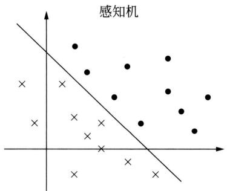  
图4.1 感知机模型

感知机学习由训练数据集（实例的特征向量及类别）

$$
\mathcal {D} = \left\{\left(\boldsymbol {x} _ {1}, y _ {1}\right), \left(\boldsymbol {x} _ {2}, y _ {2}\right), \dots , \left(\boldsymbol {x} _ {N}, y _ {N}\right) \right\}
$$

其中， $\pmb{x}_i \in \mathbb{R}^D$ ， $y_i \in \{+1, -1\}$ ， $i = 1, 2, \dots, N$ ，求得感知机模型 (式 (4.1))，即求得模型参数 $\pmb{w}, b$ 。感知机预测通过学习得到的感知机模型，对新的输入实例给出其对应的输出类别。

感知机的优点是模型和算法都很简单，易于实现，也是多种机器学习模型的基础。但是，模型是线性分类模型，过于简单，不适合用于复杂的分类任务。

# 4.2 感知机学习策略

# 4.2.1 数据集的线性可分性

定义4.2（数据集的线性可分性） 给定一个数据集

$$
\mathcal {D} = \left\{\left(\boldsymbol {x} _ {1}, y _ {1}\right), \left(\boldsymbol {x} _ {2}, y _ {2}\right), \dots , \left(\boldsymbol {x} _ {N}, y _ {N}\right) \right\}
$$

其中， $\pmb {x}_i\in \mathcal{X}\subseteq \mathbb{R}^D$ ， $y_{i}\in \mathcal{V} = \{+1, - 1\}$ ， $i = 1,2,\dots ,N$ ，如果存在某个超平面 $S$

$$
\boldsymbol {w} \cdot \boldsymbol {x} + b = 0
$$

能够将数据集的正实例点和负实例点完全正确地划分到超平面的两侧，即对所有 $y_{i} = +1$ 的实例 $i$ ，有 $\pmb{w}\cdot \pmb{x}_i + b > 0$ ，对所有 $y_{i} = -1$ 的实例 $i$ ，有 $\pmb {w}\cdot \pmb {x}_i + b <   0$ ，则称数据集 $\mathcal{D}$ 为线性可分数据集（linearly separable data set）；否则，称数据集 $\mathcal{D}$ 线性不可分。

# 4.2.2 感知机学习策略

假设训练数据集是线性可分的，感知机学习的目标是求得一个能够将训练集正实例点和负实例点完全正确分开的分离超平面。为了找出这样的超平面，即确定感知机模型参数 $\boldsymbol{w}, b$ ，需要确定一个学习策略，即定义（经验）损失函数并将损失函数最小化。

损失函数的一个自然选择是误分类点的总数。但是，这样的损失函数不是参数 $\boldsymbol{w}, b$ 的连续可导函数，不易优化。损失函数的另一个选择是误分类点到超平面 $S$ 的距离之和，这是感知机所采用的。

首先，特征空间 $\mathbb{R}^D$ 中任一点 $\pmb{x}_0$ 到超平面 $S$ 的距离为

$$
\frac {1}{\| \boldsymbol {w} \|} | \boldsymbol {w} \cdot \boldsymbol {x} _ {0} + b |
$$

这里， $\| \pmb {w}\|$ 是 $\pmb{w}$ 的 $L_{2}$ 范数。

其次，对于误分类的数据 $(\pmb{x}_i, y_i)$ ，有以下关系成立：

$$
- y _ {i} (\boldsymbol {w} \cdot \boldsymbol {x} _ {i} + b) > 0
$$

因为当 $\pmb{w} \cdot \pmb{x}_i + b > 0$ 时， $y_i = -1$ ；而当 $\pmb{w} \cdot \pmb{x}_i + b < 0$ 时， $y_i = +1$ 。因此，误分类点 $\pmb{x}_i$ 到超平面 $S$ 的距离可以写作

$$
- \frac {1}{\| \boldsymbol {w} \|} y _ {i} (\boldsymbol {w} \cdot \boldsymbol {x} _ {i} + b)
$$

假设针对超平面 $S$ 的误分类点集合为 $\mathcal{M}$ , 那么所有误分类点到超平面 $S$ 的距离之和为

$$
- \frac {1}{\| \boldsymbol {w} \|} \sum_ {\boldsymbol {x} _ {i} \in \mathcal {M}} y _ {i} (\boldsymbol {w} \cdot \boldsymbol {x} _ {i} + b)
$$

假设 $\frac{1}{\|\pmb{w}\|}$ 是常量，就得到感知机学习的损失函数①。

给定训练数据集

$$
\mathcal {D} = \left\{\left(\boldsymbol {x} _ {1}, y _ {1}\right), \left(\boldsymbol {x} _ {2}, y _ {2}\right), \dots , \left(\boldsymbol {x} _ {N}, y _ {N}\right) \right\}
$$

其中， $\pmb{x}_i\in \mathbb{R}^D$ ， $y_{i}\in \{+1, - 1\}$ ， $i = 1,2,\dots ,N$ 。感知机 $f(\pmb {x})$ 学习的损失函数定义为所有误分类点到超平面 $S$ 的（未归一化的）距离之和

$$
L (\boldsymbol {w}, b) = - \sum_ {\boldsymbol {x} _ {i} \in \mathcal {M}} y _ {i} (\boldsymbol {w} \cdot \boldsymbol {x} _ {i} + b) \tag {4.4}
$$

其中， $\mathcal{M}$ 为误分类点的集合。

显然，损失函数 $L(\pmb{w}, b)$ 是非负的。如果没有误分类点，损失函数值是0。而且，误分类点越少，误分类点离超平面越近，损失函数值就越小。一个具体的样本点的损失函数在误分类时是参数 $\pmb{w}, b$ 的线性函数，在正确分类时是0。因此，给定训练数据集 $\mathcal{D}$ ，整体的损失函数 $L(\pmb{w}, b)$ 是 $\pmb{w}, b$ 的连续可导函数。

感知机学习的策略是在假设空间中选取使损失函数式（4.4）最小的模型参数 $\boldsymbol{w}$ ， $b$ ，即感知机模型。

# 4.3 感知机学习算法

感知机学习问题转化为求解损失函数式（4.4）的最优化问题，最优化的方法是随机梯度下降法。本节叙述感知机学习的具体算法，包括原始形式和对偶形式，并证明在训练数据线性可分条件下感知机学习算法的收敛性。

# 4.3.1 感知机学习算法的原始形式

感知机学习算法是以下最优化问题的算法。给定一个训练数据集

$$
\mathcal {D} = \left\{\left(\boldsymbol {x} _ {1}, y _ {1}\right), \left(\boldsymbol {x} _ {2}, y _ {2}\right), \dots , \left(\boldsymbol {x} _ {N}, y _ {N}\right) \right\}
$$

其中， $\pmb{x}_i \in \mathbb{R}^D$ ， $y_i \in \{-1, 1\}$ ， $i = 1, 2, \dots, N$ ，根据风险最小化策略，求参数 $\pmb{w}, b$ ，使其为以下优化问题的解：

$$
\min  _ {\boldsymbol {w}, b} L (\boldsymbol {w}, b) = - \min  _ {\boldsymbol {w}, b} \sum_ {\boldsymbol {x} _ {i} \in \mathcal {M}} y _ {i} (\boldsymbol {w} \cdot \boldsymbol {x} _ {i} + b) \tag {4.5}
$$

其中， $\mathcal{M}$ 为误分类点的集合。

感知机学习算法是误分类驱动的，具体采用随机梯度下降法（stochastic gradient descent）。首先，任意选取一个超平面 $(\boldsymbol{w}, b)$ ，然后用梯度下降法不断地最小化目标函数（式(4.5)）。最小化过程中不是一次使 $\mathcal{M}$ 中所有误分类点的梯度下降，而是一次随机选取一个误分类点使其梯度下降。

假设误分类点集合 $\mathcal{M}$ 是确定的，那么损失函数 $L(\pmb {w},b)$ 的梯度由

$$
\frac {\partial L (\boldsymbol {w} , b)}{\partial \boldsymbol {w}} = - \sum_ {\boldsymbol {x} _ {i} \in \mathcal {M}} y _ {i} \boldsymbol {x} _ {i}
$$

$$
\frac {\partial L (\boldsymbol {w} , b)}{\partial b} = - \sum_ {\boldsymbol {x} _ {i} \in \mathcal {M}} y _ {i}
$$

给出。

随机选取一个误分类点 $(x_{i},y_{i})$ ，对 $\pmb {w},b$ 进行更新：

$$
\boldsymbol {w} \leftarrow \boldsymbol {w} + \eta y _ {i} \boldsymbol {x} _ {i} \tag {4.6}
$$

$$
b \leftarrow b + \eta y _ {i} \tag {4.7}
$$

式中 $\eta (0 < \eta \leqslant 1)$ 是步长，在机器学习中又称为学习率（learning rate）。这样，通过迭代可以期待损失函数 $L(\boldsymbol {w},b)$ 不断减小，直到为0。最终得到模型

$$
f (\boldsymbol {x}) = \hat {\boldsymbol {w}} \cdot \boldsymbol {x} + \hat {b}
$$

其中， $\hat{\boldsymbol{w}}$ 和 $\hat{b}$ 为估计的模型参数。

综上所述，得到如下算法：

# 算法4.1（感知机学习——原始形式）

输入：线性可分的训练数据集 $\mathcal{D}$ 。

输出：感知机分类器 $F(\pmb{x})$

超参数：学习率 $\eta$ （ $0 <   \eta \leqslant 1$ ）。

（1）选取初值 $\pmb{w}^{(0)}$ 和 $b^{(0)}$   
(2) 在训练集中选取一个样本 $(\pmb{x}_i, y_i) \in \mathcal{D}$ , 每次选取按照固定顺序进行。  
（3）若 $y_{i}(\pmb{w}^{(k)}\bullet \pmb{x}_{i} + b^{(k)})\leqslant 0$ ，则

$$
\boldsymbol {w} ^ {(k + 1)} \leftarrow \boldsymbol {w} ^ {(k)} + \eta y _ {i} \boldsymbol {x} _ {i}
$$

$$
b ^ {(k + 1)} \leftarrow b ^ {(k)} + \eta y _ {i}
$$

（4）置 $k = k + 1$ ，转至步骤(2)；直至没有误分类样本。

(5) $\hat{\boldsymbol{w}} = \boldsymbol{w}^{(k + 1)}$ ， $\hat{b} = b^{(k + 1)}$ ，构建分类器

$$
F (\boldsymbol {x}) = \operatorname {s i g n} (\hat {\boldsymbol {w}} \cdot \boldsymbol {x} + \hat {b})
$$

这种学习算法直观上有如下解释：当一个实例点被误分类，即位于分离超平面的错误一侧时，则调整 $w, b$ 的值，使分离超平面向该误分类点的一侧移动，以减少该误分类点与超平面间的距离，直至超平面越过该误分类点使其被正确分类。

算法4.1是感知机学习的基本算法，对应于后面的对偶形式，称为原始形式。感知机学习算法简单且易于实现。

例4.1如图4.2所示的训练数据集，其正实例点是 $\boldsymbol{x}_1 = (3,3)^{\mathrm{T}}$ ， $\boldsymbol{x}_2 = (4,3)^{\mathrm{T}}$ ，负实例点是 $\boldsymbol{x}_3 = (1,1)^{\mathrm{T}}$ ，试用感知机学习算法的原始形式求感知机 $F(\boldsymbol{x}) = \operatorname{sign}(\boldsymbol{w} \cdot \boldsymbol{x} + b)$ 。这里， $\boldsymbol{w} = (w_1, w_2)^{\mathrm{T}}$ ， $\boldsymbol{x} = (x_1, x_2)^{\mathrm{T}}$ 。

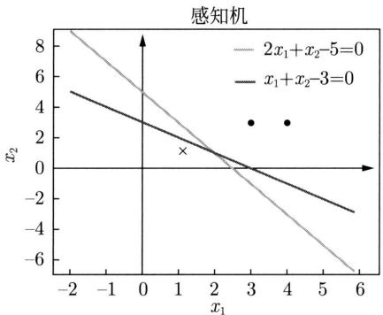  
图4.2 感知机示例

解 构建最优化问题：

$$
\min  _ {\boldsymbol {w}, b} L (\boldsymbol {w}, b) = - \sum_ {\boldsymbol {x} _ {i} \in \mathcal {M}} y _ {i} (\boldsymbol {w} \cdot \boldsymbol {x} _ {i} + b)
$$

按照算法4.1求解 $\pmb{w}, b, \eta = 1$

（1）取初值 $\pmb{w}^{(0)} = 0$ ， $b^{(0)} = 0$   
(2) 对 $\pmb{x}_1 = (3, 3)^{\mathrm{T}}$ , $y_1(\pmb{w}^{(0)} \cdot \pmb{x}_1 + b^{(0)}) = 0$ , 未能被正确分类, 更新 $\pmb{w}$ , $b$ :

$$
\boldsymbol {w} ^ {(1)} = \boldsymbol {w} ^ {(0)} + y _ {1} \boldsymbol {x} _ {1} = (3, 3) ^ {\mathrm {T}}, b ^ {(1)} = b ^ {(0)} + y _ {1} = 1
$$

得到线性模型：

$$
\boldsymbol {w} ^ {(1)} \cdot \boldsymbol {x} + b ^ {(1)} = 3 x _ {1} + 3 x _ {2} + 1
$$

（3）对 $x_{1}, x_{2}$ ，显然， $y_{i}(\boldsymbol{w}^{(1)} \cdot \boldsymbol{x}_{i} + b^{(1)}) > 0$ ，被正确分类，不更新 $\boldsymbol{w}$ ， $b$ ；对 $\boldsymbol{x}_{3} = (1,1)^{\mathrm{T}}$ ， $y_{3}(\boldsymbol{w}^{(1)} \cdot \boldsymbol{x}_{3} + b^{(1)}) < 0$ ，被误分类，更新 $\boldsymbol{w}$ ， $b$ ：

$$
\boldsymbol {w} ^ {(2)} = \boldsymbol {w} ^ {(1)} + y _ {3} \boldsymbol {x} _ {3} = (2, 2) ^ {\mathrm {T}}, b ^ {(2)} = b ^ {(1)} + y _ {3} = 0
$$

得到线性模型：

$$
\boldsymbol {w} ^ {(2)} \cdot \boldsymbol {x} + b ^ {(2)} = 2 x _ {1} + 2 x _ {2}
$$

如此继续下去，直到

$$
\boldsymbol {w} ^ {(7)} = (1, 1) ^ {\mathrm {T}}, b ^ {(7)} = - 3
$$

$$
\boldsymbol {w} ^ {(7)} \cdot \boldsymbol {x} + b ^ {(7)} = x _ {1} + x _ {2} - 3
$$

对所有数据点 $y_{i}(\pmb{w}^{(7)}\bullet \pmb{x}_{i} + b^{(7)}) > 0$ ，没有误分类点，损失函数达到最小。

分离超平面为 $x_{1} + x_{2} - 3 = 0$ ，感知机为 $F(\pmb {x}) = \mathrm{sign}(x_1 + x_2 - 3)$ 。

迭代过程见表4.1。

表 4.1 例 4.1 求解的迭代过程  

<table><tr><td>迭代次数</td><td>误分类点</td><td>w</td><td>b</td><td>w·x+b</td></tr><tr><td>0</td><td></td><td>0</td><td>0</td><td>0</td></tr><tr><td>1</td><td>x1</td><td>(3,3)T</td><td>1</td><td>3x1+3x2+1</td></tr><tr><td>2</td><td>x3</td><td>(2,2)T</td><td>0</td><td>2x1+2x2</td></tr><tr><td>3</td><td>x3</td><td>(1,1)T</td><td>-1</td><td>x1+x2-1</td></tr><tr><td>4</td><td>x3</td><td>(0,0)T</td><td>-2</td><td>-2</td></tr><tr><td>5</td><td>x1</td><td>(3,3)T</td><td>-1</td><td>3x1+3x2-1</td></tr><tr><td>6</td><td>x3</td><td>(2,2)T</td><td>-2</td><td>2x1+2x2-2</td></tr><tr><td>7</td><td>x3</td><td>(1,1)T</td><td>-3</td><td>x1+x2-3</td></tr><tr><td>8</td><td>0</td><td>(1,1)T</td><td>-3</td><td>x1+x2-3</td></tr></table>

这是在计算中误分类点先后取 $x_{1}, x_{3}, x_{3}, x_{3}, x_{1}, x_{3}, x_{3}$ 得到的分离超平面和感知机模型。如果在计算中误分类点依次取 $x_{1}, x_{3}, x_{3}, x_{3}, x_{2}, x_{3}, x_{3}, x_{3}, x_{1}, x_{3}, x_{3}$ ，那么得到的分离超平面是 $2x_{1} + x_{2} - 5 = 0$ 。

可见，感知机学习算法由于采用不同的初值或选取不同的误分类点，解可以不同。

# 4.3.2 算法的收敛性

现在证明，对于线性可分数据集，感知机学习算法原始形式收敛，即经过有限次迭代可以得到一个将训练数据集完全正确划分的分离超平面及感知机模型。

为了便于叙述与推导，将偏置 $b$ 并入权重向量 $\pmb{w}$ ，记作 $\bar{\pmb{w}} = (\pmb{w}^{\mathrm{T}}, b)^{\mathrm{T}}$ ，同样也将输入向量加以扩充，加进常数1，记作 $\bar{\pmb{x}} = (\pmb{x}^{\mathrm{T}}, 1)^{\mathrm{T}}$ 。这样， $\bar{\pmb{x}} \in \mathbb{R}^{D + 1}$ ， $\bar{\pmb{w}} \in \mathbb{R}^{D + 1}$ 。显然， $\bar{\pmb{w}} \cdot \bar{\pmb{x}} = \pmb{w} \cdot \pmb{x} + b$ 。

定理4.1（Novikoff）设训练数据集 $\mathcal{D} = \{(x_1, y_1), (x_2, y_2), \dots, (x_N, y_N)\}$ 是线性可分的，其中 $x_i \in \mathcal{X} \subseteq \mathbb{R}^D$ ， $y_i \in \mathcal{Y} = \{-1, +1\}$ ， $i = 1, 2, \dots, N$ ，则

(1) 存在满足条件 $\| \bar{\boldsymbol{w}}^{*}\| = 1$ 的超平面 $\bar{\boldsymbol{w}}^{*} \cdot \bar{\boldsymbol{x}} = \boldsymbol{w}^{*} \cdot \boldsymbol{x} + b^{*} = 0$ 将训练数据集完全正确分开；且存在 $\gamma > 0$ ，对所有 $i = 1,2,\dots,N$ ，有

$$
y _ {i} \left(\bar {\boldsymbol {w}} ^ {*} \cdot \bar {\boldsymbol {x}} _ {i}\right) = y _ {i} \left(\boldsymbol {w} ^ {*} \cdot \boldsymbol {x} _ {i} + b ^ {*}\right) \geqslant \gamma \tag {4.8}
$$

(2) 令 $R = \max_{1 \leqslant i \leqslant N} \| \bar{\boldsymbol{x}}_i\|$ , 则感知机算法 4.1 在训练数据集上的误分类次数 $k$ 满足不等式

$$
k \leqslant \left(\frac {R}{\gamma}\right) ^ {2} \tag {4.9}
$$

证明（1）由于训练数据集是线性可分的，按照定义4.2，存在超平面可将训练数据集完全正确分开，取此超平面为 $\bar{\boldsymbol{w}}^{*}\cdot \bar{\boldsymbol{x}} = \boldsymbol{w}^{*}\cdot \boldsymbol {x} + b^{*} = 0$ ，使 $\| \bar{\boldsymbol{w}}^*\| = 1$ 。由于对有限的 $i = 1,2,\dots ,N$ ，均有

$$
y _ {i} \left(\bar {\boldsymbol {w}} ^ {*} \cdot \bar {\boldsymbol {x}} _ {i}\right) = y _ {i} \left(\boldsymbol {w} ^ {*} \cdot \boldsymbol {x} _ {i} + b ^ {*}\right) > 0
$$

所以存在

$$
\gamma = \min  _ {i} \left\{y _ {i} \left(\boldsymbol {w} ^ {*} \cdot \boldsymbol {x} _ {i} + b ^ {*}\right) \right\}
$$

使

$$
y _ {i} \left(\bar {\boldsymbol {w}} ^ {*} \cdot \bar {\boldsymbol {x}} _ {i}\right) = y _ {i} \left(\boldsymbol {w} ^ {*} \cdot \boldsymbol {x} _ {i} + b ^ {*}\right) \geqslant \gamma
$$

（2）感知机算法从 $\bar{\boldsymbol{w}}^{(0)} = 0$ 开始，如果实例被误分类，则使用误分类样本进行权重更新。令 $\bar{\boldsymbol{w}}^{(k - 1)}$ 为第 $k - 1$ 次更新的扩充权重向量：

$$
\bar {\boldsymbol {w}} ^ {(k - 1)} = \left(\boldsymbol {w} ^ {(k - 1) \mathrm {T}}, b ^ {(k - 1)}\right) ^ {\mathrm {T}}
$$

若 $(\pmb{x}_i, y_i)$ 是一个仍然被误分类的样本，则有

$$
y _ {i} \left(\bar {\boldsymbol {w}} ^ {(k - 1)} \cdot \bar {\boldsymbol {x}} _ {i}\right) = y _ {i} \left(\boldsymbol {w} ^ {(k - 1)} \cdot \boldsymbol {x} _ {i} + b ^ {(k - 1)}\right) \leqslant 0 \tag {4.10}
$$

使用这个样本进行权重更新，得到第 $k$ 次更新的扩充权重向量：

$$
\boldsymbol {\bar {w}} ^ {(k)} = \boldsymbol {\bar {w}} ^ {(k - 1)} + \eta y _ {i} \bar {\boldsymbol {x}} _ {i} \tag {4.11}
$$

下面推导不等式 (4.12) 和不等式 (4.13)。

$$
\bar {\boldsymbol {w}} ^ {(k)} \cdot \bar {\boldsymbol {w}} ^ {*} \geqslant k \eta \gamma \tag {4.12}
$$

由式(4.11)和式(4.8)得到：

$$
\begin{array}{l} \bar {\boldsymbol {w}} ^ {(k)} \cdot \bar {\boldsymbol {w}} ^ {*} = \bar {\boldsymbol {w}} ^ {(k - 1)} \cdot \bar {\boldsymbol {w}} ^ {*} + \eta y _ {i} \bar {\boldsymbol {w}} ^ {*} \cdot \bar {\boldsymbol {x}} _ {i} \\ \geqslant \bar {\boldsymbol {w}} ^ {(k - 1)} \cdot \bar {\boldsymbol {w}} ^ {*} + \eta \gamma \\ \end{array}
$$

由此递推得不等式(4.12)：

$$
\begin{array}{l} \bar {w} ^ {(k)} \cdot \bar {w} ^ {*} \geqslant \bar {w} ^ {(k - 1)} \cdot \bar {w} ^ {*} + \eta \gamma \geqslant \bar {w} ^ {(k - 2)} \cdot \bar {w} ^ {*} + 2 \eta \gamma \geqslant \dots \geqslant k \eta \gamma \\ \left\| \bar {\boldsymbol {w}} ^ {(k)} \right\| ^ {2} \leqslant k \eta^ {2} R ^ {2} \tag {4.13} \\ \end{array}
$$

由式 (4.11) 和式 (4.10) 递推得不等式 (4.13):

$$
\begin{array}{l} \left\| \bar {\boldsymbol {w}} ^ {(k)} \right\| ^ {2} = \left\| \bar {\boldsymbol {w}} ^ {(k - 1)} \right\| ^ {2} + 2 \eta y _ {i} \bar {\boldsymbol {w}} ^ {(k - 1)} \cdot \bar {\boldsymbol {x}} _ {i} + \eta^ {2} \left\| \bar {\boldsymbol {x}} _ {i} \right\| ^ {2} \\ \leqslant \left\| \bar {\boldsymbol {w}} ^ {(k - 1)} \right\| ^ {2} + \eta^ {2} \left\| \bar {\boldsymbol {x}} _ {i} \right\| ^ {2} \\ \leqslant \left\| \bar {\boldsymbol {w}} ^ {(k - 1)} \right\| ^ {2} + \eta^ {2} R ^ {2} \\ \leqslant \left\| \bar {\boldsymbol {w}} ^ {(k - 2)} \right\| ^ {2} + 2 \eta^ {2} R ^ {2} \leqslant \dots \\ \leqslant k \eta^ {2} R ^ {2} \\ \end{array}
$$

结合不等式 (4.12) 和式 (4.13) 即得：

$$
k \eta \gamma \leqslant \bar {w} ^ {(k)} \cdot \bar {w} ^ {*} \leqslant \left\| \bar {w} ^ {(k)} \right\| \left\| \bar {w} ^ {*} \right\| \leqslant \sqrt {k} \eta R
$$

$$
k ^ {2} \gamma^ {2} \leqslant k R ^ {2}
$$

于是

$$
k \leqslant \left(\frac {R}{\gamma}\right) ^ {2}
$$

定理表明，误分类的次数 $k$ 是有上界的，经过有限次迭代可以找到将训练数据完全正确分开的分离超平面。也就是说，当训练数据集线性可分时，感知机学习算法是收敛的。但是例4.1说明，这个算法存在许多个解，一般是无穷多个，这些解既依赖于初值的选择，也依赖于迭代过程中误分类点的选择顺序。为了得到唯一的超平面，需要对分离超平面增加约束条件。这就是第9章讲述的线性支持向量机的想法。当训练集线性不可分时，感知机学习算法不收敛，迭代会发生振荡。

# 4.3.3 感知机学习算法的对偶形式

现在考虑感知机学习算法的对偶形式。感知机学习算法的原始形式和对偶形式与第9章中支持向量机学习算法的原始形式和对偶形式相对应。

对偶形式的特点是将参数 $\pmb{w}$ 和 $b$ 表示为实例 $\pmb{x}_i$ 和标记 $y_i$ 的线性组合，通过求解其系数而求得 $\pmb{w}$ 和 $b$ 。不失一般性，在算法4.1中可假设初始值 $\pmb{w}$ 和 $b$ 均为0。通过

$$
\boldsymbol {w} \leftarrow \boldsymbol {w} + \eta y _ {i} \boldsymbol {x} _ {i}
$$

$$
b \leftarrow b + \eta y _ {i}
$$

对参数 $\pmb{w}, b$ 进行多次更新。而 $\pmb{w}, b$ 关于误分类点 $(\pmb{x}_i, y_i)$ 的增量分别是 $\alpha_i y_i \pmb{x}_i$ 和 $\alpha_i y_i$ ，这里 $\alpha_i = n_i \eta$ ， $n_i$ 是 $(\pmb{x}_i, y_i)$ 被误分类的次数。所以，最后学习到的参数 $\hat{\pmb{w}}$ 和 $\hat{b}$ 可以分别表示为

$$
\hat {\boldsymbol {w}} = \sum_ {i = 1} ^ {N} \alpha_ {i} y _ {i} \boldsymbol {x} _ {i} \tag {4.14}
$$

$$
\hat {b} = \sum_ {i = 1} ^ {N} \alpha_ {i} y _ {i} \tag {4.15}
$$

这里， $\alpha_{i} \geqslant 0, i = 1,2,\dots,N$ ，当 $\eta = 1$ 时，表示第 $i$ 个实例点由于被误分类而进行更新的次数。实例点更新次数越多，意味着它距分离超平面越近，也就越难正确分类。换句话说，这样的实例对学习结果影响最大。最后得到感知机模型

$$
f (\boldsymbol {x}) = \hat {\boldsymbol {w}} \cdot \boldsymbol {x} + \hat {b}
$$

下面对照原始形式来叙述感知机学习算法的对偶形式。

# 算法4.2（感知机学习——对偶形式）

输入：线性可分的训练数据集 $\mathcal{D}$ 。

输出：感知机分类器 $F(\pmb {x})$

超参数：学习率 $\eta$ （ $0 <   \eta \leqslant 1$ ）。

(1) 设置初值 $\pmb{\alpha}^{(0)} \gets 0, b^{(0)} \gets 0$ , 其中 $\pmb{\alpha}^{(0)} = (\alpha_{1}^{(0)}, \alpha_{2}^{(0)}, \dots, \alpha_{N}^{(0)})^{\mathrm{T}}$ 。  
(2) 在训练集中选取一个样本 $(x_{i},y_{i})$ ，每次选取按照固定顺序进行。

(3) 若 $y_{i} \left(\sum_{j=1}^{N} \alpha_{j}^{(k)} y_{j} \boldsymbol{x}_{j} \cdot \boldsymbol{x}_{i} + b^{(k)}\right) \leqslant 0$ , 则

$$
\alpha_ {i} ^ {(k + 1)} \leftarrow \alpha_ {i} ^ {(k)} + \eta
$$

$$
b ^ {(k + 1)} \leftarrow b ^ {(k)} + \eta y _ {i}
$$

（4）置 $k = k + 1$ ，转至步骤（2）；直到没有误分类数据。

(5) $\hat{\boldsymbol{w}} = \boldsymbol{w}^{(k + 1)}$ , $\hat{b} = b^{(k + 1)}$ , 构建分类器

$$
F (\boldsymbol {x}) = \operatorname {s i g n} (\hat {\boldsymbol {w}} \cdot \boldsymbol {x} + \hat {b})
$$

对偶形式中训练实例仅以内积的形式出现。为了方便，可以预先将训练集中实例间的内积计算出来并以矩阵的形式存储，这个矩阵就是所谓的Gram矩阵（Gram matrix）：

$$
\boldsymbol {G} = \left[ \boldsymbol {x} _ {i} \cdot \boldsymbol {x} _ {j} \right] _ {N \times N}
$$

例4.2 数据同例4.1，正样本点是 $\boldsymbol{x}_1 = (3,3)^{\mathrm{T}}$ ， $\boldsymbol{x}_2 = (4,3)^{\mathrm{T}}$ ，负样本点是 $\boldsymbol{x}_3 = (1,1)^{\mathrm{T}}$ ，试用感知机学习算法对偶形式求感知机。

解 按照算法4.2，

（1）取 $\alpha_{i} = 0$ ， $i = 1,2,3$ ， $b = 0$ ， $\eta = 1$   
（2）计算Gram矩阵：

$$
\boldsymbol {G} = \left[ \begin{array}{c c c} 1 8 & 2 1 & 6 \\ 2 1 & 2 5 & 7 \\ 6 & 7 & 2 \end{array} \right]
$$

（3）误分条件

$$
y _ {i} \left(\sum_ {j = 1} ^ {N} \alpha_ {j} y _ {j} \boldsymbol {x} _ {j} \cdot \boldsymbol {x} _ {i} + b\right) \leqslant 0
$$

参数更新：

$$
\alpha_ {i} \leftarrow \alpha_ {i} + 1, b \leftarrow b + y _ {i}
$$

（4）迭代，过程从略，结果列于表4.2；

(5）

$$
\boldsymbol {w} = 2 \boldsymbol {x} _ {1} + 0 \boldsymbol {x} _ {2} - 5 \boldsymbol {x} _ {3} = (1, 1) ^ {\mathrm {T}}
$$

$$
b = - 3
$$

分离超平面为

$$
x _ {1} + x _ {2} - 3 = 0
$$

感知机为

$$
F (\boldsymbol {x}) = \operatorname {s i g n} (x _ {1} + x _ {2} - 3)
$$

表 4.2 例 4.2 求解的迭代过程  

<table><tr><td>k</td><td>0</td><td>1</td><td>2</td><td>3</td><td>4</td><td>5</td><td>6</td><td>7</td></tr><tr><td></td><td></td><td>x1</td><td>x3</td><td>x3</td><td>x3</td><td>x1</td><td>x3</td><td>x3</td></tr><tr><td>α1</td><td>0</td><td>1</td><td>1</td><td>1</td><td>1</td><td>2</td><td>2</td><td>2</td></tr><tr><td>α2</td><td>0</td><td>0</td><td>0</td><td>0</td><td>0</td><td>0</td><td>0</td><td>0</td></tr><tr><td>α3</td><td>0</td><td>0</td><td>1</td><td>2</td><td>3</td><td>3</td><td>4</td><td>5</td></tr><tr><td>b</td><td>0</td><td>1</td><td>0</td><td>-1</td><td>-2</td><td>-1</td><td>-2</td><td>-3</td></tr></table>

对照例4.1，结果一致，迭代步骤也是互相对应的。

与原始形式一样，感知机学习算法的对偶形式迭代是收敛的，存在多个解。

# 本章概要

1. 感知机是根据输入实例的特征向量 $\pmb{x}$ 对其进行二类分类的线性分类模型：

$$
f (\boldsymbol {x}) = \boldsymbol {w} \cdot \boldsymbol {x} + b
$$

感知机模型对应于输入空间（特征空间）中的分离超平面 $\boldsymbol{w} \cdot \boldsymbol{x} + b = 0$ 。感知机模型作为分类器可以对实例进行二类分类。

$$
F (\boldsymbol {x}) = \operatorname {s i g n} (\boldsymbol {w} \cdot \boldsymbol {x} + b)
$$

2. 感知机学习的策略是最小化损失函数：

$$
\min  _ {\boldsymbol {w}, b} L (\boldsymbol {w}, b) = - \sum_ {\boldsymbol {x} _ {i} \in \mathcal {M}} y _ {i} (\boldsymbol {w} \cdot \boldsymbol {x} _ {i} + b)
$$

损失函数对应于误分类点到分离超平面的距离之和。

3. 感知机学习算法是基于随机梯度下降法的对损失函数的最优化算法，有原始形式和对偶形式。算法简单且易于实现。原始形式中，首先任意选取一个超平面，然后用梯度下降法不断最小化目标函数。在这个过程中一次随机选取一个误分类点使其梯度下降。

$$
\boldsymbol {w} \leftarrow \boldsymbol {w} + \eta y _ {i} \boldsymbol {x} _ {i}
$$

$$
b \leftarrow b + \eta y _ {i}
$$

4. 当训练数据集线性可分时，感知机学习算法是收敛的。感知机算法在训练数据集上的误分类次数 $k$ 满足不等式

$$
k \leqslant \left(\frac {R}{\gamma}\right) ^ {2}
$$

当训练数据集线性可分时，感知机学习算法存在无穷多个解，其解由于不同的初值或不同的迭代顺序而可能有所不同。

# 继续阅读

感知机最早在1957年由Rosenblatt提出[1]。Novikoff[2]、Minsky与Papert[3]等对感知机进行了一系列理论研究。感知机的扩展方法包括口袋算法（pocketalgorithm）[4]、表决感知机（votedperceptron）[5]、带边缘感知机（perceptronwithmargin）[6]。关于感知机的介绍可进一步参考文献[7]和文献[8]。

# 习题

4.1 感知机模型的另一个等价的形式是 $f(\pmb{x})$ 取值 0 或 1。写出这时模型的定义式以及学习算法。  
4.2 Minsky 与 Papert 指出：感知机因为是线性模型，所以不能表示复杂的函数，如异或（XOR）。验证感知机为什么不能表示异或。  
4.3 模仿例题 4.1，构建从训练数据集求解感知机模型的例子。  
4.4* 证明以下定理：样本集线性可分的充分必要条件是正实例点集所构成的凸壳与负

实例点集所构成的凸壳互不相交。设集合 $S \subset \mathbb{R}^D$ 是由 $\mathbb{R}^D$ 中的 $k$ 个点所组成的集合，即 $S = \{\pmb{x}_1, \pmb{x}_2, \dots, \pmb{x}_k\}$ ，定义 $S$ 的凸壳 $\operatorname{conv}(S)$ 为

$$
\operatorname {c o n v} (S) = \left\{\boldsymbol {x} = \sum_ {i = 1} ^ {k} \lambda_ {i} \boldsymbol {x} _ {i} \middle | \sum_ {i = 1} ^ {k} \lambda_ {i} = 1, \lambda_ {i} \geqslant 0, i = 1, 2, \dots , k \right\}
$$

# 参考文献

[1] ROSENBLATT F. The perceptron: a probabilistic model for information storage and organization in the brain[J]. Psychological Review, 1958, 65 (6): 386-408.   
[2] NOVIKOFF A B. On convergence proofs on perceptrons[C]//Proceedings of the Symposium on the Mathematical Theory of Automata. 1962: 615-622.   
[3] MINSKY M L, PAPERT S A. Perceptrons[M]. MIT Press, 1969.   
[4] GALLANT S I. Perceptron-based learning algorithms[J]. IEEE Transactions on Neural Networks, 1990, 1(2): 179-191.   
[5] FREUND Y, SCHAPIRE R E. Large margin classification using the perceptron algorithm[C]// Proceedings of the 11th Annual Conference on Computational Learning Theory (COLT'98). ACM Press, 1998.   
[6] LI Y Y, ZARAGOZA H, HERBRICH R, et al. The perceptron algorithm with uneven margins[C]//Proceedings of the 19th International Conference on Machine Learning. 2002: 379-386.   
[7] WIDROW B, LEHR M A. 30 years of adaptive neural networks: perceptron, madaline, and backpropagation[J]. Proceedings of the IEEE, 1990, 78(9): 1415-1442.   
[8] CHRISTIANINI N, SHAWE-TAYLOR J. An introduction to support vector machines and other kernel-based learning methods[M]. Cambridge University Press, 2000.

# 第5章 $k$ 近邻法

$k$ 近邻法（ $k$ -nearest neighbor，KNN）是一种基本的分类和回归方法。 $k$ 近邻法的输入是实例的特征向量，对应于特征空间中的点；输出为实例的类别或数值。近邻法假设给定一个训练数据集，其中实例的类别或数值已确定。在分类时，对于新的实例，依据其 $k$ 个最近邻的训练实例的类别，通过多数表决的方式进行预测。在回归时，对新的实例，取其 $k$ 个最近邻的训练实例的数值的平均值，作为它的数值预测。因此，近邻法不具有显式的学习过程。实际上，近邻法利用训练数据集对特征向量空间进行划分，并将其作为预测的模型。值的选择、距离度量以及决策规则是近邻法的三个基本要素。

$k$ 近邻法于1967年由Cover和Hart提出。 $k$ 近邻法的优点是方法简单且容易实现，预测的准确率通常较高。

本章首先叙述 $k$ 近邻算法，然后讨论 $k$ 近邻法的模型及三个基本要素，最后讲述 $k$ 近邻法的一个实现方法—— $k$ -d 树，介绍构建 $k$ -d 树和搜索 $k$ -d 树的算法。

# 5.1 $k$ 近邻算法

$k$ 近邻算法简单、容易实现：给定一个训练数据集，对新的输入实例，在训练数据集中找出与其最邻近的 $k$ 个实例，在分类时，如果这 $k$ 个实例的多数属于某个类别，就把该输入实例分到这个类别；在回归时，对这 $k$ 个实例的数值取平均值，作为该输入实例的数值。 $k$ 近邻算法没有显式的学习过程。下面先叙述用于分类的 $k$ 近邻算法，然后再讨论细节。

# 算法5.1（ $k$ 近邻算法）

输入：训练数据集

$$
\mathcal {D} = \left\{\left(\boldsymbol {x} _ {1}, y _ {1}\right), \left(\boldsymbol {x} _ {2}, y _ {2}\right), \dots , \left(\boldsymbol {x} _ {N}, y _ {N}\right) \right\}
$$

其中， $\pmb{x}_i\in \mathcal{X}\subseteq \mathbb{R}^D$ 为实例的特征向量， $y_{i}\in \mathcal{V} = \{c_{1},c_{2},\dots ,c_{K}\}$ 为实例的类别， $i = 1,2,\dots ,N$ 。

输出：实例 $\pmb{x}$ 的类别 $y$ 。

（1）根据给定的距离度量，在训练数据集 $\mathcal{D}$ 中找出与 $\pmb{x}$ 最邻近的 $k$ 个点，以这 $k$ 个点为最近邻的所有点组成的 $\pmb{x}$ 的邻域记作 $R_{k}(\pmb {x})$   
（2）在邻域 $R_{k}(\pmb {x})$ 中根据决策规则（对 $k$ 个实例的类别进行多数表决）决定 $\pmb{x}$ 的类别 $y$

$$
\hat {y} = \arg \max  _ {c _ {j}} \sum_ {\boldsymbol {x} _ {i} \in R _ {k} (\boldsymbol {x})} I \left(y _ {i} = c _ {j}\right), \quad i = 1, 2, \dots , N, j = 1, 2, \dots , K \tag {5.1}
$$

式(5.1)中， $I$ 为指示函数，即当 $y_{i} = c_{j}$ 时 $I$ 为1，否则 $I$ 为0。

$k$ 近邻算法的特殊情况是 $k = 1$ 时，此时称为最近邻算法。对于输入的实例（特征向量） $\pmb{x}$ ，最近邻算法将训练数据集中与 $\pmb{x}$ 最邻近的点的类别作为 $\pmb{x}$ 的类别。

用于回归的 $k$ 近邻算法类似，不同之处在于在邻域 $R_{k}(\pmb{x})$ 中根据回归规则（取 $k$ 个实例的数值的平均值）决定 $\pmb{x}$ 的数值 $y$ 。

# 5.2 $k$ 近邻模型

$k$ 近邻法使用的模型对应于对特征空间的划分。模型由三个基本要素——距离度量、 $k$ 值的选择和分类决策规则决定。

# 5.2.1 模型

在 $k$ 近邻法用于分类时，当训练数据集、距离度量（如欧氏距离）、 $k$ 值及分类决策规则（如多数表决）确定后，对于任何一个新的输入实例，它所属的类别便唯一确定。这相当于根据上述要素将特征空间进行划分，确定其中的每一单元（cell）或邻域（neighborhood）中的每个实例点所属的类别。这一事实从最近邻法 $(k = 1)$ 中可以看得非常清楚。

特征空间中，最近邻法针对每个训练实例点 $\pmb{x}_i$ ，由距离该点比其他点更近的所有的点组成一个单元。每个训练实例点拥有一个单元，所有训练实例点的单元共同构成对特征空间的一个划分。最近邻法将实例 $\pmb{x}_i$ 的类别 $y_i$ 作为其单元中所有点的类别。这样，空间中的每个点的类别是确定的。图5.1是一个二维特征空间划分的例子。

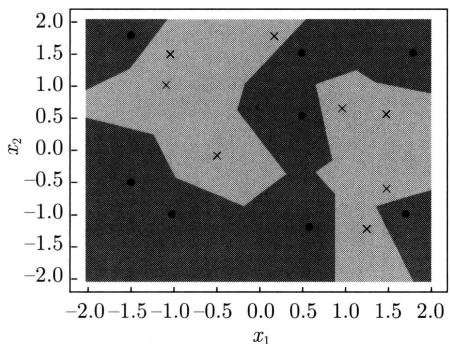  
图5.1 $k$ 近邻法的模型对应特征空间的一个划分。这是二维特征空间中的二类分类问题，使用最近邻法。图中 $\bullet$ 点是正例， $\times$ 点是负例。红色区域的实例都被分到正类，绿色区域的实例都被分到负类（见文前彩图）

$k$ 近邻法用于回归时，当训练数据集、距离度量、 $k$ 值及回归决策规则确定后，对于任何一个新的输入实例，其对应的输出数值便唯一确定。  
$k$ 近邻法利用特征空间中局部实例进行分类或回归，方法简单且容易实现，也能较好地应对复杂的问题，一般有较高的预测准确率。

# 5.2.2 距离度量

特征空间中两个实例点的距离是两个实例点相似程度的反映。 $k$ 近邻模型的特征空间一般是 $D$ 维实数向量空间 $\mathbb{R}^D$ 。使用的距离是欧氏距离，但也可以是其他距离，如更一般的 $L_{p}$ 距离（ $L_{p}$ distance）或Minkowski距离（Minkowskidistance）。

设特征空间 $\mathcal{X}$ 是 $D$ 维实数向量空间 $\mathbb{R}^D$ ， $\pmb{x}_i,\pmb{x}_j\in \mathcal{X}$ ， $\pmb {x}_i = (x_{i1},x_{i2},\dots ,x_{iD})^{\mathrm{T}}$ ， $\pmb {x}_j = (x_{j1},x_{j2},\dots ,x_{jD})^{\mathrm{T}}$ ， $\pmb {x}_i,\pmb {x}_j$ 的 $L_{p}$ 距离定义为

$$
L _ {p} \left(\boldsymbol {x} _ {i}, \boldsymbol {x} _ {j}\right) = \left(\sum_ {d = 1} ^ {D} \left| x _ {i d} - x _ {j d} \right| ^ {p}\right) ^ {\frac {1}{p}} \tag {5.2}
$$

这里 $p \geqslant 1$ 。当 $p = 2$ 时，称为欧氏距离（Euclidean distance），即

$$
L _ {2} \left(\boldsymbol {x} _ {i}, \boldsymbol {x} _ {j}\right) = \left(\sum_ {d = 1} ^ {D} \left| x _ {i d} - x _ {j d} \right| ^ {2}\right) ^ {\frac {1}{2}} \tag {5.3}
$$

当 $p = 1$ 时，称为曼哈顿距离（Manhattan distance），即

$$
L _ {1} \left(\boldsymbol {x} _ {i}, \boldsymbol {x} _ {j}\right) = \sum_ {d = 1} ^ {D} \left| x _ {i d} - x _ {j d} \right| \tag {5.4}
$$

当 $p = \infty$ 时，是各个坐标距离的最大值，即

$$
L _ {\infty} \left(\boldsymbol {x} _ {i}, \boldsymbol {x} _ {j}\right) = \max  _ {d} \left| x _ {i d} - x _ {j d} \right| \tag {5.5}
$$

图5.2给出了二维空间中 $p$ 取不同值时，与原点的 $L_{p}$ 距离为1（ $L_{p} = 1$ ）的点的图形。

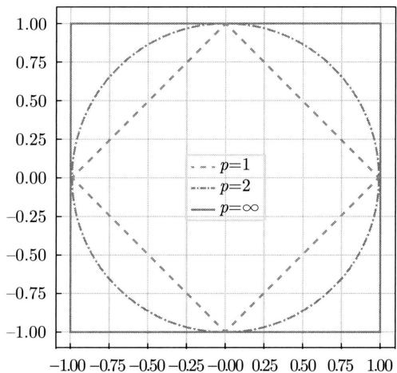  
图5.2 $L_{p}$ 距离间的关系

下面的例子说明，由不同的距离度量所确定的最近邻点是不同的。

例5.1 已知二维空间的3个点 $\pmb{x}_1 = (1,1)^{\mathrm{T}}$ ， $\pmb{x}_2 = (5,1)^{\mathrm{T}}$ ， $\pmb{x}_3 = (4,4)^{\mathrm{T}}$ ，试求在 $p$ 取不同值时， $L_{p}$ 距离下 $\pmb{x}_1$ 的最近邻点。

解因为 $\pmb{x}_1$ 和 $\pmb{x}_2$ 只有第一维的值不同，所以 $p$ 为任何值时， $L_{p}(\pmb{x}_{1},\pmb{x}_{2}) = 4$ 。而 $L_{1}(\pmb{x}_{1},\pmb{x}_{3}) = 6$ ， $L_{2}(\pmb{x}_{1},\pmb{x}_{3}) = 4.24$ ， $L_{3}(\pmb{x}_{1},\pmb{x}_{3}) = 3.78$ ， $L_{4}(\pmb{x}_{1},\pmb{x}_{3}) = 3.57$ ，于是得到： $p = 1$ 或 2 时， $\pmb{x}_2$ 是 $\pmb{x}_1$ 的最近邻点； $p \geqslant 3$ 时， $\pmb{x}_3$ 是 $\pmb{x}_1$ 的最近邻点。

# 5.2.3 $k$ 值的选择

$k$ 值的选择会对 $k$ 近邻法的结果产生重大影响。

若选择较小的 $k$ 值，相当于利用较小邻域中的训练实例进行预测，优点是预测的偏差（bias）会减小，只有与输入实例较近的（相似的）实例才会对预测结果起作用。然而，缺点是预测的方差（variance）会增大，预测结果会对近邻的实例非常敏感。如果近邻的实例恰巧是噪声，预测就可能出错。 $k$ 值的减小就意味着整体模型变得复杂，容易发生对训练数据的过拟合。

如果选择较大的 $k$ 值，就相当于用较大邻域中的训练实例进行预测。其优点是可以减少预测的方差，但缺点是预测的偏差会增大。这时与输入实例较远的（不相似的）实例也会对预测起作用，使得预测容易产生错误。 $k$ 值的增大就意味着模型变得简单。

如果 $k = N$ ，那么无论输入实例是什么，都将预测它属于在训练实例中最多的类别，或者取训练实例的数值的平均值。这时，模型过于简单，完全忽略训练实例中的大量有用信息是不可取的。

在应用中， $k$ 值一般取一个比较小的数值。通常采用交叉验证法来选取最优的 $k$ 值。

# 5.2.4 决策规则

$k$ 近邻法中的分类决策规则一般是多数表决，即由 $k$ 个邻近的训练实例中的多数类别决定输入实例的类别。也有加权的多数表决，比如，以邻近的训练实例与输入实例的距离的倒数作为权重。

多数表决规则（majority voting rule）有如下解释：等价于在邻域内对条件概率分布进行极大似然估计，选取估计的条件概率最大的类别作为预测的类别。

分类函数为

$$
F: \mathbb {R} ^ {D} \rightarrow \left\{c _ {1}, c _ {2}, \dots , c _ {K} \right\}
$$

对给定的实例 $\pmb{x} \in \mathcal{X}$ ，与其最近邻的 $k$ 个实例点构成一个单元或邻域 $R_{k}(\pmb{x})$ ，在这个单元中所有的点的 $k$ 个最近邻皆为这 $k$ 个实例点。在单元内的实例属于各个类别的条件概率分别是

$$
P (y = c _ {j} | R _ {k} (\boldsymbol {x})), \quad j = 1, 2, \dots , K
$$

根据经验风险最小化原则，利用极大似然估计从数据中估计每个类别的条件概率

$$
\hat {P} (y = c _ {j} \mid R _ {k} (\boldsymbol {x})) = \frac {1}{k} \sum_ {\boldsymbol {x} _ {i} \in R _ {k} (\boldsymbol {x})} I (y _ {i} = c _ {j})
$$

这时损失函数是似然损失。选取条件概率最大的类别作为实例 $\pmb{x}$ 的类别。这就等价于在单元内用实例的类别进行多数表决。

$k$ 近邻法中的回归决策规则一般是取平均值。有如下解释：等价于根据经验风险最小化，对单元内的一元高斯条件分布进行极大似然估计，将估计的高斯条件分布的均值作为预测的数值。这时假设高斯分布的方差是常量。具体推导留作习题。

# 5.3 $k$ 近邻法的实现: $k$ -d 树

实现 $k$ 近邻法的一个挑战是预测时的计算量较大，特别是特征空间维数及训练数据容量非常大的时候。需要考虑如何对训练数据进行快速 $k$ 近邻搜索。

$k$ 近邻法最简单的实现方法是线性扫描（linear scan），这时要计算输入实例与每一个训练实例的距离。当训练数据集很大时，计算非常耗时，这种方法是不可行的。

为了提高 $k$ 近邻搜索的效率，可以考虑使用特殊的结构存储训练数据，以减少计算距离的次数。具体方法很多，下面介绍其中的 $k$ -d 树（ $k$ -d tree）方法。注意： $k$ -d 树是存储 $k$ 维空间数据的树结构，这里的 $k$ 与 $k$ 近邻法的 $k$ 意义不同，为了与习惯一致，本书仍用 $k$ -d 树的名称。

# 5.3.1 构建 $k$ -d树

$k$ -d 树（ $k$ dimensional tree）是一种对 $k$ 维空间中的实例点进行快速搜索的树形数据结构。 $k$ -d 树是二叉树，表示对 $k$ 维空间的一个划分（partition）。构建 $k$ -d 树相当于不断地用超平面将 $k$ 维空间切分，构成一系列的 $k$ 维超矩形区域。 $k$ -d 树的每个结点对应于一个 $k$ 维超矩形区域。每一个超矩形区域包含实例点的一个集合。

构建 $k$ -d 树的方法一般如下：构建根结点，使根结点对应 $k$ 维空间中包含实例点的集合的超矩形区域；依次选择坐标轴对 $k$ 维空间进行切分，每次从一个结点产生出两个子结点，使两个子结点对应包含实例点的两个子集的超矩形区域；持续这个过程，直到产生所有叶结点，每个叶结点对应包含一个实例点的超矩形区域。对一个坐标轴进行切分时，选择对应的超矩形区域中的实例点在这个坐标轴上的中位数（median）作为切分点，确定一个超平面，使这个超平面垂直于该坐标轴并通过该切分点。这样构建的 $k$ -d 树是平衡的，但搜索时的效率未必是最优的。

下面给出构建 $k$ -d 树的算法。

# 算法5.2（构建平衡 $k$ -d树）

输入： $k$ 维空间数据集 $\mathcal{D} = \{\pmb{x}_1,\pmb{x}_2,\dots ,\pmb{x}_N\}$ ，其中 $\pmb {x}_i = (x_{i1},x_{i2},\dots ,x_{ik})^{\mathrm{T}}$ ， $i = 1,2,\dots ,N$ 。

输出： $k$ -d树。

（1）开始：构建根结点，根结点对应于包含 $\mathcal{D}$ 的 $k$ 维空间的超矩形区域。

选择 $x_{1}$ 为坐标轴，以 $\mathcal{D}$ 中所有实例的 $x_{1}$ 坐标的中位数为切分点，将根结点对应的超矩形区域切分为两个子区域。切分由与坐标轴 $x_{1}$ 垂直且通过切分点的超平面实现。

由根结点生成深度为 1 的左、右两个子结点: 左子结点对应坐标 $x_{1}$ 小于切分点的子区

域，右子结点对应坐标 $x_{1}$ 大于切分点的子区域。

将落在切分超平面上的实例点保存在根结点。

(2) 重复: 对深度为 $j$ 的结点, 选择 $x_{l}$ 为切分的坐标轴, $l = j(\bmod k) + 1$ , 以该结点的区域中所有实例的 $x_{l}$ 坐标的中位数为切分点, 将该结点对应的超矩形区域切分为两个子区域。切分由与坐标轴 $x_{l}$ 垂直且通过切分点的超平面实现。

由该结点生成深度为 $j + 1$ 的左、右两个子结点：左子结点对应坐标 $x_{l}$ 小于切分点的子区域，右子结点对应坐标 $x_{l}$ 大于切分点的子区域。

将落在切分超平面上的实例点保存在该结点。

(3) 直到每一个子区域只包含一个实例时停止, 成为叶结点, 从而得到一个 $k$ -d 树, 以及对特征空间的一个划分。

例5.2 给定一个二维空间的数据集

$$
\mathcal {D} = \left\{\left(2, 3\right) ^ {\mathrm {T}}, (5, 4) ^ {\mathrm {T}}, (9, 6) ^ {\mathrm {T}}, (4, 7) ^ {\mathrm {T}}, (8, 1) ^ {\mathrm {T}}, (7, 2) ^ {\mathrm {T}} \right\}
$$

构建一个平衡 $k$ -d 树①。

解 根结点对应包含数据集 $\mathcal{D}$ 的矩形，选择 $x_{1}$ 轴，6个实例点的 $x_{1}$ 坐标的中位数是7，以平面 $x_{1} = 7$ 将空间分为左、右两个子矩形（子结点）；接着，左矩形以 $x_{2} = 4$ 分为两个子矩形，右矩形以 $x_{2} = 6$ 分为两个子矩形，如此递归，最后得到如图5.3所示的特征空间划分和如图5.4所示的 $k$ -d树。

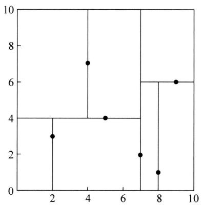  
图5.3 特征空间划分

# 5.3.2 搜索 $k$ -d树

下面介绍如何利用 $k$ -d 树进行 $k$ 近邻搜索。可以看到，利用 $k$ -d 树可以省去对大部分实例点的搜索，从而减少搜索的计算量。这里以最近邻为例加以叙述，同样的方法可以应用到 $k$ 近邻。

给定一个目标点，搜索其最近邻。首先找到包含目标点的区域对应的叶结点，该叶结点对应包含目标点的最小超矩形区域，该叶结点的实例点作为“当前最近点”。然后从该叶结点

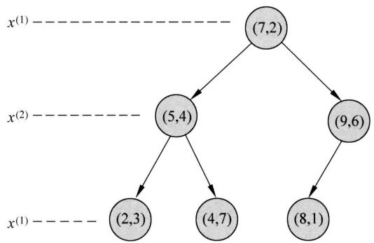  
图5.4 $k$ -d树示例

出发，依次回退到父结点；不断搜索与目标点更近的结点，直到不能找到更近的结点为止。这样搜索就被限制在空间的局部区域内，效率大为提高。

目标点的最近邻一定在以目标点为中心并通过当前最近点的超球面的内部（参见图5.5）。回退到当前结点的父结点时，如果父结点的实例点更近，则将其作为新的当前最近点。如果父结点的另一子结点的超矩形区域与超球面相交，那么在相交的区域内寻找与目标点更近的实例点；如果父结点的另一子结点的超矩形区域与超球面不相交，或不存在比当前最近点更近的点，则向上回退。

  
图5.5 通过 $k$ -d树搜索最近邻

下面叙述用 $k$ -d 树的最近邻搜索算法。

# 算法5.3（用 $k$ -d树的最近邻搜索）

输入：已构建的 $k$ -d 树，目标点 $\pmb{x}$ 。

输出： $\pmb{x}$ 的最近邻。

(1) 在 $k$ -d 树中找到包含目标点 $\pmb{x}$ 的叶结点: 从根结点出发, 递归地向下访问 $k$ -d 树。若目标点 $\pmb{x}$ 当前维度的坐标小于切分点的坐标, 则移动到左子结点, 否则移动到右子结点, 直到子结点为叶结点为止。  
（2）以此叶结点为当前最近点。  
（3）递归地回退到父节点，在该结点进行以下操作：  
（a）如果该结点保存的实例点比当前最近点距离目标点更近，则以该实例点为当前最近点。

(b) 检查该结点的另一个子结点对应的区域是否有更近的点。具体地，检查另一子结点对应的区域是否与以目标点为球心、以目标点与“当前最近点”间的距离为半径的超球面相交。如果相交，可能在另一个子结点对应的区域内存在距目标点更近的点，移动到另一个子结点，递归地进行最近邻搜索。如果不相交，向上回退。  
（4）当回退到根结点时，搜索结束。最后的当前最近点即为 $x$ 的最近邻点。

如果实例点是随机分布的， $k$ -d 树搜索的平均计算复杂度是 $O(\log N)$ ，这里 $N$ 是训练实例数。 $k$ -d 树更适用于训练实例数远大于空间维数时的 $k$ 近邻搜索。当空间维数接近训练实例数时，它的效率会迅速下降，几乎接近线性扫描。

下面通过一个例题来说明搜索方法。

例5.3 给定一个如图5.5所示的 $k$ -d 树，根结点为A，其子结点为B，C等。树上共存储7个实例点，另有一个输入目标实例点S，求S的最近邻。

解首先在 $k$ -d树中找到包含点S的叶结点D（图5.5中的右下区域），以点D作为当前最近点。真正最近邻一定在以点S为中心通过点D的圆的内部。然后返回结点D的父结点B，在结点B的另一子结点F的区域内搜索最近邻。结点F的区域与圆不相交，不可能有最近邻点。继续返回上一级父结点A，在结点A的另一子结点C的区域内搜索最近邻。结点C的区域与圆相交，该区域在圆内的实例点有点E，点E比点D更近，成为新的当前最近点。最后得到点E是点S的最近邻。

# 本章概要

1. $k$ 近邻法是基本的分类和回归方法。 $k$ 近邻法的基本做法是：对给定的训练实例和输入实例，首先确定输入实例的 $k$ 个最近邻训练实例，然后利用这 $k$ 个训练实例的类别的多数来预测输入实例的类别或数值。  
2. $k$ 近邻模型对应于基于训练数据集对特征空间的一个划分。 $k$ 近邻法中，当训练数据集、距离度量、 $k$ 值及分类决策规则确定后，其结果唯一确定。  
3. $k$ 近邻法三要素：距离度量、 $k$ 值的选择和决策规则。常用的距离度量是欧氏距离及更一般的 $L_{p}$ 距离。 $k$ 值小时， $k$ 近邻模型更复杂； $k$ 值大时， $k$ 近邻模型更简单。 $k$ 值的选择反映了对学习偏差与方差之间的权衡，通常由交叉验证选择最优的 $k$ 。分类时决策规则通常是多数表决，回归时决策规则通常是取平均，对应于经验风险最小化。  
4. $k$ 近邻法的实现需要考虑如何快速搜索 $k$ 个最近邻点。 $k$ -d 树是一种便于对 $k$ 维空间中的数据进行快速搜索的数据结构。 $k$ -d 树是二叉树，表示对 $k$ 维空间的一个划分，其每个结点对应于 $k$ 维空间划分中的一个超矩形区域。利用 $k$ -d 树可以省去对大部分实例点的搜索，从而减少搜索的计算量。

# 继续阅读

$k$ 近邻法由 Cover 与 Hart 提出[1]。 $k$ 近邻法相关的理论在文献[2]和文献[3]中有论述。 $k$ 近邻法的扩展可参考文献[4]。 $k$ -d 树及其他快速搜索算法可参考文献[5]。

# 习题

5.1 参照图 5.1，在二维空间中给出实例点，画出 $k$ 为 1 和 2 时的 $k$ 近邻法构成的空间划分，并对其进行比较，体会 $k$ 值选择与模型复杂度及预测精确率的关系。  
5.2 $k$ 近邻法用于回归时，通常将 $k$ 近邻的实例的数值的均值作为输入实例的数值。试证明这等价于对邻域内的一元高斯条件分布进行估计，并取估计的高斯分布的均值。  
5.3 将第 2 章介绍的偏差-方差分解应用于 $k$ 近邻回归，体会 $k$ 值选择的重要性。提示： $k$ 近邻回归是取最近邻的 $k$ 个实例的数值的平均值。  
5.4 利用例题 5.2 构建的 $k$ -d 树求点 $\pmb{x} = (3,4.5)^{\mathrm{T}}$ 的最近邻点。  
5.5 参照算法 5.3, 写出求解点 $x$ 的 $k$ 近邻的算法。

# 参考文献

[1] COVER T, HART P. Nearest neighbor pattern classification[J]. IEEE Transactions on Information Theory, 1967, 13(1): 21-27.   
[2] HASTIE T, TIBSHIRANI R, FRIEDMAN J. The elements of statistical learning: data mining, inference, and prediction[M]. 范明，柴玉梅，智红英，等译. Springer, 2001.   
[3] FRIEDMAN J. Flexible metric nearest neighbor classification[J]. Technical Report, 1994.   
[4] WEINBERGER K Q, BLITZER J, SAUL L K. Distance metric learning for large margin nearest neighbor classification[C]/Proceedings of the NIPS, 2005.   
[5] SAMET H. The design and analysis of spatial data structures[M]. Addison-Wesley, 1990.

# 第6章 朴素贝叶斯法

朴素贝叶斯（naiveBayes）法使用概率模型进行分类，根据输入实例的特征预测并输出其类别。基于贝叶斯定理和特征的条件独立假设，通过类别的先验概率分布和类别给定条件下的各个特征的条件概率分布（似然函数），计算所有特征给定条件下的类别的条件概率分布（后验概率分布）。给定训练数据集，朴素贝叶斯法估计先验概率分布和似然函数，本质是估计输入输出的联合概率分布，也就是特征和类别的联合概率分布。

朴素贝叶斯法的模型是生成模型，表示数据的生成过程。也是最简单的贝叶斯网络。朴素贝叶斯法实现简单，学习与预测的效率都很高，是一种基本的分类方法，但分类的准确率一般不是最高的。

本章叙述朴素贝叶斯法，6.1节讲解朴素贝叶斯法的模型，6.2节讲解朴素贝叶斯法的学习算法。

# 6.1 朴素贝叶斯模型

# 6.1.1 模型定义

朴素贝叶斯法使用的模型是概率模型，条件概率分布 $P(y|\mathbf{x})$ 表示输入的实例特征 $\mathbf{x}$ 给定条件下，其输出的类别 $y$ 的概率。根据贝叶斯定理，条件概率分布 $P(y|\mathbf{x})$ 满足

$$
P (y | \boldsymbol {x}) = \frac {P (\boldsymbol {x} , y)}{P (\boldsymbol {x})} = \frac {P (y) P (\boldsymbol {x} | y)}{P (\boldsymbol {x})} \tag {6.1}
$$

其中， $P(y|\boldsymbol{x})$ 是后验概率分布， $P(y)$ 是先验概率分布， $P(\boldsymbol{x}|\boldsymbol{y})$ 是似然函数， $P(\boldsymbol{x})$ 是证据。为了简单，这里只考虑输入是离散变量的情况，可以很容易地扩展到输入是连续变量的情况。

输入 $\pmb{x}$ 是定义在输入空间 $\mathcal{X}$ 上的随机向量， $\pmb{x} \in \mathcal{X}$ 。输出 $y$ 是定义在 $\mathcal{Y}$ 上的随机变量， $y \in \mathcal{Y}$ 。输入空间 $\mathcal{X}$ 是 $M$ 维特征向量的集合， $\pmb{x} = (x_{1}, x_{2}, \dots, x_{M})^{\mathrm{T}}$ ，每一维特征取 $L$ 个离散特征值， $x_{j} \in \mathcal{A}_{j}$ ， $\mathcal{A}_{j} = \{a_{j1}, a_{j2}, \dots, a_{jL}\}$ ， $j = 1, 2, \dots, M$ 。输出空间是类别标记集合 $\mathcal{Y} = \{c_{1}, c_{2}, \dots, c_{K}\}$ 。

模型可以写作

$$
P (y | x _ {1}, x _ {2}, \dots , x _ {M}) = \frac {P (y) P \left(x _ {1} , x _ {2} , \cdots , x _ {M} \mid y\right)}{P \left(x _ {1} , x _ {2} , \cdots , x _ {M}\right)} \tag {6.2}
$$

朴素贝叶斯法对似然函数做条件独立假设。由于这是一个较强的假设，朴素贝叶斯法也由此得名。具体地，条件独立假设是

$$
P \left(x _ {1}, x _ {2}, \dots , x _ {M} \mid y\right) = \prod_ {j = 1} ^ {M} P \left(x _ {j} \mid y\right) \tag {6.3}
$$

条件独立假设等于是说用于分类的特征在类别确定的条件下都是相互独立的。这样，朴素贝叶斯模型就变成

$$
P (y | \boldsymbol {x}) = \frac {P (y) \prod_ {j = 1} ^ {M} P \left(x _ {j} \mid y\right)}{P (\boldsymbol {x})} \propto P (y) \prod_ {j = 1} ^ {M} P \left(x _ {j} \mid y\right) \tag {6.4}
$$

这是因为在式 (6.2) 中分母的证据 $P(\pmb{x})$ 对所有 $y$ 都是相同的，比较后验概率大小时不需考虑。

因此，朴素贝叶斯模型实际是输入 $x$ 和输出 $y$ 的联合概率分布。

$$
P (\boldsymbol {x}, y) = P (y) \prod_ {j = 1} ^ {M} P (x _ {j} | y) \tag {6.5}
$$

注意其中先验分布 $P(y)$ 和似然函数 $P(x_{j}|y)$ 都是类别分布（categorical distribution）。贝叶斯模型的参数就是其中的类别分布的参数。

定义6.1（朴素贝叶斯模型）朴素贝叶斯模型（naiveBayesmodel）是一种用于分类问题的简单而有效的概率模型。在这个模型中，有一组特征变量 $x = x_{1},x_{2},\dots ,x_{M}$ 和一个类别变量 $y$ ，所有特征变量和类别变量形成一个联合概率分布 $P(\pmb {x},y)$ 。假设在给定类别变量条件下各个特征变量相互独立，这样就可以利用贝叶斯定理，从类别的先验概率 $P(y)$ 以及类别给定的条件下的各个特征的条件概率 $P(x_{j}|y),j = 1,\dots ,M$ ，求出给定特征条件下的类别的后验概率 $P(y|\mathbf{x})$ ：

$$
P (y | \boldsymbol {x}) = \frac {P (y) \prod_ {j = 1} ^ {M} P (x _ {j} | y)}{P (\boldsymbol {x})}
$$

朴素贝叶斯模型也是概率生成模型以及概率有向图模型。

条件独立假设使朴素贝叶斯法变得简单，但有时会牺牲一定的分类准确率。似然函数 $P(x_{1},x_{2},\dots ,x_{M}|y)$ 有指数量级的参数 $O(K\bullet L^{M})$ ，其估计实际是不可行的。有了条件独立假设，参数个数变为线性量级 $O(K\bullet M\bullet L)$ ，其估计可以容易地进行。

朴素贝叶斯法分类时，对给定的输入 $\pmb{x}$ ，使用学习到的模型计算联合概率分布 $P(\pmb{x},y)$ 将联合概率最大的类别作为 $\pmb{x}$ 的类别，也就是后验概率 $P(y|\pmb{x})$ 最大的类别。

$$
\hat {y} = \arg \max  _ {y} P (y) \prod_ {j = 1} ^ {M} P \left(x _ {j} \mid y\right) \tag {6.6}
$$

# 6.1.2 分类决策

朴素贝叶斯法将实例分到后验概率最大的类别中，这等价于期望风险最小化。假设选择0-1损失函数：

$$
L (y, f (\boldsymbol {x})) = \left\{ \begin{array}{l l} 1, & y \neq f (\boldsymbol {x}) \\ 0, & y = f (\boldsymbol {x}) \end{array} \right.
$$

式中 $f(\pmb {x})$ 是分类决策函数。这时，期望风险函数为

$$
R _ {\exp} (f) = E _ {P (\boldsymbol {x}, y)} L (y, f (\boldsymbol {x})) \tag {6.7}
$$

期望是对联合分布 $P(\pmb {x},\pmb {y})$ 取的。由此得到：

$$
R _ {\exp} (f) = E _ {P (\boldsymbol {x})} \sum_ {k = 1} ^ {K} L (y, f (\boldsymbol {x})) P (y | \boldsymbol {x}) \tag {6.8}
$$

为了使期望风险最小化，只需对 $\pmb{x}$ 逐个最小化，由此得到：

$$
\begin{array}{l} f (\boldsymbol {x}) = \arg \min  _ {y \in \mathcal {Y}} \sum_ {y} L (y, f (\boldsymbol {x})) P (y | \boldsymbol {x}) \\ = \arg \min  _ {y \in \mathcal {Y}} \sum_ {y} P (y \neq f (\boldsymbol {x}) | \boldsymbol {x}) \\ = \arg \min  _ {y \in \mathcal {Y}} (1 - P (y = f (\boldsymbol {x}) | \boldsymbol {x})) \\ = \arg \max  _ {y \in \mathcal {Y}} P (y = f (\boldsymbol {x}) | \boldsymbol {x}) \\ \end{array}
$$

这样一来，根据期望风险最小化准则就得到了后验概率最大化准则：

$$
f (\boldsymbol {x}) = \arg \max  _ {\boldsymbol {y}} P (\boldsymbol {y} | \boldsymbol {x}) \tag {6.9}
$$

即朴素贝叶斯法所采用的原理。

# 6.1.3 概率模型

贝叶斯模型是概率模型，表示生成数据的机制。首先根据先验分布 $P(y)$ 生成类别 $y$ ，然后根据条件概率分布 $P(x_{j}|y)$ ，基于类别 $y$ 逐个生成实例的特征 $x_{j}$ ， $j = 1,2,\dots ,M$ ，产生 $M$ 个特征，这样就得到一个输入-输出或特征-类别的对 $(\pmb {x},\pmb {y})$ 。

图6.1是贝叶斯模型（联合概率分布）的概率有向图模型表示。概率有向图模型（probabilistic directed graph）中结点表示随机变量，有向边表示概率依存关系。随机变量 $x_{j}$ 条件独立于随机变量 $y$ 。

朴素贝叶斯模型是一种最简单的贝叶斯网络。贝叶斯网络（Byesian network）是一种概率有向图模型，它借助有向无环图来表示一组随机变量的联合分布。通过用有向边表示随机变量之间的概率依存关系，使得联合概率分布的模型得到极大程度的简化，从而易于进行模型的学习和预测。

  
图6.1 朴素贝叶斯模型的概率有向图模型表示。实心圆表示可观测变量，空心圆表示不可观测变量

# 6.1.4 生成模型与判别模型

如第2章所述，在监督学习中，直接学习分类的条件概率分布或函数的模型称为判别模型，而学习联合概率分布以用于分类的模型称为生成模型。贝叶斯模型基于联合概率分布，因此属于生成模型。然而，贝叶斯模型也可以与判别模型建立联系。

假设朴素贝叶斯法中，分类是二分类，取值 $\{1,0\}$ ；特征值也都是二值，取值 $\{1,0\}$ 。容易验证，这时实例属于正类的对数几率（log odds）具有与感知机相同的形式，也就是判别模型的形式。具体推导留作习题。

$$
\log \frac {P (y = 1 \mid x _ {1} , x _ {2} , \cdots , x _ {M})}{P (y = 0 \mid x _ {1} , x _ {2} , \cdots , x _ {M})} = \sum_ {j = 1} ^ {M} w _ {j} x _ {j} + b \tag {6.10}
$$

其中， $w_{j}$ 和 $b$ 是参数。注意这里 $x_{j}$ 的取值是离散的，对应的感知机的 $x_{j}$ 的取值是连续的。

# 6.2 朴素贝叶斯学习

# 6.2.1 学习问题

朴素贝叶斯学习旨在从训练数据集中估计联合概率分布 $P(\pmb{x},\pmb{y})$ 。假设训练数据

$$
\mathcal {D} = \left\{\left(\boldsymbol {x} _ {1}, y _ {1}\right), \left(\boldsymbol {x} _ {2}, y _ {2}\right), \dots , \left(\boldsymbol {x} _ {N}, y _ {N}\right) \right\}
$$

是由 $P(\pmb {x},\pmb {y})$ 独立同分布产生的。

具体地，估计以下先验概率分布及条件概率分布（似然函数）。

$$
P \left(y = c _ {k}\right), \quad k = 1, 2, \dots , K \tag {6.11}
$$

$$
P (\boldsymbol {x} \mid y = c _ {k}) = \prod_ {j = 1} ^ {M} P \left(x _ {j} \mid y = c _ {k}\right), \quad k = 1, 2, \dots , K \tag {6.12}
$$

# 6.2.2 极大似然估计

利用极大似然估计法最小化对数损失，估计模型的参数。

$$
L = - \sum_ {i = 1} ^ {N} \log P \left(\boldsymbol {x} _ {i}, y _ {i}\right) = - \sum_ {i = 1} ^ {N} \log P \left(y _ {i}\right) - \sum_ {i = 1} ^ {N} \sum_ {j = 1} ^ {M} \log P \left(x _ {i j} \mid y _ {i}\right) \tag {6.13}
$$

先验概率 $P(y = c_k)$ 的极大似然估计是

$$
P (y = c _ {k}) = \frac {\sum_ {i = 1} ^ {N} I \left(y _ {i} = c _ {k}\right)}{N}, \quad k = 1, 2, \dots , K \tag {6.14}
$$

条件概率 $P(x_{j} = a_{jl}|y = c_{k})$ 的极大似然估计是

$$
P (x _ {j} = a _ {j l} | y = c _ {k}) = \frac {\sum_ {i = 1} ^ {N} I \left(x _ {i j} = a _ {j l} , y _ {i} = c _ {k}\right)}{\sum_ {i = 1} ^ {N} I \left(y _ {i} = c _ {k}\right)},
$$

$$
j = 1, 2, \dots , M, \quad l = 1, 2, \dots , L, \quad k = 1, 2, \dots , K \tag {6.15}
$$

其中， $x_{ij}$ 是第 $i$ 个样本的第 $j$ 个特征； $a_{jl}$ 是第 $j$ 个特征可能取的第 $l$ 个值； $I$ 为指示函数。

# 6.2.3 学习和分类算法

下面给出朴素贝叶斯法的学习与分类算法。参数估计使用极大似然估计。

# 算法6.1 (朴素贝叶斯算法)

输入：训练数据集 $\mathcal{D} = \left\{\left(\pmb{x}_{1},y_{1}\right),\left(\pmb{x}_{2},y_{2}\right),\dots ,\left(\pmb{x}_{N},y_{N}\right)\right\}$ ， $i = 1,2,\dots ,N$ ，其中 $\pmb {x}_i = (x_{i1},x_{i2},\dots ,x_{iM})^{\mathrm{T}}$ ， $x_{ij}$ 是第 $i$ 个样本的第 $j$ 个特征， $x_{ij}\in \{a_{j1},a_{j2},\dots ,a_{jL}\}$ ， $a_{jl}$ 是第 $j$ 个特征可能取的第 $l$ 个值， $j = 1,2,\dots ,M$ ， $l = 1,2,\dots ,L$ ； $y_{i}\in \{c_{1},c_{2},\dots ,c_{K}\}$ ， $y_{i}$ 是第 $i$ 个样本的类别， $c_{k}$ 是第 $k$ 个类别， $k = 1,2,\dots ,K$ ；实例 $\pmb{x}$ 。

输出：实例 $\pmb{x}$ 的分类。

（1）计算先验概率及条件概率

$$
P (y = c _ {k}) = \frac {\sum_ {i = 1} ^ {N} I \left(y _ {i} = c _ {k}\right)}{N}, \quad k = 1, 2, \dots , K
$$

$$
P (x _ {j} = a _ {j l} | y = c _ {k}) = \frac {\sum_ {i = 1} ^ {N} I \left(x _ {i j} = a _ {j l} , y _ {i} = c _ {k}\right)}{\sum_ {i = 1} ^ {N} I \left(y _ {i} = c _ {k}\right)},
$$

$$
j = 1, 2, \dots , M, \quad l = 1, 2, \dots , L, \quad k = 1, 2, \dots , K
$$

（2）对于给定的实例 $\pmb{x} = (x_{1}, x_{2}, \dots, x_{M})^{\mathrm{T}}$ ，计算

$$
P (y = c _ {k}) \prod_ {j = 1} ^ {M} P (x _ {j} | y = c _ {k}), \quad k = 1, 2, \dots , K
$$

（3）确定实例 $\pmb{x}$ 的类别

$$
\hat {y} = \arg \max  _ {c _ {k}} P (y = c _ {k}) \prod_ {j = 1} ^ {M} P (x _ {j} | y = c _ {k})
$$

例6.1 试由表6.1的训练数据学习一个朴素贝叶斯分类器并确定 $\pmb{x} = (2,S)^{\mathrm{T}}$ 的类标记 $y$ 。表中 $x_{1}$ ， $x_{2}$ 为特征，取值的集合分别为 $\mathcal{A}_1 = \{1,2,3\}$ ， $\mathcal{A}_2 = \{S,M,L\}$ ， $y$ 为类标记， $y\in \mathcal{C} = \{1, - 1\}$ 。

表 6.1 训练数据  

<table><tr><td></td><td>1</td><td>2</td><td>3</td><td>4</td><td>5</td><td>6</td><td>7</td><td>8</td><td>9</td><td>10</td><td>11</td><td>12</td><td>13</td><td>14</td><td>15</td></tr><tr><td>x1</td><td>1</td><td>1</td><td>1</td><td>1</td><td>1</td><td>2</td><td>2</td><td>2</td><td>2</td><td>2</td><td>3</td><td>3</td><td>3</td><td>3</td><td>3</td></tr><tr><td>x2</td><td>S</td><td>M</td><td>M</td><td>S</td><td>S</td><td>S</td><td>M</td><td>M</td><td>L</td><td>L</td><td>L</td><td>M</td><td>M</td><td>L</td><td>L</td></tr><tr><td>y</td><td>-1</td><td>-1</td><td>1</td><td>1</td><td>-1</td><td>-1</td><td>-1</td><td>1</td><td>1</td><td>1</td><td>1</td><td>1</td><td>1</td><td>1</td><td>-1</td></tr></table>

解 根据算法6.1，由表6.1容易计算下列概率：

$$
P (y = 1) = \frac {9}{1 5}, \quad P (y = - 1) = \frac {6}{1 5}
$$

$$
P (x _ {1} = 1 | y = 1) = \frac {2}{9}, \quad P (x _ {1} = 2 | y = 1) = \frac {3}{9}, \quad P (x _ {1} = 3 | y = 1) = \frac {4}{9}
$$

$$
P (x _ {2} = S | y = 1) = \frac {1}{9}, \quad P (x _ {2} = M | y = 1) = \frac {4}{9}, \quad P (x _ {2} = L | y = 1) = \frac {4}{9}
$$

$$
P (x _ {1} = 1 | y = - 1) = \frac {3}{6}, \quad P (x _ {1} = 2 | y = - 1) = \frac {2}{6}, \quad P (x _ {1} = 3 | y = - 1) = \frac {1}{6}
$$

$$
P (x _ {2} = S | y = - 1) = \frac {3}{6}, \quad P (x _ {2} = M | y = - 1) = \frac {2}{6}, \quad P (x _ {2} = L | y = - 1) = \frac {1}{6}
$$

对于给定的 $\pmb {x} = (2,S)^{\mathrm{T}}$ ，计算

$$
P (y = 1) P \left(x _ {1} = 2 | y = 1\right) P \left(x _ {2} = S | y = 1\right) = \frac {9}{1 5} \times \frac {3}{9} \times \frac {1}{9} = \frac {1}{4 5}
$$

$$
P (y = - 1) P \left(x _ {1} = 2 \mid y = - 1\right) P \left(x _ {2} = S \mid y = - 1\right) = \frac {6}{1 5} \times \frac {2}{6} \times \frac {3}{6} = \frac {1}{1 5}
$$

由于 $P(y = -1)P(x_{1} = 2|y = -1)P(x_{2} = S|y = -1)$ 最大，所以 $\hat{y} = -1$ 。

# 6.2.4 贝叶斯估计

用极大似然估计可能会出现估计的概率值为0的情况。这时会影响联合概率分布的计算结果，使分类产生偏差。解决这一问题的方法是采用贝叶斯学习。

朴素贝叶斯模型的贝叶斯学习或贝叶斯估计，基于训练数据，估计联合概率分布

$$
P (\boldsymbol {x}, \boldsymbol {y}, \boldsymbol {\theta} | \boldsymbol {\alpha})
$$

其中， $\theta$ 表示朴素贝叶斯模型的参数，假设类别分布的共轭先验分布都是狄利克雷分布，其超参数是 $\alpha$ 。推导作为第22章的习题。

条件概率的贝叶斯估计是

$$
P _ {\alpha} \left(x _ {j} = a _ {j l} \mid y = c _ {k}\right) = \frac {\sum_ {i = 1} ^ {N} I \left(x _ {i j} = a _ {j l} , y _ {i} = c _ {k}\right) + \alpha}{\sum_ {i = 1} ^ {N} I \left(y _ {i} = c _ {k}\right) + \alpha L} \tag {6.16}
$$

式中 $\alpha \geqslant 0$ ，等价于在随机变量各个取值的频数上加上一个正数 $\alpha > 0$ 。当 $\alpha = 0$ 时等价于极大似然估计。常取 $\alpha = 1$ ，这时称为拉普拉斯平滑（Laplacian smoothing）。显然，对任意 $l = 1,2,\dots ,L,k = 1,2,\dots ,K$ ，有

$$
P _ {\alpha} \left(x _ {j} = a _ {j l} \mid y = c _ {k}\right) > 0
$$

$$
\sum_ {l = 1} ^ {L} P _ {\alpha} \left(x _ {j} = a _ {j l} \mid y = c _ {k}\right) = 1
$$

说明式(6.16)表示的确为一种概率分布。先验概率的贝叶斯估计是

$$
P _ {\alpha} (y = c _ {k}) = \frac {\sum_ {i = 1} ^ {N} I \left(y _ {i} = c _ {k}\right) + \alpha}{N + \alpha K} \tag {6.17}
$$

例6.2 问题同例6.1，按照拉普拉斯平滑估计概率，即取 $\alpha = 1$ 。

解 $\mathcal{A}_1 = \{1,2,3\}$ ， $\mathcal{A}_2 = \{S,M,L\}$ ， $\mathcal{C} = \{1, - 1\}$ 。按照式(6.16）和式(6.17）计算下列概率：

$$
P (y = 1) = \frac {1 0}{1 7}, \quad P (y = - 1) = \frac {7}{1 7}
$$

$$
P (x _ {1} = 1 | y = 1) = \frac {3}{1 2}, \quad P (x _ {1} = 2 | y = 1) = \frac {4}{1 2}, \quad P (x _ {1} = 3 | y = 1) = \frac {5}{1 2}
$$

$$
P (x _ {2} = S | y = 1) = \frac {2}{1 2}, \quad P (x _ {2} = M | y = 1) = \frac {5}{1 2}, \quad P (x _ {2} = L | y = 1) = \frac {5}{1 2}
$$

$$
P (x _ {1} = 1 | y = - 1) = \frac {4}{9}, \quad P (x _ {1} = 2 | y = - 1) = \frac {3}{9}, \quad P (x _ {1} = 3 | y = - 1) = \frac {2}{9}
$$

$$
P (x _ {2} = S | y = - 1) = \frac {4}{9}, \quad P (x _ {2} = M | y = - 1) = \frac {3}{9}, \quad P (x _ {2} = L | y = - 1) = \frac {2}{9}
$$

对于给定的 $\pmb {x} = (2,S)^{\mathrm{T}}$ ，计算

$$
P (y = 1) P \left(x _ {1} = 2 | y = 1\right) P \left(x _ {2} = S | y = 1\right) = \frac {1 0}{1 7} \times \frac {4}{1 2} \times \frac {2}{1 2} = \frac {5}{1 5 3} = 0. 0 3 2 7
$$

$$
P (y = - 1) P \left(x _ {1} = 2 | y = - 1\right) P \left(x _ {2} = S | y = - 1\right) = \frac {7}{1 7} \times \frac {3}{9} \times \frac {4}{9} = \frac {2 8}{4 5 9} = 0. 0 6 1 0
$$

由于 $P(y = -1)P(x_{1} = 2|y = -1)P(x_{2} = S|y = -1)$ 最大，所以 $\hat{y} = -1$

# 本章概要

1. 朴素贝叶斯法使用概率模型做分类。模型表示给定实例特征 $\pmb{x}$ 预测实例类别 $y$ 的后验概率分布 $P(y|\pmb{x})$ 。根据贝叶斯定理有

$$
P (y | \boldsymbol {x}) \propto P (\boldsymbol {x}, y) = P (y) P (\boldsymbol {x} | y)
$$

其中的联合概率分布 $P(\pmb{x},y)$ 由先验分布 $P(y)$ 和似然函数 $P(\pmb{x}|\mathcal{Y})$ 组成。

2. 朴素贝叶斯法假设似然函数是条件独立的：

$$
P (\boldsymbol {x} | y) = P (x _ {1}, x _ {2}, \dots , x _ {n} | y) = \prod_ {j = 1} ^ {M} P (x _ {j} | y)
$$

由于这一假设，模型包含的参数数量大量减少，学习与预测大为简化。因而朴素贝叶斯法有高效且易于实现的优点，其缺点是分类的准确率不一定很高。朴素贝叶斯模型变成联合概率分布

$$
P (\boldsymbol {x}, y) = P (y) \prod_ {j = 1} ^ {M} P (x _ {j} | y)
$$

3. 朴素贝叶斯法利用学到的模型进行分类预测。将输入实例 $\pmb{x}$ 分到后验概率 $P(y|\pmb{x})$ 最大的类别，等价地联合概率 $P(\pmb{x},y)$ 最大的类别。

$$
y = \arg \max  _ {y} P (y) \prod_ {j = 1} ^ {M} P (x _ {j} | y)
$$

后验概率最大等价于0-1损失函数时的期望风险最小化。

4. 朴素贝叶斯模型是概率生成模型，可以表示首先生成类别，然后基于类别独立地生成特征的过程。贝叶斯模型也是最简单的贝叶斯网络。  
5. 朴素贝叶斯法的学习可以基于极大似然估计或贝叶斯估计。使用贝叶斯估计可以避免概率估计值为0的情况，直观上，在每一个随机变量取值的频数上加上一个正数 $\alpha$ ，例如， $\alpha = 1$ 。

# 继续阅读

朴素贝叶斯法的介绍可参见文献[1]和文献[2]。朴素贝叶斯法中假设输入变量都是条件独立的，如果假设它们之间存在概率依存关系，模型就变成了贝叶斯网络，参见文献[3]。

# 习题

6.1 用极大似然估计法推出朴素贝叶斯法中的概率估计式(6.14)及式(6.15)。  
6.2 朴素贝叶斯模型也可以扩展到特征是连续变量的模型。高斯朴素贝叶斯模型就是

一种这样的模型。假设第 $j$ 维的特征的条件概率分布 $p(x_{j} = x|y = c_{k})$ 满足高斯分布

$$
p (x _ {j} = a | y = c _ {k}) = \frac {1}{\sqrt {2 \pi \sigma_ {k} ^ {2}}} \exp {- \frac {(a - \mu_ {k}) ^ {2}}{2 \sigma_ {k} ^ {2}}}
$$

写出这个朴素贝叶斯模型的学习算法。图2.9示意高斯朴素贝叶斯模型。

6.3 写出式 (6.10) 中参数 $w_{i}$ 和 $b$ 的表达式。

6.4 考虑用于二分类问题的朴素贝叶斯模型。实例原本只有一个特征 $\mathbf{x} = x_{1}$ 。先验概率分布是均匀分布，即 $P(y = +1) = P(y = -1)$ 。模型预测

$$
P (y = + 1 \mid x _ {1}) > P (y = - 1 \mid x _ {1})
$$

又假设在数据中复制了特征 $x_{1}$ , 使得实例具有两个完全相同的特征 $\boldsymbol{x} = (x_{1}, x_{2})^{\mathrm{T}}$ 。试证明以下关系成立:

$$
P (y = + 1 \mid x _ {1}, x _ {2}) > P (y = + 1 \mid x _ {1})
$$

# 参考文献

[1] MITCHELL T M. Machine Learning[M]. Engineering, 2005.   
[2] HASTIE T, TIBSHIRANI R, FRIEDMAN J. The elements of statistical learning: data mining, inference, and prediction[M]. 范明，柴玉梅，智红英，等译. Springer, 2001.   
[3] BISHOP C. Pattern recognition and machine learning[M]. Springer, 2006.

# 第7章 决策树

决策树（decision tree）是一种基本的分类与回归方法。它呈树形结构，在分类问题中，表示基于特征对实例类别进行预测的过程，称作分类树；在回归问题中，表示基于特征对实例数值进行预测的过程，称作回归树。分类树模型是定义在特征空间划分上的条件概率分布，回归树模型是定义在特征空间划分上的数值函数。决策树一般被认为是非概率模型，但也存在概率模型表示，在分类和回归中属于判别模型。

学习时，利用训练数据，依据经验风险最小化或结构风险最小化的原则，通过启发式方法构建决策树。预测时，对新数据利用决策树表示的过程进行分类或回归预测。决策树学习通常包括三个步骤：特征选择、决策树生成以及决策树剪枝。

决策树学习的技术主要源于Quinlan在1986年提出的ID3算法和1993年提出的C4.5算法，以及Breiman等在1984年提出的CART算法。ID3和C4.5是用于分类树的学习算法，CART既可以用于分类树，又可用于回归树的学习。决策树方法的主要优点是模型具有可读性，分类速度快。

7.1节介绍决策树的基本概念，包括分类树和回归树。7.2节～7.4节讲解分类树的学习方法，包括ID3算法和C4.5算法特征的选择和树的生成，以及一个简单高效的树的剪枝算法。7.5节讲解CART算法，用于分类树和回归树的学习，包括树的生成和剪枝。

# 7.1 决策树模型与学习

本节先给出决策树的定义，然后讲述在其基础上的决策树模型，最后概述决策树学习的策略和算法。

# 7.1.1 决策树

决策树有分类树和回归树，先给出两者的定义。

定义7.1（分类树）分类树（classification tree）是一种树形结构，表示对实例根据其特征进行分类预测的过程。分类树由内部结点（internal node）、叶结点（leaf node）和分支（branch）组成。内部结点表示一个特征，特征取值是离散值或连续值；叶结点表示一个类别；分支是内部结点到其子结点的有向边，表示特征的一个取值或取值区间。

用分类树对一个实例进行分类预测时，从根结点出发，在内部结点检验实例的对应的特征，根据其特征值，将实例分配到相应的子结点。如此递归地对实例进行检验和分配，直至达

到叶结点，最后将实例分到叶结点的类别中。

定义7.2（回归树）回归树（regression tree）是一种树形结构，表示对实例根据其特征进行回归预测的过程。回归树由内部结点、叶结点和分支组成。内部结点表示一个特征，特征一般取连续值；叶结点表示一个数值；分支是内部结点到其子结点的有向边，表示特征的一个取值区间。

用回归树对一个实例做回归预测时，从根结点出发，在内部结点检验实例的对应的特征；根据其特征值的大小，将实例分配到相应的子结点。如此递归地对实例进行检验和分配，直至达到叶结点，最后对实例给出叶结点的数值。

决策树，即分类树或回归树，可以转换为一组分类的 if-then 规则。过程如下：由决策树的根结点到叶结点的每一条路径对应一条 if-then 规则；路径上内部结点的特征对应规则的条件，而叶结点的类别或数值对应规则的决策。决策树和其对应的 if-then 规则具有一个重要的性质：互斥并且完备。就是说，每一个实例必被一条路径或一条规则所覆盖，而且只被一条路径或一条规则所覆盖。这里所谓覆盖是指实例满足规则的条件。

图7.1示意一棵决策树，可以是分类树也可以是回归树。图中圆和方框分别表示内部结点和叶结点。

  
图7.1 决策树

# 7.1.2 决策树模型

分类树可以表示给定特征条件下类别的条件概率分布，回归树可以表示给定特征条件下的数值的函数。

假设有输入空间或特征空间 $\mathcal{X} \subseteq \mathbb{R}^D$ ，输出集合或类别集合 $\mathcal{Y} = \{c_1, c_2, \dots, c_K\}$ 。分类树的条件概率分布定义在特征空间的一个划分（partition）上。分类树本身将特征空间分割为互不相交的单元（cell）或区域（region），由此在每个单元上定义一个类别的条件概率分布。

假设随机变量 $x$ 表示特征，随机变量 $y$ 表示类别，那么分类树整体的条件概率分布定义为

$$
P (y | \boldsymbol {x}) = \sum_ {m = 1} ^ {M} P (y | R _ {m}) I (\boldsymbol {x} \in R _ {m}) \tag {7.1}
$$

其中， $\pmb{x}$ 表示一个实例，属于单元 $R_{m}$ ； $P(y|R_{m})$ 是单元 $R_{m}$ 的条件概率分布； $M$ 是

单元的个数。所以，每一个单元有一个条件概率分布，属于类别分布（categorical distribution）， $\sum_{y} P(y | R_m) = 1$ 。分类预测时，根据模型将实例分到条件概率最大的类别 $\hat{y} = \underset{y}{\operatorname{argmax}} P(y | x)$ 。

图7.2表示一个分类树模型。给定一个决策树，存在一个对特征空间的划分。这里有2维特征，分别取3个离散值 $\{-1,0,1\}$ 。根据特征取值，存在9个单元。例如， $(x_{1} = -1,x_{2} = -1)$ 是其中一个单元。在每一个单元上存在一个条件概率分布。假设只有两类：正类和负类，每个单元 $R_{m}$ 上的条件概率分布是 $P(y|R_m)$ 。当条件概率满足 $P(y = 1|R_m)\geqslant 0.5$ 时，认为单元 $R_{m}$ 中的实例都属于正类，否则都属于负类。图7.2只给出实例属于正类的单元的条件概率。

  
图7.2 分类树模型（见文前彩图）

假设有输入空间或特征空间 $\mathcal{X} \subseteq \mathbb{R}^D$ ，输出空间或数值空间 $\mathcal{Y} \in \mathbb{R}$ 。回归树的函数定义在特征空间的一个划分上，特征空间分割为互不相交的单元或区域。每个单元有一个数值。

假设随机变量 $x$ 表示特征，随机变量 $y$ 表示数值，那么回归树整体的函数定义为

$$
y = f (\boldsymbol {x}) = \sum_ {m = 1} ^ {M} c _ {m} I (\boldsymbol {x} \in R _ {m}) \tag {7.2}
$$

其中， $\pmb{x}$ 表示一个实例，属于单元 $R_{m}$ ； $c_{m}$ 是单元 $R_{m}$ 的数值； $M$ 是单元的个数。可以认为，每一个单元有一个条件概率分布，遵循一元高斯分布， $P(y|R_{m}) \sim N(c_{m}, \sigma^{2})$ ，其均值是 $c_{m}$ ，方差 $\sigma^{2}$ 是常量。回归预测时，根据模型给出实例的数值 $\hat{y} = f(\pmb{x})$ 。

# 7.1.3 决策树学习

假设有训练数据集

$$
\mathcal {D} = \left\{\left(\boldsymbol {x} _ {1}, y _ {1}\right), \left(\boldsymbol {x} _ {2}, y _ {2}\right), \dots , \left(\boldsymbol {x} _ {N}, y _ {N}\right) \right\}
$$

其中， $x_{i}$ 为输入的实例的特征向量， $y_{i}$ 为输出的实例的类别或数值。决策树学习的目标是基于给定的训练数据集构建一个决策树模型，用于分类或回归，使它不仅对训练数据有很好的拟合，即能对其进行准确的预测，而且对未知数据也有很好的泛化，即也能对其进行准确的预测。

决策树学习用损失函数表示预测的好坏。分类时损失函数是对数损失，回归时损失函数是平方损失。决策树学习的策略是最小化训练数据的整体损失（经验风险最小化），或者是最小化训练数据的正则化的整体损失（结构风险最小化）。学习问题就变为在整体损失意义下选择最优决策树的问题。因为从所有可能的决策树中选取最优决策树是 NP 完全问题，所以现实中决策树学习通常采用启发式方法，近似求解这一最优化问题。这样得到的决策树是次优的（sub-optimal）。

决策树学习算法通常包含特征选择、决策树的生成与决策树的剪枝三个步骤。深度不同的决策树表示复杂度不同的模型。决策树的生成相当于模型的局部优化，决策树的剪枝相当于模型的全局优化。

如果实例的特征数量很多，可以在决策树学习的前处理对特征进行选择，只留下对训练数据有足够预测能力的特征。如果特征是连续值，还需要将特征值全域分割为不同的取值区间。

决策树的生成递归地进行。首先构建根结点，将训练数据集分配到根结点。选择一个最优特征，按照这一特征将训练数据集拆分成子集。如果这些子集已经能够被基本正确分类或回归，那么构建叶结点，并将这些子集分配到所对应的叶结点；如果还有子集不能被基本正确分类或回归，那么就对这些子集选择新的最优特征，继续对其进行拆分；如此递归地进行下去，直至所有训练数据子集被基本正确分类或回归，或者再没有合适的特征可以使用。最后所有叶结点的子集都有基本一致的类别或数值。这就生成了一棵决策树。

生成的决策树可能对训练数据有准确的预测能力，但对未知的测试数据未必有准确的预测能力，即可能发生过拟合。需要对已生成的树自下而上进行剪枝，对树进行简化，使它具有更好的泛化能力。具体地，就是去掉已生成的树中过于细分的子树，然后将子树的根结点改为新的叶结点。

决策树学习常用的算法有ID3、C4.5和CART。7.2节～7.4节叙述分类树学习的特征选择、生成和剪枝过程，这里假设特征值是离散的；7.5节叙述分类树和回归树CART的特征选择、生成和剪枝过程，这里假设特征值是连续的。

# 7.2 特征选择

# 7.2.1 特征选择问题

特征选择旨在并仅使用具有分类预测能力的特征，以提高分类树学习的效率。如果利用一个特征进行分类的结果与随机分类的结果没有很大差别，则认为这个特征没有分类预测能力。经验上丢弃这样的特征对分类树学习的准确率影响不大。进行特征选择经常以信息增益（information gain）为指标。

首先通过一个例子来说明特征选择问题。

例7.1① 表7.1是一个由15个样本组成的贷款申请训练数据。数据包括贷款申请人的4个特征（属性）：第1个特征是年龄，有3个可能值：青年，中年，老年；第2个特征是有工

作，有两个可能值：是，否；第3个特征是有自己的房子，有两个可能值：是，否；第4个特征是信贷情况，有3个可能值：非常好，好，一般。表的最后一列是类别，是否同意贷款，取两个值：是，否。

表 7.1 贷款申请样本数据表  

<table><tr><td>ID</td><td>年龄</td><td>有工作</td><td>有自己的房子</td><td>信贷情况</td><td>类别</td></tr><tr><td>1</td><td>青年</td><td>否</td><td>否</td><td>一般</td><td>否</td></tr><tr><td>2</td><td>青年</td><td>否</td><td>否</td><td>好</td><td>否</td></tr><tr><td>3</td><td>青年</td><td>是</td><td>否</td><td>好</td><td>是</td></tr><tr><td>4</td><td>青年</td><td>是</td><td>是</td><td>一般</td><td>是</td></tr><tr><td>5</td><td>青年</td><td>否</td><td>否</td><td>一般</td><td>否</td></tr><tr><td>6</td><td>中年</td><td>否</td><td>否</td><td>一般</td><td>否</td></tr><tr><td>7</td><td>中年</td><td>否</td><td>否</td><td>好</td><td>否</td></tr><tr><td>8</td><td>中年</td><td>是</td><td>是</td><td>好</td><td>是</td></tr><tr><td>9</td><td>中年</td><td>否</td><td>是</td><td>非常好</td><td>是</td></tr><tr><td>10</td><td>中年</td><td>否</td><td>是</td><td>非常好</td><td>是</td></tr><tr><td>11</td><td>老年</td><td>否</td><td>是</td><td>非常好</td><td>是</td></tr><tr><td>12</td><td>老年</td><td>否</td><td>是</td><td>好</td><td>是</td></tr><tr><td>13</td><td>老年</td><td>是</td><td>否</td><td>好</td><td>是</td></tr><tr><td>14</td><td>老年</td><td>是</td><td>否</td><td>非常好</td><td>是</td></tr><tr><td>15</td><td>老年</td><td>否</td><td>否</td><td>一般</td><td>否</td></tr></table>

希望通过所给的训练数据学习一个贷款申请的分类树，用以对未来的贷款申请进行分类，即当新的客户提出贷款申请时，根据申请人的特征利用分类树决定是否批准贷款申请。■

特征选择等价于决定用哪个特征构建一个单结点的分类树，或者决定用哪个特征来划分特征空间。

图7.3表示从表7.1数据学习到的两个可能的单结点分类树，分别由两个不同特征的根结点构成。图7.3（a）所示的根结点的特征是年龄，有3个取值，对应于不同的取值有不同的子结点。图7.3（b）所示的根结点的特征是有工作，有两个取值，对应于不同的取值有不同的子结点。

直观上，如果一个特征具有更准确的分类能力，或者说，按照这一特征将训练数据集拆分成子集，使得每个子集有更准确的分类，那么就更应该选择这个特征。信息增益能够很好地表示这一准则。

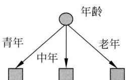  
(a)

  
(b)   
图7.3 不同特征决定的不同分类树

# 7.2.2 熵、条件熵和互信息

先给出熵、条件熵、互信息的定义，然后给出在其基础上的信息增益的定义。在信息论与概率统计中，熵（entropy）是表示随机变量不确定性的度量。设有离散随机变量 $x$ 的概率分布

$$
P (x = x _ {i}) = p _ {i}, \quad i = 1, 2, \dots , M
$$

则随机变量 $x$ 的熵定义为

$$
H (x) = - \sum_ {i = 1} ^ {M} p _ {i} \log p _ {i} \tag {7.3}
$$

在式 (7.3) 中, 若 $p_i = 0$ , 则定义 $0 \log 0 = 0$ 。通常, 式 (7.3) 中的对数以 2 为底或以 e 为底 (自然对数), 这时熵的单位分别称作比特 (bit) 或纳特 (nat) 。熵 $H(x)$ 表示 $x$ 的不确定性。

熵也是概率分布 $P$ 的函数：

$$
H (P) = - \sum_ {i = 1} ^ {M} p _ {i} \log p _ {i} \tag {7.4}
$$

从定义可验证

$$
0 \leqslant H (P) \leqslant \log M \tag {7.5}
$$

当概率分布是伯努利分布时，熵为

$$
H (P) = - p \log_ {2} p - (1 - p) \log_ {2} (1 - p) \tag {7.6}
$$

其中， $p$ 是伯努利分布参数。这时，熵 $H(p)$ 随概率 $p$ 变化的曲线如图7.4所示（单位为比特）。

  
图7.4 伯努利分布的概率与熵的关系

熵越大，随机变量的不确定性就越大。当 $p = 0$ 或 $p = 1$ 时， $H(p) = 0$ ，熵取值最小，随机变量完全没有不确定性。当 $p = 0.5$ 时， $H(p) = 1$ ，熵取值最大，随机变量不确定性最大。

设 $(x,y)$ 是两个离散随机变量，其联合概率分布为

$$
P (x = x _ {i}, y = y _ {j}) = p _ {i j}, \quad i = 1, 2, \dots , M, \quad j = 1, 2, \dots , N
$$

随机变量 $x$ 给定的条件下随机变量 $y$ 的条件熵（conditional entropy）定义为

$$
H (y | x) = \sum_ {i = 1} ^ {M} P (x = x _ {i}) H (y | x = x _ {i}) \tag {7.7}
$$

条件熵 $H(y|x)$ 表示 $x$ 给定的条件下 $y$ 的不确定性。

随机变量 $x$ 和随机变量 $y$ 之间的互信息（mutual information）定义为

$$
I (x; y) = \sum_ {i = 1} ^ {M} \sum_ {j = 1} ^ {N} P (x = x _ {i}, y = y _ {j}) \log \frac {P (x = x _ {i} , y = y _ {j})}{P (x = x _ {i}) P (y = y _ {j})} \tag {7.8}
$$

互信息满足

$$
I (x; y) = H (y) - H (y | x) = H (x) - H (x | y) \tag {7.9}
$$

互信息 $I(x; y)$ 表示 $x$ 给定条件下 $y$ 的不确定性的减少程度，或者 $y$ 给定条件下 $x$ 的不确定性的减少程度。

从数据计算得到的熵、条件熵、互信息分别称为经验熵、经验条件熵、经验互信息。通常采用极大似然估计得到概率分布的估计值，在其基础上计算经验熵、经验条件熵、经验互信息。

# 7.2.3 信息增益与特征选择

分类树学习中经常使用信息增益。信息增益（information gain）是训练数据的类别与特征的经验互信息，表示特征 $A$ 的信息使类别 $C$ 的信息的不确定性减少的程度。

定义7.3（信息增益）训练数据 $\mathcal{D}$ 的特征 $A$ 对类别 $C$ 的信息增益 $\operatorname {IG}(\mathcal{D},A)$ 定义为训练数据 $\mathcal{D}$ 的类别 $C$ 的经验熵 $H(\mathcal{D})$ 与特征 $A$ 给定条件下类别 $C$ 的经验条件熵 $H(\mathcal{D}|A)$ 之差，或训练数据 $\mathcal{D}$ 的特征 $A$ 和类别 $C$ 的经验互信息，即

$$
\operatorname {I G} (\mathcal {D}, A) = H (\mathcal {D}) - H (\mathcal {D} | A) \tag {7.10}
$$

分类树学习使用信息增益选择特征。计算其每个特征的信息增益，选择信息增益充分大的特征，如大于某一个阈值的特征，丢弃其他特征。

设训练数据集为 $\mathcal{D}$ , $|\mathcal{D}|$ 表示其样本个数。设类别 $C$ 有 $K$ 个不同的取值 $\{c_{1}, c_{2}, \dots, c_{K}\}$ 。 $\mathcal{C}_{k}$ 为属于类别 $c_{k}$ 的样本的集合, $|\mathcal{C}_{k}|$ 表示其样本个数, $\sum_{k=1}^{K} |\mathcal{C}_{k}| = |\mathcal{D}|$ 。设特征 $A$ 有 $M$ 个不同的取值 $\{a_{1}, a_{2}, \dots, a_{M}\}$ 。根据特征 $A$ 的取值将 $\mathcal{D}$ 拆分为 $M$ 个子集 $\mathcal{D}_{1}, \mathcal{D}_{2}, \dots, \mathcal{D}_{M}$ , $\mathcal{D}_{j}$ 为特征是 $a_{j}$ 的样本的集合, $|\mathcal{D}_{j}|$ 表示其样本个数, $\sum_{j=1}^{M} |\mathcal{D}_{j}| = |\mathcal{D}|$ 。设子集 $\mathcal{D}_{j}$ 中属于类别 $c_{k}$ 的样本的集合为 $\mathcal{C}_{jk}$ , 即 $\mathcal{C}_{jk} = \mathcal{D}_{j} \cap \mathcal{C}_{k}$ , $|\mathcal{C}_{jk}|$ 表示其样本个数。于是, 信息增益的算法如下。

# 算法7.1（信息增益计算）

输入：训练数据集 $\mathcal{D}$ 的类别 $C$ 和特征 $A$

输出：信息增益 $\operatorname {IG}(\mathcal{D},A)$

（1）计算数据集 $\mathcal{D}$ 的经验熵 $H(\mathcal{D})$

$$
H (\mathcal {D}) = - \sum_ {k = 1} ^ {K} \frac {\left| \mathcal {C} _ {k} \right|}{\left| \mathcal {D} \right|} \log_ {2} \frac {\left| \mathcal {C} _ {k} \right|}{\left| \mathcal {D} \right|} \tag {7.11}
$$

（2）计算数据集 $\mathcal{D}$ 特征 $A$ 的经验条件熵 $H(\mathcal{D}|A)$

$$
H (\mathcal {D} | A) = \sum_ {j = 1} ^ {M} \frac {\left| \mathcal {D} _ {j} \right|}{\left| \mathcal {D} \right|} H \left(\mathcal {D} _ {j}\right) = - \sum_ {j = 1} ^ {M} \frac {\left| \mathcal {D} _ {j} \right|}{\left| \mathcal {D} \right|} \sum_ {k = 1} ^ {K} \frac {\left| \mathcal {C} _ {j k} \right|}{\left| \mathcal {D} _ {j} \right|} \log_ {2} \frac {\left| \mathcal {C} _ {j k} \right|}{\left| \mathcal {D} _ {j} \right|} \tag {7.12}
$$

（3）计算信息增益（经验互信息）

$$
\operatorname {I G} (\mathcal {D}, A) = H (\mathcal {D}) - H (\mathcal {D} | A) \tag {7.13}
$$

例7.2 对表7.1所给的训练数据集 $\mathcal{D}$ ，根据信息增益选择最优特征。

解 首先计算类别的经验熵 $H(\mathcal{D})$

$$
H (\mathcal {D}) = - \frac {9}{1 5} \log_ {2} \frac {9}{1 5} - \frac {6}{1 5} \log_ {2} \frac {6}{1 5} = 0. 9 7 1
$$

然后计算各个特征的信息增益。分别以 $A_{1}$ ， $A_{2}$ ， $A_{3}$ ， $A_{4}$ 表示年龄、有工作、有自己的房子和信贷情况 4 个特征，则

$$
\begin{array}{l} \operatorname {I G} (\mathcal {D}, A _ {1}) = H (\mathcal {D}) - \left[ \frac {5}{1 5} H (\mathcal {D} _ {1}) + \frac {5}{1 5} H (\mathcal {D} _ {2}) + \frac {5}{1 5} H (\mathcal {D} _ {3}) \right] \\ = 0. 9 7 1 - \left[ \frac {5}{1 5} \left(- \frac {2}{5} \log_ {2} \frac {2}{5} - \frac {3}{5} \log_ {2} \frac {3}{5}\right) + \right. \\ \left. \frac {5}{1 5} \left(- \frac {3}{5} \log_ {2} \frac {3}{5} - \frac {2}{5} \log_ {2} \frac {2}{5}\right) + \frac {5}{1 5} \left(- \frac {4}{5} \log_ {2} \frac {4}{5} - \frac {1}{5} \log_ {2} \frac {1}{5}\right) \right] \\ = 0. 0 8 3 \\ \end{array}
$$

这里 $\mathcal{D}_1, \mathcal{D}_2, \mathcal{D}_3$ 分别表示 $A_1$ （年龄）取值为青年、中年和老年时的子集。类似地，

$$
\operatorname {I G} \left(\mathcal {D}, A _ {2}\right) = 0. 9 7 1 - \left[ \frac {5}{1 5} \times 0 + \frac {1 0}{1 5} \left(- \frac {4}{1 0} \log_ {2} \frac {4}{1 0} - \frac {6}{1 0} \log_ {2} \frac {6}{1 0}\right) \right] = 0. 3 2 4
$$

$$
\operatorname {I G} \left(\mathcal {D}, A _ {3}\right) = 0. 9 7 1 - \left[ \frac {6}{1 5} \times 0 + \frac {9}{1 5} \left(- \frac {3}{9} \log_ {2} \frac {3}{9} - \frac {6}{9} \log_ {2} \frac {6}{9}\right) \right] = 0. 4 2 0
$$

$$
\begin{array}{l} \operatorname {I G} (\mathcal {D}, A _ {4}) = 0. 9 7 1 - \left[ \frac {5}{1 5} \times \left(- \frac {1}{5} \log_ {2} \frac {1}{5} - \frac {4}{5} \log_ {2} \frac {4}{5}\right) + \frac {6}{1 5} \left(- \frac {2}{6} \log_ {2} \frac {2}{6} - \frac {4}{6} \log_ {2} \frac {4}{6}\right) + \frac {4}{1 5} \times 0 \right] \\ = 0. 3 6 3 \\ \end{array}
$$

最后，比较各特征的信息增益值。由于特征 $A_{3}$ （有自己的房子）的信息增益值最大，所以选择特征 $A_{3}$ 作为最优特征。

# 7.3 分类树的生成

本节介绍分类树学习的生成算法。核心想法是递归地选择最优特征，构建分类树。ID3算法使用信息增益进行特征选择，C4.5算法用信息增益比进行特征选择，这里只对前者做一介绍。

生成分类树时，从根结点出发，对结点计算所有可能的特征的信息增益，选择信息增益最大的特征作为结点的特征，由该特征的不同取值建立子结点；再对子结点递归地应用以上方法，构建分类树，直到所有特征的信息增益均很小或没有特征可以选择为止；最后得到一棵分类树。这是一种启发式的方法。下面给出分类树生成的具体算法。

# 算法7.2（分类树的生成）

输入：训练数据集 $\mathcal{D}$ ，特征集 $\mathcal{A}$ ，阈值 $\varepsilon$

输出：生成的分类树 $T$ 。

(1) 若 $\mathcal{D}$ 中所有实例属于同一类别 $c_{k}$ , 则置 $T$ 为单结点树, 并将类别 $c_{k}$ 作为该结点的类别, 返回 $T$ ;  
(2) 若 $\mathcal{A} = \emptyset$ ，则置 $T$ 为单结点树，并将 $\mathcal{D}$ 中实例数最多的类别 $c_k$ 作为该结点的类别，返回 $T$ ；  
(3) 否则, 按算法 7.1 计算 $\mathcal{A}$ 中各个特征的信息增益, 选择信息增益最大的特征 $\bar{A}$ ;  
（4）如果 $\bar{A}$ 的信息增益小于阈值 $\varepsilon$ ，则置 $T$ 为单结点树，并将 $\mathcal{D}$ 中实例数最多的类别 $c_{k}$ 作为该结点的类别，返回 $T$   
（5）否则，对 $\bar{A}$ 的每一可能取值 $a_{i}$ ，依照特征值 $a_{i}$ 将 $\mathcal{D}$ 拆分为若干子集 $\mathcal{D}_i$ ，构建子结点，将 $\mathcal{D}_i$ 分配给子结点，执行步骤(6)，得到子树 $T_{i}$ ，构成树 $T$ ，返回 $T$ ；  
(6) 对第 $i$ 个子结点, 以 $\mathcal{D}_i$ 为数据集, 以 $\mathcal{A} - \{\bar{A}\}$ 为特征集, 递归地调用步骤 (1)~步骤 (5), 得到子树 $T_i$ , 返回 $T_i$ 。

例7.3 对表7.1的训练数据集，利用生成算法7.2构建分类树。

解 利用例7.2的结果，由于特征 $A_{3}$ （有自己的房子）的信息增益值最大，所以选择特征 $A_{3}$ 作为根结点的特征。将训练数据集 $\mathcal{D}$ 拆分为两个子集 $\mathcal{D}_1$ （ $A_{3}$ 取值为“是”）和 $\mathcal{D}_2$ （ $A_{3}$ 取值为“否”）。由于 $\mathcal{D}_1$ 只有同一类别的样本，所以它成为一个叶结点，结点的类别为“是”。

对 $\mathcal{D}_2$ 则需从特征 $A_{1}$ （年龄）， $A_{2}$ （有工作）和 $A_{4}$ （信贷情况）中选择新的特征。计算各个特征的信息增益：

$$
\operatorname {I G} \left(\mathcal {D} _ {2}, A _ {1}\right) = H \left(\mathcal {D} _ {2}\right) - H \left(\mathcal {D} _ {2} \mid A _ {1}\right) = 0. 2 5 1
$$

$$
\operatorname {I G} \left(\mathcal {D} _ {2}, A _ {2}\right) = H \left(\mathcal {D} _ {2}\right) - H \left(\mathcal {D} _ {2} \mid A _ {2}\right) = 0. 9 1 8
$$

$$
\operatorname {I G} \left(\mathcal {D} _ {2}, A _ {4}\right) = H \left(\mathcal {D} _ {2}\right) - H \left(\mathcal {D} _ {2} \mid A _ {4}\right) = 0. 4 7 4
$$

选择信息增益最大的特征 $A_{2}$ (有工作) 作为结点的特征。由于 $A_{2}$ 有两个可能取值, 从这一结点引出两个子结点: 一个对应 “是” (有工作) 的子结点, 包含 3 个样本, 它们属于同一类别, 所以这是一个叶结点, 类别为 “是”; 另一个是对应 “否” (无工作) 的子结点, 包含 6 个样本, 它们也属于同一类别, 所以这也是一个叶结点, 类别为 “否”。

这样生成一棵如图 7.5 所示的分类树, 该分类树只用了两个特征 (有两个内部结点)。

  
图7.5 分类树的生成

# 7.4 分类树的剪枝

在分类树学习中，将已生成的树进行简化，称为剪枝（pruning）。具体地，从已生成的树自下而上地去掉一些子树，并将其根结点作为新的叶结点。剪枝得到的树称为简化树(pruned tree)。本节介绍一种简单的分类树的剪枝算法。

分类树的剪枝通过最小化整体的损失函数（loss function）或代价函数（cost function）来实现。设树 $T$ 的叶结点个数为 $|T|$ ， $t$ 是树 $T$ 的叶结点，该叶结点有 $N_{t}$ 个样本，其中 $k$ 类的样本有 $N_{tk}$ 个， $k = 1,2,\dots,K$ ， $\alpha \geqslant 0$ 为参数，则分类树的整体的损失函数定义为

$$
L _ {\alpha} (T) = L (T) + \alpha | T | \tag {7.14}
$$

式中 $L(T)$ 表示模型对训练数据的分类预测误差或对数损失，即模型与训练数据的拟合程度， $|T|$ 表示模型的复杂度，参数 $\alpha \geqslant 0$ 控制两者之间的影响。较大的 $\alpha$ 促使选择较简单的模型，较小的 $\alpha$ 促使选择较复杂的模型。 $\alpha = 0$ 意味着只考虑模型与训练数据的拟合程度，不考虑模型的复杂度。

对数损失等于树 $T$ 所有叶结点的经验熵之和：

$$
L (T) = \sum_ {t = 1} ^ {| T |} N _ {t} H _ {t} (T) \tag {7.15}
$$

其中， $H_{t}(T)$ 为叶结点 $t$ 的经验熵：

$$
H _ {t} (T) = - \sum_ {k} \frac {N _ {t k}}{N _ {t}} \log \frac {N _ {t k}}{N _ {t}}
$$

因此，对数损失是

$$
L (T) = - \sum_ {t = 1} ^ {| T |} \sum_ {k = 1} ^ {K} N _ {t k} \log \frac {N _ {t k}}{N _ {t}} \tag {7.16}
$$

剪枝就是当 $\alpha$ 确定时（如 $\alpha = 1$ ），选择整体损失最小的简化树。

式（7.14）和式（7.16）定义的损失的最小化等价于正则化的极大似然估计。所以，利用损失最小化原则进行剪枝就是通过正则化的极大似然估计进行模型选择。

可以看出，树的生成只考虑了通过最大化信息增益对训练数据进行更好的拟合，而树的剪枝通过最小化损失函数还考虑了减小模型复杂度。生成优化局部的模型，而剪枝优化全局的模型。

图7.6示意分类树剪枝过程。下面介绍剪枝算法。

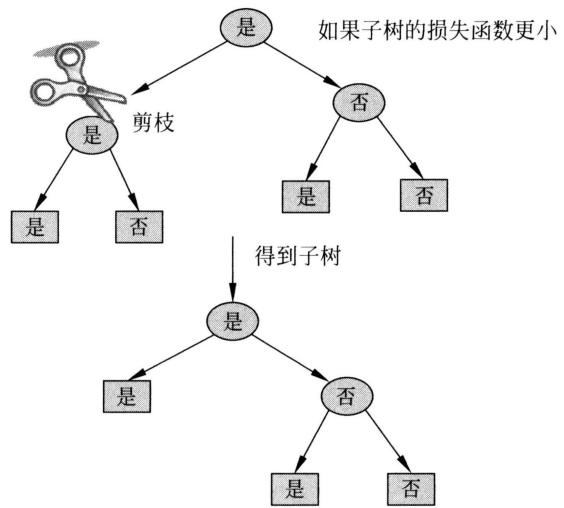  
图7.6 分类树的剪枝

# 算法7.3（分类树的剪枝）

输入：生成算法产生的整个树 $T$ ，参数 $\alpha$ 。

输出：剪枝后的简化树 $T_{\alpha}$

（1）计算每个叶结点的经验熵。  
（2）递归地从树的叶结点向上回缩。

设一组叶结点回缩到其父结点之前与之后的树分别为 $T_B$ 与 $T_A$ ，其对应的损失分别是 $L_{\alpha}(T_B)$ 与 $L_{\alpha}(T_A)$ ，如果

$$
L _ {\alpha} \left(T _ {A}\right) \leqslant L _ {\alpha} \left(T _ {B}\right) \tag {7.17}
$$

则进行剪枝，将父结点改为新的叶结点。

(3) 返回步骤 (2), 直至不能继续为止, 得到损失最小的简化树 $T_{\alpha}$

注意，式（7.17）只需考虑两个树的损失的差，其计算在树的局部进行。所以，分类树的剪枝算法是一种动态规划算法。类似的算法在机器学习常见，如文献[2]。

# 7.5 CART 算法

Breiman等开发的分类与回归树（classification and regression tree，CART）既可以用于分类也可以用于回归。CART的学习由树的生成和剪枝两部分组成，其中树的生成包含特征选择。

CART中的决策树都是二叉树，内部结点表示特征，以及特征的取值条件（是否是某个取值，或者是否大于或小于某个数值），左分支表示条件成立，即为“是”的分支，右分支表示条件不成立，即为“否”的分支。这样的决策树递归地选择特征及其取值或取值区间，将特征空间分割为有限个单元，并在这些单元上定义分类或回归模型，也就是特征给定条件下类别的条件概率分布或特征给定条件下的数值的函数。

CART算法由以下两步组成：

(1) 决策树生成: 基于训练数据集生成决策树, 这时尽量生成“完全的”决策树。  
(2) 决策树剪枝：用验证数据集对已生成的树进行剪枝，选择最优简化树。

# 7.5.1 CART生成

决策树的生成是递归地构建二叉决策树的过程。对分类树用基尼指数（Gini index）最小化准则，对回归树用平方损失最小化准则，进行特征选择，生成二叉决策树。

# 1. 分类树的生成

假设 $\pmb{x}$ 与 $y$ 分别为实例的特征向量和类别，给定训练数据集

$$
\mathcal {D} = \left\{\left(\boldsymbol {x} _ {1}, y _ {1}\right), \left(\boldsymbol {x} _ {2}, y _ {2}\right), \dots , \left(\boldsymbol {x} _ {N}, y _ {N}\right) \right\}
$$

考虑如何生成分类树。

一棵分类树对应着特征空间的一个划分以及在划分的单元上的条件概率分布。假设已将特征空间划分为 $M$ 个单元 $R_{1}, R_{2}, \dots, R_{M}$ ，并且在每个单元 $R_{m}$ 上有一个条件概率分布 $P(y|R_{m})$ ，于是分类树模型可表示为

$$
P (y | \boldsymbol {x}) = \sum_ {m = 1} ^ {M} P (y | R _ {m}) I (\boldsymbol {x} \in R _ {m})
$$

问题是怎样对特征空间进行划分。这里采用启发式的方法，以基尼指数为指标选择最优特征，同时决定该特征的最优取值。

定义7.4（基尼指数）分类问题中，假设有 $K$ 个类别，样本属于第 $k$ 类别的概率为 $p_k$ 则概率分布（类别分布） $P$ 的基尼指数定义为

$$
\operatorname {G i n i} (P) = \sum_ {k = 1} ^ {K} p _ {k} \left(1 - p _ {k}\right) = 1 - \sum_ {k = 1} ^ {K} p _ {k} ^ {2} \tag {7.18}
$$

对于二类分类问题，若样本属于正类的概率是 $p$ ，则概率分布（伯努利分布） $P$ 的基尼指数为

$$
\operatorname {G i n i} (P) = 2 p (1 - p) \tag {7.19}
$$

图7.7显示二类分类中基尼指数 $\mathrm{Gini}(p)$ 之半、熵 $H(p)$ 之半与分类误差率的关系。横坐标表示概率 $p$ ，纵坐标表示损失。基尼指数是熵的近似①，而基尼指数和熵都可以近似地表示分类误差率。使用基尼指数可以提高计算效率。

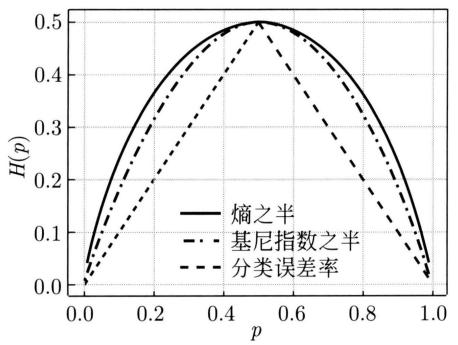  
图7.7 基尼指数之半、熵之半和分类误差率的关系

给定训练数据 $\mathcal{D}$ , 其基尼指数为

$$
\operatorname {G i n i} (\mathcal {D}) = 1 - \sum_ {k = 1} ^ {K} \left(\frac {\left| \mathcal {C} _ {k} \right|}{\left| \mathcal {D} \right|}\right) ^ {2} \tag {7.20}
$$

这里 $\mathcal{C}_k$ 是 $\mathcal{D}$ 中属于第 $k$ 类别的样本子集， $K$ 是类别的个数。

如果训练数据集 $\mathcal{D}$ 根据特征 $A$ 的取值 $a$ 被拆分成 $\mathcal{D}_1$ 和 $\mathcal{D}_2$ 两部分，即

$$
\mathcal {D} _ {1} = \left\{\left(\boldsymbol {x}, y\right) \in \mathcal {D} \mid A (\boldsymbol {x}) = a \right\}, \quad \mathcal {D} _ {2} = \mathcal {D} - \mathcal {D} _ {1}
$$

则在特征 $A = a$ 给定的条件下，数据集 $\mathcal{D}$ 的基尼指数为

$$
\operatorname {G i n i} (\mathcal {D}, A) = \frac {\left| \mathcal {D} _ {1} \right|}{\left| \mathcal {D} \right|} \operatorname {G i n i} \left(\mathcal {D} _ {1}\right) + \frac {\left| \mathcal {D} _ {2} \right|}{\left| \mathcal {D} \right|} \operatorname {G i n i} \left(\mathcal {D} _ {2}\right) \tag {7.21}
$$

基尼指数 $\operatorname{Gini}(\mathcal{D})$ 表示数据集 $\mathcal{D}$ 中的类别的不确定性，基尼指数 $\operatorname{Gini}(\mathcal{D}, A)$ 表示特征值 $A = a$ 给定条件下数据集 $\mathcal{D}$ 中的类别的不确定性。基尼指数值越大，训练数据集的不确定性也就越大，这一点与熵相似。

CART用启发式的方法生成分类树时，使用基尼指数Gini $(D,A)$ ，是经验条件熵的近似。

# 算法7.4（CART分类树生成）

输入：训练数据集 $\mathcal{D}$ ，计算的停止条件。

输出：生成的分类树。

根据训练数据集，从根结点开始，递归地对每个结点进行以下操作，构建二叉分类树：

（1）设结点的训练数据集为 $\mathcal{D}$ ，计算现有特征对该数据集的基尼指数。此时，对每一个特征 $A$ ，对其可能取的每个值 $a$ ，根据样本对 $A = a$ 的测试为“是”或“否”将 $\mathcal{D}$ 拆分成 $\mathcal{D}_1$ 和 $\mathcal{D}_2$ 两部分，利用式（7.21）计算 $A = a$ 时的基尼指数。  
(2) 在所有可能的特征 $A$ 以及它们所有可能的取值 $a$ 中, 选择基尼指数最小的特征及其取值作为最优特征与最优取值。依最优特征与最优取值, 从现结点生成两个子结点, 将训练数据集依其特征取值分配到两个子结点中去。  
（3）对两个子结点递归地调用步骤（1）和步骤（2），直至满足停止条件。

# （4）得到分类树。

算法的停止条件是，结点中的样本的个数小于预定阈值或基尼指数小于预定阈值（样本基本属于同一类别），或者没有更多特征。

例7.4 根据表7.1所给训练数据集，应用CART算法生成决策树。

解 首先计算各特征的基尼指数，选择最优特征以及其最优取值。仍采用例7.2的记号，分别以 $A_{1}$ ， $A_{2}$ ， $A_{3}$ ， $A_{4}$ 表示年龄、有工作、有自己的房子和信贷情况4个特征，并以1，2，3表示年龄的值为青年、中年和老年，以1，2表示有工作和有自己的房子的值为是和否，以1，2，3表示信贷情况的值为非常好、好和一般。

求特征 $A_{1}$ 的基尼指数：

$$
\operatorname {G i n i} (\mathcal {D}, A _ {1} = 1) = \frac {5}{1 5} \left[ 2 \times \frac {2}{5} \times \left(1 - \frac {2}{5}\right) \right] + \frac {1 0}{1 5} \left[ 2 \times \frac {7}{1 0} \times \left(1 - \frac {7}{1 0}\right) \right] = 0. 4 4
$$

$$
\operatorname {G i n i} (\mathcal {D}, A _ {1} = 2) = 0. 4 8
$$

$$
\operatorname {G i n i} (\mathcal {D}, A _ {1} = 3) = 0. 4 4
$$

由于 $\operatorname{Gini}(\mathcal{D}, A_1 = 1)$ 和 $\operatorname{Gini}(\mathcal{D}, A_1 = 3)$ 相等且最小，所以 $A_1 = 1$ 和 $A_1 = 3$ 都可以选作 $A_1$ 的最优取值。

求特征 $A_{2}$ 和 $A_{3}$ 的基尼指数：

$$
\operatorname {G i n i} (\mathcal {D}, A _ {2} = 1) = 0. 3 2
$$

$$
\operatorname {G i n i} (\mathcal {D}, A _ {3} = 1) = 0. 2 7
$$

由于 $A_{2}$ 和 $A_{3}$ 只有一个取值，所以它们就是最优取值。

求特征 $A_{4}$ 的基尼指数：

$$
\operatorname {G i n i} (\mathcal {D}, A _ {4} = 1) = 0. 3 6
$$

$$
\operatorname {G i n i} (\mathcal {D}, A _ {4} = 2) = 0. 4 7
$$

$$
\operatorname {G i n i} (\mathcal {D}, A _ {4} = 3) = 0. 3 2
$$

$\operatorname{Gini}(\mathcal{D}, A_4 = 3)$ 最小，所以 $A_4 = 3$ 为 $A_4$ 的最优取值。

在 $A_{1}$ ， $A_{2}$ ， $A_{3}$ ， $A_{4}$ 几个特征中， $\operatorname{Gini}(\mathcal{D}, A_{3} = 1) = 0.27$ 最小，所以选择特征 $A_{3}$ 为最优特征， $A_{3} = 1$ 为其最优取值。于是根结点生成两个子结点，一个是叶结点。对另一个结点继续使用以上方法在 $A_{1}$ ， $A_{2}$ ， $A_{4}$ 中选择最优特征及其最优取值，结果是 $A_{2} = 1$ 。依此计算得知，所得结点都是叶结点。

对于本问题，按照 CART 算法所生成的决策树与按照 ID3 算法所生成的决策树完全一致。

# 2. 回归树的生成

假设 $\pmb{x}$ 与 $y$ 分别为实例的特征向量和数值，给定训练数据集

$$
\mathcal {D} = \left\{\left(\boldsymbol {x} _ {1}, y _ {1}\right), \left(\boldsymbol {x} _ {2}, y _ {2}\right), \dots , \left(\boldsymbol {x} _ {N}, y _ {N}\right) \right\}
$$

考虑如何生成回归树。

一棵回归树对应着特征空间的一个划分以及在划分的单元上的数值。假设已将特征空间划分为 $M$ 个单元 $R_{1}, R_{2}, \dots, R_{M}$ ，并且在每个单元 $R_{m}$ 上有一个数值 $c_{m}$ ，于是回归树模型

可表示为

$$
f (\boldsymbol {x}) = \sum_ {m = 1} ^ {M} c _ {m} I (\boldsymbol {x} \in R _ {m})
$$

当特征空间的划分确定时，可以用平方损失函数 $\sum_{\boldsymbol{x}_i\in R_m}(y_i - f(\boldsymbol{x}_i))^2$ 来表示对训练数据的回归预测误差，用平方损失最小的准则求解每个单元上的最优数值。易知，单元 $R_{m}$ 上的 $c_{m}$ 的最优数值 $\hat{c}_{m}$ 是 $R_{m}$ 上的所有输入实例 $\boldsymbol{x}_i$ 对应的数值 $y_{i}$ 的均值，即

$$
\hat {c} _ {m} = \frac {1}{N _ {m}} \sum_ {\boldsymbol {x} _ {i} \in R _ {m} (j, s)} y _ {i}, \quad m = 1, 2, \dots , M \tag {7.22}
$$

其中， $N_{m}$ 是单元 $R_{m}$ 上样本的个数。

问题是怎样对特征空间进行划分。这里采用启发式的方法，选择第 $j$ 个特征 $x_{j}$ 和它的取值 $s$ 作为切分特征（splitting feature）和切分点（splitting point），并定义两个区域：

$$
R _ {1} (j, s) = \left\{\boldsymbol {x} \mid x _ {j} \leqslant s \right\}, \quad R _ {2} (j, s) = \left\{\boldsymbol {x} \mid x _ {j} > s \right\} \tag {7.23}
$$

然后寻找最优切分特征 $j$ 和最优切分点 $s$ 。具体地，求解

$$
\min  _ {j, s} \left[ \min  _ {c _ {1}} \sum_ {\boldsymbol {x} _ {i} \in R _ {1} (j, s)} \left(y _ {i} - c _ {1}\right) ^ {2} + \min  _ {c _ {2}} \sum_ {\boldsymbol {x} _ {i} \in R _ {2} (j, s)} \left(y _ {i} - c _ {2}\right) ^ {2} \right] \tag {7.24}
$$

对固定特征 $j$ 可以找到最优切分点 $s$ 。

$$
\hat {c} _ {1} = \frac {1}{N _ {1}} \sum_ {\boldsymbol {x} _ {i} \in R _ {1} (j, s)} y _ {i}, \quad \hat {c} _ {2} = \frac {1}{N _ {2}} \sum_ {\boldsymbol {x} _ {i} \in R _ {2} (j, s)} y _ {i}
$$

遍历所有特征，找到其最优切分点 $s$ ，构成一个对 $(j,s)$ 。依此将特征空间分割为两个区域。接着，对每个区域重复上述划分过程，直到满足停止条件为止，这样就生成一棵回归树。现将算法叙述如下。

# 算法7.5（CART回归树生成）

输入：训练数据集 $\mathcal{D}$ ，计算的停止条件。

输出：生成的回归树。

在训练数据集所在的特征空间中，递归地将每个区域划分为两个子区域并决定每个子区域上的数值，构建二叉回归树：

（1）寻找最优切分特征 $j$ 与最优切分点 $s$ ，求解

$$
\min  _ {j, s} \left[ \min  _ {c _ {1}} \sum_ {\boldsymbol {x} _ {i} \in R _ {1} (j, s)} \left(y _ {i} - c _ {1}\right) ^ {2} + \min  _ {c _ {2}} \sum_ {\boldsymbol {x} _ {i} \in R _ {2} (j, s)} \left(y _ {i} - c _ {2}\right) ^ {2} \right]
$$

遍历特征 $j$ ，对固定的切分特征 $j$ 扫描切分点 $s$ ，选择使上式达到最小值的对 $(j,s)$ 。

（2）用选定的对 $(j,s)$ 分割区域并决定相应的数值：

$$
R _ {1} (j, s) = \left\{\boldsymbol {x} \mid x _ {j} \leqslant s \right\}, \quad R _ {2} (j, s) = \left\{\boldsymbol {x} \mid x _ {j} > s \right\}
$$

$$
\hat {c} _ {m} = \frac {1}{N _ {m}} \sum_ {\boldsymbol {x} _ {i} \in R _ {m} (j, s)} y _ {i}, \quad m = 1, 2
$$

(3) 继续对两个子区域调用步骤 (1) 和步骤 (2)，直至满足停止条件。  
（4）得到回归树，其模型是

$$
f (\boldsymbol {x}) = \sum_ {m = 1} ^ {M} \hat {c} _ {m} I (\boldsymbol {x} \in R _ {m})
$$

# 7.5.2 CART剪枝

CART剪枝算法从“完全生长”的决策树的底端剪去一些子树，使决策树变小（模型变简单），从而能够对未知数据有更准确的预测。CART剪枝算法由两步组成：首先从生成算法产生的决策树 $T_{0}$ 底端开始不断剪枝，直到 $T_{0}$ 的根结点，形成一个简化树序列 $T_{0}, T_{1}, \dots, T_{n}$ ；然后通过交叉验证法在独立的验证数据集上对简化树序列进行测试，从中选取最优简化树。

# 1. 构建简化树序列

在剪枝过程中，计算简化树的损失：

$$
L _ {\alpha} (T) = L (T) + \alpha | T | \tag {7.25}
$$

其中， $T$ 为任意简化树， $L(T)$ 为对训练数据的预测损失（基尼指数或平方损失）， $|T|$ 为简化树的叶结点个数， $\alpha \geqslant 0$ 为参数， $L_{\alpha}(T)$ 为参数是 $\alpha$ 时的简化树 $T$ 的整体损失。参数 $\alpha$ 权衡训练数据的拟合程度与模型的复杂度。

对固定的 $\alpha$ ，一定存在使损失函数 $L_{\alpha}(T)$ 最小的简化树，将其表示为 $T_{\alpha}\circ T_{\alpha}$ 在损失函数 $L_{\alpha}(T)$ 最小的意义下是最优的。容易验证这样的最优简化树是唯一的。当 $\alpha$ 大的时候，最优简化树 $T_{\alpha}$ 偏小；当 $\alpha$ 小的时候，最优简化树 $T_{\alpha}$ 偏大。极端情况：当 $\alpha = 0$ 时，整体树是最优的，当 $\alpha \to \infty$ 时，根结点组成的单结点树是最优的。

Breiman等证明：可以用递归的方法对树进行剪枝。将 $\alpha$ 从小增大， $0 = \alpha_{0} < \alpha_{1} < \dots < \alpha_{n} < +\infty$ ，产生一个区间的序列；对应着有一个剪枝得到的简化树的序列 $T_{0}, T_{1}, \dots, T_{n}$ ，其中 $T_{i}$ 对应着区间 $\alpha \in [\alpha_{i}, \alpha_{i+1})$ ， $i = 0, 1, \dots, n$ ，序列中的简化树是嵌套的。

具体地，从整体树 $T_{0}$ 开始剪枝。对 $T_{0}$ 的任意内部结点 $t$ ，以 $t$ 为单结点树的损失是

$$
L _ {\alpha} (t) = L (t) + \alpha \tag {7.26}
$$

以 $t$ 为根结点的子树 $T_{t}$ 的损失是

$$
L _ {\alpha} \left(T _ {t}\right) = L \left(T _ {t}\right) + \alpha \left| T _ {t} \right| \tag {7.27}
$$

当 $\alpha = 0$ 及 $\alpha$ 充分小时，有不等式

$$
L _ {\alpha} (T _ {t}) <   L _ {\alpha} (t) \tag {7.28}
$$

当 $\alpha$ 增大时，在某一 $\alpha$ 有

$$
L _ {\alpha} \left(T _ {t}\right) = L _ {\alpha} (t) \tag {7.29}
$$

当 $\alpha$ 再增大时，不等式(7.28)反向。只要 $\alpha = \frac{L(t) - L(T_t)}{|T_t| - 1}$ ， $T_{t}$ 与 $t$ 有相同的损失，而 $t$ 的结点少，因此 $t$ 比 $T_{t}$ 更可取，对 $T_{t}$ 进行剪枝。

为此，对 $T_{0}$ 中每一内部结点 $t$ ，计算

$$
G (t) = \frac {L (t) - L \left(T _ {t}\right)}{\left| T _ {t} \right| - 1} \tag {7.30}
$$

它表示剪枝后整体损失减少的程度。在 $T_{0}$ 中剪去 $G(t)$ 最小的 $T_{t}$ , 将得到的简化树作为 $T_{1}$ ,同时将最小的 $G(t)$ 设为 $\alpha_{1}$ 。 $T_{1}$ 为区间 $[\alpha_{1}, \alpha_{2})$ 的简化树。

如此剪枝下去，直至得到根结点。在这一过程中，不断地增加 $\alpha$ 的值，产生新的区间。

# 2. 选取最优简化树

利用独立的验证数据集，测试简化树序列 $T_{0}, T_{1}, \dots, T_{n}$ 中各棵简化树的基尼指数或平方损失。基尼指数或平方损失最小的决策树被认为是最优的决策树。在简化树序列中，每棵简化树 $T_{1}, T_{2}, \dots, T_{n}$ 都对应一个参数 $\alpha_{1}, \alpha_{2}, \dots, \alpha_{n}$ 。所以，当最优简化树 $T_{k}$ 确定时，对应的最优参数 $\alpha_{k}$ 也确定，即得到最优决策树 $T_{\alpha}$ 。现在写出 CART 剪枝算法。

# 算法7.6（CART决策树剪枝）

输入：CART算法生成的决策树 $T_{0}$

输出：最优决策树 $T_{\alpha}$

（1）设 $k = 0$ ， $T = T_{0}$ 。  
（2）设 $\alpha = +\infty$   
（3）自下而上地对各内部结点 $t$ 计算 $L(T_{t})$ ， $|T_{t}|$ 以及

$$
G (t) = \frac {L (t) - L \left(T _ {t}\right)}{\left| T _ {t} \right| - 1}
$$

$$
\alpha = \min  (\alpha , G (t))
$$

这里， $T_{t}$ 表示以 $t$ 为根结点的子树， $L(T_{t})$ 是对训练数据的预测损失， $|T_{t}|$ 是 $T_{t}$ 的叶结点个数。

（4）对 $G(t) = \alpha$ 的内部结点 $t$ 进行剪枝，并决定叶结点 $t$ 的分类或回归预测结果，得到树 $T$ 。  
（5）设 $k = k + 1$ ， $\alpha_{k} = \alpha$ ， $T_{k} = T$   
（6）如果 $T_{k}$ 不是由根结点及两个叶结点构成的树，则回到步骤(2)；否则，令 $T_{k} = T_{n}$ 。  
（7）采用交叉验证法在简化树序列 $T_{0}, T_{1}, \dots, T_{n}$ 中选取最优简化树 $T_{\alpha}$ 。

# 本章概要

1. 决策树有分类树和回归树。分类树是表示基于特征对实例进行分类预测的过程的树形结构，回归树是表示基于特征对实例进行回归预测的过程的树形结构。决策树可以转换成一个if-then规则的集合。