分类树模型是定义在特征空间的一个划分上的类别的条件概率分布。

$$
P (y | \boldsymbol {x}) = \sum_ {m = 1} ^ {M} P (y | R _ {m}) I (\boldsymbol {x} \in R _ {m})
$$

其中， $P(y|R_{m})$ 是单元 $R_{m}$ 上的类别分布。

回归树模型是定义在特征空间的一个划分上的数值的函数。

$$
y = f (\boldsymbol {x}) = \sum_ {m = 1} ^ {M} c _ {m} I (\boldsymbol {x} \in R _ {m})
$$

其中， $c_{m}$ 是单元 $R_{m}$ 上的数值。

2. 决策树学习旨在构建一个与训练数据拟合很好并且复杂度较小的决策树。因为从可能的决策树中直接选取最优决策树是 NP 完全问题，现实中采用启发式方法学习次优的决策树。

决策树学习算法一般包括三个步骤：特征选择、树的生成和树的剪枝。

3. 特征选择的目的在于仅使用对训练数据准确分类或回归的特征。特征选择的关键是其指标，常用的指标如下：

训练数据集 $\mathcal{D}$ 的特征 $A$ 条件下的信息增益：

$$
\operatorname {I} (\mathcal {D}, A) = H (\mathcal {D}) - H (\mathcal {D} | A)
$$

$$
H (\mathcal {D}) = - \sum_ {k = 1} ^ {K} \frac {| \mathcal {C} _ {k} |}{| \mathcal {D} |} \log_ {2} \frac {| \mathcal {C} _ {k} |}{| \mathcal {D} |}
$$

$$
H (\mathcal {D} | A) = \sum_ {j = 1} ^ {M} \frac {| \mathcal {D} _ {j} |}{| \mathcal {D} |} H (\mathcal {D} _ {j})
$$

$$
H (\mathcal {D} _ {j}) = - \sum_ {k = 1} ^ {K} \frac {| \mathcal {C} _ {j k} |}{| \mathcal {D} _ {j} |} \log_ {2} \frac {| \mathcal {C} _ {j k} |}{| \mathcal {D} _ {j} |}
$$

训练数据集 $\mathcal{D}$ 的特征 $A$ 的条件下的基尼指数：

$$
\operatorname {G i n i} (\mathcal {D}, A) = \sum_ {j = 1} ^ {M} \frac {| \mathcal {D} _ {j} |}{| \mathcal {D} |} \operatorname {G i n i} (\mathcal {D} _ {j})
$$

$$
\operatorname {G i n i} \left(\mathcal {D} _ {j}\right) = 1 - \sum_ {k = 1} ^ {K} \left(\frac {\left| \mathcal {C} _ {j k} \right|}{\left| \mathcal {D} _ {j} \right|}\right) ^ {2}
$$

对分类树用信息增益最大化或基尼指数最小化准则，对回归树用平方损失最小化准则，进行特征选择，或者生成决策树。

4. 决策树的生成。通常使用信息增益、基尼指数最小作为特征选择的准则。决策树的生成往往通过计算信息增益或基尼指数，从根结点开始，递归地产生决策树。这相当于用信息增益或基尼指数不断地选取局部最优的特征，或将训练集拆分为能够基本正确分类或回归的子集。

5. 决策树的剪枝。由于生成的决策树存在过拟合问题，需要对它进行剪枝，以简化学到的决策树。决策树的剪枝往往从已生成的树的底端剪掉一些子树，并将其根结点作为新的叶结点，从而简化生成的决策树。

6. CART 中的决策树都是二叉树，内部结点表示特征以及特征的取值条件，左分支为“是”的分支，右分支为“否”的分支。这样的决策树递归地选择特征及其取值或取值区间，将特征空间分割为有限个单元，并在这些单元上定义分类或回归模型。

回归树生成时，通过求解以下优化问题实现，寻找最优切分特征 $j$ 与最优切分点 $s$

$$
\min  _ {j, s} \left[ \min  _ {c _ {1}} \sum_ {\boldsymbol {x} _ {i} \in R _ {1} (j, s)} \left(y _ {i} - c _ {1}\right) ^ {2} + \min  _ {c _ {2}} \sum_ {\boldsymbol {x} _ {i} \in R _ {2} (j, s)} \left(y _ {i} - c _ {2}\right) ^ {2} \right]
$$

用选定的对 $(j,s)$ 分割区域并决定相应的数值：

$$
R _ {1} (j, s) = \left\{\boldsymbol {x} \mid x _ {j} \leqslant s \right\}, \quad R _ {2} (j, s) = \left\{\boldsymbol {x} \mid x _ {j} > s \right\}
$$

$$
\hat {c} _ {m} = \frac {1}{N _ {m}} \sum_ {\boldsymbol {x} _ {i} \in R _ {m} (j, s)} y _ {i}, \quad m = 1, 2
$$

# 继续阅读

介绍决策树学习方法的文献很多，Quinlan 的 ID3 工作可参见文献 [3]，Quinlan 的 C4.5 工作可参见文献 [4]，Breiman 等的 CART 工作可参见文献 [5]。决策树学习的一般性介绍可参见文献 [1]、文献 [6]～文献 [8]。与决策树类似的分类方法还有决策列表（decision list）。决策列表与决策树可以相互转换 [9]，决策列表的学习方法可参见文献 [10]。

# 习题

7.1 比较 $k$ 近邻和决策树的模型的异同。  
7.2 证明式 (7.8) 的互信息与熵和条件熵的关系。  
7.3 考虑算法 7.3 的剪枝算法是否能找到全局最优的分类树模型，并给出理由。  
7.4 已知如表7.2所示的训练数据，试用平方损失最小准则生成一个二叉回归树。

表 7.2 训练数据表  

<table><tr><td>xi</td><td>1</td><td>2</td><td>3</td><td>4</td><td>5</td><td>6</td><td>7</td><td>8</td><td>9</td><td>10</td></tr><tr><td>yi</td><td>4.50</td><td>4.75</td><td>4.91</td><td>5.34</td><td>5.80</td><td>7.05</td><td>7.90</td><td>8.23</td><td>8.70</td><td>9.00</td></tr></table>

7.5 写出 CART 回归树生成算法的停止条件。  
7.6 证明 CART 剪枝算法中，当 $\alpha$ 确定时，存在唯一的最小简化树 $T_{\alpha}$ 使损失 $L_{\alpha}(T)$ 最小。  
7.7 证明 CART 剪枝算法中求出的简化树序列 $\{T_0, T_1, \dots, T_n\}$ 分别是区间 $\alpha \in [\alpha_i, \alpha_{i+1})$ 的最优简化树 $T_\alpha$ ，这里 $i = 0, 1, \dots, n$ ， $0 = \alpha_0 < \alpha_1 < \dots < \alpha_n < +\infty$ 。

# 参考文献

[1] RIPLEY B. Pattern recognition and neural networks[M]. Cambridge University Press, 1996.   
[2] LI H, ABE N. Generalizing case frames using a thesaurus and the MDL principle[J]. Computational Linguistics, 1998, 24(2): 217-244.   
[3] QUINLAN J R. Induction of decision trees[J]. Machine Learning, 1986, 1(1): 81-106.   
[4] QUINLAN J R. C4.5: programs for machine learning[M]. Morgan Kaufmann, 1992.   
[5] BREIMAN L, FRIEDMAN J, et al. Classification and regression trees[M]. Wadsworth, 1984.   
[6] HASTIE T, TIBSHIRANI R, FRIEDMAN J. The elements of statistical learning: data mining, inference, and prediction[M]. 范明，柴玉梅，智红英，等译. Springer, 2001.   
[7] LIU B. Web data mining: Exploring hyperlinks, contents and usage data[M]. Springer-Verlag, 2006.   
[8] HYAFIL L, RIVEST R L. Constructing optimal binary decision trees is NP-complete[J]. Information Processing Letters, 1976, 5(1): 15-17.   
[9] YAMANISHI K. A learning criterion for stochastic rules[J]. Machine Learning, 1992, 9(2-3): 165-203.   
[10] LI H, YAMANISHI K. Text classification using ESC-based stochastic decision lists[J]. Information Processing & Management, 2002, 38(3): 343-361.

# 第8章 逻辑斯谛回归和最大熵模型

逻辑斯谛回归（logistic regression）是机器学习中的经典和常用的分类方法①。二项逻辑斯谛回归模型是二类分类模型，表示实例属于正类的概率分布。先对实例的特征向量进行仿射变换，再使用逻辑斯谛函数进行非线性变换，就得到实例属于正类的概率。认为概率大于0.5时实例属于正类，否则属于负类。二项逻辑斯谛回归可以自然扩展到多项逻辑斯谛回归，用于多类分类。逻辑斯谛回归模型既是概率模型，也是判别模型。

最大熵原理是概率模型学习的一个准则，主张在概率分布的集合中，在满足给定的约束条件下，熵最大的概率分布是应该选择的分布。用最大熵原理（maximum entropy principle）选择出的最大熵模型与逻辑斯谛回归模型具有类似的形式，都属于对数线性模型。

二项逻辑斯谛回归的历史可以追溯到19世纪的统计学。后来在机器学习中得以发展，并扩展到多项逻辑斯谛回归。最大熵原理由Jaynes于1957年提出。逻辑斯谛回归和最大熵模型方法简单，模型有很好的可解释性，通常有很高的分类准确率。

本章8.1节给出逻辑斯谛回归模型的定义，包括二项逻辑斯谛回归模型和多项逻辑斯谛回归模型；8.2节介绍最大熵模型，给出最大熵模型的推导，展示与逻辑斯谛回归模型的关系；8.3节讲述逻辑斯谛回归和最大熵模型的学习算法，包括使用梯度下降法和拟牛顿法进行优化的算法。

# 8.1 逻辑斯谛回归模型

# 8.1.1 逻辑斯谛分布

首先介绍逻辑斯谛分布（logistic distribution）。

定义8.1（逻辑斯谛分布）设 $x$ 是连续随机变量， $x$ 服从逻辑斯谛分布是指 $x$ 具有下列质量函数和密度函数：

$$
F (x) = \frac {1}{1 + \mathrm {e} ^ {- (x - \mu) / s}} \tag {8.1}
$$

$$
f (x) = \frac {\mathrm {e} ^ {- (x - \mu) / s}}{s [ 1 + \mathrm {e} ^ {- (x - \mu) / s} ] ^ {2}} \tag {8.2}
$$

式中， $\mu \in \mathbb{R}$ 为位置参数， $s > 0$ 为形状参数。

图8.1显示逻辑斯谛分布的密度函数 $f(x)$ 和质量函数 $F(x)$ 。质量函数称作逻辑斯谛函数（logistic function），也称作S型函数（sigmoid function）。逻辑斯谛函数的图形是一条S形曲线。当 $x$ 趋于正无穷时，函数趋近于1；当 $x$ 趋于负无穷时，函数趋近于0。曲线关于点 $\left(\mu, \frac{1}{2}\right)$ 中心对称，即满足

$$
F (- x + \mu) - \frac {1}{2} = - F (x + \mu) + \frac {1}{2}
$$

在中心附近增长速度较快，在两端增长速度较慢。形状参数 $s$ 的值越小，在中心附近增长得越快。

  
(a) 密度函数

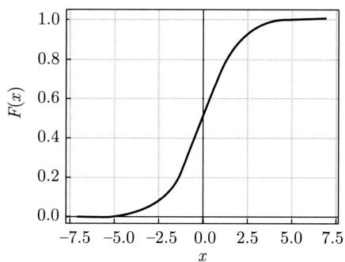  
(b) 质量函数  
图8.1 逻辑斯谛分布的密度函数与质量函数

# 8.1.2 二项逻辑斯谛回归

二项逻辑斯谛回归模型（binomial logistic regression model）或简单地逻辑斯谛回归模型是一种二类分类模型，由条件概率分布 $P(y|\boldsymbol{x})$ 表示，形式为参数化的逻辑斯谛分布。我们通过监督学习的方法来估计模型的参数。

定义8.2（二项逻辑斯谛回归模型）二项逻辑斯谛回归模型是如下的条件概率分布：

$$
P (y = 1 \mid \boldsymbol {x}) = \frac {1}{1 + \exp [ - (\boldsymbol {w} \cdot \boldsymbol {x} + b) ]} \tag {8.3}
$$

$$
P (y = 0 | \boldsymbol {x}) = \frac {\exp [ - (\boldsymbol {w} \cdot \boldsymbol {x} + b) ]}{1 + \exp [ - (\boldsymbol {w} \cdot \boldsymbol {x} + b) ]} \tag {8.4}
$$

这里， $\pmb{x} \in \mathcal{X} \subseteq \mathbb{R}^{M}$ 表示实例的特征向量， $y \in \mathcal{Y} = \{1,0\}$ 表示实例的类别， $\pmb{w} \in \mathbb{R}^{M}$ 和 $b \in \mathbb{R}$ 是参数， $\pmb{w}$ 称为权重向量， $b$ 称为偏置， $\pmb{w} \cdot \pmb{x}$ 为 $\pmb{w}$ 和 $\pmb{x}$ 的内积。

对于给定的实例 $\pmb{x}$ ，二项逻辑斯谛回归根据式(8.3)和式(8.4)计算实例属于正负类的条件概率， $P(y = 1|\pmb{x})$ 和 $P(y = 0|\pmb{x})$ ，将实例 $\pmb{x}$ 分到概率值较大的一类，也就是概率值大于0.5的一类。

也可以这样理解，首先对实例特征向量 $\pmb{x}$ 进行仿射变换， $z = \pmb{w} \cdot \pmb{x} + b$ ，得到实数 $z$ ，再使用逻辑斯谛函数(8.1）对 $z$ 进行非线性变换，得到概率：

$$
P (y = 1 | \boldsymbol {x}) = \frac {1}{1 + \exp (- z)} = \frac {1}{1 + \exp [ - (\boldsymbol {w} \cdot \boldsymbol {x} + b) ]}
$$

这样的模型就是二项逻辑斯谛回归模型。

深度学习中，用于二类分类的前馈神经网络，其输出层等价于二项逻辑斯谛回归模型，详见第25章。

有时为了方便，将权重向量和实例特征向量加以扩充，仍记作 $\pmb{w}$ ， $\pmb{x}$ ，满足 $\pmb{w} = (w_{1}, w_{2}, \dots, w_{M}, b)^{\mathrm{T}}$ ， $\pmb{x} = (x_{1}, x_{2}, \dots, x_{M}, 1)^{\mathrm{T}}$ 。这时，（扩充的）二项逻辑斯谛回归模型如下：

$$
P (y = 1 | \boldsymbol {x}) = \frac {1}{1 + \exp [ - (\boldsymbol {w} \cdot \boldsymbol {x}) ]} \tag {8.5}
$$

$$
P (y = 0 \mid \boldsymbol {x}) = \frac {\exp [ - (\boldsymbol {w} \cdot \boldsymbol {x}) ]}{1 + \exp [ - (\boldsymbol {w} \cdot \boldsymbol {x}) ]} \tag {8.6}
$$

下面考查二项逻辑斯谛回归模型的特点。一个事件的几率（odds）是指该事件发生的概率与该事件不发生的概率的比值。如果事件发生的概率是 $P$ ，那么该事件的几率是 $\frac{P}{1 - P}$ ，该事件的对数几率（ $\log \text{odds}$ ）或logit函数是

$$
\operatorname {l o g i t} (P) = \log \frac {P}{1 - P} \tag {8.7}
$$

对二项逻辑斯谛回归而言，对数几率由式(8.3)和式(8.4)得到：

$$
\log \frac {P (y = 1 | \boldsymbol {x})}{1 - P (y = 1 | \boldsymbol {x})} = \boldsymbol {w} \cdot \boldsymbol {x} + b \tag {8.8}
$$

这就是说，在二项逻辑斯谛回归模型中，实例属于正类（ $y = 1$ ）的对数几率是实例特征向量 $\pmb{x}$ 的线性函数。这样的模型也称作对数线性模型（log linear model）。

因为逻辑斯谛回归模型是对数线性模型，所以模型有很好的可解释性。权重向量的每一维数值 $w_{j}, j = 1,2,\dots ,M$ 表示了对应的实例特征 $x_{j}, j = 1,2,\dots ,M$ 对分类的贡献。数值的符号表示取向，正向或负向；数值的大小表示程度，大或小。

二项逻辑斯谛回归还有另外一个形式。当正类和负类分别用 $y = +1$ 和 $y = -1$ 表示时，它可以看作模型为线性函数 $f(\boldsymbol{x}) = \boldsymbol{w} \cdot \boldsymbol{x} + b$ ，损失函数为对数损失或逻辑斯谛损失 $\log_2[1 + \exp(-yf(\boldsymbol{x}))]$ 的二类分类问题。为了方便与其他损失函数比较，这里对数以 2 为底。

$$
\begin{array}{l} - \log_ {2} P (y = + 1 | \boldsymbol {x}) = - \log_ {2} \frac {1}{1 + \exp [ - (\boldsymbol {w} \cdot \boldsymbol {x} + b) ]} \\ = \log_ {2} [ 1 + \exp (- y f (\boldsymbol {x})) ] \\ \end{array}
$$

$$
\begin{array}{l} - \log_ {2} P (y = - 1 | \boldsymbol {x}) = - \log_ {2} \frac {\exp [ - (\boldsymbol {w} + b) ]}{1 + \exp [ - (\boldsymbol {w} \cdot \boldsymbol {x} + b) ]} \\ = \log_ {2} [ 1 + \exp (- y f (\boldsymbol {x})) ] \\ \end{array}
$$

例8.1 表8.1表示的是20位学生的学习时长和考试通过与否的数据①。其中 $x$ 表示学习的小时数， $y$ 表示考试通过或不通过的结果。从这个数据集可以学到图8.2所示的二项逻辑斯谛回归模型。

模型表示学习时长给定条件下考试通过的条件概率，这里实例只有一维特征。模型的中心点是2.7，学习时长越大于2.7，考试通过的概率就越接近1；反之，学习时长越小于2.7，考试通过的概率就越接近0。注意模型表示考试通过的概率，学习时长大于2.7的学生中，也有不通过的；学习时长小于2.7的学生中，也有通过的。

表 8.1 学习时长与考试通过与否的数据  

<table><tr><td>x</td><td>0.50</td><td>0.75</td><td>1.00</td><td>1.25</td><td>1.50</td><td>1.75</td><td>1.75</td><td>2.00</td><td>2.25</td><td>2.50</td></tr><tr><td>y</td><td>0</td><td>0</td><td>0</td><td>0</td><td>0</td><td>0</td><td>1</td><td>0</td><td>1</td><td>0</td></tr><tr><td>x</td><td>2.75</td><td>3.00</td><td>3.25</td><td>3.50</td><td>4.00</td><td>4.25</td><td>4.50</td><td>4.75</td><td>5.00</td><td>5.50</td></tr><tr><td>y</td><td>1</td><td>0</td><td>1</td><td>0</td><td>1</td><td>1</td><td>1</td><td>1</td><td>1</td><td>1</td></tr></table>

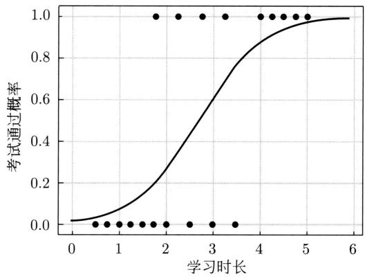  
图8.2 逻辑斯谛回归的例子：学习时长与考试通过概率的关系

# 8.1.3 多项逻辑斯谛回归

上面介绍的逻辑斯谛回归模型是二类分类模型，用于二类分类。可以将其推广为多项逻辑斯谛回归模型（multi-nominal logistic regression model），用于多类分类。假设 $x$ 表示实例的特征向量， $y$ 表示实例的多类类别，那么可以定义多项逻辑斯谛回归模型。

定义8.3（多项逻辑斯谛回归模型）多项逻辑斯谛回归模型是如下的条件概率分布：

$$
P (y = c _ {k} | \boldsymbol {x}) = \frac {\exp \left(\boldsymbol {w} _ {k} \cdot \boldsymbol {x} + b _ {k}\right)}{1 + \sum_ {k = 1} ^ {K - 1} \exp \left(\boldsymbol {w} _ {k} \cdot \boldsymbol {x} + b _ {k}\right)}, \quad k = 1, 2, \dots , K - 1 \tag {8.9}
$$

$$
P (y = c _ {K} | \boldsymbol {x}) = \frac {1}{1 + \sum_ {k = 1} ^ {K - 1} \exp \left(\boldsymbol {w} _ {k} \cdot \boldsymbol {x} + b _ {k}\right)} \tag {8.10}
$$

这里， $\pmb{x} \in \mathcal{X} \subseteq \mathbb{R}^{M}$ ， $y \in \mathcal{Y} = \{c_{1}, c_{2}, \dots, c_{K}\}$ ， $\pmb{w}_{k} \in \mathbb{R}^{M}$ ， $b_{k} \in \mathbb{R}$ 。多项逻辑斯谛回归模型是概率判别模型以及概率无向图模型。多项逻辑斯谛回归包含二项逻辑斯谛回归作为其特殊情况。

对于给定的实例 $\pmb{x}$ ，多项逻辑斯谛回归计算实例属于各个类别的条件概率 $P(y|\pmb{x})$ ，将实例 $\pmb{x}$ 分到概率值最大的一类。

多项逻辑斯谛回归模型的特点是，有一个类别 $(y = c_{K})$ 是参照类，实例的其他类别 $(y \in \{c_{1}, c_{2}, \dots, c_{K-1}\})$ 与参照类的对数几率是实例特征向量 $\pmb{x}$ 的线性函数。

以上多项逻辑斯谛回归模型定义在 $K - 1$ 个类别的参数上。模型也可以定义在所有 $K$ 个类别的参数上，这时其中的 $K - 1$ 个类别的参数是自由参数。

$$
P (y = c _ {k} | \boldsymbol {x}) = \frac {\exp \left(\boldsymbol {w} _ {k} \cdot \boldsymbol {x} + b _ {k}\right)}{\sum_ {k = 1} ^ {K} \exp \left(\boldsymbol {w} _ {k} \cdot \boldsymbol {x} + b _ {k}\right)}, \quad k = 1, 2, \dots , K \tag {8.11}
$$

将权重向量 $\pmb{w}$ 和实例特征向量 $\pmb{x}$ 加以扩充，扩充的多项逻辑斯谛回归模型写作

$$
P (y = c _ {k} | \boldsymbol {x}) = \frac {\exp (\boldsymbol {w} _ {k} \cdot \boldsymbol {x})}{\sum_ {k = 1} ^ {K} \exp (\boldsymbol {w} _ {k} \cdot \boldsymbol {x})}, \quad k = 1, 2, \dots , K \tag {8.12}
$$

在深度学习中，用于多类分类的前馈神经网络，其输出层等价于多项逻辑斯谛回归模型。通常称作软最大化函数（softmax function），详见第25章。

图8.3是多项逻辑斯谛回归模型（条件概率分布）的概率无向图模型表示。概率无向图模型（probabilistic undirected graph）中结点表示随机变量，无向边表示概率相关关系。概率无向图模型的介绍参见第12章。

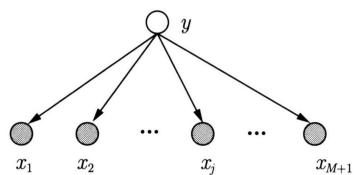  
图8.3 多项逻辑斯谛回归模型的概率无向图模型表示。实心圆表示可观测变量，空心圆表示不可观测变量

# 8.2 最大熵模型

这里首先叙述最大熵原理，然后推导最大熵模型，最后给出最大熵模型的形式，以及最大熵模型和逻辑斯谛回归模型的关系。

# 8.2.1 最大熵原理

最大熵原理是概率模型学习的一个准则。最大熵原理认为：学习概率模型时，在所有可

能的概率模型（分布）中，熵最大的模型是最好的模型。通常用约束条件来确定概率模型的集合，所以，最大熵原理也可以表述为在满足约束条件的模型集合中选取熵最大的模型。

假设离散随机变量 $x$ 的概率分布是 $P(x)$ ，则其熵（参照7.2.2节）是

$$
H (P) = - \sum_ {x \in \mathcal {X}} P (x) \log P (x) \tag {8.13}
$$

熵满足下列不等式：

$$
0 \leqslant H (P) \leqslant \log | \mathcal {X} |
$$

式中， $|\mathcal{X}|$ 是 $\mathcal{X}$ 的取值个数，当且仅当 $x$ 的分布是均匀分布时右边的等号成立。这就是说，当 $x$ 服从均匀分布时，熵最大。

直观地，最大熵原理认为要选择的概率模型首先必须满足已有的事实，即约束条件。在没有更多信息的情况下，那些不确定的部分都是“等可能的”。最大熵原理通过熵的最大化来表示等可能性。“等可能”不容易操作，而熵是一个可优化的数值指标。

首先，通过一个简单的例子来介绍一下最大熵原理①。

例8.2 假设随机变量 $x$ 有5个取值 $\{a, b, c, d, e\}$ ，要估计取各个值的概率 $P(a), P(b), P(c), P(d), P(e)$ 。

解 这些概率值满足以下约束条件：

$$
P (a) + P (b) + P (c) + P (d) + P (e) = 1
$$

满足这个约束条件的概率分布有无穷多个。如果没有任何其他信息，仍要对概率分布进行估计，一个办法就是认为这个分布中取各个值的概率是相等的：

$$
P (a) = P (b) = P (c) = P (d) = P (e) = \frac {1}{5}
$$

等概率表示了对事实的无知。因为没有更多的信息，这种判断是合理的。

有时，能从一些先验知识中得到一些对概率值的约束条件，例如，

$$
P (a) + P (b) = \frac {3}{1 0}
$$

$$
P (a) + P (b) + P (c) + P (d) + P (e) = 1
$$

满足这两个约束条件的概率分布仍然有无穷多个。在缺少其他信息的情况下，可以认为 $a$ 与 $b$ 是等概率的， $c, d$ 与 $e$ 是等概率的，于是，

$$
P (a) = P (b) = \frac {3}{2 0}
$$

$$
P (c) = P (d) = P (e) = \frac {7}{3 0}
$$

如果还有第3个约束条件：

$$
P (a) + P (c) = \frac {1}{2}
$$

$$
P (a) + P (b) = \frac {3}{1 0}
$$

$$
P (a) + P (b) + P (c) + P (d) + P (e) = 1
$$

可以继续按照满足约束条件下求等概率的方法估计概率分布。这里不再继续讨论。以上概率模型学习的方法正是遵循了最大熵原理。

图8.4提供了用最大熵原理进行概率模型选择的几何解释。概率模型集合 $\mathcal{P}$ 可由欧氏空间中的单纯形（simplex）①表示，如左图的三角形（2-单纯形）。一个点代表一个模型，整个单纯形代表模型集合。右图上的一条直线对应一个约束条件，直线的交集对应满足所有约束条件的模型集合。一般地，这样的模型仍有无穷多个。学习的目的是在可能的模型集合中选择最优模型，最大熵原理则给出最优模型选择的一个准则。

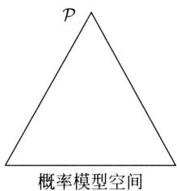

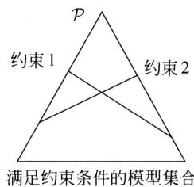  
图8.4 概率模型集合

# 8.2.2 最大熵模型的定义

最大熵原理是统计学习的一般原理，将它应用到分类得到最大熵模型。

假设分类模型是一个条件概率分布 $P(y|\pmb{x})$ ， $\pmb{x} \in \mathcal{X} \subseteq \mathbb{R}^{M}$ 表示实例特征， $y \in \mathcal{Y} = \{c_{1}, c_{2}, \dots, c_{K}\}$ 表示实例类别。这个模型表示的是对于给定的实例 $\pmb{x}$ ，实例属于类别 $y$ 的条件概率是 $P(y|\pmb{x})$ 。

给定一个训练数据集

$$
\mathcal {D} = \left\{\left(\boldsymbol {x} _ {1}, y _ {1}\right), \left(\boldsymbol {x} _ {2}, y _ {2}\right), \dots , \left(\boldsymbol {x} _ {N}, y _ {N}\right) \right\}
$$

学习的目标是用最大熵原理选择最好的分类模型。

首先考虑模型应该满足的条件。给定训练数据集，可以确定联合分布 $P(\pmb{x},y)$ 的经验分布和边缘分布 $P(\pmb{x})$ 的经验分布，分别以 $\tilde{P} (\pmb {x},\pmb {y})$ 和 $\tilde{P} (\pmb {x})$ 表示。这里，

$$
\tilde {P} (\boldsymbol {x}, y) = \frac {N (\boldsymbol {x} , y)}{N}
$$

$$
\tilde {P} (\boldsymbol {x}) = \frac {N (\boldsymbol {x})}{N}
$$

其中， $N(\pmb{x}, y)$ 表示训练数据中样本 $(\pmb{x}, y)$ 出现的频数， $N(\pmb{x})$ 表示训练数据中实例 $\pmb{x}$ 出现的频数， $N$ 表示训练样本容量。

用特征函数（feature function） $f(\pmb{x}, y)$ 描述实例 $x$ 和类别 $y$ 之间的某一个事实。其定义是

$$
f ({\pmb x}, y) = \left\{ \begin{array}{l l} {1,} & {x   \text {与}   y   \text {满 足 某 一 条 件}} \\ {0,} & {\text {否 则}} \end{array} \right.
$$

它是一个指示函数(indicator function)①，当 $x$ 和 $y$ 满足这个事实时取值为1，否则取值为0。特征函数 $f(\pmb {x},\pmb {y})$ 关于经验分布 $\tilde{P} (\pmb {x},\pmb {y})$ 的期望值用 $E_{\tilde{P}}(f)$ 表示：

$$
E _ {\tilde {P}} (f) = \sum_ {\boldsymbol {x}, y} \tilde {P} (\boldsymbol {x}, y) f (\boldsymbol {x}, y)
$$

特征函数 $f(\pmb {x},y)$ 关于模型 $P(y|\pmb {x})$ 与经验分布 $\tilde{P} (\pmb {x})$ 的期望值用 $E_P(f)$ 表示：

$$
E _ {P} (f) = \sum_ {\boldsymbol {x}, y} \tilde {P} (\boldsymbol {x}) P (y | \boldsymbol {x}) f (\boldsymbol {x}, y)
$$

如果模型能够获取训练数据中的信息，那么可以假设这两个期望值相等，即

$$
E _ {P} (f) = E _ {\tilde {P}} (f) \tag {8.14}
$$

或

$$
\sum_ {\boldsymbol {x}, y} \tilde {P} (\boldsymbol {x}) P (y | \boldsymbol {x}) f (\boldsymbol {x}, y) = \sum_ {\boldsymbol {x}, y} \tilde {P} (\boldsymbol {x}, y) f (\boldsymbol {x}, y) \tag {8.15}
$$

我们将式 (8.14) 或式 (8.15) 作为模型学习的约束条件。假如有 $M$ 个特征函数 $f_{j}(\pmb{x},y)$ ， $j = 1,2,\dots,M$ ，那么就有 $M$ 个约束条件。

定义8.4（最大熵模型） 假设满足所有约束条件的模型集合为

$$
\mathcal {C} \equiv \{P \in \mathcal {P} | E _ {P} (f _ {j}) = E _ {\bar {P}} (f _ {j}), \quad j = 1, 2, \dots , M \} \tag {8.16}
$$

定义在条件概率分布 $P(y|\mathbf{x})$ 上的条件熵为

$$
H (P) = - \sum_ {\boldsymbol {x}, y} \tilde {P} (\boldsymbol {x}) P (y | \boldsymbol {x}) \log P (y | \boldsymbol {x}) \tag {8.17}
$$

则模型集合 $\mathcal{C}$ 中条件熵 $H(P)$ 最大的模型称为最大熵模型。式中的对数为自然对数。

# 8.2.3 最大熵模型的学习

最大熵模型的学习过程就是求解最大熵模型的过程。最大熵模型的学习可以形式化为约束最优化问题。

对于给定的训练数据集 $\mathcal{D} = \{(x_1, y_1), (x_2, y_2), \dots, (x_N, y_N)\}$ 以及特征函数 $f_j(x, y)$ , $j = 1, 2, \dots, M$ , 最大熵模型的学习等价于约束最优化问题:

$$
\max  _ {P \in \mathcal {C}} H (P) = - \sum_ {\boldsymbol {x}, y} \tilde {P} (\boldsymbol {x}) P (y | \boldsymbol {x}) \log P (y | \boldsymbol {x})
$$

$$
\begin{array}{l l} \text {s . t .} & E _ {P} (f _ {j}) = E _ {\tilde {P}} (f _ {j}), \quad j = 1, 2, \dots , M \end{array}
$$

$$
\sum_ {y} P (y | \boldsymbol {x}) = 1
$$

按照最优化问题的习惯，将求最大值问题改写为等价的求最小值问题：

$$
\min  _ {P \in \mathcal {C}} - H (P) = \sum_ {\boldsymbol {x}, y} \tilde {P} (\boldsymbol {x}) P (y | \boldsymbol {x}) \log P (y | \boldsymbol {x}) \tag {8.18}
$$

$$
\text {s . t .} \quad E _ {P} \left(f _ {j}\right) - E _ {\bar {P}} \left(f _ {j}\right) = 0, \quad j = 1, 2, \dots , M \tag {8.19}
$$

$$
\sum_ {y} P (y \mid \boldsymbol {x}) = 1 \tag {8.20}
$$

求解约束最优化问题 $(8.18) \sim (8.20)$ 得出的解就是最大熵模型学习的解。下面给出具体推导。

这里，将约束最优化的原始问题转换为无约束最优化的对偶问题①，通过求解对偶问题求解原始问题。

首先，引入拉格朗日乘子 $w_0, w_1, w_2, \dots, w_M$ ，定义拉格朗日函数 $L(P, \boldsymbol{w})$

$$
\begin{array}{l} L (P, \boldsymbol {w}) \equiv - H (P) + w _ {0} \left(1 - \sum_ {y} P (y | \boldsymbol {x})\right) + \sum_ {j = 1} ^ {M} w _ {j} \left(E _ {\bar {P}} (f _ {j}) - E _ {P} (f _ {j})\right) \\ = \sum_ {\boldsymbol {x}, y} \tilde {P} (\boldsymbol {x}) P (y | \boldsymbol {x}) \log P (y | \boldsymbol {x}) + w _ {0} \left(1 - \sum_ {y} P (y | \boldsymbol {x})\right) + \\ \sum_ {j = 1} ^ {M} w _ {j} \left(\sum_ {\boldsymbol {x}, y} \tilde {P} (\boldsymbol {x}, y) f _ {j} (\boldsymbol {x}, y) - \sum_ {\boldsymbol {x}, y} \tilde {P} (\boldsymbol {x}) P (y | \boldsymbol {x}) f _ {j} (\boldsymbol {x}, y)\right) \tag {8.21} \\ \end{array}
$$

最优化的原始问题是

$$
\min  _ {P \in \mathcal {C}} \max  _ {\boldsymbol {w}} L (P, \boldsymbol {w}) \tag {8.22}
$$

对偶问题是

$$
\max  _ {\boldsymbol {w}} \min  _ {P \in \mathcal {C}} L (P, \boldsymbol {w}) \tag {8.23}
$$

由于拉格朗日函数 $L(P, \boldsymbol{w})$ 是 $P$ 的凸函数，原始问题 (8.22) 的解与对偶问题 (8.23) 的解是等价的。这样，可以通过求解对偶问题 (8.23) 来求解原始问题 (8.22)。

首先，求解对偶问题(8.23)内部的最小化问题 $\min_{P\in \mathcal{C}}L(P,\boldsymbol {w})$ 。 $\min_{P\in \mathcal{C}}L(P,\boldsymbol {w})$ 是 $\pmb{w}$ 的函数，将其记作

$$
\varPsi (\boldsymbol {w}) = \min  _ {P \in \mathcal {C}} L (P, \boldsymbol {w}) = L (P _ {\boldsymbol {w}}, \boldsymbol {w}) \tag {8.24}
$$

$\varPsi(\boldsymbol{w})$ 称为对偶函数。同时，将其解记作

$$
P _ {\boldsymbol {w}} = \arg \min  _ {P \in \mathcal {C}} L (P, \boldsymbol {w}) = P _ {\boldsymbol {w}} (y | \boldsymbol {x}) \tag {8.25}
$$

具体地，求 $L(P, \boldsymbol{w})$ 对 $P(y|\boldsymbol{x})$ 的偏导数：

$$
\begin{array}{l} \frac {\partial L (P , \boldsymbol {w})}{\partial P (y | \boldsymbol {x})} = \sum_ {\boldsymbol {x}, y} \tilde {P} (\boldsymbol {x}) (\log P (y | \boldsymbol {x}) + 1) - \sum_ {y} w _ {0} - \sum_ {\boldsymbol {x}, y} \left(\tilde {P} (\boldsymbol {x}) \sum_ {j = 1} ^ {M} w _ {j} f _ {j} (\boldsymbol {x}, y)\right) \\ = \sum_ {\boldsymbol {x}, y} \tilde {P} (\boldsymbol {x}) \left(\log P (y | \boldsymbol {x}) + 1 - w _ {0} - \sum_ {j = 1} ^ {M} w _ {j} f _ {j} (\boldsymbol {x}, y)\right) \\ \end{array}
$$

令偏导数等于0，在 $\tilde{P} (\pmb {x}) > 0$ 的情况下，解得：

$$
P (y | \boldsymbol {x}) = \exp \left(\sum_ {j = 1} ^ {M} w _ {j} f _ {j} (\boldsymbol {x}, y) + w _ {0} - 1\right) = \frac {\exp \left(\sum_ {j = 1} ^ {M} w _ {j} f _ {j} (\boldsymbol {x} , y)\right)}{\exp \left(1 - w _ {0}\right)}
$$

由于 $\sum_{y}P(y|\boldsymbol {x}) = 1$ ，得：

$$
P _ {\boldsymbol {w}} (y | \boldsymbol {x}) = \frac {1}{Z _ {\boldsymbol {w}} (\boldsymbol {x})} \exp \left(\sum_ {j = 1} ^ {M} w _ {j} f _ {j} (\boldsymbol {x}, y)\right) \tag {8.26}
$$

其中，

$$
Z _ {\boldsymbol {w}} (\boldsymbol {x}) = \sum_ {y} \exp \left(\sum_ {j = 1} ^ {M} w _ {j} f _ {j} (\boldsymbol {x}, y)\right) \tag {8.27}
$$

$Z_{\boldsymbol{w}}(\boldsymbol{x})$ 称为归一化因子， $f_{j}(\boldsymbol{x}, y)$ 是特征函数， $w_{j}$ 是特征的权重。由式 (8.26)～式 (8.27) 表示的模型 $P_{\boldsymbol{w}} = P_{\boldsymbol{w}}(y|\boldsymbol{x})$ 就是最大熵模型。这里， $\boldsymbol{w}$ 是最大熵模型中的参数向量。

之后，求解对偶问题外部的最大化问题：

$$
\max  _ {\boldsymbol {w}} \Psi (\boldsymbol {w}) \tag {8.28}
$$

将其解记为 $\pmb{w}^{*}$ ，即

$$
\boldsymbol {w} ^ {*} = \arg \max  _ {\boldsymbol {w}} \Psi (\boldsymbol {w}) \tag {8.29}
$$

这就是说，可以应用最优化算法求对偶函数 $\varPsi(\boldsymbol{w})$ 的最大化，得到 $\boldsymbol{w}^*$ ，用来表示 $P^* \in \mathcal{C}$ 。这里， $P^* = P_{\boldsymbol{w}^*} = P_{\boldsymbol{w}^*}(y|\boldsymbol{x})$ 是学习到的最优模型（最大熵模型）。也就是说，最大熵模型的学习归结为对偶函数 $\varPsi(\boldsymbol{w})$ 的最大化。

例8.3 学习例8.2中的最大熵模型。

解为了方便，分别以 $y_{1},y_{2},y_{3},y_{4},y_{5}$ 表示 $a,b,c,d$ 和 $e$ ，于是最大熵模型学习的最优化问题是

$$
\begin{array}{l} \min  - H (P) = \sum_ {i = 1} ^ {5} P \left(y _ {i}\right) \log P \left(y _ {i}\right) \\ \text {s . t .} \quad P \left(y _ {1}\right) + P \left(y _ {2}\right) = \tilde {P} \left(y _ {1}\right) + \tilde {P} \left(y _ {2}\right) = \frac {3}{1 0} \\ \sum_ {i = 1} ^ {5} P (y _ {i}) = \sum_ {i = 1} ^ {5} \tilde {P} (y _ {i}) = 1 \\ \end{array}
$$

引入拉格朗日乘子 $w_{0}, w_{1}$ ，定义拉格朗日函数：

$$
L (P, \boldsymbol {w}) = \sum_ {i = 1} ^ {5} P (y _ {i}) \log P (y _ {i}) + w _ {1} \left(P (y _ {1}) + P (y _ {2}) - \frac {3}{1 0}\right) + w _ {0} \left(\sum_ {i = 1} ^ {5} P (y _ {i}) - 1\right)
$$

根据拉格朗日对偶性，可以通过求解对偶最优化问题得到原始最优化问题的解，所以求解

$$
\max  _ {\boldsymbol {w}} \min  _ {P} L (P, \boldsymbol {w})
$$

首先求解 $L(P, \mathbf{w})$ 关于 $P$ 的最小化问题。为此，固定 $w_0, w_1$ ，求偏导数：

$$
\frac {\partial L (P , \boldsymbol {w})}{\partial P (y _ {1})} = 1 + \log P (y _ {1}) + w _ {1} + w _ {0}
$$

$$
\frac {\partial L (P , \boldsymbol {w})}{\partial P (y _ {2})} = 1 + \log P (y _ {2}) + w _ {1} + w _ {0}
$$

$$
\frac {\partial L (P , \boldsymbol {w})}{\partial P (y _ {3})} = 1 + \log P (y _ {3}) + w _ {0}
$$

$$
\frac {\partial L (P , \boldsymbol {w})}{\partial P (y _ {4})} = 1 + \log P (y _ {4}) + w _ {0}
$$

$$
\frac {\partial L (P , \boldsymbol {w})}{\partial P (y _ {5})} = 1 + \log P (y _ {5}) + w _ {0}
$$

令各偏导数等于0，解得：

$$
P (y _ {1}) = P (y _ {2}) = \mathrm {e} ^ {- w _ {1} - w _ {0} - 1}
$$

$$
P (y _ {3}) = P (y _ {4}) = P (y _ {5}) = \mathrm {e} ^ {- w _ {0} - 1}
$$

于是，

$$
\min  _ {P} L (P, \boldsymbol {w}) = L (P _ {\boldsymbol {w}}, \boldsymbol {w}) = - 2 \mathrm {e} ^ {- w _ {1} - w _ {0} - 1} - 3 \mathrm {e} ^ {- w _ {0} - 1} - \frac {3}{1 0} w _ {1} - w _ {0}
$$

再求解 $L(P_{\pmb{w}}, \pmb{w})$ 关于 $\pmb{w}$ 的最大化问题：

$$
\max  _ {\boldsymbol {w}} L \left(P _ {\boldsymbol {w}}, \boldsymbol {w}\right) = - 2 \mathrm {e} ^ {- w _ {1} - w _ {0} - 1} - 3 \mathrm {e} ^ {- w _ {0} - 1} - \frac {3}{1 0} w _ {1} - w _ {0}
$$

分别求 $L(P_{\pmb{w}}, \pmb{w})$ 对 $w_0, w_1$ 的偏导数并令其为 0，得到：

$$
\mathrm {e} ^ {- w _ {1} - w _ {0} - 1} = \frac {3}{2 0}
$$

$$
\mathrm {e} ^ {- w _ {0} - 1} = \frac {7}{3 0}
$$

于是得到所要求的概率分布为

$$
P (y _ {1}) = P (y _ {2}) = \frac {3}{2 0}
$$

$$
P (y _ {3}) = P (y _ {4}) = P (y _ {5}) = \frac {7}{3 0}
$$

# 8.2.4 最大熵模型的极大似然估计

从以上最大熵模型学习中可以看出，最大熵模型是由式(8.26)～式(8.27)表示的条件概率分布。下面证明对偶函数的最大化等价于最大熵模型的极大似然估计。

已知训练数据的经验概率分布 $\tilde{P} (\pmb {x},\pmb {y})$ ，条件概率分布 $P(y|\pmb {x})$ 的对数似然函数表示为

$$
L _ {\tilde {P}} \left(P _ {\boldsymbol {w}}\right) = \log \prod_ {\boldsymbol {x}, y} P (y | \boldsymbol {x}) ^ {\tilde {P} (\boldsymbol {x}, y)} = \sum_ {\boldsymbol {x}, y} \tilde {P} (\boldsymbol {x}, y) \log P (y | \boldsymbol {x})
$$

当条件概率分布 $P(y|\pmb {x})$ 是最大熵模型 $(8.26)\sim (8.27)$ 时，对数似然函数 $L_{\bar{P}}(P_w)$ 为

$$
\begin{array}{l} L _ {\tilde {P}} \left(P _ {\boldsymbol {w}}\right) = \sum_ {\boldsymbol {x}, y} \tilde {P} (\boldsymbol {x}, y) \log P (y | \boldsymbol {x}) \\ = \sum_ {\boldsymbol {x}, y} \tilde {P} (\boldsymbol {x}, y) \sum_ {j = 1} ^ {M} w _ {j} f _ {j} (\boldsymbol {x}, y) - \sum_ {\boldsymbol {x}, y} \tilde {P} (\boldsymbol {x}, y) \log Z _ {\boldsymbol {w}} (\boldsymbol {x}) \\ = \sum_ {\boldsymbol {x}, y} \tilde {P} (\boldsymbol {x}, y) \sum_ {j = 1} ^ {M} w _ {j} f _ {j} (\boldsymbol {x}, y) - \sum_ {\boldsymbol {x}} \tilde {P} (\boldsymbol {x}) \log Z _ {\boldsymbol {w}} (\boldsymbol {x}) \tag {8.30} \\ \end{array}
$$

再看对偶函数 $\varPsi(\boldsymbol{w})$ 。由式(8.21)及式(8.24)可得：

$$
\begin{array}{l} \varPsi (\boldsymbol {w}) = \sum_ {\boldsymbol {x}, y} \tilde {P} (\boldsymbol {x}) P _ {\boldsymbol {w}} (y | \boldsymbol {x}) \log P _ {\boldsymbol {w}} (y | \boldsymbol {x}) + \\ \sum_ {j = 1} ^ {M} w _ {j} \left(\sum_ {\boldsymbol {x}, y} \tilde {P} (\boldsymbol {x}, y) f _ {j} (\boldsymbol {x}, y) - \sum_ {\boldsymbol {x}, y} \tilde {P} (\boldsymbol {x}) P _ {\boldsymbol {w}} (y | \boldsymbol {x}) f _ {j} (\boldsymbol {x}, y)\right) \\ = \sum_ {\boldsymbol {x}, y} \tilde {P} (\boldsymbol {x}, y) \sum_ {j = 1} ^ {M} w _ {j} f _ {j} (\boldsymbol {x}, y) + \sum_ {\boldsymbol {x}, y} \tilde {P} (\boldsymbol {x}) P _ {\boldsymbol {w}} (y | \boldsymbol {x}) \left(\log P _ {\boldsymbol {w}} (y | \boldsymbol {x}) - \sum_ {j = 1} ^ {M} w _ {j} f _ {j} (\boldsymbol {x}, y)\right) \\ = \sum_ {\boldsymbol {x}, y} \tilde {P} (\boldsymbol {x}, y) \sum_ {j = 1} ^ {M} w _ {j} f _ {j} (\boldsymbol {x}, y) - \sum_ {\boldsymbol {x}, y} \tilde {P} (\boldsymbol {x}) P _ {\boldsymbol {w}} (y | \boldsymbol {x}) \log Z _ {\boldsymbol {w}} (\boldsymbol {x}) \\ = \sum_ {\boldsymbol {x}, y} \tilde {P} (\boldsymbol {x}, y) \sum_ {j = 1} ^ {M} w _ {j} f _ {j} (\boldsymbol {x}, y) - \sum_ {\boldsymbol {x}} \tilde {P} (\boldsymbol {x}) \log Z _ {\boldsymbol {w}} (\boldsymbol {x}) \tag {8.31} \\ \end{array}
$$

最后一步用到 $\sum_{y}P(y|\pmb {x}) = 1$

比较式 (8.30) 和式 (8.31)，可得：

$$
\varPsi (\boldsymbol {w}) = L _ {\tilde {P}} (P _ {\boldsymbol {w}})
$$

既然对偶函数 $\Psi (\pmb {w})$ 等价于对数似然函数 $L_{\tilde{P}}(P_{\pmb{w}})$ ，于是证明了最大熵模型学习中的对偶函数最大化等价于最大熵模型的极大似然估计这一事实。

这样，最大熵模型的学习问题就转换为具体求解对数似然函数最大化或对偶函数最大化的问题。

# 8.2.5 与逻辑斯谛回归模型的关系

最大熵模型的一般形式如下。

$$
P _ {\boldsymbol {w}} (y | \boldsymbol {x}) = \frac {1}{Z _ {\boldsymbol {w}} (\boldsymbol {x})} \exp \left(\sum_ {j = 1} ^ {M} w _ {j} f _ {j} (\boldsymbol {x}, y)\right) \tag {8.32}
$$

其中，

$$
Z _ {\boldsymbol {w}} (\boldsymbol {x}) = \sum_ {y} \exp \left(\sum_ {j = 1} ^ {M} w _ {j} f _ {j} (\boldsymbol {x}, y)\right) \tag {8.33}
$$

这里， $\pmb{x} \in \mathcal{X} \subseteq \pmb{R}^{M}$ 为实例特征向量， $y \in \mathcal{Y} = \{c_{1}, c_{2}, \dots, c_{K}\}$ 为实例类别， $\pmb{w} \in \pmb{R}^{M}$ 为权重向量， $f_{j}(\pmb{x}, y)$ ， $j = 1, 2, \dots, M$ 为特征函数。特征函数通常是指示函数。

最大熵模型与逻辑斯谛回归模型有类似的形式，它们都是对数线性模型（log linear model）。逻辑斯谛回归模型的特征通常定义为输入实例的函数，而最大熵模型的特征通常定义为输入实例和输出类别的二值函数，这是两者的主要区别。所以，可以认为逻辑斯谛回归模型是最大熵模型的特殊情况。在实际的应用中，逻辑斯谛回归被更广泛地使用。

# 8.2.6 与指数分布族的关系

最大熵原理与指数分布族有密切的关系。在不同的约束条件下，应用最大熵原理可以得到指数分布族的不同分布，例如高斯分布。有以下引理。这里只给出一元高斯分布时的情况，可以扩展到多元高斯分布。

引理8.1 当均值和方差固定时，熵最大的连续概率分布是高斯分布。

证明 假设连续概率分布的密度函数是 $f(x)$ 。概率分布的熵是

$$
H (f) = - \int_ {- \infty} ^ {\infty} f (x) \log f (x) \mathrm {d} x
$$

密度函数满足

$$
\int_ {- \infty} ^ {\infty} f (x) \mathrm {d} x = 1
$$

概率分布的均值是

$$
\int_ {- \infty} ^ {\infty} x f (x) \mathrm {d} x = \mu
$$

方差是

$$
\int_ {- \infty} ^ {\infty} (x - \mu) ^ {2} f (x) \mathrm {d} x = \sigma^ {2}
$$

应用最大熵原理，求解以下约束最优化问题。

$$
\begin{array}{l} L (f (x), \lambda_ {0}, \lambda_ {1}, \lambda_ {2}) = - \int_ {- \infty} ^ {\infty} f (x) \log f (x) d x + \lambda_ {0} \left(\int_ {- \infty} ^ {\infty} f (x) d x - 1\right) + \\ \lambda_ {1} \left(\int_ {- \infty} ^ {\infty} x f (x) \mathrm {d} x - \mu\right) + \lambda_ {2} \left(\int_ {- \infty} ^ {\infty} (x - \mu) ^ {2} f (x) \mathrm {d} x - \sigma^ {2}\right) \\ \end{array}
$$

其中， $\lambda_0, \lambda_1, \lambda_2$ 是拉格朗日乘子。求拉格朗日函数 $L$ 对 $f(x)$ 的导数，并令导数为 0，得到：

$$
- \log f (x) - 1 + \lambda_ {0} + \lambda_ {1} x + \lambda_ {2} (x - \mu) ^ {2} = 0
$$

故有

$$
f (x) = \exp (\lambda_ {0} - 1) \exp (\lambda_ {1} x) \exp [ \lambda_ {2} (x - \mu) ^ {2} ]
$$

假设 $f(x)$ 以 $\mu$ 为中心对称，则

$$
\lambda_ {1} = 0
$$

令

$$
\lambda_ {2} = - \frac {1}{2 \sigma^ {2}}
$$

$$
\lambda_ {0} = 1 - \frac {1}{2} \log (2 \pi \sigma^ {2})
$$

得到高斯分布的密度函数：

$$
f (x) = \frac {1}{\sqrt {2 \pi \sigma^ {2}}} \exp \left[ - \frac {(x - \mu) ^ {2}}{2 \sigma^ {2}} \right]
$$

# 8.3 学习算法

逻辑回归和最大熵模型的学习通常是给定训练数据对模型进行极大似然估计。问题归结为以似然损失函数为目标函数的最优化问题，通常通过迭代算法求解。从最优化的观点看，逻辑回归的目标函数是光滑的凸函数，保证能找到全局最优解。最大熵模型的目标函数一般也是凸的。常用的方法有梯度下降法、牛顿法或拟牛顿法。牛顿法或拟牛顿法收敛速度更快，但梯度下降法更适合于大规模问题。

下面介绍基于梯度下降法的二项逻辑斯谛回归模型的学习算法、基于拟牛顿法BFGS的多项逻辑斯谛回归模型的学习算法。

# 8.3.1 梯度下降

学习时，对于给定的训练数据集

$$
\mathcal {D} = \left\{\left(\boldsymbol {x} _ {1}, y _ {1}\right), \left(\boldsymbol {x} _ {2}, y _ {2}\right), \dots , \left(\boldsymbol {x} _ {N}, y _ {N}\right) \right\}
$$

应用极大似然估计，估计二项逻辑斯谛回归模型的参数，其中 $y_{i}\in \{1,0\}$ 。模型（扩充形

式）是

$$
P _ {\boldsymbol {w}} (y = 1 | \boldsymbol {x}) = \frac {1}{1 + \exp [ - (\boldsymbol {w} \cdot \boldsymbol {x}) ]}
$$

$$
P _ {\boldsymbol {w}} (y = 0 | \boldsymbol {x}) = \frac {\exp [ - (\boldsymbol {w} \cdot \boldsymbol {x}) ]}{1 + \exp [ - (\hat {\boldsymbol {w}} \cdot \boldsymbol {x}) ]}
$$

其中， $\pmb{w}$ 是参数。设

$$
\pi_ {i} = P (y = 1 | \boldsymbol {x} _ {i}), \quad 1 - \pi_ {i} = P (y = 0 | \boldsymbol {x} _ {i})
$$

似然函数是

$$
\prod_ {i = 1} ^ {N} \pi_ {i} ^ {y _ {i}} (1 - \pi_ {i}) ^ {1 - y _ {i}}
$$

由此，得到对数似然损失函数：

$$
\begin{array}{l} L (\boldsymbol {w}) = - \sum_ {i = 1} ^ {N} \left[ y _ {i} \log \pi_ {i} + (1 - y _ {i}) \log (1 - \pi_ {i}) \right] \\ = - \sum_ {i = 1} ^ {N} \left[ y _ {i} \log \frac {\pi_ {i}}{1 - \pi_ {i}} + \log \left(1 - \pi_ {i}\right) \right] \\ = - \sum_ {i = 1} ^ {N} \left\{y _ {i} \left(\boldsymbol {w} \cdot \boldsymbol {x} _ {i}\right) - \log \left[ 1 + \exp \left(\boldsymbol {w} \cdot \boldsymbol {x} _ {i}\right) \right] \right\} \tag {8.34} \\ \end{array}
$$

用梯度下降法通过迭代求解最优化问题，这时目标函数是 $L(\pmb{w})$ 。梯度下降法的详细介绍见附录A。核心是计算目标函数的梯度函数 $\frac{\partial L(\pmb{w})}{\partial \pmb{w}}$ ，不断求 $L(\pmb{w})$ 对 $\pmb{w}$ 的最小化。

针对这个问题，有以下梯度函数：

$$
\frac {\partial L (\boldsymbol {w})}{\partial \boldsymbol {w}} = \sum_ {i = 1} ^ {N} \left(\pi_ {i} - y _ {i}\right) \boldsymbol {x} _ {i} \tag {8.35}
$$

算法8.1给出具体的算法。

# 算法8.1（二项逻辑斯谛回归的梯度下降）

输入：训练数据 $\mathcal{D}$ ，模型 $P_{\pmb{w}}(y|\pmb{x})$ 。

输出：估计的模型参数 $\hat{\pmb{w}}$ 。

超参数：学习率 $\eta$ ，精度要求 $\varepsilon$ 。

（1）取初始值 $\pmb{w}^{(0)}$ ，置 $k = 0$   
（2）更新参数

$$
\boldsymbol {w} ^ {(k + 1)} \leftarrow \boldsymbol {w} ^ {(k)} + \eta \sum_ {i = 1} ^ {N} \left(y _ {i} - \pi_ {i} ^ {(k)}\right) \boldsymbol {x} _ {i}
$$

$$
\pi_ {i} ^ {(k)} = \frac {1}{1 + \exp [ - (\boldsymbol {w} ^ {(k)} \cdot \boldsymbol {x} _ {i}) ]}
$$

(3) 当 $\| \pmb{w}^{(k + 1)} - \pmb{w}^{(k)} \| < \varepsilon$ 时，停止迭代，令 $\hat{\pmb{w}} = \pmb{w}^{(k + 1)}$ 。  
（4）否则，置 $k = k + 1$ ，转步骤（2）。

例8.4 用算法8.1求解例8.1的问题。

解 模型表示为

$$
P (y = 1 | x) = \frac {1}{1 + \exp [ - (w \cdot x + b) ]}
$$

用算法8.1从数据学习模型参数。设初始值 $w = 0$ ， $b = 0$ ，学习率 $\eta = 0.01$ 。2000次迭代后，学习收敛。图8.5给出学习曲线，横轴表示迭代次数，纵轴表示预测损失。在学习过程中损失不断减小，迭代次数到750时开始收敛，得到估计值 $\hat{w} = 1.5$ ， $\hat{b} = -4.1$ 。图8.2显示的就是学到的逻辑斯谛回归模型，对应的逻辑斯谛函数的参数为 $\hat{\mu} = 2.7$ ， $\hat{s} = 0.67$ 。

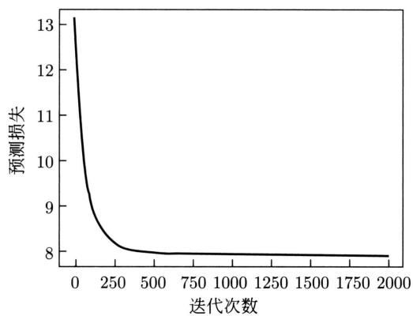  
图8.5 逻辑斯谛回归模型的学习曲线

# 8.3.2 拟牛顿法

学习时，对于给定的训练数据集

$$
\mathcal {D} = \left\{\left(\boldsymbol {x} _ {1}, y _ {1}\right), \left(\boldsymbol {x} _ {2}, y _ {2}\right), \dots , \left(\boldsymbol {x} _ {N}, y _ {N}\right) \right\}
$$

应用极大似然估计，估计多项逻辑斯谛回归模型的参数，其中 $y_{i}\in \{c_{1},c_{2},\dots ,c_{K}\}$ 。模型（扩充形式）是

$$
P _ {\boldsymbol {w}} (y = c _ {k} | \boldsymbol {x}) = \frac {\exp (\boldsymbol {w} _ {k} \cdot \boldsymbol {x})}{\sum_ {k = 1} ^ {K} \exp (\boldsymbol {w} _ {k} \cdot \boldsymbol {x})}, \quad k = 1, 2, \dots , K
$$

似然函数是

$$
\prod_ {i = 1} ^ {N} P _ {\boldsymbol {w}} \left(y _ {i} \mid \boldsymbol {x} _ {i}\right)
$$

由此，得到对数似然损失函数

$$
L (\boldsymbol {w}) = - \sum_ {i = 1} ^ {N} \log P _ {\boldsymbol {w}} (y _ {i} | \boldsymbol {x} _ {i})
$$

设

$$
\pi_ {i k} = P _ {\boldsymbol {w}} \left(y = c _ {k} \mid \boldsymbol {x} _ {i}\right)
$$

$$
y _ {i k} \in \{1, 0 \}, \quad \sum_ {k = 1} ^ {K} y _ {i k} = 1
$$

用拟牛顿法的BFGS算法，通过迭代求解最优化问题，这时目标函数是 $L(\pmb{w})$ 。拟牛顿法的详细介绍见附录B。核心是计算目标函数的梯度函数 $\frac{\partial L(\pmb{w})}{\partial\pmb{w}}$ 和黑塞矩阵的近似 $\pmb{B}$ ，不断求 $L(\pmb{w})$ 对 $\pmb{w}$ 的最小化。

针对这个问题，有以下梯度函数（推导参见附录F）：

$$
\frac {\partial L (\boldsymbol {w})}{\partial \boldsymbol {w} _ {k}} = \sum_ {i = 1} ^ {N} \left(\pi_ {i k} - y _ {i k}\right) \boldsymbol {x} _ {i}, \quad k = 1, 2, \dots , K \tag {8.36}
$$

相应的拟牛顿法BFGS算法如下。

# 算法8.2（多项逻辑斯谛回归的BFGS算法）

输入：训练数据 $\mathcal{D}$ ，模型 $P_{\pmb{w}}(y|\pmb{x})$ 。

输出：估计的模型参数 $\hat{w}$ 。

超参数：精度要求 $\varepsilon$ 。

（1）选定初始点 $\pmb{w}^{(0)}$ ，取 $B_{0}$ 为正定对称矩阵。  
(2) 计算 $\pmb{g}_k = g(\pmb{w}^{(k)})$ ，若 $\| \pmb{g}_k \| < \varepsilon$ ，则停止计算，得 $\hat{\pmb{w}} = \pmb{w}^{(k)}$ ；否则，进入下一步骤。  
(3) 由 $B_{k}p_{k} = -g_{k}$ 求出 $\pmb{p}_{k}$ 。  
（4）一维搜索：求 $\eta_{k}$ 使得

$$
L (\boldsymbol {w} ^ {(k)} + \eta_ {k} \boldsymbol {p} _ {k}) = \min  _ {\eta \geqslant 0} L (\boldsymbol {w} ^ {(k)} + \eta \boldsymbol {p} _ {k})
$$

(5) 置 $\pmb{w}^{(k + 1)} = \pmb{w}^{(k)} + \eta_k\pmb{p}_k$ 。  
(6) 计算 $\pmb{g}_{k+1} = g(\pmb{w}^{(k+1)})$ , 若 $\|\pmb{g}_{k+1}\| < \varepsilon$ , 则停止计算, 得 $\hat{\pmb{w}} = \pmb{w}^{(k+1)}$ ; 否则, 进入下一步骤。  
(7) 按下式求出 $B_{k+1}$ :

$$
\boldsymbol {B} _ {k + 1} = \boldsymbol {B} _ {k} + \frac {\boldsymbol {y} _ {k} \boldsymbol {y} _ {k} ^ {\mathrm {T}}}{\boldsymbol {y} _ {k} ^ {\mathrm {T}} \boldsymbol {\delta} _ {k}} - \frac {\boldsymbol {B} _ {k} \boldsymbol {\delta} _ {k} \boldsymbol {\delta} _ {k} ^ {\mathrm {T}} \boldsymbol {B} _ {k}}{\boldsymbol {\delta} _ {k} ^ {\mathrm {T}} \boldsymbol {B} _ {k} \boldsymbol {\delta} _ {k}}
$$

其中，

$$
\boldsymbol {y} _ {k} = \boldsymbol {g} _ {k + 1} - \boldsymbol {g} _ {k}, \quad \boldsymbol {\delta} _ {k} = \boldsymbol {w} ^ {(k + 1)} - \boldsymbol {w} ^ {(k)}
$$

(8) 置 $k = k + 1$ ，转步骤 (3)。

# 本章概要

1. 二项逻辑斯谛回归模型或逻辑斯谛回归模型是由以下条件概率分布表示的分类模型，用于二类分类。

$$
P (y = 1 | \boldsymbol {x}) = \frac {1}{1 + \exp [ - (\boldsymbol {w} \cdot \boldsymbol {x} + b) ]}
$$

$$
P (y = 0 | \boldsymbol {x}) = \frac {\exp [ - (\boldsymbol {w} \cdot \boldsymbol {x} + b) ]}{1 + \exp [ - (\boldsymbol {w} \cdot \boldsymbol {x} + b) ]}
$$

其中， $x$ 为实例特征向量， $y$ 为实例类别， $\pmb{w}$ 为权重向量， $b$ 为偏置。

二项逻辑斯谛回归模型使用逻辑斯谛函数或S型函数，是实例属于正类的对数几率模型，也是实例特征的对数线性模型。

2. 多项逻辑斯谛回归模型是由以下条件概率分布表示的分类模型，用于多类分类。

$$
P (y = c _ {k} | \boldsymbol {x}) = \frac {\exp (\boldsymbol {w} _ {k} \cdot \boldsymbol {x} + b _ {k})}{1 + \sum_ {k = 1} ^ {K - 1} \exp (\boldsymbol {w} _ {k} \cdot \boldsymbol {x} + b _ {k})}, \quad k = 1, 2, \dots , K - 1
$$

$$
P (y = c _ {k} | \boldsymbol {x}) = \frac {1}{1 + \sum_ {k = 1} ^ {K - 1} \exp (\boldsymbol {w} _ {k} \cdot \boldsymbol {x} + b _ {k})}
$$

其中， $\pmb{x}$ 为实例特征向量， $y$ 为实例类别， $\pmb{w}_k$ 为权重向量， $b_k$ 为偏置。

3. 最大熵模型可以由最大熵原理推导得出。最大熵原理是概率模型学习的一个准则。最大熵原理认为在所有可能的概率模型（分布）的集合中，熵最大的模型是最好的模型。

最大熵原理应用到分类模型的学习中，成为以下约束最优化问题：

$$
\min  - H (P) = \sum_ {\boldsymbol {x}, y} \tilde {P} (\boldsymbol {x}) P (y | \boldsymbol {x}) \log P (y | \boldsymbol {x})
$$

$$
\text {s . t .} \quad P (f _ {j}) - \tilde {P} (f _ {j}) = 0, \quad j = 1, 2, \dots , M
$$

$$
\sum_ {y} P (y | \boldsymbol {x}) = 1
$$

求解此最优化问题的对偶问题得到最大熵模型。

4. 最大熵模型是由以下条件概率分布表示的分类模型，也可以用于二类或多类分类。

$$
P _ {\boldsymbol {w}} (y | \boldsymbol {x}) = \frac {1}{Z _ {\boldsymbol {w}} (\boldsymbol {x})} \exp \left(\sum_ {j = 1} ^ {M} w _ {j} f _ {j} (\boldsymbol {x}, y)\right)
$$

$$
Z _ {\boldsymbol {w}} (\boldsymbol {x}) = \sum_ {y} \exp \left(\sum_ {j = 1} ^ {M} w _ {j} f _ {j} (\boldsymbol {x}, y)\right)
$$

其中， $Z_{\pmb{w}}(\pmb{x})$ 是归一化因子， $f_{j}$ 为特征函数， $w_{j}$ 为特征的权重。

最大熵模型和逻辑斯谛回归模型都属于对数线性模型。逻辑斯谛回归有最大熵的解释。

5. 逻辑斯谛回归和最大熵模型学习通常采用极大似然估计。逻辑斯谛回归和最大熵模型学习可以形式化为无约束最优化问题，求解该最优化问题的算法有梯度下降法、牛顿法、拟牛顿法。

# 继续阅读

逻辑斯谛回归的介绍参见文献 [1], 最大熵模型的介绍参见文献 [2] 和文献 [3]。逻辑斯谛回归模型与朴素贝叶斯模型的关系参见文献 [4], 逻辑斯谛回归模型与 AdaBoost 的关系参见文献 [5], 逻辑斯谛回归模型与核函数的关系参见文献 [6]。

# 习题

8.1 验证逻辑斯谛分布是否属于指数分布族。  
8.2 实现逻辑斯谛回归学习算法（算法8.1），并将其用于从例8.1的数据的学习。  
8.3 比较逻辑斯谛回归模型 (式 (8.9)～式 (8.10)) 与最大熵模型 (式 (8.32)～式 (8.33)) 的异同。  
8.4 证明逻辑斯谛回归学习是凸优化问题，提示：考虑黑塞矩阵的半正定性。   
8.5 二项逻辑斯谛回归学习的损失函数（参见式(8.34)）亦可写作

$$
- y \left[ \log_ {2} \frac {1}{1 + \exp (- \boldsymbol {w} \cdot \boldsymbol {x})} \right] - (1 - y) \left\{\log_ {2} \left[ 1 - \frac {1}{1 + \exp (- \boldsymbol {w} \cdot \boldsymbol {x})} \right] \right\}
$$

其中中括号内的函数称作逻辑斯谛损失函数，对数改为以2为底。可以用以下损失函数近似：

$$
- y \left[ \max  (0, 1 - \boldsymbol {w} \cdot \boldsymbol {x}) \right] - (1 - y) \left[ \max  (0, 1 + \boldsymbol {w} \cdot \boldsymbol {x}) \right]
$$

其中中括号内的函数称作合页损失函数。画出两个逻辑斯谛损失函数和两个合页损失函数，并做比较。合页损失函数被用于支持向量机学习。

8.6 写出二项逻辑斯谛回归的基于牛顿法的学习算法。   
8.7 写出多项逻辑斯谛回归的基于梯度下降的学习算法。   
8.8 写出多项逻辑斯谛回归的基于拟牛顿法DFP的学习算法。

# 参考文献

[1] HASTIE T, TIBSHIRANI R, FRIEDMAN J. The elements of statistical learning: data mining, inference, and prediction[M]. 范明，柴玉梅，智红英，等译. Springer, 2001.   
[2] BERGER A, DELLA PIETRA S D, PIETRA V D. A maximum entropy approach to natural language processing[J]. Computational Linguistics, 1996, 22(1): 39-71.

[3] BERGER A. The improved iterative scaling algorithm: a gentle introduction[R/OL]. http://www.cs.cmu.edu/afs/cs/user/aberger/www/ps/scaling.ps.   
[4] MITCHELL T M. Machine learning[M]. 曾华军, 张银奎, 等译. McGraw-Hill, 1997.  
[5] COLLINS M, SCHAPIRE R E, SINGER Y. Logistic regression, AdaBoost and Bregman distances[J]. Machine Learning, 2002, 48(1-3): 253-285.   
[6] CANU S, SMOLA A J. Kernel method and exponential family[J]. Neurocomputing, 2005, 69: 714-720.

# 第9章 支持向量机

支持向量机（support vector machines，SVM）是一种二类分类模型，属于判别模型。它的基本模型是定义在特征空间上的间隔最大的线性分类器，间隔最大使它有别于感知机；支持向量机还包括核技巧（kernel trick）的使用，这使它成为非线性分类器。支持向量机的学习策略就是（几何）间隔最大化，可形式化为一个求解凸二次规划问题，也等价于正则化的合页损失函数的最小化问题。支持向量机的学习算法包括求解凸二次规划的最优化算法、损失函数最小化的随机梯度下降算法。

支持向量机学习方法包含构建由简至繁的模型：线性可分支持向量机、线性支持向量机以及非线性支持向量机。简单模型是复杂模型的基础，也是复杂模型的特殊情况。当训练数据线性可分时，通过硬间隔最大化，学习一个线性分类器，即线性可分支持向量机，又称为硬间隔支持向量机；当训练数据近似线性可分时，通过软间隔最大化，学习一个线性分类器，即线性支持向量机，又称为软间隔支持向量机；当训练数据线性不可分时，通过使用核技巧及软间隔最大化，学习一个非线性分类器，即非线性支持向量机。

当输入空间为欧氏空间或离散集合、特征空间为希尔伯特空间时，核函数表示将输入从输入空间映射到特征空间得到的特征向量之间的内积。通过使用核函数可以学习非线性支持向量机，等价于隐式地在高维的特征空间中学习线性支持向量机。这样的方法称为核技巧。核方法（kernel method）是更为一般的机器学习技术。

间隔最大化和核函数是支持向量机的重要概念，支持向量机具有直观容易理解、泛化能力强、分类准确率高等优点。Boser、Guyon 和 Vapnik 于 1992 年提出了支持向量机的基本概念。Cortes 和 Vapnik 于 1995 年发表了支持向量机的完整形式。

本章按照上述思路介绍三类支持向量机、核函数及学习算法。9.1节讲解线性可分支持向量机，9.2节讲解线性支持向量机，9.3节讲解非线性支持向量机和核函数。

# 9.1 线性可分支持向量机与硬间隔最大化

# 9.1.1 线性可分支持向量机

考虑二类分类问题。假设实例的输入空间与特征空间为两个不同的空间。输入空间为欧氏空间或离散集合，特征空间为欧氏空间或希尔伯特空间。线性可分支持向量机和线性支持向量机通过一一对应将输入空间中的实例输入映射为特征空间中的特征向量。非线性支持向量机利用一个非线性变换，将输入空间中的实例输入映射为特征空间中的特征向量。所以，

实例都转换为特征向量，实例与其特征向量经常不作区分。

假设给定一个训练数据集

$$
\mathcal {D} = \left\{\left(\boldsymbol {x} _ {1}, y _ {1}\right), \left(\boldsymbol {x} _ {2}, y _ {2}\right), \dots , \left(\boldsymbol {x} _ {N}, y _ {N}\right) \right\}
$$

其中， $\pmb{x}_i \in \mathcal{X} \subseteq \mathbb{R}^D$ ， $y_i \in \mathcal{Y} = \{+1, -1\}$ ， $i = 1, 2, \dots, N$ 。 $\pmb{x}_i$ 为第 $i$ 个实例的特征向量， $y_i$ 为其类别。当 $y_i = +1$ 时，称 $\pmb{x}_i$ 为正例；当 $y_i = -1$ 时，称 $\pmb{x}_i$ 为负例。称 $(\pmb{x}_i, y_i)$ 为样本。再假设训练数据集是线性可分的（见定义4.2）。

学习的目标是在特征空间中找到一个分离超平面，能将实例分到两个不同的类别。分离超平面对应方程 $\boldsymbol{w} \cdot \boldsymbol{x} + b = 0$ ，它由法向量 $\boldsymbol{w}$ 和截距 $b$ 决定，也表示为 $(\boldsymbol{w}, b)$ 。分离超平面将特征空间划分为两个区域，法向量指向的区域中的实例是正类，另一个区域中的实例是负类。对应地，学到一个模型 $f(\boldsymbol{x}) = \boldsymbol{w} \cdot \boldsymbol{x} + b$ ，当函数值是 $+1$ 时，将实例分到正类；当函数值是 $-1$ 时，将实例分到负类。

一般地，当训练数据集线性可分时，存在无穷多个分离超平面可将两类数据正确分开。感知机求解一个可将正负实例分开的分离超平面作为分类模型，这时的解是一个随机解。线性可分支持向量机（linear support vector machine in linearly separable case）求解几何间隔最大的分离超平面作为分类模型，这时解是唯一的。

定义9.1（线性可分支持向量机）给定线性可分训练数据集，通过后述求解硬间隔最大化或凸二次规划问题 $(9.13) \sim (9.14)$ ，学习得到的分离超平面具有最大的几何间隔

$$
\boldsymbol {w} ^ {*} \cdot \boldsymbol {x} + b ^ {*} = 0 \tag {9.1}
$$

以及相应的模型

$$
f (\boldsymbol {x}) = \boldsymbol {w} ^ {*} \cdot \boldsymbol {x} + b ^ {*} \tag {9.2}
$$

当 $f(\pmb {x})\geqslant 0$ 时将 $\pmb{x}$ 分到正类，当 $f(x) <   0$ 时将 $\pmb{x}$ 分到负类。称模型为线性可分支持向量机，也就是有分类器

$$
F (\boldsymbol {x}) = \operatorname {s i g n} \left(\boldsymbol {w} ^ {*} \cdot \boldsymbol {x} + b ^ {*}\right)
$$

图9.1所示为特征空间中的二类分类问题。图中“·”表示正例，“×”表示负例。训练数据集线性可分，这时有许多分离超平面（在二维空间中是直线）能将两类数据正确分开。线性可分支持向量机对应着将两类数据正确分类并且几何间隔最大的分离超平面。几何间隔直观上是将正例和负例分开的边界的隔离带。

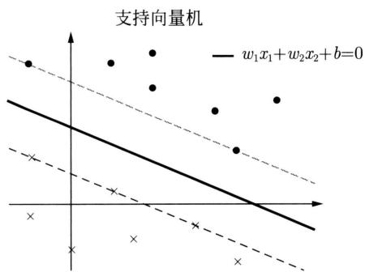  
图9.1 二类分类问题

几何间隔最大的分离超平面将在下面叙述。这里先介绍函数间隔和几何间隔的概念。

# 9.1.2 函数间隔和几何间隔

假设有超平面 $\boldsymbol{w} \cdot \boldsymbol{x} + b = 0$ ， $\boldsymbol{x}_i$ 为超平面外的一个实例， $y_i$ 为其类别。分类结果正确有两种情况。样本满足 $\boldsymbol{w} \cdot \boldsymbol{x}_i + b > 0$ ，且 $y_i = +1$ ，分类正确。反之，样本满足 $\boldsymbol{w} \cdot \boldsymbol{x}_i + b < 0$ ，且 $y_i = -1$ ，分类也正确。说明实例 $\boldsymbol{x}_i$ 被正确分类时， $\boldsymbol{w} \cdot \boldsymbol{x}_i + b$ 的符号与类别 $y_i$ 的符号一致。再有， $|\boldsymbol{w} \cdot \boldsymbol{x}_i + b|$ 的大小能表示分类预测的确信度。所以，可用量 $y_i(\boldsymbol{w} \cdot \boldsymbol{x}_i + b)$ 来表示分类的正确性及确信度。这个量当分类正确时一定是正的。这就是函数间隔（functional margin）的概念①。

另外，当 $y_{i}(\boldsymbol{w} \cdot \boldsymbol{x}_{i} + b)$ 是负的时候，实例 $\boldsymbol{x}_{i}$ 没有被正确分类。感知机学习时，将所有误分类样本点到超平面的距离 $-y_{i}(\boldsymbol{w} \cdot \boldsymbol{x}_{i} + b)$ 作为损失函数，最小化这个损失函数，直至为0，从而学到模型。

定义9.2（函数间隔）对于给定的线性可分训练数据集 $\mathcal{D}$ 和超平面 $(\boldsymbol{w}, b)$ ，超平面 $(\boldsymbol{w}, b)$ 可以将数据集 $\mathcal{D}$ 中的样本正确分类。

定义超平面 $(\pmb{w}, b)$ 关于样本 $(\pmb{x}_i, y_i)$ 的函数间隔为

$$
\hat {\gamma} _ {i} = y _ {i} \left(\boldsymbol {w} \cdot \boldsymbol {x} _ {i} + b\right) \tag {9.3}
$$

定义超平面 $(\boldsymbol{w}, b)$ 关于数据集 $\mathcal{D}$ 的函数间隔为超平面 $(\boldsymbol{w}, b)$ 关于 $\mathcal{D}$ 中所有样本 $(x_i, y_i)$ 的函数间隔之最小值，即

$$
\hat {\gamma} = \min  _ {i = 1, 2, \dots , n} \hat {\gamma} _ {i} \tag {9.4}
$$

但是函数间隔作为分类结果评价标准存在一个问题。只要成比例地改变 $\pmb{w}$ 和 $b$ ，例如，将它们改为 $2\pmb{w}$ 和 $2b$ ，超平面并没有改变，但函数间隔却成为原来的2倍。这一事实启示我们，可以对分离超平面的法向量 $\pmb{w}$ 进行规范化。这时函数间隔成为几何间隔（geometric margin）。

假设有超平面 $\boldsymbol{w} \cdot \boldsymbol{x} + b = 0$ 。实例 $\boldsymbol{x}_i$ 是在超平面外的点，其类别为 $y_i$ 。实例 $\boldsymbol{x}_i$ 被正确分类有两种情况，被正确分为正例或被正确分为负例。综合两种情况，实例 $\boldsymbol{x}_i$ 到超平面 $\boldsymbol{w} \cdot \boldsymbol{x} + b = 0$ 的（正）的距离可以统一写作

$$
y _ {i} \cdot \frac {1}{\| \boldsymbol {w} \|} (\boldsymbol {w} \cdot \boldsymbol {x} _ {i} + b)
$$

其中， $\| \boldsymbol{w}\|$ 为 $\boldsymbol{w}$ 的 $L_{2}$ 范数。实例离超平面越远，意味着分类的确信度越高。反之，实例离超平面越近，意味着分类的确信度越低。

由此导出几何间隔的概念（见图9.2）。几何间隔是更合适的评价标准。

定义9.3（几何间隔）对于给定的线性可分训练数据集 $\mathcal{D}$ 和超平面 $(\boldsymbol{w}, b)$ ，假设超平面 $(\boldsymbol{w}, b)$ 可以将数据集 $\mathcal{D}$ 中的样本正确分类。

  
图9.2 几何间隔

定义超平面 $(\pmb{w}, b)$ 关于样本 $(\pmb{x}_i, y_i)$ 的几何间隔为

$$
\gamma_ {i} = y _ {i} \left(\frac {\boldsymbol {w}}{\| \boldsymbol {w} \|} \cdot \boldsymbol {x} _ {i} + \frac {b}{\| \boldsymbol {w} \|}\right) \tag {9.5}
$$

定义超平面 $(\pmb{w}, b)$ 关于数据集 $\mathcal{D}$ 的几何间隔为超平面 $(\pmb{w}, b)$ 关于 $\mathcal{D}$ 中所有样本 $(x_i, y_i)$ 的几何间隔之最小值，即

$$
\gamma = \min  _ {i = 1, 2, \dots , n} \gamma_ {i} \tag {9.6}
$$

从函数间隔和几何间隔的定义 $(9.3)\sim (9.6)$ 可知，函数间隔和几何间隔有下面的关系：

$$
\gamma_ {i} = \frac {\hat {\gamma} _ {i}}{\| \boldsymbol {w} \|} \tag {9.7}
$$

$$
\gamma = \frac {\hat {\gamma}}{\| \boldsymbol {w} \|} \tag {9.8}
$$

如果 $\| \pmb{w}\| = 1$ ，那么函数间隔和几何间隔相等。如果超平面参数 $\pmb{w}$ 和 $b$ 成比例地改变（超平面没有改变），函数间隔也按此比例改变，而几何间隔不变。

# 9.1.3 间隔最大化

支持向量机学习的基本想法是求解能够正确分类训练数据并且几何间隔最大的分离超平面。对线性可分训练数据集而言，线性可分分离超平面有无穷多个（对应于感知机），但是其中的几何间隔最大的分离超平面是唯一的。这里的间隔最大化又称为硬间隔最大化（hard margin maximization），与将要讨论的训练数据集近似线性可分时的软间隔最大化相对应。

间隔最大化的直观解释是：对训练数据集找到几何间隔最大的超平面意味着以充分大的确信度对训练数据进行分类。也就是说，不仅将正负实例分开，而且对最难分的实例（离超平面最近的点）也有足够大的确信度将它们分开。这样的超平面应该对未知的新实例有很好的分类预测能力，也就是说，模型有很好的泛化能力。

# 1. 间隔最大分离超平面

下面考虑如何求得几何间隔最大的分离超平面，即间隔最大分离超平面。具体地，这个

问题可以表示为下面的约束最优化问题：

$$
\max  _ {\boldsymbol {w}, b} \gamma \tag {9.9}
$$

$$
\text {s . t .} \quad y _ {i} \left(\frac {\boldsymbol {w}}{\| \boldsymbol {w} \|} \cdot \boldsymbol {x} _ {i} + \frac {b}{\| \boldsymbol {w} \|}\right) \geqslant \gamma , \quad i = 1, 2, \dots , N \tag {9.10}
$$

即我们希望最大化超平面 $(\boldsymbol{w}, b)$ 关于训练数据集的几何间隔 $\gamma$ ，约束条件表示的是超平面 $(\boldsymbol{w}, b)$ 关于每个训练样本的几何间隔至少是 $\gamma$ 。

考虑几何间隔和函数间隔的关系式 (9.8)，可将这个问题改写为

$$
\max  _ {\boldsymbol {w}, b} \frac {\hat {\gamma}}{\| \boldsymbol {w} \|} \tag {9.11}
$$

$$
\text {s . t .} \quad y _ {i} (\boldsymbol {w} \cdot \boldsymbol {x} _ {i} + b) \geqslant \hat {\gamma}, \quad i = 1, 2, \dots , n \tag {9.12}
$$

函数间隔 $\hat{\gamma}$ 的取值并不影响最优化问题的解。事实上，假设将 $\boldsymbol{w}$ 和 $b$ 按比例扩大，例如扩大2倍，得到 $2\boldsymbol{w}$ 和 $2b$ ，这时函数间隔成为 $2\hat{\gamma}$ 。这一改变对上面最优化问题的不等式约束没有影响，对目标函数也没有影响，也就是说，它产生一个等价的最优化问题。这样，就可以取 $\hat{\gamma} = 1$ 。将 $\hat{\gamma} = 1$ 代入上面的最优化问题，注意到最大化 $\frac{1}{\|\boldsymbol{w}\|}$ 和最小化 $\frac{1}{2}\|\boldsymbol{w}\|^2$ 是等价的，于是就得到下面的线性可分支持向量机学习的约束最优化问题：

$$
\min  _ {\boldsymbol {w}, b} \frac {1}{2} \| \boldsymbol {w} \| ^ {2} \tag {9.13}
$$

$$
\text {s . t .} \quad y _ {i} (\boldsymbol {w} \cdot \boldsymbol {x} _ {i} + b) - 1 \geqslant 0, \quad i = 1, 2, \dots , N \tag {9.14}
$$

这是一个凸二次规划（convex quadratic programming）问题。

在最优化理论中，约束凸最优化问题是指以下约束最优化问题：

$$
\min  _ {\boldsymbol {w}} f (\boldsymbol {w}) \tag {9.15}
$$

$$
\text {s . t .} \quad g _ {i} (\boldsymbol {w}) \leqslant 0, \quad i = 1, 2, \dots , k \tag {9.16}
$$

$$
h _ {i} (\boldsymbol {w}) = 0, \quad i = 1, 2, \dots , l \tag {9.17}
$$

其中，目标函数 $f(\pmb{w})$ 和约束函数 $g_{i}(\pmb{w})$ 都是 $\mathbb{R}^D$ 上的连续可导的凸函数，约束函数 $h_i(\pmb{w})$ 是 $\mathbb{R}^D$ 上的仿射函数①。

当目标函数 $f(\boldsymbol{w})$ 是二次函数且约束函数 $g_{i}(\boldsymbol{w})$ 是仿射函数时，上述约束凸最优化问题成为凸二次规划问题。

如果求出了约束最优化问题 $(9.13) \sim (9.14)$ 的解 $\boldsymbol{w}^{*}, b^{*}$ ，那么就可以得到间隔最大分离超平面 $\boldsymbol{w}^{*} \cdot \boldsymbol{x} + b^{*} = 0$ 及模型 $f(\boldsymbol{x}) = \boldsymbol{w}^{*} \cdot \boldsymbol{x} + b^{*}$ ，即线性可分支持向量机模型。

# 2. 间隔最大分离超平面的存在唯一性

线性可分训练数据集的间隔最大分离超平面是存在且唯一的。

定理9.1（存在唯一性）若训练数据集 $\mathcal{D}$ 线性可分，则可将训练数据集中的样本完全正确分开的间隔最大分离超平面存在且唯一。

# 证明

# （1）存在性

由于训练数据集线性可分，所以最优化问题 $(9.13) \sim (9.14)$ 一定存在可行解。又由于目标函数有下界，所以最优化问题 $(9.13) \sim (9.14)$ 必有解，记作 $(\boldsymbol{w}^{*}, b^{*})$ 。由于训练数据集中既有正类样本又有负类样本，所以 $(\boldsymbol{w}, b) = (0, b)$ 不是最优化的可行解，因而最优解 $(\boldsymbol{w}^{*}, b^{*})$ 必满足 $\boldsymbol{w}^{*} \neq 0$ 。由此得知分离超平面的存在性。

# （2）唯一性

首先证明最优化问题 $(9.13) \sim (9.14)$ 解中 $\pmb{w}^{*}$ 的唯一性。假设问题 $(9.13) \sim (9.14)$ 存在两个最优解 $(\pmb{w}_1^*, b_1^*)$ 和 $(\pmb{w}_2^*, b_2^*)$ 。显然 $\| \pmb{w}_1^* \| = \| \pmb{w}_2^* \| = c$ ，其中 $c$ 是一个常数。令 $\pmb{w} = \frac{\pmb{w}_1^* + \pmb{w}_2^*}{2}, b = \frac{b_1^* + b_2^*}{2}$ ，易知 $(\pmb{w}, b)$ 是问题 $(9.13) \sim (9.14)$ 的可行解，从而有

$$
c \leqslant \| \boldsymbol {w} \| \leqslant \frac {1}{2} \| \boldsymbol {w} _ {1} ^ {*} \| + \frac {1}{2} \| \boldsymbol {w} _ {2} ^ {*} \| = c
$$

上式表明, 式中的不等号可变为等号, 即 $\| \boldsymbol{w} \| = \frac{1}{2} \| \boldsymbol{w}_1^* \| + \frac{1}{2} \| \boldsymbol{w}_2^* \|$ , 从而有 $\boldsymbol{w}_1^* = \lambda \boldsymbol{w}_2^*$ , $|\lambda| = 1$ 。若 $\lambda = -1$ , 则 $\boldsymbol{w} = 0$ , $(\boldsymbol{w}, b)$ 不是问题 (9.13)~(9.14) 的可行解, 矛盾。因此必有 $\lambda = 1$ , 即

$$
\boldsymbol {w} _ {1} ^ {*} = \boldsymbol {w} _ {2} ^ {*}
$$

由此可以把两个最优解 $(\pmb{w}_1^*, b_1^*)$ 和 $(\pmb{w}_2^*, b_2^*)$ 分别写成 $(\pmb{w}^*, b_1^*)$ 和 $(\pmb{w}^*, b_2^*)$ ，再证明 $b_1^* = b_2^*$ 。设 $\pmb{x}_1'$ 和 $\pmb{x}_2'$ 是集合 $\{\pmb{x}_i | y_i = +1\}$ 中分别对应于 $(\pmb{w}^*, b_1^*)$ 和 $(\pmb{w}^*, b_2^*)$ 使得问题的不等式等号成立的实例， $\pmb{x}_1''$ 和 $\pmb{x}_2''$ 是集合 $\{\pmb{x}_i | y_i = -1\}$ 中分别对应于 $(\pmb{w}^*, b_1^*)$ 和 $(\pmb{w}^*, b_2^*)$ 使得问题的不等式等号成立的实例，则由 $b_1^* = -\frac{1}{2} (\pmb{w}^* \cdot \pmb{x}_1' + \pmb{w}^* \cdot \pmb{x}_1'')$ ， $b_2^* = -\frac{1}{2} (\pmb{w}^* \cdot \pmb{x}_2' + \pmb{w}^* \cdot \pmb{x}_2'')$ 得：

$$
b _ {1} ^ {*} - b _ {2} ^ {*} = - \frac {1}{2} \left[ \boldsymbol {w} ^ {*} \cdot \left(\boldsymbol {x} _ {1} ^ {\prime} - \boldsymbol {x} _ {2} ^ {\prime}\right) + \boldsymbol {w} ^ {*} \cdot \left(\boldsymbol {x} _ {1} ^ {\prime \prime} - \boldsymbol {x} _ {2} ^ {\prime \prime}\right) \right]
$$

又因为

$$
\boldsymbol {w} ^ {*} \cdot \boldsymbol {x} _ {2} ^ {\prime} + b _ {1} ^ {*} \geqslant 1 = \boldsymbol {w} ^ {*} \cdot \boldsymbol {x} _ {1} ^ {\prime} + b _ {1} ^ {*}
$$

$$
\boldsymbol {w} ^ {*} \cdot \boldsymbol {x} _ {1} ^ {\prime} + b _ {2} ^ {*} \geqslant 1 = \boldsymbol {w} ^ {*} \cdot \boldsymbol {x} _ {2} ^ {\prime} + b _ {2} ^ {*}
$$

所以， $\pmb{w}^{*}\cdot (\pmb{x}_{1}^{\prime} - \pmb{x}_{2}^{\prime}) = 0$ 。同理有 $\pmb{w}^{*}\cdot (\pmb{x}_{1}^{\prime \prime} - \pmb{x}_{2}^{\prime \prime}) = 0$ 。因此，

$$
b _ {1} ^ {*} - b _ {2} ^ {*} = 0
$$

由 $\pmb{w}_1^* = \pmb{w}_2^*$ 和 $b_1^* = b_2^*$ 可知，两个最优解 $(\pmb{w}_1^*, b_1^*)$ 和 $(\pmb{w}_2^*, b_2^*)$ 是相同的，解的唯一性得证。

由问题 $(9.13) \sim (9.14)$ 解的唯一性即得分离超平面是唯一的。

（3）分离超平面能将训练数据集中的两类样本完全正确地分开。

由解满足问题的约束条件即可得知。

# 3. 支持向量和间隔边界

在线性可分情况下，训练数据集的样本中与分离超平面距离最近的样本的实例称为支持向量（support vector）。

定义9.4（支持向量） 支持向量是使约束条件式(9.14)等号成立的样本的实例，即

$$
y _ {i} (\boldsymbol {w} \cdot \boldsymbol {x} _ {i} + b) - 1 = 0
$$

对 $y_{i} = +1$ 的正例，支持向量在超平面

$$
H _ {1}: \boldsymbol {w} \cdot \boldsymbol {x} + b = 1
$$

上，对 $y_{i} = -1$ 的负例，支持向量在超平面

$$
H _ {2}: \boldsymbol {w} \cdot \boldsymbol {x} + b = - 1
$$

上。

如图9.3所示，在 $H_{1}$ 和 $H_{2}$ 上的点就是支持向量。

  
图9.3 线性可分支持向量机。支持向量在间隔边界上

注意到 $H_{1}$ 和 $H_{2}$ 平行，并且没有样本落在它们中间。在 $H_{1}$ 与 $H_{2}$ 之间形成一条长带，分离超平面与它们平行且位于它们中央。长带的宽度，即 $H_{1}$ 与 $H_{2}$ 之间的距离等于 $\frac{2}{\|\boldsymbol{w}\|}$ 。有时也称其为几何间隔。 $H_{1}$ 和 $H_{2}$ 称为间隔边界。

在决定分离超平面时只有支持向量起作用，而其他实例并不起作用。如果移动支持向量，将改变所求的解；但是如果在间隔边界以外移动其他实例，甚至去掉这些实例，解是不会改变的。由于支持向量在确定分离超平面中起着决定性作用，所以将这种分类模型称为支持向量机。支持向量的个数一般很少，所以支持向量机由很少的“重要的”训练样本决定。

例9.1数据与例3.1相同。已知一个如图9.4所示的训练数据集，其正例是 $\pmb{x}_1 = (3,3)^{\mathrm{T}}$ ， $\pmb{x}_2 = (4,3)^{\mathrm{T}}$ ，负例是 $\pmb{x}_3 = (1,1)^{\mathrm{T}}$ ，试求间隔最大分离超平面。

  
图9.4 线性可分支持向量机的例子

解 按照算法9.1，根据训练数据集构造约束最优化问题：

$$
\min  _ {\boldsymbol {w}, b} \frac {1}{2} (\boldsymbol {w} _ {1} ^ {2} + \boldsymbol {w} _ {2} ^ {2})
$$

$$
\begin{array}{l} \text {s . t .} \quad 3 \boldsymbol {w} _ {1} + 3 \boldsymbol {w} _ {2} + b \geqslant 1 \\ 4 \boldsymbol {w} _ {1} + 3 \boldsymbol {w} _ {2} + b \geqslant 1 \\ - \boldsymbol {w} _ {1} - \boldsymbol {w} _ {2} - b \geqslant 1 \\ \end{array}
$$

求得此最优化问题的解 $\pmb{w}_1 = \pmb{w}_2 = \frac{1}{2}, b = -2$ 。于是间隔最大分离超平面为

$$
\frac {1}{2} x _ {1} + \frac {1}{2} x _ {2} - 2 = 0
$$

其中， $\pmb{x}_1 = (3, 3)^{\mathrm{T}}$ 与 $\pmb{x}_3 = (1, 1)^{\mathrm{T}}$ 为支持向量。

# 9.1.4 对偶问题的算法

为了求解线性可分支持向量机的约束最优化问题 $(9.13) \sim (9.14)$ ，将它作为原始最优化问题，应用拉格朗日对偶性（参见附录C），通过求解对偶问题（dual problem）得到原始问题（primal problem）的最优解，这就是线性可分支持向量机的对偶算法（dual algorithm）。这样做的优点如下：一是对偶问题往往更容易求解；二是自然引入核函数，进而推广到非线性分类问题。

# 1. 对偶问题

首先构建拉格朗日函数（Lagrange function）。为此，对每一个不等式约束(9.14)引入拉格朗日乘子（Lagrange multiplier） $\alpha_{i}\geqslant 0$ ， $i = 1,2,\dots ,N$ ，定义拉格朗日函数：

$$
L (\boldsymbol {w}, b, \boldsymbol {\alpha}) = \frac {1}{2} \| \boldsymbol {w} \| ^ {2} - \sum_ {i = 1} ^ {N} \alpha_ {i} y _ {i} (\boldsymbol {w} \cdot \boldsymbol {x} _ {i} + b) + \sum_ {i = 1} ^ {N} \alpha_ {i} \tag {9.18}
$$

其中， $\pmb {\alpha} = (\alpha_{1},\alpha_{2},\dots ,\alpha_{N})^{\mathrm{T}}$ 为拉格朗日乘子向量。

根据拉格朗日对偶性，原始问题的对偶问题是最大最小问题：

$$
\max  _ {\boldsymbol {\alpha}} \min  _ {\boldsymbol {w}, b} L (\boldsymbol {w}, b, \boldsymbol {\alpha})
$$

所以，为了得到对偶问题的解，需要先求 $L(\pmb{w}, b, \pmb{\alpha})$ 对 $\pmb{w}, b$ 的最小，再求对 $\pmb{\alpha}$ 的最大。

（1）求 $\min_{\boldsymbol{w}, b} L(\boldsymbol{w}, b, \boldsymbol{\alpha})$

将拉格朗日函数 $L(\pmb{w}, b, \pmb{\alpha})$ 分别对 $\pmb{w}, b$ 求偏导数并令其等于0：

$$
\nabla_ {w} L (\boldsymbol {w}, b, \boldsymbol {\alpha}) = \boldsymbol {w} - \sum_ {i = 1} ^ {N} \alpha_ {i} y _ {i} \boldsymbol {x} _ {i} = 0
$$

$$
\nabla_ {b} L (\boldsymbol {w}, b, \boldsymbol {\alpha}) = - \sum_ {i = 1} ^ {N} \alpha_ {i} y _ {i} = 0
$$

得：

$$
\boldsymbol {w} = \sum_ {i = 1} ^ {N} \alpha_ {i} y _ {i} \boldsymbol {x} _ {i} \tag {9.19}
$$

$$
\sum_ {i = 1} ^ {N} \alpha_ {i} y _ {i} = 0 \tag {9.20}
$$

将式(9.19)代入拉格朗日函数(式(9.18))，并利用式(9.20)，即得：

$$
\begin{array}{l} L (\boldsymbol {w}, b, \boldsymbol {\alpha}) = \frac {1}{2} \sum_ {i = 1} ^ {N} \sum_ {j = 1} ^ {N} \alpha_ {i} \alpha_ {j} y _ {i} y _ {j} \left(\boldsymbol {x} _ {i} \cdot \boldsymbol {x} _ {j}\right) - \sum_ {i = 1} ^ {N} \alpha_ {i} y _ {i} \left[ \left(\sum_ {j = 1} ^ {N} \alpha_ {j} y _ {j} \boldsymbol {x} _ {j}\right) \cdot \boldsymbol {x} _ {i} + b \right] + \sum_ {i = 1} ^ {N} \alpha_ {i} \\ = - \frac {1}{2} \sum_ {i = 1} ^ {N} \sum_ {j = 1} ^ {N} \alpha_ {i} \alpha_ {j} y _ {i} y _ {j} \left(\boldsymbol {x} _ {i} \cdot \boldsymbol {x} _ {j}\right) + \sum_ {i = 1} ^ {N} \alpha_ {i} \\ \end{array}
$$

即

$$
\min  _ {\boldsymbol {w}, b} L (\boldsymbol {w}, b, \boldsymbol {\alpha}) = - \frac {1}{2} \sum_ {i = 1} ^ {N} \sum_ {j = 1} ^ {N} \alpha_ {i} \alpha_ {j} y _ {i} y _ {j} \left(\boldsymbol {x} _ {i} \cdot \boldsymbol {x} _ {j}\right) + \sum_ {i = 1} ^ {N} \alpha_ {i}
$$

(2) 求 $\min_{\boldsymbol{w}, b} L(\boldsymbol{w}, b, \boldsymbol{\alpha})$ 对 $\boldsymbol{\alpha}$ 的最大，即对偶问题

$$
\max  _ {\boldsymbol {\alpha}} - \frac {1}{2} \sum_ {i = 1} ^ {N} \sum_ {j = 1} ^ {N} \alpha_ {i} \alpha_ {j} y _ {i} y _ {j} \left(\boldsymbol {x} _ {i} \cdot \boldsymbol {x} _ {j}\right) + \sum_ {i = 1} ^ {N} \alpha_ {i} \tag {9.21}
$$

$$
\text {s . t .} \quad \sum_ {i = 1} ^ {N} \alpha_ {i} y _ {i} = 0
$$

$$
\alpha_ {i} \geqslant 0, \quad i = 1, 2, \dots , n
$$

将式(9.21)的目标函数由求最大转换成求最小，就得到下面与之等价的对偶问题：

$$
\min  _ {\boldsymbol {\alpha}} \quad \frac {1}{2} \sum_ {i = 1} ^ {N} \sum_ {j = 1} ^ {N} \alpha_ {i} \alpha_ {j} y _ {i} y _ {j} \left(\boldsymbol {x} _ {i} \cdot \boldsymbol {x} _ {j}\right) - \sum_ {i = 1} ^ {N} \alpha_ {i} \tag {9.22}
$$

$$
\text {s . t .} \quad \sum_ {i = 1} ^ {N} \alpha_ {i} y _ {i} = 0 \tag {9.23}
$$

$$
\alpha_ {i} \geqslant 0, \quad i = 1, 2, \dots , n \tag {9.24}
$$

考虑原始问题 $(9.13) \sim (9.14)$ 和对偶问题 $(9.22) \sim (9.24)$ ，原始问题满足定理 C.2 的条件，所以存在 $\boldsymbol{w}^{*}, \boldsymbol{\alpha}^{*}$ ，使 $\boldsymbol{w}^{*}$ 是原始问题的解， $\boldsymbol{\alpha}^{*}$ 是对偶问题的解。这意味着求解原始问题 $(9.13) \sim (9.14)$ 可以转换为求解对偶问题 $(9.22) \sim (9.24)$ 。

对线性可分训练数据集，假设对偶问题 $(9.22) \sim (9.24)$ 对 $\alpha$ 的解为 $\alpha^{*} = (\alpha_{1}^{*}, \alpha_{2}^{*}, \dots, \alpha_{N}^{*})^{\mathrm{T}}$ ，可以由 $\alpha^{*}$ 求得原始问题 $(9.13) \sim (9.14)$ 对 $(\boldsymbol{w}, b)$ 的解 $\boldsymbol{w}^{*}, b^{*}$ 。有下面的定理。

定理9.2设 $\alpha^{*} = (\alpha_{1}^{*},\alpha_{2}^{*},\dots ,\alpha_{l}^{*})^{\mathrm{T}}$ 是对偶问题 $(9.22)\sim (9.24)$ 的解，则存在 $\alpha_{j}^{*}$ ，使得

$\alpha_{j}^{*} > 0$ ，并可按下式求得原始问题 $(9.13)\sim (9.14)$ 的解 $\pmb{w}^{*},b^{*}$

$$
\boldsymbol {w} ^ {*} = \sum_ {i = 1} ^ {N} \alpha_ {i} ^ {*} y _ {i} \boldsymbol {x} _ {i} \tag {9.25}
$$

$$
b ^ {*} = y _ {j} - \sum_ {i = 1} ^ {N} \alpha_ {i} ^ {*} y _ {i} \left(\boldsymbol {x} _ {i} \cdot \boldsymbol {x} _ {j}\right) \tag {9.26}
$$

证明 根据定理C.3，KKT条件成立，即得：

$$
\nabla_ {w} L \left(\boldsymbol {w} ^ {*}, b ^ {*}, \boldsymbol {\alpha} ^ {*}\right) = \boldsymbol {w} ^ {*} - \sum_ {i = 1} ^ {N} \alpha_ {i} ^ {*} y _ {i} \boldsymbol {x} _ {i} = 0 \tag {9.27}
$$

$$
\nabla_ {b} L (\boldsymbol {w} ^ {*}, b ^ {*}, \boldsymbol {\alpha} ^ {*}) = - \sum_ {i = 1} ^ {N} \alpha_ {i} ^ {*} y _ {i} = 0
$$

$$
\alpha_ {i} ^ {*} \left[ y _ {i} \left(\boldsymbol {w} ^ {*} \cdot \boldsymbol {x} _ {i} + b ^ {*}\right) - 1 \right] = 0, \quad i = 1, 2, \dots , N
$$

$$
y _ {i} \left(\boldsymbol {w} ^ {*} \cdot \boldsymbol {x} _ {i} + b ^ {*}\right) - 1 \geqslant 0, \quad i = 1, 2, \dots , n
$$

$$
\alpha_ {i} ^ {*} \geqslant 0, \quad i = 1, 2, \dots , N
$$

由此得：

$$
\boldsymbol {w} ^ {*} = \sum_ {i} \alpha_ {i} ^ {*} y _ {i} \boldsymbol {x} _ {i}
$$

其中至少有一个 $\alpha_{j}^{*} > 0$ （用反证法，假设 $\pmb{\alpha}^{*} = 0$ ，由式(9.27)可知 $\pmb{w}^{*} = 0$ ，而 $\pmb{w}^{*} = 0$ 不是原始最优化问题 $(9.13)\sim (9.14)$ 的解，产生矛盾)，对此 $j$ 有

$$
y _ {j} \left(\boldsymbol {w} ^ {*} \cdot \boldsymbol {x} _ {j} + b ^ {*}\right) - 1 = 0 \tag {9.28}
$$

将式 (9.25) 代入式 (9.28) 并注意到 $y_{j}^{2} = 1$ ，即得：

$$
b ^ {*} = y _ {j} - \sum_ {i = 1} ^ {N} \alpha_ {i} ^ {*} y _ {i} \left(\boldsymbol {x} _ {i} \cdot \boldsymbol {x} _ {j}\right)
$$

由此定理可知，分离超平面可以写成

$$
\sum_ {i = 1} ^ {N} \alpha_ {i} ^ {*} y _ {i} (\boldsymbol {x} \cdot \boldsymbol {x} _ {i}) + b ^ {*} = 0 \tag {9.29}
$$

模型可以写成

$$
f (\boldsymbol {x}) = \sum_ {i = 1} ^ {N} \alpha_ {i} ^ {*} y _ {i} \left(\boldsymbol {x} \cdot \boldsymbol {x} _ {i}\right) + b ^ {*} \tag {9.30}
$$

这就是说，模型只依赖于输入 $\pmb{x}$ 和训练样本输入的内积。式(9.30)称为线性可分支持向量机的对偶形式。

# 2. 对偶算法

综上所述，对于给定的线性可分训练数据集，可以首先求对偶问题 $(9.22) \sim (9.24)$ 的解 $\alpha^{*}$ ，再利用式(9.25)和式(9.26)求得原始问题的解 $\boldsymbol{w}^{*}, b^{*}$ ，从而得到分离超平面及模型。这种算法称为线性可分支持向量机的对偶学习算法，是线性可分支持向量机学习的基本算法。

# 算法9.1（线性可分支持向量机学习——对偶形式）

输入：线性可分训练集 $\mathcal{D}$ 。

输出：线性支持向量机 $F(\pmb {x})$

（1）构造并求解凸二次规划问题：

$$
\begin{array}{l} \min  _ {\boldsymbol {\alpha}} \quad \frac {1}{2} \sum_ {i = 1} ^ {N} \sum_ {j = 1} ^ {N} \alpha_ {i} \alpha_ {j} y _ {i} y _ {j} (\boldsymbol {x} _ {i} \cdot \boldsymbol {x} _ {j}) - \sum_ {i = 1} ^ {N} \alpha_ {i} \\ \text {s . t .} \quad \sum_ {i = 1} ^ {N} \alpha_ {i} y _ {i} = 0 \\ \alpha_ {i} \geqslant 0, \quad i = 1, 2, \dots , N \\ \end{array}
$$

求得最优解 $\pmb{\alpha}^{*} = (\alpha_{1}^{*},\alpha_{2}^{*},\dots ,\alpha_{N}^{*})^{\mathrm{T}}$

（2）计算

$$
\boldsymbol {w} ^ {*} = \sum_ {i = 1} ^ {N} \alpha_ {i} ^ {*} y _ {i} \boldsymbol {x} _ {i}
$$

并选择 $\alpha^{*}$ 的一个正分量 $\alpha_{j}^{*} > 0$ ，计算

$$
b ^ {*} = y _ {j} - \sum_ {i = 1} ^ {N} \alpha_ {i} ^ {*} y _ {i} \left(\boldsymbol {x} _ {i} \cdot \boldsymbol {x} _ {j}\right)
$$

（3）构建分类器

$$
F (\boldsymbol {x}) = \operatorname {s i g n} \left(\boldsymbol {w} ^ {*} \cdot \boldsymbol {x} + b ^ {*}\right)
$$

求解凸二次规划问题可以使用相关的优化算法，例如，序列最小最优化算法（sequential minimal optimization），本书不予详细介绍。

# 3. 支持向量

在线性可分支持向量机中，由式(9.25)～式(9.26)可知， $\pmb{w}^{*}$ 和 $b^{*}$ 只依赖于训练数据中对应于 $\alpha_{i}^{*} > 0$ 的样本 $(x_{i},y_{i})$ ，而其他样本对 $\pmb{w}^{*}$ 和 $b^{*}$ 没有影响。训练数据集中对应于 $\alpha_{i}^{*} > 0$ 的实例 $\pmb{x}_{i}$ 就是支持向量。

根据定义，支持向量一定在间隔边界上，即满足

$$
y _ {i} \left(\boldsymbol {w} ^ {*} \cdot \boldsymbol {x} _ {i} + b ^ {*}\right) - 1 = 0
$$

或

$$
\boldsymbol {w} ^ {*} \cdot \boldsymbol {x} _ {i} + b ^ {*} = \pm 1
$$

KKT互补条件要求

$$
\alpha_ {i} ^ {*} \left[ y _ {i} \left(\boldsymbol {w} ^ {*} \cdot \boldsymbol {x} _ {i} + b ^ {*}\right) - 1 \right] = 0, \quad i = 1, 2, \dots , n
$$

因此，支持向量 $\pmb{x}_i$ 对应的 $\alpha_{i}^{*}$ 一定满足 $\alpha_{i}^{*} > 0$

例9.2 训练数据与例9.1相同。如图9.4所示，正例是 $\pmb{x}_1 = (3,3)^{\mathrm{T}}$ ， $x_{2} = (4,3)^{\mathrm{T}}$ ，负例是 $\pmb{x}_{3} = (1,1)^{\mathrm{T}}$ ，试用算法9.1求线性可分支持向量机。

解 根据所给数据，对偶问题是

$$
\begin{array}{l} \min  _ {\alpha} \frac {1}{2} \sum_ {i = 1} ^ {N} \sum_ {j = 1} ^ {N} \alpha_ {i} \alpha_ {j} y _ {i} y _ {j} \left(\boldsymbol {x} _ {i} \cdot \boldsymbol {x} _ {j}\right) - \sum_ {i = 1} ^ {N} \alpha_ {i} \\ = \frac {1}{2} \left(1 8 \alpha_ {1} ^ {2} + 2 5 \alpha_ {2} ^ {2} + 2 \alpha_ {3} ^ {2} + 4 2 \alpha_ {1} \alpha_ {2} - 1 2 \alpha_ {1} \alpha_ {3} - 1 4 \alpha_ {2} \alpha_ {3}\right) - \alpha_ {1} - \alpha_ {2} - \alpha_ {3} \\ \end{array}
$$

$$
\begin{array}{l} \text {s . t .} \quad \alpha_ {1} + \alpha_ {2} - \alpha_ {3} = 0 \\ \alpha_ {i} \geqslant 0, \quad i = 1, 2, 3 \\ \end{array}
$$

解这一最优化问题。将 $\alpha_{3} = \alpha_{1} + \alpha_{2}$ 代入目标函数并记为

$$
s \left(\alpha_ {1}, \alpha_ {2}\right) = 4 \alpha_ {1} ^ {2} + \frac {1 3}{2} \alpha_ {2} ^ {2} + 1 0 \alpha_ {1} \alpha_ {2} - 2 \alpha_ {1} - 2 \alpha_ {2}
$$

对 $\alpha_{1},\alpha_{2}$ 求偏导数并令其为0，易知 $s(\alpha_1,\alpha_2)$ 在点 $\left(\frac{3}{2}, - 1\right)^{\mathrm{T}}$ 取极小值，但该点不满足约束条件 $\alpha_{2}\geqslant 0$ ，所以不可取。

当 $\alpha_{1} = 0$ 时，极小值 $s\left(0,\frac{2}{13}\right) = -\frac{2}{13}$ ；当 $\alpha_{2} = 0$ 时，极小值 $s\left(\frac{1}{4},0\right) = -\frac{1}{4}$ 。于是 $s(\alpha_1,\alpha_2)$ 在 $\alpha_{1} = \frac{1}{4},\alpha_{2} = 0$ 达到最小，此时 $\alpha_{3} = \alpha_{1} + \alpha_{2} = \frac{1}{4}$ 。

这样， $\alpha_{1}^{*} = \alpha_{3}^{*} = \frac{1}{4}$ 对应的实例 $\pmb{x}_{1},\pmb{x}_{3}$ 是支持向量。根据式(9.25)和式(9.26)计算得：

$$
\boldsymbol {w} _ {1} ^ {*} = \boldsymbol {w} _ {2} ^ {*} = \frac {1}{2}
$$

$$
b ^ {*} = - 2
$$

分离超平面为

$$
\frac {1}{2} x _ {1} + \frac {1}{2} x _ {2} - 2 = 0
$$

模型为

$$
f (\boldsymbol {x}) = \frac {1}{2} x _ {1} + \frac {1}{2} x _ {2} - 2
$$

对于线性可分问题，上述线性可分支持向量机的学习（硬间隔最大化）算法是完美的。但是，训练数据集线性可分是理想的情形。在现实问题中，训练数据集往往是线性不可分的，即在样本中出现噪声或特异点。此时，有更一般的学习算法。

# 9.2 线性支持向量机与软间隔最大化

# 9.2.1 线性支持向量机

线性可分问题的支持向量机学习方法对线性不可分训练数据是不适用的，因为这时该方法中的不等式约束并不能都成立。怎么才能将它扩展到线性不可分问题呢？这就需要修改硬间隔最大化，使其成为软间隔最大化（soft margin maximization）。

假设给定一个特征空间上的训练数据集

$$
\mathcal {D} = \left\{\left(\boldsymbol {x} _ {1}, y _ {1}\right), \left(\boldsymbol {x} _ {2}, y _ {2}\right), \dots , \left(\boldsymbol {x} _ {N}, y _ {N}\right) \right\}
$$

其中， $\pmb{x}_i \in \mathcal{X} \subseteq \mathbb{R}^D$ ， $y_i \in \mathcal{Y} = \{+1, -1\}$ ， $i = 1, 2, \dots, N$ ， $\pmb{x}_i$ 为第 $i$ 个实例的特征向量， $y_i$ 为实例的类别。再假设训练数据集不是线性可分的。通常情况是，训练数据中有一些噪声或特异点（outlier），将这些样本除去后，剩下大部分的样本组成的集合是线性可分的。

线性不可分意味着某些样本 $(\pmb{x}_i, y_i)$ 不能满足间隔大于或等于1的约束条件(9.14)。为了解决这个问题，可以对每个样本 $(\pmb{x}_i, y_i)$ 引入一个松弛变量 $\xi_i \geqslant 0$ ，使间隔加上松弛变量大于或等于1。这样，约束条件变为

$$
y _ {i} (\boldsymbol {w} \cdot \boldsymbol {x} _ {i} + b) \geqslant 1 - \xi_ {i}
$$

对每个不满足约束条件的样本，产生损失 $\xi_{i}$ 。目标函数由原来的 $\frac{1}{2} \| \pmb {w}\|^2$ 变成

$$
\frac {1}{2} \| \boldsymbol {w} \| ^ {2} + C \sum_ {i = 1} ^ {N} \xi_ {i} \tag {9.31}
$$

这里， $C > 0$ 称为惩罚参数，一般由应用问题决定， $C$ 值大时对误分类的惩罚增大， $C$ 值小时对误分类的惩罚减小。最小化目标函数 (9.31) 包含两个部分：使 $\frac{1}{2} \| \boldsymbol{w} \|^2$ 尽量小即间隔尽量大，同时使 $\sum_{i=1}^{N} \xi_i$ 尽量小即误分类的损失尽量小， $C$ 是调和二者的系数。

有了上面的思路，可以与训练数据集线性可分时一样考虑训练数据集线性不可分时的线性支持向量机学习问题。相应于硬间隔最大化，它称为软间隔最大化。

线性不可分的线性支持向量机的学习问题变成如下约束最优化问题（原始问题）：

$$
\min  _ {\boldsymbol {w}, b, \xi} \quad \frac {1}{2} \| \boldsymbol {w} \| ^ {2} + C \sum_ {i = 1} ^ {N} \xi_ {i} \tag {9.32}
$$

$$
\text {s . t .} \quad y _ {i} (\boldsymbol {w} \cdot \boldsymbol {x} _ {i} + b) \geqslant 1 - \xi_ {i}, \quad i = 1, 2, \dots , n \tag {9.33}
$$

$$
\begin{array}{r l} \xi_ {i} \geqslant 0, & i = 1, 2, \dots , N \end{array} \tag {9.34}
$$

原始问题 $(9.32) \sim (9.34)$ 是一个凸二次规划（convex quadratic programming）问题，因而关于 $(\boldsymbol{w}, b, \xi)$ 的解是存在的。可以证明 $\boldsymbol{w}$ 的解是唯一的，但 $b$ 的解可能不唯一，而是存在于一个区间 [1]。

设原始问题 $(9.32) \sim (9.34)$ 的解是 $\boldsymbol{w}^{*}, b^{*}$ ，于是可以得到分离超平面 $\boldsymbol{w}^{*} \cdot \boldsymbol{x} + b^{*} = 0$ 及模型 $f(\boldsymbol{x}) = \boldsymbol{w}^{*} \cdot \boldsymbol{x} + b^{*}$ 。称这样的模型为训练样本线性不可分时的线性支持向量机，简称为线性支持向量机（linear support vector machine）。显然，线性支持向量机包含线性可分支持向量机。由于现实中训练数据集往往是线性不可分的，线性支持向量机具有更广的应用场景。

下面给出线性支持向量机的定义。

定义9.5（线性支持向量机）对于给定训练数据集，通过求解软间隔最大化或对应的凸二次规划问题 $(9.32) \sim (9.34)$ ，得到的分离超平面

$$
\boldsymbol {w} ^ {*} \cdot \boldsymbol {x} + b ^ {*} = 0 \tag {9.35}
$$

以及相应的模型

$$
f (\boldsymbol {x}) = \boldsymbol {w} ^ {*} \cdot \boldsymbol {x} + b ^ {*} \tag {9.36}
$$

称为线性支持向量机。当 $f(\pmb{x}) \geqslant 0$ 时将实例 $\pmb{x}$ 分到正类，当 $f(\pmb{x}) < 0$ 时将实例 $\pmb{x}$ 分到负类。也就是有分类器

$$
F (\boldsymbol {x}) = \operatorname {s i g n} \left(\boldsymbol {w} ^ {*} \cdot \boldsymbol {x} + b ^ {*}\right)
$$

# 9.2.2 对偶问题的算法

原始问题即式 $(9.32)\sim$ 式(9.34)的对偶问题是

$$
\min  _ {\boldsymbol {\alpha}} \frac {1}{2} \sum_ {i = 1} ^ {N} \sum_ {j = 1} ^ {N} \alpha_ {i} \alpha_ {j} y _ {i} y _ {j} \left(\boldsymbol {x} _ {i} \cdot \boldsymbol {x} _ {j}\right) - \sum_ {i = 1} ^ {N} \alpha_ {i} \tag {9.37}
$$

$$
\text {s . t .} \quad \sum_ {i = 1} ^ {N} \alpha_ {i} y _ {i} = 0 \tag {9.38}
$$

$$
0 \leqslant \alpha_ {i} \leqslant C, \quad i = 1, 2, \dots , N \tag {9.39}
$$

原始最优化问题即式 $(9.32)\sim$ 式(9.34)的拉格朗日函数是

$$
L (\boldsymbol {w}, b, \boldsymbol {\xi}, \boldsymbol {\alpha}, \boldsymbol {\mu}) \equiv \frac {1}{2} \| \boldsymbol {w} \| ^ {2} + C \sum_ {i = 1} ^ {N} \xi_ {i} - \sum_ {i = 1} ^ {N} \alpha_ {i} \left[ y _ {i} \left(\boldsymbol {w} \cdot \boldsymbol {x} _ {i} + b\right) - 1 + \xi_ {i} \right] - \sum_ {i = 1} ^ {N} \mu_ {i} \xi_ {i} \tag {9.40}
$$

其中， $\alpha_{i}\geqslant 0,\mu_{i}\geqslant 0$

对偶问题是拉格朗日函数的最大最小问题。首先求 $L(\pmb{w}, b, \pmb{\xi}, \pmb{\alpha}, \pmb{\mu})$ 对 $\pmb{w}, b, \pmb{\xi}$ 的最小，由

$$
\nabla_ {w} L (\boldsymbol {w}, b, \boldsymbol {\xi}, \boldsymbol {\alpha}, \boldsymbol {\mu}) = \boldsymbol {w} - \sum_ {i = 1} ^ {N} \alpha_ {i} y _ {i} \boldsymbol {x} _ {i} = 0
$$

$$
\nabla_ {b} L (\boldsymbol {w}, b, \boldsymbol {\xi}, \boldsymbol {\alpha}, \boldsymbol {\mu}) = - \sum_ {i = 1} ^ {N} \alpha_ {i} y _ {i} = 0
$$

$$
\nabla_ {\xi_ {i}} L (\boldsymbol {w}, b, \xi , \boldsymbol {\alpha}, \boldsymbol {\mu}) = C - \alpha_ {i} - \mu_ {i} = 0
$$

得：

$$
\boldsymbol {w} = \sum_ {i = 1} ^ {N} \alpha_ {i} y _ {i} \boldsymbol {x} _ {i} \tag {9.41}
$$

$$
\sum_ {i = 1} ^ {N} \alpha_ {i} y _ {i} = 0 \tag {9.42}
$$

$$
C - \alpha_ {i} - \mu_ {i} = 0 \tag {9.43}
$$

将式 $(9.41)\sim$ 式(9.43)代入式(9.40)，得：

$$
\min  _ {\boldsymbol {w}, b, \boldsymbol {\xi}} L (\boldsymbol {w}, b, \boldsymbol {\xi}, \boldsymbol {\alpha}, \boldsymbol {\mu}) = - \frac {1}{2} \sum_ {i = 1} ^ {N} \sum_ {j = 1} ^ {N} \alpha_ {i} \alpha_ {j} y _ {i} y _ {j} \left(\boldsymbol {x} _ {i} \cdot \boldsymbol {x} _ {j}\right) + \sum_ {i = 1} ^ {N} \alpha_ {i}
$$

再对 $\min_{\boldsymbol{w}, b, \boldsymbol{\xi}} L(\boldsymbol{w}, b, \boldsymbol{\xi}, \boldsymbol{\alpha}, \boldsymbol{\mu})$ 求 $\alpha$ 的最大，即得对偶问题：

$$
\max  _ {\boldsymbol {\alpha}} - \frac {1}{2} \sum_ {i = 1} ^ {N} \sum_ {j = 1} ^ {N} \alpha_ {i} \alpha_ {j} y _ {i} y _ {j} \left(\boldsymbol {x} _ {i} \cdot \boldsymbol {x} _ {j}\right) + \sum_ {i = 1} ^ {N} \alpha_ {i} \tag {9.44}
$$

$$
s. t. \quad \sum_ {i = 1} ^ {N} \alpha_ {i} y _ {i} = 0 \tag {9.45}
$$

$$
C - \alpha_ {i} - \mu_ {i} = 0 \tag {9.46}
$$

$$
\alpha_ {i} \geqslant 0 \tag {9.47}
$$

$$
\mu_ {i} \geqslant 0, \quad i = 1, 2, \dots , N \tag {9.48}
$$

将对偶最优化问题 $(9.44) \sim (9.48)$ 进行变换：利用等式约束(9.46）消去 $\mu_{i}$ ，从而只留下变量 $\alpha_{i}$ ，并将约束 $(9.46) \sim (9.48)$ 写成

$$
0 \leqslant \alpha_ {i} \leqslant C \tag {9.49}
$$

再将对目标函数求最大转换为求最小，于是得到对偶问题 $(9.37)\sim (9.39)$

可以通过求解对偶问题而得到原始问题的解，进而确定分离超平面和模型。为此，就可以以定理的形式叙述原始问题的最优解和对偶问题的最优解的关系。

定理9.3设 $\alpha^{*} = (\alpha_{1}^{*},\alpha_{2}^{*},\dots ,\alpha_{N}^{*})^{\mathrm{T}}$ 是对偶问题 $(9.37)\sim (9.39)$ 的一个解，若存在 $\pmb{\alpha}^{*}$ 的一个分量 $\alpha_{j}^{*}$ ， $0 <   \alpha_{j}^{*} <   C$ ，则原始问题 $(9.32)\sim (9.34)$ 的解 $\pmb {w}^{*},b^{*}$ 可按下式求得：

$$
\boldsymbol {w} ^ {*} = \sum_ {i = 1} ^ {N} \alpha_ {i} ^ {*} y _ {i} \boldsymbol {x} _ {i} \tag {9.50}
$$

$$
b ^ {*} = y _ {j} - \sum_ {i = 1} ^ {N} y _ {i} \alpha_ {i} ^ {*} \left(\boldsymbol {x} _ {i} \cdot \boldsymbol {x} _ {j}\right) \tag {9.51}
$$

证明 原始问题是凸二次规划问题，解满足KKT条件，即得：

$$
\nabla_ {w} L \left(\boldsymbol {w} ^ {*}, b ^ {*}, \boldsymbol {\xi} ^ {*}, \boldsymbol {\alpha} ^ {*}, \boldsymbol {\mu} ^ {*}\right) = \boldsymbol {w} ^ {*} - \sum_ {i = 1} ^ {N} \alpha_ {i} ^ {*} y _ {i} \boldsymbol {x} _ {i} = 0 \tag {9.52}
$$

$$
\nabla_ {b} L \left(\boldsymbol {w} ^ {*}, b ^ {*}, \boldsymbol {\xi} ^ {*}, \boldsymbol {\alpha} ^ {*}, \boldsymbol {\mu} ^ {*}\right) = - \sum_ {i = 1} ^ {N} \alpha_ {i} ^ {*} y _ {i} = 0
$$

$$
\nabla_ {\xi} L \left(\boldsymbol {w} ^ {*}, b ^ {*}, \boldsymbol {\xi} ^ {*}, \boldsymbol {\alpha} ^ {*}, \boldsymbol {\mu} ^ {*}\right) = C - \boldsymbol {\alpha} ^ {*} - \boldsymbol {\mu} ^ {*} = 0
$$

$$
\alpha_ {i} ^ {*} \left(y _ {i} \left(\boldsymbol {w} ^ {*} \cdot \boldsymbol {x} _ {i} + b ^ {*}\right) - 1 + \xi_ {i} ^ {*}\right) = 0 \tag {9.53}
$$

$$
\mu_ {i} ^ {*} \xi_ {i} ^ {*} = 0 \tag {9.54}
$$

$$
y _ {i} \left(\boldsymbol {w} ^ {*} \cdot \boldsymbol {x} _ {i} + b ^ {*}\right) - 1 + \xi_ {i} ^ {*} \geqslant 0
$$

$$
\xi_ {i} ^ {*} \geqslant 0
$$

$$
\alpha_ {i} ^ {*} \geqslant 0
$$

$$
\mu_ {i} ^ {*} \geqslant 0, \quad i = 1, 2, \dots , N
$$

由式(9.52)易知式(9.50)成立。再由式 $(9.53)\sim$ 式(9.54)可知，若存在 $\alpha_{j}^{*}$ ， $0 <   \alpha_{j}^{*} <   C$ 则 $y_{i}(\pmb{w}^{*}\bullet \pmb{x}_{i} + b^{*}) - 1 = 0$ 。由此即得式(9.51)。

由此定理可知，分离超平面可以写成

$$
\sum_ {i = 1} ^ {N} \alpha_ {i} ^ {*} y _ {i} (\boldsymbol {x} \cdot \boldsymbol {x} _ {i}) + b ^ {*} = 0 \tag {9.55}
$$

模型可以写成

$$
f (\boldsymbol {x}) = \sum_ {i = 1} ^ {N} \alpha_ {i} ^ {*} y _ {i} (\boldsymbol {x} \cdot \boldsymbol {x} _ {i}) + b ^ {*} \tag {9.56}
$$

式(9.56)为线性支持向量机的对偶形式。

综合前面的结果，有下面的算法。

算法9.2（线性支持向量机学习——对偶形式）

输入：训练数据集 $\mathcal{D}$ 。

输出：线性支持向量机 $F(\pmb {x})$

超参数：参数 $C > 0$

（1）构造并求解凸二次规划问题：

$$
\min  _ {\boldsymbol {\alpha}} \quad \frac {1}{2} \sum_ {i = 1} ^ {N} \sum_ {j = 1} ^ {N} \alpha_ {i} \alpha_ {j} y _ {i} y _ {j} \left(\boldsymbol {x} _ {i} \cdot \boldsymbol {x} _ {j}\right) - \sum_ {i = 1} ^ {N} \alpha_ {i}
$$

$$
\text {s . t .} \quad \sum_ {i = 1} ^ {N} \alpha_ {i} y _ {i} = 0
$$

$$
0 \leqslant \alpha_ {i} \leqslant C, \quad i = 1, 2, \dots , N
$$

求得最优解 $\pmb{\alpha}^{*} = (\alpha_{1}^{*},\alpha_{2}^{*},\dots ,\alpha_{N}^{*})^{\mathrm{T}}$

(2) 计算 $\boldsymbol{w}^{*} = \sum_{i=1}^{N} \alpha_{i}^{*} y_{i} \boldsymbol{x}_{i}$ 。

选择 $\alpha^{*}$ 的一个分量 $\alpha_{j}^{*}$ 满足条件 $0 < \alpha_{j}^{*} < C$ ，计算

$$
b ^ {*} = y _ {j} - \sum_ {i = 1} ^ {N} y _ {i} \alpha_ {i} ^ {*} (\boldsymbol {x} _ {i} \cdot \boldsymbol {x} _ {j})
$$

（3）构建分类器

$$
F (\boldsymbol {x}) = \operatorname {s i g n} \left(\boldsymbol {w} ^ {*} \cdot \boldsymbol {x} + b ^ {*}\right)
$$

步骤（2）中，对任一满足条件 $0 < \alpha_{j}^{*} < C$ 的 $\alpha_{j}^{*}$ ，按式(9.51)都可求出 $b^{*}$ ，理论上，原始问题 $(9.32)\sim (9.34)$ 对 $b$ 的解可能不唯一[1]，然而在实际应用中，按算法叙述的方法计算即可。

# 9.2.3 支持向量

在线性不可分的情况下，通过软间隔最大化学习得到的线性支持向量机，其支持向量 $\pmb{x}_i$ 包含三种情况：或者在间隔边界上，或者在间隔边界与分离超平面之间，或者在分离超平面误分一侧。

支持向量是对偶问题 $(9.37) \sim (9.39)$ 的解 $\boldsymbol{\alpha}^{*} = (\alpha_{1}^{*}, \alpha_{2}^{*}, \dots, \alpha_{N}^{*})^{\mathrm{T}}$ 中满足 $\alpha_{i}^{*} > 0$ 的实例 $\pmb{x}_{i}$ 。图9.5给出支持向量。图中，分离超平面由实线表示，间隔边界由虚线表示，正例由“ $\bullet$ ”表示，负例由“ $\times$ ”表示。图中还标出了部分实例 $\pmb{x}_{i}$ 到间隔边界的距离 $\frac{\xi_{i}}{\|\pmb{w}\|}$ 。

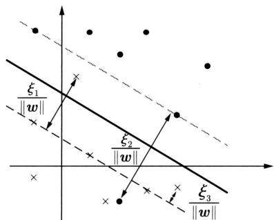  
图9.5 线性支持向量机。支持向量在间隔边界上、间隔边界与分离超平面之间、分离超平面上或者分离超平面误分一侧

支持向量的三种情况从 $\alpha_{i}^{*}$ 的角度能够看的更清楚。若 $\alpha_{i}^{*} < C$ ，则 $\xi_{i} = 0$ ，支持向量 $\pmb{x}_{i}$ 恰好落在间隔边界上；若 $\alpha_{i}^{*} = C$ ， $0 < \xi_{i} < 1$ ，则分类正确， $\pmb{x}_{i}$ 位于间隔边界与分离超平面之间；若 $\alpha_{i}^{*} = C$ ， $\xi_{i} = 1$ ，则支持向量 $\pmb{x}_{i}$ 在分离超平面上；若 $\alpha_{i}^{*} = C$ ， $\xi_{i} > 1$ ，则支持向量 $\pmb{x}_{i}$ 位于分离超平面误分一侧。

# 9.2.4 无约束最优化算法

# 1. 损失函数

对于线性支持向量机学习来说，其模型为分离超平面及对应的模型，其学习策略一般为

软间隔最大化，学习算法可以是凸二次规划。

线性支持向量机学习还有另外一种形式，其学习策略为正则化的合叶损失函数最大化，相当于结构风险最小化，学习算法为无约束最优化。就是最小化以下目标函数：

$$
L (\boldsymbol {w}, b) = \sum_ {i = 1} ^ {N} \max  (0, 1 - y _ {i} (\boldsymbol {w} \cdot \boldsymbol {x} _ {i} + b)) + \frac {\lambda}{2} \| \boldsymbol {w} \| ^ {2} \tag {9.57}
$$

目标函数的第1项的预测损失

$$
\max  (0, 1 - y (\boldsymbol {w} \cdot \boldsymbol {x} + b))
$$

称为合页损失函数（hinge loss function）。也就是说，当样本 $(\pmb{x}_i, y_i)$ 被正确分类且确信度 $y_i(\pmb{w} \cdot \pmb{x}_i + b)$ 大于1时，损失是0，否则损失是 $1 - y_i(\pmb{w} \cdot \pmb{x}_i + b)$ 。注意到在图9.5中的实例 $\pmb{x}_4$ 被正确分类，但损失不是0。目标函数的第2项是系数为 $\lambda$ 的 $\pmb{w}$ 的 $L_2$ 范数，是正则化项。

定理9.4 线性支持向量机原始最优化问题

$$
\min  _ {\boldsymbol {w}, b, \boldsymbol {\xi}} \quad \frac {1}{2} \| \boldsymbol {w} \| ^ {2} + C \sum_ {i = 1} ^ {N} \xi_ {i} \tag {9.58}
$$

$$
\text {s . t .} \quad y _ {i} (\boldsymbol {w} \cdot \boldsymbol {x} _ {i} + b) \geqslant 1 - \xi_ {i}, \quad i = 1, 2, \dots , N \tag {9.59}
$$

$$
\xi_ {i} \geqslant 0, \quad i = 1, 2, \dots , n \tag {9.60}
$$

等价于无约束最优化问题

$$
\min  _ {\boldsymbol {w}, b} \quad \sum_ {i = 1} ^ {N} \max  (0, 1 - y _ {i} (\boldsymbol {w} \cdot \boldsymbol {x} _ {i} + b)) + \frac {\lambda}{2} \| \boldsymbol {w} \| ^ {2} \tag {9.61}
$$

证明 可将最优化问题 (9.61) 写成问题 $(9.58) \sim (9.60)$ 。令

$$
\max  \left(0, 1 - y _ {i} \left(\boldsymbol {w} \cdot \boldsymbol {x} _ {i} + b\right)\right) = \xi_ {i} \tag {9.62}
$$

所以最优化问题 (9.61) 可写成

$$
\min  _ {\boldsymbol {w}, b} \sum_ {i = 1} ^ {N} \xi_ {i} + \frac {\lambda}{2} \| \boldsymbol {w} \| ^ {2}
$$

若取 $\lambda = \frac{1}{C}$ ，则

$$
\min  _ {\boldsymbol {w}, b} \quad \frac {1}{C} \left(\frac {1}{2} \| \boldsymbol {w} \| ^ {2} + C \sum_ {i = 1} ^ {N} \xi_ {i}\right)
$$

与式(9.58）等价。从式(9.62）可知 $\xi_{i}\geqslant 0$ ，故式(9.60)成立。由式(9.62）亦可知，当 $1 - y_{i}(\pmb {w}\bullet \pmb{x}_{i} + b) > 0$ 时，有 $y_{i}(\pmb {w}\bullet \pmb {x}_{i} + b) = 1 - \xi_{i}$ ；当 $1 - y_{i}(\pmb {w}\bullet \pmb {x}_{i} + b)\leqslant 0$ 时，有 $\xi_{i} = 0,y_{i}(\pmb {w}\bullet \pmb {x}_{i} + b)\geqslant 1 - \xi_{i}$ 。故式(9.59)成立。于是 $\pmb {w},b,\xi_i$ 满足约束条件 $(9.59)\sim (9.60)$ 反之，也可将最优化问题 $(9.58)\sim (9.60)$ 表示成问题(9.61)。

合页损失函数的图形如图9.6所示，横轴是分类预测的确信度 $y(\boldsymbol{w} \cdot x + b)$ ，纵轴是损

失。由于函数形状像一个合页，故名合页损失函数。图中还画出 0-1 损失函数，可以认为它是二类分类问题的真正的损失函数，而合页损失函数是 0-1 损失函数的上界。由于 0-1 损失函数不是连续可导的，直接优化由其构成的目标函数比较困难，可以认为线性支持向量机是优化由 0-1 损失函数的上界（合页损失函数）构成的目标函数。这时的上界损失函数又称为代理损失函数（surrogate loss function）。

  
图9.6 合页损失函数

图9.6中虚线显示的是感知机的损失函数 $\max (0, - y_i(\pmb {w}\bullet \pmb {x}_i + b))$ 。这时，当样本 $(\pmb {x}_i,\pmb {y}_i)$ 被正确分类时，损失是0，否则损失是 $-y_{i}(\pmb {w}\bullet \pmb{x}_{i} + b)$ 。相比之下，合页损失函数不仅要分类正确，而且确信度足够高时损失才是0。也就是说，合页损失函数对学习有更高的要求。

# 2. 随机梯度下降法

无约束最优化问题典型的求解算法是随机梯度下降法（见第25章）。损失函数(8.57)是凸函数，而且是连续的，但不是处处可导的函数。具体地，在 $y_{i}(\boldsymbol {w}\cdot \boldsymbol{x}_{i} + b) = 1$ 处不可导。这时要使用次梯度（subgradient）来代替梯度，进行参数更新计算。次梯度函数如下：

$$
\frac {\partial L (\boldsymbol {w} , b)}{\partial \boldsymbol {w}} = \left\{ \begin{array}{l l} - y _ {i} \boldsymbol {x} _ {i} + \lambda \boldsymbol {w}, & y _ {i} (\boldsymbol {w} \cdot \boldsymbol {x} _ {i} + b) <   1 \\ \lambda \boldsymbol {w}, & y _ {i} (\boldsymbol {w} \cdot \boldsymbol {x} _ {i} + b) \geqslant 1 \end{array} \right. \tag {9.63}
$$

$$
\frac {\partial L (\boldsymbol {w} , b)}{\partial b} = \left\{ \begin{array}{l l} - y _ {i}, & y _ {i} (\boldsymbol {w} \cdot \boldsymbol {x} + b) <   1 \\ 0, & y _ {i} (\boldsymbol {w} \cdot \boldsymbol {x} _ {i} + b) \geqslant 1 \end{array} \right. \tag {9.64}
$$

# 算法9.3（线性支持向量机学习——随机梯度下降）

输入：训练数据集 $\mathcal{D}$ 。

输出：线性支持向量机模型 $f(\pmb {x})$ 。

超参数：系数 $\lambda$ ，学习率 $\eta$ ，精度要求 $\epsilon$ 。

（1）选取初值 $\pmb{w}^{(0)}$ 和 $b^{(0)}$   
(2) 从训练集中选取一个样本 $(\pmb{x}_i, y_i) \in \mathcal{D}$ , 每次选取按照固定顺序进行。  
（3）若 $y_{i}(\pmb{w}^{(k)}\bullet \pmb{x}_{i} + b^{(k)}) < 1$ ，则做以下参数更新：

$$
\boldsymbol {w} ^ {(k + 1)} \leftarrow \boldsymbol {w} ^ {(k)} + \eta y _ {i} \boldsymbol {x} _ {i} - \eta \lambda \boldsymbol {w} ^ {(k)}
$$

$$
b ^ {(k + 1)} \leftarrow b ^ {(k)} + \eta y _ {i}
$$

（4）否则，做以下参数更新：

$$
\boldsymbol {w} ^ {(k + 1)} \leftarrow \boldsymbol {w} ^ {(k)} - \eta \lambda \boldsymbol {w} ^ {(k)}
$$

$$
b ^ {(k + 1)} \leftarrow b ^ {(k)}
$$

(5) 置 $k = k + 1$ ，转至步骤（2）；直至参数收敛，即 $\| \pmb{w}^{(k + 1)} - \pmb{w}^{(k)}\| < \epsilon, \| b^{(k + 1)} - b^{(k)}\| < \epsilon$ 。

（6）置 $\hat{\pmb{w}} = \pmb{w}^{(k + 1)}$ ， $\hat{b} = b^{(k + 1)}$ ，构建分类器

$$
F (\boldsymbol {x}) = \operatorname {s i g n} (\hat {\boldsymbol {w}} \cdot \boldsymbol {x} + \hat {b})
$$

线性支持向量机学习的随机梯度下降算法与感知机的学习算法形式上非常相似。感知机算法也是基于随机梯度下降。不同点在于线性支持向量机采用间隔最大化，对线性可分或不可分数据都具有较好的分类预测能力，特别是泛化能力。要理解两者的异同，可以比较算法4.1和算法9.3。

例9.3 针对表9.1的二类分类数据，用算法9.3学习线性支持向量机模型。

表 9.1 二类分类数据集  

<table><tr><td rowspan="2">正例</td><td>x1</td><td>5</td><td>3</td><td>-1</td><td>2</td><td>1</td><td>2</td><td>4</td></tr><tr><td>x2</td><td>9</td><td>12</td><td>12</td><td>10</td><td>12</td><td>-3</td><td>4.5</td></tr><tr><td rowspan="2">负例</td><td>x1</td><td>1</td><td>1.5</td><td>3</td><td>4</td><td>3.5</td><td>-1</td><td>-1</td></tr><tr><td>x2</td><td>1</td><td>-3</td><td>-2</td><td>-5</td><td>8</td><td>4</td><td>-1</td></tr></table>

解 支持向量机表示为

$$
F (\boldsymbol {x}) = \operatorname {s i g n} \left(w _ {1} \cdot x _ {1} + w _ {2} \cdot x _ {2} + b\right)
$$

用算法8.1从数据学习模型参数。设初始值 $w = 0$ ， $b = 0$ ，学习率 $\eta = 0.01$ ，系数 $\lambda = 0.01$ 。1000000次迭代后，学习收敛。图9.7给出学习曲线，横轴表示迭代次数，纵轴表示预测损失。在学习过程中损失不断减小，迭代次数到200左右时开始收敛。得到估计值

  
图9.7 支持向量机的学习曲线

$\hat{w}_1 = 0.37$ ， $\hat{w}_2 = 0.25$ ， $\hat{b} = -1.63$ 。图9.8显示学习得到的支持向量机模型。

  
图9.8 学习得到的支持向量机模型

# 9.3 非线性支持向量机与核函数

对于解线性分类问题，线性分类支持向量机是一种非常有效的方法。但是，有时分类问题是非线性的，这时可以使用非线性支持向量机。本节叙述非线性支持向量机，其主要特点是利用核技巧（kernel trick）。为此，先要介绍核技巧。核技巧不仅应用于支持向量机，而且应用于其他统计学习问题。

# 9.3.1 核技巧

# 1. 非线性分类问题

非线性分类问题是指通过利用非线性模型才能很好地进行分类的问题。先看一个例子：如图9.9(a)所示，是一个分类问题，图中“·”表示正实例，“×”表示负实例。由图9.9(a)可见，无法用直线（线性模型）将正负实例正确分开，但可以用一条椭圆曲线（非线性模型）将它们正确分开。

一般来说，对给定的一个训练数据集 $\mathcal{D} = \{(\pmb{x}_1, y_1), (\pmb{x}_2, y_2), \dots, (\pmb{x}_N, y_N)\}$ ，其中，实例 $\pmb{x}_i$ 属于输入空间， $\pmb{x}_i \in \mathcal{X} \subseteq \mathbb{R}^D$ ，对应的标记有两类 $y_i \in \mathcal{Y} = \{+1, -1\}, i = 1, 2, \dots, N$ 。如果能用 $\mathbb{R}^D$ 中的一个超曲面将正负实例正确分开，则称这个问题为非线性可分问题。

非线性问题往往不好求解，所以希望能用解线性分类问题的方法解决这个问题。所采取的方法是进行一个非线性变换，将非线性问题变换为线性问题，通过解变换后的线性问题的方法求解原来的非线性问题。对图9.9所示的例子，通过变换，将图9.9(a)中椭圆变换成图9.9(b)中的直线，将非线性分类问题变换为线性分类问题。

设原空间为 $\mathcal{X} \subseteq \mathbb{R}^2$ , $\pmb{x} = (x_1, x_2)^{\mathrm{T}} \in \mathcal{X}$ , 新空间为 $\mathcal{Z} \subseteq \mathbb{R}^2$ , $\pmb{z} = (z_1, z_2)^{\mathrm{T}} \in \mathcal{Z}$ , 定义从原空间到新空间的变换（映射）:

$$
\boldsymbol {z} = \phi (\boldsymbol {x}) = \left(\left(x _ {1}\right) ^ {2}, \left(x _ {2}\right) ^ {2}\right) ^ {\mathrm {T}}
$$

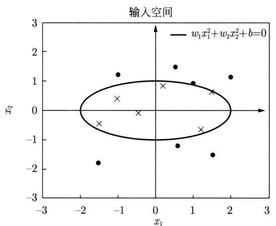  
(a)

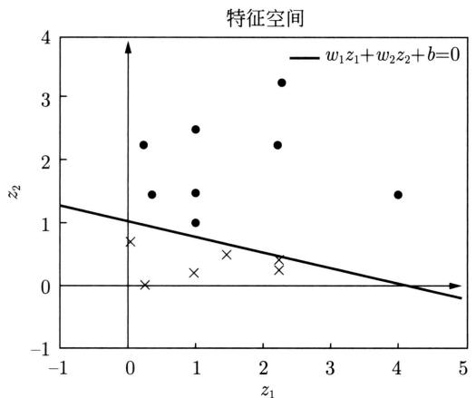  
(b)   
图9.9 非线性分类问题与核技巧示例

经过变换 $z = \phi(\pmb{x})$ ，原空间 $\mathcal{X} \subseteq \mathbb{R}^2$ 变换为新空间 $\mathcal{Z} \subseteq \mathbb{R}^2$ ，原空间中的点相应地变换为新空间中的点，原空间中的椭圆

$$
w _ {1} (x _ {1}) ^ {2} + w _ {2} (x _ {2}) ^ {2} + b = 0
$$

变换为新空间中的直线

$$
w _ {1} z _ {1} + w _ {2} z _ {2} + b = 0
$$

在变换后的新空间里，直线 $w_{1}z_{1} + w_{2}z_{2} + b = 0$ 可以将变换后的正负实例正确分开。这样，原空间的非线性可分问题就变成了新空间的线性可分问题。

上面的例子说明，用线性分类方法求解非线性分类问题分为两步：首先使用一个变换将原空间的数据映射到新空间，然后在新空间里用线性分类学习方法从训练数据中学习分类模型。核技巧就属于这样的方法。

核技巧应用到支持向量机的基本想法就是通过一个非线性变换将输入空间（欧氏空间 $\mathbb{R}^D$ 或离散集合）对应于一个特征空间（希尔伯特空间 $\mathcal{H}$ ），使得在输入空间 $\mathbb{R}^D$ 中的超曲面模型对应于特征空间 $\mathcal{H}$ 中的超平面模型（支持向量机）。这样，分类问题的学习任务通过在

特征空间中求解线性支持向量机就可以完成。

# 2. 核函数的定义

定义9.6（核函数）设 $\mathcal{X}$ 是输入空间（欧氏空间 $\mathbb{R}^D$ 的子集或离散集合），又设 $\mathcal{H}$ 为特征空间（希尔伯特空间），如果存在一个从 $\mathcal{X}$ 到 $\mathcal{H}$ 的映射

$$
\phi (\boldsymbol {x}): \mathcal {X} \rightarrow \mathcal {H} \tag {9.65}
$$

使得对所有 $\pmb {x},\pmb {z}\in \mathcal{X}$ ，函数 $K(\pmb {x},\pmb {z})$ 满足条件

$$
K (\boldsymbol {x}, \boldsymbol {z}) = \phi (\boldsymbol {x}) \cdot \phi (\boldsymbol {z}) \tag {9.66}
$$

则称 $K(\pmb{x},\pmb{z})$ 为核函数（kernel function）， $\phi(\pmb{x})$ 为映射函数，式中 $\phi(\pmb{x}) \cdot \phi(z)$ 为 $\phi(\pmb{x})$ 和 $\phi(\pmb{z})$ 的内积。

核技巧的想法是：在学习与预测中只定义核函数 $K(\pmb{x},\pmb{z})$ ，而不显式地定义映射函数 $\phi$ 。通常，直接计算 $K(\pmb{x},\pmb{z})$ 比较容易，而通过 $\phi (\pmb {x})$ 和 $\phi (z)$ 计算 $K(\pmb {x},\pmb {z})$ 并不容易。注意， $\phi$ 是输入空间 $\mathbb{R}^D$ 到特征空间 $\mathcal{H}$ 的映射，特征空间 $\mathcal{H}$ 一般是高维的，甚至是无穷维的。可以看到，对于给定的核 $K(\pmb {x},\pmb {z})$ ，特征空间 $\mathcal{H}$ 和映射函数 $\phi$ 的取法并不唯一，可以取不同的特征空间，即便是在同一特征空间里也可以取不同的映射。

下面举一个简单的例子来说明核函数和映射函数的关系。

例9.4 假设输入空间是 $\mathbb{R}^2$ ，核函数是 $K(\pmb{x},\pmb{z}) = (\pmb{x}\cdot \pmb{z})^2$ ，试找出其相关的特征空间 $\mathcal{H}$ 和映射 $\phi (\pmb {x})\colon \mathbb{R}^2\to \mathcal{H}$ 。

解 取特征空间 $\mathcal{H} \subseteq \mathbb{R}^3$ ，记 $\pmb{x} = (x_1, x_2)^{\mathrm{T}}$ ， $\pmb{z} = (z_1, z_2)^{\mathrm{T}}$ ，由于

$$
\left(\boldsymbol {x} \cdot \boldsymbol {z}\right) ^ {2} = \left(x _ {1} z _ {1} + x _ {2} z _ {2}\right) ^ {2} = \left(x _ {1} z _ {1}\right) ^ {2} + 2 x _ {1} z _ {1} x _ {2} z _ {2} + \left(x _ {2} z _ {2}\right) ^ {2}
$$

所以可以取映射

$$
\phi (\boldsymbol {x}) = \left(\left(x _ {1}\right) ^ {2}, \sqrt {2} x _ {1} x _ {2}, \left(x _ {2}\right) ^ {2}\right) ^ {\mathrm {T}}
$$

容易验证 $\phi (\pmb {x})\bullet \phi (\pmb {z}) = (\pmb {x}\bullet \pmb {z})^2 = K(\pmb {x},\pmb {z})$

仍取 $\mathcal{H} \subseteq \mathbb{R}^3$ 以及

$$
\phi (\boldsymbol {x}) = \frac {1}{\sqrt {2}} \left(\left(x _ {1}\right) ^ {2} - \left(x _ {2}\right) ^ {2}, 2 x _ {1} x _ {2}, \left(x _ {1}\right) ^ {2} + \left(x _ {2}\right) ^ {2}\right) ^ {\mathrm {T}}
$$

同样有 $\phi (\pmb {x})\bullet \phi (\pmb {z}) = (\pmb {x}\bullet \pmb {z})^2 = K(\pmb {x},\pmb {z})$

还可以取 $\mathcal{H} \subseteq \mathbb{R}^4$ 和

$$
\phi (\boldsymbol {x}) = \left(\left(x _ {1}\right) ^ {2}, x _ {1} x _ {2}, x _ {1} x _ {2}, \left(x _ {2}\right) ^ {2}\right) ^ {\mathrm {T}}
$$

# 3. 核技巧在支持向量机中的应用

我们注意到在线性支持向量机的对偶问题中，无论是目标函数还是模型（分离超平面）都只涉及输入实例与实例之间的内积。对偶问题的目标函数 (9.37) 中的内积 $\pmb{x}_i \cdot \pmb{x}_j$ 可以用核函数 $K(\pmb{x}_i, \pmb{x}_j) = \phi(\pmb{x}_i) \cdot \phi(\pmb{x}_j)$ 来代替，此时对偶问题的目标函数成为

$$
W (\boldsymbol {\alpha}) = \frac {1}{2} \sum_ {i = 1} ^ {N} \sum_ {j = 1} ^ {N} \alpha_ {i} \alpha_ {j} y _ {i} y _ {j} K \left(\boldsymbol {x} _ {i}, \boldsymbol {x} _ {j}\right) - \sum_ {i = 1} ^ {N} \alpha_ {i} \tag {9.67}
$$

同样，模型中的内积也可以用核函数代替，而模型成为

$$
\begin{array}{l} f (\boldsymbol {x}) = \sum_ {i = 1} ^ {N _ {s}} a _ {i} ^ {*} y _ {i} \phi (\boldsymbol {x} _ {i}) \cdot \phi (\boldsymbol {x}) + b ^ {*} \\ = \sum_ {i = 1} ^ {N _ {s}} a _ {i} ^ {*} y _ {i} K (\boldsymbol {x} _ {i}, \boldsymbol {x}) + b ^ {*} \tag {9.68} \\ \end{array}
$$

这等价于经过映射函数 $\phi$ 将原来的输入空间变换到一个新的特征空间，将输入空间中的内积 $\pmb{x}_i\cdot \pmb{x}_j$ 变换为特征空间中的内积 $\phi (\pmb {x}_i)\bullet \phi (\pmb {x}_j)$ ，在新的特征空间里从训练样本中学习线性支持向量机。当映射函数是非线性函数时，学习到的含有核函数的支持向量机是非线性分类模型。

也就是说，在核函数 $K(\pmb{x},\pmb{z})$ 给定的条件下，可以利用解线性分类问题的方法求解非线性分类问题的支持向量机。学习是隐式地在特征空间进行的，不需要显式地定义特征空间和映射函数。这样的技巧称为核技巧，它是巧妙地利用线性分类学习方法与核函数解决非线性问题的技术。在实际应用中，往往依赖领域知识直接选择核函数，核函数选择的有效性需要通过实验验证。

# 9.3.2 正定核

已知映射函数 $\phi$ ，可以通过 $\phi (\pmb {x})$ 和 $\phi (z)$ 的内积求得核函数 $K(\pmb {x},\pmb {z})$ 。不用构造映射 $\phi (x)$ 能否直接判断一个给定的函数 $K(\pmb {x},\pmb {z})$ 是不是核函数？或者说，函数 $K(\pmb {x},\pmb {z})$ 满足什么条件才能成为核函数？

本节叙述正定核的充要条件。通常所说的核函数就是正定核函数（positive definite kernel function）。为证明此定理，先介绍有关的预备知识。

假设 $K(\pmb{x},\pmb{z})$ 是定义在 $\mathcal{X}\times \mathcal{X}$ 上的对称函数，并且对任意的 $\pmb{x}_1,\pmb{x}_2,\dots ,\pmb{x}_m\in \mathcal{X},K(\pmb{x},\pmb{z})$ 关于 $\pmb{x}_1,\pmb{x}_2,\dots ,\pmb{x}_m$ 的Gram矩阵是半正定的。可以依据函数 $K(\pmb{x},\pmb{z})$ ，构成一个希尔伯特空间（Hilbert space），其步骤是：首先定义映射 $\phi$ 并构成向量空间 $\mathcal{S}$ ，然后在 $\mathcal{S}$ 上定义内积构成内积空间，最后将 $\mathcal{S}$ 完备化构成希尔伯特空间。

# 1. 定义映射，构成向量空间 $\mathcal{S}$

先定义映射

$$
\phi : \boldsymbol {x} \rightarrow K (\cdot , \boldsymbol {x}) \tag {9.69}
$$

根据这一映射，对任意 $x_{i}\in \mathcal{X}$ ， $\alpha_{i}\in \mathbb{R}$ ， $i = 1,2,\dots ,m$ ，定义线性组合

$$
f (\bullet) = \sum_ {i = 1} ^ {m} \alpha_ {i} K (\bullet , \boldsymbol {x} _ {i}) \tag {9.70}
$$

考虑由线性组合为元素的集合 $S$ 。由于集合 $S$ 对加法和数乘运算是封闭的，所以 $S$ 构成一个向量空间。

# 2. 在 $S$ 上定义内积，使其成为内积空间

在 $\mathcal{S}$ 上定义一个运算 $*$ ：对任意 $f,g\in S$ ，有

$$
f (\bullet) = \sum_ {i = 1} ^ {m} \alpha_ {i} K (\bullet , \boldsymbol {x} _ {i}) \tag {9.71}
$$

$$
g (\bullet) = \sum_ {j = 1} ^ {n} \beta_ {j} K (\bullet , \mathbf {z} _ {j}) \tag {9.72}
$$

定义运算 $\ast$

$$
f * g = \sum_ {i = 1} ^ {m} \sum_ {j = 1} ^ {n} \alpha_ {i} \beta_ {j} K \left(\boldsymbol {x} _ {i}, \boldsymbol {z} _ {j}\right) \tag {9.73}
$$

证明运算 $\ast$ 是空间 $S$ 的内积。为此要证明：

(1) $(cf)*g = c(f*g),c\in \mathbb{R}$ (9.74)   
(2) $(f + g)*h = f*h + g*h$ ， $h\in S$ (9.75)  
(3) $f*g = g*f$ (9.76)   
(4) $f * f \geqslant 0$ (9.77)

$$
f * f = 0 \Leftrightarrow f = 0 \tag {9.78}
$$

其中，步骤(1)～步骤(3)由式 $(9.70)\sim$ 式(9.72）及 $K(\pmb {x},\pmb {z})$ 的对称性容易得到。现证明步骤(4)之式(9.77)。由式(9.70）及式(9.73）可得：

$$
f * f = \sum_ {i, j = 1} ^ {m} \alpha_ {i} \alpha_ {j} K (\boldsymbol {x} _ {i}, \boldsymbol {x} _ {j})
$$

由Gram矩阵的半正定性知上式右端非负，即 $f*f\geqslant 0$

再证明步骤 (4) 之式 (9.78)。充分性显然。为证必要性，首先证明不等式：

$$
\left| f * g \right| ^ {2} \leqslant (f * f) (g * g) \tag {9.79}
$$

设 $f,g\in \mathcal{S}$ ， $\lambda \in \mathbb{R}$ ，则 $f + \lambda g\in \mathcal{S}$ ，于是，

$$
(f + \lambda g) * (f + \lambda g) \geqslant 0
$$

$$
f * f + 2 \lambda (f * g) + \lambda^ {2} (g * g) \geqslant 0
$$

其左端是 $\lambda$ 的二次三项式，非负，其判别式小于或等于0，即

$$
(f * g) ^ {2} - (f * f) (g * g) \leqslant 0
$$

于是式(9.79)得证。现证明若 $f*f = 0$ ，则 $f = 0$ 。事实上，若

$$
f (\bullet) = \sum_ {i = 1} ^ {m} \alpha_ {i} K (\bullet , \boldsymbol {x} _ {i})
$$

则按运算 $\ast$ 的定义式(9.73)，对任意的 $\pmb {x}\in \mathcal{X}$ ，有

$$
K (\bullet , \boldsymbol {x}) * f = \sum_ {i = 1} ^ {m} \alpha_ {i} K (\boldsymbol {x}, \boldsymbol {x} _ {i}) = f (\boldsymbol {x})
$$

于是，

$$
\left| f (\boldsymbol {x}) \right| ^ {2} = \left| K (\bullet , \boldsymbol {x}) * f \right| ^ {2} \tag {9.80}
$$

由式(9.79)和式(9.77)有

$$
\begin{array}{l} \left| K (\bullet , \boldsymbol {x}) * f \right| ^ {2} \leqslant \left(K (\bullet , \boldsymbol {x}) * K (\bullet , \boldsymbol {x})\right) (f * f) \\ = K (\boldsymbol {x}, \boldsymbol {x}) (f * f) \\ \end{array}
$$

由式 (9.80) 有

$$
\left| f (\boldsymbol {x}) \right| ^ {2} \leqslant K (\boldsymbol {x}, \boldsymbol {x}) (f * f)
$$

此式表明，当 $f * f = 0$ 时，对任意的 $\pmb{x}$ 都有 $|f(\pmb{x})| = 0$ 。

至此，证明了 $*$ 为向量空间 $S$ 的内积，赋予内积的向量空间为内积空间。因此 $S$ 是一个内积空间。既然 $*$ 为 $S$ 的内积运算，那么仍然用 $\cdot$ 表示，即若

$$
f (\bullet) = \sum_ {i = 1} ^ {m} \alpha_ {i} K (\bullet , \boldsymbol {x} _ {i}), \quad g (\bullet) = \sum_ {j = 1} ^ {n} \beta_ {j} K (\bullet , \boldsymbol {z} _ {j})
$$

则

$$
f \cdot g = \sum_ {i = 1} ^ {m} \sum_ {j = 1} ^ {n} \alpha_ {i} \beta_ {j} K \left(\boldsymbol {x} _ {i}, \boldsymbol {z} _ {j}\right) \tag {9.81}
$$

# 3. 将内积空间 $\mathcal{S}$ 完备化为希尔伯特空间

现在将内积空间 $S$ 完备化。由式(9.81)定义的内积可以得到范数

$$
\| f \| = \sqrt {f \cdot f} \tag {9.82}
$$

因此， $\mathcal{S}$ 是一个赋范向量空间。根据泛函分析理论，对于不完备的赋范向量空间 $\mathcal{S}$ ，一定可以使之完备化，得到完备的赋范向量空间 $\mathcal{H}$ 。对于一个内积空间，当作为一个赋范向量空间是完备的时候，就是希尔伯特空间。这样，就得到了希尔伯特空间 $\mathcal{H}$ 。这一希尔伯特空间 $\mathcal{H}$ 称为再生核希尔伯特空间（reproducing kernel Hilbert space, RKHS）。这是由于核 $K$ 具有再生性，即满足

$$
K (\bullet , \boldsymbol {x}) \cdot f = f (\boldsymbol {x}) \tag {9.83}
$$

及

$$
K (\bullet , \boldsymbol {x}) \cdot K (\bullet , \boldsymbol {z}) = K (\boldsymbol {x}, \boldsymbol {z}) \tag {9.84}
$$

称为再生核。

# 4. 正定核的充要条件

定理9.5（正定核的充要条件）设 $K:\mathcal{X}\times \mathcal{X}\to \mathbb{R}$ 是对称函数，则 $K(\pmb {x},\pmb {z})$ 为正定核函数的充要条件是对任意 $\pmb {x}_i\in \mathcal{X}$ ， $i = 1,2,\dots ,m$ ， $K(\pmb {x},\pmb {z})$ 对应的Gram矩阵

$$
\boldsymbol {K} = \left[ K \left(\boldsymbol {x} _ {i}, \boldsymbol {x} _ {j}\right) \right] _ {m \times m} \tag {9.85}
$$

是半正定矩阵。

证明 必要性。由于 $K(\pmb{x},\pmb{z})$ 是 $\mathcal{X}\times \mathcal{X}$ 上的正定核，所以存在从 $\mathcal{X}$ 到希尔伯特空间 $\mathcal{H}$

的映射 $\phi$ ，使得

$$
K (\boldsymbol {x}, \boldsymbol {z}) = \phi (\boldsymbol {x}) \cdot \phi (\boldsymbol {z})
$$

于是，对任意 $x_{1}, x_{2}, \dots, x_{m}$ ，构造 $K(\pmb{x}, \pmb{z})$ 关于 $x_{1}, x_{2}, \dots, x_{m}$ 的Gram矩阵：

$$
[ K _ {i j} ] _ {m \times m} = [ K (\boldsymbol {x} _ {i}, \boldsymbol {x} _ {j}) ] _ {m \times m}
$$

对任意 $c_{1}, c_{2}, \dots, c_{m} \in \mathbb{R}$ , 有

$$
\begin{array}{l} \sum_ {i, j = 1} ^ {m} c _ {i} c _ {j} K (\boldsymbol {x} _ {i}, \boldsymbol {x} _ {j}) = \sum_ {i, j = 1} ^ {m} c _ {i} c _ {j} (\phi (\boldsymbol {x} _ {i}) \bullet \phi (\boldsymbol {x} _ {j})) \\ = \left(\sum_ {i} c _ {i} \phi (\boldsymbol {x} _ {i})\right) \cdot \left(\sum_ {j} c _ {j} \phi (\boldsymbol {x} _ {j})\right) \\ = \left\| \sum_ {i} c _ {i} \phi (\boldsymbol {x} _ {i}) \right\| ^ {2} \geqslant 0 \\ \end{array}
$$

表明 $K(\pmb{x},\pmb{z})$ 关于 $\pmb{x}_1,\pmb{x}_2,\dots ,\pmb{x}_m$ 的Gram矩阵是半正定的。

充分性。对任意 $x_{1}, x_{2}, \dots, x_{m} \in \mathcal{X}$ ，已知对称函数 $K(\pmb{x}, \pmb{z})$ 关于 $x_{1}, x_{2}, \dots, x_{m}$ 的 Gram 矩阵是半正定的。根据前面的结果，对给定的 $K(\pmb{x}, \pmb{z})$ ，可以构造从 $\mathcal{X}$ 到某个希尔伯特空间 $\mathcal{H}$ 的映射：

$$
\phi : x \rightarrow K (\bullet , x) \tag {9.86}
$$

由式 (9.83) 可知:

$$
K (\bullet , x) \bullet f = f (\boldsymbol {x})
$$

并且

$$
K (\bullet , x) \bullet K (\bullet , z) = K (x, z)
$$

由式(9.86)即得：

$$
K (\boldsymbol {x}, \boldsymbol {z}) = \phi (\boldsymbol {x}) \cdot \phi (\boldsymbol {z})
$$

表明 $K(\pmb {x},\pmb {z})$ 是 $\mathcal{X}\times \mathcal{X}$ 上的核函数。

定理给出了正定核的充要条件，因此可以作为正定核，即核函数的另一定义。

定义9.7（正定核的等价定义）设 $\mathcal{X} \subset \mathbb{R}^D$ ， $K(\pmb{x},\pmb{z})$ 是定义在 $\mathcal{X} \times \mathcal{X}$ 上的对称函数，如果对任意 $\pmb{x}_i \in \mathcal{X}$ ， $i = 1,2,\dots,m$ ， $K(\pmb{x},\pmb{z})$ 对应的Gram矩阵

$$
\boldsymbol {K} = \left[ K \left(\boldsymbol {x} _ {i}, \boldsymbol {x} _ {j}\right) \right] _ {m \times m} \tag {9.87}
$$

是半正定矩阵，则称 $K(\pmb {x},\pmb {z})$ 是正定核。

这一定义在构造核函数时很有用。但对于一个具体函数 $K(\pmb{x},\pmb{z})$ 来说，检验它是否为正定核函数并不容易，因为要求对任意有限输入集 $\{\pmb{x}_1,\pmb{x}_2,\dots ,\pmb{x}_m\}$ 验证 $K$ 对应的Gram矩阵是否为半正定的。在实际问题中往往应用已有的核函数。另外，由Mercer定理可以得到Mercer核（Mercer kernel）[1]，正定核比Mercer核更具一般性。下面介绍一些常用的核函数。

# 9.3.3 常用核函数

# 1. 多项式核函数（polynomial kernel function）

$$
K (\boldsymbol {x}, \boldsymbol {z}) = (x \cdot z + 1) ^ {p} \tag {9.88}
$$

对应的支持向量机是一个 $p$ 次多项式分类器。在此情形下，模型成为

$$
f (\boldsymbol {x}) = \sum_ {i = 1} ^ {N _ {s}} a _ {i} ^ {*} y _ {i} \left(\boldsymbol {x} _ {i} \cdot x + 1\right) ^ {p} + b ^ {*} \tag {9.89}
$$

# 2. 高斯核函数（Gaussian kernel function）

$$
K (\boldsymbol {x}, \boldsymbol {z}) = \exp \left(- \frac {\| \boldsymbol {x} - \boldsymbol {z} \| ^ {2}}{2 \sigma^ {2}}\right) \tag {9.90}
$$

对应的支持向量机是高斯径向基函数（radial basis function）分类器。在此情形下，模型成为

$$
f (\boldsymbol {x}) = \sum_ {i = 1} ^ {N _ {s}} a _ {i} ^ {*} y _ {i} \exp \left(- \frac {\| \boldsymbol {x} - \boldsymbol {x} _ {i} \| ^ {2}}{2 \sigma^ {2}}\right) + b ^ {*} \tag {9.91}
$$

# 3. 字符串核函数 (string kernel function)

核函数不仅可以定义在欧氏空间上，还可以定义在离散数据的集合上。比如，字符串核是定义在字符串集合上的核函数。字符串核函数在文本分类、信息检索、生物信息学等方面都有应用。

考虑一个有限字符表 $\Sigma$ 。字符串 $s$ 是从 $\Sigma$ 中取出的有限个字符的序列，包括空字符串。字符串 $s$ 的长度用 $|s|$ 表示，它的元素记作 $s(1)s(2)\dots s(|s|)$ 。两个字符串 $s$ 和 $t$ 的连接记作 $st$ 。所有长度为 $n$ 的字符串的集合记作 $\Sigma^n$ ，所有字符串的集合记作 $\Sigma^* = \bigcup_{n=0}^{\infty}\Sigma^n$ 。

考虑字符串 $s$ 的子串 $u$ 。给定一个指标序列 $i = (i_{1}, i_{2}, \dots, i_{|u|})$ ， $1 \leqslant i_{1} < i_{2} < \dots < i_{|u|} \leqslant |s|$ ， $s$ 的子串定义为 $u = s(i) = s(i_{1})s(i_{2}) \dots s(i_{|u|})$ ，其长度记作 $l(i) = i_{|u|} - i_{1} + 1$ 。如果 $i$ 是连续的，则 $l(i) = |u|$ ；否则， $l(i) > |u|$ 。

假设 $\mathcal{S}$ 是长度大于或等于 $n$ 的字符串的集合， $s$ 是 $\mathcal{S}$ 的元素。现在建立字符串集合 $\mathcal{S}$ 到特征空间 $\mathcal{H}_n = \mathbb{R}^{\Sigma^n}$ 的映射 $\phi_n(s)$ 。 $\mathbb{R}^{\Sigma^n}$ 表示定义在 $\Sigma^n$ 上的实数空间，其每一维对应一个字符串 $u \in \Sigma^n$ ，映射 $\phi_n(s)$ 将字符串 $s$ 对应于空间 $\mathbb{R}^{\Sigma^n}$ 的一个向量，其在 $u$ 维上的取值为

$$
\left[ \phi_ {n} (s) \right] _ {u} = \sum_ {i: s (i) = u} \lambda^ {l (i)} \tag {9.92}
$$

这里， $0 < \lambda \leqslant 1$ 是一个衰减参数， $l(i)$ 表示字符串 $i$ 的长度，求和在 $s$ 中所有与 $u$ 相同的子串上进行。

例如，假设 $\Sigma$ 为英文字符集， $n$ 为3， $\mathcal{S}$ 为长度大于或等于3的字符串的集合。考虑将字符集 $\mathcal{S}$ 映射到特征空间 $H_{3}$ 。 $H_{3}$ 的一维对应于字符串asd。这时，字符串“Nasdaq”与“lass

das”在这一维上的值分别是 $[\phi_3(\mathrm{Nasdaq})]_{\mathrm{asd}} = \lambda^3$ 和 $[\phi_3(\mathrm{lass\square das})]_{\mathrm{asd}} = 2\lambda^5$ （□为空格）。在第1个字符串里，asd是连续的子串。在第2个字符串里，asd是长度为5的不连续子串，共出现两次。

两个字符串 $s$ 和 $t$ 上的字符串核函数是基于映射 $\phi_{n}$ 的特征空间中的内积：

$$
\begin{array}{l} k _ {n} (s, t) = \sum_ {u \in \Sigma^ {n}} [ \phi_ {n} (s) ] _ {u} [ \phi_ {n} (t) ] _ {u} \\ = \sum_ {u \in \Sigma^ {n}} \sum_ {(i, j): s (i) = t (j) = u} \lambda^ {l (i)} \lambda^ {l (j)} \tag {9.93} \\ \end{array}
$$

字符串核函数 $k_{n}(s,t)$ 给出了字符串 $s$ 和 $t$ 中长度等于 $n$ 的所有子串组成的特征向量的余弦相似度（cosine similarity）。直观上，两个字符串相同的子串越多，它们就越相似，字符串核函数的值就越大。字符串核函数可以由动态规划快速地计算。

# 9.3.4 非线性支持向量分类机

如上所述，利用核技巧，可以将线性分类的学习方法应用到非线性分类问题中去。将线性支持向量机扩展到非线性支持向量机（non-linear support vector machine），只需将线性支持向量机对偶形式中的内积换成核函数。

定义9.8（非线性支持向量机）从非线性分类训练集，通过核函数与软间隔最大化或凸二次规划 $(9.95)\sim (9.97)$ 学习得到的模型

$$
f (\boldsymbol {x}) = \sum_ {i = 1} ^ {N} \alpha_ {i} y _ {i} K (\boldsymbol {x}, \boldsymbol {x} _ {i}) + b \tag {9.94}
$$

称为非线性支持向量机， $K(\pmb{x}, \pmb{z})$ 是正定核函数。当 $f(\pmb{x}) \geqslant 0$ 时将 $\pmb{x}$ 分到正类，当 $f(\pmb{x}) < 0$ 时将 $\pmb{x}$ 分到负类。有分类器

$$
F (\boldsymbol {x}) = \operatorname {s i g n} \left(\sum_ {i = 1} ^ {N} \alpha_ {i} y _ {i} K (\boldsymbol {x}, \boldsymbol {x} _ {i}) + b\right)
$$

下面叙述非线性支持向量机学习算法。

# 算法9.4（非线性支持向量机学习）

输入：训练数据集 $\mathcal{D}$ ，核函数 $K(\pmb {x},\pmb {z})$ 。

输出：非线性支持向量机模型 $F(\pmb {x})$

超参数：系数 $C$ 。

（1）构造并求解凸二次规划问题

$$
\min  _ {\boldsymbol {\alpha}} \quad \frac {1}{2} \sum_ {i = 1} ^ {N} \sum_ {j = 1} ^ {N} \alpha_ {i} \alpha_ {j} y _ {i} y _ {j} K \left(\boldsymbol {x} _ {i}, \boldsymbol {x} _ {j}\right) - \sum_ {i = 1} ^ {N} \alpha_ {i} \tag {9.95}
$$

$$
\text {s . t .} \quad \sum_ {i = 1} ^ {N} \alpha_ {i} y _ {i} = 0 \tag {9.96}
$$

$$
0 \leqslant \alpha_ {i} \leqslant C, \quad i = 1, 2, \dots , N \tag {9.97}
$$

求得最优解 $\pmb{\alpha}^{*} = (\alpha_{1}^{*},\alpha_{2}^{*},\dots ,\alpha_{N}^{*})^{\mathrm{T}}$

（2）选择 $\alpha^{*}$ 的一个正分量 $0 < \alpha_{j}^{*} < C$ ，计算

$$
b ^ {*} = y _ {j} - \sum_ {i = 1} ^ {N} \alpha_ {i} ^ {*} y _ {i} K (\boldsymbol {x} _ {i}, \boldsymbol {x} _ {j})
$$

（3）构建分类器

$$
F (\boldsymbol {x}) = \operatorname {s i g n} \left(\sum_ {i = 1} ^ {N} \alpha_ {i} ^ {*} y _ {i} K (\boldsymbol {x}, \boldsymbol {x} _ {i}) + b ^ {*}\right)
$$

当 $K(\pmb {x},\pmb {z})$ 是正定核函数时，问题 $(9.95)\sim (9.97)$ 是凸二次规划问题，解是存在的。

# 本章概要

1. 支持向量机最简单的情况是线性可分支持向量机或硬间隔支持向量机，构建它的条件是训练数据线性可分。其学习策略是几何间隔最大，可以表示为凸二次规划问题，其原始最优化问题为

$$
\begin{array}{l} \min  _ {\boldsymbol {w}, b} \frac {1}{2} \| \boldsymbol {w} \| ^ {2} \\ \text {s . t .} \quad y _ {i} (\boldsymbol {w} \cdot \boldsymbol {x} _ {i} + b) - 1 \geqslant 0, \quad i = 1, 2, \dots , n \\ \end{array}
$$

求得最优化问题的解为 $\pmb{w}^{*}$ ， $b^{*}$ ，得到线性可分支持向量机，分离超平面是

$$
\boldsymbol {w} ^ {*} \cdot \boldsymbol {x} + b ^ {*} = 0
$$

模型是

$$
f (\boldsymbol {x}) = \boldsymbol {w} ^ {*} \cdot \boldsymbol {x} + b ^ {*}
$$

线性可分支持向量机的最优解存在且唯一。位于间隔边界上的实例为支持向量。最优分离超平面由支持向量完全决定。

二次规划问题的对偶问题是

$$
\begin{array}{l} \min  \frac {1}{2} \sum_ {i = 1} ^ {N} \sum_ {j = 1} ^ {N} \alpha_ {i} \alpha_ {j} y _ {i} y _ {j} \left(\boldsymbol {x} _ {i} \cdot \boldsymbol {x} _ {j}\right) - \sum_ {i = 1} ^ {N} \alpha_ {i} \\ \text {s . t .} \quad \sum_ {i = 1} ^ {N} \alpha_ {i} y _ {i} = 0 \\ \alpha_ {i} \geqslant 0, \quad i = 1, 2, \dots , N \\ \end{array}
$$

通常，通过求解对偶问题学习线性可分支持向量机，即首先求解对偶问题的最优值 $\alpha^{*}$ 然后求最优值 $\boldsymbol{w}^{*}$ 和 $b^{*}$ ，得出分离超平面和模型。

2. 现实中训练数据是线性可分的情形较少，训练数据往往是近似线性可分的，这时使用线性支持向量机或软间隔支持向量机。线性支持向量机是最基本的支持向量机。

对于噪声或例外，通过引入松弛变量 $\xi_{i}$ ，使其“可分”，得到线性支持向量机学习的凸二次规划问题，其原始最优化问题是

$$
\begin{array}{l} \min  _ {\boldsymbol {w}, b, \boldsymbol {\xi}} \quad \frac {1}{2} \| \boldsymbol {w} \| ^ {2} + C \sum_ {i = 1} ^ {N} \xi_ {i} \\ \text {s . t .} \quad y _ {i} (\boldsymbol {w} \cdot \boldsymbol {x} _ {i} + b) \geqslant 1 - \xi_ {i}, \quad i = 1, 2, \dots , n \\ \begin{array}{l} \xi_ {i} \geqslant 0, \quad i = 1, 2, \dots , N \end{array} \\ \end{array}
$$

求解原始最优化问题的解 $\boldsymbol{w}^{*}, b^{*}$ ，得到线性支持向量机，其分离超平面为

$$
\boldsymbol {w} ^ {*} \cdot \boldsymbol {x} + b ^ {*} = 0
$$

模型为

$$
f (\boldsymbol {x}) = \boldsymbol {w} ^ {*} \cdot \boldsymbol {x} + b ^ {*}
$$

线性支持向量机的解 $\pmb{w}^{*}$ 唯一但 $b^{*}$ 不一定唯一。

对偶问题是

$$
\begin{array}{l} \min  _ {\boldsymbol {\alpha}} \quad \frac {1}{2} \sum_ {i = 1} ^ {N} \sum_ {j = 1} ^ {N} \alpha_ {i} \alpha_ {j} y _ {i} y _ {j} \left(\boldsymbol {x} _ {i} \cdot \boldsymbol {x} _ {j}\right) - \sum_ {i = 1} ^ {N} \alpha_ {i} \\ \text {s . t .} \quad \sum_ {i = 1} ^ {N} \alpha_ {i} y _ {i} = 0 \\ 0 \leqslant \alpha_ {i} \leqslant C, \quad i = 1, 2, \dots , N \\ \end{array}
$$

线性支持向量机的对偶学习算法首先求解对偶问题得到最优解 $\alpha^{*}$ ，然后求原始问题最优解 $\boldsymbol{w}^{*}$ 和 $b^{*}$ ，得出分离超平面和模型。

对偶问题的解 $\alpha^{*}$ 中满足 $\alpha_{i}^{*} > 0$ 的实例 $\pmb{x}_{i}$ 就是支持向量。支持向量可在间隔边界上，也可在间隔边界与分离超平面之间，或者在分离超平面误分一侧。最优分离超平面由支持向量完全决定。

线性支持向量机学习等价于最小化正则化的合页损失函数

$$
\sum_ {i = 1} ^ {N} \max  (0, 1 - y _ {i} (\boldsymbol {w} \cdot \boldsymbol {x} _ {i} + b)) + \frac {\lambda}{2} \| \boldsymbol {w} \| ^ {2}
$$

因此，线性支持向量机学习也可以用随机梯度下降法直接优化这个损失函数，其中使用次梯度，方法简单且有效。

# 3. 非线性支持向量机

对于输入空间中的非线性分类问题，可以通过非线性变换将它转化为某个高维特征空间中的线性分类问题，在高维特征空间中学习线性支持向量机。由于在线性支持向量机学习的对偶问题里，目标函数和模型都只涉及实例与实例之间的内积，所以不需要显式地指定非线性变换，而是用核函数来替换当中的内积。核函数表示通过一个非线性转换后的两个实例间

的内积。具体地， $K(\pmb{x}, \pmb{z})$ 是一个核函数或正定核，意味着存在一个从输入空间 $\mathcal{X}$ 到特征空间 $\mathcal{H}$ 的映射 $\phi(\pmb{x}): \mathcal{X} \to \mathcal{H}$ ，对任意 $\pmb{x}, \pmb{z} \in \mathcal{X}$ ，有

$$
K (\boldsymbol {x}, \boldsymbol {z}) = \phi (\boldsymbol {x}) \cdot \phi (\boldsymbol {z})
$$

对称函数 $K(\pmb{x},\pmb{z})$ 为正定核的充要条件如下：对任意 $\pmb{x}_i\in \mathcal{X}$ ， $i = 1,2,\dots ,m$ （ $m$ 为任意正整数)，对称函数 $K(\pmb {x},\pmb {z})$ 对应的Gram矩阵是半正定的。

所以，在线性支持向量机学习的对偶问题中，用核函数 $K(\pmb{x},\pmb{z})$ 替代内积，求解得到的就是非线性支持向量机：

$$
f (\boldsymbol {x}) = \sum_ {i = 1} ^ {N} \alpha_ {i} ^ {*} y _ {i} K (\boldsymbol {x}, \boldsymbol {x} _ {i}) + b ^ {*}
$$

# 继续阅读

Boser、Guyon与Vapnik提出支持向量机的基本概念[1]。Cortes与Vapnik给出了支持向量机的完整形式[2]。Drucker等将其扩展到支持向量回归[3]。Vapnik在他的统计学习理论[4]一书中对支持向量机的泛化能力进行了论述。

Platt 提出了支持向量机的快速学习算法 $\mathrm{SMO}^{[5]}$ ，Joachims 实现的 SVM Light，以及 Chang 与 Lin 实现的 LIBSVM 软件包被广泛使用①。

原始的支持向量机是二类分类模型，又被推广到多类分类支持向量机[6-7]，以及用于结构预测的结构支持向量机[8]。

关于支持向量机的文献很多。支持向量机的介绍可参见文献[9]、文献[10]～文献[12]。核方法被认为是比支持向量机更具一般性的机器学习方法，核方法的介绍可参见文献[13]～文献[15]。

# 习题

9.1 证明3维空间中点 $(x_0,y_0,z_0)$ 与平面 $ax + by + cz + d = 0$ 的带符号的距离是

$$
t = \frac {a x _ {0} + b y _ {0} + c z _ {0} + d}{\sqrt {a ^ {2} + b ^ {2} + c ^ {2}}}
$$

9.2 证明高维空间中点 $x_0$ 与平面 $\boldsymbol{w} \cdot \boldsymbol{x} + b = 0$ 的带符号的距离是

$$
t = \frac {\boldsymbol {w} \cdot \boldsymbol {x} _ {0} + b}{\| \boldsymbol {w} \|}
$$

9.3 比较感知机的对偶形式与线性可分支持向量机的对偶形式。

9.4 已知正例 $\boldsymbol{x}_1 = (1,2)^{\mathrm{T}}$ ， $\boldsymbol{x}_2 = (2,3)^{\mathrm{T}}$ ， $\boldsymbol{x}_3 = (3,3)^{\mathrm{T}}$ ，负例 $\boldsymbol{x}_4 = (2,1)^{\mathrm{T}}$ ， $\boldsymbol{x}_5 = (3,2)^{\mathrm{T}}$ ，试求间隔最大分离超平面和模型，并在图上画出分离超平面、间隔边界及支持向量。

9.5 线性支持向量机还可以定义为以下形式：

$$
\min  _ {\boldsymbol {w}, b, \xi} \quad \frac {1}{2} \| w \| ^ {2} + C \sum_ {i = 1} ^ {N} \xi_ {i} ^ {2}
$$

$$
\text {s . t .} \quad y _ {i} (\boldsymbol {w} \cdot \boldsymbol {x} _ {i} + b) \geqslant 1 - \xi_ {i}, \quad i = 1, 2, \dots , N
$$

$$
\xi_ {i} \geqslant 0, \quad i = 1, 2, \dots , n
$$

试求其对偶形式。

9.6 线性支持向量机的合页损失函数

$$
\max  (0, 1 - y (\boldsymbol {w} \cdot \boldsymbol {x} + b))
$$

可以用逻辑斯谛损失函数近似

$$
- \log_ {2} \left\{\frac {1}{1 + \exp [ - y (\boldsymbol {w} \cdot \boldsymbol {x} + b) ]} \right\}
$$

写出这时对应算法9.3的模型学习的随机梯度下降算法。

9.7 证明内积的正整数幂函数

$$
K (\boldsymbol {x}, \boldsymbol {z}) = (x \cdot z) ^ {p}
$$

是正定核函数，这里 $p$ 是正整数， $\pmb {x},\pmb {z}\in \mathbb{R}^{D}$

# 参考文献

[1] Boser B E, GUYON I M, VAPNIK V N. A training algorithm for optimal margin classifiers[C]//Proceedings of the 5th Annual ACM Workshop on COLT. Pittsburgh, PA, 1992: 144-152.   
[2] CORTES C, VAPNIK V. Support-vector networks[J]. Machine Learning, 1995, 20(3): 273-299.   
[3] DRUCKER H, BURGES C J C, KAUFMAN L, et al. Support vector regression machines[C]// Advances in Neural Information Processing Systems 9. MIT Press, 1996: 155-161.   
[4] VAPNIK V N. The nature of statistical learning theory[M]. 张学工, 译. Berlin: Springer, 1995.   
[5] PLATT J C. Fast training of support vector machines using sequential minimal optimization[Z/OL]. http://research.microsoft.com/apps/pubs/?id=68391.   
[6] WESTON J A E, WATKINS C. Support vector machines for multi-class pattern recognition[C]//Proceedings of the 7th European Symposium on Artificial Neural Networks. 1999.   
[7] CRAMMER K, SINGER Y. On the algorithmic implementation of multiclass kernel-based machines[J]. Journal of Machine Learning Research, 2001, 2: 265-292.   
[8] TSOCHANTARIDIS I, JOACHIMS T, HOFMANN T, et al. Large margin methods for structured and interdependent output variables[J]. JMLR, 2005, 6: 1453-1484.   
[9] 邓乃扬，田英杰. 数据挖掘中的新方法——支持向量机 [M]. 北京：科学出版社，2004.  
[10] BURGES J C. A tutorial on support vector machines for pattern recognition[J]. Data mining and knowledge discovery, 1998, 2: 121-169.

[11] CRISTIANINI N, SHAWE-TAYLOR J. An introduction to support vector machines and other kernel-based learning methods[M]. 李国正，王猛，曾华军，译. Cambridge University Press, 2000.   
[12] 邓乃扬，田英杰. 支持向量机——理论、算法与拓展 [M]. 北京：科学出版社，2009.  
[13] SCHOLKPF B, SMOLA A J. Learning with kernels: support vector machines, regularization, optimization, and beyond[M]. MIT Press, 2002.   
[14] HERBRICH R. Learning kernel classifiers: theory and algorithms[M]. MIT Press, 2002.   
[15] HOFMANN T, SCHOLKOPF B, SMOLA A J. Kernel methods in machine learning[J]. The Annals of Statistics, 2008, 36(3): 1171-1220.

# 第10章 提升方法

提升（Boosting）是一种常用的机器学习方法，属于集成学习（ensemble learning），包括AdaBoost算法、梯度提升（gradient Boosting）算法。提升的基本想法是依次学习一组基本学习器或弱学习器，每一步针对前一步为止预测不准确的数据重点学习一个基本学习器，最后将所有的基本学习器线性组合起来作为最终模型或强学习器。提升方法的模型是非概率模型，而且是判别模型。

AdaBoost 用于二类分类，是最有代表性的提升算法。AdaBoost 在分类问题中，通过改变训练数据的权重依次学习一组基本学习器，并将这些基本学习器进行线性组合，提高分类的性能。AdaBoost 也可以认为是模型是加法模型、损失函数是指数损失、算法是前向分步算法组合而成的分类学习方法。

梯度提升特别是梯度提升决策树（gradient boosted decision tree, GBDT），也采用加法模型和前向分步算法，用于分类和回归等多项任务，是传统机器学习中性能最好的方法之一。梯度提升在回归、分类等问题中，通过拟合损失函数对前一步模型的负梯度（回归时等价于残差）学习一系列的回归树，并将这些回归树作为基本学习器进行线性组合，作为最终模型。

AdaBoost算法是在1995年由Freund和Schapire提出的，梯度提升方法是在1999年由Friedman提出的。

本章10.1节介绍提升算法AdaBoost，包括AdaBoost的基本想法、算法、理论证明和理论解释。10.2节介绍梯度提升，特别是GBDT，包括梯度提升的基本想法、回归和一般的GBDT算法。

# 10.1 AdaBoost算法

本节讲解 AdaBoost 算法（AdaBoost algorithm），包括 AdaBoost 的基本想法、算法、理论证明和理论解释。

# 10.1.1 基本想法

Freund与Schapire曾尝试解决这样一个问题。在机器学习中，如果已经发现了“弱学习器”（weak learner），那么能否将它提升（boost）为“强学习器”（strong learner）。找到弱学习器通常比找到强学习器要容易得多。那么如何具体实现提升，便成为开发提升方法时所要解决的问题。

对于分类问题而言，给定一个训练数据集，求比较简单的分类规则（弱学习器）比求精确的分类规则（强学习器）容易很多。在二类分类中弱学习器是指比随机预测略好的分类器。提升就是每一步学习一个弱学习器，得到一系列弱学习器或基本学习器（base learner），然后组合这些弱学习器，构成一个强学习器，也就是性能很高的分类器。通常是每一步对于目前为止的模型预测不准确的样本有针对性地学习一个弱学习器，于是，分类问题被一系列的弱学习器分而治之。

这样，对提升来说，有两个问题需要回答：一是在每一步如何选取预测不准确需要重点训练的样本；二是如何将弱学习器组合成一个强学习器。关于第一个问题，AdaBoost的做法是提高那些被前一步弱学习器错误分类样本的权重，而降低那些被正确分类样本的权重。这样一来，那些没有得到正确分类的样本，由于其权重的加大而受到后一步的弱学习器的更大关注。至于第二个问题，AdaBoost采取加权多数表决的方法。具体地，加大分类误差率小的弱学习器的权重，使其在表决中起较大的作用；减小分类误差率大的弱学习器的权重，使其在表决中起较小的作用。

AdaBoost的巧妙之处就在于它将这些想法自然且有效地实现在一个算法里。下面叙述AdaBoost算法，给出一个具体例子，并讲解AdaBoost的理论特性，以及前向分步算法的解释。

# 10.1.2 算法

现在叙述AdaBoost算法。考虑二类分类问题。假设给定一个二类分类的训练数据集

$$
\mathcal {D} = \left\{\left(\boldsymbol {x} _ {1}, y _ {1}\right), \left(\boldsymbol {x} _ {2}, y _ {2}\right), \dots , \left(\boldsymbol {x} _ {N}, y _ {N}\right) \right\}
$$

其中，每个样本由实例与类别组成。实例 $x_{i} \in \mathcal{X} \subseteq \mathbb{R}^{D}$ ，类别 $y_{i} \in \mathcal{Y} = \{+1, -1\}$ ， $\mathcal{X}$ 是实例的输入空间或特征空间， $\mathcal{Y}$ 是实例的类别集合。AdaBoost 利用以下算法，从训练数据中学习一系列弱学习器或基本学习器，并将这些弱学习器线性组合成为一个强学习器。

# 算法10.1（AdaBoost）

输入：训练数据集 $\mathcal{D}$ ，基本学习器学习算法。

输出：分类器 $F(\pmb {x})$

（1）初始化训练数据的权重分布

$$
\boldsymbol {w} _ {1} = \left(w _ {1, 1}, \dots , w _ {1, i}, \dots , w _ {1, N}\right) ^ {\mathrm {T}}, \quad w _ {1, i} = \frac {1}{N}, \quad i = 1, 2, \dots , N
$$

（2）对 $m = 1,2,\dots ,M$

（a）从具有权重分布 $\pmb{w}_{m}$ 的训练数据集学习，得到基本学习器：

$$
G _ {m} (\boldsymbol {x}): \mathcal {X} \rightarrow \{+ 1, - 1 \}
$$

（b）计算 $G_{m}(\pmb {x})$ 在训练数据集上的分类误差率：

$$
\epsilon_ {m} = \sum_ {i = 1} ^ {N} P \left(G _ {m} \left(\boldsymbol {x} _ {i}\right) \neq y _ {i}\right) = \sum_ {i = 1} ^ {N} w _ {m, i} I \left(G _ {m} \left(\boldsymbol {x} _ {i}\right) \neq y _ {i}\right) \tag {10.1}
$$

(c) 计算 $G_{m}(\pmb{x})$ 的系数：

$$
\alpha_ {m} = \frac {1}{2} \log \frac {1 - \epsilon_ {m}}{\epsilon_ {m}} \tag {10.2}
$$

这里的对数是自然对数。

（d）更新训练数据集的权重分布：

$$
\boldsymbol {w} _ {m + 1} = \left(w _ {m + 1, 1}, \dots , w _ {m + 1, i}, \dots , w _ {m + 1, N}\right) ^ {\mathrm {T}} \tag {10.3}
$$

$$
w _ {m + 1, i} = \frac {w _ {m , i}}{z _ {m}} \exp \left(- \alpha_ {m} y _ {i} G _ {m} \left(\boldsymbol {x} _ {i}\right)\right), \quad i = 1, 2, \dots , N \tag {10.4}
$$

这里， $z_{m}$ 是归一化因子

$$
z _ {m} = \sum_ {i = 1} ^ {N} w _ {m, i} \exp \left(- \alpha_ {m} y _ {i} G _ {m} (\boldsymbol {x} _ {i})\right) \tag {10.5}
$$

它使 $\pmb{w}_{m + 1}$ 成为一个概率分布。

（3）构建基本学习器的线性组合

$$
f (\boldsymbol {x}) = \sum_ {m = 1} ^ {M} \alpha_ {m} G _ {m} (\boldsymbol {x}) \tag {10.6}
$$

得到最终模型或分类器：

$$
F (\boldsymbol {x}) = \operatorname {s i g n} (f (\boldsymbol {x})) = \operatorname {s i g n} \left(\sum_ {m = 1} ^ {M} \alpha_ {m} G _ {m} (\boldsymbol {x})\right) \tag {10.7}
$$

对AdaBoost算法作如下说明：

(1) 步骤 (1) 假设训练数据集具有均匀的权重分布, 即每个训练样本在基本学习器的学习中作用相同, 这一假设保证第 1 步能够在原始数据上学习基本学习器 $G_{1}(\boldsymbol{x})$ 。  
（2）步骤（2）中AdaBoost反复学习基本学习器，在每一步 $m = 1,2,\dots ,M$ 顺次地执行下列操作：  
(a) 从当前分布 $\pmb{w}_{m}$ 加权的训练数据集学习基本学习器 $G_{m}(\pmb{x})$ 。  
（b）计算基本学习器 $G_{m}(\pmb {x})$ 在加权训练数据集上的分类误差率：

$$
\epsilon_ {m} = \sum_ {i = 1} ^ {N} P \left(G _ {m} \left(\boldsymbol {x} _ {i}\right) \neq y _ {i}\right) = \sum_ {G _ {m} \left(\boldsymbol {x} _ {i}\right) \neq y _ {i}} w _ {m, i} \tag {10.8}
$$

这里， $w_{m,i}$ 表示第 $m$ 步中第 $i$ 个样本的权重， $\sum_{i=1}^{N} w_{m,i} = 1$ 。这表明， $G_m(\pmb{x})$ 在加权训练数据集上的分类误差率是被 $G_m(\pmb{x})$ 误分类样本的权重之和，由此可以看出权重分布 $\pmb{w}_m$ 与基本学习器 $G_m(\pmb{x})$ 的分类误差率的关系。

（c）计算基本学习器 $G_{m}(\pmb{x})$ 的系数 $\alpha_{m}$ 。 $\alpha_{m}$ 表示 $G_{m}(\pmb{x})$ 在最终模型中的重要性。由式(10.2)可知，当 $\epsilon_{m} \leqslant \frac{1}{2}$ 时， $\alpha_{m} \geqslant 0$ ，并且 $\alpha_{m}$ 随着 $\epsilon_{m}$ 的减小而增大，所以分类误差率越小的基本学习器在最终模型中的作用越大。

(d) 更新训练数据的权重分布为下一步做准备。式 (10.4) 可以写成

$$
w _ {m + 1, i} = \left\{ \begin{array}{l l} \frac {w _ {m , i}}{z _ {m}} \exp (- \alpha_ {m}), & G _ {m} (\boldsymbol {x} _ {i}) = y _ {i} \\ \frac {w _ {m , i}}{z _ {m}} \exp (\alpha_ {m}), & G _ {m} (\boldsymbol {x} _ {i}) \neq y _ {i} \end{array} \right.
$$

由此可知，被基本学习器 $G_{m}(\pmb{x})$ 误分类样本的权重得以增大，而被正确分类样本的权重得以减小。两相比较，由式(10.2)知误分类样本的权重被增大 $\exp (2\alpha_{m}) = \frac{1 - \epsilon_{m}}{\epsilon_{m}}$ 倍。因此，误分类样本在下一步学习中起更大的作用。不改变已给的训练数据，而不断改变训练数据的权重分布，使得训练数据在基本学习器的学习中起不同的作用，这是AdaBoost的一个特点。

(3) 步骤 (3) 中线性组合 $f(\pmb{x})$ 实现 $M$ 个基本学习器的加权表决。系数 $\alpha_{m}$ 表示了基本学习器 $G_{m}(\pmb{x})$ 的重要性，这里，所有 $\alpha_{m}$ 之和并不为 1。 $f(\pmb{x})$ 的符号决定实例 $\pmb{x}$ 的类别， $f(\pmb{x})$ 的绝对值表示分类的确信度。利用基本学习器的线性组合构建最终模型是 AdaBoost 的另一特点。  
（4）AdaBoost算法通过不断增加弱学习器的数量来提高整体的分类性能。然而，如果迭代次数过多，可能会导致模型过度适应训练数据，出现过拟合现象。因此，合理地控制迭代次数可以在一定程度上防止过拟合。通常使用早停法，在验证集上监测模型的性能，当性能不再提升或者开始下降时，停止迭代。

# 10.1.3 AdaBoost 的例子

例10.1 给定如表10.1所示训练数据。假设基本学习器或基本分类器由 $x \leqslant s$ 或 $x > s$ 产生，其阈值 $s$ 使该基本学习器在训练数据集上分类误差率最低。试用AdaBoost算法学习一个强学习器或强分类器。

表 10.1 训练数据表  

<table><tr><td>序号</td><td>1</td><td>2</td><td>3</td><td>4</td><td>5</td><td>6</td><td>7</td><td>8</td><td>9</td><td>10</td></tr><tr><td>x</td><td>0</td><td>1</td><td>2</td><td>3</td><td>4</td><td>5</td><td>6</td><td>7</td><td>8</td><td>9</td></tr><tr><td>y</td><td>1</td><td>1</td><td>1</td><td>-1</td><td>-1</td><td>-1</td><td>1</td><td>1</td><td>1</td><td>-1</td></tr></table>

解 初始化数据权重分布：

$$
\boldsymbol {w} _ {1} = \left(w _ {1, 1}, w _ {1, 2}, \dots , w _ {1, 1 0}\right) ^ {\mathrm {T}}
$$

$$
w _ {1, i} = 0. 1, \quad i = 1, 2, \dots , 1 0
$$

对 $m = 1$

(a) 在权重分布为 $w_{1}$ 的训练数据上，阈值 $s$ 是 2.5 时分类误差率最低，故基本学习器为

$$
G _ {1} (\boldsymbol {x}) = \left\{ \begin{array}{l l} 1, & x \leqslant 2. 5 \\ - 1, & x > 2. 5 \end{array} \right.
$$

(b) $G_{1}(\pmb {x})$ 在训练数据集上的误差率 $\epsilon_{1} = P(G_{1}(\pmb {x}_{i})\neq y_{i}) = 0.3.$

（c）计算 $G_{1}(\pmb {x})$ 的系数： $\alpha_{1} = \frac{1}{2}\log \frac{1 - \epsilon_{1}}{\epsilon_{1}} = 0.4236.$   
(d) 更新训练数据的权重分布：

$$
\begin{array}{l} \boldsymbol {w} _ {2} = \left(w _ {2, 1}, \dots , w _ {2, i}, \dots , w _ {2, 1 0}\right) ^ {\mathrm {T}} \\ w _ {2, i} = \frac {w _ {1 , i}}{z _ {1}} \exp (- \alpha_ {1} y _ {i} G _ {1} (\boldsymbol {x} _ {i})), \quad i = 1, 2, \dots , 1 0 \\ \boldsymbol {w} _ {2} = (0. 0 7 1 4 3, 0. 0 7 1 4 3, 0. 0 7 1 4 3, 0. 0 7 1 4 3, 0. 0 7 1 4 3, \\ 0. 1 6 6 6 7, 0. 1 6 6 6 7, 0. 1 6 6 6 7, 0. 0 7 1 4 3) ^ {\mathrm {T}} \\ f _ {1} (\boldsymbol {x}) = 0. 4 2 3 6 G _ {1} (\boldsymbol {x}) \\ \end{array}
$$

分类器 $\operatorname{sign}(f_1(\pmb{x}))$ 在训练数据集上有3个误分类点。

对 $m = 2$

(a) 在权重分布为 $w_{2}$ 的训练数据上，阈值 $s$ 是 8.5 时分类误差率最低，基本学习器为

$$
G _ {2} (\boldsymbol {x}) = \left\{ \begin{array}{l l} 1, & x \leqslant 8. 5 \\ - 1, & x > 8. 5 \end{array} \right.
$$

(b) $G_{2}(\pmb{x})$ 在训练数据集上的误差率 $\epsilon_{2} = 0.2143$   
（c）计算 $\alpha_{2} = 0.6496$   
（d）更新训练数据权重分布：

$$
\begin{array}{l} \boldsymbol {w} _ {3} = (0. 0 4 5 5, 0. 0 4 5 5, 0. 0 4 5 5, 0. 1 6 6 7, 0. 1 6 6 7, 0. 1 6 6 7, \\ 0. 1 0 6 0, 0. 1 0 6 0, 0. 1 0 6 0, 0. 0 4 5 5) ^ {\mathrm {T}} \\ \end{array}
$$

$$
f _ {2} (\boldsymbol {x}) = 0. 4 2 3 6 G _ {1} (\boldsymbol {x}) + 0. 6 4 9 6 G _ {2} (\boldsymbol {x})
$$

分类器 $\operatorname{sign}(f_2(\pmb{x}))$ 在训练数据集上有3个误分类点。

对 $m = 3$

(a) 在权重分布为 $w_{3}$ 的训练数据上，阈值 $s$ 是 5.5 时分类误差率最低，基本学习器为

$$
G _ {3} (\boldsymbol {x}) = \left\{ \begin{array}{l l} 1, & x > 5. 5 \\ - 1, & x \leqslant 5. 5 \end{array} \right.
$$

(b) $G_{3}(\pmb{x})$ 在训练数据集上的误差率 $\epsilon_{3} = 0.1820$   
（c）计算 $\alpha_{3} = 0.7514$   
(d) 更新训练数据的权重分布：

$$
\boldsymbol {w} _ {4} = (0. 1 2 5, 0. 1 2 5, 0. 1 2 5, 0. 1 0 2, 0. 1 0 2, 0. 1 0 2, 0. 0 6 5, 0. 0 6 5, 0. 0 6 5, 0. 1 2 5) ^ {\mathrm {T}}
$$

于是得到：

$$
f _ {3} (\boldsymbol {x}) = 0. 4 2 3 6 G _ {1} (\boldsymbol {x}) + 0. 6 4 9 6 G _ {2} (\boldsymbol {x}) + 0. 7 5 1 4 G _ {3} (\boldsymbol {x})
$$

分类器 $\mathrm{sign}(f_3(\pmb{x}))$ 在训练数据集上的误分类点个数为0。

于是最终模型为

$$
F (\boldsymbol {x}) = \operatorname {s i g n} \left(f _ {3} (\boldsymbol {x})\right) = \operatorname {s i g n} \left(0. 4 2 3 6 G _ {1} (\boldsymbol {x}) + 0. 6 4 9 6 G _ {2} (\boldsymbol {x}) + 0. 7 5 1 4 G _ {3} (\boldsymbol {x})\right)
$$

# 10.1.4 训练误差分析

AdaBoost 最基本的性质是它能在学习过程中不断减少训练误差，即在训练数据集上的分类误差率。关于这个问题有下面的定理。

定理10.1（AdaBoost的训练误差界） AdaBoost算法最终模型的训练误差界为

$$
\frac {1}{N} \sum_ {i = 1} ^ {N} I (F (\boldsymbol {x} _ {i}) \neq y _ {i}) \leqslant \frac {1}{N} \sum_ {i = 1} ^ {N} \exp (- y _ {i} f (\boldsymbol {x} _ {i})) = \prod_ {m = 1} ^ {M} z _ {m} \tag {10.9}
$$

这里， $F(\pmb {x})$ 、 $f(x)$ 和 $z_{m}$ 分别由式(10.7)、式(10.6)和式(10.5)给出。

证明 当 $F(\pmb{x}_i) \neq y_i$ 时， $y_i f(\pmb{x}_i) < 0$ ，因而 $\exp(-y_i f(\pmb{x}_i)) \geqslant 1$ 。由此直接推导出前半部分。

后半部分的推导要用到 $z_{m}$ 的定义式(10.5）及式(10.4）的变形：

$$
w _ {m, i} \exp (- \alpha_ {m} y _ {i} G _ {m} (\boldsymbol {x} _ {i})) = z _ {m} w _ {m + 1, i}
$$

现推导如下：

中

$$
\begin{array}{l} \frac {1}{N} \sum_ {i = 1} ^ {N} \exp (- y _ {i} f (\boldsymbol {x} _ {i})) = \frac {1}{N} \sum_ {i = 1} ^ {N} \exp \left(- \sum_ {m = 1} ^ {M} \alpha_ {m} y _ {i} G _ {m} (\boldsymbol {x} _ {i})\right) \\ = \sum_ {i = 1} ^ {N} w _ {1, i} \prod_ {m = 1} ^ {M} \exp \left(- \alpha_ {m} y _ {i} G _ {m} \left(\boldsymbol {x} _ {i}\right)\right) \\ = z _ {1} \sum_ {i = 1} ^ {N} w _ {2, i} \prod_ {m = 2} ^ {M} \exp \left(- \alpha_ {m} y _ {i} G _ {m} (\boldsymbol {x} _ {i})\right) \\ = z _ {1} z _ {2} \sum_ {i = 1} ^ {N} w _ {3, i} \prod_ {m = 3} ^ {M} \exp \left(- \alpha_ {m} y _ {i} G _ {m} \left(\boldsymbol {x} _ {i}\right)\right) \\ = z _ {1} z _ {2} \dots z _ {M - 1} \sum_ {i = 1} ^ {N} w _ {M, i} \exp \left(- \alpha_ {m} y _ {i} G _ {m} (\boldsymbol {x} _ {i})\right) \\ = \prod_ {m = 1} ^ {M} z _ {m} \\ \end{array}
$$

这一定理说明，可以在每一步选取适当的 $G_{m}$ 使得 $z_{m}$ 最小，从而使训练误差下降最快。对二类分类问题，有如下结果。

定理10.2（二分类AdaBoost的训练误差界）

$$
\begin{array}{l} \prod_ {m = 1} ^ {M} z _ {m} = \prod_ {m = 1} ^ {M} 2 \sqrt {\epsilon_ {m} (1 - \epsilon_ {m})} \\ = \prod_ {m = 1} ^ {M} \sqrt {1 - 4 \rho_ {m} ^ {2}} \\ \leqslant \exp \left(- 2 \sum_ {m = 1} ^ {M} \rho_ {m} ^ {2}\right) \tag {10.10} \\ \end{array}
$$

这里， $\rho_{m} = \frac{1}{2} -\epsilon_{m}$

证明 由 $z_{m}$ 的定义式(10.5)及式(10.8)得：

$$
\begin{array}{l} z _ {m} = \sum_ {i = 1} ^ {N} w _ {m, i} \exp \left(- \alpha_ {m} y _ {i} G _ {m} \left(\boldsymbol {x} _ {i}\right)\right) \\ = \sum_ {y _ {i} = G _ {m} (\boldsymbol {x} _ {i})} w _ {m, i} \exp (- \alpha_ {m}) + \sum_ {y _ {i} \neq G _ {m} (\boldsymbol {x} _ {i})} w _ {m, i} \exp (\alpha_ {m}) \\ = (1 - \epsilon_ {m}) \exp (- \alpha_ {m}) + \epsilon_ {m} \exp (\alpha_ {m}) \\ = 2 \sqrt {\epsilon_ {m} (1 - \epsilon_ {m})} \\ = \sqrt {1 - 4 \rho_ {m} ^ {2}} \\ \end{array}
$$

至于不等式

$$
\prod_ {m = 1} ^ {M} \sqrt {1 - 4 \rho_ {m} ^ {2}} \leqslant \exp \left(- 2 \sum_ {m = 1} ^ {M} \rho_ {m} ^ {2}\right)
$$

则可由 $\exp (x)$ 和 $\sqrt{1 - x}$ 在点 $x = 0$ 的泰勒展开式推出不等式 $\sqrt{1 - 4\rho_m^2} \leqslant \exp (-2\rho_m^2)$ 得到。

推论10.1 如果存在 $\rho > 0$ ，对所有 $m$ 有 $\rho_{m} \geqslant \rho$ ，则

$$
\frac {1}{N} \sum_ {i = 1} ^ {N} I \left(F \left(\boldsymbol {x} _ {i}\right) \neq y _ {i}\right) \leqslant \exp \left(- 2 M \rho^ {2}\right) \tag {10.11}
$$

这表明在此条件下 AdaBoost 的训练误差是随着基本学习器的个数 $M$ 的增加以指数速率下降的。这一性质当然是很有魅力的。注意，AdaBoost 算法不需要知道下界 $\rho$ ，这正是 Freund 与 Schapire 设计 AdaBoost 时所考虑的。与一些早期的提升不同，AdaBoost 具有适应性，即它能适应基本学习器各自的训练误差率。这也是它的名称（适应的提升）的由来，Ada 是 Adaptive 的简写。

AdaBoost算法通常通过选择最优的迭代步数或者基本学习器的个数 $M$ ，来提高学习的泛化能力，防止过拟合。基本学习器一般使用决策树桩（decision stump），即由一个根结点直接连接两个叶结点的简单决策树，如例10.1中的简单分类规则 $x \leqslant s$ 或 $x > s$ 。

# 10.1.5 前向分步算法解释

AdaBoost算法还有另一个解释，即可以认为AdaBoost算法是模型为加法模型、损失函数为指数损失函数（exponential loss function）、学习算法为前向分步算法的二类分类学习方法。

# 1. 前向分步算法

考虑加法模型（additive model）

$$
f (\boldsymbol {x}) = \sum_ {m = 1} ^ {M} \beta_ {m} h (\boldsymbol {x}; \boldsymbol {\theta} _ {m}) \tag {10.12}
$$

其中， $h(\pmb{x}; \pmb{\theta}_m)$ 为基函数（base function）， $\pmb{\theta}_m$ 为基函数的参数， $\beta_m$ 为基函数的系数。模型参数包括从 $m = 1$ 到 $m = M$ 所有基函数的参数 $\pmb{\theta}_m$ 和基函数的系数 $\beta_m$ 。显然，AdaBoost的模型 (10.6) 是一个加法模型。

在给定训练数据及损失函数 $L(y, f(\pmb{x}))$ 的条件下，学习加法模型 $f(\pmb{x})$ 成为经验风险最小化即损失函数最小化问题：

$$
\min  _ {\boldsymbol {\beta} _ {m}, \boldsymbol {\theta} _ {m}} \sum_ {i = 1} ^ {N} L \left(y _ {i}, \sum_ {m = 1} ^ {M} \beta_ {m} h \left(\boldsymbol {x} _ {i}; \boldsymbol {\theta} _ {m}\right)\right) \tag {10.13}
$$

通常这是一个复杂的优化问题。前向分步算法（forward stagewise algorithm）求解这一优化问题的想法是：因为学习的是加法模型，如果能够从前向后，每一步只学习一个基函数及其系数，逐步逼近优化目标函数(10.13)，那么就可以简化优化的复杂度。具体地，每步只需优化如下损失函数：

$$
\min  _ {\beta , \boldsymbol {\theta}} \sum_ {i = 1} ^ {N} L \left(y _ {i}, f _ {m - 1} \left(\boldsymbol {x} _ {i}\right) + \beta h \left(\boldsymbol {x} _ {i}; \boldsymbol {\theta}\right)\right) \tag {10.14}
$$

给定训练数据集 $\mathcal{D} = \{(\pmb{x}_1, y_1), (\pmb{x}_2, y_2), \dots, (\pmb{x}_N, y_N)\}$ ， $\pmb{x}_i \in \mathcal{X} \subseteq \mathbb{R}^D$ ， $y_i \in \mathcal{Y} = \{+1, -1\}$ ，学习加法模型 $f(\pmb{x})$ 的前向分步算法如下。

# 算法10.2（前向分步算法）

输入：训练数据集 $\mathcal{D}$ ，基函数学习算法。

输出：加法模型 $f(\pmb {x})$ 。

（1）初始化 $f_0(\pmb {x}) = 0$   
（2）对 $m = 1,2,\dots ,M$   
(a) 最小化损失函数

$$
\left(\beta_ {m}, \boldsymbol {\theta} _ {m}\right) = \arg \min  _ {\boldsymbol {\beta}, \boldsymbol {\theta}} \sum_ {i = 1} ^ {N} L \left(y _ {i}, f _ {m - 1} (\boldsymbol {x} _ {i}) + \beta h (\boldsymbol {x} _ {i}; \boldsymbol {\theta})\right)
$$

得到基函数参数 $\theta_{m}$ 和基函数系数 $\beta_{m}$ 。

（b）更新模型

$$
f _ {m} (\boldsymbol {x}) = f _ {m - 1} (\boldsymbol {x}) + \beta_ {m} h (\boldsymbol {x}; \boldsymbol {\theta} _ {m})
$$

（3）得到加法模型

$$
f (\boldsymbol {x}) = \sum_ {m = 1} ^ {M} \beta_ {m} h (\boldsymbol {x}; \boldsymbol {\theta} _ {m})
$$

这样，前向分步算法将同时求解从 $m = 1$ 到 $m = M$ 所有参数 $\beta_{m}$ 和 $\theta_{m}$ 的优化问题简化为逐次求解各个参数 $\beta_{m}$ 和 $\theta_{m}$ 的优化问题。

# 2. 前向分步算法与AdaBoost

由前向分步算法可以推导出AdaBoost，用定理叙述这一关系。

定理10.3 AdaBoost算法是前向分步加法算法的特例。这时，模型是由基本学习器组成的加法模型，损失函数是指数损失函数。

证明 前向分步算法学习的是加法模型，当基函数为基本学习器时，该加法模型等价于AdaBoost的最终模型：

$$
f (\boldsymbol {x}) = \sum_ {m = 1} ^ {M} \alpha_ {m} G _ {m} (\boldsymbol {x}) \tag {10.15}
$$

由基本学习器 $G_{m}(\pmb{x})$ 及其系数 $\alpha_{m}$ 组成， $m = 1,2,\dots,M$ 。前向分步算法逐一学习基函数，这一过程与 AdaBoost 算法逐一学习基本学习器的过程一致。下面证明前向分步算法的损失函数是指数损失函数

$$
L (y, f (\boldsymbol {x})) = \exp (- y f (\boldsymbol {x}))
$$

时，其学习的计算等价于AdaBoost的计算。

假设经过 $m - 1$ 步迭代前向分步算法已经得到 $f_{m - 1}(\pmb {x})$

$$
\begin{array}{l} f _ {m - 1} (\boldsymbol {x}) = f _ {m - 2} (\boldsymbol {x}) + \alpha_ {m - 1} G _ {m - 1} (\boldsymbol {x}) \\ = \alpha_ {1} G _ {1} (\boldsymbol {x}) + \dots + \alpha_ {m - 1} G _ {m - 1} (\boldsymbol {x}) \\ \end{array}
$$

在第 $m$ 步迭代得到 $\alpha_{m}$ 、 $G_{m}(\pmb {x})$ 和 $f_{m}(\pmb {x})$ 。

$$
f _ {m} (\boldsymbol {x}) = f _ {m - 1} (\boldsymbol {x}) + \alpha_ {m} G _ {m} (\boldsymbol {x})
$$

目标是使得到的 $\alpha_{m}$ 和 $G_{m}(\pmb {x})$ 让 $f_{m}(\pmb {x})$ 在训练数据集 $\mathcal{D}$ 上的指数损失最小，即

$$
\left(\alpha_ {m}, G _ {m} (\boldsymbol {x})\right) = \arg \min  _ {\alpha , G} \sum_ {i = 1} ^ {N} \exp \left[ - y _ {i} \left(f _ {m - 1} \left(\boldsymbol {x} _ {i}\right) + \alpha G \left(\boldsymbol {x} _ {i}\right)\right) \right] \tag {10.16}
$$

式 (10.16) 可以表示为

$$
\left(\alpha_ {m}, G _ {m} (\boldsymbol {x})\right) = \arg \min  _ {\alpha , G} \sum_ {i = 1} ^ {N} \bar {w} _ {m, i} \exp \left(- y _ {i} \alpha G \left(\boldsymbol {x} _ {i}\right)\right) \tag {10.17}
$$

其中， $\bar{w}_{m,i} = \exp(-y_i f_{m-1}(\pmb{x}_i))$ 。因为 $\bar{w}_{m,i}$ 既不依赖 $\alpha$ 也不依赖 $G$ ，所以与最小化无关。但 $\bar{w}_{m,i}$ 依赖于 $f_{m-1}(\pmb{x})$ 。

现证明使式(10.17)达到最小的 $\alpha_{m}^{*}$ 和 $G_{m}^{*}(\pmb {x})$ 就是AdaBoost算法所得到的 $\alpha_{m}$ 和 $G_{m}(\pmb {x})$ 。求解式(10.17)可分两步：

首先，求 $G_{m}^{*}(\pmb {x})$ 。对任意 $\alpha >0$ ，使式(10.17)最小的 $G(\pmb {x})$ 由下式得到：

$$
G _ {m} ^ {*} (\boldsymbol {x}) = \arg \min  _ {G} \sum_ {i = 1} ^ {N} \bar {w} _ {m, i} I (y _ {i} \neq G (\boldsymbol {x} _ {i}))
$$

其中， $\bar{w}_{m,i} = \exp (-y_if_{m - 1}(\pmb {x}_i))$

此基函数 $G_{m}^{*}(\pmb{x})$ 即为AdaBoost算法的基本学习器 $G_{m}(\pmb{x})$ ，因为它是使第 $m$ 步加权训练数据分类误差率最小的基本学习器。

然后，求 $\alpha_{m}^{*}$ 。将已求得的 $G_{m}^{*}(\pmb {x})$ 作为 $G_{m}(\pmb {x})$ 代入式(10.17)，参照式(10.4)得到：

$$
\begin{array}{l} \sum_ {i = 1} ^ {N} \bar {w} _ {m, i} \exp (- y _ {i} \alpha G _ {m} (\boldsymbol {x} _ {i})) = \sum_ {y _ {i} = G _ {m} (\boldsymbol {x} _ {i})} \bar {w} _ {m, i} \exp (- \alpha) + \sum_ {y _ {i} \neq G _ {m} (\boldsymbol {x} _ {i})} \bar {w} _ {m, i} \exp (\alpha) \\ = \left[ \exp (\alpha) - \exp (- \alpha) \right] \sum_ {i = 1} ^ {N} \bar {w} _ {m, i} I \left(y _ {i} \neq G _ {m} \left(\boldsymbol {x} _ {i}\right)\right) + \exp (- \alpha) \sum_ {i = 1} ^ {N} \bar {w} _ {m, i} \\ \end{array}
$$

对 $\alpha$ 求导并使导数为0，即得到使式(10.17)最小的 $\alpha$

$$
\alpha_ {m} ^ {*} = \frac {1}{2} \log \frac {1 - \epsilon_ {m}}{\epsilon_ {m}} \tag {10.18}
$$

其中， $\epsilon_{m}$ 是分类误差率：

$$
\begin{array}{l} \epsilon_ {m} = \frac {\sum_ {i = 1} ^ {N} \bar {w} _ {m , i} I (y _ {i} \neq G _ {m} (\boldsymbol {x} _ {i}))}{\sum_ {i = 1} ^ {N} \bar {w} _ {m , i}} \\ = \sum_ {i = 1} ^ {N} w _ {m, i} I \left(y _ {i} \neq G _ {m} \left(\boldsymbol {x} _ {i}\right)\right) \tag {10.19} \\ \end{array}
$$

这里的 $\alpha_{m}^{*}$ 与AdaBoost算法（算法10.1）步骤(2)中(c)的 $\alpha_{m}$ 完全一致。

最后来看每一步样本权重的更新。由

$$
f _ {m} (\boldsymbol {x}) = f _ {m - 1} (\boldsymbol {x}) + \alpha_ {m} G _ {m} (\boldsymbol {x})
$$

以及 $\bar{w}_{m,i} = \exp (-y_if_{m - 1}(\pmb {x}_i))$ ，可得：

$$
\bar {w} _ {m + 1, i} = \bar {w} _ {m, i} \exp \left(- y _ {i} \alpha_ {m} G _ {m} (\boldsymbol {x})\right) \tag {10.20}
$$

这与 AdaBoost 算法（算法 10.1）步骤 (2) 中 (d) 的样本权重的更新只相差归一化因子，因而等价。

从前向分步算法的角度来看，AdaBoost的学习过程是逐步最小化训练数据的指数损失，最终学习得到一个作为加法模型的强学习器。图10.1显示指数损失函数与合页损失函数、逻辑斯谛损失函数的关系。它们都是0-1损失函数的上界，是学习中优化的代理损失函数。

  
图10.1 损失函数的比较。指数损失函数： $\exp (-y f(x))$ ，合页损失函数： $\max (0,1 - y f(x))$ ，逻辑斯谛损失函数： $\log_2[1 + \exp (-y f(x))]$

# 10.2 梯度提升

本节讲解梯度提升，特别是GBDP算法。首先介绍梯度提升的基本想法；然后叙述GBDT用于回归问题的算法，帮助直观理解；最后叙述GBDT用于一般预测问题的算法。

# 10.2.1 基本想法

Friedman 提出的梯度提升（gradient boosting）可以用于分类、回归等多种任务。它采用加法模型，即基函数的线性组合。通常以回归树为基函数，并使用 CART 算法来学习回归树。在这种情况下，梯度提升方法称作梯度提升决策树（gradient boosted decision tree, GBDT），简称为提升树。本章讨论的梯度提升方法主要是 GBDT。加法模型表示为

$$
f (\boldsymbol {x}) = \sum_ {m = 1} ^ {M} \gamma_ {m} h _ {m} (\boldsymbol {x}) \tag {10.21}
$$

其中， $h_m(\pmb{x})$ 是第 $m$ 个基函数， $\gamma_m$ 是系数， $M$ 是基函数的个数。模型 $f(\pmb{x})$ 和基函数 $h_m(\pmb{x})$ 都是实数函数。

梯度提升采用前向分步算法学习加法模型。给定训练数据集

$$
\mathcal {D} = \left\{\left(\boldsymbol {x} _ {1}, y _ {1}\right), \left(\boldsymbol {x} _ {2}, y _ {2}\right), \dots , \left(\boldsymbol {x} _ {N}, y _ {N}\right) \right\}
$$

根据经验风险最小化原则，每一步学习一个基函数，将学到的基函数线性累加。首先，确定初始基函数 $f_{0}(\pmb{x}) = 0$ 。然后，在第 $m$ 步学习一个新的基函数，得到该步的模型

$$
f _ {m} (\boldsymbol {x}) = f _ {m - 1} (\boldsymbol {x}) + \gamma_ {m} h _ {m} (\boldsymbol {x}) \tag {10.22}
$$

其中， $f_{m - 1}(\pmb {x})$ 为第 $m - 1$ 步的模型， $h_m(\pmb {x})$ 是第 $m$ 步学到的基函数， $\gamma_{m}$ 是基函数的系数。原理上可以通过最小化以下损失函数学习第 $m$ 步的基函数。

$$
h _ {m} (\boldsymbol {x}) = \arg \min  _ {h} \sum_ {i = 1} ^ {N} L \left(y _ {i}, f _ {m - 1} \left(\boldsymbol {x} _ {i}\right) + \gamma_ {m} h \left(\boldsymbol {x} _ {i}\right)\right)
$$

这里 $L(y, f(\pmb{x}))$ 是损失函数。这个优化问题一般是难以求解的问题。梯度提升并不直接求解这个优化问题。

梯度提升的核心想法是，在每一步，用训练数据拟合损失函数对前一步的模型的负梯度，将其表示为回归树，当作当前一步的新的基函数。

首先，考虑函数空间（functional space）中的梯度下降。模型是函数空间中的点，损失函数 $L(y, f_{m-1}(\pmb{x}))$ 是目标函数。通过计算损失函数 $L(y, f_{m-1}(\pmb{x}))$ 对模型 $f_{m-1}(\pmb{x})$ 的梯度，可以从模型 $f_{m-1}(\pmb{x})$ 移动到模型 $f_{m}(\pmb{x})$ ，这个过程中损失函数 $L(y, f_{m}(\pmb{x}))$ 会减小。

$$
f _ {m} (\boldsymbol {x}) = f _ {m - 1} (\boldsymbol {x}) - \eta_ {m} \frac {\partial L (y , f _ {m - 1} (\boldsymbol {x}))}{\partial f _ {m - 1} (\boldsymbol {x})} \tag {10.23}
$$

其中， $\eta_{m} > 0$ 表示步长。比较式(10.22)和式(10.23)可以得到结论，作为启发式方法，可以

把负梯度函数 $-\frac{\partial L(y, f_{m-1}(\boldsymbol{x}))}{\partial f_{m-1}(\boldsymbol{x})}$ 当作基函数 $h_m(\boldsymbol{x})$ ，把步长 $\eta_m$ 当作系数 $\gamma_m$ 。这样， $f_m(\boldsymbol{x})$ 比 $f_{m-1}(\boldsymbol{x})$ 有更小的损失函数值，从而更优。

接着，计算训练数据集中各个样本的 $L(y, f_{m-1}(\pmb{x}))$ 对 $f_{m-1}(\pmb{x})$ 的负梯度

$$
r _ {i} ^ {(m)} = - \left[ \frac {\partial L \left(y _ {i} , f _ {m - 1} \left(\boldsymbol {x} _ {i}\right)\right)}{\partial f _ {m - 1} \left(\boldsymbol {x} _ {i}\right)} \right], \quad i = 1, 2, \dots , N \tag {10.24}
$$

构造一个新的数据集

$$
\left\{\left(\boldsymbol {x} _ {1}, r _ {1} ^ {(m)}\right), \left(\boldsymbol {x} _ {2}, r _ {2} ^ {(m)}\right), \dots , \left(\boldsymbol {x} _ {N}, r _ {N} ^ {(m)}\right) \right\}
$$

使用 CART 算法从这个数据集学习一个回归树，以拟合负梯度函数，将回归树作为基函数 $h_m(\boldsymbol{x})$ 。认为系数 $\gamma_m$ 和步长 $\eta_m$ 等价，指定其取值或者通过优化的方式决定其取值，由此得到模型 $f_m(\boldsymbol{x})$ 。这样，前向分步算法可以一步步学到更优的模型。

下面先讲述回归问题时的GBDT算法，然后讲述一般情况下的GBDT方法，包括二类和多类分类。

# 10.2.2 GBDT 用于回归

GBDT用于回归问题时方法更加直接和易懂。给定一个训练数据集 $\mathcal{D} = \{(x_1, y_1), (x_2, y_2), \dots, (x_N, y_N)\}$ ， $\pmb{x}_i \in \mathcal{X} \subseteq \mathbb{R}^D$ ， $\mathcal{X}$ 为输入空间或特征空间， $y_i \in \mathcal{Y} \subseteq \mathbb{R}$ ， $\mathcal{Y}$ 为输出空间。

GBDP使用以下前向分步算法学习作为加法模型的提升树模型。

$$
f _ {0} (\boldsymbol {x}) = 0
$$

$$
f _ {m} (\boldsymbol {x}) = f _ {m - 1} (\boldsymbol {x}) + h (\boldsymbol {x}; \boldsymbol {\theta} _ {m}), \quad m = 1, 2, \dots , M
$$

$$
f (\boldsymbol {x}) = \sum_ {m = 1} ^ {M} h (\boldsymbol {x}; \boldsymbol {\theta} _ {m})
$$

这里 $h(\pmb{x};\pmb{\theta}_m)$ 表示第 $m$ 步学习的回归树， $\pmb{\theta}_m$ 是回归树的参数。为了简单，这里假设 $\gamma_{m} = 1$ 。针对每个样本 $(x_{i},y_{i}),i = 1,2,\dots ,N$ ，计算损失函数 $L(y,f_{m - 1}(\pmb {x}))$ 对前一步的模型 $f_{m - 1}(\pmb {x})$ 的负梯度。假设损失函数是平方损失。

$$
L \left(y _ {i}, f _ {m - 1} \left(\boldsymbol {x} _ {i}\right)\right) = \frac {1}{2} \left(y _ {i} - f _ {m - 1} \left(\boldsymbol {x} _ {i}\right)\right) ^ {2}
$$

得到：

$$
r _ {i} ^ {(m)} = y _ {i} - f _ {m - 1} \left(\boldsymbol {x} _ {i}\right) \tag {10.25}
$$

这里， $r_i^{(m)}$ 实际是针对训练样本 $(\pmb{x}_i, y_i)$ 的模型预测值 $f_{m-1}(\pmb{x}_i)$ 与真实值 $y_i$ 之间的残差（residual）。

构建新的训练数据集 $\{(\pmb{x}_1, r_1^{(m)}), (\pmb{x}_2, r_2^{(m)}), \dots, (\pmb{x}_N, r_N^{(m)})\}$ ，其中每一个样本由实例特征 $\pmb{x}_i$ 与残差 $r_i^{(m)}$ 组成。使用 CART 算法学习回归树 $h(\pmb{x}; \hat{\theta}_m)$ ，从而得到第 $m$ 步的模型：

$$
f _ {m} (\boldsymbol {x}) = f _ {m - 1} (\boldsymbol {x}) + h (\boldsymbol {x}; \hat {\boldsymbol {\theta}} _ {m}) \tag {10.26}
$$

回归树拟合的是使损失函数减少的负梯度，也是训练数据的残差，而这个回归树正好可以作为一个新的基函数加进加法模型。这样，提升树模型整体能对损失函数有更好的拟合。

在第7章中已经讲解了回归树学习。回归树表示将输入空间 $\mathcal{X}$ 划分为 $J$ 个互不相交的区域 $R_{1}, R_{2}, \dots, R_{J}$ ，并且在每个区域上输出一个常量 $c_{j}$ 。

$$
h (\boldsymbol {x}; \boldsymbol {\theta}) = \sum_ {j = 1} ^ {J} c _ {j} I (x \in R _ {j}) \tag {10.27}
$$

其中，参数 $\pmb{\theta} = \{(R_1, c_1), (R_2, c_2), \dots, (R_J, c_J)\}$ 表示回归树的区域和区域上的常量， $J$ 是回归树的叶结点个数，也就是树的大小。

现将GBDT用于回归问题的算法叙述如下。

# 算法10.3（GBDT算法——回归）

输入：训练数据集 $\mathcal{D}$ ，CART算法。

输出：提升树模型 $f(\pmb {x})$ 。

（1）初始化 $f_{0}(\pmb {x}) = 0$   
（2）对 $m = 1,2,\dots ,M$   
(a) 对每一个训练样本计算残差：

$$
r _ {i} ^ {(m)} = y _ {i} - f _ {m - 1} \left(\boldsymbol {x} _ {i}\right), \quad i = 1, 2, \dots , N
$$

（b）用CART算法从残差数据学习一个回归树，得到第 $m$ 棵树 $h(\pmb{x};\hat{\pmb{\theta}}_m) = \sum_{j=1}^{J}\hat{c}_{mj}I(\pmb{x} \in R_{mj})$ 。  
（c）更新模型 $f_{m}(\pmb {x}) = f_{m - 1}(\pmb {x}) + h(\pmb {x};\hat{\pmb{\theta}}_{m})$   
（3）得到提升树模型：

$$
f (\boldsymbol {x}) = \sum_ {m = 1} ^ {M} h (\boldsymbol {x}; \hat {\boldsymbol {\theta}} _ {m})
$$

例10.2 已知如表10.2所示的训练数据， $x$ 的取值范围为区间 $[0.5, 10.5]$ ， $y$ 的取值范围为区间 $[5.0, 10.0]$ ，学习这个回归问题的提升树模型，考虑只用树桩作为基函数。

表 10.2 训练数据表  

<table><tr><td>x</td><td>1</td><td>2</td><td>3</td><td>4</td><td>5</td><td>6</td><td>7</td><td>8</td><td>9</td><td>10</td></tr><tr><td>y</td><td>5.56</td><td>5.70</td><td>5.91</td><td>6.40</td><td>6.80</td><td>7.05</td><td>8.90</td><td>8.70</td><td>9.00</td><td>9.05</td></tr></table>

解 按照算法10.3，第1步求 $f_{1}(x)$ ，即回归树 $h_1(x)$ 。

首先通过以下优化问题

$$
\min  _ {s} \left[ \min  _ {c _ {1}} \sum_ {x _ {i} \in R _ {1}} \left(y _ {i} - c _ {1}\right) ^ {2} + \min  _ {c _ {2}} \sum_ {x _ {i} \in R _ {2}} \left(y _ {i} - c _ {2}\right) ^ {2} \right]
$$

求解训练数据的切分点 $s$

$$
R _ {1} = \{x \mid x \leqslant s \}, \quad R _ {2} = \{x \mid x > s \}
$$

容易求得在 $R_{1}, R_{2}$ 内部使平方损失误差达到最小值的 $c_{1}, c_{2}$ 为

$$
c _ {1} = \frac {1}{N _ {1}} \sum_ {x _ {i} \in R _ {1}} y _ {i}, \quad c _ {2} = \frac {1}{N _ {2}} \sum_ {x _ {i} \in R _ {2}} y _ {i}
$$

这里 $N_{1}$ ， $N_{2}$ 分别是 $R_{1}$ ， $R_{2}$ 的样本数。

求训练数据的切分点。根据所给数据，考虑如下切分点：

$$
1. 5, 2. 5, 3. 5, 4. 5, 5. 5, 6. 5, 7. 5, 8. 5, 9. 5
$$

对各切分点，不难求出相应的 $R_{1}$ ， $R_{2}$ ， $c_{1}$ ， $c_{2}$ 及

$$
m (s) = \min  _ {c _ {1}} \sum_ {x _ {i} \in R _ {1}} \left(y _ {i} - c _ {1}\right) ^ {2} + \min  _ {c _ {2}} \sum_ {x _ {i} \in R _ {2}} \left(y _ {i} - c _ {2}\right) ^ {2}
$$

例如，当 $s = 1.5$ 时， $R_{1} = \{1\}$ ， $R_{2} = \{2,3,\dots ,10\}$ ， $c_{1} = 5.56$ ， $c_{2} = 7.50$

$$
m (s) = \min  _ {c _ {1}} \sum_ {x _ {i} \in R _ {1}} \left(y _ {i} - c _ {1}\right) ^ {2} + \min  _ {c _ {2}} \sum_ {x _ {i} \in R _ {2}} \left(y _ {i} - c _ {2}\right) ^ {2} = 0 + 1 5. 7 2 = 1 5. 7 2
$$

现将 $s$ 及 $m(s)$ 的计算结果列于表10.3。

表 10.3 计算数据表  

<table><tr><td>s</td><td>1.5</td><td>2.5</td><td>3.5</td><td>4.5</td><td>5.5</td><td>6.5</td><td>7.5</td><td>8.5</td><td>9.5</td></tr><tr><td>m(s)</td><td>15.72</td><td>12.07</td><td>8.36</td><td>5.78</td><td>3.91</td><td>1.93</td><td>8.01</td><td>11.73</td><td>15.74</td></tr></table>

由表10.3可知，当 $s = 6.5$ 时， $m(s)$ 达到最小值，此时 $R_{1} = \{1,2,\dots,6\}$ ， $R_{2} = \{7,8,9,10\}$ ， $c_{1} = 6.24$ ， $c_{2} = 8.91$ ，所以回归树 $h_1(x)$ 为

$$
h _ {1} (x) = \left\{ \begin{array}{l l} 6. 2 4, & x \leqslant 6. 5 \\ 8. 9 1, & x > 6. 5 \end{array} \right.
$$

$$
f _ {1} (x) = h _ {1} (x)
$$

用 $f_{1}(x)$ 拟合训练数据的残差见表10.4，表中 $r_{1i} = y_{i} - f_{1}(x_{i})$ ， $i = 1,2,\dots ,10$

表 10.4 残差表  

<table><tr><td>x</td><td>1</td><td>2</td><td>3</td><td>4</td><td>5</td><td>6</td><td>7</td><td>8</td><td>9</td><td>10</td></tr><tr><td>r</td><td>-0.68</td><td>-0.54</td><td>-0.33</td><td>0.16</td><td>0.56</td><td>0.81</td><td>-0.01</td><td>-0.21</td><td>0.09</td><td>0.14</td></tr></table>

用 $f_{1}(x)$ 拟合训练数据的平方损失误差：

$$
L (y, f _ {1} (x)) = \sum_ {i = 1} ^ {1 0} \left(y _ {i} - f _ {1} \left(x _ {i}\right)\right) ^ {2} = 1. 9 3
$$

第2步求 $h_2(x)$ 。方法与求 $h_1(x)$ 一样，只是拟合的数据是表10.4的残差，可以得到：

$$
h _ {2} (x) = \left\{ \begin{array}{l l} - 0. 5 2, & x \leqslant 3. 5 \\ 0. 2 2, & x > 3. 5 \end{array} \right.
$$

$$
f _ {2} (x) = f _ {1} (x) + h _ {2} (x) = \left\{ \begin{array}{l l} 5. 7 2, & x \leqslant 3. 5 \\ 6. 4 6, & 3. 5 <   x \leqslant 6. 5 \\ 9. 1 3, & x > 6. 5 \end{array} \right.
$$

用 $f_{2}(x)$ 拟合训练数据的平方损失误差是

$$
L (y, f _ {2} (x)) = \sum_ {i = 1} ^ {1 0} \left(y _ {i} - f _ {2} (x _ {i})\right) ^ {2} = 0. 7 9
$$

继续求得：

$$
\begin{array}{l} h _ {3} (x) = \left\{ \begin{array}{l l} 0. 1 5, & x \leqslant 6. 5 \\ - 0. 2 2, & x > 6. 5 \end{array} , \quad L (y, f _ {3} (x)) = 0. 4 7 \right. \\ h _ {4} (x) = \left\{ \begin{array}{l l} - 0. 1 6, & x \leqslant 4. 5 \\ 0. 1 1, & x > 4. 5 \end{array} , L (y, f _ {4} (x)) = 0. 3 0 \right. \\ h _ {5} (x) = \left\{ \begin{array}{l l} 0. 0 7, & x \leqslant 6. 5 \\ - 0. 1 1, & x > 6. 5 \end{array} , L (y, f _ {5} (x)) = 0. 2 3 \right. \\ h _ {6} (x) = \left\{ \begin{array}{l l} - 0. 1 5, & x \leqslant 2. 5 \\ 0. 0 4, & x > 2. 5 \end{array} \right. \\ f _ {6} (x) = f _ {5} (x) + h _ {6} (x) = h _ {1} (x) + \dots + h _ {5} (x) + h _ {6} (x) \\ = \left\{ \begin{array}{l l} 5. 6 3, & x \leqslant 2. 5 \\ 5. 8 2, & 2. 5 <   x \leqslant 3. 5 \\ 6. 5 6, & 3. 5 <   x \leqslant 4. 5 \\ 6. 8 3, & 4. 5 <   x \leqslant 6. 5 \\ 8. 9 5, & x > 6. 5 \end{array} \right. \\ \end{array}
$$

用 $f_{6}(x)$ 拟合训练数据的平方损失误差是

$$
L \left(y, f _ {6} (x)\right) = \sum_ {i = 1} ^ {1 0} \left(y _ {i} - f _ {6} \left(x _ {i}\right)\right) ^ {2} = 0. 1 7
$$

假设此时已满足误差要求，那么 $f(x) = f_6(x)$ 即为所求提升树模型。

# 10.2.3 GBDT算法

梯度提升决策树GBDT的一般算法可以用于分类、回归等各种不同任务。损失函数也可以是任意损失函数。

给定一个训练数据集 $\mathcal{D} = \{(\pmb{x}_1, y_1), (\pmb{x}_2, y_2), \dots, (\pmb{x}_N, y_N)\}$ ， $\pmb{x}_i \in \mathcal{X} \subseteq \mathbb{R}^D$ ， $\mathcal{X}$ 为输入空间或特征空间， $y_i \in \mathcal{Y}$ ， $\mathcal{Y}$ 为输出空间。在第 $m$ 步，模型是

$$
f _ {m} (\boldsymbol {x}) = f _ {m - 1} (\boldsymbol {x}) + \gamma_ {m} h (\boldsymbol {x}; \boldsymbol {\theta} _ {m}) \tag {10.28}
$$

计算训练样本 $(\pmb{x}_i, y_i)$ 的损失函数 $L(y_i, f_{m-1}(\pmb{x}_i))$ 对前一步模型 $f_{m-1}(\pmb{x})_i$ 的负梯度 $r_i^{(m)}$ ，称为伪残差（pseudo residual）。表示的是针对样本的、损失函数意义下的模型预测值与真实值之间的差。

$$
r _ {i} ^ {(m)} = - \left[ \frac {\partial L \left(y _ {i} , f _ {m - 1} \left(\boldsymbol {x} _ {i}\right)\right)}{\partial f _ {m - 1} \left(\boldsymbol {x} _ {i}\right)} \right] \tag {10.29}
$$

构建训练数据集 $\{(\pmb{x}_1, r_1^{(m)}), (\pmb{x}_2, r_2^{(m)}), \dots, (\pmb{x}_N, r_N^{(m)})\}$ ，学习回归树 $h(\pmb{x}; \hat{\pmb{\theta}}_m)$ 。

针对步长 $\gamma_{m}$ 也进行优化。

$$
\hat {\gamma} _ {m} = \arg \min  _ {\gamma} \sum_ {i = 1} ^ {N} L \left[ y _ {i}, f _ {m - 1} \left(\boldsymbol {x} _ {i}\right) + \gamma h \left(\boldsymbol {x} _ {i}; \hat {\boldsymbol {\theta}} _ {m}\right) \right] \tag {10.30}
$$

从而得到模型

$$
f _ {m} (\boldsymbol {x}) = f _ {m - 1} (\boldsymbol {x}) + \hat {\gamma} _ {m} h (\boldsymbol {x}; \boldsymbol {\theta} _ {m}) \tag {10.31}
$$

GBDT 用于二类分类时，分类模型是二项逻辑斯谛回归模型

$$
P (y = + 1 \mid \boldsymbol {x}) = \frac {1}{1 + \exp (- f (\boldsymbol {x}))} \tag {10.32}
$$

实际学习和使用 $f(\pmb {x})$ ，代表二类分类的打分函数。这样就可以同回归时一样学习。学习时的损失函数是逻辑斯谛损失

$$
L (y, f (\boldsymbol {x})) = \log [ 1 + \exp (- y f (\boldsymbol {x})) ] \tag {10.33}
$$

样本的伪残差是

$$
r _ {i} ^ {(m)} = \frac {y _ {i}}{1 + \exp \left(- y _ {i} f _ {m - 1} (\boldsymbol {x} _ {i})\right)} \tag {10.34}
$$

预测时，用模型(10.32)计算实例属于正类和负类的概率，将实例分到概率大的类别。

GBDT用于多类分类时，分类模型是多项逻辑斯谛回归模型。假设有 $K$ 个类，模型表示为

$$
P _ {k} (\boldsymbol {x}) = \frac {\exp \left(f _ {k} (\boldsymbol {x})\right)}{\sum_ {k ^ {\prime} = 1} ^ {K} \exp \left(f _ {k ^ {\prime}} (\boldsymbol {x})\right)}, k = 1, 2, \dots , K \tag {10.35}
$$

实际学习和使用 $f_{k}(\pmb {x})$ ，代表多类分类的打分函数。学习时的损失函数是交叉熵损失

$$
L (\boldsymbol {y}, f (\boldsymbol {x})) = - \sum_ {k = 1} ^ {K} y _ {k} \log P _ {k} (\boldsymbol {x}) \tag {10.36}
$$

这里 $y_{k}\in \{1,0\} ,k = 1,2,\dots ,K$ 表示实例是否属于第 $k$ 类。样本的伪残差是

$$
r _ {i, k} ^ {(m)} = y _ {i, k} ^ {(m)} - P _ {k} ^ {(m)} \left(\boldsymbol {x} _ {i}\right) \tag {10.37}
$$

预测时，用模型(10.35)计算实例属于 $K$ 个类别的概率，将实例分到概率最大的类别。

# 算法10.4（GBDT算法）

输入：训练数据集 $\mathcal{D}$ ，损失函数 $L(y,f(x))$ ，CART算法。

输出：提升树模型 $f(\pmb {x})$ 。

（1）初始化

$$
f _ {0} (\boldsymbol {x}) = \arg \min  _ {c} \sum_ {i = 1} ^ {N} L (y _ {i}, c)
$$

(2) 对 $m = 1, 2, \dots, M$

（a）对训练样本计算伪残差：

$$
r _ {i} ^ {(m)} = - \left[ \frac {\partial L \left(y _ {i} , f _ {m - 1} \left(\boldsymbol {x} _ {i}\right)\right)}{\partial f _ {m - 1} \left(\boldsymbol {x} _ {i}\right)} \right], i = 1, 2, \dots , N
$$

（b）用CART算法从伪残差数据学习一个回归树，得到第 $m$ 棵回归树 $h(\pmb {x};\hat{\pmb{\theta}}_m) = \sum_{j = 1}^{J}\hat{c}_{mj}I(\pmb {x}\in R_{mj})$

（c）求最优系数

$$
\hat {\gamma} _ {m} = \arg \min  _ {\boldsymbol {\gamma} _ {m}} \sum_ {i = 1} ^ {N} L \left(y _ {i}, f _ {m - 1} (\boldsymbol {x} _ {i}) + \gamma_ {m} h (\boldsymbol {x}; \hat {\boldsymbol {\theta}} _ {m})\right)
$$

(d) 更新模型 $f_{m}(\pmb{x}) = f_{m-1}(\pmb{x}) + \hat{\gamma}_{m}h(\pmb{x};\hat{\pmb{\theta}}_{m})$ 。

（3）得到提升树模型

$$
f (\boldsymbol {x}) = \sum_ {m = 1} ^ {M} \hat {\gamma} _ {m} h (\boldsymbol {x}; \hat {\boldsymbol {\theta}} _ {m})
$$

GBDT 算法有多个超参数，可以用来提高学习的泛化能力，防止过拟合。可以通过交叉验证，选择最合适的迭代步数或者回归树的个数 $M$ ，或者选择回归树的大小。回归树的大小一般取 $4 \leqslant J \leqslant 8$ 。

# 本章概要

1. 提升是将弱学习器或基本学习器提升为强学习器的机器学习方法。在学习中，以减少预测损失为目标，构建一系列弱学习器，并将这些弱学习器线性组合，构成一个强学习器。代表性的提升方法是 AdaBoost 算法和 GBDT 算法。  
2. AdaBoost 算法的特点是通过迭代每次学习一个弱学习器。每次迭代中，AdaBoost 通过调整训练样本权重，使得前一轮弱分类器错分的训练样本在后一轮得到更多关注。也就是说，被错分的样本权重增大，被正确分类的样本权重减小。最后，将弱学习器的线性组合作为强学习器，其中给分类误差率小的弱学习器以大的权重，给分类误差率大的弱学习器以小的权重。

3. AdaBoost 模型（强学习器）是弱学习器的线性组合

$$
f (\boldsymbol {x}) = \sum_ {m = 1} ^ {M} \alpha_ {m} G _ {m} (\boldsymbol {x})
$$

AdaBoost分类器是

$$
F (\boldsymbol {x}) = \operatorname {s i g n} (f (\boldsymbol {x})) = \operatorname {s i g n} \left(\sum_ {m = 1} ^ {M} \alpha_ {m} G _ {m} (\boldsymbol {x})\right)
$$

4. AdaBoost 算法第 $m$ 步在训练数据集上的分类误差率是

$$
\epsilon_ {m} = \sum_ {i = 1} ^ {N} P \left(G _ {m} \left(\boldsymbol {x} _ {i}\right) \neq y _ {i}\right) = \sum_ {i = 1} ^ {N} w _ {m, i} I \left(G _ {m} \left(\boldsymbol {x} _ {i}\right) \neq y _ {i}\right)
$$

模型的系数是

$$
\alpha_ {m} = \frac {1}{2} \log \frac {1 - \epsilon_ {m}}{\epsilon_ {m}}
$$

训练数据集的权重分布是

$$
w _ {m + 1, i} = \frac {w _ {m , i}}{z _ {m}} \exp (- \alpha_ {m} y _ {i} G _ {m} (\boldsymbol {x} _ {i})), \quad i = 1, 2, \dots , N
$$

其中 $z_{m}$ 是归一化因子

$$
z _ {m} = \sum_ {i = 1} ^ {N} w _ {m, i} \exp \left(- \alpha_ {m} y _ {i} G _ {m} (\boldsymbol {x} _ {i})\right)
$$

AdaBoost 的训练误差分析表明，AdaBoost 的每次迭代可以减少它在训练数据集上的分类误差率，这说明了它作为提升的有效性。

5. AdaBoost 算法的一个解释是该算法实际是前向分步算法的一个实现。在这个方法里，模型是加法模型，损失函数是指数损失，算法是前向分步算法。

加法模型写作

$$
f (\boldsymbol {x}) = \sum_ {m = 1} ^ {M} \beta_ {m} h (\boldsymbol {x}; \boldsymbol {\theta} _ {m})
$$

每一步最小化损失函数

$$
\left(\hat {\beta} _ {m}, \hat {\boldsymbol {\theta}} _ {m}\right) = \arg \min  _ {\boldsymbol {\beta} _ {m}, \boldsymbol {\theta} _ {m}} \sum_ {i = 1} ^ {N} L \left(y _ {i}, f _ {m - 1} \left(\boldsymbol {x} _ {i}\right) + \beta_ {m} h \left(\boldsymbol {x} _ {i}; \boldsymbol {\theta} _ {m}\right)\right)
$$

得到这一步对应的基函数 $\hat{\beta}_m$ 和系数 $\hat{\pmb{\theta}}_m$

6. 梯度提升，特别是梯度提升决策树GBDP，是一种有代表性的提升方法，可以用于回归和分类等多种任务。它结合一组基本学习器或弱学习器（通常是回归树）构建加法模型或强学习器。梯度提升算法依次构建回归树，最后将构建的回归树线性累加成加法模型。在每一步利用模型的函数空间中的梯度下降学习一棵回归树，学习每一棵回归树时都试图减少目前为止学到的模型的预测损失。

# 7. 梯度提升的模型是加法模型

$$
f (\boldsymbol {x}) = \sum_ {m = 1} ^ {M} \gamma_ {m} h (\boldsymbol {x}; \boldsymbol {\theta} _ {m})
$$

算法是前向分步算法。第 $m$ 步的模型是

$$
f _ {m} (\boldsymbol {x}) = f _ {m - 1} (\boldsymbol {x}) + \gamma_ {m} h (\boldsymbol {x}; \boldsymbol {\theta} _ {m})
$$

在每一步，学习一个回归树 $h(\pmb{x};\hat{\pmb{\theta}}_m)$ 线性累加到模型中。

8. 学习回归树 $h(\pmb{x}; \hat{\pmb{\theta}}_m)$ 时，拟合训练数据集的损失函数针对前一步模型的负梯度，可以理解为在函数空间中用梯度下降对损失函数进行优化。每一个训练样本的负梯度定义为

$$
- \left[ \frac {\partial L \left(y _ {i} , f _ {m - 1} \left(\boldsymbol {x} _ {i}\right)\right)}{\partial f _ {m - 1} \left(\boldsymbol {x} _ {i}\right)} \right], \quad i = 1, 2, \dots , N
$$

问题是回归时，损失函数是平方损失，负梯度等价于模型预测值与真实值之间的残差。在更一般的情况下，使用一般的损失函数，负梯度表示模型预测值与真实值之间的差，这种差被称作伪残差。

# 继续阅读

提升的介绍可参见文献 [1] 和文献 [2]。强可学习与弱可学习的关系有 Schapire 的研究 [3]。AdaBoost 的最初论文是文献 [4]。Friedman 等给出 AdaBoost 的前向分步加法模型解释 [5]，梯度提升和梯度提升决策树可参见文献 [6] 和文献 [7]，后者的文献中 Mason 等对梯度提升做了理论分析。AdaBoost 只是用于二类分类，Schapire 与 Singer 将它扩展到多类分类问题 [8]。AdaBoost 与逻辑斯谛回归的关系有 Collins 等的研究 [9]。陈天奇等开发的 XGBoost(eXtreme Gradient Boosting) 是被广泛使用的梯度提升的算法软件库，包括使用牛顿法等多种对梯度提升方法的改进（https://xgboost.readthedocs.io/en/stable/）。

# 习题

10.1 比较二项逻辑斯谛回归、线性支持向量机、AdaBoost的学习的策略和算法。  
10.2 某公司招聘职员考查身体、业务能力、发展潜力这3项。身体分为合格1、不合格0两级，业务能力和发展潜力分为上1、中2、下3三级。分类为合格1、不合格-1两类。已知10个人的数据，见表10.5。假设基本学习器为决策树桩，试用AdaBoost算法学习一个强学习器。

表 10.5 应聘人员情况数据表  

<table><tr><td></td><td>1</td><td>2</td><td>3</td><td>4</td><td>5</td><td>6</td><td>7</td><td>8</td><td>9</td><td>10</td></tr><tr><td>身体</td><td>0</td><td>0</td><td>1</td><td>1</td><td>1</td><td>0</td><td>1</td><td>1</td><td>1</td><td>0</td></tr><tr><td>业务能力</td><td>1</td><td>3</td><td>2</td><td>1</td><td>2</td><td>1</td><td>1</td><td>1</td><td>3</td><td>2</td></tr><tr><td>发展潜力</td><td>3</td><td>1</td><td>2</td><td>3</td><td>3</td><td>2</td><td>2</td><td>1</td><td>1</td><td>1</td></tr><tr><td>分类</td><td>-1</td><td>-1</td><td>-1</td><td>-1</td><td>-1</td><td>-1</td><td>1</td><td>1</td><td>-1</td><td>-1</td></tr></table>

10.3 证明AdaBoost算法是凸优化算法。  
10.4 LogitBoost 也是一个提升方法，模型为加法模型，损失函数为逻辑斯谛损失函数，学习算法为前向分步算法。写出 LogitBoost 的具体算法。  
10.5 推导GBDT用于二类分类和多类分类时的训练样本的伪残差(式(10.34)、式(10.37))。提示：参考深度学习的方法，见附录F。

# 参考文献

[1] FREUND Y, SCHAPIRE R E. A short introduction to boosting [J]. Journal of Japanese Society for Artificial Intelligence, 1999, 14(5): 771-780.   
[2] HASTIE T, TIBSHIRANI R, FRIEDMAN J. The elements of statistical learning: data mining, inference, and prediction[M]. 范明，柴玉梅，咎红英，等译. Springer, 2001.   
[3] SCHAPIRE R. The strength of weak learnability[J]. Machine Learning, 1990, 5(2): 197-227.   
[4] FREUND Y, SCHAPIRE R E. A decision-theoretic generalization of on-line learning and an application to boosting [J]. Lecture Notes in Computer Science, 1995, 904: 23-37.   
[5] FRIEDMAN J, HASTIE T, TIBSHIRANI R. Additive logistic regression: a statistical view of boosting (with discussions)[J]. Annals of Statistics, 2000, 28: 337-407.   
[6] FRIEDMAN J. Greedy function approximation: a gradient boosting machine[J]. Annals of Statistics, 2001, 29(5): 1189-1232.   
[7] MASON L, BAXTER J, BARTLETT P, et al. Boosting algorithms as gradient descent[J]. Advances in Neural Information Processing Systems, 1999, 12.   
[8] SCHAPIRE R E, SINGER Y. Improved boosting algorithms using confidence-rated predictions[J]. Machine Learning, 1999, 37(3): 297-336.   
[9] COLLINS M, SCHAPIRE R E, SINGER Y. Logistic regression, AdaBoost and Bregman distances[J]. Machine Learning, 2002, 48(1-3): 253-285.

# 第11章 隐马尔可夫模型

隐马尔可夫模型（hidden Markov model，HMM）是一种含有隐变量的概率模型，用于刻画由隐藏的马尔可夫链随机生成状态序列，在其基础上随机生成观测序列的过程。HMM 中存在两个随机序列：一个是隐藏的状态序列，具有马尔可夫性；另一个是观测序列，具有观测独立性。HMM 的核心在于，虽然不能直接观察到状态序列，但可以通过观测序列来推断状态序列。

HMM模型包括初始状态概率分布、状态转移概率分布和观测发射概率分布。前向-后向算法是观测序列概率的计算算法。Baum-Welch算法是HMM模型估计的无监督学习算法。维特比算法是最有可能的状态序列的预测或接码算法。

HMM在语音识别、自然语言处理、生物信息学和其他许多领域有着广泛的应用，最典型的是用于这些领域的序列标注问题。Baum与合作者于20世纪60年代提出了隐马尔可夫模型及其Baum-Welch算法。Viterbi于1976年发表了维特比算法。

本章11.1节首先介绍隐马尔可夫模型的基本概念，然后在11.2节～11.4节分别叙述隐马尔可夫模型的前向-后向算法、Baum-Welch算法和维特比算法。

# 11.1 隐马尔可夫模型的基本概念

# 11.1.1 模型的定义

定义11.1（隐马尔可夫模型）隐马尔可夫模型（hidden Markov model, HMM）是关于序列数据的含有隐变量的概率模型，也是概率生成模型，可以用概率图模型表示。假设有马尔可夫链，随机生成一个状态的序列 $z = z_{1}, z_{2}, \dots, z_{T}$ ，对应着状态序列生成一个观测序列 $\pmb{x} = x_{1}, x_{2}, \dots, x_{T}$ 。状态序列是不可观察的，而观测序列可以观察到。在第1个时刻或位置，根据初始状态概率分布 $P(z)$ 生成状态 $z_{1}$ ，再根据观测发射概率分布 $P(x|z_{1})$ 生成 $x_{1}$ 。接着，在第 $t$ 个时刻或位置 $(t = 2,3,\dots,T)$ ，根据状态转移概率分布 $P(z|z_{t-1})$ 生成状态 $z_{t}$ ，再根据观测发射概率分布 $P(x|z_{t})$ 生成 $x_{t}$ 。隐马尔可夫模型由马尔可夫链的初始状态概率分布、状态转移概率分布以及观测发射概率分布组成。隐马尔可夫模型的（无监督）学习是从给定的观测序列数据中估计模型的参数。隐马尔可夫模型的预测，也称作解码，是从观测序列推断隐藏的最有可能的状态序列。

设 $S$ 是所有可能的状态的集合， $\mathcal{O}$ 是所有可能的观测的集合：

$$
\mathcal {S} = \left\{s _ {1}, s _ {2}, \dots , s _ {I} \right\}, \quad \mathcal {O} = \left\{o _ {1}, o _ {2}, \dots , o _ {K} \right\}
$$

其中， $I$ 是可能的状态数， $K$ 是可能的观测数。设 $\mathbf{z}$ 是长度为 $T$ 的状态序列， $\mathbf{x}$ 是对应的观测序列：

$$
\boldsymbol {z} = z _ {1} z _ {2} \dots z _ {T}, \quad \boldsymbol {x} = x _ {1} x _ {2} \dots x _ {T}
$$

隐马尔可夫模型写作

$$
P _ {\boldsymbol {\lambda}} (\boldsymbol {x}) = \sum_ {\boldsymbol {z}} P _ {\boldsymbol {\lambda}} (\boldsymbol {z}) P _ {\boldsymbol {\lambda}} (\boldsymbol {x} | \boldsymbol {z}) \tag {11.1}
$$

其中， $\pmb{x}$ 是观测序列， $\pmb{z}$ 是隐藏的状态序列， $\lambda$ 是模型的参数。

隐马尔可夫模型有三个基本假设：

（1）马尔可夫性，任意一个时刻 $t$ 的状态只依赖于其前一时刻 $t - 1$ 的状态，与其他时刻的状态无关：

$$
P \left(z _ {t} \mid \boldsymbol {z} _ {<   t}\right) = P \left(z _ {t} \mid z _ {t - 1}\right), \quad t = 1, 2, \dots , T \tag {11.2}
$$

其中， $z_{< t}$ 表示时刻 $t$ 之前的状态序列。

（2）观测独立性，任意一个时刻 $t$ 的观测只依赖于该时刻的状态，与其他时刻的状态和观测无关：

$$
P \left(x _ {t} \mid \boldsymbol {z}, \boldsymbol {x} _ {- t}\right) = P \left(x _ {t} \mid z _ {t}\right) \tag {11.3}
$$

其中， $\pmb{x}_{-t}$ 表示时刻 $t$ 以外的观测序列。

（3）状态的不可观测性：通常假设状态序列是隐藏的，不能直接观察到，只能通过观测序列推断。

隐马尔可夫模型由初始状态概率分布、状态转移概率分布以及观测发射（emission）概率分布组成。

状态转移分布由概率矩阵 $\mathbf{A}$ 表示：

$$
\boldsymbol {A} = \left[ a _ {i j} \right] _ {I \times I} \tag {11.4}
$$

其中，

$$
a _ {i j} = P \left(z _ {t + 1} = s _ {j} \mid z _ {t} = s _ {i}\right), \quad i = 1, 2, \dots , I, \quad j = 1, 2, \dots , I \tag {11.5}
$$

是在时刻 $t$ 处于状态 $s_i$ 的条件下在时刻 $t + 1$ 处于状态 $s_j$ 的概率， $t = 1,2,\dots,T - 1$ 。

观测发射分布由概率矩阵 $\pmb{B}$ 表示：

$$
\boldsymbol {B} = \left[ b _ {i k} \right] _ {I \times K} \tag {11.6}
$$

其中，

$$
b _ {i k} = P \left(x _ {t} = o _ {k} \mid z _ {t} = s _ {i}\right), \quad k = 1, 2, \dots , K, \quad i = 1, 2, \dots , I \tag {11.7}
$$

是在时刻 $t$ 处于状态 $s_i$ 的条件下生成观测 $o_k$ 的概率， $t = 1,2,\dots,T$ 。

初始状态分布由概率向量 $\pi$ 表示：

$$
\boldsymbol {\pi} = \left(\pi_ {i}\right) \tag {11.8}
$$

其中，

$$
\pi_ {i} = P \left(z _ {1} = s _ {i}\right), \quad i = 1, 2, \dots , I \tag {11.9}
$$

是在时刻 $t = 1$ 处于状态 $s_i$ 的概率。

隐马尔可夫模型的参数整体写作

$$
\boldsymbol {\lambda} = (\boldsymbol {A}, \boldsymbol {B}, \pi) \tag {11.10}
$$

# 11.1.2 模型的特点

隐马尔可夫模型也是概率有向图模型。图11.1给出隐马尔可夫模型的概率图模型表示。图中空心圆表示不可观测变量，实心圆表示可观测变量，有向边表示概率依存关系。下面是观测序列，上面是状态序列。

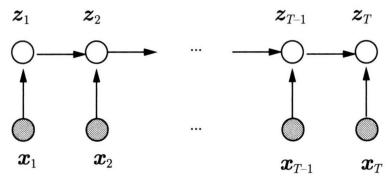  
图11.1 隐马尔可夫模型的概率图模型表示

隐马尔可夫模型也是概率生成模型。可以认为观测序列 $\pmb{x} = x_{1}x_{2}\dots x_{T}$ 以及隐藏的状态序列 $\pmb{z} = z_{1}z_{2}\dots z_{T}$ 是由模型随机生成的。

隐马尔可夫模型的数据生成过程如下。首先，根据初始状态分布（初始状态向量）决定第1个时刻的状态；然后，根据观测发射分布（观测发射矩阵）决定第1个时刻的观测。接着，根据状态转移分布（状态转移矩阵）决定第2个时刻的状态，根据观测发射分布（观测发射矩阵）决定第2个时刻的观测。持续以上过程，直到完成第 $T$ 个时刻的生成。

# 算法11.1（观测序列的生成）

输入：隐马尔可夫模型 $\lambda = (A,B,\pi)$ ，观测序列长度 $T$ 。

输出：观测序列 $\pmb {x} = x_{1}x_{2}\dots x_{T}$

（1）令 $t = 1$   
（2）按照初始状态分布 $\pi$ 随机生成状态 $z_{1}$   
（3）如果 $t > T$ ，终止；否则继续。  
（4）按照状态 $z_{t}$ 的观测发射分布 $P(x_{t}|z_{t})$ 随机生成观测 $x_{t}$ 。  
(5) 按照状态 $z_{t}$ 的状态转移分布 $P(z_{t + 1}|z_{t})$ 随机跳转到状态 $z_{t + 1}, z_{t + 1} = 1,2,\dots,I$ 。  
（6）令 $t = t + 1$ ，转步骤(3)。

下面看一个隐马尔可夫模型的例子。

例11.1（盒子和球模型）假设有4个盒子，每个盒子里都装有红、白两种颜色的球，盒子里的红、白球数由表11.1给出。

按照下面的方法抽球，产生一个球的颜色的观测序列：

- 首先，从 4 个盒子里以等概率随机选取 1 个盒子，从这个盒子里随机抽出 1 个球，记录其颜色后，放回。

表 11.1 各盒子的红、白球数  

<table><tr><td></td><td colspan="4">盒子</td></tr><tr><td></td><td>1</td><td>2</td><td>3</td><td>4</td></tr><tr><td>红球数</td><td>5</td><td>3</td><td>6</td><td>8</td></tr><tr><td>白球数</td><td>5</td><td>7</td><td>4</td><td>2</td></tr></table>

- 然后，从当前盒子随机转移到下一个盒子，规则是：如果当前盒子是盒子 1，那么下一盒子一定是盒子 2；如果当前是盒子 2 或 3，那么分别以概率 0.4 和 0.6 转移到其前后两个盒子；如果当前是盒子 4，那么各以 0.5 的概率停留在盒子 4 或转移到盒子 3。  
- 确定转移的盒子后，再从这个盒子里随机抽出1个球，记录其颜色，放回。  
- 如此下去，重复进行5次，得到一个球的颜色的观测序列：

$$
\pmb {x} = (\text {红}, \text {红}, \text {白}, \text {白}, \text {红})
$$

在这个过程中，实验者只能看到球的序列，而看不到球是从哪个盒子取出的，即观察不到盒子的序列。

在这个例子中有两个随机序列，一个是盒子的序列（状态序列），另一个是球的序列（观测序列）。前者是不可观测的，而后者是可观测的。这是一个隐马尔可夫模型的例子。

盒子对应状态，状态的集合是

$$
S = \{\text {盒 子} 1, \text {盒 子} 2, \text {盒 子} 3, \text {盒 子} 4 \}, \quad I = 4
$$

球的颜色对应观测，观测的集合是

$$
\mathcal {O} = \{\mathrm {红}, \mathrm {白} \}, \quad K = 2
$$

状态序列和观测序列长度 $T = 5$

初始状态分布为

$$
\boldsymbol {\pi} = (0. 2 5, 0. 2 5, 0. 2 5, 0. 2 5) ^ {\mathrm {T}}
$$

状态转移分布为

$$
\boldsymbol {A} = \left[ \begin{array}{l l l l} 0 & 1 & 0 & 0 \\ 0. 4 & 0 & 0. 6 & 0 \\ 0 & 0. 4 & 0 & 0. 6 \\ 0 & 0 & 0. 5 & 0. 5 \end{array} \right]
$$

观测发射分布为

$$
\boldsymbol {B} = \left[ \begin{array}{l l} 0. 5 & 0. 5 \\ 0. 3 & 0. 7 \\ 0. 6 & 0. 4 \\ 0. 8 & 0. 2 \end{array} \right]
$$

# 11.1.3 基本问题

隐马尔可夫模型有三个基本问题：

(1) 概率计算问题: 给定模型 $\lambda = (A, B, \pi)$ 和观测序列 $\boldsymbol{x} = x_{1}x_{2}\dots x_{T}$ , 计算在模型 $\lambda$ 下观测序列 $\boldsymbol{x}$ 出现的概率 $P_{\lambda}(\boldsymbol{x})$ 。  
(2) 学习问题: 给定观测序列 $\boldsymbol{x} = x_{1}x_{2}\dots x_{T}$ , 估计模型参数 $\hat{\boldsymbol{\lambda}} = (\hat{A},\hat{B},\hat{\pi})$ , 使得观测序列概率 $P_{\hat{\boldsymbol{\lambda}}}(\boldsymbol{x})$ 最大, 即用极大似然估计法估计模型参数。  
（3）预测问题，也称为解码（decoding）问题：给定模型 $\pmb{\lambda} = (\pmb{A},\pmb{B},\pmb{\pi})$ 和观测序列 $\pmb{x} = x_{1}x_{2}\dots x_{T}$ ，求条件概率 $P_{\lambda}(\pmb{z}|\pmb{x})$ 最大的状态序列 $\pmb{z}^{*} = z_{1}^{*}z_{2}^{*}\dots z_{T}^{*}$ 。即给定观测序列求最有可能的对应的状态序列。

隐马尔可夫模型可以用于序列标注，这时状态对应着标记。序列标注是给定观测序列预测其对应的标记序列。可以假设观测数据是由隐马尔可夫模型生成的，这样可以利用隐马尔可夫模型的学习与预测算法进行序列标注。

下面各节逐一介绍这些基本问题的算法。

# 11.2 概率计算算法

本节介绍计算观测序列概率的前向-后向算法。先介绍概念上可行但计算上不可行的直接计算法。

# 11.2.1 直接计算法

给定模型 $\lambda = (A, B, \pi)$ 和观测序列 $\pmb{x} = x_1x_2 \cdots x_T$ ，计算观测序列 $\pmb{x}$ 出现的概率 $P_{\lambda}(\pmb{x})$ 。最直接的方法是按概率公式直接计算。通过列举所有可能的长度为 $T$ 的状态序列 $\pmb{z} = z_1z_2 \cdots z_T$ ，求各个状态序列 $\pmb{z}$ 与观测序列 $\pmb{x} = x_1x_2 \cdots x_T$ 的联合概率 $P_{\lambda}(\pmb{x}, \pmb{z})$ ，然后对所有可能的状态序列求和，得到观测序列的概率 $P_{\lambda}(\pmb{x})$ 。

首先，状态序列 $z = z_{1}z_{2}\dots z_{T}$ 的概率是

$$
P _ {\lambda} (z) = P \left(z _ {1}\right) P \left(z _ {2} \mid z _ {1}\right) \dots P \left(z _ {T} \mid z _ {T - 1}\right)
$$

对固定的状态序列 $\pmb{z} = z_{1}z_{2}\dots z_{T}$ ，观测序列 $\pmb {x} = x_{1}x_{2}\dots x_{T}$ 的条件概率是

$$
P _ {\boldsymbol {\lambda}} (\boldsymbol {x} | \boldsymbol {z}) = P (x _ {1} | z _ {1}) P (x _ {2} | z _ {2}) \dots P (x _ {T} | z _ {T})
$$

状态序列 $z$ 和观测序列 $\pmb{x}$ 的联合概率是

$$
\begin{array}{l} P _ {\boldsymbol {\lambda}} (\boldsymbol {x}, \boldsymbol {z}) = P _ {\boldsymbol {\lambda}} (\boldsymbol {x} | \boldsymbol {z}) P _ {\boldsymbol {\lambda}} (\boldsymbol {z}) \\ = P \left(z _ {1}\right) P \left(x _ {1} \mid z _ {1}\right) P \left(z _ {2} \mid z _ {1}\right) P \left(x _ {2} \mid z _ {2}\right) \dots P \left(z _ {T} \mid z _ {T - 1}\right) P \left(x _ {T} \mid z _ {T}\right) \\ \end{array}
$$

所以，对所有可能的状态序列 $z$ 求和，得到观测序列 $\pmb{x}$ 的概率 $P_{\lambda}(\pmb {x})$

$$
\begin{array}{l} P _ {\boldsymbol {\lambda}} (\boldsymbol {x}) = \sum_ {\boldsymbol {z}} P _ {\boldsymbol {\lambda}} (\boldsymbol {x} | \boldsymbol {z}) P _ {\boldsymbol {\lambda}} (\boldsymbol {z}) \\ = \sum_ {z} P \left(z _ {1}\right) P \left(x _ {1} \mid z _ {1}\right) P \left(z _ {2} \mid z _ {1}\right) P \left(x _ {2} \mid z _ {2}\right) \dots P \left(z _ {T} \mid z _ {T - 1}\right) P \left(x _ {T} \mid z _ {T}\right) \tag {11.11} \\ \end{array}
$$

但是，利用式(11.11)计算量很大，是 $O(T\cdot I^T)$ 阶的，这种算法不可行。下面介绍的前向-后向算法（forward-backwardalgorithm）可以解决这个问题。

# 11.2.2 前向算法

首先定义前向概率。给定隐马尔可夫模型 $\lambda$ ，定义到时刻 $t$ 的观测序列为 $x_{1:t} = x_1, x_2, \dots, x_t$ 且时刻 $t$ 的状态为 $s_i$ 的概率为前向概率，记作

$$
\alpha_ {t} (i) = P \left(z _ {t} = s _ {i}, \boldsymbol {x} _ {1: t}\right) \tag {11.12}
$$

可以递归地计算前向概率 $\alpha_{t}(i)$ ，然后计算观测序列概率 $P_{\lambda}(\pmb {x})$ 。

# 算法11.2（前向算法）

输入：隐马尔可夫模型 $\lambda$ ，观测序列 $\pmb{x}$ 。

输出：观测序列概率 $P_{\lambda}(\pmb {x})$

（1）计算前向概率的初始值， $t = 1$

$$
\alpha_ {1} (i) = P \left(z _ {1} = s _ {i}\right) P \left(x _ {1} \mid z _ {1} = s _ {i}\right), \quad i = 1, 2, \dots , I \tag {11.13}
$$

（2）递归计算前向概率， $t = 2,3,\dots ,T$

$$
\alpha_ {t} (i) = \left[ \sum_ {j = 1} ^ {I} \alpha_ {t - 1} (j) P \left(z _ {t} = s _ {i} \mid z _ {t - 1} = s _ {j}\right) \right] P \left(x _ {t} \mid z _ {t} = s _ {i}\right), \quad i = 1, 2, \dots , I \tag {11.14}
$$

（3）计算观测序列概率

$$
P _ {\boldsymbol {\lambda}} (\boldsymbol {x}) = \sum_ {i = 1} ^ {I} \alpha_ {T} (i) \tag {11.15}
$$

在前向算法中，步骤（1）计算初始时刻的前向概率 $\alpha_{1}(i)$ 。步骤（2）递归地计算时刻 $t$ 状态 $s_i$ 的前向概率 $\alpha_{t}(i)$ 。步骤（3）从终止时刻的前向概率 $\alpha_{T}(i)$ 计算观测序列概率 $P_{\lambda}(\pmb{x})$ 。

递归公式的推导如下：

$$
\begin{array}{l} \alpha_ {t} (i) = P \left(z _ {t} = s _ {i}, \boldsymbol {x} _ {1: t}\right) \\ = \sum_ {j = 1} ^ {I} P (z _ {t - 1} = s _ {j}, \boldsymbol {x} _ {1: t - 1}, z _ {t} = s _ {i}, x _ {t}) \\ = \sum_ {j = 1} ^ {I} P (z _ {t - 1} = s _ {j}, \boldsymbol {x} _ {1: t - 1}) P (z _ {t} = s _ {i} | z _ {t - 1} = s _ {j}) P (x _ {t} | z _ {t} = s _ {i}) \\ \end{array}
$$

$$
\begin{array}{l} = \sum_ {j = 1} ^ {I} \alpha_ {t - 1} (j) P (z _ {t} = s _ {i} | z _ {t - 1} = s _ {j}) P (x _ {t} | z _ {t} = s _ {i}) \\ = \left[ \sum_ {j = 1} ^ {I} \alpha_ {t - 1} (j) P \left(z _ {t} = s _ {i} \mid z _ {t - 1} = s _ {j}\right) \right] P \left(x _ {t} \mid z _ {t} = s _ {i}\right) \\ \end{array}
$$

第一步基于 $\alpha_{t}(i)$ 的定义，第二步从联合概率计算边缘概率，第三步利用隐马尔可夫模型的性质，第四步基于 $\alpha_{t-1}(j)$ 的定义。

前向算法的关键是利用状态序列的路径结构（见图11.2）递归地计算前向概率。在各个时刻 $t = 2,3,\dots ,T$ ，计算 $I$ 个前向概率 $\alpha_{t}(i)$ 时，每次利用前一时刻的 $I$ 个前向概率 $\alpha_{t - 1}(j)$ 如图11.3所示。前向算法计算的计算量是 $O(T\bullet I^2)$ 阶的，而不是直接计算的 $O(T\bullet I^T)$ 阶。

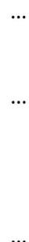

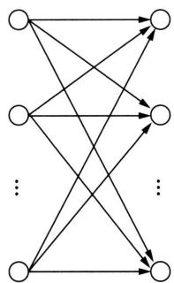  
图11.2 状态序列的路径结构

  
图11.3 前向概率的递归计算

例11.2 考虑盒子和球模型 $\lambda = (A, B, \pi)$ ，状态集合 $S = \{1, 2, 3\}$ ，观测集合 $\mathcal{O} = \{\text{红}, \text{白}\}$

$$
\boldsymbol {A} = \left[ \begin{array}{l l l} 0. 5 & 0. 2 & 0. 3 \\ 0. 3 & 0. 5 & 0. 2 \\ 0. 2 & 0. 3 & 0. 5 \end{array} \right], \quad \boldsymbol {B} = \left[ \begin{array}{l l} 0. 5 & 0. 5 \\ 0. 4 & 0. 6 \\ 0. 7 & 0. 3 \end{array} \right], \quad \boldsymbol {\pi} = \left( \begin{array}{l} 0. 2 \\ 0. 4 \\ 0. 4 \end{array} \right)
$$

设 $T = 3$ ， $\pmb {x} =$ (红，白，红)，试用前向算法计算 $P_{\lambda}(\pmb {x})$ 。

解 按照算法11.2：

（1）初始化前向概率， $t = 1$

$$
\alpha_ {1} (1) = P \left(z _ {1} = s _ {1}\right) P \left(x _ {1} \mid z _ {1} = s _ {1}\right) = 0. 1 0
$$

$$
\alpha_ {1} (2) = P \left(z _ {1} = s _ {2}\right) P \left(x _ {1} \mid z _ {1} = s _ {2}\right) = 0. 1 6
$$

$$
\alpha_ {1} (3) = p \left(z _ {1} = s _ {3}\right) P \left(x _ {1} \mid z _ {1} = s _ {3}\right) = 0. 2 8
$$

（2）递归计算前向概率， $t = 2,3$

$$
\alpha_ {2} (1) = \left[ \sum_ {j = 1} ^ {3} \alpha_ {1} (j) P \left(z _ {2} = s _ {1} \mid z _ {1} = s _ {j}\right) \right] P \left(x _ {2} \mid z _ {2} = s _ {1}\right) = 0. 0 7 7
$$

$$
\alpha_ {2} (2) = \left[ \sum_ {j = 1} ^ {3} \alpha_ {1} (j) P \left(z _ {2} = s _ {2} \mid z _ {1} = s _ {j}\right) \right] P \left(x _ {2} \mid z _ {2} = s _ {2}\right) = 0. 1 1 0 4
$$

$$
\alpha_ {2} (3) = \left[ \sum_ {i = 1} ^ {3} \alpha_ {1} (j) P (z _ {2} = s _ {3} | z _ {1} = s _ {j}) \right] P (x _ {2} | z _ {2} = s _ {3}) = 0. 0 6 0 6
$$

$$
\alpha_ {3} (1) = \left[ \sum_ {i = 1} ^ {3} \alpha_ {2} (j) P \left(z _ {3} = s _ {1} \mid z _ {2} = s _ {j}\right) \right] P \left(x _ {3} \mid z _ {3} = s _ {1}\right) = 0. 0 4 1 8 7
$$

$$
\alpha_ {3} (2) = \left[ \sum_ {i = 1} ^ {3} \alpha_ {2} (j) P \left(z _ {3} = s _ {2} \mid z _ {2} = s _ {j}\right) \right] P \left(x _ {3} \mid z _ {3} = s _ {2}\right) = 0. 0 3 5 5 1
$$

$$
\alpha_ {3} (3) = \left[ \sum_ {i = 1} ^ {3} \alpha_ {2} (j) P \left(z _ {3} = s _ {3} \mid z _ {2} = s _ {j}\right) \right] P \left(x _ {3} \mid z _ {3} = s _ {3}\right) = 0. 0 5 2 8 4
$$

（3）计算观测序列概率

$$
P _ {\boldsymbol {\lambda}} (\boldsymbol {x}) = \sum_ {i = 1} ^ {3} \alpha_ {3} (i) = 0. 1 3 0 2 2
$$

# 11.2.3 后向算法

也可以定义后向概率。给定隐马尔可夫模型 $\lambda$ ，定义在时刻 $t$ 状态 $s_i$ 的条件下，从时刻 $t + 1$ 到时刻 $T$ 的观测序列为 $\pmb{x}_{t + 1:T}$ 的概率为后向概率，记作

$$
\beta_ {t} (i) = P \left(\boldsymbol {x} _ {t + 1: T} \mid z _ {t} = s _ {i}\right) \tag {11.16}
$$

可以递归地计算后向概率 $\beta_{t}(i)$ ，然后计算观测序列概率 $P_{\lambda}(\pmb {x})$ 。

算法11.3（后向算法）

输入：隐马尔可夫模型 $\lambda$ ，观测序列 $\pmb{x}$ 。

输出：观测序列概率 $P_{\lambda}(\pmb {x})$

（1）计算后向概率的初始值， $t = T$

$$
\beta_ {T} (i) = 1, \quad i = 1, 2, \dots , I \tag {11.17}
$$

（2）递归计算后向概率， $t = T - 1,T - 2,\dots ,1$

$$
\beta_ {t} (i) = \sum_ {j = 1} ^ {I} P \left(z _ {t + 1} = s _ {j} \mid z _ {t} = s _ {i}\right) P \left(x _ {t + 1} \mid z _ {t + 1} = s _ {j}\right) \beta_ {t + 1} (j), \quad i = 1, 2, \dots , I \tag {11.18}
$$

（3）计算观测序列概率

$$
P _ {\boldsymbol {\lambda}} (\boldsymbol {x}) = \sum_ {j = 1} ^ {I} P \left(z _ {1} = s _ {j}\right) P \left(x _ {1} \mid z _ {1} = s _ {j}\right) \beta_ {1} (j) \tag {11.19}
$$

步骤（1）初始化最终时刻的后向概率 $\beta_{T}(i)$ ，步骤（2）递归地计算各个时刻的后向概率 $\beta_{t}(i)$ ，步骤（3）从后向概率 $\beta_{1}(j)$ 计算观测序列概率 $P_{\lambda}(\pmb{x})$ 。

递归公式的推导如下：

$$
\begin{array}{l} \beta_ {t} (i) = P \left(\boldsymbol {x} _ {t + 1: T} \mid z _ {t} = s _ {i}\right) \\ = \sum_ {j = 1} ^ {I} P (z _ {t + 1} = s _ {j}, x _ {t + 1}, \boldsymbol {x} _ {t + 2: T} | z _ {t} = s _ {i}) \\ = \sum_ {j = 1} ^ {I} P \left(z _ {t + 1} = s _ {j} \mid z _ {t} = s _ {i}\right) P \left(x _ {t + 1} \mid z _ {t + 1} = s _ {j}\right) P \left(\boldsymbol {x} _ {t + 2: T} \mid z _ {t + 1} = s _ {j}\right) \\ = \sum_ {j = 1} ^ {I} P \left(z _ {t + 1} = s _ {j} \mid z _ {t} = s _ {i}\right) P \left(x _ {t + 1} \mid z _ {t + 1} = s _ {j}\right) \beta_ {t + 1} (j) \\ \end{array}
$$

后向算法在各个时刻 $t = T - 1, T - 2, \dots, 1$ ，递归计算 $I$ 个后向概率 $\beta_{t}(i)$ 时，每次利用后一时刻的 $I$ 个后向概率 $\beta_{t + 1}(j)$ ，如图11.4所示。后向算法的计算量是 $O(I^{2}T)$ 阶。

  
图11.4 后向概率的递归计算

# 11.2.4 前向-后向算法

观测序列概率 $P_{\lambda}(\pmb {x})$ 也可以利用前向概率和后向概率一起计算，称为前向-后向算法。

$$
P _ {\boldsymbol {\lambda}} (\boldsymbol {x}) = \sum_ {i = 1} ^ {I} \sum_ {j = 1} ^ {I} \alpha_ {t} (i) P \left(z _ {t + 1} = s _ {j} \mid z _ {t} = s _ {i}\right) P \left(x _ {t + 1} \mid z _ {t + 1} = s _ {j}\right) \beta_ {t + 1} (j), \quad t = 1, 2, \dots , T - 1 \tag {11.20}
$$

前向-后向算法在每一个时刻都可以计算观测序列的概率。

# 11.2.5 一些概率与期望值的计算

利用前向概率和后向概率，可以得到关于一个状态或两个状态概率的计算公式。

1. 给定模型 $\lambda$ 和观测 $\pmb{x}$ ，在时刻 $t$ 处于状态 $s_i$ 的概率。记

$$
\gamma_ {t} (i) = P \left(z _ {t} = s _ {i} \mid \boldsymbol {x}\right) \tag {11.21}
$$

可以通过前向概率和后向概率计算。事实上，

$$
\gamma_ {t} (i) = P (z _ {t} = s _ {i}, \boldsymbol {x}) = \frac {P (z _ {t} = s _ {i} , \boldsymbol {x})}{P _ {\boldsymbol {\lambda}} (\boldsymbol {x})}
$$

由前向概率 $\alpha_{t}(i)$ 和后向概率 $\beta_{t}(i)$ 定义可知：

$$
\alpha_ {t} (i) \beta_ {t} (i) = P \left(z _ {t} = s _ {i}, \boldsymbol {x}\right) \tag {11.22}
$$

于是得到：

$$
\gamma_ {t} (i) = \frac {\alpha_ {t} (i) \beta_ {t} (i)}{P _ {\lambda} (\boldsymbol {x})} = \frac {\alpha_ {t} (i) \beta_ {t} (i)}{\sum_ {j = 1} ^ {I} \alpha_ {t} (j) \beta_ {t} (j)} \tag {11.23}
$$

2. 给定模型 $\lambda$ 和观测 $\pmb{x}$ ，在时刻 $t$ 处于状态 $s_i$ 且在时刻 $t + 1$ 处于状态 $s_j$ 的概率。记

$$
\xi_ {t} (i, j) = P _ {\boldsymbol {\lambda}} \left(z _ {t} = s _ {i}, z _ {t + 1} = s _ {j} \mid \boldsymbol {x}\right) \tag {11.24}
$$

可以通过前向概率和后向概率计算。

$$
\xi_ {t} (i, j) = \frac {P (z _ {t} = s _ {i} , z _ {t + 1} = s _ {j} , \boldsymbol {x})}{P _ {\boldsymbol {\lambda}} (\boldsymbol {x})} = \frac {P (z _ {t} = s _ {i} , z _ {t + 1} = s _ {j} , \boldsymbol {x})}{\sum_ {i = 1} ^ {I} \sum_ {j = 1} ^ {I} P (z _ {t} = s _ {i} , z _ {t + 1} = s _ {j} , \boldsymbol {x})}
$$

而

$$
P \left(z _ {t} = s _ {i}, z _ {t + 1} = s _ {j}, \boldsymbol {x}\right) = \alpha_ {t} (i) P \left(z _ {t + 1} = s _ {j} \mid z _ {t} = s _ {i}\right) P \left(x _ {t + 1} \mid z _ {t + 1} = s _ {j}\right) \beta_ {t + 1} (j)
$$

故

$$
\xi_ {t} (i, j) = \frac {\alpha_ {t} (i) P \left(z _ {t + 1} = s _ {j} \mid z _ {t} = s _ {i}\right) P \left(x _ {t + 1} \mid z _ {t + 1} = s _ {j}\right) \beta_ {t + 1} (j)}{\sum_ {i = 1} ^ {I} \sum_ {j = 1} ^ {I} \alpha_ {t} (i) P \left(z _ {t + 1} = s _ {j} \mid z _ {t} = s _ {i}\right) P \left(x _ {t + 1} \mid z _ {t + 1} = s _ {j}\right) \beta_ {t + 1} (j)} \tag {11.25}
$$

3. 将 $\gamma_{t}(i)$ 和 $\xi_{t}(i,j)$ 对各个时刻 $t$ 求和，可以得到一些有用的期望值。

在观测序列 $\pmb{x}$ 给定条件下处于状态 $s_i$ 的期望值：

$$
\sum_ {t = 1} ^ {T} \gamma_ {t} (i) \tag {11.26}
$$

在观测序列 $\pmb{x}$ 给定条件下由状态 $s_i$ 转移出的期望值：

$$
\sum_ {t = 1} ^ {T - 1} \gamma_ {t} (i) \tag {11.27}
$$

在观测序列 $\pmb{x}$ 给定条件下由状态 $s_i$ 转移到状态 $s_j$ 的期望值：

$$
\sum_ {t = 1} ^ {T - 1} \xi_ {t} (i, j) \tag {11.28}
$$

# 11.3 学习算法

根据训练数据是既包含观测序列又包含对应的状态序列，还是只包含观测序列，隐马尔可夫模型的学习可分别通过监督学习与无监督学习来实现。本节首先介绍监督学习算法，而后介绍无监督学习的 Baum-Welch 算法（也就是 EM 算法）。监督学习需要使用序列标注的训练数据，而人工标注数据往往代价很高，所以在实际应用中使用无监督学习算法的场景更普遍。

# 11.3.1 监督学习方法

假设训练数据是 $N$ 个长度相同的观测序列和对应的状态序列

$$
\mathcal {D} = \left\{\left(\boldsymbol {x} _ {1}, \boldsymbol {z} _ {1}\right), \left(\boldsymbol {x} _ {2}, \boldsymbol {z} _ {2}\right), \dots , \left(\boldsymbol {x} _ {N}, \boldsymbol {z} _ {N}\right) \right\}
$$

因为这里状态序列也是可观测的，所以观测序列和状态序列整体的概率是

$$
P _ {\lambda} (\boldsymbol {x}, \boldsymbol {z}) = P _ {\lambda} (\boldsymbol {z}) P _ {\lambda} (\boldsymbol {x} | \boldsymbol {z}) \tag {11.29}
$$

可以利用极大似然估计法来估计隐马尔可夫模型的参数 $\hat{\pmb{\lambda}} = (\hat{A},\hat{B},\hat{\pi})$ 。具体方法如下。

初始状态概率 $\pi_{i}$ 可以从训练数据中初始状态为 $s_i$ 的频数 $f(s_{i})$ 估计：

$$
\hat {\pi} _ {i} = \frac {f (s _ {i})}{\sum_ {i = 1} ^ {I} f (s _ {i})}, \quad i = 1, 2, \dots , I \tag {11.30}
$$

状态转移概率 $a_{ij}$ 可以从训练数据中时刻 $t$ 处于状态 $s_i$ 而时刻 $t + 1$ 处于状态 $s_j$ 的频数 $f(s_i, s_j)$ 估计：

$$
\hat {a} _ {i j} = \frac {f \left(s _ {i} , s _ {j}\right)}{\sum_ {j = 1} ^ {I} f \left(s _ {i} , s _ {j}\right)}, \quad i = 1, 2, \dots , I, \quad j = 1, 2, \dots , I \tag {11.31}
$$

观测发射概率 $b_{ik}$ 可以从训练数据中状态为 $s_i$ 且观测为 $o_k$ 的频数 $f(o_k, s_i)$ 估计：

$$
\hat {b} _ {i k} = \frac {f \left(o _ {k} , s _ {i}\right)}{\sum_ {k = 1} ^ {K} f \left(o _ {k} , s _ {i}\right)}, \quad i = 1, 2, \dots , I, \quad k = 1, 2, \dots , K \tag {11.32}
$$

# 11.3.2 Baum-Welch 算法

假设训练数据只包含 $N$ 个长度为 $T$ 的观测序列而没有对应的状态序列：

$$
\mathcal {D} = \left\{\boldsymbol {x} _ {1}, \boldsymbol {x} _ {2}, \dots , \boldsymbol {x} _ {N} \right\}
$$

目标是学习隐马尔可夫模型的参数 $\lambda = (A, B, \pi)$ 。将观测序列 $\pmb{x}$ 看作观测数据，状态序列 $\pmb{z}$ 看作隐藏数据，那么隐马尔可夫模型事实上是一个含有隐变量的概率模型：

$$
P _ {\lambda} (\boldsymbol {x}) = \sum_ {\boldsymbol {z}} P _ {\lambda} (\boldsymbol {x} | \boldsymbol {z}) P _ {\lambda} (\boldsymbol {z}) \tag {11.33}
$$

它的参数学习可以使用 EM 算法（第 18 章）。Baum-Welch 算法（Baum-Welch algorithm）是 EM 算法在隐马尔可夫模型学习中的具体实现。

含有隐变量的概率模型学习不能直接应用极大似然估计。Baum-Welch算法的想法是通过迭代估计隐马尔可夫模型的参数，以最大化观测数据的对数似然函数的下界，也就是 $Q$ 函数。先假设已经得到参数的估计值，接着基于已知参数计算 $Q$ 函数，然后最大化 $Q$ 函数，得到参数的新的估计值。这样不断迭代。E步求解 $Q$ 函数，M步最大化 $Q$ 函数。Baum-Welch算法一定收敛，但不能保证收敛到全局最优。

# 1. E步

求解 $Q$ 函数。假设观测数据写成 $\pmb{x} = x_{1}x_{2}\dots x_{T}$ ，隐藏数据写成 $z = z_{1}z_{2}\dots z_{T}$ ，完全数据是 $(\pmb {x},\pmb {z})$ 。假设 $\bar{\lambda}$ 是模型参数的当前估计值， $\lambda$ 是要求解的模型参数。完全数据的基于未知参数的概率分布是 $P_{\lambda}(\pmb {x},\pmb {z})$ 。隐藏数据的基于已知参数的后验概率分布是 $P_{\bar{\lambda}}(\pmb {z}|\pmb {x})$ 。定义 $Q$ 函数

$$
Q (\boldsymbol {\lambda}, \bar {\boldsymbol {\lambda}}) = \sum_ {\boldsymbol {z}} P _ {\bar {\boldsymbol {\lambda}}} (\boldsymbol {z} | \boldsymbol {x}) \log P _ {\boldsymbol {\lambda}} (\boldsymbol {x}, \boldsymbol {z}) \tag {11.34}
$$

因为

$$
P _ {\lambda} (\boldsymbol {x}, \boldsymbol {z}) = P (z _ {1}) P (x _ {1} | z _ {1}) P (z _ {2} | z _ {1}) P (x _ {2} | z _ {2}) \dots P (z _ {T} | z _ {T - 1}) P (x _ {T} | z _ {T})
$$

所以， $Q$ 函数可以写成

$$
\begin{array}{l} Q (\boldsymbol {\lambda}, \bar {\boldsymbol {\lambda}}) = \sum_ {\boldsymbol {z}} P _ {\bar {\boldsymbol {\lambda}}} (\boldsymbol {z} | \boldsymbol {x}) \log P (z _ {1}) + \sum_ {\boldsymbol {z}} P _ {\bar {\boldsymbol {\lambda}}} (\boldsymbol {z} | \boldsymbol {x}) \left(\sum_ {t = 2} ^ {T} \log P (z _ {t} | z _ {t - 1})\right) + \\ \sum_ {\boldsymbol {z}} P _ {\bar {\lambda}} (\boldsymbol {z} | \boldsymbol {x}) \left(\sum_ {t = 1} ^ {T} \log P \left(x _ {t} \mid z _ {t}\right)\right) \tag {11.35} \\ \end{array}
$$

式中对 $z$ 的求和都是针对长度 $T$ 的序列进行的。

# 2. M步

最大化 $Q$ 函数。由于要最大化的参数在式 (11.35) 中单独地出现在 3 个项中，所以只需对各项分别最大化。

式 (11.35) 右侧的第 1 项可以写成

$$
\sum_ {\boldsymbol {z}} P _ {\boldsymbol {\lambda}} (\boldsymbol {z} | \boldsymbol {x}) \log P (z _ {1}) = \sum_ {i = 1} ^ {I} P _ {\boldsymbol {\lambda}} (z _ {1} = s _ {i} | \boldsymbol {x}) \log \pi_ {i}
$$

其中， $\pi_{i} = P(z_{1} = s_{i})$ 。注意到 $\pi_{i}$ 满足约束条件 $\sum_{i=1}^{I} \pi_{i} = 1$ ，利用拉格朗日乘子法进行有约束最大化，写出拉格朗日函数

$$
\sum_ {i = 1} ^ {I} P _ {\overline {{\boldsymbol {\lambda}}}} \left(z _ {1} = s _ {i} | \boldsymbol {x}\right) \log \pi_ {i} + \gamma \left(\sum_ {i = 1} ^ {I} \pi_ {i} - 1\right)
$$

对其求偏导数并令结果为0：

$$
\frac {\partial}{\partial \pi_ {i}} \left[ \sum_ {i = 1} ^ {I} P _ {\lambda} \left(z _ {1} = s _ {i} | \boldsymbol {x}\right) \log \pi_ {i} + \gamma \left(\sum_ {i = 1} ^ {I} \pi_ {i} - 1\right) \right] = 0
$$

得：

$$
P _ {\bar {\lambda}} \left(z _ {1} = s _ {i} | \boldsymbol {x}\right) + \gamma \pi_ {i} = 0 \tag {11.36}
$$

对 $s_i$ 求和得到：

$$
\gamma = - 1
$$

代入式(11.36)得：

$$
\pi_ {i} = \frac {P _ {\bar {\lambda}} \left(\boldsymbol {x} , z _ {1} = s _ {i}\right)}{P _ {\bar {\lambda}} (\boldsymbol {x})} \tag {11.37}
$$

式 (11.35) 右侧的第 2 项可以写成

$$
\sum_ {\boldsymbol {z}} P _ {\bar {\lambda}} (\boldsymbol {z} | \boldsymbol {x}) \left(\sum_ {t = 2} ^ {T} \log P (z _ {t} | z _ {t - 1})\right) = \sum_ {i = 1} ^ {I} \sum_ {j = 1} ^ {I} \sum_ {t = 2} ^ {T} P _ {\bar {\lambda}} (z _ {t - 1} = s _ {i}, z _ {t} = s _ {j} | \boldsymbol {x}) \log a _ {i j}
$$

其中， $a_{ij} = P(z_{t + 1} = s_j|z_t = s_i)$

类似第1项，应用拉格朗日乘子法，其中约束条件为 $\sum_{j=1}^{I} a_{ij} = 1$ ，可以求出：

$$
a _ {i j} = \frac {\sum_ {t = 2} ^ {T} P _ {\bar {\lambda}} \left(z _ {t - 1} = s _ {i} , z _ {t} = s _ {j} \mid \boldsymbol {x}\right)}{\sum_ {t = 2} ^ {T} P _ {\bar {\lambda}} \left(z _ {t - 1} = s _ {i} \mid \boldsymbol {x}\right)} \tag {11.38}
$$

式 (11.35) 右侧的第 3 项可以写成

$$
\sum_ {\boldsymbol {z}} P _ {\hat {\boldsymbol {\lambda}}} (\boldsymbol {z} | \boldsymbol {x}) \left(\sum_ {t = 1} ^ {T} \log P (x _ {t} | z _ {t})\right) = \sum_ {i = 1} ^ {I} \sum_ {t = 1} ^ {T} P _ {\hat {\boldsymbol {\lambda}}} (z _ {t} = s _ {i} | \boldsymbol {x}) \log b _ {i k}
$$

其中， $b_{ik} = P(x_t = o_k|z_t = s_i)$

同样用拉格朗日乘子法，约束条件是 $\sum_{k=1}^{K} b_{ik} = 1$ 。注意，只有在 $x_t = o_k$ 时 $x_t$ 对 $b_{ik}$ 的偏导数不为0，以 $I(x_t = o_k)$ 表示。求得：

$$
b _ {i k} = \frac {\sum_ {t = 1} ^ {T} P _ {\bar {\lambda}} \left(\boldsymbol {x} , z _ {t} = s _ {i}\right) I \left(x _ {t} = o _ {k}\right)}{\sum_ {t = 1} ^ {T} P _ {\bar {\lambda}} \left(\boldsymbol {x} , z _ {t} = s _ {i}\right)} \tag {11.39}
$$

# 11.3.3 模型参数估计

将式 (11.37)～式 (11.39) 中的各概率分别用 $\gamma_{t}(i), \xi_{t}(i,j)$ 表示，则可将相应的公式写成

$$
a _ {i j} = \frac {\sum_ {t = 2} ^ {T} \xi_ {t} (i , j)}{\sum_ {t = 2} ^ {T} \gamma_ {t} (i)} \tag {11.40}
$$

$$
b _ {i k} = \frac {\sum_ {t = 1 , x _ {t} = o _ {k}} ^ {T} \gamma_ {t} (i)}{\sum_ {t = 1} ^ {T} \gamma_ {t} (i)} \tag {11.41}
$$

$$
\pi_ {i} = \gamma_ {1} (i) \tag {11.42}
$$

其中， $\gamma_{t}(i), \xi_{t}(i,j)$ 分别由式 (11.23) 和式 (11.25) 给出。式 $(11.40) \sim$ 式 (11.42) 就是 Baum-Welch 算法的迭代公式。

# 算法11.4（Baum-Welch算法）

输入：观测数据 $\pmb {x} = x_{1},x_{2},\dots ,x_{T}$

输出：隐马尔可夫模型参数 $\hat{\lambda} = (\hat{A},\hat{B},\hat{\pi})$

（1）初始化，对 $n = 0$ ，选取 $a_{ij}^{(0)},b_{ik}^{(0)},\pi_i^{(0)}$ ，得到模型 $\pmb{\lambda}^{(0)} = (A^{(0)},B^{(0)},\pi^{(0)})$

(2) 迭代, 对 $n = 1, 2, \dots$ ,

$$
a _ {i j} ^ {(n + 1)} = \frac {\sum_ {t = 1} ^ {T - 1} \xi_ {t} (i , j)}{\sum_ {t = 1} ^ {T - 1} \gamma_ {t} (i)}
$$

$$
b _ {i k} ^ {(n + 1)} = \frac {\sum_ {t = 1 , x _ {t} = o _ {k}} ^ {T} \gamma_ {t} (i)}{\sum_ {t = 1} ^ {T} \gamma_ {t} (i)}
$$

$$
\pi_ {i} ^ {(n + 1)} = \gamma_ {1} (i)
$$

右端各值按观测 $\pmb{x} = x_{1},x_{2},\dots ,x_{T}$ 和模型 $\lambda^{(n)} = (A^{(n)},B^{(n)},\pi^{(n)})$ 计算。式中 $\gamma_t(i),\xi_t(i,j)$ 由式（11.23）和式(11.25）给出。

(3) 终止，输出模型参数 $\pmb{\lambda}^{(n + 1)} = (A^{(n + 1)}, B^{(n + 1)}, \pi^{(n + 1)})$ 。

# 11.4 预测算法

隐马尔可夫模型的预测中，给定观测序列求最有可能的对应的状态序列。下面介绍两种预测算法：近似算法与维特比算法（Viterbi algorithm）。

# 11.4.1 近似算法

近似算法的想法是: 在每个时刻 $t$ 选择在该时刻最有可能出现的状态 $s_{i_t^*}$ , 从而得到一个状态序列 $\boldsymbol{z}^* = z_1^* z_2^* \cdots z_T^* = s_{i_1^*} s_{i_2^*} \cdots s_{i_T^*}$ , 将它作为预测的近似最优解。

给定隐马尔可夫模型 $\lambda$ 和观测序列 $\pmb{x}$ ，在时刻 $t$ 处于状态 $s_i$ 的概率 $\gamma_t(i)$ 是

$$
\gamma_ {t} (i) = \frac {\alpha_ {t} (i) \beta_ {t} (i)}{P _ {\boldsymbol {\lambda}} (\boldsymbol {x})} = \frac {\alpha_ {t} (i) \beta_ {t} (i)}{\sum_ {j = 1} ^ {I} \alpha_ {t} (j) \beta_ {t} (j)} \tag {11.43}
$$

在每一时刻 $t$ 最有可能的状态 $s_{i_t^*}$ 是

$$
i _ {t} ^ {*} = \arg \max  _ {i} [ \gamma_ {t} (i) ], \quad t = 1, 2, \dots , T \tag {11.44}
$$

从而得到状态序列 $z^{*} = s_{i_{1}^{*}}s_{i_{2}^{*}}\dots s_{i_{T}^{*}}$

近似算法的优点是计算简单，缺点是不能保证解是最优的，也就是不能保证预测的状态序列是最有可能的状态序列。事实上，预测的状态序列中可能有实际不发生的状态转移，即有可能存在转移概率为0的相邻状态。尽管如此，近似算法仍然是有用的。

# 11.4.2 维特比算法

维特比算法采用动态规划（dynamic programming）求解隐马尔可夫模型的预测问题，即用动态规划求概率最大路径（最优路径）。这里一条路径对应着一个状态序列，结点表示状态，有向边表示状态转移。动态规划的核心想法是将复杂问题分解为子问题，利用子问题的最优解递归地求解整体问题的最优解。

首先，导入变量 $\delta_t(i)$ ，表示在第 $t$ 个时刻到达状态 $i$ 的所有路径中的最大概率值：

$$
\delta_ {t} (i) = \max  _ {\boldsymbol {z} _ {1: t - 1}} P \left(\boldsymbol {z} _ {1: t - 1}, z _ {t} = s _ {i}, \boldsymbol {x} _ {1: t}\right), \quad i = 1, 2, \dots , I, \quad t = 2, \dots , T \tag {11.45}
$$

在 $t = 1$ 时，

$$
\delta_ {1} (i) = P \left(z _ {1} = s _ {i}\right) P \left(x _ {1} \mid z _ {1} = s _ {i}\right) \tag {11.46}
$$

表示第1个时刻的处于状态 $s_i$ 的（最大）概率值。

这样，从第1个时刻到第 $T$ 个时刻的所有路径中的最大概率值可以从第 $T$ 个时刻的 $\delta_T(i)$ 求出：

$$
\delta^ {*} = \max  _ {i} \delta_ {T} (i) = \max  _ {i} P \left(\boldsymbol {z} _ {1: T - 1}, z _ {T} = s _ {i}, \boldsymbol {x} _ {1: T}\right) \tag {11.47}
$$

维特比算法使用以下递归公式，从第 $t - 1$ 个时刻的所有状态 $j$ 的最大概率值 $\delta_t(j)$ 计算第 $t$ 个时刻的状态 $i$ 的最大概率值 $\delta_t(i)$ 。计算是前向的，从第 $t - 1$ 个时刻到第 $t$ 个时刻。

$$
\delta_ {t} (i) = \max  _ {j} \left[ \delta_ {t - 1} (j) P \left(z _ {t} = s _ {i} \mid z _ {t - 1} = s _ {j}\right) \right] P \left(x _ {t} \mid z _ {t} = s _ {i}\right) \tag {11.48}
$$

递归公式的推导如下：

$$
\begin{array}{l} \delta_ {t} (i) = \max  _ {\boldsymbol {z} _ {1: t - 1}} P (\boldsymbol {z} _ {1: t - 1}, z _ {t} = s _ {i}, \boldsymbol {x} _ {1: t}) \\ = \max  _ {\boldsymbol {z} _ {1: t - 1}} \left[ P \left(\boldsymbol {z} _ {1: t - 2}, z _ {t - 1}, \boldsymbol {x} _ {1: t - 1}\right) P \left(z _ {t} = s _ {i} \mid z _ {t - 1}\right) P \left(x _ {t} \mid z _ {t} = s _ {i}\right) \right] \\ = \max  _ {z _ {t - 1}} \left[ \left(\max  _ {\boldsymbol {z} _ {1: t - 2}} P (\boldsymbol {z} _ {1: t - 2}, z _ {t - 1}, \boldsymbol {x} _ {1: t - 1})\right) P (z _ {t} = s _ {i} | z _ {t - 1}) P (x _ {t} | z _ {t} = s _ {i}) \right] \\ = \max  _ {j} \left[ \left(\max  _ {\boldsymbol {z} _ {1: t - 2}} P (\boldsymbol {z} _ {1: t - 2}, z _ {t - 1} = s _ {j}, \boldsymbol {x} _ {1: t - 1})\right) P (z _ {t} = s _ {i} | z _ {t - 1} = s _ {j}) P (x _ {t} | z _ {t} = s _ {i}) \right] \\ = \max  _ {j} \left[ \delta_ {t - 1} (j) P \left(z _ {t} = s _ {i} \mid z _ {t - 1} = s _ {j}\right) \right] P \left(x _ {t} \mid z _ {t} = s _ {i}\right) \\ \end{array}
$$

第一步基于 $\delta_t(i)$ 的定义，第二步利用隐马尔可夫模型的性质，第三步根据以下最大化公式：

$$
\max  _ {a, b} [ f (a, b) g (a) ] = \max  _ {a} [ (\max  _ {b} f (a, b)) g (a) ], \quad \forall a, b, f (a, b) > 0, g (a) > 0
$$

第四步进行变量替换的等价变换，第五步基于 $\delta_{t - 1}(j)$ 的定义。

接着，导入变量 $\phi_t(i)$ ，记录在第 $t$ 个时刻到达状态 $i$ 的概率最大的路径在第 $t - 1$ 个时刻的状态的指标 $j^{*}$ 。

$$
\phi_ {t} (i) = \underset {\boldsymbol {z} _ {1: t - 1}} {\arg \max } P \left(\boldsymbol {z} _ {1: t - 1}, z _ {t} = s _ {i}, \boldsymbol {x} _ {1: t}\right), \quad i = 1, 2, \dots , I, \quad t = 2, \dots , T \tag {11.49}
$$

$$
\phi_ {1} (i) = 0, \quad t = 1 \tag {11.50}
$$

根据以下公式记录 $\phi_t(i)$ 。记录是反向的，从第 $t$ 个时刻到第 $t - 1$ 个时刻。

$$
\phi_ {t} (i) = \arg \max  _ {j} [ \delta_ {t - 1} (j) P (z _ {t} = s _ {i} | z _ {t - 1} = s _ {j}) ] \tag {11.51}
$$

维特比算法使用第 $t - 1$ 个时刻的最大概率值计算第 $t$ 个时刻的最大概率值，以此递归地计算，得到整个状态序列的最大概率值。计算第 $t$ 个时刻到达状态 $i$ 的最大概率值时，只需要使用第 $t - 1$ 个时刻到达所有状态 $j$ 的最大概率值，以及相关的转移概率和发射概率。然后记录第 $t$ 个时刻到达状态 $i$ 最大概率值的第 $t - 1$ 个时刻的状态 $j^{*}$ 。算法的计算复杂度是 $O(I^2 T)$ 。下面给出维特比算法。

# 算法11.5（维特比算法）

输入：模型 $\lambda = (A,B,\pi)$ 和观测 $\pmb{x}$

输出：最优路径 $z^{*} = z_{1}^{*}z_{2}^{*}\dots z_{T}^{*}$

（1）初始化， $t = 1$

$$
\begin{array}{l} \delta_ {1} (i) = P \left(z _ {1} = s _ {i}\right) P \left(x _ {1} \mid z _ {1} = s _ {i}\right), \quad i = 1, 2, \dots , I \\ \phi_ {1} (i) = 0, \quad i = 1, 2, \dots , I \\ \end{array}
$$

（2）递归计算， $t = 2,3,\dots ,T$

$$
\begin{array}{l} \delta_ {t} (i) = \max  _ {j} [ \delta_ {t - 1} (j) P (z _ {t} = s _ {i} | z _ {t - 1} = s _ {j}) ] P (x _ {t} | z _ {t} = s _ {i}), \quad i = 1, 2, \dots , I \\ \phi_ {t} (i) = \arg \max  _ {j} [ \delta_ {t - 1} (j) P (z _ {t} = s _ {i} | z _ {t - 1} = s _ {j}) ], \quad i = 1, 2, \dots , I \\ \end{array}
$$

（3）求路径的最大概率值， $t = T$

$$
\delta^ {*} = \max  _ {i} \delta_ {T} (i)
$$

$$
i _ {T} ^ {*} = \arg \max  _ {i} [ \delta_ {T} (i) ]
$$

（4）回溯最优路径。对 $t = T - 1, T - 2, \dots, 1$

$$
i _ {t} ^ {*} = \phi_ {t + 1} (i _ {t + 1} ^ {*})
$$

求得最优路径 $z^{*} = z_{1}^{*}z_{2}^{*}\dots z_{T}^{*} = s_{i_{1}^{*}}s_{i_{2}^{*}}\dots s_{i_{T}^{*}}$

下面通过一个例子来说明维特比算法。

例11.3 对例11.2的模型 $\lambda = (A,B,\pi)$

$$
\boldsymbol {A} = \left[ \begin{array}{l l l} 0. 5 & 0. 2 & 0. 3 \\ 0. 3 & 0. 5 & 0. 2 \\ 0. 2 & 0. 3 & 0. 5 \end{array} \right], \quad \boldsymbol {B} = \left[ \begin{array}{l l} 0. 5 & 0. 5 \\ 0. 4 & 0. 6 \\ 0. 7 & 0. 3 \end{array} \right], \quad \boldsymbol {\pi} = \left( \begin{array}{l} 0. 2 \\ 0. 4 \\ 0. 4 \end{array} \right)
$$

已知观测序列 $\pmb{x} = ($ 红，白，红)，试求最优状态序列，即最优路径 $z^{*} = s_{i_{1}^{*}}s_{i_{2}^{*}}s_{i_{3}^{*}}$

解如图11.5所示，要在所有可能的路径中选择一条最优路径，按照以下步骤处理：

(1) 在 $t = 1$ 时，对每一个状态（指标） $i = 1,2,3$ ，求状态为 $i$ 、观测 $x_{1}$ 为红的概率。

$$
\delta_ {1} (1) = P \left(z _ {1} = q _ {1}\right) P \left(x _ {1} \mid z _ {1} = q _ {1}\right) = 0. 1 0
$$

$$
\delta_ {1} (2) = P \left(z _ {1} = q _ {2}\right) P \left(x _ {1} \mid z _ {1} = q _ {2}\right) = 0. 1 6
$$

$$
\delta_ {1} (3) = P \left(z _ {1} = q _ {3}\right) P \left(x _ {1} \mid z _ {1} = q _ {3}\right) = 0. 2 8
$$

对每一个状态（指标） $i = 1,2,3$ ，记录 $\phi_1(i) = 0,i = 1,2,3$ 。

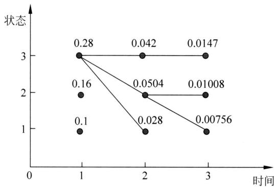  
图11.5 求最优路径

（2）在 $t = 2$ 时，对每个状态（指标） $i = 1,2,3$ ，求在 $t = 1$ 时状态为 $j$ 、观测为红并在 $t = 2$ 时状态为 $i$ 、观测 $x_{2}$ 为白的路径的最大概率值。同时，对每个状态（指标） $i = 1,2,3$ 记录概率最大的路径的前一个状态 $j$ 。

$$
\delta_ {2} (1) = \max  _ {j} [ \delta_ {1} (j) P (z _ {2} = q _ {1} | z _ {1} = q _ {j}) ] P (x _ {2} | z _ {2} = q _ {1}) = 0. 0 2 8
$$

$$
\delta_ {2} (2) = \max  _ {j} [ \delta_ {1} (j) P (z _ {2} = q _ {2} | z _ {1} = q _ {j}) ] P (x _ {2} | z _ {2} = q _ {2}) = 0. 0 5 0 4
$$

$$
\delta_ {2} (3) = \max  _ {j} [ \delta_ {1} (j) P (z _ {2} = q _ {3} | z _ {1} = q _ {j}) ] P (x _ {2} | z _ {2} = q _ {3}) = 0. 0 4 2
$$

$$
\phi_ {2} (1) = \arg \max  _ {j} [ \delta_ {1} (j) P (z _ {2} = q _ {1} | z _ {1} = q _ {j}) ] = 3
$$

$$
\phi_ {2} (2) = \arg \max  _ {j} [ \delta_ {1} (j) P (z _ {2} = q _ {2} | z _ {1} = q _ {j}) ] = 3
$$

$$
\phi_ {2} (3) = \arg \max  _ {j} [ \delta_ {1} (j) P (z _ {2} = q _ {3} | z _ {1} = q _ {j}) ] = 3
$$

同样，在 $t = 3$ 时，

$$
\delta_ {3} (1) = \max  _ {j} [ \delta_ {2} (j) P (z _ {3} = q _ {1} | z _ {2} = q _ {j}) ] P (x _ {3} | z _ {3} = q _ {1}) = 0. 0 0 7 5 6
$$

$$
\delta_ {3} (2) = \max  _ {j} [ \delta_ {2} (j) P (z _ {3} = q _ {2} | z _ {2} = q _ {j}) ] P (x _ {3} | z _ {3} = q _ {2}) = 0. 0 1 0 0 8
$$

$$
\delta_ {3} (3) = \max  _ {j} [ \delta_ {2} (j) P (z _ {3} = q _ {3} | z _ {2} = q _ {j}) ] P (x _ {3} | z _ {3} = q _ {3}) = 0. 0 1 4 7
$$

$$
\phi_ {3} (1) = \arg \max  _ {j} [ \delta_ {2} (j) P (z _ {3} = q _ {1} | z _ {2} = q _ {j}) ] = 2
$$

$$
\phi_ {3} (2) = \arg \max  _ {j} [ \delta_ {2} (j) P (z _ {3} = q _ {2} | z _ {2} = q _ {j}) ] = 2
$$

$$
\phi_ {3} (3) = \arg \max  _ {j} [ \delta_ {2} (j) P (z _ {3} = q _ {3} | z _ {2} = q _ {j}) ] = 3
$$

（3）以 $\delta^{*}$ 表示最优路径的概率，则

$$
\delta^ {*} = \max  _ {i} \delta_ {3} (i) = 0. 0 1 4 7
$$

最优路径的终点是 $s_{i_3^*}$

$$
i _ {3} ^ {*} = \arg \max  _ {i} \delta_ {3} (i) = 3
$$

（4）由最优路径的终点 $s_{i_3^*}$ ，反向找到 $s_{i_2^*}, s_{i_1^*}$

当 $t = 2$ 时， $i_2^* = \phi_3(3) = 3$

当 $t = 1$ 时， $i_1^* = \phi_2(3) = 3$

于是求得最优路径，即最优状态序列 $z^{*} = s_{i_{1}^{*}}s_{i_{2}^{*}}s_{i_{3}^{*}} = (3,3,3)$

# 本章概要

1. 隐马尔可夫模型是关于序列数据的含有隐变量的概率模型。假设有马尔可夫链，随机生成状态的序列，每一个时刻或每一个位置有一个状态。再基于状态随机生成一个观测，由此，对应着状态序列有一个观测序列。状态序列是不可观察的，而观测序列可以观察到。隐马尔可夫模型的核心在于通过观测序列来推断状态序列。

隐马尔可夫模型由马尔可夫链的初始状态概率分布、状态转移概率分布以及状态生成观测的概率分布组成。由初始状态向量 $\pi$ 、状态转移矩阵 $A$ 和观测发射矩阵 $B$ 表示，隐马尔可夫模型写作 $\lambda = (A, B, \pi)$ 。

隐马尔可夫模型是一个生成模型，表示状态序列和观测序列的联合分布，但是状态序列是隐藏的、不可观测的。观测序列 $\pmb{x}$ 的概率 $P_{\lambda}(\pmb{x})$ 写作

$$
P _ {\boldsymbol {\lambda}} (\boldsymbol {x}) = \sum_ {\boldsymbol {z}} P (z _ {1}) P (x _ {1} | z _ {1}) P (z _ {2} | z _ {1}) P (x _ {2} | z _ {2}) \dots P (z _ {T} | z _ {T - 1}) P (x _ {T} | z _ {T})
$$

隐马尔可夫模型可以用于序列标注，这时状态对应着标记。序列标注问题是指给定观测序列预测其对应的标记序列。

2. 概率计算问题。给定模型 $\lambda = (A, B, \pi)$ 和观测序列 $\pmb{x} = x_{1}x_{2}\dots x_{T}$ ，计算在模型 $\lambda$ 下观测序列 $\pmb{z}$ 出现的概率 $P(\pmb{x}|\lambda)$ 。前向-后向算法通过递归地计算前向-后向概率可以高效地进行隐马尔可夫模型的概率计算。

前向概率的递归计算公式如下：

$$
\alpha_ {t} (i) = \left[ \sum_ {j = 1} ^ {I} \alpha_ {t - 1} (j) P \left(z _ {t} = s _ {i} \mid z _ {t - 1} = s _ {j}\right) \right] P \left(x _ {t} \mid z _ {t} = s _ {i}\right), \quad i = 1, 2, \dots , I
$$

后向概率的递归计算公式如下：

$$
\beta_ {t} (i) = \sum_ {j = 1} ^ {I} P \left(z _ {t + 1} = s _ {j} \mid z _ {t} = s _ {i}\right) P \left(x _ {t + 1} \mid z _ {t + 1} = s _ {j}\right) \beta_ {t + 1} (j), \quad i = 1, 2, \dots , I
$$

也可以一起计算前向概率和后向概率：

$$
P _ {\boldsymbol {\lambda}} (\boldsymbol {x}) = \sum_ {i = 1} ^ {I} \sum_ {j = 1} ^ {I} \alpha_ {t} (i) P \left(z _ {t + 1} = s _ {j} \mid z _ {t} = s _ {i}\right) P \left(x _ {t + 1} \mid z _ {t + 1} = s _ {j}\right) \beta_ {t + 1} (j), \quad t = 1, 2, \dots , T - 1
$$

3. 学习问题。给定观测序列 $\pmb{x} = x_{1}x_{2}\dots x_{T}$ ，估计模型参数 $\lambda = (A,B,\pi)$ ，使得观测序列概率 $P_{\lambda}(\pmb{x})$ 最大。Baum-Welch算法，也就是EM算法可以高效地估计隐马尔可夫模型参数。

Baum-Welch 算法的迭代公式是

$$
a _ {i j} ^ {(n + 1)} = \frac {\sum_ {t = 1} ^ {T - 1} \xi_ {t} (i , j)}{\sum_ {t = 1} ^ {T - 1} \gamma_ {t} (i)}
$$

$$
b _ {i k} ^ {(n + 1)} = \frac {\sum_ {t = 1 , x _ {t} = o _ {k}} ^ {T} \gamma_ {t} (i)}{\sum_ {t = 1} ^ {T} \gamma_ {t} (i)}
$$

$$
\pi_ {i} ^ {(n + 1)} = \gamma_ {1} (i)
$$

这里 $\gamma_{t}(i)$ 是在时刻 $t$ 处于状态 $s_i$ 的概率， $\xi_{t}(i,j)$ 是在时刻 $t$ 处于状态 $s_i$ 且在时刻 $t + 1$ 处于状态 $s_j$ 的概率。

4. 预测问题。给定模型 $\lambda = (A, B, \pi)$ 和观测序列 $\pmb{x} = x_{1}x_{2}\dots x_{T}$ ，求对条件概率 $P_{\lambda}(z|\pmb{x})$ 最大的状态序列 $z = z_{1}z_{2}\dots z_{T}$ 。维特比算法应用动态规划高效地求解最优路径，即概率最大的状态序列。

维特比算法的递归计算公式如下。计算时刻 $t$ 到达状态 $i$ 的最大概率值

$$
\delta_ {t} (i) = \max  _ {j} [ \delta_ {t - 1} (j) P (z _ {t} = s _ {i} | z _ {t - 1} = s _ {j}) ] P (x _ {t} | z _ {t} = s _ {i})
$$

记录时刻 $t$ 到达状态 $i$ 的概率最大路径的时刻 $t - 1$ 的状态 $j^{*}$ 。

$$
\phi_ {t} (i) = \arg \max  _ {j} [ \delta_ {t - 1} (j) P (z _ {t} = s _ {i} | z _ {t - 1} = s _ {j}) ], \quad i = 1, 2, \dots , I
$$

# 继续阅读

隐马尔可夫模型的介绍可参见文献[1]和文献[2]，特别地，文献[1]是经典的介绍性论文。关于Baum-Welch算法可参见文献[3]和文献[4]。可以认为概率上下文无关文法（probabilistic context-free grammar）是隐马尔可夫模型的一种推广，隐马尔可夫模型的不可观测数据是状态序列，而概率上下文无关文法的不可观测数据是上下文无关文法树[5]。动态贝叶斯网络（dynamic Bayesian network）是定义在时序数据上的贝叶斯网络，它包含隐马尔可夫模型，作为其特殊情况[6]。

# 习题

11.1 给定盒子和球组成的隐马尔可夫模型 $\lambda = (A, B, \pi)$ ，其中，

$$
\boldsymbol {A} = \left[ \begin{array}{l l l} 0. 5 & 0. 2 & 0. 3 \\ 0. 3 & 0. 5 & 0. 2 \\ 0. 2 & 0. 3 & 0. 5 \end{array} \right], \quad \boldsymbol {B} = \left[ \begin{array}{l l} 0. 5 & 0. 5 \\ 0. 4 & 0. 6 \\ 0. 7 & 0. 3 \end{array} \right], \quad \boldsymbol {\pi} = (0. 2, 0. 4, 0. 4) ^ {\mathrm {T}}
$$

设 $T = 4$ ， $\pmb {x} =$ (红，白，红，白)，试用后向算法计算 $P(\pmb {x}|\pmb {\lambda})$ 。

11.2 考虑盒子和球组成的隐马尔可夫模型 $\lambda = (A, B, \pi)$ ，其中，

$$
\boldsymbol {A} = \left[ \begin{array}{l l l} 0. 5 & 0. 1 & 0. 4 \\ 0. 3 & 0. 5 & 0. 2 \\ 0. 2 & 0. 2 & 0. 6 \end{array} \right], \quad \boldsymbol {B} = \left[ \begin{array}{l l} 0. 5 & 0. 5 \\ 0. 4 & 0. 6 \\ 0. 7 & 0. 3 \end{array} \right], \quad \boldsymbol {\pi} = (0. 2, 0. 3, 0. 5) ^ {\mathrm {T}}
$$

设 $T = 8$ ， $\pmb {x} =$ (红，白，红，红，白，红，白，白)，用前向-后向概率计算 $P(z_{4} = s_{3}|x,\lambda)$ 。

11.3 在习题 11.1 中, 试用维特比算法求最优路径 $z^{*} = z_{1}^{*}z_{2}^{*}z_{3}^{*}z_{4}^{*}$ 。

11.4 试用前向概率和后向概率推导

$$
P (\boldsymbol {x} | \boldsymbol {\lambda}) = \sum_ {i = 1} ^ {I} \sum_ {j = 1} ^ {I} \alpha_ {t} (i) P (z _ {t + 1} = s _ {j} | z _ {t} = s _ {i}) P (x _ {t + 1} | z _ {t + 1} = s _ {j}) \beta_ {t + 1} (j), \quad t = 1, 2, \dots , T - 1
$$

11.5 指出维特比算法中 $\delta$ 的计算和前向算法中 $\alpha$ 的计算的相似性。

# 参考文献

[1] RABINER L, JUANG B. An introduction to hidden Markov Models[J]. IEEE ASSP Magazine, 1986, 3(1): 4-16.   
[2] RABINER L. A tutorial on hidden Markov models and selected applications in speech recognition[J]. Proceedings of IEEE, 1989, 77(2): 257-286.   
[3] BAUM L, et al. A maximization technique occurring in the statistical analysis of probabilistic functions of Markov chains[J]. Annals of Mathematical Statistics, 1970, 41: 164-171.   
[4] BILMES J A. A gentle tutorial of the EM algorithm and its application to parameter estimation for Gaussian mixture and hidden Markov models[Z/OL]. http://ssli.ee.washington.edu/~bilmes/mypubs/bilmes1997-em.pdf.   
[5] LARI K, YOUNG S J. Applications of stochastic context-free grammars using the Inside-Outside algorithm[J]. Computer Speech & Language, 1991, 5(3): 237-257.   
[6] GHAHRAMANI Z. Learning dynamic Bayesian networks[J]. Lecture Notes in Computer Science, 1997, 1387: 168-197.

# 第12章 条件随机场

条件随机场（conditional random field, CRF）是给定一组输入随机变量条件下另一组输出随机变量的条件概率分布模型，其特点是假设输出随机变量构成马尔可夫随机场。条件随机场可以用于不同的预测问题，本书仅论及它在序列标注问题的应用。因此主要讲述线性链条件随机场（linear chain conditional random field），这时，问题变为根据输入观测序列来预测输出标记序列的问题。

马尔可夫随机场或概率无向图模型是一种概率图模型，由无向图表示联合分布的随机变量之间的概率相关关系。马尔可夫随机场模型的联合概率分布正比于无向图的最大图上的势函数的乘积。在线性链条件随机场中，给定观测序列条件下的标记序列的条件概率分布可以表示为特征的线性组合的指数函数形式，也就是对数线性模型。其学习方法通常是极大似然估计。

条件随机场也有概率计算、学习和预测三个基本问题。同隐马尔可夫模型一样，有高效的算法完成这三个任务，分别是前向-后向算法、拟牛顿法、维特比算法。条件随机场在自然语言处理、语音识别、计算机视觉等领域中有广泛的应用。将线性链条件随机场应用于序列标注问题是由Lafferty等于2001年提出的。

本章12.1节介绍概率无向图模型或马尔可夫随机场，12.2节叙述条件随机场的定义和表示方法，12.3节～12.5节讲述条件随机场的三个基本问题的算法，即概率计算、学习和预测的算法。

# 12.1 概率无向图模型

概率无向图模型又称为马尔可夫随机场，是一种概率图模型。本节首先介绍概率无向图模型的定义，然后讲解概率无向图模型的因子分解。

# 12.1.1 模型的定义

概率无向图模型（probabilistic undirected graphical model）或马尔可夫随机场（Markov random field）是一种概率图模型。假设有一组随机变量，概率无向图模型用无向图表示这些随机变量之间的相关关系，整体描述这些随机变量的联合概率分布。随机变量由图中的结点表示，而变量之间的相关关系由图中的边表示。如果两个随机变量对应的结点在图中没有边

直接相连，那么在给定其他所有结点的变量的条件下，这两个变量条件独立。其联合概率分布满足成对马尔可夫性、局部马尔可夫性和全局马尔可夫性等性质。

图（graph）是由结点（vertex）及连接结点的边（edge）组成的集合。结点和边分别记作 $v$ 和 $e$ ，结点和边的集合分别记作 $V$ 和 $E$ ，图记作 $G = (V, E)$ 。无向图是指边没有方向的图。

设有联合概率分布 $P(X)$ ，其中 $X$ 是一组随机变量。用无向图 $G = (V, E)$ 表示概率分布 $P(X)$ 。在图 $G$ 中，一个结点 $v \in V$ 表示一个随机变量；一条边 $e \in E$ 表示两个随机变量之间的概率相关关系。 $X_v$ 是结点 $v$ 对应的随机变量。 $X_V$ 是 $V$ 中所有结点对应的随机变量。

给定一个联合概率分布 $P(X)$ 和表示它的无向图 $G$ 。首先定义无向图表示的随机变量之间存在的成对马尔可夫性（pairwise Markov property）、局部马尔可夫性（local Markov property）和全局马尔可夫性（global Markov property）。

成对马尔可夫性：设 $u$ 和 $v$ 是无向图 $G$ 中任意两个没有边连接的结点，结点 $u$ 和 $v$ 分别表示随机变量 $X_{u}$ 和 $X_{v}$ 。其他所有结点的集合记作 $V \backslash \{u, v\}$ ，表示的随机变量是 $X_{V \backslash \{u, v\}}$ 。成对马尔可夫性是指给定随机变量 $X_{V \backslash \{u, v\}}$ 的条件下随机变量 $X_{u}$ 和 $X_{v}$ 是条件独立的，即

$$
P \left(X _ {u}, X _ {v} \mid X _ {V \backslash \{u, v \}}\right) = P \left(X _ {u} \mid X _ {V \backslash \{u, v \}}\right) P \left(X _ {v} \mid X _ {V \backslash \{u, v \}}\right) \tag {12.1}
$$

也记作

$$
X _ {u} \bot X _ {v} \mid X _ {V \backslash \{u, v \}} \tag {12.2}
$$

图12.1显示式 $(12.1)\sim$ 式(12.2)所示的成对马尔可夫性的例子。

  
图12.1 成对马尔可夫性示例

局部马尔可夫性：设 $u \in V$ 是无向图 $G$ 中任意一个结点， $N(u)$ 是与 $u$ 相邻（有边连接）的所有结点的集合， $V \backslash (\{u\} \cup N(u))$ 是 $u$ 和 $N(u)$ 以外的其他所有结点的集合。 $u$ 表示的随机变量是 $X_v$ ， $N(u)$ 表示的随机变量是 $X_{N(u)}$ ， $V \backslash (\{u\} \cup N(u))$ 表示的随机变量是 $X_{V \backslash (\{u\} \cup N(u))}$ 。局部马尔可夫性是指在给定随机变量 $X_{N(u)}$ 的条件下随机变量 $X_u$ 与随机变量 $X_{V \backslash (\{u\} \cup N(u))}$ 是条件独立的，即

$$
P \left(X _ {u}, X _ {V \backslash \{u \} \cup N (u)} \mid X _ {N (u)}\right) = P \left(X _ {u} \mid X _ {N (i)}\right) P \left(X _ {V \backslash \{\{u \} \cup N (u) \}} \mid X _ {N (u)}\right) \tag {12.3}
$$

也记作

$$
X _ {u} \bot X _ {V \backslash (\{u \} \cup N (u))} | X _ {N (u)} \tag {12.4}
$$

图12.2显示式 $(12.3)\sim$ 式(12.4)所示的局部马尔可夫性的例子。

全局马尔可夫性：设结点集合 $A$ 和 $B$ 是在无向图 $G$ 中被结点集合 $S$ 隔开的任意的结点

  
图12.2 局部马尔可夫性示例

集合。结点集合 $A$ ， $B$ 和 $S$ 所表示的随机变量分别是 $X_{A}$ 、 $X_{B}$ 和 $X_{S}$ 。全局马尔可夫性是指给定随机变量 $X_{S}$ 的条件下随机变量 $X_{A}$ 和 $X_{B}$ 是条件独立的，即

$$
P \left(X _ {A}, X _ {B} \mid X _ {S}\right) = P \left(X _ {A} \mid X _ {S}\right) P \left(X _ {B} \mid X _ {S}\right) \tag {12.5}
$$

也记作

$$
X _ {A} \bot X _ {B} | X _ {S} \tag {12.6}
$$

图12.3显示式 $(12.5)\sim$ 式(12.6)所示的全局马尔可夫性的例子。

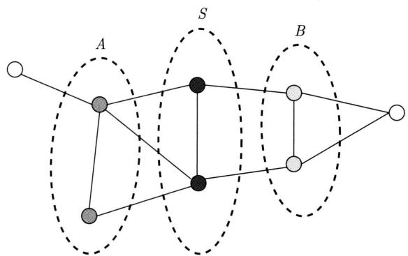  
图12.3 全局马尔可夫性示例

关于上述成对、局部、全局马尔可夫性有以下定理成立。

定理12.1（等价性）如果由无向图表示的联合概率分布 $P(X)$ 是严格正的，那么这个联合概率分布的成对马尔可夫性、局部马尔可夫性、全局马尔可夫性是等价的。

证明

(1) 全局马尔可夫性 $\Rightarrow$ 局部马尔可夫性

设全局马尔可夫性成立。考虑任意一个结点 $u$ 和它的相邻结点的集合 $N(u)$ ， $V \setminus (\{u\} \cup N(u))$ 是 $\{u\}$ 和 $N(u)$ 以外的其他所有结点的集合。全局马尔可夫性意味着，任意两个结点集合 $A$ 和 $B$ ，它们若被结点集合 $S$ 隔开，则有

$$
X _ {A} \bot X _ {B} | X _ {S}
$$

考虑一个具体情况，满足 $A$ 和 $B$ 被 $S$ 隔开的条件

$$
A = \{u \}, S = N (u), B = V \backslash (\{u \} \cup N (u))
$$

故有

$$
X _ {u} \bot X _ {V \backslash (\{u \} \cup N (u))} | X _ {N (u)}
$$

即局部马尔可夫性成立。

（2）局部马尔可夫性 $\Rightarrow$ 成对马尔可夫性

设局部马尔可夫性成立。考虑任意两个没有边连接的结点 $u$ 和 $v$ ，结点 $u$ 的相邻结点的集合是 $N(u)$ 。因此，结点 $v$ 属于集合 $v \in V \backslash (\{u\} \cup N(u))$ 。由于结点集合 $N(u)$ 将结点集合 $\{u\}$ 和 $V \backslash (\{u\} \cup N(u))$ 隔开，根据局部马尔可夫性，有以下条件独立性成立：

$$
X _ {u} \bot X _ {V \backslash (\{u \} \cup N (u))} | X _ {N (u)}
$$

因为 $v \in V \backslash (\{u\} \cup N(u))$ ，所以有

$$
X _ {u} \bot X _ {v} | X _ {N (u)}
$$

因为有关系 $N(u)\subset V\backslash \{u,v\}$ 成立，可以把条件从 $N(u)$ 扩大到 $V\backslash \{u,v\}$ ，所以有

$$
X _ {u} \bot X _ {v} | X _ {V \backslash \{u, v \}}
$$

即成对马尔可夫性成立。

（3）成对马尔可夫性 $\Rightarrow$ 全局马尔可夫性

这里省略证明，读者可参照文献[1]。证明用到联合概率分布严格正的条件。

下面给出概率无向图模型或马尔可夫随机场的定义。

定义12.1（概率无向图模型或马尔可夫随机场）设有联合概率分布 $P(X)$ ，由无向图 $G = (V, E)$ 表示，在图 $G$ 中，结点表示随机变量，边表示随机变量之间的概率相关关系。如果联合概率分布 $P(X)$ 是严格正的，且满足成对、局部或全局马尔可夫性，就称此联合概率分布为概率无向图模型或马尔可夫随机场。

相比概率无向图模型，概率有向图模型的边是有方向的（单向），表示随机变量之间的概率依存关系。概率有向图模型和概率无向图模型是两种不同的概率图模型。

以上是概率无向图模型的定义。实际上，我们更关心的是如何求其联合概率分布。对给定的概率无向图模型，我们希望将整体的联合概率写成若干子联合概率的乘积的形式，也就是对联合概率进行因子分解，这样便于模型的学习与计算。事实上，概率无向图模型的最大特点就是易于因子分解。下面介绍这一结果。

# 12.1.2 概率无向图模型的因子分解

首先给出无向图中的团与最大团的定义。

定义12.2（团与最大团）无向图 $G$ 中任何两个结点均有边连接的结点子集称为团（clique）。若 $C$ 是无向图 $G$ 的一个团，并且不能再加进任何一个 $G$ 的结点使其成为一个更大的团，则称此 $C$ 为最大团（maximal clique）。

图12.4表示由4个结点组成的无向图。图中由两个结点组成的团有5个： $\{v_{1},v_{2}\} ,\{v_{2},v_{3}\}$ ， $\{v_{3},v_{4}\}$ ， $\{v_4,v_2\}$ 和 $\{v_{1},v_{3}\}$ 。有两个由三个结点组成的团： $\{v_{1},v_{2},v_{3}\}$ 和 $\{v_{2},v_{3},v_{4}\}$ 。而

$\{v_{1}, v_{2}, v_{3}, v_{4}\}$ 不是一个团，因为 $v_{1}$ 和 $v_{4}$ 没有边连接。所以， $\{v_{1}, v_{2}, v_{3}\}$ 和 $\{v_{2}, v_{3}, v_{4}\}$ 是最大团。

  
图12.4 无向图的团和最大团

将概率无向图模型的联合概率分布表示为其最大团上的严格正函数的乘积除以一个归一化因子的操作，称为概率无向图模型的因子分解（factorization）。

给定概率无向图模型，设其无向图为 $G$ ， $C$ 表示 $G$ 上的一个最大团， $X_{C}$ 表示 $C$ 对应的随机变量，那么概率无向图模型的联合概率分布 $P(X)$ 可写作图中所有最大团 $C$ 上的严格正的函数 $\Psi_C(X_C)$ 的乘积形式，即

$$
P (X) = \frac {1}{Z} \prod_ {C} \Psi_ {C} \left(X _ {C}\right) \tag {12.7}
$$

其中， $Z$ 是归一化因子（normalization factor），由式

$$
Z = \sum_ {X ^ {\prime}} \prod_ {C} \Psi_ {C} \left(X _ {C} ^ {\prime}\right) \tag {12.8}
$$

给出。归一化因子保证 $P(X)$ 构成一个概率分布。通常定义 $\varPsi_{C}(X_{C})$ 为指数函数，称为势函数（potential function），即

$$
\varPsi_ {C} \left(X _ {C}\right) = \exp (- E \left(X _ {C}\right)) \tag {12.9}
$$

其中， $E(X_{C})$ 是能量函数。势函数是严格正的。

概率无向图模型的因子分解由下述定理来保证。

定理12.2（Hammersley-Clifford定理）概率无向图模型或马尔可夫随机场的联合概率分布 $P(X)$ 可以表示为如下形式：

$$
P (X) = \frac {1}{Z} \prod_ {C} \Psi_ {C} (X _ {C})
$$

$$
Z = \sum_ {X ^ {\prime}} \prod_ {C} \Psi_ {C} \left(X _ {C} ^ {\prime}\right)
$$

其中， $C$ 是无向图的最大团， $X_{C}$ 是 $C$ 的结点对应的随机变量， $\Psi_C(X_C)$ 是 $C$ 上定义的严格正函数，乘积在无向图所有的最大团上进行， $Z$ 是归一化因子。

通过因子分解，概率无向图中的概率计算可以得到大幅简化，然而其中归一化因子部分的计算仍然具有很高的复杂度。这是在概率无向图模型或马尔可夫随机场的学习和预测过程中需要解决的问题。

# 12.1.3 概率无向图模型的例子

例 12.1 假设有一个机器学习系统，由数据收集、数据标注、数据存储、模型训练、模型部署、用户界面六个模块组成。模块根据系统机器学习流程连接在一起。数据标注、数据存储、模型训练、模型部署、用户界面依次连接；数据收集与数据标注、数据存储、用户界面相连接。每个模块有两种可能的状态：正常和异常。现在要构建一个概率模型，用于对这个系统的异常分析。一个随机变量代表一个模块的状态，随机变量取二值，1 和 0 分别表示状态是正常和异常。概率模型要刻画的是这些随机变量的联合概率分布。

可以学习和使用一个概率无向图模型用于这一目的。结点表示模块，边表示模块之间的关系。如果系统的两个模块是相互连接的，那么就在对应的结点之间建立一条边。图12.5显示这个概率无向图模型。

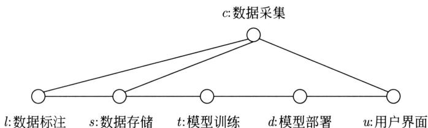  
图12.5 概率无向图模型的例子。如果两个模块在系统中是连接的，那么在对应的结点之间建立一条边

（1）机器学习系统中相连的模块（结点）之间存在直接的相关关系，而不相连的模块之间仅有间接的相关关系。注意，模型仅刻画模块之间的相关性，无法确定模块之间的因果关系。

更严格地讲，这个概率无向图模型满足成对马尔可夫性、局部马尔可夫性、全局马尔可夫性。比如，有以下成对马尔可夫性成立：

$$
X _ {t} \bot X _ {u} | _ {X _ {\{d, c, s, l \}}}
$$

其直观解释是在其他模块的状态确定的条件下模型训练和用户界面的状态是相互独立的。还有以下局部马尔可夫性成立：

$$
X _ {t} \bot X _ {\{l, c, u \}} | X _ {\{s, d \}}
$$

说明在数据存储和模型部署的状态确定的条件下模型训练和其他模块的状态是相互独立的。还有以下全局马尔可夫性成立：

$$
X _ {l} \bot X _ {\{t, d, u \}} | X _ {\{c, s \}}
$$

说明在数据收集和数据存储的状态确定的条件下数据标注和其他模块的状态是相互独立的。

(2) 图 12.5 的概率无向图模型有 5 个最大团, 分别是 $\{l, s, c\}, \{s, t\}, \{t, d\}, \{d, u\}, \{c, u\}$ 。

可以对这个无向图模型做因子分解。这个无向图模型表示的联合概率分布可以写成

$$
\begin{array}{l} P \left(X _ {l}, X _ {s}, X _ {c}, X _ {t}, X _ {d}, X _ {u}\right) \\ \propto f \left(X _ {l}, X _ {s}, X _ {c}\right) f \left(X _ {s}, X _ {t}\right) f \left(X _ {t}, X _ {d}\right) f \left(X _ {d}, X _ {u}\right) f \left(X _ {c}, X _ {u}\right) \tag {12.10} \\ \end{array}
$$

其中， $f$ 表示势函数。

（3）Hammersley-Clifford 定理中的充分条件是容易验证的。也就是，概率无向图模型表示的联合概率分布，如果正比于最大团上的严格正函数的乘积 (式 (12.10))，那么这个联合概率分布满足（全局）马尔可夫独立性条件。

假设结点 $s$ 和 $c$ 的取值已知且等于1，那么联合概率分布可以写作

$$
\begin{array}{l} P \left(X _ {l}, X _ {s} = 1, X _ {c} = 1, X _ {t}, X _ {d}, X _ {u}\right) \\ \propto f \left(X _ {l}, X _ {s} = 1, X _ {c} = 1\right) \left[ f \left(X _ {s} = 1, X _ {t}\right) f \left(X _ {t}, X _ {d}\right) f \left(X _ {d}, X _ {u}\right) f \left(X _ {c} = 1, X _ {u}\right) \right] \\ = g \left(X _ {l}\right) g \left(X _ {t}, X _ {d}, X _ {u}\right) \tag {12.11} \\ \end{array}
$$

最后是两个正函数 $g(X_{l})$ 和 $g(X_{t},X_{d},X_{u})$ 的乘积。也就是说，随机变量 $X_{l}$ 和随机变量 $X_{t},X_{d},X_{u}$ 是相互独立的，即有

$$
X _ {l} \bot \left\{X _ {t}, X _ {d}, X _ {u} \right\} \mid \left\{X _ {s}, X _ {c} \right\}
$$

通过因子分解，就可以高效地计算联合概率(式(12.11))。

# 12.2 条件随机场的基本概念

本节讲述条件随机场，特别是线性链条件随机场的定义、形式和基本问题。

# 12.2.1 模型的定义

条件随机场（conditional random field）是给定随机变量 $X$ 的条件下，随机变量 $Y$ 的马尔可夫随机场。首先定义一般的条件随机场，然后定义线性链条件随机场。

定义12.3（条件随机场）设 $X$ 与 $Y$ 是随机变量， $P(Y|X)$ 是在给定 $X$ 的条件下 $Y$ 的条件概率分布。若随机变量 $Y$ 构成一个由无向图 $G = (V, E)$ 表示的马尔可夫随机场，即

$$
P \left(Y _ {v} \mid X, Y _ {w}, w \neq v\right) = P \left(Y _ {v} \mid X, Y _ {w}, w \sim v\right) \tag {12.12}
$$

对任意结点 $v$ 成立，或满足局部马尔可夫性，则称条件概率分布 $P(Y|X)$ 为条件随机场。式中 $w \sim v$ 表示在图 $G = (V, E)$ 中与结点 $v$ 有边连接的所有结点 $w, w \neq v$ 表示结点 $v$ 以外的所有结点， $Y_v, Y_u$ 与 $Y_w$ 为结点 $v, u$ 与 $w$ 对应的随机变量。条件随机场是判别模型。

随机变量 $X$ 可以由另一个无向图表示，与表示随机变量 $Y$ 的无向图 $G$ 连接。随机变量 $X$ 也可以不由任何图表示，只表示条件概率分布的条件。

本章主要介绍定义在序列数据上的特殊的条件随机场，称为线性链条件随机场（linear chain conditional random field）。线性链条件随机场是有代表性的用于序列标注的方法。这时，在条件概率模型 $P(\boldsymbol{y}|\boldsymbol{x})$ 中， $\boldsymbol{y}$ 是输出变量，表示标记序列， $\boldsymbol{x}$ 是输入变量，表示需要标注的观测序列。也把标记序列称为状态序列（参见第11章的隐马尔可夫模型）。学习时，利用训练数据集通过极大似然估计或正则化的极大似然估计得到条件概率模型 $\hat{P}(\boldsymbol{y}|\boldsymbol{x})$ ；预测时，对于给定的输入序列 $\boldsymbol{x}$ ，求出条件概率 $\hat{P}(\boldsymbol{y}|\boldsymbol{x})$ 最大的输出序列 $\boldsymbol{y}^*$ 。

定义12.4（线性链条件随机场）设 $\pmb {x} = x_{1},x_{2},\dots ,x_{T}$ ， $\pmb {y} = y_{1},y_{2},\dots ,y_{T}$ 均为离散随机变量的序列，若在给定随机变量序列 $\pmb{x}$ 的条件下，随机变量序列 $\pmb{y}$ 的条件概率分布 $P(\pmb {y}|\pmb {x})$ 构成条件随机场，即满足局部马尔可夫性

$$
\begin{array}{l} P \left(y _ {t} \mid \boldsymbol {x}, y _ {1}, \dots , y _ {t - 1}, y _ {t + 1}, \dots , y _ {T}\right) = P \left(y _ {t} \mid \boldsymbol {x}, y _ {t - 1}, y _ {t + 1}\right) \\ t = 1, 2, \dots , T \tag {12.13} \\ \end{array}
$$

则称 $P(\boldsymbol{y} \mid \boldsymbol{x})$ 为线性链条件随机场。在序列标注中, $\boldsymbol{x}$ 表示输入观测序列, $\boldsymbol{y}$ 表示对应的输出标记序列或状态序列。如下面所述, 根据 Hammersley-Clifford 定理, 可以将线性链条件随机场表示为等价的特征的线性组合的指数函数形式, 也就是对数线性模型 (log-linear model)。

输入的随机变量序列 $\pmb{x} = x_{1},x_{2},\dots ,x_{T}$ 由一个结点或多个结点表示，输出的随机变量序列 $\pmb {y} = y_{1},y_{2},\dots ,y_{T}$ 由线性链无向图 $G$ 表示，如图12.6和图12.7所示。

$$
G = (V = \{1, 2, \dots , T \}, E = \{(t, t + 1) \}), \quad t = 1, 2, \dots , T - 1
$$

线性链无向图 $G$ 的最大团是所有相邻结点的集合，对应着线性链上的所有的边。

  
图12.6 线性链条件随机场。实心圆表示可观测变量，空心圆表示不可观测变量

  
图12.7 线性链条件随机场。实心圆表示可观测变量，空心圆表示不可观测变量

# 12.2.2 模型的形式

线性链条件随机场的模型可以由三种等价的形式表示。本书分别称为基本形式、一般形式和矩阵形式。这三种表示形式各自适用于不同的场合。

# 1. 基本形式

根据Hammersley-Clifford定理（定理12.2），可以对线性链条件随机场 $P(\pmb{y}|\pmb{x})$ 进行因子分解，其中的各个因子是定义在相邻两个结点（最大团）上的特征的线性组合的指数函数。因此，线性链条件随机场模型 $P(\pmb{y}|\pmb{x})$ 可以写作以下形式，表示在观测序列 $\pmb{x}$ 给定条件下的标记序列 $\pmb{y}$ 的条件概率。

$$
P (\boldsymbol {y} | \boldsymbol {x}) = \frac {1}{Z (\boldsymbol {x})} \exp \left(\sum_ {t = 1} ^ {T + 1} \sum_ {j = 1} ^ {M} \lambda_ {j} f _ {j} \left(y _ {t - 1}, y _ {t}, \boldsymbol {x}, t\right) + \sum_ {t = 1} ^ {T + 1} \sum_ {l = 1} ^ {L} \mu_ {l} g _ {l} \left(y _ {t}, \boldsymbol {x}, t\right)\right) \tag {12.14}
$$

其中，

$$
Z (\boldsymbol {x}) = \sum_ {\boldsymbol {y} ^ {\prime}} \exp \left(\sum_ {t = 1} ^ {T + 1} \sum_ {j = 1} ^ {M} \lambda_ {j} f _ {j} \left(y _ {t - 1} ^ {\prime}, y _ {t} ^ {\prime}, \boldsymbol {x}, t\right) + \sum_ {t = 1} ^ {T + 1} \sum_ {l = 1} ^ {L} \mu_ {l} g _ {l} \left(y _ {t} ^ {\prime}, \boldsymbol {x}, t\right)\right) \tag {12.15}
$$

式中， $f_{j}$ 和 $g_{l}$ 是特征函数， $\lambda_{j}$ 和 $\mu_{l}$ 是对应的权值， $Z(\pmb{x})$ 是归一化因子（normalizing factor），求和是在所有可能的输出序列 $\pmb{y}'$ 上进行的。

在式(12.14)和式(12.15)中， $f_{j}$ 是定义在边上的特征函数，称为转移特征，依赖于当前和前一个位置（结点）的输出标记 $y_{t - 1}$ 和 $y_{t}$ ； $g_{l}$ 是定义在结点上的特征函数，称为状态特征，依赖于当前位置（结点）的输出标记 $y_{t}$ 。 $f_{j}$ 和 $g_{l}$ 都依赖于整个输入序列 $\pmb{x}$ 。特征函数 $f_{j}$ 和 $g_{l}$ 通常是指示函数，取值1或0；当满足特征条件时取值为1，否则为0。通常假设特征是相对位置的函数，而不是绝对位置的函数。

图12.6显示这样的线性链条件随机场。这里序列的起始和终止由特殊标记表示， $y_{0} = \mathrm{start}$ ， $y_{T + 1} = \mathrm{stop}$ 。

线性链条件随机场模型也可以简化为以下形式：

$$
P (\boldsymbol {y} | \boldsymbol {x}) = \frac {1}{Z (\boldsymbol {x})} \exp \left(\sum_ {t = 1} ^ {T + 1} \sum_ {j = 1} ^ {M} \lambda_ {j} f _ {j} \left(y _ {t - 1}, y _ {t}, x _ {t}\right) + \sum_ {t = 1} ^ {T + 1} \sum_ {l = 1} ^ {L} \mu_ {l} g _ {l} \left(y _ {t}, x _ {t}\right)\right) \tag {12.16}
$$

其中，

$$
Z (\boldsymbol {x}) = \sum_ {\boldsymbol {y} ^ {\prime}} \exp \left(\sum_ {t = 1} ^ {T + 1} \sum_ {j = 1} ^ {M} \lambda_ {j} f _ {j} \left(y _ {t - 1} ^ {\prime}, y _ {t} ^ {\prime}, x _ {t}\right) + \sum_ {t = 1} ^ {T + 1} \sum_ {l = 1} ^ {L} \mu_ {l} g _ {l} \left(y _ {t} ^ {\prime}, x _ {t}\right)\right) \tag {12.17}
$$

式中， $f_{j}$ 和 $g_{l}$ 是特征函数， $\lambda_{j}$ 和 $\mu_{l}$ 是对应的权值， $Z(\boldsymbol{x})$ 是归一化因子，求和是在所有可能的输出序列 $\boldsymbol{y}'$ 上进行的。特征 $f_{j}$ 和 $g_{l}$ 只依赖于当前位置（结点）的输入观测 $x_{t}$ 。图12.7显示这样的线性链条件随机场。

可以看出，线性链条件随机场是最大熵模型和逻辑斯谛回归模型的推广，它们都归属于对数线性模型。线性链条件随机场是定义在序列数据之上的一种多分类模型；标记序列表示的类别数量会随着序列长度的增加而指数级增加。

线性链条件随机场和隐马尔可夫模型都是序列标注模型。事实上，可以将隐马尔可夫模型转换为线性链条件随机场的形式。假设 $\pmb{y}$ 是状态序列， $\pmb{x}$ 是观测序列，隐马尔可夫模型表示的联合概率分布可以改写成

$$
P (\boldsymbol {y}, \boldsymbol {x}) = \exp \left(\sum_ {t = 1} ^ {T + 1} \sum_ {s _ {i}, s _ {j}} \lambda_ {i j} I \left(y _ {t - 1} = s _ {i}\right) I \left(y _ {t} = s _ {j}\right) + \sum_ {t = 1} ^ {T + 1} \sum_ {s _ {i}, o _ {k}} \mu_ {i k} I \left(y _ {t} = s _ {i}\right) I \left(x _ {t} = o _ {k}\right)\right) \tag {12.18}
$$

其中， $I$ 是指示函数， $\lambda_{ij}$ 和 $\mu_{ik}$ 分别定义为转移概率和发射概率的对数：

$$
\lambda_ {i j} = \log P (s _ {j} | s _ {i}), \quad \mu_ {i k} = \log P (o _ {k} | s _ {i})
$$

容易验证，隐马尔可夫模型的条件概率分布 $P(\pmb{y}|\pmb{x})$ 可以表示为式 (12.16)～式 (12.17) 所示的线性链条件随机场的形式。

线性链条件随机场不仅可以使用上述转移特征和状态特征，还可以使用其他特征。作为判别模型，线性链条件随机场能够利用更多的信息进行序列标注。例如，在英文词性标注任务中，可以使用当前观测单词的特征，如当前的单词是否首字母大写，当前的单词是否以 ing 结尾，是否前一个单词的词性是冠词且当前的单词是 man，等等。这是条件随机场一般比隐马尔可夫模型在序列标注上有更好性能的重要原因。

下面看一个简单的线性链条件随机场的例子。

例12.2 设有一序列标注问题：输入观测序列为 $\mathbf{x} = x_{1}x_{2}x_{3}$ ，输出标记序列为 $\mathbf{y} = y_{1}y_{2}y_{3}$ ， $y_{t}$ 取值0或1。

用线性链条件随机场建模。假设特征 $f_{j}$ 和 $g_{l}$ 对应的权值 $\lambda_{j}$ 和 $\mu_{l}$ 如下。这里只注明特征取值为1的情况，取值为0的情况省略。

$$
f _ {0} \left(y _ {0}, y _ {1}, x _ {1}\right) = 1, \quad \lambda_ {0} = 0
$$

$$
f _ {1} \left(y _ {t - 1} = 0, y _ {t} = 0, x _ {t}\right) = 1, \quad t = 2, 3, \quad \lambda_ {1} = 1
$$

$$
f _ {2} \left(y _ {t - 1} = 0, y _ {t} = 1, x _ {t}\right) = 1, \quad t = 2, 3, \quad \lambda_ {2} = - 1
$$

$$
f _ {3} \left(y _ {t - 1} = 1, y _ {t} = 0, x _ {t}\right) = 1, \quad t = 2, 3, \quad \lambda_ {3} = 2
$$

$$
f _ {4} \left(y _ {t - 1} = 1, y _ {t} = 1, x _ {t}\right) = 1, \quad t = 2, 3, \quad \lambda_ {4} = - 2
$$

$$
g _ {1} \left(y _ {t} = 0, x _ {t}\right) = 1, \quad t = 1, 2, 3, \quad \mu_ {1} = 0. 5
$$

$$
g _ {2} \left(y _ {t} = 1, x _ {t}\right) = 1, \quad t = 1, 2, 3, \quad \mu_ {2} = 1
$$

对给定的观测序列 $\pmb{x}$ ，求标记序列为 $y = y_{1}y_{2}y_{3} = (1,0,0)$ 的未归一化概率。

解 由式(12.16)，线性链条件随机场模型为

$$
P (\boldsymbol {y} | \boldsymbol {x}) \propto \exp \left(\lambda_ {0} f _ {0} \left(y _ {0}, y _ {1}, x _ {1}\right) + \sum_ {t = 2} ^ {3} \sum_ {j = 1} ^ {4} \lambda_ {j} f _ {j} \left(y _ {t - 1}, y _ {t}, x _ {t}\right) + \sum_ {t = 1} ^ {3} \sum_ {l = 1} ^ {2} \mu_ {l} g _ {l} \left(y _ {t}, x _ {t}\right)\right)
$$

对给定的观测序列 $\pmb{x}$ ，标记序列 $\pmb{y} = (1,0,0)$ 的未归一化概率为

$$
P \left(y _ {1} = 1, y _ {2} = 0, y _ {3} = 0 | \boldsymbol {x}\right) \propto \exp (5)
$$

# 2. 一般形式

为简便起见，有时将转移特征和状态特征及其权值用统一的符号表示。设有 $M$ 个转移特

征， $L$ 个状态特征， $M^{\prime} = M + L$ ，记

$$
f _ {j} \left(y _ {t - 1}, y _ {t}, \boldsymbol {x}, t\right) = \left\{ \begin{array}{l l} f _ {j} \left(y _ {t - 1}, y _ {t}, \boldsymbol {x}, t\right), & j = 1, 2, \dots , M \\ g _ {l} \left(y _ {t}, \boldsymbol {x}, t\right), & j = M + l, l = 1, 2, \dots , L \end{array} \right. \tag {12.19}
$$

线性链条件随机场模型可以写作

$$
P (\boldsymbol {y} | \boldsymbol {x}) = \frac {1}{Z (\boldsymbol {x})} \exp \left(\sum_ {t = 1} ^ {T + 1} \sum_ {j = 1} ^ {M ^ {\prime}} w _ {j} f _ {j} \left(y _ {t - 1}, y _ {t}, \boldsymbol {x}, t\right)\right) \tag {12.20}
$$

$$
Z (\boldsymbol {x}) = \sum_ {\boldsymbol {y} ^ {\prime}} \exp \left(\sum_ {t = 1} ^ {T + 1} \sum_ {j = 1} ^ {M ^ {\prime}} w _ {j} f _ {j} \left(y _ {t - 1} ^ {\prime}, y _ {t} ^ {\prime}, \boldsymbol {x}, t\right)\right) \tag {12.21}
$$

甚至更一般的，

$$
P (\boldsymbol {y} | \boldsymbol {x}) = \frac {1}{Z (\boldsymbol {x})} \exp \left(\sum_ {j = 1} ^ {M ^ {\prime}} w _ {j} f _ {j} (\boldsymbol {y}, \boldsymbol {x})\right) \tag {12.22}
$$

$$
Z (\boldsymbol {x}) = \sum_ {\boldsymbol {y} ^ {\prime}} \exp \left(\sum_ {j = 1} ^ {M ^ {\prime}} w _ {j} f _ {j} (\boldsymbol {y}, \boldsymbol {x})\right) \tag {12.23}
$$

这里，

$$
f _ {j} (\boldsymbol {y}, \boldsymbol {x}) = \sum_ {t = 1} ^ {T + 1} f _ {j} \left(y _ {t - 1}, y _ {t}, \boldsymbol {x}, t\right)
$$

假设特征依赖于相对位置，而不是绝对位置。这样，各个位置上的同一特征的函数可以相加，构成整个序列上的这个特征的函数。

归一化因子的计算要针对所有可能的标记序列进行，直接进行计算的计算复杂度是 $O(T \cdot I^T)$ ，其中 $I$ 表示标记的种类数， $T$ 表示序列的长度。这个复杂度是不可接受的，现实中需要使用后述的高效概率计算算法。

# 3. 矩阵形式

线性链条件随机场还可以由矩阵表示。假设 $P_{\boldsymbol{w}}(\boldsymbol{y}|\boldsymbol{x})$ 是由式 $(12.20) \sim$ 式 (12.21) 给出的线性链条件随机场，表示对给定观测序列 $\boldsymbol{x}$ ，相应的标记序列 $\boldsymbol{y}$ 的条件概率 $P_{\boldsymbol{w}}(\boldsymbol{y}|\boldsymbol{x})$ 。对每个标记序列引入特殊的起点和终点标记 $y_0 = \text{start}$ 和 $y_{T+1} = \text{stop}$ ，这时条件概率 $P_{\boldsymbol{w}}(\boldsymbol{y}|\boldsymbol{x})$ 可以通过矩阵形式表示并计算。

对观测序列 $\pmb{x}$ 的每一个位置 $t = 1,2,\dots ,T + 1$ ，由于 $y_{t - 1}$ 和 $y_{t}$ 在 $I$ 个标记中取值，可以定义一个 $I\times I$ 矩阵：

$$
\boldsymbol {M} _ {t} (\boldsymbol {x}) = \left[ \Psi_ {t} \left(y _ {t - 1}, y _ {t}, \boldsymbol {x}\right) \right] \tag {12.24}
$$

矩阵的元素为

$$
\varPsi_ {t} \left(y _ {t - 1}, y _ {t}, \boldsymbol {x}\right) = \exp \left(\sum_ {j = 1} ^ {M} w _ {j} f _ {j} \left(y _ {t - 1}, y _ {t}, \boldsymbol {x}, t\right)\right) \tag {12.25}
$$

矩阵 $M_{1}(\pmb {x})$ 实际是 $I$ 阶行向量，矩阵 $M_{T + 1}(\pmb {x})$ 实际是 $I$ 阶列向量。

这样，给定观测序列 $\pmb{x}$ ，相应标记序列 $\pmb{y}$ 的未归一化概率可以通过该序列 $T + 1$ 个矩阵的对应元素的乘积 $\prod_{t = 1}^{T + 1}\Psi_t(y_{t - 1},y_t,\pmb {x})$ 计算。于是，条件概率 $P(\pmb {y}|\pmb {x})$ 变成

$$
P (\boldsymbol {y} | \boldsymbol {x}) = \frac {1}{Z (\boldsymbol {x})} \prod_ {t = 1} ^ {T + 1} \Psi_ {t} \left(y _ {t - 1}, y _ {t}, \boldsymbol {x}\right) \tag {12.26}
$$

其中， $Z(\pmb {x})$ 为归一化因子，是 $T + 1$ 个矩阵的乘积的（start,stop）元素，即

$$
Z (\boldsymbol {x}) = \left[ M _ {1} (\boldsymbol {x}) M _ {2} (\boldsymbol {x}) \dots M _ {T + 1} (\boldsymbol {x}) \right] _ {\text {s t a r t , s t o p}} \tag {12.27}
$$

注意， $y_0 = \text{start}$ 与 $y_{T + 1} = \text{stop}$ 表示起始位置与终止位置，归一化因子 $Z_{\mathbf{w}}(\mathbf{x})$ 是以 start 为起点、stop 为终点通过状态的所有路径 $y_1' y_2' \cdots y_T'$ 的未归一化概率 $\prod_{t=1}^{T+1} \Psi_t(y_{t-1}', y_t', \mathbf{x})$ 之和。容易验证矩阵形式中的归一化因子 (式 (12.27)) 与一般形式的归一化因子 (式 (12.21)) 是等价的。将其留作习题。这里，将一个可能的标记序列称为一条可能的路径。

矩阵表示中的归一化因子的计算有效地将所有路径的未归一化概率之和的计算转化为矩阵的乘积计算，降低了计算复杂度。算法的复杂度是 $O(T \cdot I^2)$ ，其中 $I$ 表示标记的种类数， $T$ 表示序列的长度。可以认为后述前向-后向算法实际是这个矩阵乘法的算法。图12.8示意标记序列的路径结构，归一化计算是在所有路径上进行的。

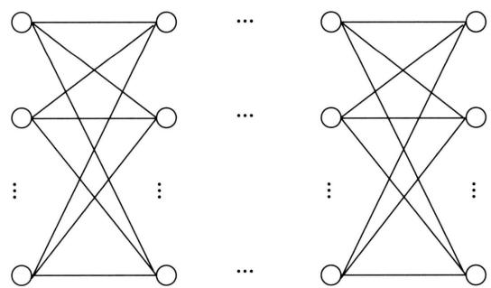  
图12.8 标记序列的路径结构

# 12.2.3 基本问题

与隐马尔可夫模型一样，线性链条件随机场也有三个基本问题。

（1）概率计算问题：给定模型 $\pmb{w} = \{w_{1}, w_{2}, \dots, w_{M}\}$ 和观测序列 $\pmb{x} = x_{1}x_{2}, \dots, x_{T}$ ，计算模型 $\pmb{w}$ 对观测序列 $\pmb{x}$ 的归一化因子 $Z_{\pmb{w}}(\pmb{x})$ 。在此基础上，针对给定标记序列 $\pmb{y} = y_{1}y_{2}, \dots, y_{T}$ ，计算条件概率 $P_{\pmb{w}}(\pmb{y}|\pmb{x})$ 。  
(2) 学习问题: 给定观测序列 $\boldsymbol{x} = x_{1}x_{2}\dots x_{T}$ 和对应的标记序列 $\boldsymbol{y} = y_{1}y_{2}\dots y_{T}$ , 估计模型参数 $\hat{\boldsymbol{w}} = \{\hat{w}_{1},\hat{w}_{2},\dots ,\hat{w}_{M}\}$ , 使得条件概率 $P_{\hat{\boldsymbol{w}}}(\boldsymbol {y}|\boldsymbol {x})$ 最大, 即用极大似然估计法或正则化的极大似然估计法估计模型参数。

（3）预测问题或解码问题：给定模型 $\pmb{w} = \{w_{1}, w_{2}, \dots, w_{M}\}$ 和观测序列 $\pmb{x} = x_{1}x_{2}\dots x_{T}$ ，求条件概率 $P_{\pmb{w}}(\pmb{y}|\pmb{x})$ 最大的标记序列 $\pmb{y}^{*} = y_{1}^{*}y_{2}^{*}\dots y_{T}^{*}$ ，即给定观测序列求最有可能的对应的标记序列。

# 12.3 概率计算算法

概率计算旨在对给定观测序列 $\pmb{x}$ 和标记序列 $\pmb{y}$ ，利用线性链条件随机场模型 $\pmb{w}$ ，计算条件概率 $P_{\pmb{w}}(\pmb{y}|\pmb{x})$ 以及相应的数学期望。其中的难点在于该计算包含归一化因子 $Z_{\pmb{w}}(\pmb{x})$ 的计算，直接计算的复杂度是指数级的，现实中不可行。与隐马尔可夫模型一样，线性链条件随机场也有前向-后向算法，能高效地进行概率计算。然而，针对一般的条件随机场，这样的高效计算算法并不存在。

# 12.3.1 前向算法

使用矩阵形式可以更简单和直接地表示前向-后向算法。首先引入前向向量，前向向量是行向量。设 $\pmb{y}$ 是长度为 $T$ 的标记序列， $\pmb{x}$ 是对应的观测序列：

$$
\boldsymbol {y} = y _ {1} y _ {2} \dots y _ {T}, \quad \boldsymbol {x} = x _ {1} x _ {2} \dots x _ {T}
$$

在第 $t$ 个位置， $t = 1,2,\dots ,T + 1$ ，定义前向向量，表示从起始位置到位置 $t$ 的所有路径的未归一化概率之和。

$$
\boldsymbol {\alpha} _ {t} (\boldsymbol {x}) = \boldsymbol {M} _ {1} (\boldsymbol {x}) \boldsymbol {M} _ {2} (\boldsymbol {x}) \dots \boldsymbol {M} _ {t} (\boldsymbol {x}) \tag {12.28}
$$

最后，在第 $T + 1$ 个位置计算得到的前向向量实际是一个数值，该数值等于归一化因子。

$$
Z _ {\boldsymbol {w}} (\boldsymbol {x}) = \left[ \boldsymbol {M} _ {1} (\boldsymbol {x}) \boldsymbol {M} _ {2} (\boldsymbol {x}) \dots \boldsymbol {M} _ {T + 1} (\boldsymbol {x}) \right] _ {\text {s t a r t , s t o p}} \tag {12.29}
$$

总结前向算法如下。

# 算法12.1（前向算法）

输入：线性链条件随机场模型 $\pmb{w}$ ，观测序列 $\pmb{x}$ 。

输出：归一化因子 $Z_{\pmb{w}}(\pmb{x})$ 。

（1）计算前向向量的初始值， $t = 1$

$$
\boldsymbol {\alpha} _ {1} (\boldsymbol {x}) = \boldsymbol {M} _ {1} (\boldsymbol {x})
$$

（2）递归计算前向向量， $t = 2,3,\dots ,T + 1$

$$
\boldsymbol {\alpha} _ {t} (\boldsymbol {x}) = \boldsymbol {M} _ {1} (\boldsymbol {x}) \boldsymbol {M} _ {2} (\boldsymbol {x}) \dots \boldsymbol {M} _ {t} (\boldsymbol {x})
$$

（3）计算归一化因子

$$
Z _ {\boldsymbol {w}} (\boldsymbol {x}) = \left[ \boldsymbol {M} _ {1} (\boldsymbol {x}) \boldsymbol {M} _ {2} (\boldsymbol {x}) \dots \boldsymbol {M} _ {T + 1} (\boldsymbol {x}) \right] _ {\text {s t a r t , s t o p}}
$$

利用前向算法计算出归一化因子 $Z_{\boldsymbol{w}}(\boldsymbol{x})$ 以后，就可以高效地计算给定观测序列 $\boldsymbol{x}$ 条件下的标记序列 $\boldsymbol{y}$ 的条件概率 $P_{\boldsymbol{w}}(\boldsymbol{y}|\boldsymbol{x})$ 。

$$
P _ {\boldsymbol {w}} (\boldsymbol {y} | \boldsymbol {x}) = \prod_ {t = 1} ^ {T + 1} \frac {\Psi_ {t} \left(y _ {t - 1} , y _ {t} , \boldsymbol {x}\right)}{Z _ {\boldsymbol {w}} (\boldsymbol {x})}
$$

# 12.3.2 后向算法

定义后向向量，可以像前向向量一样计算。在第 $t$ 个位置 $t = T + 1, T \dots, 1$ ，有后向向量

$$
\boldsymbol {\beta} _ {t} (\boldsymbol {x}) = \boldsymbol {M} _ {t} (\boldsymbol {x}) \boldsymbol {M} _ {t + 1} (\boldsymbol {x}) \dots \boldsymbol {M} _ {T + 1} (\boldsymbol {x}) \tag {12.30}
$$

后向向量是列向量。

最后，在第1个位置计算后向向量，也就是归一化因子。

$$
Z _ {\boldsymbol {w}} (\boldsymbol {x}) = \left[ M _ {1} (\boldsymbol {x}) M _ {2} (\boldsymbol {x}) \dots M _ {T + 1} (\boldsymbol {x}) \right] _ {\text {s t a r t , s t o p}} \tag {12.31}
$$

总结后向算法如下。

# 算法12.2（后向算法）

输入：线性链条件随机场模型 $\pmb{w}$ ，观测序列 $\pmb{x}$ 。

输出：归一化因子 $Z_{\pmb{w}}(\pmb{x})$ 。

（1）初始化， $t = T + 1$

$$
\boldsymbol {\beta} _ {T + 1} (\boldsymbol {x}) = \boldsymbol {M} _ {T + 1} (\boldsymbol {x})
$$

（2）递归计算后向向量， $t = T,T - 1,\dots ,1$

$$
\boldsymbol {\beta} _ {t} (\boldsymbol {x}) = \boldsymbol {M} _ {t} (\boldsymbol {x}) \boldsymbol {M} _ {t + 1} (\boldsymbol {x}) \dots \boldsymbol {M} _ {T + 1} (\boldsymbol {x})
$$

（3）计算归一化因子

$$
Z _ {\boldsymbol {w}} (\boldsymbol {x}) = \left[ M _ {1} (\boldsymbol {x}) M _ {2} (\boldsymbol {x}) \dots M _ {T + 1} (\boldsymbol {x}) \right] _ {\text {s t a r t , s t o p}}
$$

这样，就可以高效地计算条件概率 $P_{\pmb{w}}(\pmb{y}|\pmb{x})$

# 12.3.3 前向-后向算法

将前向算法和后向算法结合，形成前向-后向算法。

$$
Z _ {\boldsymbol {w}} (\boldsymbol {x}) = \alpha_ {t} (\boldsymbol {x}) \beta_ {t} (\boldsymbol {x}) = \left[ M _ {1} (\boldsymbol {x}) M _ {2} (\boldsymbol {x}) \dots M _ {T + 1} (\boldsymbol {x}) \right] _ {\text {s t a r t , s t o p}} \tag {12.32}
$$

在每个位置上，前向向量和后向向量的乘积等于归一化因子。这表明，计算所有路径的未归一化概率之和时，可以将其分解为两部分：从起始位置到位置 $t$ 的部分以及从位置 $t$ 到终止位置的部分。实际上，前向算法和后向算法分别是归一化因子计算中的矩阵右乘运算和矩阵左乘运算。

# 12.3.4 期望值的计算

利用前向-后向向量，可以计算特征函数关于联合概率分布 $P(\pmb{x},\pmb{y})$ 的数学期望和条件概率分布 $P(\pmb{y}|\pmb{x})$ 的数学期望。

特征函数 $f_{j}$ 关于条件分布 $P(\pmb {y}|\pmb {x})$ 的数学期望是

$$
\begin{array}{l} E _ {P (\boldsymbol {y} | \boldsymbol {x})} [ f _ {j} ] = \sum_ {\boldsymbol {y}} P (\boldsymbol {y} | \boldsymbol {x}) f _ {j} (\boldsymbol {y}, \boldsymbol {x}) \\ = \sum_ {y} P (\boldsymbol {y} | \boldsymbol {x}) \sum_ {t = 1} ^ {T + 1} f _ {j} \left(y _ {t - 1}, y _ {t}, \boldsymbol {x}, t\right) \\ = \sum_ {t = 1} ^ {T + 1} \sum_ {y _ {t - 1}, y _ {t}} f _ {j} \left(y _ {t - 1}, y _ {t}, \boldsymbol {x}, t\right) \frac {\boldsymbol {\alpha} _ {t - 1} ^ {\mathrm {T}} \left(y _ {t - 1} \mid \boldsymbol {x}\right) M _ {t} \left(y _ {t - 1} , y _ {t} \mid \boldsymbol {x}\right) \beta_ {t} \left(y _ {t} \mid \boldsymbol {x}\right)}{Z (\boldsymbol {x})} \\ \end{array}
$$

$$
j = 1, 2, \dots , M \tag {12.33}
$$

其中，

$$
Z (\boldsymbol {x}) = \boldsymbol {\alpha} _ {T + 1} ^ {\mathrm {T}} (\boldsymbol {x})
$$

假设经验分布为 $\tilde{P} (\pmb {x})$ ，特征函数 $f_{j}$ 关于联合分布 $\tilde{P} (\pmb {x},\pmb {y})$ 的数学期望是

$$
\begin{array}{l} E _ {\tilde {P} (\boldsymbol {x}, \boldsymbol {y})} [ f _ {j} ] = \sum_ {\boldsymbol {x}, \boldsymbol {y}} \tilde {P} (\boldsymbol {x}, \boldsymbol {y}) f _ {j} (\boldsymbol {y}, \boldsymbol {x}) \\ = \sum_ {\boldsymbol {x}} \tilde {P} (\boldsymbol {x}) \sum_ {\boldsymbol {y}} P (\boldsymbol {y} | \boldsymbol {x}) \sum_ {t = 1} ^ {T + 1} f _ {j} \left(y _ {t - 1}, y _ {t}, \boldsymbol {x}, t\right) \\ = \sum_ {t = 1} ^ {T + 1} \sum_ {y _ {t - 1}, y _ {t}} f _ {j} \left(y _ {t - 1}, y _ {t}, \boldsymbol {x}, t\right) \frac {\boldsymbol {\alpha} _ {t - 1} ^ {\mathrm {T}} \left(y _ {t - 1} \mid \boldsymbol {x}\right) \boldsymbol {M} _ {t} \left(y _ {t - 1} , y _ {t} \mid \boldsymbol {x}\right) \boldsymbol {\beta} _ {t} \left(y _ {t} \mid \boldsymbol {x}\right)}{Z (\boldsymbol {x})} \\ \end{array}
$$

$$
j = 1, 2, \dots , M \tag {12.34}
$$

其中，

$$
Z (\boldsymbol {x}) = \boldsymbol {\alpha} _ {T + 1} ^ {\mathrm {T}} (\boldsymbol {x})
$$

有了式 (12.32)～式 (12.34)，对于给定的观测序列 $\pmb{x}$ 与标记序列 $\pmb{y}$ ，可以通过一次前向扫描计算 $\alpha_{t}$ 及 $Z(\pmb{x})$ ，通过一次后向扫描计算 $\beta_{t}$ ，从而计算所有特征的期望。

# 12.4 学习算法

本节讨论线性链条件随机场的学习问题，即给定训练数据集，估计线性链条件随机场模型的参数 $\hat{\boldsymbol{w}}$ 。其学习方法包括极大似然估计和正则化的极大似然估计。

# 12.4.1 监督学习算法

假设训练数据是 $N$ 个长度相同的观测序列和对应的标记序列：

$$
\mathcal {D} = \left\{\left(\boldsymbol {x} _ {1}, \boldsymbol {y} _ {1}\right), \left(\boldsymbol {x} _ {2}, \boldsymbol {y} _ {2}\right), \dots , \left(\boldsymbol {x} _ {N}, \boldsymbol {y} _ {N}\right) \right\}
$$

因为这里标记序列也是可观测的，所以观测序列和状态序列的联合概率是

$$
\tilde {P} (\boldsymbol {x}, \boldsymbol {y}) = \tilde {P} (\boldsymbol {x}) P _ {\boldsymbol {w}} (\boldsymbol {y} | \boldsymbol {x})
$$

考虑利用极大似然估计法来估计模型的参数。

对于线性链条件随机场：

$$
P _ {\boldsymbol {w}} (\boldsymbol {y} | \boldsymbol {x}) = \frac {\exp \left(\sum_ {j = 1} ^ {M} w _ {j} f _ {j} (\boldsymbol {x} , \boldsymbol {y})\right)}{\sum_ {\boldsymbol {y} ^ {\prime}} \exp \left(\sum_ {j = 1} ^ {M} w _ {j} f _ {j} (\boldsymbol {x} , \boldsymbol {y} ^ {\prime})\right)} \tag {12.35}
$$

学习的优化目标函数是

$$
L (\boldsymbol {w}) = - \sum_ {\boldsymbol {x}, \boldsymbol {y}} \tilde {P} (\boldsymbol {x}, \boldsymbol {y}) \log P _ {\boldsymbol {w}} (\boldsymbol {y} | \boldsymbol {x}) \tag {12.36}
$$

$$
L (\boldsymbol {w}) = \sum_ {\boldsymbol {x}} \tilde {P} (\boldsymbol {x}) \log \sum_ {\boldsymbol {y} ^ {\prime}} \exp \left(\sum_ {j = 1} ^ {M} w _ {j} f _ {j} (\boldsymbol {x}, \boldsymbol {y} ^ {\prime})\right) - \sum_ {\boldsymbol {x}, \boldsymbol {y}} \tilde {P} (\boldsymbol {x}, \boldsymbol {y}) \sum_ {j = 1} ^ {M} w _ {j} f _ {j} (\boldsymbol {x}, \boldsymbol {y}) \tag {12.37}
$$

其梯度函数是

$$
\frac {\partial L}{\partial w _ {j}} = \sum_ {\boldsymbol {x}, \boldsymbol {y}} \tilde {P} (\boldsymbol {x}) P _ {\boldsymbol {w}} (\boldsymbol {y} | \boldsymbol {x}) f _ {j} (\boldsymbol {x}, \boldsymbol {y}) - E _ {\tilde {P}} (f _ {j})
$$

$$
j = 1, 2, \dots , M \tag {12.38}
$$

这里第二项是特征函数关于序列数据的联合分布的期望，当训练数据给定时就可以直接计算；第一项是特征函数关于当前模型下的联合分布的期望，需要使用前向-后向算法计算。

# 12.4.2 拟牛顿法

条件随机场的学习问题转换成最优化问题。这个优化问题属于凸优化问题。具体的优化算法有改进的迭代尺度法IIS、梯度下降法以及拟牛顿法（参阅附录A和附录B)。IIS算法在处理大规模数据时效率较低。梯度下降法简单直接，但其收敛速度较慢。拟牛顿法，如BFGS算法，利用了二阶导数的信息，却无需直接计算黑塞矩阵的逆，这使得它在收敛速度和性能上都较为出色。

这里考虑应用BFGS算法学习线性链条件随机场模型。具体算法如下。

# 算法12.3（BFGS算法）

输入：特征函数 $f_{1},f_{2},\dots ,f_{M}$ ，经验分布 $\tilde{P} (\pmb {x},\pmb {y})$

输出：最优参数值 $\hat{\pmb{w}}$ ，最优模型 $P_{\hat{\pmb{w}}}(\pmb {y}|\pmb {x})$

（1）选定初始点 $\pmb{w}^{(0)}$ ，取 $B_{0}$ 为 $M\times M$ 正定对称矩阵。置 $k = 0$   
(2) 根据式 (12.38), 计算 $M$ 阶梯度向量 $\pmb{g}_{k} = \nabla_{\pmb{w}}(\pmb{w}^{(k)})$ 。若 $\pmb{g}_{k} = 0$ , 则停止计算; 否则, 转步骤 (3)。  
（3）由 $B_{k}p_{k} = -g_{k}$ 求出 $\pmb{p}_k$   
（4）一维搜索：求 $\eta_{k}$ 使得

$$
f \left(\boldsymbol {w} ^ {(k)} + \eta_ {k} \boldsymbol {p} _ {k}\right) = \min  _ {\eta \geqslant 0} f \left(\boldsymbol {w} ^ {(k)} + \eta \boldsymbol {p} _ {k}\right)
$$

（5）置 $\pmb{w}^{(k + 1)} = \pmb{w}^{(k)} + \eta_k\pmb{p}_k$

(6) 根据式 (12.38), 计算 $\pmb{g}_{k+1} = \nabla_{\pmb{w}}(\pmb{w}^{(k+1)})$ 。若 $\pmb{g}_{k+1} = 0$ , 则停止计算; 否则, 按下式求出 $\pmb{B}_{k+1}$ :

$$
\boldsymbol {B} _ {k + 1} = \boldsymbol {B} _ {k} + \frac {\boldsymbol {y} _ {k} \boldsymbol {y} _ {k} ^ {\mathrm {T}}}{\boldsymbol {y} _ {k} ^ {\mathrm {T}} \boldsymbol {\mu} _ {k}} - \frac {\boldsymbol {B} _ {k} \boldsymbol {\mu} _ {k} \boldsymbol {\mu} _ {k} ^ {\mathrm {T}} \boldsymbol {B} _ {k}}{\boldsymbol {\mu} _ {k} ^ {\mathrm {T}} \boldsymbol {B} _ {k} \boldsymbol {\mu} _ {k}}
$$

其中，

$$
\boldsymbol {y} _ {k} = \boldsymbol {g} _ {k + 1} - \boldsymbol {g} _ {k}, \quad \boldsymbol {\mu} _ {k} = \boldsymbol {w} ^ {(k + 1)} - \boldsymbol {w} ^ {(k)}
$$

（7）置 $k = k + 1$ ，转步骤(3)。

# 12.5 预测算法

本节讨论线性链条件随机场的预测问题，即给定观测序列 $\pmb{x}$ ，利用条件随机场模型 $\pmb{w}$ ，求解条件概率 $P_{\pmb{w}}(\pmb{y}|\pmb{x})$ 最大的标记序列 $\pmb{y}^*$ 。也就是要在所有可能的路径（标记序列）当中寻找条件概率最大的路径。

如果直接计算所有可能路径的条件概率，再从中找出条件概率最大的路径，其计算复杂度是指数级的。如同隐马尔可夫模型一样，线性链条件随机场也有维特比算法。该算法基于动态规划，能够高效地求解出最优路径，即条件概率最大的标记序列。

预测问题可以简化为以下优化问题。

$$
\begin{array}{l} \arg \max  _ {\boldsymbol {y}} [ \log P _ {\boldsymbol {w}} (\boldsymbol {y} | \boldsymbol {x}) ] = \arg \max  _ {\boldsymbol {y}} \left\{\log \left[ \frac {1}{Z (\boldsymbol {x})} \exp \left(\sum_ {j = 1} ^ {M} w _ {j} f _ {j} (\boldsymbol {y}, \boldsymbol {x})\right) \right] \right\} \\ = \arg \max  _ {\boldsymbol {y}} \left\{\log \left[ \frac {1}{Z (\boldsymbol {x})} \exp \left(\sum_ {t = 1} ^ {T + 1} \sum_ {j = 1} ^ {M} w _ {j} f _ {j} \left(y _ {t - 1}, y _ {t}, \boldsymbol {x}, t\right)\right) \right] \right\} \\ = \arg \max  _ {y _ {1}: y _ {T}} \left(\sum_ {t = 1} ^ {T + 1} \sum_ {j = 1} ^ {M} w _ {j} f _ {j} \left(y _ {t - 1}, y _ {t}, \boldsymbol {x}, t\right)\right) \tag {12.39} \\ \end{array}
$$

这是因为归一化因子 $Z(\pmb{x})$ 对所有的 $\pmb{y}$ 是相同的。这样，就只需要找出所有可能的路径（标

记序列）中特征的线性组合的取值最大的路径。为了简单，假设标记集合由自然数集合表示， $y \in \{1, 2, \dots, I\}$ 。

维特比算法用动态规划求解。也就是说，以递归的方式从左至右进行计算，在每一个位置依据前一个位置的局部最优解求解该位置的局部最优解。当到达终止位置时，得到全局最优解。随后再从右往左进行回溯，找出到达全局最优解的路径。

在位置 $t$ 定义从位置1到该位置的标记 $y_{t}$ 的特征组合的最大值。

$$
\delta_ {t} \left(y _ {t}\right) = \max  _ {y _ {1}: y _ {t - 1}} \sum_ {t ^ {\prime} = 1} ^ {t} \sum_ {j = 1} ^ {M} w _ {j} f _ {j} \left(y _ {t ^ {\prime} - 1}, y _ {t ^ {\prime}}, \boldsymbol {x}, t ^ {\prime}\right) \tag {12.40}
$$

首先，设位置1的标记 $y_{1}$ 的特征的最大值为

$$
\delta_ {1} \left(y _ {1}\right) = \sum_ {j = 1} ^ {M} w _ {j} f _ {j} \left(y _ {0}, y _ {1}, \boldsymbol {x}, 1\right) \tag {12.41}
$$

接着，由递归公式，求解得到位置 $t$ 的标记 $y_{t}$ 的特征组合的最大值，同时记录对应的位置 $t - 1$ 的标记， $t = 1,2,\dots ,T$ 。这时利用到位置 $t - 1$ 的标记 $y_{t}$ 的特征组合的最大值。

$$
\delta_ {t} \left(y _ {t}\right) = \max  _ {y _ {t - 1}} \left[ \delta_ {t - 1} \left(y _ {t - 1}\right) + \sum_ {j = 1} ^ {M} w _ {j} f _ {j} \left(y _ {t - 1}, y _ {t}, \boldsymbol {x}, t\right) \right] \tag {12.42}
$$

$$
\phi_ {t} \left(y _ {t}\right) = \arg \max  _ {y _ {t - 1}} \left[ \delta_ {t - 1} \left(y _ {y - 1}\right) + \sum_ {j = 1} ^ {M} w _ {j} f _ {j} \left(y _ {t - 1}, y _ {t}, \boldsymbol {x}, t\right) \right] \tag {12.43}
$$

最后，在位置 $t = T$ 终止。这时求得所有路径的特征组合的最大值，同时记录对应的标记。

$$
\delta_ {T} ^ {*} = \max  _ {y _ {T}} \delta \left(y _ {T}\right) \tag {12.44}
$$

$$
y _ {T} ^ {*} = \arg \max  _ {y _ {T}} \delta \left(y _ {T}\right) \tag {12.45}
$$

由最优路径的终止位置返回，得到最优路径上的每一个点。

$$
y _ {t - 1} ^ {*} = \phi_ {t} \left(y _ {t} ^ {*}\right), \quad t = T, T - 1, \dots , 1 \tag {12.46}
$$

求得最优路径 $\pmb{y}^{*} = y_{1}^{*}y_{2}^{*}\dots y_{T}^{*}$

每一个位置的计算的推导如下：

$$
\begin{array}{l} \delta_ {t} \left(y _ {t}\right) = \max  _ {y _ {1}: y _ {t - 1}} \sum_ {t ^ {\prime} = 1} ^ {t} \sum_ {j = 1} ^ {M} w _ {j} f _ {j} \left(y _ {t ^ {\prime} - 1}, y _ {t ^ {\prime}}, \boldsymbol {x}, t ^ {\prime}\right) \\ = \max  _ {y _ {t - 1}} \left[ \max  _ {y _ {1}: y _ {t - 2}} \sum_ {t ^ {\prime} = 1} ^ {t - 1} \sum_ {j = 1} ^ {M} w _ {j} f _ {j} \left(y _ {t ^ {\prime} - 2}, y _ {t ^ {\prime} - 1}, \boldsymbol {x}, t ^ {\prime} - 1\right) + \sum_ {j = 1} ^ {M} w _ {j} f _ {j} \left(y _ {t - 1}, y _ {t}, \boldsymbol {x}, t\right) \right] \\ = \max  _ {y _ {t - 1}} \left[ \delta_ {t - 1} \left(y _ {t - 1}\right) + w _ {j} f _ {j} \left(y _ {t - 1}, y _ {t}, \boldsymbol {x}, t\right) \right] \\ \end{array}
$$

综上，得到线性链条件随机场预测的维特比算法。

# 算法12.4（维特比算法）

输入：模型 $\pmb{w}$ ，观测序列 $\pmb {x} = x_{1}x_{2}\dots x_{T}$

输出：最优路径 $\pmb{y}^{*} = y_{1}^{*}y_{2}^{*}\dots y_{T}^{*}$

（1）初始化： $t = 1$

$$
\delta_ {1} (y _ {1}) = \sum_ {j = 1} ^ {M} w _ {j} f _ {j} (y _ {0}, y _ {1}, \boldsymbol {x}, 1)
$$

（2）递归。对 $t = 2,3,\dots ,T$ ，有

$$
\delta_ {t} (y _ {t}) = \max  _ {y _ {t - 1}} \left[ \delta_ {t - 1} (y _ {t - 1}) + \sum_ {j = 1} ^ {M} w _ {j} f _ {j} (y _ {t - 1}, y _ {t}, \boldsymbol {x}, t) \right]
$$

$$
\phi_ {t} (y _ {t}) = \arg \max  _ {y _ {t - 1}} \left[ \delta_ {t - 1} (y _ {y - 1}) + \sum_ {j = 1} ^ {M} w _ {j} f _ {j} (y _ {t - 1}, y _ {t}, \boldsymbol {x}, t) \right]
$$

（3）终止：

$$
\delta_ {T} ^ {*} = \max _ {y _ {T}} \delta (y _ {T})
$$

$$
y _ {T} ^ {*} = \arg \max  _ {y _ {T}} \delta (y _ {T})
$$

（4）返回路径：

$$
y _ {t - 1} ^ {*} = \phi_ {t} (y _ {t} ^ {*}), \quad t = T, T - 1, \dots , 1
$$

求得最优路径 $\pmb{y}^{*} = y_{1}^{*}y_{i2}^{*}\dots y_{T}^{*}$

下面通过一个例子说明维特比算法。

例12.3 例12.1中的条件随机场模型，用维特比算法求给定的输入序列（观测序列） $\pmb{x}$ 对应的最优输出序列（标记序列） $\pmb{y}^{*} = y_{1}^{*}y_{2}^{*}y_{3}^{*}$ 。

解 特征函数及对应的权值均在例12.1中给出。

现在利用维特比算法求最优路径。这里省去特征函数的输入。

$$
\arg \max  _ {y _ {1}: y _ {3}} \sum_ {t = 1} ^ {3} \sum_ {j = 1} ^ {6} w _ {j} f _ {j} \left(y _ {t - 1}, y _ {t}, x _ {t}\right)
$$

（1）初始化： $t = 1$

$$
\delta_ {1} (0) = \lambda_ {0} f _ {0} + \mu_ {1} g _ {1} = 0. 5
$$

$$
\delta_ {1} (1) = \lambda_ {0} f _ {0} + \mu_ {2} g _ {2} = 1
$$

（2）递归计算：

$$
t = 2
$$

$$
\delta_ {2} (0) = \max  \left\{\delta_ {1} (0) + \lambda_ {1} f _ {1} + \mu_ {1} g _ {1}, \delta_ {1} (1) + \lambda_ {3} f _ {3} + \mu_ {1} g _ {1} \right\} = 3. 5, \quad \phi_ {2} (0) = 1
$$

$$
\delta_ {2} (1) = \max  \left\{\delta_ {1} (0) + \lambda_ {2} f _ {2} + \mu_ {2} g _ {2}, \delta_ {1} (1) + \lambda_ {4} f _ {4} + \mu_ {2} g _ {2} \right\} = 0. 5, \quad \phi_ {2} (1) = 0
$$

$t = 3$

$$
\delta_ {3} (0) = \max  \left\{\delta_ {2} (0) + \lambda_ {1} f _ {1} + \mu_ {1} g _ {1}, \delta_ {2} (1) + \lambda_ {3} f _ {3} + \mu_ {1} g _ {1} \right\} = 5, \quad \phi_ {3} (0) = 0
$$

$$
\delta_ {3} (1) = \max  \left\{\delta_ {2} (0) + \lambda_ {2} f _ {2} + \mu_ {2} g _ {2}, \delta_ {2} (1) + \lambda_ {4} f _ {4} + \mu_ {2} g _ {2} \right\} = 3. 5, \quad \phi_ {3} (1) = 0
$$

(3) 终止：

$$
\delta_ {3} ^ {*} = \max  \left\{\delta_ {3} (0), \delta_ {3} (1) \right\} = 5, \quad y _ {3} ^ {*} = \arg \max  \left\{\delta_ {3} (0), \delta_ {3} (1) \right\} = 0
$$

（4）回溯计算：

$$
y _ {2} ^ {*} = \phi_ {3} (0) = 0
$$

$$
y _ {1} ^ {*} = \phi_ {2} (0) = 1
$$

得到最优标记序列：

$$
y ^ {*} = \left(y _ {1} ^ {*}, y _ {2} ^ {*}, y _ {3} ^ {*}\right) ^ {\mathrm {T}} = (1, 0, 0) ^ {\mathrm {T}}
$$

# 本章概要

1. 概率无向图模型是由无向图表示的联合概率分布。在无向图中，结点表示随机变量，边表示随机变量之间的概率相关关系。如果联合概率分布是严格正的，且满足成对、局部或全局马尔可夫性，就称此联合概率分布为概率无向图模型或马尔可夫随机场。概率无向图模型中成对马尔可夫性、局部马尔可夫性、全局马尔可夫性是等价的。成对马尔可夫性意味着，如果两个随机变量对应的结点在图中没有边直接相连，那么在给定其他所有结点的变量的条件下，这两个变量条件独立。

概率无向图模型或马尔可夫随机场的联合概率分布可以分解为与无向图最大团上的势函数乘积成正比的形式。这是它的基本性质，由Hammersley-Clifford定理保证。所以，概率无向图模型或马尔可夫随机场的联合概率分布 $P(X)$ 可以表示为

$$
P (X) = \frac {1}{Z} \prod_ {C} \Psi_ {C} (X _ {C})
$$

$$
Z = \sum_ {X ^ {\prime}} \prod_ {C} \Psi_ {C} \left(X _ {C} ^ {\prime}\right)
$$

$C$ 是无向图的最大团, $X_{C}$ 是 $C$ 的结点对应的随机变量, $\Psi_{C}(X_{C})$ 是 $C$ 上定义的严格正的势函数, 乘积在无向图所有的最大团上进行, $Z$ 是归一化因子。

2. 条件随机场是给定输入随机变量 $X$ 的条件下，输出随机变量 $Y$ 的条件概率分布模型，其形式为对数线性模型。条件随机场的最大特点是假设输出变量之间的联合概率分布构成概率无向图模型或马尔可夫随机场。条件随机场是判别模型。  
3. 线性链条件随机场是定义在观测序列 $\pmb{x}$ 与标记序列 $\pmb{y}$ 上的条件随机场。线性链条件随机场表示为给定观测序列 $\pmb{x}$ 条件下的标记序列 $\pmb{y}$ 的条件概率分布 $P(\pmb{y}|\pmb{x})$ ，由对数线性模型表示。模型包含特征及相应的权值，特征是定义在线性链的边与结点上的。

线性链条件随机场模型的基本形式是

$$
\begin{array}{l} P (\boldsymbol {y} | \boldsymbol {x}) = \frac {1}{Z (\boldsymbol {x})} \exp \left(\sum_ {t = 1} ^ {T + 1} \sum_ {j = 1} ^ {M} \lambda_ {j} f _ {j} \left(y _ {t - 1}, y _ {t}, \boldsymbol {x}, t\right) + \sum_ {t = 1} ^ {T + 1} \sum_ {l = 1} ^ {L} \mu_ {l} g _ {l} \left(y _ {t}, \boldsymbol {x}, t\right)\right) \\ Z (\boldsymbol {x}) = \sum_ {\boldsymbol {y} ^ {\prime}} \exp \left(\sum_ {t = 1} ^ {T + 1} \sum_ {j = 1} ^ {M} \lambda_ {j} f _ {j} \left(y _ {t - 1} ^ {\prime}, y _ {t} ^ {\prime}, \boldsymbol {x}, t\right) + \sum_ {t = 1} ^ {T + 1} \sum_ {l = 1} ^ {L} \mu_ {l} g _ {l} \left(y _ {t} ^ {\prime}, \boldsymbol {x}, t\right)\right) \\ \end{array}
$$

式中 $f_{j}$ 和 $g_{l}$ 是特征函数， $\lambda_{j}$ 和 $\mu_{l}$ 是对应的权值。

线性链条件随机场模型的一般形式是

$$
P (\boldsymbol {y} | \boldsymbol {x}) = \frac {1}{Z (\boldsymbol {x})} \exp \left(\sum_ {j = 1} ^ {M} w _ {j} f _ {j} (\boldsymbol {y}, \boldsymbol {x})\right)
$$

$$
Z (\boldsymbol {x}) = \sum_ {\boldsymbol {y} ^ {\prime}} \exp \left(\sum_ {j = 1} ^ {M} w _ {j} f _ {j} (\boldsymbol {y}, \boldsymbol {x})\right)
$$

$$
f _ {j} (\boldsymbol {y}, \boldsymbol {x}) = \sum_ {t = 1} ^ {T + 1} f _ {j} \left(y _ {t - 1}, y _ {t}, \boldsymbol {x}, t\right)
$$

线性链条件随机场模型的矩阵形式是

$$
P (\boldsymbol {y} | \boldsymbol {x}) = \frac {1}{Z (\boldsymbol {x})} \prod_ {t = 1} ^ {T + 1} \Psi_ {t} \left(y _ {t - 1}, y _ {t}, \boldsymbol {x}\right)
$$

$$
\varPsi_ {t} (y _ {t - 1}, y _ {t}, \boldsymbol {x}) = \exp \left(\sum_ {j = 1} ^ {M} w _ {j} f _ {j} (y _ {t - 1}, y _ {t}, \boldsymbol {x}, t)\right)
$$

$$
Z (\boldsymbol {x}) = \left[ M _ {1} (\boldsymbol {x}) M _ {2} (\boldsymbol {x}) \dots M _ {T + 1} (\boldsymbol {x}) \right] _ {\text {s t a r t , s t o p}}
$$

4. 线性链条件随机场有前向-后向算法，能高效地进行概率计算。前向-后向算法计算归一化因子：

$$
Z _ {\boldsymbol {w}} (\boldsymbol {x}) = \alpha_ {t} (\boldsymbol {x}) \beta_ {t} (\boldsymbol {x}) = \left[ M _ {1} (\boldsymbol {x}) M _ {2} (\boldsymbol {x}) \dots M _ {T + 1} (\boldsymbol {x}) \right] _ {\text {s t a r t , s t o p}}
$$

前向向量：

$$
\boldsymbol {\alpha} _ {t} (\boldsymbol {x}) = \boldsymbol {M} _ {1} (\boldsymbol {x}) \boldsymbol {M} _ {2} (\boldsymbol {x}) \dots \boldsymbol {M} _ {t} (\boldsymbol {x})
$$

后向向量：

$$
\boldsymbol {\beta} _ {t} (\boldsymbol {x}) = \boldsymbol {M} _ {t} (\boldsymbol {x}) \boldsymbol {M} _ {t + 1} (\boldsymbol {x}) \dots \boldsymbol {M} _ {T + 1} (\boldsymbol {x})
$$

5. 线性链条件随机场的学习方法通常是极大似然估计方法，即在给定训练数据下，通过极大化训练数据的对数似然函数估计模型参数。具体的算法有拟牛顿法等。

学习的优化目标函数是

$$
L (\boldsymbol {w}) = - \sum_ {\boldsymbol {x}, \boldsymbol {y}} \tilde {P} (\boldsymbol {x}, \boldsymbol {y}) \log P _ {\boldsymbol {w}} (\boldsymbol {y} | \boldsymbol {x})
$$

其梯度函数是

$$
\frac {\partial L}{\partial w _ {j}} = \sum_ {\boldsymbol {x}, \boldsymbol {y}} \tilde {P} (\boldsymbol {x}) P _ {\boldsymbol {w}} (\boldsymbol {y} | \boldsymbol {x}) f _ {j} (\boldsymbol {x}, \boldsymbol {y}) - E _ {\bar {P}} (f _ {j})
$$

$$
j = 1, 2, \dots , M
$$

优化算法可以是拟牛顿法的BFGS算法。

6. 线性链条件随机场的一个重要应用是序列标注。维特比算法是给定观测序列求条件概率最大的标记序列的方法。维特比算法的核心想法是动态规划。以递归的方式从左至右进行计算，在每一个位置依据前一个位置的局部最优解求解该位置的局部最优解。当到达终止位置时，得到全局最优解。随后再从右往左进行回溯，找出到达全局最优解的路径。

在位置 $t$ 计算

$$
\delta_ {t} (y _ {t}) = \max  _ {y _ {t - 1}} \left[ \delta_ {t - 1} (y _ {t - 1}) + \sum_ {j = 1} ^ {M} w _ {j} f _ {j} (y _ {t - 1}, y _ {t}, \boldsymbol {x}, t) \right]
$$

$$
\phi_ {t} (y _ {t}) = \arg \max  _ {y _ {t - 1}} \left[ \delta_ {t - 1} (y _ {y - 1}) + \sum_ {j = 1} ^ {M} w _ {j} f _ {j} (y _ {t - 1}, y _ {t}, \boldsymbol {x}, t) \right]
$$

其中 $\delta_t(y_t)$ 表示到位置 $t$ 的标记 $y_t$ 的特征组合的最大值。

# 继续阅读

关于概率无向图模型可以参阅文献 [1] 和文献 [2]。关于条件随机场可以参阅文献 [3] 和文献 [4]。在条件随机场提出之前有最大熵马尔可夫模型等模型被提出 [5]，条件随机场可以看作最大熵马尔可夫模型的推广。条件随机场在序列标注的应用有文献 [6] 和文献 [7]。

# 习题

12.1 从全局马尔可夫性推出成对马尔可夫性。  
12.2 写出图 12.4 的概率无向图模型的因子分解式。  
12.3 证明线性链条件随机场的矩阵形式中的归一化因子 (式 (12.27)) 与一般形式的归一化因子 (式 (12.21)) 等价。  
12.4 线性链条件随机场的未归一化概率的矩阵 $M_{1}(\pmb{x})$ , $M_{2}(\pmb{x})$ , $M_{3}(\pmb{x})$ , $M_{4}(\pmb{x})$ 分别是

$$
\boldsymbol {M} _ {1} (\boldsymbol {x}) = \left[ \begin{array}{l l} 0. 5 & 0. 5 \end{array} \right], \quad \boldsymbol {M} _ {2} (\boldsymbol {x}) = \left[ \begin{array}{l l} 0. 3 & 0. 7 \\ 0. 7 & 0. 3 \end{array} \right]
$$

$$
\boldsymbol {M} _ {3} (\boldsymbol {x}) = \left[ \begin{array}{c c} 0. 5 & 0. 5 \\ 0. 6 & 0. 4 \end{array} \right], \quad \boldsymbol {M} _ {4} (\boldsymbol {x}) = \left[ \begin{array}{c} 1 \\ 1 \end{array} \right]
$$

求归一化因子 $Z(\pmb {x})$ 。

12.5 证明线性链条件随机场的优化问题是凸优化问题。提示：主要证明 $\log Z_{\boldsymbol{w}}(\boldsymbol{x})$ 是凸函数。  
12.6 写出线性链条件随机场模型学习的梯度下降法。  
12.7 维特比算法在线性链条件随机场中一般是从前向后计算，是否可以从后向前计算？如果可以，写出该算法。  
12.8 线性链条件随机场和隐马尔可夫模型都有前向-后向算法和维特比算法，指出两个模型的算法的异同点。

# 参考文献

[1] KOLLER D, FRIEDMAN N. Probabilistic graphical models: principles and techniques[M]. MIT Press, 2009.   
[2] BISHOP M. Pattern recognition and machine learning[M]. Springer-Verlag, 2006.   
[3] LAFFERTY J, MCCALLUM A, PEREIRA F. Conditional random fields: probabilistic models for segmenting and labeling sequence data[C]//International Conference on Machine Learning, 2001.   
[4] SUTTON C, MCCALLUM A. An introduction to conditional random fields[M]. Foundations and Trends in Machine Learning, 2012.   
[5] MCCALLUM A, FREITAG D, PEREIRA F. Maximum entropy Markov models for information extraction and segmentation[C]//Proceedings of the International Conference on Machine Learning, 2000.   
[6] SHA F, PEREIRA F. Shallow parsing with conditional random fields[C]//Proceedings of the 2003 Conference of the North American Chapter of Association for Computational Linguistics on Human Language Technology, 2003.   
[7] KUDO T, YAMAMOTO K, MATSUMOTO Y. Applying conditional random fields to Japanese morphological analysis[C]//Proceedings of the 2004 conference on empirical methods in natural language processing, 2004.

# 第13章 监督学习方法总结

本篇介绍了10种主要的监督学习方法：线性回归、感知机、 $k$ 近邻法、朴素贝叶斯法、决策树（包括CART）、逻辑斯谛回归和最大熵模型、支持向量机、提升方法（包括AdaBoost和GBDT）、隐马尔可夫模型和条件随机场。将这10种监督学习方法的特点概括总结在表13.1中。

表 13.1 10 种监督学习方法特点的概括总结  

<table><tr><td>方法</td><td>问题</td><td>模型</td><td>学习策略</td><td>学习算法</td></tr><tr><td>线性回归</td><td>回归</td><td>线性函数</td><td>最小化平方损失，正则化平方损失</td><td>解析算法、随机梯度下降</td></tr><tr><td>感知机</td><td>二类分类</td><td>分离超平面</td><td>最小化基于误分类的损失函数</td><td>随机梯度下降</td></tr><tr><td>k近邻法</td><td>多类分类、回归</td><td>特征空间中最近样本</td><td></td><td></td></tr><tr><td>朴素贝叶斯法</td><td>多类分类</td><td>特征与类别的联合概率分布，条件独立假设</td><td>极大似然估计</td><td>解析算法</td></tr><tr><td>决策树</td><td>多类分类、回归</td><td>分类树，回归树</td><td>启发式算法，近似正则化的极大似然估计</td><td>特征选择、生成、剪枝</td></tr><tr><td>逻辑斯谛回归和最大熵模型</td><td>多类分类</td><td>特征向量条件下的类别的条件概率分布</td><td>极大似然估计</td><td>梯度下降，拟牛顿法</td></tr><tr><td>支持向量机</td><td>二类分类</td><td>分离超平面、核技巧</td><td>最小化正则化合页损失（最大化软间隔）</td><td>随机梯度下降、凸二次规划</td></tr><tr><td>提升方法</td><td>二类或多类分类、回归</td><td>弱学习器的线性组合</td><td>最小化特定损失，早停法</td><td>前向分步加法算法</td></tr><tr><td>隐马尔可夫模型</td><td>序列标注</td><td>观测序列与状态序列的联合概率分布、隐马尔可夫假设</td><td>极大似然估计，最大化似然函数下界</td><td>解析算法、迭代算法</td></tr><tr><td>条件随机场</td><td>序列标注</td><td>状态序列条件下的观测序列的条件概率分布</td><td>极大似然估计</td><td>梯度下降，拟牛顿法</td></tr></table>

下面对各种监督学习方法的特点及其关系进行简单的讨论。

# 1. 问题和方法

监督学习旨在学习一个模型，使它能对给定的输入预测相应的输出。监督学习的问题包括分类、回归、序列标注。分类问题是从实例的特征向量到类别标记的预测问题；回归问题是从实例的特征向量到数值的预测问题；序列标注问题是从观测序列到标记序列（或状态序列）的预测问题。可以认为分类问题是序列标注问题的特殊情况。分类问题中可能的预测结果是二类或多类。标注问题中可能的预测结果是所有的标记序列。

分类的方法可以分为几条路径：生成模型、分离超平面、特征空间划分、集成学习。生成模型的基本想法是通过学习输入和输出的联合概率分布，导出给定输入的输出的条件概率分布，用于分类，例如朴素贝叶斯法。分离超平面的特点是用特征空间的分离超平面表示模型，学习就是要找到能将正负例尽量分开的最优的分离超平面；感知机、支持向量机、二项逻辑斯谛回归属于此类。特征空间划分的想法是根据特征或实例将特征空间划分成有限的单元，使得每个单元上的实例尽可能属于同类，决策树（CART）和 $k$ 近邻法属于这类方法。集成学习包括提升方法（AdaBoost 和 GBDT），在学习中将多个基本分类器组合起来构建成更强的分类器。大部分方法可以用于多分类，包括二分类。感知机、支持向量机、AdaBoost 本身是用于二分类的，但也可以将它们扩展用于多分类。

回归的方法也可分为几条路径：函数拟合、特征空间划分、集成学习。函数拟合先假设函数的类型，从所有可能的函数中选择预测误差最小的函数作为学习结果；这条路径包括线性回归和非线性回归。特征空间划分是根据特征或实例将空间划分为有限个单元，在每个单元上确定一个预测值，以使整体预测误差最小；决策树（CART）和 $k$ 近邻法属于这条路径。集成学习是在学习过程中将几个基本回归模型组合成更强的回归模型，方法有提升方法（GBDT）等。

序列标注的方法可以分为两条路径：生成模型、判别模型。生成模型包括隐马尔可夫模型，判别模型包括条件随机场。生成模型学习观测序列和对应的标记序列或状态序列的联合概率分布，进而导出给定观测序列的标记序列的条件概率，用于序列标注。如果有观测序列和对应标记序列的数据，那么可以通过监督学习手段学习模型；如果只有观测序列而没有对应的标记序列的数据，那么可以通过无监督学习手段学习模型。判别模型学习观测序列到对应的标记序列的映射关系，用条件概率分布表示，学习时使用观测序列和对应标注序列的数据，属于监督学习方法。

图13.1总结了分类、回归、序列标注的主要路径。

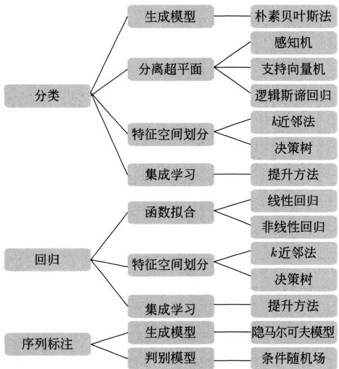  
图13.1 用于分类、回归和序列标注的方法

# 2. 模型

分类问题、回归问题与序列标注问题的预测模型都可以认为是表示从输入空间到输出空间的映射。它们可以写成条件概率分布 $P(y|\boldsymbol{x})$ 或函数 $y = f(\boldsymbol{x})$ 的形式。前者表示给定输入条件下输出的概率模型，后者表示输入到输出的非概率模型。朴素贝叶斯法、隐马尔可夫模型、逻辑斯谛回归和最大熵模型、条件随机场是概率模型，线性回归、感知机、 $k$ 近邻法、决策树（CART）、支持向量机、提升方法（AdaBoost 和 GBDT）是非概率模型。线性回归、 $k$ 近邻法、决策树有概率模型的解释。二项逻辑斯谛回归有非概率模型的解释。逻辑斯谛回归和最大熵模型基于不同的原理，但具有类似的形式。

直接学习条件概率分布 $P(y|\boldsymbol{x})$ 或决策函数 $y = f(\boldsymbol{x})$ 的方法为判别方法，对应的模型是判别模型。线性回归、感知机、 $k$ 近邻法、决策树、逻辑斯谛回归和最大熵模型、支持向量机、提升方法、条件随机场是判别模型。首先学习联合概率分布 $P(\boldsymbol{x},\boldsymbol{y})$ ，从而求得条件概率分布 $P(y|\boldsymbol{x})$ 的方法是生成方法，对应的模型是生成模型。朴素贝叶斯法、隐马尔可夫模型是生成模型。图13.2给出模型之间的关系。

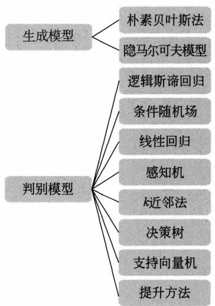  
图13.2 模型之间的关系

# 3. 学习策略

监督学习的策略是经验风险最小化或结构风险最小化。结构风险最小化具有以下形式：

$$
\min  _ {f \in \mathcal {F}} \frac {1}{N} \sum_ {i = 1} ^ {N} L \left(y _ {i}, f \left(\boldsymbol {x} _ {i}\right)\right) + \lambda \Omega (f) \tag {13.1}
$$

这里，第1项为经验风险（经验损失），第2项为正则化项， $L(y, f(\pmb{x}))$ 为损失函数， $\Omega(f)$ 为模型的复杂度， $\lambda \geqslant 0$ 为系数。当 $\lambda = 0$ 时，退化为经验风险最小化。

概率模型的学习可以形式化为极大似然估计或贝叶斯估计的最大后验概率估计。此时，学习的策略是最小化对数损失（最大化似然函数）或最小化正则化的对数损失。朴素贝叶斯法、逻辑斯谛回归与最大熵模型、隐马尔可夫模型、条件随机场都是概率模型。本篇介绍的这些模型的监督学习算法都是基于极大似然估计的，即最小化对数损失。隐马尔可夫模型的无

监督学习实际是最大化似然函数的下界。

非概率模型的学习最小化代理损失函数或正则化的代理损失函数。在二类分类的学习中，支持向量机、二项逻辑斯谛回归、AdaBoost各自使用合页损失函数、逻辑斯谛损失函数、指数损失函数。感知机有基于误分类的损失函数。4种损失函数分别写为

$$
\max  (0, 1 - y f (\boldsymbol {x})) \tag {13.2}
$$

$$
\log_ {2} [ 1 + \exp (- y f (\boldsymbol {x})) ] \tag {13.3}
$$

$$
\exp (- y f (\boldsymbol {x})) \tag {13.4}
$$

$$
\max  (0, - y f (\boldsymbol {x})) \tag {13.5}
$$

前3种损失函数都是0-1损失函数的上界，具有类似的趋势，如图13.3所示。所以，可以认为支持向量机、二项逻辑斯谛回归、AdaBoost使用不同的代理损失函数表示分类的损失。支持向量机通过最大化间隔隐式进行参数的 $L_{2}$ 正则化。原始的二项逻辑斯谛回归没有正则化项，可以给它加上 $L_{2}$ 正则化项。AdaBoost采用早停法以防止过拟合。

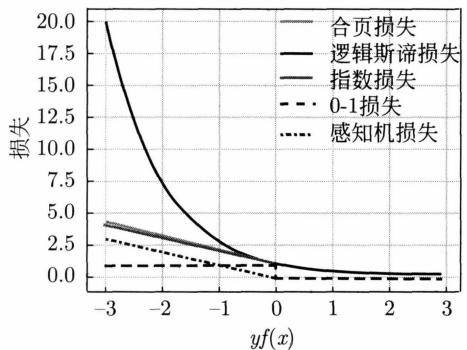  
图13.3 0-1损失、合页损失、逻辑斯谛损失、指数损失、感知机损失的关系

$k$ 近邻法没有显式的训练过程。线性回归的策略是最小化平方损失或正则化的平方损失。决策树学习的策略是最小化训练数据的整体损失或者正则化的整体损失。但这是一个 NP 完全问题，实际采用启发式方法。GBDT 的目标是最小化特定的损失函数，常见的损失函数有平方损失、对数损失等。

# 4. 学习算法

当监督学习的方法有了具体形式后，学习就变成了求解最优化问题。有时，最优化问题较为简单，存在解析解，最优解可通过算式简单计算得出。然而，在多数情况下，最优化问题没有解析解，需要采用数值计算方法或启发式方法来求解。

线性回归既可以用解析方法求解，也可以通过随机梯度下降法进行求解。

朴素贝叶斯法和隐马尔可夫模型的监督学习中，最优解即极大似然估计值，可以由计算公式直接得出。隐马尔可夫模型的无监督学习是通过迭代算法进行的。

感知机、逻辑斯谛回归与最大熵模型、条件随机场的学习可利用随机梯度下降法、拟牛顿法等，这些都是无约束最优化问题的通用解法。

支持向量机的学习可以转换为凸二次规划问题；可以通过凸二次规划算法求解对偶问题，也可以通过随机梯度下降求解原始问题。

决策树学习是基于启发式算法的典型例子，通过特征选择、生成和剪枝来构建决策树。提升方法利用其学习的模型是加法模型的特点，启发式地从前向后逐步学习模型，以逐步优化目标函数。

线性回归、支持向量机学习、逻辑斯谛回归与最大熵模型学习、条件随机场学习属于凸优化问题，能保证求得的解是全局最优解，而其他学习问题则不能保证。

__________   
  
  
  
  
  
__________   
  
__________   
  
__________

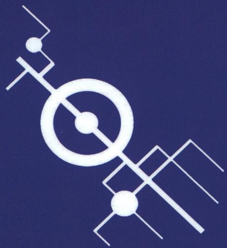

# 作者简介

李航 ACM Fellow, ACL Fellow, IEEE Fellow。京都大学毕业，东京大学博士。曾就职于NEC公司中央研究所、微软亚洲研究院、华为诺亚方舟实验室，目前在字节跳动Seed部门工作。主要研究方向为自然语言处理、信息检索、机器学习、数据挖掘。