# 机器学习方法第2版

# (二)无监督学习

李航 著

# 机器学习方法第2版

# （二）无监督学习

李航著

# 内容简介

机器学习是以概率论、统计学、信息论、最优化理论、计算理论等为基础的计算机应用理论学科，也是人工智能、数据挖掘等领域的基础学科。本书全面系统地介绍了机器学习的主要方法，共分4篇。第1篇介绍监督学习的主要方法，包括线性回归、感知机、支持向量机、最大熵模型与逻辑斯谛回归、提升方法、隐马尔可夫模型和条件随机场等；第2篇介绍无监督学习的主要方法，包括聚类、奇异值分解、主成分分析、马尔可夫链蒙特卡罗法、EM算法、潜在语义分析、潜在狄利克雷分配等。第3篇介绍深度学习的主要方法，包括前馈神经网络、卷积神经网络、循环神经网络、Transformer、扩散模型、生成对抗模型等。第4篇介绍强化的主要方法，包括马尔可夫决策、多臂老虎机、近端策略优化、深度Q网络等。书中每章介绍一两种机器学习方法。详细叙述各个方法的模型、策略和算法。从具体例子入手，由浅入深，帮助读者直观地理解基本思路，同时从理论角度出发，给出严格的数学推导，严谨翔实，让读者更好地掌握基本原理和概念。目的是使读者能学会和使用这些机器学习的基本技术。为满足读者进一步学习的需要，书中还对各个方法的要点进行了总结，给出了一些习题，并列出了主要参考文献。

本书是机器学习及相关课程的教学参考书，适合人工智能、数据挖掘等专业的本科生、研究生使用，也可供计算机各个领域的专业研发人员参考。

本书封面贴有清华大学出版社防伪标签，无标签者不得销售。

版权所有，侵权必究。举报：010-62782989，beiqinquan@tup.tsinghua.edu.cn。

# 图书在版编目（CIP）数据

机器学习方法/李航著.--2版.--北京：清华大学出版社，2025.7.ISBN978-7-302-69646-9

I. TP181

中国国家版本馆CIP数据核字第2025QZ6971号

责任编辑：孙亚楠

封面设计：李祥榕

责任校对：王淑云

责任印制：宋林

出版发行：清华大学出版社

网 址：https://www.tup.com.cn，https://www.wqxuetang.com

地址：北京清华大学学研大厦A座 邮编：100084

社总机：010-83470000 邮购：010-62786544

投稿与读者服务：010-62776969，c-service@tup.tsinghua.edu.cn

质量反馈：010-62772015，zhiliang@tup.tsinghua.edu.cn

印装者：三河市东方印刷有限公司

经销：全国新华书店

开 本： $185\mathrm{mm}\times 260\mathrm{mm}$ 印张：51.75插页：4字数：1200千字

版次：2022年3月第1版 2025年7月第2版 印次：2025年7月第1次印刷

印 数： $1\sim 6000$

定价：198.00元（全4册）

# 目录

# 第1篇 监督学习

# 第1章 机器学习简介

1.1 机器学习的定义 3  
1.2 本书内容 ..... 5

# 第2章 监督学习简介 6

2.1 监督学习概述 6

2.1.1 监督学习的形式化 6  
2.1.2 监督学习三要素 8  
2.1.3 模型评估与模型选择 12  
2.1.4 正则化与交叉验证 17   
2.1.5 泛化能力 18

2.2 监督学习问题 21

2.2.1 分类问题 21  
2.2.2 回归问题 22  
2.2.3 序列标注问题 23

2.3 监督学习方法概述 24

2.3.1 生成方法与判别方法 ..... 25  
2.3.2 分类方法 25  
2.3.3 回归方法 28  
2.3.4 序列标注方法 29

本篇内容 29  
继续阅读 30   
习题 30  
参考文献 30

# 第3章 线性回归 31

3.1 线性回归模型 31

3.1.1 模型定义 31  
3.1.2 概率模型表示 32  
3.1.3 基函数和模型的扩展 32

3.2 线性回归学习算法 34

3.2.1 最小二乘法 34  
3.2.2 正规方程 35  
3.2.3 梯度下降 36

3.3 岭回归和 Lasso 38

本章概要 40  
继续阅读 41   
习题 42  
参考文献 42

第4章 感知机 43

4.1 感知机模型 43  
4.2 感知机学习策略 44

4.2.1 数据集的线性可分性 44  
4.2.2 感知机学习策略 45

4.3 感知机学习算法 46

4.3.1 感知机学习算法的原始形式 46  
4.3.2 算法的收敛性 49  
4.3.3 感知机学习算法的对偶形式 50

本章概要 52  
继续阅读 53   
习题 53  
参考文献 54

第5章 $k$ 近邻法 55

5.1 $k$ 近邻算法 55  
5.2 $k$ 近邻模型 56

5.2.1 模型 56  
5.2.2 距离度量 57  
5.2.3 $k$ 值的选择 58   
5.2.4 决策规则 58

5.3 $k$ 近邻法的实现： $k$ -d树 59

5.3.1 构建 $k$ -d 树 ..... 59   
5.3.2 搜索 $k$ -d 树 60

本章概要 62  
继续阅读 62   
习题 63  
参考文献 63

# 第6章 朴素贝叶斯法 ..... 64

6.1 朴素贝叶斯模型 64

6.1.1 模型定义 64  
6.1.2 分类决策 66  
6.1.3 概率模型 66  
6.1.4 生成模型与判别模型 67

6.2 朴素贝叶斯学习 67

6.2.1 学习问题 67  
6.2.2 极大似然估计 67   
6.2.3 学习和分类算法 68  
6.2.4 贝叶斯估计 69

本章概要 71

继续阅读 71

习题 71

参考文献 72

# 第7章 决策树 73

7.1 决策树模型与学习 ..... 73

7.1.1 决策树 73   
7.1.2 决策树模型 74  
7.1.3 决策树学习 75

7.2 特征选择 76

7.2.1 特征选择问题 ..... 76  
7.2.2 熵、条件熵和互信息 78  
7.2.3 信息增益与特征选择 ..... 79

7.3 分类树的生成 81  
7.4分类树的剪枝 82   
7.5 CART算法 83

7.5.1 CART 生成 ..... 84  
7.5.2 CART剪枝 88

本章概要 89

继续阅读 91

习题 91

参考文献 92

# 第8章 逻辑斯谛回归和最大熵模型 ..... 93

8.1 逻辑斯谛回归模型 ..... 93

8.1.1 逻辑斯谛分布 ..... 93  
8.1.2 二项逻辑斯谛回归 94

8.1.3 多项逻辑斯谛回归 96

8.2 最大熵模型 ..... 97

8.2.1 最大熵原理 ..... 97  
8.2.2 最大熵模型的定义 99  
8.2.3 最大熵模型的学习 100  
8.2.4 最大熵模型的极大似然估计 104  
8.2.5 与逻辑斯谛回归模型的关系 ..... 105  
8.2.6 与指数分布族的关系 ..... 105

8.3 学习算法 ..... 106

8.3.1 梯度下降 106   
8.3.2 拟牛顿法 108

本章概要 110  
继续阅读 111   
习题 111  
参考文献 111

第9章 支持向量机 113

9.1 线性可分支持向量机与硬间隔最大化 113

9.1.1 线性可分支持向量机 113  
9.1.2 函数间隔和几何间隔 115  
9.1.3 间隔最大化 116  
9.1.4 对偶问题的算法 120

9.2 线性支持向量机与软间隔最大化 125

9.2.1 线性支持向量机 125  
9.2.2 对偶问题的算法 126  
9.2.3 支持向量 129  
9.2.4 无约束最优化算法 ..... 129

9.3 非线性支持向量机与核函数 133

9.3.1 核技巧 133   
9.3.2 正定核 136  
9.3.3 常用核函数 140  
9.3.4 非线性支持向量分类机 141

本章概要 142

继续阅读 144   
习题 144  
参考文献 145

第10章 提升方法 ..... 147

10.1 AdaBoost算法 ..... 147

10.1.1 基本想法 147  
10.1.2 算法 148  
10.1.3 AdaBoost的例子 150  
10.1.4 训练误差分析 152  
10.1.5 前向分步算法解释 153

# 10.2 梯度提升 157

10.2.1 基本想法 157  
10.2.2 GBDT用于回归 158  
10.2.3 GBDT算法 161

# 本章概要 163

# 继续阅读 165

# 习题 165

# 参考文献 166

# 第11章 隐马尔可夫模型 ..... 167

# 11.1 隐马尔可夫模型的基本概念 167

11.1.1 模型的定义 167  
11.1.2 模型的特点 169  
11.1.3 基本问题 171

# 11.2 概率计算算法 ..... 171

11.2.1 直接计算法 171  
11.2.2 前向算法 172  
11.2.3 后向算法 174  
11.2.4 前向-后向算法 176  
11.2.5 一些概率与期望值的计算 ..... 176

# 11.3 学习算法 177

11.3.1 监督学习方法 177  
11.3.2 Baum-Welch算法 178  
11.3.3 模型参数估计 180

# 11.4 预测算法 181

11.4.1 近似算法 181  
11.4.2 维特比算法 181

# 本章概要 185

# 继续阅读 186

# 习题 187

# 参考文献 187

# 第12章 条件随机场 188

# 12.1 概率无向图模型 ..... 188

12.1.1 模型的定义 188  
12.1.2 概率无向图模型的因子分解 191  
12.1.3 概率无向图模型的例子 193

12.2 条件随机场的基本概念 194

12.2.1 模型的定义 194  
12.2.2 模型的形式 195  
12.2.3 基本问题 199

12.3 概率计算算法 200

12.3.1 前向算法 200  
12.3.2 后向算法 201  
12.3.3 前向-后向算法 201  
12.3.4 期望值的计算 ..... 202

12.4 学习算法 202

12.4.1 监督学习算法 203  
12.4.2 拟牛顿法 203

12.5 预测算法 204

本章概要 207  
继续阅读 209   
习题 209  
参考文献 210

第13章 监督学习方法总结 211

# 第2篇 无监督学习

第14章 无监督学习简介 ..... 219

14.1 无监督学习问题 ..... 219

14.1.1 聚类问题 219  
14.1.2 降维问题 220  
14.1.3 话题分析问题 ..... 221  
14.1.4 概率模型估计问题 ..... 223

14.2 无监督学习方法概述 223

14.2.1 机器学习三要素 223  
14.2.2 聚类方法 224  
14.2.3 降维方法 224  
14.2.4 话题分析方法——非概率模型 ..... 225  
14.2.5 话题分析方法——概率模型 ..... 226  
14.2.6 概率模型估计方法 227

本篇内容 228

继续阅读 228

参考文献 228

# 第15章 聚类方法 ..... 229

15.1 聚类的基本概念 229

15.1.1 相似度或距离 229  
15.1.2 类或簇 232   
15.1.3 类与类之间的距离 233

15.2 层次聚类 234

15.3 $k$ 均值聚类 235

15.3.1 模型 236  
15.3.2 策略 236  
15.3.3 算法 237  
15.3.4 算法特性 238

本章概要 239

继续阅读 240

习题 240

参考文献 240

# 第16章 奇异值分解 242

16.1 奇异值分解的定义与性质 242

16.1.1 定义与定理 242  
16.1.2 紧奇异值分解与截断奇异值分解 246  
16.1.3 几何解释 248   
16.1.4 主要性质 250

16.2 奇异值分解的计算 251

16.3 奇异值分解与矩阵近似 254

16.3.1 弗罗贝尼乌斯范数 254  
16.3.2 矩阵的最优近似 255  
16.3.3 矩阵的外积展开式 258

本章概要 260

继续阅读 261

习题 261

参考文献 262

# 第17章 主成分分析 263

17.1 总体主成分分析 263

17.1.1 基本想法 263  
17.1.2 定义和导出 265  
17.1.3 主要性质 266

17.1.4 主成分分析与降维 270  
17.1.5 规范化的总体主成分 273

# 17.2 样本主成分分析 274

17.2.1 定义和性质 274  
17.2.2 相关矩阵的特征值分解算法 276  
17.2.3 样本矩阵的奇异值分解算法 279

# 本章概要 280

# 继续阅读 282

# 习题 282

# 参考文献 283

# 第18章 EM算法和变分EM算法 284

# 18.1 EM算法 284

18.1.1 简单例子 285  
18.1.2 基本算法 287  
18.1.3 基本原理 288  
18.1.4 算法收敛性 290  
18.1.5 广义算法 291

# 18.2 高斯混合模型的EM算法 293

18.2.1 高斯混合模型 293  
18.2.2 EM算法 293  
18.2.3 与 $k$ 均值的关系 ..... 296

# 18.3 变分EM算法 297

18.3.1 变分贝叶斯方法 297  
18.3.2 基本算法 299  
18.3.3 EM算法和变分EM算法的比较 300

# 本章概要 300

# 继续阅读 302

# 习题 302

# 参考文献 303

# 第19章 马尔可夫链蒙特卡罗法 304

# 19.1 蒙特卡罗法 304

19.1.1 随机抽样 304   
19.1.2 数学期望估计 305

# 19.2 积分计算 307

# 19.3 马尔可夫链 308

19.3.1 基本定义 308  
19.3.2 离散状态马尔可夫链 309

19.3.3 连续状态马尔可夫链 314  
19.3.4 马尔可夫链的性质 315

# 19.4 马尔可夫链蒙特卡罗法 319

19.4.1 基本想法 319  
19.4.2 基本步骤 320

# 19.5 马尔可夫链蒙特卡罗法与机器学习 320

# 19.6 Metropolis-Hastings 算法 321

19.6.1 基本原理 321  
19.6.2 Metropolis-Hastings算法 324  
19.6.3 单分量Metropolis-Hastings算法 324

# 19.7 吉布斯抽样 325

19.7.1 基本原理 326  
19.7.2 吉布斯抽样算法 327  
19.7.3 抽样计算 328

# 本章概要 329

# 继续阅读 330

# 习题 331

# 参考文献 332

# 第20章 潜在语义分析和非负矩阵分解 333

# 20.1 单词向量空间与话题向量空间 333

20.1.1 单词向量空间 333  
20.1.2 话题向量空间 335

# 20.2 潜在语义分析算法 338

20.2.1 矩阵奇异值分解算法 338  
20.2.2 例子 340

# 20.3 非负矩阵分解算法 341

20.3.1 非负矩阵分解 341  
20.3.2 话题分析 342  
20.3.3 非负矩阵分解的形式化 342  
20.3.4 算法 343

# 本章概要 345

# 继续阅读 346

# 习题 346

# 参考文献 347

# 第21章 概率潜在语义分析 348

# 21.1 概率潜在语义分析模型 348

# 21.1.1 基本想法 348

21.1.2 生成模型 349  
21.1.3 共现模型 350  
21.1.4 模型性质 351

21.2 概率潜在语义分析的算法 353

本章概要 355

继续阅读 356

习题 356

参考文献 357

# 第22章 潜在狄利克雷分配 358

22.1狄利克雷分布 358

22.1.1 分布定义 358  
22.1.2 共轭先验 361

22.2 潜在狄利克雷分配模型 362

22.2.1 基本想法 362  
22.2.2 模型定义 363  
22.2.3 概率图模型 365  
22.2.4 随机变量序列的可交换性 366  
22.2.5 概率公式 366

22.3 LDA的吉布斯抽样算法 367

22.3.1 基本想法 367  
22.3.2 算法的主要部分 368  
22.3.3 算法的后处理 370  
22.3.4 算法 370

22.4 LDA的变分EM算法 372

22.4.1 算法推导 372   
22.4.2 算法总结 378

本章概要 378

继续阅读 379

习题 379

参考文献 380

# 第23章 无监督学习方法总结 381

23.1 无监督学习方法的关系和特点 381

23.1.1 方法之间的关系 381  
23.1.2 无监督学习方法 381  
23.1.3 基础机器学习方法 382

23.2 话题模型之间的关系和特点 ..... 382

参考文献 383

# 第3篇 深度学习

# 第24章 深度学习简介 387

24.1 深度学习问题 ..... 387

24.1.1 监督学习问题 387  
24.1.2 无监督学习问题 389

24.2 深度学习方法概述 391

24.2.1 基本原理 391  
24.2.2 基本工具 391  
24.2.3 监督学习模型 395  
24.2.4 无监督学习模型 397  
24.2.5 基本算法 398  
24.2.6 预训练 398

24.3 深度学习应用 399

本篇内容 399

参考文献 400

# 第25章 前馈神经网络 401

25.1 前馈神经网络的模型 401

25.1.1 前馈神经网络定义 402  
25.1.2 前馈神经网络的例子 412  
25.1.3 前馈神经网络的表示能力 416

25.2 前馈神经网络的学习算法 419

25.2.1 前馈神经网络学习 419  
25.2.2 前馈神经网络学习的优化算法 421  
25.2.3 反向传播算法 424  
25.2.4 在计算图上的实现 427  
25.2.5 算法的实现技巧 431

25.3 前馈神经网络学习的正则化 436

25.3.1 深度学习中的正则化 436  
25.3.2 早停法 ..... 437  
25.3.3 暂退法 438

本章概要 441

继续阅读 443

习题 444

参考文献 444

# 第26章 卷积神经网络 446

26.1 卷积神经网络的模型 446

26.1.1 背景 446

26.1.2 卷积 447  
26.1.3 汇聚 455   
26.1.4 卷积神经网络 458  
26.1.5 卷积神经网络性质 461

# 26.2 卷积神经网络的学习算法 463

26.2.1 卷积导数 463  
26.2.2 反向传播算法 464

# 26.3 图片分类中的应用 467

26.3.1 AlexNet 467   
26.3.2 残差网络 468

# 本章概要 472

# 继续阅读 474

# 习题 475

# 参考文献 476

# 第27章 循环神经网络 478

# 27.1 简单循环神经网络 478

27.1.1 模型 478  
27.1.2 学习算法 481

# 27.2 常用循环神经网络 485

27.2.1 长短期记忆网络 485  
27.2.2 门控循环单元网络 ..... 488  
27.2.3 深度循环神经网络 489  
27.2.4 双向循环神经网络 490

# 27.3 自然语言生成中的应用 491

27.3.1 词向量 ..... 491  
27.3.2 语言生成与语言模型 ..... 494

# 本章概要 496

# 继续阅读 498

# 习题 498

# 参考文献 499

# 第28章 Transformer 501

# 28.1 序列到序列基本模型 501

28.1.1 序列到序列 ..... 501  
28.1.2 基本模型 503

# 28.2 RNN Search 模型 ..... 504

28.2.1 注意力 504  
28.2.2 模型定义 506

28.2.3 模型特点 507

28.3 Transformer 模型 ..... 508

28.3.1 模型架构 508  
28.3.2 模型特点 515

本章概要 516

继续阅读 518   
习题 518  
参考文献 519

# 第29章GPT和BERT 520

29.1 预训练语言模型 520  
29.2 GPT模型 522

29.2.1 模型和学习 522  
29.2.2 模型特点 526

29.3 BERT模型 526

29.3.1 模型和学习 526  
29.3.2 模型特点 531

本章概要 532  
继续阅读 533   
习题 533  
参考文献 534

# 第30章 变分自编码器 535

30.1 自编码器 535  
30.2 去噪自编码器 536  
30.3 变分自编码器 537

30.3.1 方法概述 537  
30.3.2 模型 538  
30.3.3 学习策略 540  
30.3.4 学习算法 542  
30.3.5 手写数字例 544

本章概要 545  
继续阅读 547   
习题 547  
参考文献 547

# 第31章 生成对抗网络 ..... 549

31.1 GAN基本模型 549  
31.1.1 模型 549

31.1.2 学习算法 551  
31.1.3 理论分析 552

31.2 图片生成中的应用 553

31.2.1 转置卷积 554   
31.2.2 DCGAN 556

本章概要 558  
继续阅读 559

习题 559

参考文献 560

# 第32章 扩散模型 561

32.1 去噪扩散概率模型 561

32.1.1 直观解释 562  
32.1.2 模型的定义和性质 562   
32.1.3 学习和生成算法 567

32.2 分数匹配加朗之万动力学 571

32.2.1 分数匹配 571  
32.2.2 朗之万动力学 ..... 573  
32.2.3 学习和生成算法 574

32.3 扩散模型之间的关系 577

32.3.1 分数函数学习 577  
32.3.2 随机微分方程 578

32.4 图像生成 580

32.4.1 扩散模型用于图像生成 580  
32.4.2 隐空间中的生成 581  
32.4.3 有条件的生成 ..... 582

本章概要 583  
继续阅读 586   
习题 586  
参考文献 587

# 第33章 深度学习方法总结 588

33.1 深度学习的模型 588  
33.2 深度学习的算法 590  
33.3 深度学习的优缺点 ..... 592

参考文献 593

# 第4篇 强化学习

# 第34章 强化学习简介 597

34.1 强化学习问题 ..... 597

34.1.1 强化学习的定义 597  
34.1.2 相关问题 600

# 34.2 强化学习原理和方法 601

34.2.1 强化学习方法 601  
34.2.2 强化学习原理 601  
34.2.3 深度强化学习 602

# 34.3 强化学习应用 603

# 本篇内容 604

# 习题 605

# 参考文献 605

# 第35章 马尔可夫决策过程 606

# 35.1 马尔可夫决策过程定义 606

35.1.1 基本概念 606  
35.1.2 最优策略 610  
35.1.3 MDP例子 611

# 35.2 动态规划算法 614

35.2.1 规划问题 614  
35.2.2 贝尔曼方程 614  
35.2.3 策略评估 617   
35.2.4 策略迭代 620  
35.2.5 价值迭代 622  
35.2.6 算法的比较和扩展 625

# 本章概要 626

# 继续阅读 629

# 习题 629

# 参考文献 630

# 第36章 多臂老虎机 631

# 36.1 多臂老虎机概述 631

36.1.1 问题的定义 631  
36.1.2 探索和利用的权衡 633

# 36.2 基本算法 634

36.2.1 探索优先算法 634  
36.2.2 $\varepsilon$ 贪心算法 634  
36.2.3UCB算法 636  
36.2.4 汤普森采样 638

# 本章概要 641

继续阅读 642   
习题 642  
参考文献 643

# 第37章 基于价值的方法 644

37.1 基于价值的方法概述 644  
37.2 模型无关预测 645

37.2.1 蒙特卡罗预测 645  
37.2.2 时序差分预测 648   
37.2.3 预测方法的总结 650

37.3 模型无关控制 652

37.3.1 蒙特卡罗控制 652  
37.3.2 SARSA算法 655  
37.3.3 Q学习 658   
37.3.4 在策略和离策略学习 660

37.4 基于价值的方法的总结 661

本章概要 662  
继续阅读 663   
习题 664  
参考文献 664

# 第38章 深度Q网络 665

38.1 价值函数近似法 665  
38.2 DQN方法 669

本章概要 671  
继续阅读 672   
习题 672  
参考文献 672

# 第39章 基于策略的方法 673

39.1 基于策略的方法概述 673  
39.2 REINFORCE算法 675

39.2.1 REINFORCE算法 675  
39.2.2 带基线的REINFORCE算法 678  
39.2.3 策略函数 680

39.3 演员-评论员算法 681  
39.4 策略梯度方法总结 683

39.4.1 一般形式 683  
39.4.2 策略梯度定理 684

39.5 策略梯度的应用例 686  
本章概要 687  
继续阅读 689   
习题 689  
参考文献 690

# 第40章 近端策略优化PPO 691

40.1 TRPO算法 691

40.1.1 背景和动机 691  
40.1.2 基本形式 692  
40.1.3 算法和理论推导 693   
40.1.4 具体算法 696

40.2 PPO算法 697

40.2.1 算法概述 697  
40.2.2 PPO-Clip 698   
40.2.3 具体算法 699

40.3 大语言模型的应用 700

40.3.1 LLM 概述 ..... 700   
40.3.2 预训练 701   
40.3.3 SFT 701   
40.3.4 RLHF 702   
40.3.5 LLM 的特点 703

本章概要 703

继续阅读 705   
习题 705  
参考文献 705

# 第41章 强化学习方法总结 706

41.1 强化学习的重要性 706

41.1.1 强化学习 706  
41.1.2 强化学习与监督学习 706  
41.1.3 强化学习与生物学习 707

41.2 强化学习方法之间的关系 707

41.2.1 强化学习方法 707  
41.2.2 基于模型、价值、策略的方法 709

41.3 其他强化学习问题和方法 710  
41.4 强化学习的机遇和挑战 710

参考文献 711

附录A 梯度下降法 712  
附录B 牛顿法和拟牛顿法 714  
附录C 拉格朗日对偶性 719  
附录D 矩阵空间 722  
附录E KL散度和狄利克雷分布 725  
附录F 深度学习中的偏导数 727  
附录G 深度学习的优化算法 729

# 第2篇 无监督学习

__________   
  
  
__________   
  
  
__________   
  
__________   
  
  
  
  
  
  
  
  
  
  
  
  
__________   
  
  
__________

# 第14章 无监督学习简介

无监督学习是从无标注数据中学习模型的机器学习，旨在学习数据的潜在表示、潜在结构或生成机制。无监督学习主要用于数据分析、数据生成，也可以作为监督学习的前处理。无监督学习同监督学习、强化学习一样，是机器学习的主要分支。无监督学习与深度学习结合，称为深度无监督学习。

本篇讲解传统机器学习中的无监督学习。本章首先概述无监督学习的基本问题，包括聚类、降维、话题分析、概率模型估计；然后概述无监督学习方法的基本原理。

# 14.1 无监督学习问题

无监督学习有多种不同的问题，包括聚类、降维、话题分析、概率模型估计、语言建模、图分析等。这些问题并不是独立的，而是存在一定联系，并且能部分结合在一起。例如，话题分析可以基于含隐变量的概率模型估计。目前没有一个统一的理论框架对无监督学习进行形式化。本篇主要讲解聚类、降维、话题分析。概率模型估计是更一般的问题，也会做讲解。语言建模在本篇中也有介绍。

无监督学习使用的数据集合称为样本数据集或训练数据集。与监督学习不同，样本通常由实例组成，而不是实例和标注的对组成，实例由特征向量表示。

# 14.1.1 聚类问题

聚类（clustering）是将样本数据集中相似的样本分配到相同的类，不相似的样本分配到不同的类的“学习”。聚类主要用于数据分析。聚类时，样本通常由特征向量表示，是实数空间中的向量；样本的类别不是事先给定的，而是从数据中自动发现，但类别的个数通常是事先给定的。样本之间的相似度或距离由应用决定。如果一个样本只能属于一个类，则称为硬聚类（hard clustering）；如果一个样本可以属于多个类，则称为软聚类（soft clustering）。图14.1给出硬聚类的例子。二维空间的样本被分到三个不同的类中。

聚类的样本数据集是 $\mathcal{X} = \{\pmb{x}_1, \pmb{x}_2, \dots, \pmb{x}_n\}$ ，其中 $\pmb{x}_j$ ， $j = 1, 2, \dots, n$ 是样本；样本由特征向量表示， $\pmb{x}_j = (x_{1j}, x_{2j}, \dots, x_{mj})^{\mathrm{T}}$ ， $i = 1, 2, \dots, m$ 。样本数据集整体可以由一个矩阵表示，每一行对应一个特征，每一列对应一个样本。

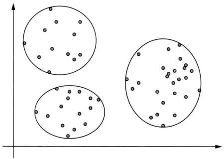  
图14.1 聚类的示意

$$
\boldsymbol {X} _ {m \times n} = \left[ \begin{array}{c c c} x _ {1 1} & \dots & x _ {1 n} \\ \vdots & & \vdots \\ x _ {m 1} & \dots & x _ {m n} \end{array} \right]
$$

其中， $x_{ij}$ 是第 $j$ 个样本的第 $i$ 个特征， $i = 1,2,\dots ,m$ ， $j = 1,2,\dots ,n$ 。

聚类模型是函数 $z = f_{\phi}(\pmb{x})$ ，其中 $\pmb{x} \in \mathcal{X}$ 是输入，表示样本； $z \in \mathcal{Z}$ 是输出，表示样本的类别， $\mathcal{Z} = \{1, 2, \dots, k\}$ ； $\phi$ 是参数。类别的个数 $k$ 远远小于样本的个数 $n$ 。学习的目标就是从数据中学习模型 $z = f_{\phi}(\pmb{x})$ 。

对样本数据集样本进行聚类的过程就是学习聚类模型的过程。通过聚类（硬聚类），每一个样本 $\pmb{x}_j$ 属于一个类 $z_j \in \mathcal{Z}$ ， $j = 1,2,\dots,n$ ，也就得到了模型 $z_j = f_\phi(\pmb{x}_j)$ 。聚类可以帮助发现数据集中样本之间的关系，也就是样本矩阵 $\pmb{X}$ 中列之间的关系，可以看作数据的潜在结构。

聚类在各个领域的数据分析和数据挖掘中有广泛的应用。例如，在商业领域，对用户数据进行聚类可以将用户分为不同的群体，根据购买行为、消费习惯和年龄、性别等特征进行归类，以便制定更有针对性的营销策略。聚类还可以用于网络安全，识别网络中的异常数据点；可以通过对网络访问数据进行聚类，区分正常流量与不符合常规的流量，从而检测潜在的网络入侵。在医学影像中，聚类技术被用于图像分割，帮助将异常组织与正常组织区分开，使得疾病检测和治疗更加精准。

# 14.1.2 降维问题

降维（dimensionality reduction）是将样本数据集中的样本从高维空间映射到低维空间的“学习”。降维可以用于数据分析，也可以作为监督学习的前处理。样本原本存在于原始特征空间，是高维空间，通过降维可以将其映射到潜在表示空间，是低维空间。假设潜在表示空间能更好地表示样本数据。原始特征空间可以是高维的欧氏空间，而潜在表示空间可以是低维的欧氏空间或者流形（manifold）。低维空间不是事先给定，而是从数据中自动学习，但维数通常是事先给定的。从高维到低维的映射要保证样本中的信息损失最小。降维分为线性的和非线性的。图14.2给出线性降维的例子。样本存在于二维空间的一条斜线附近，可以将样本从二维空间转换到一维空间。通过降维可以更好地表示样本的特征。

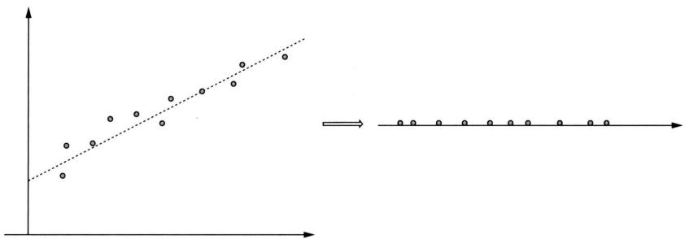  
图14.2 降维的示意

降维使用样本数据集 $\mathcal{X} = \{\pmb{x}_1, \pmb{x}_2, \dots, \pmb{x}_n\}$ ，其中 $\pmb{x}_j$ ， $j = 1, 2, \dots, n$ 是样本；样本由特征向量表示， $\pmb{x}_j = (x_{1j}, x_{2j}, \dots, x_{mj})^{\mathrm{T}}$ ， $i = 1, 2, \dots, m$ 。样本数据集整体可以由一个矩阵表示，每一行对应一个特征，每一列对应一个样本。

$$
\boldsymbol {X} _ {m \times n} = \left[ \begin{array}{c c c} x _ {1 1} & \dots & x _ {1 n} \\ \vdots & & \vdots \\ x _ {m 1} & \dots & x _ {m n} \end{array} \right]
$$

其中， $x_{ij}$ 是第 $j$ 个样本的第 $i$ 个特征， $i = 1,2,\dots ,m$ ， $j = 1,2,\dots ,n$ 。

降维模型是函数 $z = f_{\phi}(\pmb{x})$ ，其中 $\pmb{x} \in \mathcal{X}$ 是样本的高维特征向量， $z \in \mathcal{Z}$ 是样本的低维表示向量， $\phi$ 是参数。假设输入空间是欧氏空间 $\mathcal{X} \subseteq \mathbb{R}^d$ ，输出空间也是欧氏空间 $\mathcal{Z} \subseteq \mathbb{R}^{d'}$ ，后者的维数 $d'$ 远低于前者的维数 $d$ 。学习的目标就是从数据中学习模型 $z = f_{\phi}(\pmb{x})$ 。模型可以是线性函数，也可以是非线性函数。

对样本数据集进行降维的过程就是学习降维模型的过程。降维时，每一个样本从高维向量 $\pmb{x}_j$ 转换为低维向量 $z_{j}$ ， $j = 1,2,\dots ,n$ ，也就得到了模型 $z_{j} = f_{\phi}(\pmb{x}_{j})$ 。降维可以帮助发现样本数据集中样本的潜在表示，也就是样本矩阵 $\pmb{X}$ 中行之间的关系。

降维技术，包括主成分分析（PCA），在数据分析、数据挖掘、数据可视化和数据处理中都有广泛的应用。例如，在生物信息学，PCA被用来处理基因表达数据，以识别个体间的差异；通过降维，可以可视化基因表达数据，发现潜在的生物标志物和模式。在金融市场分析中，股票有多种金融指标，如股票价格和成交量；通过PCA降维，可以将高维的金融数据映射到低维空间，便于数据可视化，帮助评估股票的状态。在人脸识别系统中，人脸图像是高维数据；利用PCA将高维图像数据降维，可以提取人脸图像的主要特征，提高人脸识别的准确率和计算效率。

# 14.1.3 话题分析问题

话题分析（topic modeling）主要用于文本内容的分析。其基本想法是用单词的分布表示话题，用话题的分布表示文本。体育话题的分布中“篮球”“足球”“游泳”等单词出现的概率高于其他单词。经济话题的分布中“增长”“物价”“GDP”等单词出现的概率高于其他单词。一篇关于体育的文章，体育话题出现的概率高于经济话题出现的概率。而另一篇关于经济的

文章，经济话题出现的概率高于体育话题出现的概率。如图14.3所示。

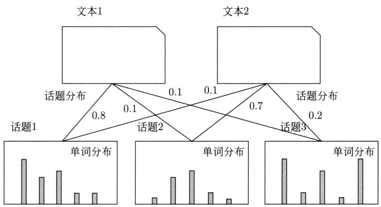  
图14.3 话题分析的示意

话题分析旨在自动地从文本数据中学习话题的单词分布和文本的话题分布，发现潜在的话题，以表示文本的内容，从而对文本的内容进行分析。话题模型有概率模型和非概率模型。

使用概率模型的方法把话题分析看作含有隐变量的概率模型估计问题。假设有单词的集合 $\mathcal{W} = \{w_1, w_2, \dots, w_m\}$ ，文本（指标）的集合 $\mathcal{D} = \{d_1, d_2, \dots, d_n\}$ ，话题（指标）的集合 $\mathcal{Z} = \{z_1, z_2, \dots, z_k\}$ 。一般话题数 $k$ 远小于单词数 $m$ 。每一个话题由一个单词的条件概率分布 $P_{\theta}(w|z)$ 表示， $z \in \mathcal{Z}, w \in \mathcal{W}$ 。每一个文本由一个话题的条件概率分布 $P_{\theta}(z|d)$ 表示， $d \in \mathcal{D}$ 。文本 $d$ 和单词 $w$ 的联合概率分布 $P_{\theta}(w,d)$ 定义为

$$
P _ {\boldsymbol {\theta}} (w, d) = P _ {\boldsymbol {\theta}} (d) \sum_ {z} P _ {\boldsymbol {\theta}} (z | d) P _ {\boldsymbol {\theta}} (w | z) \tag {14.1}
$$

其中， $\theta$ 是参数，称为话题模型（topic model）。话题是不可观测的，而文本中的单词是可观测的。认为每一个文本 $d$ 是根据以上话题模型独立同分布抽样得到的。从文本数据中自动学习以上话题模型，这样就可以利用话题分布对文本内容进行分析。

使用非概率模型的方法将话题分析看作降维问题。用降维的方法进行话题分析。话题分析的样本数据集是 $\mathcal{X} = \{\pmb{x}_1, \pmb{x}_2, \dots, \pmb{x}_n\}$ ，其中 $\pmb{x}_j$ ， $j = 1, 2, \dots, n$ 是文本；文本由单词的频数向量表示， $\pmb{x}_j = (x_{1j}, x_{2j}, \dots, x_{mj})^{\mathrm{T}}$ ， $i = 1, 2, \dots, m$ 。样本数据集整体可以由一个矩阵表示，每一行对应一个单词，每一列对应一个文本，称作单词-文本矩阵。

$$
\boldsymbol {X} _ {m \times n} = \left[ \begin{array}{c c c} x _ {1 1} & \dots & x _ {1 n} \\ \vdots & & \vdots \\ x _ {m 1} & \dots & x _ {m n} \end{array} \right]
$$

其中， $x_{ij}$ 是第 $j$ 个文本中第 $i$ 个单词出现的频数， $i = 1,2,\dots,m$ ， $j = 1,2,\dots,n$ 。认为降维后得到的潜在表示代表话题。

话题分析技术可以应用于大量文本数据的内容分析和摘要。在新闻领域，通过分析新闻网站上的文章，可以识别新闻报道的主要话题，帮助理解各类新闻的焦点和趋势。在商业领域，话题模型能够分析商品评论和社交媒体文本，帮助了解消费者的需求和态度，进而优化

产品设计和品牌策略。在科技领域，话题分析可以应用于大量学术文献的分析，识别当前研究的热点话题和趋势，协助确定未来的研究方向。

# 14.1.4 概率模型估计问题

概率模型估计（probability model estimation）是无监督学习的一个基本问题，包括统计学中的密度估计（density estimation）。本书主要考虑含有隐变量的概率模型估计。概率模型包含观测变量和隐变量。观测变量表示数据或数据的特征，隐变量表示数据的潜在表示或结构。概率模型是观测变量和隐变量的联合概率分布。关于观测变量的边缘分布就是数据分布。

学习问题定义为样本数据的概率或似然函数最大化问题。通过学习，估计模型的参数，得到样本数据的分布。

随机变量是连续变量时，样本数据的分布写作

$$
p _ {\boldsymbol {\theta}} (\boldsymbol {x}) = \int p _ {\boldsymbol {\theta}} (\boldsymbol {z}) p _ {\boldsymbol {\theta}} (\boldsymbol {x} | \boldsymbol {z}) \mathrm {d} \boldsymbol {z} \tag {14.2}
$$

这里 $\theta$ 是参数； $x$ 是观测变量，代表数据； $z$ 是隐变量，代表潜在表示。随机变量是离散变量时，样本数据的分布写作

$$
P _ {\boldsymbol {\theta}} (\boldsymbol {x}) = \sum_ {z} P _ {\boldsymbol {\theta}} (z) P _ {\boldsymbol {\theta}} (\boldsymbol {x} | z) \tag {14.3}
$$

以上概率模型也是数据生成模型。假设样本数据是根据这个概率模型 $p_{\theta}(\boldsymbol{x})$ 生成的。首先根据先验分布 $p_{\theta}(\boldsymbol{z})$ 生成潜在表示 $\boldsymbol{z}$ ，然后基于潜在表示 $\boldsymbol{z}$ 根据条件概率分布 $p_{\theta}(\boldsymbol{x}|\boldsymbol{z})$ 生成样本。

以上概率模型有时也是概率有向图模型（probabilistic directed graph model）。模型用有向图表示观测变量和隐变量的联合概率分布，结点表示变量，有向边表示概率依存关系。

含有隐变量的概率模型可以用于聚类、降维、话题分析，这时隐变量分别表示类别、潜在表示、话题，都是不可观测的。

# 14.2 无监督学习方法概述

# 14.2.1 机器学习三要素

同监督学习一样，无监督学习也有三要素：模型、策略、算法。

模型就是聚类模型 $z = f_{\theta}(\pmb{x})$ 、降维模型 $\pmb{z} = f_{\theta}(\pmb{x})$ 、话题模型 $P_{\theta}(w, d)$ 等。聚类、降维、话题模型拥有不同的形式。聚类模型的输出是样本的类别；降维模型的输出是样本的潜在表示；话题模型的输出是文本的话题分布和话题的单词分布。

策略在不同的问题中有不同的形式，但都等价于目标函数的最优化。比如，聚类中样本与所属类别中心距离的最小化，降维中样本从高维空间映射到低维空间过程中信息损失的最小化，话题分析中模型生成文本数据的似然函数的最大化。

算法有迭代算法，如梯度下降法，通过迭代达到目标函数的最优化。

# 14.2.2 聚类方法

聚类的方法有层次聚类和 $k$ 均值聚类。假设样本存在于作为实数空间的特征空间中。定义样本之间的相似度或距离，这样就可以判断任意两个样本的相似度或距离。用相似度还是用距离根据应用而定，事实上可以把相似度的倒数看作一种距离。

聚类的一个想法是根据样本之间的距离构建类别树。将每一个样本分到一个类别，计算类别两两之间的距离，将距离最小的两个类聚成一个新的类，不断重复，就得到一个类别树。这就是层次聚类方法。

聚类的另一个想法是对特征空间进行划分。得到的每一个子空间表示一个类别，要求是每个子空间内样本聚集在一起。 $k$ 均值聚类就是基于这个思想。将作为欧氏空间的特征空间划分为 $k$ 个子空间，得到 $k$ 个类，每个类有自己的中心或均值。计算每个类内的样本与中心的欧氏距离的平方和，使得所有类的距离平方和最小。用迭代的方法找到最优的划分，也就是最优的聚类。

$k$ 均值聚类具体求解最优化问题：

$$
C ^ {*} = \arg \min  _ {C} \sum_ {l = 1} ^ {k} \sum_ {C (i) = l} \| \boldsymbol {x} _ {i} - \bar {\boldsymbol {x}} _ {l} \| ^ {2} \tag {14.4}
$$

其中， $\bar{\pmb{x}}_l$ 是第 $l$ 个类的均值或中心， $C$ 表示对样本集合的划分， $C(i)$ 表示样本 $\pmb{x}_i$ 所属的类。

$k$ 均值聚类进行以下迭代，直到收敛。首先，对于给定的 $k$ 个中心 $(m_{1}, m_{2}, \dots, m_{k})$ ，求一个划分 $C$ ，使得目标函数最小：

$$
\min  _ {C} \sum_ {l = 1} ^ {k} \sum_ {C (i) = l} \| \boldsymbol {x} _ {i} - \boldsymbol {m} _ {l} \| ^ {2} \tag {14.5}
$$

求解这个最小化，等价于将每个样本分到与其最近的中心 $m_{l}$ 的类中。然后，对得到的新的划分 $C$ ，求各个类的中心 $(m_1,m_2,\dots ,m_k)$ ，使得目标函数最小：

$$
\min  _ {\boldsymbol {m} _ {1}, \boldsymbol {m} _ {2}, \dots , \boldsymbol {m} _ {k}} \sum_ {l = 1} ^ {k} \sum_ {C (i) = l} \| \boldsymbol {x} _ {i} - \boldsymbol {m} _ {l} \| ^ {2} \tag {14.6}
$$

求解结果，得到每个类的新的中心 $(\pmb{m}_1,\pmb{m}_2,\dots ,\pmb {m}_k)$ 。

# 14.2.3 降维方法

降维方法有主成分分析（PCA）。主成分分析是将样本数据通过线性变换从高维空间压缩到低维空间的方法。假设线性变换是正交变换，且变换后的各个维度上数据的方差最大。这个正交变换可以由矩阵的乘积表示：

$$
\mathbf {Y} _ {k \times n} = \mathbf {T} _ {m \times k} ^ {\mathrm {T}} \mathbf {X} _ {m \times n} \tag {14.7}
$$

其中， $X_{m \times n}$ 表示原始的样本数据， $T_{m \times k}$ 表示正交变换（有 $k$ 个正交的单位列向量）， $\mathbf{Y}_{k \times n}$ 是样本数据的潜在表示。假设 $k < m$ ，也就是说，变换后的维度低于变换前的维度。

主成分分析通常使用样本的协方差矩阵的特征值分解或样本矩阵的奇异值分解（SVD）进行计算，由样本矩阵 $X_{m \times n}$ 出发，找到正交变换矩阵 $T_{m \times k}$ 。这里介绍常用的使用SVD的方法。

线性代数中，奇异值分解是将任意一个矩阵 $X_{m\times n}$ 分解为三个矩阵的乘积形式的方法。

$$
\boldsymbol {X} _ {m \times n} = \boldsymbol {U} _ {m \times m} \boldsymbol {\Sigma} _ {m \times n} \boldsymbol {V} _ {n \times n} ^ {\mathrm {T}} \tag {14.8}
$$

其中， $U_{m \times m}$ 和 $V_{n \times n}$ 为正交矩阵，分别由正交的单位列向量构成； $\pmb{\Sigma}_{m \times n}$ 为非负值（奇异值）构成的矩形对角矩阵。如果只取 $k$ 个最大的奇异值，就可以得到矩阵的截断奇异值分解。

$$
\boldsymbol {X} _ {m \times n} \approx \boldsymbol {U} _ {m \times k} \boldsymbol {\Sigma} _ {k \times k} \boldsymbol {V} _ {n \times k} ^ {\mathrm {T}} \tag {14.9}
$$

矩阵 $X_{m\times n}$ 表示的是原始数据，而截断奇异值分解后的矩阵表示的是压缩后的数据。

使用SVD的主成分分析的步骤如下。首先，对样本矩阵 $X_{m\times n}$ 的每一行的特征做中心化处理，使得每一行的特征的均值为0，得到：

$$
\boldsymbol {X} _ {m \times n} ^ {\prime} = \left(\boldsymbol {X} _ {m \times n} - \boldsymbol {\mu} _ {m \times 1} \boldsymbol {I} _ {n \times 1} ^ {\mathrm {T}}\right) \tag {14.10}
$$

其中， $\pmb{\mu}_{m\times 1}$ 是特征的均值向量， $1_{n\times 1}$ 是全1向量。

然后，再对矩阵 $\bar{X}_{m\times n}$ 进行截断奇异值分解，得到：

$$
\boldsymbol {X} _ {m \times n} ^ {\prime} \approx \boldsymbol {U} _ {m \times k} \boldsymbol {\Sigma} _ {k \times k} \boldsymbol {V} _ {n \times k} ^ {\mathrm {T}} \tag {14.11}
$$

其中， $U_{m\times k}$ 和 $\mathbf{V}_{n\times k}$ 各有 $k$ 个正交的单位列向量。将矩阵 $U_{m\times k}$ 用于主成分分析。

最后，求样本数据的主成分矩阵：

$$
\boldsymbol {Y} _ {k \times n} ^ {\prime} = \boldsymbol {U} _ {m \times k} ^ {\mathrm {T}} \boldsymbol {X} _ {m \times n} ^ {\prime} \tag {14.12}
$$

等价于通过正交变换将原始数据从高维空间转换到低维空间，进行降维处理。

# 14.2.4 话题分析方法——非概率模型

话题分析分为使用非概率模型和使用概率模型的方法。潜在语义分析（LSA）使用非概率模型。

LSA 把话题分析看作数据降维问题。对单词-文本矩阵进行线性压缩，也就是奇异值分解，将得到的结果作为话题模型。具体地，LSA 将单词-文本矩阵 $X_{m \times n}$ 分解成单词-话题矩阵 $U_{m \times k}$ 和话题-文本矩阵 $V_{k \times n}^{\prime} = \Sigma_{k \times k} V_{n \times k}^{\mathrm{T}}$ 的乘积形式。这样，就可以基于 $U_{m \times k}$ 和 $V_{k \times n}^{\prime}$ 更简洁地表示文本数据，进行话题分析。

$$
\boldsymbol {X} _ {m \times n} = \boldsymbol {U} _ {m \times k} \boldsymbol {V} _ {k \times n} ^ {\prime} \tag {14.13}
$$

矩阵分解的另一个方法是非负矩阵分解（NMF）。NMF将任何一个非负矩阵 $\mathbf{X}_{m\times n}$ （元素值非负的矩阵）分解成两个非负矩阵乘积的形式。

$$
\boldsymbol {X} _ {m \times n} = \boldsymbol {U} _ {m \times k} \boldsymbol {V} _ {k \times n} \tag {14.14}
$$

其中， $U_{m\times k}$ 和 $\pmb{V}_{k\times n}$ 为非负矩阵。

NMF将矩阵分解问题形式化为有约束的最优化问题。求解两个矩阵之间的弗罗贝尼乌斯范数（欧氏距离的平方）的最小化。

$$
\left| \left| \boldsymbol {X} _ {m \times n} - \boldsymbol {U} _ {m \times k} \boldsymbol {V} _ {k \times n} \right| \right| ^ {2} \tag {14.15}
$$

使用梯度下降，通过迭代的方式，在保证非负的条件下求解矩阵 $\pmb{U}_{m\times k}$ 和矩阵 $\mathbf{V}_{k\times n}$ 。

话题分析也可以使用NMF，将单词-文本矩阵 $X_{m\times n}$ 分解成单词-话题矩阵 $U_{m\times k}$ 和话题-文本矩阵 $V_{k\times n}$ 的乘积形式。其中矩阵 $U_{m\times k}$ 和矩阵 $V_{k\times n}$ 都是非负的。这样，就可以基于 $U_{m\times k}$ 和 $V_{k\times n}$ 更简洁地表示文本数据。

# 14.2.5 话题分析方法——概率模型

使用概率模型的话题分析的方法有概率潜在语义分析（PLSA）和潜在狄利克雷分配（LDA）。

PLSA是概率生成模型。模型表示文本和单词的联合分布，由话题的单词分布和文本的话题分布组合而成，话题是不可观测的隐变量。PLSA的学习基于极大似然估计，使用EM算法。

PLSA 的文本数据生成过程如下：先根据文本的分布 $P_{\theta}(d)$ 抽样得到文本 $d$ ，一般假设 $P_{\theta}(d)$ 是均匀分布；然后根据文本的话题分布 $P_{\theta}(z|d)$ 生成话题 $z_{dn}$ ，再根据话题的单词分布 $P_{\theta}(w|z)$ 生成单词 $w_{dn}$ ，持续生成 $N_{d}$ 个话题和单词，得到文本 $d$ ；再持续生成文本，得到整个文本集合 $D$ 。文本集合的概率 $P(D)$ 是

$$
P (D) = \prod_ {d \in D} P _ {\boldsymbol {\theta}} (d) \prod_ {n = 1} ^ {N _ {d}} \sum_ {z _ {d n}} P _ {\boldsymbol {\theta} _ {d}} \left(z _ {d n} \mid d\right) P _ {\boldsymbol {\theta} _ {d}} \left(w _ {d n} \mid z _ {d n}\right) \tag {14.16}
$$

其中， $P_{\theta}(w|z)$ 是话题的单词分布， $P_{\theta}(z|d)$ 是文本的话题分布， $P_{\theta}(d)$ 是文本的分布， $\pmb{\theta}$ 是模型的参数。

LDA是基于贝叶斯学习的概率生成模型，模型也是表示文本和单词的联合概率分布，由话题的单词分布和文本的话题分布组合而成，话题是不可观测的。LDA的特点是假设话题分布的先验分布是狄利克雷分布。学习使用变分推理或MCMC法。

LDA 的文本数据生成过程如下：首先，针对一个文本 $d$ ，根据话题分布的先验分布 $p(\pmb {\theta}|\pmb {\alpha})$ ，抽样得到参数向量 $\pmb{\theta}_{d}$ ，假设 $p(\pmb {\theta}|\pmb {\alpha})$ 是狄利克雷分布；由此确定文本 $d$ 的话题分布 $P(z|\pmb{\theta}_d)$ ；在文本 $d$ 的生成过程中，先根据文本的话题分布 $P(z|\pmb{\theta}_d)$ 抽样，得到话题 $z_{dn}$ ，然后根据话题的单词分布 $P(w|z_{dn},\beta)$ 抽样，得到单词 $w_{dn}$ ，持续生成 $N_{d}$ 个话题和单词，得到文本 $d$ ；再持续生成文本，得到整个文本集合 $D$ 。文本集合的概率 $P(D)$ 是

$$
P (D) = \prod_ {d \in D} \int p (\boldsymbol {\theta} _ {d} | \boldsymbol {\alpha}) \prod_ {n = 1} ^ {N _ {d}} \sum_ {z _ {d n}} P \left(z _ {d n} \mid \boldsymbol {\theta} _ {d}\right) P \left(w _ {d n} \mid z _ {d n}, \boldsymbol {\beta}\right) \mathrm {d} \boldsymbol {\theta} _ {d} \tag {14.17}
$$

其中， $P(w|z, \boldsymbol{\beta})$ 是话题的单词分布， $P(z|\boldsymbol{\theta}_d)$ 是文本的话题分布， $p(\boldsymbol{\theta}_d|\boldsymbol{\alpha})$ 是话题分布的先验分布， $\boldsymbol{\alpha}$ 是先验分布的参数， $\boldsymbol{\beta}$ 是话题的单词分布的参数。

# 14.2.6 概率模型估计方法

含有隐变量的概率模型估计，因为潜在表示 $z$ 不能被观测，所以不能直接估计数据分布的参数 $\theta$ 。常用的算法有EM算法、变分推理、马尔可夫链蒙特卡罗法（MCMC）。

# 1. EM算法

给定样本数据 $\pmb{x}$ ，EM算法不直接优化样本数据的生成概率 $\log p_{\pmb{\theta}}(\pmb{x})$ ，而是优化一个便于计算的下界。通过E步和M步的迭代计算，逐步优化下界，同时估计参数 $\pmb{\theta}$ 。理论保证算法的收敛，但可能收敛到局部最优。

E步，固定参数 $\pmb{\theta}^{(t)}$ ，求 $Q$ 函数，是后验概率分布 $p(z|x,\pmb{\theta}^{(t)})$ 的期望

$$
Q (\boldsymbol {\theta}, \boldsymbol {\theta} ^ {(t)}) = \int p (\boldsymbol {z} | \boldsymbol {x}, \boldsymbol {\theta} ^ {(t)}) \log p (\boldsymbol {x}, \boldsymbol {z} | \boldsymbol {\theta}) \mathrm {d} \boldsymbol {z} \tag {14.18}
$$

M步，求 $Q$ 函数的最大化

$$
\boldsymbol {\theta} ^ {(t + 1)} = \arg \max  _ {\boldsymbol {\theta}} Q (\boldsymbol {\theta}, \boldsymbol {\theta} ^ {(t)}) \tag {14.19}
$$

高斯混合模型是含隐变量的概率模型，其学习也使用EM算法，可以看作一种软聚类方法。

# 2. 变分推理

变分推理的常用算法有变分EM算法。给定样本数据 $\pmb{x}$ ，不直接优化样本数据的生成概率或证据 $\log p_{\theta}(\pmb{x})$ ，而是优化一个便于计算的紧的证据下界。

$$
\log p _ {\boldsymbol {\theta}} (\boldsymbol {x}) \geqslant L (q (\boldsymbol {z}), \boldsymbol {\theta}) \tag {14.20}
$$

证据下界通过后验概率分布 $p_{\theta}(\boldsymbol{z} | (\boldsymbol{x})$ 的近似的变分分布 $q(z)$ 定义。

$$
q (\boldsymbol {z}) \approx p _ {\boldsymbol {\theta}} (\boldsymbol {z} | \boldsymbol {x}) \tag {14.21}
$$

有以下形式

$$
L (q (\boldsymbol {z}), \boldsymbol {\theta}) = \int q (\boldsymbol {z}) \log p _ {\boldsymbol {\theta}} (\boldsymbol {x}, \boldsymbol {z}) \mathrm {d} \boldsymbol {z} - \int q (\boldsymbol {z}) \log q (\boldsymbol {z}) \mathrm {d} \boldsymbol {z} \tag {14.22}
$$

变分推理通过优化证据下界，估计模型参数。

一个具体的方法是变分EM算法。变分EM算法通过迭代的方法估计参数，保证最终收敛，但一般收敛到局部最优。

E步：固定参数 $\pmb{\theta}^{(t)}$ ，求使证据下界最大的变分分布 $q(z)$ ，得到：

$$
q ^ {(t + 1)} (\boldsymbol {z}) = \arg \max  _ {\boldsymbol {q} (\boldsymbol {z})} L (q (\boldsymbol {z}), \boldsymbol {\theta} ^ {(t)}) \tag {14.23}
$$

M步：固定变分分布 $L(q^{(t + 1)}(z))$ ，求使证据下界最大的参数 $\theta$ ，得到：

$$
\boldsymbol {\theta} ^ {(t + 1)} = \arg \max  _ {\boldsymbol {\theta}} L \left(q ^ {(t + 1)} (\boldsymbol {z}), \boldsymbol {\theta}\right) \tag {14.24}
$$

# 3. MCMC

MCMC是一类通过构建适当的马尔可夫链来实现对复杂联合概率分布进行抽样的算法，包括Metropolis-Hastings算法、吉布斯抽样等。核心想法是构建一个马尔可夫链，使其平稳

分布就是要抽样的目标概率分布，然后通过在马尔可夫链上的随机游走，生成状态序列作为目标分布的样本。

吉布斯抽样基于条件概率分布来进行抽样。针对目标的概率分布 $p_{\theta}(\boldsymbol{x})$ 对每一个分量 $x_{i}$ ，根据条件概率分布

$$
p \left(x _ {i} \mid x _ {1}, x _ {2}, \dots , x _ {i - 1}, x _ {i + 1}, \dots , x _ {k}\right)
$$

依次进行抽样， $i = 1,2,\dots ,k$ ，第 $i$ 步得到一个比第 $i - 1$ 步只有一个分量发生变化的样本 $\pmb{x}^{(i)}$ 。不断循环。将从第 $m$ 步开始到第 $n$ 步为止的样本作为随机抽样的数据 $\pmb{x}^{(m)},\pmb{x}^{(m + 1)},\dots ,\pmb{x}^{(n)}$ 。可以证明这样抽样的数据形成一个马尔可夫链，其平稳分布就是目标的概率分布 $p(\pmb {x})$ 。之后可以利用抽样数据对概率分布 $p(\pmb {x})$ 的期望等特征进行估计。

# 本篇内容

本篇主要介绍无监督学习中的聚类、降维、话题分析、概率模型估计方法。第15章介绍聚类方法，包括层次聚类和 $k$ 均值聚类。第17章介绍降维方法的主成分分析（PCA）。为此，第16章讲解基础的奇异值分解方法（SVD）。第20章介绍使用非概率模型的话题分析方法——潜在语义分析（LSA）和非负矩阵分解（NMF）。非负矩阵分解不仅可以用于话题分析，也可以用于其他问题。第21章和第22章分别介绍使用概率模型的话题分析方法——概率潜在语义分析（PLSA）和潜在狄利克雷分配（LDA）。为此，讲解基础的概率模型估计方法，第18章中包含EM算法和变分EM算法，第19章包含马尔可夫链蒙特卡罗法（MCMC）。第23章讨论这些无监督学习方法的关系。

# 继续阅读

无监督学习在主要的机器学习书籍[1-7]中都有介绍，可以参考。

# 参考文献

[1] HASTIE T, TIBSHIRANI R, FRIEDMAN J. The elements of statistical learning: data mining, inference, and prediction[M]. 范明，柴玉梅，智红英，等译. Springer. 2001.   
[2] MACKAY D. Information theory, inference and learning algorithms[M]. Cambridge University Press, 2003.   
[3] BISHOP M. Pattern Recognition and Machine Learning[M]. Springer, 2006.   
[4] KOLLER D, FRIEDMAN N. Probabilistic graphical models: principles and techniques[M]. MIT Press, 2009.   
[5] BARBER D. Bayesian reasoning and machine learning[M]. Cambridge University Press, 2012.   
[6] MICHELLE T. Machine Learning[M]. 曾华军, 张银奎, 等译. McGraw-Hill Companies, 1997.  
[7] 周志华. 机器学习 [M]. 北京：清华大学出版社，2016.

# 第15章 聚类方法

聚类是针对给定的样本，依据它们特征的相似度或距离，将其归并到若干个“类”或“簇”的数据分析问题。一个类是给定样本集合的一个子集。直观上，相似的样本聚集在相同的类，不相似的样本分散在不同的类。这里，样本之间的相似度或距离起着重要作用。

聚类的目的是通过得到的类或簇来发现数据的特点或对数据进行处理，在数据挖掘、模式识别等领域有着广泛的应用。聚类属于无监督学习，因为只是根据样本的相似度或距离将其进行归类，而类或簇事先并不知道。

聚类算法很多，本章介绍两种最常用的聚类算法：层次聚类（hierarchical clustering）和 $k$ 均值聚类（ $k$ -means clustering）。层次聚类又有聚合（自下而上）和分裂（自上而下）两种方法。聚合法开始将每个样本各自分到一个类，之后将相距最近的两类合并，建立一个新的类，重复此操作直到满足停止条件，得到层次化的类别（类别树）。分裂法开始将所有样本分到一个类，之后将已有类中相距最远的样本分到两个新的类，重复此操作直到满足停止条件，得到层次化的类别（类别树）。 $k$ 均值聚类是基于中心的聚类方法，通过迭代，将样本分到 $k$ 个类中，使得每个样本与其所属类的中心或均值最近，得到 $k$ 个“平坦的”、非层次化的类别，构成对空间的划分。 $k$ 均值聚类的算法于1957年由Lloyd提出，于1967年由MacQueen命名。

本章15.1节介绍聚类的基本概念，15.2节和15.3节分别介绍层次聚类和 $k$ 均值聚类。

# 15.1 聚类的基本概念

本节介绍聚类的基本概念，包括样本之间的距离或相似度、类或簇、类与类之间的距离。

# 15.1.1 相似度或距离

聚类的对象是训练数据集合或样本数据集合 $\mathcal{X}$ 。假设有 $n$ 个样本，每个样本由 $m$ 个属性的特征向量组成，即 $\pmb{x}_j\in \mathcal{X}$ ， $\pmb{x}_j = (x_{1j},x_{2j},\dots ,x_{mj})^{\mathrm{T}}, j = 1,2,\dots ,n$ 。样本集合可以用矩阵 $\pmb{X}$ 表示：

$$
\boldsymbol {X} = \left[ x _ {i j} \right] _ {m \times n} = \left[ \begin{array}{c c c c} x _ {1 1} & x _ {1 2} & \dots & x _ {1 n} \\ x _ {2 1} & x _ {2 2} & \dots & x _ {2 n} \\ \vdots & \vdots & & \vdots \\ x _ {m 1} & x _ {m 2} & \dots & x _ {m n} \end{array} \right] \tag {15.1}
$$

矩阵的第 $j$ 列表示第 $j$ 个样本， $j = 1,2,\dots ,n$ ；第 $i$ 行表示第 $i$ 个属性， $i = 1,2,\dots ,m$ ；矩阵元素 $x_{ij}$ 表示第 $j$ 个样本的第 $i$ 个属性值， $i = 1,2,\dots ,m$ ， $j = 1,2,\dots ,n$ 。

聚类的核心概念是相似度（similarity）或距离（distance），有多种相似度或距离的定义。因为相似度直接影响聚类的结果，所以其选择是聚类的根本问题。具体哪种相似度更合适取决于应用问题的特性。

# 1. 闵可夫斯基距离①

在聚类中，可以将样本集合看作向量空间中点的集合，以该空间的距离表示样本之间的相似度。常用的距离有闵可夫斯基距离，特别是欧氏距离。闵可夫斯基距离越大，相似度越小；距离越小，相似度越大。

定义15.1 给定样本集合 $\mathcal{X}$ , $\mathcal{X}$ 是 $m$ 维实数向量空间 $\mathbb{R}^m$ 中点的集合, 其中 $\pmb{x}_i, \pmb{x}_j \in \mathcal{X}$ , $\pmb{x}_i = (x_{1i}, x_{2i}, \dots, x_{mi})^{\mathrm{T}}$ , $\pmb{x}_j = (x_{1j}, x_{2j}, \dots, x_{mj})^{\mathrm{T}}$ , 样本 $\pmb{x}_i$ 与样本 $\pmb{x}_j$ 的闵可夫斯基距离（Minkowski distance）定义为

$$
d _ {i j} = \left(\sum_ {k = 1} ^ {m} \left| x _ {k i} - x _ {k j} \right| ^ {p}\right) ^ {\frac {1}{p}} \tag {15.2}
$$

这里 $p \geqslant 1$ 。当 $p = 2$ 时称为欧氏距离（Euclidean distance），即

$$
d _ {i j} = \left(\sum_ {k = 1} ^ {m} \left| x _ {k i} - x _ {k j} \right| ^ {2}\right) ^ {\frac {1}{2}} \tag {15.3}
$$

当 $p = 1$ 时称为曼哈顿距离（Manhattan distance），即

$$
d _ {i j} = \sum_ {k = 1} ^ {m} \left| x _ {k i} - x _ {k j} \right| \tag {15.4}
$$

当 $p = \infty$ 时称为切比雪夫距离（Chebyshev distance），取各个坐标数值差的绝对值的最大值，即

$$
d _ {i j} = \max  _ {k} | x _ {k i} - x _ {k j} | \tag {15.5}
$$

# 2. 马哈拉诺比斯距离

马哈拉诺比斯距离（Mahalanobis distance）简称马氏距离，也是另一种常用的相似度，考虑各个分量（特征）之间的相关性并与各个分量的尺度无关。马哈拉诺比斯距离越大，相似度越小；距离越小，相似度越大。

定义15.2 给定一个样本集合 $\mathcal{X}$ , $\mathcal{X}$ 是 $m$ 维实数向量空间 $\mathbb{R}^m$ 中点的集合, 其中 $\pmb{x}_i, \pmb{x}_j \in \mathcal{X}$ , 其协方差矩阵是 $\pmb{S}$ 。样本 $\pmb{x}_i$ 与样本 $\pmb{x}_j$ 之间的马哈拉诺比斯距离 $d_{ij}$ 定义为

$$
d _ {i j} = \left[ \left(\boldsymbol {x} _ {i} - \boldsymbol {x} _ {j}\right) ^ {\mathrm {T}} \boldsymbol {S} ^ {- 1} \left(\boldsymbol {x} _ {i} - \boldsymbol {x} _ {j}\right) \right] ^ {\frac {1}{2}} \tag {15.6}
$$

其中，

$$
\boldsymbol {x} _ {i} = \left(x _ {1 i}, x _ {2 i}, \dots , x _ {m i}\right) ^ {\mathrm {T}}, \quad \boldsymbol {x} _ {j} = \left(x _ {1 j}, x _ {2 j}, \dots , x _ {m j}\right) ^ {\mathrm {T}}
$$

当 $S$ 为单位矩阵时，即样本数据的各个分量互相独立且各个分量的方差为1时，由式(15.6)知马氏距离就是欧氏距离，所以马氏距离是欧氏距离的推广。

# 3. 相关系数

样本之间的相似度也可以用相关系数（correlation coefficient）来表示。相关系数的绝对值越接近1，表示样本越相似；越接近0，表示样本越不相似。

定义15.3 样本 $\pmb{x}_i$ 与样本 $\pmb{x}_j$ 之间的相关系数定义为

$$
r _ {i j} = \frac {\sum_ {k = 1} ^ {m} \left(x _ {k i} - \bar {x} _ {i}\right) \left(x _ {k j} - \bar {x} _ {j}\right)}{\left[ \sum_ {k = 1} ^ {m} \left(x _ {k i} - \bar {x} _ {i}\right) ^ {2} \sum_ {k = 1} ^ {m} \left(x _ {k j} - \bar {x} _ {j}\right) ^ {2} \right] ^ {\frac {1}{2}}} \tag {15.7}
$$

其中，

$$
\bar {x} _ {i} = \frac {1}{m} \sum_ {k = 1} ^ {m} x _ {k i}, \quad \bar {x} _ {j} = \frac {1}{m} \sum_ {k = 1} ^ {m} x _ {k j}
$$

# 4. 夹角余弦

样本之间的相似度也可以用夹角余弦（cosine）来表示。夹角余弦越接近1，表示样本越相似；越接近0，表示样本越不相似。

定义15.4 样本 $\pmb{x}_i$ 与样本 $\pmb{x}_j$ 之间的夹角余弦定义为

$$
s _ {i j} = \frac {\sum_ {k = 1} ^ {m} x _ {k i} x _ {k j}}{\left(\sum_ {k = 1} ^ {m} x _ {k i} ^ {2} \sum_ {k = 1} ^ {m} x _ {k j} ^ {2}\right) ^ {\frac {1}{2}}} \tag {15.8}
$$

由上述定义看出，用距离度量相似度时，距离越小，样本越相似；用相关系数时，相关系数越大，样本越相似。注意不同相似度度量得到的结果并不一定一致，请参照图15.1。

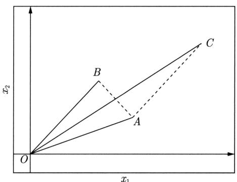  
图15.1 距离与相关系数的关系

从图15.1可以看出，如果从距离的角度看， $A$ 和 $B$ 比 $A$ 和 $C$ 更相似；但从相关系数的角度看， $A$ 和 $C$ 比 $A$ 和 $B$ 更相似。所以，进行聚类时，选择适合的距离或相似度非常重要。

# 15.1.2 类或簇

通过聚类得到的类或簇本质是样本的子集。如果一个聚类方法假定一个样本只能属于一个类或类的交集为空集，那么该方法称为硬聚类（hard clustering）方法。否则，如果一个样本可以属于多个类或类的交集不为空集，那么该方法称为软聚类（soft clustering）方法。本章只考虑硬聚类方法。

用 $G$ 表示类或簇（cluster），用 $\pmb{x}_i$ ， $\pmb{x}_j$ 表示类中的样本，用 $n_G$ 表示 $G$ 中样本的个数，用 $d_{ij}$ 表示样本 $\pmb{x}_i$ 与样本 $\pmb{x}_j$ 之间的距离。

定义15.5 类或簇有多种定义，下面给出四个常见的定义。

(1) 设 $T$ 为给定的正数, 若对于集合 $G$ 中任意两个样本 $\pmb{x}_i, \pmb{x}_j$ , 有

$$
d _ {i j} \leqslant T
$$

则称 $G$ 为一个类或簇。

(2) 设 $T$ 为给定的正数, 若对集合 $G$ 的任意样本 $\boldsymbol{x}_i$ , 一定存在 $G$ 中的另一个样本 $\boldsymbol{x}_j$ , 使得

$$
d _ {i j} \leqslant T
$$

则称 $G$ 为一个类或簇。

(3) 设 $T$ 为给定的正数, 若对集合 $G$ 中任意一个样本 $\pmb{x}_i$ , $G$ 中的另一个样本 $\pmb{x}_j$ 满足

$$
\frac {1}{n _ {G} - 1} \sum_ {\boldsymbol {x} _ {j} \in G} d _ {i j} \leqslant T
$$

其中， $n_G$ 为 $G$ 中样本的个数，则称 $G$ 为一个类或簇。

(4) 设 $T$ 为给定的正数, 如果集合 $G$ 中任意两个样本 $\pmb{x}_i, \pmb{x}_j$ 的距离 $d_{ij}$ 满足

$$
\frac {1}{n _ {G} \left(n _ {G} - 1\right)} \sum_ {\boldsymbol {x} _ {i} \in G} \sum_ {\boldsymbol {x} _ {j} \in G} d _ {i j} \leqslant T
$$

则称 $G$ 为一个类或簇。

以上四个定义中，第一个定义最常用。可以由第一个定义推出其他三个定义，但是反之并不成立。

类的特征可以通过不同角度来刻画，常用的特征有下面三种：

（1）类的均值 $\bar{\pmb{x}}_G$ ，又称为类的中心

$$
\bar {\boldsymbol {x}} _ {G} = \frac {1}{n _ {G}} \sum_ {i = 1} ^ {n _ {G}} \boldsymbol {x} _ {i} \tag {15.9}
$$

式中 $n_G$ 是类 $G$ 的样本个数。

# (2) 类的直径（diameter） $D_{G}$

类的直径 $D_G$ 是类中任意两个样本之间的最大距离，即

$$
D _ {G} = \max  _ {\boldsymbol {x} _ {i}, \boldsymbol {x} _ {j} \in G} d _ {i j} \tag {15.10}
$$

(3) 类的样本散布矩阵 (scatter matrix) $A_{G}$ 与样本协方差矩阵 (covariance matrix) $S_{G}$ 类的样本散布矩阵 $A_{G}$ 为

$$
\boldsymbol {A} _ {G} = \sum_ {i = 1} ^ {n _ {G}} \left(\boldsymbol {x} _ {i} - \bar {\boldsymbol {x}} _ {G}\right) \left(\boldsymbol {x} _ {i} - \bar {\boldsymbol {x}} _ {G}\right) ^ {\mathrm {T}} \tag {15.11}
$$

样本协方差矩阵 $S_{G}$ 为

$$
\begin{array}{l} \boldsymbol {S} _ {G} = \frac {1}{n _ {G} - 1} \boldsymbol {A} _ {G} \\ = \frac {1}{n _ {G} - 1} \sum_ {i = 1} ^ {n _ {G}} \left(\boldsymbol {x} _ {i} - \bar {\boldsymbol {x}} _ {G}\right) \left(\boldsymbol {x} _ {i} - \bar {\boldsymbol {x}} _ {G}\right) ^ {\mathrm {T}} \tag {15.12} \\ \end{array}
$$

# 15.1.3 类与类之间的距离

下面考虑类 $G_{p}$ 与类 $G_{q}$ 之间的距离 $D_{pq}$ ，也称为连接（linkage）。类与类之间的距离也有多种定义。

设类 $G_{p}$ 包含 $n_p$ 个样本， $G_{q}$ 包含 $n_q$ 个样本，分别用 $\bar{\mathbf{x}}_p$ 和 $\bar{\mathbf{x}}_q$ 表示 $G_{p}$ 和 $G_{q}$ 的均值，即类的中心。

# （1）最短距离或单连接（single linkage）

定义类 $G_{p}$ 的样本与类 $G_{q}$ 的样本之间的最短距离为两类之间的距离：

$$
D _ {p q} = \min  \left\{d _ {i j} \mid \boldsymbol {x} _ {i} \in G _ {p}, \boldsymbol {x} _ {j} \in G _ {q} \right\} \tag {15.13}
$$

# （2）最长距离或完全连接（complete linkage）

定义类 $G_{p}$ 的样本与类 $G_{q}$ 的样本之间的最长距离为两类之间的距离：

$$
D _ {p q} = \max  \left\{d _ {i j} \mid \boldsymbol {x} _ {i} \in G _ {p}, \boldsymbol {x} _ {j} \in G _ {q} \right\} \tag {15.14}
$$

# （3）中心距离

定义类 $G_{p}$ 与类 $G_{q}$ 的中心 $\bar{\mathbf{x}}_p$ 与 $\bar{\mathbf{x}}_q$ 之间的距离为两类之间的距离：

$$
D _ {p q} = d \left(\bar {\boldsymbol {x}} _ {p}, \bar {\boldsymbol {x}} _ {q}\right) \tag {15.15}
$$

其中， $d(\bar{\pmb{x}}_p,\bar{\pmb{x}}_p)$ 表示 $\bar{\pmb{x}}_p$ 和 $\bar{\pmb{x}}_p$ 之间的距离。

# （4）平均距离

定义类 $G_{p}$ 与类 $G_{q}$ 任意两个样本之间距离的平均值为两类之间的距离：

$$
D _ {p q} = \frac {1}{n _ {p} n _ {q}} \sum_ {\boldsymbol {x} _ {i} \in G _ {p}} \sum_ {\boldsymbol {x} _ {j} \in G _ {q}} d _ {i j} \tag {15.16}
$$

# 15.2 层次聚类

层次聚类假设类别之间存在层次结构，将样本聚到层次化的类中。层次聚类又有聚合（agglomerative）或自下而上（bottom-up）聚类、分裂（divisive）或自上而下（top-down）聚类两种方法。因为每个样本只属于一个类，所以层次聚类属于硬聚类。

聚合聚类开始将每个样本各自分到一个类，之后将相距最近的两类合并，建立一个新的类，重复此操作直到满足停止条件，得到层次化的类别。分裂聚类开始将所有样本分到一个类，之后将已有类中相距最远的样本分到两个新的类，重复此操作直到满足停止条件，得到层次化的类别。本书只介绍聚合聚类。

聚合聚类的具体过程如下：对于给定的样本集合，开始将每个样本分到一个类；然后按照一定规则，如类间距离最小，将最满足规则条件的两个类进行合并；如此反复进行，每次减少一个类，直到满足停止条件，如所有样本聚为一类。

由此可知，聚合聚类需要预先确定下面三个要素：

（1）距离或相似度；  
（2）合并规则；  
（3）停止条件。

根据这些要素的不同组合，就可以构成不同的聚类方法。距离或相似度可以是闵可夫斯基距离、马哈拉诺比斯距离、相关系数、夹角余弦。合并规则一般是类间距离最小，类间距离可以是最短距离、最长距离、中心距离、平均距离。停止条件可以是类的个数达到阈值（极端情况类的个数是1）、类的直径超过阈值。

如果采用欧氏距离为样本之间距离；类间距离最小为合并规则，其中最短距离为类间距离；类的个数是1，即所有样本聚为一类为停止条件，那么聚合聚类的算法如下。

# 算法15.1（聚合聚类算法）

输入： $n$ 个样本组成的样本集合及样本之间的距离。

输出：对样本集合的一个层次化聚类。

(1) 计算 $n$ 个样本两两之间的欧氏距离 $\{d_{ij}\}$ ，记作矩阵 $D = [d_{ij}]_{n \times n}$ 。  
(2) 构造 $n$ 个类, 每个类只包含一个样本。  
(3) 合并类间距离最小的两个类，其中最短距离为类间距离，构建一个新类。  
（4）计算新类与当前各类的距离。若类的个数为1，终止计算，否则，回到步骤(3)。

可以看出，聚合层次聚类算法的复杂度是 $O(n^{3}m)$ ，其中 $m$ 是样本的维数， $n$ 是样本个数。

下面通过一个例子说明聚合层次聚类算法。

例15.1 给定5个样本的集合，样本之间的欧氏距离由如下矩阵 $D$ 表示：

$$
\boldsymbol {D} = [ d _ {i j} ] _ {5 \times 5} = \left[ \begin{array}{c c c c c} 0 & 7 & 2 & 9 & 3 \\ 7 & 0 & 5 & 4 & 6 \\ 2 & 5 & 0 & 8 & 1 \\ 9 & 4 & 8 & 0 & 5 \\ 3 & 6 & 1 & 5 & 0 \end{array} \right]
$$

其中， $d_{ij}$ 表示第 $i$ 个样本与第 $j$ 个样本之间的欧氏距离。显然 $\pmb{D}$ 为对称矩阵。应用聚合层次聚类法对这5个样本进行聚类。

解（1）首先用5个样本构建5个类， $G_{i} = \{\pmb{x}_{i}\}$ ， $i = 1,2,\dots ,5$ ，这样，样本之间的距离也就变成类之间的距离，所以5个类之间的距离矩阵为 $D = [D_{ij}]_{5\times 5}$ 。

（2）由矩阵 $\pmb{D}$ 可以看出， $D_{35} = D_{53} = 1$ 为最小，所以把 $G_{3}$ 和 $G_{5}$ 合并为一个新类，记作 $G_{6} = \{\pmb{x}_{3},\pmb{x}_{5}\}$   
(3) 计算 $G_{6}$ 与 $G_{1}, G_{2}, G_{4}$ 之间的最短距离, 有

$$
D _ {6 1} = 2, \quad D _ {6 2} = 5, \quad D _ {6 4} = 5
$$

又注意到其余两类之间的距离是

$$
D _ {1 2} = 7, \quad D _ {1 4} = 9, \quad D _ {2 4} = 4
$$

显然， $D_{61} = 2$ 最小，所以将 $G_{1}$ 与 $G_{6}$ 合并成一个新类，记作 $G_{7} = \{\pmb{x}_{1},\pmb{x}_{3},\pmb{x}_{5}\}$

(4) 计算 $G_{7}$ 与 $G_{2}, G_{4}$ 之间的最短距离:

$$
D _ {7 2} = 5, \quad D _ {7 4} = 5
$$

又注意到

$$
D _ {2 4} = 4
$$

显然，其中 $D_{24} = 4$ 最小，所以将 $G_{2}$ 与 $G_{4}$ 合并成一个新类，记作 $G_{8} = \{\pmb{x}_{2},\pmb{x}_{4}\}$ 。

(5) 将 $G_{7}$ 与 $G_{8}$ 合并成一个新类, 记作 $G_{9} = \{\pmb{x}_{1}, \pmb{x}_{2}, \pmb{x}_{3}, \pmb{x}_{4}, \pmb{x}_{5}\}$ , 即将全部样本聚成一类, 聚类终止。

上述层次聚类过程可以用图15.2所示的层次聚类图表示。

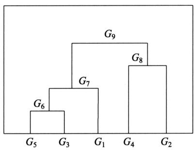  
图15.2 层次聚类图

# 15.3 $k$ 均值聚类

$k$ 均值聚类是基于样本集合划分的聚类算法。 $k$ 均值聚类将样本集合划分为 $k$ 个子集，构成 $k$ 个类，将 $n$ 个样本分到 $k$ 个类中，每个样本到其所属类的中心的距离最小。每个样本只能属于一个类，所以 $k$ 均值聚类是硬聚类。下面分别介绍 $k$ 均值聚类的模型、策略、算法，讨论算法的特性及相关问题。

# 15.3.1 模型

给定 $n$ 个样本的集合 $\mathcal{X} = \{\pmb{x}_1, \pmb{x}_2, \dots, \pmb{x}_n\}$ ，每个样本由一个特征向量表示，特征向量的维数是 $m$ 。 $k$ 均值聚类的目标是将 $n$ 个样本分到 $k$ 个不同的类或簇中，这里假设 $k < n$ 。 $k$ 个类 $G_1, G_2, \dots, G_k$ 形成对样本集合 $\mathcal{X}$ 的划分，其中 $G_i \cap G_j = \emptyset$ ， $\bigcup_{l=1}^{k} G_l = \mathcal{X}$ 。用 $C$ 表示划分，一个划分对应着一个聚类结果。

划分 $C$ 是一个多对一的函数。事实上，如果把每个样本用一个整数 $i \in \{1, 2, \dots, n\}$ 表示，每个类也用一个整数 $l \in \{1, 2, \dots, k\}$ 表示，那么划分或者聚类可以用函数 $l = C(i)$ 表示，其中 $i \in \{1, 2, \dots, n\}$ ， $l \in \{1, 2, \dots, k\}$ ，所以 $k$ 均值聚类的模型是一个从样本到类的函数。

# 15.3.2 策略

$k$ 均值聚类归结为样本集合 $\mathcal{X}$ 的划分，或者从样本到类的函数的选择问题。 $k$ 均值聚类的策略是通过损失函数的最小化选取最优的划分或函数 $C^*$ 。

首先，采用欧氏距离平方（squared Euclidean distance）作为样本之间的距离 $d(\pmb{x}_i, \pmb{x}_j)$

$$
\begin{array}{l} d \left(\boldsymbol {x} _ {i}, \boldsymbol {x} _ {j}\right) = \sum_ {k = 1} ^ {m} \left(x _ {k i} - x _ {k j}\right) ^ {2} \\ = \left\| \boldsymbol {x} _ {i} - \boldsymbol {x} _ {j} \right\| ^ {2} \tag {15.17} \\ \end{array}
$$

然后，定义样本与其所属类的中心之间的距离的总和为损失函数，即

$$
L (C) = \sum_ {l = 1} ^ {k} \sum_ {C (i) = l} \| \boldsymbol {x} _ {i} - \bar {\boldsymbol {x}} _ {l} \| ^ {2} \tag {15.18}
$$

式中 $\bar{\boldsymbol{x}}_l = (\bar{x}_{1l},\bar{x}_{2l},\dots ,\bar{x}_{ml})^{\mathrm{T}}$ 是第 $l$ 个类的均值或中心， $n_l = \sum_{i = 1}^n I(C(i) = l),I(C(i) = l)$ 是指示函数，取值为1或0。函数 $L(C)$ 表示相同类中的样本相似的程度。

$k$ 均值聚类就是求解最优化问题：

$$
\begin{array}{l} C ^ {*} = \arg \min  _ {C} L (C) \\ = \arg \min  _ {C} \sum_ {l = 1} ^ {k} \sum_ {C (i) = l} \| \boldsymbol {x} _ {i} - \bar {\boldsymbol {x}} _ {l} \| ^ {2} \tag {15.19} \\ \end{array}
$$

相似的样本被聚到同类时，损失函数值最小，这个目标函数的最优化能达到聚类的目的。但是，这是一个组合优化问题， $n$ 个样本分到 $k$ 类，所有可能分法的数目是

$$
S (n, k) = \frac {1}{k !} \sum_ {l = 0} ^ {k} (- 1) ^ {k - l} \left( \begin{array}{c} k \\ l \end{array} \right) l ^ {n} \tag {15.20}
$$

这个数字是指数级的。事实上， $k$ 均值聚类的最优解求解问题是 NP 困难问题。现实中采用迭代的方法求解。

# 15.3.3 算法

$k$ 均值聚类的算法是一个迭代的过程，每次迭代包括两个步骤。首先选择 $k$ 个类的中心，将样本逐个指派到与其最近的中心的类中，得到一个聚类结果；然后更新每个类的样本的均值，作为类的新的中心；重复以上步骤，直到收敛为止。具体过程如下。

首先，对于给定的中心 $(m_1, m_2, \dots, m_k)$ ，求一个划分 $C$ ，使得目标函数最小：

$$
\min  _ {C} \sum_ {l = 1} ^ {k} \sum_ {C (i) = l} \| \boldsymbol {x} _ {i} - \boldsymbol {m} _ {l} \| ^ {2} \tag {15.21}
$$

就是说在类中心确定的情况下，将每个样本分到一个类中，使样本和其所属类的中心之间的距离总和最小。求解结果，将每个样本指派到与其最近的中心 $m_{l}$ 的类 $G_{l}$ 中。

然后，对给定的划分 $C$ ，求各个类的中心 $(m_{1},m_{2},\dots ,m_{k})$ ，使得目标函数最小：

$$
\min  _ {\boldsymbol {m} _ {1}, \boldsymbol {m} _ {2}, \dots , \boldsymbol {m} _ {k}} \sum_ {l = 1} ^ {k} \sum_ {C (i) = l} \| \boldsymbol {x} _ {i} - \boldsymbol {m} _ {l} \| ^ {2} \tag {15.22}
$$

就是说在划分确定的情况下，使样本和其所属类的中心之间的距离总和最小。求解结果，对于每个包含 $n_l$ 个样本的类 $G_l$ ，更新其中心 $(m_1, m_2, \dots, m_k)$ ：

$$
\boldsymbol {m} _ {l} = \frac {1}{n _ {l}} \sum_ {C (i) = l} \boldsymbol {x} _ {i}, \quad l = 1, 2, \dots , k \tag {15.23}
$$

重复以上两个步骤，直到划分不再改变，得到聚类结果。现将 $k$ 均值聚类算法叙述如下。

# 算法15.2（ $k$ 均值聚类算法）

输入： $n$ 个样本的集合 $\mathcal{X}$

输出：样本集合的聚类 $C^*$

(1) 初始化。令 $t = 0$ ，随机选择 $k$ 个样本点作为初始聚类中心 $\boldsymbol{m}^{(0)} = (\boldsymbol{m}_1^{(0)}, \dots, \boldsymbol{m}_l^{(0)}, \dots, \boldsymbol{m}_k^{(0)})$ 。  
(2) 对样本进行聚类。对固定的类中心 $\boldsymbol{m}^{(t)} = (\boldsymbol{m}_1^{(t)}, \dots, \boldsymbol{m}_l^{(t)}, \dots, \boldsymbol{m}_k^{(t)})$ , 其中 $\boldsymbol{m}_l^{(t)}$ 为类 $G_l$ 的中心, 计算每个样本到类中心的距离, 将每个样本指派到与其最近的中心的类中, 构成聚类结果 $C^{(t)}$ 。  
（3）计算新的类中心。对聚类结果 $C^{(t)}$ ，计算当前各个类中的样本的均值，作为新的类中心 $\pmb{m}^{(t + 1)} = (\pmb{m}_1^{(t + 1)},\dots ,\pmb{m}_l^{(t + 1)},\dots ,\pmb{m}_k^{(t + 1)})$ 。  
(4) 如果迭代收敛或符合停止条件, 输出 $C^{*} = C^{(t)}$ ; 否则, 令 $t = t + 1$ , 返回步骤 (2)。

$k$ 均值聚类算法的复杂度是 $O(mnk)$ ，其中 $m$ 是样本维数， $n$ 是样本个数， $k$ 是类别个数。

例15.2 给定含有5个样本的集合

$$
\boldsymbol {X} = \left[ \begin{array}{c c c c c} 0 & 0 & 1 & 5 & 5 \\ 2 & 0 & 0 & 0 & 2 \end{array} \right]
$$

试用 $k$ 均值聚类算法将样本聚到两个类中。

解 按照算法15.2：

(1) 选择两个样本点作为类的中心。假设选择 $\boldsymbol{m}_1^{(0)} = \boldsymbol{x}_1 = (0,2)^{\mathrm{T}}, \boldsymbol{m}_2^{(0)} = \boldsymbol{x}_2 = (0,0)^{\mathrm{T}}$ 。  
(2) 以 $\pmb{m}_{1}^{(0)}$ , $\pmb{m}_{2}^{(0)}$ 为类 $G_{1}^{(0)}$ , $G_{2}^{(0)}$ 的中心, 计算 $\pmb{x}_{3} = (1,0)^{\mathrm{T}}$ , $\pmb{x}_{4} = (5,0)^{\mathrm{T}}$ , $\pmb{x}_{5} = (5,2)^{\mathrm{T}}$ 与 $\pmb{m}_{1}^{(0)} = (0,2)^{\mathrm{T}}$ , $\pmb{m}_{2}^{(0)} = (0,0)^{\mathrm{T}}$ 的欧氏距离平方。  
(a) 对 $\pmb{x}_3 = (1,0)^{\mathrm{T}}$ ， $d(\pmb{x}_3, \pmb{m}_1^{(0)}) = 5$ ， $d(\pmb{x}_3, \pmb{m}_2^{(0)}) = 1$ ，将 $\pmb{x}_3$ 分到类 $G_2^{(0)}$ 。  
(b) 对 $\pmb{x}_4 = (5,0)^{\mathrm{T}}$ ， $d(\pmb{x}_4,\pmb{m}_1^{(0)}) = 29$ ， $d(\pmb{x}_4,\pmb{m}_2^{(0)}) = 25$ ，将 $\pmb{x}_4$ 分到类 $G_2^{(0)}$ 。  
(c) 对 $\pmb{x}_5 = (5,2)^{\mathrm{T}}$ ， $d(\pmb{x}_5, \pmb{m}_1^{(0)}) = 25$ ， $d(\pmb{x}_5, \pmb{m}_2^{(0)}) = 29$ ，将 $\pmb{x}_5$ 分到类 $G_1^{(0)}$ 。  
(3) 得到新的类 $G_{1}^{(1)} = \{\pmb{x}_{1},\pmb{x}_{5}\}$ , $G_{2}^{(1)} = \{\pmb{x}_{2},\pmb{x}_{3},\pmb{x}_{4}\}$ , 计算类的中心 $\pmb{m}_{1}^{(1)},\pmb{m}_{2}^{(1)}$

$$
\boldsymbol {m} _ {1} ^ {(1)} = (2. 5, 2. 0) ^ {\mathrm {T}}, \quad \boldsymbol {m} _ {2} ^ {(1)} = (2, 0) ^ {\mathrm {T}}
$$

（4）重复步骤（2）和步骤（3）。将 $\pmb{x}_1$ 分到类 $G_1^{(1)}$ ， $\pmb{x}_2$ 分到类 $G_2^{(1)}$ ， $\pmb{x}_3$ 分到类 $G_2^{(1)}$ ， $\pmb{x}_4$ 分到类 $G_2^{(1)}$ ， $\pmb{x}_5$ 分到类 $G_1^{(1)}$ ，得到新的类 $G_1^{(2)} = \{\pmb{x}_1, \pmb{x}_5\}$ ， $G_2^{(2)} = \{\pmb{x}_2, \pmb{x}_3, \pmb{x}_4\}$ 。

由于得到的新的类没有改变，聚类停止，得到聚类结果：

$$
G _ {1} ^ {*} = \left\{\boldsymbol {x} _ {1}, \boldsymbol {x} _ {5} \right\}, \quad G _ {2} ^ {*} = \left\{\boldsymbol {x} _ {2}, \boldsymbol {x} _ {3}, \boldsymbol {x} _ {4} \right\}
$$

# 15.3.4 算法特性

# 1. 总体特点

$k$ 均值聚类有以下特点：基于划分的聚类方法；类别数 $k$ 事先指定；以欧氏距离平方表示样本之间的距离，以中心或样本的均值表示类别；以样本和其所属类的中心之间的距离的总和为最优化的目标函数；得到的类别是平坦的、非层次化的；算法是迭代算法，不能保证得到全局最优。

# 2.收敛性

$k$ 均值聚类属于启发式方法，不能保证收敛到全局最优，初始中心的选择会直接影响聚类结果。注意，类中心在聚类的过程中会发生移动，但是往往不会移动太大，因为在每一步，样本被分到与其最近的中心的类中。

# 3. 初始类的选择

选择不同的初始中心会得到不同的聚类结果。针对上面的例15.2，如果改变两个类的初始中心，比如选择 $\pmb{m}_1^{(0)} = \pmb{x}_1$ 和 $\pmb{m}_2^{(0)} = \pmb{x}_5$ ，那么 $\pmb{x}_2, \pmb{x}_3$ 会分到 $G_1^{(0)}, \pmb{x}_4$ 会分到 $G_2^{(0)}$ ，形成聚类结果 $G_1^{(1)} = \{\pmb{x}_1, \pmb{x}_2, \pmb{x}_3\}$ ， $G_2^{(1)} = \{\pmb{x}_4, \pmb{x}_5\}$ 。中心是 $\pmb{m}_1^{(1)} = (0.33, 0.67)^{\mathrm{T}}$ ， $\pmb{m}_2^{(1)} = (5, 1)^{\mathrm{T}}$ 。继续迭代，聚类结果仍然是 $G_1^{(2)} = \{\pmb{x}_1, \pmb{x}_2, \pmb{x}_3\}$ ， $G_2^{(2)} = \{\pmb{x}_4, \pmb{x}_5\}$ 。聚类停止。

对于初始中心的选择，可以用层次聚类对样本进行聚类，得到 $k$ 个类时停止，然后从每个类中选取一个与中心距离最近的点。

# 4. 类别数 $k$ 的选择

$k$ 均值聚类中的类别数 $k$ 值需要预先指定，而在实际应用中最优的 $k$ 值是不知道的。解决这个问题的一个方法是尝试用不同的 $k$ 值聚类，检验各自得到的聚类结果的质量，推测最优的 $k$ 值。聚类结果的质量可以用类的平均直径来衡量。一般地，类别数变小时，平均直径会增加；类别数变大超过某个值以后，平均直径会不变，而这个值正是最优的 $k$ 值。图15.3说明类别数与平均直径的关系。实验时，可以采用二分查找，快速找到最优的 $k$ 值。

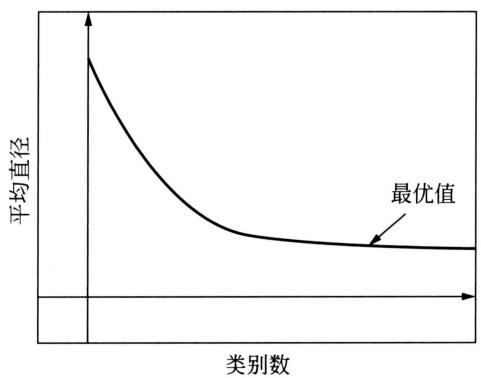  
图15.3 类别数与平均直径的关系

# 本章概要

1. 聚类是针对给定的样本，依据它们属性的相似度或距离，将其归并到若干个“类”或“簇”的数据分析问题。一个类是样本的一个子集。直观上，相似的样本聚集在同类，不相似的样本分散在不同类。  
2. 距离或相似度度量在聚类中起着重要作用。

常用的距离度量有闵可夫斯基距离，包括欧氏距离、曼哈顿距离、切比雪夫距离以及马哈拉诺比斯距离。常用的相似度度量有相关系数、夹角余弦。

用距离度量相似度时，距离越小表示样本越相似；用相关系数时，相关系数越大表示样本越相似。

3. 类是样本的子集，比如有如下基本定义：

用 $G$ 表示类或簇，用 $\pmb{x}_i, \pmb{x}_j$ 等表示类中的样本，用 $d_{ij}$ 表示样本 $\pmb{x}_i$ 与样本 $\pmb{x}_j$ 之间的距离。如果对任意的 $\pmb{x}_i, \pmb{x}_j \in G$ ，有

$$
d _ {i j} \leqslant T
$$

则称 $G$ 为一个类或簇。

描述类的特征的指标有中心、直径、散布矩阵、协方差矩阵。

4. 聚类过程中用到的类与类之间的距离也称为连接。类与类之间的距离包括最短距离、最长距离、中心距离、平均距离。  
5. 层次聚类假设类别之间存在层次结构，将样本聚到层次化的类中。层次聚类又有聚合或自下而上、分裂或自上而下两种方法。

聚合聚类开始将每个样本各自分到一个类，之后将相距最近的两类合并，建立一个新的类，重复此操作直到满足停止条件，得到层次化的类别。分裂聚类开始将所有样本分到一个类，之后将已有类中相距最远的样本分到两个新的类，重复此操作直到满足停止条件，得到层次化的类别。

聚合聚类需要预先确定下面三个要素：

（1）距离或相似度；  
（2）合并规则；  
（3）停止条件。

根据这些概念的不同组合，就可以得到不同的聚类方法。

6. $k$ 均值聚类是常用的聚类算法，有以下特点：基于划分的聚类方法；类别数 $k$ 事先指定；以欧氏距离平方表示样本之间的距离或相似度，以中心或样本的均值表示类别；以样本和其所属类的中心之间的距离的总和为优化的目标函数；得到的类别是平坦的、非层次化的；算法是迭代算法，不能保证得到全局最优。

对于 $k$ 均值聚类算法，首先选择 $k$ 个类的中心，将样本分到与中心最近的类中，得到一个聚类结果；然后计算每个类的样本的均值，作为类的新的中心；重复以上步骤，直到收敛为止。

# 继续阅读

聚类的方法很多，各种方法的详细介绍可参见文献[1]和文献[2]。层次化聚类的方法可参见文献[2]， $k$ 均值聚类可参见文献[3]和文献[4]。 $k$ 均值聚类的扩展有 $X$ -means[5]。其他常用的聚类方法还有基于混合分布的方法，如高斯混合模型与EM算法；基于密度的方法，如DBScan[6]；基于谱聚类的方法，如Normalized Cuts[7]。以上方法是对样本的聚类，也有对样本与属性同时聚类的方法，如Co-Clustering[8]。

# 习题

15.1 试写出分裂聚类算法，自上而下地对数据进行聚类，并给出其算法复杂度。  
15.2 证明类或簇的四个定义中，第一个定义可推出其他三个定义。  
15.3 证明式 (15.20) 成立，即 $k$ 均值的可能解的个数是指数级的。  
15.4 比较 $k$ 均值聚类与高斯混合模型加EM算法的异同。

# 参考文献

[1] JAIN A, DUBES R. Algorithms for clustering data[M]. Prentice-Hall, 1988.   
[2] AGGARWAL C C, REDDY C K. Data clustering: algorithms and applications[M]. CRC Press, 2013.

[3] BISHOP M. Pattern recognition and machine learning[M]. Springer, 2006.   
[4] HASTIE T, TIBSHIRANI R, FRIEDMAN J. The elements of statistical learning: data mining, inference, and prediction[M]. 范明，柴玉梅，智红英，等译. Springer, 2001.   
[5] PELLEG D, MOORE A W. $X$ -means: extending $K$ -means with efficient estimation of the number of clusters[C]//Proceedings of ICML. 2000: 727-734.   
[6] ESTER M, KRIEGEL H, SANDER J, et al. A density-based algorithm for discovering clusters in large spatial databases with noise[C]//Proceedings of ACM SIGKDD. 1996: 226-231.   
[7] SHI J, MALIK J. Normalized cuts and image segmentation[J]. IEEE Transactions on Pattern Analysis and Machine Intelligence, 2000, 22(8): 888-905.   
[8] DHILLON I S. Co-clustering documents and words using bipartite spectral graph partitioning[C]//Proceedings of ACM SIGKDD. 2001: 269-274.

# 第16章 奇异值分解

奇异值分解（singular value decomposition, SVD）是一种矩阵因子分解方法，是线性代数的概念，但在机器学习中被广泛使用，成为其重要工具。本书介绍的主成分分析、潜在语义分析都用到奇异值分解。

任意一个 $m \times n$ 矩阵，都可以表示为三个矩阵的乘积（因子分解）形式，分别是 $m$ 阶正交矩阵、由降序排列的非负的对角线元素组成的 $m \times n$ 矩形对角矩阵和 $n$ 阶正交矩阵，称为该矩阵的奇异值分解。矩阵的奇异值分解一定存在，但不唯一。奇异值分解可以看作矩阵数据压缩的一种方法，即用因子分解的方式近似地表示原始矩阵，这种近似是在平方损失意义下的最优近似。

16.1节讲述矩阵奇异值分解的定义与基本定理，叙述奇异值分解的紧凑和截断形式、几何解释、主要性质；16.2节讲述奇异值分解的算法；16.3节论述奇异值分解是矩阵的一种最优近似方法。

# 16.1 奇异值分解的定义与性质

# 16.1.1 定义与定理

定义16.1（奇异值分解）矩阵的奇异值分解是指将一个非零的 $m \times n$ 实矩阵 $\mathbf{A}$ ， $\mathbf{A} \in \mathbb{R}^{m \times n}$ ，表示为以下三个实矩阵乘积形式的运算①，即进行矩阵的因子分解：

$$
\boldsymbol {A} = \boldsymbol {U} \boldsymbol {\Sigma} \boldsymbol {V} ^ {\mathrm {T}} \tag {16.1}
$$

其中， $\pmb{U}$ 是 $m$ 阶正交矩阵（orthogonal matrix）， $\pmb{V}$ 是 $n$ 阶正交矩阵， $\pmb{\Sigma}$ 是由降序排列的非负的对角线元素组成的 $m \times n$ 矩形对角矩阵（rectangular diagonal matrix），满足

$$
\boldsymbol {U} \boldsymbol {U} ^ {\mathrm {T}} = \boldsymbol {I}
$$

$$
\boldsymbol {V} \boldsymbol {V} ^ {\mathrm {T}} = \boldsymbol {I}
$$

$$
\boldsymbol {\Sigma} = \operatorname {d i a g} \left(\sigma_ {1}, \sigma_ {2}, \dots , \sigma_ {p}\right)
$$

$$
\sigma_ {1} \geqslant \sigma_ {2} \geqslant \dots \geqslant \sigma_ {p} \geqslant 0
$$

$$
p = \min  (m, n)
$$

$\pmb{U}\pmb{\Sigma}\pmb{V}^{\mathrm{T}}$ 称为矩阵 $\pmb{A}$ 的奇异值分解（singular value decomposition，SVD）， $\sigma_{i}$ 称为矩阵 $\pmb{A}$ 的奇异值（singular value）， $\pmb{U}$ 的列向量称为左奇异向量（left singular vector）， $\pmb{V}$ 的列向量称为右奇异向量（right singular vector）。

注意，奇异值分解不要求矩阵 $\mathbf{A}$ 是方阵，事实上矩阵的奇异值分解可以看作方阵的对角化的推广。

下面看一个奇异值分解的例子。

例16.1 给定一个 $5 \times 4$ 矩阵 $\mathbf{A}$

$$
\boldsymbol {A} = \left[ \begin{array}{c c c c} 1 & 0 & 0 & 0 \\ 0 & 0 & 0 & 4 \\ 0 & 3 & 0 & 0 \\ 0 & 0 & 0 & 0 \\ 2 & 0 & 0 & 0 \end{array} \right]
$$

它的奇异值分解由三个矩阵的乘积 $U \Sigma V^{\mathrm{T}}$ 给出，矩阵 $U, \Sigma, V^{\mathrm{T}}$ 分别为

$$
\boldsymbol {U} = \left[ \begin{array}{c c c c c} 0 & 0 & \sqrt {0 . 2} & 0 & \sqrt {0 . 8} \\ 1 & 0 & 0 & 0 & 0 \\ 0 & 1 & 0 & 0 & 0 \\ 0 & 0 & 0 & 1 & 0 \\ 0 & 0 & \sqrt {0 . 8} & 0 & - \sqrt {0 . 2} \end{array} \right], \quad \boldsymbol {\Sigma} = \left[ \begin{array}{c c c c} 4 & 0 & 0 & 0 \\ 0 & 3 & 0 & 0 \\ 0 & 0 & \sqrt {5} & 0 \\ 0 & 0 & 0 & 0 \\ 0 & 0 & 0 & 0 \end{array} \right]
$$

$$
\boldsymbol {V} ^ {\mathrm {T}} = \left[ \begin{array}{c c c c} 0 & 0 & 0 & 1 \\ 0 & 1 & 0 & 0 \\ 1 & 0 & 0 & 0 \\ 0 & 0 & 1 & 0 \end{array} \right]
$$

矩阵 $\pmb{\Sigma}$ 是对角矩阵，对角线外的元素都是0，对角线上的元素非负，按降序排列。矩阵 $\pmb{U}$ 和 $\pmb{V}$ 是正交矩阵，它们与各自的转置矩阵相乘是单位矩阵，即

$$
\boldsymbol {U} \boldsymbol {U} ^ {\mathrm {T}} = \boldsymbol {I} _ {5}, \quad \boldsymbol {V} \boldsymbol {V} ^ {\mathrm {T}} = \boldsymbol {I} _ {4}
$$

矩阵的奇异值分解不是唯一的。在此例中如果选择 $\mathbf{U}$ 为

$$
\boldsymbol {U} = \left[ \begin{array}{c c c c c} 0 & 0 & \sqrt {0 . 2} & \sqrt {0 . 4} & - \sqrt {0 . 4} \\ 1 & 0 & 0 & 0 & 0 \\ 0 & 1 & 0 & 0 & 0 \\ 0 & 0 & 0 & \sqrt {0 . 5} & \sqrt {0 . 5} \\ 0 & 0 & \sqrt {0 . 8} & - \sqrt {0 . 1} & \sqrt {0 . 1} \end{array} \right]
$$

而 $\pmb{\Sigma}$ 与 $\pmb{V}$ 不变，那么 $U\Sigma V^{\mathrm{T}}$ 也是 $\pmb{A}$ 的一个奇异值分解。

任意给定一个实矩阵，其奇异值分解是否一定存在呢？答案是肯定的，下面的奇异值分解的基本定理给予保证。

定理16.1（奇异值分解基本定理）若 $\mathbf{A}$ 为一个 $m\times n$ 实矩阵， $\mathbf{A}\in \mathbb{R}^{m\times n}$ ，则 $\mathbf{A}$ 的奇异值分解存在：

$$
\boldsymbol {A} = \boldsymbol {U} \boldsymbol {\Sigma} \boldsymbol {V} ^ {\mathrm {T}} \tag {16.2}
$$

其中， $\mathbf{U}$ 是 $m$ 阶正交矩阵， $\mathbf{V}$ 是 $n$ 阶正交矩阵， $\pmb{\Sigma}$ 是 $m \times n$ 矩形对角矩阵，其对角线元素非负，且按降序排列。

证明 证明是构造性的，对给定的矩阵 $\mathbf{A}$ ，构造出其奇异值分解的各个矩阵。为了方便，不妨假设 $m \geqslant n$ ，如果 $m < n$ 证明仍然成立。证明由三步完成。①

# （1）确定 $\pmb{V}$ 和 $\pmb{\Sigma}$

首先构造 $n$ 阶正交实矩阵 $\mathbf{V}$ 和 $m\times n$ 矩形对角实矩阵 $\pmb{\Sigma}$ 。

矩阵 $\mathbf{A}$ 是 $m\times n$ 实矩阵，则矩阵 $\mathbf{A}^{\mathrm{T}}\mathbf{A}$ 是 $n$ 阶实对称矩阵。因而 $\mathbf{A}^{\mathrm{T}}\mathbf{A}$ 的特征值都是实数，并且存在一个 $n$ 阶正交实矩阵 $\mathbf{V}$ 实现 $\mathbf{A}^{\mathrm{T}}\mathbf{A}$ 的对角化，使得 $\mathbf{V}^{\mathrm{T}}\left(\mathbf{A}^{\mathrm{T}}\mathbf{A}\right)\mathbf{V} = \mathbf{A}$ 成立，其中 $\pmb{\Lambda}$ 是 $n$ 阶对角矩阵，其对角线元素由 $\mathbf{A}^{\mathrm{T}}\mathbf{A}$ 的特征值组成。而且， $\mathbf{A}^{\mathrm{T}}\mathbf{A}$ 的特征值都是非负的。事实上，令 $\lambda$ 是 $\mathbf{A}^{\mathrm{T}}\mathbf{A}$ 的一个特征值， $\pmb{x}$ 是对应的特征向量，则

$$
\left\| \boldsymbol {A} \boldsymbol {x} \right\| ^ {2} = \boldsymbol {x} ^ {\mathrm {T}} \boldsymbol {A} ^ {\mathrm {T}} \boldsymbol {A} \boldsymbol {x} = \lambda \boldsymbol {x} ^ {\mathrm {T}} \boldsymbol {x} = \lambda \| \boldsymbol {x} \| ^ {2}
$$

于是

$$
\lambda = \frac {\| \boldsymbol {A} \boldsymbol {x} \| ^ {2}}{\| \boldsymbol {x} \| ^ {2}} \geqslant 0 \tag {16.3}
$$

可以假设正交矩阵 $V$ 的列的排列使得对应的特征值形成降序排列：

$$
\lambda_ {1} \geqslant \lambda_ {2} \geqslant \dots \geqslant \lambda_ {n} \geqslant 0
$$

计算特征值的平方根（实际就是矩阵 $\mathbf{A}$ 的奇异值）：

$$
\sigma_ {j} = \sqrt {\lambda_ {j}}, \quad j = 1, 2, \dots , n
$$

设矩阵 $\mathbf{A}$ 的秩是 $r$ ， $\operatorname{rank}(\mathbf{A}) = r$ ，则矩阵 $\mathbf{A}^{\mathrm{T}}\mathbf{A}$ 的秩也是 $r$ 。由于 $\mathbf{A}^{\mathrm{T}}\mathbf{A}$ 是对称矩阵，它的秩等于正的特征值的个数，所以

$$
\lambda_ {1} \geqslant \lambda_ {2} \geqslant \dots \geqslant \lambda_ {r} > 0, \quad \lambda_ {r + 1} = \lambda_ {r + 2} = \dots = \lambda_ {n} = 0 \tag {16.4}
$$

对应地有

$$
\sigma_ {1} \geqslant \sigma_ {2} \geqslant \dots \geqslant \sigma_ {r} > 0, \quad \sigma_ {r + 1} = \sigma_ {r + 2} = \dots = \sigma_ {n} = 0 \tag {16.5}
$$

令

$$
\boldsymbol {V} _ {1} = \left[ \begin{array}{c c c c} \boldsymbol {\nu} _ {1} & \boldsymbol {\nu} _ {2} & \dots & \boldsymbol {\nu} _ {r} \end{array} \right], \quad \boldsymbol {V} _ {2} = \left[ \begin{array}{c c c c} \boldsymbol {\nu} _ {r + 1} & \boldsymbol {\nu} _ {r + 2} & \dots & \boldsymbol {\nu} _ {n} \end{array} \right]
$$

其中， $\pmb{\nu}_1, \pmb{\nu}_2, \dots, \pmb{\nu}_r$ 为 $\mathbf{A}^{\mathrm{T}}\mathbf{A}$ 的正特征值对应的特征向量， $\pmb{\nu}_{r+1}, \pmb{\nu}_{r+2}, \dots, \pmb{\nu}_n$ 为0特征值对

应的特征向量，则

$$
\boldsymbol {V} = \left[ \begin{array}{l l} \boldsymbol {V} _ {1} & \boldsymbol {V} _ {2} \end{array} \right] \tag {16.6}
$$

这就是矩阵 $\mathbf{A}$ 的奇异值分解中的 $n$ 阶正交矩阵 $\mathbf{V}$ 。

令

$$
\boldsymbol {\Sigma} _ {1} = \left[ \begin{array}{c c c c} \sigma_ {1} & & & \\ & \sigma_ {2} & & \\ & & \ddots & \\ & & & \sigma_ {r} \end{array} \right]
$$

则 $\pmb{\Sigma}_{1}$ 是一个 $r$ 阶对角矩阵，其对角线元素为按降序排列的正的 $\sigma_{1},\sigma_{2},\dots ,\sigma_{r}$ ，于是 $m\times n$ 矩形对角矩阵 $\pmb{\Sigma}$ 可以表示为

$$
\boldsymbol {\Sigma} = \left[ \begin{array}{c c} \boldsymbol {\Sigma} _ {1} & 0 \\ 0 & 0 \end{array} \right] \tag {16.7}
$$

这就是矩阵 $\mathbf{A}$ 的奇异值分解中的 $m\times n$ 矩形对角矩阵 $\pmb{\Sigma}$ 。

下面推出后面要用到的一个公式。在式 (16.6) 中， $V_{2}$ 的列向量是 $\mathbf{A}^{\mathrm{T}}\mathbf{A}$ 对应于特征值为0的特征向量。因此，

$$
\boldsymbol {A} ^ {\mathrm {T}} \boldsymbol {A} \boldsymbol {v} _ {j} = 0, \quad j = r + 1, r + 2, \dots , n \tag {16.8}
$$

于是， $V_{2}$ 的列向量构成了 $\mathbf{A}^{\mathrm{T}}\mathbf{A}$ 的零空间 $N(\mathbf{A}^{\mathrm{T}}\mathbf{A})$ ，而 $N(\mathbf{A}^{\mathrm{T}}\mathbf{A}) = N(\mathbf{A})$ ，所以 $V_{2}$ 的列向量构成 $\mathbf{A}$ 的零空间的一组标准正交基。因此，

$$
\boldsymbol {A} \boldsymbol {V} _ {2} = 0 \tag {16.9}
$$

由于 $\mathbf{V}$ 是正交矩阵，由式(16.6)可得：

$$
\boldsymbol {I} = \boldsymbol {V} \boldsymbol {V} ^ {\mathrm {T}} = \boldsymbol {V} _ {1} \boldsymbol {V} _ {1} ^ {\mathrm {T}} + \boldsymbol {V} _ {2} \boldsymbol {V} _ {2} ^ {\mathrm {T}} \tag {16.10}
$$

$$
\boldsymbol {A} = \boldsymbol {A} \boldsymbol {I} = \boldsymbol {A} \boldsymbol {V} _ {1} \boldsymbol {V} _ {1} ^ {\mathrm {T}} + \boldsymbol {A} \boldsymbol {V} _ {2} \boldsymbol {V} _ {2} ^ {\mathrm {T}} = \boldsymbol {A} \boldsymbol {V} _ {1} \boldsymbol {V} _ {1} ^ {\mathrm {T}} \tag {16.11}
$$

# （2）确定 $\pmb{U}$

接着构造 $m$ 阶正交实矩阵 $\mathbf{U}$ 。

令

$$
\boldsymbol {u} _ {j} = \frac {1}{\sigma_ {j}} \boldsymbol {A} \boldsymbol {v} _ {j}, \quad j = 1, 2, \dots , r \tag {16.12}
$$

$$
\boldsymbol {U} _ {1} = \left[ \begin{array}{l l l l} \boldsymbol {u} _ {1} & \boldsymbol {u} _ {2} & \dots & \boldsymbol {u} _ {r} \end{array} \right] \tag {16.13}
$$

则有

$$
\boldsymbol {A} \boldsymbol {V} _ {1} = \boldsymbol {U} _ {1} \boldsymbol {\Sigma} _ {1} \tag {16.14}
$$

$\pmb{U}_{1}$ 的列向量构成了一组标准正交基，因为

$$
\begin{array}{l} \boldsymbol {u} _ {i} ^ {\mathrm {T}} \boldsymbol {u} _ {j} = \left(\frac {1}{\sigma_ {i}} \boldsymbol {v} _ {i} ^ {\mathrm {T}} \boldsymbol {A} ^ {\mathrm {T}}\right) \left(\frac {1}{\sigma_ {j}} \boldsymbol {A} \boldsymbol {v} _ {j}\right) \\ = \frac {1}{\sigma_ {i} \sigma_ {j}} \boldsymbol {v} _ {i} ^ {\mathrm {T}} \left(\boldsymbol {A} ^ {\mathrm {T}} \boldsymbol {A} \boldsymbol {v} _ {j}\right) \\ = \frac {\sigma_ {j}}{\sigma_ {i}} \mathbf {v} _ {i} ^ {\mathrm {T}} \mathbf {v} _ {j} \\ = \delta_ {i j}, \quad i = 1, 2, \dots , r, \quad j = 1, 2, \dots , r \tag {16.15} \\ \end{array}
$$

由式 (16.12) 和式 (16.15) 可知, $\pmb{u}_1, \pmb{u}_2, \dots, \pmb{u}_r$ 构成 $\pmb{A}$ 的列空间的一组标准正交基, 列空间的维数为 $r$ 。如果将 $\pmb{A}$ 看作从 $\mathbb{R}^n$ 到 $\mathbb{R}^m$ 的线性变换, 则 $\pmb{A}$ 的列空间和 $\pmb{A}$ 的值域 $R(\pmb{A})$ 是相同的, 因此 $\pmb{u}_1, \pmb{u}_2, \dots, \pmb{u}_r$ 也是 $R(\pmb{A})$ 的一组标准正交基。

若 $R(\mathbf{A})^{\perp}$ 表示 $R(\mathbf{A})$ 的正交补，则有 $R(\mathbf{A})$ 的维数为 $r$ ， $R(\mathbf{A})^{\perp}$ 的维数为 $m - r$ ，两者的维数之和等于 $m$ ，而且有 $R(\mathbf{A})^{\perp} = N(\mathbf{A}^{\mathrm{T}})$ 成立。①

令 $\{\pmb{u}_{r + 1},\pmb{u}_{r + 2},\dots ,\pmb{u}_m\}$ 为 $N(\mathbf{A}^{\mathrm{T}})$ 的一组标准正交基，并令

$$
\left\{ \begin{array}{l} \boldsymbol {U} _ {2} = \left[ \begin{array}{l l l l} \boldsymbol {u} _ {r + 1} & \boldsymbol {u} _ {r + 2} & \dots & \boldsymbol {u} _ {m} \end{array} \right] \\ \boldsymbol {U} = \left[ \begin{array}{l l} \boldsymbol {U} _ {1} & \boldsymbol {U} _ {2} \end{array} \right] \end{array} \right. \tag {16.16}
$$

则 $\pmb{u}_1, \pmb{u}_2, \dots, \pmb{u}_m$ 构成了 $\mathbb{R}^m$ 的一组标准正交基。因此， $\pmb{U}$ 是 $m$ 阶正交矩阵，这就是矩阵 $\pmb{A}$ 的奇异值分解中的 $m$ 阶正交矩阵。

(3) 证明 $\mathbf{U} \boldsymbol{\Sigma} \mathbf{V}^{\mathrm{T}} = \mathbf{A}$

由式(16.6)、式(16.7)、式(16.11)、式(16.14)和式(16.16)得：

$$
\begin{array}{l} \boldsymbol {U} \boldsymbol {\Sigma} \boldsymbol {V} ^ {\mathrm {T}} = \left[ \begin{array}{c c} \boldsymbol {U} _ {1} & \boldsymbol {U} _ {2} \end{array} \right] \left[ \begin{array}{c c} \boldsymbol {\Sigma} _ {1} & 0 \\ 0 & 0 \end{array} \right] \left[ \begin{array}{c} \boldsymbol {V} _ {1} ^ {\mathrm {T}} \\ \boldsymbol {V} _ {2} ^ {\mathrm {T}} \end{array} \right] \\ \mathbf {\Sigma} = \boldsymbol {U} _ {1} \boldsymbol {\Sigma} _ {1} \boldsymbol {V} _ {1} ^ {\mathrm {T}} \\ = \boldsymbol {A} \boldsymbol {V} _ {1} \boldsymbol {V} _ {1} ^ {\mathrm {T}} \\ = \boldsymbol {A} \tag {16.17} \\ \end{array}
$$

至此证明了矩阵 $\mathbf{A}$ 存在奇异值分解。

# 16.1.2 紧奇异值分解与截断奇异值分解

定理16.1给出的奇异值分解

$$
\boldsymbol {A} = \boldsymbol {U} \boldsymbol {\Sigma} \boldsymbol {V} ^ {\mathrm {T}}
$$

又称为矩阵的完全奇异值分解（full singular value decomposition）。实际常用的是奇异值分

解的紧凑形式和截断形式。紧奇异值分解是与原始矩阵等秩的奇异值分解，截断奇异值分解是比原始矩阵低秩的奇异值分解。

# 1. 紧奇异值分解

定义16.2 设有 $m \times n$ 实矩阵 $\mathbf{A}$ ，其秩为 $\mathrm{rank}(\mathbf{A}) = r$ ， $r \leqslant \min(m, n)$ ，则称 $\mathbf{U}_r \boldsymbol{\Sigma}_r \mathbf{V}_r^{\mathrm{T}}$ 为 $\mathbf{A}$ 的紧奇异值分解（compact singular value decomposition），即

$$
\boldsymbol {A} = \boldsymbol {U} _ {r} \boldsymbol {\Sigma} _ {r} \boldsymbol {V} _ {r} ^ {\mathrm {T}} \tag {16.18}
$$

其中， $U_r$ 是 $m \times r$ 矩阵， $V_r$ 是 $n \times r$ 矩阵， $\pmb{\Sigma}_r$ 是 $r$ 阶对角矩阵；矩阵 $U_r$ 由完全奇异值分解中 $\pmb{U}$ 的前 $r$ 列、矩阵 $V_r$ 由 $\pmb{V}$ 的前 $r$ 列、矩阵 $\pmb{\Sigma}_r$ 由 $\pmb{\Sigma}$ 的前 $r$ 个对角线元素得到。紧奇异值分解的对角矩阵 $\pmb{\Sigma}_r$ 的秩与原始矩阵 $\pmb{A}$ 的秩相等。

例16.2 由例16.1给出的矩阵 $\mathbf{A}$ 的秩 $r = 3$

$$
\boldsymbol {A} = \left[ \begin{array}{c c c c} 1 & 0 & 0 & 0 \\ 0 & 0 & 0 & 4 \\ 0 & 3 & 0 & 0 \\ 0 & 0 & 0 & 0 \\ 2 & 0 & 0 & 0 \end{array} \right]
$$

$\mathbf{A}$ 的紧奇异值分解是

$$
\boldsymbol {A} = \boldsymbol {U} _ {r} \boldsymbol {\Sigma} _ {r} \boldsymbol {V} _ {r} ^ {\mathrm {T}}
$$

其中，

$$
\boldsymbol {U} _ {r} = \left[ \begin{array}{c c c} 0 & 0 & \sqrt {0 . 2} \\ 1 & 0 & 0 \\ 0 & 1 & 0 \\ 0 & 0 & 0 \\ 0 & 0 & \sqrt {0 . 8} \end{array} \right], \quad \boldsymbol {\Sigma} _ {r} = \left[ \begin{array}{c c c} 4 & 0 & 0 \\ 0 & 3 & 0 \\ 0 & 0 & \sqrt {5} \end{array} \right], \quad \boldsymbol {V} _ {r} ^ {\mathrm {T}} = \left[ \begin{array}{c c c c} 0 & 0 & 0 & 1 \\ 0 & 1 & 0 & 0 \\ 1 & 0 & 0 & 0 \end{array} \right]
$$

# 2. 截断奇异值分解

在矩阵的奇异值分解中，只取最大的 $k$ 个奇异值（ $k < r, r$ 为矩阵的秩）对应的部分，就得到矩阵的截断奇异值分解。实际应用中提到矩阵的奇异值分解时，通常指截断奇异值分解。

定义16.3 设 $\mathbf{A}$ 为 $m \times n$ 实矩阵，其秩 $\operatorname{rank}(\mathbf{A}) = r$ ，且 $0 < k < r$ ，则称 $\mathbf{U}_k \pmb{\Sigma}_k \mathbf{V}_k^{\mathrm{T}}$ 为矩阵 $\mathbf{A}$ 的截断奇异值分解（truncated singular value decomposition），即

$$
\boldsymbol {A} \approx \boldsymbol {U} _ {k} \boldsymbol {\Sigma} _ {k} \boldsymbol {V} _ {k} ^ {\mathrm {T}} \tag {16.19}
$$

其中， $U_{k}$ 是 $m \times k$ 矩阵， $\mathbf{V}_{k}$ 是 $n \times k$ 矩阵， $\pmb{\Sigma}_{k}$ 是 $k$ 阶对角矩阵；矩阵 $\mathbf{U}_{k}$ 由完全奇异值分解中 $\mathbf{U}$ 的前 $k$ 列、矩阵 $\mathbf{V}_{k}$ 由 $\mathbf{V}$ 的前 $k$ 列、矩阵 $\pmb{\Sigma}_{k}$ 由 $\pmb{\Sigma}$ 的前 $k$ 个对角线元素得到。对角矩阵 $\pmb{\Sigma}_{k}$ 的秩比原始矩阵 $\mathbf{A}$ 的秩低。

例16.3 由例16.1给出的矩阵 $\mathbf{A}$

$$
\boldsymbol {A} = \left[ \begin{array}{c c c c} 1 & 0 & 0 & 0 \\ 0 & 0 & 0 & 4 \\ 0 & 3 & 0 & 0 \\ 0 & 0 & 0 & 0 \\ 2 & 0 & 0 & 0 \end{array} \right]
$$

的秩为3，若取 $k = 2$ ，则其截断奇异值分解是

$$
\boldsymbol {A} \approx \boldsymbol {A} _ {2} = \boldsymbol {U} _ {2} \boldsymbol {\Sigma} _ {2} \boldsymbol {V} _ {2} ^ {\mathrm {T}}
$$

其中，

$$
\boldsymbol {U} _ {2} = \left[ \begin{array}{l l} 0 & 0 \\ 1 & 0 \\ 0 & 1 \\ 0 & 0 \\ 0 & 0 \end{array} \right], \quad \boldsymbol {\Sigma} _ {2} = \left[ \begin{array}{l l} 4 & 0 \\ 0 & 3 \end{array} \right], \quad \boldsymbol {V} _ {2} ^ {\mathrm {T}} = \left[ \begin{array}{l l l l} 0 & 0 & 0 & 1 \\ 0 & 1 & 0 & 0 \end{array} \right],
$$

$$
\boldsymbol {A} _ {2} = \boldsymbol {U} _ {2} \boldsymbol {\Sigma} _ {2} \boldsymbol {V} _ {2} ^ {\mathrm {T}} = \left[ \begin{array}{l l l l} 0 & 0 & 0 & 0 \\ 0 & 0 & 0 & 4 \\ 0 & 3 & 0 & 0 \\ 0 & 0 & 0 & 0 \\ 0 & 0 & 0 & 0 \end{array} \right]
$$

这里的 $U_{2}, V_{2}$ 是例16.1的 $\pmb{U}$ 和 $\pmb{V}$ 的前两列， $\pmb{\Sigma}_{2}$ 是 $\pmb{\Sigma}$ 的前两行前两列。 $A_{2}$ 与 $\pmb{A}$ 相比， $\pmb{A}$ 的元素1和2在 $A_{2}$ 中均变成0。

在实际应用中，常常需要对矩阵的数据进行压缩，将其近似表示，奇异值分解提供了一种方法。后面将要叙述，奇异值分解是在平方损失（弗罗贝尼乌斯范数）意义下对矩阵的最优近似。紧奇异值分解对应无损压缩，截断奇异值分解对应有损压缩。

# 16.1.3 几何解释

从线性变换的角度理解奇异值分解， $m \times n$ 矩阵 $\mathbf{A}$ 表示从 $n$ 维空间 $\mathbb{R}^n$ 到 $m$ 维空间 $\mathbb{R}^m$ 的一个线性变换：

$$
T: \boldsymbol {x} \rightarrow A \boldsymbol {x}
$$

其中， $\pmb{x} \in \mathbb{R}^n$ ， $\pmb{A}\pmb{x} \in \mathbb{R}^m$ ， $\pmb{x}$ 和 $\pmb{A}\pmb{x}$ 分别是各自空间的向量。线性变换可以分解为三个简单的变换：一个坐标系的旋转或反射变换、一个坐标轴的缩放变换、另一个坐标系的旋转或反射变换。奇异值定理保证这种分解一定存在。这就是奇异值分解的几何解释。

对矩阵 $\mathbf{A}$ 进行奇异值分解，得到 $\mathbf{A} = \mathbf{U}\pmb{\Sigma}\mathbf{V}^{\mathrm{T}}$ ， $\mathbf{V}$ 和 $\mathbf{U}$ 都是正交矩阵，所以 $\mathbf{V}$ 的列向量 $\boldsymbol{v}_1,\boldsymbol{v}_2,\dots ,\boldsymbol{v}_n$ 构成 $\mathbb{R}^n$ 空间的一组标准正交基，表示 $\mathbb{R}^n$ 中的正交坐标系的旋转或反射变换； $\mathbf{U}$ 的列向量 $\boldsymbol{u}_1,\boldsymbol{u}_2,\dots ,\boldsymbol{u}_m$ 构成 $\mathbb{R}^m$ 空间的一组标准正交基，表示 $\mathbb{R}^m$ 中的正交坐标系的旋转或反射变换； $\pmb{\Sigma}$ 的对角元素 $\sigma_1,\sigma_2,\dots ,\sigma_n$ 是一组非负实数，表示 $\mathbb{R}^n$ 中的原始正交坐标系坐标轴的 $\sigma_1,\sigma_2,\dots ,\sigma_n$ 倍的缩放变换。

对于任意一个向量 $\pmb{x} \in \mathbb{R}^n$ ，经过基于 $\pmb{A} = \pmb{U} \pmb{\Sigma} \pmb{V}^{\mathrm{T}}$ 的线性变换，等价于经过坐标系的旋转或反射变换 $\pmb{V}^{\mathrm{T}}$ 、坐标轴的缩放变换 $\pmb{\Sigma}$ ，以及坐标系的旋转或反射变换 $\pmb{U}$ ，得到向量 $\pmb{A} \pmb{x} \in \mathbb{R}^m$ 。图16.1给出直观的几何解释。原始空间的标准正交基（红色与黄色）经过坐标系的旋转变换 $\pmb{V}^{\mathrm{T}}$ 、坐标轴的缩放变换 $\pmb{\Sigma}$ （黑色 $\sigma_1, \sigma_2$ ）、坐标系的旋转变换 $\pmb{U}$ ，得到和经过线性变换 $\pmb{A}$ 等价的结果。

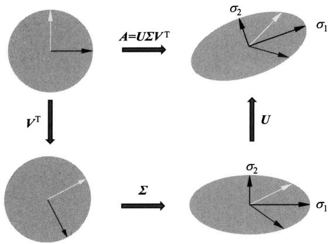  
图16.1 奇异值分解的几何解释（见文前彩图）

下面通过一个例子直观地说明奇异值分解的几何意义。

例16.4 给定一个2阶矩阵：

$$
\boldsymbol {A} = \left[ \begin{array}{c c} 3 & 1 \\ 2 & 1 \end{array} \right]
$$

其奇异值分解为

$$
\boldsymbol {U} = \left[ \begin{array}{c c} 0. 8 1 7 4 & - 0. 5 7 6 0 \\ 0. 5 7 6 0 & 0. 8 1 7 4 \end{array} \right], \quad \boldsymbol {\Sigma} = \left[ \begin{array}{c c} 3. 8 6 4 3 & 0 \\ 0 & 0. 2 5 8 8 \end{array} \right], \quad \boldsymbol {V} ^ {\mathrm {T}} = \left[ \begin{array}{c c} 0. 9 3 2 7 & 0. 3 6 0 6 \\ - 0. 3 6 0 6 & 0. 9 3 2 7 \end{array} \right]
$$

观察基于矩阵 $\mathbf{A}$ 的奇异值分解将 $\mathbb{R}^2$ 的标准正交基

$$
\boldsymbol {e} _ {1} = \left[ \begin{array}{l} 1 \\ 0 \end{array} \right], \quad \boldsymbol {e} _ {2} = \left[ \begin{array}{l} 0 \\ 1 \end{array} \right]
$$

进行线性转换的情况。

首先， $\mathbf{V}^{\mathrm{T}}$ 表示一个旋转变换，将标准正交基 $\pmb{e}_1, \pmb{e}_2$ 旋转，得到向量 $\mathbf{V}^{\mathrm{T}}\pmb{e}_1, \mathbf{V}^{\mathrm{T}}\pmb{e}_2$

$$
\boldsymbol {V} ^ {\mathrm {T}} \boldsymbol {e} _ {1} = \left[ \begin{array}{c} 0. 9 3 2 7 \\ - 0. 3 6 0 6 \end{array} \right], \quad \boldsymbol {V} ^ {\mathrm {T}} \boldsymbol {e} _ {2} = \left[ \begin{array}{c} 0. 3 6 0 6 \\ 0. 9 3 2 7 \end{array} \right]
$$

其次， $\pmb{\Sigma}$ 表示一个缩放变换，将向量 $\mathbf{V}^{\mathrm{T}}\mathbf{e}_1$ ， $\mathbf{V}^{\mathrm{T}}\mathbf{e}_2$ 在坐标轴方向缩放 $\sigma_{1}$ 倍和 $\sigma_{2}$ 倍，得到向量 $\pmb {\Sigma}\pmb{V}^{\mathrm{T}}\pmb {e}_1$ ， $\pmb {\Sigma}\pmb{V}^{\mathrm{T}}\pmb{e}_2$

$$
\boldsymbol {\Sigma} \boldsymbol {V} ^ {\mathrm {T}} \boldsymbol {e} _ {1} = \left[ \begin{array}{c} 3. 6 0 4 2 \\ - 0. 0 9 3 3 \end{array} \right], \quad \boldsymbol {\Sigma} \boldsymbol {V} ^ {\mathrm {T}} \boldsymbol {e} _ {2} = \left[ \begin{array}{c} 1. 3 9 3 5 \\ 0. 2 4 1 4 \end{array} \right]
$$

最后， $\pmb{U}$ 表示一个旋转变换，再将向量 $\pmb{\Sigma} \pmb{V}^{\mathrm{T}} \pmb{e}_1$ ， $\pmb{\Sigma} \pmb{V}^{\mathrm{T}} \pmb{e}_2$ 旋转，得到向量 $\pmb{U} \pmb{\Sigma} \pmb{V}^{\mathrm{T}} \pmb{e}_1$ ， $\pmb{U} \pmb{\Sigma} \pmb{V}^{\mathrm{T}} \pmb{e}_2$ ，也就是向量 $\pmb{A} \pmb{e}_1$ 和 $\pmb{A} \pmb{e}_2$ ：

$$
\boldsymbol {A} \boldsymbol {e} _ {1} = \boldsymbol {U} \boldsymbol {\Sigma} \boldsymbol {V} ^ {\mathrm {T}} \boldsymbol {e} _ {1} = \left[ \begin{array}{l} 3 \\ 2 \end{array} \right], \quad \boldsymbol {A} \boldsymbol {e} _ {2} = \boldsymbol {U} \boldsymbol {\Sigma} \boldsymbol {V} ^ {\mathrm {T}} \boldsymbol {e} _ {2} \left[ \begin{array}{l} 1 \\ 1 \end{array} \right]
$$

综上，矩阵的奇异值分解也可以看作将其对应的线性变换分解为旋转变换、缩放变换及旋转变换的组合。根据定理16.1，这个变换的组合一定存在。

# 16.1.4 主要性质

（1）设矩阵 $\mathbf{A}$ 的奇异值分解为 $A = U\Sigma V^{\mathrm{T}}$ ，则以下关系成立：

$$
\boldsymbol {A} ^ {\mathrm {T}} \boldsymbol {A} = (\boldsymbol {U} \boldsymbol {\Sigma} \boldsymbol {V} ^ {\mathrm {T}}) ^ {\mathrm {T}} (\boldsymbol {U} \boldsymbol {\Sigma} \boldsymbol {V} ^ {\mathrm {T}}) = \boldsymbol {V} (\boldsymbol {\Sigma} ^ {\mathrm {T}} \boldsymbol {\Sigma}) \boldsymbol {V} ^ {\mathrm {T}} \tag {16.20}
$$

$$
\boldsymbol {A} \boldsymbol {A} ^ {\mathrm {T}} = (\boldsymbol {U} \boldsymbol {\Sigma} \boldsymbol {V} ^ {\mathrm {T}}) (\boldsymbol {U} \boldsymbol {\Sigma} \boldsymbol {V} ^ {\mathrm {T}}) ^ {\mathrm {T}} = \boldsymbol {U} (\boldsymbol {\Sigma} \boldsymbol {\Sigma} ^ {\mathrm {T}}) \boldsymbol {U} ^ {\mathrm {T}} \tag {16.21}
$$

也就是说，矩阵 $\mathbf{A}^{\mathrm{T}}\mathbf{A}$ 和 $\mathbf{A}\mathbf{A}^{\mathrm{T}}$ 的特征分解存在，且可以由矩阵 $\mathbf{A}$ 的奇异值分解的矩阵表示。 $\mathbf{V}$ 的列向量是 $\mathbf{A}^{\mathrm{T}}\mathbf{A}$ 的特征向量， $\mathbf{U}$ 的列向量是 $\mathbf{A}\mathbf{A}^{\mathrm{T}}$ 的特征向量， $\pmb{\Sigma}$ 的奇异值是 $\mathbf{A}^{\mathrm{T}}\mathbf{A}$ 和 $\mathbf{A}\mathbf{A}^{\mathrm{T}}$ 的特征值的平方根。

(2) 在矩阵 $\mathbf{A}$ 的奇异值分解中, 奇异值、左奇异向量和右奇异向量之间存在对应关系。

由 $\mathbf{A} = \mathbf{U}\pmb{\Sigma}\mathbf{V}^{\mathrm{T}}$ 易知：

$$
\boldsymbol {A} \boldsymbol {V} = \boldsymbol {U} \boldsymbol {\Sigma}
$$

比较这一等式两端的第 $j$ 列，得到：

$$
\boldsymbol {A} \boldsymbol {v} _ {j} = \sigma_ {j} \boldsymbol {u} _ {j}, \quad j = 1, 2, \dots , n \tag {16.22}
$$

这是矩阵 $\mathbf{A}$ 的右奇异向量和奇异值、左奇异向量的关系。

类似地，由

$$
\boldsymbol {A} ^ {\mathrm {T}} \boldsymbol {U} = \boldsymbol {V} \boldsymbol {\Sigma} ^ {\mathrm {T}}
$$

得到：

$$
\boldsymbol {A} ^ {\mathrm {T}} \boldsymbol {u} _ {j} = \sigma_ {j} \boldsymbol {v} _ {j}, \quad j = 1, 2, \dots , n \tag {16.23}
$$

$$
\boldsymbol {A} ^ {\mathrm {T}} \boldsymbol {u} _ {j} = 0, \quad j = n + 1, n + 2, \dots , m \tag {16.24}
$$

这是矩阵 $\mathbf{A}$ 的左奇异向量和奇异值、右奇异向量的关系。

（3）矩阵 $\mathbf{A}$ 的奇异值分解中，奇异值 $\sigma_{1},\sigma_{2},\dots ,\sigma_{n}$ 是唯一的，而矩阵 $\mathbf{U}$ 和 $\mathbf{V}$ 不是唯一的。  
(4) 矩阵 $\mathbf{A}$ 和 $\pmb{\Sigma}$ 的秩相等，等于正奇异值 $\sigma_{i}$ 的个数 $r$ （包含重复的奇异值）。  
(5) 矩阵 $\mathbf{A}$ 的 $r$ 个右奇异向量 $\mathbf{v}_1, \mathbf{v}_2, \dots, \mathbf{v}_r$ 构成 $\mathbf{A}^{\mathrm{T}}$ 的值域 $R(\mathbf{A}^{\mathrm{T}})$ 的一组标准正交基。因为矩阵 $\mathbf{A}^{\mathrm{T}}$ 是从 $\mathbb{R}^m$ 映射到 $\mathbb{R}^n$ 的线性变换，则 $\mathbf{A}^{\mathrm{T}}$ 的值域 $R(\mathbf{A}^{\mathrm{T}})$ 和 $\mathbf{A}^{\mathrm{T}}$ 的列空间是相同的， $\mathbf{v}_1, \mathbf{v}_2, \dots, \mathbf{v}_r$ 是 $\mathbf{A}^{\mathrm{T}}$ 的一组标准正交基，因而也是 $R(\mathbf{A}^{\mathrm{T}})$ 的一组标准正交基。①

矩阵 $\mathbf{A}$ 的 $n - r$ 个右奇异向量 $\pmb{v}_{r + 1},\pmb{v}_{r + 2},\dots ,\pmb{v}_n$ 构成 $\mathbf{A}$ 的零空间 $N(A)$ 的一组标准正交基。矩阵 $\mathbf{A}$ 的 $r$ 个左奇异向量 $\pmb{u}_1,\pmb{u}_2,\dots ,\pmb{u}_r$ 构成值域 $R(A)$ 的一组标准正交基。矩阵 $\mathbf{A}$ 的 $m - r$ 个左奇异向量 $\pmb{u}_{r + 1},\pmb{u}_{r + 2},\dots ,\pmb{u}_m$ 构成 $\mathbf{A}^{\mathrm{T}}$ 的零空间 $N(\mathbf{A}^{\mathrm{T}})$ 的一组标准正交基。

# 16.2 奇异值分解的计算

奇异值分解基本定理的证明过程蕴含了奇异值分解的计算方法。矩阵 $\mathbf{A}$ 的奇异值分解可以通过求对称矩阵 $\mathbf{A}^{\mathrm{T}}\mathbf{A}$ 的特征值和特征向量得到。 $\mathbf{A}^{\mathrm{T}}\mathbf{A}$ 的特征向量构成正交矩阵 $\mathbf{V}$ 的列， $\mathbf{A}^{\mathrm{T}}\mathbf{A}$ 的特征值 $\lambda_{j}$ 的平方根为奇异值 $\sigma_{i}$ ，即

$$
\sigma_ {j} = \sqrt {\lambda_ {j}}, \quad j = 1, 2, \dots , n
$$

对其由大到小排列作为对角线元素, 构成对角矩阵 $\pmb{\Sigma}$ ; 求正奇异值对应的左奇异向量, 再求扩充的 $\mathbf{A}^{\mathrm{T}}$ 的标准正交基, 构成正交矩阵 $\mathbf{U}$ 的列, 从而得到 $\mathbf{A}$ 的奇异值分解 $\mathbf{A} = \mathbf{U} \pmb{\Sigma} \mathbf{V}^{\mathrm{T}}$ 。

给定 $m \times n$ 矩阵 $\mathbf{A}$ ，可以按照上面的叙述写出矩阵奇异值分解的计算过程。

（1）求 $A^{\mathrm{T}}A$ 的特征值和特征向量

计算对称矩阵 $\pmb{W} = \pmb{A}^{\mathrm{T}}\pmb{A}$

求解特征方程

$$
\left(\boldsymbol {W} - \lambda \boldsymbol {I}\right) \boldsymbol {x} = 0
$$

得到特征值 $\lambda_{i}$ ，并将特征值由大到小排列：

$$
\lambda_ {1} \geqslant \lambda_ {2} \geqslant \dots \geqslant \lambda_ {n} \geqslant 0
$$

将特征值 $\lambda_{i}$ （ $i = 1,2,\dots ,n$ ）代入特征方程求得对应的特征向量。

（2）求 $n$ 阶正交矩阵 $\mathbf{V}$

将特征向量单位化，得到单位特征向量 $\pmb{v}_1, \pmb{v}_2, \dots, \pmb{v}_n$ ，构成 $n$ 阶正交矩阵 $\mathbf{V}$ ：

$$
\boldsymbol {V} = \left[ \begin{array}{c c c c} \boldsymbol {v} _ {1} & \boldsymbol {v} _ {2} & \dots & \boldsymbol {v} _ {n} \end{array} \right]
$$

（3）求 $m \times n$ 对角矩阵 $\pmb{\Sigma}$

计算 $\mathbf{A}$ 的奇异值：

$$
\sigma_ {i} = \sqrt {\lambda_ {i}}, \quad i = 1, 2, \dots , n
$$

构造 $m \times n$ 矩形对角矩阵 $\pmb{\Sigma}$ ，主对角线元素是奇异值，其余元素是零：

$$
\boldsymbol {\Sigma} = \operatorname {d i a g} \left(\sigma_ {1}, \sigma_ {2}, \dots , \sigma_ {n}\right)
$$

（4）求 $m$ 阶正交矩阵 $\pmb{U}$

对 $\mathbf{A}$ 的前 $r$ 个正奇异值，令

$$
\boldsymbol {u} _ {j} = \frac {1}{\sigma_ {j}} \boldsymbol {A} \boldsymbol {v} _ {j}, \quad j = 1, 2, \dots , r
$$

得到：

$$
\boldsymbol {U} _ {1} = \left[ \begin{array}{c c c c} \boldsymbol {u} _ {1} & \boldsymbol {u} _ {2} & \dots & \boldsymbol {u} _ {r} \end{array} \right]
$$

求 $\mathbf{A}^{\mathrm{T}}$ 的零空间的一组标准正交基 $\{\pmb{u}_{r + 1},\pmb{u}_{r + 2},\dots ,\pmb{u}_m\}$ ，令

$$
\boldsymbol {U} _ {2} = \left[ \begin{array}{c c c c} \boldsymbol {u} _ {r + 1} & \boldsymbol {u} _ {r + 2} & \dots & \boldsymbol {u} _ {m} \end{array} \right]
$$

并令

$$
\boldsymbol {U} = \left[ \begin{array}{c c} \boldsymbol {U} _ {1} & \boldsymbol {U} _ {2} \end{array} \right]
$$

（5）得到奇异值分解

$$
\boldsymbol {A} = \boldsymbol {U} \boldsymbol {\Sigma} \boldsymbol {V} ^ {\mathrm {T}}
$$

下面通过一个简单的例题，说明奇异值分解的算法。

例16.5 试求矩阵

$$
\boldsymbol {A} = \left[ \begin{array}{c c} 1 & 1 \\ 2 & 2 \\ 0 & 0 \end{array} \right]
$$

的奇异值分解。

解（1）求矩阵 $\mathbf{A}^{\mathrm{T}}\mathbf{A}$ 的特征值和特征向量

求对称矩阵 $A^{\mathrm{T}}A$

$$
\boldsymbol {A} ^ {\mathrm {T}} \boldsymbol {A} = \left[ \begin{array}{l l l} 1 & 2 & 0 \\ 1 & 2 & 0 \end{array} \right] \left[ \begin{array}{l l} 1 & 1 \\ 2 & 2 \\ 0 & 0 \end{array} \right] = \left[ \begin{array}{l l} 5 & 5 \\ 5 & 5 \end{array} \right]
$$

特征值 $\lambda$ 和特征向量 $\pmb{x}$ 满足特征方程

$$
\left(\boldsymbol {A} ^ {\mathrm {T}} \boldsymbol {A} - \lambda \boldsymbol {I}\right) \boldsymbol {x} = 0
$$

得到齐次线性方程组：

$$
\left\{ \begin{array}{l} (5 - \lambda) x _ {1} + 5 x _ {2} = 0 \\ 5 x _ {1} + (5 - \lambda) x _ {2} = 0 \end{array} \right.
$$

该方程组有非零解的充要条件是

$$
\left| \begin{array}{l l} 5 - \lambda & 5 \\ 5 & 5 - \lambda \end{array} \right| = 0
$$

即

$$
\lambda^ {2} - 1 0 \lambda = 0
$$

解此方程，得到矩阵 $\mathbf{A}^{\mathrm{T}}\mathbf{A}$ 的特征值 $\lambda_{1} = 10$ 和 $\lambda_{2} = 0$

将特征值 $\lambda_{1} = 10$ 代入线性方程组，得到对应的单位特征向量：

$$
\boldsymbol {v} _ {1} = \left[ \begin{array}{l} \frac {1}{\sqrt {2}} \\ \frac {1}{\sqrt {2}} \end{array} \right]
$$

同样得到特征值 $\lambda_{2} = 0$ 对应的单位特征向量：

$$
\boldsymbol {v} _ {2} = \left[ \begin{array}{c} \frac {1}{\sqrt {2}} \\ - \frac {1}{\sqrt {2}} \end{array} \right]
$$

(2) 求正交矩阵 $\mathbf{V}$

构造正交矩阵 $V$

$$
\boldsymbol {V} = \left[ \begin{array}{c c} \frac {1}{\sqrt {2}} & \frac {1}{\sqrt {2}} \\ \frac {1}{\sqrt {2}} & - \frac {1}{\sqrt {2}} \end{array} \right]
$$

(3) 求对角矩阵 $\pmb{\Sigma}$

奇异值为 $\sigma_{1} = \sqrt{\lambda_{1}} = \sqrt{10}$ 和 $\sigma_{2} = 0$ 。构造对角矩阵：

$$
\boldsymbol {\Sigma} = \left[ \begin{array}{c c} \sqrt {1 0} & 0 \\ 0 & 0 \\ 0 & 0 \end{array} \right]
$$

注意在 $\pmb{\Sigma}$ 中要加上零行向量，使得 $\pmb{\Sigma}$ 能够与 $\pmb{U},\pmb{V}$ 进行矩阵乘法运算。

（4）求正交矩阵 $\pmb{U}$

基于 $\mathbf{A}$ 的正奇异值计算得到列向量 $u_{1}$

$$
\boldsymbol {u} _ {1} = \frac {1}{\sigma_ {1}} \boldsymbol {A} \boldsymbol {v} _ {1} = \frac {1}{\sqrt {1 0}} \left[ \begin{array}{l l} 1 & 1 \\ 2 & 2 \\ 0 & 0 \end{array} \right] \left[ \begin{array}{l} \frac {1}{\sqrt {2}} \\ \frac {1}{\sqrt {2}} \end{array} \right] = \left[ \begin{array}{l} \frac {1}{\sqrt {5}} \\ \frac {2}{\sqrt {5}} \\ 0 \end{array} \right]
$$

列向量 $\pmb{u}_2$ ， $\pmb{u}_3$ 是 $A^{\mathrm{T}}$ 的零空间 $N(A^{\mathrm{T}})$ 的一组标准正交基。为此，求解以下线性方

程组：

$$
\boldsymbol {A} ^ {\mathrm {T}} \boldsymbol {x} = \left[ \begin{array}{l l l} 1 & 2 & 0 \\ 1 & 2 & 0 \end{array} \right] \left[ \begin{array}{l} x _ {1} \\ x _ {2} \\ x _ {3} \end{array} \right] = \left[ \begin{array}{l} 0 \\ 0 \end{array} \right]
$$

即

$$
x _ {1} + 2 x _ {2} + 0 x _ {3} = 0
$$

$$
x _ {1} = - 2 x _ {2} + 0 x _ {3}
$$

分别取 $(x_{2},x_{3})$ 为 $(1,0)$ 和 $(0,1)$ ，得到 $N(\mathbf{A}^{\mathrm{T}})$ 的基：

$$
(- 2, 1, 0) ^ {\mathrm {T}}, \quad (0, 0, 1) ^ {\mathrm {T}}
$$

$N(\mathbf{A}^{\mathrm{T}})$ 的一组标准正交基是

$$
\boldsymbol {u} _ {2} = \left(- \frac {2}{\sqrt {5}}, \frac {1}{\sqrt {5}}, 0\right) ^ {\mathrm {T}}, \quad \boldsymbol {u} _ {3} = (0, 0, 1) ^ {\mathrm {T}}
$$

构造正交矩阵 $U$

$$
\boldsymbol {U} = \left[ \begin{array}{c c c} \frac {1}{\sqrt {5}} & - \frac {2}{\sqrt {5}} & 0 \\ \frac {2}{\sqrt {5}} & \frac {1}{\sqrt {5}} & 0 \\ 0 & 0 & 1 \end{array} \right]
$$

（5）矩阵 $\mathbf{A}$ 的奇异值分解

$$
\boldsymbol {A} = \boldsymbol {U} \boldsymbol {\Sigma} \boldsymbol {V} ^ {\mathrm {T}} = \left[ \begin{array}{c c c} \frac {1}{\sqrt {5}} & - \frac {2}{\sqrt {5}} & 0 \\ \frac {2}{\sqrt {5}} & \frac {1}{\sqrt {5}} & 0 \\ 0 & 0 & 1 \end{array} \right] \left[ \begin{array}{c c} \sqrt {1 0} & 0 \\ 0 & 0 \\ 0 & 0 \end{array} \right] \left[ \begin{array}{c c} \frac {1}{\sqrt {2}} & \frac {1}{\sqrt {2}} \\ \frac {1}{\sqrt {2}} & - \frac {1}{\sqrt {2}} \end{array} \right]
$$

上面的算法和例题只是为了说明计算的过程，并不是实际应用中的算法。可以看出，奇异值分解算法关键在于 $A^{\mathrm{T}}A$ 的特征值的计算。实际应用的奇异值分解算法是通过求 $A^{\mathrm{T}}A$ 的特征值进行，但不直接计算 $A^{\mathrm{T}}A$ 。按照这个思路产生了许多矩阵奇异值分解的有效算法，这里不予介绍，读者可以参考文献[1]和文献[2]。

# 16.3 奇异值分解与矩阵近似

# 16.3.1 弗罗贝尼乌斯范数

奇异值分解也是一种矩阵近似的方法，这个近似是在弗罗贝尼乌斯范数（Frobenius

norm）意义下的近似。矩阵的弗罗贝尼乌斯范数是向量的 $L_{2}$ 范数的直接推广，对应机器学习中的平方损失函数。

定义16.4（弗罗贝尼乌斯范数）设矩阵 $\mathbf{A} \in \mathbb{R}^{m \times n}$ ， $\mathbf{A} = [a_{ij}]_{m \times n}$ ，定义矩阵 $\mathbf{A}$ 的弗罗贝尼乌斯范数为

$$
\| \boldsymbol {A} \| _ {F} = \left(\sum_ {i = 1} ^ {m} \sum_ {j = 1} ^ {n} a _ {i j} ^ {2}\right) ^ {\frac {1}{2}} \tag {16.25}
$$

引理16.1 设矩阵 $\mathbf{A} \in \mathbb{R}^{m \times n}$ , $\mathbf{A}$ 的奇异值分解为 $\mathbf{U} \boldsymbol{\Sigma} \mathbf{V}^{\mathrm{T}}$ , 其中 $\boldsymbol{\Sigma} = \operatorname{diag}(\sigma_1, \sigma_2, \dots, \sigma_n)$ , 则

$$
\left\| \boldsymbol {A} \right\| _ {F} = \left(\sigma_ {1} ^ {2} + \sigma_ {2} ^ {2} + \dots + \sigma_ {n} ^ {2}\right) ^ {\frac {1}{2}} \tag {16.26}
$$

证明 一般地，若 $Q$ 是 $m$ 阶正交矩阵，则有

$$
\| \boldsymbol {Q} \boldsymbol {A} \| _ {F} = \| \boldsymbol {A} \| _ {F} \tag {16.27}
$$

因为

$$
\begin{array}{l} \| Q A \| _ {F} ^ {2} = \left\| \left(Q a _ {1}, Q a _ {2}, \dots , Q a _ {n}\right) \right\| _ {F} ^ {2} \\ = \sum_ {i = 1} ^ {n} \| Q \boldsymbol {a} _ {i} \| _ {2} ^ {2} = \sum_ {i = 1} ^ {n} \| \boldsymbol {a} _ {i} \| _ {2} ^ {2} = \| \boldsymbol {A} \| _ {F} ^ {2} \\ \end{array}
$$

同样，若 $P$ 是 $n$ 阶正交矩阵，则有

$$
\left\| \boldsymbol {A} \boldsymbol {P} ^ {\mathrm {T}} \right\| _ {F} = \left\| \boldsymbol {A} \right\| _ {F} \tag {16.28}
$$

故

$$
\| \boldsymbol {A} \| _ {F} = \| \boldsymbol {U} \boldsymbol {\Sigma} \mathbf {V} ^ {\mathrm {T}} \| _ {F} = \| \boldsymbol {\Sigma} \| _ {F} \tag {16.29}
$$

即

$$
\left\| \boldsymbol {A} \right\| _ {F} = \left(\sigma_ {1} ^ {2} + \sigma_ {2} ^ {2} + \dots + \sigma_ {n} ^ {2}\right) ^ {\frac {1}{2}} \tag {16.30}
$$

# 16.3.2 矩阵的最优近似

奇异值分解是在平方损失（弗罗贝尼乌斯范数）意义下对矩阵的最优近似，即数据压缩。

定理16.2 设矩阵 $\mathbf{A} \in \mathbb{R}^{m \times n}$ , 矩阵的秩 $\operatorname{rank}(\mathbf{A}) = r$ , 并设 $\mathcal{M}$ 为 $\mathbb{R}^{m \times n}$ 中所有秩不超过 $k$ 的矩阵集合, $0 < k < r$ , 则存在一个秩为 $k$ 的矩阵 $\mathbf{X} \in \mathcal{M}$ , 使得

$$
\left\| \boldsymbol {A} - \boldsymbol {X} \right\| _ {F} = \min  _ {\boldsymbol {M} \in \mathcal {M}} \| \boldsymbol {A} - \boldsymbol {M} \| _ {F} \tag {16.31}
$$

称矩阵 $\pmb{X}$ 为矩阵 $\mathbf{A}$ 在弗罗贝尼乌斯范数意义下的最优近似。

本书不证明这一定理，将应用这个结果，通过矩阵 $\mathbf{A}$ 的奇异值分解求出近似矩阵 $\mathbf{X}$ 。

定理16.3 设矩阵 $\mathbf{A} \in \mathbb{R}^{m \times n}$ , 矩阵的秩 $\operatorname{rank}(\mathbf{A}) = r$ , 有奇异值分解 $\mathbf{A} = \mathbf{U} \boldsymbol{\Sigma} \mathbf{V}^{\mathrm{T}}$ , 并设 $\mathcal{M}$ 为 $\mathbb{R}^{m \times n}$ 中所有秩不超过 $k$ 的矩阵的集合, $0 < k < r$ , 若秩为 $k$ 的矩阵 $\mathbf{X} \in \mathcal{M}$ 满足

$$
\left\| \boldsymbol {A} - \boldsymbol {X} \right\| _ {F} = \min  _ {\boldsymbol {M} \in \mathcal {M}} \| \boldsymbol {A} - \boldsymbol {M} \| _ {F} \tag {16.32}
$$

则

$$
\left\| \boldsymbol {A} - \boldsymbol {X} \right\| _ {F} = \left(\sigma_ {k + 1} ^ {2} + \sigma_ {k + 2} ^ {2} + \dots + \sigma_ {n} ^ {2}\right) ^ {\frac {1}{2}} \tag {16.33}
$$

特别地，若 $A^{\prime} = U\Sigma^{\prime}V^{\mathrm{T}}$ ，其中，

$$
\boldsymbol {\Sigma} ^ {\prime} = \left[ \begin{array}{c c c c c c} \sigma_ {1} & & & & & \\ & \ddots & & 0 & & \\ & & \sigma_ {k} & & & \\ & & & 0 & & \\ & 0 & & \ddots & & \\ & & & & 0 \end{array} \right] = \left[ \begin{array}{c c} \boldsymbol {\Sigma} _ {k} & \boldsymbol {0} \\ \boldsymbol {0} & \boldsymbol {0} \end{array} \right]
$$

则

$$
\left\| \boldsymbol {A} - \boldsymbol {A} ^ {\prime} \right\| _ {F} = \left(\sigma_ {k + 1} ^ {2} + \sigma_ {k + 2} ^ {2} + \dots + \sigma_ {n} ^ {2}\right) ^ {\frac {1}{2}} = \min  _ {\boldsymbol {M} \in \mathcal {M}} \| \boldsymbol {A} - \boldsymbol {M} \| _ {F} \tag {16.34}
$$

证明 令 $\pmb{X} \in \mathcal{M}$ 为满足式 (16.32) 的一个矩阵。由于

$$
\left\| \boldsymbol {A} - \boldsymbol {X} \right\| _ {F} \leqslant \left\| \boldsymbol {A} - \boldsymbol {A} ^ {\prime} \right\| _ {F} = \left(\sigma_ {k + 1} ^ {2} + \sigma_ {k + 2} ^ {2} + \dots + \sigma_ {n} ^ {2}\right) ^ {\frac {1}{2}} \tag {16.35}
$$

下面证明

$$
\left\| \boldsymbol {A} - \boldsymbol {X} \right\| _ {F} \geqslant \left(\sigma_ {k + 1} ^ {2} + \sigma_ {k + 2} ^ {2} + \dots + \sigma_ {n} ^ {2}\right) ^ {\frac {1}{2}}
$$

于是式（16.33）成立。

设 $\pmb{X}$ 的奇异值分解为 $Q\Omega P^{\mathrm{T}}$ ，其中，

$$
\boldsymbol {\Omega} = \left[ \begin{array}{c c c c c c} \omega_ {1} & & & & & \\ & \ddots & & & 0 & \\ & & \omega_ {k} & & & \\ & & & 0 & & \\ & 0 & & & \ddots & \\ & & & & & 0 \end{array} \right] = \left[ \begin{array}{c c} \boldsymbol {\Omega} _ {k} & \boldsymbol {0} \\ \boldsymbol {0} & \boldsymbol {0} \end{array} \right]
$$

若令矩阵 $\pmb {B} = \pmb{Q}^{\mathrm{T}}\pmb {A}\pmb{P}$ ，则 $A = QB P^{\mathrm{T}}$ ，由此得到：

$$
\left\| \boldsymbol {A} - \boldsymbol {X} \right\| _ {F} = \left\| \boldsymbol {Q} (\boldsymbol {B} - \boldsymbol {\Omega}) \boldsymbol {P} ^ {\mathrm {T}} \right\| _ {F} = \left\| \boldsymbol {B} - \boldsymbol {\Omega} \right\| _ {F} \tag {16.36}
$$

用 $\Omega$ 分块方法对 $B$ 分块：

$$
\boldsymbol {B} = \left[ \begin{array}{l l} \boldsymbol {B} _ {1 1} & \boldsymbol {B} _ {1 2} \\ \boldsymbol {B} _ {2 1} & \boldsymbol {B} _ {2 2} \end{array} \right]
$$

其中， $B_{11}$ 是 $k\times k$ 子矩阵， $B_{12}$ 是 $k\times (n - k)$ 子矩阵， $B_{21}$ 是 $(m - k)\times k$ 子矩阵， $B_{22}$ 是 $(m - k)\times (n - k)$ 子矩阵。可得：

$$
\begin{array}{l} \left\| \boldsymbol {A} - \boldsymbol {X} \right\| _ {F} ^ {2} = \left\| \boldsymbol {B} - \boldsymbol {\Omega} \right\| _ {F} ^ {2} \\ = \| \boldsymbol {B} _ {1 1} - \boldsymbol {\Omega} _ {k} \| _ {F} ^ {2} + \| \boldsymbol {B} _ {1 2} \| _ {F} ^ {2} + \| \boldsymbol {B} _ {2 1} \| _ {F} ^ {2} + \| \boldsymbol {B} _ {2 2} \| _ {F} ^ {2} \tag {16.37} \\ \end{array}
$$

现证 $B_{12} = 0, B_{21} = 0$ 。用反证法。若 $B_{12} \neq 0$ ，令

$$
\boldsymbol {Y} = \boldsymbol {Q} \left[ \begin{array}{c c} \boldsymbol {B} _ {1 1} & \boldsymbol {B} _ {1 2} \\ \boldsymbol {0} & \boldsymbol {0} \end{array} \right] \boldsymbol {P} ^ {\mathrm {T}}
$$

则 $\pmb {Y}\in \mathcal{M}$ ，且

$$
\left\| \boldsymbol {A} - \boldsymbol {Y} \right\| _ {F} ^ {2} = \left\| \boldsymbol {B} _ {2 1} \right\| _ {F} ^ {2} + \left\| \boldsymbol {B} _ {2 2} \right\| _ {F} ^ {2} <   \left\| \boldsymbol {A} - \boldsymbol {X} \right\| _ {F} ^ {2} \tag {16.38}
$$

这与 $\pmb{X}$ 的定义式(16.35)矛盾。证明了 $B_{12} = 0$ ，同样可证 $B_{21} = 0$ 。于是

$$
\left\| \boldsymbol {A} - \boldsymbol {X} \right\| _ {F} ^ {2} = \left\| \boldsymbol {B} _ {1 1} - \boldsymbol {\Omega} _ {k} \right\| _ {F} ^ {2} + \left\| \boldsymbol {B} _ {2 2} \right\| _ {F} ^ {2} \tag {16.39}
$$

再证 $B_{11} = \Omega_k$ 。为此令

$$
Z = Q \left[ \begin{array}{c c} B _ {1 1} & 0 \\ 0 & 0 \end{array} \right] P ^ {\mathrm {T}}
$$

则 $Z \in \mathcal{M}$ , 且

$$
\left\| \boldsymbol {A} - \boldsymbol {Z} \right\| _ {F} ^ {2} = \left\| \boldsymbol {B} _ {2 2} \right\| _ {F} ^ {2} \leqslant \left\| \boldsymbol {B} _ {1 1} - \boldsymbol {\Omega} _ {k} \right\| _ {F} ^ {2} + \left\| \boldsymbol {B} _ {2 2} \right\| _ {F} ^ {2} = \left\| \boldsymbol {A} - \boldsymbol {X} \right\| _ {F} ^ {2} \tag {16.40}
$$

由式(16.35)知， $\| B_{11} - \Omega_k\| _F^2 = 0$ ，即 $B_{11} = \Omega_{k}$ 。

最后看 $\pmb{B}_{22}$ 。若 $(m - k)\times (n - k)$ 子矩阵 $\pmb{B}_{22}$ 有奇异值分解 $U_{1}\pmb{\Lambda}V_{1}^{\mathrm{T}}$ ，则

$$
\left\| \boldsymbol {A} - \boldsymbol {X} \right\| _ {F} = \left\| \boldsymbol {B} _ {2 2} \right\| _ {F} = \left\| \boldsymbol {\Lambda} \right\| _ {F} \tag {16.41}
$$

证明 $\pmb{\Lambda}$ 的对角线元素为 $\pmb{A}$ 的奇异值。为此，令

$$
\boldsymbol {U} _ {2} = \left[ \begin{array}{c c} \boldsymbol {I} _ {k} & \boldsymbol {0} \\ \boldsymbol {0} & \boldsymbol {U} _ {1} \end{array} \right], \quad \boldsymbol {V} _ {2} = \left[ \begin{array}{c c} \boldsymbol {I} _ {k} & \boldsymbol {0} \\ \boldsymbol {0} & \boldsymbol {V} _ {1} \end{array} \right]
$$

其中， $I_k$ 是 $k$ 阶单位矩阵， $U_2, V_2$ 的分块与 $\pmb{B}$ 的分块一致。注意到 $\pmb{B}$ 及 $B_{22}$ 的奇异值分解，即得：

$$
\boldsymbol {U} _ {2} ^ {\mathrm {T}} \boldsymbol {Q} ^ {\mathrm {T}} \boldsymbol {A} \boldsymbol {P} \boldsymbol {V} _ {2} = \left[ \begin{array}{c c} \boldsymbol {\Omega} _ {k} & 0 \\ \boldsymbol {0} & \boldsymbol {\Lambda} \end{array} \right] \tag {16.42}
$$

$$
\boldsymbol {A} = \left(\boldsymbol {Q} \boldsymbol {U} _ {2}\right) \left[ \begin{array}{c c} \boldsymbol {\Omega} _ {k} & \boldsymbol {0} \\ \boldsymbol {0} & \boldsymbol {\Lambda} \end{array} \right] \left(\boldsymbol {P} \boldsymbol {V} _ {2}\right) ^ {\mathrm {T}} \tag {16.43}
$$

由此可知 $\pmb{\Lambda}$ 的对角线元素为 $\mathbf{A}$ 的奇异值。故有

$$
\left\| \boldsymbol {A} - \boldsymbol {X} \right\| _ {F} = \left\| \boldsymbol {\Lambda} \right\| _ {F} \geqslant \left(\sigma_ {k + 1} ^ {2} + \sigma_ {k + 2} ^ {2} + \dots + \sigma_ {n} ^ {2}\right) ^ {\frac {1}{2}} \tag {16.44}
$$

于是证明了

$$
\left\| \boldsymbol {A} - \boldsymbol {X} \right\| _ {F} = \left(\sigma_ {k + 1} ^ {2} + \sigma_ {k + 2} ^ {2} + \dots + \sigma_ {n} ^ {2}\right) ^ {\frac {1}{2}} = \left\| \boldsymbol {A} - \boldsymbol {A} ^ {\prime} \right\| _ {F}
$$

定理16.3表明，在秩不超过 $k$ 的 $m \times n$ 矩阵的集合中，存在矩阵 $\mathbf{A}$ 的弗罗贝尼乌斯范数意义下的最优近似矩阵 $\mathbf{X}$ 。 $\mathbf{A}' = \mathbf{U} \mathbf{\Sigma}' \mathbf{V}^{\mathrm{T}}$ 是达到最优值的一个矩阵。

前面定义了矩阵的紧奇异值分解与截断奇异值分解。事实上，紧奇异值分解是在弗罗贝尼乌斯范数意义下的无损压缩，截断奇异值分解是有损压缩。截断奇异值分解得到的矩阵的秩为 $k$ ，通常远小于原始矩阵的秩 $r$ ，所以是由低秩矩阵实现了对原始矩阵的压缩。

# 16.3.3 矩阵的外积展开式

下面介绍利用外积展开式对矩阵 $\mathbf{A}$ 的近似。矩阵 $\mathbf{A}$ 的奇异值分解 $\mathbf{U} \mathbf{\Sigma} \mathbf{V}^{\mathrm{T}}$ 也可以由外积形式表示。事实上，若将 $\mathbf{A}$ 的奇异值分解看成矩阵 $\mathbf{U} \mathbf{\Sigma}$ 和 $\mathbf{V}^{\mathrm{T}}$ 的乘积，将 $\mathbf{U} \mathbf{\Sigma}$ 按列向量分块，将 $\mathbf{V}^{\mathrm{T}}$ 按行向量分块，即得：

$$
\boldsymbol {U} \boldsymbol {\Sigma} = \left[ \begin{array}{c c c c} \sigma_ {1} \boldsymbol {u} _ {1} & \sigma_ {2} \boldsymbol {u} _ {2} & \dots & \sigma_ {n} \boldsymbol {u} _ {n} \end{array} \right]
$$

$$
\boldsymbol {V} ^ {\mathrm {T}} = \left[ \begin{array}{c} \boldsymbol {v} _ {1} ^ {\mathrm {T}} \\ \boldsymbol {v} _ {2} ^ {\mathrm {T}} \\ \vdots \\ \boldsymbol {v} _ {n} ^ {\mathrm {T}} \end{array} \right]
$$

故

$$
\boldsymbol {A} = \sigma_ {1} \boldsymbol {u} _ {1} \boldsymbol {v} _ {1} ^ {\mathrm {T}} + \sigma_ {2} \boldsymbol {u} _ {2} \boldsymbol {v} _ {2} ^ {\mathrm {T}} + \dots + \sigma_ {n} \boldsymbol {u} _ {n} \boldsymbol {v} _ {n} ^ {\mathrm {T}} \tag {16.45}
$$

式 (16.45) 称为矩阵 $\mathbf{A}$ 的外积展开式，其中 $\mathbf{u}_k\mathbf{v}_k^{\mathrm{T}}$ 为 $m\times n$ 矩阵，是列向量 $\mathbf{u}_k$ 和行向量 $\mathbf{v}_k^{\mathrm{T}}$ 的外积，其第 $i$ 行第 $j$ 列元素为 $\mathbf{u}_k$ 的第 $i$ 个元素与 $\mathbf{v}_k^{\mathrm{T}}$ 的第 $j$ 个元素的乘积，即

$$
\boldsymbol {u} _ {i} \boldsymbol {v} _ {j} ^ {\mathrm {T}} = \left[ \begin{array}{c} u _ {1 i} \\ u _ {2 i} \\ \vdots \\ u _ {m i} \end{array} \right] \left[ \begin{array}{c c c c} v _ {1 j} & v _ {2 j} & \dots & v _ {n j} \end{array} \right] = \left[ \begin{array}{c c c c} u _ {1 i} v _ {1 j} & u _ {1 i} v _ {2 j} & \dots & u _ {1 i} v _ {n j} \\ u _ {2 i} v _ {1 j} & u _ {2 i} v _ {2 j} & \dots & u _ {2 i} v _ {n j} \\ \vdots & \vdots & & \vdots \\ u _ {m i} v _ {1 j} & u _ {m i} v _ {2 j} & \dots & u _ {m i} v _ {n j} \end{array} \right]
$$

$\mathbf{A}$ 的外积展开式也可以写成下面的形式：

$$
\boldsymbol {A} = \sum_ {k = 1} ^ {n} \boldsymbol {A} _ {k} = \sum_ {k = 1} ^ {n} \sigma_ {k} \boldsymbol {u} _ {k} \boldsymbol {v} _ {k} ^ {\mathrm {T}} \tag {16.46}
$$

其中， $A_{k} = \sigma_{k}\pmb{u}_{k}\pmb{v}_{k}^{\mathrm{T}}$ 是 $m\times n$ 矩阵。式(16.46)将矩阵 $\mathbf{A}$ 分解为矩阵的有序加权和。

由矩阵 $\mathbf{A}$ 的外积展开式知，若 $\mathbf{A}$ 的秩为 $n$ ，则

$$
\boldsymbol {A} = \sigma_ {1} \boldsymbol {u} _ {1} \boldsymbol {v} _ {1} ^ {\mathrm {T}} + \sigma_ {2} \boldsymbol {u} _ {2} \boldsymbol {v} _ {2} ^ {\mathrm {T}} + \dots + \sigma_ {n} \boldsymbol {u} _ {n} \boldsymbol {v} _ {n} ^ {\mathrm {T}} \tag {16.47}
$$

设矩阵

$$
\boldsymbol {A} _ {n - 1} = \sigma_ {1} \boldsymbol {u} _ {1} \boldsymbol {v} _ {1} ^ {\mathrm {T}} + \sigma_ {2} \boldsymbol {u} _ {2} \boldsymbol {v} _ {2} ^ {\mathrm {T}} + \dots + \sigma_ {n - 1} \boldsymbol {u} _ {n - 1} \boldsymbol {v} _ {n - 1} ^ {\mathrm {T}}
$$

则 $\mathbf{A}_{n - 1}$ 的秩为 $n - 1$ ，并且 $\mathbf{A}_{n - 1}$ 是秩为 $n - 1$ 矩阵在弗罗贝尼乌斯范数意义下 $\mathbf{A}$ 的最优近似矩阵。

类似地，设矩阵

$$
\boldsymbol {A} _ {n - 2} = \sigma_ {1} \boldsymbol {u} _ {1} \boldsymbol {v} _ {1} ^ {\mathrm {T}} + \sigma_ {2} \boldsymbol {u} _ {2} \boldsymbol {v} _ {2} ^ {\mathrm {T}} + \dots + \sigma_ {n - 2} \boldsymbol {u} _ {n - 2} \boldsymbol {v} _ {n - 2} ^ {\mathrm {T}}
$$

则 $\mathbf{A}_{n - 2}$ 的秩为 $n - 2$ ，并且 $\mathbf{A}_{n - 2}$ 是秩为 $n - 2$ 矩阵中在弗罗贝尼乌斯范数意义下 $\mathbf{A}$ 的最优近似矩阵。依此类推。一般地，设矩阵

$$
\boldsymbol {A} _ {k} = \sigma_ {1} \boldsymbol {u} _ {1} \boldsymbol {v} _ {1} ^ {\mathrm {T}} + \sigma_ {2} \boldsymbol {u} _ {2} \boldsymbol {v} _ {2} ^ {\mathrm {T}} + \dots + \sigma_ {k} \boldsymbol {u} _ {k} \boldsymbol {v} _ {k} ^ {\mathrm {T}}
$$

则 $\mathbf{A}_k$ 的秩为 $k$ ，并且 $\mathbf{A}_k$ 是秩为 $k$ 的矩阵中在弗罗贝尼乌斯范数意义下 $\mathbf{A}$ 的最优近似矩阵。矩阵 $\mathbf{A}_k$ 就是 $\mathbf{A}$ 的截断奇异值分解。

由于通常奇异值 $\sigma_{i}$ 递减很快，所以 $k$ 取很小值时， $A_{k}$ 也可以对 $\pmb{A}$ 有很好的近似。

例16.6 由例16.1给出的矩阵

$$
\boldsymbol {A} = \left[ \begin{array}{c c c c} 1 & 0 & 0 & 0 \\ 0 & 0 & 0 & 4 \\ 0 & 3 & 0 & 0 \\ 0 & 0 & 0 & 0 \\ 2 & 0 & 0 & 0 \end{array} \right]
$$

的秩为3，求 $\mathbf{A}$ 的秩为2的最优近似。

解 由例16.3可知：

$$
\boldsymbol {u} _ {1} = \left[ \begin{array}{l} 0 \\ 1 \\ 0 \\ 0 \\ 0 \end{array} \right], \quad \boldsymbol {u} _ {2} = \left[ \begin{array}{l} 0 \\ 0 \\ 1 \\ 0 \\ 0 \end{array} \right], \quad \boldsymbol {v} _ {1} = \left[ \begin{array}{l} 0 \\ 0 \\ 0 \\ 1 \end{array} \right], \quad \boldsymbol {v} _ {2} = \left[ \begin{array}{l} 0 \\ 1 \\ 0 \\ 0 \end{array} \right]
$$

$$
\sigma_ {1} = 4, \quad \sigma_ {2} = 3
$$

于是得到：

$$
\boldsymbol {A} _ {2} = \sigma_ {1} \boldsymbol {u} _ {1} \boldsymbol {v} _ {1} ^ {\mathrm {T}} + \sigma_ {2} \boldsymbol {u} _ {2} \boldsymbol {v} _ {2} ^ {\mathrm {T}} = \left[ \begin{array}{l l l l} 0 & 0 & 0 & 0 \\ 0 & 0 & 0 & 4 \\ 0 & 3 & 0 & 0 \\ 0 & 0 & 0 & 0 \\ 0 & 0 & 0 & 0 \end{array} \right]
$$

以此矩阵作为 $\mathbf{A}$ 的最优近似。

# 本章概要

1. 矩阵的奇异值分解是指将 $m \times n$ 实矩阵 $\mathbf{A}$ 表示为以下三个实矩阵乘积形式的运算：

$$
\boldsymbol {A} = \boldsymbol {U} \boldsymbol {\Sigma} \boldsymbol {V} ^ {\mathrm {T}}
$$

其中， $\pmb{U}$ 是 $m$ 阶正交矩阵， $\pmb{V}$ 是 $n$ 阶正交矩阵， $\pmb{\Sigma}$ 是 $m \times n$ 矩形对角矩阵。

$$
\boldsymbol {\Sigma} = \operatorname {d i a g} \left(\sigma_ {1}, \sigma_ {2}, \dots , \sigma_ {p}\right), \quad p = \min  \{m, n \}
$$

其对角线元素非负，且满足

$$
\sigma_ {1} \geqslant \sigma_ {2} \geqslant \dots \geqslant \sigma_ {p} \geqslant 0
$$

2. 任意给定一个实矩阵，其奇异值分解一定存在，但并不唯一。  
3. 奇异值分解包括紧奇异值分解和截断奇异值分解。紧奇异值分解是与原始矩阵等秩的奇异值分解，截断奇异值分解是比原始矩阵低秩的奇异值分解。  
4. 奇异值分解有明确的几何解释。奇异值分解对应三个连续的线性变换：一个旋转变换、一个缩放变换和另一个旋转变换。第一个和第三个旋转变换分别基于空间的标准正交基进行。  
5. 设矩阵 $\mathbf{A}$ 的奇异值分解为 $\mathbf{A} = \mathbf{U}\boldsymbol{\Sigma}\mathbf{V}^{\mathrm{T}}$ ，则有

$$
\pmb {A} ^ {\mathrm {T}} \pmb {A} = \pmb {V} (\pmb {\Sigma} ^ {\mathrm {T}} \pmb {\Sigma}) \pmb {V} ^ {\mathrm {T}}
$$

$$
\boldsymbol {A} \boldsymbol {A} ^ {\mathrm {T}} = \boldsymbol {U} (\boldsymbol {\Sigma} \boldsymbol {\Sigma} ^ {\mathrm {T}}) \boldsymbol {U} ^ {\mathrm {T}}
$$

即对称矩阵 $\mathbf{A}^{\mathrm{T}}\mathbf{A}$ 和 $\mathbf{A}\mathbf{A}^{\mathrm{T}}$ 的特征分解可以由矩阵 $\mathbf{A}$ 的奇异值分解矩阵表示。

6. 矩阵 $\mathbf{A}$ 的奇异值分解可以通过求矩阵 $\mathbf{A}^{\mathrm{T}}\mathbf{A}$ 的特征值和特征向量得到: $\mathbf{A}^{\mathrm{T}}\mathbf{A}$ 的特征向量构成正交矩阵 $\mathbf{V}$ 的列; 从 $\mathbf{A}\mathbf{A}^{\mathrm{T}}$ 的特征值 $\lambda_{j}$ 的平方根得到奇异值 $\sigma_{i}$ , 即

$$
\sigma_ {j} = \sqrt {\lambda_ {j}}, \quad j = 1, 2, \dots , n
$$

对其由大到小排列，作为对角线元素，构成对角矩阵 $\pmb{\Sigma}$ ；求正奇异值对应的左奇异向量，再求扩充的 $\mathbf{A}^{\mathrm{T}}$ 的标准正交基，构成正交矩阵 $\mathbf{U}$ 的列。

7. 矩阵 $\mathbf{A} = [a_{ij}]_{m\times n}$ 的弗罗贝尼乌斯范数定义为

$$
\| \boldsymbol {A} \| _ {F} = \left(\sum_ {i = 1} ^ {m} \sum_ {j = 1} ^ {n} a _ {i j} ^ {2}\right) ^ {\frac {1}{2}}
$$

在秩不超过 $k$ 的 $m \times n$ 矩阵的集合中, 存在矩阵 $\mathbf{A}$ 的弗罗贝尼乌斯范数意义下的最优近似矩阵 $\mathbf{X}$ 。秩为 $k$ 的截断奇异值分解得到的矩阵 $\mathbf{A}_{k}$ 能够达到这个最优值。奇异值分解是弗罗贝尼乌斯范数意义下, 也就是平方损失意义下的矩阵最优近似。

8. 任意一个实矩阵 $\mathbf{A}$ 可以由其外积展开式表示：

$$
\boldsymbol {A} = \sigma_ {1} \boldsymbol {u} _ {1} \boldsymbol {v} _ {1} ^ {\mathrm {T}} + \sigma_ {2} \boldsymbol {u} _ {2} \boldsymbol {v} _ {2} ^ {\mathrm {T}} + \dots + \sigma_ {n} \boldsymbol {u} _ {n} \boldsymbol {v} _ {n} ^ {\mathrm {T}}
$$

其中， $\pmb{u}_k \pmb{v}_k^{\mathrm{T}}$ 为 $m \times n$ 矩阵，是列向量 $\pmb{u}_k$ 和行向量 $\pmb{v}_k^{\mathrm{T}}$ 的外积， $\sigma_k$ 为奇异值， $\pmb{u}_k, \pmb{v}_k^{\mathrm{T}}, \sigma_k$ 通过矩阵 $\pmb{A}$ 的奇异值分解得到。

# 继续阅读

要进一步了解奇异值分解及相关内容可以参考线性代数教材，如文献[3]和文献[4]，也可以观看网上公开课程，如“MIT18.06SCLinearAlgebra”，文献[4]为其教科书。在计算机上奇异值分解通常用数值计算方法进行，奇异值分解的数值计算方法可参阅文献[1]和文献[2]。本章介绍的奇异值分解是定义在矩阵上的，奇异值分解可以扩展到张量（tensor），有两种不同的定义，张量奇异值分解详见文献[5]。

# 习题

16.1 试求矩阵

$$
\boldsymbol {A} = \left[ \begin{array}{c c c} 1 & 2 & 0 \\ 2 & 0 & 2 \end{array} \right]
$$

的奇异值分解。

16.2 试求矩阵

$$
\boldsymbol {A} = \left[ \begin{array}{c c} 2 & 4 \\ 1 & 3 \\ 0 & 0 \\ 0 & 0 \end{array} \right]
$$

的奇异值分解并写出其外积展开式。

16.3 比较矩阵的奇异值分解与对称矩阵的对角化的异同。  
16.4 证明任何一个秩为1的矩阵可写成两个向量的外积形式，并给出实例。

16.5 搜索中的点击数据记录用户搜索时提交的查询语句，点击的网页URL以及点击的次数构成一个二部图，其中一个结点集合 $\{q_i\}$ 表示查询，另一个结点集合 $\{u_j\}$ 表示URL，边表示点击关系，边上的权重表示点击次数。图16.2是一个简化的点击数据例。点击数据可以由矩阵表示，试对该矩阵进行奇异值分解，并解释得到的三个矩阵所表示的内容。

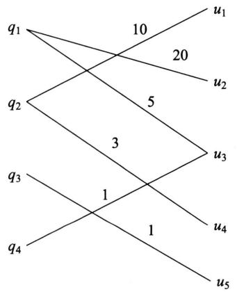  
图16.2 搜索点击数据例

# 参考文献

[1] CLINE A K, DHILLON I S. Computation of the singular value decomposition[M]. Handbook of linear algebra. CRC Press, 2006.   
[2] 徐树方. 矩阵计算的理论与方法 [M]. 北京：北京大学出版社，1995.  
[3] LEON S J. Linear algebra with applications[M]. 张文博，张丽静，译. Pearson,2009.   
[4] STRANG G. Introduction to linear algebra[M]. 4th ed. Wellesley-Cambridge Press, 2009.   
[5] KOLDA T G, BADER B W. Tensor decompositions and applications[J]. SIAM Review, 2009, 51(3): 455-500.

# 第17章 主成分分析

主成分分析（principal component analysis, PCA）是一种常用的无监督学习方法，这一方法利用正交变换把由线性相关变量表示的样本数据转换为由线性无关变量表示的数据，线性无关的变量称为主成分。主成分的个数通常小于原有变量的个数，所以主成分分析属于降维方法。主成分分析主要用于发现数据中的潜在结构，即数据中变量（特征）之间的关系，是数据分析的常用工具，也用于其他机器学习方法的前处理。主成分分析属于多元统计分析的经典方法，首先由Pearson于1901年提出，但只是针对非随机变量，1933年由Hotelling推广到随机变量。

本章17.1节介绍主成分分析的基本想法，讲述总体主成分分析的定义、定理与性质。17.2节介绍样本主成分分析的概念，重点讲述主成分分析的算法，包括协方差矩阵的特征值分解方法和样本矩阵的奇异值分解方法。

# 17.1 总体主成分分析

# 17.1.1 基本想法

主成分分析中，首先对给定样本数据进行规范化，使得数据每一变量（特征）的平均值为0，方差为1。之后对数据进行正交变换，新变量将由线性相关的变量表示的数据转换成少量的线性无关的新变量表示的数据，是可能的正交变换中方差（信息保存）最大的变换。将新变量根据方差大小依次称作第一主成分、第二主成分等，这就是主成分分析的基本思想。通过主成分分析，可以发现数据的潜在结构，也可以对数据降维。

下面给出主成分分析的直观解释。如图17.1所示，数据中的样本存在于二维空间（正交坐标系）中，每个点表示一个样本。两个坐标轴表示样本的两个变量 $x_{1}$ 和 $x_{2}$ 。对数据已做规范处理，这些数据分布在以原点为中心的椭圆内。数据中的变量 $x_{1}$ 和 $x_{2}$ 是线性相关的。因此，当知道其中一个变量 $x_{1}$ 的取值时，对另一个变量 $x_{2}$ 的预测不是完全随机的，反之亦然。

主成分分析等价于对原坐标系进行旋转变换，并将数据在新坐标系表示。如图17.1所示，旋转变换后，在新坐标系里，两个坐标轴表示两个新的变量 $y_{1}$ 和 $y_{2}$ 。主成分分析选择方差最大的方向（第一主成分）作为新坐标系的第一坐标轴，即 $y_{1}$ 轴，对应椭圆的长轴；方差次之的方向（第二主成分）作为新坐标系的第二坐标轴，即 $y_{2}$ 轴，对应着椭圆的短轴。在新坐标系里，数据中的变量 $y_{1}$ 和 $y_{2}$ 是线性无关的，当知道其中一个变量 $y_{1}$ 的取值时，对另一

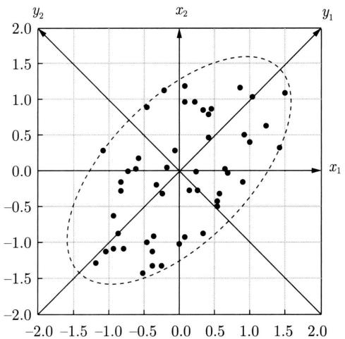  
图17.1 主成分分析的示例

个变量 $y_{2}$ 的预测是完全随机的, 反之亦然。如果只取第一主成分, 即新坐标系的 $y_{1}$ 轴, 那么等价于将数据投影在椭圆长轴上, 将二维空间的数据压缩到一维空间中。

下面给出方差最大的直观解释。假设在二维空间（正交坐标系）中有三个样本点 $A, B, C$ ，如图17.2所示。对坐标系进行旋转变换，得到新的坐标系。样本点 $A, B, C$ 在 $y_{1}$ 轴上的坐标值是 $A', B', C'$ ，坐标值的平方和 $OA'^2 + OB'^2 + OC'^2$ 表示样本在变量 $y_{1}$ 上的方差和。主成分分析旨在选择方差最大的变量，作为第一主成分，也就是旋转变换中坐标值的平方和最大的轴。注意到旋转变换中样本点到原点的距离的平方和 $OA^2 + OB^2 + OC^2$ 保持不变，根据勾股定理，坐标值的平方和 $OA'^2 + OB'^2 + OC'^2$ 最大等价于样本点到 $y_{1}$ 轴的距离的平方和 $AA'^2 + BB'^2 + CC'^2$ 最小。所以，等价地，主成分分析在旋转变换中选取离样本点的距离平方和最小的轴作为第一主成分。依次选择其他主成分。

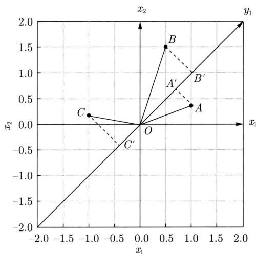  
图17.2 主成分的几何解释

在数据分布总体（population）上进行的主成分分析称为总体主成分分析，在有限样本上进行的主成分分析称为样本主成分分析，前者是后者的基础。以下分别予以介绍。

# 17.1.2 定义和导出

# 1. 总体样本数据特性

假设数据是随机变量 $\pmb{x}$ 的分布产生的样本， $\pmb{x} = (x_{1}, x_{2}, \dots, x_{m})^{\mathrm{T}}$ 是 $m$ 维随机变量。随机变量 $\pmb{x}$ 的均值向量是 $\pmb{\mu}$ ：

$$
\boldsymbol {\mu} = \mathbb {E} (\boldsymbol {x}) = \left(\mu_ {1}, \mu_ {2}, \dots , \mu_ {m}\right) ^ {\mathrm {T}} \tag {17.1}
$$

协方差矩阵是 $\pmb{\Sigma}$

$$
\boldsymbol {\Sigma} = \operatorname {C o v} (\boldsymbol {x}, \boldsymbol {x}) = \mathbb {E} \left[ (\boldsymbol {x} - \boldsymbol {\mu}) (\boldsymbol {x} - \boldsymbol {\mu}) ^ {\mathrm {T}} \right] \tag {17.2}
$$

或写作

$$
\boldsymbol {\Sigma} = \left[ \operatorname {C o v} \left(x _ {i}, x _ {j}\right) \right] _ {m \times m} = \left[ \mathbb {E} \left[ \left(x _ {i} - \mu_ {i}\right) \left(x _ {j} - \mu_ {j}\right) \right] \right] _ {m \times m} \tag {17.3}
$$

相关矩阵是 $\pmb{R}$

$$
\boldsymbol {R} = \left[ r _ {i j} \right] _ {m \times m} = \left[ \frac {\operatorname {C o v} \left(x _ {i} , x _ {j}\right)}{\sqrt {\operatorname {V a r} \left(x _ {i}\right) \operatorname {V a r} \left(x _ {j}\right)}} \right] _ {m \times m} \tag {17.4}
$$

协方差矩阵 $\pmb{\Sigma}$ 具有以下性质：

（1）协方差矩阵 $\pmb{\Sigma}$ 是实对称矩阵，满足 $\pmb {\Sigma} = \pmb{\Sigma}^{\mathrm{T}}$   
（2）协方差矩阵 $\pmb{\Sigma}$ 是半正定矩阵，对任意 $\pmb{x}$ ，满足 $\pmb{x}^{\mathrm{T}}\pmb{\Sigma}\pmb{x} \geqslant 0$ 。  
(3) 协方差矩阵 $\pmb{\Sigma}$ 可以通过特征值分解成为三个矩阵的乘积形式, $\pmb{\Sigma} = \pmb{Q} \pmb{\Lambda} \pmb{Q}^{\mathrm{T}}$ , 其中 $\pmb{Q}$ 是由特征向量组成的正交矩阵, 即 $\pmb{Q}^{\mathrm{T}} \pmb{Q} = \pmb{I}$ ; $\pmb{\Lambda}$ 是对角矩阵, 其对角元素是特征值, 特征值都是非负的。

# 2. 总体主成分

考虑由 $m$ 维随机变量 $\pmb{x}$ 到 $m$ 维随机变量 $\pmb{y} = (y_{1},y_{2},\dots ,y_{m})^{\mathrm{T}}$ 的线性变换：

$$
y _ {i} = \boldsymbol {\alpha} _ {i} ^ {\mathrm {T}} \boldsymbol {x} = \alpha_ {1 i} x _ {1} + \alpha_ {2 i} x _ {2} + \dots + \alpha_ {m i} x _ {m} \tag {17.5}
$$

其中， $\pmb{\alpha}_i^{\mathrm{T}} = (\alpha_{1i},\alpha_{2i},\dots ,\alpha_{mi})$ ， $i = 1,2,\dots ,m$ 是系数向量。

由随机变量的性质可知：

$$
\mathbb {E} \left(y _ {i}\right) = \boldsymbol {\alpha} _ {i} ^ {\mathrm {T}} \boldsymbol {\mu}, \quad i = 1, 2, \dots , m \tag {17.6}
$$

$$
\operatorname {V a r} \left(y _ {i}\right) = \boldsymbol {\alpha} _ {i} ^ {\mathrm {T}} \boldsymbol {\Sigma} \boldsymbol {\alpha} _ {i}, \quad i = 1, 2, \dots , m \tag {17.7}
$$

$$
\operatorname {C o v} \left(y _ {i}, y _ {j}\right) = \boldsymbol {\alpha} _ {i} ^ {\mathrm {T}} \boldsymbol {\Sigma} \boldsymbol {\alpha} _ {j}, \quad i = 1, 2, \dots , m; \quad j = 1, 2, \dots , m \tag {17.8}
$$

下面给出总体主成分的定义。

定义17.1（总体主成分）给定一个如式(17.5)所示的线性变换，如果它满足下列条件，则称这个线性变换为主成分分析。

(1) 系数向量 $\pmb{\alpha}_{i}^{\mathrm{T}}$ 是单位向量，即 $\pmb{\alpha}_{i}^{\mathrm{T}}\pmb{\alpha}_{i} = 1, i = 1,2,\dots,m;$   
(2) 变量 $y_{i}$ 与 $y_{j}$ 互不相关，即 $\operatorname{Cov}(y_i, y_j) = 0 (i \neq j)$   
(3) 变量 $y_{1}$ 是 $x$ 的所有线性变换中方差 $\operatorname{Var}(y_1)$ 最大的; $y_{2}$ 是与 $y_{1}$ 不相关的 $x$ 的所有

线性变换中方差 $\operatorname{Var}(y_2)$ 最大的；一般地， $y_k$ 是与 $y_1, y_2, \dots, y_{k-1} (k = 1, 2, \dots, m)$ 都不相关的 $\pmb{x}$ 的所有线性变换中方差 $\operatorname{Var}(y_k)$ 最大的，这时分别称 $y_1, y_2, \dots, y_m$ 为 $\pmb{x}$ 的第一主成分、第二主成分、……、第 $m$ 主成分。

定义中的条件(1)表明线性变换是正交变换， $\alpha_{1},\alpha_{2},\dots ,\alpha_{m}$ 是其一组标准正交基：

$$
\boldsymbol {\alpha} _ {i} ^ {\mathrm {T}} \boldsymbol {\alpha} _ {j} = \left\{ \begin{array}{l l} 1, & i = j \\ 0, & i \neq j \end{array} \right.
$$

条件（2）和条件（3）给出了一个求主成分的方法：第一步，在 $\pmb{x}$ 的所有线性变换

$$
\boldsymbol {\alpha} _ {1} ^ {\mathrm {T}} \boldsymbol {x} = \sum_ {i = 1} ^ {m} \alpha_ {i 1} x _ {i}
$$

中，在 $\alpha_{1}^{\mathrm{T}}\alpha_{1} = 1$ 的条件下，求方差 $\operatorname{Var}(\pmb{\alpha}_{1}^{\mathrm{T}}\pmb{x})$ 最大的，得到 $\pmb{x}$ 的第一主成分；第二步，在与 $\alpha_{1}^{\mathrm{T}}\pmb{x}$ 不相关的 $\pmb{x}$ 的所有线性变换

$$
\boldsymbol {\alpha} _ {2} ^ {\mathrm {T}} \boldsymbol {x} = \sum_ {i = 1} ^ {m} \alpha_ {i 2} x _ {i}
$$

中，在 $\alpha_{2}^{\mathrm{T}}\alpha_{2} = 1$ 的条件下，求方差 $\operatorname{Var}(\pmb{\alpha}_{2}^{\mathrm{T}}\pmb{x})$ 最大的，得到 $\pmb{x}$ 的第二主成分；第 $k$ 步，在与 $\alpha_{1}^{\mathrm{T}}\pmb{x},\alpha_{2}^{\mathrm{T}}\pmb{x},\dots ,\alpha_{k - 1}^{\mathrm{T}}\pmb{x}$ 不相关的 $\pmb{x}$ 的所有线性变换

$$
\boldsymbol {\alpha} _ {k} ^ {\mathrm {T}} \boldsymbol {x} = \sum_ {i = 1} ^ {m} \alpha_ {i k} x _ {i}
$$

中，在 $\alpha_{k}^{\mathrm{T}}\alpha_{k} = 1$ 的条件下，求方差 $\operatorname{Var}(\pmb{\alpha}_{k}^{\mathrm{T}}\pmb{x})$ 最大的，得到 $\pmb{x}$ 的第 $k$ 主成分；如此继续下去，直到得到 $\pmb{x}$ 的第 $m$ 主成分。

# 17.1.3 主要性质

首先叙述一个关于总体主成分的定理。这一定理阐述了总体主成分与协方差矩阵的特征值和特征向量的关系，同时给出了一个求主成分的方法。

定理17.1设 $\pmb{x}$ 是 $m$ 维随机变量， $\pmb{\Sigma}$ 是 $\pmb{x}$ 的协方差矩阵， $\pmb{\Sigma}$ 的特征值分别是 $\lambda_1\geqslant \lambda_2\geqslant \dots \geqslant \lambda_m\geqslant 0$ ，特征值对应的单位特征向量分别是 $\alpha_{1},\alpha_{2},\dots ,\alpha_{m}$ 。若对 $\pmb{x}$ 进行主成分分析，则 $\pmb{x}$ 的第 $k$ 主成分就是

$$
y _ {k} = \boldsymbol {\alpha} _ {k} ^ {\mathrm {T}} \boldsymbol {x} = \alpha_ {1 k} x _ {1} + \alpha_ {2 k} x _ {2} + \dots + \alpha_ {m k} x _ {m}, \quad k = 1, 2, \dots , m \tag {17.9}
$$

$\pmb{x}$ 的第 $k$ 主成分的方差是

$$
\operatorname {V a r} \left(y _ {k}\right) = \boldsymbol {\alpha} _ {k} ^ {\mathrm {T}} \boldsymbol {\Sigma} \boldsymbol {\alpha} _ {k} = \lambda_ {k}, \quad k = 1, 2, \dots , m \tag {17.10}
$$

即协方差矩阵 $\pmb{\Sigma}$ 的第 $k$ 个特征值。①

证明 采用拉格朗日乘子法求出主成分。

首先求 $\pmb{x}$ 的第一主成分 $y_{1} = \alpha_{1}^{\mathrm{T}}\pmb{x}$ ，即求向量 $\alpha_{1}$ 。由定义17.1知，第一主成分的 $\alpha_{1}$ 是在 $\alpha_{1}^{\mathrm{T}}\alpha_{1} = 1$ 条件下 $\pmb{x}$ 的所有线性变换中使方差

$$
\operatorname {V a r} \left(\boldsymbol {\alpha} _ {1} ^ {\mathrm {T}} \boldsymbol {x}\right) = \boldsymbol {\alpha} _ {1} ^ {\mathrm {T}} \boldsymbol {\Sigma} \boldsymbol {\alpha} _ {1}
$$

达到最大的。

求第一主成分就是求解约束最优化问题：

$$
\max  _ {\boldsymbol {\alpha} _ {1}} \quad \boldsymbol {\alpha} _ {1} ^ {\mathrm {T}} \boldsymbol {\Sigma} \boldsymbol {\alpha} _ {1} \tag {17.11}
$$

$$
s. t. \quad \alpha_ {1} ^ {\mathrm {T}} \alpha_ {1} = 1
$$

定义拉格朗日函数

$$
\boldsymbol {\alpha} _ {1} ^ {\mathrm {T}} \boldsymbol {\Sigma} \boldsymbol {\alpha} _ {1} - \lambda (\boldsymbol {\alpha} _ {1} ^ {\mathrm {T}} \boldsymbol {\alpha} _ {1} - 1)
$$

其中， $\lambda$ 是拉格朗日乘子。将拉格朗日函数对 $\alpha_{1}$ 求导，并令其为0，得：

$$
\boldsymbol {\Sigma} \boldsymbol {\alpha} _ {1} - \lambda \boldsymbol {\alpha} _ {1} = 0
$$

因此， $\lambda$ 是 $\pmb{\Sigma}$ 的特征值， $\alpha_{1}$ 是对应的单位特征向量。于是，目标函数变为

$$
\boldsymbol {\alpha} _ {1} ^ {\mathrm {T}} \boldsymbol {\Sigma} \boldsymbol {\alpha} _ {1} = \boldsymbol {\alpha} _ {1} ^ {\mathrm {T}} \lambda \boldsymbol {\alpha} _ {1} = \lambda \boldsymbol {\alpha} _ {1} ^ {\mathrm {T}} \boldsymbol {\alpha} _ {1} = \lambda
$$

假设 $\lambda \alpha_{1}$ 是 $\pmb{\Sigma}$ 的最大特征值， $\pmb{\alpha}_{1}$ 则是对应的单位特征向量，显然 $\lambda \alpha_{1}$ 和 $\pmb{\alpha}_{1}$ 是最优化问题的解①。所以， $\pmb{\alpha}_{1}^{\mathrm{T}}\pmb{x}$ 构成第一主成分，其方差等于协方差矩阵 $\pmb{\Sigma}$ 的最大特征值：

$$
\operatorname {V a r} \left(\boldsymbol {\alpha} _ {1} ^ {\mathrm {T}} \boldsymbol {x}\right) = \boldsymbol {\alpha} _ {1} ^ {\mathrm {T}} \boldsymbol {\Sigma} \boldsymbol {\alpha} _ {1} = \lambda_ {1}
$$

接着求 $\pmb{x}$ 的第二主成分 $y_{2} = \alpha_{2}^{\mathrm{T}}\pmb{x}$ 。第二主成分的 $\alpha_{2}$ 是在 $\alpha_{2}^{\mathrm{T}}\alpha_{2} = 1$ 且 $\alpha_{2}^{\mathrm{T}}\pmb{x}$ 与 $\alpha_{1}^{\mathrm{T}}\pmb{x}$ 不相关的条件下 $\pmb{x}$ 的所有线性变换中使方差

$$
\operatorname {V a r} \left(\boldsymbol {\alpha} _ {2} ^ {\mathrm {T}} \boldsymbol {x}\right) = \boldsymbol {\alpha} _ {2} ^ {\mathrm {T}} \boldsymbol {\Sigma} \boldsymbol {\alpha} _ {2}
$$

达到最大的。

求第二主成分需要求解约束最优化问题：

$$
\max  _ {\alpha_ {2}} \quad \boldsymbol {\alpha} _ {2} ^ {\mathrm {T}} \boldsymbol {\Sigma} \boldsymbol {\alpha} _ {2} \tag {17.12}
$$

$$
\begin{array}{l l} \text {s . t .} & \boldsymbol {\alpha} _ {1} ^ {\mathrm {T}} \boldsymbol {\Sigma} \boldsymbol {\alpha} _ {2} = 0, \quad \quad \boldsymbol {\alpha} _ {2} ^ {\mathrm {T}} \boldsymbol {\Sigma} \boldsymbol {\alpha} _ {1} = 0 \end{array}
$$

$$
\alpha_ {2} ^ {\mathrm {T}} \alpha_ {2} = 1
$$

注意到

$$
\boldsymbol {\alpha} _ {1} ^ {\mathrm {T}} \boldsymbol {\Sigma} \boldsymbol {\alpha} _ {2} = \boldsymbol {\alpha} _ {2} ^ {\mathrm {T}} \boldsymbol {\Sigma} \boldsymbol {\alpha} _ {1} = \boldsymbol {\alpha} _ {2} ^ {\mathrm {T}} \lambda_ {1} \boldsymbol {\alpha} _ {1} = \lambda_ {1} \boldsymbol {\alpha} _ {2} ^ {\mathrm {T}} \boldsymbol {\alpha} _ {1} = \lambda_ {1} \boldsymbol {\alpha} _ {1} ^ {\mathrm {T}} \boldsymbol {\alpha} _ {2}
$$

以及

$$
\boldsymbol {\alpha} _ {1} ^ {\mathrm {T}} \boldsymbol {\alpha} _ {2} = 0, \quad \boldsymbol {\alpha} _ {2} ^ {\mathrm {T}} \boldsymbol {\alpha} _ {1} = 0
$$

定义拉格朗日函数

$$
\boldsymbol {\alpha} _ {2} ^ {\mathrm {T}} \boldsymbol {\Sigma} \boldsymbol {\alpha} _ {2} - \lambda \left(\boldsymbol {\alpha} _ {2} ^ {\mathrm {T}} \boldsymbol {\alpha} _ {2} - 1\right) - \mu \boldsymbol {\alpha} _ {2} ^ {\mathrm {T}} \boldsymbol {\alpha} _ {1}
$$

其中， $\lambda, \mu$ 是拉格朗日乘子。对 $\alpha_{2}$ 求导，并令其为0，得：

$$
2 \boldsymbol {\Sigma} \boldsymbol {\alpha} _ {2} - 2 \lambda \boldsymbol {\alpha} _ {2} - \mu \boldsymbol {\alpha} _ {1} = 0 \tag {17.13}
$$

将方程左乘以 $\alpha_{1}^{\mathrm{T}}$ 有

$$
2 \alpha_ {1} ^ {\mathrm {T}} \boldsymbol {\Sigma} \alpha_ {2} - 2 \lambda \alpha_ {1} ^ {\mathrm {T}} \alpha_ {2} - \mu \alpha_ {1} ^ {\mathrm {T}} \alpha_ {1} = 0
$$

此式前两项为0，且 $\pmb{\alpha}_{1}^{\mathrm{T}}\pmb{\alpha}_{1} = 1$ ，推导出 $\mu = 0$ ，因此式(17.13)变为

$$
\boldsymbol {\Sigma} \boldsymbol {\alpha} _ {2} - \lambda \boldsymbol {\alpha} _ {2} = 0
$$

由此， $\lambda$ 是 $\pmb{\Sigma}$ 的特征值， $\alpha_{2}$ 是对应的单位特征向量。于是，目标函数变为

$$
\boldsymbol {\alpha} _ {2} ^ {\mathrm {T}} \boldsymbol {\Sigma} \boldsymbol {\alpha} _ {2} = \boldsymbol {\alpha} _ {2} ^ {\mathrm {T}} \lambda \boldsymbol {\alpha} _ {2} = \lambda \boldsymbol {\alpha} _ {2} ^ {\mathrm {T}} \boldsymbol {\alpha} _ {2} = \lambda
$$

假设 $\lambda_{2}$ 是 $\pmb{\Sigma}$ 的第二大特征值， $\alpha_{2}$ 则是对应的单位特征向量，显然 $\lambda_{2}$ 和 $\alpha_{2}$ 是以上最优化问题的解①。于是 $\alpha_{2}^{\mathrm{T}}\pmb{x}$ 构成第二主成分，其方差等于协方差矩阵 $\pmb{\Sigma}$ 的第二大特征值：

$$
\operatorname {V a r} \left(\boldsymbol {\alpha} _ {2} ^ {\mathrm {T}} \boldsymbol {x}\right) = \boldsymbol {\alpha} _ {2} ^ {\mathrm {T}} \boldsymbol {\Sigma} \boldsymbol {\alpha} _ {2} = \lambda_ {2}
$$

一般地， $\pmb{x}$ 的第 $k$ 主成分是 $\alpha_{k}^{\mathrm{T}}\pmb{x}$ ，并且 $\operatorname{Var}(\pmb{\alpha}_{k}^{\mathrm{T}}\pmb{x}) = \lambda_{k}$ ，这里 $\lambda_{k}$ 是 $\pmb{\Sigma}$ 的第 $k$ 个特征值并且 $\alpha_{k}$ 是对应的单位特征向量。可以从第 $k - 1$ 个主成分出发递推证明第 $k$ 个主成分的情况，这里省去。

按照上述方法求得第一、第二直到第 $m$ 主成分，其系数向量 $\alpha_{1},\alpha_{2},\dots ,\alpha_{m}$ 分别是 $\pmb{\Sigma}$ 的第一个、第二个直到第 $m$ 个单位特征向量， $\lambda_1,\lambda_2,\dots ,\lambda_m$ 分别是对应的特征值。并且，第 $k$ 主成分的方差等于 $\pmb{\Sigma}$ 的第 $k$ 个特征值：

$$
\operatorname {V a r} \left(\boldsymbol {\alpha} _ {k} ^ {\mathrm {T}} \boldsymbol {x}\right) = \boldsymbol {\alpha} _ {k} ^ {\mathrm {T}} \boldsymbol {\Sigma} \boldsymbol {\alpha} _ {k} = \lambda_ {k}, \quad k = 1, 2, \dots , m
$$

定理证毕。

由定理17.1与协方差矩阵的性质得到下述推论。

推论17.1式(17.5)所示的线性变换中， $m$ 维随机变量 $\pmb {y} = (y_{1},y_{2},\dots ,y_{m})^{\mathrm{T}}$ 的分量依次是 $\pmb{x}$ 的第一主成分到第 $m$ 主成分的充要条件是：

(1) $\pmb{y} = \pmb{A}^{\mathrm{T}}\pmb{x}$ , $\pmb{A}$ 为正交矩阵:

$$
\boldsymbol {A} = \left[ \begin{array}{c c c c} \alpha_ {1 1} & \alpha_ {1 2} & \dots & \alpha_ {1 m} \\ \alpha_ {2 1} & \alpha_ {2 2} & \dots & \alpha_ {2 m} \\ \vdots & \vdots & & \vdots \\ \alpha_ {m 1} & \alpha_ {m 2} & \dots & \alpha_ {m m} \end{array} \right]
$$

（2） $\pmb{y}$ 的协方差矩阵为对角矩阵：

$$
\operatorname {C o v} (\boldsymbol {y}) = \operatorname {d i a g} \left(\lambda_ {1}, \lambda_ {2}, \dots , \lambda_ {m}\right)
$$

$$
\lambda_ {1} \geqslant \lambda_ {2} \geqslant \dots \geqslant \lambda_ {m}
$$

其中， $\lambda_{k}$ 是 $\pmb{\Sigma}$ 的第 $k$ 个特征值， $\alpha_{k}$ 是对应的单位特征向量， $k = 1,2,\dots,m$ 。

以上证明中， $\lambda_{k}$ 是 $\pmb{\Sigma}$ 的第 $k$ 个特征值， $\alpha_{k}$ 是对应的单位特征向量，即

$$
\boldsymbol {\Sigma} \boldsymbol {\alpha} _ {k} = \lambda_ {k} \boldsymbol {\alpha} _ {k}, \quad k = 1, 2, \dots , m \tag {17.14}
$$

用矩阵表示即为

$$
\boldsymbol {\Sigma} \boldsymbol {A} = \boldsymbol {A} \boldsymbol {\Lambda} \tag {17.15}
$$

这里 $\mathbf{A} = [\alpha_{ij}]_{m\times m}$ ， $\pmb{\Lambda}$ 是对角矩阵，其第 $k$ 个对角元素是 $\lambda_{k}$ 。因为 $\mathbf{A}$ 是正交矩阵，即 $\mathbf{A}^{\mathrm{T}}\mathbf{A} = \mathbf{A}\mathbf{A}^{\mathrm{T}} = \mathbf{I}$ ，由式(17.15）得到：

$$
\boldsymbol {A} ^ {\mathrm {T}} \boldsymbol {\Sigma} \boldsymbol {A} = \boldsymbol {\Lambda} \tag {17.16}
$$

和

$$
\boldsymbol {\Sigma} = \boldsymbol {A} \boldsymbol {\Lambda} \boldsymbol {A} ^ {\mathrm {T}} \tag {17.17}
$$

下面叙述总体主成分的性质：

（1）总体主成分 $\pmb{y}$ 的协方差矩阵是对角矩阵：

$$
\operatorname {C o v} (\boldsymbol {y}) = \boldsymbol {\Lambda} = \operatorname {d i a g} \left(\lambda_ {1}, \lambda_ {2}, \dots , \lambda_ {m}\right) \tag {17.18}
$$

(2) 总体主成分 $\mathbf{y}$ 的方差之和等于随机变量 $\mathbf{x}$ 的方差之和, 即

$$
\sum_ {i = 1} ^ {m} \lambda_ {i} = \sum_ {i = 1} ^ {m} \sigma_ {i i} \tag {17.19}
$$

其中， $\sigma_{ii}$ 是随机变量 $\pmb{x}$ 的方差，即协方差矩阵 $\pmb{\Sigma}$ 的对角元素。事实上，利用式(17.17)及矩阵的迹（trace）的性质，可知：

$$
\begin{array}{l} \sum_ {i = 1} ^ {m} \operatorname {V a r} \left(x _ {i}\right) = \operatorname {t r} (\boldsymbol {\Sigma}) = \operatorname {t r} \left(\boldsymbol {A} \boldsymbol {\Lambda} \boldsymbol {A} ^ {\mathrm {T}}\right) = \operatorname {t r} \left(\boldsymbol {A} ^ {\mathrm {T}} \boldsymbol {\Lambda} \boldsymbol {A}\right) \\ = \operatorname {t r} (\boldsymbol {\Lambda}) = \sum_ {i = 1} ^ {m} \lambda_ {i} = \sum_ {i = 1} ^ {m} \operatorname {V a r} \left(y _ {i}\right) \tag {17.20} \\ \end{array}
$$

(3) 第 $k$ 个主成分 $y_{k}$ 与变量 $x_{i}$ 的相关系数 $\rho(y_{k}, x_{i})$ 称为因子负荷量（factor loading），它表示第 $k$ 个主成分 $y_{k}$ 与变量 $x_{i}$ 的相关关系。计算公式是

$$
\rho \left(y _ {k}, x _ {i}\right) = \frac {\sqrt {\lambda_ {k}} \alpha_ {i k}}{\sqrt {\alpha_ {i i}}}, \quad k, i = 1, 2, \dots , m \tag {17.21}
$$

因为

$$
\rho (y _ {k}, x _ {i}) = \frac {\operatorname {C o v} (y _ {k} , x _ {i})}{\sqrt {\operatorname {V a r} (y _ {k}) \operatorname {V a r} (x _ {i})}} = \frac {\operatorname {C o v} (\boldsymbol {\alpha} _ {k} ^ {\mathrm {T}} \boldsymbol {x} , \boldsymbol {e} _ {i} ^ {\mathrm {T}} \boldsymbol {x})}{\sqrt {\lambda_ {k}} \sqrt {\sigma_ {i i}}}
$$

其中， $e_i$ 为基本单位向量，其第 $i$ 个分量为1，其余为0。再由协方差的性质

$$
\operatorname {C o v} \left(\boldsymbol {\alpha} _ {k} ^ {\mathrm {T}} \boldsymbol {x}, \boldsymbol {e} _ {i} ^ {\mathrm {T}} \boldsymbol {x}\right) = \boldsymbol {\alpha} _ {k} ^ {\mathrm {T}} \boldsymbol {\Sigma} \boldsymbol {e} _ {i} = \boldsymbol {e} _ {i} ^ {\mathrm {T}} \boldsymbol {\Sigma} \boldsymbol {\alpha} _ {k} = \lambda_ {k} \boldsymbol {e} _ {i} ^ {\mathrm {T}} \boldsymbol {\alpha} _ {k} = \alpha_ {k} \alpha_ {i k}
$$

故得式 (17.21)。

（4）第 $k$ 个主成分 $y_{k}$ 与 $m$ 个变量的因子负荷量满足

$$
\sum_ {i = 1} ^ {m} \sigma_ {i i} \rho^ {2} \left(y _ {k}, x _ {i}\right) = \lambda_ {k} \tag {17.22}
$$

由式 (17.21) 有

$$
\sum_ {i = 1} ^ {m} \alpha_ {i i} \rho^ {2} (y _ {k}, x _ {i}) = \sum_ {i = 1} ^ {m} \alpha_ {k} \alpha_ {i k} ^ {2} = \alpha_ {k} \pmb {\alpha} _ {k} ^ {\mathrm {T}} \pmb {\alpha} _ {k} = \alpha_ {k}
$$

（5） $m$ 个主成分与第 $i$ 个变量 $x_{i}$ 的因子负荷量满足

$$
\sum_ {k = 1} ^ {m} \rho^ {2} \left(y _ {k}, x _ {i}\right) = 1 \tag {17.23}
$$

由于 $y_{1}, y_{2}, \dots, y_{m}$ 互不相关，故

$$
\rho^ {2} \left(\left(y _ {1}, y _ {2}, \dots , y _ {m}\right), x _ {i}\right) = \sum_ {k = 1} ^ {m} \rho^ {2} \left(y _ {k}, x _ {i}\right)
$$

又因 $x_{i}$ 可以表示为 $y_{1},y_{2},\dots ,y_{m}$ 的线性组合，所以 $x_{i}$ 与 $y_{1},y_{2},\dots ,y_{m}$ 的相关系数的平方为1，即

$$
\rho^ {2} \left(\left(y _ {1}, y _ {2}, \dots , y _ {m}\right), x _ {i}\right) = 1.
$$

故得式(17.23)。

# 17.1.4 主成分分析与降维

主成分分析的主要目的是降维，所以一般选择 $k(k\ll m)$ 个主成分（线性无关变量）来代替 $m$ 个原有变量(线性相关变量)，使问题得以简化，并能保留原有变量的大部分信息。这里所说的信息是指原有变量的方差。为此，先给出一个定理，说明选择 $k$ 个主成分是最优选择。

定理17.2 对任意正整数 $q, 1 \leqslant q \leqslant m$ ，考虑正交线性变换

$$
\boldsymbol {y} = \boldsymbol {B} ^ {\mathrm {T}} \boldsymbol {x} \tag {17.24}
$$

其中， $\pmb{y}$ 是 $q$ 维向量， $\pmb{B}^{\mathrm{T}}$ 是 $q \times m$ 矩阵，令 $\pmb{y}$ 的协方差矩阵为

$$
\boldsymbol {\Sigma} _ {y} = \boldsymbol {B} ^ {\mathrm {T}} \boldsymbol {\Sigma} \boldsymbol {B} \tag {17.25}
$$

则 $\pmb{\Sigma}_{\pmb{y}}$ 的迹 $\operatorname{tr}(\pmb{\Sigma}_{\pmb{y}})$ 在 $\pmb{B} = \pmb{A}_{q}$ 时取得最大值，其中矩阵 $\pmb{A}_{q}$ 由正交矩阵 $\pmb{A}$ 的前 $q$ 列组成。

证明 令 $\beta_{k}$ 是 $\pmb{B}$ 的第 $k$ 列，由于正交矩阵 $\mathbf{A}$ 的列构成 $m$ 维空间的基，所以 $\beta_{k}$ 可以

由 $\mathbf{A}$ 的列表示，即

$$
\beta_ {k} = \sum_ {j = 1} ^ {m} c _ {j k} \alpha_ {j}, \quad k = 1, 2, \dots , q \tag {17.26}
$$

等价地，

$$
\boldsymbol {B} = \boldsymbol {A} \boldsymbol {C} \tag {17.27}
$$

其中， $C$ 是 $m\times q$ 矩阵，其第 $j$ 行第 $k$ 列元素为 $c_{jk}$

首先，

$$
\boldsymbol {B} ^ {\mathrm {T}} \boldsymbol {\Sigma} \boldsymbol {B} = \boldsymbol {C} ^ {\mathrm {T}} \boldsymbol {A} ^ {\mathrm {T}} \boldsymbol {\Sigma} \boldsymbol {A} \boldsymbol {C} = \boldsymbol {C} ^ {\mathrm {T}} \boldsymbol {\Lambda} \boldsymbol {C} = \sum_ {j = 1} ^ {m} \lambda_ {j} \boldsymbol {c} _ {j} \boldsymbol {c} _ {j} ^ {\mathrm {T}}
$$

其中， $c_{j}^{\mathrm{T}}$ 是 $C$ 的第 $j$ 行。因此

$$
\begin{array}{l} \operatorname {t r} \left(\boldsymbol {B} ^ {\mathrm {T}} \boldsymbol {\Sigma} \boldsymbol {B}\right) = \sum_ {j = 1} ^ {m} \lambda_ {j} \operatorname {t r} \left(\boldsymbol {c} _ {j} \boldsymbol {c} _ {j} ^ {\mathrm {T}}\right) \\ = \sum_ {j = 1} ^ {m} \lambda_ {j} \operatorname {t r} \left(\mathbf {c} _ {j} ^ {\mathrm {T}} \mathbf {c} _ {j}\right) \\ = \sum_ {j = 1} ^ {m} \lambda_ {j} \boldsymbol {c} _ {j} ^ {\mathrm {T}} \boldsymbol {c} _ {j} \\ = \sum_ {j = 1} ^ {m} \sum_ {k = 1} ^ {q} \lambda_ {j} c _ {j k} ^ {2} \tag {17.28} \\ \end{array}
$$

其次，由式(17.27)及 $\mathbf{A}$ 的正交性知：

$$
\boldsymbol {C} = \boldsymbol {A} ^ {\mathrm {T}} \boldsymbol {B}
$$

由于 $\pmb{A}$ 是正交的， $\pmb{B}$ 的列是正交的，所以

$$
\boldsymbol {C} ^ {\mathrm {T}} \boldsymbol {C} = \boldsymbol {B} ^ {\mathrm {T}} \boldsymbol {A} \boldsymbol {A} ^ {\mathrm {T}} \boldsymbol {B} = \boldsymbol {B} ^ {\mathrm {T}} \boldsymbol {B} = \boldsymbol {I} _ {q}
$$

即 $C$ 的列也是正交的。于是

$$
\operatorname {t r} \left(\boldsymbol {C} ^ {\mathrm {T}} \boldsymbol {C}\right) = \operatorname {t r} \left(\boldsymbol {I} _ {q}\right)
$$

$$
\sum_ {j = 1} ^ {m} \sum_ {k = 1} ^ {q} c _ {j k} ^ {2} = q \tag {17.29}
$$

这样，矩阵 $C$ 可以认为是某个 $m$ 阶正交矩阵 $\pmb{D}$ 的前 $q$ 列。正交矩阵 $\pmb{D}$ 的行也正交，所以满足

$$
\boldsymbol {d} _ {j} ^ {\mathrm {T}} \boldsymbol {d} _ {j} = 1, \quad j = 1, 2, \dots , m
$$

其中， $d_j^{\mathrm{T}}$ 是 $\pmb{D}$ 的第 $j$ 行。由于矩阵 $\pmb{D}$ 的行包括矩阵 $\pmb{C}$ 的行的前 $q$ 个元素，所以

$$
\boldsymbol {c} _ {j} ^ {\mathrm {T}} \boldsymbol {c} _ {j} \leqslant 1, \quad j = 1, 2, \dots , m
$$

即

$$
\sum_ {k = 1} ^ {q} c _ {j k} ^ {2} \leqslant 1, \quad j = 1, 2, \dots , m \tag {17.30}
$$

注意到在式 (17.28) 中 $\sum_{k=1}^{q} c_{jk}^2$ 是 $\lambda_j$ 的系数，由式 (17.29) 知这些系数之和是 $q$ ，且由式 (17.30) 知这些系数小于或等于 1。因为 $\alpha_1 \geqslant \lambda_2 \geqslant \dots \geqslant \lambda_q \geqslant \dots \geqslant \lambda_m$ ，显然，当能找到 $c_{jk}$ 使得

$$
\sum_ {k = 1} ^ {q} c _ {j k} ^ {2} = \left\{ \begin{array}{l l} 1, & j = 1, 2, \dots , q \\ 0, & j = q + 1, q + 2, \dots , m \end{array} \right. \tag {17.31}
$$

时， $\sum_{j = 1}^{m}\left(\sum_{k = 1}^{q}c_{jk}^{2}\right)\lambda_{j}$ 最大。而当 $\pmb {B} = \pmb{A}_{q}$ 时，有

$$
c _ {j k} = \left\{ \begin{array}{l l} {1,} & {1 \leqslant j = k \leqslant q} \\ {0,} & {\text {其 他}} \end{array} \right.
$$

满足式(17.31)。所以，当 $\pmb {B} = \pmb{A}_{q}$ 时， $\mathrm{tr}(\Sigma_{\mathbf{y}})$ 达到最大值。

定理17.2表明，当 $\pmb{x}$ 的线性变换 $\pmb{y}$ 在 $B = A_{q}$ 时，其协方差矩阵 $\pmb{\Sigma}_{\pmb{y}}$ 的迹 $\operatorname {tr}(\pmb {\Sigma}_y)$ 取得最大值，这就是说，当取 $\pmb{A}$ 的前 $q$ 列、取 $\pmb{x}$ 的前 $q$ 个主成分时，能够最大限度地保留原有变量方差的信息。

定理17.3 考虑正交变换

$$
\boldsymbol {y} = \boldsymbol {B} ^ {\mathrm {T}} \boldsymbol {x}
$$

这里 $\pmb{B}^{\mathrm{T}}$ 是 $p\times m$ 矩阵， $\mathbf{A}$ 和 $\pmb{\Sigma}_{\pmb{y}}$ 的定义与定理17.2相同，则 $\operatorname {tr}(\pmb {\Sigma}_y)$ 在 $\pmb {B} = \pmb {A}_p$ 时取得最小值，其中矩阵 $\pmb{A}_{p}$ 由 $\mathbf{A}$ 的后 $p$ 列组成。

证明类似定理17.2，有兴趣的读者可以自行证明。定理17.3可以理解为，当舍弃 $\mathbf{A}$ 的后 $p$ 列，即舍弃变量 $\mathbf{x}$ 的后 $p$ 个主成分时，原有变量的方差的信息损失最少。

以上两个定理可以作为选择 $k$ 个主成分的理论依据。具体选择 $k$ 的方法通常利用方差贡献率。

第 $k$ 主成分 $y_{k}$ 的方差贡献率定义为 $y_{k}$ 的方差与所有方差之和的比，记作 $\eta_{k}$

$$
\eta_ {k} = \frac {\lambda_ {k}}{\sum_ {i = 1} ^ {m} \lambda_ {i}} \tag {17.32}
$$

$k$ 个主成分 $y_{1}, y_{2}, \dots, y_{k}$ 的累计方差贡献率定义为 $k$ 个方差之和与所有方差之和的比：

$$
\sum_ {i = 1} ^ {k} \eta_ {i} = \frac {\sum_ {i = 1} ^ {k} \lambda_ {i}}{\sum_ {i = 1} ^ {m} \lambda_ {i}} \tag {17.33}
$$

通常取 $k$ 使得累计方差贡献率达到规定的百分比以上，如 $70\% \sim 80\%$ 以上。累计方差贡献率反映了主成分保留信息的比例，但它不能反映对某个原有变量 $x_{i}$ 保留信息的比例，这时通常利用 $k$ 个主成分 $y_{1}, y_{2}, \dots, y_{k}$ 对原有变量 $x_{i}$ 的贡献率。

$k$ 个主成分 $y_{1}, y_{2}, \dots, y_{k}$ 对原有变量 $x_{i}$ 的贡献率定义为 $(y_{1}, y_{2}, \dots, y_{k})$ 与 $x_{i}$ 的相关系数的平方，记作 $\nu_{i}$ ：

$$
\nu_ {i} = \rho^ {2} ((y _ {1}, y _ {2}, \dots , y _ {k}), x _ {i})
$$

计算公式如下：

$$
\nu_ {i} = \rho^ {2} \left(\left(y _ {1}, y _ {2}, \dots , y _ {k}\right), x _ {i}\right) = \sum_ {j = 1} ^ {k} \rho^ {2} \left(x _ {i}, y _ {j}\right) = \sum_ {j = 1} ^ {k} \frac {\lambda_ {j} \alpha_ {i j} ^ {2}}{\sigma_ {i i}} \tag {17.34}
$$

# 17.1.5 规范化的总体主成分

在实际问题中，不同变量可能有不同的量纲，直接求主成分有时会产生不合理的结果。为了消除这个影响，常常对各个随机变量实施规范化，使其均值为0，方差为1。

设 $\pmb{x} = (x_{1},x_{2},\dots ,x_{m})^{\mathrm{T}}$ 为 $m$ 维随机变量， $x_{i}$ 为第 $i$ 个随机变量， $i = 1,2,\dots ,m$ ，令

$$
x _ {i} ^ {*} = \frac {x _ {i} - \mathbb {E} \left(x _ {i}\right)}{\sqrt {\operatorname {V a r} \left(x _ {i}\right)}}, \quad i = 1, 2, \dots , m \tag {17.35}
$$

其中， $\mathbb{E}(x_i)$ ， $\operatorname {Var}(x_i)$ 分别是随机变量 $x_{i}$ 的均值和方差，这时 $x_{i}^{*}$ 就是 $x_{i}$ 的规范化随机变量。

显然，规范化随机变量的协方差矩阵就是相关矩阵 $\pmb{R}$ 。主成分分析通常在规范化随机变量的协方差矩阵即相关矩阵上进行。

对照总体主成分的性质可知，规范化随机变量的总体主成分有以下性质：

（1）规范化变量主成分的协方差矩阵是

$$
\boldsymbol {\Lambda} ^ {*} = \operatorname {d i a g} \left(\lambda_ {1} ^ {*}, \lambda_ {2} ^ {*}, \dots , \alpha_ {m} ^ {*}\right) \tag {17.36}
$$

其中， $\lambda_1^* \geqslant \lambda_2^* \geqslant \dots \geqslant \lambda_m^* \geqslant 0$ 为相关矩阵 $\pmb{R}$ 的特征值。

（2）规范化变量的协方差矩阵的特征值之和为 $m$

$$
\sum_ {k = 1} ^ {m} \lambda_ {k} ^ {*} = m \tag {17.37}
$$

（3）规范化随机变量 $x_{i}^{*}$ 与主成分 $y_{k}^{*}$ 的相关系数（因子负荷量）为

$$
\rho \left(y _ {k} ^ {*}, x _ {i} ^ {*}\right) = \sqrt {\lambda_ {k} ^ {*}} e _ {i k} ^ {*}, \quad k, i = 1, 2, \dots , m \tag {17.38}
$$

其中， $e_k^* = (e_{1k}^*, e_{2k}^*, \dots, e_{mk}^*)^{\mathrm{T}}$ 为相关矩阵 $\pmb{R}$ 对应于特征值 $\lambda_k^*$ 的单位特征向量。

（4）所有规范化随机变量 $x_{i}^{*}$ 与主成分 $y_{k}^{*}$ 的相关系数的平方和等于 $\lambda_{k}^{*}$

$$
\sum_ {i = 1} ^ {m} \rho^ {2} \left(y _ {k} ^ {*}, x _ {i} ^ {*}\right) = \sum_ {i = 1} ^ {m} \alpha_ {k} ^ {*} e _ {i k} ^ {* 2} = \lambda_ {k} ^ {*}, \quad k = 1, 2, \dots , m \tag {17.39}
$$

（5）规范化随机变量 $x_{i}^{*}$ 与所有主成分 $y_{k}^{*}$ 的相关系数的平方和等于1：

$$
\sum_ {k = 1} ^ {m} \rho^ {2} \left(y _ {k} ^ {*}, x _ {i} ^ {*}\right) = \sum_ {k = 1} ^ {m} \lambda_ {k} ^ {*} e _ {i k} ^ {* 2} = 1, \quad i = 1, 2, \dots , m \tag {17.40}
$$

# 17.2 样本主成分分析

17.1节介绍了总体主成分分析，是定义在样本总体上的。在实际问题中，需要在样本数据上进行主成分分析，这就是样本主成分分析。有了总体主成分的概念，容易理解样本主成分的概念。样本主成分和总体主成分具有相同的性质，所以本节重点介绍样本主成分的算法。

# 17.2.1 定义和性质

# 1. 样本数据特性

假设对 $m$ 维随机变量 $\pmb{x} = (x_{1}, x_{2}, \dots, x_{m})^{\mathrm{T}}$ 进行 $n$ 次独立观测，得到观测样本 $\pmb{x}_{1}, \pmb{x}_{2}, \dots, \pmb{x}_{n}$ ，其中 $\pmb{x}_{j} = (x_{1j}, x_{2j}, \dots, x_{mj})^{\mathrm{T}}$ 表示第 $j$ 个观测样本， $x_{ij}$ 表示第 $j$ 个观测样本的第 $i$ 个变量， $j = 1, 2, \dots, n$ 。样本数据用样本矩阵 $\pmb{X}$ 表示，记作

$$
\boldsymbol {X} = \left[ \begin{array}{l l l l} \boldsymbol {x} _ {1} & \boldsymbol {x} _ {2} & \dots & \boldsymbol {x} _ {n} \end{array} \right] = \left[ \begin{array}{c c c c} x _ {1 1} & x _ {1 2} & \dots & x _ {1 n} \\ x _ {2 1} & x _ {2 2} & \dots & x _ {2 n} \\ \vdots & \vdots & & \vdots \\ x _ {m 1} & x _ {m 2} & \dots & x _ {m n} \end{array} \right] \tag {17.41}
$$

给定样本矩阵 $\pmb{X}$ ，可以估计样本均值以及样本协方差。样本均值向量 $\bar{\pmb{x}}$ 为

$$
\bar {\boldsymbol {x}} = \frac {1}{n} \sum_ {j = 1} ^ {n} \boldsymbol {x} _ {j} \tag {17.42}
$$

样本协方差矩阵 $S$ 为

$$
\boldsymbol {S} = \left[ s _ {i j} \right] _ {m \times m} \tag {17.43}
$$

$$
s _ {i j} = \frac {1}{n - 1} \sum_ {k = 1} ^ {n} \left(x _ {i k} - \bar {x} _ {i}\right) \left(x _ {j k} - \bar {x} _ {j}\right), \quad i, j = 1, 2, \dots , m
$$

其中， $\bar{x}_i = \frac{1}{n}\sum_{k=1}^{n}x_{ik}$ 为第 $i$ 个变量的样本均值， $\bar{x}_j = \frac{1}{n}\sum_{k=1}^{n}x_{jk}$ 为第 $j$ 个变量的样本均值。

样本相关矩阵 $\pmb{R}$ 为

$$
\boldsymbol {R} = \left[ r _ {i j} \right] _ {m \times m}, \quad r _ {i j} = \frac {s _ {i j}}{\sqrt {s _ {i i} s _ {j j}}}, \quad i, j = 1, 2, \dots , m \tag {17.44}
$$

# 2. 样本主成分分析

定义 $m$ 维向量 $\pmb {x} = (x_{1},x_{2},\dots ,x_{m})^{\mathrm{T}}$ 到 $m$ 维向量 $\pmb {y} = (y_{1},y_{2},\dots ,y_{m})^{\mathrm{T}}$ 的线性变换：

$$
\boldsymbol {y} = \boldsymbol {A} ^ {\mathrm {T}} \boldsymbol {x} \tag {17.45}
$$

其中，

$$
\boldsymbol {A} = \left[ \begin{array}{l l l l} \boldsymbol {\alpha} _ {1} & \boldsymbol {\alpha} _ {2} & \dots & \boldsymbol {\alpha} _ {m} \end{array} \right] = \left[ \begin{array}{c c c c} \alpha_ {1 1} & \alpha_ {1 2} & \dots & \alpha_ {1 m} \\ \alpha_ {2 1} & \alpha_ {2 2} & \dots & \alpha_ {2 m} \\ \vdots & \vdots & & \vdots \\ \alpha_ {m 1} & \alpha_ {m 2} & \dots & \alpha_ {m m} \end{array} \right]
$$

$$
\boldsymbol {\alpha} _ {i} = \left(\alpha_ {1 i}, \alpha_ {2 i}, \dots , \alpha_ {m i}\right) ^ {\mathrm {T}}, \quad i = 1, 2, \dots , m
$$

考虑式 (17.45) 的任意一个线性变换：

$$
y _ {i} = \boldsymbol {\alpha} _ {i} ^ {\mathrm {T}} \boldsymbol {x} = \alpha_ {1 i} x _ {1} + \alpha_ {2 i} x _ {2} + \dots + \alpha_ {m i} x _ {m}, \quad i = 1, 2, \dots , m \tag {17.46}
$$

其中， $y_{i}$ 是 $m$ 维向量 $\pmb{y}$ 的第 $i$ 个变量，相应于 $n$ 个样本 $\pmb{x}_1,\pmb{x}_2,\dots ,\pmb{x}_n$ ， $y_{i}$ 的样本均值 $\bar{y}_i$ 为

$$
\bar {y} _ {i} = \frac {1}{n} \sum_ {j = 1} ^ {n} \boldsymbol {\alpha} _ {i} ^ {\mathrm {T}} \boldsymbol {x} _ {j} = \boldsymbol {\alpha} _ {i} ^ {\mathrm {T}} \bar {\boldsymbol {x}} \tag {17.47}
$$

其中， $\bar{\pmb{x}}$ 是随机向量 $\pmb{x}$ 的样本均值：

$$
\bar {\boldsymbol {x}} = \frac {1}{n} \sum_ {j = 1} ^ {n} \boldsymbol {x} _ {j}
$$

$y_{i}$ 的样本方差 $\operatorname{Var}(y_i)$ 为

$$
\begin{array}{l} \operatorname {V a r} \left(y _ {i}\right) = \frac {1}{n - 1} \sum_ {j = 1} ^ {n} \left(\boldsymbol {\alpha} _ {i} ^ {\mathrm {T}} \boldsymbol {x} _ {j} - \boldsymbol {\alpha} _ {i} ^ {\mathrm {T}} \bar {\boldsymbol {x}}\right) ^ {2} \\ = \boldsymbol {\alpha} _ {i} ^ {\mathrm {T}} \left[ \frac {1}{n - 1} \sum_ {j = 1} ^ {n} \left(\boldsymbol {x} _ {j} - \bar {\boldsymbol {x}}\right) \left(\boldsymbol {x} _ {j} - \bar {\boldsymbol {x}}\right) ^ {\mathrm {T}} \right] \boldsymbol {\alpha} _ {i} = \boldsymbol {\alpha} _ {i} ^ {\mathrm {T}} \boldsymbol {S} \boldsymbol {\alpha} _ {i} \tag {17.48} \\ \end{array}
$$

对任意两个线性变换 $y_{i} = \pmb{\alpha}_{i}^{\mathrm{T}}\pmb{x}$ ， $y_{j} = \pmb{\alpha}_{j}^{\mathrm{T}}\pmb{x}$ ，相应于 $n$ 个样本 $\pmb{x}_1,\pmb{x}_2,\dots ,\pmb{x}_n$ ， $y_{i}$ 和 $y_{j}$ 的样本协方差为

$$
\operatorname {C o v} \left(y _ {i}, y _ {j}\right) = \boldsymbol {\alpha} _ {i} ^ {\mathrm {T}} \boldsymbol {S} \boldsymbol {\alpha} _ {j} \tag {17.49}
$$

现在给出样本主成分的定义。

定义17.2（样本主成分）给定样本矩阵 $\pmb{X}$ 。样本第一主成分 $y_{1} = \alpha_{1}^{\mathrm{T}}\pmb{x}$ 是在 $\alpha_{1}^{\mathrm{T}}\alpha_{1} = 1$ 条件下，使 $\alpha_{1}^{\mathrm{T}}\pmb{x}_{j}(j = 1,2,\dots ,n)$ 的样本方差 $\alpha_{1}^{\mathrm{T}}S\alpha_{1}$ 最大的 $\pmb{x}$ 的线性变换；样本第二主成分 $y_{2} = \alpha_{2}^{\mathrm{T}}\pmb{x}$ 是在 $\alpha_{2}^{\mathrm{T}}\alpha_{2} = 1$ 和 $\alpha_{2}^{\mathrm{T}}x_{j}$ 与 $\alpha_{1}^{\mathrm{T}}x_{j}(j = 1,2,\dots ,n)$ 的样本协方差 $\alpha_{1}^{\mathrm{T}}S\alpha_{2} = 0$ 条件下，使 $\alpha_{2}^{\mathrm{T}}x_{j}(j = 1,2,\dots ,n)$ 的样本方差 $\alpha_{2}^{\mathrm{T}}S\alpha_{2}$ 最大的 $\pmb{x}$ 的线性变换；一般地，样本第 $k$ 主成分 $y_{k} = \alpha_{k}^{\mathrm{T}}x$ 是在 $\alpha_{k}^{\mathrm{T}}\alpha_{k} = 1$ 和 $\alpha_{k}^{\mathrm{T}}x_{j}$ 与 $\alpha_{i}^{\mathrm{T}}x_{j}(i < k,j = 1,2,\dots ,n)$ 的样本协

方差 $\alpha_{i}^{\mathrm{T}} S \alpha_{k} = 0$ 条件下，使 $\alpha_{k}^{\mathrm{T}} x_{j} (j = 1, 2, \dots, n)$ 的样本方差 $\alpha_{k}^{\mathrm{T}} S \alpha_{k}$ 最大的 $x$ 的线性变换。

样本主成分与总体主成分具有同样的性质，这从样本主成分的定义容易看出。只要以样本协方差矩阵 $S$ 代替总体协方差矩阵 $\pmb{\Sigma}$ 即可。总体主成分的定理17.2和定理17.3对样本主成分依然成立。样本主成分的性质不再重述。

# 3. 规范化的样本主成分

在使用样本主成分时，一般假设样本数据是规范化的，即对样本矩阵作如下变换：

$$
x _ {i j} ^ {*} = \frac {x _ {i j} - \bar {x} _ {i}}{\sqrt {s _ {i i}}}, \quad i = 1, 2, \dots , m, \quad j = 1, 2, \dots , n \tag {17.50}
$$

其中，

$$
\bar {x} _ {i} = \frac {1}{n} \sum_ {j = 1} ^ {n} x _ {i j}, \quad i = 1, 2, \dots , m
$$

$$
s _ {i i} = \frac {1}{n - 1} \sum_ {j = 1} ^ {n} \left(x _ {i j} - \bar {x} _ {i}\right) ^ {2}, \quad i = 1, 2, \dots , m
$$

为了方便，将规范化变量记作 $x_{ij}^{*}$ ，规范化的样本矩阵记作 $\mathbf{X}^{*}$ 。这时， $\mathbf{X}^{*}$ 的样本协方差矩阵 $\mathbf{S}$ 就是样本相关矩阵 $\mathbf{R}$ ：

$$
\boldsymbol {R} = \frac {1}{n - 1} \boldsymbol {X} ^ {*} \boldsymbol {X} ^ {* \mathrm {T}} \tag {17.51}
$$

样本协方差矩阵 $S$ 是总体协方差矩阵的无偏估计，样本相关矩阵 $\pmb{R}$ 是总体相关矩阵的无偏估计， $S$ 的特征值和特征向量是 $\pmb{\Sigma}$ 的特征值和特征向量的极大似然估计。关于这个问题本书不作讨论，有兴趣的读者可参阅多元统计的书籍，如文献[1]。

# 17.2.2 相关矩阵的特征值分解算法

传统的主成分分析通过数据的协方差矩阵或相关矩阵的特征值分解进行，现在常用的方法是样本矩阵的奇异值分解。后者在数据规模大时计算效率更高。首先叙述相关矩阵的特征值分解方法。

给定样本矩阵 $X$ ，通过数据的相关矩阵的特征值分解进行主成分分析。具体步骤如下：

（1）对样本数据按式(17.50)进行规范化处理，得到规范化样本矩阵，记作 $X^{*}$ 。

$$
\boldsymbol {X} ^ {*} = \left[ x _ {i j} ^ {*} \right] _ {m \times n}
$$

（2）依据规范化样本矩阵，计算样本相关矩阵 $\pmb{R}$

$$
\pmb {R} = [ r _ {i j} ] _ {m \times m} = \frac {1}{n - 1} \pmb {X} ^ {*} \pmb {X} ^ {* \mathrm {T}}
$$

其中，

$$
r _ {i j} = \frac {1}{n - 1} \sum_ {k = 1} ^ {n} x _ {i k} ^ {*} x _ {j k} ^ {*}, \quad i, j = 1, 2, \dots , m
$$

(3) 求样本相关矩阵 $\pmb{R}$ 的 $k$ 个特征值和对应的 $k$ 个单位特征向量。

求解 $\pmb{R}$ 的特征方程

$$
\left| \boldsymbol {R} - \lambda \boldsymbol {I} \right| = 0
$$

得 $\pmb{R}$ 的 $m$ 个特征值：

$$
\lambda_ {1} \geqslant \lambda_ {2} \geqslant \dots \geqslant \lambda_ {m}
$$

求方差贡献率 $\sum_{i=1}^{k} \eta_{i}$ 达到预定值的主成分个数 $k$ 。求前 $k$ 个特征值对应的单位特征向量：

$$
\boldsymbol {\alpha} _ {i} = \left(\alpha_ {1 i}, \alpha_ {2 i}, \dots , \alpha_ {m i}\right) ^ {\mathrm {T}}, \quad i = 1, 2, \dots , k
$$

（4）求 $k$ 个样本主成分

以 $k$ 个单位特征向量为系数向量进行线性变换，求出 $k$ 个样本主成分：

$$
y _ {i} = \boldsymbol {\alpha} _ {i} ^ {\mathrm {T}} \boldsymbol {x} ^ {*}, \quad i = 1, 2, \dots , k \tag {17.52}
$$

（5）计算 $k$ 个主成分 $y_{j}$ 与原变量 $x_{i}^{*}$ 的相关系数 $\rho (x_i^*,y_j)$ ，以及 $k$ 个主成分对原变量 $x_{i}^{*}$ 的贡献率 $\nu_{i}$ 。

（6）计算 $n$ 个样本的 $k$ 个主成分值

将规范化样本数据代入 $k$ 个主成分式(17.52)，得到 $n$ 个样本的主成分值。第 $j$ 个样本 $\pmb{x}_j^* = (x_{1j}^*, x_{2j}^*, \dots, x_{mj}^*)^{\mathrm{T}}$ 的第 $i$ 主成分值是

$$
y _ {i j} = (\alpha_ {1 i}, \alpha_ {2 i}, \dots , \alpha_ {m i}) (x _ {1 j} ^ {*}, x _ {2 j} ^ {*}, \dots , x _ {m j} ^ {*}) ^ {\mathrm {T}} = \sum_ {l = 1} ^ {m} \alpha_ {l i} x _ {l j} ^ {*},
$$

$$
i = 1, 2, \dots , k, \quad j = 1, 2, \dots , n
$$

主成分分析得到的结果可以用于其他机器学习方法的输入。比如，将样本点投影到以主成分为坐标轴的空间中，然后应用聚类算法就可以对样本点进行聚类。

下面举例说明主成分分析方法。

例17.1 假设有 $n$ 个学生参加四门课程的考试，将学生们的考试成绩看作随机变量的取值，对考试成绩数据进行标准化处理，得到样本相关矩阵 $\mathbf{R}$ ，列于表17.1。

表 17.1 样本相关矩阵 $\mathbf{R}$   

<table><tr><td>课程</td><td>语文</td><td>外语</td><td>数学</td><td>物理</td></tr><tr><td>语文</td><td>1.00</td><td>0.44</td><td>0.29</td><td>0.33</td></tr><tr><td>外语</td><td>0.44</td><td>1.00</td><td>0.35</td><td>0.32</td></tr><tr><td>数学</td><td>0.29</td><td>0.35</td><td>1.00</td><td>0.60</td></tr><tr><td>物理</td><td>0.33</td><td>0.32</td><td>0.60</td><td>1.00</td></tr></table>

试对数据进行主成分分析。

解 设变量 $x_{1}, x_{2}, x_{3}, x_{4}$ 分别表示语文、外语、数学、物理的成绩。对样本相关矩阵进行特征值分解，得到相关矩阵的特征值，并按大小排序：

$$
\lambda_ {1} = 2. 1 7, \quad \lambda_ {2} = 0. 8 7, \quad \lambda_ {3} = 0. 5 7, \quad \lambda_ {4} = 0. 3 9
$$

这些特征值就是各主成分的方差贡献率。假设要求主成分的累计方差贡献率大于 $75\%$ ，那么只需取前两个主成分即可，即 $k = 2$ ，因为

$$
\frac {\lambda_ {1} + \lambda_ {2}}{\sum_ {i = 1} ^ {4} \lambda_ {i}} = 0. 7 6
$$

求出对应于特征值 $\lambda_1, \lambda_2$ 的单位特征向量，列于表 17.2，表中最后一列为主成分的方差贡献率。

表 17.2 单位特征向量和主成分的方差贡献率  

<table><tr><td>课程</td><td>x1</td><td>x2</td><td>x3</td><td>x4</td><td>方差贡献率</td></tr><tr><td>y1</td><td>0.460</td><td>0.476</td><td>0.523</td><td>0.537</td><td>0.543</td></tr><tr><td>y2</td><td>0.574</td><td>0.486</td><td>-0.476</td><td>-0.456</td><td>0.218</td></tr></table>

由此按照式(17.50)可得第一、第二主成分：

$$
y _ {1} = 0. 4 6 0 x _ {1} + 0. 4 7 6 x _ {2} + 0. 5 2 3 x _ {3} + 0. 5 3 7 x _ {4}
$$

$$
y _ {2} = 0. 5 7 4 x _ {1} + 0. 4 8 6 x _ {2} - 0. 4 7 6 x _ {3} - 0. 4 5 6 x _ {4}
$$

这就是主成分分析的结果。变量 $y_{1}$ 和 $y_{2}$ 表示第一、第二主成分。

接下来由特征值和单位特征向量求出第一、第二主成分的因子负荷量，以及第一、第二主成分对变量 $x_{i}$ 的贡献率，列于表17.3。

表 17.3 主成分的因子负荷量和贡献率  

<table><tr><td>课程</td><td>x1</td><td>x2</td><td>x3</td><td>x4</td></tr><tr><td>y1</td><td>0.678</td><td>0.701</td><td>0.770</td><td>0.791</td></tr><tr><td>y2</td><td>0.536</td><td>0.453</td><td>-0.444</td><td>-0.425</td></tr><tr><td>y1,y2对xi的贡献率</td><td>0.747</td><td>0.697</td><td>0.790</td><td>0.806</td></tr></table>

从表17.3中可以看出，第一主成分 $y_{1}$ 对应的因子负荷量 $\rho (y_1,x_i),i = 1,2,3,4$ ，均为正数，表明各门课程成绩提高都可使 $y_{1}$ 提高，也就是说，第一主成分 $y_{1}$ 反映了学生的整体成绩。还可以看出，因子负荷量的数值相近，且 $\rho (y_1,x_4)$ 的数值最大，这表明物理成绩在整体成绩中占最重要位置。

第二主成分 $y_{2}$ 对应的因子负荷量 $\rho(y_{2}, x_{i}), i = 1, 2, 3, 4$ ，有正有负，正的是语文和外语，负的是数学和物理，表明文科成绩提高都可使 $y_{2}$ 提高，而理科成绩提高都可使 $y_{2}$ 降低，也就是说，第二主成分 $y_{2}$ 反映了学生的文科成绩与理科成绩的关系。

图17.3将原变量 $x_{1},x_{2},x_{3},x_{4}$ （分别表示语文、外语、数学、物理）和主成分 $y_{1},y_{2}$ （分别表示整体成绩、文科对理科成绩）的因子负荷量在平面坐标系中表示，从中可以看出变量之间的关系。4个原变量聚成了两类：因子负荷量相近的语文、外语为一类，数学、物理为一类，前者反映文科课程成绩，后者反映理科课程成绩。

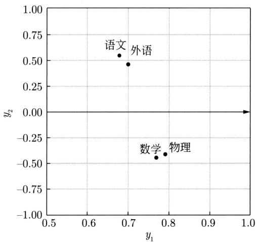  
图17.3 因子负荷量的分布图

# 17.2.3 样本矩阵的奇异值分解算法

给定 $m \times n$ 的样本矩阵 $\mathbf{X}$ ，利用 $\mathbf{X}$ 的奇异值分解进行主成分分析。具体过程如下，这里假设有 $k$ 个主成分。

参照第16章，对于 $m \times n$ 的实矩阵 $\mathbf{A}$ ，假设其秩为 $r$ ， $0 < k < r$ ，则可以将矩阵 $\mathbf{A}$ 进行截断奇异值分解：

$$
\boldsymbol {A} \approx \boldsymbol {U} _ {k} \boldsymbol {\Sigma} _ {k} \boldsymbol {V} _ {k} ^ {\mathrm {T}}
$$

式中， $U_{k}$ 和 $V_{k}$ 分别是左奇异矩阵和右奇异矩阵的前 $k$ 列， $\Sigma_{k}$ 是对角矩阵的前 $k$ 个元素。

对样本矩阵进行中心化处理，得到 $m \times n$ 的矩阵 $X'$

$$
\boldsymbol {X} ^ {\prime} = \frac {1}{\sqrt {n - 1}} \left(\boldsymbol {X} - \boldsymbol {\mu} \boldsymbol {1} ^ {\mathrm {T}}\right) \tag {17.53}
$$

其中， $\mu$ 是 $m$ 维特征均值向量， $1$ 是 $n$ 维全1向量。这样 $\mathbf{X}'$ 是中心化的，即每一行的均值为0。 $\mathbf{X}$ 的样本协方差矩阵 $\mathbf{S}$ 是

$$
\boldsymbol {S} = \boldsymbol {X} ^ {\prime} \boldsymbol {X} ^ {\prime \mathrm {T}} \tag {17.54}
$$

主成分分析需要求样本协方差矩阵 $\mathbf{S}$ 的特征值和对应的单位特征向量，所以问题转化为求矩阵 $X^{\prime}X^{\prime \mathrm{T}}$ 的特征值和对应的单位特征向量。

假设 $X^{\prime}$ 的截断奇异值分解为 $X^{\prime} \approx U_{k}\Sigma_{k}V_{k}^{\mathrm{T}}$ ，那么 $U_{k}$ 的列向量就是 $X^{\prime}X^{\prime \mathrm{T}}$ 的单位特征向量。因此， $U_{k}$ 表示的就是对 $X^{\prime}$ 进行主成分分析的正交变换。

$$
\boldsymbol {Y} = \boldsymbol {U} _ {k} ^ {\mathrm {T}} \boldsymbol {X} ^ {\prime} \tag {17.55}
$$

于是， $\pmb{X}$ 的主成分分析可以通过求 $\pmb{X}'$ 的奇异值分解来实现。具体算法如下。

# 算法17.1（主成分分析算法）

输入： $m\times n$ 的样本矩阵 $\pmb{X}$

输出： $k\times n$ 的样本主成分矩阵 $\mathbf{Y}$

参数：主成分个数 $k$ 。

（1）对样本矩阵 $X$ 进行中心化处理：

$$
\boldsymbol {X} ^ {\prime} = \frac {1}{\sqrt {n - 1}} \left(\boldsymbol {X} - \boldsymbol {\mu} \boldsymbol {1} ^ {\mathrm {T}}\right)
$$

（2）对矩阵 $X^{\prime}$ 进行截断奇异值分解：

$$
\boldsymbol {X} ^ {\prime} \approx \boldsymbol {U} _ {k} \boldsymbol {\Sigma} _ {k} \boldsymbol {V} _ {k} ^ {\mathrm {T}}
$$

有 $k$ 个奇异值和对应的奇异向量。

（3）求样本主成分矩阵：

$$
\boldsymbol {Y} = \boldsymbol {U} _ {k} ^ {\mathrm {T}} \boldsymbol {X} ^ {\prime}
$$

# 本章概要

1. 假设 $\pmb{x}$ 为 $m$ 维随机变量，其均值为 $\mu$ ，协方差矩阵为 $\pmb{\Sigma}$ 。考虑由 $m$ 维随机变量 $\pmb{x}$ 到 $m$ 维随机变量 $\pmb{y}$ 的线性变换：

$$
y _ {i} = \boldsymbol {\alpha} _ {i} ^ {\mathrm {T}} \boldsymbol {x} = \sum_ {k = 1} ^ {m} \alpha_ {k i} x _ {k}, \quad i = 1, 2, \dots , m
$$

其中， $\pmb{\alpha}_i^{\mathrm{T}} = (\alpha_{1i},\alpha_{2i},\dots ,\alpha_{mi})$

如果该线性变换满足以下条件，则称为总体主成分：

(1) $\pmb{\alpha}_{i}^{\mathrm{T}}\pmb{\alpha}_{i} = 1, i = 1,2,\dots ,m_{\circ}$

(2) $\operatorname{Cov}(y_i, y_j) = 0 (i \neq j)$ 。

(3) 变量 $y_{1}$ 是 $\pmb{x}$ 的所有线性变换中方差最大的； $y_{2}$ 是与 $y_{1}$ 不相关的 $\pmb{x}$ 的所有线性变换中方差最大的；一般地， $y_{k}$ 是与 $y_{1}, y_{2}, \dots, y_{k-1} (i = 1, 2, \dots, m)$ 都不相关的 $\pmb{x}$ 的所有线性变换中方差最大的，这时分别称 $y_{1}, y_{2}, \dots, y_{m}$ 为 $\pmb{x}$ 的第一主成分、第二主成分、……、第 $m$ 主成分。

2. 假设 $\pmb{x}$ 是 $m$ 维随机变量，其协方差矩阵是 $\pmb{\Sigma}$ ， $\pmb{\Sigma}$ 的特征值分别是 $\lambda_1 \geqslant \lambda_2 \geqslant \dots \geqslant \lambda_m \geqslant 0$ ，特征值对应的单位特征向量分别是 $\alpha_1, \alpha_2, \dots, \alpha_m$ ，则 $\pmb{x}$ 的第 $i$ 主成分可以写作

$$
y _ {i} = \boldsymbol {\alpha} _ {i} ^ {\mathrm {T}} \boldsymbol {x} = \sum_ {k = 1} ^ {m} \alpha_ {k i} x _ {k}, \quad i = 1, 2, \dots , m
$$

并且， $\pmb{x}$ 的第 $i$ 主成分的方差是协方差矩阵 $\pmb{\Sigma}$ 的第 $i$ 个特征值，即

$$
\operatorname {V a r} \left(y _ {i}\right) = \boldsymbol {\alpha} _ {i} ^ {\mathrm {T}} \boldsymbol {\Sigma} \boldsymbol {\alpha} _ {i} = \lambda_ {i}
$$

3. 主成分有以下性质：

主成分 $\pmb{y}$ 的协方差矩阵是对角矩阵：

$$
\operatorname {C o v} (\boldsymbol {y}) = \boldsymbol {\Lambda} = \operatorname {d i a g} \left(\lambda_ {1}, \lambda_ {2}, \dots , \alpha_ {m}\right)
$$

主成分 $\pmb{y}$ 的方差之和等于随机变量 $\pmb{x}$ 的方差之和：

$$
\sum_ {i = 1} ^ {m} \lambda_ {i} = \sum_ {i = 1} ^ {m} \sigma_ {i i}
$$

其中， $\sigma_{ii}$ 是 $x_{i}$ 的方差，即协方差矩阵 $\pmb{\Sigma}$ 的对角线元素。

主成分 $y_{k}$ 与变量 $x_{i}$ 的相关系数 $\rho(y_{k}, x_{i})$ 称为因子负荷量 (factor loading)，它表示第 $k$ 个主成分 $y_{k}$ 与变量 $x_{i}$ 的相关关系，即 $y_{k}$ 对 $x_{i}$ 的贡献程度。

$$
\rho \left(y _ {k}, x _ {i}\right) = \frac {\sqrt {\lambda_ {k}} \alpha_ {i k}}{\sqrt {\alpha_ {i i}}}, \quad k, i = 1, 2, \dots , m
$$

4. 样本主成分分析就是基于样本协方差矩阵的主成分分析。

给定样本矩阵

$$
\boldsymbol {X} = \left[ \begin{array}{l l l l} \boldsymbol {x} _ {1} & \boldsymbol {x} _ {2} & \dots & \boldsymbol {x} _ {n} \end{array} \right] = \left[ \begin{array}{c c c c} x _ {1 1} & x _ {1 2} & \dots & x _ {1 n} \\ x _ {2 1} & x _ {2 2} & \dots & x _ {2 n} \\ \vdots & \vdots & & \vdots \\ x _ {m 1} & x _ {m 2} & \dots & x _ {m n} \end{array} \right]
$$

其中， $\pmb{x}_j = (x_{1j},x_{2j},\dots ,x_{mj})^{\mathrm{T}}$ 是 $\pmb{x}$ 的第 $j$ 个样本， $j = 1,2,\dots ,n$ 。

$X$ 的样本协方差矩阵

$$
\begin{array}{l} \boldsymbol {S} = \left[ s _ {i j} \right] _ {m \times m}, \quad s _ {i j} = \frac {1}{n - 1} \sum_ {k = 1} ^ {n} \left(x _ {i k} - \bar {x} _ {i}\right) \left(x _ {j k} - \bar {x} _ {j}\right), \\ i = 1, 2, \dots , m, \quad j = 1, 2, \dots , m \\ \end{array}
$$

其中， $\bar{x}_i = \frac{1}{n}\sum_{k = 1}^n x_{ik}$

给定样本矩阵 $X$ ，考虑向量 $\pmb{x}$ 到 $\pmb{y}$ 的线性变换：

$$
\boldsymbol {y} = \boldsymbol {A} ^ {\mathrm {T}} \boldsymbol {x}
$$

这里，

$$
\boldsymbol {A} = \left[ \begin{array}{l l l l} \boldsymbol {\alpha} _ {1} & \boldsymbol {\alpha} _ {2} & \dots & \boldsymbol {\alpha} _ {m} \end{array} \right] = \left[ \begin{array}{c c c c} \alpha_ {1 1} & \alpha_ {1 2} & \dots & \alpha_ {1 m} \\ \alpha_ {2 1} & \alpha_ {2 2} & \dots & \alpha_ {2 m} \\ \vdots & \vdots & & \vdots \\ \alpha_ {m 1} & \alpha_ {m 2} & \dots & \alpha_ {m m} \end{array} \right]
$$

如果该线性变换满足以下条件，则称为样本主成分。样本第一主成分 $y_{1} = \alpha_{1}^{\mathrm{T}}\pmb{x}$ 是在 $\pmb{\alpha}_{1}^{\mathrm{T}}\pmb{\alpha}_{1} = 1$ 条件下，使 $\pmb{\alpha}_{1}^{\mathrm{T}}\pmb{x}_{j} (j = 1,2,\dots ,n)$ 的样本方差 $\pmb{\alpha}_{1}^{\mathrm{T}}\pmb{S}\pmb{\alpha}_{1}$ 最大的 $\pmb{x}$ 的线性变换；一般地，样本第 $k$ 主成分 $y_{k} = \alpha_{k}^{\mathrm{T}}x$ 是在 $\pmb{\alpha}_{k}^{\mathrm{T}}\pmb{\alpha}_{k} = 1$ 和 $\pmb{\alpha}_{k}^{\mathrm{T}}\pmb{x}_{j}$ 与 $\pmb{\alpha}_{i}^{\mathrm{T}}\pmb{x}_{j} (i < k, j = 1,2,\dots ,n)$

的样本协方差 $\pmb{\alpha}_{i}^{\mathrm{T}}\pmb{S}\pmb{\alpha}_{k} = 0$ 条件下，使 $\pmb{\alpha}_{k}^{\mathrm{T}}\pmb{x}_{j}$ （ $j = 1,2,\dots ,n$ ）的样本方差 $\pmb{\alpha}_{k}^{\mathrm{T}}\pmb{S}\pmb{\alpha}_{k}$ 最大的 $\pmb{x}$ 的线性变换。

5. 主成分分析方法主要有两种，可以通过相关矩阵的特征值分解或样本矩阵的奇异值分解进行。

（1）相关矩阵的特征值分解算法。针对 $m \times n$ 样本矩阵 $\mathbf{X}$ ，求样本相关矩阵

$$
\boldsymbol {R} = \frac {1}{n - 1} \boldsymbol {X} ^ {*} \boldsymbol {X} ^ {* \mathrm {T}}
$$

其中， $X^{*}$ 是规范化的样本矩阵。再求样本相关矩阵 $\pmb{R}$ 的 $k$ 个特征值和对应的单位特征向量 $\alpha_{1},\alpha_{2},\dots ,\alpha_{k}$ ，构造正交矩阵：

$$
\boldsymbol {A} = \left[ \alpha_ {1}, \alpha_ {2}, \dots , \alpha_ {k} \right]
$$

求 $k\times n$ 样本主成分矩阵：

$$
\boldsymbol {Y} = \boldsymbol {A} ^ {\mathrm {T}} \boldsymbol {X} ^ {*}
$$

(2) 矩阵 $X$ 的奇异值分解算法。针对 $m \times n$ 样本矩阵 $X$ 进行中心化处理。

$$
\boldsymbol {X} ^ {\prime} = \frac {1}{\sqrt {n - 1}} \left(\boldsymbol {X} - \boldsymbol {\mu} \boldsymbol {1} ^ {\mathrm {T}}\right)
$$

对矩阵 $X^{\prime}$ 进行截断奇异值分解，保留 $k$ 个奇异值和对应的奇异向量，得到：

$$
\pmb {X} ^ {\prime} \approx \pmb {U} \pmb {\Sigma} \pmb {V} ^ {\mathrm {T}}
$$

求 $k\times n$ 样本主成分矩阵：

$$
\boldsymbol {Y} = \boldsymbol {U} ^ {\mathrm {T}} \boldsymbol {X} ^ {\prime}
$$

# 继续阅读

要进一步了解主成分分析，可参阅文献[1]～文献[4]。可以通过核方法隐式地在高维空间中进行主成分分析，相关的方法称为核主成分分析（kernel principal component analysis）[5]。主成分分析是关于一组变量之间的相关关系的分析方法，典型相关分析（canonical correlation analysis）是关于两组变量之间的相关关系的分析方法[6]。近年，稳健的主成分分析（robust principal component analysis）被提出，是主成分分析的扩展，适合于严重受损数据的基本结构发现[7]。

# 习题

17.1 对以下样本数据进行主成分分析：

$$
\boldsymbol {X} = \left[ \begin{array}{c c c c c c} 2 & 3 & 3 & 4 & 5 & 7 \\ 2 & 4 & 5 & 5 & 6 & 8 \end{array} \right]
$$

17.2 证明样本协方差矩阵 $S$ 是总体协方差矩阵方差 $\pmb{\Sigma}$ 的无偏估计。  
17.3 设 $X$ 为数据中心化样本矩阵，则主成分等价于求解以下最优化问题：

$$
\min  _ {L} \quad \| \boldsymbol {X} - \boldsymbol {L} \| _ {F}
$$

$$
\begin{array}{l l} \text {s . t .} & \operatorname {r a n k} (\boldsymbol {L}) \leqslant k \end{array}
$$

其中， $F$ 是弗罗贝尼乌斯范数， $k$ 是主成分个数。试问为什么？

# 参考文献

[1] 方开泰. 实用多元统计分析 [M]. 上海：华东师范大学出版社，1989.  
[2] 夏绍玮，杨家本，杨振斌. 系统工程概论 [M]. 北京：清华大学出版社，1995.  
[3] JOLLIFFE I. Principal component analysis[M]. 2nd ed. John Wiley & Sons, 2002.   
[4] SHLENS J. A tutorial on principal component analysis[Z/OL]. arXiv preprint arXiv: 14016.1100, 2014.   
[5] SCHÖLKOPF B, SMOLA A, MÜLLER K-R. Kernel principal component analysis[C]//Artificial Neural Networks—ICANN'97. Springer, 1997: 583-588.   
[6] HARDOON D R, SZEDMAK S, SHAWE-TAYLOR J. Canonical correlation analysis: an overview with application to learning methods[J]. Neural Computation, 2004, 16(12): 2639-2664.   
[7] CANDES E J, LI X D, MA Y, et al. Robust principal component analysis?[J]. Journal of the ACM (JACM), 2011, 58(3): 11.

# 第18章 EM算法和变分EM算法

EM算法是一种常用的无监督学习算法，1977年由Dempster等总结提出，用于含有隐变量的概率模型参数的极大似然估计或极大后验概率估计。EM算法是迭代算法，每次迭代由两步组成：E步，求期望；M步，求最大化。所以这一算法称为期望-最大化算法（expectation maximization algorithm），简称EM算法。

对于EM算法，在E步，求 $Q$ 函数（期望)，是观测数据的对数似然函数的下界。在M步，求 $Q$ 函数的最大化。这样可以不断地提高观测数据的对数似然函数值，直至收敛。理论上保证收敛，一般收敛到局部最优解。广义EM算法是EM算法在形式上的扩展。EM算法的优点在于其简洁性和普适性。

变分贝叶斯方法（variational Bayesian method）是用于含有隐变量的概率模型学习方法。核心想法是用一个简单的分布，称作变分分布，近似概率模型中的隐变量的后验分布。求解在KL散度意义下与后验分布最接近的变分分布。等价于求解观测数据的对然似然函数的下界或证据下界（evidence lower bound）。

变分EM算法（variational EM algorithm）是变分贝叶斯方法和EM算法的结合。变分EM算法用迭代的方法最大化证据下界，直至收敛，得到模型参数的估计。变分EM算法与广义EM算法都是用近似的方式最大化观测数据的对数似然函数的下界，但下界的定义不同。变分EM算法常用于模型更复杂的情况。

本章18.1节讲述EM算法，给出简单例子、基本算法、基本原理、算法收敛性证明、更一般的形式。18.2节作为EM算法的应用，介绍高斯混合模型的学习。18.3节讲述变分EM算法，包括变分贝叶斯法以及基本算法。

# 18.1 EM算法

概率模型有时既含有观测变量（observed variable），又含有隐变量（hidden variable）或潜在变量（latent variable）。如果概率模型的变量都是观测变量，那么给定数据，可以直接用极大似然估计法或贝叶斯估计法估计模型参数。但是，当模型含有隐变量时，就不能简单地使用这些估计方法。EM算法就是含有隐变量的概率模型参数的极大似然估计法或极大后验概率估计法。这里我们仅讨论极大似然估计，极大后验概率估计与其类似。EM算法是通用算法，不依赖于具体的模型。针对具体的模型有具体的算法实现。

# 18.1.1 简单例子

首先介绍一个使用 EM 算法的例子。

例18.1（三硬币模型）假设有3枚硬币，分别记作A，B，C。这些硬币正面出现的概率分别是 $\pi$ ， $p$ 和 $q$ 。进行如下掷硬币试验：先掷硬币A，根据其结果选出硬币B或硬币C，正面选硬币B，反面选硬币C；然后掷选出的硬币，根据掷硬币的结果，正面记作1，反面记作0；独立地重复 $n$ 次试验（这里， $n = 10$ )，观测结果如下：

$$
1, 1, 0, 1, 0, 0, 1, 0, 1, 1
$$

假设只能观测到掷硬币的结果，不能观测掷硬币的过程。问如何估计三硬币正面出现的概率，即三硬币模型的参数。

解 三硬币模型可以写作

$$
\begin{array}{l} P (x | \boldsymbol {\theta}) = \sum_ {z} P (x, z | \boldsymbol {\theta}) = \sum_ {z} P (z | \boldsymbol {\theta}) P (x | z, \boldsymbol {\theta}) \\ = \pi p ^ {x} (1 - p) ^ {1 - x} + (1 - \pi) q ^ {x} (1 - q) ^ {1 - x} \tag {18.1} \\ \end{array}
$$

这里，随机变量 $x$ 表示一次试验观测到的结果是1或0；随机变量 $z$ 表示未观测到的掷硬币A的结果； $\pmb{\theta} = (\pi, p, q)$ 是模型参数。模型参数表示的是概率分布 $P(z)$ 和 $P(x|z)$ 。这一模型是以上数据的生成模型。随机变量 $x$ 是观测变量，其数据是观测数据；随机变量 $z$ 是隐变量，其数据是未观测数据。

学习时有观测数据 $x = x_{1},x_{2},\dots ,x_{n}$ ，对应的未观测数据是 $z = z_{1},z_{2},\dots ,z_{n}$ 。观测数据是独立同分布数据，因此，观测数据的似然函数可以写作

$$
P (\boldsymbol {x} | \boldsymbol {\theta}) = \prod_ {i = 1} ^ {n} \left(\sum_ {z _ {i}} P (z _ {i} | \boldsymbol {\theta}) P (x _ {i} | z _ {i}, \boldsymbol {\theta})\right) \tag {18.2}
$$

展开后得到：

$$
P (\boldsymbol {x} | \boldsymbol {\theta}) = \prod_ {i = 1} ^ {n} \left[ \pi p ^ {x _ {i}} (1 - p) ^ {1 - x _ {i}} + (1 - \pi) q ^ {x _ {i}} (1 - q) ^ {1 - x _ {i}} \right] \tag {18.3}
$$

求模型参数 $\pmb{\theta} = (\pi, p, q)$ 的极大似然估计，即

$$
\hat {\boldsymbol {\theta}} = \arg \max  _ {\boldsymbol {\theta}} \log P (\boldsymbol {x} | \boldsymbol {\theta}) \tag {18.4}
$$

这个问题不能用解析的方法求解，只能通过迭代的方法求解。EM算法就是用于求解这个问题的一种迭代算法。下面给出针对以上问题的EM算法，其推导过程作为本章的习题。

EM算法首先选取参数的初值，记作 $\pmb{\theta}^{(0)} = (\pi^{(0)}, p^{(0)}, q^{(0)})$ ，然后通过下面的步骤迭代计算参数的估计值，直至收敛为止。计第 $t$ 次迭代参数的估计值为 $\pmb{\theta}^{(t)} = (\pi^{(t)}, p^{(t)}, q^{(t)})$ 。EM算法的第 $t + 1$ 次迭代如下。

E步：计算在模型参数 $\pi^{(t)}$ ， $p^{(t)}$ ， $q^{(t)}$ 下观测数据 $x_{i}$ 来自掷硬币B的概率。

$$
\gamma_ {i} ^ {(t)} = \frac {\pi^ {(t)} \left(p ^ {(t)}\right) ^ {x _ {i}} \left(1 - p ^ {(t)}\right) ^ {1 - x _ {i}}}{\pi^ {(t)} \left(p ^ {(t)}\right) ^ {x _ {i}} \left(1 - p ^ {(t)}\right) ^ {1 - x _ {i}} + \left(1 - \pi^ {(t)}\right) \left(q ^ {(t)}\right) ^ {x _ {i}} \left(1 - q ^ {(t)}\right) ^ {1 - x _ {i}}} \tag {18.5}
$$

$$
i = 1, 2, \dots , n
$$

也可以计算来自硬币C的概率是 $1 - \gamma_{i}^{(t)}$ ，得到未观测数据 $z_{i}$ 的概率估计值。

M步：计算模型参数的新估计值。

$$
\pi^ {(t + 1)} = \frac {1}{n} \sum_ {i = 1} ^ {n} \gamma_ {i} ^ {(t)} \tag {18.6}
$$

$$
p ^ {(t + 1)} = \frac {\sum_ {i = 1} ^ {n} \gamma_ {i} ^ {(t)} x _ {i}}{\sum_ {i = 1} ^ {n} \gamma_ {i} ^ {(i)}} \tag {18.7}
$$

$$
q ^ {(t + 1)} = \frac {\sum_ {i = 1} ^ {n} \left(1 - \gamma_ {i} ^ {(t)}\right) x _ {i}}{\sum_ {i = 1} ^ {n} \left(1 - \gamma_ {i} ^ {(t)}\right)} \tag {18.8}
$$

在这个具体的例子里，针对每一个样本 $x_{i}$ 估计条件概率 $\gamma_{i} = P(z_{i}|x_{i})$ ，然后以这些条件概率估计模型的参数 $\pi = P(z)$ ， $p = P(x|z = 1)$ 和 $q = P(x|z = 0)$ ，不断迭代，直到收敛。

进行数值计算。假设模型参数的初值取为

$$
\pi^ {(0)} = 0. 5, \quad p ^ {(0)} = 0. 5, \quad q ^ {(0)} = 0. 5
$$

由式(18.5)，对 $x_{i} = 1$ 与 $x_{i} = 0$ 均有 $\gamma_i^{(1)} = 0.5$ ， $i = 1,2,\dots ,n$ 。

利用迭代公式 $(18.6)\sim$ 式（18.8）得到：

$$
\pi^ {(1)} = 0. 5, \quad p ^ {(1)} = 0. 6, \quad q ^ {(1)} = 0. 6
$$

由式(18.5)得：

$$
\gamma_ {i} ^ {(2)} = 0. 5, \quad i = 1, 2, \dots , 1 0
$$

继续迭代，得：

$$
\pi^ {(2)} = 0. 5, \quad p ^ {(2)} = 0. 6, \quad q ^ {(2)} = 0. 6
$$

于是得到模型参数 $\theta$ 的极大似然估计：

$$
\hat {\pi} = 0. 5, \quad \hat {p} = 0. 6, \quad \hat {q} = 0. 6
$$

$\pi = 0.5$ 表示硬币A是均匀的，这一结果容易理解。

如果取初值 $\pi^{(0)} = 0.4$ ， $p^{(0)} = 0.6$ ， $q^{(0)} = 0.7$ ，那么得到的模型参数的极大似然估计是 $\hat{\pi} = 0.4064$ ， $\hat{p} = 0.5368$ ， $\hat{q} = 0.6432$ 。这就是说，EM算法与初值的选择有关，选择不同的初值可能得到不同的参数估计值。

# 18.1.2 基本算法

设 $\pmb{x}$ 表示观测变量或观测数据， $\pmb{z}$ 表示隐变量或未观测数据。 $\pmb{x}$ 和 $\pmb{z}$ 合在一起称作完全数据（complete-data），观测数据 $\pmb{x}$ 又称作不完全数据（incomplete-data）。假设 $\pmb{x}$ 的概率分布是 $P(\pmb{x}|\pmb{\theta})$ ，其中 $\pmb{\theta}$ 是模型的参数，那么观测数据 $\pmb{x}$ 或不完全数据的对数似然函数是 $L(\pmb{\theta}) = \log P(\pmb{x}|\pmb{\theta})$ 。在贝叶斯学习中 $L(\pmb{\theta})$ 又称为证据。假设 $\pmb{x}$ 和 $\pmb{z}$ 的联合概率分布是 $P(\pmb{x},\pmb{z}|\pmb{\theta})$ ，那么完全数据的对数似然函数是 $\log P(\pmb{x},\pmb{z}|\pmb{\theta})$ 。

考虑观测数据的极大似然估计，即对对数似然函数 $L(\pmb{\theta}) = \log P(\pmb{x}|\pmb{\theta})$ 进行最大化。EM算法通过迭代近似地实现这个最大化。每次迭代包含两步：E步，求期望（expectation）；M步，求最大化（maximization）。下面介绍EM算法。

# 算法18.1（EM算法）

输入：观测数据 $\pmb{x}$ 。

输出：模型参数 $\hat{\theta}$ 。

（1）选择参数的初值 $\pmb{\theta}^{(0)}$ ，开始迭代。

(2) E 步: 记 $\pmb{\theta}^{(t)}$ 为第 $t$ 次迭代参数 $\pmb{\theta}$ 的估计值, 在第 $t + 1$ 次迭代的 E 步, 计算

$$
\begin{array}{l} Q (\boldsymbol {\theta}, \boldsymbol {\theta} ^ {(t)}) = \mathbb {E} _ {P (\boldsymbol {z} | \boldsymbol {x}, \boldsymbol {\theta} ^ {(t)})} [ \log P (\boldsymbol {x}, \boldsymbol {z} | \boldsymbol {\theta}) ] \\ = \sum_ {\boldsymbol {z}} P (\boldsymbol {z} | \boldsymbol {x}, \boldsymbol {\theta} ^ {(t)}) \log P (\boldsymbol {x}, \boldsymbol {z} | \boldsymbol {\theta}) \tag {18.9} \\ \end{array}
$$

这里， $P(\pmb {z}|\pmb {x},\pmb{\theta}^{(t)})$ 是给定观测数据 $\pmb{x}$ 和参数 $\pmb{\theta}^{(t)}$ 条件下未观测数据 $\pmb{z}$ 的条件概率分布。

(3) M 步：求使 $Q(\pmb{\theta}, \pmb{\theta}^{(t)})$ 最大化的 $\pmb{\theta}$ ，确定第 $t + 1$ 次迭代的参数的估计值 $\pmb{\theta}^{(t + 1)}$ 。

$$
\boldsymbol {\theta} ^ {(t + 1)} = \arg \max  _ {\boldsymbol {\theta}} Q (\boldsymbol {\theta}, \boldsymbol {\theta} ^ {(t)}) \tag {18.10}
$$

（4）重复步骤（2）和步骤（3），直到收敛。  
（5）得到模型参数 $\hat{\pmb{\theta}} = \pmb{\theta}^{(t + 1)}$

式(18.9)的函数 $Q(\pmb {\theta},\pmb{\theta}^{(t)})$ 是EM算法的核心，称为 $Q$ 函数（ $Q$ function）。

定义18.1（ $Q$ 函数）完全数据的对数似然函数 $\log P(\pmb{x},\pmb{z}|\pmb{\theta})$ 关于未观测数据的后验概率分布 $P(z|x,\pmb{\theta}^{(t)})$ 的期望称为 $Q$ 函数，即

$$
Q (\boldsymbol {\theta}, \boldsymbol {\theta} ^ {(t)}) = \mathbb {E} _ {P (\boldsymbol {z} | \boldsymbol {x}, \boldsymbol {\theta} ^ {(t)})} [ \log P (\boldsymbol {x}, \boldsymbol {z} | \boldsymbol {\theta}) ] \tag {18.11}
$$

下面关于EM算法作几点说明：

（1）步骤（1）中参数的初值可以任意选择，但需注意EM算法对初值是敏感的。  
（2）步骤（2）中E步求 $Q(\pmb {\theta},\pmb{\theta}^{(t)})$ 。注意， $Q(\pmb {\theta},\pmb{\theta}^{(t)})$ 的第1个变元表示要最大化的参数，第2个变元表示参数的当前估计值。  
(3) 步骤 (3) 中 $\mathrm{M}$ 步求 $Q(\pmb{\theta}, \pmb{\theta}^{(t)})$ 的最大化, 得到 $\pmb{\theta}^{(t+1)}$ , 完成一次迭代 $\pmb{\theta}^{(t)} \rightarrow \pmb{\theta}^{(t+1)}$ 。后面将证明每次迭代使对数似然函数值增大, 达到局部最优解。  
(4) 步骤 (4) 给出停止迭代的条件, 通常是对较小的正数 $\varepsilon_{1}, \varepsilon_{2}$ , 若满足

$$
\| \pmb {\theta} ^ {(t + 1)} - \pmb {\theta} ^ {(t)} \| <   \varepsilon_ {1} \quad \text {或} \quad \| Q (\pmb {\theta} ^ {(t + 1)}, \pmb {\theta} ^ {(t)}) - Q (\pmb {\theta} ^ {(t)}, \pmb {\theta} ^ {(t)}) \| <   \varepsilon_ {2}
$$

则停止迭代。

# 18.1.3 基本原理

上面叙述了EM算法。为什么EM算法能近似实现对观测数据的极大似然估计呢？下面通过近似求解对数似然函数的最大化来导出EM算法，由此可以看出EM算法的基本原理。

我们面对一个含有隐变量的概率模型，目标是最大化观测数据（不完全数据） $\pmb{x}$ 关于参数 $\pmb{\theta}$ 的对数似然函数，即最大化

$$
\begin{array}{l} L (\boldsymbol {\theta}) = \log P (\boldsymbol {x} | \boldsymbol {\theta}) = \log \sum_ {\boldsymbol {z}} P (\boldsymbol {x}, \boldsymbol {z} | \boldsymbol {\theta}) \\ = \log \left(\sum_ {\boldsymbol {z}} P (\boldsymbol {x} | \boldsymbol {z}, \boldsymbol {\theta}) P (\boldsymbol {z} | \boldsymbol {\theta})\right) \tag {18.12} \\ \end{array}
$$

这一最大化的困难在于不完全数据的对数似然函数不能通过解析的方法优化，因为这需要对完全数据的和（积分）的对数求导。

事实上，EM算法通过迭代逐步近似最大化 $L(\pmb{\theta})$ 。主要想法是基于Jensen不等式，不断地求出并优化 $L(\pmb{\theta})$ 的下界。

假设在第 $t$ 次迭代后 $\pmb{\theta}$ 的估计值是 $\pmb{\theta}^{(t)}$ 。我们希望新估计值 $\pmb{\theta}$ 能使 $L(\pmb{\theta})$ 增大，即 $L(\pmb {\theta})\geqslant L(\pmb{\theta}^{(t)})$ ，并逐步达到最大。为此，考虑两者的差：

$$
L (\boldsymbol {\theta}) - L (\boldsymbol {\theta} ^ {(t)}) = \log \left(\sum_ {\boldsymbol {z}} P (\boldsymbol {x} | \boldsymbol {z}, \boldsymbol {\theta}) P (\boldsymbol {z} | \boldsymbol {\theta})\right) - \log P (\boldsymbol {x} | \boldsymbol {\theta} ^ {(t)})
$$

利用Jensen不等式（Jensen inequality）①得到：

$$
\begin{array}{l} L (\boldsymbol {\theta}) - L (\boldsymbol {\theta} ^ {(t)}) = \log \left(\sum_ {\boldsymbol {z}} P (\boldsymbol {z} | \boldsymbol {x}, \boldsymbol {\theta} ^ {(t)}) \frac {P (\boldsymbol {x} | \boldsymbol {z} , \boldsymbol {\theta}) P (\boldsymbol {z} | \boldsymbol {\theta})}{P (\boldsymbol {z} | \boldsymbol {x} , \boldsymbol {\theta} ^ {(t)})}\right) - \log P (\boldsymbol {x} | \boldsymbol {\theta} ^ {(t)}) \\ \geqslant \sum_ {\boldsymbol {z}} P (\boldsymbol {z} | \boldsymbol {x}, \boldsymbol {\theta} ^ {(t)}) \log \frac {P (\boldsymbol {x} | \boldsymbol {z} , \boldsymbol {\theta}) P (\boldsymbol {z} | \boldsymbol {\theta})}{P (\boldsymbol {z} | \boldsymbol {x} , \boldsymbol {\theta} ^ {(t)})} - \log P (\boldsymbol {x} | \boldsymbol {\theta} ^ {(t)}) \\ = \sum_ {\boldsymbol {z}} P (\boldsymbol {z} | \boldsymbol {x}, \boldsymbol {\theta} ^ {(t)}) \log \frac {P (\boldsymbol {x} | \boldsymbol {z} , \boldsymbol {\theta}) P (\boldsymbol {z} | \boldsymbol {\theta})}{P (\boldsymbol {z} | \boldsymbol {x} , \boldsymbol {\theta} ^ {(t)}) P (\boldsymbol {x} | \boldsymbol {\theta} ^ {(t)})} \\ \end{array}
$$

令

$$
B (\boldsymbol {\theta}, \boldsymbol {\theta} ^ {(t)}) \hat {=} L (\boldsymbol {\theta} ^ {(t)}) + \sum_ {\boldsymbol {z}} P (\boldsymbol {z} | \boldsymbol {x}, \boldsymbol {\theta} ^ {(t)}) \log \frac {P (\boldsymbol {x} | \boldsymbol {z} , \boldsymbol {\theta}) P (\boldsymbol {z} | \boldsymbol {\theta})}{P (\boldsymbol {z} | \boldsymbol {x} , \boldsymbol {\theta} ^ {(t)}) P (\boldsymbol {x} | \boldsymbol {\theta} ^ {(t)})} \tag {18.13}
$$

则

$$
L (\boldsymbol {\theta}) \geqslant B \left(\boldsymbol {\theta}, \boldsymbol {\theta} ^ {(t)}\right) \tag {18.14}
$$

即函数 $B(\pmb {\theta},\pmb{\theta}^{(t)})$ 是 $L(\pmb {\theta})$ 的一个下界，而且由式(18.13)可知：

$$
L \left(\boldsymbol {\theta} ^ {(t)}\right) = B \left(\boldsymbol {\theta} ^ {(t)}, \boldsymbol {\theta} ^ {(t)}\right) \tag {18.15}
$$

因此，任何可以使 $B(\pmb{\theta}, \pmb{\theta}^{(t)})$ 增大的 $\pmb{\theta}$ 也可以使 $L(\pmb{\theta})$ 增大。为了使 $L(\pmb{\theta})$ 尽可能地增大，选择 $\pmb{\theta}^{(t+1)}$ 使 $B(\pmb{\theta}, \pmb{\theta}^{(t)})$ 达到最大，即

$$
\boldsymbol {\theta} ^ {(t + 1)} = \arg \max  _ {\boldsymbol {\theta}} B (\boldsymbol {\theta}, \boldsymbol {\theta} ^ {(t)}) \tag {18.16}
$$

现在求 $\pmb{\theta}^{(t + 1)}$ 的表达式。省去对 $\pmb{\theta}$ 的最大化而言是常数的项，由式(18.16)和式(18.13)，有

$$
\begin{array}{l} \boldsymbol {\theta} ^ {(t + 1)} = \arg \max  _ {\boldsymbol {\theta}} \left(L (\boldsymbol {\theta} ^ {(t)}) + \sum_ {\boldsymbol {z}} P (\boldsymbol {z} | \boldsymbol {x}, \boldsymbol {\theta} ^ {(t)}) \log \frac {P (\boldsymbol {x} | \boldsymbol {z} , \boldsymbol {\theta}) P (\boldsymbol {z} | \boldsymbol {\theta})}{P (\boldsymbol {z} | \boldsymbol {x} , \boldsymbol {\theta} ^ {(t)}) P (\boldsymbol {x} | \boldsymbol {\theta} ^ {(t)})}\right) \\ = \arg \max  _ {\boldsymbol {\theta}} \left(\sum_ {\boldsymbol {z}} P (\boldsymbol {z} | \boldsymbol {x}, \boldsymbol {\theta} ^ {(t)}) \log (P (\boldsymbol {x} | \boldsymbol {z}, \boldsymbol {\theta}) P (\boldsymbol {z} | \boldsymbol {\theta}))\right) \\ = \arg \max  _ {\boldsymbol {\theta}} \left(\sum_ {\boldsymbol {z}} P (\boldsymbol {z} | \boldsymbol {x}, \boldsymbol {\theta} ^ {(t)}) \log P (\boldsymbol {x}, \boldsymbol {z} | \boldsymbol {\theta})\right) \\ = \arg \max  _ {\boldsymbol {\theta}} Q (\boldsymbol {\theta}, \boldsymbol {\theta} ^ {(t)}) \tag {18.17} \\ \end{array}
$$

注意 $Q(\pmb{\theta}, \pmb{\theta}^{(t)})$ 是更容易优化的，因为它只需要对完全数据的对数的和（积分）求导，而不是对和（积分）的对数求导。

式 (18.17) 等价于 EM 算法的一次迭代，即求 $Q$ 函数及其最大化。EM 算法是通过不断求解 $Q(\pmb{\theta}, \pmb{\theta}^{(t)})$ 的最大化，等价地下界 $B(\pmb{\theta}, \pmb{\theta}^{(t)})$ 的最大化，以近似求解似然函数 $L(\pmb{\theta})$ 最大化的。

图18.1给出EM算法的直观解释。图中上方曲线为 $L(\pmb{\theta})$ ，下方曲线为 $B(\pmb{\theta},\pmb{\theta}^{(t)})$ 。根据式(18.14)， $B(\pmb{\theta},\pmb{\theta}^{(t)})$ 为 $L(\pmb{\theta})$ 的下界。根据式(18.15)，两个函数在点 $\pmb{\theta} = \pmb{\theta}^{(t)}$ 处相交。根据式(18.17)，EM算法找到下一个点 $\pmb{\theta}^{(t + 1)}$ 使 $Q(\pmb{\theta},\pmb{\theta}^{(t)})$ 最大，也使 $B(\pmb{\theta},\pmb{\theta}^{(t)})$ 最大。这时由于 $L(\pmb{\theta}^{(t + 1)})\geqslant B(\pmb{\theta}^{(t + 1)},\pmb{\theta}^{(t)})$ ， $L(\pmb{\theta}^{(t + 1)})$ 也随之增大。EM算法在点 $\pmb{\theta}^{(t + 1)}$ 重新计算 $Q$ 函数，进行下一次迭代。在这个过程中，对数似然函数值不断增大。从图中也可以看出，EM算法结果依赖于初值，也不能保证是全局最优。

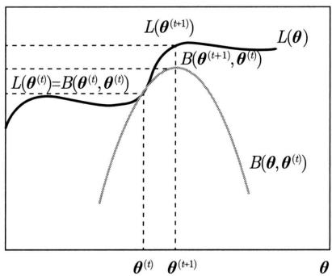  
图18.1 EM算法的解释

# 18.1.4 算法收敛性

上面讲解了EM算法的基本原理。我们很自然地要问：EM算法得到的估计序列是否收敛？

EM算法的收敛性可以从两个角度定义，一个是（对数）似然函数值的收敛性，另一个是参数值的收敛性。可以证明EM算法能保证（对数）似然函数值是收敛的，在一定条件下参数值也是收敛的。但都是收敛到局部最大值，不能保证收敛到全局最大值。这里只给出前者的证明。

定理18.1 设 $\log P(\pmb{x}|\pmb{\theta})$ 为观测数据的对数似然函数， $\pmb{\theta}^{(t)}(i = 1,2,\dots)$ 为EM算法得到的参数估计序列， $\log P(\pmb{x}|\pmb{\theta}^{(t)}) (i = 1,2,\dots)$ 为对应的对数似然函数序列，则序列 $\log P(\pmb{x}|\pmb{\theta}^{(t)})$ 单调递增且收敛。

证明 首先证明序列 $\log P(\pmb{x}|\pmb{\theta}^{(t)})$ 是单调递增的，即满足

$$
\log P (\boldsymbol {x} | \boldsymbol {\theta} ^ {(t + 1)}) \geqslant \log P (\boldsymbol {x} | \boldsymbol {\theta} ^ {(t)}) \tag {18.18}
$$

由于

$$
P (\boldsymbol {x} | \boldsymbol {\theta}) = \frac {P (\boldsymbol {x} , \boldsymbol {z} | \boldsymbol {\theta})}{P (\boldsymbol {z} | \boldsymbol {x} , \boldsymbol {\theta})}
$$

取对数有

$$
\log P (\boldsymbol {x} | \boldsymbol {\theta}) = \log P (\boldsymbol {x}, \boldsymbol {z} | \boldsymbol {\theta}) - \log P (\boldsymbol {z} | \boldsymbol {x}, \boldsymbol {\theta})
$$

由式（18.11）得：

$$
Q (\boldsymbol {\theta}, \boldsymbol {\theta} ^ {(t)}) = \sum_ {\boldsymbol {z}} P (\boldsymbol {z} | \boldsymbol {x}, \boldsymbol {\theta} ^ {(t)}) \log P (\boldsymbol {x}, \boldsymbol {z} | \boldsymbol {\theta})
$$

令

$$
H (\boldsymbol {\theta}, \boldsymbol {\theta} ^ {(t)}) = \sum_ {\boldsymbol {z}} P (\boldsymbol {z} | \boldsymbol {x}, \boldsymbol {\theta} ^ {(t)}) \log P (\boldsymbol {z} | \boldsymbol {x}, \boldsymbol {\theta}) \tag {18.19}
$$

于是对数似然函数可以写成

$$
\log P (\boldsymbol {x} | \boldsymbol {\theta}) = Q (\boldsymbol {\theta}, \boldsymbol {\theta} ^ {(t)}) - H (\boldsymbol {\theta}, \boldsymbol {\theta} ^ {(t)}) \tag {18.20}
$$

在式 (18.20) 迭代中得到的参数分别取 $\pmb{\theta}^{(t)}$ 和 $\pmb{\theta}^{(t + 1)}$ 并相减，有

$$
\begin{array}{l} \log P (\boldsymbol {x} | \boldsymbol {\theta} ^ {(t + 1)}) - \log P (\boldsymbol {x} | \boldsymbol {\theta} ^ {(t)}) \\ = \left[ Q \left(\boldsymbol {\theta} ^ {(t + 1)}, \boldsymbol {\theta} ^ {(t)}\right) - Q \left(\boldsymbol {\theta} ^ {(t)}, \boldsymbol {\theta} ^ {(t)}\right) \right] - \left[ H \left(\boldsymbol {\theta} ^ {(t + 1)}, \boldsymbol {\theta} ^ {(t)}\right) - H \left(\boldsymbol {\theta} ^ {(t)}, \boldsymbol {\theta} ^ {(t)}\right) \right] \tag {18.21} \\ \end{array}
$$

为证明式(18.18)，只需证明式(18.21)右端是非负的。对于第1项，由于 $\pmb{\theta}^{(t + 1)}$ 使 $Q(\pmb {\theta},\pmb{\theta}^{(t)})$ 达到最大，所以有

$$
Q \left(\boldsymbol {\theta} ^ {(t + 1)}, \boldsymbol {\theta} ^ {(t)}\right) - Q \left(\boldsymbol {\theta} ^ {(t)}, \boldsymbol {\theta} ^ {(t)}\right) \geqslant 0 \tag {18.22}
$$

对于第2项，由式(18.19)可得：

$$
\begin{array}{l} H \left(\boldsymbol {\theta} ^ {(t + 1)}, \boldsymbol {\theta} ^ {(t)}\right) - H \left(\boldsymbol {\theta} ^ {(t)}, \boldsymbol {\theta} ^ {(t)}\right) = \sum_ {\boldsymbol {z}} P (\boldsymbol {z} | \boldsymbol {x}, \boldsymbol {\theta} ^ {(t)}) \left(\log \frac {P (\boldsymbol {z} | \boldsymbol {x} , \boldsymbol {\theta} ^ {(t + 1)})}{P (\boldsymbol {z} | \boldsymbol {x} , \boldsymbol {\theta} ^ {(t)})}\right) \\ \leqslant \log \left(P (z | x, \boldsymbol {\theta} ^ {(t)}) \sum_ {z} \frac {P (z | x , \boldsymbol {\theta} ^ {(t + 1)})}{P (z | x , \boldsymbol {\theta} ^ {(t)})}\right) \\ = \log \left(\sum_ {\boldsymbol {z}} P (\boldsymbol {z} | \boldsymbol {x}, \boldsymbol {\theta} ^ {(t + 1)})\right) = 0 \tag {18.23} \\ \end{array}
$$

这里的不等号由Jensen不等式得到。

由式(18.22)和式(18.23)即知式(18.21)右端是非负的，故式(18.18）中的不等式成立。由单调收敛定理可以推出序列 $\log P(\pmb {x}|\pmb{\theta}^{(t)})$ 收敛。

# 18.1.5 广义算法

EM算法还可以形式化为 $F$ 函数的最大化-最大化算法（maximization-maximization algorithm），基于这个形式化有广义的期望-最大化算法（generalized expectation maximization，GEM）或广义EM算法。

首先引入 $F$ 函数并讨论其性质。

定义18.2（ $F$ 函数）假设未观测数据 $z$ 的概率分布为 $\tilde{P}(z|\theta)$ ，定义分布 $\tilde{P}$ 与参数 $\theta$ 的函数 $F(\tilde{P},\theta)$ 如下：

$$
F (\tilde {P}, \boldsymbol {\theta}) = \mathbb {E} _ {\tilde {P} (\boldsymbol {z} | \boldsymbol {\theta})} [ \log P (\boldsymbol {x}, \boldsymbol {z} | \boldsymbol {\theta}) ] + H (\tilde {P}) \tag {18.24}
$$

称为 $F$ 函数。式中 $H(\tilde{P}) = -\mathbb{E}_{\tilde{P} (\pmb {z}|\pmb {\theta})}\log \tilde{P} (\pmb {z}|\pmb {\theta})$ 是分布 $\tilde{P} (\pmb {z}|\pmb {\theta})$ 的熵。

函数 $F(\tilde{P},\pmb {\theta})$ 有以下性质。

引理18.1 对于固定的 $\pmb{\theta}$ ，若存在分布 $\tilde{P} (\pmb {z}|\pmb {\theta})$ 使 $F(\tilde{P},\pmb {\theta})$ 最大，则 $\tilde{P} (z|\theta)$ 一定具有以下形式：

$$
\tilde {P} (\boldsymbol {z} | \boldsymbol {\theta}) = P (\boldsymbol {z} | \boldsymbol {x}, \boldsymbol {\theta}) \tag {18.25}
$$

证明 对于固定的 $\pmb{\theta}$ ，可以求得使 $F(\tilde{P},\pmb {\theta})$ 达到最大的分布 $\tilde{P} (\pmb {z}|\pmb {\theta})$ 。为此，引入拉格朗日乘子 $\lambda$ ，定义拉格朗日函数为

$$
L = \mathbb {E} _ {\tilde {P} (\boldsymbol {z} | \boldsymbol {\theta})} [ \log P (\boldsymbol {x}, \boldsymbol {z} | \boldsymbol {\theta}) ] - \mathbb {E} _ {\tilde {P} (\boldsymbol {z} | \boldsymbol {\theta})} \log \tilde {P} (\boldsymbol {z} | \boldsymbol {\theta}) + \lambda \left(1 - \sum_ {\boldsymbol {z}} \tilde {P} (\boldsymbol {z} | \boldsymbol {\theta})\right) \tag {18.26}
$$

将其对 $\tilde{P} (z|\pmb {\theta})$ 求偏导数：

$$
\frac {\partial L}{\partial \tilde {P} (\boldsymbol {z} | \boldsymbol {\theta})} = \log P (\boldsymbol {x}, \boldsymbol {z} | \boldsymbol {\theta}) - \log \tilde {P} (\boldsymbol {z} | \boldsymbol {\theta}) - 1 - \lambda
$$

令偏导数等于0，得出：

$$
\lambda = \log P (\boldsymbol {x}, \boldsymbol {z} | \boldsymbol {\theta}) - \log \tilde {P} (\boldsymbol {z} | \boldsymbol {\theta}) - 1
$$

由此推导出 $\tilde{P} (\pmb {z}|\pmb {\theta})$ 与 $P(x,z|\theta)$ 成比例：

$$
\frac {P (\boldsymbol {x} , \boldsymbol {z} | \boldsymbol {\theta})}{\tilde {P} (\boldsymbol {z} | \boldsymbol {\theta})} = \mathrm {e} ^ {1 + \lambda}
$$

再由约束条件 $\sum_{\pmb{z}}\tilde{P} (\pmb {z}|\pmb {\theta}) = 1$ 得式(18.25)。

引理18.2 若 $\tilde{P}(\boldsymbol{z}|\boldsymbol{\theta}) = P(\boldsymbol{z}|\boldsymbol{x},\boldsymbol{\theta})$ ，则

$$
F (\tilde {P}, \boldsymbol {\theta}) = \log P (\boldsymbol {x} | \boldsymbol {\theta}) \tag {18.27}
$$

证明作为习题，留给读者。

由以上引理，可以得到关于EM算法用 $F$ 函数的最大化-最大化算法的扩展。

定理 18.2 EM算法的一次迭代可由 $F$ 函数的最大化-最大化算法实现。设 $\pmb{\theta}^{(t)}$ 为第 $t$ 次迭代参数 $\pmb{\theta}$ 的估计， $\tilde{P}^{(t)}$ 为第 $t$ 次迭代概率分布 $\tilde{P}$ 的估计。第 $t + 1$ 次迭代的两步如下：

（1）对固定的 $\pmb{\theta}^{(t)}$ ，求 $\tilde{P}^{(t + 1)}$ 使 $F(\tilde{P},\pmb{\theta}^{(t)})$ 最大化；  
(2) 对固定的 $\tilde{P}^{(t + 1)}$ ，求 $\pmb{\theta}^{(t + 1)}$ 使 $F(\tilde{P}^{(t + 1)},\pmb{\theta})$ 最大化。

证明 （1）由引理18.1，对于固定的 $\pmb{\theta}^{(t)}$

$$
\tilde {P} (\boldsymbol {z} | \boldsymbol {\theta} ^ {(t)}) = P (\boldsymbol {z} | \boldsymbol {x}, \boldsymbol {\theta} ^ {(t)})
$$

使 $F(\tilde{P},\pmb{\theta}^{(t)})$ 最大。此时，

$$
\begin{array}{l} F (\tilde {P} ^ {(t + 1)}, \boldsymbol {\theta}) = \mathbb {E} _ {\tilde {P} ^ {(t + 1)}} [ \log P (\boldsymbol {x}, \boldsymbol {z} | \boldsymbol {\theta}) ] + H (\tilde {P} ^ {(t + 1)}) \\ = \sum_ {\boldsymbol {z}} P (\boldsymbol {z} | \boldsymbol {x}, \boldsymbol {\theta} ^ {(t)}) \log P (\boldsymbol {x}, \boldsymbol {z} | \boldsymbol {\theta}) + H (\tilde {P} ^ {(t + 1)}) \\ \end{array}
$$

由 $Q(\pmb {\theta},\pmb{\theta}^{(t)})$ 的定义式(18.11)有

$$
F (\tilde {P} ^ {(t + 1)}, \boldsymbol {\theta}) = Q (\boldsymbol {\theta}, \boldsymbol {\theta} ^ {(t)}) + H (\tilde {P} ^ {(t + 1)})
$$

(2) 固定 $\tilde{P}^{(t + 1)}$ , 求 $\pmb{\theta}^{(t + 1)}$ 使 $F(\tilde{P}^{(t + 1)}, \pmb{\theta})$ 最大化, 得到:

$$
\boldsymbol {\theta} ^ {(t + 1)} = \arg \max  _ {\boldsymbol {\theta}} F (\tilde {P} ^ {(t + 1)}, \boldsymbol {\theta}) = \arg \max  _ {\boldsymbol {\theta}} Q (\boldsymbol {\theta}, \boldsymbol {\theta} ^ {(t)})
$$

通过以上两步完成了EM算法的一次迭代。由此可知，由EM算法与 $F$ 函数的最大化-最大化算法得到的参数估计序列 $\pmb{\theta}^{(t)}$ ， $i = 1,2,\dots$ ，是一致的。

这样，就有广义EM算法。

算法18.2（广义EM算法）

输入：观测数据。

输出：模型参数 $\hat{\theta}$ 。

（1）初始化参数 $\pmb{\theta}^{(0)}$   
(2) 求 $\tilde{P}^{(t + 1)}$ 使 $\tilde{P}$ 最大化 $F(\tilde{P},\pmb{\theta}^{(t)})$   
(3) 求 $\pmb{\theta}^{(t + 1)}$ 使 $\pmb{\theta}$ 最大化 $F(\tilde{P}^{(t + 1)},\pmb{\theta})$   
（4） $t = t + 1$ ，重复步骤（2）和步骤（3），直到收敛。  
(5) 给出模型参数 $\hat{\pmb{\theta}} = \pmb{\theta}^{(t + 1)}$ 的估计值。

广义EM算法，在计算 $F$ 函数时需要计算期望和最大化，当模型复杂时往往无法用解析的方法求解，这时可以使用变分EM算法。

# 18.2 高斯混合模型的EM算法

EM算法可以用于无监督学习中各种含有隐变量的概率模型的学习。第11章讲解EM算法用于隐马尔可夫模型的学习，第21章讲解EM算法用于概率潜在语义分析的学习。这里介绍EM算法用于高斯混合模型的学习。

# 18.2.1 高斯混合模型

高斯混合模型（Gaussian mixture model）是被广泛应用的概率模型，因为很多无监督学习数据，无论分布多么复杂，都可以由高斯混合模型近似。在许多情况下，EM算法是学习高斯混合模型的有效方法。

高斯混合模型是由若干个多元高斯分布组合而成的概率模型，一般是多元高斯混合模型，这里只介绍最简单的一元高斯混合模型。

定义18.3（高斯混合模型） 高斯混合分布是由 $k$ 个高斯分布线性组合而成的概率模型。高斯混合模型具有如下形式：

$$
p (x | \boldsymbol {\theta}) = \sum_ {j = 1} ^ {k} \pi_ {j} f (x | \boldsymbol {\theta} _ {j}) \tag {18.28}
$$

其中， $\pi_j$ 是系数，构成一个概率分布， $\pi_j \geqslant 0, \sum_{j=1}^{k} \pi_j = 1; f(x|\pmb{\theta}_j)$ 是第 $j$ 个高斯分布的密度函数， $\pmb{\theta}_j = (\mu_j, \sigma_j^2)$ 是其参数，

$$
f (x | \boldsymbol {\theta} _ {j}) = \frac {1}{\sqrt {2 \pi} \sigma_ {j}} \exp \left[ - \frac {(x - \mu_ {j}) ^ {2}}{2 \sigma_ {j} ^ {2}} \right] \tag {18.29}
$$

称为第 $j$ 个分模型。

# 18.2.2 EM算法

假设观测数据 $x_{1}, x_{2}, \dots, x_{n}$ 由高斯混合模型生成：

$$
p (x | \boldsymbol {\theta}) = \sum_ {j = 1} ^ {k} \pi_ {j} f (x | \boldsymbol {\theta} _ {j}) \tag {18.30}
$$

其中， $\pmb{\theta} = (\pi_1, \pi_2, \dots, \pi_j; \pmb{\theta}_1, \pmb{\theta}_2, \dots, \pmb{\theta}_j)$ 。我们用EM算法估计高斯混合模型的参数 $\pmb{\theta}$ ，分以下三步。

# 1. 求完全数据的对数似然函数

可以设想观测数据 $x_{i}, i = 1,2,\dots ,n$ ，是这样产生的：首先根据概率分布 $\pi_{j}$ 随机选择第 $j$ 个分模型 $f(x|\pmb {\theta}_j)$ ， $j = 1,2,\dots ,k$ ，然后由第 $j$ 个分模型的概率分布 $f(x|\pmb {\theta}_j)$ 随机生成观测数据 $x_{i}$ 。这时数据 $x_{i}$ 本身是可观测的，而 $x_{i}$ 来自第 $j$ 个分模型是未观测的，以隐变量 $z_{ij}$ 表示，其定义如下：

$$
z _ {i j} = \left\{ \begin{array}{l l} {1,} & {\text {第} i \text {个 观 测 来 自 第} j \text {个 分 模 型}} \\ {0,} & {\text {否 则}} \end{array} \right.
$$

$$
i = 1, 2, \dots , n, \quad j = 1, 2, \dots , k \tag {18.31}
$$

其中， $z_{ij}$ 是0-1随机变量，满足 $\sum_{j = 1}^{k}z_{ij} = 1$

有了观测数据 $x_{i}$ 和未观测数据 $z_{ij}$ ，可以将其组合成完全数据

$$
\left(x _ {i}, z _ {i 1}, z _ {i 2}, \dots , z _ {i j}\right), \quad i = 1, 2, \dots , n
$$

于是，可以写出完全数据的似然函数：

$$
\begin{array}{l} p (\boldsymbol {x}, \boldsymbol {z} | \boldsymbol {\theta}) = \prod_ {i = 1} ^ {n} p (x _ {i}, z _ {i 1}, z _ {i 2}, \dots , z _ {i j} | \boldsymbol {\theta}) \\ = \prod_ {i = 1} ^ {n} \prod_ {j = 1} ^ {k} \left(\pi_ {j} f \left(x _ {i} \mid \boldsymbol {\theta} _ {j}\right)\right) ^ {z _ {i j}} \\ = \prod_ {j = 1} ^ {k} \prod_ {i = 1} ^ {n} \pi_ {j} ^ {z _ {i j}} \left(f \left(x _ {i} \mid \boldsymbol {\theta} _ {j}\right)\right) ^ {z _ {i j}} \\ = \prod_ {j = 1} ^ {k} \prod_ {i = 1} ^ {n} \pi_ {j} ^ {z _ {i j}} \left\{\frac {1}{\sqrt {2 \pi} \sigma_ {j}} \exp \left[ - \frac {\left(x _ {i} - \mu_ {j}\right) ^ {2}}{2 \sigma_ {j} ^ {2}} \right] \right\} ^ {z _ {i j}} \\ \end{array}
$$

那么，完全数据的对数似然函数为

$$
\log p (\boldsymbol {x}, \boldsymbol {z} | \boldsymbol {\theta}) = \sum_ {j = 1} ^ {k} \left\{\sum_ {i = 1} ^ {n} z _ {i j} \log \pi_ {j} + \sum_ {i = 1} ^ {n} z _ {i j} \left[ \log \frac {1}{\sqrt {2 \pi}} - \log \sigma_ {j} - \frac {1}{2 \sigma_ {j} ^ {2}} (x _ {i} - \mu_ {j}) ^ {2} \right] \right\} \tag {18.32}
$$

# 2. E 步: 求 $Q$ 函数

$$
\begin{array}{l} Q (\boldsymbol {\theta}, \boldsymbol {\theta} ^ {(t)}) = \mathbb {E} _ {p (\boldsymbol {z} | \boldsymbol {x}, \boldsymbol {\theta} ^ {(t)})} \log p (\boldsymbol {x}, \boldsymbol {z} | \boldsymbol {\theta}) \\ = \mathbb {E} _ {p (\boldsymbol {z} | \boldsymbol {x}, \boldsymbol {\theta} ^ {(t)})} \left(\sum_ {j = 1} ^ {k} \left\{\sum_ {i = 1} ^ {n} z _ {i j} \log \pi_ {j} + \sum_ {i = 1} ^ {n} z _ {i j} \left[ \log \frac {1}{\sqrt {2 \pi}} - \log \sigma_ {j} - \frac {1}{2 \sigma_ {j} ^ {2}} (x _ {i} - \mu_ {j}) ^ {2} \right] \right\}\right) \\ = \sum_ {j = 1} ^ {k} \left\{\sum_ {i = 1} ^ {n} \mathbb {E} _ {p (\boldsymbol {z} | \boldsymbol {x}, \boldsymbol {\theta} ^ {(t)})} (z _ {i j}) \log \pi_ {j} + \right. \\ \left. \sum_ {i = 1} ^ {n} \mathbb {E} _ {p (\boldsymbol {z} | \boldsymbol {x}, \boldsymbol {\theta} ^ {(t)})} \left(z _ {i j}\right) \left[ \log \frac {1}{\sqrt {2 \pi}} - \log \sigma_ {j} - \frac {1}{2 \sigma_ {j} ^ {2}} \left(x _ {i} - \mu_ {j}\right) ^ {2} \right] \right\} \tag {18.33} \\ \end{array}
$$

这里需要计算 $\mathbb{E}_{p(\boldsymbol {z}|\boldsymbol {x},\boldsymbol{\theta}^{(t)})}(z_{ij})$ ，记为 $\gamma_{ij}^{(t)}$ 。

$$
\begin{array}{l} \gamma_ {i j} ^ {(t)} = \mathbb {E} _ {p (\boldsymbol {z} | \boldsymbol {x}, \boldsymbol {\theta} ^ {(t)})} (z _ {i j}) = p (z _ {i j} = 1 | \boldsymbol {x}, \boldsymbol {\theta} ^ {(t)}) \\ = \frac {p \left(z _ {i j} = 1 , x _ {i} \mid \boldsymbol {\theta} ^ {(t)}\right)}{\sum_ {j = 1} ^ {k} p \left(z _ {i j} = 1 , x _ {i} \mid \boldsymbol {\theta} ^ {(t)}\right)} \\ = \frac {p \left(z _ {i j} = 1 \mid \boldsymbol {\theta} ^ {(t)}\right) p \left(x _ {i} \mid z _ {i j} = 1 , \boldsymbol {\theta} ^ {(t)}\right)}{\sum_ {j = 1} ^ {k} p \left(z _ {i j} = 1 \mid \boldsymbol {\theta} ^ {(t)}\right) p \left(x _ {i} \mid z _ {i j} = 1 , \boldsymbol {\theta} ^ {(t)}\right)} \\ = \frac {\pi_ {j} ^ {(t)} f \left(x _ {i} \mid \boldsymbol {\theta} _ {j} ^ {(t)}\right)}{\sum_ {j = 1} ^ {k} \pi_ {j} ^ {(t)} f \left(x _ {i} \mid \boldsymbol {\theta} _ {j} ^ {(t)}\right)}, \quad i = 1, 2, \dots , n, \quad j = 1, 2, \dots , k \tag {18.34} \\ \end{array}
$$

$\gamma_{ij}^{(t)}$ 是在当前模型参数下第 $i$ 个观测数据来自第 $j$ 个分模型的概率，称为分模型 $k$ 对观测数据 $x_{i}$ 的责任度。

将 $\gamma_{ij}^{(t)} = \mathbb{E}_{p(\boldsymbol {z}|\boldsymbol {x},\boldsymbol{\theta}^{(t)})}(z_{ij})$ 及 $n_j^{(t)} = \sum_{i = 1}^n\mathbb{E}_{p(\boldsymbol {z}|\boldsymbol {x},\boldsymbol{\theta}^{(t)})}(z_{ij})$ 代入式(18.33)，即得：

$$
Q (\boldsymbol {\theta}, \boldsymbol {\theta} ^ {(t)}) = \sum_ {j = 1} ^ {k} \left\{n _ {j} ^ {(t)} \log \pi_ {j} + \sum_ {i = 1} ^ {n} \gamma_ {i j} ^ {(t)} \left[ \log \frac {1}{\sqrt {2 \pi}} - \log \sigma_ {j} - \frac {1}{2 \sigma_ {j} ^ {2}} \left(x _ {i} - \mu_ {j}\right) ^ {2} \right] \right\} \tag {18.35}
$$

# 3. M 步: $Q$ 函数的最大化

迭代的M步是求函数 $Q(\pmb {\theta},\pmb{\theta}^{(t)})$ 对 $\pmb{\theta}$ 的最大值，即求新一轮迭代的模型参数：

$$
\boldsymbol {\theta} ^ {(t + 1)} = \arg \max  _ {\boldsymbol {\theta}} Q (\boldsymbol {\theta}, \boldsymbol {\theta} ^ {(t)})
$$

用 $\mu_{j}^{(t + 1)},\sigma_{j}^{2(t + 1)}$ 及 $\pi_j^{(t + 1)}$ ， $j = 1,2,\dots ,k$ ，表示 $\pmb{\theta}^{(t + 1)}$ 的各参数。求 $\mu_j^{(t + 1)},\sigma_j^{2(t + 1)}$ 只需将式 (18.35) 分别对 $\mu_{j}$ ， $\sigma_j^2$ 求偏导数并令其为0，即可得到； $\pi_j^{(t + 1)}$ 是在 $\sum_{j = 1}^{k}\pi_{j} = 1$ 条件下求偏导数并令其为0得到的。结果如下：

$$
\mu_ {j} ^ {(t + 1)} = \frac {\sum_ {i = 1} ^ {n} \gamma_ {i j} ^ {(t)} x _ {i}}{\sum_ {i = 1} ^ {n} \gamma_ {i j} ^ {(t)}}, \quad j = 1, 2, \dots , k \tag {18.36}
$$

$$
\sigma_ {j} ^ {2 (t + 1)} = \frac {\sum_ {i = 1} ^ {n} \gamma_ {i j} ^ {(t)} \left(x _ {i} - \mu_ {j} ^ {(t + 1)}\right) ^ {2}}{\sum_ {i = 1} ^ {n} \gamma_ {i j} ^ {(t)}}, \quad j = 1, 2, \dots , k \tag {18.37}
$$

$$
\pi_ {j} ^ {(t + 1)} = \frac {n _ {j} ^ {(t)}}{n} = \frac {\sum_ {i = 1} ^ {n} \gamma_ {i j} ^ {(t)}}{n}, \quad j = 1, 2, \dots , k \tag {18.38}
$$

重复以上计算，直到对数似然函数值不再有明显的变化为止。

现将估计高斯混合模型参数的EM算法总结如下。

# 算法18.3（高斯混合模型的EM算法）

输入：观测数据，高斯混合模型。

输出：模型参数 $\hat{\theta}$

（1）取参数的初值 $\pmb{\theta}^{(0)}$   
(2) E 步：依据第 $t$ 次迭代的模型参数，计算分模型 $k$ 对观测数据 $x_{i}$ 的责任度。

$$
\gamma_ {i j} ^ {(t)} = \frac {\pi_ {j} ^ {(t)} f (x _ {i} | \boldsymbol {\theta} _ {j} ^ {(t)})}{\sum_ {j = 1} ^ {k} \pi_ {j} ^ {(t)} f (x _ {i} | \boldsymbol {\theta} _ {j} ^ {(t)})}, \quad i = 1, 2, \dots , n, \quad j = 1, 2, \dots , k
$$

(3) M步：计算第 $t + 1$ 次迭代的模型参数。

$$
\mu_ {j} ^ {(t + 1)} = \frac {\sum_ {i = 1} ^ {n} \gamma_ {i j} ^ {(t)} x _ {i}}{\sum_ {i = 1} ^ {n} \gamma_ {i j} ^ {(t)}}, \quad j = 1, 2, \dots , k
$$

$$
\sigma_ {j} ^ {2 ^ {(t + 1)}} = \frac {\sum_ {i = 1} ^ {n} \gamma_ {i j} ^ {(t)} (x _ {i} - \mu_ {j} ^ {(t + 1)}) ^ {2}}{\sum_ {i = 1} ^ {n} \gamma_ {i j} ^ {(t)}}, \quad j = 1, 2, \dots , k
$$

$$
\pi_ {j} ^ {(t + 1)} = \frac {\sum_ {i = 1} ^ {n} \gamma_ {i j} ^ {(t)}}{n}, \quad j = 1, 2, \dots , k
$$

（4）置 $t = t + 1$ ，重复第2步和第3步，直到收敛。

（5）得到模型参数 $\hat{\pmb{\theta}} = \pmb{\theta}^{(t + 1)}$

# 18.2.3 与 $k$ 均值的关系

高斯混合模型的 EM 算法是软聚类方法， $k$ 均值算法是硬聚类方法（见第 15 章）。两者之间存在密切关系，可以从前者推导出后者。高斯混合模型的 $k$ 个分模型都是高斯分布。假设分模型的方差都等于 $\epsilon$ ，并趋近于 0，即 $\sigma_{j}^{2} = \epsilon \rightarrow 0$ ，那么高斯混合模型的 EM 算法就退化为 $k$ 均值算法。

分模型 $k$ 对样本 $x_{i}$ 的责任度变为

$$
\gamma_ {i j} = \frac {\pi_ {j} \exp \left[ - \frac {1}{2 \epsilon} \left(x _ {i} - \mu_ {j}\right) ^ {2} \right]}{\sum_ {j = 1} ^ {k} \pi_ {j} \exp \left[ - \frac {1}{2 \epsilon} \left(x _ {i} - \mu_ {j}\right) ^ {2} \right]} \tag {18.39}
$$

每个分模型的形状是在均值处的一个山峰。当 $\epsilon \rightarrow 0$ 时，山峰变得窄且尖。但是每个分模型的山峰的变形速度是不一样的。离样本近的分模型的变形更慢，其他分模型的变形更快。因此，离样本最近的分模型的责任度 $\gamma_{ij}$ 趋近于1，其他分模型的责任度趋近于0。这个过程中分模型的系数 $\pi_j$ 不起作用。

这样，E步成为如下计算。离样本 $x_{i}$ 最近的分模型的责任度是1，其他分模型的责任度是0。

$$
\gamma_ {i j} = \left\{ \begin{array}{l l} {{1,}} & {{\mu_ {k}   \text {离}   x _ {i}   \text {最 近}}} \\ {{0,}} & {{\text {其 他}}} \end{array} \right.
$$

这对应着 $k$ 均值算法中将样本分到最近的类别之中。

根据式(18.36)～式(18.38)，M步成为如下计算。第 $j$ 个分模型的均值是

$$
\mu_ {j} = \frac {1}{n _ {j}} \sum_ {i = 1} ^ {n} \gamma_ {i j} x _ {i} \tag {18.40}
$$

第 $j$ 个分模型的系数是

$$
\pi_ {j} = \frac {n _ {j}}{n} \tag {18.41}
$$

这对应着 $k$ 均值算法中，将每个类中样本的平均作为类的中心点，将每个类中样本的比例作为类的系数（并不直接使用）。

根据式(18.35)，EM算法的 $Q$ 函数变为

$$
Q = - \frac {1}{2} \sum_ {i = 1} ^ {n} \sum_ {j = 1} ^ {k} \gamma_ {i j} \left(x _ {i} - \mu_ {j}\right) ^ {2} + \text {c o n s t .} \tag {18.42}
$$

这里责任度 $\gamma_{ij}$ 和均值 $\mu_j$ 都是变量。可以看出，这个目标函数与 $k$ 均值算法的目标函数是等价的。

高斯混合模型的EM算法和 $k$ 均值算法的以上关系可以帮助我们更好地理解这两个算法。以上结论也可以推广到多元高斯混合模型。将验证作为习题。

# 18.3 变分EM算法

# 18.3.1 变分贝叶斯方法

变分贝叶斯方法（variational Bayesian method）是贝叶斯学习中常用的、含有隐变量的概率模型的学习方法。变分贝叶斯方法和马尔可夫链蒙特卡罗法（MCMC）属于不同的技

巧。MCMC 通过随机抽样的方式近似地计算模型的后验概率，变分贝叶斯方法则通过迭代的方式近似地计算模型的后验概率。

变分贝叶斯方法的基本想法如下。假设模型是联合概率分布 $p(\boldsymbol{x},\boldsymbol{z})$ ，其中 $\boldsymbol{x}$ 是观测变量或观测数据， $\boldsymbol{z}$ 是隐变量或未观测数据。

$$
p (\boldsymbol {x}) = \int p (\boldsymbol {x}, \boldsymbol {z}) \mathrm {d} \boldsymbol {z} \tag {18.43}
$$

目标是学习模型的联合概率分布 $p(\boldsymbol{x}, \boldsymbol{z})$ 。由于可以从观测数据估计概率分布 $p(\boldsymbol{x})$ ，问题变为如何估计后验分布 $p(\boldsymbol{z}|\boldsymbol{x})$ 。假设这是一个复杂的分布，直接估计分布的参数很困难。因此，考虑用分布 $q(\boldsymbol{z})$ 近似后验分布 $p(\boldsymbol{z}|\boldsymbol{x})$ ，用KL散度 $\mathrm{KL}(q(\boldsymbol{z})\| p(\boldsymbol{z}|\boldsymbol{x}))$ 计算两者的相似度， $q(\boldsymbol{z})$ 称为变分分布（variational distribution）。如果能找到与 $p(\boldsymbol{z}|\boldsymbol{x})$ 在KL散度意义下最接近的分布 $q^{*}(\boldsymbol{z})$ ，则可以用这个分布近似后验分布 $p(\boldsymbol{z}|\boldsymbol{x})$ 。

$$
p (\boldsymbol {z} \mid \boldsymbol {x}) \approx q ^ {*} (\boldsymbol {z}) \tag {18.44}
$$

图18.2给出了 $q^{*}(\pmb {z})$ 与 $p(z|x)$ 的关系。KL散度的定义见附录E。

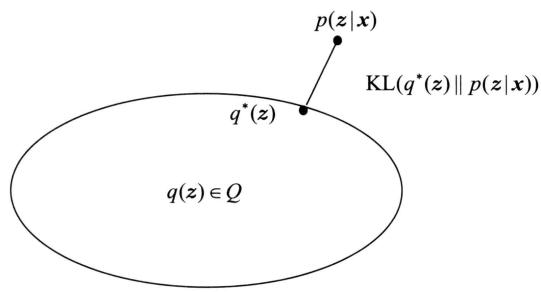  
图18.2 变分贝叶斯方法的原理

KL散度可以写成以下形式：

$$
\begin{array}{l} \operatorname {K L} (q (\boldsymbol {z}) \| p (\boldsymbol {z} | \boldsymbol {x})) = \mathbb {E} _ {q (\boldsymbol {z})} [ \log q (\boldsymbol {z}) ] - \mathbb {E} _ {q (\boldsymbol {z})} [ \log p (\boldsymbol {z} | \boldsymbol {x}) ] \\ = \mathbb {E} _ {q (\boldsymbol {z})} [ \log q (\boldsymbol {z}) ] - \mathbb {E} _ {q (\boldsymbol {z})} [ \log p (\boldsymbol {x}, \boldsymbol {z}) ] + \log p (\boldsymbol {x}) \\ = \log p (\boldsymbol {x}) - \left\{\mathbb {E} _ {q (\boldsymbol {z})} [ \log p (\boldsymbol {x}, \boldsymbol {z}) ] - \mathbb {E} _ {q (\boldsymbol {z})} [ \log q (\boldsymbol {z}) ] \right\} \tag {18.45} \\ \end{array}
$$

注意到KL散度大于等于零，当且仅当两个分布一致时为零，由此可知式(18.45)右端第一项与第二项满足关系

$$
\log p (\boldsymbol {x}) \geqslant \mathbb {E} _ {q (\boldsymbol {z})} [ \log p (\boldsymbol {x}, \boldsymbol {z}) ] - \mathbb {E} _ {q (\boldsymbol {z})} [ \log q (\boldsymbol {z}) ] \tag {18.46}
$$

不等式右端是左端的下界，左端称为证据（evidence），右端称为证据下界（evidence lower bound, ELBO），证据下界记作

$$
L (q) = \mathbb {E} _ {q (\boldsymbol {z})} [ \log p (\boldsymbol {x}, \boldsymbol {z}) ] - \mathbb {E} _ {q (\boldsymbol {z})} [ \log q (\boldsymbol {z}) ] \tag {18.47}
$$

KL散度(18.45)的最小化可以通过证据下界(18.47)的最大化实现，因为目标是求 $q(z)$ 使KL散度最小化，这时 $\log p(\pmb {x})$ 是常量。因此，变分贝叶斯方法变成求解证据下界最大化的问题。

变分贝叶斯方法可以从另一个角度理解。目标是通过证据 $\log p(\pmb{x})$ 的最大化估计联合概率分布 $p(\pmb{x},\pmb{z})$ 。因为含有隐变量 $\pmb{z}$ ，直接对证据进行最大化困难，转而根据式(18.46)对证据下界进行最大化。事实上，对任意的分布 $q(\pmb{x})$ ，有

$$
\log p (\boldsymbol {x}) = \log \int \frac {q (\boldsymbol {z})}{q (\boldsymbol {z})} p (\boldsymbol {x}, \boldsymbol {z}) \mathrm {d} \boldsymbol {z} = \log \mathbb {E} _ {q (\boldsymbol {x})} \left[ \frac {p (\boldsymbol {x} , \boldsymbol {z})}{q (\boldsymbol {z})} \right] \tag {18.48}
$$

利用Jessen不等式可以得到证据下界(18.46)。

对变分分布 $q(z)$ 的要求是具有容易处理的形式，通常假设 $q(z)$ 对 $\textbf{z}$ 的所有分量都是互相独立的（实际是条件独立于参数)，即满足

$$
q (\boldsymbol {z}) = q \left(z _ {1}\right) q \left(z _ {2}\right) \dots q \left(z _ {n}\right) \tag {18.49}
$$

这时的变分分布称为平均场（mean field）①。KL散度的最小化或证据下界最大化实际是在平均场的集合，即满足独立假设的分布集合 $\mathcal{Q} = \{q(\pmb {z})|q(\pmb {z}) = \prod_{i = 1}^{n}q(z_{i})\}$ 之中进行的。

总结起来，变分贝叶斯方法有以下几个步骤：定义变分分布 $q(z)$ ；推导其证据下界表达式；用最优化方法对证据下界进行优化，如坐标上升，得到最优分布 $q^{*}(z)$ ，作为后验分布 $p(z|\boldsymbol{x})$ 的近似。

# 18.3.2 基本算法

变分贝叶斯方法中，可以通过迭代的方法最大化证据下界，这时算法是EM算法的推广，称为变分EM算法。

假设模型是联合概率分布 $p(\boldsymbol{x}, \boldsymbol{z}|\boldsymbol{\theta})$ ，其中 $\boldsymbol{x}$ 是观测变量， $\boldsymbol{z}$ 是隐变量， $\boldsymbol{\theta}$ 是参数。目标是通过观测数据的对数似然函数（证据） $\log p(\boldsymbol{x}|\boldsymbol{\theta})$ 的最大化，估计概率模型的参数 $\boldsymbol{\theta}$ 。使用变分贝叶斯方法，导入平均场 $q(z) = \prod_{i=1}^{n} q(z_i)$ ，定义证据下界

$$
L (q (\boldsymbol {z}), \boldsymbol {\theta}) = \mathbb {E} _ {q (\boldsymbol {z})} [ \log p (\boldsymbol {x}, \boldsymbol {z} | \boldsymbol {\theta}) ] - \mathbb {E} _ {q (\boldsymbol {z})} [ \log q (\boldsymbol {z}) ] \tag {18.50}
$$

通过迭代，分别以 $q(z)$ 和 $\theta$ 为变量对证据下界进行最大化，就得到变分EM算法。

# 算法18.4（变分EM算法）

输入：观测数据。

输出：模型参数。

（1）初始化参数 $\pmb{\theta}^{(0)}$   
(2) E 步: 固定参数 $\pmb{\theta}^{(t)}$ , 求使 $L(q(z), \pmb{\theta}^{(t)})$ 最大化的变分分布 $q(z)$ , 得到 $q^{(t + 1)}(z)$ 。  
(3)M步：固定变分分布 $L(q^{(t + 1)}(\pmb {z}))$ ，求使 $L(q^{(t + 1)}(\pmb {z}),\pmb {\theta})$ 最大化的参数 $\pmb{\theta}$ ，得到 $\pmb{\theta}^{(t + 1)}$   
（4） $t = t + 1$ ，重复步骤（2）和步骤（3），直到收敛。

（5）给出模型参数 $\hat{\theta}$

变分EM算法一定收敛，但可能收敛到局部最优解。有以下引理。

引理18.3 设 $\pmb{\theta}^{(t)}(t = 1,2,\dots)$ 为变分EM算法得到的参数估计序列， $L(q^{(t)}(\pmb{z}),\pmb{\theta}^{(t)})$ $(t = 1,2,\dots)$ 为对应的证据下界序列，则序列 $L(q^{(t)}(\pmb{z}),\pmb{\theta}^{(t)})$ 单调递增且收敛。

证明

在变分 EM 算法中，ELBO 在每次迭代中都不会减小，即

$$
L \left(q ^ {(t)} (\boldsymbol {z}), \boldsymbol {\theta} ^ {(t)}\right) \geqslant L \left(q ^ {(t - 1)} (\boldsymbol {z}), \boldsymbol {\theta} ^ {(t - 1)}\right) \tag {18.51}
$$

而且，ELBO有上界

$$
L \left(q ^ {(t)} (\boldsymbol {z}), \boldsymbol {\theta} ^ {(t)}\right) \leqslant \log p (\boldsymbol {x} | \boldsymbol {\theta} ^ {(t)}) \tag {18.52}
$$

由单调收敛定理知，序列 $L(q^{(t)}(\pmb {z}),\pmb{\theta}^{(t)})$ 是收敛的。

注意：变分EM算法能保证证据下界 $L(q(\pmb {z}),\pmb {\theta})$ 单调递增且收敛，但不能保证证据或似然函数 $\log P(\pmb {x}|\pmb {\theta})$ 单调递增。尽管如此，仍然可以假设似然函数在迭代的过程中一般是递增的。

第22章讲解变分EM算法用于潜在狄利克雷分配学习。

# 18.3.3 EM算法和变分EM算法的比较

EM算法和变分EM算法都是用于含有隐变量的概率模型的学习算法。两者有不同的历史发展轨迹。EM算法源于统计学，后来被广泛用于机器学习。变分EM算法属于贝叶斯学习方法，是变分贝叶斯方法与EM算法的结合。

（广义）EM算法和变分EM算法在形式上有共同点，都是以近似优化的方式学习含有隐变量的模型参数。目标都是优化观测数据的对数似然函数的下界，也就是证据下界。算法都包含两步，通过E步和M步的迭代最大化目标函数。两者都只能保证收敛到局部最优。

但是，（广义）EM算法和变分EM算法在技巧上有很大的不同。（广义）EM算法优化的下界是 $F$ 函数。（广义）EM算法引入未观测数据的后验概率分布，在此基础上定义并优化 $F$ 函数。这时需要求 $F$ 函数对后验概率分布的最大化，有时模型复杂，无法用解析的方法求解。变分EM算法用变分分布拟合未观测数据的后验概率分布，在此基础上定义并优化证据下界。变分分布一般是简单并且容易优化的分布，如平均场、高斯分布。由于变分分布更容易优化，证据下界也就更容易计算。由于这些原因，EM算法往往用于模型简单的情况，而变分EM算法用于模型复杂的情况。另外，EM算法比变分EM算法做的近似更少，一般估计的准确率更高。

# 本章概要

1. EM算法是含有隐变量的概率模型 $P(\pmb{x}) = \sum_{\pmb{z}} (\pmb{x}, \pmb{z} | \pmb{\theta})$ 的极大似然估计或极大后验概率估计的迭代算法。含有隐变量的概率模型的数据表示为 $P(\pmb{x}, \pmb{z} | \pmb{\theta})$ 。这里， $\pmb{x}$ 是观测变量的数据， $z$ 是隐变量的数据， $\pmb{\theta}$ 是模型参数。

EM算法通过迭代求解观测数据的对数似然函数 $L(\pmb{\theta}) = \log P(\pmb{x}|\pmb{\theta})$ 的最大化，实现极大似然估计。每次迭代包括两步：E步，求期望，即求 $\log P(\pmb{x},\pmb{z}|\pmb{\theta})$ 关于 $P(\pmb{z}|\pmb{x},\pmb{\theta}^{(t)})$ 的期望：

$$
Q (\boldsymbol {\theta}, \boldsymbol {\theta} ^ {(t)}) = \sum_ {\boldsymbol {z}} P (\boldsymbol {z} | \boldsymbol {x}, \boldsymbol {\theta} ^ {(t)}) \log P (\boldsymbol {x}, \boldsymbol {z} | \boldsymbol {\theta})
$$

称为 $Q$ 函数，这里 $\pmb{\theta}^{(t)}$ 是参数的现估计值；M步，求最大化，即最大化 $Q$ 函数，得到参数的新估计值 $\pmb{\theta}^{(t + 1)}$ ：

$$
\boldsymbol {\theta} ^ {(t + 1)} = \arg \max  _ {\boldsymbol {\theta}} Q (\boldsymbol {\theta}, \boldsymbol {\theta} ^ {(t)})
$$

EM算法是通用算法，不依赖于具体的模型。针对具体的模型有具体的算法实现。

2. 观测数据的对数似然函数 $L(\pmb{\theta})$ 无法用解析的方法求解，EM算法通过迭代的算法解决这个问题。基本原理是，基于Jensen不等式导出对数似然函数的下界，通过迭代方式，最大化下界，等价地最大化 $Q(\pmb{\theta}, \pmb{\theta}^{(t)})$ ，使得对数似然函数 $L(\pmb{\theta})$ 不断增大。

3. EM算法在每次迭代后均提高观测数据的对数似然函数值，即

$$
\log P (\boldsymbol {x} \mid \boldsymbol {\theta} ^ {(t + 1)}) \geqslant \log P (\boldsymbol {x} \mid \boldsymbol {\theta} ^ {(t)})
$$

EM算法是收敛的，但不能保证收敛到全局最优解。

4. EM算法的一次迭代可由 $F$ 函数的最大化-最大化算法实现。也就是说，它是广义EM算法。 $F$ 函数的定义是

$$
F (\tilde {P}, \boldsymbol {\theta}) = \mathbb {E} _ {\tilde {P} (\boldsymbol {z} | \boldsymbol {\theta})} [ \log P (\boldsymbol {x}, \boldsymbol {z} | \boldsymbol {\theta}) ] + H (\tilde {P})
$$

最大化-最大化算法通过以下两步最大化 $F$ 函数，直至收敛。

$$
\tilde {P} ^ {(t + 1)} = \arg \max  _ {\tilde {P}} F (\tilde {P}, \boldsymbol {\theta} ^ {(t)})
$$

$$
\boldsymbol {\theta} ^ {(t + 1)} = \arg \max  _ {\boldsymbol {\theta}} F (\tilde {P} ^ {(t + 1)}, \boldsymbol {\theta})
$$

5. EM算法可以用于高斯混合模型的学习。高斯混合模型的定义是

$$
p (x | \boldsymbol {\theta}) = \sum_ {j = 1} ^ {k} \pi_ {j} f (x | \boldsymbol {\theta} _ {j})
$$

其中第 $j$ 个分模型是高斯分布

$$
f (x | \pmb {\theta} _ {j}) = \frac {1}{\sqrt {2 \pi} \sigma_ {j}} \exp \left[ - \frac {(x - \mu_ {j}) ^ {2}}{2 \sigma_ {j} ^ {2}} \right]
$$

高斯混合模型的EM算法在一定条件下等价于 $k$ 均值聚类算法。

6. 变分贝叶斯方法用于含有隐变量或未观测数据的概率模型 $p(\boldsymbol{x}) = \int p(\boldsymbol{x}, \boldsymbol{z} | \boldsymbol{\theta}) \mathrm{d}\boldsymbol{z}$ 的学习。核心想法是用变分分布 $q(\boldsymbol{z})$ 近似概率模型中的未观测数据的后验概率分布 $p(\boldsymbol{z} | \boldsymbol{\theta})$ 。

变分贝叶斯方法求解在KL散度意义下与后验分布最接近的变分分布，等价于求解观测

数据的对然似然函数或证据的下界。

$$
L (q, \boldsymbol {\theta}) = \mathbb {E} _ {q (\boldsymbol {z})} [ \log p (\boldsymbol {x}, \boldsymbol {z} | \boldsymbol {\theta}) ] - \mathbb {E} _ {q (\boldsymbol {z})} [ \log q (\boldsymbol {z}) ]
$$

变分EM算法通过以下两步最大化证据下界，直至收敛。

$$
q ^ {(t + 1)} (\boldsymbol {z}) = \arg \max  _ {q} L (q (\boldsymbol {z}), \boldsymbol {\theta} ^ {(t)})
$$

$$
\boldsymbol {\theta} ^ {(t + 1)} = \arg \max  _ {\boldsymbol {\theta}} L (q ^ {(t + 1)} (\boldsymbol {z}), \boldsymbol {\theta})
$$

# 继续阅读

EM算法由Dempster等总结提出[1]。类似的算法之前已被提出，如Baum-Welch算法，但是都没有EM算法那么广泛。EM算法的介绍可参见文献[2]～文献[5]。EM算法收敛性定理的有关证明见文献[6]。广义EM算法是由Neal与Hinton提出的[7]。变分EM算法的介绍参见文献[8]～文献[9]。

# 习题

18.1 推导出例 18.1 中三硬币模型的具体 EM 算法。

18.2 如例 18.1 的三硬币模型。假设观测数据不变，试选择不同的初值，例如， $\pi^{(0)} = 0.46$ ， $p^{(0)} = 0.55$ ， $q^{(0)} = 0.67$ ，求模型参数 $\theta = (\pi, p, q)$ 的极大似然估计。

18.3 证明引理18.2。

18.4 证明 $F$ 函数满足

$$
F (\tilde {P} (\boldsymbol {z}), \boldsymbol {\theta}) = \log P (\boldsymbol {x} | \boldsymbol {\theta}) - \operatorname {K L} \left(\tilde {P} (\boldsymbol {z}) | P (\boldsymbol {z} | \boldsymbol {x}, \boldsymbol {\theta})\right)
$$

其中， $\mathrm{KL}(\bullet |\bullet)$ 表示KL散度， $\tilde{P} (z)$ 是 $z$ 上的任意概率分布。

18.5 已知观测数据 -67, -48, 6, 8, 14, 16, 23, 24, 28, 29, 41, 49, 56, 60, 75，试估计两个分模型的高斯混合模型的5个参数。

18.6 EM算法可以用于朴素贝叶斯法的无监督学习，试写出其算法。

18.7 EM算法可以用于以下指数分布族模型的学习。完全数据的概率分布的密度函数是

$$
p (\boldsymbol {x}, \boldsymbol {z} | \boldsymbol {\theta}) = h (\boldsymbol {x}, \boldsymbol {z}) g (\boldsymbol {\theta}) \exp (\phi (\boldsymbol {\theta}) \cdot s (\boldsymbol {x}, \boldsymbol {z}))
$$

其中， $\phi(\pmb{\theta})$ 是自然参数， $s(\pmb{x}, \pmb{z})$ 是充分统计量。高斯混合模型和三硬币模型是这个模型的特殊情况，试写出具体学习算法。

18.8 EM算法可以用于含有隐变量的概率模型的后验概率分布 $P(\pmb{\theta}|\pmb{x})$ 最大化，写出这时的 $Q$ 函数和EM算法。

18.9 写出多元高斯混合模型的 EM 算法，并在与 18.2.3 节同样的假设下推导出一般的 $k$ 均值聚类算法。

# 参考文献

[1] DEMPSTER A P, LAIRD N M, RUBIN D B. Maximum-likelihood from incomplete data via the EM algorithm[J]. Journal of the Royal Statistic Society (Series B), 1977, 39(1): 1-38.   
[2] HASTIE T, TIBSHIRANI R, FRIEDMAN J. The elements of statistical learning: data mining, inference, and prediction[M]. 范明，柴玉梅，智红英，等译. Springer, 2001.   
[3] MCLACHLAN G, KRISHNAN T. The EM algorithm and extensions[M]. New York: John Wiley & Sons, 1996.   
[4] BISHOP M. Pattern recognition and machine learning[M]. Springer, 2006.   
[5] 苍诗松，王静龙，濮晓龙. 高等数理统计 [M]. 北京：高等教育出版社，1998.  
[6] WU J. On the convergence properties of the EM algorithm[J]. The Annals of Statistics, 1983, 11: 95-103.   
[7] NEAL R, HINTON G. A view of the EM algorithm that justifies incremental, sparse, and other variants[C]//Learning in Graphical Models. Cambridge, MA: MIT Press, 1999: 355-368.   
[8] MACKAY D. Information theory, inference and learning algorithms[M]. Cambridge University Press, 2003.   
[9] FOX C, ROBERTS S. A tutorial on variational Bayesian inference[J]. Artificial Intelligence Review. 38. 2012: 85-95.