# 第19章 马尔可夫链蒙特卡罗法

蒙特卡罗法(MonteCarlo method)也称为统计模拟方法(statistical simulation method)，是通过从概率模型的随机抽样进行近似数值计算的方法。马尔可夫链蒙特卡罗法（Markov chain Monte Carlo，MCMC）则是以马尔可夫链（Markov chain）为概率模型的蒙特卡罗法。马尔可夫链蒙特卡罗法构建一个马尔可夫链，使其平稳分布就是要进行抽样的分布，首先基于该马尔可夫链进行随机游走，产生样本的序列，之后使用该平稳分布的样本进行近似数值计算。

Metropolis-Hastings 算法是最基本的马尔可夫链蒙特卡罗法，Metropolis 等在 1953 年提出原始的算法，Hastings 在 1970 年对之加以推广，形成了现在的形式。吉布斯抽样 (Gibbs sampling) 是更简单、使用更广泛的马尔可夫链蒙特卡罗法，1984 年由 S. Geman 和 D. Geman 提出。

马尔可夫链蒙特卡罗法被应用于概率分布的估计、定积分的近似计算、最优化问题的近似求解等问题，特别是被应用于机器学习中概率模型的学习与推理，是重要的机器学习计算方法。

本章首先在19.1节介绍一般的蒙特卡罗法，在19.2节介绍马尔可夫链，然后在19.3节叙述马尔可夫链蒙特卡罗法的一般方法，最后在19.4节和19.5节分别讲述Metropolis-Hastings算法和吉布斯抽样。

# 19.1 蒙特卡罗法

本节介绍一般的蒙特卡罗法在随机抽样、数学期望估计、定积分计算的应用。马尔可夫链蒙特卡罗法是蒙特卡罗法的一种方法。

# 19.1.1 随机抽样

统计学和机器学习的目的是基于数据对概率分布的特征进行推断，蒙特卡罗法要解决的问题是：假设概率分布的定义已知，通过抽样获得概率分布的随机样本，并通过得到的随机样本对概率分布进行分析。比如，从样本得到经验分布，从而估计总体分布；或者从样本计算出样本均值，从而估计总体期望，所以蒙特卡罗法的精髓是随机抽样（random sampling）。

一般的蒙特卡罗法有直接抽样法、接受-拒绝抽样法、重要性抽样法等。接受-拒绝抽样法、重要性抽样法适合于概率密度函数复杂（如密度函数含有多个变量、各变量相互不独立、

密度函数形式复杂)、不能直接抽样的情况。

下面介绍接受-拒绝抽样法（accept-reject sampling method）。为了简单只考虑单变量的情况，多变量的情况很容易推广。假设有随机变量 $x$ ，取值 $x \in \mathcal{X}$ ，其概率密度函数为 $p(x)$ 。目标是得到该概率分布的随机样本，以对这个概率分布进行分析。

接受-拒绝法的基本想法如下：假设 $p(x)$ 不可以直接抽样。找一个可以直接抽样的分布，称为建议分布（proposal distribution）。假设 $q(x)$ 是建议分布的概率密度函数，并且有 $q(x)$ 的 $c$ 倍一定大于等于 $p(x)$ ，其中 $c > 0$ ，如图19.1所示。按照 $q(x)$ 进行抽样，假设得到的结果是 $x_{i}$ ，再按照 $\frac{p(x_i)}{c\cdot q(x_i)}$ 的比例随机决定是否接受 $x_{i}$ 。直观上，落到 $p(x_{i})$ 范围内的就接受，落到 $p(x_{i})$ 范围外的就拒绝。接受-拒绝法实际是按照 $p(x)$ 的涵盖面积（或涵盖体积）占 $c\cdot q(x)$ 的涵盖面积（或涵盖体积）的比例进行抽样。

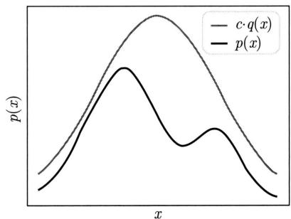  
图19.1 接受-拒绝抽样法

接受-拒绝法的具体算法如下。

# 算法19.1（接受-拒绝法）

输入：目标分布的密度函数 $p(x)$ 。

输出：目标分布的随机样本 $x_{1},x_{2},\dots ,x_{n}$ 。

参数：样本数 $n$ 。

(1) 选择密度函数为 $q(x)$ 的概率分布，作为建议分布，使其对任一 $x$ 满足 $c \cdot q(x) \geqslant p(x)$ ，其中 $c > 0$ 。  
(2) 按照建议分布 $q(x)$ 随机抽样得到样本 $x_{i}$ , 再按照均匀分布在 $(0,1)$ 范围内抽样得到 $u$ 。  
(3) 如果 $u \leqslant \frac{p(x_i)}{c \cdot q(x_i)}$ , 则将 $x_i$ 作为抽样结果; 否则, 回到步骤 (2)。  
（4）直至得到 $n$ 个随机样本。

接受-拒绝法的优点是容易实现，缺点是效率可能不高。如果 $p(x)$ 的涵盖体积占 $c \cdot q(x)$ 的涵盖体积的比例很低，就会导致拒绝的比例很高，抽样效率很低。注意，一般是在高维空间进行抽样，即使 $p(x)$ 与 $c \cdot q(x)$ 很接近，两者涵盖体积的差异也可能很大（与我们在三维空间的直观不同）。

# 19.1.2 数学期望估计

一般的蒙特卡罗法如直接抽样法、接受-拒绝抽样法、重要性抽样法，也可以用于数学期

望估计（estimation of mathematical expectation）。假设有随机变量 $x$ ，取值 $x \in \mathcal{X}$ ，其概率密度函数为 $p(x)$ ， $f(x)$ 为定义在 $\mathcal{X}$ 上的函数，目标是求函数 $f(x)$ 关于密度函数 $p(x)$ 的数学期望 $\mathbb{E}_{p(x)}[f(x)]$ 。

针对这个问题，蒙特卡罗法按照概率分布 $p(x)$ 独立地抽取 $n$ 个样本 $x_{1}, x_{2}, \dots, x_{n}$ ，比如用直接抽样法，之后计算所有样本的函数值 $f(x)$ 的平均 $\hat{f}_n$ ：

$$
\hat {f} _ {n} = \frac {1}{n} \sum_ {i = 1} ^ {n} f \left(x _ {i}\right) \tag {19.1}
$$

作为数学期望 $\mathbb{E}_{p(x)}[f(x)]$ 的近似值。

根据大数定律，当样本容量增大时，样本均值以概率1收敛于数学期望：

$$
\hat {f} _ {n} \rightarrow \mathbb {E} _ {p (x)} [ f (x) ], \quad n \rightarrow \infty \tag {19.2}
$$

这样就得到了数学期望的近似计算方法：

$$
\mathbb {E} _ {p (x)} [ f (x) ] \approx \frac {1}{n} \sum_ {i = 1} ^ {n} f \left(x _ {i}\right) \tag {19.3}
$$

下面介绍重要性抽样法（importance sampling method）。假设有随机变量 $x$ ，取值 $x \in \mathcal{X}$ ，其概率密度函数为 $p(x)$ ， $f(x)$ 为定义在 $\mathcal{X}$ 上的函数，目标是求函数 $f(x)$ 关于密度函数 $p(x)$ 的数学期望 $\mathbb{E}_{p(x)}[f(x)]$ 。假设密度函数复杂，用重要性抽样进行函数的数学期望计算。

重要性抽样法的基本想法如下。假设 $p(x)$ 不可以直接抽样，找一个可以直接抽样的分布，也称为建议分布。假设建议分布的密度函数 $q(x)$ 与目标分布的密度函数 $p(x)$ 接近，按照 $q(x)$ 进行抽样，假设得到的结果是 $x_{i}$ ，再以 $\frac{p(x_i)}{q(x_i)}$ 为样本的重要性权重。然后计算所有样本的函数值 $f(x_{i})$ 的加权平均，作为数学期望 $\mathbb{E}_{p(x)}[f(x)]$ 的近似值。

$$
\hat {f} _ {n} \approx \frac {1}{n} \sum_ {i = 1} ^ {n} \frac {p \left(x _ {i}\right)}{q \left(x _ {i}\right)} f \left(x _ {i}\right) \tag {19.4}
$$

这是因为关于目标分布的期望可以转换为关于建议分布的期望，根据大数定律，可以用建议分布的样本抽样的函数均值近似函数期望。这时函数是重要性函数与原始函数之积。

$$
\mathbb {E} _ {p (x)} [ f (x) ] = \mathbb {E} _ {q (x)} \left[ \frac {p (x)}{q (x)} f (x) \right] \approx \frac {1}{n} \sum_ {i = 1} ^ {n} \frac {p \left(x _ {i}\right)}{q \left(x _ {i}\right)} f \left(x _ {i}\right) \tag {19.5}
$$

# 算法19.2（重要性抽样法）

输入：目标分布的概率密度函数 $p(x)$ 。

输出：目标分布的函数期望的估计 $\hat{f}_n$

参数：样本数 $n$ 。

（1）选择概率密度函数为 $q(x)$ 的概率分布，作为建议分布，保证建议分布 $q(x)$ 与目标分布 $p(x)$ 有相同支持域。  
（2）按照建议分布 $q(x)$ 随机抽样 $n$ 个样本 $x_{i}, i = 1,2,\dots ,n$ 。

（3）对于每个样本计算其重要性：

$$
w _ {i} = \frac {p \left(x _ {i}\right)}{q \left(x _ {i}\right)}
$$

（4）计算所有样本的函数值的加权平均，得到函数期望的估计：

$$
\hat {f} _ {n} = \frac {1}{n} \sum_ {i = 1} ^ {n} w _ {i} f (x _ {i})
$$

重要性抽样法的优点是容易实现，缺点是函数期望估计的方差可能很大。重要性抽样中建议分布的选择非常关键。理想情况下，建议分布是与目标分布接近且容易抽样的分布，而且在目标函数 $f(x)$ 值大的地方有较高的概率密度。如果建议分布 $q(x)$ 与目标分布 $p(x)$ 差异过大，重要性抽样估计的方差可能会很大，导致估计的准确率降低。极端情况下，少数样本的权重可能会占主导地位，导致估计发散。

# 19.2 积分计算

一般的蒙特卡罗法也可以用于定积分的近似计算，称为蒙特卡罗积分（Monte Carlo integration）。假设有一个函数 $h(x)$ ，目标是计算该函数的积分：

$$
\int_ {\mathcal {X}} h (x) \mathrm {d} x
$$

如果能够将函数 $h(x)$ 分解成一个函数 $f(x)$ 和一个概率密度函数 $p(x)$ 的乘积的形式，那么就有

$$
\int_ {\mathcal {X}} h (x) \mathrm {d} x = \int_ {\mathcal {X}} p (x) f (x) \mathrm {d} x = \mathbb {E} _ {p (x)} [ f (x) ] \tag {19.6}
$$

于是函数 $h(x)$ 的积分可以表示为函数 $f(x)$ 关于概率密度函数 $p(x)$ 的数学期望。实际上，给定一个概率密度函数 $p(x)$ ，只要取 $f(x) = \frac{h(x)}{p(x)}$ ，就可得式 (19.6)。就是说，任何一个函数的积分都可以表示为某一个函数的数学期望的形式，而函数的数学期望又可以通过函数的样本均值估计。于是，就可以利用样本均值来近似计算积分，这就是蒙特卡罗积分的基本想法。

$$
\int_ {\mathcal {X}} h (x) \mathrm {d} x = \mathbb {E} _ {p (x)} [ f (x) ] \approx \frac {1}{n} \sum_ {i = 1} ^ {n} f \left(x _ {i}\right) \tag {19.7}
$$

例19.1 用蒙特卡罗积分法求 $\int_0^1\mathrm{e}^{-x^2 /2}\mathrm{d}x$

解 令 $f(x) = \mathrm{e}^{-x^2 /2}$

$$
p (x) = 1 \quad (0 <   x <   1)
$$

也就是说，假设随机变量 $x$ 在 $(0,1)$ 区间遵循均匀分布。

使用蒙特卡罗积分法，如图19.2所示，在(0,1)区间按照均匀分布抽取10个随机样

本 $x_{1}, x_{2}, \dots, x_{10}$ ，计算样本的函数均值 $\hat{f}_{10}$

$$
\hat {f} _ {1 0} = \frac {1}{1 0} \sum_ {i = 1} ^ {1 0} \mathrm {e} ^ {- x _ {i} ^ {2} / 2} = 0. 8 5 7
$$

也就是积分的近似。随机样本数越大，计算就越精确。

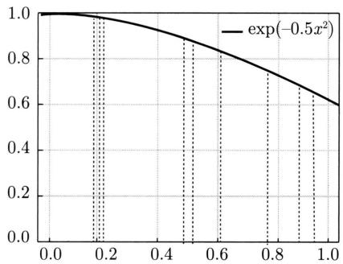  
图19.2 蒙特卡罗积分例

例19.2 用蒙特卡罗积分法求 $\int_{-\infty}^{\infty}x\frac{1}{\sqrt{2\pi}}\exp \left(\frac{-x^2}{2}\right)\mathrm{d}x$

解 令 $f(x) = x$

$$
p (x) = \frac {1}{\sqrt {2 \pi}} \exp \left(\frac {- x ^ {2}}{2}\right)
$$

$p(x)$ 是标准正态分布的密度函数。

使用蒙特卡罗积分法，按照标准正态分布在区间 $(-\infty, \infty)$ 抽样 $x_{1}, x_{2}, \dots, x_{n}$ ，取其平均值，就得到要求的积分值。当样本增大时，积分值趋于0。

本章介绍的马尔可夫链蒙特卡罗法也适合于概率密度函数复杂、不能直接抽样的情况，旨在解决一般的蒙特卡罗法，如接受-拒绝抽样法、重要性抽样法，抽样效率不高的问题。一般的蒙特卡罗法中的抽样样本是独立的，而马尔可夫链蒙特卡罗法中的抽样样本不是独立的，样本序列形成马尔可夫链。

# 19.3 马尔可夫链

本节首先给出马尔可夫链的定义，之后介绍马尔可夫链的一些性质。马尔可夫链蒙特卡罗法用到这些性质。

# 19.3.1 基本定义

定义19.1（马尔可夫链）考虑一个随机变量的序列 $X = X_{0}X_{1}\dots X_{t}\dots$ ，这里 $X_{t}$ 表示时刻 $t$ 的随机变量， $t = 0,1,2,\dots$ 。每个随机变量 $X_{t}(t = 0,1,2,\dots)$ 的取值集合相同，称为状态空间，表示为 $\mathcal{S}$ 。随机变量可以是离散的，也可以是连续的。以上随机变量的序列构成随机过程（stochastic process）。

假设在时刻0的随机变量 $X_0$ 遵循概率分布 $P(X_0) = \pi_0$ ，称为初始状态分布。在某个时刻 $t\geqslant 1$ 的随机变量 $X_{t}$ 与前一个时刻的随机变量 $X_{t - 1}$ 之间有条件分布 $P(X_{t}|X_{t - 1})$ ，如果 $X_{t}$ 只依赖于 $X_{t - 1}$ ，而不依赖于过去的随机变量 $X_0X_1\dots X_{t - 2}$ ，这一性质称为马尔可夫性，即

$$
P \left(X _ {t} \mid X _ {0}, X _ {1}, \dots , X _ {t - 1}\right) = P \left(X _ {t} \mid X _ {t - 1}\right), \quad t = 1, 2, \dots \tag {19.8}
$$

具有马尔可夫性的随机序列 $\mathbf{X} = X_{0}X_{1}\dots X_{t}\dots$ 称为马尔可夫链（Markov chain）或马尔可夫过程（Markov process）。条件概率分布 $P(X_{t}|X_{t - 1})$ 称为马尔可夫链的转移概率分布。转移概率分布决定了马尔可夫链的特性。

马尔可夫性的直观解释是“未来只依赖于现在（假设现在已知），而与过去无关”。这个假设在许多应用中是合理的。

若转移概率分布 $P(X_{t}|X_{t - 1})$ 与 $t$ 无关，即

$$
P \left(X _ {t + s} \mid X _ {t - 1 + s}\right) = P \left(X _ {t} \mid X _ {t - 1}\right), \quad t = 1, 2, \dots , \quad s = 1, 2, \dots \tag {19.9}
$$

则称该马尔可夫链为时间齐次的马尔可夫链（time homogenous Markov chain）。本书中提到的马尔可夫链都是时间齐次的。

以上定义的是一阶马尔可夫链，可以扩展到 $n$ 阶马尔可夫链，满足 $n$ 阶马尔可夫性：

$$
P \left(X _ {t} \mid X _ {0} X _ {1} \dots X _ {t - 2} X _ {t - 1}\right) = P \left(X _ {t} \mid X _ {t - n} \dots X _ {t - 2} X _ {t - 1}\right) \tag {19.10}
$$

本书主要考虑一阶马尔可夫链。容易验证 $n$ 阶马尔可夫链可以转换为一阶马尔可夫链。

# 19.3.2 离散状态马尔可夫链

# 1. 转移概率矩阵和状态分布

离散状态马尔可夫链 $X = X_{0}X_{1}\dots X_{t}\dots$ ，随机变量 $X_{t}(t = 0,1,2,\dots)$ 定义在离散空间 $\mathcal{S}$ ，转移概率分布可以由矩阵表示。

若马尔可夫链在时刻 $(t - 1)$ 处于状态 $j$ ，在时刻 $t$ 移动到状态 $i$ ，将转移概率记作

$$
p _ {i j} = \left(X _ {t} = i \mid X _ {t - 1} = j\right), \quad i = 1, 2, \dots , \quad j = 1, 2, \dots \tag {19.11}
$$

满足

$$
p _ {i j} \geqslant 0, \quad \sum_ {i} p _ {i j} = 1
$$

马尔可夫链的转移概率 $p_{ij}$ 可以由矩阵表示，即

$$
\boldsymbol {P} = \left[ \begin{array}{c c c c} p _ {1 1} & p _ {1 2} & p _ {1 3} & \dots \\ p _ {2 1} & p _ {2 2} & p _ {2 3} & \dots \\ p _ {3 1} & p _ {3 2} & p _ {3 3} & \dots \\ \dots & \dots & \dots & \dots \end{array} \right] \tag {19.12}
$$

称为马尔可夫链的转移概率矩阵，转移概率矩阵 $\pmb{P}$ 满足条件 $p_{ij} \geqslant 0, \sum_{i} p_{ij} = 1$ 。满足这两个条件的矩阵称为随机矩阵（stochastic matrix）。注意这里矩阵列元素之和为1。

考虑马尔可夫链 $X = X_{0}X_{1}\dots X_{t}\dots$ 在时刻 $t(t = 0,1,2,\dots)$ 的概率分布，称为时刻 $t$ 的状态分布，记作

$$
\boldsymbol {\pi} (t) = \left[ \begin{array}{c} \pi_ {1} (t) \\ \pi_ {2} (t) \\ \vdots \end{array} \right] \tag {19.13}
$$

其中， $\pi_i(t)$ 表示时刻 $t$ 状态为 $i$ 的概率 $P(X_{t} = i)$

$$
\pi_ {i} (t) = P \left(X _ {t} = i\right), \quad i = 1, 2, \dots
$$

特别地，马尔可夫链的初始状态分布可以表示为

$$
\boldsymbol {\pi} (0) = \left[ \begin{array}{c} \pi_ {1} (0) \\ \pi_ {2} (0) \\ \vdots \end{array} \right] \tag {19.14}
$$

其中， $\pi_i(0)$ 表示时刻 0 状态为 $i$ 的概率 $P(X_0 = i)$ 。通常初始分布 $\pi(0)$ 的向量只有一个分量是 1，其余分量都是 0，表示马尔可夫链从一个具体状态开始。

有限离散状态的马尔可夫链可以用有向图表示。结点表示状态，边表示状态之间的转移，边上的数值表示转移概率。从一个初始状态出发，根据有向边上定义的概率在状态之间随机跳转（或随机转移），就可以产生状态的序列。马尔可夫链实际上是刻画随时间在状态之间转移的模型，假设未来的转移状态只依赖于现在的状态，而与过去的状态无关。

下面通过一个简单的例子给出马尔可夫链的直观解释。假设观察某地的天气，按日依次是“晴、雨、晴、晴、晴、雨、晴……”，具有一定的规律。马尔可夫链可以刻画这个过程。假设天气的变化具有马尔可夫性，即明天的天气只依赖于今天的天气，而与昨天及以前的天气无关。这个假设经验上是合理的，至少是现实情况的近似。具体地，比如，如果今天是晴天，那么明天是晴天的概率是0.9，是雨天的概率是0.1；如果今天是雨天，那么明天是晴天的概率是0.5，是雨天的概率也是0.5。图19.3表示这个马尔可夫链。基于这个马尔可夫链，从一个初始状态出发，随时间在状态之间随机转移，就可以产生天气的序列，可以对天气进行预测。

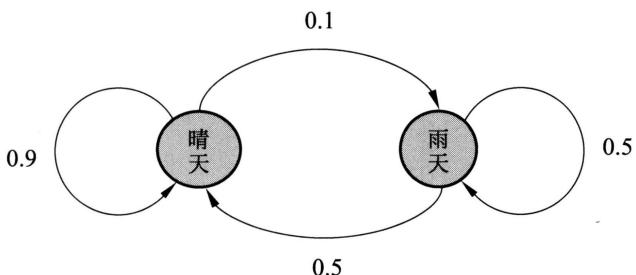  
图19.3 马尔可夫链例

下面看一个马尔可夫链应用的例子。自然语言处理、语音处理中经常用到语言模型（language model），是建立在词表上的 $n$ 阶马尔可夫链。比如，在英语语音识别中，语音模型产生出两个候选：“How to recognize speech”与“How to wreck a nice beach”①，要判断哪个可能性更大。显然从语义的角度前者的可能性更大，语言模型可以帮助做出这个判断。

将一个语句看作一个单词的序列 $w_{1}w_{2}\dots w_{s}$ ，目标是计算其概率。同一个语句很少在语料中重复多次出现，所以直接从语料中估计每个语句的概率是困难的。语言模型用局部的单词序列的概率组合计算出全局的单词序列的概率，可以很好地解决这个问题。

假设每个单词只依赖于其前面出现的单词，也就是说单词序列具有马尔可夫性，那么可以定义一阶马尔可夫链，即语言模型，计算语句的概率。

$$
\begin{array}{l} P (w _ {1} w _ {2} \dots w _ {s}) \\ = P \left(w _ {1}\right) P \left(w _ {2} \mid w _ {1}\right) P \left(w _ {3} \mid w _ {1} w _ {2}\right) \dots P \left(w _ {i} \mid w _ {1} w _ {2} \dots w _ {i - 1}\right) \dots P \left(w _ {s} \mid w _ {1} w _ {2} \dots w _ {s - 1}\right) \\ = P \left(w _ {1}\right) P \left(w _ {2} \mid w _ {1}\right) P \left(w _ {3} \mid w _ {2}\right) \dots P \left(w _ {i} \mid w _ {i - 1}\right) \dots P \left(w _ {s} \mid w _ {s - 1}\right) \\ \end{array}
$$

这里第三个等式基于马尔可夫链假设。在这个马尔可夫链中，状态空间为词表，一个位置上单词的产生只依赖于前一个位置的单词，而不依赖于更前面的单词。以上是一阶马尔可夫链，一般可以扩展到 $n$ 阶马尔可夫链。

语言模型的学习等价于确定马尔可夫链中的转移概率值，如果有充分的语料，转移概率可以直接从语料中估计。直观上，“wreck a nice”出现之后，下面出现“beach”的概率极低，所以第二个语句的概率应该更小，从语言模型的角度看第一个语句的可能性更大。

马尔可夫链 $X$ 在时刻 $t$ 的状态分布可以由在时刻 $(t - 1)$ 的状态分布以及转移概率分布决定：

$$
\boldsymbol {\pi} (t) = \boldsymbol {P} \boldsymbol {\pi} (t - 1) \tag {19.15}
$$

这是因为

$$
\begin{array}{l} \pi_ {i} (t) = P \left(X _ {t} = i\right) \\ = \sum_ {k} P \left(X _ {t} = i \mid X _ {t - 1} = k\right) P \left(X _ {t - 1} = k\right) \\ = \sum_ {k} p _ {i k} \pi_ {k} (t - 1) \\ \end{array}
$$

马尔可夫链在时刻 $t$ 的状态分布可以通过递推得到。事实上，由式(19.15)

$$
\boldsymbol {\pi} (t) = \boldsymbol {P} \boldsymbol {\pi} (t - 1) = \boldsymbol {P} [ \boldsymbol {P} \boldsymbol {\pi} (t - 2) ] = \boldsymbol {P} ^ {2} \boldsymbol {\pi} (t - 2)
$$

递推得到：

$$
\boldsymbol {\pi} (t) = \boldsymbol {P} ^ {t} \boldsymbol {\pi} (0) \tag {19.16}
$$

这里的 $P^t$ 称为 $t$ 步转移概率矩阵：

$$
p _ {i j} ^ {t} = P \left(X _ {t} = i \mid X _ {0} = j\right)
$$

表示时刻0从状态 $j$ 出发、时刻 $t$ 到达状态 $i$ 的 $t$ 步转移概率。 $\pmb{P}^{t}$ 也是随机矩阵。式(19.16)说明，马尔可夫链的状态分布由初始分布和转移概率分布决定。

对图19.3中的马尔可夫链，转移矩阵为

$$
\boldsymbol {P} = \left[ \begin{array}{c c} 0. 9 & 0. 5 \\ 0. 1 & 0. 5 \end{array} \right]
$$

如果第一天是晴天，其天气概率分布（初始状态分布）如下：

$$
\boldsymbol {\pi} (0) = \left[ \begin{array}{c} 1 \\ 0 \end{array} \right]
$$

根据这个马尔可夫链模型，可以计算第二天、第三天及之后的天气概率分布（状态分布）。

$$
\begin{array}{l} \boldsymbol {\pi} (1) = \boldsymbol {P} \boldsymbol {\pi} (0) = \left[ \begin{array}{l l} 0. 9 & 0. 5 \\ 0. 1 & 0. 5 \end{array} \right] \left[ \begin{array}{l} 1 \\ 0 \end{array} \right] = \left[ \begin{array}{l} 0. 9 \\ 0. 1 \end{array} \right] \\ \boldsymbol {\pi} (2) = \boldsymbol {P} ^ {2} \boldsymbol {\pi} (0) = \left[ \begin{array}{c c} 0. 9 & 0. 5 \\ 0. 1 & 0. 5 \end{array} \right] ^ {2} \left[ \begin{array}{c} 1 \\ 0 \end{array} \right] = \left[ \begin{array}{c} 0. 8 6 \\ 0. 1 4 \end{array} \right] \\ \end{array}
$$

# 2. 平稳分布

定义19.2（平稳分布）设有马尔可夫链 $X = X_{0}X_{1}\dots X_{t}\dots$ ，其状态空间为 $\mathcal{S}$ ，转移概率矩阵为 $\pmb{P}$ ，如果存在状态空间 $\mathcal{S}$ 上的一个分布

$$
\boldsymbol {\pi} = \left[ \begin{array}{c} \pi_ {1} \\ \pi_ {2} \\ \vdots \end{array} \right]
$$

使得

$$
\pi = P \pi \tag {19.17}
$$

则称 $\pi$ 为马尔可夫链 $X = X_{0}X_{1}\dots X_{t}\dots$ 的平稳分布。

直观上，如果马尔可夫链的平稳分布存在，那么以该平稳分布作为初始分布，面向未来进行随机状态转移，之后任何一个时刻的状态分布都是该平稳分布。

引理19.1 给定一个马尔可夫链 $\mathbf{X} = X_{0}X_{1}\dots X_{t}\dots$ ，状态空间为 $\mathcal{S}$ ，转移概率矩阵为 $\pmb {P} = (p_{ij})$ ，则分布 $\pmb {\pi} = (\pi_1,\pi_2,\dots)^{\mathrm{T}}$ 为 $\pmb{x}$ 的平稳分布的充分必要条件是 $\pmb {\pi} = (\pi_1,\pi_2,\dots)^{\mathrm{T}}$ 是下列方程组的解：

$$
x _ {i} = \sum_ {j} p _ {i j} x _ {j}, \quad i = 1, 2, \dots \tag {19.18}
$$

$$
x _ {i} \geqslant 0, \quad i = 1, 2, \dots \tag {19.19}
$$

$$
\sum_ {i} x _ {i} = 1 \tag {19.20}
$$

证明 必要性。假设 $\pmb{\pi} = (\pi_1, \pi_2, \dots)^{\mathrm{T}}$ 是平稳分布，显然满足式(19.19)和式(19.20)，且

$$
\pi_ {i} = \sum_ {j} p _ {i j} \pi_ {j}, \quad i = 1, 2, \dots
$$

即 $\pmb{\pi} = (\pi_1, \pi_2, \dots)^{\mathrm{T}}$ 满足式 (19.18)。

充分性。由式(19.19)和式(19.20)知 $\pmb{\pi} = (\pi_1,\pi_2,\dots)^{\mathrm{T}}$ 是一个概率分布。假设 $\pmb{\pi} = (\pi_{1},\pi_{2},\dots)^{\mathrm{T}}$ 为 $X_{t}$ 的分布，则

$$
P \left(X _ {t} = i\right) = \pi_ {i} = \sum_ {j} p _ {i j} \pi_ {j} = \sum_ {j} p _ {i j} P \left(X _ {t - 1} = j\right), \quad i = 1, 2, \dots
$$

$\pmb{\pi} = (\pi_{1}, \pi_{2}, \dots)^{\mathrm{T}}$ 也为 $X_{t-1}$ 的分布。事实上这对任意 $t$ 成立，所以 $\pmb{\pi} = (\pi_{1}, \pi_{2}, \dots)^{\mathrm{T}}$ 是马尔可夫链的平稳分布。

引理19.1给出一个求马尔可夫链平稳分布的方法。

例 19.3 设有图 19.4 所示马尔可夫链, 其转移概率矩阵为

$$
\boldsymbol {P} = \left[ \begin{array}{c c c} 1 / 2 & 1 / 2 & 1 / 4 \\ 1 / 4 & 0 & 1 / 4 \\ 1 / 4 & 1 / 2 & 1 / 2 \end{array} \right]
$$

求其平稳分布。

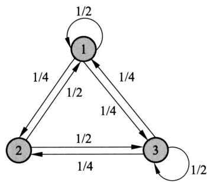  
图19.4 马尔可夫链例

解设平稳分布为 $\pmb {\pi} = (x_1,x_2,x_3)^{\mathrm{T}}$ ，则由式(19.18)~式(19.20)有

$$
x _ {1} = \frac {1}{2} x _ {1} + \frac {1}{2} x _ {2} + \frac {1}{4} x _ {3}
$$

$$
x _ {2} = \frac {1}{4} x _ {1} + \frac {1}{4} x _ {3}
$$

$$
x _ {3} = \frac {1}{4} x _ {1} + \frac {1}{2} x _ {2} + \frac {1}{2} x _ {3}
$$

$$
x _ {1} + x _ {2} + x _ {3} = 1
$$

$$
x _ {i} \geqslant 0, \quad i = 1, 2, 3
$$

解方程组，得到唯一的平稳分布：

$$
\boldsymbol {\pi} = (2 / 5, 1 / 5, 2 / 5) ^ {\mathrm {T}}
$$

例19.4 设有图19.5所示马尔可夫链，其转移概率分布如下，求其平稳分布。

$$
\boldsymbol {P} = \left[ \begin{array}{l l l} 1 & 1 / 3 & 0 \\ 0 & 1 / 3 & 0 \\ 0 & 1 / 3 & 1 \end{array} \right]
$$

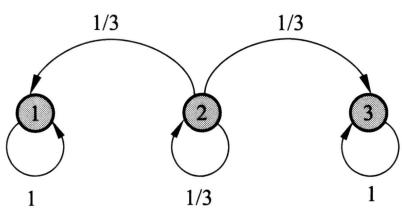  
图19.5 马尔可夫链例

解 这个马尔可夫链的平稳分布并不唯一， $\pmb{\pi} = (3/4, 0, 1/4)^{\mathrm{T}}$ ， $\pmb{\pi} = (2/3, 0, 1/3)^{\mathrm{T}}$ 等皆为其平稳分布。

马尔可夫链可能存在唯一的平稳分布、无穷多个平稳分布或不存在平稳分布①。

# 19.3.3 连续状态马尔可夫链

连续状态马尔可夫链 $X = X_{0}X_{1}\dots X_{t}\dots$ ，随机变量 $X_{t}\left(t = 0,1,2,\dots\right)$ 定义在连续状态空间 $\mathcal{S}$ ，转移概率分布由概率转移核或转移核（transition kernel）表示。

设 $\mathcal{S}$ 是连续状态空间，对任意的 $x\in S,A\subset \mathcal{S}$ ，转移核 $P(x,A)$ 定义为

$$
P (x, A) = \int_ {A} p (x, y) \mathrm {d} y \tag {19.21}
$$

其中， $p(x,\bullet)$ 是概率密度函数，满足 $p(x,\bullet)\geqslant 0$ . $P(x,\mathcal{S}) = \int_{\mathcal{S}}p(x,y)\mathrm{d}y = 1$ 。转移核 $P(x,A)$ 表示从 $x\sim A$ 的转移概率：

$$
P \left(X _ {t} = A \mid X _ {t - 1} = x\right) = P (x, A) \tag {19.22}
$$

将概率密度函数 $p(x, \cdot)$ 称为转移核。

若马尔可夫链的状态空间 $S$ 上的概率分布 $\pi (x)$ 满足条件

$$
\pi (y) = \int p (x, y) \pi (x) \mathrm {d} x, \quad \forall y \in \mathcal {S} \tag {19.23}
$$

或者

$$
\pi (A) = \int P (x, A) \pi (x) \mathrm {d} x, \quad \forall A \subset \mathcal {S} \tag {19.24}
$$

则称分布 $\pi (x)$ 为该马尔可夫链的平稳分布，简写为

$$
\boldsymbol {\pi} = \boldsymbol {P} \boldsymbol {\pi} \tag {19.25}
$$

# 19.3.4 马尔可夫链的性质

以下介绍离散状态马尔可夫链的性质，可以自然推广到连续状态马尔可夫链。

# 1. 不可约

定义19.3（不可约）设有马尔可夫链 $X = X_{0}X_{1}\dots X_{t}\dots$ ，状态空间为 $\mathcal{S}$ ，对于任意状态 $i,j\in S$ ，如果存在一个时刻 $t(t > 0)$ 满足

$$
P \left(X _ {t} = i \mid X _ {0} = j\right) > 0 \tag {19.26}
$$

也就是说，时刻0从状态 $j$ 出发、时刻 $t$ 到达状态 $i$ 的概率大于0，则称此马尔可夫链 $\pmb{X}$ 是不可约的（irreducible），否则称马尔可夫链是可约的（reducible）。

直观上，一个不可约的马尔可夫链从任意状态出发，当经过充分长时间后，可以到达任意状态。例19.3中的马尔可夫链是不可约的，例19.5中的马尔可夫链是可约的。

例19.5 图19.6所示马尔可夫链是可约的。

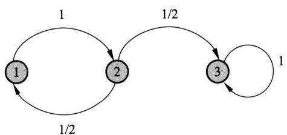  
图19.6 马尔可夫链例

解 转移概率矩阵为

$$
\boldsymbol {P} = \left[ \begin{array}{c c c} 0 & 1 / 2 & 0 \\ 1 & 0 & 0 \\ 0 & 1 / 2 & 1 \end{array} \right]
$$

平稳分布 $\pi = (0, 0, 1)^{\mathrm{T}}$ 。此马尔可夫链转移到状态3后，就在该状态上循环跳转，不能到达状态1和状态2，最终停留在状态3。

# 2. 非周期

定义19.4（非周期）设有马尔可夫链 $X = X_{0}X_{1}\dots X_{t}\dots$ ，状态空间为 $\mathcal{S}$ 。对于任意状态 $i\in S$ ，如果时刻0从状态 $i$ 出发、时刻 $t$ 返回到状态的所有时间长 $\{t:P(X_{t} = i\mid X_{0} = i) > 0\}$ 的最大公约数是1，则称此马尔可夫链 $X$ 是非周期的（aperiodic），否则称马尔可夫链是周期的（periodic）。

直观上，一个非周期性马尔可夫链不存在一个状态，从这一个状态出发，再返回到这个状态时所经历的时间长呈一定的周期性。例19.3中的马尔可夫链是非周期的，例19.6中的

马尔可夫链是周期的。

例19.6 图19.7所示的马尔可夫链是周期的。

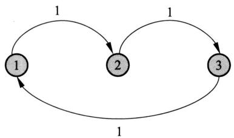  
图19.7 马尔可夫链例

解 转移概率矩阵为

$$
\boldsymbol {P} = \left[ \begin{array}{c c c} 0 & 0 & 1 \\ 1 & 0 & 0 \\ 0 & 1 & 0 \end{array} \right]
$$

其平稳分布是 $\pi = (1 / 3,1 / 3,1 / 3)^{\mathrm{T}}$ 。此马尔可夫链从每个状态出发返回到该状态的时刻都是3的倍数， $\{3,6,9\}$ ，具有周期性，最终停留在每个状态的概率都为 $1 / 3$ □

定理19.1（遍历性）不可约且非周期的有限状态马尔可夫链有唯一平稳分布存在。

这是有限状态马尔可夫链的一个重要性质，被称为遍历性（ergodicity）。后面将叙述更一般的马尔可夫链，包括有限状态和无限状态马尔可夫链的遍历性。

# 3. 正常返

定义19.5（正常返）设有马尔可夫链 $X = X_{0}X_{1}\dots X_{t}\dots$ ，无限状态空间为 $\mathcal{S}$ 。对于任意状态 $i\in \mathcal{S}$ ，如果时刻0从状态 $i$ 出发、首次返回到状态 $i$ 的时间为 $T_{i} = \inf \left\{t\geqslant 1:P(X_{t} = i|X_{0} = i) > 0\right\}$ 。如果首次返回到状态 $i$ 的时间是有限的，即有 $P(T_{i} <   \infty |X_{0} = i) = 1$ ，则称此马尔可夫链是常返的（recurrent）。如果首次返回时间的期望也是有限的，即有 $\mathbb{E}(T_i|X_0 = i) <   \infty$ ，则称为正常返（positive recurrent），如果首次返回时间的期望是无限的，即有 $\mathbb{E}(T_i|X_0 = i) = \infty$ ，则称为零常返的（null recurrent）。

直观上，一个正常返的马尔可夫链中的任意一个状态，从这个状态出发，一定在有限时间内返回到这个状态，而且返回到这个状态的平均时间也是有限的。例19.7给出正常返马尔可夫链的例子。

例19.7 图19.8所示的无限状态马尔可夫链是正常返的，其中 $p > q$ 。

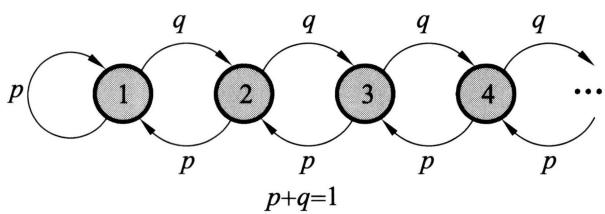  
图19.8 马尔可夫链例

解 转移概率矩阵为

$$
\boldsymbol {P} = \left[ \begin{array}{c c c c c} p & p & 0 & 0 & \\ q & 0 & p & 0 & \\ 0 & q & 0 & p & \\ 0 & 0 & q & 0 & \\ & \vdots & & \ddots \end{array} \right]
$$

设 $p > q$ 。首先，从任意状态可以到达其他状态；从任意状态可能返回自身，且没有固定的周期，所以这个马尔可夫链是可约的、非周期的。其次，首次返回到任意一个状态的时间是有限的，而且首次返回时间的期望也是有限的，所以是正常返的。平稳分布 $\pi$ 满足

$$
\pi_ {i} = \left(\frac {q}{p}\right) ^ {i} \left(\frac {p - q}{p}\right), \quad i = 1, 2, \dots
$$

# 4. 遍历定理

下面叙述马尔可夫链的遍历定理。

定理19.2（遍历定理）设有马尔可夫链 $\pmb {X} = X_0X_1\dots X_t\dots$ ，状态空间为 $s$ ，若马尔可夫链 $\pmb{X}$ 是不可约、非周期且正常返的，则该马尔可夫链有唯一平稳分布 $\pi = (\pi_{1},\pi_{2},\dots)^{\mathrm{T}}$ 并且状态分布的极限是马尔可夫链的平稳分布。

$$
\lim  _ {t \rightarrow \infty} P \left(X _ {t} = i \mid X _ {0} = j\right) = \pi_ {i}, \quad i = 1, 2, \dots , \quad j = 1, 2, \dots \tag {19.27}
$$

若 $f(X)$ 是定义在状态空间上的函数， $\mathbb{E}_{\pi}[|f(X)|] < \infty$ ，则

$$
P \left\{\hat {f} _ {t} \rightarrow \mathbb {E} _ {\pi} [ f (\boldsymbol {X}) ] \right\} = 1 \tag {19.28}
$$

其中， $\hat{f}_t$ 是 $f(X)$ 到时刻 $t$ 为止的取值 $f(X_{t})$ 的均值：

$$
\hat {f} _ {t} = \frac {1}{t} \sum_ {s = 1} ^ {t} f (X _ {s})
$$

$\mathbb{E}_{\pi}[f(X)]$ 是 $f(X)$ 关于平稳分布 $\pmb{\pi} = (\pi_1,\pi_2,\dots)^{\mathrm{T}}$ 的数学期望，式(19.28)表示

$$
\hat {f} _ {t} \rightarrow \mathbb {E} _ {\pi} [ f (X) ], \quad t \rightarrow \infty \tag {19.29}
$$

几乎处处成立或以概率1成立。

遍历定理的直观解释：满足相应条件的马尔可夫链，当时间趋于无穷时，马尔可夫链的状态分布趋近于平稳分布，而且平稳分布是唯一的。状态空间上的函数的样本均值以概率1收敛于该函数的数学期望。样本均值可以认为是时间均值，而数学期望是空间均值。遍历性的含义是，当时间趋于无穷时，时间均值等于空间均值。遍历定理的三个条件：不可约、非周期、正常返都必须满足。

理论上并不知道经过多少次迭代，马尔可夫链的状态分布才能接近于平稳分布，在实际应用遍历定理时，取一个足够大的整数 $m$ ，经过 $m$ 次迭代之后认为状态分布就是平稳分布，

这时计算从第 $m + 1$ 次迭代到第 $n$ 次迭代的均值，即

$$
\hat {f} _ {m, n} = \frac {1}{n - m} \sum_ {t = m + 1} ^ {n} f \left(X _ {t}\right) \tag {19.30}
$$

称为遍历均值。

# 5. 可逆马尔可夫链

定义19.6（可逆马尔可夫链）设有马尔可夫链 $X = X_{0}X_{1}\dots X_{t}\dots$ ，状态空间为 $\mathcal{S}$ 转移概率矩阵为 $\pmb{P}$ ，如果有状态分布 $\pi = (\pi_1,\pi_2,\dots)^{\mathrm{T}}$ ，对于任意状态 $i,j\in S$ ，对任意一个时刻 $t$ 满足

$$
\boldsymbol {P} \left(X _ {t} = i \mid X _ {t - 1} = j\right) \pi_ {j} = \boldsymbol {P} \left(X _ {t - 1} = j \mid X _ {t} = i\right) \pi_ {i}, \quad i, j = 1, 2, \dots \tag {19.31}
$$

或简写为

$$
p _ {i j} \pi_ {j} = p _ {j i} \pi_ {i}, \quad i, j = 1, 2, \dots \tag {19.32}
$$

则称此马尔可夫链 $X$ 为可逆马尔可夫链（reversible Markov chain），式(19.32)称为细致平衡方程（detailed balance equation）。

直观上，如果有可逆的马尔可夫链，那么以该马尔可夫链的平稳分布作为初始分布，进行随机状态转移，无论是面向未来还是面向过去，任何一个时刻的状态分布都是该平稳分布。例19.3中的马尔可夫链是可逆的，例19.8中的马尔可夫链是不可逆的。

例19.8 图19.9所示马尔可夫链是不可逆的。

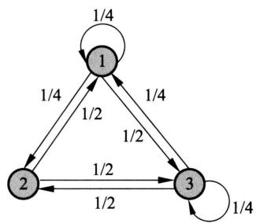  
图19.9 马尔可夫链例

解 转移概率矩阵为

$$
\boldsymbol {P} = \left[ \begin{array}{c c c} 1 / 4 & 1 / 2 & 1 / 4 \\ 1 / 4 & 0 & 1 / 2 \\ 1 / 2 & 1 / 2 & 1 / 4 \end{array} \right]
$$

平稳分布 $\pi = (8 / 25,7 / 25,2 / 5)^{\mathrm{T}}$ ，不满足细致平稳方程。

定理19.3（细致平衡方程）满足细致平衡方程的状态分布 $\pi$ 就是该马尔可夫链的平稳分布，即

$$
P \pi = \pi
$$

证明 事实上，

$$
\left(\boldsymbol {P} \boldsymbol {\pi}\right) _ {i} = \sum_ {j} p _ {i j} \pi_ {j} = \sum_ {j} p _ {j i} \pi_ {i} = \pi_ {i} \sum_ {j} p _ {j i} = \pi_ {i}, \quad i = 1, 2, \dots \tag {19.33}
$$

定理19.3说明，可逆马尔可夫链一定有平稳分布，给出了一个马尔可夫链有平稳分布的充分条件（不是必要条件）。但平稳分布不一定唯一。

# 19.4 马尔可夫链蒙特卡罗法

# 19.4.1 基本想法

假设目标是对一个概率分布进行随机抽样，或者是求函数关于该概率分布的数学期望。可以采用传统的蒙特卡罗法，如接受-拒绝法、重要性抽样法，也可以使用马尔可夫链蒙特卡罗法。马尔可夫链蒙特卡罗法更适用于随机变量是多元、密度函数是非标准形式、随机变量各分量不独立等情况。

假设多元随机变量 $\pmb{x}$ 满足 $\pmb{x} \in \mathcal{X}$ ，其概率密度函数为 $p(\pmb{x})$ ， $f(\pmb{x})$ 为定义在 $\pmb{x} \in \mathcal{X}$ 上的函数，目标是获得概率分布 $p(\pmb{x})$ 的样本集合，以及求函数 $f(\pmb{x})$ 的数学期望 $\mathbb{E}_{p(\pmb{x})}[f(\pmb{x})]$ 。

应用马尔可夫链蒙特卡罗法解决这个问题。基本想法是：在随机变量 $\pmb{x}$ 的状态空间 $S$ 上定义一个满足遍历定理的马尔可夫链 $\pmb{X} = X_{0}X_{1}\dots X_{t}\dots$ ，使其平稳分布就是抽样的目标分布 $p(\pmb {x})$ 。然后在这个马尔可夫链上进行随机游走，每个时刻得到一个样本。根据遍历定理，当时间趋于无穷时，样本的分布趋近平稳分布，样本的函数均值趋近函数的数学期望。所以，当时间足够长时（时刻大于某个正整数 $m$ )，在之后的时间（时刻小于等于某个正整数 $n,n > m$ ）里随机游走得到的样本集合 $\{\pmb{x}_{m + 1},\pmb{x}_{m + 2},\dots ,\pmb{x}_n\}$ 就是目标概率分布的抽样结果，得到的函数均值（遍历均值）就是要计算的数学期望值：

$$
\hat {f} _ {m, n} = \frac {1}{n - m} \sum_ {t = m + 1} ^ {n} f \left(\boldsymbol {x} _ {t}\right) \tag {19.34}
$$

到时刻 $m$ 为止的时间段称为燃烧期。

如何构建具体的马尔可夫链成为这个方法的关键。连续变量的时候，需要定义转移核函数；离散变量的时候，需要定义转移矩阵。一个方法是定义特殊的转移核函数或者转移矩阵，构建可逆马尔可夫链，使其满足遍历定理。常用的马尔可夫链蒙特卡罗法有Metropolis-Hastings算法、吉布斯抽样。

由于这个马尔可夫链满足遍历定理，随机游走的起始点并不影响得到的结果，即从不同的起始点出发，都会收敛到同一平稳分布。

马尔可夫链蒙特卡罗法的收敛性的判断通常是经验性的，比如，在马尔可夫链上进行随机游走，检验遍历均值是否收敛。具体地，每隔一段时间取一次样本，得到多个样本以后，计算遍历均值，当计算的均值稳定后，认为马尔可夫链已经收敛。再比如，在马尔可夫链上并行进行多个随机游走，比较各个随机游走的遍历均值是否接近一致。

对于马尔可夫链蒙特卡罗法中得到的样本序列，相邻的样本点是相关的，而不是独立的。因此，在需要独立样本时，可以在该样本序列中再次进行随机抽样，比如每隔一段时间取一次样本，将这样得到的子样本集合作为独立样本集合。

马尔可夫链蒙特卡罗法比接受-拒绝法更容易实现，因为只需要定义马尔可夫链，而不需要定义建议分布。一般来说马尔可夫链蒙特卡罗法比接受-拒绝法效率更高，没有大量被拒绝的样本，虽然燃烧期的样本也要抛弃。

# 19.4.2 基本步骤

根据上面的讨论，可以将马尔可夫链蒙特卡罗法概括为以下三步：

（1）首先，在随机变量 $\pmb{x}$ 的状态空间 $S$ 上构造一个满足遍历定理的马尔可夫链，使其平稳分布为目标分布 $p(\pmb {x})$   
（2）从状态空间的某一点 $\pmb{x}_0$ 出发，用构造的马尔可夫链进行随机游走，产生样本序列 $\pmb {x}_0,\pmb {x}_1,\dots ,\pmb {x}_t,\dots$   
（3）应用马尔可夫链的遍历定理，确定正整数 $m$ 和 $n$ $(m < n)$ ，得到样本集合 $\{\pmb{x}_{m + 1},\pmb{x}_{m + 2},\dots ,\pmb{x}_n\}$ ，求得函数 $f(\pmb {x})$ 的均值（遍历均值）

$$
\hat {f} _ {m, n} = \frac {1}{n - m} \sum_ {t = m + 1} ^ {n} f \left(\boldsymbol {x} _ {t}\right) \tag {19.35}
$$

就是马尔可夫链蒙特卡罗法的计算公式。

这里有几个重要问题：

（1）如何定义马尔可夫链，保证马尔可夫链蒙特卡罗法的条件成立。  
（2）如何确定收敛步数 $m$ ，保证样本抽样的无偏性。  
（3）如何确定迭代步数 $n$ ，保证遍历均值计算的精度。

# 19.5 马尔可夫链蒙特卡罗法与机器学习

马尔可夫链蒙特卡罗法在机器学习，特别是贝叶斯学习中起着重要的作用，这主要是因为马尔可夫链蒙特卡罗法可以用在概率模型的学习和推理上。

假设观测数据由随机变量 $\pmb{d} \in \mathcal{D}$ 表示，模型由随机变量 $\pmb{m} \in \mathcal{M}$ 表示，贝叶斯学习通过贝叶斯定理计算给定数据条件下模型的后验概率，并选择后验概率最大的模型。后验概率为

$$
p (\boldsymbol {m} | \boldsymbol {d}) = \frac {p (\boldsymbol {m}) p (\boldsymbol {d} | \boldsymbol {m})}{\int_ {\mathcal {M}} p (\boldsymbol {d} | \boldsymbol {m} ^ {\prime}) p (\boldsymbol {m} ^ {\prime}) \mathrm {d} \boldsymbol {m} ^ {\prime}} \tag {19.36}
$$

贝叶斯学习中经常需要进行三种积分运算：归范化（normalization）、边缘化（marginalization）、数学期望（expectation）。

后验概率计算中需要归范化计算：

$$
p (\boldsymbol {d}) = \int_ {\mathcal {M}} p (\boldsymbol {d} | \boldsymbol {m} ^ {\prime}) p (\boldsymbol {m} ^ {\prime}) \mathrm {d} \boldsymbol {m} ^ {\prime} \tag {19.37}
$$

如果有隐变量 $z \in \mathcal{Z}$ ，后验概率的计算需要边缘化计算：

$$
p (\boldsymbol {m} | \boldsymbol {d}) = \int_ {\mathcal {Z}} p (\boldsymbol {m}, \boldsymbol {z} | \boldsymbol {d}) \mathrm {d} \boldsymbol {z} \tag {19.38}
$$

如果有一个函数 $f(m)$ ，可以计算该函数关于后验概率分布的数学期望：

$$
\mathbb {E} _ {p (\boldsymbol {m} \mid \boldsymbol {d})} [ f (\boldsymbol {m}) ] = \int_ {\mathcal {M}} f (\boldsymbol {m}) p (\boldsymbol {m} \mid \boldsymbol {d}) \mathrm {d} \boldsymbol {m} \tag {19.39}
$$

当观测数据和模型都很复杂的时候，以上的积分计算变得困难。马尔可夫链蒙特卡罗法为这些计算提供了一个通用的有效解决方案。

# 19.6 Metropolis-Hastings 算法

本节叙述Metropolis-Hastings算法，该算法是马尔可夫链蒙特卡罗法的代表算法。

# 19.6.1 基本原理

# 1. 马尔可夫链

假设要抽样的概率分布是 $p(\boldsymbol{x})$ 。Metropolis-Hastings 算法的想法是，构造一个满足遍历定理的可逆马尔可夫链，在这个马尔可夫链上进行随机游走，使得达到的平稳分布就是要抽样的分布 $p(\boldsymbol{x})$ 。构造的马尔可夫链，其转移核写作 $p(\boldsymbol{x}, \boldsymbol{x}')$ 。注意转移核实际是条件概率分布，相当于 $p(\boldsymbol{x}'|\boldsymbol{x})$ 。

首先定义建议分布（proposal distribution），是一个马尔可夫链，其转移核为 $q(\pmb{x},\pmb{x}^{\prime})$ 而且 $q(\pmb {x},\pmb{x}^{\prime})$ 是不可约的，即概率值恒不为0，同时是一个容易抽样的分布。然后定义接受分布（acceptance distribution），表示为

$$
\alpha (\boldsymbol {x}, \boldsymbol {x} ^ {\prime}) = \min  \left\{1, \frac {p \left(\boldsymbol {x} ^ {\prime}\right) q \left(\boldsymbol {x} ^ {\prime} , \boldsymbol {x}\right)}{p (\boldsymbol {x}) q \left(\boldsymbol {x} , \boldsymbol {x} ^ {\prime}\right)} \right\} \tag {19.40}
$$

Metropolis-Hastings算法在其基础上，构造一个马尔可夫链，其转移核为 $p(\pmb {x},\pmb{x}^{\prime})$

$$
p (\boldsymbol {x}, \boldsymbol {x} ^ {\prime}) = q (\boldsymbol {x}, \boldsymbol {x} ^ {\prime}) \alpha (\boldsymbol {x}, \boldsymbol {x} ^ {\prime}) \tag {19.41}
$$

其中， $q(\pmb {x},\pmb{x}^{\prime})$ 和 $\alpha (\pmb {x},\pmb{x}^{\prime})$ 分别是建议分布和接受分布。

马尔可夫链上的随机游走以以下方式进行。如果在时刻 $(t - 1)$ 处于状态 $\pmb{x}$ ，即 $\pmb{x}_{t - 1} = \pmb{x}$ ，则先按建议分布 $q(\pmb{x},\pmb{x}^{\prime})$ 抽样产生一个候选状态 $\pmb{x}^{\prime}$ ，然后按照接受分布 $\alpha (\pmb{x},\pmb{x}^{\prime})$ 抽样决定是否接受状态 $\pmb{x}^{\prime}$ 。以概率 $\alpha (\pmb{x},\pmb{x}^{\prime})$ 接受 $\pmb{x}^{\prime}$ ，决定时刻 $t$ 转移到状态 $\pmb{x}^{\prime}$ ，而以概率 $1 - \alpha (\pmb{x},\pmb{x}^{\prime})$ 拒绝 $\pmb{x}^{\prime}$ ，决定时刻 $t$ 仍停留在状态 $\pmb{x}$ 。具体地，从区间 $(0,1)$ 上的均匀分布中抽取一个随机数 $u$ ，决定时刻 $t$ 的状态。

$$
\boldsymbol {x} _ {t} = \left\{ \begin{array}{l l} \boldsymbol {x} ^ {\prime}, & u \leqslant \alpha (\boldsymbol {x}, \boldsymbol {x} ^ {\prime}) \\ \boldsymbol {x}, & u > \alpha (\boldsymbol {x}, \boldsymbol {x} ^ {\prime}) \end{array} \right.
$$

可以证明，以 $p(\pmb{x},\pmb{x}^{\prime})$ 为转移核的马尔可夫链是可逆马尔可夫链（满足遍历定理），其平稳分布就是 $p(\pmb {x})$ ，即要抽样的目标分布。也就是说，这是马尔可夫链蒙特卡罗法的一个具体实现。

定理19.4 转移核 $p(\pmb{x},\pmb{x}^{\prime})$ 为式 $(19.40)\sim$ 式(19.41)定义的马尔可夫链，是可逆的，即

$$
p (\boldsymbol {x}) p \left(\boldsymbol {x}, \boldsymbol {x} ^ {\prime}\right) = p \left(\boldsymbol {x} ^ {\prime}\right) p \left(\boldsymbol {x} ^ {\prime}, \boldsymbol {x}\right) \tag {19.42}
$$

并且 $p(\pmb {x})$ 是该马尔可夫链的平稳分布。

证明 若 $\pmb{x} = \pmb{x}'$ ，则式(19.42)显然成立。

设 $\pmb{x} \neq \pmb{x}'$ ，则

$$
\begin{array}{l} p (\boldsymbol {x}) p (\boldsymbol {x}, \boldsymbol {x} ^ {\prime}) = p (\boldsymbol {x}) q (\boldsymbol {x}, \boldsymbol {x} ^ {\prime}) \min  \left\{1, \frac {p (\boldsymbol {x} ^ {\prime}) q \left(\boldsymbol {x} ^ {\prime} , \boldsymbol {x}\right)}{p (\boldsymbol {x}) q \left(\boldsymbol {x} , \boldsymbol {x} ^ {\prime}\right)} \right\} \\ = \min \left\{p (\boldsymbol {x}) q (\boldsymbol {x}, \boldsymbol {x} ^ {\prime}), p (\boldsymbol {x} ^ {\prime}) q (\boldsymbol {x} ^ {\prime}, \boldsymbol {x}) \right\} \\ = p \left(\boldsymbol {x} ^ {\prime}\right) q \left(\boldsymbol {x} ^ {\prime}, \boldsymbol {x}\right) \min  \left\{\frac {p (\boldsymbol {x}) q \left(\boldsymbol {x} , \boldsymbol {x} ^ {\prime}\right)}{p \left(\boldsymbol {x} ^ {\prime}\right) q \left(\boldsymbol {x} ^ {\prime} , \boldsymbol {x}\right)}, 1 \right\} \\ = p \left(\boldsymbol {x} ^ {\prime}\right) p \left(\boldsymbol {x} ^ {\prime}, \boldsymbol {x}\right) \\ \end{array}
$$

式 (19.42) 成立。

由式（19.42）知：

$$
\begin{array}{l} \int p (\boldsymbol {x}) p \left(\boldsymbol {x}, \boldsymbol {x} ^ {\prime}\right) \mathrm {d} \boldsymbol {x} = \int p \left(\boldsymbol {x} ^ {\prime}\right) p \left(\boldsymbol {x} ^ {\prime}, \boldsymbol {x}\right) \mathrm {d} \boldsymbol {x} \\ = p (\boldsymbol {x} ^ {\prime}) \int p (\boldsymbol {x} ^ {\prime}, \boldsymbol {x}) \mathrm {d} \boldsymbol {x} \\ = p \left(\boldsymbol {x} ^ {\prime}\right) \\ \end{array}
$$

根据平稳分布的定义 (式 (19.23)), $p(\pmb{x})$ 是马尔可夫链的平稳分布。

# 2. 建议分布

建议分布 $q(\pmb{x},\pmb{x}^{\prime})$ 有多种可能的形式，这里介绍两种常用形式。

第一种形式：假设建议分布是对称的，即对任意的 $x$ 和 $x^{\prime}$ ，有

$$
q \left(\boldsymbol {x}, \boldsymbol {x} ^ {\prime}\right) = q \left(\boldsymbol {x} ^ {\prime}, \boldsymbol {x}\right) \tag {19.43}
$$

这样的建议分布称为Metropolis选择，也是Metropolis-Hastings算法最初采用的建议分布。这时，接受分布 $\alpha (\pmb {x},\pmb{x}^{\prime})$ 简化为

$$
\alpha \left(\boldsymbol {x}, \boldsymbol {x} ^ {\prime}\right) = \min  \left\{1, \frac {p \left(\boldsymbol {x} ^ {\prime}\right)}{p (\boldsymbol {x})} \right\} \tag {19.44}
$$

Metropolis 选择的一个特例是 $q(\pmb{x}, \pmb{x}^{\prime})$ 取条件概率分布 $p(\pmb{x}^{\prime}|\pmb{x})$ ，定义为多元正态分布，其均值是 $\pmb{x}$ ，其协方差矩阵是常数矩阵。

Metropolis 选择的另一个特例是令 $q(\pmb{x}, \pmb{x}') = q(|\pmb{x} - \pmb{x}'|)$ ，这时算法称为随机游走 Metropolis 算法。例如，

$$
q (\boldsymbol {x}, \boldsymbol {x} ^ {\prime}) \propto \exp \left[ - \frac {\left(\boldsymbol {x} ^ {\prime} - \boldsymbol {x}\right) ^ {2}}{2} \right]
$$

Metropolis 选择的特点是当 $\pmb{x}'$ 与 $\pmb{x}$ 接近时， $q(\pmb{x}, \pmb{x}')$ 的概率值高，否则 $q(\pmb{x}, \pmb{x}')$ 的概率值低。状态转移在附近点的可能性更大。

第二种形式称为独立抽样。假设 $q(\pmb{x},\pmb{x}^{\prime})$ 与当前状态 $\pmb{x}$ 无关，即 $q(\pmb{x},\pmb{x}^{\prime}) = q(\pmb{x}^{\prime})$ 。建议分布的计算按照 $q(\pmb{x}^{\prime})$ 独立抽样进行。此时，接受分布 $\alpha (\pmb {x},\pmb{x}^{\prime})$ 可以写成

$$
\alpha (\boldsymbol {x}, \boldsymbol {x} ^ {\prime}) = \min  \left\{1, \frac {w \left(\boldsymbol {x} ^ {\prime}\right)}{w (\boldsymbol {x})} \right\} \tag {19.45}
$$

其中， $w(\pmb{x}^{\prime}) = p(\pmb{x}^{\prime}) / q(\pmb{x}^{\prime})$ ， $w(\pmb {x}) = p(\pmb {x}) / q(\pmb {x})$ 。

独立抽样实现简单，但可能收敛速度慢，通常选择接近目标分布 $p(\pmb{x})$ 的分布作为建议分布 $q(\pmb{x})$ 。

# 3. 满条件分布

马尔可夫链蒙特卡罗法的目标分布通常是多元联合概率分布 $p(\boldsymbol{x}) = p(x_1, x_2, \dots, x_k)$ 其中 $\boldsymbol{x} = (x_1, x_2, \dots, x_k)^{\mathrm{T}}$ 为 $k$ 维随机变量。如果条件概率分布 $p(\boldsymbol{x}_I | \boldsymbol{x}_{-I})$ 中所有 $k$ 个变量全部出现，其中 $\boldsymbol{x}_I = \{x_i, i \in I\}$ ， $\boldsymbol{x}_{-I} = \{x_i, i \notin I\}$ ， $I \subseteq K = \{1, 2, \dots, k\}$ ，那么称这种条件概率分布为满条件分布（full conditional distribution）。

满条件分布有以下性质：对任意的 $\pmb {x}\in \mathcal{X}$ 和任意的 $I\subseteq K$ ，有

$$
p \left(\boldsymbol {x} _ {I} \mid \boldsymbol {x} _ {- I}\right) = \frac {p (\boldsymbol {x})}{\int p (\boldsymbol {x}) \mathrm {d} \boldsymbol {x} _ {I}} \propto p (\boldsymbol {x}) \tag {19.46}
$$

而且，对任意的 $x, x' \in \mathcal{X}$ 和任意的 $I \subseteq K$ ，有

$$
\frac {p \left(\boldsymbol {x} _ {I} ^ {\prime} \mid \boldsymbol {x} _ {- I} ^ {\prime}\right)}{p \left(\boldsymbol {x} _ {I} \mid \boldsymbol {x} _ {- I}\right)} = \frac {p \left(\boldsymbol {x} ^ {\prime}\right)}{p (\boldsymbol {x})} \tag {19.47}
$$

Metropolis-Hastings 算法中，可以利用性质 (19.47) 简化计算，提高计算效率。具体地，通过满条件分布概率的比 $\frac{p(\boldsymbol{x}_I'|\boldsymbol{x}_{-I}')}{p(\boldsymbol{x}_I|\boldsymbol{x}_{-I})}$ 计算联合概率的比 $\frac{p(\boldsymbol{x}')}{p(\boldsymbol{x})}$ ，而前者更容易计算。

例19.9 设 $x_{1}$ 和 $x_{2}$ 的联合概率分布的密度函数为

$$
p \left(x _ {1}, x _ {2}\right) \propto \exp \left[ - \frac {1}{2} \left(x _ {1} - 1\right) ^ {2} \left(x _ {2} - 1\right) ^ {2} \right]
$$

求其满条件分布。

解 由满条件分布的定义有

$$
\begin{array}{l} p \left(x _ {1} \mid x _ {2}\right) \propto p \left(x _ {1}, x _ {2}\right) \\ \propto \exp \left[ - \frac {1}{2} (x _ {1} - 1) ^ {2} (x _ {2} - 1) ^ {2} \right] \\ \end{array}
$$

$$
\propto N (1, (x _ {2} - 1) ^ {- 2})
$$

这里 $N(1,(x_2 - 1)^{-2})$ 是均值为1、方差为 $(x_{2} - 1)^{-2}$ 的正态分布，这时 $x_{1}$ 是变量， $x_{2}$ 是参数。同样可得：

$$
\begin{array}{l} p \left(x _ {2} \mid x _ {1}\right) \propto p \left(x _ {1}, x _ {2}\right) \\ \propto \exp \left[ - \frac {1}{2} (x _ {2} - 1) ^ {2} (x _ {1} - 1) ^ {2} \right] \\ \propto N (1, (x _ {1} - 1) ^ {- 2}) \\ \end{array}
$$

# 19.6.2 Metropolis-Hastings 算法

# 算法19.3（Metropolis-Hastings算法）

输入：抽样的目标分布的密度函数 $p(\pmb {x})$ ，函数 $f(x)$ 。

输出： $p(\pmb {x})$ 的随机样本 $\pmb{x}_{m + 1},\pmb{x}_{m + 2},\dots ,\pmb{x}_n$ ，函数样本均值 $\hat{f}_{m,n}$ 。

参数：收敛步数 $m$ ，迭代步数 $n$ 。

（1）任意选择一个初始值 $\pmb{x}_0$ 。  
(2) 对 $t = 1, 2, \dots, n$ 循环执行：  
（a）设状态 $\pmb{x}_{t - 1} = \pmb{x}$ ，按照建议分布 $q(\pmb {x},\pmb{x}^{\prime})$ 随机抽取一个候选状态 $\pmb{x}^{\prime}$ 。  
（b）计算接受概率：

$$
\alpha (\boldsymbol {x}, \boldsymbol {x} ^ {\prime}) = \min  \left\{1, \frac {p (\boldsymbol {x} ^ {\prime}) q (\boldsymbol {x} ^ {\prime} , \boldsymbol {x})}{p (\boldsymbol {x}) q (\boldsymbol {x} , \boldsymbol {x} ^ {\prime})} \right\}
$$

（c）从区间 $(0,1)$ 中按均匀分布随机抽取一个数 $u$ 。若 $u \leqslant \alpha(\boldsymbol{x},\boldsymbol{x}^{\prime})$ ，则状态 $\boldsymbol{x}_i = \boldsymbol{x}^\prime$ ；否则，状态 $\boldsymbol{x}_i = \boldsymbol{x}$ 。

（3）得到样本集合 $\{\pmb{x}_{m + 1},\pmb{x}_{m + 2},\dots ,\pmb{x}_n\}$ ，计算

$$
\hat {f} _ {m, n} = \frac {1}{n - m} \sum_ {i = m + 1} ^ {n} f (\boldsymbol {x} _ {i})
$$

# 19.6.3 单分量Metropolis-Hastings算法

在Metropolis-Hastings算法中，通常需要对多元变量分布进行抽样。有时对多元变量分布的抽样是困难的，可以对多元变量的每一变量的条件分布依次分别进行抽样，从而实现对整个多元变量的一次抽样，这就是单分量Metropolis-Hastings（single-component Metropolis-Hastings）算法。

假设马尔可夫链的状态由 $k$ 维随机变量表示：

$$
\boldsymbol {x} = \left(x _ {1}, x _ {2}, \dots , x _ {k}\right) ^ {\mathrm {T}}
$$

其中， $x_{j}$ 表示随机变量 $\mathcal{X}$ 的第 $j$ 个分量， $j = 1,2,\dots ,k$ ，而 $\pmb{x}^{(i)}$ 表示马尔可夫链在时刻 $i$ 的

状态

$$
\boldsymbol {x} ^ {(i)} = \left(x _ {1} ^ {(i)}, x _ {2} ^ {(i)}, \dots , x _ {k} ^ {(i)}\right) ^ {\mathrm {T}}, \quad i = 1, 2, \dots , n
$$

其中， $x_{j}^{(i)}$ 是随机变量 $\pmb{x}^{(i)}$ 的第 $j$ 个分量， $j = 1,2,\dots ,k$ 。

为了生成容量为 $n$ 的样本集合 $\{\pmb{x}^{(1)},\pmb{x}^{(2)},\dots ,\pmb{x}^{(n)}\}$ ，单分量Metropolis-Hastings算法由下面的 $k$ 步迭代实现Metropolis-Hastings算法的一次迭代。

设在第 $(i - 1)$ 次迭代结束时分量 $x_{j}$ 的取值为 $x_{j}^{(i - 1)}$ ，在第 $i$ 次迭代的第 $j$ 步，对分量 $x_{j}$ 根据Metropolis-Hastings算法更新，得到其新的取值 $x_{j}^{(i)}$ 。首先，由建议分布 $q(x_{j}^{(i - 1)}, x_{j} | \boldsymbol{x}_{-j}^{(i)})$ 抽样产生分量 $x_{j}$ 的候选值 $x_{j}^{\prime(i)}$ ，这里 $\boldsymbol{x}_{-j}^{(i)}$ 表示在第 $i$ 次迭代的第 $(j - 1)$ 步后的 $\boldsymbol{x}^{(i)}$ 除去 $x_{j}^{(i - 1)}$ 的所有值，即

$$
\boldsymbol {x} _ {- j} ^ {(i)} = \left(x _ {1} ^ {(i)}, \dots , x _ {j - 1} ^ {(i)}, x _ {j + 1} ^ {(i - 1)}, \dots , x _ {k} ^ {(i - 1)}\right) ^ {\mathrm {T}}
$$

其中分量 $1,2,\dots ,j - 1$ 已经更新。然后，按照接受概率

$$
\alpha \left(x _ {j} ^ {(i - 1)}, x _ {j} ^ {\prime (i)} \mid \boldsymbol {x} _ {- j} ^ {(i)}\right) = \min  \left\{1, \frac {p \left(x _ {j} ^ {\prime (i)} \mid \boldsymbol {x} _ {- j} ^ {(i)}\right) q \left(x _ {j} ^ {\prime (i)} , x _ {j} ^ {(i - 1)} \mid \boldsymbol {x} _ {- j} ^ {(i)}\right)}{p \left(x _ {j} ^ {(i - 1)} \mid \boldsymbol {x} _ {- j} ^ {(i)}\right) q \left(x _ {j} ^ {(i - 1)} , x _ {j} ^ {\prime (i)} \mid \boldsymbol {x} _ {- j} ^ {(i)}\right)} \right\} \tag {19.48}
$$

抽样决定是否接受候选值 $x_{j}^{\prime (i)}$ 。如果 $x_{j}^{\prime (i)}$ 被接受，则令 $x_{j}^{(i)} = x_{j}^{\prime (i)}$ ；否则，令 $x_{j}^{(i)} = x_{j}^{(i - 1)}$ 其余分量在第 $j$ 步不改变。马尔可夫链的转移概率为

$$
p \left(x _ {j} ^ {(i - 1)}, x _ {j} ^ {\prime (i)} | x _ {- j} ^ {(i)}\right) = \alpha \left(x _ {j} ^ {(i - 1)}, x _ {j} ^ {\prime (i)} | \boldsymbol {x} _ {- j} ^ {(i)}\right) q \left(x _ {j} ^ {(i - 1)}, x _ {j} ^ {\prime (i)} | \boldsymbol {x} _ {- j} ^ {(i)}\right) \tag {19.49}
$$

图19.10示意了单分量Metropolis-Hastings算法的迭代过程。目标是对含有两个变量的随机变量 $\pmb{x}$ 进行抽样。如果变量 $x_{1}$ 或 $x_{2}$ 更新，那么在水平或垂直方向产生一个移动，连续水平移动和垂直移动产生一个新的样本点。注意由于建议分布可能不被接受，Metropolis-Hastings算法可能在一些相邻的时刻不产生移动。

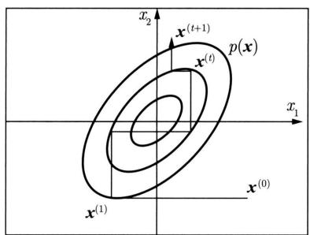  
图19.10 单分量Metropolis-Hastings算法示例

# 19.7 吉布斯抽样

本节叙述马尔可夫链蒙特卡罗法的常用算法吉布斯抽样，可以认为是Metropolis-Hastings算法的特殊情况，但是更容易实现，因而被广泛使用。

# 19.7.1 基本原理

吉布斯抽样（Gibbs sampling）用于多元变量联合分布的抽样和估计①。其基本做法是：从联合概率分布定义满条件概率分布，依次对满条件概率分布进行抽样，得到样本的序列。可以证明这样的抽样过程是在一个马尔可夫链上的随机游走，每一个样本对应着马尔可夫链的状态，平稳分布就是目标的联合分布。整体成为一个马尔可夫链蒙特卡罗法，燃烧期之后的样本就是联合分布的随机样本。

假设多元变量的联合概率分布为 $p(\boldsymbol{x}) = p(x_1, x_2, \dots, x_k)$ 。吉布斯抽样从一个初始样本 $\boldsymbol{x}^{(0)} = (x_1^{(0)}, x_2^{(0)}, \dots, x_k^{(0)})^{\mathrm{T}}$ 出发，不断进行迭代，每一次迭代得到联合分布的一个样本 $\boldsymbol{x}^{(i)} = (x_1^{(i)}, x_2^{(i)}, \dots, x_k^{(i)})^{\mathrm{T}}$ 。最终得到样本序列 $\{\boldsymbol{x}^{(0)}, \boldsymbol{x}^{(1)}, \dots, \boldsymbol{x}^{(n)}\}$ 。

在每次迭代中，依次对 $k$ 个随机变量中的一个变量进行随机抽样。如果在第 $i$ 次迭代中，对第 $j$ 个变量进行随机抽样，那么抽样的分布是满条件概率分布 $p(x_{j}|\boldsymbol{x}_{-j}^{(i)})$ ，这里 $\boldsymbol{x}_{-j}^{(i)}$ 表示第 $i$ 次迭代中变量 $j$ 以外的其他变量。

设在第 $(i - 1)$ 步得到样本 $\pmb{x}^{(i - 1)} = (x_1^{(i - 1)}, x_2^{(i - 1)}, \dots, x_k^{(i - 1)})^{\mathrm{T}}$ ，在第 $i$ 步，首先对第一个变量按照以下满条件概率分布随机抽样：

$$
p \left(x _ {1} \mid x _ {2} ^ {(t - 1)}, \dots , x _ {k} ^ {(t - 1)}\right)
$$

得到 $x_{1}^{(i)}$ ，之后依次对第 $j$ 个变量按照以下满条件概率分布随机抽样：

$$
p \left(x _ {j} \mid x _ {1} ^ {(i)}, \dots , x _ {j - 1} ^ {(i)}, x _ {j + 1} ^ {(i - 1)}, \dots , x _ {k} ^ {(i - 1)}\right), \quad j = 2, 3, \dots , k - 1
$$

得到 $x_{j}^{(i)}$ ，最后对第 $k$ 个变量按照以下满条件概率分布随机抽样：

$$
p (x _ {k} | x _ {1} ^ {(i)}, \dots , x _ {k - 1} ^ {(i)})
$$

得到 $x_{k}^{(i)}$ ，于是得到整体样本 $\pmb{x}^{(i)} = (x_1^{(i)},x_2^{(i)},\dots ,x_k^{(i)})^{\mathrm{T}}$ 。

吉布斯抽样是单分量Metropolis-Hastings算法的特殊情况。定义建议分布是当前变量 $x_{j}$ ， $j = 1,2,\dots ,k$ 的满条件概率分布：

$$
q \left(\boldsymbol {x}, \boldsymbol {x} ^ {\prime}\right) = p \left(x _ {j} ^ {\prime} \mid \boldsymbol {x} _ {- j}\right) \tag {19.50}
$$

这时，接受概率 $\alpha = 1$

$$
\begin{array}{l} \alpha (\boldsymbol {x}, \boldsymbol {x} ^ {\prime}) = \min  \left\{1, \frac {p (\boldsymbol {x} ^ {\prime}) q \left(\boldsymbol {x} ^ {\prime} , \boldsymbol {x}\right)}{p (\boldsymbol {x}) q \left(\boldsymbol {x} , \boldsymbol {x} ^ {\prime}\right)} \right\} \\ = \min  \left\{1, \frac {p \left(\boldsymbol {x} _ {- j} ^ {\prime}\right) p \left(x _ {j} ^ {\prime} \mid \boldsymbol {x} _ {- j} ^ {\prime}\right) p \left(x _ {j} \mid \boldsymbol {x} _ {- j} ^ {\prime}\right)}{p \left(\boldsymbol {x} _ {- j}\right) p \left(x _ {j} \mid \boldsymbol {x} _ {- j}\right) p \left(x _ {j} ^ {\prime} \mid \boldsymbol {x} _ {- j}\right)} \right\} = 1 \tag {19.51} \\ \end{array}
$$

这里用到 $p(\boldsymbol{x}_{-j}) = p(\boldsymbol{x'}_{-j})$ 和 $p(\bullet |\boldsymbol{x}_{-j}) = p(\bullet |\boldsymbol{x'}_{-j})$ 。

转移核就是满条件概率分布：

$$
p (\boldsymbol {x}, \boldsymbol {x} ^ {\prime}) = p \left(x _ {j} ^ {\prime} \mid \boldsymbol {x} _ {- j}\right) \tag {19.52}
$$

也就是说，依次按照单变量的满条件概率分布 $p(x_{j}^{\prime}|x_{-j})$ 进行随机抽样，就能实现单分量Metropolis-Hastings算法。吉布斯抽样对每次抽样的结果都接受，没有拒绝，这一点和一般的Metropolis-Hastings算法不同。

这里，假设满条件概率分布 $p(x_{j}^{\prime}|\boldsymbol{x}_{-j})$ 不为0，即马尔可夫链是不可约的。

# 19.7.2 吉布斯抽样算法

# 算法19.4（吉布斯抽样）

输入：目标概率分布的密度函数 $p(\pmb {x})$ ，函数 $f(x)$ 。

输出： $p(\pmb {x})$ 的随机样本 $\pmb{x}_{m + 1},\pmb{x}_{m + 2},\dots ,\pmb{x}_n$ ，函数样本均值 $f_{mn}$ 。

参数：收敛步数 $m$ ，迭代步数 $n$ 。

（1）初始化。给出初始样本 $\pmb{x}^{(0)} = (x_1^{(0)}, x_2^{(0)}, \dots, x_k^{(0)})^{\mathrm{T}}$ 。

（2）对 $i$ 循环执行：

设第 $(i - 1)$ 次迭代结束时的样本为 $\pmb{x}^{(i - 1)} = (x_1^{(i - 1)}, x_2^{(i - 1)}, \dots, x_k^{(i - 1)})^{\mathrm{T}}$ ，则第 $i$ 次迭代进行如下几步操作：

①由满条件分布 $p(x_{1}|x_{2}^{(i - 1)},x_{3}^{(i - 1)},\dots ,x_{k}^{(i - 1)})$ 抽取 $x_{1}^{(i)}$

中

②由满条件分布 $p(x_{j}|x_{1}^{(i)},x_{2}^{(i)},\dots ,x_{j - 1}^{(i)},x_{j + 1}^{(i - 1)},\dots ,x_{k}^{(i - 1)})$ 抽取 $x_{j}^{(i)}$

中

③由满条件分布 $p(x_{k}|x_{1}^{(i)},x_{2}^{(i)},\dots ,x_{k - 1}^{(i)})$ 抽取 $x_{k}^{(i)}$ ；得到第 $i$ 次迭代值 $\pmb{x}^{(i)} = (x_1^{(i)}$ $x_{2}^{(i)},\dots ,x_{k}^{(i)})^{\mathrm{T}}$ 。

（3）得到样本集合

$$
\left\{\boldsymbol {x} ^ {(m + 1)}, \boldsymbol {x} ^ {(m + 2)}, \dots , \boldsymbol {x} ^ {(n)} \right\}
$$

（4）计算

$$
f _ {m n} = \frac {1}{n - m} \sum_ {i = m + 1} ^ {n} f \left(\boldsymbol {x} ^ {(i)}\right)
$$

例19.10 用吉布斯抽样从以下二元正态分布中抽取随机样本。

$$
\boldsymbol {x} = \left(x _ {1}, x _ {2}\right) ^ {\mathrm {T}} \sim p \left(x _ {1}, x _ {2}\right)
$$

$$
p (x _ {1}, x _ {2}) = N (0, \boldsymbol {\Sigma}), \quad \boldsymbol {\Sigma} = \left[ \begin{array}{c c} 1 & \rho \\ \rho & 1 \end{array} \right]
$$

解 条件概率分布为一元正态分布：

$$
p \left(x _ {1} \mid x _ {2}\right) = N \left(\rho x _ {2}, 1 - \rho^ {2}\right)
$$

$$
p \left(x _ {2} \mid x _ {1}\right) = N \left(\rho x _ {1}, 1 - \rho^ {2}\right)
$$

假设初始样本为 $x^{(0)} = (x_1^{(0)}, x_2^{(0)})$ ，通过吉布斯抽样，可以得到以下样本序列：

<table><tr><td>迭代次数</td><td>对x1抽样</td><td>对x2抽样</td><td>产生样本</td></tr><tr><td>1</td><td>x1~N(ρx2(0),1-ρ2)，得到x1(1)</td><td>x2~N(ρx1(1),1-ρ2)，得到x2(1)</td><td>x(1)=(x1(1),x2(1))T</td></tr><tr><td>:</td><td>:</td><td>:</td><td>:</td></tr><tr><td>i</td><td>x1~N(ρx2(i-1),1-ρ2)，得到x1(i)</td><td>x2~N(ρx1(i),1-ρ2)，得到x2(i)</td><td>x(i)=(x1(i),x2(i))T</td></tr><tr><td>:</td><td>:</td><td>:</td><td>:</td></tr></table>

得到的样本集合 $\{\pmb{x}^{(m + 1)},\pmb{x}^{(m + 2)},\dots ,\pmb{x}^{(n)}\}$ ， $m < n$ 就是二元正态分布的随机抽样。图19.11示意了吉布斯抽样的过程。

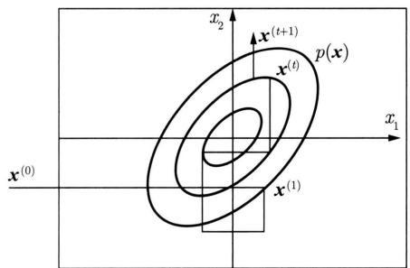  
图19.11 吉布斯抽样例

单分量Metropolis-Hastings算法和吉布斯抽样的不同之处在于，在前者算法中，抽样会在样本点之间移动，但其间可能在某一些样本点上停留（由于抽样被拒绝）；而在后者算法中，抽样会在样本点之间持续移动。

吉布斯抽样适合于满条件概率分布容易抽样的情况，而单分量Metropolis-Hastings算法适合于满条件概率分布不容易抽样的情况，这时使用容易抽样的条件分布作建议分布。

# 19.7.3 抽样计算

吉布斯抽样中需要对满条件概率分布进行重复多次抽样，可以利用概率分布的性质提高抽样的效率。下面以贝叶斯学习为例介绍这个技巧。

设 $\pmb{d}$ 表示观测数据， $\alpha, \theta, z$ 分别表示超参数、模型参数、隐变量， $\pmb{m} = (\alpha, \theta, z)$ ，如图19.12所示。贝叶斯学习的目的是估计后验概率分布 $p(m|d)$ ，求后验概率最大的模型。

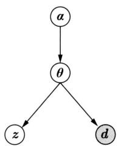  
图19.12 贝叶斯学习的图模型表示

$$
p (\boldsymbol {m} | \boldsymbol {d}) = p (\boldsymbol {\alpha}, \boldsymbol {\theta}, \boldsymbol {z} | \boldsymbol {d}) \propto p (\boldsymbol {z}, \boldsymbol {d} | \boldsymbol {\theta}) p (\boldsymbol {\theta} | \boldsymbol {\alpha}) p (\boldsymbol {\alpha}) \tag {19.53}
$$

式中 $p(\alpha)$ 是超参数分布， $p(\theta|\alpha)$ 是先验分布， $p(z, d|\theta)$ 是完全数据的分布。

现在用吉布斯抽样估计 $p(m|d)$ ，其中 $\pmb{d}$ 已知， $m = (\alpha, \theta, z)$ 未知。吉布斯抽样中各个变量 $\alpha, \theta, z$ 的满条件分布有以下关系：

$$
p \left(\alpha_ {i} \mid \boldsymbol {\alpha} _ {- i}, \boldsymbol {\theta}, \boldsymbol {z}, \boldsymbol {d}\right) \propto p (\boldsymbol {\theta} \mid \boldsymbol {\alpha}) p (\boldsymbol {\alpha}) \tag {19.54}
$$

$$
p \left(\theta_ {j} \mid \boldsymbol {\theta} _ {- j}, \boldsymbol {\alpha}, \boldsymbol {z}, \boldsymbol {d}\right) \propto p (\boldsymbol {z}, \boldsymbol {d} \mid \boldsymbol {\theta}) p (\boldsymbol {\theta} \mid \boldsymbol {\alpha}) \tag {19.55}
$$

$$
p \left(z _ {k} \mid \boldsymbol {z} _ {- k}, \boldsymbol {\alpha}, \boldsymbol {\theta}, \boldsymbol {d}\right) \propto p (\boldsymbol {z}, \boldsymbol {d} | \boldsymbol {\theta}) \tag {19.56}
$$

其中， $\alpha_{-i}$ 表示变量 $\alpha_{i}$ 以外的所有变量， $\theta_{-j}$ 和 $z_{-k}$ 类似。满条件概率分布与若干条件概率分布的乘积成正比，各个条件概率分布只由少量的相关变量组成（图模型中相邻结点表示的变量）。所以，依满条件概率分布的抽样可以通过依这些条件概率分布的乘积的抽样进行。这样可以大幅减少抽样的计算复杂度，因为计算只涉及部分变量。

# 本章概要

1. 蒙特卡罗法是通过基于概率模型的抽样进行数值近似计算的方法，蒙特卡罗法可以用于概率分布的抽样、概率分布数学期望的估计、定积分的近似计算。

随机抽样是蒙特卡罗法的一种应用，有直接抽样法、接受-拒绝抽样法、重要性抽样等。接受-拒绝法的基本想法是找一个容易抽样的建议分布，其密度函数的数倍大于等于想要抽样的概率分布的密度函数。按照建议分布随机抽样得到样本，再按照要抽样的概率分布与建议分布的倍数的比例随机决定接受或拒绝该样本，循环执行以上过程。

数学期望估计是蒙特卡罗法的另一种应用，按照概率分布 $p(\boldsymbol{x})$ 抽取随机变量 $\boldsymbol{x}$ 的 $n$ 个独立样本，根据大数定律，当样本容量增大时，函数的样本均值以概率1收敛于函数的数学期望：

$$
\hat {f} _ {n} \rightarrow \mathbb {E} _ {p (\boldsymbol {x})} [ f (\boldsymbol {x}) ], \quad n \rightarrow \infty
$$

计算样本均值 $\hat{f}_n$ ，作为数学期望 $\mathbb{E}_{p(\boldsymbol{x})}[f(\boldsymbol{x})]$ 的估计值。

重要性抽样可以用于计算关于一个概率分布的函数的数学期望。特别适合于目标的概率分布复杂、不容易抽样的情况。重要性抽样从一个更容易抽样的建议分布中抽取样本，然后赋予每个样本一个重要性权重，计算这些样本的加重要性权重的函数值的平均，作为目标分布的期望。重要性权重表示样本在目标分布和建议分布的概率密度之比。

2. 马尔可夫链是具有马尔可夫性的随机过程：

$$
P \left(X _ {t} \mid X _ {0} X _ {1} \dots X _ {t - 1}\right) = P \left(X _ {t} \mid X _ {t - 1}\right), \quad t = 1, 2, \dots
$$

通常考虑时间齐次马尔可夫链。有离散状态马尔可夫链和连续状态马尔可夫链，分别由概率转移矩阵 $\pmb{P}$ 和概率转移核 $p(x,y)$ 定义。

满足 $\pi = P\pi$ 或 $\pi (y) = \int p(x,y)\pi (x)\mathrm{d}x$ 的状态分布称为马尔可夫链的平稳分布。

马尔可夫链有不可约性、非周期性、正常返等性质。一个马尔可夫链若是不可约、非周

期、正常返的，则该马尔可夫链满足遍历定理。当时间趋于无穷时，马尔可夫链的状态分布趋近于平稳分布，函数的样本平均依概率收敛于该函数的数学期望。

$$
\lim  _ {t \rightarrow \infty} P (X _ {t} = i | X _ {0} = j) = \pi_ {i}, \quad i = 1, 2, \dots , \quad j = 1, 2, \dots
$$

$$
\hat {f} _ {t} \rightarrow \mathbb {E} _ {\pi} [ f (X) ], \quad t \rightarrow \infty
$$

可逆马尔可夫链一定有平稳分布，但平稳分布并不唯一。如果可逆马尔可夫链满足遍历定理条件，则该马尔可夫链的平稳分布唯一。

3. 马尔可夫链蒙特卡罗法是以马尔可夫链为概率模型的蒙特卡罗积分方法，其基本想法如下：

（1）在随机变量 $\pmb{x}$ 的状态空间 $\mathcal{X}$ 上构造一个满足遍历定理条件的马尔可夫链，其平稳分布为目标分布 $p(x)$ ；

（2）由状态空间的某一点 $X_0$ 出发，用所构造的马尔可夫链进行随机游走，产生样本序列 $X_{1}, X_{2}, \dots, X_{t}, \dots$ ；

（3）应用马尔可夫链遍历定理，确定正整数 $m$ 和 $n(m < n)$ ，得到样本集合 $\{\pmb{x}_{m+1}, \pmb{x}_{m+2}, \dots, \pmb{x}_n\}$ ，进行函数 $f(\pmb{x})$ 的均值（遍历均值）估计：

$$
\hat {f} _ {m, n} = \frac {1}{n - m} \sum_ {i = m + 1} ^ {n} f (\boldsymbol {x} _ {i})
$$

4. Metropolis-Hastings 算法是最基本的马尔可夫链蒙特卡罗法。假设目标是对概率分布 $p(\boldsymbol{x})$ 进行抽样，构造建议分布 $q(\boldsymbol{x}, \boldsymbol{x}')$ ，定义接受分布 $\alpha(\boldsymbol{x}, \boldsymbol{x}')$ 。进行随机游走，假设当前处于状态 $\boldsymbol{x}$ ，按照建议分布 $q(\boldsymbol{x}, \boldsymbol{x}')$ 随机抽样，按照概率 $\alpha(\boldsymbol{x}, \boldsymbol{x}')$ 接受抽样，转移到状态 $\boldsymbol{x}'$ ，按照概率 $1 - \alpha(\boldsymbol{x}, \boldsymbol{x}')$ 拒绝抽样，停留在状态 $\boldsymbol{x}$ ，持续以上操作，得到一系列样本。这样的随机游走是根据转移核为 $p(\boldsymbol{x}, \boldsymbol{x}') = q(\boldsymbol{x}, \boldsymbol{x}')\alpha(\boldsymbol{x}, \boldsymbol{x}')$ 的可逆马尔可夫链（满足遍历定理条件）进行的，其平稳分布就是要抽样的目标分布 $p(\boldsymbol{x})$ 。

5. 吉布斯抽样（Gibbs sampling）用于多元联合分布的抽样和估计，是单分量Metropolis-Hastings算法的特殊情况。这时建议分布为满条件概率分布

$$
q (\boldsymbol {x}, \boldsymbol {x} ^ {\prime}) = p \left(x _ {j} ^ {\prime} \mid \boldsymbol {x} _ {- j}\right)
$$

吉布斯抽样的基本做法是：从联合分布定义满条件概率分布，依次从满条件概率分布进行抽样，得到联合分布的随机样本。假设多元联合概率分布为 $p(\boldsymbol{x}) = p(x_1, x_2, \dots, x_k)$ ，吉布斯抽样从一个初始样本 $\boldsymbol{x}^{(0)} = (x_1^{(0)}, x_2^{(0)}, \dots, x_k^{(0)})^{\mathrm{T}}$ 出发，不断进行迭代，每一次迭代得到联合分布的一个样本 $\boldsymbol{x}^{(i)} = (x_1^{(i)}, x_2^{(i)}, \dots, x_k^{(i)})^{\mathrm{T}}$ 。在第 $i$ 次迭代中，依次对第 $j$ 个变量按照满条件概率分布随机抽样 $p(x_j | x_1^{(i)}, \dots, x_{j-1}^{(i)}, x_{j+1}^{(i-1)}, \dots, x_k^{(i-1)})$ ， $j = 1, 2, \dots, k$ ，得到 $x_j^{(i)}$ 。最终得到样本序列 $\{\boldsymbol{x}^{(0)}, \boldsymbol{x}^{(1)}, \dots, \boldsymbol{x}^{(n)}\}$ 。

# 继续阅读

马尔可夫链的介绍可见文献 [1]。Metropolis-Hastings 算法和吉布斯抽样的原始论文分别见文献 [2] 和文献 [3]。随机抽样的介绍见文献 [4]。马尔可夫链蒙特卡罗法的介绍可以参阅文

献 [4]~文献 [8], 也可以观看 YouTube 上的视频: Mathematicalmonk, Markov Chain Monte Carlo (MCMC) Introduction。

# 习题

19.1 推导函数 $f(x)$ 关于目标分布 $p(x)$ 的方差 $\sigma_{p(x)}^2 [f(x)]$ 和重要性抽样估计量的方差 $\sigma_{q(x)}^2\left[\frac{p(x)}{q(x)}f(x)\right]$ 的表达式，并比较两者的差异。

19.2 用蒙特卡罗积分法求

$$
\int_ {- \infty} ^ {\infty} x ^ {2} \exp \left(- \frac {x ^ {2}}{2}\right) \mathrm {d} x
$$

19.3 证明如果马尔可夫链是不可约的，且有一个状态是非周期的，则其他所有状态也是非周期的，即这个马尔可夫链是非周期的。

19.4 验证具有以下转移概率矩阵的马尔可夫链是可约的，但是非周期的。

$$
\boldsymbol {P} = \left[ \begin{array}{c c c c} 1 / 2 & 1 / 2 & 0 & 0 \\ 1 / 2 & 0 & 1 / 2 & 0 \\ 0 & 1 / 2 & 0 & 0 \\ 0 & 0 & 1 / 2 & 1 \end{array} \right]
$$

19.5 验证具有以下转移概率矩阵的马尔可夫链是不可约的，但是周期的。

$$
\boldsymbol {P} = \left[ \begin{array}{c c c c} 0 & 1 / 2 & 0 & 0 \\ 1 & 0 & 1 / 2 & 0 \\ 0 & 1 / 2 & 0 & 1 \\ 0 & 0 & 1 / 2 & 0 \end{array} \right]
$$

19.6 证明可逆马尔可夫链一定是不可约的。

19.7 从一般的Metropolis-Hastings算法推导出单分量Metropolis-Hastings算法。

19.8 假设进行伯努利实验，后验概率为 $P(\theta | y)$ ，其中变量 $y \in \{0, 1\}$ 表示实验可能的结果，变量 $\theta$ 表示结果为 1 的概率。再假设先验概率 $P(\theta)$ 遵循 Beta 分布 $B(\alpha, \beta)$ ，其中 $\alpha = 1, \beta = 1$ ；似然函数 $P(y | \theta)$ 遵循二项分布 $\mathrm{Bin}(n, k, \theta)$ ，其中 $n = 10, k = 4$ ，即实验进行 10 次，其中结果为 1 的次数为 4。试用 Metropolis-Hastings 算法求后验概率分布 $P(\theta | y) \propto P(\theta) P(y | \theta)$ 的均值和方差。（提示：可采用 Metropolis 选择，即假设建议分布是对称的）

19.9 设某试验可能有五种结果，其出现的概率分别为

$$
\frac {\theta}{4} + \frac {1}{8}, \quad \frac {\theta}{4}, \quad \frac {\eta}{4}, \quad \frac {\eta}{4} + \frac {3}{8}, \quad \frac {1}{2} (1 - \theta - \eta)
$$

模型含有两个参数 $\theta$ 和 $\eta$ ，都介于0和1之间。现有22次试验结果的观测值为

$$
y = \left(y _ {1}, y _ {2}, y _ {3}, y _ {4}, y _ {5}\right) = (1 4, 1, 1, 1, 5)
$$

其中， $y_{i}$ 表示22次试验中第 $i$ 个结果出现的次数， $i = 1,2,\dots,5$ 。试用吉布斯抽样估计参数 $\theta$ 和 $\eta$ 的均值和方差。

# 参考文献

[1] SERFOZO R. Basics of applied stochastic processes[M]. Springer, 2009.   
[2] METROPOLIS N, ROSENBLUTH A W, ROSENBLUTH M N, et al. Equation of state calculations by fast computing machines[J]. The Journal of Chemical Physics, 1953, 21(6): 1087-1092.   
[3] GEMAN S, GEMAN D. Stochastic relaxation, Gibbs distribution and the Bayesian restoration of images[J]. IEEE Transactions on Pattern Analysis and Machine Intelligence, 1984, 6: 721-741.   
[4] BISHOP C M. Pattern recognition and machine learning[M]. Springer, 2006.   
[5] GILKS W R, RICHARDSON S, SPIEGELHALTER D J. Introducing Markov chain Monte Carlo[M]. Markov Chain Monte Carlo in Practice, 1996.   
[6] ANDRIEU C, DE FREITAS N, DOUCET A, et al. An introduction to MCMC for machine learning[J]. Machine Learning, 2003, 50(1-2): 5-43.   
[7] HOFF P. A first course in Bayesian statistical methods[M]. Springer, 2009.   
[8] 苎诗松，王静龙，濮晓龙. 高等数理统计 [M]. 北京：高等教育出版社，1998.

# 第20章 潜在语义分析和非负矩阵分解

潜在语义分析（latent semantic analysis，LSA）是一种无监督学习方法，主要用于文本的话题分析，其特点是通过矩阵分解发现文本与单词之间的基于话题的语义关系。潜在语义分析由Deerwester等于1990年提出，最初应用于文本信息检索，所以也被称为潜在语义索引（latent semantic indexing，LSI），在推荐系统、图像处理、生物信息学等领域也有广泛应用。

文本信息处理中，传统的方法以单词向量表示文本的语义内容，以单词向量空间的度量表示文本之间的语义相似度。潜在语义分析旨在解决这种方法不能准确表示语义的问题，试图从大量的文本数据中发现潜在的话题，以话题向量表示文本的语义内容，以话题向量空间的度量更准确地表示文本之间的语义相似度。这也是话题分析（topic modeling）的基本想法。

潜在语义分析使用的是非概率的话题分析模型。具体地，将文本集合表示为单词-文本矩阵，对单词-文本矩阵进行奇异值分解，从而得到话题向量空间，以及文本在话题向量空间的表示。奇异值分解（singular value decomposition，SVD）即在第16章介绍的矩阵因子分解方法，其特点是分解的矩阵正交。

非负矩阵分解（non-negative matrix factorization，NMF）是另一种矩阵的因子分解方法，其特点是分解的矩阵非负。1999年Lee和Sheung的论文[1]发表之后，非负矩阵分解引起高度重视和广泛使用。非负矩阵分解也可以用于话题分析。

本章20.1节介绍单词向量空间模型和话题向量空间模型，指出进行潜在语义分析的必要性。20.2节叙述潜在语义分析的奇异值分解算法。20.3节叙述非负矩阵分解算法。

# 20.1 单词向量空间与话题向量空间

# 20.1.1 单词向量空间

文本信息处理，如文本信息检索、文本数据挖掘的一个核心问题是对文本的语义内容进行表示，并进行文本之间的语义相似度计算。最简单的方法是利用向量空间模型（vector space model, VSM），也就是单词向量空间模型（word vector space model）。向量空间模型的基本想法是：给定一个文本，用一个向量表示该文本的“语义”，向量的每一维对应一个单词，其数值为该单词在该文本中出现的频数或权值；基本假设是文本中所有单词的出现情况表示了文本的语义内容；文本集合中的每个文本都表示为一个向量，存在于一个向量空间；

向量空间的度量，如内积或标准化内积表示文本之间的“语义相似度”。

例如，文本信息检索的任务是用户提出查询时，帮助用户找到与查询最相关的文本，以排序的形式展示给用户。一个最简单的做法是采用单词向量空间模型，将查询与文本表示为单词的向量，计算查询向量与文本向量的内积，作为语义相似度，以这个相似度的高低对文本进行排序。在这里，查询被看作一个伪文本，查询与文本的语义相似度表示查询与文本的相关性。

下面给出严格定义。给定一个含有 $n$ 个文本的集合 $\mathcal{D} = \{d_1, d_2, \dots, d_n\}$ ，以及在所有文本中出现的 $m$ 个单词的集合 $\mathcal{W} = \{w_1, w_2, \dots, w_m\}$ 。将单词在文本中出现的数据用一个单词-文本矩阵（word-document matrix）表示，记作 $\mathbf{X}$ ：

$$
\boldsymbol {X} = \left[ \begin{array}{c c c c} x _ {1 1} & x _ {1 2} & \dots & x _ {1 n} \\ x _ {2 1} & x _ {2 2} & \dots & x _ {2 n} \\ \vdots & \vdots & & \vdots \\ x _ {m 1} & x _ {m 2} & \dots & x _ {m n} \end{array} \right] \tag {20.1}
$$

这是一个 $m \times n$ 矩阵，元素 $x_{ij}$ 表示单词 $w_i$ 在文本 $d_j$ 中出现的频数或权值。由于单词的种类很多，而每个文本中出现单词的种类通常较少，所以单词-文本矩阵是一个稀疏矩阵。

权值通常用单词频率-逆文本频率（term frequency-inverse document frequency，TF-IDF）表示，其定义是

$$
\mathrm {T F - I D F} _ {i j} = \frac {\mathrm {t f} _ {i j}}{\mathrm {t f} _ {j}} \log \frac {\mathrm {d f}}{\mathrm {d f} _ {i}}, \quad i = 1, 2, \dots , m, \quad j = 1, 2, \dots , n \tag {20.2}
$$

式中 $\mathrm{tf}_{ij}$ 是单词 $w_{i}$ 出现在文本 $d_{j}$ 中的频数， $\mathrm{tf}_{j}$ 是文本 $d_{j}$ 中出现的所有单词的频数之和， $\mathrm{df}_{i}$ 是含有单词 $w_{i}$ 的文本数， $\mathrm{df}$ 是文本集合 $\mathcal{D}$ 的全部文本数。直观上，一个单词在一个文本中出现的频数越高，这个单词在这个文本中的重要度就越高；一个单词在整个文本集合中出现的文本数越少，这个单词就越能表示其所在文本的特点，重要度就越高；一个单词在一个文本的 TF-IDF 是两种重要度的积，表示综合重要度。

单词向量空间模型直接使用单词-文本矩阵的信息。单词-文本矩阵的第 $j$ 列向量 $\pmb{x}_j$ 表示文本 $d_j$ :

$$
\boldsymbol {x} _ {j} = \left[ \begin{array}{c} x _ {1 j} \\ x _ {2 j} \\ \vdots \\ x _ {m j} \end{array} \right], \quad j = 1, 2, \dots , n \tag {20.3}
$$

其中， $x_{ij}$ 是单词 $w_i$ 在文本 $d_j$ 的权值， $i = 1,2,\dots,m$ ，权值越大，该单词在该文本中的重要度就越高。这时矩阵 $\mathbf{X}$ 也可以写作 $\mathbf{X} = [\pmb{x}_1,\pmb{x}_2,\dots,\pmb{x}_n]$ 。

两个单词向量的内积或标准化内积（余弦）表示对应的文本之间的语义相似度。因此，文本 $d_{i}$ 与 $d_{j}$ 之间的相似度为

$$
\boldsymbol {x} _ {i} \cdot \boldsymbol {x} _ {j}, \quad \frac {\boldsymbol {x} _ {i} \cdot \boldsymbol {x} _ {j}}{\| \boldsymbol {x} _ {i} \| \| \boldsymbol {x} _ {j} \|} \tag {20.4}
$$

式中·表示向量的内积， $\| \cdot \|$ 表示向量的范数。

直观上，在两个文本中共同出现的单词越多，其语义内容就越相近，这时，对应的单词向量同不为零的维度就越多，内积就越大（单词向量元素的值都是非负的），表示两个文本在语义内容上越相似。这个模型虽然简单，却能很好地表示文本之间的语义相似度，与人们对语义相似度的判断接近，在一定程度上能够满足应用的需求，至今仍在文本信息检索、文本数据挖掘等领域被广泛使用，可以认为是文本信息处理的一个基本原理。注意，两个文本的语义相似度并不是由一两个单词是否在两个文本中出现决定，而是由所有的单词在两个文本中共同出现的“模式”决定。

单词向量空间模型的优点是模型简单，计算效率高。因为单词向量通常是稀疏的，两个向量的内积计算只需要在其同不为零的维度上进行即可，需要的计算很少，可以高效地完成。单词向量空间模型也有一定的局限性，体现在内积相似度未必能够准确表达两个文本的语义相似度上。因为自然语言的单词具有一词多义性（polysemy）及多词一义性（synonymy），即同一个单词可以表示多个语义，多个单词可以表示同一个语义，所以基于单词向量的相似度计算存在不精确的问题。

图20.1给出一个例子——单词-文本矩阵，每一行表示一个单词，每一列表示一个文本，矩阵的每一个元素表示单词在文本中出现的频数，频数0省略。单词向量空间模型中，文本 $d_{1}$ 与 $d_{2}$ 相似度并不高，尽管两个文本的内容相似，这是因为同义词“airplane”与“aircraft”被当作两个独立的单词，单词向量空间模型不考虑单词的同义性，在此情况下无法进行准确的相似度计算。另外，文本 $d_{3}$ 与 $d_{4}$ 有一定的相似度，尽管两个文本的内容并不相似，这是因为单词“apple”具有多义，可以表示“apple computer”和“fruit”，单词向量空间模型不考虑单词的多义性，在此情况下也无法进行准确的相似度计算。

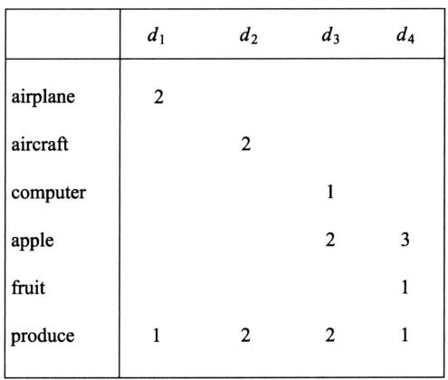  
图20.1 单词-文本矩阵例

# 20.1.2 话题向量空间

两个文本的语义相似度可以体现在两者的话题相似度上。所谓话题（topic），并没有严格的定义，就是指文本所讨论的内容或主题。一个文本一般含有若干个话题。如果两个文本的话题相似，那么两者的语义应该也相似。话题可以由若干个语义相关的单词表示，同义

词（如“airplane”与“aircraft”）可以表示同一个话题，而多义词（如“apple”）可以表示不同的话题。这样，基于话题的模型就可以解决上述基于单词的模型存在的问题。

可以设想定义一种话题向量空间模型（topic vector space model）。给定一个文本，用话题空间的一个向量表示该文本，该向量的每一分量对应一个话题，其数值为该话题在该文本中出现的权值。用两个向量的内积或标准化内积表示对应的两个文本的语义相似度。注意话题的个数通常远远小于单词的个数，话题向量空间模型更加抽象。事实上潜在语义分析正是构建话题向量空间的方法（即话题分析的方法），单词向量空间模型与话题向量空间模型可以互为补充，现实中，两者可以同时使用。

# 1. 话题向量空间

给定一个文本集合 $\mathcal{D} = \{d_1, d_2, \dots, d_n\}$ 和一个相应的单词集合 $\mathcal{W} = \{w_1, w_2, \dots, w_m\}$ ，可以获得其单词-文本矩阵 $\pmb{X}$ ， $\pmb{X}$ 构成原始的单词向量空间，每一列是一个文本在单词向量空间中的表示。

$$
\boldsymbol {X} = \left[ \begin{array}{c c c c} x _ {1 1} & x _ {1 2} & \dots & x _ {1 n} \\ x _ {2 1} & x _ {2 2} & \dots & x _ {2 n} \\ \vdots & \vdots & & \vdots \\ x _ {m 1} & x _ {m 2} & \dots & x _ {m n} \end{array} \right] \tag {20.5}
$$

矩阵 $\pmb{X}$ 也可以写作 $\pmb {X} = [\pmb {x}_1,\pmb {x}_2,\dots ,\pmb {x}_n]$

假设所有文本共含有 $k$ 个话题，每个话题由一个定义在单词集合 $\mathcal{W}$ 上的 $m$ 维向量表示，称为话题向量，即

$$
\boldsymbol {t} _ {l} = \left[ \begin{array}{c} t _ {1 l} \\ t _ {2 l} \\ \vdots \\ t _ {m l} \end{array} \right], \quad l = 1, 2, \dots , k \tag {20.6}
$$

其中， $t_{il}$ 是单词 $w_{i}$ 在话题 $t_{l}$ 的权值， $i = 1,2,\dots,m$ ，权值越大，该单词在该话题中的重要度就越高。这 $k$ 个话题向量 $\pmb{t}_1,\pmb{t}_2,\dots,\pmb{t}_k$ 张成一个话题向量空间（topic vector space），维数为 $k$ 。注意话题向量空间 $\pmb{T}$ 是单词向量空间 $\pmb{X}$ 的一个子空间。

话题向量空间 $\pmb{T}$ 也可以表示为一个矩阵，称为单词-话题矩阵（word-topic matrix），记作

$$
\boldsymbol {T} = \left[ \begin{array}{c c c c} t _ {1 1} & t _ {1 2} & \dots & t _ {1 k} \\ t _ {2 1} & t _ {2 2} & \dots & t _ {2 k} \\ \vdots & \vdots & & \vdots \\ t _ {m 1} & t _ {m 2} & \dots & t _ {m k} \end{array} \right] \tag {20.7}
$$

矩阵 $\pmb{T}$ 也可以写作 $\pmb {T} = [t_1,t_2,\dots ,t_k]$

# 2. 文本在话题向量空间的表示

现在考虑文本集合 $\mathcal{D}$ 的文本 $d_{j}$ ，在单词向量空间中由一个向量 $\pmb{x}_{j}$ 表示，将 $\pmb{x}_{j}$ 投影到

话题向量空间 $\pmb{T}$ 中，得到在话题向量空间的一个向量 $\pmb{y}_j$ ， $\pmb{y}_j$ 是一个 $k$ 维向量，其表达式为

$$
\boldsymbol {y} _ {j} = \left[ \begin{array}{c} y _ {1 j} \\ y _ {2 j} \\ \vdots \\ y _ {k j} \end{array} \right], \quad j = 1, 2, \dots , n \tag {20.8}
$$

其中， $y_{lj}$ 是文本 $d_j$ 在话题 $\pmb{t}_l$ 的权值， $l = 1,2,\dots,k$ ，权值越大，该话题在该文本中的重要度就越高。

矩阵 $\mathbf{Y}$ 表示话题在文本中出现的情况，称为话题-文本矩阵（topic-document matrix），记作

$$
\mathbf {Y} = \left[ \begin{array}{c c c c} y _ {1 1} & y _ {1 2} & \dots & y _ {1 n} \\ y _ {2 1} & y _ {2 2} & \dots & y _ {2 n} \\ \vdots & \vdots & & \vdots \\ y _ {k 1} & y _ {k 2} & \dots & y _ {k n} \end{array} \right] \tag {20.9}
$$

矩阵 $\pmb{Y}$ 也可以写作 $\pmb {Y} = [\pmb {y}_1,\pmb {y}_2,\dots ,\pmb {y}_n]$

# 3. 从单词向量空间到话题向量空间的线性变换

这样一来，在单词向量空间的文本向量 $\pmb{x}_j$ 可以通过它在话题空间中的向量 $\pmb{y}_j$ 近似表示，具体地，由 $k$ 个话题向量以 $\pmb{y}_j$ 为系数的线性组合近似表示。

$$
\boldsymbol {x} _ {j} \approx y _ {1 j} \boldsymbol {t} _ {1} + y _ {2 j} \boldsymbol {t} _ {2} + \dots + y _ {k j} \boldsymbol {t} _ {k}, \quad j = 1, 2, \dots , n \tag {20.10}
$$

所以，单词-文本矩阵 $X$ 可以近似地表示为单词-话题矩阵 $\pmb{T}$ 与话题-文本矩阵 $\pmb{Y}$ 的乘积形式。这就是潜在语义分析。

$$
\boldsymbol {X} \approx \boldsymbol {T Y} \tag {20.11}
$$

直观上潜在语义分析是将文本在单词向量空间的表示通过线性变换转换为在话题向量空间中的表示，如图20.2所示。这个线性变换由矩阵因子分解式(20.11)的形式体现。图20.3示意性地表示实现潜在语义分析的矩阵因子分解。

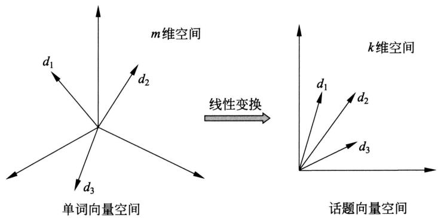  
图20.2 将文本在单词向量空间的表示通过线性变换转换为话题空间的表示

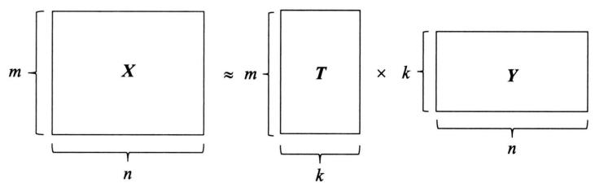  
图20.3 潜在语义分析通过矩阵因子分解实现，单词-文本矩阵 $\pmb{X}$ 可以近似地表示为单词-话题矩阵 $\pmb{T}$ 与话题-文本矩阵 $\pmb{Y}$ 的乘积形式

在原始的单词向量空间中，两个文本 $d_{i}$ 与 $d_{j}$ 的相似度可以由对应的向量的内积表示，即 $\pmb{x}_i\cdot \pmb{x}_j$ 。经过潜在语义分析之后，在话题向量空间中，两个文本 $d_{i}$ 与 $d_{j}$ 的相似度可以由对应的向量的内积即 $\pmb{y}_i\cdot \pmb{y}_j$ 表示。

要进行潜在语义分析，需要同时决定两部分的内容，一是话题向量空间 $\mathbf{T}$ ，二是文本在话题空间的表示 $\mathbf{Y}$ ，使两者的乘积是原始矩阵数据的近似，而这一结果完全从话题-文本矩阵的信息中获得。

# 20.2 潜在语义分析算法

潜在语义分析利用矩阵奇异值分解，具体地，对单词-文本矩阵进行奇异值分解，将其左矩阵作为话题向量空间，将其对角矩阵与右矩阵的乘积作为文本在话题向量空间的表示。

# 20.2.1 矩阵奇异值分解算法

# 1. 单词-文本矩阵

给定文本集合 $\mathcal{D} = \{d_1, d_2, \dots, d_n\}$ 和单词集合 $\mathcal{W} = \{w_1, w_2, \dots, w_m\}$ 。潜在语义分析首先将这些数据表示成一个单词-文本矩阵：

$$
\boldsymbol {X} = \left[ \begin{array}{c c c c} x _ {1 1} & x _ {1 2} & \dots & x _ {1 n} \\ x _ {2 1} & x _ {2 2} & \dots & x _ {2 n} \\ \vdots & \vdots & & \vdots \\ x _ {m 1} & x _ {m 2} & \dots & x _ {m n} \end{array} \right] \tag {20.12}
$$

这是一个 $m \times n$ 矩阵，元素 $x_{ij}$ 表示单词 $w_i$ 在文本 $d_j$ 中出现的频数或权值。

# 2. 截断奇异值分解

潜在语义分析根据确定的话题个数 $k$ 对单词-文本矩阵 $\mathbf{X}$ 进行截断奇异值分解：

$$
\boldsymbol {X} \approx \boldsymbol {U} _ {k} \boldsymbol {\Sigma} _ {k} \boldsymbol {V} _ {k} ^ {\mathrm {T}} = \left[ \begin{array}{l l l l} \boldsymbol {u} _ {1} & \boldsymbol {u} _ {2} & \dots & \boldsymbol {u} _ {k} \end{array} \right] \left[ \begin{array}{c c c c} \sigma_ {1} & & & \\ & \sigma_ {2} & & \\ & & \ddots & \\ & & & \sigma_ {k} \end{array} \right] \left[ \begin{array}{c} \boldsymbol {v} _ {1} ^ {\mathrm {T}} \\ \boldsymbol {v} _ {2} ^ {\mathrm {T}} \\ \vdots \\ \boldsymbol {v} _ {k} ^ {\mathrm {T}} \end{array} \right] \tag {20.13}
$$

式中 $k \leqslant n \leqslant m$ ; $\mathbf{U}_k$ 是 $m \times k$ 矩阵, 它的列由 $\mathbf{X}$ 的前 $k$ 个互相正交的左奇异向量组成; $\pmb{\Sigma}_k$ 是 $k$ 阶对角方阵, 对角元素为前 $k$ 个最大奇异值; $\mathbf{V}_k$ 是 $n \times k$ 矩阵, 它的列由 $\mathbf{X}$ 的前 $k$ 个互相正交的右奇异向量组成。

# 3. 话题向量空间

在单词-文本矩阵 $X$ 的截断奇异值分解式 (20.13) 中，矩阵 $\pmb{U}_k$ 的每一个列向量 $\pmb{u}_1, \pmb{u}_2, \dots, \pmb{u}_k$ 表示一个话题，称为话题向量。由这 $k$ 个话题向量张成一个子空间：

$$
\boldsymbol {U} _ {k} = \left[ \begin{array}{c c c c} \boldsymbol {u} _ {1} & \boldsymbol {u} _ {2} & \dots & \boldsymbol {u} _ {k} \end{array} \right]
$$

称为话题向量空间。

# 4. 文本的话题空间表示

有了话题向量空间，接着考虑文本在话题空间的表示。将式(20.13)写作

$$
\begin{array}{l} \boldsymbol {X} = \left[ \begin{array}{c c c c} \boldsymbol {x} _ {1} & \boldsymbol {x} _ {2} & \dots & \boldsymbol {x} _ {n} \end{array} \right] \approx \boldsymbol {U} _ {k} \boldsymbol {\Sigma} _ {k} \boldsymbol {V} _ {k} ^ {\mathrm {T}} \\ = \left[ \begin{array}{l l l l} \boldsymbol {u} _ {1} & \boldsymbol {u} _ {2} & \dots & \boldsymbol {u} _ {k} \end{array} \right] \left[ \begin{array}{c c c c} \sigma_ {1} & & & \\ & \sigma_ {2} & & \\ & & \ddots & \\ & & & \sigma_ {k} \end{array} \right] \left[ \begin{array}{c c c c} v _ {1 1} & v _ {2 1} & \dots & v _ {n 1} \\ v _ {1 2} & v _ {2 2} & \dots & v _ {n 2} \\ \vdots & \vdots & & \vdots \\ v _ {1 k} & v _ {2 k} & \dots & v _ {n k} \end{array} \right] \\ = \left[ \begin{array}{c c c c} \boldsymbol {u} _ {1} & \boldsymbol {u} _ {2} & \dots & \boldsymbol {u} _ {k} \end{array} \right] \left[ \begin{array}{c c c c} \sigma_ {1} v _ {1 1} & \sigma_ {1} v _ {2 1} & \dots & \sigma_ {1} v _ {n 1} \\ \sigma_ {2} v _ {1 2} & \sigma_ {2} v _ {2 2} & \dots & \sigma_ {2} v _ {n 2} \\ \vdots & \vdots & & \vdots \\ \sigma_ {k} v _ {1 k} & \sigma_ {k} v _ {2 k} & \dots & \sigma_ {k} v _ {n k} \end{array} \right] \tag {20.14} \\ \end{array}
$$

其中，

$$
\boldsymbol {u} _ {l} = \left[ \begin{array}{c} u _ {1 l} \\ u _ {2 l} \\ \vdots \\ u _ {m l} \end{array} \right], \quad l = 1, 2, \dots , k
$$

由式(20.14)知，矩阵 $\mathbf{X}$ 的第 $j$ 列向量 $\pmb{x}_j$ 满足

$$
\begin{array}{l} \boldsymbol {x} _ {j} \approx \boldsymbol {U} _ {k} \left(\boldsymbol {\Sigma} _ {k} \boldsymbol {V} _ {k} ^ {\mathrm {T}}\right) _ {j} \\ = \left[ \begin{array}{c c c c} \boldsymbol {u} _ {1} & \boldsymbol {u} _ {2} & \dots & \boldsymbol {u} _ {k} \end{array} \right] \left[ \begin{array}{c} \sigma_ {1} v _ {j 1} \\ \sigma_ {2} v _ {j 2} \\ \vdots \\ \sigma_ {k} v _ {j k} \end{array} \right] \\ = \sum_ {l = 1} ^ {k} \sigma_ {l} v _ {j l} \boldsymbol {u} _ {l}, \quad j = 1, 2, \dots , n \tag {20.15} \\ \end{array}
$$

式中 $(\pmb{\Sigma}_k\pmb{V}_k^{\mathrm{T}})_j$ 是矩阵 $(\pmb{\Sigma}_k\pmb{V}_k^{\mathrm{T}})$ 的第 $j$ 列向量。式(20.15)是文本 $d_{j}$ 的近似表达式，由 $k$ 个话题向量 $\pmb{u}_{l}$ 的线性组合构成。矩阵 $(\pmb{\Sigma}_k\pmb{V}_k^{\mathrm{T}})$ 的每一个列向量

$$
\left[ \begin{array}{c} \sigma_ {1} v _ {1 1} \\ \sigma_ {2} v _ {1 2} \\ \vdots \\ \sigma_ {k} v _ {1 k} \end{array} \right], \quad \left[ \begin{array}{c} \sigma_ {1} v _ {2 1} \\ \sigma_ {2} v _ {2 2} \\ \vdots \\ \sigma_ {k} v _ {2 k} \end{array} \right], \dots , \left[ \begin{array}{c} \sigma_ {1} v _ {n 1} \\ \sigma_ {2} v _ {n 2} \\ \vdots \\ \sigma_ {k} v _ {n k} \end{array} \right]
$$

是一个文本在话题向量空间的表示。

综上，可以通过对单词-文本矩阵的奇异值分解进行潜在语义分析

$$
\boldsymbol {X} \approx \boldsymbol {U} _ {k} \boldsymbol {\Sigma} _ {k} \boldsymbol {V} _ {k} ^ {\mathrm {T}} = \boldsymbol {U} _ {k} \left(\boldsymbol {\Sigma} _ {k} \boldsymbol {V} _ {k} ^ {\mathrm {T}}\right) \tag {20.16}
$$

得到话题空间 $\pmb{U}_k$ ，以及文本在话题空间的表示 $(\pmb{\Sigma}_k\pmb{V}_k^{\mathrm{T}})$ 。

# 20.2.2 例子

下面介绍潜在语义分析的一个例子①。假设有9个文本、11个单词，单词-文本矩阵 $X$ 为 $11 \times 9$ 矩阵，矩阵的元素是单词在文本中出现的频数，表示如下：

<table><tr><td rowspan="2">单词</td><td colspan="9">文本</td></tr><tr><td>T1</td><td>T2</td><td>T3</td><td>T4</td><td>T5</td><td>T6</td><td>T7</td><td>T8</td><td>T9</td></tr><tr><td>book</td><td></td><td></td><td>1</td><td>1</td><td></td><td></td><td></td><td></td><td></td></tr><tr><td>dads</td><td></td><td></td><td></td><td></td><td></td><td>1</td><td></td><td></td><td>1</td></tr><tr><td>dummies</td><td></td><td>1</td><td></td><td></td><td></td><td></td><td></td><td>1</td><td></td></tr><tr><td>estate</td><td></td><td></td><td></td><td></td><td></td><td></td><td>1</td><td></td><td>1</td></tr><tr><td>guide</td><td>1</td><td></td><td></td><td></td><td></td><td>1</td><td></td><td></td><td></td></tr><tr><td>investing</td><td>1</td><td>1</td><td>1</td><td>1</td><td>1</td><td>1</td><td>1</td><td>1</td><td>1</td></tr><tr><td>market</td><td>1</td><td></td><td>1</td><td></td><td></td><td></td><td></td><td></td><td></td></tr><tr><td>real</td><td></td><td></td><td></td><td></td><td></td><td></td><td>1</td><td></td><td>1</td></tr><tr><td>rich</td><td></td><td></td><td></td><td></td><td></td><td>2</td><td></td><td></td><td>1</td></tr><tr><td>stock</td><td>1</td><td></td><td>1</td><td></td><td></td><td></td><td></td><td>1</td><td></td></tr><tr><td>value</td><td></td><td></td><td></td><td>1</td><td>1</td><td></td><td></td><td></td><td></td></tr></table>

然后进行潜在语义分析。实施对矩阵的截断奇异值分解，假设话题的个数是3，矩阵的截断奇异值分解结果为

<table><tr><td>book</td><td>0.15</td><td>-0.27</td><td>0.04</td></tr><tr><td>dads</td><td>0.24</td><td>0.38</td><td>-0.09</td></tr><tr><td>dummies</td><td>0.13</td><td>-0.17</td><td>0.07</td></tr><tr><td>estate</td><td>0.18</td><td>0.19</td><td>0.45</td></tr><tr><td>guide</td><td>0.22</td><td>0.09</td><td>-0.46</td></tr><tr><td>investing</td><td>0.74</td><td>-0.21</td><td>0.21</td></tr><tr><td>market</td><td>0.18</td><td>-0.30</td><td>-0.28</td></tr><tr><td>real</td><td>0.18</td><td>0.19</td><td>0.45</td></tr><tr><td>rich</td><td>0.36</td><td>0.59</td><td>-0.34</td></tr><tr><td>stock</td><td>0.25</td><td>-0.42</td><td>-0.28</td></tr><tr><td>value</td><td>0.12</td><td>-0.14</td><td>0.23</td></tr></table>

可以看出，左矩阵 $U_{3}$ 有3个列向量（左奇异向量）。第1列向量 $\pmb{u}_{1}$ 的值均为正，第2列向量 $\pmb{u}_{2}$ 和第3列向量 $\pmb{u}_{3}$ 的值有正有负。中间的对角矩阵 $\pmb{\Sigma}_{3}$ 的元素是3个由大到小的奇异值（正值）。右矩阵是 $\mathbf{V}_3^{\mathrm{T}}$ ，其转置矩阵 $V_{3}$ 也有3个列向量（右奇异向量）。第1列向量 $\pmb{v}_{1}$ 的值也都为正，第2列向量 $\pmb{v}_{2}$ 和第3列向量 $\pmb{v}_{3}$ 的值有正有负。

现在，将 $\pmb{\Sigma}_{3}$ 与 $V_{3}^{\mathrm{T}}$ 相乘，整体变成两个矩阵乘积的形式：

$$
\begin{array}{l} \boldsymbol {X} \approx \boldsymbol {U} _ {3} (\boldsymbol {\Sigma} _ {3} \boldsymbol {V} _ {3} ^ {\mathrm {T}}) \\ = \left[ \begin{array}{r r r} 0. 1 5 & - 0. 2 7 & 0. 0 4 \\ 0. 2 4 & 0. 3 8 & - 0. 0 9 \\ 0. 1 3 & - 0. 1 7 & 0. 0 7 \\ 0. 1 8 & 0. 1 9 & 0. 4 5 \\ 0. 2 2 & 0. 0 9 & - 0. 4 6 \\ 0. 7 4 & - 0. 2 1 & 0. 2 1 \\ 0. 1 8 & - 0. 3 0 & - 0. 2 8 \\ 0. 1 8 & 0. 1 9 & 0. 4 5 \\ 0. 3 6 & 0. 5 9 & - 0. 3 4 \\ 0. 2 5 & - 0. 4 2 & - 0. 2 8 \\ 0. 1 2 & - 0. 1 4 & 0. 2 3 \end{array} \right] \left[ \begin{array}{r r r r r r r r r} 1. 3 7 & 0. 8 6 & 1. 3 3 & 1. 0 2 & 0. 8 6 & 1. 9 2 & 1. 0 9 & 1. 1 3 & 1. 7 2 \\ - 0. 8 4 & - 0. 3 9 & - 1. 2 0 & - 0. 6 3 & - 0. 3 7 & 1. 4 4 & 0. 1 8 & - 0. 8 1 & 1. 1 5 \\ - 0. 8 2 & 0. 2 8 & - 0. 3 2 & 0. 5 0 & 0. 4 4 & - 1. 0 2 & 1. 1 0 & 0. 0 0 & 0. 6 8 \end{array} \right] \\ \end{array}
$$

矩阵 $U_{3}$ 有3个列向量，表示3个话题，矩阵 $U_{3}$ 表示话题向量空间。矩阵 $(\Sigma_3V_3^{\mathrm{T}})$ 有9个列向量，表示9个文本，矩阵 $(\Sigma_3V_3^{\mathrm{T}})$ 是文本集合在话题向量空间的表示。

# 20.3 非负矩阵分解算法

非负矩阵分解也可以用于话题分析。对单词-文本矩阵进行非负矩阵分解，将其左矩阵作为话题向量空间，将其右矩阵作为文本在话题向量空间的表示。注意通常单词-文本矩阵是非负的。

# 20.3.1 非负矩阵分解

若一个矩阵的所有元素非负，则称该矩阵为非负矩阵，若 $X$ 是非负矩阵，则记作 $X \geqslant 0$ 。

给定一个非负矩阵 $X \geqslant 0$ ，找到两个非负矩阵 $U \geqslant 0$ 和 $V \geqslant 0$ ，使得

$$
\boldsymbol {X} \approx \boldsymbol {U V} \tag {20.17}
$$

即将非负矩阵 $X$ 分解为两个非负矩阵 $\mathbf{U}$ 和 $\mathbf{V}$ 的乘积的形式，称为非负矩阵分解。因为 $UV$ 与 $X$ 完全相等很难实现，所以只要求 $UV$ 与 $X$ 近似相等。

假设非负矩阵 $\mathbf{X}$ 是 $m\times n$ 矩阵，非负矩阵 $\mathbf{U}$ 和 $\mathbf{V}$ 分别为 $m\times k$ 矩阵和 $k\times n$ 矩阵。假设 $k < \min (m,n)$ ，即 $\mathbf{U}$ 和 $\mathbf{V}$ 小于原矩阵 $\mathbf{X}$ ，所以非负矩阵分解是对原数据的压缩。

由式 (20.17) 知, 矩阵 $\mathbf{X}$ 的第 $j$ 列向量 $\mathbf{x}_j$ 满足

$$
\begin{array}{l} \boldsymbol {x} _ {j} \approx \boldsymbol {U} \boldsymbol {v} _ {j} \\ = \left[ \begin{array}{c c c c} \boldsymbol {u} _ {1} & \boldsymbol {u} _ {2} & \dots & \boldsymbol {u} _ {k} \end{array} \right] \left[ \begin{array}{c} v _ {1 j} \\ v _ {2 j} \\ \vdots \\ v _ {k j} \end{array} \right] \\ = \sum_ {l = 1} ^ {k} v _ {l j} \boldsymbol {u} _ {l}, \quad j = 1, 2, \dots , n \tag {20.18} \\ \end{array}
$$

其中， $\pmb{v}_j$ 是矩阵 $\pmb{V}$ 的第 $j$ 列， $\pmb{u}_l$ 是矩阵 $\pmb{U}$ 的第 $l$ 列， $v_{lj}$ 是 $\pmb{v}_j$ 的第 $l$ 个元素， $l = 1,2,\dots,k$ 。

式(20.18)表明，矩阵 $\pmb{X}$ 的第 $j$ 列 $\pmb{x}_j$ 可以由矩阵 $\pmb{U}$ 的 $k$ 个列 $\pmb{u}_l$ 的线性组合逼近，线性组合的系数是矩阵 $\pmb{V}$ 的第 $j$ 列 $\pmb{v}_j$ 的元素。这里矩阵 $\pmb{U}$ 的列向量为一组基，矩阵 $\pmb{V}$ 的列向量为线性组合系数。称 $\pmb{U}$ 为基矩阵， $\pmb{V}$ 为系数矩阵。非负矩阵分解旨在用较少的基向量、系数向量来表示较大的数据矩阵。

# 20.3.2 话题分析

给定一个 $m \times n$ 非负的单词-文本矩阵 $\mathbf{X} \geqslant 0$ 。假设文本集合共包含 $k$ 个话题，对 $\mathbf{X}$ 进行非负矩阵分解，即求非负的 $m \times k$ 矩阵 $\mathbf{U} \geqslant 0$ 和 $k \times n$ 矩阵 $\mathbf{V} \geqslant 0$ ，使得

$$
\boldsymbol {X} \approx \boldsymbol {U V} \tag {20.19}
$$

令 $\mathbf{U} = \left[ \begin{array}{llll}\mathbf{u}_1 & \mathbf{u}_2 & \dots & \mathbf{u}_k \end{array} \right]$ 为话题向量空间， $u_{1},u_{2},\dots ,u_{k}$ 表示文本集合的 $k$ 个话题，令 $\pmb {V} = \left[\pmb {v}_1\quad \pmb {v}_2\quad \dots \quad \pmb {v}_n\right]$ 为文本在话题向量空间的表示， $v_{1},v_{2},\dots ,v_{n}$ 表示文本集合的 $n$ 个文本。这就是基于非负矩阵分解的潜在语义分析模型。

非负矩阵分解具有很直观的解释，话题向量和文本向量都非负，对应“伪概率分布”，向量的线性组合表示局部叠加构成整体。

# 20.3.3 非负矩阵分解的形式化

非负矩阵分解可以形式化为最优化问题求解。首先定义损失函数或代价函数。

第一种损失函数是平方损失。设两个非负矩阵 $\mathbf{A} = [a_{ij}]_{m\times n}$ 和 $\pmb {B} = [b_{ij}]_{m\times n}$ ，平方损失函数定义为

$$
\left\| \boldsymbol {A} - \boldsymbol {B} \right\| ^ {2} = \sum_ {i, j} \left(a _ {i j} - b _ {i j}\right) ^ {2} \tag {20.20}
$$

其下界是0，当且仅当 $A = B$ 时达到下界。

另一种损失函数是散度（divergence）。设两个非负矩阵 $\mathbf{A} = [a_{ij}]_{m\times n}$ 和 $\pmb {B} = [b_{ij}]_{m\times n}$ 散度损失函数定义为

$$
D (\boldsymbol {A} \| \boldsymbol {B}) = \sum_ {i, j} \left(a _ {i j} \log \frac {a _ {i j}}{b _ {i j}} - a _ {i j} + b _ {i j}\right) \tag {20.21}
$$

其下界也是0，当且仅当 $\mathbf{A} = \mathbf{B}$ 时达到下界。 $\mathbf{A}$ 和 $\mathbf{B}$ 不对称。当 $\sum_{i,j}a_{ij} = \sum_{i,j}b_{ij} = 1$ 时散度损失函数退化为Kullback-Leibler散度或相对熵，这时 $\mathbf{A}$ 和 $\mathbf{B}$ 是概率分布。

接着定义以下的最优化问题。

目标函数 $\| X - UV\|^2$ 关于 $U$ 和 $V$ 的最小化满足约束条件 $U, V \geqslant 0$ ，即

$$
\min  _ {W, H} \| \boldsymbol {X} - \boldsymbol {U V} \| ^ {2} \tag {20.22}
$$

$$
\begin{array}{c c} \text {s . t .} & U, V \geqslant 0 \end{array}
$$

或者，目标函数 $D(\pmb {X}\| \pmb {U}\pmb{V})$ 关于 $\pmb{U}$ 和 $\pmb{V}$ 的最小化满足约束条件 $U,V\geqslant 0$ ，即

$$
\min  _ {W, H} D (\boldsymbol {X} \| \boldsymbol {U V}) \tag {20.23}
$$

$$
\begin{array}{l l} \text {s . t .} & U, V \geqslant 0 \end{array}
$$

# 20.3.4 算法

考虑求解最优化问题 (20.22) 和问题 (20.23)。由于目标函数 $\|X - UV\|^2$ 和 $D(X \| UV)$ 只是对变量 $U$ 和 $V$ 之一的凸函数，而不是同时对两个变量的凸函数，因此找到全局最优（最小值）比较困难，可以通过数值最优化方法求局部最优（极小值）。梯度下降法比较容易实现，但是收敛速度慢。共轭梯度法收敛速度快，但实现比较复杂。有基于“乘法更新规则”的优化算法，交替地对 $U$ 和 $V$ 进行更新，其理论依据是下面的定理。

定理20.1 平方损失 $\| X - UV\|^2$ 对下列乘法更新规则

$$
V _ {l j} \leftarrow V _ {l j} \frac {\left(\mathbf {U} ^ {\mathrm {T}} \mathbf {X}\right) _ {l j}}{\left(\mathbf {U} ^ {\mathrm {T}} \mathbf {U V}\right) _ {l j}} \tag {20.24}
$$

$$
U _ {i l} \leftarrow U _ {i l} \frac {\left(\boldsymbol {X} \boldsymbol {V} ^ {\mathrm {T}}\right) _ {i l}}{\left(\boldsymbol {U} \boldsymbol {V} \boldsymbol {V} ^ {\mathrm {T}}\right) _ {i l}} \tag {20.25}
$$

是非增的，当且仅当 $\pmb{U}$ 和 $\pmb{V}$ 是平方损失函数的稳定点时函数的更新不变。

定理20.2 散度损失 $D(\pmb {X} - \pmb {U}\pmb {V})$ 对下列乘法更新规则

$$
V _ {l j} \leftarrow V _ {l j} \frac {\sum_ {i} \left[ U _ {i l} X _ {i j} / (\boldsymbol {U V}) _ {i j} \right]}{\sum_ {i} U _ {i l}} \tag {20.26}
$$

$$
U _ {i l} \leftarrow U _ {i l} \frac {\sum_ {j} \left[ U _ {l j} X _ {i j} / (\boldsymbol {U V}) _ {i j} \right]}{\sum_ {j} V _ {l j}} \tag {20.27}
$$

是非增的，当且仅当 $\pmb{U}$ 和 $\pmb{V}$ 是散度损失函数的稳定点时函数的更新不变。

定理20.1和定理20.2给出了乘法更新规则。定理的证明可以参阅文献[2]。

现叙述非负矩阵分解的算法。只介绍第一个问题 (20.22) 的算法，第二个问题 (20.23) 的算法类似。

最优化目标函数是 $\|X - UV\|^2$ ，为了方便将目标函数乘以 $1/2$ ，其最优解与原问题相同，记作

$$
J (\boldsymbol {U}, \boldsymbol {V}) = \frac {1}{2} \| \boldsymbol {X} - \boldsymbol {U V} \| ^ {2} = \frac {1}{2} \sum \left[ X _ {i j} - (\boldsymbol {U V}) _ {i j} \right] ^ {2}
$$

应用梯度下降法求解。首先求目标函数的梯度：

$$
\begin{array}{l} \frac {\partial J (\boldsymbol {U} , \boldsymbol {V})}{\partial U _ {i l}} = - \sum_ {j} [ X _ {i j} - (\boldsymbol {U V}) _ {i j} ] V _ {l j} \\ = - \left[ \left(\boldsymbol {X} \boldsymbol {V} ^ {\mathrm {T}}\right) _ {i l} - \left(\boldsymbol {U} \boldsymbol {V} \boldsymbol {V} ^ {\mathrm {T}}\right) _ {i l} \right] \tag {20.28} \\ \end{array}
$$

同样可得：

$$
\frac {\partial J (\boldsymbol {U} , \boldsymbol {V})}{\partial V _ {l j}} = - \left[ \left(\boldsymbol {U} ^ {\mathrm {T}} \boldsymbol {X}\right) _ {l j} - \left(\boldsymbol {U} ^ {\mathrm {T}} \boldsymbol {U} \boldsymbol {V}\right) _ {l j} \right] \tag {20.29}
$$

然后求得梯度下降法的更新规则，由式(20.28)和式(20.29)有

$$
U _ {i l} = U _ {i l} + \lambda_ {i l} \left[ \left(\boldsymbol {X} \boldsymbol {V} ^ {\mathrm {T}}\right) _ {i l} - \left(\boldsymbol {U} \boldsymbol {V} \boldsymbol {V} ^ {\mathrm {T}}\right) _ {i l} \right] \tag {20.30}
$$

$$
V _ {l j} = V _ {l j} + \mu_ {l j} \left[ \left(\boldsymbol {U} ^ {\mathrm {T}} \boldsymbol {X}\right) _ {l j} - \left(\boldsymbol {U} ^ {\mathrm {T}} \boldsymbol {U} \boldsymbol {V}\right) _ {l j} \right] \tag {20.31}
$$

式中 $\lambda_{il}$ ， $\mu_{lj}$ 是步长。选取

$$
\lambda_ {i l} = \frac {U _ {i l}}{\left(\boldsymbol {U} \boldsymbol {V} \boldsymbol {V} ^ {\mathrm {T}}\right) _ {i l}}, \quad \mu_ {l j} = \frac {V _ {l j}}{\left(\boldsymbol {U} ^ {\mathrm {T}} \boldsymbol {U} \boldsymbol {V}\right) _ {l j}} \tag {20.32}
$$

即得乘法更新规则：

$$
U _ {i l} = U _ {i l} \frac {\left(\boldsymbol {X} \boldsymbol {V} ^ {\mathrm {T}}\right) _ {i l}}{\left(\boldsymbol {U} \boldsymbol {V} \boldsymbol {V} ^ {\mathrm {T}}\right) _ {i l}}, \quad i = 1, 2, \dots , m, \quad l = 1, 2, \dots , k \tag {20.33}
$$

$$
V _ {l j} = V _ {l j} \frac {\left(\boldsymbol {U} ^ {\mathrm {T}} \boldsymbol {X}\right) _ {l j}}{\left(\boldsymbol {U} ^ {\mathrm {T}} \boldsymbol {U} \boldsymbol {V}\right) _ {l j}}, \quad l = 1, 2, \dots , k, \quad j = 1, 2, \dots , n \tag {20.34}
$$

选取初始矩阵 $\pmb{U}$ 和 $\pmb{V}$ 为非负矩阵，可以保证迭代过程及结果的矩阵 $\pmb{U}$ 和 $\pmb{V}$ 均为非负。

下面叙述基于乘法更新规则的矩阵非负分解迭代算法。算法交替对 $U$ 和 $V$ 迭代，每次迭代对 $U$ 的列向量归一化，使基向量为单位向量。

# 算法20.1（非负矩阵分解的迭代算法）

输入：单词-文本矩阵 $X \geqslant 0$ ，文本集合的话题个数 $k$ ，最大迭代次数 $t$ 。

输出：话题矩阵 $U$ ，文本表示矩阵 $V$ 。

（1）初始化

$\pmb{U} \geqslant 0$ ，并对 $\pmb{U}$ 的每一列数据归一化； $V \geqslant 0$ 。

(2）迭代

对迭代次数由1到 $t$ 执行下列步骤：

(a) 更新 $\pmb{U}$ 的元素，对 $l$ 从1到 $k$ ， $i$ 从1到 $m$ 按式(20.33)更新 $U_{il}$   
(b) 更新 $\mathbf{V}$ 的元素，对 $l$ 从1到 $k$ ， $j$ 从1到 $n$ 按式(20.34)更新 $V_{lj}$ 。

# 本章概要

1. 单词向量空间模型通过单词的向量表示文本的语义内容。以单词-文本矩阵 $X$ 为输入，其中每一行对应一个单词，每一列对应一个文本，每一个元素表示单词在文本中的频数或权值（如TF-IDF）。

$$
\boldsymbol {X} = \left[ \begin{array}{c c c c} x _ {1 1} & x _ {1 2} & \dots & x _ {1 n} \\ x _ {2 1} & x _ {2 2} & \dots & x _ {2 n} \\ \vdots & \vdots & & \vdots \\ x _ {m 1} & x _ {m 2} & \dots & x _ {m n} \end{array} \right]
$$

单词向量空间模型认为，这个矩阵的每一列向量是单词向量，表示一个文本，两个单词向量的内积或标准化内积表示文本之间的语义相似度。

2. 话题向量空间模型通过话题的向量表示文本的语义内容。假设有话题-文本矩阵

$$
\mathbf {Y} = \left[ \begin{array}{c c c c} y _ {1 1} & y _ {1 2} & \dots & y _ {1 n} \\ y _ {2 1} & y _ {2 2} & \dots & y _ {2 n} \\ \vdots & \vdots & & \vdots \\ y _ {k 1} & y _ {k 2} & \dots & y _ {k n} \end{array} \right]
$$

其中每一行对应一个话题，每一列对应一个文本，每一个元素表示话题在文本中的权值。话题向量空间模型认为，这个矩阵的每一列向量是话题向量，表示一个文本，两个话题向量的内积或标准化内积表示文本之间的语义相似度。假设有单词-话题矩阵 $\pmb{T}$ ：

$$
\boldsymbol {T} = \left[ \begin{array}{c c c c} t _ {1 1} & t _ {1 2} & \dots & t _ {1 k} \\ t _ {2 1} & t _ {2 2} & \dots & t _ {2 k} \\ \vdots & \vdots & & \vdots \\ t _ {m 1} & t _ {m 2} & \dots & t _ {m k} \end{array} \right]
$$

其中每一行对应一个单词，每一列对应一个话题，每一个元素表示单词在话题中的权值。

给定一个单词-文本矩阵 $X$

$$
\boldsymbol {X} = \left[ \begin{array}{c c c c} x _ {1 1} & x _ {1 2} & \dots & x _ {1 n} \\ x _ {2 1} & x _ {2 2} & \dots & x _ {2 n} \\ \vdots & \vdots & & \vdots \\ x _ {m 1} & x _ {m 2} & \dots & x _ {m n} \end{array} \right]
$$

潜在语义分析的目标是找到合适的单词-话题矩阵 $\pmb{T}$ 与话题-文本矩阵 $\pmb{Y}$ , 将单词-文本矩阵 $\pmb{X}$ 近似地表示为 $\pmb{T}$ 与 $\pmb{Y}$ 的乘积形式:

$$
X \approx T Y
$$

等价地，潜在语义分析将文本在单词向量空间的表示 $X$ 通过线性变换 $\pmb{T}$ 转换为话题向量空间中的表示 $\pmb{Y}$ 。

潜在语义分析的关键是对单词-文本矩阵进行以上的矩阵因子分解（话题分析）。

3. 潜在语义分析的算法是奇异值分解。通过对单词-文本矩阵进行截断奇异值分解，得到：

$$
\boldsymbol {X} \approx \boldsymbol {U} _ {k} \boldsymbol {\Sigma} _ {k} \boldsymbol {V} _ {k} ^ {\mathrm {T}} = \boldsymbol {U} _ {k} \left(\boldsymbol {\Sigma} _ {k} \boldsymbol {V} _ {k} ^ {\mathrm {T}}\right)
$$

矩阵 $\pmb{U}_k$ 表示话题空间，矩阵 $(\pmb{\Sigma}_k\pmb{V}_k^{\mathrm{T}})$ 是文本在话题空间的表示。

4. 非负矩阵分解也可以用于话题分析。非负矩阵分解将非负的单词-文本矩阵近似分解成两个非负矩阵 $\mathbf{U}$ 和 $\mathbf{V}$ 的乘积，得到：

$$
X \approx U V
$$

矩阵 $\pmb{U}$ 表示话题空间，矩阵 $\pmb{V}$ 是文本在话题空间的表示。

非负矩阵分解可以表示为以下的最优化问题：

$$
\begin{array}{l} \min  _ {W, H} \| \boldsymbol {X} - \boldsymbol {U V} \| ^ {2} \\ \begin{array}{l l} \text {s . t .} & U, V \geqslant 0 \end{array} \\ \end{array}
$$

非负矩阵分解的算法是迭代算法。乘法更新规则的迭代算法交替地对 $\mathbf{U}$ 和 $\mathbf{V}$ 进行更新。本质是梯度下降法，通过定义特殊的步长和非负的初始值，保证迭代过程及结果的矩阵 $\mathbf{U}$ 和 $\mathbf{V}$ 均为非负。

# 继续阅读

文献[3]为潜在语义分析的原始论文，相关的介绍还有文献[4]，主要是关于基于矩阵奇异值分解的潜在语义分析。基于非负矩阵分解的潜在语义分析可以参照文献[1]、文献[2]和文献[5]。还有基于稀疏矩阵分解的方法[6]。后两种方法可以通过并行计算实现，大大提高计算效率。

# 习题

20.1 试将图20.1的例子进行潜在语义分析，并对结果进行观察。  
20.2 给出损失函数是散度损失时的非负矩阵分解（潜在语义分析）的算法。  
20.3 给出潜在语义分析的两种算法的计算复杂度，包括奇异值分解法和非负矩阵分解法。  
20.4 列出潜在语义分析与主成分分析的异同。

# 参考文献

[1] LEE D D, SEUNG H S. Learning the parts of objects by non-negative matrix factorization[J]. Nature, 1999, 401(6755): 788-791.   
[2] LEE D D, SEUNG H S. Algorithms for non-negative matrix factorization[J]. Advances in Neural Information Processing Systems, 2001: 556-562.   
[3] DEERWESTER S C, DUMAIS S T, LANDAUER T K, et al. Indexing by latent semantic analysis[J]. Journal of the Association for Information Science and Technology, 1990, 41: 391-407.   
[4] LANDAUER T K. Latent semantic analysis[C]//Encyclopedia of Cognitive Science, Wiley. 2006.   
[5] XU W, LIU X, GONG Y. Document clustering based on non-negative matrix factorization[C]// Proceedings of the 26th Annual International ACM SIGIR Conference on Research and Development in Information Retrieval, 2003.   
[6] WANG Q, XU J, LI H, et al. Regularized latent semantic indexing[C]//Proceedings of the 34th International ACM SIGIR Conference on Research and Development in Information Retrieval, 2011.

# 第21章 概率潜在语义分析

概率潜在语义分析（probabilistic latent semantic analysis, PLSA）也称概率潜在语义索引（probabilistic latent semantic indexing, PLSI），是一种利用概率生成模型对文本集合进行话题分析的无监督学习方法。模型的最大特点是用隐变量表示话题；整个模型表示文本生成话题，话题生成单词，从而得到单词文本共现数据的过程；假设每个文本由一个话题分布决定，每个话题由一个单词分布决定。

概率潜在语义分析受潜在语义分析的启发，于1999年由Hofmann提出，前者基于概率模型，后者基于非概率模型。概率潜在语义分析最初用于文本数据挖掘，后来扩展到其他领域。

本章首先在21.1节叙述概率潜在语义分析的模型，包括生成模型和共现模型。然后在21.2节介绍概率潜在语义分析模型的学习策略和算法。

# 21.1 概率潜在语义分析模型

首先叙述概率潜在语义分析的直观解释。概率潜在语义分析模型有生成模型以及等价的共现模型。首先介绍生成模型，然后介绍共现模型，最后讲解模型的性质。

# 21.1.1 基本想法

给定一个文本集合，每个文本讨论若干个话题，每个话题由若干个单词表示。对文本集合进行概率潜在语义分析，就能够发现每个文本的话题，以及每个话题的单词。话题是不能从数据中直接观察到的，是潜在的。

文本集合转换为文本-单词共现数据，具体表现为单词-文本矩阵，图21.1给出一个单词-文本矩阵的例子。每一行对应一个单词，每一列对应一个文本，每一个元素表示单词在文本中出现的次数。一个话题表示一个语义内容。文本数据基于如下的概率模型产生（共现模型）：首先有话题的概率分布，然后有话题给定条件下文本的条件概率分布，以及话题给定条件下单词的条件概率分布。概率潜在语义分析就是发现由隐变量表示的话题，即潜在语义。直观上，语义相近的单词、语义相近的文本会被聚到相同的“软的类别”中，而话题所表示的就是这样的软的类别。假设有3个潜在的话题，图中红、绿、蓝框各表示一个话题。

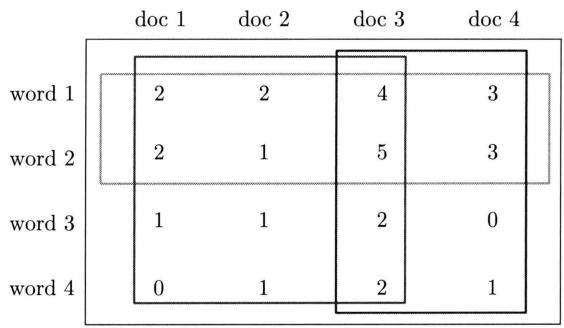  
图21.1 概率潜在语义分析的直观解释（见文前彩图）

# 21.1.2 生成模型

假设有单词集合 $\mathcal{W} = \{w_1, w_2, \dots, w_m\}$ ，其中 $m$ 是单词个数；文本（指标）集合 $\mathcal{D} = \{d_1, d_2, \dots, d_n\}$ ，其中 $n$ 是文本个数；话题集合 $\mathcal{Z} = \{z_1, z_2, \dots, z_k\}$ ，其中 $k$ 是预先设定的话题个数。随机变量 $w$ 取值于单词集合，随机变量 $d$ 取值于文本集合，随机变量 $z$ 取值于话题集合。概率分布 $P(d)$ 、条件概率分布 $P(z|d)$ 、条件概率分布 $P(w|z)$ 皆属于类别分布，其中 $P(d)$ 表示生成文本 $d$ 的概率， $P(z|d)$ 表示文本 $d$ 生成话题 $z$ 的概率， $P(w|z)$ 表示话题 $z$ 生成单词 $w$ 的概率。

每个文本 $d$ 拥有自己的话题概率分布 $P(z|d)$ ，每个话题 $z$ 拥有自己的单词概率分布 $P(w|z)$ ，也就是说一个文本的内容由其相关话题决定，一个话题的内容由其相关单词决定。

生成模型通过以下步骤生成文本-单词共现数据：

（1）依据概率分布 $P(d)$ ，从文本（指标）集合中随机选取一个文本 $d$ ，共生成 $n$ 个文本，针对每个文本，执行以下操作；  
（2）在文本 $d$ 给定的条件下，依据条件概率分布 $P(z|d)$ ，从话题集合随机选取一个话题 $z$ ，共生成 $t$ 个话题，这里 $t$ 是文本长度；  
(3) 在话题 $z$ 给定的条件下, 依据条件概率分布 $P(w|z)$ , 从单词集合中随机选取一个单词 $w$ 。

注意这里为叙述方便，假设文本都是等长的，现实中不需要这个假设。

生成模型中，单词变量 $w$ 与文本变量 $d$ 是观测变量，话题变量 $z$ 是隐变量。也就是说模型生成的是单词-话题-文本三元组 $(w, z, d)$ 的集合，但观测到的是单词-文本二元组 $(w, d)$ 的集合，观测数据表示为单词-文本矩阵的形式，矩阵的行表示单词，列表示文本，元素表示单词-文本对 $(w, d)$ 的出现次数。

从数据的生成过程可以推出，文本-单词共现数据 $D$ 的生成概率为所有单词-文本对 $(w, d)$ 的生成概率的乘积：

$$
P (D) = \prod_ {(w, d)} P (w, d) ^ {f (w, d)} \tag {21.1}
$$

这里 $f(w,d)$ 表示 $(w,d)$ 的出现次数，单词-文本对出现的总次数是 $n\times l$ 。每个单词-文本对

$(w,d)$ 的生成概率由以下公式决定：

$$
\begin{array}{l} P (w, d) = P (d) P (w | d) \\ = P (d) \sum_ {z} P (w, z | d) \\ = P (d) \sum_ {z} P (z | d) P (w | z) \tag {21.2} \\ \end{array}
$$

式 (21.2) 即生成模型的定义。

生成模型假设在话题 $z$ 给定的条件下，单词 $w$ 与文本 $d$ 条件独立，即

$$
P (w, z | d) = P (z | d) P (w | z) \tag {21.3}
$$

生成模型属于概率有向图模型，可以用有向图（directed graph）表示，如图21.2所示。图中实心圆表示观测变量，空心圆表示隐变量，箭头表示概率依存关系，方框表示多次重复，方框内数字表示重复次数。文本变量 $d$ 是一个观测变量，话题变量 $z$ 是一个隐变量，单词变量 $w$ 是一个观测变量。

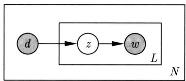  
图21.2 概率潜在语义分析的生成模型

# 21.1.3 共现模型

可以定义与以上的生成模型等价的共现模型。

文本-单词共现数据 $D$ 的生成概率为所有单词-文本对 $(w,d)$ 的生成概率的乘积：

$$
P (D) = \prod_ {(w, d)} P (w, d) ^ {f (w, d)} \tag {21.4}
$$

每个单词-文本对 $(w, d)$ 的概率由以下公式决定：

$$
P (w, d) = \sum_ {z \in Z} P (z) P (w | z) P (d | z) \tag {21.5}
$$

式 (21.5) 即共现模型的定义。容易验证，生成模型 (21.2) 和共现模型 (21.5) 是等价的。

共现模型假设在话题 $z$ 给定的条件下，单词 $w$ 与文本 $d$ 是条件独立的，即

$$
P (w, d | z) = P (w | z) P (d | z) \tag {21.6}
$$

图21.3所示是共现模型。图中文本变量 $d$ 是一个观测变量，单词变量 $w$ 是一个观测变量，话题变量 $z$ 是一个隐变量。图21.3是共现模型的直观解释。

虽然生成模型与共现模型在概率公式意义上是等价的，但是具有不同的性质。生成模型

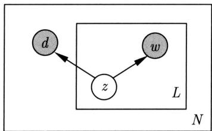  
图21.3 概率潜在语义模型的共现模型

刻画文本-单词共现数据生成的过程，共现模型描述文本-单词共现数据拥有的模式。生成模型式 (21.2) 中单词变量 $w$ 与文本变量 $d$ 是非对称的，而共现模型式 (21.5) 中单词变量 $w$ 与文本变量 $d$ 是对称的，所以前者也称为非对称模型，后者也称为对称模型。由于两个模型的形式不同，其学习算法的形式也不同。

# 21.1.4 模型性质

# 1. 模型参数

如果直接定义单词与文本的共现概率是 $P(w, d)$ ，模型参数的个数是 $O(m \cdot n)$ ，其中 $m$ 是单词数， $n$ 是文本数。概率潜在语义分析的生成模型和共现模型的参数个数是 $O(m \cdot k + n \cdot k)$ ，其中 $k$ 是话题数。现实中 $k \ll m$ ，所以概率潜在语义分析通过话题对数据进行了更简洁的表示，减少了学习过程中过拟合的可能性。图21.4显示模型中文本、话题、单词之间的关系。

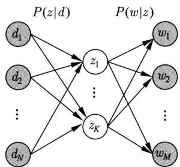  
图21.4 概率潜在语义分析中文本、话题、单词之间的关系

# 2. 模型的几何解释

下面给出生成模型的几何解释。概率分布 $P(w|d)$ 表示文本 $d$ 生成单词 $w$ 的概率：

$$
\sum_ {i = 1} ^ {m} P (w _ {i} | d) = 1, \quad 0 \leqslant P (w _ {i} | d) \leqslant 1, \quad i = 1, 2, \dots , m
$$

可以由 $m$ 维空间的 $(m - 1)$ 单纯形（simplex）中的点表示。图21.5为三维空间的情况。单纯形上的每个点表示一个分布 $P(w|d)$ （分布的参数向量），所有的分布 $P(w|d)$ （分布的参数向量）都在单纯形上，称这个 $(m - 1)$ 单纯形为单词单纯形。

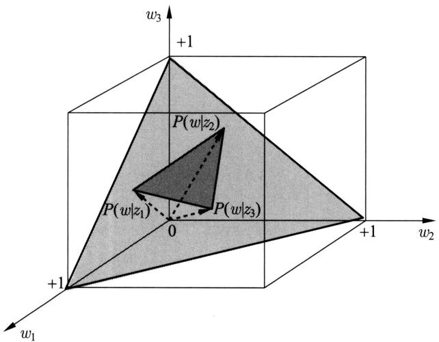  
图21.5 单词单纯形与话题单纯形

从式 (21.2) 可知，概率潜在分析模型（生成模型）中的文本概率分布 $P(w|d)$ 有下面的关系成立：

$$
P (w | d) = \sum_ {z} P (z | d) P (w | z) \tag {21.7}
$$

这里概率分布 $P(w|z)$ 表示话题 $z$ 生成单词 $w$ 的概率。

概率分布 $P(w|z)$ 也存在于 $m$ 维空间中的 $(m - 1)$ 单纯形之中。如果有 $k$ 个话题，那么就有 $k$ 个概率分布 $P(w|z_l), l = 1,2,\dots ,k$ ，由 $(m - 1)$ 单纯形上的 $k$ 个点表示（参照图21.5）。以这 $k$ 个点为顶点，构成一个 $(k - 1)$ 单纯形，称为话题单纯形。话题单纯形是单词单纯形的子单纯形，参阅图21.5。

从式 (21.7) 知, 生成模型中文本的分布 $P(w|d)$ 可以由 $k$ 个话题的分布 $P(w|z_l)$ , $l = 1, 2, \dots, k$ 的线性组合表示, 文本对应的点就在 $k$ 个话题的点构成的 $(k - 1)$ 话题单纯形中。这就是生成模型的几何解释。注意通常 $k \ll m$ , 概率潜在语义模型存在于一个相对很小的参数空间中。图 21.5 中显示的是 $m = 3$ , $k = 3$ 时的情况。当 $k = 2$ 时话题单纯形是一个线段, 当 $k = 1$ 时话题单纯形是一个点。

# 3. 与潜在语义分析的关系

概率潜在语义分析模型（共现模型）可以在潜在语义分析模型的框架下描述。图21.6显示潜在语义分析，对单词-文本矩阵进行奇异值分解得到 $X = U\Sigma V^{\mathrm{T}}$ ，其中 $\pmb{U}$ 和 $\pmb{V}$ 为正交矩阵， $\pmb{\Sigma}$ 为非负降序对角矩阵（参照第16章）。

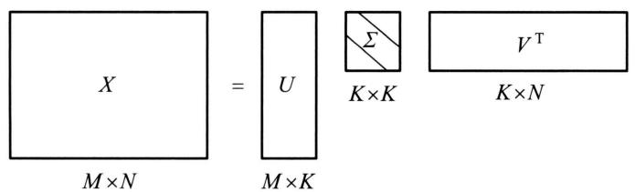  
图21.6 概率潜在语义分析与潜在语义分析的关系

共现模型 (21.5) 也可以表示为三个矩阵乘积的形式。这样，概率潜在语义分析与潜在语义分析的对应关系可以从中看得很清楚。下面是共现模型的矩阵乘积形式：

$$
\left\{ \begin{array}{l} \boldsymbol {X} ^ {\prime} = \boldsymbol {U} ^ {\prime} \boldsymbol {\Sigma} ^ {\prime} \boldsymbol {V} ^ {\prime \mathrm {T}} \\ \boldsymbol {X} ^ {\prime} = [ P (w, d) ] _ {m \times n} \\ \boldsymbol {U} ^ {\prime} = [ P (w | z) ] _ {m \times k} \\ \boldsymbol {\Sigma} ^ {\prime} = [ P (z) ] _ {k \times k} \\ \boldsymbol {V} ^ {\prime} = [ P (d | z) ] _ {n \times k} \end{array} \right. \tag {21.8}
$$

概率潜在语义分析模型(21.8)中的矩阵 $U^{\prime}$ 和 $V^{\prime}$ 是非负的、规范化的，表示条件概率分布，而潜在语义分析模型中的矩阵 $\pmb{U}$ 和 $\pmb{V}$ 是正交的，未必非负，并不表示概率分布。

# 21.2 概率潜在语义分析的算法

概率潜在语义分析模型是含有隐变量的模型，其学习通常使用EM算法。本节介绍生成模型学习的EM算法。

EM算法是一种迭代算法，每次迭代包括交替的两步：E步，求期望；M步，求极大。E步是计算 $Q$ 函数，即完全数据的对数似然函数对不完全数据的条件分布的期望。M步是对 $Q$ 函数最大化，更新模型参数。详细介绍见第18章。下面叙述生成模型的EM算法。

设单词集合为 $\mathcal{W} = \{w_1, w_2, \dots, w_m\}$ ，文本集合为 $\mathcal{D} = \{d_1, d_2, \dots, d_n\}$ ，话题集合为 $\mathcal{Z} = \{z_1, z_2, \dots, z_k\}$ 。给定单词-文本共现数据 $\{f(w_i, d_j)\}, i = 1, 2, \dots, m, j = 1, 2, \dots, n$ ，目标是估计概率潜在语义分析模型（生成模型）的参数。如果使用极大似然估计，对数似然函数是

$$
\begin{array}{l} L = \sum_ {i = 1} ^ {m} \sum_ {j = 1} ^ {n} f \left(w _ {i}, d _ {j}\right) \log P \left(w _ {i}, d _ {j}\right) \\ = \sum_ {i = 1} ^ {m} \sum_ {j = 1} ^ {n} f \left(w _ {i}, d _ {j}\right) \log \left[ \sum_ {l = 1} ^ {k} P \left(w _ {i} \mid z _ {l}\right) P \left(z _ {l} \mid d _ {j}\right) \right] \\ \end{array}
$$

但是模型含有隐变量，对数似然函数的优化无法用解析方法求解，这时使用EM算法。应用EM算法的核心是定义 $Q$ 函数。

(1) E 步: 计算 $Q$ 函数

$Q$ 函数为完全数据的对数似然函数对不完全数据的条件分布的期望。针对概率潜在语义分析的生成模型， $Q$ 函数是

$$
Q = \sum_ {l = 1} ^ {k} \left\{\sum_ {j = 1} ^ {n} f \left(d _ {j}\right) \left[ \log P \left(d _ {j}\right) + \sum_ {i = 1} ^ {m} \frac {f \left(w _ {i} , d _ {j}\right)}{f \left(d _ {j}\right)} \log P \left(w _ {i} \mid z _ {l}\right) P \left(z _ {l} \mid d _ {j}\right) \right] \right\} P \left(z _ {l} \mid w _ {i}, d _ {j}\right) \tag {21.9}
$$

式中 $f(d_{j}) = \sum_{i = 1}^{m}f(w_{i},d_{j})$ 表示文本 $d_{j}$ 中的单词个数， $f(w_{i},d_{j})$ 表示单词 $w_{i}$ 在文本 $d_{j}$ 中出

现的次数。条件概率分布 $P(z_{l}|w_{i},d_{j})$ 代表不完全数据，是已知变量。条件概率分布 $P(w_{i}|z_{l})$ 和 $P(z_{l}|d_{j})$ 的乘积代表完全数据，是未知变量。

由于可以从数据中直接统计得出 $P(d_{j})$ 的估计，这里只考虑 $P(w_{i}|z_{l})$ ， $P(z_{l}|d_{j})$ 的估计，可将 $Q$ 函数简化为函数 $Q^{\prime}$

$$
Q ^ {\prime} = \sum_ {i = 1} ^ {m} \sum_ {j = 1} ^ {n} f \left(w _ {i}, d _ {j}\right) \sum_ {l = 1} ^ {k} P \left(z _ {l} \mid w _ {i}, d _ {j}\right) \log \left[ P \left(w _ {i} \mid z _ {l}\right) P \left(z _ {l} \mid d _ {j}\right) \right] \tag {21.10}
$$

$Q^{\prime}$ 函数中的 $P(z_{l}|w_{i},d_{j})$ 可以根据贝叶斯公式计算：

$$
P \left(z _ {l} \mid w _ {i}, d _ {j}\right) = \frac {P \left(w _ {i} \mid z _ {l}\right) P \left(z _ {l} \mid d _ {j}\right)}{\sum_ {l ^ {\prime} = 1} ^ {k} P \left(w _ {i} \mid z _ {l ^ {\prime}}\right) P \left(z _ {l ^ {\prime}} \mid d _ {j}\right)} \tag {21.11}
$$

其中， $P(z_{l}|d_{j})$ 和 $P(w_{i}|z_{l})$ 由上一步迭代得到。

# (2) M 步: 最大化 $Q$ 函数

通过约束最优化求解 $Q$ 函数的极大值，这时 $P(z_{l}|d_{j})$ 和 $P(w_{i}|z_{l})$ 是变量。因为变量 $P(w_{i}|z_{l}),P(z_{l}|d_{j})$ 形成概率分布，满足约束条件：

$$
\sum_ {i = 1} ^ {m} P \left(w _ {i} \mid z _ {l}\right) = 1, \quad l = 1, 2, \dots , k
$$

$$
\sum_ {l = 1} ^ {k} P (z _ {l} | d _ {j}) = 1, \quad j = 1, 2, \dots , n
$$

应用拉格朗日法，引入拉格朗日乘子 $\tau_{l}$ 和 $\rho_{j}$ ，定义拉格朗日函数 $\Lambda$

$$
\Lambda = Q ^ {\prime} + \sum_ {l = 1} ^ {k} \tau_ {l} \left(1 - \sum_ {i = 1} ^ {m} P \left(w _ {i} \mid z _ {l}\right)\right) + \sum_ {j = 1} ^ {n} \rho_ {j} \left(1 - \sum_ {l = 1} ^ {k} P \left(z _ {l} \mid d _ {j}\right)\right)
$$

将拉格朗日函数 $\Lambda$ 分别对 $P(w_{i}|z_{l})$ 和 $P(z_{l}|d_{j})$ 求偏导数，并令其等于0，得到下面的方程组：

$$
\sum_ {j = 1} ^ {n} f (w _ {i}, d _ {j}) P (z _ {l} | w _ {i}, d _ {j}) - \tau_ {l} P (w _ {i} | z _ {l}) = 0, \quad i = 1, 2, \dots , m, \quad l = 1, 2, \dots , k
$$

$$
\sum_ {i = 1} ^ {m} f \left(w _ {i}, d _ {j}\right) P \left(z _ {l} \mid w _ {i}, d _ {j}\right) - \rho_ {j} P \left(z _ {l} \mid d _ {j}\right) = 0, \quad j = 1, 2, \dots , n, \quad l = 1, 2, \dots , k
$$

解方程组得到M步的参数估计公式：

$$
P \left(w _ {i} \mid z _ {l}\right) = \frac {\sum_ {j = 1} ^ {n} f \left(w _ {i} , d _ {j}\right) P \left(z _ {l} \mid w _ {i} , d _ {j}\right)}{\sum_ {i ^ {\prime} = 1} ^ {m} \sum_ {j = 1} ^ {n} f \left(w _ {i ^ {\prime}} , d _ {j}\right) P \left(z _ {l} \mid w _ {i ^ {\prime}} , d _ {j}\right)} \tag {21.12}
$$

$$
P \left(z _ {l} \mid d _ {j}\right) = \frac {\sum_ {i = 1} ^ {m} f \left(w _ {i} , d _ {j}\right) P \left(z _ {l} \mid w _ {i} , d _ {j}\right)}{f \left(d _ {j}\right)} \tag {21.13}
$$

总结有下面的算法：

# 算法21.1（概率潜在语义模型的EM算法）

输入：设单词集合为 $\mathcal{W} = \{w_1, w_2, \dots, w_m\}$ ，文本集合为 $\mathcal{D} = \{d_1, d_2, \dots, d_n\}$ ，话题集合为 $\mathcal{Z} = \{z_1, z_2, \dots, z_k\}$ ，共现数据 $\{f(w_i, d_j)\}, i = 1, 2, \dots, m, j = 1, 2, \dots, n$ 。

输出： $P(w_{i}|z_{l})$ 和 $P(z_{l}|d_{j})$ 。

（1）设置参数 $P(w_{i}|z_{l})$ 和 $P(z_{l}|d_{j})$ 的初始值。  
（2）迭代执行以下E步和M步，直到收敛为止。

E步：

$$
P (z _ {l} | w _ {i}, d _ {j}) = \frac {P (w _ {i} | z _ {l}) P (z _ {l} | d _ {j})}{\sum_ {l ^ {\prime} = 1} ^ {k} P (w _ {i} | z _ {l ^ {\prime}}) P (z _ {l ^ {\prime}} | d _ {j})}
$$

M步：

$$
P (w _ {i} | z _ {l}) = \frac {\sum_ {j = 1} ^ {n} f (w _ {i} , d _ {j}) P (z _ {l} | w _ {i} , d _ {j})}{\sum_ {i ^ {\prime} = 1} ^ {m} \sum_ {j = 1} ^ {n} f (w _ {i ^ {\prime}} , d _ {j}) P (z _ {l} | w _ {i ^ {\prime}} , d _ {j})}
$$

$$
P (z _ {l} | d _ {j}) = \frac {\sum_ {i = 1} ^ {m} f (w _ {i} , d _ {j}) P (z _ {l} | w _ {i} , d _ {j})}{f (d _ {j})}
$$

# 本章概要

1. 概率潜在语义分析是利用概率生成模型对文本集合进行话题分析的方法。概率潜在语义分析受潜在语义分析的启发提出，两者可以通过矩阵分解关联起来。

给定一个文本集合，通过概率潜在语义分析，可以得到各个文本生成话题的条件概率分布，以及各个话题生成单词的条件概率分布。

概率潜在语义分析的模型有生成模型以及等价的共现模型。其学习策略是观测数据的极大似然估计，其学习算法是EM算法。

2. 生成模型表示文本生成话题，话题生成单词，从而得到单词-文本共现数据的过程；假设每个文本由一个话题分布决定，每个话题由一个单词分布决定。单词变量 $w$ 与文本变量 $d$ 是观测变量，话题变量 $z$ 是隐变量。生成模型的定义如下：

$$
P (D) = \prod_ {(w, d)} P (w, d) ^ {f (w, d)}
$$

$$
P (w, d) = P (d) P (w | d) = P (d) \sum_ {z} P (z | d) P (w | z)
$$

3. 共现模型描述文本单词共现数据拥有的模式。共现模型的定义如下：

$$
P (D) = \prod_ {(w, d)} P (w, d) ^ {f (w, d)}
$$

$$
P (w, d) = \sum_ {z \in Z} P (z) P (w | z) P (d | z)
$$

4. 概率潜在语义分析模型的参数个数是 $O(m \cdot k + n \cdot k)$ 。现实中 $k \ll m$ ，所以概率潜在语义分析通过话题对数据进行了更简洁的表示，实现了数据压缩。  
5. 模型中的概率分布 $P(w|d)$ 可以由参数空间中的单纯形表示。 $m$ 维参数空间中，单词单纯形表示所有可能的文本的分布，其中的话题单纯形表示在 $k$ 个话题定义下的所有可能的文本的分布。话题单纯形是单词单纯形的子集，表示潜在语义空间。  
6. 概率潜在语义分析的学习通常采用 EM 算法。通过迭代学习模型的参数 $P(w|z)$ 和 $P(z|d)$ ，而 $P(d)$ 可直接统计得出。

# 继续阅读

概率潜在语义分析的原始文献有文献[1]～文献[3]。在文献[4]中，作者讨论了概率潜在语义分析与非负矩阵分解的关系。

# 习题

21.1 证明生成模型与共现模型是等价的。  
21.2 推导共现模型的EM算法。  
21.3 对以下文本数据集进行概率潜在语义分析。

<table><tr><td rowspan="2">单词</td><td colspan="9">文本</td></tr><tr><td>T1</td><td>T2</td><td>T3</td><td>T4</td><td>T5</td><td>T6</td><td>T7</td><td>T8</td><td>T9</td></tr><tr><td>book</td><td></td><td></td><td>1</td><td>1</td><td></td><td></td><td></td><td></td><td></td></tr><tr><td>dads</td><td></td><td></td><td></td><td></td><td></td><td>1</td><td></td><td></td><td>1</td></tr><tr><td>dummies</td><td></td><td>1</td><td></td><td></td><td></td><td></td><td></td><td>1</td><td></td></tr><tr><td>estate</td><td></td><td></td><td></td><td></td><td></td><td></td><td>1</td><td></td><td>1</td></tr><tr><td>guide</td><td>1</td><td></td><td></td><td></td><td></td><td>1</td><td></td><td></td><td></td></tr><tr><td>investing</td><td>1</td><td>1</td><td>1</td><td>1</td><td>1</td><td>1</td><td>1</td><td>1</td><td>1</td></tr><tr><td>market</td><td>1</td><td></td><td>1</td><td></td><td></td><td></td><td></td><td></td><td></td></tr><tr><td>real</td><td></td><td></td><td></td><td></td><td></td><td></td><td>1</td><td></td><td>1</td></tr><tr><td>rich</td><td></td><td></td><td></td><td></td><td></td><td>2</td><td></td><td></td><td>1</td></tr><tr><td>stock</td><td>1</td><td></td><td>1</td><td></td><td></td><td></td><td></td><td>1</td><td></td></tr><tr><td>value</td><td></td><td></td><td></td><td>1</td><td>1</td><td></td><td></td><td></td><td></td></tr></table>

# 参考文献

[1] HOFMANN T. Probabilistic latent semantic analysis[C]/Proceedings of the Fifteenth Conference on Uncertainty in Artificial Intelligence. 1999: 289-296.   
[2] HOFMANN T. Probabilistic latent semantic indexing[C]//Proceedings of the 22nd Annual International ACM SIGIR Conference on Research and Development in Information Retrieval, 1999.   
[3] HOFMANN T. Unsupervised learning by probabilistic latent semantic analysis[J]. Machine Learning, 2001, 42: 177-196.   
[4] DING C, LI T, PENG W. On the equivalence between non-negative matrix factorization and probabilistic latent semantic indexing[J]. Computational Statistics & Data Analysis, 2008, 52(8): 3913-3927.

# 第22章 潜在狄利克雷分配

潜在狄利克雷分配（latent Dirichlet allocation，LDA）作为基于贝叶斯学习的话题模型，是潜在语义分析、概率潜在语义分析的扩展，于2002年由Blei等提出。LDA在文本数据挖掘、图像处理、生物信息处理等领域被广泛使用。

LDA 模型是文本集合的生成概率模型。假设每个文本由话题的一个多项分布表示，每个话题由单词的一个多项分布表示，特别假设文本的话题分布的先验分布是狄利克雷分布，话题的单词分布的先验分布也是狄利克雷分布。先验分布的导入使 LDA 能够更好地应对话题模型学习中的过拟合现象。

LDA 的文本集合的生成过程如下：首先随机生成一个文本的话题分布，之后在该文本的每个位置，依据该文本的话题分布随机生成一个话题，然后在该位置依据该话题的单词分布随机生成一个单词，直至文本的最后一个位置，生成整个文本。重复以上过程生成所有文本。

LDA 模型是含有隐变量的概率图模型。模型中，每个话题的单词分布、每个文本的话题分布和文本的每个位置的话题是隐变量，文本的每个位置的单词是观测变量。LDA 模型的学习与推理无法直接求解，通常使用吉布斯抽样（Gibbs sampling）和变分 EM 算法（variational EM algorithm），前者是蒙特卡罗法，而后者是近似算法。

本章22.1节介绍狄利克雷分布，22.2节阐述潜在狄利克雷分配模型，22.3节和22.4节叙述模型的算法，包括吉布斯抽样和变分EM算法。

# 22.1 狄利克雷分布

# 22.1.1 分布定义

首先介绍作为LDA模型基础的多项分布和狄利克雷分布。

# 1. 多项分布

多项分布（multinomial distribution）是一种多元离散随机变量的概率分布，是二项分布（binomial distribution）的扩展。

假设重复进行 $n$ 次独立随机试验，每次试验可能出现的结果有 $k$ 种，第 $i$ 种结果出现的概率为 $\theta_{i}$ ，第 $i$ 种结果出现的次数为 $n_i$ 。如果用随机变量 $\boldsymbol{x} = (x_1, x_2, \dots, x_k)^{\mathrm{T}}$ 表示试验所有可能结果的次数，其中 $x_i$ 表示第 $i$ 种结果出现的次数，那么随机变量 $\boldsymbol{x}$ 服从多项分布。

定义22.1（多项分布） 若多元离散随机变量 $\pmb {x} = (x_{1},x_{2},\dots ,x_{k})^{\mathrm{T}}$ 的概率质量函数为

$$
\begin{array}{l} P \left(x _ {1} = n _ {1}, x _ {2} = n _ {2}, \dots , x _ {k} = n _ {k}\right) = \frac {n !}{n _ {1} ! n _ {2} ! \cdots n _ {k} !} \theta_ {1} ^ {n _ {1}} \theta_ {2} ^ {n _ {2}} \dots \theta_ {k} ^ {n _ {k}} \\ = \frac {n !}{\prod_ {i = 1} ^ {k} n _ {i} !} \prod_ {i = 1} ^ {k} p _ {i} ^ {n _ {i}} \tag {22.1} \\ \end{array}
$$

其中， $\pmb{\theta} = (\theta_{1},\theta_{2},\dots ,\theta_{k})^{\mathrm{T}}$ ， $\theta_{i}\geqslant 0,i = 1,2,\dots ,k,\sum_{i = 1}^{k}\theta_{i} = 1,\sum_{i = 1}^{k}n_{i} = n$ ，则称随机变量 $\pmb{x}$ 服从参数为 $(n,\pmb {\theta})$ 的多项分布，记作 $x\sim \operatorname {Mult}(n,\pmb {\theta})$

当试验的次数 $n$ 为1时，多项分布变成类别分布（categorical distribution）。类别分布表示试验可能出现的 $k$ 种结果的概率。

# 2. 狄利克雷分布

狄利克雷分布（Dirichlet distribution）是一种多元连续随机变量的概率分布。在贝叶斯学习中，狄利克雷分布常作为多项分布的先验分布使用。

定义22.2（狄利克雷分布） 若多元连续随机变量 $\pmb {\theta} = (\theta_{1},\theta_{2},\dots ,\theta_{k})^{\mathrm{T}}$ 的概率密度函数为

$$
p (\boldsymbol {\theta} | \boldsymbol {\alpha}) = \frac {\Gamma \left(\sum_ {i = 1} ^ {k} \alpha_ {i}\right)}{\prod_ {i = 1} ^ {k} \Gamma \left(\alpha_ {i}\right)} \prod_ {i = 1} ^ {k} \theta_ {i} ^ {\alpha_ {i} - 1} \tag {22.2}
$$

其中， $\sum_{i = 1}^{k}\theta_{i} = 1$ ， $\theta_{i}\geqslant 0$ ， $\pmb {\alpha} = (\alpha_{1},\alpha_{2},\dots ,\alpha_{k})^{\mathrm{T}}$ ， $\alpha_{i} > 0$ ， $i = 1,2,\dots ,k$ ，则称随机变量 $\pmb{\theta}$ 服从参数为 $\pmb{\alpha}$ 的狄利克雷分布，记作 $\pmb {\theta}\sim \mathrm{Dir}(\pmb {\alpha})$ 。

式中 $\Gamma(s)$ 是伽马函数，定义为

$$
\Gamma (s) = \int_ {0} ^ {\infty} x ^ {s - 1} \mathrm {e} ^ {- x} \mathrm {d} x, \quad s > 0 \tag {22.3}
$$

具有性质

$$
\Gamma \left(s + 1\right) = s \Gamma (s)
$$

当 $s$ 是自然数时，有

$$
\Gamma (s + 1) = s!
$$

因此可以认为伽马函数是阶乘的扩展。

令

$$
\mathrm {B} (\boldsymbol {\alpha}) = \frac {\prod_ {i = 1} ^ {k} \Gamma \left(\alpha_ {i}\right)}{\Gamma \left(\sum_ {i = 1} ^ {k} \alpha_ {i}\right)} \tag {22.4}
$$

式中 $\mathrm{B}(\alpha)$ 是多元贝塔函数，则狄利克雷分布的密度函数可以写成

$$
p (\boldsymbol {\theta} | \boldsymbol {\alpha}) = \frac {1}{\operatorname {B} (\boldsymbol {\alpha})} \prod_ {i = 1} ^ {k} \theta_ {i} ^ {\alpha_ {i} - 1} \tag {22.5}
$$

由密度函数的性质

$$
\int \frac {\Gamma \left(\sum_ {i = 1} ^ {k} \alpha_ {i}\right)}{\prod_ {i = 1} ^ {k} \Gamma (\alpha_ {i})} \prod_ {i = 1} ^ {k} \theta_ {i} ^ {\alpha_ {i} - 1} d \boldsymbol {\theta} = \frac {\Gamma \left(\sum_ {i = 1} ^ {k} \alpha_ {i}\right)}{\prod_ {i = 1} ^ {k} \Gamma (\alpha_ {i})} \int \prod_ {i = 1} ^ {k} \theta_ {i} ^ {\alpha_ {i} - 1} d \boldsymbol {\theta} = 1
$$

得：

$$
\mathrm {B} (\boldsymbol {\alpha}) = \int \prod_ {i = 1} ^ {k} \theta_ {i} ^ {\alpha_ {i} - 1} \mathrm {d} \boldsymbol {\theta} \tag {22.6}
$$

因此，多元贝塔函数是密度函数中的规范化因子。

由于满足条件

$$
\theta_ {i} \geqslant 0, \quad \sum_ {i = 1} ^ {k} \theta_ {i} = 1
$$

所以狄利克雷分布 $\pmb{\theta}$ 存在于 $(k - 1)$ 维单纯形上。图22.1为二维单纯形上的狄利克雷分布。 $\theta_{1} + \theta_{2} + \theta_{3} = 1$ ， $\theta_{1}, \theta_{2}, \theta_{3} \geqslant 0$ 。图中狄利克雷分布的参数为 $\alpha = (3, 3, 3)$ ， $\alpha = (7, 7, 7)$ ， $\alpha = (20, 20, 20)$ ， $\alpha = (2, 6, 11)$ ， $\alpha = (14, 9, 5)$ ， $\alpha = (6, 2, 6)$ 。

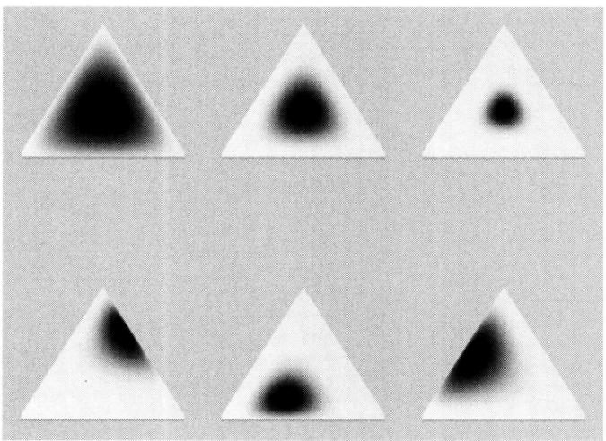  
图22.1 狄利克雷分布例（见文前彩图）

# 3.二项分布和贝塔分布

二项分布是多项分布的特殊情况，贝塔分布是狄利克雷分布的特殊情况。  
二项分布是指如下概率分布。 $x$ 为离散随机变量，取值为 $m$ ，其概率质量函数为

$$
P (x = m) = \binom {n} {m} \theta^ {m} (1 - \theta) ^ {n - m}, \quad m = 0, 1, 2, \dots , n \tag {22.7}
$$

其中， $n$ 和 $\theta (0\leqslant \theta \leqslant 1)$ 是参数。

贝塔分布（Beta distribution）是指如下概率分布， $\theta$ 为连续随机变量，取值范围为 $[0,1]$ ，其概率密度函数为

$$
p (\theta) = \left\{ \begin{array}{l l} { \frac {1}{\mathrm {B} (s , t)} \theta^ {s - 1} (1 - \theta) ^ {t - 1},} & {0 \leqslant \theta \leqslant 1} \\ {0,} & {\text {其 他}} \end{array} \right. \tag {22.8}
$$

其中， $s > 0$ 和 $t > 0$ 是参数， $\mathrm{B}(s,t)$ 是贝塔函数，

$$
\mathrm {B} (s, t) = \int_ {0} ^ {1} x ^ {s - 1} (1 - x) ^ {t - 1} \mathrm {d} x \tag {22.9}
$$

贝塔函数满足关系

$$
\mathrm {B} (s, t) = \frac {\Gamma (s) \Gamma (t)}{\Gamma (s + t)}
$$

当 $s, t$ 是自然数时，

$$
\mathrm {B} (s, t) = \frac {(s - 1) ! (t - 1) !}{(s + t - 1) !}
$$

当 $n$ 为1时，二项分布变成伯努利分布（Bernoulli distribution）或0-1分布。伯努利分布表示试验可能出现的两种结果的概率。贝塔分布常作为二项分布的先验分布使用。

图22.2给出几种概率分布的关系。

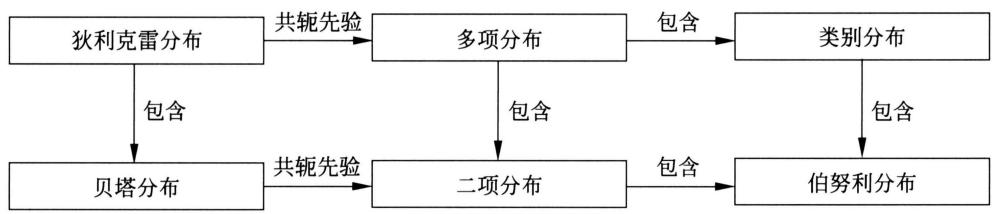  
图22.2 概率分布之间的关系

# 22.1.2 共轭先验

狄利克雷分布有一些重要性质：①狄利克雷分布属于指数分布族；②狄利克雷分布是多项分布的共轭先验（conjugate prior）。

贝叶斯学习中常使用共轭分布。如果后验分布与先验分布属于同类，则先验分布与后验分布称为共轭分布（conjugatedistributions），先验分布称为共轭先验（conjugateprior）。如果多项分布的先验分布是狄利克雷分布，则其后验分布也为狄利克雷分布，两者构成共轭分布。作为先验分布的狄利克雷分布的参数又称为超参数。使用共轭分布的好处是便于从先验分布计算后验分布。

设有类别集合 $\mathcal{Z} = \{z_1, z_2, \dots, z_k\}$ 。根据类别分布 $P(z), z \in \mathcal{Z}$ 进行 $n$ 次独立重复抽样，得到样本数据 $D$ ，服从多项分布 $D \sim \mathrm{Mult}(n, \pmb{\theta})$ ，其中 $n$ 和 $\pmb{\theta} = (\theta_1, \theta_2, \dots, \theta_k)^{\mathrm{T}}$ 是参数。参数 $n$ 为抽样的次数，参数 $\theta_i$ 为 $z_i$ 出现的概率（ $i = 1, 2, \dots, k$ ）。样本数据 $D$ 由观测计数组成 $\pmb{n} = (n_1, n_2, \dots, n_k)^{\mathrm{T}}$ ， $n_i$ 为样本中 $z_i$ 出现的次数（ $i = 1, 2, \dots, k$ ）。

给定样本数据 $D$ ，目标是计算后验概率 $p(\boldsymbol {\theta}|D)$ 。对于给定的样本数据 $D$ ，似然函数是

$$
P (D | \boldsymbol {\theta}) = \theta_ {1} ^ {n _ {1}} \theta_ {2} ^ {n _ {2}} \dots \theta_ {k} ^ {n _ {k}} = \prod_ {i = 1} ^ {k} \theta_ {i} ^ {n _ {i}} \tag {22.10}
$$

假设随机变量 $\pmb{\theta}$ 服从狄利克雷分布 $p(\pmb {\theta}|\pmb {\alpha})$ ，其中 $\pmb {\alpha} = (\alpha_{1},\alpha_{2},\dots ,\alpha_{k})^{\mathrm{T}}$ 为参数，则 $\pmb{\theta}$ 的先验分布为

$$
P (\boldsymbol {\theta} | \boldsymbol {\alpha}) = \frac {\Gamma \left(\sum_ {i = 1} ^ {k} \alpha_ {i}\right)}{\prod_ {i = 1} ^ {k} \Gamma \left(\alpha_ {i}\right)} \prod_ {i = 1} ^ {k} \theta_ {i} ^ {\alpha_ {i} - 1} = \frac {1}{\operatorname {B} (\boldsymbol {\alpha})} \prod_ {i = 1} ^ {k} \theta_ {i} ^ {\alpha_ {i} - 1} = \operatorname {D i r} (\boldsymbol {\theta} | \boldsymbol {\alpha}), \quad \alpha_ {i} > 0 \tag {22.11}
$$

根据贝叶斯公式，在给定样本数据 $D$ 和参数 $\alpha$ 的条件下， $\theta$ 的后验概率分布是

$$
\begin{array}{l} P (\boldsymbol {\theta} | D, \boldsymbol {\alpha}) = \frac {P (D | \boldsymbol {\theta}) P (\boldsymbol {\theta} | \boldsymbol {\alpha})}{P (D | \boldsymbol {\alpha})} \\ = \frac {\prod_ {i = 1} ^ {k} \theta_ {i} ^ {n _ {i}} \frac {1}{\mathrm {B} (\boldsymbol {\alpha})} \theta_ {i} ^ {\alpha_ {i} - 1}}{\int \prod_ {i = 1} ^ {k} \theta_ {i} ^ {n _ {i}} \frac {1}{\mathrm {B} (\boldsymbol {\alpha})} \theta_ {i} ^ {\alpha_ {i} - 1} \mathrm {d} \boldsymbol {\theta}} \\ = \frac {1}{\operatorname {B} (\boldsymbol {\alpha} + \boldsymbol {n})} \prod_ {i = 1} ^ {k} \theta_ {i} ^ {\alpha_ {i} + n _ {i} - 1} \\ = \operatorname {D i r} (\boldsymbol {\theta} | \boldsymbol {\alpha} + \boldsymbol {n}) \tag {22.12} \\ \end{array}
$$

可以看出，先验分布(22.11)和后验分布(22.12)都是狄利克雷分布，两者有不同的参数，所以狄利克雷分布是多项分布的共轭先验。狄利克雷后验分布的参数等于狄利克雷先验分布参数 $\pmb{\alpha} = (\alpha_{1},\alpha_{2},\dots ,\alpha_{k})^{\mathrm{T}}$ 加上观测计数 $\pmb {n} = (n_1,n_2,\dots ,n_k)^{\mathrm{T}}$ ，好像试验之前就已经观察到计数 $\pmb {\alpha} = (\alpha_{1},\alpha_{2},\dots ,\alpha_{k})^{\mathrm{T}}$ ，因此也把 $\pmb{\alpha}$ 叫作先验伪计数（prior pseudo-counts）。

# 22.2 潜在狄利克雷分配模型

# 22.2.1 基本想法

潜在狄利克雷分配（LDA）是文本集合的生成概率模型。模型假设话题由单词的多项分布表示，文本由话题的多项分布表示，单词分布和话题分布的先验分布都是狄利克雷分布。

文本内容的不同是由于它们的话题分布不同。严格意义上说，这里的多项分布都是类别分布，在机器学习与自然语言处理中，有时对两者不作严格区分。

LDA 模型表示文本集合的自动生成过程：首先，基于单词分布的先验分布（狄利克雷分布）生成多个单词分布，即决定多个话题内容；然后，基于话题分布的先验分布（狄利克雷分布）生成多个话题分布，即决定多个文本内容；最后，基于每一个话题分布生成话题序列，针对每一个话题，基于话题的单词分布生成单词，整体构成一个单词序列，即生成文本，重复这个过程生成所有文本。文本的单词序列是观测变量，文本的话题序列是隐变量，文本的话题分布和话题的单词分布也是隐变量。图 22.3 示意了 LDA 的文本生成过程。

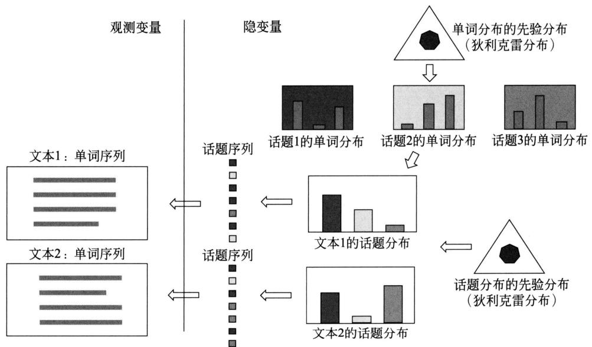  
图22.3 LDA的文本生成过程（见文前彩图）

LDA模型是概率图模型，其特点是以狄利克雷分布为多项分布的先验分布，学习就是给定文本集合，通过后验概率分布的估计，推断模型的所有参数。利用LDA进行话题分析就是对给定文本集合，学习到每个文本的话题分布，以及每个话题的单词分布。

可以认为LDA是PLSA（概率潜在语义分析）的扩展，相同点是两者都假设话题是单词的多项分布，文本是话题的多项分布。不同点是LDA使用狄利克雷分布作为先验分布，而PLSA不使用先验分布（或者说假设先验分布是均匀分布），两者对文本生成过程有不同假设；学习过程LDA基于贝叶斯学习，而PLSA基于极大似然估计。LDA的优点是使用先验概率分布，可以防止学习过程中产生的过拟合（over-fitting）。

# 22.2.2 模型定义

本书采用常用LDA模型的定义，与原始文献中提出的模型略有不同。

# 1. 模型要素

潜在狄利克雷分配（LDA）使用三个集合：一是单词集合 $\mathcal{W} = \{w_1, w_2, \dots, w_M\}$ ， $M$ 是单词的个数， $w_m$ 表示第 $m$ 个单词， $m = 1, 2, \dots, M$ 。二是文本集合 $\mathcal{D} = \{d_1, d_2, \dots, d_N\}$ ， $n$

是文本的个数， $d_{n}$ 表示第 $n$ 个文本， $n = 1,2,\dots ,N$ 。三是话题集合 $\mathcal{Z} = \{z_1,z_2,\dots ,z_K\}$ ， $K$ 是话题的个数， $z_{k}$ 表示第 $k$ 个话题， $k = 1,2,\dots ,K$ 。

文本 $d_{n}$ 由一个单词序列 $W_{n} = w_{n1},w_{n2},\dots ,w_{nL}$ 组成， $L$ 是文本 $d_{n}$ 的长度， $w_{nl}$ 表示文本 $d_{n}$ 的第 $l$ 个单词， $l = 1,2,\dots ,L$ 。为了方便，假设所有文本具有相同长度。文本 $d_{n}$ 中对应可观测的单词序列，有一个不可观测的话题序列 $Z_{n} = z_{n1},z_{n2},\dots ,z_{nL},z_{nl}$ 表示文本 $d_{n}$ 的第 $l$ 个话题。

每一个话题 $z_{k}$ 由一个单词的条件概率分布 $p(w|z_k)$ 表示， $w \in \mathcal{W}$ 。分布 $p(w|z_k)$ 服从多项分布，其参数为 $\varphi_{k}$ 。参数 $\varphi_{k}$ 服从狄利克雷分布（先验分布），其超参数为 $\beta$ 。参数 $\varphi_{k}$ 是一个 $M$ 维向量 $\varphi_{k} = (\varphi_{k1},\varphi_{k2},\dots ,\varphi_{kM})^{\mathrm{T}}$ ，其中 $\varphi_{km}$ 表示话题 $z_{k}$ 生成单词 $w_{m}$ 的概率。所有话题的参数向量构成一个 $M \times K$ 矩阵 $\varphi = (\varphi_{1},\varphi_{2},\dots ,\varphi_{K})$ 。超参数 $\beta$ 也是一个 $M$ 维向量 $\beta = (\beta_{1},\beta_{2},\dots ,\beta_{M})^{\mathrm{T}}$ 。

每一个文本 $d_{n}$ 由一个话题的条件概率分布 $p(z|d_n)$ 表示， $z \in \mathcal{Z}$ 。分布 $p(z|d_n)$ 服从多项分布，其参数为 $\theta_{n}$ 。参数 $\theta_{n}$ 服从狄利克雷分布（先验分布），其超参数为 $\alpha$ 。参数 $\theta_{n}$ 是一个 $K$ 维向量 $\theta_{n} = (\theta_{n1},\theta_{n2},\dots,\theta_{nK})^{\mathrm{T}}$ ，其中 $\theta_{nk}$ 表示文本 $d_{n}$ 生成话题 $z_{k}$ 的概率。所有文本的参数向量构成一个 $K \times N$ 矩阵 $\pmb{\theta} = (\pmb{\theta}_1,\pmb{\theta}_2,\dots,\pmb{\theta}_N)$ 。超参数 $\alpha$ 也是一个 $K$ 维向量 $\pmb{\alpha} = (\alpha_{1},\alpha_{2},\dots,\alpha_{K})^{\mathrm{T}}$ 。

# 2. 生成过程

给定单词集合 $\mathcal{W}$ , 文本集合 $\mathcal{D}$ , 话题集合 $\mathcal{Z}$ , 狄利克雷分布的超参数 $\alpha$ 和 $\beta$ , LDA 文本集合的生成过程如下:

# （1）生成话题的单词分布

随机生成 $K$ 个话题的单词分布。具体过程如下：按照狄利克雷分布 $\operatorname{Dir}(\beta)$ 随机生成一个参数向量 $\varphi_{k}$ ， $\varphi_{k} \sim \operatorname{Dir}(\beta)$ ，作为话题 $z_{k}$ 的单词分布 $p(w|z_k)$ ， $w \in \mathcal{W}$ ， $k = 1,2,\dots,K$ 。

# （2）生成文本的话题分布

随机生成 $N$ 个文本的话题分布。具体过程如下：按照狄利克雷分布 $\operatorname{Dir}(\alpha)$ 随机生成一个参数向量 $\theta_{n}$ ， $\theta_{n} \sim \operatorname{Dir}(\alpha)$ ，作为文本 $d_{n}$ 的话题分布 $p(z|d_{n})$ ， $z \in \mathcal{Z}$ ， $n = 1,2,\dots,N$ 。

# （3）生成文本的单词序列

随机生成 $n$ 个文本的第 $l$ 个单词。文本 $d_{n}$ $(n = 1,2,\dots ,N)$ 的单词 $w_{nl}$ $(l = 1,2,\dots ,L)$ 的生成过程如下：

(a) 首先按照多项分布 $\mathrm{Mult}(\pmb{\theta}_n)$ 随机生成一个话题 $z_{nl}$ ， $z_{nl} \sim \mathrm{Mult}(\pmb{\theta}_n)$ 。  
(b) 然后按照多项分布 $\mathrm{Mult}(\varphi_{z_{nl}})$ 随机生成一个单词 $w_{nl}$ , $w_{nl} \sim \mathrm{Mult}(\varphi_{z_{nl}})$ 。

文本 $d_{n}$ 本身是单词序列 $W_{n} = w_{n1},w_{n2},\dots ,w_{nL}$ ，对应着话题序列 $Z_{n} = z_{n1},z_{n2},\dots ,z_{nL}$ 。

总结LDA生成文本的算法如下。

# 算法22.1（LDA的文本生成算法）

（1）对于话题 $z_{k}$ $(k = 1,2,\dots ,K)$

生成多项分布参数 $\varphi_{k}\sim \mathrm{Dir}(\beta)$ ，作为话题的单词分布 $p(w|z_k)$ 。

（2）对于文本 $d_{n}$ $(n = 1,2,\dots ,N)$

生成多项分布参数 $\theta_{n}\sim \mathrm{Dir}(\alpha)$ ，作为文本的话题分布 $p(z|d_n)$ 。

(3) 对于文本 $d_{n}$ 的单词 $w_{nl}$ $(n = 1,2,\dots ,N,l = 1,2,\dots ,L)$

（a）生成话题 $z_{nl}\sim \mathrm{Mult}(\pmb{\theta}_n)$ ，作为单词对应的话题；  
(b) 生成单词 $w_{nl} \sim \mathrm{Mult}(\varphi_{z_{nl}})$ 。

LDA的文本生成过程中，假定话题个数 $k$ 给定，实际通常通过实验选定。狄利克雷分布的超参数 $\alpha$ 和 $\beta$ 通常也是事先给定的。在没有其他先验知识的情况下，可以假设向量 $\alpha$ 和 $\beta$ 的所有分量均为1，这时的文本的话题分布 $\theta_{n}$ 是对称的，话题的单词分布 $\varphi_{k}$ 也是对称的。

# 22.2.3 概率图模型

LDA 模型本质是一种概率图模型（probabilistic graphical model）。图 22.4 为 LDA 作为概率图模型的板块表示（plate notation）。图中结点表示随机变量，实心结点是观测变量，空心结点是隐变量；有向边表示概率依存关系；矩形（板块）表示重复，板块内数字表示重复的次数。

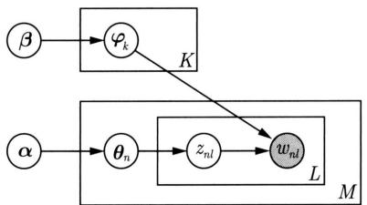  
图22.4 LDA的板块表示

对于图22.4中的LDA板块表示，结点 $\alpha$ 和 $\beta$ 是模型的超参数，结点 $\varphi_{k}$ 表示话题的单词分布的参数，结点 $\theta_{n}$ 表示文本的话题分布的参数，结点 $z_{nl}$ 表示话题，结点 $w_{nl}$ 表示单词。结点 $\beta$ 指向结点 $\varphi_{k}$ ，重复 $K$ 次，表示根据超参数 $\beta$ 生成 $K$ 个话题的单词分布的参数 $\varphi_{k}$ ；结点 $\alpha$ 指向结点 $\theta_{n}$ ，重复 $N$ 次，表示根据超参数 $\alpha$ 生成 $n$ 个文本的话题分布的参数 $\theta_{n}$ ；结点 $\theta_{n}$ 指向结点 $z_{nl}$ ，重复 $L$ 次，表示根据文本的话题分布 $\theta_{n}$ 生成 $n$ 个话题 $z_{nl}$ ；结点 $z_{nl}$ 指向结点 $w_{nl}$ ，同时 $K$ 个结点 $\varphi_{k}$ 也指向结点 $w_{nl}$ ，表示根据话题 $z_{nl}$ 以及 $K$ 个话题的单词分布 $\varphi_{k}$ 生成单词 $w_{nl}$ 。

板块表示的优点是简洁，板块表示展开之后，成为普通的有向图表示（图22.5）。有向图中结点表示随机变量，有向边表示概率依存关系。可以看出LDA是相同随机变量被重复多次使用的概率图模型。

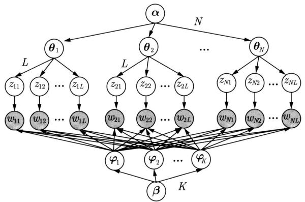  
图22.5 LDA的展开图模型表示

# 22.2.4 随机变量序列的可交换性

一个有限的随机变量序列是可交换的（exchangeable），是指随机变量的联合概率对随机变量的排列不变。

$$
P \left(x _ {1}, x _ {2}, \dots , x _ {n}\right) = P \left(x _ {\pi (1)}, x _ {\pi (2)}, \dots , x _ {\pi (n)}\right) \tag {22.13}
$$

这里 $\pi(1), \pi(2), \dots, \pi(n)$ 代表自然数 $1, 2, \dots, n$ 的任意一个排列。一个无限的随机变量序列是无限可交换（infinitely exchangeable）的，是指它的任意一个有限子序列都是可交换的。

如果一个随机变量序列 $X_{1}, X_{2}, \dots, X_{n}, \dots$ 是独立同分布的，那么它们是无限可交换的。反之不然。

随机变量序列可交换的假设在贝叶斯学习中经常使用。根据 De Finetti 定理，任意一个无限可交换的随机变量序列对一个随机参数是条件独立同分布的。即任意一个无限可交换的随机变量序列 $X_{1}, X_{2}, \dots, X_{i}, \dots$ 的基于一个随机参数 $Y$ 的条件概率等于基于这个随机参数 $Y$ 的各个随机变量 $X_{1}, X_{2}, \dots, X_{i}, \dots$ 的条件概率的乘积。

$$
P \left(X _ {1}, X _ {2}, \dots , X _ {i}, \dots | Y\right) = P \left(X _ {1} \mid Y\right) P \left(X _ {2} \mid Y\right) \dots P \left(X _ {i} \mid Y\right) \dots \tag {22.14}
$$

LDA 假设文本由无限可交换的话题序列组成。由 De Finetti 定理知，实际是假设文本中的话题对一个随机参数是条件独立同分布的。所以在参数给定的条件下，文本中话题的顺序可以忽略。作为对比，概率潜在语义模型假设文本中的话题是独立同分布的，文本中的话题的顺序也可以忽略。

# 22.2.5 概率公式

LDA模型整体是由观测变量和隐变量组成的联合概率分布，可以表示为

$$
p (W, Z, \boldsymbol {\theta}, \boldsymbol {\varphi} | \boldsymbol {\alpha}, \boldsymbol {\beta}) = \prod_ {k = 1} ^ {K} p (\boldsymbol {\varphi} _ {k} | \boldsymbol {\beta}) \prod_ {n = 1} ^ {N} p (\boldsymbol {\theta} _ {n} | \boldsymbol {\alpha}) \prod_ {l = 1} ^ {L} p \left(z _ {n l} | \boldsymbol {\theta} _ {n}\right) p \left(w _ {n l} | \boldsymbol {\varphi} _ {z _ {n l}}\right) \tag {22.15}
$$

其中，观测变量 $W$ 表示所有文本中的单词序列，隐变量 $Z$ 表示所有文本中的话题序列，隐变量 $\pmb{\theta}$ 表示所有文本的话题分布的参数，隐变量 $\varphi$ 表示所有话题的单词分布的参数， $\alpha$ 和 $\beta$ 是超参数。式中 $p(\varphi_k|\beta)$ 表示超参数 $\beta$ 给定条件下第 $k$ 个话题的单词分布的参数 $\varphi_k$ 的生成概率， $p(\theta_n|\alpha)$ 表示超参数 $\alpha$ 给定条件下第 $n$ 个文本的话题分布的参数 $\theta_n$ 的生成概率， $p(z_{nl}|\theta_i)$ 表示第 $n$ 个文本的话题分布 $\theta_n$ 给定条件下第 $l$ 个位置的话题 $z_{nl}$ 的生成概率， $p(w_{nl}|\varphi_{z_{nl}})$ 表示在第 $n$ 个文本的第 $l$ 个位置的话题 $z_{nl}$ 及所有话题的单词分布的参数 $\varphi$ 给定条件下单词 $w_{nl}$ 的生成概率。参见图22.5。

第 $n$ 个文本的联合概率分布可以表示为

$$
p \left(W _ {n}, Z _ {n}, \boldsymbol {\theta} _ {n}, \boldsymbol {\varphi} \mid \boldsymbol {\alpha}, \beta\right) = \prod_ {k = 1} ^ {K} p \left(\boldsymbol {\varphi} _ {k} \mid \boldsymbol {\beta}\right) p \left(\boldsymbol {\theta} _ {n} \mid \boldsymbol {\alpha}\right) \prod_ {l = 1} ^ {L} p \left(z _ {n l} \mid \boldsymbol {\theta} _ {n}\right) p \left(w _ {n l} \mid \boldsymbol {\varphi} _ {z _ {n l}}\right) \tag {22.16}
$$

其中， $W_{n}$ 表示该文本中的单词序列， $Z_{n}$ 表示该文本的话题序列， $\theta_{n}$ 表示该文本的话题分布参数。

LDA 模型的联合分布含有隐变量，对隐变量进行积分得到边缘分布。参数 $\theta_{n}$ 和 $\varphi$ 给定条件下第 $n$ 个文本的生成概率是

$$
p \left(W _ {n} \mid \boldsymbol {\theta} _ {n}, \boldsymbol {\varphi}\right) = \prod_ {l = 1} ^ {L} \left[ \sum_ {k = 1} ^ {K} p \left(z _ {n l} = k \mid \boldsymbol {\theta} _ {n}\right) p \left(w _ {n l} \mid \boldsymbol {\varphi} _ {k}\right) \right] \tag {22.17}
$$

超参数 $\alpha$ 和 $\beta$ 给定条件下第 $n$ 个文本的生成概率是

$$
p \left(W _ {n} \mid \boldsymbol {\alpha}, \boldsymbol {\beta}\right) = \prod_ {k = 1} ^ {K} \int p \left(\boldsymbol {\varphi} _ {k} \mid \boldsymbol {\beta}\right) \left\{\int p \left(\boldsymbol {\theta} _ {n} \mid \boldsymbol {\alpha}\right) \prod_ {l = 1} ^ {L} \left[ \sum_ {k = 1} ^ {K} p \left(z _ {n l} = k \mid \boldsymbol {\theta} _ {n}\right) p \left(w _ {n l} \mid \boldsymbol {\varphi} _ {k}\right) \right] d \boldsymbol {\theta} _ {n} \right\} d \boldsymbol {\varphi} _ {k} \tag {22.18}
$$

超参数 $\alpha$ 和 $\beta$ 给定条件下所有文本的生成概率是

$$
p (W | \boldsymbol {\alpha}, \boldsymbol {\beta}) = \prod_ {k = 1} ^ {K} \int p (\boldsymbol {\varphi} _ {k} | \boldsymbol {\beta}) \left\{\prod_ {n = 1} ^ {N} \int p (\boldsymbol {\theta} _ {n} | \boldsymbol {\alpha}) \prod_ {l = 1} ^ {L} \left[ \sum_ {k = 1} ^ {K} p \left(z _ {n l} = k \mid \boldsymbol {\theta} _ {n}\right) p \left(w _ {n l} \mid \boldsymbol {\varphi} _ {k}\right) \right] \mathrm {d} \boldsymbol {\theta} _ {n} \right\} \mathrm {d} \boldsymbol {\varphi} _ {k} \tag {22.19}
$$

其中， $W$ 表示所有文本中的单词序列。

# 22.3 LDA的吉布斯抽样算法

潜在狄利克雷分配（LDA）的学习（参数估计）是一个复杂的最优化问题，很难精确求解，只能近似求解。常用的近似求解方法有吉布斯抽样（Gibbs sampling）和变分推理（variational inference）。本节讲述吉布斯抽样，22.4节讲述变分推理算法。吉布斯抽样的优点是实现简单，缺点是迭代次数可能较多。

# 22.3.1 基本想法

对于LDA模型的学习，给定文本（单词序列）的集合，以 $W$ 表示文本集合的单词序列，即 $W = W_{1},W_{2},\dots ,W_{n},\dots ,W_{N}$ ，其中 $W_{n}$ 是第 $_{n}$ 个文本的单词序列， $W_{n} =$ $w_{n1},w_{n2},\dots ,w_{nl},\dots ,w_{nL}$ 。超参数 $\pmb{\alpha}$ 和 $\beta$ 已知。目标是要推断：①文本集合的话题序列 $Z = Z_{1},Z_{2},\dots ,Z_{l},\dots ,Z_{N}$ 的后验概率分布，其中 $Z_{n}$ 是第 $_{n}$ 个文本的话题序列， $Z_{n} =$ $z_{n1},z_{n2},\dots ,z_{nl},\dots ,z_{nL}$ ；②参数 $\pmb {\theta} = (\pmb {\theta}_1,\pmb {\theta}_2,\dots ,\pmb {\theta}_n,\dots ,\pmb {\theta}_N)$ ，其中 $\pmb{\theta}_{n}$ 是文本 $d_{n}$ 的话题分布的参数；③参数 $\varphi = (\varphi_1,\varphi_2,\dots ,\varphi_k,\dots ,\varphi_K)$ ，其中 $\varphi_{k}$ 是话题 $z_{k}$ 的单词分布的参数。也就是说，要对联合概率分布 $p(W,Z,\pmb {\theta},\pmb {\varphi}|\pmb {\alpha},\pmb {\beta})$ 进行估计，其中 $W$ 是观测变量，而 $Z$ ， $\pmb{\theta}$ ， $\pmb{\varphi}$ 是隐变量。

第19章讲述了吉布斯抽样，这是一种常用的马尔可夫链蒙特卡罗法。为了估计多元随机变量 $\pmb{x}$ 的联合分布 $p(\pmb{x})$ ，吉布斯抽样法选择 $\pmb{x}$ 的一个分量，固定其他分量，按照其条件概率分布进行随机抽样，依次循环对每一个分量执行这个操作，得到联合分布 $p(\pmb{x})$ 的一个随机样本，重复这个过程，在燃烧期之后，得到联合概率分布 $p(\pmb{x})$ 的样本集合。

LDA模型的学习通常采用收缩的吉布斯抽样（collapsed Gibbs sampling）方法①，基本想法是：通过对隐变量 $\theta$ 和 $\varphi$ 积分，得到边缘概率分布 $p(W,Z|\alpha ,\beta)$ （也是联合分布），其中变量 $W$ 是可观测的，变量 $Z$ 是不可观测的；对后验概率分布 $p(Z|W,\alpha ,\beta)$ 进行吉布斯抽样，得到分布 $p(Z|W,\alpha ,\beta)$ 的样本集合；再利用这个样本集合对参数 $\theta$ 和 $\varphi$ 进行估计，最终得到LDA模型 $p(W,Z,\theta ,\varphi |\alpha ,\beta)$ 的所有参数估计。

# 22.3.2 算法的主要部分

根据上面的分析，问题转化为对后验概率分布 $p(Z|W,\alpha ,\beta)$ 的吉布斯抽样，该分布表示在所有文本的单词序列给定条件下所有可能话题序列的条件概率。这里先给出该分布的表达式，之后给出该分布的满条件分布表达式。

# 1. 抽样分布的表达式

首先有关系

$$
p (Z | W, \boldsymbol {\alpha}, \beta) = \frac {p (W , Z | \boldsymbol {\alpha} , \beta)}{p (W | \boldsymbol {\alpha} , \beta)} \propto p (W, Z | \boldsymbol {\alpha}, \beta) \tag {22.20}
$$

这里变量 $W, \alpha$ 和 $\beta$ 已知，分母相同，可以不予考虑。联合分布 $p(W, Z|\alpha, \beta)$ 的表达式可以进一步分解为

$$
p (W, Z | \boldsymbol {\alpha}, \beta) = p (W | Z, \boldsymbol {\alpha}, \beta) p (Z | \boldsymbol {\alpha}, \beta) = p (W | Z, \boldsymbol {\beta}) p (Z | \boldsymbol {\alpha}) \tag {22.21}
$$

两个因子可以分别处理。

推导第一个因子 $p(W|Z,\beta)$ 的表达式。首先

$$
p (W | Z, \varphi) = \prod_ {k = 1} ^ {K} \prod_ {m = 1} ^ {M} \varphi_ {k m} ^ {n _ {k m}} \tag {22.22}
$$

其中， $\varphi_{km}$ 是第 $k$ 个话题生成第 $m$ 个单词的概率， $n_{km}$ 是数据中第 $k$ 个话题生成第 $m$ 个单词的次数。于是

$$
\begin{array}{l} p (W | Z, \boldsymbol {\beta}) = \int p (W | Z, \boldsymbol {\varphi}) p (\boldsymbol {\varphi} | \boldsymbol {\beta}) \mathrm {d} \boldsymbol {\varphi} \\ = \int \prod_ {k = 1} ^ {K} \frac {1}{\mathrm {B} (\beta)} \prod_ {m = 1} ^ {M} \varphi_ {k m} ^ {n _ {k m} + \beta_ {m} - 1} \mathrm {d} \varphi \\ = \prod_ {k = 1} ^ {K} \frac {1}{\mathrm {B} (\beta)} \int \prod_ {m = 1} ^ {M} \varphi_ {k m} ^ {n _ {k m} + \beta_ {m} - 1} \mathrm {d} \varphi \\ = \prod_ {k = 1} ^ {K} \frac {\mathrm {B} \left(\boldsymbol {n} _ {k} + \boldsymbol {\beta}\right)}{\mathrm {B} (\boldsymbol {\beta})} \tag {22.23} \\ \end{array}
$$

其中， $\pmb{n}_k = \{n_{k1},n_{k2},\dots ,n_{kM}\}$

第二个因子 $p(Z|\alpha)$ 的表达式可以类似推导。首先

$$
p (Z | \boldsymbol {\theta}) = \prod_ {n = 1} ^ {N} \prod_ {k = 1} ^ {K} \theta_ {n k} ^ {n _ {n k}} \tag {22.24}
$$

其中， $\theta_{nk}$ 是第 $n$ 个文本生成第 $k$ 个话题的概率， $n_{nk}$ 是数据中第 $n$ 个文本生成第 $k$ 个话题的次数。于是

$$
\begin{array}{l} p (Z | \boldsymbol {\alpha}) = \int p (Z | \boldsymbol {\theta}) p (\boldsymbol {\theta} | \boldsymbol {\alpha}) \mathrm {d} \boldsymbol {\theta} \\ = \int \prod_ {n = 1} ^ {N} \frac {1}{\operatorname {B} (\boldsymbol {\alpha})} \prod_ {k = 1} ^ {K} \theta_ {n k} ^ {n _ {n k} + \alpha_ {k} - 1} \mathrm {d} \boldsymbol {\theta} \\ = \prod_ {n = 1} ^ {N} \frac {1}{\mathrm {B} (\boldsymbol {\alpha})} \int \prod_ {k = 1} ^ {K} \theta_ {n k} ^ {n _ {n k} + \alpha_ {k} - 1} \mathrm {d} \boldsymbol {\theta} \\ = \prod_ {n = 1} ^ {N} \frac {\mathrm {B} \left(\boldsymbol {n} _ {n} + \boldsymbol {\alpha}\right)}{\mathrm {B} (\boldsymbol {\alpha})} \tag {22.25} \\ \end{array}
$$

其中， $\pmb{n}_n = (n_{n1}, n_{n2}, \dots, n_{nK})$ 。由式(22.23)和式(22.25)得：

$$
p (W, Z | \boldsymbol {\alpha}, \beta) = \prod_ {k = 1} ^ {K} \frac {\mathrm {B} (\boldsymbol {n} _ {k} + \boldsymbol {\beta})}{\mathrm {B} (\boldsymbol {\beta})} \cdot \prod_ {n = 1} ^ {N} \frac {\mathrm {B} (\boldsymbol {n} _ {n} + \boldsymbol {\alpha})}{\mathrm {B} (\boldsymbol {\alpha})} \tag {22.26}
$$

故由式(22.20)和式(22.26)得收缩的吉布斯抽样分布的公式：

$$
p (Z \mid W, \boldsymbol {\alpha}, \beta) \propto \prod_ {k = 1} ^ {K} \frac {\mathrm {B} (\boldsymbol {n} _ {k} + \boldsymbol {\beta})}{\mathrm {B} (\boldsymbol {\beta})} \cdot \prod_ {n = 1} ^ {N} \frac {\mathrm {B} (\boldsymbol {n} _ {n} + \boldsymbol {\alpha})}{\mathrm {B} (\boldsymbol {\alpha})} \tag {22.27}
$$

# 2. 满条件分布的表达式

分布 $p(Z|W,\alpha ,\beta)$ 的满条件分布可以写成

$$
p \left(z _ {i} \mid Z _ {- i}, W, \boldsymbol {\alpha}, \boldsymbol {\beta}\right) = \frac {1}{Z _ {z _ {i}}} p (Z \mid W, \boldsymbol {\alpha}, \boldsymbol {\beta}) \tag {22.28}
$$

这里 $w_{i}$ 表示所有文本的单词序列的第 $i$ 个位置的单词， $z_{i}$ 表示单词 $w_{i}$ 对应的话题， $i = 1,2,\dots,I$ ， $I = N \times L$ ， $Z_{-i} = \{z_{j} : j \neq i\}$ ， $Z_{z_{i}}$ 表示分布 $p(Z|W, \alpha, \beta)$ 对变量 $z_{i}$ 的边缘化因子。式 (22.28) 是在所有文本单词序列、其他位置话题序列给定条件下第 $i$ 个位置的话题的条件概率分布。由式 (22.27) 和式 (22.28) 可以推出：

$$
p \left(z _ {i} \mid Z _ {- i}, W, \boldsymbol {\alpha}, \boldsymbol {\beta}\right) \propto \frac {n _ {k m} + \beta_ {m}}{\sum_ {m = 1} ^ {M} \left(n _ {k m} + \beta_ {m}\right)} \cdot \frac {n _ {n k} + \alpha_ {k}}{\sum_ {k = 1} ^ {K} \left(n _ {n k} + \alpha_ {k}\right)} \tag {22.29}
$$

其中， $n_{km}$ 表示第 $k$ 个话题中第 $m$ 个单词的计数，但减去当前单词的计数； $n_{nk}$ 表示第 $n$ 个文本中第 $k$ 个话题的计数，但减去当前单词的话题的计数。

# 22.3.3 算法的后处理

通过吉布斯抽样得到的分布 $p(Z|W,\alpha ,\beta)$ 的样本可以得到变量 $Z$ 的分配值，也可以估计变量 $\theta$ 和 $\varphi$ 。

# 1. 参数 $\theta$ 的估计

根据LDA模型的定义，后验概率满足

$$
p \left(\boldsymbol {\theta} _ {n} \mid Z _ {n}, \boldsymbol {\alpha}\right) = \frac {1}{Z _ {\boldsymbol {\theta} _ {n}}} \prod_ {l = 1} ^ {L} p \left(z _ {n l} \mid \boldsymbol {\theta} _ {n}\right) p \left(\boldsymbol {\theta} _ {n} \mid \boldsymbol {\alpha}\right) = \operatorname {D i r} \left(\boldsymbol {\theta} _ {n} \mid \boldsymbol {n} _ {n} + \boldsymbol {\alpha}\right) \tag {22.30}
$$

这里 $\pmb{n}_n = (n_{n1}, n_{n2}, \dots, n_{iK})$ 是第 $n$ 个文本的话题的计数， $Z_{\pmb{\theta}_n}$ 表示分布 $p(\pmb{\theta}_n, Z_n | \pmb{\alpha})$ 对变量 $\pmb{\theta}_n$ 的边缘化因子。于是得到参数 $\pmb{\theta} = (\pmb{\theta}_1, \pmb{\theta}_2, \dots, \pmb{\theta}_N)$ 的估计式：

$$
\theta_ {n k} = \frac {n _ {n k} + \alpha_ {k}}{\sum_ {k = 1} ^ {K} \left(n _ {n k} + \alpha_ {k}\right)}, \quad n = 1, 2, \dots , N, \quad k = 1, 2, \dots , K \tag {22.31}
$$

# 2. 参数 $\varphi$ 的估计

后验概率满足

$$
p \left(\varphi_ {k} \mid W, Z, \boldsymbol {\beta}\right) = \frac {1}{Z _ {\varphi_ {k}}} \prod_ {i = 1} ^ {I} p \left(w _ {i} \mid \varphi_ {k}\right) p \left(\varphi_ {k} \mid \boldsymbol {\beta}\right) = \operatorname {D i r} \left(\varphi_ {k} \mid \boldsymbol {n} _ {k} + \boldsymbol {\beta}\right) \tag {22.32}
$$

这里 $\pmb{n}_k = (n_{k1}, n_{k2}, \dots, n_{kM})$ 是第 $k$ 个话题的单词的计数， $Z_{\varphi_k}$ 表示分布 $p(\varphi_k, W|Z, \beta)$ 对变量 $\varphi_k$ 的边缘化因子， $I$ 是文本集合单词序列 $W$ 的单词总数。于是得到参数 $\varphi = (\varphi_1, \varphi_2, \dots, \varphi_K)$ 的估计式：

$$
\varphi_ {k m} = \frac {n _ {k m} + \beta_ {m}}{\sum_ {m = 1} ^ {M} \left(n _ {k m} + \beta_ {m}\right)}, \quad k = 1, 2, \dots , K, \quad m = 1, 2, \dots , M \tag {22.33}
$$

# 22.3.4 算法

总结LDA的吉布斯抽样的具体算法。

对给定的所有文本的单词序列 $W$ ，每个位置上随机指派一个话题，整体构成所有文本的话题序列 $Z$ 。然后循环执行以下操作。

在每一个位置上计算在该位置上的话题的满条件概率分布，然后进行随机抽样，得到该位置的新的话题，分派给这个位置。

$$
p (z _ {i} | Z _ {- i}, W, \alpha , \beta) \propto \frac {n _ {k m} + \beta_ {m}}{\sum_ {m = 1} ^ {M} \left(n _ {k m} + \beta_ {m}\right)} \cdot \frac {n _ {n k} + \alpha_ {k}}{\sum_ {k = 1} ^ {K} \left(n _ {n k} + \alpha_ {k}\right)}
$$

这个条件概率分布由两个因子组成，第一个因子表示话题生成该位置的单词的概率，第二个因子表示该位置的文本生成话题的概率。

整体准备两个计数矩阵：话题-单词矩阵 $N_{K\times M} = [n_{km}]$ 和文本-话题矩阵 $N_{N\times K} = [n_{nk}]$ 。在每一个位置，对两个矩阵中该位置的已有话题的计数减1，计算满条件概率分布，然后进行抽样，得到该位置的新话题，之后对两个矩阵中该位置的新话题的计数加1。计算移到下一个位置。

在燃烧期之后得到的所有文本的话题序列就是条件概率分布 $p(Z|W,\alpha ,\beta)$ 的样本。

# 算法22.2（LDA吉布斯抽样算法）

输入：文本的单词序列 $W = W_{1},\dots ,W_{n},\dots ,W_{N}$ ， $W_{n} = w_{n1},w_{n2},\dots ,w_{nL}$ 。

输出：文本的话题序列 $Z = Z_{1},\dots ,Z_{n},\dots ,Z_{N}$ ， $Z_{n} = z_{n1},z_{n2},\dots ,z_{nL}$ 的后验概率分布 $p(Z|W,\alpha ,\beta)$ 的样本计数，模型的参数 $\varphi$ 和 $\theta$ 的估计值。

参数：超参数 $\alpha$ 和 $\beta$ ，话题个数 $K$ 。

（1）设所有计数矩阵的元素 $n_{nk}$ ， $n_{km}$ ，计数向量的元素 $n_{n}$ ， $n_k$ 初值为0。  
（2）对所有文本 $d_{n}$ ， $n = 1,2,\dots ,N$ ，对第 $_n$ 个文本中的所有单词 $w_{nl}$ ， $l = 1,2,\dots ,L$ 抽样话题 $z_{nl} = z_k\sim \mathrm{Mult}\Big(\frac{1}{K}\Big)$ ；增加话题-单词计数 $n_{km} = n_{km} + 1$ ，增加话题-单词和计数 $n_k = n_k + 1$ ，增加文本-话题计数 $n_{nk} = n_{nk} + 1$ ，增加文本-话题和计数 $n_n = n_n + 1$ 。  
（3）循环执行以下操作，直到进入燃烧期。对所有文本 $d_{n}$ ， $n = 1,2,\dots ,N$ ，对第 $_n$ 个文本中的所有单词 $w_{nl}$ ， $l = 1,2,\dots ,L$   
(a) 当前的单词 $w_{nl}$ 是第 $m$ 个单词, 话题指派 $z_{nl}$ 是第 $k$ 个话题; 减少计数 $n_{km} = n_{km} - 1$ , $n_k = n_k - 1$ , $n_{nk} = n_{nk} - 1$ , $n_n = n_n - 1$ ;  
（b）按照满条件分布进行抽样：

$$
p \left(z _ {i} \mid Z _ {- i}, W, \alpha , \beta\right) \propto \frac {n _ {k m} + \beta_ {m}}{\sum_ {m = 1} ^ {M} \left(n _ {k m} + \beta_ {m}\right)} \cdot \frac {n _ {n k} + \alpha_ {k}}{\sum_ {k = 1} ^ {K} \left(n _ {n k} + \alpha_ {k}\right)}
$$

得到新的第 $k^{\prime}$ 个话题，分配给 $z_{nl}$

（c）增加计数 $n_{k^{\prime}m} = n_{k^{\prime}m} + 1$ ， $n_{k^{\prime}} = n_{k^{\prime}} + 1$ ， $n_{nk^{\prime}} = n_{nk^{\prime}} + 1$ ， $n_n = n_n + 1$   
(d) 得到更新的两个计数矩阵 $N_{K \times M} = [n_{km}]$ 和 $N_{N \times K} = [n_{nk}]$ , 表示后验概率分布 $p(Z|W, \alpha, \beta)$ 的样本计数。  
（4）利用得到的样本计数，计算模型参数：

$$
\begin{array}{l} \varphi_ {k m} = \frac {n _ {k m} + \beta_ {m}}{\sum_ {m = 1} ^ {M} \left(n _ {k m} + \beta_ {m}\right)} \\ \theta_ {n k} = \frac {n _ {n k} + \alpha_ {k}}{\sum_ {k = 1} ^ {K} \left(n _ {n k} + \alpha_ {k}\right)} \\ \end{array}
$$

# 22.4 LDA的变分EM算法

下面介绍将变分EM算法应用到LDA模型学习的具体算法。LDA的变分EM算法具有推理与学习效率高的优点。变分EM算法的详细介绍见第18章。

# 22.4.1 算法推导

将变分EM算法应用到图22.6的LDA模型的学习上，是图22.4的LDA模型的简化。首先定义具体的变分分布，推导证据下界的表达式，接着推导变分分布的参数和LDA模型的参数的估计式，最后给出LDA模型的变分EM算法。

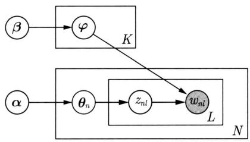  
图22.6 简化LDA模型的板块表示

# 1. 证据下界的定义

为简单起见，一次只考虑一个文本，记作 $W$ 。文本的单词序列 $W = (w_{1},\dots ,w_{l},\dots ,w_{L})$ 对应的话题序列 $z = (z_{1},\dots ,z_{l},\dots ,z_{L})$ ，随机变量 $W$ 、 $Z$ 和话题分布 $\theta$ 的联合分布是

$$
p (\boldsymbol {\theta}, Z, W | \boldsymbol {\alpha}, \boldsymbol {\varphi}) = p (\boldsymbol {\theta} | \boldsymbol {\alpha}) \prod_ {l = 1} ^ {L} p (z _ {l} | \boldsymbol {\theta}) p (w _ {l} | z _ {l}, \boldsymbol {\varphi}) \tag {22.34}
$$

其中， $W$ 是可观测变量， $\theta$ 和 $Z$ 是隐变量， $\alpha$ 和 $\varphi$ 是参数。

定义基于平均场的变分分布

$$
q (\boldsymbol {\theta}, Z | \boldsymbol {\gamma}, \boldsymbol {\eta}) = q (\boldsymbol {\theta} | \boldsymbol {\gamma}) \prod_ {l = 1} ^ {L} q \left(z _ {l} | \eta_ {l}\right) \tag {22.35}
$$

其中， $\gamma$ 是狄利克雷分布参数， $\eta$ 是多项分布参数，变量 $\theta$ 和 $Z$ 的各个分量都是条件独立的。目标是求KL散度意义下最相近的变分分布 $q(\theta, Z|\gamma, \eta)$ ，以近似LDA模型的后验分布 $p(\theta, Z|W, \alpha, \varphi)$ 。

图22.7是变分分布的板块表示。LDA模型中隐变量 $\theta$ 和 $Z$ 之间存在依存关系，变分分布中这些依存关系被去掉，变量 $\theta$ 和 $Z$ 条件独立。

由此得到一个文本的证据下界：

$$
L (\gamma , \boldsymbol {\eta}, \boldsymbol {\alpha}, \varphi) = \mathbb {E} _ {q} [ \log p (\boldsymbol {\theta}, Z, W | \boldsymbol {\alpha}, \varphi) ] - \mathbb {E} _ {q} [ \log q (\boldsymbol {\theta}, Z | \gamma , \boldsymbol {\eta}) ] \tag {22.36}
$$

其中，数学期望是对分布 $q(\theta, Z|\gamma, \eta)$ 定义的，为了方便写作 $\mathbb{E}_q[\cdot]$ ； $\gamma$ 和 $\eta$ 是变分分布的参数； $\alpha$ 和 $\varphi$ 是LDA模型的参数。

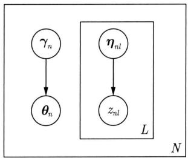  
图22.7 基于平均场的变分分布的板块表示

所有文本的证据下界为

$$
L (\boldsymbol {\gamma}, \boldsymbol {\eta}, \boldsymbol {\alpha}, \boldsymbol {\varphi}) = \sum_ {n = 1} ^ {N} \left\{\mathbb {E} _ {q _ {n}} \left[ \log p \left(\boldsymbol {\theta} _ {n}, Z _ {n}, W _ {n} \mid \boldsymbol {\alpha}, \boldsymbol {\varphi}\right) \right] - \mathbb {E} _ {q _ {n}} \left[ \log q \left(\boldsymbol {\theta} _ {n}, Z _ {n} \mid \boldsymbol {\gamma} _ {n}, \boldsymbol {\eta} _ {n}\right) \right] \right\} \tag {22.37}
$$

为求解证据下界 $L(\gamma, \eta, \alpha, \varphi)$ 的最大化，首先写出证据下界的表达式。为此展开证据下界式 (22.36):

$$
\begin{array}{l} L (\gamma , \eta , \alpha , \varphi) = \mathbb {E} _ {q} [ \log p (\boldsymbol {\theta} | \boldsymbol {\alpha}) ] + \mathbb {E} _ {q} [ \log p (Z | \boldsymbol {\theta}) ] + \mathbb {E} _ {q} [ \log p (W | Z, \varphi) ] - \\ \mathbb {E} _ {q} \left[ \log q (\boldsymbol {\theta} | \boldsymbol {\gamma}) \right] - \mathbb {E} _ {q} \left[ \log q (Z | \boldsymbol {\eta}) \right] \tag {22.38} \\ \end{array}
$$

根据变分参数 $\gamma$ 和 $\eta$ ，模型参数 $\alpha$ 和 $\varphi$ 继续展开，并将展开式的每一项写成一行：

$$
\begin{array}{l} L (\boldsymbol {\gamma}, \boldsymbol {\eta}, \boldsymbol {\alpha}, \boldsymbol {\varphi}) = \log \Gamma \left(\sum_ {k ^ {\prime} = 1} ^ {K} \alpha_ {k ^ {\prime}}\right) - \sum_ {k = 1} ^ {K} \log \Gamma (\alpha_ {k}) + \sum_ {k = 1} ^ {K} (\alpha_ {k} - 1) \left[ \Psi (\gamma_ {k}) - \Psi \left(\sum_ {k ^ {\prime} = 1} ^ {K} \gamma_ {k ^ {\prime}}\right) \right] + \\ \sum_ {l = 1} ^ {L} \sum_ {k = 1} ^ {K} \eta_ {l k} \left[ \Psi \left(\gamma_ {k}\right) - \Psi \left(\sum_ {k ^ {\prime} = 1} ^ {K} \gamma_ {k ^ {\prime}}\right) \right] + \\ \sum_ {l = 1} ^ {L} \sum_ {k = 1} ^ {K} \sum_ {m = 1} ^ {M} \eta_ {l k} w _ {l} ^ {m} \log \varphi_ {k m} - \\ \log \Gamma \left(\sum_ {k ^ {\prime} = 1} ^ {K} \gamma_ {k ^ {\prime}}\right) + \sum_ {k = 1} ^ {K} \log \Gamma (\gamma_ {k}) - \sum_ {k = 1} ^ {K} (\gamma_ {k} - 1) \left[ \Psi (\gamma_ {k}) - \Psi \left(\sum_ {k ^ {\prime} = 1} ^ {K} \gamma_ {k ^ {\prime}}\right) \right] - \\ \sum_ {l = 1} ^ {L} \sum_ {k = 1} ^ {K} \eta_ {l k} \log \eta_ {l k} \tag {22.39} \\ \end{array}
$$

式中 $\varPsi(\alpha_k)$ 是对数伽马函数的导数，即

$$
\varPsi (\alpha_ {k}) = \frac {\mathrm {d}}{\mathrm {d} \alpha_ {k}} \log \Gamma (\alpha_ {k}) \tag {22.40}
$$

第一项推导求 $\mathbb{E}_q[\log p(\pmb {\theta}|\pmb {\alpha})]$ ，是关于分布 $q(\pmb {\theta},Z|\gamma ,\pmb {\eta})$ 的数学期望。

$$
\mathbb {E} _ {q} \left[ \log p (\boldsymbol {\theta} | \boldsymbol {\alpha}) \right] = \sum_ {k = 1} ^ {K} \left(\alpha_ {k} - 1\right) \mathbb {E} _ {q} \left[ \log \theta_ {k} \right] + \log \Gamma \left(\sum_ {k ^ {\prime} = 1} ^ {K} \alpha_ {k ^ {\prime}}\right) - \sum_ {k = 1} ^ {K} \log \Gamma \left(\alpha_ {k}\right) \tag {22.41}
$$

其中， $\pmb {\theta}\sim \mathrm{Dir}(\pmb {\theta}|\pmb {\gamma})$ ，所以利用附录E中式(E.7)有

$$
\mathbb {E} _ {q (\boldsymbol {\theta} | \boldsymbol {\gamma})} \left[ \log \theta_ {k} \right] = \Psi \left(\gamma_ {k}\right) - \Psi \left(\sum_ {k ^ {\prime} = 1} ^ {K} \gamma_ {k ^ {\prime}}\right) \tag {22.42}
$$

故得：

$$
\mathbb {E} _ {q} \left[ \log p (\boldsymbol {\theta} | \boldsymbol {\alpha}) \right] = \log \Gamma \left(\sum_ {k ^ {\prime} = 1} ^ {K} \alpha_ {k ^ {\prime}}\right) - \sum_ {k = 1} ^ {K} \log \Gamma \left(\alpha_ {k}\right) + \sum_ {k = 1} ^ {K} \left(\alpha_ {k} - 1\right) \left[ \Psi \left(\gamma_ {k}\right) - \Psi \left(\sum_ {k ^ {\prime} = 1} ^ {K} \gamma_ {k ^ {\prime}}\right) \right] \tag {22.43}
$$

式中 $\alpha_{k}$ 和 $\gamma_{k}$ 表示第 $k$ 个话题的狄利克雷分布参数。

第二项推导求 $\mathbb{E}_q[\log p(Z|\pmb {\theta})]$ ，是关于分布 $q(\pmb {\theta},Z|\pmb {\gamma},\pmb {\eta})$ 的数学期望。

$$
\begin{array}{l} \mathbb {E} _ {q} (\log p (Z | \boldsymbol {\theta})) = \sum_ {l = 1} ^ {L} \mathbb {E} _ {q} [ \log p (z _ {l} | \boldsymbol {\theta}) ] \\ = \sum_ {l = 1} ^ {L} \mathbb {E} _ {q (\boldsymbol {\theta}, z _ {l} | \boldsymbol {\gamma}, \boldsymbol {\eta})} [ \log (z _ {l} | \boldsymbol {\theta}) ] \\ = \sum_ {l = 1} ^ {L} \sum_ {k = 1} ^ {K} q (z _ {l k} | \boldsymbol {\eta}) \mathbb {E} _ {q (\boldsymbol {\theta} | \boldsymbol {\gamma})} [ \log \theta_ {k} ] \\ = \sum_ {l = 1} ^ {L} \sum_ {k = 1} ^ {K} \eta_ {l k} \left[ \Psi \left(\gamma_ {k}\right) - \Psi \left(\sum_ {k ^ {\prime} = 1} ^ {K} \gamma_ {k ^ {\prime}}\right) \right] \tag {22.44} \\ \end{array}
$$

式中 $\eta_{lk}$ 表示文档第 $l$ 个位置的单词由第 $k$ 个话题产生的概率， $\gamma_{k}$ 表示第 $k$ 个话题的狄利克雷分布参数。最后一步用到附录E中式(E.4)。

第三项推导求 $\mathbb{E}_q[\log p(W|Z,\varphi)]$ ，是关于分布 $q(\pmb {\theta},Z|\pmb {\gamma},\pmb {\eta})$ 的数学期望。

$$
\begin{array}{l} \mathbb {E} _ {q} \left[ \log p (W | Z, \varphi) \right] = \sum_ {l = 1} ^ {L} \mathbb {E} _ {q} \left[ \log p (w _ {l} | z _ {l}, \varphi) \right] \\ = \sum_ {l = 1} ^ {L} \mathbb {E} _ {q (z _ {l} | \boldsymbol {\eta})} [ \log p (w _ {l} | z _ {l}, \boldsymbol {\varphi}) ] \\ = \sum_ {l = 1} ^ {L} \sum_ {k = 1} ^ {K} q (z _ {l k} | \eta) \log p (w _ {l} | z _ {l k}, \varphi) \\ = \sum_ {l = 1} ^ {L} \sum_ {k = 1} ^ {K} \sum_ {m = 1} ^ {M} \eta_ {l k} w _ {l} ^ {m} \log \varphi_ {k m} \tag {22.45} \\ \end{array}
$$

式中 $\eta_{lk}$ 表示文档第 $l$ 个位置的单词由第 $k$ 个话题产生的概率； $w_{l}^{m}$ 在第 $l$ 个位置的单词是单词集合的第 $m$ 个单词时取值为1，否则取值为0； $\varphi_{km}$ 表示第 $k$ 个话题生成单词集合中第 $m$ 个单词的概率。

第四项推导求 $\mathbb{E}_q[\log q(\pmb {\theta}|\pmb {\gamma})]$ ，是关于分布 $q(\pmb {\theta},z|\pmb {\gamma},\pmb {\eta})$ 的数学期望。由于 $\pmb {\theta}\sim \mathrm{Dir}(\pmb {\gamma})$ ，类似式(22.42）可以得到：

$$
\mathbb {E} _ {q} \left[ \log q (\boldsymbol {\theta} | \boldsymbol {\gamma}) \right] = \log \Gamma \left(\sum_ {k ^ {\prime} = 1} ^ {K} \gamma_ {k ^ {\prime}}\right) - \sum_ {k = 1} ^ {K} \log \Gamma \left(\gamma_ {k}\right) + \sum_ {k = 1} ^ {K} \left(\gamma_ {k} - 1\right) \left[ \Psi \left(\gamma_ {k}\right) - \Psi \left(\sum_ {k ^ {\prime} = 1} ^ {K} \gamma_ {k ^ {\prime}}\right) \right] \tag {22.46}
$$

式中 $\gamma_{k}$ 表示第 $k$ 个话题的狄利克雷分布参数。

第五项公式推导求 $\mathbb{E}_q[\log q(Z|\pmb {\eta})]$ ，是关于分布 $q(\pmb {\theta},Z|\gamma ,\pmb {\eta})$ 的数学期望。

$$
\begin{array}{l} \mathbb {E} _ {q} \left[ \log q (Z | \boldsymbol {\eta}) \right] = \sum_ {l = 1} ^ {L} \mathbb {E} _ {q} \left[ \log q \left(z _ {l} | \boldsymbol {\eta}\right) \right] \\ = \sum_ {l = 1} ^ {L} \mathbb {E} _ {q (z _ {l} | \boldsymbol {\eta})} [ \log q (z _ {l} | \boldsymbol {\eta}) ] \\ = \sum_ {l = 1} ^ {L} \sum_ {k = 1} ^ {K} q (z _ {l k} | \boldsymbol {\eta}) \log q (z _ {l k} | \boldsymbol {\eta}) \\ = \sum_ {l = 1} ^ {L} \sum_ {k = 1} ^ {K} \eta_ {l k} \log \eta_ {l k} \tag {22.47} \\ \end{array}
$$

式中 $\eta_{lk}$ 表示文档第 $l$ 个位置的单词由第 $k$ 个话题产生的概率， $\gamma_{k}$ 表示第 $k$ 个话题的狄利克雷分布参数。

# 2. 变分参数 $\gamma$ 和 $\eta$ 的估计

首先通过证据下界最优化估计参数 $\eta$ 。 $\eta_{nk}$ 表示第 $n$ 个位置的单词由第 $k$ 个话题生成的概率。考虑式 (22.39) 关于 $\eta_{nk}$ 的最大化， $\eta_{nk}$ 满足约束条件 $\sum_{k'=1}^{K} \eta_{nk'} = 1$ 。包含 $\eta_{nk}$ 的约束最优化问题拉格朗日函数为

$$
L \left(\eta_ {n k}\right) = \eta_ {n k} \left[ \Psi \left(\gamma_ {k}\right) - \Psi \left(\sum_ {k ^ {\prime} = 1} ^ {K} \gamma_ {k ^ {\prime}}\right) \right] + \eta_ {n k} \log \varphi_ {k m} - \eta_ {n k} \log \eta_ {n k} + \lambda_ {n} \left(\sum_ {k ^ {\prime} = 1} ^ {K} \eta_ {n k ^ {\prime}} - 1\right) \tag {22.48}
$$

这里 $\varphi_{km}$ 是（在第 $n$ 个位置）由第 $k$ 个话题生成第 $m$ 个单词的概率。

对 $\eta_{nk}$ 求偏导数得：

$$
\frac {\partial L}{\partial \eta_ {n k}} = \Psi (\gamma_ {k}) - \Psi \left(\sum_ {k ^ {\prime} = 1} ^ {K} \gamma_ {k ^ {\prime}}\right) + \log \varphi_ {k m} - \log \eta_ {n k} - 1 + \lambda_ {n} \tag {22.49}
$$

令偏导数为零，得到参数 $\eta_{nk}$ 的估计值：

$$
\eta_ {n k} \propto \varphi_ {k m} \exp \left[ \Psi \left(\gamma_ {k}\right) - \Psi \left(\sum_ {k ^ {\prime} = 1} ^ {K} \gamma_ {k ^ {\prime}}\right) \right] \tag {22.50}
$$

接着通过证据下界最优化估计参数 $\gamma$ 。 $\gamma_{k}$ 是第 $k$ 个话题的狄利克雷分布参数。考虑式(22.39)关于 $\gamma_{k}$ 的最大化：

$$
\begin{array}{l} L \left(\gamma_ {k}\right) = \sum_ {k = 1} ^ {K} (k - 1) \left[ \Psi \left(\gamma_ {k}\right) - \Psi \left(\sum_ {k ^ {\prime} = 1} ^ {K} \gamma_ {k ^ {\prime}}\right) \right] + \sum_ {l = 1} ^ {L} \sum_ {k = 1} ^ {K} \eta_ {l k} \left[ \Psi \left(\gamma_ {k}\right) - \Psi \left(\sum_ {k ^ {\prime} = 1} ^ {K} \gamma_ {k ^ {\prime}}\right) \right] - \\ \log \Gamma \left(\sum_ {k ^ {\prime} = 1} ^ {K} \gamma_ {k ^ {\prime}}\right) + \log \Gamma (\gamma_ {k}) - \sum_ {k = 1} ^ {K} (\gamma_ {k} - 1) \left[ \Psi (\gamma_ {k}) - \Psi \left(\sum_ {k ^ {\prime} = 1} ^ {K} \gamma_ {k ^ {\prime}}\right) \right] \tag {22.51} \\ \end{array}
$$

简化为

$$
L \left(\gamma_ {k}\right) = \sum_ {k = 1} ^ {K} \left[ \Psi \left(\gamma_ {k}\right) - \Psi \left(\sum_ {k ^ {\prime} = 1} ^ {K} \gamma_ {k ^ {\prime}}\right) \right] \left(\alpha_ {k} + \sum_ {l = 1} ^ {L} \eta_ {l k} - \gamma_ {k}\right) - \log \Gamma \left(\sum_ {k ^ {\prime} = 1} ^ {K} \gamma_ {k ^ {\prime}}\right) + \log \Gamma \left(\gamma_ {k}\right) \tag {22.52}
$$

对 $\gamma_{k}$ 求偏导数得：

$$
\frac {\partial L}{\partial \gamma_ {k}} = \left[ \Psi^ {\prime} \left(\gamma_ {k}\right) - \Psi^ {\prime} \left(\sum_ {k ^ {\prime} = 1} ^ {K} \gamma_ {k ^ {\prime}}\right) \right] \left(\alpha_ {k} + \sum_ {l = 1} ^ {L} \eta_ {l k} - \gamma_ {k}\right) \tag {22.53}
$$

令偏导数为零，求解得到参数 $\gamma_{k}$ 的估计值：

$$
\gamma_ {k} = \alpha_ {k} + \sum_ {l = 1} ^ {L} \eta_ {l k} \tag {22.54}
$$

据此，得到由坐标上升算法估计变分参数的方法，具体算法如下。

# 算法22.3（LDA的变分参数估计算法）

（1）初始化：对所有 $k$ 和 $n$ ， $\eta_{nk}^{(0)} = 1 / K$   
（2）初始化：对所有 $k$ ， $\gamma_{k} = \alpha_{k} + L / K$   
（3）重复；  
（4）对 $l = 1$ 到 $l = L$ ，对 $k = 1$ 到 $k = K$

$$
\eta_ {l k} ^ {(t + 1)} = \varphi_ {k m} \exp \left[ \Psi \left(\gamma_ {k} ^ {(t)}\right) - \Psi \left(\sum_ {k ^ {\prime} = 1} ^ {K} \gamma_ {k ^ {\prime}} ^ {(t)}\right) \right]
$$

（5）规范化 $\eta_{nk}^{(t + 1)}$ 使其和为1；

(6) $\pmb{\gamma}^{(t + 1)} = \pmb{\alpha} + \sum_{l = 1}^{L}\pmb{\eta}_{l}^{(t + 1)}$ ;   
（7）直到收敛。

# 3. 模型参数 $\alpha$ 和 $\varphi$ 的估计

给定一个文本集合 $D = (d_{1}, d_{2}, \dots, d_{n}, \dots, d_{N})$ ，模型参数估计对所有文本同时进行。

首先通过证据下界的最大化估计 $\varphi$ 。 $\varphi_{km}$ 表示第 $k$ 个话题生成单词集合第 $m$ 个单词的概率。将式(22.39)扩展到所有文本，并考虑关于 $\varphi$ 的最大化。满足 $K$ 个约束条件

$$
\sum_ {m = 1} ^ {M} \varphi_ {k m} = 1, \quad k = 1, 2, \dots , K
$$

约束最优化问题的拉格朗日函数为

$$
L (\boldsymbol {\beta}) = \sum_ {n = 1} ^ {N} \sum_ {l = 1} ^ {L} \sum_ {k = 1} ^ {K} \sum_ {m = 1} ^ {M} \eta_ {n l k} w _ {n l} ^ {m} \log \varphi_ {k v} + \sum_ {k = 1} ^ {K} \lambda_ {k} \left(\sum_ {m = 1} ^ {M} \varphi_ {k m} - 1\right) \tag {22.55}
$$

对 $\varphi_{km}$ 求偏导数并令其为零，归一化求解，得到参数 $\varphi_{km}$ 的估计值：

$$
\varphi_ {k m} = \sum_ {n = 1} ^ {N} \sum_ {l = 1} ^ {L} \eta_ {n l k} w _ {n l} ^ {m} \tag {22.56}
$$

其中， $\eta_{nlk}$ 为第 $n$ 个文本的第 $l$ 个单词属于第 $k$ 个话题的概率， $w_{nl}^{m}$ 在第 $n$ 个文本的第 $l$ 个单词是单词集合的第 $m$ 个单词时取值为1，否则为0。

接着通过证据下界的最大化估计参数 $\alpha$ 。 $\alpha_{k}$ 表示第 $k$ 个话题的狄利克雷分布参数。将式(22.39)扩展到所有文本，并考虑关于 $\alpha$ 的最大化：

$$
L (\alpha) = \sum_ {n = 1} ^ {N} \left\{\log \Gamma \left(\sum_ {k ^ {\prime} = 1} ^ {K} \alpha_ {k ^ {\prime}}\right) - \sum_ {k = 1} ^ {K} \log \Gamma \left(\alpha_ {k}\right) + \sum_ {k = 1} ^ {K} \left(\alpha_ {k} - 1\right) \left[ \Psi \left(\gamma_ {n k}\right) - \Psi \left(\sum_ {k ^ {\prime} = 1} ^ {K} \gamma_ {n k ^ {\prime}}\right) \right] \right\} \tag {22.57}
$$

对 $\alpha_{k}$ 求偏导数得：

$$
\frac {\partial L}{\partial \alpha_ {k}} = N \left[ \Psi \left(\sum_ {k ^ {\prime} = 1} ^ {K} \alpha_ {k ^ {\prime}}\right) - \Psi (\alpha_ {k}) \right] + \sum_ {n = 1} ^ {N} \left[ \Psi \left(\gamma_ {n k}\right) - \Psi \left(\sum_ {k ^ {\prime} = 1} ^ {K} \gamma_ {n k ^ {\prime}}\right) \right] \tag {22.58}
$$

再对 $\alpha_{k^{\prime}}$ 求偏导数得：

$$
\frac {\partial^ {2} L}{\partial \alpha_ {k} \partial \alpha_ {k ^ {\prime}}} = N \left[ \Psi^ {\prime} \left(\sum_ {k ^ {\prime} = 1} ^ {K} \alpha_ {k ^ {\prime}}\right) - \delta (k, k ^ {\prime}) \Psi^ {\prime} (\alpha_ {k}) \right] \tag {22.59}
$$

这里 $\delta (k,k^{\prime})$ 是delta函数。

式(22.58)和式(22.59)分别是函数(22.57)对变量 $\alpha$ 的梯度 $\nabla L(\alpha)$ 和Hessian矩阵 $\nabla^2 L(\alpha)$ 。应用牛顿法求该函数的最大化①。用以下公式迭代，得到参数 $\alpha$ 的估计值。

$$
\boldsymbol {\alpha} _ {\text {n e w}} = \boldsymbol {\alpha} _ {\text {o l d}} - \nabla^ {2} L \left(\boldsymbol {\alpha} _ {\text {o l d}}\right) ^ {- 1} \nabla L \left(\boldsymbol {\alpha} _ {\text {o l d}}\right) \tag {22.60}
$$

据此，得到估计参数 $\alpha$ 的算法。

# 22.4.2 算法总结

根据上面的推导给出LDA的变分EM算法。

# 算法22.4（LDA的变分EM算法）

输入：给定所有文本 $D = (d_{1}, d_{2}, \dots, d_{n}, \dots, d_{N})$ 。

输出：变分参数 $\gamma$ ， $\eta$ ，模型参数 $\alpha$ ， $\varphi$ 。

交替迭代E步和M步，直到收敛。

# (1)E步

固定模型参数 $\alpha, \varphi$ ，通过关于变分参数 $\gamma, \eta$ 的证据下界的最大化，估计变分参数 $\gamma, \eta$ 。具体见算法22.4。

# (2)M步

固定变分参数 $\gamma, \eta$ ，通过关于模型参数 $\alpha, \varphi$ 的证据下界的最大化，估计模型参数 $\alpha, \varphi$ 。具体算法见式 (22.64) 和式 (22.68)。

根据变分参数 $(\pmb{\gamma},\pmb{\eta})$ 可以估计模型参数 $\pmb {\theta} = (\pmb {\theta}_1,\pmb {\theta}_2,\dots ,\pmb {\theta}_n,\dots ,\pmb {\theta}_N),Z = (Z_1,Z_2,\dots ,$ $Z_{n},\dots ,Z_{N})$ 。

以上介绍的是图22.7中简化LDA模型的变分EM算法，图22.4中完整LDA模型的变分EM算法作为推广可以类似地导出。

# 本章概要

1. 狄利克雷分布的概率密度函数为

$$
p (\boldsymbol {\theta} | \boldsymbol {\alpha}) = \frac {\Gamma \left(\sum_ {i = 1} ^ {k} \alpha_ {i}\right)}{\prod_ {i = 1} ^ {k} \Gamma (\alpha_ {i})} \prod_ {i = 1} ^ {k} \theta_ {i} ^ {\alpha_ {i} - 1}
$$

其中， $\sum_{i=1}^{k} \theta_i = 1$ ， $\theta_i \geqslant 0$ ， $\alpha = (\alpha_1, \alpha_2, \dots, \alpha_k)$ ， $\alpha_i > 0$ ， $i = 1, 2, \dots, k$ 。狄利克雷分布是多项分布的共轭先验。

2. 潜在狄利克雷分配（LDA）是文本集合的生成概率模型。模型假设话题由单词的多项分布表示，文本由话题的多项分布表示，单词分布和话题分布的先验分布都是狄利克雷分布。LDA模型属于概率图模型，可以由板块表示法表示。LDA模型中，每个话题的单词分布、每个文本的话题分布、文本的每个位置的话题是隐变量，文本的每个位置的单词是观测变量。

3. LDA生成文本集合的过程如下：

（1）话题的单词分布：随机生成所有话题的单词分布，话题的单词分布是多项分布，其先验分布是狄利克雷分布。

（2）文本的话题分布：随机生成所有文本的话题分布，文本的话题分布是多项分布，其先验分布是狄利克雷分布。  
（3）文本的内容：随机生成所有文本的内容。在每个文本的每个位置，按照文本的话题分布随机生成一个话题，再按照该话题的单词分布随机生成一个单词。  
4. LDA模型的学习与推理不能直接求解。通常采用的方法是吉布斯抽样算法和变分EM算法，前者是蒙特卡罗法，而后者是近似算法。  
5. LDA 的收缩的吉布斯抽样算法的基本想法如下。目标是对联合概率分布 $p(W,Z,\theta, \varphi|\alpha,\beta)$ 进行估计。通过积分求和将隐变量 $\theta$ 和 $\varphi$ 消掉，得到边缘概率分布 $p(W,Z|\alpha,\beta)$ ；对概率分布 $p(W|Z,\alpha,\beta)$ 进行吉布斯抽样，得到分布 $p(W|Z,\alpha,\beta)$ 的随机样本；再利用样本对变量 $Z$ ， $\theta$ 和 $\varphi$ 的概率进行估计，最终得到 LDA 模型 $p(W,Z,\theta,\varphi|\alpha,\beta)$ 的参数估计。具体算法如下：对给定的文本单词序列，每个位置上随机指派一个话题，整体构成话题系列；然后循环执行以下操作，对整个文本序列进行扫描，在每一个位置上计算在该位置上的话题的满条件概率分布，然后进行随机抽样，得到该位置的新的话题，指派给这个位置。  
6. LDA 的变分 EM 算法如下：针对 LDA 模型，定义变分分布，应用变分 EM 算法。目标是对证据下界 $L(\gamma, \eta, \alpha, \varphi)$ 进行最大化，其中 $\alpha$ 和 $\varphi$ 是模型参数， $\gamma$ 和 $\eta$ 是变分参数。交替迭代 E 步和 M 步，直到收敛。  
(1) E 步: 固定模型参数 $\alpha, \varphi$ , 通过关于变分参数 $\gamma, \eta$ 的证据下界的最大化, 估计变分参数 $\gamma, \eta$ 。  
(2) M 步：固定变分参数 $\gamma, \eta$ ，通过关于模型参数 $\alpha, \varphi$ 的证据下界的最大化，估计模型参数 $\alpha, \varphi$ 。

# 继续阅读

LDA 的原始论文是文献 [1] 和文献 [2], LDA 的吉布斯抽样算法见文献 [3]～文献 [5], 变分 EM 算法见文献 [2]。变分推理的介绍可参考文献 [6]。LDA 的分布式学习算法有文献 [7], 快速学习算法有文献 [8], 在线学习算法有文献 [9]。

# 习题

22.1 推导狄利克雷分布数学期望公式。  
22.2 找出LDA的吉布斯抽样算法、变分EM算法中利用狄利克雷分布的部分，思考LDA中使用狄利克雷分布的重要性。  
22.3 推导LDA的吉布斯抽样的条件概率分布公式(22.29)。  
22.4 给出LDA的吉布斯抽样算法和变分EM算法的算法复杂度。  
22.5 针对17.2.2节的文本例子，使用LDA模型进行话题分析。

22.6 第 6 章介绍了朴素贝叶斯模型的贝叶斯估计。目标是学习联合概率分布 $P(\pmb{x}, y, \pmb{\theta} | \pmb{\alpha})$ ，其中 $\pmb{x}$ 是模型的输入， $y$ 是模型的输出， $\pmb{\theta}$ 表示模型中的类别分布的参数， $\pmb{\alpha}$ 表示狄利克雷分布的超参数。模型的贝叶斯估计有解析解，试推导出其算式。

# 参考文献

[1] BLEID M, NG A Y, JORDAN M I. Latent Dirichlet allocation[C]//Advances in Neural Information Processing Systems 14. MIT Press, 2002.   
[2] BLEID M, NG A Y, JORDAN M I. Latent Dirichlet allocation[J]. Journal of Machine Learning Research, 2003, 3: 933-1022.   
[3] GRIFFITHS T L, STEYVERS M. Finding scientific topics[J]. Proceedings of the National Academy of Science, 2004, 101: 5228-5235.   
[4] STEYVERS M, GRIFFITHS T. Probabilistic topic models[C]//Handbook of Latent Semantic Analysis. Psychology Press, 2014.   
[5] HEINRICH G. Parameter estimation for text analysis[J]. Technical note, 2004.   
[6] BLEIDM,KUCUKELBIR A,MCAULIFFEJD.Variational inference:a review for statisticians[J].Journal of the American Statistical Association,2017,112(518).   
[7] NEWMAN D, SMYTH P, WELLING M, et al. Distributed inference for latent Dirichlet allocation[J]. Advances in Neural Information Processing Systems, 2008: 1081-1088.   
[8] PORTEOUS I, NEWMAN D, IHLER A, et al. Fast collapsed Gibbs sampling for latent Dirichlet allocation[C]//Proceedings of the 14th ACM SIGKDD International Conference on Knowledge Discovery and Data Mining. 2008: 569-577.   
[9] HOFFMAN M, BACH F R, BLEI D M. Online learning for latent Dirichlet allocation[J]. Advances in Neural Information Processing Systems, 2010: 856-864.

# 第23章 无监督学习方法总结

# 23.1 无监督学习方法的关系和特点

第2篇详细介绍了常用的机器学习方法，这些方法用于无监督学习。有聚类方法（包括层次聚类与 $k$ 均值聚类）、奇异值分解（SVD）、主成分分析（PCA）、EM算法、变分推理、马尔可夫链蒙特卡罗法（MCMC，包括Metropolis-Hastings算法和吉布斯抽样）、潜在语义分析（LSA）、非负矩阵分解（NMF）、概率潜在语义分析（PLSA）、潜在狄利克雷分配（LDA）。

# 23.1.1 方法之间的关系

图23.1总结了一些机器学习方法之间的关系。图中上面是无监督学习方法，下面是基础机器学习方法。

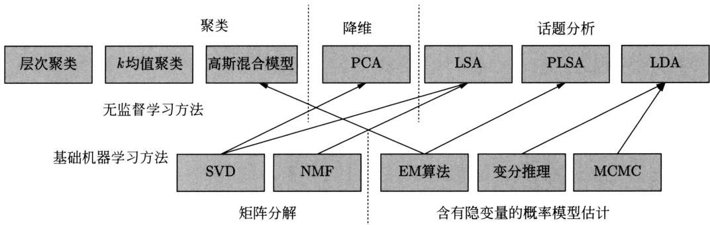  
图23.1 机器学习方法之间的关系

无监督学习用于聚类、降维、话题分析。聚类的方法有层次聚类、 $k$ 均值聚类、高斯混合模型，降维的方法有PCA，话题分析的方法包括LSA、PLSA、LDA。

基础机器学习方法不涉及具体的机器学习模型。基础机器学习方法有两部分：矩阵分解、含有隐变量的概率模型估计，前者是线性代数问题，后者是统计学习问题。矩阵分解方法有SVD和NMF，含有隐变量的概率模型估计方法有EM算法、变分推理、MCMC。

# 23.1.2 无监督学习方法

聚类有硬聚类和软聚类，层次聚类与 $k$ 均值聚类是硬聚类方法，高斯混合模型是软聚类

方法。层次聚类基于启发式算法， $k$ 均值聚类使用迭代算法，高斯混合模型学习使用 EM 算法。

降维有线性降维和非线性降维，PCA是线性降维方法。PCA通常使用SVD。

话题分析有非概率模型、概率模型。LSA 和 NMF 是非概率模型，PLSA 和 LDA 是概率模型。PLSA 不假设模型具有先验分布，学习基于极大似然估计；LDA 假设模型具有先验分布，学习基于贝叶斯学习，具体地进行后验概率估计。LSA 的学习使用 SVD，NMF 可直接用于话题分析。PLSA 的学习使用 EM 算法，LDA 的学习使用吉布斯抽样或变分推理。

表23.1总结了无监督学习方法的模型、策略、算法。

表 23.1 无监督学习方法的模型、策略和算法  

<table><tr><td></td><td>方法</td><td>模型</td><td>策略</td><td>算法</td></tr><tr><td rowspan="3">聚类</td><td>层次聚类</td><td>聚类树</td><td>类内样本距离最小</td><td>启发式算法</td></tr><tr><td>k均值聚类</td><td>k中心聚类</td><td>样本与类中心距离最小</td><td>迭代算法</td></tr><tr><td>高斯混合模型</td><td>高斯混合模型</td><td>似然函数最大</td><td>EM算法</td></tr><tr><td>降维</td><td>PCA</td><td>低维正交空间</td><td>方差最大</td><td>SVD</td></tr><tr><td rowspan="4">话题分析</td><td>LSA</td><td>矩阵分解模型</td><td>平方损失最小</td><td>SVD</td></tr><tr><td>NMF</td><td>矩阵分解模型</td><td>平方损失最小</td><td>非负矩阵分解</td></tr><tr><td>PLSA</td><td>PLSA模型</td><td>似然函数最大</td><td>EM算法</td></tr><tr><td>LDA</td><td>LDA模型</td><td>后验概率估计</td><td>吉布斯抽样,变分推理</td></tr></table>

# 23.1.3 基础机器学习方法

矩阵分解采用不同假设：SVD基于正交假设，分解得到的左右矩阵是正交矩阵，中间矩阵是非负对角矩阵。非负矩阵分解基于非负假设，分解得到的左右矩阵皆是非负矩阵。

含有隐变量的概率模型的学习有两条路径：迭代计算方法和随机抽样方法。EM算法和变分EM算法属于迭代计算方法，吉布斯抽样属于随机抽样方法。变分EM算法是EM算法的推广。

表23.2总结了含隐变量概率模型的学习方法的特点。

表 23.2 含隐变量概率模型的学习方法的特点  

<table><tr><td>算法</td><td>基本原理</td><td>收敛性</td><td>收敛速度</td><td>实现难易度</td><td>适合问题</td></tr><tr><td>EM算法</td><td>迭代计算、后验概率估计</td><td>收敛于局部最优</td><td>较快</td><td>容易</td><td>简单模型</td></tr><tr><td>变分推理</td><td>迭代计算、后验概率近似估计</td><td>收敛于局部最优</td><td>较慢</td><td>较复杂</td><td>复杂模型</td></tr><tr><td>吉布斯抽样</td><td>随机抽样、后验概率估计</td><td>依概率收敛于全局最优</td><td>较慢</td><td>容易</td><td>复杂模型</td></tr></table>

# 23.2 话题模型之间的关系和特点

在本书介绍的四种话题模型 LSA、NMF、PLSA 和 LDA 中，前两者是非概率模型，后两者是概率模型。下面讨论它们之间的关系（细节可参考文献 [1] 和文献 [2]）。

可以从矩阵分解的统一框架看LSA、NMF和PLSA。在这个框架下，通过最小化一般化Bregman散度进行有约束的矩阵分解 $D = UV$ ，得到这三个话题模型：

$$
\min _ {\boldsymbol {U}, \boldsymbol {V}} B (\boldsymbol {D} \| \boldsymbol {U V})
$$

这里 $B(D\|UV)$ 表示 $D$ 和 $UV$ 之间的一般化 Bregman 散度（generalized Bregman divergence），当且仅当两者相等时取值为 0。一般化 Bregman 散度包含平方损失、KL 散度等。三个话题模型拥有三种不同的具体形式。表 23.3 给出了三个话题模型的损失函数和约束的公式，其中 PLSA 的矩阵 $D$ 需要进行归一化 $\sum_{m,n} d_{mn} = 1$ 。

表 23.3 矩阵分解的角度看话题模型  

<table><tr><td>方法</td><td>一般损失函数B(D||UV)</td><td>矩阵U的约束条件</td><td>矩阵V的约束条件</td></tr><tr><td>LSA</td><td>||D-UV||2_F</td><td>UTU=I</td><td>VV^T = λ^2</td></tr><tr><td>NMF</td><td>||D-UV||2_F</td><td>u_mk ≥ 0</td><td>vkn ≥ 0</td></tr><tr><td rowspan="2">PLSA</td><td rowspan="2">∑mn d_mn log(d_mn/(UV)_{mn})</td><td>UT1 = 1</td><td>V^T1 = 1</td></tr><tr><td>u_mk ≥ 0</td><td>vkn ≥ 0</td></tr></table>

话题模型LSA和NMF是非概率模型，但也有概率模型解释。可以从概率图模型的统一框架看LSA、NMF、PLSA和LDA。在这个框架下，认为文本由概率模型生成，基于不同的假设得到四个不同的话题模型。四个话题模型有不同的概率图模型定义。对于LSA和NMF，每个文本 $d_{n}$ 由高斯分布 $P(\pmb{d}_n|\pmb{U},\pmb{v}_n)\propto \exp (-\| \pmb{d}_n - \pmb{U}\pmb{v}_n\|^2)$ 生成，其参数是 $\pmb{U}$ 和 $\pmb{v}_{n}$ ，共有 $N$ 个文本，如图23.2所示。两个话题模型有不同的约束条件，表23.4给出约束条件的公式。

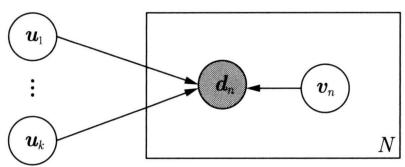  
图23.2 话题模型LSA和NMF的概率图模型表示

表 23.4 话题模型 LSA 和 NMF 的约束条件  

<table><tr><td>方法</td><td>变量uk的约束条件</td><td>变量vn的约束条件</td></tr><tr><td>LSA</td><td>正交</td><td>正交</td></tr><tr><td>NMF</td><td>umk≥0</td><td>vkn≥0</td></tr></table>

# 参考文献

[1] SINGH A P, GORDON G J. A unified view of matrix factorization models[M]//Daelemans W, Goethals B, Morik K. Machine Learning and Knowledge Discovery in Databases. Berlin: Springer, 2008.   
[2] WANG Q, XU J, LI H, et al. Regularized latent semantic indexing: a new approach to large-scale topic modeling[J]. ACM Transactions on Information Systems (TOIS), 2013, 31(1): 5.

# 作者简介

李航 ACM Fellow, ACL Fellow, IEEE Fellow。京都大学毕业，东京大学博士。曾就职于NEC公司中央研究所、微软亚洲研究院、华为诺亚方舟实验室，目前在字节跳动Seed部门工作。主要研究方向为自然语言处理、信息检索、机器学习、数据挖掘。