# 机器学习方法第2版

# (三) 深度学习

李航 著

# 机器学习方法第2版

# （三）深度学习

李航著

# 内容简介

机器学习是以概率论、统计学、信息论、最优化理论、计算理论等为基础的计算机应用理论学科，也是人工智能、数据挖掘等领域的基础学科。本书全面系统地介绍了机器学习的主要方法，共分4篇。第1篇介绍监督学习的主要方法，包括线性回归、感知机、支持向量机、最大熵模型与逻辑斯谛回归、提升方法、隐马尔可夫模型和条件随机场等；第2篇介绍无监督学习的主要方法，包括聚类、奇异值分解、主成分分析、马尔可夫链蒙特卡罗法、EM算法、潜在语义分析、潜在狄利克雷分配等。第3篇介绍深度学习的主要方法，包括前馈神经网络、卷积神经网络、循环神经网络、Transformer、扩散模型、生成对抗模型等。第4篇介绍强化的主要方法，包括马尔可夫决策、多臂老虎机、近端策略优化、深度Q网络等。书中每章介绍一两种机器学习方法。详细叙述各个方法的模型、策略和算法。从具体例子入手，由浅入深，帮助读者直观地理解基本思路，同时从理论角度出发，给出严格的数学推导，严谨翔实，让读者更好地掌握基本原理和概念。目的是使读者能学会和使用这些机器学习的基本技术。为满足读者进一步学习的需要，书中还对各个方法的要点进行了总结，给出了一些习题，并列出了主要参考文献。

本书是机器学习及相关课程的教学参考书，适合人工智能、数据挖掘等专业的本科生、研究生使用，也可供计算机各个领域的专业研发人员参考。

本书封面贴有清华大学出版社防伪标签，无标签者不得销售。

版权所有，侵权必究。举报：010-62782989，beiqinquan@tup.tsinghua.edu.cn。

图书在版编目（CIP）数据

机器学习方法/李航著．--2版．--北京：清华大学出版社，2025.7.ISBN978-7-302-69646-9

I. TP181

中国国家版本馆CIP数据核字第2025QZ6971号

责任编辑：孙亚楠

封面设计：李祥榕

责任校对：王淑云

责任印制：宋林

出版发行：清华大学出版社

网 址：https://www.tup.com.cn，https://www.wqxuetang.com

地址：北京清华大学学研大厦A座 邮编：100084

社总机：010-83470000 邮购：010-62786544

投稿与读者服务：010-62776969，c-service@tup.tsinghua.edu.cn

质量反馈：010-62772015，zhiliang@tup.tsinghua.edu.cn

印装者：三河市东方印刷有限公司

经销：全国新华书店

开 本： $185\mathrm{mm}\times 260\mathrm{mm}$ 印张：51.75插页：4字数：1200千字

版次：2022年3月第1版 2025年7月第2版 印次：2025年7月第1次印刷

印 数： $1\sim 6000$

定价：198.00元（全4册）

# 目录

# 第1篇 监督学习

# 第1章 机器学习简介. 3

1.1 机器学习的定义 3  
1.2 本书内容 ..... 5

# 第2章 监督学习简介 6

2.1 监督学习概述 6

2.1.1 监督学习的形式化 6  
2.1.2 监督学习三要素 8  
2.1.3 模型评估与模型选择 12  
2.1.4 正则化与交叉验证 17   
2.1.5 泛化能力 18

2.2 监督学习问题 21

2.2.1 分类问题 21  
2.2.2 回归问题 22  
2.2.3 序列标注问题 23

2.3 监督学习方法概述 24

2.3.1 生成方法与判别方法 ..... 25  
2.3.2 分类方法 25  
2.3.3 回归方法 28  
2.3.4 序列标注方法 29

本篇内容 29

继续阅读 30

习题 30

参考文献 30

# 第3章 线性回归 31

3.1 线性回归模型 31

3.1.1 模型定义 31  
3.1.2 概率模型表示 32  
3.1.3 基函数和模型的扩展 32

3.2 线性回归学习算法 34

3.2.1 最小二乘法 34  
3.2.2 正规方程 35  
3.2.3 梯度下降 36

3.3 岭回归和 Lasso 38

本章概要 40  
继续阅读 41   
习题 42  
参考文献 42

第4章 感知机 43

4.1 感知机模型 43  
4.2 感知机学习策略 44

4.2.1 数据集的线性可分性 44  
4.2.2 感知机学习策略 45

4.3 感知机学习算法 46

4.3.1 感知机学习算法的原始形式 46  
4.3.2 算法的收敛性 49  
4.3.3 感知机学习算法的对偶形式 ..... 50

本章概要 52  
继续阅读 53   
习题 53  
参考文献 54

第5章 $k$ 近邻法 55

5.1 $k$ 近邻算法 55  
5.2 $k$ 近邻模型 56

5.2.1 模型 56  
5.2.2 距离度量 57  
5.2.3 $k$ 值的选择 58   
5.2.4 决策规则 58

5.3 $k$ 近邻法的实现： $k$ -d 树 ..... 59

5.3.1 构建 $k$ -d 树 ..... 59   
5.3.2 搜索 $k$ -d 树 60

本章概要 62  
继续阅读 62   
习题 63  
参考文献 63

# 第6章 朴素贝叶斯法 ..... 64

# 6.1 朴素贝叶斯模型 64

6.1.1 模型定义 64  
6.1.2 分类决策 66  
6.1.3 概率模型 66  
6.1.4 生成模型与判别模型 67

# 6.2 朴素贝叶斯学习 67

6.2.1 学习问题 67  
6.2.2 极大似然估计 67   
6.2.3 学习和分类算法 68  
6.2.4 贝叶斯估计 69

# 本章概要 71

# 继续阅读 71

# 习题 71

# 参考文献 72

# 第7章 决策树 73

# 7.1 决策树模型与学习 ..... 73

7.1.1 决策树 73   
7.1.2 决策树模型 74  
7.1.3 决策树学习 75

# 7.2 特征选择 76

7.2.1 特征选择问题 ..... 76  
7.2.2 熵、条件熵和互信息 78  
7.2.3 信息增益与特征选择 ..... 79

# 7.3 分类树的生成 ..... 81

# 7.4分类树的剪枝 82

# 7.5 CART算法 83

7.5.1 CART 生成 ..... 84  
7.5.2 CART剪枝 88

# 本章概要 89

# 继续阅读 91

# 习题 91

# 参考文献 92

# 第8章 逻辑斯谛回归和最大熵模型 ..... 93

# 8.1 逻辑斯谛回归模型 ..... 93

8.1.1 逻辑斯谛分布 93  
8.1.2 二项逻辑斯谛回归 94

8.1.3 多项逻辑斯谛回归 96

8.2 最大熵模型 ..... 97

8.2.1 最大熵原理 ..... 97  
8.2.2 最大熵模型的定义 99  
8.2.3 最大熵模型的学习 100  
8.2.4 最大熵模型的极大似然估计 104  
8.2.5 与逻辑斯谛回归模型的关系 ..... 105  
8.2.6 与指数分布族的关系 ..... 105

8.3 学习算法 ..... 106

8.3.1 梯度下降 106   
8.3.2 拟牛顿法 108

本章概要 110  
继续阅读 111   
习题 111  
参考文献 111

第9章 支持向量机 113

9.1 线性可分支持向量机与硬间隔最大化 113

9.1.1 线性可分支持向量机 113  
9.1.2 函数间隔和几何间隔 115  
9.1.3 间隔最大化 116  
9.1.4 对偶问题的算法 120

9.2 线性支持向量机与软间隔最大化 125

9.2.1 线性支持向量机 125  
9.2.2 对偶问题的算法 126  
9.2.3 支持向量 129  
9.2.4 无约束最优化算法 ..... 129

9.3 非线性支持向量机与核函数 133

9.3.1 核技巧 133   
9.3.2 正定核 136  
9.3.3 常用核函数 140  
9.3.4 非线性支持向量分类机 141

本章概要 142

继续阅读 144   
习题 144  
参考文献 145

第10章 提升方法 ..... 147

10.1 AdaBoost算法 147

10.1.1 基本想法 147  
10.1.2 算法 148  
10.1.3 AdaBoost 的例子 150  
10.1.4 训练误差分析 152  
10.1.5 前向分步算法解释 153

# 10.2 梯度提升 157

10.2.1 基本想法 157  
10.2.2 GBDT用于回归 158  
10.2.3 GBDT算法 161

# 本章概要 163

继续阅读 165   
习题 165  
参考文献 166

# 第11章 隐马尔可夫模型 ..... 167

11.1 隐马尔可夫模型的基本概念 ..... 167

11.1.1 模型的定义 167  
11.1.2 模型的特点 169  
11.1.3 基本问题 171

11.2 概率计算算法 171

11.2.1 直接计算法 171  
11.2.2 前向算法 172  
11.2.3 后向算法 174  
11.2.4 前向-后向算法 176  
11.2.5 一些概率与期望值的计算 ..... 176

11.3 学习算法 177

11.3.1 监督学习方法 177  
11.3.2 Baum-Welch 算法 178  
11.3.3 模型参数估计 180

11.4 预测算法 181

11.4.1 近似算法 181  
11.4.2 维特比算法 181

# 本章概要 185

继续阅读 186   
习题 187  
参考文献 187

# 第12章 条件随机场 188

12.1 概率无向图模型 ..... 188

12.1.1 模型的定义 188  
12.1.2 概率无向图模型的因子分解 ..... 191  
12.1.3 概率无向图模型的例子 193

# 12.2 条件随机场的基本概念 194

12.2.1 模型的定义 194  
12.2.2 模型的形式 195  
12.2.3 基本问题 199

# 12.3 概率计算算法 200

12.3.1 前向算法 200  
12.3.2 后向算法 201  
12.3.3 前向-后向算法 201  
12.3.4 期望值的计算 ..... 202

# 12.4 学习算法 202

12.4.1 监督学习算法 203  
12.4.2 拟牛顿法 203

# 12.5 预测算法 204

本章概要 207  
继续阅读 209   
习题 209  
参考文献 210

# 第13章 监督学习方法总结 211

# 第2篇 无监督学习

# 第14章 无监督学习简介 ..... 219

# 14.1 无监督学习问题 ..... 219

14.1.1 聚类问题 219  
14.1.2 降维问题 220  
14.1.3 话题分析问题 ..... 221  
14.1.4 概率模型估计问题 ..... 223

# 14.2 无监督学习方法概述 ..... 223

14.2.1 机器学习三要素 223  
14.2.2 聚类方法 224  
14.2.3 降维方法 224  
14.2.4 话题分析方法——非概率模型 ..... 225  
14.2.5 话题分析方法——概率模型 ..... 226  
14.2.6 概率模型估计方法 227

# 本篇内容 228

# 继续阅读 228

参考文献 228

# 第15章 聚类方法 ..... 229

# 15.1 聚类的基本概念 229

15.1.1 相似度或距离 229  
15.1.2 类或簇 232   
15.1.3 类与类之间的距离 233

# 15.2 层次聚类 234

# 15.3 $k$ 均值聚类 235

15.3.1 模型 236  
15.3.2 策略 236  
15.3.3 算法 237  
15.3.4 算法特性 238

# 本章概要 239

# 继续阅读 240

# 习题 240

# 参考文献 240

# 第16章 奇异值分解 242

# 16.1 奇异值分解的定义与性质 242

16.1.1 定义与定理 242  
16.1.2 紧奇异值分解与截断奇异值分解 246  
16.1.3 几何解释 248   
16.1.4 主要性质 250

# 16.2 奇异值分解的计算 251

# 16.3 奇异值分解与矩阵近似 254

16.3.1 弗罗贝尼乌斯范数 254  
16.3.2 矩阵的最优近似 255  
16.3.3 矩阵的外积展开式 258

# 本章概要 260

# 继续阅读 261

# 习题 261

# 参考文献 262

# 第17章 主成分分析 263

# 17.1 总体主成分分析 263

17.1.1 基本想法 263  
17.1.2 定义和导出 265  
17.1.3 主要性质 266

17.1.4 主成分分析与降维 270  
17.1.5 规范化的总体主成分 273

17.2 样本主成分分析 274

17.2.1 定义和性质 274  
17.2.2 相关矩阵的特征值分解算法 276  
17.2.3 样本矩阵的奇异值分解算法 279

本章概要 280

继续阅读 282

习题 282

参考文献 283

第18章 EM算法和变分EM算法 284

18.1 EM算法 284

18.1.1 简单例子 285  
18.1.2 基本算法 287  
18.1.3 基本原理 288  
18.1.4 算法收敛性 290  
18.1.5 广义算法 291

18.2 高斯混合模型的EM算法 293

18.2.1 高斯混合模型 293  
18.2.2 EM算法 293  
18.2.3 与 $k$ 均值的关系 ..... 296

18.3 变分EM算法 297

18.3.1 变分贝叶斯方法 297  
18.3.2 基本算法 299  
18.3.3 EM算法和变分EM算法的比较 300

本章概要 300

继续阅读 302

习题 302

参考文献 303

第19章 马尔可夫链蒙特卡罗法 304

19.1 蒙特卡罗法 304

19.1.1 随机抽样 304   
19.1.2 数学期望估计 305

19.2 积分计算 307

19.3 马尔可夫链 308

19.3.1 基本定义 308  
19.3.2 离散状态马尔可夫链 309

19.3.3 连续状态马尔可夫链 314  
19.3.4 马尔可夫链的性质 315

# 19.4 马尔可夫链蒙特卡罗法 319

19.4.1 基本想法 319  
19.4.2 基本步骤 320

# 19.5 马尔可夫链蒙特卡罗法与机器学习 320

# 19.6 Metropolis-Hastings 算法 321

19.6.1 基本原理 321  
19.6.2 Metropolis-Hastings 算法 324  
19.6.3 单分量Metropolis-Hastings算法 324

# 19.7 吉布斯抽样 325

19.7.1 基本原理 326  
19.7.2 吉布斯抽样算法 327  
19.7.3 抽样计算 328

# 本章概要 329

# 继续阅读 330

# 习题 331

# 参考文献 332

# 第20章 潜在语义分析和非负矩阵分解 333

# 20.1 单词向量空间与话题向量空间 333

20.1.1 单词向量空间 333  
20.1.2 话题向量空间 335

# 20.2 潜在语义分析算法 338

20.2.1 矩阵奇异值分解算法 338  
20.2.2 例子 340

# 20.3 非负矩阵分解算法 341

20.3.1 非负矩阵分解 341  
20.3.2 话题分析 342  
20.3.3 非负矩阵分解的形式化 342  
20.3.4 算法 343

# 本章概要 345

# 继续阅读 346

# 习题 346

# 参考文献 347

# 第21章 概率潜在语义分析 348

# 21.1 概率潜在语义分析模型 348

# 21.1.1 基本想法 348

21.1.2 生成模型 349  
21.1.3 共现模型 350  
21.1.4 模型性质 351

# 21.2 概率潜在语义分析的算法 353

本章概要 355

继续阅读 356

习题 356

参考文献 357

# 第22章 潜在狄利克雷分配 358

22.1 狄利克雷分布 358

22.1.1 分布定义 358  
22.1.2 共轭先验 361

# 22.2 潜在狄利克雷分配模型 362

22.2.1 基本想法 362  
22.2.2 模型定义 363  
22.2.3 概率图模型 365  
22.2.4 随机变量序列的可交换性 366  
22.2.5 概率公式 366

# 22.3 LDA的吉布斯抽样算法 367

22.3.1 基本想法 367  
22.3.2 算法的主要部分 368  
22.3.3 算法的后处理 370  
22.3.4 算法 370

# 22.4 LDA的变分EM算法 372

22.4.1 算法推导 372   
22.4.2 算法总结 378

# 本章概要 378

# 继续阅读 379

# 习题 379

# 参考文献 380

# 第23章 无监督学习方法总结 381

# 23.1 无监督学习方法的关系和特点 381

23.1.1 方法之间的关系 381  
23.1.2 无监督学习方法 381  
23.1.3 基础机器学习方法 382

# 23.2 话题模型之间的关系和特点 ..... 382

# 参考文献 383

# 第3篇 深度学习

# 第24章 深度学习简介 387

# 24.1 深度学习问题 ..... 387

24.1.1 监督学习问题 387  
24.1.2 无监督学习问题 389

# 24.2 深度学习方法概述 391

24.2.1 基本原理 391  
24.2.2 基本工具 391  
24.2.3 监督学习模型 395  
24.2.4 无监督学习模型 397  
24.2.5 基本算法 398  
24.2.6 预训练 398

# 24.3 深度学习应用 399

# 本篇内容 399

# 参考文献 400

# 第25章 前馈神经网络 401

# 25.1 前馈神经网络的模型 401

25.1.1 前馈神经网络定义 402  
25.1.2 前馈神经网络的例子 412  
25.1.3 前馈神经网络的表示能力 416

# 25.2 前馈神经网络的学习算法 419

25.2.1 前馈神经网络学习 419  
25.2.2 前馈神经网络学习的优化算法 421  
25.2.3 反向传播算法 424  
25.2.4 在计算图上的实现 427  
25.2.5 算法的实现技巧 431

# 25.3 前馈神经网络学习的正则化 436

25.3.1 深度学习中的正则化 436  
25.3.2 早停法 437  
25.3.3 暂退法 438

# 本章概要 441

# 继续阅读 443

# 习题 444

# 参考文献 444

# 第26章 卷积神经网络 446

# 26.1 卷积神经网络的模型 446

# 26.1.1 背景 446

26.1.2 卷积 447  
26.1.3 汇聚 455   
26.1.4 卷积神经网络 458  
26.1.5 卷积神经网络性质 461

# 26.2卷积神经网络的学习算法 463

26.2.1 卷积导数 463  
26.2.2 反向传播算法 464

# 26.3 图片分类中的应用 467

26.3.1 AlexNet 467   
26.3.2 残差网络 468

# 本章概要 472

# 继续阅读 474

# 习题 475

# 参考文献 476

# 第27章 循环神经网络 478

# 27.1 简单循环神经网络 478

27.1.1 模型 478  
27.1.2 学习算法 481

# 27.2 常用循环神经网络 485

27.2.1 长短期记忆网络 485  
27.2.2 门控循环单元网络 ..... 488  
27.2.3 深度循环神经网络 489  
27.2.4 双向循环神经网络 490

# 27.3 自然语言生成中的应用 491

27.3.1 词向量 ..... 491  
27.3.2 语言生成与语言模型 ..... 494

# 本章概要 496

# 继续阅读 498

# 习题 498

# 参考文献 499

# 第28章 Transformer 501

# 28.1 序列到序列基本模型 501

28.1.1 序列到序列 ..... 501  
28.1.2 基本模型 503

# 28.2 RNN Search 模型 ..... 504

28.2.1 注意力 504  
28.2.2 模型定义 506

28.2.3 模型特点 507

28.3 Transformer 模型 ..... 508

28.3.1 模型架构 508  
28.3.2 模型特点 515

本章概要 516

继续阅读 518

习题 518

参考文献 519

第29章 GPT和BERT 520

29.1 预训练语言模型 520  
29.2 GPT模型 522

29.2.1 模型和学习 522  
29.2.2 模型特点 526

29.3 BERT模型 526

29.3.1 模型和学习 526  
29.3.2 模型特点 531

本章概要 532  
继续阅读 533

习题 533

参考文献 534

第30章 变分自编码器 535

30.1 自编码器 535  
30.2 去噪自编码器 536

30.3 变分自编码器 537

30.3.1 方法概述 537  
30.3.2 模型 538  
30.3.3 学习策略 540  
30.3.4 学习算法 542  
30.3.5 手写数字例 544

本章概要 545

继续阅读 547

习题 547

参考文献 547

第31章 生成对抗网络 ..... 549

31.1 GAN基本模型 549

31.1.1 模型 549

31.1.2 学习算法 551  
31.1.3 理论分析 552

31.2 图片生成中的应用 553

31.2.1 转置卷积 554   
31.2.2 DCGAN 556

本章概要 558  
继续阅读 559

习题 559

参考文献 560

第32章 扩散模型 561

32.1 去噪扩散概率模型 561

32.1.1 直观解释 562  
32.1.2 模型的定义和性质 562   
32.1.3 学习和生成算法 567

32.2 分数匹配加朗之万动力学 571

32.2.1 分数匹配 571  
32.2.2 朗之万动力学 ..... 573  
32.2.3 学习和生成算法 574

32.3 扩散模型之间的关系 577

32.3.1 分数函数学习 577  
32.3.2 随机微分方程 578

32.4 图像生成 580

32.4.1 扩散模型用于图像生成 580  
32.4.2 隐空间中的生成 581  
32.4.3 有条件的生成 ..... 582

本章概要 583  
继续阅读 586   
习题 586  
参考文献 587

第33章 深度学习方法总结 588

33.1 深度学习的模型 588  
33.2 深度学习的算法 590  
33.3 深度学习的优缺点 592

参考文献 593

# 第4篇 强化学习

第34章 强化学习简介 597

34.1 强化学习问题 ..... 597

34.1.1 强化学习的定义 597  
34.1.2 相关问题 600

# 34.2 强化学习原理和方法 601

34.2.1 强化学习方法 601  
34.2.2 强化学习原理 601  
34.2.3 深度强化学习 602

# 34.3 强化学习应用 603

本篇内容 604  
习题 605

# 参考文献 605

# 第35章 马尔可夫决策过程 606

# 35.1 马尔可夫决策过程定义 606

35.1.1 基本概念 606  
35.1.2 最优策略 610  
35.1.3 MDP例子 611

# 35.2 动态规划算法 614

35.2.1 规划问题 614  
35.2.2 贝尔曼方程 614  
35.2.3 策略评估 617   
35.2.4 策略迭代 620  
35.2.5 价值迭代 622  
35.2.6 算法的比较和扩展 625

# 本章概要 626

继续阅读 629

习题 629

参考文献 630

# 第36章 多臂老虎机 631

# 36.1 多臂老虎机概述 631

36.1.1 问题的定义 631  
36.1.2 探索和利用的权衡 633

# 36.2 基本算法 634

36.2.1 探索优先算法 634  
36.2.2 $\varepsilon$ 贪心算法 634  
36.2.3 UCB算法 636  
36.2.4 汤普森采样 638

# 本章概要 641

继续阅读 642

习题 642

参考文献 643

# 第37章 基于价值的方法 644

37.1 基于价值的方法概述 644  
37.2 模型无关预测 645

37.2.1 蒙特卡罗预测 645  
37.2.2 时序差分预测 648   
37.2.3 预测方法的总结 650

37.3 模型无关控制 652

37.3.1 蒙特卡罗控制 652  
37.3.2 SARSA算法 655  
37.3.3 Q学习 658   
37.3.4 在策略和离策略学习 660

37.4 基于价值的方法的总结 661

本章概要 662  
继续阅读 663   
习题 664  
参考文献 664

# 第38章 深度Q网络 665

38.1 价值函数近似法 665  
38.2 DQN 方法 669

本章概要 671  
继续阅读 672   
习题 672  
参考文献 672

# 第39章 基于策略的方法 673

39.1 基于策略的方法概述 673  
39.2 REINFORCE 算法 675

39.2.1 REINFORCE 算法 675  
39.2.2 带基线的REINFORCE算法 678  
39.2.3 策略函数 680

39.3 演员-评论员算法 681  
39.4 策略梯度方法总结 683

39.4.1 一般形式 683  
39.4.2 策略梯度定理 684

39.5 策略梯度的应用例 686

本章概要 687

继续阅读 689

习题 689

参考文献 690

# 第40章 近端策略优化PPO 691

40.1 TRPO算法 691

40.1.1 背景和动机 691  
40.1.2 基本形式 692  
40.1.3 算法和理论推导 693   
40.1.4 具体算法 696

40.2 PPO算法 697

40.2.1 算法概述 697  
40.2.2 PPO-Clip 698   
40.2.3 具体算法 699

40.3 大语言模型的应用 700

40.3.1 LLM 概述 ..... 700   
40.3.2 预训练 701   
40.3.3 SFT 701   
40.3.4 RLHF 702   
40.3.5 LLM 的特点 703

本章概要 703

继续阅读 705

习题 705

参考文献 705

# 第41章 强化学习方法总结 706

41.1 强化学习的重要性 706

41.1.1 强化学习 706  
41.1.2 强化学习与监督学习 706  
41.1.3 强化学习与生物学习 707

41.2 强化学习方法之间的关系 707

41.2.1 强化学习方法 707  
41.2.2 基于模型、价值、策略的方法 709

41.3 其他强化学习问题和方法 710  
41.4 强化学习的机遇和挑战 710

参考文献 711

附录A 梯度下降法 712  
附录B 牛顿法和拟牛顿法 714  
附录C 拉格朗日对偶性 719  
附录D 矩阵空间 722  
附录E KL散度和狄利克雷分布 725  
附录F 深度学习中的偏导数 727  
附录G 深度学习的优化算法 729

# 第3篇 深度学习

# 第24章 深度学习简介

本章简要介绍深度学习，包括深度学习的基本问题、基本原理、主要模型和算法。

# 24.1 深度学习问题

深度学习既可以用于监督学习，也可以用于无监督学习。深度学习与强化学习的结合产生深度强化学习。深度学习的最大特点是模型是大规模神经网络。

# 24.1.1 监督学习问题

深度学习用于监督学习时有两种典型的情况。第一种情况任务是分类或回归。第二种情况任务是序列到序列。

# 1. 分类或回归

分类或回归中，输入是一个实例，实例可以是文本、图片、音频，由向量、矩阵或张量表示。输出是实例的类别或数值，由标量表示。文本和音频是一维序列数据，每一个元素是一个向量，整体是一个矩阵。图片是二维序列数据，每一个元素是一个向量，整体是一个张量。例如，图片可以由张量表示。图片的一个像素有RGB三种颜色，每一种颜色的亮度由数字 $0\sim 255$ 表示。一个像素由3维向量表示，每维取256个值。一个像素的数据构成一个元素向量。如果一张图片有 $128\times 128$ 个像素，那么就有这么多的元素向量，图片整体是 $3\times 128\times 128$ 的张量。

假设实例是 $\pmb{x}$ ，类别或数值是 $y$ 。分类或回归的模型是神经网络，表示的是输入 $\pmb{x}$ 到输出 $P(y|\pmb{x})$ 或 $y$ 的映射。

$$
\pmb {x} \rightarrow P (y | \pmb {x})   \text {或}   y
$$

其中， $\pmb{x}$ 是向量、矩阵或张量， $y$ 是标量。如图24.1(a)所示，神经网络实际是复杂的非线性函数，一般形式是

$$
f _ {\boldsymbol {\theta}} (\boldsymbol {x})
$$

其中， $\pmb{\theta}$ 是神经网络的参数。

分类时，神经网络表示输入是实例 $x$ 的条件下输出是类别 $y$ 的条件概率。

$$
P (y | \boldsymbol {x}) = f _ {\boldsymbol {\theta}} (\boldsymbol {x}) \tag {24.1}
$$

  
(a)

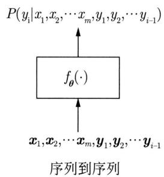  
(b)   
图24.1 监督学习模型

将实例 $x$ 分到条件概率最大的类别。回归时，神经网络表示输入是实例 $x$ 而输出是数值 $y$ 的函数。

$$
y = f _ {\boldsymbol {\theta}} (\boldsymbol {x}) \tag {24.2}
$$

预测实例 $\pmb{x}$ 的数值是 $y$

学习时使用训练数据估计神经网络 $f_{\theta}(\pmb{x})$ 的参数，用于分类或回归。训练集的每个样本是一个输入-输出对，由实例和类别或数值组成。假设样本数据是独立同分布的。目标是找出神经网络的最优参数，分类时使得训练集中所有输入实例的类别的条件概率最大。回归时使得训练集中所有输入实例的数值的预测误差最小。

深度学习的实例通常是文本、图片或音频的原始数据。而传统机器学习的实例是从文本、图片或音频数据中抽取的特征，特征由人事先定义。这一点是深度学习和传统机器学习的主要区别。传统机器学习需要人为定义特征，进行所谓的特征工程。深度学习的神经网络的中间表示实际上表示了实例的特征，是从数据中自动学习到的。

# 2. 序列到序列

序列到序列（sequence-to-sequence）是将一个序列转换为另一个序列的任务。典型的情况是，输入是一个文本，也就是一个单词或词符（token）的一维序列，输出是另一个文本，也就是另一个单词或词符的一维序列。也可以将图片表示为图符（visual token）的序列，进行图片到文本的转换；也可以将音频表示为音符（audio token）的序列，进行音频到文本的转换。这里不做详细介绍。

序列到序列是单词序列 $x_{1}, x_{2}, \dots, x_{m}$ 到单词序列 $y_{1}, y_{2}, \dots, y_{n}$ 的转换

$$
x _ {1}, x _ {2}, \dots , x _ {m} \rightarrow y _ {1}, y _ {2}, \dots , y _ {n}
$$

其中， $x_{j},j = 1,\dots ,m$ 和 $y_{i},i = 1,\dots ,n$ 是单词。例如，机器翻译就是一种序列到序列任务，将一个语言的文本 $x_{1},x_{2},\dots ,x_{m}$ 转换为另一个语言的文本 $y_{1},y_{2},\dots ,y_{n}$ 。

输入序列给定条件下的输出序列的条件概率满足

$$
P \left(y _ {1}, y _ {2}, \dots , y _ {n} \mid x _ {1}, x _ {2}, \dots , x _ {m}\right) = \prod_ {i = 1} ^ {n} P \left(y _ {i} \mid x _ {1}, x _ {2}, \dots , x _ {m}, y _ {1}, y _ {2}, \dots , y _ {i - 1}\right) \tag {24.3}
$$

这里设 $P(y_{1}|x_{1},x_{2},\dots ,x_{m},y_{0}) = P(y_{1}|x_{1},x_{2},\dots ,x_{m})$ 。

序列到序列是找出给定输入序列的条件下概率最大的输出序列。这个过程称作解

码（decoding）。在解码的每一步，使用神经网络，计算条件概率

$$
P \left(y _ {i} \mid x _ {1}, \dots , x _ {m}, y _ {1}, \dots , y _ {i - 1}\right)
$$

如图24.1(a)所示，神经网络的输入是输入序列对应的单词向量序列 $x_{1}, x_{2}, \dots, x_{n}$ ，以及已生成的输出序列对应的单词向量序列 $y_{1}, y_{2}, \dots, y_{i-1}$ 。神经网络的输出是输出序列下一个单词 $y_{i}$ 的条件概率。

$$
P \left(y _ {i} \mid x _ {1}, x _ {2}, \dots , x _ {m}, y _ {1}, y _ {2}, \dots , y _ {i - 1}\right) = f _ {\boldsymbol {\theta}} \left(\boldsymbol {x} _ {1}, \boldsymbol {x} _ {2}, \dots , \boldsymbol {x} _ {n}, \boldsymbol {y} _ {1}, \boldsymbol {y} _ {2}, \dots , \boldsymbol {y} _ {i - 1}\right) \tag {24.4}
$$

其中， $\pmb{\theta}$ 是神经网络的参数。单词向量又称作词嵌入（word embedding）。序列到序列的每一步做的实际是多类分类，神经网络是分类网络。

学习时使用训练数据估计神经网络 $f_{\theta}(\pmb{x}_1, \pmb{x}_2, \dots, \pmb{x}_n, \pmb{y}_1, \pmb{y}_2, \dots, \pmb{y}_{i-1})$ 的参数，用于序列到序列。训练数据集的每个样本是一个输入-输出对，由两个单词序列组成。假设样本数据是独立同分布的。目标是找出神经网络的最优参数，使得训练集中所有给定输入序列的条件下生成输出序列的条件概率最大。

# 24.1.2 无监督学习问题

深度学习用于无监督学习时有两种典型的情况。第一种情况任务是数据表示学习或数据生成。第二种情况任务是语言建模或序列生成。

# 1. 数据表示学习或数据生成

数据表示学习和数据生成是密切相关的任务。数据表示学习（data representation learning）的目的是从一个数据集中学习神经网络，生成其中的每个实例的潜在表示（latent representation）。数据生成（data generation）的目的是从一个数据集中学习神经网络，给定潜在表示自动生成相应的实例。实例可以是文本、图片、音频，由向量、矩阵或张量表示。一维序列数据由矩阵表示，其中每一个元素是一个向量，二维序列数据由张量表示，其中每一个元素是一个向量。潜在表示一般是向量。

数据表示学习和数据生成的神经网络分概率模型和非概率模型。先考虑非概率模型。设实例为 $x$ ，潜在表示为 $z$ 。有一个神经网络表示从潜在表示 $z$ 到实例 $x$ 的映射

$$
z \rightarrow x
$$

其中， $\pmb{x}$ 是向量、矩阵或张量， $\pmb{z}$ 是向量。如图24.2(a)所示，这个神经网络的一般形式是

$$
\boldsymbol {x} = g _ {\boldsymbol {\theta}} (\boldsymbol {z}) \tag {24.5}
$$

其中， $\pmb{\theta}$ 是神经网络的参数。一般还有另一个神经网络，表示从实例 $\pmb{x}$ 到潜在表示 $\pmb{z}$ 的映射

$$
x \rightarrow z
$$

这个神经网络的一般形式是

$$
\boldsymbol {z} = f _ {\phi} (\boldsymbol {x}) \tag {24.6}
$$

其中， $\phi$ 是神经网络的参数。两个神经网络做的是解压和压缩。例如，图片表示学习中，自

动学习两个神经网络，将图片 $\pmb{x}$ 映射到（压缩成）相应的潜在表示 $\pmb{z}$ ，再从潜在表示 $\pmb{z}$ 映射到（解压成）复原的图片 $\hat{\pmb{x}}$ 。

  
(a)

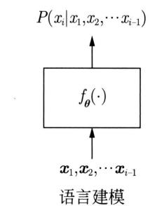  
(b)   
图24.2 无监督学习模型

再考虑概率模型。设实例是 $x$ ，潜在表示是 $z$ 。给定潜在表示 $z$ 条件下实例 $x$ 的条件概率分布是

$$
p (\boldsymbol {x} | \boldsymbol {z})
$$

其中， $\pmb{x}$ 是向量、矩阵或张量， $\pmb{z}$ 是向量。有一个神经网络表示潜在表示 $\pmb{z}$ 到条件概率分布 $p(\pmb{x}|\pmb{z})$ 的映射

$$
\boldsymbol {z} \rightarrow p (\boldsymbol {x} | \boldsymbol {z})
$$

神经网络的一般形式是

$$
p (\boldsymbol {x} | \boldsymbol {z}) = g _ {\boldsymbol {\theta}} (\boldsymbol {z}) \tag {24.7}
$$

其中， $\theta$ 是神经网络的参数。例如，图片生成中，先随机生成潜在表示 $z$ ，再根据概率分布 $p(z|x)$ 从潜在表示 $z$ 随机生成实例（图片） $x$ 。

学习时使用训练数据估计神经网络 $g_{\theta}(z)$ 的参数。训练集的每个样本是一个实例。假设样本数据是独立同分布的。数据表示学习的目标是求出神经网络的最优参数，使得训练集中相应的潜在表示能最准确地描述所有实例。数据生成的目标是求出神经网络的最优参数，使得训练集中从潜在表示随机生成所有实例的概率最大。

# 2. 语言建模

语言建模（language modeling）或序列生成（sequence generation）旨在生成语言中一个概率最大的单词序列。典型的情况是语言生成或文本生成，即单词或词符序列的生成。也可以扩展到图片或音频的生成，即图符或音符序列的生成。语言建模可以看作序列到序列的特殊情况。前者是无条件的序列生成，后者是有条件的序列生成。

生成的单词序列是

$$
x _ {1}, x _ {2}, \dots , x _ {n}
$$

其中， $x_{i},i = 1,2,\dots ,n$ 是单词。

单词序列的概率满足

$$
P \left(x _ {1}, x _ {2}, \dots , x _ {n}\right) = \prod_ {i = 1} ^ {n} P \left(x _ {i} \mid x _ {1}, x _ {2}, \dots , x _ {i - 1}\right) \tag {24.8}
$$

这里设 $P(x_{1}|x_{0}) = P(x_{1})$

语言建模通过解码生成概率最大的单词序列。模型是神经网络。在解码的每一步，使用神经网络，计算条件概率

$$
P \left(x _ {i} \mid x _ {1}, \dots , x _ {i - 1}\right)
$$

如图24.2(b)所示，神经网络的输入是已生成的单词序列对应的单词向量序列 $x_{1}, x_{2}, \dots, x_{i-1}$ 。神经网络的输出是单词序列下一个单词 $x_{i}$ 的条件概率

$$
P \left(x _ {i} \mid x _ {1}, x _ {2}, \dots , x _ {i - 1}\right) = f _ {\boldsymbol {\theta}} \left(\boldsymbol {x} _ {1}, \boldsymbol {x} _ {2}, \dots , \boldsymbol {x} _ {i - 1}\right) \tag {24.9}
$$

其中， $\theta$ 是神经网络的参数。序列生成的每一步做的实际是多类分类，神经网络是分类网络。

学习时使用训练数据估计神经网络 $f_{\theta}(\pmb{x}_1, \pmb{x}_2, \dots, \pmb{x}_{i-1})$ 的参数。训练集的每个样本是一个单词序列。假设样本数据是独立同分布的。目标是找出神经网络的最优参数，使得生成训练集中所有的单词序列的生成概率最大。

# 24.2 深度学习方法概述

# 24.2.1 基本原理

深度学习使用神经网络或人工神经网络。人工神经网络是从生物神经网络得到启发而发明出的网状结构的机器学习模型。网状结构可以由计算图表示。计算图是表示计算过程的有向无环图，结点表示计算操作，有向边表示操作的输入输出关系。神经网络的计算图结构称为神经网络的架构（architecture）。神经网络以文本数据、图片数据、音频数据等作为输入，实现监督学习和无监督学习任务。深度学习之所以称为深度学习是因为神经网络的结构复杂，特别是网络的深度较深。

深度学习的策略就是监督学习和无监督学习的策略，即对训练数据预测损失的最小化。算法一般是随机梯度下降，因为模型的参数规模很大，因此一阶优化算法更加实用。深度学习常用的优化算法是一阶算法的Adam。神经网络拥有强大的函数近似能力。事实证明，只要设计出合理的神经网络架构，使用合理的目标函数，都可以通过学习得到神经网络，进行非常准确的数据预测。深度学习成功用于自然语言处理、计算机视觉、语音处理等领域，在完成各种知能性任务上，能力已接近或超过人类。

# 24.2.2 基本工具

深度学习中的神经网络拥有不同的网络架构。常用的只有几种基本工具，神经网络无论多么复杂，都是使用这些基本工具组合而成的。基本工具包括神经元、多层感知机、卷积、注意力、残差连接。

# 1. 神经元

神经元（neuron）是神经网络的基本元素。数学上神经元是一种非线性函数，输入是向量，输出是标量。函数首先对输入向量进行仿射变换，然后通过S型函数、ReLU等激活函数

进行非线性变换，得到输出值。仿射变换使用权重向量和偏置，是神经元的参数，通过学习得到。神经元函数可以表示为

$$
y = \sigma (\boldsymbol {w} ^ {\mathrm {T}} \boldsymbol {x} + b)
$$

$$
\sigma (z) = \frac {1}{1 + \mathrm {e} ^ {- z}}
$$

其中， $\pmb{x}$ 是输入向量， $y$ 是输出值， $\pmb{w}$ 是权重向量， $b$ 是偏置值， $\sigma()$ 是S型函数。

图24.3显示的是神经元函数，输入向量 $\pmb{x}$ 通过仿射变换和非线性变换，变成输出值 $y$ 。如果输入向量和权重向量内积非常大（趋向正无穷），相似度非常高，那么输出值就接近1。如果权重向量和输入向量的内积非常小（趋向负无穷），相似度非常低，那么输出值就接近0。偏置对内积的结果进行调节。S型函数将实数值转换为0-1之间的数值。神经元接近1时表示被激活，接近0时表示没有被激活。神经元实现的是对输入的一个特征的检测，权重表示该特征，输出表示该特征的强度。

  
图24.3 神经元

# 2. 多层感知机

多层感知机（multi-layer perceptron）是一种基本的神经网络。由多个层组成，每层又由多个神经元组成。层与层之间的神经元存在连接，前一层神经元的输出是后一层神经元的输入。多层感知机的最后一层可以是多个神经元，也可以是一个神经元，前者最后的输出是一个向量，后者最后的输出是一个标量。多层感知机整体是非线性函数的复合函数，可以实现复杂特征的检测及分类和回归。多层感知机的参数就是其所有神经元的参数。感知机是多层感知机的特殊情况。

二层感知机的函数可以表示为

$$
\boldsymbol {y} = \sigma \left(\boldsymbol {W} ^ {(2) ^ {\mathrm {T}}} \boldsymbol {h} ^ {(1)} + \boldsymbol {b} ^ {(2)}\right)
$$

$$
\boldsymbol {h} ^ {(1)} = \sigma \left(\boldsymbol {W} ^ {(1) ^ {\mathrm {T}}} \boldsymbol {x} + \boldsymbol {b} ^ {(1)}\right)
$$

其中， $\pmb{x}$ 是输入向量， $\pmb{y}$ 是输出向量， $\pmb{h}^{(1)}$ 是第一层（也称作隐层）的中间表示向量， $\pmb{W}^{(1)}$ 是第一层的权重矩阵， $\pmb{b}^{(1)}$ 是第一层的偏置向量， $\pmb{W}^{(2)}$ 是第二层（也称作输出层）的权重矩阵， $\pmb{b}^{(2)}$ 是第二层的偏置向量， $\sigma(\cdot)$ 是S型函数。

图24.4显示的是多层感知机，输入向量 $\pmb{x}$ 通过第一层神经元变成中间表示向量 $h^{(1)}$ ，再通过第二层神经元变成输出向量 $\pmb{y}$ 。权重是矩阵，偏置是向量，是因为第一层和第二层的多个神经元的权重向量和偏置标量合并到一起。两层的权重矩阵和偏置值都通过学习得到。多层感知机每一层的计算实现的是对输入的多个特征检测，输出表示的是这些特征的强度，特征的强度又成为下一层的输入。

  
图24.4 多层感知机

# 3.卷积

卷积（convolution）是一种基本运算，有二维卷积和一维卷积。这里介绍二维卷积。输入是矩阵，输出也是矩阵；也可以扩展到输入是张量，输出是矩阵的情况。

二维卷积使用一个较小的矩阵，称作卷积核或核矩阵，针对输入矩阵进行计算，得到输出矩阵。具体地，让核矩阵在输入矩阵上从左到右再从上到下按顺序滑动，在滑动的每一个位置，核矩阵与输入矩阵的一个子矩阵重叠，求核矩阵与每一个子矩阵的内积，输出矩阵由计算得到的内积值构成。核矩阵的值是参数，通过学习得到。

给定一个 $I \times J$ 输入矩阵 $\mathbf{X} = [x_{ij}]_{I \times J}$ ，一个 $M \times N$ 核矩阵 $\mathbf{W} = [w_{mn}]_{M \times N}$ ，满足 $M \ll I, N \ll J$ 。产生一个 $K \times L$ 输出矩阵 $\mathbf{Y} = [y_{kl}]_{K \times L}$ ，写作

$$
\boldsymbol {Y} = \boldsymbol {W} * \boldsymbol {X}
$$

其中， $\pmb {Y} = [y_{kl}]_{K\times L}$

$$
y _ {k l} = \sum_ {m = 1} ^ {M} \sum_ {n = 1} ^ {N} w _ {m, n} x _ {k + m - 1, l + n - 1}
$$

图24.5示意二维卷积计算。浅蓝色矩阵是输入，绿色矩阵是输出，深蓝色矩阵是卷积核。输入是一个 $4\times 4$ 矩阵，卷积核是一个 $3\times 3$ 矩阵，输出是一个 $2\times 2$ 矩阵。

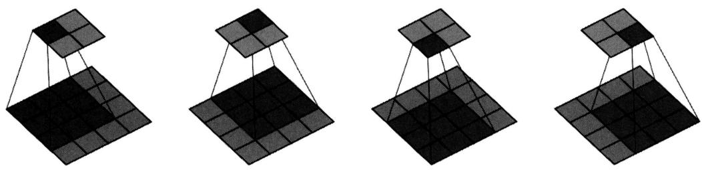  
图24.5 二维卷积例（见文前彩图）

卷积运算之后，一般还会对输出矩阵的每一个元素使用激活函数（如S型函数）进行非线性变换。核矩阵与某个子矩阵的内积越大，两者的相似度也就越大，最终输出的值就越接近1。反之，核矩阵与某个子矩阵的内积越小，两者的相似度也就越小，最终输出的值就越接近0。卷积计算实现的是对输入矩阵的一个特征的检测，核矩阵表示该特征，特征检测是在输

入矩阵的每个滑动位置上进行的。

# 4. 注意力

注意力（attention）是一种基本运算，可以看作一种检索的计算方法。假设有键-值对数据 $\{(k_1, v_1), (k_2, v_2), \dots, (k_n, v_n)\}$ ，其中每一个键-值对 $(k_i, v_i)$ 的键和值都是实数向量。有查询 $q$ ，也是实数向量。向量 $q$ 和 $k_i$ 的维度相同，向量 $k_i$ 和 $v_i$ 的维度一般也相同。目标从键-值数据中检索与查询相似的键所对应的值。常用的注意力算法如下。计算查询 $q$ 和各个键 $k_i$ 的归一化相似度 $\alpha(q, k_i)$ ，以归一化相似度为权重，计算所有值 $v_i$ 的加权平均 $v$ ，将计算结果 $v$ 作为检索结果返回。

$$
\boldsymbol {v} = \sum_ {i = 1} ^ {n} \alpha (\boldsymbol {q}, \boldsymbol {k} _ {i}) \cdot \boldsymbol {v} _ {i}
$$

$$
\alpha \left(\boldsymbol {q}, \boldsymbol {k} _ {i}\right) = \frac {\exp \left(\boldsymbol {q} ^ {\mathrm {T}} \cdot \boldsymbol {k} _ {i}\right)}{\sum_ {j = 1} ^ {n} \exp \left(\boldsymbol {q} ^ {\mathrm {T}} \cdot \boldsymbol {k} _ {j}\right)}
$$

注意力计算实现的是一种软的实数向量检索。这里介绍的注意力没有参数。

自注意力（self attention）是使用注意力的一种计算，定义在一个向量序列上。自注意力有双向自注意力和单向自注意力。输入是向量的序列，通过三个线性变换将每个位置上的向量转换为三个向量，分别是查询向量、键向量和值向量。

在每个位置上，以该位置的查询，对所有位置的键和值进行注意力计算。这样得到每一个位置上的新的中间表示向量，就是双向自注意力，如图 24.6(a) 所示。在每个位置上，只对之前位置的键和值进行注意力计算，就是单向自注意力，如图 24.6(b) 所示。

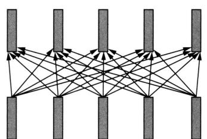  
双向自注意力  
(a)

  
单向自注意力  
(b)   
图24.6 自注意力

序列的每一个位置上有表示该位置的向量，称作位置嵌入。自注意力的输入实际上是在每个位置上的单词向量和位置嵌入之和。注意力的表示向量（查询、键、值）本身是没有位置信息的，使用位置嵌入，可以把序列的位置信息加入注意力计算中。

自注意力对每个位置的表示向量，根据与其他位置的表示向量的相似度，通过加权平均进行了组合，得到了新的表示向量。表示向量表示的是以当前位置为中心的整个序列的组合起来的特征。

# 5. 残差连接

残差连接（residual connection）是一种基本运算。假设要学习的真实模型是函数 $h(\pmb{x})$ 。残差网络的想法是用一个神经网络 $f(\pmb{x})$ 近似残差 $h(\pmb{x}) - \pmb{x}$ ，这样 $\pmb{x} + f(\pmb{x})$ 就可以近似真实

模型 $h(\boldsymbol{x})$ 。 $f(\boldsymbol{x})$ 称作残差单元，可以是前馈神经网络或卷积神经网络。整个过程以递归的方式进行。

例如，二层残差网络进行以下递归计算，以近似真实模型：

$$
\boldsymbol {y} = \boldsymbol {x} _ {1} + f _ {2} (\boldsymbol {x} _ {1})
$$

$$
\boldsymbol {x} _ {1} = \boldsymbol {x} + f _ {1} (\boldsymbol {x})
$$

其中， $f_{1}(\pmb{x})$ 和 $f_{2}(\pmb{x})$ 是第1次和第2次计算的残差单元， $\pmb{x}_{1}$ 表示第1次残差计算结果。每一个残差单元都有相同的结构、不同的参数。

残差网络可以展开成为残差单元的集成。图24.7给出二层残差网络的示意。这个例子中展开的神经网络是深度从0到2的残差单元的集成。残差网络有很强的表示能力。模型的训练中，梯度容易反向传播，学习也更容易收敛。

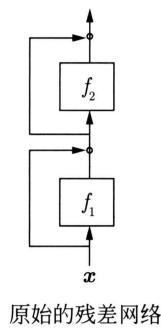

  
图24.7 残差网络

# 24.2.3 监督学习模型

监督学习模型有前馈神经网络、卷积神经网络、循环神经网络、Transformer。

# 1. 前馈神经网络

前馈神经网络（feedforward neural network，FFN）就是多层感知机。一般拥有多层的神经元，层与层之间的神经元连在一起，前一层的神经元的输出是后一层神经元的输入，最后一层是一个神经元，表示预测结果。因为信号是从前往后传递的，所以是“前馈的”网络。每一层实现的是对前层的中间表示的特征检测，所以整个网络通过多次特征检测进行预测。特征检测的结果由各层的中间表示向量表示。神经网络的参数就是所有神经元的参数，通过学习得到。

# 2. 卷积神经网络

卷积神经网络（convolutional neural network, CNN）是对图像数据和语言数据（更一般地二维格点数据和一维格点数据）等进行分类和回归预测的神经网络。卷积神经网络具有层次化网络结构，前一层的输出是后一层的输入。一种典型的架构如下。前面几层隔层进行卷积（convolution）运算和汇聚（pooling）运算，卷积实现的是特征检测，汇聚实现的是特征选择；最后几层是全连接的多层感知机。神经网络的参数是所有卷积核的参数和神经元的参数，都通过学习估计。在CNN的卷积层与卷积层之间加入残差连接，得到残差网络ResNet。

# 3. 循环神经网络

循环神经网络（recurrent neural network, RNN）是对文本数据等序列数据进行预测的神经网络。在序列数据的每个位置上有一个输入向量，每个位置上还有一个中间表示向量，表示该位置的状态。在每个位置上有一个多层感知机，以该位置的输入向量和前一个位置的中间表示向量作为输入，该位置的中间表示向量作为输出。也就是说，在每个位置根据前一个位置的状态和当前位置的输入，预测当前位置的状态。同一个多层感知机作用在每个位置上。因为每个位置上有相同的结构，所以是“循环”的神经网络。RNN的核心是各个位置上中间表示向量所表示的状态，或者说序列数据到该位置的特征。上述RNN只有一层的中间状态表示，也可以有多层，是多层的RNN。RNN模型的扩展还包括LSTM（long short-term memory）和GRU（gated recurrent unit）。

# 4. Transformer

Transformer是执行序列到序列任务的神经网络模型，也是人工智能领域最常用的模型。Transformer由编码器网络和解码器网络组成。编码器将输入的单词序列转换成中间表示的序列（编码），解码器将中间表示的序列转换成输出的单词序列（解码）。Transformer模型使用注意力实现编码、解码以及编码器和解码器之间的信息传递。Transformer的编码器有多层，每层由多头自注意力（multi-head self-attention）、前馈网络（FFN）组成；解码器也有多层，每层由多头自注意力、多头交叉注意力（multi-head cross-attention）、前馈网络（FFN）组成。

编码器中的自注意力是双向的，解码器中的自注意力是单向的。在编码器的输入序列的每个位置的每层都有中间表示向量。在解码器的已生成输出序列的每个位置的每层都有中间表示向量。一个位置的中间表示向量表示在以该位置为中心的序列数据的特征组合。图24.8显示Transformer编码器和解码器的各层得到的中间表示向量。黄框代表编码器中间表示，橙框代表解码器中间表示，蓝线代表自注意力计算，绿线代表交叉注意力计算。

  
图24.8 Transformer中的表示转换（见文前彩图）

Transformer 使用几个工具，多头注意力、前馈神经网络、残差连接、层归一化、位置嵌入。自然语言处理中单词序列是句子或文本，其最大特点是具有组合性。单词组成词组，词组组成句子，句子组成文章。Transformer 可以很好地实现组合性，对句子或文本

建模。视觉、语音处理也一样，图片和音频数据可以看作图符和音符的序列，也可以对其使用Transformer。

# 24.2.4 无监督学习模型

无监督学习模型有神经语言模型、自编码器、变分自编码器、生成对抗网络、扩散模型。

# 1. 神经语言模型

神经语言模型（neural language model）是定义在单词序列上的神经网络模型，用来计算一个给定的单词序列的概率，也就是进行语言建模(24.9)。神经网络的输入是已生成的单词序列对应的单词向量序列，输出是下一个单词出现的概率。有基于循环神经网络如LSTM，以及基于Transformer解码器如GPT的方法。核心是对单词向量序列中的顺序依存关系进行建模。LSTM通过记亿元（memory cell）和门控(gating)，记录并使用之前位置的中间表示以刻画长距离和短距离依存关系。GPT通过Transformer解码器，包括其中的单向自注意力，记录并使用之前所有位置的中间表示以刻画长距离和短距离依存关系。

# 2. 变分自编码器和自编码器

变分自编码器和自编码器都可以用于数据表示学习，变分自编码器也可以用于数据生成。变分自编码器是概率模型，自编码器是非概率模型。

变分自编码器（variational autoencoder，VAE）由编码器和解码器两个网络组成。编码器表示给定实例条件下潜在表示的条件概率分布，解码器表示给定潜在表示条件下实例的条件概率分布。实例由观测变量表示，潜在表示由隐变量表示，整体是实例和潜在表示的联合分布。学习时，从训练数据中自动学习编码器和解码器。预测时，用编码器随机生成新的实例，新实例与观测实例具有相同的分布。VAE的学习属于变分推理，学习的目标是优化证据下界。采用再参数化技巧，利用随机梯度上升，学习编码器和解码器的参数。

自编码器（autoencoder，AE）也由编码器和解码器网络组成。学习时，编码器将实例向量转换为潜在表示向量，解码器再将潜在表示向量转换为复原的实例向量。学习的目标是尽量使复原的实例和原始实例一致。认为学到的潜在表示就是实例的特征，也就是进行了数据表示学习。

# 3. 生成对抗网络

生成对抗网络（generative adversarial networks, GAN）是一种数据生成模型，在图片生成等应用中被使用。GAN由生成网络和判别网络组成。生成网络自动生成数据，判别网络判断数据是已给的（真的）还是生成的（假的）。学习的目标是构建生成网络，能自动生成同已给训练数据相同分布的数据；同时构建判别网络，能自动判断数据的真伪。学习的过程就是博弈的过程，生成网络和判别网络不断通过优化自己网络的参数进行博弈。当达到均衡状态时，学习结束。生成网络可以生成以假乱真的数据，判别网络难以判断数据的真假。DCGAN是用于图片生成的GAN模型。

# 4. 扩散模型

扩散模型（diffusion model）是一种生成模型，从训练数据中学习数据的分布，用于生成新的数据，如图像、语音、蛋白质数据。扩散模型的基本想法是通过模拟数据的扩散过程来学

习生成数据的机制。在扩散的前向过程中，样本数据（如清晰的图片）逐渐被添加噪声，经过多步迭代，最终变成完全随机噪声。逆过程的反向过程中生成新的样本数据，从完全随机噪声开始，逐步去除噪声，恢复出原始的样本数据（清晰图片）。前向和反向过程都是随机过程，具体地以高斯分布为转移分布的马尔可夫链。前向过程的转移分布事先设定，决定前向过程中的每一步的随机加噪处理；反向过程的转移分布从数据中学习，用神经网络如卷积网络、Transformer表示反向（生成）过程中的每一步的随机去噪处理。

# 24.2.5 基本算法

深度学习的目标是基于训练数据针对神经网络最小化损失函数，最常用的损失函数是交叉熵。最小化交叉熵等价于极大似然估计。这个最优化问题一般用一阶优化算法，随机梯度下降（back propagation）进行求解。应用在神经网络上，一般都是反向传播算法。

反向传播算法只需要依照神经网络结构进行一次正向传播和一次反向传播，就可以完成随机梯度下降的一次迭代。在梯度下降的每一步，参数已在前一步更新，正向传播基于当前的参数重新计算神经网络所有变量，反向传播基于当前的变量重新计算损失函数对所有参数的梯度，然后依照梯度下降公式更新神经网络的所有参数。

# 24.2.6 预训练

在自然语言处理、计算机视觉、语音处理等领域，首先使用大规模数据预训练（pre-train）基于Transformer的模型，然后使用小规模标注数据微调（fine-tune）模型，用于各种下游任务的预测，已经成为人工智能的基本方法。这里只介绍自然语言处理中常用的预训练语言模型GPT和BERT。

# 1. GPT

GPT（generative pre-trained Transformer）的模型是Transformer的解码器，既可以用于语言理解也可以用于语言生成。首先在预训练中使用大规模语料通过语言建模估计模型的参数，之后在微调中使用下游任务的标注数据对参数进行调节。下游任务包括文本的分类、序列标注、序列到序列。GPT技术在ChatGPT等系统中展现出了强大的威力。一个原因是预训练和微调都被形式化为序列生成，即语言建模。下游任务无论是理解和生成，还是序列到序列，都可以写成输入到输出的序列的形式。GPT在预训练的基础上，用同样的学习方式对模型进行微调，使得模型能更好地完成下游任务。特别是当数据和模型规模非常大的时候效果更加明显。

# 2. BERT

BERT（bidirectional encoder representations from Transformers）的模型是Transformer的编码器。首先在预训练中使用大规模语料通过掩码语言建模（mask language modeling）估计模型的参数，之后在微调中使用具体任务的标注数据对参数进行调节。下游任务包括文本的分类和序列标注等。前者的过程是无监督学习，后者的过程是监督学习。BERT主要用于语言理解任务。掩码建模是对输入单词序列中的部分单词用特殊符号（mask）掩盖，输入到基于Transformer编码器的语言模型，对掩盖的单词进行还原。

# 24.3 深度学习应用

深度学习被广泛应用于自然语言处理，计算机视觉、语音处理等人工智能领域。深度学习相比传统机器学习，不仅可以用于文本、图片、语音的理解任务，也可以用于其生成任务。这里介绍几个主要任务。

文本分类是根据文本的内容将其分到相应的类别。类别可以是根据语义、情感、题材的。文本分类有多种方法，常用的是基于BERT和GPT的方法。先用大规模语料进行预训练，得到GPT或BERT模型，然后在其基础上用少量的标注数据进行微调。标注数据的样本是文本及其类别。GPT1～GPT3用大规模语料训练的大规模语言模型，在文本分类上能达到很高的准确度。

图片分类是根据图片的内容将其分到相应的类别，类别一般是语义的。图片分类也有多种方法，常用的是使用ResNet和ViT的方法。残差网络ResNet作为卷积神经网络的一种，方法简单且有效。ViT是使用Transformer编码器的模型，与用于文本分类等的BERT有相似之处。首先将图片分割成许多小图像块（patch），例如，每一个图像块由 $16 \times 16$ 个像素组成。将图像块延展成一维的图符（图像块）的序列，每个图像块的位置信息由位置嵌入表示。在输入序列最前面加上特殊符号，表示类别。然后将图像块的序列输入到Transform编码器中，进行预训练和微调，用于图片分类。

图片生成是从一个随机向量自动生成一张图片的任务。有代表性的模型有GAN、VAE和扩散模型。图片生成时，GAN的生成网络和判别网络一般都是卷积神经网络，代表的方法有DCGAN。VAE的编码器和解码器一般也都是卷积神经网络。扩散模型目前是图片生成的主要方法，模型是卷积神经网络UNet或Transformer。

机器翻译将一种语言的文本转换为另外一种语言的文本。机器翻译目前主要使用两种方法，一种方法是用大量的两种语言的平行语料训练Transformer，进行两种语言之间的翻译。另一种方法是用GPT，首先用大量的单语和双语数据预训练语言模型GPT，然后在其基础上用相对少量的平行语料进行微调，得到的语言模型就可以直接用于翻译，输入一个语言的文本，模型就可以自动生成另一个语言的文本。

生成式对话是指用户对系统发话，系统自动生成回复的任务，包括单轮对话和多轮对话。这个任务可以看作一个序列到序列的问题。语言大模型ChatGPT是有代表性的系统，完成自然语言对话以及对话式任务的能力都极大地超过了之前所有的系统。ChatGPT用大规模的语料训练一个大规模的GPT语言模型，然后在其基础上用对话数据进行微调，使用强化学习技术使对话更加有用和合理。

# 本篇内容

本篇讲解深度学习的主要方法。监督学习方法包括前馈神经网络、卷积神经网络、循环神经网络、Transformer。预训练方法包括预训练语言模型GPT和BERT。无监督学习方法包括变分自编码器、生成对抗网络。

第25章讲解前馈神经网络FNN。第26章讲解卷积神经网络CNN及残差网络ResNet。第27章讲解循环神经网络RNN及LSTM和GRU，介绍神经语言模型。第28章讲述Transformer及序列到序列模型RNN Search。第29章介绍预训练语言模型GPT和BERT。第30章讲述变分自编码器及自编码器。第31章讲述生成对抗网络。第32章讲述扩散模型。第33章总结深度学习方法。

本篇主要参考了Goodfellow等[1]、Bishop[2]、阿斯顿·张等[3]、斋藤康毅[4]和邱锡鹏[5]的著作。

# 参考文献

[1] GOODFELLOW I, BENGIO Y, COURVILLE A. Deep learning[M]. MIT Press, 2016.   
[2] BISHOP C. Pattern recognition and machine learning[M]. Springer, 2006.   
[3] 阿斯顿·张，李沐，扎卡里·C.立顿，等. 动手学深度学习 [M]. 北京：人民邮电出版社，2019.  
[4] 斋藤康毅. 深度学习入门: 基于 Python 的理论与实现 [M]. 陆宇杰, 译. 北京: 人民邮电出版社, 2018.  
[5] 邱锡鹏. 神经网络与深度学习 [M]. 北京：机械工业出版社，2020.

# 第25章 前馈神经网络

人工神经网络（artificial neural network）或神经网络（neural network）是受生物神经网络启发而发明的网状机器学习模型。前馈神经网络（feedforward neural network）或多层感知机（multilayer perceptron，MLP）是最具代表性的神经网络，主要用于监督学习，如分类和回归。

前馈神经网络由多层神经元组成，层间的神经元相互连接，层内的神经元不连接。其信息处理机制是：前一层神经元通过层间连接向后一层神经元传递信号，因为信号是从前往后传递的，所以是“前馈的”信息处理网络。这里，神经元是对多个输入信号（实数向量）进行非线性转换产生一个输出信号（实数值）的函数，整个神经网络是对多个输入信号（实数向量）进行多次非线性转换产生多个输出信号（实数向量）的复合函数。每一个神经元的函数含有参数，神经网络的神经元的参数通过学习得到。当前馈神经网络的层数达到一定数量时（一般大于2），又称为深度神经网络（deep neural network，DNN）。

前馈神经网络学习算法是反向传播（back propagation）算法，是随机梯度下降法的具体实现。学习的损失函数通常在分类时是交叉熵损失，在回归时是平方损失，其最小化等价于极大似然估计。学习的正则化方法包括早停法（early stopping）、暂退法（dropout）。

McCulloch 和 Pitts 于 1943 年提出了最初的人工神经网络模型；Rosenblatt 于 1958 年发明了感知机，可以看作前馈神经网络的前身；Rumelhart 等于 1986 年重新开发了反向传播算法，用于前馈神经网络学习；Hinton 于 2006 年提出了深度学习的概念，指包括深度神经网络（DNN）等复杂神经网络的机器学习。

本章25.1节讲述前馈神经网络的模型，25.2节叙述前馈神经网络学习的算法，25.3节叙述前馈神经网络学习的正则化方法。

# 25.1 前馈神经网络的模型

神经网络是由神经元连接组成的网络，采用不同类型的神经元以及神经元的不同连接方法可以构建出不同的网络结构，也就是不同的神经网络模型。本节讲述前馈神经网络的基本模型。首先给出前馈神经网络的定义，接着介绍具体例子，最后讨论前馈神经网络的表示能力。

# 25.1.1 前馈神经网络定义

# 1. 神经元

人工神经元（artificial neuron）或者简称神经元（neuron）是神经网络的基本元素。人工神经元是受生物神经元启发而发明的，本质是一种函数。生物神经元一般有多个树突接入，一个轴突接出。输入信号从树突传入，输出信号从轴突传出。当输入信号量达到阈值后，神经元被激活，产生输出信号。与其对应，人工神经元是以实数向量为输入，实数值为输出的非线性函数，表示多个输入信号（实数向量）到一个输出信号（实数值）的非线性转换。

定义25.1（神经元） 神经元是如下定义的非线性函数：

$$
y = f \left(x _ {1}, x _ {2}, \dots , x _ {n}\right) = a \left(\sum_ {i = 1} ^ {n} w _ {i} x _ {i} + b\right) \tag {25.1}
$$

或者写作

$$
y = f \left(x _ {1}, x _ {2}, \dots , x _ {n}\right) = a (z), z = \sum_ {i = 1} ^ {n} w _ {i} x _ {i} + b \tag {25.2}
$$

其中， $x_{1}, x_{2}, \dots, x_{n}$ 是输入，取实数值； $y$ 是输出，取实数值； $z$ 是中间结果，又称作净输入（net input），也取实数值； $w_{1}, w_{2}, \dots, w_{n}$ 是权重（weight）， $b$ 是偏置（bias），也都取实数值； $z = \sum_{i=1}^{n} w_{i} x_{i} + b$ 是仿射函数； $a(\cdot)$ 是特定的非线性函数，称为激活函数（activation function）。激活函数有多种形式，比如S型函数：

$$
a (z) = \frac {1}{1 + \mathrm {e} ^ {- z}}
$$

神经元函数由两部分组成，首先使用仿射函数对输入 $x_{1}, x_{2}, \dots, x_{n}$ 进行仿射变换，得到净输入 $z$ ，然后使用激活函数 $a(z)$ 对净输入 $z$ 进行非线性变换，得到输出 $y$ 。权重 $w_{1}, w_{2}, \dots, w_{n}$ 与偏置 $b$ 是神经元函数的参数，通过学习得到。

图25.1是神经元的示意图。图中结点表示变量，有向边表示变量之间的依存关系，有向图整体表示式（25.1）和式（25.2）的神经元函数。结点 $x_{1}, x_{2}, \dots, x_{n}$ 是神经元的输入变量，结点 $y$ 是神经元的输出变量。通常不显式表示净输入变量 $z$ 。习惯上，将权重 $w_{1}, w_{2}, \dots, w_{n}$ 附

  
图25.1 神经元

在有向边上。为了方便, 经常增加一个恒为 $+1$ 的输入, 取偏置 $b$ 为其权重, 将仿射变换转换成线性变换, 得到一个等价的神经元函数, 图 25.1 的有向图表示的就是这个形式的函数。

神经元也可以用向量表示。设向量

$$
\boldsymbol {x} = \left[ \begin{array}{c} x _ {1} \\ x _ {2} \\ \vdots \\ x _ {n} \end{array} \right]
$$

$$
\boldsymbol {w} = \left[ \begin{array}{c} w _ {1} \\ w _ {2} \\ \vdots \\ w _ {n} \end{array} \right]
$$

为输入和权重，则神经元为函数

$$
y = f (\boldsymbol {x}) = a \left(\boldsymbol {w} ^ {\mathrm {T}} \boldsymbol {x} + b\right) \tag {25.3}
$$

或者写作

$$
y = f (\boldsymbol {x}) = a (z), \quad z = \boldsymbol {w} ^ {\mathrm {T}} \boldsymbol {x} + b \tag {25.4}
$$

例25.1 图25.2是一个神经元，画出其函数的三维图形，其中激活函数是S型函数。

  
图25.2 神经元例

解 神经元的仿射函数是 $z = -x_{1} + 2x_{2} + 1$ ，激活函数是 $a(z) = \frac{1}{1 + \mathrm{e}^{-z}}$ ，神经元函数是

$$
y = f \left(x _ {1}, x _ {2}\right) = \frac {1}{1 + \mathrm {e} ^ {x _ {1} - 2 x _ {2} - 1}}
$$

图25.3是神经元函数的三维图形，整体是三维空间 $(x_{1},x_{2},y)$ 中的一个S形曲面。S形曲面由平行的等高线组成，每一条等高线对应着二维空间 $(x_{1},x_{2})$ 中的一条直线 $z = -x_{1} + 2x_{2} + 1$ ，其中 $z$ 是一个定值。当 $z$ 趋于正无穷时，等高线趋近于平面 $y = 1$ ；当 $z$ 趋于负无穷时，等高线趋近于平面 $y = 0$ 。

  
图25.3 神经元的三维图形（见文前彩图）

# 2. 前馈神经网络

前馈神经网络由多层神经元组成，层间的神经元相互连接，层内的神经元不连接，前一层神经元的输出是后一层神经元的输入。整体表示输入信号（实数向量）到输出信号（实数向量）的多次非线性转换。数学上，前馈神经网络是以实数向量为输入、以实数向量为输出的非线性函数的复合函数（这里，函数都是以向量为输入输出的一般函数的扩展）。前馈神经网络最后的输出也可以是一个实数值，是实数向量的特殊情况。先给出二层前馈神经网络的定义①。

定义25.2（二层前馈神经网络）二层前馈神经网络是如下定义的非线性函数的复合函数。输入是 $x_{i}, i = 1,2,\dots ,n$ ，输出是 $y_{k}, k = 1,2,\dots ,l$ 。神经网络有两层。第一层由 $m$ 个神经元组成，其中第 $j$ 个神经元是

$$
h _ {j} ^ {(1)} = a \left(z _ {j} ^ {(1)}\right) = a \left(\sum_ {i = 1} ^ {n} w _ {j i} ^ {(1)} x _ {i} + b _ {j} ^ {(1)}\right), \quad j = 1, 2, \dots , m \tag {25.5}
$$

这里 $x_{i}$ 是输入， $w_{ji}^{(1)}$ 是权重， $b_{j}^{(1)}$ 是偏置， $z_{j}^{(1)}$ 是净输入， $a(\cdot)$ 是激活函数。第二层由 $l$ 个神经元组成，其中第 $k$ 个神经元是

$$
y _ {k} = g \left(z _ {k} ^ {(2)}\right) = g \left(\sum_ {j = 1} ^ {m} w _ {k j} ^ {(2)} h _ {j} ^ {(1)} + b _ {k} ^ {(2)}\right), \quad k = 1, 2, \dots , l \tag {25.6}
$$

这里 $h_j^{(1)}$ 是第一层神经元的输出， $w_{kj}^{(2)}$ 是权重，其中 $j = 1,2,\dots,m$ ， $b_k^{(2)}$ 是偏置， $z_k^{(2)}$ 是净输入， $g(\cdot)$ 是激活函数。神经网络整体是

$$
y _ {k} = g \left[ \sum_ {j = 1} ^ {m} w _ {k j} ^ {(2)} a \left(\sum_ {i = 1} ^ {n} w _ {j i} ^ {(1)} x _ {i} + b _ {j} ^ {(1)}\right) + b _ {k} ^ {(2)} \right], \quad k = 1, 2, \dots , l \tag {25.7}
$$

通常情况第二层只有一个神经元，即 $l = 1$

第一层神经元从输入输出的角度不可见，称为隐层。第二层神经元称为输出层。有时把输入也看作一层，称为输入层。隐层和输出层的激活函数 $a(\cdot)$ 和 $g(\cdot)$ 通常有不同的定义。这里考虑层间的全连接，即前一层的每一个神经元都和后一层的每一个神经元连接。部分连接网络是其特殊情况，相当于未连接边的权重为0。

图25.4是二层前馈神经网络的示意图。图中结点表示变量，有向边表示变量间的依存关系，边上的数值表示权重。结点 $x_{i}$ 是神经网络的输入，结点 $y_{k}$ 是神经网络的输出（也是输出层神经元），结点 $h_{j}^{(1)}$ 是神经网络的隐层神经元。数值 $w_{ji}^{(1)}$ 是隐层神经元的权重，数值 $w_{kj}^{(2)}$ 是输出层神经元的权重。数值 $b_{j}^{(1)}$ 是隐层神经元的偏置，数值 $b_{k}^{(2)}$ 是输出层神经元的偏置。其中 $i = 1,2,\dots ,n, j = 1,2,\dots ,m, k = 1,2,\dots ,l$ 。

  
图25.4 二层前馈神经网络

二层前馈神经网络也可以用矩阵来表示，简称矩阵表示。

$$
\boldsymbol {h} ^ {(1)} = f ^ {(1)} (\boldsymbol {x}) = a \left(\boldsymbol {z} ^ {(1)}\right) = a \left(\boldsymbol {W} ^ {(1) ^ {\mathrm {T}}} \boldsymbol {x} + \boldsymbol {b} ^ {(1)}\right) \tag {25.8}
$$

$$
\boldsymbol {y} = f ^ {(2)} \left(\boldsymbol {h} ^ {(1)}\right) = g \left(\boldsymbol {z} ^ {(2)}\right) = g \left(\boldsymbol {W} ^ {(2) ^ {\mathrm {T}}} \boldsymbol {h} ^ {(1)} + \boldsymbol {b} ^ {(2)}\right) \tag {25.9}
$$

其中，

$$
\boldsymbol {x} = \left[ \begin{array}{l} x _ {1} \\ x _ {2} \\ \vdots \\ x _ {n} \end{array} \right]
$$

$$
\boldsymbol {z} ^ {(1)} = \left[ \begin{array}{c} z _ {1} ^ {(1)} \\ z _ {2} ^ {(1)} \\ \vdots \\ z _ {m} ^ {(1)} \end{array} \right]
$$

$$
\boldsymbol {h} ^ {(1)} = \left[ \begin{array}{c} h _ {1} ^ {(1)} \\ h _ {2} ^ {(1)} \\ \vdots \\ h _ {m} ^ {(1)} \end{array} \right]
$$

$$
\boldsymbol {z} ^ {(2)} = \left[ \begin{array}{c} z _ {1} ^ {(2)} \\ z _ {2} ^ {(2)} \\ \vdots \\ z _ {l} ^ {(2)} \end{array} \right]
$$

$$
\boldsymbol {W} ^ {(1)} = \left[ \begin{array}{c c c} w _ {1 1} ^ {(1)} & \dots & w _ {1 m} ^ {(1)} \\ \vdots & & \vdots \\ w _ {n 1} ^ {(1)} & \dots & w _ {n m} ^ {(1)} \end{array} \right]
$$

$$
\boldsymbol {W} ^ {(2)} = \left[ \begin{array}{c c c} w _ {1 1} ^ {(2)} & \dots & w _ {1 l} ^ {(2)} \\ \vdots & & \vdots \\ w _ {m 1} ^ {(2)} & \dots & w _ {m l} ^ {(2)} \end{array} \right]
$$

$$
\boldsymbol {b} ^ {(1)} = \left[ \begin{array}{c} b _ {1} ^ {(1)} \\ b _ {2} ^ {(1)} \\ \vdots \\ b _ {m} ^ {(1)} \end{array} \right]
$$

$$
\boldsymbol {b} ^ {(2)} = \left[ \begin{array}{c} b _ {1} ^ {(2)} \\ b _ {2} ^ {(2)} \\ \vdots \\ b _ {l} ^ {(2)} \end{array} \right]
$$

向量 $\pmb{x}$ 表示输入，向量 $\pmb{y}$ 表示输出，向量 $\pmb{z}^{(1)}$ 表示隐层的净输入，向量 $\pmb{h}^{(1)}$ 表示隐层的输出，向量 $\pmb{z}^{(2)}$ 表示输出层的净输入，矩阵 $\pmb{W}^{(1)},\pmb{W}^{(2)}$ 表示权重，向量 $\pmb{b}^{(1)},\pmb{b}^{(2)}$ 表示偏置。整体神经网络由复合函数 $f^{(2)}(f^{(1)}(\pmb {x}))$ 表示。这里 $a(\cdot)$ 和 $g(\cdot)$ ，以及 $f^{(1)}(\cdot)$ 和 $f^{(2)}(\cdot)$ 是一般函数的扩展，作用在向量的每个元素上，得到的仍是一个向量。

下面给出更一般的多层前馈神经网络或深度神经网络的定义。

定义25.3（多层前馈神经网络）多层前馈神经网络或前馈神经网络是如下定义的非线性函数的复合函数。输入是 $x_{i}, i = 1,2,\dots ,n$ ，输出是 $y_{k}, k = 1,2,\dots ,l$ 。神经网络有 $s$

层 $(s\geqslant 2)$ 。第一层到第 $s - 1$ 层是隐层。假设其中的第 $t$ 层由 $m$ 个神经元组成，第 $t - 1$ 层由 $n$ 个神经元组成， $t = 1,2,\dots ,s - 1$ ，第 $t$ 层的第 $j$ 个神经元是

$$
h _ {j} ^ {(t)} = a \left(z _ {j} ^ {(t)}\right) = a \left(\sum_ {i = 1} ^ {n} w _ {j i} ^ {(t)} h _ {i} ^ {(t - 1)} + b _ {j} ^ {(t)}\right), \quad j = 1, 2, \dots , m \tag {25.10}
$$

这里 $h_i^{(t-1)}, i = 1,2,\dots,n$ ，是第 $t-1$ 层的输出，设 $h_i^{(0)} = x_i$ ， $w_{ji}^{(t)}, i = 1,2,\dots,n$ ，是权重， $b_j^{(t)}$ 是偏置， $z_j^{(t)}$ 是净输入， $a(\cdot)$ 是激活函数。第 $s$ 层是输出层。假设第 $s$ 层由 $l$ 个神经元组成，第 $s-1$ 层由 $m$ 个神经元组成，第 $s$ 层的第 $k$ 个神经元是

$$
y _ {k} = g \left(z _ {k} ^ {(s)}\right) = g \left(\sum_ {j = 1} ^ {m} w _ {k j} ^ {(s)} h _ {j} ^ {(s - 1)} + b _ {k} ^ {(s)}\right), \quad k = 1, 2, \dots , l \tag {25.11}
$$

这里 $h_j^{(s-1)}, j = 1,2,\dots,m$ ，是第 $s-1$ 层的输出， $w_{kj}^{(s)}, j = 1,2,\dots,m$ ，是权重， $b_k^{(s)}$ 是偏置， $z_k^{(s)}$ 是净输入， $g(\cdot)$ 是激活函数。神经网络整体是

$$
y _ {k} = g \left\{\sum_ {j = 1} ^ {m} w _ {k j} ^ {(s)} \dots \left[ a \left(\sum_ {i = 1} ^ {n} w _ {j i} ^ {(1)} x _ {i} + b _ {j} ^ {(1)}\right) \right] \dots + b _ {k} ^ {(s)} \right\}, \quad k = 1, 2, \dots , l \tag {25.12}
$$

层数大于 2 时的前馈神经网络又称为深度神经网络。通常情况是第 $s$ 层只有一个神经元，即 $l = 1$ 。

前馈神经网络的矩阵表示如下：

$$
\left\{ \begin{array}{l} \boldsymbol {h} ^ {(1)} = f ^ {(1)} (\boldsymbol {x}) = a \left(\boldsymbol {z} ^ {(1)}\right) = a \left(\boldsymbol {W} ^ {(1) ^ {\mathrm {T}}} \boldsymbol {x} + \boldsymbol {b} ^ {(1)}\right) \\ \boldsymbol {h} ^ {(2)} = f ^ {(2)} \left(\boldsymbol {h} ^ {(1)}\right) = a \left(\boldsymbol {z} ^ {(2)}\right) = a \left(\boldsymbol {W} ^ {(2) ^ {\mathrm {T}}} \boldsymbol {h} ^ {(1)} + \boldsymbol {b} ^ {(2)}\right) \\ \quad \vdots \\ \boldsymbol {h} ^ {(s - 1)} = f ^ {(s - 1)} \left(\boldsymbol {h} ^ {(s - 2)}\right) = a \left(\boldsymbol {z} ^ {(s - 1)}\right) = a \left(\boldsymbol {W} ^ {(s - 1) ^ {\mathrm {T}}} \boldsymbol {h} ^ {(s - 2)} + \boldsymbol {b} ^ {(s - 1)}\right) \\ \boldsymbol {y} = \boldsymbol {h} ^ {(s)} = f ^ {(s)} \left(\boldsymbol {h} ^ {(s - 1)}\right) = g \left(\boldsymbol {z} ^ {(s)}\right) = g \left(\boldsymbol {W} ^ {(s) ^ {\mathrm {T}}} \boldsymbol {h} ^ {(s - 1)} + \boldsymbol {b} ^ {(s)}\right) \end{array} \right. \tag {25.13}
$$

其中，向量 $\pmb{x}$ 表示输入，向量 $\pmb{y}$ 表示输出，向量 $z^{(1)},z^{(2)},\dots ,z^{(s)}$ 表示第1层到第 $s$ 层的净输入，向量 $h^{(1)},h^{(2)},\dots ,h^{(s)}$ 表示第1层到第 $s$ 层的输出，矩阵 $\boldsymbol {W}^{(1)},\boldsymbol {W}^{(2)},\dots ,\boldsymbol {W}^{(s)}$ 表示权重，向量 $\pmb {b}^{(1)},\pmb {b}^{(2)},\dots ,\pmb {b}^{(s)}$ 表示偏置。整体神经网络由复合函数 $f^{(s)}(\dots f^{(2)}(f^{(1)}(\pmb {x}))\dots)$ 表示，也写作 $f(\pmb {x};\pmb {\theta})$ ，其中 $\pmb{\theta}$ 是所有参数组成的向量。

可以看出，前馈神经网络模型是矩阵与向量的乘积的非线性变换的多次重复，其基本结构是非常简单的。因此，多次非线性变换是前馈神经网络的本质。从后面的例子中可以看出，这种变换拥有很强的表示能力，可以进行复杂的信息处理。相比之下，多次线性变换等价于一次线性变换，其表示能力有限。

到目前为止考虑的是一个样本输入神经网络的情况，这时输入由一个向量表示。也可以是多个样本批量同时输入神经网络，这时输入样本由一个矩阵表示。可以用式（25.13）的矩阵表示扩展，细节省略，在例25.3中介绍。

# 3. 隐层的神经元

隐层神经元函数由两部分组成：仿射函数和激活函数。这里介绍常用的隐层激活函数，包括S型函数、双曲正切函数、整流线性函数。一个神经网络通常采用一种隐层激活函数。

S型函数（sigmoid function）又称为逻辑斯谛函数（logistic function），是定义式如下的非线性函数。

$$
a (z) = \sigma (z) = \frac {1}{1 + \mathrm {e} ^ {- z}} \tag {25.14}
$$

其中， $z$ 是自变量或输入， $\sigma(z)$ 是因变量或输出。函数的定义域为 $(- \infty, + \infty)$ ，值域为 $(0,1)$ 。如图25.5所示，S型函数是将正负实数值映射到0和1之间实数值的单调递增函数，其特点是输入越接近 $+\infty$ ，输出越接近1；输入越接近 $-\infty$ ，输出越接近0；输入在0附近时，输出近似线性递增；输入是0时，输出是0.5。

  
图25.5 S型函数

S型函数的导函数是

$$
a ^ {\prime} (z) = a (z) (1 - a (z)) \tag {25.15}
$$

双曲正切函数（hyperbolic tangent function）是定义式如下的非线性函数：

$$
a (z) = \tanh  (z) = \frac {\mathrm {e} ^ {z} - \mathrm {e} ^ {- z}}{\mathrm {e} ^ {z} + \mathrm {e} ^ {- z}} \tag {25.16}
$$

其中， $z$ 是自变量或输入， $\tanh(z)$ 是因变量或输出。函数定义域为 $(- \infty, + \infty)$ ，值域为 $(-1, +1)$ 。如图25.6所示，双曲正切函数的特点是输入越接近 $+\infty$ ，输出越接近 $+1$ ；输入越接近 $-\infty$ ，输出越接近 $-1$ ；输入在0附近时，输出近似线性递增；输入是0时，输出也是0。

双曲正切函数的导函数是

$$
a ^ {\prime} (z) = 1 - a (z) ^ {2} \tag {25.17}
$$

双曲正切函数与S型函数有以下关系：直观上双曲正切函数将S型函数“放大”两倍，并向下平移1个单位。

$$
\tanh  (z) = 2 \sigma (2 z) - 1 \tag {25.18}
$$

  
图25.6 双曲正切函数

整流线性函数（rectified linear unit, ReLU）是定义式如下的非线性函数：

$$
a (z) = \operatorname {r e l u} (z) = \max  (0, z) \tag {25.19}
$$

其中， $z$ 是自变量或输入， $\mathrm{relu}(z)$ 是因变量或输出。函数定义域为 $(- \infty, + \infty)$ ，值域为 $(0, + \infty)$ 。如图25.7所示，整流线性函数的特点是输入是负值时，输出为0；输入是正值时，输出为正且线性单调递增；输入是0时，输出也是0。

  
图25.7 整流线性函数

整流线性函数的导函数是 ①

$$
a ^ {\prime} (z) = \left\{ \begin{array}{l l} 1, & z > 0 \\ 0, & \text {其 他} \end{array} \right. \tag {25.20}
$$

整流线性函数比S型函数和双曲正切函数在计算机上的计算效率更高，其导函数也是如此。整流线性函数在当前深度学习中被广泛使用。

对于激活函数 $a(z)$ ，当其导数满足 $\lim_{z\to -\infty}a'(z) = 0$ 时，称为左饱和（left saturating）函数；当其导数满足 $\lim_{z\to +\infty}a'(z) = 0$ 时，称为右饱和（right saturating）函数；同时满足左饱

和、右饱和条件时称为（两边的）饱和（saturating）函数。整流线性函数是左饱和函数，S 型函数和双曲正切函数是饱和函数。

# 4. 模型

前馈神经网络可以作为机器学习模型用于不同任务，有以下几种代表情况。

（1）用于回归。神经网络的输出层只有一个神经元，其输出是一个实数值。神经网络表示为 $y = f(\pmb{x})$ ，其中 $\pmb{x} \in \mathcal{R}^d, y \in \mathcal{R}$ 。预测时给定输入 $\pmb{x}$ ，计算输出 $y$ 。  
（2）用于二类分类。神经网络的输出层只有一个神经元，其输出是一个概率值。神经网络表示为 $p = P(y = 1|\boldsymbol {x}) = f(\boldsymbol {x})$ ，其中 $\pmb {x}\in \mathcal{R}^d,y\in \{0,1\}$ ，满足条件

$$
0 <   P (y = 1 | \boldsymbol {x}) <   1, \quad P (y = 1 | \boldsymbol {x}) + P (y = 0 | \boldsymbol {x}) = 1
$$

预测时给定输入 $\pmb{x}$ ，计算其属于类别1的概率。如果概率大于0.5，则将输入分到类别1，否则分到类别0。

（3）用于多类分类（multi-class classification）。神经网络的输出层只有一个神经元，神经元的输出是由 $l$ 个概率值组成的概率向量。神经网络表示为 $\pmb{p} = [P(y_k = 1|\pmb{x})] = f(\pmb{x})$ ，其中 $\pmb {x}\in \mathcal{R}^d,y_k\in \{0,1\} ,k = 1,2,\dots ,l$ ，满足条件

$$
\sum_ {k = 1} ^ {l} y _ {k} = 1, \quad 0 <   P (y _ {k} = 1 | \boldsymbol {x}) <   1, \quad \sum_ {k = 1} ^ {l} P (y _ {k} = 1 | \boldsymbol {x}) = 1, \quad k = 1, 2, \dots , l
$$

也就是说， $[y_1, y_2, \dots, y_l]$ 是只有一个元素为 1、其他元素为 0 的向量，这样的向量称为独热向量（one-hot vector）， $[P(y_1 = 1|x), P(y_2 = 1|x), \dots, P(y_l = 1|x)]$ 是定义在独热向量上的概率分布，表示输入 $x$ 属于 $l$ 个类别的概率。预测时给定输入 $x$ ，计算其属于各个类别的概率。将输入分到概率最大的类别，这时输入只可能被分到一个类别。

（4）用于多标签分类（multi-label classification）。神经网络的输出层有 $l$ 个神经元，每个神经元的输出是一个概率值。神经网络表示为 $\pmb{p} = [P(y_k = 1|\pmb{x})] = f(\pmb{x})$ ，其中 $\pmb {x}\in \mathcal{R}^d,y_k\in \{0,1\} ,k = 1,2,\dots ,l$ ，满足条件

$$
0 <   P \left(y _ {k} = 1 | \boldsymbol {x}\right) <   1, \quad P \left(y _ {k} = 1 | \boldsymbol {x}\right) + P \left(y _ {k} = 0 | \boldsymbol {x}\right) = 1, \quad k = 1, 2, \dots , l
$$

$[P(y_1 = 1|\pmb{x}), P(y_2 = 1|\pmb{x}), \dots, P(y_l = 1|\pmb{x})]$ 表示输入 $\pmb{x}$ 分别属于 $l$ 个类别的概率。预测时给定输入 $\pmb{x}$ ，计算其属于各个类别的概率。将输入分到概率大于0.5的所有类别，这时输入可以被分到多个类别（赋予多个标签）。

注意，在回归中神经网络的输出和模型的输出是相同的，都是实数值；在分类中神经网络的输出和模型的输出是不同的，前者是概率值，后者是类别。现实中经常对神经网络及其表示的模型不严格区分，这一点其他类型的神经网络也一样。

# 5. 输出层的神经元

输出层神经元函数由两部分组成：仿射函数和激活函数。输出层激活函数通常使用恒等函数、S型函数、软最大化函数。在回归、二类分类、多类分类、多标签分类中，激活函数有不同的形式。

回归时，输出层只有一个神经元，其激活函数是恒等函数，神经元函数是

$$
y = g (z) = z, z = \boldsymbol {w} ^ {(s) ^ {\mathrm {T}}} \boldsymbol {h} ^ {(s - 1)} + b ^ {(s)} \tag {25.21}
$$

这里 $\pmb{w}^{(s)}$ 是权重向量， $b^{(s)}$ 是偏置， $g(\cdot)$ 是恒等函数， $\pmb{h}^{(s-1)}$ 是第 $s-1$ 隐层的输出。称这样的输出层为线性输出层。

二类分类时，输出层只有一个神经元，其激活函数是S型函数，神经元函数是

$$
P (y = 1 \mid \boldsymbol {x}) = g (z) = \frac {1}{1 + \mathrm {e} ^ {- z}}, z = \boldsymbol {w} ^ {(s) ^ {\mathrm {T}}} \boldsymbol {h} ^ {(s - 1)} + b ^ {(s)} \tag {25.22}
$$

这里 $\pmb{w}^{(s)}$ 是权重向量， $b^{(s)}$ 是偏置， $g(\cdot)$ 是S型函数， $\pmb{h}^{(s - 1)}$ 是第 $s - 1$ 隐层的输出。

多类分类时，输出层只有一个神经元，其激活函数是软最大化函数（softmax function），神经元函数是

$$
P \left(y _ {k} = 1 \mid \boldsymbol {x}\right) = g \left(z _ {k}\right) = \frac {\mathrm {e} ^ {z _ {k}}}{l}, z _ {k} = \boldsymbol {w} _ {k} ^ {(s) ^ {\mathrm {T}}} \boldsymbol {h} ^ {(s - 1)} + b _ {k} ^ {(s)}, k = 1, 2, \dots , l \tag {25.23}
$$

这里 $\pmb{w}_{k}^{(s)}$ 是权重向量， $b_{k}^{(s)}$ 是偏置， $g(\cdot)$ 是软最大化函数， $\pmb{h}^{(s-1)}$ 是第 $s-1$ 隐层的输出。称这样的输出层为软最大化输出层。

软最大化函数的名称来自它是最大化（max）函数的近似这一事实。如果 $z_k \gg z_j, j \neq k$ ，那么 $p_k = P(y_k = 1) \approx 1, p_j = P(y_j = 1) \approx 0$ 。软最大化函数是 $l$ 维实数向量 $\mathbf{z}$ 到 $l$ 维概率向量 $\mathbf{p}$ 的映射。

$$
\boldsymbol {z} = \left[\begin{array}{c}z _ {1}\\z _ {2}\\\vdots\\z _ {l}\end{array}\right]\rightarrow \boldsymbol {p} = \left[\begin{array}{c}p _ {1}\\p _ {2}\\\vdots\\p _ {l}\end{array}\right]
$$

软最大化函数的偏导数或雅可比矩阵元素是（推导见附录F）

$$
\frac {\partial p _ {k}}{\partial z _ {j}} = \left\{ \begin{array}{l l} p _ {k} (1 - p _ {k}), & j = k \\ - p _ {j} p _ {k}, & j \neq k \end{array} , \quad j, k = 1, 2, \dots , l \right. \tag {25.24}
$$

前馈神经网络用于多类分类时，为了提高效率，在预测时经常省去激活函数的计算，选取仿射函数（净输入） $z_{k}$ 值最大的类别。这样做，分类结果是等价的，因为软最大化函数的分母对各个类别是常量，而分子的指数函数是单调递增函数。实数值 $z_{k}$ 又称为对数几率（logit）。

多标签分类时，输出层有 $l$ 个神经元，每个神经元的激活函数都是S型函数，神经元函数是

$$
P \left(y _ {k} = 1 \mid \boldsymbol {x}\right) = g \left(z _ {k}\right) = \frac {1}{1 + \mathrm {e} ^ {- z _ {k}}}, \quad z _ {k} = \boldsymbol {w} _ {k} ^ {(s) ^ {\mathrm {T}}} \boldsymbol {h} ^ {(s - 1)} + b _ {k} ^ {(s)}, \quad k = 1, 2, \dots , l \tag {25.25}
$$

这里 $\pmb{w}_{k}^{(s)}$ 是权重向量， $b_{k}^{(s)}$ 是偏置， $g(\cdot)$ 是S型函数， $\pmb{h}^{(s - 1)}$ 是第 $s - 1$ 隐层的输出。

# 25.1.2 前馈神经网络的例子

例25.2 图25.8是一个二层前馈神经网络，画出其函数的三维图形，其中第一层激活函数和第二层激活函数都是S型函数。

  
图25.8 二层前馈神经网络例

解 第一层（隐层）的第一个神经元与例25.1相同，仿射函数是 $z = -x_{1} + 2x_{2} + 1$ ，激活函数是 $a(z) = \frac{1}{1 + \mathrm{e}^{-z}}$ ，神经元函数是

$$
h _ {1} ^ {(1)} = \frac {1}{1 + \mathrm {e} ^ {x _ {1} - 2 x _ {2} - 1}}
$$

图25.3是该神经元的三维图形。第一层的第二个神经元的仿射函数是 $z = -4x_{1} - x_{2} + 2$ 激活函数是 $a(z) = \frac{1}{1 + \mathrm{e}^{-z}}$ ，神经元函数是

$$
h _ {2} ^ {(1)} = \frac {1}{1 + \mathrm {e} ^ {4 x _ {1} + x _ {2} - 2}}
$$

图25.9是该神经元的三维图形。

  
图25.9 神经元的三维图形（见文前彩图）

第二层（输出层）的神经元的仿射函数是 $z = h_1^{(1)} + h_2^{(1)}$ ，激活函数是 $g(z) = \sigma (z)$ ，神经元函数是 $f(x_{1},x_{2}) = \sigma (h_{1}^{(1)} + h_{2}^{(1)})$ 。神经网络整体

$$
f (x _ {1}, x _ {2}) = \sigma \left(\frac {1}{1 + \mathrm {e} ^ {x _ {1} - 2 x _ {2} - 1}} + \frac {1}{1 + \mathrm {e} ^ {4 x _ {1} + x _ {2} - 2}}\right)
$$

是一个二类分类模型。图25.10是神经网络的三维图形。图形中“高原”部分的输出值接近1，“盆地”部分的输出值接近0。可以看出，整个二层前馈神经网络能够比第一层的两个神经元表示更复杂的非线性关系。

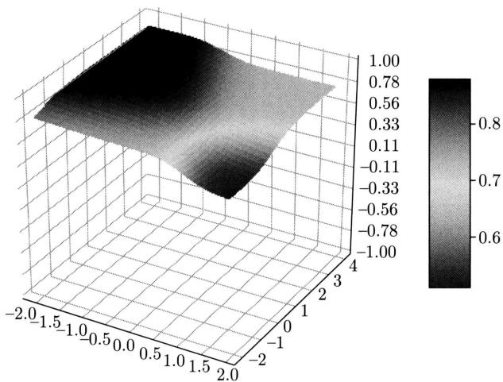  
图25.10 前馈神经网络例的三维图形（见文前彩图）

例25.3 构建一个前馈神经网络实现逻辑表达式XOR的功能。

解 采用矩阵表示，构建一个二层前馈神经网络，第一层有两个神经元，其激活函数是整流线性函数，第二层有一个神经元，其激活函数是恒等函数，如图25.11所示。

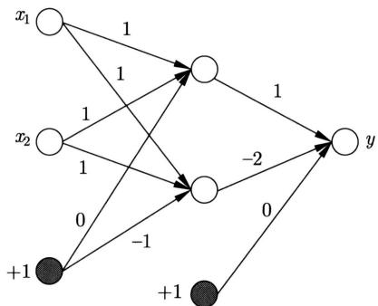  
图25.11 XOR神经网络例

第一层的权重矩阵和偏置向量是

$$
\boldsymbol {W} ^ {(1)} = \left[ \begin{array}{c c} 1 & 1 \\ 1 & 1 \end{array} \right]
$$

$$
\boldsymbol {b} ^ {(1)} = \left[ \begin{array}{c} 0 \\ - 1 \end{array} \right]
$$

第二层的权重矩阵和偏置向量是

$$
\boldsymbol {W} ^ {(2)} = \left[ \begin{array}{c} 1 \\ - 2 \end{array} \right]
$$

$$
\boldsymbol {b} ^ {(2)} = [ 0 ]
$$

用矩阵表示四种可能的输入：

$$
\boldsymbol {X} = \left[ \begin{array}{c c c c} 0 & 0 & 1 & 1 \\ 0 & 1 & 0 & 1 \end{array} \right]
$$

代表批量处理。代入神经网络，第一层输出是

$$
\begin{array}{l} \boldsymbol {H} ^ {(1)} = \operatorname {r e l u} \left(\boldsymbol {W} ^ {(1) ^ {\mathrm {T}}} \boldsymbol {X} + \boldsymbol {B} ^ {(1)}\right) \\ = \operatorname {r e l u} \left(\left[ \begin{array}{l l} 1 & 1 \\ 1 & 1 \end{array} \right] \left[ \begin{array}{l l l l} 0 & 0 & 1 & 1 \\ 0 & 1 & 0 & 1 \end{array} \right] + \left[ \begin{array}{l l l l} 0 & 0 & 0 & 0 \\ - 1 & - 1 & - 1 & - 1 \end{array} \right]\right) \\ = \operatorname {r e l u} \left(\left[ \begin{array}{r r r r} & 0 & 1 & 1 & 2 \\ - 1 & 0 & 0 & 1 \end{array} \right]\right) \\ = \left[ \begin{array}{c c c c} 0 & 1 & 1 & 2 \\ 0 & 0 & 0 & 1 \end{array} \right] \\ \end{array}
$$

其中，relu计算对矩阵的每一个元素进行。第二层输出是

$$
\begin{array}{l} \boldsymbol {H} ^ {(2)} = \boldsymbol {W} ^ {(2) ^ {\mathrm {T}}} \boldsymbol {H} ^ {(1)} + \boldsymbol {B} ^ {(2)} \\ = \left[ \begin{array}{l l} 1 & - 2 \end{array} \right] \left[ \begin{array}{l l l l} 0 & 1 & 1 & 2 \\ 0 & 0 & 0 & 1 \end{array} \right] + \left[ \begin{array}{l l l l} 0 & 0 & 0 & 0 \end{array} \right] \\ = \left[ \begin{array}{l l l l} 0 & 1 & 1 & 0 \end{array} \right] \\ \end{array}
$$

表示四种可能的输出。可以看出，这个二层神经网络实现了XOR功能。图25.12是XOR神经网络函数的三维图形。作为线性模型的感知机不能实现XOR是众所周知的事实，而作为非线性模型的前馈神经网络可以实现XOR，并且以很简单的方式实现。

例25.4 手写数字识别网络。

MNIST 是一个机器学习标准数据集。每一个样本由一个像素为 $28 \times 28$ 的手写数字灰度图像以及对应的 $0 \sim 9$ 之间的标签组成，像素取值为 $0 \sim 255$ ，如图 25.13 所示。

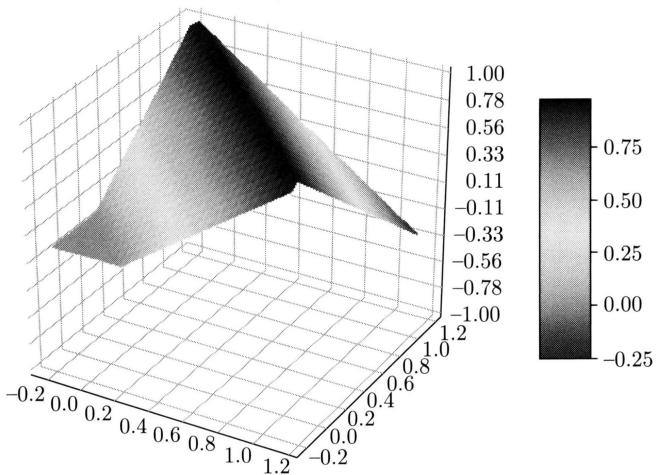  
图25.12 XOR神经网络例的三维图形（见文前彩图）

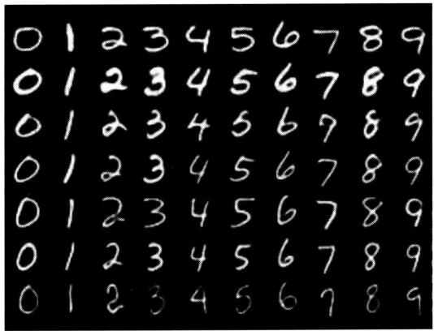  
图25.13 MNIST手写数字数据例

可以构建图25.14所示的前馈神经网络对MNIST的手写数字进行识别，是一个多标签分类模型。输入层是一个 $28 \times 28 = 784$ 维向量，取自一个图像，每一维对应一个像素。第一

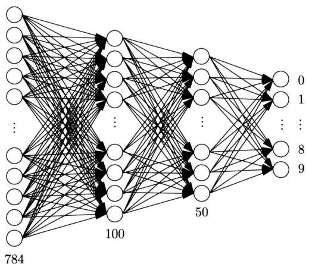  
图25.14 手写数字识别网络

层和第二层是隐层，各自有100个神经元和50个神经元，其激活函数都是S型函数。第三层是输出层，有10个神经元，其激活函数也是S型函数。给定一个图像，神经网络可以计算出其属于 $0\sim 9$ 类的概率，将图像赋予概率最大的标签。分类准确率能达到 $90\%$ 以上。

从以上的例子可以看出，前馈神经网络拥有很强的语义表示能力，简单的网络就可以表示逻辑关系、抽象数字，进行简单逻辑推理、数字识别等处理。预测时，神经网络的每一层通过非线性变换对输入进行特征转换，多次这样的特征转换产生最终的判断结果。

# 25.1.3 前馈神经网络的表示能力

# 1. 与其他模型的关系

前馈神经网络与逻辑斯谛回归模型、感知机、支持向量机等有密切关系。

对于多类分类的一层神经网络，当其输出层激活函数是软最大化函数时，模型等价于多项逻辑斯谛回归模型。

$$
P \left(y _ {k} = 1 | \boldsymbol {x}\right) = f (\boldsymbol {x}) = \frac {\mathrm {e} ^ {\left(\boldsymbol {w} _ {k} ^ {(1) ^ {\mathrm {T}}} \boldsymbol {x} + b _ {k} ^ {(1)}\right)}}{\sum_ {i = 1} ^ {l} \mathrm {e} ^ {\left(\boldsymbol {w} _ {i} ^ {(1) ^ {\mathrm {T}}} \boldsymbol {x} + b _ {i} ^ {(1)}\right)}}, \quad k = 1, 2, \dots , l \tag {25.26}
$$

所以，前馈神经网络是逻辑斯谛回归模型的扩展。注意：前馈神经网络通常将所有 $l$ 个类别的权重和偏置作为参数使用，而逻辑斯谛回归通常将前 $l - 1$ 个类别的权重和偏置作为自由参数使用（见8.1.4节）。

对于二类分类的一层神经网络，当其输出层激活函数是双曲正切函数时，

$$
f (\boldsymbol {x}) = \tanh  \left(\boldsymbol {w} ^ {(1) ^ {\mathrm {T}}} \boldsymbol {x} + b ^ {(1)}\right) \tag {25.27}
$$

模型可以与感知机对应。感知机模型的定义是

$$
y = {\left\{ \begin{array}{l l} {+ 1,} & {{\mathrm {s i g n}} ({\pmb w} ^ {\mathrm {T}} {\pmb x} + b) \geqslant 0} \\ {- 1,} & {{\text {其 他}}} \end{array} \right.}
$$

所以，可以认为前馈神经网络是感知机的扩展。这也是前馈神经网络又被称为多层感知机的原因。

对于二类分类的多层神经网络，当其输出层激活函数是双曲正切函数时，

$$
f (\boldsymbol {x}) = \tanh  \left(\boldsymbol {w} ^ {(s) ^ {\mathrm {T}}} \boldsymbol {h} ^ {(s - 1)} + b ^ {(s)}\right) \tag {25.28}
$$

$$
\boldsymbol {h} ^ {(s - 1)} = f ^ {(s - 1)} \left[ \dots f ^ {(2)} \left(f ^ {(1)} (\boldsymbol {x})\right) \dots \right]
$$

模型可以与非线性支持向量机对应。非线性支持向量模型的定义是

$$
y = \left\{ \begin{array}{l l} {+ 1,} & {\mathrm {s i g n} (\pmb {w} ^ {\mathrm {T}} \phi (\pmb {x}) + b) \geqslant 0} \\ {- 1,} & {\text {其 他}} \end{array} \right.
$$

其中， $\phi(x)$ 是从输入空间到特征空间的非线性映射， $w$ 和 $b$ 是模型的参数。前馈神经网络的

前 $s - 1$ 层函数 $f^{(s - 1)}[\dots f^{(2)}(f^{(1)}(\boldsymbol {x}))\dots ]$ 与映射函数 $\phi (\pmb {x})$ 对应。支持向量机学习是凸优化问题，保证可以找到全局最优，而前馈神经网络学习是非凸优化问题（见25.2节），不能保证找到全局最优。前馈神经网络比支持向量机有更多的参数可以调节。

# 2. 函数近似能力

前馈神经网络具有强大的函数近似能力。通用近似定理（universal approximation theorem）指出，存在一个二层前馈神经网络，具有一个线性输出层和一个隐层，其中隐层含有充分数量的神经元，激活函数为挤压函数，这个网络可以以任意精度近似任意一个在紧的定义域上的连续函数[1-2]。从这个意义上，前馈神经网络的函数近似能力是通用的。

设有实函数 $G(x)\colon \mathcal{R}\to [0,1]$ ，如果 $G(x)$ 是非减函数，且满足 $\lim_{x\to -\infty}G(x) = 0,\lim_{x\to +\infty}G(x)$ $= 1$ ，则称函数 $G(x)$ 为挤压函数(squashing function)。S型函数是一种挤压函数。

后续理论研究发现，定理的条件可以放宽，当激活函数是多项式函数以外的其他函数时，或者当被近似函数是波莱尔可测函数时，定理的结论依然成立。波莱尔可测函数包括连续函数、分段连续函数、阶梯函数。

下面的定理是通用近似定理的一个具体形式。

定理25.1 对任意连续函数 $h:[0,1]^n\to \mathcal{R}$ 和任意 $\varepsilon >0$ ，存在一个二层前馈神经网络：

$$
\begin{array}{l} f (\boldsymbol {x}) = \boldsymbol {\alpha} ^ {\mathrm {T}} \sigma \left(\boldsymbol {W} ^ {\mathrm {T}} \boldsymbol {x} + \boldsymbol {b}\right) \\ = \sum_ {j} \alpha_ {j} \sigma \left(\sum_ {i} w _ {j i} x _ {i} + b _ {j}\right) \\ \end{array}
$$

使得对于任意 $x\in [0,1]^n$ ，有 $\left|\pmb {h}(x) - f(\pmb {x})\right| <   \varepsilon$ 成立。这里隐层的激活函数是S型函数。

下面给出定理25.1的直观解释。假设 $h(x)$ 是一个连续函数，定义域是区间 $[0,1]$ ，值域是区间 $[0,1]$ ，可以用二层前馈神经网络 $f(x)$ 以任意精度近似 $h(x)$ （为了简单，这里假设 $h(x)$ 取正值，也可以取负值）。

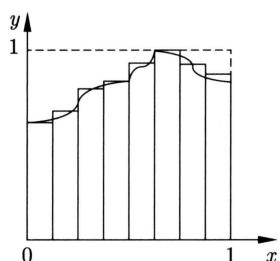  
(a)

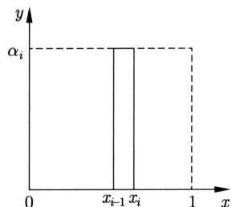  
(b)   
图25.15 用阶梯函数近似连续函数

如图25.15(a)所示，可以用阶梯函数以任意精度近似函数 $h(x)$ 。如图25.15(b)所示，假设阶梯函数第 $i$ 个分段函数是

$$
s _ {i} \left(x\right) = {\left\{ \begin{array}{l l} {\alpha_ {i},} & {x _ {i - 1} <   x \leqslant x _ {i}} \\ {0,} & {{\text {其 他}}} \end{array} \right.}
$$

则该分段函数可以由以下二层神经网络近似。

$$
f _ {i} (x) = \alpha_ {i} \cdot \sigma (w \cdot x - x _ {i - 1}) - \alpha_ {i} \cdot \sigma (w \cdot x - x _ {i})
$$

其中隐层有两个神经元，其激活函数是S型函数，输出层是线性的。这里参数 $x_{i - 1}$ 和 $x_{i}$ 保证与分段函数的区间一致，参数 $\alpha_{i}$ 保证趋近分段函数，参数 $w$ 控制与分段函数的趋近程度。这样，阶梯函数的每一分段函数 $s_i(x)$ 都可以用一个二层神经网络 $f_{i}(x)$ 近似，函数 $h(x)$ 整体也可以由所有 $f_{i}(x)$ 相加得到的二层神经网络 $f(x)$ 近似。

通用近似定理叙述的是理论存在性，并不意味着现实可行性。定理25.1中近似连续函数的二层前馈神经网络的隐层神经元的个数可能是非常大的，甚至是指数级的，参数个数也是如此，现实中不一定有足够多的数据训练这样的网络。经验上，当前馈神经网络的层数增大时，也就是变成深度神经网络时，可以解决这个问题。

# 3. 函数等价性

前馈神经网络 $y = f(x; \theta)$ 有大量的等价的函数，即参数 $\theta$ 不同但对相同的输入 $x$ 产生相同的输出 $y$ ，而且等价函数的个数是指数级的。

假设某个隐层有 $m$ 个神经元，其所有参数由向量表示。这一层有 $m!$ 个神经元的排列，每一个排列决定一个参数向量，因此有 $m!$ 种不同的参数向量。改变神经元的排列，参数向量发生变化，但神经网络的输入输出的映射关系不变，这时隐层有 $m!$ 个等价的参数向量。

假设某个隐层有 $m$ 个神经元，其所有参数由向量表示，激活函数是双曲正切函数。双曲正切函数是奇函数，即满足 $\tanh(-z) = -\tanh(z)$ 。若这一层的某一个神经元的参数以及相连的后一层神经元的参数都反号，则对相同的输入，神经网络的输出不变。这时隐层（与后一层一起）有 $2^m$ 个等价的参数向量。如果同时考虑神经元的不同排列，这个隐层共有 $m! 2^m$ 个等价的参数向量。

当神经网络有多个隐层的时候，整体的等价函数的个数由各层的等价参数向量个数的乘积决定。

# 4. 网络的深度

前馈神经网络的深度指网络的层数，复杂度指神经元的个数。复杂度也代表神经网络的参数个数，因为参数个数与神经元个数成正比。深度神经网络与“浅度神经网络”可以有同等的表示能力，但深度神经网络比浅度神经网络有更低的复杂度。这一点可以由逻辑门电路理论间接论证。

定理25.2存在这样的布尔函数，可以由深度为 $k$ 的多项式复杂度的逻辑门电路表示，等价地深度为 $k - 1$ 的逻辑门电路变为指数复杂度。其中深度指从输入到输出的最长路径的长度，复杂度指逻辑门的个数。

这里给出定理的直观解释。假设有图25.16所示的逻辑门电路，其深度是3，复杂度是9。如果根据以下关系，将AND的OR子电路（可由合取范式表示）转换成等价的OR的AND子电路（可由析取范式表示）：

$$
\begin{array}{l} (x _ {1} + \bar {x} _ {2}) (\bar {x} _ {3} + x _ {4}) (x _ {5} + x _ {6}) = x _ {1} \bar {x} _ {3} x _ {5} + x _ {1} \bar {x} _ {3} x _ {6} + x _ {1} x _ {4} x _ {5} + x _ {1} x _ {4} x _ {6} + \\ \bar {x} _ {2} \bar {x} _ {3} x _ {5} + \bar {x} _ {2} \bar {x} _ {3} x _ {6} + \bar {x} _ {2} x _ {4} x _ {5} + \bar {x} _ {2} x _ {4} x _ {6} \\ \end{array}
$$

那么得到图25.17所示的等价的逻辑门电路，其深度是2，复杂度是17。深的逻辑门电路复杂度低，而等价的浅的逻辑门电路复杂度高。

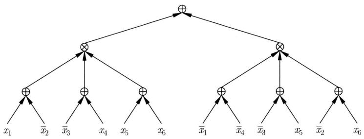  
图25.16 逻辑门电路例

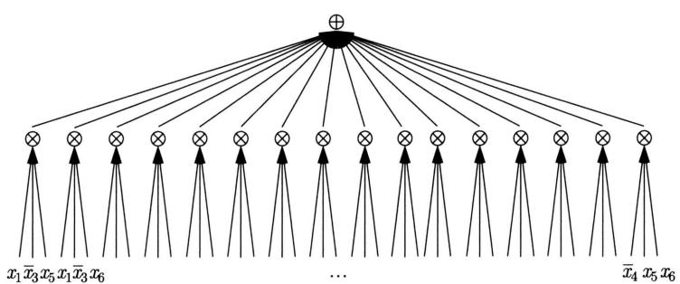  
图25.17 等价的逻辑门电路

逻辑门电路可以由前馈神经网络表示。定理25.2的推论是存在这样的深度神经网络，其等价的浅度神经网络的复杂度指数级地增加。所以，虽然深度神经网络与浅度神经网络可能有同等表示能力，但复杂度过高的浅度神经网络现实中并不可取。

在同等表示能力下，深度神经网络比浅度神经网络有更少的参数。所以，只需要更少的数据就可以学到，也就是说，深度神经网络有更低的样本复杂度（sample complexity）。这也是深度神经网络更加强大且实用的原因。

# 25.2 前馈神经网络的学习算法

本节讲述前馈神经网络学习算法。首先给出学习问题的定义，之后介绍学习的算法，包括一般的随机梯度下降法和具体的反向传播算法，以及在计算图上的实现，最后介绍学习的技巧。

# 25.2.1 前馈神经网络学习

# 1. 一般形式

前馈神经网络的学习和预测①是如下的监督学习问题。给定训练数据集

$$
\mathcal {T} = \left\{\left(\boldsymbol {x} _ {1}, y _ {1}\right), \left(\boldsymbol {x} _ {2}, y _ {2}\right), \dots , \left(\boldsymbol {x} _ {N}, y _ {N}\right) \right\}
$$

其中， $(x_{i},y_{i}),i = 1,2,\dots ,N$ ，表示样本，由输入 $\pmb{x}_i$ 与输出 $y_{i}$ 的对组成； $N$ 表示样本容量。学习一个前馈神经网络模型 $f(\pmb {x};\hat{\pmb{\theta}})$ ，其中 $\hat{\pmb{\theta}}$ 是估计的神经网络的参数向量。用学到的模型对新的输入 $\pmb{x}_{N + 1}$ 给出新的输出 $y_{N + 1}$ 。

学习时通常假设神经网络的架构已经确定，包括网络的层数、每层的神经元数、神经元激活函数的类型。所以网络的参数已确定，需要从数据中学习或估计的是参数值。

学习问题可以形式化为以下的优化问题：

$$
\hat {\boldsymbol {\theta}} = \underset {\boldsymbol {\theta}} {\operatorname {a r g m i n}} \left[ \sum_ {i = 1} ^ {N} L \left(f \left(\boldsymbol {x} _ {i}; \boldsymbol {\theta}\right), y _ {i}\right) + \lambda \cdot \Omega (f) \right] \tag {25.29}
$$

其中， $L(\cdot)$ 是损失函数， $\Omega(\cdot)$ 是正则项， $\lambda \geqslant 0$ 是系数。当损失函数是对数损失函数、没有正则化时，问题变成极大似然估计，这是前馈神经网络学习的一般形式。

$$
\hat {\boldsymbol {\theta}} = \underset {\boldsymbol {\theta}} {\operatorname {a r g m i n}} \left[ - \sum_ {i = 1} ^ {N} \log P _ {\theta} \left(y _ {i} \mid \boldsymbol {x} _ {i}\right) \right] \tag {25.30}
$$

这里 $P_{\theta}(y|\boldsymbol{x})$ 表示输入 $\boldsymbol{x}$ 给定条件下输出 $y$ 的条件概率，由神经网络决定； $\theta$ 是神经网络的参数。

# 2. 具体形式

针对不同的问题，前馈神经网络学习的一般形式可以转化成不同的具体形式。

当问题是回归时，模型的输入是实数向量 $\pmb{x}$ ，输出是实数值 $y$ 。神经网络 $f(\pmb{x};\pmb{\theta})$ 决定输入给定条件下输出的条件概率分布 $P_{\pmb{\theta}}(y|\pmb{x})$ 。假设条件概率分布 $P_{\pmb{\theta}}(y|\pmb{x})$ 遵循高斯分布：

$$
P _ {\boldsymbol {\theta}} (y | \boldsymbol {x}) \sim N (f (\boldsymbol {x}; \boldsymbol {\theta}), \sigma^ {2})
$$

其中， $y \in (-\infty, +\infty)$ ， $f(\boldsymbol{x}; \boldsymbol{\theta})$ 是均值， $\sigma^2$ 是方差。学习问题（极大似然估计）变为优化问题：

$$
\hat {\boldsymbol {\theta}} = \underset {\boldsymbol {\theta}} {\operatorname {a r g m i n}} \left[ \frac {1}{2 \sigma^ {2}} \sum_ {i = 1} ^ {N} \left(y _ {i} - f \left(\boldsymbol {x} _ {i}; \boldsymbol {\theta}\right)\right) ^ {2} + N \log \sigma + \frac {N}{2} \log 2 \right] \tag {25.31}
$$

假设方差 $\sigma^2$ 固定不变，有等价的优化问题：

$$
\hat {\boldsymbol {\theta}} = \underset {\boldsymbol {\theta}} {\operatorname {a r g m i n}} \sum_ {i = 1} ^ {N} \frac {1}{2} \left(y _ {i} - f \left(\boldsymbol {x} _ {i}; \boldsymbol {\theta}\right)\right) ^ {2} \tag {25.32}
$$

从另一个角度看，前馈神经网络用于回归时，使用平方损失（square loss）作为损失函数，学习进行的是平方损失的最小化。

当问题是二类分类时，模型的输入是实数向量 $\pmb{x}$ ，输出是类别 $y\in \{0,1\}$ ，神经网络 $f(x;\theta)$ 决定输入给定条件下类别的条件概率分布：

$$
p = P _ {\boldsymbol {\theta}} (y = 1 | \boldsymbol {x}) = f (\boldsymbol {x}; \boldsymbol {\theta}) \tag {25.33}
$$

假设条件概率分布 $P_{\theta}(y = 1|\pmb {x})$ 遵循贝努利分布，学习问题（极大似然估计）变为优化问题：

$$
\hat {\boldsymbol {\theta}} = \underset {\boldsymbol {\theta}} {\operatorname {a r g m i n}} \left\{- \sum_ {i = 1} ^ {N} \left[ y _ {i} \log f (\boldsymbol {x}; \boldsymbol {\theta}) + (1 - y _ {i}) \log (1 - f (\boldsymbol {x}; \boldsymbol {\theta})) \right] \right\} \tag {25.34}
$$

这时损失函数是交叉熵（cross entropy）损失。离散分布的交叉熵的一般定义是 $-\sum_{k=1}^{l} P_k \log Q_k$ ，表示经验分布和预测分布的差异，其中 $Q_k$ 是预测分布的概率， $P_k$ 是经验分布的概率。

当问题是多类分类时，模型的输入是实数向量 $\pmb{x}$ ，输出是类别 $y_{k} \in \{0,1\}, k = 1,2,\dots,l,$ $\sum_{k=1}^{l} y_{k} = 1$ ，神经网络 $f(\pmb{x};\pmb{\theta})$ 表示输入给定条件下类别的条件概率分布：

$$
\boldsymbol {p} = P _ {\boldsymbol {\theta}} \left(y _ {k} = 1 | \boldsymbol {x}\right) = \boldsymbol {f} (\boldsymbol {x}; \boldsymbol {\theta}) \tag {25.35}
$$

其中， $f(\pmb{x}; \pmb{\theta})$ 是一个向量，其第 $k$ 维表示第 $k$ 个类的条件概率 $f_{k}(\pmb{x}; \pmb{\theta})$ 。假设条件概率分布 $P_{\pmb{\theta}}(y_{k} = 1 | \pmb{x})$ 遵循类别分布（categorical distribution），学习问题变为优化问题：

$$
\hat {\boldsymbol {\theta}} = \underset {\boldsymbol {\theta}} {\operatorname {a r g m i n}} \left\{- \sum_ {i = 1} ^ {N} \left[ \sum_ {k = 1} ^ {l} y _ {i k} \log f _ {k} (\boldsymbol {x}; \boldsymbol {\theta}) \right] \right\} \tag {25.36}
$$

其中， $y_{ik} \in \{0,1\}, \sum_{k=1}^{l} y_{ik} = 1, k = 1,2,\dots,l, i = 1,2,\dots,N$ 。所以，前馈神经网络用于二类和多类分类时以交叉熵为损失函数，进行的是交叉熵的最小化。

# 25.2.2 前馈神经网络学习的优化算法

# 1.非凸优化问题

前馈神经网络学习变成给定网络架构 $f(\pmb{x};\pmb{\theta})$ 、训练数据集 $\mathcal{T}$ 的条件下，最小化目标函数 $L(\pmb{\theta})$ ，得到最优参数 $\hat{\pmb{\theta}}$ 的优化问题（最小化问题）。

$$
\hat {\boldsymbol {\theta}} = \underset {\boldsymbol {\theta}} {\operatorname {a r g m i n}} L (\boldsymbol {\theta}) = \underset {\boldsymbol {\theta}} {\operatorname {a r g m i n}} \frac {1}{N} \sum_ {i = 1} ^ {N} L \left(f \left(\boldsymbol {x} _ {i}; \boldsymbol {\theta}\right), y _ {i}\right) \tag {25.37}
$$

前馈神经网络学习的目标函数一般是非凸函数，优化问题是非凸优化。从前馈神经网络的等价性可以得知，一个神经网络通常有大量等价的参数向量，所以其学习的优化问题有大量等价的局部最优点（最小点）。

图25.18示意了神经网络的非凸优化问题。参数向量是 $(\theta_{1},\theta_{2})$ ，目标函数是 $L(\theta_1,\theta_2)$ 全局最小点是深蓝色，局部最小点是浅蓝色。因为目标函数非凸，有许多局部最小点。

# 2. 梯度下降法和随机梯度下降法

深度学习包括前馈神经网络学习，均使用迭代优化算法，包括梯度下降法（gradient descent）和随机梯度下降法（stochastic gradient descent），后者更为常用（附录A给出梯度下降法的一般介绍）。

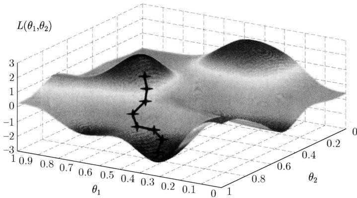  
图25.18 非凸优化问题（见文前彩图）

优化目标函数写作

$$
L (\boldsymbol {\theta}) = \frac {1}{N} \sum_ {i = 1} ^ {N} L _ {i} (\boldsymbol {\theta}) = \frac {1}{N} \sum_ {i = 1} ^ {N} L (f \left(\boldsymbol {x} _ {i}; \boldsymbol {\theta}\right), y _ {i}) \tag {25.38}
$$

其中， $L_{i}(\pmb {\theta})$ 是第 $i$ 个样本的损失函数。

梯度下降法首先随机初始化参数向量 $\theta$ ；之后针对所有样本，通过以下公式更新参数向量 $\theta$ ；不断迭代，直到收敛为止。

$$
\boldsymbol {\theta} \leftarrow \boldsymbol {\theta} - \eta \frac {\partial L (\boldsymbol {\theta})}{\partial \boldsymbol {\theta}} \tag {25.39}
$$

或写作

$$
\boldsymbol {\theta} \leftarrow \boldsymbol {\theta} - \eta \frac {1}{N} \sum_ {i = 1} ^ {N} \frac {\partial L _ {i} (\boldsymbol {\theta})}{\partial \boldsymbol {\theta}} \tag {25.40}
$$

其中， $\eta > 0$ 是学习率， $\frac{\partial L(\pmb{\theta})}{\partial \pmb{\theta}}$ 是所有样本的损失函数的梯度向量， $\frac{\partial L_i(\pmb{\theta})}{\partial \pmb{\theta}}$ 是第 $i$ 个样本的损失函数的梯度向量。算法25.1给出梯度下降的具体算法。

梯度下降的基本想法如下。由于负梯度方向 $-\frac{\partial L(\pmb{\theta})}{\partial \pmb{\theta}}$ 是使函数值下降的方向，所以每一次迭代以负梯度更新参数向量 $\pmb{\theta}$ 的值，从而达到减少函数值 $L(\pmb{\theta})$ 的目的。函数极小值满足 $\nabla L(\pmb{\theta}) = 0$ 。在迭代过程中，梯度向量趋近 $\pmb{0}$ 向量，参数向量 $\pmb{\theta}$ 也趋近极小点。学习率控制参数更新的幅度。学习率的大小需要适当，学习率过小，参数向量每次更新的幅度会过小，迭代的次数会增加；学习率过大，参数向量每次更新的幅度会过大，产生振荡，迭代的次数也会增加。图25.18显示梯度下降的过程。

# 算法25.1（梯度下降法）

输入：网络架构 $f(\pmb {x};\pmb {\theta})$ ，训练数据集 $\mathcal{T}$

输出：神经网络参数向量 $\hat{\theta}$

超参数：学习率 $\eta$ 。

1.随机初始化参数向量 $\theta$   
2. Do while $(\pmb{\theta}$ 不收敛）{

针对所有样本，按照以下公式，更新参数向量 $\pmb{\theta}$

$$
\boldsymbol {\theta} \leftarrow \boldsymbol {\theta} - \eta \frac {\partial L (\boldsymbol {\theta})}{\partial \boldsymbol {\theta}}
$$

}

3. 返回学习到的参数向量 $\hat{\theta}$ 。

梯度下降用于深度学习（一般的机器学习）有两个缺点。每次迭代需要计算针对所有样本的梯度向量，计算效率不高；得到的解可能是局部最优，不能保证是全局最优。随机梯度下降能较好地解决这两个问题。

随机梯度下降法首先随机打乱样本顺序，将样本分成 $m$ 个组（小批量），每一组有 $n$ 个样本（假设 $m = \lfloor N / n\rfloor$ ）；接着随机初始化参数向量；之后针对每组样本，通过以下公式更新参数向量，并遍历所有样本组；不断迭代，直到收敛为止。

$$
\boldsymbol {\theta} \leftarrow \boldsymbol {\theta} - \eta \frac {1}{n} \sum_ {j = 1} ^ {n} \frac {\partial L _ {j} (\boldsymbol {\theta})}{\partial \boldsymbol {\theta}} \tag {25.41}
$$

其中， $\eta > 0$ 是学习率， $\frac{\partial L_j(\pmb{\theta})}{\partial \pmb{\theta}}$ 是一个组中的第 $j$ 个样本的损失函数的梯度向量。算法25.2给出随机梯度下降的具体算法。当 $n$ 是1时，每次参数更新只使用一个样本，是一种特殊的随机梯度下降。当 $n$ 是整体样本容量 $N$ 时，随机梯度下降变为梯度下降。当前深度学习采用的Adam等优化算法，在随机梯度下降的迭代过程中，自适应地调整梯度向量。附录G对Adam等算法予以介绍。

# 算法25.2（随机梯度下降法）

输入：网络架构 $f(\pmb {x};\pmb {\theta})$ ，训练数据集 $\mathcal{T}$

输出：神经网络参数向量 $\hat{\theta}$ 。

超参数：学习率 $\eta$ ，小批量样本容量 $n$ 。

1.随机打乱样本顺序，将样本分成 $m$ 个组，每一组有 $n$ 个样本；  
2.随机初始化参数向量 $\pmb{\theta}$   
3. Do while( $\pmb{\theta}$ 不收敛）{

$$
\text {F o r} (i = 1, 2, \dots , m) \left\{\right.
$$

针对第 $i$ 个组的 $n$ 个样本，按照以下公式，更新参数向量 $\pmb{\theta}$

$\pmb {\theta}\gets \pmb {\theta} - \eta \frac{1}{n}\sum_{j = 1}^{n}\frac{\partial L_j(\pmb{\theta})}{\partial\pmb{\theta}}$

4. 返回学习到的参数向量 $\hat{\theta}$ 。

由于随机梯度下降具有随机性，它能一定程度上避免陷入局部最优解，但原理上并不能保证找到全局最优解。

随机梯度下降可以进行分布式并行计算，进一步提高学习效率，特别是当训练数据量大时非常有效。具体地，每组样本分配到不同的工作服务器（worker）上，各台工作服务器基于自己的数据并行更新参数向量，参数服务器（parameter server）再将所有工作服务器的参数

更新结果汇总求平均，得到一轮的训练结果。

# 25.2.3 反向传播算法

基于梯度下降或随机梯度下降的学习算法的核心是针对给定样本，计算损失函数对神经网络所有参数的梯度 $\frac{\partial L}{\partial \theta}$ ，更新神经网络的所有参数 $\theta$ 。反向传播（back propagation）算法也称为误差反向传播（error back propagation）算法，提供了一个高效的梯度计算以及参数更新方法。只需要依照网络结构进行一次正向传播（forward propagation）和一次反向传播（backward propagation），就可以完成梯度下降的一次迭代。在梯度下降的每一步，参数已在前一步更新，正向传播旨在基于当前的参数重新计算神经网络所有变量（比如，神经元的输出），反向传播旨在基于当前的变量重新计算损失函数对所有参数的梯度，这样就可以根据梯度下降式 (25.40) 或式 (25.41) 更新神经网络的所有参数。

先给出复合函数的求导法则。一元复合函数 $y = f(z), z = g(x)$ 的导数是

$$
\frac {\mathrm {d} y}{\mathrm {d} x} = \frac {\mathrm {d} y}{\mathrm {d} z} \frac {\mathrm {d} z}{\mathrm {d} x}
$$

多元复合函数 $y = f(z),z = g(x)$ 的偏导数是

$$
\frac {\partial y}{\partial x _ {i}} = \sum_ {j} \frac {\partial y}{\partial z _ {j}} \frac {\partial z _ {j}}{\partial x _ {i}}
$$

称为链式法则。

下面考虑一个 $s$ 层神经网络（见图25.19）。其中第 $t$ 层（隐层）的神经元定义如下：

$$
h _ {j} ^ {(t)} = a \left(z _ {j} ^ {(t)}\right), \quad j = 1, 2, \dots , m \tag {25.42}
$$

$$
z _ {j} ^ {(t)} = \sum_ {i = 1} ^ {n} w _ {j i} ^ {(t)} h _ {i} ^ {(t - 1)} + b _ {j} ^ {(t)} \tag {25.43}
$$

第 $t + 1$ 层（隐层）的神经元定义如下：

$$
h _ {k} ^ {(t + 1)} = a \left(z _ {k} ^ {(t + 1)}\right), \quad k = 1, 2, \dots , l \tag {25.44}
$$

$$
z _ {k} ^ {(t + 1)} = \sum_ {j = 1} ^ {m} w _ {k j} ^ {(t + 1)} h _ {j} ^ {(t)} + b _ {k} ^ {(t + 1)} \tag {25.45}
$$

梯度下降需要计算损失函数对所有参数的梯度。损失函数对第 $t$ 层的权重和偏置的梯度分别是 $\frac{\partial L}{\partial w_{ji}^{(t)}}$ 和 $\frac{\partial L}{\partial b_j^{(t)}}$ 。根据链式法则，可以分别展开：

$$
\frac {\partial L}{\partial w _ {j i} ^ {(t)}} = \frac {\partial L}{\partial z _ {j} ^ {(t)}} \frac {\partial z _ {j} ^ {(t)}}{\partial w _ {j i} ^ {(t)}} \tag {25.46}
$$

$$
\frac {\partial L}{\partial b _ {j} ^ {(t)}} = \frac {\partial L}{\partial z _ {j} ^ {(t)}} \frac {\partial z _ {j} ^ {(t)}}{\partial b _ {j} ^ {(t)}} \tag {25.47}
$$

考虑损失函数对第 $t$ 层的净输入 $z_{j}^{(t)}$ 的梯度：

$$
\delta_ {j} ^ {(t)} = \frac {\partial L}{\partial z _ {j} ^ {(t)}}, \quad j = 1, 2, \dots , m \tag {25.48}
$$

称为在第 $t$ 层的“误差”。求解式(25.46)和式(25.47)，并代入式(24.48)，得到：

$$
\frac {\partial L}{\partial w _ {j i} ^ {(t)}} = \delta_ {j} ^ {(t)} h _ {i} ^ {(t - 1)} \tag {25.49}
$$

$$
\frac {\partial L}{\partial b _ {j} ^ {(t)}} = \delta_ {j} ^ {(t)} \tag {25.50}
$$

其中, $h_{i}^{(t - 1)}$ 是 $t - 1$ 层的输出, 从正向传播得到; $\delta_{j}^{(t)}$ 是第 $t$ 层的误差, 从反向传播得到。所以, 可以根据式 (25.49) 和式 (25.50) 计算对第 $t$ 层的权重与偏置的梯度。

正向传播是指输入从输入层到输出层的信号传递。给定神经网络参数，根据神经网络的函数计算。反向传播是指“误差”从输出层到输入层的传递。给定神经网络参数，以及正向传播的结果，通过以下方法计算。

对于第 $t$ 层的误差 $\delta_j^{(t)}$ ，根据链式法则展开：

$$
\delta_ {j} ^ {(t)} = \frac {\partial L}{\partial z _ {j} ^ {(t)}} = \sum_ {k = 1} ^ {l} \frac {\partial L}{\partial z _ {k} ^ {(t + 1)}} \frac {\partial z _ {k} ^ {(t + 1)}}{\partial z _ {j} ^ {(t)}}, \quad j = 1, 2, \dots , m \tag {25.51}
$$

求解得到：

$$
\delta_ {j} ^ {(t)} = \frac {\mathrm {d} a}{\mathrm {d} z _ {j} ^ {(t)}} \sum_ {k = 1} ^ {l} w _ {k j} ^ {(t + 1)} \delta_ {k} ^ {(t + 1)} \tag {25.52}
$$

这里 $\delta_{k}^{(t + 1)}$ 是第 $t + 1$ 层的误差， $w_{kj}^{(t + 1)}$ 是第 $t + 1$ 层的权重， $\frac{\mathrm{d}a}{\mathrm{d}z_{j}^{(t)}}$ 是第 $t$ 层的激活函数的导数。也就是说，可以根据式 (25.52)，从第 $t + 1$ 层的误差 $\delta_{k}^{(t + 1)}$ 计算第 $t$ 层的误差 $\delta_{j}^{(t)}$ 。

第 $s$ 层（输出层）的误差通过以下方法计算。一般形式是

$$
\delta_ {k} ^ {(s)} = \frac {\partial L}{\partial z _ {k} ^ {(s)}}, \quad k = 1, 2, \dots , l \tag {25.53}
$$

求解得到：

$$
\delta_ {k} ^ {(s)} = \frac {\mathrm {d} g}{\mathrm {d} z _ {k} ^ {(s)}} \frac {\partial L}{\partial h _ {k} ^ {(s)}}, \quad k = 1, 2, \dots , l \tag {25.54}
$$

这里 $\frac{\partial L}{\partial h_k^{(s)}}$ 是损失函数对输出的梯度， $\frac{\mathrm{d}g}{\mathrm{d}z_k^{(s)}}$ 是第 $s$ 层的激活函数的导数。注意第 $s$ 层的输出表示为 $h^{(s)}$ 。

回归时，输入层只有一个神经元，有一个输出取实数值。损失函数是平方损失 $\frac{1}{2} (h^{(s)} - y)^2$ ，激活函数是恒等函数 $g(z) = z$ ，这时误差是

$$
\delta^ {(s)} = h ^ {(s)} - y \tag {25.55}
$$

表示第 $s$ 层的输出 $h^{(s)}$ 与训练样本输出 $y$ 的差。

多类分类（包含二类分类）时，输出层只有一个神经元，有 $l$ 个输出表示 $l$ 个类别的概率。损失函数是交叉熵损失 $-\sum_{k=1}^{l} y_k \log h_k^{(s)}$ ，激活函数是软最大化函数 $g(z) = \frac{\mathrm{e}^z}{\sum_{z'} \mathrm{e}^{z'}}$ ，这时误差是（推导见附录 F）

$$
\delta_ {k} ^ {(s)} = h _ {k} ^ {(s)} - y _ {k}, \quad k = 1, 2, \dots , l \tag {25.56}
$$

表示第 $s$ 层的输出 $h_k^{(s)}$ 与训练样本输出 $y_{k}$ 的差。

可以看出，无论是回归还是分类，由于特殊的激活函数与损失函数的使用，使得 $\delta^{(s)}$ 表示预测与真实值的差。这也是损失函数 $L$ 对净输入 $z$ 的梯度 $\frac{\partial L}{\partial z}$ 被称为误差的原因。

图25.19显示在第 $t$ 层的正向传播和反向传播。首先，第 $t - 1$ 层的输出通过网络正向传播到第 $t$ 层，根据式(25.42)和式(25.43)计算出第 $t$ 层的输出，用于后面各层的正向传播，这时使用第 $t - 1$ 层到第 $t$ 层的权重和偏置。接着，第 $t + 1$ 层的误差通过网络反向传播到第 $t$ 层，根据式(25.52)计算出第 $t$ 层的误差，用于这层和前面各层的反向传播，这时使用第 $t$ 层到第 $t + 1$ 层的权重。然后，根据式(25.49)和式(25.50)计算对第 $t$ 层的权重和偏置的梯度，这时使用第 $t - 1$ 层的输出和第 $t$ 层的误差。最后，根据梯度下降公式更新第 $t$ 层的权重和偏置。正向传播和反向传播都递归地进行，先进行正向传播，然后进行反向传播。正向传播从输入层的计算开始，反向传播从输出层的误差计算开始。

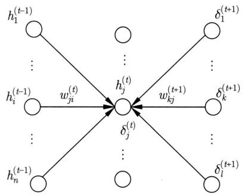  
图25.19 在神经元 $h_j^{(t)}$ 的正向传播与反向传播

算法25.3是前馈神经网络的反向传播算法的一次迭代算法。不失一般性，假设是基于一个样本的随机梯度下降（小批量样本容量为1）。这里使用神经网络的矩阵表示，其中 $\odot$ 是向量的逐元素积（element-wise product）或阿达玛积（Hadamard product）。①

# 算法25.3（前馈神经网络的反向传播算法）

输入：神经网络 $f(\pmb {x};\pmb {\theta})$ ，参数向量 $\pmb{\theta}$ ，一个样本 $(\pmb {x},\pmb {y})$ 。

输出：更新的参数向量 $\theta$ 。

超参数：学习率 $\eta$ 。

1

1. 正向传播，得到各层输出 $\pmb{h}^{(1)},\pmb{h}^{(2)},\dots ,\pmb{h}^{(s)}$

$$
\boldsymbol {h} ^ {(0)} = \boldsymbol {x}
$$

For $t = 1,2,\dots ,s$ ,do{

$$
\boldsymbol {z} ^ {(t)} = \boldsymbol {W} ^ {(t)} \boldsymbol {h} ^ {(t - 1)} + \boldsymbol {b} ^ {(t)}
$$

$$
\boldsymbol {h} ^ {(t)} = a (\boldsymbol {z} ^ {(t)})
$$

}

$$
f (\boldsymbol {x}) = \boldsymbol {h} ^ {(s)}
$$

2. 反向传播，得到各层误差 $\delta^{(s)}, \dots, \delta^{(2)}, \delta^{(1)}$ ，同时计算各层的梯度，更新各层的参数。计算输出层的误差

$$
\boldsymbol {\delta} ^ {(s)} = \boldsymbol {h} ^ {(s)} - \boldsymbol {y}
$$

For $t = s,\dots ,2,1$ ,do{

计算第 $t$ 层的梯度

$$
\nabla_ {\boldsymbol {W} ^ {(t)}} L = \boldsymbol {\delta} ^ {(t)} \cdot \boldsymbol {h} ^ {(t - 1) ^ {\mathrm {T}}}
$$

$$
\nabla_ {\boldsymbol {b} ^ {(t)}} L = \boldsymbol {\delta} ^ {(t)}
$$

根据梯度下降公式更新第 $t$ 层的参数

$$
\boldsymbol {W} ^ {(t)} \leftarrow \boldsymbol {W} ^ {(t)} - \eta \nabla_ {\boldsymbol {W} ^ {(t)}} L
$$

$$
\boldsymbol {b} ^ {(t)} \leftarrow \boldsymbol {b} ^ {(t)} - \eta \nabla_ {\boldsymbol {b} ^ {(t)}} L
$$

If $(t > 1)$ {

将第 $t$ 层的误差传到第 $t - 1$ 层

$$
\boldsymbol {\delta} ^ {(t - 1)} = \frac {\partial a}{\partial \boldsymbol {z} ^ {(t - 1)}} \odot \left(\boldsymbol {W} ^ {(t) ^ {\mathrm {T}}} \cdot \boldsymbol {\delta} ^ {(t)}\right)
$$

}

3. 返回更新的参数向量

}

# 25.2.4 在计算图上的实现

计算图（computation graph）是表示函数计算过程的有向无环图，其结点表示变量，有向边表示变量（输入变量和输出变量）之间的函数依存关系。每一个非起点的结点对应一个

基本函数，如加减乘除运算。图整体对应的是由基本函数组成的复合函数。计算图上的计算有正向传播和反向传播。

正向传播是从起点的输入（数值、向量、矩阵或张量）开始，顺着有向边，依次对结点的基本函数进行计算，直到得到终点的输出（数值、向量、矩阵或张量）的过程。这个过程可以看作信号在图上的正向传播，在各个结点对信号进行了转换。

反向传播是从终点的梯度（数值、向量、矩阵或张量）开始，逆着有向边，依次对结点的梯度进行运算，直到得到起点的梯度（数值、向量、矩阵或张量）的过程，这里一个结点的梯度是指图整体函数对该结点变量的梯度。梯度计算使用链式法则。这个过程可以看作梯度在图上的反向传播，在各个结点对梯度进行了展开。

前馈神经网络学习的随机梯度下降法和梯度下降法可以在计算图上实现。整个图对应的是包含神经网络函数的损失函数。计算图用基本函数（如加减乘除）的组合来表示这个复杂的损失函数，通常是一个很大的图。计算图上的正向传播和反向传播可以实现随机梯度下降和梯度下降，其中正向传播实现的是损失函数的计算，反向传播实现的是损失函数的梯度函数的计算。

下面通过具体例子来说明计算图的原理。图25.20是一个含有乘法运算的计算图例，上图显示正向传播，下图显示反向传播。起点 $x, w$ 是输入变量，终点 $L$ 是输出变量，中间结点 $u$ 是中间变量。变量 $u$ 由乘法运算 $u = w \cdot x$ 决定，变量 $L$ 由函数 $L = l(u)$ 决定。计算图整体表示的是复合函数 $L = l(w \cdot x)$ 。在计算图上的正向传播就是计算复合函数 $L = l(w \cdot x)$ 的过程。从起点 $x, w$ 开始，顺着有向边，在结点 $u, L$ 依次进行计算，先后得到函数值 $u, L$ ；其中先将 $x$ 和 $w$ 相乘得到 $u$ ，然后对 $u$ 计算 $l(u)$ 得到 $L$ 。反向传播就是计算复合函数 $L = l(w \cdot x)$ 对变量的梯度的过程。从终点 $L$ 开始，逆着有向边，在结点 $u, x, w$ 依次进行计算，先后得到梯度 $\frac{\mathrm{d}L}{\mathrm{d}u}, \frac{\mathrm{d}L}{\mathrm{d}x}, \frac{\mathrm{d}L}{\mathrm{d}w}$ ；其中先根据定义计算 $\frac{\mathrm{d}L}{\mathrm{d}u}$ ，再利用链式法则计算 $\frac{\mathrm{d}L}{\mathrm{d}x}, \frac{\mathrm{d}L}{\mathrm{d}w}$ ：

$$
\frac {\mathrm {d} L}{\mathrm {d} w} = \frac {\mathrm {d} L}{\mathrm {d} u} \cdot \frac {\mathrm {d} u}{\mathrm {d} w} = \frac {\mathrm {d} L}{\mathrm {d} u} \cdot x
$$

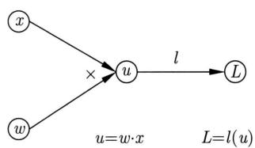  
正向传播

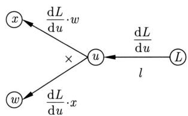  
反向传播  
图25.20 计算图例：乘法

$$
\frac {\mathrm {d} L}{\mathrm {d} x} = \frac {\mathrm {d} L}{\mathrm {d} u} \cdot \frac {\mathrm {d} u}{\mathrm {d} x} = \frac {\mathrm {d} L}{\mathrm {d} u} \cdot w
$$

梯度在乘法结点 $u$ 的反向传播呈现“翻转”现象，正向传播是 $x$ 时，反向传播是梯度的 $w$ 倍，正向传播是 $w$ 时，反向传播是梯度的 $x$ 倍。

图25.21是一个含有加法运算的计算图例。起点 $u, b$ 是输入变量，终点 $L$ 是输出变量，中间结点 $z$ 是中间变量。变量 $z$ 由加法运算 $z = u + b$ 决定，变量 $L$ 由函数 $L = l(z)$ 决定。计算图整体表示的是复合函数 $L = l(u + b)$ 。在计算图上的正向传播就是计算复合函数 $L = l(u + b)$ 的过程。从起点 $u, b$ 开始，顺着有向边，在结点 $z, L$ 依次进行计算，先后得到函数值 $z, L$ ；其中先将 $u$ 和 $b$ 相加得到 $z$ ，然后对 $z$ 计算 $l(z)$ 得到 $L$ 。反向传播就是计算复合函数 $L = l(u + b)$ 对变量的梯度的过程。从终点 $L$ 开始，逆着有向边，在结点 $z, u, b$ 依次进行计算，先后得到梯度 $\frac{\mathrm{d}L}{\mathrm{d}z}, \frac{\mathrm{d}L}{\mathrm{d}u}, \frac{\mathrm{d}L}{\mathrm{d}b}$ ；其中先根据定义计算 $\frac{\mathrm{d}L}{\mathrm{d}z}$ ，再利用链式法则计算 $\frac{\mathrm{d}L}{\mathrm{d}u}, \frac{\mathrm{d}L}{\mathrm{d}b}$ ：

$$
\frac {\mathrm {d} L}{\mathrm {d} u} = \frac {\mathrm {d} L}{\mathrm {d} z} \cdot \frac {\mathrm {d} z}{d u} = \frac {\mathrm {d} L}{\mathrm {d} z} \cdot 1
$$

$$
\frac {\mathrm {d} L}{\mathrm {d} b} = \frac {\mathrm {d} L}{\mathrm {d} z} \cdot \frac {\mathrm {d} z}{\mathrm {d} b} = \frac {\mathrm {d} L}{\mathrm {d} z} \cdot 1
$$

梯度 $\frac{\mathrm{d}L}{\mathrm{d}z}$ 在加法结点 $z$ 的反向传播保持不变传到输入结点 $u, b$ 。

  
正向传播

  
反向传播  
图25.21 计算图例：加法

图25.22给出含有S型函数的计算图例。起点 $z, y$ 是输入变量，终点 $L$ 是输出变量，中间结点 $f$ 是中间变量。变量 $f$ 由S型函数 $f = \sigma(z)$ 决定，变量 $L$ 由损失函数 $L = l(f, y)$ 决定。计算图整体表示的是复合函数 $L = l(\sigma(z), y)$ 。在计算图上进行的正向传播就是计算复合函数 $L = l(\sigma(z), y)$ 的过程。从起点 $z, y$ 开始，顺着有向边，在结点 $f, L$ 依次进行计算，先后得到函数值 $f, L$ ；其中先对 $z$ 计算 $f(z)$ 得到 $f$ ，然后对 $f$ 和 $y$ 计算 $l(f, y)$ 得到 $L$ 。反向传播就是计算复合函数 $L = l(\sigma(z), y)$ 对变量的梯度的过程。从终止结点 $L$ 出发，逆着有向边，在结点 $y, f, z$ 依次进行，先后得到梯度 $\frac{\mathrm{d}L}{\mathrm{d}y}, \frac{\mathrm{d}L}{\mathrm{d}f}, \frac{\mathrm{d}L}{\mathrm{d}z}$ ；其中先根据定义计算 $\frac{\mathrm{d}L}{\mathrm{d}y}, \frac{\mathrm{d}L}{\mathrm{d}f}$ ，再利用

  
正向传播

  
反向传播  
图25.22 计算图例：S型函数

链式法则计算 $\frac{\mathrm{d}L}{\mathrm{d}z}$

$$
\frac {\mathrm {d} L}{\mathrm {d} z} = \frac {\mathrm {d} L}{\mathrm {d} f} \cdot \frac {\mathrm {d} f}{\mathrm {d} z} = \frac {\mathrm {d} L}{\mathrm {d} f} \cdot f (1 - f)
$$

梯度 $\frac{\mathrm{d}L}{\mathrm{d}f}$ 在结点 $f$ 的反向传播变为梯度的 $f(1 - f)$ 倍，传到输入结点 $z$ 。

考虑一层前馈神经网络的学习，神经网络函数和损失函数分别是

$$
\boldsymbol {f} = \sigma (\boldsymbol {W} \cdot \boldsymbol {x} + \boldsymbol {b})
$$

$$
L = l \left(\boldsymbol {f}, \boldsymbol {y}\right)
$$

其中， $x$ 和 $y$ 构成一个训练样本，表示输入向量和（真值）输出向量； $f$ 是神经网络的输出向量； $W$ 和 $b$ 是权重矩阵和偏置向量； $l(\cdot, \cdot)$ 是损失函数。图25.23的计算图显示针对这个学习的正向传播和反向传播的过程。图上的结点表示神经网络函数和损失函数中的变量。事实上这个计算图是由图25.20～图25.22的计算图组合扩展而得到的，其中变量从一元扩展到多元。注意，在每个结点正向传播和反向传播的向量的维度是相同的，因为正向传播的是结点的变量（向量），反向传播的是整体损失函数对结点变量（向量）的梯度向量。学习的过程中只有参数变量 $W$ 和 $b$ 在更新，训练数据变量 $x$ 和 $y$ 保持不变。可以看出，在计算图上的正向传播和反向传播可以实现神经网络学习的梯度下降法。

图25.24所示的是同一个前馈神经网络的小批量学习的计算图。前向传播计算针对小批量训练样本的神经网络的损失，反向传播计算针对小批量训练样本的损失函数的梯度。

$$
\boldsymbol {F} = \sigma (\boldsymbol {W} \cdot \boldsymbol {X} + B)
$$

$$
L = l \left(\boldsymbol {F}, \boldsymbol {Y}\right)
$$

其中， $X$ 和 $Y$ 构成一个小批量训练样本集，表示多个样本的输入矩阵和（真值）输出矩阵； $F$ 是多个样本的神经网络的输出矩阵； $W$ 和 $B$ 是神经网络的权重矩阵和偏置矩阵； $l(\cdot, \cdot)$ 是损失函数。

前馈神经网络上的正向和反向传播算法（算法25.3）及计算图上的正向和反向传播算法基于相同的基本原理，但具有不同的形式。

图25.23 计算图例：一层神经网络的学习  
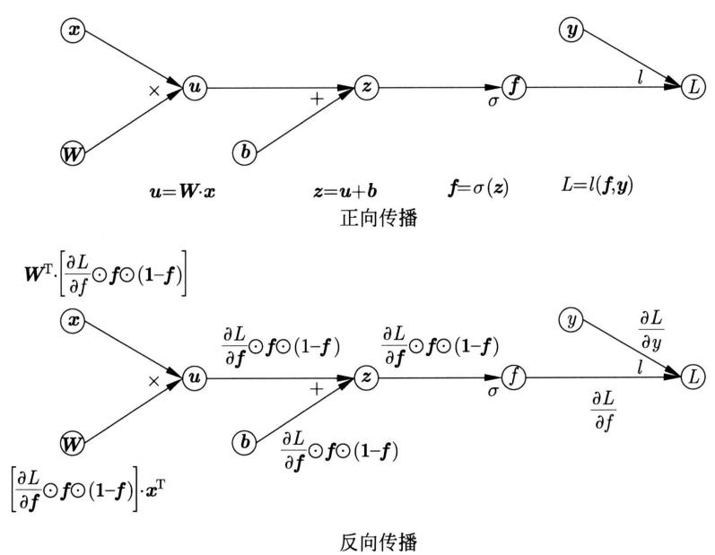  
这里 $\odot$ 表示向量的逐元素积

图25.24 计算图例：一层神经网络的小批量学习  
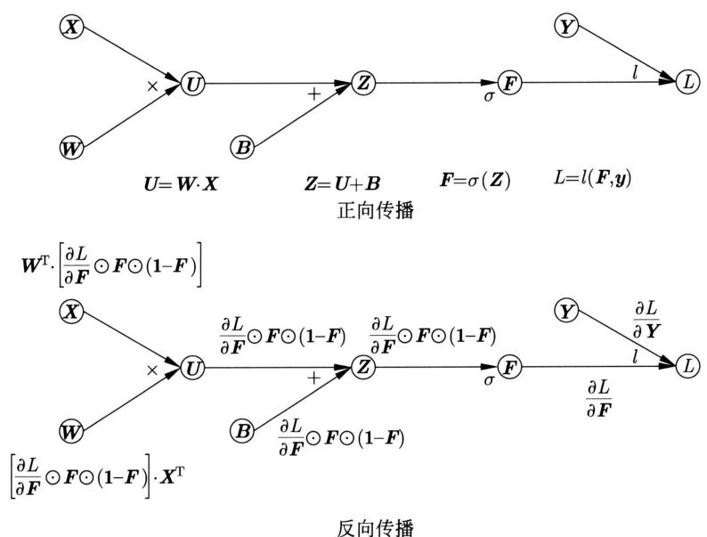  
这里 $\odot$ 表示矩阵的逐元素积

# 25.2.5 算法的实现技巧

深度神经网络学习是一个复杂的非凸优化问题，会产生一些优化上的困难。这里介绍梯度消失和爆炸及其解决方法、内部协变量偏移及其解决方法：批量归一化和层归一化。

# 1. 梯度消失与梯度爆炸

深度神经网络学习中有时会出现梯度消失 (vanishing gradient) 或者梯度爆炸 (exploding gradient) 现象。使用反向传播算法（算法 25.3）时，首先通过正向传播计算神经网络各层的输出，然后通过反向传播计算神经网络各层的误差以及梯度，接着利用梯度下降公式对神经网络各层的参数进行更新。在这个过程中，各层的梯度，特别是前面层的梯度，有时会接近 0（梯度消失）或接近无穷（梯度爆炸）。梯度消失会导致参数更新停止，梯度爆炸会导致参数溢出，都会使学习无法有效地进行。

反向传播中，首先计算误差向量：

$$
\boldsymbol {\delta} ^ {(t - 1)} = \left\{\operatorname {d i a g} \left[ \frac {\partial a}{\partial \boldsymbol {z} ^ {(t - 1)}} \right] \cdot \boldsymbol {W} ^ {(t) ^ {\mathrm {T}}} \right\} \cdot \boldsymbol {\delta} ^ {(t)} \tag {25.57}
$$

之后计算梯度：

$$
\left\{ \begin{array}{c} \nabla_ {\boldsymbol {W} ^ {(t)}} L = \boldsymbol {\delta} ^ {(t)} \cdot \boldsymbol {h} ^ {(t - 1) ^ {\mathrm {T}}} \\ \nabla_ {\boldsymbol {b} ^ {(t)}} L = \boldsymbol {\delta} ^ {(t)} \end{array} \right. \tag {25.58}
$$

造成梯度消失和梯度爆炸的原因有两种。首先，每一层的误差向量实际由矩阵的连乘决定，连乘得到的矩阵的元素可能会接近0，也可能会接近无穷，导致梯度的元素也会接近0或接近无穷，而且越是前面的层这个问题就越严重。考虑一种特殊情况：假设每一层的误差向量都与同一个矩阵 $\pmb{U}$ 相乘。第 $t - 1$ 层有

$$
\boldsymbol {\delta} ^ {(t - 1)} = \boldsymbol {U} \cdot \boldsymbol {\delta} ^ {(t)}
$$

这样第 $t - 1$ 层的误差向量 $\delta^{(t - 1)}$ 由矩阵 $U^q$ 决定，设 $q = s - t$ ， $s$ 是网络的层数。假设 $U$ 的特征值分解存在， $U = V \cdot \operatorname{diag}(\lambda) \cdot V^{-1}$ ，其中 $\lambda$ 表示特征值， $V$ 表示特征向量，则有 $U^q = V \cdot \operatorname{diag}(\lambda)^q \cdot V^{-1}$ 成立，对角矩阵由特征值的 $q$ 次方组成。对于任意一个特征值 $\lambda_i$ ，如果其绝对值小于1，那么其 $q$ 次方 $\lambda_i^q$ 会接近0；如果其绝对值大于1，那么其 $q$ 次方 $\lambda_i^q$ 会接近无穷。结果是第 $t - 1$ 层的梯度会消失或爆炸。其次，得到每一层的误差向量之前每个元素乘以激活函数的导数，如果激活函数的导数过小，也容易引起梯度消失，而且越是前面的层，这个问题就会越严重。在第 $t - 1$ 层得到误差向量 $\delta^{(t - 1)}$ 之前，各元素乘以 $\frac{\partial a}{\partial z^{(t - 1)}}$ ，如果 $\frac{\partial a}{\partial z^{(t - 1)}}$ 接近0，就会让 $\delta^{(t - 1)}$ 的元素也接近0。

有一些防止梯度消失和梯度爆炸的技巧。比如，进行恰当的随机参数初始化，一个经验性的方法是对每个神经元的权重 $\boldsymbol{w} = (w_{1}, w_{2}, \dots, w_{n})^{\mathrm{T}}$ 根据高斯分布 $N\left(0, \frac{1}{n}\right)$ 随机取值。再比如，使用整流线性函数作为激活函数，而不是S型函数或双曲正切函数，也可以一定程度上防止梯度消失，因为整流线性函数只是左饱和函数而不是（两边的）饱和函数。使用特定的网络架构，比如在每一层加上残差连接，避免反向传播时只依赖于矩阵连乘，可以更好地避免梯度消失和梯度爆炸问题的发生。

其他神经网络的学习，如卷积神经网络（CNN）和循环神经网络（RNN），也会出现梯度

消失或梯度下降的问题。残差网络（ResNet）和 LSTM 模型利用其特殊的网络架构可以解决梯度消失和梯度爆炸问题（详见第 26 章和第 27 章）。

# 2. 批量归一化

批量归一化（batch normalization）是对前馈神经网络的每一层（除输出层外）的净输入或输入在每一个批量的样本上进行归一化，在其基础上训练神经网络的方法[3]。这个方法将特征尺度变换（feature scaling transform）应用到神经网络学习，本质上改变了神经网络的结构。主要作用是防止内部协变量偏移（internal covariate shift），加快学习收敛速度；也可以在一定程度上防止梯度消失和梯度爆炸。

机器学习包括深度学习存在一个普遍现象：如果将输入向量的每一维的数值进行归一化，使其在一定范围之内，比如0和1之间，那么就可以加快基于梯度下降的学习的收敛速度。其原因是：梯度下降以相同的学习率对每一维进行最小化，如果取值范围差异很大，学习就很难在各个维度上同时收敛；如果将学习率取得很小，可以避免这个问题，但学习效率会降低。归一化可以解决这个问题，称为特征尺度变换。

在深度神经网络的学习过程中，对于神经网络中间的每一层，其前面层的参数在学习中会不断改变，导致其输入也不断改变，不利于这一层及其后面层的学习，学习收敛速度会变慢。这种现象在神经网络的各层都会发生，称作内部协变量偏移。假设第 $t$ 层的神经网络函数是 $\pmb{h}^{(t)} = f^{(t)}(\pmb{h}^{(t - 1)})$ ，第 $t - 1$ 层的神经网络函数是 $\pmb{h}^{(t - 1)} = f^{(t - 1)}(\pmb{h}^{(t - 2)})$ 。如果要学习第 $t$ 层及其后面层的参数，输入 $\pmb{h}^{(t - 1)}$ 相对比较固定为好，但 $\pmb{h}^{(t - 1)}$ 依赖于第 $t - 1$ 层及其前面层的参数，在学习中会动态变化，导致第 $t$ 层及其后面层的学习不容易收敛。批量归一化通过在每个批量的样本上的归一化来解决这个问题。

原理上在每一层对输入 $\pmb{x}$ 和净输入 $\pmb{z}$ 都可以进行归一化（两者的关系是 $\pmb{z} = \pmb{W}^{\mathrm{T}}\cdot \pmb{x} + \pmb{b})$ 。现实中对净输入 $\pmb{z}$ 效果略好，也更常用。这里只介绍对净输入的批量归一化。

批量归一化训练时，针对每一批量数据，按照以下方法扩展神经网络。假设批量数据在当前层的净输入是 $\{z_1, z_2, \dots, z_n\}$ ，其中 $z_j$ 是第 $j$ 个样本的净输入， $n$ 是批量大小。首先计算当前层的净输入的均值与方差（无偏估计）。

$$
\boldsymbol {\mu} = \frac {1}{n} \sum_ {j = 1} ^ {n} \boldsymbol {z} _ {j} \tag {25.59}
$$

$$
\boldsymbol {\sigma} ^ {2} = \frac {1}{n - 1} \sum_ {j = 1} ^ {n} \left(\boldsymbol {z} _ {j} - \boldsymbol {\mu}\right) ^ {2} \tag {25.60}
$$

这里 $\mu$ 和 $\sigma^2$ 分别是均值向量和方差向量。然后对每一个样本的净输入进行归一化，得到向量

$$
\bar {z} _ {j} = \frac {z _ {j} - \mu}{\sqrt {\sigma^ {2} + \epsilon}}, \quad j = 1, 2, \dots , n \tag {25.61}
$$

这里 $\epsilon$ 是每一个元素都是 $\epsilon$ 的向量，保证分母不为 0，其中 $\epsilon$ 是一个很小的正数，向量的除法是元素商。之后再进行仿射变换，得到向量

$$
\tilde {z} _ {j} = \gamma \odot \bar {z} _ {j} + \beta , \quad j = 1, 2, \dots , n \tag {25.62}
$$

这里 $\gamma$ 和 $\beta$ 是参数向量， $\odot$ 是向量的逐元素积。最后将归一化加仿射变换的结果作为批量数据在这一层的净输入。

图25.25显示批量归一化训练网络一层的结构，是在神经网络一层对每一个批量的样本的归一化。对于每一个批量，每一层（除输出层外）都有同样的结构。注意：每一个批量在每一层有各自的均值 $\mu$ 和方差 $\sigma^2$ ，当输入样本和网络参数确定时， $\mu$ 和 $\sigma^2$ 就确定。另一方面，每一层有各自的参数 $\gamma$ 和 $\beta$ ，归所有批量共有。神经网络原始的参数 $\theta$ 也是所有批量共有。

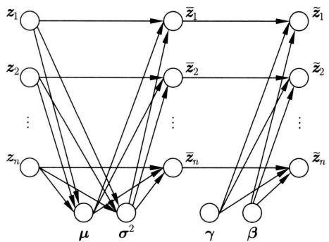  
图25.25 批量归一化：训练网络结构

训练时，对神经网络每一层的净输入进行归一化，使净输入的均值是0、方差是1。这样可以提高下一层的学习收敛速度。

当 $\gamma \approx \sigma$ 且 $\beta \approx \mu$ 时，有

$$
\tilde {z} _ {j} \approx z _ {j}, \quad j = 1, 2, \dots , n
$$

归一化加仿射变换接近恒等变换。批量归一化方法保证这种“不做变换”情况也被包括在内。而具体进行怎样的变换通过数据决定。事实上，归一化后的净输入在原点附近时，S型函数的输出也在原点附近，模型的表示能力降低，从学习的角度看未必最优，需要基于数据进行选择。

另外，每一层的输入到净输入的仿射变换实际根据 $z = W^{\mathrm{T}}\cdot x$ 进行，省去偏置 $\pmb{b}$ ，因为参数 $\beta$ 能起到相应的作用。

预测时，通常将一个测试样本输入推理网络。首先对样本在每一层的净输入进行归一化，得到向量：

$$
\bar {z} _ {j} = \frac {\mathbf {z} _ {j} - E _ {b} (\boldsymbol {\mu})}{\sqrt {E _ {b} \left(\boldsymbol {\sigma} ^ {2}\right) + \epsilon}}, \quad j = 1, 2, \dots , n \tag {25.63}
$$

这里 $E_{b}(\mu)$ 和 $E_{b}(\sigma^{2})$ 分别是所有批量的均值和方差的平均。然后再进行仿射变换，得到向量：

$$
\tilde {z} _ {j} = \gamma \odot \bar {z} _ {i} + \beta , \quad j = 1, 2, \dots , n \tag {25.64}
$$

这里 $\gamma$ 和 $\beta$ 是训练过程中得到的参数向量。图25.26显示批量归一化推理网络一层的结构，每一层（除输出层外）都有同样的结构。

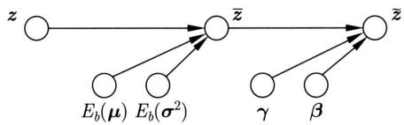  
图25.26 批量归一化：推理网络结构

算法25.4是批量归一化的算法。首先根据以上批量归一化方法构建训练神经网络，然后使用随机梯度下降法训练神经网络，最后输出推理神经网络对测试样本的预测值。

# 算法25.4（批量归一化）

输入：神经网络结构 $f(\pmb {x};\pmb {\theta})$ ，训练集，测试样本。

输出：对测试样本的预测值。

超参数：批量容量的大小 $n$ 。

1

初始化参数 $\pmb{\theta},\pmb{\phi}$ ，其中 $\phi = \{\gamma^{(t)},\beta^{(t)}\}_{t = 1}^{s - 1}$

For each (批量 $b$ ) {

$$
\text {F o r} t = 1, 2, \dots , s - 1 \left\{\right.
$$

针对批量 $b$ 计算第 $t$ 层净输入的均值 $\pmb{\mu}^{(t)}$ 和方差 $\sigma^{2(t)}$

进行第 $t$ 层的批量归一化，得到批量净输入

$z_{j}^{(t)}\rightarrow \bar{z}_{j}^{(t)}\rightarrow \tilde{z}_{j}^{(t)},\quad j = 1,2,\dots ,n$ }

构建训练神经网络 $f_{\mathrm{Tr}}(\pmb {x};\pmb {\theta},\phi)$

使用随机梯度下降法训练 $f_{\mathrm{Tr}}(\pmb{x}; \pmb{\theta}, \phi)$ , 估计所有参数 $\pmb{\theta}, \pmb{\phi}$

$$
\text {F o r} t = 1, 2, \dots , s - 1 \left\{\right.
$$

针对所有批量计算第 $t$ 层净输入的期待的均值 $E_{b}(\pmb{\mu}^{(t)})$ 和方差 $E_{b}(\sigma^{2(t)})$

针对测试样本，进行第 $t$ 层的批量归一化，得到净输入

$$
z _ {j} ^ {(t)} \to \bar {z} _ {j} ^ {(t)} \to \tilde {z} _ {j} ^ {(t)}, \quad j = 1, 2, \dots , n
$$

构建推理神经网络 $f_{\mathrm{Inf}}(\pmb {x};\pmb {\theta},\pmb {\phi})$

输出 $f_{\mathrm{Inf}}(\pmb {x};\pmb {\theta},\pmb {\phi})$ 对测试样本的预测值

}

# 3. 层归一化

层归一化（layer normalization）是另一种防止内部协变量偏移的方法[4]。其基本想法与批量归一化相同，但是是在每一层的神经元上进行归一化，而不是在每一个批量的样本上进行归一化。优点是实现简单，也没有批量大小的超参数需要调节。

层归一化在每一层的神经元的净输入上进行。假设当前层的神经元的净输入是 $z = (z_{1}, z_{2}, \dots, z_{m})^{\mathrm{T}}$ ，其中 $z_{j}$ 是第 $j$ 个神经元的净输入， $m$ 是神经元个数。训练和预测时，首先

计算这一层的神经元的净输入的均值与方差（无偏估计）。

$$
\mu = \frac {1}{m} \sum_ {j = 1} ^ {m} z _ {j} \tag {25.65}
$$

$$
\sigma^ {2} = \frac {1}{m - 1} \sum_ {j = 1} ^ {m} \left(z _ {j} - \mu\right) ^ {2} \tag {25.66}
$$

然后对每一个神经元的净输入进行归一化，得到数值：

$$
\bar {z} _ {j} = \frac {z _ {j} - \mu}{\sqrt {\sigma^ {2} + \epsilon}}, \quad j = 1, 2, \dots , m \tag {25.67}
$$

其中， $\epsilon$ 是一个很小的正数。之后再进行仿射变换，得到数值：

$$
\tilde {z} _ {j} = \gamma \cdot \bar {z} _ {j} + \beta , \quad j = 1, 2, \dots , m \tag {25.68}
$$

其中， $\gamma$ 和 $\beta$ 是参数。最后将归一化加仿射变换的结果作为这一层神经元的实际净输入。在每一层都做同样的处理。神经网络的每一层有两个参数 $\gamma$ 和 $\beta$ 。图25.27显示层归一化的网络结构。

  
图25.27 层归一化的网络结构

# 25.3 前馈神经网络学习的正则化

正则化（regularization）的目的是提高学习的泛化能力，即不仅使训练误差而且使测试误差达到最小。本节概述深度学习，特别是前馈神经网络学习中的正则化方法，具体介绍常用的早停法和暂退法。

# 25.3.1 深度学习中的正则化

深度学习的正则化有L1正则化、L2正则化或称权重衰减(weight decay)、早停法(early stopping)、暂退法（dropout）等方法。前三种方法是机器学习通用的方法，最后一种方法是深度学习特有的方法。另外，深度学习中不做显式的正则化常常也能达到泛化的效果。具体哪种方法更有效需要在实际的问题和数据上验证。

现实中发现，深度学习中常常不做正则化也不产生过拟合。往往是在大规模训练数据、过度参数化（over-parameterized）神经网络及随机梯度下降训练的情况下发生的，也就是说这种组合能产生泛化能力，这里过度参数化是指神经网络的参数量级大于等于训练数据量级的情况。机器学习理论尚不能很好地分析这种现象，是当前热门的研究课题。普遍的解释是随机梯度下降起到隐式正则化的作用，能保证学到的模型不产生过拟合。

# 25.3.2 早停法

早停法（early stopping）在学习中使用验证集进行评估，判断训练的终止点，进行模型选择，是隐式的正则化方法。

早停法将数据分为训练集、验证集、测试集（比如以 $1 / 2$ ， $1 / 4$ ， $1 / 4$ 的比例）。学习中，持续训练模型，得到训练误差（训练集上的损失），同时用验证集评估，得到验证误差（验证集上的损失）。图25.28示意训练过程。横轴表示训练步数，纵轴表示误差。通常训练误差不断减小，逐渐趋近于0，而验证误差在某个点达到最小，之后逐渐增加。

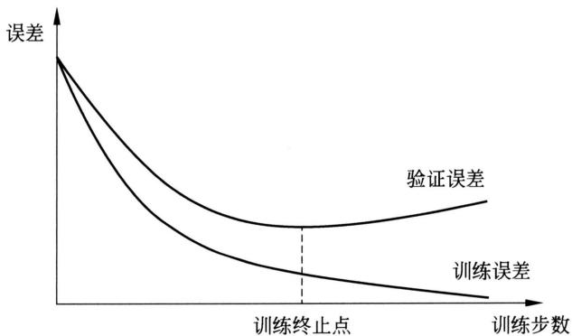  
图25.28 训练过程与早停法

如果选择训练误差很小而验证误差已经增大的点的模型，很有可能这个模型的测试误差不是最小的，即产生过拟合。早停法选择验证误差最小的点为训练终止点，将这时的模型作为最终模型输出。有很大概率这个模型也是测试误差最小的模型，即泛化最好的模型，因为用验证集代替测试集进行了模型评估。因为没有等到训练误差降到很小，甚至接近于0时结束训练，所以训练是早停的。早停法的优点是简单有效，缺点是需要将一部分标注数据用于训练评估而不是训练本身。算法25.5给出早停法的具体算法，其中 $l_{\mathrm{dev}}(\cdot)$ 表示在验证集上的损失，即验证误差。

# 算法25.5（早停法）

输入：神经网络结构 $f(\pmb {x};\pmb {\theta})$ ，训练集，验证集。

输出：学习得到的神经网络参数向量 $\hat{\theta}$ 。

参数：评估间隔步数 $m$ ，持续评估上限 $n$ 。

{

$$
i = 0
$$

$$
\begin{array}{l} j = 0 \\ l _ {\min } = \infty \\ \end{array}
$$

while $(j < n)$

用训练集连续训练模型 $m$ 步，得到参数向量 $\theta_{i}$

$$
i \leftarrow i + m
$$

用验证集评估模型的损失

$$
l = l _ {\mathrm {d e v}} (\boldsymbol {\theta} _ {i})
$$

if $(l < l_{\min})$ {

$$
l _ {\min } \leftarrow l
$$

$$
\boldsymbol {\theta} _ {\min } \leftarrow \boldsymbol {\theta} _ {i}
$$

$$
j = 0
$$

} else }

$$
j \leftarrow j + 1
$$

$$
\hat {\boldsymbol {\theta}} = \boldsymbol {\theta} _ {\min }
$$

返回参数向量 $\hat{\theta}$

}

# 25.3.3 暂退法

暂退法（dropout）在训练过程中的每一步随机选取一些神经元，让它们不参与（退出）训练，学习结束后，对权重进行调整，然后将整体网络用于预测。暂退法是经验性的方法，在现实中很有效，但目前还没有严格的理论证明。可以认为暂退法是应用于深度学习的一种Bagging方法[5]。

前馈神经网络训练时，设输入层和隐层的每一层（不包括输出层）都有一个保留概率 $p$ （各层的概率不一定相同），每层的神经元以概率 $p$ 保留，以概率 $1 - p$ 退出，保留概率为1时不退出。通常输入层的保留概率设为0.8，隐层的保留概率为0.5。在训练的每一步，针对每一个样本或每一组样本，在每一层随机判断，选取保留的神经元和退出的神经元。所有保留的神经元构成了一个退化的神经网络，也是整体网络的一个子网络。使用随机梯度下降法更新子网络的权重。图25.29左边显示一个神经网络，右边显示一个随机得到的子神经网络。若每层有 $m$ 个神经元，则每层有 $2^{m}$ 种可能的神经元排列，所以子网络的种类数是指数级的。（也会以小概率得到一些输入输出层不相连的子网络，反向传播算法不适用，对整体学习不产生影响）

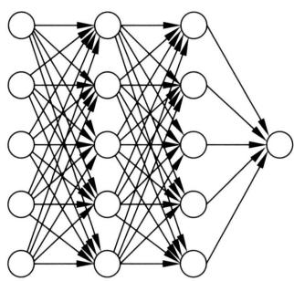

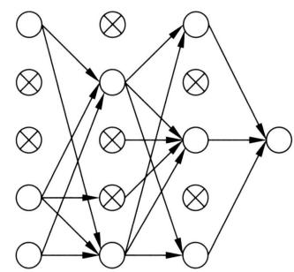  
图25.29 暂退法：整体网络和子网络

假设某一隐层的输出向量是 $\pmb{h}$ ，误差向量是 $\delta$ ，该层神经元保留与退出的结果用随机向量 $\pmb{d}$ 表示，其中 $\pmb{d} \in \{0,1\}^{m}$ 是维度为 $m$ 的 $0 - 1$ 向量，1表示对应的神经元保留，0表示对应的神经元退出。那么，在反向传播算法的每一步，经过保留与退出随机判断后，该层的向量表示变为

$$
\tilde {\boldsymbol {h}} = \boldsymbol {d} \odot \boldsymbol {h} \tag {25.69}
$$

$$
\tilde {\boldsymbol {\delta}} = \boldsymbol {d} \odot \boldsymbol {\delta} \tag {25.70}
$$

这里 $\odot$ 表示逐元素积, 使用 $\tilde{h}$ 进行正向传播和使用 $\tilde{\delta}$ 进行反向传播。注意暂退法中每一步的 $d$ 是随机决定的, 各步之间并不相同。对输入层的处理方法也一样, 细节省略。

预测时，对隐层的输出向量进行调整：

$$
\tilde {\boldsymbol {h}} = \boldsymbol {p} \cdot \boldsymbol {h} \tag {25.71}
$$

其中， $p$ 是这层的保留概率。等价地，可以认为对隐层的神经元输出的权重进行调整，每一个输出权重 $w$ 乘以保留概率 $p$ 作为最终的权重，如图25.30所示。其直观解释是学习中神经元以概率 $p$ 参与训练，所以最终使用权重的期待值 $p \cdot w$ 作为真实值。神经元的偏置保持不变。

  
图25.30 暂退法：权重的调整

为了方便暂退法的实现，常常采用以下等价的逆暂退法（inverted dropout）。训练时，将隐层的输出变量放大 $\frac{1}{p}$ 倍：

$$
\tilde {\boldsymbol {h}} = \frac {1}{p} \cdot \boldsymbol {d} \odot \boldsymbol {h} \tag {25.72}
$$

预测时，隐层的输出权重保持不变。

可以证明在特殊情况下暂退法是一种Bagging方法。假设有一个二层的多类分类网络，对其进行基于暂退法的学习。输入层由多个变量组成，保留概率是1；输出层由一个神经元组

成，激活函数是软最大化函数；隐层的输出向量是 $\pmb{h}$ ，保留概率是0.5，暂退法得到的一个随机向量是 $\pmb{d} \in \{0,1\}^{m}$ 。这时，子网络（输出层）可以写作

$$
\begin{array}{l} P \left(y _ {k} = 1 | \boldsymbol {h}, \boldsymbol {d}\right) = \operatorname {s o f t m a x} \left(\boldsymbol {w} _ {k} ^ {\mathrm {T}} \boldsymbol {d} \odot \boldsymbol {h} + b _ {k}\right) \\ = \frac {\exp \left(\boldsymbol {w} _ {k} ^ {\mathrm {T}} \boldsymbol {d} \odot \boldsymbol {h} + b _ {k}\right)}{\sum_ {k ^ {\prime}} \boldsymbol {w} _ {k ^ {\prime}} ^ {\mathrm {T}} \boldsymbol {d} \odot \boldsymbol {h} + b _ {k ^ {\prime}}} \tag {25.73} \\ \end{array}
$$

隐层共有 $2^{m}$ 个随机向量，对应 $2^{m}$ 个子模型（子网络）。所有子模型的权重和偏置是共有的。现实中暂退法训练的是这其中的部分子模型（因为子模型的个数是指数级的，现实中一般不可能学到所有的子模型）。暂退法最终的（经过权重调整的）模型是

$$
P \left(y _ {k} = 1 | \boldsymbol {h}\right) = \frac {\exp \left(\frac {1}{2} \boldsymbol {w} _ {k} ^ {\mathrm {T}} \boldsymbol {h} + b _ {k}\right)}{\sum_ {k ^ {\prime}} \exp \left(\frac {1}{2} \boldsymbol {w} _ {k ^ {\prime}} ^ {\mathrm {T}} \boldsymbol {h} + b _ {k ^ {\prime}}\right)} \tag {25.74}
$$

式中不包含隐层的随机向量 $\pmb{d}$ 。

考虑集成学习，对暂退法中所有子模型的输出概率取几何平均，作为集成模型的输出概率，得到：

$$
\begin{array}{l} P _ {\text {e n s e m b l e}} \left(y _ {k} = 1 | \boldsymbol {h}\right) = \sqrt [ 2 ^ {m} ]{\prod_ {\boldsymbol {d} \in \{0 , 1 \} ^ {m}} P \left(y | \boldsymbol {h} , \boldsymbol {d}\right)} \\ = \sqrt [ 2 ^ {m} ]{\prod_ {\boldsymbol {d} \in \{0 , 1 \} ^ {m}} \operatorname {s o f t m a x} \left(\boldsymbol {w} _ {k} ^ {\mathrm {T}} \boldsymbol {d} \odot \boldsymbol {h} + b _ {k}\right)} \\ \propto \sqrt [ 2 ^ {m} ]{\prod_ {\boldsymbol {d} \in \{0 , 1 \} ^ {m}} \exp \left(\boldsymbol {w} _ {k} ^ {\mathrm {T}} \boldsymbol {d} \odot \boldsymbol {h} + b _ {k}\right)} \\ = \exp \left[ \frac {1}{2 ^ {m}} \sum_ {\boldsymbol {d} \in \{0, 1 \} ^ {m}} \left(\boldsymbol {w} _ {k} ^ {\mathrm {T}} \boldsymbol {d} \odot \boldsymbol {h} + b _ {k}\right) \right] \\ = \exp \left(\frac {1}{2} \boldsymbol {w} _ {k} ^ {\mathrm {T}} \boldsymbol {h} + b _ {k}\right) \tag {25.75} \\ \end{array}
$$

中间用到的事实是软最大化函数的分母是对所有类别 $y^\prime$ 的归一化项，属于常量。也就是说，在这种情况下集成模型精确等价于暂退法模型。

暂退法在以下几点对一般的Bagging方法进行了改动，以提高神经网络的算法学习和预测的效率。不显式地定义和使用子模型，所有子模型共享整体网络的参数。学习时，每一步将一个随机样本或一组随机样本用于一个子模型的训练。预测时，使用参数调整后的整体网络近似实现子模型的集成（计算子模型预测概率的几何平均）。原理上，可以让子模型拥有不同的参数，或者对子模型进行抽样，然后集成，这些都会降低学习和预测的效率。

# 本章概要

1. 神经元是神经网络的基本元素，本质是一种非线性函数。神经元函数的基本形式是

$$
y = a \left(\sum_ {i = 1} ^ {n} w _ {i} x _ {i} + b\right)
$$

其中， $x_{1}, x_{2}, \dots, x_{n}$ 是输入， $y$ 是输出， $z = \sum_{i=1}^{n} w_{i} x_{i} + b$ 是净输入， $w_{1}, w_{2}, \dots, w_{n}$ 是权重， $b$ 是偏置。 $a(\cdot)$ 是激活函数，也可以写成

$$
y = a \left(\boldsymbol {w} ^ {\mathrm {T}} \boldsymbol {x} + b\right)
$$

2. 前馈神经网络由多层神经元组成，层间的神经元相互连接，层内的神经元不相连。其信息处理机制是前一层神经元通过连接向后一层神经元传递信号。整个神经网络是对多个输入信号（实数向量）进行多次非线性转换产生多个输出信号（实数向量）的复合函数。前馈神经网络的矩阵表示如下：

$$
\boldsymbol {h} ^ {(1)} = a \left(\boldsymbol {W} ^ {(1) ^ {\mathrm {T}}} \boldsymbol {x} + \boldsymbol {b} ^ {(1)}\right)
$$

$$
\boldsymbol {h} ^ {(2)} = a \left(\boldsymbol {W} ^ {(2) ^ {\mathrm {T}}} \boldsymbol {h} ^ {(1)} + \boldsymbol {b} ^ {(2)}\right)
$$

中

$$
\boldsymbol {h} ^ {(s - 1)} = a \left(\boldsymbol {W} ^ {(s - 1) ^ {\mathrm {T}}} \boldsymbol {h} ^ {(s - 2)} + \boldsymbol {b} ^ {(s - 1)}\right)
$$

$$
\boldsymbol {y} = g \left(\boldsymbol {W} ^ {(s) ^ {\mathrm {T}}} \boldsymbol {h} ^ {(s - 1)} + \boldsymbol {b} ^ {(s)}\right)
$$

前馈神经网络拥有很强的表示能力，可以进行复杂的信息处理。

3. 激活函数有多种形式。隐层的激活函数主要有S型函数：

$$
a (z) = \frac {1}{1 + \mathrm {e} ^ {- z}}
$$

双曲正切函数：

$$
a (z) = \frac {\mathrm {e} ^ {z} - \mathrm {e} ^ {- z}}{\mathrm {e} ^ {z} + \mathrm {e} ^ {- z}}
$$

整流线性函数：

$$
a (z) = \max  (0, z)
$$

输出层的激活函数主要有恒等函数：

$$
g (z) = z
$$

软最大化函数：

$$
g \left(z _ {k}\right) = \frac {\mathrm {e} ^ {z _ {k}}}{\sum_ {i = 1} ^ {l} \mathrm {e} ^ {z _ {i}}}, \quad k = 1, 2, \dots , l
$$

4. 前馈神经网络可以用于不同任务。用于回归时，神经网络表示为 $y = f(\pmb{x})$ 。用于二类分类时，神经网络表示为 $P(y = 1|\pmb{x}) = f(\pmb{x})$ 。用于多类分类时，神经网络表示为 $[P(y_k = 1|\pmb{x})] = f(\pmb{x})$ ，其中 $y_k \in \{0,1\}$ ， $\sum_{k=1}^{l} y_k = 1$ ， $k = 1,2,\dots,l$ 。

5. 通用近似定理指出，对任意连续函数 $h: [0,1]^m \to \mathcal{R}$ 和任意 $\varepsilon > 0$ ，存在一个二层神经网络 $f(\pmb{x}) = \pmb{\alpha}^{\mathrm{T}}\sigma(\pmb{w}^{\mathrm{T}}\pmb{x} + \pmb{b})$ ，使得对于任意 $\pmb{x} \in [0,1]^m$ ，有 $|h(\pmb{x}) - f(\pmb{x})| < \varepsilon$ 成立。通用近似定理从理论的角度阐述了深度神经网络的强大表示能力。

6. 深度神经网络与浅度神经网络可以有同等的表示能力，但深度神经网络比浅度神经网络有更低的样本复杂度。所以，深度神经网络比起浅度神经网络，只需要更少的数据就可以学到。

7. 前馈神经网络学习是监督学习，优化目标函数是

$$
L (\boldsymbol {\theta}) = \frac {1}{N} \sum_ {i = 1} ^ {N} L _ {i} (\boldsymbol {\theta}) = \frac {1}{N} \sum_ {i = 1} ^ {N} L (f (\boldsymbol {x} _ {i}; \boldsymbol {\theta}), y _ {i})
$$

分类时损失函数是交叉熵损失，回归时是平方损失。目标函数的优化都等价于极大似然估计。常用的优化算法是随机梯度下降。对于随机梯度下降，每次按以下公式对一个小批量样本进行参数更新，遍历所有样本组，不断迭代，直到收敛为止。

$$
\boldsymbol {\theta} \leftarrow \boldsymbol {\theta} - \eta \frac {1}{n} \sum_ {j = 1} ^ {n} \frac {\partial L _ {j} (\boldsymbol {\theta})}{\partial \boldsymbol {\theta}}
$$

8. 前馈神经网络学习的具体算法是反向传播算法。只需要依照网络结构进行一次正向传播和一次反向传播，就可以完成梯度下降的一次迭代。主要部分如下。

正向传播，计算各层输出。

第 $t$ 层的输出：

$$
\boldsymbol {z} ^ {(t)} = \boldsymbol {W} ^ {(t)} \boldsymbol {h} ^ {(t - 1)} + \boldsymbol {b} ^ {(t)}
$$

$$
\boldsymbol {h} ^ {(t)} = a (\boldsymbol {z} ^ {(t)})
$$

反向传播，计算各层误差 $\delta^{(s)},\delta^{(s - 1)},\dots ,\delta^{(1)}$

输出层的误差：

$$
\boldsymbol {\delta} ^ {(s)} = \boldsymbol {h} ^ {(s)} - \boldsymbol {y}
$$

第 $t - 1$ 层的误差：

$$
\boldsymbol {\delta} ^ {(t - 1)} = \frac {\partial a}{\partial \boldsymbol {z} ^ {(t - 1)}} \odot \left(\boldsymbol {W} ^ {(t) \mathrm {T}} \cdot \boldsymbol {\delta} ^ {(t)}\right)
$$

计算第 $t$ 层的梯度：

$$
\nabla_ {\boldsymbol {W} ^ {(t)}} L = \boldsymbol {\delta} ^ {(t)} \cdot \boldsymbol {h} ^ {(t - 1) ^ {\mathrm {T}}}
$$

$$
\nabla_ {\boldsymbol {b} ^ {(t)}} L = \boldsymbol {\delta} ^ {(t)}
$$

更新第 $t$ 层的参数：

$$
\begin{array}{l} \boldsymbol {W} ^ {(t)} \leftarrow \boldsymbol {W} ^ {(t)} - \eta \nabla_ {\boldsymbol {W} ^ {(t)}} L \\ \boldsymbol {b} ^ {(t)} \leftarrow \boldsymbol {b} ^ {(t)} - \eta \nabla_ {\boldsymbol {b} ^ {(t)}} L \\ \end{array}
$$

9. 计算图是显示函数计算过程的有向无循环图，其结点表示变量，有向边表示变量之间的函数依存关系。每一个非起点的结点对应一个基本函数。图整体对应的是由基本函数组成的复合函数。计算图上的计算有正向传播和反向传播。可以将神经网络训练和预测分解为计算图上的矩阵或张量数据计算，便于在计算机上实现。

正向传播是从起点的输入开始，顺着有向边，依次对结点的基本函数进行计算，直到得到终点的输出为止的过程。反向传播是从终点的梯度开始，逆着有向边，依次对结点的梯度进行运算，直到得到起点的梯度为止的过程，这里一个结点的梯度是指图整体函数对该结点变量的梯度。

10. 深度神经网络学习是一个复杂的非凸优化问题，会产生一些优化上的困难，包括梯度消失和梯度爆炸、内部协变量偏移。

梯度消失和梯度爆炸的主要原因是在深度神经网络的学习过程中，每一层的梯度主要由矩阵乘积决定。如果连乘得到的矩阵的元素接近0，那么梯度的元素也会接近0（消失）；如果连乘得到的矩阵的元素接近无穷，那么梯度的元素也会接近无穷（爆炸）。梯度消失会导致参数更新停止，梯度爆炸会导致参数溢出，都会使学习无法有效地进行。

内部协变量偏移的现象是指在深度神经网络的学习过程中，对于网络的每一层，如果其输入相对比较固定，就很容易学习到这一层及其后面层的参数，但现实中这一层前面层的参数在学习中会不断改变，导致其输入也不断改变，不利于这一层及其后面层的学习，学习速度会变缓。

批量归一化和层归一化的主要作用是防止内部协变量偏移。批量归一化是指对网络的每一层（除输出层外）的净输入在批量的样本上进行归一化，然后训练网络的方法。层归一化是指对网络的每一层（除输出层外）的净输入在该层的神经元上进行归一化，然后训练网络的方法。

11. 学习的正则化方法包括早停法、暂退法（dropout）等。现实中发现，深度学习中常常不做正则化也不产生过拟合。往往是在大规模训练数据、过度参数化网络及随机梯度下降训练的情况下发生的，也就是说这种组合能产生泛化能力。

对于暂退法，在前馈神经网络训练时，设输入层和隐层的每一层都有一个保留概率 $p$ ，每层的神经元以概率 $p$ 保留，以概率 $1 - p$ 退出。针对每一个样本或每一组样本，在每一层随机判断，选取保留的神经元和退出的神经元；所有保留的神经元构成了一个退化的子网络，使用随机梯度下降法，更新子网络的权重。预测时，对隐层的神经元输出的权重进行调整，每一个输出权重 $w$ 乘以保留概率 $p$ 作为最终的权重。可以证明在特殊情况下暂退法是一种Bagging方法。

# 继续阅读

进一步学习前馈神经网络和相关的深度学习技术可参见文献[6]～文献[10], 学习Python和MXNet上的实现方法可参阅文献[8]和文献[9]。通用近似定理、模型等价性的介绍可参

阅文献 [6] 和文献 [7], 网络深度的讨论可见文献 [11], 暂退法的介绍可见文献 [6] 和文献 [3], 计算图的介绍可参阅文献 [6] 和文献 [8]。通用近似定理的原始论文是文献 [1] 和文献 [2], 批量归一化和层归一化的最初论文是文献 [3] 和文献 [4], 暂退法的论文是文献 [5]。

# 习题

25.1 构造前馈神经网络实现逻辑表达式XNOR，使用S型函数为激活函数。  
25.2 写出多标签分类学习中的损失函数以及损失函数对输出变量的导数。  
25.3 实现前馈神经网络的反向传播算法，使用MNIST数据构建手写数字识别网络。  
25.4 写出S型函数的正向传播和反向传播的计算图。  
25.5 图 25.31 是 3 类分类的正向传播计算图，试写出它的反向传播计算图。这里使用软最大化函数和交叉熵损失。

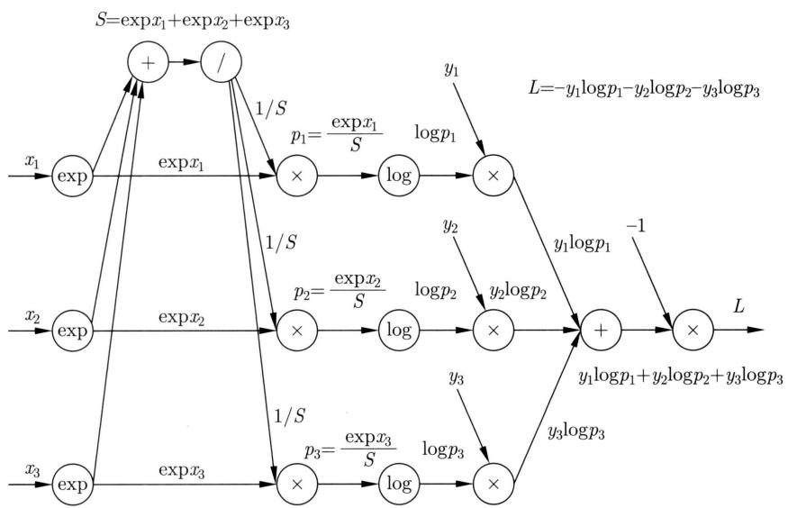  
图25.31

25.6 写出批量归一化的反向传播算法。  
25.7 验证逆暂退法和暂退法的等价性。

# 参考文献

[1] CYBENKO G. Approximation by superpositions of a sigmoidal function[J]. Mathematics of Control, Signals and Systems, 1989, 2: 303-314.   
[2] HORNIK K, STINCHCOMBE M, WHITE H. Multilayer feedforward networks are universal approximators[J]. Neural Networks, 1989, 2(5): 359-366.   
[3] IOFFE S, SZEGEDY C. Batch normalization: accelerating deep network training by reducing internal covariate shift[C]//International Conference on Machine Learning. 2015: 448-456.

[4] BA J L, KIROS J R, HINTON G E. Layer normalization[Z/OL]. arXiv preprint arXiv: 1607.06450, 2016.   
[5] SRIVASTAVA N, HINTON G, KRIZHEVSKY A, et al. Dropout: asimple way to prevent neural networks from overfitting[J]. The Journal of Machine Learning Research, 2014, 15(1): 1929-1958.   
[6] GOODFELLOW I, BENGIO Y, COURVILLE A. Deep learning[M]. MIT Press, 2016.   
[7] BISHOP C. Pattern recognition and machine learning[M]. Springer, 2006.   
[8] 斋藤康毅. 深度学习入门：基于Python的理论与实现[M]. 陆宇杰，译. 北京：人民邮电出版社，2018.  
[9] 阿斯顿·张，李沐，扎卡里·C.立顿，等. 动手学深度学习 [M]. 北京：人民邮电出版社，2019.  
[10] 邱锡鹏. 神经网络与深度学习 [M]. 北京：机械工业出版社，2020.  
[11] BENGIO Y. Learning deep architectures for AI[M]. Now Publisher, 2002.

# 第26章 卷积神经网络

卷积神经网络（convolutional neural network, CNN）是对图片数据（更一般地二维序列数据）和语言数据（更一般地一维序列数据）进行预测的神经网络。卷积神经网络具有层次化网络结构，可以看作一种特殊的前馈神经网络，前一层的输出是后一层的输入；前面几层每一层进行卷积（convolution）运算或汇聚（pooling）运算，卷积实现的是特征检测，汇聚实现的是特征选择；最后几层是全连接的前馈神经网络，进行分类或回归预测。卷积神经网络是从生物视觉系统得到启发而发明的深度学习模型。

卷积神经网络的应用领域包括计算机视觉、自然语言处理、语音处理，在计算机视觉中用于图片分类、图片分割等任务，是该领域的重要工具。福岛（Fukushima）于1980年提出了Neocognitron模型；LeCun于1989年在其基础上提出了基本的卷积神经网络，实现了反向传播学习算法；2012年，Krizhevsky等开发了被称为AlexNet的卷积神经网络，在ImageNet比赛中取得优异成绩，展示了深度学习的威力；2016年，何恺明等提出了残差网络ResNet，是计算机视觉中被广泛使用的卷积神经网络。

本章26.1节讲述卷积神经网络的模型；26.2节叙述卷积神经网络的算法；26.3节介绍卷积神经网络在图片分类中的应用，讲解AlexNet和ResNet。

# 26.1 卷积神经网络的模型

本节讲述卷积神经网络的模型，首先给出卷积和汇聚的定义，然后介绍卷积神经网络的架构和性质。

# 26.1.1 背景

考虑图片数据的预测问题，比如图片分类。假设是灰度图片，可以用实数矩阵表示，矩阵的一个元素对应图片的一个像素，代表像素的灰度（颜色的深度）。

一个朴素的方法是用前馈神经网络完成这个任务。将图片的矩阵数据展开成一个很长的向量作为输入，学习前馈神经网络，对图片数据进行分类预测。这个方法至少存在两个问题。一个是参数量问题。输入向量的维度很高，层与层之间的神经元是全连接，整个网络的参数量很大，很难很好地学习到模型。另一个是局部特征的表示和学习问题。图片数据通常在不同位置上有相似的局部特征，而前馈神经网络对不同位置的局部特征是分开表示和学习的，产生冗余，会降低表示和学习的效率。

卷积神经网络从生物视觉系统得到启发，在前馈神经网络中导入卷积运算解决以上问题。在生物视觉系统中，每一个神经元所感应的特征的种类是固定的，只被特定的特征激活，比如垂直的或水平的线段。而且，神经元对所感应的特征的位置变化不敏感。再次，每一个神经元所感应的视觉输入的区域是有限的，称为神经元的感受野（receptive field）。神经元呈子层子化结构，前端神经元影响后端神经元，前端神经元的感受野窄，后端神经元的感受野宽。卷积神经网络中的卷积本质是数学函数，但也具有生物视觉神经元的特性。下面先给出卷积神经网络的定义，然后再讨论其性质。

# 26.1.2 卷积

# 1. 数学卷积

在数学中，卷积（convolution）是定义在两个函数上的运算，表示其中的一个函数对另一个函数的形状调整。这里考虑一维卷积。设 $f$ 和 $g$ 是两个可积的实值函数，则积分

$$
\int_ {- \infty} ^ {+ \infty} f (\tau) g (t - \tau) \mathrm {d} \tau
$$

定义了一个新的函数 $h(t)$ ，称为 $f$ 和 $g$ 的卷积，记作

$$
h (t) = (f * g) (t) = \int_ {- \infty} ^ {+ \infty} f (\tau) g (t - \tau) \mathrm {d} \tau \tag {26.1}
$$

其中，符号 $\textcircled{*}$ 表示卷积运算。

根据定义可知，卷积满足交换律 $(f\circ g)(t) = (g\circ f)(t)$ ，因为

$$
(f \circledast g) (t) = \int_ {- \infty} ^ {+ \infty} f (t - \tau) g (\tau) \mathrm {d} \tau \tag {26.2}
$$

例26.1 以下是数学卷积的例子

$$
y (t) = (x * w) (t) = \int_ {- \infty} ^ {+ \infty} x (\tau) w (t - \tau) d \tau
$$

其中， $x(\tau)$ 是任意给定函数， $w(t)$ 是高斯核函数。

$$
w (t) = \frac {1}{\sqrt {2 \pi} \sigma} \exp \left(- \frac {t ^ {2}}{2 \sigma^ {2}}\right)
$$

卷积表示用高斯核函数 $w(t)$ 对给定函数 $x(\tau)$ 进行平滑得到的结果（见图26.1）。

数学卷积也可以自然地扩展到二维和离散的情况。具体例子参见习题。

# 2. 深度学习卷积

深度学习中的卷积与数学卷积并不相同，实际是数学中的互相关（cross correlation）。数学中，两个可积的实值函数 $f$ 和 $g$ 的互相关是指以下运算

$$
(f * g) (t) = \int_ {- \infty} ^ {+ \infty} f (\tau) g (t + \tau) d \tau \tag {26.3}
$$

  
图26.1 数学卷积例

式中记号 * 表示互相关。互相关不满足交换律 $(f*g)(t) \neq (g*f)(t)$ 。可以将以上互相关自然地扩展到二维和离散的情况。本书称互相关为“深度学习卷积”或“卷积”。

比较定义式 (26.1) 和式 (26.3) 可知数学卷积和深度学习卷积并不等价。深度学习采用互相关作为“卷积”，主要是为了处理方便。如果数学卷积和深度学习卷积的核矩阵都是从数据中学到，那么效果是一样的。

# 3. 二维卷积

卷积神经网络中最基本的是二维卷积。

定义26.1（二维卷积）给定一个 $I \times J$ 输入矩阵 $\mathbf{X} = [x_{ij}]_{I \times J}$ ，一个 $M \times N$ 核矩阵 $\mathbf{W} = [w_{mn}]_{M \times N}$ ，满足 $M \ll I, N \ll J$ 。让核矩阵在输入矩阵上从左到右再从上到下按顺序滑动，在滑动的每一个位置，核矩阵与输入矩阵的一个子矩阵重叠。求核矩阵与每一个子矩阵的内积，产生一个 $K \times L$ 输出矩阵 $\mathbf{Y} = [y_{kl}]_{K \times L}$ ，称此运算为卷积（convolution）或二维卷积。写作

$$
\boldsymbol {Y} = \boldsymbol {W} * \boldsymbol {X} \tag {26.4}
$$

其中， $\pmb {Y} = [y_{kl}]_{K\times L}$

$$
y _ {k l} = \sum_ {m = 1} ^ {M} \sum_ {n = 1} ^ {N} w _ {m, n} x _ {k + m - 1, l + n - 1} \tag {26.5}
$$

其中， $k = 1,2,\dots ,K,l = 1,2,\dots ,L,K = I - M + 1,L = J - N + 1.$

以上是基本卷积的定义，还有多种扩展。注意这里卷积符号是 $*, X$ 和 $W$ 的顺序是有意义的，卷积核矩阵放在前面。卷积核又被称为滤波器（filter）。

例26.2 给定输入矩阵 $X$ 和核矩阵 $W$

$$
\boldsymbol {X} = \left[ \begin{array}{c c c c} 3 & 2 & 0 & 1 \\ 0 & 2 & 1 & 2 \\ 2 & 0 & 0 & 3 \\ 2 & 3 & 1 & 2 \end{array} \right], \quad \boldsymbol {W} = \left[ \begin{array}{c c c} 2 & 1 & 2 \\ 0 & 0 & 3 \\ 0 & 0 & 2 \end{array} \right]
$$

求卷积 $\mathbf{Y} = \mathbf{W}*\mathbf{X}$

解 $\pmb{W}$ 作用在 $\pmb{X}$ 上，并不超出 $\pmb{X}$ 的范围。按照式(26.5)，计算

$$
y _ {1 1} = \sum_ {m = 1} ^ {3} \sum_ {n = 1} ^ {3} w _ {m n} x _ {m n} = 1 1
$$

$$
y _ {1 2} = \sum_ {m = 1} ^ {3} \sum_ {n = 1} ^ {3} w _ {m n} x _ {m, n + 1} = 1 8
$$

同样可计算 $y_{21}, y_{22}$ ，得到输出矩阵 $\mathbf{Y}$ ：

$$
\mathbf {Y} = \left[ \begin{array}{l l l} 2 & 1 & 2 \\ 0 & 0 & 3 \\ 0 & 0 & 2 \end{array} \right] * \left[ \begin{array}{l l l l} 3 & 2 & 0 & 1 \\ 0 & 2 & 1 & 2 \\ 2 & 0 & 0 & 3 \\ 2 & 3 & 1 & 2 \end{array} \right] = \left[ \begin{array}{l l} 1 1 & 1 8 \\ 6 & 2 2 \end{array} \right]
$$

输入矩阵是 $4 \times 4$ 矩阵，核矩阵是 $3 \times 3$ 矩阵，输出矩阵是 $2 \times 2$ 矩阵。图26.2显示这个卷积计算的过程。

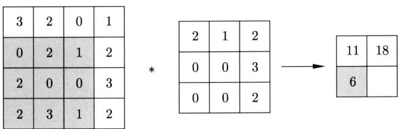

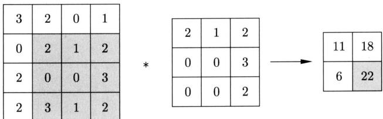  
图26.2 卷积计算例

# 4. 填充和步幅

卷积运算的扩展可以通过增加填充和步幅实现。在输入矩阵的周边添加元素为0的行和列，使卷积核能更充分地作用于输入矩阵边缘的元素，这样的处理称为填充(padding)或零填充(zero padding)。下面是含有填充的卷积运算的例子。

例26.3 对例26.2的输入矩阵进行填充，得到矩阵

$$
\tilde {\boldsymbol {X}} = \left[ \begin{array}{c c c c c c} 0 & 0 & 0 & 0 & 0 & 0 \\ 0 & 3 & 2 & 0 & 1 & 0 \\ 0 & 0 & 2 & 1 & 2 & 0 \\ 0 & 2 & 0 & 0 & 3 & 0 \\ 0 & 2 & 3 & 1 & 2 & 0 \\ 0 & 0 & 0 & 0 & 0 & 0 \end{array} \right]
$$

核矩阵 $\pmb{W}$ 不变，求卷积 $\mathbf{Y} = \mathbf{W}*\tilde{\mathbf{X}}$ 。

解 $\pmb{W}$ 作用在0填充后的 $\pmb{X}$ 上。按照式(26.5)可以计算卷积，得到输出矩阵 $\mathbf{Y}$

$$
\mathbf {Y} = \left[ \begin{array}{l l l} 2 & 1 & 2 \\ 0 & 0 & 3 \\ 0 & 0 & 2 \end{array} \right] * \left[ \begin{array}{l l l l l l} 0 & 0 & 0 & 0 & 0 & 0 \\ 0 & 3 & 2 & 0 & 1 & 0 \\ 0 & 0 & 2 & 1 & 2 & 0 \\ 0 & 2 & 0 & 0 & 3 & 0 \\ 0 & 2 & 3 & 1 & 2 & 0 \\ 0 & 0 & 0 & 0 & 0 & 0 \end{array} \right] = \left[ \begin{array}{l l l l} 1 0 & 2 & 7 & 0 \\ 1 3 & 1 1 & 1 8 & 1 \\ 1 0 & 6 & 2 2 & 4 \\ 1 1 & 7 & 1 2 & 3 \end{array} \right]
$$

输入矩阵通过填充由 $4 \times 4$ 变为 $6 \times 6$ 的矩阵，核矩阵是 $3 \times 3$ 矩阵，输出矩阵是 $4 \times 4$ 矩阵。图26.3显示这个卷积计算的一步。

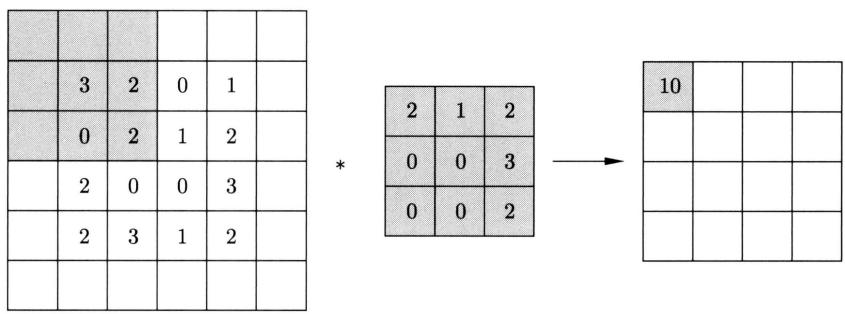  
图26.3 包含填充的卷积计算例

在卷积运算中，卷积核每次向右或向下移动的列数或行数称为步幅(stride)。以上的卷积运算例中步幅均为1。下面是步幅为2的卷积计算的例子。

例26.4 给定输入矩阵 $X$ 和核矩阵 $W$

$$
\boldsymbol {X} = \left[ \begin{array}{l l l l l l l} 3 & 2 & 0 & 1 & 0 & 2 & 1 \\ 0 & 2 & 1 & 2 & 1 & 2 & 1 \\ 2 & 0 & 0 & 3 & 0 & 0 & 2 \\ 2 & 3 & 1 & 0 & 1 & 1 & 3 \\ 2 & 2 & 1 & 1 & 0 & 3 & 1 \\ 1 & 1 & 0 & 0 & 1 & 2 & 2 \\ 2 & 1 & 0 & 3 & 2 & 1 & 1 \end{array} \right], \quad \boldsymbol {W} = \left[ \begin{array}{l l l} 2 & 1 & 2 \\ 0 & 0 & 3 \\ 0 & 0 & 2 \end{array} \right]
$$

设卷积步幅为2，求卷积 $\mathbf{Y} = \mathbf{W}*\mathbf{X}$

解 $W$ 作用在 $\mathbf{X}$ 上，每次计算向右或向下移动两列或两行。按照式(26.5)可以计算卷积，得到输出矩阵 $\mathbf{Y}$ ：

$$
\mathbf {Y} = \left[ \begin{array}{l l l} 2 & 1 & 2 \\ 0 & 0 & 3 \\ 0 & 0 & 2 \end{array} \right] * \left[ \begin{array}{r r r r r r r} 3 & 2 & 0 & 1 & 0 & 2 & 1 \\ 0 & 2 & 1 & 2 & 1 & 2 & 1 \\ 2 & 0 & 0 & 3 & 0 & 0 & 2 \\ 2 & 3 & 1 & 0 & 1 & 1 & 3 \\ 2 & 2 & 1 & 1 & 0 & 3 & 1 \\ 1 & 1 & 0 & 0 & 1 & 2 & 2 \\ 2 & 1 & 0 & 3 & 2 & 1 & 1 \end{array} \right] = \left[ \begin{array}{l l l} 1 1 & 4 & 1 1 \\ 9 & 6 & 1 5 \\ 8 & 1 0 & 1 3 \end{array} \right]
$$

输入矩阵是 $7 \times 7$ 矩阵，核矩阵是 $3 \times 3$ 矩阵，输出矩阵是 $3 \times 3$ 矩阵。图26.4显示这个卷积计算的两步。

卷积运算依赖于卷积核的大小、填充的大小、步幅。这些是卷积运算的超参数。假设输入矩阵的大小是 $I \times J$ ，卷积核的大小是 $M \times N$ ，两个方向填充的大小是 $P$ 和 $Q$ ，步幅的大小是 $S$ ，则卷积的输出矩阵的大小 $I \times J$ 满足

$$
K \times L = \left\lfloor \frac {I + 2 P - M}{S} + 1 \right\rfloor \times \left\lfloor \frac {J + 2 Q - N}{S} + 1 \right\rfloor \tag {26.6}
$$

这里 $\lfloor a\rfloor$ 表示不超过 $a$ 的最大整数。填充 $P$ 和 $Q$ 的最大值分别是 $M - 1$ 和 $N - 1$ ，这时的填充称为全填充（full padding）。

在图像处理中，卷积实现的是特征检测。最基本的情况是二维卷积，卷积的输入矩阵表示灰度图片，矩阵的一个元素对应图片的一个像素，代表像素的灰度。卷积的核矩阵表示特征，比如物体的边缘，矩阵的一个元素代表特征在一个像素点上的灰度（权重），一个卷积核表示一个特征。卷积运算将卷积核在图片上进行滑动，在图片的每一个位置对一个特定的特征进行检测，输出一个检测值，参见图26.2～图26.4。当在某个位置的图片的特征和卷积核的特征一致时，检测值最大，这是因为卷积进行的是矩阵内积计算。注意在卷积神经网络中卷积核的权重是通过学习获得的，也就是说学习得到的是特征检测的能力。

  
图26.4 步幅为2的卷积计算例

卷积的输入和输出称为特征图（feature map）。二维卷积的特征图一般是矩阵（后面叙述特征图是张量的情况）。灰度图片的输入矩阵也可以看作一种特殊的特征图。

例26.5 给定输入矩阵 $X$ 和核矩阵 $W$

$$
\boldsymbol {X} = \left[ \begin{array}{l l l l} 0 & 0 & 0 & 0 \\ 0 & 2 & 0 & 0 \\ 0 & 2 & 0 & 0 \\ 0 & 2 & 2 & 2 \end{array} \right], \quad \boldsymbol {W} = \left[ \begin{array}{l l l} 2 & 0 & 0 \\ 2 & 0 & 0 \\ 2 & 2 & 2 \end{array} \right]
$$

求卷积 $\mathbf{Y} = \mathbf{W}*\mathbf{X}$

解 按照卷积公式计算可得：

$$
\mathbf {Y} = \left[ \begin{array}{l l l} 2 & 0 & 0 \\ 2 & 0 & 0 \\ 2 & 2 & 2 \end{array} \right] * \left[ \begin{array}{l l l l} 0 & 0 & 0 & 0 \\ 0 & 2 & 0 & 0 \\ 0 & 2 & 0 & 0 \\ 0 & 2 & 2 & 2 \end{array} \right] = \left[ \begin{array}{l l} 4 & 8 \\ 8 & 2 0 \end{array} \right]
$$

图26.5显示卷积进行特征检测的情况。输入矩阵 $X$ 表示一个 $4\times 4$ 图片，取值为0或2，图片中有一个L字。核矩阵 $\mathbf{W}$ 表示一个特征，取值也是0或2，也包含一个L字。输出矩阵表示特征检测值，当卷积核滑动到图片中的L字型边时，检测值最大。

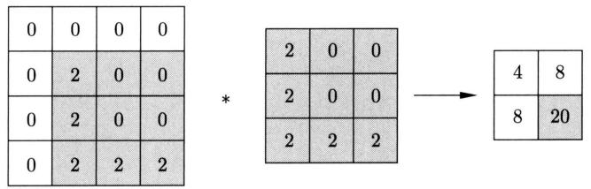  
图26.5 卷积计算例

# 5. 三维卷积

卷积神经网络中常用的是三维卷积。三维卷积的输入和输出一般是由张量（tensor）表示的特征图（注意矩阵表示的特征图可以看作一张特征图，张量表示的特征图可以看作多张特征图，本书都称为特征图）。这样的特征图有高度、宽度、深度。这里，将彩色图片数据也看作一种特殊的特征图。

图像处理常使用彩色图片，由红、绿、蓝三个通道的数据组成。每一个通道的数据由一个矩阵表示，矩阵的每一个元素对应一个像素，代表颜色的深度。三个矩阵排列起来构成一个张量。三维卷积作用于这样的张量数据（特征图）。彩色图片三个通道的矩阵的行数和列数是特征图的高度和宽度，也就是彩色图片看上去的高度和宽度，通道数是特征图的深度（见图26.6左侧）。

  
图26.6 用张量表示的三通道数据和特征图（见文前彩图）

通过卷积或汇聚运算也得到由张量表示的特征图。张量由多个大小相同的矩阵组成。矩阵的行数和列数是特征图的高度和宽度，矩阵的个数是特征图的深度（见图26.6右侧）。三维卷积作用于这样的特征图。一个三维卷积的输出是一个矩阵。多个三维卷积的输出矩阵排列起来得到一个张量特征图。

下面，以彩色图片数据为例介绍三维卷积的计算方法。输入是三通道数据，用张量表示 $\pmb {X} = (X_{\mathrm{R}},X_{\mathrm{G}},X_{\mathrm{B}})$ 。其中 $X_{\mathrm{R}}$ ， $X_{\mathrm{G}}$ ， $X_{\mathrm{B}}$ 是三个通道的数据，各自用矩阵表示。卷积核也用

张量表示 $\mathbf{W} = (\mathbf{W}_{\mathrm{R}},\mathbf{W}_{\mathrm{G}},\mathbf{W}_{\mathrm{B}})$ ，其中 $\mathbf{W}_{\mathrm{R}},\mathbf{W}_{\mathrm{G}},\mathbf{W}_{\mathrm{B}}$ 是三个通道的（二维）卷积核，也各自由矩阵表示。那么，三维卷积可以通过以下等价关系计算。

$$
\boldsymbol {Y} = \boldsymbol {X} * \boldsymbol {W} = \boldsymbol {X} _ {\mathrm {R}} * \boldsymbol {W} _ {\mathrm {R}} + \boldsymbol {X} _ {\mathrm {G}} * \boldsymbol {W} _ {\mathrm {G}} + \boldsymbol {X} _ {\mathrm {B}} * \boldsymbol {W} _ {\mathrm {B}} \tag {26.7}
$$

也就是说以上的三维卷积计算首先使用三个不同的二维卷积核对三个通道的输入矩阵分别进行二维卷积计算，然后将得到的三个输出矩阵相加，最终得到一个三维卷积的输出矩阵。注意这时二维卷积核的个数和通道的个数相等。

例26.6 输入张量由三个通道的矩阵组成 $\mathbf{X} = (X_{\mathrm{R}},X_{\mathrm{G}},X_{\mathrm{B}})$

$$
\boldsymbol {X} _ {\mathrm {R}} = \left[ \begin{array}{l l l l} 3 & 2 & 0 & 1 \\ 0 & 2 & 1 & 2 \\ 2 & 0 & 0 & 3 \\ 2 & 3 & 1 & 2 \end{array} \right], \quad \boldsymbol {X} _ {\mathrm {G}} = \left[ \begin{array}{l l l l} 3 & 2 & 0 & 1 \\ 2 & 1 & 0 & 1 \\ 1 & 0 & 2 & 1 \\ 2 & 1 & 0 & 0 \end{array} \right], \quad \boldsymbol {X} _ {\mathrm {B}} = \left[ \begin{array}{l l l l} 4 & 2 & 0 & 1 \\ 0 & 3 & 1 & 0 \\ 3 & 1 & 0 & 2 \\ 2 & 2 & 0 & 1 \end{array} \right]
$$

卷积核张量由三个矩阵组成 $\pmb {W} = (\pmb {W}_R,\pmb {W}_G,\pmb {W}_B)$

$$
\boldsymbol {W} _ {\mathrm {R}} = \left[ \begin{array}{l l l} 2 & 1 & 2 \\ 0 & 0 & 3 \\ 0 & 0 & 2 \end{array} \right], \quad \boldsymbol {W} _ {\mathrm {G}} = \left[ \begin{array}{l l l} 1 & 0 & 1 \\ 0 & 1 & 0 \\ 1 & 0 & 1 \end{array} \right], \quad \boldsymbol {W} _ {\mathrm {B}} = \left[ \begin{array}{l l l} 1 & 0 & - 1 \\ 1 & 0 & - 1 \\ 1 & 0 & - 1 \end{array} \right]
$$

求在其上的三维卷积 $\mathbf{Y}$ 。

解 按照式(26.7)计算，可得输出矩阵 $\mathbf{Y}$

$$
\begin{array}{l} \mathbf {Y} = \left[ \begin{array}{l l l} 2 & 1 & 2 \\ 0 & 0 & 3 \\ 0 & 0 & 2 \end{array} \right] * \left[ \begin{array}{l l l l} 3 & 2 & 0 & 1 \\ 0 & 2 & 1 & 2 \\ 2 & 0 & 0 & 3 \\ 2 & 3 & 1 & 2 \end{array} \right] + \left[ \begin{array}{l l l} 1 & 0 & 1 \\ 0 & 1 & 0 \\ 1 & 0 & 1 \end{array} \right] * \left[ \begin{array}{l l l l} 3 & 2 & 0 & 1 \\ 2 & 1 & 0 & 1 \\ 1 & 0 & 2 & 1 \\ 2 & 1 & 0 & 0 \end{array} \right] + \\ \left[ \begin{array}{c c c} 1 & 0 & - 1 \\ 1 & 0 & - 1 \\ 1 & 0 & - 1 \end{array} \right] * \left[ \begin{array}{c c c c} 4 & 2 & 0 & 1 \\ 0 & 3 & 1 & 0 \\ 3 & 1 & 0 & 2 \\ 2 & 2 & 0 & 1 \end{array} \right] \\ = \left[ \begin{array}{c c} 2 4 & 2 5 \\ 1 4 & 3 0 \end{array} \right] \\ \end{array}
$$

输出矩阵是一个 $2 \times 2$ 矩阵。图26.7示意三维卷积计算的一步。

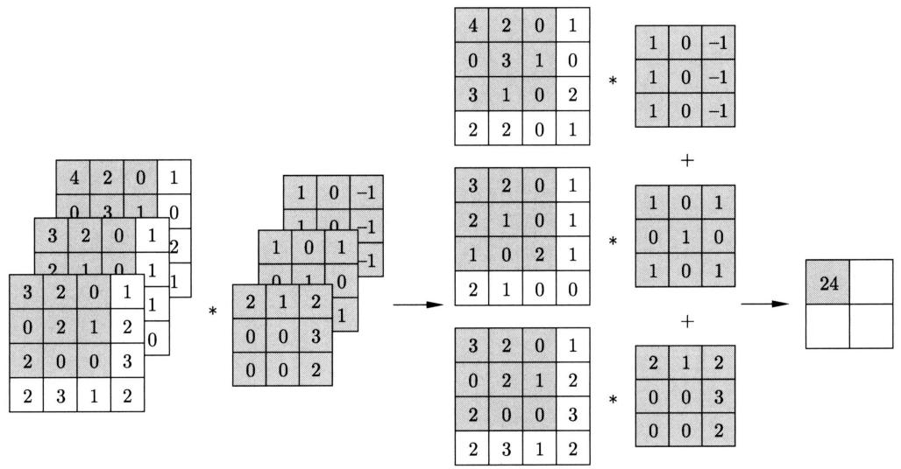  
图26.7 三维卷积计算例

# 26.1.3 汇聚

卷积神经网络还使用汇聚（pooling）运算。

# 1. 二维汇聚

定义26.2（二维汇聚）给定一个 $I \times J$ 输入矩阵 $\mathbf{X} = [x_{ij}]_{I \times J}$ ，一个虚设的 $M \times N$ 核矩阵， $M \ll I, N \ll J$ 。让核矩阵在输入矩阵上从左到右再从上到下滑动，将输入矩阵划分成若干大小为 $M \times N$ 的子矩阵，这些子矩阵相互不重叠且完全覆盖整个输入矩阵。对每一个子矩阵求最大值或平均值，产生一个 $K \times L$ 输出矩阵 $\mathbf{Y} = [y_{kl}]_{K \times L}$ ，称此运算为汇聚或二维汇聚。对子矩阵取最大值的称为最大汇聚（max pooling），取平均值的称为平均汇聚（mean pooling）。即有

$$
y _ {k l} = \max  _ {m \in \{1, 2, \dots , M \}, n \in \{1, 2, \dots N \}} x _ {k + m - 1, l + n - 1} \tag {26.8}
$$

或

$$
y _ {k l} = \frac {1}{M N} \sum_ {m = 1} ^ {M} \sum_ {n = 1} ^ {N} x _ {k + m - 1, l + n - 1} \tag {26.9}
$$

其中， $k = 1,2,\dots ,K,l = 1,2,\dots ,L$ ， $K$ 和 $L$ 满足

$$
K = \frac {I}{M}, \quad L = \frac {J}{N}
$$

这里假设 $I$ 和 $J$ 分别可以被 $M$ 和 $N$ 整除。

以上是基本汇聚的定义，还有多种扩展。在汇聚运算中，核矩阵每次向右或向下移动的列数或行数也称为步幅。通常汇聚的步幅与核的大小相同。汇聚运算也可以进行填充，即在输入矩阵的周边添加元素为0的行和列。汇聚运算依赖于核的大小、填充的大小和步幅，也就是说，这些都是超参数。

汇聚也称为下采样（down sampling），因为通过汇聚数据矩阵的大小变小。相反，使数据

矩阵变大的运算称为上采样（upsampling）。

比较式(26.5)和式(26.9)容易看出，平均汇聚是卷积的一种特殊情况，其参数个数为0。

例26.7 给定输入矩阵 $X$

$$
\boldsymbol {X} = \left[ \begin{array}{l l l l} 3 & 2 & 0 & 1 \\ 0 & 2 & 1 & 2 \\ 2 & 0 & 0 & 3 \\ 2 & 3 & 1 & 2 \end{array} \right]
$$

核的大小为 $2 \times 2$ ，步幅为2。求 $X$ 上的最大汇聚。

解 按照式 (26.8) 计算得到最大汇聚的输出矩阵 $\mathbf{Y}$

$$
\mathbf {Y} = \left[ \begin{array}{c c} 3 & 2 \\ 3 & 3 \end{array} \right]
$$

图26.8示意最大汇聚的计算过程。

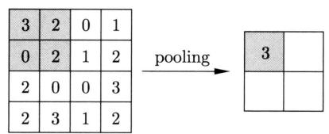

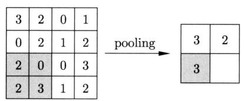

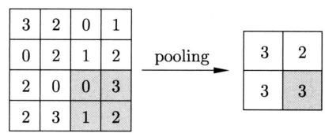  
图26.8 最大汇聚计算例

例26.8 对于与例26.7相同的输入矩阵 $X$ ，核的大小为 $2 \times 2$ ，步幅为2，求 $X$ 上的平均汇聚。

解 按照式(26.9)计算得到平均汇聚的输出矩阵 $\mathbf{Y}$

$$
\boldsymbol {Y} = \left[ \begin{array}{c c} 1. 7 5 & 1 \\ 1. 7 5 & 1. 5 \end{array} \right]
$$

图26.9示意平均汇聚计算的一步。

  
图26.9 平均汇聚计算例

在图像处理中，汇聚实现的是特征选择。最基本的情况是二维汇聚，输入是一个矩阵，矩阵的一个元素表示一个特征，代表特征的检测值。汇聚运算实际是将汇聚核在输入矩阵上进行滑动，从汇聚核覆盖的特征检测值中选择一个最大值或平均值，这样可以有效地进行特征抽取。输出是一个缩小的矩阵，也就是进行了下采样。

# 2. 三维汇聚

三维汇聚的输入和输出都是张量表示的特征图。汇聚对输入张量的各个矩阵分别进行汇聚计算，再将结果排列起来，产生输出张量。汇聚的输入特征图和输出特征图的深度相同，输出特征图比输入特征图有更小的高度和宽度。

例26.9 对于例26.6的输入张量，核的大小为 $2 \times 2$ ，步幅为2，求 $X$ 上的三维最大汇聚。

解 对各个矩阵分别按照式(26.8)计算，可得输出张量 $\mathbf{Y}$

$$
\begin{array}{l} \boldsymbol {Y} = \text {p o o l i n g} \left(\left[ \begin{array}{l l l l} 3 & 2 & 0 & 1 \\ 0 & 2 & 1 & 2 \\ 2 & 0 & 0 & 3 \\ 2 & 3 & 1 & 2 \end{array} \right], \left[ \begin{array}{l l l l} 3 & 2 & 0 & 1 \\ 2 & 1 & 0 & 1 \\ 1 & 0 & 2 & 1 \\ 2 & 1 & 0 & 0 \end{array} \right], \left[ \begin{array}{l l l l} 4 & 2 & 0 & 1 \\ 0 & 3 & 1 & 0 \\ 3 & 1 & 0 & 2 \\ 2 & 2 & 0 & 1 \end{array} \right]\right) \\ = \left(\left[ \begin{array}{l l} 3 & 2 \\ 3 & 3 \end{array} \right], \left[ \begin{array}{l l} 3 & 1 \\ 2 & 2 \end{array} \right], \left[ \begin{array}{l l} 4 & 1 \\ 3 & 2 \end{array} \right]\right) \\ \end{array}
$$

输出特征图（输出张量）是一个 $2 \times 2 \times 3$ 张量。输入特征图和输出特征图的深度都是3。输入特征图高度和宽度都是4，而输出特征图的高度和宽度都是2。图26.10示意三维最大汇聚计算的一步。

  
图26.10 三维最大汇聚计算例

# 26.1.4 卷积神经网络

卷积神经网络是一系列神经网络的统一名称，其主要特点是对二维数据多次利用卷积和汇聚运算进行特征检测和抽取。

# 1. 模型定义

卷积神经网络一般由卷积层、汇聚层和全连接层构成。卷积神经网络架构如图26.11所示。

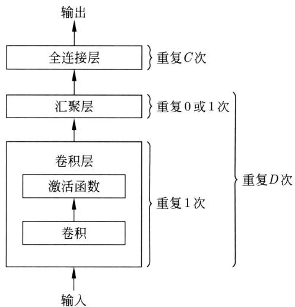  
图26.11 卷积神经网络架构

定义26.3（卷积神经网络）卷积神经网络是具有以下特点的神经网络。输入是张量表示的数据，输出是标量，表示分类或回归的预测值。经过多个卷积层，有时中间经过汇聚层，最后经过全连接层。每层的输入是张量（包括矩阵）表示的特征图，输出也是张量（包括矩阵）表示的特征图。

卷积层进行基于卷积函数的仿射变换和基于激活函数的非线性变换。假设第 $l$ 层是卷积层，则第 $l$ 层的计算如下：

$$
\boldsymbol {Z} ^ {(l)} = \boldsymbol {W} ^ {(l)} * \boldsymbol {X} ^ {(l - 1)} + \boldsymbol {b} ^ {(l)} \tag {26.10}
$$

$$
\boldsymbol {X} ^ {(l)} = a \left(\boldsymbol {Z} ^ {(l)}\right) \tag {26.11}
$$

这里 $\pmb{X}^{(l-1)}$ 是输入的 $I \times J \times K$ 张量， $\pmb{X}^{(l)}$ 是输出的 $I' \times J' \times K'$ 张量， $\pmb{W}^{(l)}$ 是卷积核的 $M \times N \times K \times K'$ 张量， $\pmb{b}^{(l)}$ 是偏置的 $I' \times J' \times K'$ 张量， $\pmb{Z}^{(l)}$ 是净输入的 $I' \times J' \times K'$ 张量， $a(\cdot)$ 是激活函数。可以认为式 (26.10) 和式 (26.11) 表示的变换由一组函数决定，也就是第 $l$ 层的神经元，一个神经元对应输出张量 $\pmb{X}^{(l)}$ 的一个元素。另一方面，输入张量 $\pmb{X}^{(l-1)}$ 也就是第 $l-1$ 层的输出张量由第 $l-1$ 层的神经元决定。当 $\pmb{X}^{(l-1)}$ 的元素到 $\pmb{X}^{(l)}$ 的元素之间存在映射关系时，对应的神经元之间存在连接。

汇聚层进行汇聚运算。假设第 $l$ 层是汇聚层，则第 $l$ 层的计算如下：

$$
\boldsymbol {X} ^ {(l)} = \operatorname {p o o l i n g} \left(\boldsymbol {X} ^ {(l - 1)}\right) \tag {26.12}
$$

这里 $\pmb{X}^{(l-1)}$ 是输入的 $I \times J \times K$ 张量， $\pmb{X}^{(l)}$ 是输出的 $I' \times J' \times K$ 张量， $\mathrm{pooling}(\cdot)$ 是汇聚运算。

可以认为式 (26.12) 表示的是基于神经元的变换（汇聚加恒等）。输入张量 $\pmb{X}^{(l-1)}$ 由第 $l-1$ 层的神经元决定，输出张量 $\pmb{X}^{(l)}$ 由第 $l$ 层的神经元决定。当 $\pmb{X}^{(l-1)}$ 的元素到 $\pmb{X}^{(l)}$ 的元素之间存在映射关系时，对应的神经元之间存在连接。

全连接的第 $l$ 层是前馈神经网络的一层，进行仿射变换和非线性变换。

$$
\boldsymbol {z} ^ {(l)} = \boldsymbol {W} ^ {(l)} \boldsymbol {x} ^ {(l - 1)} + \boldsymbol {b} ^ {(l)} \tag {26.13}
$$

$$
\boldsymbol {x} ^ {(l)} = a \left(\boldsymbol {z} ^ {(l)}\right) \tag {26.14}
$$

这里 $\pmb{x}^{(l-1)}$ 是 $N$ 维输入向量，是由张量展开得到的； $\pmb{x}^{(l)}$ 是 $M$ 维输出向量； $\pmb{W}^{(l)}$ 是 $M \times N$ 权重矩阵； $\pmb{b}^{(l)}$ 是 $M$ 维偏置向量； $\pmb{z}^{(l)}$ 是 $M$ 维净输入向量； $a(\cdot)$ 是激活函数。全连接的最后一层输出的是标量。

卷积神经网络中的所有参数，包括卷积核的权重和偏置、全连接的权重和偏置，都通过学习获得。

卷积神经网络也可以只有卷积层和全连接层，而没有汇聚层。步幅大于1的卷积运算也可以起到下采样作用，以代替汇聚运算。为了达到更好的预测效果，设计上的原则通常是使用更小的卷积核（如 $3 \times 3$ ）和更深的结构，前端使用少量的卷积核，后端使用大量的卷积核。

可以将 $I \times J \times K$ 张量展开成 $K$ 个 $I \times J$ 矩阵，将 $I' \times J' \times K'$ 张量展开成 $K'$ 个 $I' \times J'$ 矩阵。卷积层计算也可以写作

$$
\boldsymbol {Z} _ {k ^ {\prime}} ^ {(l)} = \sum_ {k} \boldsymbol {W} _ {k, k ^ {\prime}} ^ {(l)} * \boldsymbol {X} _ {k} ^ {(l - 1)} + \boldsymbol {b} _ {k ^ {\prime}} ^ {(l)} \tag {26.15}
$$

$$
\boldsymbol {X} _ {k ^ {\prime}} ^ {(l)} = a \left(\boldsymbol {Z} _ {k ^ {\prime}} ^ {(l)}\right) \tag {26.16}
$$

这里 $\pmb{X}_{k}^{(l-1)}$ 是输入的第 $k$ 个 $I \times J$ 矩阵， $\pmb{X}_{k'}^{(l)}$ 是输出的第 $k'$ 个 $I' \times J'$ 矩阵， $\pmb{W}_{k,k'}^{(l)}$ 是二维卷积核的第 $k \times k'$ 个 $M \times N$ 矩阵， $\pmb{b}_{k'}^{(l)}$ 是偏置的第 $k'$ 个 $I' \times J'$ 矩阵， $\pmb{Z}_{k'}^{(l)}$ 是净输入的第 $k'$ 个 $I' \times J'$ 矩阵。图26.12显示卷积层的输入和输出张量（特征图）。

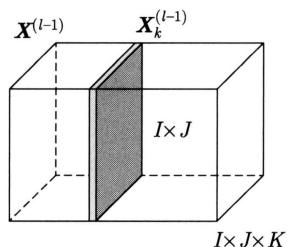

  
图26.12 卷积层的输入和输出张量

每次对 $K$ 个 $I \times J$ 矩阵同时进行卷积运算得到1个 $I' \times J'$ 矩阵，整体计算 $K'$ 次得到 $K'$ 个 $I' \times J'$ 矩阵，卷积核是 $K'$ 个 $M \times N \times K$ 张量。输入张量和输出张量的深度分别是 $K$ 和 $K'$ 。

可以将 $I \times J \times K$ 张量展开成 $K$ 个 $I \times J$ 矩阵，将 $I' \times J' \times K$ 张量展开成 $K$ 个 $I' \times J'$

矩阵。汇聚层计算也可以写作

$$
\boldsymbol {X} _ {k} ^ {(l)} = \operatorname {p o o l i n g} \left(\boldsymbol {X} _ {k} ^ {(l - 1)}\right) \tag {26.17}
$$

这里 $\mathbf{X}_k^{(l-1)}$ 是输入的第 $k$ 个 $I \times J$ 矩阵， $\mathbf{X}_k^{(l)}$ 是输出的第 $k$ 个 $I' \times J'$ 矩阵。图26.13显示汇聚层的输入和输出张量（特征图）。

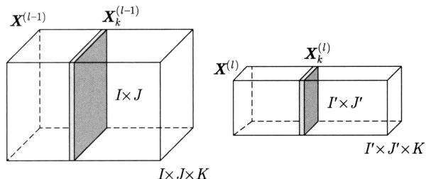  
图26.13 汇聚层的输入和输出张量

汇聚运算对 $K$ 个 $I \times J$ 矩阵分别进行，得到 $K$ 个 $I' \times J'$ 矩阵，汇聚核是 $K$ 个 $M \times N$ 矩阵。输入和输出张量的深度都是 $K$ 。

卷积神经网络的特点可以由每一层的输入和输出张量体现，所以习惯上用输入和输出张量表示其架构。

# 2. 模型例子

下面是一个简单的卷积神经网络的例子。这个CNN模型与LeCun提出的LeNet模型有相近的架构和规模。该模型在手写数字识别上达到很高的准确率，是卷积神经网络最基本的模型。整个网络由两个卷积层、两个汇聚层、两个全连接层、一个输出层组成（图26.14）。表26.1列出了卷积层、汇聚层、全连接层、输出层的超参数，输出特征图的大小，其中 $F$ 表示卷积核或汇聚核的大小， $S$ 表示步幅， $W$ 表示权重矩阵的大小， $B$ 表示偏置向量的长度。

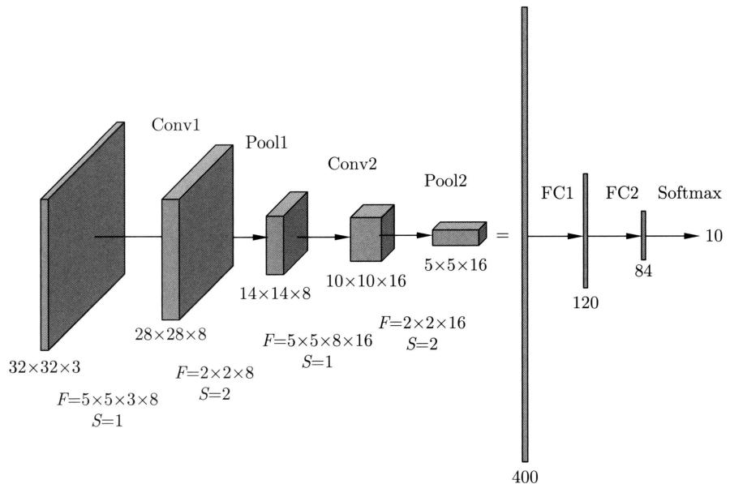  
图26.14 CNN模型的网络架构

表 26.1 CNN 模型的规模  

<table><tr><td></td><td>超参数</td><td>输出特征图大小</td></tr><tr><td>输入</td><td></td><td>32 × 32 × 3</td></tr><tr><td>Conv1</td><td>F=5 × 5 × 3 × 8, S=1</td><td>28 × 28 × 8</td></tr><tr><td>Pool1</td><td>F=2 × 2 × 8, S=2</td><td>14 × 14 × 8</td></tr><tr><td>Conv2</td><td>F=5 × 5 × 8 × 16, S=1</td><td>10 × 10 × 16</td></tr><tr><td>Pool2</td><td>F=2 × 2 × 16, S=2</td><td>5 × 5 × 16</td></tr><tr><td>FC1</td><td>W=400 × 120, B=120</td><td>120 × 1</td></tr><tr><td>FC2</td><td>W=120 × 84, B=84</td><td>84 × 1</td></tr><tr><td>Softmax</td><td>W=84 × 10</td><td>10 × 1</td></tr></table>

# 26.1.5 卷积神经网络性质

# 1. 表示效率

卷积神经网络的表示和学习效率比前馈神经网络高。首先层与层之间的连接是稀疏的，因为卷积代表的是稀疏连接，比全连接的数目大幅减少，如图26.15所示。

  
图26.15 用卷积层代替全连接层（见文前彩图）  
图中显示的是一维卷积

其次同一层的卷积的参数是共享的，卷积核在前一层的各个位置上滑动计算，在所有位置上具有相同的参数，这样就大幅减少了参数的数量。另外，每一层内的卷积运算可以并行处理，这样也可以加快学习和推理的速度。

# 2. 不变性

设 $f(\pmb{x})$ 是以 $\pmb{x}$ 为输入的函数， $\tau(\pmb{x})$ 是对 $\pmb{x}$ 的变换，如平移变换、旋转变换、缩放变换。如果满足以下关系：

$$
f (\boldsymbol {x}) = f (\tau (\boldsymbol {x})) \tag {26.18}
$$

则称函数 $f(\cdot)$ 对变换 $\tau(\cdot)$ 具有不变性。如果 $\tau(\cdot)$ 表示的是平移变换、旋转变换、缩放变换，则函数 $f(\cdot)$ 具有平移不变性、旋转不变性、缩放不变性。

卷积神经网络具有平移不变性，但不能严格保证；不具有旋转不变性、缩放不变性。这意味着在图像识别中，图片中的物体平行移动位置也能被识别。在图像识别中，往往通过数据增强的方法提高卷积神经网络的旋转不变性和缩放不变性。

例 26.10 图 26.16 给出从两张图片中进行特征抽取的例子。两张图片中都包含 L 字, 但位置发生了平移。通过卷积和汇聚运算, 可以分别抽取出两张图片中的这个特征, 卷积使

用表示 L 字的卷积核，汇聚使用最大汇聚。所以，这里的卷积和汇聚运算对特征抽取具有平移不变性。

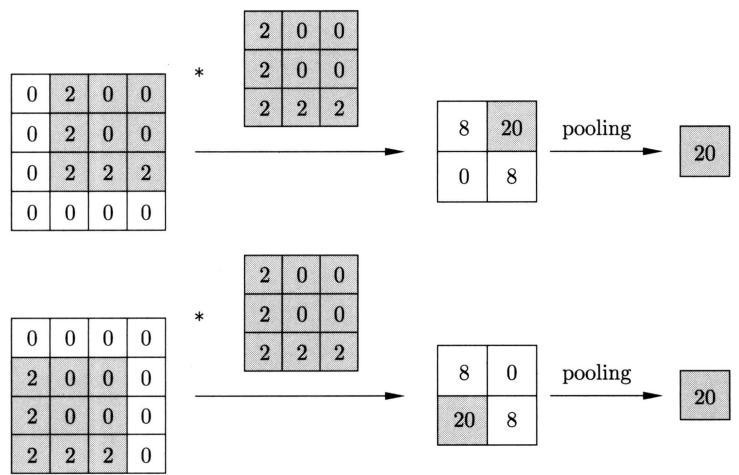  
图26.16 卷积和汇聚运算实现的特征抽取具有平移不变性

下面给出三个不变性的严格定义。在平面上的点的坐标 $(x,y)$ 通过以下矩阵表示的变换变成新的坐标 $(x^{\prime},y^{\prime})$ ，则分别称变换为平移变换、旋转变换、缩放变换。

（1）平移变换

$$
\left[ \begin{array}{l} x ^ {\prime} \\ y ^ {\prime} \\ 1 \end{array} \right] = \left[ \begin{array}{l l l} 1 & 0 & t _ {x} \\ 0 & 1 & t _ {y} \\ 0 & 0 & 1 \end{array} \right] \left[ \begin{array}{l} x \\ y \\ 1 \end{array} \right]
$$

其中， $t_x$ 和 $t_y$ 分别表示点在 $x$ 轴和 $y$ 轴方向平移的幅度。

（2）旋转变换

$$
\left[ \begin{array}{c} x ^ {\prime} \\ y ^ {\prime} \\ 1 \end{array} \right] = \left[ \begin{array}{c c c} \cos \theta & - \sin \theta & 0 \\ \sin \theta & \cos \theta & 0 \\ 0 & 0 & 1 \end{array} \right] \left[ \begin{array}{c} x \\ y \\ 1 \end{array} \right]
$$

其中， $\theta$ 表示点围绕原点旋转的角度。

（3）缩放变换

$$
\left[ \begin{array}{l} x ^ {\prime} \\ y ^ {\prime} \\ 1 \end{array} \right] = \left[ \begin{array}{l l l} s _ {x} & 0 & 0 \\ 0 & s _ {y} & 0 \\ 0 & 0 & 1 \end{array} \right] \left[ \begin{array}{l} x \\ y \\ 1 \end{array} \right]
$$

其中， $s_x$ 和 $s_y$ 分别表示点在 $x$ 轴和 $y$ 轴方向缩放的尺度。

# 3. 感受野

卷积神经网络利用卷积实现了图像处理需要的特征的表示。前端的神经元表示的是局部

的特征，如物体的轮廓；后端的神经元表示的是全局的特征，如物体的部件，可以更好地对图片数据进行预测。

卷积神经网络通过特殊的函数表示和学习实现了自己的感受野机制。卷积神经网络的感受野是指其神经元涵盖的输入矩阵的部分（二维图片的区域）。图26.17显示的网络有两个卷积层，输入层是二维图片。第一层的绿色神经元的感受野是输入层的绿色区域，第二层的黄色神经元的感受野是输入层的整个区域。感受野是从神经元的输出到输入反向看过去得到的结果。卷积核加激活函数产生的感受野具有与生物视觉系统中的感受野相似的特点。

  
图26.17 卷积神经网络中的感受野（见文前彩图）

考虑卷积神经网络全部由卷积层组成的情况，神经元的感受野的大小有以下关系成立。证明留作习题。

$$
R ^ {(l)} = 1 + \sum_ {j = 1} ^ {l} \left(F ^ {(j)} - 1\right) \prod_ {i = 0} ^ {j - 1} S ^ {(i)} \tag {26.19}
$$

设输入矩阵和卷积核都呈正方形。 $R^{(l)} \times R^{(l)}$ 表示第 $l$ 层的神经元的感受野的大小， $F^{(j)} \times F^{(j)}$ 表示第 $j$ 层的卷积核的大小， $S^{(i)}$ 表示第 $i$ 层卷积的步幅，设 $S^{(0)} = 1$ 。

# 26.2 卷积神经网络的学习算法

卷积神经网络的学习算法也是反向传播算法，与前馈神经网络学习的反向传播算法相似，不同点在于正向和反向传播基于卷积函数。

# 26.2.1 卷积导数

设有函数 $f(\mathbf{Z})$ ， $\mathbf{Z} = \mathbf{W}*\mathbf{X}$ ，其中 $\mathbf{X} = [x_{ij}]_{I\times J}$ 是输入矩阵， $\mathbf{W} = [w_{mn}]_{M\times N}$ 是卷积核， $\mathbf{Z} = [z_{kl}]_{K\times L}$ 是净输入矩阵，则 $f(\mathbf{Z})$ 对 $\mathbf{W}$ 的偏导数如下：

$$
\frac {\partial f (\boldsymbol {Z})}{\partial w _ {m n}} = \sum_ {k = 1} ^ {K} \sum_ {l = 1} ^ {L} \frac {\partial z _ {k l}}{\partial w _ {m n}} \frac {\partial f (\boldsymbol {Z})}{\partial z _ {k l}} = \sum_ {k = 1} ^ {K} \sum_ {l = 1} ^ {L} x _ {k + m - 1, l + n - 1} \frac {\partial f (\boldsymbol {Z})}{\partial z _ {k l}} \tag {26.20}
$$

整体可以写作

$$
\frac {\partial f (\boldsymbol {Z})}{\partial \boldsymbol {W}} = \frac {\partial f (\boldsymbol {Z})}{\partial \boldsymbol {Z}} * \boldsymbol {X} \tag {26.21}
$$

$f(Z)$ 对 $X$ 的偏导数如下：

$$
\frac {\partial f (\boldsymbol {Z})}{\partial x _ {i j}} = \sum_ {k = 1} ^ {K} \sum_ {l = 1} ^ {L} \frac {\partial z _ {k l}}{\partial x _ {i j}} \frac {\partial f (\boldsymbol {Z})}{\partial z _ {k l}} = \sum_ {k = 1} ^ {K} \sum_ {l = 1} ^ {L} w _ {i - k + 1, j - l + 1} \frac {\partial f (\boldsymbol {Z})}{\partial z _ {k l}} \tag {26.22}
$$

整体可以写作

$$
\frac {\partial f (\boldsymbol {Z})}{\partial \boldsymbol {X}} = \operatorname {r o t} 1 8 0 \left(\frac {\partial f (\boldsymbol {Z})}{\partial \boldsymbol {Z}}\right) * \boldsymbol {W} = \operatorname {r o t} 1 8 0 (\boldsymbol {W}) * \frac {\partial f (\boldsymbol {Z})}{\partial \boldsymbol {Z}} \tag {26.23}
$$

其中，rot180() 表示矩阵 180 度旋转，这里的卷积 * 是对输入矩阵进行全填充后的卷积。相关例子见习题。

# 26.2.2 反向传播算法

卷积神经网络和前馈神经网络一样，也是通过反向传播算法求出损失函数对各层参数的梯度，利用随机梯度下降法更新模型参数。对于每次迭代，首先通过正向传播从前往后传递信号，然后通过反向传播从后往前传递误差，最后求损失函数对每层的参数的梯度，对每层的参数进行更新。对于卷积神经网络，特殊的是卷积层和汇聚层的参数更新。

# 1.卷积层

设第 $l$ 层为卷积层。由式(26.15)和式(26.16)可知，第 $l$ 层的第 $k^{\prime}$ 个净输入矩阵 $\mathbf{Z}_{k^{\prime}}^{(l)}$ 为

$$
\boldsymbol {Z} _ {k ^ {\prime}} ^ {(l)} = \sum_ {k = 1} ^ {K} \boldsymbol {W} _ {k, k ^ {\prime}} ^ {(l)} * \boldsymbol {X} _ {k} ^ {(l - 1)} + \boldsymbol {b} _ {k ^ {\prime}} ^ {(l)}
$$

其中， $\mathbf{X}_{k}^{(l-1)}$ 是第 $l$ 层的第 $k$ 个输入矩阵， $\mathbf{W}_{k,k'}^{(l)}$ 是第 $l$ 层的第 $k \times k'$ 个卷积核矩阵， $\mathbf{b}_{k'}^{(l)}$ 是第 $l$ 层的第 $k'$ 个偏置矩阵。第 $k'$ 个输出矩阵 $\mathbf{X}_{k'}^{(l)}$ 为

$$
\boldsymbol {X} _ {k ^ {\prime}} ^ {(l)} = a \left(\boldsymbol {Z} _ {k ^ {\prime}} ^ {(l)}\right)
$$

由此可以进行从第 $l - 1$ 层到第 $l$ 层的正向传播， $\boldsymbol{X}_k^{(l - 1)}$ 从第 $l - 1$ 层的神经元传递到第 $l$ 层的相连神经元，得到 $\boldsymbol{X}_{k^{\prime}}^{(l)}$ 。以上计算可以扩展到第 $l$ 层的所有 $K^{\prime}$ 个输出矩阵上。

再考虑第 $l$ 层的梯度更新。第 $l$ 层的第 $k$ 个输入矩阵是 $\pmb{X}_{k}^{(l - 1)}$ 。设第 $l$ 层的第 $k^{\prime}$ 个误差矩阵 $\delta_{k^{\prime}}^{(l)}$ 是

$$
\boldsymbol {\delta} _ {k ^ {\prime}} ^ {(l)} = \frac {\partial L}{\partial \boldsymbol {Z} _ {k ^ {\prime}} ^ {(l)}}
$$

设从正向传播得到输出矩阵 $X_{k}^{(l - 1)}$ ，从反向传播得到误差矩阵 $\delta_{k^{\prime}}^{(l)}$ 。根据式(26.21)，可以计

算第 $l$ 层的第 $k \times k'$ 个权重矩阵和第 $k'$ 个偏置矩阵的梯度：

$$
\frac {\partial L}{\partial \boldsymbol {W} _ {k , k ^ {\prime}} ^ {(l)}} = \frac {\partial L}{\partial \boldsymbol {Z} _ {k ^ {\prime}} ^ {(l)}} * \boldsymbol {X} _ {k} ^ {(l - 1)} = \boldsymbol {\delta} _ {k ^ {\prime}} ^ {(l)} * \boldsymbol {X} _ {k} ^ {(l - 1)} \tag {26.24}
$$

$$
\frac {\partial L}{\partial \boldsymbol {b} _ {k ^ {\prime}} ^ {(l)}} = \boldsymbol {\delta} _ {k ^ {\prime}} ^ {(l)} \tag {26.25}
$$

由此可以对第 $l$ 层（卷积层）的梯度进行更新。在其基础上进行参数更新，实现梯度下降的一步。以上计算可以扩展到第 $l$ 层的所有 $K \times K'$ 个权重矩阵和 $K'$ 个偏置矩阵上。

再考虑从第 $l$ 层到第 $l - 1$ 层的误差反向传播。设第 $l - 1$ 层的第 $k$ 个误差矩阵 $\delta_{k}^{(l - 1)}$ 是

$$
\boldsymbol {\delta} _ {k} ^ {(l - 1)} = \frac {\partial L}{\partial \boldsymbol {Z} _ {k} ^ {(l - 1)}}
$$

通过第 $l$ 层的第 $k^{\prime}$ 个误差矩阵 $\delta_{k^{\prime}}^{(l)}$ 计算 $\delta_{k}^{(l - 1)}$ 。由链式法则和式 (26.23) 可得：

$$
\begin{array}{l} \boldsymbol {\delta} _ {k} ^ {(l - 1)} = \frac {\partial L}{\partial \boldsymbol {Z} _ {k} ^ {(l - 1)}} = \frac {\partial \boldsymbol {X} _ {k} ^ {(l - 1)}}{\partial \boldsymbol {Z} _ {k} ^ {(l - 1)}} \frac {\partial L}{\partial \boldsymbol {X} _ {k} ^ {(l - 1)}} = \frac {\partial a}{\partial \boldsymbol {Z} _ {k} ^ {(l - 1)}} \odot \sum_ {k ^ {\prime} = 1} ^ {K ^ {\prime}} \left(\operatorname {r o t} 1 8 0 \left(\boldsymbol {W} _ {k, k ^ {\prime}} ^ {(l)}\right) * \frac {\partial L}{\partial \boldsymbol {Z} _ {k ^ {\prime}} ^ {(l)}}\right) \\ = \frac {\partial a}{\partial \boldsymbol {Z} _ {k} ^ {(l - 1)}} \odot \sum_ {k ^ {\prime} = 1} ^ {K ^ {\prime}} \left(\operatorname {r o t} 1 8 0 \left(\boldsymbol {W} _ {k, k ^ {\prime}} ^ {(l)}\right) * \boldsymbol {\delta} _ {k ^ {\prime}} ^ {(l)}\right) \tag {26.26} \\ \end{array}
$$

这里 $\odot$ 表示矩阵的逐元素积或阿达玛积，rot180() 表示矩阵 180 度旋转，* 是对输入矩阵进行全填充后的卷积。根据式 (26.26)， $\pmb{\delta}_{k}^{(l)}$ 从第 $l$ 层的神经元传递到第 $l - 1$ 层的相连神经元，得到 $\pmb{\delta}_{k}^{(l - 1)}$ 。以上计算可以扩展到第 $l - 1$ 层的所有 $K$ 个误差矩阵上。

# 2.汇聚层

设第 $l$ 层为汇聚层。由式 (26.17) 可知，第 $l$ 层的第 $k$ 个输出矩阵 $\mathbf{X}_k^{(l)}$ 为

$$
\boldsymbol {X} _ {k} ^ {(l)} = \boldsymbol {Z} _ {k} ^ {(l)} = \operatorname {p o o l i n g} \left(\boldsymbol {X} _ {k} ^ {(l - 1)}\right)
$$

这里 $\mathbf{X}_k^{(l-1)}$ 是第 $l$ 层的第 $k$ 个输入矩阵。引入第 $l$ 层的第 $k$ 个净输入矩阵 $\mathbf{Z}_k^{(l)}$ , 净输入 $\mathbf{Z}_k^{(l)}$ 和输出 $\mathbf{X}_k^{(l)}$ 之间是恒等变换。由此可以进行从第 $l-1$ 层到第 $l$ 层的正向传播, $\mathbf{X}_k^{(l-1)}$ 从第 $l-1$ 层的神经元传递到第 $l$ 层的相连神经元, 得到 $\mathbf{X}_k^{(l)}$ 。以上计算可以扩展到第 $l$ 层的所有 $K$ 个输出矩阵上。

汇聚层没有参数，所以在学习过程中没有参数更新。

再考虑从第 $l$ 层到第 $l - 1$ 层的误差反向传播。设第 $l$ 层的第 $k$ 个误差矩阵是

$$
\boldsymbol {\delta} _ {k} ^ {(l)} = \frac {\partial L}{\partial \boldsymbol {Z} _ {k} ^ {(l)}}
$$

第 $l - 1$ 层的第 $k$ 个误差矩阵 $\delta_{k}^{(l - 1)}$ 是

$$
\boldsymbol {\delta} _ {k} ^ {(l - 1)} = \frac {\partial L}{\partial \boldsymbol {Z} _ {k} ^ {(l - 1)}}
$$

通过 $\delta_k^{(l)}$ 计算 $\delta_k^{(l-1)}$ 。由链式法则可得：

$$
\boldsymbol {\delta} _ {k} ^ {(l - 1)} = \frac {\partial L}{\partial \boldsymbol {Z} _ {k} ^ {(l - 1)}} = \frac {\partial \boldsymbol {X} _ {k} ^ {(l - 1)}}{\partial \boldsymbol {Z} _ {k} ^ {(l - 1)}} \frac {\partial L}{\partial \boldsymbol {X} _ {k} ^ {(l - 1)}} = \frac {\partial \boldsymbol {X} _ {k} ^ {(l - 1)}}{\partial \boldsymbol {Z} _ {k} ^ {(l - 1)}} \frac {\partial \boldsymbol {Z} _ {k} ^ {(l)}}{\partial \boldsymbol {X} _ {k} ^ {(l - 1)}} \frac {\partial L}{\partial \boldsymbol {Z} _ {k} ^ {(l)}} = \frac {\partial a}{\partial \boldsymbol {Z} _ {k} ^ {(l - 1)}} \odot \text {u p s a m p l e} (\boldsymbol {\delta} _ {k} ^ {(l)}) \tag {26.27}
$$

这里 $\odot$ 表示矩阵的逐元素积；up_sample $(\pmb{\delta}_k^{(l)})$ 是误差矩阵 $\pmb{\delta}_k^{(l)}$ 的上采样，是汇聚（下采样）的反向运算。最大汇聚时， $\pmb{\delta}_k^{(l)}$ 从第 $l$ 层的神经元传递到第 $l-1$ 层的输出最大的相连神经元；平均汇聚时， $\pmb{\delta}_k^{(l)}$ 从第 $l$ 层的神经元平均分配到第 $l-1$ 层的相连神经元。以上计算可以扩展到第 $l-1$ 层的所有 $K$ 个误差矩阵上。

# 3. 算法

算法26.1给出反向传播法的一次迭代的算法。不失一般性，假设卷积神经网络全部由卷积层组成，因为汇聚层和全连接层都可以看作特殊的卷积层。网络有 $s$ 层，正向传播各层的输出是张量 $\pmb{X}^{(1)},\pmb{X}^{(2)},\dots ,\pmb{X}^{(s)}$ ，反向传播各层传递的误差是张量 $\delta^{(s)},\dots ,\delta^{(2)},\delta^{(1)}$ 。各层的参数是张量 $\pmb{W}^{(1)},\pmb{W}^{(2)},\dots ,\pmb{W}^{(s)}$ 和 $\pmb{b}^{(1)},\pmb{b}^{(2)},\dots ,\pmb{b}^{(s)}$ 。

# 算法26.1（CNN的反向传播算法）

输入：神经网络 $f(\pmb {X};\pmb {\theta})$ ，一个样本 $(X,y)$ 。

输出：更新的参数 $\theta$ 。

参数：学习率 $\eta$ 。

1

1. 正向传播，得到各层输出 $X^{(1)}, X^{(2)}, \dots, X^{(s)}$

$$
\boldsymbol {X} ^ {(0)} = \boldsymbol {X}
$$

For $t = 1,2,\dots ,s$ , do $\{$

$$
\boldsymbol {Z} ^ {(t)} = \boldsymbol {W} ^ {(t)} * X ^ {(t - 1)} + \boldsymbol {b} ^ {(t)}
$$

$$
\boldsymbol {X} ^ {(t)} = a \left(\boldsymbol {Z} ^ {(t)}\right)
$$

}

2. 反向传播，得到各层误差 $\delta^{(s)},\dots ,\delta^{(2)},\delta^{(1)}$ ，计算各层的梯度，更新各层的参数计算输出层的误差

$$
\boldsymbol {\delta} ^ {(s)} = \nabla_ {\boldsymbol {X} ^ {(s)}} L (\boldsymbol {X} ^ {(s)}, \boldsymbol {y})
$$

For $t = s,\dots ,2,1$ , do{

$$
\boldsymbol {\delta} ^ {(t)} \leftarrow \frac {\partial a}{\partial \boldsymbol {Z} ^ {(t)}} \odot \boldsymbol {\delta} ^ {(t)}
$$

计算第 $t$ 层的梯度

$$
\nabla_ {\boldsymbol {W} ^ {(t)}} L = \boldsymbol {\delta} ^ {(t)} * \boldsymbol {X} ^ {(t - 1)}
$$

$$
\nabla_ {\boldsymbol {b} ^ {(t)}} L = \boldsymbol {\delta} ^ {(t)}
$$

根据梯度下降公式更新第 $t$ 层的参数

$$
\boldsymbol {W} ^ {(t)} \leftarrow \boldsymbol {W} ^ {(t)} - \eta \nabla_ {\boldsymbol {W} ^ {(t)}} L
$$

$$
\boldsymbol {b} ^ {(t)} \leftarrow \boldsymbol {b} ^ {(t)} - \eta \nabla_ {\boldsymbol {b} ^ {(t)}} L
$$

If $(t > 1)$ {将第δ}

3.返回更新的参数向量 $\theta$ 1

将第 $t$ 层的误差传到第 $t - 1$ 层

$$
\boldsymbol {\delta} ^ {(t - 1)} = \sum_ {k ^ {\prime}} \operatorname {r o t} 1 8 0 \left(\boldsymbol {W} _ {k ^ {\prime}} ^ {(t)}\right) * \boldsymbol {\delta} ^ {(t)}
$$

}

# 26.3 图片分类中的应用

图片分类是将图片自动分配到已有类别的任务。ImageNet 是著名的图片分类比赛。本节介绍卷积神经网络在图片分类中的应用，特别是有代表性的 AlexNet 和残差网络 ResNet。

# 26.3.1 AlexNet

AlexNet 是一个深度卷积神经网络，使用卷积神经网络的所有基本技术，在 2012 年 ImageNet 图片分类竞赛中获得第一名，大幅领先其他传统机器学习模型，展现了深度学习的威力，促进了后续的深度学习研究，有力推动了深度学习的发展。

图26.18显示AlexNet的架构，有5个卷积层（Conv）、3个汇聚层（Pool）、2个全连接层（FC）、1个输出层（Softmax）。FC1层使用一个与输入特征图同样大小的卷积核以起到全连接的作用。表26.2列出了卷积层、汇聚层、全连接层、输出层的超参数及输出特征图的大

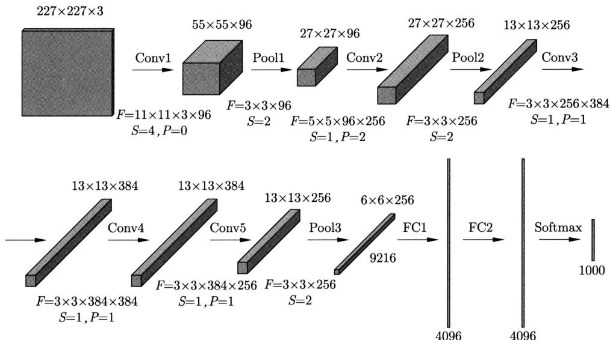  
图26.18 AlexNet的网络架构

小，其中 $F$ 表示卷积核或汇聚核的大小， $S$ 表示步幅， $P$ 表示填充， $W$ 表示权重矩阵的大小， $B$ 表示偏置向量的大小。

表 26.2 AlexNet 的模型规模  

<table><tr><td></td><td>超参数</td><td>输出特征图大小</td></tr><tr><td>输入</td><td></td><td>227 × 227 × 3</td></tr><tr><td>Conv1</td><td>F=11 × 11 × 3 × 96, S=4, P=0</td><td>55 × 55 × 96</td></tr><tr><td>Pool1</td><td>F=3 × 3 × 96, S=2</td><td>27 × 27 × 96</td></tr><tr><td>Conv2</td><td>F=5 × 5 × 96 × 256, S=1, P=2</td><td>27 × 27 × 256</td></tr><tr><td>Pool2</td><td>F=3 × 3 × 256, S=2</td><td>13 × 13 × 256</td></tr><tr><td>Conv3</td><td>F=3 × 3 × 256 × 384, S=1, P=1</td><td>13 × 13 × 384</td></tr><tr><td>Conv4</td><td>F=3 × 3 × 384 × 384, S=1, P=1</td><td>13 × 13 × 384</td></tr><tr><td>Conv5</td><td>F=3 × 3 × 384 × 256, S=1, P=1</td><td>13 × 13 × 256</td></tr><tr><td>Pool3</td><td>F=3 × 3 × 256, S=2</td><td>6 × 6 × 256</td></tr><tr><td>FC1</td><td>W=4096 × 4096, B=4096</td><td>4096 × 1</td></tr><tr><td>FC2</td><td>W=4096 × 4096, B=4096</td><td>4096 × 1</td></tr><tr><td>Softmax</td><td>W=4096 × 1000</td><td>1000 × 1</td></tr></table>

AlexNet有以下特点：激活函数使用整流线性函数ReLU，训练中使用暂退法（dropout）防止过拟合，使用数据增强的方法提高模型的准确率。受当时计算机能力的限制，最初的AlexNet模型的实现采用了双数据流的设计，目前的计算机实现这样规模的模型已经不是问题。

# 26.3.2 残差网络

# 1. 基本想法

残差网络（residual network，ResNet）是一种使用残差连接技术的深度神经网络，在2015年的ImageNet图片分类比赛中取得了第一名的好成绩。对于深度神经网络，当层数增加时，模型训练往往变得非常困难。除了梯度消失和梯度爆炸问题（见第25章），训练误差上升也是一个问题。残差网络是为解决这些问题而提出的通用深度学习技术。

实验中观察到，当把深度神经网络的层数增加到一定数量以后，训练误差不会降低反而会上升。但是从理论上说，如果学习（优化）算法的能力足够强，当网络层数增加时，训练误差至少应该保持不变。这是因为理论上存在等效的深度神经网络，其前面几层与“浅的”神经网络完全相同，后面几层只做恒等变换，那么强的学习算法至少应该能找到这个模型。因此深度学习还有提升空间。残差网络通过学习残差来解决这个问题。

假设要学习的真实模型是函数 $h(\pmb{x})$ 。深度学习一般的想法是找到一个深度神经网络 $f(\pmb{x})$ ，直接近似真实模型 $h(\pmb{x})$ 。另一方面，真实模型也可以写作

$$
h (\boldsymbol {x}) = \boldsymbol {x} + (h (\boldsymbol {x}) - \boldsymbol {x}) \tag {26.28}
$$

也就是恒等变换 $\pmb{x}$ 和残差 $h(\pmb {x}) - \pmb{x}$ 之和的形式。残差网络的想法是用一个神经网络 $f(x)$ 近似残差 $h(\pmb {x}) - \pmb{x}$ ，用 $\pmb {x} + f(\pmb {x})$ 近似真实模型 $h(x)$ ，整个过程以递归的方式进行。

残差网络进行以下递归计算：

$$
\boldsymbol {x} _ {i} = \boldsymbol {x} _ {i - 1} + f _ {i} \left(\boldsymbol {x} _ {i - 1}\right), \quad i = 1, 2, \dots , n \tag {26.29}
$$

其中， $x_{i}$ 表示第 $i$ 次递归计算结果，设 $\pmb{x}_0 = \pmb{x}$ ； $f_{i}(\pmb{x})$ 表示第 $i$ 次计算的计算单元，称为残差单元，每一个残差单元都有相同的结构、不同的参数。

考虑 $\pmb{x}$ 到 $h(\pmb{x})$ 的映射，如果主体是恒等部分 $\pmb{x}$ 的话，那么残差部分 $h(\pmb{x}) - \pmb{x}$ 应该更容易学习，这样可以增加残差单元的个数（网络的层数），更好地对真实模型进行近似，而事实也证明了这个想法的正确性。

# 2. 模型架构

残差网络可以是基于前馈神经网络的，也可以是基于卷积神经网络的，先考虑前者。残差网络由很多个残差单元（residual unit）串联组成（见式(26.29)）。每一个残差单元相当于一般的前馈网络的两层，每一层由线性变换和非线性变换组成，还有一个残差连接（residual connection），如图26.19所示。这里为了简单，省略仿射变换的偏置，所以是线性变换。

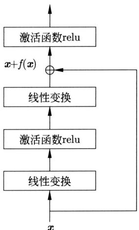  
图26.19 残差单元的结构

假设残差单元输入是向量 $\pmb{x}$ ，输出是向量 $\pmb{y}$ 。首先，在第一层通过基于权重矩阵 $\pmb{W}_1$ 的线性变换将输入 $\pmb{x}$ 转换为 $z_1$ （式(26.30)），再通过非线性变换 $\mathrm{relu}$ 将 $z_1$ 转换为 $x_1$ （式(26.31)）。然后，在第二层通过基于权重矩阵 $\pmb{W}_2$ 的线性变换将 $\pmb{x}_1$ 转换为 $z_2$ （式(26.32)），求 $z_2$ 与输入 $\pmb{x}$ 之和，再通过非线性变换 $\mathrm{relu}$ 对这个和进行转换得到输出 $\pmb{y}$ （式(26.33)），其中 $z_2$ 与 $\pmb{x}$ 之和的计算通过残差连接实现。

$$
\boldsymbol {z} _ {1} = \boldsymbol {W} _ {1} \boldsymbol {x} \tag {26.30}
$$

$$
\boldsymbol {x} _ {1} = \operatorname {r e l u} \left(\boldsymbol {z} _ {1}\right) \tag {26.31}
$$

$$
\boldsymbol {z} _ {2} = \boldsymbol {W} _ {2} \boldsymbol {x} _ {1} \tag {26.32}
$$

$$
\boldsymbol {y} = \operatorname {r e l u} \left(\boldsymbol {x} + \boldsymbol {z} _ {2}\right) \tag {26.33}
$$

可以看出残差单元的前一层半 (式(26.30)~式(26.33)) 通过前馈神经网络实现了残差单元的

函数：

$$
\boldsymbol {f} (x) = \boldsymbol {W} _ {2} \operatorname {r e l u} \left(\boldsymbol {W} _ {1} x\right) \tag {26.34}
$$

对输入 $\pmb{x}$ 和残差 $f(x)$ 的和再通过relu就得到输出 $\pmb{y}$

$$
\boldsymbol {y} = \operatorname {r e l u} (\boldsymbol {x} + f (\boldsymbol {x})) \tag {26.35}
$$

这里的实现是基本想法 (式 (26.29)) 的变种。后续残差网络有改进版，更直接地实现了基本想法。

当需要让输入 $\pmb{x}$ 和输出 $\pmb{y}$ 有不同的维度时，不能简单进行输入和残差的求和。这时可以对输入 $\pmb{x}$ 进行一个线性变换，使用另一个权重矩阵 $W_{3}$

$$
\boldsymbol {W} _ {3} \boldsymbol {x} + f (\boldsymbol {x})
$$

# 3. 模型特点

残差网络可以展开成为多个神经网络模块的集成，如图26.20所示。假设有由三个单元组成的残差神经网络，输入是 $\pmb{x}_0$ ，输出是 $x_{3}$ 。这个网络可以展开写作

$$
\begin{array}{l} \boldsymbol {x} _ {3} = \boldsymbol {x} _ {2} + f _ {3} (\boldsymbol {x} _ {2}) = \left(\boldsymbol {x} _ {1} + f _ {2} (\boldsymbol {x} _ {1})\right) + f _ {3} \left(\boldsymbol {x} _ {1} + f _ {2} (\boldsymbol {x} _ {1})\right) \\ = \left(\boldsymbol {x} _ {0} + f _ {1} \left(\boldsymbol {x} _ {0}\right)\right) + f _ {2} \left(\boldsymbol {x} _ {0} + f _ {1} \left(\boldsymbol {x} _ {0}\right)\right) + f _ {3} \left[ \left(\boldsymbol {x} _ {0} + f _ {1} \left(\boldsymbol {x} _ {0}\right)\right) + f _ {2} \left(\boldsymbol {x} _ {0} + f _ {1} \left(\boldsymbol {x} _ {0}\right)\right) \right] \\ \end{array}
$$

其中， $f_{1},f_{2},f_{3}$ 是式(26.34)定义的残差单元函数。

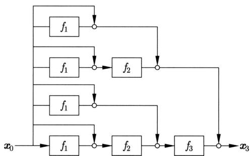  
图26.20 残差网络展开后成为神经网络的集成，左侧是原始的残差网络，右侧是展开后的神经网络集成，圆表示加法

可以看出，展开的神经网络是由深度从0到3的神经网络模块组成的集成（这里说的深度是指单元数而不是层数）。注意集成的模块之间残差单元函数存在共享，从深层到底层共享次数指数级地增加。从输入到输出有 $2^{n}$ 个路径，其中 $n$ 是残差单元个数。也就是说，输出是输入的指数量级的不同变换的线性组合。

总之，残差网络有很强的表示和学习能力。可以利用很多个残差单元的串联连接，构建很深的神经网络，解决深度神经网络训练困难的问题，包括有效地防止梯度消失和梯度爆炸。实际的实现中也使用批量归一化，以应对内部协变量偏移。

# 4. 图片分类

图片分类时残差网络 ResNet 使用卷积神经网络。每一个残差单元由两个卷积层及残差连接组成。输入是特征图 $X$ ，输出是特征图 $Y$ 。首先，在第一个卷积层通过卷积变换 $W_{1}$

将输入 $X$ 转换为 $Z_{1}$ (式 (26.36)), 再通过relu将 $Z_{1}$ 转换为 $X_{1}$ (式 (26.37))。然后, 在第二个卷积层通过卷积变换 $\mathbf{W}_{2}$ 将 $X_{1}$ 转换为 $Z_{2}$ (式 (26.38)), 求 $Z_{2}$ 与输入 $X$ 之和, 再通过relu对这个和进行转换得到输出 $Y$ (式 (26.39), 其中 $Z_{2}$ 与 $X$ 之和的计算通过残差连接实现。

$$
\boldsymbol {Z} _ {1} = \boldsymbol {W} _ {1} * \boldsymbol {X} \tag {26.36}
$$

$$
\boldsymbol {X} _ {1} = \operatorname {r e l u} \left(\boldsymbol {Z} _ {1}\right) \tag {26.37}
$$

$$
\boldsymbol {Z} _ {2} = \boldsymbol {W} _ {2} * \boldsymbol {X} _ {1} \tag {26.38}
$$

$$
\boldsymbol {Y} = \operatorname {r e l u} \left(\boldsymbol {X} + \boldsymbol {Z} _ {2}\right) \tag {26.39}
$$

ResNet 的层数可以很深，有多个版本，包括 ResNet-18、ResNet-34 和 ResNet-152 等，这里的数字表示卷积层加输出层的层数（不包含汇聚层）。下面对 ResNet-18 做简单介绍。

图26.21显示ResNet-18的架构，有17个卷积层（Conv）、2个汇聚层（Pool）、1个输出层（Softmax）。首先有1个卷积层和1个最大汇聚层对输入的图片数据进行处理；之后有16个卷积层，共有8个残差单元，形成残差网络，对图片数据进行处理；最后有1个平均汇聚层和1个输出层给出最终预测结果。

图26.21 ResNet-18的架构（见文前彩图）  
  
每一模块表示一层，有色模块是残差网络的卷积层，每一种颜色成一组，每一组有两个残差单元。数字是核的大小和步幅

8个残差单元分4组，每两个单元成为1组。在组内特征图的大小保持不变，在相邻组之间特征图高度和宽度减半，深度增倍。也就是说，在组内进行了同规模采样，在相邻组之间进行了下采样。特征表示的复杂度整体不变。残差单元中的卷积核大小都是 $3 \times 3$ 。进行同规模采样的卷积层的步幅是1，进行下采样的卷积层的步幅是2。

表26.3列出了卷积层、汇聚层、输出层的超参数及输出特征图的大小，其中 $F$ 表示卷积核或汇聚核的大小， $S$ 表示步幅， $W$ 表示权重矩阵的大小。各层的填充的大小可以从数值推算，予以省略。

表 26.3 ResNet-18 的模型规模  

<table><tr><td></td><td>超参数</td><td>输出特征图大小</td></tr><tr><td>输入</td><td></td><td>224 × 224 × 3</td></tr><tr><td>Conv1</td><td>F=7 × 7 × 3 × 64, S=2</td><td>112 × 112 × 64</td></tr><tr><td>Pool1, Max</td><td>F=3 × 3 × 64, S=2</td><td>56 × 56 × 64</td></tr><tr><td>Conv2.1, Conv2.2, Conv2.3, Conv2.4</td><td>F=3 × 3 × 56 × 64, S=1</td><td>56 × 56 × 64</td></tr><tr><td>Conv3.1,</td><td>F=3 × 3 × 56 × 128, S=2</td><td>28 × 28 × 128</td></tr><tr><td>Conv3.2, Conv3.3, Conv3.4</td><td>F=3 × 3 × 28 × 128, S=1</td><td>28 × 28 × 128</td></tr><tr><td>Conv4.1,</td><td>F=3 × 3 × 28 × 256, S=2</td><td>14 × 14 × 256</td></tr><tr><td>Conv4.2, Conv4.3, Conv4.4</td><td>F=3 × 3 × 14 × 256, S=1</td><td>14 × 14 × 256</td></tr><tr><td>Conv5.1,</td><td>F=3 × 3 × 14 × 512, S=2</td><td>7 × 7 × 512</td></tr><tr><td>Conv5.2, Conv5.3, Conv5.4</td><td>F=3 × 3 × 7 × 512, S=1</td><td>7 × 7 × 512</td></tr><tr><td>Pool2, Mean</td><td>F=7 × 7 × 512</td><td>1 × 1 × 512</td></tr><tr><td>Softmax</td><td>W=512 × 1000</td><td>1000 × 1</td></tr></table>

# 本章概要

1. 给定输入矩阵 $\mathbf{X} = [x_{ij}]_{I\times J}$ ，核矩阵 $\mathbf{W} = [w_{mn}]_{M\times N}$ 。让核矩阵在输入矩阵上按顺序滑动，（二维）卷积是定义在核矩阵与输入矩阵的子矩阵的内积，产生输出矩阵 $\mathbf{Y} = [y_{kl}]_{K\times L}$ 。

$$
\boldsymbol {Y} = \boldsymbol {W} * \boldsymbol {X}
$$

其中， $\mathbf{Y} = [y_{kl}]_{K\times L}$ ， $y_{kl} = \sum_{m = 1}^{M}\sum_{n = 1}^{N}w_{m,n}x_{k + m - 1,l + n - 1}\circ$

2. 卷积运算的扩展可以通过增加步幅和填充。卷积运算依赖于卷积核的大小、填充的大小、步幅。卷积的输出矩阵的大小 $K \times L$ 满足

$$
K \times L = \left\lfloor \frac {I + 2 P - M}{S} + 1 \right\rfloor \times \left\lfloor \frac {J + 2 Q - N}{S} + 1 \right\rfloor
$$

其中， $I\times J$ 是输入矩阵的大小， $M\times N$ 是卷积核的大小， $P$ 和 $Q$ 是两个方向填充的大小， $S$ 是步幅的大小。

3. 卷积的输入和输出又称为特征图。二维卷积的输入和输出特征图是矩阵，三维卷积的输入和输出特征图是张量。

图像处理的红、绿、蓝三个通道的数据构成一个张量（特征图）。三维卷积作用于这样的

数据时，首先使用三个不同的二维卷积核对三个通道的输入矩阵分别进行二维卷积运算，然后将得到的三个输出矩阵相加，最终得到一个三维卷积的输出矩阵。

4. 给定输入矩阵 $\mathbf{X} = [x_{ij}]_{I\times J}$ ， $M\times N$ 虚设的核矩阵。让核矩阵在输入矩阵上滑动，得到输入矩阵的子矩阵，（二维）汇聚运算对子矩阵求最大值或平均值，产生输出矩阵 $\mathbf{Y} = [y_{kl}]_{K\times L}$ 。

$$
y _ {k l} = \max  _ {m \in \{1, 2, \dots , M \}, n \in \{1, 2, \dots , N \}} x _ {k + m - 1, l + n - 1}
$$

$$
y _ {k l} = \frac {1}{M N} \sum_ {m = 1} ^ {M} \sum_ {n = 1} ^ {N} x _ {k + m - 1, l + n - 1}
$$

汇聚运算也有填充和步幅。

5. 三维汇聚的输入和输出都是张量表示的特征图。三维汇聚对输入张量的各个矩阵分别进行计算，再将结果排列起来，产生输出张量。  
6. 卷积神经网络是具有以下特点的神经网络。输入是张量表示的数据，输出是标量，表示分类或回归的预测。经过多个卷积层，有时中间经过汇聚层，最后经过全连接层。每层的输入是张量表示的特征图，输出也是张量表示的特征图。

卷积层进行基于卷积的仿射变换和基于激活函数的非线性变换。第 $l$ 层的卷积层计算如下：

$$
\boldsymbol {Z} ^ {(l)} = \boldsymbol {W} ^ {(l)} * \boldsymbol {X} ^ {(l - 1)} + \boldsymbol {b} ^ {(l)}
$$

$$
\boldsymbol {X} ^ {(l)} = a \left(\boldsymbol {Z} ^ {(l)}\right)
$$

汇聚层进行汇聚运算。第 $l$ 层的汇聚层计算如下：

$$
\boldsymbol {X} ^ {(l)} = \operatorname {p o o l i n g} (\boldsymbol {X} ^ {(l - 1)})
$$

卷积神经网络被广泛应用于图像处理，代表的模型有LeNet、AlexNet、ResNet等。

7. 卷积神经网络的表示和学习效率比前馈神经网络高。首先层与层之间的连接是稀疏的，其次同一层的卷积的参数是共享的，这样大幅减少了参数的数量。

卷积神经网络利用卷积运算实现了图像处理需要的特征的表示。前端的神经元表示的是局部的特征，如物体的轮廓，后端的神经元表示的是全局的特征，如物体的部件。

卷积神经网络近似拥有平移不变性，不具有旋转不变性、缩放不变性。

8. 卷积神经网络的学习算法也是反向传播算法。与前馈神经网络学习的反向传播算法相似，不同点在于正向和反向传播基于卷积函数。对于每次迭代，首先通过正向传播从前往后传递信号，然后通过反向传播从后往前传递误差，最后对每层的参数进行更新。

在第 $l$ 层的卷积层，正向传播：

$$
\boldsymbol {Z} _ {k ^ {\prime}} ^ {(l)} = \sum_ {k = 1} ^ {K} \boldsymbol {W} _ {k, k ^ {\prime}} ^ {(l)} * \boldsymbol {X} _ {k} ^ {(l - 1)} + \boldsymbol {b} _ {k ^ {\prime}} ^ {(l)}
$$

$$
\boldsymbol {X} _ {k ^ {\prime}} ^ {(l)} = a \left(\boldsymbol {Z} _ {k ^ {\prime}} ^ {(l)}\right)
$$

反向传播：

$$
\boldsymbol {\delta} _ {k} ^ {(l - 1)} = \frac {\partial a}{\partial \boldsymbol {Z} _ {k} ^ {(l - 1)}} \odot \sum_ {k ^ {\prime} = 1} ^ {K ^ {\prime}} \left(\operatorname {r o t} 1 8 0 \left(\boldsymbol {W} _ {k, k ^ {\prime}} ^ {(l)}\right) * \boldsymbol {\delta} _ {k ^ {\prime}} ^ {(l)}\right)
$$

参数更新：

$$
\frac {\partial L}{\partial \boldsymbol {W} _ {k , k ^ {\prime}} ^ {(l)}} = \boldsymbol {\delta} _ {k ^ {\prime}} ^ {(l)} * \boldsymbol {X} _ {k} ^ {(l - 1)}
$$

$$
\frac {\partial L}{\partial \boldsymbol {b} _ {k ^ {\prime}} ^ {(l)}} = \boldsymbol {\delta} _ {k ^ {\prime}} ^ {(l)}
$$

在第 $l$ 层的汇聚层，正向传播：

$$
\boldsymbol {X} _ {k} ^ {(l)} = \operatorname {p o o l i n g} \left(\boldsymbol {X} _ {k} ^ {(l - 1)}\right)
$$

反向传播：

$$
\boldsymbol {\delta} _ {k} ^ {(l - 1)} = \frac {\partial a}{\partial \boldsymbol {Z} _ {k} ^ {(l - 1)}} \odot \text {u p s a m p l e} (\boldsymbol {\delta} _ {k} ^ {(l)})
$$

9. 残差网络是为了解决深度神经网络训练困难而提出的深度学习方法。假设要学习的真实模型是函数 $h(\pmb{x})$ ，也可以写作

$$
h (\boldsymbol {x}) = \boldsymbol {x} + (h (\boldsymbol {x}) - \boldsymbol {x})
$$

残差网络的想法是用一个神经网络 $f(\pmb{x})$ 近似残差 $h(\pmb{x}) - \pmb{x}$ ，用 $\pmb{x} + f(\pmb{x})$ 近似真实模型 $h(\pmb{x})$ ，整个过程以递归的方式进行。

$$
\boldsymbol {x} _ {i} = \boldsymbol {x} _ {i - 1} + f _ {i} \left(\boldsymbol {x} _ {i - 1}\right), \quad i = 1, 2, \dots , n
$$

10. 残差网络由很多个残差单元串联连接组成。每一个残差单元相当于一般的前馈网络的两层，每一层由线性变换和非线性变换组成，还有一个残差连接。

残差单元的输入是向量 $\pmb{x}$ ，输出是向量 $\pmb{y}$ 时，整个单元的运算是

$$
f \left(\boldsymbol {x}\right) = \boldsymbol {W} _ {2} \operatorname {r e l u} \left(\boldsymbol {W} _ {1} x\right)
$$

$$
\boldsymbol {y} = \operatorname {r e l u} (\boldsymbol {x} + f (\boldsymbol {x}))
$$

残差网络可以展开成多个神经网络模块的集成，有很强的表示和学习能力。

# 继续阅读

进一步学习卷积神经网络可参考文献[1]～文献[4]，特别是文献[2]有关于卷积和互相关的详细介绍。也可以阅读原始论文，NeoCognitron的论文是文献[5]，LeCun等关于CNN的工作主要在文献[6]和文献[7]，AlexNet的论文是文献[8]，ResNet的最初论文和后续论文是文献[9]～文献[11]。

# 习题

26.1 设有输入矩阵 $\mathbf{X} = [x_{ij}]_{I\times J}$ ，核矩阵 $\mathbf{W} = [w_{mn}]_{M\times N}$ ，满足 $M\ll I,N\ll J$ ，则称以下运算为二维数学卷积：

$$
\boldsymbol {Y} = \boldsymbol {W} * \boldsymbol {X}
$$

产生输出矩阵 $\mathbf{Y} = [y_{kl}]_{K\times L}$ ，其中，

$$
y _ {k l} = \sum_ {m = 1} ^ {M} \sum_ {n = 1} ^ {N} w _ {m n} x _ {i - m + 1, j - n + 1}
$$

$$
K = I - M + 1, L = J - N + 1
$$

证明数学卷积和深度学习卷积有以下关系：

$$
\boldsymbol {W} \circledast \boldsymbol {X} = \operatorname {r o t} 1 8 0 (\boldsymbol {W}) * \boldsymbol {X}
$$

这里 $\text{串}$ 表示数学卷积，\*表示深度学习卷积，rot180（）表示对矩阵的 $180^{\circ}$ 旋转。

26.2 假设有矩阵

$$
\boldsymbol {A} = \left[ \begin{array}{l l l l} 3 & 2 & 0 & 1 \\ 0 & 2 & 1 & 2 \\ 2 & 0 & 0 & 3 \\ 2 & 3 & 1 & 2 \end{array} \right], \quad \boldsymbol {B} = \left[ \begin{array}{l l l} 2 & 1 & 2 \\ 0 & 0 & 3 \\ 0 & 0 & 2 \end{array} \right]
$$

其中， $\mathbf{A}$ 是输入矩阵， $\mathbf{B}$ 是核矩阵，可以求得数学卷积 $\mathbf{B} * \mathbf{A}$ 是

$$
\boldsymbol {B} \circledast \boldsymbol {A} = \left[ \begin{array}{c c c c c c} 6 & 7 & 8 & 6 & 1 & 3 \\ 0 & 4 & 1 3 & 1 5 & 4 & 7 \\ 4 & 2 & 1 0 & 1 6 & 6 & 1 4 \\ 4 & 8 & 1 5 & 1 5 & 6 & 1 7 \\ 0 & 0 & 1 0 & 9 & 3 & 1 2 \\ 0 & 0 & 4 & 6 & 2 & 4 \end{array} \right]
$$

试求数学卷积 $A * B$ ，并验证数学卷积满足交换律。

26.3 验证深度学习卷积（互相关）不满足交换律。  
26.4 CNN 也可以用于一维数据的处理，求图 26.22 所示的一维卷积。  
26.5 通过例26.2验证卷积运算不具有旋转可变性。假设对图片数据进行 $90^{\circ}$ 顺时针和逆时针旋转。  
26.6 证明感受野的关系式 (26.19) 成立。  
26.7 设计一个基于CNN的自然语言句子分类模型。假设句子是单词序列，每个单词用一个实数向量表示。

  
图26.22

26.8 设有输入矩阵 $X$ 和核矩阵 $\mathbf{W}$

$$
\boldsymbol {X} = \left[ x _ {i j} \right] = \left[ \begin{array}{c c c c c} x _ {1 1} & x _ {1 2} & x _ {1 3} & x _ {1 4} & x _ {1 5} \\ x _ {2 1} & x _ {2 1} & x _ {2 3} & x _ {2 4} & x _ {2 5} \\ x _ {3 1} & x _ {3 2} & x _ {3 3} & x _ {3 4} & x _ {3 5} \\ x _ {4 1} & x _ {4 2} & x _ {4 3} & x _ {4 4} & x _ {4 5} \end{array} \right], \quad \boldsymbol {W} = \left[ w _ {m n} \right] = \left[ \begin{array}{c c c} w _ {1 1} & w _ {1 2} & w _ {1 3} \\ w _ {2 1} & w _ {2 2} & w _ {2 3} \\ w _ {3 1} & w _ {3 2} & w _ {3 3} \end{array} \right]
$$

有卷积 $\mathbf{Y} = \mathbf{W}*\mathbf{X}$

$$
\mathbf {Y} = \left[ y _ {k l} \right] = \left[ \begin{array}{l l l} y _ {1 1} & y _ {1 2} & y _ {1 3} \\ y _ {2 1} & y _ {2 2} & y _ {2 3} \\ y _ {3 1} & y _ {3 2} & y _ {3 3} \end{array} \right]
$$

求 $\frac{\partial \mathbf{Y}}{\partial \mathbf{W}}$ 和 $\frac{\partial \mathbf{Y}}{\partial \mathbf{X}}$ ，并具体地写出 $\frac{\mathrm{d}y_{kl}}{\mathrm{d}w_{mn}}$ 和 $\frac{\mathrm{d}y_{kl}}{\mathrm{d}x_{ij}}$ 。

26.9 设有输入矩阵 $X$ 和核矩阵 $\mathbf{W}$

$$
\boldsymbol {X} = \left[ \begin{array}{l l l} x _ {1 1} & x _ {1 2} & x _ {1 3} \\ x _ {2 1} & x _ {2 2} & x _ {2 3} \\ x _ {3 1} & x _ {3 2} & x _ {3 3} \end{array} \right], \quad \boldsymbol {W} = \left[ \begin{array}{l l l} w _ {1 1} & w _ {1 2} & w _ {1 3} \\ w _ {2 1} & w _ {2 2} & w _ {2 3} \\ w _ {3 1} & w _ {3 2} & w _ {3 3} \end{array} \right]
$$

验证 $\operatorname{rot} 180(\boldsymbol{W}) * \boldsymbol{X} = \operatorname{rot} 180(\boldsymbol{X}) * \boldsymbol{W}$ 成立。

26.10 解释残差网络为什么能防止梯度消失和梯度爆炸。

# 参考文献

[1] GOODFELLOW I, BENGIO Y, COURVILLE A. Deep learning[M]. MIT Press, 2016.   
[2] 邱锡鹏. 神经网络与深度学习 [M]. 北京：机械工业出版社，2020.

[3] 阿斯顿·张，李沐，扎卡里·C.立顿，等．动手学深度学习[M].北京：人民邮电出版社，2019.  
[4] 斋藤康毅. 深度学习入门: 基于 Python 的理论与实现 [M]. 陆宇杰, 译. 北京: 人民邮电出版社, 2018.  
[5] FUKUSHIMA K. Neocognitron: A self-organizing neural network model for a mechanism of pattern recognition unaffected by shift in position[J]. Biological Cybernetics, 1980, 36(4): 193–202.   
[6] LECUN Y, Boser B, DENKER J S, et al. Backpropagation applied to handwritten zip code recognition[J]. Neural Computation, 1989, 1(4): 541-551.   
[7] LECUN Y, BOTTOU L, BENGIO Y, et al. Gradient-based learning applied to document recognition[J]. Proceedings of the IEEE, 1998, 86(11): 2278-2324.   
[8] KRIZHEVSKY A, SUTSKEVER I, HINTON G E. ImageNet classification with deep convolutional neural networks[J]. Advances in Neural Information Processing Systems, 2012: 1097-1105.   
[9] HE K, ZHANG X, REN S, et al. Deep residual learning for image recognition[C]//Proceedings of the IEEE Conference on Computer Vision and Pattern Recognition. 2016: 770-778.   
[10] HE K, ZHANG X, REN S, et al. Identity mappings in deep residual networks[C]//European Conference on Computer Vision. 2016: 630-645.   
[11] VEIT A, WILBER M, BELONGIE S. Residual networks behave like ensembles of relatively shallow networks[C]//Proceedings of the 30th International Conference on Neural Information Processing System. 2016: 550-558.

# 第27章 循环神经网络

循环神经网络（recurrent neural network，RNN）是对一维序列数据进行预测的神经网络。循环神经网络在序列数据的每一个位置上具有相同的结构（因此是“循环”的），也可以看作在序列数据上展开的前馈神经网络。循环神经网络的核心是隐层的输出，表示当前位置的状态，描述序列数据的顺序依存关系。

循环神经网络有多种类型，包括长短期记忆（long short term memory，LSTM）网络、门控循环单元（gated recurrent unit, GRU）网络、深度循环神经网络、双向循环神经网络。循环神经网络的学习通常使用反向传播算法。循环神经网络的应用领域包括自然语言处理、语音处理、时间序列预测。在自然语言处理中用于分类、序列标注、语言模型等。

Jordan 于 1986 年提出了最早的一种循环神经网络，Elman 于 1990 年提出了简单循环神经网络，Hochreiter 和 Schmidhuber 于 1997 年提出了长短期记忆网络 LSTM，Cho 等于 2014 年提出了门控循环单元网络 GRU。

本章27.1节讲述简单循环神经网络，27.2节叙述其他常用的循环神经网络，27.3节介绍循环神经网络在自然语言处理中的应用。

# 27.1 简单循环神经网络

循环神经网络是一系列神经网络的统一名称，其主要特点是在一维序列数据上重复使用相同的结构，对序列数据中的依存关系建模，用于序列数据的预测。本节讲述简单循环神经网络。简单循环神经网络是最基本的模型，大多数循环神经网络都是其扩展，学习算法是反向传播。

# 27.1.1 模型

# 1. 模型定义

考虑序列数据的预测问题。给定输入的实数向量序列 $\pmb{x}_1, \pmb{x}_2, \dots, \pmb{x}_T$ ；在第 $t = 1, 2, \dots, T$ 个位置上①，对实数向量 $\pmb{x}_t$ 进行预测，给出概率分布 $\pmb{p}_t$ ；整体产生输出的概率向量序列 $\pmb{p}_1, \pmb{p}_2, \dots, \pmb{p}_T$ 。

一个朴素的方法是用前馈神经网络完成这个任务。假设序列数据的长度固定，将输入的

实数向量序列拼接，作为前馈神经网络的输入，将输出的概率向量序列拼接，作为前馈神经网络的输出。这个方法在序列数据预测，特别是时间序列预测上存在两个问题。一个是序列长度问题。序列数据的长度通常是可变的，而前馈神经网络的输入层的宽度是固定的，需要对数据进行截断或补齐处理（比如 $O$ 向量补齐）。但无论如何，不易处理任意长度的序列数据。另一个是局部特征的表示和学习问题。序列数据通常在不同位置上有相似的局部特征，而前馈神经网络对不同位置的局部特征是分开表示和学习的，产生冗余，会降低表示和学习的效率。

循环神经网络的基本想法是：在序列数据的每一个位置上重复使用相同的前馈神经网络，并将相邻位置的神经网络连接起来；用前馈神经网络隐层的输出表示当前位置的“状态”，假设当前位置的状态依赖于当前位置的输入和之前位置的状态。这样就可以表示和学习序列数据中的局部和全局特征，并解决以上两个问题。本书称在每个位置的运算为单元运算。

循环神经网络的基本模型是简单循环神经网络（simple recurrent neural network，S-RNN）。下面给出定义。

定义27.1（简单循环神经网络）称以下的神经网络为简单循环神经网络。神经网络以序列数据 $x_{1}, x_{2}, \dots, x_{T}$ 为输入，每一个元素是一个实数向量。在每一个位置上重复使用同一个神经网络结构。在第 $t$ 个位置上 $(t = 1, 2, \dots, T)$ ，神经网络的隐层或中间层以 $x_{t}$ 和 $h_{t-1}$ 为输入，以 $h_{t}$ 为输出，其间有以下关系成立：

$$
\boldsymbol {h} _ {t} = \tanh  (\boldsymbol {U} \cdot \boldsymbol {h} _ {t - 1} + \boldsymbol {W} \cdot \boldsymbol {x} _ {t} + \boldsymbol {b}) \tag {27.1}
$$

其中， $\pmb{x}_t$ 表示第 $t$ 个位置上的输入，是一个实数向量 $(x_{t,1}, x_{t,2}, \dots, x_{t,n})^{\mathrm{T}}$ ； $h_{t-1}$ 表示第 $t-1$ 个位置的状态，也是一个实数向量 $(h_{t-1,1}, h_{t-1,2}, \dots, h_{t-1,m})^{\mathrm{T}}$ ； $h_t$ 表示第 $t$ 个位置的状态 $(h_{t,1}, h_{t,2}, \dots, h_{t,m})^{\mathrm{T}}$ ，也是一个实数向量； $\pmb{U}, \pmb{W}$ 是权重矩阵； $\pmb{b}$ 是偏置向量。神经网络的输出层以 $\pmb{h}_t$ 为输入， $\pmb{p}_t$ 为输出，有以下关系成立：

$$
\boldsymbol {p} _ {t} = \operatorname {s o f t m a x} (\boldsymbol {V} \cdot \boldsymbol {h} _ {t} + \boldsymbol {c}) \tag {27.2}
$$

其中， $\pmb{p}_t$ 表示第 $t$ 个位置上的输出，是一个概率向量 $(p_{t,1}, p_{t,2}, \dots, p_{t,l})^{\mathrm{T}}$ ，满足 $p_{t,i} \geqslant 0$ $(i = 1,2,\dots,l)$ ， $\sum_{i=1}^{l} p_{t,i} = 1$ ； $\pmb{V}$ 是权重矩阵； $\pmb{c}$ 是偏置向量。神经网络输出序列数据 $\pmb{p}_1, \pmb{p}_2, \dots, \pmb{p}_T$ ，每一个元素是一个概率向量。

以上公式还可以写作

$$
\boldsymbol {r} _ {t} = \boldsymbol {U} \cdot \boldsymbol {h} _ {t - 1} + \boldsymbol {W} \cdot \boldsymbol {x} _ {t} + \boldsymbol {b} \tag {27.3}
$$

$$
\boldsymbol {h} _ {t} = \tanh  \left(\boldsymbol {r} _ {t}\right) \tag {27.4}
$$

$$
\boldsymbol {z} _ {t} = \boldsymbol {V} \cdot \boldsymbol {h} _ {t} + \boldsymbol {c} \tag {27.5}
$$

$$
\boldsymbol {p} _ {t} = \operatorname {s o f t m a x} \left(\boldsymbol {z} _ {t}\right) \tag {27.6}
$$

其中， $r_t$ 是隐层的净输入向量， $z_t$ 是输出层的净输入向量。隐层的激活函数通常是双曲正切函数，也可以是其他激活函数；输出层的激活函数通常是软最大化函数（见第25章）。

这里神经网络在每一个位置都产生输出，也可以只在最后一个位置产生输出，是一种特殊情况。通常假定 $h_0 = 0$ ，即 $h_0$ 是每一个元素为 0 的向量。

图27.1给出简单循环神经网络S-RNN的架构。可以看作在序列数据上展开的（unfolded）前馈神经网络，其中参数在各个位置共享。图27.2给出S-RNN的折叠（folded）形式。

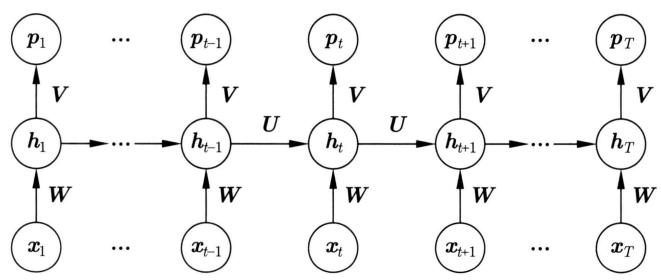  
图27.1 简单循环神经网络架构（展开形式）偏置向量被省去

  
图27.2 简单循环神经网络架构（折叠形式）偏置向量被省去

# 2. 模型特点

循环神经网络①的定义中不仅涉及输入的空间和输出的空间，而且涉及状态的空间，并且状态的空间起着重要作用。这一点与一般的前馈神经网络不同。S-RNN对依次给定的输入的实数向量序列 $x_{1}, x_{2}, \dots, x_{T}$ ，首先依次生成状态的实数向量序列 $h_{1}, h_{2}, \dots, h_{T}$ ，然后再依次生成输出的概率向量序列 $p_{1}, p_{2}, \dots, p_{T}$ 。在这个过程中，起核心作用的是式(27.1)的非线性变换，意味着当前位置的状态 $h_{t}$ 由当前位置的输入 $x_{t}$ 和之前位置的状态 $h_{t-1}$ 决定。按顺序反向递归，可以看出每一个位置的状态表示的是到这个位置为止的序列数据的局部特征及全局特征，也称作短距离依存关系和长距离依存关系。

循环神经网络是自回归模型（auto-regressive model），也就是说，在序列数据的每一个位置上的预测只使用之前位置的信息，适用于时间序列的预测。循环神经网络的计算需要在序列数据上依次进行。循环神经网络的优点是可以处理任意长度的序列数据，缺点是不能进行并行处理以提高计算效率。

循环神经网络具有强大的表示能力，是动态系统（dynamical system）的通用模型。自然界和人工界随时间变化的动态系统有如下基本形式。

$$
\begin{array}{l} \boldsymbol {s} (t) = F (\boldsymbol {x} (t), \boldsymbol {s} (t - 1)) \\ \boldsymbol {y} (t) = G (\boldsymbol {s} (t)) \\ \end{array}
$$

这里 $\boldsymbol{s}(t)$ 表示系统在时刻 $t$ 的状态， $\boldsymbol{x}(t)$ 表示系统在时刻 $t$ 的输入， $\boldsymbol{s}(t-1)$ 表示系统在时刻 $(t-1)$ 的状态， $\boldsymbol{y}(t)$ 表示系统在时刻 $t$ 的输出， $F(\cdot)$ 表示系统的状态函数， $G(\cdot)$ 表示系统的输出函数。也就是说，系统的当前状态由当前的输入和之前的状态决定，而系统当前的输出由当前的状态决定。如果系统的初始状态以及在每一个时刻的输入依次确定，那么系统的每一个时刻的状态也就依次确定，每一个时刻的输出也依次确定。整个过程是一个确定性的过程，由状态函数和输出函数决定。动态系统的核心是状态之间按时间顺序的依存关系。可以看出，简单循环神经网络 S-RNN 是描述动态系统的非线性模型（见式 (27.1) 和式 (27.2))。

循环神经网络也是计算的通用模型，可以模拟图灵机。理论证明，图灵机可计算的任何函数都可以通过有限规模的循环网络来计算[1]。也就是说，循环神经网络可以计算任意可计算的函数，这里说的函数可计算是指丘奇-图灵论题定义的函数可计算。

# 27.1.2 学习算法

# 1. 反向传播算法

简单循环神经网络S-RNN的学习算法是反向传播算法。为了简单，考虑根据一个样本进行参数更新的情况，使用随机梯度下降法。

假设要学习的循环神经网络是 $f(\pmb{x};\pmb{\theta})$ ，参数是 $\pmb{\theta}$ 。训练样本由输入序列 $\pmb{x}_1,\pmb{x}_2,\dots ,\pmb{x}_T$ 和（真值）输出序列 $\pmb{y}_1,\pmb{y}_2,\dots ,\pmb{y}_T$ 组成，其中 $\pmb{x}_t$ 是第 $t$ 个位置的输入实数向量（ $t = 1,2,\dots ,T$ ）， $\pmb{y}_t$ 是第 $t$ 个位置的（真值）输出独热向量，表示这个位置的类别。

计算给定输入序列 $x_{1}, x_{2}, \dots, x_{T}$ 条件下产生输出序列 $y_{1}, y_{2}, \dots, y_{T}$ 的条件概率：

$$
P \left(\boldsymbol {y} _ {1}, \boldsymbol {y} _ {2}, \dots , \boldsymbol {y} _ {T} \mid \boldsymbol {x} _ {1}, \boldsymbol {x} _ {2}, \dots , \boldsymbol {x} _ {T}\right) = \prod_ {t = 1} ^ {T} P \left(\boldsymbol {y} _ {t} \mid \boldsymbol {x} _ {1}, \boldsymbol {x} _ {2}, \dots , \boldsymbol {x} _ {t}\right) \tag {27.7}
$$

其中，条件概率 $P(\pmb{y}_t|\pmb{x}_1,\pmb{x}_2,\dots,\pmb{x}_t)$ 由循环神经网络 $f(\pmb{x};\pmb{\theta})$ 计算得出。计算序列整体的交叉熵：

$$
L = \sum_ {t = 1} ^ {T} L _ {t} = - \sum_ {t = 1} ^ {T} \log P \left(\boldsymbol {y} _ {t} \mid \boldsymbol {x} _ {1}, \boldsymbol {x} _ {2}, \dots , \boldsymbol {x} _ {t}\right) \tag {27.8}
$$

目标是最小化交叉熵。通过随机梯度下降更新参数 $\theta$

$$
\boldsymbol {\theta} \leftarrow \boldsymbol {\theta} - \eta \cdot \frac {\partial L}{\partial \boldsymbol {\theta}} \tag {27.9}
$$

关键是计算梯度 $\frac{\partial L}{\partial\theta}$

图27.3是表示损失函数及其梯度的计算图。S-RNN的定义采用式(27.3)～式(27.6)。考虑梯度的反向传播，关键是计算偏导数 $\frac{\partial L}{\partial z_t}$ 和 $\frac{\partial L}{\partial r_t}$ 。

  
图27.3 简单循环神经网络学习的计算图

梯度的反向传播从结点 $L$ 开始。首先计算损失函数 $L$ 对各个位置上的损失 $L_{t}$ 的偏导数 $\frac{\partial L}{\partial L_t}$

$$
\frac {\partial L}{\partial L _ {t}} = 1, \quad t = 1, 2, \dots , T \tag {27.10}
$$

接着计算损失函数 $L$ 对各个位置上的输出层净输入 $\mathbf{z}_t$ 的偏导数 $\frac{\partial L}{\partial \mathbf{z}_t}$ （推导见附录F）：

$$
\frac {\partial L}{\partial \boldsymbol {z} _ {t}} = \frac {\partial L}{\partial L _ {t}} \frac {\partial L _ {t}}{\partial \boldsymbol {z} _ {t}} = \boldsymbol {p} _ {t} - \boldsymbol {y} _ {t}, \quad t = 1, 2, \dots , T \tag {27.11}
$$

然后计算损失函数 $L$ 对各个位置上的隐层净输入 $\boldsymbol{r}_t$ 的偏导数 $\frac{\partial L}{\partial \boldsymbol{r}_t}$ 。注意隐层各个位置的净输入之间也有依存关系，所以需要先计算第 $T$ 个位置的偏导数，再依次计算第 $T - 1$ 个到第1个位置的偏导数。第 $T$ 个位置的偏导数 $\frac{\partial L}{\partial \boldsymbol{r}_T}$ 只需通过 $\frac{\partial L}{\partial z_T}$ 计算：

$$
\frac {\partial L}{\partial \boldsymbol {r} _ {T}} = \frac {\partial \boldsymbol {z} _ {T}}{\partial \boldsymbol {r} _ {T}} \frac {\partial L}{\partial \boldsymbol {z} _ {T}} = \frac {\partial \boldsymbol {h} _ {T}}{\partial \boldsymbol {r} _ {T}} \frac {\partial \boldsymbol {z} _ {T}}{\partial \boldsymbol {h} _ {T}} \frac {\partial L}{\partial \boldsymbol {z} _ {T}} = \operatorname {d i a g} \left(\boldsymbol {1} - \tanh  ^ {2} \boldsymbol {r} _ {T}\right) \cdot \boldsymbol {V} ^ {\mathrm {T}} \cdot \frac {\partial L}{\partial \boldsymbol {z} _ {T}} \tag {27.12}
$$

第 $t$ 个位置的偏导数 $\frac{\partial L}{\partial \boldsymbol{r}_t}$ 需要通过 $\frac{\partial L}{\partial \boldsymbol{r}_{t+1}}$ 和 $\frac{\partial L}{\partial \boldsymbol{z}_t}$ 计算：

$$
\begin{array}{l} \frac {\partial L}{\partial \boldsymbol {r} _ {t}} = \frac {\partial \boldsymbol {r} _ {t + 1}}{\partial \boldsymbol {r} _ {t}} \frac {\partial L}{\partial \boldsymbol {r} _ {t + 1}} + \frac {\partial \boldsymbol {z} _ {t}}{\partial \boldsymbol {r} _ {t}} \frac {\partial L}{\partial \boldsymbol {z} _ {t}} = \frac {\partial \boldsymbol {h} _ {t}}{\partial \boldsymbol {r} _ {t}} \frac {\partial \boldsymbol {r} _ {t + 1}}{\partial \boldsymbol {h} _ {t}} \frac {\partial L}{\partial \boldsymbol {r} _ {t + 1}} + \frac {\partial \boldsymbol {h} _ {t}}{\partial \boldsymbol {r} _ {t}} \frac {\partial \boldsymbol {z} _ {t}}{\partial \boldsymbol {h} _ {t}} \frac {\partial L}{\partial \boldsymbol {z} _ {t}} \\ = \operatorname {d i a g} \left(\boldsymbol {1} - \tanh  ^ {2} \boldsymbol {r} _ {t}\right) \cdot \boldsymbol {U} ^ {\mathrm {T}} \cdot \frac {\partial L}{\partial \boldsymbol {r} _ {t + 1}} + \operatorname {d i a g} \left(\boldsymbol {1} - \tanh  ^ {2} \boldsymbol {r} _ {t}\right) \cdot \boldsymbol {V} ^ {\mathrm {T}} \cdot \frac {\partial L}{\partial \boldsymbol {z} _ {t}}, \\ \end{array}
$$

$$
t = T - 1, \dots , 2, 1 \tag {27.13}
$$

图27.4显示在神经网络上梯度反向传播的过程。梯度 $\frac{\partial L}{\partial r_t}$ 的计算从第 $T$ 个位置到第1个位置依次进行。因为与序列（时间）的顺序是相反的，所以这个算法被称为随时间的反向传播算法（back propagation through time, BPTT）。

  
图27.4 简单循环神经网络上的反向传播（见文前彩图）

下面计算损失函数对各个参数的偏导数，注意参数是在每一个位置共享的，所以要对所有位置求和。

$$
\frac {\partial L}{\partial \boldsymbol {c}} = \sum_ {t = 1} ^ {T} \frac {\partial \boldsymbol {z} _ {t}}{\partial \boldsymbol {c}} \frac {\partial L}{\partial \boldsymbol {z} _ {t}} = \sum_ {t = 1} ^ {T} \frac {\partial L}{\partial \boldsymbol {z} _ {t}} \tag {27.14}
$$

$$
\frac {\partial L}{\partial \boldsymbol {V}} = \sum_ {t = 1} ^ {T} \frac {\partial z _ {t}}{\partial \boldsymbol {V}} \frac {\partial L}{\partial z _ {t}} = \sum_ {t = 1} ^ {T} \frac {\partial L}{\partial z _ {t}} \cdot \boldsymbol {h} _ {t} ^ {\mathrm {T}} \tag {27.15}
$$

这里 $\frac{\partial h_t}{\partial V}, \frac{\partial Z_t}{\partial V}$ 是张量。

$$
\frac {\partial L}{\partial \boldsymbol {b}} = \sum_ {t = 1} ^ {T} \frac {\partial \boldsymbol {r} _ {t}}{\partial \boldsymbol {b}} \frac {\partial L}{\partial \boldsymbol {r} _ {t}} = \sum_ {t = 1} ^ {T} \frac {\partial L}{\partial \boldsymbol {r} _ {t}} \tag {27.16}
$$

$$
\frac {\partial L}{\partial \boldsymbol {U}} = \sum_ {t = 1} ^ {T} \frac {\partial \boldsymbol {r} _ {t}}{\partial \boldsymbol {U}} \frac {\partial L}{\partial \boldsymbol {r} _ {t}} = \sum_ {t = 1} ^ {T} \frac {\partial L}{\partial \boldsymbol {r} _ {t}} \cdot \boldsymbol {h} _ {t - 1} ^ {\mathrm {T}} \tag {27.17}
$$

这里 $\frac{\partial h_t}{\partial U}, \frac{\partial r_t}{\partial U}$ 是张量。

$$
\frac {\partial L}{\partial \boldsymbol {W}} = \sum_ {t = 1} ^ {T} \frac {\partial \boldsymbol {r} _ {t}}{\partial \boldsymbol {W}} \frac {\partial L}{\partial \boldsymbol {r} _ {t}} = \sum_ {t = 1} ^ {T} \frac {\partial L}{\partial \boldsymbol {r} _ {t}} \cdot \boldsymbol {x} _ {t} ^ {\mathrm {T}} \tag {27.18}
$$

这里 $\frac{\partial h_t}{\partial W}, \frac{\partial r_t}{\partial W}$ 是张量。之后根据式 (27.9) 更新参数，完成一轮迭代。

算法27.1给出具体算法。可以看出它是前馈神经网络的反向算法的推广。

# 算法27.1（随时间的反向传播算法）

输入：循环神经网络 $\pmb{y} = f(\pmb{x};\pmb{\theta})$ ，参数 $\pmb{\theta}$ ，样本 $(x_{1},x_{2},\dots ,x_{T})$ 和 $(y_{1},y_{2},\dots ,y_{T})$ 。

输出：更新的参数 $\theta$ 。

超参数：学习率 $\eta$ 。

{

1. 正向传播，得到各个位置的输出

For $t = 1,2,\dots ,T$ ,do{

将信号从前向后传播，计算隐层的输出 $h_t$ 和输出层的输出 $p_t$

$$
\boldsymbol {r} _ {t} = \boldsymbol {U} \cdot \boldsymbol {h} _ {t - 1} + \boldsymbol {W} \cdot \boldsymbol {x} _ {t} + \boldsymbol {b}
$$

$$
\boldsymbol {h} _ {t} = \tanh  \left(\boldsymbol {r} _ {t}\right)
$$

$$
\boldsymbol {z} _ {t} = \boldsymbol {V} \cdot \boldsymbol {h} _ {t} + c
$$

$$
\boldsymbol {p} _ {t} = \operatorname {s o f t m a x} \left(\boldsymbol {z} _ {t}\right)
$$

}

2. 反向传播，得到各个位置的梯度

For $t = T,\dots ,2,1$ ，do{

计算输出层的梯度 $\frac{\partial L}{\partial z_t}$

$$
\frac {\partial L}{\partial z _ {t}} = \boldsymbol {p} _ {t} - \boldsymbol {y} _ {t}
$$

将梯度从后向前传播, 计算隐层的梯度 $\frac{\partial L}{\partial \boldsymbol{r}_{t}}$

If $(t < T)$ {

$$
\frac {\partial L}{\partial \boldsymbol {r} _ {t}} = \operatorname {d i a g} \left(\boldsymbol {1} - \tanh ^ {2} \boldsymbol {r} _ {t}\right) \cdot \boldsymbol {U} ^ {\mathrm {T}} \cdot \frac {\partial L}{\partial \boldsymbol {r} _ {t + 1}} + \operatorname {d i a g} \left(\boldsymbol {1} - \tanh ^ {2} \boldsymbol {r} _ {t}\right) \cdot \boldsymbol {V} ^ {\mathrm {T}} \cdot \frac {\partial L}{\partial \boldsymbol {z} _ {t}}
$$

} else {

$$
\frac {\partial L}{\partial \boldsymbol {r} _ {T}} = \operatorname {d i a g} \left(\boldsymbol {1} - \tanh ^ {2} \boldsymbol {r} _ {T}\right) \cdot \boldsymbol {V} ^ {\mathrm {T}} \cdot \frac {\partial L}{\partial \boldsymbol {z} _ {T}}
$$

}

}

3. 进行参数更新

计算梯度

$$
\frac {\partial L}{\partial c} = \sum_ {t = 1} ^ {T} \frac {\partial L}{\partial z _ {t}}
$$

$$
\frac {\partial L}{\partial \boldsymbol {V}} = \sum_ {t = 1} ^ {T} \frac {\partial L}{\partial z _ {t}} \cdot \boldsymbol {h} _ {t} ^ {\mathrm {T}}
$$

$$
\frac {\partial L}{\partial \boldsymbol {b}} = \sum_ {t = 1} ^ {T} \frac {\partial L}{\partial \boldsymbol {r} _ {t}}
$$

$$
\frac {\partial L}{\partial \boldsymbol {U}} = \sum_ {t = 1} ^ {T} \frac {\partial L}{\partial \boldsymbol {r} _ {t}} \cdot \boldsymbol {h} _ {t - 1} ^ {\mathrm {T}}
$$

$$
\frac {\partial L}{\partial \boldsymbol {W}} = \sum_ {t = 1} ^ {T} \frac {\partial L}{\partial \boldsymbol {r} _ {t}} \cdot \boldsymbol {x} _ {t} ^ {\mathrm {T}}
$$

根据梯度下降公式更新参数

$$
\boldsymbol {c} \leftarrow \boldsymbol {c} - \eta \frac {\partial L}{\partial \boldsymbol {c}}
$$

$$
\boldsymbol {V} \leftarrow \boldsymbol {V} - \eta \frac {\partial L}{\partial \boldsymbol {V}}
$$

$$
\boldsymbol {b} \leftarrow \boldsymbol {b} - \eta \frac {\partial L}{\partial \boldsymbol {b}}
$$

$$
\boldsymbol {W} \leftarrow \boldsymbol {W} - \eta \frac {\partial L}{\partial \boldsymbol {W}}
$$

$$
\boldsymbol {U} \leftarrow \boldsymbol {U} - \eta \frac {\partial L}{\partial \boldsymbol {U}}
$$

4. 返回更新的参数

}

# 2. 梯度消失与爆炸

在循环神经网络的学习过程中，会产生梯度消失和梯度爆炸。造成消失与爆炸的原因与前馈神经网络相同。反向传播的计算依赖以下矩阵的连乘，有可能使得到的矩阵的一些元素趋近0或无穷大（见第25章）。

$$
\boldsymbol {A} _ {t} = \operatorname {d i a g} \left(\mathbf {1} - \tanh  ^ {2} \boldsymbol {r} _ {t}\right) \cdot \boldsymbol {U} ^ {\mathrm {T}}
$$

循环神经网络的梯度消失与梯度爆炸更严重，因为矩阵的连乘接近矩阵的连续自乘，而前馈神经网络一般不是。为避免梯度消失和梯度爆炸，可以使用LSTM和GRU。

# 27.2 常用循环神经网络

本节讲述简单循环神经网络S-RNN的扩展，包括LSTM、GRU、深度循环神经网络、双向循环神经网络。这些循环神经网络又可以根据情况组合到一起，形成更复杂的神经网络，学习算法也是反向传播。

# 27.2.1 长短期记忆网络

# 1. 模型定义

S-RNN的每一个位置的状态以递归方式计算：

$$
\boldsymbol {h} _ {t} = \tanh  \left(\boldsymbol {U} \cdot \boldsymbol {h} _ {t - 1} + \boldsymbol {W} \cdot \boldsymbol {x} _ {t} + \boldsymbol {b}\right), \quad t = 1, 2, \dots , T \tag {27.19}
$$

状态表示序列数据中的短距离和长距离依存关系。S-RNN对短距离依存关系可以有效地表示和学习，而对长距离依存关系的处理能力有限，因为长距离依存关系在模型中会被逐渐“遗忘”。为了解决这个问题，长短期记忆（long short-term memory, LSTM）被提出。LSTM也

能解决学习中的梯度消失和梯度爆炸问题。

LSTM 的基本想法是记录并使用之前所有位置的状态，以便更好地描述短距离和长距离依存关系。为此导入两个机制，一个是记忆元（memory cell），另一个是门控（gated control）。记忆元用于记录之前位置的状态信息。门控是指用门函数来控制状态信息的使用，有三个门，包括遗忘门（forget gate）、输入门（input gate）、输出门（output gate）。之所以称其为长（的）短期记忆，是因为状态的表示包括对远距离的状态的“记忆”。

LSTM 和 GRU 又被称为门控循环神经网络（gate controlled RNN）。这里门是一个向量，每一维取值在 0 和 1 之间，与其他向量进行逐元素积计算，起到“软的”逻辑门电路的作用。当某一维取值是 1 的时候，门是开放的；取值是 0 的时候，门是关闭的。门依赖于所在位置，由所在位置的输入和之前位置的状态决定。

在循环神经网络的每一个位置上，有以当前位置的输入和之前位置的状态为输入、以当前位置的状态为输出的函数，称为单元（unit），进行的是单元运算。S-RNN 的单元就是由式(27.19)表示的函数。

定义27.2（长短期记忆网络）以下的循环神经网络称为长短期记忆网络。在循环网络的每一个位置上有状态和记忆元，以及输入门、遗忘门、输出门，构成一个单元。第 $t$ 个位置上 $(t = 1,2,\dots ,T)$ 的单元是以当前位置的输入 $\pmb{x}_t$ 、之前位置的记忆元 $c_{t - 1}$ 、之前位置的状态 $h_{t - 1}$ 为输入，以当前位置的状态 $h_t$ 和当前位置的记忆元 $c_{t}$ 为输出的函数，由以下方式计算。

$$
\boldsymbol {i} _ {t} = \sigma \left(\boldsymbol {U} _ {i} \cdot \boldsymbol {h} _ {t - 1} + \boldsymbol {W} _ {i} \cdot \boldsymbol {x} _ {t} + \boldsymbol {b} _ {i}\right) \tag {27.20}
$$

$$
\boldsymbol {f} _ {t} = \sigma \left(\boldsymbol {U} _ {f} \cdot \boldsymbol {h} _ {t - 1} + \boldsymbol {W} _ {f} \cdot \boldsymbol {x} _ {t} + \boldsymbol {b} _ {f}\right) \tag {27.21}
$$

$$
\boldsymbol {o} _ {t} = \sigma \left(\boldsymbol {U} _ {o} \cdot \boldsymbol {h} _ {t - 1} + \boldsymbol {W} _ {o} \cdot \boldsymbol {x} _ {t} + \boldsymbol {b} _ {o}\right) \tag {27.22}
$$

$$
\tilde {\boldsymbol {c}} _ {t} = \tanh  \left(\boldsymbol {U} _ {c} \cdot \boldsymbol {h} _ {t - 1} + \boldsymbol {W} _ {c} \cdot \boldsymbol {x} _ {t} + \boldsymbol {b} _ {c}\right) \tag {27.23}
$$

$$
\boldsymbol {c} _ {t} = \boldsymbol {i} _ {t} \odot \tilde {\boldsymbol {c}} _ {t} + \boldsymbol {f} _ {t} \odot \boldsymbol {c} _ {t - 1} \tag {27.24}
$$

$$
\boldsymbol {h} _ {t} = \boldsymbol {o} _ {t} \odot \tanh  \left(\boldsymbol {c} _ {t}\right) \tag {27.25}
$$

这里 $\mathbf{i}_t$ 是输入门, $\mathbf{f}_t$ 是遗忘门, $\mathbf{o}_t$ 是输出门, $\tilde{\mathbf{c}}_t$ 是中间结果。状态 $h_t$ 、记忆元 $\mathbf{c}_t$ 、输入门 $\mathbf{i}_t$ 、遗忘门 $\mathbf{f}_t$ 、输出门 $\mathbf{o}_t$ 都是向量, 其维度相同。

首先说明LSTM网络的整体架构。如图27.5所示，LSTM网络整体是一个循环神经网络。在每一个位置上有输入 $\boldsymbol{x}_t$ 、状态 $\boldsymbol{h}_t$ 、输出 $\boldsymbol{p}_t$ ，特殊的还有记忆元 $\boldsymbol{c}_t$ 。状态和记忆元的信息在LSTM单元之间传递。

接着说明LSTM的单元结构。图27.6显示的是LSTM单元的结构。第 $t$ 个位置上的单元的输入是当前位置的数据 $\pmb{x}_t$ 、之前位置的记忆元 $c_{t - 1}$ 和状态 $h_{t - 1}$ ，输出是当前位置的状态 $h_t$ 和记忆元 $c_{t}$ 。内部有三个门和一个记忆元。遗忘门 $f_{t}$ 、输入门 $\dot{\pmb{i}}_t$ 、输出门 $o_t$ 有相同的结构，都是以当前位置的输入 $\pmb{x}_t$ 和之前位置的状态 $h_{t - 1}$ 为输入的函数，相当于以S型函数为激活函数的一层神经网络(式(27.20)~式(27.22))。遗忘门决定忘记当前位置的哪些信息，输入门决定从当前位置传入哪些信息，输出门决定向下一个位置传出哪些信息。为了确定记忆元 $c_{t}$ 和状态 $h_t$ ，首先计算中间结果 $\tilde{c}_t$ ，是以当前位置的输入 $\pmb{x}_t$ 和之前位置的状态 $h_{t - 1}$ 为输入的函数，相当于以双曲正切函数为激活函数的一层神经网络(式(27.23))。然后计算当

  
图27.5 LSTM的网络架构

前位置的记忆元 $c_{t}$ , 是中间结果 $\tilde{c}_{t}$ 和之前位置的记忆元 $c_{t-1}$ 的线性组合, 分别以输入门 $i_{t}$ 和遗忘门 $f_{t}$ 为系数, 其中系数乘积是向量的逐元素积 (式 (27.24))。最后计算当前位置的状态 $h_{t}$ , 是以记忆元 $c_{t}$ 为输入的双曲正切函数的输出, 并以输出门 $o_{t}$ 为系数 (式 (27.25))。

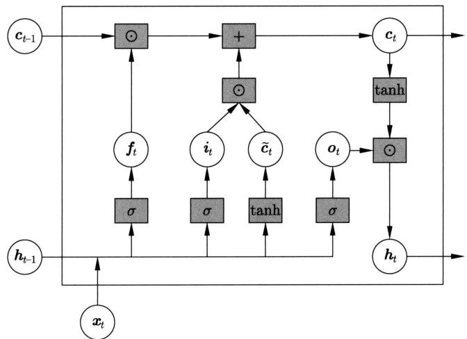  
图27.6 LSTM单元结构

# 2. 模型特点

LSTM能更好地表示和学习长距离依存关系。经验上，记忆元、输入门和遗忘门起着重要作用。

当输入门和遗忘门满足 $i_{t} = 1, f_{t} = 0$ 时，当前位置的记忆元 $c_{t}$ 只依赖于当前位置的输入 $x_{t}$ 和之前位置的状态 $h_{t-1}$ ，LSTM 是 S-RNN 的近似。当输入门和遗忘门满足 $i_{t} = 0, f_{t} = 1$ 时，当前位置的记忆元 $c_{t}$ 只依赖于当前位置的记忆元 $c_{t-1}$ ，LSTM 将当前位置的记忆元复制到当前位置。

当前位置的记忆元 $c_{t}$ 可以展开成以下形式（将推导作为习题）：

$$
\boldsymbol {c} _ {t} = \boldsymbol {i} _ {t} \odot \tilde {\boldsymbol {c}} _ {t} + \boldsymbol {f} _ {t} \odot \boldsymbol {c} _ {t - 1} = \sum_ {i = 1} ^ {t} \left(\prod_ {j = i + 1} ^ {t} \boldsymbol {f} _ {j} \odot \boldsymbol {i} _ {i}\right) \odot \tilde {\boldsymbol {c}} _ {i} = \sum_ {i = 1} ^ {t} \boldsymbol {w} _ {i} ^ {t} \odot \tilde {\boldsymbol {c}} _ {i} \tag {27.26}
$$

其中， $\boldsymbol{w}_i^t$ 表示计算得到的第 $t$ 个位置的权重。可以看出，记忆元 $\boldsymbol{c}_t$ 是之前所有位置的中间结果 $\tilde{\boldsymbol{c}}_i$ 的线性组合，而中间结果由所在位置的输入 $\boldsymbol{x}_i$ 和之前位置的状态 $\boldsymbol{h}_{i-1}$ 决定。所以，当前位置的记忆元以及状态由当前位置的状态综合决定。

学习中由于位置之间的梯度传播不是通过矩阵的连乘而是通过矩阵连乘的线性组合，所以可以避免梯度消失和梯度爆炸。

# 27.2.2 门控循环单元网络

# 1. 模型定义

门控循环单元（GRU）是对LSTM进行简化得到的模型。效果相当，但计算效率更高。GRU有两个门——更新门（update gate）和重置门（reset gate），不使用记忆元。

定义27.3（门控循环单元）以下的循环神经网络称为门控循环单元网络。在循环网络的每一个位置上有状态及重置门、更新门，构成一个单元。第 $t$ 个位置上 $(t = 1,2,\dots ,T)$ 的单元是以当前位置的输入 $\pmb{x}_t$ 、之前位置的状态 $h_{t - 1}$ 为输入，以当前位置的状态 $h_t$ 为输出的函数，按以下方式计算。

$$
\boldsymbol {r} _ {t} = \sigma \left(\boldsymbol {U} _ {r} \cdot \boldsymbol {h} _ {t - 1} + \boldsymbol {W} _ {r} \cdot \boldsymbol {x} _ {t} + \boldsymbol {b} _ {r}\right) \tag {27.27}
$$

$$
\boldsymbol {z} _ {t} = \sigma \left(\boldsymbol {U} _ {z} \cdot \boldsymbol {h} _ {t - 1} + \boldsymbol {W} _ {z} \cdot \boldsymbol {x} _ {t} + \boldsymbol {b} _ {z}\right) \tag {27.28}
$$

$$
\tilde {\boldsymbol {h}} _ {t} = \tanh  \left(\boldsymbol {U} _ {h} \cdot \boldsymbol {r} _ {t} \odot \boldsymbol {h} _ {t - 1} + \boldsymbol {W} _ {h} \cdot \boldsymbol {x} _ {t} + \boldsymbol {b} _ {h}\right) \tag {27.29}
$$

$$
\boldsymbol {h} _ {t} = \left(\boldsymbol {1} - \boldsymbol {z} _ {t}\right) \odot \tilde {\boldsymbol {h}} _ {t} + \boldsymbol {z} _ {t} \odot \boldsymbol {h} _ {t - 1} \tag {27.30}
$$

这里 $\boldsymbol{r}_t$ 是重置门, $\boldsymbol{z}_t$ 是更新门, $\tilde{\boldsymbol{h}}_t$ 是中间结果。状态 $\boldsymbol{h}_t$ 、重置门 $\boldsymbol{i}_t$ 、更新门 $\boldsymbol{f}_t$ 都是向量, 其维度相同。

图27.7是GRU网络的架构图。整体是一个循环神经网络，在每一个位置有输入 $\pmb{x}_t$ 、状态 $h_t$ 、输出 $\pmb{p}_t$ 。状态信息在GRU单元之间传递。

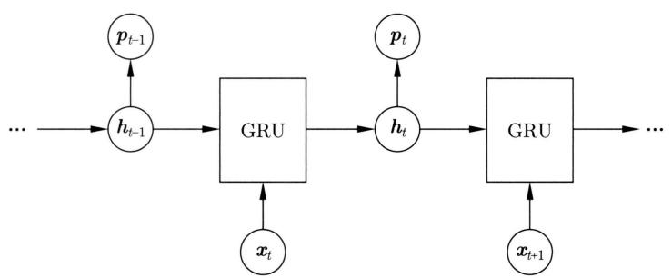  
图27.7 GRU网络的架构图

图27.8显示的是GRU单元的结构。第 $t$ 个位置上单元的输入是当前位置的数据 $\pmb{x}_t$ 、之前位置的状态 $h_{t-1}$ ，输出是当前位置的状态 $h_t$ 。重置门 $\boldsymbol{r}_t$ 、更新门 $\boldsymbol{z}_t$ 有相同的结构，都是以当前位置的输入 $\boldsymbol{x}_t$ 和之前位置的状态 $h_{t-1}$ 为输入的函数（式(27.27)和式(27.28))。首先计算中间结果 $\tilde{\boldsymbol{h}}_t$ ，是以当前位置的输入 $\boldsymbol{x}_t$ 、重置门 $\boldsymbol{r}_t$ 为系数的当前位置的状态 $h_{t-1}$ 为输入的函数，其中系数计算是向量的逐元素积（式(27.29)）。然后计算当前位置的状态 $h_t$ ，是中间