结果 $\tilde{\pmb{h}}_t$ 和之前位置的状态 $h_{t-1}$ 的加权和，分别以更新门 $\pmb{z}_t$ 和 $(1 - \pmb{z}_t)$ 为权重，其中系数乘积是向量的逐元素积 (式 (27.30))。

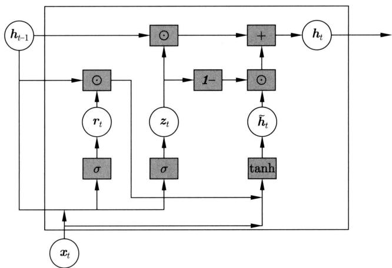  
图27.8 GRU单元的结构

# 2. 模型特点

GRU 也能很好地表示和学习长距离依存关系。更新门和重置门起着重要作用。当更新门和重置门满足 $z_{t} = 0, r_{t} = 1$ 时，当前位置的状态 $h_{t}$ 只依赖于当前位置的输入 $x_{t}$ 和之前位置的状态 $h_{t-1}$ ，GRU 回退到 S-RNN。当更新门和重置门满足 $z_{t} = 0, r_{t} = 0$ 时，当前位置的状态 $h_{t}$ 只依赖于当前位置输入 $x_{t}$ ，忽视当前位置的状态 $h_{t-1}$ 。当更新门满足 $z_{t} = 1$ 时，GRU 网络将当前位置的状态 $h_{t-1}$ 复制到当前位置，忽视当前位置输入 $x_{t}$ 。

当前位置的状态 $h_t$ 可以展开成以下形式：

$$
\boldsymbol {h} _ {t} = \boldsymbol {z} _ {t} \odot \boldsymbol {h} _ {t - 1} + \left(\boldsymbol {1} - \boldsymbol {z} _ {t}\right) \odot \tilde {\boldsymbol {h}} _ {t} = \sum_ {i = 1} ^ {t} \prod_ {j = i + 1} ^ {t} \boldsymbol {z} _ {j} \odot \left(\boldsymbol {1} - \boldsymbol {z} _ {i}\right) \odot \tilde {\boldsymbol {h}} _ {i} = \sum_ {i = 1} ^ {t} \boldsymbol {w} _ {i} ^ {t} \odot \tilde {\boldsymbol {h}} _ {i} \tag {27.31}
$$

其中， $\boldsymbol{w}_i^t$ 表示计算得到的第 $t$ 个位置的权重。可以看出，状态 $\boldsymbol{h}_t$ 是之前所有位置的中间结果 $\tilde{\boldsymbol{h}}_i$ 的加权和，而中间结果由所在位置的输入 $\boldsymbol{x}_i$ 和之前位置的状态 $\boldsymbol{h}_{i-1}$ 决定。所以，当前位置的状态由当前位置的状态综合决定。

# 27.2.3 深度循环神经网络

简单循环神经网络只有一个隐层或中间层。可以扩展到有多个隐层的神经网络，称为深度循环神经网络。多个隐层的状态之间存在层次化关系，模型具有更强的表示能力。拥有 $l$ 个隐层的深度循环神经网络在第 $t$ 个位置的定义如下。

第1个隐层是

$$
\boldsymbol {h} _ {t} ^ {(1)} = \tanh  \left(\boldsymbol {U} ^ {(1)} \cdot \boldsymbol {h} _ {t - 1} ^ {(1)} + \boldsymbol {W} ^ {(1)} \cdot \boldsymbol {x} _ {t} + \boldsymbol {b} ^ {(1)}\right) \tag {27.32}
$$

第 $l$ 个隐层是

$$
\boldsymbol {h} _ {t} ^ {(l)} = \tanh  \left(\boldsymbol {U} ^ {(l)} \cdot \boldsymbol {h} _ {t - 1} ^ {(l)} + \boldsymbol {W} ^ {(l)} \cdot \boldsymbol {h} _ {t} ^ {(l - 1)} + \boldsymbol {b} ^ {(l)}\right) \tag {27.33}
$$

输出层是

$$
\boldsymbol {p} _ {t} = \operatorname {s o f t m a x} \left(\boldsymbol {V} \cdot \boldsymbol {h} _ {t} ^ {(l)} + \boldsymbol {c}\right) \tag {27.34}
$$

图27.9是深度循环神经网络的架构图。

  
图27.9 深度循环神经网络的架构图

# 27.2.4 双向循环神经网络

简单循环神经网络描述序列数据单方向的顺序依存关系。可以扩展到双方向，称为双向循环神经网络。引入前向的循环神经网络和后向的循环神经网络，在每一个位置将两个神经网络的状态向量拼接，构成新的状态向量。拼接的向量能结合两个方向的依存关系更好地表示序列数据的全局特征，模型具有更强的表示能力。双向循环神经网络在第 $t$ 个位置的定义如下。

前向的循环神经网络的隐层（状态）是

$$
\boldsymbol {h} _ {t} ^ {(1)} = \tanh  \left(\boldsymbol {U} ^ {(1)} \cdot \boldsymbol {h} _ {t - 1} ^ {(1)} + \boldsymbol {W} ^ {(1)} \cdot \boldsymbol {x} _ {t} + \boldsymbol {b} ^ {(1)}\right) \tag {27.35}
$$

后向的循环神经网络的隐层（状态）是

$$
\boldsymbol {h} _ {t} ^ {(2)} = \tanh  \left(\boldsymbol {U} ^ {(2)} \cdot \boldsymbol {h} _ {t + 1} ^ {(2)} + \boldsymbol {W} ^ {(2)} \cdot \boldsymbol {x} _ {t} + \boldsymbol {b} ^ {(2)}\right) \tag {27.36}
$$

两者的拼接是

$$
\boldsymbol {h} _ {t} = \left[ \boldsymbol {h} _ {t} ^ {(1)}; \boldsymbol {h} _ {t} ^ {(2)} \right] \tag {27.37}
$$

其中，；表示两个向量的拼接。

$$
\boldsymbol {p} _ {t} = \operatorname {s o f t m a x} (\boldsymbol {V} \cdot \boldsymbol {h} _ {t} + \boldsymbol {c}) \tag {27.38}
$$

图27.10是双向循环神经网络的架构图。

常用的双向循环神经网络有双向 LSTM。双向 LSTM-CRF 结合双向 LSTM 和 CRF 模型，其基本架构是在双向 LSTM 的输出层引入 CRF，是序列标注的有代表性的方法。关于 CRF 可以参照第 12 章。

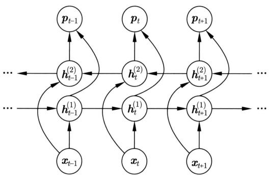  
图27.10 双向循环神经网络的架构图

# 27.3 自然语言生成中的应用

本节介绍循环神经网络在自然语言处理中的应用——语言生成。首先介绍词向量，之后介绍神经语言模型，特别是基于循环神经网络的神经语言模型。

# 27.3.1 词向量

# 1. 词向量的定义

向量或单词向量（word vector）是指表示自然语言的单词的实数向量。把自然语言的单词映射到实数向量空间也称作词嵌入或单词嵌入（word embedding）。词向量空间的维度远小于单词表的大小。词向量的内积或余弦表示单词间的相似性。自然语言处理中，通常输入是一个句子，句子中的每一个单词用词向量表示。词向量表示属于分布式表示。

机器学习中概念（特征）的表示方法起着重要作用，直接影响学习的效果和效率。图27.11的例子通过数字的不同表示法对算法的影响间接说明这一点。Hinton提出了分布式表示（distributed representation）和局部式表示（local representation）的概念，指出分布式表示作为神经网络学习的概念的表示方法具有许多优点[2]。

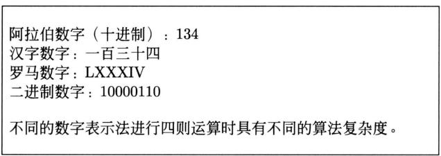  
图27.11 表示对算法产生影响的例子

假设有 $K$ 个概念，可以用两种方法表示。一种是 $K$ 维独热向量。每一个概念由一个 $K$ 维0/1向量表示，概念对应的维度取值为1，其他维度取值为0，称这种概念表示方法为局部式表示。另一种是用 $N$ 维0/1向量或者 $N$ 维实数向量，这时 $\log_2K < N\ll K$ 。每一个概念由一个 $N$ 维0/1向量或者 $N$ 维实数向量表示，称这种概念的表示方法为分布式表示。因为

这种表示由向量的所有维度组合而成，所以是“分布式的”。分布式表示的向量可以是神经网络的某一层的输出，其中每一维对应一个神经元。

分布式表示与局部式表示相比有诸多优点。首先，容易表示相似性，用于机器学习可以提高模型的学习泛化能力。当表示是 $0 / 1$ 向量时可以用汉明距离（Hamming distance），当表示是实数向量时可以用内积或余弦，很方便地计算概念之间的相似度，使学到的模型能对相似的输入产生相似输出。其次，表示的效率高。分布式表示中的维度 $K$ 远远小于局部式表示中的维度 $N$ 。再次，拥有稳健性（robustness）。由噪声等带来的表示在一定范围内的变化往往不会对相似度计算产生太大影响。最后，拥有可扩展性。有新增概念时，可以比较容易地将其表示加入已有的表示中，不需要改变表示的框架（增加维度）。事实上，有大量证据证明生物神经网络中的表示也是分布式的。

词向量是分布式表示。图27.12给出一个简单的例子。假设只有三个单词，有3维的局部式表示，2维的分布式表示。图左侧显示的是局部式表示，右侧是分布式表示。可以看出，单词的分布式表示，也就是词向量，可以用实数空间中的内积或余弦更好地描述单词之间的语义相似性。

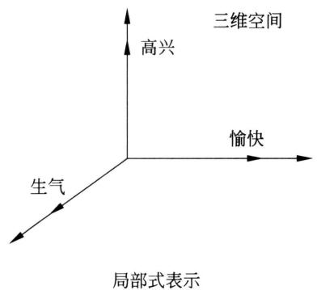

  
图27.12 词向量表示的例子

# 2. 词向量的学习

在具体的学习任务中，词向量可以作为模型的一部分同模型一起学习，也可以预先学好然后在学习中固定使用。前者适合训练数据多的情况，后者适合训练数据少的情况。词向量的预先学习通过无监督学习进行。有多种方法，这里介绍常用的跳元模型加负采样（skip-gram model with negative sampling）方法，简称跳元模型（skip-gram）。

词向量学习方法的基本想法是在大量的语料中收集单词和上下文的共现数据，从共现数据中学习每一个单词的词向量，这里的上下文是指在文章中以一个单词为中心前后固定窗口内出现的所有单词。比如，单词是“高兴”，从句子“小朋友们高兴得手舞足蹈”中可以获得窗口内四个单词组成的上下文“小朋友、们、得、手舞足蹈”。可以从共现的上下文的单词“手舞足蹈”“小朋友”等学习单词“高兴”的语义表示。参见表27.1。

假设所有单词的集合是 $\mathcal{W}$ ，所有上下文的集合是 $\mathcal{C}$ 。定义下面的单词和上下文的共现模型，代表单词 $w \in \mathcal{W}$ 和上下文 $c \in \mathcal{C}$ 共现的概率：

$$
P (d = 1 | w, c) = \frac {1}{1 + \exp (- \boldsymbol {w} \cdot \boldsymbol {c})} \tag {27.39}
$$

表 27.1 单词和上下文共现数据的例子  

<table><tr><td></td><td>高兴</td><td>愉快</td><td>生气</td></tr><tr><td>{小朋友、们、得、手舞足蹈}</td><td>55</td><td></td><td></td></tr><tr><td>{听、令人、的、音乐}</td><td>8</td><td>120</td><td></td></tr><tr><td>{单词句、描写、的、心情}</td><td>4</td><td>11</td><td>1</td></tr><tr><td>{让、人、的、缺点}</td><td></td><td></td><td>87</td></tr></table>

$$
P (d = 0 | w, c) = \frac {1}{1 + \exp (\boldsymbol {w} \cdot \boldsymbol {c})} \tag {27.40}
$$

其中， $\pmb{w}$ 和 $\pmb{c}$ 是维度为 $l$ 的参数向量。实际是判断共现与否的分类模型。

针对大量单词和上下文共现数据，定义基于共现模型预测的目标函数，使用随机梯度下降进行优化，学习共现模型的参数向量 $\boldsymbol{w}$ 和 $c$ 。目标函数是

$$
\sum_ {w} \sum_ {c} f (w, c) (- \log P (d = 1 | w, c) - k \cdot E _ {\bar {c} \in P (c)} \log P (d = 0 | w, \bar {c})) \tag {27.41}
$$

其中， $f(w, c)$ 表示单词 $w$ 和上下文 $c$ 在共现数据中出现的次数， $w$ 和 $c$ 的一次共现看作一个正样本，随机采样 $k$ 个 $w$ 未出现的上下文 $\bar{c}$ ， $w$ 和 $\bar{c}$ 组成 $k$ 个负样本。

这样得到的每一个单词 $w$ 的参数向量 $\boldsymbol{w}$ 就是该单词的词向量。直观上通过学习得到参数向量 $\boldsymbol{w}$ 和 $c$ 能很好地说明共现数据，其中的参数向量 $\boldsymbol{w}$ 是从共现数据角度对单词 $w$ 的解释。

跳元模型还有以下解释。定义单词 $w$ 和上下文 $c$ 之间的互信息（mutual information）：

$$
I (w, c) = \log \frac {P (w , c)}{P (w) P (c)} \tag {27.42}
$$

其中， $P(w, c)$ 是 $w$ 和 $c$ 的共现概率， $P(w)$ 是 $w$ 的出现概率， $P(c)$ 是 $c$ 的出现概率。互信息的值越大，表示单词和上下文越相关。互信息 $I(w, c)$ 从共现数据计算。

$$
I (w, c) = \log \frac {f (w , c) N}{f (w) f (c)} \tag {27.43}
$$

其中， $f(w,c)$ 是 $w$ 和 $c$ 的共现频率， $f(w)$ 是 $w$ 的频率， $f(c)$ 是 $c$ 的频率， $N$ 是样本容量。

所有单词和上下文的互信息减去一个常量 $\log k$ ，构成矩阵 $M$ ：

$$
\boldsymbol {M} = \left(m _ {i j}\right), \quad m _ {i j} = I \left(w _ {i}, c _ {j}\right) - \log k \tag {27.44}
$$

其中的 $k$ 与式 (27.41) 中的 $k$ 相同。可以证明，对目标函数 (27.41) 的优化等价于对矩阵 $M$ (式 (27.44)) 的矩阵分解：

$$
\boldsymbol {M} = \boldsymbol {W} \cdot \boldsymbol {C} ^ {\mathrm {T}} \tag {27.45}
$$

得到的矩阵 $\mathbf{W}$ 的行向量就是单词的词向量。设 $M$ 是 $m \times n$ 矩阵， $\mathbf{W}$ 是 $m \times l$ 矩阵， $C$ 是 $n \times l$ 矩阵，这里有 $l \ll m, l \ll n$ 。所以，跳元模型得到的词向量是对单词与上下文的互信息进行压缩得到的表示。这里的矩阵分解是通过随机梯度下降得到的，而不是奇异值分解和非负矩阵分解。详细见第 16 章的奇异值分解和第 20 章的非负矩阵分解。

# 27.3.2 语言生成与语言模型

语言生成是无监督学习问题，可以通过语言建模实现。

# 1. 语言模型

语言模型（language model）是定义在单词序列上的概率模型，用来计算一个给定的单词序列的概率。利用语言模型进行的学习和预测称为语言建模（language modeling）。在自然语言处理中单词序列可以是一个句子或若干个句子。假设 $w_{1}, w_{2}, \dots, w_{T}$ 是单词序列，则其概率可以通过概率乘法公式计算。

$$
P \left(w _ {1}, w _ {2}, \dots , w _ {T}\right) = \prod_ {t = 1} ^ {T} P \left(w _ {t} \mid w _ {1}, w _ {2}, \dots , w _ {t - 1}\right) \tag {27.46}
$$

令 $P(w_{1}|w_{0}) = P(w_{1})$ 。不同的语言模型用不同的方法计算式中的条件概率 $P(w_{t}|w_{1},w_{2},\dots ,$ $w_{t - 1})$ 。显然，语言模型是自回归模型。

$n$ 元语言模型（ $n$ -gram model）是一种常用的语言模型（这里 $n = t$ ），假设序列每一个位置上单词的出现只依赖于前 $n - 1$ 个位置上的单词。也就是说，模型是 $n - 1$ 阶马尔可夫链（见第19章）。

$$
P \left(w _ {1}, w _ {2}, \dots , w _ {T}\right) = \prod_ {t = 1} ^ {T} P \left(w _ {t} \mid w _ {t - n + 1}, w _ {2}, \dots , w _ {t - 1}\right) \tag {27.47}
$$

语言模型的训练采用极大似然估计，最小化交叉熵。

$$
L = - \frac {1}{T} \sum_ {t = 1} ^ {T} \log_ {2} P \left(w _ {t} \mid w _ {1}, w _ {2}, \dots , w _ {t - 1}\right) \tag {27.48}
$$

等价地最小化困惑度（perplexity）。

$$
P P L = 2 ^ {L} \tag {27.49}
$$

语言模型的评测经常使用困惑度。困惑度越小，说明模型对数据的预测越准确。语言建模通过解码生成概率最大或困惑度最小的单词序列。

# 2. RNN 语言模型

神经语言建模（neural language modeling）用神经网络表示条件概率 $P(w_{t}|w_{1},w_{2},\dots ,w_{t - 1})$ 。神经语言模型有基于循环神经网络的，也有基于Transformer解码器的。循环神经网络可以是S-RNN、LSTM、GRU。这里统称RNN语言模型。基于Transformer解码器的语言模型有GPT（见第29章）。

RNN 语言模型以单词序列为输入，在第 $t - 1$ 个位置上，将单词 $w_{t - 1}$ 转换为其词向量 $w_{t - 1}$ ，输入 RNN，并且预测第 $t$ 个位置上单词 $w_{t}$ 出现的概率。

$$
P _ {\boldsymbol {\theta}} \left(w _ {t} \mid w _ {1}, w _ {2}, \dots , w _ {t - 1}\right) = g \left(\boldsymbol {w} _ {1}, \boldsymbol {w} _ {2}, \dots , \boldsymbol {w} _ {t - 1}\right), \quad t = 1, 2, \dots , T \tag {27.50}
$$

其中， $\pmb{w}_1, \pmb{w}_2, \dots, \pmb{w}_{t-1}$ 是单词 $w_1, w_2, \dots, w_{t-1}$ 的词向量，是 RNN 在第 $1, 2, \dots, t-1$ 个位置的输入； $g(\cdot)$ 表示 RNN 在第 $t-1$ 个位置的输出； $\pmb{\theta}$ 是模型的参数。假设 $w_1$ 是起始符，

如“<bos>”， $w_{T}$ 是终止符，如“<eos>”。图27.13是RNN语言模型的架构图，不失一般性，这里使用S-RNN。

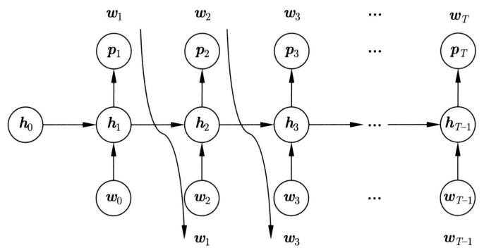  
图27.13 RNN语言模型

每一个单词的词向量表示这个单词的语义。每一个位置的状态表示单词序列到这个位置为止的语义，最后位置的状态表示整个单词序列的语义。单词的词向量是分布式表示，状态也是分布式表示。

单词序列 $w_{1}, w_{2}, \dots, w_{T}$ 的概率可以由 RNN 语言模型计算得出：

$$
P \left(w _ {1}, w _ {2}, \dots , w _ {T}\right) = \prod_ {t = 1} ^ {T} P _ {\boldsymbol {\theta}} \left(w _ {t} \mid w _ {1}, w _ {2}, \dots , w _ {t - 1}\right) \tag {27.51}
$$

令 $P_{\pmb{\theta}}(w_1|w_0) = P_{\pmb{\theta}}(w_1)$ 。

# 3. 语言生成

RNN 语言模型可以用于自然语言的生成，有随机生成、贪心搜索（greedy search）和束搜索（beam search）等方法。

随机生成法使用 RNN 语言模型随机采样依次生成单词序列（自然语言句子）。假设初始位置的单词固定为 $\hat{w}_0$ 。首先根据条件概率分布 $P_{\theta}(w_1|\hat{w}_0)$ 随机生成一个单词，作为第一个位置的单词 $\hat{w}_1$ ；然后在第一个位置，根据条件概率分布 $P_{\theta}(w_2|\hat{w}_1)$ 随机生成一个单词，作为第二个位置的单词 $\hat{w}_2$ ；依次处理，在第 $t - 1$ 个位置，根据条件概率分布 $P_{\theta}(w_t|\hat{w}_1,\hat{w}_2,\dots ,\hat{w}_{t - 1})$ 随机生成一个单词，作为第 $t$ 个位置的单词 $\hat{w}_t$ ；当生成的单词是终止符时，终止生成，输出生成的单词序列 $\hat{w}_1,\hat{w}_2,\dots ,\hat{w}_T$ 。

贪心搜索使用 RNN 语言模型近似求解概率最大的单词序列。在每一个位置找出一个单词，使得到这个位置为止的单词序列的联合概率最大。假设初始位置的单词固定为 $\hat{w}_0$ 。首先找出概率 $P_{\theta}(\hat{w}_0, w_1)$ 最大的 $w_1$ 的单词（等价地，条件概率 $P_{\theta}(w_1 | \hat{w}_0)$ 最大），作为单词序列第一个单词 $\hat{w}_1$ ；然后在其基础上，找出概率 $P_{\theta}(\hat{w}_1, w_2)$ 最大的 $w_2$ 的单词（等价地，条件概率 $P_{\theta}(w_2 | \hat{w}_1)$ 最大），作为单词序列的第二个单词 $\hat{w}_2$ ；依次处理，在第 $t - 1$ 个位置，在目前为止的序列 $\hat{w}_1, \hat{w}_2, \dots, \hat{w}_{t - 1}$ 的基础上，找出概率 $P_{\theta}(\hat{w}_1, \hat{w}_2, \dots, \hat{w}_{t - 1}, w_t)$ 最大的 $w_t$ 的单词（等价地，条件概率 $P_{\theta}(w_t | \hat{w}_1, \hat{w}_2, \dots, \hat{w}_{t - 1})$ 最大），作为单词序列第 $t$ 个单词 $\hat{w}_t$ ；当搜索到的单词是终止符时，终止生成，输出生成的单词序列 $\hat{w}_1, \hat{w}_2, \dots, \hat{w}_T$ 。贪心搜索不能保证得到的单词序列是在所有单词序列中概率最大的。

束搜索是贪心搜索的扩展，在每一个位置找出 $k$ 个单词，使得到该位置为止的单词序列的联合概率最大，得到“一束”单词序列， $k$ 称为束宽。图27.14是束搜索的例子，假设单词个数是5，束宽是3。首先找出概率 $P_{\theta}(\hat{w}_0, w_1)$ 最大的3个 $w_1$ 的单词，假设是 $\hat{w}_{1,2}, \hat{w}_{1,3}, \hat{w}_{1,4}$ ，得到3个单词序列 $\hat{w}_{1,2}, \hat{w}_{1,3}, \hat{w}_{1,4}$ ；然后在其基础上，找出概率 $P_{\theta}(\hat{w}_{1,2}, w_2)$ ， $P_{\theta}(\hat{w}_{1,3}, w_2)$ 和 $P_{\theta}(\hat{w}_{1,4}, w_2)$ 最大的3个 $w_2$ 的单词，假设是 $\hat{w}_{2,1}, \hat{w}_{2,4}, \hat{w}_{2,5}$ ，得到3个单词的序列 $\hat{w}_{1,2}, \hat{w}_{2,1}, \hat{w}_{1,3}, \hat{w}_{2,4}$ 和 $\hat{w}_{1,4}, \hat{w}_{2,5}$ ；依次处理，当搜索到的单词是终止符时，终止所在单词序列的生成，最后得到3个单词序列 $\hat{w}_{1,2}, \hat{w}_{2,1}, \hat{w}_{3,3}, \hat{w}_{4,4}, \hat{w}_{5,2}, \hat{w}_{1,3}, \hat{w}_{2,4}, \hat{w}_{3,2}, \hat{w}_{4,1}, \hat{w}_{5,3}$ 和 $\hat{w}_{1,4}, \hat{w}_{2,5}, \hat{w}_{3,4}, \hat{w}_{4,5}$ 。图27.14中3个序列分别用紫色、红色、绿色折线表示，终止符为实心圆。束搜索也不能保证得到的单词序列是在所有单词序列中概率最大的，但因为比贪心算法进行了更大规模的搜索，所以更有可能找到最优解。束宽 $k$ 可以权衡搜索效果和搜索效率。

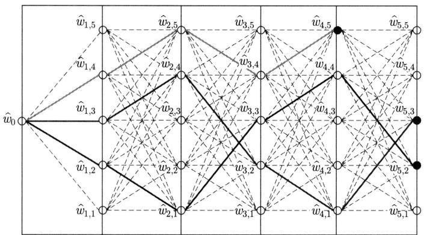  
图27.14 束搜索（见文前彩图）

事实证明：RNN 语言模型，特别是 LSTM 语言模型具有很强的语言生成能力，能够生成非常自然的句子。

# 4. 模型训练

RNN语言模型的训练采用极大似然估计最小化单词序列的交叉熵。

$$
L = - \sum_ {t = 1} ^ {T} \log P _ {\boldsymbol {\theta}} \left(w _ {t} \mid w _ {1}, w _ {2}, \dots , w _ {t - 1}\right) \tag {27.52}
$$

可以使用算法27.1的反向传播算法学习模型的参数。

RNN 语言模型的训练通常采用称为强制教学（teacher forcing）的方法。具体地，在每一个位置的条件概率分布 $P_{\theta}(w_t | w_1, w_2, \dots, w_{t-1})$ 学习时，使用训练数据中的真实数据 $w_1, w_2, \dots, w_{t-1}$ 而不是模型预测的数据 $\hat{w}_1, \hat{w}_2, \dots, \hat{w}_{t-1}$ 。这样，模型的训练可以在各个位置上并行进行。

# 本章概要

1. 循环神经网络是一系列神经网络的统一名称，其主要特点是在序列数据上重复使用相同的结构，对序列数据的顺序依存关系建模，用于序列数据的预测。

循环神经网络具有强大的表示能力。循环神经网络是动态系统的通用模型，也是计算的通用模型，可以模拟图灵机。

2. 简单循环神经网络 S-RNN 是最基本的循环神经网络，其定义式如下：

$$
\boldsymbol {h} _ {t} = \tanh  (\boldsymbol {U} \cdot \boldsymbol {h} _ {t - 1} + \boldsymbol {W} \cdot \boldsymbol {x} _ {t} + \boldsymbol {b})
$$

$$
\boldsymbol {p} _ {t} = \operatorname {s o f t m a x} (\boldsymbol {V} \cdot \boldsymbol {h} _ {t} + \boldsymbol {c})
$$

状态是循环神经网络的重要概念。在S-RNN中，每一个位置的状态由当前位置的输入和之前位置的状态决定。表示的是到这个位置为止的序列数据的局部特征及全局特征，也就是短距离依存关系和长距离依存关系。

3. 循环神经网络的学习算法是反向传播算法。简单循环神经网络的反向传播算法的主要公式如下。

在第 $t = 1,2,\dots ,T - 1$ 个位置：

$$
\frac {\partial L}{\partial \boldsymbol {r} _ {t}} = \operatorname {d i a g} \left(\boldsymbol {1} - \tanh  ^ {2} \boldsymbol {r} _ {t}\right) \cdot \boldsymbol {U} ^ {\mathrm {T}} \cdot \frac {\partial L}{\partial \boldsymbol {r} _ {t + 1}} + \operatorname {d i a g} \left(\boldsymbol {1} - \tanh  ^ {2} \boldsymbol {r} _ {t}\right) \cdot \boldsymbol {V} ^ {\mathrm {T}} \cdot \frac {\partial L}{\partial \boldsymbol {z} _ {t}}
$$

在第 $T$ 个位置：

$$
\frac {\partial L}{\partial \boldsymbol {r} _ {t}} = \operatorname {d i a g} \left(\boldsymbol {1} - \tanh  ^ {2} \boldsymbol {r} _ {t}\right) \cdot \boldsymbol {V} ^ {\mathrm {T}} \cdot \frac {\partial L}{\partial \boldsymbol {z} _ {t}}
$$

计算梯度的公式如下：

$$
\frac {\partial L}{\partial \boldsymbol {c}} = \sum_ {t = 1} ^ {T} \frac {\partial L}{\partial \boldsymbol {z} _ {t}}
$$

$$
\frac {\partial L}{\partial \boldsymbol {V}} = \sum_ {t = 1} ^ {T} \frac {\partial L}{\partial \boldsymbol {z} _ {t}} \cdot \boldsymbol {h} _ {t} ^ {\mathrm {T}}
$$

$$
\frac {\partial L}{\partial \boldsymbol {b}} = \sum_ {t = 1} ^ {T} \frac {\partial L}{\partial \boldsymbol {r} _ {t}}
$$

$$
\frac {\partial L}{\partial U} = \sum_ {t = 1} ^ {T} \frac {\partial L}{\partial r _ {t}} \cdot h _ {t - 1} ^ {\mathrm {T}}
$$

$$
\frac {\partial L}{\partial \boldsymbol {W}} = \sum_ {t = 1} ^ {T} \frac {\partial L}{\partial \boldsymbol {r} _ {t}} \cdot \boldsymbol {x} _ {t} ^ {\mathrm {T}}
$$

4. 简单循环神经网络的扩展包括 LSTM 网络、GRU 网络、深度循环神经网络、双向循环神经网络。

5. LSTM的基本想法是记录并使用之前所有位置的状态，以更好地描述短距离和长距离依存关系。为此导入两个机制，一个是记亿元，另一个是门控。有三个门，包括输入门、遗忘门、输出门。LSTM的公式如下：

$$
\boldsymbol {i} _ {t} = \sigma \left(\boldsymbol {U} _ {i} \cdot \boldsymbol {h} _ {t - 1} + \boldsymbol {W} _ {i} \cdot \boldsymbol {x} _ {t} + \boldsymbol {b} _ {i}\right)
$$

$$
\begin{array}{l} \boldsymbol {f} _ {t} = \sigma (\boldsymbol {U} _ {f} \cdot \boldsymbol {h} _ {t - 1} + \boldsymbol {W} _ {f} \cdot \boldsymbol {x} _ {t} + \boldsymbol {b} _ {f}) \\ \boldsymbol {o} _ {t} = \sigma (\boldsymbol {U} _ {o} \cdot \boldsymbol {h} _ {t - 1} + \boldsymbol {W} _ {o} \cdot \boldsymbol {x} _ {t} + \boldsymbol {b} _ {o}) \\ \tilde {\boldsymbol {c}} _ {t} = \tanh  \left(\boldsymbol {U} _ {c} \cdot \boldsymbol {h} _ {t - 1} + \boldsymbol {W} _ {c} \cdot \boldsymbol {x} _ {t} + \boldsymbol {b} _ {c}\right) \\ \boldsymbol {c} _ {t} = \boldsymbol {i} _ {t} \odot \tilde {\boldsymbol {c}} _ {t} + \boldsymbol {f} _ {t} \odot \boldsymbol {c} _ {t - 1} \\ \boldsymbol {h} _ {t} = \boldsymbol {o} _ {t} \odot \tanh  (\boldsymbol {c} _ {t}) \\ \end{array}
$$

6. GRU是对LSTM进行简化得到的模型，效果相当，但有更高的计算效率。GRU的公式如下：

$$
\begin{array}{l} \boldsymbol {r} _ {t} = \sigma (\boldsymbol {U} _ {r} \cdot \boldsymbol {h} _ {t - 1} + \boldsymbol {W} _ {r} \cdot \boldsymbol {x} _ {t} + \boldsymbol {b} _ {r}) \\ \boldsymbol {z} _ {t} = \sigma (\boldsymbol {U} _ {z} \cdot \boldsymbol {h} _ {t - 1} + \boldsymbol {W} _ {z} \cdot \boldsymbol {x} _ {t} + \boldsymbol {b} _ {z}) \\ \tilde {\boldsymbol {h}} _ {t} = \tanh  (\boldsymbol {U} _ {h} \cdot \boldsymbol {r} _ {t} \odot \boldsymbol {h} _ {t - 1} + \boldsymbol {W} _ {h} \cdot \boldsymbol {x} _ {t} + \boldsymbol {b} _ {h}) \\ \boldsymbol {h} _ {t} = \left(\boldsymbol {1} - \boldsymbol {z} _ {t}\right) \odot \tilde {\boldsymbol {h}} _ {t} + \boldsymbol {z} _ {t} \odot \boldsymbol {h} _ {t - 1} \\ \end{array}
$$

7. 词向量是指表示自然语言单词的实数向量。词向量是分布式表示。词向量存在于向量空间，其内积或余弦表示单词的相似性。分布式表示相比局部式表示有容易表示相似性、表示的效率高、拥有稳健性和可扩展性等优点。

词向量的无监督学习方法有跳元模型。基本想法是在大量的语料中收集单词和上下文的共现数据，学习单词和上下文的共现模型，得到的共现模型的参数向量 $\pmb{w}$ 就是单词的词向量。

8. 语言模型是定义在单词序列上的概率模型，用来计算给定的单词序列的概率。循环神经网络可以用于表示语言模型。

RNN 语言模型以单词序列为输入，在第 $t - 1$ 个位置上，将输入单词 $w_{t-1}$ 转换为其词向量 $w_{t-1}$ ，并且预测第 $t$ 个位置上单词 $w_t$ 出现的概率：

$$
P _ {\theta} \left(w _ {t} \mid w _ {1}, w _ {2}, \dots , w _ {t - 1}\right), \quad t = 1, 2, \dots , T
$$

RNN 语言模型可以用于自然语言的生成，有随机生成、贪心搜索、束搜索等方法。RNN 语言模型的学习使用反向传播算法。

# 继续阅读

进一步学习循环神经网络可以参考文献 [3]～文献 [5], 也可以阅读原始论文, 如 S-RNN [6]、LSTM [7]、GRU [8]、BPTT [9]、双向 LSTM-CRF [10]。有关计算通用性的论文是文献 [1], 有关分布式表示的论文是文献 [2]。跳元模型可以参见文献 [11] 和文献 [12]。

# 习题

27.1 Jordan 提出的循环神经网络如图 27.15 所示。试写出这种神经网络的公式，并与

Elman 提出的简单循环神经网络做比较。

  
图 27.15

27.2 写出循环神经网络的层归一化的公式。  
27.3 比较前馈神经网络的反向传播算法与循环神经网络的反向传播算法的异同。  
27.4 写出 LSTM 模型的反向传播算法公式。  
27.5 推导 LSTM 模型中记亿元的展开式 (27.26)。  
27.6 写出双向LSTM-CRF的模型公式。图27.16是双向LSTM-CRF的架构图。

  
图 27.16

# 参考文献

[1] SIEGELMANN H T, SONTAG E D. On the computational power of neural nets[C]// Proceedings of the Fifth Annual Workshop on Computational Learning Theory. 1992: 440-449.   
[2] HINTON G E, MCCLELLAND J L, RUMELHART D E. Distributed representations[M]// Parallel Distributed Processing: Explorations in the Microstructure of Cognition: Volume I. MIT Press, 1986.   
[3] GOODFELLOW I, BENGIOY, COURVILLE A. Deep learning[M]. MIT Press, 2016.   
[4] 阿斯顿·张，李沐，扎卡里·C.立顿，等. 动手学深度学习 [M]. 北京：人民邮电出版社，2019.  
[5] 邱锡鹏. 神经网络与深度学习 [M]. 北京：机械工业出版社，2020.  
[6] ELMAN J L. Finding structure in time[J]. Cognitive Science, 1990, 14(2): 179-211.   
[7] HOCHREITER S, SCHMIDHUBER J. Long short-term memory[J]. Neural Computation, 1997, 15, 9(8): 1735-1780.

[8] CHO K, VAN MERRIënBOER B, GULCEHRE C, et al. Learning phrase representations using RNN encoder-decoder for statistical machine translation[C]//The Conference on Empirical Methods in Natural Language Processing (EMNLP). 2014: 1724-1734.   
[9] WERBOS P J. Backpropagation through time: What it does and how to do it[J]. Proceedings of the IEEE, 1990, 78(10): 1550-1560.   
[10] HUANG Z, XU W, YU K. Bidirectional LSTM-CRF models for sequence tagging[Z/OL]. arXiv preprint arXiv:1508.01991, 2015.   
[11] MIKOLOV T, SUTSKEVER I, CHEN K, et al. Distributed representations of words and phrases and their compositionality[J]. Advances in Neural Information Processing Systems, 2013: 3111-3119.   
[12] LEVY O, GOLDBERG Y. Neural word embedding as implicit matrix factorization[J]. Advances in Neural Information Processing Systems, 2014: 2177-2185.

# 第28章 Transformer

序列到序列（sequence to sequence, Seq2Seq）是将一个输入的单词序列转换为另一个输出的单词序列的任务，相当于有条件的语言生成。自然语言处理、语音处理等领域中的机器翻译、摘要生成、对话生成、语音识别等都属于这类问题。

序列到序列模型是执行这种任务的神经网络，由编码器网络和解码器网络组成。编码器将输入的单词序列转换成中间表示的序列（编码），解码器将中间表示的序列转换成输出的单词序列（解码）。有代表性的模型有基本模型、RNN Search 模型、Transformer 模型。基本模型使用循环神经网络（RNN）实现编码和解码，将编码器最终位置的中间表示传递到解码器。RNN Search 模型也以 RNN 为编码器和解码器，使用注意力将编码器的所有中间表示信息转递到解码器。

Transformer 由于其强大的表示和学习能力已被广泛应用到人工智能的各个领域。Transformer 模型的编码器也将输入的单词序列转换成中间表示的序列，解码器也将中间表示的序列转换成输出的单词序列，而且将编码器的所有中间表示信息传递到解码器。Transformer 的重要特点是编码、解码及编码器到解码器的信息传递都使用注意力机制。Transformer 的编码器有多层，每层由多头自注意力（multi-head self-attention）和前馈网络子层组成；解码器也有多层，每层由多头自注意力、多头交叉注意力（multi-head cross-attention）和前馈网络子层组成。Transformer 的主要工具包括多头注意力、前馈网络、残差连接、层归一化、位置嵌入。

2014年Sutskever等和Cho等分别提出了序列到序列的基本模型，2015年Bahdanau等发表了RNN Search模型，2017年Vaswani等发表了Transformer模型。

本章28.1节讲述序列到序列的主要特点和基本模型；28.2节给出注意力的定义，介绍RNN Search 模型；28.3节讲解Transformer模型。

# 28.1 序列到序列基本模型

Sutskever等和Cho等分别提出了序列到序列的概念，给出了基于LSTM和GRU的序列到序列模型，这里称为基本模型。本节首先介绍序列到序列，然后讲解基本模型。

# 28.1.1 序列到序列

序列到序列是将一个输入的单词序列转换为另一个输出的单词序列的任务，比如一个句

子到另一个句子。不失一般性，这里用单词序列作为例子，也可以是字的序列或者符号的序列。

假设输入的单词序列是 $x_{1}, x_{2}, \dots, x_{m}$ ，输出的单词序列是 $y_{1}, y_{2}, \dots, y_{n}$ ，单词都来自词表。给定输入单词序列条件下输出单词序列的条件概率是

$$
P \left(y _ {1}, y _ {2}, \dots , y _ {n} \mid x _ {1}, x _ {2}, \dots , x _ {m}\right) = \prod_ {i = 1} ^ {n} P \left(y _ {i} \mid y _ {1}, y _ {2}, \dots , y _ {i - 1}, x _ {1}, x _ {2}, \dots , x _ {m}\right) \tag {28.1}
$$

其中， $P(y_{i}|y_{1},y_{2},\dots ,y_{i - 1},x_{1},x_{2},\dots ,x_{m})$ 是输出序列第 $i$ 个位置上单词出现的条件概率。设 $P(y_{1}|y_{0},x_{1},x_{2},\dots ,x_{m}) = P(y_{1}|x_{1},x_{2},\dots ,x_{m})$ 。

序列到序列是有条件的语言生成，即在给定单词序列 $x_{1}, x_{2}, \dots, x_{m}$ 的条件下，生成单词序列 $y_{1}, y_{2}, \dots, y_{n}$ 。模型是条件语言模型（conditional language model）。 $P(y_{i} | y_{1}, y_{2}, \dots, y_{i-1}, x_{1}, x_{2}, \dots, x_{m})$ 给出输入序列及已生成输出序列的条件下下一个位置上单词出现的条件概率。

序列到序列模型由编码器网络和解码器网络组成。编码器以单词序列 $x_{1}, x_{2}, \cdots, x_{m}$ 为输入，将其转换成中间表示向量序列 $z_{1}, z_{2}, \cdots, z_{m}$ 。解码器以中间表示向量序列 $z_{1}, z_{2}, \cdots, z_{m}$ 为输入，依次生成输出单词序列 $y_{1}, y_{2}, \cdots, y_{n}$ 。前者的过程称为编码，后者的过程称为解码。图28.1显示由编码器和解码器组成的序列到序列模型的框架。

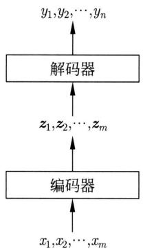  
图28.1 序列到序列框架

编码器网络写作

$$
\left(\boldsymbol {z} _ {1}, \boldsymbol {z} _ {2}, \dots , \boldsymbol {z} _ {m}\right) = F \left(\boldsymbol {x} _ {1}, \boldsymbol {x} _ {2}, \dots , \boldsymbol {x} _ {m}\right) \tag {28.2}
$$

其中， $x_{1},x_{2},\dots ,x_{m}$ 是输入单词序列对应的单词向量序列， $z_{1},z_{2},\dots ,z_{m}$ 是中间表示向量序列。编码器定义在输入单词序列上。解码器网络写作

$$
P \left(y _ {i} \mid y _ {1}, y _ {2}, \dots , y _ {i - 1}, x _ {1}, x _ {2}, \dots , x _ {m}\right) = G \left(\mathbf {y} _ {1}, \mathbf {y} _ {2}, \dots , \mathbf {y} _ {i - 1}, \mathbf {z} _ {1}, \mathbf {z} _ {2}, \dots , \mathbf {z} _ {m}\right) \tag {28.3}
$$

其中， $z_{1},z_{2},\dots ,z_{m}$ 是中间表示向量序列， $\pmb {y}_1,\pmb {y}_2,\dots ,\pmb{y}_{i - 1}$ 是已生成的输出单词序列 $y_{1},y_{2},\dots ,y_{i - 1}$ 对应的单词向量序列。解码器定义在输出单词序列的每一个位置上。

编码器可以“看到”整个输入单词序列，而解码器只能“看到”已生成的输出单词序列，不能“看到”待生成的输出单词序列。解码是自回归过程①，编码可以是自回归过程也可以是非自回归过程。

序列到序列的学习有两个主要特点：端到端训练、强制教学。学习时，训练数据的每一个样本由一个输入单词序列和一个输出单词序列组成。使用大量样本通过端到端学习的方式进行模型的参数估计，包括编码器和解码器的参数估计。因为编码器的输出是解码器的输入，二者连接在一起，所以参数估计的反向传播算法可以在两者之间进行。

给定一个训练样本，输出序列每一个位置的单词的条件概率的估计（式（28.3）），可以基于这个样本的当前位置的单词序列。这样，每个位置的概率估计可以并行进行。这种做法称作强制教学（teacher forcing）。另一种可能的做法是，顺序进行每一个位置的条件概率的估计。强制教学的优点是训练效率高；使用之前位置的“正确答案”，学习更容易收敛。风险是学习可能产生过拟合。序列到序列的模型训练一般采用强制教学。

序列到序列的预测（生成）通常使用束搜索（beam search）。目标是计算给定输入单词序列条件下概率最大的输出单词序列，束搜索用递归的方法近似计算条件概率最大的 $k$ 个输出单词序列，其中 $k$ 为束宽。

# 28.1.2 基本模型

基本模型的编码器和解码器是循环神经网络。编码器根据给定输入的单词序列产生其状态的序列，并且以状态序列为中间表示序列。编码器将最终位置的中间表示传递到解码器。解码器根据得到的中间表示决定其状态的序列以及输出的单词序列。基本模型实际是一个有条件的 RNN 语言模型。例如，LSTM 和 GRU 可以更好地刻画长距离依存关系。

基本模型的编码器是 RNN，如 LSTM，状态是

$$
\boldsymbol {h} _ {j} = a \left(\boldsymbol {x} _ {j}, \boldsymbol {h} _ {j - 1}\right), \quad j = 1, 2, \dots , m \tag {28.4}
$$

这里 $h_j$ 是第 $j$ 个位置的状态； $h_{j-1}$ 是第 $j-1$ 个位置的状态； $\boldsymbol{x}_j$ 是第 $j$ 个位置的输入单词的词向量； $a$ 是处理单元，如 LSTM 单元；假设 $\boldsymbol{h}_0 = \boldsymbol{0}$ 。

解码器也是 RNN，如 LSTM，状态是

$$
\boldsymbol {s} _ {i} = a \left(\boldsymbol {y} _ {i - 1}, \boldsymbol {s} _ {i - 1}\right), \quad i = 1, 2, \dots , n \tag {28.5}
$$

这里 $\pmb{s}_i$ 是第 $i$ 个位置的状态； $\pmb{s}_{i-1}$ 是第 $i-1$ 个位置的状态； $\pmb{y}_{i-1}$ 是第 $i-1$ 个位置的输出单词的词向量； $a$ 是处理单元，如 LSTM 单元。输出是

$$
\boldsymbol {p} _ {i} = g \left(\boldsymbol {s} _ {i}\right), \quad i = 1, 2, \dots , n \tag {28.6}
$$

这里 $\mathbf{s}_i$ 是第 $i$ 个位置的状态； $\mathbf{p}_i$ 是第 $i$ 个位置的输出； $g$ 是输出层函数，由线性变换和软最大化函数组成。 $\mathbf{p}_i$ 表示的是第 $i$ 个位置单词出现的条件概率。

编码器将其最终状态 $h_m$ 作为整个输入单词序列的表示传递给解码器。解码器将 $h_m$ 作为解码器的初始状态 $s_0$ ，决定其状态序列，以及输出单词序列。

$$
\boldsymbol {s} _ {0} = \boldsymbol {h} _ {m} \tag {28.7}
$$

这意味着解码器只依赖于编码器最终位置的状态。

图28.2显示基本模型的架构。图中矩形表示函数及其输出。基本模型整体是一种特殊的

RNN，或者一种特殊的语言模型。在前面 $m$ 个和后面 $n$ 个位置都有状态，在前面 $m$ 个位置没有输出，在后面 $n$ 个位置有输出。

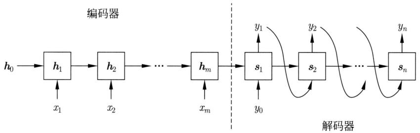  
图28.2 序列到序列基本模型

序列到序列可以用于机器翻译、对话生成、文本摘要等应用。图28.3给出用基本模型进行机器翻译的例子。机器翻译将一个语言的句子转化为另一个语言的句子，两者语义相同。对话生成中系统针对用户发话产生回复，两者形成一轮对话。文本摘要将一个长的文本转换为一个短的文本，使后者概括前者的内容。

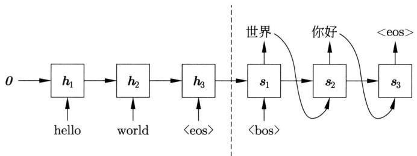  
图28.3 机器翻译的例子

# 28.2 RNN Search 模型

基本模型仅用一个中间表示描述整个输入序列，其表示能力有限。RNN Search 模型利用注意力（attention）机制，在输出序列的每一个位置上检索输入序列的所有中间表示，产生一个组合的中间表示，以解决这个问题。本节首先给出注意力的定义，然后讲解 RNN Search。

# 28.2.1 注意力

脑科学和心理学中的注意力是指人的心智活动集中于某个具体事物的能力。深度学习中的注意力更多的是受其启发而开发的相似或相关向量检索的计算方法。在深度学习中注意力经常被用于特征组合的表示的计算，比如，自然语言处理中单词组合的表示的计算。

定义28.1（注意力）假设有键-值数据库（key-value store），存储键-值对数据 $\{(k_1, v_1), (k_2, v_2), \dots, (k_n, v_n)\}$ ，其中每一个键-值对 $(k_i, v_i)$ 的键和值都是实数向量。有查询（query） $q$ 也是实数向量。向量 $q$ 和 $k_i$ 的维度相同，向量 $k_i$ 和 $v_i$ 的维度一般也相同。从键-值数据库中检索与查询相似的键所对应的值，注意力是实现检索的一种计算方法。计算查询 $q$ 和各个

键 $\pmb{k}_{i}$ 的归一化相似度 $\alpha (\pmb {q},\pmb {k}_i)$ ，以归一化相似度为权重，计算所有值 $\pmb{v}_{i}$ 的加权平均 $\pmb{v}$ ，将计算结果 $\pmb{\nu}$ 作为检索结果返回。

$$
\boldsymbol {v} = \sum_ {i = 1} ^ {n} \alpha (\boldsymbol {q}, \boldsymbol {k} _ {i}) \cdot \boldsymbol {v} _ {i} \tag {28.8}
$$

满足

$$
\sum_ {i = 1} ^ {n} \alpha (\boldsymbol {q}, \boldsymbol {k} _ {i}) = 1
$$

图28.4显示注意力机制。归一化的权重称作注意力权重，一般通过软最大化计算。

$$
\alpha \left(\boldsymbol {q}, \boldsymbol {k} _ {i}\right) = \frac {\exp \left(e \left(\boldsymbol {q} , \boldsymbol {k} _ {i}\right)\right)}{\sum_ {j = 1} ^ {n} \exp \left(e \left(\boldsymbol {q} , \boldsymbol {k} _ {j}\right)\right)} \tag {28.9}
$$

其中， $e(\pmb{q}, \pmb{k}_i)$ 是查询 $\pmb{q}$ 和键 $\pmb{k}_i$ 的相似度。相似度计算可以有多种方法，包括加法注意力和乘法注意力。乘法注意力要求查询和键向量的维度相同，而加法注意力没有这个要求。乘法注意力比加法注意力计算效率更高。

  
图28.4 注意力机制

加法注意力使用一层神经网络计算相似度：

$$
e \left(\boldsymbol {q}, \boldsymbol {k} _ {i}\right) = \boldsymbol {w} ^ {\mathrm {T}} \cdot \tanh  \left(\left[ \boldsymbol {q}; \boldsymbol {k} _ {i} \right]\right) \tag {28.10}
$$

其中，输入是 $q$ 和 $k_{i}$ 的拼接，[；]表示向量的拼接， $\pmb{w}$ 是参数向量。

乘法注意力使用内积或尺度变换的内积计算相似度：

$$
e \left(\boldsymbol {q}, \boldsymbol {k} _ {i}\right) = \boldsymbol {q} ^ {\mathrm {T}} \cdot \boldsymbol {k} _ {i} \tag {28.11}
$$

$$
e \left(\boldsymbol {q}, \boldsymbol {k} _ {i}\right) = \frac {\boldsymbol {q} ^ {\mathrm {T}} \cdot \boldsymbol {k} _ {i}}{\sqrt {d}} \tag {28.12}
$$

其中， $d$ 是向量 $\pmb{q}$ 和 $\pmb{k}_i$ 的维度。尺度变换保证相似度的取值在一定范围内，避免学习时发生梯度消失。

注意力将与键相似的值的组合作为检索结果，是一种“软的”而不是“硬的”检索。对于一般的键-值数据库检索，键、值、查询都是符号，而对于注意力计算，键、值、查询都是实数向量。极端情况下，如果向量都是独热向量，注意力等价于一般的键-值数据库检索。

注意力的模型复杂度，也就是参数个数，不随键-值数据库规模的增大而增大。比如，使用加法注意力时，参数只有 $w$ 和 $b$ 。

注意力是深度学习的重要工具，因为可以通过注意力，基于已有的表示（查询），有选择地检索相似的表示（键），并将其对应的表示（值）组合起来，从而将注意力作为产生表示的组合的基本运算。

# 28.2.2 模型定义

RNN Search 模型对基本模型进行两个大的改动。用双向 LSTM 实现编码器，用注意力实现编码器到解码器的信息传递。

编码器使用双向LSTM。编码基于整个输入序列，是非自回归过程。正向LSTM的状态是

$$
\boldsymbol {h} _ {j} ^ {(1)} = a \left(\boldsymbol {x} _ {j}, \boldsymbol {h} _ {j - 1} ^ {(1)}\right), \quad j = 1, 2, \dots , m \tag {28.13}
$$

这里 $\pmb{h}_j^{(1)}$ 是正向的第 $j$ 个位置的状态； $\pmb{h}_{j - 1}^{(1)}$ 是第 $j - 1$ 个位置的状态； $\pmb{x}_j$ 是第 $j$ 个位置的输入单词的词向量； $a$ 是处理单元，如LSTM单元；假设 $\pmb{h}_0^{(1)} = \pmb{0}$ 。反向LSTM的状态是

$$
\boldsymbol {h} _ {j} ^ {(2)} = a \left(\boldsymbol {x} _ {j}, \boldsymbol {h} _ {j + 1} ^ {(2)}\right), \quad j = m, m - 1, \dots , 1 \tag {28.14}
$$

这里 $\pmb{h}_{j}^{(2)}$ 是反向的第 $j$ 个位置的状态； $\pmb{h}_{j+1}^{(2)}$ 是第 $j+1$ 个位置的状态； $\pmb{x}_{j}$ 是第 $j$ 个位置的输入单词的词向量； $a$ 是处理单元，如 LSTM 单元；假设 $\pmb{h}_{m+1}^{(2)} = \pmb{0}$ 。在各个位置对正向和反向状态进行拼接，得到各个位置的状态，也就是中间表示。

$$
\boldsymbol {h} _ {j} = \left[ \boldsymbol {h} _ {j} ^ {(1)}; \boldsymbol {h} _ {j} ^ {(2)} \right], \quad j = 1, 2, \dots , m \tag {28.15}
$$

这里 $[;]$ 表示向量的拼接。

解码器使用单向LSTM，解码基于输入序列和已生成的输出序列，是自回归过程。状态是

$$
\boldsymbol {s} _ {i} = a \left(\boldsymbol {y} _ {i - 1}, \boldsymbol {s} _ {i - 1}, \boldsymbol {c} _ {i}\right), \quad i = 1, 2, \dots , n \tag {28.16}
$$

这里 $s_i$ 是第 $i$ 个位置的状态； $s_{i-1}$ 是第 $i-1$ 个位置的状态； $\pmb{y}_{i-1}$ 是第 $i-1$ 个位置的输出单词的词向量； $\pmb{c}_i$ 是第 $i$ 个位置的上下文向量（context vector），上下文向量表示在第 $i$ 个位置的注意力计算结果； $a$ 是处理单元，如 LSTM 单元。假设 $\pmb{s}_0 = \pmb{0}$ 。输出是

$$
\boldsymbol {p} _ {i} = g \left(\boldsymbol {s} _ {i}\right), \quad i = 1, 2, \dots , n \tag {28.17}
$$

这里 $s_i$ 是第 $i$ 个位置的状态； $p_i$ 是第 $i$ 个位置的输出； $g$ 是输出层函数，由线性变换和软最大化函数组成。 $p_i$ 表示的是第 $i$ 个位置上单词出现的条件概率。

在解码器的每一个位置，通过加法注意力计算上下文向量。注意力的查询（query）是前

一个位置的状态 $s_{i-1}$ , 键和值相同, 是编码器的各个位置的状态 $h_j$ 。上下文向量是

$$
\boldsymbol {c} _ {i} = \sum_ {j = 1} ^ {m} \alpha_ {i j} \boldsymbol {h} _ {j}, \quad i = 1, 2, \dots , n \tag {28.18}
$$

其中， $\alpha_{ij}$ 是注意力权重。

$$
\alpha_ {i j} = \frac {\exp \left(e _ {i j}\right)}{\sum_ {k = 1} ^ {m} \exp \left(e _ {i k}\right)}, \quad i = 1, 2, \dots , n, j = 1, 2, \dots , m \tag {28.19}
$$

相似度 $e_{ij}$ 通过一层神经网络计算：

$$
e _ {i j} = \boldsymbol {w} ^ {\mathrm {T}} \cdot \tanh  \left(\left[ \boldsymbol {s} _ {i - 1}; \boldsymbol {h} _ {j} \right]\right), \quad i = 1, 2, \dots , n, j = 1, 2, \dots , m \tag {28.20}
$$

在解码（生成）的过程中，将编码器得到的状态序列或中间表示序列通过注意力传递到解码器，决定解码器的状态序列，以及输出的单词序列。传递的上下文向量实际是从输出序列的当前位置看到的输入序列的相关中间表示。

图28.5是RNN Search的架构图，图中矩形表示函数及其输出。

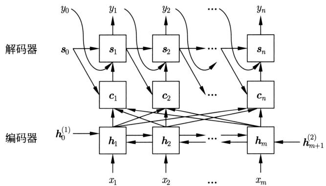  
图28.5 RNN Search 模型的架构

# 28.2.3 模型特点

RNN Search 的最大特点是在输出单词序列的每一个位置，通过注意力检索到输入单词序列中的相关内容，和已生成的输出单词序列一起决定下一个位置的单词生成。在机器翻译中，在目标语言中每生成一个单词，都会在源语言中检索相关的单词，基于检索得到的单词和目前为止生成的单词做出下一个位置的单词选择的判断。

在每一个位置使用一个选择组合得到的中间表示（上下文向量），而不是一个固定组合得到的中间表示。输入序列与输出序列的相关性由单词的内容决定，而不是由单词的位置决定。注意力的参数个数是固定的，可以处理任意长度的输入单词序列。

RNN Search 是神经机器翻译的代表模型，在翻译的性能上超过了传统的统计机器翻译。

# 28.3 Transformer模型

Transformer 模型使用注意力实现编码器中、解码器中以及编码器和解码器之间的特征组合，使用前馈网络进行特征检测，使用残差连接实现神经网络模块的集成。本节介绍 Transformer 的模型架构和模型特点。

# 28.3.1 模型架构

# 1. 整体架构

Transformer（转换器）由编码器和解码器组成。编码器有1个输入层、6个编码层（一般是 $L$ 层）。解码器有1个输入层、6个解码层（一般是 $L$ 层）、1个输出层。编码器的输入层与第1个编码层连接，第1个编码层再与第2个编码层连接，依次连接，直到第6个编码层。解码器的输入层与第1个解码层连接，第1个解码层再与第2个解码层连接，依次连接，直到第6个解码层，第6个解码层再与输出层连接。第6个编码层与各个解码层之间也有连接。图28.6是Transformer的架构图。

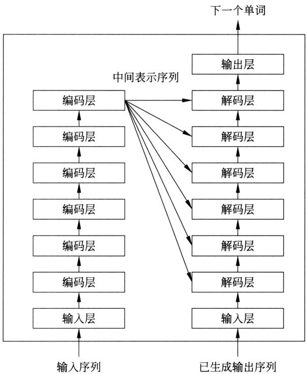  
图28.6 Transformer模型的架构

编码器的6个编码层将输入单词序列进行转换，得到中间表示序列。解码器的6个解码层将已生成的输出单词序列进行转换，得到已生成的输出单词序列的表示序列，过程中检索编码器的中间表示序列，输出层计算输出单词序列下一个位置的单词出现的条件概率。编码是非自回归的，而解码是自回归的。

编码器的6个编码层有相同的结构，每一个编码层由自注意力子层和前馈网络子层两部分组成。图28.7给出Transformer编码器的输入层和第1个编码层的架构。

  
图28.7 Transformer编码器的输入层和第1个编码层的架构

在编码器的输入层，输入序列的各个位置有单词的词嵌入（word embedding）和位置嵌入（position embedding），其中位置嵌入表示在序列中的位置。在每一个位置以词嵌入和位置嵌入的和作为该位置的单词的输入向量。单词的词嵌入通常通过对单词的独热向量进行一个线性变换得到，即用一个矩阵乘以独热向量，矩阵称为嵌入矩阵。

在编码器的第1个编码层，得到输入序列在各个位置上的输入向量。在自注意力子层，利用多头自注意力计算每一个位置上的基于输入序列的表示向量，通过残差连接（加法）和层归一化。接着在前馈网络子层，在每一个位置利用相同的前馈网络对表示向量进行非线性变换，再通过残差连接（加法）和层归一化。最后在各个位置输出一个表示向量到第2个编码层。第1个编码层有自己的参数。之后的5个编码层的结构和处理相同，每一层有自己的参数。

解码器的6个解码层有相同的结构，每一个解码层由自注意力子层、交叉注意力子层和前馈网络子层三部分组成。图28.8给出Transformer解码器的第6个解码层和输出层的架构。

在解码器的输入层，已生成的输出序列的各个位置上有单词的词嵌入和位置嵌入。在每一个位置以词嵌入和位置嵌入的和作为该位置的单词的输入向量。单词的词嵌入使用与编码器相同的嵌入矩阵计算得到。

在解码器的第1层，得到已生成的输出序列在各个位置上的输入向量。首先在自注意力子层，利用多头自注意力计算每一个位置上的基于已生成输出序列的表示向量，通过残差连接和层归一化。接着在交叉注意力子层，通过多头交叉注意力检索中间表示序列，计算每一个位置上的基于输入序列和已生成输出序列的表示向量，再通过残差连接和层归一化。之后在前馈网络子层，在每一个位置用相同的前馈网络对表示向量进行非线性变换，再通过残差连接和层归一化。最后在各个位置输出一个表示向量到第2个解码层。在多头自注意力计算

  
图28.8 Transformer解码器的第6个解码层和输出层的架构

中对之后位置的信息进行掩码（masking）处理。第1个解码层有自己的参数。之后的5个解码层的结构和处理相同，每一层有自己的参数。

在解码器的输出层，得到当前位置的表示向量。通过线性变换和软最大化得到下一个位置的单词出现的条件概率。

在编码器和解码器的每一层的每一个位置上有一个表示向量，其维度相同，写作 $d_{m}$ ，称为模型的维度。

# 2. 多头注意力

Transformer中的注意力都是乘法注意力，更具体地，是尺度变换的内积。注意力计算在一组表示向量上并行进行，也就是在矩阵上进行。设 $Q$ 是查询矩阵，每一列是一个查询向量； $K$ 是键矩阵，每一列是一个键向量； $V$ 是值矩阵，每一列是一个值向量。注意力 attend 的计算是

$$
\operatorname {a t t e n d} \left(\boldsymbol {Q}, \boldsymbol {K}, \boldsymbol {V}\right) = \boldsymbol {V} \cdot \operatorname {s o f t m a x} \left(\frac {\boldsymbol {K} ^ {\mathrm {T}} \cdot \boldsymbol {Q}}{\sqrt {d _ {k}}}\right) \tag {28.21}
$$

其中，softmax是在矩阵列上的软最大化函数， $d_{k}$ 是查询和键向量的维度。本书中向量都是列向量，所以，注意力的矩阵表示与其他文献中的基于行向量的矩阵表示有所不同。注意力可以实现对单词序列的表示计算。图28.9显示注意力计算的过程。

当注意力中的查询、键、值向量 $Q, K, V$ 来自相同的单词序列（输入序列或输出序列）时，或者说是自己时，称为自注意力（self-attention）。当注意力中的键、值向量 $K, V$ 来自输入序列，查询向量 $Q$ 来自输出序列时，称为交叉注意力（cross-attention）。

  
图28.9 注意力计算过程

Transformer 使用多头自注意力（multi-head self-attention）和多头交叉注意力（multi-head cross-attention）。多头是指多个并列的注意力。在多头注意力中，先通过线性变换将表示向量从所在的空间分别投影到多个不同的子空间，每一个子空间对应一个头，接着在各个子空间分别进行注意力计算，之后将各个子空间的注意力计算结果进行拼接，最后再对拼接结果进行线性变换，得到的表示向量的维度与原来的表示向量的维度相同。多头注意力可以实现从多个侧面对单词序列的表示。

设 $Q$ 是查询矩阵， $K$ 是键矩阵， $V$ 是值矩阵。多头注意力 multi Attend 的计算是

$$
\operatorname {m u l t i} _ {\text {a t t e n d}} \left(\boldsymbol {Q}, \boldsymbol {K}, \boldsymbol {V}\right) = \boldsymbol {W} _ {o} \cdot \operatorname {c o n c a t e} \left(\boldsymbol {U} _ {1}, \boldsymbol {U} _ {2}, \dots , \boldsymbol {U} _ {h}\right) \tag {28.22}
$$

$$
\boldsymbol {U} _ {i} = \operatorname {a t t e n d} \left(\boldsymbol {W} _ {Q} ^ {(i)} \boldsymbol {Q}, \boldsymbol {W} _ {\boldsymbol {K}} ^ {(i)} \boldsymbol {K}, \boldsymbol {W} _ {V} ^ {(i)} \boldsymbol {V}\right), \quad i = 1, 2, \dots , h \tag {28.23}
$$

其中， $h$ 是头的个数， $\boldsymbol{U}_i$ 是第 $i$ 个头的注意力计算结果，concate 是矩阵列向量的拼接， $\boldsymbol{W}_o$ 是线性变换矩阵。 $\boldsymbol{W}_Q^{(i)}, \boldsymbol{W}_K^{(i)}, \boldsymbol{W}_V^{(i)}$ 分别是第 $i$ 个头的查询矩阵、键矩阵、值矩阵的线性变换矩阵，attend 是注意力函数。图 28.10 显示多头注意力计算的过程。

  
图28.10 多头注意力计算过程

矩阵 $\pmb{W}_{Q}^{(i)},\pmb{W}_{K}^{(i)},\pmb{W}_{V}^{(i)}$ 的大小分别是 $d_{k}\times d_{m}$ 、 $d_{k}\times d_{m}$ 、 $d_{v}\times d_{m}$ ，矩阵 $\pmb{W}_{o}$ 的大小是 $d_m\times h\cdot d_v$ ，这里 $d_{k}$ ， $d_{k}$ ， $d_{v}$ 分别是子空间注意力的查询、键、值向量的维度， $d_{m}$ 是Transformer中的表示向量的维度。有以下关系成立：

$$
d _ {k} = d _ {v} = \frac {d _ {m}}{h}
$$

自然语言的一个重要特点是具有组合性（compositionality），即单词可以组合成短语，短语可以组合成句子。多头自注意力可以有效地表示具有组合性的语言，描述句子的层次化的语法和语义内容。

在解码器中，多头自注意力计算对之后的位置进行掩码（masking）处理，让这些位置不参与计算。具体导入矩阵 $M$ ，自注意力计算变成以下的掩码自注意力计算：

$$
\operatorname {a t t e n d} \left(\boldsymbol {Q}, \boldsymbol {K}, \boldsymbol {V}\right) = \boldsymbol {V} \cdot \operatorname {s o f t m a x} \left(\frac {\boldsymbol {K} ^ {\mathrm {T}} \cdot \boldsymbol {Q} + \boldsymbol {M}}{\sqrt {d _ {k}}}\right) \tag {28.24}
$$

$$
\pmb {M} = [ m _ {i j} ],   m _ {i j} = \left\{ \begin{array}{l l} {{0,}} & {{i \leqslant j}} \\ {{- \infty ,}} & {{\text {其 他}}} \end{array} \right. \tag {28.25}
$$

也就是说，自注意力在每一个位置以该位置的表示向量作为查询向量，该位置和之前位置的所有表示向量作为键向量和值向量。掩码自注意力保证了解码的过程是自回归的，学习时可以采用强制教学，即训练在各个位置上并行进行。

Transformer有三种多头注意力的使用方法。如图28.11(a)所示，在编码器的每一层，每一个位置上的表示向量与其他位置的表示向量进行多头自注意力计算。自注意力是双向的。如图28.11(b)所示，在解码器的每一层，每一个位置上的表示向量只与之前位置的表示向量进行多头自注意力计算。自注意力是单向的。如图28.11(c)所示，在解码器的每一层，每一个位置上的表示向量与编码器的中间表示向量序列（编码器的输出）进行多头交叉注意力计算。

  
编码器的单词表示向量  
(a) 自注意力

  
解码器的单词表示向量

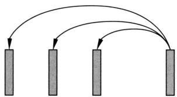  
(b) 自注意力  
编码器的中间表示向量 解码器的单词表示向量  
(c) 注意力  
图28.11 Transformer的三种多头注意力

# 3. 其他工具

前馈网络和残差连接在Transformer中也起着重要作用。注意力进行的是特征的组合。前馈网络进行的是特征的检测。注意力和前馈网络的交替使用保证了Transformer的基本表示能力。

自注意力、交叉注意力、前馈网络的计算都加上了残差连接，意味着输入的表示向量不经过这些变换依然可以传递到下一层，换言之，这些变换是针对输入的表示向量的残差进行的。正像 ResNet 一样，Transformer 实际是指数量级的神经网络模块的集成（参见第 26 章）。另外，残差连接也能方便位置嵌入信息传递到各层。没有残差连接位置信息很容易丢失。残差连接极大增强了 Transformer 的表示能力。

层归一化的作用是防止发生内部协变量偏移，提高学习效率，也可以防止梯度消失。本书介绍的Transformer、层归一化是在注意力和前馈网络的残差连接计算之后。也可以放在注意力和前馈网络计算之前，是另一种实现方法。

在输入层使用单词的词嵌入向量，但这些向量本身并不包含单词在序列中的位置信息。在词嵌入基础上加上位置嵌入，作为单词的输入表示向量。其作用是将单词的位置信息加入表示向量中。

# 4. 基本计算

下面给出Transformer的基本计算的公式。输入和输出都是表示向量，其维度是 $d_m$ 。

在编码器和解码器的输入层通过线性变换获得单词的词嵌入。

$$
\boldsymbol {e} = \boldsymbol {W} _ {\mathrm {e}} \cdot \boldsymbol {w} \tag {28.26}
$$

其中， $\boldsymbol{w}$ 是单词的独热向量， $\boldsymbol{e}$ 是单词的词嵌入， $W_{\mathrm{e}}$ 是嵌入矩阵。嵌入矩阵在学习中自动获得。

编码器和解码器的输入层的每一个位置的输入向量是

$$
\boldsymbol {e} + \boldsymbol {p} \tag {28.27}
$$

其中， $e$ 是该位置的词嵌入， $p$ 是该位置的位置嵌入①。位置嵌入在学习中自动获得。

编码器和解码器的每一层的每一个位置的前馈网路是

$$
\operatorname {f f n} (\boldsymbol {z}) = \boldsymbol {W} _ {2} \operatorname {r e l u} \left(\boldsymbol {W} _ {1} \boldsymbol {z} + \boldsymbol {b} _ {1}\right) + \boldsymbol {b} _ {2} \tag {28.28}
$$

其中， $W_{1}$ 和 $W_{2}$ 是权重矩阵， $b_{1}$ 和 $b_{2}$ 是偏置向量。

编码器和解码器的每一层的每一个位置的残差连接是

$$
\boldsymbol {z} + f (\boldsymbol {z}) \tag {28.29}
$$

其中， $f(z)$ 是注意力函数或前馈网络函数。

编码器和解码器的每一层的每一个位置的层归一化函数是

$$
\operatorname {n o r m} (\boldsymbol {z}) = \gamma \frac {\boldsymbol {z} - u \cdot \boldsymbol {1}}{\sqrt {\sigma^ {2} + \varepsilon}} + \beta \cdot \boldsymbol {1} \tag {28.30}
$$

其中， $u$ 是均值， $\sigma^2$ 是方差， $\gamma$ 和 $\beta$ 是参数， $\varepsilon$ 是常量。

# 5. 编码器和解码器

Transformer的编码器和解码器每一层的所有位置的表示向量用一个矩阵表示。编码器的输入是输入单词序列，编码器的输入层的计算可以写作

$$
\boldsymbol {H} _ {\mathrm {E}} ^ {(0)} = \boldsymbol {E} _ {\mathrm {E}} + \boldsymbol {P} _ {\mathrm {E}} \tag {28.31}
$$

其中， $H_{\mathrm{E}}^{(0)}$ 是输入层所有位置的输出， $E_{\mathrm{E}}$ 是所有位置的词嵌入， $P_{\mathrm{E}}$ 是所有位置的位置嵌入。

编码器的第 $l$ 个编码层的多头自注意力子层和前馈网络子层计算可以写作

$$
\boldsymbol {Z} _ {\mathrm {E}} ^ {(l)} = \operatorname {n o r m} \left(\boldsymbol {H} _ {\mathrm {E}} ^ {(l - 1)} + \text {m u l t i - a t t e n d} \left(\boldsymbol {H} _ {\mathrm {E}} ^ {(l - 1)}, \boldsymbol {H} _ {\mathrm {E}} ^ {(l - 1)}, \boldsymbol {H} _ {\mathrm {E}} ^ {(l - 1)}\right)\right) \tag {28.32}
$$

$$
\boldsymbol {H} _ {\mathrm {E}} ^ {(l)} = \operatorname {n o r m} \left(\boldsymbol {Z} _ {\mathrm {E}} ^ {(l)} + \operatorname {f f n} \left(\boldsymbol {Z} _ {\mathrm {E}} ^ {(l)}\right)\right) \tag {28.33}
$$

其中， $H_{\mathrm{E}}^{(l)}$ 是第 $l$ 个编码层的所有位置的输出， $H_{\mathrm{E}}^{(l-1)}$ 是所有位置的输入， $Z_{\mathrm{E}}^{(l)}$ 是中间结果； $\mathrm{fnn}()$ 和 $\mathrm{norm}()$ 的计算针对矩阵的每一列进行，multi_attend() 的计算针对矩阵整体进行。编码器的第 $l$ 个编码层的所有位置的输出，即中间表示序列是 $H_{\mathrm{E}}^{(l)}$ 。

解码器的输入是已生成的输出单词序列，解码器的输入层的计算可以写作

$$
\boldsymbol {H} _ {\mathrm {D}} ^ {(0)} = \boldsymbol {E} _ {\mathrm {D}} + \boldsymbol {P} _ {\mathrm {D}} \tag {28.34}
$$

其中， $H_{\mathrm{D}}^{(0)}$ 是输入层所有位置的输入， $E_{\mathrm{D}}$ 是所有位置的词嵌入， $P_{\mathrm{D}}$ 是所有位置的位置嵌入。

解码器的第 $l$ 个解码层的多头自注意力子层、多头交叉注意力子层、前馈网络子层的计算可以写作

$$
\boldsymbol {I} _ {\mathrm {D}} ^ {(l)} = \operatorname {n o r m} \left(\boldsymbol {H} _ {\mathrm {D}} ^ {(l - 1)} + \text {m u l t i - a t t e n d} \left(\boldsymbol {H} _ {\mathrm {D}} ^ {(l - 1)}, \boldsymbol {H} _ {\mathrm {D}} ^ {(l - 1)}, \boldsymbol {H} _ {\mathrm {D}} ^ {(l - 1)}\right)\right) \tag {28.35}
$$

$$
\boldsymbol {Z} _ {\mathrm {D}} ^ {(l)} = \operatorname {n o r m} \left(\boldsymbol {I} _ {\mathrm {D}} ^ {(l)} + \text {m u l t i - a t t e n d} \left(\boldsymbol {I} _ {\mathrm {D}} ^ {(l)}, \boldsymbol {H} _ {\mathrm {E}} ^ {(L)}, \boldsymbol {H} _ {\mathrm {E}} ^ {(L)}\right)\right) \tag {28.36}
$$

$$
\boldsymbol {H} _ {\mathrm {D}} ^ {(l)} = \operatorname {n o r m} \left(\boldsymbol {Z} _ {\mathrm {D}} ^ {(l)} + \operatorname {f f n} \left(\boldsymbol {Z} _ {\mathrm {D}} ^ {(l)}\right) \right. \tag {28.37}
$$

其中, $H_{\mathrm{D}}^{(l)}$ 是第 $l$ 个解码层的所有位置的输出, $H_{\mathrm{D}}^{(l-1)}$ 是所有位置的输入, $Z_{\mathrm{D}}^{(l)}$ 和 $I_{\mathrm{D}}^{(l)}$ 是中间结果; $\operatorname{ffn}()$ 和 $\operatorname{norm}()$ 的计算针对矩阵的每一列进行, multi_attend(); 的计算针对矩阵整体进行。多头自注意力进行了掩码处理。解码器的第 $l$ 个解码层的所有位置的输出是 $H_{\mathrm{D}}^{(l)}$ , 是已生成输出序列的表示。

解码器的输出层计算在当前第 $i$ 个位置的条件概率，也就是下一个位置的单词出现的条件概率。

$$
\boldsymbol {p} _ {i} = \operatorname {s o f t m a x} \left(\boldsymbol {W} _ {\mathrm {e}} ^ {\mathrm {T}} \cdot \boldsymbol {h} _ {\boldsymbol {i}} ^ {(L)}\right) \tag {28.38}
$$

其中， $h_i^{(l)}$ 是 $\pmb{H}_{\mathrm{D}}^{(l)}$ 的第 $i$ 列也是最后一列的向量， $\mathbf{W}_e$ 是嵌入矩阵。

预测时，在每一个位置，基于输入单词序列和已生成的输出单词序列，根据式(28.38)计算下一个位置的单词出现的条件概率。通过贪心算法或束搜索算法决定整个输出单词序列。学习时，基于给定的输入单词序列和输出单词序列，在输出序列的每一个位置上进行并行训练，更新模型的参数。由于解码器使用掩码自注意力，可以保证学习基于自回归过程，每一步都只使用“过去”的数据而不是“未来”的数据。

Transformer 模型有三个超参数: 编码器和解码器的层数 $l$ 、头的个数 $h$ 、模型的维度 $d_m$ 。通常取 $l = 6, h = 8, d_m = 512$ 。

# 28.3.2 模型特点

Transformer的主要特点是：①使用多头注意力进行表示的组合，包括编码、解码及编码器和解码器之间的信息传递；②用前馈网络进行表示的检测；③用残差连接增强表示和学习能力；④使用层归一化提高学习效率；⑤用位置编码表示序列的位置信息。

Transformer 有很强的语言表示能力，可以有效地表示输入单词序列和输出单词序列的局部特征和全局特征。在每一层每一个位置上单词的表示向量可以描述该单词在其上下文的内容，也称为基于上下文的表示（contextualized representation）。表示向量整体可以刻画单词序列（句子）的层次化的语法和语义内容。多头注意力可以描述单词之间不同侧面的关系，位置嵌入可以表示单词之间的顺序关系。图 28.12 显示 Transformer 编码器产生中间表示的过程。编码器的语言表示特点在第 29 章进一步介绍。

  
图28.12 Transformer编码器中的表示

事实证明，Transformer编码器是比前馈神经网络、卷积神经网络、循环神经网络有更强的表示和学习能力的模型。不仅是一维序列的语言数据，而且是二维序列的图像数据，也都可以转换为一维序列数据，在其基础上使用Transformer编码器。Transformer的解码器，去掉交叉注意力，是比循环神经网络有更强的表示和学习能力的神经语言模型。

Transformer 可以处理可变长的单词序列。模型的参数个数不随单词序列长度的变化而变化（当然，有单词序列的最大长度）。注意力计算依赖于单词序列的内容，不依赖于单词序列的长度。前馈网络定义在单词序列的每一个位置上，在各个位置上重复使用。

Transformer编码器的学习可以进行并行处理，计算效率高。循环神经网络和卷积神经网络也可以以单词序列为输入生成中间表示序列。表28.1给出Transformer、循环神经网络、卷积神经网络的每一层的计算复杂度。这里 $n$ 是单词序列的长度， $d$ 是表示向量的维度， $k$ 是

卷积神经网络的核的个数，通常 $n \ll d$ 。Transformer 在每一层的计算效率比循环神经网络更高。Transformer 和卷积神经网络可以进行并行计算，而循环神经网络不可以。

表 28.1 Transformer 与其他模型的计算复杂度比较  

<table><tr><td>层的类型</td><td>每层计算复杂度</td><td>每层并行运算次数</td></tr><tr><td>Transformer（自注意力）</td><td>O(n2·d)</td><td>O(1)</td></tr><tr><td>循环神经网络</td><td>O(n·d2)</td><td>O(n)</td></tr><tr><td>卷积神经网络</td><td>O(k·n·d2)</td><td>O(1)</td></tr></table>

# 本章概要

1. 序列到序列是将一个输入的单词序列转换为另一个输出的单词序列的任务，是有条件的语言生成。

$$
P \left(y _ {1}, y _ {2}, \dots , y _ {n} | x _ {1}, x _ {2}, \dots , x _ {m}\right) = \prod_ {i = 1} ^ {n} P \left(y _ {i} | y _ {1}, y _ {2}, \dots , y _ {i - 1}, x _ {1}, x _ {2}, \dots , x _ {m}\right)
$$

2. 序列到序列模型由编码器和解码器组成。编码器将输入的单词序列转换成中间表示序列。解码器依次将中间表示序列转换成输出的单词序列。解码是自回归过程，编码可以是自回归过程也可以是非自回归过程。

序列到序列使用端到端训练、强制教学，预测使用束搜索。

3. 对于序列到序列基本模型，编码器和解码器是循环神经网络，通常是LSTM和GRU。编码器的状态是

$$
\boldsymbol {h} _ {j} = a \left(\boldsymbol {x} _ {j}, \boldsymbol {h} _ {j - 1}\right), \quad j = 1, 2, \dots , m
$$

解码器的状态是

$$
\boldsymbol {s} _ {i} = a \left(\boldsymbol {y} _ {i - 1}, \boldsymbol {s} _ {i - 1}\right), \quad i = 1, 2, \dots , n
$$

解码器的输出是

$$
\boldsymbol {p} _ {i} = g (\boldsymbol {s} _ {i}), \quad i = 1, 2, \dots , n
$$

编码器的最终状态 $\pmb{h}_m$ 是解码器的初始状态 $\pmb{s}_0$ 。

$$
\boldsymbol {s} _ {0} = \boldsymbol {h} _ {m}
$$

4. 注意力是相似或相关向量检索的计算方法，可以用于多个单词组合的表示的计算。有键-值对的集合 $\{(\pmb{k}_1, \pmb{v}_1), (\pmb{k}_2, \pmb{v}_2), \dots, (\pmb{k}_n, \pmb{v}_n)\}$ 和查询 $\pmb{q}$ 都是实数向量。注意力计算是以 $\alpha(\pmb{q}, \pmb{k}_i)$ 为权重的值 $\pmb{v}_i$ 的加权平均。

$$
\boldsymbol {v} = \sum_ {i = 1} ^ {n} \alpha (\boldsymbol {q}, \boldsymbol {k} _ {i}) \cdot \boldsymbol {v} _ {i}
$$

$$
\alpha \left(\boldsymbol {q}, \boldsymbol {k} _ {i}\right) = \frac {\exp \left(e \left(\boldsymbol {q} , \boldsymbol {k} _ {i}\right)\right)}{\sum_ {j = 1} ^ {n} \exp \left(e \left(\boldsymbol {q} , \boldsymbol {k} _ {j}\right)\right)}
$$

其中， $e(\pmb{q}, \pmb{k}_i)$ 是查询 $\pmb{q}$ 和键 $\pmb{k}_i$ 的相似度。有加法注意力和乘法注意力：

$$
e \left(\boldsymbol {q}, \boldsymbol {k} _ {i}\right) = \boldsymbol {w} ^ {\mathrm {T}} \cdot \tanh  \left(\left[ \boldsymbol {q}; \boldsymbol {k} _ {i} \right]\right)
$$

$$
e \left(\boldsymbol {q}, \boldsymbol {k} _ {i}\right) = \frac {\boldsymbol {q} ^ {\mathrm {T}} \cdot \boldsymbol {k} _ {i}}{\sqrt {d}}
$$

5. RNN Search 模型用双向 LSTM 实现编码，用单向 LSTM 实现解码，用注意力实现编码器到解码器的信息传递。在输出单词序列的每一个位置，通过注意力检索到输入单词序列中的相关内容，以影响当期位置的单词生成。

编码器的状态是

$$
\boldsymbol {h} _ {j} ^ {(1)} = a \left(\boldsymbol {x} _ {j}, \boldsymbol {h} _ {j - 1} ^ {(1)}\right), \quad j = 1, 2, \dots , m
$$

$$
\boldsymbol {h} _ {j} ^ {(2)} = a \left(\boldsymbol {x} _ {j}, \boldsymbol {h} _ {j + 1} ^ {(2)}\right), \quad j = m, m - 1, \dots , 1
$$

$$
\boldsymbol {h} _ {j} = \left[ \boldsymbol {h} _ {j} ^ {(1)}; \boldsymbol {h} _ {j} ^ {(2)} \right], \quad j = 1, 2, \dots , m
$$

解码器的状态是

$$
\boldsymbol {s} _ {i} = a \left(\boldsymbol {y} _ {i - 1}, \boldsymbol {s} _ {i - 1}, \boldsymbol {c} _ {i}\right), \quad i = 1, 2, \dots , n
$$

解码器的输出是

$$
\boldsymbol {p} _ {i} = g (\boldsymbol {s} _ {i}), \quad i = 1, 2, \dots , n
$$

通过注意力计算上下文向量 $\mathbf{c}_i$ 。注意力的查询是前一个位置的状态 $\mathbf{s}_{i-1}$ ，键和值是编码器的各个位置上的中间表示 $\mathbf{h}_j$ 。

$$
\boldsymbol {c} _ {i} = \sum_ {j = 1} ^ {m} \alpha_ {i j} \boldsymbol {h} _ {j}, \quad i = 1, 2, \dots , n
$$

$$
\alpha_ {i j} = \frac {\exp (e _ {i j})}{\sum_ {k = 1} ^ {m} \exp (e _ {i k})}, \quad i = 1, 2, \dots , n, j = 1, 2, \dots , m
$$

$$
e _ {i j} = \boldsymbol {w} ^ {\mathrm {T}} \cdot \tanh  \left([ \boldsymbol {s} _ {i - 1}; \boldsymbol {h} _ {j} ]\right), \quad i = 1, 2, \dots , n, j = 1, 2, \dots , m
$$

6. Transformer 使用注意力实现编码、解码及编码器和解码器之间的信息传递。

Transformer 主要使用以下工具：① 多头注意力；② 前馈网络；③ 残差连接；④ 层归一化；⑤ 位置编码。

Transformer拥有非常简单的结构。编码器的输入是输入单词序列，编码器的输入层是

$$
\boldsymbol {H} _ {\mathrm {E}} ^ {(0)} = \boldsymbol {E} _ {\mathrm {E}} + \boldsymbol {P} _ {\mathrm {E}}
$$

编码器的第 $l$ 个编码层由多头自注意力子层和前馈网络子层组成：

$$
\boldsymbol {Z} _ {\mathrm {E}} ^ {(l)} = \operatorname {n o r m} \left(\boldsymbol {H} _ {\mathrm {E}} ^ {(l - 1)} + \text {m u l t i - a t t e n d} \left(\boldsymbol {H} _ {\mathrm {E}} ^ {(l - 1)}, \boldsymbol {H} _ {\mathrm {E}} ^ {(l - 1)}, \boldsymbol {H} _ {\mathrm {E}} ^ {(l - 1)}\right)\right)
$$

$$
\boldsymbol {H} _ {\mathrm {E}} ^ {(l)} = \operatorname {n o r m} \left(\boldsymbol {Z} _ {\mathrm {E}} ^ {(l)} + \operatorname {f o r w a r d} \left(\boldsymbol {Z} _ {\mathrm {E}} ^ {(l)}\right)\right)
$$

解码器的输入是已生成的输出单词序列，解码器的输入层是

$$
\boldsymbol {H} _ {\mathrm {D}} ^ {(0)} = \boldsymbol {E} _ {\mathrm {D}} + \boldsymbol {P} _ {\mathrm {D}}
$$

解码器的第 $l$ 个解码层由多头自注意力子层、多头交叉注意力子层、前馈网络子层组成：

$$
\begin{array}{l} \boldsymbol {I} _ {\mathrm {D}} ^ {(l)} = \operatorname {n o r m} \left(\boldsymbol {H} _ {\mathrm {D}} ^ {(l - 1)} + \text {m u l t i - a t t e n d} \left(\boldsymbol {H} _ {\mathrm {D}} ^ {(l - 1)}, \boldsymbol {H} _ {\mathrm {D}} ^ {(l - 1)}, \boldsymbol {H} _ {\mathrm {D}} ^ {(l - 1)}\right)\right) \\ \pmb {Z} _ {\mathrm {D}} ^ {(l)} = \mathrm {n o r m} (\pmb {I} _ {\mathrm {D}} ^ {(l)} + \mathrm {m u l t i \_ a t t e n d} (\pmb {I} _ {\mathrm {D}} ^ {(l)}, \pmb {H} _ {\mathrm {E}} ^ {(L)}, \pmb {H} _ {\mathrm {E}} ^ {(L)})) \\ \boldsymbol {H} _ {\mathrm {D}} ^ {(l)} = \operatorname {n o r m} (\boldsymbol {Z} _ {\mathrm {D}} ^ {(l)} + \operatorname {f o r w a r d} (\boldsymbol {Z} _ {\mathrm {D}} ^ {(l)}) \\ \end{array}
$$

解码器的输出层计算下一个位置单词出现的条件概率。

$$
\boldsymbol {p} _ {i} = \operatorname {s o f t m a x} \left(\boldsymbol {W} _ {O} \cdot \boldsymbol {h} _ {i} ^ {(L)}\right)
$$

Transformer 有很强的语言表示能力，可以处理可变长的单词序列，学习可以进行并行处理。

7. 多头注意力是指多个并列的注意力计算。设 $Q$ 是查询矩阵， $K$ 是键矩阵， $V$ 是值矩阵。多头注意力是

$$
\begin{array}{l} \text {m u l t i} _ {\text {a t t e n d}} \left(\boldsymbol {Q}, \boldsymbol {K}, \boldsymbol {V}\right) = \boldsymbol {W} _ {o} \cdot \text {c o n c a t e} \left(\boldsymbol {U} _ {1}, \boldsymbol {U} _ {2}, \dots \boldsymbol {U} _ {h}\right) \\ \boldsymbol {U} _ {i} = \mathrm {a t t e n d} \left(\boldsymbol {W} _ {Q} ^ {(i)} \boldsymbol {Q}, \boldsymbol {W} _ {K} ^ {(i)} \boldsymbol {K}, \boldsymbol {W} _ {V} ^ {(i)} \boldsymbol {V}\right), \quad i = 1, 2, \dots , h \\ \end{array}
$$

多头注意力利用多个不同的子空间中的注意力实现从多个侧面对单词序列的表示。

# 继续阅读

进一步了解序列到序列模型可参阅文献[1]～文献[3]。基本模型、RNN Search、Transformer的原始论文分别是文献[4]、文献[5]和文献[6]、文献[7]。这些工作是关于机器翻译的，对话生成的工作见文献[8]。Transformer分析的论文见文献[9]。

# 习题

28.1 设计由4层LSTM组成的序列到序列的基本模型，写出其公式。  
28.2 比较基本模型和 RNN Search 的异同。  
28.3 写出多头自注意力对损失函数的求导公式。  
28.4 设计一个基于CNN的序列到序列模型。  
28.5 写出6层编码器和6层解码器组成的Transformer的所有参数。

# 参考文献

[1] GOODFELLOW I, BENGIO Y, COURVILLE A. Deep learning[M]. MIT Press, 2016.   
[2] 阿斯顿·张，李沐，扎卡里·C.立顿，等．动手学深度学习[M].北京：人民邮电出版社，2019.  
[3] 邱锡鹏. 神经网络与深度学习 [M]. 北京：机械工业出版社，2020.  
[4] SUTSKEVER I, VINYALS O, LE Q V. Sequence to sequence learning with neural networks[J]. Advances in Neural Information Processing Systems, 2014: 3104-3112.   
[5] CHO K, VAN MERRIënBOER B, GULCEHRE C, et al. Learning phrase representations using RNN encoder-decoder for statistical machine translation[C]//The Conference on Empirical Methods in Natural Language Processing (EMNLP). 2014: 1724-1734.   
[6] BAHDANAU D, CHO K, BENGIO Y. Neural machine translation by jointly learning to align and translate[C]//The 3rd International Conference on Learning Representations (ICLR), 2015.   
[7] VASWANI A, SHAZEER N, PARMAR N, et al. Attention is all you need[J]. Advances in Neural Information Processing Systems, 2017: 5998-6008.   
[8] SHANG L, LU Z, LI H. Neural responding machine for short-text conversation[C]//Proceedings of the 53rd Annual Meeting of the Association for Computational Linguistics and the 7th International Joint Conference on Natural Language Processing. 2015: 1577-1586.   
[9] DONG Y, CORDONNIER J B, LOUKAS A. Attention is not all you need: Pure attention loses rank doubly exponentially with depth[C]//Proceedings of the 38th International Conference on Machine Learning. 2021: 2793-2803.

# 第29章 GPT和BERT

在自然语言处理中首先使用大规模语料训练基于Transformer等的神经语言模型，之后用各种任务的标注数据继续进行模型训练，用于这些和其他任务的预测，称这种模型为预训练语言模型（pre-trained language model）。前者的训练过程称为预训练（pre-training），后者的训练过程称为微调（fine-tuning），分别是无监督学习和监督学习①，代表性的模型有GPT（generative pre-trained Transformer）和BERT（bidirectional encoder representations from Transformer）。

GPT 的模型是 Transformer 的解码器。首先在预训练中使用大规模语料通过语言建模（language modeling）的方式估计模型的参数，然后在微调中将具体任务的标注数据转换成序列数据对参数进行进一步调节。BERT 的模型是 Transformer 的编码器。首先在预训练中使用大规模语料通过掩码语言建模（masked language modeling）的方式估计模型的参数，然后在微调中使用具体任务的标注数据对参数进行进一步调节。GPT 和 BERT 具有很强的自然语言的表示和学习能力，通过 Transformer 以及在大规模数据上的训练能够有效地表示自然语言的词汇、句法、语义信息。BERT 用于语言理解，GPT 既用于语言理解又用于语言生成。本章主要讨论 GPT 的前三版 GPT-1、GPT-2、GPT-3。它们的预训练方式类似，都可以在下游任务上进行微调。但从 GPT-2 开始，更重要的是随着规模的增大，模型展现出了越来越强的零样本或少样本学习能力。GPT-3 进一步突出了这一点。

Radford等于2018年发表了GPT-1，之后Radford等于2019年，Brown等于2020年分别发表了增强版GPT-2和GPT-3。之后GPT1-3发展成为2022年发布的ChatGPT的核心技术。Devlin等于2019年发表了BERT，之后Liu等做出了改进版的RoBERTa。

本章29.1节概述预训练语言模型。29.2节讲解GPT的模型和学习，主要是GPT-1的技术。29.3节讲解BERT的模型和学习。

# 29.1 预训练语言模型

在实际应用中使用的深度学习主要还是监督学习，如在自然语言处理中的文本分类、文本序列标注。在具体的任务中需要有标注数据，普遍规律是标注数据质量越高和数量越多，学到的模型的准确率就越高。但问题是数据的标注成本通常很高，实际应用中往往很难获取大量的高质量标注数据。另外，不同的任务需要不同的标注数据，标注数据在任务

之间很难通用。预训练语言模型是为解决这个问题而开发的用于自然语言处理的深度学习方法。

预训练语言模型的基本想法如下：基于神经网络，如Transformer的编码器或解码器（见第28章），实现语言模型，以计算语言的生成概率。首先使用大规模的语料通过无监督学习的方式学习模型的参数，称为预训练(pre-training)，得到的模型可以有效地表示自然语言的特征；之后将模型用于一些具体任务，使用少量的标注数据通过监督学习的方式进一步学习模型的参数，称为微调(finetuning)，任务称为下游任务(downstream task)。预训练使用通用的语料进行，微调使用各个下游任务的标注数据进行。微调（下游任务）的模型有时在预训练模型的基础上增加新的参数。

Transformer具有强大的语言表示能力，大规模语料包含丰富的语言表达（这样的无标注数据可以较容易地获取），加之大规模深度学习的训练系统变得越来越高效，所以学习得到的预训练语言模型可以有效地表示语言的词汇、句法和语义特征。这样，当预训练语言模型用于下游任务时，只需要标注少量的数据训练就可以达到很高的准确率。预训练语言模型已成为语言理解和语言生成的核心技术。

有代表性的预训练语言模型有GPT和BERT。表29.1比较了GPT和BERT的主要特点。

表 29.1 GPT 和 BERT 的比较  

<table><tr><td></td><td>GPT</td><td>BERT</td></tr><tr><td>语言模型类型</td><td>单向语言模型</td><td>双向语言模型</td></tr><tr><td>模型类型</td><td>Transformer 解码器</td><td>Transformer 编码器</td></tr><tr><td>预训练方式</td><td>语言建模</td><td>掩码语言建模</td></tr><tr><td>微调方式</td><td>通过语言建模实现下游任务</td><td>下游任务</td></tr><tr><td>下游任务</td><td>语言理解、语言生成</td><td>语言理解</td></tr></table>

GPT是单向语言模型（unidirectional language model)，从一个方向对单词序列建模，一般从左到右，由Transformer的解码器实现。假设有单词序列 $x = x_{1},x_{2},\dots ,x_{n}$ ，在单词序列的各个位置上，单向语言模型具有以下单词生成的条件概率：

$$
P \left(x _ {i} \mid x _ {1}, x _ {2}, \dots , x _ {i - 1}\right), \quad i = 1, 2, \dots , n \tag {29.1}
$$

每一个位置的单词依赖于之前位置的单词。可以使用单向语言模型计算单词序列 $x = x_{1}, x_{2}, \dots, x_{n}$ 的生成概率。

BERT是双向语言模型（bidirectional language model），从两个方向同时对单词序列建模，由Transformer的编码器实现。在单词序列的各个位置上，双向语言模型具有以下单词生成的条件概率：

$$
P \left(x _ {i} \mid x _ {1}, \dots , x _ {i - 1}, x _ {i + 1}, \dots , x _ {n}\right), \quad i = 1, 2, \dots , n \tag {29.2}
$$

每一个位置的单词依赖于之前位置和之后位置的单词。不可以使用双向语言模型直接计算单词序列 $\pmb{x} = x_{1},x_{2},\dots ,x_{n}$ 的生成概率。

GPT的预训练通过语言建模（language modeling）的方式进行，基于序列概率估计原理。对给定的单词序列 $\pmb{x} = x_{1},x_{2},\dots ,x_{n}$ ，计算以下负对数似然函数或交叉熵，并通过其最小化估计模型的参数。

$$
- \log P (\boldsymbol {x}) = - \sum_ {i = 1} ^ {n} \log P _ {\boldsymbol {\theta}} \left(x _ {i} \mid x _ {1}, x _ {2}, \dots , x _ {i - 1}\right) \tag {29.3}
$$

其中， $\theta$ 表示GPT模型的参数。

BERT的预训练主要通过掩码语言建模（masked language modeling）的方式进行，可以认为基于去噪自编码器原理。假设单词序列 $\pmb{x} = x_{1},x_{2},\dots ,x_{n}$ 中有若干个单词被随机掩码，也就是被改为特殊字符 $< \mathrm{mask} >$ ，得到掩码单词序列 $\tilde{\pmb{x}}$ ，假设被掩码的几个单词是 $\bar{\pmb{x}}$ 。计算以下负对数似然函数，并通过其最小化估计模型的参数。

$$
- \log P (\bar {x} | \tilde {x}) \approx - \sum_ {i = 1} ^ {n} \delta_ {i} \log P _ {\boldsymbol {\theta}} (x _ {i} | \tilde {x}) \tag {29.4}
$$

其中， $\pmb{\theta}$ 表示BERT模型的参数； $\delta_{i}$ 取值为1或0，表示是否对位置 $i$ 的单词进行掩码处理。

GPT的微调将下游任务的标注数据都转换成为序列数据，使用序列数据进行语言建模，其中序列数据由下列任务的类型、输入和输出组成。所以微调的目标与预训练的目标一致。BERT的微调针对不同的下游任务，使用相应的标注数据，分别进行相应的预测。比如文本分类、文本匹配。微调的目标与预训练的目标并不一致。

GPT和BERT的学习，包括预训练和微调，优化算法都是随机梯度下降的Adam。

GPT 可以用于语言生成和语言理解。BERT 只可以用于语言理解。语言理解是指对自然语言进行分析的处理，如文本分类、文本匹配、文本序列标注。语言生成是指产生自然语言的处理，可以是无条件的，也可以是有条件的，基于语言、图像等输入，如机器翻译、图像标题生成。

对GPT和BERT的直观解释是：机器基于大量的语料，做了大量的词语接龙（GPT）或词语填空（BERT）练习，捕捉到了由单词组成句子、再由句子组成文章的各种规律，并且把它们表示并记忆在模型之中（注意：文章不是由单词和句子随机组成的，而是遵循词汇、语法、语义规则组合而成）。也就是说，GPT和BERT通过无监督学习获取了大量的词汇、语法、语义知识。当用于一个下游任务时，只需要很少的标注数据就可以学习到完成该任务所需的知识。

# 29.2 GPT 模型

# 29.2.1 模型和学习

GPT及其后续版本是有代表性的预训练语言模型，用于语言生成和语言理解。本节叙述GPT-1、GPT-2、GPT-3模型及其学习算法，总结这三个模型的特点。

# 1. 模型

GPT是生成式预训练Transformer（generative pre-trained Transformer）的缩写。GPT的模型基于Transformer的解码器①，是单向语言模型。GPT的预训练就是语言建模，使用大规模语料基于序列概率估计原理进行模型的参数估计，学习的目标是预测给定单词序列中的每一个单词。学习和预测都是自回归过程（autoregressive process）。

GPT 模型有以下结构。输入是单词序列 $\pmb{x} = x_{1},x_{2},\dots ,x_{n}$ ，可以是一个句子或一段文章。首先经过输入层，产生初始的单词表示向量的序列，记作矩阵 $H^{(0)}$ ：

$$
\boldsymbol {H} ^ {(0)} = \boldsymbol {X} + \boldsymbol {E} \tag {29.5}
$$

其中，矩阵 $\mathbf{X}$ 表示单词的词嵌入（单词的实数向量）的序列 $\mathbf{X} = (\pmb{x}_1, \pmb{x}_2, \dots, \pmb{x}_n)$ ，矩阵 $\mathbf{E}$ 表示单词的位置嵌入（位置的实数向量）的序列 $\mathbf{E} = (e_1, e_2, \dots, e_n)$ 。 $\mathbf{X}, \mathbf{E}, \mathbf{H}^{(0)}$ 是 $d \times n$ 矩阵，设词嵌入和位置嵌入向量的维度是 $d$ 。图29.1显示的是GPT模型输入层的计算。

  
图29.1 GPT模型输入层的计算

之后经过 $L$ 个解码层，得到单词表示向量的序列，记作矩阵 $\pmb{H}^{(L)}$

$$
\boldsymbol {H} ^ {(L)} = \text {t r a n s f o r m e r - d e c o d e r} \left(\boldsymbol {H} ^ {(0)}\right) \tag {29.6}
$$

具体地，

$$
\boldsymbol {H} ^ {(L)} = \left(\boldsymbol {h} _ {1} ^ {(L)}, \boldsymbol {h} _ {2} ^ {(L)}, \dots , \boldsymbol {h} _ {n} ^ {(L)}\right)
$$

其中， $h_i^{(L)}$ 是第 $i$ 个位置的单词表示向量。GPT 模型中，在每一层，每一个位置的表示向量是该位置的单词基于之前位置的上下文的表示（contextualized representation）。注意：基本的词向量是不依赖于上下文的（见第 27 章）。

GPT模型的输出是在单词序列各个位置上的条件概率，第 $i$ 个位置的单词的条件概率 $p_i$ 定义为

$$
P _ {\boldsymbol {\theta}} \left(x _ {i} \mid x _ {1}, x _ {2}, \dots , x _ {i - 1}\right) = \operatorname {s o f t m a x} \left(\boldsymbol {W} _ {x} ^ {\mathrm {T}} \boldsymbol {h} _ {i} ^ {(L)}\right) = \frac {\exp \left(\boldsymbol {w} _ {x _ {i}} ^ {\mathrm {T}} \cdot \boldsymbol {h} _ {i} ^ {(L)}\right)}{\sum_ {x _ {i} ^ {\prime}} \exp \left(\boldsymbol {w} _ {x _ {i} ^ {\prime}} ^ {\mathrm {T}} \cdot \boldsymbol {h} _ {i} ^ {(L)}\right)} \tag {29.7}
$$

其中， $x_{1}, x_{2}, \dots, x_{i-1}$ 是之前位置的单词序列， $x_{i}$ 是当前位置的单词， $\mathbf{W}_{x}$ 表示所有单词的权重矩阵， $\pmb{\theta}$ 表示模型的参数。

图29.2显示的是GPT模型的架构，其中输入层进行式(29.5)的计算，解码层整体进行式(29.6)的计算，输出层进行式(29.7)的计算。GPT利用Transformer解码器对语言的内容进行层次化的组合式的表示。

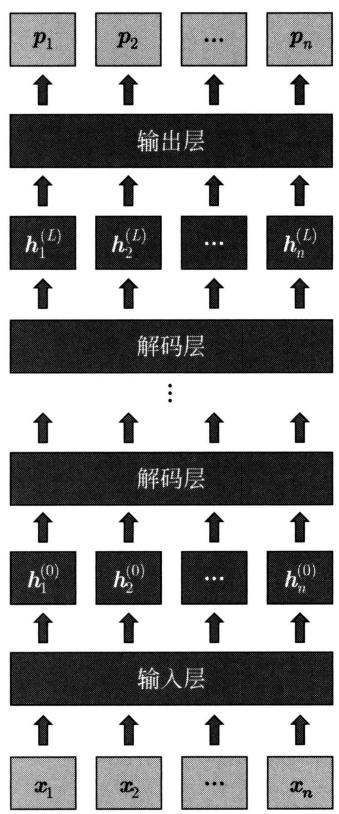  
图29.2 GPT模型的架构

GPT中解码层的多头自注意力都是单向的，也就是各个位置的单词只针对之前所有位置的单词进行自注意力计算。

GPT模型有三个超参数：解码层的层数 $L$ 、头的个数 $h$ 、模型的维度 $d$ 。GPT-1取 $L = 12$ ， $h = 12$ ， $d = 768$ 。GPT-1的输入单词序列的最大长度是512。

# 2. 预训练

预训练时，样本是单词序列 $\pmb{x} = x_{1},x_{2},\dots ,x_{n}$ ，估计模型的参数，使模型对单词序列数据有准确的预测。损失函数是负对数似然函数或交叉熵(式(29.3))。

$$
L _ {\mathrm {P T}} = - \sum_ {i = 1} ^ {n} \log P _ {\boldsymbol {\theta}} \left(x _ {i} \mid x _ {1}, x _ {2}, \dots , x _ {i - 1}\right) \tag {29.8}
$$

其中， $\theta$ 是模型的参数，通过预训练估计得到，作为下游任务模型的初始值。整个预训练通过Transformer解码器的学习进行，包括端到端训练和强制教学。

# 3. 微调

微调时，进一步调节参数，使模型对下游任务有准确的预测。GPT-1、GPT-2、GPT-3有不同的微调方法。

GPT-1的微调针对不同的下游任务，定义不同的目标函数。如果下游任务是文本分类，输入是单词序列 $\pmb{x}^{\prime} = x_{1},x_{2},\dots ,x_{m}$ ，输出是类别 $y$ ，计算条件概率 $P(y|x_1,x_2,\dots ,x_m)$

$$
P _ {\boldsymbol {\theta}, \phi} (y | x _ {1}, x _ {2}, \dots , x _ {m}) = \operatorname {s o f t m a x} \left(\boldsymbol {W} _ {y} ^ {\mathrm {T}} \boldsymbol {h} _ {m} ^ {(L)}\right) = \frac {\exp \left(\boldsymbol {w} _ {y} ^ {\mathrm {T}} \cdot \boldsymbol {h} _ {m} ^ {(L)}\right)}{\sum_ {y ^ {\prime}} \exp \left(\boldsymbol {w} _ {y ^ {\prime}} ^ {\mathrm {T}} \cdot \boldsymbol {h} _ {m} ^ {(L)}\right)} \tag {29.9}
$$

其中， $h_m^{(L)}$ 是第 $L$ 个解码层最后位置的单词的表示向量， $W_y$ 是类别的权重矩阵， $\phi$ 表示分类的参数。

损失函数包括两部分（ $\lambda$ 是系数）：

$$
L _ {\mathrm {F T}} = L _ {\mathrm {C L S}} + \lambda \cdot L _ {\mathrm {L M}} \tag {29.10}
$$

一个是分类的损失函数：

$$
L _ {\mathrm {C L S}} = - \log P _ {\boldsymbol {\theta}, \boldsymbol {\phi}} (y | x _ {1}, x _ {2}, \dots , x _ {m}) \tag {29.11}
$$

另一个是语言建模的损失函数：

$$
L _ {\mathrm {L M}} = - \sum_ {j = 1} ^ {m} \log P _ {\boldsymbol {\theta}} \left(x _ {j} \mid x _ {1}, x _ {2}, \dots , x _ {j - 1}\right) \tag {29.12}
$$

前者是微调的主要部分。微调中，预训练模型的参数 $\theta$ 作为初始值，在这个过程中得到进一步学习，同时分类的参数 $\phi$ 也得到学习。

下游任务是文本匹配、文本蕴含关系判断、多项问答时，GPT-1的微调都有相应的方法。

GPT2 和 GPT-3 都是基于预训练的语言模型，不做微调。Open AI 团队想要证明的是这样的语言模型具有更强的通用性，可以学习执行多种任务，而且可以泛化到更多的任务，特别是当语言模型达到一定规模以后。GPT-2 有 15 亿参数，GPT-3 有 1750 亿参数。

GPT-2的通用性体现在零样本学习（zero shot learning）上。针对一个新的任务，不进行微调，很多情况下可以直接完成这个任务。实验发现，GPT-2在阅读理解任务上的准确率超过了监督学习的模型。

GPT-3具有更大的规模，也就有更强的通用性，体现在上下文学习（in-context learning）上。上下文学习是指，预测时给少量的例子，包括输入和输出对（如问题-回答对），将其作为上下文，对给定的新输入让模型产生相应的新输出。这包括零样本学习和单样本学习（one-shot learning）、少样本学习（few-shot learning）。这时，模型的参数没有改变。GPT-3不仅在阅读理解，而且在问答、摘要、翻译等很多任务上也表现出较强的能力。表29.2给出不同条件下的上下文学习例子。

表 29.2 上下文学习示例, 任务是英法文翻译。输入包含任务描述、样例以及指令, 输出是 LLM 的回复  

<table><tr><td>类型</td><td>输入</td><td>注释</td></tr><tr><td rowspan="2">零样本学习</td><td>Translate English to French</td><td>任务描述</td></tr><tr><td>cheese ⇒</td><td>指令</td></tr><tr><td rowspan="3">单样本学习</td><td>Translate English to French</td><td>任务描述</td></tr><tr><td>sea otter ⇒ loutre de mer</td><td>样例</td></tr><tr><td>cheese ⇒</td><td>指令</td></tr><tr><td rowspan="5">少样本学习</td><td>Translate English to French</td><td>任务描述</td></tr><tr><td>sea otter ⇒ loutre de mer</td><td>样例</td></tr><tr><td>peppermint ⇒ menthe povree</td><td>样例</td></tr><tr><td>plush girafe ⇒ girafe peluche</td><td>样例</td></tr><tr><td>cheese ⇒</td><td>指令</td></tr></table>

# 29.2.2 模型特点

GPT的模型是单向语言模型，而不是双向语言模型。也就是说模型只能看到当前位置之前的上下文，而不能看到当前位置之后的上下文。对生成任务来说可能没有大问题，但对理解任务来说，看似是一种缺陷。事实证明，当模型规模达到一定程度以后，这个缺陷也会被弥补。

GPT的学习（预训练加微调）和预测的目标是一致的，都是语言建模。GPT-1的微调还有下游任务的参数需要学习，GPT-2和GPT-3的微调已经没有下游任务的参数需要学习。这样做的好处是所有的处理都在一个框架下。首先实现简单。更重要的是学习的效果很好，特别是当模型规模达到一定程度之后，就更加明显。

# 29.3 BERT模型

BERT及其扩展版本也是有代表性的预训练语言模型，适合于语言理解任务。本节叙述BERT的模型和学习算法，总结BERT模型的特点。

# 29.3.1 模型和学习

# 1. 模型

BERT是双向Transformer编码器表示（bidirectional encoder representations from Transformer）的缩写。BERT的模型基于Transformer的编码器，是双向语言模型。BERT的预训练主要是掩码语言建模，使用大规模语料基于去噪自动编码器原理进行模型的参数估计，学习的目标是复原给定的掩码单词序列中被掩码的每一个单词。学习和预测都是非自回归过程（non-autoregressive process）。

BERT模型有以下结构。输入是两个合并的单词序列。

$$
<   \operatorname {c l s} >, x _ {1}, x _ {2}, \dots , x _ {m - 1}, <   \operatorname {s e p} >, x _ {m + 1}, x _ {m + 2}, \dots , x _ {m + n - 1}, <   \operatorname {s e p} >
$$

其中， $x_{1}, x_{2}, \dots, x_{m-1}$ 是第一个单词序列， $x_{m+1}, x_{m+2}, \dots, x_{m+n-1}$ 是第二个单词序列， $\langle \mathrm{cls} \rangle$ 是表示类别的特殊字符， $\langle \mathrm{sep} \rangle$ 是表示序列分割的特殊字符，合并的单词序列共有 $m + n + 1$ 个单词和字符。每一个单词序列是一个句子或一段文章。首先经过输入层，产生初始的单词表示向量的序列，记作矩阵 $\pmb{H}^{(0)}$ ：

$$
\boldsymbol {H} ^ {(0)} = \boldsymbol {X} + \boldsymbol {S} + \boldsymbol {E} \tag {29.13}
$$

其中，矩阵 $\pmb{X}$ 表示单词的词嵌入的序列 $\pmb{X} = (\pmb{x}_0, \pmb{x}_1, \dots, \pmb{x}_{m + n})$ ；矩阵 $\pmb{E}$ 表示单词的位置嵌入的序列 $\pmb{E} = (e_0, e_1, \dots, e_{m + n})$ ；矩阵 $\pmb{S}$ 是区别前后单词序列的标记序列 $\pmb{S} = (a, a, \dots, a, b, b, \dots, b)$ ，含有 $m + 1$ 个向量 $\pmb{a}$ 和 $n$ 个向量 $\pmb{b}$ 。 $\pmb{X}, \pmb{E}, \pmb{S}, \pmb{H}^{(0)}$ 是 $d \times (m + n + 1)$ 矩阵，设词嵌入、位置嵌入、标记向量的维度是 $d$ 。图29.3显示的是BERT模型输入层的计算。

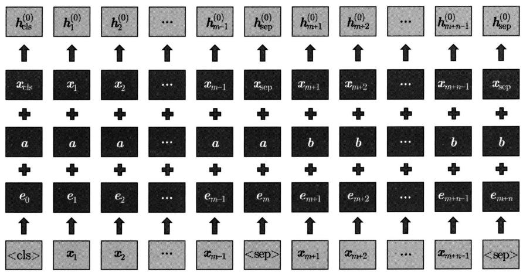  
图29.3 BERT模型输入层的计算

使用拼接的单词序列（两个单词序列）作为输入是让BERT不仅能用于以一个文本为输入的任务，如文本分类，也能用于以两个文本为输入的任务，如文本匹配。

之后经过 $L$ 个编码层，得到单词的表示向量的序列，记作 $\pmb{H}^{(L)}$

$$
\boldsymbol {H} ^ {(L)} = \operatorname {t r a n s f o r m e r} _ {-} \operatorname {e n c o d e r} \left(\boldsymbol {H} ^ {(0)}\right) \tag {29.14}
$$

具体地，

$$
\boldsymbol {H} ^ {(L)} = \left(\boldsymbol {h} _ {0} ^ {(L)}, \boldsymbol {h} _ {1} ^ {(L)}, \dots , \boldsymbol {h} _ {m + n} ^ {(L)}\right)
$$

其中， $h_i^{(L)}$ 是第 $i$ 个位置的单词的表示向量。BERT模型中，在每一层，每一个位置的表示向量是该位置的单词基于之前位置和之后位置的上下文的表示（contextualized representation）。

BERT模型的输出是在合并的单词序列的各个位置上的条件概率，第 $i$ 个位置的单词（包括特殊字符）的条件概率 $p_i$ 定义为

$$
P _ {\boldsymbol {\theta}} \left(x _ {i} \mid x _ {0}, \dots , x _ {i - 1}, x _ {i + 1}, \dots , x _ {m + n}\right) = \operatorname {s o f t m a x} \left(\boldsymbol {W} _ {x} ^ {\mathrm {T}} \boldsymbol {h} _ {i} ^ {(L)}\right) = \frac {\exp \left(\boldsymbol {w} _ {x _ {i}} ^ {\mathrm {T}} \cdot \boldsymbol {h} _ {i} ^ {(L)}\right)}{\sum_ {x _ {i} ^ {\prime}} \exp \left(\boldsymbol {w} _ {\boldsymbol {x} _ {i} ^ {\prime}} ^ {\mathrm {T}} \cdot \boldsymbol {h} _ {i} ^ {(L)}\right)} \tag {29.15}
$$

其中， $x_0, \dots, x_{i-1}, x_{i+1}, \dots, x_{m+n}$ 是其他位置的单词， $x_i$ 是当前位置的单词， $\boldsymbol{W}_x$ 表示所有单词的权重矩阵， $\pmb{\theta}$ 表示模型的参数。

图29.4显示的是BERT模型的架构，其中输入层进行式(29.13)的计算，编码层整体进行式(29.14)的计算，输出层进行式(29.15)的计算。BERT利用Transformer编码器对语言的内容进行层次化的组合式的表示。

  
图29.4 BERT模型的架构

BERT中编码层的多头自注意力都是双向的，也就是各个位置的单词针对其他位置的单词都进行自注意力计算，这一点与GPT不同。图29.5比较了BERT和GPT中表示之间关系的差异。BERT中每一层每一个位置的表示都是由下一层所有位置的表示组合而成，而GPT中每一层每一个位置的表示都是由下一层之前所有位置的表示组合而成。

BERT模型有三个超参数：编码层的层数 $L$ 、头的个数 $h$ 、模型的维度 $d$ 。BERT Base模型取 $L = 12$ ， $h = 12$ ， $d = 768$ 。原始BERT的输入单词序列的最大长度是512。

# 2. 预训练

预训练数据的每个样本由两个单词序列A和B合并组成，中间由特殊字符<sep>分割。 $50\%$ 的样本中A和B是同一篇文章中的连续文本， $50\%$ 的样本中A和B来自不同篇文章。在每一个样本的合并单词序列中，随机选择 $15\%$ 的位置进行掩码操作。对于掩码操作，在选择的 $15\%$ 的位置上，有 $80\%$ 的单词替换为特殊字符<mask>，有 $10\%$ 的单词随机替换为其他单词，剩下 $10\%$ 的单词保持不变。

  
图29.5 BERT模型和GPT模型的比较

BERT 模型的预训练由两部分组成，掩码语言建模（masked language modeling）和下句预测（next sentence prediction）。掩码语言建模的目标是复原输入单词序列中被掩码的单词。可以看作去噪自动编码器学习，对被掩码的单词独立地进行复原。下句预测的目标是判断输入单词序列是否来自同一篇文章。这里说的下句未必是一个自然句，也可以是多个自然句。样本是掩码单词序列 $\tilde{\boldsymbol{x}} = \tilde{x}_0, \tilde{x}_1, \dots, \tilde{x}_{m+n}$ 。

掩码语言建模在每一个掩码位置计算条件概率 (式 (29.4)):

$$
P _ {\theta} \left(x _ {i} \mid \tilde {x} _ {0}, \tilde {x} _ {1}, \dots , \tilde {x} _ {m + n}\right) = \operatorname {s o f t m a x} \left(\boldsymbol {W} _ {x} ^ {\mathrm {T}} \boldsymbol {h} _ {i} ^ {(L)}\right) = \frac {\exp \left(\boldsymbol {w} _ {x _ {i}} ^ {\mathrm {T}} \cdot \boldsymbol {h} _ {i} ^ {(L)}\right)}{\sum_ {x _ {i} ^ {\prime}} \exp \left(\boldsymbol {w} _ {x _ {i} ^ {\prime}} \cdot \boldsymbol {h} _ {i} ^ {(L)}\right)} \tag {29.16}
$$

假设第 $i$ 个位置是掩码位置, $h_{i}^{(L)}$ 是在第 $L$ 层第 $i$ 个位置的表示, $x_{i}$ 是预测的单词, $W_{x}$ 是单词的权重矩阵。

下句预测计算条件概率：

$$
P _ {\boldsymbol {\theta}} (s | \tilde {x} _ {0}, \tilde {x} _ {1}, \dots , \tilde {x} _ {m + n}) = \sigma \left(\boldsymbol {w} _ {s} ^ {\mathrm {T}} \cdot \boldsymbol {h} _ {\mathrm {c l s}} ^ {(L)}\right) = \frac {\exp \left(\boldsymbol {w} _ {s} ^ {\mathrm {T}} \cdot \boldsymbol {h} _ {\mathrm {c l s}} ^ {(L)}\right)}{1 + \exp \left(\boldsymbol {w} _ {s} ^ {\mathrm {T}} \cdot \boldsymbol {h} _ {\mathrm {c l s}} ^ {(L)}\right)} \tag {29.17}
$$

其中， $h_{\mathrm{cls}}^{(L)}$ 是在第 $L$ 层的类别特殊字符 $\langle \mathrm{cls} \rangle$ 的表示向量； $\boldsymbol{w}_s$ 是下句预测的权重向量； $s$ 取值为1或0，表示两个单词序列是否来自同一篇文章。

预训练的损失函数为

$$
L _ {\mathrm {P T}} = L _ {\mathrm {M L M}} + \lambda \cdot L _ {\mathrm {N S P}} \tag {29.18}
$$

其中， $L_{\mathrm{MLM}}$ 是掩码语言建模损失， $L_{\mathrm{NSP}}$ 是下句预测损失， $\lambda$ 是系数。

$$
L _ {\mathrm {M L M}} = - \sum_ {i = 0} ^ {m + n} \delta_ {i} \log P _ {\theta} \left(x _ {i} | \tilde {x} _ {0}, \tilde {x} _ {1}, \dots , \tilde {x} _ {m + n}\right) \tag {29.19}
$$

其中， $\delta_{i}$ 取值为1或0，表示第 $i$ 个位置是否被掩码； $\pmb{\theta}$ 是模型的参数。

$$
L _ {\mathrm {N S P}} = - \log P _ {\boldsymbol {\theta}} (s | \tilde {x} _ {0}, \tilde {x} _ {1}, \dots , \tilde {x} _ {m + n}) \tag {29.20}
$$

预训练得到的模型参数 $\theta$ 作为下游任务模型的初始值。

掩码语言建模是预训练的主要部分，下句预测的目标是让BERT既能用于以一个单词序列为输入的任务，如文本分类，也能用于以两个单词序列为输入的任务，如文本匹配。后续改进版RoBERTa等的研究发现，下句预测未必一定需要。当数据量足够大时，可以只通过掩码语言建模进行预训练。也就是说，

$$
L _ {\mathrm {P T}} = L _ {\mathrm {M L M}}
$$

RoBERTa 模型就采用这个方法。

# 3. 微调

微调时，进一步调节参数，使模型对下游任务有准确的预测。如果下游任务是文本分类，输入单词序列是 $\boldsymbol{x}^{\prime} = x_{0},x_{1},\dots ,x_{l}$ ，输出是类别 $y$ ，计算条件概率 $P(y|x_0,x_1,\dots ,x_l)$

$$
P _ {\theta , \phi} (y | x _ {0}, x _ {1}, \dots , x _ {l}) = \operatorname {s o f t m a x} \left(\boldsymbol {W} _ {y} ^ {\mathrm {T}} \boldsymbol {h} _ {\mathrm {c l s}} ^ {(L)}\right) = \frac {\exp \boldsymbol {w} _ {y} ^ {\mathrm {T}} \cdot \boldsymbol {h} _ {\mathrm {c l s}} ^ {(L)}}{\sum_ {y ^ {\prime}} \exp \boldsymbol {w} _ {y ^ {\prime}} ^ {\mathrm {T}} \cdot \boldsymbol {h} _ {\mathrm {c l s}} ^ {(L)}} \tag {29.21}
$$

其中， $h_{\mathrm{cls}}^{(L)}$ 是第 $L$ 层的类别特殊字符 $\langle \mathrm{cls} \rangle$ 的表示向量， $W_y$ 是类别的权重矩阵， $\phi$ 表示分类的参数。这时单词序列 $\boldsymbol{x}' = x_0, x_1, \dots, x_l$ 是一个句子或一段文章，以特殊字符 $\langle \mathrm{cls} \rangle$ 开始，以特殊字符 $\langle \mathrm{sep} \rangle$ 结束。

微调的损失函数为

$$
L _ {\mathrm {F T}} = - \log P _ {\boldsymbol {\theta}, \phi} (y | x _ {0}, x _ {1}, \dots , x _ {l}) \tag {29.22}
$$

微调中，预训练模型的参数 $\theta$ 作为初始值，在这个过程中进一步得到学习，以帮助更好地分类；同时分类的参数 $\phi$ 也得到学习。

如果下游任务是文本匹配，如判断两句话是否形成一问一答。输入单词序列是 $x_0, x_1, \dots, x_l$ ，输出是类别 $y$ ，仍然计算条件概率 $P(y|x_0, x_1, \dots, x_l)$ 。类别有两类，表示匹配或不匹配。这时单词序列 $x_0, x_1, \dots, x_l$ 是两个单词序列合并的序列，如一个问句和一个答句合并而成。以特殊字符 $<\mathrm{cls}>$ 开始，中间以特殊字符 $<\mathrm{sep}>$ 间隔，最后以特殊字符 $<\mathrm{sep}>$ 结束。

下游任务是文本蕴含关系判断、多项问答、命名实体识别时，BERT的微调都有相应的方法。

# 29.3.2 模型特点

# 1. 模型中的表示

BERT 通过其多层多头注意力机制能够有效地表示语言的词汇、语法、语义信息（Transformer 和 GPT 也有类似的特点）。通过自注意力，每一层的每一个位置的单词表示与其他位置的单词表示组合成新的表示，传递到上一层的同一位置。自注意力是多头的，一个头代表一个侧面，因此每一个位置的单词表示由多个不同侧面的表示组合而成。单词表示的内容可以通过自注意力的权重推测。图 29.6 和图 29.7 给出显示 BERT 的权重分布的例子。权重的大小代表了单词表示的组合过程中各个单词表示的作用的大小。

  
Head 1-1   
Attends broadly

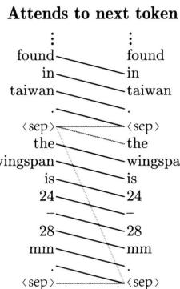  
Head 3-1

  
Head 8-7

Head 11-6   
Attends to periods   
图29.6 BERT模型的注意力权重分布的例子  
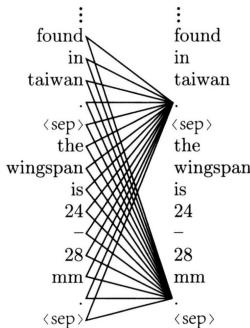  
存在于不同层不同头

注意力权重的分布有几种类型。如图29.6所示，注意力可能是发散的，可能集中到前一个位置的单词或者后一个位置的单词，可能集中到特殊字符 $<\mathrm{sep}>$ ，也可能集中到标点符号。这里说的注意力集中是指自注意力计算中只有一个位置的权重很大而其他位置的权重很小的情况。研究发现，有些注意力是冗余的，屏蔽掉它们（权重置为0），模型预测的结果并没有大的改变，但模型整体的多层多头自注意力机制对语言刻画是有必要的。

BERT的各层有不同的特点。底层主要表示词汇信息，中层主要表示语法信息，上层主要表示语义信息。从图29.7中的例子可以看出，对给定的自然语言输入，不同层不同头可以表示其中的动词-宾语关系、冠词-名词关系、介词-名词关系、代词指代关系等。

# 2. 模型的能力

BERT 的模型是双向语言模型。也就是说模型可以看到当前位置之前和之后的上下文。对理解任务来说，这是一种优势。BERT 的学习和预测的目标并不一致。预训练的目标是掩码语言建模，而预测的目标是各个下游任务。下游任务都有参数需要学习。实验证明，当模型规模相对比较小的时候，BERT 比 GPT 在语言理解上准确率更高。而当模型规模变大的时候，GPT 比 BERT 准确率更高。

- Direct objects attend to their verbs

- $86.8\%$ accuracy at the dobj relation

  
Head 8-10

Head 8-11   
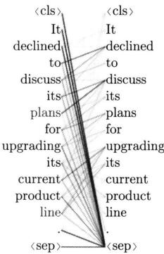  
- Noun modifiers (e.g., determiners) attend to their noun   
- $94.3\%$ accuracy at the det relation

Head 9-6   
  
- Prepositions attend to their objects   
- $76.3\%$ accuracy at the pocj relation

Head 5-4   
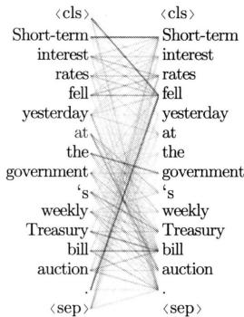  
- Coreferent mentions attend to their antecedents   
- $65.1\%$ accuracy at linking the head of a coreferent mention to the head of an antecedent

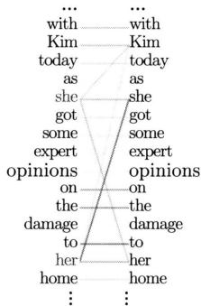

  
图29.7 BERT模型中的注意力权重分布的例子（见文前彩图）可以表示词汇、语法、语义关系

# 本章概要

1. 预训练语言模型是基于具有强大表示能力的神经网络的神经语言模型。首先在预训练中，使用大规模的语料通过无监督学习的方式学习模型的参数。之后在微调中，将模型用于一些具体任务，使用少量的标注数据通过监督学习的方式进一步调节模型的参数。预训练语言模型通常可以有效地表示语言的词汇、句法和语义特征，用于下游任务。  
2. 有代表性的预训练语言模型有GPT和BERT，分别由Transformer的解码器和编码器实现。GPT是单向语言模型，既用于语言生成，也用于语言理解。BERT是双向语言模型，只用于语言理解。

GPT的单向语言模型由以下单词的生成条件概率组成：

$$
P \left(x _ {i} \mid x _ {1}, \dots , x _ {i - 1}\right), \quad i = 1, 2, \dots , n
$$

每一个位置的单词依赖于之前位置的单词。GPT 的预训练通过语言建模进行，基于序列概率

估计原理。

BERT的双向语言模型由以下单词生成的条件概率组成：

$$
P \left(x _ {i} \mid x _ {1}, \dots , x _ {i - 1}, x _ {i + 1}, \dots , x _ {n}\right), \quad i = 1, 2, \dots , n
$$

每一个位置的单词依赖于之前位置和之后位置的单词。BERT 的预训练主要通过掩码语言建模进行，基于去噪自动编码器原理。

3. GPT 模型的输入是单词序列，可以是一个句子或一段文章。首先经过输入层，产生初始的单词表示向量的序列。之后经过 $L$ 个Transformer解码层，得到单词表示向量的序列，GPT 模型的输出是在单词序列各个位置上的条件概率。

GPT预训练时，通过极大似然估计学习模型的参数。

$$
L _ {\text {t r a i n}} = - \sum_ {i = 1} ^ {n} \log P _ {\boldsymbol {\theta}} \left(x _ {i} | x _ {1}, x _ {2}, \dots , x _ {i - 1}\right)
$$

GPT微调时，将下游任务的标注数据转换为序列数据，通过对序列数据的语言建模，进一步调节模型的参数。

4. BERT 模型的输入是两个合并的单词序列。首先经过输入层，产生初始的单词表示向量的序列。之后经过 $L$ 个 Transformer 编码层，得到单词的表示向量的序列。BERT 模型的输出是在单词序列的各个位置上的条件概率。

BERT模型的预训练是掩码语言建模。掩码语言建模的目标是复原输入单词序列中被掩码的单词，其损失函数是

$$
L _ {1} = - \sum_ {i = 0} ^ {m + n} \delta_ {i} \log P _ {\boldsymbol {\theta}} \left(x _ {i} | \tilde {x} _ {0}, \tilde {x} _ {1}, \dots \tilde {x} _ {m + n}\right)
$$

BERT微调时，针对不同的下游任务，通过对相应标注数据的预测，进一步调节模型的参数。

# 继续阅读

BERT的原始论文是文献[1]，GPT-1、GPT-2、GPT-3的原始论文是文献[2]～文献[4]。BERT的改进工作有RoBERTa[5]。本章介绍的BERT的分析结果见文献[6]。BERT和GPT之前的预训练语言模型有ELMo[7]。

# 习题

29.1 设计基于双向LSTM的预训练语言模型，假设下游任务是文本分类。  
29.2 假设GPT-1微调的下游任务是两个文本的匹配，设计微调的方法。  
29.3 可以认为 BERT 预训练中的掩码语言建模是基于去噪自动编码器原理的（见第 30 章），解释为什么。

29.4 假设BERT微调的下游任务是命名实体识别，设计微调的方法。  
29.5 比较BERT与Transformer编码器在模型上的异同。

# 参考文献

[1] DEVLIN J, CHANG M W, LEE K, et al. BERT: pre-training of deep bidirectional transformers for language understanding[C]//Proceedings of the 2019 Conference of the North American Chapter of the Association for Computational Linguistics: Human Language Technologies. 2019: 4171-4186.   
[2] RADFORD A, NARASIMHAN K, SALIMANS T, et al. Improving language understanding by generative pre-training[J]. 2018.   
[3] RADFORD A, WU J, CHILD R, et al. Language models are unsupervised multitask learners[J]. OpenAI Blog, 2019, 1(8).   
[4] BROWN T B, MANN B, RYDER N, et al. Language models are few-shot learners[Z/OL]. arXiv preprint arXiv:2005.14165, 2020.   
[5] LIU Y, OTT M, GOYAL N, et al. Roberta: A robustly optimized bert pretraining approach[Z/OL]. arXiv preprint arXiv:1907.11692, 2019.   
[6] CLARK K, KHANDELWAL U, LEVY O, et al. What does BERT look at? An analysis of BERT's attention[C]//Proceedings of the 2019 ACL Workshop BlackboxNLP: Analyzing and Interpreting Neural Networks for NLP. 2019: 276-286.   
[7] PETERS ME, NEUMANN M, IYYER M, et al. Deep contextualized word representations[C]// Proceedings of NAACL-HLT. 2018: 2227-2237.

# 第30章 变分自编码器

变分自编码器（variational autoencoder，VAE）是由神经网络构成的概率模型，有编码器网络和解码器网络两个网络。编码器表示给定数据条件下潜在的条件概率分布，解码器表示给定潜在表示条件下数据的条件概率分布。数据是可观测的，潜在表示不可观测。学习时从数据中自动学习VAE的编码器和解码器，预测时使用解码器随机生成与训练数据相同分布的新数据。VAE的学习属于变分推理，学习的目标是最大化证据下界（evidence lower bound, ELBO）。采用再参数化技巧（reparameterization trick），利用随机梯度上升，学习编码器和解码器的参数。

变分自编码器与自编码器 (autoencoder, AE)、去噪自编码器 (denoising autoencoder, DAE) 有不同的机器学习框架。变分自编码器是概率模型，而自编码器和去噪自编码器是非概率模型。自编码器学习时，编码器将数据转换为潜在表示，解码器再将潜在表示转换为复原的数据。学习进行的是数据压缩。去噪自编码器是自编码器的扩展，学习时在输入中加入随机噪声，以学到稳健的自编码器。

Rumelhart、Hinton 等于 1980 年代研究了自编码器，Vincent 等于 2008 年提出了去噪自编码器。Kingma 和 Welling 于 2014 年提出了变分自编码器。

本章主要讲述变分自编码器。30.1节介绍自编码器AE，30.2节介绍去噪自编码器DAE，30.3节详细讲解变分自编码器VAE。

# 30.1 自编码器

自编码器（autoencoder，AE）是用于数据表示学习的神经网络，可以自动学习训练数据的潜在特征。自编码器由编码器和解码器两个神经网络组成，如图30.1所示。编码器表示函数 $z = f_{\phi}(x)$ ，其中输入是实例向量 $\pmb{x}$ ，输出是潜在表示向量 $\pmb{z}$ ， $\phi$ 是网络参数。解码器表示函数 $\hat{\pmb{x}} = g_{\theta}(\pmb{z})$ ，其中输入是潜在表示向量 $\pmb{z}$ ，输出是复原的实例向量 $\hat{\pmb{x}}$ ， $\pmb{\theta}$ 是网络参数。假设 $\pmb{x}$ 和 $\hat{\pmb{x}}$ 的维度相同，而 $\pmb{z}$ 的维度远低于 $\pmb{x}$ 和 $\hat{\pmb{x}}$ 的维度。设训练数据集是 $\mathcal{D} = \{\pmb{x}\}$ ，其中 $\pmb{x}$ 是一个样本。自编码器学习旨在自动发现训练数据集中每个样本的潜在特征。

学习时，针对所有样本，编码器将实例向量 $\pmb{x}$ 转换为潜在表示向量 $\pmb{z}$ ，解码器再将潜在表示向量 $\pmb{z}$ 转换为复原的实例向量 $\hat{\pmb{x}}$ 。学习的目标是尽量使复原的实例 $\hat{\pmb{x}}$ 和原始实例 $\pmb{x}$ 一致，或者说重建原始数据 $\pmb{x}$ 。认为学到的潜在表示 $\pmb{z}$ 就是实例 $\pmb{x}$ 的特征。

最基本的情况，编码器和解码器分别都是一层神经网络，编码器是

$$
\boldsymbol {z} = f _ {\phi} (\boldsymbol {x}) = a \left(\boldsymbol {W} _ {e} \boldsymbol {x} + \boldsymbol {b} _ {e}\right) \tag {30.1}
$$

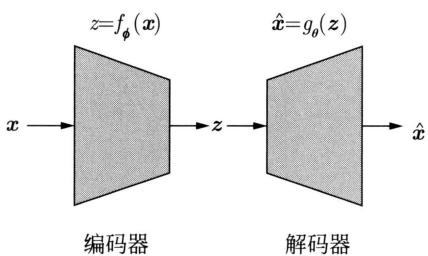  
图30.1 自编码器。编码器表示函数 $z = f_{\phi}(\pmb{x})$ ，解码器表示函数 $\hat{\pmb{x}} = g_{\theta}(\pmb{z})$ 。变量 $\pmb{x}$ 表示实例，变量 $\hat{\pmb{x}}$ 表示复原的实例，变量 $\pmb{z}$ 表示实例的潜在表示

其中， $W_{e}$ 是权重矩阵， $b_{e}$ 是偏置向量， $a(\cdot)$ 是激活函数。解码器是

$$
\hat {\boldsymbol {x}} = g _ {\boldsymbol {\theta}} (\boldsymbol {z}) = a \left(\boldsymbol {W} _ {d} \boldsymbol {z} + \boldsymbol {b} _ {d}\right) \tag {30.2}
$$

其中， $\mathbf{W}_d$ 是权重矩阵， $\mathbf{b}_d$ 是偏置向量， $a(\cdot)$ 是激活函数。有时假设 $\mathbf{W}_e^{\mathrm{T}} = \mathbf{W}_d$ 成立。这种自编码器是一种特殊的前馈神经网络。

学习的目标是

$$
L = \frac {1}{N} \sum_ {\boldsymbol {x} \in \mathcal {D}} L (\boldsymbol {x}, \hat {\boldsymbol {x}}) = \frac {1}{N} \sum_ {\boldsymbol {x} \in \mathcal {D}} L (\boldsymbol {x}, g _ {\boldsymbol {\theta}} \left(f _ {\boldsymbol {\phi}} (\boldsymbol {x})\right)) \tag {30.3}
$$

其中， $N$ 是样本容量； $L(\pmb {x},\hat{\pmb{x}})$ 是损失函数，比如平方损失：

$$
L (\boldsymbol {x}, \hat {\boldsymbol {x}}) = \| \boldsymbol {x} - \hat {\boldsymbol {x}} \| ^ {2}
$$

学习的算法是随机梯度下降。

学习实际进行的是对数据的压缩（编码），得到的潜在表示能有效地刻画数据的特征。因为通过解压（解码）可以得到原始数据的近似，说明潜在表示保留了数据中的主要信息。压缩是将高维向量转换为低维向量，解压是将低维向量转换为高维向量。

预测时，通常用编码器将新的输入向量 $\pmb{x}^{\prime}$ 转换为潜在表示 $z^{\prime}$

$$
\boldsymbol {z} ^ {\prime} = f \left(\boldsymbol {x} ^ {\prime}\right) = a \left(\boldsymbol {W} _ {e} \boldsymbol {x} ^ {\prime} + \boldsymbol {b} _ {\mathrm {e}}\right) \tag {30.4}
$$

自编码器可以用于数据的压缩、聚类等应用。

当编码器和解码器都是线性函数时，即 $f(\pmb{x}) = \pmb{W}_e\pmb{x}$ ， $g(\pmb{z}) = \pmb{W}_d\pmb{z}$ 时，可以通过主成分分析（见第17章）学习自编码器。也就是说主成分分析是自编码器的一种特殊情况。证明留作习题。

# 30.2 去噪自编码器

去噪自编码器（denoising autoencoder，DAE）是自编码器的扩展，学习时在输入中加入随机噪声，以学到稳健的自编码器。去噪自编码器不仅可以用于数据表示学习，而且可以用于数据去噪。

学习时，针对所有样本，首先根据条件概率分布 $P(\tilde{\pmb{x}}|\pmb {x})$ 对数据 $\pmb{x}$ 进行随机变换，得到

有噪声的实例 $\tilde{\pmb{x}}$ 。比如随机地选取 $\pmb{x}$ 的一些元素将其置为0，然后以 $\tilde{\pmb{x}}$ 为输入学习自编码器。编码器将有噪声的实例 $\tilde{\pmb{x}}$ 转换为潜在表示 $\pmb{z}$ ，解码器再将潜在表示 $\pmb{z}$ 转换为复原的实例 $\hat{\pmb{x}}$ 。学习的目标是尽量使复原的实例 $\hat{\pmb{x}}$ 和原始实例 $\pmb{x}$ 一致，或者说重建原始数据 $\pmb{x}$ ，比如复原 $\tilde{\pmb{x}}$ 的置为0的元素的值。最基本的情况，编码器、解码器、学习的目标分别是

$$
\boldsymbol {z} = f _ {\phi} (\tilde {\boldsymbol {x}}) = a \left(\boldsymbol {W} _ {e} \tilde {\boldsymbol {x}} + \boldsymbol {b} _ {e}\right) \tag {30.5}
$$

$$
\hat {\boldsymbol {x}} = g _ {\boldsymbol {\theta}} (\boldsymbol {z}) = a \left(\boldsymbol {W} _ {d} \boldsymbol {z} + \boldsymbol {b} _ {d}\right) \tag {30.6}
$$

$$
L = \frac {1}{N} \sum_ {\boldsymbol {x} \in \mathcal {D}} L (\boldsymbol {x}, \hat {\boldsymbol {x}}) = \frac {1}{N} \sum_ {\boldsymbol {x} \in \mathcal {D}} L (\boldsymbol {x}, g _ {\boldsymbol {\theta}} (f _ {\boldsymbol {\phi}} (\tilde {\boldsymbol {x}}))) \tag {30.7}
$$

因为学习的目标是排除噪声的干扰重建数据，去噪自编码器能更有效地学到实例的主要特征。

预测时，用编码器将新的实例 $x'$ 转换为潜在表示 $z'$ ，然后用解码器将潜在表示变量 $z'$ 转换为复原的实例 $\hat{x}'$ 。

$$
\boldsymbol {z} ^ {\prime} = f _ {\phi} \left(\boldsymbol {x} ^ {\prime}\right) = a \left(\boldsymbol {W} _ {e} \boldsymbol {x} ^ {\prime} + \boldsymbol {b} _ {e}\right) \tag {30.8}
$$

$$
\hat {\boldsymbol {x}} ^ {\prime} = g _ {\boldsymbol {\theta}} \left(\boldsymbol {z} ^ {\prime}\right) = a \left(\boldsymbol {W} _ {d} \boldsymbol {z} ^ {\prime} + \boldsymbol {b} _ {d}\right) \tag {30.9}
$$

如果输入向量 $\pmb{x}^{\prime}$ 是含有噪声的实例，那么 $\hat{\pmb{x}}^{\prime}$ 就是去噪后的实例。用去噪自编码器可以对数据去噪。

# 30.3 变分自编码器

本节讲述变分自编码器的模型、学习策略和算法。

# 30.3.1 方法概述

变分自编码器（VAE）是将变分推理和深度学习巧妙地结合在一起的概率模型学习方法。学习旨在估计作为数据和潜在表示的联合分布的概率模型。数据可观测，而潜在表示不可观测。也就是说概率模型含有隐变量。因为模型含有隐变量，不可以直接通过最大化训练数据的概率（证据）估计模型的参数。VAE利用变分原理，最大化证据的上界（ELBO）以近似求解。

VAE拥有编码器和解码器，都是神经网络。与AE和DAE不同，VAE的编码器和解码器是概率编码器和概率解码器，表示的都是条件概率分布。具体地，编码器表示的是从数据生成其潜在表示的条件概率分布，解码器表示的是从潜在表示生成其数据的条件概率分布。编码器和解码器输出的实际是概率分布的参数。概率模型由潜在表示的先验分布和基于潜在表示生成数据的条件分布组成，解码器表示的就是后者的分布。

在变分推理中使用编码器的分布和解码器的分布。利用随机梯度上升法进行证据下界的最大化。在这个过程中，使用再参数化技巧，解决隐变量无法直接求解梯度的问题。

# 30.3.2 模型

# 1. 神经网络

VAE是含有隐变量的概率模型。假设随机变量 $\pmb{x}$ 表示实例，随机变量 $\textbf{z}$ 表示实例的潜在表示，其联合概率分布（概率密度函数）是 $p_{\theta}(\pmb {x},\pmb {z})$ ，其中 $\pmb{x}$ 是观测变量， $\pmb{z}$ 是隐变量， $\pmb{\theta}$ 是参数。 $\pmb{x}$ 的取值是向量、矩阵或张量， $\textbf{z}$ 的取值是向量。但前者的规模远大于后者。

VAE用神经网络表示模型学习需要的条件概率分布。有编码器（网络）和解码器（网络），又分别称为推理网络和生成网络。编码器表示条件概率分布（概率密度函数） $q_{\phi}(\pmb {z}|\pmb {x})$ ，解码器表示条件概率分布（概率密度函数） $p_{\theta}(\pmb {x}|\pmb {z})$ 。通常假设 $q_{\phi}(z|x)$ 和 $p_{\theta}(\pmb {x}|\pmb {z})$ 分别是多元高斯分布 $N(z;\pmb {\mu}_e,\pmb {\Sigma}_e)$ 和 $N(\pmb {x};\pmb {\mu}_d,\pmb {\Sigma}_d)$ 。

如图30.2所示，编码器网络的输入是实例 $\pmb{x}$ ，输出是均值向量 $\pmb{\mu}_{e}$ 和协方差矩阵 $\pmb{\Sigma}_{e}$ ，网络的参数是 $\phi$ 。解码器网络的输入是潜在表示 $\pmb{z}$ ，输出是均值向量 $\pmb{\mu}_{d}$ 和协方差矩阵 $\pmb{\Sigma}_{d}$ ，网络的参数是 $\theta$ ，其中 $\theta$ 是联合概率分布 $p_{\theta}(\pmb{x},\pmb{z})$ 的参数。

  
图30.2 变分自编码器。编码器表示条件概率分布 $q_{\phi}(\pmb{z}|\pmb{x})$ ，解码器表示条件概率分布 $p_{\theta}(\pmb{x}|\pmb{z})$ 。随机变量 $\pmb{x}$ 表示实例，随机变量 $\pmb{z}$ 表示实例的潜在表示，通过对条件概率分布 $q_{\phi}(\pmb{z}|\pmb{x})$ 采样得到

神经网络是确定性函数，而概率分布是随机性函数。编码器的输出是高斯分布的参数 $\mu_{e}$ 和 $\Sigma_{e}$ ，是确定性变量，而潜在表示 $z$ 是随机变量，根据编码器表示的高斯分布 $N(z; \mu_{e}, \Sigma_{e})$ 采样得到其取值。解码器的输出是高斯分布的参数 $\mu_{d}$ 和 $\Sigma_{d}$ ，也是确定性变量。原理上可以根据解码器表示的高斯分布 $N(x; \mu_{d}, \Sigma_{d})$ 再进行采样。但是，通常的学习和推理中，只需要解码器输出高斯分布的参数，而不需要进行采样，因为我们关注的是数据的概率分布，而不是样本。

# 2. 概率模型

VAE 从训练数据中学习编码器的分布 $q_{\phi}(\pmb{z}|\pmb{x})$ 和解码器的分布 $p_{\theta}(\pmb{x}|\pmb{z})$ ，进而得到联合分布 $p_{\theta}(\pmb{x},\pmb{z})$ ，然后根据联合分布生成新的数据。因此，VAE 也是概率生成模型。

联合概率分布 $p_{\theta}(\pmb {x},\pmb {z})$ 可以写作

$$
p _ {\boldsymbol {\theta}} (\boldsymbol {x}, \boldsymbol {z}) = p _ {\boldsymbol {\theta}} (\boldsymbol {z}) p _ {\boldsymbol {\theta}} (\boldsymbol {x} | \boldsymbol {z})
$$

根据贝叶斯定理有

$$
p _ {\boldsymbol {\theta}} (\boldsymbol {z} | \boldsymbol {x}) = \frac {p _ {\boldsymbol {\theta}} (\boldsymbol {z}) p _ {\boldsymbol {\theta}} (\boldsymbol {x} | \boldsymbol {z})}{p _ {\boldsymbol {\theta}} (\boldsymbol {x})}
$$

其中，

$$
p _ {\boldsymbol {\theta}} (\boldsymbol {x}) = \int p _ {\boldsymbol {\theta}} (\boldsymbol {x}, \boldsymbol {z}) \mathrm {d} \boldsymbol {z}
$$

贝叶斯学习中， $p_{\theta}(z)$ 是先验概率分布， $p_{\theta}(\boldsymbol{x}|\boldsymbol{z})$ 是似然函数， $p_{\theta}(\boldsymbol{z}|\boldsymbol{x})$ 是后验概率分布， $p_{\theta}(\boldsymbol{x})$ 是证据（evidence）或边缘似然函数（marginal likelihood function）。

解码器的分布就是似然函数 $p_{\theta}(\boldsymbol{x}|\boldsymbol{z})$ ；编码器的分布又称作变分分布（variational distribution） $q_{\phi}(\boldsymbol{z}|\boldsymbol{x})$ ，用以近似后验分布 $p_{\theta}(\boldsymbol{z}|\boldsymbol{x})$ 。

$$
p _ {\boldsymbol {\theta}} (\boldsymbol {z} | \boldsymbol {x}) \approx q _ {\phi} (\boldsymbol {z} | \boldsymbol {x})
$$

其中， $\phi$ 和 $\pmb{\theta}$ 是编码器和解码器的神经网络的参数。

图30.3给出VAE中的概率分布之间的关系。有观测变量 $\pmb{x}$ 和隐变量 $\pmb{z}$ ，前者表示的实例空间复杂，后者表示的潜在表示空间简单。观测变量 $\pmb{x}$ 的分布是边缘似然函数或证据 $p_{\theta}(\pmb{x})$ ，隐变量 $\pmb{z}$ 的分布是先验分布 $p_{\theta}(\pmb{z})$ 。给定观测变量 $\pmb{x}$ 条件下隐变量 $\pmb{z}$ 的条件分布是变分分布 $q_{\phi}(\pmb{z}|\pmb{x})$ ，由编码器表示。给定隐变量 $\pmb{z}$ 条件下观测变量 $\pmb{x}$ 的条件分布是似然函数 $p_{\theta}(\pmb{x}|\pmb{z})$ ，由解码器表示。

  
图30.3 VAE中的概率分布之间的关系

VAE生成数据的过程如图30.4左侧所示。首先根据先验分布 $p_{\theta}(z)$ 生成潜在表示 $\textbf{z}$ ，然后再根据似然函数 $p_{\theta}(\boldsymbol {x}|\boldsymbol {z})$ 生成实例 $\pmb{x}$ ，重复 $N$ 次，得到数据集 $\mathcal{D} = \{\pmb {x}\}$ 。这里不需要明确潜在表示向量 $\textbf{z}$ 各个维度所代表的特征的含义。图30.4右侧显示变分分布 $q_{\phi}(z|\pmb {x})$ 与联合分布 $p_{\theta}(\pmb {x},\pmb {z})$ 的关系。

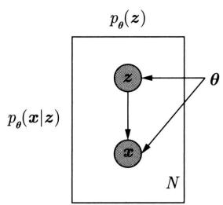

  
图30.4 VAE的概率图模型表示

# 30.3.3 学习策略

# 1. 理论推导

VAE 的学习旨在从训练数据 $\mathcal{D} = \{\pmb{x}\}$ 中学习似然函数 $p_{\theta}(\pmb{x}|\pmb{z})$ 的参数 $\pmb{\theta}$ ，用于新数据 $\pmb{x}'$ 生成。原理上可以使用极大似然估计原理，通过最大化训练数据的（对数）证据估计参数 $\pmb{\theta}$ 。等价于最小化训练数据的对数损失（符号相反）。

$$
\sum_ {\boldsymbol {x} \in \mathcal {D}} \log p _ {\boldsymbol {\theta}} (\boldsymbol {x}) = \sum_ {\boldsymbol {x} \in \mathcal {D}} \log \int p _ {\boldsymbol {\theta}} (\boldsymbol {z}) p _ {\boldsymbol {\theta}} (\boldsymbol {x} | \boldsymbol {z}) \mathrm {d} \boldsymbol {z} \tag {30.10}
$$

这个优化问题是含有隐变量的概率模型估计的基本问题，没有解析解，目前主要的优化方法有蒙特卡罗法和变分推理。VAE采用变分推理，具体地，最大化（对数）似然函数的下界，也就是证据下界ELBO(evidence lower bound)。假设先验分布 $p_{\theta}(z)$ 事先确定，学习变分分布 $q_{\phi}(z|x)$ 和似然函数 $p_{\theta}(x|z)$ ，也就是编码器和解码器。

一个具体实例 $\pmb{x}$ 的证据是

$$
\log p _ {\boldsymbol {\theta}} (\boldsymbol {x}) = \log \int p _ {\boldsymbol {\theta}} (\boldsymbol {z}) p _ {\boldsymbol {\theta}} (\boldsymbol {x} | \boldsymbol {z}) \mathrm {d} \boldsymbol {z} \tag {30.11}
$$

推导其下界。用变分分布 $q_{\phi}(\boldsymbol{z}|\boldsymbol{x})$ 对证据取期望：

$$
\begin{array}{l} \log p _ {\boldsymbol {\theta}} (\boldsymbol {x}) = \mathbb {E} _ {q _ {\phi} (\boldsymbol {z} | \boldsymbol {x})} \left[ \log \frac {p _ {\boldsymbol {\theta}} (\boldsymbol {x} , \boldsymbol {z})}{p _ {\boldsymbol {\theta}} (\boldsymbol {z} | \boldsymbol {x})} \right] \\ = \mathbb {E} _ {q _ {\phi} (\boldsymbol {z} | \boldsymbol {x})} \left[ \log \frac {p _ {\boldsymbol {\theta}} (\boldsymbol {x} , \boldsymbol {z}) q _ {\phi} (\boldsymbol {z} | \boldsymbol {x})}{q _ {\phi} (\boldsymbol {z} | \boldsymbol {x}) p _ {\boldsymbol {\theta}} (\boldsymbol {z} | \boldsymbol {x})} \right] \\ = \mathbb {E} _ {q _ {\phi} (\boldsymbol {z} | \boldsymbol {x})} \left[ \log \frac {p _ {\boldsymbol {\theta}} (\boldsymbol {x} , \boldsymbol {z})}{q _ {\phi} (\boldsymbol {z} | \boldsymbol {x})} \right] + \mathbb {E} _ {q _ {\phi} (\boldsymbol {z} | \boldsymbol {x})} \left[ \log \frac {q _ {\phi} (\boldsymbol {z} | \boldsymbol {x})}{p _ {\boldsymbol {\theta}} (\boldsymbol {z} | \boldsymbol {x})} \right] \tag {30.12} \\ \end{array}
$$

第二项是KL散度，表示分布 $q_{\phi}(z|x)$ 和 $p_{\theta}(z|x)$ 之间的距离，其取值大于等于0。

$$
\operatorname {K L} \left[ q _ {\phi} (\boldsymbol {z} | \boldsymbol {x}) \| p _ {\boldsymbol {\theta}} (\boldsymbol {z} | \boldsymbol {x}) \right] = \mathbb {E} _ {q _ {\phi} (\boldsymbol {z} | \boldsymbol {x})} \left[ \log \frac {q _ {\phi} (\boldsymbol {z} | \boldsymbol {x})}{p _ {\boldsymbol {\theta}} (\boldsymbol {z} | \boldsymbol {x})} \right] \geqslant 0 \tag {30.13}
$$

第一项写作

$$
L _ {\phi , \boldsymbol {\theta}} (\boldsymbol {x}) = \mathbb {E} _ {q _ {\phi} (\boldsymbol {z} | \boldsymbol {x})} [ \log p _ {\boldsymbol {\theta}} (\boldsymbol {x}, \boldsymbol {z}) - \log q _ {\phi} (\boldsymbol {z} | \boldsymbol {x}) ] \tag {30.14}
$$

从证据的期望 (30.12) 可以得出:

$$
\log p _ {\boldsymbol {\theta}} (\boldsymbol {x}) \geqslant L _ {\phi , \boldsymbol {\theta}} (\boldsymbol {x}) \tag {30.15}
$$

所以 $L_{\phi ,\pmb{\theta}}(\pmb {x})$ 是证据的下界。

VAE利用变分原理，通过最大化证据下界实现最大化证据。KL散度(30.13)表示了证据下界的紧度；KL散度越小，下界也就越紧。最大化证据下界相当于同时优化两个相关的目标，一个是近似地最大化证据，另一个是最小化变分分布和后验分布之间的KL散度。

证据下界可以进一步展开

$$
\begin{array}{l} L _ {\phi , \boldsymbol {\theta}} (\boldsymbol {x}) = \mathbb {E} _ {q _ {\phi} (\boldsymbol {z} | \boldsymbol {x})} [ \log p _ {\boldsymbol {\theta}} (\boldsymbol {x}, \boldsymbol {z}) - \log q _ {\phi} (\boldsymbol {z} | \boldsymbol {x}) ] \\ = \mathbb {E} _ {q _ {\phi} (\boldsymbol {z} | \boldsymbol {x})} \left[ \log p _ {\boldsymbol {\theta}} (\boldsymbol {x} | \boldsymbol {z}) \right] - \mathbb {E} _ {q _ {\phi} (\boldsymbol {z} | \boldsymbol {x})} \left[ \frac {\log q _ {\phi} (\boldsymbol {z} | \boldsymbol {x})}{\log p _ {\boldsymbol {\theta}} (\boldsymbol {z})} \right] \\ \end{array}
$$

第二项也是KL散度，表示概率分布 $q_{\phi}(\pmb {z}|\pmb {x})$ 和 $p_{\theta}(z)$ 之间的距离。

$$
\operatorname {K L} \left[ q _ {\phi} (\boldsymbol {z} | \boldsymbol {x}) \| p _ {\boldsymbol {\theta}} (\boldsymbol {z}) \right] = \mathbb {E} _ {q _ {\phi} (\boldsymbol {z} | \boldsymbol {x})} \left[ \frac {\log q _ {\phi} (\boldsymbol {z} | \boldsymbol {x})}{\log p _ {\boldsymbol {\theta}} (\boldsymbol {z})} \right] \geqslant 0
$$

所以，证据下界变成

$$
L _ {\phi , \theta} (\boldsymbol {x}) = \mathbb {E} _ {q _ {\phi} (\boldsymbol {z} | \boldsymbol {x})} [ \log p _ {\theta} (\boldsymbol {x} | \boldsymbol {z}) ] - \mathrm {K L} [ q _ {\phi} (\boldsymbol {z} | \boldsymbol {x}) \| p _ {\theta} (\boldsymbol {z}) ] \tag {30.16}
$$

一般假设 $p_{\theta}(z)$ 是标准多元高斯分布 $N(\mathbf{0}, \mathbf{I})$ 。高斯分布具有良好的性质。高斯分布是均值和方差固定的条件下熵最大的分布（见第 8 章）。第一项可以理解为预测的损失，也被称为重建误差，第二项可以理解为正则化。

训练数据 $\mathcal{D}$ 的证据下界是

$$
L _ {\phi , \boldsymbol {\theta}} (\mathcal {D}) = \sum_ {\boldsymbol {x} \in \mathcal {D}} L _ {\phi , \boldsymbol {\theta}} (\boldsymbol {x}) \tag {30.17}
$$

这样，VAE学习的问题形式化为通过最大化证据下界 $L_{\theta, \phi}(\mathcal{D})$ 进行对参数 $\phi$ 和 $\theta$ 估计的问题。

$$
\hat {\boldsymbol {\theta}}, \hat {\phi} = \arg \max  _ {\boldsymbol {\theta}, \phi} L _ {\boldsymbol {\theta}, \phi} (\mathcal {D}) = \arg \max  _ {\boldsymbol {\theta}, \phi} \sum_ {\boldsymbol {x} \in \mathcal {D}} L _ {\boldsymbol {\theta}, \phi} (\boldsymbol {x}) \tag {30.18}
$$

其中也包含对编码器和解码器网络参数的估计。

# 2. 直观解释

优化问题(30.11)没有解析解。一个解决方案是使用蒙特卡罗法。根据先验分布 $p_{\theta}(z)$ 进行采样，得到样本 $\{z_i\}_{i=1}^M$ ，计算样本的 $p_{\theta}(x|z_i)$ 的平均，由此近似计算证据 $p_{\theta}(x)$

$$
p _ {\boldsymbol {\theta}} (\boldsymbol {x}) \approx \frac {1}{M} \sum_ {i = 1} ^ {M} p _ {\boldsymbol {\theta}} (\boldsymbol {x} | \boldsymbol {z} _ {i})
$$

假设似然函数 $p_{\theta}(\boldsymbol{x}|\boldsymbol{z}_i)$ 是参数化的，这样可以通过梯度方法估计参数 $\theta$ 。这个方法的缺点是基于先验分布 $p_{\theta}(\boldsymbol{z})$ 采样的计算效率会比较低。对于大多数 $\boldsymbol{z}$ 的取值 $\boldsymbol{z}_i$ ，对应的 $p_{\theta}(\boldsymbol{x}|\boldsymbol{z}_i)$ 会是零，对 $p_{\theta}(\boldsymbol{x})$ 的近似计算没有贡献。

一个解决办法是尽量使用可能产生 $\pmb{x}$ 的 $\pmb{z}$ 的样本，并利用这些样本计算证据 $p_{\theta}(\pmb{x})$ 。原理上，根据作为后验分布 $p_{\theta}(z|\pmb{x})$ 近似的变分分布 $q_{\phi}(z|\pmb{x})$ 进行采样，得到样本 $\{z_i\}_{i=1}^M$ ，计算样本的 $p_{\theta}(\pmb{x}|z_i)$ 的平均，由此近似计算证据 $p_{\theta}(\pmb{x})$ ：

$$
p _ {\boldsymbol {\theta}} (\boldsymbol {x}) \approx \frac {1}{M} \sum_ {i = 1} ^ {M} p _ {\boldsymbol {\theta}} (\boldsymbol {x} | \boldsymbol {z} _ {i})
$$

然后使用梯度方法估计参数 $\theta$ 。这对应着式 (30.16) 第一项。这就是 VAE 的直观解释。VAE

用两个参数化的神经网络，编码器和解码器分别表示变分分布 $q_{\phi}(\boldsymbol{z}|\boldsymbol{x})$ 和似然函数 $p_{\theta}(\boldsymbol{x}|\boldsymbol{z})$ 。学习时，实际并不对隐变量 $\boldsymbol{z}$ 直接进行采样，而是采用后述再参数化技巧，此时 $M = 1$ 。

变分分布 $q_{\phi}(z|x)$ 是多元高斯分布。式(30.16)第二项的KL散度促使学习到的变分分布 $q_{\phi}(z|x)$ 尽量与标准多元高斯分布 $p_{\theta}(z)$ 接近。这一项可以防止模型过度拟合训练数据，增加模型的泛化能力，使得变分分布变成连续、平滑、以原点为中心的分布。变量 $\mathbf{z}$ 的不同维度尽可能相互独立，每个维度表示数据的不同属性。

传统的概率模型估计方法往往存在三个缺点：过强的假设，过多的近似或过高的计算复杂度。VAE通过证据下界最大化有效地解决了这些问题，拥有严谨的理论、简单的近似和高效的计算。VAE也属于变分推理法，但与典型的变分推理方法平均场不同。不是假设变分分布的分量条件独立，而是用神经网络表示变分分布。

# 30.3.4 学习算法

VAE 的学习问题成为对训练数据的证据下界的优化问题。考虑使用随机梯度上升，但这个优化问题不能直接使用梯度方法。为解决这个问题引入再参数化技巧（reparameterization trick）。

# 1. 再参数化技巧

训练数据 $\mathcal{D}$ 的证据下界是

$$
L _ {\phi , \boldsymbol {\theta}} (\mathcal {D}) = \sum_ {\boldsymbol {x} \in \mathcal {D}} L _ {\phi , \boldsymbol {\theta}} (\boldsymbol {x})
$$

其中， $L_{\phi ,\theta}(\pmb {x})$ 是样本 $\pmb{x}$ 的证据下界。

$$
L _ {\phi , \theta} (\boldsymbol {x}) = \mathbb {E} _ {q _ {\phi} (\boldsymbol {z} | \boldsymbol {x})} [ \log p _ {\boldsymbol {\theta}} (\boldsymbol {x} | \boldsymbol {z}) ] - \mathrm {K L} [ q _ {\phi} (\boldsymbol {z} | \boldsymbol {x}) \| N (\boldsymbol {0}, \boldsymbol {I}) ]
$$

第二项是正则化项，有以下解析解：

$$
\operatorname {K L} \left[ N \left(\boldsymbol {\mu} _ {e}, \boldsymbol {\Sigma} _ {e}\right) \| N (\mathbf {0}, \boldsymbol {I}) \right] = \frac {1}{2} \left[ \operatorname {t r} \left(\boldsymbol {\Sigma} _ {e}\right) + \boldsymbol {\mu} _ {e} ^ {\mathrm {T}} \boldsymbol {\mu} _ {e} - k - \log \det  \left(\boldsymbol {\Sigma} _ {e}\right) \right] \tag {30.19}
$$

这里假设变分分布是多元高斯分布 $N(\pmb{\mu}_e, \pmb{\Sigma}_e)$ ， $k$ 是高斯分布的维度。注意KL散度依赖于 $\pmb{x}, \phi$ 而不依赖于 $\pmb{z}$ 。

证据下界的最大化使用随机梯度上升。梯度计算是对参数 $\phi$ 和 $\theta$ 进行的。求解第一项对参数 $\theta$ 的梯度。

$$
\nabla_ {\boldsymbol {\theta}} \mathbb {E} _ {q _ {\phi} (\boldsymbol {z} | \boldsymbol {x})} [ \log p _ {\boldsymbol {\theta}} (\boldsymbol {x} | \boldsymbol {z}) ] = \mathbb {E} _ {q _ {\phi} (\boldsymbol {z} | \boldsymbol {x})} [ \nabla_ {\boldsymbol {\theta}} (\log p _ {\boldsymbol {\theta}} (\boldsymbol {x} | \boldsymbol {z}) ]
$$

因为期望 $\mathbb{E}_{q_{\phi}(\boldsymbol{z}|\boldsymbol{x})}[\cdot]$ 只依赖于参数 $\phi$ ，对参数 $\theta$ 的梯度可以放进期望，这样就可以基于 $q_{\phi}(\boldsymbol{z}|\boldsymbol{x})$ 的样本计算梯度。但是，求解第一项对参数 $\phi$ 的梯度时，对参数 $\phi$ 的梯度不能放进期望，不能基于 $q_{\phi}(\boldsymbol{z}|\boldsymbol{x})$ 的样本计算梯度。

$$
\nabla_ {\phi} \mathbb {E} _ {q _ {\phi} (\pmb {z} | \pmb {x})} \left[ \log p _ {\pmb {\theta}} (\pmb {x} | \pmb {z}) \right] \neq \mathbb {E} _ {q _ {\phi} (\pmb {z} | \pmb {x})} \left[ \nabla_ {\phi} \log p _ {\pmb {\theta}} (\pmb {x} | \pmb {z}) \right]
$$

因为期望 $\mathbb{E}_{q_{\phi}(z|x)}[\bullet]$ 依赖于参数 $\phi$ 。

为解决这个问题，再参数化技巧引入新的随机变量 $\epsilon \sim p(\epsilon)$ ，它遵循标准多元高斯分布。定义由随机变量 $\epsilon$ 、参数 $\phi$ 和样本 $x$ 组成的可导的函数，写作

$$
\tilde {\boldsymbol {z}} = g (\boldsymbol {\phi}, \boldsymbol {x}, \boldsymbol {\epsilon})
$$

其中， $\epsilon$ 独立于 $\phi$ 和 $x$ 。然后，用 $\tilde{z}$ 替代 $z$ （两者遵循同一分布，是等价的，将其分开是方便理解）。因此，可以改写证据下界如下：

$$
\begin{array}{l} L _ {\phi , \theta} (\boldsymbol {x}) = \mathbb {E} _ {q _ {\phi} (\boldsymbol {z} | \boldsymbol {x})} [ \log p _ {\theta} (\boldsymbol {x} | \boldsymbol {z}) ] - \mathrm {K L} [ q _ {\phi} (\boldsymbol {z} | \boldsymbol {x}) \| N (\boldsymbol {0}, \boldsymbol {I}) ] \\ = \mathbb {E} _ {p (\boldsymbol {\epsilon})} \left[ \log p _ {\boldsymbol {\theta}} (\boldsymbol {x} | \tilde {\boldsymbol {z}}) \right] - \operatorname {K L} \left[ q _ {\phi} (\tilde {\boldsymbol {z}} | \boldsymbol {x}) \| N (\boldsymbol {0}, \boldsymbol {I}) \right] \\ \end{array}
$$

这样，证据下界对 $\theta$ 和 $\phi$ 的梯度都可以放进期望，进行基于采样样本的梯度计算。

$$
\begin{array}{l} \nabla_ {\boldsymbol {\theta}} L _ {\boldsymbol {\phi}, \boldsymbol {\theta}} (\boldsymbol {x}) = \nabla_ {\boldsymbol {\theta}} \left\{\mathbb {E} _ {p (\epsilon)} \left[ \log p _ {\boldsymbol {\theta}} (\boldsymbol {x} | \tilde {\boldsymbol {z}}) \right] - \mathrm {K L} \left[ q _ {\boldsymbol {\phi}} (\tilde {\boldsymbol {z}} | \boldsymbol {x}) \| N (\boldsymbol {0}, \boldsymbol {I}) \right] \right\} \\ = \mathbb {E} _ {p (\boldsymbol {\epsilon})} \left[ \nabla_ {\boldsymbol {\theta}} \log p _ {\boldsymbol {\theta}} (\boldsymbol {x} | \tilde {\boldsymbol {z}}) \right] \\ \approx \nabla_ {\boldsymbol {\theta}} \log p _ {\boldsymbol {\theta}} (\boldsymbol {x} | \tilde {\boldsymbol {z}}) \\ \end{array}
$$

$$
\begin{array}{l} \nabla_ {\phi} L _ {\phi , \boldsymbol {\theta}} (\boldsymbol {x}) = \nabla_ {\phi} \left\{\mathbb {E} _ {p (\boldsymbol {\epsilon})} \left[ \log p _ {\boldsymbol {\theta}} (\boldsymbol {x} | \tilde {\boldsymbol {z}}) \right] - \mathrm {K L} \left[ q _ {\phi} (\tilde {\boldsymbol {z}} | \boldsymbol {x}) \| N (\boldsymbol {0}, \boldsymbol {I}) \right] \right\} \\ = \mathbb {E} _ {p (\boldsymbol {\epsilon})} \left[ \nabla_ {\phi} \log p _ {\boldsymbol {\theta}} (\boldsymbol {x} | \tilde {\boldsymbol {z}}) \right] - \nabla_ {\phi} \mathrm {K L} \left[ q _ {\phi} (\tilde {\boldsymbol {z}} | \boldsymbol {x}) \| N (\boldsymbol {0}, \boldsymbol {I}) \right] \\ \approx \nabla_ {\phi} \log p _ {\boldsymbol {\theta}} (\boldsymbol {x} | \tilde {\boldsymbol {z}}) - \nabla_ {\phi} \mathrm {K L} [ q _ {\phi} (\tilde {\boldsymbol {z}} | \boldsymbol {x}) \| N (\boldsymbol {0}, \boldsymbol {I}) ] \\ \end{array}
$$

注意 $\tilde{\pmb{z}} = g(\pmb {\phi},\pmb {x},\pmb {\epsilon})$ ，因此 $p_{\pmb{\theta}}(\pmb {x}|\tilde{\pmb{z}})$ 也依赖于 $\phi$ 。以上的两个梯度计算的最后一步都是基于 $p(\epsilon)$ 的一个样本的近似计算。

图30.5的左右两侧给出再参数化前后编码器参数 $\phi$ 的学习情况。再参数化之前，变量 $z$ 是一个随机变量，需要通过采样来获得一个确定值。然而，采样操作本身不是可导的，这意味着无法在 $z$ 上进行反向传播。再参数化之后，引入随机变量 $\epsilon$ ，通过采样得到一个确定值。然后，通过函数 $g(\phi, x, \epsilon)$ 计算出新的随机变量 $\tilde{z}$ 的一个确定值，用 $\tilde{z}$ 替代 $z$ 。由于 $\tilde{z}$ 是确定的，所以可以对其求导。这样就可以在 $\tilde{z}$ 上进行反向传播。

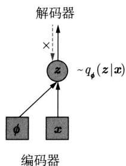

  
图30.5 再参数化技巧用于编码器的学习。圆代表随机变量，正方向代表确定性变量；实线表示前向传播，虚线表示反向传播

# 2. 具体实现

VAE的一个常见的简单实现如下。变分分布是独立多元高斯分布，编码器网络的输出是

高斯分布的均值向量和方差向量。

$$
q _ {\phi} (\boldsymbol {z} | \boldsymbol {x}) = N \left(\boldsymbol {\mu} _ {e}, \operatorname {d i a g} \left(\sigma_ {e} ^ {2}\right)\right)
$$

$$
\left(\boldsymbol {\mu} _ {e}, \log \boldsymbol {\sigma} _ {e}\right) = \operatorname {e n c o d e r} _ {\phi} (\boldsymbol {x})
$$

变量 $z$ 的替代 $\tilde{z} = g(\phi, x, \epsilon)$ 的定义如下，变量 $\epsilon$ 遵循标准多元高斯分布。

$$
\tilde {z} = \mu_ {e} + \sigma_ {e} \odot \epsilon
$$

$$
\epsilon \sim N (\mathbf {0}, \boldsymbol {I})
$$

其中， $\odot$ 表示向量的逐元素积。原理上编码器可以以方差向量 $\sigma_{e}^{2}$ 为输出，但一般不容易控制神经网络的输出恒为正，所以选择以 $\log \sigma_{e}$ 为输出，取值为实数。

似然函数是独立多元高斯分布，解码器网络的输出是高斯分布的均值向量，协方差矩阵是单位阵。

$$
p _ {\boldsymbol {\theta}} (\boldsymbol {x} | \tilde {\boldsymbol {z}}) = N (\boldsymbol {\mu} _ {d}, \boldsymbol {I})
$$

$$
\boldsymbol {\mu} _ {d} = \operatorname {d e c o d e r} _ {\boldsymbol {\theta}} (\tilde {\boldsymbol {z}})
$$

这个具体的VAE的证据下界以及证据下界的梯度的推导留作习题。

# 3. 算法

算法30.1给出VAE的学习算法。使用随机梯度上升，在迭代的每一步针对小批量样本，利用再参数化技巧，对证据下界进行优化，更新变分分布参数和似然函数参数。

# 算法30.1（VAE学习算法）

输入：编码器网络和解码器网络，训练数据集 $\mathcal{D}$

输出：变分分布参数 $\phi$ 和似然函数参数 $\theta$

超参数：小批量样本规模 $|\mathcal{M}|$ 。

1. 随机初始化参数 $\phi$ 和 $\pmb{\theta}$ 。  
2. Do while $(\phi$ 和 $\pmb{\theta}$ 不收敛）{

从数据集 $\mathcal{D}$ 中随机采样一个小批量数据集 $\mathcal{M}$ 。

针对数据集 $\mathcal{M}$ 中的每个样本，采样 $\epsilon \sim N(\mathbf{0},\mathbf{I})$

计算数据集 $\mathcal{M}$ 的证据下界对参数 $\phi$ 和 $\theta$ 的梯度函数 $L_{\phi, \theta}(\mathcal{M})$ 。

根据梯度上升法更新参数 $\phi$ 和 $\theta$

}

3. 返回学习到的参数 $\phi$ 和 $\theta$

# 30.3.5 手写数字例

MNIST 是一个手写数字数据集，每个样本是一个 $0 \sim 9$ 的手写数字的图像。从 MNIST 数据中可以学习 VAE 模型。图 30.6 给出学到的 VAE 自动生成的手写数字例子。先验分布 $p(z)$ 是标准多元高斯分布，似然函数 $p_{\theta}(x|z)$ 由解码器网络表示。模型拥有很强的表示能力，

可以从简单的潜在特征 $z$ 生成复杂的实例 $\pmb{x}$ 。解码器网络的前几层表示到手写数字高阶特征，后几层表示到手写数字低阶特征。

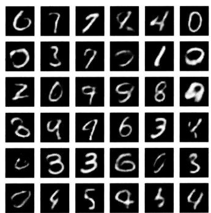  
图30.6 VAE自动生成的手写数字例子

图30.7给出了学到的样本点在隐变量空间中的分布，一种颜色代表一种数字。数据使用T-SNE工具从高维压缩到二维得到。可以看出，相同数字的样本点在隐变量空间中聚到了相同的类，而且形状相似的数字的类在空间距离上也相近。也就是说VAE拥有学习数据潜在特征的能力。

  
图30.7 手写数字数据在隐变量空间中的分布（见文前彩图）

# 本章概要

1. 自编码器（AE）是用于数据表示学习的神经网络。自编码器由编码器网络和解码器网络组成。学习时编码器将实例 $\pmb{x}$ 转换为潜在表示 $\pmb{z}$ ，解码器再将潜在表示 $\pmb{z}$ 转换为复原的实例 $\hat{\pmb{x}}$ 。编码器和解码器可以是

$$
\boldsymbol {z} = f _ {\phi} (\boldsymbol {x}) = a \left(\boldsymbol {W} _ {e} \boldsymbol {x} + \boldsymbol {b} _ {e}\right)
$$

$$
\hat {\boldsymbol {x}} = g _ {\boldsymbol {\theta}} (\boldsymbol {z}) = a \left(\boldsymbol {W} _ {d} \boldsymbol {z} + \boldsymbol {b} _ {d}\right)
$$

学习的目标是尽量使复原的实例 $\hat{\pmb{x}}$ 和原始实例 $\pmb{x}$ 保持一致，或者说重建数据 $\pmb{x}$ 。认为学到的潜在表示 $\pmb{z}$ 就是实例的特征。

$$
L = \frac {1}{N} \sum_ {\boldsymbol {x} \in \mathcal {D}} L (\boldsymbol {x}, g _ {\boldsymbol {\theta}} (f _ {\phi} (\boldsymbol {x})))
$$

学习的算法一般是随机梯度下降。自编码器学习实际进行的是对数据的压缩。

2. 去噪自编码器（DAE）是自编码器的扩展，去噪自编码器不仅可以用于数据表示学习，而且可以用于数据去噪。学习时首先根据对实例进行的随机变换，得到有噪声的实例。编码器将有噪声的实例转换为潜在表示，解码器再将潜在表示转换为复原的实例。编码器、解码器、目标函数分别是

$$
\boldsymbol {z} = f _ {\phi} (\tilde {\boldsymbol {x}}) = a \left(\boldsymbol {W} _ {e} \tilde {\boldsymbol {x}} + \boldsymbol {b} _ {e}\right)
$$

$$
\hat {\boldsymbol {x}} = g _ {\boldsymbol {\theta}} (\boldsymbol {z}) = a \left(\boldsymbol {W} _ {d} \boldsymbol {z} + \boldsymbol {b} _ {d}\right)
$$

$$
L = \frac {1}{N} \sum_ {\boldsymbol {x} \in \mathcal {D}} L (\boldsymbol {x}, g _ {\boldsymbol {\theta}} (f _ {\boldsymbol {\phi}} (\tilde {\boldsymbol {x}})))
$$

学习的目标是尽量使复原的实例和原始实例一致，或者说重建原始数据。因为学习的目标是排除噪声的干扰重建数据，去噪自编码器能更有效地学到数据的主要特征。

3. 变分自编码器（VAE）是概率模型。假设随机变量 $x$ 代表实例，随机变量 $z$ 代表实例的潜在表示，其联合概率分布是 $p_{\theta}(x, z)$ ，其中 $x$ 是观测变量， $z$ 是隐变量， $\theta$ 是参数。由此有先验概率分布 $p_{\theta}(z)$ ，似然函数 $p_{\theta}(x | z)$ ，后验概率分布 $p_{\theta}(z | x)$ ，以及边缘似然函数或证据 $p_{\theta}(x)$ 。

VAE中，编码器网络表示变分分布 $q_{\phi}(\pmb {z}|\pmb {x})$ ，以近似后验概率分布 $p_{\theta}(z|x)$ ，其输入是观测变量 $\pmb{x}$ ，输出是条件概率分布的参数，网络的参数是 $\phi$ 。解码器网络表示条件似然函数 $p_{\theta}(\pmb {x}|\pmb {z})$ ，其输入是隐变量 $\pmb{z}$ ，输出是条件概率分布的参数，网络的参数是 $\pmb{\theta}$ 。一般假设 $q_{\phi}(z|x)$ 和 $p_{\theta}(\pmb {x}|z)$ 遵循多元高斯分布。

VAE生成数据的过程如下：首先根据先验分布 $p_{\theta}(z)$ 生成潜在表示 $\mathbf{z}$ ，然后再根据似然函数 $p_{\theta}(\mathbf{x}|\mathbf{z})$ 生成实例 $\mathbf{x}$ ，重复 $N$ 次，得到数据集 $\mathcal{D} = \{\mathbf{x}\}$ 。

4. VAE 的学习目标是从训练数据 $\mathcal{D} = \{\pmb{x}\}$ 中学习似然函数 $p_{\theta}(\pmb{x}|\pmb{z})$ 。假设先验分布 $p_{\theta}(z)$ 给定，给定潜在表示 $\pmb{z}$ 就可以根据 $p_{\theta}(\pmb{x}|\pmb{z})$ 随机生成新的实例 $\pmb{x}'$ 。原理上可以通过最大化（对数）证据，估计参数 $\pmb{\theta}$ 。

$$
\log p _ {\boldsymbol {\theta}} (\boldsymbol {x}) = \log \int p _ {\boldsymbol {\theta}} (\boldsymbol {z}) p _ {\boldsymbol {\theta}} (\boldsymbol {x} | \boldsymbol {z}) \mathrm {d} \boldsymbol {z}
$$

但这个优化问题没有解析解。VAE 实际最大化证据下界

$$
L _ {\phi , \boldsymbol {\theta}} (\boldsymbol {x}) = \mathbb {E} _ {q _ {\phi} (\boldsymbol {z} | \boldsymbol {x})} \left[ \log p _ {\boldsymbol {\theta}} (\boldsymbol {x}, \boldsymbol {z}) - \log q _ {\phi} (\boldsymbol {z} | \boldsymbol {x}) \right]
$$

证据下界可以进一步写作

$$
L _ {\boldsymbol {\phi}, \boldsymbol {\theta}} (\boldsymbol {x}) = \mathbb {E} _ {q _ {\boldsymbol {\phi}} (\boldsymbol {z} | \boldsymbol {x})} \left[ \log p _ {\boldsymbol {\theta}} (\boldsymbol {x} | \boldsymbol {z}) \right] - \mathrm {K L} \left[ q _ {\boldsymbol {\phi}} (\boldsymbol {z} | \boldsymbol {x}) \| N (\boldsymbol {0}, \boldsymbol {I}) \right]
$$

5. VAE学习使用再参数化技巧。引入一个新的随机变量 $\epsilon \sim p(\epsilon)$ ，将随机变量 $z$ 用一个新的随机变量 $\tilde{z}$ 替代， $\tilde{z}$ 表示为随机变量 $\epsilon$ 、参数 $\phi$ 和样本 $x$ 的可导函数：

$$
\tilde {z} = g (\phi , \boldsymbol {x}, \epsilon)
$$

因此，证据下界对 $q_{\phi}(\pmb {z}|\pmb {x})$ 的期望可以改为对 $p(\epsilon)$ 的期望：

$$
L _ {\phi , \boldsymbol {\theta}} (\boldsymbol {x}) = \mathbb {E} _ {p (\boldsymbol {\epsilon})} \left[ \log p _ {\boldsymbol {\theta}} (\boldsymbol {x} | \tilde {\boldsymbol {z}}) \right] - \mathrm {K L} \left[ q _ {\phi} (\tilde {\boldsymbol {z}} | \boldsymbol {x}) \| p (\tilde {\boldsymbol {z}}) \right]
$$

这样就可以对参数 $\theta$ 和 $\phi$ 求导。

6. VAE学习算法的核心部分如下：

（1）从数据集 $\mathcal{D}$ 中随机采样一个小批量数据集 $\mathcal{M}$ 。  
(2) 针对数据集 $\mathcal{M}$ 中的每个样本，采样 $\epsilon \sim N(\mathbf{0},\mathbf{I})$ 。  
(3) 计算数据集 $\mathcal{M}$ 的证据下界对参数 $\phi$ 和 $\pmb{\theta}$ 的梯度函数 $L_{\phi, \pmb{\theta}}(\mathcal{M})$ 。  
（4）根据梯度上升法更新参数 $\phi$ 和 $\theta$

# 继续阅读

变分自编码器VAE的原始论文是文献[1]，自编码器AE最早的工作见文献[2]，去噪自编码器DAE的原始论文是文献[3]。AE性质的讨论可见文献[4]和文献[5]，VAE的详细介绍可以参见文献[6]和文献[7]。VAE的后续工作有VQ-VAE[8]、重要度加权自编码器[9]等。

# 习题

30.1 设计一个由2层卷积神经网络编码器和2层卷积神经网络解码器组成的自编码器AE（使用第31章介绍的转置卷积）。  
30.2 证明当编码器和解码器都是线性函数时，主成分分析可以作为AE学习的方法。  
30.3 假设变分自编码器 VAE 模型的变分分布 $q_{\phi}(\boldsymbol{z}|\boldsymbol{x})$ 和似然函数 $p_{\theta}(\boldsymbol{x}|\boldsymbol{z})$ 是多元高斯分布 $N(\boldsymbol{\mu}_e, \boldsymbol{\Sigma}_e)$ 和 $N(\boldsymbol{\mu}_d, \boldsymbol{\Sigma}_d)$ 。描述模型参数 $\phi, \theta$ ，高斯分布参数 $\boldsymbol{\mu}_e, \boldsymbol{\Sigma}_e, \boldsymbol{\mu}_d, \boldsymbol{\Sigma}_d$ 以及模型变量 $\boldsymbol{x}$ 和 $\boldsymbol{z}$ 之间的关系。  
30.4 推导式(30.19)的KL散度。  
30.5 证据下界有两个形式，式(30.14)和式(30.16)。30.3.3节中介绍的再参数化技巧是针对式(30.16)的。写出式(30.14)的证据下界的再参数化技巧的梯度公式。  
30.6 写出 30.3.3 节中的 VAE 的证据下界以及证据下界的梯度。  
30.7 比较 30.3.3 节中的 VAE 的证据下界与 AE 的学习目标。  
30.8 比较AE和VAE的编码器和解码器的神经网络。  
30.9 比较变分EM算法（第18章）和VAE学习算法。

# 参考文献

[1] KINGMA D, WELLING M. Auto-encoding variational Bayes[C]//Proceedings of the International Conference on Learning Representations. 2014.

[2] RUMELHART D, HINTON G, WILLIAMS R. Learning internal representations by error propagation[C]//Parallel Distributed Processing: Explorations in Microstructure of Cognition. 1986.   
[3] VINCENT P, LAROCHELLE H, BENGIO Y, et al. Extracting and composing robust features with denoising autoencoders[C]//Proceedings of the 25th International Conference on Machine Learning. 2008: 1096-1103.   
[4] KRAMER M. Nonlinear principal component analysis using autoassociative neural networks[C]//AICHe Journal, 1991: 37(2): 233-243.   
[5] BALDI P. Autoencoders, unsupervised learning, and deep architectures[C]//Proceedings of ICML Workshop on Unsupervised and Transfer Learning. JMLR Workshop and Conference Proceedings. 2012: 37-49.   
[6] KINGMA D, WELLING M. An introduction to variational autoencoders[C]/Foundation & Trends of Machine Learning. 2019: 12(4): 307-392.   
[7] DOERSCH C. Tutorial on variational autoencoders[C]//CoRR 1606.0590. 2016.   
[8] VAN DEN OORD A, VINYALS O, KAVUKCUOGLU K. Neural discrete representation learning[C]//Proceedings of Advances in neural information processing systems, 2017, 30.   
[9] BURDA Y, GROSSE R, SALAKUTDINOV R. Importance weighted autoencoders[C]// Proceedings of the International Conference on Learning Representations. 2016.

# 第31章 生成对抗网络

生成对抗网络（generative adversarial networks, GAN）是一种基于博弈的生成模型，应用于图片生成等。GAN于2014年由Goodfellow等提出，之后有诸多的模型被开发，包括DCGAN和W-GAN。其中DCGAN是Radford等于2015年开发的用于图片生成的模型。

GAN由生成网络和判别网络组成，生成网络自动生成数据，判别网络判断数据是已给的（真的）还是生成的（假的）。学习的目标是构建生成网络，能自动生成同已给训练数据同分布的数据。学习的过程就是博弈的过程，生成网络和判别网络不断通过优化自己网络的参数进行博弈。当达到均衡状态时，学习结束，生成网络可以生成以假乱真的数据，判别网络难以判断数据的真假。GAN在没有使用标注数据的意义下属于无监督学习方法。

本章31.1节讲述GAN基本模型，31.2节介绍用于图片生成的DCGAN模型。

# 31.1 GAN 基本模型

本节首先介绍GAN基本模型的定义，然后给出其学习算法，最后给出相关理论分析结果。

# 31.1.1 模型

目标是从已给训练数据中学习生成数据的模型，用模型自动生成新的数据，包括图片、音频数据。一个直接的方法是假设已给数据是由一个概率分布产生的数据，通过极大似然估计学习这个概率分布，即概率密度函数。当数据分布非常复杂时，很难给出适当的概率密度函数的定义，以及有效地学习概率密度函数。生成对抗网络GAN不直接定义和学习数据生成的概率分布，而是通过导入判断生成数据“真假”的机制来解决这个问题。

GAN由一个生成网络（generator）和一个判别网络（discriminator）组成，相互进行博弈（对抗），生成网络生成数据（假数据），判别网络判别数据是已给数据（真数据）还是生成数据（假数据）。学习的过程就是博弈的过程。生成网络和判别网络不断提高自己的能力，当最终达到纳什均衡（Nash equilibrium）时，生成网络可以以假乱真地生成数据，判别网络不能判断数据的真假。

这里假设生成网络和判别网络是深度神经网络，都有足够强的学习能力。训练数据并没有直接用于生成网络的学习，而是用于判别网络的学习。判别网络能力提高之后用于生成网络能力的提高，生成网络能力提高之后再用于判别网络能力的提高，不断循环。

图31.1显示GAN的框架。假设已给训练数据 $\mathcal{D}$ 遵循分布 $P_{\mathrm{data}}(\pmb {x})$ ，其中 $\pmb{x}$ 是样本。生成网络用 $\pmb {x} = G(\pmb {z};\pmb {\theta})$ 表示，其中 $\pmb{z}$ 是输入向量（潜在表示）， $\pmb{x}$ 是输出向量（生成数据）， $\pmb{\theta}$ 是网络参数。判别网络是一个二类分类器，用 $P(1|\pmb {x}) = D(\pmb {x};\pmb {\varphi})$ 表示，其中 $\pmb{x}$ 是输入向量， $P(1|\pmb {x})$ 和 $1 - P(1|\pmb {x})$ 是输出概率，分别表示输入 $\pmb{x}$ 来自训练数据和生成数据的概率， $\varphi$ 是网络参数。潜在表示 $\pmb{z}$ 遵循分布 $P_{\mathrm{seed}}(\pmb {z})$ ，如标准高斯分布或均匀分布。生成网络生成的数据分布表示为 $P_{\mathrm{gen}}(\pmb {x})$ ，由 $P_{\mathrm{seed}}(\pmb {z})$ 和 $\pmb {x} = G(\pmb {z};\pmb {\theta})$ 决定。

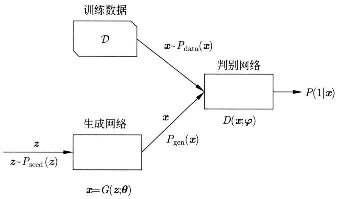  
图31.1 GAN的框架

如果生成网络参数 $\theta$ 固定，可以通过最大化以下目标函数学习判别网络参数 $\varphi$ ，使其具备判别真假数据的能力。

$$
\left. \right. \max  _ {\varphi} \left\{\mathbb {E} _ {\boldsymbol {x} \sim P _ {\text {d a t a} (\boldsymbol {x})}} \left[ \log D (\boldsymbol {x}; \boldsymbol {\varphi}) \right] + \mathbb {E} _ {\boldsymbol {z} \sim P _ {\text {s e e d}} (\boldsymbol {z})} \left[ \log \left(1 - D (G (\boldsymbol {z}; \bar {\boldsymbol {\theta}}); \boldsymbol {\varphi})\right)\right]\right\} \tag {31.1}
$$

如果判别网络参数 $\varphi$ 固定，那么可以通过最小化以下目标函数学习生成网络参数 $\theta$ ，使其具备以假乱真地生成数据的能力。

$$
\left. \min  _ {\boldsymbol {\theta}} \left\{\mathbb {E} _ {\boldsymbol {z} \sim P _ {\text {s e e d}} (\boldsymbol {z})} \left[ \log \left(1 - D (G (\boldsymbol {z}; \boldsymbol {\theta}); \bar {\varphi})\right) \right] \right\} \right. \tag {31.2}
$$

判别网络和生成网络形成博弈关系，可以定义以下的极小极大问题，也就是GAN的学习目标函数。

$$
\min  _ {\boldsymbol {\theta}} \max  _ {\boldsymbol {\varphi}} \left\{\mathbb {E} _ {\boldsymbol {x} \sim P _ {\mathrm {d a t a} (\boldsymbol {x})}} [ \log D (\boldsymbol {x}; \boldsymbol {\varphi}) ] + \mathbb {E} _ {\boldsymbol {z} \sim P _ {\mathrm {s e e d}} (\boldsymbol {z})} [ \log (1 - D (G (\boldsymbol {z}; \boldsymbol {\theta}); \boldsymbol {\varphi})) ] \right\} \tag {31.3}
$$

后述定理证明这个极小极大问题的解 $\varphi^{*}$ 和 $\theta^{*}$ 存在，也就是纳什均衡存在。GAN 的学习算法就是求极小极大问题的最优解的方法。

可以对GAN做这样一个比喻。生成网络是仿造者，判别网络是鉴别者。仿造者制作赝品；鉴别者既得到真品又得到赝品，判断作品的真伪。仿造者与鉴别者之间展开博弈，各自不断提高自己的能力，最终仿造者制作出的赝品真假难辨，鉴别者无法判断作品的真伪。注意在这个过程中鉴别者间接地把自己的判别方法告诉了仿造者，所以两者之间既有对抗，又有“合作”。

# 31.1.2 学习算法

对GAN的目标函数(式(31.3))进行优化，迭代地学习判别网络和生成网络的参数，就是GAN的学习算法。

# 算法31.1（GAN学习算法）

输入：训练数据集 $\mathcal{D}$ 。

输出：生成网络 $G(z;\theta)$

超参数：训练数据集，整体训练次数 $T$ ，判别网络训练次数 $S$ ，小批量样本数量 $M$ ，学习率 $\eta$ 。

1. 随机初始化参数 $\theta, \varphi$   
2. for $(t = 1,2,\dots ,T)$

# 训练判别网络 $D(\pmb{x};\varphi)$

$$
\text {f o r} (s = 1, 2, \dots , S) \{\}
$$

从训练数据中随机采样 $M$ 个样本 $\{\pmb{x}^{(m)}\}$ , $1 \leqslant m \leqslant M$

根据分布 $P_{\mathrm{seed}}(\pmb {z})$ 随机采样 $M$ 个样本 $\{\pmb {z}^{(m)}\} ,1\leqslant m\leqslant M$

计算以下梯度，使用随机梯度上升法更新参数 $\varphi$

$$
\begin{array}{l} \nabla_ {\varphi} \left[ \frac {1}{M} \sum_ {m = 1} ^ {M} \log D \left(\boldsymbol {x} ^ {(m)}; \varphi\right) + \log \left(1 - D \left(G \left(\boldsymbol {z} ^ {(m)}; \boldsymbol {\theta}\right); \varphi\right)\right) \right] \\ \varphi \leftarrow \varphi + \eta \nabla_ {\varphi} \\ \end{array}
$$

}

训练生成网络 $G(z;\theta)$

根据分布 $P_{\mathrm{seed}}(\pmb {z})$ 随机采样 $M$ 个样本 $\left\{\pmb {z}^{(m)}\right\} ,1\leqslant m\leqslant M$

计算以下梯度，使用随机梯度上升法更新参数 $\theta$

$$
\nabla_ {\boldsymbol {\theta}} \left[ \frac {1}{M} \sum_ {m = 1} ^ {M} \log \left(D \left(G \left(\boldsymbol {z} ^ {(m)}; \boldsymbol {\theta}\right); \varphi\right)\right) \right]
$$

$$
\boldsymbol {\theta} \leftarrow \boldsymbol {\theta} + \eta \nabla_ {\boldsymbol {\theta}}
$$

}

3. 输出生成网络 $G(z;\theta)$

这里不进行 $\log (1 - D(G(z;\pmb {\theta});\pmb {\varphi}))$ 的最小化，而是进行 $\log (D(G(z;\pmb {\theta});\pmb {\varphi}))$ 的最大化。这是因为在学习的初始阶段，生成网络较弱，判别网络很容易区分训练数据和生成数据，最小化 $\log (1 - D(G(z;\pmb {\theta});\pmb {\phi}))$ 会使学习很快收敛。因此，判别网络和生成网络的学习都使用梯度上升法。

判别网络训练时从训练数据和生成数据中同采样 $M$ 个样本，也就是各以0.5的概率选取训练数据和生成数据。判别网络学习迭代 $S$ 次后，生成网络学习迭代1次。意图是当训练判别网络有足够能力时再训练生成网络。 $M$ 和 $S$ 是超参数，要在具体应用中调节。

# 31.1.3 理论分析

不考虑网络参数，将GAN学习的极小极大问题写成

$$
\min  _ {G} \max  _ {D} L (G, D) = \min  _ {G} \max  _ {D} \left\{\mathbb {E} _ {\boldsymbol {x} \sim P _ {\text {d a t a} (\boldsymbol {x})}} [ \log D (\boldsymbol {x}) ] + \mathbb {E} _ {\boldsymbol {z} \sim P _ {\text {s e e d}} (\boldsymbol {z})} [ \log (1 - D (G (\boldsymbol {z}))) ] \right\} \tag {31.4}
$$

定理31.1 当生成网络固定为 $\bar{G}$ 时，问题(31.4)变成以下最大化问题：

$$
\max  _ {D} L (\bar {G}, D) = \max  _ {D} \left\{\mathbb {E} _ {\boldsymbol {x} \sim P _ {\text {d a t a} (\boldsymbol {x})}} [ \log D (\boldsymbol {x}) ] + \mathbb {E} _ {\boldsymbol {z} \sim P _ {\text {s e e d}} (\boldsymbol {z})} [ \log (1 - D (\bar {G} (\boldsymbol {z}))) ] \right\}
$$

该最大化问题的解 判别网络 $D_G^*$ 满足以下关系：

$$
D _ {G} ^ {*} (\boldsymbol {x}) = \frac {P _ {\mathrm {d a t a}} (\boldsymbol {x})}{P _ {\mathrm {d a t a}} (\boldsymbol {x}) + P _ {\mathrm {g e n}} (\boldsymbol {x})} \tag {31.5}
$$

证明

$$
\begin{array}{l} L (\bar {G}, D) = \int_ {\boldsymbol {x}} P _ {\text {d a t a}} (\boldsymbol {x}) \log D (\boldsymbol {x}) \mathrm {d} \boldsymbol {x} + \int_ {\boldsymbol {z}} P _ {\text {s e e d}} (\boldsymbol {z}) \log (1 - D (\bar {G} (\boldsymbol {z}))) \mathrm {d} \boldsymbol {z} \\ = \int_ {\boldsymbol {x}} P _ {\text {d a t a}} (\boldsymbol {x}) \log D (\boldsymbol {x}) \mathrm {d} \boldsymbol {x} + \int_ {\boldsymbol {x}} P _ {\text {g e n}} (\boldsymbol {x}) \log (1 - D (\boldsymbol {x})) \mathrm {d} \boldsymbol {x} \tag {31.6} \\ \end{array}
$$

式 (31.6) 达到最大值的判别网络表示为 $D_G^*$ ，则有式 (31.5) 成立。这是因为，针对任意的 $(a, b) \in \mathcal{R}^2 \setminus (0, 0)$ ，函数 $f(x) = a \log x + b \log (1 - x)$ ， $x \in (0, 1)$ ，当 $x = \frac{a}{a + b}$ 时取最大值。函数 $D(\pmb{x})$ 在 $\mathrm{supp}(P_{\mathrm{data}}(\pmb{x})) \cup \mathrm{supp}(P_{\mathrm{gen}}(\pmb{x}))$ 之外无需定义。

定理31.2 当判别网络固定为 $D_G^*$ 时，问题(31.4）变成以下最小化问题：

$$
\min  _ {G} L \left(G, D _ {G} ^ {*}\right) = \min  _ {G} \left\{\mathbb {E} _ {\boldsymbol {x} \sim P _ {\text {d a t a} (\boldsymbol {x})}} \left[ \log D _ {G} ^ {*} (\boldsymbol {x}) \right] + \mathbb {E} _ {\boldsymbol {z} \sim P _ {\text {s e e d}} (\boldsymbol {z})} \left[ \log \left(1 - D _ {G} ^ {*} (G (\boldsymbol {z}))\right) \right] \right\}
$$

该最小化问题的解——生成网络 $G^{*}$ 满足以下关系：

$$
P _ {\text {g e n}} ^ {*} (\boldsymbol {x}) = P _ {\text {d a t a}} (\boldsymbol {x}) \tag {31.7}
$$

最小值是 $-2\log 2$ 。

证明

$$
\begin{array}{l} L (G, D _ {G} ^ {*}) = \int_ {\boldsymbol {x}} P _ {\mathrm {d a t a}} (\boldsymbol {x}) \log D _ {G} ^ {*} (\boldsymbol {x}) \mathrm {d} \boldsymbol {x} + \int_ {\boldsymbol {z}} P _ {\mathrm {s e e d}} (\boldsymbol {z}) \log (1 - D _ {G} ^ {*} (G (\boldsymbol {z}))) \mathrm {d} \boldsymbol {z} \\ = \int_ {\boldsymbol {x}} P _ {\text {d a t a}} (\boldsymbol {x}) \log D _ {G} ^ {*} (\boldsymbol {x}) \mathrm {d} \boldsymbol {x} + \int_ {\boldsymbol {x}} P _ {\text {g e n}} (\boldsymbol {x}) \log (1 - D _ {G} ^ {*} (\boldsymbol {x})) \mathrm {d} \boldsymbol {x} \\ = \int_ {\pmb {x}} P _ {\mathrm {d a t a}} (\pmb {x}) \log \frac {P _ {\mathrm {d a t a}} (\pmb {x})}{P _ {\mathrm {d a t a}} (\pmb {x}) + P _ {\mathrm {g e n}} (\pmb {x})} \mathrm {d} \pmb {x} + \int_ {\pmb {x}} P _ {\mathrm {g e n}} (\pmb {x}) \log \left(\frac {P _ {\mathrm {g e n}} (\pmb {x})}{P _ {\mathrm {d a t a}} (\pmb {x}) + P _ {\mathrm {g e n}} (\pmb {x})}\right) \mathrm {d} \pmb {x} \\ = \operatorname {K L} \left(P _ {\text {d a t a}} (\boldsymbol {x}) | | \frac {P _ {\text {d a t a}} (\boldsymbol {x}) + P _ {\text {g e n}} (\boldsymbol {x})}{2}\right) + \operatorname {K L} \left(P _ {\text {g e n}} (\boldsymbol {x}) | | \frac {P _ {\text {d a t a}} (\boldsymbol {x}) + P _ {\text {g e n}} (\boldsymbol {x})}{2}\right) - 2 \log 2 \\ = \log \operatorname {J S} \left(P _ {\text {d a t a}} (\boldsymbol {x}) \mid \mid P _ {\text {g e n}} (\boldsymbol {x})\right) - 2 \log 2 \tag {31.8} \\ \end{array}
$$

JS $(P||Q)$ 是两个概率分布 $P$ 和 $Q$ 之间的Jessen-Shannon散度，当且仅当两个概率分布相同时，取最小值0。所以，式(31.8)当且仅当 $P_{\mathrm{gen}}(\pmb {x}) = P_{\mathrm{data}}(\pmb {x})$ 时达到最小值，且最小值为 $-2\log 2$ 。达到最小值的生成分布表示为 $P_{\mathrm{gen}}^{*}(\pmb {x})$ ，即有式(31.7）成立。

理论上的最优解（即纳什均衡状态）满足：

$$
P _ {\text {g e n}} ^ {*} (\boldsymbol {x}) = P _ {\text {d a t a}} (\boldsymbol {x}) \tag {31.9}
$$

$$
D ^ {*} (\boldsymbol {x}) = \frac {1}{2} \tag {31.10}
$$

也就是生成网络可以以与训练数据相同的分布生成数据，判别网络无法辨别数据是来自训练数据还是生成的数据。以上定理只是表示理论上最优解存在。实际上，生成网络和判别网络需要用参数 $\theta$ 和 $\varphi$ 表示，算法31.1不能保证求得最优解。

图31.2示意GAN的学习过程。图中下面横线表示生成网络输入 $\pmb{z}$ 的分布，这里假设是均匀分布。中间横线表示生成网络输出 $\pmb{x}$ 的分布。两条横线之间的有向实线表示生成网络的映射 $\pmb{x} = G(\pmb{z};\pmb{\theta})$ 。上面黑色点线表示真实数据分布 $P_{\mathrm{data}}(\pmb{x})$ ，绿色实线表示生成数据分布 $P_{\mathrm{gen}}(\pmb{x})$ ，蓝色点线表示判别网络判别分布 $D(\pmb{x})$ 。训练初始，生成数据分布和真实数据分布相差较远，判别网络的判别概率也不准确(图31.2(a))。生成网络固定判别网络训练后，其判别概率趋于 $D_G^* (\pmb {x}) = \frac{P_{\mathrm{data}}(\pmb{x})}{P_{\mathrm{data}}(\pmb{x}) + P_{\mathrm{gen}}(\pmb{x})}$ (图31.2(b))。判别网络固定生成网络训练后，其生成数据分布和真实数据分布趋于接近(图31.2(c))。训练收敛后，生成网络达到最优 $P_{\mathrm{gen}}^{*}(\pmb {x}) = P_{\mathrm{data}}(\pmb {x})$ ，判别网络也达到最优 $D^{*}(\pmb {x}) = \frac{1}{2}$ (图31.2(d))。

  
(a)

  
(b)

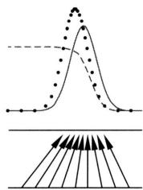  
(c)

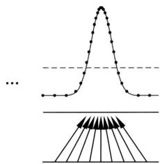  
(d)   
图31.2 GAN的学习过程（见文前彩图）

GAN的模型训练并不容易，需要一定的技巧。有很多改进的模型被提出，包括WGAN（WassersteinGAN）。

# 31.2 图片生成中的应用

可以使用GAN技术从图片数据中学习生成网络，用于图片数据的自动生成。比如，训练数据是人脸图片，可以学习GAN，自动生成“人脸”的图片。本节介绍常用于图片生成的DCGAN，先讲解DCGAN使用的转置卷积。

# 31.2.1 转置卷积

# 1. 转置卷积的定义

转置卷积（transposed convolution）也称为微步卷积（fractionally strided convolution）或反卷积（deconvolution）①，在图片生成网络、图片自动编码器等模型中广泛使用。卷积可以用于图片数据的缩小，而转置卷积可以用于图片数据的放大，又分别称为下采样和上采样（参见第26章）。

卷积运算可以表示为线性变换。假设有核矩阵为以下矩阵 $\mathbf{W}$ 、填充为0、步幅为1的卷积运算。

$$
\boldsymbol {W} = \left[ \begin{array}{l l l} w _ {1 1} & w _ {1 2} & w _ {1 3} \\ w _ {2 1} & w _ {2 2} & w _ {2 3} \\ w _ {3 1} & w _ {3 2} & w _ {3 3} \end{array} \right] \tag {31.11}
$$

图31.3显示以上卷积运算的过程，蓝色格子表示输入矩阵，绿色格子表示输出矩阵，深色部分表示卷积计算。输入矩阵的大小是 $4 \times 4$ ，输出矩阵的大小是 $2 \times 2$ ，这个卷积进行的是下采样。

  
图31.3 卷积例（见文前彩图）

构建矩阵 $C$

$$
\left[ \begin{array}{c c c c c c c c c c c c c c c c} w _ {1 1} & w _ {1 2} & w _ {1 3} & 0 & w _ {2 1} & w _ {2 2} & w _ {2 3} & 0 & w _ {3 1} & w _ {3 2} & w _ {3 3} & 0 & 0 & 0 & 0 & 0 \\ 0 & w _ {1 1} & w _ {1 2} & w _ {1 3} & 0 & w _ {2 1} & w _ {2 2} & w _ {2 3} & 0 & w _ {3 1} & w _ {3 2} & w _ {3 3} & 0 & 0 & 0 & 0 \\ 0 & 0 & 0 & 0 & w _ {1 1} & w _ {1 2} & w _ {1 3} & 0 & w _ {2 1} & w _ {2 2} & w _ {2 3} & 0 & w _ {3 1} & w _ {3 2} & w _ {3 3} & 0 \\ 0 & 0 & 0 & 0 & 0 & w _ {1 1} & w _ {1 2} & w _ {1 3} & 0 & w _ {2 1} & w _ {2 2} & w _ {2 3} & 0 & w _ {3 1} & w _ {3 2} & w _ {3 3} \end{array} \right]
$$

考虑基于矩阵 $C$ 的线性变换，其输入是以上输入矩阵展开的向量，输出是以上输出矩阵展开的向量。这个线性变换对应前馈神经网络前一层到后一层的信号传递（正向传播），而以上卷积运算表示在这个线性变换中。

另一方面，考虑基于转置矩阵 $C^{\mathrm{T}}$ 的线性变换。这个线性变换对应前馈神经网络后一层到前一层的信号传递（反向传播）。事实上，存在另一个卷积运算，表示在基于转置矩阵 $C^{\mathrm{T}}$

的线性变换中，其核矩阵为以下矩阵：

$$
\operatorname {r o t} 1 8 0 (\boldsymbol {W}) = \left[ \begin{array}{l l l} w _ {3 3} & w _ {3 2} & w _ {3 1} \\ w _ {2 3} & w _ {2 2} & w _ {2 1} \\ w _ {1 3} & w _ {1 2} & w _ {1 1} \end{array} \right] \tag {31.12}
$$

称这个卷积为转置卷积。这个转置卷积是核矩阵为 $\mathrm{rot}180(W)$ 、填充为2、步幅为1的卷积运算。这里rot180表示矩阵180度旋转，卷积计算时对输入矩阵进行全填充。

图31.4显示以上转置卷积运算的过程，蓝色格子表示输入矩阵，绿色格子表示输出矩阵，虚线部分表示填充，深色部分表示卷积计算。输入矩阵的大小是 $2 \times 2$ ，输出矩阵的大小是 $4 \times 4$ ，转置卷积进行的是上采样。

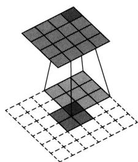  
图31.4 转置卷积例（见文前彩图）

原始卷积和转置卷积是相互对应、互为反向的运算，注意不是逆运算。这个关系的直观解释是在卷积神经网络的两层之间，正向和反向的传播（不考虑基于激活函数的非线性变换）都是卷积运算，相互对应，方向相反。

给定任意一个以 $\mathbf{W}$ 为核矩阵的卷积，可以构建一个以 $\mathrm{rot}180(\mathbf{W})$ 为核矩阵的转置卷积。卷积核和转置卷积核之间有 $\mathrm{rot}180(\mathrm{rot}180(\mathbf{W})) = \mathbf{W}$ 成立，相应地，矩阵和转置矩阵之间有 $(C^{\mathrm{T}})^{\mathrm{T}} = C$ 成立。

# 2. 转置卷积的大小

首先，计算原始卷积的大小。这里考虑简单的情况。假设输入矩阵是方阵，卷积核矩阵也是方阵。设 $I$ 是输入矩阵的大小， $K$ 是卷积核的大小， $P$ 是填充的大小， $S$ 是步幅。输出矩阵的大小 $O$ 满足

$$
O = \frac {I + 2 P - K}{S} + 1 \tag {31.13}
$$

这里考虑可以整除的情况。式(31.13)可以改为对应的形式：

$$
I = \frac {[ O + (O - 1) (S - 1) ] + 2 (K - P - 1) - K}{1} + 1
$$

接着，计算转置卷积的大小。设 $I^{\prime}$ 是输入矩阵的大小， $K^{\prime}$ 是卷积核的大小， $P^{\prime}$ 是填充的大小， $S^{\prime}$ 是步幅。输出矩阵的大小 $O^{\prime}$ 满足

$$
O ^ {\prime} = \frac {I ^ {\prime} + 2 P ^ {\prime} - K ^ {\prime}}{S ^ {\prime}} + 1 \tag {31.14}
$$

这里也考虑可以整除的情况。转置卷积的输出矩阵大小 $O^{\prime}$ 与原始卷积的输入矩阵大小 $I$ 相同。因此，可以推算，当 $S = 1, P = 0$ 时，转置卷积的大小和原始卷积的大小之间有以下关系成立：

$$
I ^ {\prime} = O, P ^ {\prime} = K - 1, K ^ {\prime} = K, S ^ {\prime} = 1
$$

$$
O ^ {\prime} = O + K - 1
$$

图31.3的卷积有 $I = 4, K = 3, S = 1, P = 0, O = 2$ 。图31.4的转置卷积有 $I' = 2, K' = 3, S' = 1, P' = 2, O' = 4$ 。

# 3. 转置卷积的上采样

可以通过增大卷积的步幅 $S > 1$ 实现下采样，即将大的输入矩阵降低为小的输出矩阵。相反，也可以通过减小转置卷积的步幅 $S' < 1$ 实现上采样，即将小的输入矩阵提高为大的输出矩阵。采用 $S' < 1$ 的步幅，实际是在输入矩阵的相邻两行之间插入适当数量的0行向量，相邻的两列之间插入适当数量的0列向量。转置卷积中经常使用这样的处理，这是被称为微步卷积的原因。

图31.5给出一个转置卷积的例子。原始卷积输入矩阵大小为5，卷积核大小为3，步幅为2，填充大小为0，输出矩阵大小为4，即 $I = 5, K = 3, S = 2, P = 0, O = 2$ 。转置卷积实际是在输入矩阵的相邻的两行之间插入一行0向量，相邻的两列之间插入一列0向量。转置卷积实际的输入矩阵（插入0向量后）大小为3，卷积核大小为3，实际的步幅为1，填充为2，输出矩阵大小为5，即 $\hat{I}' = 3, K' = 3, \hat{S}' = 1, P' = 2, O' = 5$ 。

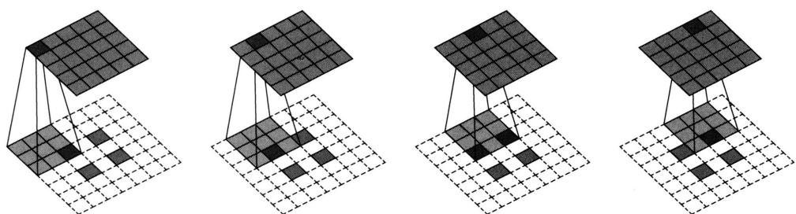  
图31.5 转置卷积例（见文前彩图）

当 $S = 2, P = 0$ 时，转置卷积的大小和原始卷积的大小之间有以下关系成立：

$$
\hat {I} ^ {\prime} = O + (O - 1), P ^ {\prime} = K - 1, K ^ {\prime} = K, \hat {S} ^ {\prime} = 1
$$

$$
O ^ {\prime} = 2 (O - 1) + K
$$

# 31.2.2 DCGAN

深度卷积生成对抗网络（deep convolutional generative adversarial networks，DCGAN）是GAN用于图片生成的代表性模型。DCGAN和其他GAN模型一样由生成网络和判别网络组成。图31.6给出DCGAN的架构，用特征图表示各层的卷积运算。DCGAN的学习算法和GAN的算法完全一样（算法31.1），但包含一些实现上的技巧。

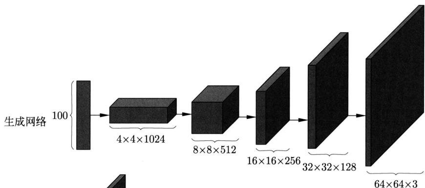

  
图31.6 DCGAN整体的架构（用特征图表示）

DCGAN的生成网络和判别网络有以下特点：

（1）生成网络使用转置卷积进行上采样，判别网络使用卷积进行下采样。  
（2）生成网络和判别网络都没有汇聚层（pooling layer）。  
（3）生成网络和判别网络都没有全连接的隐层。  
（4）生成网络的激活函数除输出层使用双曲正切以外，其他层均使用ReLU。  
（5）判别网络的激活函数除输出层使用S型函数以外，其他层均使用渗漏整流线性函数（Leaky ReLu）。  
（6）生成网络和判别网络的学习都采用批量归一化。

渗漏整流线性函数 $a(z)$ 的定义如下：

$$
a (z) = \left\{ \begin{array}{l l} z, & z \geqslant 0 \\ \alpha \cdot z, & z <   0 \end{array} \right. \tag {31.15}
$$

其中， $\alpha >0$ 是参数，比如取 $\alpha = 0.01$

生成网络的输入是100维的向量，按照均匀分布采样得到，输出是 $64 \times 64 \times 3$ 的张量。第一层是线性变换层，将100维的向量通过线性变换转换为 $4 \times 4 \times 1024$ 的张量，接着连续通过4个由转置卷积组成的卷积层，对张量连续进行卷积变换。判别网络的输入是 $64 \times 64 \times 3$ 的张量，连续通过4个由（原始）卷积组成的卷积层，对张量连续进行卷积变换，得到 $4 \times 4 \times 512$ 的张量，最后一层是S型函数层，输出是1/0标量。

生成网络的所有卷积层的转置卷积核大小都是5，步幅都是2，进行的是上采样。判别网络的所有卷积层的卷积核大小都是5，步幅都是2，进行的是下采样。

图31.7是MNIST手写数字数据的例子，包括训练数据、GAN生成的数据、DCGAN生成的数据。可以看出DCGAN生成的数据更接近真实的手写数字数据。

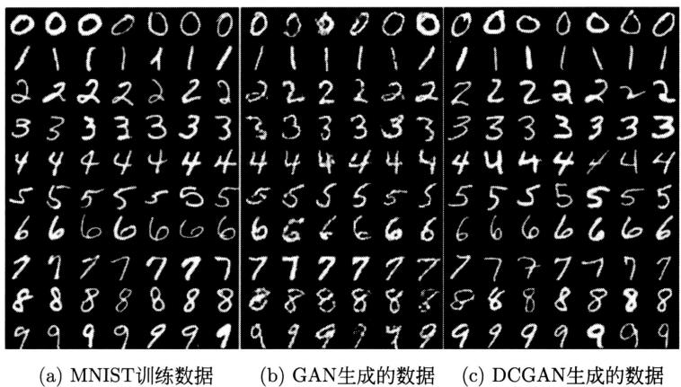  
图31.7 手写数字数据生成例

# 本章概要

1. 对抗生成网络GAN由一个生成网络和一个判别网络组成，生成网络生成数据，判别网络判别数据是真实数据还是生成数据。两者进行博弈，不断提高自己的能力，最终达到纳什均衡。生成网络可以以假乱真地生成数据，判别网络不能判断数据的真假。  
2. 判别网络和生成网络的博弈关系可以定义为以下的极小极大问题，也就是GAN的学习目标函数。

$$
\min  _ {\boldsymbol {\theta}} \max  _ {\boldsymbol {\varphi}} \left\{\mathbb {E} _ {\boldsymbol {x} \sim P _ {\mathrm {d a t a} (\boldsymbol {x})}} \left[ \log D \left(\boldsymbol {x}; \boldsymbol {\varphi}\right) \right] + \mathbb {E} _ {\boldsymbol {z} \sim P _ {\mathrm {s e e d}} (\boldsymbol {z})} \left[ \log \left(1 - D \left(G \left(\boldsymbol {z}; \boldsymbol {\theta}\right); \boldsymbol {\varphi}\right)\right) \right] \right\}
$$

这里生成网络由 $x = G(z; \theta)$ 表示, $\theta$ 是网络参数。判别网络由 $D(x; \varphi)$ 表示, 是一个二类分类器, $\varphi$ 是网络参数。 $P_{\mathrm{data}}(x)$ 是训练数据 $x$ 的分布, $P_{\mathrm{seed}}(z)$ 是输入 $z$ 的分布。

3. GAN 的学习算法如下。

for $(t = 1,2,\dots ,T)$ {  
# 训练判别网络 $D(\pmb {x};\pmb {\varphi})$ for $(s = 1,2,\dots ,S)$ {从训练数据中随机采样 $M$ 个样本 $\{\pmb{x}^{(m)}\}$ 随机采样 $M$ 个样本 $\{z^{(m)}\}$ 计算以下梯度，使用梯度上升法更新参数 $\varphi$

}#训练生成网络 $G(z;\theta)$ 随机采样 $M$ 个样本 $\{z^{(m)}\}$

计算以下梯度，使用梯度上升法更新参数 $\theta$

$$
\boldsymbol {\theta} \leftarrow \boldsymbol {\theta} + \eta \nabla_ {\boldsymbol {\theta}}
$$

}

4. GAN学习的最优解存在，这时生成网络和判别网络满足：

$$
P _ {\text {g e n}} ^ {*} (\boldsymbol {x}) = P _ {\text {d a t a}} (\boldsymbol {x})
$$

$$
D ^ {*} (\boldsymbol {x}) = \frac {1}{2}
$$

也就是说，生成网络与训练数据有相同的分布，判别网络不能对训练数据和生成数据进行区分。

5. 对任意一个卷积运算，存在对应的线性变换的矩阵 $C$ 。针对转置矩阵 $C^{\mathrm{T}}$ ，引入新的卷积运算，称为转置卷积。原始卷积和转置卷积是相互对应、互为反向的运算。原始卷积的卷积核是 $\mathbf{W}$ 时，转置卷积的卷积核是 $\operatorname{rot}180(\mathbf{W})$ 。卷积核和转置卷积核之间有 $\operatorname{rot}180(\operatorname{rot}180(\mathbf{W})) = \mathbf{W}$ 成立。  
6. 深度卷积生成对抗网络 DCGAN 是 GAN 用于图片生成的代表性模型。DCGAN 由生成网络和判别网络组成。生成网络和判别网络都只使用卷积运算，不使用汇聚运算和隐藏的全连接。生成网络利用转置卷积进行上采样，判别网络利用卷积进行下采样。

# 继续阅读

GAN 的第一个工作发表在文献 [1], 在文献 [2] 和文献 [3] 中也有介绍。DCGAN 的最初论文是文献 [4], W-GAN 的最初论文是文献 [5]。

# 习题

31.1 GAN的生成网络的学习也可以定义为以下的最小化问题：

$$
\min  _ {\boldsymbol {\theta}} \left\{ \right.\mathbb {E} _ {\boldsymbol {z} \sim P _ {\mathrm {s e e d}} (\boldsymbol {z})} \left[ \right. \log (1 - D (G (\boldsymbol {z}; \boldsymbol {\theta}); \bar {\boldsymbol {\varphi}}) - \log (D (G (\boldsymbol {z}; \boldsymbol {\theta}); \bar {\boldsymbol {\varphi}})) ] \left. \right\}
$$

比较与式(31.2)的不同，并考虑其作用。

31.2 两个人进行零和博弈，参与人 $X$ 和 $Y$ 可选择的策略分别是 $\mathcal{X} = \{1,2\}$ 和 $\mathcal{Y} = \{1,2\}$ 。在博弈中，若参与人 $X$ 和 $Y$ 分别选择 $i \in \mathcal{X}$ 和 $j \in \mathcal{Y}$ ，则 $X$ 的损失或 $Y$ 的收益是 $a_{ij}$ 。整体由矩阵 $\mathbf{A} = (a_{ij})$ 表示，矩阵 $\mathbf{A}$ 定义为

$$
\boldsymbol {A} = \left[ \begin{array}{c c} - 1 & 2 \\ 4 & 1 \end{array} \right]
$$

针对这个博弈求 $\min_{i}\max_{j}a_{ij}$ 和 $\max_{j}\min_{i}a_{ij}$ ，并验证这时 $\max_{j}\min_{i}a_{ij} \leqslant \min_{i}\max_{j}a_{ij}$ 成立。

31.3 计算以下两个概率分布的Jessen-Shannon散度。设 $0\log 0 = 0$

<table><tr><td>0.1</td><td>0.7</td><td>0.1</td><td>0.1</td><td>0</td></tr><tr><td>0.2</td><td>0</td><td>0</td><td>0.8</td><td>0</td></tr></table>

31.4 证明两个概率分布 $P$ 和 $Q$ 之间的Jessen-Shannon散度满足以下关系，当且仅当 $P$ 和 $Q$ 相同时取最小值0，设对数是自然对数。

$$
0 \leqslant \operatorname {J S} (P | | Q) \leqslant \ln 2
$$

31.5 考虑一维卷积运算，其输入是 5 维的向量 $\pmb{x}$ ，输出是 3 维的向量 $\pmb{z}$ 。卷积核是 $\pmb{w} = (w_{1}, w_{2}, w_{3})$ ，步幅为 1，填充为 0。写出该卷积运算的矩阵表示，给出对应的转置卷积，并且验证原始卷积核 $\pmb{w}$ 和转置卷积核 $\pmb{w}'$ 之间有 $\pmb{w} = \mathrm{rot}180(\pmb{w}')$ 成立。  
31.6 写出图 31.8 中转置卷积的大小和原始卷积的大小之间的关系，转置卷积有输入矩阵大小 $\hat{I}'$ 、卷积核大小 $K'$ 、步幅 $S'$ 、填充大小 $P'$ 、输出矩阵大小 $O'$ 。

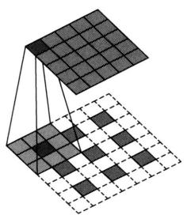

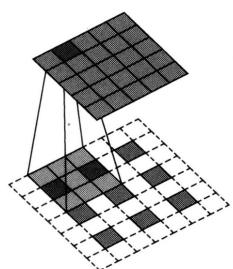

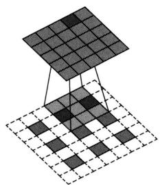  
图 31.8

# 参考文献

[1] GOODFELLOW I, POUGET-ABADIE J, MIRZA M, et al. Generative adversarial nets[J]. Advances in neural information processing systems, 2014: 2672-2680.   
[2] GOODFELLOW I, BENGIO Y, COURVILLE A, et al. Deep Learning[M]. MIT Press, 2016.   
[3] 邱锡鹏. 神经网络与深度学习 [M]. 北京：机械工业出版社，2020.  
[4] RADFORD A, METZ L, CHINTALA S. Unsupervised representation learning with deep convolutional generative adversarial networks[Z/OL]. arXiv preprint arXiv:1511.06434. 2015.   
[5] ARJOVSKY M, CHINTALA S, BOTTOU L. Wasserstein Generative Adversarial Networks[C]// International Conference on Machine Learning. 2017: 214-223.

# 第32章 扩散模型

扩散模型（diffusion model）或扩散概率模型（diffusion probabilistic model）是一种概率生成模型。扩散模型通过扩散过程（diffusion process）定义。扩散过程由前向（扩散）过程和反向（去噪）过程组成。扩散模型主要有去噪扩散概率模型（denoising diffusion probabilistic model, DDPM）和分数匹配加朗之万动力学（score matching with Langevin dynamics, SMLD）。DDPM 和 SMLD 有着密切的关系，都是求解扩散过程的随机微分方程的方法。

去噪扩散概率模型（DDPM）中，前向过程从原始数据开始，通过多个步骤，逐渐向数据添加递增的高斯噪声，直到成为完全随机噪声。反向过程从完全随机噪声开始，通过同样多个步骤，逐渐从完全随机噪声中去除噪声，以还原原始数据。学习针对反向过程的每一步进行，训练一个神经网络预测对应的前向过程中每一步的噪声，从而有效地进行去噪，也就是数据生成。

分数匹配加朗之万动力学（SMLD）学习和使用分数函数，对应着反向过程，隐式地存在前向过程。学习时，针对原始数据添加不同程度的高斯噪声，训练一个神经网络，拟合在不同噪声程度下的数据分布的分数函数。数据生成时，使用学到的神经网络，通过朗之万动力学从含有噪声的数据分布中采样，逐渐减少噪声的程度，从而生成与原始数据同分布的数据。

相比其他概率生成模型，扩散模型在模型学习的准确性、学习的计算效率、生成数据的真实性和多样性等方面都具有一定的优势。目前被广泛应用于图像生成、语音生成、分子结构生成等任务。

Sohl-Dickstein 等于 2015 年提出了扩散模型的基本想法，Song 和 Ermon 于 2019 年提出了 SMLD，Ho 等于 2020 年提出了被广泛使用的 DDPM。

本章32.1节讲述DDPM，32.2节讲述SMLD，32.3节概述两者的关系，32.4节介绍在图像生成中的应用。

# 32.1 去噪扩散概率模型

本节讲述去噪扩散概率模型DDPM。首先给出直观解释，然后介绍模型的定义和性质，接着叙述学习和生成算法。

# 32.1.1 直观解释

物理学中，扩散过程是指物质粒子在流体中从高浓度区域向低浓度区域移动的过程。比如，一滴墨水滴到一杯水中，起初漂浮在水面，随着时间的推移逐渐散开，最后均匀地溶解在水中。整体是一个扩散过程。

深度学习的扩散模型是受物理学的扩散过程的启发而设计的数据的概率生成方法。深度学习的扩散模型可以应用于图像生成、语音生成、分子结构生成等任务。

前向过程（forward process）或者也称作扩散过程（diffusion process）是一个随机过程。给定一个数据样本，在随机过程的每一步，在样本上添加噪声，经过充分多的步数后，样本变成完全随机噪声。

相对地，反向过程（backward process）或者去噪过程（denoising process）也是一个随机过程。从一个完全随机噪声开始，在随机过程的每一步，对完全随机噪声进行去噪，经过充分多的步数后，得到一个数据样本。反向过程实际是从完全随机噪声到数据的生成过程。反向过程的每一步，用神经网络对完全随机噪声进行去噪，而这个神经网络是从数据中学习得到的。

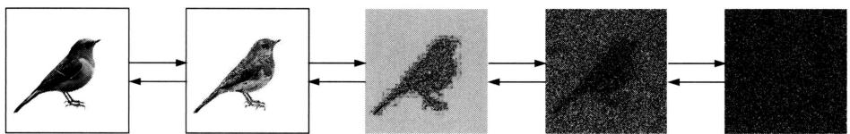  
图32.1 图像生成：前向过程，图像逐步变成完全随机噪声；反向过程，完全随机噪声逐步变成图像

图32.1示意扩散模型用于图像生成。样本数据通常是有结构的（遵循复杂概率分布），而完全随机噪声是无结构的（遵循高斯分布）。注：高斯分布是在均值和方差确定的条件下熵最大的概率分布（见第8章）。前向过程将有结构数据逐步转换成无结构数据，而反向过程将无结构数据逐步转换成有结构数据。反向过程对应着，在杯中已然扩散的墨水，沿着与时间相反的方向，回退到刚滴到水中时的一滴，这种情况在物理世界是不可能发生的。

# 32.1.2 模型的定义和性质

首先介绍DDPM模型的定义和性质。

# 1. 前向过程和反向过程

训练数据是从未知的概率分布 $q(\pmb{x})$ 抽样得到的样本，其中的一个样本由 $\pmb{x}_0$ 表示。目标是从训练数据估计概率分布 $q(\pmb{x})$ ，并根据估计的概率分布生成新的数据。这就是概率生成模型的学习和数据生成问题。

考虑扩散过程，由前向过程和反向过程组成。假设前向过程是一个马尔可夫链，其状态对应样本，状态转移对应样本采样。从原始样本 $\boldsymbol{x}_0$ 开始，每一步根据马尔可夫链的转移概率分布随机采样，等价于对样本加入噪声，得到一个加噪的样本，经过 $T$ 步，得到完全随机噪声 $\boldsymbol{x}_T$ ：

$$
\boldsymbol {x} _ {0} \rightarrow \boldsymbol {x} _ {1} \dots \rightarrow \boldsymbol {x} _ {t - 1} \rightarrow \boldsymbol {x} _ {t} \dots \rightarrow \boldsymbol {x} _ {T - 1} \rightarrow \boldsymbol {x} _ {T}
$$

其中， $\pmb{x}_0$ 是原始样本， $\pmb{x}_T$ 是完全随机噪声，遵循标准高斯分布。

假设反向过程也是一个马尔可夫链，其状态对应样本，状态转移对应样本采样。从完全随机噪声 $\boldsymbol{x}_T$ 开始，每一步根据马尔可夫链的转移概率分布随机采样，等价于从样本去除噪声，进行去噪，得到一个去噪的样本，经过 $T$ 步，得到原始样本 $\boldsymbol{x}_0$ ：

$$
\boldsymbol {x} _ {0} \leftarrow \boldsymbol {x} _ {1} \leftarrow \dots \boldsymbol {x} _ {t - 1} \leftarrow \boldsymbol {x} _ {t} \leftarrow \dots \boldsymbol {x} _ {T - 1} \leftarrow \boldsymbol {x} _ {T}
$$

其中， $\pmb{x}_T$ 是完全随机噪声， $\pmb{x}_0$ 是原始样本。反向过程是前向过程的逆过程。前向过程和反向过程的每一个第 $t$ 步 $(t = 1,2,\dots,T)$ 都是对应的。

前向过程的联合概率分布是

$$
q \left(\boldsymbol {x} _ {0} \boldsymbol {x} _ {1} \dots \boldsymbol {x} _ {T}\right) = q \left(\boldsymbol {x} _ {0}\right) q \left(\boldsymbol {x} _ {1} \mid \boldsymbol {x} _ {0}\right) \dots q \left(\boldsymbol {x} _ {T} \mid \boldsymbol {x} _ {T - 1}\right) \tag {32.1}
$$

反向过程的联合概率分布是

$$
q \left(\boldsymbol {x} _ {0} \boldsymbol {x} _ {1} \dots \boldsymbol {x} _ {T}\right) = q \left(\boldsymbol {x} _ {T}\right) q \left(\boldsymbol {x} _ {T - 1} \mid \boldsymbol {x} _ {T}\right) \dots q \left(\boldsymbol {x} _ {0} \mid \boldsymbol {x} _ {1}\right) \tag {32.2}
$$

考虑图像数据生成。图中32.2显示的是图像的样本空间，每一个图像是样本空间中的一个点。样本空间是高维的，但是图像数据一般分布在低维的流形上，位于图中蓝色区域。前向过程中原始图像一步步被添加噪声，最后变成完全随机噪声，主要位于图中绿色区域。反向过程是逆过程，完全随机噪声一步步被去除噪声，最后变成图像，这也是图像的生成过程。

  
图32.2 扩散过程在样本空间中（见文前彩图）

# 2. 前向过程

DDPM的前向过程是将原始样本 $\pmb{x}_0$ 逐步转换为完全随机噪声 $\pmb{x}_T$ 的过程。假设前向过程的转移概率分布是高斯分布，就是说每一步添加的噪声是高斯噪声。在第 $t$ 步 $(t = 1,2,\dots ,T)$ 有

$$
\boldsymbol {x} _ {t} \sim q \left(\boldsymbol {x} _ {t} \mid \boldsymbol {x} _ {t - 1}\right) = N \left(\boldsymbol {x} _ {t}; \sqrt {\alpha_ {t}} \boldsymbol {x} _ {t - 1}, \beta_ {t} \boldsymbol {I}\right) \tag {32.3}
$$

其中，系数 $\beta_{t}$ 和 $\alpha_{t}$ 满足

$$
0 <   \beta_ {t} <   1
$$

$$
\alpha_ {t} = 1 - \beta_ {t}
$$

可以等价地表示为

$$
\boldsymbol {x} _ {t} = \sqrt {\alpha_ {t}} \boldsymbol {x} _ {t - 1} + \sqrt {\beta_ {t}} \boldsymbol {\epsilon} _ {t - 1} \tag {32.4}
$$

其中， $\epsilon_{t-1}$ 遵循标准高斯分布 $\epsilon_{t-1} \sim N(0, I)$ 。称式 (32.4) 为 DDPM 前向过程的迭代公式。这里用到多元高斯分布的性质。若随机变量 $\pmb{x}$ 遵循各向同性高斯分布（isotropic Gaussian distribution） $\pmb{x} \sim N(\pmb{\mu}, \sigma^2 \pmb{I})$ ，则 $\pmb{x}$ 满足 $\pmb{x} = \pmb{\mu} + \sigma \pmb{\epsilon}$ ，其中随机变量 $\pmb{\epsilon}$ 遵循标准高斯分布 $\pmb{\epsilon} \sim N(0, I)$ 。

基于密度函数和基于随机变量的两种表示形式各有方便使用之处。下面根据需要选择使用。在含有随机变量的神经网络（如VAE）的学习中，基于随机变量表示的参数变换又被称为再参数化技巧。

前向过程的联合概率分布表示为

$$
q (\boldsymbol {x} _ {0} \boldsymbol {x} _ {1} \dots \boldsymbol {x} _ {T}) = q (\boldsymbol {x} _ {0}) N (\boldsymbol {x} _ {1}; \sqrt {\alpha} _ {1} \boldsymbol {x} _ {0}, \beta_ {1} \boldsymbol {I}) \dots N (\boldsymbol {x} _ {T}; \sqrt {\alpha} _ {T} \boldsymbol {x} _ {T - 1}, \beta_ {T} \boldsymbol {I})
$$

前向过程有以下性质，由引理给出。

引理32.1 从第0步的原始样本 $\pmb{x}_0$ 到第 $t$ 步的样本 $\pmb{x}_t$ 的转移概率分布是以下高斯分布：

$$
q \left(\boldsymbol {x} _ {t} \mid \boldsymbol {x} _ {0}\right) = N \left(\boldsymbol {x} _ {t}; \sqrt {\bar {\alpha} _ {t}} \boldsymbol {x} _ {0}, (1 - \bar {\alpha} _ {t}) \boldsymbol {I}\right) \tag {32.5}
$$

这里 $\bar{\alpha}_t$ 满足

$$
\bar {\alpha} _ {t} = \alpha_ {1} \alpha_ {2} \dots \alpha_ {t}
$$

证明 使用随机变量表示，对 $x_{t}$ 进行展开：

$$
\begin{array}{l} \boldsymbol {x} _ {t} = \sqrt {\alpha_ {t}} \boldsymbol {x} _ {t - 1} + \sqrt {1 - \alpha_ {t}} \boldsymbol {\epsilon} _ {t - 1} \\ = \sqrt {\alpha_ {t}} \left(\sqrt {\alpha_ {t - 1}} \boldsymbol {x} _ {t - 2} + \sqrt {1 - \alpha_ {t - 1}} \boldsymbol {\epsilon} _ {t - 2}\right) + \sqrt {1 - \alpha_ {t - 1}} \boldsymbol {\epsilon} _ {t - 1} \\ = \sqrt {\alpha_ {t} \alpha_ {t - 1}} \boldsymbol {x} _ {t - 2} + \sqrt {1 - \alpha_ {t} \alpha_ {t - 1}} \tilde {\epsilon} _ {t - 2} \\ = \dots \\ = \sqrt {\bar {\alpha} _ {t}} \boldsymbol {x} _ {0} + \sqrt {1 - \bar {\alpha} _ {t}} \tilde {\epsilon} _ {0} \\ \end{array}
$$

其中，随机变量 $\epsilon_{t-1}$ 和 $\epsilon_{t-2}$ 遵循标准高斯分布 $\epsilon_{t-1} \sim N(0, I)$ ， $\epsilon_{t-2} \sim N(0, I)$ 。其和的新随机变量 $\tilde{\epsilon}_{t-2} = \epsilon_{t-1} + \epsilon_{t-2}$ 也遵循标准高斯分布 $\tilde{\epsilon}_{t-2} \sim N(0, I)$ 。

这里用到多元高斯分布的性质。两个各向同性高斯分布的随机变量之和依然遵循各向同性高斯分布

$$
\boldsymbol {x} _ {1} \sim N (\boldsymbol {x}; \boldsymbol {\mu} _ {1}, \sigma_ {1} ^ {2} \boldsymbol {I}), \quad \boldsymbol {x} _ {2} \sim N (\boldsymbol {x}; \boldsymbol {\mu} _ {2}, \sigma_ {2} ^ {2} \boldsymbol {I})
$$

$$
\boldsymbol {x} _ {1} + \boldsymbol {x} _ {2} \sim N (\boldsymbol {x}; \boldsymbol {\mu} _ {1} + \boldsymbol {\mu} _ {2}, \left(\sigma_ {1} ^ {2} + \sigma_ {2} ^ {2}\right) \boldsymbol {I})
$$

这样， $\pmb{x}_t$ 可以重新写作

$$
\boldsymbol {x} _ {t} = \sqrt {\bar {\alpha} _ {t}} \boldsymbol {x} _ {0} + \sqrt {1 - \bar {\alpha} _ {t}} \boldsymbol {\epsilon}
$$

这个性质意味着，从第0步的样本 $\pmb{x}_0$ 到第 $t$ 步的样本 $\pmb{x}_t$ 的转移概率分布可以显式地表示。这样给定原始样本 $\pmb{x}_0$ ，可以直接采样，或者说添加高斯噪声，得到样本 $\pmb{x}_t$ 。

这个性质也意味着，当 $t$ 趋于无穷时，转移概率分布 $q(\pmb{x}_t|\pmb{x}_{t-1})$ 趋于标准高斯分布。由此，当 $T$ 充分大时，样本 $\pmb{x}_T$ 接近完全随机噪声。

$$
\boldsymbol {x} _ {T} \sim N (\boldsymbol {x} _ {T}; \mathbf {0}, \boldsymbol {I})
$$

经常取 $T = 1000$ 。在前向过程中设方差系数 $\beta_{t}$ 充分小， $\beta_{t} \ll 1$ ，并且逐渐增大。

$$
\beta_ {1} <   \beta_ {2} <   \dots <   \beta_ {T}
$$

比如，线性递增。

方差系数的大小代表添加高斯噪声的大小。图32.2的例中，前向过程中，样本在流形附近被添加的高斯噪声较小，在接近原点，即标准高斯分布的均值时，被添加的高斯噪声较大。对应的反向过程中，在原点附近进行高噪声的去噪，在流形附近进行低噪声的去噪，这样利于更好地学习扩散模型。这一点在SMDL中也有体现。

# 3. 反向过程

DDPM的反向过程是将完全随机噪声 $\pmb{x}_T$ 逐步转换为原始样本 $\pmb{x}_0$ 的过程。设第 $T$ 步的样本满足

$$
\boldsymbol {x} _ {T} \sim N (\boldsymbol {x} _ {T}; \mathbf {0}, \boldsymbol {I})
$$

第 $t$ 步到第 $t - 1$ 步 $(t = 1,2,\dots ,T)$ 有转移概率分布 $q(\pmb{x}_{t - 1}|\pmb{x}_t)$ 。

以下定理说明反向过程的状态转移分布也是高斯分布。

定理32.1（Feller）如果前向过程的马尔可夫链的转移概率分布 $q(\pmb{x}_t|\pmb{x}_{t-1})$ 是高斯分布，且 $\beta_t$ 充分小，那么反向过程的马尔可夫链的转移概率分布 $q(\pmb{x}_{t-1}|\pmb{x}_t)$ 也是高斯分布。

一般不直接计算转移概率分布 $q(\pmb{x}_{t-1}|\pmb{x}_t)$ ，因为这个计算是不可行的。通过贝叶斯定理知

$$
q \left(\boldsymbol {x} _ {t - 1} \mid \boldsymbol {x} _ {t}\right) \propto q \left(\boldsymbol {x} _ {t} \mid \boldsymbol {x} _ {t - 1}\right) q \left(\boldsymbol {x} _ {t - 1}\right)
$$

其中， $q(\pmb {x}_t|\pmb{x}_{t - 1})$ 是计算可行的，而 $q(\pmb{x}_{t - 1})$ 是计算不可行的。

但是，如果导入 $\mathbf{x}_0$ 问题就变得简单。在 $\mathbf{x}_0$ 给定条件下的转移概率分布 $q(\mathbf{x}_{t-1}|\mathbf{x}_t, \mathbf{x}_0)$ ，从前向过程可以方便地计算。事实上这个条件转移概率分布也是高斯分布，其均值和方差可以从前向过程推导得出。DDPM 利用反向过程的这个性质。

引理32.2 第 $t$ 步到第 $t - 1$ 步在第0步的条件下的转移概率分布 $q(\pmb{x}_{t - 1}|\pmb{x}_t,\pmb{x}_0)$ 是以下高斯分布：

$$
q \left(\boldsymbol {x} _ {t - 1} \mid \boldsymbol {x} _ {t}, \boldsymbol {x} _ {0}\right) = N \left(\boldsymbol {x} _ {t - 1}; \tilde {\boldsymbol {\mu}} _ {t} \left(\boldsymbol {x} _ {t}, \boldsymbol {x} _ {0}\right), \tilde {\beta} _ {t} \boldsymbol {I}\right) \tag {32.6}
$$

其均值是

$$
\tilde {\boldsymbol {\mu}} _ {t} (\boldsymbol {x} _ {t}, \boldsymbol {x} _ {0}) = \frac {\sqrt {\alpha_ {t}} (1 - \bar {\alpha} _ {t - 1})}{1 - \bar {\alpha} _ {t}} \boldsymbol {x} _ {t} + \frac {\sqrt {\bar {\alpha} _ {t - 1}} (1 - \alpha_ {t})}{1 - \bar {\alpha} _ {t}} \boldsymbol {x} _ {0}
$$

方差的系数是

$$
\tilde {\beta} _ {t} = \frac {1 - \bar {\alpha} _ {t - 1}}{1 - \bar {\alpha} _ {t}} \beta_ {t}
$$

证明 使用贝叶斯定理，利用前向过程的转移概率是高斯分布的性质，可以推导出反向过程的条件转移概率分布也是高斯分布，并得到其概率密度函数。

$$
\begin{array}{l} q \left(\boldsymbol {x} _ {t - 1} \mid \boldsymbol {x} _ {t}, \boldsymbol {x} _ {0}\right) \\ = \frac {q (\boldsymbol {x} _ {t - 1} | \boldsymbol {x} _ {0}) q (\boldsymbol {x} _ {t} | \boldsymbol {x} _ {t - 1} , \boldsymbol {x} _ {0})}{q (\boldsymbol {x} _ {t} | \boldsymbol {x} _ {0})} \\ = \frac {q (\boldsymbol {x} _ {t - 1} | \boldsymbol {x} _ {0}) q (\boldsymbol {x} _ {t} | \boldsymbol {x} _ {t - 1})}{q (\boldsymbol {x} _ {t} | \boldsymbol {x} _ {0})} \\ = \frac {N \left(\boldsymbol {x} _ {t - 1} ; \sqrt {\bar {\alpha} _ {t - 1}} \boldsymbol {x} _ {0} , (1 - \bar {\alpha} _ {t - 1}) \boldsymbol {I}\right) N \left(\boldsymbol {x} _ {t} ; \sqrt {\bar {\alpha} _ {t}} \boldsymbol {x} _ {t - 1} , (1 - \alpha_ {t}) \boldsymbol {I}\right)}{N \left(\boldsymbol {x} _ {t} ; \sqrt {\bar {\alpha} _ {t}} \boldsymbol {x} _ {0} , (1 - \bar {\alpha} _ {t}) \boldsymbol {I}\right)} \\ \propto \exp \left\{- \frac {1}{2} \left[ \frac {\left(\boldsymbol {x} _ {t} - \sqrt {\alpha_ {t}} \boldsymbol {x} _ {t - 1}\right) ^ {2}}{\beta_ {t}} + \frac {\left(\boldsymbol {x} _ {t - 1} - \sqrt {\bar {\alpha} _ {t - 1}} \boldsymbol {x} _ {0}\right) ^ {2}}{1 - \bar {\alpha} _ {t - 1}} - \frac {\left(\boldsymbol {x} _ {t} - \sqrt {\bar {\alpha} _ {t}} \boldsymbol {x} _ {0}\right) ^ {2}}{1 - \bar {\alpha} _ {t}} \right] \right\} \\ = \exp \left\{- \frac {1}{2} \left[ \frac {\boldsymbol {x} _ {t} ^ {2} - 2 \sqrt {\alpha_ {t}} \boldsymbol {x} _ {t} \boldsymbol {x} _ {t - 1} + \alpha_ {t} \boldsymbol {x} _ {t - 1} ^ {2}}{\beta_ {t}} + \frac {\boldsymbol {x} _ {t - 1} ^ {2} - 2 \sqrt {\bar {\alpha} _ {t - 1}} \boldsymbol {x} _ {t - 1} \boldsymbol {x} _ {0} + \bar {\alpha} _ {t - 1} \boldsymbol {x} _ {0} ^ {2}}{1 - \bar {\alpha} _ {t - 1}} - \frac {\left(\boldsymbol {x} _ {t} - \sqrt {\bar {\alpha} _ {t}} \boldsymbol {x} _ {0}\right) ^ {2}}{1 - \bar {\alpha} _ {t}} \right] \right\} \\ = \exp \left\{- \frac {1}{2} \left[ \left(\frac {\alpha_ {t}}{\beta_ {t}} + \frac {1}{1 - \bar {\alpha} _ {t - 1}}\right) \boldsymbol {x} _ {t - 1} ^ {2} - 2 \left(\frac {\sqrt {\alpha_ {t}}}{\beta_ {t}} \boldsymbol {x} _ {t} + \frac {\sqrt {\bar {\alpha} _ {t - 1}}}{1 - \bar {\alpha} _ {t - 1}} \boldsymbol {x} _ {0}\right) \boldsymbol {x} _ {t - 1} + C (\boldsymbol {x} _ {t}, \boldsymbol {x} _ {0}) \right] \right\} \\ \end{array}
$$

$C(\pmb{x}_t, \pmb{x}_0)$ 是对 $\pmb{x}_{t-1}$ 的定量，高斯分布的方差系数是

$$
\begin{array}{l} \bar {\beta} _ {t} = 1 / \left(\frac {\alpha_ {t}}{\beta_ {t}} + \frac {1}{1 - \bar {\alpha} _ {t - 1}}\right) \\ = \frac {1 - \bar {\alpha} _ {t - 1}}{1 - \bar {\alpha} _ {t}} \beta_ {t} \\ \end{array}
$$

均值是

$$
\begin{array}{l} \bar {\mu} _ {t} \left(\boldsymbol {x} _ {t}, \boldsymbol {x} _ {0}\right) = \left(\frac {\sqrt {\alpha_ {t}}}{\beta_ {t}} \boldsymbol {x} _ {t} + \frac {\sqrt {\bar {\alpha} _ {t - 1}}}{1 - \bar {\alpha} _ {t - 1}} \boldsymbol {x} _ {0}\right) / \left(\frac {\alpha_ {t}}{\beta_ {t}} + \frac {1}{1 - \bar {\alpha} _ {t - 1}}\right) \\ = \left(\frac {\sqrt {\alpha_ {t}}}{\beta_ {t}} \boldsymbol {x} _ {t} + \frac {\sqrt {\bar {\alpha} _ {t - 1}}}{1 - \bar {\alpha} _ {t - 1}} \boldsymbol {x} _ {0}\right) \frac {1 - \bar {\alpha} _ {t - 1}}{1 - \bar {\alpha} _ {t}} (1 - \alpha_ {t}) \\ = \frac {\sqrt {\alpha_ {t}} (1 - \bar {\alpha} _ {t - 1})}{1 - \bar {\alpha} _ {t}} \boldsymbol {x} _ {t} + \frac {\sqrt {\bar {\alpha} _ {t - 1}} (1 - \alpha_ {t})}{1 - \bar {\alpha} _ {t}} \boldsymbol {x} _ {0} \\ \end{array}
$$

根据引理32.1， $x_0$ 可以从 $\pmb{x}_t$ 求出：

$$
\boldsymbol {x} _ {0} = \frac {1}{\sqrt {\bar {\alpha} _ {t}}} \left(\boldsymbol {x} _ {t} - \sqrt {1 - \bar {\alpha} _ {t}} \boldsymbol {\epsilon}\right) \tag {32.7}
$$

代入 $\tilde{\mu}_t(x_t,x_0)$ ，得到其只依赖于 $x_{t}$ 的形式：

$$
\begin{array}{l} \tilde {\boldsymbol {\mu}} _ {t} \left(\boldsymbol {x} _ {t}, \boldsymbol {x} _ {0}\right) = \frac {\sqrt {\alpha_ {t}} \left(1 - \bar {\alpha} _ {t - 1}\right)}{1 - \bar {\alpha} _ {t}} \boldsymbol {x} _ {t} + \frac {\sqrt {\bar {\alpha} _ {t - 1}} \left(1 - \alpha_ {t}\right)}{1 - \bar {\alpha} _ {t}} \frac {1}{\sqrt {\bar {\alpha} _ {t}}} \left(\boldsymbol {x} _ {t} - \sqrt {1 - \bar {\alpha} _ {t}} \boldsymbol {\epsilon}\right) \\ = \frac {1}{\sqrt {\alpha_ {t}}} \left(\boldsymbol {x} _ {t} - \frac {(1 - \alpha_ {t})}{\sqrt {1 - \bar {\alpha} _ {t}}} \boldsymbol {\epsilon}\right) \tag {32.8} \\ \end{array}
$$

# 4. 模型：神经网络

假设前向过程和反向过程都是马尔可夫链，前向过程的转移概率分布是高斯分布。在此基础上可以得出，反向过程的转移概率分布也是高斯分布，并且能够求出第 $t$ 步前向的转移概率分布 $q(\pmb{x}_t|\pmb{x}_0)$ 和反向的条件转移概率分布 $q(\pmb{x}_{t - 1}|\pmb{x}_t,\pmb{x}_0)$ 。

前向过程表示一步步加噪的随机过程，由超参数 $\beta_{t}$ $(t = 1,2,\dots ,T)$ 控制，是事先确定的。反向过程表示一步步去噪的随机过程，由学习得到的神经网络控制。

DDPM用神经网络表示反向的转移概率分布 $p_{\theta}(\boldsymbol{x}_{t - 1}|\boldsymbol{x}_t), t = 1,2,\dots ,T$ 。由定理32.1知，这个转移概率分布是高斯分布

$$
p _ {\boldsymbol {\theta}} \left(\boldsymbol {x} _ {t - 1} \mid \boldsymbol {x} _ {t}\right) = N \left(\boldsymbol {x} _ {t - 1}; \boldsymbol {\mu} _ {\boldsymbol {\theta}} \left(\boldsymbol {x} _ {t}, t\right), \boldsymbol {\Sigma} _ {\boldsymbol {\theta}} \left(\boldsymbol {x} _ {t}, t\right)\right) \tag {32.9}
$$

其均值和方差由神经网络决定。神经网络的输入是样本 $x_{t}$ 和步数 $t$ ，输出是均值 $\mu_{\theta}$ 和方差 $\Sigma_{\theta}$ ，参数是 $\theta$ 。

反向过程的联合概率分布表示为

$$
p \left(\boldsymbol {x} _ {0} \boldsymbol {x} _ {1} \dots \boldsymbol {x} _ {T}\right) = p \left(\boldsymbol {x} _ {T}\right) N \left(\boldsymbol {x} _ {T - 1}; \boldsymbol {\mu} _ {\boldsymbol {\theta}} \left(\boldsymbol {x} _ {T}, T\right), \boldsymbol {\Sigma} _ {\boldsymbol {\theta}} \left(\boldsymbol {x} _ {T}, T\right)\right) \dots N \left(\boldsymbol {x} _ {0}; \boldsymbol {\mu} _ {\boldsymbol {\theta}} \left(\boldsymbol {x} _ {1}, 1\right), \boldsymbol {\Sigma} _ {\boldsymbol {\theta}} \left(\boldsymbol {x} _ {1}, 1\right)\right) \tag {32.10}
$$

假设每一步的协方差矩阵是对角阵。

$$
\boldsymbol {\Sigma} _ {\boldsymbol {\theta}} \left(\boldsymbol {x} _ {t}, t\right) = \sigma_ {t} ^ {2} \boldsymbol {I}
$$

图32.3显示前向过程和反向过程中的第 $t$ 步处理。前向过程（从右到左）从第 $t - 1$ 步到第 $t$ 步根据 $q(\pmb{x}_t|\pmb{x}_{t - 1})$ 采样，由 $\pmb{x}_{t - 1}$ 得到 $\pmb{x}_t$ 。反向过程（从左到右）从第 $t$ 步到第 $t - 1$ 步根据 $p_{\theta}(\pmb{x}_{t - 1}|\pmb{x}_t)$ 采样，由 $\pmb{x}_t$ 得到 $\pmb{x}_{t - 1}$ 。原理上 $p_{\theta}(\pmb{x}_{t - 1}|\pmb{x}_t)$ 应该近似转移概率分布 $q(\pmb{x}_{t - 1}|\pmb{x}_t)$ 。但 $q(\pmb{x}_{t - 1}|\pmb{x}_t)$ 难以计算，DDPM实际使 $p_{\theta}(\pmb{x}_{t - 1}|\pmb{x}_t)$ 近似条件转移概率分布 $q(\pmb{x}_{t - 1}|\pmb{x}_t,\pmb{x}_0)$ 。

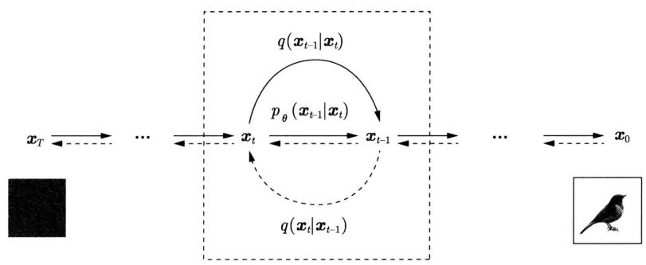  
图32.3 扩散的前向和反向过程中的第 $t$ 步处理

# 32.1.3 学习和生成算法

接着讲述DDPM的学习和生成算法。

# 1. 变分原理

DDPM利用变分推理原理从数据中学习概率生成模型，与变分自编码器VAE有相似之处。前向过程对应着编码，反向过程对应着解码。前向过程经过 $T$ 步将原始样本“编码”成随机噪声，反向过程经过 $T$ 步将随机噪声“解码”成原始样本。与变分自编码器的不同点在于编码并没有对原始样本进行压缩，解码也没有对随机噪声进行解压。也就是说，在扩散的前向和反向过程中样本向量的维度没有发生变化。另一个不同点是通过两个 $T$ 步的随机过程进行编码和解码，而不是使用两个神经网络进行一步的编码和解码。还有，扩散过程中编码和解码的 $T$ 步是对应的；编码过程已经事先确定，解码过程需要学习。

同VAE一样，可以定义基于解码器分布 $p_{\theta}(\pmb{x}_0)$ 的证据以及证据下界。

$$
\log p _ {\boldsymbol {\theta}} \left(\boldsymbol {x} _ {0}\right) \geqslant \mathbb {E} _ {q \left(\boldsymbol {x} _ {1} \boldsymbol {x} _ {2} \dots \boldsymbol {x} _ {T} \mid \boldsymbol {x} _ {0}\right)} \left[ \log \frac {p _ {\boldsymbol {\theta}} \left(\boldsymbol {x} _ {0} \boldsymbol {x} _ {1} \cdots \boldsymbol {x} _ {T}\right)}{q \left(\boldsymbol {x} _ {1} \boldsymbol {x} _ {2} \cdots \boldsymbol {x} _ {T} \mid \boldsymbol {x} _ {0}\right)} \right] \tag {32.11}
$$

进一步定义基于编码器分布 $q(\pmb{x}_0)$ 的期望，得到对应的证据期望，以及变分下界（variational lower bound）。

$$
\mathbb {E} _ {q \left(\boldsymbol {x} _ {0}\right)} \log p _ {\boldsymbol {\theta}} \left(\boldsymbol {x} _ {0}\right) \geqslant \mathbb {E} _ {q \left(\boldsymbol {x} _ {0} \boldsymbol {x} _ {1} \dots \boldsymbol {x} _ {T}\right)} \left[ \log \frac {p _ {\boldsymbol {\theta}} \left(\boldsymbol {x} _ {0} \boldsymbol {x} _ {1} \cdots \boldsymbol {x} _ {T}\right)}{q \left(\boldsymbol {x} _ {1} \boldsymbol {x} _ {2} \cdots \boldsymbol {x} _ {T} \mid \boldsymbol {x} _ {0}\right)} \right] \tag {32.12}
$$

直接最大化证据的期望学习模型的参数是计算不可行的。DDPM的学习通过最大化变分下界进行。等价地最小化对应的损失函数 $L(\pmb{\theta})$ 。展开损失函数得到以下结果，其中用 $p_{\pmb{\theta}}(\pmb{x}_{t-1}|\pmb{x}_t)$ 近似 $q(\pmb{x}_{t-1}|\pmb{x}_t, \pmb{x}_0)$ 。

$$
\begin{array}{l} L (\boldsymbol {\theta}) \\ = \mathbb {E} _ {q \left(\boldsymbol {x} _ {0} \boldsymbol {x} _ {1} \dots \boldsymbol {x} _ {T}\right)} \left[ \log \frac {q \left(\boldsymbol {x} _ {1} \boldsymbol {x} _ {2} \cdots \boldsymbol {x} _ {T} \mid \boldsymbol {x} _ {0}\right)}{p _ {\boldsymbol {\theta}} \left(\boldsymbol {x} _ {0} \boldsymbol {x} _ {1} \cdots \boldsymbol {x} _ {T}\right)} \right] \\ = \mathbb {E} _ {q \left(\boldsymbol {x} _ {0} \boldsymbol {x} _ {1} \dots \boldsymbol {x} _ {T}\right)} \left[ \log \frac {\prod_ {t = 1} ^ {T} q \left(\boldsymbol {x} _ {t} \mid \boldsymbol {x} _ {t - 1}\right)}{p _ {\boldsymbol {\theta}} \left(\boldsymbol {x} _ {T}\right) \prod_ {t = 1} ^ {T} p _ {\boldsymbol {\theta}} \left(\boldsymbol {x} _ {t - 1} \mid \boldsymbol {x} _ {t}\right)} \right] \\ = \mathbb {E} _ {q \left(\boldsymbol {x} _ {0} \boldsymbol {x} _ {1} \dots \boldsymbol {x} _ {T}\right)} \left[ - \log p _ {\boldsymbol {\theta}} (\boldsymbol {x} _ {T}) + \sum_ {t = 1} ^ {T} \log \frac {q \left(\boldsymbol {x} _ {t} \mid \boldsymbol {x} _ {t - 1}\right)}{p _ {\boldsymbol {\theta}} \left(\boldsymbol {x} _ {t - 1} \mid \boldsymbol {x} _ {t}\right)} \right] \\ = \mathbb {E} _ {q \left(\boldsymbol {x} _ {0} \boldsymbol {x} _ {1} \dots \boldsymbol {x} _ {T}\right)} \left[ - \log p _ {\boldsymbol {\theta}} (\boldsymbol {x} _ {T}) + \sum_ {t = 2} ^ {T} \log \frac {q \left(\boldsymbol {x} _ {t} \mid \boldsymbol {x} _ {t - 1}\right)}{p _ {\boldsymbol {\theta}} \left(\boldsymbol {x} _ {t - 1} \mid \boldsymbol {x} _ {t}\right)} + \log \frac {q \left(\boldsymbol {x} _ {1} \mid \boldsymbol {x} _ {0}\right)}{p _ {\boldsymbol {\theta}} \left(\boldsymbol {x} _ {0} \mid \boldsymbol {x} _ {1}\right)} \right] \\ = \mathbb {E} _ {q (\boldsymbol {x} _ {0} \boldsymbol {x} _ {1} \dots \boldsymbol {x} _ {T})} \left[ - \log p _ {\boldsymbol {\theta}} (\boldsymbol {x} _ {T}) + \sum_ {t = 2} ^ {T} \log \frac {q (\boldsymbol {x} _ {t - 1} | \boldsymbol {x} _ {t} , \boldsymbol {x} _ {0})}{p _ {\boldsymbol {\theta}} (\boldsymbol {x} _ {t - 1} | \boldsymbol {x} _ {t})} + \sum_ {t = 2} ^ {T} \log \frac {q (\boldsymbol {x} _ {t} | \boldsymbol {x} _ {0})}{q (\boldsymbol {x} _ {t - 1} | \boldsymbol {x} _ {0})} + \log \frac {q (\boldsymbol {x} _ {1} | \boldsymbol {x} _ {0})}{p _ {\boldsymbol {\theta}} (\boldsymbol {x} _ {0} | \boldsymbol {x} _ {1})} \right] \\ = \mathbb {E} _ {q \left(\boldsymbol {x} _ {0} \boldsymbol {x} _ {1} \dots \boldsymbol {x} _ {T}\right)} \left[ - \log p _ {\boldsymbol {\theta}} (\boldsymbol {x} _ {T}) + \sum_ {t = 2} ^ {T} \log \frac {q \left(\boldsymbol {x} _ {t - 1} \mid \boldsymbol {x} _ {t} , \boldsymbol {x} _ {0}\right)}{p _ {\boldsymbol {\theta}} \left(\boldsymbol {x} _ {t - 1} \mid \boldsymbol {x} _ {t}\right)} + \log \frac {q \left(\boldsymbol {x} _ {T} \mid \boldsymbol {x} _ {0}\right)}{q \left(\boldsymbol {x} _ {1} \mid \boldsymbol {x} _ {0}\right)} + \log \frac {q \left(\boldsymbol {x} _ {1} \mid \boldsymbol {x} _ {0}\right)}{p _ {\boldsymbol {\theta}} \left(\boldsymbol {x} _ {0} \mid \boldsymbol {x} _ {1}\right)} \right] \\ \end{array}
$$

$$
\begin{array}{l} = \mathbb {E} _ {q \left(\boldsymbol {x} _ {0} \boldsymbol {x} _ {1} \dots \boldsymbol {x} _ {T}\right)} \left[ \log \frac {q \left(\boldsymbol {x} _ {T} \mid \boldsymbol {x} _ {0}\right)}{p _ {\boldsymbol {\theta}} \left(\boldsymbol {x} _ {T}\right)} + \sum_ {t = 2} ^ {T} \log \frac {q \left(\boldsymbol {x} _ {t - 1} \mid \boldsymbol {x} _ {t} , \boldsymbol {x} _ {0}\right)}{p _ {\boldsymbol {\theta}} \left(\boldsymbol {x} _ {t - 1} \mid \boldsymbol {x} _ {t}\right)} - \log p _ {\boldsymbol {\theta}} \left(\boldsymbol {x} _ {0} \mid \boldsymbol {x} _ {1}\right) \right] \\ = \mathbb {E} _ {q \left(\boldsymbol {x} _ {0}, \boldsymbol {x} _ {T}\right)} \left[ \frac {q \left(\boldsymbol {x} _ {T} \mid \boldsymbol {x} _ {0}\right)}{p _ {\boldsymbol {\theta}} \left(\boldsymbol {x} _ {T}\right)} \right] + \sum_ {t = 2} ^ {T} \mathbb {E} _ {q \left(\boldsymbol {x} _ {0}, \boldsymbol {x} _ {t - 1}, \boldsymbol {x} _ {t}\right)} \left[ \log \frac {q \left(\boldsymbol {x} _ {t - 1} \mid \boldsymbol {x} _ {t} , \boldsymbol {x} _ {0}\right)}{p _ {\boldsymbol {\theta}} \left(\boldsymbol {x} _ {t - 1} \mid \boldsymbol {x} _ {t}\right)} \right] - \mathbb {E} _ {q \left(\boldsymbol {x} _ {0}, \boldsymbol {x} _ {1}\right)} \left[ \log p _ {\boldsymbol {\theta}} \left(\boldsymbol {x} _ {0} \mid \boldsymbol {x} _ {1}\right) \right] \tag {32.13} \\ \end{array}
$$

这里分布 $q(\pmb{x}_{t - 1}|\pmb{x}_t,\pmb{x}_0)$ 的定义如下：

$$
q \left(\boldsymbol {x} _ {t - 1} \mid \boldsymbol {x} _ {t}, \boldsymbol {x} _ {0}\right) = N \left(\boldsymbol {x} _ {t - 1}; \tilde {\mu} _ {t} \left(\boldsymbol {x} _ {t}, \boldsymbol {x} _ {0}\right), \tilde {\beta} _ {t} \boldsymbol {I}\right) \tag {32.14}
$$

$$
\tilde {\boldsymbol {\mu}} _ {t} \left(\boldsymbol {x} _ {t}, \boldsymbol {x} _ {0}\right) = \frac {1}{\sqrt {\alpha} _ {t}} \left(\boldsymbol {x} _ {t} - \frac {1 - \alpha_ {t}}{\sqrt {1 - \bar {\alpha} _ {t}}} \boldsymbol {\epsilon}\right) \tag {32.15}
$$

与之对应，分布 $p_{\theta}(\boldsymbol{x}_{t - 1}|\boldsymbol{x}_t)$ 的定义如下：

$$
p _ {\boldsymbol {\theta}} \left(\boldsymbol {x} _ {t - 1} \mid \boldsymbol {x} _ {t}\right) = N \left(\boldsymbol {x} _ {t - 1}; \boldsymbol {\mu} _ {\boldsymbol {\theta}} \left(\boldsymbol {x} _ {t}, t\right), \sigma_ {t} ^ {2} \boldsymbol {I}\right) \tag {32.16}
$$

$$
\boldsymbol {\mu} _ {\boldsymbol {\theta}} \left(\boldsymbol {x} _ {t}, t\right) = \frac {1}{\sqrt {\alpha} _ {t}} \left(\boldsymbol {x} _ {t} - \frac {1 - \alpha_ {t}}{\sqrt {1 - \bar {\alpha} _ {t}}} \boldsymbol {\epsilon} _ {\boldsymbol {\theta}} \left(\boldsymbol {x} _ {t}, t\right)\right) \tag {32.17}
$$

假设两个分布 $q(\pmb{x}_{t-1}|\pmb{x}_t, \pmb{x}_0)$ 和 $p_\theta(\pmb{x}_{t-1}|\pmb{x}_t)$ 均值具有相同形式；方差相同，即设 $\tilde{\beta}_t = \sigma_t^2$ 。因此，神经网络简化为 $\epsilon_\theta(\pmb{x}_t, t)$ ，其输入是样本 $\pmb{x}_t$ 和步数 $t$ ，输出是噪声 $\epsilon$ ， $\pmb{\theta}$ 是参数。

# 2. 噪声的预测

DDPM 的学习实际通过简化的损失函数的最小化进行，训练一个预测噪声的神经网络。将损失函数展开，第一项损失 $L_{T}$ 如下：

$$
L _ {T} (\boldsymbol {\theta}) = \mathbb {E} _ {q \left(\boldsymbol {x} _ {0}\right)} \left[ \mathrm {K L} \left(q \left(\boldsymbol {x} _ {T} \mid \boldsymbol {x} _ {0}\right) \| p _ {\boldsymbol {\theta}} \left(\boldsymbol {x} _ {T}\right)\right) \right] \tag {32.18}
$$

这个损失 $L_{T}$ 是定量，对最小化不起作用。

中间各项的损失 $L_{t - 1}$ （ $t = T, T - 1, \dots, 2$ ）如下。通过计算分布 $q(\pmb{x}_{t - 1}|\pmb{x}_t, \pmb{x}_0)$ 和 $p_\theta(\pmb{x}_{t - 1}|\pmb{x}_t)$ 的KL散度的期望得到，期望是针对分布 $q(\pmb{x}_0)$ 和 $p(\pmb{\epsilon})$ 的。

$$
\begin{array}{l} L _ {t - 1} (\boldsymbol {\theta}) = \mathbb {E} _ {q \left(\boldsymbol {x} _ {0}\right), p (\boldsymbol {\epsilon})} \left[ \mathrm {K L} \left(q \left(\boldsymbol {x} _ {t - 1} \mid \boldsymbol {x} _ {t}, \boldsymbol {x} _ {0}\right) \| p _ {\boldsymbol {\theta}} \left(\boldsymbol {x} _ {t - 1} \mid \boldsymbol {x} _ {t}\right)\right) \right] \\ = \mathbb {E} _ {q (\boldsymbol {x} _ {0}), p (\boldsymbol {\epsilon})} \left[ \frac {1}{2 \sigma^ {2} (t)} \| \boldsymbol {\mu} (\boldsymbol {x} _ {t}, \boldsymbol {x} _ {0}) - \boldsymbol {\mu} _ {\boldsymbol {\theta}} (\boldsymbol {x} _ {t}, t) \| ^ {2} \right] \\ = \mathbb {E} _ {q (\boldsymbol {x} _ {0}), p (\boldsymbol {\epsilon})} \left[ \frac {1}{2 \sigma^ {2} (t)} \right\| \frac {1}{\sqrt {\bar {\alpha} _ {t}}} \left[ \boldsymbol {x} _ {t} - \frac {(1 - \alpha_ {t})}{\sqrt {1 - \bar {\alpha} _ {t}}} \boldsymbol {\epsilon} \right] - \frac {1}{\sqrt {\alpha_ {t}}} \left[ \boldsymbol {x} _ {t} - \frac {(1 - \alpha_ {t})}{\sqrt {1 - \bar {\alpha} _ {t}}} \boldsymbol {\epsilon} _ {\boldsymbol {\theta}} (\boldsymbol {x} _ {t}, t) \right] \| ^ {2} \\ = \mathbb {E} _ {q (\boldsymbol {x} _ {0}), p (\boldsymbol {\epsilon})} \left[ \frac {1}{2 \sigma^ {2} (t)} \frac {(1 - \alpha_ {t}) ^ {2}}{\alpha_ {t} (1 - \bar {\alpha} _ {t})} \| \boldsymbol {\epsilon} - \boldsymbol {\epsilon} _ {\boldsymbol {\theta}} (\boldsymbol {x} _ {t}, t) \| ^ {2} \right] \\ = \mathbb {E} _ {q \left(\boldsymbol {x} _ {0}\right), p (\boldsymbol {\epsilon})} \left[ \frac {1}{2 \sigma^ {2} (t)} \frac {\left(1 - \alpha_ {t}\right) ^ {2}}{\alpha_ {t} \left(1 - \bar {\alpha} _ {t}\right)} \| \boldsymbol {\epsilon} - \boldsymbol {\epsilon} _ {\boldsymbol {\theta}} \left(\sqrt {\bar {\alpha} _ {t}} \boldsymbol {x} _ {0} + \sqrt {1 - \bar {\alpha} _ {t}} \boldsymbol {\epsilon}, t\right) \| ^ {2} \right] \tag {32.19} \\ \end{array}
$$

最后一项损失 $L_{0}$ 如下：

$$
L _ {0} (\boldsymbol {\theta}) = \mathbb {E} _ {q \left(\boldsymbol {x} _ {0}\right), p \left(\epsilon_ {1}\right)} \left[ - \log p _ {\boldsymbol {\theta}} \left(\boldsymbol {x} _ {0} \mid \boldsymbol {x} _ {1}\right) \right] \tag {32.20}
$$

针对损失 $L_{t - 1}, t = T, T - 1, \dots, 2$ ，忽略系数，只对平方损失部分进行优化。针对损失 $L_0$ ，假设进行同样的平方损失优化。忽略损失 $L_T$ ，这样得到以下简化的整体损失函数：

$$
\begin{array}{l} L ^ {\prime} (\boldsymbol {\theta}) = \sum_ {t = 1} ^ {T} \mathbb {E} _ {q \left(\boldsymbol {x} _ {0}\right), p (\boldsymbol {\epsilon})} \left[ \| \boldsymbol {\epsilon} - \boldsymbol {\epsilon} _ {\boldsymbol {\theta}} \left(\boldsymbol {x} _ {t}, t\right) \| ^ {2} \right] \\ = \sum_ {t = 1} ^ {T} \mathbb {E} _ {q \left(\boldsymbol {x} _ {0}\right), p (\boldsymbol {\epsilon})} \left[ \| \boldsymbol {\epsilon} - \boldsymbol {\epsilon} _ {\boldsymbol {\theta}} \left(\sqrt {\bar {\alpha} _ {t}} \boldsymbol {x} _ {0} + \sqrt {1 - \bar {\alpha} _ {t}} \boldsymbol {\epsilon}, t\right) \| ^ {2} \right] \tag {32.21} \\ \end{array}
$$

神经网络 $\epsilon_{\theta}(\pmb{x}_t,t)$ 预测的是前向过程第 $t$ 步的高斯噪声，其直观解释是，这样的神经网络也能对反向过程的第 $t$ 步 $(t = 1,2,\dots ,T)$ 进行有效的去噪。

反向过程的第 $t$ 步到第 $t - 1$ 步的转移概率分布，可以利用学习得到的神经网络 $\epsilon_{\theta}(\pmb{x}_t,t)$ 计算。使用随机变量表示形式

$$
\boldsymbol {x} _ {t - 1} = \frac {1}{\sqrt {\alpha_ {t}}} \left(\boldsymbol {x} _ {t} - \frac {1 - \alpha_ {t}}{\sqrt {1 - \bar {\alpha} _ {t}}} \boldsymbol {\epsilon} _ {\boldsymbol {\theta}} (\boldsymbol {x} _ {t}, t)\right) + \sigma_ {t} \boldsymbol {\epsilon} \tag {32.22}
$$

称式 (32.22) 为 DDPM 反向过程的迭代公式，用于数据生成。设每一步的方差系数与对应的前向过程的方差系数相同， $\sigma_t = \sqrt{\beta_t}$ 。

# 3. 学习和生成算法

给定训练数据集 $\mathcal{T}$ ，可以通过梯度下降法对损失函数(32.21)进行优化，学习神经网络的参数。具体算法如下。

学习时，随机选取原始样本 $\pmb{x}_0$ ，并随机选取步数 $t$ 。第 $t$ 步的样本 $\pmb{x}_t$ 是基于原始样本 $\pmb{x}_0$ 和高斯噪声 $\pmb{\epsilon}$ 得到的。预测在样本 $\pmb{x}_t$ 和步数 $t$ 给定条件下，如何去除高斯噪声 $\pmb{\epsilon}$ 的影响，得到第 $t - 1$ 步的样本 $\pmb{x}_{t - 1}$ 。也就是说，训练的目的是进行去噪。

# 算法32.1（DDPM——学习算法）

输入：训练数据集 $\mathcal{T}$ 。

输出：神经网络 $\epsilon_{\theta}$

超参数： $\beta_{t},t = 1,2,\dots ,T$ 。

（1）初始化神经网络的参数 $\theta$   
（2）重复以下处理，直到收敛：

（2-1）从训练数据集 $\mathcal{T}$ 中采样得到样本 $x_0$   
（2-2）随机采样 $\{T,T - 1,\dots ,1\}$ 得到步数 $t$   
（2-3）随机采样 $\epsilon \sim N(0,I)$ 得到高斯噪声；  
（2-4）计算损失函数的梯度并更新神经网络参数：

$$
\nabla_ {\boldsymbol {\theta}} L (\boldsymbol {\theta}) = \nabla_ {\boldsymbol {\theta}} \| \boldsymbol {\epsilon} - \boldsymbol {\epsilon} _ {\boldsymbol {\theta}} \left(\sqrt {\bar {\alpha} _ {t}} \boldsymbol {x} _ {0} + \sqrt {1 - \bar {\alpha} _ {t}} \boldsymbol {\epsilon}, t\right) \| ^ {2}
$$

（3）输出估计的神经网络模型。

生成过程就是反向过程。使用学到的神经网络进行每一步的数据生成。

# 算法32.2（DDPM——生成算法）

输入：神经网络 $\epsilon_{\theta}$

输出：生成的样本 $\pmb{x}_0$ 。

超参数： $\beta_{t},(t = 1,2,\dots ,T)$ 。

（1）随机采样得到随机噪声 $\pmb{x}_T$   
(2) For $(t = T, T - 1, \dots, 1)$

（2-1）随机采样 $\epsilon \sim N(0,I)$ 得到高斯噪声 $\pmb{\epsilon}$   
(2-2) If $t = 1$ , then $\epsilon = 0$ .   
（2-3）从第 $t$ 步的样本 $\pmb{x}_t$ 计算第 $t - 1$ 步的样本 $\pmb{x}_{t - 1}$

$$
\boldsymbol {x} _ {t - 1} = \frac {1}{\sqrt {1 - \beta_ {t}}} \left(\boldsymbol {x} _ {t} - \frac {\beta_ {t}}{\sqrt {1 - \bar {\alpha} _ {t}}} \boldsymbol {\epsilon} _ {\boldsymbol {\theta}} (\boldsymbol {x} _ {t}, t)\right) + \sqrt {\beta_ {t}} \boldsymbol {\epsilon}
$$

}

（3）输出生成的样本 $\pmb{x}_0$

# 32.2 分数匹配加朗之万动力学

本节讲述分数匹配加朗之万动力学（SMLD）。首先介绍分数匹配和朗之万动力学，然后讲述SMLD方法。

# 32.2.1 分数匹配

# 1. 分数函数

分数匹配是一种概率生成模型（概率分布的密度函数）的学习方法。这里首先给出分数函数的定义。假设概率分布的密度函数为

$$
p (\boldsymbol {x}), \quad \boldsymbol {x} \in \mathbb {R} ^ {d}
$$

称密度函数的对数对数据的梯度为分数函数 (score function)。

$$
\nabla_ {\boldsymbol {x}} \log p (\boldsymbol {x})
$$

分数函数表示的是概率分布在样本空间的变化趋势。

分数函数 $\nabla_{\pmb{x}}\log p(\pmb{x})$ 构成向量场，而密度函数 $p(\pmb{x})$ 构成标量场，两者存在一一对应关系。通过对密度函数的微分可以求得分数函数，通过对分数函数的积分可以求得密度函数。

图32.4显示二元高斯混合模型的密度函数和分数函数，其密度函数是

$$
p (\boldsymbol {x}) = \pi_ {1} N (\boldsymbol {x}; \boldsymbol {\mu} _ {1}, \boldsymbol {I}) + \pi_ {2} N (\boldsymbol {x}; \boldsymbol {\mu} _ {2}, \boldsymbol {I})
$$

设 $\pi_1 = 0.7$ ， $\pi_2 = 0.3$ ， $\pmb{\mu}_1 = (2,2)^{\mathrm{T}}$ ， $\pmb{\mu}_2 = (-2, - 2)^{\mathrm{T}}$ 。密度函数由等高线表示，分数函数由有向线段表示。模型由两个高斯分布组成，所以有两个山峰。

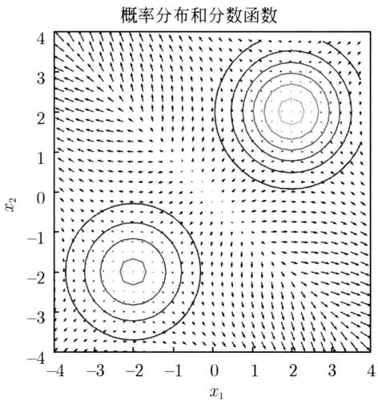  
图32.4 分数函数

# 2. 一般分数匹配

考虑概率密度估计问题，即数据分布的学习问题。训练数据集是未知的概率分布 $q(\pmb{x})$ 的随机样本。

$$
\mathcal {T} = \left\{\boldsymbol {x} _ {1}, \boldsymbol {x} _ {2}, \dots , \boldsymbol {x} _ {N} \right\}
$$

概率分布 $p_{\theta}(\pmb {x})$ 是要学习的模型，用以近似表示 $q(\pmb {x})$ 。概率分布 $p_{\theta}(\pmb {x})$ 可以定义为

$$
p _ {\boldsymbol {\theta}} (\boldsymbol {x}) = \frac {\exp \left(- f _ {\boldsymbol {\theta}} (\boldsymbol {x})\right)}{Z _ {\boldsymbol {\theta}}}
$$

其中， $f_{\theta}(\pmb{x})$ 是能量函数，由神经网络表示， $\pmb{\theta}$ 是其参数； $Z_{\theta}$ 是归一化项，以满足概率分布条件 $\int p_{\theta}(\pmb{x}) \, \mathrm{d}\pmb{x} = 1$ 。

最直接的方法是使用极大似然估计。可以通过最小化对数损失函数，估计神经网络的参数。

$$
L (\boldsymbol {\theta}) = \mathbb {E} _ {q (\boldsymbol {x})} [ - \log p _ {\boldsymbol {\theta}} (\boldsymbol {x}) ] \tag {32.23}
$$

过程中需要计算归一化项 $Z_{\theta}$ ，其直接计算复杂度高，往往是不可行的。

分数匹配方法（score matching）可以规避上述计算不可行的问题。具体而言，把学习的目标定为学习概率分布的分数函数，而不是学习概率分布的密度函数。在应用中使用分数函数，而不是密度函数，如后述朗之万动力学就是如此。针对上述分布，分数函数变成

$$
\nabla_ {\boldsymbol {x}} \log p _ {\boldsymbol {\theta}} (\boldsymbol {x}) = - \nabla_ {\boldsymbol {x}} f _ {\boldsymbol {\theta}} (\boldsymbol {x}) - \nabla_ {\boldsymbol {x}} Z _ {\boldsymbol {\theta}} = - \nabla_ {\boldsymbol {x}} f _ {\boldsymbol {\theta}} (\boldsymbol {x})
$$

只需要计算能量函数对数据的负梯度，不需要计算归一化项。注意这里是对数据 $\pmb{x}$ 求梯度，而不是对参数 $\theta$ 求梯度，所以归一化项的梯度为0。

分数匹配方法具体用神经网络表示分数函数：

$$
\boldsymbol {s} _ {\boldsymbol {\theta}} (\boldsymbol {x}) = \nabla_ {\boldsymbol {x}} \log p _ {\boldsymbol {\theta}} (\boldsymbol {x}) \tag {32.24}
$$

从数据中学习这个神经网络。学习实际通过最小化以下损失函数进行。

$$
L (\boldsymbol {\theta}) = \mathbb {E} _ {q (\boldsymbol {x})} \left[ \frac {1}{2} \| \nabla_ {\boldsymbol {x}} \log q (\boldsymbol {x}) - s _ {\boldsymbol {\theta}} (\boldsymbol {x}) \| ^ {2} \right] \tag {32.25}
$$

称为费舍尔散度（Fisher divergence）。

这里 $\nabla_{\pmb{x}}\log q(\pmb {x})$ 表示要学习的分布的分数函数的真值，学习时是未知的，看似这个问题不可解。有趣的是，分数匹配的优化问题可以通过优化以下的等价问题进行，这样就不需要知道分数函数的真值。

$$
L (\boldsymbol {\theta}) = \mathbb {E} _ {q (\boldsymbol {x})} \left[ \frac {1}{2} \| \boldsymbol {s} _ {\boldsymbol {\theta}} (\boldsymbol {x}) \| ^ {2} + \operatorname {t r a c e} \left(\nabla_ {\boldsymbol {x}} \boldsymbol {s} _ {\boldsymbol {\theta}} (\boldsymbol {x})\right) \right] \tag {32.26}
$$

这个优化问题仍然有计算效率的问题。计算第2项需要计算分数匹配模型的雅克比矩阵，当数据是高维时，计算复杂度较高，这个方法并不实用。

# 3. 去噪分数匹配

去噪分数匹配（denoising score matching）的想法与去噪自编码器（见第30章）有相似之处，对原始数据随机添加少量噪声，使用加噪数据学习分数匹配模型。这样可以学到对噪声更强健的模型，同时也可以解决分数匹配方法计算效率不高的问题。

添加噪声使用条件高斯分布，其中 $\sigma^2$ 是方差系数，控制噪声的大小。

$$
q _ {\sigma} (\tilde {\boldsymbol {x}} | \boldsymbol {x}) = N (\tilde {\boldsymbol {x}}; \boldsymbol {x}, \sigma^ {2} \boldsymbol {I})
$$

学习时最小化以下平方损失函数。

$$
L (\boldsymbol {\theta}) = \mathbf {E} _ {q (\boldsymbol {x}) q _ {\sigma} (\tilde {\boldsymbol {x}} | \boldsymbol {x})} \left[ \frac {1}{2} \| \boldsymbol {s} _ {\boldsymbol {\theta}} (\tilde {\boldsymbol {x}}) - \nabla_ {\tilde {\boldsymbol {x}}} \log q _ {\sigma} (\tilde {\boldsymbol {x}} | \boldsymbol {x}) \| ^ {2} \right] \tag {32.27}
$$

这时根据条件高斯分布 $N(\tilde{\boldsymbol{x}};\boldsymbol{x},\sigma^2\boldsymbol{I})$ 从原始样本 $\pmb{x}$ 采样得到加噪样本 $\tilde{\pmb{x}}$ ，其中的分数函数 $\nabla_{\tilde{\boldsymbol{x}}}\log q_{\sigma}(\tilde{\boldsymbol{x}}|\boldsymbol{x})$ 是可以高效计算的。

理论证明，当噪声充分小时， $q_{\sigma}(\pmb {x})\approx q(\pmb {x})$ 成立，从加噪数据中学到的最优模型几乎必然收敛到真实分数函数。

$$
\boldsymbol {s} _ {\boldsymbol {\theta} ^ {*}} (\boldsymbol {x}) \approx \nabla_ {\boldsymbol {x}} \log q (\boldsymbol {x})
$$

# 32.2.2 朗之万动力学

朗之万动力学（Langevin dynamics）是物理学中描述粒子在流体中运动的数学模型，应用于机器学习成为概率分布的随机采样方法。假设概率分布 $p(\boldsymbol{x})$ ，其分数函数为 $\nabla_{\boldsymbol{x}}\log p(\boldsymbol{x})$ 。朗之万动力学只使用分数函数对概率分布进行采样。

首先从一个固定分布采样，如标准高斯分布，得到样本 $\pmb{x}^{(0)}$ ，然后通过以下迭代公式持续进行采样。

$$
\boldsymbol {x} ^ {(l)} = \boldsymbol {x} ^ {(l - 1)} + \frac {\delta}{2} \nabla_ {\boldsymbol {x}} \log p \left(\boldsymbol {x} ^ {(l - 1)}\right) + \sqrt {\delta} \boldsymbol {\epsilon}, \quad l = 1, 2, \dots , L \tag {32.28}
$$

其中， $\epsilon \sim N(0, I)$ 是高斯噪声， $\delta > 0$ 是步长系数。

可以证明，当 $\delta \to 0$ 且 $L\to \infty$ 时，得到样本 $\pmb{x}$ 是分布的真实样本。现实中，当 $\delta$ 充分小且 $L$ 充分大时， $\pmb{x}^{(L)}$ 可以近似地看作分布的样本，近似误差可以忽略。

如果第三项中 $\epsilon = 0$ ，朗之万动力学变成梯度上升法。可以认为第三项的作用是在梯度上升过程中加入随机扰动，防止迭代陷入局部最优。因此可以认为朗之万动力学是一种随机梯度方法。

朗之万动力学只需要知道 $\nabla_{\pmb{x}}\log p(\pmb {x})$ ，并不需要知道 $p(\pmb {x})$ ，就可以进行对 $p(\pmb {x})$ 的采样。如果通过分数匹配法学到 $s_\theta (\pmb {x})$ ，以之代替 $\nabla_{\pmb{x}}\log p(\pmb {x})$ ，进行朗之万动力学采样，就得到一个概率分布的采样方法。

图32.5显示一元高斯混合模型，其密度函数是

$$
p (x) = \pi_ {1} N (x; \mu_ {1}, \sigma_ {1} ^ {2}) + \pi_ {2} N (x; \mu_ {2}, \sigma_ {2} ^ {2})
$$

其中， $\pi_1 = 0.6$ ， $\pi_2 = 0.4$ ， $\mu_1 = 5$ ， $\mu_2 = -5$ ， $\sigma_1 = 1$ ， $\sigma_2 = 1$ 。用朗之万动力学采样，设初始值 $x_0 \sim N(0,1)$ ，步长系数 $\delta = 0.1$ ，迭代次数 $L = 100$ 。图中也显示采样得到的100个样本。

  
图32.5 高斯混合模型和朗之万动力学采样的100个样本

# 32.2.3 学习和生成算法

下面讲述SMLD方法。

目标是学习数据的概率分布，并对学到的概率分布进行采样以进行数据生成。一个简单的方法是将去噪分数匹配与朗之万动力学结合。首先通过去噪分数匹配学习概率分布的分数函数，然后通过朗之万动力学进行采样，在此过程中使用学到的分数函数。然而，这个方法的数据生成效果并不理想。

SMLD的做法是在原始数据上添加不同水平的高斯噪声，应用去噪分数匹配的原理，用一个神经网络同时学习在不同噪声水平下的加噪数据的概率分布的分数函数。高斯噪声的方差系数表示噪声的水平，也作为神经网络的输入。方差系数小的时候，添加的噪声小；方差系数大的时候，添加的噪声大。学到不同噪声水平下的分数函数以后，再用朗之万动力学从高噪声的分布向低噪声的分布依次进行数据采样。理论上，最后得到的数据接近真实分布的采样。

假设有 $t = 1,2,\dots ,T$ 个噪声水平。经常取 $T = 1000$ 。对应每一个噪声水平有一个条件高斯分布。

$$
\boldsymbol {x} _ {t} \sim q _ {\sigma_ {t}} (\boldsymbol {x} _ {t} | \boldsymbol {x}) = N (\boldsymbol {x} _ {t}; \boldsymbol {x}, \sigma_ {t} ^ {2} \boldsymbol {I})
$$

或者写作

$$
\boldsymbol {x} _ {t} = \boldsymbol {x} + \sigma_ {t} \boldsymbol {\epsilon}, \quad \boldsymbol {\epsilon} \sim N (\boldsymbol {0}, \boldsymbol {I})
$$

假设方差系数满足

$$
\sigma_ {1} <   \sigma_ {2} <   \dots <   \sigma_ {T}
$$

$\sigma_{1}$ 充分小，使得

$$
q _ {\sigma_ {1}} (\boldsymbol {x}) \approx q (\boldsymbol {x})
$$

这里 $q_{\sigma_1}(\pmb{x}_1) = \int q_{\sigma_1}(\pmb{x}_1|\pmb{x})q(\pmb{x})\mathrm{d}\pmb{x}$ 。

对原始数据 $\pmb{x}$ 加方差系数为 $\sigma_t$ 的噪声，得到数据 $\pmb{x}_t$ ，从加噪数据 $\pmb{x}_t$ 学习神经网络 $s_\theta(\pmb{x}_t, \sigma)$ ， $t = 1, 2, \dots, T$ 。最后将 $s_\theta(\pmb{x}_1, \sigma_1)$ 作为数据 $\pmb{x}$ 的分数函数。学习时最小化损失函数

$$
L (\boldsymbol {\theta}) = \sum_ {t = 1} ^ {T} L _ {t} (\boldsymbol {\theta}) \tag {32.29}
$$

其中， $L_{t}(\pmb{\theta})$ 是第 $t$ 个噪声水平的损失函数。具体的定义是

$$
L _ {t} (\boldsymbol {\theta}) = \lambda (t) \mathbb {E} _ {q (\boldsymbol {x}), q _ {\sigma_ {t}} (\boldsymbol {x} _ {t} | \boldsymbol {x})} \left[ \| \nabla_ {\boldsymbol {x} _ {t}} \log q _ {\sigma_ {t}} (\boldsymbol {x} _ {t} | \boldsymbol {x}) - \boldsymbol {s} _ {\boldsymbol {\theta}} (\boldsymbol {x} _ {t}, \sigma_ {t}) \| ^ {2} \right] \tag {32.30}
$$

其中， $\lambda(t)$ 是系数。因为

$$
\nabla_ {\boldsymbol {x} _ {t}} \log q _ {\sigma_ {t}} (\boldsymbol {x} _ {t} | \boldsymbol {x}) = - \frac {\boldsymbol {x} _ {t} - \boldsymbol {x}}{\sigma_ {t} ^ {2}}
$$

所以

$$
L _ {t} (\boldsymbol {\theta}) = \lambda (t) \mathbb {E} _ {q (\boldsymbol {x}), q _ {\sigma_ {t}} (\boldsymbol {x} _ {t} | \boldsymbol {x})} \left[ \left\| \boldsymbol {s} _ {\boldsymbol {\theta}} (\boldsymbol {x} _ {t}, \sigma_ {t}) + \frac {\boldsymbol {x} _ {t} - \boldsymbol {x}}{\sigma_ {t} ^ {2}} \right\| ^ {2} \right] \tag {32.31}
$$

通常选择

$$
\lambda (t) = \sigma_ {t} ^ {2}
$$

代入括号内就有 $\sigma_t s_\theta(\boldsymbol{x}_t, \sigma_t)$ 和 $(\boldsymbol{x}_t - \boldsymbol{x}) / \sigma_t$ 。经验上 $s_\theta(\boldsymbol{x}_t, \sigma_t) \propto 1 / \sigma_t$ ，而 $(\boldsymbol{x}_t - \boldsymbol{x}) / \sigma_t \sim N(0, I)$ 成立，所以，两项是同一数量级。

下面给出SMLD的学习和生成算法。

# 算法32.3（SMLD——学习算法）

输入：训练数据集 $T$ 。

输出：神经网络 $s_{\theta}$

超参数： $\sigma_t, t = 1,2,\dots ,T$ 。

（1）初始化神经网络的参数 $\theta$

（2）重复以下处理，直到收敛：

（2-1）从训练数据集 $T$ 中采样得到样本 $\pmb{x}$   
(2-2) For \((t = 1,2,\dots ,T)\{

根据 $q_{\sigma_t}(\pmb{x}_t|\pmb{x})$ 采样，得到样本 $\pmb{x}_t$

}

（2-3）计算损失函数的梯度并更新神经网络参数；

$$
\nabla_ {\boldsymbol {\theta}} L (\boldsymbol {\theta}) = \nabla_ {\boldsymbol {\theta}} \sum_ {t = 1} ^ {T} \sigma_ {t} ^ {2} \left(\| \boldsymbol {s} _ {\boldsymbol {\theta}} (\boldsymbol {x} _ {t}, \sigma_ {t}) + \frac {\boldsymbol {x} _ {t} - \boldsymbol {x}}{\sigma_ {t} ^ {2}} \| ^ {2}\right)
$$

（3）输出估计的神经网络模型。

使用朗之万动力学，从高噪声水平到低噪声水平进行采样，即从第 $T$ 个噪声水平一直到第1个噪声水平。在第 $t$ 个噪声水平的采样的终值作为第 $t - 1$ 个噪声水平的初值 $(t = T,T - 1,\dots ,1)$ ，最后将第1个噪声水平的采样的终值作为输出。

# 算法32.4（SMLD——生成算法）

输入：神经网络 $s_{\theta}$

输出：生成的样本 $\pmb{x}$

超参数： $\sigma_t(t = T,T - 1,\dots ,1),\delta ,L$

（1）随机采样得到初始样本 $\pmb{x}^{(0)}$   
(2) For $(t = T, T - 1, \dots, 1)$

$$
\delta_ {t} = \delta \cdot \sigma_ {t} ^ {2} / \sigma_ {T} ^ {2}
$$

$$
\text {F o r} (l = 1, 2, \dots , L) \{
$$

随机采样 $\epsilon \sim N(0, I)$

更新样本 $\pmb{x}^{(l)}$

$$
\boldsymbol {x} ^ {(l)} \leftarrow \boldsymbol {x} ^ {(l - 1)} + \frac {\delta_ {t}}{2} \boldsymbol {s} _ {\boldsymbol {\theta}} \left(\boldsymbol {x} ^ {(l - 1)}, \sigma_ {t}\right) + \sqrt {\delta_ {t}} \boldsymbol {\epsilon}
$$

}

设 $\pmb{x}^{(0)} = \pmb{x}^{(L)}$

}

（3）输出生成的样本 $\pmb{x}^{(0)}$

虽然样本数据存在于高维空间，但通常分布于低维的流形上(见图32.2)。事实证明，如果只对流形上的原始数据添加微小噪声，并不能学好数据的生成模型。相反，在原始数据上添加不同水平的噪声，同时学习不同噪声水平下的去噪，就能学好数据生成模型。在流形附近进行较小的扰动，在原点附近进行较大的扰动。这正是SMLD的基本做法，与DDPM的前向过程的加操作法对应。如后面所述，可以从扩散过程的角度解释这个方法。

朗之万动力学采样一般是从完全随机噪声（标准高斯分布）开始。从高噪声到低噪声的采样可以避免陷入局部最优，因为高噪声主要分布在原点附近，而低噪声主要分布在流形附近。

# 32.3 扩散模型之间的关系

DDPM和SMLD都是扩散模型。可以通过分数函数学习和随机微分方程把两者联系到一起。两个模型都被应用到了图像生成等任务，在不同的任务上各自有自己的优势。目前在图像生成中常用DDPM。

# 32.3.1 分数函数学习

DDPM 的学习一般用神经网络预测前向过程的高斯噪声。但也有另一种形式，预测前向过程的分数函数。这时的学习目标函数与 SMLD 的目标函数基本是等价的。两者通过分数函数学习联系在一起。下面给出 DDPM 的分数函数形式的学习算法。

贝叶斯估计中，假设观测数据 $\pmb{x}$ 是随机变量，遵循高斯分布。

$$
\boldsymbol {x} \sim p (\boldsymbol {x}) = N (\boldsymbol {x}; \boldsymbol {\mu}, \boldsymbol {\Sigma})
$$

其中均值 $\mu$ 也是随机变量，并拥有先验概率分布，方差 $\pmb{\Sigma}$ 是定量。Tweedie公式给出观测数据 $\pmb{x}$ 给定条件下的均值 $\pmb{\mu}$ 对后验概率分布的期望。

$$
\mathbb {E} [ \boldsymbol {\mu} | \boldsymbol {x} ] = \boldsymbol {x} + \boldsymbol {\Sigma} \nabla_ {\boldsymbol {x}} \log p (\boldsymbol {x}) \tag {32.32}
$$

这里 $\nabla_{\pmb{x}}\log p(\pmb {x})$ 是分数函数。

DDPM的前向过程中从样本 $\pmb{x}_0$ 到样本 $\pmb{x}_t$ 的转移概率分布是

$$
q \left(\boldsymbol {x} _ {t} \mid \boldsymbol {x} _ {0}\right) = N \left(\boldsymbol {x} _ {t}; \sqrt {\bar {\alpha}} _ {t} \boldsymbol {x} _ {0}, (1 - \bar {\alpha} _ {t}) \boldsymbol {I}\right)
$$

应用 Tweedie 公式得到以下结论。

引理32.3 前向过程中，在样本 $\pmb{x}_t$ 给定条件下，均值 $\sqrt{\bar{\alpha}}_t\pmb{x}_0$ 的后验期望是

$$
\mathbb {E} \left[ \sqrt {\bar {\alpha}} _ {t} \boldsymbol {x} _ {0} \mid \boldsymbol {x} _ {t} \right] = \boldsymbol {x} _ {t} + (1 - \bar {\alpha} _ {t}) \nabla_ {\boldsymbol {x} _ {t}} \log q (\boldsymbol {x} _ {t}) \tag {32.33}
$$

注意这里 $\pmb{x}_0$ 是变量。

假设均值 $\sqrt{\bar{\alpha}_t} x_0$ 就等于其后验期望，那么有

$$
\sqrt {\bar {\alpha} _ {t}} \boldsymbol {x} _ {0} = \boldsymbol {x} _ {t} + (1 - \bar {\alpha} _ {t}) \nabla_ {\boldsymbol {x} _ {t}} \log q (\boldsymbol {x} _ {t})
$$

即

$$
\boldsymbol {x} _ {0} = \frac {1}{\sqrt {\bar {\alpha} _ {t}}} \boldsymbol {x} _ {t} + \frac {(1 - \bar {\alpha} _ {t})}{\sqrt {\bar {\alpha} _ {t}}} \nabla_ {\boldsymbol {x} _ {t}} \log q (\boldsymbol {x} _ {t}) \tag {32.34}
$$

也得到前向过程中从样本 $\pmb{x}_0$ 到样本 $\pmb{x}_t$ 的变换关系

$$
\boldsymbol {x} _ {t} = \sqrt {\bar {\alpha} _ {t}} \boldsymbol {x} _ {0} - (1 - \bar {\alpha} _ {t}) \nabla_ {\boldsymbol {x} _ {t}} \log q (\boldsymbol {x} _ {t}) \tag {32.35}
$$

比较式(32.17)和式(32.35)得到DDPM中的分数函数和高斯噪声的关系。

$$
\nabla_ {\boldsymbol {x} _ {t}} \log q (\boldsymbol {x} _ {t}) = - \frac {1}{\sqrt {1 - \bar {\alpha} _ {t}}} \epsilon \tag {32.36}
$$

反向过程的条件转移概率分布 $q(\pmb{x}_{t - 1}|\pmb{x}_t,\pmb{x}_0)$ 是高斯分布，其均值是

$$
\tilde {\boldsymbol {\mu}} _ {t} (\boldsymbol {x} _ {t}, \boldsymbol {x} _ {0}) = \frac {\sqrt {\alpha_ {t}} (1 - \bar {\alpha} _ {t - 1})}{1 - \bar {\alpha} _ {t}} \boldsymbol {x} _ {t} + \frac {\sqrt {\bar {\alpha} _ {t - 1}} (1 - \alpha_ {t})}{1 - \bar {\alpha} _ {t}} \boldsymbol {x} _ {0}
$$

将式 (32.34) 代入得到：

$$
\tilde {\boldsymbol {\mu}} _ {t} \left(\boldsymbol {x} _ {t}, \boldsymbol {x} _ {0}\right) = \frac {1}{\sqrt {\alpha_ {t}}} \left[ \boldsymbol {x} _ {t} + \left(1 - \alpha_ {t}\right) \nabla_ {\boldsymbol {x} _ {t}} \log q \left(\boldsymbol {x} _ {t}\right) \right] \tag {32.37}
$$

转移概率分布 $p_{\theta}(\boldsymbol{x}_{t - 1}|\boldsymbol{x}_t)$ 也是高斯分布，其均值是

$$
\boldsymbol {\mu} _ {\boldsymbol {\theta}} \left(\boldsymbol {x} _ {t}, t\right) = \frac {1}{\sqrt {\alpha} _ {t}} \left[ \boldsymbol {x} _ {t} + \left(1 - \alpha_ {t}\right) \boldsymbol {s} _ {\boldsymbol {\theta}} \left(\boldsymbol {x} _ {t}, t\right) \right] \tag {32.38}
$$

其中， $s_{\theta}(x_t,t)$ 表示神经网络。

定义变分下界以及损失函数，其中的损失 $L_{t - 1}$ 如下。

$$
\begin{array}{l} L _ {t - 1} (\boldsymbol {\theta}) = \mathbb {E} _ {q \left(\boldsymbol {x} _ {0}\right), p (\boldsymbol {\epsilon})} \left[ \mathrm {K L} \left(q \left(\boldsymbol {x} _ {t - 1} \mid \boldsymbol {x} _ {t}, \boldsymbol {x} _ {0}\right) \mid \mid p _ {\boldsymbol {\theta}} \left(\boldsymbol {x} _ {t - 1} \mid \boldsymbol {x} _ {t}\right)\right) \right] \\ = \mathbb {E} _ {q (\pmb {x} _ {0}), p (\pmb {\epsilon})} \left[ \frac {1}{2 \sigma_ {t} ^ {2}} \| \pmb {\mu} (\pmb {x} _ {t}, \pmb {x} _ {0}) - \pmb {\mu} _ {\pmb {\theta}} (\pmb {x} _ {t}, t) \| ^ {2} \right] \\ = \mathbb {E} _ {q \left(\boldsymbol {x} _ {0}\right), p (\boldsymbol {\epsilon})} \left[ \frac {1}{2 \sigma_ {t} ^ {2}} \frac {\left(1 - \alpha_ {t}\right) ^ {2}}{\alpha_ {t} \left(1 - \bar {\alpha} _ {t}\right)} \| \nabla_ {\boldsymbol {x} _ {t}} \log q \left(\boldsymbol {x} _ {t}\right) - \boldsymbol {s} _ {\boldsymbol {\theta}} \left(\boldsymbol {x} _ {t}, t\right) \| ^ {2} \right] \tag {32.39} \\ \end{array}
$$

这样就得到DDPM的另一个算法，神经网络 $s_{\theta}(\pmb{x}_t,t)$ 预测的是前向过程第 $t$ 步的分数函数。具体算法的整理留作习题。

比较式 (32.39) 和式 (32.31)，可以看出 DDPM 和 SMLD 都是学习分数函数，有对应的学习目标。

# 32.3.2 随机微分方程

可以将DDPM和SMLD看作求解不同的扩散过程的随机微分方程的方法。扩散过程的前向过程和反向过程可以用基于连续时间的随机微分方程（stochastic differential equation, SDE）表示。随机微分方程是指包含随机项的微分方程。随机微分方程形式上与常微分方程相似，但包含随机项。随机微分方程整体表示具有不确定性的随机过程。

# 1. 扩散过程

扩散过程的前向过程的SDE有以下一般形式。为了便于理解，假设模型表示的是粒子在流体中的运动。

$$
\mathrm {d} \boldsymbol {x} = \boldsymbol {f} (\boldsymbol {x}, t) \mathrm {d} t + g (t) \mathrm {d} \boldsymbol {w} \tag {32.40}
$$

其中， $\pmb{x}$ 表示粒子在空间中的位置， $t$ 表示时间， $\pmb{f}(\pmb{x}, t)$ 是漂移系数（drift coefficient）， $g(t)$ 是扩散系数（diffusion coefficient）， $\mathrm{d}\pmb{w} = \epsilon \sqrt{\mathrm{d}t}, \epsilon \sim N(0, I)$ 是维纳过程。注意漂移系数是向量，扩散系数是标量。第1项表示粒子在流体中确定性的移动，第2项表示粒子在流体中的随机游走。式(32.40)描述粒子运动的整体规律。

定理32.2（Anderson）当扩散过程的前向过程的SDE是式(32.40)的一般形式时，反向过程的逆时间SDE有以下一般形式：

$$
\mathrm {d} \boldsymbol {x} = \left[ f (\boldsymbol {x}, t) - g ^ {2} (t) \nabla_ {\boldsymbol {x}} \log p (\boldsymbol {x}, t) \right] \mathrm {d} t + g (t) \mathrm {d} \bar {\boldsymbol {w}} \tag {32.41}
$$

其中， $\mathrm{d}\bar{\boldsymbol{w}} = -\epsilon \sqrt{\mathrm{d}t}$ 是逆时间维纳过程。

前向过程的SDE和反向过程的逆时间SDE是基于连续时间的，如果将时间离散化，就得到对应的随机差分方程，本章介绍的扩散模型的迭代公式实际都是随机差分方程。随机差分方程可以让我们更方便地计算SDE。

# 2. DDPM

DDPM前向过程的迭代公式(32.4）是

$$
\boldsymbol {x} _ {t} = \sqrt {1 - \beta_ {t}} \boldsymbol {x} _ {t - 1} + \sqrt {\beta_ {t}} \boldsymbol {\epsilon} _ {t - 1} \tag {32.42}
$$

可以将它表示为一个随机差分方程。当时间差分趋于 $0(\Delta t \to 0)$ 时，随机差分方程就变成SDE。推导过程这里不予介绍。

DDPM前向过程的SDE是

$$
\mathrm {d} \boldsymbol {x} = - \frac {\beta (t)}{2} \boldsymbol {x} \mathrm {d} t + \sqrt {\beta (t)} \mathrm {d} \boldsymbol {w} \tag {32.43}
$$

根据定理32.2，反向过程的逆时间SDE是

$$
\mathrm {d} \boldsymbol {x} = - \beta (t) \left[ \frac {\boldsymbol {x}}{2} + \nabla_ {\boldsymbol {x}} \log p (\boldsymbol {x}, t) \right] \mathrm {d} t + \sqrt {\beta (t)} \bar {\boldsymbol {w}} \tag {32.44}
$$

对应的随机差分方程如下，正是DDPM反向过程的迭代公式(32.22)。

$$
\boldsymbol {x} _ {t - 1} = \frac {1}{\sqrt {1 - \beta_ {t}}} \left[ \boldsymbol {x} _ {t} + \frac {\beta_ {t}}{2} \nabla_ {\boldsymbol {x} _ {t}} \log p (\boldsymbol {x} _ {t}) \right] + \sqrt {\beta_ {t}} \boldsymbol {\epsilon} _ {t} \tag {32.45}
$$

# 3. SMLD

SMLD是从分数匹配的角度推导得出的，但也可以认为是基于扩散过程的。事实上不同水平的噪声上的分数匹配对应着反向过程；对原始数据添加不同水平的噪声对应着前向过程，噪声水平对应着扩散步骤。

假设存在一个前向过程，是马尔可夫链，从样本 $\boldsymbol{x}_{t-1}$ 到样本 $\boldsymbol{x}_t$ 的转移概率分布是以下高斯分布。

$$
q \left(\boldsymbol {x} _ {t} \mid \boldsymbol {x} _ {t - 1}\right) = N \left(\boldsymbol {x} _ {t}; \boldsymbol {x} _ {t - 1}, \left(\sigma_ {t} ^ {2} - \sigma_ {t - 1} ^ {2}\right) \boldsymbol {I}\right) \tag {32.46}
$$

$$
\boldsymbol {x} _ {t} = \boldsymbol {x} _ {t - 1} + \sqrt {\sigma_ {t} ^ {2} - \sigma_ {t - 1} ^ {2}} \boldsymbol {\epsilon} _ {t - 1} \tag {32.47}
$$

设 $\pmb{x}_0 = \pmb{x}$ ， $\sigma_0 = 0$

样本 $\pmb{x}_t$ ( $t = 1,2,\dots,T$ ) 的均值和方差满足

$$
\mathbb {E} \left(\boldsymbol {x} _ {t}\right) = \mathbb {E} \left(\boldsymbol {x} _ {t - 1}\right) = \dots = \mathbb {E} \left(\boldsymbol {x} _ {1}\right) = \boldsymbol {x} _ {0} \tag {32.48}
$$

$$
\operatorname {V a r} \left(\boldsymbol {x} _ {t}\right) = \operatorname {V a r} \left(\boldsymbol {x} _ {t - 1}\right) + \left(\sigma_ {t} ^ {2} - \sigma_ {t - 1} ^ {2}\right) \boldsymbol {I}
$$

$$
\begin{array}{l} = \operatorname {V a r} \left(\boldsymbol {x} _ {t - 2}\right) + \left(\sigma_ {t} ^ {2} - \sigma_ {t - 2} ^ {2}\right) \boldsymbol {I} \\ = \dots \\ = \operatorname {V a r} \left(\boldsymbol {x} _ {0}\right) + \sigma_ {t} ^ {2} \boldsymbol {I} \tag {32.49} \\ \end{array}
$$

于是得到从样本 $\pmb{x}_0$ 到样本 $\pmb{x}_t$ 的转移概率分布。

$$
q \left(\boldsymbol {x} _ {t} \mid \boldsymbol {x} _ {0}\right) = N \left(\boldsymbol {x} _ {t}; \boldsymbol {x} _ {0}, \sigma_ {t} ^ {2} \boldsymbol {I}\right) \tag {32.50}
$$

与SMLD的第 $t$ 个噪声水平的条件高斯分布是等价的。称式(32.47)为SMLD的前向过程的迭代公式。

SMLD的前向过程的迭代公式(32.47)可以表示为一个随机差分方程。当 $\Delta t\to 0$ 时，随机差分方程就变成SDE。推导过程这里也不予介绍。SMLD前向过程的SDE是

$$
\mathrm {d} \boldsymbol {x} = \sqrt {\frac {\mathrm {d} (\sigma^ {2} (t))}{\mathrm {d} t}} \mathrm {d} \boldsymbol {w} \tag {32.51}
$$

根据定理32.2，反向过程的逆时间SDE是

$$
\mathrm {d} \boldsymbol {x} = - \left(\frac {\mathrm {d} (\sigma^ {2} (t))}{\mathrm {d} t} \nabla_ {\boldsymbol {x}} \log p (\boldsymbol {x}, t)\right) \mathrm {d} t + \sqrt {\frac {\mathrm {d} (\sigma^ {2} (t))}{\mathrm {d} t}} \mathrm {d} \bar {\boldsymbol {w}} \tag {32.52}
$$

对应的随机差分方程如下，正是SMLD反向过程的迭代公式，也是朗之万动力学的迭代公式。

$$
\boldsymbol {x} _ {t - 1} = \boldsymbol {x} _ {t} + \left(\sigma_ {t} ^ {2} - \sigma_ {t - 1} ^ {2}\right) \nabla_ {\boldsymbol {x} _ {t}} \log p (\boldsymbol {x} _ {t}) + \sqrt {\left(\sigma_ {t} ^ {2} - \sigma_ {t - 1} ^ {2}\right)} \boldsymbol {\epsilon} _ {t} \tag {32.53}
$$

可以看出，DDPM和SMLD的前向过程和反向过程的迭代公式实际是求解不同的随机微分方程的方法。

# 32.4 图像生成

# 32.4.1 扩散模型用于图像生成

图像生成是从训练数据中学习图像的概率分布模型，从学到的模型中采样，自动生成新的图像数据的任务。本书介绍的生成对抗网络GAN、变分自编码器VAE，以及扩散模型DM都可以用于图像生成。目前扩散模型，特别是DDPM，是图像生成的主要技术。图像生成的结果一般由清晰度、真实性、合理性、多样性等多个指标衡量。用扩散模型生成的图片已经到了与真实图片很难区分的程度。

图32.6比较GAN、VAE以及扩散模型的学习和生成的流程。扩散模型的特点是加噪与去噪，或者编码与解码的过程，都是通过多个步骤的随机变换实现的，其中的去噪或解码使用神经网络完成。VAE使用神经网络直接完成这两个过程。GAN使用生成网络进行去噪或解码，使用判别网络进行评估。扩散模型的学习和生成方法具有以下几个优点。①样本数据的分布，如图像数据的分布，是复杂的，多步的学习有利于更准确地学习样本数据的分布。

②多步的学习降低了计算的复杂度，使复杂模型的学习变得可行。③数据生成的过程也更加稳定，生成的数据的真实性和多样性也更高。

  
图32.6 概率生成模型的比较：GAN、VAE、DM

DDPM用于图像生成，使用的神经网络一般是UNet或Transformer。模型的学习一般不在原始样本空间中进行，而是在隐空间中进行。图像生成时往往基于文本或其他信息进行。下面对两种相关的技术，隐空间中和有条件的扩散模型做介绍。

# 32.4.2 隐空间中的生成

将扩散模型应用于图像生成，最直接的方法是在图像数据的样本空间中学习和使用扩散模型。但因为计算量比较大，影响学习的效率和生成的速度。一个常用的方法是将图像进行压缩，将其转换成隐空间的样本，在隐空间进行扩散模型的学习和使用。常用的方法有隐式扩散模型（latent diffusion model, LDM）。

LDM 的学习分作两步。第 1 步，针对训练数据学习一个变分自编码器 VAE，得到编码器和解码器，同时将训练数据压缩到隐空间。第 2 步，在隐空间中从被压缩的图像学习 DDPM。LDM 的生成也分作两步。第 1 步，在隐空间内使用学到的 DDPM 生成一个压缩图像。第 2 步，使用解码器将生成的压缩图像转换成图像。

样本空间表示为 $\pmb{x} \in \mathbb{R}^{H \times W \times 3}$ ，其中 $H$ 和 $W$ 是图像的高度和宽度，3是通道数。隐空间表示为 $\pmb{z} \in \mathbb{R}^{h \times w \times c}$ ，其中 $h$ 和 $w$ 是压缩图像的高度和宽度， $c$ 表示通道数。假设有关系 $H / h = W / w = 2^m$ 成立，其中 $m$ 是超参数。一般取 $m = 4 \sim 8$ 。由于隐空间的维数远远小于样本空间的维数，LDM有更高的学习效率。

图像数据内一般有一定的冗余，所以经过压缩后，在隐空间学习扩散模型，生成的新的图像数据仍然具有很好的真实性，虽然在隐空间的样本的表示人已无法理解。所以，可以认为原始的图像空间和压缩的隐空间在视觉表示方面是基本等价的。

LDM采用UNet作为DDPM的神经网络。UNet是一种使用跳跃连接（skip connection）的卷积神经网络。UNet的信息处理，对输入先进行下采样，然后进行上采样。也就是说，UNet的网络，中间各个隐层先由宽变窄，再由窄变宽，而网络的输入和输出的特征维度保持不变。另外，LDM的隐空间中样本是2维压缩图像。VAE的学习不使用平方损失函数，而是图像处理相关的损失函数；DDPM的学习损失函数仍然是平方损失函数(32.21)。LDM对图像生成的效果和效率做了很好的平衡，目前是图像生成中主要采用的方法。

# 32.4.3 有条件的生成

图像生成经常是在类别、内容等的描述给定条件下进行的，要求生成的图像遵循语言指令。这也称为有条件的生成，反之称为无条件的生成。有条件的生成代表性的方法包括分类器引导扩散和无分类器引导。

# 1. 分类器引导扩散

分类器引导扩散（classifier guided diffusion）使用训练数据 $(\pmb{x},y)$ ，其中 $\pmb{x}$ 表示图像， $y$ 表示文本。假设第 $t$ $(t = 1,2,\dots ,T)$ 步的加噪数据 $\pmb{x}_t$ 和文本 $y$ 的联合概率分布由扩散模型和分类器决定

$$
p \left(\boldsymbol {x} _ {t}, y\right) = p _ {\boldsymbol {\theta}} \left(\boldsymbol {x} _ {t}\right) p _ {\phi} (y \mid \boldsymbol {x} _ {t}) \tag {32.54}
$$

其中， $p_{\theta}(\pmb{x}_t)$ 表示扩散模型（DDPM）， $p_{\phi}(y|\pmb{x}_t)$ 表示分类器， $\pmb{\theta}$ 和 $\phi$ 分别是参数。

求联合概率分布的分数函数得到：

$$
\begin{array}{l} \nabla_ {\boldsymbol {x} _ {t}} \log p (\boldsymbol {x} _ {t}, y) = \nabla_ {\boldsymbol {x} _ {t}} \log p _ {\boldsymbol {\theta}} (\boldsymbol {x} _ {t}) + \nabla_ {\boldsymbol {x} _ {t}} \log p _ {\boldsymbol {\phi}} (y | \boldsymbol {x} _ {t}) \\ = - \frac {1}{\sqrt {1 - \bar {\alpha} _ {t}}} \boldsymbol {\epsilon} _ {\boldsymbol {\theta}} (\boldsymbol {x} _ {t}, t) + \nabla_ {\boldsymbol {x} _ {t}} \log p _ {\phi} (y | \boldsymbol {x} _ {t}) \\ = - \frac {1}{\sqrt {1 - \bar {\alpha} _ {t}}} \left(\epsilon_ {\boldsymbol {\theta}} (\boldsymbol {x} _ {t}, t) - \sqrt {1 - \bar {\alpha} _ {t}} \nabla_ {\boldsymbol {x} _ {t}} \log p _ {\phi} (y | \boldsymbol {x} _ {t})\right) \tag {32.55} \\ \end{array}
$$

这里用到分数函数和高斯噪声的关系(32.36)。

学习过程中使用联合概率分布的分数函数。每一步用分类器的分数函数 $\nabla_{\pmb{x}_t}\log p_\phi (y|\pmb {x}_t)$ 对噪声预测 $\epsilon_{\theta}(\pmb{x}_{t},t)$ 进行调整，得到新的噪声预测

$$
\bar {\epsilon} _ {\boldsymbol {\theta}} \left(\boldsymbol {x} _ {t}, t\right) = \epsilon_ {\boldsymbol {\theta}} \left(\boldsymbol {x} _ {t}, t\right) - \lambda \sqrt {1 - \bar {\alpha} _ {t}} \nabla_ {\boldsymbol {x} _ {t}} \log p _ {\phi} (y | \boldsymbol {x} _ {t}) \tag {32.56}
$$

其中，系数 $\lambda$ 是超参数，控制分类器对噪声预测的影响程度。当 $\lambda = 0$ 时，方法变成DDPM；当 $\lambda \neq 0$ 时，DDPM中的去噪预测根据分类器的分数函数进行调整。

有分类器引导扩散的缺点是需要训练扩散模型和分类器两个神经网络。无分类器引导只用一个神经网络，就能完成有条件生成的任务。

# 2. 无分类器引导

无分类器引导 (classifier free guidance) 也使用训练数据 $(\pmb{x}, y)$ 。用一个统一的神经网络既学习有条件的扩散模型 $p_{\pmb{\theta}}(\pmb{x} | y)$ 又学习无条件的扩散模型 $p_{\pmb{\theta}}(\pmb{x})$ 。因为有条件模型的网络是

$$
\boldsymbol {\epsilon} _ {\boldsymbol {\theta}} (\boldsymbol {x} _ {t}, t, y)
$$

无条件模型的网络是有条件模型的网络的特殊情况。

$$
\boldsymbol {\epsilon} _ {\boldsymbol {\theta}} \left(\boldsymbol {x} _ {t}, t\right) = \boldsymbol {\epsilon} _ {\boldsymbol {\theta}} \left(\boldsymbol {x} _ {t}, t, \phi\right)
$$

其中， $\phi$ 表示一个常量，如0向量。

基于与有分类器引导同样的推导，得出DDPM学习过程中用统一网络进行噪声预测的方法：

$$
\bar {\epsilon} _ {\boldsymbol {\theta}} \left(\boldsymbol {x} _ {t}, t, y\right) = \epsilon_ {\boldsymbol {\theta}} \left(\boldsymbol {x} _ {t}, t, y\right) - \lambda \sqrt {1 - \bar {\alpha} _ {t}} \nabla_ {\boldsymbol {x} _ {t}} \log p _ {\boldsymbol {\theta}} (y | \boldsymbol {x} _ {t}) \tag {32.57}
$$

其中， $\nabla_{\pmb{x}_t}\log p_\pmb{\theta}(y|\pmb{x}_t)$ 是隐式的分类器的分数函数。

根据贝叶斯定理，有

$$
\begin{array}{l} \nabla_ {\boldsymbol {x} _ {t}} \log p _ {\boldsymbol {\theta}} (\boldsymbol {y} | \boldsymbol {x} _ {t}) = \nabla_ {\boldsymbol {x} _ {t}} \log p _ {\boldsymbol {\theta}} (\boldsymbol {x} _ {t} | \boldsymbol {y}) - \nabla_ {\boldsymbol {x} _ {t}} \log p _ {\boldsymbol {\theta}} (\boldsymbol {x} _ {t}) \\ = - \frac {1}{\sqrt {1 - \bar {\alpha} _ {t}}} \left(\boldsymbol {\epsilon} _ {\boldsymbol {\theta}} \left(\boldsymbol {x} _ {t}, t, y\right) - \boldsymbol {\epsilon} _ {\boldsymbol {\theta}} \left(\boldsymbol {x} _ {t}, t\right)\right) \tag {32.58} \\ \end{array}
$$

代入式(32.58)得到：

$$
\begin{array}{l} \bar {\epsilon} _ {\boldsymbol {\theta}} \left(\boldsymbol {x} _ {t}, t, y\right) = \epsilon_ {\boldsymbol {\theta}} \left(\boldsymbol {x} _ {t}, t, y\right) - \lambda \sqrt {1 - \bar {\alpha} _ {t}} \log p _ {\boldsymbol {\theta}} (y | \boldsymbol {x} _ {t}) \\ = \epsilon \left(\boldsymbol {x} _ {t}, t, y\right) + \lambda \left(\epsilon \left(\boldsymbol {x} _ {t}, t, y\right) - \epsilon_ {\boldsymbol {\theta}} \left(\boldsymbol {x} _ {t}, t\right)\right) \\ = (1 + \lambda) \epsilon_ {\boldsymbol {\theta}} \left(\boldsymbol {x} _ {t}, t, y\right) - \lambda \epsilon_ {\boldsymbol {\theta}} \left(\boldsymbol {x} _ {t}, t\right) \tag {32.59} \\ \end{array}
$$

这样学习过程中使用统一网络 $\bar{\epsilon}_{\pmb{\theta}}(\pmb{x}_t,t,y)$ 即可。

当 $\lambda = -1$ 时变成无条件模型的网络，当 $\lambda = 0$ 时变成有条件模型的网络。当 $\lambda > 0$ 时，会增强有条件模型的噪声预测，同时抑制无条件模型的噪声预测，使得生成的样本与给定的条件具有更强的相关性。这便是条件生成中使用无分类器引导的主要目的，即调整条件的强度。

神经网络的训练可以结合有条件模型和无条件模型统一进行。例如对训练数据按照一定的比例将 $y$ 设置为 $\phi$ ，而这个比例是超参数。

# 本章概要

1. 扩散模型是一种概率生成模型。扩散模型通过扩散过程定义。扩散过程由前向过程和反向过程组成。前向过程将数据逐步转换为完全随机噪声；反向过程将完全随机噪声逐步转换为数据。前向过程事先定义，学习在反向过程中展开。  
主要有去噪扩散概率模型DDPM和分数匹配加朗之万动力学SMLD。DDPM和SMLD有着密切的关系，都是求解扩散过程的随机微分方程的方法。  
2. DDPM前向过程从原始数据开始，通过多个步骤，逐渐向数据添加增大的高斯噪声，直到成为完全随机噪声。反向过程从完全随机噪声开始，通过同样多个步骤，逐渐从完全随机噪声中去除噪声，以还原原始数据。学习针对反向过程的每一步进行，训练一个神经网络来预测对应的前向过程中每一步的噪声。

3. SMLD 学习和使用分数函数。学习时针对原始数据添加不同程度的高斯噪声，训练一个神经网络，拟合在不同噪声程度下的数据分布的分数函数。数据生成时，使用朗之万动力学从含有噪声的数据分布中采样，逐渐减少噪声的程度，以生成与原始数据同分布的数据。  
4. DDPM的前向过程是一个马尔可夫链。从原始样本 $\pmb{x}_0$ 开始，每一步对样本加入高斯噪声，得到一个样本，经过 $T$ 步，得到完全随机噪声 $\pmb{x}_T$ 的样本。

反向过程也是一个马尔可夫链。从完全随机噪声 $\pmb{x}_T$ 的样本开始，每一步对样本加入高斯噪声，经过 $T$ 步，得到原始样本 $\pmb{x}_0$ 。

前向过程是高斯分布。噪声（方差系数） $\beta_{t}$ 很小，且随着步数 $t$ 的增加而增加。

$$
q \left(\boldsymbol {x} _ {t} \mid \boldsymbol {x} _ {t - 1}\right) = N \left(\boldsymbol {x} _ {t}; \sqrt {\alpha_ {t}} \boldsymbol {x} _ {t - 1}, \beta_ {t} \boldsymbol {I}\right), \quad \alpha_ {t} = 1 - \beta_ {t}
$$

在以上条件下反向过程也是高斯分布。一般形式是

$$
p _ {\boldsymbol {\theta}} \left(\boldsymbol {x} _ {t - 1} \mid \boldsymbol {x} _ {t}\right) = N \left(\boldsymbol {x} _ {t - 1}; \boldsymbol {\mu} _ {\boldsymbol {\theta}} \left(\boldsymbol {x} _ {t}, t\right), \boldsymbol {\Sigma} _ {\boldsymbol {\theta}} \left(\boldsymbol {x} _ {t}, t\right)\right)
$$

5. DDPM的变分原理，最大化变分下界。

$$
\mathbb {E} _ {q \left(\boldsymbol {x} _ {0}\right)} \log p _ {\boldsymbol {\theta}} \left(\boldsymbol {x} _ {0}\right) \geqslant \mathbb {E} _ {q \left(\boldsymbol {x} _ {0} \boldsymbol {x} _ {1} \dots \boldsymbol {x} _ {T}\right)} \left[ \log \frac {p _ {\boldsymbol {\theta}} \left(\boldsymbol {x} _ {0} \boldsymbol {x} _ {1} \cdots \boldsymbol {x} _ {T}\right)}{q \left(\boldsymbol {x} _ {1} \boldsymbol {x} _ {2} \cdots \boldsymbol {x} _ {T} \mid \boldsymbol {x} _ {0}\right)} \right]
$$

等价于最小化损失函数，损失函数的主要项是

$$
L _ {t - 1} (\boldsymbol {\theta}) = \mathbb {E} _ {q \left(\boldsymbol {x} _ {0}\right), p (\boldsymbol {\epsilon})} [ \mathrm {K L} (q \left(\boldsymbol {x} _ {t - 1} \mid \boldsymbol {x} _ {t}, \boldsymbol {x} _ {0}\right) | | p _ {\boldsymbol {\theta}} \left(\boldsymbol {x} _ {t - 1} \mid \boldsymbol {x} _ {t}\right)) ]
$$

简化的损失函数主要项是

$$
L _ {t - 1} ^ {\prime} (\boldsymbol {\theta}) = \mathbb {E} _ {q \left(\boldsymbol {x} _ {0}\right), p (\boldsymbol {\epsilon})} \left[ \| \boldsymbol {\epsilon} - \boldsymbol {\epsilon} _ {\boldsymbol {\theta}} \left(\sqrt {\bar {\alpha} _ {t}} \boldsymbol {x} _ {0} + \sqrt {1 - \bar {\alpha} _ {t}} \boldsymbol {\epsilon}, t\right) \| ^ {2} \right]
$$

DDPM中的分数函数和高斯噪声的关系如下。

$$
\nabla_ {\boldsymbol {x} _ {t}} \log q (\boldsymbol {x} _ {t}) = - \frac {1}{\sqrt {1 - \bar {\alpha} _ {t}}} \epsilon
$$

DDPM 前向过程的迭代公式是

$$
\boldsymbol {x} _ {t} = \sqrt {\alpha_ {t}} \boldsymbol {x} _ {t - 1} + \sqrt {\beta_ {t}} \boldsymbol {\epsilon}
$$

DDPM反向过程的迭代公式是

$$
\boldsymbol {x} _ {t - 1} = \frac {1}{\sqrt {\alpha_ {t}}} \left(\boldsymbol {x} _ {t} - \frac {1 - \alpha_ {t}}{\sqrt {1 - \bar {\alpha} _ {t}}} \boldsymbol {\epsilon} _ {\boldsymbol {\theta}} (\boldsymbol {x} _ {t}, t)\right) + \sqrt {\beta_ {t}} \boldsymbol {\epsilon}
$$

6. 分数函数是密度函数的对数对数据的梯度。

$$
\nabla_ {\boldsymbol {x}} \log p (\boldsymbol {x})
$$

分数匹配方法用神经网络表示分数函数

$$
\boldsymbol {s} _ {\boldsymbol {\theta}} (\boldsymbol {x}) = \nabla_ {\boldsymbol {x}} \log p _ {\boldsymbol {\theta}} (\boldsymbol {x})
$$

并从数据中学习这个神经网络。

$$
L (\boldsymbol {\theta}) = \mathbb {E} _ {q (\boldsymbol {x})} \left[ \frac {1}{2} \| \nabla_ {\boldsymbol {x}} \log q (\boldsymbol {x}) - \boldsymbol {s} _ {\boldsymbol {\theta}} (\boldsymbol {x}) \| ^ {2} \right]
$$

去噪分数匹配是有代表性的分数匹配方法。使用条件高斯分布对原始数据添加噪声。

$$
q _ {\sigma} (\tilde {\boldsymbol {x}} | \boldsymbol {x}) = N (\tilde {\boldsymbol {x}}; \boldsymbol {x}, \sigma^ {2} \boldsymbol {I})
$$

通过最小化以下平方损失函数，从加噪的数据学习分数匹配神经网络。

$$
L (\boldsymbol {\theta}) = \boldsymbol {E} _ {q (\boldsymbol {x}) q _ {\sigma} (\tilde {\boldsymbol {x}} | \boldsymbol {x})} \left[ \frac {1}{2} \| \boldsymbol {s} _ {\boldsymbol {\theta}} (\tilde {\boldsymbol {x}}) - \nabla_ {\tilde {\boldsymbol {x}}} \log q _ {\sigma} (\tilde {\boldsymbol {x}} | \boldsymbol {x}) \| ^ {2} \right]
$$

7. 朗之万动力学在机器学习中是概率分布的随机采样方法。首先从标准高斯分布采样，得到样本 $\pmb{x}^{(0)}$ ，然后通过以下迭代公式持续进行采样。

$$
\boldsymbol {x} ^ {(l)} = \boldsymbol {x} ^ {(l - 1)} + \frac {\delta}{2} \nabla_ {\boldsymbol {x}} \log p (\boldsymbol {x} ^ {(l - 1)}) + \sqrt {\delta} \boldsymbol {\epsilon}, \quad l = 1, 2, \dots , L
$$

当 $\delta \to 0$ 且 $L\to \infty$ 时，得到样本 $\pmb{x}$ 是分布的真实样本。

8. SMLD 学习时，在原始数据上添加不同水平的高斯噪声，每一个噪声水平有一个条件高斯分布。

$$
q _ {\sigma_ {t}} \left(\boldsymbol {x} _ {t} \mid \boldsymbol {x}\right) = N \left(\boldsymbol {x} _ {t}; \boldsymbol {x}, \sigma_ {t} ^ {2} \boldsymbol {I}\right)
$$

假设方差系数逐渐增加。

从加噪数据 $\pmb{x}_t$ 学习神经网络 $s_\theta (\pmb{x}_t,\sigma_t)$ 。学习时最小化损失函数，其中的每一项表示一个噪声水平的损失。

$$
L _ {t} (\boldsymbol {\theta}) = \lambda (t) \mathbb {E} _ {q (\boldsymbol {x}), q _ {\sigma_ {t}} (\boldsymbol {x} _ {t} | \boldsymbol {x})} \left[ \| \boldsymbol {s} _ {\boldsymbol {\theta}} (\boldsymbol {x} _ {t}, \sigma_ {t}) + \frac {\boldsymbol {x} _ {t} - \boldsymbol {x}}{\sigma_ {t} ^ {2}} \| ^ {2} \right]
$$

其中， $\lambda(t)$ 是系数。

SMLD生成时，使用朗之万动力学，从高噪声水平到低噪声水平进行采样，最后将最低噪声水平的采样的终值作为输出。

9. 扩散过程的前向过程和反向过程可以用基于连续时间的随机微分方程表示。DDPM 和 SMLD 是求解扩散过程的随机微分方程的不同方法。DDPM 和 SMLD 的前向过程和反向过程有随机微分方程。其随机差分方程对应着 DDPM 和 SMLD 的前向和反向的迭代公式。

DDPM 前向过程的迭代公式是

$$
\boldsymbol {x} _ {t} = \sqrt {1 - \beta_ {t}} \boldsymbol {x} _ {t - 1} + \sqrt {\beta_ {t}} \boldsymbol {\epsilon} _ {t - 1}
$$

DDPM反向过程的迭代公式是

$$
\boldsymbol {x} _ {t - 1} = \frac {1}{\sqrt {1 - \beta_ {t}}} \left[ \boldsymbol {x} _ {t} + \frac {\beta_ {t}}{2} \nabla_ {\boldsymbol {x} _ {t}} \log p (\boldsymbol {x} _ {t}) \right] + \sqrt {\beta_ {t}} \boldsymbol {\epsilon} _ {t}
$$

SMLD的前向过程的迭代公式是

$$
\boldsymbol {x} _ {t} = \boldsymbol {x} _ {t - 1} + \sqrt {\sigma_ {t} ^ {2} - \sigma_ {t - 1} ^ {2}} \boldsymbol {\epsilon} _ {t - 1}
$$

SMLD反向过程的迭代公式，也是朗之万动力学的迭代公式。

$$
\boldsymbol {x} _ {t - 1} = \boldsymbol {x} _ {t} + \left(\sigma_ {t} ^ {2} - \sigma_ {t - 1} ^ {2}\right) \nabla_ {\boldsymbol {x} _ {t}} \log p (\boldsymbol {x} _ {t}) + \sqrt {\left(\sigma_ {t} ^ {2} - \sigma_ {t - 1} ^ {2}\right)} \boldsymbol {\epsilon} _ {t}
$$

10. 隐式扩散模型的学习分作两步。第 1 步，针对训练数据学习一个变分自编码器 VAE，

得到编码器和解码器，同时将训练数据压缩到隐空间。第2步，在隐空间中从被压缩的图像学习DDPM。隐式扩散模型的生成也分作两步。第1步，在隐空间内使用学到的DDPM生成一个压缩图像。第2步，使用解码器将生成压缩图像转换成图像。

11. 有条件的生成代表性的方法包括分类器引导扩散和无分类器引导。

分类器引导扩散在DDPM学习中用神经网络 $\epsilon_{\theta}(\pmb{x}_t,t)$ 进行噪声预测，用分类器的分数函数对噪声预测进行调整，得到新的噪声预测

$$
\bar {\epsilon} _ {\boldsymbol {\theta}} \left(\boldsymbol {x} _ {t}, t\right) = \epsilon_ {\boldsymbol {\theta}} \left(\boldsymbol {x} _ {t}, t\right) - \lambda \sqrt {1 - \bar {\alpha} _ {t}} \nabla_ {\boldsymbol {x} _ {t}} \log p _ {\phi} (y | \boldsymbol {x} _ {t})
$$

无分类器引导在DDPM学习中用统一的神经网络 $\epsilon_{\theta}(\pmb{x}_t,t,y)$ 表示有条件模型和无条件模型。用这个神经网络进行噪声预测

$$
\bar {\epsilon} _ {\boldsymbol {\theta}} \left(\boldsymbol {x} _ {t}, t, y\right) = (1 + \lambda) \epsilon_ {\boldsymbol {\theta}} \left(\boldsymbol {x} _ {t}, t, y\right) - \lambda \epsilon_ {\boldsymbol {\theta}} \left(\boldsymbol {x} _ {t}, t\right)
$$

# 继续阅读

扩散模型的主要论文包括介绍DDPM和SMLD的文献[1]~文献[3]。与SMLD相关的论文还有文献[4]和文献[5]。文献[6]探讨了随机微分方程与扩散模型之间的关系。DDIM(denoising diffusion implicit model)[7]能够进一步提高DDPM的生成效率。在图像生成领域被广泛使用的隐式扩散模型（latent diffusion model）和UNet分别在文献[8]和文献[9]中被提出。分类器引导扩散和无分类器引导的思想参见文献[10]和文献[11]。如果想更全面地了解扩散模型，可以参考综述性文章[12-14]。

# 习题

32.1 DDPM的前向过程中，当 $t$ 趋于无穷时，转移概率分布 $q(\pmb{x}_t|\pmb{x}_{t-1})$ 趋于标准高斯分布。说明原因。  
32.2 实现DDPM的学习和生成算法。  
32.3 实现朗之万动力学的采样算法，并应用于图32.4的高斯混合模型的数据采样。  
32.4 整理DDPM的分数函数形式的学习算法和生成算法，列出与SMLD的不同点。  
32.5 证明一元高斯分布 $x \sim p(x) = N(x; \mu, \sigma^2)$ 的 Tweedie 公式，其中数据 $x$ 是随机变量，均值 $\mu$ 是随机变量，方差 $\sigma^2$ 是定量。

$$
\mathbb {E} [ \mu | x ] = x + \sigma^ {2} \frac {\mathrm {d}}{\mathrm {d} x} \log p (x)
$$

32.6 验证DDPM和SMLD的随机微分方程SDE满足定理32.2。   
32.7 推导无分类器引导的分数函数形式

$$
\nabla_ {\boldsymbol {x} _ {t}} \log p _ {\boldsymbol {\theta}} (\boldsymbol {x} _ {t} | y) = \gamma s _ {\boldsymbol {\theta}} (\boldsymbol {x} _ {t}, t, y) + (1 - \gamma) s _ {\boldsymbol {\theta}} (\boldsymbol {x} _ {t}, t)
$$

其中， $\gamma$ 是系数。

# 参考文献

[1] SOHL-DICKSTEIN J, WEISS E, MAHESWARANATHAN N, et al. Deep unsupervised learning using nonequilibrium thermodynamics[C]//Proceedings of International Conference on Machine Learning. PMLR, 2015: 2256-2265.   
[2] SONG Y, ERMON S. Generative modeling by estimating gradients of the data distribution[J]. Advances in neural information processing systems, 2019, 32.   
[3] HO J, JAIN A, ABBEEL P. Denoising diffusion probabilistic models[J]. Advances in Neural Information Processing Systems, 2020, 33: 6840-6851.   
[4] HYVÄRINEN A. Estimation of non-normalized statistical models by score matching[J]. Journal of Machine Learning Research, 2005, 6(4).   
[5] VINCENT P. A connection between score matching and denoising autoencoders[J]. Neural Computation, 2011, 23(7): 1661-1674.   
[6] SONG Y, SOHL-DICKSTEIN J, KINGMA D P, et al. Score-based generative modeling through Stochastic differential equations[C]//International Conference on Learning Representations, 2020.   
[7] SONG J, MENG C, ERMON S. Denoising diffusion implicit models[C]//International Conference on Learning Representations, 2020.   
[8] ROMBACH R, BLATTMANN A, LORENZ D, et al. High-resolution image synthesis with latent diffusion models[C]//Proceedings of the IEEE/CVF Conference on Computer vision and Pattern Recognition. 2022: 10684-10695.   
[9] RONNEBERGER O, FISCHER P, BROX T. U-net: Convolutional networks for biomedical image segmentation[C]//Medical Image Computing and Computer-assisted Intervention-MICCAI 2015: 18th International Conference. 2015: 234-241.   
[10] NICHOL A Q, DHARIWAL P. Improved denoising diffusion probabilistic models[C]// International Conference on Machine Learning. PMLR, 2021: 8162-8171.   
[11] HO J, SALIMANS T. Classifier-free diffusion guidance[C]//NeurIPS 2021 Workshop on Deep Generative Models and Downstream Applications, 2021.   
[12] WENG L. What are diffusion models?[Z/OL].Lil'Log, https://lilianweng.github.io/posts/2021-07-11-diffusion-models/, 2021.   
[13] LUO C. Understanding diffusion models: A unified perspective[Z/OL]. arXiv preprint arXiv:2208.11970, 2022.   
[14] CHAN S H. Tutorial on diffusion models for imaging and vision[Z/OL]. arXiv preprint arXiv:2403.18103, 2024.

# 第33章 深度学习方法总结

# 33.1 深度学习的模型

深度学习是指以复杂神经网络为模型的机器学习。神经网络是含有参数的非线性复合函数，其参数通过学习获得。深度学习可以用于监督学习、无监督学习和强化学习。

# 1. 监督学习神经网络

用于监督学习的基本神经网络包括前馈神经网络、卷积神经网络、循环神经网络、图神经网络和Transformer等。前馈神经网络（FNN）是最基本的神经网络，以实数向量为输入，进行分类或回归。卷积神经网络（CNN）和循环神经网络（RNN）处理一维或二维序列数据，其中每个位置的元素是一个实数向量，模型对各个位置的元素进行分类或回归，或者对整个序列进行分类或回归。一维序列数据可以用矩阵表示，二维序列数据可以用张量表示。文本数据是一维序列，图像数据是二维序列。

本书介绍了卷积神经网络在图像和文本数据处理中的应用，以及循环神经网络在文本数据处理中的应用。实际上，循环神经网络也可以用于图像数据处理[1]。卷积神经网络和循环神经网络各自具有局部重复的结构：卷积神经网络在序列的各个位置上进行卷积运算，而循环神经网络在序列的各个位置上循环地进行单元运算。

神经网络也可以定义在图数据上，称为图神经网络（graph neural network），例如，图卷积神经网络（graph convolutional neural network），详见文献[2]和文献[3]。图神经网络可以对图的每个节点进行分类或回归，或者对整个图进行分类或回归。

Transformer 是一种序列到序列模型，由编码器和解码器组成。编码器将（一维）输入序列数据转换为（一维）中间表示序列，解码器将中间表示序列转换为（一维）输出序列数据。编码器和解码器结构相似，通常由多层组成，使用多头自注意力、前馈神经网络、残差连接、层归一化和位置嵌入。编码器和解码器之间通过注意力机制进行信息传递。例如，Transformer 将自然语言中的单词序列转换为单词的上下文表示序列，再将上下文表示序列转换为另一个单词序列。编码器进行非自回归的预测，解码器进行自回归的预测。

表33.1总结了监督学习的基本神经网络的作用和特点。

# 2. 无监督学习神经网络

无监督学习的目的是数据表示学习或数据生成。给定观测数据集，每个样本是一个实例，实例可以是一维序列数据或二维序列数据，如文本或图像。假设每个实例的潜在表示由一个实数向量表示。数据表示学习的目标是训练神经网络，将观测数据的每个样本转化为对应的

表 33.1 监督学习的基本神经网络的作用和特点  

<table><tr><td></td><td>模型输入</td><td>模型输出</td><td>模型作用</td><td>模型特点</td></tr><tr><td>前馈神经网络</td><td>实数向量</td><td>分类或回归结果</td><td>分类或回归:对实数向量的分类或回归</td><td>在每层进行非线性变换,一般是多层</td></tr><tr><td>卷积神经网络</td><td>一维或二维序列数据</td><td>分类或回归结果</td><td>分类或回归:对各个位置的分类或回归,或者对序列整体的分类或回归</td><td>在每一个位置上进行卷积运算,一般是多层</td></tr><tr><td>循环神经网络</td><td>一维或二维序列数据</td><td>分类或回归结果</td><td>分类或回归:对各个位置的分类或回归,或者对序列整体的分类或回归</td><td>在每一个位置上循环进行单元运算,可以是多层</td></tr><tr><td>图神经网络</td><td>图数据</td><td>分类或回归结果</td><td>分类或回归:对各个结点的分类或回归,或者对图整体的分类或回归</td><td>在每一个结点上进行卷积运算,可以是多层</td></tr><tr><td>Transformer</td><td>一维序列数据</td><td>一维序列数据</td><td>序列到序列:将输入序列转换为中间表示序列,再将中间表示序列转换为输出序列</td><td>编码器和解码器使用多头自注意力、多头注意力、非线性变换、残差连接、层归一化、位置嵌入,一般是多层</td></tr></table>

潜在表示。数据生成的目标是训练神经网络，能够从潜在表示自动生成对应的实例。无监督学习方法包括自动编码器、去噪自动编码器、变分自动编码器（VAE）、对抗生成网络（GAN）和扩散模型等。

自动编码器用于数据表示学习，由编码器网络和解码器网络组成。在学习过程中，编码器将实例向量转换为潜在表示向量（编码），解码器再将潜在表示向量转换为实例向量（解码），实际上是对数据进行压缩，得到的潜在表示能够有效刻画实例的主要特征。去噪自动编码器也由编码器和解码器组成，区别在于学习时对实例向量加入随机噪声，然后对有噪声的实例向量进行编码。去噪自动编码器能够更有效地学习到实例的主要特征。

变分自动编码器（VAE）也由编码器和解码器组成，但与自动编码器不同，它是概率生成模型。编码器表示基于实例向量生成潜在表示向量的条件概率分布，解码器表示基于潜在表示向量生成实例向量的条件概率分布。假设潜在表示向量的先验分布是标准高斯分布，学习目标是最大化观测数据的似然函数下界，得到的解码器用于实例的随机生成。

生成对抗网络（GAN）也是概率生成模型，由生成网络和判别网络组成。生成网络从随机噪声中生成实例，判别网络判断生成的实例是否为真实数据。在学习过程中，生成网络的目标是使生成数据的分布尽可能接近真实数据分布，而判别网络的目标是区分真实数据和生成数据。学习通过两个网络的博弈进行，直到达到均衡点，得到的生成网络用于实例的随机生成。

扩散模型也是概率生成模型，由一个生成网络组成。扩散模型基于扩散过程，前向过程是对原始实例数据逐步加入高斯噪声，直到得到完全随机噪声的过程；反向过程是对完全随机噪声进行逐步去噪，直到还原原始实例数据的过程。生成网络表示的是对应于前向过程中的加噪的反向过程中的去噪。学习的目标通常是最大化观测数据的似然函数下界，得到的生成网络用于多步的数据随机生成。

表 33.2 总结了无监督学习方法的特点。

表 33.2 无监督学习方法的特点  

<table><tr><td></td><td>模型的使用</td><td>模型的学习</td><td>模型特点</td></tr><tr><td>自动编码器</td><td>使用编码器产生数据表示:输入是实例,输出是实例的潜在表示</td><td>数据表示学习:学习编码器和解码器,首先编码器对数据进行压缩,然后解码器对数据进行还原,压缩得到的是数据的潜在表示</td><td>编码器和解码器可以是前馈神经网络或卷积神经网络</td></tr><tr><td>变分自
动编码
器(VAE)</td><td>使用解码器进行数据随机生成:输入是标准高斯分布的随机样本,输出是生成的实例</td><td>数据生成:学习编码器和解码器,编码器表示基于实例的潜在表示的条件概率分布,解码器表示基于潜在表示的实例的条件概率分布</td><td>编码器和解码器可以是前馈神经网络或卷积神经网络</td></tr><tr><td>生成对抗网
络(GAN)</td><td>使用生成网络进行数据随机生成:输入是随机样本(均匀分布或高斯分布),输出是生成的实例</td><td>数据生成:学习生成网络和判别网络,生成网络从随机样本生成实例,判别网络判断生成的数据是否真实</td><td>生成网络和判别网络可以是前馈神经网络或卷积神经网络</td></tr><tr><td>扩散模型</td><td>使用生成网络进行数据随机生成:输入是标准高斯分布的随机样本,通过多步生成,输出是生成的实例</td><td>数据生成:学习生成网络,生成网络表示反向过程中去噪,输入是带噪声的样本和步数,输出是带更少噪声的样本</td><td>生成网络可以是前馈神经网络、卷积神经网络或Transformer</td></tr></table>

# 3. 深度学习与表示学习

相比传统机器学习，深度学习的最大特点是系统可以进行端到端（end-to-end）的模型训练；系统可以自动地学习模型的特征，而不需要人工定义，所以深度学习与表示学习（representation learning）密切相关。

输入的特征（如实例的特征、序列数据中的元素特征、图数据中的结点特征）、模型中的特征都用实数向量表示，都是分布式表示。

# 4. 深度学习与计算

可以把深度学习中的各种建模工具看作计算机编程工具的扩展。前馈神经网络可以近似地表示 AND、OR、XOR、NAND 等逻辑门电路。深度学习中的函数、指针、门控、残差连接、注意力可以分别看作计算机编程工具中的函数、指针、分支、递归、键-值查询的扩展[4]。计算机编程工具一般是定义在符号或数值上的，深度学习工具定义在向量、矩阵或张量上。计算机编程工具实施的是“硬的”（离散的）操作，深度学习实施的是“软的”（连续的）的操作（表 33.3）。深度学习中的函数是指前馈神经网络等模型。指针在指针网络（pointer network）中使用[5]，门控在 GRU 模型中使用，残差连接在 ResNet 和 Transformer 中使用，注意力在 Transformer 中使用。

# 33.2 深度学习的算法

深度学习的算法主要是随机梯度下降，具体是反向传播，可以用于监督学习和无监督学习。预训练语言模型的预训练是无监督学习，在其基础上的微调属于监督学习。

表 33.3 深度学习工具与计算机编程工具的比较  

<table><tr><td></td><td>计算机编程工具</td><td>深度学习工具</td></tr><tr><td>函数</td><td>输入: x, 输出: y = f(x)</td><td>输入: x, 输出: y = f(x)</td></tr><tr><td>指针</td><td>输入: x, 输出: #y = f(x)</td><td>输入: x, 输出: #y = f(x)</td></tr><tr><td>分支、门控</td><td>输入: x, 输出:
IF δ(x) = 1, THEN y = f(x), ELSE
y = g(x)</td><td>输入: x, 输出:
y = δ(x) ⊙ f(x) + (1 - δ(x)) ⊙ g(x)</td></tr><tr><td>递归、残差连接</td><td>输入: x1, 输出: x_{n+1}
For (l = 1,2,...,n) {x_{l+1} = x_l + f_l(x_l)}</td><td>输入: x1, 输出: x_{n+1}
For (l=1,2,...,n) {x_{l+1}=x_l+f_l(x_l)}</td></tr><tr><td>键-值查询、注意力</td><td>输入: q, (k_1, v_1), (k_2, v_2), ..., (k_n, v_n),
输出: IF δ(q, k_i) = 1, THEN v_i</td><td>输入: q, (k_1, v_1), (k_2, v_2), ..., (k_n, v_n),
输出: Σ_{i=1}^{n} α(q, k_i) · v_i</td></tr></table>

# 1. 学习算法

深度学习无论是监督学习还是无监督学习，学习的目标一般都是最大化似然函数或者最小化交叉熵，也就是进行极大似然估计。神经网络是复杂的非线性模型，比起传统机器学习模型有更多的参数，但无论模型如何复杂，只要目标函数和神经网络函数对参数可导，就可以进行学习。

因为神经网络的参数非常多，深度学习的优化算法更适合用一阶优化算法，如随机梯度下降，而不是二阶优化算法，如拟牛顿法。具体的优化算法一般是Adam[6]，是随机梯度下降法的改进（参见附录G）。

反向传播算法提供了一个高效的神经网络随机梯度下降法的实现。只需要依照网络结构进行一次正向传播和一次反向传播，就可以完成梯度下降的一次迭代。正向传播使用当前的所有参数重新计算神经网络所有变量，从前往后进行计算。反向传播使用当前的所有变量重新计算网络的所有参数，过程中基于当前模型的预测值与真实值之间的误差，从后往前进行梯度计算以及参数更新计算。

反向传播算法也可以在计算图上实现，每一个结点表示一个函数或变量。正向传播从起点的输入开始，顺着有向边，依次对结点的函数进行计算，直到得到终点的输出为止，都可以看作张量的流动。反向传播从终点的梯度（整体函数的梯度）开始，逆着有向边，依次对结点的梯度进行运算，直到得到起点的梯度为止，也都可以看作张量的流动。

# 2. 学习技巧

深度学习中常常不做正则化也不产生过拟合。常用的防止过拟合的方法有早停法和暂退法（dropout）。暂退法在训练过程中每一步随机选取一些神经元，让它们不参与训练，学习结束后，对权重进行调整，然后用整体网络进行预测。

深度学习训练中有时会遇到稳定性问题，包括梯度消失和梯度爆炸、内部协变量偏移。梯度消失和梯度爆炸是指在学习过程中，目标函数对参数的梯度有时会接近0（梯度消失）或接近无穷（梯度爆炸），导致无法有效地学习的问题。根本原因是反向传播过程中要进行矩阵连乘计算，使得结果矩阵的一些元素趋近于零或趋近于无穷。为防止这个问题，可以进行更

恰当的初始化或使用更合适的激活函数，如整流线性函数ReLu。更重要的是使用更合理的网络架构，比如LSTM和ResNet。

在深度神经网络的学习过程中，各个层的参数会发生变化，各个层的输出也会随之发生变化。对于其中任意一层，其输入也会不断改变，其结果是这一层及其后面层的学习会产生振荡，学习速度会变缓。也就是说会发生内部协变量偏移现象。防止这个问题的方法有批量归一化和层归一化。这些归一化方法也有防止梯度消失和梯度爆炸的作用。

# 3. 预训练语言模型

实际应用中深度学习主要用于监督学习，主要挑战是缺少标注数据。自然语言处理中的预训练语言模型成功地解决了这个问题。

预训练语言模型的基本想法是基于Transformer的编码器或解码器实现语言模型。在预训练中，使用大规模的语料通过无监督学习的方式学习模型的参数，在微调中，将模型用于一些具体任务，使用少量的标注数据通过监督学习的方式进一步调节模型的参数。常用的预训练语言模型有BERT和GPT，前者用于语言理解，后者既可以用于语言理解也可以用于语言生成。

# 33.3 深度学习的优缺点

# 1. 优势

深度学习的优点主要体现在三个方面：

（1）神经网络拥有强大的函数近似能力。通用函数近似定理指出，二层神经网络就可以以任意精度近似任意一个连续函数。假设实现某一功能的“理想”的函数存在，则存在一个神经网络是这个函数的充分近似。  
(2) 深的神经网络比浅的神经网络拥有更精简的表达能力, 更高的样本效率。存在这样的情况, 深而窄的神经网络与浅而宽的神经网络是等价的。但前者的参数比后者更少, 只需要较少的样本就可以学到。在极端情况下, 浅而宽的神经网络的宽度是指数级的, 现实中并不可取。  
（3）深度学习有很强的泛化能力，也就是从训练集上学到的预测误差小的模型在测试集上也同样有小的预测误差。深度学习中常常不做正则化也不产生过拟合。通常是在大规模训练数据、过参数化神经网络以及随机梯度下降训练的条件下发生的，这里过参数化是指网络的参数量大于训练数据量。已有机器学习理论尚不能很好地解释这种现象，仍然是领域中重要的研究课题。

# 2. 不足

（1）深度学习也有缺点，缺乏稳健性（robustness）是一个突出的问题，也就是数据中很小的扰动就会导致预测错误。这也是深度学习的强大学习能力所致。稳健的学习可以定义为极小极大（min max）的优化问题。一般的机器学习的目标是在平均情况下预测误差最小，而稳健的学习的目标是在最坏情况下预测误差最小，具体地，数据在某个范围内发生对自己最不利的扰动时也能保证预测误差最小。最近的理论研究证明，在一些条件下，稳健的学习比一般的学习需要更多的样本，结论对深度学习和传统机器学习都适用。这意味着深度学习需

要更多的样本才能变得稳健。稳健的学习可以定义为以下极小极大优化问题[7]：

$$
\min  _ {\boldsymbol {\theta}} \mathbb {E} _ {\boldsymbol {x}} \left[ \max  _ {\| \boldsymbol {x} - \boldsymbol {x} ^ {\prime} \| _ {\infty} \leqslant \varepsilon} L (\boldsymbol {\theta}, \boldsymbol {x} ^ {\prime}) \right]
$$

其中， $L$ 是损失函数， $\pmb{x}$ 和 $\pmb{x}^{\prime}$ 是样本， $\pmb{\theta}$ 是模型参数。

(2) 深度学习的另一个缺点是虚假关系（spurious relation）问题。由于训练数据和机器学习的特点（预测误差最小化、随机梯度下降）等原因，深度学习常常“学到虚假关系的知识”，而不是真实关系的知识。比如，图像识别中认为有把手的就是杯子，有轮胎的就是汽车。传统机器学习也存在这个问题，但深度学习的问题更加突出。虚假关系是从因果的角度看到的问题，从预测的角度看并不一定是问题。

# 3. 可解释性

神经网络不具备可解释性，但这并不一定是缺点。可解释性依赖于应用，比如在金融、医疗等领域的预测需要可解释性，但是在其他领域的预测未必如此。人也不能解释自己是如何进行感知和认知处理的，未必需要深度神经网络能够解释自己的判断过程。

# 参考文献

[1] GOODFELLOW I, BENGIO Y, COURVILLE A. Deep learning[M]. MIT Press, 2016.   
[2] SCARSELLI F, GORI M, TSOI A C, et al. The graph neural network model[J]. IEEE Transactions on Neural Networks, 2008, 20(1): 61-80.   
[3] KIPF T N, WELLING M. Semi-supervised classification with graph convolutional networks[J]. ICLR, 2017.   
[4] MCALESTER D. Universality in deep learning and models of computation[C]//The 2nd International Workshop on Symbolic Neural Learning, 2018.   
[5] VINYALS O, FORTUNATO M, JAITLY N. Pointer networks[J]. Advances in Neural Information Processing Systems, 2015, 28: 2692-2700.   
[6] KINGMA D P, BA J. Adam: A method for stochastic optimization[Z/OL]. arXiv preprint arXiv:1412.6980, 2014.   
[7] SCHMID L, SANTURKAR S, TSIPRAS D, et al. Adversarily robust generalization requires more data[J]. Advances in Neural Information Processing Systems, 2018, 31: 5014-5026.

__________

__________

# 作者简介

李航 ACM Fellow, ACL Fellow, IEEE Fellow。京都大学毕业，东京大学博士。曾就职于NEC公司中央研究所、微软亚洲研究院、华为诺亚方舟实验室，目前在字节跳动Seed部门工作。主要研究方向为自然语言处理、信息检索、机器学习、数据挖掘。