# Building Agentic AI Systems:

Create intelligent, autonomous AI agents that can reason, plan, and adapt

# 构建Agentic AI系统

打造能推理、可规划、自适应的AI智能体


安贾纳瓦·比斯瓦斯(Anjanava Biswas) [美] 里克·塔鲁克达尔(Wrick Talukdar)

茹炳晟 殷海英

著

译


# 构建 Agentic AI 系统：打造能推理、可规划、自适应的 AI 智能体

[美]

安贾纳瓦·比斯瓦斯(Anjanava Biswas)

里克·塔鲁克达尔(Wrick Talukdar)

茹炳晟 殷海英

著

译

# 图书在版编目(CIP)数据

构建AgenticAI系统：打造能推理、可规划、自适应的AI智能体/(美)安贾纳瓦·比斯瓦斯（AnjanavaBiswas)，(美)里克·塔鲁克达尔（WrickTalukdar）著；茹炳晟，殷海英译

北京：清华大学出版社，2025.12.-ISBN978-7-302-70398-3

I. TP18

中国国家版本馆CIP数据核字第20253KV496号

责任编辑：王军

封面设计：孔祥峰

版式设计：思创景点

责任校对：成凤进

责任印制：刘海龙

出版发行：清华大学出版社

网址：https://www.tup.com.cn，https://www.wqxuetang.com

地址：北京清华大学学研大厦A座 邮编：100084

社总机：010-83470000 邮购：010-62786544

投稿与读者服务：010-62776969，c-service@tup.tsinghua.edu.cn

质量反馈：010-62772015，zhiliang@tup.tsinghua.edu.cn

印装者：三河市铭诚印务有限公司

经销：全国新华书店

开 本：170mm×240mm 印 张：14.75 字 数：289千字

版次：2025年12月第1版 印次：2025年12月第1次印刷

定价：79.80元

# 中文版推荐序

当前，人工智能正从“工具赋能”迈向“原生智能”的新阶段，以大模型、Agent、RAG等为代表的AI技术不再局限于为传统系统叠加功能，而是通过重构底层架构与运行逻辑，催生全新智能化应用形态。2025年8月国务院发布的《关于深入实施“人工智能+”行动的意见》更明确要求“培育智能原生新模式新业态，大力发展智能原生技术、产品和服务体系，加快培育底层架构和运行逻辑基于人工智能的智能原生企业”，凸显了这一领域的战略地位。

本书所介绍的Agentic AI系统正是一种典型的新型智能化软件系统。这种系统以基于大模型的智能化和自治性的Agent为中心，能推理、会规划、自适应。除此之外，这里的“系统”二字又突出了面向真实场景和现实需求的工程化要求：从外部用户需求看，这类系统需要具有高度的可信性，满足可靠性、安全性、透明性、可解释性以及伦理道德等多个方面的要求；从内部构造方式看，这类系统包含大模型、Agent、知识库、工具等多种不同类型的组成部分，并且包含一系列最佳实践和设计模式。简而言之，就是要通过使用工程化的方法和手段实现高度可信的工程化系统。

本书围绕这一主题，从基本原理、关键技术、设计模式、构造方法、可信保障等多个方面展开介绍，并提供了具体的案例分析和实现参考，为Agentic AI系统方面的初学者提供了一个全面和专业性的介绍。本书特别突出了智能体系统设计的重要性，包括相关设计模式和设计技巧，这对于工程化系统无疑是特别重要的。同时，本书还特别强调了Agentic AI系统的信任、伦理和安全问题。在人工智能特别是Agentic AI技术加速融入每个人的日常生活以及各行各业的当下，强调这些方面的潜在风险以及从工程化设计角度的应对指导无疑是非常重要的。

相信大家读完这本书之后，一定会在了解AgenticAI系统基本原理的同时，初步体验到如何以工程化目标为导向推动AgenticAI技术在各行各业的落地应用。

# 彭鑫

复旦大学计算与智能创新学院副院长

# 行业名家力荐

作为AI领域的深度探索者，《构建AgenticAI系统》一书令我震撼且印象深刻。

本书系统性地剖析了智能体推理、规划与自适应的核心能力，不仅夯实了从VAE到Transformer的理论基础，更通过多智能体协作、工具调用等前沿实战案例展现了应用蓝图。尤为可贵的是，作者始终将伦理安全与可信赖设计贯穿全书，为开发者提供了兼顾创新与责任的实践指南。强烈推荐给所有致力于AI前沿探索的技术架构师与算法工程师！这是一本通往下一代自主智能系统的关键指南！

司晓 腾讯研究院院长

在大语言模型从“对话工具”向“自主智能体”跃升的关键时刻，本书的出版极具时效性。作为首批系统阐述Agentic AI构建方法论的著作，本书填补了从理论到工程实践的关键空白。全书围绕智能体的核心能力——推理、规划、反思与多智能体协作展开，深入剖析了工具使用、HTN规划、CWD协调模式等前沿技术。特别感谢茹炳晟老师的精心翻译，凭借其在AI工程实践领域的深厚积淀，译文不仅准确流畅，更在技术术语把握和工程细节呈现上展现出专业水准，为中国读者提供了CrewAI、AutoGen、LangGraph等主流框架的高质量实战指南。本书兼顾技术深度与应用实践，是推动我国智能体技术研发与产业落地的重要参考文献。

王昊奋 OpenKG轮值主席

《构建Agentic AI系统》是一本很全面的入门介绍。二位译者把复杂的技术背景和抽象的理论都翻译得很得体，读起来不像是一本翻译的书。这本书的核心在于介绍了多智能体协作的协调者、工作者和委托者的模型。这个模型在处理简单事务上是足够好的，它能在安全的环境中快速完成任务。在并不安全的实际网络环境中，我们还需要“验证者”“领域专家”等角色协同作战，才能安全完成用户的愿望。我给读者的建议是，快速阅读全文并实践“learning by doing”的精神：从本书的GitHub项目开始，学习它的代码并快速扩展。把实用的智能体落地到中国实际的互联网或企业内网环境中，争取在实践中开发和训练各种智能体技术，给用户带来实际的收益。

邹欣 北京中关村学院工程中心负责人

当“Agent时代”加速来临，这本著作恰逢其时地搭建起生成式AI与智能体技术的完整知识框架。从生成式AI的核心模型与安全挑战，到智能体的系统原理、组成架构，再到反思内省、工具规划与多智能体协作的模式，既拆解技术底层逻辑，又聚焦实战设计。

无论你是AI领域的研究者还是开发者，都能从中获得启发。

毛剑 哔哩哔哩技术委员会主席

三十年的技术沉淀让我见证了 AI 从理论逐步走进现实，作为架构师，我深知构建真正智能的 AI 系统有多么挑战。茹炳晟的译作《构建 Agentic AI 系统》精准捕捉了 AI 发展的关键转折点——从被动响应到主动推理、从简单执行到自主规划。这本书不仅提供了理论框架，更给出了实用工具和方法，帮助开发者跨越从概念到实现的鸿沟。这本译作既保留了原作的技术深度，又增添了东方思维的细腻，让复杂概念变得平易近人。感谢老友为中文技术社区带来如此珍贵的礼物！

曹洪伟 某AI公司首席架构师，《MCP极简入门》作者

我们正从“会回答问题的模型”迈向具备目标驱动、规划执行与可控自治能力的Agentic AI系统。未来的领先企业，不在于资源堆叠，而在于能否构建稳定、可演化的AI生产系统——能够持续监控、自动执行、自主迭代。这本书的价值，不在于描绘愿景，而在于拆解机制、提供路径：从系统架构到角色分工，从任务规划、工具编排到安全与治理，让智能体从概念走向可落地、可规模化、可审计的工程体系。

如果你希望AI不只是“辅助工具”，而是成为组织的第二操作系统，支撑真实业务的持续运行与自我成长，这本书值得从头读到尾。

李佳芮 句子互动创始人&CEO

# 塑造未来无限可能的Agentic AI

在人工智能发展的漫长画卷中，我们似乎正站在一个前所未有的转折点上。曾几何时，人工智能系统大多是被动的工具，它们遵循预设的规则，在划定好的边界内执行确定的任务。然而，随着生成式人工智能的爆发式进展，一种新的范式——Agentic AI——正迅速崛起。它不再满足于被动响应，而是追求主动思考、规划乃至协作；它不再仅仅处理信息，而是试图理解情境、做出决策并影响环境。这本《构建 Agentic AI 系统：打造能推理、可规划、自适应的 AI 智能体》的翻译工作，正是在这股浪潮奔涌而至之际，试图为中文读者架起的一座理解与探索的桥梁。

本书的独特价值在于，它没有停留在对现象的描述或对未来的空泛畅想，而是系统性地构建了一条从生成式 AI 基础到智能体系统核心原理，再到复杂设计与伦理考量的完整路径。生成式 AI 模型，如 VAE、GAN 及各类自回归模型，赋予了机器内容创造的能力，这是智能体与世界交互、表达其“认知”的基础。但本书深刻指出，生成能力远非“智能”的全部。真正的突破在于如何将这些能力嵌入到一个具有自主性、反应性、甚至主动性的“智能体”架构之中，使其能够感知环境、进行推理、规划行动序列，并能通过反思和学习不断优化自身行为。这标志着 AI 的研究重心正从“模型中心”转向“智能体中心”，从追求单一任务的卓越性能转向构建能适应开放环境的综合性认知系统。

在翻译过程中，书中关于智能体“反思与内省”的论述尤其令我深思。当AI开始审视自己的推理过程，尝试进行元推理和自我解释时，我们触及的已不仅是技术难题，更是哲学层面关于意识与自我认知的古老议题。本书以实践为导向，将这类看似抽象的概念转化为具体的技术思路与设计模式，例如如何实现智能体的自我建模，如何让其从成功与失败的经验中学习。这不仅是为了提升智能体的性能，更是迈向可解释、可信赖AI的关键一步。一个能够向人类解释其决策逻辑的智能体，才是可能被真正纳入关键决策循环的合作伙伴。

此外，本书对多智能体协作的深入探讨极具前瞻性。单个智能体的能力再强，其效用也是有限的。未来的智能系统，更可能表现为多种“异质”智能体动态协作的生态系统。“协调者-工作者-委派者”等设计模式的引入，为我们勾勒了这幅错综复杂又壮观的图景。在这些模式中，智能体之间通过通信、协商、竞争与合作，共同解决单个智能体无法应对的复杂问题。这不仅是分布式人工智能的延伸，

更蕴含着对人类社会协作模式的深刻隐喻，其成功实践将极大地推动自动化决策、资源优化等领域的发展。

当然，能力的提升必然伴随着责任的加重。本书并未回避随之而来的严峻挑战。在“构建生成式AI系统的信任”与“安全管理与伦理考量”等章节中，作者以大量篇幅讨论了透明度、偏见缓解、可控性以及伦理一致性等至关重要的问题。赋予AI系统以能动性，意味着我们必须确保这种能动性被约束在符合人类价值观和利益的轨道上。翻译这些内容时，我深感其分量之重。它提醒每一位从业者，我们手中的代码不仅是功能实现的工具，更是未来智能生态的基石，关乎安全、公平与信任。技术的狂飙突进必须与审慎的伦理框架和稳健的治理机制并行，否则我们精心构建的智能体可能会偏离我们预设的航向。

本书的实践性同样值得称道。大量的代码示例、操作练习和实施策略，确保了高屋建瓴的理论能够落地为切实可行的项目。无论你是致力于将最新模型应用于实际产品的开发者，还是负责制定技术战略的架构师或管理者，都能从中获得直接的启发和实用的工具。

翻译此书的过程，于我而言，是一次深入的学习与反思。它让我更清晰地看到，人工智能领域正在发生的，并非仅仅是算法的迭代或模型的扩大，而是一场范式的迁移——从创建孤立的、专门化的工具，转向培育具有上下文理解力、战略思维和协作精神的数字智能体。这条路充满荆棘，但也无比激动人心。

希望这本译作能够成功传递原著的精髓与洞见，帮助中文世界的读者更好地把握Agentic AI的核心脉络，共同参与到塑造未来智能系统的伟大进程中。让我们携手，以负责任的态度和创新的精神，一步步走进那个智能体与人类协同共进的新时代。书中难免存在疏漏与不足之处，恳请广大读者不吝指正。

茹炳晟

2025年9月22日

这本书献给我已故的父亲,他的谆谆教诲指引我勇敢直面每一次挑战。也献给我的母亲、妻子和儿子,是你们的爱与支持成就了这本书。 感谢我的导师和同事们,是你们在人工智能这个前沿领域为我照亮前路。能够向你们学习并一起走过这段旅程,我感到无比荣幸。

安贾纳瓦·比斯瓦斯

我将这本书献给我的父母、儿子、妻子和所有支持我的人——你们的坚定支持和不断鼓励，成为我前行的动力。你们对我的信任，让每一个挑战都变成了机会，让梦想逐渐变成了现实。正因如此，旅程中的每一个成就都显得格外珍贵。

—里克·塔鲁克达尔

# 推荐序一

人工智能的发展始终由一种深切的愿景所驱动：不仅要创造能够完成预定任务的系统，还要让这些系统具备推理、适应和自主行动的能力。随着生成式AI和智能体系统的兴起，我们正处于一个变革的关键时刻。现在，人工智能系统能够反思自身经验、制定有效的战略，并与其他系统进行高效合作。本书正是在这个重要时刻问世，全面探讨了这一新兴领域及其深远的影响。

我在人工智能领域有几十年的从业经验，曾在微软研究院和风险投资支持的AI初创公司担任技术领导，深度参与了大规模AI产品的研发和部署，服务了数百万用户。此外，我在IEEE担任多个人工智能领域领导职务，也让我从另一个角度看到了符合伦理和负责任的AI发展有多么重要。

我最初是在IEEE全球AI项目的合作中结识了作者安贾纳瓦·比斯瓦斯和里克·塔鲁克达尔。他们在亚马逊云科技(AWS)公司担任重要技术职务，专注于AI和机器学习的工作，同时在学术界进行深度研究。安贾纳瓦和里克都是生成式AI领域的专家，他们拥有世界级的技术能力和深刻的洞察力，参与了全球范围内的前沿AI平台设计、开发和部署。他们对技术难题和伦理问题的深刻理解，使得他们非常适合撰写这本书。

本书分为三部分。

第1部分帮助读者打下了坚实的理论基础，清晰地介绍了生成式AI和智能体系统的定义及核心特点。无论你是刚接触这一领域的新手，还是已有一定经验的专家，都能从中学到从变分自编码器和生成对抗网络到复杂智能体架构的核心概念，帮助你更好地理解这些复杂的技术。

第2部分，重点讲解了开发具备自省能力、适应能力和协作决策能力的智能体所需的实践技术。其中的反思、内省、规划和多智能体协作的内容，提供了重要的方法和见解，帮助开发者设计出能够不断学习和进步的系统。

第3部分深入探讨了将生成式智能体系统应用到现实世界时可能带来的影响。通过强调透明性、可解释性、安全性和伦理治理，书中明确指出了与先进AI技术相关的责任。它提供了一个关键框架，既有助于建立公众对该技术的信任，也能确保这些强大工具与社会的价值观和伦理标准保持一致。

这本书不仅是一本技术参考书，更是塑造生成式AI和智能体未来的必备指南。它邀请研究人员、行业领袖和创新者积极参与，共同谱写人工智能的下一个

篇章，在这个过程中，我们既要负责任地突破技术边界，也要让技术持续为社会发展赋能。

我全力推荐这本及时且富有洞察力的著作。我鼓励你深入研讨接下来的章节，积极投身于人工智能这一激动人心、蓬勃发展的前沿领域，成为其中的一员。

马修·R. 斯科特

Minset.ai 首席技术官

2025年春

# 推荐序二

当ChatGPT在2022年11月首次发布时，在全球范围内引发轰动。这一时刻，大家仿佛都顿悟了一一突然间，你感觉自己在与一个真人对话。回答不仅流畅，而且信息丰富且实用。从那时起，AI技术发展迅速，数亿人开始使用ChatGPT和类似的系统作为写作助手，或者用它们来获取那些通过传统网络搜索难以找到的答案。

然而，当你让一个人工助手规划旅行时，他不仅会告诉你该怎么做，还会亲自为你预订航班和酒店。这正是智能体系统的精髓所在。像ChatGPT中使用的大语言模型，不仅可以用来生成文本，还可以用于执行任务——通过生成代码、调用API和与网络服务交互来完成任务。就像万维网从提供静态内容转变为支持互动式应用一样，智能体系统也将彻底改变人类与AI互动的方式。

不同于那些主要关注智能体系统理论的书籍，本书重点讨论了技术的落地实现。作者提供了实际的代码示例、应用案例，分步讲解如何将智能体工作流程整合到组织中以解决实际业务问题。本书既是易于理解的入门资料，也是内容全面的参考资料，适合软件开发人员、机器学习工程师、技术负责人、主管以及其他希望跟上智能体系统发展的决策者阅读。

使用过ChatGPT等AI助手的人都知道这类工具在写作和编程方面的价值，用户可以在采取行动前验证输出结果。然而，AI有时会非常自信地输出错误答案，导致用户误信它们。人类在表达不确定时通常会加上“我不确定，但我认为……”这样的语句，而AI系统则缺乏内置的不确定性指标。我们期待的是，AI智能体会采取正确的行动，并在有疑问时主动向人类请教。

本书深入探讨了信任、透明性、可解释性和可靠性等关键问题，同时讨论了伦理问题，如偏见和安全性。书中描述了如何实现智能体系统的个性化与情境感知能力，以及这类系统如何规划行动，并根据行动结果做出动态调整。

作为一名在人工智能领域耕耘数十载的专家，我相信本书将成为学生、研究人员和专业人士的宝贵资源，为我们在被智能系统深刻影响的时代指引前进的道路。我与里克·塔鲁克达尔的初次邂逅是在IEEE会议上，他在理论与实践之间

架起了桥梁，给我留下了深刻的印象。在《构建 Agentic AI 系统：打造能推理、可规划、自适应的 AI 智能体》一书中，他和安贾纳瓦·比斯瓦斯正是做到了这一点——为 AI 驱动的自动化未来提供了一个实用的指南。

亚历克斯·阿塞罗博士

美国国家工程院院士，IEEE会士

# 前言

本书旨在为生成式AI和智能体系统提供理论基础与实践指导。生成式AI和智能体系统正掀起下一波AI技术的浪潮，它们正以前所未有的方式驱动自动化、创造力和决策能力革新。这些技术能让机器在自主推理和适应的同时，生成文本、图像，甚至战略规划，正在改变医疗、金融、机器人等多个行业。

本书首先介绍了生成式AI，讲解了变分自编码器、生成对抗网络和自回归模型等重要模型。在探讨这些模型在内容创作、设计和科学研究中的应用的同时，讨论了它们的局限性和挑战。

接下来，深入分析智能体系统的相关概念，如智能体的能动性、自主性和多智能体协作。我们将不同类型的智能体架构进行对比，包括慎思型、响应型和混合型，并探讨了多个智能体如何相互协作、互动，以达成共同目标。

打好理论基础后，本书将进入实践落地部分。书中将介绍智能体如何反思自己的推理过程、进行规划，并有效利用外部工具，具体涵盖元推理、自我解释、战略规划和多智能体协作等技术。此外，本书讨论了如何设计既智能又值得信赖的AI智能体，平衡自主性与可控性，并确保AI技术在伦理框架下负责任地发展。

最后，本书将探讨生成式智能体系统在多个领域的实际应用案例，涵盖了自然语言处理、机器人技术、决策支持和优化等。书中还将重点讨论信任、透明度、偏见缓解和AI安全性等问题，这些因素对确保AI系统的可靠性至关重要。

在整本书中，你将看到很多代码示例、实际操作练习和实施策略，帮助你将理论知识与实际应用结合起来。不论你是AI从业者、研究人员、工程师，还是技术领导者，本书都将为你提供构建能够推理、协作和自我进化的智能AI智能体所需的技能和知识。

让我们一起开始这段旅程，共同塑造智能系统的未来——一步步推动智能体不断进化。

# 目标读者

本书适合那些希望理解并构建具有自主性、适应性和智能性的AI驱动型智能体的AI从业人员、开发者、研究人员、工程师和技术管理者。不论你是希望

将生成式模型融入智能系统的开发者，还是探索高级智能体功能的AI架构师，本书都将为你提供扎实的理论基础和可直接上手的实施策略。

# 主要内容

第1章 生成式AI基础，介绍了生成式AI的核心概念、各种模型类型(包括变分自编码器、生成对抗网络和自回归模型)以及其在现实中的应用，讨论了偏见、局限性和伦理问题等挑战。

第2章 智能体系统的原理，定义了智能体系统，涵盖了智能体的能动性、自主性及其核心特征(如响应性、主动性和社交能力)等内容。同时，探讨了不同的智能体架构和多智能体协作。

第3章 智能体的基本组成部分，详细介绍了智能体的关键元素，包括知识表示、推理、学习机制、决策制定，以及生成式AI在增强智能体能力方面的作用。

第4章 智能体的反思与内省能力，探讨了智能体如何分析自己的推理过程，如何从经验中学习并通过元推理、自我解释和自我建模等技术来改进决策。

第5章 赋予智能体使用工具与进行规划的能力，讨论了智能体如何利用外部工具实现规划算法，并将工具使用与战略决策相结合，以提高效率和达成目标。

第6章探索“协调者-工作者-委派者”设计模式，介绍了多智能体协作中的CWD模型，解释了智能体如何承担协调者、工作者或委派者等角色，以优化任务执行和资源分配。

第7章 高效的智能体系统设计技术，讲解了设计智能体的最佳实践，包括聚焦式指令、设定保护措施与约束条件、平衡自治与控制、确保透明度和可追溯性等。

第8章 构建生成式AI系统的信任，探讨了建立AI信任的技术，包括透明性、可解释性、处理不确定性与偏见，以及设计可靠且可解释的AI系统。

第9章 安全管理与伦理考量，讨论了生成式AI的风险与挑战，确保AI负责任发展的策略、伦理指南，以及AI部署中的隐私和安全问题。

第10章 常见用例与应用场景，展示了生成式AI在创意内容生成、对话式AI、机器人技术和决策支持系统等领域的实际应用。

第11章 结论与未来展望，总结了本书的关键概念，探讨了生成式AI和智能体系统的最新趋势，讨论了通用人工智能，并展望了未来的挑战与机遇。

# 如何最大化本书的价值

如果具备以下条件，阅读本书时将更轻松：

- 熟悉 AI 和机器学习的相关概念：虽然本书涵盖了基础原理，但如果你事先掌握 AI、机器学习、深度学习和 Python 编程等知识，将有助于理解更高级的内容。  
- 具备实践能力：尝试使用本书提供的代码示例和框架，进行生成式AI和智能体系统的构建。搭建本地或云端开发环境，将提升你的学习体验。  
- 能够对人工智能伦理与安全性进行批判性思考：在探索生成式AI和自主智能体时，思考信任、偏见以及负责任的AI设计的影响，旨在构建符合伦理规范的智能系统。

<table><tr><td>本书涵盖的软件和硬件</td><td>操作系统需求</td></tr><tr><td>Python、Jupyter Notebooks 和 CrewAI</td><td>Windows、macOS、Linux</td></tr></table>

# 下载示例代码文件

本书的代码包托管在GitHub上，网址为https://github.com/PacktPublishing/Building-Agentic-AI-Systems，也可扫描右侧二维码下载。

# 本书遵循的约定


本书遵循若干文本约定，具体内容如下。

加粗：表示新术语、重要词汇或屏幕上显示的词语。例如，菜单或对话框中的词语会加粗显示。举个例子：“个性化的入职计划：根据已识别的目标和需求，创建一个量身定制的入职计划，概述实现设定目标的步骤、里程碑和时间表。”

提示或重要说明

会以这种形式出现。

# 关于作者

安贾纳瓦·比斯瓦斯是一位屡获殊荣的高级AI专家和解决方案架构师，拥有超过17年的行业经验。他专注于机器学习、生成式AI、自然语言处理、深度学习、数据分析和云架构，与大型企业合作，在云端构建和扩展先进的AI系统。安贾纳瓦因其在应用AI领域的贡献而广受认可。他曾在多个科学期刊上发表研究成果，并积极参与AI、ML开源项目。他的职业荣誉包括英国计算机协会(BCS)、英国工程技术学会(IET)、印度电子与电信工程师学会(IETE)等学会的会士资格，还是IEEE高级会员。安贾纳瓦常以嘉宾身份参与公开演讲，曾在IBM和Oracle等行业巨头企业中担任重要职务。安贾纳瓦来自印度，目前与妻子和儿子居住在加利福尼亚州的圣地亚哥，在科技领域持续创新并激励他人。

我想向所有陪伴我走过生成式 AI 之旅的人表达由衷的感谢。感谢曾经与我共同工作的同事们,你们挑战了我的思维,分享了这个快速发展的领域的活力——你们的合作是无价的。感谢我的导师们,你们看到了我想法中的潜力,并以智慧和耐心引导我——你们对我的信任使这本书得以问世。

感谢我那了不起的儿子,年仅 11 岁的你,总能用天马行空的想象力提醒我, 未来属于那些敢于梦想的人。你的问题迫使我将复杂的内容简化为清晰、易懂的逻辑——这或许是理解生成式 AI 最宝贵的技能。

感谢我的妻子,每一个深夜和突破性时刻里始终陪伴着我的坚定伴侣——你的耐心是这些想法得以实现的无声基石。

感谢我的母亲,她的智慧超越了技术,她的鼓励从未停歇。还要感谢我的父亲,虽然他已不在身边,但我所选择迎接的每一个挑战,都离不开他的影响。我知道,你一定会带着骄傲翻阅这本书的每一页。

正如艾达·洛夫莱斯曾经说过的：“分析机编织代数图案,就像织布机编织花舟和叶子图案。”今天的生成式AI延续了人类创造力与计算可能性之间的美妙互动——这段“互动之舞”,我有幸记录下来。

致所有笃信科技当以升华人性而非削弱人性为使命的读者——这本书献给你们。

里克·塔鲁克达尔是亚马逊公司在生成式人工智能领域的富有远见的技术领袖，拥有超过二十年的全球AI、云计算和产品管理经验。作为AI驱动转型的先锋，他领导了大规模的现代化项目，推动了企业增长，并影响了全球数百万人的生活。他主导将多项获奖的AI、ML技术产品化，这些技术现在已大规模部署在《财富》500强企业中，塑造了现实世界中的AI应用场景。

作为AI研究领域的知名人物，里克在生成式AI、多模态、自然语言处理和计算机视觉等方面的研究成果被广泛引用和参考。作为IEEE高级会员、多个行业论坛的主席和小组成员，他为CTSoc行业论坛、网络智能委员会(Network Intelligence Committee, NIC)等全球委员会提供专业建议，参与制定行业标准，并推动人工智能未来的角色定位。他常受邀在世界科技峰会(World Technology Summit)、IEEE荣誉学会(IEEE HKN)、国际消费电子大会(ICCE)、剑桥能源周(CERAWEEK)、阿布扎比国际石油博览会(ADIPEC)等顶级会议上分享创新成果，将前沿研究与现实世界中的AI应用结合起来，加速行业创新。

他凭借扎实的计算机科学背景，共同主持IEEENIC，助力年轻专业人才成长。作为作者和思想领袖，他不断推动AI技术边界的突破，激励着未来的创新者。里克与家人现定居于加利福尼亚。

正如玛丽安·赖特·艾德尔曼所说：“教育是为了改善他人的生活，并使你的社区和世界变得更加美好。”

我由衷地感谢所有在这段旅程中支持、指导和激励过我的人。

感谢我的家人——我的父母、儿子和妻子——你们对我的坚定信念是我力量的源泉。

感谢我的儿子，他对“爸爸在做什么”的无尽好奇，每天都在提醒我寻找探索的意义。你的惊奇和问题在我最需要时带给我创意，而你的想象力让我看到了这项工作能解锁的无限可能。你教会了我，灵感常常来自一个相信你能解释宇宙的人最单纯的提问。

感谢我的父母,你们始终如一的支持、对我的信心和对理解这个快速发展的世界的渴望提醒我,知识是用来分享的,而不是储存的。你们对终身学习的信念是我的道德准则,你们对我工作的认可始终是我最重要的动力源泉。

感谢我的妻子,你沉稳的力量、持久的耐心与持续的激励,不仅使这段征程成为可能,更赋予其深刻意义。无数长夜相伴的身影、克服重重障碍时的坚定信念,以及那份抚慰心灵的笃定,最终指引我完成了所开创的事业。你始终是我人生的锚点与灵感的源泉。

感谢人工智能研究社区的各位同仁,你们对创新的不懈追求始终激励着我, 也让我心怀谦卑。过去这些年,我撰写过研究论文、技术文章与博客,而创作人

生中的第一本书,无疑是一次极具变革意义的经历；它促使我必须将复杂的技术概念转化为清晰的表达,将抽象的想法转化为能产生实际价值的内容。

感谢我的朋友和支持者,在每一次挑战中,有你们相伴,那些阻碍才得以变成前行路上的里程碑。无论是一句温暖的鼓励、一次思想的交流,还是在最需要的时候默默出现,你们都让我明白：没有哪一段旅程是真正孤独的。

致每一位陪伴我的人。是你们与我并肩同行，坚信我的愿景，也一同书写了这本书里的每一个字。

——里克·塔鲁克达尔

# 关于评审员

曼吉特·查克拉博蒂是一位资深的技术领袖，在金融服务领域推动数字化转型方面积累了丰富的经验。作为亚马逊网络服务的企业解决方案架构师，他带领团队负责遗留系统的现代化改造，并为全球最大金融机构设计创新的云原生解决方案。曼吉特在商业和技术架构方面有着扎实的经验，他擅长通过数据分析提供切实可行的见解。他的专业领域包括云迁移、大型主机现代化、系统集成、混合部署、数据分析和商业智能等。作为备受欢迎的演讲者，曼吉特曾在多个知名技术论坛上发表演讲。他还是一位资深的作者，为多个技术出版物贡献了自己的见解，积极与技术社区分享经验。此外，曼吉特也是一位优秀的审稿人，定期对行业投稿和学术研究论文进行评审，极大地推动了技术进步和学术交流。他目前居住在美国佛罗里达州。

马丁·亚内夫是一位非常出色的软件工程师，拥有近十年的行业经验，涉及领域包括航空航天和医疗技术。在马丁卓越的职业生涯中，他在为关键领域(如空中交通管制和色谱分析系统)开发和集成先进软件解决方案方面取得了卓越成就。作为菲奇堡州立大学的计算机科学教授，马丁深入了解OpenAI API的各项技术，并在构建、训练和微调AI系统方面表现出了极高的水平。马丁还是一位广受认可的作者，致力于帮助他人解决AI开发中的复杂问题。凭借丰富的经验和多领域的技能储备，马丁始终在推动软件工程领域的创新和变革。

# 关于译者

茹炳晟，腾讯TechLead，腾讯研究院特约研究员，腾讯集团技术委员会委员，中国计算机学会TF研发效能SIG主席，腾讯云架构师技术同盟入会成长主席，中国通信标准化协会TC608云计算标准和开源推进委员会云上软件工程工作组副组长，中国商业联合会互联网应用技术委员会智库专家，“软件研发效能度量规范”团体标准核心编写专家，复旦大学CodeWisdom团队成员，国内外各大技术峰会的联席主席、出品人和Keynote演讲嘉宾，公众号“茹炳晟聊软件研发”主理人，二十余本计算机专业图书的作者和译者。

殷海英，计算机科学技术博士、硕士学位，工商管理硕士(MBA)学位，联合国教科文组织认证教师；在美国多所大学的医学院研究和进修人体解剖学、心理学、人类生理学、医学神经科学、公共卫生基础等；已出版(含翻译)三十余部专业著作，内容涵盖MySQL、AWS、Airflow、数据科学、Python、Kubernetes、机器学习、深度学习、LLM、AI Agent及图算法等众多前沿技术领域；在AI数据治理、智能计算中心效能优化、分布式调度系统、大模型微调与部署、知识图谱构建等关键技术方向拥有多项专利及核心项目成果。

# 目录

# 第1部分：生成式AI和智能体系统的基础

# 第1章 生成式AI基础 3

1.1 生成式AI简介 3  
1.2 生成式AI模型的类型……4

1.2.1 变分自编码器 5  
1.2.2 生成对抗网络… 6

1.2.3 自回归模型和Transformer架构· 7  
1.2.4 基于LLM的AI智能体…9

1.3 生成式AI的应用 14  
1.4 生成式AI面临的挑战与局限性·

# 第2章 智能体系统的原理 23

2.1 技术要求 23  
2.2 理解自我管理、能动性和自主性 23

2.2.1 自我管理· 24  
2.2.2 能动性· 25   
2.2.3 自主性· 25  
2.2.4 智能体的能动性和自主性的示例 26

2.3 回顾智能体及其特征… 29  
2.4探讨智能体系统的架构· 30

1.4.1 数据质量与偏见· 17  
1.4.2 数据隐私 18  
1.4.3 计算资源· 18  
1.4.4 伦理和社会影响………19  
1.4.5 泛化能力与创造力… 19

本章小结· 20  
习题· 20   
习题答案· 20   
扩展阅读· 20   
参考文献· 21

2.4.1 慎思型架构· 30

2.4.2 响应型架构· 32   
2.4.3 混合架构· 33

2.5 理解多智能体系统… 34

2.5.1 多智能体系统的定义和特征· 35   
2.5.2 多智能体系统中的互动机制· 36

本章小结· 41  
习题· 41   
习题答案 42

# 第3章 智能体的基本组成部分

43

3.1 技术要求 43

3.5 智能体系统中的决策与

3.2 智能体中的知识表示 44

规划 53

3.2.1 语义网络· 44

3.5.1 效用函数· 53

3.2.2 框架 45

3.5.2 规划算法· 55

3.2.3 基于逻辑的表示… 46

3.6 利用生成式人工智能

3.3 智能体中的推理 48

增强智能体能力… 58

3.3.1 演绎推理· 48

本章小结· 61

3.3.2 归纳推理· 49

习题· 61

3.3.3 溯因推理· 50

习题答案 61

3.4 自适应智能体的学习机制…52

# 第2部分：设计与实现基于生成式人工智能的智能体

# 第4章 智能体的反思与自省能力

65

4.1 技术要求 66

4.4.4 自我建模… 81

4.2 智能体中反思的重要性… 66

4.5 应用场景和示例 83

4.2.1 增强决策能力… 66

4.5.1 客户服务聊天机器人……83

4.2.2 提高适应性· 67

4.5.2 个性化营销智能体…84

4.2.3 增加伦理考量… 67

4.5.3 金融交易系统… 85

4.2.4 优化人机交互体验… 68

4.5.4 预测智能体… 86

4.3 智能体的自省能力… 69

4.5.5 电子商务中的定价策略…87

4.4 实现反思能力… 70

本章小结 88

4.4.1 传统推理· 70

习题· 88

4.4.2 元推理· 70

习题答案 89

4.4.3 自我解释· 78

# 第5章 赋予智能体使用工具与进行规划的能力

91

5.1 技术要求 92

5.2.4 工具在智能体系统中的

5.2 理解智能体中工具使用的

重要性· 99

概念 92

5.3 智能体的规划算法 99

5.2.1 工具调用与函数调用…93

5.3.1 实用性有限的规划算法…100

5.2.2 为智能体定义工具…94

5.3.2 具备一定实用性的规划算法—FF……101

5.2.3 工具的类型 96

5.3.3 实用性最强的规划算法· 102   
5.4 工具使用与规划的整合…108  
5.4.1 对工具进行推理…108  
5.4.2 制订工具使用计划…109  
5.5 探索实际代码实现 110

5.5.1 CrewAI示例 110  
5.5.2 AutoGen示例 112  
5.5.3 LangGraph示例 113

本章小结 115  
习题 115  
习题答案 115

# 第6章探索“协调者-工作者-委派者"设计模式 117

6.1 技术要求 117  
6.2 理解CWD模型 118

6.2.1 CWD模型的关键原则… 119   
6.2.2 CWD模型在旅行系统中的应用 120

6.3 为智能体设计并分配角色 122  
6.4 智能体之间的沟通与协作 129

6.4.1 沟通· 129   
6.4.2 协调机制· 130

6.4.3 协商与冲突解决… 130   
6.4.4 知识共享 130

6.5 在生成式AI系统中实施CWD模式· 131

6.5.1 系统提示词与智能体行为· 132   
6.5.2 指令格式化 132  
6.5.3 交互模式· 133

本章小结 134

习题 134  
习题答案 135

# 第7章 高效的智能体系统设计技术 137

7.1 技术要求 137  
7.2 聚焦式系统提示和智能体指令 138

7.2.1 定义目标 138  
7.2.2 任务规范· 139  
7.2.3 上下文感知… 141

7.3 状态空间与环境建模… 142

7.3.1 状态空间表示… 142  
7.3.2 环境建模 143  
7.3.3 集成与交互模式… 144  
7.3.4 监控与适应… 146

7.4 智能体记忆架构与上下文管理 146

7.4.1 短期记忆· 146  
7.4.2 长期记忆 147  
7.4.3 情景记忆 148  
7.4.4 上下文管理… 149  
7.4.5 决策整合· 150

7.5 智能体工作流中的顺序处理和并行处理 151

7.5.1 顺序处理· 151  
7.5.2 并行处理 152  
7.5.3 工作流优化 152

本章小结 154

习题 155  
习题答案 155

# 第3部分：信任、安全、伦理和应用

# 第8章 构建生成式AI系统的信任 159

8.1 技术要求 160 8.3.5 伦理化开发与责任…167  
8.2 AI中信任的重要性 160 8.4 透明度和可解释性的

8.3 建立信任的技术 161 实现 168

8.3.1 透明度和可解释性… 161 8.5 不确定性和偏见的  
8.3.2 不确定性和偏见的 应对 169

处理 165 本章小结 170

8.3.3 高效的输出沟通… 165 习题· 171  
8.3.4 用户控制权与 171

同意权· 166

# 第9章 安全管理与伦理考量 173

9.1 了解潜在风险和挑战……173 9.3.2 可追溯性与责任……182

9.1.1 对抗攻击… 174 9.3.3 隐私与数据保护· 182  
9.1.2 偏见和歧视… 175 9.3.4 多元化利益相关者的  
9.1.3 错误信息和幻觉… 176 参与· 183

9.1.4 数据隐私侵犯… 176 9.4 解决隐私与安全问题 183

9.1.5 知识产权风险 178 本章小结 184  
9.2 确保安全且负责任的AI…179 习题· 185   
9.3 探索伦理准则与框架 182 习题答案 185

9.3.1 以人为本的设计……182

# 第10章 常见用例与应用场景 187

10.1 创意和艺术应用 188 10.3.1 机器人智能体的演进…193  
10.1.1 创意和艺术智能体的 10.3.2 实际应用 …… 193  
演进 188 10.4 决策支持与优化 195  
10.1.2 实际应用 188 10.4.1 决策支持智能体的  
10.2 自然语言处理和对话式 演进 196  
智能体 190 10.4.2 实际应用 196  
10.2.1 语言智能体的演进… 190 本章小结· 199  
10.2.2 实际应用 191 习题· 199  
10.3 机器人技术和自主 习题答案· 200

# 第11章 结论与未来展望

201

11.1 核心要点总回顾 202   
11.2 前沿趋势与新动向 202

11.2.1 多模态智能：整合多样化输入… 203  
11.2.2 高级语言理解… 203  
11.2.3 经验式学习：强化学习创新 203

11.2.4 对各行各业的实际影响· 204

11.3 通用人工智能… 204  
11.3.1 AGI到底牛在哪里…204  
11.3.2 核心挑战… 205   
11.4 挑战与机遇 206  
本章小结 207

# 第1部分：

# 生成式AI和智能体系统的基础

本部分介绍了生成式 AI 和智能体系统的基本概念，为读者理解和开发智能的、具有自我决策能力的智能体打下坚实的理论基础。

本部分包括以下章节：

- 第1章 生成式AI基础  
- 第2章 智能体系统的原理  
- 第3章 智能体的基本组成部分

# 第1章

# 生成式AI基础

生成式AI迅速成为人工智能和机器学习领域的关键技术，正在彻底改变各行各业中的创作过程和问题解决方式，并推动基于智能体的系统朝着更高的自主性迈进。本章将介绍生成式AI的基础内容。首先，解释生成式AI是什么，并简要回顾其发展历程。接着，介绍几种常见的生成模型，包括变分自编码器、生成对抗网络、自回归模型和Transformer模型。最后，探讨生成式AI的实际应用，并讨论一些与生成式AI相关的局限性和挑战。

本章主要介绍以下内容，为进一步探索由生成式AI驱动的智能体奠定基础。

- 生成式AI简介。  
- 生成式AI模型的类型。  
- 生成式AI的应用。  
- 生成式AI面临的挑战与局限性。

通过本章的学习，你将全面理解生成式AI，包括其基本概念、应用场景以及当前面临的挑战。你还将了解该技术的潜力和局限，特别是在推动智能体和智能体系统发展过程中的关键作用。

# 1.1 生成式AI简介

生成式AI指的是一类能够生成各种形式内容的AI技术，这些内容包括但不限于文本、图像、音频和视频。这类AI系统可以根据其训练数据和输入参数生成新的内容，通常这些输入参数是文本提示词，也可以是图像等其他形式。近年来，生成式AI备受关注，正是因为这种技术驱动的新型用户界面操作简便，能够轻松地在几秒钟内生成高质量的文本、图像和视频。

简单来说，生成式AI就是通过学习已有数据的规律、结构和分布，生成与

这些数据的特征相似的新内容。也就是说，生成式AI通过学习输入数据背后隐藏的模式、结构和分布规律，在模型内部形成一套生成机制，以类似的方式创造新数据。例如，如果训练数据是人脸图像，生成式AI模型就可以生成一些并不存在的，但非常逼真的全新人脸图像。这些模型的工作原理是学习数据的概率分布，并从中随机选取数据点来生成新的实例。这与判别式模型不同，后者的目标是区分不同类别的数据。例如，判别式模型可以被训练用于区分猫和狗的图片，而生成式模型则被训练用于创造全新的猫或狗的图片。

生成式AI的概念最早可以追溯到机器学习的初期，实际上，它诞生于机器学习刚刚起步的时候。然而，直到最近，随着神经网络技术的发展和计算能力的大幅提升，这一领域才开始受到广泛关注。在早期的生成式模型中，如高斯混合模型和隐马尔可夫模型，使用的是一些较简单的统计方法。而对于复杂数据分布的建模方法，之前的技术虽然兼容性较好，但随着深度学习技术的崛起，这些方法已经逐渐被取代。因此，深度学习的出现是生成式AI领域的一个重大突破。比如，21世纪第二个十年初期出现的变分自编码器就能够利用深度神经网络建模更加复杂的数据分布。而与此同时，生成对抗网络也应运而生，它首次提出了通过博弈论原理，让两个神经网络合作生成数据的方式。这些技术突破为生成真实、高质量的数据提供了更高的可能性。

生成式AI有望为许多行业带来创新，比如医疗、金融、教育、旅游、制造业等。在创意产业中，生成式AI帮助艺术家和设计师突破传统思维，激发新的创作灵感。在医疗领域，生成式AI为药物研发的路径探索和个性化治疗提供了新的可能。在商业领域，生成式AI通过提供个性化的内容和体验来提高与客户互动的效率，增强企业与客户互动的效果。另外，生成式AI的广泛应用也引发了对创造力和原创性的思考：当机器能够批量生成高度相似的内容时，人们不禁要思考创造力究竟是什么、谁才是真正的艺术家，以及AI创作的伦理界限应如何界定。

了解了生成式AI的基本概念和发展历程后，接下来将深入探讨生成式AI模型的不同类型。

# 1.2 生成式AI模型的类型

生成式AI是人工智能领域中极为活跃的一个分支，旨在通过学习现有数据集的规律，生成新的合成数据，目标是产生与训练数据在统计特性和结构上相似的输出。几种最具代表性的生成式AI模型包括变分自编码器、生成对抗网络、自回归模型和Transformer架构。

# 1.2.1 变分自编码器

变分自编码器(VAE)是最受欢迎的生成式模型之一。VAE的核心思想是学习数据与潜在空间之间的概率映射关系。简单来说，既学习如何将真实数据转换为简化的表示形式(例如压缩形式)，又学习如何将其还原为看起来像真实数据的形式。VAE的设计旨在确保生成的数据与真实数据的似然性足够高，同时保持一个结构良好的潜在空间，以便生成与训练数据相似的新数据样本。VAE的几种常见类型如下。

- 变分自编码器：基础模型，用于压缩和重构数据。它提供了一个框架，可以从已学习的潜在空间中生成新样本。VAE是一个生成式模型，它在学习压缩和重构数据的同时，学习潜在空间的概率分布。简单来说，VAE就像一个聪明的算法，能够理解和重现数据。可以将它比作一位技艺精湛的艺术家，能够将一幅细节丰富的画作压缩成简单的草图(编码)，然后根据这幅草图还原完整的画作(解码)。VAE之所以特别，是因为它不仅仅是复制数据，还能学习数据的本质，从而创造出新的、相似的数据。这就像艺术家不仅学会复制特定的画作，还能理解画作的风格，以至于可以创作出全新的符合该风格的原创作品。在实际应用中，VAE被应用于许多领域。例如，在药物研发中，VAE被用来生成新的分子结构。阿斯利康的研究人员使用VAE探索化学空间，并提出具有理想属性的新型药物分子，这有可能加速药物开发过程[1]。

- 贝塔变分自编码器(Beta-VAE): VAE 的扩展版本, 引入了一个超参数,用来明确控制数据重构质量和潜在空间解耦之间的权衡关系。该模型旨在创造更具可解释性的解耦表示。简单来说, Beta-VAE 就像 VAE 的一个灵活升级版, 它允许研究人员调整模型在重建精确细节和理解数据底层特征之间的侧重点。这就像教导一名艺术生, 使其不仅学会复制画作,还要学会理解并分离画作的关键元素, 如颜色、形状和风格。Beta-VAE所具有的解耦特征的能力, 使其特别适合计算机视觉和机器人学等领域。例如, 研究人员使用 Beta-VAE 来教机器人更好地理解物体。通过学习分离大小、颜色和位置等特征, 机器人可以更轻松地识别和操作不同的物体, 从而在各种任务中具备更强的适应性和更高的效率[2]。

- 条件变分自编码器(CVAE): VAE 的一种变体, 通过额外的信息(通常是类别标签)来控制生成过程, 不仅生成与训练集相似的数据, 还能生成符合要求的特定类别的样本。可以把 CVAE 看作 VAE 的一个更加受控的版本, 就像一位艺术家可以根据要求绘画不同风格的画作。这个艺术家不仅能随意创作新的画作, 还能根据 “画一幅风景画” 或 “画一幅肖像画” 等要求创作特定类别的艺术作品。这种额外的可控性使得 CVAE 在实际应

用中非常有用。例如，在计算机游戏领域，CVAE被用于游戏开发和程序化内容生成，如角色设计、关卡布局、音乐和音效等。通过提供不同的条件，如“创建一个森林关卡”或“创建一个沙漠关卡”，CVAE可以生成各种各样的游戏场景，从而节省设计师的时间，并通过更丰富和有趣的游戏世界提升玩家的体验[3]。

# 1.2.2 生成对抗网络

生成对抗网络(GAN)基本上由两个神经网络组成：生成器和判别器。生成器负责生成合成数据样本；而另一个经过训练的神经网络则应该能够区分真实样本和生成的样本。在训练这两个网络时，它们是以对抗的方式共同训练的：生成器试图欺骗判别器，而判别器则试图正确区分真实数据和伪造数据。在这场“较量”中，生成器变得越来越擅长伪造数据。以下是一些不同类型的GAN。

- 生成对抗网络：基础模型，其中生成器和判别器以对抗的方式进行训练，也是大多数生成式模型创新的基础模型。如前所述，你可以把GAN看作两位玩家之间的博弈——一位伪造者(生成器)试图制造假币，而一位侦探(判别器)试图识别假币。在较量过程中，它们都变得越来越擅长各自的工作，这意味着伪造者在制造假币方面越来越出色。这种巧妙的设计使得GAN能够生成极其逼真的伪造数据，如图像或声音[4]。  
- 深度卷积GAN(DCGAN)：这是对基础GAN模型的一个改进，使用了深度卷积神经网络；目前，它是生成高质量图像的最佳架构之一。可以把DCGAN看作一位比GAN技艺更精湛的艺术家。就像从简单的素描工具升级到一个完整的数字艺术工作室，使得可以创作出细节更丰富、真实感更强的图像。DCGAN特别擅长理解和重现图像中的复杂模式[5]。  
- Wasserstein GAN(WGAN): 该模型提出了一个全新的损失函数, 使用了 Wasserstein 距离。它消除了训练 GAN 时存在的一些问题, 从而使训练更加稳定, 并提高了样本质量, 也能更精准地衡量两个概率分布之间的距离。WGAN 相当于为 GAN 中的艺术家(生成器)和评论家(判别器)提供了一种更好地沟通和评估彼此工作的方式。它们不再只是简单地说 “好” 或 “坏”, 而是可以给出更细致的反馈, 如 “你越来越接近了” 或 “你偏离方向太远了”。这种反馈机制带来了更稳定的改进和更高质量的结果。在实际应用中, WGAN 已被用于医学成像, 生成合成医学图像供训练使用。这有助于创建更大、更具多样性的数据集, 用于训练诊断 AI 系统, 提高其从扫描图像和 X 光片中识别疾病的准确性[6]。  
- StyleGAN：该模型能够生成高质量的真实图像，尤其擅长将风格和内容分开处理。后续推出的StyleGAN2和StyleGAN3仍然旨在提高图像的真实感和细节表现。可以把StyleGAN看作一位高级数字艺术家，不仅能够创作

出逼真的图像，还能混合和匹配不同的风格与内容，就像有一位画家可以将凡·高的风格应用于现代城市景观的创作中。这种灵活性赋予StyleGAN较高的通用性[7]。

# 1.2.3 自回归模型和Transformer架构

自回归模型一次生成一个数据点，每个数据点都依赖于前一个数据点。令人惊讶的是，这种方式在数据序列或结构具有关联性的任务中非常有用，例如文本生成和图像生成。Transformer架构源自“Attention Is All You Need”论文[8]，是一种彻底改变许多序列数据处理任务(特别是自然语言处理领域的任务)的模型架构。其关键组件如图1.1所示。

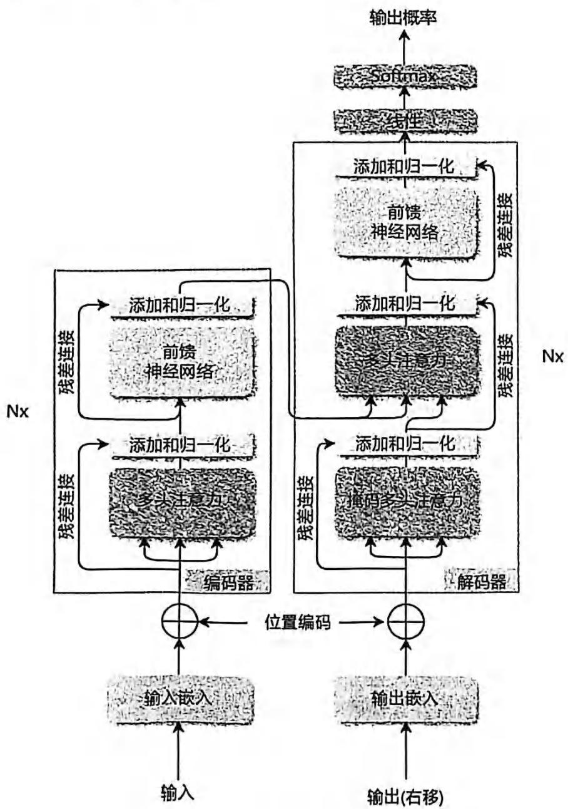  
图1.1 Transformer架构的关键组件

这些关键组件如下。

- 自注意力机制：一种计算技术，使模型在处理每个元素时，动态地关注输入的不同部分。  
- 多头注意力：多个注意力机制并行运行，使模型能够同时关注输入的不同方面。  
- 位置编码：为序列中每个元素添加位置信息。  
- 前馈神经网络：处理注意力层的输出。  
- 层归一化与残差连接：增强训练的稳定性和优化信息传递效率。

Transformer 可以在自回归和非自回归配置下使用，使其能够适应多种任务，以下是一些示例。

- 像素卷积神经网络 (PixelCNN): 自回归地逐像素生成图像, 每个像素都依赖之前生成的像素。该模型在生成高质量、细节丰富的图像时表现良好[9]。  
- PixelSNAIL：是对PixelCNN的改进，加入了注意力机制，以捕捉像素之间的强依赖关系，从而提高图像的质量[10]。  
- 生成预训练Transformer(GPT)：是一类专注于文本生成的模型，即预测下一个应该出现的词汇，包括GPT-2、GPT-3和GPT-4等，它们在生成连贯且上下文相关的文本方面取得了巨大进步[11-12]。  
- BERT(双向编码器表示的Transformer): 与GPT不同, BERT旨在从文本的两个方向理解上下文。它使用Transformer的编码器部分, 通常用于需要一次性理解全部输入内容的任务, 而不是自回归生成文本[13]。  
- 文本到文本迁移 Transformer(Text-To-Text Transfer Transformer, T5): 该模型将所有自然语言处理(NLP)任务都框定为文本到文本的形式。它使用完整的 Transformer 架构(包括编码器和解码器), 可以处理各种文本生成任务[14]。

这些模型的表现会根据任务的不同有所变化，但它们展示了Transformer架构可以同时适应自回归任务(如GPT)和非自回归任务(如BERT)的适配能力，并展现出其在处理序列数据方面的强大能力。不同的生成式模型有各自的优势。这些模型的应用范围覆盖生成逼真的图像、流畅的文本和完全创新的数据样本等。基于GPT等模型的成功，研究人员将这些架构进行了扩展，开发出了大语言模型(LLM)。这些模型通常是在大量公开的网络文本和其他可免费获取的文本数据上进行训练的，展示了它们在理解和生成类似人类的文本方面的出色能力，适用于各种应用，展现出其卓越的适应能力和先进的语言处理能力。常见的大语言模型包括GPT-3、GPT-4、PaLM和BERT-large。这些模型不断突破自然语言处理领域的边界，在问答、文本总结、创意写作、代码生成等任务中表现优异。以下是常见的大语言模型类型。

- 自回归 LLM: 这种语言模型通常能够逐字生成文本, 即一次生成一个词元, 常用于文本生成、文本补全和创意写作等任务。常见的自回归 LLM 包括 GPT 系列 (GPT-3、GPT-4) 和 PaLM。

- 仅编码器LLM：这些模型专注于自然语言理解(NLU)任务，即分析和理解输入的文本，而不是生成新文本。像BERT及其变种(如RoBERTa)这样的仅编码器模型，着重于理解文本的上下文和含义。它们能够同时处理整个输入序列，从而更好地捕捉上下文信息，帮助完成文本分类、命名实体识别(NER)、情感分析等任务。

- 编码器-解码器LLM：这种模型融合了编码器和解码器，不仅能够理解输入文本的上下文，还可以生成相应的文本输出。例如，T5模型就是一个典型的编码器-解码器LLM，它能完成语言翻译、摘要生成和问答任务。

- 多模态LLM：多模态模型能够处理的不仅限于文本，还包括图像、视频、音频等其他数据形式。多模态LLM可以处理并生成多种形式的内容，包括文本、图像、音频、视频，甚至它们的组合。随着计算能力的提升，训练多模态LLM已经变得可能。这类模型包括DALL-E、稳态扩散模型、Flamingo、GPT-4和LlaVa等。

- 指令微调 LLM: LLM 通常是在大规模公开文本数据上训练的, 但有时候这些模型可能无法高效处理一些它们未接触过的数据, 从而无法准确理解用户的意图。例如, 某些专用设备的使用手册可能包含模型在训练时没有接触过的专业术语。在这种情况下, 可以通过领域特定的数据对模型进行微调, 使其能够按照特定指令执行任务。这种微调可以让模型不仅在原有任务上表现优秀, 还能在特定领域任务中发挥作用。比如, InstructGPT 就是通过对 GPT-3 进行指令微调来实现的。这类模型常用于聊天机器人、虚拟助手和其他特定任务应用中。

- 领域特定 LLM：如前所述，虽然 LLM 通常是在大量公开的、广泛可用的网络数据上训练的，但在特定领域的应用中，它们的表现可能不尽如人意。虽然指令微调 LLM 是一种让这些通用模型适应领域特定任务的方式，但研究人员也创新性地从零开始训练领域特定的 LLM。这意味着这类模型是基于高度专业化的领域知识数据进行预训练的。例如，BioBERT 模型是在专业化的医学数据上训练的，而 LegalBERT 则是在法律文档上训练的。这类模型在医学、法律、金融等特定领域的专业任务中非常有用。

# 1.2.4 基于LLM的AI智能体

前文所讨论的各类大语言模型均有其独特优势与不足，且各自适配不同的应用场景。本书将聚焦于深入剖析LLM智能体的能力，并探讨如何利用这些能力

构建先进的智能系统。需要重点说明的是，LLM智能体并不能简单归入某一个单一类别，因为它本质上是LLM技术的高级应用形式，而非某一特定类型的模型架构。通常而言，智能体以指令微调LLM为基础构建，后续章节还将介绍，它往往会融合其他额外组件与功能模块，以实现更复杂的任务。

我们可以通过一个简单案例来直观展示基于LLM的智能体系统具备的能力。某旅游网站推出了一款航班预订助手聊天机器人，这是一个基于LLM构建的对话式交互界面，能够通过类人对话帮助用户预订机票。在对话过程中，该聊天机器人可在后台执行一系列任务。航班预订助手为一位用户预订机票的示例对话流程如下。

<table><tr><td></td><td>你好，我想预订一张机票。</td></tr><tr><td></td><td>你好！我很乐意帮你预订机票。首先，请告诉我您的出发城市和目的地好吗？</td></tr><tr><td></td><td>我想从圣地亚哥去旧金山国际机场。</td></tr><tr><td></td><td>太好了，谢谢您提供这些信息。您要从圣地亚哥飞往旧金山国际机场。为了帮您选择最佳的航班，我还需要一些更详细的信息。
1.您的首选出行日期是哪一天？
2.是单程还是往返？
3.有多少位乘客？</td></tr><tr><td></td><td>我想下周五去，周日回来。只有我一个人旅行。</td></tr><tr><td></td><td>感谢您提供更多信息。我来总结一下目前的信息。
·出发地和目的地：圣地亚哥(SAN)至旧金山(SFO)
·出发日期：下周五，2024年8月23日
·返程日期：下周日，2024年8月25日
·乘客：1位成人
在搜索航班之前，我还有几个问题。
1.您对航班时间有偏好吗(上午、下午或晚上)? 
2.您有偏好的航空公司吗，还是所有航空公司都可以？
3.您偏好哪种舱位等级(经济舱、高级经济舱、商务舱或头等舱)?</td></tr><tr><td></td><td>我偏好早上的航班。没有航空公司偏好。经济舱就可以。</td></tr><tr><td></td><td>感谢您提供这些信息。我将为您查找所有航空公司经济舱的早班机。请稍等，我为您寻找最佳选择。(正在搜索航班，请稍候……)</td></tr><tr><td></td><td>我为您的旅程找到了几个选择。以下是最佳的早班机。
去程(圣地亚哥到旧金山)，下周五。
方案1，美国联合航空UA1234：上午7：15出发，上午8：45到达
方案2，阿拉斯加航空AS5678：上午8：30出发，上午10：00到达</td></tr><tr><td>图</td><td>返程(旧金山到圣地亚哥),下周日。方案1,达美航空DL9876:上午9:00出发,上午10:30到达方案2,西南航空WN5432:上午10:15出发,上午11:45到达往返总价(含税费)如下。·方案1(美国联合航空/达美航空):$325·方案2(阿拉斯加航空/西南航空):$310您偏好哪个方案?或者您需要我为您寻找其他航班吗?</td></tr><tr><td>图</td><td>第二个方案看起来不错。可以帮我预订吗?</td></tr><tr><td>图</td><td>当然!我很乐意为您预订第二个方案。去程:阿拉斯加航空AS5678。·日期:2024年8月23日·上午8:30从圣地亚哥出发,上午10:00到达旧金山国际机场</td></tr><tr><td>图</td><td>返程:西南航空WN5432。·日期:2024年8月25日·上午10:15从旧金山国际机场出发,上午11:45到达圣地亚哥总价:$310为了继续预订操作,我需要您提供一些额外信息:1.您身份证件上的全名。2.您的出生日期。3.您的电子邮箱(用于发送确认信)。4.您的电话号码。5.任何特殊要求(例如,餐食偏好、座位偏好)。另外,请注意,您需要提供一种付款方式才能完成预订。您准备好提供这些信息了吗?</td></tr><tr><td>图</td><td>是的,我准备好了。我叫约翰·史密斯,出生于1985年5月15日。我的邮箱是john.smith@email.com,电话号码是555-123-4567。没有特殊要求。</td></tr><tr><td>图</td><td>谢谢您提供这些信息,史密斯先生。我已将您的详细信息输入预订系统。以下是我所记录的信息摘要。·姓名:约翰·史密斯·出生日期:1985年5月15日·邮箱:john.smith@email.com·电话:555-123-4567·特殊要求:无</td></tr><tr><td></td><td>最后一步是处理您$310 的机票付款。出于安全原因,我无法在此聊天中直接接收信用卡信息,我会向您的电子邮箱 (john.smith@email.com)发送一个安全的付款链接。收到电子邮件后,请点击链接完成付款流程。付款成功后,您将收到另一封包含航班确认信和电子机票的电子邮件。现在向您的邮箱发送付款链接可以吗?</td></tr><tr><td></td><td>是的,可以。请发送付款链接。</td></tr><tr><td></td><td>好的,史密斯先生。我已启动向您的电子邮箱(john.smith@email.com)发送安全付款链接的流程。您应该在几分钟内收到。如果没有立即看到,请检查您的收件箱和垃圾邮件文件夹。完成付款后,系统将自动处理您的预订,并通过电子邮件将确认信和电子机票发送给您。该电子邮件将包含以下重要信息:1. 预订确认号。2. 详细的航班行程。3. 登机手续说明。4. 行李限额信息。5. 航空公司联系信息。收到确认电子邮件后,请检查所有详细信息以确保万无一失。如果您发现任何问题或有任何疑问,请随时与我们联系。关于您的旅行或预订过程,还有其他需要我帮助的吗?</td></tr><tr><td></td><td>不,就这些了。谢谢你的帮助!</td></tr><tr><td></td><td>不客气,史密斯先生!很高兴能帮助您预订从圣地亚哥到旧金山的航班。如果此次操作需要任何进一步的帮助,或者对您的旅行有任何疑问,请随时联系我们。我们全天候为您服务。祝您下周的旧金山之行愉快!</td></tr></table>

表面上，这个例子非常简单。然而，实际上在后台发生了许多事情。首先，客户开始时提出了一个模糊的请求——预订航班。AI助手能够理解，为了继续处理这个请求，需要更多的信息来查询可用航班，比如出发城市、到达城市、出行日期等。

随着对话的进行，AI助手会请求进一步的信息，以便成功完成预订。它会将每个步骤中收集的信息作为参数值，调用后台与航班预订相关的API。例如，通过一个名为flightLookup的(虚构的)API来查询可用航班信息时，需要城市、出行日期、乘客人数等信息；而实际进行预订时，需要客户的姓名、电话、邮箱等信息，通过名为bookFlight的API来完成预订，以此类推。图1.2展示了模型所做的决策、交互流程，以及它为完成每个步骤所调用的工具(API函数)。

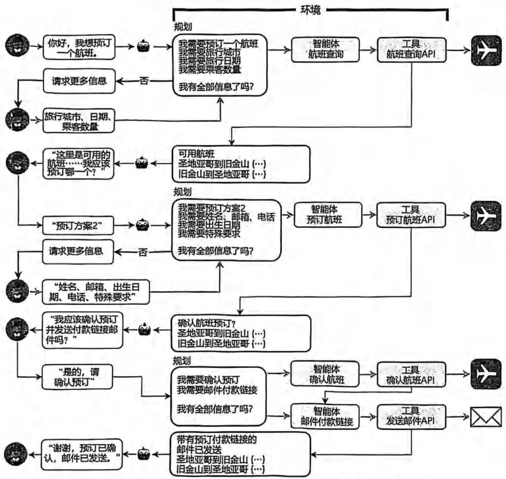  
图1.2 由大语言模型驱动的多智能体航班预订助手聊天机器人

除了调用工具，你还会注意到模型在对话开始时进行了一些自我反思，这也被称为思维链(CoT)。这意味着后台的模型制定了逐步完成任务的方法，但识别到缺少一些信息。随后，它会向客户请求提供所需的信息。接着，根据客户的输入，它会自主做出一定的决策，使用智能体调用特定的工具并完成任务。

除了外部工具和 API，在设计这样的系统时，还需要考虑许多其他因素。后续章节将详细介绍这些组件的基础知识。目前只需要知道，智能体是 LLM（如本书中的航班预订 AI 助手）的高级应用，代表了一个新兴领域，它融合了多种 LLM 类型的特点，并与强化学习、规划、工具使用等其他 AI 技术相结合。随着后续章节的学习，你会发现，与标准 LLM 相比，智能体更具互动性、适应性，且能完成复杂的多步骤任务，这使得它们适用于各种不同的复杂任务和工作流程。

在深入探讨智能体系统的细节之前，先回顾一下生成式AI的一些应用。

# 1.3 生成式AI的应用

生成式AI具备跨越多个领域的创新能力。如前所述，医疗、金融、教育、媒体娱乐、营销、制造业、零售等行业，都有望从生成式AI的强大能力中获得收益。以下是生成式AI一些主要应用的简要介绍。

- 图像和视频生成：多模态生成模型（即能够处理图像、文本、音频和视频的LLM）使得通过不同平台和工具生成真实的视听内容变得可能。例如，在媒体娱乐行业，生成式AI可以用来制作视觉特效、设计虚拟角色以及开发虚拟现实内容。在时尚设计行业，它能助力构思新的服装款式、举办虚拟时装秀和预测时尚潮流。在广告和营销领域，生成式AI被用来创作定制的广告、营销活动和传播材料，甚至可以生成创意内容，如图像和logo。  
- 文本和内容生成：生成式AI在文本生成方面取得了显著突破。例如，它可以快速生成文章、博客、营销文案和产品描述等内容；聊天机器人和虚拟助手可以像人类一样为客户提供支持，帮助完成信息查询。生成式AI还在文本翻译、文档摘要和内容本地化方面发挥重要作用，帮助平台(如在线学习平台和专业搜索引擎)提高内容的可访问性。  
- 音乐和音频生成：生成式AI还可以创作原创音乐、音效和合成语音，这为多媒体内容的创作带来了新思路。例如，这些技术被广泛应用于游戏和娱乐行业(如创建带音频的培训资料)、自动化呼叫中心助手，甚至Amazon Alexa和Google Next等IoT设备，并通过语音命令完成自动化任务。  
- 医疗和药物发现：生成式AI在医疗领域也有广泛应用。例如，它可以帮助设计新药，并预测药物治疗疾病的效果；推动个性化医疗，根据每位患者的具体情况量身定制治疗方案；优化医学影像技术，提高图像质量并生成合成图像，供研究使用。  
- 代码生成：代码生成是LLM的一项新兴功能，可以帮助开发人员进行软件开发。这些模型能够根据文本提示生成代码片段，甚至整个函数。生成式AI在代码生成中的高级应用，包括为集成开发环境(如Visual Studio Code)创建插件，这些插件可以理解整个代码库的上下文，自动识别错误、生成代码文档和单元测试脚本。另一种应用场景是将自然语言转化为SQL查询，通过这种方式，开发人员可以直接输入自然语言执行数据库查询操作。但需要特别注意的是，在执行LLM生成的代码时，要防范恶意代码执行风险，通常需要先在沙盒环境中进行检查。  
- 自主工作流和机器人技术：如前所述，LLM驱动的AI智能体是生成式AI的一个重要应用。智能体可以执行多种任务，适用于不同的场景。例

如，旅行预订网站可以通过虚拟助手聊天机器人利用智能体自动完成客户的航班和酒店预订过程。在这类场景中，智能体只需要理解与客户对话的上下文，调用API等工具，执行具体任务。更复杂的智能体系统则通常用于机器人技术中，机器人通过智能体控制其动作，根据环境或任务做出决策。智能体能够执行LLM无法完成的任务，如控制机器人的肢体驱动器等。机器人领域的AI技术是一个新兴研究方向，行业内不断涌现创新成果，尤其是在制造业的应用场景中。

以上只是生成式AI与LLM结合应用的一些常见例子。其他具体的应用还包括时尚设计、合成数据生成、个性化教育内容制作、金融建模与预测，以及预测性维护等。一些使用生成式AI的商业和开源工具示例如表1.1所示，这些工具涵盖了前文讨论的多个应用场景。

表 1.1 使用生成式 AI 的商业和开源工具示例  

<table><tr><td>用例</td><td>商业工具</td><td>开源工具</td></tr><tr><td>视觉效果和虚拟形象设计</td><td>·Unreal Engine的MetaHuman Creator:为游戏和电影创建高度逼真的数字人类
·NVIDIA Omniverse:三维设计协作和仿真的平台,可用于创建视觉效果</td><td>·DeepFaceLab:用于换脸和创建数字虚拟形象
·StyleGAN:能够生成高度逼真的人脸,适用于虚拟形象的创建</td></tr><tr><td>虚拟现实内容开发</td><td>·Unity:虽然不专为虚拟现实设计,但拥有强大的虚拟现实开发能力
·Adobe Aero:创建增强现实(AR)体验</td><td>·A-Frame:用于构建虚拟现实体验的网页框架
·Godot:一款支持虚拟现实的开源游戏引擎</td></tr><tr><td>服装设计和虚拟时装秀</td><td>·CLO3D:一款可以创建虚拟时装秀的三维服装设计软件
·Browzwear:为时尚行业提供三维设计解决方案</td><td>·Blender:一款三维建模工具,也可以用于时装设计和虚拟秀</td></tr><tr><td>时尚趋势预测</td><td>·WGSN:使用人工智能进行时尚趋势预测
·Heuritech:提供由人工智能驱动的趋势预测</td><td>无</td></tr><tr><td>市场营销——广告生成和营销活动创建</td><td>·Jasper:一款可以帮助创建营销文案的人工智能写作助手
·Midjourney:一款可用于创建营销视觉材料的人工智能图像生成工具</td><td>·GPT-J:可以通过微调用于营销内容生成的开源语言模型
·稳定扩散模型:一款可以创建营销视觉材料的开源图像生成模型</td></tr><tr><td>标志和图像创建</td><td>DALL-E 2:可根据文本描述生成独特的图像和标志Canvasa:虽然不是完全由人工智能驱动,但它融合了人工智能功能以辅助设计</td><td>稳定扩散模型:可用于标志和图像生成Craiyon(前身为DALL-E mini):DALL-E的一个开源替代工具</td></tr><tr><td>文本和内容生成</td><td>OpenAI的ChatGPTAnthropic的Claude AIJasperCopy.aiAnywordWriterWriteSonic以及其他此类工具……</td><td>Mistral 7B:一个以其在文本生成任务中的高效和精准而闻名的开源大语言模型LLaMA:一系列开源的预训练和微调生成式文本模型,提供不同参数规模的版本BLOOM语言模型:由超过1000名人工智能研究人员开发的大型开放获取人工智能模型,以其在文本生成方面的稳健性和多功能性而闻名以及其他此类工具……</td></tr><tr><td>代码生成</td><td>GitHub Copilot亚马逊Q开发者版TabnineOpenAI Codex以及其他此类工具……</td><td>Code T5:一个为代码相关任务训练的开源人工智能模型,可以生成代码片段、补全代码,甚至在编程语言之间进行转换Polycoder:商业代码生成器的一个开源替代品。它在涵盖多种编程语言的大型代码库上进行训练,可以为各种任务生成代码</td></tr><tr><td>自主工作流和机器人技术</td><td>UiPath:将生成式人工智能融入其机器人流程自动化(RPA)平台。它使用人工智能来发现自动化机会,并提高文档理解和通信数据挖掘等任务的效率Automation Anywhere:将生成式人工智能集成到其自动化平台中。它提供自动化开发者协同助手等功能,利用生成式人工智能来提高开发人员的工作效率</td><td>OpenAI Gym:提供了一个用于开发和比较强化学习算法的工具包,可以与LLM结合,应用于更高级的机器人应用场景Hugging Face:提供可用于在机器人技术和自主工作流应用中部署LLM的开源库</td></tr><tr><td>自主工作流和机器人技术</td><td>·NVIDIA: 提供利用自身人工智能框架(包括生成式人工智能能力)的人工智能工作流,为机器人技术和自主系统领域开发创新解决方案</td><td>·LangChain: 一个用于使用LLM 开发应用程序的开源Python 库,可应用于创建更智能的自主工作流和机器人系统</td></tr></table>

这绝不是目前市场上所有商业和开源工具的详尽列表，且这一领域每天都在发生变化。我们正目睹许多新兴初创公司提供创新的解决方案，利用生成式 AI 解决现实生活中的实际问题，同时看到新的模型提供商正在开发比以往更强大的 LLM，这些新模型的运行成本也更低。这充分体现了生成式 AI 领域的蓬勃活力和无限潜力。

# 1.4 生成式AI面临的挑战与局限性

尽管生成式 AI 有很多优势，但它也面临一些挑战，并有一定的局限性。在考虑将生成式 AI 技术应用于具体场景时，需要特别小心。以下是一些与 LLM 相关的常见问题，以及解决这些问题的一些方法。

# 1.4.1 数据质量与偏见

生成式模型的性能在很大程度上取决于训练数据集的质量和多样性。如果训练数据存在偏见或不具代表性，模型输出的结果也会带有相同的偏见，从而加剧已有的偏见，甚至可能导致某些群体在模型中被边缘化。

应对这一问题的方法之一是确保训练数据集具有多样性，并且数据质量较高，涵盖广泛的视角。就像任何机器学习任务一样，分析数据以及了解数据在各个特征维度的分布是非常有帮助的。数据分析能够发现数据中可能导致模型产生偏见的不平衡问题。为了减少训练数据中的偏见，目前已有多种算法可以使用(例如，过采样或欠采样)，但每种方法都有其优缺点。举个例子，假设训练数据集Class0的数据样本数量远多于Class1，这会导致数据的不平衡。使用这样的数据集训练时，模型容易过度依赖Class0的数据，变得对这些数据特别敏感，甚至记住它们，而对Class1的数据处理能力较弱，从而导致模型在处理Class1的数据时表现差，出现明显的偏见。图1.3展示了过采样和欠采样技术如何影响这种数据集，并帮助缓解偏见。

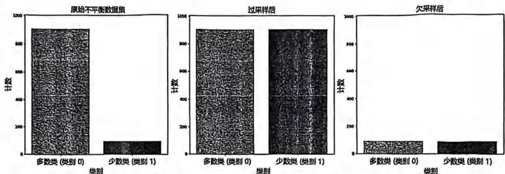  
图1.3 原始不平衡数据集以及过采样和欠采样的效果

# 1.4.2 数据隐私

多项实验和研究表明，LLM有泄露训练数据的倾向。如果模型是在大量私人或专有信息上进行训练的，这会带来严重的隐私风险。实践表明，通过特定的提示技术和提示词设计就可以诱导模型生成包含训练数据集中原文文本的内容。这些提示技巧并不复杂，通常会成为一种易实施、低成本的攻击方式，使得模型泄露信息。例如，在名为《从(生产环境的)语言模型中规模化地提取训练数据》的论文中[15]，研究人员仅花费200美元的API调用费用，通过提示词注入技术，成功迫使OpenAI GPT-3.5模型泄露私人信息。泄露的信息包括人名、电子邮箱、住址和电话号码，这些信息原本是无意中出现在模型的训练数据集中的。尽管像OpenAI等模型提供商正在积极解决这些问题，但对于选择自建模型的公司而言，这仍然是一个潜在隐患。

一些常见的缓解机制是在训练数据上进行数据匿名化或假名化操作，以去除或模糊个人、私有或专有信息，甚至训练模型之前就这样做。这两种方法通常使用规模较小、更便宜且更高效的AI模型，对训练数据进行分类和实体识别，找到训练数据中包含的个人或私人信息。一旦识别出这些信息，就可以将其模糊、隐藏或完全移除。需要注意的是，这些操作可能根据具体的使用场景而产生不同的影响，因此必须进行充分分析，以确保不会对模型的性能造成负面影响。

# 1.4.3 计算资源

训练复杂的生成式模型需要大量的计算资源和高性能的计算能力，这往往使得训练大语言模型的成本非常高，并且消耗大量能源。尽管一些硬件技术的突破使得训练这些模型成为可能，但这些硬件资源的获取仍然昂贵且有一定的局限性，只有少数机构能够使用。例如，最初设计用于渲染高质量图像的图形处理单元(GPU)，现在已成为AI模型训练、微调和计算的关键组件。NVIDIA在2006年推出的CUDA架构使得GPU可以用于通用计算，此后NVIDIA推出的A100和H100

等现代GPU则特别针对AI工作负载进行了优化。然而，这些高端GPU的单价通常高达数万美元。

训练GPT-3这样的庞大模型，光计算资源就需要花费数百万美元。具体的成本取决于模型的大小、训练时间和硬件效率等因素。例如，训练GPT-3的计算资源成本为400万到500万美元，而更新的模型，如GPT-4和PaLM，训练成本可能更高。除了硬件本身，还有大量与电力消耗、冷却和数据中心空间相关的基础设施成本。由于成本居高不下，训练大语言模型主要由大型科技公司或资金充足的研究机构来完成。云服务提供商目前提供预训练模型和微调能力，使得中小型企业和普通公众也能在一定程度上使用LLM相关功能。

为了应对这一挑战，近年来出现了一些创新，如小型语言模型(SLM)。这些模型是较小的生成式AI模型，可以针对特定任务进行训练。尽管这些模型仅限于非常狭窄的领域任务，但由于它们所需的计算资源远少于大型模型，因此训练这些模型的成本要经济得多。

# 1.4.4 伦理和社会影响

生成式AI技术的快速发展在伦理和社会层面引发了许多问题，以下列举的一些问题远非详尽无遗。

- 深度伪造和虚假信息：生成式AI能够生成非常逼真的合成内容。如果不加以控制，这可能会导致深度伪造甚至虚假信息的产生，进而威胁到个人隐私、公共安全，甚至动摇社会信任。  
- 知识产权：生成类似现有作品内容的过程引发了版权和知识产权的问题。创作的原创性和正确的所有权涉及复杂的法律界定，往往令人困惑。  
- 工作岗位替代：经济学家通常低估了内容生成和其他自动化任务领域可能带来的大量失业问题。值得关注的是，由此产生的影响需要与相关研究同步推进，这些研究包括探索如何帮助受影响的劳动者实现技能再培训、制定岗位调整策略，以及挖掘由此产生的创业机会。

在缓解社会和伦理影响方面，问题更多的是哲学性的，而非技术性的。虽然一些措施(如深度伪造AI图像检测和个人数据检测方法)已成为常见策略，但从AI对社会的益处以及现有或即将出台的政府法规等宏观背景来看，如何应对其在社会层面的影响仍然是一个更复杂的系统性问题。

# 1.4.5 泛化能力与创造力

这些生成式AI模型的一个大问题是它们的泛化能力非常差。更具体来说，它们很少能生成与训练数据截然不同的内容。也就是说，它们在复制重复模式方面表现出色，但真正创造出具有独创性或新颖性的东西却力不从心。因此，它们在真正的创造力方面的潜力非常有限。

随着生成式AI不断以新的方式发展，它注定会带来新的挑战。目前，已有许多新的研究和实践正在推进，这些工作旨在确保这项技术得到合理且负责任的使用。

# 本章小结

生成式AI是一个正在快速发展的领域，具有对各行业产生巨大颠覆性影响的潜力，并且正在改变我们生活的多个方面。相比之下，生成式AI的应用包括非常逼真的图像生成、文本生成、药物发现加速以及丰富的创意性表达。

关于这一点，一个关键的方面是理解不同的生成式模型，如 VAE、GAN 和自回归模型，这些模型能帮助我们了解技术的工作原理以及它们的应用场景。然而，同样重要的是，生成式 AI 面临许多问题和限制，包括数据质量、计算资源、伦理问题，甚至创造力不足等。

下一章将介绍智能体系统的原理，包括智能体和自主性的概念、智能体的特征、智能系统的各种架构，以及多智能体系统。

# 习题

1.生成式AI模型只能接收文本数据作为输入，该说法是否正确？  
2.生成式AI模型有哪些不同类型？  
3.生成式AI存在哪些伦理和社会影响？  
4. 有哪些方法可以减少训练数据中的偏见？  
5. 有哪些开源的文本和内容生成LLM？

# 习题答案

1. 错误。生成式AI模型可以接受文本、图像、视频和音频数据作为输入。  
2. VAE、GAN和自回归模型。  
3. 深度伪造、虚假信息、版权或知识产权问题，以及工作岗位替代是生成式AI的一些社会和伦理影响。  
4. 解决训练数据偏见的常见方法包括过采样或欠采样。  
5. Mistral、LLaMA 和 Bloom 是一些开源的文本和内容生成 LLM。

# 扩展阅读

- Mastering Machine Learning Algorithms - Second Edition, 作者: Giuseppe Bonaccorso。

- Machine Learning for Imbalanced Data, 作者: Kumar Abhishek 和 Dr. Mounir Abdelaziz。  
- Generative AI with Python and TensorFlow 2, 作者: Joseph Babcock 和 Raghav Bali。

# 参考文献

[1] Auto-Encoding Variational Bayes, https://arxiv.org/abs/1312.6114   
[2] beta-VAE, Learning Basic Visual Concepts with a Constrained Variational Framework, https://openreview.net/forum?id=Sy2fzU9gl   
[3] Learning Structured Output Representation using Deep Conditional Generative Models, https://papers.nips.cc/paper_files/paper/2015/hash/8d55a249e6baa5c06772297520da2051-Abstract.html   
[4] Generative Adversarial Networks, https://arxiv.org/abs/1406.2661   
[5] Unsupervised Representation Learning with Deep Convolutional Generative Adversarial Networks, https://arxiv.org/abs/1511.06434   
[6] Wasserstein GAN, https://arxiv.org/abs/1701.07875   
[7] A Style-Based Generator Architecture for Generative Adversarial Networks, https://ieeexplore.ieee.org/document/8953766   
[8] Attention Is All You Need, https://arxiv.org/abs/1706.03762   
[9] Conditional Image Generation with PixelCNN Decoders, https://arxiv.org/abs/1606.05328   
[10] PixelSNAIL: An Improved Autoregressive Generative Model, https://www.researchgate.net/publication/322114155_PixelSNAIL_An_Improved_Autoregressive_GenerativeMODEL   
[11] Language Models are Few-Shot Learners, https://arxiv.org/abs/2005.14165   
[12] GPT-4 Technical Report, https://arxiv.org/abs/2303.08774   
[13] BERT: Pre-training of Deep Bidirectional Transformers for Language Understanding, https://arxiv.org/abs/1810.04805   
[14] Exploring the Limits of Transfer Learning with a Unified Text-to-Text Transformer, https://arxiv.org/abs/1910.10683   
[15] Scalable Extraction of Training Data from (Production) Language Models, https://arxiv.org/abs/2311.17035


# 第2章

# 智能体系统的原理

上一章介绍了生成式AI的基本概念、不同类型的生成式AI模型，并简要探讨了由大语言模型驱动的智能体。本章将讨论智能体系统的基本原理，首先简要探讨“能动性”(agency)和“自主性”(autonomy)这两个概念，然后讨论智能体及其特性。此外，本章将以上一章中讨论过的航班预订助手为例，探讨各种智能体系统架构及多智能体系统。

本章的主要内容如下：

理解自我管理、能动性和自主性。  
- 回顾智能体及其特征。  
探讨智能体系统的架构。  
理解多智能体系统。

通过本章的学习，你将对智能体的基础知识以及构建智能体系统时必须考虑的智能体系统架构的关键内容有全面的了解。

# 2.1 技术要求

你可以在https://github.com/PacktPublishing/Building-Agentic-AI-Systems找到本章的代码文件，并按照README文件设置开发环境。

# 2.2 理解自我管理、能动性和自主性

智能体系统的迷人之处在于它们所采用的复杂决策过程，这些过程为我们提供了如何在特定环境下优化选择的宝贵见解。这类系统往往也在挑战我们对问责和责任的传统理解。

智能体系统是推动各个领域创新和技术进步的动力，包括机器人学、人工智能和系统工程等。智能体系统的开发和应用催生了新型自动化和智能行为的探索与创新。让我们讨论一下智能体系统正在取得进展的一些领域：

- 机器人学：在机器人学领域，智能体系统为自主机器人设计和实现奠定了基础，这类机器人能够在复杂环境中导航、执行动态任务并适应变化的条件。这类机器人具备决策能力和能动性，已经在制造、探索、搜救行动和医疗等领域广泛应用。例如，具备智能体行为的机器人可以自主穿越灾区，评估潜在风险，并做出决策以协助救援工作，展示了智能化和适应性行为。  
- 人工智能：在人工智能领域，智能体系统在智能体和决策支持系统的开发过程中发挥了重要作用。这些系统利用先进的算法、机器学习技术和知识表示方法来分析数据、推理复杂场景，并提供智能推荐或自动决策能力。智能体人工智能系统已经在金融、医疗、交通和营销等领域得到应用，提高了决策过程的效率，增强了决策效果。  
- 系统工程：在系统工程领域，智能体系统促进了复杂的、分布式和自适应系统的设计与实施。这类系统通常由多个相互作用的组件或子系统组成，每个组件或子系统都表现出智能体行为和决策能力。这类系统广泛应用于电网、交通网络和信息物理融合系统等领域，其中智能和自主决策对于系统高效运行、资源合理分配和容错至关重要。

智能体系统的核心概念包括自我管理、能动性和自主性。本章将分别讨论这些概念，理解它们的含义，并探讨它们在智能体系统架构中的关键作用。

# 2.2.1 自我管理

智能体系统是指具有自我管理、适应性和互动性的人工系统或人类系统。自我管理指的是系统或实体能够自主地管理或控制自身，而不依赖外部的指导或控制。在智能体系统的背景下，自我管理意味着该系统可以自主决策、设定目标，并根据内部规则、模型和决策算法来调节其行为。本质上，这类系统会根据自己的规则和内部状态运行，必要时会根据环境或目标的变化调整行为。这类系统会以对自身有意义的方式与环境或其他系统互动，并通过这些互动受到影响。

智能体系统中，自我管理的关键方面如下。

- 自组织：指能够在没有外部干预的情况下，组织和结构化自身的内部过程、资源和行为。  
- 自调节：指能够根据来自环境或内部状态的反馈，监控并调整自身的行动和输出，以确保在期望的参数或约束范围内操作。

- 自适应：指能够根据环境或自身内部条件的变化，调整行为、策略或决策过程，以更高效地实现目标。  
- 自优化：指通过学习、经验或进化过程，持续提高自身性能、效率或决策能力。  
- 自决定：指能够根据内部决策过程设定自己的目标、优先级和行动方案，而不完全受外部力量控制。

智能体系统中的自我管理通常通过整合各种技术、框架和方法学来实现，如机器学习、知识表示、推理和决策算法。这些技术使系统能够处理信息，从数据和经验中学习，并根据所获得的知识和当前的环境做出自主决策。

# 2.2.2 能动性

能动性是指个体或其他实体独立行动和做出选择的能力。在人类系统和人工系统的背景下，能动性包括以下几个关键元素。

- 决策权：指根据选择的替代方案或行动路线采取行动和执行操作的权力或能力。具有能动性的系统具备能够评估不同选项并基于其内部决策过程选择最合适行动的自主性，而不是完全由外部力量或预定规则驱动。  
- 意图性：能动性意味着系统具有意图、目标或目的，这些意图、目标或目的指导系统的行动和行为。智能体系统不仅是响应性的，它们有明确的目的，并可以追求特定的目标，根据需要调整行动和策略以实现这些目标。  
- 责任：能动性与责任紧密相关，责任是指对自己行动结果和后果的解释义务或问责义务。具有能动性的系统对其决策及其行动对环境或与之互动的其他实体的影响负责。

在大多数情况下，人工智能智能体的核心能力体现在系统基于其内部程序、模型和所处理的数据做出自主决策。这些决策可能会对系统本身的运行或其与环境的互动产生重大影响。

让我们回顾上一章的航班预订助手示例，它负责预订机票，甚至可能进行酒店预订。在这种情况下，系统通过分析多个因素，例如两座城市之间的航班可用性、机票价格以及用户提供的其他限制条件(如偏好的座舱等级等)，决策如何以最优方式筛选出符合这些条件的航班和酒店，从而最小化客户的整体出行成本。系统对其决策的结果负责，这些决策将影响客户的整体出行计划和出行成本。

# 2.2.3 自主性

自主性与能动性密切相关，但更侧重于实体或系统的独立性程度。它可以分解为几个方面。

- 操作自主性：指系统在没有直接人工干预或控制的情况下，执行特定任务或一组任务的能力。具有操作自主性的系统能够依托自身的内部过程、决策算法和环境感知能力，独立执行其功能。  
- 功能自主性：功能自主性涉及系统根据环境或其操作上下文做出选择并采取行动以实现既定目标或任务的能力。具有功能自主性的系统可以根据变化的条件或刺激调整其行为和决策过程，从而使自身能够更有效地追求目标。  
- 层级自主性：层级自主性与系统在更大框架或组织结构中所赋予的决策权或决策能力的大小相关。具有较高层级自主性的系统在做出影响其子系统或更广泛操作的决策时拥有更大的自由度，而具有较低层级自主性的系统可能会受到更大程度的限制或来自更高级实体的监督。

在人工智能和机器人领域，自主性是一个关键概念，指的是系统在不需要持续人工干预的情况下，执行任务和做出决策的能力。

在旅行预订助手示例中，系统具备操作自主性，能够执行预订机票或酒店、管理提醒和获取旅行信息等任务，而几乎不需要人工输入。它还具备功能自主性，能够解释用户命令，适应个体偏好，并做出与用户目标和情境相一致的决策。该系统被授予的层级自主性可能取决于用户隐私偏好、系统对敏感数据和资源的访问权限等因素。

需要注意的是，人工智能和机器人系统的自主性并不意味着完全没有人工监督或控制。这些系统通常在设计者或操作员设定的明确边界和约束内运行，同时仍展现出相当程度的自主性。在旅行预订示例中，聊天机器人会向用户请求额外的信息，如出行日期、目的地、姓名和地址，以便进行机票预订。然后，它会将这些数据与可用的航班信息进行交叉参考，提出符合用户偏好的选项。如果有任何细节缺失或不明确的信息，聊天机器人会提示用户进行澄清，既确保信息的准确性，也体现了系统在程序设定的边界内自主运作。

人工智能系统中的自我管理、能动性和自主性概念通常伴随着伦理考量，特别是在这些系统被赋予的自主性水平以及系统决策的潜在风险和影响方面。随着人工智能系统变得越来越先进，并具备更强的独立决策能力，确保它们与人类价值观和伦理原则的一致性变得尤为重要。

# 2.2.4 智能体的能动性和自主性的示例

本小节通过一个简单的旅行预订算法来说明能动性和自主性的概念。请注意，这个算法尚未涉及人工智能技术，但有助于理解概念。旅行预订助手算法示例如下所示。

# 算法1：具有能动性和自主性的旅行预订助手算法

要求：智能体名称N

确保：初始化带有能动性和自主性的TravelAgent对象A

1:初始化A←CreateTravelAgent(N)   
2:初始化Agoals $\leftarrow$ 空列表  
3:初始化A.knowledge_base←空字典

//能动性：代表用户执行操作的能力

4:函数 SetGoal(G)  
5:Agoals Append(G) //能动性：定义目标   
6:函数 UpdateKnowledge(K, V)  
7: A. knowledge_base[K] $\leftarrow$ V //能动性：从 API 获取信息并打分

//自主性：独立运行的能力  
8:函数 MakeDecision(Options)  
9:best_option $\leftarrow$ max(Options,key $=$ score）//自主性：独立决策  
10:返回best_option   
11:函数 BookTravel(Departure, Destination)  
12:输出“智能体A.name正在预订前往目的地的旅行”

//能动性：代表用户执行操作

13: SetGoal("预订从出发地到目的地的机票")  
14: UpdateKnowledge({Departure, Destination})   
//自主性：通过寻找最佳航班，独立完成行程预订  
15: MakeDecision()   
//在此处实现预订逻辑并将结果存储到A中  
16: 输出 A

以下是算法的工作原理，展示了能动性和自主性。

(1) 首先, 为智能体命名, 命名为 TripPlanner。  
(2) 接下来，初始化一个新的TravelAgent对象，名称为N = "TripPlanner"；这一步相当于创建了一个既具备能动性又具备自主性的实体。  
(3) 然后, 设置一个列表来存储智能体的目标。这与能动性相关, 因为目标代表了智能体将代表用户努力实现的意图或期望的结果。这一点由 “Agoals←空

列表”表示。

(4) 接下来，初始化一个空字典（也叫做映射或键值对）来存储智能体的知识。这对于能动性（代表用户执行操作）和自主性（独立运行）都至关重要，因为它包含了智能体用来做出决策的信息。

(5) 算法的第 4 和第 5 步定义了一个函数, 将新的目标 G 添加到智能体的目标列表中。这类似于智能体承接用户委托的目标。这通过 Agoals Append(G) 表示。可以将这部分代码理解为接收用户聊天消息的模块, 例如 “帮我预订一张从圣地亚哥到西雅图的机票”。在这里, 目标是预订一张从圣地亚哥到西雅图的机票。

(6) 算法的第 6 和第 7 步定义了另一个函数, 将一个新的键值对 (映射或字典) 更新到智能体的知识库中。这一过程通过获取信息来体现能动性, 以便代表用户进行操作, 既体现了自主性, 也为智能体提供了可用于做出独立决策的信息。该操作通过 A.knowledge_base[K] $\leftarrow$ V 表示。本例中, 这个函数通过多个与旅行相关的 API(理论上) 获取两座城市之间的航班选项, 从而形成知识库。该步骤还会为每个航班选项打分, 例如, 晚班的航班得分较低, 早班的航班得分较高。

(7) 第8到第10步定义了一个函数，执行几个不同的操作。它接收一组选项，并根据某些打分标准选择最优的一个。这是算法自主性的典型体现，因为智能体独立地评估选项并做出决策，而无须直接的人工干预。

(8) 最后，第 10 到第 15 步展示了这些组件如何协同工作，首先根据出发地和目的地设置航班预订目标，使用航班查询 API 更新知识库，然后对可用航班打分。随后，调用 MakeDecision 函数根据最高分找到最合适的航班，并为用户执行航班预订操作。

以下是算法中BookTravel函数的Python实现代码示例。

```python
1 def book_travel(departure: str, destination: str):  
2 self.set_goal(f"Book flight from (departure) to (destination)")  
3 self.update knowledge(departure, destination)  
4  
5 try:  
6 best_flight = self.make_decision()  
7 booking Confirmation = f"BOOKING #12345"  
8 selfknowledge_base['booking Confirmation'] = \  
9 bookingConfirmation  
10 print(f"Booking confirmed: (booking Confirmation)")  
11 except Exception as e:  
12 print(f"Booking failed: (str(e))")  
13  
14 if __name__ == __main__":  
15 agent = TravelAgent("TripPlanner")  
16 agent.book_travel("SAN", "SEA")  
17 print("\\n--------Final Agent State: _________")  
18 print(f"Name: (agent.name)")  
19 print(f"Goals: (agentgoals)") 
```

```python
20 if 'booking Confirmation' in agent.knowledge_base:  
21 print(f"Booking Confirmation: \{agent.knowledge_base['booking Confirmation']})") 
```

当智能体被初始化以预订从 SAN(圣地亚哥)到 SEA(西雅图)的航班时，代码的输出如下所示：

```txt
1 Agent TripPlanner is booking travel from SAN to SEA  
2 Goal set: Book flight from SAN to SEA  
3 Knowledge updated with 3 flight options  
4 Decision made: Selected flight JetBlue  
5 Booking confirmed: BOOK-JetBlue-TRIPPLANNER  
6 Final Agent State:  
7 Name: TripPlanner  
8 Goals: [Book flight from SAN to SEA]  
9 Booking Confirmation: BOOK-JetBlue-TRIPPLANNER 
```

完整的旅行规划智能体实现，请参考GitHub中的Chapter_02.ipynb文件。

在这个代码片段中，book_travel函数接收一个出发城市的代码(例如SAN或SEA，这些是机场代码)，然后调用其他函数来设定目标、更新知识库，并做出选择航班的决策，最终完成航班预订。需要注意的是，虽然智能体具备一定的能动性和自主性，但它并不具备真正的智能。它无法接收用户的纯文本消息，也不能根据用户的意图自动设定目标、更新知识库并执行操作；相反，它需要用户提供机场代码。不过，正如我们在示例中看到的，用户(或客户)可能只是用简单的语言表达他们的需求，例如“帮我预订一张从圣地亚哥到西雅图的机票”。

在当前的形态下，无论用户输入何种信息(消息)，智能体都无法确定出发城市和目的地城市是什么，也无法理解用户的需求，甚至无法理解输入文本的含义。这正是生成式人工智能发挥作用的地方，将在后续章节中展开介绍。现在，暂时先继续讨论智能体的特征。

# 2.3 回顾智能体及其特征

智能体是一个复杂的、能够自我管理的实体，它感知环境并采取行动以实现某些目标或任务。这些智能体的形式多样，既包括严格遵循预定义规则的基础系统，也涵盖具备从经验中学习和适应能力的高度先进系统。智能体具有以下几个关键特征。

- 响应性：具有响应性的智能体能够实时对环境中发生的变化和事件做出响应。它们不断监控周围环境，并据此调整行为。这种响应性使得智能体能够适应动态环境，并对刺激做出恰当响应，确保其行动始终保持相关性和高效性。

- 主动性：理想的智能体不仅仅是响应性的，还应该表现出主动行为。具有主动性的智能体能够预见未来的需求、挑战或机会，并主动采取行动进行规划和应对。它们以目标为导向，积极寻求策略以实现目标，而不是仅仅对发生的事件做出响应。  
- 社交能力：许多智能体在多智能体系统中运行，在这类系统中，智能体与其他智能体或人类互动并协作，以实现需要共同努力才能达成的目标。社交能力包括沟通、协调和协商技巧，使得智能体能够高效地协同工作，并充分利用集体智慧或资源。

凭借这些关键特征，智能体在广泛的领域和场景中展现了非凡的通用性和高效性。它们的能力确保了其在不同层级的任务中都能高效运作，能够应对从简单的自动化过程到需要实时适应与环境响应的复杂动态决策场景。除了这些核心特征，智能体还可能具备其他先进的能力。

- 学习和适应能力：智能体具备从经验中学习并随时间调整其行为的能力。它们可以通过机器学习、强化学习或进化算法等技术获取新知识、优化决策过程并提升性能。  
- 推理和规划能力：智能体可能会利用推理和规划能力来分析复杂情境、制定策略并做出明智决策。它们可以运用知识表示、逻辑推理和规划算法等技术，梳理复杂的问题，确定最佳的行动方案。  
- 自主性和自我管理能力：智能体通常表现出一定程度的自主性和自我管理能力，能够独立做出决策和采取行动，而不需要持续的人工干预或监督。这种自主性使得智能体能够在动态环境或无法实现持续人工控制的情境中高效运行。

凭借这些特征，智能体可以在广泛的领域中展现出通用性和高效性，既能处理简单的自动化任务，也能应对高度复杂的动态决策情境。它们在机器人学、决策支持系统、虚拟助手、游戏和模拟等领域都有广泛应用。

# 2.4 探讨智能体系统的架构

智能体系统旨在以自主的方式执行复杂的目标，可以通过多种架构模式来实现。通常，这些模式定义了系统的结构和行为，使得系统能够有效地感知、推理、学习并对环境做出响应。智能体系统的三种主要架构是慎思型架构、响应型架构和混合架构。让我们详细讨论一下这些架构。

# 2.4.1 慎思型架构

慎思型架构又称基于知识或符号的架构，依赖明确的知识表示和推理机制做

出决策。它们通常遵循感知-规划-执行的周期，在这个周期中，系统首先感知环境信息，然后根据感知和知识库制订行动计划，最后执行这些行动计划。

慎思型架构的主要优势在于它们能够处理涉及复杂推理的任务，如规划、问题解决和决策。这类架构可以利用基于规则的推理、约束满足和启发式搜索等技术，梳理复杂的问题，并制定适当的行动方案。

慎思型架构的关键组成部分之一是知识库，它存储环境、目标、约束和领域特定知识的符号表示。知识库通常使用形式化语言或逻辑进行编码，使得系统能够进行逻辑推理和推断。慎思型架构中的感知-规划-执行周期通常包括以下几个步骤。

(1) 感知: 智能体通过各种传感器或输入机制感知并获取环境信息。  
(2) 知识更新：利用感知到的信息更新智能体的内部知识库，确保它能够准确反映当前环境的状态。  
(3) 规划和推理：基于更新的知识库，智能体采用推理技术和算法来制订计划并做出决策。这可能涉及约束满足、逻辑推理、搜索算法或基于启发式的规划等技术。  
(4) 计划执行：一旦确定了计划或行动方案，智能体就会在环境中执行相应的行动，可能会修改环境状态或实现特定目标。

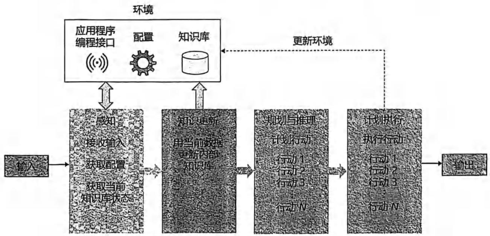  
图2.1展示了具有感知-规划-执行周期的智能体系统的慎思型架构。  
图2.1 智能体系统的慎思型架构

慎思型架构在处理需要复杂推理、规划和决策的任务时表现优异，尤其是在定义明确的环境中。它们能够通过概率推理、模糊逻辑或信念修正机制等技术有效应对不确定性和模糊性。

然而，慎思型架构也存在一些缺点。其中一个显著的挑战是与维护和推理复

杂知识库相关的计算成本，这可能会限制其在动态环境中的实时响应能力。此外，在那些知识难以形式化或不断发展的领域，显式的知识表示可能会面临挑战。

为了应对这些局限性，慎思型架构通常与响应型架构或基于行为的组件结合在混合架构中，从而实现复杂推理与对环境变化的快速响应。

尽管存在局限性，慎思型架构仍然是许多智能系统中的关键组成部分，特别是在那些复杂决策、规划和推理至关重要的领域，如机器人学、决策支持系统和智能辅导系统等。

# 2.4.2 响应型架构

响应型架构又称基于行为或刺激-响应的架构，旨在对环境中的刺激做出即时响应。与慎思型架构不同，响应型架构不依赖详细的环境模型或复杂的推理过程；相反，这类系统直接将感知转化为行动，通常使用简单的条件-动作规则或神经网络，如图2.2所示。

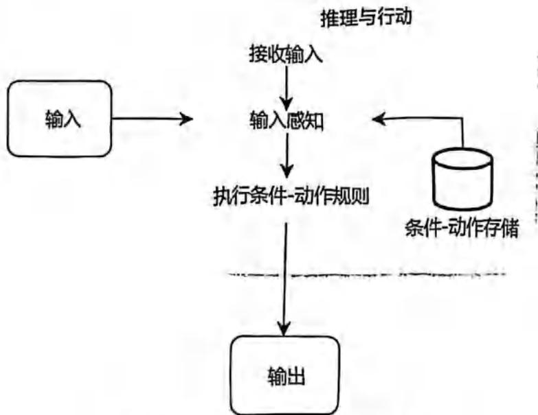  
图2.2 智能体系统的响应型架构

响应型架构的一些关键特性如下。

- 速度和响应性：响应型架构设计的目标是快速响应环境变化。通过将感知和动作直接关联，这类架构能够跳过耗时的推理过程，从而实现快速、及时的响应。  
- 鲁棒性和容错性：响应型架构通常具有很强的鲁棒性，不容易受到噪声或不完整信息的影响。其结构简单、组件相对独立的特性，使其不容易发生严重故障，因为即使某些输入错误或缺失，其他组件或行为也可以减轻这些问题的影响，尤其是在与慎思型架构结合使用时。

- 应对不确定性：响应型架构能够有效应对动态环境中的不确定性。它们能够直接根据环境的变化做出响应，无须依赖整个世界的精确或完整的模型，因此能够灵活适应当前的情境。  
- 并行和分布式处理：响应型架构通常使用并行和分布式处理技术，多个响应模块可以同时独立工作。这种去中心化的设计能够高效处理复杂任务，并具有天然的可扩展性和模块化特点。  
- 复杂行为的涌现：尽管每个响应模块的行为或规则都比较简单，但多个响应组件的相互作用和协调可以在系统层面上产生复杂的类智能行为。

虽然响应型架构在速度、鲁棒性和应对不确定性方面具有优势，但它们也存在一些局限性，具体如下。

- 缺乏长期规划：响应型架构通常缺乏提前规划或推理长远后果的能力。它们的重点是对环境刺激做出即时响应，因此很难实现复杂的、需要多步骤的目标或策略。  
- 推理和抽象能力有限：响应型架构在处理需要抽象推理、概括或操作符号表示的任务时可能会遇到困难。它们主要设计用于在较低层级的刺激-响应层面运行。  
- 学习能力有限：许多响应型架构缺乏从经验中学习或随时间调整行为的能力。它们固定的规则或行为集可能不适用于动态环境或那些需要持续学习和适应的任务。

尽管存在这些局限性，响应型架构仍广泛应用于那些实时响应、鲁棒性和应对不确定性至关重要的领域，如机器人学、人工智能视频游戏和控制系统。此外，响应型架构常常作为更复杂混合架构中的组件，与慎思型或基于学习的系统互补，以实现所需的性能和适应能力。

# 2.4.3 混合架构

研究人员已经认识到慎思型架构和响应型架构各自的优点与局限性，这促使了混合架构的发展，旨在同时利用这两种架构的优势。混合架构通常采用分层结构，包括以下部分。

- 响应层：负责快速和低层次的响应。响应层负责处理与环境的实时互动，提供快速且符合情境的响应。这一层设计为高度响应、容错性强，并能处理不确定性，充分发挥响应型架构的优势。  
- 慎思层：负责高层次的推理和规划。慎思层专注于更高层次的推理、规划和决策过程，能够维持对环境、目标和约束的更全面表示，从而制定复杂的策略、推理抽象概念并规划长期行动方案。

这两层之间的互动对于使智能体系统能够有效地响应动态环境，同时保持规划行动和推理的能力至关重要。响应层可以为慎思层提供实时反馈和情境感知，

为决策过程提供依据。反过来，慎思层可以通过提供高层次的计划、目标和约束，引导并影响响应层的行为。

为了实现复杂目标并充分利用两层架构的优势，混合架构通常采用以下技术。

- 任务分解：将复杂任务拆解成子任务，由适当的层来处理，响应层负责处理低层次、时间敏感型任务，而慎思层则专注于更高层次的规划和协调工作。  
- 多方案选择：慎思层可以生成多个潜在的计划或策略，响应层则可以根据当前的环境条件动态选择并执行最合适的计划。  
- 与外部模块的规划：慎思层可以结合外部模块或专门的算法来处理路径规划、资源分配或调度等任务，充分利用领域特定的知识和技术。  
- 反思与改进：慎思层可以反思已执行计划的结果，从经验中学习，并相应地改进推理和规划过程，实现持续提升和适应。  
- 记忆增强型规划：慎思层可以保持对过去经验、决策和结果的记忆或历史记录，以便在未来的规划和推理过程中利用这些知识。

通过结合慎思型架构和响应型架构的优势，混合架构旨在平衡响应性和推理能力，从而开发出更强大、更自主和适应性更强的智能体系统。混合架构充分利用了两种架构的优势，提供了对动态环境的快速响应能力，同时保持了复杂规划、推理和决策能力。

高效混合架构的设计和实现仍然是一个活跃的研究领域，研究人员不断努力开发能够无缝集成和协调慎思型与响应型组件的架构，从而构建性能更强、智能化水平更高的智能体系统。

为智能体系统选择合适的架构模式取决于应用的具体需求，包括任务的复杂性、环境的不确定性以及实时响应的必要性。慎思型架构在需要复杂推理和决策过程的场景中表现优异，而响应型架构则在需要快速适应和响应的动态环境中更具优势。混合架构通过合理利用这两种架构的优势，实现了两者的协调与平衡，从而开发出更强大、更具适应性的智能体系统，能够无缝应对其操作环境的复杂性。

# 2.5 理解多智能体系统

多智能体系统(MAS)是分布式人工智能这一广泛领域的一个重要子领域。多智能体系统由多个智能体组成，这些智能体相互作用、合作和协调，以执行任务并实现集体目标。MAS中的每个智能体通常具备自主性，能够通过传感器感知环境，拥有制定决策的推理机制，并能根据这些决策采取行动以达到其设计目标。这些智能体的集体行为和互动使得MAS能够解决单一智能体系统由于个体智能体固有的局限性而难以应对的复杂问题。

MAS的应用示例遍及多个领域，展示了它们解决复杂问题的适用性和有效性。

- 供应链管理和物流领域：MAS可以通过协调代表供应商、制造商、分销商和零售商的不同智能体来优化供应链运营。每个智能体可以根据其本地知识和约束做出决策，同时与其他智能体协作，确保资源分配、库存管理和运输规划的高效性。  
- 交通控制和运输系统领域：MAS已被应用于管理交通流量和优化交通网络。智能体可以分别代表单个车辆、交通信号灯或交通管理中心，通过协同工作减少拥堵、协调交通信号，并根据实时交通状况为车辆找到最优路线。  
- 机器人学和制造业领域：在制造环境中，MAS可以协调多个机器人或自动化系统的活动。每个机器人或智能体可以负责特定任务，如装配、焊接或物料搬运，同时与其他智能体沟通和协调，以确保高效且同步的操作。  
- 环境监测和资源管理领域：MAS可用于监测和管理自然资源，如水资源分配网络、林业管理或野生动植物栖息地保护。智能体可以代表不同的利益相关者、环境传感器或决策实体，协作做出关于资源分配、保护工作或缓解策略的明智决策。  
- 分布式传感器网络领域：MAS非常适合应用于涉及分布式传感器网络的场景，如环境监测、监控或灾难响应。每个传感器节点可以作为一个智能体，收集和处理本地数据，同时与其他智能体协调并整合信息，全面掌握被监测区域或现象的情况。  
- 智能虚拟环境和仿真领域：MAS 可以用于创建智能虚拟环境和仿真，其中智能体代表模拟世界中的各种实体或角色。这些智能体可以互动、做出决策并展示复杂的行为，使得社会系统、经济模型或军事操作等仿真环境变得更加真实。

MAS的主要优势在于其分布式的问题解决能力，能够利用个体智能体的集体智慧和专业优势，并通过去中心化决策展现鲁棒性和容错性。此外，MAS还可以促进异构组件的集成，助力开发灵活和可扩展的系统，以解决复杂的动态问题，而这些问题对于单一、集中式的方案来说可能是非常具有挑战性的。

# 2.5.1 多智能体系统的定义和特征

多智能体系统是由多个自主智能体组成的系统，这些智能体能够互动、合作并协作，以实现共同目标。这些智能体可以是软件程序、机器人，甚至是具备专门能力和目标的人类。智能体之间的互动是系统必要的组成部分，通过交互，智能体能够高效协作、共享信息，并根据各自的优势和专长分配任务。MAS 的主要特征包括以下几点。

- 自主性：MAS中的每个智能体都具备自我管理能力，能够根据其对环境的感知和目标做出独立的决策。智能体独立运行，不依赖于集中控制，展现出自主行为。  
- 互动性：MAS中的智能体通过定义好的协议相互通信，实现共享信息、协商任务并协调行动。根据问题的性质和智能体的目标，这种互动可以采取不同的形式，如合作、协调或竞争。  
- 适应性：MAS具备灵活性，能够根据环境变化或个别智能体目标的变化调整和改变其行为。这种适应性使得MAS能够应对动态情境，使系统在运行过程中既灵活又强大。  
- 分布式控制：与集中式系统不同，MAS采用分布式控制，决策和控制权分散于各个智能体中。分布式控制增强了系统的韧性，因为一个智能体的故障或失效并不必然影响整个系统的功能。  
- 可扩展性：MAS架构天生具有可扩展性，可以根据需要添加或移除智能体。这种可扩展性使得系统可以根据复杂度和能力的需求进行扩展或收缩，适用于各类应用场景。  
- 异构性：MAS 中的智能体可以是异构的，即它们可以具有不同的架构、能力和目标。这种异构性允许集成多样的组件，并利用专门的知识，从而提高整个系统的效能。  
- 去中心化的数据和知识：在 MAS 中，数据和知识是去中心化的，存储在各个智能体中。这种去中心化增强了系统的鲁棒性，因为没有单一的故障点，智能体可以根据本地知识和感知独立运行。

MAS能够分散问题解决能力、利用集体智慧、展现稳健性并整合异构组件，这使其非常适合应对传统集中式方法难以解决的复杂动态问题。

# 2.5.2 多智能体系统中的互动机制

多智能体系统中的互动机制在促进系统内智能体之间的高效通信、合作和协调方面发挥着至关重要的作用。MAS中基本互动机制通常可以分为三种主要类型。

# 1. 合作

合作可以定义为智能体共同努力实现一个共同的目标或任务。在单个智能体无法独立完成目标的情况下，合作尤为重要，见图2.3。

多智能体系统中合作的一个典型例子是灾难救援行动，其中多个无人机、机器人智能体和人类需要合作与配合，以有效地定位和救援受害者。MAS依赖各智能体通过共享知识、资源和努力来合作，完成单个智能体无法独立完成的复杂任务。智能体的合作方式多样，可以通过分工、结合各自的专长或互补彼此的能力，更高效地解决复杂问题。

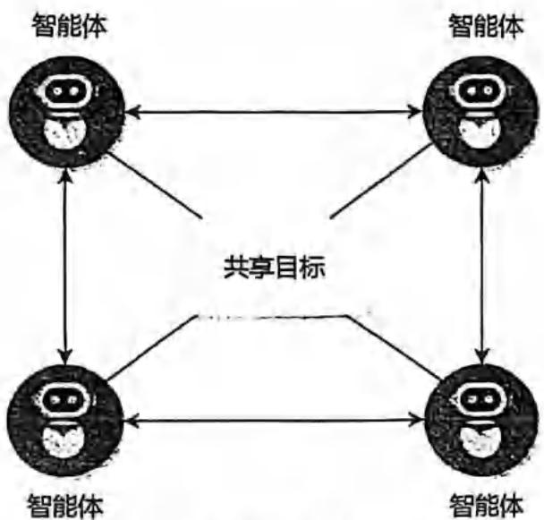  
图2.3 多智能体系统中的合作

# 2. 协调

协调涉及管理系统内各智能体行动和活动所产生的相互依赖关系。当智能体共享资源并且存在职责重叠或行动冲突时，协调尤为重要，见图2.4。

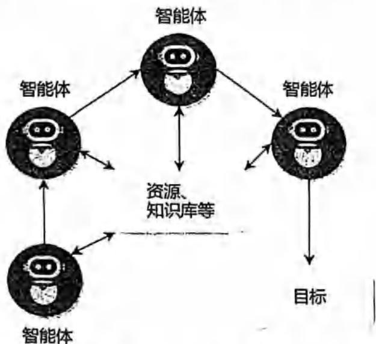  
图2.4 多智能体系统中的协调

多智能体系统中的协调机制包括任务调度、资源分配管理和冲突解决等策略。例如，在制造环境中，代表生产线不同机器人的智能体可能需要协调各自的行动，以确保共享资源的高效使用，防止相互干扰，并保持整体生产效率。

# 3. 协商

协商是智能体就如何共享资源、分配任务或解决冲突达成协议的过程。即使智能体的利益最初可能发生冲突，它们也会通过提出报价、反报价和妥协来达成一致，见图2.5。

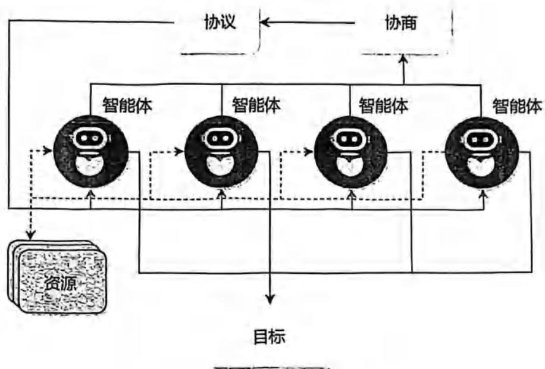  
图2.5 多智能体系统中的协商

多智能体系统中的协商机制使智能体通过交换提议、评估替代方案并达成共识，找到互利的解决方案。这在智能体拥有有限或冲突资源、不同偏好或竞争目标的情况下尤其有用。协商可以采用各种技术，如拍卖、投票协议、议价策略或博弈论方法，具体取决于问题领域的要求和约束。

这些互动机制——合作、协调和协商——对于多智能体系统的高效运行至关重要。它们使智能体能够协同工作，充分利用集体能力，并解决在互动过程中可能出现的冲突或相互依赖问题。选择和设计适当的互动机制对于实现高效和稳健的多智能体系统至关重要，这些系统能够应对复杂问题并适应动态环境。

在旅行预订助手示例中，MAS 可以在促进旅行行业网络中各方实体之间的高效协调和协商方面发挥重要作用。在这种情况下，智能体可以代表不同的利益相关者，如航空公司、酒店、租车公司、旅行社或旅游运营商，并利用协商机制来优化旅行预订操作的各个环节。

例如，假设有一个MAS，其中的智能体代表航空公司、酒店和其他与旅游业相关的公司或者组织。这些智能体可以通过协商过程来确定航班时间表、房间可用性、定价和其他旅行相关决策，旨在实现整体旅行预订操作的最高效率。

协商过程可以按以下步骤展开。

第一，代表航空公司的智能体可以提出可用座位、航班时刻表和其航线的定价方案。

第二，代表酒店的智能体可以根据其房间的可用性、预计入住率和需求预测来评估这些提议，并与航空公司智能体就最适合的航班时刻进行协商，以确保与酒店的入住和退房时间相匹配。

第三，旅行社智能体接着可以与航空公司智能体和酒店智能体进行协商，考虑客户的偏好、预算约束，以及他们对旅行日期和住宿的具体要求。

第四，交通运输智能体(例如代表租车公司或班车服务的智能体)也可以参与协商过程，提供地面交通服务，并向其他相关智能体提出接送安排和相关费用方案。

在整个协商过程中，智能体可以利用各种策略和算法来评估提议、生成反提议并达成双方都能接受的协议。这些策略可能涉及拍卖、议价协议、博弈论方法或针对旅游行业定制的优化算法。例如，智能体可以使用多属性效用函数，考虑旅行时间、费用、舒适度和客户偏好等因素，来评估和排序各种提议。然后，它们可以进行多轮迭代协商，根据各自的效用函数和约束条件调整报价和反报价。

此外，MAS的分布式特性允许去中心化决策，每个智能体可以根据其本地知识和约束做出决策，同时与其他智能体协作，以实现全局优化目标。上述旅行和酒店业示例中的MAS协商机制不仅促进了各方实体之间的高效协作，还提供了应对需求、供应、价格变化或其他运营因素动态变化的灵活性和适应性，从而最终形成一个更具弹性和响应能力的系统，满足客户需求。

为了说明旅行预订助手示例的MAS，此处将引入一些新功能。除了预订航班，我们现在还希望系统能在目的地找到酒店，并为客户创建一个合适的旅行套餐。此类MAS系统的算法可设计如下。

算法2：旅行预订助手的多智能体系统

要求：航空公司智能体集 $\mathrm{A} = \{\mathrm{A1},\mathrm{A2},\dots,\mathrm{An}\}$ 和酒店智能体集 $\mathrm{H} = \{\mathrm{H1},$ H2,...,Hm}

确保：初始化包含旅行社智能体TA的旅行预订系统S

1:使用A、H和TA初始化S  
2:定义函数 RequestTravelPackage(出发地，目的地，日期)  
3：对于每个 $\mathrm{Ai}\in \mathrm{A}$ ，执行  
4: available_flights←Ai.GetAvailableFlights(出发地，目的地，日期)  
5：对于每个 $\mathrm{Hj}\in \mathrm{H}$ ，执行  
6: available Rooms $\leftarrow$ Hj.GetAvailableRooms(目的地，日期)  
7: packages $\leftarrow$ TA.compilePackages(available_flights, available Rooms)   
8:返回 packages  
9:定义函数 BookTravel(选择的套餐)  
10: flight Booking←selectedpackage.airline.BookFlight()   
11:room Booking $\leftarrow$ selectedpackagehotel.BookRoom()

12:如果航班和酒店预订成功，则  
13: 返回CreateBooking(flight Booking, room Booking)  
14: 否则  
15: 返回FailureNotification()  
16:定义函数UpdateDynamicPricing()  
17: 对于每个Ai∈A，执行  
18: Ai.UpdateFlightPrices()  
19: 对于每个Hj∈H，执行  
20: Hj.UpdateRoomPrices()  
21:当True时，执行  
22: 如果有新的旅行请求，则  
23: request←GetTravelRequest()  
24: packages←RequestTravelPackage(request.departure, requestdestination, request dates)  
25: selectedpackage $\leftarrow$ TA.PresentOptionsToCustomer(packages)  
26: 如果selectedpackage不为空，则  
27: booking $\leftarrow$ BookTravel(selectpackage)  
28: 如果预订成功，则执行  
29: NotifyCustomer(booking, "Booking confirmed").  
30: 否则执行  
31: NotifyCustomer("Booking fail")  
32: 如果需要更新定价，则执行  
33: UpdateDynamicPricing()  
34:输出S

以下是该算法关键组件的解析。

(1) 第1步是明确定义一组智能体：本例中包括航班智能体、酒店智能体和旅行社智能体。航班智能体和酒店智能体负责与航空公司和酒店相关的操作，而旅行社智能体负责根据最佳选择创建旅行套餐。  
(2) 第2到第8步展示了旅行社智能体如何与多个航班和酒店智能体互动，生成旅行套餐。它找到合适的航班时刻和目的地城市的酒店可用性，然后根据这些数据创建套餐。  
(3) 第9到第15步展示了所选航班和酒店智能体之间的协商过程，按照选择的套餐完成航班和酒店的预订确认。  
(4)第16到第20步展示了每个航空公司和酒店智能体如何独立更新自身定价。

(5) 第21到第33步的主循环将所有步骤整合起来，展示了系统如何处理旅行请求并定期更新所有智能体的定价。

这个示例算法展示了智能体之间的合作与协调。

- 合作：所有智能体都朝着共同目标努力，即为用户预订旅行行程。  
- 协调：旅行社智能体需要航班智能体和酒店智能体的输入来构建旅行套餐，并随后预订最佳旅行套餐。

与此算法相关的完整Python代码可以在GitHub的Chapter_02.ipynb文件中找到。请注意，此时的MAS并不十分智能，因为它仍然需要明确的输入，即出发城市代码和到达城市代码才能成功运行，且缺乏从用户消息或文本中理解或推断值和操作的能力。

# 本章小结

本章探讨了智能体系统和智能体的有趣世界，深入了解了能动性、自主性以及定义理想智能体的关键特征。本章研究了几种设计和实现这类系统的架构，包括慎思型驾构、响应型架构和混合架构。此外，本章还讨论了多智能体系统，其中多个智能体通过合作、协调和协商等机制共同工作，以实现集体目标。

通过本章的学习，你已经掌握了开发能够在复杂且不可预测的环境中高效运行的智能和自主系统的基础知识。你现在应该能够根据具体应用场景选择最合适的智能体系统架构，并能够构建一个多智能体系统的思维模型，为设计智能体系统打下基础。下一章将更深入地探讨智能体系统的核心要素，进一步提升构建高效系统的能力。

# 习题

1. 智能体的关键特征是什么？  
2. 智能体的主要架构模式有哪些？  
3. 慎思型架构和响应型架构分别有哪些优点与缺点？  
4. 什么是多智能体系统，它的关键特征是什么？  
5. 多智能体系统中的主要互动机制有哪些？  
6. 多智能体系统通常应用于哪些领域？

# 习题答案

1. 智能体的关键特征包括响应性、主动性、交互能力、自主性以及学习和适应的能力。  
2. 智能体的主要架构模式有慎思型(基于知识)、响应型(基于行为)和混合架构。  
3. 慎思型架构擅长复杂推理和规划，但在动态环境中可能难以实现实时响应。响应型架构非常适合需要快速响应的动态环境，但缺乏长期规划和抽象推理能力。  
4. 多智能体系统由多个智能体组成，这些智能体通过互动、合作和协调来实现集体目标。其关键特征包括自主性、互动性、适应性、分布式控制、可伸缩性、异构性，以及去中心化的数据和知识。  
5. 多智能体系统中的主要互动机制包括合作(朝着共同目标努力)、协调(管理相互依赖关系)和协商(达成协议)。  
6. 多智能体系统广泛应用于供应链管理、交通控制、机器人学、环境监测、分布式传感器网络和智能虚拟环境等领域。

# 第3章

# 智能体的基本组成部分

本章将深入探讨智能体的核心要素。就像人体有骨架提供结构和支撑一样，智能体也有一些基本元素，使它们能够灵活应对复杂环境，独立做出决策并实现目标。

本章将探讨使智能体“具备活力”的重要组成部分，包括它们如何表示和存储知识、指导决策的推理过程、助力学习和成长的算法，以及选择合适行动的机制。本章还将介绍生成式人工智能这一激动人心的领域如何增强这些组件，赋予智能体更强大的能力，使它们能够理解周围环境、从经验中学习并与所处世界进行有意义的互动。

本章将涵盖以下主要内容。

- 智能体中的知识表示。  
- 智能体中的推理。  
自适应智能体的学习机制。  
智能体系统中的决策与规划。  
- 利用生成式人工智能增强智能体能力。

通过本章的学习，你将了解智能体中的知识表示方法、推理和学习机制、决策和规划技术，以及一个利用生成式人工智能增强智能体能力的示例。

# 3.1 技术要求

你可以在GitHub上找到本章的代码文件，网址是https://github.com/Packt-Publishing/Building-Agentic-AI-Systems。

# 3.2 智能体中的知识表示

存储和处理信息的能力是每一个智能体的基本功能。知识表示提供了将智能体对环境的理解编码为适合推理和决策过程的格式的机制。它是使智能体构建其周围环境模型的最基本方式。

知识表示可以理解为一种组织和结构化数据的方法，使智能体能够高效地利用这些信息来执行推理、解决问题和确定行动方案等任务。知识表示有几种成熟的方法，每种方法都有其自身的优点和适用场景，接下来将讨论这些方法。

# 3.2.1 语义网络

语义网络提供了一种直观且灵活的知识表示方法，广泛应用于智能体中。语义网络的核心是基于图的结构，由表示概念、实体、事件或状态的节点组成。这些节点通过带标记的边连接起来，明确地定义了节点之间的语义关系。

语义网络的简洁性与表达能力使其能够自然地捕捉复杂世界中丰富多样的关系和关联。例如，“狗”节点可以通过“是”关系边与“动物”节点相连，表示狗是一种动物。同时，“狗”节点还可以通过其他类型的关系与“哺乳动物”“家养”“犬科”和“宠物”等节点相连，见图3.1。

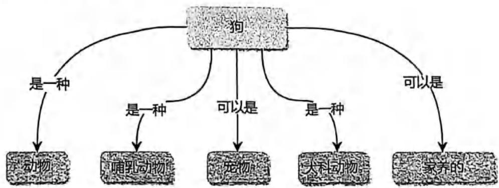  
图3.1 “狗”相关关系的语义网络

与严格的逻辑或固定的数据库模式不同，语义网络提供了一种灵活的知识表示方式，任何概念都可以通过适当的语义关系与其他概念关联。这种灵活性使得语义网络能够以直观的图形形式表示极为细致的领域。例如，一个医学语义网络可以通过“引起”“通过……诊断”“与……相互作用”等关系类型来建模疾病、症状、治疗方法和解剖学概念，见图3.2。

语义网络的强大之处在于它们通过沿着关系路径继承属性来实现泛化。如果语义网络指定狗是动物的子类，而动物能够呼吸空气，那么智能体就可以通过继承推理出狗也能呼吸空气。算法可以遍历语义网络的图形结构，将一系列关系串联起来，从所表示的知识中推导出新的事实和结论。例如，在一个家庭关系的语

义网络中，可以推断出一个人的配偶的父母就是他的岳父母。

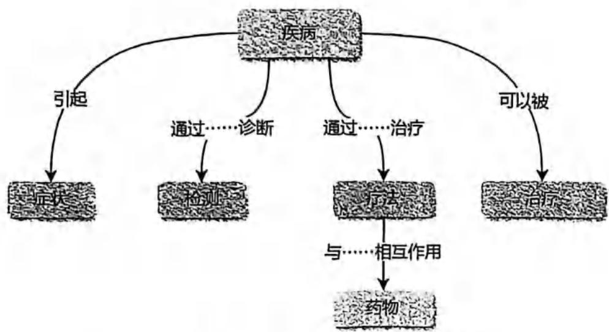  
图3.2 “疾病”相关关系的语义网络

此外，语义网络能够与其他符号推理技术有效结合。它们基于图的结构非常适合与演绎方法(如一阶逻辑)配合使用，其中节点可转化为常量或谓词，边则转化为可以参与逻辑证明和推理规则的关系。一个智能辅导系统可以利用这种融合的表示能力进行基于逻辑的解释，并根据学生的语义知识图谱教授新概念。

语义网络为智能体构建丰富、具有表现力的环境模型提供了一种强大且直观的机制。它们天生支持捕捉相互关联的概念，并通过关系组合和属性继承推导新知识，使它们成为在许多现实领域中极具影响力的知识表示形式。

# 3.2.2 框架

框架知识表示方法为智能体提供了一种结构化的方法，用于表示概念及其相关属性。在这种方法中，关于对象、情境或事件的知识被存储在一种叫作“框架”的数据结构中。

每个框架包含一组属性和对应的值，这些属性和值描述了该概念的特点。例如，“汽车”这一概念的框架可能包含“品牌”“型号”“年份”“颜色”“燃料类型”等属性，并为每个属性指定具体的值，用以描述某一特定汽车的详细信息。

框架是按层次结构组织的，这样可以让较高级的框架将一些属性传递给更具体的子框架。例如，“汽车”框架可以继承“车辆”框架的一些属性，同时加入“汽车”的特定属性，见图3.3。这种层次化的结构能够避免在相关概念中重复定义属性，从而使知识存储更加高效。

框架的一个主要优势是，它能够同时表示事实性知识和程序性知识。除了简单的属性和属性值，框架还可以包含一些过程，用来动态地提供属性值，或者模拟与该概念相关的操作。例如，“汽车”框架可以包含计算燃油效率或查询维修记

录的方法。

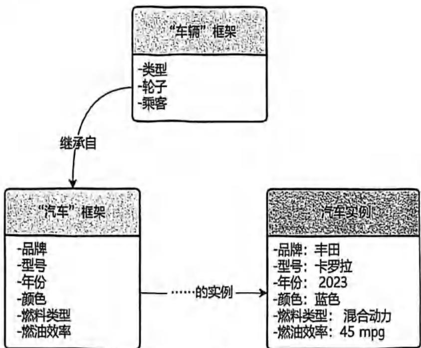  
图3.3表示“车辆”和“汽车”关系的框架

框架提供了一种直观的表示模型，类似于人类如何构建关于世界的知识。框架的层级特性与人类如何根据共享属性和关系形成概念抽象并对思想进行分类的方式相一致。

在现实应用中，框架表示被广泛应用于以下领域。

- 自然语言处理：语言框架用于建模从文本数据中提取的语义概念、角色和关系。  
- 专家系统：框架捕捉领域知识和规则，用于知识推理引擎。  
- 面向对象编程：面向对象编程语言中的类本质上是类似框架的结构，封装了属性和方法。  
- 计算机视觉：目标检测系统使用框架层次结构，根据形状、颜色、纹理等属性来识别和描述视觉实体。  
- 机器人技术：框架使机器人能够表示物体、环境，同时关联相关的动作、运动模型和约束条件。

框架知识表示形式为智能体提供了一种高效、结构化且符合人类认知的方式，适用于捕捉丰富的概念信息，以支持基于知识的推理和决策。

# 3.2.3 基于逻辑的表示

虽然语义网络和框架提供了直观的视觉化方式来表示知识，但基于逻辑的方法则采用了更加正式的数学路径。基于逻辑的知识表示利用符号逻辑的工具来编码关于某一领域的事实、规则和公理。

在这种范式中，表示知识的陈述被转换成正式逻辑语言中的良构公式，如命题逻辑、一阶逻辑或专门的模态/时态逻辑。例如：

- “所有人终有一死”可以用一阶逻辑表示为 $\forall x (\operatorname{Human}(x) \rightarrow \operatorname{Mortal}(x))$ ;  
- “要么下雨，要么晴天”可以用命题逻辑表示为Rain $\vee$ Sunny;  
- “最终，系统将稳定”可以用时态逻辑表示为 $\diamond$ Stable;

在这里：

- $\forall x$ ：全称量词，表示“对所有 $x$ ”。例如， $\forall x (\text{Human}(x) \rightarrow \text{Mortal}(x))$ 解释为：对所有 $x$ ，如果 $x$ 是人，那么 $x$ 终有一死。  
• V: 逻辑析取, 表示 “或”。例如, Rain $\vee$ Sunny 解释为: 要么下雨, 要么晴天。  
- $\bigcirc$ : 时态逻辑中的钻石符号, 表示 “最终”。例如, $\bigcirc$ Stable 解释为: 最终, 系统将稳定。

这些逻辑公式作为构建综合知识库的基础，通过严格的逻辑推理系统，具有明确定义的公理、推理规则和形式化语义。推理引擎可以通过应用逻辑推理规则，从现有知识中推导出新的事实和结论。

基于逻辑的表示方法的一个关键优势是其形式化的严谨性和相关的强大理论属性。基于逻辑构建的系统可以提供关于健全性(仅推导出逻辑有效的结论)和完备性(推导出所有可能的有效结论)的保证。这种数学基础使得逻辑在安全关键领域的知识表示中具有吸引力。基于逻辑的表示方法在许多现实场景中得到了广泛的应用，如下所示。

- 专家系统：基于规则的专家系统引擎本质上是基于逻辑知识库的定理证明器，用于编码领域知识。  
- 数据库系统：关系数据库以关系代数/关系演算(一阶逻辑的子集)作为数学基础。  
- 自动化推理：从软件验证到机器人规划，逻辑为自动推理系统提供了表示基础。  
- 法律和监管领域：法律、政策和规定可以精确地表示为可进行形式分析的逻辑规则。  
- 语义网：OWL(Web 本体语言)等描述逻辑构成了本体和语义网的知识表示基础。

虽然基于逻辑的表示方法不像语义网络或框架那样直观，但它们的数学严谨性和支持健全、自动化推理的能力，使其在需要形式验证、一致性和完备性保证的应用中具有不可替代的价值。

探讨了构成智能体知识库基础的知识表示的基础结构之后，现在转向研究智能体如何利用这些表示来执行推理任务、进行推导推论和解决复杂问题。

# 3.3 智能体中的推理

通过使用逻辑语言，智能体可以构建强大的知识库，从而实现复杂的查询、演绎和推理，这些是使用表达能力较弱的表示形式无法实现的。一旦智能体具备了强大的知识表示方式，推理机制便能帮助其智能地处理和利用这些信息。推理能力使智能体能够得出新的见解、得出逻辑结论、解释观察结果，并最终做出明智的决策，以实现其目标。

智能体中的推理过程通常不是单一的、整体的过程。复杂的智能体架构往往采用多种推理方法，结合不同的推理风格，以及数据驱动、分析和学习组件。例如，一个问答系统可以使用语义解析将问题转换为逻辑形式，再基于逻辑知识库执行演绎推理，最后调用神经序列到序列模型流畅地生成最终答案。推理有几种基本的范式，即演绎推理、归纳推理和溯因推理。

# 3.3.1 演绎推理

演绎推理是一种基本的逻辑推理形式，采用自上而下的方法。在演绎推理中，智能体从关于某一领域的一般性前提或规则出发，并将其应用于推导出具体的、在逻辑上必然成立的结论。经典的演绎推理例子是以下著名的三段论：

所有人终有一死。

苏格拉底是人。

因此，苏格拉底终有一死。

如果初始前提（“所有人终有一死”和“苏格拉底是人”）为真，那么结论“苏格拉底终有一死”就必然从演绎逻辑规则中得出。演绎推理提供了一种得出无可反驳的结论的方法，只要原始前提和规则是正确且真实的。图3.4所示为演绎推理的例子。

演绎推理在许多领域都有应用，以下是一些例子。

- 数学和几何学：正式的数学证明是演绎推理的典型例子，从一般公理和先前证明的陈述中推导出具体的定理。  
- 法学：法律推理通过演绎将成文法和判例应用于特定案件来做出判决。  
- 软件验证：形式化验证技术通过对逻辑规范进行演绎推理，证明硬件、软件系统的正确性属性。

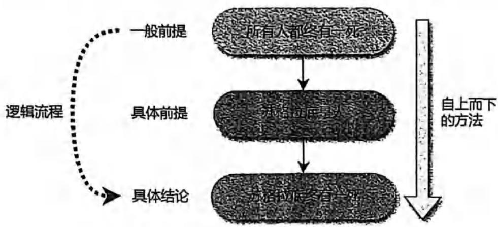  
图3.4演绎推理——从一般前提到具体结论

- 网络路由：路由协议通过演绎应用网络拓扑、带宽等规则或约束，确定最佳路径。

当演绎推理与其他推理形式(如归纳推理或溯因推理)结合时，其效用会显著增强。例如，一个医学诊断系统可以执行以下操作：

- 根据症状溯因出可能的疾病假设(最佳解释推理)。  
- 利用疾病模型的相关规则演绎出每个假设的预期发现。  
- 将演绎出的发现与患者实际数据进行比较，以确认或排除假设。

虽然依靠演绎推理不能获得全新的知识，但它对于智能体在逻辑上扩展知识、保持一致性和支持理性决策至关重要。演绎推理以其内在的严谨性，保证了智能体所推导结论的可靠性。

# 3.3.2 归纳推理

与演绎推理的自上而下方法相对，归纳推理采用自下而上的方法。归纳推理是指从一组具体的观察或数据点中做出概括或推导出可能的结论。以下是一个例子：

在过去的百万天里，太阳每天都升起。

因此，太阳明天可能还会升起。

基于太阳升起这一重复出现的事实，归纳推理过程使智能体能够假设或推断太阳将继续在未来升起。然而，与演绎推理不同，归纳推理得出的结论并不能在逻辑上保证为真——它们只是基于观察到的证据提出了一种可能性较高的结果。

图3.5所示为归纳推理的例子。

归纳推理在以下现实领域中有广泛的应用，特别是在数据驱动学习和理论形成至关重要的情况下。

- 科学方法：形成科学定律、理论的过程在很大程度上依赖于从实验观察和数据中归纳出一般性结论。

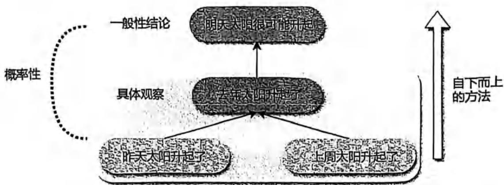  
图3.5 归纳推理——从具体观察到一般性结论

- 机器学习：机器学习算法本质上执行归纳推理，从训练数据中推导出一般模型，以对新实例进行预测。  
- 模式识别：计算机视觉、信号处理以及其他模式识别任务使用归纳技术，根据检测到的统计规律对输入进行分类。  
- 数据挖掘：关联规则挖掘等技术可通过归纳推理识别大数据集中频繁出现的模式、相关性或关系。  
- 自然语言习得：儿童通过对他们接收到的语言输入进行归纳性概括，学习语法规则和语言模型。

尽管归纳推理非常强大，但它也有局限性。如果观察到的实例不够全面，不能代表整个范围，得出的结论就可能是错误的。因此，归纳推理通常与其他推理方法结合使用，比如溯因推理(找出最佳解释)和演绎推理(验证假设)，在智能体架构中共同发挥作用。尽管归纳推理无法保证结论的绝对正确性，但它从具体数据中提取知识、识别模式和形成理论的能力，对于需要在不确定、嘈杂且无法预先获取完整知识的环境中运行的智能体而言，仍是不可或缺的。

# 3.3.3 溯因推理

溯因推理是一种逆向的推理方式，试图找到最合理的解释或前提，以说明一组观察或数据。它通常被描述为“最佳解释推理”。与演绎推理不同，演绎推理从一般规则出发，得出具有保证的具体结论，而溯因推理从观察到的效果或现象开始，基于当前知识假设最可能的潜在原因。一个溯因推理的例子是：

草坪是湿的。

一个合理的解释是：昨晚下雨了。

在这里，观察到的结果是湿草坪。溯因推理使智能体能够理性地推断或推理出，基于过去的经验，最可能的解释是昨晚下雨，尽管这一现象并没有被直接观察到，见图3.6。

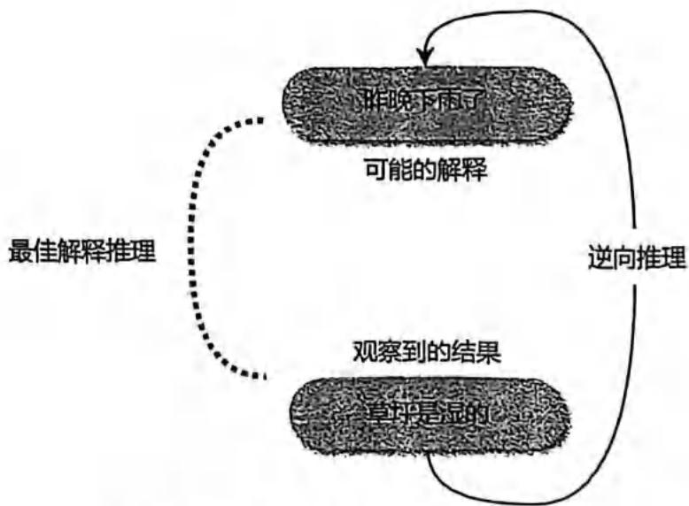  
图3.6 溯因推理——最佳解释推理

溯因推理在诊断领域和根本原因分析领域至关重要的应用中极具价值，如下所示。

- 医学诊断：给定一组症状，医生通过溯因推理找出最可能的疾病或病状，并进行调查，以解释这些症状。  
- 故障检测：制造业中的监控系统使用溯因推理来隔离导致观察到的异常的最可能故障或问题。  
- 法医学或刑事调查：从犯罪现场的证据中，侦探通过溯因推理推测可能的情境和嫌疑人的特征，以确定发生了什么。  
- 人工智能规划：为了实现目标，智能体必须从目标出发，通过溯因推理得出一系列可行的行动。  
- 科学发现：新的科学理论通常通过为当前无法解释的观察或现象找到解释性假设来进行推测。

溯因推理的一个主要优势是它能够生成新的合理前提，而这些前提是演绎推理或归纳推理仅通过现有知识和数据无法得出的。它有助于跳出传统思维框架，探索新颖的可能解释。然而，溯因推理并不能保证解释是正确的，可能存在多个与观察一致的假设。这也是为什么溯因推理通常与演绎推理结合使用，用于验证所形成的解释假设的一致性和合理性。

这里需要记住的是，在智能体系统中实现溯因推理是具有挑战性的，因为它的计算复杂性较高，生成和评估多个假设可能非常消耗资源。溯因推理还需要处理不确定性和不完整的数据，这使得确定最合理的解释变得困难。适当的知识表示至关重要，但很难维持，评估假设通常需要主观标准。将溯因推理与其他推理方式结合使用可能会导致冲突，并且随着领域范围的扩大，扩展性也会成为问题。此外，处理动态环境并确保为用户提供可解释性可能会增加该过程的复杂性。然

而，通过应用溯因推理，智能体能够表现出更深刻的理解，展现出在提出试探性解释时的创造力，并提高在具有部分可观察性和信息的不确定环境中高效操作的能力。通过稳健的知识表示形式和多方面的推理能力，智能体能够构建丰富的环境模型，得出见解，解释观察结果，最终做出有根据的决策，决定如何与世界互动。这些能力为更高级的智能体功能奠定了基础。

# 3.4 自适应智能体的学习机制

学习机制是使智能体能够适应环境变化或随着时间推移不断改进的关键。学习能力使智能体能够根据新的经验和数据不断完善其知识与行为。学习有许多不同的方法，每种方法都有其自身的优点和应用领域。

# 1.监督学习

这种学习范式是指对一个数据集进行训练，其中输入与相应的带标签输出或目标值配对。目标是让智能体学习一个映射函数，准确预测新输入的输出。监督学习广泛应用于分类和回归任务，适用于以下领域：

- 图像分类，例如识别图像中的物体和数字；  
- 垃圾邮件检测，将电子邮件分类为垃圾邮件或非垃圾邮件；  
- 机器翻译，学习将一种语言的文本映射到另一种语言；  
医学诊断，将患者的症状/测试结果映射到疾病标签。

# 2. 无监督学习

在这种方法中，智能体在没有任何目标输出的无标签数据上进行训练。目标是以无监督的方式发现数据中固有的模式、关联或分组。无监督学习的主要应用包括：

- 客户细分，根据购买行为将客户分组；  
异常检测，识别与常规数据不同的异常数据点；  
- 主题建模，从文档集合中提取主题或主题词；  
- 降维，寻找高维数据的低维表示。

# 3. 强化学习

这种学习方法的灵感来源于人类和动物的学习方式——通过试错和环境反馈(奖励或惩罚)调整行为。强化学习智能体通过尝试不同的动作，并根据观察到的奖励更新策略，从而学习最优的行为或策略。强化学习在以下领域取得了显著成功：

- 游戏，学习掌握象棋、围棋和视频游戏等游戏；  
- 机器人学，学习机器人导航和操作的控制策略；

供应链优化，寻找最大化效率的策略；  
交通信号控制，学习时序策略以改善交通流。

# 4. 迁移学习

这种技术旨在将一个环境中学到的知识迁移到另一个相关的环境中，以促进学习。通过利用先前学习的模式和表示，迁移学习能够显著加速新任务的训练速度和样本效率。迁移学习的应用包括以下领域：

- 自然语言处理，跨领域迁移语言模型：  
- 计算机视觉，使用预训练模型作为新视觉任务的初始化；  
·推荐系统，跨平台迁移用户、产品嵌入。

这些学习机制通常以混合方式结合使用，使智能体具备不断扩展知识、改进行为和增强问题解决能力的能力——这正是智能的关键标志。随着学习算法的发展，智能体在面对新挑战时将变得强大且更具适应性。

探讨了自适应智能体获取知识和技能的学习机制之后，接下来将探讨这些智能体如何利用这些学习成果做出决策，并在复杂环境中规划行动。

# 3.5 智能体系统中的决策与规划

决策和规划是智能体在复杂环境中高效实现目标的关键能力。智能体需要分析不同的情境，评估各种可能的结果，并根据自身的偏好和限制条件，选择能够带来最佳结果的行动。虽然效用函数和规划算法将在后续章节中进行详细讲解，但在这一部分，我们将从宏观层面探讨智能体决策过程中的关键组件。

# 3.5.1 效用函数

效用函数通过将结果映射到效用值，量化了智能体的偏好，使得智能体能够比较并选择那些能够最大化期望效用的行动。效用函数在智能体决策中发挥着核心作用，它提供了一种定量的方法来表示和推理不同结果或世界状态的偏好。

效用函数将任何给定的状态或结果映射为一个实数效用值，反映了智能体根据其目标、奖励和惩罚对该状态的可取性或偏好。形式上，这可以用数学表达式表示为

$$
\begin{array}{l} u: S \rightarrow R \\ s \mapsto u (s) \\ \end{array}
$$

这个表达式可能看起来有些复杂，但概念其实很简单。接下来，我们可以通过一些示例Python代码来进一步解释这一点。

1 def travelutility_function(travel_option):
2 priceutility $=$ (1000 - travel_option['price'])\* 0.05

3 comfortutility $=$ travel_option['comfortrating'] \*10   
4 convutility $=$ travel_option['convenience_score'] \*15   
5   
6 totalutility $=$ priceutility $+\backslash$ 7 comfortutility+8 convenienceutility   
9   
10 return totalutility

为了解释这个效用函数，让我们回到旅行预订的例子。这个Python效用函数会根据价格、舒适性和便利性来评估旅行方案。函数的第2、第3和第4行分别为价格、舒适性和便利性分配了一个实数值效用。数字0.05、10和15完全是随意设定的，但它们反映了这三个因素在一个人旅行决策中的重要性顺序。例如，在第2行，我们将价格的效用赋值为一个数字；需要注意的是，我们从任意值1000中减去价格，因为价格越低越好，这意味着较低的价格会带来更高的效用。因此，如果价格较低，价格效用值会更高，即它们呈反向关系。类似地，舒适性和便利性的效用值也分别被分配了相应的得分。舒适性和便利性的得分通常由用户提供。例如，TripAdvisor这样的旅行评价网站允许用户通过星级评分发布关于旅行体验的详细评论。

将这个效用函数应用于几个旅行方案，有助于清晰地了解这个函数如何运作。下面以两个旅行方案为例进行演示：廉价航空(Budget Airline)与公路旅行(Road Trip)。

效用函数的一个示例输入如下：

```python
1 [  
2 'name': 'Budget Airline',  
3 'price': 300,  
4 'comfortrating': 3,  
5 'convenience_score': 2  
6 ],  
7 [  
8 'name': 'Road Trip',  
9 'price': 150,  
10 'comfortrating': 4,  
11 'convenience_score': 3  
12 ]] 
```

效用函数的输出：

```txt
1 Budget Airline - Utility: 95.00  
2 Road Trip - Utility: 127.50 
```

输出结果清楚地表明，由于公路旅行在便利性、舒适性和价格方面优于廉价航空，因此它的效用得分更高。完整的代码可以在GitHub的Chapter_03.ipynb文件里找到。

效用函数通过将不同的状态或结果映射为效用值，来表示智能体的偏好。这使得智能体能够对不同的选择进行比较，从而选出最合适的行动。效用值越高，

表示该状态或结果越受到青睐。这种方式让智能体可以选择那些最大化期望效用的行动，而期望效用则是根据所有可能结果的效用值，按概率加权求得的总和。通过这种量化偏好的方法，效用函数为智能体提供了一种系统性机制，帮助它们在追求最佳结果时做出理性决策。效用函数根据不同领域的需求，可采用多种数学形式，例如：

- 简单的评分函数，通过给属性赋权重来量化不同属性的偏好。  
- 约束满足函数，当所有硬性约束都被满足时，效用值达到最大。  
- 经济效用函数，用于建模定价、利润、成本等经济指标。  
- 乘法函数，用于对结果间偏好进行建模，这些结果具有相互独立的效用影响。

更复杂的效用函数能够处理不确定性、风险偏好、多属性权衡、随时间变化的偏好，以及属性之间的依赖关系。在多属性权衡的情况下，智能体在决策时需要平衡不同的因素(如成本、质量、时间、安全性等)。这些属性往往相互冲突，智能体需要在它们之间找到平衡，例如选择一个更快但更贵的选项，还是选择一个更慢但更便宜的选项。关键在于如何量化智能体对每个属性的重视程度，以及一个属性变化如何影响整体效用。

准确地定义一个能捕捉智能体所有偏好的效用函数是一个巨大的挑战，因为偏好往往是复杂且受具体情境影响的。智能体可能对风险有不同的态度(比如风险厌恶型或风险追求型)，而偏好也可能随情境或时间的变化而改变。此外，属性之间的依赖关系——例如，某个属性(如速度)的增加可能会影响另一个属性(如成本)—也会增加建模的复杂度。而在不确定的环境下预测结果或偏好的变化，更是让效用函数的设计变得更加困难。为了解决这些问题，通常会使用一些技术，如偏好引导、逆强化学习和从人类反馈中学习。

# 3.5.2 规划算法

规划算法是为智能体推导一系列行动步骤的算法，以便从给定的初始状态出发，实现其目标。一些常见的规划方法包括基于图的规划、启发式搜索、蒙特卡洛树搜索、层次化规划和约束满足。接下来将分别讨论这些规划算法。

# 1. 基于图的规划

基于图的规划将规划问题表示为一个图，其中节点对应可能的状态或配置，边表示可以采取的行动或过渡，用于在状态之间移动。图规划算法中的一个基本概念是状态空间图，它是一个图表示，其中节点代表问题领域中的所有可能状态。在这种表示中，边表示状态之间的行动或过渡。这种图表示有效地描绘了所有可能情境的“空间”，以及这些情境如何通过边相互关联。

边的成本是加权图中边的一个属性。每条边可以有一个关联的成本(或权重)，表示采取该行动或进行该过渡的“费用”。成本可以根据具体场景确定，如距离、

时间、能量消耗、财务成本或其他任何相关指标。

根据状态空间图、边和边的成本，基于图的规划算法可以分为两大类。

- 图搜索：在图搜索中，规划指的就是寻找一条从初始状态通往目标状态的有效路径。路径定义了智能体执行的行动序列，通过这些行动，智能体在状态之间过渡并最终实现目标。该类中最常见的算法包括深度优先搜索(DFS)、广度优先搜索(BFS)和迪杰斯特拉算法。  
- 最优路径查找：这是一种特殊类型的图搜索，其目标不仅是找到任意一条路径，而是根据某些标准(通常是最小化总边成本)找到最佳路径。该类算法中最典型的两种是贝尔曼-福特算法和A*搜索算法。

使用基于图的规划算法的缺点包括需要事先确定状态表示(状态空间)，以及随着问题变得更加复杂，需要表示和存储的状态数量可能呈指数级增长。

基于图的规划技术在许多现实应用中有着广泛的应用，尤其是在寻找最佳行动序列以实现目标的领域。这些应用包括：导航和路线规划，例如GPS系统使用路网的图表示来找到最短的路线，从而最小化旅行时间或距离；物流和供应链应用，包括为产品制造规划最优操作序列，或者寻找最低成本的运输路线和交货时间表；AI规划，在国际象棋、视频游戏和实时策略游戏中，采用基于图的方法为游戏人工智能规划动作序列，AI助手的任务规划中也采用了基于图的方法。

# 2. 启发式搜索

当搜索空间呈指数级增长，导致穷举法的计算成本过高而不可行时，启发式搜索便有了用武之地。这类方法通过一个启发函数来指引搜索方向，优先探索那些最有可能找到解的区域，从而更快地找到一个足够好的近似解。

启发式搜索在路线规划与导航等领域应用广泛。例如，在无法承担最优路线的计算成本时，可以采用一个简单的启发策略(比如估算当前位置到目的地的直线距离)来高效指引搜索，从而快速规划出一条近似最优的路线。此外，在视频游戏中，游戏AI也普遍采用启发式寻路算法，以便在复杂的虚拟世界中高效移动和导航。

启发式搜索的核心优势在于，它能够在解的“最优性”与“计算效率”之间取得巧妙的权衡。它不执着于寻找完美的最优解，而是追求一个高质量的近似解，这使得在时间和计算资源都有限的情况下，解决大规模的复杂问题成为可能。当然，如何设计出一个高效的启发函数本身就是一大挑战，并且通常需要针对具体的应用场景进行精心的定制化设计。

# 3. 蒙特卡洛树搜索

蒙特卡洛树搜索(MCTS)的核心思想是从当前状态出发，进行多次随机模拟(又称推理)，逐步构建一个不对称的搜索树。不对称意味着树的结构不平衡或不均匀。每次模拟的结果都会被用来指导树中最有前景的分支，在每一轮迭代中优先扩展这些分支。

MCTS 在很多需要在不确定性下进行决策的实际应用中得到了广泛应用。特别是在 AI 智能体面临不确定性、状态空间很大的情况下，MCTS 具有显著的优势，尤其是在可能的结果非常多时（即有大量可能的选择）。即使计算资源有限，MCTS 也能生成合理的结果。

MCTS 的主要优点包括可以随时运行、能够处理大规模动作空间，以及通过模拟预测长期结果。然而，它的效率依赖于是否有一个高效的模拟模型，并且需要为特定领域设计合适的探索策略。这个算法的一些常见缺点包括：模拟复杂问题时需要大量的计算资源，并且帮助选择结果的树策略也比较难以调节。

# 4.层次化规划

层次化规划方法将复杂问题分解为更高层次的任务或目标，以及实现这些高层次目标的子任务或子目标。通过这种层次化分解，可以更抽象地思考问题，并且能够复用解决常见子问题的方案。

层次化规划方法的核心优点包括：通过复用子计划解决方案提高计算效率，在多个抽象层次上进行知识表示，以及通过层次化推理提高可扩展性，从而能够处理非常复杂的问题，尽管这并不总是最优的。这种结构与人类处理复杂任务的方式也非常契合。层次化方法的主要优势包括：

- 通过复用子计划解决方案，提高计算效率，避免同时处理所有细节。  
- 在多个抽象层次上进行知识表示。  
提高可扩展性，能够处理非常复杂的问题。

虽然层次化规划方法不总是最优的，但对于那些最优解在计算上难以实现的大型问题，层次化规划方法可以提供良好的近似解。这种结构也非常符合人类处理复杂任务的思维方式。

# 5. 约束满足

约束满足问题(CSP)是将问题表述为一组必须满足的约束条件，然后使用约束传播技术从搜索空间中排除不符合约束的可能性。CSP在人工智能中提供了一个强大的框架，用于解决各种复杂问题。其核心思想是将问题定义为需要为变量分配值，同时在一组约束条件下，这些约束限制了这些值的可能组合。这种方法使得许多现实问题能够自然地表示，包括日程安排、资源分配、谜题求解和配置任务等。

CSP的魅力在于它们能够将问题的表示与求解方法分离。一旦问题被表述为CSP，就可以应用多种通用算法来寻找解决方案。这种分离使得研究人员和实践者能够专注于准确地建模，而不必担心求解算法的复杂性和细节。

智能体需要灵活的决策能力，能够权衡约束条件、处理不确定性、从经验中学习，并在追求目标的过程中解决复杂的现实问题。规划、搜索、推理和学习算法的进步不断增强这些关键的认知能力。

探讨了智能体的基础方面，从知识表示、推理到学习机制和决策过程之后，接下来将注意力转向一个有望显著扩展智能体能力的前沿发展：生成式人工智能与智能体系统的结合。

# 3.6 利用生成式人工智能增强智能体能力

生成式人工智能正在改变智能体的发展，它通过提高学习效率、增强环境理解能力，以及通过生成式模型实现更复杂的互动。以下是生成式人工智能在推动智能体发展方面的一些重要进展：

- 数据增强：生成式模型可以创建合成的训练数据，补充现有数据集，从而提高机器学习智能体的鲁棒性和效率。例如，自驾车智能体可以利用生成的场景图像，提升物体检测和导航的能力。  
- 上下文理解：生成式人工智能能够构建细致的仿真，模拟现实世界的复杂性，帮助智能体理解环境的上下文，从而做出更精准的决策。例如，聊天机器人可以通过生成式人工智能模拟不同情境下的对话，以便更好地理解用户意图，提供更符合上下文语境的回应。  
- 自然语言处理：生成语言模型提升了人机互动的理解和生成能力。例如，Alexa 这样的虚拟助手和聊天机器人可以通过生成式自然语言处理技术实现自然对话。  
- 创意问题解决：生成式人工智能能够生成多种可能的解决方案，帮助智能体探索创意想法并评估它们的可行性。例如，AI设计师可以在满足结构性约束的前提下，创意性地设计建筑布局。

生成式人工智能与知识表示、学习机制和决策过程的深度结合，使智能体能够在复杂和动态的环境中高效运作，具备强大的响应和适应能力。以下是这种协同组合实现先进能力的几个例子。

- 学习：智能体可以通过机器学习技术(例如强化学习)从各种数据源(如传感器数据、人机交互或仿真)中收集信息，构建适应其环境的模型。  
知识表示：通过结构化学习到的环境数据，智能体可以用语义网络、逻辑规则或概率图模型来表示知识，进而捕捉其中的关系、约束和不确定性。  
- 决策过程：基于已有的知识，智能体可以使用规划和决策算法(如马尔可夫决策过程和蒙特卡洛树搜索)来推导出一系列行动，以实现其目标。  
- 生成式模型：通过模拟不同的情境来增强智能体的理解，考虑到现实中的复杂因素，如噪声传感器数据、随机动态或训练数据中没有的外部因素。  
- 反馈循环：通过将真实世界中的交互结果反馈给学习机制，智能体可以根据经验不断调整和优化其知识与决策模型，确保持续改进。

# 开始构建智能体人工智能

我们已经了解了智能体的特点、构建方式、如何与不同的算法协作，以及它们的核心组件。现在，可以轻松地进入智能体人工智能的世界，并开始使用不同的框架构建应用程序了。

在本书的后续章节中，我们将广泛使用几个开源框架。当前，构建智能体和多智能体 AI 系统最流行的框架是 LangChain 的 LangGraph 框架，其他一些值得注意的框架包括 AutoGen、CrewAI 和 MetaGPT。这些框架并不是所有开源框架的全部，它们只是允许使用 LLM 构建智能体和多智能体系统中最流行的框架。需要注意的是，尽管这些框架支持多种编程语言，本书仍将主要使用 Python 编程语言进行实践。为了保持一致性，本书将使用 LangGraph 和 OpenAI 的 GPT 模型；不过，也有许多其他的 LLM 可以与智能体 AI 框架一起使用。

# 重要说明

尽管代码示例是专门为 OpenAI GPT 模型创建的，但可以使用任何 LangGraph 支持的模型。LangGraph 也可以与通过多个云服务提供商，如 Amazon Web Services(AWS)、Microsoft Azure 和 Google Cloud Platform(GCP)，提供的 LLM 配合使用。使用 AI 模型或云平台可能会产生一些费用，详细信息请参考相应的 AI 模型官方文档。

现在我们已经了解了框架和LLM的大概情况，接下来开始构建基本的旅行预订功能。在当前阶段，我们仅要求该模型实现两项功能：一是问候响应，二是跟进提问。例如，若向智能体提出“帮我订一张机票”的请求，希望模型能回复跟进问题，询问出行城市、日期等关键信息。在以下代码中，我们将直接使用OpenAI的Python SDK来实现这个功能，并利用它的函数调用特性，也就是LLM模型代表用户调用函数的能力。以下是代码片段：

1 import openerai from OpenAI   
2   
3 def book_flight(pessenger_name: str,   
4 from_city: str,   
5 to_city: str,   
6 travel_date: str) -> str:   
7 return "A flight has been booked"   
8   
9 tools $= \left\lbrack  \begin{array}{ll} \left( {{}^{*}t} & \text{type"} : \\  {}^{*}t & \text{function"} \end{array}\right) , \end{array}\right.$ 10 "function": {"name": "book).[flight", ])   
11   
12 def travel_agent(user_message: str, messages: list) -> str:   
13 messages.append("role": "user", "content": user_message))   
14 try:   
15 response $=$ openerai-chat.completions.create(

16 model="gpt-4-turbo",   
17 messages=messages,   
18 tools $\equiv$ tools)   
19 if response Choices[O].message.content:   
20 return response Choices[O].message.content   
21 elif response Choices[O].message_tool Calls:   
22 [ ]   
23 confirmation $=$ bookflight(）   
24 [ ]   
25 response $=$ openai chat completions.create(   
26 model="gpt-4-turbo",   
27 messages $\equiv$ messages)   
28 return response Choices[O].message.content

让我们来解析一下这个代码片段的运行逻辑。首先在第3行定义了一个book_flow函数——目前这个函数只是返回一条消息，提示航班预订已完成。第12行的travel_agent函数是调用LLM的核心部分，这里使用的是OpenAI的gpt-4-turbo模型。第15行，使用OpenAI SDK调用LLM的API，这时传入了用户的消息、模型的名称和一组工具。需要注意的是，我们将book_flow函数作为工具提供给智能体，API会将这些工具作为参数传入。

关于工具，我们将在后续章节中更详细地讨论，但目前只需要理解工具是智能体与外部世界(或外部系统)互动以完成任务的一种机制就足够了。在这个例子中，任务是预订机票。LLM足够智能，它获取了乘客的所有必要信息后，会智能地判断何时调用book_flow工具函数。在后续章节中，我们将看到，在更完整的解决方案中，book_flow这样的函数将用于与外部系统互动，例如调用API来完成航班预订等。图3.7所示为使用该代码的一个可能对话示例：

用户：你好，我想订一张机票。

旅行预订智能体：我可以帮你！请提供以下航班预订信息：1. 出发城市 2. 到达城市 3. 旅行日期 4. 您护照或身份证上的法定姓名。有了这些信息，我就能为您预订机票了。

用户：从洛杉矶到纽约，2024年10月1日。名字是约翰·多伊。

旅行预订智能体：您从洛杉矶到纽约，2024年10月1日的航班已成功为约翰·多伊预订。如果您需要任何进一步的帮助或其他预订，请随时提出。祝您旅途愉快！

图3.7 与旅行预订智能体的对话示例

这里有几点需要注意：用户发送第一条消息后，智能体并没有直接调用book_flow函数，因为它没有成功调用该函数所需的全部参数值。在传统的基于启发式的方法中，可以使用字符串解析来判断用户是否提供了他们的姓名、出行

城市和出行日期，但这样的逻辑往往过于复杂且容易出错。这正是智能体的优势所在。LLM具有更强的语言理解能力，它能够在对话中判断何时该调用book_flow函数，如果用户没有提供所需参数值，它可以提示用户提供这些信息，例如姓名、出行城市和出行日期。它还可以准确地从用户的回答中提取这些参数值，从而使我们能够调用book_flow函数。关于智能体的完整代码，请参考GitHub中的Chapter_03.ipynb文件。

# 本章小结

本章讨论了智能体的多个方面和关键组件。首先，介绍了各种知识表示机制的重要性，例如语义网络、框架和基于逻辑的表示，以及各种推理技术，如演绎推理、归纳推理和溯因推理，以理解智能体如何使用这些技术进行决策，完成任务；然后，介绍了智能体可能使用的一些学习机制，以便适应不同的应用场景，并探讨了智能体通过效用函数和各种规划算法进行决策的过程；最后，以使用LLM的生成式AI智能体为切入点，讨论了一个简单的旅行预订智能体，该智能体能够从用户查询中收集信息。

下一章将深入探讨高级智能体的相关概念，如反思和自省，并介绍反思和自省如何影响智能体的决策能力。在结束本章的学习之前，请花点时间尝试回答接下来列出的相关问题。

# 习题

1. 本章讨论的三种主要知识表示类型是什么？  
2. 归纳推理与演绎推理有何不同？  
3. 效用函数在智能体决策中的作用是什么？  
4.生成式人工智能如何增强智能体的能力？  
5. 在AI框架中，旅行预订智能体示例中演示的“工具”扮演了什么角色？

# 习题答案

1. 本章讨论的三种主要知识表示类型是语义网络、框架和基于逻辑的表示。  
2. 归纳推理采用自下而上的方法，从具体观察中做出概括；而演绎推理采用自上而下的方法，从一般前提出发推导出具体结论。  
3. 效用函数通过将结果映射为效用值来量化智能体的偏好，使得智能体能够

比较并选择那些能最大化期望效用的动作。

4. 生成式人工智能通过数据增强、改善上下文理解、提升自然语言处理能力以及促进创意问题解决来增强智能体的能力。  
5. AI 框架中的工具使得智能体能够与外部系统进行互动或执行特定功能,例如在旅行预订智能体示例中预订机票,从而增强智能体完成复杂任务的能力。

# 第2部分：

# 设计与实现基于生成式人工智能的智能体

本部分将深入探讨设计与实现生成式AI智能体系统的实用技术和方法，旨在帮助你成功构建出具备自适应能力、自省能力和协作能力的智能体。

本部分包含以下章节：

- 第4章 智能体的反思与自省能力  
- 第5章 赋予智能体使用工具与进行规划的能力  
- 第6章探索“协调者-工作者-委派者”设计模式  
- 第7章 高效的智能体系统设计技术

# 第4章

# 智能体的反思与自省能力

上一章总体介绍了智能体，探讨了它们的自适应性、自主性和目标导向性行为，这些特性使它们在各种应用中具有重要价值。上一章还分析了使这些智能体能够在复杂环境中高效运作的基本组成部分——感知、推理和动作。

然而，人们希望智能体不仅能够完成任务，还能持续改进其表现、模拟类人智能各个方面，这催生了两个正在发展的子领域：反思和自省能力。这些学科研究具有反思能力的智能体在多大程度上能够自省自身认知过程、从经验中获得洞察并相应调整其行为。

本章将深入探讨反思在智能体中的重要性，探索嵌入反思功能的各种方法。通过实际案例，展示这些原理如何在商业和其他领域落地应用，使得智能体不仅仅局限于任务执行，而是能够不断进化，提升表现和智能水平。

本章还将介绍如何为智能体添加反思特性，如元推理、自我解释和自我建模，并提供实际的实现指导。最后，通过不同商业领域中的反思型智能体的实际案例，展示它们的应用场景和优势。

本章主要介绍以下内容。

- 智能体中反思的重要性。  
- 智能体的自省能力。  
- 实现反思能力。  
- 应用场景和示例。

通过本章的学习，你将理解反思和自省能力如何帮助智能体分析自身推理过程、从经验中学习并调整行为，从而实现更贴近人类的智能水平。

# 4.1 技术要求

你可以在GitHub上找到本章的代码文件，网址是https://github.com/Packt-Publishing/Building-Agentic-AI-Systems。本章还将使用一个名为CrewAI的智能体Python框架来演示智能体的不同功能。

# 4.2 智能体中反思的重要性

在LLM智能体中，反思指的是它们能够审视自己的思维过程，评估自己的行动，并调整行动方式。就像一个人可能会想“这个方法不行，让我换个方法试试”，LLM智能体可以分析自己的输出，识别策略失效的场景，并据此调整自己的行为。以下是一些例子：

- LLM 智能体可能会反思自己未能解决数学问题的尝试，并选择另一种解题方法。  
- 它可能意识到自己的回答对用户没有帮助，并调整自己的沟通方式。  
- 它可能会评估自己是否拥有足够的信息来完成任务,并在需要时请求更多的细节。

这种自我监控和适应能力使得智能体比简单的输入-输出系统更有效，因为它们可以从成功和失败中学习。正如我们将在后续章节中探讨的，这一关键能力被认为对于增强决策能力、提高适应性、增加伦理考量和优化人机交互体验至关重要。

# 4.2.1 增强决策能力

一个具有反思能力的智能体可以回顾过去的决策过程及其结果，从而为未来做出更有根据的决策。这种行为类似于人类的元认知，元认知指的是“思考自己的思维”，它控制着学习和问题解决过程。通过自省其决策过程，反思型智能体可以识别自己的优点、缺点和偏见，从而持续优化行动策略。

以一个设计用来帮助用户规划旅行行程的反思型智能体为例。通过自省其过去的推荐和用户反馈，智能体可以识别其中的规律，并不断改进决策过程。最初，智能体可能依赖一套预定义的规则和偏好，根据用户的预算、出行日期和兴趣等因素推荐目的地、住宿和活动。然而，通过反思，智能体可以从用户的选择和他们旅行后的反馈中学习。

例如，智能体可能会注意到具有相似个人资料(如特定年龄段、家庭状况或兴趣)的用户倾向于选择某些类型的住宿或活动。智能体可以在决策过程中调整这些偏好的权重，以确保未来的推荐更好地契合观察到的规律。反思型旅行智能体还

可以分析用户偏离其初始推荐的原因。如果大量用户持续预订比建议的酒店更贵的酒店或选择推荐外的活动，智能体便会重新评估关于预算分配或某些兴趣重要性的假设。此外，反思型智能体还可以利用其自省能力识别知识缺口或需要额外数据或专业知识的领域，然后主动寻求相关信息或咨询人类专家，以增强自身决策能力。

通过这种反思、学习和适应的循环，反思型智能体可以不断改进决策过程，突破静态、基于规则的系统的局限性。这种从经验中学习并适应新情况的能力，是开发能够真正模拟人类推理和决策能力的智能体的关键一步。

# 4.2.2 提高适应性

适应性是指智能体根据信息或情境的变化调整策略的过程。反思型智能体可以自省自身表现，识别改进方向，并相应地调整策略。在动态环境中，这种能力尤其重要，因为条件可能会迅速变化，比如股市交易或网络管理等场景。

以旅行预订智能体为例，适应性至关重要，因为旅行条件、法规和用户偏好可能会迅速变化，反思型旅行智能体可以根据这些变化调整其策略。例如，假设某地区因政治动荡、自然灾害发布了旅行限制或建议。一个非反思型智能体可能会继续推荐该地区的目的地和行程，忽视可能对旅行者造成的风险或不便。

然而，反思型旅行智能体可以根据近期到访受影响地区的用户反馈和经历进行自省，或考虑任何当前有效的旅行建议。它可能注意到投诉、取消预订或替代安排的请求增多。通过这种反思，智能体可以识别出需要调整策略的情况，并暂时避免推荐该地区的目的地或活动，直到局势稳定。

同样，智能体还可以根据用户偏好的变化或旅行趋势来调整推荐。如果它注意到某种特定旅行体验(例如生态旅游或健康度假)需求激增，反思型智能体可以调整推荐，以迎合这一新兴需求。通过持续监控用户反馈和偏好，智能体可以领先一步，提供更贴近需求且更具吸引力的建议。此外，反思型旅行智能体还可以根据外部因素的变化(如航空公司航线调整、酒店可用性或价格波动)来调整策略。通过自省其推荐的结果并分析用户反馈，智能体能够识别出由于这些动态条件的变化，其建议可能已过时或不再最优的情况，进而主动调整策略，确保提供最新且具有最佳性价比的推荐。

在快速变化的环境中，例如旅行行业，适应性对于保持相关性并提供令人满意的客户服务至关重要。通过反思和自省，旅行智能体可以持续监控自身表现，识别改进领域，并相应调整策略，确保能够响应不断变化的条件和用户需求。

# 4.2.3 增加伦理考量

反思能力可以帮助智能体对照伦理规范和人类价值观，评估自身行为的合理性。在对人类生命和福祉具有重大影响的关键应用场景中，反思型智能体通过不

断评估其决策和行动，可以减少不道德行为的发生概率。例如，在辅助自动驾驶汽车导航的反思型智能体中，安全性和伦理要求可能会优先于效率。

以旅行智能体为例，伦理考量在确保负责任和可持续的旅游实践中起着至关重要的作用。反思型旅行智能体可以自省其推荐的潜在影响，并调整其策略，以符合伦理规范和人类价值观。例如，智能体可能会注意到某些热门目的地的过度旅游现象，导致过度拥挤、当地资源紧张以及文化遗产被破坏。通过反思这些观察结果和参数，以及当地社区或环保组织的反馈，智能体可以认识到需要调整其推荐，促进更可持续和负责任的旅游实践。

反思型旅行智能体可以通过建议替代的、游客较少的目的地、鼓励旅行者在非高峰季节访问，或者推荐对环境影响较小的活动来调整其策略。它还可以优先推荐环保型住宿、旅游公司和支持当地社区与文化的活动。此外，智能体可以通过自省识别某些活动或目的地可能带来的伦理影响。例如，如果发现某些推荐的活动可能会剥削或伤害当地野生动物，或者促成不道德的行为，通过反思，智能体可以重新评估这些推荐，并提供符合伦理原则、尊重环境和当地文化的替代方案。

反思型旅行智能体还可以持续监控用户反馈和体验，识别出可能在不经意间造成伤害或不尊重当地习俗或价值观的推荐。通过对这些案例进行自省，智能体可以从错误中吸取教训，调整其知识库，并改进决策过程，避免未来发生类似情况。

通过将伦理考量融入其反思过程，旅行智能体可以确保其推荐不仅提供愉快的旅行体验，还能促进当地社区的福祉、保护文化遗产，并推动可持续的旅游实践。这种对伦理行为的承诺可以增强用户的信任和信心，使反思型智能体成为一个负责任且具有社会责任感的旅行顾问。

# 4.2.4 优化人机交互体验

具有反思和自省能力的智能体在与人类的高效互动中更有优势。它们能够推测并回应人类的情感和意图，从而增强合作和沟通。例如，一个反思型智能体可以根据用户的情绪状态和偏好调整其沟通风格，让交互更加自然和更有吸引力。

对反思型旅行智能体来说，高效的人机交互能力对于提供个性化和令人满意的服务至关重要。通过自省与用户的互动，智能体可以调整其沟通风格和方式，以更好地与个体的偏好和情绪状态相匹配。例如，假设一个用户正在规划家庭旅行，并在与旅行智能体的初次互动中表现出兴奋和热情，反思型智能体可以通过自省捕捉用户的积极情绪线索，如语气、用词选择和情绪表达，并做出相应的回应。智能体可能会调整沟通风格，以匹配用户积极、热情的态度，从而营造更具吸引力和更具协作感的交互氛围。

相反，如果用户对智能体提供的旅行建议表示沮丧或不满，反思型旅行智能体可以通过自省识别用户的负面情绪，并调整沟通风格以展现同理心和关怀。它

可以认可用户的担忧，提供替代方案或解释，并采用更耐心和安抚的语气来帮助缓解用户的不满。反思型智能体还可以分析用户互动中的模式，识别用户偏好的沟通风格或偏好。有些用户可能偏好简洁、直白的沟通方式，而另一些用户可能更喜欢富有对话感和细节丰富的风格。通过自省这些模式，智能体可以调整其沟通方式，以适应每个用户，提供更自然和更富有吸引力的体验。

此外，反思型旅行智能体可以利用自省能力识别其可能缺乏足够信息或背景来提供令人满意的推荐或回应的领域。在这种情况下，它可以主动寻求用户的澄清或更多细节，推动更具协作性、互动性的对话。例如，如果用户对某种特定活动或目的地感兴趣，但智能体缺乏详细信息，它可以通过追问更好地了解用户的偏好，并提供更精准的推荐。

通过根据用户反馈、情绪线索和偏好不断调整沟通风格和方式，反思型旅行智能体可以提供更贴近人类的互动体验，提升信任度、满意度和整体体验。这种与用户高效沟通和合作的能力对于建立长期关系并将智能体塑造成可靠且个性化的旅行咨询服务至关重要。通过实现反思和自省，智能体可以变得更具自我感知能力和更具适应性，并与人类价值观保持一致，最终实现更智能和更可信。

探讨了反思能力对智能体的重要性之后，接下来将深入研究如何实现这些能力。

# 4.3 智能体的自省能力

自省是指智能体审视和分析自身认知过程、决策和行为的过程。这种能力使得智能体能够更深入地了解自己的行为、识别规律，并根据反思调整策略。自省对于智能体从简单的任务执行者发展为能够不断进化和改进的系统至关重要，这类似于人类反思过去的经验，以优化未来决策。

在基于智能体的系统中，自省在提升性能和适应性方面发挥着至关重要的作用。当智能体进行自省时，它们会评估自己的推理和决策过程，从而发现过程中的缺陷、偏见或低效之处。这不仅有助于它们更深入地理解环境和自身的运作方式，还能够帮助它们做出更有依据的选择，并调整行为。例如，自省能力使智能体能够从成功和失败中学习。当智能体遇到某个情境时，它可以事后分析自己的行动，了解为什么某些决策会导致预期的结果，而其他决策则没有。这种反馈促进了持续的学习和改进，对于需要长期运行且需要适应环境变化的任务至关重要。

自省增强了智能体处理模糊性和不确定性的能力。通过反思过去的经验，智能体能够发展出更强大的决策策略，以应对复杂的动态环境。这使得自省对需要处理动态数据或适应变化环境的系统尤为重要，因为它能帮助智能体在不断变化的环境中保持相关性和高效性。自省使得智能体从被动响应变为主动学习。通过

理解自己的思维过程并从经验中学习，具有自省能力的智能体可以不断改进其行为，最终在多种场景中表现得更具智能性和适应性。这种能力在自动化系统、个性化推荐引擎和自适应客户支持智能体等应用中尤其宝贵，这些场景对灵活性和持续改进的要求极高。

通过整合自省能力，智能体可以识别自身知识的缺口，预见未来的挑战，并相应地调整策略。这使它们不仅能应对当前，还能为未来做好准备，确保在动态和不确定的环境中长期保持相关性和高效性。

# 4.4 实现反思能力

在智能体(如旅行智能体)中实现反思能力可以采用多种技术。这些技术能够增强智能体的自我监控、评估和改进能力，从而提升其适应性和持续学习的能力。智能体通常将传统推理与元推理相结合，以便在动态环境中高效运作。接下来将详细介绍这些技术。

# 4.4.1 传统推理

传统推理是指智能体基于预定义的规则、算法或从数据中学习到的模式，通过逻辑化和系统化的过程来解决特定问题或执行任务。它在固定的框架内运行，处理输入并生成输出，专注于实现当前目标，而不考虑推理过程本身。

以旅行智能体为例，传统推理涉及直接处理用户的查询并执行特定任务。例如，当用户查询从洛杉矶到纽约的航班时，智能体会根据价格、时间和航空公司偏好等因素来检索航班选项。它应用预定义的逻辑(例如，按照价格或飞行时间排序)来向用户呈现最相关的结果。类似地，当用户要求推荐位于时代广场附近的酒店时，智能体会使用传统推理根据酒店的地理位置、预算和配套设施来筛选酒店。

传统推理是面向任务的，专注于高效解决眼前的问题。然而，它并不会根据决策的成功与否或用户需求的变化来评估或调整其方法，这正是元推理发挥作用的地方。

# 4.4.2 元推理

元推理指的是监控和控制推理活动的过程，使智能体能够反思自身的推理过程，并在适当的时候进行调整。在反思型旅行智能体中，元推理在推动智能体持续评估和优化其决策过程方面起着至关重要的作用。

例如，假设旅行智能体根据用户的偏好和限制推荐了一个特定的目的地或行程。然而，收到用户旅行后的反馈，智能体发现推荐的某些方面与用户的实际体

验或期望并不完全契合。通过元推理，旅行智能体可以分析这些反馈，并反思导致最初推荐的推理过程。它可能会发现自己在理解用户的偏好时存在某些模式或缺陷，可能过于重视某些因素而忽略了其他因素，或者对目的地或活动做出了假设。凭借这些洞察，智能体可以调整推理过程。它可能会重新调整分配给不同用户偏好的重要性权重，引入新的决策启发规则，或者优化数据来源，以确保提供更准确和更相关的信息。

元推理还可以帮助旅行智能体优化资源分配。在复杂或高风险的旅行规划场景中，例如组织一次多目的地的家庭旅行或大型团体旅游时，智能体可以分配更多计算资源，进行更深层次的推理和分析。这可能涉及考虑更广泛的选项、模拟各种情景，或者使用更复杂的算法来生成最佳推荐。相反，对于常规或简单的请求，例如预订一个简单的周末度假行程，智能体可以依赖更加简化的推理过程或预定义的规则，节省计算资源用于更复杂的任务。

元推理还可以使旅行智能体根据用户的旅行规划经验或熟悉程度调整其推理策略。对于新手用户，智能体可能会采用一种更具引导性的方式，提供详细的解释和量身定制的推荐。相反，对于经验丰富的旅行者来说，智能体可以采用更加简洁的推理过程，专注于呈现契合用户偏好和旅行历史的精选选项。

通过不断监控和调整其推理过程，反思型旅行智能体可以提供越来越个性化和令人满意的推荐，适应不断变化的用户需求和偏好，并优化资源利用，以实现高效和有效的旅行规划。

请参考以下代码清单(完整代码可以在 Chapter_04.ipynb 文件中找到), 其中通过智能体根据用户反馈反思和调整决策过程的能力, 演示了元推理的概念。本部分元推理方法的代码中, 智能体会评估用户的反馈(feedback $= 1$ 表示正面反馈, feedback $= -1$ 表示负面反馈), 并相应地调整内部推理(preferencesweights)。如果反馈是负面的, 智能体会减少相关的权重; 如果反馈是正面的, 智能体会增加相关的权重。这使得智能体能够基于过去的反馈不断优化其决策过程。

1 if feedback $= = -1$ #负面反馈表示不满意  
2 if destination $= =$ "Paris":  
3 preferencesweights["luxury"] $\star = 0.9$ 4 elif destination $= =$ "Bangkok":  
5 preferencesweights["budget"] $\star = 0.9$ 6 elif destination $= =$ "New York":  
7 preferencesweights["budget"] $\star = 0.9$ 8  
9 elif feedback $= = 1$ #正面反馈表示满意  
10 if destination $= =$ "Paris":  
11 preferencesweights["luxury"] $\star = 1.1$ 12 elif destination $= =$ "Bangkok":  
13 preferencesweights["budget"] $\star = 1.1$ 14 elif destination $= =$ "New York":  
15 preferencesweights["budget"] $\star = 1.1$

虽然这个例子是基于启发式算法(简单的 if-else 判断), 但我们可以实现一个能够进行元推理的 AI 智能体。在大语言模型的应用中, 我们可以让模型生成一个调整因子 (adjustment_factor), 根据用户的反馈来调整系统的基本权重, 而不是像这个例子中那样将调整因子硬编码为 0.9 和 1.1。Python notebook 中展示了一个使用 CrewAI 框架实现的 AI 智能体系统的例子, 正是通过这种方式进行调整的。智能体不仅提供推荐, 还会评估其建议的效果, 并通过调整权重适配内部推理机制, 最终实现后续推荐质量的提升。

在深入介绍基于CrewAI的智能体示例代码之前，先澄清一些概念。在CrewAI框架中，智能体是由大语言模型驱动的独立单元，能够执行特定的任务，基于自己的角色和目标做出决策，使用工具完成任务，并与其他智能体进行沟通等。CrewAI智能体支持接入任意兼容的大语言模型，本例中选择OpenAI的gpt-4o-mini模型。任务是智能体需要完成的具体工作，你可以为智能体提供工具，帮助它完成这些任务。下面是一个代码清单，展示了如何为本例定义CrewAI智能体：

1 from crewai import Agent   
2   
3 preference_agent $=$ Agent(   
4 name $=$ "Preference Agent",   
5 role $=$ "Travel destination recommender",   
6 goal $=$ "Provide the best travel destination based on user preferences and weights.",   
7 backstory $=$ "An AI travel expert adept at understanding user preferences.",   
8 verbose $=$ True,   
9 11m $=$ 'gpt-4o-mini',   
10 tools $\equiv$ [recommenddestination])   
11   
12 meta_agent $=$ Agent(   
13 name $=$ "Meta-Reasoning Agent",   
14 role $=$ "Preference weight adjuster",   
15 goal $=$ "Reflect on feedback and adjust the preference weights to improve future recommendations.",   
16 backstory $=$ "An AI optimizer that learns from user experiences to fine-tune recommendation preferences.",   
17 verbose $=$ True,   
18 11m $=$ 'gpt-4o-mini',   
19 tools $\equiv$ [updateweights_on_feedback])

# 接下来，定义由智能体完成的任务：

1 from crewai import Task   
2   
3 generaterecommendation $=$ Task(   
4 name $\equiv$ "Generate Recommendation",   
5 agent $=$ preference_agent,   
6 description=   
7 f"Use the recommend destination tool with these preferences: (state['preferences']）\n"   
8 "Return only the destination name as a simple string (Paris,

Bangkok, or New York).   
9 ),   
10 expected_output="A destination name as a string")   
11   
12 adjustweights $=$ Task(   
13 name $=$ "Adjust Weights Based on Feedback",   
14 agent $\equiv$ meta_agent,   
15 description=(   
16 "Use the updateweights_on_feedback tool with:\\n"   
17 "1. destination: Get from first task's output (context[O])\\n"   
18 "2. feedback: Get from second task's output (context[1])\\n"   
19 "3. adjustment_factor: a number between 0 and 1 that will be used to adjust internal weights based on feedback\n\n"Ensure all inputs are in their correct types (string for destination, integer for feedback).   
21 ),   
22 expected_output $=$ "Updated weights as a dictionary",   
23 context $=$ [generate_recommendation, user_feedback])

在这个代码清单中，首先定义了两个智能体：preference_agent和meta_agent。preference_agent智能体负责根据一些预定义的内部权重(本例中，预算、奢华度和冒险性的权重相等)以及初始的用户偏好权重，向用户推荐一个旅行目的地。preference_agent 智能体使用名为 recommenddestination 的工具来进行权重计算，并返回一个用户期望的目的地。meta_agent 智能体则负责元推理部分，它根据推荐的目的地评估用户的反馈，并设置一个调整因子 (adjustment_factor)，然后通过 updateweights_on_feedback 工具，根据用户的反馈更新系统的内部权重。这使得模型能够在后续的用户交互中改进自身推荐能力。

接下来，我们将定义好的智能体和任务整合在一起，并启动这个过程。

1 from crewai import Agent, Task, Crew   
2 crew $=$ Crew(   
3 agents $\equiv$ [preference_agent, meta_agent],   
4 tasks $\equiv$ [generate_recommendation, adjustweights],   
5 verbose=True)   
6   
7 crew.kickoff()

# 输出结果大致如下：

```txt
Agent: Travel destination recommender
## Task: Use the recommend Destination tool with these preferences:
('budget': 0.04, 'luxury': 0.02, 'adventure': 0.94)
Return only the destination name as a simple string (Paris, Bangkok, or New York). 
```

```txt
Agent: Travel destination recommender   
# Thought: I need to analyze the user's preferences which heavily favor adventure and very little for budget and luxury.   
# Using tool: Recommend travel destination based on preferences.   
# Tool Input: 
```

"(\\"user Preferences\": (\\"budget\": 0.04, \\"luxury\": 0.02, \\"adventure\": 0.94))"

Tool Output: New York

Agent: Travel destination recommender  
Final Answer:  
New York

# Agent: Preference weight adjuster

## Task: Use the update weights on feedback tool with:

1. destination: Get from first task's output (context[0])   
2. feedback: Get from user input   
3. adjustment_factor: a number between 0 and 1 that will be used to adjust internal weights based on feedback

Ensure all inputs are in their correct types (string for destination, integer for feedback).

# Agent: Preference weight adjuster

Thought: I need to adjust the preference weights based on the provided feedback for the destination 'New York', which received a dissatisfied feedback of -1. I will choose an adjustment factor between 0 and 1; for this case, I will use 0.1 for a slight adjustment.

```java
## Using tool: Reasoning tool to adjust preference weights based on user feedback.

Tool Input:

{"\\"destination\":\"New York\",\"feedback\":1，\"adjustment factor\"：0.1]"

Tool Output:

{'budget': 0.33, 'luxury': 0.32, 'adventure': 0.34}

Agent: Preference weight adjuster

Final Answer:

{'budget':0.33,'luxury':0.32,'adventure':0.34}

# 图4.1展示了这个流程。

系统一开始使用一组预设的内部权重，这些权重在预算、奢华度和冒险性三者之间给予相等的重视。然后，这组系统权重与初步设定的用户偏好权重结合，得出最终的旅行目的地推荐。接着，用户可能会对推荐结果表示喜欢或不喜欢，反馈为1表示满意，反馈为-1表示不满意。元推理智能体随后查看之前给出的推荐和用户的反馈(1或-1)，得出一个介于0到1之间的调整因子值，并将其传递给一个工具，用来根据这些信息更新系统的内部权重。因此，在这个例子中，系统最初给出了一个更侧重冒险性的推荐，用户喜欢这个推荐(例如推荐纽约，因此反馈=1)。元智能体随后将冒险性的权重调整为0.34。这意味着，系统现在更清楚地理解用户偏好有冒险性的目的地，并将在后续的交互中做出相应调整。

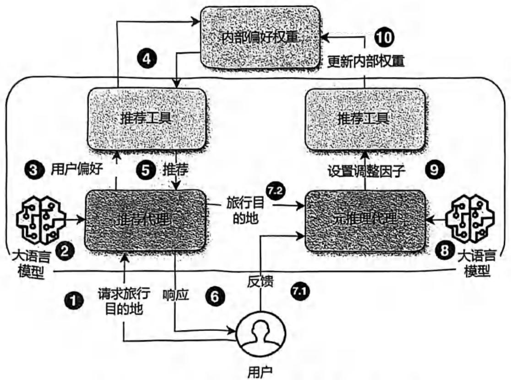  
图4.1 使用AI智能体和CrewAI框架的元推理

这个过程体现了持续学习的理念，每一条用户反馈都会帮助智能体更好地理解用户的偏好，进而不断优化决策过程，确保系统在评估和改进中持续循环。虽然在这个简化示例中没有明确展示资源优化，但这个概念可以扩展到更复杂的场景，其中智能体为复杂决策分配更多的计算资源，而对简单决策则会简化处理。未来的改进可能包括持续学习功能，系统会存储反馈和权重，用于未来的会话，帮助智能体保持并不断积累经验。更复杂的反馈，例如详细的评分或用户评论，可以帮助智能体进行更加精准的调整，而先进的算法则能更智能地分析反馈并调整偏好权重。此外，增加推荐目的地的种类，并加入更多的属性(比如气候或文化体验等)，将进一步丰富推荐过程。

元推理让智能体能够反思自己的推理过程，并做出适时调整，体现在性能监控和资源分配两方面，相关内容将在后续章节中进一步详细说明。

# 1. 性能监控

一个具有反思能力的旅行智能体能够监控其成功率并发现决策过程中出现的问题。例如，它可以跟踪用户对推荐的行程、住宿或活动的满意度。通过识别特定规律，例如某些类型的推荐持续获得较低的评分，智能体可以调整其推理策略以改进未来的表现。持续的性能监控是反思型旅行智能体学习和适应能力的关键方面。通过系统地跟踪和分析用户反馈及满意度指标，智能体可以深入了解其推荐和决策过程的有效性。设定明确的基准和性能指标阈值同样重要，因为这有助于确定何时需要调整推理策略或决策过程。

反思型旅行智能体可以通过追踪各种指标来持续监控其性能，从而评估其推荐和决策过程的有效性。这些指标包括用户满意度、评分，以及对推荐行程、住宿、活动和交通工具的评论。性能监控使智能体能够发现规律模式、识别待改进的空间，并基于数据做出调整来增强其推理策略和结果。

例如，旅行智能体可以在旅行结束后向用户征求反馈，询问他们对酒店品质、活动适宜性、交通便利性和整体体验等方面的评分。通过汇总和分析这些反馈，智能体可以揭示趋势并找出其推荐可能存在不足的地方。

# 1）需要跟踪的具体指标

以下是一些具体指标，用于评估旅行智能体推荐和决策过程的有效性。

- 用户评分和评论：对住宿、活动和整体旅行体验的评分有助于衡量用户的满意度，并找出需要改进的地方。  
- 推荐接受率：诸如选择推荐航班、酒店或活动的用户百分比等指标，可以反映智能体与用户偏好的一致性。  
- 投诉和退订率：跟踪用户反馈的问题，如对服务不满意或取消的旅行，可以揭示智能体决策中的不足之处。  
- 用户参与度指标：关于用户与推荐内容的互动频率或请求修改的频率等数据，可以为智能体的相关性和准确性提供有价值的洞察。  
针对不同用户群体的洞察：了解不同用户群体(如家庭、单独旅行者、情侣)对推荐的反馈，有助于智能体调整其策略以更好地满足不同群体的需求。

# 2）如何根据指标调整行为

如果智能体注意到某个特定目的地的住宿评分持续较低，它可能会重新评估价格、位置或设施等因素的优先级。例如，智能体可能意识到自己过于强调节省成本，而忽略了其他重要因素，如与景点的距离或用户评论。

同样，如果反馈显示冒险类运动在多个目的地的评分持续较低，智能体可能会得出结论，认为自身对用户此类活动的偏好缺乏全面了解。通过调整推理策略(例如纳入更多的用户偏好数据或接入更多样的活动来源)智能体可以提高推荐的准确性和个性化水平。

智能体还可以根据人口统计信息分析反馈。例如，如果适合家庭的推荐得到高评分，而对单身旅行者的推荐评分较低，智能体可以调整推理策略，更好地满足单身旅行者的需求，比如为他们提供更多符合预算的或具有文化沉浸感的选项。

通过系统地跟踪和分析这些指标，旅行智能体可以逐步改进其推理策略。这种方法不仅提高了推荐的质量和个性化，还通过提供始终可靠且令人满意的旅行体验，增强了用户的信任和忠诚度。通过持续的性能监控，智能体逐渐发展成一个更智能、更具适应性且更以用户为中心的顾问。

# 2. 资源分配

通过元推理，旅行智能体可以优化其资源分配。在复杂或重要性高的旅行规划中，智能体可能会分配更多的计算资源，以进行更深入的推理和分析。相反，对于常规或简单的请求，它可以借助更简单的启发式算法或预定义规则，从而节省资源。高效的资源分配对于一个反思型旅行智能体的有效运作至关重要，它能够及时回应用户的需求。通过元推理，智能体能够根据每个旅行规划请求的复杂性和重要性，动态调整计算资源的分配。

假设旅行智能体收到一个请求，要规划一次跨多个国家或地区的复杂多目的地假期。这样的请求通常涉及复杂的行程安排(如航班、住宿、活动等)，并且需要平衡许多约束条件和偏好。在这种情况下，智能体可能会分配更多的计算资源，用于更深入的推理和分析。这可能包括运行复杂的算法来生成最优行程，考虑大量潜在的旅行选择组合和排列，并根据成本、旅行时间、用户偏好以及潜在风险或干扰等多种因素来评估每个选项。然而，为了优化复杂的行程，过度分配计算资源可能会导致收益递减或低效。例如，智能体可能会过于关注行程的完美性，导致延迟响应时间或消耗不必要的资源。此外，智能体还可能会忽视一些简单但同样令人满意的解决方案，这些方案能够在不需要耗费大量模拟或分析的情况下满足用户需求。平衡计算资源投入与实际结果至关重要，以避免过度设计，并确保及时、高效的响应。

此外，智能体还可以分配资源，模拟各种场景和应急计划，确保旅行计划具有足够的稳健性和适应性。

另外，如果用户需求是常规或简单的旅行安排，例如周末去附近的目的地度假，反思型旅行智能体则可以采用更简单的启发式算法或预定义规则来节省计算资源。这些规则可能包括根据用户偏好优先推荐受欢迎或高评分的目的地和住宿，应用标准的路线规划或活动推荐算法，直接调用预先编译的数据和旅行套餐。

通过元推理动态调整资源分配，旅行智能体能够在计算效率和每个旅行规划任务所需的分析深度之间找到合适的平衡。这不仅确保了及时的响应，还优化了智能体的整体资源利用，避免了常规任务的计算开销过大，同时为复杂或高风险的场景分配足够的资源。

反思型旅行智能体可以通过元推理不断监控并调整其资源分配策略，基于不断变化的用户需求、系统性能指标或新计算资源的可用性。例如，如果智能体在旅游高峰季节频繁出现响应延迟，它可以主动分配更多的资源，或实施负载均衡技术，以保持最佳性能。通过元推理驱动的智能资源分配，反思型旅行智能体能够提供无缝且高效的旅行规划体验，让计算资源匹配每个用户请求的复杂性，同时确保最优的资源利用和稳定的系统性能。

反思型旅行智能体可以利用多种算法和策略进行动态资源分配，确保最佳性

能和个性化的用户体验。强化学习(RL)是其中一种方法，使得智能体可以通过试错学习掌握资源分配策略，动态调整计算资源以应对任务的复杂性，如多目的地行程规划。多臂老虎机(MAB)是另一种典型算法，通过平衡探索与开发，帮助智能体有效地分配资源，以进行价格比较或酒店推荐，最大化用户满意度。贝叶斯优化利用统计方法来确定最有前景的资源配置，而动态规划则将复杂的分配问题简化为易于管理的子问题，确保在整个旅行规划过程中做出最优决策。

基于启发式算法，如由于国际旅行本身的复杂性而分配更多的资源，提供了实用的经验法则解决方案；博弈论方法则将资源分配建模为一场战略博弈，平衡行程优化与偏好分析等相互竞争的任务；任务优先级算法，如加权轮询，基于任务的紧急程度或重要性分配资源；资源感知调度技术(如最小-最小算法)则专注于快速完成简单任务，为更复杂的计算腾出资源。通过将这些策略与元推理结合，智能体可以实时评估任务的复杂性，并选择最有效的方案，提供自适应、高效的解决方案，从而提升整体旅行规划体验。

# 4.4.3 自我解释

自我解释是一个过程，智能体通过语言表达其推理过程，生成对所做决策的解释。这种技术对于反思型智能体来说具有多个关键作用，特别是在旅行智能体示例中，如下文所述。

自我解释有两个不同的目的：增强透明度和促进学习。在透明度方面，自我解释的重点是使智能体的决策对人类可理解。例如，反思型旅行智能体可能会解释为何推荐了特定的行程，通过突出成本、用户偏好或目的地受欢迎程度等因素。这种类型的自我解释通过为用户提供清晰的推理过程，建立用户对智能体的信任，让用户对智能体的决策充满信心。

另外，出于学习的目的，自我解释专注于智能体改进决策过程的能力。在这种情况下，智能体不仅仅是为了与用户沟通而生成解释，还需要反思其推理过程并找出可能的改进空间。例如，如果旅行智能体在某些酒店推荐中持续收到负面反馈，它可以分析自己的解释，找出评估酒店时的推理漏洞，例如过于强调价格而忽视用户评论。这个过程使智能体能够完善其策略，从过去的解释中学习，以便未来提供更好的推荐。

因此，为了透明度而进行的自我解释是面向外部的，关注用户的，而为了学习而进行的自我解释则是面向内部的，使智能体能够不断适应和改进。

# 1. 透明度

通过为自身的推荐和决策生成自我解释，反思型旅行智能体可以为用户提供对其思维过程和决策依据的洞察。这种透明度增强了用户对智能体能力的信任和信心，因为用户可以更好地理解推荐的行程、住宿或活动背后的推理过程。

例如，旅行智能体可以解释它为何推荐某个特定酒店，可能是基于该酒店靠近受欢迎的旅游景点、之前有类似偏好的旅行者对其有高评分，以及价格在用户指定的预算范围内具有竞争力。通过阐明这些因素和背后的推理过程，智能体展示的透明度可以让用户感到放心，并提高他们采纳推荐的意愿。

回顾示例代码，首先通过提示模型解释为什么会给出某个推荐，来实现一个透明度自我解释智能体，解释它为何推荐特定的酒店或目的地。在CrewAI框架下，代码大致如下：

```txt
1 travel_agent \(=\) Agent(   
2 role \(=\) "Travel Advisor",   
3 goal \(=\) "Provide hotel recommendations with transparent reasoning.",   
4 backstory \(=\) "An AI travel advisor specializing in personalized travel planning.   
5 You always explain the steps you take to arrive at a conclusion.",   
6 tools \(\equiv\) [recommendhotel]   
7 ）   
8   
9 recommendation_task \(\equiv\) Task(   
10 name \(=\) "Recommend hotel",   
11 description \(= = = = = = = = = = = = = = = = = = = = = = = = = = = = = = = = = =   
12 Recommend a hotels based on the user's query (query).   
13 ""   
14 agent \(\equiv\) travel_agent,   
15 expected_output \(\equiv\) "The name of the hotel with explanations"   
16 ） 
```

在这个代码示例中，我们定义了一个智能体，并要求它必须始终解释它得出结论的过程——这一要求是在智能体的背景设置参数中指定的。然后，我们为它分配了使用 recommend客房 工具查找酒店的任务，该工具负责查找酒店。当智能体接收到查询“在巴黎寻找一家每晚不到 300 美元的酒店”的请求时，它会推荐一家酒店，并解释推荐该酒店的理由。输出大致如下：

Hotel: Hotel du Petit Moulin

Reason:

I found several hotels in Paris, but most of them exceeded the budget of $300. The only suitable option is Hotel du Petit Moulin, which is priced at $300 per night. Located in the 3rd arrondissement, it offers moderate transportation convenience with the nearest metro station, Saint-Sébastien Froissart, being approximately 1.9 kilometers away. This hotel is a great choice for budget-conscious travelers who still want to enjoy the charm of Paris.

图4.2展示了一个具有自我解释和透明度的智能体系统的概念流程。

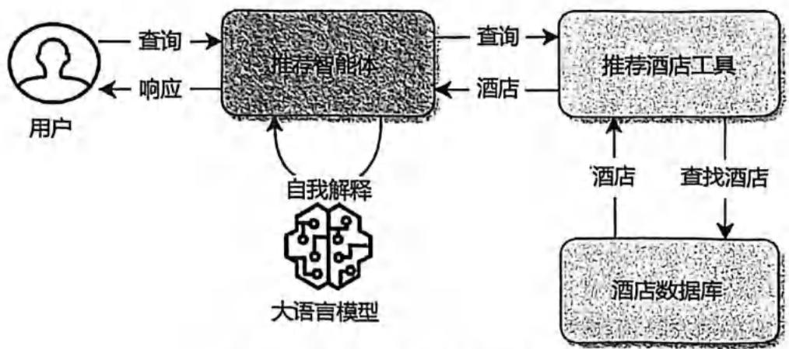  
图4.2 AI智能体的自解释透明度

在这里，模型的每个响应都会经过一个解释周期，其中智能体会生成其响应背后的适当解释和理由。这些解释随后可能会展示给用户，也可能仅仅记录下来以便进行可解释性分析。

# 2. 学习与改进

将推理过程用语言表达出来的行为，也可以作为反思型旅行智能体的一种学习机制。当智能体生成自我解释时，它可能会发现决策过程中存在的缺陷、不一致之处或被忽略的因素。通过对这些自我解释进行自省，智能体可以识别出需要改进的地方，并据此优化自己的推理策略。

举个例子，如果用户反馈表示对推荐的活动不满意，旅行智能体可以重新审视自己做出推荐的自我解释。在这个过程中，智能体可能意识到自己没有充分考虑某些用户的偏好，或者忽视了本应影响决策的重要因素。这种认知会为智能体的学习过程提供方向，促使智能体做出调整，改进推理算法或知识库，以避免类似问题再次发生。在我们之前的例子中，AI推荐了一家交通便利的酒店，但用户可能对这个推荐不满意，并且愿意多花点钱选择一个更靠近公共交通站点的酒店。

为了实现学习与改进，我们会在之前的透明度流程基础上进行扩展，增加一个可以处理推荐结果和用户反馈的智能体-任务对，利用这些信息来优化策略。具体代码示例请参考Python notebook。图4.3展示了整个流程的整体框架。

# 3. 用户参与与协作

自我解释还可以促进旅行智能体与用户之间更具参与感和协作性的交流。通过为自己的推荐提供解释，智能体鼓励用户提供反馈、提出后续问题，或者提供额外的背景信息或偏好。这样的双向对话可以帮助智能体不断根据用户的反馈调整推荐，形成一个更个性化、持续优化的旅行规划过程。

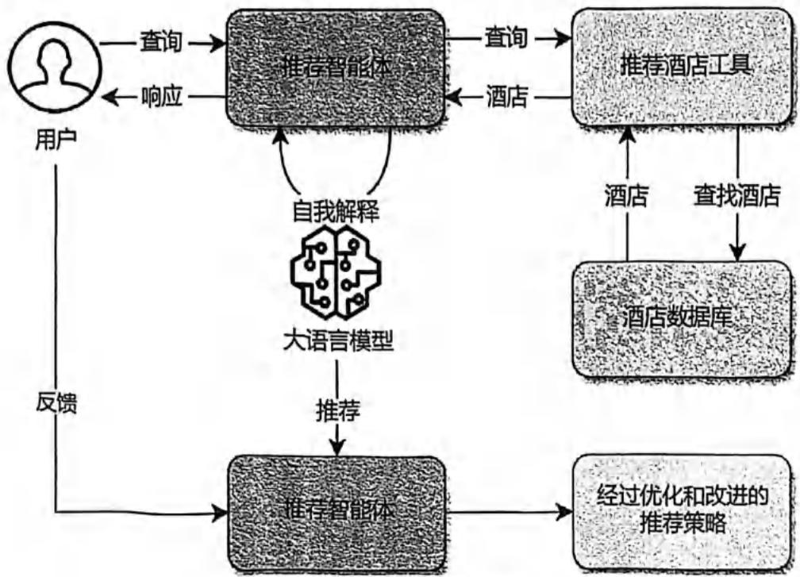  
图4.3 AI智能体的学习和优化

举个例子，如果用户对某个推荐有疑虑或不确定，旅行智能体可以详细地解释为什么做出这个推荐，列出它考虑的各种因素，并邀请用户分享自己的想法或额外要求。这种合作方式能帮助智能体更好地理解用户的需求和偏好，从而提供更加个性化和令用户满意的推荐。到目前为止，我们已经看到了一些智能体如何根据人类输入调整推荐并优化任务执行。虽然Python notebook中也有类似的用户参与和协作示例，但需要注意的是，人类与智能体的协作通常是通过对话界面(例如聊天机器人)来实现的。

通过引入自我解释功能，反思型旅行智能体可以促进透明度、建立信任、实现持续学习，并增强与用户的协作互动。这种多维的方法不仅提升了整体旅行规划体验，还能帮助智能体在长期使用过程中不断提升推荐的个性化程度和准确性。接下来，将探讨AI智能体的自我建模。

# 4.4.4 自我建模

自我建模是反思型智能体的一个关键特性，它使智能体能够保持对自身目标、信念和知识的内部表征。这个自我模型为决策和反思提供了基础，使得智能体能够根据变化的环境或新获得的信息调整自身行为并实现进化。进一步说明，这里所说的建模是指智能体的初始环境和状态。智能体(或一组智能体)从某个特定的初始状态开始，并在特定环境中运作。当智能体通过人机交互或执行任务学习到更多信息时，它会不断更新其内部状态，从而改变自身运作所处的环境。

在反思型旅行智能体的场景下，自我建模在确保智能体的推荐和决策过程与用户不断变化的需求和偏好保持一致，且同时整合新的知识和经验方面起着至关

重要的作用。图4.4展示了智能体自我建模的整体框架，接下来我们将进一步讨论内部状态的两个组成部分。智能体可能拥有独立的内部状态，在智能体系统中进行自我建模，或者它们可能拥有共享的内部状态，在此基础上进行协同自我建模。

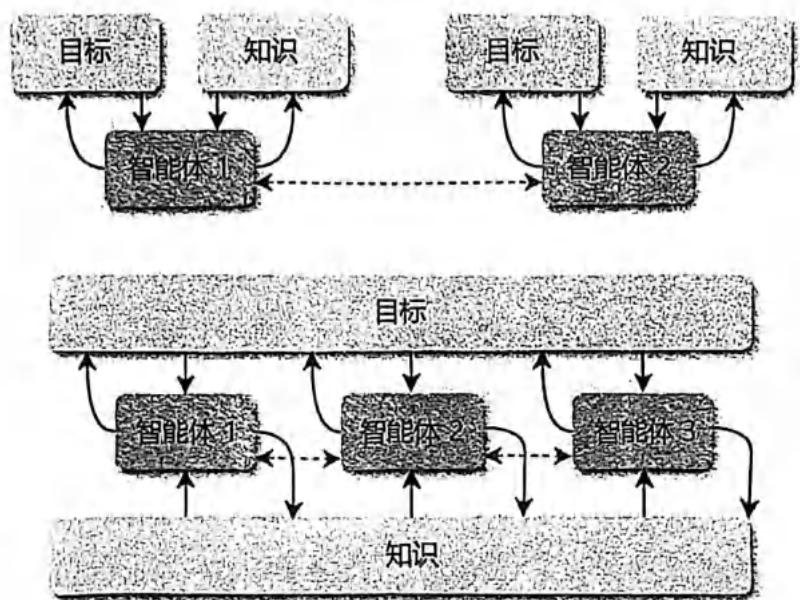  
图4.4 用于自我建模的独立和共享内部状态

这种内部状态可能包含多个组成部分，但从更高层次来看，最关键的是，它们可以分为两个类别：目标管理和知识更新，接下来将进一步探讨这两个方面。

# 1. 目标管理

反思型旅行智能体维护着一个关于自身目标的内部模型，这些目标的范围很广，从提供个性化和令人满意的旅行推荐，到根据用户的偏好和约束优化旅行体验均有涉及。然而，这些目标并不是静态的；智能体必须能够随着环境变化或新信息的出现，重新思考并调整其目标。

例如，如果用户的旅行日期或预算限制在旅行规划过程中发生变化，反思型旅行智能体可以利用其自我模型重新评估并相应地更新其目标。它可能会将重点从最大化豪华住宿体验转移到优先考虑性价比，或者调整行程推荐以契合新的旅行日期。

此外，如果智能体通过反馈或互动了解到用户的兴趣或旅行偏好的变化，它可以更新其目标，更好地满足这些变化的需求。例如，如果用户表达了对环保或可持续旅行方式的新兴趣，智能体可以调整其目标，优先推荐注重环保的住宿、活动和交通方式。

# 2.知识更新

自我建模的一个关键方面是能够根据新的经验和见解自动更新智能体的知识库。当反思型旅行智能体与用户互动、接收反馈并从自己的推荐和决策中学习时，它可以持续地完善和扩展自己关于目的地、住宿、活动、用户偏好和旅行趋势的知识。

例如，如果用户报告某个推荐的酒店或活动体验不好，智能体可以更新其知识库，反映这一反馈，可能会调整评分或将该选项从未来的推荐中移除。相反，如果用户对某个特定目的地或体验给予高度评价，智能体则可以强化其关于该推荐的正面知识，增加在未来向有类似偏好的用户推荐该选项的可能性。

通过保持一个自我模型并自动更新其知识库，反思型旅行智能体为改善决策和推荐的准确性打下了基础。随着知识库的增长和发展，智能体可以利用这些见解，提供越来越个性化和令人满意的旅行规划体验。

在之前的例子中，自我建模旅行智能体不仅会根据用户偏好提供推荐，还会持续地调整和完善这些推荐。通过维护一个内部自我模型，并根据用户反馈更新知识库，智能体可以随着时间的推移改善其推荐，确保推荐更具个性化且符合用户不断变化的需求和偏好。自我建模可以使智能体识别知识空白或信息缺失、过时的领域。在这种情况下，智能体可以主动寻找新的信息来源，或利用外部数据源来增强其知识库，确保其推荐基于最新和最全面的信息。

通过将目标管理和知识更新能力结合，自我建模使得反思型旅行智能体能够持续调整并改进其表现，确保在为寻求个性化和定制化旅行体验的用户提供服务时，始终是一个可靠且有价值的资源。

前文一直在讨论旅行智能体的例子，以便理解本章的概念，接下来将讨论许多现实世界的应用案例。请记住，这些例子并不是详尽无遗的，因此本章结尾时的一个练习是思考智能体反思和自省技巧如何应用于其他现实场景中。

# 4.5 应用场景和示例

反思型智能体已经被用于支持多种新兴的商业应用。反思型智能体可以高效地运用自我评估和自省能力，以应对不断变化的环境，从而做出更有效的商业决策，整个过程兼具透明度和可解释性，实现持续改进。以下是反思型智能体在实际商业场景中的部分应用示例。

# 4.5.1 客户服务聊天机器人

反思型客户服务聊天机器人采用自我评估的方法，不断提升其为用户提供有效且令人满意的响应的能力。通过自省以往的对话，这些聊天机器人能够识别互动模式、优点、缺点及待改进的领域，从而优化其知识库、响应策略和整体互动能力。

自我评估的一个关键方面是能够分析以往对话的结果。聊天机器人可以回顾用户反馈、情感分析和对话指标，以评估自身响应的成功与否。例如，聊天机器人可能会识别出用户在某些对话中表现出的沮丧或不满情绪，这些情绪通过负面

情感或低满意度评分等方式表现出来。通过反思这些情况，聊天机器人可以找出潜在的问题，如误解、不充分的信息或不恰当的语气或语言。同时，聊天机器人还可以分析那些顺利进行的对话，在这些对话中，用户对提供的解决方案表示满意或感激。通过研究这些成功互动的特点，聊天机器人可以强化有效的响应策略，总结最佳实践，并在未来的对话中复用。

反思型聊天机器人能够自省对话的具体内容和流程、识别模式及待改进的领域。它们可能会识别出反复出现的问题或话题，这些问题或话题常常导致用户困惑或不满，表明需要增强其知识库或优化回应模板。另外，它们也能识别出用户频繁请求某些特定信息或功能的情况，进而推动新对话流程或功能集成的开发，以更好地满足用户需求。除了内容分析，反思型聊天机器人还可以评估其沟通风格和语言使用的有效性。通过分析用户的反馈和反应，它们可以确定哪种语气、措辞或正式程度更能与不同的用户群体或情境产生共鸣。这些见解可以帮助聊天机器人动态调整其沟通风格，促进更自然和更个性化的互动。

此外，自我评估还可以帮助聊天机器人识别知识空白或理解有限的领域。当它们发现自身在某些情况下无法提供令人满意的响应时，聊天机器人可以主动获取额外的信息或向人类专家咨询，以扩展其知识库并提升处理更广泛查询的能力。

Zendesk 和 Drift 等软件公司已在人工智能驱动的聊天机器人中融入从对话中学习的功能。这些聊天机器人会监控用户对其满意度的评分和评论。通过反思这些反馈，聊天机器人能够更好地调整响应策略，并提升其未来提供令人满意的解决方案的能力。例如，如果一个聊天机器人发现用户对其在某个特定话题上的回应经常表示沮丧或不满，它可以分析这些对话，识别模式或知识漏洞，并相应地优化响应策略。此外，聊天机器人还可以根据用户偏好和反馈，调整其语气、语言和沟通风格，提供更自然的个性化互动体验。

# 4.5.2 个性化营销智能体

个性化营销领域也应用了反思型智能体。反思型智能体通过分析消费者行为和反馈，制定成功的营销策略。它们反思过去的营销活动，并根据关键绩效指标对即将进行的活动进行调整。

例如，亚马逊使用反思型AI智能体，研究客户购买趋势和评价，以推荐相似的产品。这些智能体在与用户互动的过程中不断学习，从而优化推荐内容和营销参数，改善客户互动体验，提升销售业绩。

在当今竞争激烈的商业环境中，个性化营销变得越来越重要，反思型智能体在提供定制化和有效的营销策略中发挥着关键作用。这些智能体利用自我评估和自省能力，分析消费者行为、反馈以及过去营销活动的成功或失败，从而持续改进和优化其营销方法。反思型个性化营销智能体的核心能力是能够收集和分析大

量关于消费者行为、偏好和互动的数据。通过研究购买决策模式、浏览历史、评价和参与度指标，这些智能体能够洞察不同消费者群体的需求和驱动购买决策的因素。

个性化营销智能体反思的关键方面是它们能够评估过去营销活动的成功或失败。这些智能体可以分析关键绩效指标，如点击率、转化率和客户获取成本，并将其与每个营销活动中所采用的具体策略、信息传递和目标定位进行关联。通过自省这些指标，智能体能够识别出哪些方法最有效，哪些方法存在不足，从而为未来的活动做出基于数据的调整。

例如，一家电子商务公司使用的反思型个性化营销智能体可能会分析一项针对特定产品线的电子邮件营销活动的表现。如果该活动的参与度或转化率低于预期，智能体可以自省相关因素，如信息传递、主题行、时机和受众分组。基于这一分析，智能体可以调整未来活动的策略，优化信息传递的方式，使其更能打动目标受众，调整沟通的时机和频率，或优化受众分组标准，以便触达更精准的消费者。

亚马逊反思型AI智能体的例子突显了这些原则的实际应用。通过持续研究客户趋势、购买行为和产品评价，亚马逊的智能体能够完善其产品推荐和个性化营销策略。当客户与平台互动并提供反馈时，智能体不断学习和适应，完善其建议，并优化用于定向营销活动的参数。这一持续学习和适应的循环确保了亚马逊的营销工作始终保持相关性、个性化和高效性，从而带来了更好的销售业绩和客户互动体验。

# 4.5.3 金融交易系统

反思型智能体在金融市场中的应用将越来越广泛，因为它们能够在交易策略开发方面有效赋能。反思型智能体通过分析市场数据和历史交易记录，优化算法和决策过程，从而在金融交易中发挥重要作用。例如，Renaissance Technologies等对冲基金就采用了反思型交易智能体，这些智能体能够根据市场变化和之前交易的结果进行学习。因此，它们能够随时调整交易方式，以确保获得更高的利润并降低风险。

金融交易系统是一个复杂且动态变化的环境，快速适应并优化决策过程的能力至关重要。在这种环境下，反思型智能体能够通过不断分析市场数据、历史交易结果以及现有算法的表现，持续改进交易策略并有效降低风险。

反思型智能体在金融交易中的一个重要优势是它们能自省和评估过去交易的成败。通过回顾过去的交易决策和结果，智能体能够识别其中的规律、趋势，以及市场因素与交易结果之间的关系。自省能力让智能体能不断调整决策算法(如优化权重分配、整合新的数据源)或调整风险管理策略。

举个例子，一个反思型交易智能体可能会发现某些交易策略在特定的市场环

境或经济事件中表现不佳。通过自省，智能体可以根据这些规律调整算法，避免在类似情况下重复出现亏损，优化风险管理。

此外，反思型智能体还可以根据市场数据和历史趋势，预测未来的市场走势或发现潜在的交易机会。它们可以通过分析大量的市场信息，如财经新闻、经济指标、社交媒体上的舆情等，识别出人类交易者可能忽略的微妙趋势和关联性。这种预测能力使得智能体能够主动调整交易策略，把握即将到来的市场变化，或抓住潜在的交易机会。

Renaissance Technologies采用反思型交易智能体很好地展示了这些原则的实际应用。这些智能体通过不断学习市场动态和历史交易结果，实时调整决策和交易策略。通过自省过去的交易表现，智能体能够发现能够获益的交易机会，同时降低风险，从而在竞争激烈的金融市场中保持优势。

# 4.5.4 预测智能体

反思型智能体同样在销售预测中发挥着重要作用。它们通过反思分析过去的销售数据，包括市场趋势，利用这些信息，智能体可以根据之前的预测分析需要做出的调整，从而改进预测模型。

例如，Salesforce的Einstein Analytics就使用反思型人工智能，基于历史数据为销售团队提供洞察。在这个过程中，它会学习历史销售趋势，修正错误和不准确之处，然后更新对未来的预测，从而帮助企业做出关于资源分配和战略的下一步决策。

准确的销售预测对于企业做出关于资源分配、库存管理和战略规划的明智决策至关重要。反思型智能体通过持续分析过去的数据，识别模式和趋势，并根据以前的表现调整预测模型，提升了销售预测的准确性和可靠性。

反思型智能体在销售预测中的一个关键优势是它们能够自省过去的预测，并将其与实际销售数据进行对比。通过分析预测数据与实际销售数据之间的差异，智能体可以识别出其预测模型中的潜在误差或不准确来源。这种自省能力使得智能体能够进行必要的调整，如重新校准各因素的权重、整合新的数据源或优化用于预测的算法。

此外，反思型智能体还可以利用历史销售数据和市场趋势，挖掘出有价值的洞察，以增强其预测能力。通过分析过去的销售模式、季节性波动及外部因素(如经济状况或消费者行为变化)，智能体能够识别出以前预测模型中可能忽视的相关性和预测变量。这个持续学习和适应的过程使得智能体能够不断提升其预测的准确性，为企业决策提供更可靠、更具操作性的洞察。

Salesforce的Einstein Analytics案例展示了反思型人工智能在销售预测中的实际应用。Einstein Analytics利用历史数据了解和学习过去的销售趋势，识别以前预测中的错误或不准确之处，并相应地更新对未来的预测。通过基于自省和数据

分析持续优化预测模型，Einstein Analytics 为销售团队提供准确、可靠的洞察，帮助企业做出关于资源分配、库存管理和战略规划的明智决策。

此外，销售预测中的反思型智能体还可以结合机器学习技术，进一步提升其预测能力。通过从各种数据源(如市场调研报告、社交媒体情绪、竞争对手情报等)中获取并分析大量数据，这些智能体可以揭示一些不易察觉的复杂模式和关系。通过这种动态学习和适应的能力，智能体能够领先于市场趋势，不断完善预测模型，帮助企业在感知市场变化、应对市场波动方面获得竞争优势。

在快速变化的商业环境中，准确的销售预测对有效的资源分配、战略规划以及保持竞争优势至关重要。反思型智能体通过自省、数据分析和持续学习，提供了一个强大的解决方案，以提升销售预测的准确性和可靠性。通过根据过去的表现和新兴趋势不断优化预测模型，这些智能体为企业提供了可操作的洞察，帮助它们做出明智的决策，并在各自的市场中保持领先地位。

# 4.5.5 电子商务中的定价策略

反思型智能体的另一个应用领域是优化电子商务的定价策略。这些智能体收集关于竞争对手定价、客户行为和销售数据的信息，并根据这些数据推荐最佳的定价策略。

例如，人工智能驱动的定价智能体会根据市场情况和消费者的反应，动态调整价格。沃尔玛和塔吉特等公司就采用了这种智能体，它帮助公司通过避免过度涨价来实现最大销售额，并进一步提高利润率。

在竞争激烈且动态变化的电子商务环境中，有效的定价策略对于吸引客户、最大化销量和维持盈利能力至关重要。反思型智能体通过持续分析市场状况、竞争对手定价、客户行为和销售数据，在优化定价策略方面发挥着关键作用，使企业能够做出明智且灵活的决策。

反思型智能体在电子商务定价中的一个重要优势是它们能够实时监控并应对市场和客户行为的变化。这些智能体可以收集并分析来自多个来源的大量数据，包括竞争对手网站、社交媒体情绪和客户评论。通过自省这些数据，智能体能够识别出影响定价决策的模式、趋势和消费者偏好。

例如，一个反思型定价智能体可能会注意到竞争对手推出了促销活动，对某些产品进行了打折。通过分析客户反应和销售数据，智能体可以判断是否需要调整价格，以保持竞争力和市场份额。如果智能体确定需要调整价格，它可以根据利润率、库存水平和客户需求等因素，推荐合适的定价策略。

此外，反思型智能体还可以利用历史销售数据和客户行为模式来长期优化定价策略。通过分析过往定价决策的有效性及其对销售和盈利能力的影响，智能体可以完善定价模型和算法，确保未来的推荐符合企业目标和客户期望。

在电子商务定价场景中，反思型智能体还可以结合机器学习技术，进一步增强

其决策能力。通过从各种来源(如市场研究报告、社交媒体情绪和客户购买历史)中获取并分析大量数据，这些智能体能够揭示一些复杂的模式和关系，这些关系可能并不容易被立刻察觉。这种动态学习和适应能力使得智能体能够预判市场趋势，不断优化其定价策略，帮助企业在不断变化的电子商务环境中保持竞争优势。

在竞争激烈的电子商务市场中，有效的定价策略对于吸引和留住客户、最大化销售和保持盈利能力至关重要。反思型智能体通过自省、数据分析和持续学习，为优化定价策略提供了强大的解决方案。通过持续监控市场状况、分析客户行为，并根据过去的表现不断完善定价模型，这些智能体为企业提供了基于数据的洞察和灵活的定价策略，使企业在竞争中保持领先，实现销售和盈利目标。

# 本章小结

LLM智能体的反思和自省能力成为重要的差异化特征，使得智能体能够超越静态的规则系统，展现出类人智能。本章探讨了反思和自我评估的重要性，研究了如何将这些能力嵌入智能体中，并展示了它们在不同商业领域的实际应用。

通过实现元推理、自我解释和自我建模，智能体获得了监控和控制推理过程的能力，能够表达其决策背后的逻辑，并根据不断变化的环境和新经验管理自己的目标与知识。这些能力不仅提升了透明度和信任度，还为智能体的持续学习、适应和优化铺平了道路。这些能力使智能体能够从经验中学习，适应不断变化的环境，优化决策过程，最终提升性能、提供个性化的用户体验，并为企业带来竞争优势。

本章展示的应用场景和示例强调了反思型智能体的广泛应用，从提供个性化和自然互动的客户服务聊天机器人，到能够动态调整物流和库存管理策略的供应链优化智能体；从能够降低风险并抓住新兴机会的金融交易系统，到能够优化资源分配和团队协作的项目管理工具，反思型智能体在各个商业领域的价值已得到验证。

本章简要介绍了工具使用的相关内容，下一章将更深入地探讨智能体工具的使用方式，看看这些工具如何为智能体的工作流赋能，并进一步探讨智能体如何通过规划行动路径来完成特定任务。

# 习题

1. 元推理能力如何促进智能体性能的优化？  
2. 自我解释与AI系统中的用户互动之间的关系是什么？  
3. 自我建模如何提升智能体的适应能力？  
4. 在AI系统中实施反思能力的主要商业优势是什么？

5. 为什么反思和自省被认为是开发类人AI能力的关键组成部分？

# 习题答案

1. 元推理使智能体能够监控和控制其推理活动，同时动态调整策略并优化资源分配。这使得智能体能够评估自己的思维过程，实时调整问题解决方法，并高效地将计算资源分配到最需要的地方。  
2. 自我解释促进了透明的决策过程，通过让 AI 系统阐明其推理过程，实现与用户的自然互动。这种透明度有助于用户理解系统如何得出结论，建立信任，并通过清晰的沟通促进系统决策逻辑的持续学习。  
3. 自我建模使智能体能够适应变化的环境，通过根据不断变化的情境管理目标、从新经验中更新知识，并长期优化决策过程。这创造了一个动态学习系统，使智能体能够根据新信息和环境变化调整行为。  
4. 在AI系统中实施反思能力带来了多个商业优势，包括优化决策过程、提供更个性化的用户体验，以及通过增强的适应性和学习能力获得竞争优势。这些优势来源于系统持续学习、适应和优化其性能的能力。  
5. 反思和自省至关重要，因为它们使 AI 系统能够分析自己的推理过程，从经验中学习，并动态调整行为——这些都是人类智能的核心特征。通过元推理、自我解释和自我建模等技术，智能体能够发展出更复杂的理解和决策能力，模拟人类的认知过程。

# 第5章

# 赋予智能体使用工具与进行规划的能力

上一章深入探讨了智能体的反思与自省能力的复杂概念。这些能力使智能体能够对其自身的认知过程进行推理，从经验中学习，并动态调整其行为。

AI智能体的一大重要突破在于将智能体的规划能力与工具使用能力相结合。本章将聚焦以下内容：工具的工作原理、各类规划算法、两者的整合方式，以及彰显其实用价值的实际案例。本章将深入探讨智能体中工具使用的概念，借助工具，智能体的能力可突破决策制定与问题解决的局限；介绍智能体可利用的各类工具，如API、数据库、软件函数等；深入分析对智能体至关重要的规划算法，包括状态空间搜索、强化学习与层次任务网络规划。此外，本章还将探讨工具使用与规划的整合方法：通过推理可用工具、基于目标评估工具适用性、选择合适的工具，并生成能利用这些工具的高效行动序列。

本章主要介绍以下内容。

- 理解智能体中工具使用的概念。  
智能体的规划算法。  
- 工具使用与规划的整合。  
- 探索实际代码实现。

通过本章的学习，你将了解什么是工具、如何利用它们增强智能体系统的能力，以及如何让工具与规划算法协同工作。

# 5.1 技术要求

你可以在GitHub上找到本章的代码文件，地址为https://github.com/Packt-Publishing/Building-Agentic-AI-Systems。本章还将使用智能体Python框架，如CrewAI、AutoGen和LangChain，来展示AI智能体的不同功能和应用。

# 5.2 理解智能体中工具使用的概念

智能体使用工具的核心在于，LLM 智能体能够利用外部资源或工具来增强其固有的功能和决策过程。这一概念超越了传统上将智能体视为一个独立(封闭)实体的观念，即仅依赖其内部知识(训练数据)和算法。相反，它认识到智能体可以通过巧妙地借助外部工具和系统的力量，突破其固有的限制。

例如，当你向一个独立运行的智能体发送查询(如“今天天气如何”)时，该模型可能会随意给出一个编造的答案，或者坦言它不知道如何获取天气信息。在这种情况下，智能体会依赖大语言模型的训练数据，而训练数据无法提供实时的天气信息。然而，如果智能体能够访问一个实时天气查询工具，它就可能准确回答这个问题。工具的使用使智能体能够获取实时数据、执行专业任务，并管理超出其内置知识和算法范围的复杂工作流程。图5.1展示了智能体在封闭状态与可使用工具状态下的行为对比。

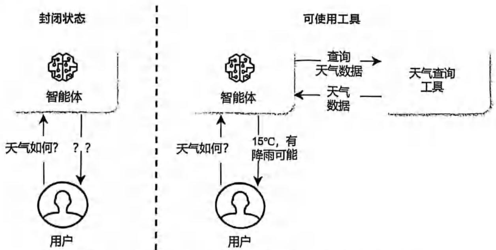  
图5.1 智能体在封闭状态与可使用工具状态下的行为对比

工具使用的意义在于，它能够拓宽智能体(进而拓宽驱动智能体的大语言模型)的能力范围，使其能够应对复杂的、来自现实世界的挑战，这些挑战可能超出其

固有问题解决能力的范畴。通过整合并协调各种工具，智能体可以有效地分流特定任务或获取补充数据和功能，从而提升其整体性能，并扩展其可实现目标的范围。在深入探讨工具的细节之前，让我们先了解大语言模型的工具调用原理。

# 5.2.1 工具调用与函数调用

在LLM的语境中，工具调用和函数调用经常被视为同义词，但它们在技术上存在明显的区别。函数调用是指大语言模型生成的结构化调用，针对同一运行时环境中的预定义函数，通常执行内部任务，如数据库查询或计算。相反，工具调用则使大语言模型能够与外部应用程序编程接口(API)、服务或系统交互，从而访问实时数据，并执行超出其固有能力的专业任务。例如，使用函数调用的大语言模型可能从本地数据库中检索用户资料，而工具调用则涉及查询天气API以获取实时更新。

理解这一区别对于设计AI智能体至关重要，这些智能体能够无缝地将内部逻辑与外部系统整合，从而提升功能性。

当大语言模型调用工具或函数时，它本身并不执行任何代码，而是生成一个结构化的响应，指示以下内容：

- 它想要使用哪个工具或函数。  
- 应该向该工具或函数传递哪些参数。  
- 这些参数应该如何格式化。

可以将其想象成撰写一份详细的指令，而不是亲自执行动作。大语言模型充当一个复杂的调度器，决定需要做什么以及如何做，但工具或函数的实际执行必须由外部运行时环境或智能体控制器来处理。例如，当被问及波士顿的天气时，大语言模型可能识别出需要天气查询函数，并以结构化的调用形式响应，例如：

```json
"function": "weatherLOOKUP", "parameters": { "location": "Boston", "date": "10/01/2024" } 
```

这个结构化的响应随后由智能体控制器进行解释和执行，该控制器实际上具备运行指定函数的能力，并能使用提供的参数。weatherLOOKUP工具(或函数)大致形式如下：

```python
1 import requests   
2   
3 def weatherLOOKup location: str, date: str) -> dict:   
4 ""A function to lookup weather data that takes location and date as input""   
5 API_KEY = "api_key" 
```

6 base_url $=$ "<apiURL>"   
7   
8 params $=$ {   
9 "q"; location,   
10 "appid":API_KEY,   
11 "units": "imperial" # For Fahrenheit   
12 }   
13 response $=$ requests.get(base_url, params=params)   
14 if response.status_code $= = 200$ ..   
15 data $=$ response.json()   
16 return data

至少，LLM智能体需要对工具的描述，说明工具的功能以及它期望的输入。你还可以指定哪些参数(在此例中为位置和日期)是必需的，哪些是可选的。图5.2展示了LLM智能体、工具和智能体控制器之间的工作流程。

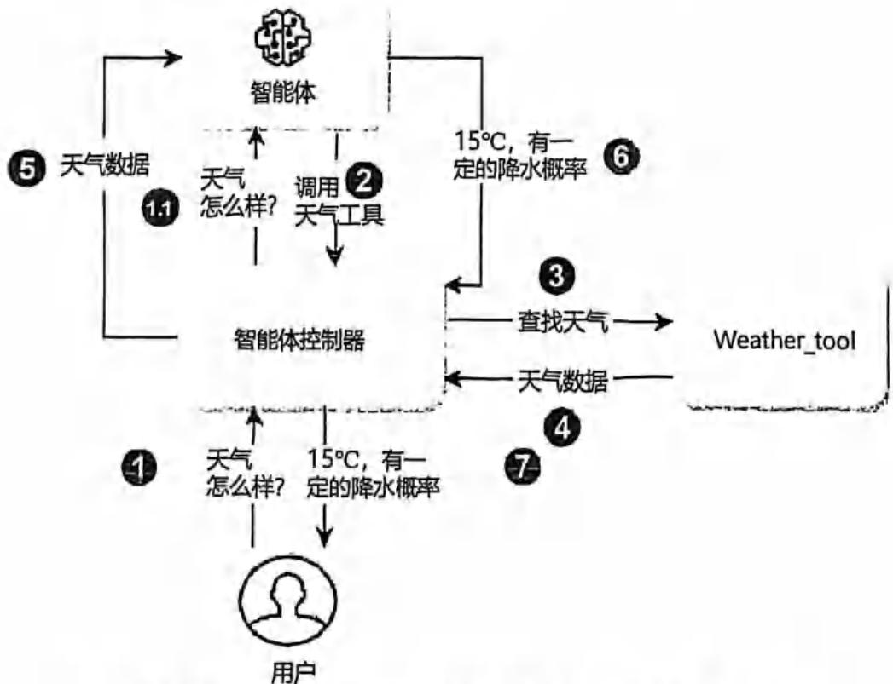  
图5.2LLM智能体的工具调用和智能体控制器对工具的执行

需要注意的是，并非所有大语言模型都能高效或准确地进行工具或函数调用。较大的模型在工具调用方面通常表现更好，例如 OpenAI 的 GPT-4 和 GPT-40、Anthropic 的 Claude Sonnet、Haiku、Opus，以及 Meta 的 Llama 3 等模型，它们都经过专门的工具调用训练。而其他没有接受过此类专门训练的模型，虽然可以通过精心设计的提示工程实现类似功能，但效果可能参差不齐。

# 5.2.2 为智能体定义工具

工具的定义通常使用文档字符串或JSON模式，需要清晰地描述其用途、所

需的输入以及预期的输出，以便与智能体进行沟通。根据开发方式，如使用的框架或直接与大语言模型 API 交互，定义工具主要有两种方法。

# 1. 基于框架——使用文档字符串

在CrewAI或LangGraph等框架中，工具通过文档字符串进行定义，即在函数开头出现的描述性文本。以下是一个天气查询工具的示例代码：

```python
1 def weatherLOOKUP location: str, date: str = None):  
2     ""  
3     A tool that can lookup real-time weather data.  
4     Arguments:  
5     location (str): The location to lookup weather for  
6     date (str) Optional: The date in MM/DD/YYYY format  
7     ""  
8     # 函数代码与逻辑 
```

文档字符串用三重引号("")包围，需要包含以下关键信息：

工具的用途。  
必需的参数和可选的参数。  
预期的返回值。

这种方法使开发者创建工具变得直观，因为它采用了标准的编程实践。注意，Python使用三重引号来定义文档字符串，其他编程语言可能采用不同的惯例来定义此类文档。

# 2. 直接集成大语言模型

当不使用框架而直接与大语言模型 API(如 Anthropic 的 Claude 或 OpenAI 的 GPT)交互时，必须采用特定的 JSON 模式格式来定义工具：

```jsonl
{ "name": "weatherLOOKUP", "description": "A tool that can lookup real-time weather data", "input_schema": { "type": "object", "properties": { "location": {"type": "string", "description": "The city and state, e.g. San Francisco, CA" }, }, "required": ["location"] } 
```

调用模型时，可将多个工具以包含工具定义的JSON模式对象的列表(或数组)形式传入，示例如下：

tools $= [$ { "name": "weatherLOOKUP", "description": "A tool that can check weather data",

```txt
...
}，
{
    "name": "flightbooking",
    "description": "A tool that can book flights",
    ...
},
] 
```

请注意，这一点取决于具体模型，因此必须参考该模型的文档，以了解其API如何要求指定工具。如果项目使用多个模型，而这些模型定义工具的方式各不相同，那么定义、管理和维护工具定义很快就会变得烦琐。这也是人们越来越倾向于使用CrewAI、LangGraph和AutoGen等库或框架的原因之一，这些库或框架提供了一种简化的工具定义方式，不受智能体使用哪种大语言模型的限制。

# 5.2.3 工具的类型

LLM智能体可以利用各种工具包来增强其能力，并执行复杂任务。以下是主要工具类别。

- API：API作为智能体访问外部服务和实时数据的主要入口，提供与第三方系统交互的标准化方法，使智能体能够无缝集成各种服务。例如，在旅行规划场景中，API允许智能体访问天气服务、支付处理系统、导航和地图服务，以及航班和酒店预订系统。这种实时连接确保智能体能够向用户提供最新的信息和服务。  
- 数据库工具：数据库工具使智能体能够高效存储、检索和管理结构化(或半结构化)数据。这些工具支持读写操作，允许智能体在多个会话中维护持久化信息。智能体通常使用数据库来存储客户资料和偏好、维护历史交易记录、管理产品目录，以及访问特定领域的知识库。这种持久化存储能力使智能体能够从过去的交互中学习，并提供个性化的服务。  
- 实用函数：实用函数是在智能体环境中本地运行的自定义软件组件，专为执行特定任务设计。这些函数负责处理基本操作，如数据处理和分析、格式转换、数学计算，以及自然语言处理任务。它们作为构建更复杂操作的基础模块，能够帮助智能体高效处理信息。实用函数特别适用于需要持续、可重复操作的任务。  
- 集成工具：集成工具专注于连接不同系统和服务，实现无缝的工作流自动化。这些工具处理关键任务，如日历同步、文档处理、文件管理，以及通信系统的集成。它们充当不同平台和服务之间的桥梁，允许智能体协调跨越多个系统和数据源的复杂工作流。  
- 硬件接口工具：硬件接口工具使智能体能够与物理设备和系统交互，桥接数字世界与物理世界。这些工具对于控制物联网设备、集成机器人系

统、处理传感器数据，以及管理物理自动化系统至关重要。通过硬件接口工具，智能体可以将影响扩展到数字交互之外，实现对现实环境的改变并监控物理环境。

每种工具类型都有特定用途，可以组合使用以形成强大的智能体能力。工具的选择取决于智能体的角色、需求，以及它所执行任务的复杂度。

理解智能体如何使用这些工具涉及以下几个关键因素，这些因素会影响其有效性和可靠性。这些方面对于开发稳健的智能体系统至关重要，确保系统能够处理复杂的现实任务，同时维护安全性、妥善地处理错误，并适应不断变化的需求。

- 工具组合与链式调用：智能体通常需要组合多个工具来完成复杂任务。工具组合允许智能体通过将工具链式连接起来创建复杂的流程。例如，一个旅行规划智能体可能首先使用API检查航班可用性，然后使用数据库工具检索用户偏好，最后使用实用函数计算最优行程。这种链式调用能力使智能体的任务处理范围远超使用孤立工具的局限。  
- 工具选择与决策：工具使用的最关键方面之一是智能体为给定任务选择合适工具的能力。智能体必须评估上下文、理解需求，并选择最合适的工具或工具组合。这涉及考虑工具能力、可靠性、性能和成本等因素。智能体还必须处理多个工具可以解决同一问题的情况，选择最有效的选项。  
- 错误处理与备用机制：使用工具时，智能体必须做好应对潜在故障的准备，并制定处理策略。这包括检测失败的API调用、管理数据库连接问题，或处理不正确的函数输出。稳健的错误处理通常涉及备用机制，如果主要方法失败，智能体可以切换到替代工具或方法。  
- 工具状态管理：许多工具会维护状态或需要特定的初始化和清理程序。智能体需要有效地管理这些工具状态，确保资源的合理分配和释放。这包括管理数据库连接、维护API认证令牌，以及处理各种服务的会话状态。  
- 工具更新与版本控制：工具会随着时间迭代，出现新版本和新功能。智能体需要采取一些策略来处理工具更新、版本兼容性和已弃用功能等问题。这可能涉及维护与多个工具版本的兼容性、妥善地处理已弃用功能，并适应新的工具接口。  
- 工具安全与访问控制：当智能体与工具交互时，尤其是访问敏感数据或关键系统的工具时，安全考虑至关重要。这包括管理认证凭证、实施适当的授权检查，并确保通信通道安全。智能体还必须遵守各种工具的调用频率限制和使用配额。

举一个用户与AI旅行智能体通过工具高效互动的实际示例。

用户：“我需要为2名成人提供2024年6月15日至22日去罗马的航班和酒店选项，总预算为3000美元。”

使用CrewAI框架，在下面的代码片段中，我们将演示智能体如何在这个特定的旅行规划场景中使用工具：

```python
1 class TravelTools:  
2 def search_flights(self, ...) 6 -> dict:  
    '''Basic flight search simulation'''  
3 return {  
4 "flights": [ ("airline": "Alitalian airlines", price: 800, "duration": "9h")]  
5}  
6}  
7  
8 def check-hotels(self, ...) -> dict:  
9 '''Basic hotel search simulation'''  
10 return {  
11 "hotels": [ ("name": "Roma Inn", price: 150, "rating": 4.0)]  
12}  
13}  
14  
15 travel_agent = Agent(  
16 role='Travel Agent',  
17 goal='Find suitable flight and hotel options within budget',  
18 tools=[TravelTools().search_flights, TravelTools().check-hotels]  
19}  
20)  
21  
22 search_task = Task(  
23 description="Find flights and hotels for 2 adults to Rome, June 15-22, budget $3000", agent=travel_agent)  
24 agent=travel_agent)  
25  
26 crew = Crew agents=[travel_agent], tasks=[search_task])  
27 result = crew.kickoff() 
```

在这个例子中，我们可以看到几个关键概念的实际应用。

- 工具定义：TravelTools 类实现了专为旅行相关任务设计的工具，这些工具的针对性强。  
- 智能体配置：旅行智能体配备了合适的工具，并设定了明确的目标。  
- 任务指定：任务定义了精确的参数，让智能体能够据此工作。  
- 工具集成：智能体无缝地将多个工具(如航班搜索和酒店搜索)结合使用，以完成任务。  
- 执行流程：CrewAI 框架负责管理智能体及其工具的整体运行和协调。

这种精简的实现方式展示了智能体如何在保持操作清晰和目标明确的同时，有效地使用工具。本例中，TravelTools类使用简化的JSON响应以确保清晰。然而，在实际应用中，这些工具需要与真实的外部服务交互，并处理更为复杂的数据。

需要注意的是，这是一个较为简单的实现，实际实现会涉及与旅游领域相关的各种API、数据库和软件工具的集成。此外，可以采用高级人工智能规划算法

来优化行程构建和活动规划的步骤。这种全面的工具使用方式使旅行智能体能够提供无缝的、端到端的行程规划体验，远远超出搜索航班和酒店的范围。你可以在GitHub的Chapter_05.ipynb中找到完整的代码清单。

# 5.2.4 工具在智能体系统中的重要性

智能体之所以出现向工具使用模式的范式转变，是因为人们认识到，许多复杂问题都需要多种多样的专业工具和资源，而每种工具和资源都具备其独特的能力。与其试图将所有必要的知识和功能都封装在智能体内部，不如采取一种更高效、更具可扩展性的方法，即在需要时智能地利用合适的工具。例如，一个负责提供个性化医疗建议的智能体，可以利用医疗数据库、临床决策支持系统和先进的诊断算法等工具。通过审慎地将这些外部资源与其自身的推理能力相结合，智能体可以提供更准确、更全面的指导，这些指导会根据患者的个人情况和具体病情量身定制。

智能体使用工具这一概念并不限于基于软件的工具。在机器人技术和自动化等特定领域，智能体可能会与物理工具、机械或专用设备进行交互，从而将其能力扩展到物理世界。例如，制造工厂中的机器人智能体可以利用各种工具和机械来完成复杂的装配任务、质量检测或物料搬运等操作。

归根结底，有效利用外部工具和资源是真正智能体的一个标志，这样的智能体能够在动态、复杂的环境中适应并茁壮成长。通过突破自身能力的局限，这些智能体可以持续进化，利用各种工具和系统的集体力量实现宏伟的目标。

另一个很好的例子是虚拟旅行智能体，它能够访问多个API、数据库和软件工具，为用户规划和预订完整的旅行行程。这样的旅行智能体可以利用来自航空公司、酒店、租车公司和旅游评论网站的API，收集有关航班时刻表、可用性、价格和客户评分的实时数据。它还可以接入旅游建议、旅行证件要求和目的地信息的数据库。通过对来自各种工具的所有数据进行整合和推理，该智能体可以提供个性化的推荐，做出智能的权衡，并无缝地预订和协调旅行的方方面面，使其完全符合用户的偏好和限制条件。当然，在这种情况下使用的工具集是多种多样的，而且它们的运作方式也各不相同。

我们已经了解了什么是工具以及它们是如何工作的，接下来将探索智能体系统的另一个关键方面——规划，以及一些规划算法。

# 5.3 智能体的规划算法

规划是智能体的一项基本能力，它能让智能体对自身的行为进行推理，并制定策略来有效达成目标。LLM智能体如何决定并排序其行动，其核心就是规划算

法。算法是一套循序渐进的指令或规则，旨在解决特定问题或完成特定任务。它是一系列明确且有限的步骤，能在接收输入后，于有限时间内产生预期的输出。

人工智能领域有多种规划算法，每种算法都有其自身的优势和方法。然而，在处理LLM智能体时，我们需要考虑这些算法在处理自然语言、不确定性和巨大状态空间(智能体在执行任务期间可能遇到的所有可能情况或配置)方面的实用性。例如，在一个简单的机器人导航任务中，状态空间可能包括所有可能的位置和方向，但在LLM智能体中，状态空间则变得极为复杂，因为它包含了所有可能的对话状态、知识背景和潜在的响应。

在已知的规划算法中，包括斯坦福研究院问题求解器(Stanford Research Institute Problem Solver, STRIPS)、分层任务网络(hierarchical task network, HTN)、A*规划、蒙特卡洛树搜索(Monte Carlo Tree Search, MCTS)、GraphPlan、Fast Forward (FF)以及基于LLM的规划，可以根据它们对LLM智能体的实用性进行分类。STRIPS、A*规划、GraphPlan和MCTS虽然在传统人工智能领域功能强大，但由于其结构僵化且难以处理自然语言，因此对LLM智能体来说实用性较低。FF展现出中等潜力，但需要进行大量的改造。最实用的方法是基于LLM的规划和HTN，因为它们与语言模型处理和分解任务的方式天然契合，下文将详细讨论这两种方法。

# 5.3.1 实用性有限的规划算法

如前所述，实用性有限的规划算法包括 STRIPS、A*规划、GraphPlan 和 MCTS。下面将详细阐述。

# 1. STRIPS

STRIPS 通过逻辑谓词来定义状态和行动，这使其在处理清晰的、二元(真/假)条件时非常有效。然而，它并不适合 LLM 智能体，因为自然语言的交互无法被有效地简化为简单的真/假条件。例如，虽然 STRIPS 可以轻松地为真/假状态建模，但它难以处理细微的语言状态，比如“部分理解一个概念”或“对一个回答有些满意”，这使其对于基于语言的规划来说过于僵化。

# 2.A\*规划

A*规划虽然在路径查找问题上功能强大，但在应用于LLM智能体时面临着根本性的挑战。该算法需要一种明确的方法来计算已执行动作的成本，并对到达目标的剩余成本进行启发式估算。在基于语言的交互中，定义这些成本变得极具挑战性——如何量化不同对话状态之间的“距离”，或估算达成特定理解的“成本”？这些数学上的要求使得A*规划难以应用于自然语言。

# 3. GraphPlan

GraphPlan 会构建一个分层的图结构，用以表示每个时间步长中可能的行动

及其效果。当应用于LLM智能体时，这种方法会失效，因为语言交互无法被清晰地划入具有明确因果关系的离散层级中。可能的语言状态的组合爆炸，以及确定不同对话行为之间互斥关系的困难度，使得GraphPlan在计算上难以处理基于语言的规划。

# 4. MCTS

对于LLM智能体来说，MCTS因两个主要原因而变得不切实际。首先，每一次“模拟”都需要实际调用LLM，这在计算和成本上都高得令人望而却步；其次，可能的语言交互空间极为广阔，导致随机抽样在寻找有意义的模式或策略时效率低下。该算法在类似游戏场景中的优势，反而成了开放式语言交互中的弱点。

# 5.3.2 具备一定实用性的规划算法——FF

FF规划被认为是一种具备一定实用性的规划算法，可用于LLM智能体。它使用启发式搜索，并借助一个简化版的规划问题来引导其搜索过程。其以目标为导向的特点可以适用于LLM智能体，但需要进行修改才能有效处理自然语言。

对于LLM智能体，FF规划有几个引人注目的优势，使其值得考虑。其目标导向的方法与LLM处理任务完成的方式天然契合，而其简化版的规划机制则为复杂的语言任务提供了有用的近似解。启发式引导有助于管理基于语言的规划中固有的巨大搜索空间，其灵活性则允许进行修改以处理部分状态描述，这在自然语言环境中尤其有价值。

然而，将FF规划应用于LLM智能体时也面临着显著的挑战。使FF在传统规划中行之有效的原始数值启发式算法，无法平滑地转换到语言状态上，而简化版的规划有过度简化语言交互中丰富的上下文信息的风险。在基于语言的规划中，定义清晰的删除效应(即一个行动会移除或改变对话状态的哪些方面)也相当困难。也许最具挑战性的是，其基本的状态表示需要进行大量改造才能有效地与自然语言协同工作。在实践中，可以按如下方式为LLM智能体改造FF：

```python
1 class LLMFastForward:  
2 def create.Relaxed計劃(self,  
3 current_state: str,  
4 goal: str) -> list:  
5 '''Create a simplified plan ignoring complexities'''  
6 #利用LLM生成高层级规划  
7 prompt = f"Given current state: (current_state)\nAnd goal: (goal)\n"  
8 prompt += "Generate a simplified step-by-stepplan"  
9 return self.llm.create計劃(prompt)  
10  
11 def select_next_action(self, relaxed計劃; list):  
12 '''Choose next action based on the relaxed plan'''  
13 #实现动作选择逻辑  
14 return relaxed計劃[0] #简化版选择逻辑 
```

这段代码展示了为LLM智能体改造的简化版FF规划。下面解释一下它的关键组件。LLMFastForward类有两个主要方法。

- create.Relaxed_plan: 该方法接收文本字符串形式的当前状态和目标，并使用LLM生成一个简化计划。可以把它想象成在询问LLM：“鉴于我们当前的位置和想去的目标，我们应该采取哪些主要步骤？”它忽略了许多复杂性，这与传统FF规划忽略删除效应的做法类似。  
- select_next_action：该方法从简化版的规划中选择下一个行动。在这个简化版本中，它只是简单地从计划中提取第一个行动(relaxed計劃[0])。在更复杂的实现中，它会使用额外的逻辑来选择最合适的下一个行动。

从本质上讲，这段代码展示了FF规划的核心概念——即使用简化版的规划来指导决策——可以如何进行改造以适用于语言模型，尽管这极大地简化了FF规划本身和LLM的能力。虽然这种改造显示出了潜力，但要为LLM智能体实现FF，需要仔细考虑如何在语言模型的上下文中表示状态、行动和简化问题。这使其具备了一定的实用性——也就是说，它是可行的，但需要对其原始形式进行重大修改。

# 5.3.3 实用性最强的规划算法

在LLM智能体的规划算法中，有两种方法尤为有效：基于LLM的规划和HTN规划。事实证明，这些算法特别适合语言模型，因为它们与LLM处理信息和应对复杂任务的方式天然契合。传统规划算法常常难以应对自然语言的模糊性和复杂性，而这两种方法则天然具有基于语言的规划所具有的流畅性和情境性。下面介绍这两种算法，以及它们为何成为现代AI智能体框架的首选。

# 1. 基于LLM的规划

现代方法利用LLM，以一种更灵活、更自然的方式生成规划。这种方法能够处理复杂的现实场景，并且比传统规划算法更能理解上下文。基于LLM的规划遵循这样一个原则：语言模型能够理解复杂的目标，生成实现这些目标的恰当步骤，并根据不断变化的上下文来调整这些步骤。与需要明确状态表示的传统规划器不同，LLM规划器使用自然语言来描述状态和行动，这使其天生就更具灵活性和表现力。图5.3直观地展现了基于LLM的规划算法流程。

我们来看一个使用CrewAI的实际代码实现示例，它演示了这种规划方法。在这个例子中，我们将创建一个旅行规划系统，它包含两个专门的智能体：一个是旅行规划策略师，负责将旅行请求分解为可管理的步骤；另一个是旅行研究员，负责验证并查找具体的选项。该系统处理自然语言形式的旅行请求，并通过智能体之间的协作与互动来生成全面的旅行计划。具体的实现代码如下：

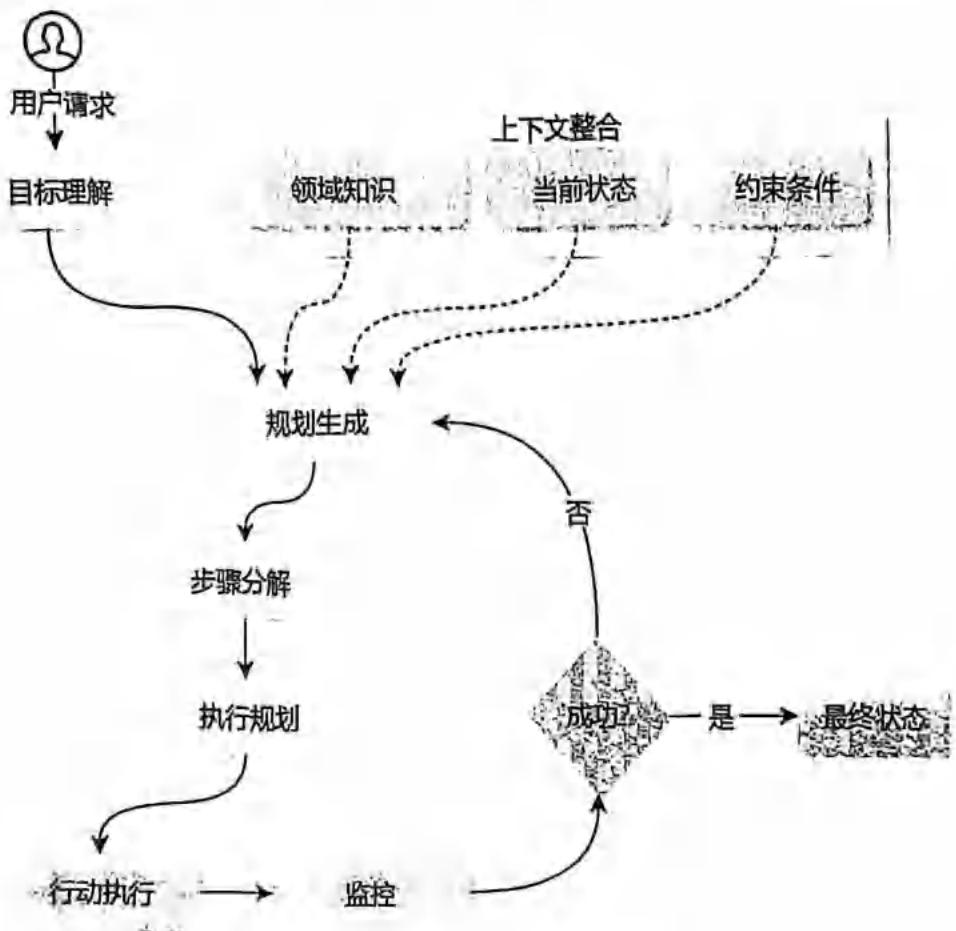  
图5.3 基于LLM的规划算法流程

1 class TravelPlanner:   
2 def init_self):   
3 self.planner $=$ Agent(   
4 role $\equiv$ 'Travel Planning Strategist',   
5 goal $\equiv$ Create comprehensive, personalized travel plans',   
6 ... #其他参数   
7 ）   
8 self.researcher $=$ Agent(   
9 role $\equiv$ 'Travel Researcher',   
10 goal $\equiv$ Find and validate travel options and opportunities',   
11 ... #其他参数   
12 ）   
13   
14 def create_travel計劃(self, request: str) -> Dict:   
15 planning_task $=$ Task(   
16 description $\equiv$ f""   
17 Analyze the following travel request and   
18 create a detailed plan:   
19 (request)   
20 Break this down into actionable steps by:   
21 1. Understanding client requirements   
22 3. Specific booking requirements   
23 4. Required validations   
24 "", agent $\equiv$ self.planner)   
25   
26 research_task $=$ Task(

27 description $=$ ""   
28 Based on the initial plan, research and   
29 validate: Flight availability, hotel options,   
30 and local transportation   
31 ""agent $\equiv$ self.researcher)   
32   
33 crew $=$ Crew( agents=[self.planner, self.researcher],   
35 tasks=[planning_task, research_task],   
36 process=Process.sequentiaI)   
37 return crew.kickoff(input $\equiv$ {"request":request})

这段代码展示了基于LLM的规划所具备的几个关键优势。规划器能够理解复杂的自然语言请求，动态地生成恰当的步骤，并能适应不同类型的旅行规划场景。各个智能体可以协同工作，共享上下文，并基于彼此的输出进行构建。该系统的精妙之处在于它能够处理带有细微差别的需求。例如，当用户请求“一个既能放松身心又能体验一些文化活动的海滩假期”时，规划器能够理解这些抽象概念，并将其转化为具体的建议。

然而，开发者应注意一些潜在问题。如果没有进行适当的约束，基于LLM的规划系统有时可能会生成过于乐观或不切实际的计划。此外，它们可能难以处理高度特定的数值约束或严格的时间要求，除非在实现中对这些问题进行了明确的处理。基于LLM的规划相比于传统算法，一个显著的优势在于系统的适应能力。STRIPS或A*规划需要为每一种可能的旅行场景提供明确的状态表示，而基于LLM的规划则可以通过利用其对语言和上下文的理解来处理全新的情况，这使其特别适合那些需求常常模糊不清或不断变化的领域。这种规划方法还擅长处理不确定性和不完整信息，而这正是传统规划器难以解决的问题。当信息缺失或模糊时，系统可以生成合理的假设，并在其计划中包含应急步骤。

# 2. HTN

HTN规划将复杂任务分解为更简单的子任务，从而创建一个行动的层级结构。与处理原始行动的STRIPS不同，HTN可以处理抽象任务，并将其分解为更具体的步骤。这使其特别适合现实中的规划问题，在这些问题中，任务会很自然地分解为子任务。HTN规划的工作方式是将高层级任务逐步分解为更小的子任务。请看下面的示例代码：

```python
1 def buy_groceries_task():  
2 return [  
3 ('go_toStore', [],  
4 ('select_items', [],  
5 ('checkout', [],  
6 ('return_home', [],  
7 ]  
8  
9 def select_items_task():  
10 return [ 
```

```txt
11 ('check_list', [], 12 ('find_item', [], 13 ('add_to-cart', [] 14 ] 
```

HTN规划遵循任务分解的原则，即把高层级任务(也称为复合任务)，分解成更小、更易于管理的子任务，直到最终分解为可以直接执行的原始任务。这种层级结构使得问题表示非常直观，并且能高效地找到解决方案。在本例中，buygroceries_task是一个高层级任务，它被分解成了4个子任务。其中一个子任务select_items又被进一步分解为3个更具体的行动，以此类推。在旅行智能体示例中，也可以使用类似的层级分解方法，将复杂任务分解为更小的任务。图5.4直观地展示了HTN规划的分解过程。

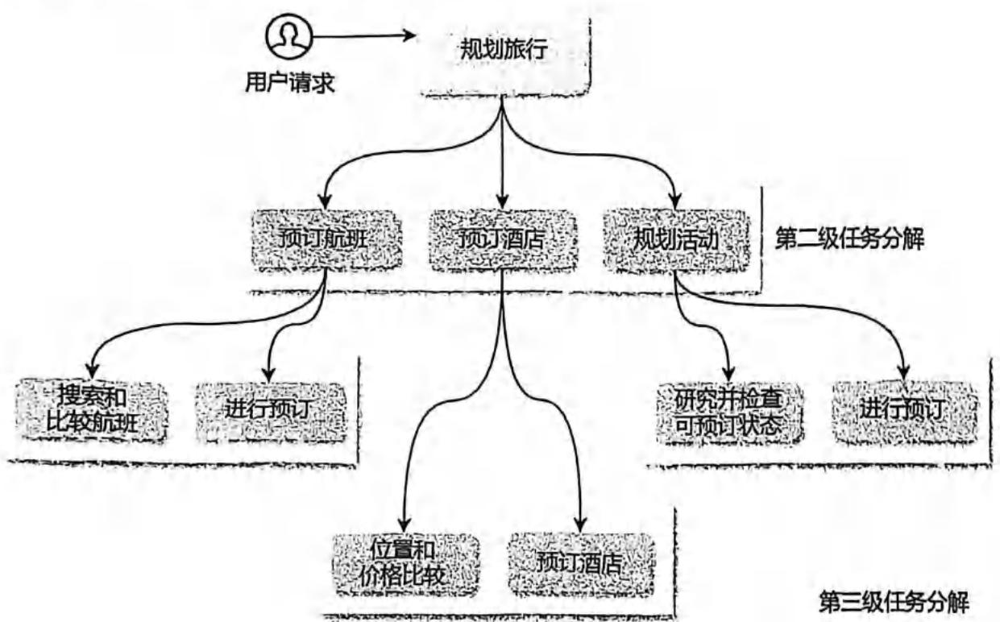  
图5.4 HTN规划的分解过程

要用CrewAI来实现这一点，可以使用CrewAI的层级化处理功能，它能像HTN规划算法那样，以层级化的方式分解任务。在CrewAI框架中，这种层级化方法需要一个“管理者”单元，它负责分解任务，并将单个任务委派给智能体。这个“管理者”既可以是一个智能体，也可以是LLM本身。

如果“管理者”是一个智能体，就可以根据工作流的需求，控制它如何将任务分解为 $n$ 层任务。如果“管理者”是LLM，那么它将使用LLM本身根据用户查询生成的任意计划。当使用LLM作为“管理者”时，或许能通过一些提示工程来控制任务分解和委派的方式；然而，这种方式通常灵活性较低，更适用于较简单的工作流。

下面是一段示例代码，展示了如何为旅行规划器实现一个类似 HTN 的工作流：

```python
1 flight_specialist = Agent(  
2 role='Flight Planning Specialist',  
3 goal='Handle all aspects of flight arrangements',  
4 backstory='Expert in airline bookings and flight logistics.')  
5  
6 accommodation_specialist = Agent(  
7 role='Accommodation Specialist',  
8 goal='Manage all accommodation-related planning',  
9 backstory='Expert in hotel and accommodation booking')  
10  
11 activity_specialist = Agent(  
12 role='Vacation Activity Specialist',  
13 goal='Manage all activity-related planning',  
14 backstory='Expert in recreational activity arrangements.']  
15  
16 manager_llm = ChatOpenAI(model="gpt-4o-mini")  
17 travel_planning_task = Task(  
18 description=f"''"  
19 Plan a comprehensive flight itinerary based on the following request:  
20 (request)  
21 The plan should include: Flight arrangements,  
22 Accommodation bookings, other relevant travel components  
23 componentss  
24 expected_output="A detailed flight itinerary covering all requested aspects.",  
25 agent=None) #No agent; the manager will delegate subtasks  
26  
27 agent=None) #No agent; the manager will delegate subtasks  
28  
29 crew = Crew(  
30 agents=[self.flight_specialist,  
31 self.accommodation_specialist,  
32 self活性pecialist],  
33 tasks=[travel_planning_task],  
34 process=Process.hierarchical,  
35 manager_llm=soft=Ymanager_1lm,)  
36 return crew.kickoff() 
```

此执行的输出大致如下所示(限于篇幅,只展示部分内容):

```txt
Final Travel Plan:   
Here's the complete travel itinerary for a 5-day trip to Paris from   
New York for two adults:   
Travel Itinerary for Paris Trip   
From New York (JFK) to Paris (CDG)   
Travelers: 2 Adults, Duration: 5 Days   
1. Flights: 
```

```txt
- Departure Flight: ...
- Total Flight Cost: $2,960
...
2. Hotel Accommodations:
- Hotel: ...
- Estimated Total = €800.
...
3. Airport Transfers:
- Option 1: ...
- Option 2: ...
...
4. Day Trip to Versailles:
- Transportation: Round-trip via RER C train from ...
- Cost: Approximately ...
- Departure Time: 9:00 AM from ...
- Return Time: 5:00 PM from Versailles.
...
- Overall Total for Day Trip: Approximately €364.20.
...
Grand Total Estimated Cost:
- Flights: $2,960
- Accommodation: €800 (with Le Fabe Hotel)
- Airport Transfers: €100 (may vary)
- Day Trip to Versailles: Approximately €364.20
- Convert Total Costs as Necessary to USD.
... 
```

请注意，在这个例子中，智能体系统无法访问外部工具或进行查找，因此它生成的任何响应都将是完全虚构且不符合事实的。这突显了工具的重要性，相关内容将在下一节中深入探讨。就目前而言，前面的例子展示了如何使用该框架进行任务分解，并让一个“管理者”来管理多个智能体，以执行根据用户请求分解出的简化任务。你可以在GitHub的Chapter_05.ipynb中找到完整的代码。

HTN规划具有几个显著的优势，使其在复杂的规划场景中尤为有效。其自然的问题表示方式反映了人类的思维模式，使其在理解和维护上都非常直观。这种层级化方法通过将复杂任务分解为可管理的子任务，实现了更好的可扩展性，从而有效地减小了搜索空间。HTN规划的结构擅长通过其任务层级对专家知识进行编码，从而允许在相似问题中复用模式。此外，它在处理抽象任务和原始任务方面的灵活性使其能够适应各种规划情况，让规划器可以根据需要在不同的抽象层级上工作。

到目前为止，我们已经学习了工具和几种规划算法。通过将有策略性的规划与高效的工具相结合，可以让LLM智能体执行更复杂的、多步骤的任务。下一节将进一步探索如何能将工具使用与规划有效地整合，并融入智能体系统中。

# 5.4 工具使用与规划的整合

在人工智能领域，早期关于工具使用和规划的研究大多是独立进行的，即分别专注于工具使用能力或规划算法本身。然而，要实现真正的智能体，就需要将工具使用与规划有效地整合起来。上一节，旅行预订智能体虽然给出了详细的旅行计划，但所有细节都不符合事实，也就是说，计划包含了LLM凭空捏造的信息。为了给系统注入真实的航班、酒店和活动数据，让旅行计划基于事实，我们需要将工具与规划算法结合使用。本节将讨论如何将这两个方面结合起来，以生成相关的响应并准确地完成任务。

# 5.4.1 对工具进行推理

智能体需要具备对可供其使用的工具进行推理的能力，理解每种工具的功能、能力和局限性，以及可以高效应用它们的上下文和条件。这个推理过程包括：首先，根据当前的目标和目的来评估可用工具；然后，选择最合适的工具，用于给定的情况或问题领域。

例如，在旅行预订智能体案例中，智能体可以访问各种工具，如航班预订API、酒店预订系统和活动规划软件。智能体需要通过推理明确各类工具的能力边界，例如哪些工具可以用来预订航班或酒店，哪些工具可以提供当地景点的信息。

当使用LLM智能体时，对工具的推理在很大程度上是由语言模型自身的能力实现的。现代的LLM经过训练，能够理解工具的描述、用途和适当的使用场景。这意味着我们不需要显式地编写复杂的推理机制，只需要提供清晰的工具描述，然后让LLM自行决定何时以及如何使用它们。以下仍以旅行预订智能体的场景为例具体说明。

```txt
1 from crewai import Agent  
2  
3 travel_agent = Agent(  
4 role='Travel Planner',  
5 goal='Plan comprehensive travel itineraries',  
6 tools=[  
7 flight_search_tool, #用于查找和预订航班的工具  
8 hotel Booking_tool, #用于酒店预订的工具  
9 activity_planner_tool #用于规划当地活动和景点的工具  
10 ]) 
```

LLM智能体可以自然地理解以下几点：

- 针对每项任务该使用哪种工具(例如，使用 flight_search_tool 进行机票查询)；  
- 何时组合使用工具(例如，协调航班和酒店的日期)；  
- 如何根据用户需求调整工具的使用方式(例如，考虑预算限制)。

这种内置的推理能力意味着，我们可以专注于提供定义良好、描述清晰的工具，而不需要实现复杂的推理机制。LLM会根据每个具体情况的上下文和需求，自主完成工具选择和应用的决策过程。然而，并非所有语言模型的工具推理能力都处于同一水平。这种能力通常需要模型经过与工具使用、函数调用相关的专门训练或微调。较小的模型或未经工具使用训练的模型可能会出现以下问题：

- 无法理解何时需要使用工具；  
- 对工具的能力做出错误的假设；  
- 以错误的顺序使用工具；  
- 错失使用可用工具的机会；  
- 忽略工具的约束或要求。

即使是能力很强的模型也可能面临如下限制：

- 难以处理需要多个步骤的复杂工具组合；  
在相似场景中选择工具的不一致性不足；  
- 难以应对功能上有细微差异的工具；  
- 在工具调用失败时难以进行错误恢复。

这就是为什么CrewAI、LangGraph和AutoGen等框架，通常在与那些已展现出强大工具推理能力的更先进模型配合使用时效果最好；这也解释了为什么在部署前，测试智能体的工具使用模式至关重要。

# 5.4.2 制订工具使用计划

在现代AI智能体中，规划过程的根本驱动力来自LLM的能力。这个过程建立在先前讨论的、基于LLM的规划方法和HTN方法的原则之上。智能体不再遵循僵化的规划算法，而是利用其语言模型的理解能力，来创建具备灵活性且能够感知上下文的工具使用计划。图5.5描绘了这一流程。

智能体收到请求后的第一步就是通过自然语言处理来理解其目标。以旅行智能体为例，这就意味着它要明白，“家庭度假”这个请求不仅需要预订航班，还需要寻找适合家庭的住宿和活动。这个目标理解阶段，直接利用了LLM经过训练所具备的强大理解能力。

理解目标之后，规划流程便进入下一步：识别需要哪些工具，以及它们的使用顺序。这个过程类似于 HTN 规划中的层级分解，但它借助 LLM 的决策能力，因而更具灵活性。智能体不仅仅是遵循预定义的分解规则，而是会根据每个请求的具体上下文和需求来调整规划方案。

将工具整合进计划，是这个过程中的一个自然环节。智能体通过阅读工具的描述信息来理解其功能，并能合理地安排它们的使用顺序。例如，在规划假期时，智能体知道，必须先确认航班日期才能预订酒店，并且活动规划需要同时兼顾两

者的地点和时间。

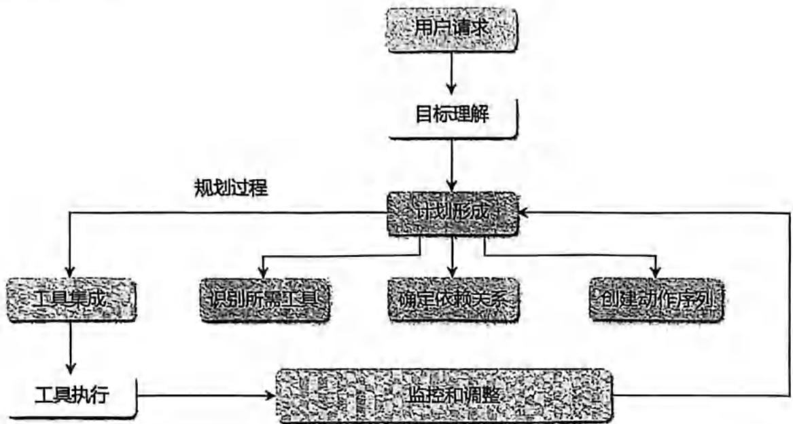  
图5.5 工具规划流程

这种规划方法巧妙地结合了传统规划算法的结构性优势与语言模型的适应性优势。智能体能够根据新信息或情况变化来调整计划，就像一位人类旅行顾问会依据客户反馈或资源可用性的变动来调整方案一样。

这一规划过程能否成功，很大程度上依赖于LLM理解上下文并生成恰当行动序列的能力。这也解释了为何CrewAI这类框架常采用此种规划模式：它既能让智能体充分发挥其语言理解的优势，又能确保在执行复杂任务时所需的系统性和条理性。

# 5.5 探索实际代码实现

本节将以CrewAI、AutoGen和LangGraph(LangChain的智能体框架)为例，演示如何利用不同的人工智能或机器学习框架，创建能够通过工具使用和规划来执行复杂任务的智能体。你可以在GitHub的Chapter_05.ipynb中找到每个框架示例的完整代码。

# 5.5.1 CrewAI示例

下面通过一个实际的旅行规划示例来分析CrewAI是如何实现基于工具的推理的。该框架的Python库提供了一个@tool装饰器，借助此装饰器，可以定义具有清晰描述和文档说明的工具。下面介绍如何创建一组与旅行相关的工具：

```txt
1 @tool("Search for available flights between cities")  
2 def search_flights(...) -> dict:  
3 ""Search for available flights between cities."""  
4 #调用航班API及其他工具逻辑  
5  
6 @tool("Find available hotels in a location")  
7 def find_hoteles(...) -> dict:  
8 ""Search for available hotels in a location."""  
9 #调用酒店API及其他工具逻辑  
10  
11 @tool("Find available activities in a location")  
12 def find_activities(...) -> dict:  
13 ""Find available activities in a location."""  
14 #调用活动API及其他工具逻辑 
```

然后，这些工具会被分配给一个智能体，该智能体能够理解如何在具体的上下文中运用它们。创建智能体时，会为其设定具体的角色、目标和背景故事，以此来引导其决策过程：

```txt
1 Agent(   
2 role='An expert travel concierge',   
3 goal='Handle all aspects of travel planning',   
4 backstory="Expert in airline bookings and flight logistics, hotel bookings, and booking vacation activities.",   
5 tools=[search_flights, find-hotels, find_activities],   
6 verbose=False   
7) 
```

当智能体接到任务后，它会根据具体的上下文和需求来使用这些工具：

```python
1 travel_planning_task = Task(
2 description=f""
3 Plan a comprehensive travel and leisure itinerary
4 based on the following request:
5 (request)
6 The plan should include:
7 - Flight arrangements
8 - Accommodation bookings
9 - Any other relevant travel components
10 ""
11 expected_output="A detailed travel itinerary covering all requested aspects."
12 agent=self.travel_specialist) 
```

当调用crew.kickoff()时，CrewAI会通过以下方式来协调工具的使用：

通过任务描述来理解任务需求；  
- 根据智能体的角色和任务目标，确定需要哪些工具；  
- 以合乎逻辑的顺序使用工具，来构建旅行计划；  
- 处理工具的输出结果，并将其整合到最终的响应中。

这个实现过程展示了CrewAI如何将工具定义、智能体能力和任务说明三者

结合，从而创建一个条理清晰的规划系统。该框架负责处理复杂的工具推理过程，从而让开发者可以专注于定义清晰的工具接口和智能体行为。

# 5.5.2. AutoGen示例

AutoGen 提供了一个开发 AI 智能体的平台。平台上的智能体可以相互对话，并通过这些互动为给定的任务找到解决方案。AutoGen 通过轮询群组对话 (RoundRobinGroupChat) 系统来实现多智能体协作。在这个系统中，专门的智能体相互协作，共同创建一个全面的旅行计划。这个实现定义了四个关键智能体：航班规划智能体、酒店规划智能体、活动规划智能体及汇总智能体，每个智能体都有其特定的职责和工具。

每个智能体在初始化时都包含以下要素：

名称和描述；  
- 一个模型客户端(本例中为OpenAI的GPT-4o-mini);  
可供其访问的特定工具；  
- 一个定义其角色和职责的系统消息。

AutoGen与CrewAI的主要区别在于其执行模型，具体如下。

(1) 智能体通信: CrewAI 使用的是基于任务的层级化方法, 而 AutoGen 则实现了一个轮询群组对话, 智能体轮流为解决方案做出贡献。RoundRobinGroupChat 类负责协调这一对话流程, 让智能体可以在彼此建议的基础上进一步完善方案。  
(2) 终止处理：AutoGen通过TextMentionTermination类设置明确的终止条件。当完整的计划准备就绪时，旅行汇总智能体可以通过提及“TERMINATE”来结束对话。这与CrewAI基于任务完成的终止方式不同。TextMentionTermination的参数如下。

- mention_text(str): 触发终止的关键字或短语(如“TERMINATE”)。  
- case sensitive(bool,可选): 关键字匹配是否应区分大小写。  
- strip whitespace(bool,可选): 是否忽略检测到的文本中的首尾空格。  
- regex match(bool,可选): 是否允许使用正则表达式以实现更灵活的终止触发。

(3) 工具集成：与CrewAI基于装饰器的工具定义不同，AutoGen在初始化期间就将工具与智能体直接关联。每个智能体都可以访问与其角色相关的特定工具。  
(4) 协调模式: CrewAI 通常使用 “管理者-工作者” 模式, 而 AutoGen 的轮询式方案则创造了一个更具协作性的环境, 智能体在其中平等地为解决方案做出贡献, 而汇总智能体则负责创建最终的整合计划。

这个实现方案展示了AutoGen的优势，既擅长处理复杂的多智能体对话，又能为每个智能体保持清晰的角色划分和专门的工具使用。下面展示了如何使用AutoGen定义智能体：

1 flight_agent $=$ AssistantAgent(   
2 name $\equiv$ "flight_planner",   
3 model_client $\equiv$ model_client,   
4 tools $\equiv$ [travel.tools.search_flights],   
5 description $\equiv$ "A helpful assistant that can plan flights itinerary for vacation trips.",   
6 system_message $\equiv$ "You are a helpful assistant that can plan flight itinerary for a travel plan for a user based on their request."）   
7   
8 hotel_agent $=$ AssistantAgent(   
9 name $\equiv$ "hotel_planner",   
10 model_client $\equiv$ model_client,   
11 tools $\equiv$ [travel.tools.search_flights],   
12 description $\equiv$ "...", system_message $\equiv$ "...")

一旦定义好智能体，就可以用它们来创建一个RoundRobinGroupChat类，并与这个多智能体系统发起一次对话：

```txt
2 group chatting = RoundRobinGroupChat()
3 [flight_agent, hotel_agent],
4 termination_condition=termination)
6 await Console(group chatting.run_STREAM(task="I need to plan a trip to Paris from New York for 5 days:")) 
```

# 5.5.3 LangGraph示例

LangChain 提供了一个框架，可用于开发能同时利用 LLM、其他工具及数据源的应用程序。在智能体系统这个领域，LangChain 提供了一个名为 LangGraph 的子框架，专门用于构建强大的、基于 LLM 智能体的工作流。LangGraph 通过一个工作流图系统来实现基于智能体的旅行规划，这提供了一种与 CrewAI 和 AutoGen 都不同的范式。下面介绍这个实现方案是如何工作的，以及它有哪些鲜明的特点。

LangGraph 采用状态机模型，将工作流定义为一个包含节点和边的图。该实现围绕两个主要节点展开：

- 一个智能体节点，负责处理消息并做出决策；  
- 一个工具节点，负责调用被请求的工具(如航班搜索、酒店预订和活动规划)。

工作流遵循一个循环逻辑：智能体节点首先评估当前状态，然后决定是调用工具，还是提供最终响应。这个过程由一个函数控制，该函数会解析模型的下一步行动(即调用工具或结束响应)，从而决定是将流程路由到工具节点，还是结束对话。与CrewAI一样，LangGraph也使用@tool装饰器(针对Python)来定义工具函数：

```txt
1 @tool  
2 def search_flights(...) -> dict:  
3     ""Search for available flights between cities."""  
4     #模拟来自API的JSON数据  
5     return data 
```

一旦定义了节点(无论其是否带有工具)，就可以将它们相互连接，从而构建出完整的工作流图结构。例如，在本例中，以下代码使用LangGraph定义了一个基于状态图的工作流，任务会在智能体和工具这两个节点之间循环。该图从被定义为入口点的智能体节点开始，它会调用call_model函数来处理输入。智能体运行后，一个名为should_CONTINUE的条件函数会决定下一步的走向——是循环回工具节点，还是结束工作流。工具节点(tool_node)负责处理中间任务，并且总是会跳转回智能体节点，从而形成一个重复的循环，直到条件函数判定停止为止。代码使用了一个MemorySaver检查点保存各轮运行中的状态信息，并且该图被编译成一个与LangChain兼容的可运行实例。最后，用一条关于规划旅行的初始输入消息来调用该工作流，并在图结构执行完毕后，输出最终的消息内容。

1 workflow $=$ StateGraph(MESSAGESState)   
2 workflow.add_node("agent",call_model)   
3 workflow.add_node("tools",tool_node)   
4 workflow.add_edge(START,"agent")   
5 workflow.add有条件的Edges("agent",should_CONTINUE)   
6 workflow.add_edge("tools","agent')   
7 checkpointer $=$ MemorySaver()   
8 app $=$ workflow.compile(checkpointer=checkpointer)   
9 final_state $=$ app.invoke(   
10 {"messages":[HumanMessage(content $\equiv$ "I need to plan a trip to Paris from New York for 5 days"]]},   
11 config $=$ {"configurable": {"thread_id":42]})

LangGraph的实现方式具备几个显著的优势。例如，它的图结构提供了明确的流程控制，让工作流易于可视化和理解；同时，其内置的、带有检查点功能的状态管理机制，也确保了对应用程序状态的稳健处理。然而，这些优点也带来了一些需要权衡的代价。该框架要求使用者对基于图的编程概念有扎实的理解，并且与CrewAI更直接的智能体定义方式相比，其初始设置的开销也更大。可以在GitHub的Chapter_05.ipynb中找到完整的代码实现。

表 5.1 基于本例展示了 LangGraph、CrewAI 与 AutoGen 的关键区别。

表 5.1 LangGraph、CrewAI 与 AutoGen 的关键区别  

<table><tr><td>对比维度</td><td>LangGraph</td><td>CrewAI</td><td>AutoGen</td></tr><tr><td>状态管理</td><td>使用明确的状态管理机制</td><td>通过智能体实例及其任务上下文来管理状态</td><td>通过群聊消息历史记录处理状态</td></tr><tr><td>工具集成</td><td>工具通过一个专用的工具节点进行管理</td><td>使用基于装饰器的工具定义，并与智能体直接关联</td><td>将工具直接与特定的智能体关联</td></tr><tr><td>流程控制</td><td>使用基于图的工作流</td><td>使用分层任务分解或顺序流</td><td>在智能体之间实现轮流执行机制</td></tr></table>

# 本章小结

本章介绍了工具和规划在 AI 智能体系统中的关键作用。首先，讨论了什么是工具或函数调用，以及 LLM 智能体是如何实现这一能力的；然后，介绍了各种工具类型，并通过示例展示了如何通过框架或直接原生调用 LLM 来使用工具。接着，探索了多种规划算法——从 STRIPS 和 HTN 等传统方法，到基于 LLM 的现代规划方法，并理解了它们在语言模型环境下的实际应用价值。通过一个实际的旅行规划示例，我们看到了如何在每个框架内定义、集成并使用工具，以构建精密的旅行规划系统。

本章还说明了将工具调用与规划相结合，能够极大地增强智能体系统的功能，使其更有能力处理复杂任务。同时，回顾了三种框架(CrewAI、AutoGen和LangGraph)的实现模式，这些模式揭示了它们在智能体协调和工具使用方面的独特思路。

下一章将深入探讨智能体系统中的“协调者-工作者-委派者”模式，并介绍该模式如何助力完成现实世界的复杂任务。

# 习题

1. 在AI智能体中，工具的用途是什么？文档字符串如何帮助定义工具？  
2. 请解释传统规划算法(如 STRIPS)与基于 LLM 的现代规划方法之间的区别。为什么传统算法对 LLM 智能体来说不太适用？  
3. HTN规划的工作原理是什么？为什么它被认为是更适用于LLM智能体的方法之一？  
4. 在LLM智能体的工具选择过程中，推理扮演什么角色，又有哪些局限性？  
5. 在对比不同的框架(CrewAI、AutoGen和LangGraph)时，对于实现一个AI智能体而言，需要考虑的关键因素有哪些？

# 习题答案

1. AI 智能体中的工具是一些函数，它们能让智能体执行特定任务或访问外部服务。文档字符串提供了关于工具用途、预期参数和返回值的关键信息，这有助于 LLM 理解何时以及如何有效地使用每个工具。这份文档就充当了引导模型决策过程的上下文。  
2. STRIPS 这样的传统规划算法依赖于明确的状态表示和预定义的动作集，它

们处理的是二元条件和清晰的状态转换。而基于LLM的规划方法则基于自然语言理解能力进行运作，能够处理模糊的状态和动作。传统算法之所以难以与LLM协同工作，是因为它们无法有效表示基于语言的任务所具有的细微差异和情境化的特性。

3. HTN规划的工作原理是将复杂任务按照层级结构逐步分解为更简单的子任务。它之所以适用于LLM智能体，是因为这种层级分解的方式反映了语言模型自然处理和理解任务的方式。这种方法既保证了规划的结构性，又提供了基于语言的交互所需的灵活性。  
4. 在LLM智能体中，推理主要依靠模型内置的理解上下文和决策能力来处理。虽然这使得工具选择更加自然，但并非所有模型的推理能力都处于同一水平。其局限性包括：在工具选择上可能存在不一致，难以处理复杂的工具组合，以及在工具调用失败时难以进行错误恢复。  
5. 选择框架的关键因素包括：工作流的复杂性(结构化与对话式)、是否需要状态管理、多智能体协作的需求，以及开发的复杂程度。CrewAI 的实现方式直截了当，AutoGen 擅长处理多智能体交互，而 LangGraph 提供了稳健的工作流控制，但需要完成更多的初始设置工作。

# 第6章

# 探索“协调者-工作者-委派者”设计模式

上一章探讨了工具使用和规划的概念，为提升智能体解决问题的能力奠定了重要的基础，还探索了多种规划算法，包括状态空间搜索技术和分层任务网络，并研究了如何将这些算法与外部工具和资源无缝整合，以使智能体能够发挥出最佳性能。

在此基础上，本章将通过探索一个强大的人工智能体组织框架——“协调者-工作者-委派者”(CWD)模式，来巩固和深化我们的理解。本章主要介绍以下内容。

- 理解CWD模型。  
- 为智能体设计并分配角色。  
- 智能体之间的沟通与协作。  
在生成式AI系统中实施CWD模式。

通过本章的学习，你将全面理解如何使用CWD模式来设计和实现多智能体系统，包括如何高效地为不同智能体分配角色，在它们之间建立稳健的通信协议，并协调它们的互动以解决复杂问题。

# 6.1 技术要求

可以在GitHub上找到本章的代码文件，其地址为https://github.com/Packt-Publishing/Building-Agentic-AI-Systems。本章还将沿用前几章使用过的Python框架，来演示CWD模式各个方面的特性以及智能体的角色。

# 6.2 理解CWD模型

CWD模型是一个旨在促进多智能体系统开发的综合性框架，它强调协作、专业化，以及高效的任务分配和资源管理。正如人类组织能从清晰的角色委派和层级结构中受益一样，智能体也能通过合理的分工来提升效率。如图6.1所示，CWD模型从组织心理学和管理学理论中汲取灵感，将经过验证的人类协作原则应用于智能体领域。随着智能体系统日趋复杂，需要处理的任务也越来越复杂，而这些任务通常要求多种专业能力协同工作，这时，CWD模式的价值尤为突出。该模型尤其适用于这样的环境：自主智能体必须协同合作，以达成超出单个智能体能力范围的复杂目标。

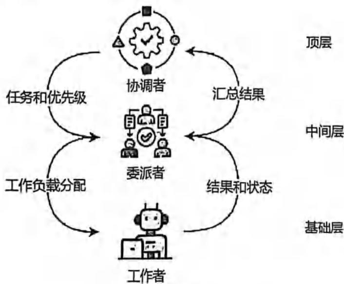  
图6.1 CWD模型

CWD模型设立了三种明确的角色，它们协同工作，共同完成复杂的任务。

- 协调者：协调者是负责管理任务、资源以及系统整体工作流的智能体。它们的主要职责包括促进进度监控、将任务分配给合适的智能体，以及实现工作者之间的有效协作。协调者在确保系统平稳运行并使其与既定目标保持一致方面，扮演着至关重要的角色。它们充当统筹者的角色，监督整个过程，并协调各个组件协同工作。协调者会根据任务的紧急程度、资源可用性和依赖关系，通过动态分配任务来确定工作负载的优先级。它们监控进度，根据需要调整任务分配，并确保智能体之间的无缝协作。通过优化任务分发和工作流执行，它们可以提高系统的效率，并确保系统与总体目标保持一致。

- 工作者：工作者是在系统内部专门执行特定任务或功能的专业智能体。这些智能体拥有多样化的能力和专业知识，体现了可应用于各类任务的

广泛技能。当委派者分配任务后，工作者会利用其专业知识和技能，高效地完成任务目标。工作者智能体的多样性实现了劳动分工，能够将任务分配给最合适的智能体，从而优化了系统的整体性能。

- 委派者：委派者充当协调者和工作者的中介，负责根据资源可用性和系统需求，将工作负载分配给工作者。它们作为接口，促进协调者和工作者之间的沟通与协调。委派者在向多个工作者调度和平衡工作负载方面扮演着关键角色，确保任务能够及时、高效地分配给合适的智能体。委派者最关键的职能是优化整体性能，这需要考虑工作者的能力和系统约束，在恰当的时间将任务分配给合适的工作者。委派者通过平衡吞吐量、延迟和资源利用率来优化性能。它们确保任务得到高效分配，从而最小化延迟(即低延迟)、最大化单位时间内的任务完成量(即高吞吐量)，并避免资源瓶颈(即优化资源利用)。通过根据工作者的处理能力和系统约束动态调整任务分配，委派者提升了系统的整体效率和响应速度。

CWD模型定义了协调者、工作者和委派者这三种明确的角色，它们协同工作，共同提升系统的效率和协作水平。通过构建结构化的任务分配、沟通和执行流程，该模型确保了运行的协调性，而其有效性则根植于一系列关键原则。

# 6.2.1 CWD模型的关键原则

CWD模型的建立基于几项关键原则，这些原则指导了其设计与实现。

(1) 职责分离：CWD 的基本理念是在战略规划(协调者)、资源管理(委派者)和任务执行(工作者)之间进行明确的职责分离。这种分离使得每个组件都能专注于其核心能力，同时保持了系统的灵活性和可扩展性。  
(2) 层级化组织：该模型实现了一种层级化结构，这种结构仿照了人类组织机构中常见的成功组织模式。

- 顶层：战略监督与规划。   
中层：资源管理与协调。  
- 基层：专业任务执行。

(3) 信息流与反馈回路：CWD模型强调双向的通信流。

- 向下流动：任务分配、优先级和约束条件。  
向上流动：进度更新、结果汇报和资源利用情况。

(4) 适应性与韧性：该模型通过以下机制，被设计为天生具备适应性。

- 动态资源分配：智能体持续评估工作负载需求，并实时地重新分配计算或运营资源，以优化效率、防止出现瓶颈。  
- 通过冗余实现容错：系统使用多个具有重叠能力的智能体，从而在发生故障时能够无缝交接和恢复，确保操作不被中断。

- 跨智能体的负载均衡：任务会根据智能体的可用性、专业知识和当前工作负载进行智能分发，以防止性能下降并提高响应速度。  
- 运行时角色重分配：智能体可以根据不断变化的系统需求调整自身角色，按需承担不同职责，以维持工作流的连续性和操作的有效性。

这些机制共同增强了系统在不可预测的条件下进行适应、恢复和高效运行的能力，从而确保了其持续的性能和可靠性。

CWD模型的关键原则通过明确角色分工、建立层级结构、保障信息通畅，确保了整个系统思路清晰、有条不紊且适应力强。这种结构化的设计提升了系统的效率和韧性，让它能灵活地应用于各种场景，比如开发一个旅行智能体系统。

# 6.2.2 CWD模型在旅行系统中的应用

下面，我们就以旅行智能体系统为例，聊一聊CWD模型的具体应用方式。它的整体架构和工作流程大致如下。

(1) 协调者智能体: 该智能体好比旅行规划的 “总指挥”, 主要负责以下工作。

- 根据用户的要求，统筹管理整个规划过程。  
- 跟进任务进度，并确保不同工种的工作者智能体高效合作。  
- 根据客户的具体旅行方案，分派任务、协调流程。

(2) 工作者智能体：该智能体好比一个“专业团队”，团队里有多个成员，每个成员都是旅行服务某一特定领域的专家。

- 机票专家：专门按照日期、目的地和个人偏好，查找和预订机票。  
- 酒店专家：负责根据位置、设施和客户喜好，寻找和预订最合适的酒店。  
- 行程规划专家：负责研究和设计目的地的活动、观光路线和特色体验，并贴合客户的兴趣量身定制。  
- 地面交通专家：专门安排地面交通，如租车、机场接送或者当地的其他交通方式。

(3) 委派者智能体：该智能体扮演“调度员”的角色，负责具体执行以下工作。

- 在“总指挥”(协调者)和一线的“专家”(工作者)之间建立沟通的桥梁。  
从“总指挥”那里接收规划好的任务。  
评估各个“专家”当前是否有空、以及它们各自擅长处理什么任务。  
- 根据各个“专家”的专业特长和当前的工作量，把合适的任务派发给最合适的人选。  
协调和平衡不同“专家”之间的工作量，避免有人太忙、有人没事干。

图6.2是对之前的高层CWD模型示意图的扩展与调整，展示了该模型在旅行规划这一场景下的具体应用。

工作者智能体


机票预订工作者


酒店预订工作者


活动规划工作者


交通安排工作者

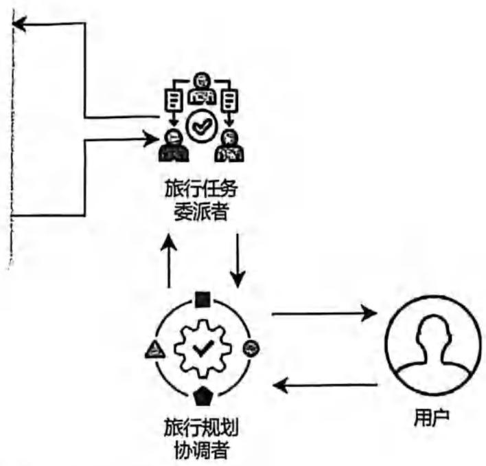  
图6.2 旅行规划器的CWD模型

下面结合用户的需求和系统的整个工作流程来逐步说明。

① 用户向旅行智能体系统提出需求，包括目的地、出行日期、预算和个人偏好(例如，想要亲子同游、体验当地文化或海滨度假)。  
② 旅行规划协调者会分析客户的需求，并将整个旅行规划任务分解为多个子任务。这正是我们在上一章所学习的任务分解过程。  
③ 协调者将这些子任务传达给旅行任务委派者。   
④ 委派者评估当前可用的工作者智能体，并据此分配相应的任务。  
⑤ 各个工作者智能体会根据需要彼此协作，共享相关信息，确保最终生成的旅行计划是协调统一的。  
⑥ 委派者会持续监控各项任务的进展，并确保各工作者智能体的工作量是均衡的。  
⑦ 所有任务完成后，各个工作者智能体会将各自的成果(如机票预订单、酒店预订信息、活动行程单和交通安排方案)提交给委派者。  
⑧ 委派者将从工作者智能体那里收集来的所有成果进行汇总和整合，形成一份周详的旅行计划。  
⑨ 旅行规划协调者会对最终的计划进行审核，做出必要的微调，然后呈现给客户，等待客户最终确认。

通过这个例子，我们看到了如何有效地应用CWD模型来创建一个完善的旅行规划系统。该模型展示了如何通过让智能体各司其职来分解和高效管理复杂任务，每个智能体只负责处理旅行规划流程中的一个特定方面。这种方法不仅确保

了所有旅行需求都被全面覆盖，而且在整个规划过程中，始终保持了清晰的沟通渠道和明确的责任分配。通过这种系统化的结构，我们能够同时处理多个旅行请求，并针对每位客户的独特需求，保证高质量的服务和对细节的关注。

如果读者有兴趣亲手实现这个系统，可以在GitHub的Chapter_06.ipynb中找到完整的代码实现，其中包含详细的示例和文档。该代码示例运用了大量关于工具使用和任务规划的概念，来实现这个CWD旅行规划器，同时采用了CrewAI和AutoGen这样的流行框架。

本节探讨了CWD模型——一个借鉴了人类社会中有效组织模式的框架，可用于构建可扩展、高效率、重协作的多智能体系统。该模型强调角色划分、适应能力和结构化沟通，这确保了它能够无缝地处理像旅行规划这样复杂且多维度的任务。理解这个模型至关重要，因为它为设计智能体系统奠定了基础——这类系统能够让各个智能体扮演特定的角色，同时协同工作，共同实现一个整体宏伟目标。

下一节将更深入地探讨智能体设计的原则，重点关注如何通过分配角色和职责来优化系统性能，并使智能体的行为与特定目标对齐。这部分内容将直接以CWD框架为基础，提供一系列实用工具，助力构建能够适应不同现实场景的智能系统。

# 6.3 为智能体设计并分配角色

在CWD模型的框架中，为智能体分配合适的角色，对于确保整个多智能体系统的有效运作至关重要。设计时，必须仔细考虑每个智能体的具体角色，以及它们各自如何为实现系统总体目标做出贡献。用CrewAI中的智能体来解释这一点或许最清楚不过了。因为在初始化CrewAI智能体时，我们可以为其设定一个角色、一个目标和一个背景故事。

在设计这些智能体时，角色定义是它们在系统内部一切行为和职责的基石。角色明确规定了智能体应该做什么，以及它在整个系统架构中所处的位置。例如，我们可以给一个协调者智能体分配“战略规划经理”的角色，这样做能立刻确立它在监督和指导整体工作流方面的权威性。

背景故事也同样重要，它为智能体如何履行自身职责提供了深度和语境支撑。背景故事不仅仅是一份个人简介，更是一段精心设计的叙述，它会塑造智能体的决策过程和互动风格。设想一下，如果一个协调者智能体的背景故事设定为“一位经验丰富的项目经理，曾在硅谷的初创公司中成功领导过多元化团队，并以善于在创新与实际执行之间取得平衡而闻名”。这样的背景故事会很自然地影响该智能体制定决策、与其他智能体沟通以及解决问题的方式。需要注意的是，背景故事是CrewAI框架特有的一种实现。CrewAI会将这段背景故事与角色信息合并，一同注入大语言模型的系统提示词中，从而为模型提供语境支撑。

下面是一个基于CrewAI的例子：

```python
coordinator = Agent(
    role="Strategic Planning Manager",
    backstory="A veteran project manager who has successfully led diverse teams in Silicon Valley startups, known for balancing innovation with practical execution. Expertise in bridging communication gaps between technical and non-technical teams while maintaining focus on key deliverables."
    verbose=True 
```

角色和背景故事的结合，能够创造出更加精细、更加高效的智能体。这样的智能体既能在多智能体系统的复杂动态环境中有效运作，又能始终保持明确的目标和方向。在基于CWD模型的系统中，我们可以识别出以下几种典型的智能体角色。

(1) 管理者：管理者智能体负责监控系统运行、管理资源，并确保任务能够按时完成。在CWD模型中，管理者智能体就等同于协调者。管理者在监督整个系统、确保其整体有效性方面扮演着至关重要的角色。在旅行智能体系统中，管理者智能体可能负责以下任务。

监控旅行规划流程的进度。

- 为其他智能体分配资源(例如计算资源或外部API的访问权限)。

- 确保旅行计划在指定的时间限制内生成。

(2) 分析师：分析师智能体拥有数据分析领域的专业知识，能够基于分析结果提供洞见和建议。这类智能体可以为系统内部的决策过程提供信息和指导。在旅行智能体系统中，分析师智能体可用于执行以下任务。

- 分析客户偏好和旅行趋势。

- 基于数据分析结果，为客户推荐热门目的地或活动。

- 识别潜在的成本节约机会或最佳旅行路线。

- 为用户总结分析结果和建议。

(3) 反思者: 反思者智能体负责观察系统的性能表现, 并识别待改进之处。通过持续监控系统的运行, 反思者智能体能够提出可以提升效率和效果的变更或调整建议。在旅行智能体系统中, 反思者智能体可以执行以下操作。

- 分析客户反馈和满意度水平。

- 识别旅行规划流程中的瓶颈或低效环节。

- 对系统的算法或工作流程提出改进建议。

(4) 探索者：探索者智能体负责探索问题空间，持续寻找新的解决方案，并与其他智能体共享相关信息。这个角色通常涉及创新，因为探索者智能体需要让系统去适应全新的状况。在旅行智能体系统中，探索者智能体可以执行以下操作。

- 发现新的旅行目的地或活动。  
- 探索其他可行的交通选项或旅行路线。  
- 与其他智能体分享有关新兴旅行趋势或法规的信息。

请注意，在CWD模型中，分析师、反思者和探索者这三个角色，都明确属于工作者的范畴。

(5) 任务解释器：任务解释器智能体充当协调者和工作者之间的桥梁，负责将高层级的抽象任务映射成工作者智能体可以执行的、更具体的底层操作。该角色确保了分配给工作者的任务是定义清晰且易于理解的。在CWD模型中，任务解释器就等同于委派者。在旅行智能体系统中，任务解释器智能体可以执行以下操作。

- 将客户的旅行请求分解为具体的子任务(例如，预订航班、预订酒店或规划活动)。  
- 将客户的偏好转化为工作者智能体可以执行的具体任务。  
- 确保分配给工作者智能体的任务清晰、明确、没有歧义。

多智能体系统的概念并不新鲜，角色分配也是如此。事实上，早在十多年前，Kazik (2010)就进行了一项研究([https://physics.mff.cuni.cz/wds/proc/pdf10/WDS10_103_i1_Kazik.pdf](https://physics.mff.cuni.cz/wds/proc/pdf10/WDS10_103_i1_Kazik.pdf))，该研究全面探索了多智能体系统开发中基于角色的方法。该研究强调，角色是不同类别智能体共同的典型行为的一种抽象表示，它还提供了接口，智能体可以通过这些接口来获取环境知识并影响环境。尽管这些基础概念最初是为传统的多智能体系统而开发的，但它们为设计基于LLM的现代智能体系统提供了宝贵的思路。

基于角色建模的关键原则——包括将交互逻辑与内部算法逻辑分离、动态角色分配以及模块化的系统组织——在设计协作式LLM智能体时显得尤为重要，因为这些智能体既需要有效协作，又需要保持清晰的职责和互动模式。通过根据智能体的能力和系统需求来分配特定角色，设计者可以实现一种基于角色的抽象。这种抽象不仅支持职责分离原则，也使得多智能体系统具备模块化和可复用的设计特性成为可能。例如，在旅行智能体系统中，可以为智能体分配协调者、工作者、分派者等角色。

# 每个智能体的角色与职责

下面概述多智能体旅行规划系统中，每个智能体的角色和职责分别是什么，以及它们如何协同工作以达成系统目标。

(1) 旅行规划智能体(协调者): 该智能体充当整个旅行规划操作的战略监督者。凭借其在项目管理和旅行协调方面的专业知识, 它能将客户请求分解为可管

理的若干部分，制定时间表，并确保规划的方方面面都符合客户期望。它对每个旅行计划都持有全局视角，在管理突发状况和按需调整计划的同时，确保所有环节都能协调一致地运作。

为了更好地理解CWD模型如何应用于真实场景，下面来看一个由旅行规划智能体充当协调者的例子，具体代码片段如下所示。这个智能体负责监督整个旅行规划过程，确保计划的每个部分都符合客户期望，同时有效地管理资源和应对突发状况。为了说明CWD模型中核心旅行工作者智能体的功能，下面的示例代码片段将展示它们的专属角色和专业技能。每个智能体各司其职，共同为特定旅行规划任务的无缝执行做出贡献。

coordinator $=$ Agent(   
role $\equiv$ "Travel Planning Executive",   
backstory $\equiv$ "A seasoned travel industry veteran with 15 years of experience in luxury travel planning and project management. Known for orchestrating seamless multi-destination trips for high-profile clients and managing complex itineraries across different time zones and cultures. Expert in crisis management and adaptive planning.",   
goals $\equiv$ ["Ensure cohesive travel plans", "Maintain high customer satisfaction", "Optimize resource allocation"]

(2) 核心旅行工作者智能体：这类智能体包含以下角色。

- 机票预订工作者：该智能体擅长处理复杂的机票预订事宜，能深入理解舱位等级、航线规则以及航司联盟合作关系等。它会持续跟进航班时刻表、价格趋势和预订政策的最新动态，同时与航空公司代表保持联系，以便处理特殊请求或解决问题，具体代码片段如下所示。

```txt
flight_specialist = Agent(
    role="Aviation Booking Specialist",
    backstory="Former airline revenue management expert with deep knowledge of global aviation networks. Skilled in finding optimal flight combinations and hidden fare opportunities. Has handled over 10,000 flight bookings across all major airlines and alliances."
    goals=[["Secure optimal flight arrangements", "Maximize value for money", "Ensure booking accuracy"]
) 
```

- 酒店预订工作者：该智能体是全球酒店服务业的专家，精通不同市场中的酒店等级、各类房型，以及各酒店提供的设施与服务。它掌握了关于酒店会员计划、季节性价格模式和特别促销优惠的广泛知识，具体代码片段如下所示。

```python
hotel_specialist = Agent(
    role="Hospitality Accommodation Expert",
    backstory="Previous luxury hotel chain executive with 
```

```txt
extensive connections in the hospitality industry. Expert in boutique hotels and major chains alike, with deep knowledge of room categories, seasonal trends, and upgrade opportunities across global markets.", goals=["Find perfect accommodation matches", "Secure best available rates", "Ensure special requests are met"] 
```

- 活动规划工作者：该智能体将深厚的文化知识与旅游业务的实践经验相结合。它擅长根据旅行者的兴趣和能力来匹配活动，同时会周全地考虑季节性、当地风俗及后勤限制等因素，具体代码片段如下所示。

```python
activity_planner = Agent(
    role="Destination Experience Curator",
    backstory="Professional tour guide turned experience designer with expertise in creating memorable travel moments.
Has lived in 5 continents and personally vetted thousands of local experiences. Specialist in combining cultural authenticity with traveler comfort."
    goals=[[Create engaging itineraries], "Balance activities and free time", "Ensure cultural authenticity"] 
```

- 交通安排工作者：该智能体专注于地面交通和本地交通解决方案。它了解各个目的地从私人专车服务到公共交通系统等各种不同的交通选择，具体代码片段如下所示。

```txt
transport coordinators = Agent(
    role="Ground Transportation Logistics Specialist",
    backstory="Former urban mobility consultant with extensive
experience in transportation systems worldwide. Expert in
coordinating seamless transfers and creating reliable ground
transportation plans across diverse global locations.,
    goals=[["Ensure reliable transfers", "Optimize local
transportation", "Maintain backup options"] 
```

(3) 分析与情报工作者智能体：这类智能体包含以下角色。

- 旅行数据分析工作者：该智能体专注于将原始旅行数据转化为具有可行性的洞见。它会分析预订模式、客户偏好和市场趋势，从而为决策提供信息支持，并优化旅行推荐，具体代码片段如下所示。

```txt
analyst = Agent(
    role="Travel Intelligence Specialist",
    backstory="Data scientist with deep expertise in travel industry analytics. Previously led data science initiatives at major online travel platforms. Developed predictive models for travel trends and customer behavior that increased customer satisfaction scores by 25%. Expert in combining quantitative analysis with qualitative travel insights."
    goals=[[Generate actionable insights", "Identify travel trends", "Optimize customer matching"]
) 
```

- 旅行体验工作者(反思者): 该智能体扮演系统“质保员”和“持续改进专家”的角色。它负责分析用户反馈、监控系统性能, 并提出系统性的改进建议, 旨在全面提升旅行规划的体验, 具体代码片段如下所示。

```txt
reflector = Agent(
    role="Travel Experience Optimization Expert",
    backstory="Customer experience strategist with background in both luxury hospitality and digital transformation. Pioneered feedback analysis systems that revolutionized service delivery in major hotel chains. Passionate about creating memorable travel experiences through systematic improvements."
    goals=[["Analyze customer feedback", "Identify improvement areas", "Enhance service quality"] 
```

- 旅行机会工作者(探索者)：该智能体扮演系统中“探索者”和“创新者”的角色，它持续发掘新的目的地、独特的体验和新兴的旅行机会，旨在不断丰富系统所能提供的服务内容，具体代码片段如下所示。

```txt
searcher = Agent(
    role="Travel Discovery Specialist",
    backstory="Former travel journalist and destination researcher with a network spanning 100+ countries. Has uncovered numerous hidden gems and emerging destinations that became major travel trends. Combines deep cultural understanding with a keen eye for unique travel opportunities. Expert in identifying experiences that match evolving traveler preferences.,
    goals=[["Discover unique opportunities", "Identify emerging destinations", "Expand service offerings"]
) 
```

(4) 委派者智能体：作为连接战略与执行的关键环节，该智能体擅长进行任务的优先级排序和资源分配。它们了解每个工作者智能体的具体能力和当前工作负载，从而确保实现最优的任务分配和高效的工作流管理，具体如下所示。

```bazel
delegator = Agent(
    role="Travel Operations Orchestrator",
    backstory="Experienced project manager with a background in both travel operations and workflow optimization. Known for exceptional ability to match tasks with the right expertise and maintain balanced workloads across teams. Previously managed large-scale travel operations for Fortune 500 companies.,
    goals=[["Optimize task distribution", "Maintain workflow efficiency", "Ensure quality standards"]
) 
```

综上所述，这种结构化的、基于角色的智能体方法创建了一个权责清晰、定义明确的层级体系，在处理复杂的旅行规划场景的同时保持了高度的灵活性。每个智能体的角色和背景故事都为其在整个系统中的功能定位提供了丰富的深度和背景，从而实现了更自然、更有效的互动。下面，我们来具体定义一下管理者、

分析师、反思者和探索者这几个智能体。将基于角色的智能体设计进一步融入CWD模型，并应用于旅行规划系统的具体实现，如图6.3所示。

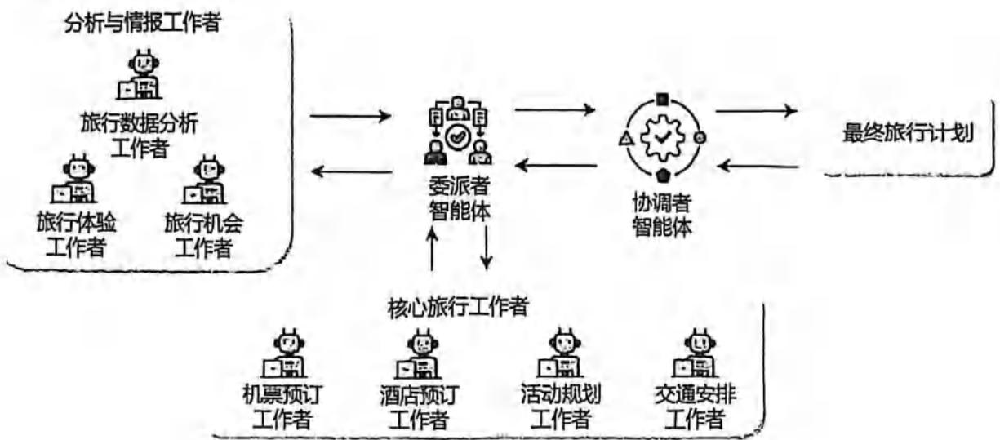  
图6.3 将基于角色的智能体融入CWD模型

下面介绍旅行规划多智能体系统是如何组织与协调整个流程，从而将最初的客户请求转化为一份无缝衔接的最终旅行计划的。该系统采用了一种层级结构：协调者智能体提供战略监督，委派者智能体管理任务分发，而各类专门的工作者智能体则并行地执行核心旅行任务与分析功能。这个协调有序的工作流展示了CWD模型的实际应用，它通过清晰的角色定义和高效的协作，实现了高效、智能的旅行规划。步骤分解如下。

第一步，初始请求与规划。

I. 客户向系统提交其旅行需求。  
II. 协调者智能体分析这些需求，并制定一份战略规划方案。

第二步，任务分配。

I. 协调者智能体将战略规划方案传递给委派者智能体。  
II. 委派者智能体将该规划方案分解为具体任务，分配给核心工作者、分析与情报工作者。

第三步，并行处理(核心旅行任务)：委派者智能体将专门任务分配给核心旅行工作者，具体如下。

- 机票预订工作者负责搜索并预订最佳航班。  
- 酒店预订工作者负责识别并预订合适的住宿。  
- 活动规划工作者负责创建体验行程。  
- 交通安排工作者负责安排地面交通方案。

第四步，并行处理(分析与情报任务)：与此同时，委派者智能体也调动分析与情报工作者执行任务，具体如下。

- 数据分析工作者负责处理客户数据和旅行模式。  
- 体验反思工作者负责审查过往的相似行程。  
- 机会探索工作者负责识别独特的新选项或替代方案。

第五步，整合与优化。

I. 所有工作者将它们的产出结果交还给委派者智能体。  
II. 委派者智能体对信息进行整合。  
III. 协调者智能体接收这份整合后的计划。

第六步，最终审核与交付。

I. 协调者智能体审核并优化完整的旅行计划。  
II. 最终的旅行计划被呈现给客户。

上述流程展示了不同角色的智能体如何通过利用各自的专业知识和贡献，协同合作，最终为客户生成一份经过优化的个性化旅行计划。每个智能体都扮演着特定的角色，其产出结果最终由管理者智能体(旅行运营经理)和协调者智能体(旅行规划协调者)进行汇总与整合，从而交付最终的旅行计划。

通过为智能体精心设计定义明确的角色，基于CWD的多智能体系统能够实现高效协作、发挥专业优势并高效分配任务，最终交付为客户量身定制的且经过优化的个性化旅行计划。然而，这样一个完善的多智能体系统能否成功，在很大程度上取决于这些智能体之间沟通和互动的方式。下一节就探索这些智能体之间是如何实现高效沟通与协作的。

# 6.4 智能体之间的沟通与协作

在基于CWD模型的多智能体系统中，智能体之间的高效沟通与协作对于实现目标至关重要。智能体需要具备共享信息、协调行动和紧密合作的能力，从而为了共同的目标而努力。在基于CWD的系统中，沟通与协作主要涉及以下几个关键方面。

# 6.4.1 沟通

智能体之间的互动应遵循明确定义的协议，其中包括消息的格式和互动的模式。这些协议确保了智能体之间能够清晰地理解对方，并采取适当的行动。例如，在旅行智能体系统中，智能体可以采用标准化的消息格式和通信协议，来交换有关航班选项、酒店空房情况或客户偏好的信息。通过遵守这些协议，智能体可以高效地沟通并解读来自其他智能体的信息，从而实现无缝协作。示例中的旅行智能体系统里的智能体可以遵循一种标准化的通信协议，如FIPA 智能体通信语言(Agent Communication Language, ACL)，来交换消息和信息。例如，当酒店预订

工作者智能体需要与机票预订工作者智能体沟通以协调旅行日期时，它可以发送一条FIPA ACL格式的消息，并在消息中明确指出内容(例如，请求的旅行日期)、发送者(酒店预订工作者)和接收者(机票预订工作者)。

# 6.4.2 协调机制

协调者在建立协调机制方面扮演着至关重要的角色，这些机制能够使工作者智能体的活动与系统的总体目标保持一致。这些协调机制使得依赖关系可控，并能确保任务在要求的时间范围内完成。在旅行智能体系统的场景中，旅行规划协调者智能体可以实施一种包含任务优先级排序、资源分配和进度监控的协调机制，以确保旅行规划过程顺利、高效地进行。

旅行规划协调者智能体可以实施一种协调机制，使工作者智能体的活动与整体旅行规划目标保持一致。例如，它可以根据客户的偏好或旅行日期，采用一种任务优先级排序机制。如果客户优先考虑寻找合适的住宿，那么协调者智能体就可以指示委派者智能体，为酒店预订工作者智能体分配比其他工作者智能体更高的优先级。此外，协调者智能体还可以监控每个工作者智能体的进度，并根据需要重新分配资源或调整优先级，以确保任务按时完成。

# 6.4.3 协商与冲突解决

在复杂的多智能体系统中，可能会出现不同智能体的目标或行动相互冲突的情况。为了应对这种情况，智能体应配备协商策略或冲突解决机制。这些策略通过促进妥协或达成彼此都能接受的解决方案，来帮助维持工作环境的和谐。例如，如果旅行智能体系统中有多个工作者智能体提出了相互冲突的活动计划或交通方案，便可以采用一种协商机制，依据预设的标准来解决冲突，或者让协调者智能体介入调解。

假设活动规划工作者智能体和交通安排工作者智能体针对旅程中的某一天，提出了相互冲突的计划。活动规划工作者智能体可能安排了一个全日游，而交通安排工作者智能体则预订了一辆可供全天使用的租车服务。在这种情况下，便可以采用协商机制来解决这一冲突。委派者智能体可以充当调解者，它从两个工作者智能体那里收集有冲突的计划，并提出替代方案，例如调整全日游的日期或修改租车预订。如果双方无法达成一致，协调者智能体便可以介入，并根据预设的标准或客户的偏好来做出最终决定。

# 6.4.4 知识共享

智能体应具备一种能力，能够将它们从研究或经验中获得的知识、洞见和发现，分享给系统中的其他智能体。这种知识共享有助于持续学习和适应，使系统

能够随着时间的推移不断提升其整体性能。在旅行智能体系统的场景中，旅行数据分析工作者智能体可以将从客户偏好分析中得出的洞见分享给其他智能体，从而使它们能够做出更明智的决策。同样，旅行机会工作者智能体可以分享关于新旅游目的地或新兴趋势的信息，让系统能保持信息的及时更新，并相应地调整其服务内容。

旅行数据分析工作者智能体可以分析客户偏好、旅行趋势以及过往行程的反馈，来生成洞见和建议。这些洞见可以与系统中的其他智能体共享，以改进它们的决策过程。例如，旅行数据分析工作者智能体可能会识别出环保型旅行选项日益增长的趋势，并将此信息分享给活动规划工作者智能体和交通安排工作者智能体。然后，这些智能体便可以调整它们的服务内容，加入更多可持续的活动和交通方式，以顺应客户偏好的变化。旅行机会工作者智能体可以持续探索新的旅行目的地、独特的体验或新兴的旅行趋势，还可以将其发现分享给其他智能体，使它们能够将这些新机会融入各自的规划流程中。举个例子，如果旅行机会工作者智能体在一个热门目的地发现了一个新开业的生态度假村，它可以将此信息分享给酒店预订工作者智能体和活动规划工作者智能体，让它们在生成酒店推荐和活动计划时，将这个新选项纳入考虑范围。

CWD模型的这种基于角色的方法为通信渠道和智能体职责划定了清晰的边界。通过为沟通、协调和知识共享实施明确定义的协议，该系统能够充分利用其智能体的集体智慧，以提供适应性强且高效的旅行规划服务。这种结构化的协作使系统能够在应对复杂挑战的同时，随着时间的推移持续提升自身性能。

本节概述了基于CWD的旅行智能体系统中沟通与协作的理论框架，实际的落地实现还需要仔细考虑技术层面的问题。本节已经全面探讨了在CWD模型指导下，多智能体系统中沟通与协作的基础内容。通过遵守明确定义的通信协议、建立稳健的协调机制并促进有效的知识共享，这样的系统便具备了处理复杂动态场景的能力。

下一节将从这些基础概念过渡到对实践方法的更深入探索，重点关注如何在生成式AI系统中实施CWD模式，并详细介绍状态空间管理、环境建模、记忆系统以及处理大语言模型上下文等高级技术，从而将这些理论概念转化为真实应用场景中的落地解决方案。

# 6.5 在生成式AI系统中实施CWD模式

前文已经探讨了CWD模型如何映射到基于LLM的智能体上，并讨论了其在旅行智能体系统中的角色适配问题，但在生成式AI系统中真正实施这一方法时，还需要仔细考虑几个技术层面的因素。从传统多智能体系统到基于LLM的实现

的转变，既带来了独特的挑战也蕴含了全新的机遇。LLM凭借其自然语言理解和生成的能力，为实现智能体的行为和互动提供了新的途径，但同时也要求在架构上进行专门的考量，以维持CWD模型的结构化特性。

在传统的多智能体系统中，行为和互动通常是通过代码进行显式编程的。然而，在基于LLM的实现中，这些方面主要由精心设计的提示词和交互模式来控制。这一根本性的差异，要求我们必须调整CWD模型的原则，使其能够与LLM的内在特性有效结合，同时保持之前讨论过的清晰的角色边界和层级结构。

在深入探讨下一章将要介绍的技术细节之前，先来研究三个关键的实现要点，它们构成了所有基于LLM的CWD系统的基础。这三个要点分别是系统提示词、指令格式化和交互模式，对于将理论模型转化为一个能够实际运行的实用系统而言，这三大要点是必不可少的。

# 6.5.1 系统提示词与智能体行为

系统提示词是LLM智能体的基础配置层，它定义了智能体的核心特性和运行参数。与那些为特定任务提供指令的常规提示词不同，系统提示词定义的是智能体的固有特性、行为边界和基本框架，这些设定将贯穿其整个运行生命周期。在旅行智能体系统中，每个智能体的系统提示词都必须包含以下内容：

- 角色定义与职责范围；  
- 约束条件与操作边界；  
与其他智能体进行通信的协议；  
- 特定于其角色的决策框架。

例如，机票预订工作者的系统提示词会包含关于航班搜索参数、定价考量和航司合作关系的具体指令；而协调者的系统提示词则会侧重于高层级的规划与监督能力。

前文已介绍CrewAI这样的LLM智能体框架，是如何通过角色和背景故事的定义来构建系统提示词的。其中，角色部分定义了智能体的功能边界与职责，而背景故事则提供了相关的背景信息和专业知识，这些信息共同塑造了智能体履行职责的方式。两者相结合，便创造出内容丰富的系统提示词，用以指导智能体的行为和决策过程。举个例子，一个智能体的角色可能是“航空预订专家”，而它“曾是一位对全球航空网络有深入了解的航空公司收益管理专家”这一背景故事，则能帮助它在航线选择和定价方案上做出更细致的决策。

# 6.5.2 指令格式化

清晰且一致的指令格式是确保智能体性能可靠及智能体间高效通信的关键。在基于LLM的系统中，这一点尤为关键，因为指令是通过自然语言理解来解析

的。指令格式化的关键点如下。

- 输入结构化：为任务分配和请求设定标准化的格式。例如，下面这种结构化的输入格式可以确保机票预订工作者接收到无歧义的搜索参数，其中清晰地指明了出发地、目的地以及期望的旅行日期。

```json
{
    "task_type": "flight_search",
    "parameters": {
        "departure": "location",
        "destination": "location",
        "dates": "date_range"
    }
} 
```

- 输出模板：其他智能体可以稳定解析的、格式统一的响应结构。标准化的输出格式使得智能体能够快速识别任务状态并获取相关信息。选项数组可能包含可用的航班，而推荐可能包括基于客户偏好的优选选择。

```json
{ "status": "completed/failed", "result": { "options": [...], "recommendations": [...], "constraints": [...]} } 
```

- 通信协议：用于智能体间消息和状态更新，需要采用清晰的格式。这些协议确保智能体之间的通信透明，能够明确标识消息类型、发送者和接收者，并且内容结构化，易于处理。

```json
{"message_type": "update", "sender": "flight Booking Worker", "recipient": "coordinator", "content": { "progress": "in progress", "completion": "60%", "pending_tasks": [... ] } 
```

# 6.5.3 交互模式

一个基于CWD的系统能否成功，很大程度上取决于智能体之间是否有明确定义的交互模式。在基于大语言模型的实现中，这些模式必须适配到语言模型交互的独有特性。核心的交互模式有以下几种。

(1) 消息传递协议：

- 智能体之间通信的结构化格式；  
- 不同处理阶段之间有清晰的交接流程;  
- 错误处理和恢复机制。

(2) 状态管理：

- 智能体如何保持对当前任务状态的感知；  
- 在多步骤流程中追踪进度的方法；  
协调并行活动。

(3) 反馈循环:

- 智能体如何报告成功或失败；  
- 请求澄清或补充更多信息的方法；  
- 通过交互历史实现持续改进的机制。

# 本章小结

本章探索了CWD模型作为设计高效多智能体系统的框架的核心价值。我们从早期基于角色的研究中借鉴了基础概念，并看到这些原则如何完美地适应现代基于大语言模型的智能体架构。本章通过一个实用的旅行规划系统，对这一框架进行了研究。在这个系统中，从机票预订到活动规划，不同的智能体在清晰的层级组织下协同工作。

本章的要点在于强调了在多智能体系统中，明确定义角色和职责的重要性，这能确保每个智能体都能清晰且有目的地运行；强调了专业的工作者智能体如何在协调者的监督下高效协作，从而使它们的努力与总体目标保持一致，委派者在管理任务和促进工作流顺畅分配方面发挥着关键作用。此外，本章还强调了高效的沟通与协作模式的重要性，这对智能体之间无缝的信息交换和协同行为至关重要。设计系统提示词和格式化指令这样的关键考量，对于系统的成功运行至关重要，它们确保了智能体交互的清晰性和持续性。

这种结构化的智能体设计方法使得复杂的任务能够被分解为可高效执行的子任务，同时保持清晰的沟通和职责划分。旅行规划示例展示了如何将理论概念转化为实际应用。

下一章将更深入地探索如何在现实生活中高效地设计智能体。

# 习题

1. 解释CWD模型如何提升多智能体系统的效率，并以旅行规划系统为例说明。

2. 角色和背景故事在LLM智能体设计中的意义是什么？它们如何为系统提示词提供支撑？请举例说明。  
3. 旅行规划系统中，核心旅行工作者、分析与情报工作者两者的区别是什么，它们的功能如何互补？  
4. 描述基于CWD的系统中通信与协作的核心要素，包括协议、协调机制和知识共享。  
5. 指令格式化如何促进LLM系统中智能体的高效沟通？请通过输入和输出结构的例子加以说明。

# 习题答案

1. CWD 模型通过创建一个明确的层级结构来提升效率，其中协调者提供战略监督，委派者管理任务分配，专业工作者执行特定功能。在旅行规划系统中，这使得任务能够并行处理——核心旅行工作者处理预订和安排，而分析与情报工作者同时处理数据并寻找机会。这种结构化的方法确保了任务高效完成，同时保持清晰的责任划分和沟通界限。  
2. 角色和背景故事是LLM智能体设计中构成系统提示词的关键要素。角色定义了智能体的功能边界和责任(例如，航班预订工作者)，而背景故事提供了形塑决策的上下文和专业知识(例如，“曾任航空公司收入管理专家，深谙全球航空网络”)。两者共同创造了丰富的系统提示词，指导智能体的行为和交互模式。例如，航班预订工作者的角色和背景故事使其能够根据自身在航空公司运营中的“经验”做出有关航线和定价的复杂决策。  
3. 核心旅行工作者(如机票预订工作者、酒店预订工作者、活动规划工作者和交通安排工作者)处理旅行安排的实际工作，进行预订并确认。相比之下，分析与情报工作者(如旅行数据分析工作者、旅行体验工作者、旅行机会工作者)通过分析趋势、处理反馈和识别新机会提供战略支持。核心工作者执行即时任务，而分析与情报工作者通过数据驱动的见解和持续改进增强了系统的决策能力和未来表现。  
4. CWD系统中的通信与协作包括几个关键部分：标准化的通信协议(如FIPA ACL)确保智能体之间的清晰消息交换；协调机制使协调者能够管理依赖关系和时间表；协商策略帮助解决智能体之间的冲突(如冲突的活动和交通计划)；知识共享通过共享见解和经验实现系统的持续改进。这些元素协同作用，构建出一个统一、高效的多智能体系统。  
5. 在基于LLM的系统中，指令格式化通过结构化的输入/输出模式确保智能体之间的可靠通信。这种标准化的格式确保了智能体之间无歧义的沟通、清晰的任务规范和易于解析的结果，从而提高了系统的整体效率和可靠性。

# 第7章

# 高效的智能体系统设计技术

上一章探索了“协调者-工作者-委派者”模型，这是一个强调合作与分工的多智能体系统设计的坚实基础，深入研究了协调者、工作者和委派者这三种不同的角色，并讨论了它们之间如何复杂地交互与协作，以有效地分配任务。

本章首先将系统提示和聚焦指令确立为智能体行为的基础，强调它们的重要性。然后，将探索智能体所处的状态空间表示和环境建模等关键概念。接着，检查智能体记忆架构和上下文管理策略，这些对于在多次交互中持续保持智能体行为的一致性至关重要。最后，介绍高级的工作流模式，包括针对基于大语言模型的智能体系统的顺序处理和并行处理方法。本章主要介绍以下内容。

- 聚焦式系统提示和智能体指令。   
- 状态空间与环境建模。  
- 智能体记忆架构与上下文管理。  
- 智能体工作流中的顺序处理和并行处理。

学完本章，你将全面了解如何设计出健壮、可扩展、高效的智能体系统，这些系统能够处理复杂任务，同时持续保持行为和性能的一致性。

# 7.1 技术要求

可以在GitHub上找到本章的代码文件，网址是https://github.com/Packt-Publishing/Building-Agentic-AI-Systems。

# 7.2 聚焦式系统提示和智能体指令

聚焦式指令在引导智能体行动方面扮演着至关重要的角色。它为智能体设定了目标、约束条件以及运行环境。这些指令的清晰度和明确性通常会显著影响智能体在实现预期目标方面的表现。

# 7.2.1 定义目标

定义清晰的目标是为智能体提供聚焦式指令的关键一环。目标明确后，智能体的预期功能和行为就有了一个坚实的基础，能够引导其行动和决策过程，从而达成特定目的。

为了更好地理解这一点，本章继续用旅行智能体的例子来进行讨论。该智能体的目标是通过提供个性化的旅行方案和高效地解决各种疑问或问题，来最大化客户满意度。这个宏大的目标包含以下几个关键组成部分。

- 个性化：旅行智能体必须根据每位客户的独特偏好、预算和要求来定制推荐方案。这要求智能体收集客户的旅行目标、兴趣和限制等详细信息，并利用这些信息来设计个性化的行程和体验。  
- 解决问题：除了规划旅行安排，智能体还应该有能力处理客户在旅途中可能遇到的各种疑问、担忧或问题。这可能涉及解决预订冲突、提供旅行建议指导，或者在计划中断或变更时提供替代方案。  
- 高效沟通：要最大化客户满意度，旅行智能体需要进行清晰、高效的沟通，确保客户理解所提出的方案、潜在的利弊，以及任何相关的细节或建议。清晰的沟通还包括主动倾听和准确理解客户的反馈或担忧。  
- 持续改进：通过密切监控客户满意度水平和收集反馈，旅行智能体可以持续迭代其能力和方法。这种反馈循环能让智能体识别出需要改进的领域，适应不断变化的客户偏好或行业趋势，并持续提升其解决方案和服务的质量。

有了定义明确的目标，我们就能用清晰的标准来评估智能体的性能。对于旅行智能体来说，可以利用客户满意度评分、成功解决的查询或问题数量，以及个性化旅行计划的整体质量等指标，来评估其在实现首要目标方面的有效性。此外，这些目标还能引导智能体的决策过程，使其优先采取那些既能最大化客户满意度，又能遵守预算、时间或物流限制等约束条件的行动和解决方案。目标定义示例如下：

目标：担任专业旅行顾问，提供个性化的旅行解决方案，同时最大限度地提升客户满意度。

核心功能：

收集并分析旅行偏好、限制条件和预算  
创建个性化的旅行推荐和行程安排  
- 解决与旅行相关的问题并提供替代方案  
一 清晰且专业地进行沟通  
监控客户满意度并根据情况进行调整

限制条件：

- 遵守预定的预算   
优先考虑客户安全  
一遵循旅行规定  
- 遵守预订截止日期

行为准则：

使用清晰、专业的语言  
一 展现同理心和耐心  
一 预判客户需求  
提供透明的定价  
提供带有优缺点的选项  
- 记录关键要求和截止日期

# 7.2.2 任务规范

详细的任务规范能帮助智能体清晰地理解其职责和责任。通过详细说明需要遵循的具体步骤、预期的输出结果以及与特定任务相关的潜在挑战，任务规范使智能体能够顺利且精准地执行任务。以智能旅行顾问为例，任务规范对于确保智能体能够成功处理旅行规划过程中的各类事务至关重要。

以下是为旅行顾问的不同职责组件定义任务规范的几个示例。

# 1. 客户互动与询问处理示例

客户互动与询问处理的步骤如下。

(1) 问候客户。  
(2) 收集相关信息（旅行偏好、预算、日期等）。  
(3) 确定询问或请求的性质。  
(4) 提供适当的回应或解决方案。  
(5) 确认客户满意度。

预期输出：清晰、简洁的客户询问回应，个性化的旅行推荐或行程安排，预订确认或更新。  
- 潜在挑战：模糊或不完整的客户请求、语言障碍、相互冲突的偏好或限制、安抚情绪化或不满意的客户。

2.航班和住宿预订示例

- 步骤：根据客户偏好搜索可用的航班和住宿，基于价格、时长、设施和客户评分等因素进行比较，向客户展示最佳选择，并确认和预订所选选项。  
- 预期输出：确认的航班和酒店预订，包含旅行详情的行程单、发票或付款凭证。  
- 潜在挑战：可用性有限、价格波动、处理变更或取消、管理团体或特殊住宿需求。

详细的任务规范帮助智能旅行顾问理解旅行规划过程中各环节所涉及的具体步骤、预期的输出或交付物，以及可能出现的潜在挑战。这些知识为智能体提供了必要的指导，使其能够有效应对各种情况，预判并缓解潜在问题，并最终为客户提供流畅且个性化的旅行体验。

3.航班查询示例

(1) 初始查询：

- 记录出发地和目的地；  
- 获取首选日期和时间范围；  
- 记录特殊要求(舱位、中转、航空公司)；  
确认预算限制。

(2) 搜索过程:

- 搜索符合条件的可用航班；  
按价格范围和偏好筛选；  
- 按最佳匹配排序(价格、时长、中转)；  
检查座位可用性。

(3) 展示结果：

- 显示前三个航班选项；  
- 展示价格、时长和中转信息；  
- 突出独特功能和限制条件；  
- 注明取消政策。

(4) 输出：

- 航班对比摘要；  
- 预订确认；  
旅行提示通知。

# 7.2.3 上下文感知

上下文感知是智能体行为的支柱，使其能在指定环境中有效运作并适应变化情况。这种感知不仅限于简单任务的执行，还包括对环境、用户需求及影响决策的情境的理解。上下文感知的核心在于理解和响应围绕所有交互或决策点的全部情境。

对于旅行智能体而言，上下文感知体现在多个关键维度。智能体需要同时关注全局和本地上下文，既包括国际旅行限制和季节性天气模式，又包括具体酒店政策和本地交通选项。这种多层次的感知使智能体能够做出明智决策，并提供真正满足客户需求的个性化推荐。图7.1展示了不同层级的上下文感知如何在智能体系统中整合。

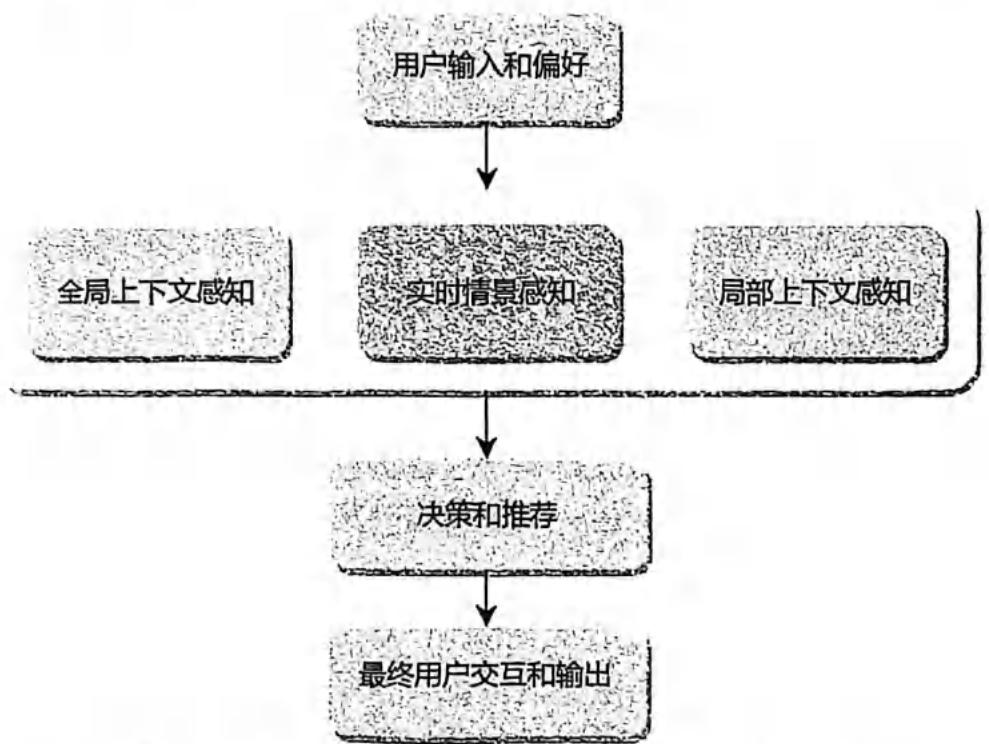  
图7.1 不同层级的上下文感知在智能体系统中的整合

上下文感知的深度可通过旅游领域的几个关键示例说明。

目的地情报：智能体掌握旅游目的地的全面知识，包括旺季、当地活动和文化意义。例如，当客户想去日本时，智能体不仅预订航班，还会考虑樱花季、主要节日和地区天气模式，建议最佳旅行日期和体验。  
- 动态适应：上下文感知支持实时适应变化情况。如果航班因天气原因取消，智能体不仅传递信息，还会立即评估替代路线，考虑对后续预订的影响，并根据客户偏好和限制提出解决方案。  
- 文化适配性：了解当地文化规范和当地习俗对提供有意义的旅行建议至关重要。这可能包括建议客户在宗教场所的着装规范、推荐适合特定饮食限制的餐厅，或提示游客应注意的当地习俗，以确保互动得体。

智能体通过整合这些上下文感知信息，能提前预判需求，避免潜在问题，打

造真正个性化的旅行体验。这超越了简单的模式匹配，需要深入理解不同上下文元素如何相互作用并影响整体旅行体验。上下文感知的真正价值在于将标准服务交互转化为精心策划的体验。当智能体结合目的地细节、客户偏好和情境因素时，能提供既个性化又实用的推荐和解决方案。

# 7.3 状态空间与环境建模

状态空间与环境建模是智能体感知、理解和交互其运行环境的基础。本节探讨设计和实现高效状态表示与环境模型的关键方面，使智能体能够做出明智决策并保持行为的一致性。

# 7.3.1 状态空间表示

状态空间表示定义了智能体如何维护和更新对当前情况、可用行动和潜在结果的理解。设计良好的状态空间使智能体能跟踪相关信息，同时避免不必要的复杂性。以旅行智能体为例，状态空间可能包括以下内容。

(1) 客户档案状态：

- 个人偏好和限制；  
旅行历史和反馈；  
- 当前交互上下文；  
- 预算参数和灵活性；  
- 特殊要求或住宿需求。

(2) 旅行上下文状态：

可用航班选项和价格：  
酒店可用性和价格；  
- 天气状况和预报；  
旅行警告和限制；  
- 季节性活动和高峰期。

(3) 预订状态：

- 预订状态和确认：  
- 支付信息和状态；  
取消政策和截止日期；  
- 行程修改和更新；  
- 关联依赖关系。

状态空间应设计为既捕获静态和动态元素，又保持高效。例如，智能体可能将航班预订状态、酒店和客户偏好等表示如下：

```python
"booking_id": "BK123456",  
"status": "confirmed",  
"components": {  
    "flights": {[  
        "status": "confirmed",  
        "departure": "2024-05-15T10:00:00",  
        "cancellation_deadline": "2024-05-01",  
        "dependencies": ["hotel_check_in"]  
    }],  
    "hotels": {[  
        "status": "pending",  
        "check_in": "2024-05-15",  
        "cancellation_policy": "48h Notice"  
    }]}  
},  
"customer Preferences": {  
    "seat_type": "window",  
    "meal所需要的": "vegetarian",  
    "room Preferences": ["high_fLOOR", "non_smoking"]  
} 
```

状态包括预订状态和行程的组成部分，如航班状态、酒店确认情况，以及用户的任何特定偏好。

虽然状态提供了特定任务的即时表示或相关知识，但智能体运行所处的整体环境也至关重要。此环境通常包括智能体可用的工具详情、需要遵守的特定政策或规则，以及基于具体用例的其他细节。下一节将讨论环境建模的内容。

# 7.3.2 环境建模

环境建模是智能体设计的核心，负责描绘智能体运行的外部世界，帮助智能体理解它的运行环境，涵盖从必须交互的外部系统到影响决策的现实条件等所有要素。简单来说，环境建模要回答三个关键问题：

- 智能体可以与哪些系统或服务交互？  
哪些规则和限制管控这些交互过程？  
智能体需要关注哪些动态变化？

以旅行智能体为例，环境模型需要包括智能体与航空公司预订系统、酒店预订平台和支付系统的连接，还要了解预订流程的规则，并实时跟踪价格变化和航班、酒店的可订性。一个好的环境模型能让智能体：

根据实时情况做出明智选择；  
高效处理复杂系统和流程；  
针对运行环境变化做出恰当响应；  
- 遵守相关规则和法律；  
在限制条件下优化结果。

环境模型需要同时捕捉稳定的规则和不断变化的动态因素。以下是两者的详细说明。

(1) 静态环境元素：这些是环境中不常变化的部分，指导智能体的运行，包括以下内容。

- 业务规则和限制：预订流程和政策、支付处理要求、取消或修改规则、服务协议、法律合规要求。  
- 系统接口：API连接点和规范、数据库结构和关系、认证方式、错误处理方式、访问频率和限额。  
(2) 动态环境元素：这些是需要实时监控和适应的变化部分，包括以下内容。  
- 资源情况：实时库存(如航班或酒店房间)、价格波动、服务中断、天气情况、当地活动或特殊情况。  
- 系统性能：响应速度和延迟、错误率和故障、资源使用情况、处理队列和时间、系统健康状态。

智能体运行所处的环境直接影响它完成任务的效果。设计环境模型时要小心，过多的系统连接可能让智能体变得过于复杂。一种常见解决办法是使用多个专门的智能体，每个智能体擅长处理一两项任务，再通过协作完成最终目标。这种方法在后续讨论顺序和并行工作流程时，优势会更明显。在此之前，我们先分析多个智能体如何相互协作和集成。

# 7.3.3 集成与交互模式

状态空间和环境建模的成功很大程度上依赖于高效的集成模式，确保各组件顺畅交互。以下是两种关键的交互模式。

模式一，事件驱动更新：这种模式让智能体动态响应环境变化。智能体无须持续查询变化，而是接收并处理实时事件。例如，当航空公司更新航班状态或酒店房间变得不可用时，这些事件会立即触发智能体状态更新，从而实现对变化的实时响应。以下代码展示智能体如何处理影响旅行预订状态的事件。TravelAgentState类包含一个方法，用于处理不同类型的事件并相应更新系统。以下是针对两种可能事件(航班变更和天气警报)的示例代码：

class TravelAgentState: def update Booking_status(self, event): if event.type $= =$ "FLIGHT_CHANGESelf.checkDependencies() self.notify_customer() elif event.type $= =$ "WEATHER_ALERT": self.evaluate_alternatives() self.update Recommendations()

来看一个航空公司将航班时间从上午10点改为下午2点的例子：

- 系统接收到FLIGHT_CHANGE事件。  
- update Booking_status 方法处理该事件。  
检查新航班时间是否影响酒店预订或接送服务。  
- 自动通知客户相关变更。

类似地，以下是一个目的地发布恶劣天气警报的例子：

- 系统接收到 WEATHER_ALERT 事件。  
- 方法评估天气是否影响旅行计划。  
- 如有需要，确定替代日期或目的地。  
- 更新提供给客户的推荐。

模式二，状态验证与一致性：此模式确保智能体对环境的理解保持准确、可靠。它涉及检查状态转换是否有效、依赖关系是否维持，以及业务规则是否得到遵守。例如，在确认酒店预订前，智能体必须验证日期与航班安排一致，并符合取消政策。以下代码展示了如何实现强大的状态验证，以确保预订完整性和业务规则合规性。此验证系统作为守门人，确保所有状态变更在应用前都有效。

```python
def validate_state_transition(current_state, new_state):
    if not is_valid_transition(current_state, new_state):
        raise InvalidStateTransition("Invalid transition from [current_state] to [new_state])
    check_state Dependencies(new_state)
    validate.business_rule(new_state) 
```

以下是该验证在实际场景中的运作示例。

(1) 状态转换验证示例。

- 当前状态：“待确认”（航班预订）。  
新状态：“已确认”。  
系统检查：

- 付款是否已收到？  
- 座位是否仍可用？  
价格是否仍有效？

(2）依赖关系检查示例。

- 预订包括航班和酒店。  
系统验证：

- 酒店入住时间晚于航班到达时间。  
- 接送服务时间与航班时间匹配。  
- 房间类型与旅客人数匹配。

(3）业务规则示例。

进行国际预订。  
系统确保：

- 已提供护照信息。  
- 已提供旅行保险选项。  
- 已确认取消政策。

如果验证步骤中任意一项失败，系统会阻止状态变更并提示相应错误，确保预订系统完整无误。

# 7.3.4 监控与适应

有效的监控是智能体系统中保持状态和环境模型稳定的基础。全面的监控需要跟踪关键性能指标，反映系统的运行状况和效率。这些指标包括状态更新的速度(直接影响智能体实时响应能力)、模型预测和决策的准确性。此外，系统还需要关注资源使用情况、错误发生频率及恢复时间，以及最重要的客户满意度，体现智能体表现的实际效果。

为了保持最佳表现，智能体需要灵活地调整策略，根据监控结果优化运行。这包括动态分配资源以应对不同工作量，基于新数据和趋势不断更新模型。系统应能根据变化(如季节性旅行需求或客户偏好改变)调整规则和优化设置。性能优化和扩展机制确保系统能应对增长的需求，同时保持快速响应；用户反馈则帮助系统行为更贴合客户需求。

智能体系统的成功关键在于有效管理状态空间和环境模型，并适应环境变化。通过精心设计静态和动态元素、采用可靠的集成模式、保持高效的监控和调整机制，智能体能提升性能，为用户提供优质服务。这种全面的设计和维护方式确保智能体在环境变化和新挑战出现时，始终可靠、高效且满足用户需求。

# 7.4 智能体记忆架构与上下文管理

记忆架构和上下文管理是智能体实现连贯交互和基于历史经验及当前情况做出明智决策的核心。本节探讨如何设计和实现高效的记忆系统及管理智能体系统的上下文信息。智能体记忆架构通常包括三种类型，每种在智能体运行中各有作用，分别是短期记忆、长期记忆和情景记忆。接下来详细探讨这些记忆架构。

# 7.4.1 短期记忆

短期记忆，也称工作记忆，是智能体当前的认知工作空间。它用于临时存储和管理与当前交互或任务相关的信息。短期记忆对保持对话上下文、处理多步骤流程和管理活跃用户会话尤为重要。在旅行智能体系统中，短期记忆用于跟踪搜索参数、维护预订流程的当前状态，以及记录影响即时决策的上下文细节。

例如，当客户搜索航班时，短期记忆会保存当前的搜索条件、最近查看的选

项及会话中表达的临时偏好。这些信息无须永久存储，但在活跃交互期间对提供连贯的、个性化的体验至关重要。由于其临时性，短期记忆还能高效管理系统资源，会话结束或信息无关后数据会被清除。

在旅行智能体系统中，短期记忆的实际实现可能包括以下Python类。该类定义了实时对话所需的参数，如客户ID、会话开始时间戳、对话线程中的当前查询，以及从用户查询中推断的特定偏好。update_context函数用于随对话进展更新currentInteraction属性，保持短期记忆与最新信息的同步。由于短期记忆通常是临时的、会话特定的，clear_session函数用于清除和重置current_session状态，为后续新会话做准备。

class WorkingMemory: def __init__(self): self.currentInteraction $=$ { 'customer_id':None, 'session_start':None, 'current_query':None, 'active_searches':[],'temporary Preferences':{} } def update_context(self,new_information): #更新当前交互上下文 self.currentInteraction.update(new_information) def clear_session(self): #重置临时会话数据 self.__init__( )

短期记忆为智能体执行任务提供足够的上下文，但通常还有一些持久信息（与临时信息相对），对智能体实现目标很重要。接下来将深入探讨长期记忆的内容。

# 7.4.2 长期记忆

长期记忆又称知识库，是智能体的持久知识存储库，用于保存跨多次交互和会话仍具相关性和价值的信息。与短期记忆不同，长期记忆设计用于需要长期保存和访问的数据。它是智能体积累知识、学习模式并与用户建立联系的基础。

长期记忆对保持客户服务一致性和基于历史数据提供个性化交互尤为重要。在旅行智能体系统中，它存储多次预订中发现的客户偏好、过往旅行安排记录，以及关于目的地、季节模式和服务提供商关系的知识。这种持久存储使智能体能基于历史模式做出明智决策，提供个性化服务，无须客户在每次交互中重复表达偏好。

实现长期记忆需要仔细考虑数据组织、检索效率和更新机制，确保存储的信息始终准确且易调取。在旅行智能体系统中，可能包括以下内容。

(1) 客户档案和偏好：

class CustomerMemory: def init_self): self~- profiles $=$ { preferences': [], 'travel_history': [], feedback_history': [], specialrequirements': {}, loyalty_status': None } defupdate_profile(self,customer_id,new_data): #将新信息与现有档案合并 self~- profiles[customer_id] $=$ { \*\*self~-profiles.get/customer_id; }, \*\*new_data

(2）旅行知识库：

class TravelKnowledge: def init(self): selfdestination_info $\equiv$ {} self seasonalPatterns $=$ {} self.serviceproviders $=$ {} self.travel_regulations $=$ {} def update_knowledge(self, category, key, value): #更新特定知识类别 getattr(self, category)[key] $=$ value

短期记忆和长期记忆是智能体系统的核心支柱。然而，第三种记忆类型——情景记忆——尤其适用于聊天机器人等对话界面。情景记忆能帮助大语言模型和智能体进一步优化行动，为用户提供有针对性的输出。

# 7.4.3 情景记忆

情景记忆是一种特殊记忆形式，用于捕获和存储特定交互、事件及其结果作为离散片段。这种记忆使智能体能从过往经验中学习，利用历史交互指导未来决策。与一般长期记忆不同，情景记忆聚焦于事件的时序和上下文，特别适合理解客户行为模式和服务结果。

在旅行智能体系统中，情景记忆有多种关键功能。它帮助识别成功的预订模式，梳理常见的客户旅程路径，并识别过去带来积极结果或引发问题的情境。例如，若客户曾在特定机场因中转时间遇到麻烦，智能体可利用情景信息在未来预订中避免类似情况。这种记忆还通过参考过往交互及其结果，使智能体提供更具上下文相关性的响应。

实现情景记忆需要谨慎考虑如何组织和存储交互记录，以方便高效检索和模

式识别。在旅行智能体系统中，可能包括以下内容。

class EpisodicMemory: def __init__(self): self.interaction_history = [] def record_interaction(self,interaction_data): #Add timestamp and store interaction interaction_data['timestamp'] $=$ datetime-now() self.interaction_history.append(interaction_data)   
def retrieve Relevant episodes(self,context): #寻找相似的过往交互 return [episode for episode in self.interaction_history if self.is Relevant(episode,context)]

明确核心记忆系统后，我们现在将重点转向这些不同类型的记忆在实践中如何协同工作。智能体需要精密的机制来管理这些记忆系统间的信息流动，确保在正确时间提供正确信息。这引出了两个关键组件：上下文管理和决策整合。

# 7.4.4 上下文管理

有效的上下文管理确保智能体保持对当前情况和相关历史信息的适当感知。以旅行预订智能体为例，假设它在帮助客户规划东京和新加坡的多城市商务旅行。智能体需要关注多种上下文元素：客户公司旅行政策限制航班费用在2000美元以内、因会议安排偏好早晨航班、酒店需要在特定办公地点步行范围内。随着预订过程展开，智能体在处理航班搜索、酒店可用性查询和会议时间约束匹配等不同环节时，需要持续参考和更新上述信息。这个现实场景表明，强大的上下文管理对于处理复杂、多步骤的旅行安排至关重要。有效的上下文管理涉及以下关键组件。

# 1.上下文层级

上下文管理系统应维护不同层次的上下文。

(1) 全局上下文：

系统范围的设置和限制；  
- 当前运行状态；  
- 全球旅行警报和建议。

(2）会话上下文：

- 当前客户交互状态；  
- 活跃的搜索和查询；  
临时偏好和限制。

(3) 任务上下文:

具体预订详情：

- 多步骤流程中的当前步骤；  
相关预订和依赖关系。

# 2.上下文切换

上下文切换是智能体在不同运行上下文间平滑过渡并保持连贯性和连续性的关键能力，涉及以下方面。

(1) 上下文保存:

- 切换前保存当前状态；  
- 维护上下文变更历史；  
确保过渡期间无关键信息丢失。

(2)上下文恢复：

需要时检索先前的上下文；  
重建运行环境；  
- 重新建立相关连接和状态。

(3) 上下文合并：

整合多个上下文的信息；  
- 解决不同上下文间的冲突；  
- 确保上下文变更的一致性。

记忆系统与上下文管理的复杂交互最终服务于一个主要目标：支持智能决策。通过保持对历史数据和当前上下文的感知，智能体能做出更明智、更有效的决策。接下来探讨这些组件如何协同支持智能体的决策过程。

# 7.4.5 决策整合

记忆架构和上下文管理系统通过以下机制支持智能体的决策。

(1) 信息获取: 高效地从各记忆系统中收集并整合相关数据, 包括以下内容。

查看客户历史和偏好；  
查找类似案例及结果；  
- 融合当前情况与历史信息；  
- 筛选并排序关键内容。

(2) 模式识别：帮助智能体发现模式和趋势，指导决策，包括以下内容。

- 分析过去交互记录；  
- 找出成功预订方式；  
根据经验预测潜在问题：  
识别季节趋势和偏好。

(3) 决策优化：综合多因素优化结果，包括以下内容。

加权比较选项；

- 考虑各种限制；  
平衡客户需求与系统规则；  
评估风险并制定应对策略。

这些系统的整合让智能体保持交互连贯，从经验中学习，做出更好的决策。通过精心设计和无缝配合，提供个性化、高效的服务，并在不同交互中保持服务的一致性。

# 7.5 智能体工作流中的顺序处理和并行处理

智能体系统的效率和有效性通常取决于它管理多项任务和进程的能力。本节将探索智能体系统中工作流管理的两种主要方法：顺序处理和并行处理。

# 7.5.1 顺序处理

顺序处理涉及按定义的顺序处理任务，其中每个步骤都依赖前一步骤的完成。在旅行智能体系统中，顺序处理对需要遵循严格顺序的任务至关重要，示例如下。

(1) 航班和酒店协同预订：

在预订酒店前确认航班可用性；  
- 确保接送服务与抵达时间一致；  
在最终确定预订前验证签证要求。

(2)支付流程处理：

- 验证资金可用性；  
- 执行支付操作；  
确认预订；  
- 发送确认文件。

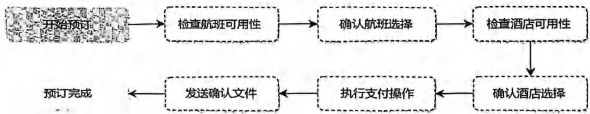  
图7.2展示了旅行预订系统的简单顺序处理工作流。  
图7.2 顺序处理

虽然顺序处理为存在依赖关系的任务提供了清晰且受控的工作流，但它在处理多项独立操作时可能会导致低效。这种限制在复杂用例中特别明显，例如旅行预订场景中，某些任务可能可以同时执行。了解何时应用顺序处理与并行

处理，对于优化智能体的性能和响应时间至关重要。下面介绍并行处理如何提升系统的效率。

# 7.5.2 并行处理

并行处理使智能体能够同时处理多项独立任务，从而提升效率和缩短响应时间。并行处理的应用场景示例如下。

# (1) 并发搜索：

- 同时查询多个航空公司系统；  
检查不同酒店连锁的可用性；  
- 获取天气预报和旅行建议。

# (2) 后台处理:

- 更新客户资料；  
- 处理反馈和评论；  
监控价格变化；  
- 更新旅行建议。

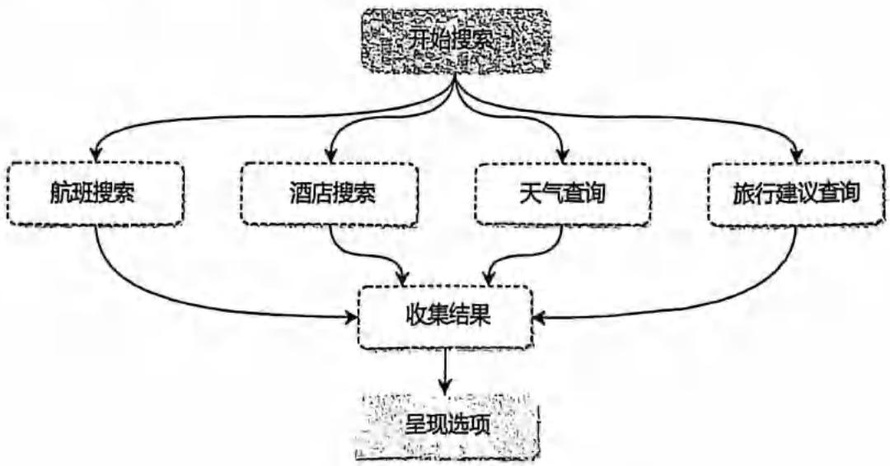  
图7.3展示了旅行预订系统的并行处理工作流。  
图7.3 并行处理

虽然顺序处理和并行处理两种方法都有独特的优势，但真正的挑战在于确定何时使用每种方法，以及如何高效地将两者结合。智能体必须能够根据任务要求、系统负载和时间限制，动态切换这些处理模式。这就需要采取谨慎的方法进行工作流优化。

# 7.5.3 工作流优化

在智能体系统中，实现高效的工作流优化需要一种复杂的方法，用于管理和

协调不同的处理模式。这不仅仅涉及在顺序处理和并行处理之间选择，还需要理解如何高效地将两者结合，同时考虑系统资源、时间限制和任务依赖关系。图7.4展示了可设计的最佳动态工作流的优化。

以下是对工作流优化的详细分析。

# 1. 任务分类和优先级排序

工作流优化的第一步是对任务进行仔细分析和分类。

# (1) 依赖分析：

- 识别必须按顺序完成的关键路径任务；  
- 映射不同预订组件之间的依赖关系；  
- 理解任务之间的数据流要求；  
- 识别时间约束和截止期限。

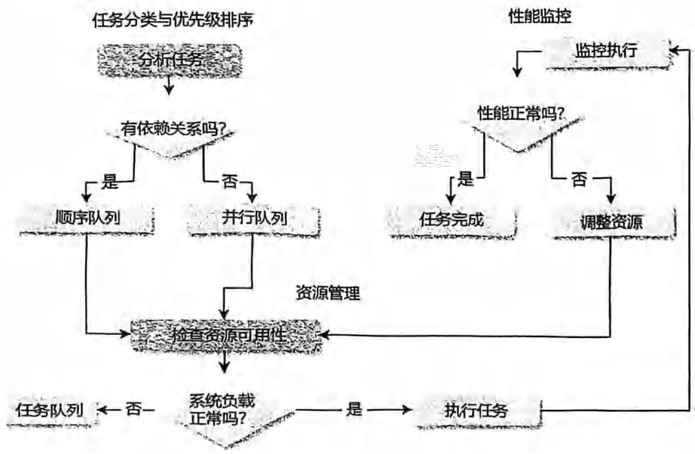  
图7.4 动态工作流优化

# (2) 优先级分配：

评估任务的紧急性和重要性；  
- 考虑客户服务级别协议和服务期望；  
评估对整体预订过程的影响；  
确定资源要求。

# 2. 资源管理

高效分配和利用资源对最佳工作流性能至关重要。

(1) 系统资源分配：

监控和管理CPU与内存的使用情况；  
平衡不同系统组件的负载；  
在需要时实施节流机制；  
优化数据库连接和缓存。

(2) 外部服务管理：

- 跟踪 API 速率限制和配额；  
- 管理并发外部服务请求；  
- 为失败操作实施重试策略；  
- 维护服务提供商优先级。

# 3. 动态工作流调整

系统必须能够根据变化条件调整其工作流模式。

(1) 负载均衡：

根据系统负载调整并行任务执行；  
在高峰期重新分配任务；  
- 管理队列深度和处理速率；  
- 引入背压机制。

(2）性能监控：

- 跟踪任务完成时间和成功率；  
- 识别瓶颈和性能问题；  
- 测量系统吞吐量和延迟；  
- 监控资源使用模式。

通过精心实施这些优化策略，智能体系统可以实现更好的性能，同时保持可靠性。关键在于创建不仅高效，而且具有韧性和能适应变化条件的工作流。这种平衡方法确保智能体能够处理复杂的旅行预订场景，同时为客户提供稳定且响应迅速的服务。

# 本章小结

本章介绍了高效智能体系统的基本组件和设计技术，探索了如何通过聚焦式系统提示指导智能体行为，如何通过状态空间表示和环境模型为决策创建基础，以及不同的记忆架构(短期、长期和情景)如何与上下文管理协同工作，实现连贯的交互并从过去经验中学习。

通过旅行智能体示例，展示了如何整合顺序和并行处理模式，由智能工作流

优化策略支持，使智能体能够高效处理复杂任务，同时保持系统的可靠性。这些设计技术协同工作，构建能够有效管理现实场景、适应变化条件，并为用户提供持续、高质量服务的系统。通过慎重实施这些实践，开发者可以创建不仅满足当前需求，而且可以随未来需求演化的智能体系统。下一章将探索构建生成式AI系统的信任这一关键主题，考察如何创建透明、可靠且负责任的AI解决方案，让用户能够放心使用。

# 习题

1. 智能体系统中三种主要的记忆架构类型是什么？为什么它们对维持高效的智能体行为很重要？  
2. 解释智能体工作流中顺序处理和并行处理的区别。在旅行预订智能体中，何时使用这两种处理方式？  
3. 上下文管理如何助力智能体的高效运行？需要维持的关键上下文级别有哪些？  
4. 环境模型在智能体设计中扮演什么角色？它与状态空间表示有何不同？  
5. 在工作流优化中，选择顺序处理和并行处理方法时，应考虑哪些因素？

# 习题答案

1. 三种主要的记忆架构类型如下。  
- 短期记忆：处理即时互动上下文和当前任务所需的临时信息，例如维护活跃搜索参数和当前会话状态。  
- 长期记忆：存储在多项交互中均有价值的持久信息，如客户资料、旅行规定和目的地信息。  
- 情景记忆：记录特定交互及其结果作为离散情景记录，使智能体能够从过去经验中学习，并识别客户行为模式。这些很重要，因为它们使智能体能够维持上下文、从经验中学习，并基于当前和历史信息做出明智决策。

2. 顺序处理涉及按定义顺序处理任务，其中每个步骤依赖于前一步骤的完成（例如，在预订酒店前确认航班可用性，并在发送确认前处理支付）。并行处理使多项独立任务能够同时处理（例如，同时搜索多个航空公司系统、检查酒店可用性和获取天气预报）。在旅行预订系统中，两种处理方式的应用场景如下。

- 当任务有依赖时使用顺序处理(支付 $\rightarrow$ 确认)。  
- 对独立任务使用并行处理(多项供应商搜索)。

3.上下文管理通过确保对当前情况和相关历史信息保持恰当感知，为智能的

高效运行提供支持。主要级别如下。

- 全局上下文：系统范围设置、运行状态和全局警报。  
会话上下文：当前客户交互状态、活跃查询和临时偏好。   
- 任务上下文：特定预订细节和多步骤流程中的当前步骤。这种层次结构使智能体能够维持连贯互动，同时高效管理不同操作级别的信息。

4. 环境模型创建智能体互动的外部因素和系统的全面表示，包括静态规则(业务政策和系统接口)和动态元素(资源可用性和定价变化)。相比之下，状态空间表示专注于跟踪当前情况、可用操作和潜在结果。环境模型为状态空间所处的更广泛操作上下文提供了支撑。

5. 工作流优化的关键因素如下。

- 任务依赖关系：任务是否有前提条件或能否独立运行。  
资源可用性：系统容量和外部服务限制。  
时间约束：任务完成紧急性和服务级别协议要求。  
- 系统负载：当前处理容量和队列深度。  
- 性能要求：吞吐量和延迟期望。

决策时应平衡这些因素，同时考虑每个任务的具体要求和整体系统的效率目标。

# 第3部分：

# 信任、安全、伦理和应用

本部分旨在帮助你全面理解如何构建可信、安全和合乎伦理的生成式AI系统，同时探索该领域的现实应用场景和未来发展方向。

本部分包含以下章节：

- 第8章 构建生成式AI系统的信任  
- 第9章 安全管理与伦理考量  
- 第10章 常见用例与应用场景  
- 第11章 结论与未来展望

# 第8章

# 构建生成式AI系统的信任

前一章探索了几种设计方法，这些方法能有效引导智能体展现理想行为，同时坚持伦理原则。专注指令、边界和约束，以及在自主性与控制之间找到平衡，是将智能体与人类价值观对齐并降低潜在风险的关键策略。

通过专注指令提供清晰的目标、任务和操作上下文，为智能体提供了一个明确的操作框架。护栏和约束作为边界，防止智能体偏离预期轨道，减少不良后果的风险。同时，结合自主决策和人为控制的平衡方法，允许智能体行使独立判断，同时保持与人类价值观的一致性。

然而，生成式AI系统成功应用和被接受的关键在于信任。随着这些技术日益融入社会的各个方面，培养用户信心和信任对于其有效实施至关重要。

本章将深入探讨AI中信任的重要性，并探索实现信任的策略。本章强调信任是培养用户信心和实现负责任应用的基础要素。本章分为几个部分，每部分讨论构建信任的不同维度。本章将解决两个重大障碍——不确定性和偏见，并强调透明度、可解释性和清晰沟通的重要性。

本章将介绍以下主要内容。

AI中信任的重要性。  
建立信任的技术。  
- 透明度和可解释性的实现。  
不确定性和偏见的应对。

通过本章的学习，你将了解如何开发可靠的生成式AI系统，增强用户和利益相关者的信心，为其广泛且负责任的应用奠定基础。

# 8.1 技术要求

可以在GitHub上下载本章的代码文件，地址是https://github.com/Packt-Publishing/Building-Agentic-AI-Systems。

# 8.2 AI中信任的重要性

信任是AI系统(包括生成式AI)成功落地和获得认可的关键要素。如果用户对这项新技术的内部运作和决策过程缺乏信心，他们愿意使用或依赖其输出结果的可能性将大打折扣。在生成式AI系统中建立信任，是获得用户信心并确保其使用广泛、负责任且合乎伦理的基本步骤。

考虑一个场景：一家旅行社使用生成式AI系统帮助客户规划假期。该AI可以基于客户偏好和历史数据，建议个性化行程、推荐住宿并提供旅行提示。然而，如果客户不信任AI的推荐，他们不太可能依赖其建议，或不愿意提供个性化推荐所需的个人信息。

这意味着AI中的信任度受多因素影响，涉及系统可靠性、透明度，以及是否与用户期望和价值观相对应。用户更可能与他们视为可信的AI系统互动，包括提供反馈和分享数据，以进一步优化和提升AI系统的性能与能力。

在旅行社示例中，如果系统透明化展示决策过程，解释为什么基于他们的偏好和过去旅行记录推荐特定目的地或活动，则客户可能更倾向于信任AI的推荐。此外，如果AI的推荐与客户期望和价值观一致，例如优先考虑环保型住宿或文化沉浸式体验，也会进一步强化客户对系统的信任。

如果信任不足，可能导致用户怀疑、抵制采用，并最终滥用或误用此类技术。在旅行社场景中，如果客户不信任AI的推荐，他们可能完全忽略其建议，或提供不准确信息，导致次优行程和糟糕的用户体验。

此外，缺乏信任会阻碍AI系统的持续改进和进步。如果客户因不信任而不愿分享反馈或数据，AI学习并适应他们不断变化的偏好和要求的能力将受到限制。

为了解决这些问题，利用生成式AI的旅行社和其他组织，必须优先通过各种技术构建信任，例如决策透明、处理不确定性和偏见问题、有效沟通输出，以及确保合乎伦理的开发实践。通过培养信任，企业可以释放生成式AI的全部潜力，实现无缝采用、负责任使用，以及对这些强大技术的持续改进。

下一节将探索一些建立信任的技术。

# 8.3 建立信任的技术

开发者和社会研究者社区可以采用各种技术，以助力培育生成式AI系统的信任度，解决用户的顾虑。下面讨论关键技术。

# 8.3.1 透明度和可解释性

AI系统如何得出决策和生成内容，这一过程的透明度是构建信任的基础。用户需要理解AI输出背后的推理逻辑，并对其决策过程有信心。没有这种透明度和可解释性，用户可能将AI视为黑箱，难以完全信任其推荐或输出。AI的透明度体现在两个层面：算法层面和呈现层面。算法透明度涉及对模型架构、训练数据和潜在偏见的开放，确保开发者和管理者可以评估其可靠性和公平性。呈现透明度，即可解释性，关注AI如何向用户传达其推理过程，帮助用户理解为什么做出特定决策或推荐。两者对信任都至关重要——没有算法透明度，利益相关者可能质疑系统的完整性，而缺乏可解释性可能让用户对输出感到不确定。采用均衡的实现方式能增强对AI驱动决策的信心。

再次以旅行智能体场景为例。想象一位客户规划欧洲家庭假期，AI系统基于他的偏好和旅行记录推荐访问特定城市。如果AI能透明地解释其推理，客户对该推荐的信任度可能会显著提升。例如，系统可以突出所推荐城市以家庭友好景点、丰富文化遗产和实惠住宿闻名，与客户对教育性和预算友好旅行的偏好一致。

可解释 AI(XAI)技术在实现这种透明度中发挥着关键作用。在 GPT-4 的内容生成系统中，用户可能想知道为什么选择某些短语或句子，以及 AI 如何考虑上下文、语气和风格偏好。XAI 技术，如注意力可视化、显著性图和自然语言解释，可以提供对模型内部运作的洞察，使其更具可解释性和可信度。

chapter08_xai notebook 提供了一个例子，展示如何使用 Python 简单生成注意力可视化、显著性图和自然语言解释。代码演示使用预训练 BERT 模型通过注意力可视化来分析文本。它首先导入所需要的库，包括 torch(用于张量操作)、transformers(用于加载 BERT 模型和分词器)，以及 matplotlib 和 seaborn(用于可视化注意力分数)。

模型bert-base-uncased用于序列分类，分词器将输入文本处理成token ID。核心功能包括通过启用output attentions=True参数从模型提取注意力分数，提供对输入查询中不同token之间关系的洞察。然后使用热图可视化注意力分数，显示最后一层注意力层中token间的注意力分布。这种热图有助于理解模型在处理查询时关注文本的哪些部分。通过解码token ID成可读token并绘制注意力分数，代码实现对BERT如何处理文本的详细分析，使其成为XAI的有价值工具，其目标是提升模型透明度和可解释性。

当询问“欧洲最适合家庭出游的旅行目的地有哪些”时，代码片段使用预训练分词器对输入文本进行分词，将其转换为适合模型的张量格式，同时根据需要应用截断和填充。然后定义一个函数，通过将分词输入传递给模型提取注意力分数，提供对文本不同部分相互关注的洞察。另一个函数使用热图可视化这些注意力分数，显示最后一层的注意力权重，并在两个轴上标记对应的 token。最后，代码检索注意力分数，将 token ID 解码成对应的 token，并可视化注意力权重，以显示模型对输入文本的关注焦点。图8.1展示了注意力可视化结果。

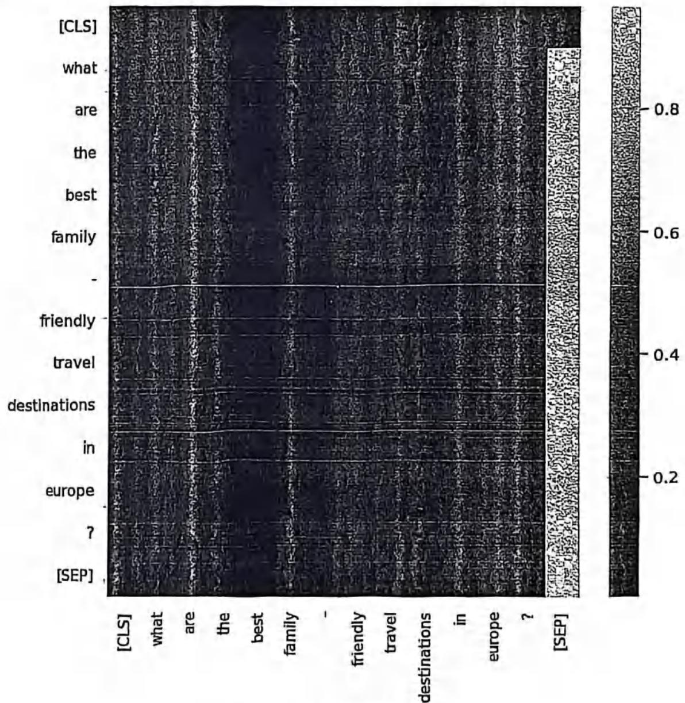  
图8.1 注意力可视化结果

例如，注意力可视化可以突出显示用户提示中AI在生成内容时关注的特定单词或短语。这有助于用户理解AI如何解读自己的输入以及为什么做出某些创意选择。类似地，图8.2显示了同一句话的显著性图。

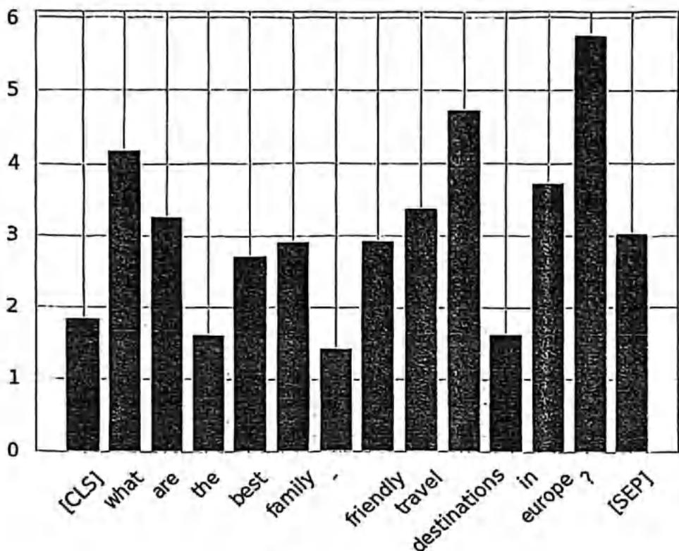  
图8.2 显著性图

chapter08_xai 代码文件使用预训练的 BERT 模型，实现了给定句子的显著性图可视化。该过程首先将输入句子分词，转化为 token ID 和注意力掩码，然后将它们送入模型。代码会检索并追踪这些 token 的嵌入向量的梯度，以便计算显著性得分，这些得分表明每个 token 对模型预测的贡献程度。代码中使用了一个自定义的前向传播函数来将嵌入向量输入模型中，并通过显著性属性方法来计算显著性得分。接着，将这些得分在 token 嵌入向量中进行聚合，并将 token 转换为可读的形式。最后，生成一个条形图，以可视化的方式展示每个 token 的重要性，从而深入了解哪些 token 对模型的决策影响最大。这种方法通过突出显示驱动模型输出的关键 token，可以更好地解释模型的行为。

在某些情况下，自然语言解释可以为理解模型提供额外信息。人工智能和机器学习中的自然语言解释，是指人类可读的描述，有助于将复杂的模型输出或决策转化为易于理解的语言。它们对于提高可解释性和透明度至关重要，让用户能够理解模型行为背后的推理过程。例如，当模型对一张图片进行分类时，自然语言解释可能会描述导致该分类的特征，例如“这张图片被归类为狗，因为它包含典型的狗尾巴和耳朵”。这些解释弥合了机器输出和人类理解之间的鸿沟，促进了人与AI之间的信任与协作。相关示例可参考图8.3。

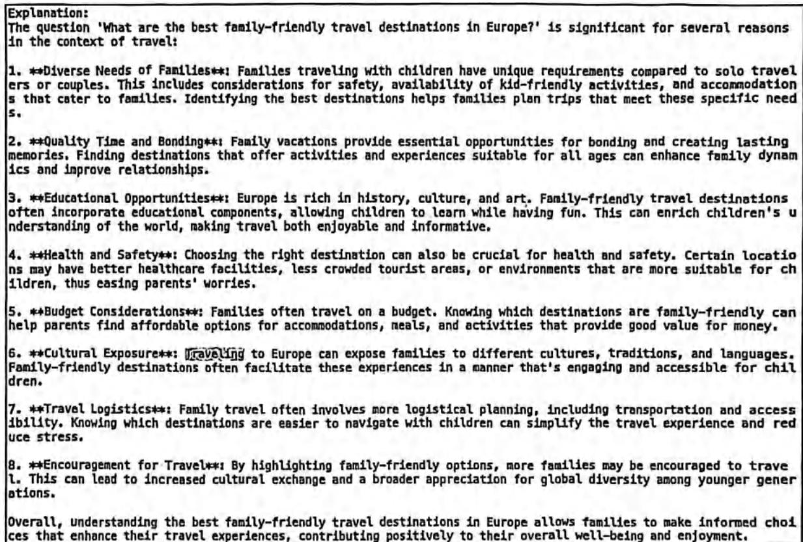  
图8.3 自然语言解释

我们输入了同样的文本，“欧洲最适合家庭出游的旅行目的地有哪些”，可以清楚地观察到模型(GPT-40-mini)为什么将其识别为“鼓励”性质。在医疗或金融等高风险领域，自然语言解释对于确保AI决策的问责制和公平性至关重要。通过清晰地揭示模型如何得出结论，自然语言解释可以促进负责任和合乎伦理的AI部署。

以医疗行业为例，AI系统越来越多地被用于疾病诊断和治疗推荐等任务。在这些高风险场景中，透明度和可解释性变得至关重要。医生和患者需要理解AI做出诊断或治疗计划的推理过程，尤其是当其与已有的医学知识或指导方针相矛盾时。XAI技术，例如特征重要性和规则提取，可以帮助解释影响AI决策的因素，从而让医疗专业人员评估这些建议的有效性，并建立对系统的信任。

同样，在金融领域，AI模型也被用于信用风险评估、欺诈检测和投资组合优化等任务。XAI可以帮助金融机构理解影响AI决策的因素，确保其符合法规，并在客户和利益相关者之间建立信任。

开发者和研究人员可以根据具体的用例和模型架构，利用各种XAI技术。例如，显著性图对于计算机视觉任务可能很有用，而自然语言解释则更适合文本生成或语言理解模型。

通过优先考虑透明度和可解释性，可以创建出不仅准确，而且值得信赖的AI系统。用户可以理解AI输出背后的推理过程，评估其决策，并最终对系统的能力产生信心，从而为这些强大技术的广泛和负责任的应用铺平道路。

# 8.3.2 不确定性和偏见的处理

AI系统在设计时需要能够识别并缓解其训练数据或算法中可能引入的不确定性和偏见。量化和传达不确定性，并积极地尝试最小化偏见，是生成式AI系统与用户之间建立信任的关键步骤。

以旅行社的场景为例，假设有一个生成式AI系统根据用户的偏好和历史数据推荐个性化的旅行路线。如果用户提供了一个模糊不清的提示，例如“我想去冒险”，AI系统应该能够承认在解读这种宽泛请求时存在不确定性。它可以通过提供一系列可能的路线方案，或者强调需要用户提供更多信息来澄清这种不确定性。

此外，由于训练数据的原因，AI系统在其推荐中可能会存在固有的偏见。举个例子，如果训练数据中主要是高收入的旅行者，或者只关注某些特定区域，那么AI的推荐可能会倾向于豪华住宿或热门旅游目的地，从而无法涵盖多样化的旅行体验。解决这些偏见对于建立信任和确保公平、包容的推荐至关重要。

去偏算法、对抗训练和人工监督等技术可以帮助减少与性别、种族、年龄或社会经济地位等因素相关的偏见。去偏算法旨在通过调整模型的参数或修改训练数据来消除或减轻偏见。对抗训练涉及训练模型以使其能够抵御有偏见或对抗性的输入，而人工监督则允许手动干预和纠正有偏见的输出。举例来说，一个从文本到图像的生成模型应该能够承认并传达在解释模糊提示或生成复杂场景时所涉及的不确定性。如果用户请求一张“神奇森林”的图像，AI系统可以生成多个变体，并为每张图像提供置信度分数或不确定性估计，从而让用户理解模型的解释和潜在局限性。

在医疗领域，AI系统越来越多地被用于疾病诊断和治疗方案推荐等任务，处理不确定性和偏见的重要性至高无上。AI模型应该能够量化其预测中的不确定性，尤其是在输入数据不完整或不明确的情况下。此外，解决与种族、性别或社会经济地位等因素相关的偏见，对于确保公平和公正的医疗结果至关重要。通过实施识别、量化与减轻不确定性和偏见的技术，开发者和研究人员可以创建出不仅准确，而且透明和值得信赖的AI系统。用户可以更好地理解系统的局限性和潜在偏见，从而做出更明智的决策，并负责任地使用这些强大的技术。

# 8.3.3 高效的输出沟通

AI生成的内容如何呈现和被解读，会显著影响用户信任。开发者应该确保AI的输出内容被清晰地标记为AI生成，在恰当的地方提供背景信息和来源，并向用户提供解读和进一步利用这些内容的建议。

在旅行社的场景中，想象一个生成式AI系统，它能根据用户的偏好和目的地创建个性化的旅行博客文章或行程描述。高效的输出沟通至关重要，它能确保

用户理解AI生成内容的本质和局限性。

首先，AI生成的旅行博客文章或行程描述应该被清楚地标记为“AI生成”或“AI辅助生成”，以设定合理的预期，避免混淆或误导。此外，AI系统可以提供生成内容所使用的数据源和算法的背景信息，比如它参考了哪些旅行数据、用户评论和语言模型。

更进一步，AI系统应该透明地沟通生成内容中可能存在的任何偏见或局限性。例如，如果训练数据主要集中在热门旅游目的地或主流旅行体验上，那么AI生成的内容可能无法代表小众或非主流的旅行体验。通过承认这些局限性，用户可以更好地理解AI生成内容的范围和潜在的盲点。

提供关于如何负责任地解读和利用AI生成内容的指南也能增强信任。比如，AI系统可以建议用户在完全依赖AI生成的信息之前，先事实核查或验证具体的细节，如开放时间、门票费用或当地风俗。此外，系统可以建议用户在规划行程时，将内容与其他可靠来源进行交叉比对，或者寻求当地专家的意见。

在新闻和新闻业领域，AI生成的内容正变得越来越普遍，高效的输出沟通尤为重要。AI生成的新闻文章应明确标记，并附上关于数据源以及任何潜在偏见或局限性的信息。举例来说，如果AI系统是在一组特定的新闻来源或时间段上训练的，那么它在报道或事件定性上可能存在固有的偏见。

此外，关于事实核查和验证信息的指南可以帮助用户负责任地对待AI生成的内容。新闻机构可以提供资源或核查清单，供用户将AI生成的文章与其他可信来源进行交叉比对，核实其中的主张，并评估文章的客观性和平衡性。

通过实施高效的输出沟通策略，开发者和组织可以提升透明度，管理用户期望，并使用户能够以批判和负责任的态度对待AI生成的内容。这种方法能够建立信任，减少潜在的误解或滥用，并为生成式AI技术在各个领域的负责任应用铺平道路。

# 8.3.4 用户控制权与同意权

用户控制权与同意权指的是，允许用户在自定义和影响生成过程方面有更多自由权，并就数据使用和内容创建征求用户明确同意的功能。这有助于建立信任并确保用户忠诚度。

在旅行社的场景中，想象一个生成式AI系统，它根据用户的偏好和历史数据创建个性化的旅行行程或推荐。让用户掌控生成过程有助于建立信任，并确保AI生成的内容与他们的具体需求和期望相符。

例如，AI系统可以允许用户调整旅行风格(如冒险、放松或文化体验)、预算范围、旅行时长或期望的活动。通过赋予用户微调这些参数的能力，他们可以更好地影响AI的推荐，并对生成的结果有掌控感。这种定制化程度可以提高用户满意度，增强他们对AI系统的信任，因为他们会觉得自己的偏好在推荐中得到

了准确的体现。

此外，就其个人数据或旅行历史的使用征求用户的明确同意，可以增强透明度并建立信任。AI系统可以呈现清晰、易懂的信息，说明将要收集哪些数据、如何使用，以及任何潜在的风险或局限性。然后，用户可以做出知情的同意，允许AI系统利用他们的数据，同时尊重他们的隐私和自主性。

在创意写作领域，一个由AI驱动的写作助手可以让用户调整语气(如正式、随意或幽默)、风格(如描述性、简洁或叙事性)或内容边界(如适合家庭或少儿不宜)等参数。通过给予用户这种程度的控制，可以更好地让AI生成的内容与自己期望的创意愿景保持一致，从而培养用户对AI系统的归属感和信任。

此外，在使用个人写作样本或数据时征求同意，可以促进用户与AI系统之间的透明度和信任。AI系统可以清楚地解释如何利用用户的数据，例如用于训练或个性化目的，并为用户提供选项，让他们可以控制访问级别或随时撤销同意。

在个性化医疗保健领域，AI系统可以允许用户调整与治疗方法(如传统、替代或综合)、风险承受能力或特定的饮食或生活方式考虑因素相关的偏好。通过赋予用户对这些参数的控制权，AI生成的治疗计划或推荐可以更好地与他们的个人价值观和偏好相匹配，从而培养用户对AI系统的信任和忠诚度。

通过整合用户控制和同意功能，开发者和组织可以创建出不仅准确、高效，而且透明、尊重用户自主性，并能响应个人偏好和需求的AI系统。这种方法可以培养信任、增强用户忠诚度，并促进生成式AI技术在各个领域的负责任应用。

# 8.3.5 伦理化开发与责任

公平性、隐私和知识产权是生成式AI系统在开发与部署过程中应重点强调的道德考量，这能赢得用户和其他利益相关者的信任。开发者应优先考虑隐私保护技术、负责任的数据处理和尊重知识产权等实践。确保AI系统不会固化有害的偏见或歧视某些群体，对于建立信任和负责任地推广应用也至关重要。

在旅行社的场景中，假设一个生成式AI系统创建了个性化的旅行推荐和行程。道德发展与责任应放在首位，以确保AI系统公平运行，尊重用户隐私，并避免侵犯知识产权。

公平性和非歧视是指导此类AI系统开发的基本原则。用于生成推荐的训练数据和算法应被仔细评估，以识别和缓解潜在的偏见或歧视模式。例如，如果训练数据主要包含为特定人口群体或收入水平量身定制的旅行体验，AI系统在生成推荐时，可能会无意间固化偏见，从而排斥或低估某些群体的旅行偏好。

开发者应实施去偏算法、对抗训练和多样化的数据收集策略等技术，以确保AI系统能够生成公平和包容的推荐，而无须考虑种族、性别、年龄或社会经济地位等因素。通过优先考虑公平性和非歧视，用户可以相信AI系统会平等对待他们，并且不会强化有害的刻板印象或偏见。

隐私是生成式AI系统开发的另一个关键道德考量。如果用户对AI系统保护其隐私的能力缺乏信心，他们可能不愿分享个人数据或旅行历史。开发者应采用隐私保护技术，例如差分隐私、安全多方计算或加密数据处理，以确保用户数据得到负责任的处理，并防止未经授权的访问或滥用。

此外，应建立负责任的数据处理实践，以确保用户数据的收集、存储和处理符合相关的隐私法律法规。透明的数据政策和用户同意机制可以进一步建立信任，让用户可以控制其数据如何被AI系统使用。

知识产权也是生成式AI系统领域的一个重要问题。在创建旅行内容或推荐时，AI系统应尊重版权、商标和其他知识产权。开发者应采用相关技术来检测和防止未经授权使用受版权保护的材料，或生成侵犯现有知识产权的内容。

此外，在使用或引用第三方内容或数据来源时，AI系统应提供适当的出处和鸣谢。这不仅体现了尊重知识产权，还可以在用户之间培养透明度和信任，用户可以验证所呈现信息的来源和可信度。

通过优先考虑道德发展实践并解决与公平性、隐私和知识产权相关的问题，开发者可以创建出不仅强大、高效，而且值得信赖、兼具社会责任感的生成式AI系统。用户和利益相关者可以对AI系统的完整性有信心，从而促进这些技术的广泛应用和负责任的使用。

通过实施这些技术，开发者和研究人员可以创建出透明、可追溯并符合用户期望和道德原则的生成式AI系统，从而建立信任，并实现这些强大技术的广泛、负责任应用。

在建立公平性和可追溯性的基础上，接下来的几节将探索如何在现实生活中落地实践。

# 8.4 透明度和可解释性的实现

透明度和可解释性是任何值得信赖的AI系统的核心特征。事实上，解释AI模型如何做出决策并生成内容，可以让用户深入了解其背后的推理过程，从而增强对系统可靠性的信任和信心。

以旅行社的场景为例，一个生成式AI系统根据用户的偏好和历史数据推荐个性化的旅行路线。透明度和可解释性对于建立对该系统的信任至关重要。用户可能想知道为什么某些目的地或活动被推荐，而不是其他选项，以及AI是如何将他们的偏好、预算限制和旅行历史等因素考虑在内的。

正如我们之前看到的，显著性图、特征重要性和自然语言解释等是可解释的AI技术的一些方法，可用于提高AI系统的透明度和可解释性。通过这些方法能深入洞察AI在做出决策时最看重的输入特征或数据点，以及这些特征的变化将

如何影响输出结果。

例如，显著性图可以突出显示用户画像或偏好中，对生成特定旅行推荐影响最大的部分。这种可视化的呈现方式可以帮助用户理解AI决策背后的推理过程，并确保推荐内容符合他们真实的偏好。

特征重要性技术可以量化不同输入特征(如旅行历史、预算或期望活动)在形成AI推荐过程中的相对重要性。这些信息可以帮助用户识别AI决策过程中可能存在的任何偏见或不一致，并为进一步改进提供反馈。

自然语言解释可以为 AI 的推荐提供文本形式的理由，解释为什么建议特定的目的地、住宿或活动。这些解释对于非技术用户尤其有价值，能使 AI 的决策过程更易于理解和接受。

透明度的另一个方面是披露生成式AI系统的局限性和潜在风险。换句话说，用户应该意识到，尽管这项技术功能强大，但它并非完美无缺，也受到不确定性和偏见的影响。

例如，一个旅行推荐AI系统在理解细微或特定情境下的偏好时可能存在局限性，或者由于其训练数据的性质，它可能对热门目的地存在偏见。开发者应该设定切合实际的期望，并提供清晰的指南，说明如何使用这项技术，同时承认它的优点和局限性。

在医疗领域，当AI系统被用于诊断或治疗方案推荐等任务时，透明度和可解释性尤为重要。医生和患者需要理解AI决策背后的推理过程，尤其是在决策与已有的医学知识或指南相矛盾的情况下。可解释的AI技术可以帮助解释影响AI决策的因素，从而让医疗专业人员评估建议的有效性，并建立对系统的信任。

# 8.5 不确定性和偏见的应对

不确定性和偏见是包括生成式AI模型在内的AI系统固有的问题。不确定性可能由多种原因引起，比如数据不完整或模糊、事件本身无法预测，或者模型知识和训练过程存在局限性。

在旅行社的场景中，假设一个生成式AI系统根据用户的偏好和历史数据推荐个性化的旅行路线。不确定性可能来源于用户输入模糊不清、训练数据中的旅行信息不完整或过时，或者天气突变、局部冲突等意外事件。

为了应对不确定性，开发者可以在生成式AI系统中考虑使用概率建模、贝叶斯推断和不确定性量化等技术。这些技术能让模型提供概率或置信区间，而非确定的输出，当新数据到来时更新其认知，并估算与其预测相关的不确定性。

例如，当用户提供一个宽泛的提示，如“我想要一次浪漫之旅”时，AI系统可以呈现多个潜在的行程方案，并附带相关的置信度分数或不确定性估计，让用

户了解模型的自信程度，从而做出明智的决策。

另外，偏见可能由于训练数据、算法设计或社会偏见等多种因素而在AI系统中表现出来。这些偏见可能导致不公平或歧视性的结果，固化历史上的不平等，并损害用户对系统的信任。

在旅行社的场景中，如果训练数据主要包含针对特定人口群体、收入水平或文化视角的旅行体验，就可能会产生偏见。其结果是，AI系统的推荐可能会无意中排斥或低估某些群体、旅行偏好或目的地。

解决AI系统中的偏见问题可以采用多种方法，包括使用具有代表性和多样化的训练数据，持续监控和评估模型性能，并整合来自不同利益相关者的反馈。这有助于识别和缓解潜在偏见，确保AI系统生成公平且具有包容性的推荐。

例如，在旅行推荐系统中，开发者可以实施去偏算法来减少与种族、性别或社会经济地位等因素相关的偏见。此外，他们可以引入人工监督，让旅行专家或多元化的用户群体审查AI的推荐并提供反馈，帮助识别和纠正任何偏见或遗漏。

通过应对不确定性和偏见的问题，生成式AI系统可以赢得用户的信任，并确保该技术的使用负责任且符合伦理。用户可以对AI生成输出的可靠性和公平性充满信心，从而促进其在各个领域的广泛应用和积极影响。

# 本章小结

总而言之，信任是生成式AI成功应用和负责任使用的基石。透明度和可解释性使用户能够理解AI决策背后的原理，从而培养用户信心并确保系统的可靠性。显著性图、特征重要性分析和自然语言解释等先进技术提升了可解释性，同时处理不确定性和偏差则确保了稳健与公平的结果。

清晰的沟通，辅以内容标记、背景信息和使用指南，使用户能够负责任地对待AI输出。全面的偏差处理方法、道德发展实践，以及以用户为中心的功能(如控制和同意机制)，进一步巩固了信任。

通过遵循这些原则，开发者可以释放生成式AI的变革潜力，推动有意义的创新和社会进步。随着这项技术的不断发展，持续关注用户信任将为人类与AI的和谐协作铺平道路，共同塑造一个建立在可追溯性、公平性和共同成功基础上的未来。

下一章将探索生成AI的潜在风险与挑战、确保AI安全且负责任的策略、伦理准则与框架，以及解决隐私和安全问题的迫切需求等关键主题。

# 习题

1. 为什么信任对生成式AI系统的应用至关重要？  
2. 透明度和可解释性在建立AI信任方面扮演着怎样的角色？  
3. 不确定性和偏见如何影响生成式AI系统？  
4.AI开发者如何通过符合伦理的开发实践来培养信任？  
5. 组织可以采取哪些措施来提升用户对AI生成内容的信任？

# 习题答案

1. 信任对于生成式AI的广泛和负责任应用至关重要。如果用户对系统的决策过程缺乏信心，他们就不愿意依赖其输出结果。信任会影响用户与AI的互动方式，无论是分享反馈、提供数据，还是从一开始就接受这项技术。缺乏信任可能导致用户对AI系统产生怀疑、抵触，甚至误用。  
2. 透明度和可解释性帮助用户理解 AI 系统是如何做出决策的，从而使其更值得信赖。透明度在两个层面发挥作用。

- 算法层面：公开模型的架构、训练数据和偏见，确保AI系统的可靠性和公平性能够被评估。  
- 呈现层面：AI应该清晰地传达其推理过程，以便用户能够理解并信任其输出。注意力可视化、显著性图和自然语言解释等技术能帮助用户理解AI生成的决策。

3. 不确定性和偏见会严重影响生成式AI的公平性和可靠性。

- 不确定性：当 AI 缺乏足够的数据、接收到模糊的输入或遇到不可预测的场景时，就会产生不确定性。解决这个问题需要使用概率建模和置信度评分来有效地传达不确定性。  
- 偏见：偏见可能通过训练数据、算法设计或社会影响等因素被引入。如果不加以缓解，偏见可能导致不公平或歧视性的结果，排斥特定群体或观点。去偏算法、对抗训练和多样化数据收集等技术有助于减少偏见并提高公平性。

4. 符合伦理的 AI 开发要求公平性、隐私保护和知识产权保护。

- 公平性：AI模型应该在多样化和具有代表性的数据上进行训练，以避免偏见。  
隐私保护：应使用差分隐私和加密等隐私保护技术，负责任地处理用户数据。  
- 知识产权保护：AI生成的内容应尊重版权并提供适当的鸣谢。

通过实施这些原则，开发者可以构建出值得用户信任并能被负责任地应用的AI系统。

5. 组织可以通过清晰地沟通 AI 生成的内容，确保用户理解其局限性以及如何解读，从而增强信任。关键策略包括：

- 标记 AI 生成的内容，以设定清晰的预期。  
- 为推荐或决策提供解释，确保用户理解为什么会生成这个输出。  
- 给予用户控制权和同意，让他们能够自定义AI的行为并影响其决策过程。

# 第9章

# 安全管理与伦理考量

上一章探索了信任在推动生成式AI系统被成功采用和接受中的关键作用，讨论了如何培养信任，强调了透明度、可解释性、解决偏见和不确定性，以及清晰传达AI输出以提升用户理解和信心的重要性。随着生成式AI技术在创意产业到医疗等多个领域应用的快速推广，人们迫切需要关注这些强大系统的安全性和伦理影响。本章将讨论生成式AI的潜在风险与挑战、安全且负责任的策略、伦理准则与框架，以及隐私和安全方面的考量。生成式AI系统的卓越能力引发了人们敬畏与担忧并存的情绪，凸显了采取主动措施减轻潜在风险、确保负责任开发和部署的必要性。尽管这些技术在推动创新和积极变革方面具有巨大潜力，但其滥用或意外后果可能产生不良的深远影响。本章主要介绍以下内容。

了解潜在风险和挑战。  
确保安全且负责任的AI。  
- 探索伦理准则与框架。  
- 解决隐私与安全问题。

通过本章的学习，你将了解生成式AI的主要风险与挑战，包括虚假信息和偏见问题，掌握安全部署的策略，并深入理解隐私和数据保护的关键伦理考量。你还将了解平衡创新与社会福祉的负责任AI开发框架和指导原则。

# 9.1 了解潜在风险和挑战

AI领域的格局随着大语言模型的出现而发生了显著变化，这些模型驱动了生成式AI和智能体系统。生成式AI主要专注于根据提示和模式创建内容，基于相同LLM构建的智能体系统则更进一步，融入了决策、规划和目标导向行为。这种生成能力与能动性的结合既产生了强大的协同效应，也有着潜在风险。

智能体系统利用LLM的生成能力，不仅产生内容，还主动分析情境、制定策略，并针对特定目标采取行动。这意味着生成式AI系统中的固有风险(如偏见、幻觉或生成误导信息)在系统被赋予自主或半自主行动能力时变得尤为关键，因为系统会基于这些生成内容进行操作。

生成式AI系统由海量语言模型驱动，这些模型虽然强大无比，但也存在各种漏洞和风险。这些漏洞和风险大致出现在以下关键领域。

# 9.1.1 对抗攻击

生成式AI系统的一个重大风险是易受对抗攻击的影响。恶意个体可以通过精心设计的输入或扰动来利用系统缺陷，从而破坏数据，导致有害输出或提取机密信息。这些对抗攻击可能造成严重后果，如数据泄露、未经授权访问敏感信息，或生成恶意或误导内容。

当这些漏洞扩展到智能体系统时，风险变得更加突出，因为这些系统不仅生成响应，还基于其理解执行行动。对智能体系统的对抗攻击可能操纵其决策过程，导致它自主采取有害行动或做出危险选择。例如，管理供应链操作的智能体系统可能被诱骗做出灾难性的库存决策，或交易智能体可能被操纵执行有害金融交易。

在旅游行业，设想一个场景：旅行社使用智能体AI系统提供个性化旅行推荐，并自动预订航班、酒店和活动。对此类系统的对抗攻击可能导致灾难性后果。除了推荐不安全目的地，系统还可能主动在危险区域预订、与欺诈提供商确认预约，或执行危及客户安全的金融交易。

此外，对抗攻击还可用于从系统中提取敏感信息，如客户旅行历史记录、信用卡详情或个人偏好。在智能体系统中，这种风险被放大，因为它们通常有更广泛的权限来执行交易和决策，可能向攻击者暴露更多敏感数据和控制点。

AI系统遭受对抗攻击的真实案例已被记录。2017年，研究人员演示了如何通过轻微图像扰动欺骗最先进的计算机视觉模型，将停车标志误识别为限速标志。同样，在自然语言处理领域，研究人员展示了精心设计的输入序列如何导致语言模型生成有害或不当内容。当这些漏洞在智能体系统中被利用时，影响可能超出内容生成，延伸到现实世界的行动和决策。

同样，在医疗背景下，对用于诊断或治疗推荐的智能体AI系统进行对抗攻击，可能导致危及生命的错误或数据泄露。想象一个场景：对抗输入导致AI不仅误诊病情，还自动安排错误治疗、订购错误药物，或对其控制的医疗设备做出危险调整。

这些例子突显了对抗攻击对生成式AI和智能体AI系统可能造成的严重后果，强调了采取强劲安全措施和持续研究防御机制的重要性。对抗训练、输入净化和异常检测等技术有助于缓解风险，但这是一个持续挑战，需要AI社区的警惕和合作。对于智能体系统，额外保障措施(如行动验证、决策审计和多步认证过

程)变得至关重要，可以防止对其自主能力的恶意利用。

# 9.1.2 偏见和歧视

生成式AI模型是在可能携带固有偏见和历史成见的大规模数据集上训练的。当这些模型成为智能体系统的基础时，偏见的含义变得更加关键，因为这些系统不仅生成内容，还做出自主决策，直接影响人们的生活。

AI系统中的偏见问题长期以来备受关注，生成式AI模型及其智能体系统都易受此挑战影响。这些模型从训练数据中学习，如果数据包含偏见或反映社会成见，AI不可避免地会吸收并延续这些偏见，不仅体现在输出结果中，还体现在决策过程和行动中。

例如，设想一个智能体 AI 系统不仅用于筛选求职者，还用于做出自主招聘决策、安排面试和管理员工分配。如果存在偏见，这样的系统可能在整个就业生命周期中（从初步筛选到晋升决策）系统性地歧视某些人群。这种自动延续偏见可能特别有害，因为它大规模运作，且比人类偏见更难检测。

在旅游行业中，智能体AI系统的偏见可能不仅体现在简单的推荐中，还可能表现在实际的预订决策和资源分配上。一个自主的旅行管理系统可能会系统性地将某些人口群体引导到特定的街区或价格区间，实际上实行数字化的歧视行为。它还可能基于偏见的假设，自动为不同用户协商不同的费用或条款，从而在定价和服务提供中创造出一种算法歧视的形式。

2018年，研究人员发现商业面部识别系统在识别女性和深色皮肤人群时错误率更高。当此类偏见系统集成到控制建筑物、金融服务或医疗资源访问的智能体AI中，这些技术缺陷会转化为系统性障碍，积极限制某些群体的机会和服务。

解决智能体AI系统中的偏见问题需要采用比传统生成式AI更全面的策略。虽然多样化训练数据和去偏算法仍很重要，但需要采取额外措施确保自主决策的公平性。这包括实施决策审计系统、为自主行动创建问责框架，以及开发实时偏见检测机制，在歧视行为发生前进行干预。

此外，在开发智能体系统时，涉及多样化利益相关者也变得更加关键，因为他们能帮助识别系统可能采取的全范围自主行动的潜在负面影响。定期审计不仅限于系统输出，还包括决策模式和行动历史，这对检测和纠正系统性偏见至关重要。

通过主动解决生成式AI和智能体AI系统中的偏见，组织可以确保这些技术成为促进公平的工具，而不是强化歧视。这对智能体系统尤为关键，因为它们基于偏见假设自主行动的能力会放大歧视的有害影响，并创造自我强化的不平等循环。

# 9.1.3 错误信息和幻觉

生成式AI系统有产生事实错误或与现实不符信息的倾向，这种现象称为幻觉。当这些系统集成到自主智能体中时，后果变得更加严重，因为幻觉信息可能直接影响智能体在现实世界中的决策和行动。生成式AI和智能体AI系统中的幻觉问题源于其底层架构。这些模型虽然强大无比，但缺乏对世界的真正理解，无法可靠区分事实信息和捏造内容。在智能体系统中，这种局限性尤为令人担忧，因为智能体可能在无人验证的情况下基于幻觉信息行动，导致级联错误或有害决策。

在自主决策领域，产生幻觉的智能体系统可能基于不存在的信息或虚假信息采取行动。例如，自主交易智能体可能基于幻觉的市场趋势执行大额金融交易，医疗管理智能体可能基于错误生成的医疗记录安排治疗。这些场景远比简单的内容生成错误更危险，因为它们会直接给现实世界带来后果。

例如，设想一个部署在应急响应管理中的智能体AI系统。如果系统对紧急事件的严重性或位置产生幻觉，它可能自主将资源派往错误地点或做出不当响应决策，可能危及生命。与仅产生错误文本的生成式系统不同，智能体系统的幻觉可能导致立即的、严重后果的现实世界行动。

在旅游行业，智能体AI系统中的幻觉可能提供错误信息，导致基于不存在航班或酒店的实际预订、基于幻觉天气条件的旅客自主改道，或由捏造安全威胁触发的紧急疏散。

AI系统中的幻觉真实案例已在各种领域被记录。2022年，研究人员发现GPT-3这样的大语言模型可能产生听起来合理但完全捏造的科学声明。对于基于这些模型的智能体系统来说，此类幻觉可能导致研究资源分配、实验设计或数据分析的自动化决策，损害科学性和完整性。

解决智能体AI系统中的幻觉问题需要在生成式AI现有防护措施的基础上增加额外保障。虽然事实检查和知识溯源仍很重要，但智能体系统还需要实时验证机制、行动验证协议，以及信息可靠性不确定时的后备程序。而且，构建不确定性感知决策的流程至关重要，该流程需要能适当处理智能体对其信息不自信的情况。

部署智能体系统时，组织必须实施强劲的监控系统，在基于幻觉信息的行动发生前检测并防止。这可能包括关键决策的多步验证过程、自主行动的置信阈值，以及高风险场景的人工监督机制。通过主动解决智能体AI系统中的幻觉，组织能更好地确保自主智能体基于可靠信息决策。这在这类系统日益普及的领域尤为关键，这些领域的错误行动可能对安全、安保或业务运营造成严重后果。

# 9.1.4 数据隐私侵犯

生成式AI模型是在大量数据上进行训练的，这些数据可能无意中包含个人

身份信息或敏感数据。在智能体系统中，这种风险的后果更加严重，因为这些系统不仅处理和生成信息，还在自主操作中积极访问、操作并做出关于个人数据的决策。

训练和操作这些系统所需的数据量巨大，这增加了隐私被侵犯的可能性。对于智能体系统来说，这一风险不仅限于训练数据，还包括它们主动收集和使用的操作数据，例如用户互动信息、交易历史以及帮助做出决策的实时行为数据。

例如，一个医疗领域的智能体AI系统可能不仅访问用于训练的历史医疗记录，还会主动管理患者的预约、治疗计划和医疗设备设置。如果此类系统对隐私信息处理不当，则可能会自主地将敏感的医疗信息泄露给未经授权的第三方，安排揭示机密病情的预约或做出治疗决策，甚至公开受保护的健康信息。

在旅游行业，隐私侵犯可能发生在智能体系统不仅暴露数据，还主动做出侵犯隐私的决策时。一个自主旅行助手不仅可能泄露旅行行程，还可能做出暴露敏感个人信息的预订信息，自动与第三方共享位置数据，或创造出揭示机密商务旅行或私人关系的行为模式。2019年，OpenAI的语言模型被发现记住并重现了其训练数据中的一部分内容，例如个人信息，如电子邮件、家庭地址和电话号码等。对于智能体系统，类似的问题可能导致基于记忆中私人信息做出自动决策，从而可能大规模引发系统性的隐私侵犯。

解决智能体AI系统中的数据隐私侵犯问题需要在传统生成式AI保护措施的基础上采用更强化的策略。虽然强有力的数据治理和数据清洗仍然至关重要，但智能体系统还需要实时隐私监控、决策审计系统和自动隐私保护机制，以防止在自主操作过程中未经授权的数据访问或共享。此外，差分隐私等技术必须适应动态决策场景。组织需要实施隐私意识决策协议，确保自主行动不会通过行为模式或决策链条无意中泄露敏感信息，即使单个行动看似符合隐私要求。

为了保护这些系统中的隐私，新的框架必须超越传统的数据保护措施。部署智能体AI的团队需要仔细审视自主决策如何随着时间的推移保护隐私，尤其要警惕那些看似无害的行为模式揭示敏感信息的微妙模式。这意味着需要从根本上重新思考隐私：隐私不仅是保护数据，还是理解自主决策链如何不小心暴露应该保持隐藏的信息。

最成功的智能体 AI 部署可能是那些将隐私作为其系统的“神经系统”不可或缺的一部分，而不是事后的考虑。这意味着要构建能够在每个决策点本能地保护隐私的系统，就像人类自然地调节自己的行为以保护在不同环境下的敏感信息一样。当隐私成为智能体核心决策过程的一部分，而不仅仅是合规的勾选框时，我们就能更好地确保这些强大的系统在日益自动化的世界中增强而非危及我们的隐私权。

# 9.1.5 知识产权风险

将生成式AI能力集成到智能体系统中带来了复杂的知识产权挑战，远超传统内容生成领域的相关问题。当自主智能体被赋予不仅创建内容，而且决定如何使用、修改和部署知识产权的能力时，风险显著增加。自主智能体在内容生成中的日益使用引发了对知识产权(IP)侵权的重大担忧，需要强劲的检测和缓解策略。

AI生成内容跟踪系统，如用于剽窃检测的Copyleaks、用于水印AI生成图像的Google的SynthID，以及用于验证数据真实性的Truepic，有助于识别未经授权使用版权材料。数据集审计工具，如HuggingFace的Dataset Card Standard、LAION的透明度努力，以及Adobe的Content Authenticity Initiative(CAI)，可以确保自主智能体使用的数据集符合许可和来源要求。

自动化版权违规检测服务，包括 Microsoft 的 Azure Content Moderator、用于识别版权图像和徽标的 Amazon Rekognition，以及 Meta 的 Rights Manager 用于监控社交平台上的 IP 违规，能够进一步提升合规努力。此外，法律和政策合规框架，如 WIPO PROOF 用于时间戳 IP 所有权(现已停用)、IBM 的 AI Governance Toolkit 用于评估侵权风险，以及 OpenAI 的许可协议在 API 级别施加限制，可以提供结构化保障以防 IP 违规。

通过集成这些方法，组织可以确保自主智能体在伦理和法律界限内运作，最小化与未经授权内容生成和分发相关的风险。

根本挑战源于这些系统的训练和运营方面。在训练期间，智能体AI系统像其生成式对应物一样，摄入大量潜在版权材料——从代码和设计文件到创意作品和专有业务流程。但不同于纯生成式系统，智能体可以以机器速度大规模主动操作这些学习信息，从而系统性侵犯知识产权。

设想一个自主软件开发智能体，不仅建议代码片段，还主动编写和部署应用。此类系统可能在任何违规被检测前，无意中在数千个项目中融入了专有算法或受保护的代码模式。同样，在创意行业，管理内容生产的智能体系统可能自主混用和再利用版权材料，创建复杂衍生作品链，从而产生侵权问题。

这类问题对现实世界的影响已显现。2022年对StabilityAI的StableDiffusion图像生成器的诉讼(https://jipel.law.nyu.edu/andersen-v-stability-ai-the-landmark-case-unpacking-the-copyright-risks-of-ai-image-generators/)凸显了对训练数据使用相关的争议，但智能体系统引发的问题更棘手。当AI智能体自主创建和执行营销活动，借鉴从版权作品中学到的风格元素时，会发生什么？或当它基于对合理使用的理解，修改和重新分发受保护内容时，又该如何处理？

应对这些挑战需要彻底反思自主系统时代知识产权保护。组织必须开发新框架，预见并防止潜在IP违规，而不是事后检测。这意味着需要实施实时监控系统，跟踪智能体生成内容的来源，以及在自主行动前评估IP含义的决策树。

技术创新将在这一演变中发挥关键作用。我们看到新兴方法(如基于区块链的内容跟踪、自动化许可验证系统)和专门设计用于审计其他智能体潜在IP违规的AI智能体。这些工具结合传统法律保障，形成自主系统时代IP保护的新基础。

在这片复杂的领域中探索时，灵活性和适应性将是关键。知识产权治理法律框架是为人类创作者和决策者世界设计的。随着智能体AI系统日益普及，这些框架需要演变——不仅保护现有权利，还要在机器日益活跃参与创意过程的世界中促进创新。

# 9.2 确保安全且负责任的AI

基于LLM的智能体系统部署带来了独特的安全和责任挑战，超出传统生成式AI的范围。生成式AI主要关注内容创建，而智能体系统能自主规划、决策和行动，因此安全部署更复杂、更重要。智能体系统的核心安全考虑包括以下几点。

- 行动边界：定义严格的行动范围，确保系统在伦理界限内安全运行。可用基于策略的治理框架强制执行，如OpenAI的Function Calling API和Amazon Bedrock Guardrails，让智能体与外部系统互动时遵守预设限制。此外，采用基于角色的访问控制(RBAC)和上下文感知权限，限制未经授权的行动，尤其在金融、医疗等高风险领域。  
- 决策验证：系统需要加入多步验证过程处理关键决策，确保稳健并与人类监督一致。可采用神经符号推理、约束满足模型和逻辑验证技术，在执行前检查决策是否符合预定义的道德规则和操作规则。树搜索算法和蒙特卡洛模拟可实时评估多种可能结果，确保最佳决策。  
- 回滚能力：能撤销或逆转自主行动，对缓解意外后果至关重要。可通过事件溯源和状态管理框架实现，如Apache Kafka和Temporal.io，维护行动不可变日志，支持受控回滚。决策状态版本控制结合检查点机制，让系统在异常或故障时恢复稳定状态。  
实时监控：持续观察智能体行为，检测偏见并防止有害行动。异常检测模型(如Facebook的AIAnomalyDetectionPipeline和AmazonCloudWatch)会利用机器学习模式识别实时追踪行为变化。漂移检测算法可发现行为偏离预期，触发警报或纠正。可解释AI技术能够提供人类易懂的洞见，解释决策原因。  
强化学习反馈循环：通过基于人类反馈的强化学习(RLHF)，将人类监督融入流程，微调决策。持续融入人类审阅反馈，让智能体逐步改善行为，保障安全性和伦理一致性。在高风险环境中，可采用AI-人类混合工作流程：当决策需要人类判断时，自动将其升级至人类处理环节。

性能指标：评估系统不仅关注输出质量，还需要检查决策一致性、道德一致性、风险评估和适应性。AI审计工具(如IBM的AIFairness360和Google的ExplainableAI)提供全面审计框架，衡量准确性、透明度、稳健性和公平性。因果推理模型帮助量化决策影响，确保符合道德和监管标准。

通过整合这些技术和方法，组织可部署安全、透明、符合监管和道德的智能体系统，降低自主决策风险，同时保持效率。

下面介绍这些安全措施在实际中的应用。设想一个管理企业旅行计划的智能体系统——不仅生成推荐，还主动预订航班、调整日程、管理费用——这种系统需要多层安全协议，覆盖生成和自主方面，如下。

- 行动边界可能包括未经批准的预订变更设财务上限、高风险目的地预订限制、何时可自主改日程的规则。  
- 决策验证可能涉及最终确定高额预订前的多步检查，如超过阈值需要由人类批准，或自动比对公司旅行政策。  
- 回滚能力需要考虑现实限制，如航空取消政策或酒店截止日期，确保自主行动不造成多余罚款。  
实时监控会追踪预订和费用模式，标记异常，如短时多次变更或偏离典型企业旅行习惯。  
- 性能指标不仅关注成功预订，还要评估决策质量，如系统是否选择成本效益高的选项，同时尊重旅客偏好和公司政策。

这个旅行管理的例子显示，安全措施需要量身定制，既防风险，又保高效。系统要平衡自主(如自动改订中断航班)和谨慎(如重大变更需批准)，并保持决策审计轨迹和解释能力。图9.1展示了智能体差旅管理系统的安全措施。

智能体系统的测试必须比传统生成式AI测试更全面。生成式AI测试关注输出质量，而智能体系统测试需要评估整个决策链和行动序列，包括模拟复杂场景，让智能体处理互联决策、意外情况，并在多行动中保持安全约束。

人类监督在智能体系统中有了新维度。不只是审查生成内容，还需要监控决策模式、在复杂情境下的干预，并帮助优化系统对可接受行动的理解。这需要创新的监督工具和框架，能实时跟踪并评估自主行为。

安全学习的概念对智能体系统至关重要。这些系统需要从经验中学习，而不影响操作安全。这可能涉及创建沙盒环境，让智能体安全探索新策略，或实施渐进自动化，随着系统可靠性的增强，逐步减少人类监督。关键实施策略如下。

- 渐进自主：从高度限制行动能力开始，根据被证明的可靠性逐步扩展。  
- 上下文安全界限：根据特定行动风险水平实施不同安全协议。  
- 持续验证：定期评估决策模式，识别潜在安全风险。

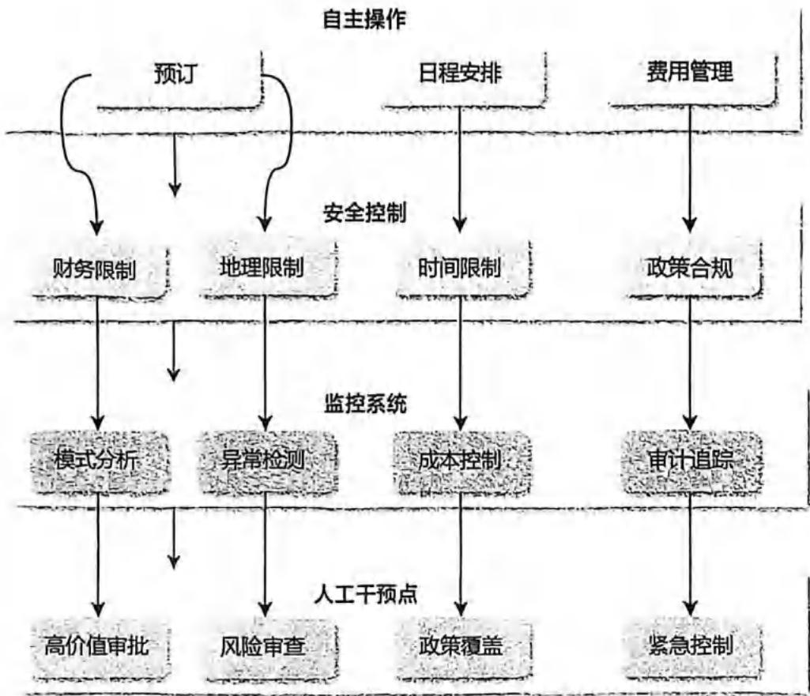  
图9.1 智能体差旅管理系统的安全措施

- 应急协议：制定明确流程，确保在需要时能够快速进行人工干预。

构建对智能体系统的信任，仅靠透明度远远不够，还要在自主操作中证明可靠性。组织必须建立清晰的框架，明确系统的能力和局限，帮助利益相关者理解何时及如何依赖自主决策。

智能体系统的伦理部署也需要仔细考虑社会影响。这些系统设计时须尊重个人隐私和权利，以及更广泛的社会价值和规范。在决策过程中实施明确的道德约束，涉及将预定义道德规则、公平约束和合规政策编码到系统逻辑中，使用约束编程、基于规则的道德引擎，以及带道德奖励模型的强化学习。例如，符号AI方法可将正式伦理规则(如阿西莫夫机器人定律和GDPR隐私要求)直接集成到决策管道，确保智能体遵守预定义伦理界限。此外，差分隐私机制和偏见缓解算法(如IBM的AI Fairness 360)可在运行时强制公平和隐私合规。

为确保伦理适应性，组织可实施社区反馈循环，使用人类在环(HITL)系统，审阅标记决策并融入未来的模型优化中。此外，治理框架应包括定期伦理审计、红队演练(在极端情况下进行压力测试决策)，以及将利益相关者反馈融入系统改进的机制。随着智能体系统日益普及，这些全面治理措施将成为平衡自动化效率与伦理责任的关键，确保AI驱动的决策符合社会期望和监管要求。

通过理解并应对智能体系统的独特挑战，组织可实现合理部署，不仅充分发挥自主运行的优势，还在整个系统生命周期中始终将安全性、责任感和伦理考量

置于优先地位。

# 9.3 探索伦理准则与框架

随着生成式AI系统变得日益复杂并融入社会生活的方方面面，建立健全的伦理准则与框架，以确保其负责任的开发和部署，就显得至关重要。一个健全的伦理框架应当包含一系列原则和准则，这些原则和准则需要优先考虑人类福祉、可追溯性、隐私保护和包容性治理。

# 9.3.1 以人为本的设计

符合伦理的AI开发的核心是“以人为本”的设计原则。生成式AI系统的设计应专注于增进人类福祉并提供积极的体验。这就要求我们开发出直观、易于访问和具有包容性的解决方案，这些方案需要与人类价值观保持一致，例如公平、尊严和对个体自主性的尊重。

例如，在旅行社的场景中，一个以人为本的生成式AI系统会优先提供个性化推荐，这些推荐能够满足不同的偏好、文化敏感性和无障碍需求，从而确保所有用户都能以有意义且受尊重的方式从该技术中受益。

# 9.3.2 可追溯性与责任

开发和部署生成式AI系统的组织必须对其技术的产出和潜在影响负责。这包括建立清晰的责任归属、详尽的决策过程文档，以及审查和处理伦理影响的机制。

设立由跨学科专家(包括伦理学家、法律专业人士以及来自潜在受影响社区的代表)组成的审查委员会或咨询委员会，可以帮助组织应对复杂的伦理挑战，并确保决策是负责任的。

# 9.3.3 隐私与数据保护

用户隐私和数据保护应作为基本原则，嵌入生成式AI系统的开发过程中。组织必须采用“设计即隐私”的方法，实践数据最小化，对敏感数据进行匿名化处理，并确保数据处理实践符合相关的隐私法律法规。“设计即隐私”的方法确保AI系统在每个阶段都嵌入隐私保护措施，在遵守《通用数据保护条例》(GDPR)、《加州消费者隐私法》(CCPA)和《健康保险流通与责任法案》(HIPAA)等法律的同时，将风险降至最低。这包括数据最小化(仅收集必要信息)、匿名化(使用k-匿名化和假名化等技术)，以及隐私保护机器学习(PPML)方法，如联邦学习、同态加密和安全多方计算(SMPC)。例如，在医疗保健AI助手中，患者数据可以通过

联邦学习在本地进行加密和处理，而基于角色的访问控制(RBAC)则确保只有授权人员才能访问敏感数据。此外，自动化的审计日志和可解释性工具有助于追踪决策，以确保可追溯性。这些技术帮助组织负责任地部署AI，在不牺牲功能的前提下确保隐私。

在旅游行业，这可能涉及实施健全的数据治理框架，就数据收集和使用获取用户的明确同意，以及实施安全的数据存储和处理机制，以保护旅行记录、偏好和支付详情等敏感信息。

# 9.3.4 多元化利益相关者的参与

符合伦理的AI的开发需要多元化的利益相关者参与，包括伦理学家、技术专家、政策制定者以及来自潜在受影响社区的代表。这种协作方法能够促进包容性对话，识别潜在的盲点或意外后果，并推动形成更加公平和对社会负责的AI治理方法。

例如，在开发用于旅行推荐的生成式AI系统时，与来自不同文化背景的利益相关者、残障权利倡导者和环保组织进行接触，将有助于识别潜在的偏见、无障碍壁垒或可持续性问题，从而催生出更具包容性和更负责任的解决方案。

通过遵守这些伦理准则与框架，组织可以在生成式AI技术的开发和部署中，培养信任、建立问责制并推动负责任的创新。这种方法不仅能减轻潜在风险和意外后果，还能释放这些强大技术的全部潜力，在维护基本人权和价值观的同时，产生积极的社会影响。

# 9.4 解决隐私与安全问题

随着生成式AI系统在各个领域日益普及，解决隐私与安全问题至关重要。组织必须采取积极、主动的措施来保护敏感数据，防范潜在的数据泄露，并确保其AI系统能够抵御恶意攻击。

在旅行社采用生成式AI系统进行个性化推荐和行程规划的场景中，实施一个全面的数据治理框架是至关重要的。该框架应明确规定组织内部的数据处理实践、访问控制和合规措施，以保护客户的旅行记录、偏好和支付详情等隐私信息。

访问控制和基于角色的权限设置有助于确保只有授权人员才能访问和修改用于训练或生成推荐的敏感数据。此外，遵守相关的数据保护法律和行业特定法规，如GDPR或支付卡行业数据安全标准(PCIDSS)，对于保持合规和避免潜在的法律责任至关重要。

将安全考量纳入AI开发生命周期同样至关重要。这包括定期进行安全风险评估以识别潜在漏洞，实施安全编码标准以减少编码错误或漏洞，以及执行定期

的测试和审计来检测并解决 AI 系统中的任何安全弱点。例如，该旅行社可以采用渗透测试技术来模拟潜在的攻击场景，并评估其生成式 AI 系统抵御对抗性攻击或数据泄露的韧性。这种积极、主动的方法有助于在安全漏洞被恶意行为者利用之前，就将其识别并加以解决。

对用户进行关于生成式AI潜在风险的教育，并提供安全使用实践的培训，可以增强他们做出明智决策和识别潜在威胁的能力。在旅行社的场景中，这可能包括教育客户认识到保护个人信息的重要性，学会识别网络钓鱼企图或可疑通信，并及时报告任何疑虑或事件。

组织还应制订健全的事件响应计划，以有效处理潜在的安全漏洞或数据泄露。这些计划应概述清晰的协议，用于快速响应、遏制、调查和缓解，以限制损害并保护受影响的个人或实体。

一旦发生涉及客户信息的数据泄露事件，该旅行社应做好准备，迅速通知受影响的个人、监管机构和利益相关者，同时采取措施保护受损系统，防止数据进一步丢失。

此外，对抗性训练和异常检测等技术可以专门帮助提高生成式AI系统抵御对抗性攻击的韧性。对抗性训练是在训练过程中，将AI模型暴露于精心制作的对抗性样本中，从而增强其识别和防御此类攻击的能力。异常检测算法可以识别并标记可疑或异常的输入或输出，从而能够及时进行干预和采取缓解措施。

通过在AI开发和部署的整个生命周期中优先考虑隐私和安全问题，组织可以培养对其生成式AI系统的信任和信心，同时确保遵守相关法规，并保护敏感数据和知识产权。

# 本章小结

尽管先进的智能体系统具有巨大的潜力，可以推动创新、增强创造力并造福各个行业，但它们的部署和开发必须以极其谨慎和负责任的态度进行。了解生成式AI相关的潜在风险和挑战后，组织和相关方可以主动采取措施，确保安全，维护伦理原则，并解决隐私和安全问题，从而以值得信赖和负责任的方式利用这些技术的变革力量，增强用户和相关方的信心。采取积极和负责任的生成式AI开发方法，包括实施强有力的测试和监控框架，遵守以人为本、注重责任和包容性治理的伦理指导方针，并建立全面的数据治理和安全协议，以保护敏感信息和知识产权，是至关重要的。

解决AI系统中的不确定性和偏见问题是至关重要的。通过使用概率建模、不确定性量化和去偏算法等技术，开发者可以提高生成式AI模型的可靠性和公平性，促进信任和负责任的采纳。包括开发者、研究人员、政策制定者和伦理学

家在内的相关方之间的合作，对于应对生成式AI的挑战和伦理影响至关重要。具有包容性的跨学科方法有助于识别盲点、减轻无意后果，并使解决方案与人类价值观保持一致。智能体系统通过自动处理偏见或受损信息，增加了AI风险，这使得强有力的安全措施(包括行动边界、决策验证和实时监控)变得至关重要。有效的部署需要在自主性和适当的人类监督之间找到平衡，尤其是在高风险决策中。隐私保护不仅要延伸到数据安全保障，还要考虑通过自主决策可能暴露敏感信息的问题。此外，知识产权框架必须发展，以应对AI智能体作为活跃创作者的角色，并建立实时监控和验证系统。

下一章将探索一些基于LLM的智能体的常见用例和应用场景，并使用前文介绍的各种模式和技术。

# 习题

1.生成式AI和智能体系统中的幻觉风险有何不同？为什么幻觉在智能体系统中可能更危险？  
2. 部署基于LLM的智能体系统时有哪些核心安全考虑因素，它们在旅行管理系统等实际示例中如何表现？  
3. 智能体AI系统中的偏见与传统生成式AI系统中的偏见有何不同，解决这些偏见需要采取哪些额外措施？  
4. 与传统生成式AI系统相比，智能体系统给数据隐私带来了哪些独特挑战，组织应如何应对这些挑战？  
5. 从生成式AI到智能体系统的转变中，知识产权风险如何演变，需要采取哪些新方法来应对这些风险？

# 习题答案

1. 在生成式 AI 中，幻觉主要导致生成不正确的内容，但在智能体系统中，幻觉信息可能直接影响现实世界的决策和行动。例如，虽然生成式 AI 可能只是生成错误的文本，但智能体系统可能基于虚假的市场趋势执行金融交易，或根据捏造的病史做出医疗决策。这更加危险，因为它会导致没有人类验证的即时现实后果。  
2. 核心安全考虑因素包括行动边界、决策验证、回滚功能、实时监控和性能指标。在差旅管理系统中，这些考虑因素表现为对预订变更的财务限制、昂贵预订的多步骤检查、处理取消政策的机制、追踪预订模式以检测异常，以及根据公司政策和旅行者偏好评估决策质量。这些措施确保了既能防范风险，又

能高效运营。

3. 智能体系统中的偏见不仅限于生成偏见内容，还包括主动做出影响人们生活的偏见决策。例如，虽然生成式AI可能生成偏见文本，但智能体系统可能在招聘决策或资源分配中系统性地歧视。解决这些问题所需的额外措施包括决策审计系统、针对自主行为的问责框架、实时偏见检测机制，以及定期审查决策模式和行动历史。  
4. 智能体系统不仅处理和生成信息，还在操作过程中积极访问、操作并做出关于个人数据的决策。它们需要增强的保障措施，包括实时隐私监控、决策审计系统和隐私意识的决策协议。组织必须仔细审视自主决策链如何随着时间的推移暴露敏感信息，即使单个行动看似符合隐私要求，并将隐私作为系统决策过程的核心部分。  
5. 智能体系统可以主动实施已学习的信息，并以机器速度和规模做出关于知识产权使用的决策。例如，它们可能自主地将专有代码应用到成千上万的项目中，或创建复杂的衍生作品链。所需的新方法包括内容来源的实时监控系统、评估IP影响的决策树、基于区块链的内容追踪和自动化许可证验证系统。法律框架也需要发展，以应对机器成为创作过程的积极参与者这一趋势。

# 第10章

# 常见用例与应用场景

前文探讨了基于LLM的智能体系统所面临的从对抗性攻击到伦理问题等一系列风险与挑战之后，我们现在将目光转向它们的实际应用。本章将探索智能体系统如何通过将LLM与目标导向的行为和自主决策能力相结合，来变革各个领域，还将介绍这些智能体如何理解上下文、制订计划并采取行动以实现特定目标，同时与人类保持有意义的互动。

在探索这些应用时，我们将重点关注智能体不仅仅将LLM用作语言处理器，更是将其作为核心推理引擎，从而在不同领域实现复杂的规划和执行。这代表了与传统AI系统相比的一个根本性转变，因为这些智能体现在能够调整自身行为、从互动中学习，并以更高水平的自主性运行，同时保持与人类意图的一致性。本章首先探索基于LLM的智能体在创意和艺术领域的变革性影响，接着介绍它们在自然语言处理和对话系统中的进展，然后深入探讨这些智能体在机器人技术和自主系统中的集成，最后阐述它们在决策支持和优化中的作用。

本章主要介绍以下内容。

- 创意和艺术应用。  
- 自然语言处理和对话式智能体。  
- 机器人技术和自主系统。  
- 决策支持与优化。

通过本章的学习，你将理解基于LLM的智能体如何重塑在不同领域中实现自动化和人机协作的方法，助力你在自己的领域中发现部署智能体系统的机会，同时帮助你了解这些更具自主性和交互性的AI系统所带来的独特能力和考量因素。

# 10.1 创意和艺术应用

基于LLM的智能体在创意领域的整合标志着技术发展已远超简单生成式AI工具阶段。本节探索智能体系统如何通过理解上下文、维持创意方向，并与人类艺术家积极协作来转变创意工作流。与单纯生成内容的传统AI工具不同，这些智能体能参与持续创意对话、适应变化需求，并同时平衡多重艺术和技术约束。

# 10.1.1 创意和艺术智能体的演进

创意和艺术智能体的开发代表了 AI 系统贡献创意过程的范式转变。早期生成式 AI 工具主要专注于基于预定义提示产生静态输出，提供有限互动和适应性。然而，现代智能体系统已演进为积极参与动态和迭代创意过程。它们利用先进能力，如上下文保留、适应学习和多模态集成等，作为真正协作者而非被动工具。这些智能体不仅生成内容，还理解艺术意图、基于反馈优化输出，并与人类协作者的愿景一致。这一演进凸显了 AI 发展的一个更广泛趋势：从静态生成转向互动、上下文感知和自适应系统，以前所未有方式补充和增强人类创意。智能体系统产生影响的关键领域如下。

- 艺术协作：智能体通过在多轮迭代中保持风格一致性、艺术意图连贯性与主题统一性，为艺术家提供协助，从而实现人类创造力与AI生成增强内容的无缝融合。  
- 音乐创作：智能体理解并应用音乐理论、适应不同流派，并与表演者或作曲家实时协作，创作和谐且具有创新性的作品。  
写作和叙事开发：智能体与作者共同创作，通过维持角色一致性、情节连贯性和叙事流，提供创意建议，同时保留作者独特的表达和叙事风格。

# 10.1.2 实际应用

在创意领域，智能体系统的实际应用已经展现出喜人的成果。Adobe的Firefly智能体系统展示了多个专业化智能体如何在复杂项目中保持创意的一致性。在该系统中，不同的智能体协同工作：一个智能体负责维护品牌形象和风格指南，另一个确保资产在不同媒介上表现一致，第三个则处理技术规范和格式要求。这代表了从简单的生成式工具到协作系统的重大演进，该系统能够维护创意背景并实时适应用户反馈。

同样，环球音乐集团(Universal Music Group)的AI音乐制作系统也展示了智能体系统如何在音乐创作中保持创意的一致性。该系统为音乐创作的不同方面配备了专业的智能体：负责理解音乐主题和动机的旋律智能体，负责保持音调一致性的和声智能体，以及负责处理乐器编排的配器智能体。这些智能体协同工作，

同时在整个制作过程中保留作曲家的创作意图和风格偏好，这展示了多个智能体如何在复杂的创意任务上进行协作，同时保持艺术构想。

为了更好地理解智能体系统如何变革复杂的创意工作流，让我们来看一个电影行业的详细用例。这个例子展示了多个智能体如何协作，以弥合创意构想与技术执行之间的鸿沟——这是长期困扰电影制作中前期可视化过程的一个挑战。

# 1. 问题陈述

电影导演和故事板画师需要花费大量时间对前期可视化序列进行迭代，这需要多个部门之间持续沟通，以使创意构想与技术可行性保持一致。传统工具缺乏在考虑技术限制的同时理解并适应创作意图的能力。我们的目标是创建一个多智能体系统，辅助导演将创意构想转化为技术上可行的前期可视化序列，同时保持艺术上的一致性并遵守创作约束。

该智能体系统的实现方法如下。

(1) 导演智能体:

- 处理场景的自然语言描述；  
- 维护整体的创意构想和风格一致性；  
向其他智能体传达艺术意图。

(2) 技术总监智能体:

评估技术可行性；  
- 考虑预算和资源限制；  
在需要时提出替代方案。

(3) 可视化智能体:

- 生成初始故事板和3D预览；  
根据其他智能体的反馈调整输出；  
- 保持场景间的视觉一致性。

这些智能体通过以下方式协同工作：

- 借助LLM的能力实现共享上下文理解；  
- 在创意需求和技术要求之间建立持续的反馈循环；  
- 对创意方向或技术限制的变化进行实时调整。

# 2. 环境与外部系统

该多智能体系统在一个包含以下组件的制作环境中运行。

- 资产管理数据库：存储3D模型、纹理和以前的故事板。  
制作管理系统：跟踪预算、排期和资源分配。  
- 渲染农场 API：管理用于 3D 可视化的计算资源。  
- 摄像机与设备数据库：包含技术规格和可用性信息。  
参考资料库：归档过去的作品、风格指南和灵感板。

- 版本控制系统：维护迭代和变更的历史记录。  
- 协作平台：让团队成员能够提供实时反馈。

# 3. 为何这种方法更好

当前的前期可视化工具是孤立运行的，需要人类作为中介在创意需求和技术要求之间进行转换。而智能体系统的方法则提供了几个优势：

- 创意构想与技术可行性之间持续保持一致；  
通过实时协作减少迭代周期；  
能够在适应约束的同时保持创意的一致性；  
- 通过自动化的技术验证实现更高效的资源利用。

这种方法凸显了智能体系统如何超越简单的内容生成，积极贡献于创意决策过程，以精细化的理解应对多重约束和目标。它们在预可视化领域的成功强调了在需要复杂协作、迭代优化且需要适配不断演变的艺术构想的创意领域中具有更广泛的适用性。通过保留上下文、理解意图并平衡竞争优先级，这些系统正作为不可或缺的创意伙伴而非单纯工具。

探索它们对创意工作流的变革影响之后，下面将焦点转向智能体系统最具突破性的应用之一：自然语言处理和对话接口。这些系统擅长理解细致语言、在复杂对话中维持上下文，并有效执行任务，使其成为促进有现实意义的人机互动的关键，下一节将对该主题进行深入探讨。

# 10.2 自然语言处理和对话式智能体

本节介绍一个对基于LLM的智能体来说也许是最自然的领域：语言理解与对话。传统的语言模型虽然能处理和生成文本，但智能体系统在此基础上增加了几项关键能力：在长时间互动中保持上下文、通过对话执行复杂任务，以及根据用户需求和反馈调整响应。

# 10.2.1 语言智能体的演进

当今的对话式智能体已远超简单聊天机器人或虚拟助手。这些系统能够维持复杂的对话，理解精细化的语境，并通过自然交谈执行复杂的任务。例如，Anthropic公司的Claude和OpenAI的ChatGPT能够进行详细的技术讨论，同时在多轮对话中保持一致性，并根据用户的专业水平和先前的互动来调整响应。现代语言智能体区别于传统聊天机器人的关键能力如下。

- 上下文保持能力：现代语言智能体擅长维持连贯且有意义的讨论，即便对话跨越了多个主题和会话。这种记住先前交流的能力，使它们能够随着时间的推移提供更加个性化和与上下文相关的响应。

- 任务执行能力：这些智能体超越了单纯的问答功能，能够将自然语言指令转化为可执行的步骤，从而在日程安排、数据检索或系统配置等领域实现无缝的任务完成。这项能力弥合了沟通与执行之间的鸿沟。  
- 自适应交互能力：现代智能体能动态调整其沟通风格、语气和复杂性，以适应用户的偏好、专业水平或情境需求，从而与不同类型的用户进行更有吸引力和更易于理解的互动。  
- 多模态理解能力：与传统聊天机器人不同，现代语言智能体能够处理和响应文本、图像、代码和结构化数据的组合，这使它们能够处理更复杂的查询，并整合多种形式的信息，从而对用户请求有更丰富、更细致的理解。

# 10.2.2 实际应用

目前的实际应用案例表明语言智能体在不同领域具有广泛的适用性。例如，Salesforce的Agentforce(前身为Einstein虚拟助手)通过在多轮客户交互中保持上下文，同时实时访问相关的数据库信息，为客户服务代表提供支持。同样，GitHub的Copilot Chat能够在讨论代码的同时，执行相关的开发任务。下面介绍一个涉及企业知识管理系统的用例。

# 1. 问题陈述

大型组织常常面临跨部门知识碎片化的问题，这使得员工难以有效访问和利用机构知识。传统的搜索系统和文档无法捕捉不同信息之间的上下文和关联。

为了解决这个问题，需要创建一个能够理解、组织和检索公司知识的多智能体系统，同时能够保持上下文，并处理跨越多个领域和文档的复杂查询。

该智能体系统的实现方法如下。

(1) 查询理解智能体:

- 处理自然语言问题；  
- 识别隐含的上下文和需求；  
- 将复杂查询分解为子任务。

(2)知识导航智能体：

梳理不同知识源之间的关系；  
- 在多个文档间保持上下文；  
- 追踪信息来源。

(3)响应整合智能体：

整合来自多种来源的信息；  
- 根据用户角色调整响应的详细程度；  
在多轮交互中保持一致性。

智能体通过以下方式进行协作：

- 共享对组织背景的理解；  
从与用户的交互中持续学习；  
- 动态适应不同的用户角色和需求。

# 2. 环境与外部系统

该知识管理系统与公司的多个系统和数据源进行接口对接。

(1) 内部系统。

文档管理系统： SharePoint、Confluence 及内部 Wiki。  
通信平台：Slack和MSTeams。  
- 项目管理工具：Jira 和 Asana 的项目文档。  
- 电子邮件服务器：存档的邮件线索和附件。  
- 代码仓库：GitHub 和 GitLab 的文档与讨论。  
人力资源系统：培训材料和政策文档。  
- 客户关系管理系统：客户交互历史和支持工单。

(2) 外部 API 与服务：

行业新闻API：用于获取市场更新的Bloomberg或Reuters。  
研究数据库：学术论文和专利数据库。  
- 监管数据库：合规文档和法律更新数据库。  
- 云存储：用于共享文档的 Google Drive 或 OneDrive。  
- 翻译服务：用于多语言文档处理。  
- 网络监控：社交媒体和竞争对手网站。

(3) 访问控制层：

- 基于角色的访问管理系统。  
安全分类数据库。  
- 用户认证服务。  
审计日志系统。  
- 合规监控工具。

# 3. 为何这种方法更好

传统的知识管理系统依赖于精确的关键词匹配和预设的分类，而智能体方案则有多个优势：

- 对复杂查询的自然语言理解；  
- 上下文感知的信息检索：  
动态关联相关信息；  
- 基于用户角色和专业知识的个性化回应。

这种知识管理方案展示了智能体系统如何改变组织内的信息获取和使用方

式，使得机构知识更加易于获取和实际应用。通过语言智能体的创新应用，我们看到了信息获取和沟通的革命性变化。接下来，我们将关注智能体在机器人技术和自主系统中的实际应用。将语言理解与物理控制相结合的能力，创造了人类与机器人交互的新可能性，下一节将详细探讨这一点。

# 10.3 机器人技术和自主系统

从基于语言的互动转向物理世界的应用，本节主要探索基于LLM的智能体如何变革机器人技术和自主系统。传统的机器人依赖于预先编程的行为和僵化的控制系统，而智能体系统则使机器人能够理解自然语言指令、推理其所处环境并动态调整其行为。这种语言模型与物理控制系统的集成，代表了机器人与人类及其环境交互方式的根本性转变。

# 10.3.1 机器人智能体的演进

LLM与机器人技术的结合，创造了能够弥合人类意图与物理行动之间鸿沟的系统。与按固定规则运行的传统机器人系统不同，现代机器人智能体能够理解上下文、从经验中学习，并做出自主决策，同时与人类目标保持一致。以下是现代机器人智能体的关键能力：

- 针对物理任务的自然语言理解能力；  
- 对环境约束的上下文推理能力；  
- 对变化条件的实时适应能力；  
从演示和反馈中学习的能力；  
- 视觉、语言和控制的多模态集成能力。

# 10.3.2 实际应用

目前的实际应用案例表明智能体系统在不同领域具有广泛的适用性。在波士顿动力公司(Boston Dynamics)，Atlas机器人展示了如何将基于语言的指令转化为复杂的物理运动。同样，加州大学伯克利分校(UC Berkeley)的机器人系统展示了生成式模型如何实现对杂乱环境的实时适应，而麻省理工学院(MIT)的RoboBrain系统则说明了智能体如何利用庞大的知识库，创造性地解决物理操作任务。让我们来看一个实际用例，并评估智能体系统如何帮助实现这样一个系统。

# 1. 问题陈述

传统的制造单元在应对产品多样性和意外中断方面困难重重。现有系统在生产新产品时需要进行大量的重新编程，并且无法有效处理设备故障或供应链中断等意外情况。操作员必须持续介入以管理变更和优化工作流程。我们的目标是创

建一个多智能体系统，用于协调一个柔性制造单元，使其能够适应产品变化、处理中断并优化流程，同时保持质量标准和安全协议。

该智能体系统的实现方法如下。

(1)规划与协调智能体：

理解自然语言的生产需求；  
- 制定并调整制造序列；  
协调不同的机器人系统；  
完成总体生产目标。

(2) 机器人控制智能体:

- 将高级指令转化为运动原语；  
- 管理实时传感器反馈；  
根据环境变化调整动作；  
确保安全的人机交互。

(3) 质量与优化智能体:

实时监控生产品质；  
- 提出流程改进建议；  
预测维护需求；  
优化资源利用。

(4) 异常处理智能体:

检测异常和中断；  
- 生成恢复策略；  
- 管理非预期的人类干预；  
在异常期间维持安全协议。

这些智能体通过以下方式进行协作：

- 对制造场景达成共识；  
实时传感器数据整合；  
- 用于流程优化的持续反馈循环；  
- 在发生中断时进行动态任务重新分配。

# 2. 环境与外部系统

该制造系统与多个系统进行接口对接。

(1) 制造基础设施：

- 机械臂与末端执行器：具有不同能力的多种机器人类型。  
- 视觉系统：用于零件识别和质量控制的摄像头及3D传感器。  
- PLC系统：用于设备控制的可编程逻辑控制器。  
- 物料搬运系统：传送带、自动导引车和存储系统。

(2)信息系统：

- 制造执行系统：生产调度与跟踪。  
企业资源规划：资源与库存管理。  
- 质量管理系统：质量数据与规格。  
数字孪生平台：实时仿真与预测。  
- 维护管理系统：设备健康状况监控。

(3) 外部接口：

供应链管理系统：物料可用性与物流。  
- 客户订单系统：产品规格与需求。  
- 合规数据库：安全标准与法规要求。  
知识库：历史生产数据与最佳实践。

# 3. 为何这种方法更好

传统的机器人制造系统依赖于僵化的编程，并且需要大量的人工干预来进行调整，而智能体系统的方法则提供了几个变革性的优势：

通过自然语言交互进行生产变更和问题解决；  
- 无须重新编程即可实时适应产品变化；  
自主处理中断和异常情况；  
- 基于历史和实时数据进行持续优化；  
在需要时无缝集成人类的专业知识；  
- 主动进行质量控制和维护预测。

这种方法通过使机器人能够理解上下文、适应变化并做出自主决策，同时与生产目标和安全要求保持一致，从根本上改变了制造业的灵活性。智能体系统在制造业的成功，证明了它们在需要多个系统协调并适应变化条件的复杂物理环境中拥有巨大的潜力。通过将语言理解与物理控制和实时优化相结合，这些系统正在从简单的自动化工具演变为制造过程中的智能协作者。

结束对机器人技术和自主系统的探索之后，下面介绍智能体系统如何通过决策支持和优化来变革商业运作。在保持业务上下文的同时处理复杂数据流的能力，使得这些系统在战略决策方面有重大价值，下一节将对此进行探讨。

# 10.4 决策支持与优化

本节主要介绍智能体系统在增强人类决策能力和解决复杂优化问题方面的作用。传统的决策支持系统依赖于固定的规则和静态分析，而基于LLM的智能体能够理解上下文、权衡利弊，并提供自适应的建议，同时与业务目标和约束保持一致。

# 10.4.1 决策支持智能体的演进

LLM与决策支持系统的集成，改变了组织处理信息和制定战略选择的方式。现代决策智能体能够分析多个数据流，理解复杂的业务背景，并生成可落地的洞见，同时保持对组织目标和约束的认知。现代决策支持智能体区别于传统系统的关键能力如下：

- 多模态数据分析与综合；  
- 上下文感知的推荐生成;  
- 对变化条件的实时适应；  
- 对推理过程和权衡利弊的解释；  
- 将领域专业知识与数据驱动的洞见相结合。

# 10.4.2 实际应用

目前的实际应用案例表明智能体系统在不同领域具有更广泛的适用性。

(1) 金融领域：

- 摩根大通集团的LOXM系统通过分析市场数据、新闻和社交媒体来识别投资机会。  
- Two Sigma公司的Venn系统将市场分析与强化学习相结合，用于制定投资策略。

(2)医疗保健：

- 密歇根大学的 HealthPal 通过分析医疗记录和基因数据提供个性化的治疗建议。  
- 斯坦福大学的 DeepPill 系统根据患者档案和病史优化药物治疗方案。

(3）工业应用：

- 西门子公司的 MindSphere 通过实时分析和自适应调整来优化制造过程。  
- 埃克森美孚公司的《能源展望》利用预测模型进行长期资源规划。

现代供应链的复杂性作为一个极具说服力的例子，说明了智能体系统如何变革传统的业务流程。让我们来看一个实际的实现案例，其中多个智能体协同工作，共同协调一个全球供应链网络，展示这些系统如何在保持业务目标的同时，处理复杂的多方利益相关者环境。

# 1. 问题陈述

全球供应链面临着前所未有的复杂性，涉及多个利益相关者、多变的交付周期和频繁的中断。传统的优化工具难以处理现代供应链的动态特性，并且无法有效平衡成本、速度和可持续性等相互竞争的目标。人类规划者被海量的数据和所需决策的速度压得喘不过气。在这里，我们的目标是创建一个能够协调端到端供应链优化的多智能体系统，使其能够在平衡多个目标和适应中断的同时进行实时

# 决策。

该智能体系统的实现方法如下。

(1) 战略规划智能体:

- 分析市场趋势和需求模式；  
制定长期采购策略；  
平衡成本、风险和可持续性目标；  
与业务目标保持一致。

(2) 运营优化智能体:

- 管理日常物流运营；  
优化路线和资源分配；  
- 处理实时调度调整；  
与多个承运商和仓库协调。

(3) 风险管理智能体:

监控全球事件和中断；  
评估对供应链运营的影响；  
- 生成应急预案；  
提供早期预警信号。

(4) 可持续性优化智能体:

- 跟踪环境影响指标；  
- 优化以减少碳足迹；  
建议替代路线和采购方案；  
确保遵守环境法规。

这些智能体通过以下方式进行协作：

- 对供应链上下文的共享理解；  
实时数据集成与分析；  
- 持续的情景规划与风险评估；  
- 基于变化条件的动态重新优化。

# 2. 环境与外部系统

该供应链系统与多个公司系统和数据源进行接口对接。

# 1）核心基础设施

(1)ERP系统：

- 用于业务运营数据的 SAP 和 Oracle;  
库存管理系统；  
生产计划系统。  
(2) 运输管理系统：

实时车队跟踪；  
- 承运商管理平台；  
- 路线优化引擎。

(3) 仓库管理系统：

库存跟踪与优化：  
- 劳动力管理；  
- 订单履行系统。

2)外部数据源

(1) 市场情报平台:

- 用于获取市场数据的Bloomberg或Reuters；  
- 特定行业的新闻源；  
社交媒体监控系统。

(2) 天气与环境系统:

全球天气预报：  
自然灾害跟踪：  
- 环境影响监控。

(3)供应商网络：

供应商绩效数据库；  
产能与能力跟踪；  
风险评估平台。

3) 集成层

- API管理系统；  
实时数据流平台；  
事件处理引擎；  
文档管理系统；  
- 用于可追溯的区块链网络。

# 3. 为何这种方法更好

传统的供应链优化系统在有限的上下文中运行，并且难以适应快速变化，而智能体系统的方法则提供了几个变革性的优势：

- 通过自然语言交互进行战略制定和问题解决；  
- 对多个变化变量的实时适应；  
- 主动进行风险识别与缓解；  
- 在多个相互竞争的目标之间实现均衡优化；  
- 在战略决策点融入人类的专业经验；  
- 从历史决策中持续学习和改进。

这种方法通过实现智能的、上下文感知的决策，从根本上改变了供应链管理，这种决策能够在考虑多个利益相关者和目标的同时，与业务目标和可持续性要求保持一致。

智能体系统在供应链优化中的成功，证明了它们在复杂商业环境中的潜力，在这些环境中，必须平衡多种因素，同时适应持续的变化。通过将语言理解与先进的优化技术和实时适应相结合，这些系统正在从简单的决策支持工具演变为值得信赖的战略顾问。

# 本章小结

现在，可以结束我们对LLM驱动的智能体系统应用的深入探讨了。在本章中，我们见证了它们在不同领域带来的变革性影响，这不仅仅代表技术的进步，而且标志着AI理解、推理并参与复杂人类活动的根本性转变。

本章探索了智能体系统正在重塑各种可能性的四个关键领域：创意应用、自然语言处理、机器人技术和决策支持。尽管这些领域展示了重大的发展成果，但它们仅代表了智能体系统产生影响的领域的一小部分。从教育和科学研究到医疗保健和环境保护，这些系统正在本章未涵盖的众多领域中找到新的应用。

我们所探索的实际应用——从协作式的电影前期可视化到制造单元的协调，从企业知识管理到供应链优化——都表明了智能体系统正在成为有价值的合作伙伴，而不仅仅是工具。它们向我们展示了AI的未来不在于取代人类的能力，而在于通过智能协作来增强人类的能力。

最后一章将回顾智能体系统的关键概念，探索新兴的工具和研究，并讨论通用人工智能和超级人工智能的可能性与挑战，最后以这些技术演进所带来的挑战和机遇作为结尾。

# 习题

1. 在创意应用中，智能体系统与传统的生成式AI工具有何不同？请基于本章中的一个例子进行讨论。  
2. 在制造单元协调的背景下，请解释多个智能体是如何协同工作的，以及为什么这种方法比传统的自动化系统更有效。  
3. 对比智能体系统在机器人技术与决策支持系统中的作用，它们在保持上下文方面的方法有何不同？  
4. 利用本章中企业知识管理的用例，解释不同的智能体如何协作解决复杂的信息检索问题。

5. 本章讨论了将供应链优化网络作为一个智能体系统的用例。在这种背景下，使用智能体系统方法的主要优势是什么？不同的智能体之间又是如何互补的？

# 习题答案

1. 与仅仅生成内容的传统工具不同，创意应用中的智能体系统能够在多次迭代中保持上下文和创意构想。例如，在电影前期可视化的用例中，导演智能体在与技术总监智能体和可视化智能体协作时，会始终维持创意构想，以确保艺术完整性和技术可行性。这使得创意目标和现实约束之间能够持续保持一致，这是传统的生成式工具无法实现的。  
2. 在制造单元的协调中，四个专业化的智能体(规划与协调、机器人控制、质量与优化、异常处理)通过共享的上下文理解和持续的反馈循环协同工作。这种方法之所以更有效，是因为它能够在保持质量标准的同时，实时适应产品的变化和中断。传统的自动化系统缺乏这种灵活性，并且在发生变更或意外情况时需要人工干预。  
3. 在机器人技术中，智能体系统专注于将语言理解转化为物理行动，同时保持安全和操作约束。例如，机器人控制智能体将高级指令转化为运动原语，同时确保安全的人机交互。运动原语是机器人技术中的基本运动模式，例如抓取或转向，被用作构建复杂动作的基础模块。机器人控制智能体将高级指令转化为这些原语，以确保在维持操作约束的同时，安全、高效地执行任务。

在决策支持系统中，智能体专注于处理多个信息流，同时保持业务背景和战略目标。尽管两者都保持上下文，但机器人智能体必须弥合物理世界与数字世界的鸿沟，而决策支持智能体则必须平衡多个相互竞争的目标。

4. 在企业知识管理系统中，三个智能体协同工作：

- 查询理解智能体处理自然语言问题并识别隐含的上下文。  
知识导航智能体梳理不同信息源之间的关系。  
- 响应整合智能体在整合信息的同时，根据用户角色调整响应。

这些智能体共享组织上下文并从与用户的交互中学习，使它们能够比传统的搜索系统更有效地处理跨越多个领域和文档的复杂查询。

5. 供应链优化网络通过四个协同工作的专业化智能体(战略规划、运营优化、风险管理和可持续性优化)来平衡多个目标，从而展示了智能体系统的优势。其主要优势是通过自然语言交互进行战略制定、实时适应变化、主动的风险识别以及在相互竞争的目标之间进行平衡优化。这些智能体通过维护供应链上下文的不同方面——从长期战略到日常运营、风险管理和可持续性目标——来实现互补。

# 第11章

# 结论与未来展望

读到这里，我们关于AI智能体的探索也接近了尾声。在本书的最后一章，我们将把之前学到的所有知识融会贯通，共同展望一个由AI驱动的未来。我们会先一起“复习功课”，确保你已牢牢掌握这些能自主行动的AI系统是如何工作的。然后，我们将目光投向未来，看看这个领域有哪些激动人心的新想法和新研究，它们可能会彻底改变我们与技术互动的方式。

我们还会聊一个很酷的概念——通用人工智能。简单地说，就是能像人一样，在各种任务上全面思考和学习的 AI。目前的 AI 更像一个“偏科生”，在特定任务上是高手，但缺乏通用的、举一反三的推理能力。虽然深度学习和大语言模型已经非常厉害，但要实现真正的 AGI，还需要在推理、适应性和自我学习等领域取得革命性的突破。我们会一起探讨 AGI 的最新进展、它面临的巨大挑战，以及未来的技术发展将如何引领我们一步步接近这个宏伟的愿景。

当然，越是强大的技术，越需要我们审慎对待。我们会坦诚地讨论一些现实问题，比如如何让AI系统稳定地大规模运行，如何看懂它们做出决策的“内心戏”，以及它们可能给社会带来怎样的深远影响。通过全面审视机遇与挑战，你将更深刻地思考并参与这项技术的未来发展中。

本章主要介绍以下内容。

- 核心要点总回顾。  
- 前沿趋势与新动向。  
通用人工智能。  
- 挑战与机遇。

通过本章的学习，你将对AI系统的今天和明天有一个清晰的了解。你会明白它的潜力有多大，局限又在哪里，从而更有底气地参与到这场关乎未来的对话中，共同探讨如何负责任地驾驭这项强大的技术。

# 11.1 核心要点总回顾

我们的旅程是从生成式 AI 这个“魔法盒子”开始的。我们了解到，AI 能通过生成对抗网络和自回归模型等技术，像变魔术一样创造出从图片到文字的全新内容。这个基础让我们不仅明白了 AI 的工作原理，也认清了它现阶段的不足。

接着，我们探讨了：到底是什么让AI能够“自己说了算”，即它能够自主行动。这类系统必须拥有三种核心能力：能感知环境并做出响应，能为了目标主动出击，还能与其他伙伴(智能体)高效协作。你可以想象，这就像教会计算机既要独立，又要懂得团队合作。

随后，本书为你揭示了这些智能体的“思考”过程。它们需要有自己的“知识库”来存储信息，有“记忆”来从过往经验中学习，还需要有能力规划自己的行动。这和人类依靠记忆和经验做决策的道理，其实如出一辙。

其中最有趣的一点是AI如何“反思”自己的行为——我们称之为反思和自省能力。这种“自我审视”的能力能帮助它们不断进步，做出更明智的决策。我们还了解到，智能体也会使用工具和制订计划，就像人们用计算器来算数，用待办清单来安排工作一样，都是为了更高效地解决问题。

书中还介绍了一个非常实用的组织架构——“协调者-工作者-委派者”模型。这个模型把复杂的任务拆解开，交给不同角色的智能体，就像一个高效的团队：

协调者像项目经理，负责掌控全局；  
- 工作者像一线员工，负责完成具体任务；  
- 委派者像团队组长，负责精准地分配任务。

本书还花了很多篇幅来讨论如何负责任地构建AI，核心是信任与安全。这包括确保AI能解释自己的决策(有可解释性)，能保护用户的隐私，并且严格遵守伦理规则。随着AI越来越深入我们的生活，这些原则变得至关重要。

最后，我们一起领略了AI在不同领域的实际应用——从艺术、音乐等创意领域，到机器人、决策辅助等实际应用。这些案例生动地展示了AI智能体已经在各行各业里掀起了变革的浪潮。

现在，我们已经打好了坚实的基础。接下来，让我们看看这个领域又有哪些新鲜事，未来又将走向何方。

# 11.2 前沿趋势与新动向

让我们把目光投向未来，看看那些正在塑造AI智能体和生成式系统的最新潮流。我们主要关注三个令人兴奋的领域：AI的多重感官、语言能力的深化，以

及从经验中学习的新模式，最后再聊聊这些进步对各行各业的实际影响。

# 11.2.1 多模态智能：整合多样化输入

AI不再是只能“读懂”文字的“书呆子”，而是进化成了能看、能听、能说的“多面手”。它能同时处理和理解多种信息——文字、图片、声音、视频，就像人类用眼睛、耳朵来感知世界一样，AI的理解和互动变得更加全面。比如，OpenAI的GPT-4o模型就能同时处理和生成文本、图像与音频，实现了许多酷炫的功能。

- 看图说话：分析一张图片，然后用语言详细描述出来。  
- 听音绘画：根据语音描述，直接生成一幅画。  
- 语音交互：能听懂语音指令，并用自然的声音回应你。  
- 图文并茂的回答：结合图片和文字信息，给出更贴切、更生动的回答。

这些能力让和AI打交道变得更轻松、更有趣。

# 11.2.2 高级语言理解

语言模型的“情商”和“智商”也在飞速提升，让AI对话变得更自然、更贴心，主要进步体现在以下方面。

- 举一反三的学习能力(少样本学习)：只需要给 AI 看几个例子, 它就能学会新技能, 大大提高了学习效率。  
- 超强的记忆力(增强的上下文理解): 即使聊了很久、换了好几个话题, AI也能记住之前说过的话, 让对话始终保持连贯。  
- 行业“专家”: 可以训练出专门针对医学、法律等领域的“专家模型”, 让它们提供专业级的分析和建议。  
- 更像真人的对话：AI开始学会使用幽默、理解言外之意，让聊天不再干巴巴。

举个例子，OpenAI的o1模型就特别擅长逻辑推理，在处理需要一步步思考的复杂问题时，表现远超前辈。它不再是简单地匹配关键词，而是学会了像人一样，把大问题拆解成小问题，分析各种可能性，最后得出更靠谱的结论。这让AI在解决难题方面又进了一大步，但距离真正的通用人工智能还有差距，因为它还缺乏人类那种跨领域的适应力、直觉和主动学习的能力。

# 11.2.3 经验式学习：强化学习创新

“吃一堑，长一智”这句老话，AI也通过强化学习学会了。AI系统通过不断尝试和总结经验，能力越来越强。以下是几个值得重点关注的方面。

(1) 自我修炼：AI智能体可以自己“闭关修炼”，反复练习某项任务直到精通，全程无须人类插手。  
(2) 知错能改: 能根据过去的失败教训, 主动调整策略, 避免再犯同样的错误。

(3) 在实践中成长。

- 机器人领域：通过反复试错，训练机器人完成精细的肢体动作，增强其在动态环境中的适应能力。  
- 游戏领域：AI甚至能创造出人类玩家都想不到的新奇战术。

(4) 更聪明的决策。

- 应对不确定性：即使信息不全或模棱两可，也能做出相对明智的判断。  
- 决策透明化：能解释自己为什么这么做，让人们更容易信任和理解它。

比如，谷歌DeepMind开发的RoboCat模型，就能在极少的人工指导下，学会控制不同的机械臂，并快速适应新任务。

# 11.2.4 对各行各业的实际影响

AI的进步正实实在在地改变着世界。

- 医疗：AI通过分析海量病例和影像数据，帮助医生进行诊断和规划治疗方案。  
- 金融：AI通过精准的数据分析，预测市场走向，管理投资风险。  
- 娱乐：AI驱动的游戏角色让虚拟世界变得更加真实、更具互动性。  
- 艺术：AI辅助人类进行绘画、音乐和设计创作，极大地拓宽了创意的边界。

就像我们在前一章看到的，AI创作的音乐和画作已屡见不鲜，它们甚至能根据你随口说的一句话，创作出独一无二的作品。可以说，一个能看、能听、会说、会思考，还会自我进步的AI，正向我们走来，它将给科技和社会带来无法估量的影响。

# 11.3 通用人工智能

现在，我们来聊聊那个让所有AI研究者都心驰神往的终极目标——通用人工智能。

# 11.3.1 AGI到底牛在哪里

今天的AI，像一个偏科生或专业工匠，在某个特定领域是顶尖高手(比如下棋、画画)，但其他事情往往一窍不通。而AGI的目标是培养一个全能学霸，一个能像人一样全面思考、学习和解决各种问题的通用型智能。想象一下，一个AI今天能创作交响乐，明天能解决复杂的工程难题，并且还能深刻理解这两项工作背后的意义和情感。

# 11.3.2 核心挑战

构建AGI最大的挑战在于，我们人类自己都还没完全搞懂“智能”到底是怎么一回事。人类不仅能进行信息处理，还懂得推理、变通、融会贯通。想想一个孩子，他们能快速学会新东西，能理解“因为……所以……”，还能把玩积木的经验用到解决其他问题上。想让机器做到这一点，太难了，需要攻克以下几个核心挑战。

# 1.学会学习

要实现 AGI，AI 必须超越死记硬背，真正做到知识的泛化，这意味着要做到以下几点。

- 理解抽象概念：能领会言外之意、看懂比喻、进行高层次的思考。  
- 知识迁移：能把在一个领域学到的原理应用到全新的、没见过的问题上，而不需要从头再学一遍。  
- 拥有常识：能根据日常生活经验，做出符合直觉的判断。  
- 持续学习：能不断地积累和迭代知识，而不是针对每个任务都从零开始。

# 2. 理解真实世界

人类的智能是扎根于现实世界的，与对环境、对他人情绪的感知和适应能力深度绑定，这些对AI来说太难了。核心挑战体现在以下几个方面。

- 像人一样感知：不仅是处理冷冰冰的数据，还要能结合视觉、听觉等多种感官信息来综合判断。  
- 处理“脏数据”: 真实世界的信息往往是杂乱的、不完整的, 甚至是相互矛盾的, AI 需要学会处理这种混乱的信息。  
- 读懂“言外之意”: 能根据文化背景、情绪氛围和具体情境, 理解语言的真正含义。  
- 应对意外：能灵活地处理那些从未在程序里设定过的突发状况。

要克服这些障碍，就需要在因果推理、自监督学习和具身智能等领域取得突破，即超越模式识别，开发出真正具有适应性和能自我完善的系统。尽管目前的AI模型在狭义任务上表现出色，但真正的通用人工智能仍是一个遥远的目标，它要求机器在学习、推理和与世界交互的方式上发生根本性的转变。

当我们将通用人工智能与自主智能体相结合时，我们就创造出了真正具有革命性的事物——这些系统能够深入思考，同时在世界上独立行动。这些结合后的系统将能自行做出复杂的决策，不仅理解技术层面，还理解其选择所带来的社会和伦理影响。它们将从与人类或其他系统的每一次交互中持续学习，随着时间的推移变得越来越强大。最重要的是，它们将作为人类真正的合作伙伴，理解人类的目标和价值观，同时凭借它们独特的能力协助解决问题。

将 AGI 与智能体系统相结合的影响，可能会改变人们应对重大挑战的方式。

想象一下，科学家与能够真正领会研究目标细微之处的 AI 伙伴合作，提出新颖的见解，并发现人类可能忽略的关联。在医学领域，这些系统可以通过将看似无关的症状与罕见疾病联系起来，依托庞大的知识库并考虑每位患者的独特情况，为诊断带来革命性变革。对于环境挑战，它们可以制定出能够平衡从经济影响到生态系统效应等复杂全球因素的综合解决方案。在教育领域，它们可以创造真正个性化的学习体验，针对每个学生的需求、学习风格和兴趣，在恰当的时间提供恰当的内容。

将 AGI 与智能体系统相结合也会引发关于安全、控制和伦理的关键问题。我们需要确保这些强大的系统与人类价值观保持一致，并在适当的框架内运行。这已不再仅仅是科幻小说——严谨的研究人员和组织正在朝着这些目标取得实际进展。关键在于，在我们努力实现这一宏伟愿景的过程中，既要理解其巨大的潜力，也要认识到其非常现实的局限性。

下一节将深入探讨这些挑战与机遇，探索如何负责任地开发这些变革性系统，同时最大限度地发挥它们为人类带来的益处。

# 11.4 挑战与机遇

展望AI智能体和生成式系统的未来，我们既面临着激动人心的可能性，也需要解决诸多重要挑战。最大的挑战之一是构建能够高效处理海量复杂数据的学习系统。随着数据呈指数级增长，当前的学习方法开始显现其局限性。为解决此问题，研究人员正在开发新方法，如元学习、迁移学习和少样本学习。

元学习尤其引人注目，因为它教会AI系统如何更好地学习。这些系统不只是学习特定任务，而是学习“学习”这一过程本身。这意味着它们可以用更少的训练数据更快地掌握新技能。一个很好的例子是模型无关元学习(MAML)系统，它能跨越从图像识别到语言处理等不同类型的任务。

迁移学习就像教 AI 将其在一个领域学到的知识应用到解决另一个领域的问题上。想想一个学会弹钢琴的人可能会觉得学吉他更容易——因为基础的音乐知识可以迁移。在 AI 领域，我们能看到这样的应用：在海量图像数据集上训练过的模型能够迅速适应医学成像等特定任务。

少样本学习则针对另一个关键限制：对大量标注数据集的需求。与传统方法不同，少样本学习旨在仅使用少量例子来训练模型。在收集大量标注数据不现实的场景中，例如罕见病诊断或高度专业化的工业应用，这种方法非常宝贵。通过模仿人类从极少例子中学习的方式，少样本学习拓展了AI的能力边界。

这些先进的学习范式既带来了挑战，也带来了机遇。它们需要创新的架构、计算效率，以及对泛化和偏见的审慎考量。然而，它们使AI系统更具适应性、

资源效率更高、影响力更大的潜力，因此成为生成式AI和自主智能体未来的关键要素。

另一个主要挑战是让AI系统能够清晰地解释其决策。随着这些系统变得越来越复杂，理解它们如何得出结论也变得越来越困难。这种缺乏透明度的情况可能会让人们在信任AI时产生顾虑，尤其是在医疗保健或金融决策等重要领域。为解决此问题，人们正在开发新的方法来可视化和理解AI如何做决策，例如使用注意力图来显示AI最关注输入的哪些部分。

让AI系统在现实世界中可靠且安全也至关重要。即使面对意外情况或被试图欺骗，它们也需要正常工作。这意味着要建立保障措施并持续监控它们的表现。

但未来也有巨大的机遇。最令人兴奋的机会之一是创造能与人类更自然交互的 AI。想想 Siri 和 Alexa 等虚拟助手已经如何改变了我们与技术的交互方式。未来的系统可能会更出色，不仅能理解人类的语言，还能理解人类的手势、表情以及对话的上下文。

我们还可能看到能够完美适应每个人学习风格的个性化AI导师。想象一下，一位助教能够确切地知道如何用你感兴趣的主题中的例子，以一种对你有意义的方式来解释复杂的概念。

技术发展的关键在于，在推动创新和负责任地开发这些系统之间找到恰当的平衡。我们需要解决技术挑战，同时确保这些技术会帮助而不会伤害社会。通过专注于使AI系统可扩展、可理解、可靠且对人类友好，我们就能释放它们的潜力，使其以有意义的方式改善人们的生活。

# 本章小结

当我们结束这段穿越能够自主思考和行动的 AI 系统世界的旅程时，会发现自己正处在一个激动人心的技术转折点。我们在本书中探索的，不仅仅是新的软件或算法，而是关于创造能够从根本上改变人们解决问题的方式和与技术互动方式的智能系统。

整本书涵盖了这些系统的基础模块：它们如何学习、如何做决策，以及它们如何协同工作。我们看到它们如何审视自身的行为并加以改进，使用工具解决问题，以及在团队中与其他智能体分工合作处理复杂任务。书中还探讨了信任与安全的关键问题，确保这些强大的工具是帮助而非伤害我们。

未来既充满挑战又令人激动。是的，我们需要解决棘手的问题，比如让这些系统处理海量数据、帮助它们清晰地解释决策，以及保持它们的安全。但机遇也是令人振奋的——真正理解我们的 AI 助手，完美适应每个人学习方式的教育工具，以及能帮助我们应对气候变化和疾病等全球性挑战的系统，都可能成为现实。

通用人工智能——能像人类一样思考和学习的AI——可能看起来像一个遥远的梦想。但我们今天在构建这些能够推理、学习和适应的自主系统方面所做的工作，正在为那个未来奠定基础。AI智能体在从经验中学习、协同工作和理解世界方面的每一次突破，都让我们离那个目标更近一步。

但也许最重要的是，我们认识到创造这些系统不仅仅是一项技术挑战，也是一项关乎人类的挑战。我们需要精心地构建它们，确保它们与人类价值观保持一致，并为更广泛的利益服务。AI的未来不是要取代人类智能，而是要创造能增强人类自身能力并帮助人类以新方式解决问题的工具。

当您合上本书时，请记住，您现在已是这段探索旅程的一部分。无论您是开发者、研究员，还是对技术发展方向感兴趣的人，您所掌握的相关知识都将助力塑造这些系统的发展方式，以及它们造福社会的方式。AI和自主系统领域正在迅速发展，但我们所探讨的原则——关于这些系统如何学习、应如何负责任地设计，以及它们如何能与人类协同工作——随着技术的演进将依然至关重要。未来的关键不仅仅在于这些系统能做什么，更在于我们选择用它们来做什么。

展望未来，可能性无穷无尽。我们不仅仅是在构建更聪明的机器，更是在为人类最根本的困境寻找更好的答案，为一个我们今天甚至无法想象的、更光明的明天而努力。这，才是AI智能体真正的使命。

# 构建Agentic AI系统打造能推理、可规划、自适应的AI智能体

通过这本全面指南，你将深入洞悉人工智能自主性的未来，学习如何设计和部署自主人工智能智能体，这些智能体利用生成式人工智能实现规划、推理与行动。本书由主导全球AI标准的行业顶尖架构师和构建企业级AI解决方案的权威专家撰写，系统阐述了智能体系统的核心原理，详细分析AI智能体如何独立运行、做出决策并利用工具完成复杂任务。

本书开篇介绍生成式人工智能与智能体架构的基础内容，然后将带你深入探索决策框架、自我改进机制以及适应性等核心主题。书中还涵盖了先进的设计技术，如多步骤规划、工具集成，以及适用于可扩展AI智能体的“协调者-工作者-委派者”模式。

除了技术层面，本书还聚焦信任、安全与伦理等关键议题，确保AI系统的行为契合人类的价值观，并以透明的方式运行。本书通过自动化、金融、医疗等行业的真实案例，生动展示自主AI如何推动产业变革。书中对AI框架、提示工程和多智能体协作进行了深度解析，助力构建具备自适应和扩展能力的下一代AI智能体，使其不仅能执行基础任务，而且能在极少人工干预的情况下自主行动。

# 适用读者

本书非常适合希望提升构建智能、自主智能体技能的AI开发者、机器学习工程师和软件架构师，尤其适合具备扎实机器学习与编程基础，且熟悉Python和大语言模型的专业人士。即便你缺乏生成式人工智能的相关经验也无须担心，书中已涵盖自主系统的基础概念，能满足新手的入门需求。

# 你将学到

- 掌握生成式AI与智能体系统的核心原理  
- 理解AI智能体在动态环境中自主运行、推理与适应的机制  
- 实现AI智能体的自省能力，使其能分析自身行为并灵活应变  
搭建支持AI智能体调用外部工具、规划复杂任务的系统  
- 应用提升AI透明度、问责制与可靠性的方法  
- 探索AI智能体在各行业的实际应用案例

  
示例源代码  
扫描下载

  
清华大学出版社  
官方微信号

  
定价：79.80元