# 深度学习入门⑤生成模型

Generative Model


[日]斋藤康毅著郑明智译

# 作者简介

# 帝藤康毅

AI技术专家，东京大学硕士。目前在日本知名物联网AI公司Preferred Networks从事AI研发工作。主要著作包括“鱼书”系列《深度学习入门：基于Python的理论与实现》《深度学习进阶：自然语言处理》《深度学习入门2：自制框架》《深度学习入门4：强化学习》等。曾获得2017年和2019年日本IT工程师图书大奖。

# 译者简介

# 郑明智

智慧医疗工程师。主要研究方向为医疗与前沿ICT技术的结合及其应用。译有《深度学习基础与实践》《详解深度学习》《白话机器学习的数学》等书。

# 相关图书


《深度学习入门：基于Python的理论与实现》


《深度学习进阶：自然语言处理》


《深度学习入门2：自制框架》


《深度学习入门4：强化学习》

更多好书推荐


扫码获取AI书单

图灵社区

iTuring.cn

# 深度学习入门⑤: 生成模型

作为深度学习入门经典的“鱼书”系列第5部作品，本书围绕“生成模型”的基础概念展开。全书以连贯故事形式，通过10个步骤，依次讲解与生成模型相关的重要技术，包括正态分布、最大似然估计、多维正态分布、高斯混合模型、EM算法、神经网络、变分自动编码器，最后的3个步骤剖析扩散模型的理论、实现与应用。本书由浅入深，带领读者在积累必备知识的同时，一步步实现，最终构建Stable Diffusion这样的图像生成模型。本书与“鱼书”系列前4部作品一脉相承，强调动手实践和从零开始构建，学习过程充满乐趣和收获。

图灵社区：iTuring.cn

分类建议 计算机/人工智能

人民邮电出版社网址：www.ptpress.com.cn

O'Reilly Japan, Inc.授权人民邮电出版社有限公司出版

此简体中文版仅限于在中华人民共和国境内（不包括香港特别行政区、澳门特别行政区及台湾地区）销售发行  
This Authorized Edition for sale only in the People's Republic of China  
(excluding Hong Kong SAR, Macao SAR and Taiwan)


  
定价：109.80元

# 深度学习入门⑤：生成模型

# Generative Model

[日]斋藤康毅 著

郑明智 译

郑重警告：

为尊重图书著作权，此电子版严禁用于违法用途。任何传播、倒卖盗版的行为，责任均由行为人自担，与本扫描制作源头毫无关联！特此提醒。

Beijing $\cdot$ Boston $\cdot$ Farnham $\cdot$ Sebastopol $\cdot$ Tokyo

OREILLY®

O'Reilly Japan, Inc.授权人民邮电出版社有限公司出版

# 图书在版编目（CIP）数据

深度学习入门．5，生成模型／（日）斋藤康毅著；郑明智译．--北京：人民邮电出版社，2025．--（图灵程序设计丛书）．--ISBN978-7-115-66977-3

I. TP181

中国国家版本馆CIP数据核字第2025W7Y060号

# 内容提要

作为深度学习入门经典的“鱼书”系列第5部作品，本书主要围绕生成模型进行讲解。生成模型是AI领域的一项关键技术，对于AI的发展有着重要的作用。本书延续了作者通俗易懂的行文风格，以深入浅出的方式介绍从正态分布到扩散模型所涉及的技术，并最终完成一个类似于Stable Diffusion的图像生成AI。读者可在创建这个图像生成AI的过程中学习各类技术，边做边思考，体会到技术的有趣之处蕴藏在各个细节中这一点，从而加深对生成模型的理解。

本书适合所有对AI感兴趣的人阅读。

$\spadesuit$ 著 [日]斋藤康毅

译 郑明智

责任编辑 王军花

责任印制 胡南

$\spadesuit$ 人民邮电出版社出版发行 北京市丰台区成寿寺路11号

邮编 100164 电子邮件 315@ptpress.com.cn

网址 https://www.ptpress.com.cn

文畅阁印刷有限公司印刷

$\spadesuit$ 开本： $880\times 1230$ 1/32

印张：9.375 2025年6月第1版

字数：297千字 2025年6月河北第1次印刷

著作权合同登记号 图字：01-2024-5560号

定价：109.80元

# 版权声明

©Posts and Telecom Press Co., Ltd. 2025.

Authorized translation of the Japanese edition of パロから作る Deep Learning ⑤一生成モデル編 ©2024 Koki Saitoh. All Rights Reserved. This translation is published and sold by permission of O'Reilly Japan, Inc., the owner of all rights to publish and sell the same.

简体中文版由人民邮电出版社有限公司出版，2025。

日文原版由O'Reilly Japan, Inc.出版，2024。

日文原版的翻译得到Koki Saitoh的授权。

此简体中文版的出版和销售得到出版权和销售权的所有者——O'Reilly Japan, Inc. 的许可。

版权所有，未得书面许可，本书的任何部分和全部不得以任何形式重制。

# O'Reilly Media, Inc. 介绍

O'Reilly以“分享创新知识、改变世界”为己任。40多年来我们一直向企业、个人提供成功所必需之技能及思想，激励他们创新并做得更好。

O'Reilly 业务的核心是独特的专家及创新者网络，众多专家及创新者通过我们分享知识。我们的在线学习（Online Learning）平台提供独家的直播培训、互动学习、认证体验、图书、视频等，使客户更容易获取业务成功所需的专业知识。几十年来 O'Reilly 图书一直被视为学习开创未来之技术的权威资料。我们所做的一切是为了帮助各领域的专业人士学习最佳实践，发现并塑造科技行业未来的新趋势。

我们的客户渴望做出推动世界前进的创新之举，我们希望能助他们一臂之力。

# 业界评论

“O'Reilly Radar 博客有口皆碑。”

Wired

“O'Reilly凭借一系列非凡想法（真希望当初我也想到了）建立了数百万美元的业务。”

Business 2.0

“O'Reilly Conference 是聚集关键思想领袖的绝对典范。”

—CRN

“一本O'Reilly的书就代表一个有用、有前途、需要学习的主题。”

—Irish Times

“Tim是位特立独行的商人，他不光放眼于最长远、最广阔的领域，并且切实地按照Yogi Berra的建议去做了：‘如果你在路上遇到岔路口，那就走小路。’回顾过去，Tim似乎每一次都选择了小路，而且有几次都是一闪即逝的机会，尽管大路也不错。”

Linux Journal

# 目录

# 前言

# 步骤1 正态分布

1.1 概率的基础知识

1.1.1 随机变量和概率分布  
1.1.2 概率分布的类型 3  
1.1.3 期望值和方差

1.2 正态分布概述 6

1.2.1 正态分布的概率密度函数 6  
1.2.2 正态分布的代码实现  
1.2.3 参数的作用 9

1.3 中心极限定理 11

1.3.1 什么是中心极限定理  
1.3.2 中心极限定理的实验 12

1.4 样本和的概率分布 15

1.4.1 样本和的期望值和方差 15   
1.4.2 通过代码确认  
1.4.3 均匀分布的均值和方差★ 18

1.5 身边的正态分布 19

# 步骤2 最大似然估计 22

2.1 生成模型的基础知识 22

2.1.1 什么是生成模型· 22  
2.1.2 总体和样本 23

# 2.2 使用真实数据实现生成模型 24

2.2.1 读取身高数据集  
2.2.2 基于正态分布的生成模型 26

# 2.3 最大似然估计的理论知识 28

2.3.1 似然的最大化 29  
2.3.2 利用导数求最大值 30  
2.3.3 正态分布的最大似然估计★ 31

# 2.4 生成模型的用途 35

2.4.1 新的数据的生成 35  
2.4.2 概率的计算 38

# 步骤3 多维正态分布 41

# 3.1 NumPy和多维数组 41

3.1.1 多维数组 41  
3.1.2 NumPy中的多维数组 43  
3.1.3 44   
3.1.4 向量的内积和矩阵积 44

# 3.2 多维正态分布概述 46

3.2.1 多维正态分布的数学式 47  
3.2.2 多维正态分布的实现 52

# 3.3 二维正态分布的可视化

3.3.1 三维图形的绘制方法 ..... 54  
3.3.2 等高线的绘制 57  
3.3.3 二维正态分布的图形 ..... 58

# 3.4 多维正态分布的最大似然估计 61

3.4.1 进行最大似然估计 61  
3.4.2 最大似然估计的实现 63  
3.4.3 使用真实数据 65

# 步骤4 高斯混合模型 67

4.1 我们身边的多峰分布 67  
4.2 高斯混合模型的数据生成 70

4.2.1 利用GMM生成数据 71  
4.2.2 生成数据的代码·

4.3 GMM的数学式 74

4.3.1 概率的复习 74   
4.3.2 GMM的数学式 74  
4.3.3 GMM的实现 77

4.4 参数估计中的难点 79

# 步骤5 EM算法 81

5.1 KL散度 81

5.1.1 关于数学式的表示方法 81  
5.1.2 KL散度的定义式 82  
5.1.3 KL散度与最大似然估计之间的关系 85

5.2 EM算法的推导 $①$ 87

5.2.1 拥有潜变量的模型 88  
5.2.2 任意概率分布 $q(z)$ … 89

5.3 EM算法的推导② 91

5.3.1 ELBO (证据下界) 91   
5.3.2 进入EM算法 92  
5.3.3 扩展到多个数据 96  
5.3.4 $\log p(x;\theta_{\mathrm{new}})\geqslant \log p(x;\theta_{\mathrm{old}})$ 的证明★ 97

5.4GMM和EM算法· 98

5.4.1 EM算法的E步骤· 98  
5.4.2 EM算法的M步骤★ 100

5.5 EM算法的实现 104

5.5.1 数据集与GMM的代码 104  
5.5.2 E步骤和M步骤的实现 106

5.5.3 数据生成… 109

# 步骤6 神经网络 111

6.1 PyTorch和梯度法 111

6.1.1 PyTorch的安装 111  
6.1.2 张量的计算 112  
6.1.3 梯度法 113

6.2 线性回归 117

6.2.1 玩具数据集 117  
6.2.2 线性回归的理论知识 119   
6.2.3 线性回归的实现 121

6.3 参数与优化器 124

6.3.1 Parameter 类和 Module 类 ..... 124  
6.3.2 127

6.4 神经网络的实现 128

6.4.1 非线性数据集 128  
6.4.2 线性变换和激活函数 129  
6.4.3 神经网络的实现 130

6.5 torchvision和数据集 132

6.5.1 torchvision的安装 132  
6.5.2 MNIST数据集 132  
6.5.3 预处理 134  
6.5.4 数据加载器 135

# 步骤7 变分自编码器 137

7.1 VAE和解码器 137

7.1.1 单个正态分布 138  
7.1.2 GMM 138   
7.1.3 VAE概述· 139   
7.1.4 EM算法的缺点 141

7.2 VAE和编码器 142

7.2.1 从EM算法到VAE … 142  
7.2.2 应用于整个数据集 144

# 7.3 ELBO的优化 147

7.3.1 ELBO的评估 148   
7.3.2 重参数化技巧 ………………………………………… 151

# 7.4 VAE的实现 153

7.4.1 实现的策略 153  
7.4.2 VAE的代码 154   
7.4.3 进行训练的代码 157  
7.4.4 新的图像的生成 159

# 步骤8 扩散模型的理论知识 161

# 8.1 从VAE到扩散模型 … 161

8.1.1 复习VAE 162   
8.1.2 潜变量的分层化 162  
8.1.3 进入扩散模型 163

# 8.2 扩散过程和逆扩散过程 164

8.2.1 扩散过程 164  
8.2.2 逆扩散过程 166

# 8.3 ELBO的计算① 167

8.3.1 扩散模型的ELBO 168   
8.3.2 ELBO数学式的展开 170

# 8.4 ELBO的计算 $②$ 173

8.4.1 $q(x_{t}|x_{0})$ 的数学式 174  
8.4.2 ELBO的近似解 174  
8.4.3 $q(x_{t}|x_{0})$ 的推导 $\star$ 179

# 8.5 ELBO的计算 ③ 181

8.5.1 $q(x_{t - 1}|x_t,x_0)$ 的数学式· 182  
8.5.2 ELBO的近似解 183  
8.5.3 $q(x_{t - 1}|x_t,x_0)$ 的推导★ 186

# 8.6 扩散模型的训练 188

8.6.1 神经网络预测什么 189  
8.6.2 恢复原始数据的神经网络 190  
8.6.3 预测噪声的神经网络 ..... 191   
8.6.4 新数据的采样 193

# 步骤9 扩散模型的实现 195

9.1 U-Net 195

9.1.1 什么是U-Net … 196  
9.1.2 U-Net的实现 197

9.2 正弦位置编码 200

9.2.1 什么是正弦位置编码… 201  
9.2.2 正弦位置编码的实现 201  
9.2.3 嵌入到U-Net中 203

9.3 扩散过程 206

9.3.1 基于 $q(x_{t}|x_{t - 1})$ 采样 206  
9.3.2 对图像的扩散过程 207  
9.3.3 基于 $q(x_{t}|x_{0})$ 采样 … 210  
9.3.4 Diffuser类的实现 213

9.4 数据生成 214

9.4.1 214   
9.4.2 数据生成的实现 216

9.5 扩散模型的训练（实现篇） 217

9.5.1 扩散模型的训练代码 217  
9.5.2 训练结果 220

# 步骤10 扩散模型的应用 222

10.1 条件扩散模型 222

10.1.1 向扩散模型添加条件 223  
10.1.2 条件扩散模型的实现 224

10.2 得分函数 228

10.2.1 什么是得分函数 ………………………………………… 228

10.2.2 式10.1的证明★ 230   
10.3 分类器指引 231  
10.3.1 什么是分类器· 232  
10.3.2 分类器指引的推导 232  
10.4 无分类器指引· 234  
10.4.1 无分类器指引的理论知识 ………………………………………… 235  
10.4.2 无分类器指引的实现 ………………………………………… 237  
10.5 Stable Diffusion 239   
10.5.1 Stable Diffusion 的工作原理 ..... 239  
10.5.2 Diffusers库 242

附录A 多维正态分布最大似然估计的推导★ 245  
附录B 詹生不等式 256  
附录C 分层VAE的理论与实现 ★ 261   
附录D 数学式及符号一览表 272  
后记 275  
参考文献 276

# 前言

2022年，AI（人工智能）领域取得了重大进展。AI已经可以生成远超我们想象的图像，其中著名的代表包括Stable Diffusion、Midjourney、DALL·E等。这种生成图像的AI在许多领域引发了关注，被应用于多种用途。值得一提的是，这类AI使用了基于深度学习的“生成模型”技术。可以说，2022年是生成模型技术蓬勃发展的一年。

本书的主题是生成模型。生成模型是一种用于生成新数据的技术。本书在生成模型这一主题之下，涵盖了从经典方法到最前沿技术的各个方面。本书从正态分布和最大似然估计等基础知识讲起，然后介绍了高斯混合模型和EM算法，最后深入探讨了基于深度学习的方法。具体来说，我们将依次创建VAE（Variational Autoencoder，变分自编码器）、分层VAE和扩散模型，你可以从中学到这些技术的理论和实现。

本书最终构建的扩散模型因其卓越的性能而彻底改变了生成式AI领域。本书的目标是抵达生成模型的顶点——扩散模型。我们将整个过程分为10个步骤，逐步推进。这10个步骤组成了一个连续的故事，情节会依次展开。在每个步骤中，我们都能学到与生成模型相关的重要技术。

# 乐趣隐藏在细节之中

本书将事无巨细地揭示生成模型的原理，不仅会给出示意图或结果，还会毫无遗漏地讲解“为什么结果是这样的”“如何获得这个结果”。这就要求我们耐心推导数学式并关注其中的细节，毕竟了解一项技术的细节对于深入理解它至关重要，而且探究技术细节的过程充满乐趣。

阅读本书的前提是拥有微积分和线性代数等数学知识，除此之外还要掌握Python的基础知识。不过不必担心，仅掌握基础知识就足够了。对于数学部分，本书会带领你一边复习一边扎实地学习新知识。另外，虽然书中会出现一些难以理解的数学式，但我们进行了精心设计，即使跳过这些公式，也不会影响对全书内容的理解。


标有星号（★）的章节（步骤）表示该章节（步骤）涉及高难度的数学式。不过，即使跳过这些内容，也不会影响你对全书内容的理解。

# 本书的故事

本书从“正态分布”开启探索之旅，历经10个步骤，最终抵达“扩散模型”。这是本书的整体布局和主干故事。这个故事也是本书的独特之处和有趣之处。为了让你先行把握本书的脉络，这里我们将对本书内容进行概述。至于更多细节（细节中也有很多乐趣，敬请期待），则需通过全书的学习来深入领会。在阅读后面的章节时，只要抓住本书的大致脉络就可以了。在阅读过程中，你可能会遇到一些不明白的地方，但随着阅读的深入，这些疑惑将会逐渐明朗。

# 人类身高的分布

有一组年龄相同的男性。右图展示了这组男性的身高分布。它呈左右对称的山形。这种形状也被称为“钟形”。生成模型的目标就是用数学方法来表示这种身高的分布。

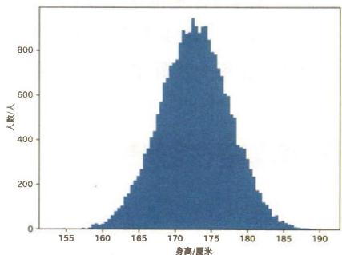

# 首先从正态分布开始

正态分布是一种用钟形曲线表示的概率分布。现实生活中的许多分布可以用正态分布来表示。身高的分布也可以用正态分布来表示。正态分布的形状由两个参数（均值 $\mu$ 和标准差 $\sigma$ ）决定。

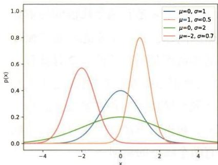

# 最大似然估计

我们需要对正态分布的参数进行调整，以匹配（拟合）数据。这种方法就是“最大似然估计”。最大似然估计是一种使观测数据 $x$ 的出现概率 $p(x)$ 最大化的参数估计方法。正态分布的最大似然估计的解可以通过求解数学式轻松得出。

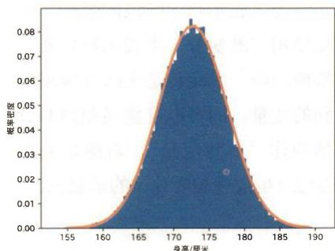

# 从一维到多维

身高是一维数据。接下来我们探讨由身高和体重组成的二维数据。右图是这种二维数据的可视化展示。对于二维数据，也可以通过最大似然估计推算出最优参数。图中的等高线表示经过最大似然估计后的二维正态分布。

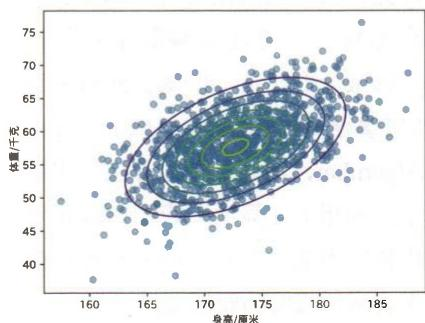

# 有两个峰值的问题

接下来是有两个峰值的样本数据的问题。用一个正态分布来描述这种情况是不合适的。此时就有了“高斯混合模型”的用武之地。高斯混合模型是一种将多个正态分布组合起来的方法，它也可以表示拥有两个峰值的数据。

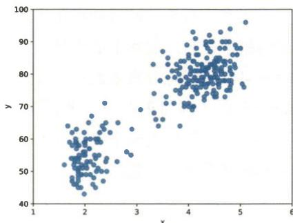

# 看不见的数据

为了表示两个峰值的数据，需要使用“潜变量”来表示数据属于哪座山峰。潜变量是无法直接观测到的变量，而可以直接观测到的数据叫作“观测变量”。右图是从潜变量 $z$ 生成观测变量 $x$ 的示意图。

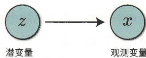

# 潜变量的代价

高斯混合模型中潜变量的存在，使得模型（数学式）变得更加复杂。因此，我们无法像对待一个正态分布那样，只通过求解数学式就能得到最大似然估计的解。此时就该EM算法（Expectation-Maximization Algorithm，期望最大化算法）出场了。利用EM算法，我们可以推算出最优参数，并将高斯分布拟合到拥有两个峰值的数据上。

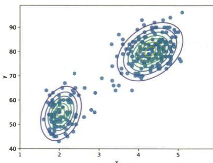

# 伟大的神经网络

在故事中随后出场的是神经网络。神经网络可用于学习更好地拟合样本数据的分布。它的能力如右图所示。图中(1)是一个正态分布的模型；(2)是高斯混合模型；(3)是引入了神经网络的VAE模型。通过引入神经网络，等高线有望变为图(3)所示的更灵活地拟合数据的形状。

# 使用VAE生成图像

与高斯混合模型一样，VAE也是一种拥有潜变量的模型。这个模型使用一个神经网络（解码器）将潜变量转换为观测变量，并使用另一个神经网络（编码器）进行反向转换。VAE的学习算法可以通过扩展EM算法的形式来推导。

# 潜变量分层

VAE已拥有出色的表达能力，而通过对潜变量进行分层，VAE可以得到进一步发展。这就是分层VAE。分层VAE是一种拥有多个潜变量的VAE模型。每个潜变量只受相邻潜变量的影响。这种分层结构具有更复杂的表达能力。

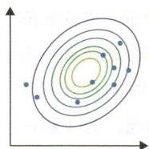  
(1)

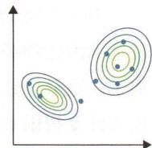  
(2)

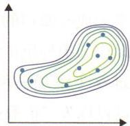  
(3)

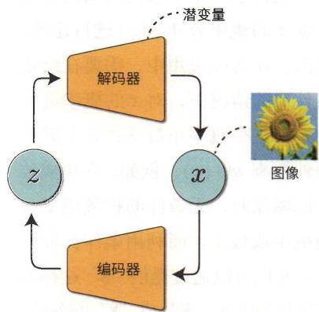

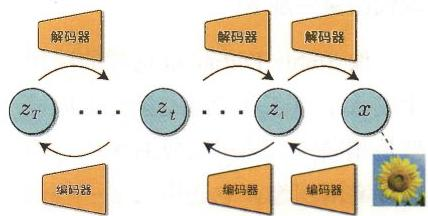

# 用噪声破坏数据

由于分层VAE增加了潜变量的数量，因此神经网络的处理量也增加了。这会导致处理时间延长和参数估计变得困难等问题。为了解决这些问题，我们将从观测变量到潜变量的转换简单地替换为添加基于正态分布生成的噪声的处理。这个思路可以作为推导出扩散模型的起点。通过逐步添加噪声来“破坏”数据的过程称为“扩散过程”。

# 引入条件

到目前为止，我们所做的是对数据 $x$ 的概率分布 $p(x)$ 进行建模。然而，在实际应用中，需要在给定条件 $y$ 的情况下，对 $x$ 的概率进行建模，这个概率用数学式表示就是条件概率 $p(x|y)$ 。例如，在生成数字的图像时，无条件的扩散模型会随机生成数字。而利用条件扩散模型，我们可以通过提供“8”这样的类别作为条件 $y$ 来生成“8”的图像。

# 现代图像生成AI

像StableDiffusion这样的图像生成AI，其工作原理与条件扩散模型是相同的。为了生成右图所示的这种高清图像，它还引入了一些创新技术。本书将简要介绍以StableDiffusion为代表的现代图像生成AI所使用的核心技术。

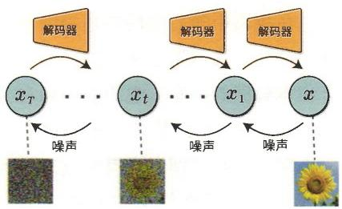

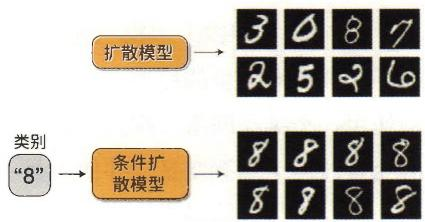

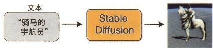

# \*\*\*\*\*\*\*\*

以上是本书的摘要。本书内容是一个贯穿始终的连续故事，在故事推进的过程中引入了关键的技术，并在不断改进的过程中推动情节发展。希望你也喜欢这个故事。现在，准备工作已经完成，我们就要踏上前往生成模型世界的旅程了。希望通过本书，你能充分领略生成模型的趣味性、发现它的可能性，并体会到其中蕴含的细节之美。


本书的重点是扩散模型和图像生成AI。对于以ChatGPT为代表的大语言模型（Large Language Model，LLM），我将在本系列的下一本书中详细讲解。

# 本书中使用的代码

本书中使用的代码可以从以下网址获取。

https://github.com/oreilly-japan/deep-learning-from-scratch-5

该资源库的文件夹结构如表0-1所示。

表 0-1 文件夹结构  

<table><tr><td>文件夹名称</td><td>说明</td></tr><tr><td>step01</td><td>步骤1中使用的代码</td></tr><tr><td>step02</td><td>步骤2中使用的代码</td></tr><tr><td>:</td><td>:</td></tr><tr><td>step10</td><td>步骤10中使用的代码</td></tr><tr><td>notebooks</td><td>步骤1至步骤10的代码（Jupyter Notebook格式）</td></tr></table>

本书使用的编程语言是Python（3.x版本），并使用了以下程序库。

NumPy   
SciPy   
- Matplotlib

- PyTorch（2.x版本）  
torchvision   
tqdm

本书使用的是 $2.x$ 版本的PyTorch。至于其他库，则不依赖于特定版本，应该不影响程序运行。作为参考，本书中使用的各个库的版本都列在了上述代码库的requirements.txt文件中。

另外，本书的GitHub主页中有一张图0-1所示的表格。单击表格中相应的按钮，即可在Google Colab或Kaggle Notebook等云服务上运行Notebook。

  
图0-1 本书的代码可以在云服务上运行 代找电子书资源，新书可代做扫描制作加微信asxiao90

# 排版规则

本书在排版上采用如下规则。

# 黑体字

用来表示新引入的术语、强调的要点以及关键短语。

# 等宽字（ConstantWidth）

用来表示下面这些信息：程序代码、命令、序列、组成元素、语句选项、分支、变量、属性、键值、函数、类型、类、命名空间、方法、模块、属性、参数、值、对象、事件、事件处理器、XML标签、HTML标签、宏、文件的内容、来自命令行的输出等。若在其他地方引用了以上这些内容（如变量、函数、关键字等），也会使用该格式标记。

# 等宽粗体字（ConstantWidthBold）

用来表示用户输入的命令或文本信息。在强调代码的作用时也会使用该格式标记。

# 等宽斜体字 (Constant Width Italic)

用来表示必须根据用户环境替换的字符串。

# [XXX]

用来表示对书后所附参考文献的引用。


用来表示提示、启发以及某些值得深究的内容的补充信息。


表示程序库中存在的bug或时常会发生的问题等警告信息，以引起读者对该处内容的注意。

# 读者意见与咨询

虽然笔者已经尽最大努力对本书的内容进行了验证与确认，但仍不免在某些地方出现错误或者容易引起误解的表达等，给读者的理解带来困扰。如果读者遇到这些问题，请及时告知，我们在本书重印时会将其改正，在此先表示不胜感激。与此同时，也希望读者能够为本书将来的修订提出中肯的建议。本书编辑部的联系方式如下。

株式会社O'Reilly Japan

电子邮件japan@oreilly.co.jp

本书的主页地址如下。

ituring.cn/book/3361

https://www.oreilly.co.jp/books/9784814400591（日语）

https://github.com/oreilly-japan/deep-learning-from-scratch-5

关于O'Reilly的其他信息，可以访问下面的O'Reilly主页查看。

https://www.oreilly.com（英语）

https://www.oreilly.co.jp（日语）

# O'Reilly 在线学习平台

O'Reilly 受到《财富》100 强中超过 60 家公司的信赖。O'Reilly 在线学习平台提供了超过 6 万册图书和 3 万小时以上的视频内容。此外，我们还提供由行业专家主持的现场活动、通过互动场景和沙盒进行的实践学习，以及为官方认证考试准备的材料等多种多样的内容。

https://www.oreilly.com/online-learning/

关于O'Reilly在线学习平台的常见问题及其解答，可以访问以下网址。

https://www.oreilly.com/online-learning/support/

# 步骤1

# 正态分布

本书的第一个主题是正态分布（高斯分布）。正态分布是统计学中最重要的概率分布，我们在许多自然现象和社会现象中能观测到正态分布。在本书中，正态分布也将频繁出现。在本步骤中，我们将从数学式和代码两个方面来学习正态分布。如果你对正态分布已经有所了解，那么可以跳过本步骤。让我们开始吧。

# 1.1 概率的基础知识

世界上存在许多不确定性。我们很难准确预测会发生什么，也常常无法肯定地说“必将如此”。为了应对这些不确定性，我们通常会使用概率。下面我们先来复习一下概率的基础知识。

# 1.1.1 随机变量和概率分布

随机变量是指其可能的取值由概率决定的变量。这里以一个具有1到6点数的骰子为例进行说明。在实际掷骰子之前，掷出的点数是未知的。但如果将其视为由概率决定，我们就能够定量地描述这种不确定性。这里我们用随机变量 $x$ 来表示掷出的点数，用 $p(x)$ 表示掷出某个点数的概率。例如，掷出1点的概率可以表示为 $p(x = 1)$ 。

概率分布是指所有可能值的概率。在掷骰子的例子中，概率分布是

$\{1,2,3,4,5,6\}$ 中每个值的出现概率。例如，表1-1显示了骰子的点数的概率分布。

表 1-1 酸子的点数的概率分布  

<table><tr><td>骰子的点数x</td><td>1</td><td>2</td><td>3</td><td>4</td><td>5</td><td>6</td></tr><tr><td>概率p(x)</td><td>1/6</td><td>1/6</td><td>1/6</td><td>1/6</td><td>1/6</td><td>1/6</td></tr></table>

如果表1-1列出了所有可能值的概率，那么就可以说随机变量 $x$ 服从表1-1所示的概率分布。实际值就是基于这个概率分布产生的。基于概率分布实际得到的每个值都叫作观测值（observation）或观测数据，或者简称为值或数据。观测值的集合叫作样本（sample，参见图1-1）。

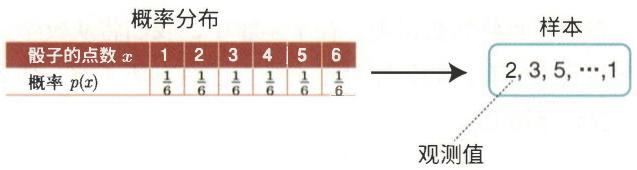  
图1-1 概率分布、样本和观测值

另外，在表1-1的概率分布中，每个点数出现的概率是相同的，值为 $\frac{1}{6}$ 。这样的概率分布叫作均匀分布（uniform distribution）。当然，除了表1-1所示的均匀分布，骰子的点数还有各种各样的概率分布。不过，要使概率分布成立，必须满足下面提到的两个条件。

# 概率分布满足的条件

这里考虑一个取 $N$ 个离散值 $\{x_{1}, x_{2}, \dots, x_{N}\}$ 的随机变量 $x$ 。为了简化表示，我们将 $p(x = x_k)$ 简写为 $p(x_k)$ 。

(1) 每个值出现的概率都大于或等于 0 且小于或等于 1。

$$
0 \leqslant p (x _ {k}) \leqslant 1 \quad (k = 1, 2, \dots , N)
$$

(2) 所有概率之和为 1。

$$
\sum_ {k = 1} ^ {N} p \left(x _ {k}\right) = 1
$$


在统计学和概率论领域，习惯上用大写字母表示随机变量（如随机变量 $X$ ），用小写字母表示观测值（如观测值 $x$ ）。不过，就本书的内容而言，这种大小写字母之间的区分并无必要（这种区分反而会使初学者感到困惑）。因此，本书中仅使用小写字母表示随机变量。

# 1.1.2 概率分布的类型

概率分布可以分为两类：离散型概率分布和连续型概率分布。在离散型概率分布中，随机变量取离散值（比如像1、2、3这种跳跃的值）。前面的骰子的例子就是离散型概率分布。而在连续型概率分布中，随机变量取连续值。例如，身高和温度就是连续型概率分布（参见图1-2）。

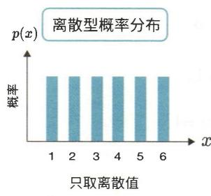

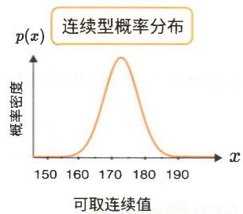  
图1-2 离散型概率分布和连续型概率分布

如图1-2所示，对于离散型随机变量， $p(x)$ 表示概率。而对于连续型随机变量， $p(x)$ 表示概率密度。概率密度也叫作概率密度函数。


对于连续型随机变量，像“ $x = 170$ 的概率是0.08”这样的说法是不正确的。 $p(x)$ 是概率密度，并不是概率。因此，正确的表述是“ $x = 170$ 的概率密度是0.08”。

对于连续型概率分布，我们也可以求出“概率”。更准确地说，我们可以求出“ $x$ 位于特定区间的概率”，这相当于“特定区间的曲线下面积”。例如， $x$ 位于 $170 \leqslant x \leqslant 180$ 区间的概率可以通过积分 $\int_{170}^{180} p(x) \, \mathrm{d}x$ 来求得，如图1-3所示。

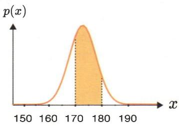  
图1-3 位于 $170 \leqslant x \leqslant 180$ 区间的概率可作为该区间的曲线下面积求得

另外，连续型概率分布为了作为概率分布成立，也必须满足以下两个条件。

(1) (对于所有 $x$ ) 概率密度都大于或等于 0 。

$$
p (x) \geqslant 0
$$

(2) 概率密度在整个区间内的积分为 1。

$$
\int_ {- \infty} ^ {+ \infty} p (x) \mathrm {d} x = 1
$$

# 1.1.3 期望值和方差

表示概率分布特征的重要值有期望值和方差。期望值（expected value）是指在单次观测中所得值的平均值。期望值有时简称为“均值”。期望值的定义式如下所示。

离散型概率分布的情况

$$
\mathbb {E} [ x ] = \sum_ {k = 1} ^ {N} x _ {k} p (x _ {k})
$$

连续型概率分布的情况

$$
\mathbb {E} [ x ] = \int_ {- \infty} ^ {+ \infty} x p (x) d x
$$

在本书中，期望值被写成 $\mathbb{E}[x]$ 。期望值是所有可能值及其出现的概率的乘积之和。离散型的期望值通过求和（ $\Sigma$ ）计算，连续型的期望值通过

积分（）计算。


本书中使用 $\mathbb{E}[x]$ 表示随机变量 $x$ 的期望值，使用 $\operatorname{Var}[x]$ 表示方差。另外，本书中有时还使用 $\mu$ （读作“缪”）表示期望值，使用 $\sigma^2$ （ $\sigma$ 读作“西格玛”）表示方差。

接下来是方差（variance），其数学式如下所示。

$$
\operatorname {V a r} [ x ] = \mathbb {E} \left[ (x - \mu) ^ {2} \right]
$$

方差的计算方法是计算 $x$ 与 $\mu$ 的差的平方，然后求平方的期望值。方差表示随机变量的取值在期望值 $\mu$ 附近的偏离程度。方差越小，随机变量的取值越接近期望值。离散型和连续型的方差的计算方法如下所示。

离散型概率分布的情况

$$
\begin{array}{l} \operatorname {V a r} [ x ] = \mathbb {E} \left[ (x - \mu) ^ {2} \right] \\ = \sum_ {k = 1} ^ {N} \left(x _ {k} - \mu\right) ^ {2} p \left(x _ {k}\right) \\ \end{array}
$$

连续型概率分布的情况

$$
\begin{array}{l} \operatorname {V a r} [ x ] = \mathbb {E} \left[ (x - \mu) ^ {2} \right] \\ = \int_ {- \infty} ^ {+ \infty} (x - \mu) ^ {2} p (x) d x \\ \end{array}
$$


对方差取平方根后的值称为标准差（standard deviation）。当方差为 $\sigma^2$ 时，标准差为 $\sigma$ 。由于方差是原始数据与期望值之间的差的平方，因此其单位与原始数据不同。如果取方差的平方根，那么偏离程度的单位就会与原始数据相同，从而更直观易懂。

对于简单的概率分布，通过手动计算也可以求出期望值和方差。这里，我们以离散型概率分布为例，计算图1-1中骰子（均匀分布）的期望值、方差和标准差。计算过程如下所示。

$$
\begin{array}{l} \mu = 1 \times \frac {1}{6} + 2 \times \frac {1}{6} + 3 \times \frac {1}{6} + 4 \times \frac {1}{6} + 5 \times \frac {1}{6} + 6 \times \frac {1}{6} \\ = 3. 5 \\ \end{array}
$$

$$
\begin{array}{l} \sigma^ {2} = (1 - 3. 5) ^ {2} \times \frac {1}{6} + (2 - 3. 5) ^ {2} \times \frac {1}{6} + (3 - 3. 5) ^ {2} \times \frac {1}{6} \\ + (4 - 3. 5) ^ {2} \times \frac {1}{6} + (5 - 3. 5) ^ {2} \times \frac {1}{6} + (6 - 3. 5) ^ {2} \times \frac {1}{6} \\ = 2. 9 1 6 \dots \\ \sigma = \sqrt {2 . 9 1 6 \cdots} \\ = 1. 7 0 7 \dots \\ \end{array}
$$

以上就是概率的基础知识。接下来我们学习正态分布。

# 1.2 正态分布概述

在概率分布中，存在一些具有代表性的分布，比如均匀分布和二项分布。最重要的典型概率分布是正态分布（normal distribution）。正态分布又称“高斯分布”，是以德国数学家卡尔·弗里德里希·高斯的姓氏命名的。本节将展示正态分布的数学式，并通过Python来编写代码。

# 1.2.1 正态分布的概率密度函数

正态分布是一种连续型概率分布。这里假设随机变量 $x$ 服从均值为 $\mu$ 、标准差为 $\sigma$ 的正态分布。此时，正态分布的概率密度函数的数学式如下所示。

$$
p (x) = \frac {1}{\sqrt {2 \pi} \sigma} \mathrm {e} ^ {- \frac {(x - \mu) ^ {2}}{2 \sigma^ {2}}}
$$

上式中的 $e$ 表示纳皮尔常数，它是一个无限不循环小数，可以写为 $e = 2.71828 \cdots$ 。为了使指数部分更容易阅读，纳皮尔常数的指数形式 $e^{\circ}$ 也可写为 $\exp(\bigcirc)$ 。本书采用后面这种写法，因此上式可以修改为如下形式。

$$
p (x) = \frac {1}{\sqrt {2 \pi} \sigma} \exp \left(- \frac {(x - \mu) ^ {2}}{2 \sigma^ {2}}\right)
$$

$p(x)$ 可被解释为一个以 $x$ 为参数并返回概率密度的函数。正态分布的

形状由 $\mu$ 和 $\sigma$ 决定，这些决定概率分布形状的部分叫作“参数”。我们有时将概率密度函数写为包含参数 $\mu$ 和 $\sigma$ 的 $p(x; \mu, \sigma)$ 的形式。此时的数学式如下所示。

$$
p (x; \mu , \sigma) = \frac {1}{\sqrt {2 \pi} \sigma} \exp \left(- \frac {(x - \mu) ^ {2}}{2 \sigma^ {2}}\right)
$$

上式在向函数中添加参数时使用了“；”（分号）而不是“，”（逗号）。这是为了区分随机变量和参数。换言之，分号左边是随机变量，分号右边是参数。分号的用法很重要。例如，对于 $p(a,b;c,d,e)$ 的形式，每个变量都可以理解为具有图1-4所示的作用。

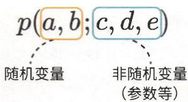  
图1-4“，”左边是随机变量，“，”右边是参数等非随机变量


随机变量的值是由概率决定的，参数的值则不由概率决定。参数的值可能是由某人随意设定的，也可能是根据某些基准设定的合理值。虽然参数也可以由概率决定，但本书中不会采用这种方法。由概率确定参数的做法也叫作“贝叶斯方法”。

正态分布是一种特殊的概率分布，在数学式中有时会使用 $\mathcal{N}$ 而不是 $p$ 来表示。 $\mathcal{N}$ 来源于NormalDistribution的首字母N。此时的正态分布的数学式如下所示。

$$
\mathcal {N} (x; \mu , \sigma) = \frac {1}{\sqrt {2 \pi} \sigma} \exp \left(- \frac {(x - \mu) ^ {2}}{2 \sigma^ {2}}\right)
$$

# 1.2.2 正态分布的代码实现

现在我们来编写正态分布的代码。正态分布的数学式的代码如下所示。

```python
step01/norm_dist.py   
import numpy as np   
def normal(x, mu=0, sigma=1): y = 1 / (np.sqrt(2 * np.pi) * sigma) * np.exp(-(x - mu)**2 / (2 * sigma**2)) return y 
```

在上述代码中，均值 $\mu$ 对应于 mu，标准差 $\sigma$ 对应于 sigma。在省略默认参数时，即均值为 0（ $\mathrm{mu} = 0$ ）、标准差为 1（ $\mathrm{sigma} = 1$ ）的正态分布叫作标准正态分布，其数学式如下所示。

$$
\mathcal {N} (x; \mu = 0, \sigma = 1) = \frac {1}{\sqrt {2 \pi}} \exp \left(- \frac {x ^ {2}}{2}\right)
$$

接下来是正态分布的可视化代码。

```python
step01/norm_dist.py
import matplotlib.pyplot as plt
x = np.linspace(-5, 5, 100) # [-5, -4.8989899, -4.7979798, ..., 5]
y = normal(x)
plt.plot(x, y)
plt.xlabel('x')
pltylabel('y')
plt.show() 
```

这里的 $x$ 是在-5至5的范围内等距分布的100个值。通过对 $x$ 的每个元素应用正态分布的normal(x)函数，可以得到y。将 $x$ 和y绘制为图形，可以得到图1-5。

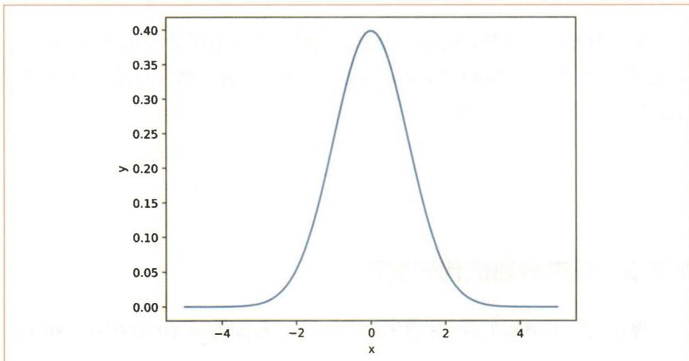  
图1-5 均值为0、标准差为1的正态分布

图1-5展示了均值为0、标准差为1的正态分布。它以均值0为中心，呈左右对称的山形。这种曲线也叫作“钟形”曲线（bell curve）。

# 1.2.3 参数的作用

正态分布有均值 $\mu$ 和标准差 $\sigma$ 两个参数。这两个值决定了正态分布的形状。下面来看一下改变正态分布的参数值后，其形状将如何变化。首先，绘制标准差 sigma 固定不变，仅改变均值 mu 的图形（参见图 1-6）。代码如下所示。

step01/norm param.py  
```txt
x = np.linspace(-10, 10, 1000)  
y0 = normal(x, mu=-3)  
y1 = normal(x, mu=0)  
y2 = normal(x, mu=5)  
plt.plot(x, y0, label='\\mu$=-3')  
plt.plot(x, y1, label='\\mu$=0')  
plt.plot(x, y2, label='\\mu$=5')  
plt.legend()  
plt.xlabel('x')  
pltylabel('y')  
plt.show() 
```

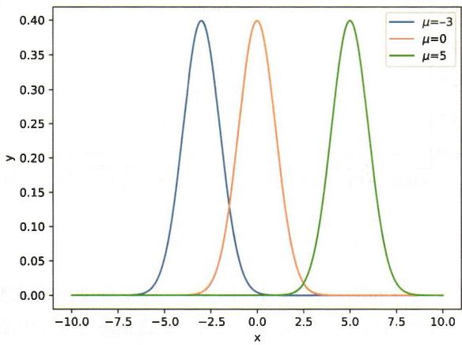  
图1-6 均值分别为-3、0和5的正态分布（标准差均为1）

虽然三座山的形状相同，但概率密度取最大值的位置不同。 $\mu = 0$ 的正态分布取最大值的位置是0， $\mu = -3$ 的正态分布取最大值的位置是-3。也就是说，山峰位于均值 $\mu$ 处。

接下来，尝试绘制改变正态分布的标准差的图形（参见图1-7）。代码如下所示。

step01/norm param.py  
```txt
y0 = normal(x, mu=0, sigma=0.5)
y1 = normal(x, mu=0, sigma=1)
y2 = normal(x, mu=0, sigma=2)
plt.plot(x, y0, label='\\sigma\\(=0.5')
plt.plot(x, y1, label='\\sigma\\) = 1'
plt.plot(x, y2, label='\\sigma\\) = 2'
plt.legend()
plt.xlabel('x')
pltylabel('y')
plt.show() 
```

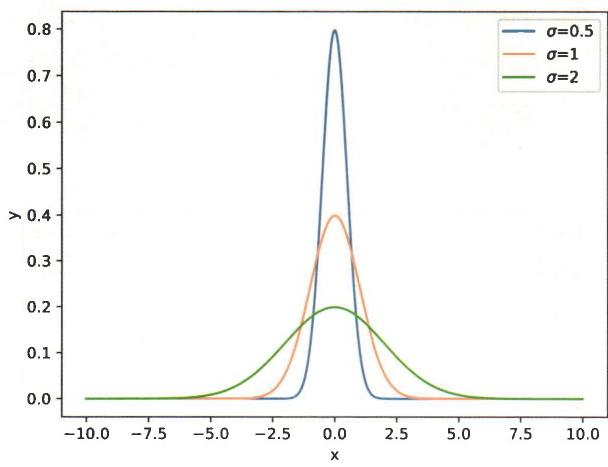  
图1-7 标准差分别为0.5、1和2的正态分布（均值均为0）

这次3个正态分布的均值相同，都为0。改变标准差会改变山的形状。 $\sigma = 0.5$ 的正态分布的山体又窄又高，而 $\sigma = 2$ 的正态分布的山体又宽又低。因此，标准差越大，山体就越低、越宽。

# 1.3 中心极限定理

中心极限定理（Central Limit Theorem）解释了为什么正态分布是最重要的概率分布。中心极限定理被认为是统计学中最优美的定理之一。本节将介绍中心极限定理，并通过实验证明其成立。

# 1.3.1 什么是中心极限定理

假设有某个概率分布 $p(x)$ 。这个 $p(x)$ 可以是任何概率分布。此时，如果基于 $p(x)$ 独立生成的 $N$ 个数据记为 $\left\{x^{(1)}, x^{(2)}, \dots, x^{(N)}\right\}$ ，那么其样本均值（sample average）的数学式如下所示。

$$
\bar {x} = \frac {x ^ {(1)} + x ^ {(2)} + \cdots + x ^ {(N)}}{N}
$$

这里有一个有趣的现象：无论 $p(x)$ 是什么样的概率分布，随着样本大小 $N$ 的增加，样本均值 $\overline{x}$ 的分布都会接近正态分布，而且其方差是 $p(x)$ 的方差的 $\frac{1}{N}$ （参见图1-8）。

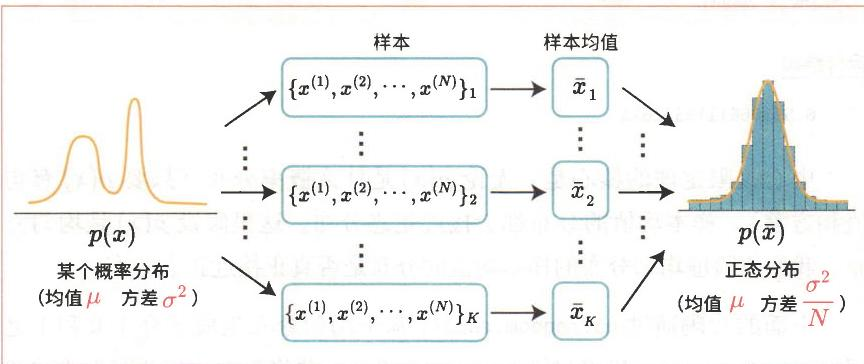  
图1-8 中心极限定理示意图

图1-8是中心极限定理的示意图。假设存在某个概率分布 $p(x)$ ，我们基于该分布采样 $N$ 个点 $\left\{x^{(1)}, x^{(2)}, \dots, x^{(N)}\right\}$ ，并计算样本均值 $\overline{x}$ 。如果多次重复这一计算样本均值的操作，就能知道样本均值 $\overline{x}$ 的分布。如果 $p(x)$ 是均

值为 $\mu$ 、方差为 $\sigma^2$ 的概率分布，那么样本均值 $\overline{x}$ 的分布就接近均值为 $\mu$ 、方差为 $\frac{\sigma^2}{N}$ 的正态分布。接下来我们将通过实验证明这一特性成立。


证明中心极限定理需要高深的数理统计学的知识。因此，本书没有给出中心极限定理的证明。如果你对此感兴趣，可以参考数理统计学的相关图书。

# 1.3.2 中心极限定理的实验

虽然中心极限定理是由数学式证明的，但这里我们可以通过实验来证明其成立。首先从下面的代码开始。

```python
import numpy as np  
N = 3 # 样本大小  
xs = []  
for n in range(N):  
    x = np.random.randint() # 基于均匀分布生成的随机数  
    xs.append(x)  
x_mean = np.mean(xs)  
print(x_mean) 
```

# 运行结果

0.5659601119372673

中心极限定理的核心是：无论 $p(x)$ 是什么概率分布（只要 $p(x)$ 有均值和方差），样本均值的分布都会接近正态分布。这里假设 $p(x)$ 是均匀分布。我们将验证均匀分布的样本均值的分布是否真正接近正态分布。

上面的代码通过 np.random.randint() 基于均匀分布生成了介于 0 和 1 之间的随机数。此外，代码将样本大小设置为 N，并将基于均匀分布生成的随机数添加到 xs 列表中。最后，通过 np.mean(xs) 计算样本均值。

接下来，我们将多次执行上述代码中编写的处理（假设执行10000次），并绘制此时的样本均值的分布图。代码如下所示。

```python
import numpy as np  
import matplotlib.pyplot as plt  
x_means = []  
N = 1 # 首先从样本大小为 1 的情况开始  
for _ in range(10000):  
    xs = []  
    for n in range(N):  
        x = np.random.randint() # 基于均匀分布采样  
        xs.append(x)  
        mean = np.mean(xs)  
        x_means.append(mean)  
# 绘制图形  
plt.hist(x_means, bins='auto', density=True)  
plt.title(f'N={N}')  
plt.xlabel('x')  
pltylabel('Probability Density') # y轴是概率密度  
plt血腥(-0.05, 1.05)  
plt[ylim(0, 5)  
plt.show() 
```

代码中使用了plt.hist()绘制直方图。这次用到了参数bins和density。关于这些参数的介绍，可以参见表1-2。

表 1-2 plt.hist(   ) 的参数  

<table><tr><td>参数</td><td>说明</td></tr><tr><td>bins</td><td>指定如何创建数据区间（柱）。如果指定为 auto，则根据数据密度自动设置适当的数据区间</td></tr><tr><td>density</td><td>如果为 False，那么纵轴就是每个柱中的数据个数；如果为 True，那么纵轴的值就会被调整为概率密度。这个调整使得直方图的面积为 1</td></tr></table>

上述代码还将图形的 $x$ 轴设置为-0.05至1.05， $y$ 轴设置为0至5。这样的设置是考虑到稍后将对不同N值的图形进行比较。现在运行代码可以得到图1-9。由于这里的样本大小为1（ $N = 1$ ），因此依然是均匀分布。

代找电子书资源，新书可代做扫描制作加微信 asxiao90

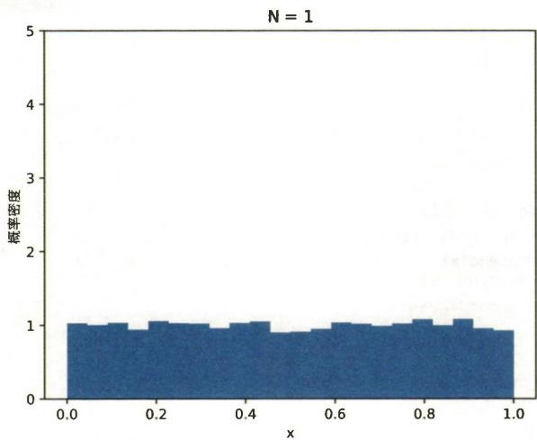  
图1-9 样本均值的直方图（样本大小为1）

接下来，尝试改变样本大小（N），然后再进行实验。这里考虑 $N = 1$ 、 $N = 2$ 、 $N = 4$ 和 $N = 10$ 的情况。结果如图1-10所示。

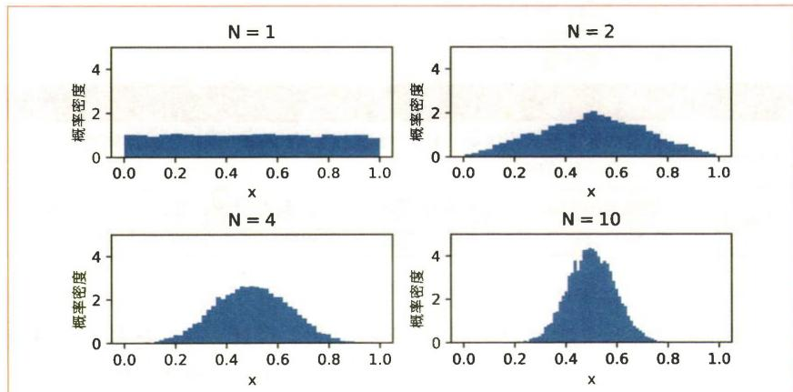  
图1-10 改变样本大小时样本均值的直方图

$\mathsf{N} = 1$ 的情况与之前一样，仍是均匀分布，但在 $\mathsf{N} = 2$ 时，结果已接近正态分布，而在 $\mathsf{N} = 4$ 时，结果几乎就是正态分布了。另外，随着 $\mathsf{N}$ 的增大，山体越来越窄，也就是说离散程度越来越小。

# 1.4 样本和的概率分布

根据中心极限定理可知，对于基于均值为 $\mu$ 、方差为 $\sigma^2$ 的概率分布 $p(x)$ 独立生成的样本 $\left\{x^{(1)}, x^{(2)}, \dots, x^{(N)}\right\}$ ，随着 $N$ 的增大，样本均值会越来越接近均值为 $\mu$ 、方差为 $\frac{\sigma^2}{N}$ 的正态分布。此时的样本均值的数学式如下所示。

$$
\bar {x} = \frac {x ^ {(1)} + x ^ {(2)} + \cdots + x ^ {(N)}}{N}
$$

接下来我们要考虑的问题不再是样本均值，而是样本和。样本和的数学式如下所示。

$$
s = x ^ {(1)} + x ^ {(2)} + \dots + x ^ {(N)}
$$

这个样本和 $S$ 会接近哪个概率分布呢？

# 1.4.1 样本和的期望值和方差

样本和 $s = N\overline{x}$ ，也就是说 $s$ 是 $\bar{x}$ 的 $N$ 倍。如果 $\bar{x}$ 接近正态分布，那么显然作为 $\bar{x}$ 的 $N$ 倍的 $s$ 也接近正态分布。剩下的问题就是接近的是什么样的正态分布，即概率分布 $p(s)$ 的均值（期望值）和方差各是多少。用数学式可以表示为以下问题。

问 当 $\mathbb{E}[\overline{x}] = \mu$ 、 $\operatorname{Var}[\overline{x}] = \frac{\sigma^2}{N}$ 时，求 $\mathbb{E}[N\overline{x}]$ 和 $\operatorname{Var}[N\overline{x}]$ 。

要解出这个问题，可以利用下面的式子。

$$
\mathbb {E} [ N x ] = N \mathbb {E} [ x ]
$$

式子中的 $N$ 是常数。常数的乘法运算可以提到 $\mathbb{E}$ 的外面。我们可以通过以下方式证明上式成立。

$$
\begin{array}{l} \mathbb {E} [ N x ] = \int N x p (x) d x \\ = N \int x p (x) d x \\ = N \mathbb {E} [ x ] \\ \end{array}
$$

下面求解刚才的问题。由于 $N$ 是常数，因此可以将式子展开成如下形式。

$$
\begin{array}{l} \mathbb {E} \left[ N \bar {x} \right] = N \mathbb {E} \left[ \bar {x} \right] \\ = N \mu \\ \operatorname {V a r} [ N \bar {x} ] = \mathbb {E} \left[ (N \bar {x} - N \mu) ^ {2} \right] \\ = \mathbb {E} \left[ N ^ {2} (\bar {x} - \mu) ^ {2} \right] \\ = N ^ {2} \mathbb {E} \left[ (\bar {x} - \mu) ^ {2} \right] \\ = N ^ {2} \operatorname {V a r} [ \bar {x} ] \\ = N ^ {2} \frac {\sigma^ {2}}{N} \\ = N \sigma^ {2} \\ \end{array}
$$

这表明样本和 $s$ 的分布接近于均值为 $N\mu$ 、方差为 $N\sigma^2$ 的正态分布。

# 1.4.2 通过代码确认

这里将从0和1之间的均匀分布中采样的数据作为对象。0和1之间的均匀分布的均值是 $\frac{1}{2}$ ，方差是 $\frac{1}{12}$ （关于均匀分布的均值和方差的计算方法，稍后会详细阐述）。因此，样本大小为 $N$ 的样本和的分布将接近于均值为 $\frac{N}{2}$ 、方差为 $\frac{N}{12}$ 的正态分布（参见图1-11）。

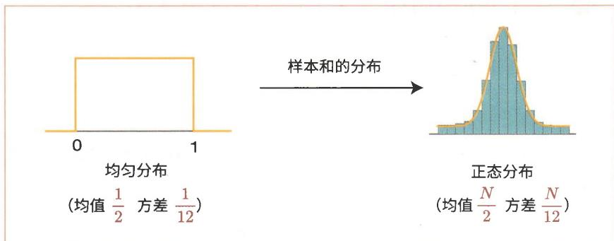  
图1-11 采样自均匀分布的 $N$ 个样本和的分布

让我们通过代码来确认结果真的如图1-11所示。

step01/sample_sum.py   
import numpy as np   
import matplotlib.pyplot as plt   
x_sums $= []$ N $= 5$ for in range(10000): xs $= []$ for n in range(N): $\texttt{x} = \texttt{np}$ .random rand() #采样自均匀分布的随机数 xs.append(x) t $=$ np.sum(xs）#求和 x_sums.append(t)   
#正态分布   
def normal(x, mu=0,sigma=1): y $= 1 / (\mathsf{np}\cdot \mathsf{sqrt}(2*\mathsf{np}\cdot \mathsf{pi})*\mathsf{sigma})*\mathsf{np}\cdot \exp ((-\mathsf{x} - \mathsf{mu})^{**2} / (2*\mathsf{sigma}^{**2}))$ returny   
x_norm $=$ np.linspace(-5,5,1000)   
mu $= N / 2$ sigma $=$ np.sqrt(N/12)   
y_norm $=$ normal(x_norm, mu, sigma)   
#绘制图形   
plt.hist(x_sums,bins='auto'，density=True)   
plt.plot(x_norm,y_norm)   
plt.title(f'[N}')   
plt.xlim(-1,6）#指定x轴的范围为-1\~6   
plt.show()

代码中使用的是 $N = 5$ ，以将 5 个样本和的分布绘制成直方图。样本和通过 np.sum(xs) 求得。运行上面的代码，可以得到图 1-12。

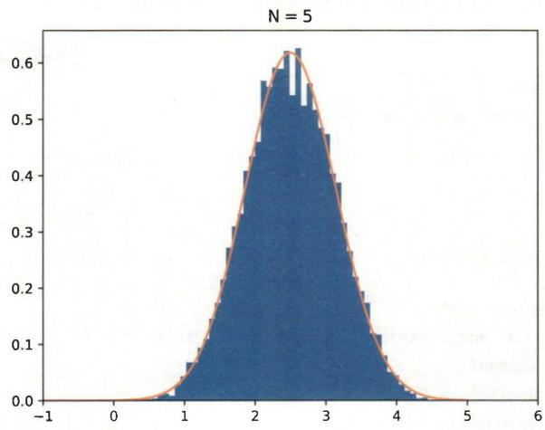  
图1-12 样本和的直方图（样本大小为5）

图1-12中的直方图呈正态分布的形状。它与以橙色绘制的计算式的正态分布（均值为 $\frac{N}{2}$ 、方差为 $\frac{N}{12}$ 的正态分布）也非常吻合。这里我们是以均匀分布为对象进行讨论的，但实际上，基于任何概率分布生成的样本和的分布都接近正态分布。

# 1.4.3 均匀分布的均值和方差

最后，我们来介绍一下0和1之间的均匀分布（参见图1-13）的均值是 $\frac{1}{2}$ 、方差是 $\frac{1}{12}$ 的计算过程。

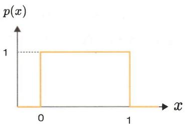  
图1-13 0和1之间的均匀分布的示意图

均匀分布的均值和方差可以根据定义式进行计算。首先来看均值 $\mu$ 的计算式。

$$
\begin{array}{l} \mu = \int_ {- \infty} ^ {+ \infty} x p (x) d x \\ = \int_ {- \infty} ^ {0} x \underbrace {p (x)} _ {= 0} d x + \int_ {0} ^ {1} x \underbrace {p (x)} _ {= 1} d x + \int_ {1} ^ {+ \infty} x \underbrace {p (x)} _ {= 0} d x \\ = \int_ {0} ^ {1} x d x \\ = \left[ \frac {1}{2} x ^ {2} \right] _ {0} ^ {1} \\ = \frac {1}{2} \\ \end{array}
$$

由于这个均匀分布 $p(x)$ 仅在0和1之间为1，在其他区间为0，因此， $\int_{-\infty}^{+\infty}xp(x)\mathrm{d}x = \int_0^1 x\mathrm{d}x$ 。接下来求方差 $\sigma^2$ 。

$$
\begin{array}{l} \sigma^ {2} = \int_ {- \infty} ^ {+ \infty} (x - \mu) ^ {2} p (x) d x \\ = \int_ {0} ^ {1} \left(x - \frac {1}{2}\right) ^ {2} d x \\ = \int_ {0} ^ {1} \left(x ^ {2} - x + \frac {1}{4}\right) d x \\ = \left[ \frac {1}{3} x ^ {3} - \frac {1}{2} x ^ {2} + \frac {1}{4} x \right] _ {0} ^ {1} \\ = \frac {1}{3} - \frac {1}{2} + \frac {1}{4} \\ = \frac {1}{1 2} \\ \end{array}
$$

根据以上计算可知，0和1之间的均匀分布的均值是 $\frac{1}{2}$ ，方差是 $\frac{1}{12}$ 。

# 1.5 身边的正态分布

根据中心极限定理，任何概率分布的样本均值以及样本和都接近正态分布。基于这一特性，我们可以在身边的许多场景中找到正态分布。下面

介绍一些我们身边的正态分布的例子。


正态分布的英文名称为 normal distribution，其中 normal 的意思是“标准的、典型的”。由于这种分布是我们身边常见的典型分布，因此被命名为“正态分布”。

# 1. 测量误差

在实验或使用某种仪器进行测量的场景（对某一物体进行多次测量的场景）中，我们经常会见到正态分布。尤其是在那些管理严格、环境条件得到精心调控的测量过程中，我们所获得的测量值往往会呈现正态分布。为什么是正态分布呢？

测量的误差可能是由多种因素造成的。为简单起见，我们假设有 $N$ 个误差因素，每个误差因素独立产生随机误差。我们将第一个误差表示为 $\varepsilon^{(1)}$ ，第二个误差表示为 $\varepsilon^{(2)}$ ……后面 $N$ 个误差的总和就是与正确值之间的偏差。

$$
\varepsilon = \varepsilon^ {(1)} + \varepsilon^ {(2)} + \dots + \varepsilon^ {(N)}
$$

每个误差都有随机性，它们的总和为 $\varepsilon$ 。对于这种情况，随着 $N$ 的增大，误差总和 $\varepsilon$ 将接近正态分布。如果实际的分布偏离正态分布，那么可能是由于测量仪器的故障或人为操作失误造成的。

# 2. 产品规格

产品规格也呈现正态分布。这里以便利店出售的瓶装饮用水为例。如果收集大量500毫升塑料瓶装水（同一产品）并测量它们的重量，那么结果应该呈现均值在500克上下的正态分布。虽然结果中包含了测量误差，但即使真正的重量已知，测量结果也会呈现正态分布。为什么是正态分布呢？

一件产品在完成之前需要经历许多工序。在这个过程中，每道工序中微小的差异逐渐累积，最终形成成品。在这一系列工序中，各种误差会被引入。例如，材料可能用得多了一点儿、涂料可能用得少了一点儿、标签

的尺寸可能稍微大了一点儿等，这些微小的差异逐渐累积。当这些各种各样的差异累积起来时，结果就会接近正态分布。基于上述原因，我们可以认为产品规格是呈正态分布的（在很多情况下确实如此）。

# 3.人的身高

相同年龄和性别的人的身高也可以用正态分布来近似表示。图1-14显示了日本17岁男生的身高分布。从图中可以看出，他们的身高非常符合正态分布。为什么是正态分布呢？

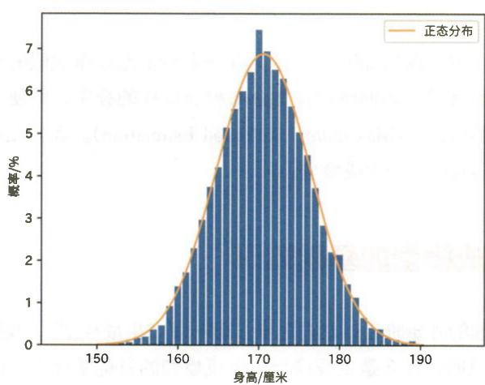  
图1-14 17岁男生的身高分布（数据来源于日本的2016年度学校健康统计调查[1]，图形基于该数据绘制）

决定人的身高的因素可能有很多。假定来自父母的遗传、饮食习惯、运动史、家庭环境、生活条件等各种因素的累积最终决定了一个人的身高。在这种情况下，如果每个因素在一定程度上都是独立产生的，那么可以认为由这些因素相互影响而产生的身高的分布接近正态分布。2

如上所述，我们身边的正态分布是很常见的。此外，由于正态分布的数学式易于处理，因此它在机器学习和统计学领域被频繁使用。

# 步骤2

# 最大似然估计

在步骤1中，我们知道了世界上有许多与正态分布类似的分布。在本步骤中，我们将学习如何使用正态分布拟合这样的分布，所使用的方法就是“最大似然估计”（Maximum Likelihood Estimation）。我们在本步骤中学习的就是本书的第一个生成模型。

# 2.1 生成模型的基础知识

在本步骤的开始阶段，我们先来了解一下“生成模型”。我们将围绕以下要点进行说明：什么是生成模型、生成模型的目标是什么，以及如何创建生成模型。

# 2.1.1 什么是生成模型

生成模型的目标是对给定数据 $x$ 的概率分布 $p(x)$ 进行建模（用数学式来表示），然后生成新的模拟数据，这些数据就像是从该群体中选出来的一样。例如，我们可以将某个群体的身高的概率分布表示为图2-1所示的正态分布，这是一个很好的生成模型。

图2-1中的图形是一个均值为172.7、标准差为4.8的正态分布。对这样的群体的特征进行建模就是生成模型的目标。为此，我们需要“估计”概率分布的参数（对于正态分布，参数是均值和标准差）。设置适当参数的

任务可以称为参数的“估计”或“推理”。至于为什么使用“估计”一词，需要先了解“总体”的概念。

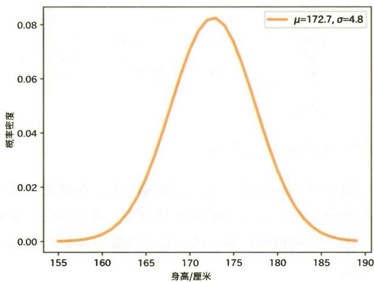  
图2-1 基于正态分布的生成模型的示例

# 2.1.2 总体和样本

“总体”一词主要用于统计学。总体指的是对象的整体。通常，总体的规模是巨大的。统计学的目标之一就是利用数量有限的样本对总体进行“估计”（参见图2-2）。

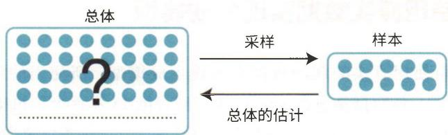  
图2-2 总体和样本的关系

生成模型也是利用样本对总体进行估计。在生成模型的语境下，总体就是样本背后的概率分布。这种概率分布称为“真正的概率分布”或“总

体分布”（参见图2-3）。

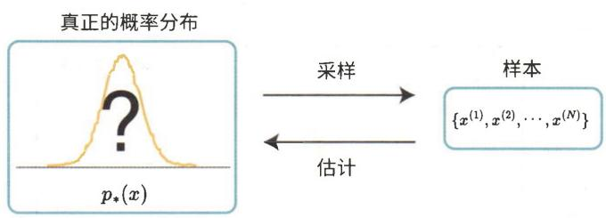  
图2-3 生成模型中真正的概率分布与样本之间的关系

图2-3使用 $p_{*}(x)$ 来表示样本服从的概率分布。在理想情况下，我们希望得到真正的概率分布 $p_{*}(x)$ ，但在现实情况下，真正的概率分布无法直接得知。因此，我们需要根据样本来估计真正的概率分布。为此，通常需要执行以下两项任务。

(1)建模：假定真正的概率分布近似于参数可调整的概率分布。  
(2)参数估计：估计参数，使概率分布拟合样本数据。

通过完成“建模”和“参数估计”这两项任务，我们就创建了一个生成模型。首先，在建模阶段，我们建立一个可由参数控制的概率分布，比如正态分布。然后，在参数估计阶段，我们会对参数进行调整，以使其最拟合样本。这就要用到最大似然估计。2.3节会对最大似然估计进行介绍。

# 2.2 使用真实数据实现生成模型

本节将使用真实的观测数据来实现生成模型。所使用的数据集是SOCR Data[2]。该数据集包含了1993年中国香港18岁青少年的身高数据，共计25000条记录。不过，这些数据本身是基于实际调查结果虚构的。为了方便使用，我们对这个身高数据集进行了整理<sup>1</sup>，并将整理后的文件放在了本书配套的代码库中。文件名为height.txt，位于step02目录中。

# 2.2.1 读取身高数据集

下面我们读取身高数据集并绘制直方图。代码如下所示。

```txt
step02/history.py 
```

import os   
import numpy as np   
import matplotlib.pyplot as plt   
path $=$ os.path.join(os.pathdirname(_file_, 'height.txt') xs $=$ np.loadtxt(path) print(xs.shape)# (25000,)   
plt.hist(xs,bins $\coloneqq$ auto'，density $\equiv$ True) plt.xlabel('Height(cm)') pltylabel('Probability Density') plt.show()

__file__表示要运行的文件（step02/history.py）的位置。上述代码首先通过os.pathdirname(_file__)获得该文件的目录；然后使用os.path.join()函数将脚本运行的目录与height.txt连接起来，得到文件的绝对路径；最后使用np.loadtxt()函数加载绝对路径。这样就能将文件数据读取为一维数组的形式。


代码在加载文件时指定的是绝对路径而不是相对路径。这样做的目的是确保即使Python运行的目录与文件所在的目录不同，程序也能正确运行。

另外，由于在Jupyter Notebook中无法使用__file__，因此在该环境下运行会报错。Notebook版的文件是notebooks/step02.ipynb，如果你想在Notebook中运行代码，可以参考此文件。

通过读取得到的 xs 是包含 25000 个元素的一维数组。图 2-4 是基于 xs 绘制的直方图。

观察图2-4，我们发现它呈正态分布的形状。因此，我们将身高的概率分布视为正态分布进行建模。

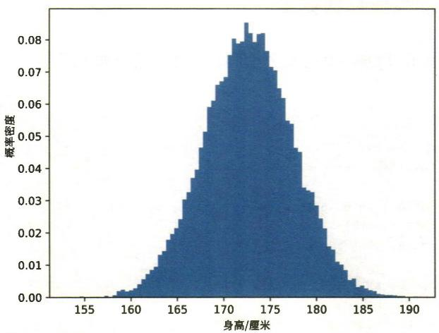  
图2-4 身高数据集的直方图

# 2.2.2 基于正态分布的生成模型

接下来我们实现基于正态分布的生成模型。我们需要执行以下任务。

(1)建模：假定身高数据呈正态分布。  
(2)参数估计：根据样本估计正态分布的参数 $z$

我们通过这两个任务来创建生成模型。我们已经完成了第一个任务——建模。接下来是第二个任务——参数估计。具体要执行的任务是基于样本估计正态分布的参数，如图2-5所示。

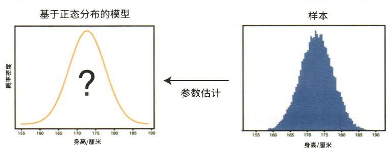  
图2-5 正态分布的参数估计

参数估计的一种方法是最大似然估计。通过最大似然估计，我们可以估计出最拟合样本的参数。这里首先给出结论：通过最大似然估计可以得到正态分布的参数——样本的均值和标准差。2.3节将介绍这个结论的推导过程。下面我们来求样本的均值和标准差。

xs是拥有25000个元素的一维数组  
mu $=$ np.mean(xs)  
sigma $=$ np.std(xs)  
print(mu)  
print(sigma)

# 运行结果

```txt
172.70250853667997  
4.830167473396299 
```

样本数据的均值可以通过 np.mean() 求得，标准差可以通过 np.std() 求得。上面的运行结果显示均值为 172.7，标准差为 4.8。这个均值和标准差是最拟合样本的参数。下面我们在之前的直方图上再画一张正态分布的图形。

step02/fit.py   
mu $=$ np.mean(xs)   
sigma $\equiv$ np.std(xs)   
# 正态分布的函数   
def normal(x, mu=0, sigma=1): y $= 1 / (\mathrm{np}\cdot \mathrm{sqrt}(2*\mathrm{np}\cdot \mathrm{pi})*\mathrm{sigma})*\mathrm{np}\cdot \exp {-(\mathrm{x} - \mathrm{mu})^{**2}} / (2*\mathrm{sigma}^{**2}))$ returny   
x $=$ np.linspace(150,190,1000)   
y $=$ normal(x, mu, sigma)   
# 图形的绘制   
plt.hist(xs,bins $\coloneqq$ 'auto'，density $\coloneqq$ True)   
plt.plot(x,y)   
plt.xlabel('Height(cm)')   
pltylabel('Probability Density')   
plt.show()

运行这段代码可以得到图2-6。从图中可以看出，直方图与正态分布是相匹配的。

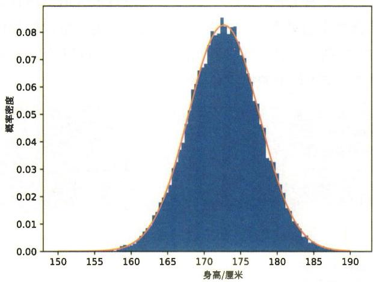  
图2-6 身高数据集的直方图与正态分布

# 2.3 最大似然估计的理论知识

在2.2节中，正态分布的参数是从样本中估计出来的。具体来说，对于 $N$ 个观测数据 $\{x^{(1)}, x^{(2)}, \dots, x^{(N)}\}$ ，可以根据以下式子估计正态分布的参数。

$$
\hat {\mu} = \frac {1}{N} \sum_ {n = 1} ^ {N} x ^ {(n)} \tag {2.1}
$$

$$
\hat {\sigma} = \sqrt {\frac {1}{N} \sum_ {n = 1} ^ {N} \left(x ^ {(n)} - \hat {\mu}\right) ^ {2}} \tag {2.2}
$$

上面式子中的符号 $\hat{\mu}$ 表示正态分布的均值， $\hat{\sigma}$ 表示标准差[估计值是像 $\hat{\mu}$ 这样的带有“ $\hat{\Lambda}$ ”（帽子）的符号]。如上面的式子所示， $\hat{\mu}$ 是样本均值的估计值， $\hat{\sigma}$ 是样本标准差的估计值。那么，为什么根据这两个式子就能估计出来呢？最大似然估计可以解释其中的原因。下面我们通过最大似然估计来推导上面的式子。

# 2.3.1 似然的最大化

假设有一个概率分布，其形状由参数 $\theta$ 决定。当参数为 $\theta$ 时，获得数据 $x$ 的概率密度为 $p(x; \theta)$ 。


这里探讨的是由某个参数 $\theta$ 决定的概率分布，并不局限于正态分布。对于正态分布，可以将参数视为 $\theta = \{\mu, \sigma\}$ 。

下面我们探讨获得样本 $\mathcal{D} = \left\{x^{(1)}, x^{(2)}, \dots, x^{(N)}\right\}$ 的情况。假设每个数据都是基于概率分布 $p(x; \theta)$ 独立生成的。此时，获得样本 $\mathcal{D}$ 的概率密度的数学式如下所示。

$$
\begin{array}{l} p (\mathcal {D}; \theta) = p (x ^ {(1)}; \theta) p (x ^ {(2)}; \theta) \dots p (x ^ {(N)}; \theta) \\ = \prod_ {n = 1} ^ {N} p \left(x ^ {(n)}; \theta\right) \\ \end{array}
$$

由于假定每个数据是独立生成的，因此获得 $N$ 个数据的概率密度等于每个数据的概率密度的乘积。 $p(\mathcal{D}; \theta)$ 表示当参数为 $\theta$ 时获得样本 $\mathcal{D}$ 的概率密度。这个 $p(\mathcal{D}; \theta)$ 也可以被看作以 $\theta$ 为参数的函数，其定义式如下所示。

$$
L (\theta) = p (D; \theta)
$$

式子中的 $L(\theta)$ 称为似然（likelihood）或似然函数（likelihood function）。似然是以参数 $\theta$ 为参数的函数，表示在给定参数 $\theta$ 的情况下，样本 $\mathcal{D}$ 出现的概率密度。此外，由于 $L(\theta)$ 和 $p(\mathcal{D};\theta)$ 是相同的，因此无须重新定义像 $L(\theta)$ 这样的函数，通常我们也将 $p(\mathcal{D};\theta)$ 称为似然。从这里开始，本书会将 $p(\mathcal{D};\theta)$ 称为似然²。

最大似然估计是一种找到使似然 $p(\mathcal{D};\theta)$ 最大的参数 $\theta$ 的技术。如果使似然最大的参数是 $\hat{\theta}$ ，那么当参数为 $\hat{\theta}$ 时，观测到样本的概率最大。也就是说，当参数为 $\hat{\theta}$ 时，模型最拟合样本。

其实最大似然估计进行的不是似然 $p(\mathcal{D};\theta)$ 的最大化，而是对数似然 $\log p(\mathcal{D};\theta)$ 的最大化。这是因为通常取对数在计算上更方便。而且，由于对数函数是单调递增函数，因此使 $p(\mathcal{D};\theta)$ 最大的 $\theta$ 值和使 $\log p(\mathcal{D};\theta)$ 最大的 $\theta$ 值是相等的。另外，准确地说，这里的对数指的是自然对数，其数学式为 $\log_{e}x$ 。本书将 $\log_{e}x$ 写为 $\log x$ 。

# 积的对数是对数的和

在计算对数时，有以下数学式成立（假设 $a$ 和 $b$ 都是大于或等于0的实数）。

$$
\log a b = \log a + \log b
$$

这个公式简化了 $\log p(\mathcal{D};\theta)$ 的计算。

接下来，我们将介绍使对数似然最大化的方法。不过在此之前，我们先以一个简单的函数为例，看看如何找到它的最大值。

# 2.3.2 利用导数求最大值

这里以下面的函数为例，求出使 $y$ 最大的 $x$ 值。

$$
y = - 2 x ^ {2} + 3 x + 4
$$

在求最大值时，导数非常重要。 $y$ 关于 $x$ 的导数的数学式为 $\frac{\mathrm{dy}}{\mathrm{dx}}$ ，可以按如下方式计算。

$$
\frac {\mathrm {d} y}{\mathrm {d} x} = - 4 x + 3
$$

根据这个式子可以计算给定 $x$ 时的导数。例如， $x = 0$ 时的导数为3。这意味着在 $x = 0$ 处，如果使 $x$ 变化一个微小值 $\delta$ ，那么 $y$ 将变化 $3\delta$ 。因此，导数表示给定 $x$ 时 $y$ 的“变化率”。导数也相当于切线的斜率，如图2-7所示。

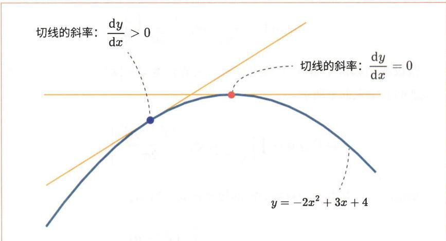  
图2-7 导数与切线的斜率

图2-7中图形的形状非常简单，并且，可以观察到最大值位于导数为0的位置。因此，通过求解下面的式子可以求出取最大值的位置。

$$
\frac {\mathrm {d} y}{\mathrm {d} x} = - 4 x + 3 = 0
$$

答案是 $x = \frac{3}{4}$ 。这种通过数学式求解的做法叫作“解析（analytical）求解”或“闭式（closed-form）求解”。


对于某些函数，最大值不一定在导数为0的地方。但对于 $y = ax^2 + bx + c$ 这样的二次函数，如果二次项系数为负值（ $a < 0$ ），那么最大值就在导数为0的地方。

接下来我们探讨似然最大化的问题。它的求解方法与刚才介绍的方法相同，即通过求出对数似然的参数 $\theta$ 的导数，并令其为0这种解析的方式来求解。所得的解就是式2.1和式2.2。推导过程如2.3.3节所示。

# 2.3.3 正态分布的最大似然估计★

先来回顾一下正态分布的概率密度，其数学式如下所示。

$$
\mathcal {N} (x; \mu , \sigma) = \frac {1}{\sqrt {2 \pi} \sigma} \exp \left(- \frac {(x - \mu) ^ {2}}{2 \sigma^ {2}}\right)
$$

假设我们获得了由 $N$ 个观测数据构成的样本 $\mathcal{D} = \left\{x^{(1)}, x^{(2)}, \dots, x^{(N)}\right\}$ 。此时似然的数学式如下所示。

$$
p (\mathcal {D}; \mu , \sigma) = \prod_ {n = 1} ^ {N} \frac {1}{\sqrt {2 \pi} \sigma} \exp \left(- \frac {\left(x ^ {(n)} - \mu\right) ^ {2}}{2 \sigma^ {2}}\right)
$$

根据以上信息得到的对数似然的数学式如下所示。

$$
\begin{array}{l} \log p (\mathcal {D}; \mu , \sigma) = \log \prod_ {n = 1} ^ {N} \frac {1}{\sqrt {2 \pi} \sigma} \exp \left(- \frac {\left(x ^ {(n)} - \mu\right) ^ {2}}{2 \sigma^ {2}}\right) \\ = \log \prod_ {n = 1} ^ {N} \frac {1}{\sqrt {2 \pi} \sigma} + \log \prod_ {n = 1} ^ {N} \exp \left(- \frac {\left(x ^ {(n)} - \mu\right) ^ {2}}{2 \sigma^ {2}}\right) \\ = \log \left(\frac {1}{\sqrt {2 \pi} \sigma}\right) ^ {N} + \sum_ {n = 1} ^ {N} \frac {- (x ^ {(n)} - \mu) ^ {2}}{2 \sigma^ {2}} \\ = - \frac {N}{2} \log 2 \pi \sigma^ {2} - \frac {1}{2 \sigma^ {2}} \sum_ {n = 1} ^ {N} \left(x ^ {(n)} - \mu\right) ^ {2} \\ \end{array}
$$

上面的对数计算利用了 $\log ab = \log a + \log b$ 这一特性。如果观察最后一个式子中的 $\mu$ ，就会发现对数似然是 $\mu$ 的二次函数。由于这个二次函数的二次项系数为负 $(- \frac{1}{2\sigma^2} < 0)$ ，因此在导数为0处取最大值。接下来是偏导数的计算。如果定义 $L(\mu, \sigma) = \log p(\mathcal{D}; \mu, \sigma)$ ，那么 $\frac{\partial L}{\partial \mu}$ 的数学式如下所示。

$$
\frac {\partial L}{\partial \mu} = \frac {1}{\sigma^ {2}} \sum_ {n = 1} ^ {N} \left(x ^ {(n)} - \mu\right)
$$


$L(\mu, \sigma)$ 中有 $\mu$ 和 $\sigma$ 两个变量。拥有两个及以上变量的导数是偏导数，写为 $\frac{\partial L}{\partial \mu}$ 的形式。偏导数可以固定其他的变量，只对一个变量求导。例如， $\frac{\partial L}{\partial \mu}$ 只将 $\mu$ 作为变量进行求导，并会固定其他变量（把它们视为常量）。

$L(\mu, \sigma)$ 在 $\frac{\partial L}{\partial \mu} = 0$ 处取最大值。通过展开式子，可以得到下面的解。

$$
\begin{array}{l} \frac {1}{\sigma^ {2}} \sum_ {n = 1} ^ {N} \left(x ^ {(n)} - \mu\right) = 0 \\ \Leftrightarrow \sum_ {n = 1} ^ {N} (x ^ {(n)} - \mu) = 0 \\ \Leftrightarrow \quad \sum_ {n = 1} ^ {N} \mu = \sum_ {n = 1} ^ {N} x ^ {(n)} \\ \Leftrightarrow \quad N \mu = \sum_ {n = 1} ^ {N} x ^ {(n)} \\ \therefore \quad \mu = \frac {1}{N} \sum_ {n = 1} ^ {N} x ^ {(n)} \\ \end{array}
$$

数学式中的“ $\Leftrightarrow$ ”表示两个式子等价。“ $\therefore$ ”表示结论，意思是“所以”。根据上面的式子，当 $\mu$ 为 $\frac{1}{N}\sum_{n=1}^{N}x^{(n)}$ 时，函数取最大值。我们使用 $\hat{\mu}$ 来改写这个式子，如下面的式子所示。

$$
\hat {\mu} = \frac {1}{N} \sum_ {n = 1} ^ {N} x ^ {(n)} \tag {2.1}
$$

如式2.1所示，在 $\hat{\mu}$ 处，正态分布的对数似然最大， $\hat{\mu}$ 是样本的均值。

接下来是标准差 $\sigma$ 。我们的目标是在 $\mu = \hat{\mu}$ 的条件下，找到使对数似然最大的 $\sigma$ 。 $\mu = \hat{\mu}$ 时的对数似然如下面的式子所示。

$$
\log p \left(\mathcal {D}; \mu = \hat {\mu}, \sigma\right) = - \frac {N}{2} \log 2 \pi \sigma^ {2} - \frac {1}{2 \sigma^ {2}} \sum_ {n = 1} ^ {N} \left(x ^ {(n)} - \hat {\mu}\right) ^ {2}
$$

与 $\mu$ 一样，使对数似然最大的 $\sigma$ 的值也可以通过解析的方式求得，也就是求导数并令导数为0，然后再展开数学式的做法。对数似然关于 $\sigma$ 的导数需要进行 $\frac{\mathrm{d}}{\mathrm{d}\sigma}\left(\log 2\pi \sigma^2\right)$ 的计算。下面先来进行这个计算。

$$
\begin{array}{l} \frac {\mathrm {d}}{\mathrm {d} \sigma} \left(\log 2 \pi \sigma^ {2}\right) = \frac {\mathrm {d}}{\mathrm {d} \sigma} \left(\log 2 \pi + \log \sigma^ {2}\right) \quad (\log a b = \log a + \log b) \\ = \underbrace {\frac {\mathrm {d}}{\mathrm {d} \sigma} (\log 2 \pi)} _ {0} + \frac {\mathrm {d}}{\mathrm {d} \sigma} (\log \sigma^ {2}) \quad (\text {常 量 的 导 数 是} 0) \\ = \frac {\mathrm {d}}{\mathrm {d} \sigma} (2 \log \sigma) \quad (\log a ^ {b} = b \log a) \\ = 2 \frac {\mathrm {d}}{\mathrm {d} \sigma} \log \sigma \quad \left(\frac {\mathrm {d}}{\mathrm {d} a} \log a = \frac {1}{a}\right) \\ = \frac {2}{\sigma} \\ \end{array}
$$

因此可以将数学式展开成如下形式。

$$
\begin{array}{l} \frac{\partial}{\partial\sigma}\log p\big(\mathcal{D};\mu = \hat{\mu},\sigma \big) = -\frac{N}{2}\underbrace{\frac{\partial}{\partial\sigma}\big(\log 2\pi\sigma^{2}\big)}_{\substack{\frac{2}{\sigma}}} - \frac{\partial}{\partial\sigma}\Bigg(\frac{1}{2\sigma^{2}}\sum_{n = 1}^{N}\Big(x^{(n)} - \hat{\mu}\Big)^{2}\Bigg) \\ = - \frac {N}{2} \frac {2}{\sigma} - \frac {1}{2} (- 2) \sigma^ {- 3} \sum_ {n = 1} ^ {N} \left(x ^ {(n)} - \hat {\mu}\right) ^ {2} \\ = - \frac {N}{\sigma} + \sigma^ {- 3} \sum_ {n = 1} ^ {N} \left(x ^ {(n)} - \hat {\mu}\right) ^ {2} \\ \end{array}
$$

然后令导数为0，推导出下面的式子。

$$
\frac {N}{\sigma} = \sigma^ {- 3} \sum_ {n = 1} ^ {N} \left(x ^ {(n)} - \hat {\mu}\right) ^ {2}
$$

$$
\Leftrightarrow \quad \sigma^ {2} = \frac {1}{N} \sum_ {n = 1} ^ {N} \left(x ^ {(n)} - \hat {\mu}\right) ^ {2}
$$

$$
\therefore \quad \sigma = \sqrt {\frac {1}{N} \sum_ {n = 1} ^ {N} \left(x ^ {(n)} - \hat {\mu}\right) ^ {2}}
$$

最后，使用 $\hat{\sigma}$ 表示得到的标准差，将式子改写成如下形式。

$$
\hat {\sigma} = \sqrt {\frac {1}{N} \sum_ {n = 1} ^ {N} \left(x ^ {(n)} - \hat {\mu}\right) ^ {2}} \tag {2.2}
$$

以上就是通过最大似然估计对正态分布的参数进行计算的式2.1和式2.2的推导。

# 2.4 生成模型的用途

我们在前面实现了生成模型。具体来说，针对身高数据，我们做了以下两项工作。

(1)建模：假设身高数据为正态分布。  
(2)参数估计：通过最大似然估计来估计正态分布的参数。

经过以上两个步骤，我们创建了生成模型。实际编写的代码如下所示。

import os   
import numpy as np   
import matplotlib.pyplot as plt   
path $=$ os.path.join(os.pathdirname(_file_,height.txt') xs $=$ np.loadtxt(path)   
mu $=$ np.mean(xs) sigma $=$ np.std(xs)   
print(mu)#172.7...   
print(sigma)#4.8...

运行这段代码我们得到了均值为 $172.7\dots$ 、标准差为4.8…的正态分布。参数估计的过程也称为“训练”。这样我们就完成了生成模型的训练过程。那么训练后的生成模型能做什么呢？下面让我们来看一下训练后的生成模型的用途。

# 2.4.1 新的数据的生成

使用生成模型可以生成新的数据。以身高数据为例，我们成功地将身高建模为均值为 $172.7\dots$ 、标准差为 $4.8\dots$ 的正态分布。之后我们就可以基于这个正态分布生成新的数据了。

NumPy库中有一个可以生成服从正态分布的随机数的np.random.normal()函数。这个函数有以下3个参数。

```txt
np.random.normal(loc=0.8, scale=1.5, size=None) 
```

参数loc对应均值，scale对应标准差。size是要生成的数据个数，如果未指定(None的情况)，则只生成一个数据。此函数可用于采样新的身高数据。示例代码如下所示。

```python
sample = np.random.normal(mu, sigma)  
print(sample) # 173.94102467238662 
```

这样就生成了新的数据。这些数据（上面例子中173.94…这样的值）是身高数据集中没有的新数据。虽然是新数据，但它具有身高数据集的特征。

下面继续从生成的模型中采样10000个数据，并观察其分布情况（参见图2-8）。代码如下所示。

step02/generate.py   
import os   
import numpy as np   
import matplotlib.pyplot as plt   
path $=$ os.path.join(os.pathdirname(_file_,‘height.txt')   
xs $=$ np.loadtxt(path)   
mu $=$ np.mean(xs)   
sigma $=$ np.std(xs)   
samples $=$ np.random.normal(mu,sigma,10000)   
plt.hist(xs,bins $\coloneqq$ 'auto'，density $\coloneqq$ True，alpha=0.7，label $\coloneqq$ 'original')   
plt.hist(samples,bins $\coloneqq$ auto'，density $\coloneqq$ True，alpha=0.7，label $\coloneqq$ 'generated')   
plt.xlabel('Height(cm)')   
pltylabel('Probability Density')   
plt.legend()   
plt.show()

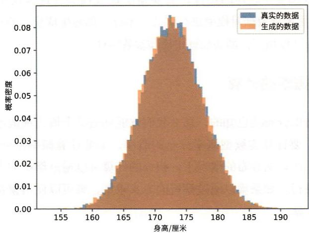  
图2-8 身高数据的直方图（蓝色为真实的数据，橙色为生成的数据）

从图2-8中可以看出，两个分布在大体上是重合的。我们的生成模型能够生成符合观测数据特征的新数据。这里生成的是“身高数据”这种简单的一维数据，本书后面的步骤将介绍的复杂的生成模型能够生成“新的图像（如人脸图像）”这种复杂的多维数据（参见图2-9）。

  
图2-9 由生成模型生成的新的人脸图像（图片引用自参考文献[3]）

要生成图2-9这样的图像，需要精心设计模型（这里使用了深度学习），并利用大量数据对模型进行训练。不过，创建生成模型的过程与处理身高数据的过程相同，都要经过建模和参数估计。

# 2.4.2 概率的计算

如果概率分布是已知的，那么我们就能知道某个值出现或不出现的概率有多大。要计算连续型概率分布的概率，需要计算概率密度 $p(x)$ 的积分。另外，在正态分布的情况下，积分的计算可以通过解析的方式，即通过数学式进行。如果难以通过解析的方式求解，则可以使用蒙特卡洛方法进行近似计算。


蒙特卡洛方法是使用随机数近似地求解数值问题的方法的总称。蒙特卡洛方法适用于没有解析解的计算或高维积分等场景。5.1.3节将介绍蒙特卡洛方法。

SciPy库提供了一个通过解析的方式求正态分布的积分的函数，也就是下面这个正态分布的累积分布函数（cumulative distribution function）。

```txt
scipy.stats(norm.cdf(x, loc=θ, scale=1) 
```

参数loc是均值，scale是标准差。当我们向函数输入合适的标量 $x$ 时，返回值是出现小于或等于 $x$ 的值的概率。这个函数的使用方法如下所示。

```python
from scipy.stats import norm  
x = 1.0  
p = norm.cdf(x, loc=0, scale=1)  
print(p) # 0.8413447460685429 
```

运行上面的代码，得到的结果是 $\mathsf{p}$ 为 $0.84\dots$ 。这个值表示 $x\leqslant 1$ 区间的标准正态分布的面积，如图2-10所示。这个面积代表 $x\leqslant 1$ 的概率。

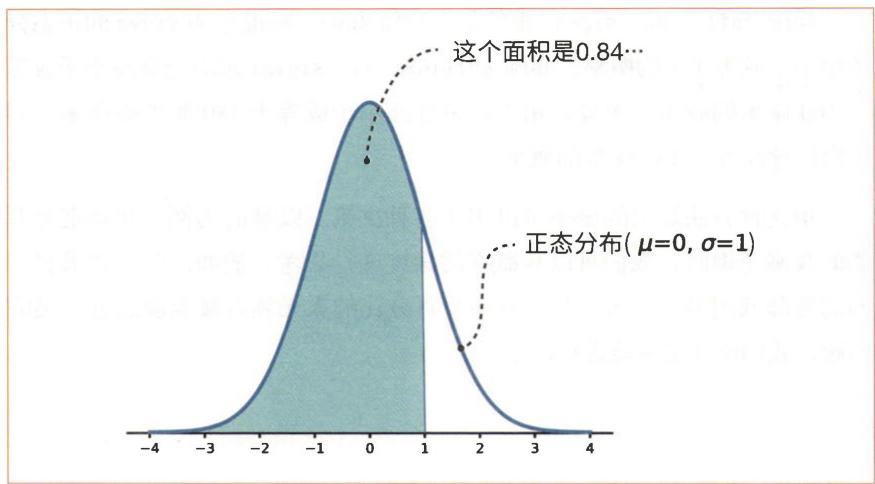  
图2-10 正态分布（均值为0，标准差为1）在 $x \leq 1$ 区间的面积

使用SciPy的cdf函数，还可以计算身高数据的正态分布的概率。例如，我们可以编写以下代码。

step02/prob.py   
import os   
import numpy as np   
from scipy.stats import norm   
path $=$ os.path.join(os.pathdirname(_file_, 'height.txt')   
xs $=$ np.loadtxt(path)   
mu $=$ np.mean(xs)   
sigma $=$ np.std(xs)   
p1 $=$ norm.cdf(160, mu, sigma)   
print('p(x <= 160):', p1)   
p2 $=$ norm.cdf(180, mu, sigma)   
print('p(x > 180):', 1-p2)

# 运行结果

$\mathsf{p}(\mathsf{x}\leqslant 160)$ ：0.004271406830855 $\mathsf{p}(\mathsf{x} > 180)$ ：0.06541774339950823

norm.cdf(x, mu, sigma) 求的是在均值为 mu、标准差为 sigma 的正态分布中小于或等于 x 的概率。norm.cdf(160, mu, sigma) 求的是身高小于或等于 160 厘米的概率。另外，用 1 减去身高小于或等于 180 厘米的概率，即可得出身高大于 180 厘米的概率。

用这种方法算出的概率可以用于各种决策。以身高为例，在确定要考虑的身高范围时，我们可以从概率的角度进行思考。例如，对于如果将门的高度降低到多少厘米，那么有多少百分比的人无须弯腰就能通过之类的问题，我们就能定量地进行评估了。代找电子书资源，新书可代做扫描制作加微信 asxiao90

前面我们看到的正态分布是单个实数值（标量）的正态分布。本步骤将研究由多个实数值组成的向量的正态分布，即多维正态分布。在本步骤中，我们将首先复习向量和矩阵等相关基础知识，然后学习多维正态分布的可视化和最大似然估计的方法。

# 3.1 NumPy 和多维数组

在本书接下来的内容中，向量和矩阵将频繁出现。因此，我们先来复习一下相关知识，以为后面的内容做准备。

# 3.1.1 多维数组

多维数组是用于汇总处理多个值（元素）的数据结构。元素的排列是有方向的，这个方向称为“维度”或“轴”。图3-1展示了多维数组的示例。

1标量

（1）23向量

列 12 行3456矩阵

图3-1 标量、向量和矩阵的示例

图3-1中从左到右依次是零维数组、一维数组和二维数组，它们分别被称为“标量”“向量”和“矩阵”。标量只表示一个数。向量是沿一个轴排列的数的序列。矩阵是沿两个轴排列的数的序列。矩阵的水平序列叫作行（row），垂直序列叫作列（column）。图3-1中的矩阵是3行2列的矩阵，也称为“ $3 \times 2$ 矩阵”。


多维数组也叫作张量。图3-1中的示例从左到右依次是零维张量、一维张量和二维张量。

向量虽然是一个简单的概念，但需要注意的是，它的表示方法有两种。如图3-2所示，一种方法是以垂直序列表示向量（列向量），另一种方法是以水平序列表示向量（行向量）。

$$
\left( \begin{array}{c} 1 \\ 2 \\ 3 \end{array} \right)
$$

列向量

(1 2 3)

行向量

本书将向量作为列向量进行处理。此外，在数学式中书写向量和矩阵时，本书使用 $x$ 和 $\pmb{W}$ 这样的黑斜体字来表示它们，以区别于标量。

在处理向量时，特别需要注意“维度”的使用。例如，图3-2中的向量也被称为“三维向量”，因为它有3个元素。向量的维度指的是向量中元素的数量。而在提到三维数组时，数组的维度指的是轴的数量（并不是元素的数量），也就是3。

  
图3-2 向量的表示方法

在Python代码中，通过将向量作为矩阵来处理，可以明确区分是将其视为“列向量”还是“行向量”。如果将一个有 $N$ 个元素的向量作为行向量进行处理，那么它就会变形为 $1 \times N$ （1行 $N$ 列）形状的矩阵；如果将其作为列向量进行处理，那么它就会变形为 $N \times 1$ （ $N$ 行1列）形状的矩阵。

# 3.1.2 NumPy 中的多维数组

下面我们来使用 NumPy 创建向量和矩阵。代码如下所示。

```python
step03/numpy BASIS.py
import numpy as np
x = np.array([1, 2, 3])
print(x.__class__) # 类名
print(x.shape) # 形状
print(x(ndim) # 维度 
```

# 运行结果

```asm
<class 'numpy.ndarray'>  
(3,)  
1 
```

如上面的代码所示，我们可以使用 np.array() 函数来创建向量和矩阵。这个函数会创建表示多维数组的 np.ndarray 实例。np.ndarray 实例有许多有用的方法和实例变量，该示例代码中使用了实例变量 .shape 和 .ndim。.shape 表示多维数组的形状，.ndim 表示维度。从运行结果可知，x 是一维数组，其元素数是 3。因此，我们可知它是一个向量。二维数组的示例代码如下所示。

```python
step03/numpy BASIS.py W = np.array([[1,2,3], [4,5,6]]) print(W.ndim) print(W.shape) 
```

# 运行结果

```txt
2 (2,3) 
```

从运行结果可知，w是二维数组，是 $2\times 3$ 矩阵。

# 3.1.3 逐元素的运算

我们已将数的集合汇总为多维数组。下面我们将利用它们进行简单的计算。首先是逐元素的运算。示例代码如下所示。

```batch
step03/numpy BASIS.py 
```

```python
W = np.array([[1, 2, 3], [4, 5, 6])
X = np.array([[0, 1, 2], [3, 4, 5]])
print(W + X)
print('-')
print(W * X) 
```

# 运行结果

```txt
[[135] [7911]]   
[026] [122030] 
```

上面的代码对相同形状的 NumPy 多维数组进行了 + 和 * 等四则运算。这些运算是多维数组的每个元素上进行的，而且每个元素都是独立运算的。这就是 NumPy 多维数组的逐元素的运算。顺带一提，逐元素的乘积也叫作 “阿达马积”（Hadamard product）。接下来我们将介绍向量的内积和矩阵积。

# 3.1.4 向量的内积和矩阵积

这里的运算用到的是元素数为 $D$ 的两个向量 $\pmb{x}$ 和 $\pmb{y}$ 。

$$
\boldsymbol {x} = \left( \begin{array}{c} x _ {1} \\ x _ {2} \\ \vdots \\ x _ {D} \end{array} \right) \quad \boldsymbol {y} = \left( \begin{array}{c} y _ {1} \\ y _ {2} \\ \vdots \\ y _ {D} \end{array} \right)
$$

向量的内积的数学式如下所示。

$$
\boldsymbol {x} \cdot \boldsymbol {y} = x _ {1} y _ {1} + x _ {2} y _ {2} + \dots + x _ {D} y _ {D}
$$

如上式所示，向量的内积是两个向量之间对应元素的乘积之和。

接下来是矩阵积。矩阵积的计算方法如图3-3所示

$$
\begin{array}{c} 1 \times 5 + 2 \times 7 \\ \left( \begin{array}{l l} 1 & 2 \\ 3 & 4 \end{array} \right) \left( \begin{array}{l l} 5 & 6 \\ 7 & 8 \end{array} \right) = \left( \begin{array}{l l} 1 9 & 2 2 \\ 4 3 & 5 0 \end{array} \right) \end{array}
$$

$$
\begin{array}{c c} \boldsymbol {A} & \boldsymbol {B} \end{array}
$$

图3-3 矩阵积的计算方法

如图3-3所示，矩阵积是通过左侧矩阵的行向量（水平向量）和右侧矩阵的列向量（垂直向量）的内积计算出来的。计算的结果存储在新矩阵的相应元素中。例如， $A$ 的第1行和 $\pmb{B}$ 的第1列的结果会存入第1行第1列的元素中， $A$ 的第2行和 $\pmb{B}$ 的第1列的结果会存入第2行第1列的元素中，以此类推。

下面我们来实现向量的内积和矩阵积。这个计算可以使用np.dot()。

step03/numpy BASIS.py

# 向量的内积

$$
a = n p. a r r a y ([ 1, 2, 3 ])
$$

$$
b = n p. a r r a y ([ 4, 5, 6 ])
$$

$$
y = n p. d o t (a, b)
$$

$$
\operatorname {p r i n t} (y)
$$

#矩阵积

$$
A = n p. a r r a y ([ [ 1, 2 ], [ 3, 4 ] ])
$$

$$
B = n p. a r r a y ([ [ 5, 6 ], [ 7, 8 ] ])
$$

$$
Y = n p. d o t (A, B)
$$

$$
\operatorname {p r i n t} (Y)
$$

# 运行结果

32

[[1922]

[43 50]

如上面的代码所示，向量的内积和矩阵积的计算都可以使用np.dot()。

如果 np.dot(x, y) 的参数都是一维数组，那么就计算向量的内积；如果 np.dot(x, y) 的参数都是二维数组，那么就计算矩阵积。此外，通过 @ 运算符，也可以用同样的方式计算向量的内积和矩阵积。

```txt
a@b #与np.dot(a，b）相同A@B #与np.dot(A，B）相同 
```

此外，如图3-4所示，在矩阵积的计算过程中，要特别注意“形状”。

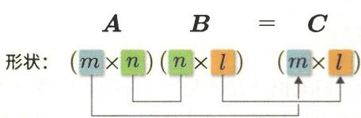  
图3-4 在矩阵积的计算中，对应维度（本例中为 $n$ ）的元素个数需相等

在图3-4的例子中， $m \times l$ 矩阵 $C$ 是由 $m \times n$ 矩阵 $A$ 和 $n \times l$ 矩阵 $B$ 的乘积计算得出的。正如图中所示，矩阵 $A$ 和矩阵 $B$ 的对应维度的元素个数（ $n$ ）必须相等，而矩阵 $C$ 的形状由矩阵 $A$ 的行数和矩阵 $B$ 的列数决定。

# 3.2 多维正态分布概述

到目前为止，我们看到的正态分布都是单个实数（标量）的分布。例如，我们用正态分布表示了身高的分布，它是将“身高”这个观测值作为对象的。下一个需要考虑的问题是由多个实数值组成的向量的正态分布。例如，我们将身高和体重视为如下所示的一个向量。

$$
\boldsymbol {x} = \left( \begin{array}{l} {\text {身 高}} \\ {\text {体 重}} \end{array} \right)
$$

通过这样将它们组合成向量的方式（例如，A的数据是(175厘米, 50千克)，B的数据是(160厘米, 53千克)），就可以得到每个人的测量数据。用正态分布来表示由这些向量组成的数据分布是本节的主题（参见图3-5）。

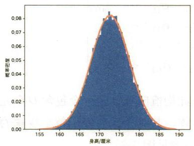

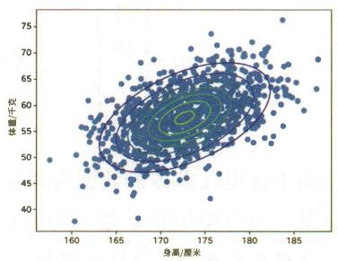  
图3-5 一维正态分布（左）和二维正态分布（右）的示例

图3-5中的左图称为“一维正态分布”，右图称为“二维正态分布”。这里的维度指的是向量的维度。由于标量可被视为一维向量，因此以标量为对象的正态分布称为“一维正态分布”。

# 3.2.1 多维正态分布的数学式

这里以下面的随机变量 $x$ 作为对象。

$$
\boldsymbol {x} = \left( \begin{array}{c} x _ {1} \\ x _ {2} \\ \vdots \\ x _ {D} \end{array} \right)
$$

$\pmb{x}$ 是汇总了 $D$ 个随机变量的向量。这个 $\pmb{x}$ 并非来自同一分布的 $D$ 个独立样本。 $\pmb{x}$ 的每个元素都是相互关联的数据（如身高和体重）。 $\pmb{x}$ 的正态分布的数学式如下所示。

$$
\mathcal {N} (x; \boldsymbol {\mu}, \Sigma) = \frac {1}{\sqrt {(2 \pi) ^ {D} | \Sigma |}} \exp \left\{- \frac {1}{2} (x - \boldsymbol {\mu}) ^ {\top} \Sigma^ {- 1} (x - \boldsymbol {\mu}) \right\} \tag {3.1}
$$

式3.1中进行了行列式 $|\Sigma|$ 、转置 $(x - \mu)^{\top}$ 、逆矩阵 $\Sigma^{-1}$ 等计算。稍后我们将介绍这些计算的方法。在这个式子中，我们需要注意的是 $\pmb{\mu}$ 和 $\pmb{\Sigma}$ 。 $\pmb{\mu}$ 称为均值向量， $\pmb{\Sigma}$ 称为协方差矩阵。 $\pmb{\Sigma}$ 是大写的希腊字母“西格玛”，通常用来表示协方差矩阵。 $\pmb{\mu}$ 和 $\pmb{\Sigma}$ 的元素构成如下所示。

$$
\boldsymbol {\mu} = \left( \begin{array}{c} \mu_ {1} \\ \mu_ {2} \\ \vdots \\ \mu_ {D} \end{array} \right) \quad \Sigma = \left( \begin{array}{c c c c} \sigma_ {1 1} & \sigma_ {1 2} & \dots & \sigma_ {1 D} \\ \sigma_ {2 1} & \sigma_ {2 2} & \dots & \sigma_ {2 D} \\ \vdots & \vdots & \ddots & \vdots \\ \sigma_ {D 1} & \sigma_ {D 2} & \dots & \sigma_ {D D} \end{array} \right)
$$

由于这里以 $D$ 维的数据为对象，因此均值向量 $\mu$ 是一个包含 $D$ 个元素的向量。协方差矩阵 $\Sigma$ 是一个 $D \times D$ 矩阵，其对角元素表示每个变量的方差，非对角元素表示变量之间的协方差（参见图3-6）。

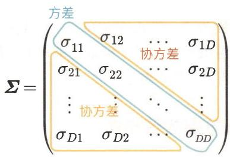  
图3-6 协方差矩阵的元素

假设有随机变量 $x_{i}$ 和 $x_{j}$ 。如图3-6所示，随机变量 $x_{i}$ 的方差为 $\sigma_{ii}$ 。 $\sigma_{ii}$ 的值决定了 $x_{i}$ 数据的“分散”程度。随机变量 $x_{i}$ 和 $x_{j}$ 的协方差用 $\sigma_{ij}$ 表示。 $\sigma_{ij}$ 决定了两个变量之间的关联。

接下来，我们将对多维正态分布的式3.1中所使用的以下4个术语进行补充说明。

协方差   
- 转置   
行列式  
- 逆矩阵

# 1.协方差（covariance）

首先复习一下随机变量 $x_{i}$ 的方差，它可以通过以下式子求得。

$$
\operatorname {V a r} \left[ x _ {i} \right] = \mathbb {E} \left[ \left(x _ {i} - \mu_ {i}\right) ^ {2} \right]
$$

协方差是方差的泛化形式。这里用 $\mathrm{Cov}\left[x_i,x_j\right]$ 表示随机变量 $x_{i}$ 和 $x_{j}$ 的协方差，此时协方差的数学式如下所示。

$$
\operatorname {C o v} \left[ x _ {i}, x _ {j} \right] = \mathbb {E} \left[ \left(x _ {i} - \mu_ {i}\right) \left(x _ {j} - \mu_ {j}\right) \right] \tag {3.2}
$$

如果协方差数学式中的 $i = j$ ，则有 $\mathbb{E}\left[(x_i - \mu_i)(x_j - \mu_j)\right] = \mathbb{E}\left[(x_i - \mu_i)^2\right]$ 这就变成了方差的数学式。因此，协方差可以被看作方差的泛化形式。


即使交换参数，协方差的值也不变。也就是说， $\operatorname{Cov}[x_i, x_j] = \operatorname{Cov}[x_j, x_i]$ 。因此， $\pmb{\Sigma}$ 中的 $\sigma_{ij}$ 和 $\sigma_{ji}$ 的值相同。如果使用接下来将要介绍的转置符号，则有 $\pmb{\Sigma} = \pmb{\Sigma}^{\top}$ 。这样的矩阵称为对称矩阵（symmetric matrix）。

# 2. 转置（transpose）

$(x - \mu)^{\top}$ 中的 $\top$ 表示转置。矩阵转置的结果是矩阵的行和列交换后的矩阵，如图3-7所示。

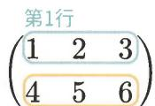  
第2行

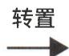

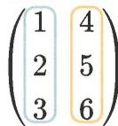  
第1列  
第2列  
图3-7 转置的示例

另外，对于向量的情况，列向量的转置为行向量，而行向量的转置为列向量（参见图3-8）。

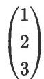  
列向量

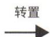  
(1 2 3)   
行向量

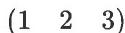  
行向量

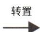

  
列向量  
图3-8 向量的转置

向量的内积也可以使用转置来表示。如果 $x$ 和 $y$ 是列向量，那么它们的内积可以表示为 $x^{\top}y$ 。


一个有 $D$ 个元素的列向量可以被看作 $D \times 1$ 矩阵。 $D \times 1$ 矩阵的转置是 $1 \times D$ 矩阵，也就是有 $D$ 个元素的行向量。这样一来，向量也可以被统一视为矩阵进行处理。

使用 NumPy 时，可以通过 .T 属性进行转置。下面是一个代码示例。

# 代码示例

```batch
step03/numpy_matrix.py 
```

```python
import numpy as np   
A = np.array([[1,2,3],[4,5,6]])   
print(A)   
print('----')   
print(A.T) 
```

# 运行结果

```txt
[[123][456]]  
---[14][25][36]] 
```

# 3.行列式（determinant）

$\left|\Sigma \right|$ 表示行列式。行列式是表示正方矩阵（行元素数等于列元素数的矩阵）的特征的一个指标。行列式是标量（单个值）。在本书中，行列式的计算方法并不重要，故在此省略。作为参考，接下来我们只介绍 $2\times 2$ 矩阵的行列式的计算方法。

$$
A = \left( \begin{array}{c c} a _ {1 1} & a _ {1 2} \\ a _ {2 1} & a _ {2 2} \end{array} \right)
$$

$$
\left| A \right| = a _ {1 1} a _ {2 2} - a _ {1 2} a _ {2 1}
$$

下面用具体的值来计算行列式。

$$
\boldsymbol {A} = \left( \begin{array}{l l} 3 & 4 \\ 5 & 6 \end{array} \right)
$$

$$
\left| A \right| = 3 \times 6 - 4 \times 5 = - 2
$$

上面计算的结果为-2，是标量值。 $D \times D$ （ $D > 2$ ）的行列式也同样是标量值。我们可以使用NumPy的np.linalg.det函数来计算行列式。

# 代码示例

step03/numpy_matrix.py

```txt
A = np.array([[3, 4], [5, 6]])
d = np.linalg.det(A)
print(d) 
```

# 运行结果

-1.9999999999999971

由于np.linalg.det函数的内部实现，结果出现了微小的数值误差<sup>1</sup>，这个值近似为-2。

# 4. 逆矩阵 (inverse matrix)

像 $\pmb{\Sigma}^{-1}$ 这样矩阵右上方带有-1的式子表示逆矩阵。逆矩阵只存在于行列式不为0的矩阵中，并且其与原矩阵的乘积为单位矩阵。这个数学式如下所示。

$$
A A ^ {- 1} = A ^ {- 1} A = I
$$

$$
\boldsymbol {I} = \left( \begin{array}{c c c c} 1 & 0 & \dots & 0 \\ 0 & 1 & \dots & 0 \\ \vdots & \vdots & \ddots & \vdots \\ 0 & 0 & \dots & 1 \end{array} \right)
$$

式子中的 $I$ 表示单位矩阵。单位矩阵是所有对角线上元素为1、其他元素为0的正方矩阵。逆矩阵的计算方法并不属于本书的范畴，故在此省略。作为参考，这里只介绍 $2 \times 2$ 矩阵的逆矩阵的计算方法。

$$
\boldsymbol {A} = \left( \begin{array}{l l} a _ {1 1} & a _ {1 2} \\ a _ {2 1} & a _ {2 2} \end{array} \right)
$$

$$
A ^ {- 1} = \frac {1}{| A |} \left( \begin{array}{c c} a _ {2 2} & - a _ {1 2} \\ - a _ {2 1} & a _ {1 1} \end{array} \right)
$$

使用具体的值计算逆矩阵的计算过程如下所示。

$$
A = \left( \begin{array}{c c} 3 & 4 \\ 5 & 6 \end{array} \right)
$$

$$
\begin{array}{l} A ^ {- 1} = \frac {1}{3 \times 6 - 4 \times 5} \left( \begin{array}{l l} 6 & - 4 \\ - 5 & 3 \end{array} \right) \\ = \left( \begin{array}{c c} - 3 & 2 \\ 2. 5 & - 1. 5 \end{array} \right) \\ \end{array}
$$

我们可以使用 NumPy 的 np.linalg.inv() 函数求出逆矩阵。

# 代码示例

step03/numpy_matrix.py   
A $\equiv$ np.array([3,4],[5,6])   
B $=$ np.linalg.inv(A)   
print(B)   
print('---')   
print(A@B)

# 运行结果

```latex
[ \begin{bmatrix} -3.2. \\ [2.5 -1.5] \end{bmatrix} ]  
---  
[ \begin{bmatrix} 1.0000000e + 00 & -8.8817842e - 16 \\ 0.0000000e + 00 & 1.0000000e + 00 \end{bmatrix} ] 
```

# 3.2.2 多维正态分布的实现

下面进行多维正态分布的实现。这里我们将再次列出数学式，然后编写代码。

$$
\mathcal {N} (\boldsymbol {x}; \boldsymbol {\mu}, \boldsymbol {\Sigma}) = \frac {1}{\sqrt {(2 \pi) ^ {D} | \boldsymbol {\Sigma} |}} \exp \left\{- \frac {1}{2} (\boldsymbol {x} - \boldsymbol {\mu}) ^ {\top} \boldsymbol {\Sigma} ^ {- 1} (\boldsymbol {x} - \boldsymbol {\mu}) \right\} \tag {3.1}
$$

```batch
step03/humpy_matrix.py 
```

```python
def multivariate_normal(x, mu, cov):  
    det = np.linalg.det(cov)  
    inv = np.linalg.inv(cov)  
    D = len(x)  
    z = 1 / np.sqrt((2 * np.pi) ** D * det)  
    y = z * np.exp((x - mu).T @ inv @ (x - mu) / -2.0)  
    return y 
```

代码中的3个参数 $x$ 、mu和cov都是ndarray实例。这3个参数的形状应符合表3-1的要求。

表 3-1 3 个参数  

<table><tr><td>参数</td><td>形状(D为大于或等于1的整数)</td></tr><tr><td>x</td><td>(D,1)或(D,)</td></tr><tr><td>mu</td><td>(D,1)或(D,)</td></tr><tr><td>cov</td><td>(D,D)</td></tr></table>

x和mu的形状是(D，1)，明显是列向量。此外，由于NumPy的特性，在这种情况下，即使x和mu的形状为(D,)，也能正确进行计算。接下来是multivariate_normal函数的使用，对二维向量使用该函数的代码如下所示。

```batch
step03/numpy_matrix.py 
```

```txt
\(\mathbf{x} = \mathbf{np}\) .array([[0],[0]]) #或者写为np.array([0,0])  
mu \(=\) np.array([[1],[2]]) #或者写为np.array([1,2])  
cov \(=\) np.array([[1,0],  
\[0,1]\)]  
y \(=\) multivariate_normal(x，mu，cov)  
print(y) 
```

# 运行结果

[0.01306423]]

上面的代码设置了均值向量 mu 和协方差矩阵 cov 的值，算出了在 $(\theta, \theta)$ 处的概率密度。如结果所示，概率密度的输出是一个单一元素，可以视为标量值。

# 3.3 二维正态分布的可视化

下面我们来绘制二维正态分布的图形。首先介绍使用Matplotlib绘制三维图形的方法。

# 3.3.1 三维图形的绘制方法

使用Matplotlib绘制三维图形时用到的是plot_surface()函数。以下是该函数的使用示例。

```python
import numpy as np  
import matplotlib.pyplot as plt  
X = np.array([[ -2, -1, 0, 1, 2], [-2, -1, 0, 1, 2], [-2, -1, 0, 1, 2], [-2, -1, 0, 1, 2], [-2, -1, 0, 1, 2]])  
Y = np.array([[ -2, -2, -2, -2, -2], [-1, -1, -1, -1, -1], [0, 0, 0, 0, 0], [1, 1, 1, 1, 1], [2, 2, 2, 2, 2]])  
Z = X ** 2 + Y ** 2  
ax = plt.axes(projection='3d') #通过projection='3d'指定三维图形  
ax.plot_surface(X, Y, Z, cmap='viridis') #使用viridis这种颜色映射  
ax.set_label('x')  
ax.set_ylabel('y')  
ax.set_zlabel('z')  
plt.show() 
```

在上面的代码中，需要注意的是ax.plot_surface(X, Y, Z, cmap='viridis')的参数。参数X、Y和Z都是形状为(5，5)的二维数组。上面代码中的X和Y与图3-9中的网格点相对应。

  
图3-9 与X和Y相对应的网格点

然后在 $Z$ 中设置每个网格点的第三个维度的值。例如，由于 $X[\theta, \theta]$ 为 $-2, Y[\theta, \theta]$ 也为 $-2$ ，因此将 $Z[\theta, \theta]$ 设置为 $x = -2$ 和 $y = -2$ 时的 $z$ 值。代码中通过 $Z = X^{**}2 + Y^{**}2$ 进行逐元素的运算，因此所有网格点的值会一次性计算出来。

运行上述代码，可以得到图3-10所示的图形。

  
图3-10 Matplotlib绘制的三维图形

由于这里绘制的是 $5 \times 5$ 的网格点，因此我们得到的是一个有棱角的三维图形。通过减小网格点之间的间距可以绘制出更平滑的图形。此时可以用到的一个非常有用的函数是 npmeshgrid()。使用示例如下所示。

```txt
step03/plot_3d.py 
```

```matlab
xs = np.arange(-2, 2, 0.1)  
ys = np.arange(-2, 2, 0.1)  
X, Y = npmeshgrid(xs, ys)  
Z = X ** 2 + Y ** 2  
ax = plt.axes(projection='3d')  
ax.plot_surface(X, Y, Z, cmap='viridis')  
ax.set_xlabel('x')  
ax.set_ylabel('y')  
ax.set_zlabel('z')  
plt.show() 
```

上面的代码通过 np range(-2, 2, 0.1) 生成了以 0.1 为增量的从 -2 到 2 的一系列数。具体生成的是一维数组 [-2, -1.9, -1.8, ..., 1.8, 1.9] (不包含 2)。如果将这个一维数组传给 npmeshgrid()，它就会以二维数组的形式生成与三维图形相对应的网格点。实际生成的数组如表 3-2 所示。

表 3-2 生成的数组  

<table><tr><td>变量名</td><td>数组</td><td>形状</td></tr><tr><td>xs</td><td>[-2, -1.9, -1.8, ..., 1.9]</td><td>(40,)</td></tr><tr><td>ys</td><td>[-2, -1.9, -1.8, ..., 1.9]</td><td>(40,)</td></tr><tr><td>X</td><td>[[-2, -1.9, -1.8, ..., 1.9],[-2, -1.9, -1.8, ..., 1.9],...,-1.9, -1.8, ..., 1.9]]</td><td>(40, 40)</td></tr><tr><td>Y</td><td>[[-2, -2, -2, ..., -2],[-1.9, -1.9, -1.9, ..., -1.9],...,[1.9, 1.9, 1.9, ..., 1.9]]</td><td>(40, 40)</td></tr></table>

然后使用这些更细粒度的网格点进行绘制，便可得到图3-11所示的平滑的图形。

  
图3-11 更细粒度的三维图形

# 3.3.2 等高线的绘制

plot(surface() 绘制的是函数的曲面 (surface)。除此之外，还有一种函数的表示方法是“等高线”。使用 contour() 函数可以绘制等高线。代码如下所示。

step03/plot_3d.py $\begin{array}{rl} & {\mathrm{x} = \mathrm{np}.arange(-2,2,\theta .1)}\\ & {\mathrm{y} = \mathrm{np}.arange(-2,2,\theta .1)}\\ & {\mathrm{X},\mathrm{Y} = \mathrm{np}.meshgrid(x,y)}\\ & {\mathrm{Z} = \mathrm{X}^{**}\mathrm{Z} + \mathrm{Y}^{**}\mathrm{Z}} \end{array}$ ax $=$ plt.axes() ax.contour(X,Y,Z) ax.set_xlabel('x') ax.set_ylabel('y') plt.show()

如图3-12所示，我们以等高线的形式绘制了图形。

  
图3-12 等高线的图形

# 3.3.3 二维正态分布的图形

下面将二维正态分布进行可视化。在此之前，我们再来看一下多维正态分布的数学式。

$$
\mathcal {N} (\boldsymbol {x}; \boldsymbol {\mu}, \boldsymbol {\Sigma}) = \frac {1}{\sqrt {(2 \pi) ^ {D} | \boldsymbol {\Sigma} |}} \exp \left\{- \frac {1}{2} (\boldsymbol {x} - \boldsymbol {\mu}) ^ {\top} \boldsymbol {\Sigma} ^ {- 1} (\boldsymbol {x} - \boldsymbol {\mu}) \right\} \tag {3.1}
$$

代码如下所示。

import numpy as np   
import matplotlib.pyplot as plt   
def multivariate_normal(x, mu, cov): det $=$ np.linalg.det(cov) inv $=$ np.linalg.inv(cov) D $=$ len(x) $\texttt{z} = 1 / \texttt{np.sqrt} ((2*\texttt{np.pi})\texttt{**}\texttt{D} *\texttt{det})$ y $=$ z \* np.exp((x - mu).T @ inv @ (x - mu) / -2.0) return y   
mu $=$ np.array([0.5, -0.2])   
cov $=$ np.array([[2.0, 0.3], [0.3, 0.5]])

step03/plot_norm.py

xs $=$ ys $=$ np.arange(-5,5,0.1)   
X,Y $=$ npmeshgrid(xs,ys)   
Z $=$ np.zeros_like(X)   
for i in range(X.shape[0]): for j in range(X.shape[1]): $\mathbf{x} =$ np.array([X[i,j],Y[i,j]]) Z[i,j] $=$ multivariate_normal(x,mu,cov)   
fig $=$ plt.figure()   
ax1 $=$ fig.add_subplot(1,2,1,projection $\coloneqq$ 3d') ax1.set_xlabel('x')   
ax1.set_ylabel('y')   
ax1.set_zlabel('z')   
ax1.plot(surface(X,Y,Z,cmap $\equiv$ 'viridis')   
ax2 $=$ fig.add_subplot(1,2,2)   
ax2.set_xlabel('x')   
ax2.set_ylabel('y')   
ax2.contour(X,Y,Z)   
plt.show()

上述代码的运行结果如图3-13所示。


  
图3-13 正态分布的三维图形（左）及其等高线（右）

上面的代码使用 fig.add_subplot() 在一个画板上绘制了多个图形。参数的传递方式是像 fig.add_subplot(1, 2, 1, ...) 这样的，即需要传给函

数3个整数。前两个参数决定了绘图画板要被分为多少行和多少列，其中第一个参数对应的是分割的行数，第二个参数对应的是分割的列数。第三个参数指定了即将绘制的图形所在的分割区域的编号。这里绘图画板被分为1行2列，左侧的分割区域的编号是1，右侧的编号是2。

上面的代码的均值向量是 $(0.5, -0.2)$ ，“山顶”位于这个位置。此外，协方差矩阵还决定了“山体”的广度。 $\operatorname{cov}[\theta, \theta]$ 表示 $x$ 的方差，即 $x$ 方向的广度。 $\operatorname{cov}[1, 1]$ 表示 $y$ 的方差，即 $y$ 方向的广度。 $\operatorname{cov}[\theta, 1]$ 和 $\operatorname{cov}[1, \theta]$ 表示 $x$ 和 $y$ 的协方差。由于协方差矩阵是对称矩阵（ $\Sigma = \Sigma^{\top}$ ），因此 $\operatorname{cov}[\theta, 1]$ 和 $\operatorname{cov}[1, \theta]$ 被设置为相同的值。


协方差表示两个变量之间的关联性。如果协方差为正，则表明当一个变量增大时，另一个变量也趋于增大。这叫作“正相关”。如果协方差为负，则表明当一个变量增大时，另一个变量趋于减小。这叫作“负相关”。如果协方差接近于0，则表明两个变量之间没有关联。

接下来，为了研究协方差矩阵的作用，我们在改变协方差矩阵的值的同时，绘制了一些二维正态分布的等高线（参见图3-14）。


  
图3-14 不同的协方差矩阵的等高线差异

图3-14中的等高线展示了二维正态分布如何随协方差矩阵的不同设置而变化。当协方差矩阵的对角元素（方差）较大时，分布沿其轴线的跨度会更大。另外，如果非对角元素（协方差）为正值，则分布将沿着 $y = x$ 的线倾斜。这意味着两个变量之间存在正相关关系。反之，如果协方差为负值，则分布将沿着 $y = -x$ 的线倾斜，这表明两个变量之间存在负相关关系。

# 3.4 多维正态分布的最大似然估计

前面我们对一维正态分布进行了最大似然估计。在本节中，我们将对多维正态分布进行最大似然估计。

# 3.4.1 进行最大似然估计

首先，我们给出 $D$ 维向量 $\pmb{x}$ 的正态分布的数学式（ $\pmb{\mu}$ 是均值向量， $\pmb{\Sigma}$ 是协方差矩阵）。

$$
\mathcal {N} (x; \boldsymbol {\mu}, \Sigma) = \frac {1}{\sqrt {(2 \pi) ^ {D} | \Sigma |}} \exp \left\{- \frac {1}{2} (x - \boldsymbol {\mu}) ^ {\top} \Sigma^ {- 1} (x - \boldsymbol {\mu}) \right\}
$$

然后，我们探讨从这个正态分布得到样本 $\mathcal{D} = \left\{\pmb{x}^{(1)},\pmb{x}^{(2)},\dots ,\pmb{x}^{(N)}\right\}$ 的情况。得到这个样本的概率密度的数学式如下所示。

$$
\begin{array}{l} p (\mathcal {D}; \boldsymbol {\mu}, \Sigma) = \mathcal {N} (\boldsymbol {x} ^ {(1)}; \boldsymbol {\mu}, \Sigma) \mathcal {N} (\boldsymbol {x} ^ {(2)}; \boldsymbol {\mu}, \Sigma) \dots \mathcal {N} (\boldsymbol {x} ^ {(N)}; \boldsymbol {\mu}, \Sigma) \\ = \prod_ {n = 1} ^ {N} \mathcal {N} \left(\boldsymbol {x} ^ {(n)}; \boldsymbol {\mu}, \boldsymbol {\Sigma}\right) \\ \end{array}
$$

$p(\mathcal{D};\boldsymbol {\mu},\boldsymbol {\Sigma})$ 是参数为 $(\mu ,\Sigma)$ 时得到样本 $\mathcal{D}$ 的概率密度。我们也可以把它看作以 $(\mu ,\Sigma)$ 为参数的函数。在这种情况下， $p(\mathcal{D};\boldsymbol {\mu},\boldsymbol {\Sigma})$ 被称为“似然”。在最大似然估计中，需要找到使似然最大的参数。不过，由于取似然的对数在计算上更加方便，因此我们把 $L(\boldsymbol {\mu},\boldsymbol {\Sigma}) = \log p(\mathcal{D};\boldsymbol {\mu},\boldsymbol {\Sigma})$ 作为计算对象。此时，似然取最大值的位置可以通过求解以下式子得出。

$$
\frac {\partial L}{\partial \boldsymbol {\mu}} = \mathbf {0} \quad \frac {\partial L}{\partial \boldsymbol {\Sigma}} = \mathbf {0}
$$

需要注意的是，这里 $L(\pmb {\mu},\pmb {\Sigma})$ 是标量， $\pmb{\mu}$ 是向量， $\pmb{\Sigma}$ 是矩阵。 $\frac{\partial L}{\partial\pmb{\mu}}$ 是 $L(\pmb {\mu},\pmb {\Sigma})$ 关于 $\pmb{\mu}$ 的偏导数，而 $\frac{\partial L}{\partial\Sigma}$ 是 $L(\pmb {\mu},\pmb {\Sigma})$ 关于 $\pmb{\Sigma}$ 的偏导数。像 $\frac{\partial L}{\partial\pmb{\mu}}$ 或 $\frac{\partial L}{\partial\Sigma}$ 这样的关于向量或矩阵的偏导数也称为梯度（gradient）。这些偏导数的元素如下所示。

$$
\boldsymbol {\mu} = \left( \begin{array}{c} \boldsymbol {\mu} _ {1} \\ \boldsymbol {\mu} _ {2} \\ \vdots \\ \boldsymbol {\mu} _ {D} \end{array} \right) \quad \frac {\partial L}{\partial \boldsymbol {\mu}} = \left( \begin{array}{c} \frac {\partial L}{\partial \boldsymbol {\mu} _ {1}} \\ \frac {\partial L}{\partial \boldsymbol {\mu} _ {2}} \\ \vdots \\ \frac {\partial L}{\partial \boldsymbol {\mu} _ {D}} \end{array} \right)
$$

$$
\Sigma = \left( \begin{array}{c c c c c} \sigma_ {1 1} & \dots & \sigma_ {1 i} & \dots & \sigma_ {1 D} \\ \vdots & \ddots & & & \vdots \\ \sigma_ {i 1} & & \sigma_ {i i} & & \sigma_ {i D} \\ \vdots & & & \ddots & \vdots \\ \sigma_ {D 1} & \dots & \sigma_ {D i} & \dots & \sigma_ {D D} \end{array} \right) \frac {\partial L}{\partial \Sigma} = \left( \begin{array}{c c c c c} \frac {\partial L}{\partial \sigma_ {1 1}} & \dots & \frac {\partial L}{\partial \sigma_ {1 i}} & \dots & \frac {\partial L}{\partial \sigma_ {1 D}} \\ \vdots & \ddots & & & \vdots \\ \frac {\partial L}{\partial \sigma_ {i 1}} & & \frac {\partial L}{\partial \sigma_ {i i}} & & \frac {\partial L}{\partial \sigma_ {i D}} \\ \vdots & & & \ddots & \vdots \\ \frac {\partial L}{\partial \sigma_ {D 1}} & \dots & \frac {\partial L}{\partial \sigma_ {D i}} & \dots & \frac {\partial L}{\partial \sigma_ {D D}} \end{array} \right)
$$

$\frac{\partial L}{\partial \mu} = 0$ 和 $\frac{\partial L}{\partial \Sigma} = 0$ 这两个方程可以用解析的方式求解。这里只给出结果。推导过程见附录A，如果你对此感兴趣，可以进行参考。求解这两个方程可以得到下列式子。

$$
\hat {\boldsymbol {\mu}} = \frac {1}{N} \sum_ {n = 1} ^ {N} \boldsymbol {x} ^ {(n)} \tag {3.3}
$$

$$
\hat {\boldsymbol {\Sigma}} = \frac {1}{N} \sum_ {n = 1} ^ {N} \left(\boldsymbol {x} ^ {(n)} - \hat {\boldsymbol {\mu}}\right) \left(\boldsymbol {x} ^ {(n)} - \hat {\boldsymbol {\mu}}\right) ^ {\top} \tag {3.4}
$$

这就是通过最大似然估计得出的结果。作为参考，表3-3展示了上述公式中出现的向量的形状。

表 3-3 向量的形状  

<table><tr><td>向量</td><td>形状</td></tr><tr><td>x(n)</td><td>D×1</td></tr><tr><td>x(n)-μ</td><td>D×1</td></tr><tr><td>(x(n)-μ)T</td><td>1×D</td></tr></table>

另外，从图3-15可知， $\left(\pmb{x}^{(n)} - \hat{\pmb{\mu}}\right)\left(\pmb{x}^{(n)} - \hat{\pmb{\mu}}\right)^{\top}$ 的形状为 $D\times D$

$$
\left(\boldsymbol {x} ^ {(n)} - \hat {\boldsymbol {\mu}}\right) \left(\boldsymbol {x} ^ {(n)} - \hat {\boldsymbol {\mu}}\right) ^ {\top}
$$

D×1 1×D （D×D）

图3-15 $\left(x^{(n)} - \hat{\mu}\right)\left(x^{(n)} - \hat{\mu}\right)^{\top}$ 的形状

# 3.4.2 最大似然估计的实现

接下来，我们将对式3.3和式3.4进行编码。下面是使用了模拟数据的代码。

```python
import numpy as np   
np.random.seed(0)   
N = 10000   
D = 2   
xs = np.random.randint(N, D) #从均匀分布生成的模拟数据   
mu = np.sum(xs, axis=0) ①   
mu /= N   
cov = 0   
for n in range(N): x = xs[n] z = x - mu z = z[;, np.newaxis] ② cov += z @ z.T 
```

$\mathrm{cov} / = \mathrm{N}$ print(mu) print(cov)

# 运行结果

```json
[0.49443495 0.49726356]  
[[0.08476319 -0.00023128] [-0.00023128 0.08394656]] 
```

上面代码中的 xs 是从范围为 0 到 1 的均匀分布生成的随机数，其形状为 (N, D)。这是一个有 N 个向量且每个向量有 D 个元素（D 维向量）的数据结构。对这个数据进行最大似然估计，可以得到最优参数 mu 和 cov。对于上面的代码，这里补充以下两点。

1 np.sum(xs, axis=θ)

通过参数 $axis = 0$ ，求沿第0轴的总和。对于形状为(N，D)的二维数组，第0轴指的是N这个轴（维度）。

2z[:,np.newaxis]

添加一个新轴。这里，z的形状原本是(D,)，但通过 $z[:, np$ .newaxis]操作后，其形状变成了(D,1)。

另外，上面的代码是优先考虑可读性而编写的，我们也可以使用 NumPy 的函数来改写代码，如下所示。

$\mathsf{mu} = \mathsf{np}$ .mean(xs，axis $= 0$ ）cov $=$ np.cov(xs，rowvar $=$ False)

np.mean()用于计算均值。通过指定参数axis=0，可以沿着第0轴计算均值。np.cov()用于计算协方差矩阵。通过指定参数rowvar=False，可以将每一行视为一个数据来计算协方差矩阵。rowvar的默认值为True，如果值为True，则np.cov()会将每一列作为一个数据来计算协方差矩阵。


在1.4.3节中，我们知道了范围为0到1的均匀分布的均值和方差分别为 $\frac{1}{2}$ 和 $\frac{1}{12} = 0.083\cdots$ 。从上面的运行结果来看，mu的每个元素约为 $\frac{1}{2}$ ，cov的对角元素约为0.083。另外，由于np.random.randint(N, D)生成的张量的各元素彼此独立，因此cov的非对角元素的值接近0。

# 3.4.3 使用真实数据

下面我们使用真实数据对多维正态分布进行最大似然估计。这里我们继续使用步骤2中用到的SOCR Data[2]数据集（步骤2只从该数据集中提取了“身高”数据）。这里我们将使用“身高”和“体重”的成对数据。数据位于step03/height_weight.txt文件中。这个数据集中包含25000个“身高和体重”的数据。首先加载数据。

```txt
step03/plot_dataset.py 
```

import os   
import numpy as np   
import matplotlib.pyplot as plt   
path $=$ os.path.join(os.path途径name(_file)，'height_weight.txt') xs $=$ np.loadtxt(path)   
print(xs.shape)

# 运行结果

(25000，2)

xs的形状是(25000，2)，这表明有25000个由身高和体重组成的向量。下面将这些数据绘制成散点图。这里我们取出25000个数据的前500个（xs[:500]）进行绘制。

```txt
step03/plot_dataset.py 
```

```python
small_xs = xs[:500]  
pltscatter(small_xs[:, 0], small_xs[:, 1])  
plt.xlabel('Height(cm)')  
pltylabel('Weight(kg)')  
plt.show() 
```

使用pltscatter()函数可以绘制散点图。上面代码中的X[:，0]和X[:，1]用于提取列数据。运行代码后，结果如图3-16所示。

代找电子书资源，新书可代做扫描制作加微信 asxiao90

  
图3-16 身高和体重的散点图

从图3-16可以看出身高和体重呈相关分布，而且看起来可以用二维正态分布来很好地表示这种分布。下面我们来进行最大似然估计。代码如下所示。

```txt
step03/mle.py 
```

$\mathsf{mu} = \mathsf{np}$ .mean(xs，axis $= 0$ ）cov $=$ np.cov(xs，rowvar $=$ False)

接下来绘制通过最大似然估计得到的正态分布。结果如图3-17所示（代码在step03/mle.py中）。


  
图3-17 正态分布的三维图（左）及其等高线（右）

图3-17的结果表明该分布很好地拟合了数据。这样一来，即使是多维数据，只要符合正态分布，我们也可以对其进行建模。

# 高斯混合模型

正态分布在我们身边随处可见。然而，有许多现象无法用单个正态分布来表示。接下来我们要做的就是将多个正态分布结合起来，这样就可以表示多个峰值，实现更加复杂的表达。这种模型称为“高斯混合模型”。高斯混合模型广泛用于统计学和机器学习，并且也是数据生成的重要方法。

# 4.1 我们身边的多峰分布

在现实生活中，具有多个峰值的分布颇为常见，这些分布被称为“多峰分布”。本节将介绍我们身边的一些多峰分布的例子。此外，我们还会给出具体的多峰数据集，并通过可视化的方式来展示它们。

# 1. 混合性别的身高分布

我们知道，对于特定的年龄和性别的人群（比如17岁的男性），他们的身高呈正态分布。那么，在性别不受限制的男女混合的情况下，身高分布又是怎样的呢？图4-1展示了17岁的日本男性和女性的身高分布。从该图可以看出，男性和女性的身高峰值是不同的。对于这个总体，最好将其作为拥有两个峰值的分布进行建模。

  
图4-1 17岁男性和17岁女性的身高分布（数据来自2016年日本学校健康统计调查[1，图形基于该数据绘制）

# 2.蚂蚁的体长

设想我们进行这样一个实验：捕获一只只蚂蚁并测量它们的体长。许多实验结果表明，蚂蚁体长的分布呈现多峰性（参见图4-2）。由于蚂蚁的体型因其角色而异，因此从整个蚂蚁族群来看，体长的分布由多个峰值组成。

  
图4-2蚂蚁体长的分布（图形基于参考文献[4]绘制）

# 3.间歇泉喷发

定期喷发热水的温泉叫作“间歇泉”。美国黄石国家公园有一个著名的

间歇泉，叫作“老忠实间歇泉”（Old Faithful Geyser）。这个间歇泉的喷发是有规律的，从中也可以观察到多峰分布（参见图4-3）。


  
图4-3 老忠实间歇泉（左）和间歇泉喷发的散点图（右）（图片引用自维基百科）

图4-3的右图显示了一段时间内记录的272个数据，横轴代表喷发持续时间，纵轴代表喷发间隔时间。可以看出，喷发持续时间大致为 $1.5\sim 5$ 分钟，喷发间隔时间为 $50\sim 90$ 分钟。

# 多峰分布的数据集

下面是用Python读取图4-3的老忠实间歇泉数据集的代码。数据集在step04/old_faithful.txt文件中。首先从文件的读取开始。

import os   
import numpy as np   
import matplotlib.pyplot as plt   
#文件路径的设置   
path $=$ os.path.join(os.pathdirname(_file_, 'old_faiuthful.txt') xs $=$ np.loadtxt(path)   
print(xs.shape)   
print(xs[0])

step04/old_faithful.py

# 运行结果

```txt
(272, 2)  
[3.6 79.] 
```

上面的代码将数据集读取为 np.ndarray 实例，其中包含 272 个二维数据，形状为 (272, 2)。第一个数据是 [3.679.]，表示喷发持续时间为 3.6 分钟，距离下一次喷发的间隔时间为 79 分钟。接下来绘制 272 个数据的图形。代码如下，散点图如图 4-4 所示。

```txt
step04/old_faithful.py 
```

```txt
pltscatter(xs[0], xs[1])  
plt.xlabel('Eruptions(Min)') # 喷发持续时间（分钟）  
pltylabel('Waiting(Min)') # 喷发间隔时间（分钟）  
plt.show()
```

  
图4-4 老忠实间歇泉喷发的散点图

这样我们就完成了数据集的读取和散点图的绘制。

# 4.2 高斯混合模型的数据生成

在现实生活中，我们可以看到多峰性的数据分布。这种多峰性分布可

以通过组合多个正态分布来表示。由多个正态分布组成的模型称为高斯混合模型（Guussian Mixture Model），有时我们也用GMM来称呼它。

接下来，我们的目标是创建基于GMM的生成模型，这将涉及以下两项任务。

(1)建模：假设观测数据的分布可以用GMM表示。  
(2)参数估计：估计GMM的参数。

通过这两个步骤就可以创建基于GMM的生成模型。另外，在完成参数估计后，还可以应用训练后的GMM生成新的数据（参见图4-5）。

  
图4-5GMM的参数估计和数据生成

麻烦的是，GMM的参数估计非常难。它无法通过最大似然估计以解析的方式求解，而必须依靠EM算法这样的复杂算法。我们将在步骤5中详细介绍EM算法。这里先介绍如何使用GMM生成数据。假设GMM的参数估计已经完成，接下来我们将使用参数估计后的GMM生成数据。

# 4.2.1 利用GMM生成数据

本节将介绍生成图4-6所示数据的过程。

  
图4-6 由GMM生成的样本的散点图

图4-6中的数据可以通过以下步骤生成。

准备两个正态分布。

重复：

① 基于某个概率分布，从两个正态分布中选择一个；  
② 基于所选的正态分布生成数据。

首先，准备两个正态分布。然后，在重复处理的过程中，执行由两个阶段构成的处理：从多个正态分布中选择其中一个，再基于这个正态分布生成数据。重复这两个阶段的处理，就可以得到图4-6所示的样本。

# 4.2.2 生成数据的代码

生成图4-6中样本的代码如下所示。

step04/gmm_sampling.py

import numpy as np

# $= = = = =$ 训练后的参数

$\mathsf{m}\mathsf{u}\mathsf{s} = \mathsf{n}\mathsf{p}$ .array([2.0，54.50]，

[4.3,80.0])   
covs $=$ np.array([[0.07，0.44]， [0.44，33.7]， [[0.17，0.94]， [0.94，36.00]]）   
phis $=$ np.array([0.35，0.65])   
#   
def sample(): $\mathbf{z} =$ np.random.choice(2,p=phis) ① mu，cov $=$ mus[z]，covs[z] $\mathbf{x} =$ np.random.multivariate_normal(mu，cov） ② returnx

在上面的代码中，两个正态分布的参数分别为 mus 和 covs。均值向量被汇总到 mus 中，协方差矩阵被汇总到 covs 中。例如， $\mathbf{mus}[\theta]$ 和 $\mathbf{covs}[\theta]$ 对应于第一个正态分布的参数。此外，phis 表示每个正态分布被选中的概率，它的值是 [0.35, 0.65]，这意味着第一个正态分布被选中的概率为 0.35，第二个正态分布被选中的概率为 0.65。然后按以下步骤进行采样。

1 np.random.choice(2, p=his)

根据 phis 指定的概率分布对 0 或 1 进行采样。phis 中每个元素的和必须设为 1，否则会出错。

2 np.random.multivariate_normal(mu, cov)

从多维正态分布中采样一个数据。

代码中实现的 sample() 函数用于对一些数据进行采样。下面是采样 500 个数据并绘制散点图的代码。

step04/gmm_sampling.py   
```python
N = 500  
xs = np.zeros((N, 2))  
for i in range(N):  
    xs[i] = sample()  
pltscatter(xs[:, 0], xs[:, 1], color='orange', alpha=0.7)  
plt.xlabel('x')  
plt.ylabel('y')  
plt.show() 
```

运行此代码后会得到一张有两个“簇”的散点图（参见图4-6）。

# 4.3 GMM的数学式

在4.2节中，我们通过GMM生成了数据。我们的下一个目标是用数学式来表示GMM。我们先做一些准备，复习一下“联合概率”和“条件概率”等概念。

# 4.3.1 概率的复习

假设有随机变量 $x$ 和 $y$ 。在这种情况下， $p(x, y)$ 是 $x$ 和 $y$ 同时发生的概率，称为联合概率（joint probability）。 $p(x)$ 或 $p(y)$ 则是指 $x$ 或 $y$ 单独发生的概率，称为边际概率（marginal probability）。

从联合概率中去掉某些随机变量，就可以得到边际概率。这就是边际化(marginalization)。如果 $y$ 是离散变量，那么边际化的式子如下所示。

$$
p (x) = \sum_ {y} p (x, y)
$$

如果 $y$ 是连续变量，那么边际化的式子如下所示。

$$
p (x) = \int p (x, y) d y
$$

条件概率（conditional probability）表示在特定条件下的概率，其数学式为 $p(x|y)$ ，意思是在 $y$ 已经发生的情况下， $x$ 发生的概率。

最后再介绍一下概率论中的一个重要定理——乘法定理。

$$
p (x, y) = p (x \mid y) p (y)
$$

上面这个乘法定理能够把联合概率、边际概率和条件概率这3种概率联系起来。以上就是要复习的概率的内容。

# 4.3.2 GMM的数学式

首先回顾一下GMM的内容。GMM通过以下步骤生成数据。

准备 $K$ 个正态分布。

重复：

1 基于某个概率分布，从 $K$ 个正态分布中选择其中一个；  
② 基于所选的正态分布生成数据。

①是从多个候选分布中选择一个的行为。这一行为相对应的概率分布是图4-7所示的分类分布（categorical distribution）。

  
图4-7 参数为 $\phi = (0.35, 0.65)$ 的分类分布

分类分布的数学式如下所示。

$$
p (z = k; \phi) = \phi_ {k} \tag {4.1}
$$

式4.1中的 $z$ 是离散型随机变量，取1和 $K$ 之间的整数 $k$ 。 $\phi$ 读作fai，表示分类分布的参数。具体来说，它有 $K$ 个值，即 $\phi = (\phi_1,\phi_2,\dots ,\phi_K)$ ，其中 $\phi_{K}$ 是第 $k$ 个类别出现的概率。例如，两类别的分类分布的参数为 $\phi = (0.35,0.65)$


分类分布的参数 $\phi = (\phi_{1},\phi_{2},\dots ,\phi_{K})$ 必须满足以下条件：

对于所有 $k$ ， $\phi_{K}\geqslant 0$ （所有元素均大于或等于0）；  
$\sum_{k = 1}^{K}\phi_{k} = 1$ （所有元素之和为1）。

接下来是多个正态分布的数学式。这里准备如下所示的 $K$ 个正态分布的参数。

$$
\boldsymbol {\mu} = \left(\boldsymbol {\mu} _ {1}, \boldsymbol {\mu} _ {2}, \dots , \boldsymbol {\mu} _ {K}\right)
$$

$$
\boldsymbol {\Sigma} = \left(\boldsymbol {\Sigma} _ {1}, \boldsymbol {\Sigma} _ {2}, \dots , \boldsymbol {\Sigma} _ {K}\right)
$$

如果一共有两个二维正态分布，那么它们的图形如图4-8所示。

  
$\mathcal{N}(\pmb {x};\pmb {\mu}_1,\pmb {\Sigma}_1)$

  
$\mathcal{N}(\pmb {x};\pmb {\mu}_2,\pmb {\Sigma}_2)$   
图4-8 两个正态分布的示例

这里考虑准备了 $K$ 个正态分布的情况。在这种情况下， $z$ 的取值决定了所使用的正态分布。例如，当 $z = k$ 时， $x$ 服从的概率分布就是第 $k$ 个正态分布。因此，有下面的式子成立。

$$
p (\boldsymbol {x} \mid z = k; \boldsymbol {\mu}, \boldsymbol {\Sigma}) = \mathcal {N} (\boldsymbol {x}; \boldsymbol {\mu} _ {k}, \boldsymbol {\Sigma} _ {k}) \tag {4.2}
$$

生成模型的目标是表示观测数据 $x$ 的概率分布 $p(x)$ 。对于GMM的情况，通过概率边际化，可以使用 $p(x,z)$ 将 $p(x)$ 表示为以下式子。

$$
p (\boldsymbol {x}) = \sum_ {k = 1} ^ {K} p (\boldsymbol {x}, z = k)
$$

然后将联合概率 $p(x|z = k)$ 表示为以下式子。

$p(x,z = k) = p(z = k)p(x|z = k)$ （乘法定理）  
$= \phi_{k}\mathcal{N}\big(x;\pmb{\mu}_{k},\pmb{\Sigma}_{k}\big)$ （代入式4.1和式4.2）

基于以上数学式，可以将 $p(x)$ 表示为以下式子。

$$
p (\boldsymbol {x}) = \sum_ {k = 1} ^ {K} \phi_ {k} \mathcal {N} (\boldsymbol {x}; \boldsymbol {\mu} _ {k}, \boldsymbol {\Sigma} _ {k}) \tag {4.3}
$$

式4.3就是GMM的数学式，即每个正态分布都乘以权重 $\phi_{k}$ ，然后再相加。换言之，它表示的是正态分布的加权和。


在GMM中出现了两个随机变量： $x$ 和 $z$ 。在参数估计中， $x$ 对应于用于训练的观测数据，而 $z$ 并不在观测数据中。 $x$ 是观测值， $z$ 则不是。由于 $z$ 不是观测出来的，因此被称为潜变量（latent variable）。

# 4.3.3 GMM的实现

接下来进行GMM的实现。表示GMM的式4.3可以实现为如下代码。

```txt
step04/gmm.py 
```

import numpy as np   
import matplotlib.pyplot as plt   
mus $=$ np.array([[2.0,54.50], [4.3,80.0])   
covs $=$ np.array([[0.07,0.44], [0.44,33.7]],[[0.17,0.94], [0.94,36.00]]])   
phis $=$ np.array([0.35,0.65])   
def multivariate_normal(x, mu, cov): det $=$ np.linalg.det(cov) inv $=$ np.linalg.inv(cov) d $=$ len(x) $\texttt{z} = 1 / \texttt{np.sqrt((2\*np.pi)\*d\*det)}$ y $=$ z\* np.exp((x - mu).T @ inv @ (x - mu)/-2.0) return y   
def gmm(x,phis,mus,covs): K $=$ len(phis) y $= 0$ for k in range(K): phi, mu, cov $=$ phis[k], mus[k], covs[k] y $+ =$ phi \* multivariate_normal(x, mu, cov) 1 return y

在上面的代码中，①处的代码非常重要。在这里，我们将取出参数并计算正态分布的加权和。以上就是GMM的实现。接下来我们对GMM进行可视化。代码如下所示。

step04/gmm.py

```python
xs = np.arange(1, 6, 0.1)  
ys = np.arange(40, 100, 0.1)  
X, Y = npmeshgrid(xs, ys)  
Z = np.zeros_like(X)  
for i in range(X.shape[0]):  
    for j in range(X.shape[1]):  
        x = np.array([X[i, j], Y[i, j]])  
        Z[i, j] = gmm(x, this, mus, covs)  
fig = plt.figure()  
ax1 = fig.add_subplot(1, 2, 1, projection='3d')  
ax1.set_xlabel('x')  
ax1.set_ylabel('y')  
ax1.set_zlabel('z')  
ax1.plot(surface(X, Y, Z, cmap='viridis'))  
ax2 = fig.add_subplot(1, 2, 2)  
ax2.set_xlabel('x')  
ax2.set_ylabel('y')  
ax2.contour(X, Y, Z)  
plt.show() 
```

关于这段代码的说明，可以参见3.3节。运行结果如图4-9所示。


  
图4-9GMM的热力图（左）及其等高线（右）

如图4-9所示，我们完成了一个有两个峰值的分布的可视化。需要关注的是phis的设置值。这里phis=[0.35，0.65]，这表明峰值之间存在差异。

# 4.4 参数估计中的难点

我们已经学习了GMM。剩下的挑战是GMM的参数估计。但这个问题并不容易解决。本节将使用数学式来说明GMM参数估计的难点所在。

# GMM 的参数估计

GMM 的数学式如下所示（这里再次列出式 4.3）。

$$
p (\boldsymbol {x}) = \sum_ {k = 1} ^ {K} \phi_ {k} \mathcal {N} \left(\boldsymbol {x}; \boldsymbol {\mu} _ {k}, \boldsymbol {\Sigma} _ {k}\right) \tag {4.3}
$$

我们来思考一下获得了样本 $\mathcal{D} = \left\{\pmb{x}^{(1)},\pmb{x}^{(2)},\dots ,\pmb{x}^{(N)}\right\}$ 的情况。另外，参数 $\{\phi ,\mu ,\Sigma \}$ 汇总表示为 $\theta$ 。此时，似然 $p(\mathcal{D};\theta)$ 的数学式如下所示。

$$
\begin{array}{l} p (\mathcal {D}; \boldsymbol {\theta}) = p (x ^ {(1)}; \boldsymbol {\theta}) p (x ^ {(2)}; \boldsymbol {\theta}) \dots p (x ^ {(N)}; \boldsymbol {\theta}) \\ = \prod_ {n = 1} ^ {N} p \left(\boldsymbol {x} ^ {(n)}; \boldsymbol {\theta}\right) \\ \end{array}
$$

前面我们在步骤2中学习了最大似然估计。最大似然估计的目标是找到使似然最大的参数 $\theta$ 。但由于取对数后计算更方便，因此可以考虑将似然 $p(D;\theta)$ 的最大化问题替换为对数似然 $\log p(D;\theta)$ 的最大化问题。

$$
\begin{array}{l} \log p (\mathcal {D}; \boldsymbol {\theta}) = \log \sum_ {n = 1} ^ {N} p (x ^ {(n)}; \boldsymbol {\theta}) \\ = \sum_ {n = 1} ^ {N} \log p (x ^ {(n)}; \boldsymbol {\theta}) \\ = \sum_ {n = 1} ^ {N} \log \left(\sum_ {k = 1} ^ {K} \phi_ {k} \mathcal {N} \left(\boldsymbol {x} ^ {(n)}; \boldsymbol {\mu} _ {k}, \boldsymbol {\Sigma} _ {k}\right)\right) \tag {4.4} \\ \end{array}
$$

最大似然估计的目标是找到使 $\log p(\mathcal{D};\theta)$ 最大的参数 $\pmb{\theta}$ 。对于简单的问题，可以采用先求出参数的梯度，然后求解梯度为0时的方程的做法。对于这里的问题，可以采用以下方程（这里定义 $L(\pmb {\theta}) = \log p(\mathcal{D};\pmb {\theta}))$ 。

$$
\frac {\partial L}{\partial \phi} = \mathbf {0} \quad \frac {\partial L}{\partial \boldsymbol {\mu}} = \mathbf {0} \quad \frac {\partial L}{\partial \boldsymbol {\Sigma}} = \mathbf {0}
$$

如果能解出这3个方程自然最好，但可惜它们无法通过解析的方式求解。这是因为式4.4是“ $\log \sum$ ”的形式。这种形式也叫作“ $\log - \mathrm{sum}$ ”。 $\log - \mathrm{sum}$ 很难解析，在多数情况下无法通过解析的方式求解。sum-log则很容易解析。


如果 $K = 1$ （单个正态分布的情况），则式4.4可以通过解析的方式求解。正态分布是 $\exp (\dots)$ 的形式。如果只有一个正态分布，那么由于 $\log$ 和 $\exp$ 会相互抵消，因此式子就会变为简单的形式（也就可以通过解析的方式求解了）。但是，如果 $\log$ 中存在两个以上的正态分布，那么数学式就会变得复杂，因此也就无法通过解析的方式求解了。

GMM 的参数估计无法通过解析的方式求解。这时，EM 算法便能派上用场了。有了 EM 算法，对于 GMM 这样的拥有潜变量的模型，我们也能高效地求出使对数似然变大的参数。由于 EM 算法的相关知识较多，我们将在步骤 5 中集中进行学习。

本步骤的主题是EM算法（Expectation-Maximization Algorithm）[5]，使用它可以高效地对GMM进行参数估计。本步骤将推导并实现EM算法。

# 5.1 KL散度

KL散度（Kullback-LeiblerDivergence，KLD）在EM算法的推导过程中发挥着重要作用。作为推导的事先准备，本节将介绍KL散度。此外，由于接下来的内容中数学式将越来越多，这里我们对数学式的表示方法做两点变更。我们先来了解一下这些变更点。

# 5.1.1 关于数学式的表示方法

数学式表示方法的第一个变更点与“期望值”有关。假设有一个连续型随机变量 $x$ ，其概率密度表示为 $p(x)$ 。此时，函数 $f(x)$ 的期望值可以用下面的数学式表示。

$$
\mathbb {E} _ {p (x)} [ f (x) ] = \int f (x) p (x) d x
$$

到目前为止，我们一直将期望值写成 $\mathbb{E}\big[f(x)\big]$ 的形式，但从现在开始，它将被写成上面式子中的 $\mathbb{E}_{p(x)}\big[f(x)\big]$ 的形式。这种表示方法清晰地表明它是关于 $p(x)$ 的期望值。以此类推，关于概率分布 $q(x)$ 的期望值可以用下面的数学式表示。

$$
\mathbb {E} _ {q (x)} [ f (x) ] = \int f (x) q (x) d x
$$

第二个变更点是参数的表示位置。之前持有参数 $\theta$ 的概率分布表示为 $p(x;\theta)$ 的形式。从现在起，我们也将同时使用 $p_{\theta}(x)$ 的形式。虽然 $\theta$ 的表示位置不同，但两种表示方法指的是同一个数学式（参见图5-1）。

  
图5-1 数学式表示方法的变更点

以上就是对数学式表示方法的变更点的说明。接下来是对KL散度的介绍。

# 5.1.2 KL散度的定义式

衡量两个概率分布之间差异的一种方法是KL散度。当给定两个概率分布 $p(x)$ 和 $q(x)$ 时，KL散度可以用下面的数学式表示。

$$
D _ {\mathrm {K L}} (p \| q) = \int p (x) \log \frac {p (x)}{q (x)} d x
$$

上面的式子是当 $x$ 为连续型随机变量时的KL散度。当 $x$ 为离散型随机变量时，数学式如下所示。

$$
D _ {\mathrm {K L}} (p \| q) = \sum_ {x} p (x) \log \frac {p (x)}{q (x)}
$$

KL散度具有以下特性：

两个概率分布的差异越大，KL散度的值就越大；

- KL散度的值大于或等于0，且仅当两个概率分布相同时，其值才为0；  
- KL散度是非对称的衡量指标，因此 $D_{\mathrm{KL}}(p\| q)$ 和 $D_{\mathrm{KL}}(q\| p)$ 的值不同。

这些特性使得KL散度可以用来衡量两个概率分布的差异程度。下面我们通过具体的例子来了解这些特性。这里以抛硬币为例进行说明。假设一枚硬币正面朝上和反面朝上的概率是确定的，如下所示。

<table><tr><td>正面朝上的概率</td><td>70%</td></tr><tr><td>反面朝上的概率</td><td>30%</td></tr></table>

这就是硬币的“真实概率分布”，在这里我们用符号 $p$ 来表示。假设有人对这枚硬币的概率分布做了如下估计。

<table><tr><td>正面朝上的概率</td><td>50%</td></tr><tr><td>反面朝上的概率</td><td>50%</td></tr></table>

我们用 $q$ 来表示这个估计的概率分布。此时，“真实概率分布 $p$ ”和“估计概率分布 $q$ ”之间的KL散度可以做如下计算。

$$
\begin{array}{l} D _ {\mathrm {K L}} (p \parallel q) = 0. 7 \log \frac {0 . 7}{0 . 5} + 0. 3 \log \frac {0 . 3}{0 . 5} \\ = 0. 0 8 2 \dots \\ \end{array}
$$

KL散度约为0.082。假设另一个人对这枚硬币的概率分布做了如下估计。

<table><tr><td>正面朝上的概率</td><td>20%</td></tr><tr><td>反面朝上的概率</td><td>80%</td></tr></table>

这与真实的概率分布值大相径庭。此时的KL散度的值如下所示。

$$
\begin{array}{l} D _ {\mathrm {K L}} (p \| q) = 0. 7 \log \frac {0 . 7}{0 . 2} + 0. 3 \log \frac {0 . 3}{0 . 8} \\ = 0. 5 8 \dots \\ \end{array}
$$

这个值比第一个KL散度的值要大。最后，假设又有一个人对这枚硬币的概率分布做了如下估计。

<table><tr><td>正面朝上的概率</td><td>70%</td></tr><tr><td>反面朝上的概率</td><td>30%</td></tr></table>

这个分布与真实的概率分布相同。此时的KL散度的值如下所示。

$$
\begin{array}{l} D _ {\mathrm {K L}} (p \| q) = 0. 7 \log \frac {0 . 7}{0 . 7} + 0. 3 \log \frac {0 . 3}{0 . 3} \\ = 0. 7 \log 1 + 0. 3 \log 1 \quad (\log 1 = 0) \\ = 0 \\ \end{array}
$$

由于 $p$ 和 $q$ 是相同的概率分布，因此KL散度为0。图5-2是对以上结果的汇总。

  
图5-2 3个KL散度的比较

从以上结果可以看出，KL散度可以用来衡量两个概率分布的差异程度。当两个概率分布相同时，KL散度取最小值0。两个概率分布的差异越大，KL散度的值就越大。

# 5.1.3 KL散度与最大似然估计之间的关系

下面我们补充介绍一下KL散度与最大似然估计之间的关系。再来看一个生成模型的问题设置。

假设有一个真实的概率分布 $p_{\bullet}(x)$ ，并且生成了样本数据 $\{x^{(1)},x^{(2)},\dots ,x^{(N)}\}$ 。我们想要做的是基于可由参数 $\theta$ 调整的概率分布 $p_{\theta}(x)$ ，创建尽可能接近 $p_{\bullet}(x)$ 的概率分布。在最大似然估计中，我们将以下对数似然作为目标函数（想要最大化的函数）。

$$
\log \prod_ {n = 1} ^ {N} p _ {\theta} (x ^ {(n)}) = \sum_ {n = 1} ^ {N} \log p _ {\theta} (x ^ {(n)})
$$

使这个对数似然最大化的参数 $\theta$ 可以由下面的数学式表示。

$$
\hat {\theta} = \arg \max  _ {\theta} \sum_ {n = 1} ^ {N} \log p _ {\theta} (x ^ {(n)}) \tag {5.1}
$$

$\arg \max_{\theta}$ 表示“使函数取最大值的参数 $\theta$ ”（最小值的情况为 $\arg \min_{\theta}$ ）。这里我们将展示通过KL散度推导出式5.1的过程。关键的思路是将“使 $p_{\theta}(x)$ 尽可能接近 $p_{*}(x)$ ”转换为“使 $p_{*}(x)$ 和 $p_{\theta}(x)$ 之间的KL散度最小”。 $p_{*}(x)$ 和 $p_{\theta}(x)$ 之间的KL散度的数学式如下所示。

$$
D _ {\mathrm {K L}} \left(p _ {*} \| p _ {\theta}\right) = \int p _ {*} (x) \log \frac {p _ {*} (x)}{p _ {\theta} (x)} \mathrm {d} x \tag {5.2}
$$

要计算式5.2，必须对所有的 $x$ 执行积分运算。然而，由于 $p_{*}(x)$ 的具体数学式未知，因此无法进行该计算。此时可以使用蒙特卡洛方法（MonteCarloMethod）进行近似计算。

蒙特卡洛方法是使用随机数来计算复杂的概率分布以及期望值等近似值的方法。蒙特卡洛方法通过使用随机生成的样本来模拟问题，并取这些样本所求结果的平均值来近似问题的解。接下来我们将介绍使用蒙特卡洛方法求出以下期望值的做法。

$$
\mathbb {E} _ {p _ {\bullet} (x)} [ f (x) ] = \int p _ {\bullet} (x) f (x) d x
$$

式子中的 $p_{*}(x)$ 是概率密度， $f(x)$ 是任意函数。使用蒙特卡洛方法，可以根据以下步骤来近似上面的式子。

(1) 基于概率分布 $p_{*}(x)$ 生成样本 $\left\{x^{(1)}, x^{(2)}, \dots, x^{(N)}\right\}$ 。  
(2) 求出每个数据 $x^{(i)}$ 对应的 $f(x^{(i)})$ ，并计算平均值。

经过这两个步骤，可以将上面的积分表示为近似值。数学式如下所示。

$$
\begin{array}{l} \mathbb {E} _ {p _ {*} (x)} [ f (x) ] = \int p _ {*} (x) f (x) d x \\ \approx \frac {1}{N} \sum_ {n = 1} ^ {N} f (x ^ {(n)}) \quad (x ^ {(n)} \sim p _ {*} (x)) \\ \end{array}
$$

$\approx$ 是表示近似相等的符号。 $x^{(n)} \sim p_{*}(x)$ 表示 $x^{(n)}$ 服从概率分布 $p_{*}(x)$ 。因此，使用蒙特卡洛方法可以近似得到函数 $f(x)$ 的期望值。接下来，将式5.2中的 $\log \frac{p_{*}(x)}{p_{\theta}(x)}$ 视为 $f(x)$ ，即令 $f(x) = \log \frac{p_{*}(x)}{p_{\theta}(x)}$ ，然后应用蒙特卡洛方法。

$$
\begin{array}{l} D _ {\mathrm {K L}} \left(p _ {*} \| p _ {\theta}\right) = \int p _ {*} (x) \underbrace {\log \frac {p _ {*} (x)}{p _ {\theta} (x)}} _ {f (x)} \mathrm {d} x (5.2) \\ \approx \frac {1}{N} \sum_ {n = 1} ^ {N} \underbrace {\log \frac {p _ {*} \left(x ^ {(n)}\right)}{p _ {\theta} \left(x ^ {(n)}\right)}} _ {f (x)} \quad \left(x ^ {(n)} \sim p _ {*} (x)\right) \\ = \frac {1}{N} \sum_ {n = 1} ^ {N} \left(\log p _ {\bullet} \left(x ^ {(n)}\right) - \log p _ {\theta} \left(x ^ {(n)}\right)\right) (5.3) \\ \end{array}
$$

这里的目标是求出使 $D_{\mathrm{KL}}(p_*\parallel p_\theta)$ 最小的 $\theta$ 。因此，式5.3中不包括 $\theta$ 的项可以忽略，进而有以下式子成立。

$$
\begin{array}{l} \underset {\theta} {\arg \min } D _ {K L} \left(p _ {*} \| p _ {\theta}\right) \approx \underset {\theta} {\arg \min } \left(- \frac {1}{N} \sum_ {n = 1} ^ {N} \log p _ {\theta} \left(x _ {n}\right)\right) \\ = \arg \min  _ {\theta} \left(- \sum_ {n = 1} ^ {N} \log p _ {\theta} \left(x _ {n}\right)\right) \\ = \arg \max  _ {\theta} \sum_ {n = 1} ^ {N} \log p _ {\theta} \left(x _ {n}\right) \\ \end{array}
$$

中间的式子将目标函数放大了 $N$ 倍，但这并不会改变使函数取最小值

的 $\theta$ 值（例如， $y = x^2$ 在 $x = 0$ 时取最小值，即使函数变为 $y = Nx^2$ ，使函数取最小值的 $x$ 依然是 $x = 0$ ）。另外，如果将目标函数进行正负变换，那么取最小值的参数（ $\arg \min$ ）就会变为取最大值的参数（ $\arg \max$ ）。综合以上信息，有以下式子成立。

$$
\underset {\theta} {\arg \min } D _ {\mathrm {K L}} (p _ {*} \| p _ {\theta}) \approx \underset {\theta} {\arg \max } \sum_ {n = 1} ^ {N} \log p _ {\theta} (x _ {n})
$$

式子左侧是KL散度最小时的 $\theta$ ，右侧是对数似然最大时的 $\theta$ 。这个式子表明二者相等。

# 5.2 EM 算法的推导①

我们接下来要解决的问题是GMM的参数估计。GMM是拥有潜变量的概率分布模型。拥有潜变量的模型多种多样，GMM是其中之一，如图5-3所示。

  
图5-3拥有潜变量的各种模型（HMM是“隐马尔可夫模型”的缩写，VAE是“变分自编码器”的缩写）

接下来我们将推导EM算法，但推导过程不会只以GMM这个特定的模型为对象，而是在更大范围上，以拥有潜变量的这种模型为对象。本节将按以下流程推进：首先以拥有潜变量的模型为对象推导EM算法，然后再将EM算法应用于GMM。


EM算法中的EM是Expectation-Maximization的缩写。EM算法对拥有潜变量的模型重复交替应用Expectation步骤和Maximization步骤，并更新模型的参数。

# 5.2.1 拥有潜变量的模型

这里用 $x$ 表示可观测的随机变量， $z$ 表示潜变量， $\theta$ 表示参数。利用概率的边际化，可以将单个数据的对数似然表示为下面的式子。

$$
\log p _ {\theta} (x) = \log \sum_ {z} p _ {\theta} (x, z)
$$

这里假定潜变量 $z$ 是离散型的，对于连续型的变量，只需将 $\sum_{z}$ 变为 $\int \mathrm{d}z$ 即可，之后的探讨是相同的。同样，这里假定 $x,z$ 和 $\theta$ 都是标量，但即使它们是向量，后面的探讨也是相同的。

接下来思考获得了样本 $\mathcal{D} = \left\{x^{(1)}, x^{(2)}, \dots, x^{(N)}\right\}$ 的情况。获得该样本时的对数似然的数学式如下所示。

$$
\begin{array}{l} \log p _ {\theta} (\mathcal {D}) = \log \left(p _ {\theta} \left(x ^ {(1)}\right) p _ {\theta} \left(x ^ {(2)}\right) \dots p _ {\theta} \left(x ^ {(N)}\right)\right) \\ = \sum_ {n = 1} ^ {N} \log p _ {\theta} \left(x ^ {(n)}\right) \\ = \sum_ {n = 1} ^ {N} \log \sum_ {z ^ {(n)}} p _ {\theta} \left(x ^ {(n)}, z ^ {(n)}\right) \\ \end{array}
$$

我们想将这个对数似然最大化，但由于现在式子是log-sum的形式，无法通过解析的方式求解。EM算法通过将其转换为sum-log的形式来解决这个问题。


在接下来的 EM 算法推导中，我们将以单个数据作为对象进行推导，而不使用 $N$ 个数据。在以单个数据为对象推导出 EM 算法之后，我们会将其扩展到 $N$ 个数据的情况。

下面我们探讨单个数据 $x$ 的对数似然 $\log p_{\theta}(x)$ 。 $\log p_{\theta}(x)$ 的图形具有复杂的形状，如图5-4所示。

  
图5-4 $\log p_{\theta}(x)$ 的图形的示意图

$\log p_{\theta}(x)$ 的形状之所以复杂，是因为它是下面这样的 $\log$ -sum的形式。

$$
\log p _ {\theta} (x) = \log \sum_ {z} p _ {\theta} (x, z)
$$

为了解决log-sum问题，我们首先使用概率的乘法定理来表示它。

$$
\log p _ {\theta} (x) = \log \frac {p _ {\theta} (x , z)}{p _ {\theta} (z \mid x)}
$$

乍一看似乎解决了log-sum问题，但条件概率 $p_{\theta}(z|x)$ 仍是“棘手的问题”。这是因为根据贝叶斯定理， $p_{\theta}(z|x)$ 可以表示为下面的式子。

$$
p _ {\theta} (z \mid x) = \frac {p _ {\theta} (x , z)}{\sum_ {z} p _ {\theta} (x , z)}
$$

由于 $\sum (\mathrm{sum})$ 出现在了上式的分母中，因此最终 $\log p_{\theta}(x)$ 仍然是 $\log \sum$ 的形式。

# 5.2.2 任意概率分布 $q(z)$

为了解决这个问题，我们引入 $q(z)$ 。 $q(z)$ 是任意的概率分布，我们将它用作棘手的 $p_{\theta}(z|x)$ 的近似分布。任意概率分布意味着任何概率分布都可以（参见图5-5）。


图5-5 棘手的 $p_{o}(z|x)$ 和它的替代物 $q(z)$

由于我们使用 $q(z)$ 替代了 $p_{\theta}(z|x)$ ，因此可以将式子展开成如下形式。

$$
\begin{array}{l} \log p _ {\theta} (x) = \log \frac {p _ {\theta} (x , z)}{p _ {\theta} (z \mid x)} \\ = \log \frac {p _ {\theta} (x , z)}{p _ {\theta} (z \mid x)} \frac {q (z)}{q (z)} \quad \left(\text {乘 以} \frac {q (z)}{q (z)} = 1\right) \\ = \log \frac {p _ {\theta} (x , z)}{q (z)} + \log \frac {q (z)}{p _ {\theta} (z | x)} \tag {5.4} \\ \end{array}
$$

如式5.4所示，通过乘以 $\frac{q(z)}{q(z)} = 1$ 的方式，我们引入了 $q(z)$ （乘以1不会改变数学式）。这样就将第一项中的 $p_{\theta}(z|x)$ 换成了 $q(z)$ 。但第二项中仍然存在棘手的 $p_{\theta}(z|x)$ 。

处理这个问题的窍门是“KL散度”。KL散度具有“当两个概率分布相同时，取最小值0”这一易于操作的特性。如果可以将第二项变形为KL散度的形式，那么我们就能看到解决问题的曙光了（参见图5-6）。


$$
D _ {\mathrm {K L}} (q (z) \parallel p _ {\theta} (z \mid x)) = \sum_ {z} q (z) \log \frac {q (z)}{p _ {\theta} (z \mid x)}
$$

图5-6 第二项和KL散度

我们接下来的目标是用KL散度表示第二项。为此可以将式子展开成如下形式。

$$
\begin{array}{l} \log p _ {\theta} (x) \\ = \log p _ {\theta} (x) \sum_ {z} q (z) \quad \left(\text {乘 以} \sum_ {z} q (z) = 1\right) \\ = \sum_ {z} q (z) \log p _ {\theta} (x) \quad \left(\text {将} \log p _ {\theta} (x) \text {放 入} \Sigma \text {中}\right) \\ = \sum_ {z} q (z) \left(\log \frac {p _ {\theta} (x , z)}{q (z)} + \log \frac {q (z)}{p _ {\theta} (z | x)}\right) \quad (\text {代 入 式} 5. 4) \\ = \sum_ {z} q (z) \log \frac {p _ {\theta} (x , z)}{q (z)} + \underbrace {\sum_ {z} q (z) \log \frac {q (z)}{p _ {\theta} (z \mid x)}} _ {\text {K L 散 度}} \\ = \sum_ {z} q (z) \log \frac {p _ {\theta} (x , z)}{q (z)} + D _ {\mathrm {K L}} (q (z) \| p _ {\theta} (z | x)) \tag {5.5} \\ \end{array}
$$

关键在于首先用 $\sum_{z}q(z) = 1$ 乘以 $\log p_{\theta}(x)$ 。由于 $q(z)$ 是概率分布，因此有 $\sum_{z}q(z) = 1$ 成立。式子后续的展开与之前相同。这样我们就成功地将第二项表示成了KL散度。这个式5.5就是用于EM算法推导的式子。

# 5.3 EM算法的推导②

目前得到的式子如下所示。

$$
\log p _ {\theta} (x) = \sum_ {z} q (z) \log \frac {p _ {\theta} (x , z)}{q (z)} + D _ {\mathrm {K L}} (q (z) \| p _ {\theta} (z | x)) \tag {5.5}
$$

下面继续探讨式5.5。

# 5.3.1 ELBO（证据下界）

首先观察式5.5的KL散度。虽然 $q(z)$ 是任意的概率分布，但不论它是什么概率分布，KL散度总是大于或等于0。由此可以得到下面的式子。

$$
\log p _ {\theta} (x) = \sum_ {z} q (z) \log \frac {p _ {\theta} (x , z)}{q (z)} + \underbrace {D _ {\mathrm {K L}} (q (z) \| p _ {\theta} (z | x))} _ {\geqslant 0} \tag {5.5}
$$

$$
\geqslant \sum_ {z} q (z) \log \frac {p _ {\theta} (x , z)}{q (z)}
$$

由于KL散度总是大于或等于0，因此式5.5的第一项总是小于或等于对数似然。所以，这一项被称为“ELBO”。ELBO是“Evidence Lower Bound”的缩写，意思是“证据下界”。


Evidence本来的意思是“证据”，这里的Evidence被用作对数似然 $\log p_{\theta}(x)$ 的别名。Evidence（证据）这一名称的由来是，对数似然变大是表明我们试图求出的 $q$ 和 $\theta$ 的方向是正确的证据。至于下界，当满足 $x\geqslant a$ 这一条件时，我们说“ $x$ 的下界是 $a$ ”。

由于式5.5中的第一项被称为ELBO，因此本书将使用以下表示方法。

$$
\operatorname {E L B O} (x; q, \theta) = \sum_ {z} q (z) \log \frac {p _ {\theta} (x , z)}{q (z)} \tag {5.6}
$$

这个 $\operatorname{ELBO}(x;q,\theta)$ 具有以下重要特征：

- 对数似然 $\log p_{\theta}(x)$ 总是大于或等于 $\operatorname{ELBO}(x;q,\theta)$ ;  
- 式5.5中的ELBO $(x;q,\theta)$ 是sum-log形式，易于解析。

由此可见，如果更新参数使得 $\operatorname{ELBO}(x;q,\theta)$ 变大，则 $\log p_{\theta}(x)$ 将变得更大。基于以上分析，可以考虑使用 $\operatorname{ELBO}(x;q,\theta)$ 作为优化的对象来替代棘手的 $\log p_{\theta}(x)$ 。


ELBO的另一种推导方法是使用“詹生不等式”。附录B介绍了这种方法。如果你对此感兴趣，可以进行参考。

# 5.3.2 进入EM算法

式5.6中的 $\operatorname{ELBO}(x;q,\theta)$ 有两个参数 $q(z)$ 和 $\theta$ 。这两个参数需要优化（找出使ELBO最大的两个参数）。然而，同时优化 $q(z)$ 和 $\theta$ 并不容易，因此需要重复进行固定一个参数并优化另一个参数的过程。具体来说就是重

复进行固定 $\theta$ 并更新 $q(z)$ ，然后固定 $q(z)$ 并更新 $\theta$ 的过程。通过重复进行这一过程，我们可以逐渐接近最优解。

首先将 $\theta$ 固定为当前值（假设此时 $\theta = \theta_{\mathrm{old}}$ ），然后考虑对 $q(z)$ 进行优化。 $q(z)$ 表示关于 $z$ 的任意概率分布。无论 $q(z)$ 是什么样的概率分布， $\log p_{\theta}(x) \geqslant \operatorname{ELBO}(x;q,\theta)$ 都成立。然而，不同的 $q(z)$ 的分布使得 $\operatorname{ELBO}(x;q,\theta)$ 与 $\log p_{\theta}(x)$ 的接近程度有所不同。当然，我们希望 $\operatorname{ELBO}(x;q,\theta)$ 尽可能地接近 $\log p_{\theta}(x)$ 。为此，下面的式子可作为提示。

$$
\log p _ {\theta} (x) = \operatorname {E L B O} (x; q, \theta) + D _ {\mathrm {K L}} (q (z) \| p _ {\theta} (z | x)) \tag {5.7}
$$

需要注意的是， $q(z)$ 并未出现在式5.7左侧的 $\log p_{\theta}(x)$ 中。重点在于，无论 $q(z)$ 如何变化，ELBO项和KL项的总和都始终保持不变（参见图5-7）。

  
图5-7 无论 $q(z)$ 如何变化，ELBO项和KL项的总和都始终保持不变

从图5-7可以看出，KL项越小，ELBO项就越大。当两个概率分布相同时，KL散度取最小值0。因此，当 $q(z) = p_{\theta}(z|x)$ 时，KL项为0，此时ELBO项最大。由于KL项实际上是0，因此 $\log p_{\theta}(x) = \mathrm{ELBO}(x;q,\theta)$

基于以上信息， $q(z)$ 的更新式可以表示为 $q(z) = p_{\theta}(z|x)$ 。更准确地说，由于 $\theta$ 固定为 $\theta = \theta_{\mathrm{old}}$ ，因此更新式是 $q(z) = p_{\theta_{\mathrm{old}}}(z|x)$ 。这种由 $q(z) = p_{\theta_{\mathrm{old}}}(z|x)$ 进行的更新是 EM 算法的“E 步骤”。E 来源于“Expectation Value”（期望值）中的 E。之所以称为“期望值”，是因为 $q(z) = p_{\theta_{\mathrm{old}}}(z|x)$ 时的 ELBO 可以表示为以下式子所示的期望值。

$$
\begin{array}{l} \operatorname {ELBO} \left(x; q = p _ {\theta_ {\text {o l d}}} (z | x), \theta\right) = \sum_ {z} p _ {\theta_ {\text {o l d}}} (z | x) \log \frac {p _ {\theta} (x , z)}{p _ {\theta_ {\text {o l d}}} (z | x)} \\ = \mathbb {E} _ {p _ {\theta_ {\mathrm {o l d}}}} (z | x) \left[ \log \frac {p _ {\theta} (x , z)}{p _ {\theta_ {\mathrm {o l d}}} (z | x)} \right] \tag {5.8} \\ \end{array}
$$

图5-8是E步骤更新的可视化图形。重要的一点是，当 $\theta = \theta_{\mathrm{old}}$ 时，ELBO和对数似然是相等的。

  
图5-8 E步骤中对数似然与ELBO的关系

接下来是关于 $\theta$ 的优化，这个过程很简单。由于ELBO是sum-log的形式，因此可以用解析的方式求出。具体来说，可以通过求式5.8关于 $\theta$ 的导数，并解出其为0的方程的做法来求出。这项任务是EM算法的“M步骤”。M是“Maximization”（最大化）的首字母，意思是使ELBO相对于 $\theta$ “最大化”（参见图5-9）。

  
图5-9 M步骤使ELBO相对于 $\theta$ 最大化

在E步骤中，通过更新 $q(z)$ 可以使ELBO更接近（等于） $\log p(x;\theta)$ 。而在M步骤中，通过更新 $\theta$ 可以增大ELBO的值，从而间接增大 $\log p(x;\theta)$ 的值。这就导致在E步骤中相等的 $\log p(x;\theta)$ 和ELBO的值相互远离。因此，我们需要再次执行E步骤，如此反复进行。通过这样交替执行E步骤和M步骤，就能使 $\log p(x;\theta)$ 逐渐增大（参见图5-10）。

  
图5-10 重复E步骤和M步骤

# EM算法中对数似然的单调递增性

作为EM算法的一个重要特性，以下式子总是成立（本节在最后会给出证明）。

$$
\log p (x; \theta_ {\text {n e w}}) \geqslant \log p (x; \theta_ {\text {o l d}})
$$

上式表示EM算法在每次更新时，对数似然总是单调递增。单调递增意味着对数似然在更新过程中不会减小。

如果继续无限次地更新EM算法，那么对数似然就会在某个时刻停止变化。由于继续更新下去也不会再更新模型的参数，因此此时EM算法的更新应该停止。在实践中，我们会设定一个阈值，当对数似然变化的绝对值低于设定的阈值时，更新的循环将终止。

# 5.3.3 扩展到多个数据

接下来，考虑将EM算法扩展到 $N$ 个观测数据 $\left\{x^{(1)},x^{(2)},\dots ,x^{(N)}\right\}$ 的情况。这里，我们为每个数据准备一个对应的概率分布，即 $\left\{q^{(1)},q^{(2)},\dots ,q^{(N)}\right\}$ 共 $N$ 个。于是，对数似然和ELBO的关系如下所示。

$$
\begin{array}{l} \sum_ {n = 1} ^ {N} \log \sum_ {z ^ {(n)}} p _ {\theta} (x ^ {(n)}, z ^ {(n)}) \geqslant \sum_ {n = 1} ^ {N} \operatorname {E L B O} (x ^ {(n)}; q ^ {(n)}, \theta) \\ = \sum_ {n = 1} ^ {N} \sum_ {z ^ {(n)}} q ^ {(n)} (z ^ {(n)}) \log \frac {p _ {\theta} (x ^ {(n)} , z ^ {(n)})}{q ^ {(n)} (z ^ {(n)})} \\ \end{array}
$$

与只有一个数据的情况的区别在于式子中附加了 $\sum_{n=1}^{N}$ 。剩下的就是ELBO的优化问题了，这很简单。之所以这么说，是因为我们知道只有一个数据时的最优概率分布 $q(z)$ 是 $p_{\theta}(z|x)$ 。因此，对于 $\left\{x^{(1)}, x^{(2)}, \dots, x^{(N)}\right\}$ 中的每个数据 $x^{(n)}$ ，其最优概率分布 $q^{(n)}(z)$ 为 $p_{\theta}(z|x^{(n)})$ 。

另外，在有 $N$ 个数据的情况下，下面式子中所表示的“对数似然的均值”可用作判断更新循环是否结束的对数似然。

$$
\frac {1}{N} \sum_ {n = 1} ^ {N} \log p (x ^ {(n)}; \theta)
$$

汇总以上信息，EM算法可以归纳如下。

(1)E步骤： $\left\{q^{(1)},q^{(2)},\dots ,q^{(N)}\right\}$ 的更新（ $\theta$ 是固定的）。

对于每个 $n$ ，有 $q^{(n)}(z) = p_{\theta}\left(z \mid x^{(n)}\right)$ 。

(2)M步骤： $\theta$ 的更新（ $\left\{q^{(1)},q^{(2)},\dots ,q^{(N)}\right\}$ 是固定的）。

通过解析的方式求使 $\sum_{n = 1}^{N}\mathrm{ELBO}\Big(x^{(n)};q^{(n)},\theta \Big)$ 最大的 $\theta$ 。

(3)终止判断：计算对数似然的均值，并与之前的对数似然进行比较。

# 5.3.4 $\log p(x;\theta_{\mathrm{new}})\geqslant \log p(x;\theta_{\mathrm{old}})$ 的证明★

最后进行 $\log p(x;\theta_{\mathrm{new}})\geqslant \log p(x;\theta_{\mathrm{old}})$ 的证明。首先，在E步骤中，当使用 $q_{\mathrm{old}}(z) = p_{\theta_{\mathrm{old}}}(z|x)$ 进行更新时，由于对数似然和ELBO相同，因此有以下式子成立。

$$
\log p (x; \theta_ {\text {o l d}}) = \operatorname {E L B O} (x; q _ {\text {o l d}}, \theta_ {\text {o l d}})
$$

在M步骤中，通过最大化上式的右边得到 $\theta_{\mathrm{new}}$ ，因此有以下式子成立。

$$
\operatorname {E L B O} \left(x; q _ {\text {o l d}}, \theta_ {\text {n e w}}\right) \geqslant \operatorname {E L B O} \left(x; q _ {\text {o l d}}, \theta_ {\text {o l d}}\right)
$$

在下一个E步骤中，通过 $q_{\mathrm{new}}(z) = p_{\theta_{\mathrm{new}}}(z|x)$ 进行更新。此时有以下式子成立。

$$
\begin{array}{l} \log p (x; \theta_ {\text {n e w}}) = \operatorname {E L B O} (x; q _ {\text {n e w}}, \theta_ {\text {n e w}}) \\ \geqslant \operatorname {E L B O} \left(x; q _ {\text {o l d}}, \theta_ {\text {n e w}}\right) \\ \end{array}
$$

综合以上式子，可以得到下面的式子。

$$
\begin{array}{l} \log p (x; \theta_ {\text {n e w}}) \geqslant \operatorname {E L B O} (x; q _ {\text {o l d}}, \theta_ {\text {n e w}}) \\ \geqslant \operatorname {E L B O} \left(x; q _ {\text {o l d}}, \theta_ {\text {o l d}}\right) \\ = \log p (x; \theta_ {\mathrm {o l d}}) \\ \end{array}
$$

这样我们就完成了 $\log p(x;\theta_{\mathrm{new}})\geqslant \log p(x;\theta_{\mathrm{old}})$ 的证明。

# 5.4 GMM和EM算法★

在5.3节中，我们推导出了拥有潜变量的模型的EM算法。本节将对GMM这个具体的模型应用EM算法。

# 5.4.1 EM算法的E步骤★

我们先来复习一下GMM。假设 $x$ 是观测变量， $z$ 是潜变量，并且 $z$ 是一个取值范围从1到 $K$ 的离散型随机变量。然后，我们将GMM的参数表示为 $\theta = \{\phi, \mu, \Sigma\}$ （为简化数学式，将3个参数汇总为 $\theta$ ）。这些参数都拥有 $K$ 个元素，如下所示。

$$
\begin{array}{l} \phi = \left\{\phi_ {1}, \phi_ {2}, \dots , \phi_ {K} \right\} \\ \boldsymbol {\mu} = \left\{\boldsymbol {\mu} _ {1}, \boldsymbol {\mu} _ {2}, \dots , \boldsymbol {\mu} _ {K} \right\} \\ \boldsymbol {\Sigma} = \left\{\boldsymbol {\Sigma} _ {1}, \boldsymbol {\Sigma} _ {2}, \dots , \boldsymbol {\Sigma} _ {K} \right\} \\ \end{array}
$$

此时的似然 $p(x;\theta)$ 如以下式子所示。

$$
\begin{array}{l} p (\boldsymbol {x}; \boldsymbol {\theta}) = \sum_ {j = 1} ^ {K} p (\boldsymbol {x}, z = j; \boldsymbol {\theta}) \\ = \sum_ {j = 1} ^ {K} p (z = j; \boldsymbol {\theta}) p (\boldsymbol {x} | z = j; \boldsymbol {\theta}) \\ = \sum_ {j = 1} ^ {K} \phi_ {j} \mathcal {N} \left(\boldsymbol {x}; \boldsymbol {\mu} _ {j}, \boldsymbol {\Sigma} _ {j}\right) \\ \end{array}
$$

考虑到后续的式子展开，这里使用符号 $j$ 来替代 $k$ 。

现在，假设我们获得了 $N$ 个观测数据 $\left\{\pmb{x}^{(1)},\pmb{x}^{(2)},\dots ,\pmb{x}^{(N)}\right\}$ 。在这种情况

下，每个数据的对数似然的均值如以下式子所示。该值将用于判断EM算法的更新是否终止。

$$
\frac {1}{N} \sum_ {n = 1} ^ {N} \log p (x ^ {(n)}; \boldsymbol {\theta}) = \frac {1}{N} \sum_ {n = 1} ^ {N} \log \sum_ {j = 1} ^ {K} \phi_ {j} \mathcal {N} (x ^ {(n)}; \boldsymbol {\mu} _ {j}, \boldsymbol {\Sigma} _ {j})
$$

接下来从E步骤开始应用EM算法。在E步骤中，固定 $\{\phi ,\mu ,\Sigma \}$ ，然后更新概率分布 $q^{(n)}(z)$ 。 $q^{(n)}(z = k)$ 是在给定 $\pmb{x}^{(n)}$ 的条件下求得的条件概率。 $q^{(n)}(z = k)$ 的数学式如下所示。

$$
\begin{array}{l} q ^ {(n)} (z = k) = p (z = k \mid x ^ {(n)}; \pmb {\theta}) \quad (\text {条 件 概 率}) \\ = \frac {p \left(\boldsymbol {x} ^ {(n)} , z = k ; \boldsymbol {\theta}\right)}{p \left(\boldsymbol {x} ^ {(n)} ; \boldsymbol {\theta}\right)} \quad (\text {概 率 的 乘 法 定 理}) \\ = \frac {\phi_ {k} \mathcal {N} \left(\boldsymbol {x} ^ {(n)} ; \boldsymbol {\mu} _ {k} , \boldsymbol {\Sigma} _ {k}\right)}{\sum_ {j = 1} ^ {K} \phi_ {j} \mathcal {N} \left(\boldsymbol {x} ^ {(n)} ; \boldsymbol {\mu} _ {j} , \boldsymbol {\Sigma} _ {j}\right)} \\ \end{array}
$$

为了简化表示，后续我们将使用 $q^{(n)}(k)$ 来代替 $q^{(n)}(z = k)$ 。这样我们就成功地用数学式表示了E步骤及其终止判断。以下是数学式的汇总。

# E步骤

对于每个 $(n,k)$ ，计算下面的值。

$$
q ^ {(n)} (k) = \frac {\phi_ {k} \mathcal {N} \left(\boldsymbol {x} ^ {(n)} ; \boldsymbol {\mu} _ {k} , \Sigma_ {k}\right)}{\sum_ {j = 1} ^ {K} \phi_ {j} \mathcal {N} \left(\boldsymbol {x} ^ {(n)} ; \boldsymbol {\mu} _ {j} , \Sigma_ {j}\right)}
$$

# M步骤

（详见5.4.2节）

# 终止判断

计算下一个对数似然，并将其与上一个对数似然进行比较。

$$
\frac {1}{N} \sum_ {n = 1} ^ {N} \log \sum_ {j = 1} ^ {K} \phi_ {j} \mathcal {N} \left(\boldsymbol {x} ^ {(n)}; \boldsymbol {\mu} _ {j}, \boldsymbol {\Sigma} _ {j}\right)
$$

# 5.4.2 EM算法的M步骤★

剩下的就是M步骤了。在M步骤中，固定 $q^{(n)}$ ，更新 $\pmb {\theta} = \{\phi ,\pmb {\mu},\pmb {\Sigma}\}$ 。具体来说，就是求出使ELBO最大的参数。ELBO的数学式如下所示。

$$
\begin{array}{l} \sum_ {n = 1} ^ {N} \operatorname {E L B O} \left(x ^ {(n)}; q ^ {(n)}, \theta\right) \\ = \sum_ {n = 1} ^ {N} \sum_ {j = 1} ^ {K} q ^ {(n)} (j) \log \frac {p \left(x ^ {(n)} , z ^ {(n)} = j ; \theta\right)}{q ^ {(n)} (j)} \\ = \sum_ {n = 1} ^ {N} \sum_ {j = 1} ^ {K} q ^ {(n)} (j) \log \frac {\phi_ {j} \mathcal {N} \left(\boldsymbol {x} ^ {(n)} ; \boldsymbol {\mu} _ {j} , \boldsymbol {\Sigma} _ {j}\right)}{q ^ {(n)} (j)} \\ = \sum_ {n = 1} ^ {N} \sum_ {j = 1} ^ {K} q ^ {(n)} (j) \log \phi_ {j} \mathcal {N} \left(x ^ {(n)}; \boldsymbol {\mu} _ {j}, \Sigma_ {j}\right) - \underbrace {\sum_ {n = 1} ^ {N} \sum_ {j = 1} ^ {K} q ^ {(n)} (j) \log q ^ {(n)} (j)} _ {\text {与} \{\phi , \mu , \Sigma \} \text {无 关}} \\ \end{array}
$$

值得注意的是，第二项不包含参数 $\{\phi, \mu, \Sigma\}$ 。由于M步骤的目标是找到使ELBO最大的 $\{\phi, \mu, \Sigma\}$ ，因此第二项可以忽略。所以，目标函数（最大化的对象）可以表示为 $J(\phi, \mu, \Sigma)$ ，其数学式如下所示。

$$
\begin{array}{l} J (\phi , \boldsymbol {\mu}, \Sigma) = \sum_ {n = 1} ^ {N} \sum_ {j = 1} ^ {K} q ^ {(n)} (j) \log \phi_ {j} \mathcal {N} \left(\boldsymbol {x} ^ {(n)}; \boldsymbol {\mu} _ {j}, \Sigma_ {j}\right) \\ = \sum_ {n = 1} ^ {N} \sum_ {j = 1} ^ {K} q ^ {(n)} (j) (\log \phi_ {j} + \log \mathcal {N} (x ^ {(n)}; \boldsymbol {\mu} _ {j}, \boldsymbol {\Sigma} _ {j})) \tag {5.9} \\ \end{array}
$$

下面来求使 $J(\phi, \mu, \Sigma)$ 最大的参数。GMM有3个参数 $\{\phi, \mu, \Sigma\}$ 。首先从 $\pmb{\mu}$ 开始。

GMM的参数 $\pmb{\mu}$ 由 $K$ 个数据 $\{\pmb{\mu}_1,\pmb{\mu}_2,\dots ,\pmb{\mu}_k\dots ,\pmb{\mu}_K\}$ 构成。这里求关于第 $k$ 个数据 $\pmb{\mu}_{k}$ 的偏导数（梯度）。式子展开如下所示。

$$
\begin{array}{l} \frac {\partial J}{\partial \boldsymbol {\mu} _ {k}} = \frac {\partial}{\partial \boldsymbol {\mu} _ {k}} \sum_ {n = 1} ^ {N} \sum_ {j = 1} ^ {K} q ^ {(n)} (j) (\log \phi_ {j} + \log \mathcal {N} (\boldsymbol {x} ^ {(n)}; \boldsymbol {\mu} _ {j}, \boldsymbol {\Sigma} _ {j})) \\ = \frac {\partial}{\partial \boldsymbol {\mu} _ {k}} \sum_ {n = 1} ^ {N} \sum_ {j = 1} ^ {K} q ^ {(n)} (j) \log \mathcal {N} \left(\boldsymbol {x} ^ {(n)}; \boldsymbol {\mu} _ {j}, \boldsymbol {\Sigma} _ {j}\right) \\ = \sum_ {n = 1} ^ {N} q ^ {(n)} (k) \frac {\partial}{\partial \boldsymbol {\mu} _ {k}} \log \mathcal {N} \left(\boldsymbol {x} ^ {(n)}; \boldsymbol {\mu} _ {k}, \boldsymbol {\Sigma} _ {k}\right) \tag {5.10} \\ \end{array}
$$

对于不包含 $\mu_{k}$ 的项，关于 $\mu_{k}$ 的偏导数为0。具体来说，有下列式子成立。

对于 $j = 1$ 到 $K$ 的情况： $\frac{\partial}{\partial\mu_k}\log \phi_j = 0$   
对于 $j\neq k$ 且 $j = 1$ 到 $K$ 的情况： $\frac{\partial}{\partial\mu_k}\log \mathcal{N}\bigl (x^{(n)};\pmb {\mu}_j,\pmb {\Sigma}_j\bigr) = 0$

式5.10中出现的 $\frac{\partial}{\partial\mu_k}\log \mathcal{N}\left(\boldsymbol{x}^{(n)};\boldsymbol{\mu}_k,\boldsymbol{\Sigma}_k\right)$ 是关于多维正态分布的均值向量的偏导数。推导过程中用到了下面的式A.6，这个式子是在附录A中推导出来的。

$$
\frac {\partial}{\partial \boldsymbol {\mu}} \log \mathcal {N} (\boldsymbol {x}; \boldsymbol {\mu}, \boldsymbol {\Sigma}) = \boldsymbol {\Sigma} ^ {- 1} (\boldsymbol {x} - \boldsymbol {\mu}) \tag {A.6}
$$

利用这个式子，继续做如下展开。

$$
\frac {\partial J}{\partial \boldsymbol {\mu} _ {k}} = \sum_ {n = 1} ^ {N} q ^ {(n)} (k) \boldsymbol {\Sigma} _ {k} ^ {- 1} (\boldsymbol {x} ^ {(n)} - \boldsymbol {\mu} _ {k})
$$

然后令 $\frac{\partial J}{\partial \mu_k} = 0$ ，得到下面的式子。

$$
\sum_ {n = 1} ^ {N} q ^ {(n)} (k) \boldsymbol {\Sigma} _ {k} ^ {- 1} \left(\boldsymbol {x} ^ {(n)} - \boldsymbol {\mu} _ {k}\right) = \mathbf {0}
$$

$\Leftrightarrow \Sigma_{k}\sum_{n = 1}^{N}q^{(n)}(k)\Sigma_{k}^{-1}(\boldsymbol{x}^{(n)} - \boldsymbol{\mu}_{k}) = \Sigma_{k}\mathbf{0}$ （两侧都在左边乘以 $\Sigma_{k}$ ）  
$\Leftrightarrow \sum_{n = 1}^{N}q^{(n)}(k)\Sigma_{k}\Sigma_{k}^{-1}\left(\boldsymbol{x}^{(n)} - \boldsymbol{\mu}_{k}\right) = \mathbf{0}$ （20 $q^{(n)}(k)$ 是标量）  
$\Leftrightarrow \sum_{n = 1}^{N}q^{(n)}(k)\left(x^{(n)} - \mu_k\right) = 0$   
$\Leftrightarrow \sum_{n = 1}^{N}q^{(n)}(k)\pmb{\mu}_k = \sum_{n = 1}^{N}q^{(n)}(k)\pmb{x}^{(n)}$   
$\Leftrightarrow \quad \pmb{\mu}_{k}\left(\sum_{n = 1}^{N}q^{(n)}(k)\right) = \sum_{n = 1}^{N}q^{(n)}(k)\pmb{x}^{(n)}$ $\pmb{\mu}_{k}$ 与 $\sum_{n = 1}^{N}$ 相互独立

$$
\therefore \quad \boldsymbol {\mu} _ {k} = \frac {\sum_ {n = 1} ^ {N} q ^ {(n)} (k) \boldsymbol {x} ^ {(n)}}{\sum_ {n = 1} ^ {N} q ^ {(n)} (k)} \tag {5.11}
$$

这个式5.11就是 $\pmb{\mu}_{k}$ 的更新式，从 $k = 1$ 开始计算到 $K$

接下来是协方差矩阵 $\pmb{\Sigma}$ 。 $\pmb{\Sigma}$ 的求解方法与 $\pmb{\mu}$ 相同（使用式A.15）。这里只展示结果。

$$
\boldsymbol {\Sigma} _ {k} = \frac {\sum_ {n = 1} ^ {N} q ^ {(n)} (k) \left(\boldsymbol {x} ^ {(n)} - \boldsymbol {\mu} _ {k}\right) \left(\boldsymbol {x} ^ {(n)} - \boldsymbol {\mu} _ {k}\right) ^ {\top}}{\sum_ {n = 1} ^ {N} q ^ {(n)} (k)} \tag {5.12}
$$

需要注意的是，式5.12中的 $\mu_{k}$ 是通过式5.11更新后的值。

最后是 $\phi = \{\phi_1,\phi_2,\dots ,\phi_K\}$ 。在目标函数的式5.9中，与 $\phi$ 相关的项如下所示。

$$
\sum_ {n = 1} ^ {N} \sum_ {j = 1} ^ {K} q ^ {(n)} (j) \log \phi_ {j}
$$

不过，与 $\mu$ 不同的是， $\phi$ 的优化受到限制。 $\phi$ 必须满足以下约束条件。

$$
\sum_ {j = 1} ^ {K} \phi_ {j} = 1
$$

对于这种有约束的优化，可以使用拉格朗日乘子法（Lagrange Multiplier Method）来求解。

# 拉格朗日乘子法

拉格朗日乘子法可以用来解决“在 $g(x) = 0$ 的条件下最大化 $f(x)$ ”这样的问题。为此，定义以下式子：

$$
L = f (x) - \beta g (x)
$$

其中 $L$ 是拉格朗日函数， $\beta$ 是被称为拉格朗日乘子的变量。在这种情况下，表示极值的 $x$ 满足下面的式子：

$$
\frac {\partial L}{\partial x} = 0 \quad \frac {\partial L}{\partial \beta} = 0
$$

现在有两个变量 $x$ 和 $\beta$ 。通过求解上面两个联立方程，可知 $x$ 的极值。如果 $f(x)$ 存在最大值，那么这个极值也存在最大值。

将拉格朗日乘子法应用于本问题时，拉格朗日函数 $L$ 的数学式如下所示。

$$
L = \sum_ {n = 1} ^ {N} \sum_ {j = 1} ^ {K} q ^ {(n)} (j) \log \phi_ {j} + \beta \left(\sum_ {j = 1} ^ {K} \phi_ {j} - 1\right)
$$

此时 $L$ 关于 $\phi_{k}$ 的偏导数可以表示为下面的式子。

$$
\begin{array}{l} \frac {\partial L}{\partial \phi_ {k}} = \sum_ {n = 1} ^ {N} q ^ {(n)} (k) \frac {\partial}{\partial \phi_ {k}} \log \phi_ {k} + \beta \\ = \sum_ {n = 1} ^ {N} \frac {q ^ {(n)} (k)}{\phi_ {k}} + \beta \quad \left(\frac {\partial}{\partial x} \log x = \frac {1}{x}\right) \\ \end{array}
$$

令这个式子等于0，即可得到以下解。

$$
\phi_ {k} = \frac {\sum_ {n = 1} ^ {N} q ^ {(n)} (k)}{- \beta} \tag {5.13}
$$

然后向式5.13中代入约束条件 $\sum_{j = 1}^{K}\phi_{j} = 1$

$$
\begin{array}{l} \sum_ {j = 1} ^ {K} \frac {\sum_ {n = 1} ^ {N} q ^ {(n)} (j)}{- \beta} = 1 \\ \Leftrightarrow - \beta = \sum_ {j = 1} ^ {K} \sum_ {n = 1} ^ {N} q ^ {(n)} (j) \\ \Leftrightarrow - \beta = \sum_ {n = 1} ^ {N} \underbrace {\sum_ {j = 1} ^ {K} q ^ {(n)} (j)} _ {1} \tag {5.14} \\ \end{array}
$$

$$
\therefore \quad - \beta = N
$$

这里再对式5.14做一些补充说明。 $q^{(n)}(z)$ 是 $z$ 的概率分布，且与 $z$ 有关的概率之和为1。由于 $z$ 取1到 $K$ 的整数，因此有 $\sum_{j = 1}^{K}q^{(n)}(z = j) = 1$ 成立。最后，将 $-\beta = N$ 代入式5.13，可以得到下面的式子。这就是 $\phi_k$ 的解。

$$
\phi_ {k} = \frac {1}{N} \sum_ {n = 1} ^ {N} q ^ {(n)} (k)
$$

这样我们就完成了GMM模型的EM算法的推导。以下是数学式的汇总。

E 步骤

对于每个 $(n,k)$ ，计算下面的值。

$$
q ^ {(n)} (k) = \frac {\phi_ {k} \mathcal {N} \left(\boldsymbol {x} ^ {(n)} ; \boldsymbol {\mu} _ {k} , \boldsymbol {\Sigma} _ {k}\right)}{\sum_ {j = 1} ^ {K} \phi_ {j} \mathcal {N} \left(\boldsymbol {x} ^ {(n)} ; \boldsymbol {\mu} _ {j} , \boldsymbol {\Sigma} _ {j}\right)}
$$

M步骤

对于每个 $k$ ，计算下面的值。

$$
\begin{array}{l} \phi_ {k} = \frac {1}{N} \sum_ {n = 1} ^ {N} q ^ {(n)} (k) \\ \boldsymbol {\mu} _ {k} = \frac {\sum_ {n = 1} ^ {N} q ^ {(n)} (k) \boldsymbol {x} ^ {(n)}}{\sum_ {n = 1} ^ {N} q ^ {(n)} (k)} \\ \Sigma_ {k} = \frac {\sum_ {n = 1} ^ {N} q ^ {(n)} (k) \left(\boldsymbol {x} ^ {(n)} - \mu_ {k}\right) \left(\boldsymbol {x} ^ {(n)} - \boldsymbol {\mu} _ {k}\right) ^ {\top}}{\sum_ {n = 1} ^ {N} q ^ {(n)} (k)} \\ \end{array}
$$

终止判断

计算下一个对数似然，并将其与上一个对数似然进行比较。

$$
\frac {1}{N} \sum_ {n = 1} ^ {N} \log \sum_ {j = 1} ^ {K} \phi_ {j} \mathcal {N} \left(\boldsymbol {x} ^ {(n)}; \boldsymbol {\mu} _ {j}, \boldsymbol {\Sigma} _ {j}\right)
$$

# 5.5 EM算法的实现

本节将实现EM算法。使用的数据集是“老忠实间歇泉”数据集（4.1节介绍过“老忠实间歇泉”）。

# 5.5.1 数据集与GMM的代码

首先读取数据集并设置GMM的参数的初始值。代码如下所示。

step05/em.py   
```python
import os  
import numpy as np  
path = os.path.join(os.pathdirname.__file__, 'old_faithful.txt')  
xs = np.loadtxt(path)  
print(xs.shape) # (272, 2)  
# 参数（初始值）  
phis = np.array([0.5, 0.5])  
mus = np.array([[0.0, 50.0], [0.0, 100.0]])  
covs = np.array([np.eye(2), np.eye(2)]) # 通过np.eye()生成单位矩阵  
K = len(phis) # 2  
N = len(xs) # 272  
MAX_OTHERS = 100  
THRESHOLD = 1e-4 
```

xs的形状是(272，2)，意味着有272个二维数据。然后准备phis、mus和covs作为GMM的参数。变量K是高斯分布的个数，这里的值是2；N是数据的个数；MAXitaireS是EM算法的最大迭代次数；THRESHOLD是停止EM算法更新的阈值。如果参数更新后对数似然之间的差的绝对值低于THRESHOLD，则终止更新。

接下来是多变量正态分布、GMM和计算对数似然的代码。

step05/em.py   
```python
def multivariate_normal(x, mu, cov):  
    det = np.linalg.det(cov)  
    inv = np.linalg.inv(cov)  
    d = len(x)  
    z = 1 / np.sqrt((2 * np.pi) ** d * det)  
    y = z * np.exp((x - mu).T @ inv @ (x - mu) / -2.0)  
    return y  
def gmm(x, phis, mus, covs):  
    K = len(phis)  
    y = 0  
    for k in range(K):  
        phi, mu, cov = phis[k], mus[k], covs[k]  
        y += phi * multivariate_normal(x, mu, cov)  
    return y 
```

```python
def likelihood(xs, this, mus, covs):
    eps = le-8 # 为防止 log(0) 而设置的微小值
    L = 0
    N = len(xs)
    for x in xs:
        y = gmm(x, this, mus, covs)
        L += np.log(y + eps)
    return L / N 
```

前两个函数与步骤4中实现的代码相同。最后的likelihood()是用于计算对数似然的函数，它是下面的数学式的代码实现。

$$
\frac {1}{N} \sum_ {n = 1} ^ {N} \log \sum_ {j = 1} ^ {K} \phi_ {j} \mathcal {N} \left(x ^ {(n)}; \boldsymbol {\mu} _ {j}, \boldsymbol {\Sigma} _ {j}\right)
$$

在 likelihood() 函数中，如果计算 np.log(θ)，则会发生错误。为了避免这种情况出现，需要给函数添加一个微小值 eps。接下来，我们将继续实现 EM 算法的 E 步骤和 M 步骤。

# 5.5.2 E步骤和M步骤的实现

首先从E步骤开始。E步骤的数学式如下所示。

E步骤

对于每个 $(n,k)$ ，计算下面的值。

$$
q ^ {(n)} (k) = \frac {\phi_ {k} \mathcal {N} (x ^ {(n)} ; \boldsymbol {\mu} _ {k} , \Sigma_ {k})}{\sum_ {j = 1} ^ {K} \phi_ {j} \mathcal {N} (x ^ {(n)} ; \boldsymbol {\mu} _ {j} , \Sigma_ {j})}
$$

这个数学式的代码实现如下所示。

step05/em.py

```python
for iter in range(MAX_OTHERS):
    # E-step
    qs = np.zeros((N, K))
    for n in range(N):
        x = xs[n]
        for k in range(K):
            phi, mu, cov = phis[k], mus[k], covs[k]
            qs[n, k] = phi * multivariate_normal(x, mu, cov) 
```

qs[n] $\equiv$ gmm(x，phis，mus，covs)  
#M-step  
#【后面马上会给出代码，此处省略】  
#终止判断  
#【后面马上会给出代码，此处省略】

在这里，我们在for语句中编写了E步骤的代码。这段代码首先准备一个形状为 $(N, K)$ 的qs，然后计算它的元素。结合数学式和代码来看会更容易理解。接下来是M步骤。首先是M步骤的数学式。

# M步骤

对于每个 $k$ ，计算下面的值。

$$
\begin{array}{l} \phi_ {k} = \frac {1}{N} \sum_ {n = 1} ^ {N} q ^ {(n)} (k) \\ \boldsymbol {\mu} _ {k} = \frac {\sum_ {n = 1} ^ {N} q ^ {(n)} (k) \boldsymbol {x} ^ {(n)}}{\sum_ {n = 1} ^ {N} q ^ {(n)} (k)} \\ \boldsymbol {\Sigma} _ {k} = \frac {\sum_ {n = 1} ^ {N} q ^ {(n)} (k) \left(\boldsymbol {x} ^ {(n)} - \boldsymbol {\mu} _ {k}\right) \left(\boldsymbol {x} ^ {(n)} - \boldsymbol {\mu} _ {k}\right) ^ {\top}}{\sum_ {n = 1} ^ {N} q ^ {(n)} (k)} \\ \end{array}
$$

下面给出代码实现。

step05/em.py

foriterin range(MAX_OTHERS): #E-step #【前面已给出代码，此处省略】 #M-step qs_sum $\equiv$ qs-sum(axis=0) fork in range(K): #1.phis phis[k] $=$ qs_sum[k]/N #2.mus c $= 0$ forn in range(N): c+=qs[n,k] \*xs[n] mus[k]=c/qs_sum[k]

3.covs $c = 0$ for n in range(N): $z = xs[n] - mus[k]$ （204 $z = z(:,np$ .newaxis] #为了与数学式保持一致，将其转换为列向量 $\mathsf{c} + = \mathsf{qs}[n,k]*z@z.T$ covs[k] $= c / q s\_ sum[k]$ #终止判断  
#【后面马上会给出代码，此处省略】

数学式中 $\sum_{n=1}^{N} q^{(n)}(k)$ 的计算出现在了3个地方。因此，在代码中，我们首先通过 $q s\_s u m = q s.\text{sum}(a x i s = 0)$ 进行计算。之后，只需实现与数学式相对应的代码即可。最后是终止判断的代码。

step05/em.py   
```python
current_likelihood = likelihood(xs, this, mus, covs)
for iter in range(MAX_OTHERS):
    # E-step
    #【前面已给出代码，此处省略】
    # M-step
    #【前面已给出代码，此处省略】
    # 终止判断
    print(f{'current_likelihood:.3f}')
    # 输出对数似然（显示到小数点后3位）
    next_likelihood = likelihood(xs, this, mus, covs)
    diff = np.abs(next_likelihood - current_likelihood) # 差的绝对值
    if diff < THRESHOLD:
        break
    current_likelihood = next_likelihood 
```

这样我们就完成了EM算法的实现。接下来，我们运行代码来看一下。对数似然的变化情况如以下输出所示。

```csv
-16.538  
-4.415  
-4.357  
-4.302  
-4.245  
-4.200  
-4.164  
-4.156  
-4.155 
```

可以看出，对数似然是单调递增的。这里在经过9次更新后达到了阈值。下面对由更新后的参数组成的GMM进行可视化。可视化代码在step05/em.py中。结果如图5-11所示。

  
图5-11GMM的可视化

从图5-11可以看出，两个“簇”分别拟合了各自的正态分布。

# 5.5.3 数据生成

接下来，使用训练后的GMM生成数据。代码如下所示。

step05/generate.py

```python
N = 500  
new xs = np.zeros((N, 2))  
for n in range(N):  
    k = np.random.choice(2, p=phis)  
    mu, cov = mus[k], covs[k]  
    new xs[n] = np.random.randint(mu, cov) 
```

np.random.choice(2，p=phis)可以基于phis的概率分布随机选择0或1，然后基于所选值从相应的高斯分布生成数据。这样就生成了新数据。对生成的数据newxs进行可视化，结果如图5-12所示。

  
图5-12 数据分布（蓝色的点是真实的数据，橙色的点是生成的数据）

从图5-12可以看出，生成的数据与真实数据相似。这样我们就成功地通过GMM生成了数据。

本步骤的主题是“神经网络”。生成模型和神经网络的结合产生了许多创新。本步骤将首先介绍神经网络框架PyTorch的使用方法，然后解决一个基础的机器学习问题（线性回归），最后实现神经网络。如果你已经了解神经网络，尤其是使用过PyTorch，那么可以跳过本步骤。

# 6.1 PyTorch 和梯度法

本书使用 PyTorch 作为神经网络的框架。首先来看一下 PyTorch 的安装方法。

# 6.1.1 PyTorch 的安装

可以通过以下命令安装 PyTorch。

```txt
$ pip3 install torch 
```

安装完成后，通过导入库来确认安装正确。运行下面的代码，如果显示了PyTorch的版本号，那么说明安装正确。

```python
import torch
# 输出版本号
print(torch._version_) # 2.x.x
```

要运行本书中的代码，你的PyTorch至少应为2.0.0或以上版本。不过，

本书中使用的代码只涉及PyTorch的基本功能。你不必担心版本兼容问题，因为代码要么无须修改即可正确运行，要么只需稍作修改即可。

# 6.1.2 张量的计算

PyTorch 安装完成之后，我们来尝试使用它。首先从 tensor 类开始。tensor 的意思是“张量”，也就是说这个类用于表示多维数组，它的使用方式与 NumPy 的 np.ndarray 相同。下面是示例代码。

import torch $\mathbf{x} =$ torch.tensor(5.0) $y = 3*x**2$ print(y)

# 运行结果

```txt
tensor(75.) 
```

如上面的代码所示，我们可以像使用 NumPy 一样进行直观的操作。接下来，我们来求导数。上面的代码进行了 $y = 3 * x * 2$ 的计算。让我们求出在 $x = 5$ 时的导数。首先用数学式算出答案。这里的计算对象是 $y = 3x^2$ ，其导数为 $\frac{\mathrm{dy}}{\mathrm{dx}} = 6x$ 。代入 $x = 5$ ，导数为 30。

下面看看能否用代码求出30这个导数。要通过PyTorch求导，可以使用tensor实例的backward()方法。代码如下所示。

step06/tensor.py $\mathbf{x} =$ torch.tensor(5.0,requires_grad=True)   
y $= 3\times x^{**}2$ y.backup()   
print(x.grad)

# 运行结果

```txt
tensor(30.) 
```

对于需要求导的张量，在生成张量时指定requires_grad=True作为参数。这表示需要对张量进行导数计算。计算的结果是y，它是tensor实例。

导数是通过调用y的backward()方法求得的。结果与数学式计算得到的答案一致。


backward一词来源于Back Propagation（反向传播，即“误差反向传播法”）。反向传播是一种高效求导的算法。通过进行通常的计算(Forward）和反向的计算(Backward)，可以求出每个变量的导数（反向计算会将导数逆向传播）。关于反向传播的工作原理，请参阅本系列的第一本书《深度学习入门：基于Python的理论与实现》以及其他相关资料。

# 6.1.3 梯度法

接下来我们使用PyTorch来求解一个简单的问题：找到以下式子表示的函数的最小值。

$$
y = 1 0 0 \left(x _ {1} - x _ {0} ^ {2}\right) ^ {2} + \left(x _ {0} - 1\right) ^ {2}
$$

这个函数叫作 Rosenblock 函数。如图 6-1 所示，由于该函数形状特殊，使得我们很难找到它的最小值，因此其被广泛用作优化问题的基准函数。

  
图6-1 Rosenblock函数的形状

这里我们的目标是找到使 Rosenblock 函数的输出最小的 $x_0$ 和 $x_1$ 。这可以通过解析的方式求解。具体的数学式如下所示。

$$
\left\{ \begin{array}{l} \frac {\partial y}{\partial x _ {0}} = 4 0 0 x _ {0} ^ {3} - 4 0 0 x _ {0} x _ {1} + 2 x _ {0} - 2 = 0 \\ \frac {\partial y}{\partial x _ {1}} = 2 0 0 x _ {1} - 2 0 0 x _ {0} ^ {2} = 0 \end{array} \right.
$$

求解这个方程组，可以得到 $(x_0, x_1) = (1, 1)$ ，这意味着 Rosenblock 函数的最小值位于 (1, 1) 处。下面使用 PyTorch，看看能否用梯度法找到这个最小值（稍后我们会介绍梯度法）。

首先求 Rosenblock 函数在 $(x_0, x_1) = (0, 2)$ 处的偏导数，对应的数学式为 $\frac{\partial y}{\partial x_0}$ 和 $\frac{\partial y}{\partial x_1}$ 。基于 PyTorch 实现的代码如下所示。

step06/gradients.py

import torch   
def rosenbrock(x0,x1): y $= 100$ \* (x1 - x0 \*\*2) \*\*2 + (x0-1) \*\*2 return y $\mathbf{x}\theta =$ torch.tensor(0.0,requires_grad=True)   
x1 $=$ torch.tensor(2.0,requires_grad=True)   
y $=$ rosenbrock(x0,x1)   
y.backup()   
print(x0.grad,x1.grad)

# 运行结果

tensor(-2.) tensor(400.)

运行上述代码，得到在 $x0 = 0.0$ 和 $x1 = 2.0$ 处的偏导数分别为 -2 和 400。由这两个偏导数汇总得到的向量形式的数据（-2，400）称为梯度。梯度的示意图如图6-2所示。

  
图6-2 Rosenblock函数的等高线和梯度（将梯度的大小缩小到图形所能容纳的范围）

梯度表示在每个位置上使函数输出增加最多的方向。在上面的例子中，这意味着在位置 $(x0, x1) = (0, 2)$ 处，使 $y$ 值增加最多的方向是 $(-2, 400)$ 。换言之，这也意味着梯度乘以 -1 后的 $(2, -400)$ 的方向是使 $y$ 值减少最多的方向。


许多形状复杂的函数并不一定在梯度指示的方向上有最大值（或在与梯度相反的方向上有最小值）。但是，如果限制在局部点上，那么梯度就会指示使函数输出增加最多的方向。沿梯度方向前进一定的距离，然后在新的位置再次求梯度，不断重复这个过程，就有望逐渐接近目标位置（最大值或最小值）。这种方法叫作梯度法（Gradient Method）。

下面将梯度法应用到我们的问题中。这个问题是找到 Rosenblock 函数的最小值。因此，我们将沿着梯度乘以 -1 的方向前进。只要注意到这一点，就可以按以下方式实现。

step06/gradients.py

$\texttt{x0} =$ torch.tensor(0.0，requires_grad=True) $\texttt{x1} =$ torch.tensor(2.0，requires_grad=True)  
lr $= 0.001$ #学习率  
iter $= 10000$ #迭代次数

for i in range它是： if $\texttt{i}\% 1000 = = 0$ ： print(x0.item()，x1.item() y $=$ rosenbrock(x0，x1)   
y.backup()   
#值的更新 $\mathsf{x0.data} - = \mathsf{lr}^{*}\mathsf{x0}.$ grad.data x1.data $= = \mathsf{lr}^{*}\mathsf{x1}.$ grad.data   
#重置梯度 $\mathsf{x0}.$ grad.zero_() x1.gradle.zero_()   
print(x0.item(),x1.item())

上面的代码将迭代次数设为 iters[iters 是 iterations（迭代）的缩写]，还提前设置了梯度要乘的值，也就是设置了 lr = 0.001。lr 是 learning rate 的缩写，意思是“学习率”。

更新张量值的代码是 $\mathbf{x0}$ .data $= \mathrm{lr}^{*}$ x0.grad.data。需要注意的是， $\mathbf{x0}$ 和 $\mathbf{x0}$ .grad都是tensor实例。实际数据在x0.data和x0.grad.data中。PyTorch在更新值时会操作.data属性。


上面代码中的 for 语句重复使用了 tensor 实例 x0 和 x1 来求导。由于偏导数会一次次地被加到 x0_grad 和 x1_grad 上，因此当再次求导时，需要重置之前已加上的偏导数。为此，在反向传播前，需要调用每个变量的 zero() 方法来重置偏导数。

在上面的代码中，我们通过 print(x0.item(), x1.item()) 来输出结果。item() 方法可用于持有标量的 tensor（只有一个元素的 tensor），并将 tensor 转换为 Python 的数值（float 或 int）。通常，它用于将损失或评估指标的值记录到日志中或者直接输出的场景。

现在运行上面的代码。这样， $(\times 0, \times 1)$ 的值将被更新。实际输出的结果如下所示。

```txt
0.0 2.0  
0.6815015077590942 0.46292299032211304  
0.8253857493400574 0.6804871559143066  
...  
0.9944759607315063 0.9889602065086365 
```

可以看出，从起点 $(0.0, 2.0)$ 开始，位置被一次次更新。最终结果是 $(0.99, \dots, 0.98)$ ，接近正确答案。结果变化的示意图如图6-3所示。

  
图6-3 更新路径（红点的轨迹表示更新过程，星号表示最小值的位置）

# 6.2 线性回归

机器学习使用数据来解决问题，它不是由人来思考问题的解决方案，而是让计算机从收集到的数据中发现（学习）问题的解决方案。这种从数据中寻找解决方案的方式正是机器学习的精髓所在。本节将使用PyTorch来解决机器学习的问题。首先，我们将实现机器学习领域中最基础的线性回归算法。

# 6.2.1 玩具数据集

下面我们用PyTorch来解决一个实际问题。首先，创建一个用于实验

的小数据集。这样的小数据集叫作“玩具数据集”（Toy Dataset）。这里我们创建一个 $(x, y)$ 数据集，数据之间的关系如以下式子所示。

$$
y = 2 x + 5 + \varepsilon
$$

上式中的 $\varepsilon$ 代表噪声，是基于均匀分布生成的介于0和1之间的随机数。由于在实际场景中往往存在噪声问题，导致无法测量真正的值，因此我们在这个数据集中加入了噪声。另外，考虑到重现性，这里的数据是用固定的随机数种子生成的。通过PyTorch的torch_manual_seed()函数可以固定随机数种子。代码如下所示。

step06/regression.py

import torch   
torch_manual(seed(0)   
x $=$ torch rand(100,1)   
y $= 2*x + 5 +$ torch rand(100,1)

通过上面的代码，我们创建了由 $x$ 和 $y$ 两个变量组成的数据集。此时，数据点分布在以直线为中心的带状区域上，并在 $y$ 值上加入了作为噪声的介于0和1之间的随机数。将这些 $(x, y)$ 点绘制为图形，结果如图6-4所示。

  
图6-4 加入了噪声的数据集

从图6-4中可以看出， $x$ 和 $y$ 之间呈“线性”关系。我们的目标是创建一个根据 $x$ 的值预测 $y$ 值的模型（数学式）。

# 6.2.2 线性回归的理论知识

现在，假设 $y$ 和 $x$ 之间呈“线性”关系。因此，根据 $x$ 值预测 $y$ 值（这里将预测值表示为 $\hat{y}$ ）的数学式如下所示。

$$
\hat {y} = W x + b
$$

式子中的 $W$ 和 $b$ 是参数（假设 $W$ 是标量）。由于这里的问题的数据中存在噪声，因此 $y$ 和 $\hat{y}$ 之间存在误差。我们假设误差“ $y - \hat{y}$ ”服从正态分布。具体来说，我们可以做如下假设。

- “ $y - \hat{y}$ ”服从均值为0、标准差为 $\sigma$ 的正态分布。

上面的假设等同于以下假设。

- “ $y$ ”服从均值为 $\hat{y}$ 、标准差为 $\sigma$ 的正态分布。

下面用数学式来表示“ $y$ 服从均值为 $\hat{y}$ 、标准差为 $\sigma$ 的正态分布”。

$$
\hat {y} = W x + b
$$

$$
p (y \mid x; W, b) = \mathcal {N} (y; \hat {y}, \sigma)
$$

式子中的 $p(y|x;W,b)$ 表示给定 $x$ 时 $y$ 的概率（条件概率）。此时，对数似然的计算式如下所示。

$$
\begin{array}{l} \log p (y \mid x; W, b) = \log \mathcal {N} (y; \hat {y}, \sigma) \\ = \log \left(\frac {1}{\sqrt {2 \pi \sigma^ {2}}} \exp \left(- \frac {\left(y - \hat {y}\right) ^ {2}}{2 \sigma^ {2}}\right)\right) \\ = - \frac {1}{2 \sigma^ {2}} (y - \hat {y}) ^ {2} + \log \frac {1}{\sqrt {2 \pi \sigma^ {2}}} \\ = - \frac {1}{2 \sigma^ {2}} (y - W x - b) ^ {2} + \log \frac {1}{\sqrt {2 \pi \sigma^ {2}}} \\ \end{array}
$$

上式中包含参数（ $W$ 和 $b$ ）的项为 $-\frac{1}{2\sigma^2} (y - Wx - b)^2$ 。由于我们的目标是找到使对数似然最大的参数，因此可以考虑将 $-\frac{1}{2\sigma^2} (y - Wx - b)^2$ 作为目标函数。另外， $\sigma^2$ 的值不会改变使目标函数最大的参数的位置，而且通过将目标函数乘以-1的做法，可以将问题转化为最小化问题来处理。以上过程可以用数学式做如下表示。

$$
\begin{array}{l} \underset {W, b} {\arg \max } \log p (y \mid x; W, b) = \underset {W, b} {\arg \max } \left(- \frac {1}{2 \sigma^ {2}} (y - W x - b) ^ {2}\right) \\ = \underset {W, b} {\arg \max } \left(- (y - W x - b) ^ {2}\right) \\ = \underset {W, b} {\arg \min } \left(y - (W x + b)\right) ^ {2} \\ \end{array}
$$

这样一来，我们要解决的问题就是 $y$ 与 $\hat{y} = Wx + b$ 之间的平方误差的最小化问题。

我们之前探讨的是只有一个数据的情况，而实际上要考虑的是有 $N$ 个数据的情况，这种情况下需要最小化的函数可以用以下数学式表示。

$$
L (W, b) = \frac {1}{N} \sum_ {n = 1} ^ {N} \left(y ^ {(n)} - \left(W x ^ {(n)} + b\right)\right) ^ {2} \tag {6.1}
$$

式6.1中作为最小化对象的函数 $L(W,b)$ 也称为“损失函数”（loss function）。假设总共有 $N$ 个点，这个函数首先计算每个 $\left(x^{(n)},y^{(n)}\right)$ 点的平方误差，然后计算平方误差的总和，最后除以 $N$ 得出平均值。这个数学式称为均方误差（mean squared error）。


在式6.1中，我们使用了 $\frac{1}{N}\dots$ ，但即使乘以一个常数，取最小值的参数 $W$ 和 $b$ 的值也不变。因此，作为损失函数使用时，可以省略 $\frac{1}{N}$ 也可以使用其他常数。

下一个目标是找到使式6.1的损失函数最小的 $W$ 和 $b$ 。这属于函数优化的问题。虽然这个问题可以通过解析的方式来解决，但作为练习，这里我们使用梯度法。

# 6.2.3 线性回归的实现

接下来使用 PyTorch 来实现线性回归。这里我们将代码分为前半部分和后半部分两部分来展示。先来看代码的前半部分。

```txt
step06/regression.py 
```

```python
import torch
# 玩具数据集
torch_manual_seed(0)
x = torch rand(100, 1)
y = 5 + 2 * x + torch rand(100, 1)
W = torch.zeros((1, 1), requires_grad=True)
b = torch.zeros(1, requires_grad=True)
def predict(x):
    y = x @ W + b
    return y 
```

上面的代码将w和b创建为tensor实例。至于形状，W是(1，1)，b是(1，）。此外，该代码还定义了predict函数。predict函数使用矩阵乘积运算符@进行计算。通过进行矩阵的乘积运算，可以一次性地对多个数据（对上面的例子来说是100个数据）进行计算。此时的形状变化如图6-5所示。

  
图6-5 矩阵的乘积的形状变化（省略了与b的加法运算）

从图6-5中可以看出，对应维度的元素个数是相同的。作为结果的y的形状为(100，1)。通过这个运算，我们对拥有100个数据的x的每个数据分别进行了与W的乘法运算。另外，这里 $\mathbf{x}$ 的数据的维度是1，但我们来考虑一下维度为D的情况。在这种情况下，如果W的形状是(D，1)，那么同样会对每个数据进行计算。如果 $D = 4$ ，那么矩阵乘积的运算将如图6-6所示。


  
图6-6 矩阵的乘积的形状变化（当 $\mathbf{x}$ 的数据的维度为4时）

如图6-6所示，只要使x.shape[1]和W.shape[0]二者相等，就可以正确计算矩阵的乘积。这里我们对100个数据中的每个数据分别进行了与W的向量内积的计算。

接下来是后半部分的代码，如下所示。

step06/regression.py

```python
def mean_squared_error(x0, x1):
    diff = x0 - x1
    N = len(diff)
    return torch.sum(diff ** 2) / N
lr = 0.1
iters = 100
for i in range(iters):
    y_hat = predict(x)
    loss = mean_squared_error(y, y_hat)
    lossbackward()
    W.data -= lr * W.grad.data
    b.data -= lr * b.grad.data
    W.grad.zero()
    b.grad.zero() 
```

```python
if i % 10 == 0: # 每 10 次输出一次  
print(loss.item())  
print(loss.item())  
print('===')  
print('W=', W.item())  
print('b=', b.item()) 
```

# 运行结果

```txt
41.89796447753906  
0.22483204305171967  
...  
0.07987643033266068  
===  
W = 2.2863590717315674  
b = 5.3144850730896 
```

上面的代码将计算均方误差的函数实现为 mean_squared_error() 函数，然后使用梯度法更新参数。另外，PyTorch 在 torch.nn.Functional 包中提供了求均方误差的函数 MSE_loss()。下面的代码与上面定义的均方误差函数 mean_squared_error() 所做的处理是相同的。

import torch.nnfunctional as F   
#loss $=$ mean_squared_error(y,y_hat)   
loss $=$ F.mse_loss(y，y_hat)


torch(nnfunctional包中提供了许多用于神经网络的函数。这些函数在模型的定义和数据的预处理等场合中被广泛使用。

现在运行上面的代码。运行后，你会发现损失函数的输出值在不断减小。最终我们得到的是像 $W = 2.2 \ldots, b = 5.3 \ldots$ 这样的值。作为参考，这里基于这些参数绘制了直线图形，如图6-7中的红线所示。

  
图6-7 训练后的模型

如图6-7所示，我们得到了拟合数据的模型。

# 6.3 参数与优化器

在实现神经网络时，需要处理许多参数。逐一管理这些参数非常麻烦，而PyTorch提供了一种自动管理这些参数的机制。具体来说，使用以下3个类可以简化参数的管理。

- torch.nn_PARAMETER 类   
- torch(nnModule类   
- torch.optim.SGD类

下面我们将使用这3个类来重写6.2节中解决问题的代码。

# 6.3.1 Parameter 类和 Module 类

首先是torch(nn_PARAMETER（后续简写为Parameter）类。Parameter类继承自Tensor类。我们要将tensor实例作为构造方法的参数传给Parameter以生成参数实例。示例代码如下所示。

```python
import torch   
import torch.nn as nn   
W = nn_PARAMETER(torch.zeros(1, 1))   
b = nn_PARAMETER(torch.zeros(1))   
print(W)   
print(b) 
```

# 运行结果

```txt
Parameter containing:  
tensor([[0.]], requires_grad=True)  
Parameter containing:  
tensor([0.], requires_grad=True) 
```

Parameter 默认设置为 require_grad=True。从上面的代码可以看出，W 和 b 的处理方式与 tensor 相同。并且，通过反向传播可以求梯度。另外，如果打印 Parameter，则首先会显示 Parameter containing：这一行文本。

Parameter类与torch(nnModule类一同使用才能发挥出强大的功能。使用示例如下所示。

```python
class Model(nnModule): # 继承Module类
def __init__(self):
    super() ____init(  )
    self.W = nn.Parameters(torch.zeros(1, 1))
    self.b = nn.Parameterrtorch.zeros(1))
def forward(self, x):
    y = x @ self.W + self.b
return y
model = Model(   )
# 模型中的所有参数都可以访问
for param in model.params(   ):
    print(param) 
```

# 运行结果

```txt
Parameter containing:  
tensor([[0.]], requires_grad=True)  
Parameter containing:  
tensor([0.], requires_grad=True) 
```

上面的代码实现了 Model 类，这是一个继承自 torch.nnModule 类的子类。然后，将 Parameter 设置为 Model 类的属性。这样就可以通过 Model 类的实例 model 的 parameters() 方法获得模型的所有参数了。

上面的代码将线性回归的计算实现在forward方法中。forward的意思是“前向传播”，是与“反向传播”相对应的术语。通过实现forward方法，我们就可以通过 $y =$ model.forward(x) 进行数据处理了。此外，调用 $y =$ model(x)也能得到相同的结果。

PyTorch 有一个用于执行线性变换的 torch(nn.Linear 类。线性变换指的是 $y = Wx + b$ 的计算。使用 torch(nn.Linear 类，可以将刚才介绍的 Model 类做如下实现。

class Model(nnModule): def__init__(self，input_size=1，output_size=1)： super(）.__init_（） self.Line $\equiv$ nn.Linear(input_size，output_size）#使用Linear类 defforward(self,x): y $=$ self.Linear(x)#前提是y=x $@$ self.w $^+$ self.b returny   
model $\equiv$ Model()   
for param in model.params(): print(param)

# 运行结果

```txt
Parameter containing:  
tensor([[0.0539]], requires_grad=True)  
Parameter containing:  
tensor([0.4030], requires_grad=True) 
```

在 Linear 类的构造方法的参数中，input_size 是输入向量的维度，output_size 是输出向量的维度。Model 类通过 self.linear(x) 进行线性变换的计算。我们可以通过 self.linear.w 或 self.linear.b 访问 Linear 实例的参数。另外，由于 Linear 实例的参数会自动注册为 Model 类的参数，因此也可以通过 model.params() 获取 Linear 实例的参数。

# 6.3.2 优化器

优化方法是用于更新网络参数的算法，而优化器（optimizer）是优化方法的具体实现。我们在6.2节中实现的代码可以用优化器以如下方式实现。

# # 玩具数据集

$\texttt{x} =$ torch rand(100,1)  
y $= 5 + 2^{*}$ x+torch rand(100,1)  
lr $= 0.1$ iters $= 100$ model $=$ Model()  
optimizer $=$ torch optim.SGD(model.params(), lr $\equiv$ lr） # $①$ 优化器的生成  
for i in range它是：  
    y_hat $=$ model(x)  
    loss $=$ nnfunctional.mse_loss(y，y_hat)  
    loss.backup()  
    optimizer step() # $②$ 参数的更新  
    optimizer.zero_grad() # $③$ 重置梯度

PyTorch的torch.optim包中有各种优化方法，这里使用的是其中的torch.optim.SGD类。①处的代码创建了一个SGD类的实例，并将model.params()指定为需要优化的变量，同时将lr指定为学习率。


SGD是Stochastic Gradient Descent的缩写，意思是“随机梯度下降”。这里的“随机”是指从对象数据中随机（以一定概率）地选取数据，并对选取的数据应用梯度法。在深度学习领域，参数的优化通常会用到随机梯度下降法。

② 处的代码通过每次调用optimizer step()来更新参数。③处的代码会进行梯度的重置。像这样使用优化器，就可以将参数更新过程隐藏起来。

利用梯度进行优化的方法多种多样。典型的方法包括Momentum、AdaGrad[6]、AdaDelta[7]、Adam[8]等。torch.optim包中有这些典型的优化方法的实现，我们可以轻松地切换这些方法。如果想在上面的代码中使用Adam方法，那么只需将SGD替换为Adam即可。

optimizer $=$ torch.optim.SGD(model.params(), lr=lr) optimizer $=$ torch.optim.Adam(model.params(), lr=lr)

像这样使用优化器，就可以轻松地实现各种优化方法。

# 6.4 神经网络的实现

到目前为止，我们已经使用PyTorch实现了线性回归，并且实现的代码能够正常运行。在实现了线性回归之后，我们可以很容易地将代码扩展到神经网络。本节将对6.3节中的代码进行修改，以实现神经网络。

# 6.4.1 非线性数据集

在6.2节中，我们使用了一个向直线上的数据增加噪声的数据集。在这里，我们将使用一个更复杂的数据集，即具有以下数学式关系的 $(x,y)$ 数据集。

$$
y = \sin (2 \pi x) + \varepsilon
$$

上式的意思是使用sin函数生成数据，并增加 $\varepsilon$ （0和1之间的随机数）作为噪声。这个数据集可以通过以下代码生成。

step06/neuralnet.py   
import torch   
torch_manual_seed(0)   
x $\equiv$ torch rand(100, 1)   
y $\equiv$ torch.sin(2 \* torch.pi \* x)+ torch.random(100, 1)

这样就生成了100个 $(x, y)$ 的点。作为参考，图6-8展示了 $(x, y)$ 点的图形。

如图6-8所示， $x$ 和 $y$ 是非线性相关的。这种非线性数据集当然不能用线性回归来处理。解决这个问题的一种方法是使用神经网络。

  
图6-8 本节使用的数据集

# 6.4.2 线性变换和激活函数

6.2节以一个简单的数据集为对象，实现了线性回归。线性回归中进行的计算是“线性变换”。而神经网络为了表现复杂多样的函数，对线性变换的输出进行了非线性变换。进行非线性变换的函数称为“激活函数”。典型的激活函数有sigmoid函数、ReLU函数等（参见图6-9）。


  
图6-9 sigmoid函数（左）和ReLU函数（右）

如图6-9所示，sigmoid函数和ReLU函数都是非线性函数（不是直线的函数）。在神经网络中，图6-9所示的非线性变换被应用于张量的每个元素。这些函数的使用方法如下所示。

```python
import torch.nnfunctional as F  
a = torch rand(100, 3) #随机的张量  
b = F.sigmoid(a)  
c = Frelu(a) 
```

在将 import torch.nnfunctional as F 导入库之后，就可以通过 F.sigmoid() 和 F.relu() 分别使用 PyTorch 中提供的 sigmoid 函数和ReLU 函数了。

# 6.4.3 神经网络的实现

通常神经网络会交替使用线性变换和激活函数，比如下面这个两层神经网络的实现。

```txt
step06/neuralnet.py 
```

import torch nn as nn   
import torch nnfunctional as F   
class Model(nnModule): def__init__(self，input_size $\equiv$ 1，hidden_size $= 10$ ，output_size $\equiv$ 1)： super(）.__init_(） self.Linear1 $\equiv$ nn.Linear(input_size，hidden_size) self.Linear2 $\equiv$ nn.Linear(hidden_size，output_size) def forward(self,x): y $\equiv$ self.Linear1(x) y $\equiv$ F.sigmoid(y) y $\equiv$ self.Linear2(y) returny

上面的代码继承了 nnModule 类，并在初始化时生成了两个用于线性变换的 nn.Linear 类实例，然后在 forward() 方法中进行了图 6-10 所示的处理。

  
图6-10 两层神经网络的前向传播

以上是使用PyTorch实现的神经网络的代码。下面我们来训练神经网络。

step06/neuralnet.py   
```python
lr = 0.2
iters = 10000
model = Model()
optimizer = torch.optim.SGD(model.params(), lr=lr)
for i in range(iters):
    y_pred = model(x)
    loss = F.mse_loss(y, y_pred)
    loss_backward()
    optimizer-step()
    optimizer.zero_grad()
    if i % 1000 == 0:
        print(loss.item())
print(loss.item()) 
```

# 运行结果

```txt
0.7643452286720276  
0.23656320571899414  
...  
0.0796855092048645 
```

运行上述代码，开始训练神经网络。训练完毕的神经网络将预测出图6-11中的曲线。

  
图6-11 训练后的神经网络

如图6-11所示，我们成功地拟合了sin函数的曲线。通过在线性回归的实现上叠加线性变换和激活函数，我们也正确地学习了非线性关系。

# 6.5 torchvision和数据集

本节将介绍PyTorch的图像处理库torchvision。torchvision提供了数据集加载和图像预处理的功能。我们还可以通过它轻松使用MNIST、CIFAR-10等著名的数据集。首先来了解一下torchvision的安装方法。

# 6.5.1 torchvision 的安装

可以通过以下命令安装torchvision。

```txt
$ pip3 install torchvision 
```

如果安装正确，可以使用以下代码导入它。

```python
import torchvision  
print(torchvision._version_) # 0.15.0 
```

本书中使用的torchvision版本为0.15.0。不过，由于仅使用了基本的代码，因此即使不特别关注版本，代码也能正常运行。

下面尝试使用torchvision。首先是数据集的加载。这里使用的是手写数字图像数据集MNIST。

# 6.5.2 MNIST数据集

torchvision 有一个 torchvision.datasets.MNIST 类。使用该类，可以进行 MNIST 数据集的下载、读取和预处理。代码如下所示。

```txt
import torchvision  
import matplotlib.pyplot as plt  
# 读取MNIST数据集 
```

step06/vision.py

dataset $=$ torchvision.datasets.MNIST( root $\equiv$ ./data', train $\equiv$ True, transform $\equiv$ None, download $\equiv$ True   
}   
#选择数据集中的第0个图像   
x，label $=$ dataset[0]   
print('size:','len(dataset)) # size:60000   
print('type:','type(x)) # type: <class 'PIL.Image.Image'>   
print('label:','label) # label:5   
#显示图像   
plt.imshow(x,cmap $\equiv$ 'gray')   
plt.show()

通过torchvision.datasets.MNIST类可以加载数据集。这个类的构造方法的主要参数如下。

root

指定保存数据集的路径。如果数据集不存在，则会被下载到该路径。

train

如果该参数为True，就加载训练数据集；如果为False，则加载测试数据集。

transform

指定要对图像数据进行的预处理。

download

在参数为True的情况下，如果数据集不在root指定的路径中，那么将自动下载数据集。

上面代码中的 dataset 存储了 MNIST 数据集，我们可以通过指定索引来获取数据。例如，可以通过 dataset[0] 这行代码来提取最开始的数据。数据以“图像和标签”这种数据对的形式存储。

从上面代码的输出结果来看，数据集中共有60000个数据，输入图像的格式为 PIL.Image.Image，最开始的数据的标签是“5”。运行上述代码，

将显示以下图像（参见图6-12）。

  
图6-12 显示MNIST图像

# 6.5.3 预处理

前面的代码中使用的 MNIST 数据集是输入数据为 PIL 的 Image 类。要在 PyTorch 中操作这个 Image 类，需要将其转换为 Tensor 类。这可以作为“预处理”来编写，代码如下所示。

step06/vision.py

import torchvision   
import torchvisiontransforms as transforms   
transform $=$ transforms.ToTensor() #变换为tensor的处理   
dataset $\equiv$ torchvision.datasets.MNIST( root $\coloneqq$ "/data", train $\equiv$ True, transform $\equiv$ transform，#指定预处理 download $\equiv$ True   
）   
x, label $=$ dataset[0]   
print('type:','type(x))   
print('shape:','x.shape)

# 运行结果

```javascript
type: <class 'torch,Tensor'> shape: torch.Size([1, 28, 28]) 
```

PyTorch中进行的预处理由transforms模块提供。上面的代码使用了将图像转换为PyTorch张量的transforms.ToTensor预处理。

# 6.5.4 数据加载器

MNIST数据集总共有60000个数据。在神经网络训练的过程中，一次性处理所有这些数据非常困难。通常，我们会将数据集分割后使用。从整个数据集中抽取的一部分数据称为小批量（mini-batch）。


在通过小批量训练时，使用（查看）整个数据集的单位称为轮（epoch）。如果小批量的大小为100，那么对于60000个MNIST数据，需要600次小批量处理才能完成一轮。

使用torch.utils.data.DataLoader可以从数据集中以小批量的形式提取数据。此外，它还提供了每轮内数据重新排序（洗牌）的功能。示例代码如下所示。代找电子书资源，新书可代替扫描制作加微信axiao90

step06/vision.py

import torch   
dataloader $=$ torch.utils.data.DataLoader( dataset, batch_size $\coloneqq$ 32, shuffle $\equiv$ True)   
forx, label in dataloader: print('x shape:'，x.shape) print('label shape:'，label.shape) break#由于只显示第0个小批量的信息，因此在这里退出循环

# 运行结果

```txt
x shape: torch.Size([32, 1, 28, 28])  
label shape: torch.Size([32]) 
```

torch.utils.data.DataLoader的构造方法的主要参数如下。

dataset

指定读取的数据集。这里指定了刚才读取的MNIST数据集。

batch_size

指定小批量的大小。

shuffle

如果该参数为 True，那么在每轮内数据将被洗牌。

上面的代码将小批量的大小设置为32。对于数据加载器，可以像for x, label indataloder: 这行代码一样，通过for语句来取出小批量数据。x的形状为[32，1，28，28]，这意味着小批量数据被汇总为了张量。同样，label的形状为[32]，这表明标签的数据也被汇总在一起了。

通过使用这里介绍的类，我们可以轻松实现数据集的读取和图像的预处理。

现在我们有了神经网络这件武器。神经网络与生成模型的结合带来了许多创新。本步骤的主题是变分自编码器（Variational Autoencoder，VAE）[9]。VAE在结合神经网络之后，可以进行更复杂的表示。VAE的推导由3部分构成，这个过程有点儿长。请不要着急，让我们一步一步慢慢来。

# 7.1 VAE和解码器

让我们通过图7-1回顾一下迄今为止走过的旅程。

  
(1)

  
(2)

  
(3)   
图7-1 (1)正态分布；(2)GMM；(3)VAE的概率分布

首先来看一下图7-1中的(1)。这是用单个正态分布对概率分布进行建模的例子。虽然它只是一个简单的模型，但现实生活中的许多问题只需用一个正态分布表示就够了。然后是图7-1中的(2)。这是一个GMM，它由

多个正态分布组成，因此比单个正态分布更具表现力，可以处理更多的问题。但仍有一些问题无法用它表示。

我们接下来的目标是实现像图7-1中的(3)那样的概率分布，其形状可以根据训练数据灵活确定。VAE可以利用神经网络进行更复杂的表示。即使是像图7-1中的(3)那样的分布，也可以通过VAE来实现。在本节中，我们将简要回顾之前学过的正态分布和GMM，并在此基础上进一步探讨VAE。

# 7.1.1 单个正态分布

这里用 $\pmb{\theta} = \{\pmb{\mu},\pmb{\Sigma}\}$ 表示正态分布的参数。如果用单个正态分布来对数据 $x$ 的分布进行建模，那么其概率分布的数学式如下所示。

$$
p _ {\theta} (\boldsymbol {x}) = \mathcal {N} (\boldsymbol {x}; \boldsymbol {\theta})
$$

在模型参数估计中，我们从 $N$ 个观测数据 $\mathcal{D} = \left\{\pmb{x}^{(1)},\pmb{x}^{(2)},\dots ,\pmb{x}^{(N)}\right\}$ 中寻找使以下对数似然最大化的参数。

$$
\log p _ {\theta} (\mathcal {D}) = \log \left(p _ {\theta} \left(\boldsymbol {x} ^ {(1)}\right) p _ {\theta} \left(\boldsymbol {x} ^ {(2)}\right) \dots p _ {\theta} \left(\boldsymbol {x} ^ {(N)}\right)\right)
$$

可以通过求解 $\frac{\partial}{\partial\pmb{\theta}}\log p_{\pmb{\theta}}(\mathcal{D}) = 0$ 来求出使对数似然最大化的 $\pmb{\theta}$ 。

# 7.1.2 GMM

接下来是GMM，这是一个由多个正态分布组成的模型，通过以下两个操作生成数据。

(1) 通过类别分布（categorical distribution）从 $K$ 个正态分布中选择其中一个。  
(2)基于所选正态分布生成数据。

GMM 无法通过 $\frac{\partial}{\partial \theta} \log p_{\theta}(\mathcal{D}) = 0$ 这种解析的方式进行参数估计。因此，我们使用以下 ELBO 作为目标函数（推导过程见 5.3 节）。

$$
\log p _ {\theta} (\mathcal {D}) \geqslant \underbrace {\sum_ {n = 1} ^ {N} \sum_ {z ^ {(n)}} q ^ {(n)} (z ^ {(n)}) \log \frac {p _ {\theta} (x ^ {(n)} , z ^ {(n)})}{q ^ {(n)} (z ^ {(n)})}} _ {\text {ELBO}}
$$

EM算法使用ELBO作为目标函数，交替更新概率分布 $q^{(n)}(z)$ 和参数 $\theta$ 。具体来说，它会重复以下两个操作。

(1) E 步骤：更新 $\left\{q^{(1)}, q^{(2)}, \dots, q^{(N)}\right\}$ 。

对每个 $n$ 执行 $q^{(n)}(z) = p_{\theta}\left(z \mid x^{(n)}\right)$ 。

(2)M步骤：更新 $\theta$ 。

通过解析的方式求出使ELBO最大化的 $\theta$ 。

# 7.1.3 VAE概述

终于要进入VAE的主题了。VAE是使用了神经网络的模型，可以表示更高维、更复杂的概率分布。与GMM一样，VAE是一种拥有潜变量的模型，通过以下两个操作生成数据。

(1) 基于固定的正态分布 ${}^{1}$ 生成潜变量 $z$ 。  
(2) 通过神经网络将潜变量 $z$ 变换为观测变量 $x$ 。

  
图7-2是这个流程的示意图。  
图7-2 VAE的数据生成流程

如图7-2所示，VAE使用神经网络将潜变量 $z$ 变换为观测变量 $\pmb{x}$ 。假

定潜变量 $z$ 为以下 $H$ 维的向量。

$$
\boldsymbol {z} = \left( \begin{array}{c} z _ {1} \\ z _ {2} \\ \vdots \\ z _ {H} \end{array} \right)
$$

VAE假设 $z$ 是基于固定的正态分布，也就是均值为0、协方差矩阵为 $\pmb{I}$ （ $\pmb{I}$ 为单位矩阵）的正态分布生成的。因此，我们可以说“ $z$ 服从 $\mathcal{N}(z;0,I)$ ”，数学式如下所示。

$$
p (z) = \mathcal {N} (z; \mathbf {0}, I) \tag {7.1}
$$

虽然潜变量 $z$ 是基于简单的概率分布 $\mathcal{N}(z;0,I)$ 生成的，但是经由神经网络进行了复杂的变换。通过加深神经网络的层数并使用大量数据进行训练，可以实现更复杂的变换。由于这种神经网络负责从潜变量到观测变量的变换，因此也被称为解码器（decoder）。


GMM基于类别分布对离散值 $z$ 进行采样，它的局限性在于潜变量被限定为一个离散值。与之相比，VAE基于正态分布采样拥有连续值的向量 $z$ 。由于潜变量是连续值的向量，因此VAE能够进行更多样、更广泛的表示。

我们的目标是得到观测变量 $x$ 的概率分布 $p(x)$ 。因此，将 $z$ 变换为 $x$ 的神经网络需要对概率分布 $p(x|z)$ 进行建模。但是神经网络的输出是向量。为了解决这个不一致的问题，我们可以构造一个正态分布，将神经网络的输出作为它的均值向量。数学式如下所示。

$$
\hat {x} = \operatorname {N e u r a l N e t} (z; \theta) \tag {7.2}
$$

$$
p _ {\theta} (\boldsymbol {x} \mid z) = \mathcal {N} (\boldsymbol {x}; \hat {\boldsymbol {x}}, I) \tag {7.3}
$$

式7.2表示神经网络所做的处理。 $z$ 表示输入， $\hat{x}$ 表示输出， $\theta$ 表示神经网络的参数。另外，假设 $x$ 服从以 $\hat{x}$ 为均值向量的正态分布。为了便于探讨，假设协方差矩阵为单位矩阵 $I$ 。

以上就是对VAE的数学式的介绍。作为参考，式7.1~式7.3的数学式可以用图7-3来表示。

  
图7-3 VAE的解码器执行的处理（“NN”表示神经网络）

图7-3中的虚线箭头表示“输出的随机变量服从该概率分布”。在生成数据时，可以将虚线视为采样。


对于有些问题，也可以考虑选择除正态分布外的其他概率分布对 $p_{\theta}(x|z)$ 进行建模。例如，当观测变量 $\mathbf{x}$ 的各元素只能取0或1这两个值时，选择伯努利分布更为合适。

# 7.1.4 EM算法的缺点

与GMM一样，VAE也是拥有潜变量的模型。虽然理论上可以用EM算法来训练VAE，但在实践中，由于计算量的限制，这种方法很难实现。下面我们来解释一下原因。

EM算法的E步骤进行的是 $q^{(n)}(z) = p_{\theta}\left(z|x^{(n)}\right)$ 的计算。在VAE的情况下，求后验分布 $p_{\theta}\left(z|x^{(n)}\right)$ 时，需要进行以下计算。

$$
\begin{array}{l} p _ {\theta} (z \mid x ^ {(n)}) = \frac {p _ {\theta} (x ^ {(n)} , z)}{p _ {\theta} (x ^ {(n)})} \\ = \frac {p _ {\theta} \left(\boldsymbol {x} ^ {(n)} , z\right)}{\int p _ {\theta} \left(\boldsymbol {x} ^ {(n)} , z\right) \mathrm {d} z} \\ \end{array}
$$

上面的式子要进行 $p_{\theta}(x) = \int p_{\theta}(x,z)\mathrm{d}z$ 这个积分的计算。在GMM的情况下，潜变量是离散值，因此这个积分是可以计算的。与之相比，VAE中的潜变量 $z$ 是多维向量，对其所有可能的取值进行积分计算通常是难以实现的。那么，如何解决这个问题呢？这就是接下来我们要探讨的主题。


我们可以通过蒙特卡洛方法进行积分的近似计算和评估。然而，随着 $z$ 的维度的增加，计算量会呈指数级增长。这种现象被称为“维度诅咒”。即使使用计算机，许多计算问题也无法在现实可接受的时间内完成。

# 7.2 VAE和编码器

接下来我们开始推导VAE训练算法。EM算法不能原封不动地用于VAE。在对EM算法进行改良后，它就可以用于VAE的训练了。

# 7.2.1 从EM算法到VAE

我们首先复习一下EM算法。在5.2节中，我们使用了一个任意概率分布 $q(z)$ 来展开以下式子。

$$
\begin{array}{l} \log p _ {\theta} (x) \\ = \left(\int q (z) d z\right) \log p _ {\theta} (x) \\ = \int q (z) \log p _ {\theta} (x) d z \\ = \int q (z) \log \frac {p _ {\theta} (x , z)}{p _ {\theta} (z \mid x)} d z \\ = \int q (z) \log \frac {p _ {\theta} (x , z)}{p _ {\theta} (z | x)} \frac {q (z)}{q (z)} d z \\ = \int q (z) \log \frac {p _ {\theta} (x , z)}{q (z)} \mathrm {d} z + \underbrace {\int q (z) \log \frac {q (z)}{p _ {\theta} (z \mid x)} \mathrm {d} z} _ {\text {K L 散 度}} \\ \end{array}
$$

$$
\left(\text {乘 以} \int q (z) \mathrm {d} z = 1\right)
$$

$$
\left(\text {将} \log p _ {\theta} (x) \text {放 到} \int 中\right)
$$

$$
(\text {概 率 的 乘 定 法 理})
$$

$$
\left(\text {乘 以} \frac {q (z)}{q (z)} = 1\right)
$$

如上式所示，对数似然 $\log p_{\theta}(x)$ 现在表示为两项之和。值得注意的是，最后一个等式中的第二项可以表示为KL散度。由于KL散度的最小值为0，因此可以像下面这样推导出ELBO。

$$
\begin{array}{l} \log p _ {\theta} (x) = \int q (z) \log \frac {p _ {\theta} (x , z)}{q (z)} d z + D _ {\mathrm {K L}} (q (z) \| p _ {\theta} (z | x)) \tag {7.4} \\ \geqslant \underbrace {\int q (z) \log \frac {p _ {\theta} (x , z)}{q (z)} d z} _ {\text {ELBO}} \\ \end{array}
$$

从上式可以看出，如果更新参数使 $\operatorname{ELBO}(x;q,\theta)$ 增大，那么 $\log p_{\theta}(x)$ 将大于或等于它。因此，可以考虑将 $\operatorname{ELBO}(x;q,\theta)$ 作为优化对象，以替代不易处理的 $\log p_{\theta}(x)$ 。

EM算法交替更新 $q(z)$ 和 $\theta$ 。在 $q(z)$ 的更新过程中，求的是后验分布 $q(z) = p_{\theta}(z|x)$ ，而在 $\pmb{\theta}$ 的更新过程中，要进行ELBO的最大化。在VAE中，很难直接求出后验分布。因此，VAE采用了以下方法。

(1) 将 $q(z)$ 限定为简单的概率分布（如正态分布）。  
(2)在限定的概率分布内进行ELBO的最大化。

VAE的潜变量 $z$ 是实数向量。因此我们将概率分布 $q(z)$ 限定为正态分布。正态分布的形状由均值向量 $\pmb{\mu}$ 和协方差矩阵 $\pmb{\Sigma}$ 这两个参数决定。这里假设正态分布的参数为 $\psi = \{\pmb{\mu},\pmb{\Sigma}\}$ ，并将 $q(z)$ 写成下面的形式（ $\psi$ 读作“普西”）。

$$
q _ {\psi} (z) = \mathcal {N} (z; \mu , \Sigma)
$$

在这种情况下，式7.4可以改写成如下形式。

$$
\log p _ {\theta} (\boldsymbol {x}) = \underbrace {\int q _ {\psi} (z) \log \frac {p _ {\theta} (\boldsymbol {x} , z)}{q _ {\psi} (z)} \mathrm {d} z} _ {\text {E L B O}} + D _ {\mathrm {K L}} \left(q _ {\psi} (z) \| p _ {\theta} (z | \boldsymbol {x})\right) \tag {7.5}
$$

我们的目标是针对参数 $\theta$ 和 $\psi$ ，最大化以下ELBO。

$$
\operatorname {E L B O} (x; \theta , \psi) = \int q _ {\psi} (z) \log \frac {p _ {\theta} (x , z)}{q _ {\psi} (z)} \mathrm {d} z \tag {7.6}
$$

值得注意的是，在式7.6中，当我们针对 $\psi$ 最大化ELBO时， $q_{\psi}(z)$ 将最接近 $p_{\theta}(z|x)$ 。虽然无法直接在VAE中得到 $p_{\theta}(z|x)$ ，但通过最大化ELBO，可以得到拟合 $p_{\theta}(z|x)$ 的 $q_{\psi}(z)$ （参见图7-4）。

  
图7-4当ELBO相对于 $\psi$ 被最大化时的变化（假定 $\mathcal{Z}$ 为一维数据）

为什么针对 $\psi$ 最大化ELBO时， $q_{\psi}(z)$ 与 $p_{\theta}(z|x)$ 最接近呢？我们可以这样来理解。首先，请注意 $\psi$ 并未出现在式7.5左侧的 $\log p_{\theta}(\boldsymbol {x})$ 中。因此，即使式7.5中的 $\psi$ 发生变化，ELBO项和KL散度项的总和也不会发生变化（参见图7-5）。

  
图7-5 $\psi$ 值变化时KL散度项和ELBO项的变化

根据以上分析，当ELBO项相对于 $\psi$ 达到最大值时，KL散度项将达到最小值。由于KL散度是评估两个概率分布之间差异的指标，因此当ELBO项达到最大值时， $q_{\psi}(z)$ 将最接近 $p_{\theta}(z|x)$ 。


这里通过正态分布 $q_{\psi}(z)$ 这个简单的概率分布近似模拟了不可计算的后验分布 $p_{\theta}(z|x)$ 。这种方法称为“变分近似”（Variational Approximation）或“变分贝叶斯”（Variational Bayes）。VAE中的V就来源于Variational的首字母 $\mathrm{V}$ 。

# 7.2.2 应用于整个数据集

式7.6中的ELBO是针对单个数据的数学式。实际上，我们需要处理的是 $N$ 个数据 $\left\{\pmb{x}^{(1)},\pmb{x}^{(2)},\dots ,\pmb{x}^{(N)}\right\}$ 。因此，以下数学式将成为目标函数。

$$
\sum_ {n = 1} ^ {N} \operatorname {E L B O} \left(\boldsymbol {x} ^ {(n)}; \boldsymbol {\theta}, \boldsymbol {\psi} ^ {(n)}\right) = \sum_ {n = 1} ^ {N} \int q _ {\psi^ {(n)}} (z) \log \frac {p _ {\theta} \left(\boldsymbol {x} ^ {(n)} , z\right)}{q _ {\psi^ {(n)}} (z)} \mathrm {d} z \tag {7.7}
$$

这里为每个数据 $x^{(n)}$ 准备了相应的概率分布 $q_{\psi^{(n)}}(z)$ 。 $q_{\psi^{(n)}}(z)$ 是参数为 $\psi^{(n)} = \left\{\pmb{\mu}^{(n)}, \pmb{\Sigma}^{(n)}\right\}$ 的正态分布。通过最大化式7.7中的ELBO，参数将得到更新，从而使 $q_{\psi^{(n)}}(z)$ 接近后验分布 $p_{\theta}(z | x^{(n)})$ （参见图7-6）。

  
第1个

  
第 $n$ 个

  
第 $N$ 个  
图7-6 为每个数据 $x^{(n)}$ 准备参数 $\psi^{(n)}$

但这样做存在一个问题。由于要为每个数据 $x^{(n)}$ 准备一个参数 $\psi^{(n)}$ ，因此对于大型数据集，比如包含1亿个数据的数据集（ $N = 100000000$ ）的情况，就需要准备1亿个参数。显然，这是不现实的。我们可以使用神经网络来解决这个问题。

我们再来看一看图7-6。在图7-6中，对于每个数据 $x^{(n)}$ ，都有一个正态分布参数 $\{\pmb{\mu}^{(n)},\pmb{\Sigma}^{(n)}\}$ 。因此，我们用输入为 $x^{(n)}$ 、输出为 $\{\pmb{\mu}^{(n)},\pmb{\Sigma}^{(n)}\}$ 的神经网络来代替它们。换言之，利用图7-7中的单个神经网络，可以为每个数据输出适合的正态分布参数。

  
图7-7 根据数据输出正态分布参数的神经网络

图7-7中的 $\pmb{x}$ 表示神经网络的输入， $\mu$ 和 $\Sigma$ 表示神经网络的输出， $\phi$ 表示神经网络的参数。这个神经网络称为“编码器”（encoder），因为它可以将观测数据变换为潜变量。训练良好的神经网络可以输出适合 $x^{(n)}$ 的 $\left\{\boldsymbol{\mu}^{(n)},\boldsymbol{\Sigma}^{(n)}\right\}$ 。这种通过单个神经网络计算近似后验分布参数的方法也被称为摊销推理（amortized inference）。

如果潜变量 $z$ 是维度为 $H$ 的向量，那么图7-7中神经网络的输出 $\mu$ 也将是维度为 $H$ 的向量。另外，协方差矩阵 $\Sigma$ 是 $H\times H$ 矩阵。为了降低计算成本，这里将 $\Sigma$ 限定为对角协方差矩阵。对角协方差矩阵是所有非对角元素均为0的矩阵，如下所示。

$$
\boldsymbol {\Sigma} = \left( \begin{array}{c c c c} \sigma_ {1} ^ {2} & 0 & \dots & 0 \\ 0 & \sigma_ {2} ^ {2} & \dots & 0 \\ \vdots & \vdots & \ddots & \vdots \\ 0 & 0 & \dots & \sigma_ {H} ^ {2} \end{array} \right)
$$

由于 $\Sigma$ 是对角协方差矩阵，因此神经网络只需输出一个包含 $H$ 个对角元素的向量即可。我们使神经网络输出以下两个向量。

$$
\boldsymbol {\mu} = \left( \begin{array}{c} \mu_ {1} \\ \mu_ {2} \\ \vdots \\ \mu_ {H} \end{array} \right) \quad \boldsymbol {\sigma} = \left( \begin{array}{c} \sigma_ {1} \\ \sigma_ {2} \\ \vdots \\ \sigma_ {H} \end{array} \right)
$$

综上所述，VAE编码器执行的处理可以用以下数学式表示。

$$
\boldsymbol {\mu}, \boldsymbol {\sigma} = \operatorname {N e u r a l N e t} (x; \phi) \tag {7.8}
$$

$$
q _ {\phi} (z \mid x) = \mathcal {N} (z; \boldsymbol {\mu}, \sigma^ {2} I) \tag {7.9}
$$

式7.9中的 $\sigma^2 I$ 表示以下对角协方差矩阵。

$$
\boldsymbol {\sigma} ^ {2} \boldsymbol {I} = \left( \begin{array}{c c c c} \sigma_ {1} ^ {2} & 0 & \dots & 0 \\ 0 & \sigma_ {2} ^ {2} & \dots & 0 \\ \vdots & \vdots & \ddots & \vdots \\ 0 & 0 & \dots & \sigma_ {H} ^ {2} \end{array} \right)
$$


式7.9中的 $q_{\phi}(z|x)$ 表示给定 $\pmb{x}$ 时 $\pmb{z}$ 的概率分布。在EM算法中，由于计算对象是第 $n$ 个数据 $\pmb{x}^{(n)}$ 的概率分布，因此可以表示为 $\pmb{q}^{(n)}(z)$ 。而在VAE中，由于计算对象是给定 $\pmb{x}$ 时的概率分布，因此可以表示为 $q_{\phi}(z|x)$ 。

为了将EM算法应用于VAE，这里引入了“编码器”这个新的神经网络。作为参考，编码器执行的处理，即式7.8和式7.9，可以用图7-8来表示。

  
图7-8 VAE的编码器执行的处理

到此为止，构成VAE的所有要素都已悉数亮相。接下来是VAE的参数估计。

# 7.3 ELBO 的优化

这里总结一下前面的内容。在7.1节中，我们介绍了执行解码的神经网络。它的数学式如下所示。

$$
p (z) = \mathcal {N} (z; \mathbf {0}, I) \tag {7.1}
$$

$$
\hat {\boldsymbol {x}} = \operatorname {N e u r a l N e t} (\boldsymbol {z}; \boldsymbol {\theta}) \tag {7.2}
$$

$$
p _ {\theta} (\boldsymbol {x} \mid \boldsymbol {z}) = \mathcal {N} (\boldsymbol {x}; \hat {\boldsymbol {x}}, I) \tag {7.3}
$$

接下来，在7.2节中，我们介绍了进行编码的神经网络。它的数学式如下所示。

$$
\boldsymbol {\mu}, \boldsymbol {\sigma} = \operatorname {N e u r a l N e t} (\boldsymbol {x}; \phi) \tag {7.8}
$$

$$
q _ {\phi} (z \mid x) = \mathcal {N} (z; \boldsymbol {\mu}, \sigma^ {2} I) \tag {7.9}
$$

我们的目标是在使用这两个神经网络的模型中，找到使对数似然最大的参数 $\pmb{\theta}$ 和 $\phi$ 。不过，由于对数似然本身难以计算，因此，作为代替，可以考虑最大化下面的ELBO。

$$
\operatorname {E L B O} (x; \theta , \phi) = \int q _ {\phi} (z \mid x) \log \frac {p _ {\theta} (x , z)}{q _ {\phi} (z \mid x)} d z
$$

这是对应单个数据 $x$ 的ELBO。对于 $N$ 个数据 $\left\{x^{(1)}, x^{(2)}, \dots, x^{(N)}\right\}$ 的情况，最大化的对象是下面的ELBO之和。

$$
\sum_ {n = 1} ^ {N} \operatorname {E L B O} \left(\boldsymbol {x} ^ {(n)}; \boldsymbol {\theta}, \phi\right) = \sum_ {n = 1} ^ {N} \int q _ {\phi} \left(z \mid \boldsymbol {x} ^ {(n)}\right) \log \frac {p _ {\theta} \left(\boldsymbol {x} ^ {(n)} , z\right)}{q _ {\phi} \left(z \mid \boldsymbol {x} ^ {(n)}\right)} d z
$$

# 7.3.1 ELBO的评估

为了最大化ELBO，首先需要对其进行评估。这里我们先来思考一下对应单个数据 $x$ 的 $\mathrm{ELBO}(x;\theta ,\phi)$ 。 $\mathrm{ELBO}(x;\theta ,\phi)$ 可以展开为如下形式。

$$
\begin{array}{l} \operatorname {E L B O} (x; \theta , \phi) \\ = \int q _ {\phi} (z | x) \log \frac {p _ {\theta} (x , z)}{q _ {\phi} (z | x)} d z \\ = \int q _ {\phi} (z | x) \log \frac {p _ {\theta} (x | z) p (z)}{q _ {\phi} (z | x)} d z (1) \\ = \int q _ {\phi} (z | x) \log p _ {\theta} (x | z) d z + \int q _ {\phi} (z | x) \log \frac {p (z)}{q _ {\phi} (z | x)} d z (2) \\ = \int q _ {\phi} (z | x) \log p _ {\theta} (x | z) d z - \int q _ {\phi} (z | x) \log \frac {q _ {\phi} (z | x)}{p (z)} d z (3) \\ \end{array}
$$

展开过程中式子的变换使用了以下公式。

1 $p_{\theta}(x,z) = p_{\theta}(x|z)p(z)$   
$\log AB = \log A + \log B$   
$\log \frac{A}{B} = -\log \frac{B}{A}$

式子展开后，ELBO由两项构成。两项中的第一项可以表示为期望值，第二项可以表示为KL散度。数学式如下所示。

$$
\operatorname {E L B O} (x; \theta , \phi) = \underbrace {\mathbb {E} _ {q _ {\phi} (z \mid x)} \left[ \log p _ {\theta} (x \mid z) \right]} _ {J _ {1}} - \underbrace {D _ {\mathrm {K L}} \left(q _ {\phi} (z \mid x) \| p (z)\right)} _ {J _ {2}} \tag {7.10}
$$

我们将第一项定义为 $J_{1}$ ，第二项定义为 $J_{2}$ 。首先来看 $J_{1}$ 的计算方法。

由于 $J_{1}$ 是期望值，因此可以用蒙特卡洛方法来近似计算。具体来说，首先基于 $q_{\phi}(z|x)$ 生成一些随机数，然后使用生成的随机数计算 $\log p_{\theta}(x|z)$ 的平均值。即使样本量为1，VAE的效果通常也很好。如果将样本量设为1，那么我们可以通过 $z \sim q_{\phi}(z|x)$ 采样一个 $z$ ，并通过计算 $\log p_{\theta}(x|z)$ 来近似式7.10中的 $J_{1}$ 。由此， $J_{1}$ 可以按如下方式计算。

$$
\boldsymbol {\mu}, \boldsymbol {\sigma} = \operatorname {N e u r a l N e t} (\boldsymbol {x}; \phi) \tag {7.8}
$$

$$
z \sim \mathcal {N} (z; \boldsymbol {\mu}, \sigma^ {2} I)
$$

$$
\hat {\boldsymbol {x}} = \operatorname {N e u r a l N e t} (z; \boldsymbol {\theta}) \tag {7.2}
$$

$$
J _ {1} \approx \log \mathcal {N} (\boldsymbol {x}; \hat {\boldsymbol {x}}, I)
$$

符号“～”表示采样，“≈”表示近似相等。作为参考，上述计算式流程的示意图如图7-9所示。

  
图7-9 $J_{1}$ 的计算流程

这里进行的计算开始于编码器 $\operatorname{NeuralNet}(x; \phi)$ 从输入数据 $x$ 中采样 $z$ ，在此基础上，通过解码器 $\operatorname{NeuralNet}(z; \theta)$ 重新生成数据 $\hat{x}$ 。重新生成的数据 $\hat{x}$ 越接近原始输入数据 $x$ ， $J_{1}$ 的值就越大。因此， $J_{1}$ 可以被称为“重建误差项”。另外， $J_{1} \approx \log \mathcal{N}(x; \hat{x}, I)$ 可以进一步做如下计算。

$$
\begin{array}{l} J _ {1} \approx \log \mathcal {N} (x; \hat {x}, I) \\ = \log \left(\frac {1}{\sqrt {\left(2 \pi\right) ^ {D} \left| I \right|}} \exp \left(- \frac {1}{2} \left(\boldsymbol {x} - \hat {\boldsymbol {x}}\right) ^ {\top} \boldsymbol {I} ^ {- 1} \left(\boldsymbol {x} - \hat {\boldsymbol {x}}\right)\right)\right) \\ = - \frac {1}{2} \left(\boldsymbol {x} - \hat {\boldsymbol {x}}\right) ^ {\top} \left(\boldsymbol {x} - \hat {\boldsymbol {x}}\right) + \underbrace {\log \frac {1}{\sqrt {(2 \pi) ^ {D}}}} _ {\text {常 数}} \\ = - \frac {1}{2} \sum_ {d = 1} ^ {D} \left(x _ {d} - \hat {x} _ {d}\right) ^ {2} + \text {c o n s t} \\ \end{array}
$$

上面的计算使用了以下公式。

$\left|I\right| = 1$ （单位矩阵的行列式为1）  
- $I^{-1} = I$ （单位矩阵的逆矩阵为单位矩阵）

上面在关于 $J_{1}$ 的计算中出现了不包含参数的常数项，但在优化参数时，这些常数项可以忽略。因此，为了便于理解，式子中用const表示常数项。

还有一个式子是 $(\pmb{x} - \hat{\pmb{x}})^{\top}(\pmb{x} - \hat{\pmb{x}})$ ，它表示向量的内积。向量内积的计算可以表示为平方误差（其中 $\pmb{x}$ 的维度为 $D$ ）。

式7.10中的第二项是KL散度项。由于要最大化ELBO，因此我们希望第二项接近于 $0$ 。 $q_{\phi}(z|x)$ 越接近 $p(z)$ ， $D_{\mathrm{KL}}\big(q_{\phi}(z|x)\| p(z)\big)$ 就越接近0。因此，第二项承担着使 $q_{\phi}(z|x)$ 接近 $p(z)$ 的使命。这一项用于判断两个概率分布的一致性（相似程度），因此可以称为“一致性项”。


一致性项具有“正则化”的作用。正则化是一种通过调整模型复杂度来防止过拟合的方法。具体来说，它通过对模型参数施加惩罚的方式来防止过拟合。

$D_{\mathrm{KL}}\big(q_{\phi}(z|x)\| p(z)\big)$ 是以下两个正态分布的KL散度。

$$
q _ {\phi} (z \mid x) = \mathcal {N} (z; \mu , \sigma^ {2} I)
$$

$$
p (z) = \mathcal {N} (z; \mathbf {0}, I)
$$

# 两个正态分布之间的KL散度

两个正态分布之间的KL散度可以通过解析的方式求得。如果 $q(z) = \mathcal{N}\left(z;\pmb {\mu}_1,\pmb {\sigma}_1^2\pmb {I}\right),p(z) = \mathcal{N}\left(z;\pmb {\mu}_2,\pmb {\sigma}_2^2\pmb {I}\right)$ ，那么KL散度可以表示为以下式子（式子中的 $H$ 是 $z$ 的维度）。

$$
D _ {\mathrm {K L}} (q \| p) = - \frac {1}{2} \sum_ {h = 1} ^ {H} \left(1 + \log \frac {\sigma_ {1 , h} ^ {2}}{\sigma_ {2 , h} ^ {2}} - \frac {\left(\mu_ {1 , h} - \mu_ {2 , h}\right) ^ {2}}{\sigma_ {2 , h} ^ {2}} - \frac {\sigma_ {1 , h} ^ {2}}{\sigma_ {2 , h} ^ {2}}\right)
$$

因此，这里的KL散度可以做如下计算。

$$
\begin{array}{l} J _ {2} = D _ {\mathrm {K L}} \left(q _ {\phi} (z | x) \| p (z)\right) \\ = - \frac {1}{2} \sum_ {h = 1} ^ {H} \left(1 + \log \sigma_ {h} ^ {2} - \mu_ {h} ^ {2} - \sigma_ {h} ^ {2}\right) \\ \end{array}
$$

基于以上探讨，ELBO可以做如下计算。

$$
\operatorname {E L B O} \left(\boldsymbol {x}; \boldsymbol {\theta}, \phi\right) \approx - \frac {1}{2} \sum_ {d = 1} ^ {D} \left(x _ {d} - \hat {x} _ {d}\right) ^ {2} + \frac {1}{2} \sum_ {h = 1} ^ {H} \left(1 + \log \sigma_ {h} ^ {2} - \mu_ {h} ^ {2} - \sigma_ {h} ^ {2}\right) + \text {c o n s t}
$$

作为参考，图7-10展示了计算ELBO的流程。图7-10所示的编码器和解码器模型让人联想起“古老”的自编码器，这也是VAE被称为“变分自编码器”的原因。

  
图7-10 计算ELBO的流程


自编码器是通过神经网络将输入数据变换为中间表示，然后将其还原为原始输入数据的模型。在自编码器中，所有操作都是通过确定性处理（不包括概率性处理）进行的。

这样我们就完成了ELBO的计算。接下来，为了最大化这个ELBO，需要更新VAE的参数。VAE有 $\theta$ 和 $\phi$ 这两个参数。还好这两个参数都是神经网络的参数，因此可以通过梯度法进行更新。也就是说，如果能求出ELBO的 $\theta$ 和 $\phi$ 的梯度，那么就能同时更新这两个参数（而在EM算法中，必须固定一个参数并更新另一个参数）。

剩下的就是梯度计算了。对于图7-10中的计算图（表示计算流程的图），通过反向传播可以求出梯度。但这个计算图存在一个问题，那就是图中包含了采样的部分。由于采样是不可导的计算，因此不能使用反向传播。要解决这个问题，需要用到重参数化技巧（reparameterization trick）。

# 7.3.2 重参数化技巧

重参数化技巧使用下面的数学式计算 $z \sim \mathcal{N}(z; \mu, \sigma^2 I)$ 的采样。

$$
\begin{array}{l} \varepsilon \sim \mathcal {N} (\varepsilon ; 0, I) \\ z = \boldsymbol {\mu} + \boldsymbol {\sigma} \odot \varepsilon \\ \end{array}
$$

$\varepsilon$ 是基于均值向量为 0、协方差矩阵为 $I$ （单位矩阵）的标准正态分布采样的。然后通过 $\mu + \sigma \odot \varepsilon$ 进行变换。式子中的 $\odot$ 表示“阿达马积”。阿达马积是指向量的元素逐个相乘。实际以向量的元素计算的式子如下所示。

$$
\begin{array}{l} z = \boldsymbol {\mu} + \boldsymbol {\sigma} \odot \varepsilon \\ = \left( \begin{array}{c} \mu_ {1} \\ \mu_ {2} \\ \vdots \\ \mu_ {H} \end{array} \right) + \left( \begin{array}{c} \sigma_ {1} \\ \sigma_ {2} \\ \vdots \\ \sigma_ {H} \end{array} \right) \odot \left( \begin{array}{c} \varepsilon_ {1} \\ \varepsilon_ {2} \\ \vdots \\ \varepsilon_ {H} \end{array} \right) \\ = \left( \begin{array}{c} \mu_ {1} + \sigma_ {1} \varepsilon_ {1} \\ \mu_ {2} + \sigma_ {2} \varepsilon_ {2} \\ \vdots \\ \mu_ {H} + \sigma_ {H} \varepsilon_ {H} \end{array} \right) \\ \end{array}
$$

这个计算得到的 $z$ 与基于 $\mathcal{N}(z;\mu,\sigma^2I)$ 采样的值服从同样的分布。通过重参数化技巧，计算图得到了改进，如图7-11所示。

  
图7-11 通过重参数化技巧改进后的计算图（反向传播中的红色箭头表示梯度的传播）

利用重参数化技巧，梯度的传播可以不间断地进行。这样就可以通过反向传播求梯度了。以上就是VAE的训练流程。

# 7.4 VAE的实现

接下来进行VAE的实现。VAE能够学习高维和复杂数据的分布。因此，这里我们不再使用玩具数据集，而是使用手写数字的图像数据集MNIST。首先我们来介绍一下VAE的实现策略。

# 7.4.1 实现的策略

根据7.3节的内容可知，VAE的ELBO可以用以下式子表示。

$$
\operatorname {E L B O} \left(\boldsymbol {x}; \boldsymbol {\theta}, \boldsymbol {\phi}\right) \approx - \frac {1}{2} \sum_ {d = 1} ^ {D} \left(x _ {d} - \hat {x} _ {d}\right) ^ {2} + \frac {1}{2} \sum_ {h = 1} ^ {H} \left(1 + \log \sigma_ {h} ^ {2} - \mu_ {h} ^ {2} - \sigma_ {h} ^ {2}\right) + \text {c o n s t}
$$

VAE 的目标是最大化 ELBO。而在神经网络的训练过程中，通常会设置最小化的函数作为损失函数。因此，我们将上式乘以 -1 后的式子作为损失函数，如下所示。

$$
\operatorname {L o s s} (x; \theta , \phi) \approx \sum_ {d = 1} ^ {D} \left(x _ {d} - \hat {x} _ {d}\right) ^ {2} - \sum_ {h = 1} ^ {H} \left(1 + \log \sigma_ {h} ^ {2} - \mu_ {h} ^ {2} - \sigma_ {h} ^ {2}\right)
$$

在上式中，ELBO被乘以-2。这种乘以常数倍的做法是没有问题的，因为只要调整优化器的学习率，问题的设置最终就是相同的。此外，在优化参数时，常数项（const）可以省略。图7-12是这个损失函数的计算图。

  
图7-12 VAE训练时的计算图（图中损失函数的输出为 $L$ ）

接下来我们将使用PyTorch来实现图7-12所示的计算图。我们使用的数据集是MNIST，它是单通道（灰度）的28像素 $\times 28$ 像素的图像数据。这里我们将图像数据汇总为一列，作为大小为 $784(1\times 28\times 28)$ 的一维数据来处理。

# 7.4.2 VAE的代码

首先是导入语句和超参数的设置，以及两个神经网络（Encoder类和Decoder类）的代码。

step07/vae.py   
import matplotlib.pyplot as plt  
import torch  
import torch.nn as nn  
import torch.nnfunctional as F  
import torch optim as optim  
import torchvision  
from torchvision import datasets, transforms  
# 超参数的设置  
input_dim = 784 # 图像数据 $x$ 的大小（MNIST图像的大小是 $28 \times 28 = 784$ ）  
hidden_dim = 200 # 神经网络的中间层的维度  
latent_dim = 20 # 潜变量向量 $z$ 的维度  
epochs = 30  
learning_rate = 3e-4  
batch_size = 32  
class Encoder(nn.Module):  
    def __init__(self, input_dim, hidden_dim, latent_dim):  
        super().__init_(self.Linear = nn.Linear(input_dim, hidden_dim)  
        self.Linear_mu = nn.Linear(hidden_dim, latent_dim)  
        self.Linear_logvar = nn.Linear隐私_dim, latent_dim)  
    def forward(self, x):  
        h = self.Linear(x)  
        h = Frelu(h)  
        mu = self.Linear_mu(h)  
        logvar = self.Linear_logvar(h)  
        sigma = torch.exp(0.5 * logvar)  
        return mu, sigma  
class Decoder(nn.Module):

```python
def __init__(self, latent_dim, hidden_dim, output_dim):
    super().__init__()
    self.Linear1 = nn.Linear(latent_dim, hidden_dim)
    self.Linear2 = nn.Linear(hidden_dim, output_dim)
def forward(self, z):
    h = self.Linear1(z)
    h = Frelu(h)
    h = self.Linear2(h)
    x_hat = F.sigmoid(h)
    return x_hat 
```

上面的代码将Encoder类实现为两层神经网络。前向传播的forward方法的计算图如图7-13所示。

  
图7-13 编码器的前向传播的计算图和代码

也可以考虑让神经网络使用的线性变换（nn.Linear）直接输出标准差 $\sigma$ ，但必须满足 $\sigma$ 的每个元素都是正数的约束条件。因此，我们让神经网络输出方差的对数 $\log \sigma^2$ 。 $\log \sigma^2$ 的取值范围为 $-\infty \sim +\infty$ ，因此没有线性变换的输出的约束条件的限制。线性变换输出 $\log \sigma^2$ 后，根据以下计算式求出 $\sigma$ 。

$$
\exp \left(\frac {1}{2} \log \sigma^ {2}\right) = \sigma
$$

Decoder类也是一个两层神经网络（参见图7-14）。前向传播的最后一层通过sigmoid函数输出0.0和1.0之间的实数。为了方便训练，我们要将MNIST图像归一化为0.0和1.0之间的数据，因此会使用sigmoid函数来匹配这个范围。代找电子书资源，新书可代做扫描制作加微信axiao90

  
图7-14 解码器的前向传播的计算图和代码

```python
def forward(self, z):
    h = self.Linear1(z)
    h = F.relu(h)
    h = self.Linear2(h)
    x_hat = F.sigmoid(h)
    return x_hat 
```

接下来是 VAE 类，它结合了 Encoder 类和 Decoder 类来定义损失函数。代码如下所示。

```txt
step07/vae.py 
```

```python
def reparameterize(mu, sigma):
    eps = torch randn_like(sigma)
    z = mu + eps * sigma
    return z
class VAE(nnModule):
    def __init__(self, input_dim, hidden_dim, latent_dim):
        super().__init__()
        self encoder = Encoder(input_dim, hidden_dim, latent_dim)
        self decoder = Decoder(latent_dim, hidden_dim, input_dim)
    def get_loss(self, x):
        mu, sigma = selfencoder(x)
        z = reparameterize(mu, sigma)
        x_hat = selfDecoder(z)
        batch_size = len(x)
        L1 = F.mse_loss(x_hat, x, reduction='sum')
        L2 = -torch.sum(1 + torch.log(sigma ** 2) - mu ** 2 - sigma ** 2)
        return (L1 + L2) / batch_size 
```

上面代码中的函数 reparameterize(mu, sigma) 是重参数化技巧的实现，它的计算图如图 7-15 所示。

  
图7-15 重参数化技巧的计算图和代码

```python
def reparameterize(mu, sigma):
    eps = torch Randn_like(mu)
    z = mu + eps * sigma
    return z 
```

torch.random_like(sigma) 生成了与 sigma 相同形状的张量。该张量的每个元素都是基于标准正态分布（均值为 0，标准差为 1）随机采样的。

接下来是损失函数的代码。我们再来看一下损失函数的数学式。

$$
\operatorname {L o s s} (x; \theta , \phi) \approx \underbrace {\sum_ {d = 1} ^ {D} \left(x _ {d} - \hat {x} _ {d}\right) ^ {2}} _ {L _ {1}} - \underbrace {\sum_ {h = 1} ^ {H} \left(1 + \log \sigma_ {h} ^ {2} - \mu_ {h} ^ {2} - \sigma_ {h} ^ {2}\right)} _ {L _ {2}}
$$

上式表示针对单个数据的损失函数。如果将多个数据作为小批量进行处理，则需要计算上式的平均值。在代码中，通过指定 reduction='sum' 作为 F.mse_loss() 的参数，可以计算 $L_{1}$ 项的平方误差的总和。对于 $L_{2}$ 项，也根据数学式计算总和。像这样计算损失函数的总和，最后除以 batch_size，可以得到损失函数的平均值。

# 7.4.3 进行训练的代码

接下来加载数据集并训练神经网络。代码如下所示。

step07/vae.py

数据集

transform $=$ transformsCompose( [ transforms.ToTensor(), transforms.Lambda(torch.flatten）#将图像展平   
]）   
dataset $=$ datasets.MNIST( root $\equiv$ ./data', train $\equiv$ True, download $\equiv$ True, transform $\equiv$ transform   
）   
dataloder $=$ torch.utils.data.DataLoader( dataset, batch_size=batch_size, shuffle $\equiv$ True   
）

模型和优化器

model $=$ VAE(input_dim, hidden_dim, latent_dim)

optimizer $=$ optim.Adam(model.params(),lr $=$ learning_rate)   
losses $= []$ # 3 训练的循环   
for epoch in range(epochs): loss_sum $= 0.0$ cnt $= 0$ for $\mathbf{X}$ ,label in datalloader: optimizer.zero_grad() loss $=$ model.get_loss(x) loss_backward() optimizer.step() loss_sum $+ =$ loss.item() cnt $+ = 1$ loss_avg $=$ loss_sum / cnt losses.append(loss_avg) print(loss_avg)

这里对上述代码的3个部分进行补充说明。

1 定义进行图像预处理的 transform。它将图像变换为张量，再变换为扁平形式（一维数组）。transforms.ToTensor() 将 MNIST 数据变换为张量，并将每个元素归一化为 0.0 和 1.0 之间的数据。  
② 创建 VAE 类的实例，然后设置 Adam 优化器。  
在指定的轮次内运行训练的循环。每轮都会从数据加载器获取以小批量为单位的数据。然后初始化优化器的梯度，计算VAE的损失函数，并通过反向传播计算梯度。最后，通过优化器更新模型的参数。

通过这段代码进行VAE的训练。代码在运行时，会输出每轮的损失。损失的变化过程如图7-16所示。从图中可以看出，随着轮数的增加，损失值逐渐下降。代找电子书资源，新书可代做扫描制作加微信axiao90

  
图7-16 每轮损失的变化情况

# 7.4.4 新的图像的生成

VAE训练完毕后，就可以生成新的图像了。图像生成可以通过以下代码进行。

step07/vae.py   
```python
with torch.no_grad(   ): ① sample_size = 64 z = torch.random(sample_size, latent_dim) ② x = model decoder(z) ③ generated_images = x.view(sample_size, 1, 28, 28) ④ grid_img = torchvision.utils.make_grid( generated_images, nrow=3, padding=2, normalize=True ) ⑤ plt.imshow(grid_img.permute(1, 2, 0)) plt.axis("off") plt.show() 
```

这段代码使用 VAE 的解码器生成新的图像。它还会进行将图像以网格状显示的处理。这里补充说明以下几点。

1 torch.no_grad()

设置禁用梯度计算的上下文。在with语句中执行的计算将禁用梯度计算，从而减少内存使用量。

$\text{念}$ $z =$ torch.random(sample_size, latent_dim)

根据潜在空间的维度（latent_dim）生成64个随机的潜变量 $(z)$ 。

$\mathbf{x} =$ modelDecoder(z)

使用模型（model）的解码器，基于潜变量 $z$ 生成图像数据 $\mathbf{x}$ 。

$\bullet$ x.view(sample_size, 1, 28, 28)

生成的图像数据（x）被变换成适当的形状(64，1，28，28)。这样就生成了64幅28像素 $\times 28$ 像素的单通道（灰度）图像。

⑤ torchvision.utils.make_grid()

将生成的图像按网格状排列并显示。

运行上面的代码，生成了以下图像（参见图7-17）。

  
图7-17 通过VAE生成的图像

观察生成的图像，可以发现它尽管有些模糊，但是捕捉到了手写数字的主要特征。

# 扩散模型的理论知识

前面我们已经学习了VAE。当然，我们不能满足于此，要进一步拓展VAE。具体来说，我们将推导出对VAE的潜变量进行分层化的“分层VAE”。然后我们会研究“扩散模型”，它是对分层VAE的进一步拓展。这是一个有趣而优美的过程。虽然本步骤涉及的数学式会有些复杂，但我们的首要目标是把握整体流程。之后，建议大家再花时间来挑战这些数学式。

# 8.1 从VAE到扩散模型

本步骤将要推导的扩散模型的正式名称是“去噪扩散概率模型”（Denoising Diffusion Probabilistic Model, DDPM）[10]。DDPM与许多类似的模型统称为“扩散模型”。在本书中，我们将DDPM简称为“扩散模型”。此外，denoising、diffusion和probabilistic这3个单词具有以下含义。

denoising (去噪): 去除噪声。  
- diffusion（扩散）：物质均匀扩散的现象。  
- probabilistic（概率）：使用概率的方法。

在阅读本节的过程中，你会逐渐理解这些词的含义。下面让我们先来复习一下 VAE。

# 8.1.1 复习 VAE

我们再来回顾一下VAE。VAE是一个拥有潜变量的模型。数据生成是通过从固定的正态分布中采样潜变量，并使用神经网络将潜变量转换为观测变量来实现的。另外，VAE还使用另一个神经网络，将观测变量转换为潜变量。VAE的结构如图8-1所示。

  
图8-1 VAE的模型图

如图8-1所示， $p_{\theta}(x|z)$ 是从潜变量 $\textbf{z}$ 到观测变量 $\pmb{x}$ 的概率分布，我们使用神经网络对这个 $p_{\theta}(x|z)$ 进行建模。而 $q_{\phi}(z|x)$ 是从观测变量 $\pmb{x}$ 到潜变量 $\textbf{z}$ 的概率分布，我们使用另一个神经网络对 $q_{\phi}(z|x)$ 进行建模。

# 8.1.2 潜变量的分层化

我们之前见到的VAE只有一个潜变量。将潜变量分层后的模型是分层 $\mathrm{VAE}^{[11][12]}$ 。如图8-2所示，潜变量的数量增加到了多个（图中为 $T$ 个）。

  
图8-2 分层VAE的模型图

这里显示的分层VAE是只由前一个随机变量决定的模型。例如，图8-2中有一个概率分布 $p_{\theta_2}(z_1|z_2)$ ，这里的 $z_{1}$ 仅以 $z_{2}$ 为条件，不考虑其他变量。这个特性称为“马尔可夫性”。通过假定马尔可夫性，可以防止参数增加。

并且，通过对潜变量进行分层，可以更高效地进行复杂的表示。


分层的优点在我们身边随处可见。例如，大规模软件开发团队的分层结构是很常见的。比起所有成员聚集在一起工作，分层的团队在工作时由于责任范围更加明确，从而提升了整体的开发过程的效率。

图8-2中一共有 $2T$ 个概率分布。当然，它们可以通过神经网络进行建模。但是，如果简单地采取这种方式，则需要 $T$ 个解码器的神经网络和 $T$ 个编码器的神经网络，即一共需要 $2T$ 个神经网络。这样做的缺点是，随着 $T$ 的增大，这种实现方式越来越困难。而随后我们将要介绍的扩散模型默认就支持 $T = 1000$ 这样的值。即使是像 $T = 1000$ 这样大的值，扩散模型也可以通过单个神经网络来实现。

了解以上关于分层 VAE 的知识就足够了。下面让我们进入扩散模型的内容。附录 C 介绍了分层 VAE 的细节内容，如果你对此感兴趣，可以进行参考。

# 8.1.3 进入扩散模型

现在我们将把分层式VAE演进到扩散模型。听上去很难，其实只需修改以下两点就能实现扩散模型。

- 使观测变量和潜变量的维度相同。  
- 编码器添加基于固定的正态分布采样的噪声。

进行这两项修改后的模型如图8-3所示。

  
图8-3 扩散模型的模型图

图8-3中的 $x_0$ 是观测变量，其余的 $x_{1}, x_{2}, \dots, x_{T}$ 为潜变量。在分层VAE中，像 $z_{1}$ 这样的潜变量使用了符号 $z$ 。但在扩散模型中，由于观测变量和潜变量的维度相同，因此统一使用 $x$ 表示。图8-3中另一个值得注意的地方是 $q$ 的表示方法。在分层VAE中， $q$ 被标注成 $q_{\phi}$ ，其中包含了参数 $\phi$ 。但在扩散模型中，由于 $q$ 只是简单地添加固定的高斯噪声，因此不需要参数 $\phi$ 。高斯噪声是指基于正态分布生成的随机数。


添加噪声的过程类似于将牛奶倒入咖啡中的过程。随着时间的推移，牛奶会“扩散”至整杯咖啡。按照这个类比，第 $t$ 个噪声数据 $x_{t}$ 可以称为时刻 $t$ 的噪声数据。

扩散模型使用神经网络对去除噪声的处理进行建模。以上是对扩散模型的简要介绍。接下来我们将详细介绍扩散模型的组成要素。

# 8.2 扩散过程和逆扩散过程

扩散模型包含两个处理过程。一个是添加噪声的处理。由于这个过程类似于物理学中粒子通过随机运动均匀扩散的现象，因此也被称为扩散过程（diffusion process）。另一个是与扩散过程相反的处理，即去除噪声的处理。这被称为逆扩散过程（或去除噪声过程）。下面我们来详细了解一下这两个处理过程。

# 8.2.1 扩散过程

扩散过程是在上一时刻的数据中添加噪声的处理（参见图8-4）。此时，添加噪声的方式应满足一个要求：最终时刻的 $x_{T}$ 必须是完全噪声。完全噪声的意思是不包含原始数据的成分。例如， $\mathcal{N}(x_T;0,I)$ 就是完全噪声的一个例子。

  
图8-4 扩散模型的扩散过程

下面调整在每个时刻添加的噪声大小，使得 $x_{T}$ 服从 $\mathcal{N}(x_T;0,I)$ 。实现这个目标的一种方法是根据以下式子给出时刻 $t$ 的噪声。

$$
q \left(\boldsymbol {x} _ {t} \mid \boldsymbol {x} _ {t - 1}\right) = \mathcal {N} \left(\boldsymbol {x} _ {t}; \sqrt {1 - \beta_ {t}} \boldsymbol {x} _ {t - 1}, \beta_ {t} \boldsymbol {I}\right) \tag {8.1}
$$

上式中的 $t$ 为 $1 \leqslant t \leqslant T$ 的整数。 $\beta_{t}$ 是用户预先设置的值（比如 $\beta_{t} = 0.01$ ）。 $\beta_{t}$ 越大，添加的噪声就越大。像 $\beta_{t} = 0.01$ 这样的值，在每个时刻被设定为 $\{\beta_{1}, \beta_{2}, \dots, \beta_{T}\}$ ，总共设定 $T$ 个值。如果将 $T$ 设定得足够大（如1000），并且将 $\{\beta_{1}, \beta_{2}, \dots, \beta_{T}\}$ 调整到一定的范围，那么就可以得到 $p(x_{T}) \approx \mathcal{N}(x_{T}; 0, I)$ 。8.4节会介绍根据式8.1给出噪声时 $p(x_{T}) \approx \mathcal{N}(x_{T}; 0, I)$ 的原因。


$\{\beta_{1}, \beta_{2}, \dots, \beta_{T}\}$ 的值的确定方法称为“噪声调度”。噪声调度对生成图像的质量有重大影响，为此人们提出了各种各样的设置方法。典型的例子包括根据线性、指数或余弦波等方式来设置这些值。

式8.1是均值向量为 $\sqrt{1 - \beta_t} x_{t - 1}$ 、协方差矩阵为 $\beta_{t}I$ 的正态分布。使用了重参数化技巧的基于该正态分布采样的数学式如下所示。

$$
\varepsilon \sim N (\varepsilon ; \mathbf {0}, I)
$$

$$
\boldsymbol {x} _ {t} = \sqrt {1 - \beta_ {t}} \boldsymbol {x} _ {t - 1} + \sqrt {\beta_ {t}} \varepsilon
$$

如上式所示，基于标准正态分布采样 $\varepsilon$ ，并将这个 $\varepsilon$ 乘以 $\sqrt{\beta_t}$ 后的值作为噪声进行添加。例如，当 $\beta_{t} = 0.01$ 时， $x_{t} = 0.995x_{t - 1} + 0.1\varepsilon$ 。这个式子将前一个数据 $x_{t - 1}$ 稍微缩小，并添加了少量噪声。


如果只想添加噪声，那么似乎可以不缩小之前的数据，即采用 $x_{t} = x_{t - 1} + \sqrt{\beta_{t}}\varepsilon$ 的方式。但这种方法会导致添加噪声后的方差变大。扩散模型需要反复添加噪声，如果不缩小数据，那么方差就会持续增大。为了解决这个问题，可以将前一个数据 $x_{t - 1}$ 乘以 $1 / \sqrt{1 - \beta_t}$ ，以保持 $x_{t}$ 和 $x_{t - 1}$ 的方差在同一范围内。

# 8.2.2 逆扩散过程

逆扩散过程是去除噪声的处理（参见图8-5）。这个去除噪声的过程通过神经网络进行。

  
图8-5 扩散模型的逆扩散过程

扩散模型总共需要在 $T$ 个时刻进行噪声去除。虽然可以考虑在每个时刻使用一个单独的神经网络，但这种方法总共需要 $T$ 个神经网络。对于 $T = 1000$ ，这种方法是不切实际的。

在扩散模型中，变量 $\{x_{1}, x_{2}, \dots, x_{T}\}$ 的维度都是相同的。因此，所有 $T$ 个神经网络的输入和输出的维度也完全相同，这意味着神经网络的结构在任意时刻都可通用。此外，将时刻 $t$ 作为输入信号是为了区分处理的是哪个时刻。基于以上探讨，使用图8-6中的单个神经网络对每个时刻进行噪声去除。

  
图8-6 进行噪声去除的神经网络

图8-6是一个参数为 $\theta$ 的神经网络。神经网络的输入是数据 $x_{t}$ 和时刻 $t$ 。通过这种方式，神经网络能够执行与每个时刻相对应的计算，然后它会输出去了（少量）噪声的图像 $\hat{x}_{t - 1}$ 。 $\hat{x}_{t - 1}$ 是一个加帽字符，表示估计值。它在这里表示神经网络基于时刻 $t$ 的数据 $x_{t}$ 推断出了之前的数据 $x_{t - 1}$ 。

我们需要使用图8-6中的神经网络来对 $p_{\theta}(\boldsymbol{x}_{t - 1}|\boldsymbol{x}_t)$ 进行建模。为此，可以将神经网络的输出 $\hat{\mathbf{x}}_{t - 1}$ 视为正态分布的均值向量。数学式如下所示。

$$
\begin{array}{l} \hat {\boldsymbol {x}} _ {t - 1} = \operatorname {N e u r a l N e t} \left(\boldsymbol {x} _ {t}, t; \boldsymbol {\theta}\right) \\ p _ {\theta} \left(\boldsymbol {x} _ {t - 1} \mid \boldsymbol {x} _ {t}\right) = \mathcal {N} \left(\boldsymbol {x} _ {t - 1}; \hat {\boldsymbol {x}} _ {t - 1}, \boldsymbol {I}\right) \\ \end{array}
$$

为了简化说明，假设协方差矩阵为 $I$ （单位矩阵）。这样我们就完成了通过神经网络对逆扩散过程的建模。接下来我们将探讨扩散模型的训练方法。

# 8.3 ELBO的计算①

扩散模型的训练方法与VAE相同。具体来说，虽然我们的目标是找到使对数似然最大的参数，但由于对数似然很难计算，因此，作为替代方案，可以将对数似然的下界（ELBO）作为优化的对象。为此，我们需要计算扩散模型的ELBO。

接下来，我们的目标是近似地计算扩散模型的ELBO。我们将分3个阶段来实现这一目标，如图8-7所示。

  
图8-7 ELBO计算的改进路线图

扩散模型的ELBO无法精确计算，而是需要近似地计算。第一个阶段的目标是最简单的近似方法。如果最终时刻为 $T$ ，那么使用 $x_{1}, x_{2}, \dots, x_{T}$ 这 $T$ 个样本数据（样本量为 $T$ ）进行近似。本节将介绍如何使用样本量为 $T$ 的数据进行近似计算。8.4节将在计算上想办法，介绍通过样本量为2的数据进行近似的方法。8.5节将进一步改进之前的方案，介绍通过样本量为1的数据进行近似的方法。

# 8.3.1 扩散模型的ELBO

扩散模型的ELBO的推导方法与VAE的ELBO的推导方法相同。步骤7中介绍的VAE的ELBO的数学式如下所示。

$$
\begin{array}{l} \operatorname {E L B O} (x; \theta , \phi) = \int q _ {\phi} (z | x) \log \frac {p _ {\theta} (x , z)}{q _ {\phi} (z | x)} d z \\ = \mathbb {E} _ {q _ {\phi} (z | x)} \left[ \log \frac {p _ {\theta} (x , z)}{q _ {\phi} (z | x)} \right] \\ \end{array}
$$

对上式做以下3个变更，就可以推导出扩散模型的ELBO：

将 $x$ 变更为 $x_0$   
将 $z$ 变更为 $\pmb{x}_1,\pmb {x}_2,\dots ,\pmb {x}_T$

- 去除参数 $\phi$ 。

做出以上3个变更的数学式如下所示。

$$
\operatorname {E L B O} \left(\boldsymbol {x} _ {0}; \boldsymbol {\theta}\right) = \mathbb {E} _ {q \left(\boldsymbol {x} _ {1}, \boldsymbol {x} _ {2}, \dots , \boldsymbol {x} _ {T} \mid \boldsymbol {x} _ {0}\right)} \left[ \log \frac {p _ {\theta} \left(\boldsymbol {x} _ {0} , \boldsymbol {x} _ {1} , \cdots , \boldsymbol {x} _ {T}\right)}{q \left(\boldsymbol {x} _ {1} , \boldsymbol {x} _ {2} , \cdots , \boldsymbol {x} _ {T} \mid \boldsymbol {x} _ {0}\right)} \right]
$$

这个数学式就是扩散模型的ELBO。为了简化数学式的表示，我们使用如下 $x_{0:T}$ 的记法。

$$
\boldsymbol {x} _ {0: T} = \boldsymbol {x} _ {0}, \boldsymbol {x} _ {1}, \dots , \boldsymbol {x} _ {T}
$$

使用该记法，扩散模型的ELBO的数学式如下所示。

$$
\operatorname {E L B O} \left(\boldsymbol {x} _ {0}; \boldsymbol {\theta}\right) = \mathbb {E} _ {q \left(\boldsymbol {x} _ {1: T} \mid \boldsymbol {x} _ {0}\right)} \left[ \log \frac {p _ {\theta} \left(\boldsymbol {x} _ {0 : T}\right)}{q \left(\boldsymbol {x} _ {1 : T} \mid \boldsymbol {x} _ {0}\right)} \right] \tag {8.2}
$$

# 使用詹生不等式推导ELBO

扩散模型的ELBO也可以使用詹生不等式来推导（关于詹生不等式的介绍，请参考附录B）。log函数的詹生不等式如下所示。

$$
\mathbb {E} _ {q (x)} \left[ \log f (x) \right] \leqslant \log \mathbb {E} _ {q (x)} \left[ f (x) \right]
$$

使用上式可以推导出扩散模型的ELBO，推导过程如下所示。

$$
\begin{array}{l} \log p _ {o} \left(x _ {0}\right) \\ = \log \int p _ {\theta} \left(\boldsymbol {x} _ {0: T}\right) d \boldsymbol {x} _ {1: T} \\ = \log \int p _ {\theta} \left(\boldsymbol {x} _ {0: T}\right) \frac {q \left(\boldsymbol {x} _ {1 : T} \mid \boldsymbol {x} _ {0}\right)}{q \left(\boldsymbol {x} _ {1 : T} \mid \boldsymbol {x} _ {0}\right)} d \boldsymbol {x} _ {1: T} \quad \left(\text {乘 以} \frac {q \left(\boldsymbol {x} _ {1 : T} \mid \boldsymbol {x} _ {0}\right)}{q \left(\boldsymbol {x} _ {1 : T} \mid \boldsymbol {x} _ {0}\right)} = 1\right) \\ = \log \mathbb {E} _ {q \left(x _ {1: T} \mid x _ {0}\right)} \left[ \frac {p _ {\theta} \left(x _ {0 : T}\right)}{q \left(x _ {1 : T} \mid x _ {0}\right)} \right] \quad (\text {显 示 为 期 望 值}) \\ \geqslant \mathbb {E} _ {q \left(x _ {1: T} \mid x _ {0}\right)} \left[ \log \frac {p _ {\theta} \left(x _ {0 : T}\right)}{q \left(x _ {1 : T} \mid x _ {0}\right)} \right] \quad (\text {詹 生 不 等 式}) \\ \end{array}
$$

# 8.3.2 ELBO数学式的展开

下面进行ELBO数学式的展开。首先是式8.2中出现的ELBO的似然 $p_{\theta}(x_{0:T})$ 。根据乘法定理和马尔可夫性，它的数学式可以用以下式子来表示。

$$
\begin{array}{l} p _ {\theta} \left(\boldsymbol {x} _ {0: T}\right) = p _ {\theta} \left(\boldsymbol {x} _ {0} \mid \boldsymbol {x} _ {1}\right) p _ {\theta} \left(\boldsymbol {x} _ {1} \mid \boldsymbol {x} _ {2}\right) \dots p _ {\theta} \left(\boldsymbol {x} _ {T - 1} \mid \boldsymbol {x} _ {T}\right) p \left(\boldsymbol {x} _ {T}\right) \\ = p \left(\boldsymbol {x} _ {T}\right) \prod_ {t = 1} ^ {T} p _ {\theta} \left(\boldsymbol {x} _ {t - 1} \mid \boldsymbol {x} _ {t}\right) \\ \end{array}
$$

上面式子中最后显示的 $p(\boldsymbol{x}_T)$ 表示完全高斯噪声 $\mathcal{N}(\boldsymbol{x}_T;0,\boldsymbol{I})$ 。

接下来是 $q(\pmb{x}_{1:T}|\pmb{x}_0)$ 。 $q(\pmb{x}_{1:T}|\pmb{x}_0)$ 也可以根据乘法定理和马尔可夫性表示为下面的式子。

$$
q \left(\boldsymbol {x} _ {1: T} \mid \boldsymbol {x} _ {0}\right) = \prod_ {t = 1} ^ {T} q \left(\boldsymbol {x} _ {t} \mid \boldsymbol {x} _ {t - 1}\right)
$$

利用这两个式子，可以将式8.2的ELBO表示为如下形式。

$$
\begin{array}{l} \operatorname {E L B O} \left(\boldsymbol {x} _ {0}; \boldsymbol {\theta}\right) = \mathbb {E} _ {q \left(\boldsymbol {x} _ {1: T} \mid \boldsymbol {x} _ {0}\right)} \left[ \log \frac {p _ {\theta} \left(\boldsymbol {x} _ {0 : T}\right)}{q \left(\boldsymbol {x} _ {1 : T} \mid \boldsymbol {x} _ {0}\right)} \right] \tag {8.2} \\ = \mathbb {E} _ {q \left(x _ {t, T} \mid x _ {0}\right)} \left[ \log \frac {p \left(x _ {T}\right) \prod_ {t = 1} ^ {T} p _ {\theta} \left(x _ {t - 1} \mid x _ {t}\right)}{\prod_ {t = 1} ^ {T} q \left(x _ {t} \mid x _ {t - 1}\right)} \right] \\ = \mathbb {E} _ {q \left(x _ {t - 1} \mid x _ {0}\right)} \left[ \log \prod_ {t = 1} ^ {T} p _ {\theta} \left(\boldsymbol {x} _ {t - 1} \mid \boldsymbol {x} _ {t}\right) + \underbrace {\log \frac {p \left(\boldsymbol {x} _ {T}\right)}{\prod_ {t = 1} ^ {T} q \left(\boldsymbol {x} _ {t} \mid \boldsymbol {x} _ {t - 1}\right)}} _ {\text {不 包 含} \theta \text {的 项}} \right] \\ \end{array}
$$

我们比较关注的是ELBO随着 $\theta$ 的最优化。因此，可以忽略ELBO中不包含 $\theta$ 的项。这里使用 $J(\theta)$ 来表示目标函数（最大化的对象）。

$$
\begin{array}{l} J (\boldsymbol {\theta}) = \mathbb {E} _ {q \left(\boldsymbol {x} _ {t: T} \mid \boldsymbol {x} _ {0}\right)} \left[ \log \prod_ {t = 1} ^ {T} p _ {\boldsymbol {\theta}} \left(\boldsymbol {x} _ {t - 1} \mid \boldsymbol {x} _ {t}\right) \right] \\ = \mathbb {E} _ {q \left(x _ {t, T} \mid x _ {0}\right)} \left[ \sum_ {t = 1} ^ {T} \log p _ {\theta} \left(x _ {t - 1} \mid x _ {t}\right) \right] \\ \end{array}
$$

如上式所示， $J(\theta)$ 由期望值来表示。期望值可以用蒙特卡洛方法来近似计算。在这种情况下，我们生成一些 $\pmb{x}_{1:T}$ ，然后再求出此时期望值式子内部的 $\sum_{t=1}^{T} \log p_{\theta}(\pmb{x}_{t-1} | \pmb{x}_t)$ 的平均值。假设蒙特卡洛方法的样本量为1，则ELBO的近似的数学式如下所示。

$$
\boldsymbol {x} _ {1: T} \sim q \left(\boldsymbol {x} _ {1: T} \mid \boldsymbol {x} _ {0}\right)
$$

$$
J (\theta) \approx \sum_ {t = 1} ^ {T} \log p _ {\theta} \left(\boldsymbol {x} _ {t - 1} \mid \boldsymbol {x} _ {t}\right)
$$

首先，扩散过程基于原始数据中的 $x_0$ 开始生成 $\pmb{x}_{1:T}$ （ $\pmb{x}_{1:T}$ 共有 $T$ 个变量）。然后，利用 $\pmb{x}_{1:T}$ 计算每个时刻的 $\log p_{\theta}(\pmb{x}_{t-1}|\pmb{x}_t)$ 。而 $p_{\theta}(\pmb{x}_{t-1}|\pmb{x}_t)$ 的数学式如下所示。

$$
\hat {\boldsymbol {x}} _ {t - 1} = \operatorname {N e u r a l N e t} \left(\boldsymbol {x} _ {t}, t; \boldsymbol {\theta}\right)
$$

$$
p _ {\theta} \left(\boldsymbol {x} _ {t - 1} \mid \boldsymbol {x} _ {t}\right) = \mathcal {N} \left(\boldsymbol {x} _ {t - 1}; \hat {\boldsymbol {x}} _ {t - 1}, \boldsymbol {I}\right)
$$

汇总以上信息，目标函数 $J(\theta)$ 可以用以下数学式表示。

$$
\begin{array}{l} J (\boldsymbol {\theta}) \approx \sum_ {t = 1} ^ {T} \log p _ {\boldsymbol {\theta}} \left(\boldsymbol {x} _ {t - 1} \mid \boldsymbol {x} _ {t}\right) \\ = \sum_ {t = 1} ^ {T} \log \mathcal {N} \left(\boldsymbol {x} _ {t - 1}; \hat {\boldsymbol {x}} _ {t - 1}, I\right) \\ = \sum_ {t = 0} ^ {T - 1} \log \mathcal {N} \left(\boldsymbol {x} _ {t}; \hat {\boldsymbol {x}} _ {t}, \boldsymbol {I}\right) \quad (\text {变 更} t \text {的 开 始 编 号}) \\ = \sum_ {t = 0} ^ {T - 1} \log \frac {1}{\sqrt {\left(2 \pi\right) ^ {D} \left| I \right|}} \exp \left\{- \frac {1}{2} \left(\boldsymbol {x} _ {t} - \hat {\boldsymbol {x}} _ {t}\right) ^ {\top} \boldsymbol {I} ^ {- 1} \left(\boldsymbol {x} _ {t} - \hat {\boldsymbol {x}} _ {t}\right) \right\} \quad (\text {代 入 正 态 分 布 的 式 子}) \\ = \sum_ {t = 0} ^ {T - 1} \left(- \frac {1}{2} \left(\boldsymbol {x} _ {t} - \hat {\boldsymbol {x}} _ {t}\right) ^ {\top} \left(\boldsymbol {x} _ {t} - \hat {\boldsymbol {x}} _ {t}\right) + \log \frac {1}{\sqrt {(2 \pi) ^ {D}}} \right) \quad \left(| I | = 1, I ^ {- 1} = I\right) \\ = - \frac {1}{2} \sum_ {t = 0} ^ {T - 1} \left(\boldsymbol {x} _ {t} - \hat {\boldsymbol {x}} _ {t}\right) ^ {\top} \left(\boldsymbol {x} _ {t} - \hat {\boldsymbol {x}} _ {t}\right) + \underbrace {T \log \frac {1}{\sqrt {\left(2 \pi\right) ^ {D}}}} _ {\text {常 数}} \\ \end{array}
$$

由于最后一个常数项可以忽略，因此 $J(\theta)$ 可以用下面的式子表示。

$$
\begin{array}{l} J (\boldsymbol {\theta}) \approx - \frac {1}{2} \sum_ {t = 0} ^ {T - 1} \left(\boldsymbol {x} _ {t} - \hat {\boldsymbol {x}} _ {t}\right) ^ {\top} \left(\boldsymbol {x} _ {t} - \hat {\boldsymbol {x}} _ {t}\right) \\ = - \frac {1}{2} \sum_ {t = 0} ^ {T - 1} \| x _ {t} - \hat {x} _ {t} \| ^ {2} \\ \end{array}
$$

上面的式子使用了符号 $\| \cdot \|$ 。这是L2范数的平方，表示每个元素的平方的总和。如果 $x$ 的维度为 $D$ ，那么 $\| x\|^2$ 的数学式如下所示。

$$
\left\| \boldsymbol {x} \right\| ^ {2} = x _ {1} ^ {2} + x _ {2} ^ {2} + \dots + x _ {D} ^ {2}
$$

# L1 范数和 L2 范数

L1 范数和 L2 范数是衡量向量长度或大小的方法。L1 范数也称为“曼哈顿距离”，定义为向量各元素的绝对值之和。 $x$ 的 L1 范数可以表示为 $\| x \|_1$ ，数学式如下所示。

$$
\| x \| _ {1} = \left| x _ {1} \right| + \left| x _ {2} \right| + \dots + \left| x _ {D} \right|
$$

L2 范数也称为“欧氏距离”，定义为向量各元素的平方和的平方根。 $x$ 的 L2 范数可以表示为 $\| x \|_2$ ，数学式如下所示。

$$
\| \boldsymbol {x} \| _ {2} = \sqrt {x _ {1} ^ {2} + x _ {2} ^ {2} + \cdots + x _ {D} ^ {2}}
$$

因此， $x$ 的L2范数的平方的数学式如下所示。

$$
\left\| x \right\| _ {2} ^ {2} = x _ {1} ^ {2} + x _ {2} ^ {2} + \dots + x _ {D} ^ {2}
$$

在本书中，如果省略 $\| x\|$ 右下角的数字，则表示L2范数。

这样我们就求出了目标函数 $J(\theta)$ 。计算的方法汇总如下。

(1) 通过扩散过程进行 $T$ 次采样。  
(2) 应用 $T$ 次神经网络进行噪声去除。  
(3) 求每个时刻的平方误差 $\| x_{t} - \hat{x}_{t}\|^{2}$ 。

不过，这种方法在每次计算中都需要进行 $T$ 次采样。由于扩散模型中的 $T$ 值通常很大（如 $T = 1000$ ），因此我们需要一种能够减少这个数量的方法。8.4节将介绍这种方法。

# 8.4 ELBO的计算②

在8.3节中，ELBO是通过 $T$ 个采样数据近似得到的。我们的下一个目标是找到通过两个采样数据来近似ELBO的方法（参见图8-8）。

  
图8-8 ELBO计算的改进路线图

对于本节将要实施的改进方法，其关键在于扩散过程中的一个隐藏优点。具体来说， $q(x_{t} \mid x_{0})$ 可以用解析的方式表示。换言之，只需在原始数据 $x_{0}$ 中添加一次噪声，就可以对任意时刻 $t$ 的 $x_{t}$ 进行采样（参见图8-9）。我们先来详细了解一下这个优点。

  
图8-9 高斯噪声的特性使得 $q(x_{t} \mid x_{0})$ 可以用解析的方式表示

# 8.4.1 $q(x_{t}|x_{0})$ 的数学式

$q(x_{i} \mid x_{0})$ 的推导将在本节的最后进行，这里先给出结果。 $q(x_{i} \mid x_{0})$ 的数学式如下所示。

$$
q \left(\boldsymbol {x} _ {t} \mid \boldsymbol {x} _ {0}\right) = \mathcal {N} \left(\boldsymbol {x} _ {t}; \sqrt {\bar {\alpha} _ {t}} \boldsymbol {x} _ {0}, \left(1 - \bar {\alpha} _ {t}\right) \boldsymbol {I}\right) \tag {8.3}
$$

上面的式子使用了以下符号。

$$
\alpha_ {t} = 1 - \beta_ {t}
$$

$$
\bar {\alpha} _ {t} = \alpha_ {t} \alpha_ {t - 1} \dots \alpha_ {1}
$$

$\beta_{t}$ 是用户设定的值。这里使用了新符号 $\alpha_{t} = 1 - \beta_{t}$ 。另外， $\overline{\alpha}_{t}$ 是从 $\alpha_{t}$ 到 $\alpha_{t}$ 的乘积。如式8.3所示， $q(x_{t}|x_{0})$ 被表示为单个正态分布。


从式8.3中还可以看出，最终时刻 $T$ 的 $\pmb{x}_T$ 服从 $\mathcal{N}(\mathbf{0},\mathbf{I})$ 。如果设置的 $T$ 和 $\{\beta_1,\beta_2,\dots ,\beta_T\}$ 使得 $\overline{\alpha}_{T}\approx 0$ ，那么 $\pmb {x}_T$ 就服从 $\mathcal{N}(\mathbf{0},\mathbf{I})$ 。例如，当 $T = 1000$ 时，如果设置 $\{\beta_{1},\beta_{2},\dots ,\beta_{1000}\}$ 从0.0001线性增加到0.01，那么 $\overline{\alpha}_T\approx 0$ 。

接下来，我们将利用 $q(x_{t}|x_{0})$ 可以用解析的方式来表示的特性，来说明如何提高ELBO的计算效率。

# 8.4.2 ELBO的近似解

首先再来看一下8.3节进行的ELBO的数学式的展开。

$$
\begin{array}{l} \operatorname {E L B O} \left(\boldsymbol {x} _ {0}; \boldsymbol {\theta}\right) = \mathbb {E} _ {q \left(\boldsymbol {x} _ {t: T} \mid \boldsymbol {x} _ {0}\right)} \left[ \log \frac {p \left(\boldsymbol {x} _ {T}\right) \prod_ {t = 1} ^ {T} p _ {\theta} \left(\boldsymbol {x} _ {t - 1} \mid \boldsymbol {x} _ {t}\right)}{\prod_ {t = 1} ^ {T} q \left(\boldsymbol {x} _ {t} \mid \boldsymbol {x} _ {t - 1}\right)} \right] \\ = \mathbb {E} _ {q (\pmb {x} _ {t, T} | \pmb {x} _ {\theta})} \left[ \log \prod_ {t = 1} ^ {T} p _ {\theta} (\pmb {x} _ {t - 1} | \pmb {x} _ {t}) + \underbrace {\log \frac {p (\pmb {x} _ {T})}{\prod_ {t = 1} ^ {T} q (\pmb {x} _ {t} | \pmb {x} _ {t - 1})}} _ {\text {不 包 含} \theta \text {的 项}} \right] \\ \end{array}
$$

我们的目标是对 $\mathrm{ELBO}(\pmb{x}_0;\pmb{\theta})$ 进行关于 $\pmb{\theta}$ 的优化。因此可以忽略不包括

$\theta$ 的项，这种情况下的目标函数如以下公式所示。

$$
\begin{array}{l} J (\boldsymbol {\theta}) = \mathbb {E} _ {q \left(\boldsymbol {x} _ {t, T} \mid \boldsymbol {x} _ {0}\right)} \left[ \log \prod_ {t = 1} ^ {T} p _ {\boldsymbol {\theta}} \left(\boldsymbol {x} _ {t - 1} \mid \boldsymbol {x} _ {t}\right) \right] \\ = \mathbb {E} _ {q \left(x _ {1, T} \mid x _ {0}\right)} \left[ \sum_ {t = 1} ^ {T} \log p _ {\theta} \left(x _ {t - 1} \mid x _ {t}\right) \right] \\ \end{array}
$$

然后展开目标函数 $J(\theta)$ ，如下所示。

$$
\begin{array}{l} J (\boldsymbol {\theta}) = \mathbb {E} _ {q \left(\boldsymbol {x} _ {t: T} \mid \boldsymbol {x} _ {0}\right)} \left[ \sum_ {t = 1} ^ {T} \log p _ {\boldsymbol {\theta}} \left(\boldsymbol {x} _ {t - 1} \mid \boldsymbol {x} _ {t}\right) \right] \\ = \sum_ {t = 1} ^ {T} \mathbb {E} _ {q \left(x _ {t, T} \mid x _ {0}\right)} \left[ \log p _ {\theta} \left(x _ {t - 1} \mid x _ {t}\right) \right] \quad \text {① 期 望 值 的 线 性 性} \\ = \sum_ {t = 1} ^ {T} \mathbb {E} _ {q (x _ {t - 1}, x _ {t} | x _ {0})} \left[ \log p _ {\theta} \left(x _ {t - 1} \mid x _ {t}\right) \right] \quad \text {相 关 变 量 的 期 望 值} \\ \end{array}
$$

# 期望值的线性性与相关变量的期望值

这里我们对上面式子中①和②处的展开过程进行补充说明（如果你已经理解了，那么可以跳过这一部分）。

# $\bullet$ 期望值的线性性

期望值的线性性是指有下面的等式成立。

$$
\mathbb {E} _ {p (x, y)} [ x + y ] = \mathbb {E} _ {p (x)} [ x ] + \mathbb {E} _ {p (y)} [ y ]
$$

上式中的 $x$ 和 $y$ 是随机变量，假定它们相互关联 $\left(p(x,y)\neq p(x)p(y)\right)$ 上式成立的证明如下所示。

$$
\begin{array}{l} \mathbb {E} _ {p (x, y)} [ x + y ] = \iint (x + y) p (x, y) d x d y \\ = \iint x p (x, y) d x d y + \iint y p (x, y) d x d y \\ = \int x \underbrace {\left(\int p (x , y) \mathrm {d} y\right)} _ {p (x)} \mathrm {d} x + \int y \underbrace {\left(\int p (x , y) \mathrm {d} x\right)} _ {p (y)} \mathrm {d} y \\ = \int x p (x) d x + \int y p (y) d y \\ = \mathbb {E} _ {p (x)} [ x ] + \mathbb {E} _ {p (y)} [ y ] \\ \end{array}
$$

这里展示的等式的意思是“和的期望值”等于“期望值的和”。这一关系也可以扩展到 $T$ 个随机变量，因此有下面的式子成立。

$$
\mathbb {E} _ {p (x _ {t, t})} \left[ \sum_ {t = 1} ^ {T} x _ {t} \right] = \sum_ {t = 1} ^ {T} \mathbb {E} _ {p (x _ {t, t})} \left[ x _ {t} \right]
$$

相关变量的期望值

这里假设 $f(x)$ 是以 $x$ 为参数的任意函数。因此，有下式成立。

$$
\mathbb {E} _ {p (x, y)} [ f (x) ] = \mathbb {E} _ {p (x)} [ f (x) ]
$$

证明过程如下所示。

$$
\begin{array}{l} \mathbb {E} _ {p (x, y)} [ f (x) ] = \iint f (x) p (x, y) d x d y \\ = \iint f (x) p (x) p (y | x) d x d y \\ = \int f (x) p (x) \underbrace {\int p (y \mid x) \mathrm {d} y} _ {= 1} \mathrm {d} x \\ = \int f (x) p (x) d x \\ = \mathbb {E} _ {p (x)} [ f (x) ] \\ \end{array}
$$

“在 $p(x,y)$ 分布下 $f(x)$ 的期望值”等同于“在 $p(x)$ 分布下 $f(x)$ 的期望值”。重点在于概率分布中与期望值内部的对象（ $f(x)$ ）内容无关的随机变量可以被“消除”。因此，有下面的等式成立。

$$
\mathbb {E} _ {p (x _ {t: T})} \left[ f (x _ {t}) \right] = \mathbb {E} _ {p (x _ {t})} \left[ f (x _ {t}) \right]
$$

另外， $f(x_{x - 1},x_t)$ 的期望值如下所示。

$$
\mathbb {E} _ {p \left(x _ {t - T}\right)} \left[ f \left(x _ {t - 1}, x _ {t}\right) \right] = \mathbb {E} _ {p \left(x _ {t - 1}, x _ {t}\right)} \left[ f \left(x _ {t - 1}, x _ {t}\right) \right]
$$

目前为止，我们推导出的式子如下所示。

$$
J (\boldsymbol {\theta}) = \sum_ {t = 1} ^ {T} \mathbb {E} _ {q \left(\boldsymbol {x} _ {t - 1}, \boldsymbol {x} _ {t} \mid \boldsymbol {x} _ {0}\right)} \left[ \log p _ {\theta} \left(\boldsymbol {x} _ {t - 1} \mid \boldsymbol {x} _ {t}\right) \right] \tag {8.4}
$$

式8.4的重点在于基于 $q(x_{t - 1},x_t|x_0)$ 的采样可以分两步进行。具体来说，这两个步骤分别是先基于 $q(x_{t - 1}|x_0)$ 采样 $\pmb{x}_{t - 1}$ ，然后再基于 $q(x_{t}|x_{t - 1})$ 采样 $\pmb{x}_t$ （参见图8-10）。

  
图8-10 $x_{t - 1}$ 和 $x_{t}$ 的采样

$$
\begin{array}{l} q \left(\boldsymbol {x} _ {t} \mid \boldsymbol {x} _ {t - 1}\right) \\ = \mathcal {N} \left(\boldsymbol {x} _ {t}; \sqrt {1 - \beta_ {t}} \boldsymbol {x} _ {t - 1}, \beta_ {t} I\right) \\ q \left(\boldsymbol {x} _ {t - 1} \mid \boldsymbol {x} _ {0}\right) \\ = \mathcal {N} \left(\boldsymbol {x} _ {t - 1}; \sqrt {\bar {\alpha} _ {t - 1}} \boldsymbol {x} _ {0}, (1 - \bar {\alpha} _ {t - 1}) \boldsymbol {I}\right) \\ \end{array}
$$

让我们再来看一下式8.4。需要注意的是，式8.4是“ $T$ 个数据之和”的形式，当 $T$ 很大时，计算量也会很大，因此我们需要近似计算 $T$ 个数据之和的方法。另外，我们要利用 $T$ 个数据之和可以表示为均匀分布的期望值这一性质（期望值则可以利用蒙特卡洛方法近似表示）。

均匀分布是随机变量的所有可能值都以相等的概率被选中的概率分布。这里我们使用表8-1中的均匀分布。

表 8-1 从 1 到 $T$ 的值的均匀分布  

<table><tr><td>随机变量:t</td><td>1</td><td>2</td><td>...</td><td>T</td></tr><tr><td>概率:u(t)</td><td>1/T</td><td>1/T</td><td>...</td><td>1/T</td></tr></table>

表8-1中的 $u(t)$ 表示均匀分布的概率分布。另外，如果明确指出分布是从1到 $T$ 的均匀分布，则可以表示为 $t \sim U\{1, T\}$ 。此时，任意函数 $f(t)$ 的期望值的数学式如下所示。

$$
\begin{array}{l} \mathbb {E} _ {u (t)} [ f (t) ] = \sum_ {t = 1} ^ {T} u (t) f (t) \\ = \sum_ {t = 1} ^ {T} \frac {1}{T} f (t) \\ = \frac {1}{T} \sum_ {t = 1} ^ {T} f (t) \\ \end{array}
$$

因此有以下式子成立。

$$
\sum_ {t = 1} ^ {T} f (t) = T \mathbb {E} _ {u (t)} [ f (t) ]
$$

如上式所示， $T$ 个数据之和可以表示为均匀分布 $u(t)$ 的期望值。将其应用于式8.4，可以得到下面的式子。

$$
\begin{array}{l} J (\boldsymbol {\theta}) = \sum_ {t = 1} ^ {T} \mathbb {E} _ {q \left(\boldsymbol {x} _ {t - 1}, \boldsymbol {x} _ {t} \mid \boldsymbol {x} _ {0}\right)} \left[ \log p _ {\boldsymbol {\theta}} \left(\boldsymbol {x} _ {t - 1} \mid \boldsymbol {x} _ {t}\right) \right] \\ = T \mathbb {E} _ {u (t)} \left[ \mathbb {E} _ {q \left(x _ {t - 1}, x _ {t} \mid x _ {0}\right)} \left[ \log p _ {\theta} \left(x _ {t - 1} \mid x _ {t}\right) \right] \right] \\ \end{array}
$$

到了这一步，剩下的就是蒙特卡洛近似了。这个“双重期望值”可以通过下面的采样近似得到（这里的蒙特卡洛采样量为1）。

$$
\begin{array}{l} t \sim U \left\{1, T \right\} \\ \boldsymbol {x} _ {t - 1} \sim q \left(\boldsymbol {x} _ {t - 1} \mid \boldsymbol {x} _ {0}\right) \\ \boldsymbol {x} _ {t} \sim q (\boldsymbol {x} _ {t} | \boldsymbol {x} _ {t - 1}) \\ J (\theta) \approx T \log p _ {\theta} \left(x _ {t - 1} \mid x _ {t}\right) \\ \end{array}
$$

另外， $p_{\theta}\left(\boldsymbol{x}_{t - 1} \mid \boldsymbol{x}_t\right)$ 的数学式如下所示。

$$
\begin{array}{l} \hat {x} _ {t - 1} = \operatorname {N e u r a l N e t} (x _ {t}, t; \theta) \\ p _ {\theta} \left(\boldsymbol {x} _ {t - 1} \mid \boldsymbol {x} _ {t}\right) = \mathcal {N} \left(\boldsymbol {x} _ {t - 1}; \hat {\boldsymbol {x}} _ {t - 1}, \boldsymbol {I}\right) \\ \end{array}
$$

我们在8.3节中了解到正态分布的对数似然最终会转化为平方误差，因此 $J(\theta)$ 可以表示为下面的式子。

$$
J (\boldsymbol {\theta}) \approx - \frac {T}{2} \| \boldsymbol {x} _ {t - 1} - \hat {\boldsymbol {x}} _ {t - 1} \| ^ {2}
$$

因此，目标函数 $J(\theta)$ 的计算可以按以下步骤进行。

(1) 基于均匀分布 $U\{1,T\}$ 采样时刻 $t$ 。  
(2) 基于 $q(\pmb{x}_{t-1} | \pmb{x}_0)$ 采样 $\pmb{x}_{t-1}$ ，然后基于 $q(\pmb{x}_t | \pmb{x}_{t-1})$ 采样 $\pmb{x}_t$ 。  
(3)神经网络接收输入 $x_{t}$ ，并输出 $\hat{x}_{t - 1}$

(4) 求平方误差 $\| \pmb{x}_{t - 1} - \hat{\pmb{x}}_{t - 1}\|^2$ 。

最后我们再来介绍一下中途省略的 $q(x_{t}|x_{0})$ 的推导。

# 8.4.3 $q(x_{t} \mid x_{0})$ 的推导

扩散过程是连续添加高斯噪声的过程。这种高斯噪声在数学上有一个卓越的特性，那就是高斯噪声之和仍是高斯噪声。我们先来了解一下这个特性。

假设现在有两个独立生成的高斯噪声 $x$ 和 $y$ ，它们的和为 $z$ 。它们的数学式如下所示。

$$
\begin{array}{l} x \sim \mathcal {N} \left(\mu_ {x}, \sigma_ {x} ^ {2}\right) \\ y \sim \mathcal {N} \left(\mu_ {y}, \sigma_ {y} ^ {2}\right) \\ z = x + y \\ \end{array}
$$

此时， $z$ 可以表示为采样自单个正态分布的样本，数学式如下所示。

$$
z \sim \mathcal {N} \left(\mu_ {x} + \mu_ {y}, \sigma_ {x} ^ {2} + \sigma_ {y} ^ {2}\right)
$$

$z$ 服从均值为 $\mu_x + \mu_y$ 、方差为 $\sigma_x^2 +\sigma_y^2$ 的正态分布。这里省略了该式成立的证明过程。如果你对此感兴趣，可以参考数理统计的教科书等资料。

接下来我们将高斯噪声的这一特性应用到扩散过程。扩散过程的 $q(x_{t}|x_{t - 1})$ 的数学式如下所示。

$$
q \left(\boldsymbol {x} _ {t} \mid \boldsymbol {x} _ {t - 1}\right) = \mathcal {N} \left(\boldsymbol {x} _ {t}; \sqrt {1 - \beta_ {t}} \boldsymbol {x} _ {t - 1}, \beta_ {t} \boldsymbol {I}\right)
$$

这里我们使用 $\alpha_{t}$ 来表示 $q(x_{t}|\pmb{x}_{t - 1})$ ，如下所示。

$$
\begin{array}{c} \alpha_ {t} = 1 - \beta_ {t} \\ q (\boldsymbol {x} _ {t} | \boldsymbol {x} _ {t - 1}) = \mathcal {N} (\boldsymbol {x} _ {t}; \sqrt {\alpha_ {t}} \boldsymbol {x} _ {t - 1}, (1 - \alpha_ {t}) \boldsymbol {I}) \end{array}
$$

下面用重参数化技巧将基于 $q(\pmb{x}_t|\pmb{x}_{t - 1})$ 的采样表示为如下式子。

$$
\begin{array}{l} \varepsilon_ {t} \sim \mathcal {N} (\mathbf {0}, I) \\ \boldsymbol {x} _ {t} = \sqrt {\alpha_ {t}} \boldsymbol {x} _ {t - 1} + \sqrt {1 - \alpha_ {t}} \varepsilon_ {t} \tag {8.5} \\ \end{array}
$$

时刻 $t$ 的 $\varepsilon_{t}$ 采样自标准正态分布。接下来将 $t - 1$ 代入式8.5中的 $t$ ，这样就可以得到下面的式子。

$$
\begin{array}{l} \varepsilon_ {t - 1} \sim \mathcal {N} (\mathbf {0}, I) \\ \boldsymbol {x} _ {t - 1} = \sqrt {\alpha_ {t - 1}} \boldsymbol {x} _ {t - 2} + \sqrt {1 - \alpha_ {t - 1}} \boldsymbol {\varepsilon} _ {t - 1} \tag {8.6} \\ \end{array}
$$

根据式8.5和式8.6，可以得到以下数学式。

$$
\begin{array}{l} \boldsymbol {x} _ {t} = \sqrt {\alpha_ {t}} \boldsymbol {x} _ {t - 1} + \sqrt {1 - \alpha_ {t}} \varepsilon_ {t} \\ = \sqrt {\alpha_ {t}} \left(\sqrt {\alpha_ {t - 1}} x _ {t - 2} + \sqrt {1 - \alpha_ {t - 1}} \varepsilon_ {t - 1}\right) + \sqrt {1 - \alpha_ {t}} \varepsilon_ {t} \\ = \sqrt {\alpha_ {t} \alpha_ {t - 1}} x _ {t - 2} + \sqrt {\alpha_ {t} - \alpha_ {t} \alpha_ {t - 1}} \varepsilon_ {t - 1} + \sqrt {1 - \alpha_ {t}} \varepsilon_ {t} \tag {8.7} \\ \end{array}
$$

式子中出现了高斯噪声之和。 $\varepsilon_{t}$ 和 $\varepsilon_{t - 1}$ 是基于 $\mathcal{N}(\mathbf{0},\mathbf{I})$ 独立生成的样本。因此， $\sqrt{\alpha_t - \alpha_t\alpha_{t - 1}}\varepsilon_{t - 1} + \sqrt{1 - \alpha_t}\varepsilon_t$ 是高斯噪声之和，其概率分布可以表示为单个正态分布。表8-2更清楚地展示了这一过程。

表 8-2 高斯噪声及其概率分布  

<table><tr><td>高斯噪声</td><td>概率分布</td></tr><tr><td>εt</td><td>N(0,I)</td></tr><tr><td>εt-1</td><td>N(0,I)</td></tr><tr><td>√αt-αtαt-1εt-1</td><td>N(0, (αt-αtαt-1)I)</td></tr><tr><td>√1-αtεt</td><td>N(0, (1-αt)I)</td></tr><tr><td>√αt-αtαt-1εt-1+√1-αtεt</td><td>N(0, (αt-αtαt-1)I+(1-αt)I)=N(0, (1-αtαt-1)I)</td></tr></table>

从表8-2可以看出， $\sqrt{\alpha_{t} - \alpha_{t}\alpha_{t - 1}}\varepsilon_{t - 1} + \sqrt{1 - \alpha_{t}}\varepsilon_{t}$ 是基于 $\mathcal{N}\big(\mathbf{0},(1 - \alpha_t\alpha_{t - 1})\mathbf{I}\big)$ 采样的样本。因此，式8.5可以改写为下面的式子。

$$
\varepsilon \sim \mathcal {N} (\boldsymbol {0}, I)
$$

$$
\boldsymbol {x} _ {t} = \sqrt {\alpha_ {t} \alpha_ {t - 1}} \boldsymbol {x} _ {t - 2} + \sqrt {1 - \alpha_ {t} \alpha_ {t - 1}} \varepsilon \tag {8.8}
$$

接下来重复进行相同的式子变换。具体来说，对式8.8中的 $x_{t - 2}$ 进行相同的式子展开，然后是 $x_{t - 3}$ ，以此类推。最终得到下面的式子。

$$
\begin{array}{l} \boldsymbol {x} _ {t} = \sqrt {\alpha_ {t} \alpha_ {t - 1} \cdots \alpha_ {1}} \boldsymbol {x} _ {0} + \sqrt {1 - \alpha_ {t} \alpha_ {t - 1} \cdots \alpha_ {1}} \varepsilon \\ = \sqrt {\bar {\alpha} _ {t}} x _ {0} + \sqrt {1 - \bar {\alpha} _ {t}} \varepsilon \tag {8.9} \\ \end{array}
$$

这里用 $\overline{\alpha}_t$ 表示从 $\alpha_t$ 到 $\alpha_1$ 的乘积，乘积的式子如下所示。

$$
\bar {\alpha} _ {t} = \alpha_ {t} \alpha_ {t - 1} \dots \alpha_ {1}
$$

这样我们就完成了用解析的方式表示 $q(x_{t}|x_{0})$ 的工作。另外，式8.9可以像下面这样用概率分布的式子表示。

$$
q \left(\boldsymbol {x} _ {t} \mid \boldsymbol {x} _ {0}\right) = \mathcal {N} \left(\boldsymbol {x} _ {t}; \sqrt {\bar {\alpha} _ {t}} \boldsymbol {x} _ {0}, (1 - \bar {\alpha} _ {t}) \boldsymbol {I}\right)
$$

# 8.5 ELBO的计算③

接下来是最后的改进了。本节将推导使用单个采样数据来近似计算ELBO的方法（参见图8-11）。代找电子书资源，新书可代做扫描制作加微信asxiao90

  
图8-11 ELBO计算的改进路线图

本节的关键是概率分布 $q\left(\boldsymbol{x}_{t-1} \mid \boldsymbol{x}_t, \boldsymbol{x}_0\right)$ 。 $q\left(\boldsymbol{x}_{t-1} \mid \boldsymbol{x}_t, \boldsymbol{x}_0\right)$ 表示给定 $\boldsymbol{x}_0$ 和 $\boldsymbol{x}_t$ 时的 $\boldsymbol{x}_{t-1}$ 的概率。重要的是， $q\left(\boldsymbol{x}_{t-1} \mid \boldsymbol{x}_t, \boldsymbol{x}_0\right)$ 可以用解析的方式表示（参见图8-12）。下面我们将针对这一点进行说明。

  
图8-12 $q(x_{t - 1}|x_t,x_0)$ 可以用解析的方式表示

# 8.5.1 $q(x_{t - 1}|x_t,x_0)$ 的数学式

$q\left(\boldsymbol{x}_{t-1} \mid \boldsymbol{x}_t, \boldsymbol{x}_0\right)$ 的推导将在本节的最后进行，这里先给出结果。 $q\left(\boldsymbol{x}_{t-1} \mid \boldsymbol{x}_t, \boldsymbol{x}_0\right)$ 可以用以下数学式表示。

$$
q \left(\boldsymbol {x} _ {t - 1} \mid \boldsymbol {x} _ {t}, \boldsymbol {x} _ {0}\right) = \mathcal {N} \left(\boldsymbol {x} _ {t - 1}; \boldsymbol {\mu} _ {q} \left(\boldsymbol {x} _ {t}, \boldsymbol {x} _ {0}\right), \sigma_ {q} ^ {2} (t) I\right) \tag {8.10}
$$

这里我们使用了以下符号。

$$
\alpha_ {t} = 1 - \beta_ {t}
$$

$$
\bar {\alpha} _ {t} = \alpha_ {t} \alpha_ {t - 1} \dots \alpha_ {1}
$$

$$
\begin{array}{l} \boldsymbol {\mu} _ {q} \left(\boldsymbol {x} _ {t}, \boldsymbol {x} _ {0}\right) = \frac {\sqrt {\alpha_ {t}} \left(1 - \bar {\alpha} _ {t - 1}\right) \boldsymbol {x} _ {t} + \sqrt {\bar {\alpha} _ {t - 1}} \left(1 - \alpha_ {t}\right) \boldsymbol {x} _ {0}}{1 - \bar {\alpha} _ {t}} \\ \sigma_ {q} ^ {2} (t) = \frac {(1 - \alpha_ {t}) (1 - \bar {\alpha} _ {t - 1})}{1 - \bar {\alpha} _ {t}} \\ \end{array}
$$

$q(x_{t-1} | x_t, x_0)$ 是均值向量为 $\mu_q(x_t, x_0)$ 、协方差矩阵为 $\sigma_q^2(t)I$ 的正态分布。均值向量 $\mu_q(x_t, x_0)$ 表示为 $x_t$ 和 $x_0$ 的线性和。如图8-13所示，我们可

以将该线性和解释为两个点的内分点（不是精确的内分点，但近似于内分点的位置）。

  
图8-13 图像空间中的 $\mu_q(x_t,x_0)$ 位于噪声图像 $x_{t}$ 和原始图像 $x_0$ 的内分点处（示意图）

式8.10中的协方差矩阵为 $\sigma_q^2 (t)\pmb {I}$ 。 $\sigma_q^2 (t)$ 是一个标量，只需根据超参数就能计算。因此，我们可以将其视为一个预先确定的值，也就是常数。接下来，我们将展示如何灵活利用 $q(x_{t - 1}|x_t,x_0)$ 基于单个采样数据来近似地计算ELBO。

# 8.5.2 ELBO的近似解

这里从8.4节的ELBO的式子展开开始。在8.4节中，我们进行了ELBO的式子展开，并得到了目标函数 $J(\pmb{\theta})$ ，数学式如下所示。

$$
\begin{array}{l} J (\boldsymbol {\theta}) = \sum_ {t = 1} ^ {T} \mathbb {E} _ {q \left(\boldsymbol {x} _ {t - 1}, \boldsymbol {x} _ {t} \mid \boldsymbol {x} _ {0}\right)} \left[ \log p _ {\boldsymbol {\theta}} \left(\boldsymbol {x} _ {t - 1} \mid \boldsymbol {x} _ {t}\right) \right] \\ = T \mathbb {E} _ {u (t)} \left[ \underbrace {\mathbb {E} _ {q \left(x _ {t - 1} , x _ {t} \mid x _ {0}\right)} \left[ \log p _ {\theta} \left(x _ {t - 1} \mid x _ {t}\right) \right]} _ {J _ {0}} \right] \\ \end{array}
$$

这里使用 $J_{0}$ 表示上面的项，这样目标函数就变成了 $T\mathbb{E}_{u(t)}[J_0]$ ，其中 $\mathbb{E}_{u(t)}[\cdot ]$ 可以通过蒙特卡洛方法近似得到。由于是基于 $\pmb{\theta}$ 进行优化，因此可以从 $J_{0}$ 中省略“不含参数 $\pmb{\theta}$ 的常数项”。我们还可以进行逆操作，即添加常数项。为了在 $J_{0}$ 中引入 $q(x_{t - 1}|x_t,x_0)$ ，可以添加以下常数项。

$$
\begin{array}{l} \underset {\theta} {\arg \max } J _ {0} = \underset {\theta} {\arg \max } \left(J _ {0} - \underbrace {\mathbb {E} _ {q \left(x _ {t - 1} , x _ {t} \mid x _ {0}\right)} \left[ \log q \left(x _ {t - 1} \mid x _ {t} , x _ {0}\right) \right]} _ {\text {常 数}}\right) \\ = \arg \max  _ {\theta} \mathbb {E} _ {q \left(x _ {t - 1}, x _ {t} \mid x _ {0}\right)} \left[ \log p _ {\theta} \left(x _ {t - 1} \mid x _ {t}\right) - \log q \left(x _ {t - 1} \mid x _ {t}, x _ {0}\right) \right] \\ = \arg \max  _ {\theta} \underbrace {\mathbb {E} _ {q \left(x _ {t - 1} , x _ {t} \mid x _ {0}\right)} \left[ \log \frac {p _ {\theta} \left(x _ {t - 1} \mid x _ {t}\right)}{q \left(x _ {t - 1} \mid x _ {t} , x _ {0}\right)} \right]} _ {J _ {1}} \\ \end{array}
$$

这里用 $J_{1}$ 表示上面的项。使 $J_{0}$ 和 $J_{1}$ 最大的 $\theta$ 是相同的。因此，可以将下面这个使用了 $J_{1}$ 的式子作为目标函数。

$$
J (\boldsymbol {\theta}) = T \mathbb {E} _ {u _ {(t)}} [ J _ {1} ]
$$

然后将 $J_{1}$ 展开成如下形式。

$$
\begin{array}{l} J _ {1} = \int q \left(x _ {t - 1}, x _ {t} \mid x _ {0}\right) \log \frac {p _ {\theta} \left(x _ {t - 1} \mid x _ {t}\right)}{q \left(x _ {t - 1} \mid x _ {t} , x _ {0}\right)} d x _ {t - 1} d x _ {t} \\ = \int q \left(\boldsymbol {x} _ {t} \mid \boldsymbol {x} _ {0}\right) q \left(\boldsymbol {x} _ {t - 1} \mid \boldsymbol {x} _ {t}, \boldsymbol {x} _ {0}\right) \log \frac {p _ {\theta} \left(\boldsymbol {x} _ {t - 1} \mid \boldsymbol {x} _ {t}\right)}{q \left(\boldsymbol {x} _ {t - 1} \mid \boldsymbol {x} _ {t} , \boldsymbol {x} _ {0}\right)} d \boldsymbol {x} _ {t - 1} d \boldsymbol {x} _ {t} \\ = - \int q \left(x _ {t} \mid x _ {0}\right) \underbrace {\int q \left(x _ {t - 1} \mid x _ {t} , x _ {0}\right) \log \frac {q \left(x _ {t - 1} \mid x _ {t} , x _ {0}\right)}{p _ {\theta} \left(x _ {t - 1} \mid x _ {t}\right)} d x _ {t - 1}} _ {\text {K L 散 度}} d x _ {t} \\ = - \mathbb {E} _ {q \left(\boldsymbol {x} _ {t} \mid \boldsymbol {x} _ {0}\right)} \left[ D _ {\mathrm {K L}} \left(q \left(\boldsymbol {x} _ {t - 1} \mid \boldsymbol {x} _ {t}, \boldsymbol {x} _ {0}\right) \| p _ {\theta} \left(\boldsymbol {x} _ {t - 1} \mid \boldsymbol {x} _ {t}\right)\right) \right] \\ \end{array}
$$

这里使用了概率的乘法定理进行展开。 $J_{1}$ 最终表示为与 $q(x_{t}|x_{0})$ 之间的KL散度的期望值。使用蒙特卡洛方法，只需一个 $\pmb{x}_t$ 样本就能近似得出这个值。

此外，KL散度在两个概率分布相等时取最小值（0）。由于 $J_{1}$ 是负的KL散度，因此当两个概率分布相等，即 $p_{\theta}(\boldsymbol{x}_{t - 1}|\boldsymbol{x}_t) = q(\boldsymbol{x}_{t - 1}|\boldsymbol{x}_t,\boldsymbol{x}_0)$ 时，它的值最大。换言之，这里的目标是使 $p_{\theta}(\boldsymbol{x}_{t - 1}|\boldsymbol{x}_t)$ 等于 $q(\boldsymbol{x}_{t - 1}|\boldsymbol{x}_t,\boldsymbol{x}_0)$ 。而根据式8.10， $q(\boldsymbol{x}_{t - 1}|\boldsymbol{x}_t,\boldsymbol{x}_0)$ 可以表示为正态分布。因此， $p_{\theta}(\boldsymbol{x}_{t - 1}|\boldsymbol{x}_t)$ 可以作为如下所示的正态分布进行建模。

$$
\begin{array}{l} \hat {\boldsymbol {x}} _ {t - 1} = \text {N e u r a l N e t} (\boldsymbol {x} _ {t}, t; \boldsymbol {\theta}) \\ p _ {\theta} \left(\boldsymbol {x} _ {t - 1} \mid \boldsymbol {x} _ {t}\right) = \mathcal {N} \left(\boldsymbol {x} _ {t - 1}; \hat {\boldsymbol {x}} _ {t - 1}, \sigma_ {q} ^ {2} (t) \boldsymbol {I}\right) \\ \end{array}
$$

$p_{\theta}\left(\boldsymbol{x}_{t-1} \mid \boldsymbol{x}_t\right)$ 的均值向量可以通过神经网络求出。 $p_{\theta}\left(\boldsymbol{x}_{t-1} \mid \boldsymbol{x}_t\right)$ 的协方差矩阵则被设为与 $q\left(\boldsymbol{x}_{t-1} \mid \boldsymbol{x}_t, \boldsymbol{x}_0\right)$ 相同的值，即 $\sigma_q^2(t)I$ 。另外，从现在起，我们将神经网络简化表示为 $\mu_{\theta}\left(\boldsymbol{x}_t, t\right)$ 。这样就可以将 $p_{\theta}\left(\boldsymbol{x}_{t-1} \mid \boldsymbol{x}_t\right)$ 改写为下面的式子。

$$
p _ {\theta} \left(\boldsymbol {x} _ {t - 1} \mid \boldsymbol {x} _ {t}\right) = \mathcal {N} \left(\boldsymbol {x} _ {t - 1}; \boldsymbol {\mu} _ {\theta} \left(\boldsymbol {x} _ {t}, t\right), \sigma_ {q} ^ {2} (t) \boldsymbol {I}\right)
$$

接下来是KL散度的计算。这里涉及的是两个正态分布之间的KL散度，它可以通过解析的方式求出，如下所示（7.3.1节中“两个正态分布之间的KL散度”部分对正态分布的KL散度进行了说明）。

$$
D _ {\mathrm {K L}} \left(q \left(\boldsymbol {x} _ {t - 1} \mid \boldsymbol {x} _ {t}, \boldsymbol {x} _ {0}\right) \| p _ {\theta} \left(\boldsymbol {x} _ {t - 1} \mid \boldsymbol {x} _ {t}\right)\right) = \frac {1}{2 \sigma_ {q} ^ {2} (t)} \| \boldsymbol {\mu} _ {\theta} \left(\boldsymbol {x} _ {t}, t\right) - \boldsymbol {\mu} _ {q} \left(\boldsymbol {x} _ {t}, \boldsymbol {x} _ {0}\right) \| ^ {2}
$$

综上所述，目标函数可以用以下式子表示。

$$
J (\boldsymbol {\theta}) = - T \mathbb {E} _ {u (t)} \left[ \mathbb {E} _ {q \left(x _ {t} \mid x _ {0}\right)} \left[ \frac {1}{2 \sigma_ {q} ^ {2} (t)} \| \boldsymbol {\mu} _ {\boldsymbol {\theta}} \left(\boldsymbol {x} _ {t}, t\right) - \boldsymbol {\mu} _ {q} \left(\boldsymbol {x} _ {t}, \boldsymbol {x} _ {0}\right) \| ^ {2} \right] \right]
$$

损失函数可以通过将目标函数乘以-1得到。另外，损失函数的常数倍也可以通过设置优化器的学习率来调整。因此，我们把上式乘以 $-\frac{2}{T}$ 的值作为损失函数。

$$
\operatorname {L O S S} \left(\boldsymbol {x} _ {0}; \boldsymbol {\theta}\right) = \mathbb {E} _ {u (t)} \left[ \mathbb {E} _ {q \left(\boldsymbol {x} _ {t} \mid \boldsymbol {x} _ {0}\right)} \left[ \frac {1}{\sigma_ {q} ^ {2} (t)} \| \boldsymbol {\mu} _ {\boldsymbol {\theta}} \left(\boldsymbol {x} _ {t}, t\right) - \boldsymbol {\mu} _ {q} \left(\boldsymbol {x} _ {t}, \boldsymbol {x} _ {0}\right) \| ^ {2} \right] \right]
$$

以上就是损失函数的计算方法。使用蒙特卡洛方法（样本量为1），可以像下面这样计算损失函数。

$$
\begin{array}{l} t \sim U \left\{1, T \right\} \\ \boldsymbol {x} _ {t} \sim q (\boldsymbol {x} _ {t} \mid \boldsymbol {x} _ {0}) \\ \operatorname {L O S S} \left(\boldsymbol {x} _ {0}; \boldsymbol {\theta}\right) = \frac {1}{\sigma_ {q} ^ {2} (t)} \| \boldsymbol {\mu} _ {\theta} \left(\boldsymbol {x} _ {t}, t\right) - \boldsymbol {\mu} _ {q} \left(\boldsymbol {x} _ {t}, \boldsymbol {x} _ {0}\right) \| ^ {2} \\ \end{array}
$$

如上式所示，损失函数被表示为平方误差的形式。在训练神经网络时，更新参数 $\pmb{\theta}$ ，使 $\mu_{\theta}(x_t, t)$ 接近 $\mu_q(x_t, x_0)$ 。

# 8.5.3 $q(x_{t - 1}|x_t,x_0)$ 的推导★

最后我们来推导 $q\left(x_{t-1} \mid x_t, x_0\right)$ 。根据贝叶斯定理， $q\left(x_{t-1} \mid x_t, x_0\right)$ 满足以下等式。

$$
q \left(\boldsymbol {x} _ {t - 1} \mid \boldsymbol {x} _ {t}, \boldsymbol {x} _ {0}\right) = \frac {q \left(\boldsymbol {x} _ {t} \mid \boldsymbol {x} _ {t - 1} , \boldsymbol {x} _ {0}\right) q \left(\boldsymbol {x} _ {t - 1} \mid \boldsymbol {x} _ {0}\right)}{q \left(\boldsymbol {x} _ {t} \mid \boldsymbol {x} _ {0}\right)}
$$

根据马尔可夫性，有 $q(\pmb{x}_t|\pmb{x}_{t-1},\pmb{x}_0) = q(\pmb{x}_t|\pmb{x}_{t-1})$ 成立。因此， $q(\pmb{x}_{t-1}|\pmb{x}_t,\pmb{x}_0)$ 可以表示为以下式子。

$$
q \left(\boldsymbol {x} _ {t - 1} \mid \boldsymbol {x} _ {t}, \boldsymbol {x} _ {0}\right) = \frac {q \left(\boldsymbol {x} _ {t} \mid \boldsymbol {x} _ {t - 1}\right) q \left(\boldsymbol {x} _ {t - 1} \mid \boldsymbol {x} _ {0}\right)}{q \left(\boldsymbol {x} _ {t} \mid \boldsymbol {x} _ {0}\right)}
$$

我们此前得到的扩散过程的概率分布的式子如下所示。

$$
\begin{array}{l} q \left(\boldsymbol {x} _ {t} \mid \boldsymbol {x} _ {t - 1}\right) = \mathcal {N} \left(\boldsymbol {x} _ {t}; \sqrt {\alpha_ {t}} \boldsymbol {x} _ {t - 1}, (1 - \alpha_ {t}) \boldsymbol {I}\right) \\ q \left(\boldsymbol {x} _ {t} \mid \boldsymbol {x} _ {0}\right) = \mathcal {N} \left(\boldsymbol {x} _ {t}; \sqrt {\bar {\alpha} _ {t}} \boldsymbol {x} _ {0}, (1 - \bar {\alpha} _ {t}) \boldsymbol {I}\right) \\ \end{array}
$$

基于以上式子，将 $q(x_{t - 1}|x_t,x_0)$ 展开，如下所示。

$$
\begin{array}{l} q \left(\boldsymbol {x} _ {t - 1} \mid \boldsymbol {x} _ {t}, \boldsymbol {x} _ {0}\right) = \frac {q \left(\boldsymbol {x} _ {t} \mid \boldsymbol {x} _ {t - 1}\right) q \left(\boldsymbol {x} _ {t - 1} \mid \boldsymbol {x} _ {0}\right)}{q \left(\boldsymbol {x} _ {t} \mid \boldsymbol {x} _ {0}\right)} \\ = \frac {\mathcal {N} \left(\boldsymbol {x} _ {t} ; \sqrt {\alpha_ {t}} \boldsymbol {x} _ {t - 1} , (1 - \alpha_ {t}) \boldsymbol {I}\right) \mathcal {N} \left(\boldsymbol {x} _ {t - 1} ; \sqrt {\bar {\alpha} _ {t - 1}} \boldsymbol {x} _ {0} , (1 - \bar {\alpha} _ {t - 1}) \boldsymbol {I}\right)}{\mathcal {N} \left(\boldsymbol {x} _ {t} ; \sqrt {\bar {\alpha} _ {t}} \boldsymbol {x} _ {0} , (1 - \bar {\alpha} _ {t}) \boldsymbol {I}\right)} \\ \end{array}
$$

上面的式子由3个正态分布的乘除运算构成。最终得到的 $q\left(\boldsymbol{x}_{t-1} \mid \boldsymbol{x}_t, \boldsymbol{x}_0\right)$ 也是正态分布。接下来，我们将计算 $q\left(\boldsymbol{x}_{t-1} \mid \boldsymbol{x}_t, \boldsymbol{x}_0\right)$ 是“什么样的正态分布”。在这种情况下，可以通过重点关注正态分布的指数部分来快速展开公式。例如， $\mathcal{N}\left(\boldsymbol{x}_t; \sqrt{\alpha_t} \boldsymbol{x}_{t-1}, (1 - \alpha_t)I\right)$ 的指数部分可以用下面的式子表示。

$$
\begin{array}{l} \mathcal {N} \left(\boldsymbol {x} _ {t}; \sqrt {\alpha_ {t}} \boldsymbol {x} _ {t - 1}, (1 - \alpha_ {t}) \boldsymbol {I}\right) \\ \propto \exp \left\{- \frac {1}{2} \left(\boldsymbol {x} _ {t} - \sqrt {\alpha_ {t}} \boldsymbol {x} _ {t - 1}\right) ^ {\top} \left((1 - \alpha_ {t}) I\right) ^ {- 1} \left(\boldsymbol {x} _ {t} - \sqrt {\alpha_ {t}} \boldsymbol {x} _ {t - 1}\right) \right\} \\ = \exp \left\{- \frac {1}{2} \left(\boldsymbol {x} _ {t} - \sqrt {\alpha_ {t}} \boldsymbol {x} _ {t - 1}\right) ^ {\top} \left(\frac {1}{1 - \alpha_ {t}} \boldsymbol {I}\right) \left(\boldsymbol {x} _ {t} - \sqrt {\alpha_ {t}} \boldsymbol {x} _ {t - 1}\right) \right\} \\ = \exp \left(- \frac {1}{2} \frac {\| x _ {t} - \sqrt {\alpha_ {t}} x _ {t - 1} \| ^ {2}}{1 - \alpha_ {t}}\right) \\ \end{array}
$$

$\propto$ 是表示“比例”的符号。根据上面的介绍，可以重点关注 $q(x_{t - 1}|x_t,x_0)$ 的指数部分，并将式子展开成如下形式。

$$
q \left(\boldsymbol {x} _ {t - 1} \mid \boldsymbol {x} _ {t}, \boldsymbol {x} _ {0}\right)
$$

$$
\begin{array}{l} \propto \exp \left(- \frac {1}{2} \left(\frac {\| x _ {t} - \sqrt {\alpha_ {t}} x _ {t - 1} \| ^ {2}}{1 - \alpha_ {t}} + \frac {\| x _ {t - 1} - \sqrt {\bar {\alpha} _ {t - 1}} x _ {0} \| ^ {2}}{1 - \bar {\alpha} _ {t - 1}} - \frac {\| x _ {t} - \sqrt {\bar {\alpha} _ {t}} x _ {0} \| ^ {2}}{1 - \bar {\alpha} _ {t}}\right)\right) \\ = \exp \left(- \frac {1}{2} \left(\frac {\| x _ {t} \| ^ {2} - 2 \sqrt {\alpha_ {t}} x _ {t} \cdot x _ {t - 1} + \alpha_ {t} \| x _ {t - 1} \| ^ {2}}{1 - \alpha_ {t}}\right) \right. \\ + \frac {\left\| x _ {t - 1} \right\| ^ {2} - 2 \sqrt {\bar {\alpha} _ {t - 1}} x _ {0} \cdot x _ {t - 1} + \bar {\alpha} _ {t - 1} \left\| x _ {0} \right\| ^ {2}}{1 - \bar {\alpha} _ {t - 1}} \\ \left. - \frac {\left\| x _ {t} - \sqrt {\bar {\alpha} _ {t}} x _ {0} \right\| ^ {2}}{1 - \bar {\alpha} _ {t}}\right) \\ \end{array}
$$

$$
\begin{array}{l} = \exp \left(- \frac {1}{2} \left(\left(\frac {\alpha_ {t}}{1 - \alpha_ {t}} + \frac {1}{1 - \bar {\alpha} _ {t - 1}}\right) \| x _ {t - 1} \| ^ {2} \right. \right. \\ - \left(\frac {2 \sqrt {\alpha_ {t}}}{1 - \alpha_ {t}} x _ {t} + \frac {2 \sqrt {\bar {\alpha} _ {t - 1}}}{1 - \bar {\alpha} _ {t - 1}} x _ {0}\right) \cdot x _ {t - 1} \\ \left. + C \left(x _ {t}, x _ {0}\right)\right) \\ \end{array}
$$

$q(x_{t-1} | x_t, x_0)$ 是 $x_{t-1}$ 的条件概率分布。上式中的 $C(x_t, x_0)$ 表示与 $x_{t-1}$ 无关的项。然后通过将上式变形为以下形式，就能得到均值向量 $\mu_q(x_t, x_0)$ 和方差 $\sigma_q^2(t)$ 。

$$
\exp \left(- \frac {1}{2} \frac {\| x _ {t - 1} - \mu_ {q} (x _ {t} , x _ {0}) \| ^ {2}}{\sigma_ {q} ^ {2} (t)}\right)
$$

继续展开数学式，如下所示。

$$
\begin{array}{l} \sigma_ {q} ^ {2} (t) = 1 / \left(\frac {\alpha_ {t}}{1 - \alpha_ {t}} + \frac {1}{1 - \bar {\alpha} _ {t - 1}}\right) \\ = \frac {\left(1 - \alpha_ {t}\right) \left(1 - \bar {\alpha} _ {t - 1}\right)}{\left(1 - \bar {\alpha} _ {t - 1}\right) \alpha_ {t} + 1 - \alpha_ {t}} \\ = \frac {\left(1 - \alpha_ {t}\right) \left(1 - \bar {\alpha} _ {t - 1}\right)}{1 - \bar {\alpha} _ {t}} \\ \end{array}
$$

$$
\begin{array}{l} \boldsymbol {\mu} _ {q} \left(\boldsymbol {x} _ {t}, \boldsymbol {x} _ {0}\right) = \left(\frac {\sqrt {\alpha_ {t}}}{1 - \alpha_ {t}} \boldsymbol {x} _ {t} + \frac {\sqrt {\bar {\alpha} _ {t - 1}}}{1 - \bar {\alpha} _ {t - 1}} \boldsymbol {x} _ {0}\right) / \left(\frac {\alpha_ {t}}{1 - \alpha_ {t}} + \frac {1}{1 - \bar {\alpha} _ {t - 1}}\right) \\ = \left(\frac {\sqrt {\alpha_ {t}}}{1 - \alpha_ {t}} x _ {t} + \frac {\sqrt {\bar {\alpha} _ {t - 1}}}{1 - \bar {\alpha} _ {t - 1}} x _ {0}\right) / \frac {1 - \bar {\alpha} _ {t}}{\left(1 - \alpha_ {t}\right) \left(1 - \bar {\alpha} _ {t - 1}\right)} \\ = \frac {\sqrt {\alpha_ {t}} \left(1 - \bar {\alpha} _ {t - 1}\right) \boldsymbol {x} _ {t} + \sqrt {\bar {\alpha} _ {t - 1}} \left(1 - \alpha_ {t}\right) \boldsymbol {x} _ {0}}{1 - \bar {\alpha} _ {t}} \\ \end{array}
$$

这样就得到了下面的式子。

$$
\begin{array}{l} q \left(\boldsymbol {x} _ {t - 1} \mid \boldsymbol {x} _ {t}, \boldsymbol {x} _ {0}\right) \\ = \mathcal {N} \left(x _ {t - 1}; \underbrace {\frac {\sqrt {\alpha_ {t}} (1 - \bar {\alpha} _ {t - 1}) x _ {t} + \sqrt {\bar {\alpha} _ {t - 1}} (1 - \alpha_ {t}) x _ {0}}{1 - \bar {\alpha} _ {t}}} _ {\mu_ {q} (x _ {t}, x _ {0})}, \underbrace {(1 - \alpha_ {t}) (1 - \bar {\alpha} _ {t - 1})} _ {\sigma_ {q} ^ {2} (t)} I\right) \\ \end{array}
$$

# 8.6 扩散模型的训练

在8.5节中，通过推导我们得到了扩散模型的训练算法。下面让我们尝试用伪代码来表示它，兼做复习。

# 扩散模型的训练算法

1: Repeat:   
2: 从训练数据中随机获取 $x_0$   
3: $t \sim U\{1, T\}$ （基于均匀分布生成整数 $t$ ）  
4: $\varepsilon \sim \mathcal{N}(\mathbf{0},\mathbf{I})$   
5: $x_{t} = \sqrt{\overline{\alpha}_{t}} x_{0} + \sqrt{1 - \overline{\alpha}_{t}}\varepsilon$ （基于 $q(x_{t}\mid x_{0})$ 采样）  
6: $\pmb{\mu}_{q}\left(\pmb{x}_{t},\pmb{x}_{0}\right) = \frac{\sqrt{\alpha_{t}}\left(1 - \overline{\alpha}_{t - 1}\right)\pmb{x}_{t} + \sqrt{\overline{\alpha}_{t - 1}}\left(1 - \alpha_{t}\right)\pmb{x}_{0}}{1 - \overline{\alpha}_{t}}$   
7: $\sigma_{q}^{2}(t) = \frac{(1 - \alpha_{t})(1 - \overline{\alpha}_{t - 1})}{1 - \overline{\alpha}_{t}}$   
8: $\mathrm{LOSS}\big(x_0;\pmb {\theta}\big) = \frac{1}{\sigma_q^2(t)}\| \pmb {\mu}_\theta \big(x_t,t\big) - \pmb {\mu}_q\big(x_t,\pmb {x}_0\big)\| ^2$   
9: 计算 $\frac{\partial}{\partial \theta} \mathrm{LOSS}\left(x_{0}; \theta\right)$ ，并通过梯度法更新参数

以上就是扩散模型的训练算法。但我们的探讨还没有结束。其实还有比这里展示的训练算法更简单的算法。通过改变应用神经网络的位置，便可推导出这个算法。

# 8.6.1 神经网络预测什么

到目前为止，我们探讨了一个由 $\mu_{\theta}(x_t,t)$ 表示的神经网络。这个神经网络将 $\mu_q(x_t,x_0)$ 作为训练数据，并从数据中学习，以输出与训练数据相同的数据（参见图8-14）。

  
图8-14 以 $\mu_q(x_t,x_0)$ 作为训练数据的扩散模型

我们之前将训练数据 $\pmb{\mu}_q(\pmb{x}_t,\pmb{x}_0)$ 解释为 $x_{t}$ 和 $x_0$ 的“内分点”。 $\pmb{\mu}_q(\pmb{x}_t,\pmb{x}_0)$ 是噪声图像朝原始图像 $x_0$ 方向移动的图像，也就是去除了少量噪声的图像。

除了图8-14所示的构成方法，神经网络还有其他的构成方法。下面我们来展示两种方法。

# 8.6.2 恢复原始数据的神经网络

首先是 $\pmb{\mu}_q(\pmb{x}_i,\pmb{x}_0)$ 的数学式，如下所示（再次列出）。

$$
\boldsymbol {\mu} _ {q} \left(\boldsymbol {x} _ {t}, \boldsymbol {x} _ {0}\right) = \frac {\sqrt {\alpha_ {t}} \left(1 - \bar {\alpha} _ {t - 1}\right) \boldsymbol {x} _ {t} + \sqrt {\bar {\alpha} _ {t - 1}} \left(1 - \alpha_ {t}\right) \boldsymbol {x} _ {0}}{1 - \bar {\alpha} _ {t}} \tag {8.11}
$$

然后将 $\mu_{\theta}(x_t,t)$ 调整为与上式相同的形式，如下所示。

$$
\boldsymbol {\mu} _ {\theta} \left(\boldsymbol {x} _ {t}, t\right) = \frac {\sqrt {\alpha_ {t}} \left(1 - \bar {\alpha} _ {t - 1}\right) \boldsymbol {x} _ {t} + \sqrt {\bar {\alpha} _ {t - 1}} \left(1 - \alpha_ {t}\right) \hat {\boldsymbol {x}} _ {\theta} \left(\boldsymbol {x} _ {t}, t\right)}{1 - \bar {\alpha} _ {t}} \tag {8.12}
$$

如式8.12所示，我们将 $\mu_{\theta}(x_t,t)$ 调整为与式8.11相同的形式。而

$\hat{x}_{\theta}(x_{t}, t)$ 表示由神经网络推断的值。我们在这里所做的调整是使神经网络推断的是 $\hat{x}_{\theta}(x_{t}, t)$ 的一部分，而不是预测整个式8.11。比较式8.11和式8.12，可以看到 $\hat{x}_{\theta}(x_{t}, t)$ 和 $x_{0}$ 是相对应的部分。此外，这种情况下的KL散度可以按照以下式子进行计算。

$$
\begin{array}{l} D _ {\mathrm {K L}} \left(q \left(\boldsymbol {x} _ {t - 1} \mid \boldsymbol {x} _ {t}, \boldsymbol {x} _ {0}\right) \| p _ {\theta} \left(\boldsymbol {x} _ {t - 1} \mid \boldsymbol {x} _ {t}\right)\right) \\ = \frac {1}{2 \sigma_ {q} ^ {2} (t)} \| \boldsymbol {\mu} _ {\theta} (\boldsymbol {x} _ {t}, t) - \boldsymbol {\mu} _ {q} (\boldsymbol {x} _ {t}, \boldsymbol {x} _ {0}) \| ^ {2} \\ = \frac {1}{2 \sigma_ {q} ^ {2} (t)} \left(\frac {\sqrt {\bar {\alpha} _ {t - 1}} (1 - \alpha_ {t})}{1 - \bar {\alpha} _ {t}}\right) ^ {2} \| \hat {\boldsymbol {x}} _ {\theta} (\boldsymbol {x} _ {t}, t) - \boldsymbol {x} _ {0} \| ^ {2} \\ \end{array}
$$

由于KL散度是损失函数，而根据上式，损失函数可以表示为 $\hat{x}_{\theta}(x_{t},t)$ 和 $x_0$ 之间的平方误差，因此，神经网络以 $x_0$ 作为训练数据进行训练，使得输出的 $\hat{x}_{\theta}(x_t,t)$ 与 $x_0$ 相同。总之，这里神经网络所执行的处理可以用图8-15来表示。

  
图8-15 以 $x_0$ 为训练数据的扩散模型

图8-15展示的是从数据 $x_{t}$ 和时刻 $t$ 恢复没有噪声的原始数据 $x_{0}$ 的神经网络。

# 8.6.3 预测噪声的神经网络

还可以考虑神经网络的另一种构成方法。这种方法将 $q(x_{t}|\mathbf{x}_{0})$ 表示为以下式子。

$$
q \left(\boldsymbol {x} _ {t} \mid \boldsymbol {x} _ {0}\right) = \mathcal {N} \left(\boldsymbol {x} _ {t}; \sqrt {\bar {\alpha} _ {t}} \boldsymbol {x} _ {0}, \left(1 - \bar {\alpha} _ {t}\right) \boldsymbol {I}\right)
$$

另外，可以将基于 $q(\pmb{x}_t|\pmb{x}_0)$ 采样的样本表示为以下式子。

$$
\varepsilon \sim \mathcal {N} (\mathbf {0}, I)
$$

$$
\boldsymbol {x} _ {t} = \sqrt {\overline {{\alpha}} _ {t}} \boldsymbol {x} _ {0} + \sqrt {1 - \overline {{\alpha}} _ {t}} \varepsilon
$$

由此，有以下式子成立。

$$
\boldsymbol {x} _ {0} = \frac {\boldsymbol {x} _ {t} - \sqrt {1 - \overline {{\alpha}} _ {t}} \varepsilon}{\sqrt {\overline {{\alpha}} _ {t}}}
$$

然后将上式代入式8.11进行展开。

$$
\begin{array}{l} \boldsymbol {\mu} _ {q} \left(\boldsymbol {x} _ {t}, \boldsymbol {x} _ {0}\right) = \frac {\sqrt {\alpha_ {t}} \left(1 - \bar {\alpha} _ {t - 1}\right) \boldsymbol {x} _ {t} + \sqrt {\bar {\alpha} _ {t - 1}} \left(1 - \alpha_ {t}\right) \boldsymbol {x} _ {0}}{1 - \bar {\alpha} _ {t}} \\ = \left(\text {中 间 的 式 子 展 开 省 略}\right) \\ = \frac {1}{\sqrt {\alpha_ {t}}} \left(x _ {t} - \frac {1 - \alpha_ {t}}{\sqrt {1 - \bar {\alpha} _ {t}}} \varepsilon\right) \\ \end{array}
$$

将 $\mu_{\theta}(x_t,t)$ 变形为与该式类似的式子，如下所示。

$$
\boldsymbol {\mu} _ {\theta} \left(\boldsymbol {x} _ {t}, t\right) = \frac {1}{\sqrt {\alpha_ {t}}} \left(\boldsymbol {x} _ {t} - \frac {1 - \alpha_ {t}}{\sqrt {1 - \bar {\alpha} _ {t}}} \varepsilon_ {\theta} \left(\boldsymbol {x} _ {t}, t\right)\right)
$$

上面式子中的 $\varepsilon_{\theta}(x_t,t)$ 表示神经网络的输出。此时KL散度按以下式子进行计算。

$$
\begin{array}{l} D _ {\mathrm {K L}} \left(q \left(\boldsymbol {x} _ {t - 1} \mid \boldsymbol {x} _ {t}, \boldsymbol {x} _ {0}\right) \| p _ {\theta} \left(\boldsymbol {x} _ {t - 1} \mid \boldsymbol {x} _ {t}\right)\right) = \frac {1}{2 \sigma_ {q} ^ {2} (t)} \| \mu_ {\theta} \left(\boldsymbol {x} _ {t}, t\right) - \mu_ {q} \left(\boldsymbol {x} _ {t}, \boldsymbol {x} _ {0}\right) \| ^ {2} \\ = \frac {1}{2 \sigma_ {q} ^ {2} (t)} \frac {\left(1 - \alpha_ {t}\right) ^ {2}}{\left(1 - \bar {\alpha} _ {t}\right) \alpha_ {t}} \| \varepsilon_ {\theta} \left(\boldsymbol {x} _ {t}, t\right) - \varepsilon \| ^ {2} \\ \end{array}
$$

结果是 $\varepsilon_{\theta}(x_{t}, t)$ 和 $\varepsilon$ 之间的平方误差。因此，神经网络 $\varepsilon_{\theta}(x_{t}, t)$ 预测了基于 $x_{0}$ 生成 $x_{t}$ 时使用的噪声分量 $\varepsilon$ 。如图8-16所示。

  
图8-16 使用 $\varepsilon$ 作为训练数据的扩散模型

根据参考文献[10]，预测噪声的模型的效果更好。这也意味着使用下面这个省略了系数的损失函数可以得到同样的结果。

$$
\operatorname {L O S S} \left(\boldsymbol {x} _ {0}; \boldsymbol {\theta}\right) = \left\| \varepsilon_ {\theta} \left(\boldsymbol {x} _ {t}, t\right) - \boldsymbol {\varepsilon} \right\| ^ {2}
$$

利用这种简单的损失函数就可以训练扩散模型。使用了该损失函数的训练算法的伪代码如下所示。

# 扩散模型的训练算法（噪声预测版本）

1: Repeat:   
2: 从训练数据中随机获取 $x_0$   
3: $t \sim U\{1, T\}$ （基于均匀分布生成整数 $t$ ）  
4: $\varepsilon \sim \mathcal{N}(\mathbf{0},\mathbf{I})$   
5: $\boldsymbol{x}_t = \sqrt{\overline{\alpha}_t} \boldsymbol{x}_0 + \sqrt{1 - \overline{\alpha}_t} \boldsymbol{\varepsilon}$   
6: $\mathrm{LOSS}(\pmb{x}_0;\pmb{\theta}) = \|\varepsilon_{\pmb{\theta}}(\pmb{x}_t,t) - \pmb{\varepsilon}\|^2$   
7: 计算 $\frac{\partial}{\partial \theta} \mathrm{LOSS}\left(x_{0}; \theta\right)$ ，并通过梯度法更新参数

# 8.6.4 新数据的采样

最后我们来介绍一下对新数据进行采样的方法。先来回顾一下8.5.2节介绍过的 $p_{\theta}(x_{t - 1}|\boldsymbol{x}_t)$ 的数学式。

$$
p _ {\theta} \left(\boldsymbol {x} _ {t - 1} \mid \boldsymbol {x} _ {t}\right) = \mathcal {N} \left(\boldsymbol {x} _ {t - 1}; \boldsymbol {\mu} _ {\theta} \left(\boldsymbol {x} _ {t}, t\right), \sigma_ {q} ^ {2} (t) \boldsymbol {I}\right)
$$

根据这个式子，使用重参数化技巧的基于 $x_{t - 1}\sim p_{\theta}\big(x_{t - 1}|x_t\big)$ 进行采样的数学式如下所示。

$$
\varepsilon \sim \mathcal {N} (\mathbf {0}, I)
$$

$$
\boldsymbol {x} _ {t - 1} = \boldsymbol {\mu} _ {\theta} (\boldsymbol {x} _ {t}, t) + \sigma_ {q} (t) \varepsilon
$$

上面的数学式中 $\mu_{\theta}(x_t,t)$ 和 $\sigma_q(t)$ 的式子如下所示。

$$
\boldsymbol {\mu} _ {\theta} \left(\boldsymbol {x} _ {t}, t\right) = \frac {1}{\sqrt {\alpha_ {t}}} \left(\boldsymbol {x} _ {t} - \frac {1 - \alpha_ {t}}{\sqrt {1 - \bar {\alpha} _ {t}}} \varepsilon_ {\theta} \left(\boldsymbol {x} _ {t}, t\right)\right)
$$

$$
\sigma_ {q} (t) = \sqrt {\frac {(1 - \alpha_ {t}) (1 - \bar {\alpha} _ {t - 1})}{1 - \bar {\alpha} _ {t}}}
$$

从时刻 $T$ 开始，逐个生成上一时刻的数据。我们知道，如果去除噪声的增加，那么最后时刻的处理（基于 $x_{1}$ 生成 $x_{0}$ 的处理）就会得到很好的结果。因此，当 $t = 1$ 时，令 $\varepsilon = 0$ ，以避免添加噪声。以上介绍的数据生成算法的伪代码如下所示。

扩散模型的训练算法（噪声预测版本）

1: $x_{T} \sim \mathcal{N}(\mathbf{0},\mathbf{I})$   
2: for $t$ in $[T, \dots, 1]$ :   
3: $\varepsilon \sim \mathcal{N}(\mathbf{0},\mathbf{I})$   
4: if $t = 1$ then $\varepsilon = 0$   
5: $\sigma_{q}(t) = \sqrt{\frac{(1 - \alpha_{t})(1 - \overline{\alpha}_{t - 1})}{1 - \overline{\alpha}_{t}}}$   
6: $x_{t - 1} = \frac{1}{\sqrt{\alpha_t}}\left(x_t - \frac{1 - \alpha_t}{\sqrt{1 - \overline{\alpha}_t}}\varepsilon_\theta (x_t,t)\right) + \sigma_q(t)\varepsilon$   
7: return $x_0$

扩散模型的理论知识就介绍到这里。在步骤9中，我们将实现扩散模型。

# 扩散模型的实现

步骤8介绍了扩散模型的理论知识。接下来我们将进入扩散模型的实现阶段。在扩散模型中，神经网络常常使用一种名为“U-Net”的模型。在本步骤中，我们将首先介绍U-Net，并对其进行实现；然后学习“正弦位置编码”，以高效处理时刻数据（整数数据）；接下来逐步实现添加高斯噪声的扩散过程；最后使用MNIST数据集对扩散模型进行训练。

# 9.1 U-Net

扩散模型中使用的神经网络用数学式 $\varepsilon_{\theta}(x_{t}, t)$ 表示。图9-1所示的神经网络可以预测噪声。

  
图9-1 扩散模型中使用的神经网络

$\varepsilon_{\theta}(\pmb{x}_{t}, t)$ 的输入包括噪声数据 $\pmb{x}_{t}$ 和时刻 $t$ 。虽然这里有两个输入，但我们将首先忽略 $t$ ，实现图9-2所示的神经网络。在完成图9-2的实现后，我

们再去实现图9-1所示的添加了时刻 $t$ 的模型。

  
图9-2 本节要实现的神经网络

图9-2中的神经网络用 $\varepsilon_{\theta}(\boldsymbol{x}_t)$ 表示。该神经网络的输入和输出的形状相同。有几种著名的模型可以满足这一要求，比如Autoencoder和FCN[14]。在扩散模型中，U-Net[15]被广泛使用。

# 9.1.1 什么是U-Net

U-Net最初是为医学图像的语义分割而开发的模型。语义分割是为图像中的每个像素分配特定的类别标签的任务，如图9-3所示。

  
图9-3 执行语义分割的神经网络示例

图9-3中U-Net的输入是形状为 $(C, H, W)$ 的图像数据，其中， $C$ 是输入图像的通道数（RGB图像为3）， $H$ 是图像的高度， $W$ 是图像的宽度。输出是形状为 $(D, H, W)$ 的张量，其中 $D$ 是要分类的类别数。模型对每个像素输出 $D$ 个类别的概率分布。而在扩散模型中，输出被设置为 $(C, H, W) (D = C)$ ，即输入和输出的通道数都被设置为 $C$ 。

接下来是U-Net的网络结构，如图9-4所示。U-Net的名称源于网络结构的形状，因为它与字母“U”的形状相似。

  
图9-4 U-Net的网络结构（参见参考文献[15]）

U-Net的处理过程分为前半部分的“缩小阶段”和后半部分的“扩大阶段”。在前半部分的缩小阶段中，在卷积层进行处理的同时，特征图会逐渐缩小。缩小特征图的层称为“下采样层”。在后半部分的扩大阶段中，在卷积层进行特征抽取的同时，特征图会逐渐扩大，这与前半部分正好相反。扩大特征图的层称为“上采样层”。

U-Net的重要特征是跳跃连接（skip connection）。这是一种在网络的缩小阶段和扩大阶段之间直接传递特征图的机制。这种跳跃连接使得U-Net能够捕捉对象整体的特征，同时使用更精细的空间位置信息进行处理。

# 9.1.2 U-Net的实现

这里以 $1 \times 28 \times 28$ 的 MNIST 数据集为对象进行简单的 U-Net 实现。网络结构如图 9-5 所示。

  
图9-5 本节实现的U-Net

如图9-5所示，U-Net包含两个缩小阶段和两个扩大阶段。每个阶段由两个卷积层进行处理。为了实现这个U-Net，首先要实现一个名为ConvBlock的类。如图9-6所示，该类分别对卷积层、批量归一化层和ReLU函数的处理执行了两次。

  
图9-6ConvBlock类执行的处理

然后是ConvBlock类的代码，如下所示。

```python
import torch
from torch import nn 
```

step09/simple_unet.py

```python
class ConvBlock(nnModule): def __init__(self, in_ch, out_ch): super().__init_.() self.convs = nn Sequential( nn.Conv2d(in_ch, out_ch, 3, padding=1), nn.BatchNorm2d(out_ch), nn.ReLU(), nn.Conv2d(out_ch, out_ch, 3, padding=1), nn.ConvNorm2d(out_ch), nn.ReLU()) def forward(self, x): return self.convs(x) 
```

这段代码使用 nn.Sequential() 串联了多个层。这样做的目的是使数据按顺序逐层通过。使用 ConvBlock 类，我们可以实现图 9-5 所示的 UNet 类。代码如下所示。

step09/simple_unet.py   
```python
class UNet(nnModule):
    def __init__(self, in_ch=1):
        super().__init__()
        self.down1 = ConvBlock(in_ch, 64)
        self.down2 = ConvBlock(64, 128)
        self BOT1 = ConvBlock(128, 256)
        self.up2 = ConvBlock(128 + 256, 128)
        self.up1 = ConvBlock(128 + 64, 64)
        self.out = nn.Conv2d(64, in_ch, 1)
        self.maxpool = nn.MaxPool2d(2)
        self.Upsample = nn.Upsample(scale_factor=2, mode='bilinear')
    def forward(self, x):
        x1 = self.down1(x)
        x = self.maxpool(x1)
        x2 = self.down2(x)
        x = self.maxpool(x2)
        x = self.Bot1(x)
        x = self.Upsample(x)
        x = torch.cat([x, x2], dim=1)
        x = self.up2(x)
        x = self.Upsample(x)
        x = torch.cat([x, x1], dim=1) 
```

$\mathbf{x} =$ self.up1(x) $\mathbf{x} =$ self.out(x) return x

这段代码使用最大池化（nn.MaxPool2d）来缩小数据。这会使张量的大小缩小1/2。而在扩大数据的处理中，代码使用了双线性插值的上采样（nn.Upsample）。这会使张量的大小扩大2倍。


双线性插值是一种用于扩大图像大小的技术。双线性插值可以创建新的像素，其值基于原始图像中像素的值计算得出。这样就能平滑地扩大图像。

进行U-Net的跳转连接的代码是torch.cat([x, x1], dim=1)。torch.cat()函数是连接张量的函数，其中dim=1指定了连接的维度。在本例中，如果 $\mathbf{x}$ 的形状是(N，C，H，W)，x1的形状是(N，I，H，W)，那么连接后的张量的形状就是(N，C + I，H，W)。

接下来让我们实际地使用UNet类。使用虚拟数据进行处理的代码如下所示。

```julia
step09/simple_unet.py  
model = UNet()  
x = torch rand(10, 1, 28, 28) # 虚拟输入  
y = model(x)  
print(y.shape) # (10, 1, 28, 28) 
```

输出结果显示输入和输出的张量的形状相同。这样我们就完成了U-Net的实现。接下来，我们将对U-Net进行扩展，使其可以接收时刻 $t$ 作为输入。

# 9.2 正弦位置编码

在9.1节中，我们实现了处理 $x_{t}$ 的U-Net。剩下的任务是将时刻 $t$ 引入U-Net中。需要注意的是这里的 $t$ 是整数。在神经网络中，将整数变换为向量可以提高训练和预测的效率。扩散模型在对时刻 $t$ 进行编码时，常常使用正弦位置编码。

# 9.2.1 什么是正弦位置编码

正弦位置编码因在论文“Attention Is All You Need”[16]的Transformer模型中使用而闻名。正弦位置编码的意思是“使用正弦波（sin波）对位置信息进行编码”。位置信息是指序列数据中每个元素出现的位置。例如，在自然语言处理任务中，单词出现的位置就相当于位置信息。扩散模型的时刻 $t$ 也是位置信息。

正弦位置编码可以将整数 $t$ 变换为向量 $\pmb{\nu}$ 。如果变换后的向量 $\pmb{\nu}$ 的维度为 $D$ ，则其第 $i$ 个元素的数学式如下所示。

$$
\pmb {v} _ {i} = \left\{ \begin{array}{l l} \sin \left(\frac {t}{1 0   0 0 0 ^ {\frac {i}{D}}}\right) & (i \text {为 偶 数 时}) \\ \cos \left(\frac {t}{1 0   0 0 0 ^ {\frac {i}{D}}}\right) & (i \text {为 奇 数 时}) \end{array} \right.
$$

上面的正弦位置编码不以绝对值来编码位置信息，而是通过具有循环特性的sin函数和cos函数来编码位置信息。这样一来，位置信息中的相对差异和循环模式就能清晰地显示出来，使模型能够更有效地学习序列数据中的相对位置关系。

# 9.2.2 正弦位置编码的实现

下面我们来实现正弦位置编码。首先，我们将实现对单个时刻数据（整数）进行编码的函数_pos_encoding()。然后，我们将使用它来实现一个名为pos_encoding()的处理批量数据的函数。以下是_pos_encoding()的代码。

```python
import torch
def __pos_encoding(t, output_dim, device='cpu'): D = output_dim v = torch.zeros(D, device=device) 
```

step09/diffusion_model.py

i $=$ torch.arange(0,D,device $\equiv$ device) 1 div_term $= 10000$ \*\* (i/D) v[0::2] $=$ torch.sin(t/div_term[0::2]) 2 v[1::2] $=$ torch.cos(t/div_term[1::2]) return v

使用示例

v $=$ _pos_encoding(1,16) print(v.shape）#（16，）

这段代码基于输入时刻（t）和输出维度（output_dim）进行位置编码。代码①处通过torch.arange(D)创建张量[0，1，.，D-1]。代码②处使用切片语法v[0::2]来指定“从v的第0个元素开始，每次跳过一个元素后的所有元素”。也就是说，指定向量v的偶数索引（0,2,4，…）对应的元素，并对这些元素进行正弦编码。


上面的代码中有一个 device 参数。通过指定 device，可以在相应的设备上执行张量计算。我们以字符串形式来指定 device，比如 'cpu' 或 'CUDA'。CUDA 是英伟达（NVIDIA）公司开发的利用 GPU 的平台和 API。

接下来，我们将实现用于处理批量数据的正弦位置编码。为了易于理解，这里使用for语句来实现，代码如下所示。

```python
def pos_encoding(ts, output_dim, device='cpu'): batch_size = len(ts) v = torch.zeros(batch_size, output_dim, device=device) for i in range(batch_size): v[i] = _pos_encoding(ts[i], output_dim, device) return v 
```

使用示例

$\mathbf{v} =$ pos_encoding(torch.tensor([1,2,3]，16) print(v.shape）#（3，16)

参数 ts 是张量。对于该张量的每个元素，调用刚刚实现的 _pos_encoding() 函数。这样我们就完成了正弦位置编码的实现。

# 9.2.3 嵌入到U-Net中

最后将正弦位置编码嵌入到U-Net中。这里我们将正弦位置编码嵌入到9.1节实现的ConvBlock类中。ConvBlock是拥有两个卷积层的处理单元。在9.1节中，我们使用ConvBlock实现了U-Net，如图9-7所示。

  
图9-7 9.1节中实现的U-Net

这里要向5个ConvBlock添加正弦位置编码信息（参见图9-8）。

  
图9-8 加入正弦位置编码的U-Net

如图9-8所示，新的ConvBlock中也将接收正弦位置编码信息v作为输入。然后在这个新的ConvBlock内部执行图9-9所示的处理。

  
图9-9 新的ConvBlock类

图9-9中的 $x$ 的形状为 $(N, C, H, W)$ ， $v$ 的形状为 $(N, D)$ 。 $v$ 被MLP（多层感知机，这里指由全连接层组成的神经网络）变换为 $(N, C)$ 的形状，然后再被变换为 $(N, C, 1, 1)$ 的形状。通过这个变形，广播函数得以应用于随后的加法运算中。新的ConvBlock的实现如下所示。

step09/diffusion_model.py   
class ConvBlock(nnModule): def__init__(self,in_ch,out_ch,time_embedding_dim): super(）.__init_() self.convs $=$ nnSEQUENTIAL( nn.Conv2d(in_ch,out_ch,3,padding=1), nnBatchNorm2d(out_ch), nn.ReLU(), nn.Conv2d(out_ch,out_ch,3,padding=1), nn.ConvNorm2d(out_ch), nn.ReLU() ） self.mlp $\equiv$ nnSEQUENTIAL( nn.Linear(time_embedding_dim,in_ch), nn.ReLU(), nn.Linear(in_ch,in_ch) ） def forward(self,x,v): N,C,_， $\equiv$ x.shape v $=$ self.mlp(v) v $=$ v.view(N,C,1,1) y $=$ self.convs(x+v) returny

参数 time_embedding_dim 是通过正弦位置编码变换后的向量的维度。名为 self.mlp 的全连接层可以将维度为 time_embedding_dim 的向量变换为维度为 in_ch 的向量。

最后使用这个新的ConvBlock类来实现UNet类。代码如下所示。

step09/diffusion_model.py   
```python
class UNet(nnModule): def __init__(self, in_ch=1, time_embedding_dim=100): super().__init_(   ) self.time_embedding_dim = time_embedding_dim self.down1 = ConvBlock(in_ch, 64, time_embedding_dim) self.down2 = ConvBlock(64, 128, time_embedding_dim) 
```

```python
self.Bot1 = ConvBlock(128, 256, time_embedding_dim)
self.up2 = ConvBlock(128 + 256, 128, time_embedding_dim)
self.up1 = ConvBlock(128 + 64, 64, time_embedding_dim)
self.out = nn.Conv2d(64, in_ch, 1)
self.maxpool = nn.MaxPool2d(2)
self.UpSample = nn.UpSample(scale_factor=2, mode='bilinear')
def forward(self, x, timesteps):
    # 正弦位置编码
    v = pos_encoding(timesteps, self.time_embedding_dim, x_device)
    x1 = self.down1(x, v)
    x = self.maxpool(x1)
    x2 = self.down2(x, v)
    x = self.maxpool(x2)
    x = self.Bot1(x, v)
    x = self.UpSample(x)
    x = torch.cat([x, x2], dim=1)
    x = self.up2(x, v)
    x = self.UpSample(x)
    x = torch.cat([x, x1], dim=1)
    x = self.up1(x, v)
    x = self.out(x)
return x 
```

这样我们就完成了扩散模型使用的神经网络的实现。

# 9.3 扩散过程

本节将实现添加高斯噪声的扩散过程。首先，我们从 $q(x_{t} \mid x_{t-1})$ 的实现开始。

# 9.3.1 基于 $q(x_{t} \mid x_{t-1})$ 采样

扩散模型的 $q(\pmb{x}_t|\pmb{x}_{t - 1})$ 的数学式如下所示。

$$
q \left(\boldsymbol {x} _ {t} \mid \boldsymbol {x} _ {t - 1}\right) = \mathcal {N} \left(\boldsymbol {x} _ {t}; \sqrt {1 - \beta_ {t}} \boldsymbol {x} _ {t - 1}, \beta_ {t} \boldsymbol {I}\right)
$$

利用重参数化技巧的基于 $q\left(\boldsymbol{x}_t \mid \boldsymbol{x}_{t-1}\right)$ 采样的数学式如下所示。

$$
\varepsilon \sim \mathcal {N} (\mathbf {0}, I)
$$

$$
\boldsymbol {x} _ {t} = \sqrt {1 - \beta_ {t}} \boldsymbol {x} _ {t - 1} + \sqrt {\beta_ {t}} \varepsilon
$$

接下来使用虚拟数据来实现上面的式子。代码如下所示。

```txt
step09/gaussian_noise.py 
```

```txt
import torch
```

$\mathbf{x} =$ torch randn(3, 64, 64) # 虚拟数据

```txt
T = 1000 
```

```txt
betas = torch.linspace(0.0001, 0.02, T) 
```

```txt
for t in range(T): 
```

```txt
beta = betas[t] 
```

eps = torch Randn_like(x) # 生成与 $x$ 形状相同的高斯噪声

```txt
[ x = \text{torch}sqrt(1 - \text{beta}) * x + \text{torch}sqrt(\text{beta}) * \text{eps} ] 
```

这里使用的虚拟数据 $x$ 是形状为(3，64，64)的张量（ $x$ 基于标准正态分布生成）。然后，使用for语句将噪声依次添加到 $x$ 中。通过torch.linspace(0.0001，0.02，T)设置超参数 $\{\beta_{1},\beta_{2},\dots ,\beta_{T}\}$ 。torch.linspace()函数会生成在指定范围内等间距取值的张量。


噪声调度有多种方法，这里沿用了扩散模型的原论文（参见参考文献[24]）中从0.0001到0.02的线性变化来取值的方法。

# 9.3.2 对图像的扩散过程

接下来，我们将在实际的图像数据上实现扩散过程。下面是进行图像读取和预处理的代码。

```txt
step09/gaussian_noise.py 
```

```txt
import os 
```

```txt
import torch
```

```txt
import torchvision.transformas transforms 
```

```txt
import numpy as np 
```

```python
import matplotlib.pyplot as plt 
```

```txt
#图像读取  
current_dir = os.path/dirname(os.pathabuspath(_file_) file_path = os.path.join(current_dir, 'flower.png') image = plt.imshow(file_path) print(image.shape) # (64, 64, 3)  
#定义图像的预处理  
preprocess = transforms.ToTensor()  
x = preprocess(image)  
print(x.shape) # (3, 64, 64) 
```

上面的代码首先读取了本地图像。图像以 NumPy 多维数组的形式被读取，其形状按照 (Height, Width, Channel) 的顺序存储（后续用首字母的缩写 (H, W, C) 表示）。这里使用的数据形状为 (64, 64, 3)。

在处理图像数据时，通常我们会进行预处理。PyTorch 的图像处理库 torchvision 提供了多种用于预处理的变换方法。这里使用的是其中的 transforms.ToTensor()，它能将 PIL（Python Imaging Library，Python 图像处理库）处理的图像或 NumPy 的 ndarray 形式的图像变换成 PyTorch 张量。除此之外，它还能执行以下变换。

- 将图像的像素值范围从 $[0, 255]$ 缩小至 $[0.0, 1.0]$ 。  
- 将图像的维度从 $(\mathsf{H},\mathsf{W},\mathsf{C})$ 变更为 $(\mathsf{C},\mathsf{H},\mathsf{W})$ 。

接下来，我们将实现一个与transforms.ToTensor()预处理功能相反的函数。该函数用于将扩散模型生成的数据可视化。

```python
def reverse_to_img(x):
    x = x * 255
    x = xclamp(0, 255)
    x = x.to(torch uint8)
    to_pil = transforms.ToPILImage()
    return to_pil(x) 
```

step09/gaussian_noise.py

reverse_to_img(x) 的参数 x 是一个张量。这个函数会将 x 放大 255 倍，并通过 x.clamp(0, 255) 使 x 的各元素都处于 0 至 255 的范围。x.clamp(0, 255) 会将小于 0 的元素设置为 0，并将大于 255 的元素设置为 255，其余元素保持不变。然后 x.to(torch uint8) 会将数据类型更改为 torch uint8。最后，使用 transforms.To PILImage() 将张量变换为 PIL 图像。

下面对图像数据执行扩散处理。代码如下所示。

step09/gaussian_noise.py   
```python
T = 1000  
beta_start = 0.0001  
beta_end = 0.02  
betas = torch.linspace(beta_start, beta_end, T)  
imgs = []  
for t in range(T):  
    if t % 100 == 0:  
        img = reverse_to_img(x)  
        imgs.append(img)  
    beta = betas[t]  
    eps = torch randn_like(x)  
    x = torch.sqrt(1 - beta) * x + torch.sqrt(beta) * eps 
```

# 按照 2 行 5 列的形式显示 10 个图像  
```python
plt.figure(figsize=(15,6))  
for i，img in enumerate(imgs[:10]：plt.subplot(2,5,i+1)plt.imshow(img)plt.title('Noise:{i*100}')plt.axis('off')  
plt.show() 
```

上面的代码每增加100次噪声，就会恢复一次张量，并显示扩散过程中间的图像。运行该代码得到的结果如图9-10所示。

  
Noise: 0   
Noise: 500


  
Noise: 100   
Noise: 600


  
Noise: 200   
Noise: 700


  
Noise: 300   
Noise: 800


  
Noise: 400   
Noise: 900

  
图9-10 噪声图像的变化情况

图9-10是添加噪声的过程的可视化。从图中可以看出，随着噪声的添加，向日葵的特征元素逐渐消失，最后变成了完整的噪声。

# 9.3.3 基于 $q(x_{t} \mid x_{0})$ 采样

接下来实现基于 $q(\pmb{x}_t|\pmb{x}_0)$ 采样的处理。 $q(\pmb{x}_t|\pmb{x}_0)$ 可以用解析的方式表示，如下所示。

- 超参数的关系式

$$
\alpha_ {t} = 1 - \beta_ {t}
$$

$$
\bar {\alpha} _ {t} = \alpha_ {t} \alpha_ {t - 1} \dots \alpha_ {1}
$$

- 概率分布： $q(x_{i} \mid x_{0})$

$$
q \left(\boldsymbol {x} _ {t} \mid \boldsymbol {x} _ {0}\right) = \mathcal {N} \left(\boldsymbol {x} _ {t}; \sqrt {\bar {\alpha} _ {t}} \boldsymbol {x} _ {0}, \left(1 - \bar {\alpha} _ {t}\right) \boldsymbol {I}\right)
$$

基于 $q(x_{i}|\mathbf{x}_{0})$ 采样

$$
\varepsilon \sim \mathcal {N} (\mathbf {0}, I)
$$

$$
\boldsymbol {x} _ {t} = \sqrt {\bar {\alpha} _ {t}} \boldsymbol {x} _ {0} + \sqrt {1 - \bar {\alpha} _ {t}} \varepsilon
$$

这里需要计算 $\overline{\alpha}_{t} = \alpha_{t}\alpha_{t - 1}\dots \alpha_{1}$ 。这个计算可以通过PyTorch的torch.cumprod()函数来实现。torch.cumprod()用于计算张量的累计积（cumulative product）。累计积是指沿指定维度计算该维度上所有之前元素的乘积。torch.cumprod()的基本用法如下所示。

```python
output = torch.cumprod(input, dim) 
```

这里的 input 是输入张量。dim 是一个整数，表示要计算累计积的维度。由于这里我们只处理一维张量，因此 dim=0。下面来看一个具体的例子。

```python
import torch  
x = torch.tensor([1, 2, 3, 4])  
output = torch.cumprod(x, dim=0)  
print(output) 
```

# 运行结果

tensor([1,2，6，24]) 代找电子书资源，新书可代做扫描制作加微信 asxiao90

这个例子计算了一维张量（向量）的累计积。具体来说，计算的是指定维度（这里为0）上所有之前元素的乘积。输出张量中的各元素是输入张量中对应位置之前所有元素的乘积。因此，如果输入是[1，2，3，4]，那么输出就是 $[1, 1*2, 1*2*3, 1*2*3*4] = [1, 2, 6, 24]$ 。

下面实现基于 $q(\pmb{x}_t|\pmb{x}_0)$ 采样的处理。以下是关键部分的代码实现。

step09/gaussian_noise.py

```python
# 读取图像
current_dir = os.path/dirname(os.path.abspath.__file__)  
file_path = os.path.join(current_dir, 'flower.png')
img = plt.imshow(file_path)  
x = preprocess(img)  
T = 1000  
beta_start = 0.0001  
beta_end = 0.02  
betas = torch.linspace(beta_start, beta_end, T)  
def add_noise(x_0, t, betas):
    T = len(betas)
    assert t >= 1 and t <= T
    alphas = 1 - betas
    alpha-bars = torch.cumprod(alphas, dim=0)
    tidx = t - 1
    alpha_bar = alpha-bars[tidx]
    eps = torch.randint(x_0)
    x_t = torch.sqrt(alpha_bar) * x_0 + torch.sqrt(1 - alpha_bar) * eps
    return x_t
# 生成时刻100的噪声图像
t = 100
x_t = add_noise(x, t, betas)
# 显示图像
img = reverse_to_img(x_t)
plt.imshow(img) 
```

```txt
plt.title(f'Noise:{t}')  
plt.axis('off')  
plt.show() 
```

下面是对add_noise()函数的3点补充。

1 使用 assert 检查参数 t 是否大于或等于 1 且小于或等于 T。如果不符合要求，则报错。  
② 在Python中，由于列表（或张量）的索引从0开始，因此与时刻t相对应的超参数的索引为t-1（betas[t-1]或alphas[t-1])。这里定义了一个新变量t_idx = t - 1来表示这一关系。  
③这里实现的是以下计算式的代码。

$$
\varepsilon \sim \mathcal {N} (\boldsymbol {0}, \boldsymbol {I})
$$

$$
\boldsymbol {x} _ {t} = \sqrt {\bar {\alpha} _ {t}} \boldsymbol {x} _ {0} + \sqrt {1 - \bar {\alpha} _ {t}} \varepsilon
$$

add_noise() 函数的返回值是时刻 $t$ 的噪声图像 $x_t$ 。接下来，我们使用这个 add_noise() 函数来计算 $t = 100$ 时的噪声图像。运行以上代码后，可以得到图 9-11 所示的图像。代码中没有循环添加 100 次噪声，只添加一次噪声就实现了扩散过程。

  
Noise: 100   
图9-11 t=100时的噪声图像

# 9.3.4 Diffuser 类的实现

最后，让我们将已实现的扩散过程的代码汇总为一个类，并命名为Diffuser类。此外，为了支持以下两点，还要向之前的代码中添加一些代码。

- 支持GPU：根据设置，在CPU或GPU上运行。  
- 批量数据：处理形状为 $(N, C, H, W)$ 而不是形状为 $(C, H, W)$ 的数据。代码如下所示。

step09/diffusion_model.py   
class Diffuser: def__init__(self，num_timesteps $\coloneqq$ 1000，beta_start $= 0.0001$ ，beta_end $= 0.02$ device $\equiv$ 'cpu'): self.num_timesteps $\equiv$ num_timesteps selfdevice $\equiv$ device self.betas $\equiv$ torch.linspace(beta_start，beta_end，num_timesteps, device $\equiv$ device) self.alpha $\equiv$ 1-self.betas self.alpha bars $\equiv$ torch.cumprod(self.alpha，dim $\equiv 0$ ）   
defadd_noise(self,x_0,t): T $\equiv$ self(num_timesteps assert（t $\geqslant$ 1).all()and（t<= self(num_timesteps).all(） $①$ tidx $= t - 1$ alpha_bar $\equiv$ self.alpha-bars[tidx] N $\equiv$ alpha_bar.size(） alpha_bar $\equiv$ alpha_bar.view(N，1，1，1） $②$ noise $=$ torch randn_like(x_0，device $\equiv$ selfdevice) x_t $\equiv$ torch.sqrt(alpha_bar)\*x_0+torch.sqrt(1- alpha_bar)\*noise return x_t，noise

在Diffuser类的__init__( )中， $\beta$ 、 $\alpha$ 、 $\overline{\alpha}$ 等超参数会被设置为张量。该函数接收device参数，然后会在对应的设备上准备超参数的张量。

add_noise() 方法在指定时刻 $t$ 为给定的输入 $x_0$ 添加噪声。在代码①处，检查 $t$ 的每个元素是否大于或等于1且小于或等于T。另外，在代码②处将形状为(N,)的alpha_bar变形为(N,1,1,1)。这样做是为了确保在后续的计算中广播能够正确进行。以上就是对Diffuser类的介绍。

# 9.4 数据生成

本节将在9.3节实现的Diffuser类中添加数据生成的方法。扩散模型的数据生成的伪代码如下所示。

# 扩散模型的数据生成方法

1: $\mathbf{x}_T \sim \mathcal{N}(\mathbf{0}, \mathbf{I})$   
2: for $t$ in $[T, \dots, 1]$ :   
3: $\varepsilon \sim \mathcal{N}(\mathbf{0},\mathbf{I})$   
4: if $t = 1$ then $\varepsilon = 0$   
5: $\sigma_{q}(t) = \sqrt{\frac{(1 - \alpha_{t})(1 - \overline{\alpha}_{t - 1})}{1 - \overline{\alpha}_{t}}}$   
6: $x_{t - 1} = \frac{1}{\sqrt{\alpha_t}}\left(x_t - \frac{1 - \alpha_t}{\sqrt{1 - \overline{\alpha}_t}}\varepsilon_\theta (x_t,t)\right) + \sigma_q(t)\varepsilon$   
7: return $x_0$

我们将在Diffuser类中实现这段伪代码。

# 9.4.1 一步去噪处理

在实现上述伪代码时，我们首先在 for 语句中实现一步去噪处理方法。方法名为 denoise(self, model, x, t)。参数 $x$ 的形状是 $(N, C, H, W)$ ， $t$ 的形状是 $(N,)$ 。

class Diffuser: #... def denoise(self, model, x, t): #检查t的各元素是否大于或等于1且小于或等于T T $=$ self.num_timestamps assert $(\mathrm{t} >= 1)$ .all() and $(\mathrm{t} <= \mathrm{T})$ .all() t_idx $=$ t-1 alpha $=$ self.alpha[s_t_idx]

step09/diffusion_model.py

alpha_bar $\equiv$ self.alpha-bars[tidx]   
alpha_barprev $\equiv$ self.alpha bars[tidx-1]   
#为了确保广播正确进行的设置   
N $\equiv$ alpha.size(0)   
alpha $\equiv$ alpha.view(N,1,1,1)   
alpha_bar $\equiv$ alpha_bar.view(N,1,1,1)   
alpha_bar prev $\equiv$ alpha_bar prevail(N,1,1,1)   
model.eval() ①   
with torch.no_grad(): ②   
eps $=$ model(x,t)   
model.train() ③   
noise $=$ torch.randon_like(x,device $\equiv$ self/device)   
noise[t $= = 1] = 8$ ④ $\begin{array}{rl} & {\mathrm{mu} = (\mathrm{x} - ((1_{\mathrm{-}\alpha}) / \mathrm{torch}\cdot \mathrm{sqrt}(1_{\mathrm{-}\alpha}\mathrm{bar}))^{*}\mathrm{eps}) / \backslash}\\ & {\mathrm{torch}\cdot \mathrm{sqrt}(\mathrm{alpha})}\\ & {\mathrm{std} = \mathrm{torch}\cdot \mathrm{sqrt}((1_{\mathrm{-}\alpha})^{*}(\mathrm{1}_{\mathrm{-}\alpha}\mathrm{bar}\cdot \mathrm{prev}) / (\mathrm{1}_{\mathrm{-}\alpha}\mathrm{bar}))}\\ & {\mathrm{return}\mathrm{mu} + \mathrm{noise}^{*}\mathrm{std}} \end{array}$

下面是对以上代码的4点补充。

1 model.eval()

将模型切换到“评估模式”。批量归一化和Dropout等在模型的评估模式和训练模式下的行为不同，因此需要根据情况在评估模式和训练模式之间切换。

② torch.no_grad()

在不需要进行反向传播的梯度计算时使用。利用这个上下文管理器，可以减少内存使用量，提高计算效率。由于这里不需要进行梯度计算，因此使用了torch.no_grad()。

3 model.train()

将模型切换到“训练模式”。

4 noise[t == 1] = 0

通过 $t == 1$ 创建一个布尔型张量，当 $t$ 的元素为 1 时，张量的值为 True，否则值为 False。通过 noise $[t == 1]$ ，可以从 noise 中选择由 $t == 1$ 创建的布尔型张量中对应 True 的元素。然后，通过 noise $[t == 1] = 0$ ，将选中的元素（原本为 1 的元素）赋值为新的值 0。

# 9.4.2 数据生成的实现

接下来，我们实现通过扩散模型生成图像的方法。方法名为 sample(self, model, x_shape=(20, 1, 28, 28))，其中参数 x_shape 是要生成的张量的形状。这里将 MNIST（批量大小为 20，图像大小为 $1 \times 28 \times 28$ ）的形状作为默认参数。代码如下所示。

step09/diffusion_model.py   
```python
from tqdm import tqdm #表示进度条的值
class Diffuser:
    def reverse_to_img(self, x):
        x = x * 255
        x = x.clamp(θ, 255)
        x = x.to(torch uint8)
        x = x.cpu()
        to_pil = transforms.ToPILImage()
        return to_pil(x)
    def sample(self, model, x_shape=(20, 1, 28, 28)):
        batch_size = x_shape[θ]
        x = torch.randn(x_shape, deviceself_device)
    for i in tqdm(range(self.num_timestamps, θ, -1)): ①
        t = torch.tensor([i] * batch_size, deviceself_device,
                          dtype=torch.long)
        x = self.denoise(model, x, t) ②
    images = [self.reverse_to_img(x[i]) for i in range(batch_size)] ③
    return images 
```

下面是对以上代码的3点补充。

1 range(self.num_timesteps, 0, -1)

创建一个从 self.num_timestamps 减到 1 且每次递减 1 的逆序迭代器。然后将这个循环迭代器传给 tqdm() 函数，就可以创建一个显示循环进度情况的进度条。


tqdm是用于表示进度条的Python库（在阿拉伯语中，tqdm意为“progress”，也就是“进度”的意思）。tqdm需要安装才能使用。可以在终端使用pip3installtqdm命令来安装tqdm。

② self.denoise(model, x, t)

在for语句中重复调用之前实现的denoise()方法。

③ self.reverse_to_img(x[i])

将张量变换为图像。因此，对每一个批量中的张量都调用 reverse_to_img() 方法。

以上就是通过Diffuser类生成数据的过程。

# 9.5 扩散模型的训练（实现篇）

这里我们将使用之前实现的Diffuser类和UNet类进行扩散模型的训练和数据的生成。扩散模型的训练算法的伪代码如下所示。

# 扩散模型的训练算法

1: Repeat:   
2: $x_0 \sim q(x)$ （从训练数据中随机获取 $x_0$ ）  
3: $t \sim U\{1, T\}$ （基于均匀分布生成整数 $t$ ）  
4: $\varepsilon \sim \mathcal{N}(\mathbf{0},\mathbf{I})$   
5: $\pmb{x}_t = \sqrt{\overline{\alpha}_t} \pmb{x}_0 + \sqrt{1 - \overline{\alpha}_t} \pmb{\varepsilon}$   
6: 计算 $\frac{\partial}{\partial \theta} \| \varepsilon_{\theta}(x_t, t) - \varepsilon \|^2$ ，并通过梯度法更新参数

我们使用Python来实现这个伪代码。

# 9.5.1 扩散模型的训练代码

首先是导入语句、超参数设置和显示图像的函数的代码。

```python
import math  
import torch  
import torchvision  
import matplotlib.pyplot as plt 
```

step09/diffusion_model.py

from torchvision import transforms   
from torch.utils.data import DataLoader   
from torch.optim import Adam   
import torch.nnfunctional as F   
from torch import nn   
from tqdm import tqdm   
img_size $= 28$ batch_size $= 128$ num_timestamps $= 1000$ epochs $= 10$ lr $= 1e - 3$ device $=$ 'cuda'if torch.cuda.is-available() else 'cpu'   
def show_images/imagesrows $\coloneqq$ 2,cols $\coloneqq$ 10): fig $=$ plt.figure(figsize=(cols，rows)) i $= 0$ for r in rangerows): for c in rangecols): fig.add_subplotrows,colsi $+1$ plt.imshow/images[i]，cmap $\equiv$ gray') plt.axis('off') #不显示纵轴和横轴 i $+ = 1$ plt.show()

如果当前环境中GPU可用，那么就将device的设备设置为GPU（'CUDA')，否则将device的设备设置为CPU（'cpu')。show_images()函数用于显示扩散模型生成的图像。我们再来看一下紧接着上面的代码之后的代码。

step09/diffusion_model.py   
preprocess $=$ transforms.ToTensor()   
dataset $=$ torchvision.datasets.MNIST(root $\equiv$ "/data", download $\equiv$ True, transform $\equiv$ preprocess)   
dataloder $=$ DataLoader(dataset，batch_size $\equiv$ batch_size，shuffle $\equiv$ True)   
diffuser $=$ Diffuser(num_timesteps，device $\equiv$ device)   
model $=$ UNet()   
model.to(device)   
optimizer $=$ Adam(model.params(),lr=lr)

这段代码首先准备了数据集和数据加载器，然后准备了Diffuser类、UNet类以及优化器，最后是训练神经网络的代码。

step09/diffusion_model.py   
losses $= []$ for epoch in range(epochs): loss_sum $= 0.0$ cnt $= 0$ #如果想要在每轮都生成数据并确认结果，那么就取消以下注释 #images $\equiv$ diffuser.sample(model) #show_images( images) for images,labels in tqdm(dataloger): #使用tqdm进度条库 optimizer.zero_grad() x $\equiv$ images.to(device) t $\equiv$ torch.randint(1,num_timesteps+1,(len(x)),)，device $\equiv$ device) x_noisy, noise $=$ diffuser.add_noise(x,t) noise_pred $\equiv$ model(x_noisy,t) loss $=$ F.mse_loss(noise, noise_pred) loss_backward() optimizer step() loss_sum $+ =$ loss.item() cnt $+ = 1$ loss_avg $=$ loss_sum / cnt losses.append(loss_avg) print(f'Epoch{epoch} | Loss:{loss_avg}')   
#损失变化情况的图表   
plt.plot(losses)   
plt.xlabel('Epoch')   
plt.ylabel('Loss')   
plt.show()   
#生成图像   
images $=$ diffuser.sample(model) show_images( images)

训练的流程是让diffuser生成时刻t的噪声图像x=noisy。然后把x=noisy和t传给model，让它预测图像中包含的噪声。接下来使用F.mse_loss()函数计算预测噪声（noise_pred）与实际噪声（noise）之间的平方误差。训练完成后，使用已训练的模型生成图像。

# 9.5.2 训练结果

现在运行上面的代码。


在GPU上，每轮的训练需要几分钟，而在CPU上，每轮的训练需要大约10分钟（这里进行了10轮的训练）。

首先来看一下损失函数的值，结果如图9-12所示。

  
图9-12 损失函数的变化

如图9-12所示，损失函数的值在下降，因此可以判断训练有效。接下来再看一下扩散模型生成的图像。训练过程中生成的图像如图9-13所示。

在图9-13中，随着训练轮数的增加，一开始完全是噪声的图像逐渐变成了手写数字。从最终生成的图像可以看出，手写数字与训练数据已经非常接近。当然，模型还有很大的改进空间。我们可以通过增加训练数据、改进模型、调整超参数等方法来提高图像质量。如果你对此感兴趣，可以试一试。这样我们就完成了扩散模型的实现。

  
训练0轮（训练前）

  
训练1轮

  
训练5轮

  
训练10轮（训练后）  
图9-13 每轮生成的图像

# 步骤10

# 扩散模型的应用

使用扩散模型的典型应用包括Stable Diffusion和Midjourney等。它们都是根据文本生成图像的服务，可以基于条件扩散模型来实现。本步骤将介绍条件扩散模型的原理及实现，并会解释像Stable Diffusion这样的最先进的图像生成AI使用了哪些关键技术。

# 10.1 条件扩散模型

我们之前对数据 $x$ 的概率 $p(x)$ 进行了建模。但在实用层面，我们更希望对条件概率 $p(x|y)$ 进行建模（其中 $y$ 表示条件）。如果能成功建立 $p(x|y)$ 的模型，那么就可以通过条件 $y$ 控制想生成的 $x$ 。

条件 $y$ 可以是文本、图像或标签等。如果 $y$ 是一张低分辨率的图像，那么可以考虑将其变换为高分辨率的图像。这就是被称为超分辨率成像（super-resolution imaging）的技术。使用扩散模型进行超分辨率处理的模型包括级联扩散模型（ Cascaded diffusion model）[17] 等。

本节将以 $y$ 作为标签的例子进行说明。具体来说，我们将创建一个模型，在给定MNIST数据的数字标签后，该模型能够生成与该标签相对应的图像（参见图10-1）。

  
图10-1 本节将实现的条件扩散模型

# 10.1.1 向扩散模型添加条件

首先，我们从复习开始。在扩散模型中，我们可以选择在何处使用神经网络。例如，可以考虑使用神经网络对 $\mu_{\theta}(x_t,t)$ 和 $\varepsilon_{\theta}(x_t,t)$ 进行建模，如图10-2所示。

  
图10-2 预测时刻 $t - 1$ 的图像（正态分布的均值向量）的模型（上）和预测添加到 $x_{t}$ 中的噪声的模型（下）

下面思考使用神经网络对 $\mu_{\theta}(\boldsymbol{x}_{t}, t)$ 建模的情况。在这种情况下， $p_{\theta}(\boldsymbol{x}_{t-1} | \boldsymbol{x}_{t})$ 的数学式如下所示。

$$
p _ {\theta} \left(\boldsymbol {x} _ {t - 1} \mid \boldsymbol {x} _ {t}\right) = \mathcal {N} \left(\boldsymbol {x} _ {t - 1}; \boldsymbol {\mu} _ {\theta} \left(\boldsymbol {x} _ {t}, t\right), \sigma_ {q} ^ {2} (t) \boldsymbol {I}\right)
$$

数据 $x_0$ 的概率 $p_{\theta}(x_0)$ 的数学式如下所示：

$$
\begin{array}{l} p _ {\theta} \left(\boldsymbol {x} _ {0}\right) = \int p _ {\theta} \left(\boldsymbol {x} _ {0}, \boldsymbol {x} _ {1}, \dots , \boldsymbol {x} _ {T}\right) \mathrm {d} \boldsymbol {x} _ {1} \dots \mathrm {d} \boldsymbol {x} _ {T} \quad (\text {概 率 的 边 际 化}) \\ = \int p _ {\theta} \left(\boldsymbol {x} _ {0} \mid \boldsymbol {x} _ {1}\right) \dots p _ {\theta} \left(\boldsymbol {x} _ {T - 1} \mid \boldsymbol {x} _ {T}\right) p \left(\boldsymbol {x} _ {T}\right) \mathrm {d} \boldsymbol {x} _ {1} \dots \mathrm {d} \boldsymbol {x} _ {T} \quad (\text {马 尔 可 夫 性}) \\ \end{array}
$$

这里有 $p(\boldsymbol{x}_T) = \mathcal{N}(\boldsymbol{x}_T; \boldsymbol{0}, \boldsymbol{I})$ 。

为了得到条件扩散模型，我们要建模的对象是 $p_{\theta}(x_0|y)$ ，而不是 $p_{\theta}(x_0)$ 。实现这个目标的最简单的方法是在每个时刻的 $p_{\theta}(x_{t - 1}|x_t)$ 中添加条件 $y$ 。具体的数学式如下所示：

$$
p _ {\theta} \left(\boldsymbol {x} _ {0} \mid y\right) = \int p _ {\theta} \left(\boldsymbol {x} _ {0} \mid \boldsymbol {x} _ {1}, y\right) \dots p _ {\theta} \left(\boldsymbol {x} _ {T - 1} \mid \boldsymbol {x} _ {T}, y\right) p \left(\boldsymbol {x} _ {T}\right) \mathrm {d} \boldsymbol {x} _ {1} \dots \mathrm {d} \boldsymbol {x} _ {T}
$$

此时的 $p_{\theta}(x_{t - 1} | x_t, y)$ 的数学式如下所示。

$$
p _ {\theta} \left(\boldsymbol {x} _ {t - 1} \mid \boldsymbol {x} _ {t}, y\right) = \mathcal {N} \left(\boldsymbol {x} _ {t - 1}; \boldsymbol {\mu} _ {\theta} \left(\boldsymbol {x} _ {t}, t, y\right), \sigma_ {q} ^ {2} (t) \boldsymbol {I}\right)
$$

在常规的扩散模型中， $\mu_{\theta}(x_t, t)$ 通常由神经网络进行建模。而在条件扩散模型中，如 $\mu_{\theta}(x_t, t, y)$ 所示，会额外添加参数 $y$ 。换言之，通过向神经网络中添加 $y$ ，可以使模型“进化”为条件扩散模型。同样，对于预测噪声的神经网络，也可以通过将参数 $y$ 添加到 $\varepsilon_{\theta}(x_t, t)$ 中，使其变为 $\varepsilon_{\theta}(x_t, t, y)$ 来实现相应的功能（参见图10-3）。

  
图10-3 条件扩散模型的神经网络

# 10.1.2 条件扩散模型的实现

我们已经使用神经网络实现了 $\varepsilon_{\theta}(x_t,t)$ 。 $\varepsilon_{\theta}(x_t,t)$ 的参数 $t$ 是整数，可以通过正弦位置编码变换为向量。而新添加的条件 $y$ 是标签，也是整数。这

个整数 $y$ 可以通过嵌入层（embedding layer）变换为向量。具体来说， $y$ 被变换成向量，然后与变换后的 $t$ 向量相加（参见图10-4）。


  
图10-4 在扩散模型中添加嵌入层

嵌入层的初始值被设置为随机值，然后通过训练进行优化。这样就可以训练得到与每个标签相对应的匹配任务的向量。而由于与时刻 $t$ 相关的特定任务的训练要素很少，因此我们使用了一种称为正弦位置编码的固定向量变换的方法。

以下是代码示例。这里我们在步骤9实现的UNet类中添加了名为UNetCond类的代码，类名中的Cond是Conditional（条件）的缩写。

step10/conditional.py   
```python
class UNetCond(nnModule): def __init__(self, in_ch=1, time_embedding_dim=100, num_labels=None): super().__init__() self.time_embedding_dim = time_embedding_dim self.down1 = ConvBlock(in_ch, 64, time_embedding_dim) self.down2 = ConvBlock(64, 128, time_embedding_dim) self.Bot1 = ConvBlock(128, 256, time_embedding_dim) self.up2 = ConvBlock(128 + 256, 128, time_embedding_dim) self.up1 = ConvBlock(128 + 64, 64, time_embedding_dim) self.out = nn.Conv2d(64, in_ch, 1) self.maxpool = nn.MaxPool2d(2) selfUpsample = nn.Upsample(scale_factor=2, mode='bilinear') 
```

$\bullet$ 处理标签的嵌入层  
```python
if num_labels is not None: self.label_emb = nn.Embedding(num_labels, time_embedding_dim) 
```

```python
def forward(self, x, timesteps, labels=None):  
    t = pos_encoding(timesteps, self.time_embedding_dim)  
# ② 标签的处理  
if labels is not None:  
    t += self.label_emb(labels)  
x1 = self.down1(x, t)  
x = self.maxpool(x1)  
x2 = self.down2(x, t)  
x = self.maxpool(x2)  
x = self.Bot1(x, t)  
x = self.upsample(x)  
x = torch.cat([x, x2], dim=1)  
x = self.up2(x, t)  
x = self.upsample(x)  
x = torch.cat([x, x1], dim=1)  
x = self.up1(x, t)  
x = self.out(x)  
return x 
```

代码的主要修改有两处。在代码①处，我们准备了处理标签的嵌入层（nn.Embedding）。具体来说，就是通过 nn.Embedding(num_labels, time_embedding_dim) 将共计 num_labels 个不同整数变换为 time_embedding_dim 维的向量。在代码②处，通过 nn.Embedding 层处理标签，然后再加到变换后的时间数据的向量中。

接下来是Diffuser类。对于Diffuser类，修改生成数据的方法。下面只展示了修改部分的代码。

step10/conditional.py

class Diffuser: def denoise(self, model, x, t, labels): #...（省略） with torch.no_grad(): eps $=$ model(x,t,labels）#同时提供labels #.. def sample(self, model, x_shape=(20,1,28,28),labels=None): #if labels is None: labels $=$ torch.randint(0,10,(len(x)),，device $\equiv$ self.device)

```python
for i in tqdm(range(self.num_timesteps, 0, -1)): t = torch.tensor([i] * batch_size, device= selfdevice, dtype=torch.long) x = self.denoise(model,x,t,labels) # 还提供 labels   
return images, labels 
```

修改的部分还向模型提供了标签。具体来说，标签是在生成数据和去噪过程中提供的。最后是训练的代码。

step10/conditional.py   
diffuser $=$ Diffuser(num_timesteps, device $\equiv$ device)   
model $=$ UNetCond(num_labels $= 10$ ）   
model.to(device)   
optimizer $=$ Adam(model.params(), lr $= 1r$ losses $= []$ for epoch in range(epochs):   
loss_sum $= 0.0$ cnt $= 0$ for images, labels in tqdm(dataloger): optimizer.zero_grad() x $=$ images.to(device) labels $=$ labels.to(device) 2 t $=$ torch.randint(1, num_timesteps+1, (len(x),), device $\equiv$ device) x_noisy, noise $=$ diffuser.add_noise(x, t) noise_pred $=$ model(x_noisy, t, labels) 6 loss $=$ F.mse_loss(noise, noise_pred)   
loss.backup() optimizer step()   
loss_sum $+=$ loss.item() cnt $+= 1$

训练代码的修改内容如下所示。

1 UNetCond(num_labels=10)

创建一个具有10个分类的条件扩散模型。

2 labels.to(device)

在device上准备标签数据。

3 model(x=noisy, t, labels)

向模型提供labels进行训练。

以上就是条件扩散模型的实现。现在运行代码。经过10轮训练后，最终生成了图10-5所示的图像。


  
图10-5条件扩散模型生成的手写数字（图像下方的数字表示作为条件的标签）

虽然仍有改进的余地，但生成的图像是符合条件的。在10.2节中，我们将探讨进一步改进这个条件扩散模型的方法。

# 10.2 得分函数

在10.1节中，我们实现了一个简单的条件扩散模型。这个“简单”的意思是我们只是向模型提供了条件而已。因此，模型有可能会轻视我们提供的条件，甚至在最坏的情况下有可能会忽略我们提供的条件。接下来，我们将介绍一种称为“指引”的方法。指引是一种将给定条件纳入模型并给予更多重视的机制。

要理解指引机制，首先需要了解得分函数。本节将介绍得分函数，在本节的基础上，10.3节将介绍指引机制。

# 10.2.1 什么是得分函数

在实现扩散模型时，我们使用神经网络对 $\varepsilon_{\theta}(\pmb{x}_t,t)$ 进行了建模。 $\varepsilon_{\theta}(\pmb{x}_t,t)$ 基于 $x_{t}$ 和 $t$ 来推断噪声 $\varepsilon$ 。图10-6是这个过程的示意图。

  
图10-6 扩散模型中使用的推断噪声 $\varepsilon$ 的神经网络

此时有以下与 $\varepsilon$ 相关的数学式成立（稍后将给出证明）。

$$
\varepsilon \approx - \sqrt {1 - \bar {\alpha} _ {t}} \nabla_ {x _ {t}} \log p (x _ {t}) \tag {10.1}
$$

$\nabla$ 是表示梯度的符号，读作“那勃乐”（Nbla）。 $\nabla_{x_t}\log p(x_t)$ 是对数似然 $\log p(x_t)$ 对输入数据 $x_{t}$ 的梯度，称为“得分函数”或“得分”。


$p(\boldsymbol{x}_t)$ 是表示数据 $\boldsymbol{x}_t$ 为“真”的随机密度函数。而 $p_{\theta}(\boldsymbol{x}_t)$ 表示使用参数对真的概率密度函数进行近似的概率密度函数。由于 $\nabla_{x_t}\log p(\boldsymbol{x}_t)$ 和 $\nabla_{x_t}\log p_\theta (\boldsymbol{x}_t)$ 表示关于输入 $\boldsymbol{x}_t$ 的梯度，因此称为“得分”。另外，在某些领域，关于参数的梯度（ $\nabla_{\theta}\log p_{\theta}(\boldsymbol{x}_t)$ ）也称为“得分”。在本书中，我们将对输入的梯度称为“得分”。

根据式10.1， $\varepsilon$ 可以近似表示为 $\nabla_{x_t}\log p(x_t)$ 。值得注意的是， $\varepsilon$ 与 $\nabla_{x_t}\log p(x_t)$ 之间只相差负常数倍（ $-\sqrt{1 - \overline{\alpha}_t}$ ）。这说明以 $-\sqrt{1 - \overline{\alpha}_t}\varepsilon$ 来代替 $\varepsilon$ 作为训练数据的神经网络也是可行的（参见图10-7）。

  
图10-7 用于推断得分的神经网络

图10-7中的神经网络将得分的近似值 $-\sqrt{1 - \overline{\alpha}_t}\varepsilon$ 推断为 $s_{\theta}(x_t,t)$ 。因此，我们也可以通过推断得分的神经网络来实现扩散模型。


生成模型中包括对得分进行建模的方法。这些模型统称为基于得分的模型。在本书中，我们以对数似然最大化的方式推导了各种模型（GMM、VAE、扩散模型等）。这些模型可以被称为基于似然的模型。重要的是，扩散模型也可以作为基于得分的模型推导得出。如果你想要详细了解基于得分的模型和扩散模型，可以阅读参考文献[18]和参考文献[19]等资料。

# 10.2.2 式 10.1 的证明★

现在让我们来证明式10.1成立。

$$
\varepsilon \approx - \sqrt {1 - \bar {\alpha} _ {t}} \nabla_ {x _ {t}} \log p (x _ {t}) \tag {10.1}
$$

我们先来复习一下。时刻 $t$ 的噪声数据 $\pmb{x}_t$ 可以基于以下正态分布从原始数据 $\pmb{x}_0$ 生成。

$$
q \left(\boldsymbol {x} _ {t} \mid \boldsymbol {x} _ {0}\right) = \mathcal {N} \left(\boldsymbol {x} _ {t}; \sqrt {\bar {\alpha} _ {t}} \boldsymbol {x} _ {0}, (1 - \bar {\alpha} _ {t}) \boldsymbol {I}\right) \tag {10.2}
$$

利用重参数化技巧，可以通过以下式子得到 $x_{t}$ 的样本。

$$
\varepsilon \sim \mathcal {N} (\mathbf {0}, I)
$$

$$
\boldsymbol {x} _ {t} = \sqrt {\bar {\alpha} _ {t}} \boldsymbol {x} _ {0} + \sqrt {1 - \bar {\alpha} _ {t}} \varepsilon \tag {10.3}
$$

接下来要用到的是 Tweedie 公式[20]，这个公式如下所示。

# Tweedie公式

当基于 $x \sim \mathcal{N}(x; \mu, \Sigma)$ 得到样本 $x$ 时，有以下式子成立。

$$
\mathbb {E} [ \boldsymbol {\mu} | \boldsymbol {x} ] = \boldsymbol {x} + \Sigma \nabla_ {\boldsymbol {x}} \log p (\boldsymbol {x})
$$

式子中的 $\mu$ 被视为随机变量。左侧的 $\mathbb{E}[\mu |x]$ 是在 $x$ 作为条件下的 $\mu$ 的期望值。右侧的 $\nabla_{x}\log p(x)$ 表示得分。我们将这个 Tweedie 公式应用于式 10.2。

Tweedie 公式的应用

当基于 $x_{t}\sim \mathcal{N}\left(x_{t};\sqrt{\bar{\alpha}_{t}} x_{0},(1 - \bar{\alpha}_{t})I\right)$ 得到样本 $x_{t}$ 时，有以下式子成立。

$$
\begin{array}{l} \mathbb {E} \left[ \sqrt {\bar {\alpha} _ {t}} x _ {0} \mid x _ {t} \right] = x _ {t} + \left(1 - \bar {\alpha} _ {t}\right) I \nabla_ {x _ {t}} \log p (x _ {t}) \\ = \boldsymbol {x} _ {t} + \left(1 - \bar {\alpha} _ {t}\right) \nabla_ {\boldsymbol {x} _ {t}} \log p (\boldsymbol {x} _ {t}) \tag {10.4} \\ \end{array}
$$

然后，利用式10.3中的 $x_{t} = \sqrt{\overline{\alpha}_{t}} x_{0} + \sqrt{1 - \overline{\alpha}_{t}}\varepsilon$ 成立这一事实将式子展开，如下所示。

$$
\mathbb {E} \left[ \sqrt {\bar {\alpha} _ {t}} \boldsymbol {x} _ {0} \mid \boldsymbol {x} _ {t} \right] = \boldsymbol {x} _ {t} + \left(1 - \bar {\alpha} _ {t}\right) \nabla_ {\boldsymbol {x} _ {t}} \log p (\boldsymbol {x} _ {t}) \tag {10.4}
$$

$$
\begin{array}{l} \Leftrightarrow \mathbb {E} \left[ x _ {t} - \sqrt {1 - \bar {\alpha} _ {t}} \varepsilon \mid x _ {t} \right] = x _ {t} + \left(1 - \bar {\alpha} _ {t}\right) \nabla_ {x _ {t}} \log p (x _ {t}) \\ \Leftrightarrow \mathbb {E} \left[ x _ {t} \mid x _ {t} \right] - \mathbb {E} \left[ \sqrt {1 - \bar {\alpha} _ {t}} \varepsilon \mid x _ {t} \right] = x _ {t} + \left(1 - \bar {\alpha} _ {t}\right) \nabla_ {x _ {t}} \log p (x _ {t}) \\ \Leftrightarrow \quad \boldsymbol {x} _ {t} - \sqrt {1 - \bar {\alpha} _ {t}} \mathbb {E} [ \varepsilon | \boldsymbol {x} _ {t} ] = \boldsymbol {x} _ {t} + (1 - \bar {\alpha} _ {t}) \nabla_ {\boldsymbol {x} _ {t}} \log p (\boldsymbol {x} _ {t}) \\ \end{array}
$$

$$
\therefore \quad \mathbb {E} [ \varepsilon | x _ {t} ] = - \sqrt {1 - \bar {\alpha} _ {t}} \nabla_ {x _ {t}} \log p (x _ {t})
$$

期望值 $\mathbb{E}[\varepsilon |x_t]$ 可以用蒙特卡洛方法近似。这里我们用一个采样数据来近似 $x_{t}$ 。这样就得到了以下数学式。

$$
\varepsilon \approx - \sqrt {1 - \bar {\alpha} _ {t}} \nabla_ {x _ {t}} \log p (x _ {t}) \tag {10.1}
$$

这样我们就完成了式10.1的推导。

# 10.3 分类器指引

在10.2节中，我们了解到可以通过预测得分的神经网络来实现扩散模型。在本节中，我们将从得分的角度来研究扩散模型，并推导出一种称为指引的方法。指引有两种主要类型：分类器指引（classifier guidance）和无分类器指引（classifier-free guidance）。我们先来介绍分类器指引。

# 10.3.1 什么是分类器

分类器指引[21]是一种使用分类器指导数据生成的方法。分类器是一个能够对数据进行分类的预训练神经网络，如图10-8所示。

  
图10-8 使用预训练神经网络进行分类的示例（参数为 $\phi$ ）

图10-8中的神经网络将时刻 $t$ 的噪声图像 $\pmb{x}_t$ 作为输入，并输出类别 $y$ 的概率 $p_{\phi}(y|x_t)$ 。利用这个分类器的神经网络，可以将普通的扩散模型变换为条件扩散模型。在这个过程中，我们需要掌握以下两点。

- 扩散模型可以通过预测得分 $\nabla_{x_t} \log p(x_t)$ 的神经网络来实现。  
（基于同样的原理）条件扩散模型可以通过预测条件概率得分 $\nabla_{x_t}\log p(x_t|y)$ 的神经网络来实现。

在记住以上两点之后，我们进行式子的变形，推导出分类器指引。

# 10.3.2 分类器指引的推导

首先，根据贝叶斯定理，将条件概率 $p(x_{t}|y)$ 表示为下面的数学式。

$$
p \left(\boldsymbol {x} _ {t} \mid y\right) = \frac {p \left(\boldsymbol {x} _ {t}\right) p \left(y \mid \boldsymbol {x} _ {t}\right)}{p (y)}
$$

然后，计算关于 $x_{t}$ 的梯度 $(\nabla_{x_t})$ 。

$$
\begin{array}{l} \nabla_ {x _ {t}} \log p (x _ {t} | y) = \nabla_ {x _ {t}} \log \left(\frac {p (x _ {t}) p (y | x _ {t})}{p (y)}\right) \\ = \nabla_ {x _ {t}} \log p (x _ {t}) + \nabla_ {x _ {t}} \log p (y | x _ {t}) - \underbrace {\nabla_ {x _ {t}} \log p (y)} _ {0} \\ = \nabla_ {x _ {t}} \log p (x _ {t}) + \nabla_ {x _ {t}} \log p (y | x _ {t}) \\ \end{array}
$$

中间的式子中出现了 $\nabla_{x_t}\log p(y)$ ，但由于 $p(y)$ 中不包含 $x_{t}$ ，因此 $\nabla_{x_t}\log p(y) = 0$ 。由此得到的数学式如下所示。

$$
\underbrace {\nabla_ {x _ {t}} \log p \left(\boldsymbol {x} _ {t} \mid y\right)} _ {\text {条 件 得 分}} = \underbrace {\nabla_ {x _ {t}} \log p \left(\boldsymbol {x} _ {t}\right)} _ {\bullet \text {得 分}} + \underbrace {\nabla_ {x _ {t}} \log p \left(y \mid \boldsymbol {x} _ {t}\right)} _ {\bullet \text {分 类 器 的 对 数 似 然 的 梯 度}}
$$

根据这个式子可以推导出分类器指引。下面是对式子中的要点的说明。

① 此项可以使用预测得分的神经网络 $s_{\theta}(x_t, t)$ 来计算。  
此项可以使用作为分类器的神经网络来计算。

由此可见，我们可以利用得分和分类器这两个神经网络来表示条件得分（而一旦有了条件得分，便可以实现条件扩散模型）。另外， $\pmb{2}$ 的 $\nabla_{x_t}\log p(y|x_t)$ 可以很容易地通过反向传播求出（参见图10-9）。

  
图10-9 通过反向传播可以求出 $\nabla_{x_t}\log p(y|x_t)$

图10-9中的 $\nabla_{x_t}\log p(y|x_t)$ 显示了在当前 $x_{t}$ 下，类别 $y$ 的对数似然增加最快的方向。因此，如果沿着 $\nabla_{x_t}\log p(y|x_t)$ 的方向更新 $x_{t}$ ，那么更新后的图像被分类为类别 $y$ 的概率会更高。

分类器指引的理念是使用得分和分类器来表示条件得分。通常，我们会向分类器指引中引入权重 $\gamma$ ，这样就能调整分类器的贡献度。引入后的数学式如下所示。

$$
\nabla_ {x _ {i}} \log p \left(\boldsymbol {x} _ {t} \mid y\right) = \nabla_ {x _ {i}} \log p \left(\boldsymbol {x} _ {t}\right) + \gamma \nabla_ {x _ {i}} \log p (y \mid x _ {t}) \tag {10.5}
$$

权重 $\gamma$ 是人为设定的值（超参数），用于调整分类器向类别 $y$ 方向引导的程度。 $\gamma$ 值越大，条件 $y$ 的作用就越显著。使用表示推断得分的神经网

络 $s_{\theta}(\pmb{x}_t,t)$ 和表示分类器的 $p_{\phi}(y|\pmb{x}_t)$ ，可以将式10.5改写为如下形式。

$$
\nabla_ {x _ {t}} \log p \left(\boldsymbol {x} _ {t} \mid y\right) \approx s _ {\theta} \left(\boldsymbol {x} _ {t}, t\right) + \gamma \nabla_ {x _ {t}} \log p _ {\phi} (y \mid \boldsymbol {x} _ {t}) \tag {10.6}
$$

作为参考，式10.6所执行的处理如图10-10所示。

  
图10-10 使用了推断得分的神经网络的分类器指引

如图10-10所示，分类器可以与常规的扩散模型（推断得分的模型）相结合，作为条件扩散模型来生成数据。以上就是分类器指引的核心思想。

# 10.4 无分类器指引

分类器指引可以生成强调条件的数据。然而，分类器指引在实际应用中存在一个问题，即需要单独准备一个分类器。针对分类器指引的这一缺点进行改进的技术是无分类器指引。

# 10.4.1 无分类器指引的理论知识

顾名思义，无分类器指引[22]就是不需要分类器的指引。它的机制可以通过展开10.3节得到的式10.5得出。

$$
\begin{array}{l} \nabla_ {x _ {t}} \log p (x _ {t} | y) \\ = \nabla_ {\boldsymbol {x} _ {t}} \log p (\boldsymbol {x} _ {t}) + \gamma \nabla_ {\boldsymbol {x} _ {t}} \log p (y | \boldsymbol {x} _ {t}) (10.5) \\ = \nabla_ {x _ {t}} \log p (x _ {t}) + \gamma \nabla_ {x _ {t}} \log \frac {p (x _ {t} | y) p (y)}{p (x _ {t})} \\ = \nabla_ {x _ {t}} \log p (\boldsymbol {x} _ {t}) + \gamma \left(\nabla_ {x _ {t}} \log p (\boldsymbol {x} _ {t} | y) + \underbrace {\nabla_ {x _ {t}} \log p (y)} _ {0} - \nabla_ {x _ {t}} \log p (\boldsymbol {x} _ {t})\right) \\ = \nabla_ {x _ {t}} \log p (x _ {t}) + \gamma (\nabla_ {x _ {t}} \log p (x _ {t} | y) - \nabla_ {x _ {t}} \log p (x _ {t})) (10.7) \\ \end{array}
$$

上面我们使用贝叶斯定理进行了式子的展开，最后得到了式10.7。根据式10.7，可以推导出无分类器指引。式10.7的意思是从点 $\nabla_{x_t}\log p(x_t)$ 出发，沿着 $\nabla_{x_t}\log p(x_t|y)$ 的方向前进了 $\gamma$ 倍的距离。图10-11是这个式子的示意图。

  
图10-11 式10.7的可视化

式10.7中的 $\nabla_{x_t}\log p(\pmb {x}_t)$ 和 $\nabla_{x_t}\log p(x_t|y)$ 分别表示无条件得分和条件得分。它们可由以下两个神经网络进行推断。

无条件得分的推断器： $s_{\theta_t}(x_t,t)$

- 条件得分的推断器： $s_{\theta_2}(x_t, t, y)$ 。

不过，准备两个模型很麻烦。更简单的方法是使用一个条件得分推断器 $s_{\theta}(x_t, t, y)$ ，并按如下方式建模。

无条件得分的推断器： $s_{\theta}(x_t,t,\emptyset)$   
- 条件得分的推断器： $s_{\theta}(x_t, t, y)$ 。

这里我们用 $\varnothing$ 表示“无条件”对应的类别。条件 $y$ 可以被嵌入层变换为向量，但当类别为 $\varnothing$ 时，它会被变换为“零向量”，使其不包含任何信息。根据以上信息，无分类器指引的数学式可以表示成如下形式。

$$
\nabla_ {x _ {t}} \log p (x _ {t} \mid y) \approx s _ {\theta} (x _ {t}, t, \emptyset) + \gamma (s _ {\theta} (x _ {t}, t, y) - s _ {\theta} (x _ {t}, t, \emptyset)) \tag {10.8}
$$

  
图10-12展示了这一计算过程。  
图10-12 使用推断得分的神经网络实现的无分类器指引

上面介绍的是推断得分函数的神经网络，但由于得分和噪声之间只有常数倍的差别，因此同样的机制也适用于推断噪声的神经网络。


在提供文本的图像生成服务中，我们经常会用到一种名为反向提示词（negative prompt）的技术。反向提示词是一种指定不希望生成的文本的技术。在式10.8的 $\varnothing$ 中插入反向提示词即可实现这一技术。

# 10.4.2 无分类器指引的实现

下面我们通过修改10.1节中的部分代码来实现无分类器指引。先来回忆一下前面已经实现的UNetCond类，然后在这个类中实现forward()方法，代码如下所示。

step10/classifier_free_guide.py   
class UNetCond(nnModule): #...（省略） def forward(self，x，timesteps，labels $\equiv$ None）： t $=$ pos_encoding(timesteps，self.time_embedding_dim) if labels is not None: t $= =$ self.label_emb(labels)

从上面的代码来看，只有指定了参数 labels，才会处理类标签。如果没有指定参数 labels（当 labels=None 时），则不做任何处理。这相当于“无条件”的处理。

无分类器指引的训练是在“无条件”和“有条件”两种情况下进行的条件扩散模型的训练。例如，我们可以以一定的比例进行“无条件”的训练，除此之外进行“有条件”的训练。基于这一点，我们可以按如下方式实现。

step10/classifier_free_guide.py   
for epoch in range(epochs):
    loss_sum = 0.0
    cnt = 0
for images, labels in tqdm(dataloger):
    optimizer.zero_grad()
    x = images.to(device)
    labels = labels.to(device)
    t = torch.randint(1, num_timesteps+1, (len(x), ), device=device)
#以 $10\%$ 的概率进行“无条件”的训练
if np.random.choice() < 0.1:
    labels = None
    x noisy, noise = diffuser.add_noise(x, t)
    noise_pred = model(x noisy, t, labels)
    loss = F.mse_loss(noise, noise_pred)

loss.backup()   
optimizer step()   
loss_sum $+ =$ loss.item() cnt $+ = 1$

上面的代码以 $10\%$ 的概率进行了“无条件”的训练。对于“无条件”的情况，设置labels = None。

最后是Diffuser类进行去噪处理的代码。

step10/classifier_free_guide.py   
class Diffuser: #...（省略） def denoise(self，model，x，t，labels，gamma): #... with torch.no_grad(): eps_cond $=$ model(x，t，labels) eps_uncond $=$ model(x，t) eps $=$ eps_uncond $^+$ gamma \* (eps_cond - eps_uncond) #...

参数 gamma 的值越大，就越应该重视条件部分。另外，这里实现的是如下数学式的代码。

$$
\varepsilon \approx \varepsilon_ {\theta} \left(\boldsymbol {x} _ {t}, t, \varnothing\right) + \gamma \left(\varepsilon_ {\theta} \left(\boldsymbol {x} _ {t}, t, y\right) - \varepsilon_ {\theta} \left(\boldsymbol {x} _ {t}, t, \varnothing\right)\right)
$$

经过以上修改之后，我们就完成了无分类器指引的实现。这里以 $\gamma = 3$ （ $\gamma = 3.0$ ）生成了数据。经过训练的扩散模型生成了图10-13所示的图像。

  
9

  
9

  
3

  
6

  
0

  
9

  
4

  
2

  
8

  
2

  
5

  
1

  
2

  
3

  
2

  
O

  
?

  
8

  
$\therefore m = \frac{3}{11}$

  
4   
图10-13 无分类器指引生成的图像

图10-13中展示的是根据标签生成的图像。无分类器指引可以通过 $\gamma$ 来调整条件的重视程度。而且由于无须另外训练分类器，因此在资源和时间方面更为高效。

# 10.5 Stable Diffusion

到目前为止，我们已经实现了处理MNIST的小型扩散模型以及小型条件扩散模型。当然，现代的扩散模型规模相当庞大，而且经过了多项改进。下面是一些进一步改进扩散模型的指引。这里我们介绍一个著名的模型——Stable Diffusion，它能够生成图10-14所示的高清图像。另外，它的代码和预训练的权重数据是公开的，任何人都可以运行这些代码。

  
图10-14StableDiffusion生成的图像示例（图片来自StableDiffusion的GitHub[23]）


Stable Diffusion 这个名称也被用作服务名，并且每天都在不断演进。本节讨论的 Stable Diffusion 是指在论文“High-Resolution Image Synthesis with Latent Diffusion Models[24]”中首次提出的模型。可以说这个模型是 Stable Diffusion 的起源。

# 10.5.1 Stable Diffusion 的工作原理

首先来看一下StableDiffusion的训练流程，如图10-15所示。

  
图10-15 StableDiffusion的训练流程

如图10-15所示，我们给出图像和文本来训练扩散模型。这将更新U-Net的参数。StableDiffusion具有以下3个特征。

- 潜在空间：在潜在空间中进行扩散模型的处理。  
- CLIP：使用名为 $\mathrm{CLIP}^{[25]}$ 的神经网络对文本进行编码。  
- 注意力机制：使用注意力（attention）层将条件引入U-Net。

下面我们分别介绍一下这3个特征。

# 1. 潜在空间

在我们之前接触的扩散模型中，每个时刻的数据 $\left(x_{t}\right)$ 和输入图像 $\left(x_{0}\right)$ 的元素数量（像素数量）是相同的。也就是说，每个时刻的数据都是在与图像相同的向量空间中处理的，这个空间可以称为“像素空间”。而 Stable Diffusion 是在潜在变量的空间，也就是“潜在空间”中进行扩散模型的处理。

Stable Diffusion 可以使用编码器将像素空间变换为潜在空间。我们在 VAE 中使用的模型可用于该编码器。通过降低潜变量的维度，可以简化在扩散模型中进行的处理。

另外，在生成新数据时，Stable Diffusion会从潜在空间中的高斯噪声开始，执行逆扩散过程。最后在逆扩散过程结束时，它会再使用VAE解码器变换到像素空间（参见图10-16）。

  
图10-16 StableDiffusion的数据生成流程

# 2. CLIP

要基于文本生成图像，需要将文本变换为向量。Stable Diffusion 使用了名为 CLIP 的预训练神经网络。用于训练 CLIP 的数据集是从互联网上收集的 4 亿张图像及其对应的文本。

CLIP由图像编码器和文本编码器这两部分构成。图像编码器可以将图像变换为向量，文本编码器则可以将文本变换为向量。然后，我们可以根据这两个向量计算相似度，设置损失函数并训练，以使数据集中包含的配对数据的相似度更高。如此一来，图像和文本便能够在一个共同的向量空间中表示，从而使得相似度的计算成为可能（参见图10-17）。

  
图10-17 CLIP的训练流程

我们可以使用余弦相似度等方法来计算两个向量之间的相似度。余弦相似度的取值范围在-1.0和1.0之间，数字越大，相似度越高。另外，在CLIP的训练中，还包含了图像和文本不匹配的“负例”。对于负例的情况，应设置损失函数使得其相似度较低。

# 3. 注意力机制

CLIP可以将文本变换为向量。这个向量就是扩散模型中的条件。我们需要将条件引入扩散模型的U-Net中。在我们已经实现的条件扩散模型中，条件的矢量只是被简单地加到时间向量上。而StableDiffusion使用了注意力层来引入条件，如图10-18所示。

  
图10-18 引入了注意力层的U-Net示例

注意力机制因在Transformer模型中的应用而闻名。在注意力机制中，存在两种类型的注意力层：交叉注意力（cross-attention）和自注意力（self-attention），这里提到的注意力层相当于交叉注意力。交叉注意力的原理是针对两个输入数据计算其相似度，并将该相似度作为权重，与另一个输入数据进行加权结合。通过这种加权，可以对重要信息给予“注意”。Stable Diffusion可以通过将U-Net的中间数据和条件作为两个输入传给注意力层来将条件引入U-Net中。

以上是对Stable Diffusion的基本原理的介绍。在Stable Diffusion中，使用无分类器指引进行数据生成的用法得到了广泛应用。

# 10.5.2 Diffusers库

Stable Diffusion 的代码和训练好的模型是公开的，任何人都可以免费使用。特别是通过 Hugging Face 开发的 Diffusers 库，可以轻松尝试 Stable Diffusion。如图 10-19 所示，只需几行代码就能生成数据。

  
图10-19 使用Diffusers库通过StableDiffusion生成图像的示例（在GoogleColab上运行）

由于Diffusers库还在不断开发中，本书就不对代码进行解释了。如果你对Diffusers库感兴趣，可以参考官方文档等资料。


Diffusers库不仅可以生成图像，还可以生成音频、视频、分子的三维结构等。由于许多最前沿的研究往往需要快速被实现，因此作为一个提供扩散模型的库，它非常受欢迎。

# 附录A

# 多维正态分布最大似然估计的推导★

本附录是对3.4节的补充。正如标题中的★所示，本附录的内容以数学式为主，在数学层面比较复杂。

本附录是多维正态分布的最大似然估计的推导。推导的起点是以下两个式子。

$$
\mathcal {N} (\boldsymbol {x}; \boldsymbol {\mu}, \boldsymbol {\Sigma}) = \frac {1}{\sqrt {(2 \pi) ^ {D} | \boldsymbol {\Sigma} |}} \exp \left\{- \frac {1}{2} (\boldsymbol {x} - \boldsymbol {\mu}) ^ {\top} \boldsymbol {\Sigma} ^ {- 1} (\boldsymbol {x} - \boldsymbol {\mu}) \right\} \tag {A.1}
$$

$$
L (\boldsymbol {\mu}, \boldsymbol {\Sigma}) = \log \prod_ {n = 1} ^ {N} \mathcal {N} \left(\boldsymbol {x} ^ {(n)}; \boldsymbol {\mu}, \boldsymbol {\Sigma}\right) \tag {A.2}
$$

然后是根据 $\frac{\partial L}{\partial \boldsymbol{\mu}} = \mathbf{0}$ 和 $\frac{\partial L}{\partial \boldsymbol{\Sigma}} = \mathbf{0}$ 得到以下解的过程。

$$
\hat {\boldsymbol {\mu}} = \frac {1}{N} \sum_ {n = 1} ^ {N} \boldsymbol {x} ^ {(n)}
$$

$$
\hat {\boldsymbol {\Sigma}} = \frac {1}{N} \sum_ {n = 1} ^ {N} \left(\boldsymbol {x} ^ {(n)} - \hat {\boldsymbol {\mu}}\right) \left(\boldsymbol {x} ^ {(n)} - \hat {\boldsymbol {\mu}}\right) ^ {\top}
$$

下面将正态分布的式A.1代入式A.2的 $\mathcal{N}\left(x^{(n)};\mu ,\Sigma\right)$ 中，然后展开。

$$
L (\boldsymbol {\mu}, \boldsymbol {\Sigma}) = \log \prod_ {n = 1} ^ {N} \mathcal {N} \left(\boldsymbol {x} ^ {(n)}; \boldsymbol {\mu}, \boldsymbol {\Sigma}\right) \tag {A.2}
$$

$$
\begin{array}{l} = \sum_ {n = 1} ^ {N} \log \mathcal {N} \left(\boldsymbol {x} ^ {(n)}; \boldsymbol {\mu}, \boldsymbol {\Sigma}\right) \\ = \sum_ {n = 1} ^ {N} \log \left(\frac {1}{\sqrt {\left(2 \pi\right) ^ {D} \left| \boldsymbol {\Sigma} \right|}} \exp \left\{- \frac {1}{2} \left(\boldsymbol {x} ^ {(n)} - \boldsymbol {\mu}\right) ^ {\top} \boldsymbol {\Sigma} ^ {- 1} \left(\boldsymbol {x} ^ {(n)} - \boldsymbol {\mu}\right) \right\}\right) \\ = \sum_ {n = 1} ^ {N} \log \frac {1}{\sqrt {\left(2 \pi\right) ^ {D} \left| \boldsymbol {\Sigma} \right|}} + \sum_ {n = 1} ^ {N} \log \exp \left\{- \frac {1}{2} \left(\boldsymbol {x} ^ {(n)} - \boldsymbol {\mu}\right) ^ {\top} \boldsymbol {\Sigma} ^ {- 1} \left(\boldsymbol {x} ^ {(n)} - \boldsymbol {\mu}\right) \right\} \\ = N \log \frac {1}{\sqrt {\left(2 \pi\right) ^ {D} \left| \boldsymbol {\Sigma} \right|}} + \sum_ {n = 1} ^ {N} \left\{- \frac {1}{2} \left(\boldsymbol {x} ^ {(n)} - \boldsymbol {\mu}\right) ^ {\top} \boldsymbol {\Sigma} ^ {- 1} \left(\boldsymbol {x} ^ {(n)} - \boldsymbol {\mu}\right) \right\} \\ = - \frac {N}{2} \log (2 \pi) ^ {D} - \frac {N}{2} \log | \boldsymbol {\Sigma} | - \frac {1}{2} \sum_ {n = 1} ^ {N} \left(\boldsymbol {x} ^ {(n)} - \boldsymbol {\mu}\right) ^ {\top} \boldsymbol {\Sigma} ^ {- 1} \left(\boldsymbol {x} ^ {(n)} - \boldsymbol {\mu}\right) \tag {A.3} \\ \end{array}
$$

上面的式子展开利用了以下公式。

$$
\log A B = \log A + \log B
$$

$$
\log \prod_ {i} A _ {i} = \sum_ {i} \log A _ {i}
$$

# A.1 $\mu$ 的最大似然估计

我们的第一个目标是求解 $\frac{\partial L}{\partial \pmb{\mu}} = \mathbf{0}$ 。由于 $\frac{\partial L}{\partial \pmb{\mu}}$ 是关于 $\pmb{\mu}$ 的偏导数，因此式A.3中不包含 $\pmb{\mu}$ 的项为0。此外，这里还利用了以下等式成立的性质。

$$
\frac {\partial}{\partial \boldsymbol {\mu}} \left(\left(\boldsymbol {x} - \boldsymbol {\mu}\right) ^ {\top} \boldsymbol {\Sigma} ^ {- 1} \left(\boldsymbol {x} - \boldsymbol {\mu}\right)\right) = - 2 \boldsymbol {\Sigma} ^ {- 1} \left(\boldsymbol {x} - \boldsymbol {\mu}\right) \tag {A.4}
$$

稍后我们将给出该等式成立的证明。由此， $\frac{\partial L}{\partial\pmb{\mu}}$ 可以展开成如下形式。

$$
\begin{array}{l} \frac {\partial L}{\partial \boldsymbol {\mu}} = \frac {\partial}{\partial \boldsymbol {\mu}} \left(- \frac {1}{2} \sum_ {n = 1} ^ {N} \left(\boldsymbol {x} ^ {(n)} - \boldsymbol {\mu}\right) ^ {\top} \boldsymbol {\Sigma} ^ {- 1} \left(\boldsymbol {x} ^ {(n)} - \boldsymbol {\mu}\right)\right) \\ = \left(- \frac {1}{2}\right) (- 2) \sum_ {n = 1} ^ {N} \Sigma^ {- 1} \left(\boldsymbol {x} ^ {(n)} - \boldsymbol {\mu}\right) \quad (\text {代 入 式 A . 4}) \\ = \boldsymbol {\Sigma} ^ {- 1} \sum_ {n = 1} ^ {N} \left(\boldsymbol {x} ^ {(n)} - \boldsymbol {\mu}\right) \tag {A.5} \\ \end{array}
$$

然后通过令 $\frac{\partial L}{\partial \pmb{\mu}} = \mathbf{0}$ ，可得以下式子。

$\pmb{\Sigma}^{-1}\sum_{n = 1}^{N}\left(\pmb{x}^{(n)} - \pmb{\mu}\right) = \pmb{0}$ （在等式两边从左侧乘以 $\pmb{\Sigma}$ ）

$$
\begin{array}{l} \Leftrightarrow \quad \Sigma \Sigma^ {- 1} \sum_ {n = 1} ^ {N} \left(\boldsymbol {x} ^ {(n)} - \boldsymbol {\mu}\right) = \Sigma \mathbf {0} \quad \left(\Sigma \Sigma^ {- 1} = I, \Sigma \mathbf {0} = \mathbf {0}\right) \\ \Leftrightarrow \sum_ {n = 1} ^ {N} \left(\boldsymbol {x} ^ {(n)} - \boldsymbol {\mu}\right) = \mathbf {0} \\ \Leftrightarrow \sum_ {n = 1} ^ {N} \boldsymbol {\mu} = \sum_ {n = 1} ^ {N} \boldsymbol {x} ^ {(n)} \\ \Leftrightarrow \quad N \boldsymbol {\mu} = \sum_ {n = 1} ^ {N} \boldsymbol {x} ^ {(n)} \\ \end{array}
$$

$$
\therefore \quad \boldsymbol {\mu} = \frac {1}{N} \sum_ {n = 1} ^ {N} \boldsymbol {x} ^ {(n)}
$$

这里用符号 $\hat{\mu}$ 来表示这个解，如下所示。

$$
\hat {\boldsymbol {\mu}} = \frac {1}{N} \sum_ {n = 1} ^ {N} \boldsymbol {x} ^ {(n)}
$$

这样我们就完成了 $\mu$ 的求解。

# 关于正态分布的均值向量的偏导数

如果设置式A.5中的 $N = 1$ ，那么就可以得到以下式子。

$$
\frac {\partial}{\partial \boldsymbol {\mu}} \log \mathcal {N} (\boldsymbol {x}; \boldsymbol {\mu}, \boldsymbol {\Sigma}) = \boldsymbol {\Sigma} ^ {- 1} (\boldsymbol {x} - \boldsymbol {\mu}) \tag {A.6}
$$

式A.6可用于求GMM的解析解。

# A.2 二次型的偏导数（式A.4的证明）

现在让我们来证明下面的式子成立。

$$
\frac {\partial}{\partial \boldsymbol {\mu}} \left(\left(\boldsymbol {x} - \boldsymbol {\mu}\right) ^ {\top} \boldsymbol {\Sigma} ^ {- 1} (\boldsymbol {x} - \boldsymbol {\mu})\right) = - 2 \boldsymbol {\Sigma} ^ {- 1} (\boldsymbol {x} - \boldsymbol {\mu}) \tag {A.4}
$$

先来探讨一个比较简单的问题—— $z^{\top}Az$ 。这里假设 $z$ 是 $D$ 维列向量， $A$ 是 $D \times D$ 矩阵（ $z$ 也可被看作 $D \times 1$ 矩阵）。在这种情况下， $z^{\top}Az$ 称为二次型。 $z^{\top}Az$ 的结果是一个 $1 \times 1$ 矩阵，如图 A-1 所示。由于它是一个 $1 \times 1$ 矩阵，因此可以被看作标量。

  
图A-1 $z^{\top}Az = a$ 的各矩阵的形状

这里用 $a_{ij}$ 表示 $\pmb{A}$ 的第 $i$ 行第 $j$ 列的元素。实际上， $\pmb{A}$ 的元素可以展开成如下形式。

$$
\boldsymbol {A} = \left( \begin{array}{c c c c c} a _ {1 1} & \dots & a _ {1 j} & \dots & a _ {1 D} \\ \vdots & \ddots & & & \vdots \\ a _ {i 1} & & a _ {i j} & & a _ {i D} \\ \vdots & & & \ddots & \vdots \\ a _ {D 1} & \dots & a _ {D j} & \dots & a _ {D D} \end{array} \right)
$$

在这种情况下， $z^{\top}Az$ 可以用以下式子表示。

$$
\begin{array}{l} \boldsymbol {z} ^ {\top} \boldsymbol {A} \boldsymbol {z} = \boldsymbol {z} ^ {\top} (\boldsymbol {A} \boldsymbol {z}) \\ = \sum_ {i = 1} ^ {D} z _ {i} \left(\sum_ {j = 1} ^ {D} a _ {i j} z _ {j}\right) \\ = \sum_ {i = 1} ^ {D} \sum_ {j = 1} ^ {D} a _ {i j} z _ {i} z _ {j} \\ \end{array}
$$

接下来求 $z^{\top}Az$ 关于 $z$ 的偏导数。为此，需要先求出它关于第 $k$ 个元素 $z_{k}$ 的偏导数。数学式如下所示。

$$
\begin{array}{l} \frac {\partial}{\partial z _ {k}} \left(\boldsymbol {z} ^ {\top} \boldsymbol {A} \boldsymbol {z}\right) = \frac {\partial}{\partial z _ {k}} \left(\sum_ {i = 1} ^ {D} \sum_ {j = 1} ^ {D} a _ {i j} z _ {i} z _ {j}\right) \\ = \sum_ {i = 1} ^ {D} \sum_ {j = 1} ^ {D} a _ {i j} \left(\frac {\partial z _ {i}}{\partial z _ {k}}\right) z _ {j} + \sum_ {i = 1} ^ {D} \sum_ {j = 1} ^ {D} a _ {i j} z _ {i} \left(\frac {\partial z _ {j}}{\partial z _ {k}}\right) (A.7) \\ = \sum_ {j = 1} ^ {D} a _ {k j} z _ {j} + \sum_ {i = 1} ^ {D} a _ {i k} z _ {i} (A.8) \\ = \left(\boldsymbol {A} \boldsymbol {z}\right) _ {k} + \left(\boldsymbol {A} ^ {\top} \boldsymbol {z}\right) _ {k} \\ = \left(\boldsymbol {A} \boldsymbol {z} + \boldsymbol {A} ^ {\top} \boldsymbol {z}\right) _ {k} (A.9) \\ \end{array}
$$

式A.7使用了以下乘积的偏导数公式。

$$
\frac {\partial}{\partial z} (f (z) g (z)) = \frac {\partial f (z)}{\partial z} g (z) + f (z) \frac {\partial g (z)}{\partial z}
$$

此外，式A.7中的第一项 $\frac{\partial z_i}{\partial z_k}$ 除 $i = k$ 以外均为0，第二项 $\frac{\partial z_j}{\partial z_k}$ 除 $j = k$ 以外均为0。由此得到式A.8。式A.9中的 $\left(Az + A^{\top}z\right)_k$ 表示向量的第 $k$ 个元素。关于第 $k$ 个元素的偏导数 $\frac{\partial}{\partial z_k}\left(z^\top Az\right)$ 就是向量的第 $k$ 个元素 $\left(Az + A^{\top}z\right)_k$ 因此有下面的式子成立。

$$
\frac {\partial}{\partial z} \left(z ^ {\top} A z\right) = \left(A + A ^ {\top}\right) z
$$

当式子中的 $A$ 是对称矩阵（ $A = A^{\top}$ ）时，有以下式子成立。

$$
\frac {\partial}{\partial z} \left(z ^ {\top} A z\right) = 2 A z
$$

由于 $\pmb{\Sigma}^{-1}$ 是对称矩阵，有 $A = \Sigma^{-1}$ ，因此可以得到以下式子。

$$
\frac {\partial}{\partial z} \left(z ^ {\top} \Sigma^ {- 1} z\right) = 2 \Sigma^ {- 1} z
$$

然后令 $z = x - \mu$ ，可以得到以下式子。

$$
\begin{array}{l} \frac {\partial}{\partial \boldsymbol {\mu}} \left(\left(\boldsymbol {x} - \boldsymbol {\mu}\right) ^ {\top} \boldsymbol {\Sigma} ^ {- 1} \left(\boldsymbol {x} - \boldsymbol {\mu}\right)\right) = \frac {\partial}{\partial \boldsymbol {\mu}} \left(\boldsymbol {z} ^ {\top} \boldsymbol {\Sigma} ^ {- 1} \boldsymbol {z}\right) \\ = \frac {\partial z}{\partial \boldsymbol {\mu}} \cdot \frac {\partial}{\partial z} \left(z ^ {\top} \Sigma^ {- 1} z\right) \tag {A.10} \\ = - I \cdot 2 \Sigma^ {- 1} z \\ = - 2 \Sigma^ {- 1} (x - \mu) \\ \end{array}
$$

式A.10使用了偏导数的链式法则（Chain Rule）。当 $y = f(z), z = g(x)$ 时，链式法则的数学式如下表示。

$$
\frac {\partial y}{\partial x} = \frac {\partial y}{\partial z} \cdot \frac {\partial z}{\partial x}
$$

另外，式A.10中的 $\frac{\partial z}{\partial\mu}$ 是向量 $z$ 关于向量 $\pmb{\mu}$ 的偏导数。向量关于向量的偏导数是矩阵。 $\frac{\partial z}{\partial\mu}$ 的第 $i$ 行第 $j$ 列的元素可以表示为如下形式。

$$
\left(\frac {\partial \boldsymbol {z}}{\partial \boldsymbol {\mu}}\right) _ {i j} = \frac {\partial z _ {i}}{\partial \mu_ {j}}
$$

当 $z = x - \mu$ 时，有 $\frac{\partial z}{\partial \mu} = -I$ （ $I$ 为单位矩阵）。根据以上式子，可以证明下面的式A.4成立。

$$
\frac {\partial}{\partial \boldsymbol {\mu}} \left(\left(\boldsymbol {x} - \boldsymbol {\mu}\right) ^ {\top} \boldsymbol {\Sigma} ^ {- 1} (\boldsymbol {x} - \boldsymbol {\mu})\right) = - 2 \boldsymbol {\Sigma} ^ {- 1} (\boldsymbol {x} - \boldsymbol {\mu}) \tag {A.4}
$$

# A.3 $\Sigma$ 的最大似然估计

接下来看看协方差矩阵 $\pmb{\Sigma}$ 。我们的目标是求出以下对数似然 $L(\pmb {\mu},\pmb {\Sigma})$ 的 $\frac{\partial L}{\partial\Sigma}$

$$
L (\boldsymbol {\mu}, \boldsymbol {\Sigma}) = - \frac {N}{2} \log (2 \pi) ^ {D} - \frac {N}{2} \log | \boldsymbol {\Sigma} | - \frac {1}{2} \sum_ {n = 1} ^ {N} \left(\boldsymbol {x} ^ {(n)} - \boldsymbol {\mu}\right) ^ {\top} \boldsymbol {\Sigma} ^ {- 1} \left(\boldsymbol {x} ^ {(n)} - \boldsymbol {\mu}\right) \tag {A.3}
$$

由于不包含 $\pmb{\Sigma}$ 的项关于 $\pmb{\Sigma}$ 的偏导数为0，因此可以得到以下式子。

$$
\frac {\partial L}{\partial \boldsymbol {\Sigma}} = - \frac {N}{2} \cdot \frac {\partial}{\partial \boldsymbol {\Sigma}} \log | \boldsymbol {\Sigma} | - \frac {1}{2} \cdot \frac {\partial}{\partial \boldsymbol {\Sigma}} \sum_ {n = 1} ^ {N} \left(\boldsymbol {x} ^ {(n)} - \boldsymbol {\mu}\right) ^ {\top} \boldsymbol {\Sigma} ^ {- 1} \left(\boldsymbol {x} ^ {(n)} - \boldsymbol {\mu}\right)
$$

上面的求导利用了以下式子。

$$
\begin{array}{l} \frac {\partial}{\partial \boldsymbol {\Sigma}} \log | \boldsymbol {\Sigma} | = (\boldsymbol {\Sigma} ^ {- 1}) ^ {\top} (A.11) \\ \frac {\partial}{\partial \boldsymbol {\Sigma}} \sum_ {n = 1} ^ {N} \left(\boldsymbol {x} ^ {(n)} - \boldsymbol {\mu}\right) ^ {\top} \boldsymbol {\Sigma} ^ {- 1} \left(\boldsymbol {x} ^ {(n)} - \boldsymbol {\mu}\right) \\ = - \left(\Sigma^ {- 1} \underbrace {\sum_ {n = 1} ^ {N} \left(x ^ {(n)} - \mu\right) \left(x ^ {(n)} - \mu\right) ^ {\top}} _ {s} \Sigma^ {- 1}\right) ^ {\top} \\ = - \left(\boldsymbol {\Sigma} ^ {- 1} \boldsymbol {S} \boldsymbol {\Sigma} ^ {- 1}\right) ^ {\top} (A.12) \\ \end{array}
$$

本书省略了式A.11成立的证明。稍后我们会给出式A.12的证明过程。另外，式A.12还引入了一个新符号 $S$ ，即 $S = \sum_{n=1}^{N}\left(x^{(n)} - \mu\right)\left(x^{(n)} - \mu\right)^{\top}$ 。使用式A.11和式A.12，可以得到以下式子。

$$
\frac {\partial L}{\partial \boldsymbol {\Sigma}} = - \frac {N}{2} \left(\boldsymbol {\Sigma} ^ {- 1}\right) ^ {\top} + \frac {1}{2} \left(\boldsymbol {\Sigma} ^ {- 1} \boldsymbol {S} \boldsymbol {\Sigma} ^ {- 1}\right) ^ {\top} \tag {A.13}
$$

由于 $\frac{\partial L}{\partial \Sigma} = 0$ ，因此可以得到以下式子。

$$
- \frac {N}{2} \left(\boldsymbol {\Sigma} ^ {- 1}\right) ^ {\top} + \frac {1}{2} \left(\boldsymbol {\Sigma} ^ {- 1} \boldsymbol {S} \boldsymbol {\Sigma} ^ {- 1}\right) ^ {\top} = \mathbf {0}
$$

$$
\begin{array}{l} \Leftrightarrow N \left(\pmb {\Sigma} ^ {- 1}\right) ^ {\top} = \left(\pmb {\Sigma} ^ {- 1} \pmb {S} \pmb {\Sigma} ^ {- 1}\right) ^ {\top} \qquad \text {(取 两 侧 的 转 置)} \\ \Leftrightarrow \quad N \boldsymbol {\Sigma} ^ {- 1} = \boldsymbol {\Sigma} ^ {- 1} \boldsymbol {S} \boldsymbol {\Sigma} ^ {- 1} \quad \left(\text {从 左 侧 乘 以} \boldsymbol {\Sigma}\right) \\ \Leftrightarrow \quad N I = S \Sigma^ {- 1} \quad \left(\text {从 右 侧 乘 以} \Sigma\right) \\ \Leftrightarrow \quad N \Sigma = S \\ \Leftrightarrow \quad \boldsymbol {\Sigma} = \frac {1}{N} \boldsymbol {S} \\ \therefore \quad \boldsymbol {\Sigma} = \frac {1}{N} \sum_ {n = 1} ^ {N} \left(\boldsymbol {x} ^ {(n)} - \boldsymbol {\mu}\right) \left(\boldsymbol {x} ^ {(n)} - \boldsymbol {\mu}\right) ^ {\top} \tag {A.14} \\ \end{array}
$$

现在 $\pmb{\mu}$ 出现在式A.14中，当 $\pmb {\mu} = \hat{\pmb{\mu}}$ 时，对数似然最大。因此，使对数

似然最大的协方差矩阵 $\hat{\Sigma}$ 的式子如下所示。

$$
\hat {\boldsymbol {\Sigma}} = \frac {1}{N} \sum_ {n = 1} ^ {N} \left(\boldsymbol {x} ^ {(n)} - \hat {\boldsymbol {\mu}}\right) \left(\boldsymbol {x} ^ {(n)} - \hat {\boldsymbol {\mu}}\right) ^ {\top}
$$

# 关于正态分布的协方差矩阵的偏导数

如果设置式A.13中的 $N = 1$ ，那么就可以得到以下式子。

$$
\frac {\partial}{\partial \boldsymbol {\Sigma}} \log \mathcal {N} (\boldsymbol {x}; \boldsymbol {\mu}, \boldsymbol {\Sigma}) = - \frac {1}{2} \left(\boldsymbol {\Sigma} ^ {- 1}\right) ^ {\top} + \frac {1}{2} \left(\boldsymbol {\Sigma} ^ {- 1} (\boldsymbol {x} - \boldsymbol {\mu}) (\boldsymbol {x} - \boldsymbol {\mu}) ^ {\top} \boldsymbol {\Sigma} ^ {- 1}\right) ^ {\top} \tag {A.15}
$$

式A.15可用于求GMM的解析解。

# A.4 迹与偏导数（式A.12的证明）

下面我们将证明以下式子成立。

$$
\begin{array}{l} \frac {\partial}{\partial \boldsymbol {\Sigma}} \sum_ {n = 1} ^ {N} \left(\boldsymbol {x} ^ {(n)} - \boldsymbol {\mu}\right) ^ {\top} \boldsymbol {\Sigma} ^ {- 1} \left(\boldsymbol {x} ^ {(n)} - \boldsymbol {\mu}\right) \\ = - \left(\boldsymbol {\Sigma} ^ {- 1} \underbrace {\sum_ {n = 1} ^ {N} \left(\boldsymbol {x} ^ {(n)} - \boldsymbol {\mu}\right) \left(\boldsymbol {x} ^ {(n)} - \boldsymbol {\mu}\right) ^ {\top}} _ {S} \boldsymbol {\Sigma} ^ {- 1}\right) ^ {\top} \\ = - \left(\boldsymbol {\Sigma} ^ {- 1} \boldsymbol {S} \boldsymbol {\Sigma} ^ {- 1}\right) ^ {\top} \tag {A.12} \\ \end{array}
$$

我们将在证明中使用迹（trace）。迹是正方矩阵对角元素之和。例如， $D \times D$ 正方矩阵 $A$ 的迹是以下对角元素之和。

$$
\begin{array}{l} \operatorname {T r} (A) = a _ {1 1} + a _ {2 2} + \dots + a _ {D D} \\ = \sum_ {i = 1} ^ {D} a _ {i i} \\ \end{array}
$$

这里用符号 $\operatorname{Tr}(A)$ 表示矩阵 $A$ 的迹。对于迹，有以下式子成立。

$$
\begin{array}{l} \operatorname {T r} (\boldsymbol {A} + \boldsymbol {B}) = \operatorname {T r} (\boldsymbol {A}) + \operatorname {T r} (\boldsymbol {B}) \\ \operatorname {T r} (A B) = \operatorname {T r} (B A) \\ \frac {\partial}{\partial a _ {i j}} \operatorname {T r} (\boldsymbol {A B}) = b _ {j i} \\ \end{array}
$$

只要写下每个元素，就能很容易地证明这个式子成立（证明过程省略）。除了迹，我们还用到了下面的式子。

$$
\frac {\partial A ^ {- 1}}{\partial x} = - A ^ {- 1} \frac {\partial A}{\partial x} A ^ {- 1} \tag {A.16}
$$

通过下面的式子可以证明式A.16成立。

$\frac{\partial}{\partial x}\left(A^{-1}A\right) = \frac{\partial A^{-1}}{\partial x} A + A^{-1}\frac{\partial A}{\partial x}$ （根据积的微分公式）

由于左侧的 $A^{-1}A = I$ 是单位矩阵，有 $\frac{\partial}{\partial x}\left(A^{-1}A\right) = 0$ ，因此，有下面的式子成立。

$$
\begin{array}{l} \frac {\partial A ^ {- 1}}{\partial x} \boldsymbol {A} + \boldsymbol {A} ^ {- 1} \frac {\partial \boldsymbol {A}}{\partial x} = \boldsymbol {0} \\ \Leftrightarrow \frac {\partial A ^ {- 1}}{\partial x} A A ^ {- 1} + A ^ {- 1} \frac {\partial A}{\partial x} A ^ {- 1} = 0 \quad (\text {在 等 式 两 边 从 右 侧 乘 以} A ^ {- 1}) \\ \therefore \quad \frac {\partial A ^ {- 1}}{\partial x} = - A ^ {- 1} \frac {\partial A}{\partial x} A ^ {- 1} \\ \end{array}
$$

下面我们来证明式A.12。首先使用迹进行如下变换。

$$
\begin{array}{l} \sum_ {n = 1} ^ {N} \left(\boldsymbol {x} ^ {(n)} - \boldsymbol {\mu}\right) ^ {\top} \boldsymbol {\Sigma} ^ {- 1} \left(\boldsymbol {x} ^ {(n)} - \boldsymbol {\mu}\right) \\ = \sum_ {n = 1} ^ {N} \operatorname {T r} \left(\left(\boldsymbol {x} ^ {(n)} - \boldsymbol {\mu}\right) ^ {\top} \boldsymbol {\Sigma} ^ {- 1} \left(\boldsymbol {x} ^ {(n)} - \boldsymbol {\mu}\right)\right) \quad (\text {由 于 是 标 量 ， 因 此 可 以 加 上} \operatorname {T r} (\cdot)) \\ = \sum_ {n = 1} ^ {N} \operatorname {T r} \left(\boldsymbol {\Sigma} ^ {- 1} \left(\boldsymbol {x} ^ {(n)} - \boldsymbol {\mu}\right) \left(\boldsymbol {x} ^ {(n)} - \boldsymbol {\mu}\right) ^ {\top}\right) \quad \left(\because \operatorname {T r} (\boldsymbol {A B}) = \operatorname {T r} (\boldsymbol {B A})\right) \\ = \operatorname {T r} \left(\boldsymbol {\Sigma} ^ {- 1} \sum_ {n = 1} ^ {N} \left(\boldsymbol {x} ^ {(n)} - \boldsymbol {\mu}\right) \left(\boldsymbol {x} ^ {(n)} - \boldsymbol {\mu}\right) ^ {\top}\right) \quad (\because \operatorname {T r} (\boldsymbol {A} + \boldsymbol {B}) = \operatorname {T r} (\boldsymbol {A}) + \operatorname {T r} (\boldsymbol {B})) \\ = \operatorname {T r} \left(\boldsymbol {\Sigma} ^ {- 1} \boldsymbol {S}\right) \quad \left(\text {令} \boldsymbol {S} = \sum_ {n = 1} ^ {N} \left(\boldsymbol {x} ^ {(n)} - \boldsymbol {\mu}\right) \left(\boldsymbol {x} ^ {(n)} - \boldsymbol {\mu}\right) ^ {\top}\right) \\ \end{array}
$$

接下来是偏导数的计算。这里求关于 $\pmb{\Sigma}$ 的 $(i,j)$ 元素 $\sigma_{ij}$ 的偏导数。

$$
\begin{array}{l} \frac {\partial}{\partial \sigma_ {i j}} \sum_ {n = 1} ^ {N} \left(\boldsymbol {x} ^ {(n)} - \boldsymbol {\mu}\right) ^ {\top} \boldsymbol {\Sigma} ^ {- 1} \left(\boldsymbol {x} ^ {(n)} - \boldsymbol {\mu}\right) \\ = \frac {\partial}{\partial \sigma_ {i j}} \operatorname {T r} \left(\Sigma^ {- 1} S\right) \\ = \operatorname {T r} \left(\left(\frac {\partial}{\partial \sigma_ {i j}} \boldsymbol {\Sigma} ^ {- 1}\right) \boldsymbol {S}\right) \\ = - \operatorname {T r} \left(\boldsymbol {\Sigma} ^ {- 1} \left(\frac {\partial}{\partial \sigma_ {i j}} \boldsymbol {\Sigma}\right) \boldsymbol {\Sigma} ^ {- 1} \boldsymbol {S}\right) \quad (\because \text {式 A . 1 6}) \\ = - \operatorname {T r} \left(\left(\frac {\partial}{\partial \sigma_ {i j}} \boldsymbol {\Sigma}\right) \boldsymbol {\Sigma} ^ {- 1} \boldsymbol {S} \boldsymbol {\Sigma} ^ {- 1}\right) \quad \left(\because \operatorname {T r} (\boldsymbol {A B}) = \operatorname {T r} (\boldsymbol {B A})\right) \\ = - \operatorname {T r} \left(\left(\frac {\partial}{\partial \sigma_ {i j}} \boldsymbol {\Sigma}\right) \boldsymbol {C}\right) \quad \left(\text {令} \boldsymbol {C} = \boldsymbol {\Sigma} ^ {- 1} \boldsymbol {S} \boldsymbol {\Sigma} ^ {- 1}\right) \\ \end{array}
$$

最后的 $\frac{\partial}{\partial\sigma_{ij}}\pmb{\Sigma}$ 仅在第 $i$ 行第 $j$ 列的元素为1，其余为0。因此，写下 $\left(\frac{\partial}{\partial\sigma_{ij}}\pmb {\Sigma}\right)\pmb{C}$ 的每个元素，如图A-2所示。

  
图A-2 $\left(\frac{\partial}{\partial\sigma_{ij}}\Sigma\right)C$ 的每个元素（ $C$ 是一个 $D\times D$ 矩阵，第 $i$ 行第 $j$ 列的元素是 $c_{ij}$ ）

在 $\left(\frac{\partial}{\partial\sigma_{ij}}\Sigma\right)C$ 的对角元素中，只有第 $j$ 行第 $i$ 列的元素为 $c_{ji}$ ，其余元素均为0。因此可以得到以下式子。

$$
\begin{array}{l} \frac {\partial}{\partial \sigma_ {i j}} \sum_ {n = 1} ^ {N} \left(\boldsymbol {x} ^ {(n)} - \boldsymbol {\mu}\right) ^ {\top} \boldsymbol {\Sigma} ^ {- 1} \left(\boldsymbol {x} ^ {(n)} - \boldsymbol {\mu}\right) = - \operatorname {T r} \left(\left(\frac {\partial}{\partial \sigma_ {i j}} \boldsymbol {\Sigma}\right) \boldsymbol {C}\right) \\ = - c _ {j i} \\ \end{array}
$$

最终可以得到以下式子。

$$
\begin{array}{l} \frac {\partial}{\partial \boldsymbol {\Sigma}} \sum_ {n = 1} ^ {N} \left(\boldsymbol {x} ^ {(n)} - \boldsymbol {\mu}\right) ^ {\top} \boldsymbol {\Sigma} ^ {- 1} \left(\boldsymbol {x} ^ {(n)} - \boldsymbol {\mu}\right) \\ = - C ^ {\top} \\ = - \left(\boldsymbol {\Sigma} ^ {- 1} \boldsymbol {S} \boldsymbol {\Sigma} ^ {- 1}\right) ^ {\top} \\ = - \left(\boldsymbol {\Sigma} ^ {- 1} \sum_ {n = 1} ^ {N} \left(\boldsymbol {x} ^ {(n)} - \boldsymbol {\mu}\right) \left(\boldsymbol {x} ^ {(n)} - \boldsymbol {\mu}\right) ^ {\top} \boldsymbol {\Sigma} ^ {- 1}\right) ^ {\top} \\ \end{array}
$$

这样我们就完成了式A.12的证明。

# 附录B

# 詹生不等式

本节将介绍詹生不等式。通过詹生不等式，可以进行ELBO的推导(5.2节采用与本附录不同的方法推导出了ELBO)。

# B.1 凸函数与詹生不等式

詹生不等式（Jensen's Inequality）是表示凸函数相关特性的数学式。所谓“ $f(x)$ 是凸函数”，指的是 $f(x)$ 的所有弦都在函数的曲线上或者上方。弦表示函数上任意两点之间的线段，如图B-1所示。

  
图B-1 函数与弦

凸函数可以用数学式进行如下表示。

对于任意两点 $x_{1}$ 和 $x_{2}$ ，如果 $\phi$ 在0和1之间，且有以下条件成立，则称该函数为“凸函数”。

$$
\phi f (x _ {1}) + (1 - \phi) f (x _ {2}) \geqslant f (\phi x _ {1} + (1 - \phi) x _ {2}) \tag {B.1}
$$

式B.1中的 $\phi x_{1} + (1 - \phi)x_{2}$ 表示在点 $x_{1}$ 和点 $x_{2}$ 之间以 $1 - \phi : \phi$ 的比例分割的内分点。同样， $\phi f(x_{1}) + (1 - \phi)f(x_{2})$ 表示在点 $f(x_{1})$ 和点 $f(x_{2})$ 之间以 $1 - \phi : \phi$ 的比例分割的内分点。这可以如图B-2所示进行可视化展示。


$$
\phi x _ {1} + (1 - \phi) x _ {2}
$$

  
图B-2 内分点的位置

一旦掌握了内分点之间的关系，就能理解凸函数的条件式B.1了。下面来看一下图B-3。

  
图B-3 式B.1的可视化图形

$$
\phi x _ {1} + (1 - \phi) x _ {2}
$$

如图B-3所示，弦上的点在函数的曲线上或上方这一特性是关键所在。当对任意两点 $(x_{1}, x_{2})$ ，在所有内分点（0和1之间的 $\phi$ ）该特性都成立时，我们说 $f(x)$ 是凸函数。

  
图B-4 函数 $f$ 与权重 $\phi_{n}$ 之间的关系

一个函数是否为凸函数，可以通过求函数的二阶导数来确定。如果在所有的 $x$ 上，函数的二阶导数都大于或等于0，则该函数为凸函数。例如，函数 $f(x) = x^2$ 的二阶导数为 $f''(x) = 2$ ，因此 $f(x)$ 是凸函数。

式B.1是单个内分点的情况，将其扩展到多个内分点的结果就是詹生不等式。假设有 $N$ 个正实数 $\{\phi_1,\phi_2,\dots ,\phi_N\}$ ，并且满足 $\sum_{n = 1}^{N}\phi_n = 1$ ，那么，当 $f(x)$ 是凸函数时，它满足以下式子。这个式子就是詹生不等式。

$$
\sum_ {n = 1} ^ {N} \phi_ {n} f (x _ {n}) \geqslant f \left(\sum_ {n = 1} ^ {N} \phi_ {n} x _ {n}\right) \tag {B.2}
$$

式B.2的左侧是将每个 $f(x_{n})$ 都乘以权重 $\phi_{n}$ ，然后求和。而式B.2的右侧是 $x_{n}$ 乘以权重 $\phi_{n}$ ，求和后再应用函数 $f$ （参见图B-4）。

$$
\sum_ {n = 1} ^ {N} \phi_ {n} f (x _ {n}) = \phi_ {1} f (x _ {1}) + \phi_ {2} f (x _ {2}) + \dots + \phi_ {N} f (x _ {N})
$$

$$
f \left(\sum_ {n = 1} ^ {N} \phi_ {n} x _ {n}\right) = f \left(\phi_ {1} x _ {1} + \phi_ {2} x _ {2} + \dots + \phi_ {N} x _ {N}\right)
$$

# B.2 凹函数和 log 函数

还有可能出现与凸函数相反的特性，即所有的弦都在函数的曲线上或者下方。拥有这个特性的函数叫作“凹函数”。如果函数 $f(x)$ 是凸函数，那么带有负号的 $-f(x)$ 就是凹函数。反过来，如果函数 $f(x)$ 是凹函数，那么带有负号的 $-f(x)$ 就是凸函数。

下面我们来证明 $y = \log x$ 是凹函数。首先，对于带负号的 $f(x) = -\log x$ ，求它的一阶导数和二阶导数。

$$
f ^ {\prime} (x) = - \frac {1}{x}
$$

$$
f ^ {\prime \prime} (x) = \frac {1}{x ^ {2}}
$$

由于二阶导数 $f''(x) = \frac{1}{x^2} > 0$ ，因此可以得出 $-\log x$ 是凸函数。于是，该函数乘以-1后的函数 $\log x$ 是凹函数（参见图B-5）。

  
图B-5 $y = \log x$ 的图形

那么詹生不等式对凹函数是否成立呢？我们可以这样思考。首先来看带负号的 $f(x) = -\log x$ 。由于 $-\log x$ 是凸函数，因此詹生不等式B.2成立。数学式如下所示。

$$
\sum_ {n = 1} ^ {N} - \phi_ {n} \log x _ {n} \geqslant - \log \sum_ {n = 1} ^ {N} \phi_ {n} x _ {n}
$$

然后，在式子两边乘以-1，得到以下式子。

$$
\sum_ {n = 1} ^ {N} \phi_ {n} \log x _ {n} \leqslant \log \sum_ {n = 1} ^ {N} \phi_ {n} x _ {n}
$$

这就是 $\log x$ 的詹生不等式。换言之，对于凹函数，只需将式B.2中的不等号换个方向即可。通常来说，詹生不等式是针对凸函数的不等式，但在本书中，针对凹函数的不等式也被称为詹生不等式。

# B.3 ELBO的推导

使用詹生不等式，可以推导出ELBO。假定 $q(z)$ 是一个概率分布，满足 $0 \leqslant q(z) \leqslant 1$ ，且 $\sum_{z} q(z) = 1$ ，那么根据詹生不等式，对于任何函数 $f(z)$ 都有以下式子成立。

$$
\sum_ {z} q (z) \log f (z) \leqslant \log \sum_ {z} q (z) f (z)
$$

当用 $\log p(x;\theta)$ 表示对数似然时，可以使用詹生不等式将对数似然展开成如下形式。

$$
\begin{array}{l} \log p (x; \theta) = \log \sum_ {z} p (x, z; \theta) \quad \left(\text {插 入} \frac {q (z)}{q (z)} = 1\right) \\ = \log \sum_ {z} p (x, z; \theta) \frac {q (z)}{q (z)} \\ = \log \sum_ {z} q (z) \frac {p (x , z ; \theta)}{q (z)} \\ \geqslant \underbrace {\sum_ {z} q (z) \log \frac {p (x , z ; \theta)}{q (z)}} _ {\text {E L B O}} \quad (\text {詹 生 不 等 式}) \\ \end{array}
$$

这样我们就使用詹生不等式完成了对ELBO的推导。

# 分层 VAE 的理论与实现

本附录将介绍分层VAE。不过，为简单起见，我们的探讨仅限于图C-1所示的拥有两层潜变量的情况。

  
图C-1 两层VAE的模型图


即使存在 $T$ 个潜变量，后面探讨的流程也是一样的。如果你对存在 $T$ 个潜变量的情况感兴趣，可以尝试展开后面的数学式。

# C.1 两层 VAE 的组成部分

图C-1中的两层VAE与普通的VAE的训练方法相同。在这两种情况下，ELBO都是目标函数。下面再来看一下VAE的ELBO的数学式。

$$
\begin{array}{l} \operatorname {E L B O} (x; \theta , \phi) = \int q _ {\phi} (z | x) \log \frac {p _ {\theta} (x , z)}{q _ {\phi} (z | x)} d z \\ = \mathbb {E} _ {q _ {\phi} (z | x)} \left[ \log \frac {p _ {\theta} (x , z)}{q _ {\phi} (z | x)} \right] \\ \end{array}
$$

用 $z_{1}$ 和 $z_{2}$ 代替上式中的 $z$ ，即可得到两层VAE的ELBO。数学式如下所示。

$$
\operatorname {E L B O} \left(\boldsymbol {x}; \boldsymbol {\theta}, \phi\right) = \mathbb {E} _ {q _ {\phi} \left(z _ {1}, z _ {2} \mid x\right)} \left[ \log \frac {p _ {\theta} \left(\boldsymbol {x} , z _ {1} , z _ {2}\right)}{q _ {\phi} \left(z _ {1} , z _ {2} \mid x\right)} \right]
$$

上式的ELBO中出现了两个概率分布： $p_{\theta}(x,z_1,z_2)$ 和 $q_{\phi}(z_1,z_2|x)$ 。根据分层VAE概率的乘法定理和马尔可夫性，它们可以被分解为如下形式。

$$
\begin{array}{l} p _ {\theta} \left(\boldsymbol {x}, \boldsymbol {z} _ {1}, \boldsymbol {z} _ {2}\right) = p \left(\boldsymbol {z} _ {2}\right) p _ {\theta_ {2}} \left(\boldsymbol {z} _ {1} \mid \boldsymbol {z} _ {2}\right) p _ {\theta_ {1}} \left(\boldsymbol {x} \mid \boldsymbol {z} _ {1}\right) \\ q _ {\phi} \left(z _ {1}, z _ {2} \mid x\right) = q _ {\phi_ {1}} \left(z _ {1} \mid x\right) q _ {\phi_ {2}} \left(z _ {2} \mid z _ {1}\right) \\ \end{array}
$$

上式中的 $\pmb{\theta}$ 和 $\phi$ 分别表示 $\pmb {\theta} = \{\pmb {\theta}_1,\pmb {\theta}_2\}$ 和 $\phi = \{\phi_1,\phi_2\}$ 。另外，上式中的 $p(z_{2})$ 也是一个固定的正态分布，其数学式如下所示。

$$
p \left(z _ {2}\right) = \mathcal {N} \left(z _ {2}; \mathbf {0}, I\right)
$$

其余的概率分布由神经网络和正态分布组合进行建模。解码器 $p_{\theta_2}(z_1|z_2)$ 和 $p_{\theta_1}(x|z_1)$ 的模型如下所示。

$$
\begin{array}{l} \hat {z} = \operatorname {N e u r a l N e t} \left(z _ {2}; \boldsymbol {\theta} _ {2}\right) \\ p _ {\theta_ {2}} \left(z _ {1} \mid z _ {2}\right) = \mathcal {N} \left(z _ {1}; \hat {z}, I\right) \\ \hat {x} = \operatorname {N e u r a l N e t} \left(z _ {1}; \theta_ {1}\right) \\ p _ {\theta_ {1}} (x \mid z _ {1}) = \mathcal {N} (x; \hat {x}, I) \\ \end{array}
$$

编码器 $q_{\phi_1}(z_1|x)$ 和 $q_{\phi_2}(z_2|z_1)$ 的模型如下所示。

$$
\begin{array}{l} \boldsymbol {\mu} _ {1}, \sigma_ {1} = \text {N e u r a l N e t} (x; \phi_ {1}) \\ q _ {\phi_ {1}} \left(z _ {1} \mid x\right) = \mathcal {N} \left(z _ {1}; \boldsymbol {\mu} _ {1}, \sigma_ {1} ^ {2} I\right) \\ \boldsymbol {\mu} _ {2}, \sigma_ {2} = \text {N e u r a l N e t} \left(z _ {1}; \phi_ {2}\right) \\ q _ {\phi_ {2}} \left(\boldsymbol {z} _ {2} \mid \boldsymbol {z} _ {1}\right) = \mathcal {N} \left(\boldsymbol {z} _ {2}; \boldsymbol {\mu} _ {2}, \boldsymbol {\sigma} _ {2} ^ {2} \boldsymbol {I}\right) \\ \end{array}
$$

作为参考，除了VAE，图C-2中还绘制了神经网络。

  
图C-2 两层VAE与神经网络

接下来我们来看一下ELBO是如何计算的。

# C.2 ELBO数学式的展开

在后面的数学式中，我们将简化参数的写法，省略 $\theta_{1}$ 和 $\theta_{2}$ 的“下标”，直接写成 $\theta$ 。例如， $p_{\theta_1}(x|z_1)$ 将写为 $p_{\theta}(x|z_1)$ ， $q_{\phi_2}(z_2|z_1)$ 将写为 $q_{\phi}(z_2|z_1)$ 。下面我们展开两层VAE的ELBO的数学式。

$$
\begin{array}{l} \operatorname {E L B O} (x; \theta , \phi) = \mathbb {E} _ {q _ {\theta} (z _ {1}, z _ {2} | x)} \left[ \log \frac {p _ {\theta} (x , z _ {1} , z _ {2})}{q _ {\phi} (z _ {1} , z _ {2} | x)} \right] \\ = \mathbb {E} _ {q _ {\phi} (z _ {1}, z _ {2} | x)} \left[ \log \frac {p \left(z _ {2}\right) p _ {\theta} \left(z _ {1} \mid z _ {2}\right) p _ {\theta} (x \mid z _ {1})}{q _ {\phi} \left(z _ {1} \mid x\right) q _ {\phi} \left(z _ {2} \mid z _ {1}\right)} \right] \\ = \mathbb {E} _ {q _ {\phi} (z _ {1}, z _ {2} | x)} \left[ \log \left(p _ {\theta} (x | z _ {1}) \cdot \frac {p (z _ {2})}{q _ {\phi} (z _ {2} | z _ {1})} \cdot \frac {p _ {\theta} (z _ {1} | z _ {2})}{q _ {\phi} (z _ {1} | x)}\right) \right] \\ \end{array}
$$

$$
\begin{array}{l} = \underbrace {\mathbb {E} _ {q _ {\boldsymbol {\theta}} \left(\boldsymbol {z} _ {1} , \boldsymbol {z} _ {2} \mid \boldsymbol {x}\right)} \left[ \log p _ {\boldsymbol {\theta}} \left(\boldsymbol {x} \mid \boldsymbol {z} _ {1}\right) \right]} _ {J _ {1}} \\ + \underbrace {\mathbb {E} _ {q _ {\phi} \left(z _ {1} , z _ {2} \mid x\right)} \left[ \log \frac {p \left(z _ {2}\right)}{q _ {\phi} \left(z _ {2} \mid z _ {1}\right)} \right]} _ {J _ {2}} \\ + \underbrace {\mathbb {E} _ {q _ {\phi} \left(z _ {1} , z _ {2} \mid x\right)} \left[ \log \frac {p _ {\theta} \left(z _ {1} \mid z _ {2}\right)}{q _ {\phi} \left(z _ {1} \mid x\right)} \right]} _ {J _ {3}} \\ \end{array}
$$

如上式所示，我们将ELBO分成了3项（ $J_{1}$ 、 $J_{2}$ 和 $J_{3}$ )。然后分别展开这3项的数学式。首先从 $J_{1}$ 项开始。

$$
\begin{array}{l} J _ {1} = \mathbb {E} _ {q _ {\varphi} (z _ {1}, z _ {2} | x)} \left[ \log p _ {\theta} (x \mid z _ {1}) \right] \\ = \int q _ {\phi} \left(z _ {1}, z _ {2} \mid x\right) \log p _ {\theta} \left(x \mid z _ {1}\right) d z _ {1} d z _ {2} \\ = \int q _ {\phi} (z _ {1} \mid x) q _ {\phi} (z _ {2} \mid z _ {1}) \log p _ {\theta} (x \mid z _ {1}) d z _ {1} d z _ {2} \\ = \int q _ {\phi} \left(z _ {1} \mid x\right) \underbrace {\int q _ {\phi} \left(z _ {2} \mid z _ {1}\right) \mathrm {d} z _ {2}} _ {1} \log p _ {\theta} \left(x \mid z _ {1}\right) \mathrm {d} z _ {1} \\ = \int q _ {\phi} \left(z _ {1} \mid x\right) \log p _ {\theta} \left(x \mid z _ {1}\right) d z _ {1} \\ = \mathbb {E} _ {q _ {\varphi} (z _ {1} | x)} \left[ \log p _ {\theta} (x \mid z _ {1}) \right] \\ \end{array}
$$

上面的展开式的关键是对 $z_{2}$ 的积分为1，使得与 $z_{2}$ 相关的表达式消失了。因此，第一个式子和最后一个式子之间的区别就是 $q_{\phi}(z_1,z_2|x)$ 中的 $z_{2}$ 消失了。另外，需要说明的是，这里我们一步步地展开了数学式，但只要考虑到以下几点，就可以立即完成展开。

$\mathbb{E}_{q_{\phi}(z_1,z_2|x)}\Big[\log p_{\theta}\big(x|z_1\big)\Big]$ 是关于 $q_{\phi}\left(z_{1},z_{2}\mid x\right)$ 的期望值。  
- 但期望值的内部是 $\log p_{\theta}(x|z_1)$ ，并不包括 $z_2$ 。  
- 因此可以忽略 $z_{2}$ 的概率分布。

这样我们就能推导出 $\mathbb{E}_{q_{\phi}(z_1,z_2|x)}\Big[\log p_{\theta}\big(x|z_1\big)\Big] = \mathbb{E}_{q_{\phi}(z_1|x)}\Big[\log p_{\theta}\big(x|z_1\big)\Big]$ 。之后是 $J_{2}$ 项，我们可以将其按以下方式展开：

$$
\begin{array}{l} J _ {2} = \mathbb {E} _ {q _ {\phi} (z _ {1}, z _ {2} | x)} \left[ \log \frac {p (z _ {2})}{q _ {\phi} (z _ {2} | z _ {1})} \right] \\ = \int q _ {\phi} \left(z _ {1}, z _ {2} \mid x\right) \log \frac {p \left(z _ {2}\right)}{q _ {\phi} \left(z _ {2} \mid z _ {1}\right)} d z _ {1} d z _ {2} \\ = \int q _ {\phi} (z _ {1} \mid x) q _ {\phi} (z _ {2} \mid z _ {1}) \log \frac {p (z _ {2})}{q _ {\phi} (z _ {2} \mid z _ {1})} d z _ {2} d z _ {1} \\ = - \int q _ {\phi} \left(z _ {1} \mid x\right) \underbrace {q _ {\phi} \left(z _ {2} \mid z _ {1}\right) \log \frac {q _ {\phi} \left(z _ {2} \mid z _ {1}\right)}{p \left(z _ {2}\right)} \mathrm {d} z _ {2}} _ {\text {K L 散 度}} \mathrm {d} z _ {1} \quad \left(\log \frac {A}{B} = - \log \frac {B}{A}\right) \\ = - \mathbb {E} _ {q _ {\phi} (z _ {1} | x)} \left[ D _ {\mathrm {K L}} \left(q _ {\phi} \left(z _ {2} \mid z _ {1}\right) \| p \left(z _ {2}\right)\right) \right] \\ \end{array}
$$

展开的过程中出现了KL散度。

最后是 $J_{3}$ 项：

$$
\begin{array}{l} J _ {3} = \mathbb {E} _ {q _ {\phi} (z _ {1}, z _ {2} | x)} \left[ \log \frac {p _ {\theta} (z _ {1} \mid z _ {2})}{q _ {\phi} (z _ {1} \mid x)} \right] \\ = \int q _ {\phi} \left(z _ {1}, z _ {2} \mid x\right) \log \frac {p _ {\theta} \left(z _ {1} \mid z _ {2}\right)}{q _ {\phi} \left(z _ {1} \mid x\right)} d z _ {1} d z _ {2} \\ = \int q _ {\phi} \left(z _ {2} \mid z _ {1}\right) q _ {\phi} \left(z _ {1} \mid x\right) \log \frac {p _ {\theta} \left(z _ {1} \mid z _ {2}\right)}{q _ {\phi} \left(z _ {1} \mid x\right)} d z _ {1} d z _ {2} \\ = - \int q _ {\phi} \left(z _ {2} \mid z _ {1}\right) \underbrace {q _ {\phi} \left(z _ {1} \mid x\right) \log \frac {q _ {\phi} \left(z _ {1} \mid x\right)}{p _ {\theta} \left(z _ {1} \mid z _ {2}\right)} \mathrm {d} z _ {1}} _ {\text {K L 散 度}} \mathrm {d} z _ {2} \\ = - \mathbb {E} _ {q _ {\phi} (z _ {2} | z _ {1})} \left[ D _ {K L} \left(q _ {\phi} (z _ {1} | x) \| p _ {\theta} (z _ {1} | z _ {2})\right) \right] \\ \end{array}
$$

与 $J_{2}$ 项一样，这里也出现了KL散度。

将以上3项汇总，就完成了ELBO表达式的展开，如下所示。

$$
\begin{array}{l} \operatorname {E L B O} (\boldsymbol {x}; \theta , \phi) = \mathbb {E} _ {q _ {\theta} (z _ {| x |})} \left[ \log p _ {\theta} (\boldsymbol {x} \mid z _ {| 1} \right] \\ - \mathbb {E} _ {q _ {\phi} (z _ {1} | x)} \left[ D _ {\mathrm {K L}} \left(q _ {\phi} \left(z _ {2} \mid z _ {1}\right) \| p \left(z _ {2}\right)\right) \right] \\ - \mathbb {E} _ {q _ {\phi} (z _ {2} | z _ {1})} \left[ D _ {\mathrm {K L}} \left(q _ {\phi} (z _ {1} | x) \| p _ {\theta} (z _ {1} | z _ {2})\right) \right] \tag {C.1} \\ \end{array}
$$

# C.3 用蒙特卡洛方法对 ELBO 近似

从式C.1中可以看出，ELBO由3个期望值的项组成。期望值的计算可以用蒙特卡洛方法来近似。这里我们通过 $z_{1},z_{2}\sim q_{\phi}(z_{1},z_{2}|x)$ 进行采样，并使用采样得到的 $z_{1},z_{2}$ 计算期望值。利用重参数化技巧，进行 $z_{1},z_{2}$ 的采样的计算图如图C-3所示。

  
图C-3 进行 $z_{1},z_{2}$ 采样的计算图

如图C-3所示，我们使用了重参数化技巧来生成 $z_{1}, z_{2}$ 。使用重参数化技巧后，就可以通过反向传播求出变量的梯度了。完成对 $z_{1}, z_{2}$ 的采样后，计算式C.1的期望值。数学式如下所示。

$$
\begin{array}{l} \operatorname {E L B O} (x; \theta , \phi) \approx \log p _ {\theta} (x \mid z _ {1}) (1) \\ - D _ {\mathrm {K L}} \left(q _ {\phi} \left(z _ {2} \mid z _ {1}\right) \| p \left(z _ {2}\right)\right) (2) \\ - D _ {\mathrm {K L}} \left(q _ {\phi} \left(z _ {1} \mid x\right) \| p _ {\theta} \left(z _ {1} \mid z _ {2}\right)\right) (3) \\ \end{array}
$$

这个计算式是样本量为1的情况下的蒙特卡洛方法。虽然样本量越大，近似的精度就越高，但根据经验，只用一个样本的效果通常也很好。这里我们探讨样本量为1的情况。

如上式所示，ELBO由3项组成。下面我们来介绍每一项的作用和计算方法。

1 重建误差项： $\log p_{\theta}(x|z_1)$

潜变量 $z_{1}$ 是基于原始数据 $\pmb{x}$ 从 $q_{\phi}(z_1|x)$ 采样得到的。然后基于采样得

到的 $z_{1}$ ，从 $p_{\theta}(x|z_1)$ 再次生成数据，并评估其与原始数据的相似程度。这一项在VAE中也被称为“重建误差项”。另外， $p_{\theta}(x|z_1)$ 的数学式如下所示。

$$
\begin{array}{l} \hat {\boldsymbol {x}} = \operatorname {N e u r a l N e t} (z _ {i}; \boldsymbol {\theta}) \\ p _ {\theta} (x \mid z _ {1}) = \mathcal {N} (x; \hat {x}, I) \\ \end{array}
$$

然后，还要在正态分布上附加 $\log$ ，这样数学式就变成了 $\log p_{\theta}(x|z_1) = \log \mathcal{N}(x;\hat{x},I)$ 。最终，可以将其作为平方误差与常数项（不包括 $\theta$ 的项）之和进行计算，如下所示：

$$
\log p _ {\theta} \left(\boldsymbol {x} \mid \boldsymbol {z} _ {1}\right) = - \frac {1}{2} \sum_ {d = 1} ^ {D} \left(x _ {d} - \hat {x} _ {d}\right) ^ {2} + \text {c o n s t}
$$

其中， $D$ 是 $\pmb{x}$ 的维度，const表示常数项。

与先验分布的一致性项： $D_{\mathrm{KL}}\left(q_{\phi}\left(z_{2} \mid z_{1}\right) \| p\left(z_{2}\right)\right)$

两种概率分布越接近，KL散度就越小。 $p(z_{2})$ 是先验分布（固定的正态分布），所以这一项的作用是使 $q_{\phi}(z_2|z_1)$ 更接近先验分布。这一项在VAE中也出现过。这里我们求的是以下两个正态分布的KL散度。

$$
\begin{array}{l} q _ {\phi} \left(z _ {2} \mid z _ {1}\right) = \mathcal {N} \left(z _ {2}, \mu_ {2}, \sigma_ {2} ^ {2} I\right) \\ p \left(z _ {2}\right) = \mathcal {N} \left(z _ {2}; \mathbf {0}, I\right) \\ \end{array}
$$

正如7.3.1节中“两个正态分布之间的KL散度”部分所介绍的，正态分布的KL散度可以通过解析的方式求得。这里KL散度可以用以下数学式表示（ $E'$ 是 $z_2$ 的维度）。

$$
D _ {\mathrm {K L}} \left(q _ {\phi} \left(z _ {2} \mid z _ {1}\right) \| p \left(z _ {2}\right)\right) = - \frac {1}{2} \sum_ {h = 1} ^ {H} \left(1 + \log \sigma_ {2, h} ^ {2} - \mu_ {2, h} ^ {2} - \sigma_ {2, h} ^ {2}\right)
$$

$③$ 一致性项： $D_{\mathrm{KL}}\left(q_{\phi}\left(z_{1} \mid x\right) \| p_{\theta}\left(z_{1} \mid z_{2}\right)\right)$

这个KL散度的作用是使 $q_{\phi}(z_1|x)$ 和 $p_{\theta}(z_1|z_2)$ 成为相同的概率分布。这是对潜变量进行分层而新出现的项。 $q_{\phi}(z_1|x)$ 和 $p_{\theta}(z_1|z_2)$ 的正态分布如下所示。

$$
\begin{array}{l} q _ {\phi} \left(z _ {1} \mid x\right) = \mathcal {N} \left(z _ {1}; \boldsymbol {\mu} _ {1}, \sigma_ {1} ^ {2} \boldsymbol {I}\right) \\ p _ {\theta} \left(z _ {1} \mid z _ {2}\right) = \mathcal {N} \left(z _ {1}; \hat {z}, I\right) \\ \end{array}
$$

因此，可以将这两个正态分布的KL散度的数学式进行如下表示。

$$
D _ {\mathrm {K L}} \left(q _ {\phi} \left(z _ {1} \mid x\right) \| p _ {\theta} \left(z _ {1} \mid z _ {2}\right)\right) = - \frac {1}{2} \sum_ {h = 1} ^ {H} \left(1 + \log \sigma_ {1, h} ^ {2} - \left(\mu_ {1, h} - \hat {z} _ {h}\right) ^ {2} - \sigma_ {1, h} ^ {2}\right)
$$

最终，汇总得到的ELBO的计算式如下所示。

$$
\begin{array}{l} \operatorname {E L B O} (x; \theta , \phi) \approx - \frac {1}{2} \sum_ {d = 1} ^ {D} \left(x _ {d} - \hat {x} _ {d}\right) ^ {2} + \text {c o n s t} \\ + \frac {1}{2} \sum_ {h = 1} ^ {H} \left(1 + \log \sigma_ {2, h} ^ {2} - \mu_ {2, h} ^ {2} - \sigma_ {2, h} ^ {2}\right) \\ + \frac {1}{2} \sum_ {h = 1} ^ {H} \left(1 + \log \sigma_ {1, h} ^ {2} - \left(\mu_ {1, h} - \hat {z} _ {h}\right) ^ {2} - \sigma_ {1, h} ^ {2}\right) \\ \end{array}
$$

# C.4 实现两层 VAE

接下来，我们将进行两层VAE的实现。我们将根据之前推导出的ELBO的评估式来编写代码。在训练神经网络时，要设定损失函数。我们将前面求得的ELBO的近似式乘以-2后的值作为损失函数。此外，由于常数项可以忽略，因此损失函数的数学式如下所示。

$$
\begin{array}{l} \operatorname {L o s s} (x; \theta , \phi) = \sum_ {d = 1} ^ {D} \left(x _ {d} - \hat {x} _ {d}\right) ^ {2} \\ - \sum_ {h = 1} ^ {H} \left(1 + \log \sigma_ {2, h} ^ {2} - \mu_ {2, h} ^ {2} - \sigma_ {2, h} ^ {2}\right) \\ - \sum_ {h = 1} ^ {H} \left(1 + \log \sigma_ {1, h} ^ {2} - \left(\mu_ {1, h} - \hat {z} _ {h}\right) ^ {2} - \sigma_ {1, h} ^ {2}\right) \\ \end{array}
$$

作为参考，这里绘制出了求损失函数的计算图，如图C-4所示。接下来我们将参考这个计算图来编写代码。

  
图C-4 求两层VAE损失函数的计算图

# C.5 代码实现

这里我们将使用数据集 MNIST。首先是导入语句和神经网络的实现部分的代码。

step08/hvae.py

```python
import matplotlib.pyplot as plt  
import torch  
import torch.nn as nn  
import torch.nnfunctional as F  
import torch.optim as optim  
import torchvision  
from torchvision import datasets, transforms  
# 超参数的设置  
input_dim = 784  
hidden_dim = 100  
latent_dim = 20  
epochs = 30 
```

learning_rate $= 1e - 3$ batch_size $= 32$ class Encoder(nnModule): def __init__(self, input_dim, hidden_dim, latent_dim): super(..init_(） self.linear $=$ nn.Linear(input_dim, hidden_dim) self.linear_mu $=$ nn.Linear(hidden_dim, latent_dim) self.linear_logvar $=$ nn.Linear(hidden_dim, latent_dim) def forward(self,x): h $=$ self.linear(x) h $=$ Frelu(h) mu $=$ self.linear_mu(h) logvar $=$ self.linear_logvar(h) sigma $=$ torch.exp(0.5\*logvar) return mu, sigma   
class Decoder(nnModule): def __init__(self, latent_dim, hidden_dim, output_dim, use_sigma=False): super(..init_(） self.linear1 $=$ nn.Linear(latent_dim, hidden_dim) self.linear2 $=$ nn.Linear隐私Dim，output_dim) self.use_sigma $\equiv$ use_sigma   
def forward(self,z): h $=$ self.linear1(z) h $=$ Frelu(h) h $=$ self.linear2(h) if self.use_sigma: h $=$ F_sigma(h) return h

上面的代码实现了Encoder类和Decoder类。Decoder类可以根据参数use_sigmoid的值在最后一层切换是否使用sigmoid函数。然后实现VAE类。

step08/hvae.py

```python
def reparameterize(mu, sigma):
    eps = torch randn_like(sigma)
    z = mu + eps * sigma
    return z
class VAE(nnModule):
    def __init__(self, input_dim, hidden_dim, latent_dim):
        super().__init__()
        self encoder1 = Encoder(input_dim, hidden_dim, latent_dim)
        self encoder2 = Encoder(latent_dim, hidden_dim, latent_dim) 
```

```python
self.decoder1 = Decoder(latent_dim, hidden_dim, input_dim,
                     use_sigmoid=True)
self.decoder2 = Decoder(latent_dim, hidden_dim, latent_dim) 
```

上面的代码在函数 reparameterize(mu, sigma) 中实现了重参数化技巧。另外，VAE 类使用了两个编码器和两个解码器。至于损失函数的实现，直接将数学式替换为代码即可。

另外，进行训练的代码和生成新图像的代码与7.4节中列出的代码相同。因此这里不再赘述。作为参考，这里展示了训练后的模型生成的新图像，如图C-5所示。

  
图C-5 通过两层VAE生成的新图像

以上就是对两层VAE的介绍。

# 附录D

# 数学式及符号一览表

# D.1 本书使用的符号

$x$ ——实数（标量）  
$\pmb{x}$ ——实数（向量）  
$x_{i}$ 一 $\pmb{x}$ 的第 $i$ 个元素  
$\pmb{x}^{(n)}$ 一 $\pmb{n}$ 的第 $n$ 个数据  
$\mathcal{D} = \left\{\pmb{x}^{(1)},\pmb{x}^{(2)},\dots ,\pmb{x}^{(N)}\right\}$ 包含 $N$ 个数据的数据集  
$p(x)$ ——随机变量为 $x$ 的概率分布  
$p(x;\theta)$ ——随机变量为 $x$ 、参数为 $\theta$ 的概率分布  
- $p_{\theta}(x)$ ——随机变量为 $x$ 、参数为 $\theta$ 的概率分布（与上述 $\theta$ 的位置不同，是另一种记法）  
- $p(x, y)$ —— $x$ 和 $y$ 的联合概率分布（两个随机变量同时取特定值的概率）  
- $p(x|y)$ ——在给定 $y$ 的条件下 $x$ 的概率的条件概率分布，也称为“后验分布”  
- $\mathcal{N}(x; \mu, \Sigma)$ ——随机变量为 $x$ 、均值向量为 $\mu$ 、协方差矩阵为 $\Sigma$ 的正态分布  
- $I$ ——单位矩阵（其矩阵的大小根据具体的数学式进行调整）  
- 0——所有元素均为 0 的向量  
$\mathbb{E}[x]$ —— $x$ 的期望值  
$\mathbb{E}_{p(x)}[x]$ 在 $p(x)$ 分布下的 $x$ 的期望值（明确表示这是在 $p(x)$ 分布下的期望值的记法）  
$\operatorname{Var}[x]$ ——随机变量 $x$ 的方差

$\operatorname {Cov}[x,y]$ —随机变量 $x$ 和 $y$ 的协方差  
$\frac{\mathrm{dy}}{\mathrm{dx}}$ 一 $y$ 关于 $\mathcal{X}$ 的导数  
$\frac{\partial y}{\partial x}$ —— $y$ 关于 $x$ 的偏导数  
$\frac{\partial L}{\partial \mu} - L$ 关于 $\pmb{\mu}$ 的梯度（标量关于向量的偏导数）  
$\nabla_{\mu}L$ —— $L$ 关于 $\pmb{\mu}$ 的梯度  
$\pmb{x}^{\top}$ 向量 $\pmb{x}$ 的转置  
$|\Sigma|$ ——矩阵 $\pmb{\Sigma}$ 的行列式  
$\pmb{\Sigma}^{-1}$ 矩阵 $\pmb{\Sigma}$ 的逆矩阵  
- $\odot$ ——阿达马积，表示向量的元素逐个相乘  
表示“所以”的符号  
- $\Leftrightarrow$ ——表示两个式子等价的符号  
表示“因为”的符号  
$\bullet$ $\mathcal{O}$ 一比例  
$\bullet$ $\approx$ ——约等于（近似相等）  
$\sim$ 服从分布或基于分布采样  
$x\sim p(x)$ 一 $x$ 服从 $p(x)$ 或 $x$ 基于 $p(x)$ 进行采样  
$\arg \max_{x} f(x)$ 当 $f(x)$ 最大时的 $x$   
$\arg \min_{x}f(x)$ 当 $f(x)$ 最小时的 $x$   
$\| x\| _1$ 一 $\pmb{x}$ 的L1范数（ $\| x\| _1 = |x_1| + |x_2| + \dots +|x_D|$   
$\| x\| _2$ 一 $\pmb{x}$ 的L2范数（ $\| x\| _2 = \sqrt{x_1^2 + x_2^2 + \cdots + x_D^2}$   
$\| x\|$ 一 $\pmb{x}$ 的L2范数（在本书中，如果省略 $\| x\|$ 右下角的数字，则表示L2范数）

# D.2 本书使用的数学式

对数

$$
\log x y = \log x + \log y
$$

$$
\log x = - \log \frac {1}{x}
$$

概率的边际化

$$
p (x) = \int p (x, y) \mathrm {d} y \quad (\text {当} y \text {为 连 续 变 量 时})
$$

$$
p (x) = \sum_ {y} p (x, y) \quad (\text {当} y \text {为 离 散 变 量 时})
$$

概率的乘法定理

$$
p (x, y) = p (x \mid y) p (y)
$$

贝叶斯定理

$$
p (x \mid y) = \frac {p (y \mid x) p (x)}{p (y)}
$$

期望值的线性性

$$
\mathbb {E} [ x + y ] = \mathbb {E} [ x ] + \mathbb {E} [ y ]
$$

KL散度

$$
D _ {\mathrm {K L}} \big (p \| q \big) = \int p (x) \log \frac {p (x)}{q (x)} \mathrm {d} x \quad \big (\text {当} x \text {为 连 续 变 量 时} \big)
$$

$$
D _ {\mathrm {K L}} \big (p \| q \big) = \sum_ {x} p \big (x \big) \log \frac {p \big (x \big)}{q \big (x \big)} \quad \big (\text {当} x \text {为 离 散 变 量 时} \big)
$$

正态分布（一维）

$$
\mathcal {N} (x; \mu , \sigma) = \frac {1}{\sqrt {2 \pi} \sigma} \exp \left(- \frac {(x - \mu) ^ {2}}{2 \sigma^ {2}}\right)
$$

正态分布（多维）

$$
\mathcal {N} (\boldsymbol {x}; \boldsymbol {\mu}, \boldsymbol {\Sigma}) = \frac {1}{\sqrt {(2 \pi) ^ {D} | \boldsymbol {\Sigma} |}} \exp \left\{- \frac {1}{2} (\boldsymbol {x} - \boldsymbol {\mu}) ^ {\top} \boldsymbol {\Sigma} ^ {- 1} (\boldsymbol {x} - \boldsymbol {\mu}) \right\}
$$

正态分布的KL散度

当 $q(z) = \mathcal{N}\left(z;\pmb{\mu}_1,\pmb{\sigma}_1^2\pmb{I}\right)$ 、 $p(z) = \mathcal{N}\left(z;\pmb{\mu}_2,\pmb{\sigma}_2^2\pmb{I}\right)$ 时（ $H$ 是 $z$ 的维度）

$$
D _ {\mathrm {K L}} (q \| p) = - \frac {1}{2} \sum_ {h = 1} ^ {H} \left(1 + \log \frac {\sigma_ {1 , h} ^ {2}}{\sigma_ {2 , h} ^ {2}} - \frac {\left(\mu_ {1 , h} - \mu_ {2 , h}\right) ^ {2}}{\sigma_ {2 , h} ^ {2}} - \frac {\sigma_ {1 , h} ^ {2}}{\sigma_ {2 , h} ^ {2}}\right)
$$

# 后记

本书是“深度学习入门”系列的第5本书。回顾写作的历程，我是以大约两年一本书的节奏创作的。这次我也投入了大量的时间，写出了令自己满意的作品。也许本书仍有不足之处，但不管怎么说，我很高兴自己能坚持到这一步。而能够做到这一点，离不开许多人的支持。非常感谢大家。

与前几本书一样，本书也采用了公开审阅的方式进行校对。这次我收到了来自300多人的大量建议。在此，我向参与审阅的人表示衷心的感谢。正是因为有你们的帮助，我才得以进一步打磨本书。当然，如果本书有任何不足或错误，都是我的责任，与各位审稿人无关。

最后，我想谈谈本书创作背后的故事。如果有人问我本书的魅力在哪里，我会毫不犹豫地回答：“本书是由10个步骤组成的连贯故事”。在过去的一年里，我花了大量时间来构思本书这10个步骤的结构。我想了很多点子，阅读了大量的论文和图书。顺带一提，10个步骤的想法最初是在我读了卡尔文·罗的论文“Understanding Diffusion Models: A Unified Perspective”之后产生的。这篇论文从一个统一的视角探讨了VAE和扩散模型，而且通过数学式进行了详细的解释。受这篇论文的启发，我决定从最基础的“正态分布”开始讲述，并由此创建了一个由10个步骤组成的连贯故事。

计算机科学家、计算机史上的巨著《计算机程序设计艺术》的作者高德纳这样说过：“讲故事是人类最好的交流方式。”我对此深有同感。本书就是我在深思熟虑之后讲的故事。这个故事从“正态分布”开始，历经10个步骤，最后以“扩散模型”结束。如果通过本书的故事，你能够体会到生成模型的魅力，那么作为作者，我将无比高兴。感谢你阅读本书。

高藤康毅

2024年1月11日

# 参考文献

# 步骤1 正态分布

[1] 学校健康统计调查，各年龄组身高分布（2016年）【日语】

# 步骤2 最大似然估计

[2] SOCR Data —— 25000 条人类身高（英寸）和体重（磅）记录  
[3] Jonathan Ho, Ajay Jain, Pieter Abbeel. "Denoising Diffusion Probabilistic Models." Advances in Neural Information Processing Systems 33 (2020): 6840-6851.

# 步骤4 高斯混合模型

[4] Bill D. Wills, et al. “Correlates and Consequences of Worker Polymorphism in Ants.” Annual Review of Entomology 63 (2018): 575-598.

# 步骤5 EM算法

[5] Arthur P. Dempster, Nan M. Laird, Donald B. Rubin. “Maximum Likelihood from Incomplete Data Via the EM Algorithm.” Journal of the Royal Statistical Society. Series B (Methodological) 39.1 (1977): 1-22.

# 步骤6 神经网络

[6] John Duchi, Elad Hazan, Yoram Singer. “Adaptive Subgradient Methods for Online Learning and Stochastic Optimization.” Journal of Machine Learning Research 12.7 (2011).

[7] Matthew D. Zeiler. "ADADELTA: An Adaptive Learning Rate Method." arXiv:1212.5701 (2012).   
[8] Diederik P. Kingma, Jimmy Ba. "Adam: A Method for Stochastic Optimization." arXiv:1412.6980 (2014).

# 步骤7 变分自编码器

[9] Diederik P. Kingma, Max Welling. "Auto-Encoding Variational Bayes." arXiv:1312.6114 (2013).

# 步骤8 扩散模型的理论知识

[10] Jonathan Ho, Ajay Jain, Pieter Abbeel. “Denoising Diffusion Probabilistic Models.” Advances in Neural Information Processing Systems 33 (2020): 6840-6851.   
[11] Durk P. Kingma, et al. "Improved Variational Inference with Inverse Autoregressive Flow." Advances in Neural Information Processing Systems 29 (2016).   
[12] Casper Kaae Sønderby, et al. “Ladder Variational Autoencoders.” Advances in Neural Information Processing Systems 29 (2016).   
[13] Feller W., “On the Theory of Stochastic Processes, with Particular Reference to Applications.” Berkeley Symposium on Mathematical Statistics and Probability, 1: 403-432, (1949).

# 步骤9 扩散模型的实现

[14] Jonathan Long, Evan Shelhamer, Trevor Darrell. “Fully Convolutional Networks for Semantic Segmentation.” Proceedings of the IEEE Conference on Computer Vision and Pattern Recognition. 2015.   
[15] Olaf Ronneberger, Philipp Fischer, Thomas Brox. "U-Net: Convolutional Networks for Biomedical Image Segmentation." Medical Image Computing and Computer-Assisted Intervention, Springer, 2015.   
[16] Ashish Vaswani, et al. "Attention Is All You Need." Advances in Neural Information Processing Systems 30 (2017).

# 步骤10 扩散模型的应用

[17] Jonathan Ho, et al. "Cascaded Diffusion Models for High Fidelity Image Generation." Journal of Machine Learning Research 23.1 (2022): 2249-2281.   
[18] Yang Song, et al. "Maximum Likelihood Training of Score-Based Diffusion Models." Advances in Neural Information Processing Systems 34 (2021): 1415-1428.   
[19] Yang Song, "Generative Modeling by Estimating Gradients of the Data Distribution."   
[20] Herbert E. Robbins “An Empirical Bayes Approach to Statistics.” Breakthroughs in Statistics: Foundations and basic theory. New York, NY: Springer New York, 1992. 388-394.   
[21] Prafulla Dhariwal, Alexander Nichol. "Diffusion Models Beat GANs on Image Synthesis." Advances in Neural Information Processing Systems 34 (2021): 8780-8794.   
[22] Jonathan Ho, Tim Salimans. "Classifier-Free Diffusion Guidance." arXiv preprint arXiv:2207.12598 (2022).   
[23] GitHub "Stable Diffusion".   
[24] Robin Rombach, et al. "High-Resolution Image Synthesis with Latent Diffusion Models." Proceedings of the IEEE/CVF Conference on Computer Vision and Pattern Recognition. 2022.   
[25] Alec Radford, et al. "Learning Transferable Visual Models From Natural Language Supervision." International Conference on Machine Learning. PMLR, 2021.

# 本书使用的数据集

# SOCR Data

将数据集的单位从“英寸”改为“厘米”，从“磅”改为“千克”（CC-BY许可协议）。

Old Faithful Geyser Data